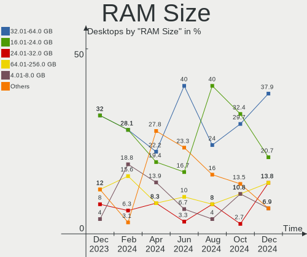
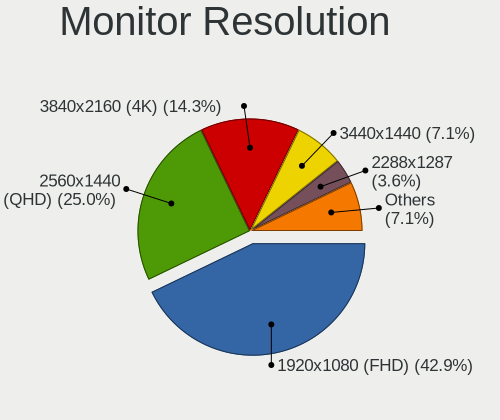
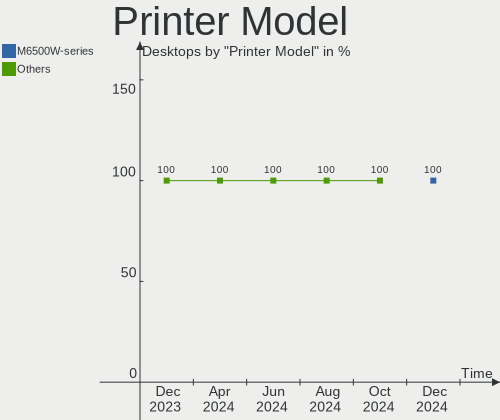
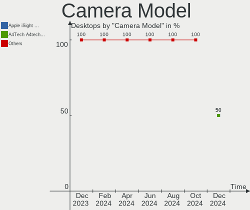

KDE neon - Hardware Trends (Desktops)
-------------------------------------

A project to identify most popular hardware characteristics and track their change
over time based on data collected by Linux users at https://Linux-Hardware.org.

Anyone can contribute to this report by the [hw-probe](https://github.com/linuxhw/hw-probe) tool:

    sudo -E hw-probe -all -upload

This report is for one last month. Overall report since the beginning of time: [TestDays](https://github.com/linuxhw/TestDays)

Period: Apr, 2024.

Contents
--------

* [ System ](#system)
  - [ OS                       ](#os)
  - [ OS Family                ](#os-family)
  - [ Kernel                   ](#kernel)
  - [ Kernel Family            ](#kernel-family)
  - [ Kernel Major Ver.        ](#kernel-major-ver)
  - [ Arch                     ](#arch)
  - [ DE                       ](#de)
  - [ Display Server           ](#display-server)
  - [ Display Manager          ](#display-manager)
  - [ OS Lang                  ](#os-lang)
  - [ Boot Mode                ](#boot-mode)
  - [ Filesystem               ](#filesystem)
  - [ Part. scheme             ](#part-scheme)
  - [ Dual Boot with Linux/BSD ](#dual-boot-with-linuxbsd)
  - [ Dual Boot (Win)          ](#dual-boot-win)

* [ Board ](#board)
  - [ Vendor                   ](#vendor)
  - [ Model                    ](#model)
  - [ Model Family             ](#model-family)
  - [ MFG Year                 ](#mfg-year)
  - [ Form Factor              ](#form-factor)
  - [ Secure Boot              ](#secure-boot)
  - [ Coreboot                 ](#coreboot)
  - [ RAM Size                 ](#ram-size)
  - [ RAM Used                 ](#ram-used)
  - [ Total Drives             ](#total-drives)
  - [ Has CD-ROM               ](#has-cd-rom)
  - [ Has Ethernet             ](#has-ethernet)
  - [ Has WiFi                 ](#has-wifi)
  - [ Has Bluetooth            ](#has-bluetooth)

* [ Location ](#location)
  - [ Country                  ](#country)
  - [ City                     ](#city)

* [ Drives ](#drives)
  - [ Drive Vendor             ](#drive-vendor)
  - [ Drive Model              ](#drive-model)
  - [ HDD Vendor               ](#hdd-vendor)
  - [ SSD Vendor               ](#ssd-vendor)
  - [ Drive Kind               ](#drive-kind)
  - [ Drive Connector          ](#drive-connector)
  - [ Drive Size               ](#drive-size)
  - [ Space Total              ](#space-total)
  - [ Space Used               ](#space-used)
  - [ Malfunc. Drives          ](#malfunc-drives)
  - [ Malfunc. Drive Vendor    ](#malfunc-drive-vendor)
  - [ Malfunc. HDD Vendor      ](#malfunc-hdd-vendor)
  - [ Malfunc. Drive Kind      ](#malfunc-drive-kind)
  - [ Failed Drives            ](#failed-drives)
  - [ Failed Drive Vendor      ](#failed-drive-vendor)
  - [ Drive Status             ](#drive-status)

* [ Storage controller ](#storage-controller)
  - [ Storage Vendor           ](#storage-vendor)
  - [ Storage Model            ](#storage-model)
  - [ Storage Kind             ](#storage-kind)

* [ Processor ](#processor)
  - [ CPU Vendor               ](#cpu-vendor)
  - [ CPU Model                ](#cpu-model)
  - [ CPU Model Family         ](#cpu-model-family)
  - [ CPU Cores                ](#cpu-cores)
  - [ CPU Sockets              ](#cpu-sockets)
  - [ CPU Threads              ](#cpu-threads)
  - [ CPU Op-Modes             ](#cpu-op-modes)
  - [ CPU Microcode            ](#cpu-microcode)
  - [ CPU Microarch            ](#cpu-microarch)

* [ Graphics ](#graphics)
  - [ GPU Vendor               ](#gpu-vendor)
  - [ GPU Model                ](#gpu-model)
  - [ GPU Combo                ](#gpu-combo)
  - [ GPU Driver               ](#gpu-driver)
  - [ GPU Memory               ](#gpu-memory)

* [ Monitor ](#monitor)
  - [ Monitor Vendor           ](#monitor-vendor)
  - [ Monitor Model            ](#monitor-model)
  - [ Monitor Resolution       ](#monitor-resolution)
  - [ Monitor Diagonal         ](#monitor-diagonal)
  - [ Monitor Width            ](#monitor-width)
  - [ Aspect Ratio             ](#aspect-ratio)
  - [ Monitor Area             ](#monitor-area)
  - [ Pixel Density            ](#pixel-density)
  - [ Multiple Monitors        ](#multiple-monitors)

* [ Network ](#network)
  - [ Net Controller Vendor    ](#net-controller-vendor)
  - [ Net Controller Model     ](#net-controller-model)
  - [ Wireless Vendor          ](#wireless-vendor)
  - [ Wireless Model           ](#wireless-model)
  - [ Ethernet Vendor          ](#ethernet-vendor)
  - [ Ethernet Model           ](#ethernet-model)
  - [ Net Controller Kind      ](#net-controller-kind)
  - [ Used Controller          ](#used-controller)
  - [ NICs                     ](#nics)
  - [ IPv6                     ](#ipv6)

* [ Bluetooth ](#bluetooth)
  - [ Bluetooth Vendor         ](#bluetooth-vendor)
  - [ Bluetooth Model          ](#bluetooth-model)

* [ Sound ](#sound)
  - [ Sound Vendor             ](#sound-vendor)
  - [ Sound Model              ](#sound-model)

* [ Memory ](#memory)
  - [ Memory Vendor            ](#memory-vendor)
  - [ Memory Model             ](#memory-model)
  - [ Memory Kind              ](#memory-kind)
  - [ Memory Form Factor       ](#memory-form-factor)
  - [ Memory Size              ](#memory-size)
  - [ Memory Speed             ](#memory-speed)

* [ Printers & scanners ](#printers--scanners)
  - [ Printer Vendor           ](#printer-vendor)
  - [ Printer Model            ](#printer-model)
  - [ Scanner Vendor           ](#scanner-vendor)
  - [ Scanner Model            ](#scanner-model)

* [ Camera ](#camera)
  - [ Camera Vendor            ](#camera-vendor)
  - [ Camera Model             ](#camera-model)

* [ Security ](#security)
  - [ Fingerprint Vendor       ](#fingerprint-vendor)
  - [ Fingerprint Model        ](#fingerprint-model)
  - [ Chipcard Vendor          ](#chipcard-vendor)
  - [ Chipcard Model           ](#chipcard-model)

* [ Unsupported ](#unsupported)
  - [ Unsupported Devices      ](#unsupported-devices)
  - [ Unsupported Device Types ](#unsupported-device-types)

System
------

OS
--

Installed operating systems

| Name           | Desktops | Percent |
|----------------|----------|---------|
| KDE neon 22.04 | 36       | 100%    |

OS Family
---------

OS without a version

| Name     | Desktops | Percent |
|----------|----------|---------|
| KDE neon | 36       | 100%    |

Kernel
------

Version of the Linux kernel

| Version           | Desktops | Percent |
|-------------------|----------|---------|
| 6.5.0-26-generic  | 13       | 36.11%  |
| 6.5.0-27-generic  | 12       | 33.33%  |
| 6.5.0-28-generic  | 7        | 19.44%  |
| 6.5.0-21-generic  | 1        | 2.78%   |
| 6.2.0-37-generic  | 1        | 2.78%   |
| 6.2.0-32-generic  | 1        | 2.78%   |
| 5.19.0-41-generic | 1        | 2.78%   |

Kernel Family
-------------

Linux kernel without a distro release

| Version | Desktops | Percent |
|---------|----------|---------|
| 6.5.0   | 33       | 91.67%  |
| 6.2.0   | 2        | 5.56%   |
| 5.19.0  | 1        | 2.78%   |

Kernel Major Ver.
-----------------

Linux kernel major version

| Version | Desktops | Percent |
|---------|----------|---------|
| 6.5     | 33       | 91.67%  |
| 6.2     | 2        | 5.56%   |
| 5.19    | 1        | 2.78%   |

Arch
----

OS architecture (x86_64, i586, etc.)

| Name   | Desktops | Percent |
|--------|----------|---------|
| x86_64 | 36       | 100%    |

DE
--

Desktop Environment

| Name | Desktops | Percent |
|------|----------|---------|
| KDE6 | 34       | 94.44%  |
| KDE5 | 1        | 2.78%   |
| KDE  | 1        | 2.78%   |

Display Server
--------------

X11 or Wayland

| Name    | Desktops | Percent |
|---------|----------|---------|
| Wayland | 27       | 75%     |
| X11     | 8        | 22.22%  |
| Tty     | 1        | 2.78%   |

Display Manager
---------------

SDDM, LightDM, etc.

| Name    | Desktops | Percent |
|---------|----------|---------|
| Unknown | 29       | 80.56%  |
| SDDM    | 7        | 19.44%  |

OS Lang
-------

Language

| Lang  | Desktops | Percent |
|-------|----------|---------|
| en_US | 14       | 38.89%  |
| en_GB | 4        | 11.11%  |
| de_DE | 3        | 8.33%   |
| pt_BR | 2        | 5.56%   |
| it_IT | 2        | 5.56%   |
| es_ES | 2        | 5.56%   |
| en_AU | 2        | 5.56%   |
| tr_TR | 1        | 2.78%   |
| sv_SE | 1        | 2.78%   |
| ru_RU | 1        | 2.78%   |
| nl_NL | 1        | 2.78%   |
| hu_HU | 1        | 2.78%   |
| fr_FR | 1        | 2.78%   |
| cs_CZ | 1        | 2.78%   |

Boot Mode
---------

EFI or BIOS

| Mode | Desktops | Percent |
|------|----------|---------|
| BIOS | 31       | 86.11%  |
| EFI  | 5        | 13.89%  |

Filesystem
----------

Type of filesystem

| Type  | Desktops | Percent |
|-------|----------|---------|
| Ext4  | 33       | 91.67%  |
| Tmpfs | 2        | 5.56%   |
| Btrfs | 1        | 2.78%   |

Part. scheme
------------

Scheme of partitioning

| Type    | Desktops | Percent |
|---------|----------|---------|
| Unknown | 29       | 80.56%  |
| GPT     | 7        | 19.44%  |

Dual Boot with Linux/BSD
------------------------

Hosting more than one Linux/BSD

| Dual boot | Desktops | Percent |
|-----------|----------|---------|
| No        | 35       | 97.22%  |
| Yes       | 1        | 2.78%   |

Dual Boot (Win)
---------------

Hosting Linux and Windows

| Dual boot | Desktops | Percent |
|-----------|----------|---------|
| No        | 32       | 88.89%  |
| Yes       | 4        | 11.11%  |

Board
-----

Vendor
------

Motherboard manufacturer

| Name                                 | Desktops | Percent |
|--------------------------------------|----------|---------|
| ASUSTek Computer                     | 15       | 41.67%  |
| MSI                                  | 6        | 16.67%  |
| Gigabyte Technology                  | 3        | 8.33%   |
| ASRock                               | 3        | 8.33%   |
| Pegatron                             | 2        | 5.56%   |
| Hewlett-Packard                      | 2        | 5.56%   |
| Dell                                 | 2        | 5.56%   |
| Shenzhen Meigao Electronic Equipment | 1        | 2.78%   |
| MAXSUN                               | 1        | 2.78%   |
| MACHINIST                            | 1        | 2.78%   |

Model
-----

Motherboard model

| Name                                          | Desktops | Percent |
|-----------------------------------------------|----------|---------|
| ASUS All Series                               | 2        | 5.56%   |
| Shenzhen Meigao Electronic Equipment UM560 XT | 1        | 2.78%   |
| Pegatron Pro 3010 Microtower PC               | 1        | 2.78%   |
| Pegatron KT482AA-ABG IQ508a                   | 1        | 2.78%   |
| MSI MS-7D78                                   | 1        | 2.78%   |
| MSI MS-7D25                                   | 1        | 2.78%   |
| MSI MS-7D15                                   | 1        | 2.78%   |
| MSI MS-7C75                                   | 1        | 2.78%   |
| MSI MS-7B86                                   | 1        | 2.78%   |
| MSI MS-7817                                   | 1        | 2.78%   |
| MAXSUN MS-Challenger B450M                    | 1        | 2.78%   |
| MACHINIST X99-MR9A PRO MAX V1.2               | 1        | 2.78%   |
| HP Pavilion Desktop 595-p0xxx                 | 1        | 2.78%   |
| HP Compaq dc7900 Ultra-Slim Desktop           | 1        | 2.78%   |
| Gigabyte Z87X-D3H                             | 1        | 2.78%   |
| Gigabyte Z390 DESIGNARE                       | 1        | 2.78%   |
| Gigabyte Z370 AORUS Gaming K3                 | 1        | 2.78%   |
| Dell OptiPlex 380                             | 1        | 2.78%   |
| Dell OptiPlex 3050                            | 1        | 2.78%   |
| ASUS Z170-DELUXE                              | 1        | 2.78%   |
| ASUS V-P8H67E                                 | 1        | 2.78%   |
| ASUS ROG STRIX B450-F GAMING                  | 1        | 2.78%   |
| ASUS ROG CROSSHAIR VII HERO                   | 1        | 2.78%   |
| ASUS PRIME X670-P                             | 1        | 2.78%   |
| ASUS PRIME B550M-K                            | 1        | 2.78%   |
| ASUS PRIME B250M-A                            | 1        | 2.78%   |
| ASUS P8Z77-V LK                               | 1        | 2.78%   |
| ASUS P7H55-M PRO                              | 1        | 2.78%   |
| ASUS P5Q SE2                                  | 1        | 2.78%   |
| ASUS M5A97 EVO R2.0                           | 1        | 2.78%   |
| ASUS K30BF_M32BF_A_F_K31BF                    | 1        | 2.78%   |
| ASUS H170M-PLUS                               | 1        | 2.78%   |
| ASRock Z87 Extreme6                           | 1        | 2.78%   |
| ASRock H87 Performance                        | 1        | 2.78%   |
| ASRock B550M-HDV                              | 1        | 2.78%   |

Model Family
------------

Motherboard model prefix

| Name                                       | Desktops | Percent |
|--------------------------------------------|----------|---------|
| ASUS PRIME                                 | 3        | 8.33%   |
| Dell OptiPlex                              | 2        | 5.56%   |
| ASUS ROG                                   | 2        | 5.56%   |
| ASUS All                                   | 2        | 5.56%   |
| Shenzhen Meigao Electronic Equipment UM560 | 1        | 2.78%   |
| Pegatron Pro                               | 1        | 2.78%   |
| Pegatron KT482AA-ABG                       | 1        | 2.78%   |
| MSI MS-7D78                                | 1        | 2.78%   |
| MSI MS-7D25                                | 1        | 2.78%   |
| MSI MS-7D15                                | 1        | 2.78%   |
| MSI MS-7C75                                | 1        | 2.78%   |
| MSI MS-7B86                                | 1        | 2.78%   |
| MSI MS-7817                                | 1        | 2.78%   |
| MAXSUN MS-Challenger                       | 1        | 2.78%   |
| MACHINIST X99-MR9A                         | 1        | 2.78%   |
| HP Pavilion                                | 1        | 2.78%   |
| HP Compaq                                  | 1        | 2.78%   |
| Gigabyte Z87X-D3H                          | 1        | 2.78%   |
| Gigabyte Z390                              | 1        | 2.78%   |
| Gigabyte Z370                              | 1        | 2.78%   |
| ASUS Z170-DELUXE                           | 1        | 2.78%   |
| ASUS V-P8H67E                              | 1        | 2.78%   |
| ASUS P8Z77-V                               | 1        | 2.78%   |
| ASUS P7H55-M                               | 1        | 2.78%   |
| ASUS P5Q                                   | 1        | 2.78%   |
| ASUS M5A97                                 | 1        | 2.78%   |
| ASUS K30BF                                 | 1        | 2.78%   |
| ASUS H170M-PLUS                            | 1        | 2.78%   |
| ASRock Z87                                 | 1        | 2.78%   |
| ASRock H87                                 | 1        | 2.78%   |
| ASRock B550M-HDV                           | 1        | 2.78%   |

MFG Year
--------

Motherboard manufacture year

| Year | Desktops | Percent |
|------|----------|---------|
| 2013 | 5        | 13.89%  |
| 2023 | 4        | 11.11%  |
| 2020 | 3        | 8.33%   |
| 2019 | 3        | 8.33%   |
| 2008 | 3        | 8.33%   |
| 2022 | 2        | 5.56%   |
| 2021 | 2        | 5.56%   |
| 2017 | 2        | 5.56%   |
| 2016 | 2        | 5.56%   |
| 2014 | 2        | 5.56%   |
| 2012 | 2        | 5.56%   |
| 2009 | 2        | 5.56%   |
| 2018 | 1        | 2.78%   |
| 2015 | 1        | 2.78%   |
| 2011 | 1        | 2.78%   |
| 2010 | 1        | 2.78%   |

Form Factor
-----------

Physical design of the computer

| Name    | Desktops | Percent |
|---------|----------|---------|
| Desktop | 36       | 100%    |

Secure Boot
-----------

Enabled or disabled

| State    | Desktops | Percent |
|----------|----------|---------|
| Disabled | 35       | 97.22%  |
| Enabled  | 1        | 2.78%   |

Coreboot
--------

Have coreboot on board

| Used | Desktops | Percent |
|------|----------|---------|
| No   | 36       | 100%    |

RAM Size
--------

Total RAM memory

| Size in GB  | Desktops | Percent |
|-------------|----------|---------|
| 32.01-64.0  | 8        | 22.22%  |
| 8.01-16.0   | 8        | 22.22%  |
| 16.01-24.0  | 7        | 19.44%  |
| 4.01-8.0    | 5        | 13.89%  |
| 24.01-32.0  | 3        | 8.33%   |
| 64.01-256.0 | 3        | 8.33%   |
| 3.01-4.0    | 2        | 5.56%   |

RAM Used
--------

Used RAM memory

| Used GB   | Desktops | Percent |
|-----------|----------|---------|
| 3.01-4.0  | 11       | 30.56%  |
| 4.01-8.0  | 9        | 25%     |
| 1.01-2.0  | 9        | 25%     |
| 2.01-3.0  | 6        | 16.67%  |
| 8.01-16.0 | 1        | 2.78%   |

Total Drives
------------

Number of drives on board

| Drives | Desktops | Percent |
|--------|----------|---------|
| 2      | 9        | 25%     |
| 1      | 9        | 25%     |
| 3      | 8        | 22.22%  |
| 4      | 7        | 19.44%  |
| 9      | 1        | 2.78%   |
| 6      | 1        | 2.78%   |
| 5      | 1        | 2.78%   |

Has CD-ROM
----------

Has CD-ROM on board

| Presented | Desktops | Percent |
|-----------|----------|---------|
| No        | 19       | 52.78%  |
| Yes       | 17       | 47.22%  |

Has Ethernet
------------

Has Ethernet on board

| Presented | Desktops | Percent |
|-----------|----------|---------|
| Yes       | 36       | 100%    |

Has WiFi
--------

Has WiFi module

| Presented | Desktops | Percent |
|-----------|----------|---------|
| Yes       | 18       | 50%     |
| No        | 18       | 50%     |

Has Bluetooth
-------------

Has Bluetooth module

| Presented | Desktops | Percent |
|-----------|----------|---------|
| Yes       | 19       | 52.78%  |
| No        | 17       | 47.22%  |

Location
--------

Country
-------

Geographic location (country)

| Country     | Desktops | Percent |
|-------------|----------|---------|
| USA         | 6        | 16.67%  |
| Netherlands | 4        | 11.11%  |
| Germany     | 4        | 11.11%  |
| UK          | 3        | 8.33%   |
| Italy       | 3        | 8.33%   |
| Spain       | 2        | 5.56%   |
| Brazil      | 2        | 5.56%   |
| Australia   | 2        | 5.56%   |
| Turkey      | 1        | 2.78%   |
| Sweden      | 1        | 2.78%   |
| Russia      | 1        | 2.78%   |
| Portugal    | 1        | 2.78%   |
| Poland      | 1        | 2.78%   |
| Hungary     | 1        | 2.78%   |
| France      | 1        | 2.78%   |
| Czechia     | 1        | 2.78%   |
| Colombia    | 1        | 2.78%   |
| Argentina   | 1        | 2.78%   |

City
----

Geographic location (city)

| City           | Desktops | Percent |
|----------------|----------|---------|
| Amsterdam      | 2        | 5.56%   |
| Zaragoza       | 1        | 2.78%   |
| Yuma           | 1        | 2.78%   |
| Wichita        | 1        | 2.78%   |
| West Newton    | 1        | 2.78%   |
| Warsaw         | 1        | 2.78%   |
| Warrington     | 1        | 2.78%   |
| Sydney         | 1        | 2.78%   |
| Sundsvall      | 1        | 2.78%   |
| Salto          | 1        | 2.78%   |
| Rotterdam      | 1        | 2.78%   |
| Rho            | 1        | 2.78%   |
| Orcoyen        | 1        | 2.78%   |
| Moscow         | 1        | 2.78%   |
| Mersin         | 1        | 2.78%   |
| Melbourne      | 1        | 2.78%   |
| Lucca          | 1        | 2.78%   |
| Loehne         | 1        | 2.78%   |
| Lisbon         | 1        | 2.78%   |
| Lebanon        | 1        | 2.78%   |
| Jaromer        | 1        | 2.78%   |
| Herne          | 1        | 2.78%   |
| Hamminkeln     | 1        | 2.78%   |
| Grantham       | 1        | 2.78%   |
| Denver         | 1        | 2.78%   |
| Clacton-on-Sea | 1        | 2.78%   |
| Chicago        | 1        | 2.78%   |
| Cabuyaro       | 1        | 2.78%   |
| Buenos Aires   | 1        | 2.78%   |
| Budapest       | 1        | 2.78%   |
| Bologna        | 1        | 2.78%   |
| Berlin         | 1        | 2.78%   |
| Belo Horizonte | 1        | 2.78%   |
| Bastia         | 1        | 2.78%   |
| Assendelft     | 1        | 2.78%   |

Drives
------

Drive Vendor
------------

Hard drive vendors

| Vendor                       | Desktops | Drives | Percent |
|------------------------------|----------|--------|---------|
| WDC                          | 10       | 15     | 12.35%  |
| Samsung Electronics          | 10       | 14     | 12.35%  |
| Seagate                      | 9        | 15     | 11.11%  |
| SanDisk                      | 9        | 11     | 11.11%  |
| Crucial                      | 8        | 8      | 9.88%   |
| Kingston                     | 5        | 5      | 6.17%   |
| Toshiba                      | 3        | 4      | 3.7%    |
| Phison Electronics           | 3        | 3      | 3.7%    |
| Hitachi                      | 3        | 3      | 3.7%    |
| SK hynix                     | 2        | 2      | 2.47%   |
| Realtek Semiconductor        | 2        | 2      | 2.47%   |
| Intenso                      | 2        | 2      | 2.47%   |
| Silicon Motion               | 1        | 2      | 1.23%   |
| Shenzhen Longsys Electronics | 1        | 1      | 1.23%   |
| Netac                        | 1        | 1      | 1.23%   |
| Micron/Crucial Technology    | 1        | 1      | 1.23%   |
| Micron Technology            | 1        | 1      | 1.23%   |
| Maxtor                       | 1        | 1      | 1.23%   |
| KODAK                        | 1        | 1      | 1.23%   |
| KingSpec                     | 1        | 1      | 1.23%   |
| JMicron Technology           | 1        | 1      | 1.23%   |
| Intel                        | 1        | 1      | 1.23%   |
| Integral                     | 1        | 1      | 1.23%   |
| HGST                         | 1        | 1      | 1.23%   |
| Emtec                        | 1        | 1      | 1.23%   |
| China                        | 1        | 1      | 1.23%   |
| A-DATA Technology            | 1        | 1      | 1.23%   |

Drive Model
-----------

Hard drive models

| Model                                                 | Desktops | Percent |
|-------------------------------------------------------|----------|---------|
| SanDisk SSD PLUS 1000GB                               | 2        | 2.11%   |
| Samsung NVMe SSD Controller SM981/PM981/PM983 1TB     | 2        | 2.11%   |
| Samsung NVMe SSD Controller PM9A1/PM9A3/980PRO 1TB    | 2        | 2.11%   |
| Phison E12 NVMe Controller 2TB                        | 2        | 2.11%   |
| Kingston SV300S37A120G 120GB SSD                      | 2        | 2.11%   |
| Crucial CT500MX500SSD1 500GB                          | 2        | 2.11%   |
| WDC WD5001AALS-00L3B2 500GB                           | 1        | 1.05%   |
| WDC WD5000AZRX-00L4HB0 500GB                          | 1        | 1.05%   |
| WDC WD40EFRX-68N32N0 4TB                              | 1        | 1.05%   |
| WDC WD4003FZEX-00Z4SA0 4TB                            | 1        | 1.05%   |
| WDC WD30EZRX-00D8PB0 3TB                              | 1        | 1.05%   |
| WDC WD2500AAJS-00V4A0 250GB                           | 1        | 1.05%   |
| WDC WD181KRYZ-01AGBB0 18TB                            | 1        | 1.05%   |
| WDC WD121KRYZ-01W0RB0 12TB                            | 1        | 1.05%   |
| WDC WD10PURZ-85U8XY0 1TB                              | 1        | 1.05%   |
| WDC WD10JPCX-24UE4T0 1TB                              | 1        | 1.05%   |
| WDC WD10EZEX-60WN4A0 1TB                              | 1        | 1.05%   |
| WDC WD10EZEX-22BN5A0 1TB                              | 1        | 1.05%   |
| WDC WD10EZEX-00RKKA0 1TB                              | 1        | 1.05%   |
| Toshiba HDWD130 3TB                                   | 1        | 1.05%   |
| Toshiba HDWD120 2TB                                   | 1        | 1.05%   |
| Toshiba DT01ACA300 3TB                                | 1        | 1.05%   |
| SK hynix SKHynix_HFM256GD3HX015N 256GB                | 1        | 1.05%   |
| SK hynix BC501 NVMe Solid State Drive 512GB           | 1        | 1.05%   |
| Silicon Motion SM2263EN/SM2263XT SSD Controller 256GB | 1        | 1.05%   |
| Shenzhen Longsys Lexar SSD NM800PRO 1TB               | 1        | 1.05%   |
| Seagate ST9500420AS 500GB                             | 1        | 1.05%   |
| Seagate ST4000DM004-2CV104 4TB                        | 1        | 1.05%   |
| Seagate ST4000DM000-1F2168 4TB                        | 1        | 1.05%   |
| Seagate ST31000524AS 1TB                              | 1        | 1.05%   |
| Seagate ST3000DM001-1ER166 3TB                        | 1        | 1.05%   |
| Seagate ST2000DX001-1CM164 2TB                        | 1        | 1.05%   |
| Seagate ST2000DM008-2UB102 2TB                        | 1        | 1.05%   |
| Seagate ST2000DM008-2FR102 2TB                        | 1        | 1.05%   |
| Seagate ST18000NM000J-2TV103 18TB                     | 1        | 1.05%   |
| Seagate ST16000NM001G-2KK103 16TB                     | 1        | 1.05%   |
| Seagate ST1000DM003-1ER162 1TB                        | 1        | 1.05%   |
| Seagate ST1000DM003-1CH162 1TB                        | 1        | 1.05%   |
| Seagate ST10000VX0004-1ZE101 10TB                     | 1        | 1.05%   |
| Seagate ST10000VN0004-1ZD101 10TB                     | 1        | 1.05%   |

HDD Vendor
----------

Hard disk drive vendors

| Vendor              | Desktops | Drives | Percent |
|---------------------|----------|--------|---------|
| WDC                 | 10       | 15     | 34.48%  |
| Seagate             | 9        | 15     | 31.03%  |
| Toshiba             | 3        | 4      | 10.34%  |
| Hitachi             | 3        | 3      | 10.34%  |
| Samsung Electronics | 1        | 1      | 3.45%   |
| Maxtor              | 1        | 1      | 3.45%   |
| JMicron Technology  | 1        | 1      | 3.45%   |
| HGST                | 1        | 1      | 3.45%   |

SSD Vendor
----------

Solid state drive vendors

| Vendor              | Desktops | Drives | Percent |
|---------------------|----------|--------|---------|
| Crucial             | 7        | 7      | 21.88%  |
| Samsung Electronics | 6        | 7      | 18.75%  |
| SanDisk             | 5        | 5      | 15.63%  |
| Kingston            | 5        | 5      | 15.63%  |
| Netac               | 1        | 1      | 3.13%   |
| KODAK               | 1        | 1      | 3.13%   |
| KingSpec            | 1        | 1      | 3.13%   |
| Intenso             | 1        | 1      | 3.13%   |
| Intel               | 1        | 1      | 3.13%   |
| Integral            | 1        | 1      | 3.13%   |
| Emtec               | 1        | 1      | 3.13%   |
| China               | 1        | 1      | 3.13%   |
| A-DATA Technology   | 1        | 1      | 3.13%   |

Drive Kind
----------

HDD or SSD

| Kind    | Desktops | Drives | Percent |
|---------|----------|--------|---------|
| SSD     | 22       | 33     | 36.07%  |
| HDD     | 22       | 41     | 36.07%  |
| NVMe    | 16       | 25     | 26.23%  |
| Unknown | 1        | 1      | 1.64%   |

Drive Connector
---------------

SATA, SAS, NVMe, etc.

| Type | Desktops | Drives | Percent |
|------|----------|--------|---------|
| SATA | 32       | 73     | 64%     |
| NVMe | 16       | 25     | 32%     |
| SAS  | 2        | 2      | 4%      |

Drive Size
----------

Size of hard drive

| Size in TB | Desktops | Drives | Percent |
|------------|----------|--------|---------|
| 0.01-0.5   | 18       | 31     | 36.73%  |
| 0.51-1.0   | 17       | 22     | 34.69%  |
| 1.01-2.0   | 5        | 5      | 10.2%   |
| 2.01-3.0   | 4        | 5      | 8.16%   |
| 3.01-4.0   | 3        | 4      | 6.12%   |
| 10.01-20.0 | 1        | 5      | 2.04%   |
| 4.01-10.0  | 1        | 2      | 2.04%   |

Space Total
-----------

Amount of disk space available on the file system

| Size in GB     | Desktops | Percent |
|----------------|----------|---------|
| 501-1000       | 9        | 25%     |
| More than 3000 | 8        | 22.22%  |
| 101-250        | 6        | 16.67%  |
| 1001-2000      | 5        | 13.89%  |
| 251-500        | 4        | 11.11%  |
| 51-100         | 2        | 5.56%   |
| 21-50          | 1        | 2.78%   |
| 2001-3000      | 1        | 2.78%   |

Space Used
----------

Amount of used disk space

| Used GB        | Desktops | Percent |
|----------------|----------|---------|
| 1-20           | 10       | 27.78%  |
| 101-250        | 6        | 16.67%  |
| 51-100         | 5        | 13.89%  |
| More than 3000 | 3        | 8.33%   |
| 21-50          | 3        | 8.33%   |
| 2001-3000      | 3        | 8.33%   |
| 501-1000       | 3        | 8.33%   |
| 1001-2000      | 2        | 5.56%   |
| 251-500        | 1        | 2.78%   |

Malfunc. Drives
---------------

Drive models with a malfunction

| Model                      | Desktops | Drives | Percent |
|----------------------------|----------|--------|---------|
| Intel SSDSC2BB480G4T 480GB | 1        | 1      | 100%    |

Malfunc. Drive Vendor
---------------------

Vendors of faulty drives

| Vendor | Desktops | Drives | Percent |
|--------|----------|--------|---------|
| Intel  | 1        | 1      | 100%    |

Malfunc. HDD Vendor
-------------------

Vendors of faulty HDD drives

Zero info for selected period =(

Malfunc. Drive Kind
-------------------

Kinds of faulty drives

| Kind | Desktops | Drives | Percent |
|------|----------|--------|---------|
| SSD  | 1        | 1      | 100%    |

Failed Drives
-------------

Failed drive models

Zero info for selected period =(

Failed Drive Vendor
-------------------

Failed drive vendors

Zero info for selected period =(

Drive Status
------------

Number of failed and malfunc. drives

| Status   | Desktops | Drives | Percent |
|----------|----------|--------|---------|
| Detected | 31       | 87     | 83.78%  |
| Works    | 5        | 12     | 13.51%  |
| Malfunc  | 1        | 1      | 2.7%    |

Storage controller
------------------

Storage Vendor
--------------

Storage controller vendors

| Vendor                       | Desktops | Percent |
|------------------------------|----------|---------|
| Intel                        | 24       | 38.71%  |
| AMD                          | 12       | 19.35%  |
| SanDisk                      | 5        | 8.06%   |
| ASMedia Technology           | 4        | 6.45%   |
| Samsung Electronics          | 3        | 4.84%   |
| Phison Electronics           | 3        | 4.84%   |
| SK hynix                     | 2        | 3.23%   |
| Realtek Semiconductor        | 2        | 3.23%   |
| Micron/Crucial Technology    | 2        | 3.23%   |
| Silicon Motion               | 1        | 1.61%   |
| Shenzhen Longsys Electronics | 1        | 1.61%   |
| Micron Technology            | 1        | 1.61%   |
| Marvell Technology Group     | 1        | 1.61%   |
| JMicron Technology           | 1        | 1.61%   |

Storage Model
-------------

Storage controller models

| Model                                                                                   | Desktops | Percent |
|-----------------------------------------------------------------------------------------|----------|---------|
| Intel 8 Series/C220 Series Chipset Family 6-port SATA Controller 1 [AHCI mode]          | 7        | 9.72%   |
| AMD FCH SATA Controller [AHCI mode]                                                     | 4        | 5.56%   |
| AMD 400 Series Chipset SATA Controller                                                  | 4        | 5.56%   |
| Samsung NVMe SSD Controller PM9A1/PM9A3/980PRO                                          | 3        | 4.17%   |
| Intel SATA Controller [RAID mode]                                                       | 3        | 4.17%   |
| ASMedia ASM1061/ASM1062 Serial ATA Controller                                           | 3        | 4.17%   |
| SanDisk WD Black SN770 / PC SN740 256GB / PC SN560 (DRAM-less) NVMe SSD                 | 2        | 2.78%   |
| Samsung NVMe SSD Controller SM981/PM981/PM983                                           | 2        | 2.78%   |
| Phison E12 NVMe Controller                                                              | 2        | 2.78%   |
| Micron/Crucial P1 NVMe PCIe SSD[Frampton]                                               | 2        | 2.78%   |
| Intel Q170/Q150/B150/H170/H110/Z170/CM236 Chipset SATA Controller [AHCI Mode]           | 2        | 2.78%   |
| Intel 82801JI (ICH10 Family) SATA AHCI Controller                                       | 2        | 2.78%   |
| AMD 600 Series Chipset SATA Controller                                                  | 2        | 2.78%   |
| AMD 500 Series Chipset SATA Controller                                                  | 2        | 2.78%   |
| SK hynix Gold P31/BC711/PC711 NVMe Solid State Drive                                    | 1        | 1.39%   |
| SK hynix BC501 NVMe Solid State Drive                                                   | 1        | 1.39%   |
| Silicon Motion SM2263EN/SM2263XT (DRAM-less) NVMe SSD Controllers                       | 1        | 1.39%   |
| Shenzhen Longsys Lexar NM800 PRO NVME SSD                                               | 1        | 1.39%   |
| SanDisk WD Blue SN570 NVMe SSD 2TB                                                      | 1        | 1.39%   |
| SanDisk Ultra 3D / WD Blue SN570 NVMe SSD (DRAM-less)                                   | 1        | 1.39%   |
| SanDisk Ultra 3D / WD Blue SN550 NVMe SSD                                               | 1        | 1.39%   |
| SanDisk Extreme Pro / WD Black SN750 / PC SN730 / Red SN700 NVMe SSD                    | 1        | 1.39%   |
| Realtek RTS5765DL NVMe SSD Controller (DRAM-less)                                       | 1        | 1.39%   |
| Realtek RTS5762 NVMe SSD Controller                                                     | 1        | 1.39%   |
| Phison E8 PCIe3 x2 NVMe Controller                                                      | 1        | 1.39%   |
| Micron 2300 NVMe SSD [Santana]                                                          | 1        | 1.39%   |
| Marvell Group 88SE6101/6102 single-port PATA133 interface                               | 1        | 1.39%   |
| JMicron JMB368 IDE controller                                                           | 1        | 1.39%   |
| Intel NM10/ICH7 Family SATA Controller [IDE mode]                                       | 1        | 1.39%   |
| Intel Comet Lake SATA AHCI Controller                                                   | 1        | 1.39%   |
| Intel Alder Lake-S PCH SATA Controller [AHCI Mode]                                      | 1        | 1.39%   |
| Intel 82801JD/DO (ICH10 Family) 4-port SATA IDE Controller                              | 1        | 1.39%   |
| Intel 82801JD/DO (ICH10 Family) 2-port SATA IDE Controller                              | 1        | 1.39%   |
| Intel 82801HM/HEM (ICH8M/ICH8M-E) SATA Controller [AHCI mode]                           | 1        | 1.39%   |
| Intel 82801HM/HEM (ICH8M/ICH8M-E) IDE Controller                                        | 1        | 1.39%   |
| Intel 82801G (ICH7 Family) IDE Controller                                               | 1        | 1.39%   |
| Intel 7 Series/C210 Series Chipset Family 6-port SATA Controller [AHCI mode]            | 1        | 1.39%   |
| Intel 6 Series/C200 Series Chipset Family Desktop SATA Controller (IDE mode, ports 4-5) | 1        | 1.39%   |
| Intel 6 Series/C200 Series Chipset Family Desktop SATA Controller (IDE mode, ports 0-3) | 1        | 1.39%   |
| Intel 500 Series Chipset Family SATA AHCI Controller                                    | 1        | 1.39%   |

Storage Kind
------------

Kind of storage controller (IDE, SATA, NVMe, SAS, ...)

| Kind | Desktops | Percent |
|------|----------|---------|
| SATA | 30       | 54.55%  |
| NVMe | 16       | 29.09%  |
| IDE  | 6        | 10.91%  |
| RAID | 3        | 5.45%   |

Processor
---------

CPU Vendor
----------

Processor vendors

| Vendor | Desktops | Percent |
|--------|----------|---------|
| Intel  | 24       | 66.67%  |
| AMD    | 12       | 33.33%  |

CPU Model
---------

Processor models

| Model                                       | Desktops | Percent |
|---------------------------------------------|----------|---------|
| AMD Ryzen 5 5600G with Radeon Graphics      | 2        | 5.56%   |
| Intel Xeon CPU E5-2680 v4 @ 2.40GHz         | 1        | 2.78%   |
| Intel Pentium Dual-Core CPU E5400 @ 2.70GHz | 1        | 2.78%   |
| Intel Pentium Dual-Core CPU E5200 @ 2.50GHz | 1        | 2.78%   |
| Intel Core i9-9900K CPU @ 3.60GHz           | 1        | 2.78%   |
| Intel Core i9-10850K CPU @ 3.60GHz          | 1        | 2.78%   |
| Intel Core i7-8086K CPU @ 4.00GHz           | 1        | 2.78%   |
| Intel Core i7-6700K CPU @ 4.00GHz           | 1        | 2.78%   |
| Intel Core i7-4790 CPU @ 3.60GHz            | 1        | 2.78%   |
| Intel Core i7-4771 CPU @ 3.50GHz            | 1        | 2.78%   |
| Intel Core i7-4770K CPU @ 3.50GHz           | 1        | 2.78%   |
| Intel Core i7-3770 CPU @ 3.40GHz            | 1        | 2.78%   |
| Intel Core i7-2600 CPU @ 3.40GHz            | 1        | 2.78%   |
| Intel Core i5-7500T CPU @ 2.70GHz           | 1        | 2.78%   |
| Intel Core i5-7500 CPU @ 3.40GHz            | 1        | 2.78%   |
| Intel Core i5-4670K CPU @ 3.40GHz           | 1        | 2.78%   |
| Intel Core i5-4590 CPU @ 3.30GHz            | 1        | 2.78%   |
| Intel Core i5-4460 CPU @ 3.20GHz            | 1        | 2.78%   |
| Intel Core i3-6100 CPU @ 3.70GHz            | 1        | 2.78%   |
| Intel Core i3 CPU 540 @ 3.07GHz             | 1        | 2.78%   |
| Intel Core 2 Quad CPU Q8300 @ 2.50GHz       | 1        | 2.78%   |
| Intel Core 2 Duo CPU T5850 @ 2.16GHz        | 1        | 2.78%   |
| Intel Core 2 Duo CPU E7500 @ 2.93GHz        | 1        | 2.78%   |
| Intel 12th Gen Core i5-12600K               | 1        | 2.78%   |
| Intel 11th Gen Core i7-11700KF @ 3.60GHz    | 1        | 2.78%   |
| AMD Ryzen 9 5950X 16-Core Processor         | 1        | 2.78%   |
| AMD Ryzen 7 7700X 8-Core Processor          | 1        | 2.78%   |
| AMD Ryzen 7 3800XT 8-Core Processor         | 1        | 2.78%   |
| AMD Ryzen 5 7600X 6-Core Processor          | 1        | 2.78%   |
| AMD Ryzen 5 5600H with Radeon Graphics      | 1        | 2.78%   |
| AMD Ryzen 5 3600 6-Core Processor           | 1        | 2.78%   |
| AMD Ryzen 5 3500X 6-Core Processor          | 1        | 2.78%   |
| AMD Ryzen 5 2600 Six-Core Processor         | 1        | 2.78%   |
| AMD FX-8320 Eight-Core Processor            | 1        | 2.78%   |
| AMD A10-6700 APU with Radeon HD Graphics    | 1        | 2.78%   |

CPU Model Family
----------------

Processor model prefix

| Model                   | Desktops | Percent |
|-------------------------|----------|---------|
| Intel Core i7           | 7        | 19.44%  |
| AMD Ryzen 5             | 7        | 19.44%  |
| Intel Core i5           | 5        | 13.89%  |
| Other                   | 2        | 5.56%   |
| Intel Pentium Dual-Core | 2        | 5.56%   |
| Intel Core i9           | 2        | 5.56%   |
| Intel Core i3           | 2        | 5.56%   |
| Intel Core 2 Duo        | 2        | 5.56%   |
| AMD Ryzen 7             | 2        | 5.56%   |
| Intel Xeon              | 1        | 2.78%   |
| Intel Core 2 Quad       | 1        | 2.78%   |
| AMD Ryzen 9             | 1        | 2.78%   |
| AMD FX                  | 1        | 2.78%   |
| AMD A10                 | 1        | 2.78%   |

CPU Cores
---------

Number of processor cores

| Number | Desktops | Percent |
|--------|----------|---------|
| 4      | 13       | 36.11%  |
| 6      | 8        | 22.22%  |
| 2      | 7        | 19.44%  |
| 8      | 4        | 11.11%  |
| 10     | 2        | 5.56%   |
| 16     | 1        | 2.78%   |
| 14     | 1        | 2.78%   |

CPU Sockets
-----------

Number of sockets

| Number | Desktops | Percent |
|--------|----------|---------|
| 1      | 36       | 100%    |

CPU Threads
-----------

Threads per core (Hyper-Threading)

| Number | Desktops | Percent |
|--------|----------|---------|
| 2      | 25       | 69.44%  |
| 1      | 11       | 30.56%  |

CPU Op-Modes
------------

CPU Operation Modes (32-bit, 64-bit)

| Op mode        | Desktops | Percent |
|----------------|----------|---------|
| 32-bit, 64-bit | 36       | 100%    |

CPU Microcode
-------------

Microcode number

| Number     | Desktops | Percent |
|------------|----------|---------|
| Unknown    | 33       | 91.67%  |
| 0x0a601206 | 1        | 2.78%   |
| 0x0a50000d | 1        | 2.78%   |
| 0x08701021 | 1        | 2.78%   |

CPU Microarch
-------------

Microarchitecture

| Name        | Desktops | Percent |
|-------------|----------|---------|
| Haswell     | 6        | 16.67%  |
| Zen 3       | 4        | 11.11%  |
| Penryn      | 4        | 11.11%  |
| KabyLake    | 4        | 11.11%  |
| Unknown     | 4        | 11.11%  |
| Zen 2       | 3        | 8.33%   |
| Skylake     | 2        | 5.56%   |
| Piledriver  | 2        | 5.56%   |
| Zen+        | 1        | 2.78%   |
| Westmere    | 1        | 2.78%   |
| SandyBridge | 1        | 2.78%   |
| IvyBridge   | 1        | 2.78%   |
| Core        | 1        | 2.78%   |
| CometLake   | 1        | 2.78%   |
| Broadwell   | 1        | 2.78%   |

Graphics
--------

GPU Vendor
----------

Vendors of graphics cards

| Vendor | Desktops | Percent |
|--------|----------|---------|
| Nvidia | 17       | 42.5%   |
| AMD    | 16       | 40%     |
| Intel  | 7        | 17.5%   |

GPU Model
---------

Graphics card models

| Model                                                                       | Desktops | Percent |
|-----------------------------------------------------------------------------|----------|---------|
| Nvidia GP107 [GeForce GTX 1050 Ti]                                          | 3        | 7.32%   |
| Intel Xeon E3-1200 v3/4th Gen Core Processor Integrated Graphics Controller | 3        | 7.32%   |
| Nvidia GP104 [GeForce GTX 1070]                                             | 2        | 4.88%   |
| Nvidia GA106 [GeForce RTX 3060 Lite Hash Rate]                              | 2        | 4.88%   |
| Intel 4 Series Chipset Integrated Graphics Controller                       | 2        | 4.88%   |
| AMD RV710 [Radeon HD 4350/4550]                                             | 2        | 4.88%   |
| AMD Raphael                                                                 | 2        | 4.88%   |
| AMD Ellesmere [Radeon RX 470/480/570/570X/580/580X/590]                     | 2        | 4.88%   |
| AMD Cezanne [Radeon Vega Series / Radeon Vega Mobile Series]                | 2        | 4.88%   |
| Nvidia TU117 [GeForce GTX 1650]                                             | 1        | 2.44%   |
| Nvidia GP108 [GeForce GT 1030]                                              | 1        | 2.44%   |
| Nvidia GP107 [GeForce GTX 1050]                                             | 1        | 2.44%   |
| Nvidia GP106 [GeForce GTX 1060 6GB]                                         | 1        | 2.44%   |
| Nvidia GP106 [GeForce GTX 1060 3GB]                                         | 1        | 2.44%   |
| Nvidia GK208B [GeForce GT 710]                                              | 1        | 2.44%   |
| Nvidia GK104 [GeForce GTX 680]                                              | 1        | 2.44%   |
| Nvidia GA104 [GeForce RTX 3070 Lite Hash Rate]                              | 1        | 2.44%   |
| Nvidia GA102 [GeForce RTX 3090]                                             | 1        | 2.44%   |
| Nvidia G98M [GeForce 9300M GS]                                              | 1        | 2.44%   |
| Intel HD Graphics 630                                                       | 1        | 2.44%   |
| Intel AlderLake-S GT1                                                       | 1        | 2.44%   |
| AMD Richland [Radeon HD 8670D]                                              | 1        | 2.44%   |
| AMD Pitcairn PRO [Radeon HD 7850 / R7 265 / R9 270 1024SP]                  | 1        | 2.44%   |
| AMD Oland PRO [Radeon R7 240/340 / Radeon 520]                              | 1        | 2.44%   |
| AMD Navi 31 [Radeon RX 7900 XT/7900 XTX/7900M]                              | 1        | 2.44%   |
| AMD Navi 23 [Radeon RX 6600/6600 XT/6600M]                                  | 1        | 2.44%   |
| AMD Navi 21 [Radeon RX 6800/6800 XT / 6900 XT]                              | 1        | 2.44%   |
| AMD Navi 10 [Radeon RX 5600 OEM/5600 XT / 5700/5700 XT]                     | 1        | 2.44%   |
| AMD Lexa PRO [Radeon 540/540X/550/550X / RX 540X/550/550X]                  | 1        | 2.44%   |
| AMD Caicos [Radeon HD 6450/7450/8450 / R5 230 OEM]                          | 1        | 2.44%   |

GPU Combo
---------

Combinations of graphics cards

| Name         | Desktops | Percent |
|--------------|----------|---------|
| 1 x Nvidia   | 16       | 44.44%  |
| 1 x AMD      | 14       | 38.89%  |
| 1 x Intel    | 4        | 11.11%  |
| 2 x AMD      | 1        | 2.78%   |
| AMD + Nvidia | 1        | 2.78%   |

GPU Driver
----------

Free vs proprietary

| Driver      | Desktops | Percent |
|-------------|----------|---------|
| Free        | 27       | 75%     |
| Proprietary | 9        | 25%     |

GPU Memory
----------

Total video memory

| Size in GB | Desktops | Percent |
|------------|----------|---------|
| Unknown    | 25       | 69.44%  |
| 3.01-4.0   | 3        | 8.33%   |
| 0.01-0.5   | 2        | 5.56%   |
| 5.01-6.0   | 1        | 2.78%   |
| 2.01-3.0   | 1        | 2.78%   |
| 16.01-24.0 | 1        | 2.78%   |
| 1.01-2.0   | 1        | 2.78%   |
| 8.01-16.0  | 1        | 2.78%   |
| 0.51-1.0   | 1        | 2.78%   |

Monitor
-------

Monitor Vendor
--------------

Monitor vendors

| Vendor               | Desktops | Percent |
|----------------------|----------|---------|
| Acer                 | 7        | 16.28%  |
| Goldstar             | 5        | 11.63%  |
| Dell                 | 5        | 11.63%  |
| Samsung Electronics  | 4        | 9.3%    |
| Hewlett-Packard      | 3        | 6.98%   |
| Philips              | 2        | 4.65%   |
| Iiyama               | 2        | 4.65%   |
| AOC                  | 2        | 4.65%   |
| ViewSonic            | 1        | 2.33%   |
| Positivo             | 1        | 2.33%   |
| Panasonic            | 1        | 2.33%   |
| MSI                  | 1        | 2.33%   |
| Medion               | 1        | 2.33%   |
| IPS                  | 1        | 2.33%   |
| Idek Iiyama          | 1        | 2.33%   |
| GAOMON               | 1        | 2.33%   |
| Fujitsu Siemens      | 1        | 2.33%   |
| Denver               | 1        | 2.33%   |
| Compal               | 1        | 2.33%   |
| CCE                  | 1        | 2.33%   |
| Ancor Communications | 1        | 2.33%   |

Monitor Model
-------------

Monitor models

| Model                                                                 | Desktops | Percent |
|-----------------------------------------------------------------------|----------|---------|
| ViewSonic VX2452 Series VSCDE2E 1920x1080 521x293mm 23.5-inch         | 1        | 2.17%   |
| Samsung Electronics S24D330 SAM0D92 1920x1080 531x299mm 24.0-inch     | 1        | 2.17%   |
| Samsung Electronics LF27T35 SAM707F 1920x1080 598x337mm 27.0-inch     | 1        | 2.17%   |
| Samsung Electronics LCD Monitor SAM0902 1920x1080 890x500mm 40.2-inch | 1        | 2.17%   |
| Samsung Electronics LCD Monitor SAM07C0 1920x1080 700x390mm 31.5-inch | 1        | 2.17%   |
| Positivo EM3271QHD NON3270 2560x1440 597x336mm 27.0-inch              | 1        | 2.17%   |
| Philips TV PHL3234 1920x1080 640x360mm 28.9-inch                      | 1        | 2.17%   |
| Philips 246EL2SBH PHLC074 1920x1080 521x293mm 23.5-inch               | 1        | 2.17%   |
| Philips 220SW PHL086F 1680x1050 474x296mm 22.0-inch                   | 1        | 2.17%   |
| Panasonic TV MEIC329 1920x1080 698x392mm 31.5-inch                    | 1        | 2.17%   |
| MSI MP341CQ MSI30B2 3440x1440 797x334mm 34.0-inch                     | 1        | 2.17%   |
| Medion MEDION30058 MEDE2F1 1360x768 697x392mm 31.5-inch               | 1        | 2.17%   |
| IPS GF270C IPS2700 1920x1080 598x337mm 27.0-inch                      | 1        | 2.17%   |
| Iiyama PL2560H IVM613E 1920x1080 544x303mm 24.5-inch                  | 1        | 2.17%   |
| Iiyama PL2288H IVM5633 1920x1080 477x268mm 21.5-inch                  | 1        | 2.17%   |
| Idek Iiyama LCD Monitor PL2473H 1920x1080                             | 1        | 2.17%   |
| Hewlett-Packard w2007 HWP26A6 1680x1050 433x271mm 20.1-inch           | 1        | 2.17%   |
| Hewlett-Packard 27xw HWP3198 1920x1080 598x336mm 27.0-inch            | 1        | 2.17%   |
| Hewlett-Packard 22uh HWP324F 1920x1080 496x292mm 22.7-inch            | 1        | 2.17%   |
| Goldstar M227WD GSM56D4 1920x1080 476x268mm 21.5-inch                 | 1        | 2.17%   |
| Goldstar HDR 4K GSM7750 3840x2160 697x392mm 31.5-inch                 | 1        | 2.17%   |
| Goldstar HDR 4K GSM774F 3840x2160 697x392mm 31.5-inch                 | 1        | 2.17%   |
| Goldstar HDR 4K GSM7707 3840x2160 600x340mm 27.2-inch                 | 1        | 2.17%   |
| Goldstar FULL HD GSM5B55 1920x1080 480x270mm 21.7-inch                | 1        | 2.17%   |
| Goldstar 24GL600F GSM5B73 1920x1080 530x300mm 24.0-inch               | 1        | 2.17%   |
| Goldstar 23EA53 GSM59A8 1920x1080 510x290mm 23.1-inch                 | 1        | 2.17%   |
| GAOMON GAOMON156 PRO GAM1560 1920x1080 476x267mm 21.5-inch            | 1        | 2.17%   |
| Fujitsu Siemens SL22W-1 LED FUS07E1 1680x1050 474x296mm 22.0-inch     | 1        | 2.17%   |
| Denver 27C1R LHC2700 2560x1440 597x336mm 27.0-inch                    | 1        | 2.17%   |
| Dell U3223QE DEL427B 3840x2160 698x393mm 31.5-inch                    | 1        | 2.17%   |
| Dell U2723QE DEL4278 3840x2160 597x336mm 27.0-inch                    | 1        | 2.17%   |
| Dell P1911 DELA074 1440x900 408x255mm 18.9-inch                       | 1        | 2.17%   |
| Dell G2410 DEL404B 1920x1080 531x298mm 24.0-inch                      | 1        | 2.17%   |
| Dell E2723HN DELD14A 1920x1080 598x336mm 27.0-inch                    | 1        | 2.17%   |
| Compal TERRA 2255WPV WOR2255 1920x1080 478x269mm 21.6-inch            | 1        | 2.17%   |
| CCE LCD142 CCE0142 1024x768 285x214mm 14.0-inch                       | 1        | 2.17%   |
| AOC U34G3G3R3 AOCB306 3440x1440 797x334mm 34.0-inch                   | 1        | 2.17%   |
| AOC AG241QG4 AOC2410 2560x1440 527x396mm 26.0-inch                    | 1        | 2.17%   |
| Ancor Communications ASUS VE278 ACI27F6 1920x1080 598x336mm 27.0-inch | 1        | 2.17%   |
| Acer V246HL ACR0336 1920x1080 531x299mm 24.0-inch                     | 1        | 2.17%   |

Monitor Resolution
------------------

Monitor screen resolution

| Resolution         | Desktops | Percent |
|--------------------|----------|---------|
| 1920x1080 (FHD)    | 22       | 52.38%  |
| 3840x2160 (4K)     | 8        | 19.05%  |
| 1680x1050 (WSXGA+) | 3        | 7.14%   |
| 2560x1440 (QHD)    | 2        | 4.76%   |
| 1280x1024 (SXGA)   | 2        | 4.76%   |
| 3440x1440          | 1        | 2.38%   |
| 1440x900 (WXGA+)   | 1        | 2.38%   |
| 1366x768 (WXGA)    | 1        | 2.38%   |
| 1360x768           | 1        | 2.38%   |
| 1024x768 (XGA)     | 1        | 2.38%   |

Monitor Diagonal
----------------

Diagonal size in inches

| Inches  | Desktops | Percent |
|---------|----------|---------|
| 27      | 7        | 16.28%  |
| 24      | 6        | 13.95%  |
| 31      | 5        | 11.63%  |
| 21      | 5        | 11.63%  |
| 23      | 4        | 9.3%    |
| 22      | 3        | 6.98%   |
| 19      | 2        | 4.65%   |
| 54      | 1        | 2.33%   |
| 46      | 1        | 2.33%   |
| 40      | 1        | 2.33%   |
| 34      | 1        | 2.33%   |
| 28      | 1        | 2.33%   |
| 26      | 1        | 2.33%   |
| 20      | 1        | 2.33%   |
| 18      | 1        | 2.33%   |
| 17      | 1        | 2.33%   |
| 14      | 1        | 2.33%   |
| Unknown | 1        | 2.33%   |

Monitor Width
-------------

Physical width

| Width in mm | Desktops | Percent |
|-------------|----------|---------|
| 501-600     | 16       | 39.02%  |
| 401-500     | 10       | 24.39%  |
| 601-700     | 7        | 17.07%  |
| 1001-1500   | 2        | 4.88%   |
| 801-900     | 1        | 2.44%   |
| 701-800     | 1        | 2.44%   |
| 351-400     | 1        | 2.44%   |
| 301-350     | 1        | 2.44%   |
| 201-300     | 1        | 2.44%   |
| Unknown     | 1        | 2.44%   |

Aspect Ratio
------------

Proportional relationship between the width and the height

| Ratio   | Desktops | Percent |
|---------|----------|---------|
| 16/9    | 27       | 72.97%  |
| 16/10   | 4        | 10.81%  |
| 5/4     | 2        | 5.41%   |
| 4/3     | 2        | 5.41%   |
| 21/9    | 1        | 2.7%    |
| Unknown | 1        | 2.7%    |

Monitor Area
------------

Area in inch

| Area in inch | Desktops | Percent |
|----------------|----------|---------|
| 201-250        | 14       | 33.33%  |
| 301-350        | 8        | 19.05%  |
| 351-500        | 7        | 16.67%  |
| 151-200        | 5        | 11.9%   |
| 141-150        | 2        | 4.76%   |
| 501-1000       | 2        | 4.76%   |
| More than 1000 | 1        | 2.38%   |
| 251-300        | 1        | 2.38%   |
| 91-100         | 1        | 2.38%   |
| Unknown        | 1        | 2.38%   |

Pixel Density
-------------

Pixels per inch

| Density | Desktops | Percent |
|---------|----------|---------|
| 51-100  | 22       | 55%     |
| 101-120 | 9        | 22.5%   |
| 1-50    | 3        | 7.5%    |
| 121-160 | 3        | 7.5%    |
| 161-240 | 2        | 5%      |
| Unknown | 1        | 2.5%    |

Multiple Monitors
-----------------

Total monitors connected

| Total | Desktops | Percent |
|-------|----------|---------|
| 1     | 24       | 66.67%  |
| 2     | 10       | 27.78%  |
| 3     | 1        | 2.78%   |
| 0     | 1        | 2.78%   |

Network
-------

Net Controller Vendor
---------------------

Controller vendors

| Vendor                | Desktops | Percent |
|-----------------------|----------|---------|
| Realtek Semiconductor | 25       | 48.08%  |
| Intel                 | 14       | 26.92%  |
| TP-Link               | 2        | 3.85%   |
| Qualcomm Atheros      | 2        | 3.85%   |
| MediaTek              | 2        | 3.85%   |
| Broadcom              | 2        | 3.85%   |
| Z-Com                 | 1        | 1.92%   |
| Ralink                | 1        | 1.92%   |
| NetGear               | 1        | 1.92%   |
| Microsoft             | 1        | 1.92%   |
| Broadcom Limited      | 1        | 1.92%   |

Net Controller Model
--------------------

Controller models

| Model                                                                  | Desktops | Percent |
|------------------------------------------------------------------------|----------|---------|
| Realtek RTL8111/8168/8211/8411 PCI Express Gigabit Ethernet Controller | 19       | 30.65%  |
| Realtek RTL8125 2.5GbE Controller                                      | 4        | 6.45%   |
| Intel I211 Gigabit Network Connection                                  | 4        | 6.45%   |
| Intel Ethernet Connection I217-V                                       | 3        | 4.84%   |
| Intel Ethernet Connection (2) I219-V                                   | 3        | 4.84%   |
| TP-Link Archer T3U [Realtek RTL8812BU]                                 | 2        | 3.23%   |
| Intel Ethernet Controller I225-V                                       | 2        | 3.23%   |
| Z-Com XG-703A 802.11g Wireless Adapter [Intersil ISL3887]              | 1        | 1.61%   |
| Realtek RTL8822BE 802.11a/b/g/n/ac WiFi adapter                        | 1        | 1.61%   |
| Realtek RTL8821AE 802.11ac PCIe Wireless Network Adapter               | 1        | 1.61%   |
| Realtek RTL8812AE 802.11ac PCIe Wireless Network Adapter               | 1        | 1.61%   |
| Realtek RTL8191SU 802.11n WLAN Adapter                                 | 1        | 1.61%   |
| Realtek RTL8188CUS 802.11n WLAN Adapter                                | 1        | 1.61%   |
| Realtek RTL8153 Gigabit Ethernet Adapter                               | 1        | 1.61%   |
| Realtek RTL-8100/8101L/8139 PCI Fast Ethernet Adapter                  | 1        | 1.61%   |
| Ralink RT2790 Wireless 802.11n 1T/2R PCIe                              | 1        | 1.61%   |
| Qualcomm Atheros AR9462 Wireless Network Adapter                       | 1        | 1.61%   |
| Qualcomm Atheros AR9285 Wireless Network Adapter (PCI-Express)         | 1        | 1.61%   |
| NetGear A6100 AC600 DB Wireless Adapter [Realtek RTL8811AU]            | 1        | 1.61%   |
| Microsoft XBOX ACC                                                     | 1        | 1.61%   |
| MediaTek MT7922 802.11ax PCI Express Wireless Network Adapter          | 1        | 1.61%   |
| MediaTek MT7921K (RZ608) Wi-Fi 6E 80MHz                                | 1        | 1.61%   |
| Intel Wi-Fi 6 AX200                                                    | 1        | 1.61%   |
| Intel PRO/Wireless 4965 AG or AGN [Kedron] Network Connection          | 1        | 1.61%   |
| Intel Ethernet Connection (7) I219-V                                   | 1        | 1.61%   |
| Intel Ethernet Connection (10) I219-V                                  | 1        | 1.61%   |
| Intel Cannon Lake PCH CNVi WiFi                                        | 1        | 1.61%   |
| Intel Alder Lake-S PCH CNVi WiFi                                       | 1        | 1.61%   |
| Intel 82567LM-3 Gigabit Network Connection                             | 1        | 1.61%   |
| Broadcom Limited BCM4321 802.11a/b/g/n                                 | 1        | 1.61%   |
| Broadcom BCM4360 802.11ac Dual Band Wireless Network Adapter           | 1        | 1.61%   |
| Broadcom BCM4352 802.11ac Dual Band Wireless Network Adapter           | 1        | 1.61%   |

Wireless Vendor
---------------

Wireless vendors

| Vendor                | Desktops | Percent |
|-----------------------|----------|---------|
| Realtek Semiconductor | 5        | 22.73%  |
| Intel                 | 4        | 18.18%  |
| TP-Link               | 2        | 9.09%   |
| Qualcomm Atheros      | 2        | 9.09%   |
| MediaTek              | 2        | 9.09%   |
| Broadcom              | 2        | 9.09%   |
| Z-Com                 | 1        | 4.55%   |
| Ralink                | 1        | 4.55%   |
| NetGear               | 1        | 4.55%   |
| Microsoft             | 1        | 4.55%   |
| Broadcom Limited      | 1        | 4.55%   |

Wireless Model
--------------

Wireless models

| Model                                                          | Desktops | Percent |
|----------------------------------------------------------------|----------|---------|
| TP-Link Archer T3U [Realtek RTL8812BU]                         | 2        | 9.09%   |
| Z-Com XG-703A 802.11g Wireless Adapter [Intersil ISL3887]      | 1        | 4.55%   |
| Realtek RTL8822BE 802.11a/b/g/n/ac WiFi adapter                | 1        | 4.55%   |
| Realtek RTL8821AE 802.11ac PCIe Wireless Network Adapter       | 1        | 4.55%   |
| Realtek RTL8812AE 802.11ac PCIe Wireless Network Adapter       | 1        | 4.55%   |
| Realtek RTL8191SU 802.11n WLAN Adapter                         | 1        | 4.55%   |
| Realtek RTL8188CUS 802.11n WLAN Adapter                        | 1        | 4.55%   |
| Ralink RT2790 Wireless 802.11n 1T/2R PCIe                      | 1        | 4.55%   |
| Qualcomm Atheros AR9462 Wireless Network Adapter               | 1        | 4.55%   |
| Qualcomm Atheros AR9285 Wireless Network Adapter (PCI-Express) | 1        | 4.55%   |
| NetGear A6100 AC600 DB Wireless Adapter [Realtek RTL8811AU]    | 1        | 4.55%   |
| Microsoft XBOX ACC                                             | 1        | 4.55%   |
| MediaTek MT7922 802.11ax PCI Express Wireless Network Adapter  | 1        | 4.55%   |
| MediaTek MT7921K (RZ608) Wi-Fi 6E 80MHz                        | 1        | 4.55%   |
| Intel Wi-Fi 6 AX200                                            | 1        | 4.55%   |
| Intel PRO/Wireless 4965 AG or AGN [Kedron] Network Connection  | 1        | 4.55%   |
| Intel Cannon Lake PCH CNVi WiFi                                | 1        | 4.55%   |
| Intel Alder Lake-S PCH CNVi WiFi                               | 1        | 4.55%   |
| Broadcom Limited BCM4321 802.11a/b/g/n                         | 1        | 4.55%   |
| Broadcom BCM4360 802.11ac Dual Band Wireless Network Adapter   | 1        | 4.55%   |
| Broadcom BCM4352 802.11ac Dual Band Wireless Network Adapter   | 1        | 4.55%   |

Ethernet Vendor
---------------

Ethernet vendors

| Vendor                | Desktops | Percent |
|-----------------------|----------|---------|
| Realtek Semiconductor | 24       | 64.86%  |
| Intel                 | 13       | 35.14%  |

Ethernet Model
--------------

Ethernet models

| Model                                                                  | Desktops | Percent |
|------------------------------------------------------------------------|----------|---------|
| Realtek RTL8111/8168/8211/8411 PCI Express Gigabit Ethernet Controller | 19       | 47.5%   |
| Realtek RTL8125 2.5GbE Controller                                      | 4        | 10%     |
| Intel I211 Gigabit Network Connection                                  | 4        | 10%     |
| Intel Ethernet Connection I217-V                                       | 3        | 7.5%    |
| Intel Ethernet Connection (2) I219-V                                   | 3        | 7.5%    |
| Intel Ethernet Controller I225-V                                       | 2        | 5%      |
| Realtek RTL8153 Gigabit Ethernet Adapter                               | 1        | 2.5%    |
| Realtek RTL-8100/8101L/8139 PCI Fast Ethernet Adapter                  | 1        | 2.5%    |
| Intel Ethernet Connection (7) I219-V                                   | 1        | 2.5%    |
| Intel Ethernet Connection (10) I219-V                                  | 1        | 2.5%    |
| Intel 82567LM-3 Gigabit Network Connection                             | 1        | 2.5%    |

Net Controller Kind
-------------------

Ethernet, WiFi or modem

| Kind     | Desktops | Percent |
|----------|----------|---------|
| Ethernet | 36       | 66.67%  |
| WiFi     | 18       | 33.33%  |

Used Controller
---------------

Currently used network controller

| Kind     | Desktops | Percent |
|----------|----------|---------|
| Ethernet | 32       | 80%     |
| WiFi     | 8        | 20%     |

NICs
----

Total network controllers on board

| Total | Desktops | Percent |
|-------|----------|---------|
| 1     | 20       | 55.56%  |
| 2     | 15       | 41.67%  |
| 3     | 1        | 2.78%   |

IPv6
----

IPv6 vs IPv4

| Used | Desktops | Percent |
|------|----------|---------|
| No   | 27       | 75%     |
| Yes  | 9        | 25%     |

Bluetooth
---------

Bluetooth Vendor
----------------

Controller vendors

| Vendor                  | Desktops | Percent |
|-------------------------|----------|---------|
| Realtek Semiconductor   | 4        | 21.05%  |
| Intel                   | 3        | 15.79%  |
| Cambridge Silicon Radio | 3        | 15.79%  |
| ASUSTek Computer        | 3        | 15.79%  |
| MediaTek                | 2        | 10.53%  |
| TP-Link                 | 1        | 5.26%   |
| Lite-On Technology      | 1        | 5.26%   |
| IMC Networks            | 1        | 5.26%   |
| Hewlett-Packard         | 1        | 5.26%   |

Bluetooth Model
---------------

Controller models

| Model                                                 | Desktops | Percent |
|-------------------------------------------------------|----------|---------|
| Realtek Bluetooth Radio                               | 4        | 21.05%  |
| Cambridge Silicon Radio Bluetooth Dongle (HCI mode)   | 3        | 15.79%  |
| MediaTek Wireless_Device                              | 2        | 10.53%  |
| ASUS ASUS USB-BT500                                   | 2        | 10.53%  |
| TP-Link UB500 Adapter                                 | 1        | 5.26%   |
| Lite-On Bluetooth Device                              | 1        | 5.26%   |
| Intel Bluetooth 9460/9560 Jefferson Peak (JfP)        | 1        | 5.26%   |
| Intel AX211 Bluetooth                                 | 1        | 5.26%   |
| Intel AX200 Bluetooth                                 | 1        | 5.26%   |
| IMC Networks Bluetooth Radio                          | 1        | 5.26%   |
| HP Bluetooth 2.0 Interface [Broadcom BCM2045]         | 1        | 5.26%   |
| ASUS Broadcom BCM20702 Single-Chip Bluetooth 4.0 + LE | 1        | 5.26%   |

Sound
-----

Sound Vendor
------------

Sound card vendors

| Vendor              | Desktops | Percent |
|---------------------|----------|---------|
| Intel               | 24       | 36.36%  |
| AMD                 | 18       | 27.27%  |
| Nvidia              | 16       | 24.24%  |
| C-Media Electronics | 4        | 6.06%   |
| TX                  | 1        | 1.52%   |
| Texas Instruments   | 1        | 1.52%   |
| Roland              | 1        | 1.52%   |
| Razer USA           | 1        | 1.52%   |

Sound Model
-----------

Sound card models

| Model                                                                      | Desktops | Percent |
|----------------------------------------------------------------------------|----------|---------|
| Intel 8 Series/C220 Series Chipset High Definition Audio Controller        | 7        | 8.75%   |
| AMD Family 17h/19h HD Audio Controller                                     | 5        | 6.25%   |
| Nvidia GP107GL High Definition Audio Controller                            | 4        | 5%      |
| Intel 200 Series PCH HD Audio                                              | 3        | 3.75%   |
| C-Media Electronics USB Audio Device                                       | 3        | 3.75%   |
| AMD Starship/Matisse HD Audio Controller                                   | 3        | 3.75%   |
| AMD Renoir Radeon High Definition Audio Controller                         | 3        | 3.75%   |
| Nvidia GP106 High Definition Audio Controller                              | 2        | 2.5%    |
| Nvidia GP104 High Definition Audio Controller                              | 2        | 2.5%    |
| Nvidia GA106 High Definition Audio Controller                              | 2        | 2.5%    |
| Intel Xeon E3-1200 v3/4th Gen Core Processor HD Audio Controller           | 2        | 2.5%    |
| Intel 82801JI (ICH10 Family) HD Audio Controller                           | 2        | 2.5%    |
| Intel 100 Series/C230 Series Chipset Family HD Audio Controller            | 2        | 2.5%    |
| AMD RV710/730 HDMI Audio [Radeon HD 4000 series]                           | 2        | 2.5%    |
| AMD Rembrandt Radeon High Definition Audio Controller                      | 2        | 2.5%    |
| AMD Oland/Hainan/Cape Verde/Pitcairn HDMI Audio [Radeon HD 7000 Series]    | 2        | 2.5%    |
| AMD Navi 21/23 HDMI/DP Audio Controller                                    | 2        | 2.5%    |
| AMD Ellesmere HDMI Audio [Radeon RX 470/480 / 570/580/590]                 | 2        | 2.5%    |
| TX USB Audio                                                               | 1        | 1.25%   |
| Texas Instruments PCM2902 Audio Codec                                      | 1        | 1.25%   |
| Roland QUAD-CAPTURE                                                        | 1        | 1.25%   |
| Roland Digital Piano                                                       | 1        | 1.25%   |
| Razer USA RZ04-0318 Gaming Headset [Kraken Ultimate]                       | 1        | 1.25%   |
| Nvidia TU107 GeForce GTX 1650 High Definition Audio Controller             | 1        | 1.25%   |
| Nvidia GP108 High Definition Audio Controller                              | 1        | 1.25%   |
| Nvidia GK208 HDMI/DP Audio Controller                                      | 1        | 1.25%   |
| Nvidia GK104 HDMI Audio Controller                                         | 1        | 1.25%   |
| Nvidia GA104 High Definition Audio Controller                              | 1        | 1.25%   |
| Nvidia GA102 High Definition Audio Controller                              | 1        | 1.25%   |
| Intel Tiger Lake-H HD Audio Controller                                     | 1        | 1.25%   |
| Intel NM10/ICH7 Family High Definition Audio Controller                    | 1        | 1.25%   |
| Intel Comet Lake PCH cAVS                                                  | 1        | 1.25%   |
| Intel Cannon Lake PCH cAVS                                                 | 1        | 1.25%   |
| Intel Alder Lake-S HD Audio Controller                                     | 1        | 1.25%   |
| Intel 82801JD/DO (ICH10 Family) HD Audio Controller                        | 1        | 1.25%   |
| Intel 82801H (ICH8 Family) HD Audio Controller                             | 1        | 1.25%   |
| Intel 7 Series/C216 Chipset Family High Definition Audio Controller        | 1        | 1.25%   |
| Intel 6 Series/C200 Series Chipset Family High Definition Audio Controller | 1        | 1.25%   |
| Intel 5 Series/3400 Series Chipset High Definition Audio                   | 1        | 1.25%   |
| C-Media Electronics Blue Snowball                                          | 1        | 1.25%   |

Memory
------

Memory Vendor
-------------

Memory module vendors

| Vendor    | Desktops | Percent |
|-----------|----------|---------|
| Kingston  | 3        | 42.86%  |
| Unknown   | 1        | 14.29%  |
| Crucial   | 1        | 14.29%  |
| Corsair   | 1        | 14.29%  |
| Atermiter | 1        | 14.29%  |

Memory Model
------------

Memory module models

| Model                                                  | Desktops | Percent |
|--------------------------------------------------------|----------|---------|
| Unknown RAM Module 2GB DIMM DDR2 800MT/s               | 1        | 12.5%   |
| Kingston RAM KHX3200C16D4/8GX 8GB DIMM DDR4 3733MT/s   | 1        | 12.5%   |
| Kingston RAM KHX1600C9D3/4GX 4GB DIMM DDR3 1600MT/s    | 1        | 12.5%   |
| Kingston RAM KHX1600C10D3/8GX 8GB DIMM DDR3 1600MT/s   | 1        | 12.5%   |
| Kingston RAM 9905402-544.A00LF 4GB DIMM DDR3 1333MT/s  | 1        | 12.5%   |
| Crucial RAM CT102464BA160B.C16 8GB DIMM DDR3 1600MT/s  | 1        | 12.5%   |
| Corsair RAM CMK64GX5M2B5200C40 32GB DIMM DDR5 5200MT/s | 1        | 12.5%   |
| Atermiter RAM Module 8GB DIMM DDR4 3200MT/s            | 1        | 12.5%   |

Memory Kind
-----------

Memory module kinds

| Kind | Desktops | Percent |
|------|----------|---------|
| DDR3 | 3        | 42.86%  |
| DDR4 | 2        | 28.57%  |
| DDR5 | 1        | 14.29%  |
| DDR2 | 1        | 14.29%  |

Memory Form Factor
------------------

Physical design of the memory module

| Name | Desktops | Percent |
|------|----------|---------|
| DIMM | 7        | 100%    |

Memory Size
-----------

Memory module size

| Size  | Desktops | Percent |
|-------|----------|---------|
| 8192  | 4        | 57.14%  |
| 32768 | 1        | 14.29%  |
| 4096  | 1        | 14.29%  |
| 2048  | 1        | 14.29%  |

Memory Speed
------------

Memory module speed

| Speed | Desktops | Percent |
|-------|----------|---------|
| 1600  | 2        | 25%     |
| 5200  | 1        | 12.5%   |
| 3733  | 1        | 12.5%   |
| 3200  | 1        | 12.5%   |
| 2400  | 1        | 12.5%   |
| 1333  | 1        | 12.5%   |
| 800   | 1        | 12.5%   |

Printers & scanners
-------------------

Printer Vendor
--------------

Printer device vendors

| Vendor          | Desktops | Percent |
|-----------------|----------|---------|
| Seiko Epson     | 1        | 50%     |
| Hewlett-Packard | 1        | 50%     |

Printer Model
-------------

Printer device models

| Model                      | Desktops | Percent |
|----------------------------|----------|---------|
| Seiko Epson WF-2870 Series | 1        | 50%     |
| HP Laser 107w              | 1        | 50%     |

Scanner Vendor
--------------

Scanner device vendors

Zero info for selected period =(

Scanner Model
-------------

Scanner device models

Zero info for selected period =(

Camera
------

Camera Vendor
-------------

Camera device vendors

| Vendor              | Desktops | Percent |
|---------------------|----------|---------|
| Logitech            | 2        | 33.33%  |
| MacroSilicon        | 1        | 16.67%  |
| Creative Technology | 1        | 16.67%  |
| Chicony Electronics | 1        | 16.67%  |
| ARC International   | 1        | 16.67%  |

Camera Model
------------

Camera device models

| Model                                      | Desktops | Percent |
|--------------------------------------------|----------|---------|
| MacroSilicon MiraBox Capture               | 1        | 16.67%  |
| Logitech Webcam C925e                      | 1        | 16.67%  |
| Logitech HD Webcam C615                    | 1        | 16.67%  |
| Creative Live! Cam Chat HD [VF0700/VF0790] | 1        | 16.67%  |
| Chicony CNF7042                            | 1        | 16.67%  |
| ARC International Camera                   | 1        | 16.67%  |

Security
--------

Fingerprint Vendor
------------------

Fingerprint sensor vendors

Zero info for selected period =(

Fingerprint Model
-----------------

Fingerprint sensor models

Zero info for selected period =(

Chipcard Vendor
---------------

Chipcard module vendors

Zero info for selected period =(

Chipcard Model
--------------

Chipcard module models

Zero info for selected period =(

Unsupported
-----------

Unsupported Devices
-------------------

Total unsupported devices on board

| Total | Desktops | Percent |
|-------|----------|---------|
| 0     | 31       | 86.11%  |
| 1     | 5        | 13.89%  |

Unsupported Device Types
------------------------

Types of unsupported devices

| Type                  | Desktops | Percent |
|-----------------------|----------|---------|
| Net/wireless          | 2        | 40%     |
| Multimedia controller | 2        | 40%     |
| Graphics card         | 1        | 20%     |

