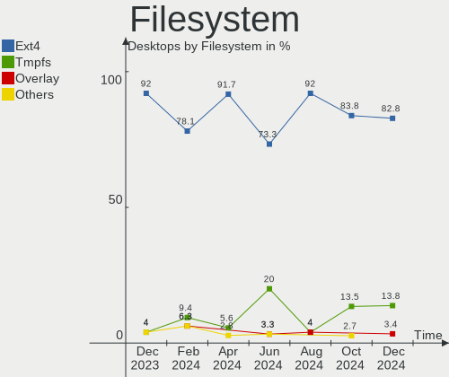
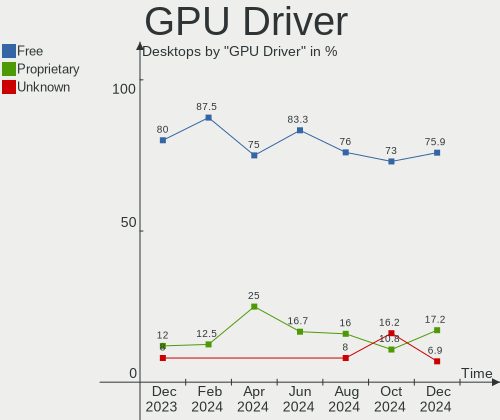
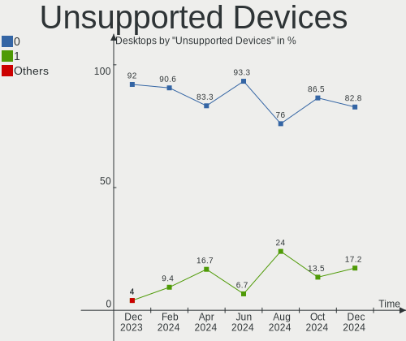

KDE neon Hardware Trends (Desktop)
----------------------------------

A project to identify most popular hardware characteristics and track their change
over time based on data collected by KDE neon users at https://Linux-Hardware.org.

Anyone can contribute to the study by uploading probes of their computers by
the [hw-probe](https://github.com/linuxhw/hw-probe) tool:

    sudo -E hw-probe -all -upload

Full-feature report is available here: https://linux-hardware.org/?view=trends&formfactor=desktop

Period: Feb, 2021.

Contents
--------

- [ OS                       ](#os)
- [ OS Family                ](#os-family)
- [ Kernel                   ](#kernel)
- [ Kernel Family            ](#kernel-family)
- [ Kernel Major Ver.        ](#kernel-major-ver)
- [ Arch                     ](#arch)
- [ DE                       ](#de)
- [ Display Server           ](#display-server)
- [ Display Manager          ](#display-manager)
- [ OS Lang                  ](#os-lang)
- [ Boot Mode                ](#boot-mode)
- [ Filesystem               ](#filesystem)
- [ Part. scheme             ](#part-scheme)
- [ Dual Boot with Linux/BSD ](#dual-boot-with-linux/bsd)
- [ Dual Boot (Win)          ](#dual-boot-win)
- [ Country                  ](#country)
- [ City                     ](#city)
- [ Vendor                   ](#vendor)
- [ Model                    ](#model)
- [ Model Family             ](#model-family)
- [ MFG Year                 ](#mfg-year)
- [ Form Factor              ](#form-factor)
- [ Secure Boot              ](#secure-boot)
- [ Coreboot                 ](#coreboot)
- [ RAM Size                 ](#ram-size)
- [ RAM Used                 ](#ram-used)
- [ Has CD-ROM               ](#has-cd-rom)
- [ Total Drives             ](#total-drives)
- [ Has Ethernet             ](#has-ethernet)
- [ Drive Vendor             ](#drive-vendor)
- [ Drive Model              ](#drive-model)
- [ HDD Vendor               ](#hdd-vendor)
- [ SSD Vendor               ](#ssd-vendor)
- [ Drive Kind               ](#drive-kind)
- [ Drive Connector          ](#drive-connector)
- [ Drive Size               ](#drive-size)
- [ Space Total              ](#space-total)
- [ Space Used               ](#space-used)
- [ Malfunc. Drives          ](#malfunc-drives)
- [ Malfunc. Drive Vendor    ](#malfunc-drive-vendor)
- [ Malfunc. HDD Vendor      ](#malfunc-hdd-vendor)
- [ Malfunc. Drive Kind      ](#malfunc-drive-kind)
- [ Failed Drives            ](#failed-drives)
- [ Failed Drive Vendor      ](#failed-drive-vendor)
- [ Drive Status             ](#drive-status)
- [ Storage Vendor           ](#storage-vendor)
- [ Storage Model            ](#storage-model)
- [ Storage Kind             ](#storage-kind)
- [ CPU Vendor               ](#cpu-vendor)
- [ CPU Model                ](#cpu-model)
- [ CPU Model Family         ](#cpu-model-family)
- [ CPU Cores                ](#cpu-cores)
- [ CPU Sockets              ](#cpu-sockets)
- [ CPU Threads              ](#cpu-threads)
- [ CPU Op-Modes             ](#cpu-op-modes)
- [ CPU Microcode            ](#cpu-microcode)
- [ CPU Microarch            ](#cpu-microarch)
- [ GPU Vendor               ](#gpu-vendor)
- [ GPU Model                ](#gpu-model)
- [ GPU Combo                ](#gpu-combo)
- [ GPU Driver               ](#gpu-driver)
- [ GPU Memory               ](#gpu-memory)
- [ Monitor Vendor           ](#monitor-vendor)
- [ Monitor Model            ](#monitor-model)
- [ Monitor Resolution       ](#monitor-resolution)
- [ Monitor Diagonal         ](#monitor-diagonal)
- [ Monitor Width            ](#monitor-width)
- [ Aspect Ratio             ](#aspect-ratio)
- [ Monitor Area             ](#monitor-area)
- [ Pixel Density            ](#pixel-density)
- [ Multiple Monitors        ](#multiple-monitors)
- [ Net Controller Vendor    ](#net-controller-vendor)
- [ Net Controller Model     ](#net-controller-model)
- [ Wireless Vendor          ](#wireless-vendor)
- [ Wireless Model           ](#wireless-model)
- [ Ethernet Vendor          ](#ethernet-vendor)
- [ Ethernet Model           ](#ethernet-model)
- [ Net Controller Kind      ](#net-controller-kind)
- [ Used Controller          ](#used-controller)
- [ NICs                     ](#nics)
- [ Memory Vendor            ](#memory-vendor)
- [ Memory Model             ](#memory-model)
- [ Memory Kind              ](#memory-kind)
- [ Memory Form Factor       ](#memory-form-factor)
- [ Memory Size              ](#memory-size)
- [ Memory Speed             ](#memory-speed)
- [ Sound Vendor             ](#sound-vendor)
- [ Sound Model              ](#sound-model)
- [ Camera Vendor            ](#camera-vendor)
- [ Camera Model             ](#camera-model)
- [ Fingerprint Vendor       ](#fingerprint-vendor)
- [ Fingerprint Model        ](#fingerprint-model)
- [ Chipcard Vendor          ](#chipcard-vendor)
- [ Chipcard Model           ](#chipcard-model)
- [ Printer Vendor           ](#printer-vendor)
- [ Printer Model            ](#printer-model)
- [ Scanner Vendor           ](#scanner-vendor)
- [ Scanner Model            ](#scanner-model)
- [ Bluetooth Vendor         ](#bluetooth-vendor)
- [ Bluetooth Model          ](#bluetooth-model)
- [ Unsupported Devices      ](#unsupported-devices)
- [ Unsupported Device Types ](#unsupported-device-types)

OS
--

Installed operating systems

| Name           | Desktops | Percent |
|----------------|----------|---------|
| KDE neon 20.04 | 61       | 100%    |

OS Family
---------

OS without a version

| Name     | Desktops | Percent |
|----------|----------|---------|
| KDE neon | 61       | 100%    |

Kernel
------

Version of the Linux kernel

| Version               | Desktops | Percent |
|-----------------------|----------|---------|
| 5.4.0-65-generic      | 44       | 72.13%  |
| 5.4.0-66-generic      | 11       | 18.03%  |
| 5.11.0-051100-generic | 2        | 3.28%   |
| 5.4.0-67-generic      | 1        | 1.64%   |
| 5.4.0-64-generic      | 1        | 1.64%   |
| 5.4.0-59-generic      | 1        | 1.64%   |
| 5.4.0-51-generic      | 1        | 1.64%   |

Kernel Family
-------------

Linux kernel without a distro release

| Version | Desktops | Percent |
|---------|----------|---------|
| 5.4.0   | 59       | 96.72%  |
| 5.11.0  | 2        | 3.28%   |

Kernel Major Ver.
-----------------

Linux kernel major version

| Version | Desktops | Percent |
|---------|----------|---------|
| 5.4     | 59       | 96.72%  |
| 5.11    | 2        | 3.28%   |

Arch
----

OS architecture (x86_64, i586, etc.)

| Name   | Desktops | Percent |
|--------|----------|---------|
| x86_64 | 61       | 100%    |

DE
--

Desktop Environment

| Name    | Desktops | Percent |
|---------|----------|---------|
| KDE     | 52       | 85.25%  |
| KDE5    | 7        | 11.48%  |
| Unknown | 2        | 3.28%   |

Display Server
--------------

X11 or Wayland

| Name    | Desktops | Percent |
|---------|----------|---------|
| X11     | 60       | 98.36%  |
| Wayland | 1        | 1.64%   |

Display Manager
---------------

SDDM, LightDM, etc.

| Name    | Desktops | Percent |
|---------|----------|---------|
| Unknown | 54       | 88.52%  |
| SDDM    | 7        | 11.48%  |

OS Lang
-------

Language

| Lang  | Desktops | Percent |
|-------|----------|---------|
| en_US | 25       | 40.98%  |
| ru_RU | 10       | 16.39%  |
| de_DE | 5        | 8.2%    |
| C     | 4        | 6.56%   |
| en_AU | 3        | 4.92%   |
| es_AR | 2        | 3.28%   |
| en_CA | 2        | 3.28%   |
| sk_SK | 1        | 1.64%   |
| pt_BR | 1        | 1.64%   |
| pl_PL | 1        | 1.64%   |
| it_IT | 1        | 1.64%   |
| es_ES | 1        | 1.64%   |
| en_ZA | 1        | 1.64%   |
| en_IN | 1        | 1.64%   |
| en_GB | 1        | 1.64%   |
| el_GR | 1        | 1.64%   |
| de_CH | 1        | 1.64%   |

Boot Mode
---------

EFI or BIOS

| Mode | Desktops | Percent |
|------|----------|---------|
| EFI  | 42       | 68.85%  |
| BIOS | 19       | 31.15%  |

Filesystem
----------

Type of filesystem

| Type    | Desktops | Percent |
|---------|----------|---------|
| Ext4    | 56       | 91.8%   |
| Overlay | 2        | 3.28%   |
| Xfs     | 1        | 1.64%   |
| Btrfs   | 1        | 1.64%   |
| Unknown | 1        | 1.64%   |

Part. scheme
------------

Scheme of partitioning

| Type    | Desktops | Percent |
|---------|----------|---------|
| Unknown | 53       | 86.89%  |
| GPT     | 7        | 11.48%  |
| MBR     | 1        | 1.64%   |

Dual Boot with Linux/BSD
------------------------

Hosting more than one Linux/BSD

| Dual boot | Desktops | Percent |
|-----------|----------|---------|
| No        | 58       | 95.08%  |
| Yes       | 3        | 4.92%   |

Dual Boot (Win)
---------------

Hosting Linux and Windows

| Dual boot | Desktops | Percent |
|-----------|----------|---------|
| No        | 55       | 90.16%  |
| Yes       | 6        | 9.84%   |

Country
-------

Geographic location (country)

| Country      | Desktops | Percent |
|--------------|----------|---------|
| USA          | 14       | 22.95%  |
| Russia       | 12       | 19.67%  |
| Germany      | 6        | 9.84%   |
| Brazil       | 3        | 4.92%   |
| Australia    | 3        | 4.92%   |
| Switzerland  | 2        | 3.28%   |
| Poland       | 2        | 3.28%   |
| Greece       | 2        | 3.28%   |
| Canada       | 2        | 3.28%   |
| Argentina    | 2        | 3.28%   |
| Thailand     | 1        | 1.64%   |
| Sweden       | 1        | 1.64%   |
| Spain        | 1        | 1.64%   |
| South Africa | 1        | 1.64%   |
| Slovakia     | 1        | 1.64%   |
| Romania      | 1        | 1.64%   |
| Netherlands  | 1        | 1.64%   |
| Italy        | 1        | 1.64%   |
| Israel       | 1        | 1.64%   |
| Iran         | 1        | 1.64%   |
| India        | 1        | 1.64%   |
| Estonia      | 1        | 1.64%   |
| Algeria      | 1        | 1.64%   |

City
----

Geographic location (city)

| City              | Desktops | Percent |
|-------------------|----------|---------|
| St Petersburg     | 3        | 4.92%   |
| Perth             | 2        | 3.28%   |
| Moscow            | 2        | 3.28%   |
| Łódź           | 1        | 1.64%   |
| Zurich            | 1        | 1.64%   |
| Trivandrum        | 1        | 1.64%   |
| Tomsk             | 1        | 1.64%   |
| Tlemcen           | 1        | 1.64%   |
| Tehran            | 1        | 1.64%   |
| Tallinn           | 1        | 1.64%   |
| St. Petersburg    | 1        | 1.64%   |
| Samara            | 1        | 1.64%   |
| Saint Cloud       | 1        | 1.64%   |
| Saint Augustine   | 1        | 1.64%   |
| Round Rock        | 1        | 1.64%   |
| Rome              | 1        | 1.64%   |
| Porto Rafti       | 1        | 1.64%   |
| Phitsanulok       | 1        | 1.64%   |
| Paradise          | 1        | 1.64%   |
| Orenburg          | 1        | 1.64%   |
| Oklahoma City     | 1        | 1.64%   |
| Nottingham Road   | 1        | 1.64%   |
| North Port        | 1        | 1.64%   |
| North Bergen      | 1        | 1.64%   |
| Munich            | 1        | 1.64%   |
| Maumee            | 1        | 1.64%   |
| Ludwigsfelde      | 1        | 1.64%   |
| Lubbock           | 1        | 1.64%   |
| Lesosibirsk       | 1        | 1.64%   |
| Leipzig           | 1        | 1.64%   |
| Larissa           | 1        | 1.64%   |
| Krasnodar         | 1        | 1.64%   |
| Kitchener         | 1        | 1.64%   |
| Kista             | 1        | 1.64%   |
| Khasavyurt        | 1        | 1.64%   |
| Irkutsk           | 1        | 1.64%   |
| Haifa             | 1        | 1.64%   |
| Gualeguaychú     | 1        | 1.64%   |
| Groningen         | 1        | 1.64%   |
| Frankfurt am Main | 1        | 1.64%   |
| Fort Lauderdale   | 1        | 1.64%   |
| Essen             | 1        | 1.64%   |
| Edmonton          | 1        | 1.64%   |
| Diadema           | 1        | 1.64%   |
| Curitiba          | 1        | 1.64%   |
| Burzenin          | 1        | 1.64%   |
| Burlington        | 1        | 1.64%   |
| Buenos Aires      | 1        | 1.64%   |
| Brisbane          | 1        | 1.64%   |
| Bratislava        | 1        | 1.64%   |
| Brasov            | 1        | 1.64%   |
| Bird Island       | 1        | 1.64%   |
| Berlin            | 1        | 1.64%   |
| Bayeux            | 1        | 1.64%   |
| Basel             | 1        | 1.64%   |
| Barcelona         | 1        | 1.64%   |
| Austin            | 1        | 1.64%   |

Vendor
------

Motherboard manufacturer

| Name                | Desktops | Percent |
|---------------------|----------|---------|
| ASUSTek Computer    | 19       | 31.15%  |
| Gigabyte Technology | 18       | 29.51%  |
| MSI                 | 5        | 8.2%    |
| ASRock              | 5        | 8.2%    |
| Hewlett-Packard     | 3        | 4.92%   |
| Dell                | 3        | 4.92%   |
| Intel               | 2        | 3.28%   |
| Supermicro          | 1        | 1.64%   |
| Lenovo              | 1        | 1.64%   |
| Kraftway            | 1        | 1.64%   |
| ECS                 | 1        | 1.64%   |
| DEPO Computers      | 1        | 1.64%   |
| Alienware           | 1        | 1.64%   |

Model
-----

Motherboard model

| Name                                | Desktops | Percent |
|-------------------------------------|----------|---------|
| Gigabyte A320M-H                    | 2        | 3.28%   |
| ASUS PRIME B450-PLUS                | 2        | 3.28%   |
| ASUS All Series                     | 2        | 3.28%   |
| ASRock B450M Steel Legend           | 2        | 3.28%   |
| Supermicro H8QM8                    | 1        | 1.64%   |
| MSI MS-7C52                         | 1        | 1.64%   |
| MSI MS-7C37                         | 1        | 1.64%   |
| MSI MS-7A15                         | 1        | 1.64%   |
| MSI MS-7916                         | 1        | 1.64%   |
| MSI MS-7388                         | 1        | 1.64%   |
| Lenovo ThinkStation P340 30DKS04X00 | 1        | 1.64%   |
| Kraftway KWH77                      | 1        | 1.64%   |
| Intel H55                           | 1        | 1.64%   |
| Intel DN2820FYK H24582-201          | 1        | 1.64%   |
| HP Z420 Workstation                 | 1        | 1.64%   |
| HP Slim Desktop S01-pF1xxx          | 1        | 1.64%   |
| HP Pavilion Desktop TP01-0xxx       | 1        | 1.64%   |
| Gigabyte Z97-HD3                    | 1        | 1.64%   |
| Gigabyte Z87MX-D3H                  | 1        | 1.64%   |
| Gigabyte Z77X-D3H                   | 1        | 1.64%   |
| Gigabyte Z390 M GAMING              | 1        | 1.64%   |
| Gigabyte X570 I AORUS PRO WIFI      | 1        | 1.64%   |
| Gigabyte P67A-D3-B3                 | 1        | 1.64%   |
| Gigabyte M52L-S3P                   | 1        | 1.64%   |
| Gigabyte H61M-USB3H                 | 1        | 1.64%   |
| Gigabyte GA-890GPA-UD3H             | 1        | 1.64%   |
| Gigabyte G31M-ES2L                  | 1        | 1.64%   |
| Gigabyte F2A88XM-HD3                | 1        | 1.64%   |
| Gigabyte B85M-HD3                   | 1        | 1.64%   |
| Gigabyte B460MD3H                   | 1        | 1.64%   |
| Gigabyte B450 I AORUS PRO WIFI      | 1        | 1.64%   |
| Gigabyte B450 AORUS ELITE           | 1        | 1.64%   |
| Gigabyte B365M D3H                  | 1        | 1.64%   |
| ECS H61H2-MV                        | 1        | 1.64%   |
| DEPO Computers MS-7846              | 1        | 1.64%   |
| Dell XPS 8700                       | 1        | 1.64%   |
| Dell OptiPlex 9020M                 | 1        | 1.64%   |
| Dell OptiPlex 7040                  | 1        | 1.64%   |
| ASUS UN62                           | 1        | 1.64%   |
| ASUS TUF X470-PLUS GAMING           | 1        | 1.64%   |
| ASUS TUF GAMING X570-PLUS           | 1        | 1.64%   |
| ASUS ROG STRIX Z390-H GAMING        | 1        | 1.64%   |
| ASUS ROG STRIX Z390-E GAMING        | 1        | 1.64%   |
| ASUS ROG STRIX X570-E GAMING        | 1        | 1.64%   |
| ASUS PRIME X370-PRO                 | 1        | 1.64%   |
| ASUS PRIME B350M-E                  | 1        | 1.64%   |
| ASUS PRIME A320M-K/BR               | 1        | 1.64%   |
| ASUS P8P67                          | 1        | 1.64%   |
| ASUS P8H77-V LE                     | 1        | 1.64%   |
| ASUS P8H77-V                        | 1        | 1.64%   |
| ASUS P6T                            | 1        | 1.64%   |
| ASUS P5N-D                          | 1        | 1.64%   |
| ASUS A55M-E                         | 1        | 1.64%   |
| ASRock Z270 Gaming K4               | 1        | 1.64%   |
| ASRock H110M-DVS R2.0               | 1        | 1.64%   |
| ASRock AB350M Pro4                  | 1        | 1.64%   |
| Alienware Aurora Ryzen Edition      | 1        | 1.64%   |

Model Family
------------

Motherboard model prefix

| Name                    | Desktops | Percent |
|-------------------------|----------|---------|
| ASUS PRIME              | 5        | 8.2%    |
| ASUS ROG                | 3        | 4.92%   |
| Gigabyte B450           | 2        | 3.28%   |
| Gigabyte A320M-H        | 2        | 3.28%   |
| Dell OptiPlex           | 2        | 3.28%   |
| ASUS TUF                | 2        | 3.28%   |
| ASUS P8H77-V            | 2        | 3.28%   |
| ASUS All                | 2        | 3.28%   |
| ASRock B450M            | 2        | 3.28%   |
| Supermicro H8QM8        | 1        | 1.64%   |
| MSI MS-7C52             | 1        | 1.64%   |
| MSI MS-7C37             | 1        | 1.64%   |
| MSI MS-7A15             | 1        | 1.64%   |
| MSI MS-7916             | 1        | 1.64%   |
| MSI MS-7388             | 1        | 1.64%   |
| Lenovo ThinkStation     | 1        | 1.64%   |
| Kraftway KWH77          | 1        | 1.64%   |
| Intel H55               | 1        | 1.64%   |
| Intel DN2820FYK         | 1        | 1.64%   |
| HP Z420                 | 1        | 1.64%   |
| HP Slim                 | 1        | 1.64%   |
| HP Pavilion             | 1        | 1.64%   |
| Gigabyte Z97-HD3        | 1        | 1.64%   |
| Gigabyte Z87MX-D3H      | 1        | 1.64%   |
| Gigabyte Z77X-D3H       | 1        | 1.64%   |
| Gigabyte Z390           | 1        | 1.64%   |
| Gigabyte X570           | 1        | 1.64%   |
| Gigabyte P67A-D3-B3     | 1        | 1.64%   |
| Gigabyte M52L-S3P       | 1        | 1.64%   |
| Gigabyte H61M-USB3H     | 1        | 1.64%   |
| Gigabyte GA-890GPA-UD3H | 1        | 1.64%   |
| Gigabyte G31M-ES2L      | 1        | 1.64%   |
| Gigabyte F2A88XM-HD3    | 1        | 1.64%   |
| Gigabyte B85M-HD3       | 1        | 1.64%   |
| Gigabyte B460MD3H       | 1        | 1.64%   |
| Gigabyte B365M          | 1        | 1.64%   |
| ECS H61H2-MV            | 1        | 1.64%   |
| DEPO Computers MS-7846  | 1        | 1.64%   |
| Dell XPS                | 1        | 1.64%   |
| ASUS UN62               | 1        | 1.64%   |
| ASUS P8P67              | 1        | 1.64%   |
| ASUS P6T                | 1        | 1.64%   |
| ASUS P5N-D              | 1        | 1.64%   |
| ASUS A55M-E             | 1        | 1.64%   |
| ASRock Z270             | 1        | 1.64%   |
| ASRock H110M-DVS        | 1        | 1.64%   |
| ASRock AB350M           | 1        | 1.64%   |
| Alienware Aurora        | 1        | 1.64%   |

MFG Year
--------

Motherboard manufacture year

| Year | Desktops | Percent |
|------|----------|---------|
| 2019 | 14       | 22.95%  |
| 2020 | 13       | 21.31%  |
| 2013 | 7        | 11.48%  |
| 2014 | 4        | 6.56%   |
| 2012 | 4        | 6.56%   |
| 2018 | 3        | 4.92%   |
| 2016 | 3        | 4.92%   |
| 2010 | 3        | 4.92%   |
| 2021 | 2        | 3.28%   |
| 2017 | 2        | 3.28%   |
| 2015 | 2        | 3.28%   |
| 2008 | 2        | 3.28%   |
| 2009 | 1        | 1.64%   |
| 2007 | 1        | 1.64%   |

Form Factor
-----------

Physical design of the computer

| Name    | Desktops | Percent |
|---------|----------|---------|
| Desktop | 61       | 100%    |

Secure Boot
-----------

Enabled or disabled

| State    | Desktops | Percent |
|----------|----------|---------|
| Disabled | 57       | 93.44%  |
| Enabled  | 4        | 6.56%   |

Coreboot
--------

Have coreboot on board

| Used | Desktops | Percent |
|------|----------|---------|
| No   | 61       | 100%    |

RAM Size
--------

Total RAM memory

| Size in GB  | Desktops | Percent |
|-------------|----------|---------|
| 16.01-24.0  | 22       | 36.07%  |
| 8.01-16.0   | 18       | 29.51%  |
| 32.01-64.0  | 6        | 9.84%   |
| 3.01-4.0    | 6        | 9.84%   |
| 64.01-256.0 | 4        | 6.56%   |
| 4.01-8.0    | 3        | 4.92%   |
| 24.01-32.0  | 2        | 3.28%   |

RAM Used
--------

Used RAM memory

| Used GB   | Desktops | Percent |
|-----------|----------|---------|
| 1.01-2.0  | 18       | 29.51%  |
| 2.01-3.0  | 17       | 27.87%  |
| 3.01-4.0  | 16       | 26.23%  |
| 4.01-8.0  | 7        | 11.48%  |
| 8.01-16.0 | 2        | 3.28%   |
| 0.51-1.0  | 1        | 1.64%   |

Has CD-ROM
----------

Has CD-ROM on board

| Presented | Desktops | Percent |
|-----------|----------|---------|
| No        | 37       | 60.66%  |
| Yes       | 24       | 39.34%  |

Total Drives
------------

Number of drives on board

| Drives | Desktops | Percent |
|--------|----------|---------|
| 1      | 20       | 32.79%  |
| 2      | 19       | 31.15%  |
| 3      | 10       | 16.39%  |
| 4      | 9        | 14.75%  |
| 7      | 1        | 1.64%   |
| 6      | 1        | 1.64%   |
| 5      | 1        | 1.64%   |

Has Ethernet
------------

Has Ethernet on board

| Presented | Desktops | Percent |
|-----------|----------|---------|
| Yes       | 61       | 100%    |

Drive Vendor
------------

Hard drive vendors

| Vendor                | Desktops | Drives | Percent |
|-----------------------|----------|--------|---------|
| WDC                   | 21       | 32     | 18.1%   |
| Samsung Electronics   | 21       | 28     | 18.1%   |
| Seagate               | 19       | 23     | 16.38%  |
| Kingston              | 13       | 16     | 11.21%  |
| Sandisk               | 9        | 9      | 7.76%   |
| Toshiba               | 5        | 6      | 4.31%   |
| Phison                | 5        | 5      | 4.31%   |
| Hitachi               | 4        | 4      | 3.45%   |
| XPG                   | 2        | 2      | 1.72%   |
| Lite-On               | 2        | 2      | 1.72%   |
| Crucial               | 2        | 2      | 1.72%   |
| Corsair               | 2        | 2      | 1.72%   |
| Unknown               | 1        | 1      | 0.86%   |
| Super Talent          | 1        | 1      | 0.86%   |
| Smartbuy              | 1        | 1      | 0.86%   |
| SK Hynix              | 1        | 1      | 0.86%   |
| Realtek Semiconductor | 1        | 1      | 0.86%   |
| PNY                   | 1        | 1      | 0.86%   |
| PLEXTOR               | 1        | 2      | 0.86%   |
| HS-SSD-C100           | 1        | 1      | 0.86%   |
| China                 | 1        | 1      | 0.86%   |
| Asmedia               | 1        | 1      | 0.86%   |
| A-DATA Technology     | 1        | 1      | 0.86%   |

Drive Model
-----------

Hard drive models

| Model                                 | Desktops | Percent |
|---------------------------------------|----------|---------|
| Kingston SA400S37120G 120GB SSD       | 4        | 2.96%   |
| Toshiba DT01ACA050 500GB              | 3        | 2.22%   |
| Sandisk NVMe SSD Drive 500GB          | 3        | 2.22%   |
| Samsung SSD 850 EVO 250GB             | 3        | 2.22%   |
| Phison NVMe SSD Drive 1TB             | 3        | 2.22%   |
| Kingston SA400S37240G 240GB SSD       | 3        | 2.22%   |
| WDC WDS240G2G0A-00JH30 240GB SSD      | 2        | 1.48%   |
| WDC WD1003FZEX-00MK2A0 1TB            | 2        | 1.48%   |
| Seagate ST500DM002-1BD142 500GB       | 2        | 1.48%   |
| Seagate ST3500413AS 500GB             | 2        | 1.48%   |
| Seagate ST1000DM010-2EP102 1TB        | 2        | 1.48%   |
| Samsung SSD 860 EVO 500GB             | 2        | 1.48%   |
| Samsung SSD 840 EVO 250GB             | 2        | 1.48%   |
| Samsung NVMe SSD Drive 500GB          | 2        | 1.48%   |
| Samsung NVMe SSD Drive 1TB            | 2        | 1.48%   |
| Kingston SA400S37480G 480GB SSD       | 2        | 1.48%   |
| XPG NVMe SSD Drive 1024GB             | 1        | 0.74%   |
| XPG GAMMIX S11 Pro 512GB              | 1        | 0.74%   |
| WDC WDS240G2G0B-00EPW0 240GB SSD      | 1        | 0.74%   |
| WDC WDS120G2G0A-00JH30 120GB SSD      | 1        | 0.74%   |
| WDC WD82PURZ-85TEUY0 8TB              | 1        | 0.74%   |
| WDC WD6400AARS-00Y5B1 640GB           | 1        | 0.74%   |
| WDC WD60EZAZ-00SF3B0 6TB              | 1        | 0.74%   |
| WDC WD60EFAX-68SHWN0 6TB              | 1        | 0.74%   |
| WDC WD5002AALX-00J37A0 500GB          | 1        | 0.74%   |
| WDC WD5000LPCX-24VHAT0 500GB          | 1        | 0.74%   |
| WDC WD5000AZLX-00CL5A0 500GB          | 1        | 0.74%   |
| WDC WD5000AAKX-00ERMA0 500GB          | 1        | 0.74%   |
| WDC WD40PURZ-85TTDY0 4TB              | 1        | 0.74%   |
| WDC WD30EZRS-00J99B0 3TB              | 1        | 0.74%   |
| WDC WD2500JS-60MHB1 250GB             | 1        | 0.74%   |
| WDC WD2500AAJS-22VTA0 250GB           | 1        | 0.74%   |
| WDC WD20EZAZ-00GGJB0 2TB              | 1        | 0.74%   |
| WDC WD20EARX-00PASB0 2TB              | 1        | 0.74%   |
| WDC WD20EADS-00S2B0 2TB               | 1        | 0.74%   |
| WDC WD1200BEVS-22UST0 120GB           | 1        | 0.74%   |
| WDC WD10EZRX-00L4HB0 1TB              | 1        | 0.74%   |
| WDC WD10EZEX-60ZF5A0 1TB              | 1        | 0.74%   |
| WDC WD10EZEX-60WN4A1 1TB              | 1        | 0.74%   |
| WDC WD10EZEX-00KUWA0 1TB              | 1        | 0.74%   |
| WDC WD10EFRX-68FYTN0 1TB              | 1        | 0.74%   |
| WDC WD10EALX-229BA0 1TB               | 1        | 0.74%   |
| WDC WD10EADX-00TDHB0 1TB              | 1        | 0.74%   |
| Unknown SD/MMC/MS PRO 64GB            | 1        | 0.74%   |
| Toshiba NVMe SSD Drive 256GB          | 1        | 0.74%   |
| Toshiba DT01ACA300 3TB                | 1        | 0.74%   |
| Super Talent FTM1TN325H 1024GB        | 1        | 0.74%   |
| Smartbuy SSD 60GB                     | 1        | 0.74%   |
| SK Hynix HFS128G3AMNB-2200A 128GB SSD | 1        | 0.74%   |
| Seagate ST8000DM004-2CX188 8TB        | 1        | 0.74%   |
| Seagate ST4000DM005-2DP166 4TB        | 1        | 0.74%   |
| Seagate ST3808110AS 80GB              | 1        | 0.74%   |
| Seagate ST3500312CS 500GB             | 1        | 0.74%   |
| Seagate ST3250410AS 250GB             | 1        | 0.74%   |
| Seagate ST3250312AS 250GB             | 1        | 0.74%   |
| Seagate ST32000542AS 2TB              | 1        | 0.74%   |
| Seagate ST3160318AS 160GB             | 1        | 0.74%   |
| Seagate ST31000528AS 1TB              | 1        | 0.74%   |
| Seagate ST250DM000-1BD141 250GB       | 1        | 0.74%   |
| Seagate ST2000LM015-2E8174 2TB        | 1        | 0.74%   |

HDD Vendor
----------

Hard disk drive vendors

| Vendor              | Desktops | Drives | Percent |
|---------------------|----------|--------|---------|
| WDC                 | 19       | 28     | 38.78%  |
| Seagate             | 19       | 23     | 38.78%  |
| Toshiba             | 4        | 5      | 8.16%   |
| Hitachi             | 4        | 4      | 8.16%   |
| Samsung Electronics | 2        | 2      | 4.08%   |
| Asmedia             | 1        | 1      | 2.04%   |

SSD Vendor
----------

Solid state drive vendors

| Vendor              | Desktops | Drives | Percent |
|---------------------|----------|--------|---------|
| Samsung Electronics | 14       | 17     | 31.82%  |
| Kingston            | 12       | 14     | 27.27%  |
| SanDisk             | 6        | 6      | 13.64%  |
| WDC                 | 4        | 4      | 9.09%   |
| Crucial             | 2        | 2      | 4.55%   |
| Smartbuy            | 1        | 1      | 2.27%   |
| SK Hynix            | 1        | 1      | 2.27%   |
| PNY                 | 1        | 1      | 2.27%   |
| PLEXTOR             | 1        | 2      | 2.27%   |
| Corsair             | 1        | 1      | 2.27%   |
| A-DATA Technology   | 1        | 1      | 2.27%   |

Drive Kind
----------

HDD or SSD

| Kind    | Desktops | Drives | Percent |
|---------|----------|--------|---------|
| HDD     | 41       | 63     | 39.05%  |
| SSD     | 38       | 50     | 36.19%  |
| NVMe    | 22       | 26     | 20.95%  |
| Unknown | 4        | 4      | 3.81%   |

Drive Connector
---------------

SATA, SAS, NVMe, etc.

| Type | Desktops | Drives | Percent |
|------|----------|--------|---------|
| SATA | 56       | 113    | 68.29%  |
| NVMe | 22       | 26     | 26.83%  |
| SAS  | 4        | 4      | 4.88%   |

Drive Size
----------

Size of hard drive

| Size in TB | Desktops | Drives | Percent |
|------------|----------|--------|---------|
| 0.01-0.5   | 43       | 66     | 53.09%  |
| 0.51-1.0   | 21       | 25     | 25.93%  |
| 1.01-2.0   | 10       | 12     | 12.35%  |
| 4.01-10.0  | 3        | 4      | 3.7%    |
| 3.01-4.0   | 2        | 2      | 2.47%   |
| 2.01-3.0   | 2        | 4      | 2.47%   |

Space Total
-----------

Amount of disk space available on the file system

| Size in GB     | Desktops | Percent |
|----------------|----------|---------|
| 101-250        | 20       | 32.79%  |
| 251-500        | 10       | 16.39%  |
| More than 3000 | 7        | 11.48%  |
| 51-100         | 7        | 11.48%  |
| 1001-2000      | 5        | 8.2%    |
| 501-1000       | 5        | 8.2%    |
| 1-20           | 3        | 4.92%   |
| 2001-3000      | 2        | 3.28%   |
| 21-50          | 1        | 1.64%   |
| Unknown        | 1        | 1.64%   |

Space Used
----------

Amount of used disk space

| Used GB        | Desktops | Percent |
|----------------|----------|---------|
| 1-20           | 22       | 36.07%  |
| 21-50          | 10       | 16.39%  |
| 101-250        | 9        | 14.75%  |
| 251-500        | 5        | 8.2%    |
| 1001-2000      | 5        | 8.2%    |
| More than 3000 | 3        | 4.92%   |
| 51-100         | 3        | 4.92%   |
| 501-1000       | 2        | 3.28%   |
| 2001-3000      | 1        | 1.64%   |
| Unknown        | 1        | 1.64%   |

Malfunc. Drives
---------------

Drive models with a malfunction

| Model                    | Desktops | Drives | Percent |
|--------------------------|----------|--------|---------|
| WDC WD20EARX-00PASB0 2TB | 1        | 1      | 100%    |

Malfunc. Drive Vendor
---------------------

Vendors of faulty drives

| Vendor | Desktops | Drives | Percent |
|--------|----------|--------|---------|
| WDC    | 1        | 1      | 100%    |

Malfunc. HDD Vendor
-------------------

Vendors of faulty HDD drives

| Vendor | Desktops | Drives | Percent |
|--------|----------|--------|---------|
| WDC    | 1        | 1      | 100%    |

Malfunc. Drive Kind
-------------------

Kinds of faulty drives

| Kind | Desktops | Drives | Percent |
|------|----------|--------|---------|
| HDD  | 1        | 1      | 100%    |

Failed Drives
-------------

Failed drive models

Zero info for selected period =(

Failed Drive Vendor
-------------------

Failed drive vendors

Zero info for selected period =(

Drive Status
------------

Number of failed and malfunc. drives

| Status   | Desktops | Drives | Percent |
|----------|----------|--------|---------|
| Detected | 53       | 119    | 84.13%  |
| Works    | 9        | 23     | 14.29%  |
| Malfunc  | 1        | 1      | 1.59%   |

Storage Vendor
--------------

Storage controller vendors

| Vendor                       | Desktops | Percent |
|------------------------------|----------|---------|
| Intel                        | 35       | 38.89%  |
| AMD                          | 23       | 25.56%  |
| Samsung Electronics          | 7        | 7.78%   |
| Phison Electronics           | 5        | 5.56%   |
| Sandisk                      | 3        | 3.33%   |
| Nvidia                       | 3        | 3.33%   |
| ASMedia Technology           | 3        | 3.33%   |
| Lite-On Technology           | 2        | 2.22%   |
| Kingston Technology Company  | 2        | 2.22%   |
| ADATA Technology             | 2        | 2.22%   |
| Toshiba America Info Systems | 1        | 1.11%   |
| Realtek Semiconductor        | 1        | 1.11%   |
| Marvell Technology Group     | 1        | 1.11%   |
| JMicron Technology           | 1        | 1.11%   |
| Broadcom / LSI               | 1        | 1.11%   |

Storage Model
-------------

Storage controller models

| Model                                                                                   | Desktops | Percent |
|-----------------------------------------------------------------------------------------|----------|---------|
| AMD FCH SATA Controller [AHCI mode]                                                     | 20       | 17.24%  |
| AMD 400 Series Chipset SATA Controller                                                  | 8        | 6.9%    |
| Intel 8 Series/C220 Series Chipset Family 6-port SATA Controller 1 [AHCI mode]          | 7        | 6.03%   |
| Samsung NVMe SSD Controller SM981/PM981/PM983                                           | 5        | 4.31%   |
| Intel Cannon Lake PCH SATA AHCI Controller                                              | 4        | 3.45%   |
| Phison E16 PCIe4 NVMe Controller                                                        | 3        | 2.59%   |
| Intel Q170/Q150/B150/H170/H110/Z170/CM236 Chipset SATA Controller [AHCI Mode]           | 3        | 2.59%   |
| ASMedia ASM1062 Serial ATA Controller                                                   | 3        | 2.59%   |
| AMD FCH SATA Controller D                                                               | 3        | 2.59%   |
| Sandisk WD Black 2018/SN750 / PC SN720 NVMe SSD                                         | 2        | 1.72%   |
| Samsung NVMe SSD Controller SM961/PM961/SM963                                           | 2        | 1.72%   |
| Phison E12 NVMe Controller                                                              | 2        | 1.72%   |
| Lite-On Non-Volatile memory controller                                                  | 2        | 1.72%   |
| Kingston Company A2000 NVMe SSD                                                         | 2        | 1.72%   |
| Intel 9 Series Chipset Family SATA Controller [AHCI Mode]                               | 2        | 1.72%   |
| Intel 7 Series/C210 Series Chipset Family 6-port SATA Controller [AHCI mode]            | 2        | 1.72%   |
| Intel 7 Series/C210 Series Chipset Family 4-port SATA Controller [IDE mode]             | 2        | 1.72%   |
| Intel 7 Series/C210 Series Chipset Family 2-port SATA Controller [IDE mode]             | 2        | 1.72%   |
| Intel 6 Series/C200 Series Chipset Family Desktop SATA Controller (IDE mode, ports 4-5) | 2        | 1.72%   |
| Intel 6 Series/C200 Series Chipset Family Desktop SATA Controller (IDE mode, ports 0-3) | 2        | 1.72%   |
| Intel 6 Series/C200 Series Chipset Family 6 port Desktop SATA AHCI Controller           | 2        | 1.72%   |
| Intel 400 Series Chipset Family SATA AHCI Controller                                    | 2        | 1.72%   |
| Intel 200 Series PCH SATA controller [AHCI mode]                                        | 2        | 1.72%   |
| AMD 300 Series Chipset SATA Controller                                                  | 2        | 1.72%   |
| ADATA XPG SX8200 Pro PCIe Gen3x4 M.2 2280 Solid State Drive                             | 2        | 1.72%   |
| Toshiba America Info Systems BG3 NVMe SSD Controller                                    | 1        | 0.86%   |
| Sandisk WD Blue SN550 NVMe SSD                                                          | 1        | 0.86%   |
| Samsung NVMe SSD Controller PM9A1/980PRO                                                | 1        | 0.86%   |
| Realtek Realtek Non-Volatile memory controller                                          | 1        | 0.86%   |
| Nvidia MCP61 SATA Controller                                                            | 1        | 0.86%   |
| Nvidia MCP61 IDE                                                                        | 1        | 0.86%   |
| Nvidia MCP55 SATA Controller                                                            | 1        | 0.86%   |
| Nvidia MCP55 IDE                                                                        | 1        | 0.86%   |
| Nvidia MCP51 Serial ATA Controller                                                      | 1        | 0.86%   |
| Nvidia MCP51 IDE                                                                        | 1        | 0.86%   |
| Marvell Group 88SE9172 SATA 6Gb/s Controller                                            | 1        | 0.86%   |
| JMicron JMB363 SATA/IDE Controller                                                      | 1        | 0.86%   |
| Intel SATA Controller [RAID mode]                                                       | 1        | 0.86%   |
| Intel NM10/ICH7 Family SATA Controller [IDE mode]                                       | 1        | 0.86%   |
| Intel C602 chipset 4-Port SATA Storage Control Unit                                     | 1        | 0.86%   |
| Intel C600/X79 series chipset SATA RAID Controller                                      | 1        | 0.86%   |
| Intel C600/X79 series chipset IDE-r Controller                                          | 1        | 0.86%   |
| Intel Atom Processor E3800 Series SATA AHCI Controller                                  | 1        | 0.86%   |
| Intel 82801JI (ICH10 Family) SATA AHCI Controller                                       | 1        | 0.86%   |
| Intel 8 Series SATA Controller 1 [AHCI mode]                                            | 1        | 0.86%   |
| Intel 5 Series/3400 Series Chipset 6 port SATA AHCI Controller                          | 1        | 0.86%   |
| Broadcom / LSI SAS2308 PCI-Express Fusion-MPT SAS-2                                     | 1        | 0.86%   |
| AMD X370 Series Chipset SATA Controller                                                 | 1        | 0.86%   |
| AMD SB7x0/SB8x0/SB9x0 SATA Controller [AHCI mode]                                       | 1        | 0.86%   |
| AMD SB600 Non-Raid-5 SATA                                                               | 1        | 0.86%   |
| AMD SB600 IDE                                                                           | 1        | 0.86%   |
| AMD RS690 PCI to PCI Bridge (PCI Express Port 2)                                        | 1        | 0.86%   |
| AMD FCH RAID Controller                                                                 | 1        | 0.86%   |

Storage Kind
------------

Kind of storage controller (IDE, SATA, NVMe, SAS, ...)

| Kind | Desktops | Percent |
|------|----------|---------|
| SATA | 50       | 56.82%  |
| NVMe | 22       | 25%     |
| IDE  | 11       | 12.5%   |
| RAID | 4        | 4.55%   |
| SAS  | 1        | 1.14%   |

CPU Vendor
----------

Processor vendors

| Vendor | Desktops | Percent |
|--------|----------|---------|
| Intel  | 36       | 59.02%  |
| AMD    | 25       | 40.98%  |

CPU Model
---------

Processor models

| Model                                       | Desktops | Percent |
|---------------------------------------------|----------|---------|
| Intel Core i7-4790 CPU @ 3.60GHz            | 2        | 3.28%   |
| Intel Core i7-4770K CPU @ 3.50GHz           | 2        | 3.28%   |
| Intel Core i7-4770 CPU @ 3.40GHz            | 2        | 3.28%   |
| Intel Core i5-9600K CPU @ 3.70GHz           | 2        | 3.28%   |
| Intel Core i5-9400 CPU @ 2.90GHz            | 2        | 3.28%   |
| AMD Ryzen 9 3900X 12-Core Processor         | 2        | 3.28%   |
| AMD Ryzen 5 PRO 4650G with Radeon Graphics  | 2        | 3.28%   |
| AMD Ryzen 5 1600 Six-Core Processor         | 2        | 3.28%   |
| Intel Xeon CPU X5460 @ 3.16GHz              | 1        | 1.64%   |
| Intel Xeon CPU E5-1620 0 @ 3.60GHz          | 1        | 1.64%   |
| Intel Pentium CPU G4400 @ 3.30GHz           | 1        | 1.64%   |
| Intel Pentium CPU G2010 @ 2.80GHz           | 1        | 1.64%   |
| Intel Core i9-10900 CPU @ 2.80GHz           | 1        | 1.64%   |
| Intel Core i7-7700K CPU @ 4.20GHz           | 1        | 1.64%   |
| Intel Core i7-4785T CPU @ 2.20GHz           | 1        | 1.64%   |
| Intel Core i7-3770K CPU @ 3.50GHz           | 1        | 1.64%   |
| Intel Core i7-3770 CPU @ 3.40GHz            | 1        | 1.64%   |
| Intel Core i7 CPU 920 @ 2.67GHz             | 1        | 1.64%   |
| Intel Core i5-9400F CPU @ 2.90GHz           | 1        | 1.64%   |
| Intel Core i5-6500 CPU @ 3.20GHz            | 1        | 1.64%   |
| Intel Core i5-6400 CPU @ 2.70GHz            | 1        | 1.64%   |
| Intel Core i5-4460 CPU @ 3.20GHz            | 1        | 1.64%   |
| Intel Core i5-4430 CPU @ 3.00GHz            | 1        | 1.64%   |
| Intel Core i5-3570 CPU @ 3.40GHz            | 1        | 1.64%   |
| Intel Core i5-2500K CPU @ 3.30GHz           | 1        | 1.64%   |
| Intel Core i5-2300 CPU @ 2.80GHz            | 1        | 1.64%   |
| Intel Core i5-10400 CPU @ 2.90GHz           | 1        | 1.64%   |
| Intel Core i5 CPU 650 @ 3.20GHz             | 1        | 1.64%   |
| Intel Core i3-4010U CPU @ 1.70GHz           | 1        | 1.64%   |
| Intel Core i3-3220 CPU @ 3.30GHz            | 1        | 1.64%   |
| Intel Core i3-2120 CPU @ 3.30GHz            | 1        | 1.64%   |
| Intel Core 2 Quad CPU Q9650 @ 3.00GHz       | 1        | 1.64%   |
| Intel Celeron G5905 CPU @ 3.50GHz           | 1        | 1.64%   |
| Intel Celeron CPU N2820 @ 2.13GHz           | 1        | 1.64%   |
| AMD Ryzen 7 3800X 8-Core Processor          | 1        | 1.64%   |
| AMD Ryzen 7 2700 Eight-Core Processor       | 1        | 1.64%   |
| AMD Ryzen 7 1800X Eight-Core Processor      | 1        | 1.64%   |
| AMD Ryzen 7 1700X Eight-Core Processor      | 1        | 1.64%   |
| AMD Ryzen 5 3600XT 6-Core Processor         | 1        | 1.64%   |
| AMD Ryzen 5 3600X 6-Core Processor          | 1        | 1.64%   |
| AMD Ryzen 5 3600 6-Core Processor           | 1        | 1.64%   |
| AMD Ryzen 5 2600X Six-Core Processor        | 1        | 1.64%   |
| AMD Ryzen 5 2600 Six-Core Processor         | 1        | 1.64%   |
| AMD Ryzen 5 1600X Six-Core Processor        | 1        | 1.64%   |
| AMD Ryzen 5 1500X Quad-Core Processor       | 1        | 1.64%   |
| AMD Ryzen 5 1400 Quad-Core Processor        | 1        | 1.64%   |
| AMD Ryzen 3 3200G with Radeon Vega Graphics | 1        | 1.64%   |
| AMD Phenom II X4 B55 Processor              | 1        | 1.64%   |
| AMD Dual-Core Opteron Processor 8216        | 1        | 1.64%   |
| AMD Athlon X4 620 Processor                 | 1        | 1.64%   |
| AMD Athlon 64 X2 Dual Core Processor 4800+  | 1        | 1.64%   |
| AMD A8-6500B APU with Radeon HD Graphics    | 1        | 1.64%   |
| AMD A8-6500 APU with Radeon HD Graphics     | 1        | 1.64%   |

CPU Model Family
----------------

Processor model prefix

| Model             | Desktops | Percent |
|-------------------|----------|---------|
| Intel Core i5     | 14       | 22.95%  |
| Intel Core i7     | 11       | 18.03%  |
| AMD Ryzen 5       | 10       | 16.39%  |
| AMD Ryzen 7       | 4        | 6.56%   |
| Intel Core i3     | 3        | 4.92%   |
| Intel Xeon        | 2        | 3.28%   |
| Intel Pentium     | 2        | 3.28%   |
| Intel Celeron     | 2        | 3.28%   |
| AMD Ryzen 9       | 2        | 3.28%   |
| AMD Ryzen 5 PRO   | 2        | 3.28%   |
| AMD A8            | 2        | 3.28%   |
| Other             | 1        | 1.64%   |
| Intel Core i9     | 1        | 1.64%   |
| Intel Core 2 Quad | 1        | 1.64%   |
| AMD Ryzen 3       | 1        | 1.64%   |
| AMD Phenom II X4  | 1        | 1.64%   |
| AMD Athlon X4     | 1        | 1.64%   |
| AMD Athlon 64 X2  | 1        | 1.64%   |

CPU Cores
---------

Number of processor cores

| Number | Desktops | Percent |
|--------|----------|---------|
| 4      | 25       | 40.98%  |
| 6      | 16       | 26.23%  |
| 2      | 11       | 18.03%  |
| 8      | 5        | 8.2%    |
| 12     | 2        | 3.28%   |
| 10     | 1        | 1.64%   |
| 3      | 1        | 1.64%   |

CPU Sockets
-----------

Number of sockets

| Number | Desktops | Percent |
|--------|----------|---------|
| 1      | 60       | 98.36%  |
| 4      | 1        | 1.64%   |

CPU Threads
-----------

Threads per core (Hyper-Threading)

| Number | Desktops | Percent |
|--------|----------|---------|
| 2      | 37       | 60.66%  |
| 1      | 24       | 39.34%  |

CPU Op-Modes
------------

CPU Operation Modes (32-bit, 64-bit)

| Op mode        | Desktops | Percent |
|----------------|----------|---------|
| 32-bit, 64-bit | 61       | 100%    |

CPU Microcode
-------------

Microcode number

| Number     | Desktops | Percent |
|------------|----------|---------|
| 0x306c3    | 9        | 14.75%  |
| Unknown    | 6        | 9.84%   |
| 0x306a9    | 5        | 8.2%    |
| 0x08701013 | 4        | 6.56%   |
| 0x08001138 | 4        | 6.56%   |
| 0x906ed    | 3        | 4.92%   |
| 0x206a7    | 3        | 4.92%   |
| 0x0800820d | 3        | 4.92%   |
| 0xa0653    | 2        | 3.28%   |
| 0x906ea    | 2        | 3.28%   |
| 0x506e3    | 2        | 3.28%   |
| 0x08701021 | 2        | 3.28%   |
| 0x08600106 | 2        | 3.28%   |
| 0x06001119 | 2        | 3.28%   |
| 0xa0655    | 1        | 1.64%   |
| 0x906e9    | 1        | 1.64%   |
| 0x40651    | 1        | 1.64%   |
| 0x30673    | 1        | 1.64%   |
| 0x206d7    | 1        | 1.64%   |
| 0x20655    | 1        | 1.64%   |
| 0x106a4    | 1        | 1.64%   |
| 0x1067a    | 1        | 1.64%   |
| 0x08108109 | 1        | 1.64%   |
| 0x08001137 | 1        | 1.64%   |
| 0x010000db | 1        | 1.64%   |
| 0x010000c8 | 1        | 1.64%   |

CPU Microarch
-------------

Microarchitecture

| Name        | Desktops | Percent |
|-------------|----------|---------|
| Haswell     | 10       | 16.39%  |
| Zen 2       | 8        | 13.11%  |
| Zen         | 6        | 9.84%   |
| KabyLake    | 6        | 9.84%   |
| Zen+        | 5        | 8.2%    |
| IvyBridge   | 5        | 8.2%    |
| SandyBridge | 4        | 6.56%   |
| Skylake     | 3        | 4.92%   |
| CometLake   | 3        | 4.92%   |
| Piledriver  | 2        | 3.28%   |
| Penryn      | 2        | 3.28%   |
| K8 Hammer   | 2        | 3.28%   |
| K10         | 2        | 3.28%   |
| Westmere    | 1        | 1.64%   |
| Silvermont  | 1        | 1.64%   |
| Nehalem     | 1        | 1.64%   |

GPU Vendor
----------

Vendors of graphics cards

| Vendor | Desktops | Percent |
|--------|----------|---------|
| Nvidia | 33       | 49.25%  |
| AMD    | 18       | 26.87%  |
| Intel  | 16       | 23.88%  |

GPU Model
---------

Graphics card models

| Model                                                                       | Desktops | Percent |
|-----------------------------------------------------------------------------|----------|---------|
| Intel Xeon E3-1200 v3/4th Gen Core Processor Integrated Graphics Controller | 4        | 5.97%   |
| AMD Ellesmere [Radeon RX 470/480/570/570X/580/580X/590]                     | 4        | 5.97%   |
| Nvidia GP107 [GeForce GTX 1050 Ti]                                          | 3        | 4.48%   |
| Intel Xeon E3-1200 v2/3rd Gen Core processor Graphics Controller            | 3        | 4.48%   |
| Intel CometLake-S GT2 [UHD Graphics 630]                                    | 3        | 4.48%   |
| Nvidia GP108 [GeForce GT 1030]                                              | 2        | 2.99%   |
| Nvidia GP104 [GeForce GTX 1070]                                             | 2        | 2.99%   |
| Nvidia GM204 [GeForce GTX 970]                                              | 2        | 2.99%   |
| Nvidia GM107 [GeForce GTX 750 Ti]                                           | 2        | 2.99%   |
| Nvidia GK208B [GeForce GT 730]                                              | 2        | 2.99%   |
| AMD Renoir                                                                  | 2        | 2.99%   |
| AMD Baffin [Radeon RX 550 640SP / RX 560/560X]                              | 2        | 2.99%   |
| Nvidia TU117 [GeForce GTX 1650]                                             | 1        | 1.49%   |
| Nvidia TU106 [GeForce RTX 2060 SUPER]                                       | 1        | 1.49%   |
| Nvidia TU106 [GeForce RTX 2060 Rev. A]                                      | 1        | 1.49%   |
| Nvidia TU104 [GeForce RTX 2080 SUPER]                                       | 1        | 1.49%   |
| Nvidia TU104 [GeForce RTX 2060]                                             | 1        | 1.49%   |
| Nvidia GT218 [GeForce 8400 GS Rev. 3]                                       | 1        | 1.49%   |
| Nvidia GP107GL [Quadro P1000]                                               | 1        | 1.49%   |
| Nvidia GP106 [GeForce GTX 1060 6GB]                                         | 1        | 1.49%   |
| Nvidia GP104 [GeForce GTX 1080]                                             | 1        | 1.49%   |
| Nvidia GP104 [GeForce GTX 1060 6GB]                                         | 1        | 1.49%   |
| Nvidia GK208B [GeForce GT 710]                                              | 1        | 1.49%   |
| Nvidia GK208 [GeForce GT 635]                                               | 1        | 1.49%   |
| Nvidia GK107 [GeForce GT 740]                                               | 1        | 1.49%   |
| Nvidia GK104 [GeForce GTX 770]                                              | 1        | 1.49%   |
| Nvidia GK104 [GeForce GTX 760]                                              | 1        | 1.49%   |
| Nvidia GK104 [GeForce GTX 660 Ti]                                           | 1        | 1.49%   |
| Nvidia GF119 [GeForce GT 610]                                               | 1        | 1.49%   |
| Nvidia GF116 [GeForce GTX 550 Ti]                                           | 1        | 1.49%   |
| Nvidia GF116 [GeForce GTS 450 Rev. 2]                                       | 1        | 1.49%   |
| Nvidia GF108 [GeForce GT 630]                                               | 1        | 1.49%   |
| Intel UHD Graphics                                                          | 1        | 1.49%   |
| Intel HD Graphics 530                                                       | 1        | 1.49%   |
| Intel HD Graphics 510                                                       | 1        | 1.49%   |
| Intel Haswell-ULT Integrated Graphics Controller                            | 1        | 1.49%   |
| Intel CoffeeLake-S GT2 [UHD Graphics 630]                                   | 1        | 1.49%   |
| Intel Atom Processor Z36xxx/Z37xxx Series Graphics & Display                | 1        | 1.49%   |
| AMD Tobago PRO [Radeon R7 360 / R9 360 OEM]                                 | 1        | 1.49%   |
| AMD RV620 LE [Radeon HD 3450]                                               | 1        | 1.49%   |
| AMD RV610 [Radeon HD 2400 PRO]                                              | 1        | 1.49%   |
| AMD Redwood XT [Radeon HD 5670/5690/5730]                                   | 1        | 1.49%   |
| AMD Pitcairn PRO [Radeon HD 7850 / R7 265 / R9 270 1024SP]                  | 1        | 1.49%   |
| AMD Picasso                                                                 | 1        | 1.49%   |
| AMD Oland PRO [Radeon R7 240/340]                                           | 1        | 1.49%   |
| AMD Navi 14 [Radeon RX 5500/5500M / Pro 5500M]                              | 1        | 1.49%   |
| AMD Navi 10 [Radeon RX 5600 OEM/5600 XT / 5700/5700 XT]                     | 1        | 1.49%   |
| AMD Baffin [Radeon RX 460/560D / Pro 450/455/460/555/555X/560/560X]         | 1        | 1.49%   |

GPU Combo
---------

Combinations of graphics cards

| Name           | Desktops | Percent |
|----------------|----------|---------|
| 1 x Nvidia     | 30       | 49.18%  |
| 1 x AMD        | 17       | 27.87%  |
| 1 x Intel      | 10       | 16.39%  |
| Intel + Nvidia | 3        | 4.92%   |
| Intel + AMD    | 1        | 1.64%   |

GPU Driver
----------

Free vs proprietary

| Driver      | Desktops | Percent |
|-------------|----------|---------|
| Free        | 42       | 68.85%  |
| Proprietary | 17       | 27.87%  |
| Unknown     | 2        | 3.28%   |

GPU Memory
----------

Total video memory

| Size in GB | Desktops | Percent |
|------------|----------|---------|
| 3.01-4.0   | 14       | 22.95%  |
| Unknown    | 14       | 22.95%  |
| 1.01-2.0   | 13       | 21.31%  |
| 7.01-8.0   | 8        | 13.11%  |
| 0.51-1.0   | 6        | 9.84%   |
| 5.01-6.0   | 3        | 4.92%   |
| 0.01-0.5   | 3        | 4.92%   |

Monitor Vendor
--------------

Monitor vendors

| Vendor               | Desktops | Percent |
|----------------------|----------|---------|
| Samsung Electronics  | 10       | 15.15%  |
| Goldstar             | 10       | 15.15%  |
| Acer                 | 8        | 12.12%  |
| Dell                 | 7        | 10.61%  |
| AOC                  | 5        | 7.58%   |
| Ancor Communications | 4        | 6.06%   |
| ASUSTek Computer     | 3        | 4.55%   |
| Vizio                | 2        | 3.03%   |
| Unknown (XXX)        | 2        | 3.03%   |
| Philips              | 2        | 3.03%   |
| LG Electronics       | 2        | 3.03%   |
| Hewlett-Packard      | 2        | 3.03%   |
| ViewSonic            | 1        | 1.52%   |
| Unknown              | 1        | 1.52%   |
| Sceptre Tech         | 1        | 1.52%   |
| Sanyo                | 1        | 1.52%   |
| Packard Bell         | 1        | 1.52%   |
| Microstep            | 1        | 1.52%   |
| Iiyama               | 1        | 1.52%   |
| HB@                  | 1        | 1.52%   |
| AUS                  | 1        | 1.52%   |

Monitor Model
-------------

Monitor models

| Model                                                                  | Desktops | Percent |
|------------------------------------------------------------------------|----------|---------|
| Unknown (XXX) Beyond TV XXX2851 3840x2160 1209x680mm 54.6-inch         | 2        | 2.63%   |
| Vizio D55-D2 VIZ1004 1920x1080 477x268mm 21.5-inch                     | 1        | 1.32%   |
| Vizio D32f-F1 VIZ1027 1920x1080 698x392mm 31.5-inch                    | 1        | 1.32%   |
| ViewSonic VX2363 Series VSC6B2F 1920x1080 509x286mm 23.0-inch          | 1        | 1.32%   |
| Unknown LCD Monitor SAMSUNG                                            | 1        | 1.32%   |
| Sceptre Tech Sceptre C35 SPT0DB7 3440x1440 820x350mm 35.1-inch         | 1        | 1.32%   |
| Sanyo LCD MONITOR SAN07BE 1280x1024 350x270mm 17.4-inch                | 1        | 1.32%   |
| Samsung Electronics T24C310 SAM0AEA 1920x1080 531x299mm 24.0-inch      | 1        | 1.32%   |
| Samsung Electronics SyncMaster SAM0370 1680x1050 459x296mm 21.5-inch   | 1        | 1.32%   |
| Samsung Electronics SyncMaster SAM027D 1680x1050 433x271mm 20.1-inch   | 1        | 1.32%   |
| Samsung Electronics SyncMaster SAM00A3 1280x1024 338x270mm 17.0-inch   | 1        | 1.32%   |
| Samsung Electronics SMT22A550 SAM07AF 1920x1080 477x268mm 21.5-inch    | 1        | 1.32%   |
| Samsung Electronics S24B350 SAM08F8 1680x1050 520x290mm 23.4-inch      | 1        | 1.32%   |
| Samsung Electronics S22B300 SAM08A9 1440x900 440x250mm 19.9-inch       | 1        | 1.32%   |
| Samsung Electronics LCD Monitor SMS24A450/460 3840x1080                | 1        | 1.32%   |
| Samsung Electronics LCD Monitor SMS24A450/460                          | 1        | 1.32%   |
| Samsung Electronics LCD Monitor SAM0DF6 3840x2160 890x500mm 40.2-inch  | 1        | 1.32%   |
| Samsung Electronics LCD Monitor SAM0DEE 3840x2160 1020x570mm 46.0-inch | 1        | 1.32%   |
| Samsung Electronics C32R50x SAM7000 1920x1080 698x393mm 31.5-inch      | 1        | 1.32%   |
| Philips PHL BDM4350 PHL08FA 3840x2160 950x540mm 43.0-inch              | 1        | 1.32%   |
| Philips LCD Monitor 248CLH 3840x1200                                   | 1        | 1.32%   |
| Packard Bell LCD Monitor PKB01B2 1920x1080 480x270mm 21.7-inch         | 1        | 1.32%   |
| Microstep LCD Monitor Optix AG32C 1920x1080                            | 1        | 1.32%   |
| LG Electronics LCD Monitor M1921A 1280x1024                            | 1        | 1.32%   |
| LG Electronics LCD Monitor E1941 1366x768                              | 1        | 1.32%   |
| Iiyama PL2888H IVM7106 1920x1080 621x341mm 27.9-inch                   | 1        | 1.32%   |
| Hewlett-Packard LCD Monitor ZR2440w                                    | 1        | 1.32%   |
| Hewlett-Packard LCD Monitor w1907 3360x1080                            | 1        | 1.32%   |
| HB@ HBTV-32D03HD HB@0B01 1920x540 708x398mm 32.0-inch                  | 1        | 1.32%   |
| Goldstar W2361 GSM56FA 1920x1080 510x290mm 23.1-inch                   | 1        | 1.32%   |
| Goldstar W2253 GSM56DC 1920x1080 477x268mm 21.5-inch                   | 1        | 1.32%   |
| Goldstar W2042 GSM4E7E 1680x1050 434x270mm 20.1-inch                   | 1        | 1.32%   |
| Goldstar MP59G GSM5B34 1920x1080 480x270mm 21.7-inch                   | 1        | 1.32%   |
| Goldstar LG ULTRAWIDE GSM59F1 1920x1080 580x240mm 24.7-inch            | 1        | 1.32%   |
| Goldstar LG FULL HD GSM5ABB 1920x1080 480x270mm 21.7-inch              | 1        | 1.32%   |
| Goldstar LG FULL HD GSM5AB9 1680x1050 480x270mm 21.7-inch              | 1        | 1.32%   |
| Goldstar IPS FULLHD GSM5AB8 1920x1080 480x270mm 21.7-inch              | 1        | 1.32%   |
| Goldstar HDR WFHD GSM7714 2560x1080 798x334mm 34.1-inch                | 1        | 1.32%   |
| Goldstar HDR 4K GSM7750 3840x2160 697x392mm 31.5-inch                  | 1        | 1.32%   |
| Dell U2412M DELA07B 1920x1200 518x324mm 24.1-inch                      | 1        | 1.32%   |
| Dell P2414H DELA09C 1920x1080 530x300mm 24.0-inch                      | 1        | 1.32%   |
| Dell P2414H DELA09B 1920x1080 530x300mm 24.0-inch                      | 1        | 1.32%   |
| Dell P2210 DEL404C 1680x1050 474x296mm 22.0-inch                       | 1        | 1.32%   |
| Dell LCD Monitor IN2030M                                               | 1        | 1.32%   |
| Dell LCD Monitor E228WFP 3280x1050                                     | 1        | 1.32%   |
| Dell D3218HN DEL200B 1920x1080 698x393mm 31.5-inch                     | 1        | 1.32%   |
| Dell 2408WFP DELA02A 1920x1200 519x324mm 24.1-inch                     | 1        | 1.32%   |
| Dell 2209WA DELF011 1680x1050 474x296mm 22.0-inch                      | 1        | 1.32%   |
| AUS LCD Monitor VG245                                                  | 1        | 1.32%   |
| ASUSTek Computer VP28U AUS28B1 3840x2160 621x341mm 27.9-inch           | 1        | 1.32%   |
| ASUSTek Computer VG245 AUS24A1 1920x1080 531x299mm 24.0-inch           | 1        | 1.32%   |
| ASUSTek Computer VA27EHE AUS27D2 1920x1080 598x336mm 27.0-inch         | 1        | 1.32%   |
| AOC PD271F AOC2710 1920x1080 598x336mm 27.0-inch                       | 1        | 1.32%   |
| AOC LCD Monitor U34G2G1 3440x1440                                      | 1        | 1.32%   |
| AOC 24V2W1G5 AOC2402 1920x1080 527x296mm 23.8-inch                     | 1        | 1.32%   |
| AOC 24B1W AOC2401 1920x1080 521x293mm 23.5-inch                        | 1        | 1.32%   |
| AOC 2267W AOC2267 1920x1080 476x268mm 21.5-inch                        | 1        | 1.32%   |
| Ancor Communications VG248 ACI24E1 1680x1050 530x300mm 24.0-inch       | 1        | 1.32%   |
| Ancor Communications VG248 ACI24A5 1920x1080 531x299mm 24.0-inch       | 1        | 1.32%   |
| Ancor Communications MX279 ACI27C3 1920x1080 600x340mm 27.2-inch       | 1        | 1.32%   |

Monitor Resolution
------------------

Monitor screen resolution

| Resolution         | Desktops | Percent |
|--------------------|----------|---------|
| 1920x1080 (FHD)    | 28       | 40%     |
| 3840x2160 (4K)     | 8        | 11.43%  |
| Unknown            | 7        | 10%     |
| 1680x1050 (WSXGA+) | 5        | 7.14%   |
| 1280x1024 (SXGA)   | 3        | 4.29%   |
| 3840x1080          | 2        | 2.86%   |
| 3440x1440          | 2        | 2.86%   |
| 2560x1440 (QHD)    | 2        | 2.86%   |
| 2560x1080          | 2        | 2.86%   |
| 1920x1200 (WUXGA)  | 2        | 2.86%   |
| 1366x768 (WXGA)    | 2        | 2.86%   |
| 5760x2160          | 1        | 1.43%   |
| 3840x1200          | 1        | 1.43%   |
| 3360x1080          | 1        | 1.43%   |
| 3280x1050          | 1        | 1.43%   |
| 3200x900           | 1        | 1.43%   |
| 1920x540           | 1        | 1.43%   |
| 1600x900 (HD+)     | 1        | 1.43%   |

Monitor Diagonal
----------------

Diagonal size in inches

| Inches  | Desktops | Percent |
|---------|----------|---------|
| Unknown | 13       | 19.7%   |
| 21      | 10       | 15.15%  |
| 27      | 7        | 10.61%  |
| 24      | 7        | 10.61%  |
| 23      | 7        | 10.61%  |
| 31      | 3        | 4.55%   |
| 20      | 3        | 4.55%   |
| 84      | 2        | 3.03%   |
| 54      | 2        | 3.03%   |
| 49      | 2        | 3.03%   |
| 34      | 2        | 3.03%   |
| 22      | 2        | 3.03%   |
| 17      | 2        | 3.03%   |
| 43      | 1        | 1.52%   |
| 35      | 1        | 1.52%   |
| 32      | 1        | 1.52%   |
| 18      | 1        | 1.52%   |

Monitor Width
-------------

Physical width

| Width in mm | Desktops | Percent |
|-------------|----------|---------|
| 501-600     | 16       | 25%     |
| 401-500     | 16       | 25%     |
| Unknown     | 13       | 20.31%  |
| 601-700     | 6        | 9.38%   |
| 1001-1500   | 4        | 6.25%   |
| 701-800     | 3        | 4.69%   |
| 301-350     | 2        | 3.13%   |
| 1501-2000   | 2        | 3.13%   |
| 801-900     | 1        | 1.56%   |
| 901-1000    | 1        | 1.56%   |

Aspect Ratio
------------

Proportional relationship between the width and the height

| Ratio   | Desktops | Percent |
|---------|----------|---------|
| 16/9    | 38       | 60.32%  |
| Unknown | 13       | 20.63%  |
| 16/10   | 7        | 11.11%  |
| 21/9    | 3        | 4.76%   |
| 5/4     | 1        | 1.59%   |
| 4/3     | 1        | 1.59%   |

Monitor Area
------------

Area in inch²

| Area in inch² | Desktops | Percent |
|----------------|----------|---------|
| 201-250        | 21       | 32.31%  |
| Unknown        | 13       | 20%     |
| 351-500        | 7        | 10.77%  |
| 301-350        | 7        | 10.77%  |
| More than 1000 | 6        | 9.23%   |
| 151-200        | 5        | 7.69%   |
| 141-150        | 3        | 4.62%   |
| 251-300        | 2        | 3.08%   |
| 501-1000       | 1        | 1.54%   |

Pixel Density
-------------

Pixels per inch

| Density | Desktops | Percent |
|---------|----------|---------|
| 51-100  | 31       | 51.67%  |
| Unknown | 13       | 21.67%  |
| 101-120 | 11       | 18.33%  |
| 121-160 | 3        | 5%      |
| 1-50    | 2        | 3.33%   |

Multiple Monitors
-----------------

Total monitors connected

| Total | Desktops | Percent |
|-------|----------|---------|
| 1     | 43       | 70.49%  |
| 2     | 14       | 22.95%  |
| 3     | 2        | 3.28%   |
| 0     | 2        | 3.28%   |

Net Controller Vendor
---------------------

Controller vendors

| Vendor                         | Desktops | Percent |
|--------------------------------|----------|---------|
| Realtek Semiconductor          | 38       | 48.72%  |
| Intel                          | 22       | 28.21%  |
| Qualcomm Atheros               | 6        | 7.69%   |
| Ralink Technology              | 3        | 3.85%   |
| Nvidia                         | 2        | 2.56%   |
| Huawei Technologies            | 2        | 2.56%   |
| TP-Link                        | 1        | 1.28%   |
| Samsung Electronics            | 1        | 1.28%   |
| Motorola PCS                   | 1        | 1.28%   |
| D-Link System                  | 1        | 1.28%   |
| Broadcom Inc. and subsidiaries | 1        | 1.28%   |

Net Controller Model
--------------------

Controller models

| Model                                                                    | Desktops | Percent |
|--------------------------------------------------------------------------|----------|---------|
| Realtek RTL8111/8168/8411 PCI Express Gigabit Ethernet Controller        | 34       | 37.36%  |
| Intel Wi-Fi 6 AX200                                                      | 4        | 4.4%    |
| Intel I211 Gigabit Network Connection                                    | 4        | 4.4%    |
| Intel Ethernet Connection (7) I219-V                                     | 3        | 3.3%    |
| Realtek RTL8821CE 802.11ac PCIe Wireless Network Adapter                 | 2        | 2.2%    |
| Realtek RTL810xE PCI Express Fast Ethernet controller                    | 2        | 2.2%    |
| Qualcomm Atheros AR8161 Gigabit Ethernet                                 | 2        | 2.2%    |
| Intel Wireless 7260                                                      | 2        | 2.2%    |
| Intel Ethernet Connection I217-V                                         | 2        | 2.2%    |
| Intel Ethernet Connection (2) I219-V                                     | 2        | 2.2%    |
| Huawei E353/E3131                                                        | 2        | 2.2%    |
| TP-Link TL-WN823N v2/v3 [Realtek RTL8192EU]                              | 1        | 1.1%    |
| Samsung Galaxy series, misc. (tethering mode)                            | 1        | 1.1%    |
| Realtek RTL8821AE 802.11ac PCIe Wireless Network Adapter                 | 1        | 1.1%    |
| Realtek RTL8191SU 802.11n WLAN Adapter                                   | 1        | 1.1%    |
| Realtek RTL8188EUS 802.11n Wireless Network Adapter                      | 1        | 1.1%    |
| Realtek RTL8125 2.5GbE Controller                                        | 1        | 1.1%    |
| Realtek Killer E2600 Gigabit Ethernet Controller                         | 1        | 1.1%    |
| Ralink RT5370 Wireless Adapter                                           | 1        | 1.1%    |
| Ralink RT2870/RT3070 Wireless Adapter                                    | 1        | 1.1%    |
| Ralink MT7601U Wireless Adapter                                          | 1        | 1.1%    |
| Qualcomm Atheros Killer E220x Gigabit Ethernet Controller                | 1        | 1.1%    |
| Qualcomm Atheros AR9485 Wireless Network Adapter                         | 1        | 1.1%    |
| Qualcomm Atheros AR93xx Wireless Network Adapter                         | 1        | 1.1%    |
| Qualcomm Atheros AR922X Wireless Network Adapter                         | 1        | 1.1%    |
| Nvidia MCP61 Ethernet                                                    | 1        | 1.1%    |
| Nvidia MCP51 Ethernet Controller                                         | 1        | 1.1%    |
| Motorola PCS Moto G (5)                                                  | 1        | 1.1%    |
| Intel Wireless-AC 9560 [Jefferson Peak]                                  | 1        | 1.1%    |
| Intel Wireless-AC 9260                                                   | 1        | 1.1%    |
| Intel Wireless 7265                                                      | 1        | 1.1%    |
| Intel I350 Gigabit Network Connection                                    | 1        | 1.1%    |
| Intel Ethernet Connection I217-LM                                        | 1        | 1.1%    |
| Intel Ethernet Connection (2) I219-LM                                    | 1        | 1.1%    |
| Intel Ethernet Connection (12) I219-V                                    | 1        | 1.1%    |
| Intel Ethernet Connection (11) I219-LM                                   | 1        | 1.1%    |
| Intel Comet Lake PCH CNVi WiFi                                           | 1        | 1.1%    |
| Intel 82579V Gigabit Network Connection                                  | 1        | 1.1%    |
| Intel 82579LM Gigabit Network Connection (Lewisville)                    | 1        | 1.1%    |
| Intel 82557/8/9/0/1 Ethernet Pro 100                                     | 1        | 1.1%    |
| Intel 82546GB Gigabit Ethernet Controller                                | 1        | 1.1%    |
| D-Link System DWA-140 RangeBooster N Adapter(rev.B2) [Ralink RT3072]     | 1        | 1.1%    |
| Broadcom Inc. and subsidiaries BCM4360 802.11ac Wireless Network Adapter | 1        | 1.1%    |

Wireless Vendor
---------------

Wireless vendors

| Vendor                         | Desktops | Percent |
|--------------------------------|----------|---------|
| Intel                          | 10       | 41.67%  |
| Realtek Semiconductor          | 5        | 20.83%  |
| Ralink Technology              | 3        | 12.5%   |
| Qualcomm Atheros               | 3        | 12.5%   |
| TP-Link                        | 1        | 4.17%   |
| D-Link System                  | 1        | 4.17%   |
| Broadcom Inc. and subsidiaries | 1        | 4.17%   |

Wireless Model
--------------

Wireless models

| Model                                                                    | Desktops | Percent |
|--------------------------------------------------------------------------|----------|---------|
| Intel Wi-Fi 6 AX200                                                      | 4        | 16.67%  |
| Realtek RTL8821CE 802.11ac PCIe Wireless Network Adapter                 | 2        | 8.33%   |
| Intel Wireless 7260                                                      | 2        | 8.33%   |
| TP-Link TL-WN823N v2/v3 [Realtek RTL8192EU]                              | 1        | 4.17%   |
| Realtek RTL8821AE 802.11ac PCIe Wireless Network Adapter                 | 1        | 4.17%   |
| Realtek RTL8191SU 802.11n WLAN Adapter                                   | 1        | 4.17%   |
| Realtek RTL8188EUS 802.11n Wireless Network Adapter                      | 1        | 4.17%   |
| Ralink RT5370 Wireless Adapter                                           | 1        | 4.17%   |
| Ralink RT2870/RT3070 Wireless Adapter                                    | 1        | 4.17%   |
| Ralink MT7601U Wireless Adapter                                          | 1        | 4.17%   |
| Qualcomm Atheros AR9485 Wireless Network Adapter                         | 1        | 4.17%   |
| Qualcomm Atheros AR93xx Wireless Network Adapter                         | 1        | 4.17%   |
| Qualcomm Atheros AR922X Wireless Network Adapter                         | 1        | 4.17%   |
| Intel Wireless-AC 9560 [Jefferson Peak]                                  | 1        | 4.17%   |
| Intel Wireless-AC 9260                                                   | 1        | 4.17%   |
| Intel Wireless 7265                                                      | 1        | 4.17%   |
| Intel Comet Lake PCH CNVi WiFi                                           | 1        | 4.17%   |
| D-Link System DWA-140 RangeBooster N Adapter(rev.B2) [Ralink RT3072]     | 1        | 4.17%   |
| Broadcom Inc. and subsidiaries BCM4360 802.11ac Wireless Network Adapter | 1        | 4.17%   |

Ethernet Vendor
---------------

Ethernet vendors

| Vendor                | Desktops | Percent |
|-----------------------|----------|---------|
| Realtek Semiconductor | 38       | 57.58%  |
| Intel                 | 19       | 28.79%  |
| Qualcomm Atheros      | 3        | 4.55%   |
| Nvidia                | 2        | 3.03%   |
| Huawei Technologies   | 2        | 3.03%   |
| Samsung Electronics   | 1        | 1.52%   |
| Motorola PCS          | 1        | 1.52%   |

Ethernet Model
--------------

Ethernet models

| Model                                                             | Desktops | Percent |
|-------------------------------------------------------------------|----------|---------|
| Realtek RTL8111/8168/8411 PCI Express Gigabit Ethernet Controller | 34       | 50.75%  |
| Intel I211 Gigabit Network Connection                             | 4        | 5.97%   |
| Intel Ethernet Connection (7) I219-V                              | 3        | 4.48%   |
| Realtek RTL810xE PCI Express Fast Ethernet controller             | 2        | 2.99%   |
| Qualcomm Atheros AR8161 Gigabit Ethernet                          | 2        | 2.99%   |
| Intel Ethernet Connection I217-V                                  | 2        | 2.99%   |
| Intel Ethernet Connection (2) I219-V                              | 2        | 2.99%   |
| Huawei E353/E3131                                                 | 2        | 2.99%   |
| Samsung Galaxy series, misc. (tethering mode)                     | 1        | 1.49%   |
| Realtek RTL8125 2.5GbE Controller                                 | 1        | 1.49%   |
| Realtek Killer E2600 Gigabit Ethernet Controller                  | 1        | 1.49%   |
| Qualcomm Atheros Killer E220x Gigabit Ethernet Controller         | 1        | 1.49%   |
| Nvidia MCP61 Ethernet                                             | 1        | 1.49%   |
| Nvidia MCP51 Ethernet Controller                                  | 1        | 1.49%   |
| Motorola PCS Moto G (5)                                           | 1        | 1.49%   |
| Intel I350 Gigabit Network Connection                             | 1        | 1.49%   |
| Intel Ethernet Connection I217-LM                                 | 1        | 1.49%   |
| Intel Ethernet Connection (2) I219-LM                             | 1        | 1.49%   |
| Intel Ethernet Connection (12) I219-V                             | 1        | 1.49%   |
| Intel Ethernet Connection (11) I219-LM                            | 1        | 1.49%   |
| Intel 82579V Gigabit Network Connection                           | 1        | 1.49%   |
| Intel 82579LM Gigabit Network Connection (Lewisville)             | 1        | 1.49%   |
| Intel 82557/8/9/0/1 Ethernet Pro 100                              | 1        | 1.49%   |
| Intel 82546GB Gigabit Ethernet Controller                         | 1        | 1.49%   |

Net Controller Kind
-------------------

Ethernet, WiFi or modem

| Kind     | Desktops | Percent |
|----------|----------|---------|
| Ethernet | 61       | 72.62%  |
| WiFi     | 23       | 27.38%  |

Used Controller
---------------

Currently used network controller

| Kind     | Desktops | Percent |
|----------|----------|---------|
| Ethernet | 60       | 75.95%  |
| WiFi     | 19       | 24.05%  |

NICs
----

Total network controllers on board

| Total | Desktops | Percent |
|-------|----------|---------|
| 1     | 42       | 68.85%  |
| 2     | 17       | 27.87%  |
| 3     | 2        | 3.28%   |

Memory Vendor
-------------

Memory module vendors

| Vendor              | Desktops | Percent |
|---------------------|----------|---------|
| Kingston            | 3        | 23.08%  |
| Corsair             | 3        | 23.08%  |
| Samsung Electronics | 2        | 15.38%  |
| G.Skill             | 2        | 15.38%  |
| SK Hynix            | 1        | 7.69%   |
| Patriot             | 1        | 7.69%   |
| Crucial             | 1        | 7.69%   |

Memory Model
------------

Memory module models

| Model                                                      | Desktops | Percent |
|------------------------------------------------------------|----------|---------|
| SK Hynix RAM HMT41GU6MFR8C-PB 8192MB DIMM DDR3 1600MT/s    | 1        | 6.67%   |
| Samsung RAM M471B1G73QH0-YK0 8192MB SODIMM DDR3 1600MT/s   | 1        | 6.67%   |
| Samsung RAM M378B5173DB0-CK0 4096MB DIMM DDR3 1600MT/s     | 1        | 6.67%   |
| Patriot RAM PSD44G266681 4096MB DIMM DDR4 2133MT/s         | 1        | 6.67%   |
| Kingston RAM XN205T-MIE2 16GB DIMM DDR4 3200MT/s           | 1        | 6.67%   |
| Kingston RAM KHX3333C16D4/8GX 8GB DIMM DDR4 3333MT/s       | 1        | 6.67%   |
| Kingston RAM 99U5474-038.A00LF 4GB DIMM DDR3 1333MT/s      | 1        | 6.67%   |
| Kingston RAM 99U5471-020.A00LF 4096MB DIMM DDR3 1600MT/s   | 1        | 6.67%   |
| G.Skill RAM F4-3200C16-8GVKB 8GB DIMM DDR4 3200MT/s        | 1        | 6.67%   |
| G.Skill RAM F4-2133C15-8GVR 8192MB DIMM DDR4 2133MT/s      | 1        | 6.67%   |
| Crucial RAM CT8G4DFS824A.C8FDD1 8192MB DIMM DDR4 2667MT/s  | 1        | 6.67%   |
| Crucial RAM CT8G4DFD8213.C16FDD2 8192MB DIMM DDR4 2134MT/s | 1        | 6.67%   |
| Corsair RAM CMK64GX4M2D3000C16 32GB DIMM DDR4 3000MT/s     | 1        | 6.67%   |
| Corsair RAM CMK32GX4M2D3600C18 16GB DIMM DDR4 3600MT/s     | 1        | 6.67%   |
| Corsair RAM CMK16GX4M1A2400C16 16GB DIMM DDR4 2400MT/s     | 1        | 6.67%   |

Memory Kind
-----------

Memory module kinds

| Kind | Desktops | Percent |
|------|----------|---------|
| DDR4 | 9        | 75%     |
| DDR3 | 3        | 25%     |

Memory Form Factor
------------------

Physical design of the memory module

| Name   | Desktops | Percent |
|--------|----------|---------|
| DIMM   | 11       | 91.67%  |
| SODIMM | 1        | 8.33%   |

Memory Size
-----------

Memory module size

| Size  | Desktops | Percent |
|-------|----------|---------|
| 8192  | 6        | 46.15%  |
| 16384 | 3        | 23.08%  |
| 4096  | 3        | 23.08%  |
| 32768 | 1        | 7.69%   |

Memory Speed
------------

Memory module speed

| Speed | Desktops | Percent |
|-------|----------|---------|
| 1600  | 3        | 21.43%  |
| 3200  | 2        | 14.29%  |
| 2133  | 2        | 14.29%  |
| 3600  | 1        | 7.14%   |
| 3333  | 1        | 7.14%   |
| 3000  | 1        | 7.14%   |
| 2667  | 1        | 7.14%   |
| 2400  | 1        | 7.14%   |
| 2134  | 1        | 7.14%   |
| 1333  | 1        | 7.14%   |

Sound Vendor
------------

Sound card vendors

| Vendor                    | Desktops | Percent |
|---------------------------|----------|---------|
| Nvidia                    | 34       | 30.63%  |
| Intel                     | 33       | 29.73%  |
| AMD                       | 28       | 25.23%  |
| C-Media Electronics       | 5        | 4.5%    |
| Yamaha                    | 1        | 0.9%    |
| Texas Instruments         | 1        | 0.9%    |
| Sennheiser Communications | 1        | 0.9%    |
| Plantronics               | 1        | 0.9%    |
| JMTek                     | 1        | 0.9%    |
| Hewlett-Packard           | 1        | 0.9%    |
| GN Netcom                 | 1        | 0.9%    |
| Creative Labs             | 1        | 0.9%    |
| Corsair                   | 1        | 0.9%    |
| ASUSTek Computer          | 1        | 0.9%    |
| AKAI Professional M.I.    | 1        | 0.9%    |

Sound Model
-----------

Sound card models

| Model                                                                      | Desktops | Percent |
|----------------------------------------------------------------------------|----------|---------|
| AMD Family 17h (Models 00h-0fh) HD Audio Controller                        | 8        | 6.15%   |
| Intel 8 Series/C220 Series Chipset High Definition Audio Controller        | 7        | 5.38%   |
| AMD Starship/Matisse HD Audio Controller                                   | 6        | 4.62%   |
| Nvidia GP107GL High Definition Audio Controller                            | 4        | 3.08%   |
| Nvidia GP104 High Definition Audio Controller                              | 4        | 3.08%   |
| Nvidia GK208 HDMI/DP Audio Controller                                      | 4        | 3.08%   |
| Intel Xeon E3-1200 v3/4th Gen Core Processor HD Audio Controller           | 4        | 3.08%   |
| Intel Cannon Lake PCH cAVS                                                 | 4        | 3.08%   |
| Intel 6 Series/C200 Series Chipset Family High Definition Audio Controller | 4        | 3.08%   |
| AMD Ellesmere HDMI Audio [Radeon RX 470/480 / 570/580/590]                 | 4        | 3.08%   |
| Nvidia GK104 HDMI Audio Controller                                         | 3        | 2.31%   |
| Intel 7 Series/C216 Chipset Family High Definition Audio Controller        | 3        | 2.31%   |
| Intel 100 Series/C230 Series Chipset Family HD Audio Controller            | 3        | 2.31%   |
| AMD Family 17h (Models 10h-1fh) HD Audio Controller                        | 3        | 2.31%   |
| AMD Baffin HDMI/DP Audio [Radeon RX 550 640SP / RX 560/560X]               | 3        | 2.31%   |
| Nvidia TU106 High Definition Audio Controller                              | 2        | 1.54%   |
| Nvidia TU104 HD Audio Controller                                           | 2        | 1.54%   |
| Nvidia GP108 High Definition Audio Controller                              | 2        | 1.54%   |
| Nvidia GM204 High Definition Audio Controller                              | 2        | 1.54%   |
| Nvidia GM107 High Definition Audio Controller [GeForce 940MX]              | 2        | 1.54%   |
| Nvidia GF116 High Definition Audio Controller                              | 2        | 1.54%   |
| Intel Audio device                                                         | 2        | 1.54%   |
| Intel 9 Series Chipset Family HD Audio Controller                          | 2        | 1.54%   |
| C-Media Electronics CMI8788 [Oxygen HD Audio]                              | 2        | 1.54%   |
| AMD SBx00 Azalia (Intel HDA)                                               | 2        | 1.54%   |
| AMD Renoir Radeon High Definition Audio Controller                         | 2        | 1.54%   |
| AMD Oland/Hainan/Cape Verde/Pitcairn HDMI Audio [Radeon HD 7000 Series]    | 2        | 1.54%   |
| AMD Navi 10 HDMI Audio                                                     | 2        | 1.54%   |
| AMD FCH Azalia Controller                                                  | 2        | 1.54%   |
| Yamaha Steinberg UR12                                                      | 1        | 0.77%   |
| Texas Instruments PCM2902 Audio Codec                                      | 1        | 0.77%   |
| Sennheiser Communications Sennheiser USB Headset                           | 1        | 0.77%   |
| Sennheiser Communications Sennheiser Main Audio                            | 1        | 0.77%   |
| Plantronics BT600                                                          | 1        | 0.77%   |
| Nvidia TU107 GeForce GTX 1650 High Definition Audio Controller             | 1        | 0.77%   |
| Nvidia MCP61 High Definition Audio                                         | 1        | 0.77%   |
| Nvidia MCP51 High Definition Audio                                         | 1        | 0.77%   |
| Nvidia High Definition Audio Controller                                    | 1        | 0.77%   |
| Nvidia GP106 High Definition Audio Controller                              | 1        | 0.77%   |
| Nvidia GK107 HDMI Audio Controller                                         | 1        | 0.77%   |
| Nvidia GF119 HDMI Audio Controller                                         | 1        | 0.77%   |
| Nvidia GF108 High Definition Audio Controller                              | 1        | 0.77%   |
| JMTek USB PnP Audio Device                                                 | 1        | 0.77%   |
| Intel NM10/ICH7 Family High Definition Audio Controller                    | 1        | 0.77%   |
| Intel Haswell-ULT HD Audio Controller                                      | 1        | 0.77%   |
| Intel Comet Lake PCH cAVS                                                  | 1        | 0.77%   |
| Intel C600/X79 series chipset High Definition Audio Controller             | 1        | 0.77%   |
| Intel Atom Processor Z36xxx/Z37xxx Series High Definition Audio Controller | 1        | 0.77%   |
| Intel 82801JI (ICH10 Family) HD Audio Controller                           | 1        | 0.77%   |
| Intel 8 Series HD Audio Controller                                         | 1        | 0.77%   |
| Intel 5 Series/3400 Series Chipset High Definition Audio                   | 1        | 0.77%   |
| Intel 200 Series PCH HD Audio                                              | 1        | 0.77%   |
| Hewlett-Packard Premium Digital Headset                                    | 1        | 0.77%   |
| GN Netcom Jabra Link 370                                                   | 1        | 0.77%   |
| Creative Labs Sound Core3D [Sound Blaster Recon3D / Z-Series]              | 1        | 0.77%   |
| Corsair HS70 Pro Wireless Gaming Headset                                   | 1        | 0.77%   |
| C-Media Electronics CM108 Audio Controller                                 | 1        | 0.77%   |
| C-Media Electronics CM106 Like Sound Device                                | 1        | 0.77%   |
| C-Media Electronics Anua Mic CM 900                                        | 1        | 0.77%   |
| ASUSTek Computer ASUS XONAR S1 LITE                                        | 1        | 0.77%   |

Camera Vendor
-------------

Camera device vendors

| Vendor              | Desktops | Percent |
|---------------------|----------|---------|
| Logitech            | 7        | 63.64%  |
| Microdia            | 3        | 27.27%  |
| Creative Technology | 1        | 9.09%   |

Camera Model
------------

Camera device models

| Model                               | Desktops | Percent |
|-------------------------------------|----------|---------|
| Logitech Webcam C270                | 2        | 18.18%  |
| Microdia Webcam Vitade AF           | 1        | 9.09%   |
| Microdia HP Webcam                  | 1        | 9.09%   |
| Microdia Camera                     | 1        | 9.09%   |
| Logitech Mic (Fusion)               | 1        | 9.09%   |
| Logitech Logitech Webcam C100       | 1        | 9.09%   |
| Logitech HD Webcam C615             | 1        | 9.09%   |
| Logitech HD Webcam C525             | 1        | 9.09%   |
| Logitech B525 HD Webcam             | 1        | 9.09%   |
| Creative Live! Cam Sync HD [VF0770] | 1        | 9.09%   |

Fingerprint Vendor
------------------

Fingerprint sensor vendors

Zero info for selected period =(

Fingerprint Model
-----------------

Fingerprint sensor models

Zero info for selected period =(

Chipcard Vendor
---------------

Chipcard module vendors

Zero info for selected period =(

Chipcard Model
--------------

Chipcard module models

Zero info for selected period =(

Printer Vendor
--------------

Printer device vendors

| Vendor             | Desktops | Percent |
|--------------------|----------|---------|
| Hewlett-Packard    | 3        | 75%     |
| Brother Industries | 1        | 25%     |

Printer Model
-------------

Printer device models

| Model                    | Desktops | Percent |
|--------------------------|----------|---------|
| HP OfficeJet 9010 series | 1        | 25%     |
| HP LaserJet 1018         | 1        | 25%     |
| HP DeskJet 990c          | 1        | 25%     |
| Brother MFC-J480DW       | 1        | 25%     |

Scanner Vendor
--------------

Scanner device vendors

Zero info for selected period =(

Scanner Model
-------------

Scanner device models

Zero info for selected period =(

Bluetooth Vendor
----------------

Controller vendors

| Vendor                          | Desktops | Percent |
|---------------------------------|----------|---------|
| Intel                           | 10       | 40%     |
| Cambridge Silicon Radio         | 6        | 24%     |
| Realtek Semiconductor           | 2        | 8%      |
| Qualcomm Atheros Communications | 2        | 8%      |
| Broadcom                        | 2        | 8%      |
| Integrated System Solution      | 1        | 4%      |
| ASUSTek Computer                | 1        | 4%      |
| Apple                           | 1        | 4%      |

Bluetooth Model
---------------

Controller models

| Model                                               | Desktops | Percent |
|-----------------------------------------------------|----------|---------|
| Cambridge Silicon Radio Bluetooth Dongle (HCI mode) | 6        | 24%     |
| Intel AX200 Bluetooth                               | 4        | 16%     |
| Intel Bluetooth wireless interface                  | 3        | 12%     |
| Realtek  Bluetooth 4.2 Adapter                      | 2        | 8%      |
| Qualcomm Atheros Bluetooth USB Host Controller      | 1        | 4%      |
| Qualcomm Atheros AR3011 Bluetooth                   | 1        | 4%      |
| Intel Wireless-AC 9260 Bluetooth Adapter            | 1        | 4%      |
| Intel Bluetooth Device                              | 1        | 4%      |
| Intel Bluetooth 9460/9560 Jefferson Peak (JfP)      | 1        | 4%      |
| Integrated System Solution Bluetooth Device         | 1        | 4%      |
| Broadcom Bluetooth 3.0 USB Dongle                   | 1        | 4%      |
| Broadcom BCM20702A0 Bluetooth 4.0                   | 1        | 4%      |
| ASUS Broadcom BCM20702A0 Bluetooth                  | 1        | 4%      |
| Apple Bluetooth USB Host Controller                 | 1        | 4%      |

Unsupported Devices
-------------------

Total unsupported devices on board

| Total | Desktops | Percent |
|-------|----------|---------|
| 0     | 55       | 90.16%  |
| 1     | 5        | 8.2%    |
| 5     | 1        | 1.64%   |

Unsupported Device Types
------------------------

Types of unsupported devices

| Type          | Desktops | Percent |
|---------------|----------|---------|
| Graphics card | 4        | 44.44%  |
| Net/wireless  | 3        | 33.33%  |
| Storage/raid  | 1        | 11.11%  |
| Sound         | 1        | 11.11%  |

