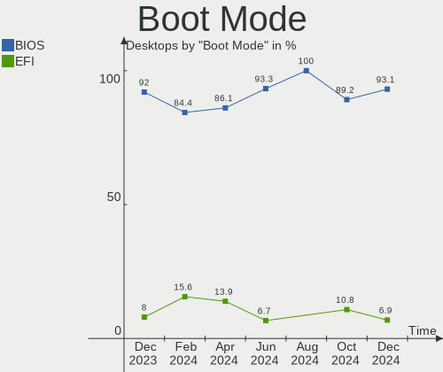
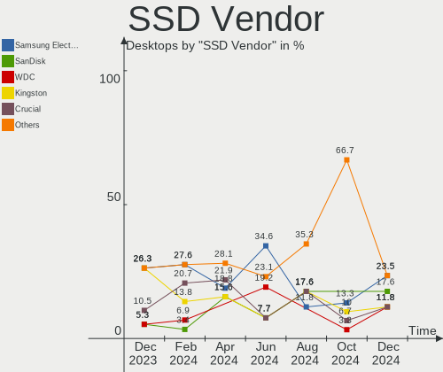
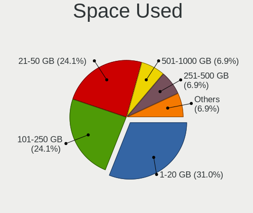

KDE neon Hardware Trends (Desktops)
-----------------------------------

A project to identify most popular hardware characteristics and track their change
over time based on data collected by KDE neon users at https://Linux-Hardware.org.

Anyone can contribute to this report by the [hw-probe](https://github.com/linuxhw/hw-probe) tool:

    sudo -E hw-probe -all -upload

Full-feature report is available here: https://linux-hardware.org/?view=trends&formfactor=desktop

Period: Sep, 2021.

Contents
--------

* [ System ](#system)
  - [ OS                       ](#os)
  - [ OS Family                ](#os-family)
  - [ Kernel                   ](#kernel)
  - [ Kernel Family            ](#kernel-family)
  - [ Kernel Major Ver.        ](#kernel-major-ver)
  - [ Arch                     ](#arch)
  - [ DE                       ](#de)
  - [ Display Server           ](#display-server)
  - [ Display Manager          ](#display-manager)
  - [ OS Lang                  ](#os-lang)
  - [ Boot Mode                ](#boot-mode)
  - [ Filesystem               ](#filesystem)
  - [ Part. scheme             ](#part-scheme)
  - [ Dual Boot with Linux/BSD ](#dual-boot-with-linuxbsd)
  - [ Dual Boot (Win)          ](#dual-boot-win)

* [ Board ](#board)
  - [ Vendor                   ](#vendor)
  - [ Model                    ](#model)
  - [ Model Family             ](#model-family)
  - [ MFG Year                 ](#mfg-year)
  - [ Form Factor              ](#form-factor)
  - [ Secure Boot              ](#secure-boot)
  - [ Coreboot                 ](#coreboot)
  - [ RAM Size                 ](#ram-size)
  - [ RAM Used                 ](#ram-used)
  - [ Total Drives             ](#total-drives)
  - [ Has CD-ROM               ](#has-cd-rom)
  - [ Has Ethernet             ](#has-ethernet)
  - [ Has WiFi                 ](#has-wifi)
  - [ Has Bluetooth            ](#has-bluetooth)

* [ Location ](#location)
  - [ Country                  ](#country)
  - [ City                     ](#city)

* [ Drives ](#drives)
  - [ Drive Vendor             ](#drive-vendor)
  - [ Drive Model              ](#drive-model)
  - [ HDD Vendor               ](#hdd-vendor)
  - [ SSD Vendor               ](#ssd-vendor)
  - [ Drive Kind               ](#drive-kind)
  - [ Drive Connector          ](#drive-connector)
  - [ Drive Size               ](#drive-size)
  - [ Space Total              ](#space-total)
  - [ Space Used               ](#space-used)
  - [ Malfunc. Drives          ](#malfunc-drives)
  - [ Malfunc. Drive Vendor    ](#malfunc-drive-vendor)
  - [ Malfunc. HDD Vendor      ](#malfunc-hdd-vendor)
  - [ Malfunc. Drive Kind      ](#malfunc-drive-kind)
  - [ Failed Drives            ](#failed-drives)
  - [ Failed Drive Vendor      ](#failed-drive-vendor)
  - [ Drive Status             ](#drive-status)

* [ Storage controller ](#storage-controller)
  - [ Storage Vendor           ](#storage-vendor)
  - [ Storage Model            ](#storage-model)
  - [ Storage Kind             ](#storage-kind)

* [ Processor ](#processor)
  - [ CPU Vendor               ](#cpu-vendor)
  - [ CPU Model                ](#cpu-model)
  - [ CPU Model Family         ](#cpu-model-family)
  - [ CPU Cores                ](#cpu-cores)
  - [ CPU Sockets              ](#cpu-sockets)
  - [ CPU Threads              ](#cpu-threads)
  - [ CPU Op-Modes             ](#cpu-op-modes)
  - [ CPU Microcode            ](#cpu-microcode)
  - [ CPU Microarch            ](#cpu-microarch)

* [ Graphics ](#graphics)
  - [ GPU Vendor               ](#gpu-vendor)
  - [ GPU Model                ](#gpu-model)
  - [ GPU Combo                ](#gpu-combo)
  - [ GPU Driver               ](#gpu-driver)
  - [ GPU Memory               ](#gpu-memory)

* [ Monitor ](#monitor)
  - [ Monitor Vendor           ](#monitor-vendor)
  - [ Monitor Model            ](#monitor-model)
  - [ Monitor Resolution       ](#monitor-resolution)
  - [ Monitor Diagonal         ](#monitor-diagonal)
  - [ Monitor Width            ](#monitor-width)
  - [ Aspect Ratio             ](#aspect-ratio)
  - [ Monitor Area             ](#monitor-area)
  - [ Pixel Density            ](#pixel-density)
  - [ Multiple Monitors        ](#multiple-monitors)

* [ Network ](#network)
  - [ Net Controller Vendor    ](#net-controller-vendor)
  - [ Net Controller Model     ](#net-controller-model)
  - [ Wireless Vendor          ](#wireless-vendor)
  - [ Wireless Model           ](#wireless-model)
  - [ Ethernet Vendor          ](#ethernet-vendor)
  - [ Ethernet Model           ](#ethernet-model)
  - [ Net Controller Kind      ](#net-controller-kind)
  - [ Used Controller          ](#used-controller)
  - [ NICs                     ](#nics)
  - [ IPv6                     ](#ipv6)

* [ Bluetooth ](#bluetooth)
  - [ Bluetooth Vendor         ](#bluetooth-vendor)
  - [ Bluetooth Model          ](#bluetooth-model)

* [ Sound ](#sound)
  - [ Sound Vendor             ](#sound-vendor)
  - [ Sound Model              ](#sound-model)

* [ Memory ](#memory)
  - [ Memory Vendor            ](#memory-vendor)
  - [ Memory Model             ](#memory-model)
  - [ Memory Kind              ](#memory-kind)
  - [ Memory Form Factor       ](#memory-form-factor)
  - [ Memory Size              ](#memory-size)
  - [ Memory Speed             ](#memory-speed)

* [ Printers & scanners ](#printers--scanners)
  - [ Printer Vendor           ](#printer-vendor)
  - [ Printer Model            ](#printer-model)
  - [ Scanner Vendor           ](#scanner-vendor)
  - [ Scanner Model            ](#scanner-model)

* [ Camera ](#camera)
  - [ Camera Vendor            ](#camera-vendor)
  - [ Camera Model             ](#camera-model)

* [ Security ](#security)
  - [ Fingerprint Vendor       ](#fingerprint-vendor)
  - [ Fingerprint Model        ](#fingerprint-model)
  - [ Chipcard Vendor          ](#chipcard-vendor)
  - [ Chipcard Model           ](#chipcard-model)

* [ Unsupported ](#unsupported)
  - [ Unsupported Devices      ](#unsupported-devices)
  - [ Unsupported Device Types ](#unsupported-device-types)

System
------

OS
--

Installed operating systems

| Name           | Desktops | Percent |
|----------------|----------|---------|
| KDE neon 20.04 | 39       | 100%    |

OS Family
---------

OS without a version

| Name     | Desktops | Percent |
|----------|----------|---------|
| KDE neon | 39       | 100%    |

Kernel
------

Version of the Linux kernel

| Version           | Desktops | Percent |
|-------------------|----------|---------|
| 5.11.0-34-generic | 15       | 38.46%  |
| 5.11.0-36-generic | 10       | 25.64%  |
| 5.11.0-27-generic | 6        | 15.38%  |
| 5.8.0-63-generic  | 2        | 5.13%   |
| 5.8.0-59-generic  | 1        | 2.56%   |
| 5.4.0-87-generic  | 1        | 2.56%   |
| 5.4.0-86-generic  | 1        | 2.56%   |
| 5.4.0-81-generic  | 1        | 2.56%   |
| 5.12.18-xanmod3   | 1        | 2.56%   |
| 5.11.0-37-generic | 1        | 2.56%   |

Kernel Family
-------------

Linux kernel without a distro release

| Version | Desktops | Percent |
|---------|----------|---------|
| 5.11.0  | 32       | 82.05%  |
| 5.8.0   | 3        | 7.69%   |
| 5.4.0   | 3        | 7.69%   |
| 5.12.18 | 1        | 2.56%   |

Kernel Major Ver.
-----------------

Linux kernel major version

| Version | Desktops | Percent |
|---------|----------|---------|
| 5.11    | 32       | 82.05%  |
| 5.8     | 3        | 7.69%   |
| 5.4     | 3        | 7.69%   |
| 5.12    | 1        | 2.56%   |

Arch
----

OS architecture (x86_64, i586, etc.)

| Name   | Desktops | Percent |
|--------|----------|---------|
| x86_64 | 39       | 100%    |

DE
--

Desktop Environment

| Name    | Desktops | Percent |
|---------|----------|---------|
| KDE     | 22       | 56.41%  |
| KDE5    | 16       | 41.03%  |
| Unknown | 1        | 2.56%   |

Display Server
--------------

X11 or Wayland

| Name    | Desktops | Percent |
|---------|----------|---------|
| X11     | 38       | 97.44%  |
| Wayland | 1        | 2.56%   |

Display Manager
---------------

SDDM, LightDM, etc.

| Name    | Desktops | Percent |
|---------|----------|---------|
| Unknown | 32       | 82.05%  |
| SDDM    | 7        | 17.95%  |

OS Lang
-------

Language

| Lang  | Desktops | Percent |
|-------|----------|---------|
| en_US | 9        | 23.08%  |
| de_DE | 5        | 12.82%  |
| ru_RU | 3        | 7.69%   |
| ru_UA | 2        | 5.13%   |
| pt_BR | 2        | 5.13%   |
| it_IT | 2        | 5.13%   |
| fr_FR | 2        | 5.13%   |
| en_IN | 2        | 5.13%   |
| en_GB | 2        | 5.13%   |
| en_AU | 2        | 5.13%   |
| uk_UA | 1        | 2.56%   |
| ro_RO | 1        | 2.56%   |
| pl_PL | 1        | 2.56%   |
| es_MX | 1        | 2.56%   |
| es_CL | 1        | 2.56%   |
| en_NZ | 1        | 2.56%   |
| de_AT | 1        | 2.56%   |
| C     | 1        | 2.56%   |

Boot Mode
---------

EFI or BIOS

| Mode | Desktops | Percent |
|------|----------|---------|
| EFI  | 20       | 51.28%  |
| BIOS | 19       | 48.72%  |

Filesystem
----------

Type of filesystem

| Type | Desktops | Percent |
|------|----------|---------|
| Ext4 | 39       | 100%    |

Part. scheme
------------

Scheme of partitioning

| Type    | Desktops | Percent |
|---------|----------|---------|
| Unknown | 35       | 89.74%  |
| GPT     | 3        | 7.69%   |
| MBR     | 1        | 2.56%   |

Dual Boot with Linux/BSD
------------------------

Hosting more than one Linux/BSD

| Dual boot | Desktops | Percent |
|-----------|----------|---------|
| No        | 36       | 92.31%  |
| Yes       | 3        | 7.69%   |

Dual Boot (Win)
---------------

Hosting Linux and Windows

| Dual boot | Desktops | Percent |
|-----------|----------|---------|
| No        | 32       | 82.05%  |
| Yes       | 7        | 17.95%  |

Board
-----

Vendor
------

Motherboard manufacturer

| Name                | Desktops | Percent |
|---------------------|----------|---------|
| ASUSTek Computer    | 15       | 38.46%  |
| ASRock              | 6        | 15.38%  |
| Gigabyte Technology | 5        | 12.82%  |
| Hewlett-Packard     | 4        | 10.26%  |
| MSI                 | 3        | 7.69%   |
| Medion              | 1        | 2.56%   |
| Lenovo              | 1        | 2.56%   |
| Intel               | 1        | 2.56%   |
| Fujitsu Siemens     | 1        | 2.56%   |
| Dell                | 1        | 2.56%   |
| Acer                | 1        | 2.56%   |

Model
-----

Motherboard model

| Name                              | Desktops | Percent |
|-----------------------------------|----------|---------|
| MSI X5836                         | 1        | 2.56%   |
| MSI MS-7C81                       | 1        | 2.56%   |
| MSI MS-7599                       | 1        | 2.56%   |
| Medion MS-7748                    | 1        | 2.56%   |
| Lenovo ThinkCentre M73 10AXS3V400 | 1        | 2.56%   |
| Intel DG35EC AAE29266-205         | 1        | 2.56%   |
| HP Z230 Tower Workstation         | 1        | 2.56%   |
| HP Z230 SFF Workstation           | 1        | 2.56%   |
| HP Slim Desktop 290-p0xxx         | 1        | 2.56%   |
| HP Desktop M01-F0xxx              | 1        | 2.56%   |
| Gigabyte Z97X-UD5H                | 1        | 2.56%   |
| Gigabyte Z68X-UD3H-B3             | 1        | 2.56%   |
| Gigabyte X58A-UD3R                | 1        | 2.56%   |
| Gigabyte EX58-UD3R                | 1        | 2.56%   |
| Gigabyte 945GCMX-S2               | 1        | 2.56%   |
| Fujitsu Siemens CELSIUS M460      | 1        | 2.56%   |
| Dell Vostro 3888                  | 1        | 2.56%   |
| ASUS ROG STRIX B550-F GAMING      | 1        | 2.56%   |
| ASUS ROG CROSSHAIR VIII HERO      | 1        | 2.56%   |
| ASUS PRIME Z490-P                 | 1        | 2.56%   |
| ASUS PRIME X570-P                 | 1        | 2.56%   |
| ASUS PRIME B450-PLUS              | 1        | 2.56%   |
| ASUS PRIME B360M-K                | 1        | 2.56%   |
| ASUS P9X79                        | 1        | 2.56%   |
| ASUS P8Z68-V                      | 1        | 2.56%   |
| ASUS P8P67 DELUXE                 | 1        | 2.56%   |
| ASUS P5KPL-AM SE                  | 1        | 2.56%   |
| ASUS Maximus VIII RANGER          | 1        | 2.56%   |
| ASUS M3N78 PRO                    | 1        | 2.56%   |
| ASUS M2N-E                        | 1        | 2.56%   |
| ASUS All Series                   | 1        | 2.56%   |
| ASUS A68HM-K                      | 1        | 2.56%   |
| ASRock H270 Performance           | 1        | 2.56%   |
| ASRock B450M Steel Legend         | 1        | 2.56%   |
| ASRock B450M Pro4                 | 1        | 2.56%   |
| ASRock AB350 Pro4                 | 1        | 2.56%   |
| ASRock A320M-HDV R4.0             | 1        | 2.56%   |
| ASRock 970M Pro3                  | 1        | 2.56%   |
| Acer Veriton X2631G               | 1        | 2.56%   |

Model Family
------------

Motherboard model prefix

| Name                    | Desktops | Percent |
|-------------------------|----------|---------|
| ASUS PRIME              | 4        | 10.26%  |
| HP Z230                 | 2        | 5.13%   |
| ASUS ROG                | 2        | 5.13%   |
| ASRock B450M            | 2        | 5.13%   |
| MSI X5836               | 1        | 2.56%   |
| MSI MS-7C81             | 1        | 2.56%   |
| MSI MS-7599             | 1        | 2.56%   |
| Medion MS-7748          | 1        | 2.56%   |
| Lenovo ThinkCentre      | 1        | 2.56%   |
| Intel DG35EC            | 1        | 2.56%   |
| HP Slim                 | 1        | 2.56%   |
| HP Desktop              | 1        | 2.56%   |
| Gigabyte Z97X-UD5H      | 1        | 2.56%   |
| Gigabyte Z68X-UD3H-B3   | 1        | 2.56%   |
| Gigabyte X58A-UD3R      | 1        | 2.56%   |
| Gigabyte EX58-UD3R      | 1        | 2.56%   |
| Gigabyte 945GCMX-S2     | 1        | 2.56%   |
| Fujitsu Siemens CELSIUS | 1        | 2.56%   |
| Dell Vostro             | 1        | 2.56%   |
| ASUS P9X79              | 1        | 2.56%   |
| ASUS P8Z68-V            | 1        | 2.56%   |
| ASUS P8P67              | 1        | 2.56%   |
| ASUS P5KPL-AM           | 1        | 2.56%   |
| ASUS Maximus            | 1        | 2.56%   |
| ASUS M3N78              | 1        | 2.56%   |
| ASUS M2N-E              | 1        | 2.56%   |
| ASUS All                | 1        | 2.56%   |
| ASUS A68HM-K            | 1        | 2.56%   |
| ASRock H270             | 1        | 2.56%   |
| ASRock AB350            | 1        | 2.56%   |
| ASRock A320M-HDV        | 1        | 2.56%   |
| ASRock 970M             | 1        | 2.56%   |
| Acer Veriton            | 1        | 2.56%   |

MFG Year
--------

Motherboard manufacture year

| Year | Desktops | Percent |
|------|----------|---------|
| 2020 | 10       | 25.64%  |
| 2021 | 4        | 10.26%  |
| 2014 | 4        | 10.26%  |
| 2009 | 4        | 10.26%  |
| 2018 | 3        | 7.69%   |
| 2012 | 3        | 7.69%   |
| 2010 | 3        | 7.69%   |
| 2016 | 2        | 5.13%   |
| 2015 | 2        | 5.13%   |
| 2011 | 2        | 5.13%   |
| 2019 | 1        | 2.56%   |
| 2008 | 1        | 2.56%   |

Form Factor
-----------

Physical design of the computer

| Name    | Desktops | Percent |
|---------|----------|---------|
| Desktop | 39       | 100%    |

Secure Boot
-----------

Enabled or disabled

| State    | Desktops | Percent |
|----------|----------|---------|
| Disabled | 35       | 89.74%  |
| Enabled  | 4        | 10.26%  |

Coreboot
--------

Have coreboot on board

| Used | Desktops | Percent |
|------|----------|---------|
| No   | 39       | 100%    |

RAM Size
--------

Total RAM memory

| Size in GB  | Desktops | Percent |
|-------------|----------|---------|
| 16.01-24.0  | 15       | 38.46%  |
| 8.01-16.0   | 9        | 23.08%  |
| 3.01-4.0    | 6        | 15.38%  |
| 32.01-64.0  | 4        | 10.26%  |
| 4.01-8.0    | 2        | 5.13%   |
| 64.01-256.0 | 2        | 5.13%   |
| 24.01-32.0  | 1        | 2.56%   |

RAM Used
--------

Used RAM memory

| Used GB   | Desktops | Percent |
|-----------|----------|---------|
| 1.01-2.0  | 18       | 46.15%  |
| 2.01-3.0  | 13       | 33.33%  |
| 4.01-8.0  | 3        | 7.69%   |
| 0.51-1.0  | 3        | 7.69%   |
| 3.01-4.0  | 1        | 2.56%   |
| 8.01-16.0 | 1        | 2.56%   |

Total Drives
------------

Number of drives on board

| Drives | Desktops | Percent |
|--------|----------|---------|
| 1      | 16       | 41.03%  |
| 3      | 7        | 17.95%  |
| 4      | 6        | 15.38%  |
| 2      | 5        | 12.82%  |
| 7      | 2        | 5.13%   |
| 5      | 2        | 5.13%   |
| 6      | 1        | 2.56%   |

Has CD-ROM
----------

Has CD-ROM on board

| Presented | Desktops | Percent |
|-----------|----------|---------|
| Yes       | 21       | 53.85%  |
| No        | 18       | 46.15%  |

Has Ethernet
------------

Has Ethernet on board

| Presented | Desktops | Percent |
|-----------|----------|---------|
| Yes       | 39       | 100%    |

Has WiFi
--------

Has WiFi module

| Presented | Desktops | Percent |
|-----------|----------|---------|
| No        | 24       | 61.54%  |
| Yes       | 15       | 38.46%  |

Has Bluetooth
-------------

Has Bluetooth module

| Presented | Desktops | Percent |
|-----------|----------|---------|
| No        | 21       | 53.85%  |
| Yes       | 18       | 46.15%  |

Location
--------

Country
-------

Geographic location (country)

| Country     | Desktops | Percent |
|-------------|----------|---------|
| USA         | 7        | 17.95%  |
| Germany     | 5        | 12.82%  |
| Russia      | 3        | 7.69%   |
| Brazil      | 3        | 7.69%   |
| Ukraine     | 2        | 5.13%   |
| UK          | 2        | 5.13%   |
| Italy       | 2        | 5.13%   |
| India       | 2        | 5.13%   |
| France      | 2        | 5.13%   |
| Australia   | 2        | 5.13%   |
| Romania     | 1        | 2.56%   |
| Poland      | 1        | 2.56%   |
| New Zealand | 1        | 2.56%   |
| Netherlands | 1        | 2.56%   |
| Mexico      | 1        | 2.56%   |
| Malaysia    | 1        | 2.56%   |
| Indonesia   | 1        | 2.56%   |
| Chile       | 1        | 2.56%   |
| Austria     | 1        | 2.56%   |

City
----

Geographic location (city)

| City                 | Desktops | Percent |
|----------------------|----------|---------|
| Yefremov             | 1        | 2.56%   |
| Waldbronn            | 1        | 2.56%   |
| Villeparisis         | 1        | 2.56%   |
| Tomilino             | 1        | 2.56%   |
| Talagante            | 1        | 2.56%   |
| Swindon              | 1        | 2.56%   |
| Surabaya             | 1        | 2.56%   |
| Strassengel          | 1        | 2.56%   |
| Simpsonville         | 1        | 2.56%   |
| S??o Paulo           | 1        | 2.56%   |
| Sao Jose de Mipibu   | 1        | 2.56%   |
| Rydalmere            | 1        | 2.56%   |
| Rancho Cucamonga     | 1        | 2.56%   |
| Petaling Jaya        | 1        | 2.56%   |
| Novosibirsk          | 1        | 2.56%   |
| Munich               | 1        | 2.56%   |
| Moringen             | 1        | 2.56%   |
| Moormerland          | 1        | 2.56%   |
| Milan                | 1        | 2.56%   |
| Mexico City          | 1        | 2.56%   |
| Lviv                 | 1        | 2.56%   |
| Louisville           | 1        | 2.56%   |
| Longmont             | 1        | 2.56%   |
| Kyiv                 | 1        | 2.56%   |
| Kolkata              | 1        | 2.56%   |
| Karlsruhe            | 1        | 2.56%   |
| Gorz??w Wielkopolski | 1        | 2.56%   |
| East Malvern         | 1        | 2.56%   |
| Dordrecht            | 1        | 2.56%   |
| Dallas               | 1        | 2.56%   |
| Colorado Springs     | 1        | 2.56%   |
| Codlea               | 1        | 2.56%   |
| Chicago              | 1        | 2.56%   |
| Chartres             | 1        | 2.56%   |
| Casalnuovo di Napoli | 1        | 2.56%   |
| Bengaluru            | 1        | 2.56%   |
| Auckland             | 1        | 2.56%   |
| Araruama             | 1        | 2.56%   |
| Acton                | 1        | 2.56%   |

Drives
------

Drive Vendor
------------

Hard drive vendors

| Vendor                    | Desktops | Drives | Percent |
|---------------------------|----------|--------|---------|
| WDC                       | 16       | 23     | 20.51%  |
| Seagate                   | 12       | 16     | 15.38%  |
| Samsung Electronics       | 11       | 14     | 14.1%   |
| Toshiba                   | 8        | 8      | 10.26%  |
| SanDisk                   | 7        | 8      | 8.97%   |
| Kingston                  | 4        | 6      | 5.13%   |
| Phison                    | 3        | 3      | 3.85%   |
| OCZ                       | 2        | 2      | 2.56%   |
| Hitachi                   | 2        | 4      | 2.56%   |
| Unknown                   | 1        | 1      | 1.28%   |
| StoreJet                  | 1        | 1      | 1.28%   |
| Smartbuy                  | 1        | 1      | 1.28%   |
| SK Hynix                  | 1        | 1      | 1.28%   |
| Realtek Semiconductor     | 1        | 1      | 1.28%   |
| PLEXTOR                   | 1        | 1      | 1.28%   |
| Patriot                   | 1        | 1      | 1.28%   |
| Micron/Crucial Technology | 1        | 1      | 1.28%   |
| JMicron                   | 1        | 1      | 1.28%   |
| GOODRAM                   | 1        | 1      | 1.28%   |
| Gigabyte Technology       | 1        | 1      | 1.28%   |
| Crucial                   | 1        | 1      | 1.28%   |
| China                     | 1        | 2      | 1.28%   |

Drive Model
-----------

Hard drive models

| Model                                   | Desktops | Percent |
|-----------------------------------------|----------|---------|
| Samsung SSD 850 EVO 500GB               | 3        | 3.23%   |
| Toshiba HDWD110 1TB                     | 2        | 2.15%   |
| Seagate ST3000DM001-1ER166 3TB          | 2        | 2.15%   |
| Seagate ST2000DM008-2FR102 2TB          | 2        | 2.15%   |
| Kingston SA400S37240G 240GB SSD         | 2        | 2.15%   |
| Kingston NVMe SSD Drive 500GB           | 2        | 2.15%   |
| WDC WDS500G3X0C-00SJG0 500GB            | 1        | 1.08%   |
| WDC WDS500G2B0A-00SM50 500GB SSD        | 1        | 1.08%   |
| WDC WDS240G2G0A-00JH30 240GB SSD        | 1        | 1.08%   |
| WDC WDS100T2B0A 1TB SSD                 | 1        | 1.08%   |
| WDC WD6400AAKS-41H2B0 640GB             | 1        | 1.08%   |
| WDC WD5000BPVT-22HXZT3 500GB            | 1        | 1.08%   |
| WDC WD5000AZLX-00K2TA0 500GB            | 1        | 1.08%   |
| WDC WD5000AAKX-00ERMA0 500GB            | 1        | 1.08%   |
| WDC WD5000AAKX-001CA0 500GB             | 1        | 1.08%   |
| WDC WD5000AACS-00ZUB0 500GB             | 1        | 1.08%   |
| WDC WD40EZRZ-00GXCB0 4TB                | 1        | 1.08%   |
| WDC WD3200AAKS-75L9A0 320GB             | 1        | 1.08%   |
| WDC WD20EZRZ-00Z5HB0 2TB                | 1        | 1.08%   |
| WDC WD20EARS-00MVWB0 2TB                | 1        | 1.08%   |
| WDC WD1500HLFS-01G6U1 150GB             | 1        | 1.08%   |
| WDC WD10SPZX-21Z10T0 1TB                | 1        | 1.08%   |
| WDC WD10JPVT-60A1YT0 1TB                | 1        | 1.08%   |
| WDC WD10EZRZ-00HTKB0 1TB                | 1        | 1.08%   |
| WDC WD10EZEX-60M2NA0 1TB                | 1        | 1.08%   |
| WDC WD10EZEX-00WN4A0 1TB                | 1        | 1.08%   |
| WDC WD10EZEX-00BN5A0 1TB                | 1        | 1.08%   |
| WDC WD10EACS-00ZJB0 1TB                 | 1        | 1.08%   |
| WDC WD1002FAEX-00Y9A0 1TB               | 1        | 1.08%   |
| Unknown SD/MMC/MS PRO 128GB             | 1        | 1.08%   |
| Toshiba MQ04ABF100 1TB                  | 1        | 1.08%   |
| Toshiba MQ01ABD100 1TB                  | 1        | 1.08%   |
| Toshiba MK3256GSY 320GB                 | 1        | 1.08%   |
| Toshiba HDWE160 6TB                     | 1        | 1.08%   |
| Toshiba DT01ACA200 2TB                  | 1        | 1.08%   |
| Toshiba DT01ACA100 1TB                  | 1        | 1.08%   |
| StoreJet Transcend 512GB                | 1        | 1.08%   |
| Smartbuy SSD 256GB                      | 1        | 1.08%   |
| SK Hynix BC511 HFM256GDJTNI-82A0A 256GB | 1        | 1.08%   |
| Seagate ST9320325AS 320GB               | 1        | 1.08%   |
| Seagate ST3500630AS 500GB               | 1        | 1.08%   |
| Seagate ST3500418AS 500GB               | 1        | 1.08%   |
| Seagate ST3500413AS 500GB               | 1        | 1.08%   |
| Seagate ST3250310SV 250GB               | 1        | 1.08%   |
| Seagate ST3250310AS 250GB               | 1        | 1.08%   |
| Seagate ST31000520AS 1TB                | 1        | 1.08%   |
| Seagate ST2000DM005-2CW102 2TB          | 1        | 1.08%   |
| Seagate ST2000DM001-1ER164 2TB          | 1        | 1.08%   |
| Seagate ST2000DM001-1CH164 2TB          | 1        | 1.08%   |
| Seagate ST1000DM010-2EP102 1TB          | 1        | 1.08%   |
| SanDisk Ultra II 240GB SSD              | 1        | 1.08%   |
| SanDisk SSD PLUS 480GB                  | 1        | 1.08%   |
| SanDisk SSD PLUS 240GB                  | 1        | 1.08%   |
| SanDisk SSD PLUS 240 GB                 | 1        | 1.08%   |
| SanDisk SDSSDHII960G 960GB              | 1        | 1.08%   |
| SanDisk SDSSDHII240G 240GB              | 1        | 1.08%   |
| SanDisk SDSSDH3 1T00 1TB                | 1        | 1.08%   |
| Sandisk NVMe SSD Drive 250GB            | 1        | 1.08%   |
| Samsung SV0411N 40GB                    | 1        | 1.08%   |
| Samsung SSD 870 EVO 1TB                 | 1        | 1.08%   |

HDD Vendor
----------

Hard disk drive vendors

| Vendor              | Desktops | Drives | Percent |
|---------------------|----------|--------|---------|
| WDC                 | 14       | 19     | 35%     |
| Seagate             | 12       | 16     | 30%     |
| Toshiba             | 8        | 8      | 20%     |
| Samsung Electronics | 3        | 3      | 7.5%    |
| Hitachi             | 2        | 4      | 5%      |
| Unknown             | 1        | 1      | 2.5%    |

SSD Vendor
----------

Solid state drive vendors

| Vendor              | Desktops | Drives | Percent |
|---------------------|----------|--------|---------|
| Samsung Electronics | 7        | 8      | 25%     |
| SanDisk             | 6        | 7      | 21.43%  |
| WDC                 | 3        | 3      | 10.71%  |
| OCZ                 | 2        | 2      | 7.14%   |
| Kingston            | 2        | 3      | 7.14%   |
| StoreJet            | 1        | 1      | 3.57%   |
| Smartbuy            | 1        | 1      | 3.57%   |
| PLEXTOR             | 1        | 1      | 3.57%   |
| Patriot             | 1        | 1      | 3.57%   |
| GOODRAM             | 1        | 1      | 3.57%   |
| Gigabyte Technology | 1        | 1      | 3.57%   |
| Crucial             | 1        | 1      | 3.57%   |
| China               | 1        | 2      | 3.57%   |

Drive Kind
----------

HDD or SSD

| Kind    | Desktops | Drives | Percent |
|---------|----------|--------|---------|
| HDD     | 27       | 51     | 45%     |
| SSD     | 21       | 32     | 35%     |
| NVMe    | 11       | 14     | 18.33%  |
| Unknown | 1        | 1      | 1.67%   |

Drive Connector
---------------

SATA, SAS, NVMe, etc.

| Type | Desktops | Drives | Percent |
|------|----------|--------|---------|
| SATA | 36       | 80     | 70.59%  |
| NVMe | 11       | 14     | 21.57%  |
| SAS  | 4        | 4      | 7.84%   |

Drive Size
----------

Size of hard drive

| Size in TB | Desktops | Drives | Percent |
|------------|----------|--------|---------|
| 0.01-0.5   | 29       | 44     | 52.73%  |
| 0.51-1.0   | 17       | 24     | 30.91%  |
| 1.01-2.0   | 4        | 8      | 7.27%   |
| 2.01-3.0   | 3        | 5      | 5.45%   |
| 3.01-4.0   | 1        | 1      | 1.82%   |
| 4.01-10.0  | 1        | 1      | 1.82%   |

Space Total
-----------

Amount of disk space available on the file system

| Size in GB     | Desktops | Percent |
|----------------|----------|---------|
| 101-250        | 11       | 28.21%  |
| 251-500        | 10       | 25.64%  |
| More than 3000 | 5        | 12.82%  |
| 1001-2000      | 5        | 12.82%  |
| 501-1000       | 3        | 7.69%   |
| 1-20           | 2        | 5.13%   |
| 21-50          | 1        | 2.56%   |
| 2001-3000      | 1        | 2.56%   |
| Unknown        | 1        | 2.56%   |

Space Used
----------

Amount of used disk space

| Used GB        | Desktops | Percent |
|----------------|----------|---------|
| 1-20           | 14       | 35.9%   |
| 21-50          | 8        | 20.51%  |
| 101-250        | 4        | 10.26%  |
| 1001-2000      | 4        | 10.26%  |
| More than 3000 | 3        | 7.69%   |
| 501-1000       | 2        | 5.13%   |
| 251-500        | 1        | 2.56%   |
| 2001-3000      | 1        | 2.56%   |
| 51-100         | 1        | 2.56%   |
| Unknown        | 1        | 2.56%   |

Malfunc. Drives
---------------

Drive models with a malfunction

| Model                       | Desktops | Drives | Percent |
|-----------------------------|----------|--------|---------|
| WDC WD3200AAKS-75L9A0 320GB | 1        | 1      | 100%    |

Malfunc. Drive Vendor
---------------------

Vendors of faulty drives

| Vendor | Desktops | Drives | Percent |
|--------|----------|--------|---------|
| WDC    | 1        | 1      | 100%    |

Malfunc. HDD Vendor
-------------------

Vendors of faulty HDD drives

| Vendor | Desktops | Drives | Percent |
|--------|----------|--------|---------|
| WDC    | 1        | 1      | 100%    |

Malfunc. Drive Kind
-------------------

Kinds of faulty drives

| Kind | Desktops | Drives | Percent |
|------|----------|--------|---------|
| HDD  | 1        | 1      | 100%    |

Failed Drives
-------------

Failed drive models

Zero info for selected period =(

Failed Drive Vendor
-------------------

Failed drive vendors

Zero info for selected period =(

Drive Status
------------

Number of failed and malfunc. drives

| Status   | Desktops | Drives | Percent |
|----------|----------|--------|---------|
| Detected | 34       | 84     | 85%     |
| Works    | 5        | 13     | 12.5%   |
| Malfunc  | 1        | 1      | 2.5%    |

Storage controller
------------------

Storage Vendor
--------------

Storage controller vendors

| Vendor                      | Desktops | Percent |
|-----------------------------|----------|---------|
| Intel                       | 23       | 36.51%  |
| AMD                         | 14       | 22.22%  |
| JMicron Technology          | 5        | 7.94%   |
| Marvell Technology Group    | 4        | 6.35%   |
| Samsung Electronics         | 3        | 4.76%   |
| Phison Electronics          | 3        | 4.76%   |
| Sandisk                     | 2        | 3.17%   |
| Nvidia                      | 2        | 3.17%   |
| Kingston Technology Company | 2        | 3.17%   |
| SK Hynix                    | 1        | 1.59%   |
| Realtek Semiconductor       | 1        | 1.59%   |
| Micron/Crucial Technology   | 1        | 1.59%   |
| Lite-On IT Corp. / Plextor  | 1        | 1.59%   |
| ASMedia Technology          | 1        | 1.59%   |

Storage Model
-------------

Storage controller models

| Model                                                                          | Desktops | Percent |
|--------------------------------------------------------------------------------|----------|---------|
| AMD FCH SATA Controller [AHCI mode]                                            | 10       | 12.99%  |
| AMD 400 Series Chipset SATA Controller                                         | 4        | 5.19%   |
| Intel 8 Series/C220 Series Chipset Family 6-port SATA Controller 1 [AHCI mode] | 3        | 3.9%    |
| Intel 6 Series/C200 Series Chipset Family 6 port Desktop SATA AHCI Controller  | 3        | 3.9%    |
| Samsung NVMe SSD Controller SM981/PM981/PM983                                  | 2        | 2.6%    |
| Phison E12 NVMe Controller                                                     | 2        | 2.6%    |
| JMicron JMB363 SATA/IDE Controller                                             | 2        | 2.6%    |
| JMicron JMB362 SATA Controller                                                 | 2        | 2.6%    |
| Intel SATA Controller [RAID mode]                                              | 2        | 2.6%    |
| Intel NM10/ICH7 Family SATA Controller [IDE mode]                              | 2        | 2.6%    |
| Intel Cannon Lake PCH SATA AHCI Controller                                     | 2        | 2.6%    |
| Intel 82801JI (ICH10 Family) 4 port SATA IDE Controller #1                     | 2        | 2.6%    |
| Intel 82801JI (ICH10 Family) 2 port SATA IDE Controller #2                     | 2        | 2.6%    |
| Intel 400 Series Chipset Family SATA AHCI Controller                           | 2        | 2.6%    |
| AMD SB7x0/SB8x0/SB9x0 SATA Controller [AHCI mode]                              | 2        | 2.6%    |
| AMD SB7x0/SB8x0/SB9x0 IDE Controller                                           | 2        | 2.6%    |
| AMD FCH SATA Controller D                                                      | 2        | 2.6%    |
| SK Hynix BC511                                                                 | 1        | 1.3%    |
| Sandisk WD Blue SN550 NVMe SSD                                                 | 1        | 1.3%    |
| Sandisk WD Black SN750 / PC SN730 NVMe SSD                                     | 1        | 1.3%    |
| Samsung NVMe SSD Controller 980                                                | 1        | 1.3%    |
| Realtek RTS5763DL NVMe SSD Controller                                          | 1        | 1.3%    |
| Phison PS5013 E13 NVMe Controller                                              | 1        | 1.3%    |
| Nvidia MCP78S [GeForce 8200] IDE                                               | 1        | 1.3%    |
| Nvidia MCP78S [GeForce 8200] AHCI Controller                                   | 1        | 1.3%    |
| Nvidia MCP55 SATA Controller                                                   | 1        | 1.3%    |
| Nvidia MCP55 IDE                                                               | 1        | 1.3%    |
| Micron/Crucial P2 NVMe PCIe SSD                                                | 1        | 1.3%    |
| Marvell Group 88SE91A3 SATA-600 Controller                                     | 1        | 1.3%    |
| Marvell Group 88SE9172 SATA III 6Gb/s RAID Controller                          | 1        | 1.3%    |
| Marvell Group 88SE9172 SATA 6Gb/s Controller                                   | 1        | 1.3%    |
| Marvell Group 88SE9128 PCIe SATA 6 Gb/s RAID controller with HyperDuo          | 1        | 1.3%    |
| Lite-On IT Corp. / Plextor M6e PCI Express SSD [Marvell 88SS9183]              | 1        | 1.3%    |
| Kingston Company Company Non-Volatile memory controller                        | 1        | 1.3%    |
| Kingston Company A2000 NVMe SSD                                                | 1        | 1.3%    |
| JMicron JMB368 IDE controller                                                  | 1        | 1.3%    |
| Intel Q170/Q150/B150/H170/H110/Z170/CM236 Chipset SATA Controller [AHCI Mode]  | 1        | 1.3%    |
| Intel C600/X79 series chipset 6-Port SATA AHCI Controller                      | 1        | 1.3%    |
| Intel 9 Series Chipset Family SATA Controller [AHCI Mode]                      | 1        | 1.3%    |
| Intel 82801IR/IO/IH (ICH9R/DO/DH) 6 port SATA Controller [AHCI mode]           | 1        | 1.3%    |
| Intel 82801HR/HO/HH (ICH8R/DO/DH) 2 port SATA Controller [IDE mode]            | 1        | 1.3%    |
| Intel 82801H (ICH8 Family) 4 port SATA Controller [IDE mode]                   | 1        | 1.3%    |
| Intel 82801G (ICH7 Family) IDE Controller                                      | 1        | 1.3%    |
| Intel 400 Series Chipset Family SATA RAID Controller                           | 1        | 1.3%    |
| Intel 200 Series PCH SATA controller [AHCI mode]                               | 1        | 1.3%    |
| ASMedia ASM1062 Serial ATA Controller                                          | 1        | 1.3%    |
| AMD Starship/Matisse Chipset SATA Controller [AHCI mode]                       | 1        | 1.3%    |
| AMD 300 Series Chipset SATA Controller                                         | 1        | 1.3%    |

Storage Kind
------------

Kind of storage controller (IDE, SATA, NVMe, SAS, ...)

| Kind | Desktops | Percent |
|------|----------|---------|
| SATA | 30       | 55.56%  |
| NVMe | 11       | 20.37%  |
| IDE  | 10       | 18.52%  |
| RAID | 3        | 5.56%   |

Processor
---------

CPU Vendor
----------

Processor vendors

| Vendor | Desktops | Percent |
|--------|----------|---------|
| Intel  | 23       | 58.97%  |
| AMD    | 16       | 41.03%  |

CPU Model
---------

Processor models

| Model                                           | Desktops | Percent |
|-------------------------------------------------|----------|---------|
| Intel Xeon CPU E3-1240 v3 @ 3.40GHz             | 2        | 5.13%   |
| Intel Core i7-2600K CPU @ 3.40GHz               | 2        | 5.13%   |
| Intel Core i5-10400 CPU @ 2.90GHz               | 2        | 5.13%   |
| Intel Pentium Dual-Core CPU E6300 @ 2.80GHz     | 1        | 2.56%   |
| Intel Pentium CPU G3220 @ 3.00GHz               | 1        | 2.56%   |
| Intel Core i7-8700 CPU @ 3.20GHz                | 1        | 2.56%   |
| Intel Core i7-6700K CPU @ 4.00GHz               | 1        | 2.56%   |
| Intel Core i7-6700 CPU @ 3.40GHz                | 1        | 2.56%   |
| Intel Core i7-4930K CPU @ 3.40GHz               | 1        | 2.56%   |
| Intel Core i7-4770K CPU @ 3.50GHz               | 1        | 2.56%   |
| Intel Core i7-2600 CPU @ 3.40GHz                | 1        | 2.56%   |
| Intel Core i7 CPU 950 @ 3.07GHz                 | 1        | 2.56%   |
| Intel Core i7 CPU 920 @ 2.67GHz                 | 1        | 2.56%   |
| Intel Core i5-8500 CPU @ 3.00GHz                | 1        | 2.56%   |
| Intel Core i3-4350T CPU @ 3.10GHz               | 1        | 2.56%   |
| Intel Core i3-4170 CPU @ 3.70GHz                | 1        | 2.56%   |
| Intel Core i3-10100 CPU @ 3.60GHz               | 1        | 2.56%   |
| Intel Core 2 Duo CPU E8500 @ 3.16GHz            | 1        | 2.56%   |
| Intel Core 2 Duo CPU E7200 @ 2.53GHz            | 1        | 2.56%   |
| Intel Core 2 Duo CPU E6750 @ 2.66GHz            | 1        | 2.56%   |
| AMD Ryzen 9 5950X 16-Core Processor             | 1        | 2.56%   |
| AMD Ryzen 9 3950X 16-Core Processor             | 1        | 2.56%   |
| AMD Ryzen 7 3700X 8-Core Processor              | 1        | 2.56%   |
| AMD Ryzen 5 PRO 3350G with Radeon Vega Graphics | 1        | 2.56%   |
| AMD Ryzen 5 3600 6-Core Processor               | 1        | 2.56%   |
| AMD Ryzen 5 3400G with Radeon Vega Graphics     | 1        | 2.56%   |
| AMD Ryzen 5 2600X Six-Core Processor            | 1        | 2.56%   |
| AMD Ryzen 5 2600 Six-Core Processor             | 1        | 2.56%   |
| AMD Ryzen 5 2400G with Radeon Vega Graphics     | 1        | 2.56%   |
| AMD Ryzen 5 1600 Six-Core Processor             | 1        | 2.56%   |
| AMD Phenom II X4 965 Processor                  | 1        | 2.56%   |
| AMD Phenom II X4 945 Processor                  | 1        | 2.56%   |
| AMD Phenom 9500 Quad-Core Processor             | 1        | 2.56%   |
| AMD FX-8350 Eight-Core Processor                | 1        | 2.56%   |
| AMD A8-3820 APU with Radeon HD Graphics         | 1        | 2.56%   |
| AMD A4-6300 APU with Radeon HD Graphics         | 1        | 2.56%   |

CPU Model Family
----------------

Processor model prefix

| Model                   | Desktops | Percent |
|-------------------------|----------|---------|
| Intel Core i7           | 10       | 25.64%  |
| AMD Ryzen 5             | 6        | 15.38%  |
| Intel Core i5           | 3        | 7.69%   |
| Intel Core i3           | 3        | 7.69%   |
| Intel Core 2 Duo        | 3        | 7.69%   |
| Intel Xeon              | 2        | 5.13%   |
| AMD Ryzen 9             | 2        | 5.13%   |
| AMD Phenom II X4        | 2        | 5.13%   |
| Intel Pentium Dual-Core | 1        | 2.56%   |
| Intel Pentium           | 1        | 2.56%   |
| AMD Ryzen 7             | 1        | 2.56%   |
| AMD Ryzen 5 PRO         | 1        | 2.56%   |
| AMD Phenom              | 1        | 2.56%   |
| AMD FX                  | 1        | 2.56%   |
| AMD A8                  | 1        | 2.56%   |
| AMD A4                  | 1        | 2.56%   |

CPU Cores
---------

Number of processor cores

| Number | Desktops | Percent |
|--------|----------|---------|
| 4      | 19       | 48.72%  |
| 6      | 9        | 23.08%  |
| 2      | 7        | 17.95%  |
| 16     | 2        | 5.13%   |
| 8      | 1        | 2.56%   |
| 1      | 1        | 2.56%   |

CPU Sockets
-----------

Number of sockets

| Number | Desktops | Percent |
|--------|----------|---------|
| 1      | 39       | 100%    |

CPU Threads
-----------

Threads per core (Hyper-Threading)

| Number | Desktops | Percent |
|--------|----------|---------|
| 2      | 29       | 74.36%  |
| 1      | 10       | 25.64%  |

CPU Op-Modes
------------

CPU Operation Modes (32-bit, 64-bit)

| Op mode        | Desktops | Percent |
|----------------|----------|---------|
| 32-bit, 64-bit | 39       | 100%    |

CPU Microcode
-------------

Microcode number

| Number     | Desktops | Percent |
|------------|----------|---------|
| 0x306c3    | 6        | 15.38%  |
| 0x206a7    | 3        | 7.69%   |
| 0x506e3    | 2        | 5.13%   |
| 0x106a5    | 2        | 5.13%   |
| 0x10676    | 2        | 5.13%   |
| 0x08701021 | 2        | 5.13%   |
| 0x08108109 | 2        | 5.13%   |
| 0x0800820d | 2        | 5.13%   |
| 0x010000c8 | 2        | 5.13%   |
| Unknown    | 2        | 5.13%   |
| 0xa0655    | 1        | 2.56%   |
| 0xa0653    | 1        | 2.56%   |
| 0x906ea    | 1        | 2.56%   |
| 0x6fb      | 1        | 2.56%   |
| 0x306e4    | 1        | 2.56%   |
| 0x1067a    | 1        | 2.56%   |
| 0x0a201016 | 1        | 2.56%   |
| 0x08701013 | 1        | 2.56%   |
| 0x08101016 | 1        | 2.56%   |
| 0x08001137 | 1        | 2.56%   |
| 0x06001119 | 1        | 2.56%   |
| 0x06000852 | 1        | 2.56%   |
| 0x03000027 | 1        | 2.56%   |
| 0x01000083 | 1        | 2.56%   |

CPU Microarch
-------------

Microarchitecture

| Name        | Desktops | Percent |
|-------------|----------|---------|
| Haswell     | 6        | 15.38%  |
| Zen+        | 4        | 10.26%  |
| Zen 2       | 3        | 7.69%   |
| SandyBridge | 3        | 7.69%   |
| Penryn      | 3        | 7.69%   |
| K10         | 3        | 7.69%   |
| CometLake   | 3        | 7.69%   |
| Zen         | 2        | 5.13%   |
| Skylake     | 2        | 5.13%   |
| Piledriver  | 2        | 5.13%   |
| Nehalem     | 2        | 5.13%   |
| KabyLake    | 2        | 5.13%   |
| Zen 3       | 1        | 2.56%   |
| K10 Llano   | 1        | 2.56%   |
| IvyBridge   | 1        | 2.56%   |
| Core        | 1        | 2.56%   |

Graphics
--------

GPU Vendor
----------

Vendors of graphics cards

| Vendor | Desktops | Percent |
|--------|----------|---------|
| Nvidia | 19       | 42.22%  |
| AMD    | 17       | 37.78%  |
| Intel  | 9        | 20%     |

GPU Model
---------

Graphics card models

| Model                                                                       | Desktops | Percent |
|-----------------------------------------------------------------------------|----------|---------|
| AMD Ellesmere [Radeon RX 470/480/570/570X/580/580X/590]                     | 5        | 10.87%  |
| Intel Xeon E3-1200 v3/4th Gen Core Processor Integrated Graphics Controller | 3        | 6.52%   |
| Intel CometLake-S GT2 [UHD Graphics 630]                                    | 3        | 6.52%   |
| Nvidia TU117 [GeForce GTX 1650]                                             | 2        | 4.35%   |
| Nvidia GP104 [GeForce GTX 1080]                                             | 2        | 4.35%   |
| Nvidia GK208B [GeForce GT 730]                                              | 2        | 4.35%   |
| AMD Picasso                                                                 | 2        | 4.35%   |
| Nvidia TU116 [GeForce GTX 1660]                                             | 1        | 2.17%   |
| Nvidia TU106 [GeForce GTX 1650]                                             | 1        | 2.17%   |
| Nvidia GT216 [GeForce GT 220]                                               | 1        | 2.17%   |
| Nvidia GP107 [GeForce GTX 1050]                                             | 1        | 2.17%   |
| Nvidia GP107 [GeForce GTX 1050 Ti]                                          | 1        | 2.17%   |
| Nvidia GK208B [GeForce GT 710]                                              | 1        | 2.17%   |
| Nvidia GK107 [NVS 510]                                                      | 1        | 2.17%   |
| Nvidia GK107 [GeForce GT 640]                                               | 1        | 2.17%   |
| Nvidia GF108 [GeForce GT 440]                                               | 1        | 2.17%   |
| Nvidia GF108 [GeForce GT 430]                                               | 1        | 2.17%   |
| Nvidia GF100GL [Quadro 6000]                                                | 1        | 2.17%   |
| Nvidia GA104 [GeForce RTX 3060 Ti]                                          | 1        | 2.17%   |
| Nvidia GA102 [GeForce RTX 3080 Ti]                                          | 1        | 2.17%   |
| Nvidia G84 [GeForce 8600 GT]                                                | 1        | 2.17%   |
| Intel HD Graphics 530                                                       | 1        | 2.17%   |
| Intel 4th Generation Core Processor Family Integrated Graphics Controller   | 1        | 2.17%   |
| Intel 2nd Generation Core Processor Family Integrated Graphics Controller   | 1        | 2.17%   |
| AMD Sumo [Radeon HD 6550D]                                                  | 1        | 2.17%   |
| AMD RV730 XT [Radeon HD 4670]                                               | 1        | 2.17%   |
| AMD Richland [Radeon HD 8370D]                                              | 1        | 2.17%   |
| AMD Redwood PRO [Radeon HD 5550/5570/5630/6510/6610/7570]                   | 1        | 2.17%   |
| AMD Raven Ridge [Radeon Vega Series / Radeon Vega Mobile Series]            | 1        | 2.17%   |
| AMD Park [Mobility Radeon HD 5430]                                          | 1        | 2.17%   |
| AMD Navi 10 [Radeon RX 5600 OEM/5600 XT / 5700/5700 XT]                     | 1        | 2.17%   |
| AMD Curacao XT / Trinidad XT [Radeon R7 370 / R9 270X/370X]                 | 1        | 2.17%   |
| AMD Cedar [Radeon HD 5000/6000/7350/8350 Series]                            | 1        | 2.17%   |
| AMD Cape Verde PRO [Radeon HD 7750/8740 / R7 250E]                          | 1        | 2.17%   |

GPU Combo
---------

Combinations of graphics cards

| Name           | Desktops | Percent |
|----------------|----------|---------|
| 1 x Nvidia     | 16       | 41.03%  |
| 1 x AMD        | 16       | 41.03%  |
| 1 x Intel      | 4        | 10.26%  |
| 2 x Nvidia     | 1        | 2.56%   |
| Intel + Nvidia | 1        | 2.56%   |
| AMD + Nvidia   | 1        | 2.56%   |

GPU Driver
----------

Free vs proprietary

| Driver      | Desktops | Percent |
|-------------|----------|---------|
| Free        | 28       | 71.79%  |
| Proprietary | 9        | 23.08%  |
| Unknown     | 2        | 5.13%   |

GPU Memory
----------

Total video memory

| Size in GB | Desktops | Percent |
|------------|----------|---------|
| 1.01-2.0   | 12       | 30.77%  |
| Unknown    | 7        | 17.95%  |
| 7.01-8.0   | 6        | 15.38%  |
| 3.01-4.0   | 5        | 12.82%  |
| 0.51-1.0   | 4        | 10.26%  |
| 0.01-0.5   | 3        | 7.69%   |
| 5.01-6.0   | 2        | 5.13%   |

Monitor
-------

Monitor Vendor
--------------

Monitor vendors

| Vendor               | Desktops | Percent |
|----------------------|----------|---------|
| Samsung Electronics  | 6        | 14.29%  |
| Goldstar             | 6        | 14.29%  |
| Dell                 | 5        | 11.9%   |
| ViewSonic            | 3        | 7.14%   |
| Hewlett-Packard      | 3        | 7.14%   |
| Ancor Communications | 3        | 7.14%   |
| Sony                 | 2        | 4.76%   |
| Philips              | 2        | 4.76%   |
| AOC                  | 2        | 4.76%   |
| Acer                 | 2        | 4.76%   |
| Panasonic            | 1        | 2.38%   |
| LG Electronics       | 1        | 2.38%   |
| Lenovo               | 1        | 2.38%   |
| JRY                  | 1        | 2.38%   |
| Iiyama               | 1        | 2.38%   |
| Eizo                 | 1        | 2.38%   |
| Compaq Computer      | 1        | 2.38%   |
| Belinea              | 1        | 2.38%   |

Monitor Model
-------------

Monitor models

| Model                                                                 | Desktops | Percent |
|-----------------------------------------------------------------------|----------|---------|
| ViewSonic VG2230wm-EU VSCA21E 1680x1050 474x296mm 22.0-inch           | 1        | 2.27%   |
| ViewSonic VE710b VSCF618 1280x1024 338x270mm 17.0-inch                | 1        | 2.27%   |
| ViewSonic VA2855 SERIES VSCD62F 1920x1080 621x341mm 27.9-inch         | 1        | 2.27%   |
| Sony TV SNY4302 1920x1080 1600x900mm 72.3-inch                        | 1        | 2.27%   |
| Sony TV  *00 SNYAA04 3840x2160 1220x680mm 55.0-inch                   | 1        | 2.27%   |
| Samsung Electronics U28E590 SAM0C4D 3840x2160 607x345mm 27.5-inch     | 1        | 2.27%   |
| Samsung Electronics SyncMaster SAM036E 1280x1024 376x301mm 19.0-inch  | 1        | 2.27%   |
| Samsung Electronics S27D590 SAM0B49 1920x1080 598x336mm 27.0-inch     | 1        | 2.27%   |
| Samsung Electronics S22B150 SAM08A3 1920x1080 477x268mm 21.5-inch     | 1        | 2.27%   |
| Samsung Electronics LCD Monitor S24E391 5760x1080                     | 1        | 2.27%   |
| Samsung Electronics LCD Monitor S22C150 1920x1080                     | 1        | 2.27%   |
| Samsung Electronics C27F390 SAM0D33 1920x1080 598x336mm 27.0-inch     | 1        | 2.27%   |
| Philips LCD Monitor PHL 245E1 2560x1440                               | 1        | 2.27%   |
| Philips LCD Monitor 237E4                                             | 1        | 2.27%   |
| Panasonic TV MEIA296 1920x1080 1280x720mm 57.8-inch                   | 1        | 2.27%   |
| LG Electronics LCD Monitor LG Ultra HD                                | 1        | 2.27%   |
| Lenovo LEN L28u-30 LEN65FA 3840x2160 620x340mm 27.8-inch              | 1        | 2.27%   |
| JRY HDMI JRY2500 1920x1080 553x312mm 25.0-inch                        | 1        | 2.27%   |
| Iiyama PL2473HD IVM6107 1920x1080 521x293mm 23.5-inch                 | 1        | 2.27%   |
| Hewlett-Packard V270 HPN3521 1920x1080 598x336mm 27.0-inch            | 1        | 2.27%   |
| Hewlett-Packard 27es HWP3325 1920x1080 600x340mm 27.2-inch            | 1        | 2.27%   |
| Hewlett-Packard 22cwa HWP3183 1920x1080 476x268mm 21.5-inch           | 1        | 2.27%   |
| Goldstar W2243 GSM56FE 1920x1080 477x269mm 21.6-inch                  | 1        | 2.27%   |
| Goldstar W1941 GSM4B91 1360x768 406x229mm 18.4-inch                   | 1        | 2.27%   |
| Goldstar ULTRAWIDE GSM76F9 2560x1080 531x298mm 24.0-inch              | 1        | 2.27%   |
| Goldstar ULTRAWIDE GSM5AFB 2560x1080 798x334mm 34.1-inch              | 1        | 2.27%   |
| Goldstar LG HDR WQHD GSM772B 3440x1440 800x340mm 34.2-inch            | 1        | 2.27%   |
| Goldstar 22EA63 GSM5990 1680x1050 480x270mm 21.7-inch                 | 1        | 2.27%   |
| Eizo EV2780 ENC2813 2560x1440 597x336mm 27.0-inch                     | 1        | 2.27%   |
| Dell U2719DC DEL417C 2560x1440 597x336mm 27.0-inch                    | 1        | 2.27%   |
| Dell U2719D DEL415A 2560x1440 597x336mm 27.0-inch                     | 1        | 2.27%   |
| Dell LCD Monitor U3014 2560x1600                                      | 1        | 2.27%   |
| Dell LCD Monitor S2421HN 1920x1080                                    | 1        | 2.27%   |
| Dell LCD Monitor P2415Q 11520x2160                                    | 1        | 2.27%   |
| Dell LCD Monitor P2314H                                               | 1        | 2.27%   |
| Compaq Computer FS7600 CPQ1461 1280x1024 312x234mm 15.4-inch          | 1        | 2.27%   |
| Belinea B101915 MAX077B 1280x1024 376x301mm 19.0-inch                 | 1        | 2.27%   |
| AOC 24V2W1G5 AOC2402 1920x1080 527x296mm 23.8-inch                    | 1        | 2.27%   |
| AOC 2379H AOC2379 1920x1080 509x286mm 23.0-inch                       | 1        | 2.27%   |
| Ancor Communications LCD Monitor PA246 1920x1200                      | 1        | 2.27%   |
| Ancor Communications ASUS VS247 ACI249A 1920x1080 521x293mm 23.5-inch | 1        | 2.27%   |
| Ancor Communications ASUS VS207 ACI20F2 1600x900 432x240mm 19.5-inch  | 1        | 2.27%   |
| Acer LCD Monitor KG241Q S 1920x1080                                   | 1        | 2.27%   |
| Acer KA220HQ ACR0497 1920x1080 477x268mm 21.5-inch                    | 1        | 2.27%   |

Monitor Resolution
------------------

Monitor screen resolution

| Resolution         | Desktops | Percent |
|--------------------|----------|---------|
| 1920x1080 (FHD)    | 18       | 43.9%   |
| 3840x2160 (4K)     | 4        | 9.76%   |
| 1280x1024 (SXGA)   | 4        | 9.76%   |
| 2560x1440 (QHD)    | 3        | 7.32%   |
| 2560x1080          | 2        | 4.88%   |
| Unknown            | 2        | 4.88%   |
| 5760x1080          | 1        | 2.44%   |
| 3440x1440          | 1        | 2.44%   |
| 2560x1600          | 1        | 2.44%   |
| 1920x1200 (WUXGA)  | 1        | 2.44%   |
| 1680x1050 (WSXGA+) | 1        | 2.44%   |
| 1600x900 (HD+)     | 1        | 2.44%   |
| 1360x768           | 1        | 2.44%   |
| 11520x2160         | 1        | 2.44%   |

Monitor Diagonal
----------------

Diagonal size in inches

| Inches  | Desktops | Percent |
|---------|----------|---------|
| 27      | 9        | 22.5%   |
| Unknown | 8        | 20%     |
| 21      | 5        | 12.5%   |
| 23      | 4        | 10%     |
| 34      | 3        | 7.5%    |
| 19      | 3        | 7.5%    |
| 84      | 1        | 2.5%    |
| 72      | 1        | 2.5%    |
| 55      | 1        | 2.5%    |
| 25      | 1        | 2.5%    |
| 22      | 1        | 2.5%    |
| 18      | 1        | 2.5%    |
| 17      | 1        | 2.5%    |
| 15      | 1        | 2.5%    |

Monitor Width
-------------

Physical width

| Width in mm | Desktops | Percent |
|-------------|----------|---------|
| 501-600     | 11       | 27.5%   |
| 401-500     | 8        | 20%     |
| Unknown     | 8        | 20%     |
| 701-800     | 3        | 7.5%    |
| 601-700     | 3        | 7.5%    |
| 351-400     | 2        | 5%      |
| 301-350     | 2        | 5%      |
| 1501-2000   | 2        | 5%      |
| 1001-1500   | 1        | 2.5%    |

Aspect Ratio
------------

Proportional relationship between the width and the height

| Ratio   | Desktops | Percent |
|---------|----------|---------|
| 16/9    | 23       | 58.97%  |
| Unknown | 8        | 20.51%  |
| 5/4     | 3        | 7.69%   |
| 21/9    | 3        | 7.69%   |
| 4/3     | 1        | 2.56%   |
| 16/10   | 1        | 2.56%   |

Monitor Area
------------

Area in inch

| Area in inch | Desktops | Percent |
|----------------|----------|---------|
| 201-250        | 10       | 25%     |
| 301-350        | 9        | 22.5%   |
| Unknown        | 8        | 20%     |
| More than 1000 | 3        | 7.5%    |
| 351-500        | 3        | 7.5%    |
| 151-200        | 3        | 7.5%    |
| 141-150        | 2        | 5%      |
| 251-300        | 1        | 2.5%    |
| 111-120        | 1        | 2.5%    |

Pixel Density
-------------

Pixels per inch

| Density | Desktops | Percent |
|---------|----------|---------|
| 51-100  | 18       | 47.37%  |
| 101-120 | 9        | 23.68%  |
| Unknown | 8        | 21.05%  |
| 121-160 | 2        | 5.26%   |
| 1-50    | 1        | 2.63%   |

Multiple Monitors
-----------------

Total monitors connected

| Total | Desktops | Percent |
|-------|----------|---------|
| 1     | 29       | 74.36%  |
| 2     | 7        | 17.95%  |
| 0     | 2        | 5.13%   |
| 3     | 1        | 2.56%   |

Network
-------

Net Controller Vendor
---------------------

Controller vendors

| Vendor                   | Desktops | Percent |
|--------------------------|----------|---------|
| Realtek Semiconductor    | 27       | 49.09%  |
| Intel                    | 15       | 27.27%  |
| TP-Link                  | 2        | 3.64%   |
| Qualcomm Atheros         | 2        | 3.64%   |
| Samsung Electronics      | 1        | 1.82%   |
| Ralink Technology        | 1        | 1.82%   |
| Nvidia                   | 1        | 1.82%   |
| Microsoft                | 1        | 1.82%   |
| Marvell Technology Group | 1        | 1.82%   |
| IMC Networks             | 1        | 1.82%   |
| Broadcom Limited         | 1        | 1.82%   |
| Broadcom                 | 1        | 1.82%   |
| 3Com                     | 1        | 1.82%   |

Net Controller Model
--------------------

Controller models

| Model                                                             | Desktops | Percent |
|-------------------------------------------------------------------|----------|---------|
| Realtek RTL8111/8168/8411 PCI Express Gigabit Ethernet Controller | 22       | 35.48%  |
| Intel 82579V Gigabit Network Connection                           | 3        | 4.84%   |
| Realtek RTL8821CE 802.11ac PCIe Wireless Network Adapter          | 2        | 3.23%   |
| Realtek RTL8192EE PCIe Wireless Network Adapter                   | 2        | 3.23%   |
| Realtek RTL8125 2.5GbE Controller                                 | 2        | 3.23%   |
| Intel Ethernet Connection I217-V                                  | 2        | 3.23%   |
| Intel Ethernet Connection I217-LM                                 | 2        | 3.23%   |
| Intel Ethernet Connection (2) I219-V                              | 2        | 3.23%   |
| TP-Link TL-WN823N v2/v3 [Realtek RTL8192EU]                       | 1        | 1.61%   |
| TP-Link TL-WN722N v2                                              | 1        | 1.61%   |
| Samsung Galaxy series, misc. (tethering mode)                     | 1        | 1.61%   |
| Realtek RTL810xE PCI Express Fast Ethernet controller             | 1        | 1.61%   |
| Realtek RTL-8110SC/8169SC Gigabit Ethernet                        | 1        | 1.61%   |
| Realtek RTL-8100/8101L/8139 PCI Fast Ethernet Adapter             | 1        | 1.61%   |
| Realtek 802.11ac NIC                                              | 1        | 1.61%   |
| Ralink MT7601U Wireless Adapter                                   | 1        | 1.61%   |
| Qualcomm Atheros Killer E220x Gigabit Ethernet Controller         | 1        | 1.61%   |
| Qualcomm Atheros AR93xx Wireless Network Adapter                  | 1        | 1.61%   |
| Qualcomm Atheros AR9227 Wireless Network Adapter                  | 1        | 1.61%   |
| Nvidia MCP55 Ethernet                                             | 1        | 1.61%   |
| Microsoft Xbox 360 Wireless Adapter                               | 1        | 1.61%   |
| Marvell Group 88w8335 [Libertas] 802.11b/g Wireless               | 1        | 1.61%   |
| Intel Wireless 3165                                               | 1        | 1.61%   |
| Intel Wi-Fi 6 AX200                                               | 1        | 1.61%   |
| Intel I211 Gigabit Network Connection                             | 1        | 1.61%   |
| Intel Ethernet Controller I225-V                                  | 1        | 1.61%   |
| Intel Ethernet Connection (11) I219-V                             | 1        | 1.61%   |
| Intel 82566DM-2 Gigabit Network Connection                        | 1        | 1.61%   |
| Intel 82566DC Gigabit Network Connection                          | 1        | 1.61%   |
| IMC Networks Mediao 802.11n WLAN [Realtek RTL8191SU]              | 1        | 1.61%   |
| Broadcom Limited BCM4360 802.11ac Wireless Network Adapter        | 1        | 1.61%   |
| Broadcom BCM4360 802.11ac Wireless Network Adapter                | 1        | 1.61%   |
| 3Com 3c905C-TX/TX-M [Tornado]                                     | 1        | 1.61%   |

Wireless Vendor
---------------

Wireless vendors

| Vendor                   | Desktops | Percent |
|--------------------------|----------|---------|
| Realtek Semiconductor    | 5        | 29.41%  |
| TP-Link                  | 2        | 11.76%  |
| Qualcomm Atheros         | 2        | 11.76%  |
| Intel                    | 2        | 11.76%  |
| Ralink Technology        | 1        | 5.88%   |
| Microsoft                | 1        | 5.88%   |
| Marvell Technology Group | 1        | 5.88%   |
| IMC Networks             | 1        | 5.88%   |
| Broadcom Limited         | 1        | 5.88%   |
| Broadcom                 | 1        | 5.88%   |

Wireless Model
--------------

Wireless models

| Model                                                      | Desktops | Percent |
|------------------------------------------------------------|----------|---------|
| Realtek RTL8821CE 802.11ac PCIe Wireless Network Adapter   | 2        | 11.76%  |
| Realtek RTL8192EE PCIe Wireless Network Adapter            | 2        | 11.76%  |
| TP-Link TL-WN823N v2/v3 [Realtek RTL8192EU]                | 1        | 5.88%   |
| TP-Link TL-WN722N v2                                       | 1        | 5.88%   |
| Realtek 802.11ac NIC                                       | 1        | 5.88%   |
| Ralink MT7601U Wireless Adapter                            | 1        | 5.88%   |
| Qualcomm Atheros AR93xx Wireless Network Adapter           | 1        | 5.88%   |
| Qualcomm Atheros AR9227 Wireless Network Adapter           | 1        | 5.88%   |
| Microsoft Xbox 360 Wireless Adapter                        | 1        | 5.88%   |
| Marvell Group 88w8335 [Libertas] 802.11b/g Wireless        | 1        | 5.88%   |
| Intel Wireless 3165                                        | 1        | 5.88%   |
| Intel Wi-Fi 6 AX200                                        | 1        | 5.88%   |
| IMC Networks Mediao 802.11n WLAN [Realtek RTL8191SU]       | 1        | 5.88%   |
| Broadcom Limited BCM4360 802.11ac Wireless Network Adapter | 1        | 5.88%   |
| Broadcom BCM4360 802.11ac Wireless Network Adapter         | 1        | 5.88%   |

Ethernet Vendor
---------------

Ethernet vendors

| Vendor                | Desktops | Percent |
|-----------------------|----------|---------|
| Realtek Semiconductor | 26       | 59.09%  |
| Intel                 | 14       | 31.82%  |
| Samsung Electronics   | 1        | 2.27%   |
| Qualcomm Atheros      | 1        | 2.27%   |
| Nvidia                | 1        | 2.27%   |
| 3Com                  | 1        | 2.27%   |

Ethernet Model
--------------

Ethernet models

| Model                                                             | Desktops | Percent |
|-------------------------------------------------------------------|----------|---------|
| Realtek RTL8111/8168/8411 PCI Express Gigabit Ethernet Controller | 22       | 48.89%  |
| Intel 82579V Gigabit Network Connection                           | 3        | 6.67%   |
| Realtek RTL8125 2.5GbE Controller                                 | 2        | 4.44%   |
| Intel Ethernet Connection I217-V                                  | 2        | 4.44%   |
| Intel Ethernet Connection I217-LM                                 | 2        | 4.44%   |
| Intel Ethernet Connection (2) I219-V                              | 2        | 4.44%   |
| Samsung Galaxy series, misc. (tethering mode)                     | 1        | 2.22%   |
| Realtek RTL810xE PCI Express Fast Ethernet controller             | 1        | 2.22%   |
| Realtek RTL-8110SC/8169SC Gigabit Ethernet                        | 1        | 2.22%   |
| Realtek RTL-8100/8101L/8139 PCI Fast Ethernet Adapter             | 1        | 2.22%   |
| Qualcomm Atheros Killer E220x Gigabit Ethernet Controller         | 1        | 2.22%   |
| Nvidia MCP55 Ethernet                                             | 1        | 2.22%   |
| Intel I211 Gigabit Network Connection                             | 1        | 2.22%   |
| Intel Ethernet Controller I225-V                                  | 1        | 2.22%   |
| Intel Ethernet Connection (11) I219-V                             | 1        | 2.22%   |
| Intel 82566DM-2 Gigabit Network Connection                        | 1        | 2.22%   |
| Intel 82566DC Gigabit Network Connection                          | 1        | 2.22%   |
| 3Com 3c905C-TX/TX-M [Tornado]                                     | 1        | 2.22%   |

Net Controller Kind
-------------------

Ethernet, WiFi or modem

| Kind     | Desktops | Percent |
|----------|----------|---------|
| Ethernet | 39       | 72.22%  |
| WiFi     | 15       | 27.78%  |

Used Controller
---------------

Currently used network controller

| Kind     | Desktops | Percent |
|----------|----------|---------|
| Ethernet | 36       | 73.47%  |
| WiFi     | 13       | 26.53%  |

NICs
----

Total network controllers on board

| Total | Desktops | Percent |
|-------|----------|---------|
| 1     | 26       | 66.67%  |
| 2     | 10       | 25.64%  |
| 3     | 3        | 7.69%   |

IPv6
----

IPv6 vs IPv4

| Used | Desktops | Percent |
|------|----------|---------|
| No   | 25       | 64.1%   |
| Yes  | 14       | 35.9%   |

Bluetooth
---------

Bluetooth Vendor
----------------

Controller vendors

| Vendor                          | Desktops | Percent |
|---------------------------------|----------|---------|
| Cambridge Silicon Radio         | 8        | 44.44%  |
| Realtek Semiconductor           | 2        | 11.11%  |
| Qualcomm Atheros Communications | 2        | 11.11%  |
| Intel                           | 2        | 11.11%  |
| Apple                           | 2        | 11.11%  |
| Integrated System Solution      | 1        | 5.56%   |
| Broadcom                        | 1        | 5.56%   |

Bluetooth Model
---------------

Controller models

| Model                                                 | Desktops | Percent |
|-------------------------------------------------------|----------|---------|
| Cambridge Silicon Radio Bluetooth Dongle (HCI mode)   | 8        | 44.44%  |
| Realtek  Bluetooth 4.2 Adapter                        | 2        | 11.11%  |
| Qualcomm Atheros AR3011 Bluetooth                     | 2        | 11.11%  |
| Intel Bluetooth Device                                | 1        | 5.56%   |
| Intel AX200 Bluetooth                                 | 1        | 5.56%   |
| Integrated System Solution KY-BT100 Bluetooth Adapter | 1        | 5.56%   |
| Broadcom BCM20702A0 Bluetooth 4.0                     | 1        | 5.56%   |
| Apple Bluetooth USB Host Controller                   | 1        | 5.56%   |
| Apple Bluetooth Host Controller                       | 1        | 5.56%   |

Sound
-----

Sound Vendor
------------

Sound card vendors

| Vendor              | Desktops | Percent |
|---------------------|----------|---------|
| Intel               | 22       | 31.43%  |
| AMD                 | 21       | 30%     |
| Nvidia              | 18       | 25.71%  |
| Creative Labs       | 2        | 2.86%   |
| Texas Instruments   | 1        | 1.43%   |
| SteelSeries ApS     | 1        | 1.43%   |
| Razer USA           | 1        | 1.43%   |
| Logitech            | 1        | 1.43%   |
| Kingston Technology | 1        | 1.43%   |
| Corsair             | 1        | 1.43%   |
| ASUSTek Computer    | 1        | 1.43%   |

Sound Model
-----------

Sound card models

| Model                                                                      | Desktops | Percent |
|----------------------------------------------------------------------------|----------|---------|
| Intel 8 Series/C220 Series Chipset High Definition Audio Controller        | 5        | 5.88%   |
| AMD Ellesmere HDMI Audio [Radeon RX 470/480 / 570/580/590]                 | 5        | 5.88%   |
| Intel Xeon E3-1200 v3/4th Gen Core Processor HD Audio Controller           | 4        | 4.71%   |
| AMD Starship/Matisse HD Audio Controller                                   | 4        | 4.71%   |
| Nvidia GK208 HDMI/DP Audio Controller                                      | 3        | 3.53%   |
| Intel 6 Series/C200 Series Chipset Family High Definition Audio Controller | 3        | 3.53%   |
| AMD Raven/Raven2/Fenghuang HDMI/DP Audio Controller                        | 3        | 3.53%   |
| AMD Family 17h (Models 10h-1fh) HD Audio Controller                        | 3        | 3.53%   |
| Nvidia TU107 GeForce GTX 1650 High Definition Audio Controller             | 2        | 2.35%   |
| Nvidia GP107GL High Definition Audio Controller                            | 2        | 2.35%   |
| Nvidia GP104 High Definition Audio Controller                              | 2        | 2.35%   |
| Nvidia GK107 HDMI Audio Controller                                         | 2        | 2.35%   |
| Nvidia GF108 High Definition Audio Controller                              | 2        | 2.35%   |
| Intel NM10/ICH7 Family High Definition Audio Controller                    | 2        | 2.35%   |
| Intel Comet Lake PCH-V Smart Sound Technology Audio Controller             | 2        | 2.35%   |
| Intel Cannon Lake PCH cAVS                                                 | 2        | 2.35%   |
| Intel 82801JI (ICH10 Family) HD Audio Controller                           | 2        | 2.35%   |
| Creative Labs Sound Core3D [Sound Blaster Recon3D / Z-Series]              | 2        | 2.35%   |
| AMD SBx00 Azalia (Intel HDA)                                               | 2        | 2.35%   |
| AMD Oland/Hainan/Cape Verde/Pitcairn HDMI Audio [Radeon HD 7000 Series]    | 2        | 2.35%   |
| AMD FCH Azalia Controller                                                  | 2        | 2.35%   |
| AMD Family 17h (Models 00h-0fh) HD Audio Controller                        | 2        | 2.35%   |
| AMD Cedar HDMI Audio [Radeon HD 5400/6300/7300 Series]                     | 2        | 2.35%   |
| Texas Instruments PCM2902 Audio Codec                                      | 1        | 1.18%   |
| SteelSeries ApS SteelSeries Arctis 7P                                      | 1        | 1.18%   |
| Razer USA Nari (Wireless)                                                  | 1        | 1.18%   |
| Nvidia TU116 High Definition Audio Controller                              | 1        | 1.18%   |
| Nvidia TU106 High Definition Audio Controller                              | 1        | 1.18%   |
| Nvidia MCP72XE/MCP72P/MCP78U/MCP78S High Definition Audio                  | 1        | 1.18%   |
| Nvidia MCP55 High Definition Audio                                         | 1        | 1.18%   |
| Nvidia GT216 HDMI Audio Controller                                         | 1        | 1.18%   |
| Nvidia GF100 High Definition Audio Controller                              | 1        | 1.18%   |
| Nvidia GA104 High Definition Audio Controller                              | 1        | 1.18%   |
| Nvidia GA102 High Definition Audio Controller                              | 1        | 1.18%   |
| Logitech Headset H390                                                      | 1        | 1.18%   |
| Kingston Technology HyperX Cloud Alpha S                                   | 1        | 1.18%   |
| Intel Comet Lake PCH cAVS                                                  | 1        | 1.18%   |
| Intel 9 Series Chipset Family HD Audio Controller                          | 1        | 1.18%   |
| Intel 82801I (ICH9 Family) HD Audio Controller                             | 1        | 1.18%   |
| Intel 82801H (ICH8 Family) HD Audio Controller                             | 1        | 1.18%   |
| Intel 200 Series PCH HD Audio                                              | 1        | 1.18%   |
| Intel 100 Series/C230 Series Chipset Family HD Audio Controller            | 1        | 1.18%   |
| Corsair VIRTUOSO SE Wireless Gaming Headset                                | 1        | 1.18%   |
| ASUSTek Computer Xonar SoundCard                                           | 1        | 1.18%   |
| AMD RV710/730 HDMI Audio [Radeon HD 4000 series]                           | 1        | 1.18%   |
| AMD Redwood HDMI Audio [Radeon HD 5000 Series]                             | 1        | 1.18%   |
| AMD Navi 10 HDMI Audio                                                     | 1        | 1.18%   |
| AMD BeaverCreek HDMI Audio [Radeon HD 6500D and 6400G-6600G series]        | 1        | 1.18%   |

Memory
------

Memory Vendor
-------------

Memory module vendors

| Vendor   | Desktops | Percent |
|----------|----------|---------|
| Corsair  | 4        | 40%     |
| Kingston | 2        | 20%     |
| Unknown  | 1        | 10%     |
| Team     | 1        | 10%     |
| G.Skill  | 1        | 10%     |
| 04?@     | 1        | 10%     |

Memory Model
------------

Memory module models

| Model                                                     | Desktops | Percent |
|-----------------------------------------------------------|----------|---------|
| Unknown RAM Module 2GB DIMM DDR 800MT/s                   | 1        | 9.09%   |
| Team RAM TEAMGROUP-UD3-1600 8GB DIMM DDR3 1600MT/s        | 1        | 9.09%   |
| Kingston RAM HP26D4U9S8MD-8 8192MB DIMM DDR4 2667MT/s     | 1        | 9.09%   |
| Kingston RAM 9905471-011.A00LF 4096MB DIMM DDR3 1600MT/s  | 1        | 9.09%   |
| G.Skill RAM F4-3600C18-16GTZR 16384MB DIMM DDR4 3600MT/s  | 1        | 9.09%   |
| G.Skill RAM F4-3600C16-16GTZNC 16384MB DIMM DDR4 3600MT/s | 1        | 9.09%   |
| Corsair RAM CMZ8GX3M1A1600C10 8GB DIMM DDR3 1600MT/s      | 1        | 9.09%   |
| Corsair RAM CMX8GX3M2B1600C9 4GB DIMM DDR3 1600MT/s       | 1        | 9.09%   |
| Corsair RAM CML16GX3M2A1600C9 8192MB DIMM DDR3 2133MT/s   | 1        | 9.09%   |
| Corsair RAM CMK64GX4M2E3200C16 32GB DIMM DDR4 3200MT/s    | 1        | 9.09%   |
| 04?@ RAM DDR4 2666 8192MB DIMM DDR4 2666MT/s              | 1        | 9.09%   |

Memory Kind
-----------

Memory module kinds

| Kind | Desktops | Percent |
|------|----------|---------|
| DDR4 | 4        | 44.44%  |
| DDR3 | 4        | 44.44%  |
| DDR  | 1        | 11.11%  |

Memory Form Factor
------------------

Physical design of the memory module

| Name | Desktops | Percent |
|------|----------|---------|
| DIMM | 9        | 100%    |

Memory Size
-----------

Memory module size

| Size  | Desktops | Percent |
|-------|----------|---------|
| 8192  | 5        | 50%     |
| 4096  | 2        | 20%     |
| 32768 | 1        | 10%     |
| 16384 | 1        | 10%     |
| 2048  | 1        | 10%     |

Memory Speed
------------

Memory module speed

| Speed | Desktops | Percent |
|-------|----------|---------|
| 1600  | 3        | 30%     |
| 3600  | 1        | 10%     |
| 3200  | 1        | 10%     |
| 2667  | 1        | 10%     |
| 2666  | 1        | 10%     |
| 2133  | 1        | 10%     |
| 1800  | 1        | 10%     |
| 800   | 1        | 10%     |

Printers & scanners
-------------------

Printer Vendor
--------------

Printer device vendors

| Vendor          | Desktops | Percent |
|-----------------|----------|---------|
| Hewlett-Packard | 1        | 100%    |

Printer Model
-------------

Printer device models

| Model                     | Desktops | Percent |
|---------------------------|----------|---------|
| HP Officejet 4500 G510n-z | 1        | 100%    |

Scanner Vendor
--------------

Scanner device vendors

Zero info for selected period =(

Scanner Model
-------------

Scanner device models

Zero info for selected period =(

Camera
------

Camera Vendor
-------------

Camera device vendors

| Vendor            | Desktops | Percent |
|-------------------|----------|---------|
| Logitech          | 5        | 71.43%  |
| Microsoft         | 1        | 14.29%  |
| ARC International | 1        | 14.29%  |

Camera Model
------------

Camera device models

| Model                           | Desktops | Percent |
|---------------------------------|----------|---------|
| Microsoft LifeCam HD-5000       | 1        | 14.29%  |
| Logitech Webcam C270            | 1        | 14.29%  |
| Logitech QuickCam E 3500        | 1        | 14.29%  |
| Logitech HD Webcam C615         | 1        | 14.29%  |
| Logitech HD Pro Webcam C920     | 1        | 14.29%  |
| Logitech C922 Pro Stream Webcam | 1        | 14.29%  |
| ARC International Camera        | 1        | 14.29%  |

Security
--------

Fingerprint Vendor
------------------

Fingerprint sensor vendors

Zero info for selected period =(

Fingerprint Model
-----------------

Fingerprint sensor models

Zero info for selected period =(

Chipcard Vendor
---------------

Chipcard module vendors

Zero info for selected period =(

Chipcard Model
--------------

Chipcard module models

Zero info for selected period =(

Unsupported
-----------

Unsupported Devices
-------------------

Total unsupported devices on board

| Total | Desktops | Percent |
|-------|----------|---------|
| 0     | 36       | 92.31%  |
| 1     | 3        | 7.69%   |

Unsupported Device Types
------------------------

Types of unsupported devices

| Type          | Desktops | Percent |
|---------------|----------|---------|
| Graphics card | 2        | 66.67%  |
| Net/wireless  | 1        | 33.33%  |

