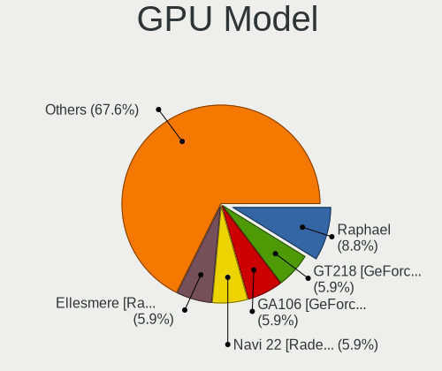
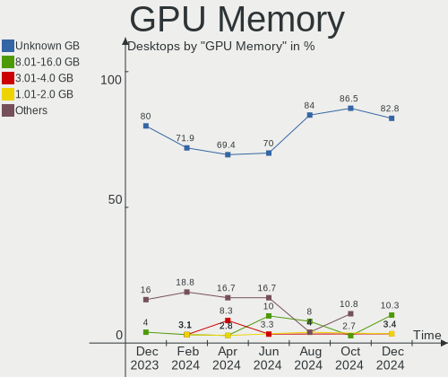

KDE neon Hardware Trends (Desktop)
----------------------------------

A project to identify most popular hardware characteristics and track their change
over time based on data collected by KDE neon users at https://Linux-Hardware.org.

Anyone can contribute to the study by uploading probes of their computers by
the [hw-probe](https://github.com/linuxhw/hw-probe) tool:

    sudo -E hw-probe -all -upload

Full-feature report is available here: https://linux-hardware.org/?view=trends&formfactor=desktop

Period: Jun, 2021.

Contents
--------

- [ OS                       ](#os)
- [ OS Family                ](#os-family)
- [ Kernel                   ](#kernel)
- [ Kernel Family            ](#kernel-family)
- [ Kernel Major Ver.        ](#kernel-major-ver)
- [ Arch                     ](#arch)
- [ DE                       ](#de)
- [ Display Server           ](#display-server)
- [ Display Manager          ](#display-manager)
- [ OS Lang                  ](#os-lang)
- [ Boot Mode                ](#boot-mode)
- [ Filesystem               ](#filesystem)
- [ Part. scheme             ](#part-scheme)
- [ Dual Boot with Linux/BSD ](#dual-boot-with-linux/bsd)
- [ Dual Boot (Win)          ](#dual-boot-win)
- [ Country                  ](#country)
- [ City                     ](#city)
- [ Vendor                   ](#vendor)
- [ Model                    ](#model)
- [ Model Family             ](#model-family)
- [ MFG Year                 ](#mfg-year)
- [ Form Factor              ](#form-factor)
- [ Secure Boot              ](#secure-boot)
- [ Coreboot                 ](#coreboot)
- [ RAM Size                 ](#ram-size)
- [ RAM Used                 ](#ram-used)
- [ Has CD-ROM               ](#has-cd-rom)
- [ Total Drives             ](#total-drives)
- [ Has Ethernet             ](#has-ethernet)
- [ Has WiFi                 ](#has-wifi)
- [ Has Bluetooth            ](#has-bluetooth)
- [ Drive Vendor             ](#drive-vendor)
- [ Drive Model              ](#drive-model)
- [ HDD Vendor               ](#hdd-vendor)
- [ SSD Vendor               ](#ssd-vendor)
- [ Drive Kind               ](#drive-kind)
- [ Drive Connector          ](#drive-connector)
- [ Drive Size               ](#drive-size)
- [ Space Total              ](#space-total)
- [ Space Used               ](#space-used)
- [ Malfunc. Drives          ](#malfunc-drives)
- [ Malfunc. Drive Vendor    ](#malfunc-drive-vendor)
- [ Malfunc. HDD Vendor      ](#malfunc-hdd-vendor)
- [ Malfunc. Drive Kind      ](#malfunc-drive-kind)
- [ Failed Drives            ](#failed-drives)
- [ Failed Drive Vendor      ](#failed-drive-vendor)
- [ Drive Status             ](#drive-status)
- [ Storage Vendor           ](#storage-vendor)
- [ Storage Model            ](#storage-model)
- [ Storage Kind             ](#storage-kind)
- [ CPU Vendor               ](#cpu-vendor)
- [ CPU Model                ](#cpu-model)
- [ CPU Model Family         ](#cpu-model-family)
- [ CPU Cores                ](#cpu-cores)
- [ CPU Sockets              ](#cpu-sockets)
- [ CPU Threads              ](#cpu-threads)
- [ CPU Op-Modes             ](#cpu-op-modes)
- [ CPU Microcode            ](#cpu-microcode)
- [ CPU Microarch            ](#cpu-microarch)
- [ GPU Vendor               ](#gpu-vendor)
- [ GPU Model                ](#gpu-model)
- [ GPU Combo                ](#gpu-combo)
- [ GPU Driver               ](#gpu-driver)
- [ GPU Memory               ](#gpu-memory)
- [ Monitor Vendor           ](#monitor-vendor)
- [ Monitor Model            ](#monitor-model)
- [ Monitor Resolution       ](#monitor-resolution)
- [ Monitor Diagonal         ](#monitor-diagonal)
- [ Monitor Width            ](#monitor-width)
- [ Aspect Ratio             ](#aspect-ratio)
- [ Monitor Area             ](#monitor-area)
- [ Pixel Density            ](#pixel-density)
- [ Multiple Monitors        ](#multiple-monitors)
- [ Net Controller Vendor    ](#net-controller-vendor)
- [ Net Controller Model     ](#net-controller-model)
- [ Wireless Vendor          ](#wireless-vendor)
- [ Wireless Model           ](#wireless-model)
- [ Ethernet Vendor          ](#ethernet-vendor)
- [ Ethernet Model           ](#ethernet-model)
- [ Net Controller Kind      ](#net-controller-kind)
- [ Used Controller          ](#used-controller)
- [ NICs                     ](#nics)
- [ IPv6                     ](#ipv6)
- [ Memory Vendor            ](#memory-vendor)
- [ Memory Model             ](#memory-model)
- [ Memory Kind              ](#memory-kind)
- [ Memory Form Factor       ](#memory-form-factor)
- [ Memory Size              ](#memory-size)
- [ Memory Speed             ](#memory-speed)
- [ Sound Vendor             ](#sound-vendor)
- [ Sound Model              ](#sound-model)
- [ Camera Vendor            ](#camera-vendor)
- [ Camera Model             ](#camera-model)
- [ Fingerprint Vendor       ](#fingerprint-vendor)
- [ Fingerprint Model        ](#fingerprint-model)
- [ Chipcard Vendor          ](#chipcard-vendor)
- [ Chipcard Model           ](#chipcard-model)
- [ Printer Vendor           ](#printer-vendor)
- [ Printer Model            ](#printer-model)
- [ Scanner Vendor           ](#scanner-vendor)
- [ Scanner Model            ](#scanner-model)
- [ Bluetooth Vendor         ](#bluetooth-vendor)
- [ Bluetooth Model          ](#bluetooth-model)
- [ Unsupported Devices      ](#unsupported-devices)
- [ Unsupported Device Types ](#unsupported-device-types)

OS
--

Installed operating systems

| Name           | Desktops | Percent |
|----------------|----------|---------|
| KDE neon 20.04 | 35       | 100%    |

OS Family
---------

OS without a version

| Name     | Desktops | Percent |
|----------|----------|---------|
| KDE neon | 35       | 100%    |

Kernel
------

Version of the Linux kernel

| Version          | Desktops | Percent |
|------------------|----------|---------|
| 5.4.0-74-generic | 19       | 54.29%  |
| 5.8.0-59-generic | 6        | 17.14%  |
| 5.8.0-55-generic | 6        | 17.14%  |
| 5.4.0-72-generic | 2        | 5.71%   |
| 5.4.0-77-generic | 1        | 2.86%   |
| 5.4.0-70-generic | 1        | 2.86%   |

Kernel Family
-------------

Linux kernel without a distro release

| Version | Desktops | Percent |
|---------|----------|---------|
| 5.4.0   | 23       | 65.71%  |
| 5.8.0   | 12       | 34.29%  |

Kernel Major Ver.
-----------------

Linux kernel major version

| Version | Desktops | Percent |
|---------|----------|---------|
| 5.4     | 23       | 65.71%  |
| 5.8     | 12       | 34.29%  |

Arch
----

OS architecture (x86_64, i586, etc.)

| Name   | Desktops | Percent |
|--------|----------|---------|
| x86_64 | 35       | 100%    |

DE
--

Desktop Environment

| Name | Desktops | Percent |
|------|----------|---------|
| KDE  | 32       | 91.43%  |
| KDE5 | 3        | 8.57%   |

Display Server
--------------

X11 or Wayland

| Name    | Desktops | Percent |
|---------|----------|---------|
| X11     | 33       | 94.29%  |
| Wayland | 1        | 2.86%   |
| Tty     | 1        | 2.86%   |

Display Manager
---------------

SDDM, LightDM, etc.

| Name    | Desktops | Percent |
|---------|----------|---------|
| Unknown | 32       | 91.43%  |
| SDDM    | 3        | 8.57%   |

OS Lang
-------

Language

| Lang  | Desktops | Percent |
|-------|----------|---------|
| en_US | 10       | 28.57%  |
| de_DE | 7        | 20%     |
| pt_BR | 3        | 8.57%   |
| en_GB | 3        | 8.57%   |
| zh_CN | 1        | 2.86%   |
| ru_UA | 1        | 2.86%   |
| ru_RU | 1        | 2.86%   |
| nl_NL | 1        | 2.86%   |
| fr_FR | 1        | 2.86%   |
| es_HN | 1        | 2.86%   |
| es_ES | 1        | 2.86%   |
| en_ZA | 1        | 2.86%   |
| en_NZ | 1        | 2.86%   |
| en_IN | 1        | 2.86%   |
| en_CA | 1        | 2.86%   |
| C     | 1        | 2.86%   |

Boot Mode
---------

EFI or BIOS

| Mode | Desktops | Percent |
|------|----------|---------|
| EFI  | 18       | 51.43%  |
| BIOS | 17       | 48.57%  |

Filesystem
----------

Type of filesystem

| Type  | Desktops | Percent |
|-------|----------|---------|
| Ext4  | 31       | 88.57%  |
| Btrfs | 3        | 8.57%   |
| Ext2  | 1        | 2.86%   |

Part. scheme
------------

Scheme of partitioning

| Type    | Desktops | Percent |
|---------|----------|---------|
| Unknown | 31       | 88.57%  |
| MBR     | 2        | 5.71%   |
| GPT     | 2        | 5.71%   |

Dual Boot with Linux/BSD
------------------------

Hosting more than one Linux/BSD

| Dual boot | Desktops | Percent |
|-----------|----------|---------|
| No        | 31       | 88.57%  |
| Yes       | 4        | 11.43%  |

Dual Boot (Win)
---------------

Hosting Linux and Windows

| Dual boot | Desktops | Percent |
|-----------|----------|---------|
| No        | 30       | 85.71%  |
| Yes       | 5        | 14.29%  |

Country
-------

Geographic location (country)

| Country      | Desktops | Percent |
|--------------|----------|---------|
| USA          | 8        | 22.86%  |
| Germany      | 6        | 17.14%  |
| Brazil       | 3        | 8.57%   |
| UK           | 2        | 5.71%   |
| Spain        | 2        | 5.71%   |
| Ukraine      | 1        | 2.86%   |
| Sweden       | 1        | 2.86%   |
| South Africa | 1        | 2.86%   |
| Romania      | 1        | 2.86%   |
| Poland       | 1        | 2.86%   |
| Norway       | 1        | 2.86%   |
| New Zealand  | 1        | 2.86%   |
| Netherlands  | 1        | 2.86%   |
| India        | 1        | 2.86%   |
| Honduras     | 1        | 2.86%   |
| France       | 1        | 2.86%   |
| China        | 1        | 2.86%   |
| Canada       | 1        | 2.86%   |
| Argentina    | 1        | 2.86%   |

City
----

Geographic location (city)

| City                 | Desktops | Percent |
|----------------------|----------|---------|
| Zhengzhou            | 1        | 2.86%   |
| Würzburg            | 1        | 2.86%   |
| Wysokie Mazowieckie  | 1        | 2.86%   |
| Tegucigalpa          | 1        | 2.86%   |
| Tauranga             | 1        | 2.86%   |
| Springfield          | 1        | 2.86%   |
| Schrobenhausen       | 1        | 2.86%   |
| Sao Vicente          | 1        | 2.86%   |
| Santander            | 1        | 2.86%   |
| Rosenheim            | 1        | 2.86%   |
| Phoenix              | 1        | 2.86%   |
| Peterlee             | 1        | 2.86%   |
| Oslo                 | 1        | 2.86%   |
| North Port           | 1        | 2.86%   |
| Nashotah             | 1        | 2.86%   |
| Moormerland          | 1        | 2.86%   |
| Malmo                | 1        | 2.86%   |
| Lathrop              | 1        | 2.86%   |
| Kyiv                 | 1        | 2.86%   |
| Kolkata              | 1        | 2.86%   |
| Kingsville           | 1        | 2.86%   |
| Kerkdriel            | 1        | 2.86%   |
| Johannesburg         | 1        | 2.86%   |
| Hemingford Grey      | 1        | 2.86%   |
| Frankfurt am Main    | 1        | 2.86%   |
| Duisburg             | 1        | 2.86%   |
| Delta                | 1        | 2.86%   |
| Dallas               | 1        | 2.86%   |
| Cordova              | 1        | 2.86%   |
| Conselheiro Lafaiete | 1        | 2.86%   |
| Chartres             | 1        | 2.86%   |
| Chandler             | 1        | 2.86%   |
| Buenos Aires         | 1        | 2.86%   |
| Bucharest            | 1        | 2.86%   |
| Belo Horizonte       | 1        | 2.86%   |

Vendor
------

Motherboard manufacturer

| Name                | Desktops | Percent |
|---------------------|----------|---------|
| ASUSTek Computer    | 11       | 31.43%  |
| MSI                 | 4        | 11.43%  |
| Hewlett-Packard     | 4        | 11.43%  |
| ASRock              | 4        | 11.43%  |
| Lenovo              | 3        | 8.57%   |
| Gigabyte Technology | 3        | 8.57%   |
| Supermicro          | 1        | 2.86%   |
| Intel               | 1        | 2.86%   |
| Huanghe             | 1        | 2.86%   |
| Fujitsu             | 1        | 2.86%   |
| ECS                 | 1        | 2.86%   |
| Acer                | 1        | 2.86%   |

Model
-----

Motherboard model

| Name                              | Desktops | Percent |
|-----------------------------------|----------|---------|
| Supermicro H8QM8                  | 1        | 2.86%   |
| MSI MS-7C51                       | 1        | 2.86%   |
| MSI MS-7A33                       | 1        | 2.86%   |
| MSI MS-7974                       | 1        | 2.86%   |
| MSI MS-7599                       | 1        | 2.86%   |
| Lenovo ThinkCentre M73 10AXS3V400 | 1        | 2.86%   |
| Lenovo ThinkCentre M58p 7479RS2   | 1        | 2.86%   |
| Lenovo ThinkCentre E73 10AW008PMX | 1        | 2.86%   |
| Intel DH55HC AAE70933-505         | 1        | 2.86%   |
| Huanghe PRO H410M-C               | 1        | 2.86%   |
| HP EliteDesk 800 G2 DM 65W        | 1        | 2.86%   |
| HP Desktop M01-F0xxx              | 1        | 2.86%   |
| HP Compaq Elite 8300 CMT          | 1        | 2.86%   |
| HP 750-410                        | 1        | 2.86%   |
| Gigabyte Z390 AORUS MASTER        | 1        | 2.86%   |
| Gigabyte H61MS                    | 1        | 2.86%   |
| Gigabyte B85M-HD3                 | 1        | 2.86%   |
| Fujitsu ESPRIMO P920              | 1        | 2.86%   |
| ECS A785GM-AD3                    | 1        | 2.86%   |
| ASUS Z170-E                       | 1        | 2.86%   |
| ASUS TUF GAMING B460-PRO          | 1        | 2.86%   |
| ASUS SABERTOOTH 990FX R2.0        | 1        | 2.86%   |
| ASUS PRIME X570-PRO               | 1        | 2.86%   |
| ASUS PRIME B450-PLUS              | 1        | 2.86%   |
| ASUS P8H67                        | 1        | 2.86%   |
| ASUS P7P55D-E                     | 1        | 2.86%   |
| ASUS P5KPL-AM EPU                 | 1        | 2.86%   |
| ASUS M5A78L-M/USB3                | 1        | 2.86%   |
| ASUS H110M-A/M.2                  | 1        | 2.86%   |
| ASUS All Series                   | 1        | 2.86%   |
| ASRock FM2A78M-HD+                | 1        | 2.86%   |
| ASRock FM2A55M-HD+ R2.0           | 1        | 2.86%   |
| ASRock A320M-DVS R4.0             | 1        | 2.86%   |
| ASRock 970M Pro3                  | 1        | 2.86%   |
| Acer Aspire XC-230                | 1        | 2.86%   |

Model Family
------------

Motherboard model prefix

| Name               | Desktops | Percent |
|--------------------|----------|---------|
| Lenovo ThinkCentre | 3        | 8.57%   |
| ASUS PRIME         | 2        | 5.71%   |
| Supermicro H8QM8   | 1        | 2.86%   |
| MSI MS-7C51        | 1        | 2.86%   |
| MSI MS-7A33        | 1        | 2.86%   |
| MSI MS-7974        | 1        | 2.86%   |
| MSI MS-7599        | 1        | 2.86%   |
| Intel DH55HC       | 1        | 2.86%   |
| Huanghe PRO        | 1        | 2.86%   |
| HP EliteDesk       | 1        | 2.86%   |
| HP Desktop         | 1        | 2.86%   |
| HP Compaq          | 1        | 2.86%   |
| HP 750-410         | 1        | 2.86%   |
| Gigabyte Z390      | 1        | 2.86%   |
| Gigabyte H61MS     | 1        | 2.86%   |
| Gigabyte B85M-HD3  | 1        | 2.86%   |
| Fujitsu ESPRIMO    | 1        | 2.86%   |
| ECS A785GM-AD3     | 1        | 2.86%   |
| ASUS Z170-E        | 1        | 2.86%   |
| ASUS TUF           | 1        | 2.86%   |
| ASUS SABERTOOTH    | 1        | 2.86%   |
| ASUS P8H67         | 1        | 2.86%   |
| ASUS P7P55D-E      | 1        | 2.86%   |
| ASUS P5KPL-AM      | 1        | 2.86%   |
| ASUS M5A78L-M      | 1        | 2.86%   |
| ASUS H110M-A       | 1        | 2.86%   |
| ASUS All           | 1        | 2.86%   |
| ASRock FM2A78M-HD+ | 1        | 2.86%   |
| ASRock FM2A55M-HD+ | 1        | 2.86%   |
| ASRock A320M-DVS   | 1        | 2.86%   |
| ASRock 970M        | 1        | 2.86%   |
| Acer Aspire        | 1        | 2.86%   |

MFG Year
--------

Motherboard manufacture year

| Year | Desktops | Percent |
|------|----------|---------|
| 2020 | 4        | 11.43%  |
| 2016 | 4        | 11.43%  |
| 2015 | 4        | 11.43%  |
| 2021 | 3        | 8.57%   |
| 2019 | 3        | 8.57%   |
| 2017 | 3        | 8.57%   |
| 2012 | 3        | 8.57%   |
| 2010 | 3        | 8.57%   |
| 2014 | 2        | 5.71%   |
| 2011 | 2        | 5.71%   |
| 2018 | 1        | 2.86%   |
| 2013 | 1        | 2.86%   |
| 2009 | 1        | 2.86%   |
| 2007 | 1        | 2.86%   |

Form Factor
-----------

Physical design of the computer

| Name    | Desktops | Percent |
|---------|----------|---------|
| Desktop | 35       | 100%    |

Secure Boot
-----------

Enabled or disabled

| State    | Desktops | Percent |
|----------|----------|---------|
| Disabled | 34       | 97.14%  |
| Enabled  | 1        | 2.86%   |

Coreboot
--------

Have coreboot on board

| Used | Desktops | Percent |
|------|----------|---------|
| No   | 35       | 100%    |

RAM Size
--------

Total RAM memory

| Size in GB | Desktops | Percent |
|------------|----------|---------|
| 16.01-24.0 | 12       | 34.29%  |
| 8.01-16.0  | 10       | 28.57%  |
| 4.01-8.0   | 6        | 17.14%  |
| 32.01-64.0 | 4        | 11.43%  |
| 3.01-4.0   | 2        | 5.71%   |
| 24.01-32.0 | 1        | 2.86%   |

RAM Used
--------

Used RAM memory

| Used GB  | Desktops | Percent |
|----------|----------|---------|
| 1.01-2.0 | 13       | 37.14%  |
| 2.01-3.0 | 12       | 34.29%  |
| 3.01-4.0 | 6        | 17.14%  |
| 4.01-8.0 | 4        | 11.43%  |

Has CD-ROM
----------

Has CD-ROM on board

| Presented | Desktops | Percent |
|-----------|----------|---------|
| Yes       | 19       | 54.29%  |
| No        | 16       | 45.71%  |

Total Drives
------------

Number of drives on board

| Drives | Desktops | Percent |
|--------|----------|---------|
| 1      | 13       | 37.14%  |
| 2      | 9        | 25.71%  |
| 5      | 3        | 8.57%   |
| 4      | 3        | 8.57%   |
| 3      | 3        | 8.57%   |
| 6      | 2        | 5.71%   |
| 11     | 1        | 2.86%   |
| 7      | 1        | 2.86%   |

Has Ethernet
------------

Has Ethernet on board

| Presented | Desktops | Percent |
|-----------|----------|---------|
| Yes       | 35       | 100%    |

Has WiFi
--------

Has WiFi module

| Presented | Desktops | Percent |
|-----------|----------|---------|
| No        | 23       | 65.71%  |
| Yes       | 12       | 34.29%  |

Has Bluetooth
-------------

Has Bluetooth module

| Presented | Desktops | Percent |
|-----------|----------|---------|
| No        | 23       | 65.71%  |
| Yes       | 12       | 34.29%  |

Drive Vendor
------------

Hard drive vendors

| Vendor              | Desktops | Drives | Percent |
|---------------------|----------|--------|---------|
| Seagate             | 14       | 18     | 19.72%  |
| Samsung Electronics | 11       | 14     | 15.49%  |
| WDC                 | 10       | 24     | 14.08%  |
| Toshiba             | 8        | 8      | 11.27%  |
| Kingston            | 6        | 8      | 8.45%   |
| SanDisk             | 4        | 4      | 5.63%   |
| Crucial             | 4        | 5      | 5.63%   |
| Unknown             | 3        | 4      | 4.23%   |
| Patriot             | 2        | 2      | 2.82%   |
| Intenso             | 2        | 2      | 2.82%   |
| Intel               | 2        | 2      | 2.82%   |
| Phison              | 1        | 1      | 1.41%   |
| Gigabyte Technology | 1        | 1      | 1.41%   |
| China               | 1        | 2      | 1.41%   |
| Apacer              | 1        | 1      | 1.41%   |
| A-DATA Technology   | 1        | 1      | 1.41%   |

Drive Model
-----------

Hard drive models

| Model                                | Desktops | Percent |
|--------------------------------------|----------|---------|
| Kingston SV300S37A120G 120GB SSD     | 3        | 3.3%    |
| Kingston SA400S37240G 240GB SSD      | 3        | 3.3%    |
| WDC WDS120G2G0A-00JH30 120GB SSD     | 2        | 2.2%    |
| WDC WD1003FZEX-00K3CA0 1TB           | 2        | 2.2%    |
| Unknown SD/MMC/MS PRO 128GB          | 2        | 2.2%    |
| Seagate ST500DM002-1BD142 500GB      | 2        | 2.2%    |
| Seagate ST1000DM003-1ER162 1TB       | 2        | 2.2%    |
| Samsung SSD 860 EVO 1TB              | 2        | 2.2%    |
| Samsung SSD 850 EVO 250GB            | 2        | 2.2%    |
| Samsung SSD 850 EVO 1TB              | 2        | 2.2%    |
| Crucial CT500MX500SSD1 500GB         | 2        | 2.2%    |
| WDC WDS250G2B0A-00SM50 250GB SSD     | 1        | 1.1%    |
| WDC WDS100T2B0A-00SM50 1TB SSD       | 1        | 1.1%    |
| WDC WD5000LPLX-75ZNTT0 500GB         | 1        | 1.1%    |
| WDC WD5000AZRX-00A8LB0 500GB         | 1        | 1.1%    |
| WDC WD30EZRX-00SPEB0 3TB             | 1        | 1.1%    |
| WDC WD2500JS-60MHB1 250GB            | 1        | 1.1%    |
| WDC WD20EZAZ-00GGJB0 2TB             | 1        | 1.1%    |
| WDC WD20EFRX-68EUZN0 2TB             | 1        | 1.1%    |
| WDC WD20EARS-00J2GB0 2TB             | 1        | 1.1%    |
| WDC WD10EZRZ-00HTKB0 1TB             | 1        | 1.1%    |
| WDC WD10EZEX-21WN4A0 1TB             | 1        | 1.1%    |
| WDC WD10EARS-00MVWB0 1TB             | 1        | 1.1%    |
| WDC WD101KRYZ-01JPDB1 10TB           | 1        | 1.1%    |
| WDC WD1003FZEX-00MK2A0 1TB           | 1        | 1.1%    |
| Unknown S5170-512 512GB              | 1        | 1.1%    |
| Unknown NVMe SSD Drive 256GB         | 1        | 1.1%    |
| Toshiba THNSNJ512GCSY 512GB SSD      | 1        | 1.1%    |
| Toshiba MQ01ABD100 1TB               | 1        | 1.1%    |
| Toshiba MK8032GSX 80GB               | 1        | 1.1%    |
| Toshiba MK2561GSYN 250GB             | 1        | 1.1%    |
| Toshiba HDWD110 1TB                  | 1        | 1.1%    |
| Toshiba DT01ACA300 3TB               | 1        | 1.1%    |
| Toshiba DT01ACA100 1TB               | 1        | 1.1%    |
| Toshiba DT01ACA050 500GB             | 1        | 1.1%    |
| Seagate ST9500325AS 500GB            | 1        | 1.1%    |
| Seagate ST4000LM024-2AN17V 4TB       | 1        | 1.1%    |
| Seagate ST4000DM000-1F2168 4TB       | 1        | 1.1%    |
| Seagate ST3500418AS 500GB            | 1        | 1.1%    |
| Seagate ST3000DM001-1CH166 3TB       | 1        | 1.1%    |
| Seagate ST2000DM008-2FR102 2TB       | 1        | 1.1%    |
| Seagate ST2000DM001-1CH164 2TB       | 1        | 1.1%    |
| Seagate ST2000DL003-9VT166 2TB       | 1        | 1.1%    |
| Seagate ST1500DL003-9VT16L 1TB       | 1        | 1.1%    |
| Seagate ST1000LM049-2GH172 1TB       | 1        | 1.1%    |
| Seagate ST1000DM003-1SB102 1TB       | 1        | 1.1%    |
| Seagate ST1000DM003-1CH162 1TB       | 1        | 1.1%    |
| Seagate Expansion Desk 2TB           | 1        | 1.1%    |
| Seagate BUP Slim 2TB                 | 1        | 1.1%    |
| SanDisk SDSSDHII240G 240GB           | 1        | 1.1%    |
| SanDisk SDSSDA120G 120GB             | 1        | 1.1%    |
| SanDisk SDSSDA-2T00 2TB              | 1        | 1.1%    |
| Sandisk NVMe SSD Drive 250GB         | 1        | 1.1%    |
| Samsung SSD 860 EVO 500GB            | 1        | 1.1%    |
| Samsung SSD 840 EVO 250GB            | 1        | 1.1%    |
| Samsung SSD 750 EVO 120GB            | 1        | 1.1%    |
| Samsung Portable SSD T5 500GB        | 1        | 1.1%    |
| Samsung NVMe SSD Drive 500GB         | 1        | 1.1%    |
| Samsung MZ7TE128HMGR-000L1 128GB SSD | 1        | 1.1%    |
| Samsung MZ7LN256HCHP-000H1 256GB SSD | 1        | 1.1%    |

HDD Vendor
----------

Hard disk drive vendors

| Vendor              | Desktops | Drives | Percent |
|---------------------|----------|--------|---------|
| Seagate             | 14       | 18     | 45.16%  |
| WDC                 | 8        | 19     | 25.81%  |
| Toshiba             | 7        | 7      | 22.58%  |
| Samsung Electronics | 1        | 1      | 3.23%   |
| Intenso             | 1        | 1      | 3.23%   |

SSD Vendor
----------

Solid state drive vendors

| Vendor              | Desktops | Drives | Percent |
|---------------------|----------|--------|---------|
| Samsung Electronics | 9        | 12     | 26.47%  |
| Kingston            | 6        | 8      | 17.65%  |
| WDC                 | 4        | 5      | 11.76%  |
| Crucial             | 4        | 5      | 11.76%  |
| SanDisk             | 3        | 3      | 8.82%   |
| Patriot             | 2        | 2      | 5.88%   |
| Toshiba             | 1        | 1      | 2.94%   |
| Intenso             | 1        | 1      | 2.94%   |
| Intel               | 1        | 1      | 2.94%   |
| China               | 1        | 2      | 2.94%   |
| Apacer              | 1        | 1      | 2.94%   |
| A-DATA Technology   | 1        | 1      | 2.94%   |

Drive Kind
----------

HDD or SSD

| Kind    | Desktops | Drives | Percent |
|---------|----------|--------|---------|
| SSD     | 24       | 42     | 42.86%  |
| HDD     | 23       | 46     | 41.07%  |
| NVMe    | 6        | 6      | 10.71%  |
| Unknown | 3        | 3      | 5.36%   |

Drive Connector
---------------

SATA, SAS, NVMe, etc.

| Type | Desktops | Drives | Percent |
|------|----------|--------|---------|
| SATA | 34       | 84     | 73.91%  |
| SAS  | 6        | 7      | 13.04%  |
| NVMe | 6        | 6      | 13.04%  |

Drive Size
----------

Size of hard drive

| Size in TB | Desktops | Drives | Percent |
|------------|----------|--------|---------|
| 0.01-0.5   | 28       | 44     | 49.12%  |
| 0.51-1.0   | 17       | 25     | 29.82%  |
| 1.01-2.0   | 6        | 12     | 10.53%  |
| 3.01-4.0   | 3        | 3      | 5.26%   |
| 2.01-3.0   | 2        | 3      | 3.51%   |
| 4.01-10.0  | 1        | 1      | 1.75%   |

Space Total
-----------

Amount of disk space available on the file system

| Size in GB     | Desktops | Percent |
|----------------|----------|---------|
| 101-250        | 7        | 20%     |
| 501-1000       | 7        | 20%     |
| 251-500        | 5        | 14.29%  |
| More than 3000 | 4        | 11.43%  |
| 2001-3000      | 3        | 8.57%   |
| 1001-2000      | 3        | 8.57%   |
| 51-100         | 3        | 8.57%   |
| 21-50          | 1        | 2.86%   |
| 1-20           | 1        | 2.86%   |
| Unknown        | 1        | 2.86%   |

Space Used
----------

Amount of used disk space

| Used GB        | Desktops | Percent |
|----------------|----------|---------|
| 21-50          | 9        | 25.71%  |
| 1-20           | 8        | 22.86%  |
| 101-250        | 5        | 14.29%  |
| 501-1000       | 4        | 11.43%  |
| 51-100         | 3        | 8.57%   |
| 2001-3000      | 2        | 5.71%   |
| More than 3000 | 1        | 2.86%   |
| 251-500        | 1        | 2.86%   |
| 1001-2000      | 1        | 2.86%   |
| Unknown        | 1        | 2.86%   |

Malfunc. Drives
---------------

Drive models with a malfunction

| Model                          | Desktops | Drives | Percent |
|--------------------------------|----------|--------|---------|
| WDC WD20EFRX-68EUZN0 2TB       | 1        | 2      | 20%     |
| WDC WD20EARS-00J2GB0 2TB       | 1        | 1      | 20%     |
| WDC WD10EARS-00MVWB0 1TB       | 1        | 1      | 20%     |
| Seagate ST4000LM024-2AN17V 4TB | 1        | 1      | 20%     |
| Seagate ST2000DM001-1CH164 2TB | 1        | 1      | 20%     |

Malfunc. Drive Vendor
---------------------

Vendors of faulty drives

| Vendor  | Desktops | Drives | Percent |
|---------|----------|--------|---------|
| Seagate | 2        | 2      | 66.67%  |
| WDC     | 1        | 4      | 33.33%  |

Malfunc. HDD Vendor
-------------------

Vendors of faulty HDD drives

| Vendor  | Desktops | Drives | Percent |
|---------|----------|--------|---------|
| Seagate | 2        | 2      | 66.67%  |
| WDC     | 1        | 4      | 33.33%  |

Malfunc. Drive Kind
-------------------

Kinds of faulty drives

| Kind | Desktops | Drives | Percent |
|------|----------|--------|---------|
| HDD  | 2        | 6      | 100%    |

Failed Drives
-------------

Failed drive models

Zero info for selected period =(

Failed Drive Vendor
-------------------

Failed drive vendors

Zero info for selected period =(

Drive Status
------------

Number of failed and malfunc. drives

| Status   | Desktops | Drives | Percent |
|----------|----------|--------|---------|
| Detected | 32       | 82     | 84.21%  |
| Works    | 4        | 9      | 10.53%  |
| Malfunc  | 2        | 6      | 5.26%   |

Storage Vendor
--------------

Storage controller vendors

| Vendor                          | Desktops | Percent |
|---------------------------------|----------|---------|
| Intel                           | 19       | 41.3%   |
| AMD                             | 15       | 32.61%  |
| Phison Electronics              | 2        | 4.35%   |
| Marvell Technology Group        | 2        | 4.35%   |
| ASMedia Technology              | 2        | 4.35%   |
| VIA Technologies                | 1        | 2.17%   |
| Sandisk                         | 1        | 2.17%   |
| Samsung Electronics             | 1        | 2.17%   |
| Nvidia                          | 1        | 2.17%   |
| JMicron Technology              | 1        | 2.17%   |
| Hefei DATANG Storage Technology | 1        | 2.17%   |

Storage Model
-------------

Storage controller models

| Model                                                                                   | Desktops | Percent |
|-----------------------------------------------------------------------------------------|----------|---------|
| AMD FCH SATA Controller [AHCI mode]                                                     | 9        | 14.06%  |
| Intel Q170/Q150/B150/H170/H110/Z170/CM236 Chipset SATA Controller [AHCI Mode]           | 4        | 6.25%   |
| Intel 8 Series/C220 Series Chipset Family 6-port SATA Controller 1 [AHCI mode]          | 4        | 6.25%   |
| AMD SB7x0/SB8x0/SB9x0 SATA Controller [AHCI mode]                                       | 4        | 6.25%   |
| AMD SB7x0/SB8x0/SB9x0 IDE Controller                                                    | 4        | 6.25%   |
| Intel 6 Series/C200 Series Chipset Family Desktop SATA Controller (IDE mode, ports 4-5) | 2        | 3.13%   |
| Intel 6 Series/C200 Series Chipset Family Desktop SATA Controller (IDE mode, ports 0-3) | 2        | 3.13%   |
| Intel 400 Series Chipset Family SATA AHCI Controller                                    | 2        | 3.13%   |
| ASMedia ASM1062 Serial ATA Controller                                                   | 2        | 3.13%   |
| AMD SB7x0/SB8x0/SB9x0 SATA Controller [IDE mode]                                        | 2        | 3.13%   |
| AMD FCH SATA Controller D                                                               | 2        | 3.13%   |
| AMD 400 Series Chipset SATA Controller                                                  | 2        | 3.13%   |
| VIA VT6415 PATA IDE Host Controller                                                     | 1        | 1.56%   |
| Sandisk WD Blue SN550 NVMe SSD                                                          | 1        | 1.56%   |
| Samsung NVMe SSD Controller SM961/PM961/SM963                                           | 1        | 1.56%   |
| Phison E16 PCIe4 NVMe Controller                                                        | 1        | 1.56%   |
| Phison E12 NVMe Controller                                                              | 1        | 1.56%   |
| Nvidia MCP55 SATA Controller                                                            | 1        | 1.56%   |
| Nvidia MCP55 IDE                                                                        | 1        | 1.56%   |
| Marvell Group 88SE9215 PCIe 2.0 x1 4-port SATA 6 Gb/s Controller                        | 1        | 1.56%   |
| Marvell Group 88SE9120 SATA 6Gb/s Controller                                            | 1        | 1.56%   |
| JMicron JMB363 SATA/IDE Controller                                                      | 1        | 1.56%   |
| Intel SSD 660P Series                                                                   | 1        | 1.56%   |
| Intel SATA Controller [RAID mode]                                                       | 1        | 1.56%   |
| Intel NM10/ICH7 Family SATA Controller [IDE mode]                                       | 1        | 1.56%   |
| Intel Cannon Lake PCH SATA AHCI Controller                                              | 1        | 1.56%   |
| Intel 9 Series Chipset Family SATA Controller [AHCI Mode]                               | 1        | 1.56%   |
| Intel 82801JD/DO (ICH10 Family) SATA AHCI Controller                                    | 1        | 1.56%   |
| Intel 82801G (ICH7 Family) IDE Controller                                               | 1        | 1.56%   |
| Intel 5 Series/3400 Series Chipset PT IDER Controller                                   | 1        | 1.56%   |
| Intel 5 Series/3400 Series Chipset 6 port SATA AHCI Controller                          | 1        | 1.56%   |
| Intel 5 Series/3400 Series Chipset 4 port SATA IDE Controller                           | 1        | 1.56%   |
| Intel 5 Series/3400 Series Chipset 2 port SATA IDE Controller                           | 1        | 1.56%   |
| Intel 4 Series Chipset PT IDER Controller                                               | 1        | 1.56%   |
| Hefei DATANG Storage NVMe SSD Controller 300B                                           | 1        | 1.56%   |
| AMD X370 Series Chipset SATA Controller                                                 | 1        | 1.56%   |
| AMD FCH IDE Controller                                                                  | 1        | 1.56%   |

Storage Kind
------------

Kind of storage controller (IDE, SATA, NVMe, SAS, ...)

| Kind | Desktops | Percent |
|------|----------|---------|
| SATA | 29       | 60.42%  |
| IDE  | 12       | 25%     |
| NVMe | 6        | 12.5%   |
| RAID | 1        | 2.08%   |

CPU Vendor
----------

Processor vendors

| Vendor | Desktops | Percent |
|--------|----------|---------|
| Intel  | 19       | 54.29%  |
| AMD    | 16       | 45.71%  |

CPU Model
---------

Processor models

| Model                                           | Desktops | Percent |
|-------------------------------------------------|----------|---------|
| AMD Ryzen 5 2600X Six-Core Processor            | 2        | 5.71%   |
| AMD FX-8350 Eight-Core Processor                | 2        | 5.71%   |
| Intel Genuine CPU 2160 @ 1.80GHz                | 1        | 2.86%   |
| Intel Core i9-9900K CPU @ 3.60GHz               | 1        | 2.86%   |
| Intel Core i7-4790K CPU @ 4.00GHz               | 1        | 2.86%   |
| Intel Core i7-3770 CPU @ 3.40GHz                | 1        | 2.86%   |
| Intel Core i7-2600 CPU @ 3.40GHz                | 1        | 2.86%   |
| Intel Core i7 CPU 870 @ 2.93GHz                 | 1        | 2.86%   |
| Intel Core i5-6600K CPU @ 3.50GHz               | 1        | 2.86%   |
| Intel Core i5-6600 CPU @ 3.30GHz                | 1        | 2.86%   |
| Intel Core i5-6500 CPU @ 3.20GHz                | 1        | 2.86%   |
| Intel Core i5-6400 CPU @ 2.70GHz                | 1        | 2.86%   |
| Intel Core i5-4570 CPU @ 3.20GHz                | 1        | 2.86%   |
| Intel Core i5-4460S CPU @ 2.90GHz               | 1        | 2.86%   |
| Intel Core i5-4430 CPU @ 3.00GHz                | 1        | 2.86%   |
| Intel Core i5-10600K CPU @ 4.10GHz              | 1        | 2.86%   |
| Intel Core i5-10400 CPU @ 2.90GHz               | 1        | 2.86%   |
| Intel Core i5 CPU 760 @ 2.80GHz                 | 1        | 2.86%   |
| Intel Core i3-4350T CPU @ 3.10GHz               | 1        | 2.86%   |
| Intel Core i3-2120 CPU @ 3.30GHz                | 1        | 2.86%   |
| Intel Core 2 Quad CPU Q9400 @ 2.66GHz           | 1        | 2.86%   |
| AMD Ryzen 7 3800X 8-Core Processor              | 1        | 2.86%   |
| AMD Ryzen 5 1500X Quad-Core Processor           | 1        | 2.86%   |
| AMD Ryzen 3 3200G with Radeon Vega Graphics     | 1        | 2.86%   |
| AMD Ryzen 3 1200 Quad-Core Processor            | 1        | 2.86%   |
| AMD Phenom II X4 965 Processor                  | 1        | 2.86%   |
| AMD FX-8120 Eight-Core Processor                | 1        | 2.86%   |
| AMD FX-4130 Quad-Core Processor                 | 1        | 2.86%   |
| AMD Dual-Core Opteron Processor 8216            | 1        | 2.86%   |
| AMD Athlon II X4 640 Processor                  | 1        | 2.86%   |
| AMD A8-7410 APU with AMD Radeon R5 Graphics     | 1        | 2.86%   |
| AMD A8-5600K APU with Radeon HD Graphics        | 1        | 2.86%   |
| AMD A10-7860K Radeon R7, 12 Compute Cores 4C+8G | 1        | 2.86%   |

CPU Model Family
----------------

Processor model prefix

| Model             | Desktops | Percent |
|-------------------|----------|---------|
| Intel Core i5     | 10       | 28.57%  |
| Intel Core i7     | 4        | 11.43%  |
| AMD FX            | 4        | 11.43%  |
| AMD Ryzen 5       | 3        | 8.57%   |
| Intel Core i3     | 2        | 5.71%   |
| AMD Ryzen 3       | 2        | 5.71%   |
| AMD A8            | 2        | 5.71%   |
| Other             | 1        | 2.86%   |
| Intel Genuine     | 1        | 2.86%   |
| Intel Core i9     | 1        | 2.86%   |
| Intel Core 2 Quad | 1        | 2.86%   |
| AMD Ryzen 7       | 1        | 2.86%   |
| AMD Phenom II X4  | 1        | 2.86%   |
| AMD Athlon II X4  | 1        | 2.86%   |
| AMD A10           | 1        | 2.86%   |

CPU Cores
---------

Number of processor cores

| Number | Desktops | Percent |
|--------|----------|---------|
| 4      | 22       | 62.86%  |
| 2      | 6        | 17.14%  |
| 6      | 4        | 11.43%  |
| 8      | 3        | 8.57%   |

CPU Sockets
-----------

Number of sockets

| Number | Desktops | Percent |
|--------|----------|---------|
| 1      | 34       | 97.14%  |
| 4      | 1        | 2.86%   |

CPU Threads
-----------

Threads per core (Hyper-Threading)

| Number | Desktops | Percent |
|--------|----------|---------|
| 2      | 19       | 54.29%  |
| 1      | 16       | 45.71%  |

CPU Op-Modes
------------

CPU Operation Modes (32-bit, 64-bit)

| Op mode        | Desktops | Percent |
|----------------|----------|---------|
| 32-bit, 64-bit | 35       | 100%    |

CPU Microcode
-------------

Microcode number

| Number     | Desktops | Percent |
|------------|----------|---------|
| 0x506e3    | 4        | 11.43%  |
| 0x306c3    | 4        | 11.43%  |
| 0x0800820d | 3        | 8.57%   |
| 0x206a7    | 2        | 5.71%   |
| 0x106e5    | 2        | 5.71%   |
| 0x06000852 | 2        | 5.71%   |
| 0x0600063e | 2        | 5.71%   |
| 0x010000c8 | 2        | 5.71%   |
| Unknown    | 2        | 5.71%   |
| 0xa0655    | 1        | 2.86%   |
| 0xa0653    | 1        | 2.86%   |
| 0x906ec    | 1        | 2.86%   |
| 0x6f2      | 1        | 2.86%   |
| 0x306a9    | 1        | 2.86%   |
| 0x1067a    | 1        | 2.86%   |
| 0x08701021 | 1        | 2.86%   |
| 0x08108109 | 1        | 2.86%   |
| 0x08001126 | 1        | 2.86%   |
| 0x07030105 | 1        | 2.86%   |
| 0x06003106 | 1        | 2.86%   |
| 0x06001119 | 1        | 2.86%   |

CPU Microarch
-------------

Microarchitecture

| Name        | Desktops | Percent |
|-------------|----------|---------|
| Haswell     | 5        | 14.29%  |
| Zen+        | 4        | 11.43%  |
| Skylake     | 4        | 11.43%  |
| Piledriver  | 3        | 8.57%   |
| SandyBridge | 2        | 5.71%   |
| Nehalem     | 2        | 5.71%   |
| K10         | 2        | 5.71%   |
| CometLake   | 2        | 5.71%   |
| Bulldozer   | 2        | 5.71%   |
| Zen 2       | 1        | 2.86%   |
| Zen         | 1        | 2.86%   |
| Steamroller | 1        | 2.86%   |
| Puma        | 1        | 2.86%   |
| Penryn      | 1        | 2.86%   |
| KabyLake    | 1        | 2.86%   |
| K8 Hammer   | 1        | 2.86%   |
| IvyBridge   | 1        | 2.86%   |
| Core        | 1        | 2.86%   |

GPU Vendor
----------

Vendors of graphics cards

| Vendor | Desktops | Percent |
|--------|----------|---------|
| Nvidia | 19       | 48.72%  |
| Intel  | 10       | 25.64%  |
| AMD    | 10       | 25.64%  |

GPU Model
---------

Graphics card models

| Model                                                                       | Desktops | Percent |
|-----------------------------------------------------------------------------|----------|---------|
| Nvidia GK208B [GeForce GT 710]                                              | 4        | 10.26%  |
| Intel Xeon E3-1200 v3/4th Gen Core Processor Integrated Graphics Controller | 4        | 10.26%  |
| Intel HD Graphics 530                                                       | 2        | 5.13%   |
| Intel CometLake-S GT2 [UHD Graphics 630]                                    | 2        | 5.13%   |
| Nvidia TU117 [GeForce GTX 1650]                                             | 1        | 2.56%   |
| Nvidia TU116 [GeForce GTX 1660 Ti]                                          | 1        | 2.56%   |
| Nvidia TU104 [GeForce RTX 2080 Rev. A]                                      | 1        | 2.56%   |
| Nvidia GT215 [GeForce GT 240]                                               | 1        | 2.56%   |
| Nvidia GT200 [GeForce GTX 260]                                              | 1        | 2.56%   |
| Nvidia GP108 [GeForce GT 1030]                                              | 1        | 2.56%   |
| Nvidia GP106 [GeForce GTX 1060 3GB]                                         | 1        | 2.56%   |
| Nvidia GP104 [GeForce GTX 1070]                                             | 1        | 2.56%   |
| Nvidia GM107 [GeForce GTX 750 Ti]                                           | 1        | 2.56%   |
| Nvidia GK104 [GeForce GTX 680]                                              | 1        | 2.56%   |
| Nvidia GF119 [GeForce GT 520]                                               | 1        | 2.56%   |
| Nvidia GF116 [GeForce GTX 550 Ti]                                           | 1        | 2.56%   |
| Nvidia GF108 [GeForce GT 430]                                               | 1        | 2.56%   |
| Nvidia GF104 [GeForce GTX 460]                                              | 1        | 2.56%   |
| Nvidia G96C [GeForce 9500 GT]                                               | 1        | 2.56%   |
| Intel 4 Series Chipset Integrated Graphics Controller                       | 1        | 2.56%   |
| Intel 2nd Generation Core Processor Family Integrated Graphics Controller   | 1        | 2.56%   |
| AMD Trinity [Radeon HD 7560D]                                               | 1        | 2.56%   |
| AMD Tahiti PRO [Radeon HD 7950/8950 OEM / R9 280]                           | 1        | 2.56%   |
| AMD Picasso                                                                 | 1        | 2.56%   |
| AMD Navi 10 [Radeon RX 5600 OEM/5600 XT / 5700/5700 XT]                     | 1        | 2.56%   |
| AMD Mullins [Radeon R4/R5 Graphics]                                         | 1        | 2.56%   |
| AMD Lexa XT [Radeon PRO WX 2100]                                            | 1        | 2.56%   |
| AMD Kaveri [Radeon R7 Graphics]                                             | 1        | 2.56%   |
| AMD Ellesmere [Radeon RX 470/480/570/570X/580/580X/590]                     | 1        | 2.56%   |
| AMD Curacao XT / Trinidad XT [Radeon R7 370 / R9 270X/370X]                 | 1        | 2.56%   |
| AMD Cedar [Radeon HD 5000/6000/7350/8350 Series]                            | 1        | 2.56%   |

GPU Combo
---------

Combinations of graphics cards

| Name           | Desktops | Percent |
|----------------|----------|---------|
| 1 x Nvidia     | 18       | 51.43%  |
| 1 x AMD        | 9        | 25.71%  |
| 1 x Intel      | 6        | 17.14%  |
| Intel + Nvidia | 1        | 2.86%   |
| Intel + AMD    | 1        | 2.86%   |

GPU Driver
----------

Free vs proprietary

| Driver      | Desktops | Percent |
|-------------|----------|---------|
| Free        | 27       | 77.14%  |
| Proprietary | 7        | 20%     |
| Unknown     | 1        | 2.86%   |

GPU Memory
----------

Total video memory

| Size in GB | Desktops | Percent |
|------------|----------|---------|
| 0.51-1.0   | 10       | 28.57%  |
| 1.01-2.0   | 9        | 25.71%  |
| Unknown    | 7        | 20%     |
| 7.01-8.0   | 4        | 11.43%  |
| 3.01-4.0   | 2        | 5.71%   |
| 5.01-6.0   | 1        | 2.86%   |
| 2.01-3.0   | 1        | 2.86%   |
| 0.01-0.5   | 1        | 2.86%   |

Monitor Vendor
--------------

Monitor vendors

| Vendor              | Desktops | Percent |
|---------------------|----------|---------|
| Samsung Electronics | 9        | 25.71%  |
| Goldstar            | 4        | 11.43%  |
| Dell                | 3        | 8.57%   |
| Acer                | 3        | 8.57%   |
| LG Electronics      | 2        | 5.71%   |
| BenQ                | 2        | 5.71%   |
| AOC                 | 2        | 5.71%   |
| WXM                 | 1        | 2.86%   |
| Vizio               | 1        | 2.86%   |
| Toshiba             | 1        | 2.86%   |
| Panasonic           | 1        | 2.86%   |
| MiTAC               | 1        | 2.86%   |
| Idek Iiyama         | 1        | 2.86%   |
| Hitachi             | 1        | 2.86%   |
| Hewlett-Packard     | 1        | 2.86%   |
| GML                 | 1        | 2.86%   |
| Element             | 1        | 2.86%   |

Monitor Model
-------------

Monitor models

| Model                                                                 | Desktops | Percent |
|-----------------------------------------------------------------------|----------|---------|
| Samsung Electronics C32JG5x SAM0FDE 2560x1440 697x392mm 31.5-inch     | 2        | 5.26%   |
| WXM AAAA WXM2380 1920x1080 368x207mm 16.6-inch                        | 1        | 2.63%   |
| Vizio E50 VIZ1035 4096x2160 1100x620mm 49.7-inch                      | 1        | 2.63%   |
| Toshiba 49FHD_LCD_TV TSB3700 1920x1080 1360x768mm 61.5-inch           | 1        | 2.63%   |
| Samsung Electronics S23B300 SAM08AE 1680x1050 510x290mm 23.1-inch     | 1        | 2.63%   |
| Samsung Electronics S19C170 SAM0B01 1366x768 410x230mm 18.5-inch      | 1        | 2.63%   |
| Samsung Electronics LCD Monitor SME1920N 1366x768                     | 1        | 2.63%   |
| Samsung Electronics LCD Monitor SAM0D49 1920x1080 480x270mm 21.7-inch | 1        | 2.63%   |
| Samsung Electronics LCD Monitor LC24RG50 1920x1080                    | 1        | 2.63%   |
| Samsung Electronics C32F391 SAM0D34 1920x1080 698x393mm 31.5-inch     | 1        | 2.63%   |
| Samsung Electronics C27F390 SAM0D33 1920x1080 598x336mm 27.0-inch     | 1        | 2.63%   |
| Panasonic TV MEIC136 1280x720 698x392mm 31.5-inch                     | 1        | 2.63%   |
| MiTAC LED TV MTC0030 1920x1080 1150x650mm 52.0-inch                   | 1        | 2.63%   |
| LG Electronics LCD Monitor W2343 1920x1080                            | 1        | 2.63%   |
| LG Electronics LCD Monitor LG FULL HD 3840x1080                       | 1        | 2.63%   |
| LG Electronics LCD Monitor LG FULL HD                                 | 1        | 2.63%   |
| Idek Iiyama LCD Monitor PL2710HD 1920x1080                            | 1        | 2.63%   |
| Hitachi U220W D-sub HIT700D 1680x1050 474x296mm 22.0-inch             | 1        | 2.63%   |
| Hewlett-Packard V270 HPN3521 1920x1080 598x336mm 27.0-inch            | 1        | 2.63%   |
| Goldstar ULTRAWIDE GSM76FE 2560x1080 798x334mm 34.1-inch              | 1        | 2.63%   |
| Goldstar IPS235 GSM587E 1920x1080 510x290mm 23.1-inch                 | 1        | 2.63%   |
| Goldstar IPS234 GSM58D9 1920x1080 510x290mm 23.1-inch                 | 1        | 2.63%   |
| Goldstar 22MP55 GSM5A25 1680x1050 480x270mm 21.7-inch                 | 1        | 2.63%   |
| Goldstar 22EN33 GSM597C 1920x1080 480x270mm 21.7-inch                 | 1        | 2.63%   |
| GML GM-MATRIX-B GML1400 3840x1200 255x255mm 14.2-inch                 | 1        | 2.63%   |
| Element E2SW3918 ELE6486 1920x1080 1365x768mm 61.7-inch               | 1        | 2.63%   |
| Dell U2412M DELA07B 1920x1200 518x324mm 24.1-inch                     | 1        | 2.63%   |
| Dell U2312HM DEL4073 1920x1080 510x287mm 23.0-inch                    | 1        | 2.63%   |
| Dell ST2321L DELF032 1920x1080 509x286mm 23.0-inch                    | 1        | 2.63%   |
| Dell SE2717H/HX DELD0A1 1920x1080 600x340mm 27.2-inch                 | 1        | 2.63%   |
| BenQ T2200HD BNQ7726 1920x1080 477x268mm 21.5-inch                    | 1        | 2.63%   |
| BenQ GL2760 BNQ78D5 1920x1080 600x340mm 27.2-inch                     | 1        | 2.63%   |
| AOC 2790 AOC2790 1920x1080 598x336mm 27.0-inch                        | 1        | 2.63%   |
| AOC 2217 AOC2217 1680x1050 470x300mm 22.0-inch                        | 1        | 2.63%   |
| Acer LCD Monitor S241HL 1920x1080                                     | 1        | 2.63%   |
| Acer KC242Y A ACR08CC 1920x1080 517x323mm 24.0-inch                   | 1        | 2.63%   |
| Acer KA220HQ ACR0497 1920x1080 477x268mm 21.5-inch                    | 1        | 2.63%   |

Monitor Resolution
------------------

Monitor screen resolution

| Resolution         | Desktops | Percent |
|--------------------|----------|---------|
| 1920x1080 (FHD)    | 20       | 55.56%  |
| 3840x2160 (4K)     | 4        | 11.11%  |
| 2560x1440 (QHD)    | 2        | 5.56%   |
| 1680x1050 (WSXGA+) | 2        | 5.56%   |
| 1366x768 (WXGA)    | 2        | 5.56%   |
| 3840x1200          | 1        | 2.78%   |
| 3840x1080          | 1        | 2.78%   |
| 2560x1080          | 1        | 2.78%   |
| 1920x1200 (WUXGA)  | 1        | 2.78%   |
| 1280x720 (HD)      | 1        | 2.78%   |
| Unknown            | 1        | 2.78%   |

Monitor Diagonal
----------------

Diagonal size in inches

| Inches  | Desktops | Percent |
|---------|----------|---------|
| Unknown | 6        | 16.67%  |
| 27      | 5        | 13.89%  |
| 31      | 4        | 11.11%  |
| 23      | 4        | 11.11%  |
| 21      | 4        | 11.11%  |
| 24      | 2        | 5.56%   |
| 22      | 2        | 5.56%   |
| 84      | 1        | 2.78%   |
| 64      | 1        | 2.78%   |
| 61      | 1        | 2.78%   |
| 52      | 1        | 2.78%   |
| 40      | 1        | 2.78%   |
| 34      | 1        | 2.78%   |
| 18      | 1        | 2.78%   |
| 16      | 1        | 2.78%   |
| 14      | 1        | 2.78%   |

Monitor Width
-------------

Physical width

| Width in mm | Desktops | Percent |
|-------------|----------|---------|
| 501-600     | 10       | 28.57%  |
| 401-500     | 7        | 20%     |
| Unknown     | 6        | 17.14%  |
| 601-700     | 4        | 11.43%  |
| 1001-1500   | 3        | 8.57%   |
| 801-900     | 1        | 2.86%   |
| 701-800     | 1        | 2.86%   |
| 351-400     | 1        | 2.86%   |
| 201-300     | 1        | 2.86%   |
| 1501-2000   | 1        | 2.86%   |

Aspect Ratio
------------

Proportional relationship between the width and the height

| Ratio   | Desktops | Percent |
|---------|----------|---------|
| 16/9    | 23       | 65.71%  |
| Unknown | 6        | 17.14%  |
| 16/10   | 4        | 11.43%  |
| 21/9    | 1        | 2.86%   |
| 1.00    | 1        | 2.86%   |

Monitor Area
------------

Area in inch²

| Area in inch² | Desktops | Percent |
|----------------|----------|---------|
| 201-250        | 9        | 25%     |
| Unknown        | 6        | 16.67%  |
| 351-500        | 5        | 13.89%  |
| 301-350        | 5        | 13.89%  |
| More than 1000 | 4        | 11.11%  |
| 251-300        | 2        | 5.56%   |
| 151-200        | 1        | 2.78%   |
| 141-150        | 1        | 2.78%   |
| 111-120        | 1        | 2.78%   |
| 101-110        | 1        | 2.78%   |
| 501-1000       | 1        | 2.78%   |

Pixel Density
-------------

Pixels per inch

| Density       | Desktops | Percent |
|---------------|----------|---------|
| 51-100        | 19       | 55.88%  |
| Unknown       | 6        | 17.65%  |
| 101-120       | 4        | 11.76%  |
| 1-50          | 3        | 8.82%   |
| More than 240 | 1        | 2.94%   |
| 121-160       | 1        | 2.94%   |

Multiple Monitors
-----------------

Total monitors connected

| Total | Desktops | Percent |
|-------|----------|---------|
| 1     | 29       | 82.86%  |
| 2     | 4        | 11.43%  |
| 0     | 2        | 5.71%   |

Net Controller Vendor
---------------------

Controller vendors

| Vendor                | Desktops | Percent |
|-----------------------|----------|---------|
| Realtek Semiconductor | 20       | 47.62%  |
| Intel                 | 16       | 38.1%   |
| Qualcomm Atheros      | 1        | 2.38%   |
| NetGear               | 1        | 2.38%   |
| MediaTek              | 1        | 2.38%   |
| Edimax Technology     | 1        | 2.38%   |
| D-Link System         | 1        | 2.38%   |
| Accton Technology     | 1        | 2.38%   |

Net Controller Model
--------------------

Controller models

| Model                                                                                       | Desktops | Percent |
|---------------------------------------------------------------------------------------------|----------|---------|
| Realtek RTL8111/8168/8411 PCI Express Gigabit Ethernet Controller                           | 20       | 40.82%  |
| Intel Wi-Fi 6 AX200                                                                         | 2        | 4.08%   |
| Intel Ethernet Connection (2) I219-V                                                        | 2        | 4.08%   |
| Intel Ethernet Connection (12) I219-V                                                       | 2        | 4.08%   |
| Intel Dual Band Wireless-AC 3168NGW [Stone Peak]                                            | 2        | 4.08%   |
| Realtek RTL8821CE 802.11ac PCIe Wireless Network Adapter                                    | 1        | 2.04%   |
| Realtek RTL8192EE PCIe Wireless Network Adapter                                             | 1        | 2.04%   |
| Realtek RTL8188FTV 802.11b/g/n 1T1R 2.4G WLAN Adapter                                       | 1        | 2.04%   |
| Realtek RTL8188EUS 802.11n Wireless Network Adapter                                         | 1        | 2.04%   |
| Qualcomm Atheros AR8121/AR8113/AR8114 Gigabit or Fast Ethernet                              | 1        | 2.04%   |
| NetGear WNA3100(v1) Wireless-N 300 [Broadcom BCM43231]                                      | 1        | 2.04%   |
| MediaTek Phh-Treble with GApps                                                              | 1        | 2.04%   |
| Intel I211 Gigabit Network Connection                                                       | 1        | 2.04%   |
| Intel Ethernet Connection I217-V                                                            | 1        | 2.04%   |
| Intel Ethernet Connection I217-LM                                                           | 1        | 2.04%   |
| Intel Ethernet Connection (7) I219-V                                                        | 1        | 2.04%   |
| Intel Ethernet Connection (2) I219-LM                                                       | 1        | 2.04%   |
| Intel Ethernet Connection (2) I218-V                                                        | 1        | 2.04%   |
| Intel Cannon Lake PCH CNVi WiFi                                                             | 1        | 2.04%   |
| Intel 82579LM Gigabit Network Connection (Lewisville)                                       | 1        | 2.04%   |
| Intel 82578DC Gigabit Network Connection                                                    | 1        | 2.04%   |
| Intel 82567LM-3 Gigabit Network Connection                                                  | 1        | 2.04%   |
| Intel 82546GB Gigabit Ethernet Controller                                                   | 1        | 2.04%   |
| Edimax EW-7811Un 802.11n Wireless Adapter [Realtek RTL8188CUS]                              | 1        | 2.04%   |
| D-Link System DWA-160 802.11abgn Xtreme N Dual Band Adapter(rev.A1) [Atheros AR9170+AR9104] | 1        | 2.04%   |
| Accton 802.11g Wireless USB Adapter                                                         | 1        | 2.04%   |

Wireless Vendor
---------------

Wireless vendors

| Vendor                | Desktops | Percent |
|-----------------------|----------|---------|
| Intel                 | 5        | 38.46%  |
| Realtek Semiconductor | 4        | 30.77%  |
| NetGear               | 1        | 7.69%   |
| Edimax Technology     | 1        | 7.69%   |
| D-Link System         | 1        | 7.69%   |
| Accton Technology     | 1        | 7.69%   |

Wireless Model
--------------

Wireless models

| Model                                                                                       | Desktops | Percent |
|---------------------------------------------------------------------------------------------|----------|---------|
| Intel Wi-Fi 6 AX200                                                                         | 2        | 15.38%  |
| Intel Dual Band Wireless-AC 3168NGW [Stone Peak]                                            | 2        | 15.38%  |
| Realtek RTL8821CE 802.11ac PCIe Wireless Network Adapter                                    | 1        | 7.69%   |
| Realtek RTL8192EE PCIe Wireless Network Adapter                                             | 1        | 7.69%   |
| Realtek RTL8188FTV 802.11b/g/n 1T1R 2.4G WLAN Adapter                                       | 1        | 7.69%   |
| Realtek RTL8188EUS 802.11n Wireless Network Adapter                                         | 1        | 7.69%   |
| NetGear WNA3100(v1) Wireless-N 300 [Broadcom BCM43231]                                      | 1        | 7.69%   |
| Intel Cannon Lake PCH CNVi WiFi                                                             | 1        | 7.69%   |
| Edimax EW-7811Un 802.11n Wireless Adapter [Realtek RTL8188CUS]                              | 1        | 7.69%   |
| D-Link System DWA-160 802.11abgn Xtreme N Dual Band Adapter(rev.A1) [Atheros AR9170+AR9104] | 1        | 7.69%   |
| Accton 802.11g Wireless USB Adapter                                                         | 1        | 7.69%   |

Ethernet Vendor
---------------

Ethernet vendors

| Vendor                | Desktops | Percent |
|-----------------------|----------|---------|
| Realtek Semiconductor | 20       | 55.56%  |
| Intel                 | 14       | 38.89%  |
| Qualcomm Atheros      | 1        | 2.78%   |
| MediaTek              | 1        | 2.78%   |

Ethernet Model
--------------

Ethernet models

| Model                                                             | Desktops | Percent |
|-------------------------------------------------------------------|----------|---------|
| Realtek RTL8111/8168/8411 PCI Express Gigabit Ethernet Controller | 20       | 55.56%  |
| Intel Ethernet Connection (2) I219-V                              | 2        | 5.56%   |
| Intel Ethernet Connection (12) I219-V                             | 2        | 5.56%   |
| Qualcomm Atheros AR8121/AR8113/AR8114 Gigabit or Fast Ethernet    | 1        | 2.78%   |
| MediaTek Phh-Treble with GApps                                    | 1        | 2.78%   |
| Intel I211 Gigabit Network Connection                             | 1        | 2.78%   |
| Intel Ethernet Connection I217-V                                  | 1        | 2.78%   |
| Intel Ethernet Connection I217-LM                                 | 1        | 2.78%   |
| Intel Ethernet Connection (7) I219-V                              | 1        | 2.78%   |
| Intel Ethernet Connection (2) I219-LM                             | 1        | 2.78%   |
| Intel Ethernet Connection (2) I218-V                              | 1        | 2.78%   |
| Intel 82579LM Gigabit Network Connection (Lewisville)             | 1        | 2.78%   |
| Intel 82578DC Gigabit Network Connection                          | 1        | 2.78%   |
| Intel 82567LM-3 Gigabit Network Connection                        | 1        | 2.78%   |
| Intel 82546GB Gigabit Ethernet Controller                         | 1        | 2.78%   |

Net Controller Kind
-------------------

Ethernet, WiFi or modem

| Kind     | Desktops | Percent |
|----------|----------|---------|
| Ethernet | 35       | 74.47%  |
| WiFi     | 12       | 25.53%  |

Used Controller
---------------

Currently used network controller

| Kind     | Desktops | Percent |
|----------|----------|---------|
| Ethernet | 35       | 81.4%   |
| WiFi     | 8        | 18.6%   |

NICs
----

Total network controllers on board

| Total | Desktops | Percent |
|-------|----------|---------|
| 1     | 26       | 74.29%  |
| 2     | 9        | 25.71%  |

IPv6
----

IPv6 vs IPv4

| Used | Desktops | Percent |
|------|----------|---------|
| No   | 24       | 68.57%  |
| Yes  | 11       | 31.43%  |

Memory Vendor
-------------

Memory module vendors

| Vendor              | Desktops | Percent |
|---------------------|----------|---------|
| Kingston            | 2        | 33.33%  |
| Unknown             | 1        | 16.67%  |
| SK Hynix            | 1        | 16.67%  |
| Samsung Electronics | 1        | 16.67%  |
| G.Skill             | 1        | 16.67%  |

Memory Model
------------

Memory module models

| Model                                                    | Desktops | Percent |
|----------------------------------------------------------|----------|---------|
| Unknown RAM Module 8GB DIMM DDR 1333MT/s                 | 1        | 16.67%  |
| SK Hynix RAM HMT351U6BFR8C-H9 4096MB DIMM DDR3 1333MT/s  | 1        | 16.67%  |
| Samsung RAM M378A1K43BB1-CPB 8192MB DIMM DDR4 2133MT/s   | 1        | 16.67%  |
| Kingston RAM 9905471-011.A00LF 4GB DIMM 1600MT/s         | 1        | 16.67%  |
| Kingston RAM 9905471-006.A00LF 4096MB DIMM 1333MT/s      | 1        | 16.67%  |
| G.Skill RAM F4-3000C16-16GTZN 16384MB DIMM DDR4 3000MT/s | 1        | 16.67%  |

Memory Kind
-----------

Memory module kinds

| Kind | Desktops | Percent |
|------|----------|---------|
| DDR3 | 3        | 50%     |
| DDR4 | 2        | 33.33%  |
| DDR  | 1        | 16.67%  |

Memory Form Factor
------------------

Physical design of the memory module

| Name | Desktops | Percent |
|------|----------|---------|
| DIMM | 6        | 100%    |

Memory Size
-----------

Memory module size

| Size  | Desktops | Percent |
|-------|----------|---------|
| 4096  | 3        | 50%     |
| 8192  | 2        | 33.33%  |
| 16384 | 1        | 16.67%  |

Memory Speed
------------

Memory module speed

| Speed | Desktops | Percent |
|-------|----------|---------|
| 1333  | 3        | 50%     |
| 3000  | 1        | 16.67%  |
| 2133  | 1        | 16.67%  |
| 1600  | 1        | 16.67%  |

Sound Vendor
------------

Sound card vendors

| Vendor              | Desktops | Percent |
|---------------------|----------|---------|
| Intel               | 18       | 30.51%  |
| Nvidia              | 17       | 28.81%  |
| AMD                 | 15       | 25.42%  |
| C-Media Electronics | 2        | 3.39%   |
| Razer USA           | 1        | 1.69%   |
| Pioneer             | 1        | 1.69%   |
| Logitech            | 1        | 1.69%   |
| JMTek               | 1        | 1.69%   |
| Ensoniq             | 1        | 1.69%   |
| Creative Labs       | 1        | 1.69%   |
| Corsair             | 1        | 1.69%   |

Sound Model
-----------

Sound card models

| Model                                                                      | Desktops | Percent |
|----------------------------------------------------------------------------|----------|---------|
| AMD SBx00 Azalia (Intel HDA)                                               | 5        | 7.04%   |
| Nvidia GK208 HDMI/DP Audio Controller                                      | 4        | 5.63%   |
| Intel Xeon E3-1200 v3/4th Gen Core Processor HD Audio Controller           | 4        | 5.63%   |
| Intel 8 Series/C220 Series Chipset High Definition Audio Controller        | 4        | 5.63%   |
| Intel 100 Series/C230 Series Chipset Family HD Audio Controller            | 3        | 4.23%   |
| AMD FCH Azalia Controller                                                  | 3        | 4.23%   |
| AMD Family 17h (Models 00h-0fh) HD Audio Controller                        | 3        | 4.23%   |
| Intel Comet Lake PCH-V Smart Sound Technology Audio Controller             | 2        | 2.82%   |
| Intel 6 Series/C200 Series Chipset Family High Definition Audio Controller | 2        | 2.82%   |
| Intel 5 Series/3400 Series Chipset High Definition Audio                   | 2        | 2.82%   |
| Razer USA Razer Seiren Mini                                                | 1        | 1.41%   |
| Pioneer DJM-900nexus                                                       | 1        | 1.41%   |
| Nvidia TU116 High Definition Audio Controller                              | 1        | 1.41%   |
| Nvidia TU107 GeForce GTX 1650 High Definition Audio Controller             | 1        | 1.41%   |
| Nvidia TU104 HD Audio Controller                                           | 1        | 1.41%   |
| Nvidia High Definition Audio Controller                                    | 1        | 1.41%   |
| Nvidia GP108 High Definition Audio Controller                              | 1        | 1.41%   |
| Nvidia GP106 High Definition Audio Controller                              | 1        | 1.41%   |
| Nvidia GP104 High Definition Audio Controller                              | 1        | 1.41%   |
| Nvidia GM107 High Definition Audio Controller [GeForce 940MX]              | 1        | 1.41%   |
| Nvidia GK104 HDMI Audio Controller                                         | 1        | 1.41%   |
| Nvidia GF119 HDMI Audio Controller                                         | 1        | 1.41%   |
| Nvidia GF116 High Definition Audio Controller                              | 1        | 1.41%   |
| Nvidia GF108 High Definition Audio Controller                              | 1        | 1.41%   |
| Nvidia GF104 High Definition Audio Controller                              | 1        | 1.41%   |
| Logitech Clear Chat Comfort USB Headset                                    | 1        | 1.41%   |
| JMTek USB PnP Audio Device(EEPROM)                                         | 1        | 1.41%   |
| Intel NM10/ICH7 Family High Definition Audio Controller                    | 1        | 1.41%   |
| Intel Cannon Lake PCH cAVS                                                 | 1        | 1.41%   |
| Intel 9 Series Chipset Family HD Audio Controller                          | 1        | 1.41%   |
| Intel 82801JD/DO (ICH10 Family) HD Audio Controller                        | 1        | 1.41%   |
| Intel 7 Series/C216 Chipset Family High Definition Audio Controller        | 1        | 1.41%   |
| Ensoniq 5880B / Creative Labs CT5880                                       | 1        | 1.41%   |
| Creative Labs Sound Core3D [Sound Blaster Recon3D / Z-Series]              | 1        | 1.41%   |
| Corsair HS60 PRO SURROUND                                                  | 1        | 1.41%   |
| C-Media Electronics CMI8788 [Oxygen HD Audio]                              | 1        | 1.41%   |
| C-Media Electronics CM106 Like Sound Device                                | 1        | 1.41%   |
| AMD Trinity HDMI Audio Controller                                          | 1        | 1.41%   |
| AMD Tahiti HDMI Audio [Radeon HD 7870 XT / 7950/7970]                      | 1        | 1.41%   |
| AMD Starship/Matisse HD Audio Controller                                   | 1        | 1.41%   |
| AMD Raven/Raven2/Fenghuang HDMI/DP Audio Controller                        | 1        | 1.41%   |
| AMD Oland/Hainan/Cape Verde/Pitcairn HDMI Audio [Radeon HD 7000 Series]    | 1        | 1.41%   |
| AMD Navi 10 HDMI Audio                                                     | 1        | 1.41%   |
| AMD Kaveri HDMI/DP Audio Controller                                        | 1        | 1.41%   |
| AMD Kabini HDMI/DP Audio                                                   | 1        | 1.41%   |
| AMD Family 17h (Models 10h-1fh) HD Audio Controller                        | 1        | 1.41%   |
| AMD Ellesmere HDMI Audio [Radeon RX 470/480 / 570/580/590]                 | 1        | 1.41%   |
| AMD Cedar HDMI Audio [Radeon HD 5400/6300/7300 Series]                     | 1        | 1.41%   |
| AMD Baffin HDMI/DP Audio [Radeon RX 550 640SP / RX 560/560X]               | 1        | 1.41%   |

Camera Vendor
-------------

Camera device vendors

| Vendor                        | Desktops | Percent |
|-------------------------------|----------|---------|
| Microsoft                     | 2        | 33.33%  |
| Logitech                      | 2        | 33.33%  |
| WaveRider Communications      | 1        | 16.67%  |
| Sunplus Innovation Technology | 1        | 16.67%  |

Camera Model
------------

Camera device models

| Model                         | Desktops | Percent |
|-------------------------------|----------|---------|
| WaveRider USB Live camera     | 1        | 16.67%  |
| Sunplus FHD Camera Microphone | 1        | 16.67%  |
| Microsoft LifeCam HD-5000     | 1        | 16.67%  |
| Microsoft LifeCam HD-3000     | 1        | 16.67%  |
| Logitech Webcam C925e         | 1        | 16.67%  |
| Logitech Webcam C170          | 1        | 16.67%  |

Fingerprint Vendor
------------------

Fingerprint sensor vendors

Zero info for selected period =(

Fingerprint Model
-----------------

Fingerprint sensor models

Zero info for selected period =(

Chipcard Vendor
---------------

Chipcard module vendors

Zero info for selected period =(

Chipcard Model
--------------

Chipcard module models

Zero info for selected period =(

Printer Vendor
--------------

Printer device vendors

Zero info for selected period =(

Printer Model
-------------

Printer device models

Zero info for selected period =(

Scanner Vendor
--------------

Scanner device vendors

Zero info for selected period =(

Scanner Model
-------------

Scanner device models

Zero info for selected period =(

Bluetooth Vendor
----------------

Controller vendors

| Vendor                  | Desktops | Percent |
|-------------------------|----------|---------|
| Cambridge Silicon Radio | 6        | 46.15%  |
| Intel                   | 4        | 30.77%  |
| Realtek Semiconductor   | 1        | 7.69%   |
| Logitech                | 1        | 7.69%   |
| Broadcom                | 1        | 7.69%   |

Bluetooth Model
---------------

Controller models

| Model                                               | Desktops | Percent |
|-----------------------------------------------------|----------|---------|
| Cambridge Silicon Radio Bluetooth Dongle (HCI mode) | 6        | 46.15%  |
| Intel Wireless-AC 3168 Bluetooth                    | 2        | 15.38%  |
| Realtek Bluetooth Radio                             | 1        | 7.69%   |
| Logitech BT Mini-Receiver (HCI mode)                | 1        | 7.69%   |
| Intel Bluetooth 9460/9560 Jefferson Peak (JfP)      | 1        | 7.69%   |
| Intel AX200 Bluetooth                               | 1        | 7.69%   |
| Broadcom BCM20702A0 Bluetooth 4.0                   | 1        | 7.69%   |

Unsupported Devices
-------------------

Total unsupported devices on board

| Total | Desktops | Percent |
|-------|----------|---------|
| 0     | 31       | 88.57%  |
| 1     | 3        | 8.57%   |
| 2     | 1        | 2.86%   |

Unsupported Device Types
------------------------

Types of unsupported devices

| Type          | Desktops | Percent |
|---------------|----------|---------|
| Net/wireless  | 2        | 50%     |
| Storage/ide   | 1        | 25%     |
| Graphics card | 1        | 25%     |

