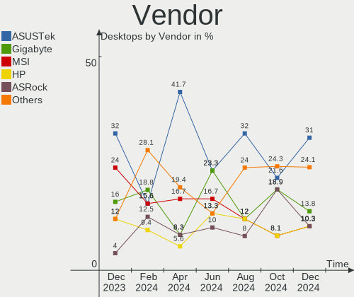
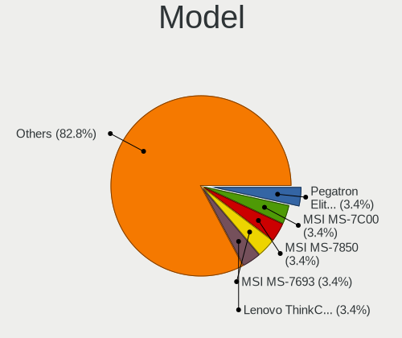
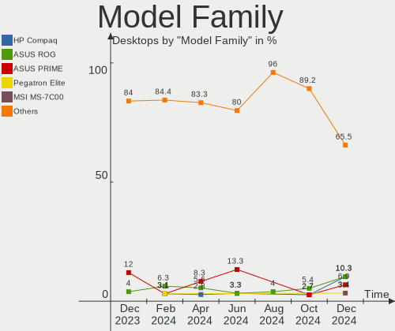
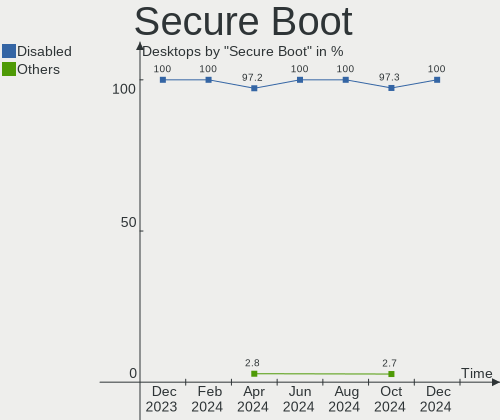
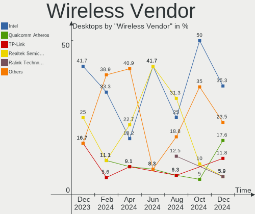

KDE neon - Hardware Trends (Desktops)
-------------------------------------

A project to identify most popular hardware characteristics and track their change
over time based on data collected by Linux users at https://Linux-Hardware.org.

Anyone can contribute to this report by the [hw-probe](https://github.com/linuxhw/hw-probe) tool:

    sudo -E hw-probe -all -upload

This report is for one last month. Overall report since the beginning of time: [TestDays](https://github.com/linuxhw/TestDays)

Period: Dec, 2024.

Contents
--------

* [ System ](#system)
  - [ OS                       ](#os)
  - [ OS Family                ](#os-family)
  - [ Kernel                   ](#kernel)
  - [ Kernel Family            ](#kernel-family)
  - [ Kernel Major Ver.        ](#kernel-major-ver)
  - [ Arch                     ](#arch)
  - [ DE                       ](#de)
  - [ Display Server           ](#display-server)
  - [ Display Manager          ](#display-manager)
  - [ OS Lang                  ](#os-lang)
  - [ Boot Mode                ](#boot-mode)
  - [ Filesystem               ](#filesystem)
  - [ Part. scheme             ](#part-scheme)
  - [ Dual Boot with Linux/BSD ](#dual-boot-with-linuxbsd)
  - [ Dual Boot (Win)          ](#dual-boot-win)

* [ Board ](#board)
  - [ Vendor                   ](#vendor)
  - [ Model                    ](#model)
  - [ Model Family             ](#model-family)
  - [ MFG Year                 ](#mfg-year)
  - [ Form Factor              ](#form-factor)
  - [ Secure Boot              ](#secure-boot)
  - [ Coreboot                 ](#coreboot)
  - [ RAM Size                 ](#ram-size)
  - [ RAM Used                 ](#ram-used)
  - [ Total Drives             ](#total-drives)
  - [ Has CD-ROM               ](#has-cd-rom)
  - [ Has Ethernet             ](#has-ethernet)
  - [ Has WiFi                 ](#has-wifi)
  - [ Has Bluetooth            ](#has-bluetooth)

* [ Location ](#location)
  - [ Country                  ](#country)
  - [ City                     ](#city)

* [ Drives ](#drives)
  - [ Drive Vendor             ](#drive-vendor)
  - [ Drive Model              ](#drive-model)
  - [ HDD Vendor               ](#hdd-vendor)
  - [ SSD Vendor               ](#ssd-vendor)
  - [ Drive Kind               ](#drive-kind)
  - [ Drive Connector          ](#drive-connector)
  - [ Drive Size               ](#drive-size)
  - [ Space Total              ](#space-total)
  - [ Space Used               ](#space-used)
  - [ Malfunc. Drives          ](#malfunc-drives)
  - [ Malfunc. Drive Vendor    ](#malfunc-drive-vendor)
  - [ Malfunc. HDD Vendor      ](#malfunc-hdd-vendor)
  - [ Malfunc. Drive Kind      ](#malfunc-drive-kind)
  - [ Failed Drives            ](#failed-drives)
  - [ Failed Drive Vendor      ](#failed-drive-vendor)
  - [ Drive Status             ](#drive-status)

* [ Storage controller ](#storage-controller)
  - [ Storage Vendor           ](#storage-vendor)
  - [ Storage Model            ](#storage-model)
  - [ Storage Kind             ](#storage-kind)

* [ Processor ](#processor)
  - [ CPU Vendor               ](#cpu-vendor)
  - [ CPU Model                ](#cpu-model)
  - [ CPU Model Family         ](#cpu-model-family)
  - [ CPU Cores                ](#cpu-cores)
  - [ CPU Sockets              ](#cpu-sockets)
  - [ CPU Threads              ](#cpu-threads)
  - [ CPU Op-Modes             ](#cpu-op-modes)
  - [ CPU Microcode            ](#cpu-microcode)
  - [ CPU Microarch            ](#cpu-microarch)

* [ Graphics ](#graphics)
  - [ GPU Vendor               ](#gpu-vendor)
  - [ GPU Model                ](#gpu-model)
  - [ GPU Combo                ](#gpu-combo)
  - [ GPU Driver               ](#gpu-driver)
  - [ GPU Memory               ](#gpu-memory)

* [ Monitor ](#monitor)
  - [ Monitor Vendor           ](#monitor-vendor)
  - [ Monitor Model            ](#monitor-model)
  - [ Monitor Resolution       ](#monitor-resolution)
  - [ Monitor Diagonal         ](#monitor-diagonal)
  - [ Monitor Width            ](#monitor-width)
  - [ Aspect Ratio             ](#aspect-ratio)
  - [ Monitor Area             ](#monitor-area)
  - [ Pixel Density            ](#pixel-density)
  - [ Multiple Monitors        ](#multiple-monitors)

* [ Network ](#network)
  - [ Net Controller Vendor    ](#net-controller-vendor)
  - [ Net Controller Model     ](#net-controller-model)
  - [ Wireless Vendor          ](#wireless-vendor)
  - [ Wireless Model           ](#wireless-model)
  - [ Ethernet Vendor          ](#ethernet-vendor)
  - [ Ethernet Model           ](#ethernet-model)
  - [ Net Controller Kind      ](#net-controller-kind)
  - [ Used Controller          ](#used-controller)
  - [ NICs                     ](#nics)
  - [ IPv6                     ](#ipv6)

* [ Bluetooth ](#bluetooth)
  - [ Bluetooth Vendor         ](#bluetooth-vendor)
  - [ Bluetooth Model          ](#bluetooth-model)

* [ Sound ](#sound)
  - [ Sound Vendor             ](#sound-vendor)
  - [ Sound Model              ](#sound-model)

* [ Memory ](#memory)
  - [ Memory Vendor            ](#memory-vendor)
  - [ Memory Model             ](#memory-model)
  - [ Memory Kind              ](#memory-kind)
  - [ Memory Form Factor       ](#memory-form-factor)
  - [ Memory Size              ](#memory-size)
  - [ Memory Speed             ](#memory-speed)

* [ Printers & scanners ](#printers--scanners)
  - [ Printer Vendor           ](#printer-vendor)
  - [ Printer Model            ](#printer-model)
  - [ Scanner Vendor           ](#scanner-vendor)
  - [ Scanner Model            ](#scanner-model)

* [ Camera ](#camera)
  - [ Camera Vendor            ](#camera-vendor)
  - [ Camera Model             ](#camera-model)

* [ Security ](#security)
  - [ Fingerprint Vendor       ](#fingerprint-vendor)
  - [ Fingerprint Model        ](#fingerprint-model)
  - [ Chipcard Vendor          ](#chipcard-vendor)
  - [ Chipcard Model           ](#chipcard-model)

* [ Unsupported ](#unsupported)
  - [ Unsupported Devices      ](#unsupported-devices)
  - [ Unsupported Device Types ](#unsupported-device-types)

System
------

OS
--

Installed operating systems

| Name           | Desktops | Percent |
|----------------|----------|---------|
| KDE neon 24.04 | 26       | 89.66%  |
| KDE neon 22.04 | 3        | 10.34%  |

OS Family
---------

OS without a version

| Name     | Desktops | Percent |
|----------|----------|---------|
| KDE neon | 29       | 100%    |

Kernel
------

Version of the Linux kernel

| Version            | Desktops | Percent |
|--------------------|----------|---------|
| 6.8.0-51-generic   | 13       | 44.83%  |
| 6.8.0-50-generic   | 6        | 20.69%  |
| 6.8.0-49-generic   | 5        | 17.24%  |
| 6.8.0-40-generic   | 3        | 10.34%  |
| 6.8.0-48-generic   | 1        | 3.45%   |
| 5.15.0-122-generic | 1        | 3.45%   |

Kernel Family
-------------

Linux kernel without a distro release

| Version | Desktops | Percent |
|---------|----------|---------|
| 6.8.0   | 28       | 96.55%  |
| 5.15.0  | 1        | 3.45%   |

Kernel Major Ver.
-----------------

Linux kernel major version

| Version | Desktops | Percent |
|---------|----------|---------|
| 6.8     | 28       | 96.55%  |
| 5.15    | 1        | 3.45%   |

Arch
----

OS architecture (x86_64, i586, etc.)

| Name   | Desktops | Percent |
|--------|----------|---------|
| x86_64 | 29       | 100%    |

DE
--

Desktop Environment

| Name | Desktops | Percent |
|------|----------|---------|
| KDE6 | 28       | 96.55%  |
| XFCE | 1        | 3.45%   |

Display Server
--------------

X11 or Wayland

| Name    | Desktops | Percent |
|---------|----------|---------|
| Wayland | 23       | 79.31%  |
| X11     | 6        | 20.69%  |

Display Manager
---------------

SDDM, LightDM, etc.

| Name    | Desktops | Percent |
|---------|----------|---------|
| Unknown | 23       | 79.31%  |
| SDDM    | 6        | 20.69%  |

OS Lang
-------

Language

| Lang  | Desktops | Percent |
|-------|----------|---------|
| en_US | 12       | 41.38%  |
| en_GB | 3        | 10.34%  |
| C     | 3        | 10.34%  |
| ru_RU | 2        | 6.9%    |
| it_IT | 2        | 6.9%    |
| en_CA | 2        | 6.9%    |
| de_DE | 2        | 6.9%    |
| es_AR | 1        | 3.45%   |
| en_NZ | 1        | 3.45%   |
| en_AU | 1        | 3.45%   |

Boot Mode
---------

EFI or BIOS

| Mode | Desktops | Percent |
|------|----------|---------|
| BIOS | 27       | 93.1%   |
| EFI  | 2        | 6.9%    |

Filesystem
----------

Type of filesystem

| Type    | Desktops | Percent |
|---------|----------|---------|
| Ext4    | 24       | 82.76%  |
| Tmpfs   | 4        | 13.79%  |
| Overlay | 1        | 3.45%   |

Part. scheme
------------

Scheme of partitioning

| Type    | Desktops | Percent |
|---------|----------|---------|
| Unknown | 23       | 79.31%  |
| GPT     | 6        | 20.69%  |

Dual Boot with Linux/BSD
------------------------

Hosting more than one Linux/BSD

| Dual boot | Desktops | Percent |
|-----------|----------|---------|
| No        | 29       | 100%    |

Dual Boot (Win)
---------------

Hosting Linux and Windows

| Dual boot | Desktops | Percent |
|-----------|----------|---------|
| No        | 25       | 86.21%  |
| Yes       | 4        | 13.79%  |

Board
-----

Vendor
------

Motherboard manufacturer

| Name                | Desktops | Percent |
|---------------------|----------|---------|
| ASUSTek Computer    | 9        | 31.03%  |
| Gigabyte Technology | 4        | 13.79%  |
| MSI                 | 3        | 10.34%  |
| Hewlett-Packard     | 3        | 10.34%  |
| ASRock              | 3        | 10.34%  |
| Dell                | 2        | 6.9%    |
| Pegatron            | 1        | 3.45%   |
| Lenovo              | 1        | 3.45%   |
| Intel               | 1        | 3.45%   |
| Alienware           | 1        | 3.45%   |
| Alder lake          | 1        | 3.45%   |

Model
-----

Motherboard model

| Name                               | Desktops | Percent |
|------------------------------------|----------|---------|
| Pegatron Elite 7500 Series MT      | 1        | 3.45%   |
| MSI MS-7C00                        | 1        | 3.45%   |
| MSI MS-7850                        | 1        | 3.45%   |
| MSI MS-7693                        | 1        | 3.45%   |
| Lenovo ThinkCentre M700 10HY0000AU | 1        | 3.45%   |
| Intel X99 V1.0                     | 1        | 3.45%   |
| HP Compaq Elite 8300 SFF           | 1        | 3.45%   |
| HP Compaq 8200 Elite CMT PC        | 1        | 3.45%   |
| HP Compaq 6200 Pro SFF PC          | 1        | 3.45%   |
| Gigabyte X570 I AORUS PRO WIFI     | 1        | 3.45%   |
| Gigabyte H87-HD3                   | 1        | 3.45%   |
| Gigabyte B550M S2H                 | 1        | 3.45%   |
| Gigabyte B550 AORUS ELITE          | 1        | 3.45%   |
| Dell PowerEdge T20                 | 1        | 3.45%   |
| Dell OptiPlex 7010                 | 1        | 3.45%   |
| ASUS TUF Gaming X570-PLUS          | 1        | 3.45%   |
| ASUS ROG STRIX Z790-A GAMING WIFI  | 1        | 3.45%   |
| ASUS ROG STRIX B650E-F GAMING WIFI | 1        | 3.45%   |
| ASUS ROG STRIX B650E-E GAMING WIFI | 1        | 3.45%   |
| ASUS ProArt X670E-CREATOR WIFI     | 1        | 3.45%   |
| ASUS PRIME H610M-A D4              | 1        | 3.45%   |
| ASUS PRIME B460-PLUS               | 1        | 3.45%   |
| ASUS P5KPL-AM EPU                  | 1        | 3.45%   |
| ASUS All Series                    | 1        | 3.45%   |
| ASRock Z390 Extreme4               | 1        | 3.45%   |
| ASRock X570 Steel Legend WiFi ax   | 1        | 3.45%   |
| ASRock A320M/ac                    | 1        | 3.45%   |
| Alienware Aurora Ryzen Edition     | 1        | 3.45%   |
| Alder lake Intel RVP               | 1        | 3.45%   |

Model Family
------------

Motherboard model prefix

| Name               | Desktops | Percent |
|--------------------|----------|---------|
| HP Compaq          | 3        | 10.34%  |
| ASUS ROG           | 3        | 10.34%  |
| ASUS PRIME         | 2        | 6.9%    |
| Pegatron Elite     | 1        | 3.45%   |
| MSI MS-7C00        | 1        | 3.45%   |
| MSI MS-7850        | 1        | 3.45%   |
| MSI MS-7693        | 1        | 3.45%   |
| Lenovo ThinkCentre | 1        | 3.45%   |
| Intel X99          | 1        | 3.45%   |
| Gigabyte X570      | 1        | 3.45%   |
| Gigabyte H87-HD3   | 1        | 3.45%   |
| Gigabyte B550M     | 1        | 3.45%   |
| Gigabyte B550      | 1        | 3.45%   |
| Dell PowerEdge     | 1        | 3.45%   |
| Dell OptiPlex      | 1        | 3.45%   |
| ASUS TUF           | 1        | 3.45%   |
| ASUS ProArt        | 1        | 3.45%   |
| ASUS P5KPL-AM      | 1        | 3.45%   |
| ASUS All           | 1        | 3.45%   |
| ASRock Z390        | 1        | 3.45%   |
| ASRock X570        | 1        | 3.45%   |
| ASRock A320M       | 1        | 3.45%   |
| Alienware Aurora   | 1        | 3.45%   |
| Alder lake Intel   | 1        | 3.45%   |

MFG Year
--------

Motherboard manufacture year

| Year | Desktops | Percent |
|------|----------|---------|
| 2022 | 5        | 17.24%  |
| 2020 | 4        | 13.79%  |
| 2014 | 3        | 10.34%  |
| 2013 | 3        | 10.34%  |
| 2023 | 2        | 6.9%    |
| 2021 | 2        | 6.9%    |
| 2019 | 2        | 6.9%    |
| 2018 | 2        | 6.9%    |
| 2012 | 2        | 6.9%    |
| 2011 | 2        | 6.9%    |
| 2024 | 1        | 3.45%   |
| 2010 | 1        | 3.45%   |

Form Factor
-----------

Physical design of the computer

| Name    | Desktops | Percent |
|---------|----------|---------|
| Desktop | 29       | 100%    |

Secure Boot
-----------

Enabled or disabled

| State    | Desktops | Percent |
|----------|----------|---------|
| Disabled | 29       | 100%    |

Coreboot
--------

Have coreboot on board

| Used | Desktops | Percent |
|------|----------|---------|
| No   | 29       | 100%    |

RAM Size
--------

Total RAM memory

| Size in GB  | Desktops | Percent |
|-------------|----------|---------|
| 32.01-64.0  | 11       | 37.93%  |
| 16.01-24.0  | 6        | 20.69%  |
| 24.01-32.0  | 4        | 13.79%  |
| 64.01-256.0 | 4        | 13.79%  |
| 4.01-8.0    | 2        | 6.9%    |
| 3.01-4.0    | 1        | 3.45%   |
| 8.01-16.0   | 1        | 3.45%   |

RAM Used
--------

Used RAM memory

| Used GB    | Desktops | Percent |
|------------|----------|---------|
| 4.01-8.0   | 12       | 41.38%  |
| 3.01-4.0   | 5        | 17.24%  |
| 2.01-3.0   | 5        | 17.24%  |
| 1.01-2.0   | 4        | 13.79%  |
| 16.01-24.0 | 2        | 6.9%    |
| 8.01-16.0  | 1        | 3.45%   |

Total Drives
------------

Number of drives on board

| Drives | Desktops | Percent |
|--------|----------|---------|
| 2      | 17       | 58.62%  |
| 1      | 5        | 17.24%  |
| 4      | 3        | 10.34%  |
| 5      | 2        | 6.9%    |
| 3      | 2        | 6.9%    |

Has CD-ROM
----------

Has CD-ROM on board

| Presented | Desktops | Percent |
|-----------|----------|---------|
| No        | 17       | 58.62%  |
| Yes       | 12       | 41.38%  |

Has Ethernet
------------

Has Ethernet on board

| Presented | Desktops | Percent |
|-----------|----------|---------|
| Yes       | 28       | 96.55%  |
| No        | 1        | 3.45%   |

Has WiFi
--------

Has WiFi module

| Presented | Desktops | Percent |
|-----------|----------|---------|
| Yes       | 16       | 55.17%  |
| No        | 13       | 44.83%  |

Has Bluetooth
-------------

Has Bluetooth module

| Presented | Desktops | Percent |
|-----------|----------|---------|
| Yes       | 17       | 58.62%  |
| No        | 12       | 41.38%  |

Location
--------

Country
-------

Geographic location (country)

| Country            | Desktops | Percent |
|--------------------|----------|---------|
| USA                | 9        | 31.03%  |
| Russia             | 2        | 6.9%    |
| Germany            | 2        | 6.9%    |
| Canada             | 2        | 6.9%    |
| Australia          | 2        | 6.9%    |
| Venezuela          | 1        | 3.45%   |
| UK                 | 1        | 3.45%   |
| Sweden             | 1        | 3.45%   |
| Romania            | 1        | 3.45%   |
| New Zealand        | 1        | 3.45%   |
| Italy              | 1        | 3.45%   |
| Iran               | 1        | 3.45%   |
| France             | 1        | 3.45%   |
| Dominican Republic | 1        | 3.45%   |
| Belgium            | 1        | 3.45%   |
| Belarus            | 1        | 3.45%   |
| Argentina          | 1        | 3.45%   |

City
----

Geographic location (city)

| City           | Desktops | Percent |
|----------------|----------|---------|
| Melbourne      | 2        | 6.9%    |
| Winnipeg       | 1        | 3.45%   |
| Whiteville     | 1        | 3.45%   |
| Turin          | 1        | 3.45%   |
| Tehran         | 1        | 3.45%   |
| Santo Domingo  | 1        | 3.45%   |
| Salt Lake City | 1        | 3.45%   |
| Quilmes        | 1        | 3.45%   |
| Pueblo         | 1        | 3.45%   |
| Portland       | 1        | 3.45%   |
| Plerneuf       | 1        | 3.45%   |
| Napier City    | 1        | 3.45%   |
| Münster       | 1        | 3.45%   |
| Munich         | 1        | 3.45%   |
| Moscow         | 1        | 3.45%   |
| Minsk          | 1        | 3.45%   |
| Mesa           | 1        | 3.45%   |
| Mertztown      | 1        | 3.45%   |
| Merksem        | 1        | 3.45%   |
| Medway         | 1        | 3.45%   |
| Lambeth        | 1        | 3.45%   |
| Ivanovo        | 1        | 3.45%   |
| Gothenburg     | 1        | 3.45%   |
| Frenchburg     | 1        | 3.45%   |
| Cluj-Napoca    | 1        | 3.45%   |
| Cave City      | 1        | 3.45%   |
| Caracas        | 1        | 3.45%   |
| Calgary        | 1        | 3.45%   |

Drives
------

Drive Vendor
------------

Hard drive vendors

| Vendor                      | Desktops | Drives | Percent |
|-----------------------------|----------|--------|---------|
| WDC                         | 9        | 12     | 16.07%  |
| Seagate                     | 9        | 12     | 16.07%  |
| Samsung Electronics         | 8        | 11     | 14.29%  |
| SanDisk                     | 7        | 8      | 12.5%   |
| Phison Electronics          | 3        | 4      | 5.36%   |
| Kingston                    | 2        | 2      | 3.57%   |
| Crucial                     | 2        | 2      | 3.57%   |
| USB                         | 1        | 1      | 1.79%   |
| Toshiba                     | 1        | 1      | 1.79%   |
| SPCC                        | 1        | 1      | 1.79%   |
| SK hynix                    | 1        | 1      | 1.79%   |
| Silicon Motion              | 1        | 1      | 1.79%   |
| Seagate Technology          | 1        | 1      | 1.79%   |
| Patriot                     | 1        | 1      | 1.79%   |
| OCZ                         | 1        | 1      | 1.79%   |
| Micron/Crucial Technology   | 1        | 1      | 1.79%   |
| Lexar                       | 1        | 1      | 1.79%   |
| Kingston Technology Company | 1        | 1      | 1.79%   |
| Intel                       | 1        | 1      | 1.79%   |
| Hitachi                     | 1        | 1      | 1.79%   |
| External                    | 1        | 1      | 1.79%   |
| Corsair                     | 1        | 1      | 1.79%   |
| A-DATA Technology           | 1        | 2      | 1.79%   |

Drive Model
-----------

Hard drive models

| Model                                                 | Desktops | Percent |
|-------------------------------------------------------|----------|---------|
| Seagate ST2000DM008-2FR102 2TB                        | 3        | 4.69%   |
| Samsung NVMe SSD Controller SM981/PM981/PM983 512GB   | 3        | 4.69%   |
| WDC WDS250G2B0A-00SM50 250GB SSD                      | 1        | 1.56%   |
| WDC WDS240G2G0A-00JH30 240GB SSD                      | 1        | 1.56%   |
| WDC WD5000AVCS-632DY1 500GB                           | 1        | 1.56%   |
| WDC WD5000AAKX-75U6AA0 500GB                          | 1        | 1.56%   |
| WDC WD30EZRX-00D8PB0 3TB                              | 1        | 1.56%   |
| WDC WD20EZRZ-00Z5HB0 2TB                              | 1        | 1.56%   |
| WDC WD10EZEX-75M2NA0 1TB                              | 1        | 1.56%   |
| WDC WD10EZEX-22MFCA0 1TB                              | 1        | 1.56%   |
| WDC WD10EZEX-00BBHA0 1TB                              | 1        | 1.56%   |
| WDC WD101EFBX-68B0AN0 10TB                            | 1        | 1.56%   |
| WDC WD1003FZEX-00K3CA0 1TB                            | 1        | 1.56%   |
| USB SanDisk 3.2Gen1 250GB                             | 1        | 1.56%   |
| Toshiba MQ01ABD100 1TB                                | 1        | 1.56%   |
| SPCC Solid State Disk 2TB                             | 1        | 1.56%   |
| SK hynix PC711 NVMe 1TB                               | 1        | 1.56%   |
| Silicon Motion SM2263EN/SM2263XT SSD Controller 256GB | 1        | 1.56%   |
| Seagate ZP1000GM30053 1TB                             | 1        | 1.56%   |
| Seagate ST4000DM004-2CV104 4TB                        | 1        | 1.56%   |
| Seagate ST4000DM000-1F2168 4TB                        | 1        | 1.56%   |
| Seagate ST3750528AS 752GB                             | 1        | 1.56%   |
| Seagate ST3250318AS 250GB                             | 1        | 1.56%   |
| Seagate ST31000528AS 1TB                              | 1        | 1.56%   |
| Seagate ST250DM000-1BD141 250GB                       | 1        | 1.56%   |
| Seagate ST1000LM024 HN-M101MBB 1TB                    | 1        | 1.56%   |
| Seagate Expansion 1TB                                 | 1        | 1.56%   |
| SanDisk X600 M.2 2280 SATA 256GB SSD                  | 1        | 1.56%   |
| Sandisk WD_BLACK SN850X 4000GB                        | 1        | 1.56%   |
| Sandisk WD_BLACK SN850X 1000GB                        | 1        | 1.56%   |
| Sandisk WD Blue SN570 1TB                             | 1        | 1.56%   |
| Sandisk WD Black SN750 / PC SN730 NVMe SSD 512GB      | 1        | 1.56%   |
| Sandisk WD Black 2018/SN750 / PC SN720 NVMe SSD 512GB | 1        | 1.56%   |
| SanDisk SDSSDH3 1T00 1TB                              | 1        | 1.56%   |
| SanDisk SDSSDA-1T00 1TB                               | 1        | 1.56%   |
| Samsung SSD 990 EVO 2TB                               | 1        | 1.56%   |
| Samsung SSD 970 EVO 2B2Q 500GB                        | 1        | 1.56%   |
| Samsung SSD 860 QVO 1TB                               | 1        | 1.56%   |
| Samsung SSD 860 EVO 500GB                             | 1        | 1.56%   |
| Samsung SSD 830 Series 256GB                          | 1        | 1.56%   |

HDD Vendor
----------

Hard disk drive vendors

| Vendor              | Desktops | Drives | Percent |
|---------------------|----------|--------|---------|
| Seagate             | 9        | 12     | 42.86%  |
| WDC                 | 8        | 10     | 38.1%   |
| Toshiba             | 1        | 1      | 4.76%   |
| Samsung Electronics | 1        | 1      | 4.76%   |
| Hitachi             | 1        | 1      | 4.76%   |
| External            | 1        | 1      | 4.76%   |

SSD Vendor
----------

Solid state drive vendors

| Vendor              | Desktops | Drives | Percent |
|---------------------|----------|--------|---------|
| Samsung Electronics | 4        | 4      | 23.53%  |
| SanDisk             | 3        | 3      | 17.65%  |
| WDC                 | 2        | 2      | 11.76%  |
| Kingston            | 2        | 2      | 11.76%  |
| Crucial             | 2        | 2      | 11.76%  |
| SPCC                | 1        | 1      | 5.88%   |
| Patriot             | 1        | 1      | 5.88%   |
| OCZ                 | 1        | 1      | 5.88%   |
| A-DATA Technology   | 1        | 2      | 5.88%   |

Drive Kind
----------

HDD or SSD

| Kind    | Desktops | Drives | Percent |
|---------|----------|--------|---------|
| HDD     | 20       | 26     | 39.22%  |
| NVMe    | 15       | 23     | 29.41%  |
| SSD     | 15       | 18     | 29.41%  |
| Unknown | 1        | 1      | 1.96%   |

Drive Connector
---------------

SATA, SAS, NVMe, etc.

| Type | Desktops | Drives | Percent |
|------|----------|--------|---------|
| SATA | 22       | 41     | 53.66%  |
| NVMe | 15       | 23     | 36.59%  |
| SAS  | 4        | 4      | 9.76%   |

Drive Size
----------

Size of hard drive

| Size in TB | Desktops | Drives | Percent |
|------------|----------|--------|---------|
| 0.51-1.0   | 15       | 17     | 41.67%  |
| 0.01-0.5   | 13       | 17     | 36.11%  |
| 1.01-2.0   | 4        | 6      | 11.11%  |
| 3.01-4.0   | 2        | 2      | 5.56%   |
| 2.01-3.0   | 1        | 1      | 2.78%   |
| 4.01-10.0  | 1        | 1      | 2.78%   |

Space Total
-----------

Amount of disk space available on the file system

| Size in GB     | Desktops | Percent |
|----------------|----------|---------|
| 501-1000       | 10       | 34.48%  |
| 251-500        | 8        | 27.59%  |
| 101-250        | 3        | 10.34%  |
| 1001-2000      | 3        | 10.34%  |
| More than 3000 | 2        | 6.9%    |
| 1-20           | 2        | 6.9%    |
| 51-100         | 1        | 3.45%   |

Space Used
----------

Amount of used disk space

| Used GB        | Desktops | Percent |
|----------------|----------|---------|
| 1-20           | 9        | 31.03%  |
| 21-50          | 7        | 24.14%  |
| 101-250        | 7        | 24.14%  |
| 251-500        | 2        | 6.9%    |
| 501-1000       | 2        | 6.9%    |
| More than 3000 | 1        | 3.45%   |
| 2001-3000      | 1        | 3.45%   |

Malfunc. Drives
---------------

Drive models with a malfunction

Zero info for selected period =(

Malfunc. Drive Vendor
---------------------

Vendors of faulty drives

Zero info for selected period =(

Malfunc. HDD Vendor
-------------------

Vendors of faulty HDD drives

Zero info for selected period =(

Malfunc. Drive Kind
-------------------

Kinds of faulty drives

Zero info for selected period =(

Failed Drives
-------------

Failed drive models

Zero info for selected period =(

Failed Drive Vendor
-------------------

Failed drive vendors

Zero info for selected period =(

Drive Status
------------

Number of failed and malfunc. drives

| Status   | Desktops | Drives | Percent |
|----------|----------|--------|---------|
| Detected | 27       | 62     | 90%     |
| Works    | 3        | 6      | 10%     |

Storage controller
------------------

Storage Vendor
--------------

Storage controller vendors

| Vendor                      | Desktops | Percent |
|-----------------------------|----------|---------|
| Intel                       | 17       | 35.42%  |
| AMD                         | 11       | 22.92%  |
| Samsung Electronics         | 5        | 10.42%  |
| Sandisk                     | 4        | 8.33%   |
| Phison Electronics          | 3        | 6.25%   |
| ASMedia Technology          | 3        | 6.25%   |
| SK hynix                    | 1        | 2.08%   |
| Silicon Motion              | 1        | 2.08%   |
| Seagate Technology          | 1        | 2.08%   |
| Micron/Crucial Technology   | 1        | 2.08%   |
| Kingston Technology Company | 1        | 2.08%   |

Storage Model
-------------

Storage controller models

| Model                                                                          | Desktops | Percent |
|--------------------------------------------------------------------------------|----------|---------|
| Samsung NVMe SSD Controller SM981/PM981/PM983                                  | 3        | 5.66%   |
| Intel 7 Series/C210 Series Chipset Family 6-port SATA Controller [AHCI mode]   | 3        | 5.66%   |
| ASMedia ASM1061/ASM1062 Serial ATA Controller                                  | 3        | 5.66%   |
| AMD FCH SATA Controller [AHCI mode]                                            | 3        | 5.66%   |
| AMD 600 Series Chipset SATA Controller                                         | 3        | 5.66%   |
| Sandisk WD Black SN850X NVMe SSD                                               | 2        | 3.77%   |
| Intel Cannon Lake PCH SATA AHCI Controller                                     | 2        | 3.77%   |
| Intel 8 Series/C220 Series Chipset Family 6-port SATA Controller 1 [AHCI mode] | 2        | 3.77%   |
| Intel 6 Series/C200 Series Chipset Family 6 port Desktop SATA AHCI Controller  | 2        | 3.77%   |
| AMD 500 Series Chipset SATA Controller                                         | 2        | 3.77%   |
| SK hynix Gold P31/BC711/PC711 NVMe Solid State Drive                           | 1        | 1.89%   |
| Silicon Motion SM2263EN/SM2263XT (DRAM-less) NVMe SSD Controllers              | 1        | 1.89%   |
| Seagate E18 PCIe SSD                                                           | 1        | 1.89%   |
| SanDisk Ultra 3D / WD Blue SN570 NVMe SSD (DRAM-less)                          | 1        | 1.89%   |
| SanDisk Extreme Pro / WD Black SN750 / PC SN730 / Red SN700 NVMe SSD           | 1        | 1.89%   |
| SanDisk Extreme Pro / WD Black 2018/SN750/PC SN720 NVMe SSD                    | 1        | 1.89%   |
| Samsung NVMe SSD Controller SM961/PM961/SM963                                  | 1        | 1.89%   |
| Samsung NVMe SSD Controller PM9C1a (DRAM-less)                                 | 1        | 1.89%   |
| Phison PS5027-E27T PCIe4 NVMe Controller (DRAM-less)                           | 1        | 1.89%   |
| Phison PS5021-E21 PCIe4 NVMe Controller (DRAM-less)                            | 1        | 1.89%   |
| Phison E12 NVMe Controller                                                     | 1        | 1.89%   |
| Micron/Crucial T705 NVMe PCIe SSD                                              | 1        | 1.89%   |
| Kingston Company NV3 NVMe SSD TC2201 (DRAM-less)                               | 1        | 1.89%   |
| Intel Volume Management Device NVMe RAID Controller Intel Corporation          | 1        | 1.89%   |
| Intel Volume Management Device NVMe RAID Controller                            | 1        | 1.89%   |
| Intel SSD 660P Series                                                          | 1        | 1.89%   |
| Intel Raptor Lake SATA AHCI Controller                                         | 1        | 1.89%   |
| Intel Q170/Q150/B150/H170/H110/Z170/CM236 Chipset SATA Controller [AHCI Mode]  | 1        | 1.89%   |
| Intel NM10/ICH7 Family SATA Controller [IDE mode]                              | 1        | 1.89%   |
| Intel Atom Processor E3800 Series SATA AHCI Controller                         | 1        | 1.89%   |
| Intel Alder Lake-S PCH SATA Controller [AHCI Mode]                             | 1        | 1.89%   |
| Intel Alder Lake-P SATA AHCI Controller                                        | 1        | 1.89%   |
| Intel 9 Series Chipset Family SATA Controller [AHCI Mode]                      | 1        | 1.89%   |
| Intel 82801G (ICH7 Family) IDE Controller                                      | 1        | 1.89%   |
| Intel 400 Series Chipset Family SATA AHCI Controller                           | 1        | 1.89%   |
| AMD SB7x0/SB8x0/SB9x0 SATA Controller [AHCI mode]                              | 1        | 1.89%   |
| AMD FCH RAID Controller                                                        | 1        | 1.89%   |
| AMD A320 Chipset SATA Controller [AHCI mode]                                   | 1        | 1.89%   |

Storage Kind
------------

Kind of storage controller (IDE, SATA, NVMe, SAS, ...)

| Kind | Desktops | Percent |
|------|----------|---------|
| SATA | 26       | 59.09%  |
| NVMe | 14       | 31.82%  |
| RAID | 3        | 6.82%   |
| IDE  | 1        | 2.27%   |

Processor
---------

CPU Vendor
----------

Processor vendors

| Vendor | Desktops | Percent |
|--------|----------|---------|
| Intel  | 18       | 62.07%  |
| AMD    | 11       | 37.93%  |

CPU Model
---------

Processor models

| Model                                       | Desktops | Percent |
|---------------------------------------------|----------|---------|
| AMD Ryzen 7 5800X 8-Core Processor          | 2        | 6.9%    |
| AMD Ryzen 7 3700X 8-Core Processor          | 2        | 6.9%    |
| AMD Ryzen 5 3600 6-Core Processor           | 2        | 6.9%    |
| Intel Xeon CPU E5-2699 v3 @ 2.30GHz         | 1        | 3.45%   |
| Intel Xeon CPU E3-1225 v3 @ 3.20GHz         | 1        | 3.45%   |
| Intel Pentium Dual-Core CPU E6500 @ 2.93GHz | 1        | 3.45%   |
| Intel Core i9-9900K CPU @ 3.60GHz           | 1        | 3.45%   |
| Intel Core i7-9700K CPU @ 3.60GHz           | 1        | 3.45%   |
| Intel Core i7-6700T CPU @ 2.80GHz           | 1        | 3.45%   |
| Intel Core i7-5775C CPU @ 3.30GHz           | 1        | 3.45%   |
| Intel Core i7-4790 CPU @ 3.60GHz            | 1        | 3.45%   |
| Intel Core i7-3770 CPU @ 3.40GHz            | 1        | 3.45%   |
| Intel Core i5-3570 CPU @ 3.40GHz            | 1        | 3.45%   |
| Intel Core i5-3470 CPU @ 3.20GHz            | 1        | 3.45%   |
| Intel Core i5-2400 CPU @ 3.10GHz            | 1        | 3.45%   |
| Intel Core i3-2100 CPU @ 3.10GHz            | 1        | 3.45%   |
| Intel Core i3-10100F CPU @ 3.60GHz          | 1        | 3.45%   |
| Intel Celeron CPU J1800 @ 2.41GHz           | 1        | 3.45%   |
| Intel 13th Gen Core i5-13600KF              | 1        | 3.45%   |
| Intel 12th Gen Core i9-12900H               | 1        | 3.45%   |
| Intel 12th Gen Core i7-12700F               | 1        | 3.45%   |
| AMD Ryzen 9 7950X3D 16-Core Processor       | 1        | 3.45%   |
| AMD Ryzen 9 5900 12-Core Processor          | 1        | 3.45%   |
| AMD Ryzen 7 7800X3D 8-Core Processor        | 1        | 3.45%   |
| AMD Ryzen 7 7700X 8-Core Processor          | 1        | 3.45%   |
| AMD FX-4100 Quad-Core Processor             | 1        | 3.45%   |

CPU Model Family
----------------

Processor model prefix

| Model                   | Desktops | Percent |
|-------------------------|----------|---------|
| AMD Ryzen 7             | 6        | 20.69%  |
| Intel Core i7           | 5        | 17.24%  |
| Other                   | 3        | 10.34%  |
| Intel Core i5           | 3        | 10.34%  |
| Intel Xeon              | 2        | 6.9%    |
| Intel Core i3           | 2        | 6.9%    |
| AMD Ryzen 9             | 2        | 6.9%    |
| AMD Ryzen 5             | 2        | 6.9%    |
| Intel Pentium Dual-Core | 1        | 3.45%   |
| Intel Core i9           | 1        | 3.45%   |
| Intel Celeron           | 1        | 3.45%   |
| AMD FX                  | 1        | 3.45%   |

CPU Cores
---------

Number of processor cores

| Number | Desktops | Percent |
|--------|----------|---------|
| 4      | 9        | 31.03%  |
| 8      | 8        | 27.59%  |
| 2      | 4        | 13.79%  |
| 14     | 2        | 6.9%    |
| 12     | 2        | 6.9%    |
| 6      | 2        | 6.9%    |
| 18     | 1        | 3.45%   |
| 16     | 1        | 3.45%   |

CPU Sockets
-----------

Number of sockets

| Number | Desktops | Percent |
|--------|----------|---------|
| 1      | 29       | 100%    |

CPU Threads
-----------

Threads per core (Hyper-Threading)

| Number | Desktops | Percent |
|--------|----------|---------|
| 2      | 21       | 72.41%  |
| 1      | 8        | 27.59%  |

CPU Op-Modes
------------

CPU Operation Modes (32-bit, 64-bit)

| Op mode        | Desktops | Percent |
|----------------|----------|---------|
| 32-bit, 64-bit | 29       | 100%    |

CPU Microcode
-------------

Microcode number

| Number  | Desktops | Percent |
|---------|----------|---------|
| Unknown | 29       | 100%    |

CPU Microarch
-------------

Microarchitecture

| Name        | Desktops | Percent |
|-------------|----------|---------|
| Unknown     | 6        | 20.69%  |
| Zen 2       | 4        | 13.79%  |
| Zen 3       | 3        | 10.34%  |
| IvyBridge   | 3        | 10.34%  |
| Haswell     | 3        | 10.34%  |
| SandyBridge | 2        | 6.9%    |
| KabyLake    | 2        | 6.9%    |
| Skylake     | 1        | 3.45%   |
| Silvermont  | 1        | 3.45%   |
| Penryn      | 1        | 3.45%   |
| CometLake   | 1        | 3.45%   |
| Bulldozer   | 1        | 3.45%   |
| Broadwell   | 1        | 3.45%   |

Graphics
--------

GPU Vendor
----------

Vendors of graphics cards

| Vendor | Desktops | Percent |
|--------|----------|---------|
| Nvidia | 16       | 50%     |
| AMD    | 12       | 37.5%   |
| Intel  | 4        | 12.5%   |

GPU Model
---------

Graphics card models

| Model                                                                     | Desktops | Percent |
|---------------------------------------------------------------------------|----------|---------|
| AMD Raphael                                                               | 3        | 8.82%   |
| Nvidia GT218 [GeForce 210]                                                | 2        | 5.88%   |
| Nvidia GA106 [GeForce RTX 3060 Lite Hash Rate]                            | 2        | 5.88%   |
| AMD Navi 22 [Radeon RX 6700/6700 XT/6750 XT / 6800M/6850M XT]             | 2        | 5.88%   |
| AMD Ellesmere [Radeon RX 470/480/570/570X/580/580X/590]                   | 2        | 5.88%   |
| Nvidia TU116 [GeForce GTX 1660 SUPER]                                     | 1        | 2.94%   |
| Nvidia TU104 [GeForce RTX 2070 SUPER]                                     | 1        | 2.94%   |
| Nvidia GP104 [GeForce GTX 1070]                                           | 1        | 2.94%   |
| Nvidia GP104 [GeForce GTX 1070 Ti]                                        | 1        | 2.94%   |
| Nvidia GM107GL [Quadro K620]                                              | 1        | 2.94%   |
| Nvidia GK208B [GeForce GT 710]                                            | 1        | 2.94%   |
| Nvidia GA106 [GeForce RTX 3060]                                           | 1        | 2.94%   |
| Nvidia GA104M [GeForce RTX 3080 Mobile / Max-Q 8GB/16GB]                  | 1        | 2.94%   |
| Nvidia GA104 [GeForce RTX 3070]                                           | 1        | 2.94%   |
| Nvidia GA104 [GeForce RTX 3070 Lite Hash Rate]                            | 1        | 2.94%   |
| Nvidia GA102GL [RTX A6000]                                                | 1        | 2.94%   |
| Nvidia GA102 [GeForce RTX 3090]                                           | 1        | 2.94%   |
| Nvidia AD106 [GeForce RTX 4060 Ti 16GB]                                   | 1        | 2.94%   |
| Intel HD Graphics 530                                                     | 1        | 2.94%   |
| Intel Atom Processor Z36xxx/Z37xxx Series Graphics & Display              | 1        | 2.94%   |
| Intel Alder Lake-P GT2 [Iris Xe Graphics]                                 | 1        | 2.94%   |
| Intel 2nd Generation Core Processor Family Integrated Graphics Controller | 1        | 2.94%   |
| AMD Turks PRO [Radeon HD 6570/7570/8550 / R5 230]                         | 1        | 2.94%   |
| AMD Tobago PRO [Radeon R7 360 / R9 360 OEM]                               | 1        | 2.94%   |
| AMD Oland [Radeon HD 8570 / R5 430 OEM / R7 240/340 / Radeon 520 OEM]     | 1        | 2.94%   |
| AMD Navi 32 [Radeon RX 7700 XT / 7800 XT]                                 | 1        | 2.94%   |
| AMD Lexa PRO [Radeon 540/540X/550/550X / RX 540X/550/550X]                | 1        | 2.94%   |
| AMD Cedar [Radeon HD 5000/6000/7350/8350 Series]                          | 1        | 2.94%   |

GPU Combo
---------

Combinations of graphics cards

| Name               | Desktops | Percent |
|--------------------|----------|---------|
| 1 x Nvidia         | 13       | 44.83%  |
| 1 x AMD            | 9        | 31.03%  |
| 1 x Intel          | 3        | 10.34%  |
| AMD + Nvidia       | 2        | 6.9%    |
| 2 x AMD            | 1        | 3.45%   |
| Intel + 2 x Nvidia | 1        | 3.45%   |

GPU Driver
----------

Free vs proprietary

| Driver      | Desktops | Percent |
|-------------|----------|---------|
| Free        | 22       | 75.86%  |
| Proprietary | 5        | 17.24%  |
| Unknown     | 2        | 6.9%    |

GPU Memory
----------

Total video memory

| Size in GB | Desktops | Percent |
|------------|----------|---------|
| Unknown    | 24       | 82.76%  |
| 8.01-16.0  | 3        | 10.34%  |
| 3.01-4.0   | 1        | 3.45%   |
| 1.01-2.0   | 1        | 3.45%   |

Monitor
-------

Monitor Vendor
--------------

Monitor vendors

| Vendor               | Desktops | Percent |
|----------------------|----------|---------|
| Samsung Electronics  | 5        | 16.13%  |
| Goldstar             | 4        | 12.9%   |
| Dell                 | 3        | 9.68%   |
| Philips              | 2        | 6.45%   |
| Hitachi              | 2        | 6.45%   |
| ASUSTek Computer     | 2        | 6.45%   |
| Acer                 | 2        | 6.45%   |
| ViewSonic            | 1        | 3.23%   |
| Unknown              | 1        | 3.23%   |
| NEC Computers        | 1        | 3.23%   |
| MSI                  | 1        | 3.23%   |
| Iiyama               | 1        | 3.23%   |
| HannStar             | 1        | 3.23%   |
| GOL                  | 1        | 3.23%   |
| ECM                  | 1        | 3.23%   |
| Apple                | 1        | 3.23%   |
| AOC                  | 1        | 3.23%   |
| Ancor Communications | 1        | 3.23%   |

Monitor Model
-------------

Monitor models

| Model                                                                   | Desktops | Percent |
|-------------------------------------------------------------------------|----------|---------|
| ViewSonic VX1932wm-3 VSCD41F 1440x900 410x256mm 19.0-inch               | 1        | 3.03%   |
| Unknown LCD Monitor FFFF 2288x1287 2550x2550mm 142.0-inch               | 1        | 3.03%   |
| Samsung Electronics S23C200 SAM09BB 1920x1080 510x287mm 23.0-inch       | 1        | 3.03%   |
| Samsung Electronics LS24AG32x SAM71DA 1920x1080 527x296mm 23.8-inch     | 1        | 3.03%   |
| Samsung Electronics LF27T35 SAM707F 1920x1080 598x337mm 27.0-inch       | 1        | 3.03%   |
| Samsung Electronics LCD Monitor SAM0FEE 3840x2160 1872x1053mm 84.6-inch | 1        | 3.03%   |
| Samsung Electronics LC27G5xT SAM707A 2560x1440 698x393mm 31.5-inch      | 1        | 3.03%   |
| Philips PHL 221V8 PHLC211 1920x1080 477x268mm 21.5-inch                 | 1        | 3.03%   |
| Philips 166VL PHLC07E 1366x768 344x194mm 15.5-inch                      | 1        | 3.03%   |
| NEC Computers EX231Wp NEC684E 1920x1080 510x290mm 23.1-inch             | 1        | 3.03%   |
| MSI MD241PW MSI30A5 1920x1080 527x296mm 23.8-inch                       | 1        | 3.03%   |
| Iiyama PL3467WQ IVM7624 3440x1440 797x334mm 34.0-inch                   | 1        | 3.03%   |
| Hitachi HISENSE HEC0030 3840x2160 1872x1053mm 84.6-inch                 | 1        | 3.03%   |
| Hitachi HISENSE HEC002F 3840x2160 1872x1053mm 84.6-inch                 | 1        | 3.03%   |
| HannStar HT231 HSD5173 1920x1080 509x286mm 23.0-inch                    | 1        | 3.03%   |
| Goldstar ULTRAWIDE GSM7768 3440x1440 800x334mm 34.1-inch                | 1        | 3.03%   |
| Goldstar ULTRAGEAR GSM7765 2560x1440 697x392mm 31.5-inch                | 1        | 3.03%   |
| Goldstar E2260 GSM57DF 1920x1080 477x268mm 21.5-inch                    | 1        | 3.03%   |
| Goldstar 2D FHD TV GSM59C4 1920x1080 509x286mm 23.0-inch                | 1        | 3.03%   |
| GOL GGM-L328QN GOL3200 2560x1440 530x280mm 23.6-inch                    | 1        | 3.03%   |
| ECM VGA ECM3200 1920x1080 409x230mm 18.5-inch                           | 1        | 3.03%   |
| ECM HDMI ECM2700 1920x1080 596x335mm 26.9-inch                          | 1        | 3.03%   |
| Dell S3220DGF DELD0F4 2560x1440 697x392mm 31.5-inch                     | 1        | 3.03%   |
| Dell G2724D DELD175 2560x1440 596x335mm 26.9-inch                       | 1        | 3.03%   |
| Dell G2724D DELD173 2560x1440 596x335mm 26.9-inch                       | 1        | 3.03%   |
| Dell AW2521HFL DELA17C 1920x1080 544x303mm 24.5-inch                    | 1        | 3.03%   |
| ASUSTek Computer VZ279HEG1R AUS27D4 1920x1080 598x336mm 27.0-inch       | 1        | 3.03%   |
| ASUSTek Computer VA24E AUS24D1 1920x1080 527x296mm 23.8-inch            | 1        | 3.03%   |
| Apple LED Cinema APP9226 2560x1440 597x336mm 27.0-inch                  | 1        | 3.03%   |
| AOC 24G2W1G5 AOC2402 1920x1080 527x296mm 23.8-inch                      | 1        | 3.03%   |
| Ancor Communications VS278 ACI27A1 1920x1080 598x336mm 27.0-inch        | 1        | 3.03%   |
| Acer H276HL ACR03AA 1920x1080 598x336mm 27.0-inch                       | 1        | 3.03%   |
| Acer AL1715 ACR06B0 1280x1024 338x270mm 17.0-inch                       | 1        | 3.03%   |

Monitor Resolution
------------------

Monitor screen resolution

| Resolution       | Desktops | Percent |
|------------------|----------|---------|
| 1920x1080 (FHD)  | 12       | 42.86%  |
| 2560x1440 (QHD)  | 7        | 25%     |
| 3840x2160 (4K)   | 4        | 14.29%  |
| 3440x1440        | 2        | 7.14%   |
| 2288x1287        | 1        | 3.57%   |
| 1440x900 (WXGA+) | 1        | 3.57%   |
| 1366x768 (WXGA)  | 1        | 3.57%   |

Monitor Diagonal
----------------

Diagonal size in inches

| Inches | Desktops | Percent |
|--------|----------|---------|
| 27     | 7        | 22.58%  |
| 31     | 4        | 12.9%   |
| 24     | 4        | 12.9%   |
| 23     | 4        | 12.9%   |
| 84     | 3        | 9.68%   |
| 34     | 2        | 6.45%   |
| 26     | 2        | 6.45%   |
| 21     | 2        | 6.45%   |
| 142    | 1        | 3.23%   |
| 19     | 1        | 3.23%   |
| 15     | 1        | 3.23%   |

Monitor Width
-------------

Physical width

| Width in mm    | Desktops | Percent |
|----------------|----------|---------|
| 501-600        | 15       | 51.72%  |
| 601-700        | 4        | 13.79%  |
| 401-500        | 3        | 10.34%  |
| 1501-2000      | 3        | 10.34%  |
| 701-800        | 2        | 6.9%    |
| More than 2000 | 1        | 3.45%   |
| 301-350        | 1        | 3.45%   |

Aspect Ratio
------------

Proportional relationship between the width and the height

| Ratio | Desktops | Percent |
|-------|----------|---------|
| 16/9  | 22       | 84.62%  |
| 21/9  | 2        | 7.69%   |
| 16/10 | 1        | 3.85%   |
| 1.00  | 1        | 3.85%   |

Monitor Area
------------

Area in inch²

| Area in inch² | Desktops | Percent |
|----------------|----------|---------|
| 301-350        | 8        | 26.67%  |
| 201-250        | 8        | 26.67%  |
| 351-500        | 6        | 20%     |
| More than 1000 | 4        | 13.33%  |
| 251-300        | 2        | 6.67%   |
| 151-200        | 1        | 3.33%   |
| 101-110        | 1        | 3.33%   |

Pixel Density
-------------

Pixels per inch

| Density | Desktops | Percent |
|---------|----------|---------|
| 51-100  | 16       | 61.54%  |
| 101-120 | 8        | 30.77%  |
| 1-50    | 1        | 3.85%   |
| 161-240 | 1        | 3.85%   |

Multiple Monitors
-----------------

Total monitors connected

| Total | Desktops | Percent |
|-------|----------|---------|
| 1     | 20       | 68.97%  |
| 2     | 8        | 27.59%  |
| 3     | 1        | 3.45%   |

Network
-------

Net Controller Vendor
---------------------

Controller vendors

| Vendor                          | Desktops | Percent |
|---------------------------------|----------|---------|
| Intel                           | 17       | 37.78%  |
| Realtek Semiconductor           | 11       | 24.44%  |
| Qualcomm Atheros                | 6        | 13.33%  |
| MediaTek                        | 3        | 6.67%   |
| TP-Link                         | 2        | 4.44%   |
| Samsung Electronics             | 1        | 2.22%   |
| Ralink Technology               | 1        | 2.22%   |
| Qualcomm Atheros Communications | 1        | 2.22%   |
| Microsoft                       | 1        | 2.22%   |
| D-Link System                   | 1        | 2.22%   |
| Aquantia                        | 1        | 2.22%   |

Net Controller Model
--------------------

Controller models

| Model                                                                           | Desktops | Percent |
|---------------------------------------------------------------------------------|----------|---------|
| Realtek RTL8111/8168/8211/8411 PCI Express Gigabit Ethernet Controller          | 7        | 14%     |
| Intel 82579LM Gigabit Network Connection (Lewisville)                           | 4        | 8%      |
| MediaTek MT7922 802.11ax PCI Express Wireless Network Adapter                   | 3        | 6%      |
| Intel Ethernet Controller I225-V                                                | 3        | 6%      |
| Realtek RTL8125 2.5GbE Controller                                               | 2        | 4%      |
| Qualcomm Atheros QCA9377 802.11ac Wireless Network Adapter                      | 2        | 4%      |
| Intel Wi-Fi 6E(802.11ax) AX210/AX1675* 2x2 [Typhoon Peak]                       | 2        | 4%      |
| Intel Wi-Fi 6 AX200                                                             | 2        | 4%      |
| Intel I211 Gigabit Network Connection                                           | 2        | 4%      |
| Intel Ethernet Connection (7) I219-V                                            | 2        | 4%      |
| TP-Link Archer T4U ver.3                                                        | 1        | 2%      |
| TP-Link 802.11ac WLAN Adapter                                                   | 1        | 2%      |
| Samsung GT-I9070 (network tethering, USB debugging enabled)                     | 1        | 2%      |
| Realtek RTL8852BE PCIe 802.11ax Wireless Network Controller                     | 1        | 2%      |
| Realtek RTL8169 PCI Gigabit Ethernet Controller                                 | 1        | 2%      |
| Realtek Killer E2600 GbE Controller                                             | 1        | 2%      |
| Ralink MT7601U Wireless Adapter                                                 | 1        | 2%      |
| Qualcomm Atheros Killer E220x Gigabit Ethernet Controller                       | 1        | 2%      |
| Qualcomm Atheros AR9271 802.11n                                                 | 1        | 2%      |
| Qualcomm Atheros AR93xx Wireless Network Adapter                                | 1        | 2%      |
| Qualcomm Atheros AR8161 Gigabit Ethernet                                        | 1        | 2%      |
| Qualcomm Atheros AR8121/AR8113/AR8114 Gigabit or Fast Ethernet                  | 1        | 2%      |
| Microsoft Xbox 360 Wireless Adapter                                             | 1        | 2%      |
| Intel Wi-Fi 5(802.11ac) Wireless-AC 9x6x [Thunder Peak]                         | 1        | 2%      |
| Intel Ethernet Controller I226-V                                                | 1        | 2%      |
| Intel Ethernet Connection I217-LM                                               | 1        | 2%      |
| Intel Ethernet Connection (2) I219-V                                            | 1        | 2%      |
| Intel Ethernet Connection (17) I219-V                                           | 1        | 2%      |
| Intel Dual Band Wireless-AC 3168NGW [Stone Peak]                                | 1        | 2%      |
| D-Link System DWA-140 RangeBooster N Adapter(rev.B2) [Ralink RT3072]            | 1        | 2%      |
| Aquantia AQtion AQC113CS NBase-T/IEEE 802.3an Ethernet Controller [Antigua 10G] | 1        | 2%      |

Wireless Vendor
---------------

Wireless vendors

| Vendor                          | Desktops | Percent |
|---------------------------------|----------|---------|
| Intel                           | 6        | 35.29%  |
| Qualcomm Atheros                | 3        | 17.65%  |
| TP-Link                         | 2        | 11.76%  |
| Realtek Semiconductor           | 1        | 5.88%   |
| Ralink Technology               | 1        | 5.88%   |
| Qualcomm Atheros Communications | 1        | 5.88%   |
| Microsoft                       | 1        | 5.88%   |
| MediaTek                        | 1        | 5.88%   |
| D-Link System                   | 1        | 5.88%   |

Wireless Model
--------------

Wireless models

| Model                                                                | Desktops | Percent |
|----------------------------------------------------------------------|----------|---------|
| Qualcomm Atheros QCA9377 802.11ac Wireless Network Adapter           | 2        | 11.76%  |
| Intel Wi-Fi 6E(802.11ax) AX210/AX1675* 2x2 [Typhoon Peak]            | 2        | 11.76%  |
| Intel Wi-Fi 6 AX200                                                  | 2        | 11.76%  |
| TP-Link Archer T4U ver.3                                             | 1        | 5.88%   |
| TP-Link 802.11ac WLAN Adapter                                        | 1        | 5.88%   |
| Realtek RTL8852BE PCIe 802.11ax Wireless Network Controller          | 1        | 5.88%   |
| Ralink MT7601U Wireless Adapter                                      | 1        | 5.88%   |
| Qualcomm Atheros AR9271 802.11n                                      | 1        | 5.88%   |
| Qualcomm Atheros AR93xx Wireless Network Adapter                     | 1        | 5.88%   |
| Microsoft Xbox 360 Wireless Adapter                                  | 1        | 5.88%   |
| MediaTek MT7922 802.11ax PCI Express Wireless Network Adapter        | 1        | 5.88%   |
| Intel Wi-Fi 5(802.11ac) Wireless-AC 9x6x [Thunder Peak]              | 1        | 5.88%   |
| Intel Dual Band Wireless-AC 3168NGW [Stone Peak]                     | 1        | 5.88%   |
| D-Link System DWA-140 RangeBooster N Adapter(rev.B2) [Ralink RT3072] | 1        | 5.88%   |

Ethernet Vendor
---------------

Ethernet vendors

| Vendor                | Desktops | Percent |
|-----------------------|----------|---------|
| Intel                 | 15       | 46.88%  |
| Realtek Semiconductor | 11       | 34.38%  |
| Qualcomm Atheros      | 3        | 9.38%   |
| MediaTek              | 2        | 6.25%   |
| Aquantia              | 1        | 3.13%   |

Ethernet Model
--------------

Ethernet models

| Model                                                                           | Desktops | Percent |
|---------------------------------------------------------------------------------|----------|---------|
| Realtek RTL8111/8168/8211/8411 PCI Express Gigabit Ethernet Controller          | 7        | 21.88%  |
| Intel 82579LM Gigabit Network Connection (Lewisville)                           | 4        | 12.5%   |
| Intel Ethernet Controller I225-V                                                | 3        | 9.38%   |
| Realtek RTL8125 2.5GbE Controller                                               | 2        | 6.25%   |
| MediaTek MT7922 802.11ax PCI Express Wireless Network Adapter                   | 2        | 6.25%   |
| Intel I211 Gigabit Network Connection                                           | 2        | 6.25%   |
| Intel Ethernet Connection (7) I219-V                                            | 2        | 6.25%   |
| Realtek RTL8169 PCI Gigabit Ethernet Controller                                 | 1        | 3.13%   |
| Realtek Killer E2600 GbE Controller                                             | 1        | 3.13%   |
| Qualcomm Atheros Killer E220x Gigabit Ethernet Controller                       | 1        | 3.13%   |
| Qualcomm Atheros AR8161 Gigabit Ethernet                                        | 1        | 3.13%   |
| Qualcomm Atheros AR8121/AR8113/AR8114 Gigabit or Fast Ethernet                  | 1        | 3.13%   |
| Intel Ethernet Controller I226-V                                                | 1        | 3.13%   |
| Intel Ethernet Connection I217-LM                                               | 1        | 3.13%   |
| Intel Ethernet Connection (2) I219-V                                            | 1        | 3.13%   |
| Intel Ethernet Connection (17) I219-V                                           | 1        | 3.13%   |
| Aquantia AQtion AQC113CS NBase-T/IEEE 802.3an Ethernet Controller [Antigua 10G] | 1        | 3.13%   |

Net Controller Kind
-------------------

Ethernet, WiFi or modem

| Kind     | Desktops | Percent |
|----------|----------|---------|
| Ethernet | 28       | 62.22%  |
| WiFi     | 16       | 35.56%  |
| Modem    | 1        | 2.22%   |

Used Controller
---------------

Currently used network controller

| Kind     | Desktops | Percent |
|----------|----------|---------|
| Ethernet | 24       | 77.42%  |
| WiFi     | 7        | 22.58%  |

NICs
----

Total network controllers on board

| Total | Desktops | Percent |
|-------|----------|---------|
| 1     | 16       | 55.17%  |
| 2     | 11       | 37.93%  |
| 3     | 2        | 6.9%    |

IPv6
----

IPv6 vs IPv4

| Used | Desktops | Percent |
|------|----------|---------|
| No   | 21       | 72.41%  |
| Yes  | 8        | 27.59%  |

Bluetooth
---------

Bluetooth Vendor
----------------

Controller vendors

| Vendor                          | Desktops | Percent |
|---------------------------------|----------|---------|
| Intel                           | 6        | 35.29%  |
| Cambridge Silicon Radio         | 4        | 23.53%  |
| Qualcomm Atheros Communications | 2        | 11.76%  |
| Foxconn / Hon Hai               | 2        | 11.76%  |
| Realtek Semiconductor           | 1        | 5.88%   |
| IMC Networks                    | 1        | 5.88%   |
| ASUSTek Computer                | 1        | 5.88%   |

Bluetooth Model
---------------

Controller models

| Model                                               | Desktops | Percent |
|-----------------------------------------------------|----------|---------|
| Cambridge Silicon Radio Bluetooth Dongle (HCI mode) | 4        | 23.53%  |
| Qualcomm Atheros  Bluetooth Device                  | 2        | 11.76%  |
| Intel AX210 Bluetooth                               | 2        | 11.76%  |
| Intel AX200 Bluetooth                               | 2        | 11.76%  |
| Foxconn / Hon Hai Wireless_Device                   | 2        | 11.76%  |
| Realtek Bluetooth Radio                             | 1        | 5.88%   |
| Intel Wireless-AC 9260 Bluetooth Adapter            | 1        | 5.88%   |
| Intel Wireless-AC 3168 Bluetooth                    | 1        | 5.88%   |
| IMC Networks Wireless_Device                        | 1        | 5.88%   |
| ASUS Broadcom BCM20702A0 Bluetooth                  | 1        | 5.88%   |

Sound
-----

Sound Vendor
------------

Sound card vendors

| Vendor                  | Desktops | Percent |
|-------------------------|----------|---------|
| Intel                   | 18       | 29.51%  |
| Nvidia                  | 16       | 26.23%  |
| AMD                     | 16       | 26.23%  |
| ASUSTek Computer        | 3        | 4.92%   |
| Texas Instruments       | 1        | 1.64%   |
| Micronas                | 1        | 1.64%   |
| Logitech                | 1        | 1.64%   |
| Kingston Technology     | 1        | 1.64%   |
| C-Media Electronics     | 1        | 1.64%   |
| BEHRINGER International | 1        | 1.64%   |
| Audio-Technica          | 1        | 1.64%   |
| Apple                   | 1        | 1.64%   |

Sound Model
-----------

Sound card models

| Model                                                                      | Desktops | Percent |
|----------------------------------------------------------------------------|----------|---------|
| AMD Starship/Matisse HD Audio Controller                                   | 7        | 10.29%  |
| Nvidia GA106 High Definition Audio Controller                              | 3        | 4.41%   |
| Nvidia GA104 High Definition Audio Controller                              | 3        | 4.41%   |
| Intel 8 Series/C220 Series Chipset High Definition Audio Controller        | 3        | 4.41%   |
| Intel 7 Series/C216 Chipset Family High Definition Audio Controller        | 3        | 4.41%   |
| ASUSTek Computer USB Audio                                                 | 3        | 4.41%   |
| AMD Rembrandt Radeon High Definition Audio Controller                      | 3        | 4.41%   |
| Nvidia High Definition Audio Controller                                    | 2        | 2.94%   |
| Nvidia GP104 High Definition Audio Controller                              | 2        | 2.94%   |
| Nvidia GA102 High Definition Audio Controller                              | 2        | 2.94%   |
| Intel Cannon Lake PCH cAVS                                                 | 2        | 2.94%   |
| Intel 6 Series/C200 Series Chipset Family High Definition Audio Controller | 2        | 2.94%   |
| AMD Navi 21/23 HDMI/DP Audio Controller                                    | 2        | 2.94%   |
| AMD Ellesmere HDMI Audio [Radeon RX 470/480 / 570/580/590]                 | 2        | 2.94%   |
| Texas Instruments PCM2900C Audio CODEC                                     | 1        | 1.47%   |
| Nvidia TU116 High Definition Audio Controller                              | 1        | 1.47%   |
| Nvidia TU104 HD Audio Controller                                           | 1        | 1.47%   |
| Nvidia GM107 High Definition Audio Controller [GeForce 940MX]              | 1        | 1.47%   |
| Nvidia GK208 HDMI/DP Audio Controller                                      | 1        | 1.47%   |
| Nvidia AD106M High Definition Audio Controller                             | 1        | 1.47%   |
| Micronas QSB                                                               | 1        | 1.47%   |
| Logitech Blue Microphones                                                  | 1        | 1.47%   |
| Kingston Technology HyperX QuadCast                                        | 1        | 1.47%   |
| Intel Raptor Lake High Definition Audio Controller                         | 1        | 1.47%   |
| Intel NM10/ICH7 Family High Definition Audio Controller                    | 1        | 1.47%   |
| Intel Comet Lake PCH-V cAVS                                                | 1        | 1.47%   |
| Intel Atom Processor Z36xxx/Z37xxx Series High Definition Audio Controller | 1        | 1.47%   |
| Intel Alder Lake-S HD Audio Controller                                     | 1        | 1.47%   |
| Intel Alder Lake PCH-P High Definition Audio Controller                    | 1        | 1.47%   |
| Intel 9 Series Chipset Family HD Audio Controller                          | 1        | 1.47%   |
| Intel 100 Series/C230 Series Chipset Family HD Audio Controller            | 1        | 1.47%   |
| C-Media Electronics USB Advanced Audio Device                              | 1        | 1.47%   |
| BEHRINGER International UMC404HD 192k                                      | 1        | 1.47%   |
| Audio-Technica ATR2500x-USB Microphone                                     | 1        | 1.47%   |
| Apple Audio in LED Cinema Display                                          | 1        | 1.47%   |
| AMD Turks HDMI Audio [Radeon HD 6500/6600 / 6700M Series]                  | 1        | 1.47%   |
| AMD Tobago HDMI Audio [Radeon R7 360 / R9 360 OEM]                         | 1        | 1.47%   |
| AMD SBx00 Azalia (Intel HDA)                                               | 1        | 1.47%   |
| AMD Oland/Hainan/Cape Verde/Pitcairn HDMI Audio [Radeon HD 7000 Series]    | 1        | 1.47%   |
| AMD Navi 31 HDMI/DP Audio                                                  | 1        | 1.47%   |

Memory
------

Memory Vendor
-------------

Memory module vendors

| Vendor   | Desktops | Percent |
|----------|----------|---------|
| Kingston | 1        | 50%     |
| Crucial  | 1        | 50%     |

Memory Model
------------

Memory module models

| Model                                                    | Desktops | Percent |
|----------------------------------------------------------|----------|---------|
| Kingston RAM 99U5471-037.A00LF 8GB DIMM DDR3 1600MT/s    | 1        | 33.33%  |
| Kingston RAM 9905471-079.A00LF 8GB DIMM DDR3 1600MT/s    | 1        | 33.33%  |
| Crucial RAM CT102464BA160B.C16 8192MB DIMM DDR3 1600MT/s | 1        | 33.33%  |

Memory Kind
-----------

Memory module kinds

| Kind | Desktops | Percent |
|------|----------|---------|
| DDR3 | 2        | 100%    |

Memory Form Factor
------------------

Physical design of the memory module

| Name | Desktops | Percent |
|------|----------|---------|
| DIMM | 2        | 100%    |

Memory Size
-----------

Memory module size

| Size | Desktops | Percent |
|------|----------|---------|
| 8192 | 2        | 100%    |

Memory Speed
------------

Memory module speed

| Speed | Desktops | Percent |
|-------|----------|---------|
| 1600  | 2        | 100%    |

Printers & scanners
-------------------

Printer Vendor
--------------

Printer device vendors

| Vendor | Desktops | Percent |
|--------|----------|---------|
| Pantum | 1        | 100%    |

Printer Model
-------------

Printer device models

| Model                | Desktops | Percent |
|----------------------|----------|---------|
| Pantum M6500W-series | 1        | 100%    |

Scanner Vendor
--------------

Scanner device vendors

Zero info for selected period =(

Scanner Model
-------------

Scanner device models

Zero info for selected period =(

Camera
------

Camera Vendor
-------------

Camera device vendors

| Vendor | Desktops | Percent |
|--------|----------|---------|
| Apple  | 1        | 50%     |
| A4Tech | 1        | 50%     |

Camera Model
------------

Camera device models

| Model                              | Desktops | Percent |
|------------------------------------|----------|---------|
| Apple iSight in LED Cinema Display | 1        | 50%     |
| A4Tech A4tech FHD 1080P PC Camera  | 1        | 50%     |

Security
--------

Fingerprint Vendor
------------------

Fingerprint sensor vendors

Zero info for selected period =(

Fingerprint Model
-----------------

Fingerprint sensor models

Zero info for selected period =(

Chipcard Vendor
---------------

Chipcard module vendors

Zero info for selected period =(

Chipcard Model
--------------

Chipcard module models

Zero info for selected period =(

Unsupported
-----------

Unsupported Devices
-------------------

Total unsupported devices on board

| Total | Desktops | Percent |
|-------|----------|---------|
| 0     | 24       | 82.76%  |
| 1     | 5        | 17.24%  |

Unsupported Device Types
------------------------

Types of unsupported devices

| Type          | Desktops | Percent |
|---------------|----------|---------|
| Graphics card | 2        | 40%     |
| Storage/raid  | 1        | 20%     |
| Net/wireless  | 1        | 20%     |
| Card reader   | 1        | 20%     |

