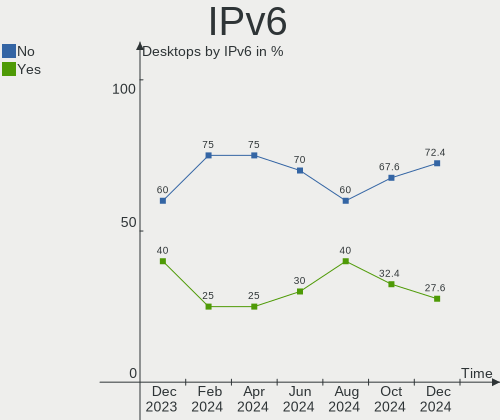
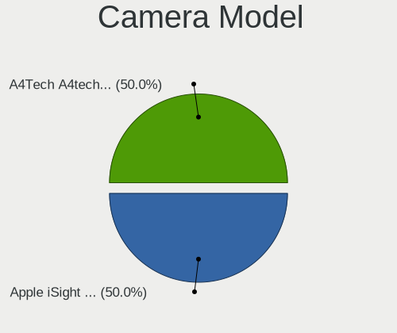

KDE neon Hardware Trends (Desktop)
----------------------------------

A project to identify most popular hardware characteristics and track their change
over time based on data collected by KDE neon users at https://Linux-Hardware.org.

Anyone can contribute to the study by uploading probes of their computers by
the [hw-probe](https://github.com/linuxhw/hw-probe) tool:

    sudo -E hw-probe -all -upload

Full-feature report is available here: https://linux-hardware.org/?view=trends&formfactor=desktop

Period: May, 2021.

Contents
--------

- [ OS                       ](#os)
- [ OS Family                ](#os-family)
- [ Kernel                   ](#kernel)
- [ Kernel Family            ](#kernel-family)
- [ Kernel Major Ver.        ](#kernel-major-ver)
- [ Arch                     ](#arch)
- [ DE                       ](#de)
- [ Display Server           ](#display-server)
- [ Display Manager          ](#display-manager)
- [ OS Lang                  ](#os-lang)
- [ Boot Mode                ](#boot-mode)
- [ Filesystem               ](#filesystem)
- [ Part. scheme             ](#part-scheme)
- [ Dual Boot with Linux/BSD ](#dual-boot-with-linux/bsd)
- [ Dual Boot (Win)          ](#dual-boot-win)
- [ Country                  ](#country)
- [ City                     ](#city)
- [ Vendor                   ](#vendor)
- [ Model                    ](#model)
- [ Model Family             ](#model-family)
- [ MFG Year                 ](#mfg-year)
- [ Form Factor              ](#form-factor)
- [ Secure Boot              ](#secure-boot)
- [ Coreboot                 ](#coreboot)
- [ RAM Size                 ](#ram-size)
- [ RAM Used                 ](#ram-used)
- [ Has CD-ROM               ](#has-cd-rom)
- [ Total Drives             ](#total-drives)
- [ Has Ethernet             ](#has-ethernet)
- [ Has WiFi                 ](#has-wifi)
- [ Has Bluetooth            ](#has-bluetooth)
- [ Drive Vendor             ](#drive-vendor)
- [ Drive Model              ](#drive-model)
- [ HDD Vendor               ](#hdd-vendor)
- [ SSD Vendor               ](#ssd-vendor)
- [ Drive Kind               ](#drive-kind)
- [ Drive Connector          ](#drive-connector)
- [ Drive Size               ](#drive-size)
- [ Space Total              ](#space-total)
- [ Space Used               ](#space-used)
- [ Malfunc. Drives          ](#malfunc-drives)
- [ Malfunc. Drive Vendor    ](#malfunc-drive-vendor)
- [ Malfunc. HDD Vendor      ](#malfunc-hdd-vendor)
- [ Malfunc. Drive Kind      ](#malfunc-drive-kind)
- [ Failed Drives            ](#failed-drives)
- [ Failed Drive Vendor      ](#failed-drive-vendor)
- [ Drive Status             ](#drive-status)
- [ Storage Vendor           ](#storage-vendor)
- [ Storage Model            ](#storage-model)
- [ Storage Kind             ](#storage-kind)
- [ CPU Vendor               ](#cpu-vendor)
- [ CPU Model                ](#cpu-model)
- [ CPU Model Family         ](#cpu-model-family)
- [ CPU Cores                ](#cpu-cores)
- [ CPU Sockets              ](#cpu-sockets)
- [ CPU Threads              ](#cpu-threads)
- [ CPU Op-Modes             ](#cpu-op-modes)
- [ CPU Microcode            ](#cpu-microcode)
- [ CPU Microarch            ](#cpu-microarch)
- [ GPU Vendor               ](#gpu-vendor)
- [ GPU Model                ](#gpu-model)
- [ GPU Combo                ](#gpu-combo)
- [ GPU Driver               ](#gpu-driver)
- [ GPU Memory               ](#gpu-memory)
- [ Monitor Vendor           ](#monitor-vendor)
- [ Monitor Model            ](#monitor-model)
- [ Monitor Resolution       ](#monitor-resolution)
- [ Monitor Diagonal         ](#monitor-diagonal)
- [ Monitor Width            ](#monitor-width)
- [ Aspect Ratio             ](#aspect-ratio)
- [ Monitor Area             ](#monitor-area)
- [ Pixel Density            ](#pixel-density)
- [ Multiple Monitors        ](#multiple-monitors)
- [ Net Controller Vendor    ](#net-controller-vendor)
- [ Net Controller Model     ](#net-controller-model)
- [ Wireless Vendor          ](#wireless-vendor)
- [ Wireless Model           ](#wireless-model)
- [ Ethernet Vendor          ](#ethernet-vendor)
- [ Ethernet Model           ](#ethernet-model)
- [ Net Controller Kind      ](#net-controller-kind)
- [ Used Controller          ](#used-controller)
- [ NICs                     ](#nics)
- [ IPv6                     ](#ipv6)
- [ Memory Vendor            ](#memory-vendor)
- [ Memory Model             ](#memory-model)
- [ Memory Kind              ](#memory-kind)
- [ Memory Form Factor       ](#memory-form-factor)
- [ Memory Size              ](#memory-size)
- [ Memory Speed             ](#memory-speed)
- [ Sound Vendor             ](#sound-vendor)
- [ Sound Model              ](#sound-model)
- [ Camera Vendor            ](#camera-vendor)
- [ Camera Model             ](#camera-model)
- [ Fingerprint Vendor       ](#fingerprint-vendor)
- [ Fingerprint Model        ](#fingerprint-model)
- [ Chipcard Vendor          ](#chipcard-vendor)
- [ Chipcard Model           ](#chipcard-model)
- [ Printer Vendor           ](#printer-vendor)
- [ Printer Model            ](#printer-model)
- [ Scanner Vendor           ](#scanner-vendor)
- [ Scanner Model            ](#scanner-model)
- [ Bluetooth Vendor         ](#bluetooth-vendor)
- [ Bluetooth Model          ](#bluetooth-model)
- [ Unsupported Devices      ](#unsupported-devices)
- [ Unsupported Device Types ](#unsupported-device-types)

OS
--

Installed operating systems

| Name           | Desktops | Percent |
|----------------|----------|---------|
| KDE neon 20.04 | 52       | 100%    |

OS Family
---------

OS without a version

| Name     | Desktops | Percent |
|----------|----------|---------|
| KDE neon | 52       | 100%    |

Kernel
------

Version of the Linux kernel

| Version                | Desktops | Percent |
|------------------------|----------|---------|
| 5.4.0-73-generic       | 27       | 51.92%  |
| 5.4.0-72-generic       | 19       | 36.54%  |
| 5.9.16-050916-generic  | 1        | 1.92%   |
| 5.8.0-53-generic       | 1        | 1.92%   |
| 5.4.0-66-generic       | 1        | 1.92%   |
| 5.4.0-52-generic       | 1        | 1.92%   |
| 5.11.16-051116-generic | 1        | 1.92%   |
| 5.10.37-xanmod1        | 1        | 1.92%   |

Kernel Family
-------------

Linux kernel without a distro release

| Version | Desktops | Percent |
|---------|----------|---------|
| 5.4.0   | 48       | 92.31%  |
| 5.9.16  | 1        | 1.92%   |
| 5.8.0   | 1        | 1.92%   |
| 5.11.16 | 1        | 1.92%   |
| 5.10.37 | 1        | 1.92%   |

Kernel Major Ver.
-----------------

Linux kernel major version

| Version | Desktops | Percent |
|---------|----------|---------|
| 5.4     | 48       | 92.31%  |
| 5.9     | 1        | 1.92%   |
| 5.8     | 1        | 1.92%   |
| 5.11    | 1        | 1.92%   |
| 5.10    | 1        | 1.92%   |

Arch
----

OS architecture (x86_64, i586, etc.)

| Name   | Desktops | Percent |
|--------|----------|---------|
| x86_64 | 52       | 100%    |

DE
--

Desktop Environment

| Name | Desktops | Percent |
|------|----------|---------|
| KDE  | 49       | 94.23%  |
| KDE5 | 3        | 5.77%   |

Display Server
--------------

X11 or Wayland

| Name    | Desktops | Percent |
|---------|----------|---------|
| X11     | 51       | 98.08%  |
| Wayland | 1        | 1.92%   |

Display Manager
---------------

SDDM, LightDM, etc.

| Name    | Desktops | Percent |
|---------|----------|---------|
| Unknown | 48       | 92.31%  |
| SDDM    | 4        | 7.69%   |

OS Lang
-------

Language

| Lang  | Desktops | Percent |
|-------|----------|---------|
| en_US | 14       | 26.92%  |
| de_DE | 5        | 9.62%   |
| en_GB | 4        | 7.69%   |
| zh_CN | 3        | 5.77%   |
| pt_BR | 2        | 3.85%   |
| nl_NL | 2        | 3.85%   |
| it_IT | 2        | 3.85%   |
| es_ES | 2        | 3.85%   |
| en_AU | 2        | 3.85%   |
| C     | 2        | 3.85%   |
| sv_SE | 1        | 1.92%   |
| ru_UA | 1        | 1.92%   |
| ru_RU | 1        | 1.92%   |
| ja_JP | 1        | 1.92%   |
| fr_FR | 1        | 1.92%   |
| fr_CH | 1        | 1.92%   |
| es_MX | 1        | 1.92%   |
| es_CO | 1        | 1.92%   |
| es_CL | 1        | 1.92%   |
| es_AR | 1        | 1.92%   |
| en_IN | 1        | 1.92%   |
| en_CA | 1        | 1.92%   |
| da_DK | 1        | 1.92%   |
| cs_CZ | 1        | 1.92%   |

Boot Mode
---------

EFI or BIOS

| Mode | Desktops | Percent |
|------|----------|---------|
| EFI  | 30       | 57.69%  |
| BIOS | 22       | 42.31%  |

Filesystem
----------

Type of filesystem

| Type    | Desktops | Percent |
|---------|----------|---------|
| Ext4    | 48       | 92.31%  |
| Overlay | 2        | 3.85%   |
| Btrfs   | 2        | 3.85%   |

Part. scheme
------------

Scheme of partitioning

| Type    | Desktops | Percent |
|---------|----------|---------|
| Unknown | 49       | 94.23%  |
| GPT     | 2        | 3.85%   |
| MBR     | 1        | 1.92%   |

Dual Boot with Linux/BSD
------------------------

Hosting more than one Linux/BSD

| Dual boot | Desktops | Percent |
|-----------|----------|---------|
| No        | 49       | 94.23%  |
| Yes       | 3        | 5.77%   |

Dual Boot (Win)
---------------

Hosting Linux and Windows

| Dual boot | Desktops | Percent |
|-----------|----------|---------|
| No        | 47       | 90.38%  |
| Yes       | 5        | 9.62%   |

Country
-------

Geographic location (country)

| Country     | Desktops | Percent |
|-------------|----------|---------|
| USA         | 6        | 11.54%  |
| Germany     | 6        | 11.54%  |
| Brazil      | 5        | 9.62%   |
| UK          | 3        | 5.77%   |
| Spain       | 3        | 5.77%   |
| Netherlands | 3        | 5.77%   |
| Australia   | 3        | 5.77%   |
| Sweden      | 2        | 3.85%   |
| Italy       | 2        | 3.85%   |
| China       | 2        | 3.85%   |
| Ukraine     | 1        | 1.92%   |
| Switzerland | 1        | 1.92%   |
| Russia      | 1        | 1.92%   |
| Puerto Rico | 1        | 1.92%   |
| Poland      | 1        | 1.92%   |
| Mexico      | 1        | 1.92%   |
| Japan       | 1        | 1.92%   |
| Israel      | 1        | 1.92%   |
| India       | 1        | 1.92%   |
| Hong Kong   | 1        | 1.92%   |
| France      | 1        | 1.92%   |
| Denmark     | 1        | 1.92%   |
| Czechia     | 1        | 1.92%   |
| Colombia    | 1        | 1.92%   |
| Chile       | 1        | 1.92%   |
| Canada      | 1        | 1.92%   |
| Argentina   | 1        | 1.92%   |

City
----

Geographic location (city)

| City                   | Desktops | Percent |
|------------------------|----------|---------|
| Rio de Janeiro         | 2        | 3.85%   |
| Zhengzhou              | 1        | 1.92%   |
| Zbiroh                 | 1        | 1.92%   |
| Wuxi                   | 1        | 1.92%   |
| Two Harbors            | 1        | 1.92%   |
| Tuluá                 | 1        | 1.92%   |
| Torreón               | 1        | 1.92%   |
| Tipp City              | 1        | 1.92%   |
| Tettnang Castle        | 1        | 1.92%   |
| São Carlos            | 1        | 1.92%   |
| Swadlincote            | 1        | 1.92%   |
| Schiedam               | 1        | 1.92%   |
| Santiago               | 1        | 1.92%   |
| Rome                   | 1        | 1.92%   |
| Rivas-Vaciamadrid      | 1        | 1.92%   |
| Radom                  | 1        | 1.92%   |
| Prignano sulla Secchia | 1        | 1.92%   |
| Peterborough           | 1        | 1.92%   |
| Perth                  | 1        | 1.92%   |
| Patchogue              | 1        | 1.92%   |
| Oxie                   | 1        | 1.92%   |
| Olivos                 | 1        | 1.92%   |
| Odense                 | 1        | 1.92%   |
| Nova Iguaçu           | 1        | 1.92%   |
| Nij Beets              | 1        | 1.92%   |
| Mönchengladbach       | 1        | 1.92%   |
| Mjoelby                | 1        | 1.92%   |
| Melbourne              | 1        | 1.92%   |
| Matsudo                | 1        | 1.92%   |
| Louisville             | 1        | 1.92%   |
| Longuenesse            | 1        | 1.92%   |
| Lausanne               | 1        | 1.92%   |
| Kolkata                | 1        | 1.92%   |
| Haifa                  | 1        | 1.92%   |
| Gütersloh             | 1        | 1.92%   |
| Guayama                | 1        | 1.92%   |
| Getafe                 | 1        | 1.92%   |
| Fokino                 | 1        | 1.92%   |
| Essen                  | 1        | 1.92%   |
| Cullman                | 1        | 1.92%   |
| Cologne                | 1        | 1.92%   |
| Cherkasy               | 1        | 1.92%   |
| Chandler               | 1        | 1.92%   |
| Central                | 1        | 1.92%   |
| Campinas               | 1        | 1.92%   |
| Cambridge              | 1        | 1.92%   |
| Brunswick              | 1        | 1.92%   |
| Bokel                  | 1        | 1.92%   |
| Biggleswade            | 1        | 1.92%   |
| Barcelona              | 1        | 1.92%   |
| Amsterdam              | 1        | 1.92%   |

Vendor
------

Motherboard manufacturer

| Name                | Desktops | Percent |
|---------------------|----------|---------|
| ASUSTek Computer    | 10       | 19.23%  |
| MSI                 | 7        | 13.46%  |
| Hewlett-Packard     | 7        | 13.46%  |
| Gigabyte Technology | 7        | 13.46%  |
| ASRock              | 7        | 13.46%  |
| Dell                | 4        | 7.69%   |
| Intel               | 3        | 5.77%   |
| Lenovo              | 2        | 3.85%   |
| Foxconn             | 2        | 3.85%   |
| Itautec             | 1        | 1.92%   |
| Huanghe             | 1        | 1.92%   |
| Biostar             | 1        | 1.92%   |

Model
-----

Motherboard model

| Name                                | Desktops | Percent |
|-------------------------------------|----------|---------|
| Intel H61                           | 2        | 3.85%   |
| MSI MS-7C52                         | 1        | 1.92%   |
| MSI MS-7C51                         | 1        | 1.92%   |
| MSI MS-7C37                         | 1        | 1.92%   |
| MSI MS-7B98                         | 1        | 1.92%   |
| MSI MS-7A38                         | 1        | 1.92%   |
| MSI MS-7A34                         | 1        | 1.92%   |
| MSI MS-7A32                         | 1        | 1.92%   |
| Lenovo YangTianT4900v-00 90MCCTO1WW | 1        | 1.92%   |
| Lenovo ThinkCentre E73 10AS002PGE   | 1        | 1.92%   |
| Itautec Infoway ST-4272             | 1        | 1.92%   |
| Intel DP55WB AAE64798-205           | 1        | 1.92%   |
| Huanghe PRO H410M-C                 | 1        | 1.92%   |
| HP Slim Desktop 290-p0xxx           | 1        | 1.92%   |
| HP ProDesk 400 G1 MT                | 1        | 1.92%   |
| HP Pavilion Desktop TP01-0xxx       | 1        | 1.92%   |
| HP Pavilion Desktop PC 570-p0xx     | 1        | 1.92%   |
| HP Compaq Elite 8300 CMT            | 1        | 1.92%   |
| HP Compaq dc7700 Small Form Factor  | 1        | 1.92%   |
| HP Compaq 6005 Pro SFF PC           | 1        | 1.92%   |
| Gigabyte X99-UD5 WIFI-CF            | 1        | 1.92%   |
| Gigabyte P55M-UD2                   | 1        | 1.92%   |
| Gigabyte GA-990FXA-UD3              | 1        | 1.92%   |
| Gigabyte GA-78LMT-USB3              | 1        | 1.92%   |
| Gigabyte B460MDS3HV2                | 1        | 1.92%   |
| Gigabyte B450M S2H                  | 1        | 1.92%   |
| Gigabyte B450 AORUS M               | 1        | 1.92%   |
| Foxconn Pro 3500 Series             | 1        | 1.92%   |
| Foxconn p6504f                      | 1        | 1.92%   |
| Dell Precision 3240 Compact         | 1        | 1.92%   |
| Dell Inspiron 570                   | 1        | 1.92%   |
| Dell Inspiron 5675                  | 1        | 1.92%   |
| Dell DM061                          | 1        | 1.92%   |
| Biostar A68MHE                      | 1        | 1.92%   |
| ASUS Z170-PRO                       | 1        | 1.92%   |
| ASUS ROG STRIX Z370-F GAMING        | 1        | 1.92%   |
| ASUS ROG STRIX B450-F GAMING        | 1        | 1.92%   |
| ASUS PRIME X399-A                   | 1        | 1.92%   |
| ASUS PRIME B450M-A II               | 1        | 1.92%   |
| ASUS PRIME B450M-A                  | 1        | 1.92%   |
| ASUS P5K3 Deluxe                    | 1        | 1.92%   |
| ASUS M5A99FX PRO R2.0               | 1        | 1.92%   |
| ASUS M4N68T                         | 1        | 1.92%   |
| ASUS E520                           | 1        | 1.92%   |
| ASRock Z87M Extreme4                | 1        | 1.92%   |
| ASRock Z270 Gaming K4               | 1        | 1.92%   |
| ASRock Q1900M                       | 1        | 1.92%   |
| ASRock H81M-HG4                     | 1        | 1.92%   |
| ASRock H81 Pro BTC R2.0             | 1        | 1.92%   |
| ASRock B450M Pro4                   | 1        | 1.92%   |
| ASRock B450 Pro4                    | 1        | 1.92%   |

Model Family
------------

Motherboard model prefix

| Name                     | Desktops | Percent |
|--------------------------|----------|---------|
| HP Compaq                | 3        | 5.77%   |
| ASUS PRIME               | 3        | 5.77%   |
| Intel H61                | 2        | 3.85%   |
| HP Pavilion              | 2        | 3.85%   |
| Dell Inspiron            | 2        | 3.85%   |
| ASUS ROG                 | 2        | 3.85%   |
| MSI MS-7C52              | 1        | 1.92%   |
| MSI MS-7C51              | 1        | 1.92%   |
| MSI MS-7C37              | 1        | 1.92%   |
| MSI MS-7B98              | 1        | 1.92%   |
| MSI MS-7A38              | 1        | 1.92%   |
| MSI MS-7A34              | 1        | 1.92%   |
| MSI MS-7A32              | 1        | 1.92%   |
| Lenovo YangTianT4900v-00 | 1        | 1.92%   |
| Lenovo ThinkCentre       | 1        | 1.92%   |
| Itautec Infoway          | 1        | 1.92%   |
| Intel DP55WB             | 1        | 1.92%   |
| Huanghe PRO              | 1        | 1.92%   |
| HP Slim                  | 1        | 1.92%   |
| HP ProDesk               | 1        | 1.92%   |
| Gigabyte X99-UD5         | 1        | 1.92%   |
| Gigabyte P55M-UD2        | 1        | 1.92%   |
| Gigabyte GA-990FXA-UD3   | 1        | 1.92%   |
| Gigabyte GA-78LMT-USB3   | 1        | 1.92%   |
| Gigabyte B460MDS3HV2     | 1        | 1.92%   |
| Gigabyte B450M           | 1        | 1.92%   |
| Gigabyte B450            | 1        | 1.92%   |
| Foxconn Pro              | 1        | 1.92%   |
| Foxconn p6504f           | 1        | 1.92%   |
| Dell Precision           | 1        | 1.92%   |
| Dell DM061               | 1        | 1.92%   |
| Biostar A68MHE           | 1        | 1.92%   |
| ASUS Z170-PRO            | 1        | 1.92%   |
| ASUS P5K3                | 1        | 1.92%   |
| ASUS M5A99FX             | 1        | 1.92%   |
| ASUS M4N68T              | 1        | 1.92%   |
| ASUS E520                | 1        | 1.92%   |
| ASRock Z87M              | 1        | 1.92%   |
| ASRock Z270              | 1        | 1.92%   |
| ASRock Q1900M            | 1        | 1.92%   |
| ASRock H81M-HG4          | 1        | 1.92%   |
| ASRock H81               | 1        | 1.92%   |
| ASRock B450M             | 1        | 1.92%   |
| ASRock B450              | 1        | 1.92%   |

MFG Year
--------

Motherboard manufacture year

| Year | Desktops | Percent |
|------|----------|---------|
| 2020 | 13       | 25%     |
| 2018 | 10       | 19.23%  |
| 2019 | 9        | 17.31%  |
| 2012 | 4        | 7.69%   |
| 2017 | 3        | 5.77%   |
| 2010 | 3        | 5.77%   |
| 2011 | 2        | 3.85%   |
| 2009 | 2        | 3.85%   |
| 2007 | 2        | 3.85%   |
| 2021 | 1        | 1.92%   |
| 2016 | 1        | 1.92%   |
| 2014 | 1        | 1.92%   |
| 2013 | 1        | 1.92%   |

Form Factor
-----------

Physical design of the computer

| Name    | Desktops | Percent |
|---------|----------|---------|
| Desktop | 52       | 100%    |

Secure Boot
-----------

Enabled or disabled

| State    | Desktops | Percent |
|----------|----------|---------|
| Disabled | 52       | 100%    |

Coreboot
--------

Have coreboot on board

| Used | Desktops | Percent |
|------|----------|---------|
| No   | 52       | 100%    |

RAM Size
--------

Total RAM memory

| Size in GB  | Desktops | Percent |
|-------------|----------|---------|
| 16.01-24.0  | 18       | 34.62%  |
| 8.01-16.0   | 12       | 23.08%  |
| 32.01-64.0  | 6        | 11.54%  |
| 3.01-4.0    | 6        | 11.54%  |
| 4.01-8.0    | 5        | 9.62%   |
| 24.01-32.0  | 2        | 3.85%   |
| 64.01-256.0 | 2        | 3.85%   |
| 2.01-3.0    | 1        | 1.92%   |

RAM Used
--------

Used RAM memory

| Used GB   | Desktops | Percent |
|-----------|----------|---------|
| 1.01-2.0  | 20       | 38.46%  |
| 2.01-3.0  | 18       | 34.62%  |
| 4.01-8.0  | 7        | 13.46%  |
| 3.01-4.0  | 5        | 9.62%   |
| 8.01-16.0 | 1        | 1.92%   |
| 0.51-1.0  | 1        | 1.92%   |

Has CD-ROM
----------

Has CD-ROM on board

| Presented | Desktops | Percent |
|-----------|----------|---------|
| Yes       | 26       | 50%     |
| No        | 26       | 50%     |

Total Drives
------------

Number of drives on board

| Drives | Desktops | Percent |
|--------|----------|---------|
| 1      | 16       | 30.77%  |
| 2      | 15       | 28.85%  |
| 3      | 11       | 21.15%  |
| 5      | 3        | 5.77%   |
| 4      | 3        | 5.77%   |
| 6      | 2        | 3.85%   |
| 7      | 1        | 1.92%   |
| 0      | 1        | 1.92%   |

Has Ethernet
------------

Has Ethernet on board

| Presented | Desktops | Percent |
|-----------|----------|---------|
| Yes       | 52       | 100%    |

Has WiFi
--------

Has WiFi module

| Presented | Desktops | Percent |
|-----------|----------|---------|
| No        | 29       | 55.77%  |
| Yes       | 23       | 44.23%  |

Has Bluetooth
-------------

Has Bluetooth module

| Presented | Desktops | Percent |
|-----------|----------|---------|
| No        | 35       | 67.31%  |
| Yes       | 17       | 32.69%  |

Drive Vendor
------------

Hard drive vendors

| Vendor                    | Desktops | Drives | Percent |
|---------------------------|----------|--------|---------|
| WDC                       | 19       | 31     | 20.88%  |
| Samsung Electronics       | 14       | 27     | 15.38%  |
| Seagate                   | 13       | 17     | 14.29%  |
| Kingston                  | 7        | 8      | 7.69%   |
| Hitachi                   | 6        | 7      | 6.59%   |
| Crucial                   | 6        | 7      | 6.59%   |
| Sandisk                   | 5        | 5      | 5.49%   |
| Toshiba                   | 4        | 5      | 4.4%    |
| Intel                     | 3        | 3      | 3.3%    |
| Unknown                   | 2        | 3      | 2.2%    |
| SPCC                      | 1        | 1      | 1.1%    |
| Phison                    | 1        | 1      | 1.1%    |
| OCZ-VERTEX2               | 1        | 1      | 1.1%    |
| Micron/Crucial Technology | 1        | 1      | 1.1%    |
| LITEON                    | 1        | 1      | 1.1%    |
| Lenovo                    | 1        | 1      | 1.1%    |
| KingSpec                  | 1        | 1      | 1.1%    |
| Integral                  | 1        | 1      | 1.1%    |
| HGST                      | 1        | 1      | 1.1%    |
| Gigabyte Technology       | 1        | 2      | 1.1%    |
| Asmedia                   | 1        | 1      | 1.1%    |
| A-DATA Technology         | 1        | 1      | 1.1%    |

Drive Model
-----------

Hard drive models

| Model                             | Desktops | Percent |
|-----------------------------------|----------|---------|
| Samsung NVMe SSD Drive 1TB        | 5        | 4.1%    |
| Samsung NVMe SSD Drive 512GB      | 4        | 3.28%   |
| Seagate ST1000DM010-2EP102 1TB    | 3        | 2.46%   |
| Kingston SA400S37240G 240GB SSD   | 3        | 2.46%   |
| WDC WD20EZAZ-00GGJB0 2TB          | 2        | 1.64%   |
| Seagate ST500DM002-1BD142 500GB   | 2        | 1.64%   |
| Samsung NVMe SSD Drive 500GB      | 2        | 1.64%   |
| Samsung NVMe SSD Drive 250GB      | 2        | 1.64%   |
| Kingston SV300S37A120G 120GB SSD  | 2        | 1.64%   |
| Crucial CT500MX500SSD1 500GB      | 2        | 1.64%   |
| Crucial CT240BX500SSD1 240GB      | 2        | 1.64%   |
| Crucial CT1000MX500SSD1 1TB       | 2        | 1.64%   |
| WDC WDS120G2G0A-00JH30 120GB SSD  | 1        | 0.82%   |
| WDC WDS100T2B0A-00SM50 1TB SSD    | 1        | 0.82%   |
| WDC WDBNCE2500PNC 250GB SSD       | 1        | 0.82%   |
| WDC WD60EZAZ-00SF3B0 6TB          | 1        | 0.82%   |
| WDC WD60EFAX-68SHWN0 6TB          | 1        | 0.82%   |
| WDC WD5000AZRX-00A8LB0 500GB      | 1        | 0.82%   |
| WDC WD5000AZLX-75K2TA0 500GB      | 1        | 0.82%   |
| WDC WD5000AVDS-63U7B1 500GB       | 1        | 0.82%   |
| WDC WD5000AAKX-22ERMA0 500GB      | 1        | 0.82%   |
| WDC WD5000AADS-11M2B2 500GB       | 1        | 0.82%   |
| WDC WD40PURZ-85TTDY0 4TB          | 1        | 0.82%   |
| WDC WD40PURZ-85AKKY0 4TB          | 1        | 0.82%   |
| WDC WD40EFRX-68WT0N0 4TB          | 1        | 0.82%   |
| WDC WD3200BPVT-35ZEST0 320GB      | 1        | 0.82%   |
| WDC WD3200AAKS-00L9A0 320GB       | 1        | 0.82%   |
| WDC WD30EZRX-00SPEB0 3TB          | 1        | 0.82%   |
| WDC WD30EZRX-00D8PB0 3TB          | 1        | 0.82%   |
| WDC WD30EFRX-68EUZN0 3TB          | 1        | 0.82%   |
| WDC WD2500JS-00SGB0 250GB         | 1        | 0.82%   |
| WDC WD2500AAKX-001CA0 250GB       | 1        | 0.82%   |
| WDC WD20EZRZ-00Z5HB0 2TB          | 1        | 0.82%   |
| WDC WD10EZEX-60WN4A0 1TB          | 1        | 0.82%   |
| WDC WD10EZEX-21WN4A0 1TB          | 1        | 0.82%   |
| WDC WD10EZEX-08WN4A0 1TB          | 1        | 0.82%   |
| WDC WD10EAVS-00D7B1 1TB           | 1        | 0.82%   |
| WDC WD10EARS-00Z5B1 1TB           | 1        | 0.82%   |
| Unknown SD/MMC/MS PRO 8GB         | 1        | 0.82%   |
| Unknown S5170-512 512GB           | 1        | 0.82%   |
| Unknown NVMe SSD Drive 256GB      | 1        | 0.82%   |
| Toshiba TR200 240GB SSD           | 1        | 0.82%   |
| Toshiba MQ01ABD100 1TB            | 1        | 0.82%   |
| Toshiba MQ01ABD050 500GB          | 1        | 0.82%   |
| Toshiba HDWE160 6TB               | 1        | 0.82%   |
| Toshiba A100 240GB SSD            | 1        | 0.82%   |
| SPCC Solid State Disk 240GB       | 1        | 0.82%   |
| Seagate ST8000AS0002-1NA17Z 8TB   | 1        | 0.82%   |
| Seagate ST3500418AS 500GB         | 1        | 0.82%   |
| Seagate ST3250318AS 250GB         | 1        | 0.82%   |
| Seagate ST320LT007-9ZV142 320GB   | 1        | 0.82%   |
| Seagate ST3160815AS 160GB         | 1        | 0.82%   |
| Seagate ST31000528AS 1TB          | 1        | 0.82%   |
| Seagate ST2000VX008-2E3164 2TB    | 1        | 0.82%   |
| Seagate ST1000DM003-1SB10C 1TB    | 1        | 0.82%   |
| Seagate ST1000DM003-1ER162 1TB    | 1        | 0.82%   |
| Seagate ST10000VX0004-1ZE101 10TB | 1        | 0.82%   |
| Seagate NVMe SSD Drive 512GB      | 1        | 0.82%   |
| Seagate M3 1TB                    | 1        | 0.82%   |
| SanDisk SSD PLUS 240GB            | 1        | 0.82%   |

HDD Vendor
----------

Hard disk drive vendors

| Vendor              | Desktops | Drives | Percent |
|---------------------|----------|--------|---------|
| WDC                 | 17       | 28     | 42.5%   |
| Seagate             | 11       | 15     | 27.5%   |
| Hitachi             | 6        | 7      | 15%     |
| Toshiba             | 3        | 3      | 7.5%    |
| Samsung Electronics | 2        | 2      | 5%      |
| HGST                | 1        | 1      | 2.5%    |

SSD Vendor
----------

Solid state drive vendors

| Vendor              | Desktops | Drives | Percent |
|---------------------|----------|--------|---------|
| Samsung Electronics | 6        | 10     | 17.14%  |
| Kingston            | 6        | 6      | 17.14%  |
| Crucial             | 6        | 7      | 17.14%  |
| WDC                 | 3        | 3      | 8.57%   |
| SanDisk             | 3        | 3      | 8.57%   |
| Toshiba             | 2        | 2      | 5.71%   |
| SPCC                | 1        | 1      | 2.86%   |
| OCZ-VERTEX2         | 1        | 1      | 2.86%   |
| LITEON              | 1        | 1      | 2.86%   |
| Lenovo              | 1        | 1      | 2.86%   |
| KingSpec            | 1        | 1      | 2.86%   |
| Intel               | 1        | 1      | 2.86%   |
| Integral            | 1        | 1      | 2.86%   |
| Gigabyte Technology | 1        | 2      | 2.86%   |
| A-DATA Technology   | 1        | 1      | 2.86%   |

Drive Kind
----------

HDD or SSD

| Kind    | Desktops | Drives | Percent |
|---------|----------|--------|---------|
| HDD     | 33       | 56     | 40.74%  |
| SSD     | 27       | 41     | 33.33%  |
| NVMe    | 17       | 25     | 20.99%  |
| Unknown | 4        | 4      | 4.94%   |

Drive Connector
---------------

SATA, SAS, NVMe, etc.

| Type | Desktops | Drives | Percent |
|------|----------|--------|---------|
| SATA | 47       | 98     | 70.15%  |
| NVMe | 17       | 25     | 25.37%  |
| SAS  | 3        | 3      | 4.48%   |

Drive Size
----------

Size of hard drive

| Size in TB | Desktops | Drives | Percent |
|------------|----------|--------|---------|
| 0.01-0.5   | 33       | 51     | 49.25%  |
| 0.51-1.0   | 19       | 25     | 28.36%  |
| 1.01-2.0   | 6        | 6      | 8.96%   |
| 4.01-10.0  | 4        | 6      | 5.97%   |
| 3.01-4.0   | 3        | 5      | 4.48%   |
| 2.01-3.0   | 2        | 4      | 2.99%   |

Space Total
-----------

Amount of disk space available on the file system

| Size in GB     | Desktops | Percent |
|----------------|----------|---------|
| 101-250        | 18       | 34.62%  |
| 251-500        | 14       | 26.92%  |
| 501-1000       | 6        | 11.54%  |
| 2001-3000      | 4        | 7.69%   |
| More than 3000 | 2        | 3.85%   |
| 21-50          | 2        | 3.85%   |
| 1001-2000      | 2        | 3.85%   |
| 51-100         | 2        | 3.85%   |
| 1-20           | 1        | 1.92%   |
| Unknown        | 1        | 1.92%   |

Space Used
----------

Amount of used disk space

| Used GB        | Desktops | Percent |
|----------------|----------|---------|
| 1-20           | 23       | 44.23%  |
| 21-50          | 10       | 19.23%  |
| 51-100         | 7        | 13.46%  |
| 101-250        | 4        | 7.69%   |
| 1001-2000      | 3        | 5.77%   |
| 251-500        | 2        | 3.85%   |
| More than 3000 | 1        | 1.92%   |
| 501-1000       | 1        | 1.92%   |
| Unknown        | 1        | 1.92%   |

Malfunc. Drives
---------------

Drive models with a malfunction

| Model                         | Desktops | Drives | Percent |
|-------------------------------|----------|--------|---------|
| WDC WD40PURZ-85AKKY0 4TB      | 1        | 2      | 33.33%  |
| Hitachi HTS723232A7A364 320GB | 1        | 1      | 33.33%  |
| Hitachi HDS721616PLA380 160GB | 1        | 1      | 33.33%  |

Malfunc. Drive Vendor
---------------------

Vendors of faulty drives

| Vendor  | Desktops | Drives | Percent |
|---------|----------|--------|---------|
| WDC     | 1        | 2      | 50%     |
| Hitachi | 1        | 2      | 50%     |

Malfunc. HDD Vendor
-------------------

Vendors of faulty HDD drives

| Vendor  | Desktops | Drives | Percent |
|---------|----------|--------|---------|
| WDC     | 1        | 2      | 50%     |
| Hitachi | 1        | 2      | 50%     |

Malfunc. Drive Kind
-------------------

Kinds of faulty drives

| Kind | Desktops | Drives | Percent |
|------|----------|--------|---------|
| HDD  | 2        | 4      | 100%    |

Failed Drives
-------------

Failed drive models

Zero info for selected period =(

Failed Drive Vendor
-------------------

Failed drive vendors

Zero info for selected period =(

Drive Status
------------

Number of failed and malfunc. drives

| Status   | Desktops | Drives | Percent |
|----------|----------|--------|---------|
| Detected | 48       | 117    | 90.57%  |
| Works    | 3        | 5      | 5.66%   |
| Malfunc  | 2        | 4      | 3.77%   |

Storage Vendor
--------------

Storage controller vendors

| Vendor                          | Desktops | Percent |
|---------------------------------|----------|---------|
| Intel                           | 30       | 39.47%  |
| AMD                             | 22       | 28.95%  |
| Samsung Electronics             | 9        | 11.84%  |
| ASMedia Technology              | 4        | 5.26%   |
| Sandisk                         | 2        | 2.63%   |
| JMicron Technology              | 2        | 2.63%   |
| Seagate Technology              | 1        | 1.32%   |
| Phison Electronics              | 1        | 1.32%   |
| Nvidia                          | 1        | 1.32%   |
| Micron/Crucial Technology       | 1        | 1.32%   |
| Marvell Technology Group        | 1        | 1.32%   |
| Kingston Technology Company     | 1        | 1.32%   |
| Hefei DATANG Storage Technology | 1        | 1.32%   |

Storage Model
-------------

Storage controller models

| Model                                                                                   | Desktops | Percent |
|-----------------------------------------------------------------------------------------|----------|---------|
| AMD FCH SATA Controller [AHCI mode]                                                     | 14       | 13.59%  |
| AMD 400 Series Chipset SATA Controller                                                  | 8        | 7.77%   |
| Samsung NVMe SSD Controller SM981/PM981/PM983                                           | 5        | 4.85%   |
| Intel 8 Series/C220 Series Chipset Family 6-port SATA Controller 1 [AHCI mode]          | 5        | 4.85%   |
| ASMedia ASM1062 Serial ATA Controller                                                   | 4        | 3.88%   |
| Samsung NVMe SSD Controller SM961/PM961/SM963                                           | 3        | 2.91%   |
| Intel Cannon Lake PCH SATA AHCI Controller                                              | 3        | 2.91%   |
| Intel 6 Series/C200 Series Chipset Family 6 port Desktop SATA AHCI Controller           | 3        | 2.91%   |
| Intel 200 Series PCH SATA controller [AHCI mode]                                        | 3        | 2.91%   |
| AMD SB7x0/SB8x0/SB9x0 SATA Controller [AHCI mode]                                       | 3        | 2.91%   |
| Samsung NVMe SSD Controller SM951/PM951                                                 | 2        | 1.94%   |
| Samsung NVMe SSD Controller PM9A1/PM9A3/980PRO                                          | 2        | 1.94%   |
| JMicron JMB363 SATA/IDE Controller                                                      | 2        | 1.94%   |
| Intel Q170/Q150/B150/H170/H110/Z170/CM236 Chipset SATA Controller [AHCI Mode]           | 2        | 1.94%   |
| Intel Comet Lake SATA AHCI Controller                                                   | 2        | 1.94%   |
| Intel 82801H (ICH8 Family) 4 port SATA Controller [IDE mode]                            | 2        | 1.94%   |
| Intel 5 Series/3400 Series Chipset 4 port SATA IDE Controller                           | 2        | 1.94%   |
| Intel 5 Series/3400 Series Chipset 2 port SATA IDE Controller                           | 2        | 1.94%   |
| AMD X370 Series Chipset SATA Controller                                                 | 2        | 1.94%   |
| AMD SB7x0/SB8x0/SB9x0 SATA Controller [IDE mode]                                        | 2        | 1.94%   |
| AMD SB7x0/SB8x0/SB9x0 IDE Controller                                                    | 2        | 1.94%   |
| AMD FCH SATA Controller D                                                               | 2        | 1.94%   |
| AMD 300 Series Chipset SATA Controller                                                  | 2        | 1.94%   |
| Seagate FireCuda 510 SSD                                                                | 1        | 0.97%   |
| Sandisk WD Blue SN550 NVMe SSD                                                          | 1        | 0.97%   |
| Sandisk WD Blue SN500 / PC SN520 NVMe SSD                                               | 1        | 0.97%   |
| Phison E12 NVMe Controller                                                              | 1        | 0.97%   |
| Nvidia MCP61 SATA Controller                                                            | 1        | 0.97%   |
| Nvidia MCP61 IDE                                                                        | 1        | 0.97%   |
| Micron/Crucial NVMe Controller                                                          | 1        | 0.97%   |
| Marvell Group 88SE9172 SATA III 6Gb/s RAID Controller                                   | 1        | 0.97%   |
| Kingston Company A2000 NVMe SSD                                                         | 1        | 0.97%   |
| Intel Optane SSD 900P Series                                                            | 1        | 0.97%   |
| Intel NVMe Optane Memory Series                                                         | 1        | 0.97%   |
| Intel NM10/ICH7 Family SATA Controller [IDE mode]                                       | 1        | 0.97%   |
| Intel C610/X99 series chipset 6-Port SATA Controller [AHCI mode]                        | 1        | 0.97%   |
| Intel Atom Processor E3800 Series SATA IDE Controller                                   | 1        | 0.97%   |
| Intel 82801IR/IO/IH (ICH9R/DO/DH) 4 port SATA Controller [IDE mode]                     | 1        | 0.97%   |
| Intel 82801I (ICH9 Family) 2 port SATA Controller [IDE mode]                            | 1        | 0.97%   |
| Intel 82801HR/HO/HH (ICH8R/DO/DH) 2 port SATA Controller [IDE mode]                     | 1        | 0.97%   |
| Intel 82801G (ICH7 Family) IDE Controller                                               | 1        | 0.97%   |
| Intel 7 Series/C210 Series Chipset Family 6-port SATA Controller [AHCI mode]            | 1        | 0.97%   |
| Intel 6 Series/C200 Series Chipset Family IDE-r Controller                              | 1        | 0.97%   |
| Intel 6 Series/C200 Series Chipset Family Desktop SATA Controller (IDE mode, ports 4-5) | 1        | 0.97%   |
| Intel 6 Series/C200 Series Chipset Family Desktop SATA Controller (IDE mode, ports 0-3) | 1        | 0.97%   |
| Intel 400 Series Chipset Family SATA AHCI Controller                                    | 1        | 0.97%   |
| Hefei DATANG Storage NVMe SSD Controller 300B                                           | 1        | 0.97%   |
| AMD X399 Series Chipset SATA Controller                                                 | 1        | 0.97%   |
| AMD FCH SATA Controller [IDE mode]                                                      | 1        | 0.97%   |

Storage Kind
------------

Kind of storage controller (IDE, SATA, NVMe, SAS, ...)

| Kind | Desktops | Percent |
|------|----------|---------|
| SATA | 43       | 59.72%  |
| NVMe | 17       | 23.61%  |
| IDE  | 12       | 16.67%  |

CPU Vendor
----------

Processor vendors

| Vendor | Desktops | Percent |
|--------|----------|---------|
| Intel  | 29       | 55.77%  |
| AMD    | 23       | 44.23%  |

CPU Model
---------

Processor models

| Model                                          | Desktops | Percent |
|------------------------------------------------|----------|---------|
| AMD Ryzen 5 2400G with Radeon Vega Graphics    | 3        | 5.77%   |
| Intel Core 2 Duo CPU E8400 @ 3.00GHz           | 2        | 3.85%   |
| AMD Ryzen 7 3700X 8-Core Processor             | 2        | 3.85%   |
| AMD Ryzen 5 2600 Six-Core Processor            | 2        | 3.85%   |
| Intel Pentium Gold G6400 CPU @ 4.00GHz         | 1        | 1.92%   |
| Intel Core i7-9700K CPU @ 3.60GHz              | 1        | 1.92%   |
| Intel Core i7-8700 CPU @ 3.20GHz               | 1        | 1.92%   |
| Intel Core i7-8086K CPU @ 4.00GHz              | 1        | 1.92%   |
| Intel Core i7-7700K CPU @ 4.20GHz              | 1        | 1.92%   |
| Intel Core i7-6700K CPU @ 4.00GHz              | 1        | 1.92%   |
| Intel Core i7-5820K CPU @ 3.30GHz              | 1        | 1.92%   |
| Intel Core i7-4790 CPU @ 3.60GHz               | 1        | 1.92%   |
| Intel Core i7-4770K CPU @ 3.50GHz              | 1        | 1.92%   |
| Intel Core i7-4770 CPU @ 3.40GHz               | 1        | 1.92%   |
| Intel Core i7-3770 CPU @ 3.40GHz               | 1        | 1.92%   |
| Intel Core i7-2600 CPU @ 3.40GHz               | 1        | 1.92%   |
| Intel Core i7-10700 CPU @ 2.90GHz              | 1        | 1.92%   |
| Intel Core i5-9400F CPU @ 2.90GHz              | 1        | 1.92%   |
| Intel Core i5-9400 CPU @ 2.90GHz               | 1        | 1.92%   |
| Intel Core i5-4430S CPU @ 2.70GHz              | 1        | 1.92%   |
| Intel Core i5-2500K CPU @ 3.30GHz              | 1        | 1.92%   |
| Intel Core i5-2500 CPU @ 3.30GHz               | 1        | 1.92%   |
| Intel Core i5-2320 CPU @ 3.00GHz               | 1        | 1.92%   |
| Intel Core i5-10400 CPU @ 2.90GHz              | 1        | 1.92%   |
| Intel Core i5 CPU 760 @ 2.80GHz                | 1        | 1.92%   |
| Intel Core i5 CPU 750 @ 2.67GHz                | 1        | 1.92%   |
| Intel Core i3-7100T CPU @ 3.40GHz              | 1        | 1.92%   |
| Intel Core i3-4130 CPU @ 3.40GHz               | 1        | 1.92%   |
| Intel Core 2 Quad CPU Q6600 @ 2.40GHz          | 1        | 1.92%   |
| Intel Core 2 CPU 6300 @ 1.86GHz                | 1        | 1.92%   |
| Intel Celeron CPU J1900 @ 1.99GHz              | 1        | 1.92%   |
| AMD Sempron 145 Processor                      | 1        | 1.92%   |
| AMD Ryzen Threadripper 1950X 16-Core Processor | 1        | 1.92%   |
| AMD Ryzen 7 1800X Eight-Core Processor         | 1        | 1.92%   |
| AMD Ryzen 7 1700X Eight-Core Processor         | 1        | 1.92%   |
| AMD Ryzen 5 3600 6-Core Processor              | 1        | 1.92%   |
| AMD Ryzen 5 3500X 6-Core Processor             | 1        | 1.92%   |
| AMD Ryzen 5 3400G with Radeon Vega Graphics    | 1        | 1.92%   |
| AMD Ryzen 5 1600 Six-Core Processor            | 1        | 1.92%   |
| AMD Ryzen 3 3200G with Radeon Vega Graphics    | 1        | 1.92%   |
| AMD Phenom II X4 955 Processor                 | 1        | 1.92%   |
| AMD Phenom II X4 945 Processor                 | 1        | 1.92%   |
| AMD FX-8350 Eight-Core Processor               | 1        | 1.92%   |
| AMD FX-6300 Six-Core Processor                 | 1        | 1.92%   |
| AMD FX-6100 Six-Core Processor                 | 1        | 1.92%   |
| AMD A8-9600 RADEON R7, 10 COMPUTE CORES 4C+6G  | 1        | 1.92%   |
| AMD A4-6300 APU with Radeon HD Graphics        | 1        | 1.92%   |

CPU Model Family
----------------

Processor model prefix

| Model                  | Desktops | Percent |
|------------------------|----------|---------|
| Intel Core i7          | 12       | 23.08%  |
| Intel Core i5          | 9        | 17.31%  |
| AMD Ryzen 5            | 9        | 17.31%  |
| AMD Ryzen 7            | 4        | 7.69%   |
| AMD FX                 | 3        | 5.77%   |
| Intel Core i3          | 2        | 3.85%   |
| Intel Core 2 Duo       | 2        | 3.85%   |
| AMD Phenom II X4       | 2        | 3.85%   |
| Intel Pentium Gold     | 1        | 1.92%   |
| Intel Core 2 Quad      | 1        | 1.92%   |
| Intel Core 2           | 1        | 1.92%   |
| Intel Celeron          | 1        | 1.92%   |
| AMD Sempron            | 1        | 1.92%   |
| AMD Ryzen Threadripper | 1        | 1.92%   |
| AMD Ryzen 3            | 1        | 1.92%   |
| AMD A8                 | 1        | 1.92%   |
| AMD A4                 | 1        | 1.92%   |

CPU Cores
---------

Number of processor cores

| Number | Desktops | Percent |
|--------|----------|---------|
| 4      | 23       | 44.23%  |
| 6      | 11       | 21.15%  |
| 2      | 7        | 13.46%  |
| 8      | 6        | 11.54%  |
| 3      | 2        | 3.85%   |
| 1      | 2        | 3.85%   |
| 16     | 1        | 1.92%   |

CPU Sockets
-----------

Number of sockets

| Number | Desktops | Percent |
|--------|----------|---------|
| 1      | 52       | 100%    |

CPU Threads
-----------

Threads per core (Hyper-Threading)

| Number | Desktops | Percent |
|--------|----------|---------|
| 2      | 33       | 63.46%  |
| 1      | 19       | 36.54%  |

CPU Op-Modes
------------

CPU Operation Modes (32-bit, 64-bit)

| Op mode        | Desktops | Percent |
|----------------|----------|---------|
| 32-bit, 64-bit | 52       | 100%    |

CPU Microcode
-------------

Microcode number

| Number     | Desktops | Percent |
|------------|----------|---------|
| 0x306c3    | 5        | 9.62%   |
| 0x906ea    | 4        | 7.69%   |
| 0x206a7    | 4        | 7.69%   |
| 0x010000c8 | 3        | 5.77%   |
| 0xa0653    | 2        | 3.85%   |
| 0x906e9    | 2        | 3.85%   |
| 0x106e5    | 2        | 3.85%   |
| 0x08701021 | 2        | 3.85%   |
| 0x08701013 | 2        | 3.85%   |
| 0x08108109 | 2        | 3.85%   |
| 0x08101016 | 2        | 3.85%   |
| 0x0800820d | 2        | 3.85%   |
| 0x08001137 | 2        | 3.85%   |
| 0x08001129 | 2        | 3.85%   |
| 0xa0655    | 1        | 1.92%   |
| 0x906ec    | 1        | 1.92%   |
| 0x6fb      | 1        | 1.92%   |
| 0x6f2      | 1        | 1.92%   |
| 0x506e3    | 1        | 1.92%   |
| 0x306f2    | 1        | 1.92%   |
| 0x306a9    | 1        | 1.92%   |
| 0x30679    | 1        | 1.92%   |
| 0x1067a    | 1        | 1.92%   |
| 0x10676    | 1        | 1.92%   |
| 0x0810100b | 1        | 1.92%   |
| 0x0600611a | 1        | 1.92%   |
| 0x06001119 | 1        | 1.92%   |
| 0x06000852 | 1        | 1.92%   |
| 0x0600063e | 1        | 1.92%   |
| Unknown    | 1        | 1.92%   |

CPU Microarch
-------------

Microarchitecture

| Name        | Desktops | Percent |
|-------------|----------|---------|
| Zen         | 7        | 13.46%  |
| KabyLake    | 7        | 13.46%  |
| Haswell     | 6        | 11.54%  |
| Zen+        | 4        | 7.69%   |
| Zen 2       | 4        | 7.69%   |
| SandyBridge | 4        | 7.69%   |
| Piledriver  | 3        | 5.77%   |
| K10         | 3        | 5.77%   |
| CometLake   | 3        | 5.77%   |
| Penryn      | 2        | 3.85%   |
| Nehalem     | 2        | 3.85%   |
| Core        | 2        | 3.85%   |
| Skylake     | 1        | 1.92%   |
| Silvermont  | 1        | 1.92%   |
| IvyBridge   | 1        | 1.92%   |
| Excavator   | 1        | 1.92%   |
| Bulldozer   | 1        | 1.92%   |

GPU Vendor
----------

Vendors of graphics cards

| Vendor | Desktops | Percent |
|--------|----------|---------|
| Nvidia | 23       | 39.66%  |
| AMD    | 21       | 36.21%  |
| Intel  | 14       | 24.14%  |

GPU Model
---------

Graphics card models

| Model                                                                       | Desktops | Percent |
|-----------------------------------------------------------------------------|----------|---------|
| AMD Ellesmere [Radeon RX 470/480/570/570X/580/580X/590]                     | 5        | 8.47%   |
| Nvidia GP106 [GeForce GTX 1060 6GB]                                         | 4        | 6.78%   |
| Intel CometLake-S GT2 [UHD Graphics 630]                                    | 4        | 6.78%   |
| Nvidia GT218 [GeForce 210]                                                  | 3        | 5.08%   |
| Intel 2nd Generation Core Processor Family Integrated Graphics Controller   | 3        | 5.08%   |
| Nvidia GP108 [GeForce GT 1030]                                              | 2        | 3.39%   |
| Nvidia GP102 [GeForce GTX 1080 Ti]                                          | 2        | 3.39%   |
| Nvidia GM107 [GeForce GTX 750 Ti]                                           | 2        | 3.39%   |
| Nvidia GK208B [GeForce GT 710]                                              | 2        | 3.39%   |
| Intel Xeon E3-1200 v3/4th Gen Core Processor Integrated Graphics Controller | 2        | 3.39%   |
| AMD Raven Ridge [Radeon Vega Series / Radeon Vega Mobile Series]            | 2        | 3.39%   |
| AMD Picasso                                                                 | 2        | 3.39%   |
| AMD Lexa XT [Radeon PRO WX 2100]                                            | 2        | 3.39%   |
| AMD Baffin [Radeon RX 460/560D / Pro 450/455/460/555/555X/560/560X]         | 2        | 3.39%   |
| Nvidia TU116 [GeForce GTX 1660 Ti]                                          | 1        | 1.69%   |
| Nvidia TU104 [GeForce RTX 2060]                                             | 1        | 1.69%   |
| Nvidia GT216 [GeForce GT 220]                                               | 1        | 1.69%   |
| Nvidia GT200b [GeForce GTX 275]                                             | 1        | 1.69%   |
| Nvidia GP107GL [Quadro P1000]                                               | 1        | 1.69%   |
| Nvidia GP107 [GeForce GTX 1050 Ti]                                          | 1        | 1.69%   |
| Nvidia GM204 [GeForce GTX 970]                                              | 1        | 1.69%   |
| Nvidia GK208B [GeForce GT 730]                                              | 1        | 1.69%   |
| Intel HD Graphics 630                                                       | 1        | 1.69%   |
| Intel Comet Lake UHD Graphics                                               | 1        | 1.69%   |
| Intel Atom Processor Z36xxx/Z37xxx Series Graphics & Display                | 1        | 1.69%   |
| Intel 82Q963/Q965 Integrated Graphics Controller                            | 1        | 1.69%   |
| Intel 4th Generation Core Processor Family Integrated Graphics Controller   | 1        | 1.69%   |
| AMD Tahiti PRO [Radeon HD 7950/8950 OEM / R9 280]                           | 1        | 1.69%   |
| AMD RV516 [Radeon X1300/X1550 Series] (Secondary)                           | 1        | 1.69%   |
| AMD RV516 [Radeon X1300/X1550 Series]                                       | 1        | 1.69%   |
| AMD RS880 [Radeon HD 4200]                                                  | 1        | 1.69%   |
| AMD Navi 10 [Radeon RX 5600 OEM/5600 XT / 5700/5700 XT]                     | 1        | 1.69%   |
| AMD Juniper XT [Radeon HD 6770]                                             | 1        | 1.69%   |
| AMD Juniper PRO [Radeon HD 6750]                                            | 1        | 1.69%   |
| AMD Cedar [Radeon HD 5000/6000/7350/8350 Series]                            | 1        | 1.69%   |
| AMD Caicos [Radeon HD 6450/7450/8450 / R5 230 OEM]                          | 1        | 1.69%   |

GPU Combo
---------

Combinations of graphics cards

| Name           | Desktops | Percent |
|----------------|----------|---------|
| 1 x Nvidia     | 19       | 36.54%  |
| 1 x AMD        | 19       | 36.54%  |
| 1 x Intel      | 10       | 19.23%  |
| Intel + Nvidia | 2        | 3.85%   |
| 2 x AMD        | 1        | 1.92%   |
| Intel + AMD    | 1        | 1.92%   |

GPU Driver
----------

Free vs proprietary

| Driver      | Desktops | Percent |
|-------------|----------|---------|
| Free        | 41       | 78.85%  |
| Proprietary | 9        | 17.31%  |
| Unknown     | 2        | 3.85%   |

GPU Memory
----------

Total video memory

| Size in GB | Desktops | Percent |
|------------|----------|---------|
| Unknown    | 15       | 28.85%  |
| 1.01-2.0   | 8        | 15.38%  |
| 0.51-1.0   | 7        | 13.46%  |
| 5.01-6.0   | 6        | 11.54%  |
| 3.01-4.0   | 6        | 11.54%  |
| 7.01-8.0   | 4        | 7.69%   |
| 0.01-0.5   | 3        | 5.77%   |
| 8.01-16.0  | 2        | 3.85%   |
| 2.01-3.0   | 1        | 1.92%   |

Monitor Vendor
--------------

Monitor vendors

| Vendor               | Desktops | Percent |
|----------------------|----------|---------|
| Samsung Electronics  | 9        | 17.31%  |
| Goldstar             | 8        | 15.38%  |
| Ancor Communications | 7        | 13.46%  |
| Hewlett-Packard      | 4        | 7.69%   |
| BenQ                 | 4        | 7.69%   |
| AOC                  | 4        | 7.69%   |
| Dell                 | 3        | 5.77%   |
| Fujitsu Siemens      | 2        | 3.85%   |
| Acer                 | 2        | 3.85%   |
| ViewSonic            | 1        | 1.92%   |
| Unknown              | 1        | 1.92%   |
| Philips              | 1        | 1.92%   |
| Lenovo               | 1        | 1.92%   |
| KTC                  | 1        | 1.92%   |
| KOA                  | 1        | 1.92%   |
| Iiyama               | 1        | 1.92%   |
| Element              | 1        | 1.92%   |
| AUS                  | 1        | 1.92%   |

Monitor Model
-------------

Monitor models

| Model                                                                  | Desktops | Percent |
|------------------------------------------------------------------------|----------|---------|
| Goldstar HDR 4K GSM7707 3840x2160 600x340mm 27.2-inch                  | 2        | 3.77%   |
| Goldstar 23MB35 GSM5A3E 1920x1080 510x290mm 23.1-inch                  | 2        | 3.77%   |
| ViewSonic VX2458-mhd VSC0437 1920x1080 520x290mm 23.4-inch             | 1        | 1.89%   |
| Unknown LCD Monitor ELEFW328 1360x768                                  | 1        | 1.89%   |
| Samsung Electronics T27B350 SAM0944 1920x1080 598x336mm 27.0-inch      | 1        | 1.89%   |
| Samsung Electronics SyncMaster SAM0524 1920x1080 477x268mm 21.5-inch   | 1        | 1.89%   |
| Samsung Electronics SyncMaster SAM01CE 1024x768 304x228mm 15.0-inch    | 1        | 1.89%   |
| Samsung Electronics SMBX2240 SAM0684 1920x1080 477x268mm 21.5-inch     | 1        | 1.89%   |
| Samsung Electronics SMB1930N SAM0632 1366x768 410x230mm 18.5-inch      | 1        | 1.89%   |
| Samsung Electronics S27D590 SAM0B49 1920x1080 598x336mm 27.0-inch      | 1        | 1.89%   |
| Samsung Electronics LCD Monitor U28E850 3840x2160                      | 1        | 1.89%   |
| Samsung Electronics LCD Monitor SMT27A550 1680x1050                    | 1        | 1.89%   |
| Samsung Electronics C32HG7x SAM0E13 2560x1440 697x392mm 31.5-inch      | 1        | 1.89%   |
| Philips 273EL PHLC07C 1920x1080 598x336mm 27.0-inch                    | 1        | 1.89%   |
| Lenovo L2251x Wide LEN0A12 1680x1050 474x296mm 22.0-inch               | 1        | 1.89%   |
| KTC W5006L KTC1542 1280x768 331x207mm 15.4-inch                        | 1        | 1.89%   |
| KOA LCD Monitor TV MONIOR 1280x720                                     | 1        | 1.89%   |
| Iiyama PL2730Q IVM6644 2560x1440 597x336mm 27.0-inch                   | 1        | 1.89%   |
| Hewlett-Packard LE1711 HWP2856 1280x960 340x270mm 17.1-inch            | 1        | 1.89%   |
| Hewlett-Packard L1940T HWP2683 1280x1024 376x301mm 19.0-inch           | 1        | 1.89%   |
| Hewlett-Packard 23xi HWP3032 1920x1080 510x290mm 23.1-inch             | 1        | 1.89%   |
| Hewlett-Packard 22f HPN3541 1920x1080 500x300mm 23.0-inch              | 1        | 1.89%   |
| Goldstar W2053 GSM4E9F 1600x900 443x249mm 20.0-inch                    | 1        | 1.89%   |
| Goldstar ULTRAWIDE GSM76F9 2560x1080 531x298mm 24.0-inch               | 1        | 1.89%   |
| Goldstar MP59HT GSM5B44 1920x1080 480x270mm 21.7-inch                  | 1        | 1.89%   |
| Goldstar IPS FULLHD GSM5AB8 1920x1080 480x270mm 21.7-inch              | 1        | 1.89%   |
| Fujitsu Siemens P19-2 FUS0552 1280x1024 376x301mm 19.0-inch            | 1        | 1.89%   |
| Fujitsu Siemens L22T-3 LED FUS0809 1920x1080 478x268mm 21.6-inch       | 1        | 1.89%   |
| Element ELEFW328 ELE1366 1366x768 700x400mm 31.7-inch                  | 1        | 1.89%   |
| Dell SE2719H DELF10D 1920x1080 598x336mm 27.0-inch                     | 1        | 1.89%   |
| Dell P2213 DELF042 1680x1050 473x296mm 22.0-inch                       | 1        | 1.89%   |
| Dell E2420HS DELF11D 1920x1080 527x296mm 23.8-inch                     | 1        | 1.89%   |
| BenQ PD2700U BNQ802E 3840x2160 600x340mm 27.2-inch                     | 1        | 1.89%   |
| BenQ GW2470 BNQ78E4 1920x1080 527x296mm 23.8-inch                      | 1        | 1.89%   |
| BenQ GL2450H BNQ78A7 1920x1080 530x300mm 24.0-inch                     | 1        | 1.89%   |
| BenQ G2420HDBL BNQ785F 1920x1080 477x268mm 21.5-inch                   | 1        | 1.89%   |
| AUS LCD Monitor VG245                                                  | 1        | 1.89%   |
| AOC LCD Monitor 212Va-1 1680x1050                                      | 1        | 1.89%   |
| AOC 2790 AOC2790 1920x1080 598x336mm 27.0-inch                         | 1        | 1.89%   |
| AOC 24B1W AOC2401 1920x1080 521x293mm 23.5-inch                        | 1        | 1.89%   |
| AOC 22B1W AOC2201 1920x1080 476x268mm 21.5-inch                        | 1        | 1.89%   |
| AOC 2260WG5 AOC2260 1920x1080 477x268mm 21.5-inch                      | 1        | 1.89%   |
| Ancor Communications VX238 ACI23C1 1920x1080 510x290mm 23.1-inch       | 1        | 1.89%   |
| Ancor Communications PA279 ACI27B2 2560x1440 597x336mm 27.0-inch       | 1        | 1.89%   |
| Ancor Communications LCD Monitor VG248 3840x1080                       | 1        | 1.89%   |
| Ancor Communications ASUS VS247 ACI249A 1920x1080 521x293mm 23.5-inch  | 1        | 1.89%   |
| Ancor Communications ASUS VS229 ACI22D3 1920x1080 480x270mm 21.7-inch  | 1        | 1.89%   |
| Ancor Communications ASUS VH242H ACI24F3 1920x1080 521x293mm 23.5-inch | 1        | 1.89%   |
| Ancor Communications ASUS VE278 ACI27F6 1920x1080 598x336mm 27.0-inch  | 1        | 1.89%   |
| Acer P225HQ ACR00EA 1920x1080 477x268mm 21.5-inch                      | 1        | 1.89%   |
| Acer ET271 ACR056D 1920x1080 598x336mm 27.0-inch                       | 1        | 1.89%   |

Monitor Resolution
------------------

Monitor screen resolution

| Resolution         | Desktops | Percent |
|--------------------|----------|---------|
| 1920x1080 (FHD)    | 26       | 52%     |
| 3840x2160 (4K)     | 5        | 10%     |
| 1680x1050 (WSXGA+) | 4        | 8%      |
| 2560x1440 (QHD)    | 3        | 6%      |
| 1280x1024 (SXGA)   | 2        | 4%      |
| 3840x1080          | 1        | 2%      |
| 2560x1080          | 1        | 2%      |
| 1600x900 (HD+)     | 1        | 2%      |
| 1366x768 (WXGA)    | 1        | 2%      |
| 1360x768           | 1        | 2%      |
| 1280x960           | 1        | 2%      |
| 1280x768           | 1        | 2%      |
| 1280x720 (HD)      | 1        | 2%      |
| 1024x768 (XGA)     | 1        | 2%      |
| Unknown            | 1        | 2%      |

Monitor Diagonal
----------------

Diagonal size in inches

| Inches  | Desktops | Percent |
|---------|----------|---------|
| 27      | 12       | 23.53%  |
| 23      | 10       | 19.61%  |
| 21      | 8        | 15.69%  |
| Unknown | 6        | 11.76%  |
| 22      | 3        | 5.88%   |
| 24      | 2        | 3.92%   |
| 19      | 2        | 3.92%   |
| 15      | 2        | 3.92%   |
| 72      | 1        | 1.96%   |
| 34      | 1        | 1.96%   |
| 31      | 1        | 1.96%   |
| 20      | 1        | 1.96%   |
| 18      | 1        | 1.96%   |
| 17      | 1        | 1.96%   |

Monitor Width
-------------

Physical width

| Width in mm | Desktops | Percent |
|-------------|----------|---------|
| 501-600     | 22       | 45.83%  |
| 401-500     | 12       | 25%     |
| Unknown     | 6        | 12.5%   |
| 301-350     | 3        | 6.25%   |
| 351-400     | 2        | 4.17%   |
| 701-800     | 1        | 2.08%   |
| 601-700     | 1        | 2.08%   |
| 1501-2000   | 1        | 2.08%   |

Aspect Ratio
------------

Proportional relationship between the width and the height

| Ratio   | Desktops | Percent |
|---------|----------|---------|
| 16/9    | 34       | 69.39%  |
| Unknown | 6        | 12.24%  |
| 16/10   | 4        | 8.16%   |
| 5/4     | 3        | 6.12%   |
| 4/3     | 1        | 2.04%   |
| 21/9    | 1        | 2.04%   |

Monitor Area
------------

Area in inch²

| Area in inch² | Desktops | Percent |
|----------------|----------|---------|
| 201-250        | 17       | 35.42%  |
| 301-350        | 12       | 25%     |
| 151-200        | 6        | 12.5%   |
| Unknown        | 6        | 12.5%   |
| 351-500        | 2        | 4.17%   |
| 141-150        | 2        | 4.17%   |
| 101-110        | 2        | 4.17%   |
| More than 1000 | 1        | 2.08%   |

Pixel Density
-------------

Pixels per inch

| Density | Desktops | Percent |
|---------|----------|---------|
| 51-100  | 28       | 58.33%  |
| 101-120 | 10       | 20.83%  |
| Unknown | 6        | 12.5%   |
| 161-240 | 3        | 6.25%   |
| 1-50    | 1        | 2.08%   |

Multiple Monitors
-----------------

Total monitors connected

| Total | Desktops | Percent |
|-------|----------|---------|
| 1     | 42       | 80.77%  |
| 2     | 6        | 11.54%  |
| 0     | 4        | 7.69%   |

Net Controller Vendor
---------------------

Controller vendors

| Vendor                   | Desktops | Percent |
|--------------------------|----------|---------|
| Realtek Semiconductor    | 33       | 44%     |
| Intel                    | 17       | 22.67%  |
| TP-Link                  | 3        | 4%      |
| Broadcom                 | 3        | 4%      |
| Ralink Technology        | 2        | 2.67%   |
| Ralink                   | 2        | 2.67%   |
| MediaTek                 | 2        | 2.67%   |
| TRENDnet                 | 1        | 1.33%   |
| Samsung Electronics      | 1        | 1.33%   |
| Qualcomm Atheros         | 1        | 1.33%   |
| Qualcomm                 | 1        | 1.33%   |
| OPPO Electronics         | 1        | 1.33%   |
| Nvidia                   | 1        | 1.33%   |
| Microsoft                | 1        | 1.33%   |
| Mellanox Technologies    | 1        | 1.33%   |
| Marvell Technology Group | 1        | 1.33%   |
| Loupedeck                | 1        | 1.33%   |
| Edimax Technology        | 1        | 1.33%   |
| Davicom Semiconductor    | 1        | 1.33%   |
| ASUSTek Computer         | 1        | 1.33%   |

Net Controller Model
--------------------

Controller models

| Model                                                             | Desktops | Percent |
|-------------------------------------------------------------------|----------|---------|
| Realtek RTL8111/8168/8411 PCI Express Gigabit Ethernet Controller | 28       | 31.82%  |
| Realtek RTL8821CE 802.11ac PCIe Wireless Network Adapter          | 3        | 3.41%   |
| Realtek RTL810xE PCI Express Fast Ethernet controller             | 3        | 3.41%   |
| Intel I211 Gigabit Network Connection                             | 3        | 3.41%   |
| Intel Ethernet Connection (2) I219-V                              | 3        | 3.41%   |
| Ralink MT7610U ("Archer T2U" 2.4G+5G WLAN Adapter                 | 2        | 2.27%   |
| MediaTek A80Pro                                                   | 2        | 2.27%   |
| Intel Wi-Fi 6 AX200                                               | 2        | 2.27%   |
| Intel 82579LM Gigabit Network Connection (Lewisville)             | 2        | 2.27%   |
| TRENDnet 802.11n WLAN Adapter                                     | 1        | 1.14%   |
| TP-Link TL-WN823N v2/v3 [Realtek RTL8192EU]                       | 1        | 1.14%   |
| TP-Link TL-WN722N v2/v3 [Realtek RTL8188EUS]                      | 1        | 1.14%   |
| TP-Link AC600 wireless Realtek RTL8811AU [Archer T2U Nano]        | 1        | 1.14%   |
| Samsung Galaxy series, misc. (tethering mode)                     | 1        | 1.14%   |
| Realtek RTL88x2bu [AC1200 Techkey]                                | 1        | 1.14%   |
| Realtek RTL8723BE PCIe Wireless Network Adapter                   | 1        | 1.14%   |
| Realtek RTL8192EE PCIe Wireless Network Adapter                   | 1        | 1.14%   |
| Realtek RTL8192CE PCIe Wireless Network Adapter                   | 1        | 1.14%   |
| Realtek RTL8188EUS 802.11n Wireless Network Adapter               | 1        | 1.14%   |
| Realtek RTL8187 Wireless Adapter                                  | 1        | 1.14%   |
| Realtek RTL-8110SC/8169SC Gigabit Ethernet                        | 1        | 1.14%   |
| Realtek 802.11ac NIC                                              | 1        | 1.14%   |
| Ralink RT5392 PCIe Wireless Network Adapter                       | 1        | 1.14%   |
| Ralink RT5360 Wireless 802.11n 1T/1R                              | 1        | 1.14%   |
| Qualcomm Redmi Note 7                                             | 1        | 1.14%   |
| Qualcomm Atheros QCA6174 802.11ac Wireless Network Adapter        | 1        | 1.14%   |
| OPPO SDM665-IDP _SN:58DDC4D7                                      | 1        | 1.14%   |
| Nvidia MCP61 Ethernet                                             | 1        | 1.14%   |
| Microsoft XBOX ACC                                                | 1        | 1.14%   |
| Mellanox MT26448 [ConnectX EN 10GigE, PCIe 2.0 5GT/s]             | 1        | 1.14%   |
| Marvell Group 88E8056 PCI-E Gigabit Ethernet Controller           | 1        | 1.14%   |
| Loupedeck Loupedeck+                                              | 1        | 1.14%   |
| Intel Wireless 7260                                               | 1        | 1.14%   |
| Intel Ethernet Connection I217-V                                  | 1        | 1.14%   |
| Intel Ethernet Connection (7) I219-V                              | 1        | 1.14%   |
| Intel Ethernet Connection (2) I218-V                              | 1        | 1.14%   |
| Intel Ethernet Connection (12) I219-V                             | 1        | 1.14%   |
| Intel Ethernet Connection (11) I219-V                             | 1        | 1.14%   |
| Intel Ethernet Connection (11) I219-LM                            | 1        | 1.14%   |
| Intel Comet Lake PCH CNVi WiFi                                    | 1        | 1.14%   |
| Intel 82578DC Gigabit Network Connection                          | 1        | 1.14%   |
| Intel 82566DM Gigabit Network Connection                          | 1        | 1.14%   |
| Intel 82562V 10/100 Network Connection                            | 1        | 1.14%   |
| Edimax EW-7711UTn nLite Wireless Adapter [Ralink RT3070]          | 1        | 1.14%   |
| Davicom ST268                                                     | 1        | 1.14%   |
| Broadcom NetXtreme BCM5761 Gigabit Ethernet PCIe                  | 1        | 1.14%   |
| Broadcom NetLink BCM57788 Gigabit Ethernet PCIe                   | 1        | 1.14%   |
| Broadcom BCM4360 802.11ac Wireless Network Adapter                | 1        | 1.14%   |
| ASUS 802.11ac NIC                                                 | 1        | 1.14%   |

Wireless Vendor
---------------

Wireless vendors

| Vendor                | Desktops | Percent |
|-----------------------|----------|---------|
| Realtek Semiconductor | 10       | 37.04%  |
| Intel                 | 4        | 14.81%  |
| TP-Link               | 3        | 11.11%  |
| Ralink Technology     | 2        | 7.41%   |
| Ralink                | 2        | 7.41%   |
| TRENDnet              | 1        | 3.7%    |
| Qualcomm Atheros      | 1        | 3.7%    |
| Microsoft             | 1        | 3.7%    |
| Edimax Technology     | 1        | 3.7%    |
| Broadcom              | 1        | 3.7%    |
| ASUSTek Computer      | 1        | 3.7%    |

Wireless Model
--------------

Wireless models

| Model                                                      | Desktops | Percent |
|------------------------------------------------------------|----------|---------|
| Realtek RTL8821CE 802.11ac PCIe Wireless Network Adapter   | 3        | 11.11%  |
| Ralink MT7610U ("Archer T2U" 2.4G+5G WLAN Adapter          | 2        | 7.41%   |
| Intel Wi-Fi 6 AX200                                        | 2        | 7.41%   |
| TRENDnet 802.11n WLAN Adapter                              | 1        | 3.7%    |
| TP-Link TL-WN823N v2/v3 [Realtek RTL8192EU]                | 1        | 3.7%    |
| TP-Link TL-WN722N v2/v3 [Realtek RTL8188EUS]               | 1        | 3.7%    |
| TP-Link AC600 wireless Realtek RTL8811AU [Archer T2U Nano] | 1        | 3.7%    |
| Realtek RTL88x2bu [AC1200 Techkey]                         | 1        | 3.7%    |
| Realtek RTL8723BE PCIe Wireless Network Adapter            | 1        | 3.7%    |
| Realtek RTL8192EE PCIe Wireless Network Adapter            | 1        | 3.7%    |
| Realtek RTL8192CE PCIe Wireless Network Adapter            | 1        | 3.7%    |
| Realtek RTL8188EUS 802.11n Wireless Network Adapter        | 1        | 3.7%    |
| Realtek RTL8187 Wireless Adapter                           | 1        | 3.7%    |
| Realtek 802.11ac NIC                                       | 1        | 3.7%    |
| Ralink RT5392 PCIe Wireless Network Adapter                | 1        | 3.7%    |
| Ralink RT5360 Wireless 802.11n 1T/1R                       | 1        | 3.7%    |
| Qualcomm Atheros QCA6174 802.11ac Wireless Network Adapter | 1        | 3.7%    |
| Microsoft XBOX ACC                                         | 1        | 3.7%    |
| Intel Wireless 7260                                        | 1        | 3.7%    |
| Intel Comet Lake PCH CNVi WiFi                             | 1        | 3.7%    |
| Edimax EW-7711UTn nLite Wireless Adapter [Ralink RT3070]   | 1        | 3.7%    |
| Broadcom BCM4360 802.11ac Wireless Network Adapter         | 1        | 3.7%    |
| ASUS 802.11ac NIC                                          | 1        | 3.7%    |

Ethernet Vendor
---------------

Ethernet vendors

| Vendor                   | Desktops | Percent |
|--------------------------|----------|---------|
| Realtek Semiconductor    | 32       | 53.33%  |
| Intel                    | 17       | 28.33%  |
| MediaTek                 | 2        | 3.33%   |
| Broadcom                 | 2        | 3.33%   |
| Samsung Electronics      | 1        | 1.67%   |
| Qualcomm                 | 1        | 1.67%   |
| OPPO Electronics         | 1        | 1.67%   |
| Nvidia                   | 1        | 1.67%   |
| Mellanox Technologies    | 1        | 1.67%   |
| Marvell Technology Group | 1        | 1.67%   |
| Davicom Semiconductor    | 1        | 1.67%   |

Ethernet Model
--------------

Ethernet models

| Model                                                             | Desktops | Percent |
|-------------------------------------------------------------------|----------|---------|
| Realtek RTL8111/8168/8411 PCI Express Gigabit Ethernet Controller | 28       | 46.67%  |
| Realtek RTL810xE PCI Express Fast Ethernet controller             | 3        | 5%      |
| Intel I211 Gigabit Network Connection                             | 3        | 5%      |
| Intel Ethernet Connection (2) I219-V                              | 3        | 5%      |
| MediaTek A80Pro                                                   | 2        | 3.33%   |
| Intel 82579LM Gigabit Network Connection (Lewisville)             | 2        | 3.33%   |
| Samsung Galaxy series, misc. (tethering mode)                     | 1        | 1.67%   |
| Realtek RTL-8110SC/8169SC Gigabit Ethernet                        | 1        | 1.67%   |
| Qualcomm Redmi Note 7                                             | 1        | 1.67%   |
| OPPO SDM665-IDP _SN:58DDC4D7                                      | 1        | 1.67%   |
| Nvidia MCP61 Ethernet                                             | 1        | 1.67%   |
| Mellanox MT26448 [ConnectX EN 10GigE, PCIe 2.0 5GT/s]             | 1        | 1.67%   |
| Marvell Group 88E8056 PCI-E Gigabit Ethernet Controller           | 1        | 1.67%   |
| Intel Ethernet Connection I217-V                                  | 1        | 1.67%   |
| Intel Ethernet Connection (7) I219-V                              | 1        | 1.67%   |
| Intel Ethernet Connection (2) I218-V                              | 1        | 1.67%   |
| Intel Ethernet Connection (12) I219-V                             | 1        | 1.67%   |
| Intel Ethernet Connection (11) I219-V                             | 1        | 1.67%   |
| Intel Ethernet Connection (11) I219-LM                            | 1        | 1.67%   |
| Intel 82578DC Gigabit Network Connection                          | 1        | 1.67%   |
| Intel 82566DM Gigabit Network Connection                          | 1        | 1.67%   |
| Intel 82562V 10/100 Network Connection                            | 1        | 1.67%   |
| Davicom ST268                                                     | 1        | 1.67%   |
| Broadcom NetXtreme BCM5761 Gigabit Ethernet PCIe                  | 1        | 1.67%   |
| Broadcom NetLink BCM57788 Gigabit Ethernet PCIe                   | 1        | 1.67%   |

Net Controller Kind
-------------------

Ethernet, WiFi or modem

| Kind     | Desktops | Percent |
|----------|----------|---------|
| Ethernet | 52       | 68.42%  |
| WiFi     | 23       | 30.26%  |
| Modem    | 1        | 1.32%   |

Used Controller
---------------

Currently used network controller

| Kind     | Desktops | Percent |
|----------|----------|---------|
| Ethernet | 48       | 72.73%  |
| WiFi     | 18       | 27.27%  |

NICs
----

Total network controllers on board

| Total | Desktops | Percent |
|-------|----------|---------|
| 1     | 38       | 73.08%  |
| 2     | 12       | 23.08%  |
| 3     | 2        | 3.85%   |

IPv6
----

IPv6 vs IPv4

| Used | Desktops | Percent |
|------|----------|---------|
| No   | 41       | 78.85%  |
| Yes  | 11       | 21.15%  |

Memory Vendor
-------------

Memory module vendors

| Vendor   | Desktops | Percent |
|----------|----------|---------|
| Kingston | 2        | 33.33%  |
| Unknown  | 1        | 16.67%  |
| SK Hynix | 1        | 16.67%  |
| Crucial  | 1        | 16.67%  |
| Corsair  | 1        | 16.67%  |

Memory Model
------------

Memory module models

| Model                                                    | Desktops | Percent |
|----------------------------------------------------------|----------|---------|
| Unknown RAM SP016GBLFU266B02 16384MB DIMM DDR4 2666MT/s  | 1        | 12.5%   |
| SK Hynix RAM HYMP564U64P8-C4 512MB DIMM DDR2 533MT/s     | 1        | 12.5%   |
| SK Hynix RAM HYMP512U64CP8-Y5 1024MB DIMM DDR2 667MT/s   | 1        | 12.5%   |
| Kingston RAM Module 8GB DIMM DDR4 2666MT/s               | 1        | 12.5%   |
| Kingston RAM KHX1866C10D3/8G 8GB DIMM DDR3 2133MT/s      | 1        | 12.5%   |
| Kingston RAM 9905702-027.A00G 8GB DIMM DDR4 2667MT/s     | 1        | 12.5%   |
| Crucial RAM BLT8G3D1608ET3LX0. 8192MB DIMM DDR3 1867MT/s | 1        | 12.5%   |
| Corsair RAM CMK16GX4M2B3200C16 8GB DIMM DDR4 3600MT/s    | 1        | 12.5%   |

Memory Kind
-----------

Memory module kinds

| Kind  | Desktops | Percent |
|-------|----------|---------|
| DDR4  | 3        | 50%     |
| SDRAM | 1        | 16.67%  |
| DDR3  | 1        | 16.67%  |
| DDR2  | 1        | 16.67%  |

Memory Form Factor
------------------

Physical design of the memory module

| Name | Desktops | Percent |
|------|----------|---------|
| DIMM | 5        | 100%    |

Memory Size
-----------

Memory module size

| Size  | Desktops | Percent |
|-------|----------|---------|
| 8192  | 3        | 50%     |
| 16384 | 1        | 16.67%  |
| 1024  | 1        | 16.67%  |
| 512   | 1        | 16.67%  |

Memory Speed
------------

Memory module speed

| Speed | Desktops | Percent |
|-------|----------|---------|
| 2666  | 2        | 25%     |
| 3600  | 1        | 12.5%   |
| 2667  | 1        | 12.5%   |
| 2133  | 1        | 12.5%   |
| 1867  | 1        | 12.5%   |
| 667   | 1        | 12.5%   |
| 533   | 1        | 12.5%   |

Sound Vendor
------------

Sound card vendors

| Vendor                    | Desktops | Percent |
|---------------------------|----------|---------|
| Intel                     | 28       | 31.82%  |
| AMD                       | 27       | 30.68%  |
| Nvidia                    | 23       | 26.14%  |
| SteelSeries ApS           | 2        | 2.27%   |
| Sennheiser Communications | 1        | 1.14%   |
| Razer USA                 | 1        | 1.14%   |
| Pro-Ject                  | 1        | 1.14%   |
| Microsoft                 | 1        | 1.14%   |
| Kingston Technology       | 1        | 1.14%   |
| Generalplus Technology    | 1        | 1.14%   |
| Creative Labs             | 1        | 1.14%   |
| C-Media Electronics       | 1        | 1.14%   |

Sound Model
-----------

Sound card models

| Model                                                                             | Desktops | Percent |
|-----------------------------------------------------------------------------------|----------|---------|
| AMD Family 17h (Models 00h-0fh) HD Audio Controller                               | 6        | 5.77%   |
| AMD SBx00 Azalia (Intel HDA)                                                      | 5        | 4.81%   |
| AMD Family 17h (Models 10h-1fh) HD Audio Controller                               | 5        | 4.81%   |
| AMD Ellesmere HDMI Audio [Radeon RX 470/480 / 570/580/590]                        | 5        | 4.81%   |
| Nvidia GP106 High Definition Audio Controller                                     | 4        | 3.85%   |
| Intel 8 Series/C220 Series Chipset High Definition Audio Controller               | 4        | 3.85%   |
| Intel 6 Series/C200 Series Chipset Family High Definition Audio Controller        | 4        | 3.85%   |
| AMD Starship/Matisse HD Audio Controller                                          | 4        | 3.85%   |
| AMD Raven/Raven2/Fenghuang HDMI/DP Audio Controller                               | 4        | 3.85%   |
| AMD Baffin HDMI/DP Audio [Radeon RX 550 640SP / RX 560/560X]                      | 4        | 3.85%   |
| Nvidia High Definition Audio Controller                                           | 3        | 2.88%   |
| Nvidia GK208 HDMI/DP Audio Controller                                             | 3        | 2.88%   |
| Intel Cannon Lake PCH cAVS                                                        | 3        | 2.88%   |
| Nvidia GP108 High Definition Audio Controller                                     | 2        | 1.92%   |
| Nvidia GP107GL High Definition Audio Controller                                   | 2        | 1.92%   |
| Nvidia GP102 HDMI Audio Controller                                                | 2        | 1.92%   |
| Nvidia GM107 High Definition Audio Controller [GeForce 940MX]                     | 2        | 1.92%   |
| Intel Xeon E3-1200 v3/4th Gen Core Processor HD Audio Controller                  | 2        | 1.92%   |
| Intel Comet Lake PCH cAVS                                                         | 2        | 1.92%   |
| Intel 82801H (ICH8 Family) HD Audio Controller                                    | 2        | 1.92%   |
| Intel 5 Series/3400 Series Chipset High Definition Audio                          | 2        | 1.92%   |
| Intel 200 Series PCH HD Audio                                                     | 2        | 1.92%   |
| Intel 100 Series/C230 Series Chipset Family HD Audio Controller                   | 2        | 1.92%   |
| AMD Juniper HDMI Audio [Radeon HD 5700 Series]                                    | 2        | 1.92%   |
| SteelSeries ApS SteelSeries Arctis 5                                              | 1        | 0.96%   |
| SteelSeries ApS Arctis Pro Wireless                                               | 1        | 0.96%   |
| Sennheiser Communications Sennheiser USB Headset                                  | 1        | 0.96%   |
| Sennheiser Communications Sennheiser Main Audio                                   | 1        | 0.96%   |
| Razer USA Nommo Chroma                                                            | 1        | 0.96%   |
| Pro-Ject Pre Box S2 Digital                                                       | 1        | 0.96%   |
| Nvidia TU116 High Definition Audio Controller                                     | 1        | 0.96%   |
| Nvidia TU104 HD Audio Controller                                                  | 1        | 0.96%   |
| Nvidia MCP61 High Definition Audio                                                | 1        | 0.96%   |
| Nvidia GT216 HDMI Audio Controller                                                | 1        | 0.96%   |
| Nvidia GM204 High Definition Audio Controller                                     | 1        | 0.96%   |
| Microsoft LifeChat LX-3000 Headset                                                | 1        | 0.96%   |
| Kingston Technology HyperX Cloud Flight Wireless                                  | 1        | 0.96%   |
| Intel NM10/ICH7 Family High Definition Audio Controller                           | 1        | 0.96%   |
| Intel Comet Lake PCH-V Smart Sound Technology Audio Controller                    | 1        | 0.96%   |
| Intel C610/X99 series chipset HD Audio Controller                                 | 1        | 0.96%   |
| Intel Atom Processor Z36xxx/Z37xxx Series High Definition Audio Controller        | 1        | 0.96%   |
| Intel 82801I (ICH9 Family) HD Audio Controller                                    | 1        | 0.96%   |
| Intel 7 Series/C216 Chipset Family High Definition Audio Controller               | 1        | 0.96%   |
| Generalplus Technology USB Audio Device                                           | 1        | 0.96%   |
| Creative Labs Sound Core3D [Sound Blaster Recon3D / Z-Series]                     | 1        | 0.96%   |
| C-Media Electronics Alctron UM600                                                 | 1        | 0.96%   |
| AMD Tahiti HDMI Audio [Radeon HD 7870 XT / 7950/7970]                             | 1        | 0.96%   |
| AMD Navi 10 HDMI Audio                                                            | 1        | 0.96%   |
| AMD FCH Azalia Controller                                                         | 1        | 0.96%   |
| AMD Family 15h (Models 60h-6fh) Audio Controller                                  | 1        | 0.96%   |
| AMD Cedar HDMI Audio [Radeon HD 5400/6300/7300 Series]                            | 1        | 0.96%   |
| AMD Caicos HDMI Audio [Radeon HD 6450 / 7450/8450/8490 OEM / R5 230/235/235X OEM] | 1        | 0.96%   |

Camera Vendor
-------------

Camera device vendors

| Vendor                  | Desktops | Percent |
|-------------------------|----------|---------|
| Logitech                | 3        | 33.33%  |
| Z-Star Microelectronics | 1        | 11.11%  |
| Trust                   | 1        | 11.11%  |
| Samsung Electronics     | 1        | 11.11%  |
| Microsoft               | 1        | 11.11%  |
| Cubeternet              | 1        | 11.11%  |
| Chicony Electronics     | 1        | 11.11%  |

Camera Model
------------

Camera device models

| Model                            | Desktops | Percent |
|----------------------------------|----------|---------|
| Logitech Webcam C270             | 2        | 22.22%  |
| Z-Star Lenovo USB 2.0 UVC Camera | 1        | 11.11%  |
| Trust Full HD Webcam             | 1        | 11.11%  |
| Samsung Galaxy A5 (MTP)          | 1        | 11.11%  |
| Microsoft LifeCam HD-3000        | 1        | 11.11%  |
| Logitech QuickCam E 3500         | 1        | 11.11%  |
| Cubeternet WebCam                | 1        | 11.11%  |
| Chicony USB2.0 UVC VGA           | 1        | 11.11%  |

Fingerprint Vendor
------------------

Fingerprint sensor vendors

Zero info for selected period =(

Fingerprint Model
-----------------

Fingerprint sensor models

Zero info for selected period =(

Chipcard Vendor
---------------

Chipcard module vendors

| Vendor  | Desktops | Percent |
|---------|----------|---------|
| OmniKey | 1        | 100%    |

Chipcard Model
--------------

Chipcard module models

| Model                | Desktops | Percent |
|----------------------|----------|---------|
| OmniKey CardMan 3121 | 1        | 100%    |

Printer Vendor
--------------

Printer device vendors

| Vendor          | Desktops | Percent |
|-----------------|----------|---------|
| Hewlett-Packard | 2        | 66.67%  |
| Seiko Epson     | 1        | 33.33%  |

Printer Model
-------------

Printer device models

| Model                    | Desktops | Percent |
|--------------------------|----------|---------|
| Seiko Epson L1300 Series | 1        | 33.33%  |
| HP LaserJet 1020         | 1        | 33.33%  |
| HP DeskJet 990c          | 1        | 33.33%  |

Scanner Vendor
--------------

Scanner device vendors

Zero info for selected period =(

Scanner Model
-------------

Scanner device models

Zero info for selected period =(

Bluetooth Vendor
----------------

Controller vendors

| Vendor                          | Desktops | Percent |
|---------------------------------|----------|---------|
| Cambridge Silicon Radio         | 6        | 35.29%  |
| Realtek Semiconductor           | 5        | 29.41%  |
| Intel                           | 3        | 17.65%  |
| ASUSTek Computer                | 2        | 11.76%  |
| Qualcomm Atheros Communications | 1        | 5.88%   |

Bluetooth Model
---------------

Controller models

| Model                                               | Desktops | Percent |
|-----------------------------------------------------|----------|---------|
| Cambridge Silicon Radio Bluetooth Dongle (HCI mode) | 6        | 35.29%  |
| Realtek Bluetooth Radio                             | 5        | 29.41%  |
| ASUS Broadcom BCM20702A0 Bluetooth                  | 2        | 11.76%  |
| Qualcomm Atheros  Bluetooth Device                  | 1        | 5.88%   |
| Intel Bluetooth wireless interface                  | 1        | 5.88%   |
| Intel Bluetooth Device                              | 1        | 5.88%   |
| Intel AX200 Bluetooth                               | 1        | 5.88%   |

Unsupported Devices
-------------------

Total unsupported devices on board

| Total | Desktops | Percent |
|-------|----------|---------|
| 0     | 43       | 82.69%  |
| 1     | 8        | 15.38%  |
| 2     | 1        | 1.92%   |

Unsupported Device Types
------------------------

Types of unsupported devices

| Type                     | Desktops | Percent |
|--------------------------|----------|---------|
| Net/wireless             | 5        | 55.56%  |
| Graphics card            | 2        | 22.22%  |
| Unassigned class         | 1        | 11.11%  |
| Communication controller | 1        | 11.11%  |

