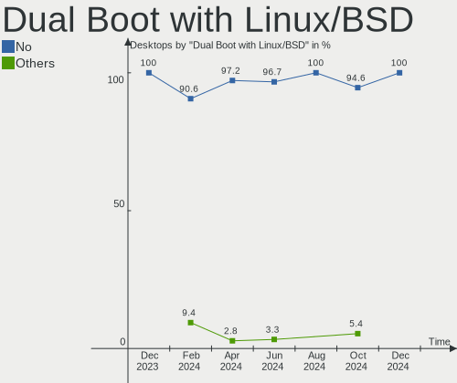
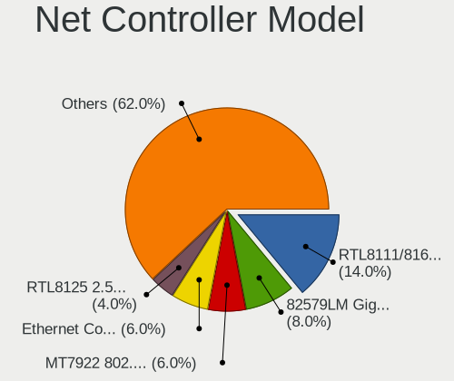

KDE neon - Hardware Trends (Desktops)
-------------------------------------

A project to identify most popular hardware characteristics and track their change
over time based on data collected by Linux users at https://Linux-Hardware.org.

Anyone can contribute to this report by the [hw-probe](https://github.com/linuxhw/hw-probe) tool:

    sudo -E hw-probe -all -upload

This report is for one last month. Overall report since the beginning of time: [TestCoverage](https://github.com/linuxhw/TestCoverage)

Period: Jul, 2022.

Contents
--------

* [ System ](#system)
  - [ OS                       ](#os)
  - [ OS Family                ](#os-family)
  - [ Kernel                   ](#kernel)
  - [ Kernel Family            ](#kernel-family)
  - [ Kernel Major Ver.        ](#kernel-major-ver)
  - [ Arch                     ](#arch)
  - [ DE                       ](#de)
  - [ Display Server           ](#display-server)
  - [ Display Manager          ](#display-manager)
  - [ OS Lang                  ](#os-lang)
  - [ Boot Mode                ](#boot-mode)
  - [ Filesystem               ](#filesystem)
  - [ Part. scheme             ](#part-scheme)
  - [ Dual Boot with Linux/BSD ](#dual-boot-with-linuxbsd)
  - [ Dual Boot (Win)          ](#dual-boot-win)

* [ Board ](#board)
  - [ Vendor                   ](#vendor)
  - [ Model                    ](#model)
  - [ Model Family             ](#model-family)
  - [ MFG Year                 ](#mfg-year)
  - [ Form Factor              ](#form-factor)
  - [ Secure Boot              ](#secure-boot)
  - [ Coreboot                 ](#coreboot)
  - [ RAM Size                 ](#ram-size)
  - [ RAM Used                 ](#ram-used)
  - [ Total Drives             ](#total-drives)
  - [ Has CD-ROM               ](#has-cd-rom)
  - [ Has Ethernet             ](#has-ethernet)
  - [ Has WiFi                 ](#has-wifi)
  - [ Has Bluetooth            ](#has-bluetooth)

* [ Location ](#location)
  - [ Country                  ](#country)
  - [ City                     ](#city)

* [ Drives ](#drives)
  - [ Drive Vendor             ](#drive-vendor)
  - [ Drive Model              ](#drive-model)
  - [ HDD Vendor               ](#hdd-vendor)
  - [ SSD Vendor               ](#ssd-vendor)
  - [ Drive Kind               ](#drive-kind)
  - [ Drive Connector          ](#drive-connector)
  - [ Drive Size               ](#drive-size)
  - [ Space Total              ](#space-total)
  - [ Space Used               ](#space-used)
  - [ Malfunc. Drives          ](#malfunc-drives)
  - [ Malfunc. Drive Vendor    ](#malfunc-drive-vendor)
  - [ Malfunc. HDD Vendor      ](#malfunc-hdd-vendor)
  - [ Malfunc. Drive Kind      ](#malfunc-drive-kind)
  - [ Failed Drives            ](#failed-drives)
  - [ Failed Drive Vendor      ](#failed-drive-vendor)
  - [ Drive Status             ](#drive-status)

* [ Storage controller ](#storage-controller)
  - [ Storage Vendor           ](#storage-vendor)
  - [ Storage Model            ](#storage-model)
  - [ Storage Kind             ](#storage-kind)

* [ Processor ](#processor)
  - [ CPU Vendor               ](#cpu-vendor)
  - [ CPU Model                ](#cpu-model)
  - [ CPU Model Family         ](#cpu-model-family)
  - [ CPU Cores                ](#cpu-cores)
  - [ CPU Sockets              ](#cpu-sockets)
  - [ CPU Threads              ](#cpu-threads)
  - [ CPU Op-Modes             ](#cpu-op-modes)
  - [ CPU Microcode            ](#cpu-microcode)
  - [ CPU Microarch            ](#cpu-microarch)

* [ Graphics ](#graphics)
  - [ GPU Vendor               ](#gpu-vendor)
  - [ GPU Model                ](#gpu-model)
  - [ GPU Combo                ](#gpu-combo)
  - [ GPU Driver               ](#gpu-driver)
  - [ GPU Memory               ](#gpu-memory)

* [ Monitor ](#monitor)
  - [ Monitor Vendor           ](#monitor-vendor)
  - [ Monitor Model            ](#monitor-model)
  - [ Monitor Resolution       ](#monitor-resolution)
  - [ Monitor Diagonal         ](#monitor-diagonal)
  - [ Monitor Width            ](#monitor-width)
  - [ Aspect Ratio             ](#aspect-ratio)
  - [ Monitor Area             ](#monitor-area)
  - [ Pixel Density            ](#pixel-density)
  - [ Multiple Monitors        ](#multiple-monitors)

* [ Network ](#network)
  - [ Net Controller Vendor    ](#net-controller-vendor)
  - [ Net Controller Model     ](#net-controller-model)
  - [ Wireless Vendor          ](#wireless-vendor)
  - [ Wireless Model           ](#wireless-model)
  - [ Ethernet Vendor          ](#ethernet-vendor)
  - [ Ethernet Model           ](#ethernet-model)
  - [ Net Controller Kind      ](#net-controller-kind)
  - [ Used Controller          ](#used-controller)
  - [ NICs                     ](#nics)
  - [ IPv6                     ](#ipv6)

* [ Bluetooth ](#bluetooth)
  - [ Bluetooth Vendor         ](#bluetooth-vendor)
  - [ Bluetooth Model          ](#bluetooth-model)

* [ Sound ](#sound)
  - [ Sound Vendor             ](#sound-vendor)
  - [ Sound Model              ](#sound-model)

* [ Memory ](#memory)
  - [ Memory Vendor            ](#memory-vendor)
  - [ Memory Model             ](#memory-model)
  - [ Memory Kind              ](#memory-kind)
  - [ Memory Form Factor       ](#memory-form-factor)
  - [ Memory Size              ](#memory-size)
  - [ Memory Speed             ](#memory-speed)

* [ Printers & scanners ](#printers--scanners)
  - [ Printer Vendor           ](#printer-vendor)
  - [ Printer Model            ](#printer-model)
  - [ Scanner Vendor           ](#scanner-vendor)
  - [ Scanner Model            ](#scanner-model)

* [ Camera ](#camera)
  - [ Camera Vendor            ](#camera-vendor)
  - [ Camera Model             ](#camera-model)

* [ Security ](#security)
  - [ Fingerprint Vendor       ](#fingerprint-vendor)
  - [ Fingerprint Model        ](#fingerprint-model)
  - [ Chipcard Vendor          ](#chipcard-vendor)
  - [ Chipcard Model           ](#chipcard-model)

* [ Unsupported ](#unsupported)
  - [ Unsupported Devices      ](#unsupported-devices)
  - [ Unsupported Device Types ](#unsupported-device-types)

System
------

OS
--

Installed operating systems

| Name           | Desktops | Percent |
|----------------|----------|---------|
| KDE neon 20.04 | 50       | 100%    |

OS Family
---------

OS without a version

| Name     | Desktops | Percent |
|----------|----------|---------|
| KDE neon | 50       | 100%    |

Kernel
------

Version of the Linux kernel

| Version               | Desktops | Percent |
|-----------------------|----------|---------|
| 5.15.0-41-generic     | 21       | 42%     |
| 5.13.0-52-generic     | 20       | 40%     |
| 5.13.0-51-generic     | 3        | 6%      |
| 5.13.0-44-generic     | 2        | 4%      |
| 5.4.0-107-generic     | 1        | 2%      |
| 5.18.0-051800-generic | 1        | 2%      |
| 5.15.0-33-generic     | 1        | 2%      |
| 5.14.0-1047-oem       | 1        | 2%      |

Kernel Family
-------------

Linux kernel without a distro release

| Version | Desktops | Percent |
|---------|----------|---------|
| 5.13.0  | 25       | 50%     |
| 5.15.0  | 22       | 44%     |
| 5.4.0   | 1        | 2%      |
| 5.18.0  | 1        | 2%      |
| 5.14.0  | 1        | 2%      |

Kernel Major Ver.
-----------------

Linux kernel major version

| Version | Desktops | Percent |
|---------|----------|---------|
| 5.13    | 25       | 50%     |
| 5.15    | 22       | 44%     |
| 5.4     | 1        | 2%      |
| 5.18    | 1        | 2%      |
| 5.14    | 1        | 2%      |

Arch
----

OS architecture (x86_64, i586, etc.)

| Name   | Desktops | Percent |
|--------|----------|---------|
| x86_64 | 50       | 100%    |

DE
--

Desktop Environment

| Name    | Desktops | Percent |
|---------|----------|---------|
| KDE5    | 48       | 96%     |
| Unknown | 2        | 4%      |

Display Server
--------------

X11 or Wayland

| Name    | Desktops | Percent |
|---------|----------|---------|
| X11     | 45       | 90%     |
| Wayland | 3        | 6%      |
| Tty     | 2        | 4%      |

Display Manager
---------------

SDDM, LightDM, etc.

| Name    | Desktops | Percent |
|---------|----------|---------|
| Unknown | 44       | 88%     |
| SDDM    | 6        | 12%     |

OS Lang
-------

Language

| Lang    | Desktops | Percent |
|---------|----------|---------|
| en_US   | 25       | 50%     |
| ru_RU   | 4        | 8%      |
| pt_BR   | 4        | 8%      |
| de_DE   | 3        | 6%      |
| en_ZA   | 2        | 4%      |
| en_GB   | 2        | 4%      |
| C       | 2        | 4%      |
| zh_TW   | 1        | 2%      |
| ru_UA   | 1        | 2%      |
| fr_FR   | 1        | 2%      |
| es_MX   | 1        | 2%      |
| en_IN   | 1        | 2%      |
| en_CA   | 1        | 2%      |
| en_AU   | 1        | 2%      |
| Unknown | 1        | 2%      |

Boot Mode
---------

EFI or BIOS

| Mode | Desktops | Percent |
|------|----------|---------|
| EFI  | 32       | 64%     |
| BIOS | 18       | 36%     |

Filesystem
----------

Type of filesystem

| Type    | Desktops | Percent |
|---------|----------|---------|
| Ext4    | 48       | 96%     |
| Overlay | 1        | 2%      |
| Btrfs   | 1        | 2%      |

Part. scheme
------------

Scheme of partitioning

| Type    | Desktops | Percent |
|---------|----------|---------|
| Unknown | 47       | 94%     |
| GPT     | 3        | 6%      |

Dual Boot with Linux/BSD
------------------------

Hosting more than one Linux/BSD

| Dual boot | Desktops | Percent |
|-----------|----------|---------|
| No        | 47       | 94%     |
| Yes       | 3        | 6%      |

Dual Boot (Win)
---------------

Hosting Linux and Windows

| Dual boot | Desktops | Percent |
|-----------|----------|---------|
| No        | 46       | 92%     |
| Yes       | 4        | 8%      |

Board
-----

Vendor
------

Motherboard manufacturer

| Name                | Desktops | Percent |
|---------------------|----------|---------|
| Gigabyte Technology | 13       | 26%     |
| ASUSTek Computer    | 12       | 24%     |
| MSI                 | 7        | 14%     |
| Dell                | 5        | 10%     |
| ASRock              | 5        | 10%     |
| Hewlett-Packard     | 2        | 4%      |
| Pegatron            | 1        | 2%      |
| Lenovo              | 1        | 2%      |
| GALAX               | 1        | 2%      |
| Biostar             | 1        | 2%      |
| Acer                | 1        | 2%      |
| Unknown             | 1        | 2%      |

Model
-----

Motherboard model

| Name                                | Desktops | Percent |
|-------------------------------------|----------|---------|
| MSI MS-7C37                         | 2        | 4%      |
| ASUS TUF Gaming X570-PLUS           | 2        | 4%      |
| ASUS All Series                     | 2        | 4%      |
| Pegatron 2ACE                       | 1        | 2%      |
| MSI p6-2429                         | 1        | 2%      |
| MSI MS-7D31                         | 1        | 2%      |
| MSI MS-7D09                         | 1        | 2%      |
| MSI MS-7B89                         | 1        | 2%      |
| MSI MS-7A71                         | 1        | 2%      |
| Lenovo Legion T5 28IMB05 90NC00JAUS | 1        | 2%      |
| HP Compaq Pro 6300 SFF              | 1        | 2%      |
| HP 870-224                          | 1        | 2%      |
| Gigabyte Z87-HD3                    | 1        | 2%      |
| Gigabyte Z690 GAMING X              | 1        | 2%      |
| Gigabyte Z270M-D3H                  | 1        | 2%      |
| Gigabyte Z270-Gaming K3             | 1        | 2%      |
| Gigabyte X570 AORUS ULTRA           | 1        | 2%      |
| Gigabyte X570 AORUS PRO WIFI        | 1        | 2%      |
| Gigabyte X399 AORUS Gaming 7        | 1        | 2%      |
| Gigabyte H97-D3H                    | 1        | 2%      |
| Gigabyte H410M H                    | 1        | 2%      |
| Gigabyte H310M H 2.0                | 1        | 2%      |
| Gigabyte GA-MA785GMT-UD2H           | 1        | 2%      |
| Gigabyte GA-890XA-UD3               | 1        | 2%      |
| Gigabyte G41MT-S2PT                 | 1        | 2%      |
| GALAX A320M Ver1.0                  | 1        | 2%      |
| Dell XPS 8930                       | 1        | 2%      |
| Dell OptiPlex 7050                  | 1        | 2%      |
| Dell OptiPlex 7040                  | 1        | 2%      |
| Dell OptiPlex 7020                  | 1        | 2%      |
| Dell OptiPlex 7010                  | 1        | 2%      |
| Biostar TZ77XE3                     | 1        | 2%      |
| ASUS TUF Gaming B550M-PLUS          | 1        | 2%      |
| ASUS ROG STRIX Z370-F GAMING        | 1        | 2%      |
| ASUS PRIME Z370-P                   | 1        | 2%      |
| ASUS PRIME X370-PRO                 | 1        | 2%      |
| ASUS P8H61-M LX3 R2.0               | 1        | 2%      |
| ASUS M5A99X EVO R2.0                | 1        | 2%      |
| ASUS M5A78L LE                      | 1        | 2%      |
| ASUS EB1012                         | 1        | 2%      |
| ASRock Z270 Professional Gaming i7  | 1        | 2%      |
| ASRock H81M-HDS                     | 1        | 2%      |
| ASRock FM2A68M-DG3+                 | 1        | 2%      |
| ASRock B550M Pro4                   | 1        | 2%      |
| ASRock B550 Phantom Gaming 4/ac     | 1        | 2%      |
| Acer Aspire R1600                   | 1        | 2%      |
| Unknown                             | 1        | 2%      |

Model Family
------------

Motherboard model prefix

| Name                      | Desktops | Percent |
|---------------------------|----------|---------|
| Dell OptiPlex             | 4        | 8%      |
| ASUS TUF                  | 3        | 6%      |
| MSI MS-7C37               | 2        | 4%      |
| Gigabyte X570             | 2        | 4%      |
| ASUS PRIME                | 2        | 4%      |
| ASUS All                  | 2        | 4%      |
| Pegatron 2ACE             | 1        | 2%      |
| MSI p6-2429               | 1        | 2%      |
| MSI MS-7D31               | 1        | 2%      |
| MSI MS-7D09               | 1        | 2%      |
| MSI MS-7B89               | 1        | 2%      |
| MSI MS-7A71               | 1        | 2%      |
| Lenovo Legion             | 1        | 2%      |
| HP Compaq                 | 1        | 2%      |
| HP 870-224                | 1        | 2%      |
| Gigabyte Z87-HD3          | 1        | 2%      |
| Gigabyte Z690             | 1        | 2%      |
| Gigabyte Z270M-D3H        | 1        | 2%      |
| Gigabyte Z270-Gaming      | 1        | 2%      |
| Gigabyte X399             | 1        | 2%      |
| Gigabyte H97-D3H          | 1        | 2%      |
| Gigabyte H410M            | 1        | 2%      |
| Gigabyte H310M            | 1        | 2%      |
| Gigabyte GA-MA785GMT-UD2H | 1        | 2%      |
| Gigabyte GA-890XA-UD3     | 1        | 2%      |
| Gigabyte G41MT-S2PT       | 1        | 2%      |
| GALAX A320M               | 1        | 2%      |
| Dell XPS                  | 1        | 2%      |
| Biostar TZ77XE3           | 1        | 2%      |
| ASUS ROG                  | 1        | 2%      |
| ASUS P8H61-M              | 1        | 2%      |
| ASUS M5A99X               | 1        | 2%      |
| ASUS M5A78L               | 1        | 2%      |
| ASUS EB1012               | 1        | 2%      |
| ASRock Z270               | 1        | 2%      |
| ASRock H81M-HDS           | 1        | 2%      |
| ASRock FM2A68M-DG3+       | 1        | 2%      |
| ASRock B550M              | 1        | 2%      |
| ASRock B550               | 1        | 2%      |
| Acer Aspire               | 1        | 2%      |
| Unknown                   | 1        | 2%      |

MFG Year
--------

Motherboard manufacture year

| Year | Desktops | Percent |
|------|----------|---------|
| 2019 | 10       | 20%     |
| 2020 | 5        | 10%     |
| 2017 | 5        | 10%     |
| 2012 | 5        | 10%     |
| 2022 | 4        | 8%      |
| 2016 | 4        | 8%      |
| 2013 | 4        | 8%      |
| 2014 | 3        | 6%      |
| 2009 | 3        | 6%      |
| 2015 | 2        | 4%      |
| 2011 | 2        | 4%      |
| 2021 | 1        | 2%      |
| 2018 | 1        | 2%      |
| 2010 | 1        | 2%      |

Form Factor
-----------

Physical design of the computer

| Name    | Desktops | Percent |
|---------|----------|---------|
| Desktop | 50       | 100%    |

Secure Boot
-----------

Enabled or disabled

| State    | Desktops | Percent |
|----------|----------|---------|
| Disabled | 46       | 92%     |
| Enabled  | 4        | 8%      |

Coreboot
--------

Have coreboot on board

| Used | Desktops | Percent |
|------|----------|---------|
| No   | 50       | 100%    |

RAM Size
--------

Total RAM memory

| Size in GB  | Desktops | Percent |
|-------------|----------|---------|
| 16.01-24.0  | 20       | 40%     |
| 32.01-64.0  | 14       | 28%     |
| 8.01-16.0   | 7        | 14%     |
| 4.01-8.0    | 5        | 10%     |
| 3.01-4.0    | 2        | 4%      |
| 24.01-32.0  | 1        | 2%      |
| 64.01-256.0 | 1        | 2%      |

RAM Used
--------

Used RAM memory

| Used GB    | Desktops | Percent |
|------------|----------|---------|
| 1.01-2.0   | 17       | 34%     |
| 2.01-3.0   | 12       | 24%     |
| 3.01-4.0   | 10       | 20%     |
| 4.01-8.0   | 7        | 14%     |
| 0.51-1.0   | 2        | 4%      |
| 24.01-32.0 | 1        | 2%      |
| 8.01-16.0  | 1        | 2%      |

Total Drives
------------

Number of drives on board

| Drives | Desktops | Percent |
|--------|----------|---------|
| 3      | 13       | 26%     |
| 1      | 12       | 24%     |
| 2      | 11       | 22%     |
| 4      | 10       | 20%     |
| 5      | 3        | 6%      |
| 9      | 1        | 2%      |

Has CD-ROM
----------

Has CD-ROM on board

| Presented | Desktops | Percent |
|-----------|----------|---------|
| No        | 37       | 74%     |
| Yes       | 13       | 26%     |

Has Ethernet
------------

Has Ethernet on board

| Presented | Desktops | Percent |
|-----------|----------|---------|
| Yes       | 49       | 98%     |
| No        | 1        | 2%      |

Has WiFi
--------

Has WiFi module

| Presented | Desktops | Percent |
|-----------|----------|---------|
| Yes       | 28       | 56%     |
| No        | 22       | 44%     |

Has Bluetooth
-------------

Has Bluetooth module

| Presented | Desktops | Percent |
|-----------|----------|---------|
| No        | 27       | 54%     |
| Yes       | 23       | 46%     |

Location
--------

Country
-------

Geographic location (country)

| Country      | Desktops | Percent |
|--------------|----------|---------|
| USA          | 18       | 36%     |
| Brazil       | 5        | 10%     |
| Turkey       | 3        | 6%      |
| Russia       | 3        | 6%      |
| Germany      | 3        | 6%      |
| South Africa | 2        | 4%      |
| Netherlands  | 2        | 4%      |
| Canada       | 2        | 4%      |
| Australia    | 2        | 4%      |
| Ukraine      | 1        | 2%      |
| UK           | 1        | 2%      |
| Taiwan       | 1        | 2%      |
| Mexico       | 1        | 2%      |
| Latvia       | 1        | 2%      |
| India        | 1        | 2%      |
| Hungary      | 1        | 2%      |
| France       | 1        | 2%      |
| Chile        | 1        | 2%      |
| Belarus      | 1        | 2%      |

City
----

Geographic location (city)

| City                 | Desktops | Percent |
|----------------------|----------|---------|
| Wylie                | 1        | 2%      |
| Winnipeg             | 1        | 2%      |
| Wilmington           | 1        | 2%      |
| Warrington           | 1        | 2%      |
| Voorburg             | 1        | 2%      |
| Taoyuan District     | 1        | 2%      |
| Shipman              | 1        | 2%      |
| Sevastopol           | 1        | 2%      |
| Saint Augustine      | 1        | 2%      |
| Riga                 | 1        | 2%      |
| Palmas               | 1        | 2%      |
| Orillia              | 1        | 2%      |
| Nizhniy Novgorod     | 1        | 2%      |
| New York             | 1        | 2%      |
| Nelspruit            | 1        | 2%      |
| Murfreesboro         | 1        | 2%      |
| Minsk                | 1        | 2%      |
| Middletown           | 1        | 2%      |
| Mexico City          | 1        | 2%      |
| Merrifield           | 1        | 2%      |
| Melbourne            | 1        | 2%      |
| Marathon             | 1        | 2%      |
| Luziania             | 1        | 2%      |
| Lancaster            | 1        | 2%      |
| La Granja            | 1        | 2%      |
| Kiel                 | 1        | 2%      |
| Kecskemét           | 1        | 2%      |
| İzmit               | 1        | 2%      |
| Izmir                | 1        | 2%      |
| Istanbul             | 1        | 2%      |
| Imperial             | 1        | 2%      |
| Harker Heights       | 1        | 2%      |
| Hamm                 | 1        | 2%      |
| Guarulhos            | 1        | 2%      |
| Greenfield           | 1        | 2%      |
| Cologne              | 1        | 2%      |
| Clermont             | 1        | 2%      |
| Chennai              | 1        | 2%      |
| Cedar Rapids         | 1        | 2%      |
| Cary                 | 1        | 2%      |
| Cape Town            | 1        | 2%      |
| Candler              | 1        | 2%      |
| Cacoal               | 1        | 2%      |
| Blagoveshchensk      | 1        | 2%      |
| Betton               | 1        | 2%      |
| Balashikha           | 1        | 2%      |
| Austin               | 1        | 2%      |
| Assen                | 1        | 2%      |
| Aparecida de Goiania | 1        | 2%      |
| Adelaide             | 1        | 2%      |

Drives
------

Drive Vendor
------------

Hard drive vendors

| Vendor                    | Desktops | Drives | Percent |
|---------------------------|----------|--------|---------|
| Samsung Electronics       | 22       | 40     | 19.3%   |
| WDC                       | 19       | 22     | 16.67%  |
| Seagate                   | 19       | 21     | 16.67%  |
| SanDisk                   | 9        | 10     | 7.89%   |
| Hitachi                   | 6        | 7      | 5.26%   |
| Toshiba                   | 5        | 5      | 4.39%   |
| Kingston                  | 3        | 3      | 2.63%   |
| Intel                     | 3        | 3      | 2.63%   |
| A-DATA Technology         | 3        | 4      | 2.63%   |
| PNY                       | 2        | 2      | 1.75%   |
| Phison                    | 2        | 2      | 1.75%   |
| Micron/Crucial Technology | 2        | 2      | 1.75%   |
| Crucial                   | 2        | 2      | 1.75%   |
| China                     | 2        | 2      | 1.75%   |
| XrayDisk                  | 1        | 1      | 0.88%   |
| Unknown                   | 1        | 1      | 0.88%   |
| SPCC                      | 1        | 1      | 0.88%   |
| Smartbuy                  | 1        | 1      | 0.88%   |
| SK hynix                  | 1        | 2      | 0.88%   |
| Realtek Semiconductor     | 1        | 1      | 0.88%   |
| NGFF                      | 1        | 1      | 0.88%   |
| Netac                     | 1        | 1      | 0.88%   |
| Neo                       | 1        | 1      | 0.88%   |
| Mushkin                   | 1        | 1      | 0.88%   |
| HS-SSD-E100N              | 1        | 1      | 0.88%   |
| HGST                      | 1        | 1      | 0.88%   |
| Hewlett-Packard           | 1        | 1      | 0.88%   |
| Gigabyte Technology       | 1        | 1      | 0.88%   |
| Unknown                   | 1        | 1      | 0.88%   |

Drive Model
-----------

Hard drive models

| Model                                     | Desktops | Percent |
|-------------------------------------------|----------|---------|
| Samsung NVMe SSD Drive 1TB                | 8        | 5.84%   |
| Seagate ST1000DM010-2EP102 1TB            | 3        | 2.19%   |
| Samsung SSD 850 EVO 500GB                 | 3        | 2.19%   |
| Samsung SSD 850 EVO 250GB                 | 3        | 2.19%   |
| WDC WD10EZEX-08WN4A0 1TB                  | 2        | 1.46%   |
| Seagate ST500DM002-1BD142 500GB           | 2        | 1.46%   |
| Seagate ST31000528AS 1TB                  | 2        | 1.46%   |
| SanDisk NVMe SSD Drive 500GB              | 2        | 1.46%   |
| SanDisk NVMe SSD Drive 1TB                | 2        | 1.46%   |
| Samsung SSD 860 EVO 500GB                 | 2        | 1.46%   |
| Samsung SSD 850 EVO M.2 250GB             | 2        | 1.46%   |
| Intel NVMe SSD Drive 512GB                | 2        | 1.46%   |
| A-DATA SX8200PNP 1TB                      | 2        | 1.46%   |
| XrayDisk 240GB                            | 1        | 0.73%   |
| WDC WDS500G2B0C-00PXH0 500GB              | 1        | 0.73%   |
| WDC WDS500G2B0A-00SM50 500GB SSD          | 1        | 0.73%   |
| WDC WDS480G2G0A-00JH30 480GB SSD          | 1        | 0.73%   |
| WDC WD5000BPVX-00JC3T0 500GB              | 1        | 0.73%   |
| WDC WD40EFRX-68WT0N0 4TB                  | 1        | 0.73%   |
| WDC WD40EFRX-68N32N0 4TB                  | 1        | 0.73%   |
| WDC WD4003FZEX-00Z4SA0 4TB                | 1        | 0.73%   |
| WDC WD25EZRX-00MMMB0 2TB                  | 1        | 0.73%   |
| WDC WD20EZRX-00D8PB0 2TB                  | 1        | 0.73%   |
| WDC WD20EZAZ-00L9GB0 2TB                  | 1        | 0.73%   |
| WDC WD20EARS-00MVWB0 2TB                  | 1        | 0.73%   |
| WDC WD1600BEVT-60ZCT1 160GB               | 1        | 0.73%   |
| WDC WD10JPCX-24UE4T0 1TB                  | 1        | 0.73%   |
| WDC WD10EZEX-60ZF5A0 1TB                  | 1        | 0.73%   |
| WDC WD10EZEX-60WN4A0 1TB                  | 1        | 0.73%   |
| WDC WD10EZEX-60M2NA0 1TB                  | 1        | 0.73%   |
| WDC WD10EZEX-22MFCA0 1TB                  | 1        | 0.73%   |
| WDC WD10EZEX-00MFCA0 1TB                  | 1        | 0.73%   |
| WDC WD10EURX-63FH1Y0 1TB                  | 1        | 0.73%   |
| WDC WD1002FAEX-00Z3A0 1TB                 | 1        | 0.73%   |
| Unknown SD/MMC/MS PRO 64GB                | 1        | 0.73%   |
| Toshiba NVMe SSD Drive 512GB              | 1        | 0.73%   |
| Toshiba MQ04ABF100 1TB                    | 1        | 0.73%   |
| Toshiba MQ01ABD050 500GB                  | 1        | 0.73%   |
| Toshiba HDWL120 2TB                       | 1        | 0.73%   |
| Toshiba HDWG440 4TB                       | 1        | 0.73%   |
| SPCC Solid State Disk 256GB               | 1        | 0.73%   |
| Smartbuy SSD 120GB                        | 1        | 0.73%   |
| SK hynix SKHynix_HFS256GD9TNI-L2B0B 256GB | 1        | 0.73%   |
| SK hynix NVMe SSD Drive 256GB             | 1        | 0.73%   |
| Seagate ST6000VX0003-1ZH110 6TB           | 1        | 0.73%   |
| Seagate ST500LT012-9WS142 500GB           | 1        | 0.73%   |
| Seagate ST4000DM004-2CV104 4TB            | 1        | 0.73%   |
| Seagate ST3500418AS 500GB                 | 1        | 0.73%   |
| Seagate ST3250820AS Q 250GB               | 1        | 0.73%   |
| Seagate ST31500341AS 1TB                  | 1        | 0.73%   |
| Seagate ST31000524AS 1TB                  | 1        | 0.73%   |
| Seagate ST2000LX001-1RG174 2TB            | 1        | 0.73%   |
| Seagate ST2000DM008-2FR102 2TB            | 1        | 0.73%   |
| Seagate ST2000DM001-1CH164 2TB            | 1        | 0.73%   |
| Seagate ST1000LM024 HN-M101MBB 1TB        | 1        | 0.73%   |
| Seagate ST1000DM010-2DM162 1TB            | 1        | 0.73%   |
| Seagate ST1000DM003-1ER162 1TB            | 1        | 0.73%   |
| Seagate NVMe SSD Drive 2TB                | 1        | 0.73%   |
| SanDisk SSD PLUS 120GB                    | 1        | 0.73%   |
| SanDisk SSD PLUS 1000GB                   | 1        | 0.73%   |

HDD Vendor
----------

Hard disk drive vendors

| Vendor              | Desktops | Drives | Percent |
|---------------------|----------|--------|---------|
| Seagate             | 18       | 20     | 35.29%  |
| WDC                 | 17       | 19     | 33.33%  |
| Hitachi             | 6        | 7      | 11.76%  |
| Toshiba             | 4        | 4      | 7.84%   |
| Samsung Electronics | 4        | 7      | 7.84%   |
| Unknown             | 1        | 1      | 1.96%   |
| HGST                | 1        | 1      | 1.96%   |

SSD Vendor
----------

Solid state drive vendors

| Vendor              | Desktops | Drives | Percent |
|---------------------|----------|--------|---------|
| Samsung Electronics | 11       | 17     | 32.35%  |
| SanDisk             | 3        | 4      | 8.82%   |
| WDC                 | 2        | 2      | 5.88%   |
| PNY                 | 2        | 2      | 5.88%   |
| Kingston            | 2        | 2      | 5.88%   |
| Crucial             | 2        | 2      | 5.88%   |
| China               | 2        | 2      | 5.88%   |
| SPCC                | 1        | 1      | 2.94%   |
| Smartbuy            | 1        | 1      | 2.94%   |
| NGFF                | 1        | 1      | 2.94%   |
| Neo                 | 1        | 1      | 2.94%   |
| Mushkin             | 1        | 1      | 2.94%   |
| Intel               | 1        | 1      | 2.94%   |
| Hewlett-Packard     | 1        | 1      | 2.94%   |
| Gigabyte Technology | 1        | 1      | 2.94%   |
| A-DATA Technology   | 1        | 1      | 2.94%   |
| Unknown             | 1        | 1      | 2.94%   |

Drive Kind
----------

HDD or SSD

| Kind    | Desktops | Drives | Percent |
|---------|----------|--------|---------|
| HDD     | 37       | 59     | 44.05%  |
| SSD     | 26       | 41     | 30.95%  |
| NVMe    | 20       | 39     | 23.81%  |
| Unknown | 1        | 2      | 1.19%   |

Drive Connector
---------------

SATA, SAS, NVMe, etc.

| Type | Desktops | Drives | Percent |
|------|----------|--------|---------|
| SATA | 43       | 98     | 64.18%  |
| NVMe | 20       | 39     | 29.85%  |
| SAS  | 4        | 4      | 5.97%   |

Drive Size
----------

Size of hard drive

| Size in TB | Desktops | Drives | Percent |
|------------|----------|--------|---------|
| 0.01-0.5   | 28       | 51     | 42.42%  |
| 0.51-1.0   | 24       | 32     | 36.36%  |
| 1.01-2.0   | 7        | 9      | 10.61%  |
| 3.01-4.0   | 5        | 6      | 7.58%   |
| 2.01-3.0   | 1        | 1      | 1.52%   |
| 4.01-10.0  | 1        | 1      | 1.52%   |

Space Total
-----------

Amount of disk space available on the file system

| Size in GB     | Desktops | Percent |
|----------------|----------|---------|
| 501-1000       | 14       | 28%     |
| 251-500        | 11       | 22%     |
| 101-250        | 9        | 18%     |
| More than 3000 | 4        | 8%      |
| 1001-2000      | 3        | 6%      |
| Unknown        | 3        | 6%      |
| 2001-3000      | 2        | 4%      |
| 1-20           | 2        | 4%      |
| 51-100         | 2        | 4%      |

Space Used
----------

Amount of used disk space

| Used GB   | Desktops | Percent |
|-----------|----------|---------|
| 1-20      | 17       | 34%     |
| 21-50     | 8        | 16%     |
| 101-250   | 8        | 16%     |
| 251-500   | 5        | 10%     |
| 51-100    | 4        | 8%      |
| 2001-3000 | 3        | 6%      |
| Unknown   | 3        | 6%      |
| 501-1000  | 2        | 4%      |

Malfunc. Drives
---------------

Drive models with a malfunction

| Model                                   | Desktops | Drives | Percent |
|-----------------------------------------|----------|--------|---------|
| WDC WD20EARS-00MVWB0 2TB                | 1        | 1      | 25%     |
| WDC WD10EZEX-22MFCA0 1TB                | 1        | 1      | 25%     |
| Seagate ST31000528AS 1TB                | 1        | 1      | 25%     |
| Neo Forza NFS121SA312-6007000 120GB SSD | 1        | 1      | 25%     |

Malfunc. Drive Vendor
---------------------

Vendors of faulty drives

| Vendor  | Desktops | Drives | Percent |
|---------|----------|--------|---------|
| WDC     | 2        | 2      | 50%     |
| Seagate | 1        | 1      | 25%     |
| Neo     | 1        | 1      | 25%     |

Malfunc. HDD Vendor
-------------------

Vendors of faulty HDD drives

| Vendor  | Desktops | Drives | Percent |
|---------|----------|--------|---------|
| WDC     | 2        | 2      | 66.67%  |
| Seagate | 1        | 1      | 33.33%  |

Malfunc. Drive Kind
-------------------

Kinds of faulty drives

| Kind | Desktops | Drives | Percent |
|------|----------|--------|---------|
| HDD  | 2        | 3      | 66.67%  |
| SSD  | 1        | 1      | 33.33%  |

Failed Drives
-------------

Failed drive models

Zero info for selected period =(

Failed Drive Vendor
-------------------

Failed drive vendors

Zero info for selected period =(

Drive Status
------------

Number of failed and malfunc. drives

| Status   | Desktops | Drives | Percent |
|----------|----------|--------|---------|
| Detected | 47       | 127    | 87.04%  |
| Works    | 5        | 10     | 9.26%   |
| Malfunc  | 2        | 4      | 3.7%    |

Storage controller
------------------

Storage Vendor
--------------

Storage controller vendors

| Vendor                       | Desktops | Percent |
|------------------------------|----------|---------|
| Intel                        | 30       | 35.29%  |
| AMD                          | 19       | 22.35%  |
| Samsung Electronics          | 9        | 10.59%  |
| SanDisk                      | 6        | 7.06%   |
| ASMedia Technology           | 5        | 5.88%   |
| Realtek Semiconductor        | 2        | 2.35%   |
| Phison Electronics           | 2        | 2.35%   |
| Nvidia                       | 2        | 2.35%   |
| Micron/Crucial Technology    | 2        | 2.35%   |
| ADATA Technology             | 2        | 2.35%   |
| Toshiba America Info Systems | 1        | 1.18%   |
| SK hynix                     | 1        | 1.18%   |
| Silicon Motion               | 1        | 1.18%   |
| Seagate Technology           | 1        | 1.18%   |
| Kingston Technology Company  | 1        | 1.18%   |
| JMicron Technology           | 1        | 1.18%   |

Storage Model
-------------

Storage controller models

| Model                                                                                   | Desktops | Percent |
|-----------------------------------------------------------------------------------------|----------|---------|
| AMD FCH SATA Controller [AHCI mode]                                                     | 12       | 12.63%  |
| Intel 200 Series PCH SATA controller [AHCI mode]                                        | 9        | 9.47%   |
| ASMedia ASM1062 Serial ATA Controller                                                   | 5        | 5.26%   |
| Samsung NVMe SSD Controller SM981/PM981/PM983                                           | 4        | 4.21%   |
| Intel 8 Series/C220 Series Chipset Family 6-port SATA Controller 1 [AHCI mode]          | 4        | 4.21%   |
| Samsung NVMe SSD Controller PM9A1/PM9A3/980PRO                                          | 3        | 3.16%   |
| AMD SB7x0/SB8x0/SB9x0 SATA Controller [AHCI mode]                                       | 3        | 3.16%   |
| AMD 500 Series Chipset SATA Controller                                                  | 3        | 3.16%   |
| SanDisk WD Black SN750 / PC SN730 NVMe SSD                                              | 2        | 2.11%   |
| Samsung NVMe SSD Controller 980                                                         | 2        | 2.11%   |
| Realtek RTS5763DL NVMe SSD Controller                                                   | 2        | 2.11%   |
| Nvidia MCP79 AHCI Controller                                                            | 2        | 2.11%   |
| Intel Q170/Q150/B150/H170/H110/Z170/CM236 Chipset SATA Controller [AHCI Mode]           | 2        | 2.11%   |
| Intel Alder Lake-S PCH SATA Controller [AHCI Mode]                                      | 2        | 2.11%   |
| Intel 9 Series Chipset Family SATA Controller [AHCI Mode]                               | 2        | 2.11%   |
| Intel 7 Series/C210 Series Chipset Family 4-port SATA Controller [IDE mode]             | 2        | 2.11%   |
| Intel 7 Series/C210 Series Chipset Family 2-port SATA Controller [IDE mode]             | 2        | 2.11%   |
| Intel 400 Series Chipset Family SATA AHCI Controller                                    | 2        | 2.11%   |
| AMD SB7x0/SB8x0/SB9x0 IDE Controller                                                    | 2        | 2.11%   |
| ADATA XPG SX8200 Pro PCIe Gen3x4 M.2 2280 Solid State Drive                             | 2        | 2.11%   |
| Toshiba America Info Systems XG6 NVMe SSD Controller                                    | 1        | 1.05%   |
| SK hynix Non-Volatile memory controller                                                 | 1        | 1.05%   |
| Silicon Motion SM2262/SM2262EN SSD Controller                                           | 1        | 1.05%   |
| Seagate FireCuda 520 SSD                                                                | 1        | 1.05%   |
| SanDisk WD PC SN810 / Black SN850 NVMe SSD                                              | 1        | 1.05%   |
| SanDisk WD Blue SN570 NVMe SSD                                                          | 1        | 1.05%   |
| SanDisk WD Blue SN550 NVMe SSD                                                          | 1        | 1.05%   |
| SanDisk WD Black NVMe SSD                                                               | 1        | 1.05%   |
| Phison PS5013 E13 NVMe Controller                                                       | 1        | 1.05%   |
| Phison E12 NVMe Controller                                                              | 1        | 1.05%   |
| Micron/Crucial NVMe Controller                                                          | 1        | 1.05%   |
| Micron/Crucial Non-Volatile memory controller                                           | 1        | 1.05%   |
| Kingston Company A2000 NVMe SSD                                                         | 1        | 1.05%   |
| JMicron JMB363 SATA/IDE Controller                                                      | 1        | 1.05%   |
| Intel SSD 660P Series                                                                   | 1        | 1.05%   |
| Intel Non-Volatile memory controller                                                    | 1        | 1.05%   |
| Intel NM10/ICH7 Family SATA Controller [IDE mode]                                       | 1        | 1.05%   |
| Intel C600/X79 series chipset 6-Port SATA AHCI Controller                               | 1        | 1.05%   |
| Intel 7 Series/C210 Series Chipset Family 6-port SATA Controller [AHCI mode]            | 1        | 1.05%   |
| Intel 6 Series/C200 Series Chipset Family Desktop SATA Controller (IDE mode, ports 4-5) | 1        | 1.05%   |
| Intel 6 Series/C200 Series Chipset Family Desktop SATA Controller (IDE mode, ports 0-3) | 1        | 1.05%   |
| Intel 6 Series/C200 Series Chipset Family 6 port Desktop SATA AHCI Controller           | 1        | 1.05%   |
| Intel 500 Series Chipset Family SATA AHCI Controller                                    | 1        | 1.05%   |
| AMD X399 Series Chipset SATA Controller                                                 | 1        | 1.05%   |
| AMD X370 Series Chipset SATA Controller                                                 | 1        | 1.05%   |
| AMD SB7x0/SB8x0/SB9x0 SATA Controller [IDE mode]                                        | 1        | 1.05%   |
| AMD FCH SATA Controller D                                                               | 1        | 1.05%   |
| AMD 400 Series Chipset SATA Controller                                                  | 1        | 1.05%   |

Storage Kind
------------

Kind of storage controller (IDE, SATA, NVMe, SAS, ...)

| Kind | Desktops | Percent |
|------|----------|---------|
| SATA | 46       | 63.01%  |
| NVMe | 20       | 27.4%   |
| IDE  | 7        | 9.59%   |

Processor
---------

CPU Vendor
----------

Processor vendors

| Vendor | Desktops | Percent |
|--------|----------|---------|
| Intel  | 31       | 62%     |
| AMD    | 19       | 38%     |

CPU Model
---------

Processor models

| Model                                         | Desktops | Percent |
|-----------------------------------------------|----------|---------|
| Intel Core i5-3470 CPU @ 3.20GHz              | 3        | 6%      |
| Intel Core i5-7400 CPU @ 3.00GHz              | 2        | 4%      |
| AMD Ryzen 9 5900X 12-Core Processor           | 2        | 4%      |
| AMD Ryzen 5 5600X 6-Core Processor            | 2        | 4%      |
| Intel Xeon CPU E3-1220 v3 @ 3.10GHz           | 1        | 2%      |
| Intel Core i7-8700K CPU @ 3.70GHz             | 1        | 2%      |
| Intel Core i7-8700 CPU @ 3.20GHz              | 1        | 2%      |
| Intel Core i7-7700K CPU @ 4.20GHz             | 1        | 2%      |
| Intel Core i7-7700 CPU @ 3.60GHz              | 1        | 2%      |
| Intel Core i7-4820K CPU @ 3.70GHz             | 1        | 2%      |
| Intel Core i7-4790K CPU @ 4.00GHz             | 1        | 2%      |
| Intel Core i7-4770 CPU @ 3.40GHz              | 1        | 2%      |
| Intel Core i5-9400F CPU @ 2.90GHz             | 1        | 2%      |
| Intel Core i5-8600K CPU @ 3.60GHz             | 1        | 2%      |
| Intel Core i5-7500T CPU @ 2.70GHz             | 1        | 2%      |
| Intel Core i5-6600 CPU @ 3.30GHz              | 1        | 2%      |
| Intel Core i5-6500 CPU @ 3.20GHz              | 1        | 2%      |
| Intel Core i5-4670 CPU @ 3.40GHz              | 1        | 2%      |
| Intel Core i5-4570 CPU @ 3.20GHz              | 1        | 2%      |
| Intel Core i5-3570K CPU @ 3.40GHz             | 1        | 2%      |
| Intel Core i5-10400F CPU @ 2.90GHz            | 1        | 2%      |
| Intel Core i5-10400 CPU @ 2.90GHz             | 1        | 2%      |
| Intel Core i3-3220 CPU @ 3.30GHz              | 1        | 2%      |
| Intel Core 2 Quad CPU Q8400 @ 2.66GHz         | 1        | 2%      |
| Intel Celeron CPU G1840 @ 2.80GHz             | 1        | 2%      |
| Intel Atom CPU 330 @ 1.60GHz                  | 1        | 2%      |
| Intel Atom CPU 230 @ 1.60GHz                  | 1        | 2%      |
| Intel 12th Gen Core i7-12700KF                | 1        | 2%      |
| Intel 12th Gen Core i7-12700K                 | 1        | 2%      |
| Intel 11th Gen Core i7-11700KF @ 3.60GHz      | 1        | 2%      |
| AMD Ryzen Threadripper 1900X 8-Core Processor | 1        | 2%      |
| AMD Ryzen 9 3900X 12-Core Processor           | 1        | 2%      |
| AMD Ryzen 7 5800X 8-Core Processor            | 1        | 2%      |
| AMD Ryzen 7 5700X 8-Core Processor            | 1        | 2%      |
| AMD Ryzen 7 3800X 8-Core Processor            | 1        | 2%      |
| AMD Ryzen 7 3700X 8-Core Processor            | 1        | 2%      |
| AMD Ryzen 7 1800X Eight-Core Processor        | 1        | 2%      |
| AMD Ryzen 5 3600 6-Core Processor             | 1        | 2%      |
| AMD Ryzen 5 2600X Six-Core Processor          | 1        | 2%      |
| AMD Phenom II X6 1090T Processor              | 1        | 2%      |
| AMD Phenom II X6 1055T Processor              | 1        | 2%      |
| AMD Phenom II X4 965 Processor                | 1        | 2%      |
| AMD FX-8350 Eight-Core Processor              | 1        | 2%      |
| AMD Athlon X4 845 Quad Core Processor         | 1        | 2%      |
| AMD A6-5400K APU with Radeon HD Graphics      | 1        | 2%      |

CPU Model Family
----------------

Processor model prefix

| Model                  | Desktops | Percent |
|------------------------|----------|---------|
| Intel Core i5          | 15       | 30%     |
| Intel Core i7          | 7        | 14%     |
| AMD Ryzen 7            | 5        | 10%     |
| AMD Ryzen 5            | 4        | 8%      |
| Other                  | 3        | 6%      |
| AMD Ryzen 9            | 3        | 6%      |
| Intel Atom             | 2        | 4%      |
| AMD Phenom II X6       | 2        | 4%      |
| Intel Xeon             | 1        | 2%      |
| Intel Core i3          | 1        | 2%      |
| Intel Core 2 Quad      | 1        | 2%      |
| Intel Celeron          | 1        | 2%      |
| AMD Ryzen Threadripper | 1        | 2%      |
| AMD Phenom II X4       | 1        | 2%      |
| AMD FX                 | 1        | 2%      |
| AMD Athlon X4          | 1        | 2%      |
| AMD A6                 | 1        | 2%      |

CPU Cores
---------

Number of processor cores

| Number | Desktops | Percent |
|--------|----------|---------|
| 4      | 20       | 40%     |
| 6      | 12       | 24%     |
| 8      | 7        | 14%     |
| 12     | 5        | 10%     |
| 2      | 4        | 8%      |
| 1      | 2        | 4%      |

CPU Sockets
-----------

Number of sockets

| Number | Desktops | Percent |
|--------|----------|---------|
| 1      | 50       | 100%    |

CPU Threads
-----------

Threads per core (Hyper-Threading)

| Number | Desktops | Percent |
|--------|----------|---------|
| 2      | 31       | 62%     |
| 1      | 19       | 38%     |

CPU Op-Modes
------------

CPU Operation Modes (32-bit, 64-bit)

| Op mode        | Desktops | Percent |
|----------------|----------|---------|
| 32-bit, 64-bit | 50       | 100%    |

CPU Microcode
-------------

Microcode number

| Number     | Desktops | Percent |
|------------|----------|---------|
| 0x306c3    | 5        | 10%     |
| 0x306a9    | 5        | 10%     |
| 0x0a201016 | 5        | 10%     |
| 0x906ea    | 4        | 8%      |
| 0x906e9    | 4        | 8%      |
| 0x08701021 | 3        | 6%      |
| 0xa0653    | 2        | 4%      |
| 0x90672    | 2        | 4%      |
| 0x506e3    | 2        | 4%      |
| 0x106c2    | 2        | 4%      |
| 0x010000dc | 2        | 4%      |
| Unknown    | 2        | 4%      |
| 0xa0671    | 1        | 2%      |
| 0x306e4    | 1        | 2%      |
| 0x1067a    | 1        | 2%      |
| 0x0a20120a | 1        | 2%      |
| 0x08701013 | 1        | 2%      |
| 0x0800820d | 1        | 2%      |
| 0x08001138 | 1        | 2%      |
| 0x08001137 | 1        | 2%      |
| 0x0600610e | 1        | 2%      |
| 0x06001119 | 1        | 2%      |
| 0x06000852 | 1        | 2%      |
| 0x010000c8 | 1        | 2%      |

CPU Microarch
-------------

Microarchitecture

| Name             | Desktops | Percent |
|------------------|----------|---------|
| KabyLake         | 9        | 18%     |
| Zen 3            | 6        | 12%     |
| IvyBridge        | 6        | 12%     |
| Haswell          | 6        | 12%     |
| Zen 2            | 4        | 8%      |
| K10              | 3        | 6%      |
| Zen              | 2        | 4%      |
| Skylake          | 2        | 4%      |
| Piledriver       | 2        | 4%      |
| CometLake        | 2        | 4%      |
| Bonnell          | 2        | 4%      |
| Alderlake Hybrid | 2        | 4%      |
| Zen+             | 1        | 2%      |
| Penryn           | 1        | 2%      |
| Icelake          | 1        | 2%      |
| Excavator        | 1        | 2%      |

Graphics
--------

GPU Vendor
----------

Vendors of graphics cards

| Vendor | Desktops | Percent |
|--------|----------|---------|
| Nvidia | 35       | 66.04%  |
| AMD    | 10       | 18.87%  |
| Intel  | 8        | 15.09%  |

GPU Model
---------

Graphics card models

| Model                                                                       | Desktops | Percent |
|-----------------------------------------------------------------------------|----------|---------|
| Nvidia GP107 [GeForce GTX 1050 Ti]                                          | 3        | 5.66%   |
| AMD Lexa PRO [Radeon 540/540X/550/550X / RX 540X/550/550X]                  | 3        | 5.66%   |
| Nvidia TU117 [GeForce GTX 1650]                                             | 2        | 3.77%   |
| Nvidia TU116 [GeForce GTX 1660 SUPER]                                       | 2        | 3.77%   |
| Nvidia GP107 [GeForce GTX 1050]                                             | 2        | 3.77%   |
| Nvidia GP106 [GeForce GTX 1060 6GB]                                         | 2        | 3.77%   |
| Nvidia GP106 [GeForce GTX 1060 3GB]                                         | 2        | 3.77%   |
| Nvidia GM107 [GeForce GTX 750 Ti]                                           | 2        | 3.77%   |
| Nvidia GK208B [GeForce GT 710]                                              | 2        | 3.77%   |
| Nvidia GA104 [GeForce RTX 3060 Ti Lite Hash Rate]                           | 2        | 3.77%   |
| Intel Xeon E3-1200 v3/4th Gen Core Processor Integrated Graphics Controller | 2        | 3.77%   |
| Intel Xeon E3-1200 v2/3rd Gen Core processor Graphics Controller            | 2        | 3.77%   |
| Intel HD Graphics 630                                                       | 2        | 3.77%   |
| Nvidia TU116 [GeForce GTX 1660 Ti]                                          | 1        | 1.89%   |
| Nvidia TU116 [GeForce GTX 1650]                                             | 1        | 1.89%   |
| Nvidia TU102 [GeForce RTX 2080 Ti Rev. A]                                   | 1        | 1.89%   |
| Nvidia GP108 [GeForce GT 1030]                                              | 1        | 1.89%   |
| Nvidia GP104 [GeForce GTX 1070]                                             | 1        | 1.89%   |
| Nvidia GP102 [GeForce GTX 1080 Ti]                                          | 1        | 1.89%   |
| Nvidia GM204 [GeForce GTX 970]                                              | 1        | 1.89%   |
| Nvidia GM107 [GeForce GTX 750]                                              | 1        | 1.89%   |
| Nvidia GF108 [GeForce GT 730]                                               | 1        | 1.89%   |
| Nvidia GA106 [GeForce RTX 3060 Lite Hash Rate]                              | 1        | 1.89%   |
| Nvidia GA104 [GeForce RTX 3070 Ti]                                          | 1        | 1.89%   |
| Nvidia GA104 [GeForce RTX 3060 Ti]                                          | 1        | 1.89%   |
| Nvidia GA102 [GeForce RTX 3080 Ti]                                          | 1        | 1.89%   |
| Nvidia GA102 [GeForce RTX 3080 Lite Hash Rate]                              | 1        | 1.89%   |
| Nvidia C79 [ION]                                                            | 1        | 1.89%   |
| Nvidia C79 [ION LE]                                                         | 1        | 1.89%   |
| Intel HD Graphics 530                                                       | 1        | 1.89%   |
| Intel CoffeeLake-S GT2 [UHD Graphics 630]                                   | 1        | 1.89%   |
| AMD Vega 10 XL/XT [Radeon RX Vega 56/64]                                    | 1        | 1.89%   |
| AMD Trinity 2 [Radeon HD 7540D]                                             | 1        | 1.89%   |
| AMD Navi 14 [Radeon RX 5500/5500M / Pro 5500M]                              | 1        | 1.89%   |
| AMD Hawaii XT / Grenada XT [Radeon R9 290X/390X]                            | 1        | 1.89%   |
| AMD Ellesmere [Radeon RX 470/480/570/570X/580/580X/590]                     | 1        | 1.89%   |
| AMD Cedar [Radeon HD 5000/6000/7350/8350 Series]                            | 1        | 1.89%   |
| AMD Cape Verde PRX [Radeon R9 255 OEM]                                      | 1        | 1.89%   |

GPU Combo
---------

Combinations of graphics cards

| Name           | Desktops | Percent |
|----------------|----------|---------|
| 1 x Nvidia     | 34       | 68%     |
| 1 x AMD        | 10       | 20%     |
| 1 x Intel      | 5        | 10%     |
| Intel + Nvidia | 1        | 2%      |

GPU Driver
----------

Free vs proprietary

| Driver      | Desktops | Percent |
|-------------|----------|---------|
| Free        | 37       | 74%     |
| Proprietary | 11       | 22%     |
| Unknown     | 2        | 4%      |

GPU Memory
----------

Total video memory

| Size in GB | Desktops | Percent |
|------------|----------|---------|
| 3.01-4.0   | 12       | 24%     |
| Unknown    | 10       | 20%     |
| 7.01-8.0   | 6        | 12%     |
| 5.01-6.0   | 5        | 10%     |
| 1.01-2.0   | 5        | 10%     |
| 8.01-16.0  | 4        | 8%      |
| 0.51-1.0   | 3        | 6%      |
| 0.01-0.5   | 3        | 6%      |
| 2.01-3.0   | 2        | 4%      |

Monitor
-------

Monitor Vendor
--------------

Monitor vendors

| Vendor               | Desktops | Percent |
|----------------------|----------|---------|
| Goldstar             | 8        | 14.55%  |
| Dell                 | 7        | 12.73%  |
| Samsung Electronics  | 6        | 10.91%  |
| AOC                  | 5        | 9.09%   |
| Ancor Communications | 5        | 9.09%   |
| Philips              | 4        | 7.27%   |
| Acer                 | 3        | 5.45%   |
| BenQ                 | 2        | 3.64%   |
| ASUSTek Computer     | 2        | 3.64%   |
| VIZ                  | 1        | 1.82%   |
| ViewSonic            | 1        | 1.82%   |
| Sony                 | 1        | 1.82%   |
| Sceptre Tech         | 1        | 1.82%   |
| NOR                  | 1        | 1.82%   |
| MiTAC                | 1        | 1.82%   |
| LG Electronics       | 1        | 1.82%   |
| Lenovo Group Limited | 1        | 1.82%   |
| Lenovo               | 1        | 1.82%   |
| Hewlett-Packard      | 1        | 1.82%   |
| Gigabyte Technology  | 1        | 1.82%   |
| CHD                  | 1        | 1.82%   |
| Unknown              | 1        | 1.82%   |

Monitor Model
-------------

Monitor models

| Model                                                                   | Desktops | Percent |
|-------------------------------------------------------------------------|----------|---------|
| VIZ LCD Monitor D650i-B2                                                | 1        | 1.64%   |
| ViewSonic VA2432-FHD VSCB639 1920x1080 527x296mm 23.8-inch              | 1        | 1.64%   |
| Sony TV SNY9C01 1920x1080                                               | 1        | 1.64%   |
| Sceptre Tech C32 SPT0CB3 1920x1080 598x336mm 27.0-inch                  | 1        | 1.64%   |
| Samsung Electronics T20C310 SAM0AE8 1600x900 432x240mm 19.5-inch        | 1        | 1.64%   |
| Samsung Electronics SyncMaster SAM0599 1600x900 443x249mm 20.0-inch     | 1        | 1.64%   |
| Samsung Electronics SyncMaster SAM0579 1920x1080                        | 1        | 1.64%   |
| Samsung Electronics SyncMaster SAM00BB 1280x1024 376x301mm 19.0-inch    | 1        | 1.64%   |
| Samsung Electronics LU28R55 SAM1015 3840x2160 632x360mm 28.6-inch       | 1        | 1.64%   |
| Samsung Electronics LCD Monitor SAM0502 1920x1080 886x498mm 40.0-inch   | 1        | 1.64%   |
| Philips PHL 278B1 PHL0949 3840x2160 597x336mm 27.0-inch                 | 1        | 1.64%   |
| Philips PHL 243V7 PHLC155 1920x1080 527x296mm 23.8-inch                 | 1        | 1.64%   |
| Philips LCD Monitor PHL 243V5 1920x1080                                 | 1        | 1.64%   |
| Philips 220TS PHLC06B 1920x1080 477x268mm 21.5-inch                     | 1        | 1.64%   |
| NOR LM730 NORA730 1280x1024 340x270mm 17.1-inch                         | 1        | 1.64%   |
| MiTAC JVC TV SZM0B01 1920x1080 698x392mm 31.5-inch                      | 1        | 1.64%   |
| LG Electronics LCD Monitor MP59G 1920x1080                              | 1        | 1.64%   |
| Lenovo LEN T24i-10 LEN61CE 1920x1080 527x296mm 23.8-inch                | 1        | 1.64%   |
| Lenovo Group Limited LCD Monitor LEN T23i-10                            | 1        | 1.64%   |
| Hewlett-Packard LCD Monitor 20wm                                        | 1        | 1.64%   |
| Goldstar IPS FULLHD GSM5AB6 1920x1080 480x270mm 21.7-inch               | 1        | 1.64%   |
| Goldstar HDR WQHD GSM772B 3440x1440 800x335mm 34.1-inch                 | 1        | 1.64%   |
| Goldstar FULL HD GSM5B55 1920x1080 480x270mm 21.7-inch                  | 1        | 1.64%   |
| Goldstar FULL HD GSM5B54 1920x1080 480x270mm 21.7-inch                  | 1        | 1.64%   |
| Goldstar E2251 GSM586D 1920x1080 480x270mm 21.7-inch                    | 1        | 1.64%   |
| Goldstar E1641 GSM8B3E 1366x768 344x194mm 15.5-inch                     | 1        | 1.64%   |
| Goldstar 27MP75 GSM5A61 1920x1080 600x340mm 27.2-inch                   | 1        | 1.64%   |
| Goldstar 24EC53 GSM59F9 1920x1080 510x290mm 23.1-inch                   | 1        | 1.64%   |
| Goldstar 23MP55 GSM5A23 1920x1080 510x290mm 23.1-inch                   | 1        | 1.64%   |
| Gigabyte Technology AORUS FV43U GBT4300 3840x2160 697x392mm 31.5-inch   | 1        | 1.64%   |
| Dell U2419H DEL415D 1920x1080 527x296mm 23.8-inch                       | 1        | 1.64%   |
| Dell SE2419HR DELF113 1920x1080 527x296mm 23.8-inch                     | 1        | 1.64%   |
| Dell S3220DGF DELD0F4 2560x1440 697x392mm 31.5-inch                     | 1        | 1.64%   |
| Dell S2721HN DEL41F7 1920x1080 598x336mm 27.0-inch                      | 1        | 1.64%   |
| Dell P2319H DELD0D6 1920x1080 509x286mm 23.0-inch                       | 1        | 1.64%   |
| Dell P2317H DEL40F3 1920x1080 509x286mm 23.0-inch                       | 1        | 1.64%   |
| Dell LCD Monitor U2722D                                                 | 1        | 1.64%   |
| Dell LCD Monitor U2412M 4480x1440                                       | 1        | 1.64%   |
| Dell LCD Monitor P2412H 3840x1080                                       | 1        | 1.64%   |
| Dell E2414H DEL4091 1920x1080 530x300mm 24.0-inch                       | 1        | 1.64%   |
| CHD CHHWJT CHD0030 1920x1080 934x532mm 42.3-inch                        | 1        | 1.64%   |
| BenQ GW2480 BNQ78E7 1920x1080 527x296mm 23.8-inch                       | 1        | 1.64%   |
| BenQ GW2283 BNQ78E9 1920x1080 476x268mm 21.5-inch                       | 1        | 1.64%   |
| ASUSTek Computer VG27VQ AUS2787 1920x1080 598x336mm 27.0-inch           | 1        | 1.64%   |
| ASUSTek Computer VG27A AUS2722 2560x1440 597x336mm 27.0-inch            | 1        | 1.64%   |
| ASUSTek Computer VG278 AUS27AD 1920x1080 598x336mm 27.0-inch            | 1        | 1.64%   |
| AOC 27G2G4 AOC2702 1920x1080 598x336mm 27.0-inch                        | 1        | 1.64%   |
| AOC 24G1WG4 AOC2401 1920x1080 521x293mm 23.5-inch                       | 1        | 1.64%   |
| AOC 2369M AOC2369 1920x1080 509x286mm 23.0-inch                         | 1        | 1.64%   |
| AOC 1970W AOC1970 1366x768 410x230mm 18.5-inch                          | 1        | 1.64%   |
| AOC 1950w AOC1950 1366x768 410x230mm 18.5-inch                          | 1        | 1.64%   |
| Ancor Communications VG248 ACI24A4 1920x1080 531x299mm 24.0-inch        | 1        | 1.64%   |
| Ancor Communications VE247 ACI2493 1920x1080 531x299mm 24.0-inch        | 1        | 1.64%   |
| Ancor Communications MX279 ACI27C3 1920x1080 598x336mm 27.0-inch        | 1        | 1.64%   |
| Ancor Communications LCD Monitor VG248 1920x1080                        | 1        | 1.64%   |
| Ancor Communications ASUS VG278HV ACI2726 1920x1080 598x336mm 27.0-inch | 1        | 1.64%   |
| Acer P241W ACRADB4 1920x1200 518x324mm 24.1-inch                        | 1        | 1.64%   |
| Acer LCD Monitor KB272HL H 1920x1080                                    | 1        | 1.64%   |
| Acer KB272HL H ACR08AB 1920x1080 600x330mm 27.0-inch                    | 1        | 1.64%   |
| Acer AL1717 ACRAD54 1280x1024 338x270mm 17.0-inch                       | 1        | 1.64%   |

Monitor Resolution
------------------

Monitor screen resolution

| Resolution        | Desktops | Percent |
|-------------------|----------|---------|
| 1920x1080 (FHD)   | 27       | 50.94%  |
| 3840x2160 (4K)    | 6        | 11.32%  |
| 2560x1440 (QHD)   | 3        | 5.66%   |
| 1366x768 (WXGA)   | 3        | 5.66%   |
| 1280x1024 (SXGA)  | 3        | 5.66%   |
| Unknown           | 3        | 5.66%   |
| 1600x900 (HD+)    | 2        | 3.77%   |
| 5440x1080         | 1        | 1.89%   |
| 4480x1440         | 1        | 1.89%   |
| 3840x1080         | 1        | 1.89%   |
| 3440x1440         | 1        | 1.89%   |
| 1920x540          | 1        | 1.89%   |
| 1920x1200 (WUXGA) | 1        | 1.89%   |

Monitor Diagonal
----------------

Diagonal size in inches

| Inches  | Desktops | Percent |
|---------|----------|---------|
| 24      | 9        | 17.65%  |
| 27      | 8        | 15.69%  |
| Unknown | 8        | 15.69%  |
| 21      | 6        | 11.76%  |
| 23      | 3        | 5.88%   |
| 31      | 2        | 3.92%   |
| 19      | 2        | 3.92%   |
| 18      | 2        | 3.92%   |
| 17      | 2        | 3.92%   |
| 72      | 1        | 1.96%   |
| 63      | 1        | 1.96%   |
| 42      | 1        | 1.96%   |
| 40      | 1        | 1.96%   |
| 34      | 1        | 1.96%   |
| 32      | 1        | 1.96%   |
| 28      | 1        | 1.96%   |
| 20      | 1        | 1.96%   |
| 15      | 1        | 1.96%   |

Monitor Width
-------------

Physical width

| Width in mm | Desktops | Percent |
|-------------|----------|---------|
| 501-600     | 19       | 38.78%  |
| 401-500     | 9        | 18.37%  |
| Unknown     | 8        | 16.33%  |
| 601-700     | 3        | 6.12%   |
| 301-350     | 3        | 6.12%   |
| 701-800     | 2        | 4.08%   |
| 801-900     | 1        | 2.04%   |
| 351-400     | 1        | 2.04%   |
| 1501-2000   | 1        | 2.04%   |
| 1001-1500   | 1        | 2.04%   |
| 901-1000    | 1        | 2.04%   |

Aspect Ratio
------------

Proportional relationship between the width and the height

| Ratio   | Desktops | Percent |
|---------|----------|---------|
| 16/9    | 34       | 72.34%  |
| Unknown | 7        | 14.89%  |
| 5/4     | 3        | 6.38%   |
| 16/10   | 2        | 4.26%   |
| 21/9    | 1        | 2.13%   |

Monitor Area
------------

Area in inch²

| Area in inch² | Desktops | Percent |
|----------------|----------|---------|
| 201-250        | 16       | 30.77%  |
| 301-350        | 8        | 15.38%  |
| Unknown        | 8        | 15.38%  |
| 351-500        | 5        | 9.62%   |
| 151-200        | 4        | 7.69%   |
| 141-150        | 4        | 7.69%   |
| More than 1000 | 2        | 3.85%   |
| 251-300        | 2        | 3.85%   |
| 501-1000       | 2        | 3.85%   |
| 101-110        | 1        | 1.92%   |

Pixel Density
-------------

Pixels per inch

| Density | Desktops | Percent |
|---------|----------|---------|
| 51-100  | 28       | 58.33%  |
| 101-120 | 9        | 18.75%  |
| Unknown | 8        | 16.67%  |
| 1-50    | 1        | 2.08%   |
| 161-240 | 1        | 2.08%   |
| 121-160 | 1        | 2.08%   |

Multiple Monitors
-----------------

Total monitors connected

| Total | Desktops | Percent |
|-------|----------|---------|
| 1     | 34       | 68%     |
| 2     | 11       | 22%     |
| 0     | 3        | 6%      |
| 4     | 1        | 2%      |
| 3     | 1        | 2%      |

Network
-------

Net Controller Vendor
---------------------

Controller vendors

| Vendor                | Desktops | Percent |
|-----------------------|----------|---------|
| Realtek Semiconductor | 30       | 40%     |
| Intel                 | 22       | 29.33%  |
| Qualcomm Atheros      | 6        | 8%      |
| Ralink Technology     | 4        | 5.33%   |
| TP-Link               | 3        | 4%      |
| Xiaomi                | 2        | 2.67%   |
| Linksys               | 2        | 2.67%   |
| Ralink                | 1        | 1.33%   |
| Nvidia                | 1        | 1.33%   |
| Microsoft             | 1        | 1.33%   |
| D-Link                | 1        | 1.33%   |
| Broadcom              | 1        | 1.33%   |
| Aquantia              | 1        | 1.33%   |

Net Controller Model
--------------------

Controller models

| Model                                                             | Desktops | Percent |
|-------------------------------------------------------------------|----------|---------|
| Realtek RTL8111/8168/8411 PCI Express Gigabit Ethernet Controller | 26       | 30.59%  |
| Intel Wi-Fi 6 AX200                                               | 5        | 5.88%   |
| Intel I211 Gigabit Network Connection                             | 5        | 5.88%   |
| TP-Link AC600 wireless Realtek RTL8811AU [Archer T2U Nano]        | 3        | 3.53%   |
| Ralink MT7601U Wireless Adapter                                   | 3        | 3.53%   |
| Intel Ethernet Connection (2) I219-V                              | 3        | 3.53%   |
| Intel Dual Band Wireless-AC 3168NGW [Stone Peak]                  | 3        | 3.53%   |
| Xiaomi Mi/Redmi series (RNDIS)                                    | 2        | 2.35%   |
| Realtek RTL8153 Gigabit Ethernet Adapter                          | 2        | 2.35%   |
| Realtek RTL8125 2.5GbE Controller                                 | 2        | 2.35%   |
| Qualcomm Atheros Killer E2500 Gigabit Ethernet Controller         | 2        | 2.35%   |
| Intel 82579LM Gigabit Network Connection (Lewisville)             | 2        | 2.35%   |
| Realtek RTL88x2bu [AC1200 Techkey]                                | 1        | 1.18%   |
| Realtek RTL8188CE 802.11b/g/n WiFi Adapter                        | 1        | 1.18%   |
| Realtek RTL810xE PCI Express Fast Ethernet controller             | 1        | 1.18%   |
| Ralink RT5572 Wireless Adapter                                    | 1        | 1.18%   |
| Ralink RT5390R 802.11bgn PCIe Wireless Network Adapter            | 1        | 1.18%   |
| Qualcomm Atheros QCA9377 802.11ac Wireless Network Adapter        | 1        | 1.18%   |
| Qualcomm Atheros Killer E2400 Gigabit Ethernet Controller         | 1        | 1.18%   |
| Qualcomm Atheros AR93xx Wireless Network Adapter                  | 1        | 1.18%   |
| Qualcomm Atheros AR9285 Wireless Network Adapter (PCI-Express)    | 1        | 1.18%   |
| Qualcomm Atheros AR8161 Gigabit Ethernet                          | 1        | 1.18%   |
| Nvidia MCP79 Ethernet                                             | 1        | 1.18%   |
| Microsoft XBOX ACC                                                | 1        | 1.18%   |
| Linksys WUSB6100M 802.11a/b/g/n/ac Wireless Adapter               | 1        | 1.18%   |
| Linksys WUSB54GC v1 802.11g Adapter [Ralink RT73]                 | 1        | 1.18%   |
| Intel Wireless 8265 / 8275                                        | 1        | 1.18%   |
| Intel Wireless 3160                                               | 1        | 1.18%   |
| Intel Wi-Fi 6 AX210/AX211/AX411 160MHz                            | 1        | 1.18%   |
| Intel Ethernet Controller I225-V                                  | 1        | 1.18%   |
| Intel Ethernet Connection I217-V                                  | 1        | 1.18%   |
| Intel Ethernet Connection I217-LM                                 | 1        | 1.18%   |
| Intel Ethernet Connection (5) I219-LM                             | 1        | 1.18%   |
| Intel Ethernet Connection (2) I219-LM                             | 1        | 1.18%   |
| Intel Ethernet Connection (2) I218-V                              | 1        | 1.18%   |
| Intel 82599 10 Gigabit Network Connection                         | 1        | 1.18%   |
| D-Link 802.11ac NIC                                               | 1        | 1.18%   |
| Broadcom BCM4352 802.11ac Wireless Network Adapter                | 1        | 1.18%   |
| Aquantia AQC108 NBase-T/IEEE 802.3bz Ethernet Controller [AQtion] | 1        | 1.18%   |

Wireless Vendor
---------------

Wireless vendors

| Vendor                | Desktops | Percent |
|-----------------------|----------|---------|
| Intel                 | 11       | 37.93%  |
| Ralink Technology     | 4        | 13.79%  |
| TP-Link               | 3        | 10.34%  |
| Qualcomm Atheros      | 3        | 10.34%  |
| Realtek Semiconductor | 2        | 6.9%    |
| Linksys               | 2        | 6.9%    |
| Ralink                | 1        | 3.45%   |
| Microsoft             | 1        | 3.45%   |
| D-Link                | 1        | 3.45%   |
| Broadcom              | 1        | 3.45%   |

Wireless Model
--------------

Wireless models

| Model                                                          | Desktops | Percent |
|----------------------------------------------------------------|----------|---------|
| Intel Wi-Fi 6 AX200                                            | 5        | 17.24%  |
| TP-Link AC600 wireless Realtek RTL8811AU [Archer T2U Nano]     | 3        | 10.34%  |
| Ralink MT7601U Wireless Adapter                                | 3        | 10.34%  |
| Intel Dual Band Wireless-AC 3168NGW [Stone Peak]               | 3        | 10.34%  |
| Realtek RTL88x2bu [AC1200 Techkey]                             | 1        | 3.45%   |
| Realtek RTL8188CE 802.11b/g/n WiFi Adapter                     | 1        | 3.45%   |
| Ralink RT5572 Wireless Adapter                                 | 1        | 3.45%   |
| Ralink RT5390R 802.11bgn PCIe Wireless Network Adapter         | 1        | 3.45%   |
| Qualcomm Atheros QCA9377 802.11ac Wireless Network Adapter     | 1        | 3.45%   |
| Qualcomm Atheros AR93xx Wireless Network Adapter               | 1        | 3.45%   |
| Qualcomm Atheros AR9285 Wireless Network Adapter (PCI-Express) | 1        | 3.45%   |
| Microsoft XBOX ACC                                             | 1        | 3.45%   |
| Linksys WUSB6100M 802.11a/b/g/n/ac Wireless Adapter            | 1        | 3.45%   |
| Linksys WUSB54GC v1 802.11g Adapter [Ralink RT73]              | 1        | 3.45%   |
| Intel Wireless 8265 / 8275                                     | 1        | 3.45%   |
| Intel Wireless 3160                                            | 1        | 3.45%   |
| Intel Wi-Fi 6 AX210/AX211/AX411 160MHz                         | 1        | 3.45%   |
| D-Link 802.11ac NIC                                            | 1        | 3.45%   |
| Broadcom BCM4352 802.11ac Wireless Network Adapter             | 1        | 3.45%   |

Ethernet Vendor
---------------

Ethernet vendors

| Vendor                | Desktops | Percent |
|-----------------------|----------|---------|
| Realtek Semiconductor | 30       | 56.6%   |
| Intel                 | 15       | 28.3%   |
| Qualcomm Atheros      | 4        | 7.55%   |
| Xiaomi                | 2        | 3.77%   |
| Nvidia                | 1        | 1.89%   |
| Aquantia              | 1        | 1.89%   |

Ethernet Model
--------------

Ethernet models

| Model                                                             | Desktops | Percent |
|-------------------------------------------------------------------|----------|---------|
| Realtek RTL8111/8168/8411 PCI Express Gigabit Ethernet Controller | 26       | 46.43%  |
| Intel I211 Gigabit Network Connection                             | 5        | 8.93%   |
| Intel Ethernet Connection (2) I219-V                              | 3        | 5.36%   |
| Xiaomi Mi/Redmi series (RNDIS)                                    | 2        | 3.57%   |
| Realtek RTL8153 Gigabit Ethernet Adapter                          | 2        | 3.57%   |
| Realtek RTL8125 2.5GbE Controller                                 | 2        | 3.57%   |
| Qualcomm Atheros Killer E2500 Gigabit Ethernet Controller         | 2        | 3.57%   |
| Intel 82579LM Gigabit Network Connection (Lewisville)             | 2        | 3.57%   |
| Realtek RTL810xE PCI Express Fast Ethernet controller             | 1        | 1.79%   |
| Qualcomm Atheros Killer E2400 Gigabit Ethernet Controller         | 1        | 1.79%   |
| Qualcomm Atheros AR8161 Gigabit Ethernet                          | 1        | 1.79%   |
| Nvidia MCP79 Ethernet                                             | 1        | 1.79%   |
| Intel Ethernet Controller I225-V                                  | 1        | 1.79%   |
| Intel Ethernet Connection I217-V                                  | 1        | 1.79%   |
| Intel Ethernet Connection I217-LM                                 | 1        | 1.79%   |
| Intel Ethernet Connection (5) I219-LM                             | 1        | 1.79%   |
| Intel Ethernet Connection (2) I219-LM                             | 1        | 1.79%   |
| Intel Ethernet Connection (2) I218-V                              | 1        | 1.79%   |
| Intel 82599 10 Gigabit Network Connection                         | 1        | 1.79%   |
| Aquantia AQC108 NBase-T/IEEE 802.3bz Ethernet Controller [AQtion] | 1        | 1.79%   |

Net Controller Kind
-------------------

Ethernet, WiFi or modem

| Kind     | Desktops | Percent |
|----------|----------|---------|
| Ethernet | 49       | 63.64%  |
| WiFi     | 28       | 36.36%  |

Used Controller
---------------

Currently used network controller

| Kind     | Desktops | Percent |
|----------|----------|---------|
| Ethernet | 35       | 67.31%  |
| WiFi     | 17       | 32.69%  |

NICs
----

Total network controllers on board

| Total | Desktops | Percent |
|-------|----------|---------|
| 1     | 30       | 60%     |
| 2     | 16       | 32%     |
| 0     | 2        | 4%      |
| 4     | 1        | 2%      |
| 3     | 1        | 2%      |

IPv6
----

IPv6 vs IPv4

| Used | Desktops | Percent |
|------|----------|---------|
| No   | 35       | 70%     |
| Yes  | 15       | 30%     |

Bluetooth
---------

Bluetooth Vendor
----------------

Controller vendors

| Vendor                          | Desktops | Percent |
|---------------------------------|----------|---------|
| Intel                           | 11       | 47.83%  |
| Cambridge Silicon Radio         | 5        | 21.74%  |
| Realtek Semiconductor           | 2        | 8.7%    |
| Broadcom                        | 2        | 8.7%    |
| ASUSTek Computer                | 2        | 8.7%    |
| Qualcomm Atheros Communications | 1        | 4.35%   |

Bluetooth Model
---------------

Controller models

| Model                                               | Desktops | Percent |
|-----------------------------------------------------|----------|---------|
| Intel AX200 Bluetooth                               | 5        | 21.74%  |
| Cambridge Silicon Radio Bluetooth Dongle (HCI mode) | 5        | 21.74%  |
| Intel Wireless-AC 3168 Bluetooth                    | 3        | 13.04%  |
| Realtek Bluetooth Radio                             | 2        | 8.7%    |
| Intel Bluetooth wireless interface                  | 2        | 8.7%    |
| Qualcomm Atheros  Bluetooth Device                  | 1        | 4.35%   |
| Intel AX210 Bluetooth                               | 1        | 4.35%   |
| Broadcom Bluetooth 3.0 Device                       | 1        | 4.35%   |
| Broadcom BCM20702A0 Bluetooth 4.0                   | 1        | 4.35%   |
| ASUS Broadcom BCM20702A0 Bluetooth                  | 1        | 4.35%   |
| ASUS BCM20702A0                                     | 1        | 4.35%   |

Sound
-----

Sound Vendor
------------

Sound card vendors

| Vendor                     | Desktops | Percent |
|----------------------------|----------|---------|
| Nvidia                     | 35       | 35.35%  |
| Intel                      | 28       | 28.28%  |
| AMD                        | 22       | 22.22%  |
| JMTek                      | 2        | 2.02%   |
| SteelSeries ApS            | 1        | 1.01%   |
| Schiit Audio               | 1        | 1.01%   |
| SAVITECH                   | 1        | 1.01%   |
| Razer USA                  | 1        | 1.01%   |
| PreSonus Audio Electronics | 1        | 1.01%   |
| Micro Star International   | 1        | 1.01%   |
| Logitech                   | 1        | 1.01%   |
| Kingston Technology        | 1        | 1.01%   |
| GYROCOM C&C                | 1        | 1.01%   |
| Cambridge Silicon Radio    | 1        | 1.01%   |
| C-Media Electronics        | 1        | 1.01%   |
| Blue Microphones           | 1        | 1.01%   |

Sound Model
-----------

Sound card models

| Model                                                                      | Desktops | Percent |
|----------------------------------------------------------------------------|----------|---------|
| Intel 200 Series PCH HD Audio                                              | 9        | 8.41%   |
| AMD Starship/Matisse HD Audio Controller                                   | 9        | 8.41%   |
| Nvidia GP107GL High Definition Audio Controller                            | 5        | 4.67%   |
| Nvidia TU116 High Definition Audio Controller                              | 4        | 3.74%   |
| Nvidia GP106 High Definition Audio Controller                              | 4        | 3.74%   |
| Nvidia GA104 High Definition Audio Controller                              | 4        | 3.74%   |
| Intel 8 Series/C220 Series Chipset High Definition Audio Controller        | 4        | 3.74%   |
| AMD SBx00 Azalia (Intel HDA)                                               | 4        | 3.74%   |
| Nvidia GM107 High Definition Audio Controller [GeForce 940MX]              | 3        | 2.8%    |
| Intel 7 Series/C216 Chipset Family High Definition Audio Controller        | 3        | 2.8%    |
| AMD Family 17h (Models 00h-0fh) HD Audio Controller                        | 3        | 2.8%    |
| AMD Baffin HDMI/DP Audio [Radeon RX 550 640SP / RX 560/560X]               | 3        | 2.8%    |
| Nvidia TU107 GeForce GTX 1650 High Definition Audio Controller             | 2        | 1.87%   |
| Nvidia MCP79 High Definition Audio                                         | 2        | 1.87%   |
| Nvidia GK208 HDMI/DP Audio Controller                                      | 2        | 1.87%   |
| Nvidia GA102 High Definition Audio Controller                              | 2        | 1.87%   |
| JMTek USB PnP Audio Device                                                 | 2        | 1.87%   |
| Intel Xeon E3-1200 v3/4th Gen Core Processor HD Audio Controller           | 2        | 1.87%   |
| Intel Comet Lake PCH-V cAVS                                                | 2        | 1.87%   |
| Intel 9 Series Chipset Family HD Audio Controller                          | 2        | 1.87%   |
| Intel 6 Series/C200 Series Chipset Family High Definition Audio Controller | 2        | 1.87%   |
| Intel 100 Series/C230 Series Chipset Family HD Audio Controller            | 2        | 1.87%   |
| AMD FCH Azalia Controller                                                  | 2        | 1.87%   |
| SteelSeries ApS Arctis 7+                                                  | 1        | 0.93%   |
| Schiit Audio Schiit Modi 3+                                                | 1        | 0.93%   |
| SAVITECH SA9023 audio controller                                           | 1        | 0.93%   |
| Razer USA Gaming Flightstick [Panthera Evo]                                | 1        | 0.93%   |
| PreSonus Audio Electronics Studio 24c                                      | 1        | 0.93%   |
| Nvidia TU102 High Definition Audio Controller                              | 1        | 0.93%   |
| Nvidia GP108 High Definition Audio Controller                              | 1        | 0.93%   |
| Nvidia GP104 High Definition Audio Controller                              | 1        | 0.93%   |
| Nvidia GP102 HDMI Audio Controller                                         | 1        | 0.93%   |
| Nvidia GM204 High Definition Audio Controller                              | 1        | 0.93%   |
| Nvidia GF108 High Definition Audio Controller                              | 1        | 0.93%   |
| Nvidia GA106 High Definition Audio Controller                              | 1        | 0.93%   |
| Micro Star International USB Audio                                         | 1        | 0.93%   |
| Logitech Headset H340                                                      | 1        | 0.93%   |
| Kingston Technology HyperX 7.1 Audio                                       | 1        | 0.93%   |
| Intel Tiger Lake-H HD Audio Controller                                     | 1        | 0.93%   |
| Intel NM10/ICH7 Family High Definition Audio Controller                    | 1        | 0.93%   |
| Intel C600/X79 series chipset High Definition Audio Controller             | 1        | 0.93%   |
| Intel Alder Lake-S HD Audio Controller                                     | 1        | 0.93%   |
| GYROCOM C&C Fiio E10                                                       | 1        | 0.93%   |
| Cambridge Silicon Radio HaiSenKeji                                         | 1        | 0.93%   |
| C-Media Electronics BIRD UM1                                               | 1        | 0.93%   |
| C-Media Electronics Audio Adapter (Unitek Y-247A)                          | 1        | 0.93%   |
| Blue Microphones Yeti Stereo Microphone                                    | 1        | 0.93%   |
| AMD Vega 10 HDMI Audio [Radeon Vega 56/64]                                 | 1        | 0.93%   |
| AMD Oland/Hainan/Cape Verde/Pitcairn HDMI Audio [Radeon HD 7000 Series]    | 1        | 0.93%   |
| AMD Navi 10 HDMI Audio                                                     | 1        | 0.93%   |
| AMD Hawaii HDMI Audio [Radeon R9 290/290X / 390/390X]                      | 1        | 0.93%   |
| AMD Ellesmere HDMI Audio [Radeon RX 470/480 / 570/580/590]                 | 1        | 0.93%   |
| AMD Cedar HDMI Audio [Radeon HD 5400/6300/7300 Series]                     | 1        | 0.93%   |

Memory
------

Memory Vendor
-------------

Memory module vendors

| Vendor   | Desktops | Percent |
|----------|----------|---------|
| Kingston | 3        | 42.86%  |
| Unknown  | 1        | 14.29%  |
| Patriot  | 1        | 14.29%  |
| G.Skill  | 1        | 14.29%  |
| Corsair  | 1        | 14.29%  |

Memory Model
------------

Memory module models

| Model                                                     | Desktops | Percent |
|-----------------------------------------------------------|----------|---------|
| Unknown RAM Module 4GB DIMM 1333MT/s                      | 1        | 12.5%   |
| Unknown RAM Module 2GB DIMM 1333MT/s                      | 1        | 12.5%   |
| Patriot RAM 3200 C16 Series 8GB DIMM DDR4 3200MT/s        | 1        | 12.5%   |
| Kingston RAM KHX3733C19D4/16GX 16384MB DIMM DDR4 3733MT/s | 1        | 12.5%   |
| Kingston RAM KHX2400C15/8G 8GB DIMM DDR4 2933MT/s         | 1        | 12.5%   |
| Kingston RAM KF2666C16D4/8G 8192MB DIMM DDR4 2667MT/s     | 1        | 12.5%   |
| G.Skill RAM F4-3200C16-16GTZR 16GB DIMM DDR4 3333MT/s     | 1        | 12.5%   |
| Corsair RAM CML16GX3M2A1600C10 8GB DIMM DDR3 1600MT/s     | 1        | 12.5%   |

Memory Kind
-----------

Memory module kinds

| Kind    | Desktops | Percent |
|---------|----------|---------|
| DDR4    | 5        | 71.43%  |
| DDR3    | 1        | 14.29%  |
| Unknown | 1        | 14.29%  |

Memory Form Factor
------------------

Physical design of the memory module

| Name | Desktops | Percent |
|------|----------|---------|
| DIMM | 7        | 100%    |

Memory Size
-----------

Memory module size

| Size  | Desktops | Percent |
|-------|----------|---------|
| 8192  | 3        | 37.5%   |
| 16384 | 2        | 25%     |
| 32768 | 1        | 12.5%   |
| 4096  | 1        | 12.5%   |
| 2048  | 1        | 12.5%   |

Memory Speed
------------

Memory module speed

| Speed | Desktops | Percent |
|-------|----------|---------|
| 3733  | 1        | 14.29%  |
| 3333  | 1        | 14.29%  |
| 3200  | 1        | 14.29%  |
| 2933  | 1        | 14.29%  |
| 2667  | 1        | 14.29%  |
| 1600  | 1        | 14.29%  |
| 1333  | 1        | 14.29%  |

Printers & scanners
-------------------

Printer Vendor
--------------

Printer device vendors

| Vendor             | Desktops | Percent |
|--------------------|----------|---------|
| Brother Industries | 2        | 100%    |

Printer Model
-------------

Printer device models

| Model                   | Desktops | Percent |
|-------------------------|----------|---------|
| Brother HL-L2305 series | 1        | 50%     |
| Brother HL-2240 series  | 1        | 50%     |

Scanner Vendor
--------------

Scanner device vendors

Zero info for selected period =(

Scanner Model
-------------

Scanner device models

Zero info for selected period =(

Camera
------

Camera Vendor
-------------

Camera device vendors

| Vendor                        | Desktops | Percent |
|-------------------------------|----------|---------|
| Logitech                      | 4        | 36.36%  |
| Samsung Electronics           | 2        | 18.18%  |
| Z-Star Microelectronics       | 1        | 9.09%   |
| Sunplus Innovation Technology | 1        | 9.09%   |
| Microsoft                     | 1        | 9.09%   |
| Linux Foundation              | 1        | 9.09%   |
| ARC International             | 1        | 9.09%   |

Camera Model
------------

Camera device models

| Model                              | Desktops | Percent |
|------------------------------------|----------|---------|
| Samsung Galaxy A5 (MTP)            | 2        | 18.18%  |
| Logitech Webcam C270               | 2        | 18.18%  |
| Z-Star Vimicro USB Camera (Altair) | 1        | 9.09%   |
| Sunplus Full HD webcam             | 1        | 9.09%   |
| Microsoft Modern Webcam            | 1        | 9.09%   |
| Logitech Webcam C310               | 1        | 9.09%   |
| Logitech C922 Pro Stream Webcam    | 1        | 9.09%   |
| Linux Foundation EEM Gadget        | 1        | 9.09%   |
| ARC International Camera           | 1        | 9.09%   |

Security
--------

Fingerprint Vendor
------------------

Fingerprint sensor vendors

Zero info for selected period =(

Fingerprint Model
-----------------

Fingerprint sensor models

Zero info for selected period =(

Chipcard Vendor
---------------

Chipcard module vendors

Zero info for selected period =(

Chipcard Model
--------------

Chipcard module models

Zero info for selected period =(

Unsupported
-----------

Unsupported Devices
-------------------

Total unsupported devices on board

| Total | Desktops | Percent |
|-------|----------|---------|
| 0     | 42       | 84%     |
| 1     | 8        | 16%     |

Unsupported Device Types
------------------------

Types of unsupported devices

| Type          | Desktops | Percent |
|---------------|----------|---------|
| Net/wireless  | 5        | 62.5%   |
| Graphics card | 3        | 37.5%   |

