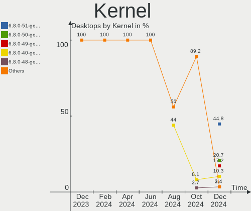
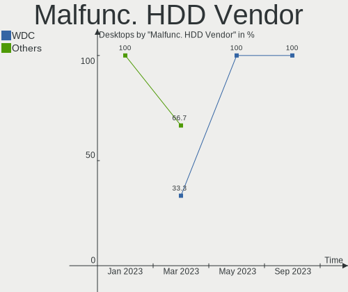

KDE neon - Hardware Trends (Desktops)
-------------------------------------

A project to identify most popular hardware characteristics and track their change
over time based on data collected by Linux users at https://Linux-Hardware.org.

Anyone can contribute to this report by the [hw-probe](https://github.com/linuxhw/hw-probe) tool:

    sudo -E hw-probe -all -upload

This report is for one last month. Overall report since the beginning of time: [TestDays](https://github.com/linuxhw/TestDays)

Period: Mar, 2023.

Contents
--------

* [ System ](#system)
  - [ OS                       ](#os)
  - [ OS Family                ](#os-family)
  - [ Kernel                   ](#kernel)
  - [ Kernel Family            ](#kernel-family)
  - [ Kernel Major Ver.        ](#kernel-major-ver)
  - [ Arch                     ](#arch)
  - [ DE                       ](#de)
  - [ Display Server           ](#display-server)
  - [ Display Manager          ](#display-manager)
  - [ OS Lang                  ](#os-lang)
  - [ Boot Mode                ](#boot-mode)
  - [ Filesystem               ](#filesystem)
  - [ Part. scheme             ](#part-scheme)
  - [ Dual Boot with Linux/BSD ](#dual-boot-with-linuxbsd)
  - [ Dual Boot (Win)          ](#dual-boot-win)

* [ Board ](#board)
  - [ Vendor                   ](#vendor)
  - [ Model                    ](#model)
  - [ Model Family             ](#model-family)
  - [ MFG Year                 ](#mfg-year)
  - [ Form Factor              ](#form-factor)
  - [ Secure Boot              ](#secure-boot)
  - [ Coreboot                 ](#coreboot)
  - [ RAM Size                 ](#ram-size)
  - [ RAM Used                 ](#ram-used)
  - [ Total Drives             ](#total-drives)
  - [ Has CD-ROM               ](#has-cd-rom)
  - [ Has Ethernet             ](#has-ethernet)
  - [ Has WiFi                 ](#has-wifi)
  - [ Has Bluetooth            ](#has-bluetooth)

* [ Location ](#location)
  - [ Country                  ](#country)
  - [ City                     ](#city)

* [ Drives ](#drives)
  - [ Drive Vendor             ](#drive-vendor)
  - [ Drive Model              ](#drive-model)
  - [ HDD Vendor               ](#hdd-vendor)
  - [ SSD Vendor               ](#ssd-vendor)
  - [ Drive Kind               ](#drive-kind)
  - [ Drive Connector          ](#drive-connector)
  - [ Drive Size               ](#drive-size)
  - [ Space Total              ](#space-total)
  - [ Space Used               ](#space-used)
  - [ Malfunc. Drives          ](#malfunc-drives)
  - [ Malfunc. Drive Vendor    ](#malfunc-drive-vendor)
  - [ Malfunc. HDD Vendor      ](#malfunc-hdd-vendor)
  - [ Malfunc. Drive Kind      ](#malfunc-drive-kind)
  - [ Failed Drives            ](#failed-drives)
  - [ Failed Drive Vendor      ](#failed-drive-vendor)
  - [ Drive Status             ](#drive-status)

* [ Storage controller ](#storage-controller)
  - [ Storage Vendor           ](#storage-vendor)
  - [ Storage Model            ](#storage-model)
  - [ Storage Kind             ](#storage-kind)

* [ Processor ](#processor)
  - [ CPU Vendor               ](#cpu-vendor)
  - [ CPU Model                ](#cpu-model)
  - [ CPU Model Family         ](#cpu-model-family)
  - [ CPU Cores                ](#cpu-cores)
  - [ CPU Sockets              ](#cpu-sockets)
  - [ CPU Threads              ](#cpu-threads)
  - [ CPU Op-Modes             ](#cpu-op-modes)
  - [ CPU Microcode            ](#cpu-microcode)
  - [ CPU Microarch            ](#cpu-microarch)

* [ Graphics ](#graphics)
  - [ GPU Vendor               ](#gpu-vendor)
  - [ GPU Model                ](#gpu-model)
  - [ GPU Combo                ](#gpu-combo)
  - [ GPU Driver               ](#gpu-driver)
  - [ GPU Memory               ](#gpu-memory)

* [ Monitor ](#monitor)
  - [ Monitor Vendor           ](#monitor-vendor)
  - [ Monitor Model            ](#monitor-model)
  - [ Monitor Resolution       ](#monitor-resolution)
  - [ Monitor Diagonal         ](#monitor-diagonal)
  - [ Monitor Width            ](#monitor-width)
  - [ Aspect Ratio             ](#aspect-ratio)
  - [ Monitor Area             ](#monitor-area)
  - [ Pixel Density            ](#pixel-density)
  - [ Multiple Monitors        ](#multiple-monitors)

* [ Network ](#network)
  - [ Net Controller Vendor    ](#net-controller-vendor)
  - [ Net Controller Model     ](#net-controller-model)
  - [ Wireless Vendor          ](#wireless-vendor)
  - [ Wireless Model           ](#wireless-model)
  - [ Ethernet Vendor          ](#ethernet-vendor)
  - [ Ethernet Model           ](#ethernet-model)
  - [ Net Controller Kind      ](#net-controller-kind)
  - [ Used Controller          ](#used-controller)
  - [ NICs                     ](#nics)
  - [ IPv6                     ](#ipv6)

* [ Bluetooth ](#bluetooth)
  - [ Bluetooth Vendor         ](#bluetooth-vendor)
  - [ Bluetooth Model          ](#bluetooth-model)

* [ Sound ](#sound)
  - [ Sound Vendor             ](#sound-vendor)
  - [ Sound Model              ](#sound-model)

* [ Memory ](#memory)
  - [ Memory Vendor            ](#memory-vendor)
  - [ Memory Model             ](#memory-model)
  - [ Memory Kind              ](#memory-kind)
  - [ Memory Form Factor       ](#memory-form-factor)
  - [ Memory Size              ](#memory-size)
  - [ Memory Speed             ](#memory-speed)

* [ Printers & scanners ](#printers--scanners)
  - [ Printer Vendor           ](#printer-vendor)
  - [ Printer Model            ](#printer-model)
  - [ Scanner Vendor           ](#scanner-vendor)
  - [ Scanner Model            ](#scanner-model)

* [ Camera ](#camera)
  - [ Camera Vendor            ](#camera-vendor)
  - [ Camera Model             ](#camera-model)

* [ Security ](#security)
  - [ Fingerprint Vendor       ](#fingerprint-vendor)
  - [ Fingerprint Model        ](#fingerprint-model)
  - [ Chipcard Vendor          ](#chipcard-vendor)
  - [ Chipcard Model           ](#chipcard-model)

* [ Unsupported ](#unsupported)
  - [ Unsupported Devices      ](#unsupported-devices)
  - [ Unsupported Device Types ](#unsupported-device-types)

System
------

OS
--

Installed operating systems

| Name           | Desktops | Percent |
|----------------|----------|---------|
| KDE neon 22.04 | 33       | 100%    |

OS Family
---------

OS without a version

| Name     | Desktops | Percent |
|----------|----------|---------|
| KDE neon | 33       | 100%    |

Kernel
------

Version of the Linux kernel

| Version                | Desktops | Percent |
|------------------------|----------|---------|
| 5.19.0-35-generic      | 18       | 54.55%  |
| 5.19.0-38-generic      | 5        | 15.15%  |
| 5.15.0-60-generic      | 4        | 12.12%  |
| 5.19.0-32-generic      | 3        | 9.09%   |
| 5.19.0-37-generic      | 1        | 3.03%   |
| 5.19.0-1018-lowlatency | 1        | 3.03%   |
| 5.15.0-67-generic      | 1        | 3.03%   |

Kernel Family
-------------

Linux kernel without a distro release

| Version | Desktops | Percent |
|---------|----------|---------|
| 5.19.0  | 28       | 84.85%  |
| 5.15.0  | 5        | 15.15%  |

Kernel Major Ver.
-----------------

Linux kernel major version

| Version | Desktops | Percent |
|---------|----------|---------|
| 5.19    | 28       | 84.85%  |
| 5.15    | 5        | 15.15%  |

Arch
----

OS architecture (x86_64, i586, etc.)

| Name   | Desktops | Percent |
|--------|----------|---------|
| x86_64 | 33       | 100%    |

DE
--

Desktop Environment

| Name | Desktops | Percent |
|------|----------|---------|
| KDE5 | 31       | 93.94%  |
| KDE  | 2        | 6.06%   |

Display Server
--------------

X11 or Wayland

| Name    | Desktops | Percent |
|---------|----------|---------|
| X11     | 32       | 96.97%  |
| Wayland | 1        | 3.03%   |

Display Manager
---------------

SDDM, LightDM, etc.

| Name    | Desktops | Percent |
|---------|----------|---------|
| Unknown | 27       | 81.82%  |
| SDDM    | 6        | 18.18%  |

OS Lang
-------

Language

| Lang  | Desktops | Percent |
|-------|----------|---------|
| en_US | 17       | 51.52%  |
| es_MX | 4        | 12.12%  |
| de_DE | 4        | 12.12%  |
| pl_PL | 1        | 3.03%   |
| nl_BE | 1        | 3.03%   |
| it_IT | 1        | 3.03%   |
| fr_FR | 1        | 3.03%   |
| es_ES | 1        | 3.03%   |
| en_PH | 1        | 3.03%   |
| en_CA | 1        | 3.03%   |
| C     | 1        | 3.03%   |

Boot Mode
---------

EFI or BIOS

| Mode | Desktops | Percent |
|------|----------|---------|
| BIOS | 28       | 84.85%  |
| EFI  | 5        | 15.15%  |

Filesystem
----------

Type of filesystem

| Type    | Desktops | Percent |
|---------|----------|---------|
| Ext4    | 29       | 87.88%  |
| Zfs     | 1        | 3.03%   |
| Overlay | 1        | 3.03%   |
| Ext3    | 1        | 3.03%   |
| Btrfs   | 1        | 3.03%   |

Part. scheme
------------

Scheme of partitioning

| Type    | Desktops | Percent |
|---------|----------|---------|
| Unknown | 26       | 78.79%  |
| GPT     | 6        | 18.18%  |
| MBR     | 1        | 3.03%   |

Dual Boot with Linux/BSD
------------------------

Hosting more than one Linux/BSD

| Dual boot | Desktops | Percent |
|-----------|----------|---------|
| No        | 29       | 87.88%  |
| Yes       | 4        | 12.12%  |

Dual Boot (Win)
---------------

Hosting Linux and Windows

| Dual boot | Desktops | Percent |
|-----------|----------|---------|
| No        | 29       | 87.88%  |
| Yes       | 4        | 12.12%  |

Board
-----

Vendor
------

Motherboard manufacturer

| Name                | Desktops | Percent |
|---------------------|----------|---------|
| MSI                 | 8        | 24.24%  |
| ASUSTek Computer    | 8        | 24.24%  |
| Gigabyte Technology | 7        | 21.21%  |
| Biostar             | 3        | 9.09%   |
| Hewlett-Packard     | 2        | 6.06%   |
| Lenovo              | 1        | 3.03%   |
| Fujitsu             | 1        | 3.03%   |
| EMAXX TECHNOLOGY    | 1        | 3.03%   |
| Dell                | 1        | 3.03%   |
| Apple               | 1        | 3.03%   |

Model
-----

Motherboard model

| Name                              | Desktops | Percent |
|-----------------------------------|----------|---------|
| ASUS All Series                   | 2        | 6.06%   |
| MSI MS-7C52                       | 1        | 3.03%   |
| MSI MS-7C37                       | 1        | 3.03%   |
| MSI MS-7C02                       | 1        | 3.03%   |
| MSI MS-7B86                       | 1        | 3.03%   |
| MSI MS-7A62                       | 1        | 3.03%   |
| MSI MS-7845                       | 1        | 3.03%   |
| MSI MS-7592                       | 1        | 3.03%   |
| MSI MS-7586                       | 1        | 3.03%   |
| Lenovo ThinkCentre M73 10AXS04G01 | 1        | 3.03%   |
| HP Compaq Pro 6300 SFF            | 1        | 3.03%   |
| HP 750-437cb                      | 1        | 3.03%   |
| Gigabyte Z390 M                   | 1        | 3.03%   |
| Gigabyte X299 AORUS Gaming 3      | 1        | 3.03%   |
| Gigabyte H81M-S2PV                | 1        | 3.03%   |
| Gigabyte H410M H V3               | 1        | 3.03%   |
| Gigabyte B75M-D3H                 | 1        | 3.03%   |
| Gigabyte B550 AORUS PRO AC        | 1        | 3.03%   |
| Gigabyte 965P-DS4                 | 1        | 3.03%   |
| Fujitsu ESPRIMO P710              | 1        | 3.03%   |
| EMAXX TECHNOLOGY EMX-B450M-GAMING | 1        | 3.03%   |
| Dell Inspiron One 2020            | 1        | 3.03%   |
| Biostar H61MHV                    | 1        | 3.03%   |
| Biostar A68N-5545                 | 1        | 3.03%   |
| Biostar A10N-9630E                | 1        | 3.03%   |
| ASUS TUF Gaming X570-PLUS         | 1        | 3.03%   |
| ASUS PRIME B550M-A                | 1        | 3.03%   |
| ASUS PRIME B450M-A II             | 1        | 3.03%   |
| ASUS P9X79 PRO                    | 1        | 3.03%   |
| ASUS P8Z77-V LK                   | 1        | 3.03%   |
| ASUS P5P43TD                      | 1        | 3.03%   |
| Apple MacPro5,1                   | 1        | 3.03%   |

Model Family
------------

Motherboard model prefix

| Name                              | Desktops | Percent |
|-----------------------------------|----------|---------|
| ASUS PRIME                        | 2        | 6.06%   |
| ASUS All                          | 2        | 6.06%   |
| MSI MS-7C52                       | 1        | 3.03%   |
| MSI MS-7C37                       | 1        | 3.03%   |
| MSI MS-7C02                       | 1        | 3.03%   |
| MSI MS-7B86                       | 1        | 3.03%   |
| MSI MS-7A62                       | 1        | 3.03%   |
| MSI MS-7845                       | 1        | 3.03%   |
| MSI MS-7592                       | 1        | 3.03%   |
| MSI MS-7586                       | 1        | 3.03%   |
| Lenovo ThinkCentre                | 1        | 3.03%   |
| HP Compaq                         | 1        | 3.03%   |
| HP 750-437cb                      | 1        | 3.03%   |
| Gigabyte Z390                     | 1        | 3.03%   |
| Gigabyte X299                     | 1        | 3.03%   |
| Gigabyte H81M-S2PV                | 1        | 3.03%   |
| Gigabyte H410M                    | 1        | 3.03%   |
| Gigabyte B75M-D3H                 | 1        | 3.03%   |
| Gigabyte B550                     | 1        | 3.03%   |
| Gigabyte 965P-DS4                 | 1        | 3.03%   |
| Fujitsu ESPRIMO                   | 1        | 3.03%   |
| EMAXX TECHNOLOGY EMX-B450M-GAMING | 1        | 3.03%   |
| Dell Inspiron                     | 1        | 3.03%   |
| Biostar H61MHV                    | 1        | 3.03%   |
| Biostar A68N-5545                 | 1        | 3.03%   |
| Biostar A10N-9630E                | 1        | 3.03%   |
| ASUS TUF                          | 1        | 3.03%   |
| ASUS P9X79                        | 1        | 3.03%   |
| ASUS P8Z77-V                      | 1        | 3.03%   |
| ASUS P5P43TD                      | 1        | 3.03%   |
| Apple MacPro5                     | 1        | 3.03%   |

MFG Year
--------

Motherboard manufacture year

| Year | Desktops | Percent |
|------|----------|---------|
| 2019 | 7        | 21.21%  |
| 2012 | 6        | 18.18%  |
| 2020 | 4        | 12.12%  |
| 2013 | 3        | 9.09%   |
| 2022 | 2        | 6.06%   |
| 2017 | 2        | 6.06%   |
| 2016 | 2        | 6.06%   |
| 2009 | 2        | 6.06%   |
| 2021 | 1        | 3.03%   |
| 2015 | 1        | 3.03%   |
| 2014 | 1        | 3.03%   |
| 2011 | 1        | 3.03%   |
| 2006 | 1        | 3.03%   |

Form Factor
-----------

Physical design of the computer

| Name    | Desktops | Percent |
|---------|----------|---------|
| Desktop | 33       | 100%    |

Secure Boot
-----------

Enabled or disabled

| State    | Desktops | Percent |
|----------|----------|---------|
| Disabled | 33       | 100%    |

Coreboot
--------

Have coreboot on board

| Used | Desktops | Percent |
|------|----------|---------|
| No   | 33       | 100%    |

RAM Size
--------

Total RAM memory

| Size in GB | Desktops | Percent |
|------------|----------|---------|
| 32.01-64.0 | 11       | 33.33%  |
| 8.01-16.0  | 8        | 24.24%  |
| 4.01-8.0   | 7        | 21.21%  |
| 16.01-24.0 | 5        | 15.15%  |
| 3.01-4.0   | 2        | 6.06%   |

RAM Used
--------

Used RAM memory

| Used GB    | Desktops | Percent |
|------------|----------|---------|
| 2.01-3.0   | 13       | 39.39%  |
| 1.01-2.0   | 7        | 21.21%  |
| 4.01-8.0   | 6        | 18.18%  |
| 3.01-4.0   | 6        | 18.18%  |
| 24.01-32.0 | 1        | 3.03%   |

Total Drives
------------

Number of drives on board

| Drives | Desktops | Percent |
|--------|----------|---------|
| 2      | 10       | 30.3%   |
| 4      | 7        | 21.21%  |
| 1      | 7        | 21.21%  |
| 6      | 4        | 12.12%  |
| 3      | 3        | 9.09%   |
| 14     | 1        | 3.03%   |
| 7      | 1        | 3.03%   |

Has CD-ROM
----------

Has CD-ROM on board

| Presented | Desktops | Percent |
|-----------|----------|---------|
| No        | 20       | 60.61%  |
| Yes       | 13       | 39.39%  |

Has Ethernet
------------

Has Ethernet on board

| Presented | Desktops | Percent |
|-----------|----------|---------|
| Yes       | 31       | 93.94%  |
| No        | 2        | 6.06%   |

Has WiFi
--------

Has WiFi module

| Presented | Desktops | Percent |
|-----------|----------|---------|
| Yes       | 17       | 51.52%  |
| No        | 16       | 48.48%  |

Has Bluetooth
-------------

Has Bluetooth module

| Presented | Desktops | Percent |
|-----------|----------|---------|
| No        | 18       | 54.55%  |
| Yes       | 15       | 45.45%  |

Location
--------

Country
-------

Geographic location (country)

| Country     | Desktops | Percent |
|-------------|----------|---------|
| USA         | 8        | 24.24%  |
| Germany     | 4        | 12.12%  |
| Spain       | 2        | 6.06%   |
| Mexico      | 2        | 6.06%   |
| France      | 2        | 6.06%   |
| Colombia    | 2        | 6.06%   |
| Thailand    | 1        | 3.03%   |
| Russia      | 1        | 3.03%   |
| Romania     | 1        | 3.03%   |
| Poland      | 1        | 3.03%   |
| Philippines | 1        | 3.03%   |
| Peru        | 1        | 3.03%   |
| Malaysia    | 1        | 3.03%   |
| Italy       | 1        | 3.03%   |
| Iran        | 1        | 3.03%   |
| Indonesia   | 1        | 3.03%   |
| Canada      | 1        | 3.03%   |
| Bulgaria    | 1        | 3.03%   |
| Belgium     | 1        | 3.03%   |

City
----

Geographic location (city)

| City                     | Desktops | Percent |
|--------------------------|----------|---------|
| Zapopan                  | 1        | 3.03%   |
| Yambol                   | 1        | 3.03%   |
| Wroclaw                  | 1        | 3.03%   |
| Vicenza                  | 1        | 3.03%   |
| Tuscola                  | 1        | 3.03%   |
| Tulcea                   | 1        | 3.03%   |
| Tehran                   | 1        | 3.03%   |
| Skowhegan                | 1        | 3.03%   |
| Septemes-les-Vallons     | 1        | 3.03%   |
| Santiago de Cali         | 1        | 3.03%   |
| Rockford                 | 1        | 3.03%   |
| Puebla City              | 1        | 3.03%   |
| Portage la Prairie       | 1        | 3.03%   |
| Perai                    | 1        | 3.03%   |
| Munich                   | 1        | 3.03%   |
| Milledgeville            | 1        | 3.03%   |
| Medellín                | 1        | 3.03%   |
| Malolos                  | 1        | 3.03%   |
| Madrid                   | 1        | 3.03%   |
| Labergement-Sainte-Marie | 1        | 3.03%   |
| Juliaca                  | 1        | 3.03%   |
| Jakarta                  | 1        | 3.03%   |
| Irkutsk                  | 1        | 3.03%   |
| Ilmenau                  | 1        | 3.03%   |
| Findlay                  | 1        | 3.03%   |
| Elche                    | 1        | 3.03%   |
| Brooklyn                 | 1        | 3.03%   |
| Bristol                  | 1        | 3.03%   |
| Boutersem                | 1        | 3.03%   |
| Biloxi                   | 1        | 3.03%   |
| Berlin                   | 1        | 3.03%   |
| Bangkok                  | 1        | 3.03%   |
| Arnsberg                 | 1        | 3.03%   |

Drives
------

Drive Vendor
------------

Hard drive vendors

| Vendor                      | Desktops | Drives | Percent |
|-----------------------------|----------|--------|---------|
| Seagate                     | 17       | 25     | 20.24%  |
| WDC                         | 11       | 16     | 13.1%   |
| Samsung Electronics         | 8        | 14     | 9.52%   |
| Kingston                    | 7        | 7      | 8.33%   |
| Crucial                     | 5        | 6      | 5.95%   |
| A-DATA Technology           | 4        | 4      | 4.76%   |
| Phison Electronics          | 3        | 3      | 3.57%   |
| Toshiba                     | 2        | 2      | 2.38%   |
| SanDisk                     | 2        | 2      | 2.38%   |
| PNY                         | 2        | 2      | 2.38%   |
| walram                      | 1        | 1      | 1.19%   |
| Unknown                     | 1        | 1      | 1.19%   |
| Silicon Motion              | 1        | 1      | 1.19%   |
| Realtek Semiconductor       | 1        | 1      | 1.19%   |
| POLION                      | 1        | 1      | 1.19%   |
| Patriot                     | 1        | 1      | 1.19%   |
| OCZ                         | 1        | 1      | 1.19%   |
| Mushkin                     | 1        | 1      | 1.19%   |
| Micron/Crucial Technology   | 1        | 1      | 1.19%   |
| Maxtor                      | 1        | 1      | 1.19%   |
| MAXIO Technology (Hangzhou) | 1        | 1      | 1.19%   |
| Magnetic Data               | 1        | 1      | 1.19%   |
| LITEONIT                    | 1        | 1      | 1.19%   |
| KingSpec                    | 1        | 1      | 1.19%   |
| Intel                       | 1        | 1      | 1.19%   |
| Hitachi                     | 1        | 2      | 1.19%   |
| Hikvision                   | 1        | 1      | 1.19%   |
| HGST                        | 1        | 1      | 1.19%   |
| GOODRAM                     | 1        | 1      | 1.19%   |
| Gigabyte Technology         | 1        | 1      | 1.19%   |
| Corsair                     | 1        | 1      | 1.19%   |
| China                       | 1        | 5      | 1.19%   |
| Unknown                     | 1        | 1      | 1.19%   |

Drive Model
-----------

Hard drive models

| Model                                                  | Desktops | Percent |
|--------------------------------------------------------|----------|---------|
| Seagate ST500DM002-1BD142 500GB                        | 3        | 3.06%   |
| Seagate ST2000DM008-2FR102 2TB                         | 3        | 3.06%   |
| Samsung NVMe SSD Controller SM981/PM981/PM983 250GB    | 3        | 3.06%   |
| Crucial CT1000MX500SSD1 1TB                            | 3        | 3.06%   |
| Seagate ST4000DM004-2CV104 4TB                         | 2        | 2.04%   |
| Seagate ST2000DM001-1ER164 2TB                         | 2        | 2.04%   |
| Seagate ST1000DM010-2EP102 1TB                         | 2        | 2.04%   |
| Seagate ST1000DM003-1CH162 1TB                         | 2        | 2.04%   |
| Phison PS5013 E13 NVMe Controller 256GB                | 2        | 2.04%   |
| Kingston SA400S37240G 240GB SSD                        | 2        | 2.04%   |
| Kingston SA400S37120G 120GB SSD                        | 2        | 2.04%   |
| WDC WDS500G2B0A-00SM50 500GB SSD                       | 1        | 1.02%   |
| WDC WDS480G2G0A-00JH30 480GB SSD                       | 1        | 1.02%   |
| WDC WDS120G1G0A-00SS50 120GB SSD                       | 1        | 1.02%   |
| WDC WD80EDAZ-11TA3A0 8TB                               | 1        | 1.02%   |
| WDC WD7500LPCX-60KHST0 752GB                           | 1        | 1.02%   |
| WDC WD5000AAKX-60U6AA0 500GB                           | 1        | 1.02%   |
| WDC WD40EZRZ-75GXCB0 4TB                               | 1        | 1.02%   |
| WDC WD40EZRZ-22GXCB0 4TB                               | 1        | 1.02%   |
| WDC WD40EZAZ-00SF3B0 4TB                               | 1        | 1.02%   |
| WDC WD4000FYYZ-01UL1B1 4TB                             | 1        | 1.02%   |
| WDC WD3200AAJS-56M0A0 320GB                            | 1        | 1.02%   |
| WDC WD30EZRZ-00Z5HB0 3TB                               | 1        | 1.02%   |
| WDC WD15EARS-00S8B1 1TB                                | 1        | 1.02%   |
| WDC WD10EZEX-08WN4A0 1TB                               | 1        | 1.02%   |
| walram 64G                                             | 1        | 1.02%   |
| Unknown SD/MMC/MS PRO 64GB                             | 1        | 1.02%   |
| Toshiba HDWD240 4TB                                    | 1        | 1.02%   |
| Toshiba DT01ACA100 1TB                                 | 1        | 1.02%   |
| Silicon Motion SM2263EN/SM2263XT SSD Controller 1024GB | 1        | 1.02%   |
| Seagate ST4000VN008-2DR166 4TB                         | 1        | 1.02%   |
| Seagate ST380815AS 80GB                                | 1        | 1.02%   |
| Seagate ST3250318AS 250GB                              | 1        | 1.02%   |
| Seagate ST3000DM001-1CH166 3TB                         | 1        | 1.02%   |
| Seagate ST2000DM001-1CH164 2TB                         | 1        | 1.02%   |
| Seagate ST1000DM003-1SB102 1TB                         | 1        | 1.02%   |
| Seagate ST1000DM003-1ER162 1TB                         | 1        | 1.02%   |
| Seagate Expansion+ 2TB                                 | 1        | 1.02%   |
| SanDisk Ultra II 960GB SSD                             | 1        | 1.02%   |
| SanDisk SDSSDH3 500G                                   | 1        | 1.02%   |

HDD Vendor
----------

Hard disk drive vendors

| Vendor  | Desktops | Drives | Percent |
|---------|----------|--------|---------|
| Seagate | 17       | 25     | 53.13%  |
| WDC     | 9        | 13     | 28.13%  |
| Toshiba | 2        | 2      | 6.25%   |
| Unknown | 1        | 1      | 3.13%   |
| Maxtor  | 1        | 1      | 3.13%   |
| Hitachi | 1        | 2      | 3.13%   |
| HGST    | 1        | 1      | 3.13%   |

SSD Vendor
----------

Solid state drive vendors

| Vendor              | Desktops | Drives | Percent |
|---------------------|----------|--------|---------|
| Samsung Electronics | 6        | 9      | 15.79%  |
| Kingston            | 6        | 6      | 15.79%  |
| Crucial             | 5        | 6      | 13.16%  |
| A-DATA Technology   | 4        | 4      | 10.53%  |
| WDC                 | 3        | 3      | 7.89%   |
| SanDisk             | 2        | 2      | 5.26%   |
| PNY                 | 2        | 2      | 5.26%   |
| Patriot             | 1        | 1      | 2.63%   |
| OCZ                 | 1        | 1      | 2.63%   |
| Mushkin             | 1        | 1      | 2.63%   |
| LITEONIT            | 1        | 1      | 2.63%   |
| KingSpec            | 1        | 1      | 2.63%   |
| Intel               | 1        | 1      | 2.63%   |
| Hikvision           | 1        | 1      | 2.63%   |
| GOODRAM             | 1        | 1      | 2.63%   |
| Gigabyte Technology | 1        | 1      | 2.63%   |
| China               | 1        | 5      | 2.63%   |

Drive Kind
----------

HDD or SSD

| Kind    | Desktops | Drives | Percent |
|---------|----------|--------|---------|
| HDD     | 26       | 45     | 42.62%  |
| SSD     | 20       | 46     | 32.79%  |
| NVMe    | 12       | 14     | 19.67%  |
| Unknown | 3        | 4      | 4.92%   |

Drive Connector
---------------

SATA, SAS, NVMe, etc.

| Type | Desktops | Drives | Percent |
|------|----------|--------|---------|
| SATA | 32       | 92     | 68.09%  |
| NVMe | 12       | 14     | 25.53%  |
| SAS  | 3        | 3      | 6.38%   |

Drive Size
----------

Size of hard drive

| Size in TB | Desktops | Drives | Percent |
|------------|----------|--------|---------|
| 0.01-0.5   | 24       | 50     | 42.86%  |
| 0.51-1.0   | 16       | 20     | 28.57%  |
| 1.01-2.0   | 7        | 7      | 12.5%   |
| 3.01-4.0   | 6        | 10     | 10.71%  |
| 2.01-3.0   | 2        | 2      | 3.57%   |
| 4.01-10.0  | 1        | 2      | 1.79%   |

Space Total
-----------

Amount of disk space available on the file system

| Size in GB     | Desktops | Percent |
|----------------|----------|---------|
| 51-100         | 7        | 21.21%  |
| 1001-2000      | 6        | 18.18%  |
| 251-500        | 5        | 15.15%  |
| 501-1000       | 5        | 15.15%  |
| 101-250        | 4        | 12.12%  |
| More than 3000 | 2        | 6.06%   |
| 1-20           | 2        | 6.06%   |
| 2001-3000      | 1        | 3.03%   |
| Unknown        | 1        | 3.03%   |

Space Used
----------

Amount of used disk space

| Used GB        | Desktops | Percent |
|----------------|----------|---------|
| 1-20           | 15       | 45.45%  |
| 251-500        | 4        | 12.12%  |
| 21-50          | 4        | 12.12%  |
| 501-1000       | 3        | 9.09%   |
| 101-250        | 2        | 6.06%   |
| 51-100         | 2        | 6.06%   |
| More than 3000 | 1        | 3.03%   |
| 1001-2000      | 1        | 3.03%   |
| Unknown        | 1        | 3.03%   |

Malfunc. Drives
---------------

Drive models with a malfunction

| Model                                                           | Desktops | Drives | Percent |
|-----------------------------------------------------------------|----------|--------|---------|
| WDC WD3200AAJS-56M0A0 320GB                                     | 1        | 1      | 25%     |
| Seagate ST1000DM003-1ER162 1TB                                  | 1        | 1      | 25%     |
| Seagate ST1000DM003-1CH162 1TB                                  | 1        | 1      | 25%     |
| Samsung Electronics NVMe SSD Controller SM961/PM961/SM963 256GB | 1        | 1      | 25%     |

Malfunc. Drive Vendor
---------------------

Vendors of faulty drives

| Vendor              | Desktops | Drives | Percent |
|---------------------|----------|--------|---------|
| Seagate             | 2        | 2      | 50%     |
| WDC                 | 1        | 1      | 25%     |
| Samsung Electronics | 1        | 1      | 25%     |

Malfunc. HDD Vendor
-------------------

Vendors of faulty HDD drives

| Vendor  | Desktops | Drives | Percent |
|---------|----------|--------|---------|
| Seagate | 2        | 2      | 66.67%  |
| WDC     | 1        | 1      | 33.33%  |

Malfunc. Drive Kind
-------------------

Kinds of faulty drives

| Kind | Desktops | Drives | Percent |
|------|----------|--------|---------|
| HDD  | 2        | 3      | 66.67%  |
| NVMe | 1        | 1      | 33.33%  |

Failed Drives
-------------

Failed drive models

Zero info for selected period =(

Failed Drive Vendor
-------------------

Failed drive vendors

Zero info for selected period =(

Drive Status
------------

Number of failed and malfunc. drives

| Status   | Desktops | Drives | Percent |
|----------|----------|--------|---------|
| Detected | 27       | 95     | 75%     |
| Works    | 6        | 10     | 16.67%  |
| Malfunc  | 3        | 4      | 8.33%   |

Storage controller
------------------

Storage Vendor
--------------

Storage controller vendors

| Vendor                      | Desktops | Percent |
|-----------------------------|----------|---------|
| Intel                       | 22       | 39.29%  |
| AMD                         | 10       | 17.86%  |
| ASMedia Technology          | 6        | 10.71%  |
| Samsung Electronics         | 5        | 8.93%   |
| Phison Electronics          | 4        | 7.14%   |
| JMicron Technology          | 3        | 5.36%   |
| Silicon Motion              | 1        | 1.79%   |
| Realtek Semiconductor       | 1        | 1.79%   |
| Micron/Crucial Technology   | 1        | 1.79%   |
| MAXIO Technology (Hangzhou) | 1        | 1.79%   |
| Marvell Technology Group    | 1        | 1.79%   |
| Kingston Technology Company | 1        | 1.79%   |

Storage Model
-------------

Storage controller models

| Model                                                                                   | Desktops | Percent |
|-----------------------------------------------------------------------------------------|----------|---------|
| Samsung NVMe SSD Controller SM981/PM981/PM983                                           | 4        | 6.56%   |
| Intel 8 Series/C220 Series Chipset Family 6-port SATA Controller 1 [AHCI mode]          | 4        | 6.56%   |
| Intel 7 Series/C210 Series Chipset Family 6-port SATA Controller [AHCI mode]            | 4        | 6.56%   |
| ASMedia ASM1062 Serial ATA Controller                                                   | 4        | 6.56%   |
| AMD 400 Series Chipset SATA Controller                                                  | 4        | 6.56%   |
| AMD FCH SATA Controller [AHCI mode]                                                     | 3        | 4.92%   |
| AMD 500 Series Chipset SATA Controller                                                  | 3        | 4.92%   |
| Phison PS5013 E13 NVMe Controller                                                       | 2        | 3.28%   |
| JMicron JMB363 SATA/IDE Controller                                                      | 2        | 3.28%   |
| Intel 82801JI (ICH10 Family) SATA AHCI Controller                                       | 2        | 3.28%   |
| Intel 6 Series/C200 Series Chipset Family Desktop SATA Controller (IDE mode, ports 4-5) | 2        | 3.28%   |
| Intel 6 Series/C200 Series Chipset Family Desktop SATA Controller (IDE mode, ports 0-3) | 2        | 3.28%   |
| Intel 200 Series PCH SATA controller [AHCI mode]                                        | 2        | 3.28%   |
| Silicon Motion SM2263EN/SM2263XT SSD Controller                                         | 1        | 1.64%   |
| Samsung NVMe SSD Controller SM961/PM961/SM963                                           | 1        | 1.64%   |
| Realtek RTS5763DL NVMe SSD Controller                                                   | 1        | 1.64%   |
| Phison E16 PCIe4 NVMe Controller                                                        | 1        | 1.64%   |
| Phison E12 NVMe Controller                                                              | 1        | 1.64%   |
| Micron/Crucial P2 NVMe PCIe SSD                                                         | 1        | 1.64%   |
| MAXIO (Hangzhou) NVMe SSD Controller MAP1202                                            | 1        | 1.64%   |
| Marvell Group 88SE9230 PCIe 2.0 x2 4-port SATA 6 Gb/s RAID Controller                   | 1        | 1.64%   |
| Kingston Company SNVS2000G [NV1 NVMe PCIe SSD 2TB]                                      | 1        | 1.64%   |
| JMicron JMB58x AHCI SATA controller                                                     | 1        | 1.64%   |
| Intel Q170/Q150/B150/H170/H110/Z170/CM236 Chipset SATA Controller [AHCI Mode]           | 1        | 1.64%   |
| Intel NM10/ICH7 Family SATA Controller [IDE mode]                                       | 1        | 1.64%   |
| Intel Cannon Lake PCH SATA AHCI Controller                                              | 1        | 1.64%   |
| Intel C600/X79 series chipset 6-Port SATA AHCI Controller                               | 1        | 1.64%   |
| Intel 9 Series Chipset Family SATA Controller [AHCI Mode]                               | 1        | 1.64%   |
| Intel 82801HR/HO/HH (ICH8R/DO/DH) 2 port SATA Controller [IDE mode]                     | 1        | 1.64%   |
| Intel 82801H (ICH8 Family) 4 port SATA Controller [IDE mode]                            | 1        | 1.64%   |
| Intel 500 Series Chipset Family SATA AHCI Controller                                    | 1        | 1.64%   |
| Intel 5 Series/3400 Series Chipset 4 port SATA IDE Controller                           | 1        | 1.64%   |
| Intel 5 Series/3400 Series Chipset 2 port SATA IDE Controller                           | 1        | 1.64%   |
| ASMedia 106x SATA/RAID Controller                                                       | 1        | 1.64%   |
| ASMedia 1064 SATA Controller                                                            | 1        | 1.64%   |
| AMD FCH SATA Controller [IDE mode]                                                      | 1        | 1.64%   |

Storage Kind
------------

Kind of storage controller (IDE, SATA, NVMe, SAS, ...)

| Kind | Desktops | Percent |
|------|----------|---------|
| SATA | 27       | 61.36%  |
| NVMe | 12       | 27.27%  |
| IDE  | 5        | 11.36%  |

Processor
---------

CPU Vendor
----------

Processor vendors

| Vendor | Desktops | Percent |
|--------|----------|---------|
| Intel  | 22       | 66.67%  |
| AMD    | 11       | 33.33%  |

CPU Model
---------

Processor models

| Model                                           | Desktops | Percent |
|-------------------------------------------------|----------|---------|
| Intel Core i7-4770K CPU @ 3.50GHz               | 3        | 9.09%   |
| Intel Celeron CPU G1610 @ 2.60GHz               | 2        | 6.06%   |
| Intel Xeon CPU X5690 @ 3.47GHz                  | 1        | 3.03%   |
| Intel Pentium Gold G6400 CPU @ 4.00GHz          | 1        | 3.03%   |
| Intel Pentium CPU G2030T @ 2.60GHz              | 1        | 3.03%   |
| Intel Core i7-7820X CPU @ 3.60GHz               | 1        | 3.03%   |
| Intel Core i7-6700 CPU @ 3.40GHz                | 1        | 3.03%   |
| Intel Core i7-4790 CPU @ 3.60GHz                | 1        | 3.03%   |
| Intel Core i7-3930K CPU @ 3.20GHz               | 1        | 3.03%   |
| Intel Core i5-9600K CPU @ 3.70GHz               | 1        | 3.03%   |
| Intel Core i5-7400 CPU @ 3.00GHz                | 1        | 3.03%   |
| Intel Core i5-4570T CPU @ 2.90GHz               | 1        | 3.03%   |
| Intel Core i5-3470 CPU @ 3.20GHz                | 1        | 3.03%   |
| Intel Core i5-3350P CPU @ 3.10GHz               | 1        | 3.03%   |
| Intel Core i5 CPU 750 @ 2.67GHz                 | 1        | 3.03%   |
| Intel Core i3-3220 CPU @ 3.30GHz                | 1        | 3.03%   |
| Intel Core 2 Quad CPU Q9650 @ 3.00GHz           | 1        | 3.03%   |
| Intel Core 2 Quad CPU Q6600 @ 2.40GHz           | 1        | 3.03%   |
| Intel Core 2 Duo CPU E8500 @ 3.16GHz            | 1        | 3.03%   |
| AMD Ryzen 9 3900X 12-Core Processor             | 1        | 3.03%   |
| AMD Ryzen 7 5700X 8-Core Processor              | 1        | 3.03%   |
| AMD Ryzen 7 3800X 8-Core Processor              | 1        | 3.03%   |
| AMD Ryzen 7 3700X 8-Core Processor              | 1        | 3.03%   |
| AMD Ryzen 5 5600G with Radeon Graphics          | 1        | 3.03%   |
| AMD Ryzen 5 5500                                | 1        | 3.03%   |
| AMD Ryzen 5 3600 6-Core Processor               | 1        | 3.03%   |
| AMD Ryzen 5 2400G with Radeon Vega Graphics     | 1        | 3.03%   |
| AMD Ryzen 3 3200G with Radeon Vega Graphics     | 1        | 3.03%   |
| AMD A8-5545M APU with Radeon HD Graphics        | 1        | 3.03%   |
| AMD A10-9630P RADEON R5, 10 COMPUTE CORES 4C+6G | 1        | 3.03%   |

CPU Model Family
----------------

Processor model prefix

| Model              | Desktops | Percent |
|--------------------|----------|---------|
| Intel Core i7      | 7        | 21.21%  |
| Intel Core i5      | 6        | 18.18%  |
| AMD Ryzen 5        | 4        | 12.12%  |
| AMD Ryzen 7        | 3        | 9.09%   |
| Intel Core 2 Quad  | 2        | 6.06%   |
| Intel Celeron      | 2        | 6.06%   |
| Intel Xeon         | 1        | 3.03%   |
| Intel Pentium Gold | 1        | 3.03%   |
| Intel Pentium      | 1        | 3.03%   |
| Intel Core i3      | 1        | 3.03%   |
| Intel Core 2 Duo   | 1        | 3.03%   |
| AMD Ryzen 9        | 1        | 3.03%   |
| AMD Ryzen 3        | 1        | 3.03%   |
| AMD A8             | 1        | 3.03%   |
| AMD A10            | 1        | 3.03%   |

CPU Cores
---------

Number of processor cores

| Number | Desktops | Percent |
|--------|----------|---------|
| 4      | 13       | 39.39%  |
| 2      | 9        | 27.27%  |
| 6      | 5        | 15.15%  |
| 8      | 4        | 12.12%  |
| 12     | 2        | 6.06%   |

CPU Sockets
-----------

Number of sockets

| Number | Desktops | Percent |
|--------|----------|---------|
| 1      | 32       | 96.97%  |
| 2      | 1        | 3.03%   |

CPU Threads
-----------

Threads per core (Hyper-Threading)

| Number | Desktops | Percent |
|--------|----------|---------|
| 2      | 20       | 60.61%  |
| 1      | 13       | 39.39%  |

CPU Op-Modes
------------

CPU Operation Modes (32-bit, 64-bit)

| Op mode        | Desktops | Percent |
|----------------|----------|---------|
| 32-bit, 64-bit | 33       | 100%    |

CPU Microcode
-------------

Microcode number

| Number     | Desktops | Percent |
|------------|----------|---------|
| Unknown    | 27       | 81.82%  |
| 0x306a9    | 2        | 6.06%   |
| 0x906ed    | 1        | 3.03%   |
| 0x50654    | 1        | 3.03%   |
| 0x306c3    | 1        | 3.03%   |
| 0x08701021 | 1        | 3.03%   |

CPU Microarch
-------------

Microarchitecture

| Name        | Desktops | Percent |
|-------------|----------|---------|
| IvyBridge   | 6        | 18.18%  |
| Haswell     | 5        | 15.15%  |
| Zen 2       | 4        | 12.12%  |
| Zen 3       | 3        | 9.09%   |
| Skylake     | 2        | 6.06%   |
| Penryn      | 2        | 6.06%   |
| KabyLake    | 2        | 6.06%   |
| Zen+        | 1        | 3.03%   |
| Zen         | 1        | 3.03%   |
| Westmere    | 1        | 3.03%   |
| SandyBridge | 1        | 3.03%   |
| Piledriver  | 1        | 3.03%   |
| Nehalem     | 1        | 3.03%   |
| Excavator   | 1        | 3.03%   |
| Core        | 1        | 3.03%   |
| CometLake   | 1        | 3.03%   |

Graphics
--------

GPU Vendor
----------

Vendors of graphics cards

| Vendor | Desktops | Percent |
|--------|----------|---------|
| Nvidia | 17       | 48.57%  |
| AMD    | 11       | 31.43%  |
| Intel  | 7        | 20%     |

GPU Model
---------

Graphics card models

| Model                                                                       | Desktops | Percent |
|-----------------------------------------------------------------------------|----------|---------|
| Intel Xeon E3-1200 v2/3rd Gen Core processor Graphics Controller            | 4        | 11.43%  |
| AMD Ellesmere [Radeon RX 470/480/570/570X/580/580X/590]                     | 4        | 11.43%  |
| Nvidia TU104 [GeForce RTX 2060]                                             | 2        | 5.71%   |
| Nvidia GP102 [GeForce GTX 1080 Ti]                                          | 2        | 5.71%   |
| Nvidia TU116 [GeForce GTX 1650 SUPER]                                       | 1        | 2.86%   |
| Nvidia TU102 [GeForce RTX 2080 Ti]                                          | 1        | 2.86%   |
| Nvidia GP107 [GeForce GTX 1050]                                             | 1        | 2.86%   |
| Nvidia GP106 [GeForce GTX 1060 6GB]                                         | 1        | 2.86%   |
| Nvidia GM206GL [Quadro M2000]                                               | 1        | 2.86%   |
| Nvidia GM206 [GeForce GTX 960]                                              | 1        | 2.86%   |
| Nvidia GM206 [GeForce GTX 950]                                              | 1        | 2.86%   |
| Nvidia GM107GL [Quadro K2200]                                               | 1        | 2.86%   |
| Nvidia GK104 [GeForce GTX 660 OEM]                                          | 1        | 2.86%   |
| Nvidia GA106 [GeForce RTX 3060 Lite Hash Rate]                              | 1        | 2.86%   |
| Nvidia GA104 [GeForce RTX 3060 Ti]                                          | 1        | 2.86%   |
| Nvidia G96C [GeForce 9500 GT]                                               | 1        | 2.86%   |
| Nvidia G86 [Quadro NVS 290]                                                 | 1        | 2.86%   |
| Intel Xeon E3-1200 v3/4th Gen Core Processor Integrated Graphics Controller | 1        | 2.86%   |
| Intel HD Graphics 530                                                       | 1        | 2.86%   |
| Intel CometLake-S GT1 [UHD Graphics 610]                                    | 1        | 2.86%   |
| AMD Wani [Radeon R5/R6/R7 Graphics]                                         | 1        | 2.86%   |
| AMD Richland [Radeon HD 8510G]                                              | 1        | 2.86%   |
| AMD Raven Ridge [Radeon Vega Series / Radeon Vega Mobile Series]            | 1        | 2.86%   |
| AMD Picasso/Raven 2 [Radeon Vega Series / Radeon Vega Mobile Series]        | 1        | 2.86%   |
| AMD Navi 21 [Radeon RX 6800/6800 XT / 6900 XT]                              | 1        | 2.86%   |
| AMD Cypress PRO [Radeon HD 5850]                                            | 1        | 2.86%   |
| AMD Cezanne [Radeon Vega Series / Radeon Vega Mobile Series]                | 1        | 2.86%   |

GPU Combo
---------

Combinations of graphics cards

| Name           | Desktops | Percent |
|----------------|----------|---------|
| 1 x Nvidia     | 15       | 45.45%  |
| 1 x AMD        | 10       | 30.3%   |
| 1 x Intel      | 6        | 18.18%  |
| Intel + Nvidia | 1        | 3.03%   |
| AMD + Nvidia   | 1        | 3.03%   |

GPU Driver
----------

Free vs proprietary

| Driver      | Desktops | Percent |
|-------------|----------|---------|
| Free        | 27       | 81.82%  |
| Proprietary | 6        | 18.18%  |

GPU Memory
----------

Total video memory

| Size in GB | Desktops | Percent |
|------------|----------|---------|
| Unknown    | 25       | 75.76%  |
| 7.01-8.0   | 2        | 6.06%   |
| 3.01-4.0   | 2        | 6.06%   |
| 8.01-16.0  | 2        | 6.06%   |
| 5.01-6.0   | 1        | 3.03%   |
| 1.01-2.0   | 1        | 3.03%   |

Monitor
-------

Monitor Vendor
--------------

Monitor vendors

| Vendor               | Desktops | Percent |
|----------------------|----------|---------|
| Samsung Electronics  | 3        | 10.34%  |
| Hewlett-Packard      | 3        | 10.34%  |
| Dell                 | 3        | 10.34%  |
| LG Electronics       | 2        | 6.9%    |
| BenQ                 | 2        | 6.9%    |
| Xiaomi               | 1        | 3.45%   |
| Toshiba              | 1        | 3.45%   |
| Sony                 | 1        | 3.45%   |
| OEM                  | 1        | 3.45%   |
| Marantz              | 1        | 3.45%   |
| Lenovo               | 1        | 3.45%   |
| Iiyama               | 1        | 3.45%   |
| Huion                | 1        | 3.45%   |
| Goldstar             | 1        | 3.45%   |
| Fujitsu Siemens      | 1        | 3.45%   |
| Eizo                 | 1        | 3.45%   |
| ASUSTek Computer     | 1        | 3.45%   |
| AOC                  | 1        | 3.45%   |
| Ancor Communications | 1        | 3.45%   |
| AGO                  | 1        | 3.45%   |
| Acer                 | 1        | 3.45%   |

Monitor Model
-------------

Monitor models

| Model                                                                   | Desktops | Percent |
|-------------------------------------------------------------------------|----------|---------|
| LG Electronics LCD Monitor 27GL850 2560x1440                            | 2        | 6.45%   |
| Xiaomi Mi TV XMD00E1 1360x768 708x398mm 32.0-inch                       | 1        | 3.23%   |
| Toshiba TV TSB0206 1920x1080                                            | 1        | 3.23%   |
| Sony TV SNY1503 1360x768                                                | 1        | 3.23%   |
| Samsung Electronics SMBX2231 SAM076D 1920x1080 477x268mm 21.5-inch      | 1        | 3.23%   |
| Samsung Electronics LCD Monitor SAM0F14 3840x2160 1872x1053mm 84.6-inch | 1        | 3.23%   |
| Samsung Electronics LCD Monitor SAM0F13 3840x2160 1872x1053mm 84.6-inch | 1        | 3.23%   |
| Samsung Electronics LCD Monitor SAM0D3B 3840x2160 1020x570mm 46.0-inch  | 1        | 3.23%   |
| OEM 32W_LCD_TV OEM3700 1920x540                                         | 1        | 3.23%   |
| Marantz AVR MJI004E 1920x1080 708x398mm 32.0-inch                       | 1        | 3.23%   |
| Lenovo LEN L24q-30 LEN65FB 2560x1440 527x296mm 23.8-inch                | 1        | 3.23%   |
| Iiyama PL2083H IVM53A1 1600x900 434x236mm 19.4-inch                     | 1        | 3.23%   |
| Huion Kamvas Pro 16 HAT1602 2560x1440 349x208mm 16.0-inch               | 1        | 3.23%   |
| Hewlett-Packard S2031 HWP2903 1600x900 443x249mm 20.0-inch              | 1        | 3.23%   |
| Hewlett-Packard 27xq HPN3582 2560x1440 597x336mm 27.0-inch              | 1        | 3.23%   |
| Hewlett-Packard 27ea HPN3395 1920x1080 527x296mm 23.8-inch              | 1        | 3.23%   |
| Goldstar 24GL600F GSM5B73 1920x1080 531x298mm 24.0-inch                 | 1        | 3.23%   |
| Goldstar 24GL600F GSM5B72 1920x1080 531x298mm 24.0-inch                 | 1        | 3.23%   |
| Fujitsu Siemens B19-5 FUS06AB 1280x1024 376x301mm 19.0-inch             | 1        | 3.23%   |
| Eizo EV3285 ENC2979 3840x2160 698x393mm 31.5-inch                       | 1        | 3.23%   |
| Dell S2719DM DEL4165 2560x1440 597x336mm 27.0-inch                      | 1        | 3.23%   |
| Dell LCD Monitor U2412M 1920x1200                                       | 1        | 3.23%   |
| Dell 20 DELF112 1600x900 443x249mm 20.0-inch                            | 1        | 3.23%   |
| BenQ GW2780 BNQ78E6 1920x1080 598x336mm 27.0-inch                       | 1        | 3.23%   |
| BenQ GW2270 BNQ78DB 1920x1080 476x268mm 21.5-inch                       | 1        | 3.23%   |
| ASUSTek Computer VZ249 AUS24CC 1920x1080 527x296mm 23.8-inch            | 1        | 3.23%   |
| AOC 27B2G5 AOC2702 1920x1080 598x336mm 27.0-inch                        | 1        | 3.23%   |
| Ancor Communications ROG PG279Q ACI27EC 2560x1440 598x336mm 27.0-inch   | 1        | 3.23%   |
| AGO LCD Monitor AGO0001 1920x1080 256x192mm 12.6-inch                   | 1        | 3.23%   |
| Acer X34 ACR0462 3440x1440 797x333mm 34.0-inch                          | 1        | 3.23%   |

Monitor Resolution
------------------

Monitor screen resolution

| Resolution        | Desktops | Percent |
|-------------------|----------|---------|
| 1920x1080 (FHD)   | 10       | 35.71%  |
| 2560x1440 (QHD)   | 6        | 21.43%  |
| 3840x2160 (4K)    | 5        | 17.86%  |
| 1600x900 (HD+)    | 2        | 7.14%   |
| 3440x1440         | 1        | 3.57%   |
| 1920x540          | 1        | 3.57%   |
| 1920x1200 (WUXGA) | 1        | 3.57%   |
| 1360x768          | 1        | 3.57%   |
| 1280x1024 (SXGA)  | 1        | 3.57%   |

Monitor Diagonal
----------------

Diagonal size in inches

| Inches  | Desktops | Percent |
|---------|----------|---------|
| 24      | 6        | 20.69%  |
| 27      | 5        | 17.24%  |
| Unknown | 3        | 10.34%  |
| 84      | 2        | 6.9%    |
| 21      | 2        | 6.9%    |
| 19      | 2        | 6.9%    |
| 74      | 1        | 3.45%   |
| 72      | 1        | 3.45%   |
| 65      | 1        | 3.45%   |
| 34      | 1        | 3.45%   |
| 32      | 1        | 3.45%   |
| 31      | 1        | 3.45%   |
| 20      | 1        | 3.45%   |
| 16      | 1        | 3.45%   |
| 12      | 1        | 3.45%   |

Monitor Width
-------------

Physical width

| Width in mm | Desktops | Percent |
|-------------|----------|---------|
| 501-600     | 11       | 37.93%  |
| 401-500     | 4        | 13.79%  |
| 1501-2000   | 4        | 13.79%  |
| Unknown     | 3        | 10.34%  |
| 701-800     | 2        | 6.9%    |
| 601-700     | 1        | 3.45%   |
| 351-400     | 1        | 3.45%   |
| 301-350     | 1        | 3.45%   |
| 201-300     | 1        | 3.45%   |
| 1001-1500   | 1        | 3.45%   |

Aspect Ratio
------------

Proportional relationship between the width and the height

| Ratio   | Desktops | Percent |
|---------|----------|---------|
| 16/9    | 20       | 74.07%  |
| Unknown | 3        | 11.11%  |
| 5/4     | 1        | 3.7%    |
| 4/3     | 1        | 3.7%    |
| 21/9    | 1        | 3.7%    |
| 16/10   | 1        | 3.7%    |

Monitor Area
------------

Area in inch²

| Area in inch² | Desktops | Percent |
|----------------|----------|---------|
| 201-250        | 8        | 27.59%  |
| More than 1000 | 5        | 17.24%  |
| 301-350        | 5        | 17.24%  |
| 351-500        | 3        | 10.34%  |
| 151-200        | 3        | 10.34%  |
| Unknown        | 3        | 10.34%  |
| 71-80          | 1        | 3.45%   |
| 111-120        | 1        | 3.45%   |

Pixel Density
-------------

Pixels per inch

| Density | Desktops | Percent |
|---------|----------|---------|
| 51-100  | 13       | 46.43%  |
| 101-120 | 6        | 21.43%  |
| Unknown | 3        | 10.71%  |
| 1-50    | 2        | 7.14%   |
| 161-240 | 2        | 7.14%   |
| 121-160 | 2        | 7.14%   |

Multiple Monitors
-----------------

Total monitors connected

| Total | Desktops | Percent |
|-------|----------|---------|
| 1     | 30       | 90.91%  |
| 2     | 3        | 9.09%   |

Network
-------

Net Controller Vendor
---------------------

Controller vendors

| Vendor                   | Desktops | Percent |
|--------------------------|----------|---------|
| Realtek Semiconductor    | 20       | 38.46%  |
| Intel                    | 13       | 25%     |
| Qualcomm Atheros         | 4        | 7.69%   |
| TP-Link                  | 2        | 3.85%   |
| D-Link System            | 2        | 3.85%   |
| Broadcom Limited         | 2        | 3.85%   |
| Samsung Electronics      | 1        | 1.92%   |
| Ralink Technology        | 1        | 1.92%   |
| NetGear                  | 1        | 1.92%   |
| Motorola PCS             | 1        | 1.92%   |
| Microsoft                | 1        | 1.92%   |
| Marvell Technology Group | 1        | 1.92%   |
| D-Link                   | 1        | 1.92%   |
| Broadcom                 | 1        | 1.92%   |
| Aquantia                 | 1        | 1.92%   |

Net Controller Model
--------------------

Controller models

| Model                                                                   | Desktops | Percent |
|-------------------------------------------------------------------------|----------|---------|
| Realtek RTL8111/8168/8411 PCI Express Gigabit Ethernet Controller       | 18       | 33.33%  |
| Intel Wi-Fi 6 AX210/AX211/AX411 160MHz                                  | 2        | 3.7%    |
| Intel Ethernet Connection I217-V                                        | 2        | 3.7%    |
| Intel Dual Band Wireless-AC 3168NGW [Stone Peak]                        | 2        | 3.7%    |
| Intel 82579V Gigabit Network Connection                                 | 2        | 3.7%    |
| Broadcom Limited BCM4360 802.11ac Wireless Network Adapter              | 2        | 3.7%    |
| TP-Link AC600 wireless Realtek RTL8811AU [Archer T2U Nano]              | 1        | 1.85%   |
| TP-Link 802.11ac NIC                                                    | 1        | 1.85%   |
| Samsung GT-I9070 (network tethering, USB debugging enabled)             | 1        | 1.85%   |
| Realtek RTL8192CU 802.11n WLAN Adapter                                  | 1        | 1.85%   |
| Realtek RTL8125 2.5GbE Controller                                       | 1        | 1.85%   |
| Realtek 802.11ac NIC                                                    | 1        | 1.85%   |
| Ralink RT2870/RT3070 Wireless Adapter                                   | 1        | 1.85%   |
| Qualcomm Atheros Killer E2500 Gigabit Ethernet Controller               | 1        | 1.85%   |
| Qualcomm Atheros Killer E220x Gigabit Ethernet Controller               | 1        | 1.85%   |
| Qualcomm Atheros AR9485 Wireless Network Adapter                        | 1        | 1.85%   |
| Qualcomm Atheros AR9287 Wireless Network Adapter (PCI-Express)          | 1        | 1.85%   |
| Qualcomm Atheros AR8121/AR8113/AR8114 Gigabit or Fast Ethernet          | 1        | 1.85%   |
| NetGear WNA3100(v1) Wireless-N 300 [Broadcom BCM43231]                  | 1        | 1.85%   |
| Motorola PCS moto g pure                                                | 1        | 1.85%   |
| Microsoft Xbox360 Wireless N Networking Adapter [Atheros AR7010+AR9280] | 1        | 1.85%   |
| Marvell Group 88E8053 PCI-E Gigabit Ethernet Controller                 | 1        | 1.85%   |
| Intel Wi-Fi 6 AX200                                                     | 1        | 1.85%   |
| Intel Ethernet Connection (7) I219-V                                    | 1        | 1.85%   |
| Intel Ethernet Connection (2) I219-V                                    | 1        | 1.85%   |
| Intel 82579LM Gigabit Network Connection (Lewisville)                   | 1        | 1.85%   |
| Intel 82574L Gigabit Network Connection                                 | 1        | 1.85%   |
| D-Link System DWA-140 RangeBooster N Adapter(rev.B2) [Ralink RT3072]    | 1        | 1.85%   |
| D-Link System DGE-528T Gigabit Ethernet Adapter                         | 1        | 1.85%   |
| D-Link 802.11 n WLAN                                                    | 1        | 1.85%   |
| Broadcom 802.11a/b/g/n/ac Wireless Adapter                              | 1        | 1.85%   |
| Aquantia AQC107 NBase-T/IEEE 802.3bz Ethernet Controller [AQtion]       | 1        | 1.85%   |

Wireless Vendor
---------------

Wireless vendors

| Vendor                | Desktops | Percent |
|-----------------------|----------|---------|
| Intel                 | 5        | 26.32%  |
| TP-Link               | 2        | 10.53%  |
| Realtek Semiconductor | 2        | 10.53%  |
| Qualcomm Atheros      | 2        | 10.53%  |
| Broadcom Limited      | 2        | 10.53%  |
| Ralink Technology     | 1        | 5.26%   |
| NetGear               | 1        | 5.26%   |
| Microsoft             | 1        | 5.26%   |
| D-Link System         | 1        | 5.26%   |
| D-Link                | 1        | 5.26%   |
| Broadcom              | 1        | 5.26%   |

Wireless Model
--------------

Wireless models

| Model                                                                   | Desktops | Percent |
|-------------------------------------------------------------------------|----------|---------|
| Intel Wi-Fi 6 AX210/AX211/AX411 160MHz                                  | 2        | 10.53%  |
| Intel Dual Band Wireless-AC 3168NGW [Stone Peak]                        | 2        | 10.53%  |
| Broadcom Limited BCM4360 802.11ac Wireless Network Adapter              | 2        | 10.53%  |
| TP-Link AC600 wireless Realtek RTL8811AU [Archer T2U Nano]              | 1        | 5.26%   |
| TP-Link 802.11ac NIC                                                    | 1        | 5.26%   |
| Realtek RTL8192CU 802.11n WLAN Adapter                                  | 1        | 5.26%   |
| Realtek 802.11ac NIC                                                    | 1        | 5.26%   |
| Ralink RT2870/RT3070 Wireless Adapter                                   | 1        | 5.26%   |
| Qualcomm Atheros AR9485 Wireless Network Adapter                        | 1        | 5.26%   |
| Qualcomm Atheros AR9287 Wireless Network Adapter (PCI-Express)          | 1        | 5.26%   |
| NetGear WNA3100(v1) Wireless-N 300 [Broadcom BCM43231]                  | 1        | 5.26%   |
| Microsoft Xbox360 Wireless N Networking Adapter [Atheros AR7010+AR9280] | 1        | 5.26%   |
| Intel Wi-Fi 6 AX200                                                     | 1        | 5.26%   |
| D-Link System DWA-140 RangeBooster N Adapter(rev.B2) [Ralink RT3072]    | 1        | 5.26%   |
| D-Link 802.11 n WLAN                                                    | 1        | 5.26%   |
| Broadcom 802.11a/b/g/n/ac Wireless Adapter                              | 1        | 5.26%   |

Ethernet Vendor
---------------

Ethernet vendors

| Vendor                   | Desktops | Percent |
|--------------------------|----------|---------|
| Realtek Semiconductor    | 19       | 54.29%  |
| Intel                    | 8        | 22.86%  |
| Qualcomm Atheros         | 3        | 8.57%   |
| Samsung Electronics      | 1        | 2.86%   |
| Motorola PCS             | 1        | 2.86%   |
| Marvell Technology Group | 1        | 2.86%   |
| D-Link System            | 1        | 2.86%   |
| Aquantia                 | 1        | 2.86%   |

Ethernet Model
--------------

Ethernet models

| Model                                                             | Desktops | Percent |
|-------------------------------------------------------------------|----------|---------|
| Realtek RTL8111/8168/8411 PCI Express Gigabit Ethernet Controller | 18       | 51.43%  |
| Intel Ethernet Connection I217-V                                  | 2        | 5.71%   |
| Intel 82579V Gigabit Network Connection                           | 2        | 5.71%   |
| Samsung GT-I9070 (network tethering, USB debugging enabled)       | 1        | 2.86%   |
| Realtek RTL8125 2.5GbE Controller                                 | 1        | 2.86%   |
| Qualcomm Atheros Killer E2500 Gigabit Ethernet Controller         | 1        | 2.86%   |
| Qualcomm Atheros Killer E220x Gigabit Ethernet Controller         | 1        | 2.86%   |
| Qualcomm Atheros AR8121/AR8113/AR8114 Gigabit or Fast Ethernet    | 1        | 2.86%   |
| Motorola PCS moto g pure                                          | 1        | 2.86%   |
| Marvell Group 88E8053 PCI-E Gigabit Ethernet Controller           | 1        | 2.86%   |
| Intel Ethernet Connection (7) I219-V                              | 1        | 2.86%   |
| Intel Ethernet Connection (2) I219-V                              | 1        | 2.86%   |
| Intel 82579LM Gigabit Network Connection (Lewisville)             | 1        | 2.86%   |
| Intel 82574L Gigabit Network Connection                           | 1        | 2.86%   |
| D-Link System DGE-528T Gigabit Ethernet Adapter                   | 1        | 2.86%   |
| Aquantia AQC107 NBase-T/IEEE 802.3bz Ethernet Controller [AQtion] | 1        | 2.86%   |

Net Controller Kind
-------------------

Ethernet, WiFi or modem

| Kind     | Desktops | Percent |
|----------|----------|---------|
| Ethernet | 31       | 63.27%  |
| WiFi     | 18       | 36.73%  |

Used Controller
---------------

Currently used network controller

| Kind     | Desktops | Percent |
|----------|----------|---------|
| Ethernet | 22       | 66.67%  |
| WiFi     | 11       | 33.33%  |

NICs
----

Total network controllers on board

| Total | Desktops | Percent |
|-------|----------|---------|
| 1     | 20       | 60.61%  |
| 2     | 10       | 30.3%   |
| 0     | 2        | 6.06%   |
| 3     | 1        | 3.03%   |

IPv6
----

IPv6 vs IPv4

| Used | Desktops | Percent |
|------|----------|---------|
| No   | 21       | 63.64%  |
| Yes  | 12       | 36.36%  |

Bluetooth
---------

Bluetooth Vendor
----------------

Controller vendors

| Vendor                          | Desktops | Percent |
|---------------------------------|----------|---------|
| Intel                           | 5        | 33.33%  |
| Cambridge Silicon Radio         | 4        | 26.67%  |
| Apple                           | 2        | 13.33%  |
| TP-Link                         | 1        | 6.67%   |
| Realtek Semiconductor           | 1        | 6.67%   |
| Qualcomm Atheros Communications | 1        | 6.67%   |
| ASUSTek Computer                | 1        | 6.67%   |

Bluetooth Model
---------------

Controller models

| Model                                               | Desktops | Percent |
|-----------------------------------------------------|----------|---------|
| Cambridge Silicon Radio Bluetooth Dongle (HCI mode) | 4        | 26.67%  |
| Intel Wireless-AC 3168 Bluetooth                    | 2        | 13.33%  |
| Intel AX210 Bluetooth                               | 2        | 13.33%  |
| Apple Bluetooth USB Host Controller                 | 2        | 13.33%  |
| TP-Link UB500 Adapter                               | 1        | 6.67%   |
| Realtek Bluetooth Radio                             | 1        | 6.67%   |
| Qualcomm Atheros Bluetooth USB Host Controller      | 1        | 6.67%   |
| Intel AX200 Bluetooth                               | 1        | 6.67%   |
| ASUS Bluetooth Adapter                              | 1        | 6.67%   |

Sound
-----

Sound Vendor
------------

Sound card vendors

| Vendor                               | Desktops | Percent |
|--------------------------------------|----------|---------|
| Intel                                | 20       | 31.75%  |
| AMD                                  | 16       | 25.4%   |
| Nvidia                               | 15       | 23.81%  |
| Creative Labs                        | 2        | 3.17%   |
| Yamaha                               | 1        | 1.59%   |
| Thesycon Systemsoftware & Consulting | 1        | 1.59%   |
| Texas Instruments                    | 1        | 1.59%   |
| SteelSeries ApS                      | 1        | 1.59%   |
| Realtek Semiconductor                | 1        | 1.59%   |
| Razer USA                            | 1        | 1.59%   |
| Plantronics                          | 1        | 1.59%   |
| Focusrite-Novation                   | 1        | 1.59%   |
| Creative Technology                  | 1        | 1.59%   |
| C-Media Electronics                  | 1        | 1.59%   |

Sound Model
-----------

Sound card models

| Model                                                                                           | Desktops | Percent |
|-------------------------------------------------------------------------------------------------|----------|---------|
| AMD Starship/Matisse HD Audio Controller                                                        | 5        | 7.14%   |
| Intel 8 Series/C220 Series Chipset High Definition Audio Controller                             | 4        | 5.71%   |
| AMD Family 17h/19h HD Audio Controller                                                          | 4        | 5.71%   |
| AMD Ellesmere HDMI Audio [Radeon RX 470/480 / 570/580/590]                                      | 4        | 5.71%   |
| Nvidia GM206 High Definition Audio Controller                                                   | 3        | 4.29%   |
| Intel 7 Series/C216 Chipset Family High Definition Audio Controller                             | 3        | 4.29%   |
| Nvidia TU104 HD Audio Controller                                                                | 2        | 2.86%   |
| Nvidia GP102 HDMI Audio Controller                                                              | 2        | 2.86%   |
| Intel 82801JI (ICH10 Family) HD Audio Controller                                                | 2        | 2.86%   |
| Intel 6 Series/C200 Series Chipset Family High Definition Audio Controller                      | 2        | 2.86%   |
| Creative Labs CA0132 Sound Core3D [Sound Blaster Recon3D / Z-Series / Sound BlasterX AE-5 Plus] | 2        | 2.86%   |
| AMD Renoir Radeon High Definition Audio Controller                                              | 2        | 2.86%   |
| AMD Raven/Raven2/Fenghuang HDMI/DP Audio Controller                                             | 2        | 2.86%   |
| Yamaha Steinberg UR22C                                                                          | 1        | 1.43%   |
| Thesycon Systemsoftware & Consulting DX3 Pro+                                                   | 1        | 1.43%   |
| Texas Instruments PCM2902 Audio Codec                                                           | 1        | 1.43%   |
| SteelSeries ApS Arctis Pro Wireless                                                             | 1        | 1.43%   |
| Realtek Semiconductor Realtek USB2.0 Audio                                                      | 1        | 1.43%   |
| Razer USA Razer Barracuda X                                                                     | 1        | 1.43%   |
| Plantronics Savi 8200 Office Series                                                             | 1        | 1.43%   |
| Nvidia TU116 High Definition Audio Controller                                                   | 1        | 1.43%   |
| Nvidia TU102 High Definition Audio Controller                                                   | 1        | 1.43%   |
| Nvidia GP107GL High Definition Audio Controller                                                 | 1        | 1.43%   |
| Nvidia GP106 High Definition Audio Controller                                                   | 1        | 1.43%   |
| Nvidia GM107 High Definition Audio Controller [GeForce 940MX]                                   | 1        | 1.43%   |
| Nvidia GK104 HDMI Audio Controller                                                              | 1        | 1.43%   |
| Nvidia GA106 High Definition Audio Controller                                                   | 1        | 1.43%   |
| Nvidia GA104 High Definition Audio Controller                                                   | 1        | 1.43%   |
| Intel Xeon E3-1200 v3/4th Gen Core Processor HD Audio Controller                                | 1        | 1.43%   |
| Intel Smart Sound Technology (SST) Audio Controller                                             | 1        | 1.43%   |
| Intel NM10/ICH7 Family High Definition Audio Controller                                         | 1        | 1.43%   |
| Intel Cannon Lake PCH cAVS                                                                      | 1        | 1.43%   |
| Intel C600/X79 series chipset High Definition Audio Controller                                  | 1        | 1.43%   |
| Intel 9 Series Chipset Family HD Audio Controller                                               | 1        | 1.43%   |
| Intel 82801H (ICH8 Family) HD Audio Controller                                                  | 1        | 1.43%   |
| Intel 5 Series/3400 Series Chipset High Definition Audio                                        | 1        | 1.43%   |
| Intel 200 Series PCH HD Audio                                                                   | 1        | 1.43%   |
| Intel 100 Series/C230 Series Chipset Family HD Audio Controller                                 | 1        | 1.43%   |
| Focusrite-Novation Focusrite Scarlett 2i2                                                       | 1        | 1.43%   |
| Creative Technology Sound Blaster Play! 3                                                       | 1        | 1.43%   |

Memory
------

Memory Vendor
-------------

Memory module vendors

| Vendor              | Desktops | Percent |
|---------------------|----------|---------|
| Unknown             | 1        | 20%     |
| Samsung Electronics | 1        | 20%     |
| Kingston            | 1        | 20%     |
| G.Skill             | 1        | 20%     |
| Corsair             | 1        | 20%     |

Memory Model
------------

Memory module models

| Model                                                  | Desktops | Percent |
|--------------------------------------------------------|----------|---------|
| Unknown RAM Module 8GB DIMM DDR4 3200MT/s              | 1        | 16.67%  |
| Samsung RAM M378B5173QH0-CK0 4GB DIMM DDR3 1600MT/s    | 1        | 16.67%  |
| Kingston RAM KHX1866C10D3/8G 8GB DIMM DDR3 2133MT/s    | 1        | 16.67%  |
| Kingston RAM KHX1600C9D3/4GX 4GB DIMM DDR3 1600MT/s    | 1        | 16.67%  |
| G.Skill RAM F4-3600C16-16GVKC 16GB DIMM DDR4 3866MT/s  | 1        | 16.67%  |
| Corsair RAM CMK32GX4M2A2666C16 16GB DIMM DDR4 3100MT/s | 1        | 16.67%  |

Memory Kind
-----------

Memory module kinds

| Kind | Desktops | Percent |
|------|----------|---------|
| DDR4 | 3        | 60%     |
| DDR3 | 2        | 40%     |

Memory Form Factor
------------------

Physical design of the memory module

| Name | Desktops | Percent |
|------|----------|---------|
| DIMM | 5        | 100%    |

Memory Size
-----------

Memory module size

| Size  | Desktops | Percent |
|-------|----------|---------|
| 16384 | 2        | 33.33%  |
| 8192  | 2        | 33.33%  |
| 4096  | 2        | 33.33%  |

Memory Speed
------------

Memory module speed

| Speed | Desktops | Percent |
|-------|----------|---------|
| 3866  | 1        | 16.67%  |
| 3200  | 1        | 16.67%  |
| 3100  | 1        | 16.67%  |
| 2400  | 1        | 16.67%  |
| 2133  | 1        | 16.67%  |
| 1866  | 1        | 16.67%  |

Printers & scanners
-------------------

Printer Vendor
--------------

Printer device vendors

| Vendor      | Desktops | Percent |
|-------------|----------|---------|
| Seiko Epson | 1        | 100%    |

Printer Model
-------------

Printer device models

| Model                      | Desktops | Percent |
|----------------------------|----------|---------|
| Seiko Epson ET-2820 Series | 1        | 100%    |

Scanner Vendor
--------------

Scanner device vendors

Zero info for selected period =(

Scanner Model
-------------

Scanner device models

Zero info for selected period =(

Camera
------

Camera Vendor
-------------

Camera device vendors

| Vendor                        | Desktops | Percent |
|-------------------------------|----------|---------|
| Logitech                      | 2        | 33.33%  |
| Sunplus Innovation Technology | 1        | 16.67%  |
| Realtek Semiconductor         | 1        | 16.67%  |
| IMC Networks                  | 1        | 16.67%  |
| Hopewin Electronic Material   | 1        | 16.67%  |

Camera Model
------------

Camera device models

| Model                                             | Desktops | Percent |
|---------------------------------------------------|----------|---------|
| Sunplus SPCA2281 Web Camera                       | 1        | 16.67%  |
| Realtek Laptop_Integrated_Webcam_HD               | 1        | 16.67%  |
| Logitech Webcam C270                              | 1        | 16.67%  |
| Logitech BRIO Ultra HD Webcam                     | 1        | 16.67%  |
| IMC Networks XHC Camera                           | 1        | 16.67%  |
| Hopewin Electronic Material Integrated RGB Camera | 1        | 16.67%  |

Security
--------

Fingerprint Vendor
------------------

Fingerprint sensor vendors

Zero info for selected period =(

Fingerprint Model
-----------------

Fingerprint sensor models

Zero info for selected period =(

Chipcard Vendor
---------------

Chipcard module vendors

Zero info for selected period =(

Chipcard Model
--------------

Chipcard module models

Zero info for selected period =(

Unsupported
-----------

Unsupported Devices
-------------------

Total unsupported devices on board

| Total | Desktops | Percent |
|-------|----------|---------|
| 0     | 29       | 87.88%  |
| 1     | 3        | 9.09%   |
| 2     | 1        | 3.03%   |

Unsupported Device Types
------------------------

Types of unsupported devices

| Type          | Desktops | Percent |
|---------------|----------|---------|
| Net/wireless  | 4        | 80%     |
| Graphics card | 1        | 20%     |

