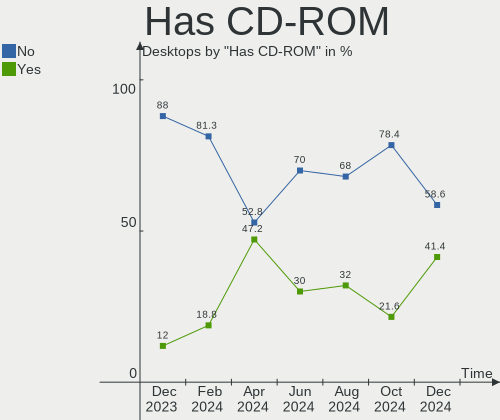
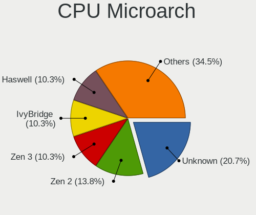
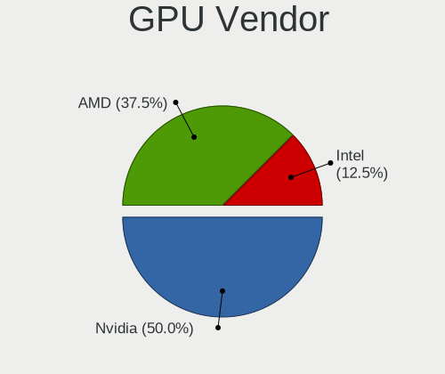
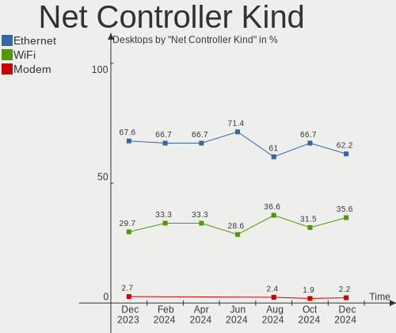

KDE neon - Hardware Trends (Desktops)
-------------------------------------

A project to identify most popular hardware characteristics and track their change
over time based on data collected by Linux users at https://Linux-Hardware.org.

Anyone can contribute to this report by the [hw-probe](https://github.com/linuxhw/hw-probe) tool:

    sudo -E hw-probe -all -upload

This report is for one last month. Overall report since the beginning of time: [TestDays](https://github.com/linuxhw/TestDays)

Period: May, 2023.

Contents
--------

* [ System ](#system)
  - [ OS                       ](#os)
  - [ OS Family                ](#os-family)
  - [ Kernel                   ](#kernel)
  - [ Kernel Family            ](#kernel-family)
  - [ Kernel Major Ver.        ](#kernel-major-ver)
  - [ Arch                     ](#arch)
  - [ DE                       ](#de)
  - [ Display Server           ](#display-server)
  - [ Display Manager          ](#display-manager)
  - [ OS Lang                  ](#os-lang)
  - [ Boot Mode                ](#boot-mode)
  - [ Filesystem               ](#filesystem)
  - [ Part. scheme             ](#part-scheme)
  - [ Dual Boot with Linux/BSD ](#dual-boot-with-linuxbsd)
  - [ Dual Boot (Win)          ](#dual-boot-win)

* [ Board ](#board)
  - [ Vendor                   ](#vendor)
  - [ Model                    ](#model)
  - [ Model Family             ](#model-family)
  - [ MFG Year                 ](#mfg-year)
  - [ Form Factor              ](#form-factor)
  - [ Secure Boot              ](#secure-boot)
  - [ Coreboot                 ](#coreboot)
  - [ RAM Size                 ](#ram-size)
  - [ RAM Used                 ](#ram-used)
  - [ Total Drives             ](#total-drives)
  - [ Has CD-ROM               ](#has-cd-rom)
  - [ Has Ethernet             ](#has-ethernet)
  - [ Has WiFi                 ](#has-wifi)
  - [ Has Bluetooth            ](#has-bluetooth)

* [ Location ](#location)
  - [ Country                  ](#country)
  - [ City                     ](#city)

* [ Drives ](#drives)
  - [ Drive Vendor             ](#drive-vendor)
  - [ Drive Model              ](#drive-model)
  - [ HDD Vendor               ](#hdd-vendor)
  - [ SSD Vendor               ](#ssd-vendor)
  - [ Drive Kind               ](#drive-kind)
  - [ Drive Connector          ](#drive-connector)
  - [ Drive Size               ](#drive-size)
  - [ Space Total              ](#space-total)
  - [ Space Used               ](#space-used)
  - [ Malfunc. Drives          ](#malfunc-drives)
  - [ Malfunc. Drive Vendor    ](#malfunc-drive-vendor)
  - [ Malfunc. HDD Vendor      ](#malfunc-hdd-vendor)
  - [ Malfunc. Drive Kind      ](#malfunc-drive-kind)
  - [ Failed Drives            ](#failed-drives)
  - [ Failed Drive Vendor      ](#failed-drive-vendor)
  - [ Drive Status             ](#drive-status)

* [ Storage controller ](#storage-controller)
  - [ Storage Vendor           ](#storage-vendor)
  - [ Storage Model            ](#storage-model)
  - [ Storage Kind             ](#storage-kind)

* [ Processor ](#processor)
  - [ CPU Vendor               ](#cpu-vendor)
  - [ CPU Model                ](#cpu-model)
  - [ CPU Model Family         ](#cpu-model-family)
  - [ CPU Cores                ](#cpu-cores)
  - [ CPU Sockets              ](#cpu-sockets)
  - [ CPU Threads              ](#cpu-threads)
  - [ CPU Op-Modes             ](#cpu-op-modes)
  - [ CPU Microcode            ](#cpu-microcode)
  - [ CPU Microarch            ](#cpu-microarch)

* [ Graphics ](#graphics)
  - [ GPU Vendor               ](#gpu-vendor)
  - [ GPU Model                ](#gpu-model)
  - [ GPU Combo                ](#gpu-combo)
  - [ GPU Driver               ](#gpu-driver)
  - [ GPU Memory               ](#gpu-memory)

* [ Monitor ](#monitor)
  - [ Monitor Vendor           ](#monitor-vendor)
  - [ Monitor Model            ](#monitor-model)
  - [ Monitor Resolution       ](#monitor-resolution)
  - [ Monitor Diagonal         ](#monitor-diagonal)
  - [ Monitor Width            ](#monitor-width)
  - [ Aspect Ratio             ](#aspect-ratio)
  - [ Monitor Area             ](#monitor-area)
  - [ Pixel Density            ](#pixel-density)
  - [ Multiple Monitors        ](#multiple-monitors)

* [ Network ](#network)
  - [ Net Controller Vendor    ](#net-controller-vendor)
  - [ Net Controller Model     ](#net-controller-model)
  - [ Wireless Vendor          ](#wireless-vendor)
  - [ Wireless Model           ](#wireless-model)
  - [ Ethernet Vendor          ](#ethernet-vendor)
  - [ Ethernet Model           ](#ethernet-model)
  - [ Net Controller Kind      ](#net-controller-kind)
  - [ Used Controller          ](#used-controller)
  - [ NICs                     ](#nics)
  - [ IPv6                     ](#ipv6)

* [ Bluetooth ](#bluetooth)
  - [ Bluetooth Vendor         ](#bluetooth-vendor)
  - [ Bluetooth Model          ](#bluetooth-model)

* [ Sound ](#sound)
  - [ Sound Vendor             ](#sound-vendor)
  - [ Sound Model              ](#sound-model)

* [ Memory ](#memory)
  - [ Memory Vendor            ](#memory-vendor)
  - [ Memory Model             ](#memory-model)
  - [ Memory Kind              ](#memory-kind)
  - [ Memory Form Factor       ](#memory-form-factor)
  - [ Memory Size              ](#memory-size)
  - [ Memory Speed             ](#memory-speed)

* [ Printers & scanners ](#printers--scanners)
  - [ Printer Vendor           ](#printer-vendor)
  - [ Printer Model            ](#printer-model)
  - [ Scanner Vendor           ](#scanner-vendor)
  - [ Scanner Model            ](#scanner-model)

* [ Camera ](#camera)
  - [ Camera Vendor            ](#camera-vendor)
  - [ Camera Model             ](#camera-model)

* [ Security ](#security)
  - [ Fingerprint Vendor       ](#fingerprint-vendor)
  - [ Fingerprint Model        ](#fingerprint-model)
  - [ Chipcard Vendor          ](#chipcard-vendor)
  - [ Chipcard Model           ](#chipcard-model)

* [ Unsupported ](#unsupported)
  - [ Unsupported Devices      ](#unsupported-devices)
  - [ Unsupported Device Types ](#unsupported-device-types)

System
------

OS
--

Installed operating systems

| Name           | Desktops | Percent |
|----------------|----------|---------|
| KDE neon 22.04 | 24       | 96%     |
| KDE neon 20.04 | 1        | 4%      |

OS Family
---------

OS without a version

| Name     | Desktops | Percent |
|----------|----------|---------|
| KDE neon | 25       | 100%    |

Kernel
------

Version of the Linux kernel

| Version           | Desktops | Percent |
|-------------------|----------|---------|
| 5.19.0-41-generic | 14       | 56%     |
| 5.19.0-42-generic | 6        | 24%     |
| 5.19.0-40-generic | 3        | 12%     |
| 5.19.0-35-generic | 1        | 4%      |
| 5.15.0-71-generic | 1        | 4%      |

Kernel Family
-------------

Linux kernel without a distro release

| Version | Desktops | Percent |
|---------|----------|---------|
| 5.19.0  | 24       | 96%     |
| 5.15.0  | 1        | 4%      |

Kernel Major Ver.
-----------------

Linux kernel major version

| Version | Desktops | Percent |
|---------|----------|---------|
| 5.19    | 24       | 96%     |
| 5.15    | 1        | 4%      |

Arch
----

OS architecture (x86_64, i586, etc.)

| Name   | Desktops | Percent |
|--------|----------|---------|
| x86_64 | 25       | 100%    |

DE
--

Desktop Environment

| Name | Desktops | Percent |
|------|----------|---------|
| KDE5 | 25       | 100%    |

Display Server
--------------

X11 or Wayland

| Name | Desktops | Percent |
|------|----------|---------|
| X11  | 25       | 100%    |

Display Manager
---------------

SDDM, LightDM, etc.

| Name    | Desktops | Percent |
|---------|----------|---------|
| Unknown | 19       | 76%     |
| SDDM    | 6        | 24%     |

OS Lang
-------

Language

| Lang  | Desktops | Percent |
|-------|----------|---------|
| en_US | 8        | 32%     |
| en_GB | 4        | 16%     |
| pt_BR | 3        | 12%     |
| ru_RU | 2        | 8%      |
| it_IT | 2        | 8%      |
| es_MX | 2        | 8%      |
| fr_FR | 1        | 4%      |
| es_ES | 1        | 4%      |
| es_CR | 1        | 4%      |
| en_ZA | 1        | 4%      |

Boot Mode
---------

EFI or BIOS

| Mode | Desktops | Percent |
|------|----------|---------|
| BIOS | 24       | 96%     |
| EFI  | 1        | 4%      |

Filesystem
----------

Type of filesystem

| Type  | Desktops | Percent |
|-------|----------|---------|
| Ext4  | 22       | 88%     |
| Tmpfs | 2        | 8%      |
| Btrfs | 1        | 4%      |

Part. scheme
------------

Scheme of partitioning

| Type    | Desktops | Percent |
|---------|----------|---------|
| Unknown | 19       | 76%     |
| GPT     | 6        | 24%     |

Dual Boot with Linux/BSD
------------------------

Hosting more than one Linux/BSD

| Dual boot | Desktops | Percent |
|-----------|----------|---------|
| No        | 24       | 96%     |
| Yes       | 1        | 4%      |

Dual Boot (Win)
---------------

Hosting Linux and Windows

| Dual boot | Desktops | Percent |
|-----------|----------|---------|
| No        | 22       | 88%     |
| Yes       | 3        | 12%     |

Board
-----

Vendor
------

Motherboard manufacturer

| Name                | Desktops | Percent |
|---------------------|----------|---------|
| ASUSTek Computer    | 9        | 36%     |
| Gigabyte Technology | 6        | 24%     |
| ASRock              | 3        | 12%     |
| SYWZ                | 1        | 4%      |
| MSI                 | 1        | 4%      |
| Lenovo              | 1        | 4%      |
| Hewlett-Packard     | 1        | 4%      |
| Dell                | 1        | 4%      |
| AZW                 | 1        | 4%      |
| Acer                | 1        | 4%      |

Model
-----

Motherboard model

| Name                                | Desktops | Percent |
|-------------------------------------|----------|---------|
| SYWZ S200 Series                    | 1        | 4%      |
| MSI MS-7816                         | 1        | 4%      |
| Lenovo ThinkStation P510 30B4S2BA00 | 1        | 4%      |
| HP Compaq dc5700 Small Form Factor  | 1        | 4%      |
| Gigabyte X99-UD4-CF                 | 1        | 4%      |
| Gigabyte X570 AORUS PRO WIFI        | 1        | 4%      |
| Gigabyte M68MT-S2                   | 1        | 4%      |
| Gigabyte H410M H V3                 | 1        | 4%      |
| Gigabyte B550 AORUS ELITE V2        | 1        | 4%      |
| Gigabyte AB350M-DS3H V2             | 1        | 4%      |
| Dell OptiPlex 3020                  | 1        | 4%      |
| AZW MINI S                          | 1        | 4%      |
| ASUS TUF Gaming X570-PLUS           | 1        | 4%      |
| ASUS TUF Gaming B550-PLUS           | 1        | 4%      |
| ASUS TUF Gaming A520M-PLUS II       | 1        | 4%      |
| ASUS ROG STRIX B550-E GAMING        | 1        | 4%      |
| ASUS PRIME B350-PLUS                | 1        | 4%      |
| ASUS P8H67                          | 1        | 4%      |
| ASUS P5G41T-M LX                    | 1        | 4%      |
| ASUS K200                           | 1        | 4%      |
| ASUS All Series                     | 1        | 4%      |
| ASRock H510M-HDV                    | 1        | 4%      |
| ASRock H470M-HDV                    | 1        | 4%      |
| ASRock B550M Phantom Gaming 4       | 1        | 4%      |
| Acer Predator PO3-620               | 1        | 4%      |

Model Family
------------

Motherboard model prefix

| Name                 | Desktops | Percent |
|----------------------|----------|---------|
| ASUS TUF             | 3        | 12%     |
| SYWZ S200            | 1        | 4%      |
| MSI MS-7816          | 1        | 4%      |
| Lenovo ThinkStation  | 1        | 4%      |
| HP Compaq            | 1        | 4%      |
| Gigabyte X99-UD4-CF  | 1        | 4%      |
| Gigabyte X570        | 1        | 4%      |
| Gigabyte M68MT-S2    | 1        | 4%      |
| Gigabyte H410M       | 1        | 4%      |
| Gigabyte B550        | 1        | 4%      |
| Gigabyte AB350M-DS3H | 1        | 4%      |
| Dell OptiPlex        | 1        | 4%      |
| AZW MINI             | 1        | 4%      |
| ASUS ROG             | 1        | 4%      |
| ASUS PRIME           | 1        | 4%      |
| ASUS P8H67           | 1        | 4%      |
| ASUS P5G41T-M        | 1        | 4%      |
| ASUS K200            | 1        | 4%      |
| ASUS All             | 1        | 4%      |
| ASRock H510M-HDV     | 1        | 4%      |
| ASRock H470M-HDV     | 1        | 4%      |
| ASRock B550M         | 1        | 4%      |
| Acer Predator        | 1        | 4%      |

MFG Year
--------

Motherboard manufacture year

| Year | Desktops | Percent |
|------|----------|---------|
| 2020 | 6        | 24%     |
| 2021 | 3        | 12%     |
| 2019 | 3        | 12%     |
| 2014 | 3        | 12%     |
| 2010 | 3        | 12%     |
| 2022 | 2        | 8%      |
| 2017 | 2        | 8%      |
| 2018 | 1        | 4%      |
| 2013 | 1        | 4%      |
| 2006 | 1        | 4%      |

Form Factor
-----------

Physical design of the computer

| Name    | Desktops | Percent |
|---------|----------|---------|
| Desktop | 25       | 100%    |

Secure Boot
-----------

Enabled or disabled

| State    | Desktops | Percent |
|----------|----------|---------|
| Disabled | 25       | 100%    |

Coreboot
--------

Have coreboot on board

| Used | Desktops | Percent |
|------|----------|---------|
| No   | 25       | 100%    |

RAM Size
--------

Total RAM memory

| Size in GB  | Desktops | Percent |
|-------------|----------|---------|
| 16.01-24.0  | 7        | 28%     |
| 8.01-16.0   | 6        | 24%     |
| 32.01-64.0  | 5        | 20%     |
| 4.01-8.0    | 2        | 8%      |
| 3.01-4.0    | 2        | 8%      |
| 24.01-32.0  | 2        | 8%      |
| 64.01-256.0 | 1        | 4%      |

RAM Used
--------

Used RAM memory

| Used GB   | Desktops | Percent |
|-----------|----------|---------|
| 4.01-8.0  | 11       | 44%     |
| 1.01-2.0  | 5        | 20%     |
| 3.01-4.0  | 4        | 16%     |
| 2.01-3.0  | 4        | 16%     |
| 8.01-16.0 | 1        | 4%      |

Total Drives
------------

Number of drives on board

| Drives | Desktops | Percent |
|--------|----------|---------|
| 2      | 7        | 28%     |
| 1      | 7        | 28%     |
| 3      | 6        | 24%     |
| 4      | 3        | 12%     |
| 6      | 1        | 4%      |
| 5      | 1        | 4%      |

Has CD-ROM
----------

Has CD-ROM on board

| Presented | Desktops | Percent |
|-----------|----------|---------|
| No        | 18       | 72%     |
| Yes       | 7        | 28%     |

Has Ethernet
------------

Has Ethernet on board

| Presented | Desktops | Percent |
|-----------|----------|---------|
| Yes       | 25       | 100%    |

Has WiFi
--------

Has WiFi module

| Presented | Desktops | Percent |
|-----------|----------|---------|
| No        | 13       | 52%     |
| Yes       | 12       | 48%     |

Has Bluetooth
-------------

Has Bluetooth module

| Presented | Desktops | Percent |
|-----------|----------|---------|
| No        | 14       | 56%     |
| Yes       | 11       | 44%     |

Location
--------

Country
-------

Geographic location (country)

| Country      | Desktops | Percent |
|--------------|----------|---------|
| UK           | 3        | 12%     |
| Russia       | 3        | 12%     |
| Brazil       | 3        | 12%     |
| USA          | 2        | 8%      |
| Italy        | 2        | 8%      |
| Spain        | 1        | 4%      |
| South Africa | 1        | 4%      |
| New Zealand  | 1        | 4%      |
| Mexico       | 1        | 4%      |
| Greece       | 1        | 4%      |
| France       | 1        | 4%      |
| Costa Rica   | 1        | 4%      |
| Canada       | 1        | 4%      |
| Bangladesh   | 1        | 4%      |
| Armenia      | 1        | 4%      |
| Argentina    | 1        | 4%      |
| Algeria      | 1        | 4%      |

City
----

Geographic location (city)

| City                   | Desktops | Percent |
|------------------------|----------|---------|
| Dolgoprudnyy           | 2        | 8%      |
| Yerevan                | 1        | 4%      |
| Wellington             | 1        | 4%      |
| Waterloo               | 1        | 4%      |
| Vargem Grande Paulista | 1        | 4%      |
| Urdiain                | 1        | 4%      |
| Thessaloniki           | 1        | 4%      |
| Stevenage              | 1        | 4%      |
| Silverton              | 1        | 4%      |
| San Bruno              | 1        | 4%      |
| Puebla City            | 1        | 4%      |
| Osasco                 | 1        | 4%      |
| Naranjo                | 1        | 4%      |
| Moscow                 | 1        | 4%      |
| Le Chambon-Feugerolles | 1        | 4%      |
| Johannesburg           | 1        | 4%      |
| Edgware                | 1        | 4%      |
| Dhaka                  | 1        | 4%      |
| Corrientes             | 1        | 4%      |
| Constantine            | 1        | 4%      |
| Cheddington            | 1        | 4%      |
| Casalecchio di Reno    | 1        | 4%      |
| Bulgarograsso          | 1        | 4%      |
| Atibaia                | 1        | 4%      |

Drives
------

Drive Vendor
------------

Hard drive vendors

| Vendor                         | Desktops | Drives | Percent |
|--------------------------------|----------|--------|---------|
| Seagate                        | 10       | 12     | 19.61%  |
| WDC                            | 8        | 9      | 15.69%  |
| Samsung Electronics            | 8        | 14     | 15.69%  |
| Toshiba                        | 4        | 4      | 7.84%   |
| Kingston                       | 3        | 3      | 5.88%   |
| Sandisk                        | 2        | 3      | 3.92%   |
| Hitachi                        | 2        | 3      | 3.92%   |
| TSA                            | 1        | 1      | 1.96%   |
| Transcend                      | 1        | 1      | 1.96%   |
| Solid State Storage Technology | 1        | 1      | 1.96%   |
| SK hynix                       | 1        | 1      | 1.96%   |
| PNY                            | 1        | 1      | 1.96%   |
| Phison Electronics             | 1        | 1      | 1.96%   |
| Netac                          | 1        | 2      | 1.96%   |
| Micron Technology              | 1        | 1      | 1.96%   |
| MAXIO Technology (Hangzhou)    | 1        | 1      | 1.96%   |
| KLEVV                          | 1        | 1      | 1.96%   |
| Intel                          | 1        | 1      | 1.96%   |
| Crucial                        | 1        | 1      | 1.96%   |
| China                          | 1        | 1      | 1.96%   |
| Apacer                         | 1        | 1      | 1.96%   |

Drive Model
-----------

Hard drive models

| Model                                               | Desktops | Percent |
|-----------------------------------------------------|----------|---------|
| Seagate ST1000DM010-2EP102 1TB                      | 3        | 4.92%   |
| Samsung NVMe SSD Controller SM981/PM981/PM983 256GB | 2        | 3.28%   |
| WDC WDS500G2B0A-00SM50 500GB SSD                    | 1        | 1.64%   |
| WDC WDS240G2G0A-00JH30 240GB SSD                    | 1        | 1.64%   |
| WDC WD5000AAKX-001CA0 500GB                         | 1        | 1.64%   |
| WDC WD40EFRX-68N32N0 4TB                            | 1        | 1.64%   |
| WDC WD10EZEX-21WN4A0 1TB                            | 1        | 1.64%   |
| WDC WD10EZEX-08M2NA0 1TB                            | 1        | 1.64%   |
| WDC WD10EZEX-00ZF5A0 1TB                            | 1        | 1.64%   |
| WDC WD10EFRX-68JCSN0 1TB                            | 1        | 1.64%   |
| WDC WD10EAVS-00D7B1 1TB                             | 1        | 1.64%   |
| TSA SSD 256GB                                       | 1        | 1.64%   |
| Transcend TS128GSSD370S 128GB                       | 1        | 1.64%   |
| Toshiba MQ01ABF050 500GB                            | 1        | 1.64%   |
| Toshiba MG07ACA14TE 14TB                            | 1        | 1.64%   |
| Toshiba HDWD320 2TB                                 | 1        | 1.64%   |
| Toshiba DT01ACA100 1TB                              | 1        | 1.64%   |
| Solid State Storage NVMe CLR-8W512 512GB            | 1        | 1.64%   |
| SK hynix BC501 NVMe Solid State Drive 512GB         | 1        | 1.64%   |
| Seagate ST8000DM004-2U9188 8TB                      | 1        | 1.64%   |
| Seagate ST8000DM004-2CX188 8TB                      | 1        | 1.64%   |
| Seagate ST3750640NS 752GB                           | 1        | 1.64%   |
| Seagate ST3500418AS 500GB                           | 1        | 1.64%   |
| Seagate ST3400832AS 400GB                           | 1        | 1.64%   |
| Seagate ST2000DM001-9YN164 2TB                      | 1        | 1.64%   |
| Seagate ST1000LM014-1EJ164 1TB                      | 1        | 1.64%   |
| Seagate ST1000DM003-1ER162 1TB                      | 1        | 1.64%   |
| Seagate Expansion 1TB                               | 1        | 1.64%   |
| Sandisk WD Blue SN570 500GB                         | 1        | 1.64%   |
| SanDisk SDSSDHP128G 128GB                           | 1        | 1.64%   |
| SanDisk SDSSDA120G 120GB                            | 1        | 1.64%   |
| Samsung SSD 980 PRO 1TB                             | 1        | 1.64%   |
| Samsung SSD 980 1TB                                 | 1        | 1.64%   |
| Samsung SSD 970 EVO Plus 500GB                      | 1        | 1.64%   |
| Samsung SSD 860 EVO 500GB                           | 1        | 1.64%   |
| Samsung SSD 860 EVO 250GB                           | 1        | 1.64%   |
| Samsung SSD 840 EVO 120GB                           | 1        | 1.64%   |
| Samsung PSSD T7 2TB                                 | 1        | 1.64%   |
| Samsung Portable SSD T5 500GB                       | 1        | 1.64%   |
| Samsung NVMe SSD Controller PM9A1/PM9A3/980PRO 1TB  | 1        | 1.64%   |

HDD Vendor
----------

Hard disk drive vendors

| Vendor  | Desktops | Drives | Percent |
|---------|----------|--------|---------|
| Seagate | 10       | 12     | 45.45%  |
| WDC     | 6        | 7      | 27.27%  |
| Toshiba | 4        | 4      | 18.18%  |
| Hitachi | 2        | 3      | 9.09%   |

SSD Vendor
----------

Solid state drive vendors

| Vendor              | Desktops | Drives | Percent |
|---------------------|----------|--------|---------|
| Samsung Electronics | 5        | 7      | 27.78%  |
| WDC                 | 2        | 2      | 11.11%  |
| SanDisk             | 2        | 2      | 11.11%  |
| TSA                 | 1        | 1      | 5.56%   |
| Transcend           | 1        | 1      | 5.56%   |
| PNY                 | 1        | 1      | 5.56%   |
| Netac               | 1        | 2      | 5.56%   |
| Micron Technology   | 1        | 1      | 5.56%   |
| Kingston            | 1        | 1      | 5.56%   |
| Crucial             | 1        | 1      | 5.56%   |
| China               | 1        | 1      | 5.56%   |
| Apacer              | 1        | 1      | 5.56%   |

Drive Kind
----------

HDD or SSD

| Kind | Desktops | Drives | Percent |
|------|----------|--------|---------|
| SSD  | 16       | 21     | 38.1%   |
| HDD  | 15       | 26     | 35.71%  |
| NVMe | 11       | 16     | 26.19%  |

Drive Connector
---------------

SATA, SAS, NVMe, etc.

| Type | Desktops | Drives | Percent |
|------|----------|--------|---------|
| SATA | 21       | 44     | 61.76%  |
| NVMe | 11       | 16     | 32.35%  |
| SAS  | 2        | 3      | 5.88%   |

Drive Size
----------

Size of hard drive

| Size in TB | Desktops | Drives | Percent |
|------------|----------|--------|---------|
| 0.01-0.5   | 16       | 24     | 45.71%  |
| 0.51-1.0   | 12       | 15     | 34.29%  |
| 1.01-2.0   | 4        | 4      | 11.43%  |
| 3.01-4.0   | 1        | 1      | 2.86%   |
| 10.01-20.0 | 1        | 1      | 2.86%   |
| 4.01-10.0  | 1        | 2      | 2.86%   |

Space Total
-----------

Amount of disk space available on the file system

| Size in GB | Desktops | Percent |
|------------|----------|---------|
| 101-250    | 8        | 32%     |
| 1001-2000  | 4        | 16%     |
| 501-1000   | 4        | 16%     |
| 251-500    | 3        | 12%     |
| 51-100     | 3        | 12%     |
| 2001-3000  | 2        | 8%      |
| Unknown    | 1        | 4%      |

Space Used
----------

Amount of used disk space

| Used GB   | Desktops | Percent |
|-----------|----------|---------|
| 1-20      | 7        | 28%     |
| 21-50     | 4        | 16%     |
| 1001-2000 | 4        | 16%     |
| 101-250   | 3        | 12%     |
| 51-100    | 3        | 12%     |
| 251-500   | 2        | 8%      |
| 501-1000  | 1        | 4%      |
| Unknown   | 1        | 4%      |

Malfunc. Drives
---------------

Drive models with a malfunction

| Model                    | Desktops | Drives | Percent |
|--------------------------|----------|--------|---------|
| WDC WD10EFRX-68JCSN0 1TB | 1        | 1      | 100%    |

Malfunc. Drive Vendor
---------------------

Vendors of faulty drives

| Vendor | Desktops | Drives | Percent |
|--------|----------|--------|---------|
| WDC    | 1        | 1      | 100%    |

Malfunc. HDD Vendor
-------------------

Vendors of faulty HDD drives

| Vendor | Desktops | Drives | Percent |
|--------|----------|--------|---------|
| WDC    | 1        | 1      | 100%    |

Malfunc. Drive Kind
-------------------

Kinds of faulty drives

| Kind | Desktops | Drives | Percent |
|------|----------|--------|---------|
| HDD  | 1        | 1      | 100%    |

Failed Drives
-------------

Failed drive models

Zero info for selected period =(

Failed Drive Vendor
-------------------

Failed drive vendors

Zero info for selected period =(

Drive Status
------------

Number of failed and malfunc. drives

| Status   | Desktops | Drives | Percent |
|----------|----------|--------|---------|
| Detected | 22       | 52     | 78.57%  |
| Works    | 5        | 10     | 17.86%  |
| Malfunc  | 1        | 1      | 3.57%   |

Storage controller
------------------

Storage Vendor
--------------

Storage controller vendors

| Vendor                         | Desktops | Percent |
|--------------------------------|----------|---------|
| Intel                          | 16       | 42.11%  |
| AMD                            | 9        | 23.68%  |
| Samsung Electronics            | 4        | 10.53%  |
| Kingston Technology Company    | 2        | 5.26%   |
| VIA Technologies               | 1        | 2.63%   |
| Solid State Storage Technology | 1        | 2.63%   |
| SK hynix                       | 1        | 2.63%   |
| SanDisk                        | 1        | 2.63%   |
| Phison Electronics             | 1        | 2.63%   |
| Nvidia                         | 1        | 2.63%   |
| MAXIO Technology (Hangzhou)    | 1        | 2.63%   |

Storage Model
-------------

Storage controller models

| Model                                                                                   | Desktops | Percent |
|-----------------------------------------------------------------------------------------|----------|---------|
| AMD 500 Series Chipset SATA Controller                                                  | 5        | 10.64%  |
| AMD FCH SATA Controller [AHCI mode]                                                     | 4        | 8.51%   |
| Samsung NVMe SSD Controller SM981/PM981/PM983                                           | 3        | 6.38%   |
| Samsung NVMe SSD Controller PM9A1/PM9A3/980PRO                                          | 2        | 4.26%   |
| Intel Comet Lake SATA AHCI Controller                                                   | 2        | 4.26%   |
| Intel C610/X99 series chipset 6-Port SATA Controller [AHCI mode]                        | 2        | 4.26%   |
| Intel 8 Series/C220 Series Chipset Family 6-port SATA Controller 1 [AHCI mode]          | 2        | 4.26%   |
| Intel 500 Series Chipset Family SATA AHCI Controller                                    | 2        | 4.26%   |
| AMD 300 Series Chipset SATA Controller                                                  | 2        | 4.26%   |
| VIA VT6415 PATA IDE Host Controller                                                     | 1        | 2.13%   |
| Solid State Storage Non-Volatile memory controller                                      | 1        | 2.13%   |
| SK hynix BC501 NVMe Solid State Drive                                                   | 1        | 2.13%   |
| SanDisk WD Blue SN570 NVMe SSD 1TB                                                      | 1        | 2.13%   |
| Samsung NVMe SSD Controller 980                                                         | 1        | 2.13%   |
| Phison E12 NVMe Controller                                                              | 1        | 2.13%   |
| Nvidia MCP61 SATA Controller                                                            | 1        | 2.13%   |
| MAXIO (Hangzhou) NVMe SSD Controller MAP1202                                            | 1        | 2.13%   |
| Kingston Company Company Non-Volatile memory controller                                 | 1        | 2.13%   |
| Kingston Company NVMe Controller                                                        | 1        | 2.13%   |
| Intel SSD 660P Series                                                                   | 1        | 2.13%   |
| Intel Q170/Q150/B150/H170/H110/Z170/CM236 Chipset SATA Controller [AHCI Mode]           | 1        | 2.13%   |
| Intel NM10/ICH7 Family SATA Controller [IDE mode]                                       | 1        | 2.13%   |
| Intel Jasper Lake SATA AHCI Controller                                                  | 1        | 2.13%   |
| Intel C610/X99 series chipset sSATA Controller [AHCI mode]                              | 1        | 2.13%   |
| Intel C610/X99 series chipset IDE-r Controller                                          | 1        | 2.13%   |
| Intel 9 Series Chipset Family SATA Controller [AHCI Mode]                               | 1        | 2.13%   |
| Intel 82801HR/HO/HH (ICH8R/DO/DH) 2 port SATA Controller [IDE mode]                     | 1        | 2.13%   |
| Intel 82801H (ICH8 Family) 4 port SATA Controller [IDE mode]                            | 1        | 2.13%   |
| Intel 82801G (ICH7 Family) IDE Controller                                               | 1        | 2.13%   |
| Intel 6 Series/C200 Series Chipset Family Desktop SATA Controller (IDE mode, ports 4-5) | 1        | 2.13%   |
| Intel 6 Series/C200 Series Chipset Family Desktop SATA Controller (IDE mode, ports 0-3) | 1        | 2.13%   |
| Intel 400 Series Chipset Family SATA AHCI Controller                                    | 1        | 2.13%   |

Storage Kind
------------

Kind of storage controller (IDE, SATA, NVMe, SAS, ...)

| Kind | Desktops | Percent |
|------|----------|---------|
| SATA | 21       | 56.76%  |
| NVMe | 11       | 29.73%  |
| IDE  | 5        | 13.51%  |

Processor
---------

CPU Vendor
----------

Processor vendors

| Vendor | Desktops | Percent |
|--------|----------|---------|
| Intel  | 15       | 60%     |
| AMD    | 10       | 40%     |

CPU Model
---------

Processor models

| Model                                  | Desktops | Percent |
|----------------------------------------|----------|---------|
| Intel Pentium Gold G6400 CPU @ 4.00GHz | 2        | 8%      |
| AMD Ryzen 7 3700X 8-Core Processor     | 2        | 8%      |
| Intel Xeon CPU E5440 @ 2.83GHz         | 1        | 4%      |
| Intel Xeon CPU E5-2630 v4 @ 2.20GHz    | 1        | 4%      |
| Intel Core i9-8950HK CPU @ 2.90GHz     | 1        | 4%      |
| Intel Core i7-6950X CPU @ 3.00GHz      | 1        | 4%      |
| Intel Core i7-4790 CPU @ 3.60GHz       | 1        | 4%      |
| Intel Core i7-10700 CPU @ 2.90GHz      | 1        | 4%      |
| Intel Core i5-4590 CPU @ 3.30GHz       | 1        | 4%      |
| Intel Core i5-4570 CPU @ 3.20GHz       | 1        | 4%      |
| Intel Core i5-2500 CPU @ 3.30GHz       | 1        | 4%      |
| Intel Core i5-10400 CPU @ 2.90GHz      | 1        | 4%      |
| Intel Core i3-10100F CPU @ 3.60GHz     | 1        | 4%      |
| Intel Core 2 CPU 6300 @ 1.86GHz        | 1        | 4%      |
| Intel Celeron N5095A @ 2.00GHz         | 1        | 4%      |
| AMD Ryzen 9 5900X 12-Core Processor    | 1        | 4%      |
| AMD Ryzen 7 5700X 8-Core Processor     | 1        | 4%      |
| AMD Ryzen 7 2700 Eight-Core Processor  | 1        | 4%      |
| AMD Ryzen 5 5600G with Radeon Graphics | 1        | 4%      |
| AMD Ryzen 5 5500                       | 1        | 4%      |
| AMD Ryzen 5 3600 6-Core Processor      | 1        | 4%      |
| AMD Ryzen 3 1200 Quad-Core Processor   | 1        | 4%      |
| AMD Athlon II X2 250 Processor         | 1        | 4%      |

CPU Model Family
----------------

Processor model prefix

| Model              | Desktops | Percent |
|--------------------|----------|---------|
| Intel Core i5      | 4        | 16%     |
| AMD Ryzen 7        | 4        | 16%     |
| Intel Core i7      | 3        | 12%     |
| AMD Ryzen 5        | 3        | 12%     |
| Intel Xeon         | 2        | 8%      |
| Intel Pentium Gold | 2        | 8%      |
| Intel Core i9      | 1        | 4%      |
| Intel Core i3      | 1        | 4%      |
| Intel Core 2       | 1        | 4%      |
| Intel Celeron      | 1        | 4%      |
| AMD Ryzen 9        | 1        | 4%      |
| AMD Ryzen 3        | 1        | 4%      |
| AMD Athlon II X2   | 1        | 4%      |

CPU Cores
---------

Number of processor cores

| Number | Desktops | Percent |
|--------|----------|---------|
| 4      | 8        | 32%     |
| 8      | 5        | 20%     |
| 6      | 5        | 20%     |
| 2      | 4        | 16%     |
| 10     | 2        | 8%      |
| 12     | 1        | 4%      |

CPU Sockets
-----------

Number of sockets

| Number | Desktops | Percent |
|--------|----------|---------|
| 1      | 25       | 100%    |

CPU Threads
-----------

Threads per core (Hyper-Threading)

| Number | Desktops | Percent |
|--------|----------|---------|
| 2      | 17       | 68%     |
| 1      | 8        | 32%     |

CPU Op-Modes
------------

CPU Operation Modes (32-bit, 64-bit)

| Op mode        | Desktops | Percent |
|----------------|----------|---------|
| 32-bit, 64-bit | 25       | 100%    |

CPU Microcode
-------------

Microcode number

| Number     | Desktops | Percent |
|------------|----------|---------|
| Unknown    | 21       | 84%     |
| 0x6f2      | 1        | 4%      |
| 0x406f1    | 1        | 4%      |
| 0x306c3    | 1        | 4%      |
| 0x08701021 | 1        | 4%      |

CPU Microarch
-------------

Microarchitecture

| Name        | Desktops | Percent |
|-------------|----------|---------|
| CometLake   | 5        | 20%     |
| Zen 3       | 4        | 16%     |
| Zen 2       | 3        | 12%     |
| Haswell     | 3        | 12%     |
| Broadwell   | 2        | 8%      |
| Zen+        | 1        | 4%      |
| Zen         | 1        | 4%      |
| SandyBridge | 1        | 4%      |
| Penryn      | 1        | 4%      |
| KabyLake    | 1        | 4%      |
| K10         | 1        | 4%      |
| Core        | 1        | 4%      |
| Unknown     | 1        | 4%      |

Graphics
--------

GPU Vendor
----------

Vendors of graphics cards

| Vendor | Desktops | Percent |
|--------|----------|---------|
| AMD    | 11       | 42.31%  |
| Nvidia | 10       | 38.46%  |
| Intel  | 5        | 19.23%  |

GPU Model
---------

Graphics card models

| Model                                                                       | Desktops | Percent |
|-----------------------------------------------------------------------------|----------|---------|
| Nvidia TU106 [GeForce RTX 2060 Rev. A]                                      | 1        | 3.85%   |
| Nvidia TU104 [GeForce RTX 2070 SUPER]                                       | 1        | 3.85%   |
| Nvidia GP107 [GeForce GTX 1050 Ti]                                          | 1        | 3.85%   |
| Nvidia GP104 [GeForce GTX 1080]                                             | 1        | 3.85%   |
| Nvidia GP104 [GeForce GTX 1070 Ti]                                          | 1        | 3.85%   |
| Nvidia GK208B [GeForce GT 710]                                              | 1        | 3.85%   |
| Nvidia GK107 [NVS 510]                                                      | 1        | 3.85%   |
| Nvidia GK104GL [Quadro K5000]                                               | 1        | 3.85%   |
| Nvidia GA104 [GeForce RTX 3070]                                             | 1        | 3.85%   |
| Nvidia GA104 [GeForce RTX 3060 Ti Lite Hash Rate]                           | 1        | 3.85%   |
| Intel Xeon E3-1200 v3/4th Gen Core Processor Integrated Graphics Controller | 1        | 3.85%   |
| Intel JasperLake [UHD Graphics]                                             | 1        | 3.85%   |
| Intel CometLake-S GT1 [UHD Graphics 610]                                    | 1        | 3.85%   |
| Intel CoffeeLake-H GT2 [UHD Graphics 630]                                   | 1        | 3.85%   |
| Intel 82Q963/Q965 Integrated Graphics Controller                            | 1        | 3.85%   |
| AMD Tobago PRO [Radeon R7 360 / R9 360 OEM]                                 | 1        | 3.85%   |
| AMD Navi 23 [Radeon RX 6600/6600 XT/6600M]                                  | 1        | 3.85%   |
| AMD Lexa PRO [Radeon 540/540X/550/550X / RX 540X/550/550X]                  | 1        | 3.85%   |
| AMD Ellesmere [Radeon RX 470/480/570/570X/580/580X/590]                     | 1        | 3.85%   |
| AMD Curacao XT / Trinidad XT [Radeon R7 370 / R9 270X/370X]                 | 1        | 3.85%   |
| AMD Curacao PRO [Radeon R7 370 / R9 270/370 OEM]                            | 1        | 3.85%   |
| AMD Cezanne [Radeon Vega Series / Radeon Vega Mobile Series]                | 1        | 3.85%   |
| AMD Caicos [Radeon HD 6450/7450/8450 / R5 230 OEM]                          | 1        | 3.85%   |
| AMD Caicos PRO [Radeon HD 7450]                                             | 1        | 3.85%   |
| AMD Bonaire [FirePro W5100]                                                 | 1        | 3.85%   |
| AMD Baffin [Radeon RX 550 640SP / RX 560/560X]                              | 1        | 3.85%   |

GPU Combo
---------

Combinations of graphics cards

| Name         | Desktops | Percent |
|--------------|----------|---------|
| 1 x AMD      | 10       | 40%     |
| 1 x Nvidia   | 9        | 36%     |
| 1 x Intel    | 5        | 20%     |
| AMD + Nvidia | 1        | 4%      |

GPU Driver
----------

Free vs proprietary

| Driver      | Desktops | Percent |
|-------------|----------|---------|
| Free        | 18       | 72%     |
| Proprietary | 4        | 16%     |
| Unknown     | 3        | 12%     |

GPU Memory
----------

Total video memory

| Size in GB | Desktops | Percent |
|------------|----------|---------|
| Unknown    | 22       | 88%     |
| 7.01-8.0   | 2        | 8%      |
| 3.01-4.0   | 1        | 4%      |

Monitor
-------

Monitor Vendor
--------------

Monitor vendors

| Vendor               | Desktops | Percent |
|----------------------|----------|---------|
| Goldstar             | 8        | 25%     |
| Samsung Electronics  | 5        | 15.63%  |
| Dell                 | 4        | 12.5%   |
| Philips              | 2        | 6.25%   |
| Hewlett-Packard      | 2        | 6.25%   |
| Ancor Communications | 2        | 6.25%   |
| Unknown              | 1        | 3.13%   |
| Sony                 | 1        | 3.13%   |
| PCH                  | 1        | 3.13%   |
| NEC Computers        | 1        | 3.13%   |
| LG Electronics       | 1        | 3.13%   |
| BenQ                 | 1        | 3.13%   |
| ASUSTek Computer     | 1        | 3.13%   |
| Arnos Instruments    | 1        | 3.13%   |
| AGO                  | 1        | 3.13%   |

Monitor Model
-------------

Monitor models

| Model                                                                 | Desktops | Percent |
|-----------------------------------------------------------------------|----------|---------|
| Unknown LCD Monitor FFFF 2288x1287 2550x2550mm 142.0-inch             | 1        | 3.03%   |
| Sony SDM-HS75P SNY2300 1280x1024 338x270mm 17.0-inch                  | 1        | 3.03%   |
| Samsung Electronics U32J59x SAM0F33 3840x2160 697x392mm 31.5-inch     | 1        | 3.03%   |
| Samsung Electronics U28E590 SAM0C4D 1680x1050 610x350mm 27.7-inch     | 1        | 3.03%   |
| Samsung Electronics SA300/SA350 SAM078A 1366x768 410x230mm 18.5-inch  | 1        | 3.03%   |
| Samsung Electronics S20D300 SAM0B3A 1600x900 432x240mm 19.5-inch      | 1        | 3.03%   |
| Samsung Electronics LCD Monitor SA300/SA350                           | 1        | 3.03%   |
| Samsung Electronics C49RG9x SAM0F9C 3840x1080 1193x336mm 48.8-inch    | 1        | 3.03%   |
| Philips PHL 275E2F PHLC23A 2560x1440 597x336mm 27.0-inch              | 1        | 3.03%   |
| Philips PHL 240B7QPJ PHL0903 1920x1200 518x324mm 24.1-inch            | 1        | 3.03%   |
| PCH VALAK UZ31 PCH0032 1920x1080 697x392mm 31.5-inch                  | 1        | 3.03%   |
| NEC Computers LCD2190UXp NEC66BC 1600x1200 432x324mm 21.3-inch        | 1        | 3.03%   |
| LG Electronics LCD Monitor W1953 2726x768                             | 1        | 3.03%   |
| Hewlett-Packard E232 HWP327B 1920x1080 509x286mm 23.0-inch            | 1        | 3.03%   |
| Hewlett-Packard 23cw HWP3187 1920x1080 509x286mm 23.0-inch            | 1        | 3.03%   |
| Goldstar W2253 GSM56DB 1920x1080 477x268mm 21.5-inch                  | 1        | 3.03%   |
| Goldstar W1953 GSM4BA7 1360x768 406x229mm 18.4-inch                   | 1        | 3.03%   |
| Goldstar ULTRAGEAR GSM776E 2560x1440 697x392mm 31.5-inch              | 1        | 3.03%   |
| Goldstar ULTRAFINE GSM5BC2 3840x2160 697x392mm 31.5-inch              | 1        | 3.03%   |
| Goldstar FULL HD GSM5BFB 1920x1080 480x270mm 21.7-inch                | 1        | 3.03%   |
| Goldstar 27GL850 GSM5B7F 2560x1440 597x336mm 27.0-inch                | 1        | 3.03%   |
| Goldstar 24MB65 GSM5A4C 1920x1200 520x330mm 24.2-inch                 | 1        | 3.03%   |
| Goldstar 22BN550Y GSM5BA1 1920x1080 480x270mm 21.7-inch               | 1        | 3.03%   |
| Dell SE2422H DEL424A 1920x1080 527x296mm 23.8-inch                    | 1        | 3.03%   |
| Dell P2715Q DEL40BD 3840x2160 597x336mm 27.0-inch                     | 1        | 3.03%   |
| Dell E197FP DELA024 1280x1024 380x305mm 19.2-inch                     | 1        | 3.03%   |
| Dell E1913 DELD051 1440x900 408x255mm 18.9-inch                       | 1        | 3.03%   |
| BenQ GW2270 BNQ78DB 1920x1080 480x270mm 21.7-inch                     | 1        | 3.03%   |
| ASUSTek Computer VA27A AUS270C 2560x1440 597x336mm 27.0-inch          | 1        | 3.03%   |
| Arnos Instruments H-W22 DVI AIC0023 1680x1050 470x300mm 22.0-inch     | 1        | 3.03%   |
| Ancor Communications VW225 ACI22A0 1680x1050 473x296mm 22.0-inch      | 1        | 3.03%   |
| Ancor Communications ASUS VS239 ACI23D2 1920x1080 509x286mm 23.0-inch | 1        | 3.03%   |
| AGO LCD Monitor AGO0001 1920x1080 256x192mm 12.6-inch                 | 1        | 3.03%   |

Monitor Resolution
------------------

Monitor screen resolution

| Resolution         | Desktops | Percent |
|--------------------|----------|---------|
| 1920x1080 (FHD)    | 9        | 29.03%  |
| 3840x2160 (4K)     | 4        | 12.9%   |
| 2560x1440 (QHD)    | 4        | 12.9%   |
| 1680x1050 (WSXGA+) | 2        | 6.45%   |
| 1280x1024 (SXGA)   | 2        | 6.45%   |
| 3840x1080          | 1        | 3.23%   |
| 2726x768           | 1        | 3.23%   |
| 2288x1287          | 1        | 3.23%   |
| 1920x1200 (WUXGA)  | 1        | 3.23%   |
| 1600x900 (HD+)     | 1        | 3.23%   |
| 1600x1200          | 1        | 3.23%   |
| 1440x900 (WXGA+)   | 1        | 3.23%   |
| 1366x768 (WXGA)    | 1        | 3.23%   |
| 1360x768           | 1        | 3.23%   |
| Unknown            | 1        | 3.23%   |

Monitor Diagonal
----------------

Diagonal size in inches

| Inches  | Desktops | Percent |
|---------|----------|---------|
| 27      | 5        | 16.13%  |
| 31      | 4        | 12.9%   |
| 21      | 4        | 12.9%   |
| 24      | 3        | 9.68%   |
| 23      | 3        | 9.68%   |
| 22      | 3        | 9.68%   |
| 19      | 2        | 6.45%   |
| 18      | 2        | 6.45%   |
| 142     | 1        | 3.23%   |
| 48      | 1        | 3.23%   |
| 17      | 1        | 3.23%   |
| 12      | 1        | 3.23%   |
| Unknown | 1        | 3.23%   |

Monitor Width
-------------

Physical width

| Width in mm    | Desktops | Percent |
|----------------|----------|---------|
| 501-600        | 10       | 32.26%  |
| 401-500        | 10       | 32.26%  |
| 601-700        | 5        | 16.13%  |
| More than 2000 | 1        | 3.23%   |
| 351-400        | 1        | 3.23%   |
| 301-350        | 1        | 3.23%   |
| 201-300        | 1        | 3.23%   |
| 1001-1500      | 1        | 3.23%   |
| Unknown        | 1        | 3.23%   |

Aspect Ratio
------------

Proportional relationship between the width and the height

| Ratio   | Desktops | Percent |
|---------|----------|---------|
| 16/9    | 15       | 53.57%  |
| 16/10   | 6        | 21.43%  |
| 5/4     | 2        | 7.14%   |
| 4/3     | 2        | 7.14%   |
| 32/9    | 1        | 3.57%   |
| 1.00    | 1        | 3.57%   |
| Unknown | 1        | 3.57%   |

Monitor Area
------------

Area in inch

| Area in inch | Desktops | Percent |
|----------------|----------|---------|
| 201-250        | 11       | 35.48%  |
| 301-350        | 5        | 16.13%  |
| 351-500        | 4        | 12.9%   |
| 151-200        | 3        | 9.68%   |
| 251-300        | 2        | 6.45%   |
| 141-150        | 2        | 6.45%   |
| More than 1000 | 1        | 3.23%   |
| 71-80          | 1        | 3.23%   |
| 501-1000       | 1        | 3.23%   |
| Unknown        | 1        | 3.23%   |

Pixel Density
-------------

Pixels per inch

| Density | Desktops | Percent |
|---------|----------|---------|
| 51-100  | 14       | 50%     |
| 101-120 | 7        | 25%     |
| 121-160 | 3        | 10.71%  |
| 161-240 | 2        | 7.14%   |
| 1-50    | 1        | 3.57%   |
| Unknown | 1        | 3.57%   |

Multiple Monitors
-----------------

Total monitors connected

| Total | Desktops | Percent |
|-------|----------|---------|
| 1     | 12       | 48%     |
| 2     | 11       | 44%     |
| 0     | 2        | 8%      |

Network
-------

Net Controller Vendor
---------------------

Controller vendors

| Vendor                | Desktops | Percent |
|-----------------------|----------|---------|
| Realtek Semiconductor | 18       | 43.9%   |
| Intel                 | 12       | 29.27%  |
| Xiaomi                | 2        | 4.88%   |
| TP-Link               | 1        | 2.44%   |
| Qualcomm Atheros      | 1        | 2.44%   |
| OPPO Electronics      | 1        | 2.44%   |
| Nvidia                | 1        | 2.44%   |
| MosChip Semiconductor | 1        | 2.44%   |
| Microsoft             | 1        | 2.44%   |
| Broadcom Limited      | 1        | 2.44%   |
| ASIX Electronics      | 1        | 2.44%   |
| Aquantia              | 1        | 2.44%   |

Net Controller Model
--------------------

Controller models

| Model                                                             | Desktops | Percent |
|-------------------------------------------------------------------|----------|---------|
| Realtek RTL8111/8168/8411 PCI Express Gigabit Ethernet Controller | 14       | 31.11%  |
| Intel Wi-Fi 6 AX200                                               | 4        | 8.89%   |
| Xiaomi Mi/Redmi series (RNDIS)                                    | 2        | 4.44%   |
| Realtek RTL8125 2.5GbE Controller                                 | 2        | 4.44%   |
| Intel Wireless 3165                                               | 2        | 4.44%   |
| Intel Ethernet Connection (2) I218-V                              | 2        | 4.44%   |
| TP-Link AC600 wireless Realtek RTL8811AU [Archer T2U Nano]        | 1        | 2.22%   |
| Realtek RTL8188ETV Wireless LAN 802.11n Network Adapter           | 1        | 2.22%   |
| Realtek RTL8153 Gigabit Ethernet Adapter                          | 1        | 2.22%   |
| Realtek Killer E2600 Gigabit Ethernet Controller                  | 1        | 2.22%   |
| Qualcomm Atheros AR8131 Gigabit Ethernet                          | 1        | 2.22%   |
| OPPO SM8350-MTP _SN:1518BD09                                      | 1        | 2.22%   |
| Nvidia MCP61 Ethernet                                             | 1        | 2.22%   |
| MosChip MCS7830 10/100 Mbps Ethernet adapter                      | 1        | 2.22%   |
| Microsoft XBOX ACC                                                | 1        | 2.22%   |
| Intel Wireless-AC 9260                                            | 1        | 2.22%   |
| Intel Wi-Fi 6 AX210/AX211/AX411 160MHz                            | 1        | 2.22%   |
| Intel I211 Gigabit Network Connection                             | 1        | 2.22%   |
| Intel Ethernet Controller I225-V                                  | 1        | 2.22%   |
| Intel Ethernet Connection (2) I218-LM                             | 1        | 2.22%   |
| Intel Ethernet Connection (12) I219-V                             | 1        | 2.22%   |
| Intel Comet Lake PCH CNVi WiFi                                    | 1        | 2.22%   |
| Broadcom Limited NetXtreme BCM5755 Gigabit Ethernet PCI Express   | 1        | 2.22%   |
| ASIX AX88179 Gigabit Ethernet                                     | 1        | 2.22%   |
| Aquantia AQC107 NBase-T/IEEE 802.3bz Ethernet Controller [AQtion] | 1        | 2.22%   |

Wireless Vendor
---------------

Wireless vendors

| Vendor                | Desktops | Percent |
|-----------------------|----------|---------|
| Intel                 | 9        | 75%     |
| TP-Link               | 1        | 8.33%   |
| Realtek Semiconductor | 1        | 8.33%   |
| Microsoft             | 1        | 8.33%   |

Wireless Model
--------------

Wireless models

| Model                                                      | Desktops | Percent |
|------------------------------------------------------------|----------|---------|
| Intel Wi-Fi 6 AX200                                        | 4        | 33.33%  |
| Intel Wireless 3165                                        | 2        | 16.67%  |
| TP-Link AC600 wireless Realtek RTL8811AU [Archer T2U Nano] | 1        | 8.33%   |
| Realtek RTL8188ETV Wireless LAN 802.11n Network Adapter    | 1        | 8.33%   |
| Microsoft XBOX ACC                                         | 1        | 8.33%   |
| Intel Wireless-AC 9260                                     | 1        | 8.33%   |
| Intel Wi-Fi 6 AX210/AX211/AX411 160MHz                     | 1        | 8.33%   |
| Intel Comet Lake PCH CNVi WiFi                             | 1        | 8.33%   |

Ethernet Vendor
---------------

Ethernet vendors

| Vendor                | Desktops | Percent |
|-----------------------|----------|---------|
| Realtek Semiconductor | 17       | 53.13%  |
| Intel                 | 6        | 18.75%  |
| Xiaomi                | 2        | 6.25%   |
| Qualcomm Atheros      | 1        | 3.13%   |
| OPPO Electronics      | 1        | 3.13%   |
| Nvidia                | 1        | 3.13%   |
| MosChip Semiconductor | 1        | 3.13%   |
| Broadcom Limited      | 1        | 3.13%   |
| ASIX Electronics      | 1        | 3.13%   |
| Aquantia              | 1        | 3.13%   |

Ethernet Model
--------------

Ethernet models

| Model                                                             | Desktops | Percent |
|-------------------------------------------------------------------|----------|---------|
| Realtek RTL8111/8168/8411 PCI Express Gigabit Ethernet Controller | 14       | 42.42%  |
| Xiaomi Mi/Redmi series (RNDIS)                                    | 2        | 6.06%   |
| Realtek RTL8125 2.5GbE Controller                                 | 2        | 6.06%   |
| Intel Ethernet Connection (2) I218-V                              | 2        | 6.06%   |
| Realtek RTL8153 Gigabit Ethernet Adapter                          | 1        | 3.03%   |
| Realtek Killer E2600 Gigabit Ethernet Controller                  | 1        | 3.03%   |
| Qualcomm Atheros AR8131 Gigabit Ethernet                          | 1        | 3.03%   |
| OPPO SM8350-MTP _SN:1518BD09                                      | 1        | 3.03%   |
| Nvidia MCP61 Ethernet                                             | 1        | 3.03%   |
| MosChip MCS7830 10/100 Mbps Ethernet adapter                      | 1        | 3.03%   |
| Intel I211 Gigabit Network Connection                             | 1        | 3.03%   |
| Intel Ethernet Controller I225-V                                  | 1        | 3.03%   |
| Intel Ethernet Connection (2) I218-LM                             | 1        | 3.03%   |
| Intel Ethernet Connection (12) I219-V                             | 1        | 3.03%   |
| Broadcom Limited NetXtreme BCM5755 Gigabit Ethernet PCI Express   | 1        | 3.03%   |
| ASIX AX88179 Gigabit Ethernet                                     | 1        | 3.03%   |
| Aquantia AQC107 NBase-T/IEEE 802.3bz Ethernet Controller [AQtion] | 1        | 3.03%   |

Net Controller Kind
-------------------

Ethernet, WiFi or modem

| Kind     | Desktops | Percent |
|----------|----------|---------|
| Ethernet | 25       | 67.57%  |
| WiFi     | 12       | 32.43%  |

Used Controller
---------------

Currently used network controller

| Kind     | Desktops | Percent |
|----------|----------|---------|
| Ethernet | 21       | 84%     |
| WiFi     | 4        | 16%     |

NICs
----

Total network controllers on board

| Total | Desktops | Percent |
|-------|----------|---------|
| 1     | 15       | 60%     |
| 2     | 9        | 36%     |
| 3     | 1        | 4%      |

IPv6
----

IPv6 vs IPv4

| Used | Desktops | Percent |
|------|----------|---------|
| No   | 21       | 84%     |
| Yes  | 4        | 16%     |

Bluetooth
---------

Bluetooth Vendor
----------------

Controller vendors

| Vendor                  | Desktops | Percent |
|-------------------------|----------|---------|
| Intel                   | 8        | 66.67%  |
| Cambridge Silicon Radio | 3        | 25%     |
| SINO WEALTH             | 1        | 8.33%   |

Bluetooth Model
---------------

Controller models

| Model                                               | Desktops | Percent |
|-----------------------------------------------------|----------|---------|
| Intel AX200 Bluetooth                               | 4        | 33.33%  |
| Cambridge Silicon Radio Bluetooth Dongle (HCI mode) | 3        | 25%     |
| Intel Bluetooth wireless interface                  | 2        | 16.67%  |
| SINO WEALTH RK Bluetooth Keyboard                   | 1        | 8.33%   |
| Intel Wireless-AC 9260 Bluetooth Adapter            | 1        | 8.33%   |
| Intel AX201 Bluetooth                               | 1        | 8.33%   |

Sound
-----

Sound Vendor
------------

Sound card vendors

| Vendor                | Desktops | Percent |
|-----------------------|----------|---------|
| AMD                   | 17       | 31.48%  |
| Intel                 | 15       | 27.78%  |
| Nvidia                | 11       | 20.37%  |
| C-Media Electronics   | 2        | 3.7%    |
| VIA Technologies      | 1        | 1.85%   |
| Realtek Semiconductor | 1        | 1.85%   |
| OPPO Electronics      | 1        | 1.85%   |
| No brand              | 1        | 1.85%   |
| KTMicro               | 1        | 1.85%   |
| Focusrite-Novation    | 1        | 1.85%   |
| Digidesign            | 1        | 1.85%   |
| Creative Technology   | 1        | 1.85%   |
| B & W Group           | 1        | 1.85%   |

Sound Model
-----------

Sound card models

| Model                                                                             | Desktops | Percent |
|-----------------------------------------------------------------------------------|----------|---------|
| AMD Starship/Matisse HD Audio Controller                                          | 5        | 8.62%   |
| Nvidia GP104 High Definition Audio Controller                                     | 2        | 3.45%   |
| Nvidia GA104 High Definition Audio Controller                                     | 2        | 3.45%   |
| Intel Smart Sound Technology (SST) Audio Controller                               | 2        | 3.45%   |
| Intel Comet Lake PCH cAVS                                                         | 2        | 3.45%   |
| Intel C610/X99 series chipset HD Audio Controller                                 | 2        | 3.45%   |
| AMD Tobago HDMI Audio [Radeon R7 360 / R9 360 OEM]                                | 2        | 3.45%   |
| AMD Renoir Radeon High Definition Audio Controller                                | 2        | 3.45%   |
| AMD Oland/Hainan/Cape Verde/Pitcairn HDMI Audio [Radeon HD 7000 Series]           | 2        | 3.45%   |
| AMD Family 17h/19h HD Audio Controller                                            | 2        | 3.45%   |
| AMD Family 17h (Models 00h-0fh) HD Audio Controller                               | 2        | 3.45%   |
| AMD Caicos HDMI Audio [Radeon HD 6450 / 7450/8450/8490 OEM / R5 230/235/235X OEM] | 2        | 3.45%   |
| AMD Baffin HDMI/DP Audio [Radeon RX 550 640SP / RX 560/560X]                      | 2        | 3.45%   |
| VIA Technologies FX-Audio DAC-X6                                                  | 1        | 1.72%   |
| Realtek Semiconductor USB Audio                                                   | 1        | 1.72%   |
| OPPO Electronics CPH2269                                                          | 1        | 1.72%   |
| Nvidia TU106 High Definition Audio Controller                                     | 1        | 1.72%   |
| Nvidia TU104 HD Audio Controller                                                  | 1        | 1.72%   |
| Nvidia MCP61 High Definition Audio                                                | 1        | 1.72%   |
| Nvidia GP107GL High Definition Audio Controller                                   | 1        | 1.72%   |
| Nvidia GK208 HDMI/DP Audio Controller                                             | 1        | 1.72%   |
| Nvidia GK107 HDMI Audio Controller                                                | 1        | 1.72%   |
| Nvidia GK104 HDMI Audio Controller                                                | 1        | 1.72%   |
| No brand CalDigit Pro Audio                                                       | 1        | 1.72%   |
| KTMicro KT USB Audio                                                              | 1        | 1.72%   |
| Intel Xeon E3-1200 v3/4th Gen Core Processor HD Audio Controller                  | 1        | 1.72%   |
| Intel NM10/ICH7 Family High Definition Audio Controller                           | 1        | 1.72%   |
| Intel Jasper Lake HD Audio                                                        | 1        | 1.72%   |
| Intel Comet Lake PCH-V cAVS                                                       | 1        | 1.72%   |
| Intel 9 Series Chipset Family HD Audio Controller                                 | 1        | 1.72%   |
| Intel 82801H (ICH8 Family) HD Audio Controller                                    | 1        | 1.72%   |
| Intel 8 Series/C220 Series Chipset High Definition Audio Controller               | 1        | 1.72%   |
| Intel 6 Series/C200 Series Chipset Family High Definition Audio Controller        | 1        | 1.72%   |
| Intel 100 Series/C230 Series Chipset Family HD Audio Controller                   | 1        | 1.72%   |
| Focusrite-Novation Scarlett Solo (3rd Gen.)                                       | 1        | 1.72%   |
| Digidesign Mbox 2                                                                 | 1        | 1.72%   |
| Creative Technology SoundBlaster Live! 24-bit External SB0490                     | 1        | 1.72%   |
| C-Media Electronics JLAB TALK GO MICROPHONE                                       | 1        | 1.72%   |
| C-Media Electronics CMI8788 [Oxygen HD Audio]                                     | 1        | 1.72%   |
| B & W Group MM-1                                                                  | 1        | 1.72%   |

Memory
------

Memory Vendor
-------------

Memory module vendors

| Vendor   | Desktops | Percent |
|----------|----------|---------|
| Kingston | 2        | 40%     |
| KLEVV    | 1        | 20%     |
| G.Skill  | 1        | 20%     |
| Crucial  | 1        | 20%     |

Memory Model
------------

Memory module models

| Model                                                   | Desktops | Percent |
|---------------------------------------------------------|----------|---------|
| KLEVV RAM KD48GU880-36A180Z 8GB DIMM DDR4 3600MT/s      | 1        | 20%     |
| Kingston RAM KHX2800C14D4/8GX 8GB DIMM DDR4 2800MT/s    | 1        | 20%     |
| Kingston RAM 99U5471-066.A00LF 8GB DIMM DDR3 1600MT/s   | 1        | 20%     |
| G.Skill RAM F3-1600C9-8GXM 8GB DIMM DDR3 1867MT/s       | 1        | 20%     |
| Crucial RAM BL16G32C16U4R.M8FB1 16GB DIMM DDR4 2667MT/s | 1        | 20%     |

Memory Kind
-----------

Memory module kinds

| Kind | Desktops | Percent |
|------|----------|---------|
| DDR4 | 3        | 60%     |
| DDR3 | 2        | 40%     |

Memory Form Factor
------------------

Physical design of the memory module

| Name | Desktops | Percent |
|------|----------|---------|
| DIMM | 5        | 100%    |

Memory Size
-----------

Memory module size

| Size  | Desktops | Percent |
|-------|----------|---------|
| 8192  | 4        | 80%     |
| 16384 | 1        | 20%     |

Memory Speed
------------

Memory module speed

| Speed | Desktops | Percent |
|-------|----------|---------|
| 3600  | 1        | 20%     |
| 2800  | 1        | 20%     |
| 2667  | 1        | 20%     |
| 1867  | 1        | 20%     |
| 1600  | 1        | 20%     |

Printers & scanners
-------------------

Printer Vendor
--------------

Printer device vendors

| Vendor          | Desktops | Percent |
|-----------------|----------|---------|
| Hewlett-Packard | 1        | 100%    |

Printer Model
-------------

Printer device models

| Model              | Desktops | Percent |
|--------------------|----------|---------|
| HP LaserJet CP1025 | 1        | 100%    |

Scanner Vendor
--------------

Scanner device vendors

Zero info for selected period =(

Scanner Model
-------------

Scanner device models

Zero info for selected period =(

Camera
------

Camera Vendor
-------------

Camera device vendors

| Vendor                        | Desktops | Percent |
|-------------------------------|----------|---------|
| Sunplus Innovation Technology | 1        | 16.67%  |
| Microdia                      | 1        | 16.67%  |
| Logitech                      | 1        | 16.67%  |
| Jieli Technology              | 1        | 16.67%  |
| IMC Networks                  | 1        | 16.67%  |
| Chicony Electronics           | 1        | 16.67%  |

Camera Model
------------

Camera device models

| Model                            | Desktops | Percent |
|----------------------------------|----------|---------|
| Sunplus HD 720P webcam           | 1        | 16.67%  |
| Microdia Webcam Vitade AF        | 1        | 16.67%  |
| Logitech BRIO Ultra HD Webcam    | 1        | 16.67%  |
| Jieli USB PHY 2.0                | 1        | 16.67%  |
| IMC Networks XHC Camera          | 1        | 16.67%  |
| Chicony HP Deluxe Webcam KQ246AA | 1        | 16.67%  |

Security
--------

Fingerprint Vendor
------------------

Fingerprint sensor vendors

Zero info for selected period =(

Fingerprint Model
-----------------

Fingerprint sensor models

Zero info for selected period =(

Chipcard Vendor
---------------

Chipcard module vendors

| Vendor                    | Desktops | Percent |
|---------------------------|----------|---------|
| Aladdin Knowledge Systems | 1        | 100%    |

Chipcard Model
--------------

Chipcard module models

| Model                              | Desktops | Percent |
|------------------------------------|----------|---------|
| Aladdin Knowledge Systems Token JC | 1        | 100%    |

Unsupported
-----------

Unsupported Devices
-------------------

Total unsupported devices on board

| Total | Desktops | Percent |
|-------|----------|---------|
| 0     | 18       | 72%     |
| 1     | 6        | 24%     |
| 2     | 1        | 4%      |

Unsupported Device Types
------------------------

Types of unsupported devices

| Type             | Desktops | Percent |
|------------------|----------|---------|
| Graphics card    | 4        | 50%     |
| Unassigned class | 2        | 25%     |
| Net/wireless     | 2        | 25%     |

