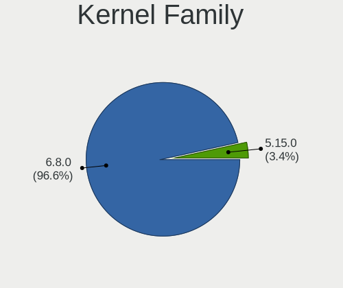
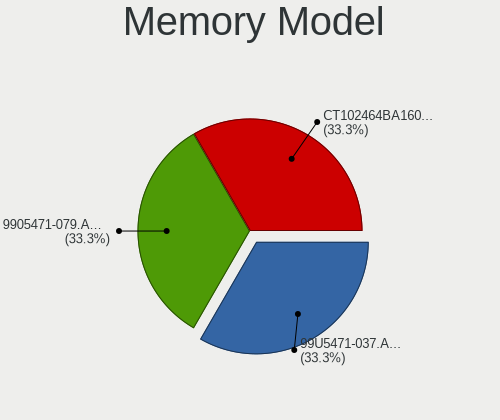
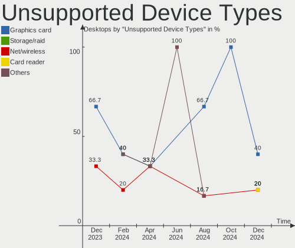

KDE neon - Hardware Trends (Desktops)
-------------------------------------

A project to identify most popular hardware characteristics and track their change
over time based on data collected by Linux users at https://Linux-Hardware.org.

Anyone can contribute to this report by the [hw-probe](https://github.com/linuxhw/hw-probe) tool:

    sudo -E hw-probe -all -upload

This report is for one last month. Overall report since the beginning of time: [TestCoverage](https://github.com/linuxhw/TestCoverage)

Period: Dec, 2022.

Contents
--------

* [ System ](#system)
  - [ OS                       ](#os)
  - [ OS Family                ](#os-family)
  - [ Kernel                   ](#kernel)
  - [ Kernel Family            ](#kernel-family)
  - [ Kernel Major Ver.        ](#kernel-major-ver)
  - [ Arch                     ](#arch)
  - [ DE                       ](#de)
  - [ Display Server           ](#display-server)
  - [ Display Manager          ](#display-manager)
  - [ OS Lang                  ](#os-lang)
  - [ Boot Mode                ](#boot-mode)
  - [ Filesystem               ](#filesystem)
  - [ Part. scheme             ](#part-scheme)
  - [ Dual Boot with Linux/BSD ](#dual-boot-with-linuxbsd)
  - [ Dual Boot (Win)          ](#dual-boot-win)

* [ Board ](#board)
  - [ Vendor                   ](#vendor)
  - [ Model                    ](#model)
  - [ Model Family             ](#model-family)
  - [ MFG Year                 ](#mfg-year)
  - [ Form Factor              ](#form-factor)
  - [ Secure Boot              ](#secure-boot)
  - [ Coreboot                 ](#coreboot)
  - [ RAM Size                 ](#ram-size)
  - [ RAM Used                 ](#ram-used)
  - [ Total Drives             ](#total-drives)
  - [ Has CD-ROM               ](#has-cd-rom)
  - [ Has Ethernet             ](#has-ethernet)
  - [ Has WiFi                 ](#has-wifi)
  - [ Has Bluetooth            ](#has-bluetooth)

* [ Location ](#location)
  - [ Country                  ](#country)
  - [ City                     ](#city)

* [ Drives ](#drives)
  - [ Drive Vendor             ](#drive-vendor)
  - [ Drive Model              ](#drive-model)
  - [ HDD Vendor               ](#hdd-vendor)
  - [ SSD Vendor               ](#ssd-vendor)
  - [ Drive Kind               ](#drive-kind)
  - [ Drive Connector          ](#drive-connector)
  - [ Drive Size               ](#drive-size)
  - [ Space Total              ](#space-total)
  - [ Space Used               ](#space-used)
  - [ Malfunc. Drives          ](#malfunc-drives)
  - [ Malfunc. Drive Vendor    ](#malfunc-drive-vendor)
  - [ Malfunc. HDD Vendor      ](#malfunc-hdd-vendor)
  - [ Malfunc. Drive Kind      ](#malfunc-drive-kind)
  - [ Failed Drives            ](#failed-drives)
  - [ Failed Drive Vendor      ](#failed-drive-vendor)
  - [ Drive Status             ](#drive-status)

* [ Storage controller ](#storage-controller)
  - [ Storage Vendor           ](#storage-vendor)
  - [ Storage Model            ](#storage-model)
  - [ Storage Kind             ](#storage-kind)

* [ Processor ](#processor)
  - [ CPU Vendor               ](#cpu-vendor)
  - [ CPU Model                ](#cpu-model)
  - [ CPU Model Family         ](#cpu-model-family)
  - [ CPU Cores                ](#cpu-cores)
  - [ CPU Sockets              ](#cpu-sockets)
  - [ CPU Threads              ](#cpu-threads)
  - [ CPU Op-Modes             ](#cpu-op-modes)
  - [ CPU Microcode            ](#cpu-microcode)
  - [ CPU Microarch            ](#cpu-microarch)

* [ Graphics ](#graphics)
  - [ GPU Vendor               ](#gpu-vendor)
  - [ GPU Model                ](#gpu-model)
  - [ GPU Combo                ](#gpu-combo)
  - [ GPU Driver               ](#gpu-driver)
  - [ GPU Memory               ](#gpu-memory)

* [ Monitor ](#monitor)
  - [ Monitor Vendor           ](#monitor-vendor)
  - [ Monitor Model            ](#monitor-model)
  - [ Monitor Resolution       ](#monitor-resolution)
  - [ Monitor Diagonal         ](#monitor-diagonal)
  - [ Monitor Width            ](#monitor-width)
  - [ Aspect Ratio             ](#aspect-ratio)
  - [ Monitor Area             ](#monitor-area)
  - [ Pixel Density            ](#pixel-density)
  - [ Multiple Monitors        ](#multiple-monitors)

* [ Network ](#network)
  - [ Net Controller Vendor    ](#net-controller-vendor)
  - [ Net Controller Model     ](#net-controller-model)
  - [ Wireless Vendor          ](#wireless-vendor)
  - [ Wireless Model           ](#wireless-model)
  - [ Ethernet Vendor          ](#ethernet-vendor)
  - [ Ethernet Model           ](#ethernet-model)
  - [ Net Controller Kind      ](#net-controller-kind)
  - [ Used Controller          ](#used-controller)
  - [ NICs                     ](#nics)
  - [ IPv6                     ](#ipv6)

* [ Bluetooth ](#bluetooth)
  - [ Bluetooth Vendor         ](#bluetooth-vendor)
  - [ Bluetooth Model          ](#bluetooth-model)

* [ Sound ](#sound)
  - [ Sound Vendor             ](#sound-vendor)
  - [ Sound Model              ](#sound-model)

* [ Memory ](#memory)
  - [ Memory Vendor            ](#memory-vendor)
  - [ Memory Model             ](#memory-model)
  - [ Memory Kind              ](#memory-kind)
  - [ Memory Form Factor       ](#memory-form-factor)
  - [ Memory Size              ](#memory-size)
  - [ Memory Speed             ](#memory-speed)

* [ Printers & scanners ](#printers--scanners)
  - [ Printer Vendor           ](#printer-vendor)
  - [ Printer Model            ](#printer-model)
  - [ Scanner Vendor           ](#scanner-vendor)
  - [ Scanner Model            ](#scanner-model)

* [ Camera ](#camera)
  - [ Camera Vendor            ](#camera-vendor)
  - [ Camera Model             ](#camera-model)

* [ Security ](#security)
  - [ Fingerprint Vendor       ](#fingerprint-vendor)
  - [ Fingerprint Model        ](#fingerprint-model)
  - [ Chipcard Vendor          ](#chipcard-vendor)
  - [ Chipcard Model           ](#chipcard-model)

* [ Unsupported ](#unsupported)
  - [ Unsupported Devices      ](#unsupported-devices)
  - [ Unsupported Device Types ](#unsupported-device-types)

System
------

OS
--

Installed operating systems

| Name           | Desktops | Percent |
|----------------|----------|---------|
| KDE neon 22.04 | 35       | 94.59%  |
| KDE neon 20.04 | 2        | 5.41%   |

OS Family
---------

OS without a version

| Name     | Desktops | Percent |
|----------|----------|---------|
| KDE neon | 37       | 100%    |

Kernel
------

Version of the Linux kernel

| Version                | Desktops | Percent |
|------------------------|----------|---------|
| 5.15.0-56-generic      | 32       | 86.49%  |
| 6.1.0-x64v3-xanmod1    | 1        | 2.7%    |
| 5.4.0-113-generic      | 1        | 2.7%    |
| 5.16.12-051612-generic | 1        | 2.7%    |
| 5.15.0-52-generic      | 1        | 2.7%    |
| 5.11.0-37-generic      | 1        | 2.7%    |

Kernel Family
-------------

Linux kernel without a distro release

| Version | Desktops | Percent |
|---------|----------|---------|
| 5.15.0  | 33       | 89.19%  |
| 6.1.0   | 1        | 2.7%    |
| 5.4.0   | 1        | 2.7%    |
| 5.16.12 | 1        | 2.7%    |
| 5.11.0  | 1        | 2.7%    |

Kernel Major Ver.
-----------------

Linux kernel major version

| Version | Desktops | Percent |
|---------|----------|---------|
| 5.15    | 33       | 89.19%  |
| 6.1     | 1        | 2.7%    |
| 5.4     | 1        | 2.7%    |
| 5.16    | 1        | 2.7%    |
| 5.11    | 1        | 2.7%    |

Arch
----

OS architecture (x86_64, i586, etc.)

| Name   | Desktops | Percent |
|--------|----------|---------|
| x86_64 | 37       | 100%    |

DE
--

Desktop Environment

| Name | Desktops | Percent |
|------|----------|---------|
| KDE5 | 37       | 100%    |

Display Server
--------------

X11 or Wayland

| Name | Desktops | Percent |
|------|----------|---------|
| X11  | 37       | 100%    |

Display Manager
---------------

SDDM, LightDM, etc.

| Name    | Desktops | Percent |
|---------|----------|---------|
| Unknown | 33       | 89.19%  |
| SDDM    | 4        | 10.81%  |

OS Lang
-------

Language

| Lang  | Desktops | Percent |
|-------|----------|---------|
| en_US | 14       | 37.84%  |
| de_DE | 5        | 13.51%  |
| en_GB | 4        | 10.81%  |
| es_MX | 3        | 8.11%   |
| it_IT | 2        | 5.41%   |
| en_CA | 2        | 5.41%   |
| tr_TR | 1        | 2.7%    |
| ru_RU | 1        | 2.7%    |
| es_ES | 1        | 2.7%    |
| es_EC | 1        | 2.7%    |
| en_ZA | 1        | 2.7%    |
| en_AU | 1        | 2.7%    |
| C     | 1        | 2.7%    |

Boot Mode
---------

EFI or BIOS

| Mode | Desktops | Percent |
|------|----------|---------|
| BIOS | 34       | 91.89%  |
| EFI  | 3        | 8.11%   |

Filesystem
----------

Type of filesystem

| Type    | Desktops | Percent |
|---------|----------|---------|
| Ext4    | 32       | 86.49%  |
| Btrfs   | 3        | 8.11%   |
| Overlay | 2        | 5.41%   |

Part. scheme
------------

Scheme of partitioning

| Type    | Desktops | Percent |
|---------|----------|---------|
| Unknown | 33       | 89.19%  |
| GPT     | 3        | 8.11%   |
| MBR     | 1        | 2.7%    |

Dual Boot with Linux/BSD
------------------------

Hosting more than one Linux/BSD

| Dual boot | Desktops | Percent |
|-----------|----------|---------|
| No        | 36       | 97.3%   |
| Yes       | 1        | 2.7%    |

Dual Boot (Win)
---------------

Hosting Linux and Windows

| Dual boot | Desktops | Percent |
|-----------|----------|---------|
| No        | 34       | 91.89%  |
| Yes       | 3        | 8.11%   |

Board
-----

Vendor
------

Motherboard manufacturer

| Name                | Desktops | Percent |
|---------------------|----------|---------|
| ASUSTek Computer    | 9        | 24.32%  |
| MSI                 | 8        | 21.62%  |
| Gigabyte Technology | 6        | 16.22%  |
| Hewlett-Packard     | 3        | 8.11%   |
| Dell                | 3        | 8.11%   |
| Lenovo              | 2        | 5.41%   |
| Biostar             | 2        | 5.41%   |
| ASRock              | 2        | 5.41%   |
| Alienware           | 1        | 2.7%    |
| Acer                | 1        | 2.7%    |

Model
-----

Motherboard model

| Name                              | Desktops | Percent |
|-----------------------------------|----------|---------|
| ASUS All Series                   | 2        | 5.41%   |
| MSI MS-7D76                       | 1        | 2.7%    |
| MSI MS-7C56                       | 1        | 2.7%    |
| MSI MS-7B93                       | 1        | 2.7%    |
| MSI MS-7B84                       | 1        | 2.7%    |
| MSI MS-7B78                       | 1        | 2.7%    |
| MSI MS-7A38                       | 1        | 2.7%    |
| MSI MS-7918                       | 1        | 2.7%    |
| MSI MS-7885                       | 1        | 2.7%    |
| Lenovo ThinkCentre M91p 7033H45   | 1        | 2.7%    |
| Lenovo ThinkCentre E73 10AU003JUK | 1        | 2.7%    |
| HP Z400 Workstation               | 1        | 2.7%    |
| HP EliteDesk 800 G1 TWR           | 1        | 2.7%    |
| HP 100B All-in-One PC             | 1        | 2.7%    |
| Gigabyte Z77M-D3H                 | 1        | 2.7%    |
| Gigabyte Z170XP-SLI               | 1        | 2.7%    |
| Gigabyte M68MT-S2P                | 1        | 2.7%    |
| Gigabyte B85M-DS3H-A              | 1        | 2.7%    |
| Gigabyte ALDA+                    | 1        | 2.7%    |
| Gigabyte 970-GAMING               | 1        | 2.7%    |
| Dell OptiPlex 5040                | 1        | 2.7%    |
| Dell OptiPlex 380                 | 1        | 2.7%    |
| Dell Inspiron 3650                | 1        | 2.7%    |
| Biostar H61MGV                    | 1        | 2.7%    |
| Biostar A10N-9630E                | 1        | 2.7%    |
| ASUS ROG CROSSHAIR VI EXTREME     | 1        | 2.7%    |
| ASUS PRIME X370-PRO               | 1        | 2.7%    |
| ASUS PRIME H310M-R R2.0           | 1        | 2.7%    |
| ASUS PRIME B450-PLUS              | 1        | 2.7%    |
| ASUS P8Z77-V LK                   | 1        | 2.7%    |
| ASUS P5KPL-AM EPU                 | 1        | 2.7%    |
| ASUS E410                         | 1        | 2.7%    |
| ASRock Z77 Extreme4               | 1        | 2.7%    |
| ASRock A320M-DGS                  | 1        | 2.7%    |
| Alienware Aurora-R4               | 1        | 2.7%    |
| Acer Aspire XC-885                | 1        | 2.7%    |

Model Family
------------

Motherboard model prefix

| Name                 | Desktops | Percent |
|----------------------|----------|---------|
| ASUS PRIME           | 3        | 8.11%   |
| Lenovo ThinkCentre   | 2        | 5.41%   |
| Dell OptiPlex        | 2        | 5.41%   |
| ASUS All             | 2        | 5.41%   |
| MSI MS-7D76          | 1        | 2.7%    |
| MSI MS-7C56          | 1        | 2.7%    |
| MSI MS-7B93          | 1        | 2.7%    |
| MSI MS-7B84          | 1        | 2.7%    |
| MSI MS-7B78          | 1        | 2.7%    |
| MSI MS-7A38          | 1        | 2.7%    |
| MSI MS-7918          | 1        | 2.7%    |
| MSI MS-7885          | 1        | 2.7%    |
| HP Z400              | 1        | 2.7%    |
| HP EliteDesk         | 1        | 2.7%    |
| HP 100B              | 1        | 2.7%    |
| Gigabyte Z77M-D3H    | 1        | 2.7%    |
| Gigabyte Z170XP-SLI  | 1        | 2.7%    |
| Gigabyte M68MT-S2P   | 1        | 2.7%    |
| Gigabyte B85M-DS3H-A | 1        | 2.7%    |
| Gigabyte ALDA+       | 1        | 2.7%    |
| Gigabyte 970-GAMING  | 1        | 2.7%    |
| Dell Inspiron        | 1        | 2.7%    |
| Biostar H61MGV       | 1        | 2.7%    |
| Biostar A10N-9630E   | 1        | 2.7%    |
| ASUS ROG             | 1        | 2.7%    |
| ASUS P8Z77-V         | 1        | 2.7%    |
| ASUS P5KPL-AM        | 1        | 2.7%    |
| ASUS E410            | 1        | 2.7%    |
| ASRock Z77           | 1        | 2.7%    |
| ASRock A320M-DGS     | 1        | 2.7%    |
| Alienware Aurora-R4  | 1        | 2.7%    |
| Acer Aspire          | 1        | 2.7%    |

MFG Year
--------

Motherboard manufacture year

| Year | Desktops | Percent |
|------|----------|---------|
| 2018 | 7        | 18.92%  |
| 2012 | 5        | 13.51%  |
| 2015 | 4        | 10.81%  |
| 2014 | 4        | 10.81%  |
| 2017 | 3        | 8.11%   |
| 2013 | 3        | 8.11%   |
| 2009 | 3        | 8.11%   |
| 2019 | 2        | 5.41%   |
| 2011 | 2        | 5.41%   |
| 2022 | 1        | 2.7%    |
| 2020 | 1        | 2.7%    |
| 2016 | 1        | 2.7%    |
| 2010 | 1        | 2.7%    |

Form Factor
-----------

Physical design of the computer

| Name    | Desktops | Percent |
|---------|----------|---------|
| Desktop | 37       | 100%    |

Secure Boot
-----------

Enabled or disabled

| State    | Desktops | Percent |
|----------|----------|---------|
| Disabled | 36       | 97.3%   |
| Enabled  | 1        | 2.7%    |

Coreboot
--------

Have coreboot on board

| Used | Desktops | Percent |
|------|----------|---------|
| No   | 37       | 100%    |

RAM Size
--------

Total RAM memory

| Size in GB  | Desktops | Percent |
|-------------|----------|---------|
| 16.01-24.0  | 11       | 29.73%  |
| 32.01-64.0  | 8        | 21.62%  |
| 8.01-16.0   | 7        | 18.92%  |
| 4.01-8.0    | 5        | 13.51%  |
| 3.01-4.0    | 3        | 8.11%   |
| 24.01-32.0  | 2        | 5.41%   |
| 64.01-256.0 | 1        | 2.7%    |

RAM Used
--------

Used RAM memory

| Used GB  | Desktops | Percent |
|----------|----------|---------|
| 1.01-2.0 | 12       | 32.43%  |
| 2.01-3.0 | 10       | 27.03%  |
| 3.01-4.0 | 8        | 21.62%  |
| 4.01-8.0 | 7        | 18.92%  |

Total Drives
------------

Number of drives on board

| Drives | Desktops | Percent |
|--------|----------|---------|
| 2      | 13       | 35.14%  |
| 1      | 12       | 32.43%  |
| 4      | 6        | 16.22%  |
| 3      | 4        | 10.81%  |
| 5      | 2        | 5.41%   |

Has CD-ROM
----------

Has CD-ROM on board

| Presented | Desktops | Percent |
|-----------|----------|---------|
| Yes       | 20       | 54.05%  |
| No        | 17       | 45.95%  |

Has Ethernet
------------

Has Ethernet on board

| Presented | Desktops | Percent |
|-----------|----------|---------|
| Yes       | 37       | 100%    |

Has WiFi
--------

Has WiFi module

| Presented | Desktops | Percent |
|-----------|----------|---------|
| Yes       | 19       | 51.35%  |
| No        | 18       | 48.65%  |

Has Bluetooth
-------------

Has Bluetooth module

| Presented | Desktops | Percent |
|-----------|----------|---------|
| No        | 23       | 62.16%  |
| Yes       | 14       | 37.84%  |

Location
--------

Country
-------

Geographic location (country)

| Country      | Desktops | Percent |
|--------------|----------|---------|
| USA          | 9        | 24.32%  |
| Germany      | 5        | 13.51%  |
| UK           | 3        | 8.11%   |
| Italy        | 3        | 8.11%   |
| Mexico       | 2        | 5.41%   |
| Canada       | 2        | 5.41%   |
| Australia    | 2        | 5.41%   |
| Turkey       | 1        | 2.7%    |
| Sweden       | 1        | 2.7%    |
| Spain        | 1        | 2.7%    |
| South Africa | 1        | 2.7%    |
| Russia       | 1        | 2.7%    |
| Netherlands  | 1        | 2.7%    |
| Finland      | 1        | 2.7%    |
| El Salvador  | 1        | 2.7%    |
| Ecuador      | 1        | 2.7%    |
| Brazil       | 1        | 2.7%    |
| Belarus      | 1        | 2.7%    |

City
----

Geographic location (city)

| City         | Desktops | Percent |
|--------------|----------|---------|
| Brisbane     | 2        | 5.41%   |
| Zapopan      | 1        | 2.7%    |
| Ypsilanti    | 1        | 2.7%    |
| Waren        | 1        | 2.7%    |
| Vohenstrauss | 1        | 2.7%    |
| Valencia     | 1        | 2.7%    |
| Tuscola      | 1        | 2.7%    |
| The Hague    | 1        | 2.7%    |
| Stockholm    | 1        | 2.7%    |
| San Salvador | 1        | 2.7%    |
| Pontiac      | 1        | 2.7%    |
| Plainfield   | 1        | 2.7%    |
| Phoenix      | 1        | 2.7%    |
| Neuss        | 1        | 2.7%    |
| Modena       | 1        | 2.7%    |
| Minsk        | 1        | 2.7%    |
| Milan        | 1        | 2.7%    |
| Krasnodar    | 1        | 2.7%    |
| Karaman      | 1        | 2.7%    |
| Johannesburg | 1        | 2.7%    |
| Jackson      | 1        | 2.7%    |
| Hurst        | 1        | 2.7%    |
| Huntingdon   | 1        | 2.7%    |
| Helsinki     | 1        | 2.7%    |
| Hazelton     | 1        | 2.7%    |
| Guayaquil    | 1        | 2.7%    |
| Guadalajara  | 1        | 2.7%    |
| Exeter       | 1        | 2.7%    |
| Erith        | 1        | 2.7%    |
| Brossard     | 1        | 2.7%    |
| Bristol      | 1        | 2.7%    |
| Bremen       | 1        | 2.7%    |
| Boise        | 1        | 2.7%    |
| Berlin       | 1        | 2.7%    |
| Belém       | 1        | 2.7%    |
| Adrano       | 1        | 2.7%    |

Drives
------

Drive Vendor
------------

Hard drive vendors

| Vendor              | Desktops | Drives | Percent |
|---------------------|----------|--------|---------|
| WDC                 | 11       | 15     | 15.07%  |
| Seagate             | 11       | 13     | 15.07%  |
| Samsung Electronics | 9        | 10     | 12.33%  |
| Toshiba             | 6        | 8      | 8.22%   |
| Sandisk             | 6        | 6      | 8.22%   |
| Crucial             | 6        | 7      | 8.22%   |
| Phison Electronics  | 3        | 3      | 4.11%   |
| Kingston            | 3        | 3      | 4.11%   |
| A-DATA Technology   | 3        | 3      | 4.11%   |
| Hitachi             | 2        | 3      | 2.74%   |
| TO Exter            | 1        | 1      | 1.37%   |
| Team                | 1        | 1      | 1.37%   |
| PNY                 | 1        | 1      | 1.37%   |
| Plextor             | 1        | 1      | 1.37%   |
| Pioneer             | 1        | 1      | 1.37%   |
| OYUNKEY             | 1        | 1      | 1.37%   |
| Micron Technology   | 1        | 1      | 1.37%   |
| Intenso             | 1        | 1      | 1.37%   |
| Intel               | 1        | 1      | 1.37%   |
| HS-SSD-C100         | 1        | 1      | 1.37%   |
| Gigabyte Technology | 1        | 1      | 1.37%   |
| China               | 1        | 1      | 1.37%   |
| Apacer              | 1        | 1      | 1.37%   |

Drive Model
-----------

Hard drive models

| Model                                               | Desktops | Percent |
|-----------------------------------------------------|----------|---------|
| Toshiba DT01ACA050 500GB                            | 2        | 2.5%    |
| Sandisk WD Blue SN550 NVMe SSD 500GB                | 2        | 2.5%    |
| Samsung SSD 860 EVO 500GB                           | 2        | 2.5%    |
| Samsung NVMe SSD Controller SM981/PM981/PM983 500GB | 2        | 2.5%    |
| Kingston SA400S37240G 240GB SSD                     | 2        | 2.5%    |
| WDC WDS100T1R0B-68A4Z0 1TB SSD                      | 1        | 1.25%   |
| WDC WD800BB-22JHA0 80GB                             | 1        | 1.25%   |
| WDC WD6400AARS-00Y5B1 640GB                         | 1        | 1.25%   |
| WDC WD6400AAKS-22A7B0 640GB                         | 1        | 1.25%   |
| WDC WD40EZAZ-00SF3B0 4TB                            | 1        | 1.25%   |
| WDC WD20EZRZ-00Z5HB0 2TB                            | 1        | 1.25%   |
| WDC WD20EARX-00PASB0 2TB                            | 1        | 1.25%   |
| WDC WD2003FYYS-02W0B0 2TB                           | 1        | 1.25%   |
| WDC WD1600BEKT-00PVMT0 160GB                        | 1        | 1.25%   |
| WDC WD140EDGZ-11B1PA0 14TB                          | 1        | 1.25%   |
| WDC WD10SPZX-75Z10T2 1TB                            | 1        | 1.25%   |
| WDC WD10EZEX-75WN4A1 1TB                            | 1        | 1.25%   |
| WDC WD10EZEX-08WN4A0 1TB                            | 1        | 1.25%   |
| WDC WD Blue SA510 2.5 500GB                         | 1        | 1.25%   |
| Toshiba HDWD130 3TB                                 | 1        | 1.25%   |
| Toshiba HDWD110 1TB                                 | 1        | 1.25%   |
| Toshiba DT01ACA200 2TB                              | 1        | 1.25%   |
| Toshiba DT01ACA100 1TB                              | 1        | 1.25%   |
| TO Exter nal USB 3.0 512GB                          | 1        | 1.25%   |
| Team T253512GB SSD                                  | 1        | 1.25%   |
| Seagate ST9120823AS 120GB                           | 1        | 1.25%   |
| Seagate ST5000LM000-2AN170 5TB                      | 1        | 1.25%   |
| Seagate ST32000645NS 2TB                            | 1        | 1.25%   |
| Seagate ST3000DM008-2DM166 3TB                      | 1        | 1.25%   |
| Seagate ST2000VM003-1CT164 2TB                      | 1        | 1.25%   |
| Seagate ST2000LM007-1R8174 2TB                      | 1        | 1.25%   |
| Seagate ST2000DM008-2FR102 2TB                      | 1        | 1.25%   |
| Seagate ST2000DM006-2DM164 2TB                      | 1        | 1.25%   |
| Seagate ST1000DM003-9YN162 1TB                      | 1        | 1.25%   |
| Seagate ST1000DM003-1CH162 1TB                      | 1        | 1.25%   |
| Seagate Expansion Desk 5TB                          | 1        | 1.25%   |
| Seagate BUP BL 4TB                                  | 1        | 1.25%   |
| Sandisk WD_BLACK SN770 1TB                          | 1        | 1.25%   |
| SanDisk SSD PLUS 1000GB                             | 1        | 1.25%   |
| SanDisk SDSSDH3250G 250GB                           | 1        | 1.25%   |

HDD Vendor
----------

Hard disk drive vendors

| Vendor              | Desktops | Drives | Percent |
|---------------------|----------|--------|---------|
| Seagate             | 11       | 13     | 35.48%  |
| WDC                 | 10       | 13     | 32.26%  |
| Toshiba             | 6        | 8      | 19.35%  |
| Hitachi             | 2        | 3      | 6.45%   |
| Samsung Electronics | 1        | 1      | 3.23%   |
| Pioneer             | 1        | 1      | 3.23%   |

SSD Vendor
----------

Solid state drive vendors

| Vendor              | Desktops | Drives | Percent |
|---------------------|----------|--------|---------|
| Samsung Electronics | 5        | 6      | 17.24%  |
| Crucial             | 5        | 6      | 17.24%  |
| A-DATA Technology   | 3        | 3      | 10.34%  |
| WDC                 | 2        | 2      | 6.9%    |
| SanDisk             | 2        | 2      | 6.9%    |
| Kingston            | 2        | 2      | 6.9%    |
| TO Exter            | 1        | 1      | 3.45%   |
| Team                | 1        | 1      | 3.45%   |
| PNY                 | 1        | 1      | 3.45%   |
| Plextor             | 1        | 1      | 3.45%   |
| Micron Technology   | 1        | 1      | 3.45%   |
| Intenso             | 1        | 1      | 3.45%   |
| Intel               | 1        | 1      | 3.45%   |
| Gigabyte Technology | 1        | 1      | 3.45%   |
| China               | 1        | 1      | 3.45%   |
| Apacer              | 1        | 1      | 3.45%   |

Drive Kind
----------

HDD or SSD

| Kind    | Desktops | Drives | Percent |
|---------|----------|--------|---------|
| HDD     | 26       | 39     | 42.62%  |
| SSD     | 23       | 31     | 37.7%   |
| NVMe    | 10       | 12     | 16.39%  |
| Unknown | 2        | 2      | 3.28%   |

Drive Connector
---------------

SATA, SAS, NVMe, etc.

| Type | Desktops | Drives | Percent |
|------|----------|--------|---------|
| SATA | 35       | 69     | 72.92%  |
| NVMe | 10       | 12     | 20.83%  |
| SAS  | 3        | 3      | 6.25%   |

Drive Size
----------

Size of hard drive

| Size in TB | Desktops | Drives | Percent |
|------------|----------|--------|---------|
| 0.01-0.5   | 24       | 31     | 44.44%  |
| 0.51-1.0   | 12       | 19     | 22.22%  |
| 1.01-2.0   | 9        | 11     | 16.67%  |
| 3.01-4.0   | 3        | 3      | 5.56%   |
| 2.01-3.0   | 3        | 3      | 5.56%   |
| 4.01-10.0  | 2        | 2      | 3.7%    |
| 10.01-20.0 | 1        | 1      | 1.85%   |

Space Total
-----------

Amount of disk space available on the file system

| Size in GB     | Desktops | Percent |
|----------------|----------|---------|
| 251-500        | 7        | 18.92%  |
| 101-250        | 6        | 16.22%  |
| 51-100         | 6        | 16.22%  |
| 1001-2000      | 5        | 13.51%  |
| 501-1000       | 5        | 13.51%  |
| More than 3000 | 4        | 10.81%  |
| 1-20           | 2        | 5.41%   |
| Unknown        | 2        | 5.41%   |

Space Used
----------

Amount of used disk space

| Used GB        | Desktops | Percent |
|----------------|----------|---------|
| 1-20           | 14       | 37.84%  |
| 21-50          | 8        | 21.62%  |
| 51-100         | 4        | 10.81%  |
| 101-250        | 3        | 8.11%   |
| More than 3000 | 2        | 5.41%   |
| 1001-2000      | 2        | 5.41%   |
| Unknown        | 2        | 5.41%   |
| 2001-3000      | 1        | 2.7%    |
| 501-1000       | 1        | 2.7%    |

Malfunc. Drives
---------------

Drive models with a malfunction

| Model                          | Desktops | Drives | Percent |
|--------------------------------|----------|--------|---------|
| Seagate ST5000LM000-2AN170 5TB | 1        | 1      | 100%    |

Malfunc. Drive Vendor
---------------------

Vendors of faulty drives

| Vendor  | Desktops | Drives | Percent |
|---------|----------|--------|---------|
| Seagate | 1        | 1      | 100%    |

Malfunc. HDD Vendor
-------------------

Vendors of faulty HDD drives

| Vendor  | Desktops | Drives | Percent |
|---------|----------|--------|---------|
| Seagate | 1        | 1      | 100%    |

Malfunc. Drive Kind
-------------------

Kinds of faulty drives

| Kind | Desktops | Drives | Percent |
|------|----------|--------|---------|
| HDD  | 1        | 1      | 100%    |

Failed Drives
-------------

Failed drive models

Zero info for selected period =(

Failed Drive Vendor
-------------------

Failed drive vendors

Zero info for selected period =(

Drive Status
------------

Number of failed and malfunc. drives

| Status   | Desktops | Drives | Percent |
|----------|----------|--------|---------|
| Detected | 35       | 79     | 89.74%  |
| Works    | 3        | 4      | 7.69%   |
| Malfunc  | 1        | 1      | 2.56%   |

Storage controller
------------------

Storage Vendor
--------------

Storage controller vendors

| Vendor                      | Desktops | Percent |
|-----------------------------|----------|---------|
| Intel                       | 23       | 43.4%   |
| AMD                         | 13       | 24.53%  |
| SanDisk                     | 4        | 7.55%   |
| ASMedia Technology          | 4        | 7.55%   |
| Samsung Electronics         | 3        | 5.66%   |
| Phison Electronics          | 3        | 5.66%   |
| Nvidia                      | 1        | 1.89%   |
| Micron/Crucial Technology   | 1        | 1.89%   |
| Kingston Technology Company | 1        | 1.89%   |

Storage Model
-------------

Storage controller models

| Model                                                                            | Desktops | Percent |
|----------------------------------------------------------------------------------|----------|---------|
| AMD FCH SATA Controller [AHCI mode]                                              | 9        | 14.75%  |
| Intel 8 Series/C220 Series Chipset Family 6-port SATA Controller 1 [AHCI mode]   | 5        | 8.2%    |
| ASMedia ASM1062 Serial ATA Controller                                            | 4        | 6.56%   |
| AMD 400 Series Chipset SATA Controller                                           | 4        | 6.56%   |
| Intel Q170/Q150/B150/H170/H110/Z170/CM236 Chipset SATA Controller [AHCI Mode]    | 3        | 4.92%   |
| Intel 7 Series/C210 Series Chipset Family 6-port SATA Controller [AHCI mode]     | 3        | 4.92%   |
| SanDisk WD Blue SN550 NVMe SSD                                                   | 2        | 3.28%   |
| SanDisk Non-Volatile memory controller                                           | 2        | 3.28%   |
| Samsung NVMe SSD Controller SM981/PM981/PM983                                    | 2        | 3.28%   |
| Intel SATA Controller [RAID mode]                                                | 2        | 3.28%   |
| Intel NM10/ICH7 Family SATA Controller [IDE mode]                                | 2        | 3.28%   |
| Intel 9 Series Chipset Family SATA Controller [AHCI Mode]                        | 2        | 3.28%   |
| Intel 6 Series/C200 Series Chipset Family 6 port Desktop SATA AHCI Controller    | 2        | 3.28%   |
| AMD X370 Series Chipset SATA Controller                                          | 2        | 3.28%   |
| AMD SB7x0/SB8x0/SB9x0 SATA Controller [AHCI mode]                                | 2        | 3.28%   |
| Samsung Electronics Non-Volatile memory controller                               | 1        | 1.64%   |
| Phison PS5013 E13 NVMe Controller                                                | 1        | 1.64%   |
| Phison E16 PCIe4 NVMe Controller                                                 | 1        | 1.64%   |
| Phison E12 NVMe Controller                                                       | 1        | 1.64%   |
| Nvidia MCP61 SATA Controller                                                     | 1        | 1.64%   |
| Micron/Crucial P2 NVMe PCIe SSD                                                  | 1        | 1.64%   |
| Kingston Company SNVS2000G [NV1 NVMe PCIe SSD 2TB]                               | 1        | 1.64%   |
| Intel C610/X99 series chipset 6-Port SATA Controller [AHCI mode]                 | 1        | 1.64%   |
| Intel C600/X79 series chipset 6-Port SATA AHCI Controller                        | 1        | 1.64%   |
| Intel Atom/Celeron/Pentium Processor x5-E8000/J3xxx/N3xxx Series SATA Controller | 1        | 1.64%   |
| Intel 82801G (ICH7 Family) IDE Controller                                        | 1        | 1.64%   |
| Intel 200 Series PCH SATA controller [AHCI mode]                                 | 1        | 1.64%   |
| AMD SATA controller                                                              | 1        | 1.64%   |
| AMD FCH SATA Controller D                                                        | 1        | 1.64%   |
| AMD FCH RAID Controller                                                          | 1        | 1.64%   |

Storage Kind
------------

Kind of storage controller (IDE, SATA, NVMe, SAS, ...)

| Kind | Desktops | Percent |
|------|----------|---------|
| SATA | 31       | 65.96%  |
| NVMe | 10       | 21.28%  |
| RAID | 3        | 6.38%   |
| IDE  | 3        | 6.38%   |

Processor
---------

CPU Vendor
----------

Processor vendors

| Vendor | Desktops | Percent |
|--------|----------|---------|
| Intel  | 23       | 62.16%  |
| AMD    | 14       | 37.84%  |

CPU Model
---------

Processor models

| Model                                           | Desktops | Percent |
|-------------------------------------------------|----------|---------|
| Intel Core i7-4770 CPU @ 3.40GHz                | 2        | 5.41%   |
| AMD Ryzen 5 2600 Six-Core Processor             | 2        | 5.41%   |
| AMD Ryzen 5 1600 Six-Core Processor             | 2        | 5.41%   |
| Intel Xeon CPU W3565 @ 3.20GHz                  | 1        | 2.7%    |
| Intel Pentium Dual-Core CPU E5400 @ 2.70GHz     | 1        | 2.7%    |
| Intel Pentium CPU G3220 @ 3.00GHz               | 1        | 2.7%    |
| Intel Core i7-9700F CPU @ 3.00GHz               | 1        | 2.7%    |
| Intel Core i7-6700 CPU @ 3.40GHz                | 1        | 2.7%    |
| Intel Core i7-5820K CPU @ 3.30GHz               | 1        | 2.7%    |
| Intel Core i7-4790K CPU @ 4.00GHz               | 1        | 2.7%    |
| Intel Core i7-3820 CPU @ 3.60GHz                | 1        | 2.7%    |
| Intel Core i5-6600K CPU @ 3.50GHz               | 1        | 2.7%    |
| Intel Core i5-6600 CPU @ 3.30GHz                | 1        | 2.7%    |
| Intel Core i5-4690 CPU @ 3.50GHz                | 1        | 2.7%    |
| Intel Core i5-4460 CPU @ 3.20GHz                | 1        | 2.7%    |
| Intel Core i5-3570K CPU @ 3.40GHz               | 1        | 2.7%    |
| Intel Core i5-3550 CPU @ 3.30GHz                | 1        | 2.7%    |
| Intel Core i5-3350P CPU @ 3.10GHz               | 1        | 2.7%    |
| Intel Core i5-2400 CPU @ 3.10GHz                | 1        | 2.7%    |
| Intel Core i3-8100 CPU @ 3.60GHz                | 1        | 2.7%    |
| Intel Core i3-4160 CPU @ 3.60GHz                | 1        | 2.7%    |
| Intel Core i3-3220 CPU @ 3.30GHz                | 1        | 2.7%    |
| Intel Core 2 Duo CPU E7500 @ 2.93GHz            | 1        | 2.7%    |
| Intel Celeron CPU N3150 @ 1.60GHz               | 1        | 2.7%    |
| AMD Ryzen 9 7900X 12-Core Processor             | 1        | 2.7%    |
| AMD Ryzen 7 5700X 8-Core Processor              | 1        | 2.7%    |
| AMD Ryzen 7 2700X Eight-Core Processor          | 1        | 2.7%    |
| AMD Ryzen 5 2600X Six-Core Processor            | 1        | 2.7%    |
| AMD Ryzen 5 2400G with Radeon Vega Graphics     | 1        | 2.7%    |
| AMD Ryzen 3 3100 4-Core Processor               | 1        | 2.7%    |
| AMD FX-8370E Eight-Core Processor               | 1        | 2.7%    |
| AMD E-350 Processor                             | 1        | 2.7%    |
| AMD Athlon II X2 270 Processor                  | 1        | 2.7%    |
| AMD A10-9630P RADEON R5, 10 COMPUTE CORES 4C+6G | 1        | 2.7%    |

CPU Model Family
----------------

Processor model prefix

| Model                   | Desktops | Percent |
|-------------------------|----------|---------|
| Intel Core i5           | 8        | 21.62%  |
| Intel Core i7           | 7        | 18.92%  |
| AMD Ryzen 5             | 6        | 16.22%  |
| Intel Core i3           | 3        | 8.11%   |
| AMD Ryzen 7             | 2        | 5.41%   |
| Intel Xeon              | 1        | 2.7%    |
| Intel Pentium Dual-Core | 1        | 2.7%    |
| Intel Pentium           | 1        | 2.7%    |
| Intel Core 2 Duo        | 1        | 2.7%    |
| Intel Celeron           | 1        | 2.7%    |
| AMD Ryzen 9             | 1        | 2.7%    |
| AMD Ryzen 3             | 1        | 2.7%    |
| AMD FX                  | 1        | 2.7%    |
| AMD E                   | 1        | 2.7%    |
| AMD Athlon II X2        | 1        | 2.7%    |
| AMD A10                 | 1        | 2.7%    |

CPU Cores
---------

Number of processor cores

| Number | Desktops | Percent |
|--------|----------|---------|
| 4      | 19       | 51.35%  |
| 2      | 8        | 21.62%  |
| 6      | 6        | 16.22%  |
| 8      | 3        | 8.11%   |
| 12     | 1        | 2.7%    |

CPU Sockets
-----------

Number of sockets

| Number | Desktops | Percent |
|--------|----------|---------|
| 1      | 37       | 100%    |

CPU Threads
-----------

Threads per core (Hyper-Threading)

| Number | Desktops | Percent |
|--------|----------|---------|
| 2      | 21       | 56.76%  |
| 1      | 16       | 43.24%  |

CPU Op-Modes
------------

CPU Operation Modes (32-bit, 64-bit)

| Op mode        | Desktops | Percent |
|----------------|----------|---------|
| 32-bit, 64-bit | 37       | 100%    |

CPU Microcode
-------------

Microcode number

| Number     | Desktops | Percent |
|------------|----------|---------|
| Unknown    | 29       | 78.38%  |
| 0x906eb    | 1        | 2.7%    |
| 0x306f2    | 1        | 2.7%    |
| 0x306c3    | 1        | 2.7%    |
| 0x0a601201 | 1        | 2.7%    |
| 0x08101016 | 1        | 2.7%    |
| 0x0800820d | 1        | 2.7%    |
| 0x08001138 | 1        | 2.7%    |
| 0x06000852 | 1        | 2.7%    |

CPU Microarch
-------------

Microarchitecture

| Name        | Desktops | Percent |
|-------------|----------|---------|
| Haswell     | 8        | 21.62%  |
| Zen+        | 4        | 10.81%  |
| IvyBridge   | 4        | 10.81%  |
| Zen         | 3        | 8.11%   |
| Skylake     | 3        | 8.11%   |
| SandyBridge | 2        | 5.41%   |
| Penryn      | 2        | 5.41%   |
| KabyLake    | 2        | 5.41%   |
| Zen 3       | 1        | 2.7%    |
| Zen 2       | 1        | 2.7%    |
| Silvermont  | 1        | 2.7%    |
| Piledriver  | 1        | 2.7%    |
| Nehalem     | 1        | 2.7%    |
| K10         | 1        | 2.7%    |
| Excavator   | 1        | 2.7%    |
| Bobcat      | 1        | 2.7%    |
| Unknown     | 1        | 2.7%    |

Graphics
--------

GPU Vendor
----------

Vendors of graphics cards

| Vendor | Desktops | Percent |
|--------|----------|---------|
| Nvidia | 16       | 41.03%  |
| Intel  | 13       | 33.33%  |
| AMD    | 10       | 25.64%  |

GPU Model
---------

Graphics card models

| Model                                                                                    | Desktops | Percent |
|------------------------------------------------------------------------------------------|----------|---------|
| Intel Xeon E3-1200 v3/4th Gen Core Processor Integrated Graphics Controller              | 3        | 7.69%   |
| Nvidia GP104 [GeForce GTX 1080]                                                          | 2        | 5.13%   |
| Intel Xeon E3-1200 v2/3rd Gen Core processor Graphics Controller                         | 2        | 5.13%   |
| Intel HD Graphics 530                                                                    | 2        | 5.13%   |
| AMD Ellesmere [Radeon RX 470/480/570/570X/580/580X/590]                                  | 2        | 5.13%   |
| Nvidia TU116 [GeForce GTX 1650 SUPER]                                                    | 1        | 2.56%   |
| Nvidia TU106 [GeForce RTX 2060 Rev. A]                                                   | 1        | 2.56%   |
| Nvidia TU104 [GeForce RTX 2080 SUPER]                                                    | 1        | 2.56%   |
| Nvidia TU104 [GeForce RTX 2070 SUPER]                                                    | 1        | 2.56%   |
| Nvidia GP108 [GeForce GT 1030]                                                           | 1        | 2.56%   |
| Nvidia GP107 [GeForce GTX 1050]                                                          | 1        | 2.56%   |
| Nvidia GP107 [GeForce GTX 1050 Ti]                                                       | 1        | 2.56%   |
| Nvidia GM206 [GeForce GTX 960]                                                           | 1        | 2.56%   |
| Nvidia GM204 [GeForce GTX 970]                                                           | 1        | 2.56%   |
| Nvidia GK208B [GeForce GT 720]                                                           | 1        | 2.56%   |
| Nvidia GK208B [GeForce GT 710]                                                           | 1        | 2.56%   |
| Nvidia GK106 [GeForce GTX 650 Ti]                                                        | 1        | 2.56%   |
| Nvidia GK104 [GeForce GTX 760]                                                           | 1        | 2.56%   |
| Nvidia GF119 [NVS 315]                                                                   | 1        | 2.56%   |
| Intel IvyBridge GT2 [HD Graphics 4000]                                                   | 1        | 2.56%   |
| Intel CoffeeLake-S GT2 [UHD Graphics 630]                                                | 1        | 2.56%   |
| Intel Atom/Celeron/Pentium Processor x5-E8000/J3xxx/N3xxx Integrated Graphics Controller | 1        | 2.56%   |
| Intel 4th Generation Core Processor Family Integrated Graphics Controller                | 1        | 2.56%   |
| Intel 4 Series Chipset Integrated Graphics Controller                                    | 1        | 2.56%   |
| Intel 2nd Generation Core Processor Family Integrated Graphics Controller                | 1        | 2.56%   |
| AMD Wrestler [Radeon HD 6310]                                                            | 1        | 2.56%   |
| AMD Wani [Radeon R5/R6/R7 Graphics]                                                      | 1        | 2.56%   |
| AMD Tobago PRO [Radeon R7 360 / R9 360 OEM]                                              | 1        | 2.56%   |
| AMD RV670 [Radeon HD 3690/3850]                                                          | 1        | 2.56%   |
| AMD Raphael                                                                              | 1        | 2.56%   |
| AMD Park [Mobility Radeon HD 5430]                                                       | 1        | 2.56%   |
| AMD Navi 23 [Radeon RX 6600/6600 XT/6600M]                                               | 1        | 2.56%   |
| AMD Navi 22 [Radeon RX 6700/6700 XT/6750 XT / 6800M]                                     | 1        | 2.56%   |

GPU Combo
---------

Combinations of graphics cards

| Name       | Desktops | Percent |
|------------|----------|---------|
| 1 x Nvidia | 16       | 43.24%  |
| 1 x Intel  | 11       | 29.73%  |
| 1 x AMD    | 10       | 27.03%  |

GPU Driver
----------

Free vs proprietary

| Driver      | Desktops | Percent |
|-------------|----------|---------|
| Free        | 32       | 86.49%  |
| Proprietary | 3        | 8.11%   |
| Unknown     | 2        | 5.41%   |

GPU Memory
----------

Total video memory

| Size in GB | Desktops | Percent |
|------------|----------|---------|
| Unknown    | 31       | 83.78%  |
| 1.01-2.0   | 3        | 8.11%   |
| 3.01-4.0   | 2        | 5.41%   |
| 7.01-8.0   | 1        | 2.7%    |

Monitor
-------

Monitor Vendor
--------------

Monitor vendors

| Vendor               | Desktops | Percent |
|----------------------|----------|---------|
| Samsung Electronics  | 7        | 17.95%  |
| Dell                 | 5        | 12.82%  |
| Hewlett-Packard      | 4        | 10.26%  |
| BenQ                 | 4        | 10.26%  |
| Acer                 | 4        | 10.26%  |
| Goldstar             | 3        | 7.69%   |
| Philips              | 2        | 5.13%   |
| MSI                  | 2        | 5.13%   |
| HannStar             | 2        | 5.13%   |
| Ancor Communications | 2        | 5.13%   |
| ViewSonic            | 1        | 2.56%   |
| Medion               | 1        | 2.56%   |
| Eizo                 | 1        | 2.56%   |
| CHO                  | 1        | 2.56%   |

Monitor Model
-------------

Monitor models

| Model                                                                   | Desktops | Percent |
|-------------------------------------------------------------------------|----------|---------|
| ViewSonic VX2453 Series VSC0C28 1920x1080 520x290mm 23.4-inch           | 1        | 2.38%   |
| Samsung Electronics SyncMaster SAM05A5 1920x1080 510x290mm 23.1-inch    | 1        | 2.38%   |
| Samsung Electronics SyncMaster SAM0525 1920x1080 510x287mm 23.0-inch    | 1        | 2.38%   |
| Samsung Electronics SMB1630N SAM0630 1366x768 344x194mm 15.5-inch       | 1        | 2.38%   |
| Samsung Electronics S24B150 SAM0983 1920x1080 521x293mm 23.5-inch       | 1        | 2.38%   |
| Samsung Electronics S23B350 SAM08D6 1920x1080 510x287mm 23.0-inch       | 1        | 2.38%   |
| Samsung Electronics LCD Monitor SAM0F14 3840x2160 950x540mm 43.0-inch   | 1        | 2.38%   |
| Samsung Electronics LCD Monitor SAM0F13 3840x2160 1872x1053mm 84.6-inch | 1        | 2.38%   |
| Samsung Electronics LCD Monitor SAM0A7A 1920x1080 1060x626mm 48.5-inch  | 1        | 2.38%   |
| Philips 273ELH PHLC07D 1920x1080 598x336mm 27.0-inch                    | 1        | 2.38%   |
| Philips 202E PHLC059 1600x900 443x249mm 20.0-inch                       | 1        | 2.38%   |
| MSI Optix G241VC MSI1462 1920x1080 521x294mm 23.6-inch                  | 1        | 2.38%   |
| MSI MAG322CQRV MSI3DA4 2560x1440 700x390mm 31.5-inch                    | 1        | 2.38%   |
| Medion MD 20165 MED3622 1920x1080 478x269mm 21.6-inch                   | 1        | 2.38%   |
| Hewlett-Packard P24h G4 HPN3660 1920x1080 527x296mm 23.8-inch           | 1        | 2.38%   |
| Hewlett-Packard LP2065 HWP0A71 1600x1200 408x306mm 20.1-inch            | 1        | 2.38%   |
| Hewlett-Packard AIO HWP4109 1600x900 443x249mm 20.0-inch                | 1        | 2.38%   |
| Hewlett-Packard 2009 HWP2827 1600x900 443x250mm 20.0-inch               | 1        | 2.38%   |
| HannStar HP222 HSD3FB8 1680x1050 474x296mm 22.0-inch                    | 1        | 2.38%   |
| HannStar HE195APB HSD4774 1366x768 410x230mm 18.5-inch                  | 1        | 2.38%   |
| Goldstar TV SSCR2 GSMC0C8 3840x2160                                     | 1        | 2.38%   |
| Goldstar HDR 4K GSM7707 3840x2160 600x340mm 27.2-inch                   | 1        | 2.38%   |
| Goldstar FULL HD GSM5B55 1920x1080 480x270mm 21.7-inch                  | 1        | 2.38%   |
| Eizo S2401W ENC1912 1920x1200 519x324mm 24.1-inch                       | 1        | 2.38%   |
| Dell U2412M DELA07B 1920x1200 518x324mm 24.1-inch                       | 1        | 2.38%   |
| Dell U2412M DELA07A 1920x1200 518x324mm 24.1-inch                       | 1        | 2.38%   |
| Dell U2312HM DEL4072 1920x1080 510x287mm 23.0-inch                      | 1        | 2.38%   |
| Dell SE2417HG DELD08C 1920x1080 521x293mm 23.5-inch                     | 1        | 2.38%   |
| Dell S2721DS DELA19D 2560x1440 597x336mm 27.0-inch                      | 1        | 2.38%   |
| Dell P2419H DELD0D9 1920x1080 527x296mm 23.8-inch                       | 1        | 2.38%   |
| CHO Smart TV CHO0030 3840x2160 1394x784mm 63.0-inch                     | 1        | 2.38%   |
| BenQ GW2780 BNQ78E6 1920x1080 600x340mm 27.2-inch                       | 1        | 2.38%   |
| BenQ GW2750H BNQ78C3 1920x1080 598x336mm 27.0-inch                      | 1        | 2.38%   |
| BenQ GL930A BNQ7870 1366x768 410x230mm 18.5-inch                        | 1        | 2.38%   |
| BenQ GL2480 BNQ78ED 1920x1080 531x298mm 24.0-inch                       | 1        | 2.38%   |
| BenQ GL2450H BNQ78A7 1920x1080 531x298mm 24.0-inch                      | 1        | 2.38%   |
| Ancor Communications VG248 ACI24A4 1920x1080 531x299mm 24.0-inch        | 1        | 2.38%   |
| Ancor Communications MX279 ACI27C3 1920x1080 598x336mm 27.0-inch        | 1        | 2.38%   |
| Acer X223HQ ACR0098 1920x1080 477x268mm 21.5-inch                       | 1        | 2.38%   |
| Acer S200HQL ACR0359 1600x900 434x236mm 19.4-inch                       | 1        | 2.38%   |

Monitor Resolution
------------------

Monitor screen resolution

| Resolution         | Desktops | Percent |
|--------------------|----------|---------|
| 1920x1080 (FHD)    | 16       | 43.24%  |
| 3840x2160 (4K)     | 5        | 13.51%  |
| 2560x1440 (QHD)    | 3        | 8.11%   |
| 1920x1200 (WUXGA)  | 3        | 8.11%   |
| 1600x900 (HD+)     | 3        | 8.11%   |
| 1366x768 (WXGA)    | 3        | 8.11%   |
| 3440x1440          | 1        | 2.7%    |
| 1680x1050 (WSXGA+) | 1        | 2.7%    |
| 1600x1200          | 1        | 2.7%    |
| 1280x1024 (SXGA)   | 1        | 2.7%    |

Monitor Diagonal
----------------

Diagonal size in inches

| Inches | Desktops | Percent |
|--------|----------|---------|
| 23     | 8        | 20.51%  |
| 24     | 6        | 15.38%  |
| 27     | 5        | 12.82%  |
| 20     | 4        | 10.26%  |
| 21     | 3        | 7.69%   |
| 31     | 2        | 5.13%   |
| 19     | 2        | 5.13%   |
| 18     | 2        | 5.13%   |
| 84     | 1        | 2.56%   |
| 72     | 1        | 2.56%   |
| 63     | 1        | 2.56%   |
| 48     | 1        | 2.56%   |
| 34     | 1        | 2.56%   |
| 22     | 1        | 2.56%   |
| 15     | 1        | 2.56%   |

Monitor Width
-------------

Physical width

| Width in mm | Desktops | Percent |
|-------------|----------|---------|
| 501-600     | 17       | 45.95%  |
| 401-500     | 11       | 29.73%  |
| 601-700     | 2        | 5.41%   |
| 1501-2000   | 2        | 5.41%   |
| 1001-1500   | 2        | 5.41%   |
| 701-800     | 1        | 2.7%    |
| 351-400     | 1        | 2.7%    |
| 301-350     | 1        | 2.7%    |

Aspect Ratio
------------

Proportional relationship between the width and the height

| Ratio | Desktops | Percent |
|-------|----------|---------|
| 16/9  | 30       | 81.08%  |
| 16/10 | 4        | 10.81%  |
| 5/4   | 1        | 2.7%    |
| 4/3   | 1        | 2.7%    |
| 21/9  | 1        | 2.7%    |

Monitor Area
------------

Area in inch²

| Area in inch² | Desktops | Percent |
|----------------|----------|---------|
| 201-250        | 11       | 29.73%  |
| 151-200        | 8        | 21.62%  |
| 301-350        | 5        | 13.51%  |
| More than 1000 | 4        | 10.81%  |
| 351-500        | 3        | 8.11%   |
| 251-300        | 3        | 8.11%   |
| 141-150        | 2        | 5.41%   |
| 101-110        | 1        | 2.7%    |

Pixel Density
-------------

Pixels per inch

| Density | Desktops | Percent |
|---------|----------|---------|
| 51-100  | 26       | 74.29%  |
| 101-120 | 7        | 20%     |
| 1-50    | 1        | 2.86%   |
| 161-240 | 1        | 2.86%   |

Multiple Monitors
-----------------

Total monitors connected

| Total | Desktops | Percent |
|-------|----------|---------|
| 1     | 30       | 81.08%  |
| 2     | 4        | 10.81%  |
| 0     | 2        | 5.41%   |
| 4     | 1        | 2.7%    |

Network
-------

Net Controller Vendor
---------------------

Controller vendors

| Vendor                | Desktops | Percent |
|-----------------------|----------|---------|
| Realtek Semiconductor | 22       | 42.31%  |
| Intel                 | 12       | 23.08%  |
| Qualcomm Atheros      | 7        | 13.46%  |
| Broadcom              | 3        | 5.77%   |
| Sitecom Europe        | 1        | 1.92%   |
| Samsung Electronics   | 1        | 1.92%   |
| Ralink Technology     | 1        | 1.92%   |
| Ralink                | 1        | 1.92%   |
| Nvidia                | 1        | 1.92%   |
| MediaTek              | 1        | 1.92%   |
| Edimax Technology     | 1        | 1.92%   |
| Aquantia              | 1        | 1.92%   |

Net Controller Model
--------------------

Controller models

| Model                                                             | Desktops | Percent |
|-------------------------------------------------------------------|----------|---------|
| Realtek RTL8111/8168/8411 PCI Express Gigabit Ethernet Controller | 18       | 29.51%  |
| Intel I211 Gigabit Network Connection                             | 4        | 6.56%   |
| Realtek 802.11ac NIC                                              | 3        | 4.92%   |
| Realtek RTL8125 2.5GbE Controller                                 | 2        | 3.28%   |
| Intel Ethernet Connection (2) I219-V                              | 2        | 3.28%   |
| Intel Ethernet Connection (2) I218-V                              | 2        | 3.28%   |
| Sitecom Europe WL-608 Wireless USB Adapter 54g                    | 1        | 1.64%   |
| Samsung Galaxy series, misc. (tethering mode)                     | 1        | 1.64%   |
| Realtek RTL8822BE 802.11a/b/g/n/ac WiFi adapter                   | 1        | 1.64%   |
| Realtek RTL8192EE PCIe Wireless Network Adapter                   | 1        | 1.64%   |
| Realtek RTL8188FTV 802.11b/g/n 1T1R 2.4G WLAN Adapter             | 1        | 1.64%   |
| Realtek RTL8188EUS 802.11n Wireless Network Adapter               | 1        | 1.64%   |
| Realtek RTL-8100/8101L/8139 PCI Fast Ethernet Adapter             | 1        | 1.64%   |
| Ralink MT7601U Wireless Adapter                                   | 1        | 1.64%   |
| Ralink RT5390 Wireless 802.11n 1T/1R PCIe                         | 1        | 1.64%   |
| Qualcomm Atheros QCA9565 / AR9565 Wireless Network Adapter        | 1        | 1.64%   |
| Qualcomm Atheros Killer E2400 Gigabit Ethernet Controller         | 1        | 1.64%   |
| Qualcomm Atheros Killer E220x Gigabit Ethernet Controller         | 1        | 1.64%   |
| Qualcomm Atheros AR9485 Wireless Network Adapter                  | 1        | 1.64%   |
| Qualcomm Atheros AR9285 Wireless Network Adapter (PCI-Express)    | 1        | 1.64%   |
| Qualcomm Atheros AR8151 v2.0 Gigabit Ethernet                     | 1        | 1.64%   |
| Qualcomm Atheros AR8121/AR8113/AR8114 Gigabit or Fast Ethernet    | 1        | 1.64%   |
| Nvidia MCP61 Ethernet                                             | 1        | 1.64%   |
| MediaTek MT7922 802.11ax PCI Express Wireless Network Adapter     | 1        | 1.64%   |
| Intel Wireless 8265 / 8275                                        | 1        | 1.64%   |
| Intel Wireless 7260                                               | 1        | 1.64%   |
| Intel Wi-Fi 6 AX200                                               | 1        | 1.64%   |
| Intel Ethernet Connection I217-V                                  | 1        | 1.64%   |
| Intel Ethernet Connection I217-LM                                 | 1        | 1.64%   |
| Intel Cannon Lake PCH CNVi WiFi                                   | 1        | 1.64%   |
| Intel 82579LM Gigabit Network Connection (Lewisville)             | 1        | 1.64%   |
| Edimax EW-7811Un 802.11n Wireless Adapter [Realtek RTL8188CUS]    | 1        | 1.64%   |
| Broadcom NetXtreme BCM5764M Gigabit Ethernet PCIe                 | 1        | 1.64%   |
| Broadcom NetLink BCM57781 Gigabit Ethernet PCIe                   | 1        | 1.64%   |
| Broadcom NetLink BCM57780 Gigabit Ethernet PCIe                   | 1        | 1.64%   |
| Aquantia AQC107 NBase-T/IEEE 802.3bz Ethernet Controller [AQtion] | 1        | 1.64%   |

Wireless Vendor
---------------

Wireless vendors

| Vendor                | Desktops | Percent |
|-----------------------|----------|---------|
| Realtek Semiconductor | 7        | 36.84%  |
| Intel                 | 4        | 21.05%  |
| Qualcomm Atheros      | 3        | 15.79%  |
| Sitecom Europe        | 1        | 5.26%   |
| Ralink Technology     | 1        | 5.26%   |
| Ralink                | 1        | 5.26%   |
| MediaTek              | 1        | 5.26%   |
| Edimax Technology     | 1        | 5.26%   |

Wireless Model
--------------

Wireless models

| Model                                                          | Desktops | Percent |
|----------------------------------------------------------------|----------|---------|
| Realtek 802.11ac NIC                                           | 3        | 15.79%  |
| Sitecom Europe WL-608 Wireless USB Adapter 54g                 | 1        | 5.26%   |
| Realtek RTL8822BE 802.11a/b/g/n/ac WiFi adapter                | 1        | 5.26%   |
| Realtek RTL8192EE PCIe Wireless Network Adapter                | 1        | 5.26%   |
| Realtek RTL8188FTV 802.11b/g/n 1T1R 2.4G WLAN Adapter          | 1        | 5.26%   |
| Realtek RTL8188EUS 802.11n Wireless Network Adapter            | 1        | 5.26%   |
| Ralink MT7601U Wireless Adapter                                | 1        | 5.26%   |
| Ralink RT5390 Wireless 802.11n 1T/1R PCIe                      | 1        | 5.26%   |
| Qualcomm Atheros QCA9565 / AR9565 Wireless Network Adapter     | 1        | 5.26%   |
| Qualcomm Atheros AR9485 Wireless Network Adapter               | 1        | 5.26%   |
| Qualcomm Atheros AR9285 Wireless Network Adapter (PCI-Express) | 1        | 5.26%   |
| MediaTek MT7922 802.11ax PCI Express Wireless Network Adapter  | 1        | 5.26%   |
| Intel Wireless 8265 / 8275                                     | 1        | 5.26%   |
| Intel Wireless 7260                                            | 1        | 5.26%   |
| Intel Wi-Fi 6 AX200                                            | 1        | 5.26%   |
| Intel Cannon Lake PCH CNVi WiFi                                | 1        | 5.26%   |
| Edimax EW-7811Un 802.11n Wireless Adapter [Realtek RTL8188CUS] | 1        | 5.26%   |

Ethernet Vendor
---------------

Ethernet vendors

| Vendor                | Desktops | Percent |
|-----------------------|----------|---------|
| Realtek Semiconductor | 20       | 48.78%  |
| Intel                 | 11       | 26.83%  |
| Qualcomm Atheros      | 4        | 9.76%   |
| Broadcom              | 3        | 7.32%   |
| Samsung Electronics   | 1        | 2.44%   |
| Nvidia                | 1        | 2.44%   |
| Aquantia              | 1        | 2.44%   |

Ethernet Model
--------------

Ethernet models

| Model                                                             | Desktops | Percent |
|-------------------------------------------------------------------|----------|---------|
| Realtek RTL8111/8168/8411 PCI Express Gigabit Ethernet Controller | 18       | 42.86%  |
| Intel I211 Gigabit Network Connection                             | 4        | 9.52%   |
| Realtek RTL8125 2.5GbE Controller                                 | 2        | 4.76%   |
| Intel Ethernet Connection (2) I219-V                              | 2        | 4.76%   |
| Intel Ethernet Connection (2) I218-V                              | 2        | 4.76%   |
| Samsung Galaxy series, misc. (tethering mode)                     | 1        | 2.38%   |
| Realtek RTL-8100/8101L/8139 PCI Fast Ethernet Adapter             | 1        | 2.38%   |
| Qualcomm Atheros Killer E2400 Gigabit Ethernet Controller         | 1        | 2.38%   |
| Qualcomm Atheros Killer E220x Gigabit Ethernet Controller         | 1        | 2.38%   |
| Qualcomm Atheros AR8151 v2.0 Gigabit Ethernet                     | 1        | 2.38%   |
| Qualcomm Atheros AR8121/AR8113/AR8114 Gigabit or Fast Ethernet    | 1        | 2.38%   |
| Nvidia MCP61 Ethernet                                             | 1        | 2.38%   |
| Intel Ethernet Connection I217-V                                  | 1        | 2.38%   |
| Intel Ethernet Connection I217-LM                                 | 1        | 2.38%   |
| Intel 82579LM Gigabit Network Connection (Lewisville)             | 1        | 2.38%   |
| Broadcom NetXtreme BCM5764M Gigabit Ethernet PCIe                 | 1        | 2.38%   |
| Broadcom NetLink BCM57781 Gigabit Ethernet PCIe                   | 1        | 2.38%   |
| Broadcom NetLink BCM57780 Gigabit Ethernet PCIe                   | 1        | 2.38%   |
| Aquantia AQC107 NBase-T/IEEE 802.3bz Ethernet Controller [AQtion] | 1        | 2.38%   |

Net Controller Kind
-------------------

Ethernet, WiFi or modem

| Kind     | Desktops | Percent |
|----------|----------|---------|
| Ethernet | 37       | 66.07%  |
| WiFi     | 19       | 33.93%  |

Used Controller
---------------

Currently used network controller

| Kind     | Desktops | Percent |
|----------|----------|---------|
| Ethernet | 26       | 70.27%  |
| WiFi     | 11       | 29.73%  |

NICs
----

Total network controllers on board

| Total | Desktops | Percent |
|-------|----------|---------|
| 1     | 24       | 64.86%  |
| 2     | 11       | 29.73%  |
| 3     | 2        | 5.41%   |

IPv6
----

IPv6 vs IPv4

| Used | Desktops | Percent |
|------|----------|---------|
| No   | 25       | 67.57%  |
| Yes  | 12       | 32.43%  |

Bluetooth
---------

Bluetooth Vendor
----------------

Controller vendors

| Vendor                          | Desktops | Percent |
|---------------------------------|----------|---------|
| Cambridge Silicon Radio         | 5        | 33.33%  |
| Intel                           | 3        | 20%     |
| ASUSTek Computer                | 2        | 13.33%  |
| Realtek Semiconductor           | 1        | 6.67%   |
| Realtek                         | 1        | 6.67%   |
| Qualcomm Atheros Communications | 1        | 6.67%   |
| MediaTek                        | 1        | 6.67%   |
| Broadcom                        | 1        | 6.67%   |

Bluetooth Model
---------------

Controller models

| Model                                               | Desktops | Percent |
|-----------------------------------------------------|----------|---------|
| Cambridge Silicon Radio Bluetooth Dongle (HCI mode) | 5        | 33.33%  |
| Realtek Bluetooth Radio                             | 1        | 6.67%   |
| Realtek Bluetooth Radio                             | 1        | 6.67%   |
| Qualcomm Atheros  Bluetooth Device                  | 1        | 6.67%   |
| MediaTek Wireless_Device                            | 1        | 6.67%   |
| Intel Bluetooth wireless interface                  | 1        | 6.67%   |
| Intel Bluetooth 9460/9560 Jefferson Peak (JfP)      | 1        | 6.67%   |
| Intel AX200 Bluetooth                               | 1        | 6.67%   |
| Broadcom BCM20702A0 Bluetooth 4.0                   | 1        | 6.67%   |
| ASUS Broadcom BCM20702A0 Bluetooth                  | 1        | 6.67%   |
| ASUS Bluetooth Radio                                | 1        | 6.67%   |

Sound
-----

Sound Vendor
------------

Sound card vendors

| Vendor                   | Desktops | Percent |
|--------------------------|----------|---------|
| Intel                    | 22       | 36.07%  |
| Nvidia                   | 16       | 26.23%  |
| AMD                      | 16       | 26.23%  |
| JMTek                    | 2        | 3.28%   |
| Samson Technologies      | 1        | 1.64%   |
| Micro Star International | 1        | 1.64%   |
| Logitech                 | 1        | 1.64%   |
| Digidesign               | 1        | 1.64%   |
| Cooler Master            | 1        | 1.64%   |

Sound Model
-----------

Sound card models

| Model                                                                                             | Desktops | Percent |
|---------------------------------------------------------------------------------------------------|----------|---------|
| AMD Family 17h (Models 00h-0fh) HD Audio Controller                                               | 6        | 8.33%   |
| Intel 8 Series/C220 Series Chipset High Definition Audio Controller                               | 5        | 6.94%   |
| Intel Xeon E3-1200 v3/4th Gen Core Processor HD Audio Controller                                  | 4        | 5.56%   |
| Intel 100 Series/C230 Series Chipset Family HD Audio Controller                                   | 3        | 4.17%   |
| Nvidia TU104 HD Audio Controller                                                                  | 2        | 2.78%   |
| Nvidia GP107GL High Definition Audio Controller                                                   | 2        | 2.78%   |
| Nvidia GP104 High Definition Audio Controller                                                     | 2        | 2.78%   |
| Nvidia GK208 HDMI/DP Audio Controller                                                             | 2        | 2.78%   |
| Intel NM10/ICH7 Family High Definition Audio Controller                                           | 2        | 2.78%   |
| Intel 9 Series Chipset Family HD Audio Controller                                                 | 2        | 2.78%   |
| Intel 7 Series/C216 Chipset Family High Definition Audio Controller                               | 2        | 2.78%   |
| Intel 6 Series/C200 Series Chipset Family High Definition Audio Controller                        | 2        | 2.78%   |
| AMD Starship/Matisse HD Audio Controller                                                          | 2        | 2.78%   |
| AMD SBx00 Azalia (Intel HDA)                                                                      | 2        | 2.78%   |
| AMD Navi 21/23 HDMI/DP Audio Controller                                                           | 2        | 2.78%   |
| AMD Family 17h/19h HD Audio Controller                                                            | 2        | 2.78%   |
| AMD Ellesmere HDMI Audio [Radeon RX 470/480 / 570/580/590]                                        | 2        | 2.78%   |
| Samson Technologies Q2U handheld mic with XLR                                                     | 1        | 1.39%   |
| Nvidia TU116 High Definition Audio Controller                                                     | 1        | 1.39%   |
| Nvidia TU106 High Definition Audio Controller                                                     | 1        | 1.39%   |
| Nvidia MCP61 High Definition Audio                                                                | 1        | 1.39%   |
| Nvidia GP108 High Definition Audio Controller                                                     | 1        | 1.39%   |
| Nvidia GM206 High Definition Audio Controller                                                     | 1        | 1.39%   |
| Nvidia GM204 High Definition Audio Controller                                                     | 1        | 1.39%   |
| Nvidia GK106 HDMI Audio Controller                                                                | 1        | 1.39%   |
| Nvidia GK104 HDMI Audio Controller                                                                | 1        | 1.39%   |
| Nvidia GF119 HDMI Audio Controller                                                                | 1        | 1.39%   |
| Micro Star International USB Audio                                                                | 1        | 1.39%   |
| Logitech Yeti Nano                                                                                | 1        | 1.39%   |
| JMTek USB PnP Audio Device                                                                        | 1        | 1.39%   |
| JMTek DRELANMIC                                                                                   | 1        | 1.39%   |
| Intel Cannon Lake PCH cAVS                                                                        | 1        | 1.39%   |
| Intel C610/X99 series chipset HD Audio Controller                                                 | 1        | 1.39%   |
| Intel C600/X79 series chipset High Definition Audio Controller                                    | 1        | 1.39%   |
| Intel Atom/Celeron/Pentium Processor x5-E8000/J3xxx/N3xxx Series High Definition Audio Controller | 1        | 1.39%   |
| Intel 82801JI (ICH10 Family) HD Audio Controller                                                  | 1        | 1.39%   |
| Intel 200 Series PCH HD Audio                                                                     | 1        | 1.39%   |
| Digidesign Mbox 2                                                                                 | 1        | 1.39%   |
| Cooler Master MH752                                                                               | 1        | 1.39%   |
| AMD Tobago HDMI Audio [Radeon R7 360 / R9 360 OEM]                                                | 1        | 1.39%   |

Memory
------

Memory Vendor
-------------

Memory module vendors

| Vendor            | Desktops | Percent |
|-------------------|----------|---------|
| Micron Technology | 2        | 33.33%  |
| Kingston          | 2        | 33.33%  |
| Team              | 1        | 16.67%  |
| Kllisre           | 1        | 16.67%  |

Memory Model
------------

Memory module models

| Model                                                | Desktops | Percent |
|------------------------------------------------------|----------|---------|
| Team RAM TEAMGROUP-UD4-2400 4GB DIMM DDR4 2400MT/s   | 1        | 16.67%  |
| Micron RAM Module 4GB DIMM DDR4 2400MT/s             | 1        | 16.67%  |
| Micron RAM 8ATF1G64AZ-2G6H1 8GB DIMM DDR4 2667MT/s   | 1        | 16.67%  |
| Kllisre RAM DDR3 8GB DIMM DDR3 800MT/s               | 1        | 16.67%  |
| Kingston RAM KHX3200C16D4/8GX 8GB DIMM DDR4 3600MT/s | 1        | 16.67%  |
| Kingston RAM KF548C38-16 16GB DIMM DDR5 4800MT/s     | 1        | 16.67%  |

Memory Kind
-----------

Memory module kinds

| Kind | Desktops | Percent |
|------|----------|---------|
| DDR4 | 3        | 60%     |
| DDR5 | 1        | 20%     |
| DDR3 | 1        | 20%     |

Memory Form Factor
------------------

Physical design of the memory module

| Name | Desktops | Percent |
|------|----------|---------|
| DIMM | 5        | 100%    |

Memory Size
-----------

Memory module size

| Size  | Desktops | Percent |
|-------|----------|---------|
| 8192  | 3        | 50%     |
| 16384 | 2        | 33.33%  |
| 4096  | 1        | 16.67%  |

Memory Speed
------------

Memory module speed

| Speed | Desktops | Percent |
|-------|----------|---------|
| 2400  | 2        | 33.33%  |
| 4800  | 1        | 16.67%  |
| 3600  | 1        | 16.67%  |
| 2667  | 1        | 16.67%  |
| 800   | 1        | 16.67%  |

Printers & scanners
-------------------

Printer Vendor
--------------

Printer device vendors

| Vendor      | Desktops | Percent |
|-------------|----------|---------|
| Seiko Epson | 1        | 50%     |
| Canon       | 1        | 50%     |

Printer Model
-------------

Printer device models

| Model                    | Desktops | Percent |
|--------------------------|----------|---------|
| Seiko Epson L1250 Series | 1        | 50%     |
| Canon TR8500 series      | 1        | 50%     |

Scanner Vendor
--------------

Scanner device vendors

Zero info for selected period =(

Scanner Model
-------------

Scanner device models

Zero info for selected period =(

Camera
------

Camera Vendor
-------------

Camera device vendors

| Vendor                        | Desktops | Percent |
|-------------------------------|----------|---------|
| Logitech                      | 4        | 50%     |
| Sunplus Innovation Technology | 1        | 12.5%   |
| Samsung Electronics           | 1        | 12.5%   |
| Microsoft                     | 1        | 12.5%   |
| ARC International             | 1        | 12.5%   |

Camera Model
------------

Camera device models

| Model                                | Desktops | Percent |
|--------------------------------------|----------|---------|
| Sunplus NexiGo N930AF FHD Webcam     | 1        | 12.5%   |
| Samsung Galaxy A5 (MTP)              | 1        | 12.5%   |
| Microsoft Microsoft LifeCam Cinema | 1        | 12.5%   |
| Logitech Webcam C270                 | 1        | 12.5%   |
| Logitech HD Webcam C615              | 1        | 12.5%   |
| Logitech HD Webcam C510              | 1        | 12.5%   |
| Logitech HD Pro Webcam C920          | 1        | 12.5%   |
| ARC International Camera             | 1        | 12.5%   |

Security
--------

Fingerprint Vendor
------------------

Fingerprint sensor vendors

Zero info for selected period =(

Fingerprint Model
-----------------

Fingerprint sensor models

Zero info for selected period =(

Chipcard Vendor
---------------

Chipcard module vendors

Zero info for selected period =(

Chipcard Model
--------------

Chipcard module models

Zero info for selected period =(

Unsupported
-----------

Unsupported Devices
-------------------

Total unsupported devices on board

| Total | Desktops | Percent |
|-------|----------|---------|
| 0     | 28       | 75.68%  |
| 1     | 8        | 21.62%  |
| 3     | 1        | 2.7%    |

Unsupported Device Types
------------------------

Types of unsupported devices

| Type                     | Desktops | Percent |
|--------------------------|----------|---------|
| Graphics card            | 3        | 30%     |
| Net/wireless             | 2        | 20%     |
| Unassigned class         | 1        | 10%     |
| Storage/raid             | 1        | 10%     |
| Sound                    | 1        | 10%     |
| Multimedia controller    | 1        | 10%     |
| Communication controller | 1        | 10%     |

