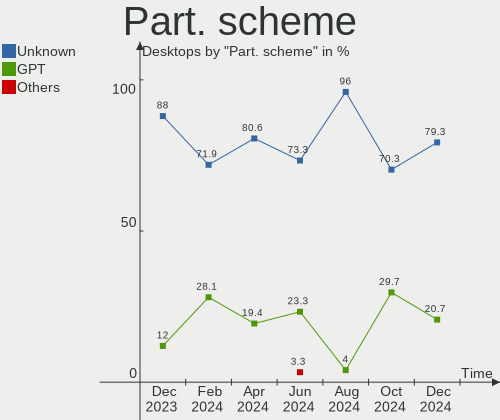
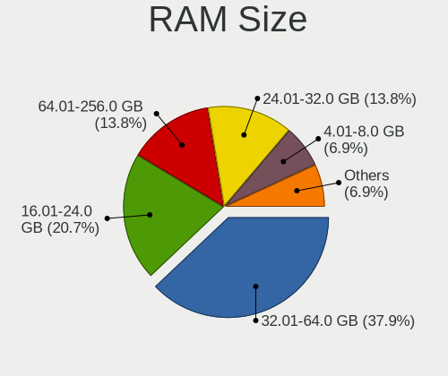
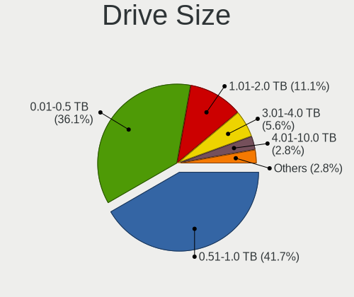
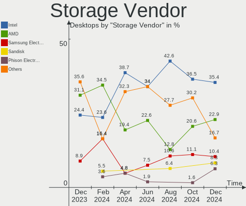

KDE neon - Hardware Trends (Desktops)
-------------------------------------

A project to identify most popular hardware characteristics and track their change
over time based on data collected by Linux users at https://Linux-Hardware.org.

Anyone can contribute to this report by the [hw-probe](https://github.com/linuxhw/hw-probe) tool:

    sudo -E hw-probe -all -upload

This report is for one last month. Overall report since the beginning of time: [TestCoverage](https://github.com/linuxhw/TestCoverage)

Period: Nov, 2022.

Contents
--------

* [ System ](#system)
  - [ OS                       ](#os)
  - [ OS Family                ](#os-family)
  - [ Kernel                   ](#kernel)
  - [ Kernel Family            ](#kernel-family)
  - [ Kernel Major Ver.        ](#kernel-major-ver)
  - [ Arch                     ](#arch)
  - [ DE                       ](#de)
  - [ Display Server           ](#display-server)
  - [ Display Manager          ](#display-manager)
  - [ OS Lang                  ](#os-lang)
  - [ Boot Mode                ](#boot-mode)
  - [ Filesystem               ](#filesystem)
  - [ Part. scheme             ](#part-scheme)
  - [ Dual Boot with Linux/BSD ](#dual-boot-with-linuxbsd)
  - [ Dual Boot (Win)          ](#dual-boot-win)

* [ Board ](#board)
  - [ Vendor                   ](#vendor)
  - [ Model                    ](#model)
  - [ Model Family             ](#model-family)
  - [ MFG Year                 ](#mfg-year)
  - [ Form Factor              ](#form-factor)
  - [ Secure Boot              ](#secure-boot)
  - [ Coreboot                 ](#coreboot)
  - [ RAM Size                 ](#ram-size)
  - [ RAM Used                 ](#ram-used)
  - [ Total Drives             ](#total-drives)
  - [ Has CD-ROM               ](#has-cd-rom)
  - [ Has Ethernet             ](#has-ethernet)
  - [ Has WiFi                 ](#has-wifi)
  - [ Has Bluetooth            ](#has-bluetooth)

* [ Location ](#location)
  - [ Country                  ](#country)
  - [ City                     ](#city)

* [ Drives ](#drives)
  - [ Drive Vendor             ](#drive-vendor)
  - [ Drive Model              ](#drive-model)
  - [ HDD Vendor               ](#hdd-vendor)
  - [ SSD Vendor               ](#ssd-vendor)
  - [ Drive Kind               ](#drive-kind)
  - [ Drive Connector          ](#drive-connector)
  - [ Drive Size               ](#drive-size)
  - [ Space Total              ](#space-total)
  - [ Space Used               ](#space-used)
  - [ Malfunc. Drives          ](#malfunc-drives)
  - [ Malfunc. Drive Vendor    ](#malfunc-drive-vendor)
  - [ Malfunc. HDD Vendor      ](#malfunc-hdd-vendor)
  - [ Malfunc. Drive Kind      ](#malfunc-drive-kind)
  - [ Failed Drives            ](#failed-drives)
  - [ Failed Drive Vendor      ](#failed-drive-vendor)
  - [ Drive Status             ](#drive-status)

* [ Storage controller ](#storage-controller)
  - [ Storage Vendor           ](#storage-vendor)
  - [ Storage Model            ](#storage-model)
  - [ Storage Kind             ](#storage-kind)

* [ Processor ](#processor)
  - [ CPU Vendor               ](#cpu-vendor)
  - [ CPU Model                ](#cpu-model)
  - [ CPU Model Family         ](#cpu-model-family)
  - [ CPU Cores                ](#cpu-cores)
  - [ CPU Sockets              ](#cpu-sockets)
  - [ CPU Threads              ](#cpu-threads)
  - [ CPU Op-Modes             ](#cpu-op-modes)
  - [ CPU Microcode            ](#cpu-microcode)
  - [ CPU Microarch            ](#cpu-microarch)

* [ Graphics ](#graphics)
  - [ GPU Vendor               ](#gpu-vendor)
  - [ GPU Model                ](#gpu-model)
  - [ GPU Combo                ](#gpu-combo)
  - [ GPU Driver               ](#gpu-driver)
  - [ GPU Memory               ](#gpu-memory)

* [ Monitor ](#monitor)
  - [ Monitor Vendor           ](#monitor-vendor)
  - [ Monitor Model            ](#monitor-model)
  - [ Monitor Resolution       ](#monitor-resolution)
  - [ Monitor Diagonal         ](#monitor-diagonal)
  - [ Monitor Width            ](#monitor-width)
  - [ Aspect Ratio             ](#aspect-ratio)
  - [ Monitor Area             ](#monitor-area)
  - [ Pixel Density            ](#pixel-density)
  - [ Multiple Monitors        ](#multiple-monitors)

* [ Network ](#network)
  - [ Net Controller Vendor    ](#net-controller-vendor)
  - [ Net Controller Model     ](#net-controller-model)
  - [ Wireless Vendor          ](#wireless-vendor)
  - [ Wireless Model           ](#wireless-model)
  - [ Ethernet Vendor          ](#ethernet-vendor)
  - [ Ethernet Model           ](#ethernet-model)
  - [ Net Controller Kind      ](#net-controller-kind)
  - [ Used Controller          ](#used-controller)
  - [ NICs                     ](#nics)
  - [ IPv6                     ](#ipv6)

* [ Bluetooth ](#bluetooth)
  - [ Bluetooth Vendor         ](#bluetooth-vendor)
  - [ Bluetooth Model          ](#bluetooth-model)

* [ Sound ](#sound)
  - [ Sound Vendor             ](#sound-vendor)
  - [ Sound Model              ](#sound-model)

* [ Memory ](#memory)
  - [ Memory Vendor            ](#memory-vendor)
  - [ Memory Model             ](#memory-model)
  - [ Memory Kind              ](#memory-kind)
  - [ Memory Form Factor       ](#memory-form-factor)
  - [ Memory Size              ](#memory-size)
  - [ Memory Speed             ](#memory-speed)

* [ Printers & scanners ](#printers--scanners)
  - [ Printer Vendor           ](#printer-vendor)
  - [ Printer Model            ](#printer-model)
  - [ Scanner Vendor           ](#scanner-vendor)
  - [ Scanner Model            ](#scanner-model)

* [ Camera ](#camera)
  - [ Camera Vendor            ](#camera-vendor)
  - [ Camera Model             ](#camera-model)

* [ Security ](#security)
  - [ Fingerprint Vendor       ](#fingerprint-vendor)
  - [ Fingerprint Model        ](#fingerprint-model)
  - [ Chipcard Vendor          ](#chipcard-vendor)
  - [ Chipcard Model           ](#chipcard-model)

* [ Unsupported ](#unsupported)
  - [ Unsupported Devices      ](#unsupported-devices)
  - [ Unsupported Device Types ](#unsupported-device-types)

System
------

OS
--

Installed operating systems

| Name           | Desktops | Percent |
|----------------|----------|---------|
| KDE neon 22.04 | 32       | 94.12%  |
| KDE neon 20.04 | 2        | 5.88%   |

OS Family
---------

OS without a version

| Name     | Desktops | Percent |
|----------|----------|---------|
| KDE neon | 34       | 100%    |

Kernel
------

Version of the Linux kernel

| Version           | Desktops | Percent |
|-------------------|----------|---------|
| 5.15.0-52-generic | 18       | 52.94%  |
| 5.15.0-53-generic | 12       | 35.29%  |
| 5.19.15-xanmod1   | 1        | 2.94%   |
| 5.15.0-54-generic | 1        | 2.94%   |
| 5.15.0-50-generic | 1        | 2.94%   |
| 5.11.0-27-generic | 1        | 2.94%   |

Kernel Family
-------------

Linux kernel without a distro release

| Version | Desktops | Percent |
|---------|----------|---------|
| 5.15.0  | 32       | 94.12%  |
| 5.19.15 | 1        | 2.94%   |
| 5.11.0  | 1        | 2.94%   |

Kernel Major Ver.
-----------------

Linux kernel major version

| Version | Desktops | Percent |
|---------|----------|---------|
| 5.15    | 32       | 94.12%  |
| 5.19    | 1        | 2.94%   |
| 5.11    | 1        | 2.94%   |

Arch
----

OS architecture (x86_64, i586, etc.)

| Name   | Desktops | Percent |
|--------|----------|---------|
| x86_64 | 34       | 100%    |

DE
--

Desktop Environment

| Name | Desktops | Percent |
|------|----------|---------|
| KDE5 | 32       | 94.12%  |
| KDE  | 2        | 5.88%   |

Display Server
--------------

X11 or Wayland

| Name    | Desktops | Percent |
|---------|----------|---------|
| X11     | 33       | 97.06%  |
| Wayland | 1        | 2.94%   |

Display Manager
---------------

SDDM, LightDM, etc.

| Name    | Desktops | Percent |
|---------|----------|---------|
| Unknown | 23       | 67.65%  |
| SDDM    | 11       | 32.35%  |

OS Lang
-------

Language

| Lang       | Desktops | Percent |
|------------|----------|---------|
| en_US      | 11       | 32.35%  |
| en_GB      | 6        | 17.65%  |
| pt_BR      | 2        | 5.88%   |
| fr_FR      | 2        | 5.88%   |
| en_CA      | 2        | 5.88%   |
| en_AG      | 2        | 5.88%   |
| de_DE      | 2        | 5.88%   |
| tr_TR      | 1        | 2.94%   |
| ru_RU      | 1        | 2.94%   |
| it_IT      | 1        | 2.94%   |
| es_VE      | 1        | 2.94%   |
| en_ZA      | 1        | 2.94%   |
| el_GR@euro | 1        | 2.94%   |
| C          | 1        | 2.94%   |

Boot Mode
---------

EFI or BIOS

| Mode | Desktops | Percent |
|------|----------|---------|
| BIOS | 31       | 91.18%  |
| EFI  | 3        | 8.82%   |

Filesystem
----------

Type of filesystem

| Type | Desktops | Percent |
|------|----------|---------|
| Ext4 | 34       | 100%    |

Part. scheme
------------

Scheme of partitioning

| Type    | Desktops | Percent |
|---------|----------|---------|
| Unknown | 22       | 64.71%  |
| GPT     | 8        | 23.53%  |
| MBR     | 4        | 11.76%  |

Dual Boot with Linux/BSD
------------------------

Hosting more than one Linux/BSD

| Dual boot | Desktops | Percent |
|-----------|----------|---------|
| No        | 32       | 94.12%  |
| Yes       | 2        | 5.88%   |

Dual Boot (Win)
---------------

Hosting Linux and Windows

| Dual boot | Desktops | Percent |
|-----------|----------|---------|
| No        | 30       | 88.24%  |
| Yes       | 4        | 11.76%  |

Board
-----

Vendor
------

Motherboard manufacturer

| Name                | Desktops | Percent |
|---------------------|----------|---------|
| ASUSTek Computer    | 11       | 32.35%  |
| MSI                 | 6        | 17.65%  |
| Dell                | 4        | 11.76%  |
| Gigabyte Technology | 3        | 8.82%   |
| Intel               | 2        | 5.88%   |
| ASRock              | 2        | 5.88%   |
| Pegatron            | 1        | 2.94%   |
| PCWare              | 1        | 2.94%   |
| Lenovo              | 1        | 2.94%   |
| Hewlett-Packard     | 1        | 2.94%   |
| Foxconn             | 1        | 2.94%   |
| Acer                | 1        | 2.94%   |

Model
-----

Motherboard model

| Name                               | Desktops | Percent |
|------------------------------------|----------|---------|
| Dell OptiPlex 3050                 | 2        | 5.88%   |
| ASUS All Series                    | 2        | 5.88%   |
| Pegatron IPXSB-H61                 | 1        | 2.94%   |
| PCWare IPX4005G                    | 1        | 2.94%   |
| MSI MS-7D22                        | 1        | 2.94%   |
| MSI MS-7C95                        | 1        | 2.94%   |
| MSI MS-7C94                        | 1        | 2.94%   |
| MSI MS-7C37                        | 1        | 2.94%   |
| MSI MS-7B84                        | 1        | 2.94%   |
| MSI MS-7B79                        | 1        | 2.94%   |
| Lenovo ThinkCentre M900 10FCS24N00 | 1        | 2.94%   |
| Intel H55                          | 1        | 2.94%   |
| Intel DQ77KB AAG81483-500          | 1        | 2.94%   |
| HP EliteDesk 800 G4 DM 35W         | 1        | 2.94%   |
| Gigabyte X570 AORUS MASTER         | 1        | 2.94%   |
| Gigabyte X399 DESIGNARE EX         | 1        | 2.94%   |
| Gigabyte H81M-S1                   | 1        | 2.94%   |
| Foxconn HPE-510f                   | 1        | 2.94%   |
| Dell OptiPlex 9020                 | 1        | 2.94%   |
| Dell Inspiron 660                  | 1        | 2.94%   |
| ASUS TUF Gaming X570-PLUS          | 1        | 2.94%   |
| ASUS ROG STRIX Z490-G GAMING       | 1        | 2.94%   |
| ASUS PRIME Z790-A WIFI             | 1        | 2.94%   |
| ASUS PRIME Z270-P                  | 1        | 2.94%   |
| ASUS PRIME B450M-A                 | 1        | 2.94%   |
| ASUS PRIME B365-PLUS               | 1        | 2.94%   |
| ASUS P5L1394                       | 1        | 2.94%   |
| ASUS M5A97 LE R2.0                 | 1        | 2.94%   |
| ASUS CM1630                        | 1        | 2.94%   |
| ASRock Z270 Taichi                 | 1        | 2.94%   |
| ASRock H110 Pro BTC+               | 1        | 2.94%   |
| Acer Aspire XC600                  | 1        | 2.94%   |

Model Family
------------

Motherboard model prefix

| Name               | Desktops | Percent |
|--------------------|----------|---------|
| ASUS PRIME         | 4        | 11.76%  |
| Dell OptiPlex      | 3        | 8.82%   |
| ASUS All           | 2        | 5.88%   |
| Pegatron IPXSB-H61 | 1        | 2.94%   |
| PCWare IPX4005G    | 1        | 2.94%   |
| MSI MS-7D22        | 1        | 2.94%   |
| MSI MS-7C95        | 1        | 2.94%   |
| MSI MS-7C94        | 1        | 2.94%   |
| MSI MS-7C37        | 1        | 2.94%   |
| MSI MS-7B84        | 1        | 2.94%   |
| MSI MS-7B79        | 1        | 2.94%   |
| Lenovo ThinkCentre | 1        | 2.94%   |
| Intel H55          | 1        | 2.94%   |
| Intel DQ77KB       | 1        | 2.94%   |
| HP EliteDesk       | 1        | 2.94%   |
| Gigabyte X570      | 1        | 2.94%   |
| Gigabyte X399      | 1        | 2.94%   |
| Gigabyte H81M-S1   | 1        | 2.94%   |
| Foxconn HPE-510f   | 1        | 2.94%   |
| Dell Inspiron      | 1        | 2.94%   |
| ASUS TUF           | 1        | 2.94%   |
| ASUS ROG           | 1        | 2.94%   |
| ASUS P5L1394       | 1        | 2.94%   |
| ASUS M5A97         | 1        | 2.94%   |
| ASUS CM1630        | 1        | 2.94%   |
| ASRock Z270        | 1        | 2.94%   |
| ASRock H110        | 1        | 2.94%   |
| Acer Aspire        | 1        | 2.94%   |

MFG Year
--------

Motherboard manufacture year

| Year | Desktops | Percent |
|------|----------|---------|
| 2019 | 5        | 14.71%  |
| 2018 | 5        | 14.71%  |
| 2012 | 4        | 11.76%  |
| 2020 | 3        | 8.82%   |
| 2017 | 3        | 8.82%   |
| 2014 | 3        | 8.82%   |
| 2010 | 3        | 8.82%   |
| 2016 | 2        | 5.88%   |
| 2013 | 2        | 5.88%   |
| 2022 | 1        | 2.94%   |
| 2021 | 1        | 2.94%   |
| 2015 | 1        | 2.94%   |
| 2006 | 1        | 2.94%   |

Form Factor
-----------

Physical design of the computer

| Name    | Desktops | Percent |
|---------|----------|---------|
| Desktop | 34       | 100%    |

Secure Boot
-----------

Enabled or disabled

| State    | Desktops | Percent |
|----------|----------|---------|
| Disabled | 33       | 97.06%  |
| Enabled  | 1        | 2.94%   |

Coreboot
--------

Have coreboot on board

| Used | Desktops | Percent |
|------|----------|---------|
| No   | 34       | 100%    |

RAM Size
--------

Total RAM memory

| Size in GB  | Desktops | Percent |
|-------------|----------|---------|
| 16.01-24.0  | 9        | 26.47%  |
| 4.01-8.0    | 8        | 23.53%  |
| 32.01-64.0  | 6        | 17.65%  |
| 8.01-16.0   | 6        | 17.65%  |
| 3.01-4.0    | 2        | 5.88%   |
| 64.01-256.0 | 2        | 5.88%   |
| 24.01-32.0  | 1        | 2.94%   |

RAM Used
--------

Used RAM memory

| Used GB   | Desktops | Percent |
|-----------|----------|---------|
| 2.01-3.0  | 15       | 44.12%  |
| 4.01-8.0  | 7        | 20.59%  |
| 3.01-4.0  | 5        | 14.71%  |
| 1.01-2.0  | 5        | 14.71%  |
| 8.01-16.0 | 2        | 5.88%   |

Total Drives
------------

Number of drives on board

| Drives | Desktops | Percent |
|--------|----------|---------|
| 1      | 15       | 44.12%  |
| 3      | 7        | 20.59%  |
| 2      | 6        | 17.65%  |
| 11     | 1        | 2.94%   |
| 10     | 1        | 2.94%   |
| 7      | 1        | 2.94%   |
| 6      | 1        | 2.94%   |
| 5      | 1        | 2.94%   |
| 4      | 1        | 2.94%   |

Has CD-ROM
----------

Has CD-ROM on board

| Presented | Desktops | Percent |
|-----------|----------|---------|
| No        | 22       | 64.71%  |
| Yes       | 12       | 35.29%  |

Has Ethernet
------------

Has Ethernet on board

| Presented | Desktops | Percent |
|-----------|----------|---------|
| Yes       | 34       | 100%    |

Has WiFi
--------

Has WiFi module

| Presented | Desktops | Percent |
|-----------|----------|---------|
| No        | 19       | 55.88%  |
| Yes       | 15       | 44.12%  |

Has Bluetooth
-------------

Has Bluetooth module

| Presented | Desktops | Percent |
|-----------|----------|---------|
| No        | 19       | 55.88%  |
| Yes       | 15       | 44.12%  |

Location
--------

Country
-------

Geographic location (country)

| Country      | Desktops | Percent |
|--------------|----------|---------|
| USA          | 11       | 32.35%  |
| UK           | 4        | 11.76%  |
| France       | 3        | 8.82%   |
| Russia       | 2        | 5.88%   |
| Netherlands  | 2        | 5.88%   |
| Italy        | 2        | 5.88%   |
| Brazil       | 2        | 5.88%   |
| Turkey       | 1        | 2.94%   |
| South Africa | 1        | 2.94%   |
| Poland       | 1        | 2.94%   |
| Malaysia     | 1        | 2.94%   |
| Israel       | 1        | 2.94%   |
| Greece       | 1        | 2.94%   |
| Germany      | 1        | 2.94%   |
| Canada       | 1        | 2.94%   |

City
----

Geographic location (city)

| City                | Desktops | Percent |
|---------------------|----------|---------|
| Atlanta             | 2        | 5.88%   |
| Zuidwolde           | 1        | 2.94%   |
| Wodzisław Śląski | 1        | 2.94%   |
| West Islip          | 1        | 2.94%   |
| Warren              | 1        | 2.94%   |
| Vancouver           | 1        | 2.94%   |
| Valence             | 1        | 2.94%   |
| Turin               | 1        | 2.94%   |
| Trenton             | 1        | 2.94%   |
| The Hague           | 1        | 2.94%   |
| Sterling            | 1        | 2.94%   |
| Saint-Nazaire       | 1        | 2.94%   |
| Rochester           | 1        | 2.94%   |
| Rechitsy            | 1        | 2.94%   |
| Porto Alegre        | 1        | 2.94%   |
| Portland            | 1        | 2.94%   |
| Poitiers            | 1        | 2.94%   |
| Petaẖ Tiqwa       | 1        | 2.94%   |
| Miami               | 1        | 2.94%   |
| Merano              | 1        | 2.94%   |
| Leipzig             | 1        | 2.94%   |
| Kota Bharu          | 1        | 2.94%   |
| Klein-Brakrivier    | 1        | 2.94%   |
| Kaliningrad         | 1        | 2.94%   |
| Jequié             | 1        | 2.94%   |
| Jasper              | 1        | 2.94%   |
| Folkestone          | 1        | 2.94%   |
| Burlington          | 1        | 2.94%   |
| Biggleswade         | 1        | 2.94%   |
| Bath                | 1        | 2.94%   |
| Athens              | 1        | 2.94%   |
| Ankara              | 1        | 2.94%   |
| Akron               | 1        | 2.94%   |

Drives
------

Drive Vendor
------------

Hard drive vendors

| Vendor                      | Desktops | Drives | Percent |
|-----------------------------|----------|--------|---------|
| Samsung Electronics         | 15       | 22     | 23.44%  |
| WDC                         | 10       | 12     | 15.63%  |
| Seagate                     | 8        | 13     | 12.5%   |
| Sandisk                     | 8        | 9      | 12.5%   |
| Phison Electronics          | 4        | 10     | 6.25%   |
| Hitachi                     | 3        | 3      | 4.69%   |
| Crucial                     | 3        | 4      | 4.69%   |
| Toshiba                     | 2        | 5      | 3.13%   |
| Kingston                    | 2        | 2      | 3.13%   |
| China                       | 2        | 2      | 3.13%   |
| Unknown                     | 2        | 2      | 3.13%   |
| Micron Technology           | 1        | 1      | 1.56%   |
| Lexar                       | 1        | 1      | 1.56%   |
| Kingston Technology Company | 1        | 1      | 1.56%   |
| Intel                       | 1        | 2      | 1.56%   |
| GOODRAM                     | 1        | 1      | 1.56%   |

Drive Model
-----------

Hard drive models

| Model                                                | Desktops | Percent |
|------------------------------------------------------|----------|---------|
| Samsung NVMe SSD Controller SM981/PM981/PM983 1TB    | 5        | 6.58%   |
| Seagate ST1000LM035-1RK172 1TB                       | 2        | 2.63%   |
| Sandisk WD Blue SN570 500GB                          | 2        | 2.63%   |
| Samsung SSD 980 1TB                                  | 2        | 2.63%   |
| Samsung NVMe SSD Controller PM9A1/PM9A3/980PRO 250GB | 2        | 2.63%   |
| Samsung HD642JJ 640GB                                | 2        | 2.63%   |
| Phison PS5013 E13 NVMe Controller 256GB              | 2        | 2.63%   |
| Phison E12 NVMe Controller 2TB                       | 2        | 2.63%   |
| Unknown                                              | 2        | 2.63%   |
| WDC WDS500G2B0A 500GB SSD                            | 1        | 1.32%   |
| WDC WDS240G2G0B-00EPW0 240GB SSD                     | 1        | 1.32%   |
| WDC WD60EFRX-68MYMN1 6TB                             | 1        | 1.32%   |
| WDC WD5003AZEX-00K1GA0 500GB                         | 1        | 1.32%   |
| WDC WD3200LPLX-75ZNTT0 320GB                         | 1        | 1.32%   |
| WDC WD20EARX-00PASB0 2TB                             | 1        | 1.32%   |
| WDC WD15EARS-60MVWB0 1TB                             | 1        | 1.32%   |
| WDC WD10JPVX-00JC3T0 1TB                             | 1        | 1.32%   |
| WDC WD10EZEX-22MFCA0 1TB                             | 1        | 1.32%   |
| WDC WD10EZEX-00BN5A0 1TB                             | 1        | 1.32%   |
| WDC WD1003FZEX-00MK2A0 1TB                           | 1        | 1.32%   |
| Toshiba HDWG11A 10TB                                 | 1        | 1.32%   |
| Toshiba HDWE160 6TB                                  | 1        | 1.32%   |
| Toshiba DT01ACA050 500GB                             | 1        | 1.32%   |
| Seagate ST3320620AS 320GB                            | 1        | 1.32%   |
| Seagate ST3000DM008-2DM166 3TB                       | 1        | 1.32%   |
| Seagate ST16000NM001G-2KK103 16TB                    | 1        | 1.32%   |
| Seagate ST16000NE000-2RW103 16TB                     | 1        | 1.32%   |
| Seagate ST1000DM010-2EP102 1TB                       | 1        | 1.32%   |
| Seagate ST1000DM003-1SB102 1TB                       | 1        | 1.32%   |
| Seagate ST1000DM003-1CH162 1TB                       | 1        | 1.32%   |
| Seagate Expansion HDD 5TB                            | 1        | 1.32%   |
| Seagate Expansion 1TB                                | 1        | 1.32%   |
| SanDisk Z400s 2.5 7MM 256GB SSD                      | 1        | 1.32%   |
| Sandisk WDC WDS100T2B0C-00PXH0 1TB                   | 1        | 1.32%   |
| Sandisk WD Green SN350 1TB                           | 1        | 1.32%   |
| Sandisk WD Blue SN550 NVMe SSD 1TB                   | 1        | 1.32%   |
| Sandisk WD Black SN750 / PC SN730 NVMe SSD 1024GB    | 1        | 1.32%   |
| SanDisk SSD PLUS 240GB                               | 1        | 1.32%   |
| SanDisk SDSSDP128G 128GB                             | 1        | 1.32%   |
| Samsung SSD 870 EVO 500GB                            | 1        | 1.32%   |

HDD Vendor
----------

Hard disk drive vendors

| Vendor              | Desktops | Drives | Percent |
|---------------------|----------|--------|---------|
| WDC                 | 8        | 10     | 33.33%  |
| Seagate             | 8        | 13     | 33.33%  |
| Samsung Electronics | 3        | 4      | 12.5%   |
| Hitachi             | 3        | 3      | 12.5%   |
| Toshiba             | 2        | 5      | 8.33%   |

SSD Vendor
----------

Solid state drive vendors

| Vendor              | Desktops | Drives | Percent |
|---------------------|----------|--------|---------|
| Samsung Electronics | 6        | 7      | 31.58%  |
| SanDisk             | 3        | 3      | 15.79%  |
| Crucial             | 3        | 4      | 15.79%  |
| WDC                 | 2        | 2      | 10.53%  |
| China               | 2        | 2      | 10.53%  |
| Lexar               | 1        | 1      | 5.26%   |
| Kingston            | 1        | 1      | 5.26%   |
| GOODRAM             | 1        | 1      | 5.26%   |

Drive Kind
----------

HDD or SSD

| Kind    | Desktops | Drives | Percent |
|---------|----------|--------|---------|
| HDD     | 18       | 35     | 34.62%  |
| NVMe    | 16       | 32     | 30.77%  |
| SSD     | 16       | 21     | 30.77%  |
| Unknown | 2        | 2      | 3.85%   |

Drive Connector
---------------

SATA, SAS, NVMe, etc.

| Type | Desktops | Drives | Percent |
|------|----------|--------|---------|
| SATA | 29       | 55     | 60.42%  |
| NVMe | 16       | 32     | 33.33%  |
| SAS  | 3        | 3      | 6.25%   |

Drive Size
----------

Size of hard drive

| Size in TB | Desktops | Drives | Percent |
|------------|----------|--------|---------|
| 0.01-0.5   | 18       | 24     | 52.94%  |
| 0.51-1.0   | 10       | 20     | 29.41%  |
| 2.01-3.0   | 2        | 2      | 5.88%   |
| 4.01-10.0  | 2        | 4      | 5.88%   |
| 10.01-20.0 | 1        | 4      | 2.94%   |
| 1.01-2.0   | 1        | 2      | 2.94%   |

Space Total
-----------

Amount of disk space available on the file system

| Size in GB     | Desktops | Percent |
|----------------|----------|---------|
| 251-500        | 6        | 17.65%  |
| 101-250        | 6        | 17.65%  |
| 501-1000       | 6        | 17.65%  |
| More than 3000 | 4        | 11.76%  |
| 51-100         | 4        | 11.76%  |
| 21-50          | 3        | 8.82%   |
| 1001-2000      | 2        | 5.88%   |
| 2001-3000      | 1        | 2.94%   |
| 1-20           | 1        | 2.94%   |
| Unknown        | 1        | 2.94%   |

Space Used
----------

Amount of used disk space

| Used GB        | Desktops | Percent |
|----------------|----------|---------|
| 1-20           | 12       | 35.29%  |
| 21-50          | 7        | 20.59%  |
| More than 3000 | 4        | 11.76%  |
| 51-100         | 4        | 11.76%  |
| 1001-2000      | 2        | 5.88%   |
| 501-1000       | 2        | 5.88%   |
| 251-500        | 1        | 2.94%   |
| 101-250        | 1        | 2.94%   |
| Unknown        | 1        | 2.94%   |

Malfunc. Drives
---------------

Drive models with a malfunction

Zero info for selected period =(

Malfunc. Drive Vendor
---------------------

Vendors of faulty drives

Zero info for selected period =(

Malfunc. HDD Vendor
-------------------

Vendors of faulty HDD drives

Zero info for selected period =(

Malfunc. Drive Kind
-------------------

Kinds of faulty drives

Zero info for selected period =(

Failed Drives
-------------

Failed drive models

Zero info for selected period =(

Failed Drive Vendor
-------------------

Failed drive vendors

Zero info for selected period =(

Drive Status
------------

Number of failed and malfunc. drives

| Status   | Desktops | Drives | Percent |
|----------|----------|--------|---------|
| Detected | 31       | 82     | 88.57%  |
| Works    | 4        | 8      | 11.43%  |

Storage controller
------------------

Storage Vendor
--------------

Storage controller vendors

| Vendor                      | Desktops | Percent |
|-----------------------------|----------|---------|
| Intel                       | 22       | 37.93%  |
| AMD                         | 12       | 20.69%  |
| Samsung Electronics         | 8        | 13.79%  |
| SanDisk                     | 5        | 8.62%   |
| Phison Electronics          | 4        | 6.9%    |
| Kingston Technology Company | 2        | 3.45%   |
| JMicron Technology          | 2        | 3.45%   |
| ASMedia Technology          | 2        | 3.45%   |
| Micron Technology           | 1        | 1.72%   |

Storage Model
-------------

Storage controller models

| Model                                                                                   | Desktops | Percent |
|-----------------------------------------------------------------------------------------|----------|---------|
| AMD FCH SATA Controller [AHCI mode]                                                     | 7        | 9.59%   |
| Samsung NVMe SSD Controller SM981/PM981/PM983                                           | 5        | 6.85%   |
| Intel SATA Controller [RAID mode]                                                       | 3        | 4.11%   |
| Intel 200 Series PCH SATA controller [AHCI mode]                                        | 3        | 4.11%   |
| AMD 400 Series Chipset SATA Controller                                                  | 3        | 4.11%   |
| SanDisk WD Blue SN570 NVMe SSD                                                          | 2        | 2.74%   |
| SanDisk Non-Volatile memory controller                                                  | 2        | 2.74%   |
| Samsung NVMe SSD Controller PM9A1/PM9A3/980PRO                                          | 2        | 2.74%   |
| Samsung NVMe SSD Controller 980                                                         | 2        | 2.74%   |
| Phison PS5013 E13 NVMe Controller                                                       | 2        | 2.74%   |
| Phison E12 NVMe Controller                                                              | 2        | 2.74%   |
| Intel Q170/Q150/B150/H170/H110/Z170/CM236 Chipset SATA Controller [AHCI Mode]           | 2        | 2.74%   |
| Intel 8 Series/C220 Series Chipset Family 6-port SATA Controller 1 [AHCI mode]          | 2        | 2.74%   |
| Intel 6 Series/C200 Series Chipset Family Desktop SATA Controller (IDE mode, ports 4-5) | 2        | 2.74%   |
| Intel 6 Series/C200 Series Chipset Family Desktop SATA Controller (IDE mode, ports 0-3) | 2        | 2.74%   |
| ASMedia ASM1062 Serial ATA Controller                                                   | 2        | 2.74%   |
| AMD SB7x0/SB8x0/SB9x0 SATA Controller [AHCI mode]                                       | 2        | 2.74%   |
| AMD 500 Series Chipset SATA Controller                                                  | 2        | 2.74%   |
| SanDisk WD Blue SN550 NVMe SSD                                                          | 1        | 1.37%   |
| SanDisk WD Black SN750 / PC SN730 NVMe SSD                                              | 1        | 1.37%   |
| Samsung NVMe SSD Controller SM961/PM961/SM963                                           | 1        | 1.37%   |
| Micron Non-Volatile memory controller                                                   | 1        | 1.37%   |
| Kingston Company Company Non-Volatile memory controller                                 | 1        | 1.37%   |
| Kingston Company A2000 NVMe SSD                                                         | 1        | 1.37%   |
| JMicron JMB363 SATA/IDE Controller                                                      | 1        | 1.37%   |
| JMicron JMB360 AHCI Controller                                                          | 1        | 1.37%   |
| Intel Volume Management Device NVMe RAID Controller Intel Corporation                   | 1        | 1.37%   |
| Intel SSD Pro 7600p/760p/E 6100p Series                                                 | 1        | 1.37%   |
| Intel SATA controller                                                                   | 1        | 1.37%   |
| Intel PCIe Data Center SSD                                                              | 1        | 1.37%   |
| Intel NM10/ICH7 Family SATA Controller [IDE mode]                                       | 1        | 1.37%   |
| Intel Comet Lake SATA AHCI Controller                                                   | 1        | 1.37%   |
| Intel Celeron/Pentium Silver Processor SATA Controller                                  | 1        | 1.37%   |
| Intel Cannon Lake PCH SATA AHCI Controller                                              | 1        | 1.37%   |
| Intel 9 Series Chipset Family SATA Controller [AHCI Mode]                               | 1        | 1.37%   |
| Intel 82801G (ICH7 Family) IDE Controller                                               | 1        | 1.37%   |
| Intel 7 Series/C210 Series Chipset Family 6-port SATA Controller [AHCI mode]            | 1        | 1.37%   |
| Intel 7 Series/C210 Series Chipset Family 4-port SATA Controller [IDE mode]             | 1        | 1.37%   |
| Intel 7 Series/C210 Series Chipset Family 2-port SATA Controller [IDE mode]             | 1        | 1.37%   |
| Intel 500 Series Chipset Family SATA AHCI Controller                                    | 1        | 1.37%   |

Storage Kind
------------

Kind of storage controller (IDE, SATA, NVMe, SAS, ...)

| Kind | Desktops | Percent |
|------|----------|---------|
| SATA | 28       | 51.85%  |
| NVMe | 16       | 29.63%  |
| IDE  | 6        | 11.11%  |
| RAID | 4        | 7.41%   |

Processor
---------

CPU Vendor
----------

Processor vendors

| Vendor | Desktops | Percent |
|--------|----------|---------|
| Intel  | 22       | 64.71%  |
| AMD    | 12       | 35.29%  |

CPU Model
---------

Processor models

| Model                                          | Desktops | Percent |
|------------------------------------------------|----------|---------|
| Intel Core i5-6500 CPU @ 3.20GHz               | 3        | 8.82%   |
| AMD Ryzen 5 5600X 6-Core Processor             | 3        | 8.82%   |
| Intel Xeon CPU E31245 @ 3.30GHz                | 1        | 2.94%   |
| Intel Core i7-8700T CPU @ 2.40GHz              | 1        | 2.94%   |
| Intel Core i7-7700K CPU @ 4.20GHz              | 1        | 2.94%   |
| Intel Core i7-4790K CPU @ 4.00GHz              | 1        | 2.94%   |
| Intel Core i7-4770 CPU @ 3.40GHz               | 1        | 2.94%   |
| Intel Core i7-3770T CPU @ 2.50GHz              | 1        | 2.94%   |
| Intel Core i5-7600K CPU @ 3.80GHz              | 1        | 2.94%   |
| Intel Core i5-6400T CPU @ 2.20GHz              | 1        | 2.94%   |
| Intel Core i5-4460 CPU @ 3.20GHz               | 1        | 2.94%   |
| Intel Core i5-3330 CPU @ 3.00GHz               | 1        | 2.94%   |
| Intel Core i5-2400 CPU @ 3.10GHz               | 1        | 2.94%   |
| Intel Core i5-10600K CPU @ 4.10GHz             | 1        | 2.94%   |
| Intel Core i3-9100F CPU @ 3.60GHz              | 1        | 2.94%   |
| Intel Core i3-4170 CPU @ 3.70GHz               | 1        | 2.94%   |
| Intel Core i3-10100F CPU @ 3.60GHz             | 1        | 2.94%   |
| Intel Core i3 CPU 530 @ 2.93GHz                | 1        | 2.94%   |
| Intel Core 2 CPU 6600 @ 2.40GHz                | 1        | 2.94%   |
| Intel Celeron J4005 CPU @ 2.00GHz              | 1        | 2.94%   |
| Intel 13th Gen Core i7-13700K                  | 1        | 2.94%   |
| AMD Ryzen Threadripper 1920X 12-Core Processor | 1        | 2.94%   |
| AMD Ryzen 9 3900X 12-Core Processor            | 1        | 2.94%   |
| AMD Ryzen 7 5800X 8-Core Processor             | 1        | 2.94%   |
| AMD Ryzen 7 2700X Eight-Core Processor         | 1        | 2.94%   |
| AMD Ryzen 5 5600 6-Core Processor              | 1        | 2.94%   |
| AMD Ryzen 5 1600 Six-Core Processor            | 1        | 2.94%   |
| AMD Phenom II X6 1055T Processor               | 1        | 2.94%   |
| AMD FX-8300 Eight-Core Processor               | 1        | 2.94%   |
| AMD Athlon II X2 220 Processor                 | 1        | 2.94%   |

CPU Model Family
----------------

Processor model prefix

| Model                  | Desktops | Percent |
|------------------------|----------|---------|
| Intel Core i5          | 9        | 26.47%  |
| Intel Core i7          | 5        | 14.71%  |
| AMD Ryzen 5            | 5        | 14.71%  |
| Intel Core i3          | 4        | 11.76%  |
| AMD Ryzen 7            | 2        | 5.88%   |
| Other                  | 1        | 2.94%   |
| Intel Xeon             | 1        | 2.94%   |
| Intel Core 2           | 1        | 2.94%   |
| Intel Celeron          | 1        | 2.94%   |
| AMD Ryzen Threadripper | 1        | 2.94%   |
| AMD Ryzen 9            | 1        | 2.94%   |
| AMD Phenom II X6       | 1        | 2.94%   |
| AMD FX                 | 1        | 2.94%   |
| AMD Athlon II X2       | 1        | 2.94%   |

CPU Cores
---------

Number of processor cores

| Number | Desktops | Percent |
|--------|----------|---------|
| 4      | 16       | 47.06%  |
| 6      | 8        | 23.53%  |
| 2      | 5        | 14.71%  |
| 12     | 2        | 5.88%   |
| 8      | 2        | 5.88%   |
| 16     | 1        | 2.94%   |

CPU Sockets
-----------

Number of sockets

| Number | Desktops | Percent |
|--------|----------|---------|
| 1      | 34       | 100%    |

CPU Threads
-----------

Threads per core (Hyper-Threading)

| Number | Desktops | Percent |
|--------|----------|---------|
| 2      | 21       | 61.76%  |
| 1      | 13       | 38.24%  |

CPU Op-Modes
------------

CPU Operation Modes (32-bit, 64-bit)

| Op mode        | Desktops | Percent |
|----------------|----------|---------|
| 32-bit, 64-bit | 34       | 100%    |

CPU Microcode
-------------

Microcode number

| Number     | Desktops | Percent |
|------------|----------|---------|
| Unknown    | 27       | 79.41%  |
| 0xa0653    | 1        | 2.94%   |
| 0x906e9    | 1        | 2.94%   |
| 0x6f6      | 1        | 2.94%   |
| 0x506e3    | 1        | 2.94%   |
| 0x306c3    | 1        | 2.94%   |
| 0x306a9    | 1        | 2.94%   |
| 0x010000dc | 1        | 2.94%   |

CPU Microarch
-------------

Microarchitecture

| Name          | Desktops | Percent |
|---------------|----------|---------|
| Zen 3         | 5        | 14.71%  |
| Skylake       | 4        | 11.76%  |
| KabyLake      | 4        | 11.76%  |
| Haswell       | 4        | 11.76%  |
| Zen           | 2        | 5.88%   |
| SandyBridge   | 2        | 5.88%   |
| K10           | 2        | 5.88%   |
| IvyBridge     | 2        | 5.88%   |
| CometLake     | 2        | 5.88%   |
| Zen+          | 1        | 2.94%   |
| Zen 2         | 1        | 2.94%   |
| Westmere      | 1        | 2.94%   |
| Piledriver    | 1        | 2.94%   |
| Goldmont plus | 1        | 2.94%   |
| Core          | 1        | 2.94%   |
| Unknown       | 1        | 2.94%   |

Graphics
--------

GPU Vendor
----------

Vendors of graphics cards

| Vendor | Desktops | Percent |
|--------|----------|---------|
| Nvidia | 18       | 47.37%  |
| Intel  | 12       | 31.58%  |
| AMD    | 8        | 21.05%  |

GPU Model
---------

Graphics card models

| Model                                                                       | Desktops | Percent |
|-----------------------------------------------------------------------------|----------|---------|
| Intel HD Graphics 530                                                       | 3        | 7.89%   |
| Nvidia GP107 [GeForce GTX 1050 Ti]                                          | 2        | 5.26%   |
| Intel Xeon E3-1200 v3/4th Gen Core Processor Integrated Graphics Controller | 2        | 5.26%   |
| AMD Ellesmere [Radeon RX 470/480/570/570X/580/580X/590]                     | 2        | 5.26%   |
| Nvidia TU117 [GeForce GTX 1650]                                             | 1        | 2.63%   |
| Nvidia TU106 [GeForce RTX 2060 Rev. A]                                      | 1        | 2.63%   |
| Nvidia TU106 [GeForce RTX 2060 12GB]                                        | 1        | 2.63%   |
| Nvidia TU104 [GeForce RTX 2080 SUPER]                                       | 1        | 2.63%   |
| Nvidia GP108 [GeForce GT 1030]                                              | 1        | 2.63%   |
| Nvidia GP104 [GeForce GTX 1080]                                             | 1        | 2.63%   |
| Nvidia GP104 [GeForce GTX 1070]                                             | 1        | 2.63%   |
| Nvidia GK106 [GeForce GTX 650 Ti]                                           | 1        | 2.63%   |
| Nvidia GF119 [NVS 310]                                                      | 1        | 2.63%   |
| Nvidia GF119 [GeForce GT 620 OEM]                                           | 1        | 2.63%   |
| Nvidia GF119 [GeForce GT 610]                                               | 1        | 2.63%   |
| Nvidia GA106 [GeForce RTX 3060 Lite Hash Rate]                              | 1        | 2.63%   |
| Nvidia GA106 [Geforce RTX 3050]                                             | 1        | 2.63%   |
| Nvidia GA102 [GeForce RTX 3090 Ti]                                          | 1        | 2.63%   |
| Nvidia GA102 [GeForce RTX 3080 12GB]                                        | 1        | 2.63%   |
| Nvidia G84 [GeForce 8600 GT]                                                | 1        | 2.63%   |
| Intel Xeon E3-1200 v2/3rd Gen Core processor Graphics Controller            | 1        | 2.63%   |
| Intel Raptor Lake-S UHD Graphics                                            | 1        | 2.63%   |
| Intel IvyBridge GT2 [HD Graphics 4000]                                      | 1        | 2.63%   |
| Intel GeminiLake [UHD Graphics 600]                                         | 1        | 2.63%   |
| Intel CometLake-S GT2 [UHD Graphics 630]                                    | 1        | 2.63%   |
| Intel CoffeeLake-S GT2 [UHD Graphics 630]                                   | 1        | 2.63%   |
| Intel 4th Generation Core Processor Family Integrated Graphics Controller   | 1        | 2.63%   |
| AMD Turks PRO [Radeon HD 6570/7570/8550 / R5 230]                           | 1        | 2.63%   |
| AMD Oland PRO [Radeon R7 240/340 / Radeon 520]                              | 1        | 2.63%   |
| AMD Navi 24 [Radeon RX 6400/6500 XT/6500M]                                  | 1        | 2.63%   |
| AMD Navi 22 [Radeon RX 6700/6700 XT/6750 XT / 6800M]                        | 1        | 2.63%   |
| AMD Navi 21 [Radeon RX 6800/6800 XT / 6900 XT]                              | 1        | 2.63%   |
| AMD Caicos [Radeon HD 6450/7450/8450 / R5 230 OEM]                          | 1        | 2.63%   |

GPU Combo
---------

Combinations of graphics cards

| Name           | Desktops | Percent |
|----------------|----------|---------|
| 1 x Nvidia     | 15       | 44.12%  |
| 1 x Intel      | 9        | 26.47%  |
| 1 x AMD        | 7        | 20.59%  |
| Intel + Nvidia | 2        | 5.88%   |
| AMD + Nvidia   | 1        | 2.94%   |

GPU Driver
----------

Free vs proprietary

| Driver      | Desktops | Percent |
|-------------|----------|---------|
| Free        | 25       | 73.53%  |
| Proprietary | 9        | 26.47%  |

GPU Memory
----------

Total video memory

| Size in GB | Desktops | Percent |
|------------|----------|---------|
| Unknown    | 25       | 73.53%  |
| 7.01-8.0   | 3        | 8.82%   |
| 3.01-4.0   | 2        | 5.88%   |
| 1.01-2.0   | 2        | 5.88%   |
| 0.51-1.0   | 1        | 2.94%   |
| 0.01-0.5   | 1        | 2.94%   |

Monitor
-------

Monitor Vendor
--------------

Monitor vendors

| Vendor               | Desktops | Percent |
|----------------------|----------|---------|
| Samsung Electronics  | 6        | 15.79%  |
| Acer                 | 5        | 13.16%  |
| Dell                 | 4        | 10.53%  |
| AOC                  | 4        | 10.53%  |
| Iiyama               | 3        | 7.89%   |
| Hewlett-Packard      | 3        | 7.89%   |
| Ancor Communications | 3        | 7.89%   |
| Goldstar             | 2        | 5.26%   |
| NEC Computers        | 1        | 2.63%   |
| Lenovo               | 1        | 2.63%   |
| Idek Iiyama          | 1        | 2.63%   |
| Hitachi              | 1        | 2.63%   |
| Gigabyte Technology  | 1        | 2.63%   |
| CASIO                | 1        | 2.63%   |
| BenQ                 | 1        | 2.63%   |
| ASUSTek Computer     | 1        | 2.63%   |

Monitor Model
-------------

Monitor models

| Model                                                                 | Desktops | Percent |
|-----------------------------------------------------------------------|----------|---------|
| Samsung Electronics LCD Monitor SAM065F 1360x768                      | 2        | 4.76%   |
| Samsung Electronics SyncMaster SAM05C5 1920x1080                      | 1        | 2.38%   |
| Samsung Electronics SMT24A550 SAM07B5 1920x1080 530x300mm 24.0-inch   | 1        | 2.38%   |
| Samsung Electronics SMT24A550 SAM07B3 1920x1080 530x300mm 24.0-inch   | 1        | 2.38%   |
| Samsung Electronics S16B110 SAM097E 1366x768 360x210mm 16.4-inch      | 1        | 2.38%   |
| Samsung Electronics LCD Monitor S27E332 3200x1080                     | 1        | 2.38%   |
| NEC Computers LCD Monitor LCD190V                                     | 1        | 2.38%   |
| Lenovo G27q-20 LEN66C3 2560x1440 597x336mm 27.0-inch                  | 1        | 2.38%   |
| Iiyama XB2776QS-B1 IVM660E 2560x1440 597x336mm 27.0-inch              | 1        | 2.38%   |
| Iiyama PLX2483H IVM6114 1920x1080 531x299mm 24.0-inch                 | 1        | 2.38%   |
| Iiyama PL2779Q IVM6615 2560x1440 597x336mm 27.0-inch                  | 1        | 2.38%   |
| Idek Iiyama LCD Monitor PLE2003WS                                     | 1        | 2.38%   |
| Idek Iiyama LCD Monitor PL2530H 3600x1080                             | 1        | 2.38%   |
| Hitachi HISENSE HEC002F 3840x2160 1872x1053mm 84.6-inch               | 1        | 2.38%   |
| Hewlett-Packard w2207 HWP26A8 1680x1050 473x296mm 22.0-inch           | 1        | 2.38%   |
| Hewlett-Packard 27f HPN354B 1920x1080 598x336mm 27.0-inch             | 1        | 2.38%   |
| Hewlett-Packard 2511 HWP293C 1920x1080 553x311mm 25.0-inch            | 1        | 2.38%   |
| Goldstar TV SSCR2 GSMC0C8 3840x2160                                   | 1        | 2.38%   |
| Goldstar LG ULTRAWIDE GSM59F1 2560x1080 670x280mm 28.6-inch           | 1        | 2.38%   |
| Gigabyte Technology G34WQC GBT3400 3440x1440 797x334mm 34.0-inch      | 1        | 2.38%   |
| Dell ST2421L DELA070 1920x1080 531x299mm 24.0-inch                    | 1        | 2.38%   |
| Dell SE2717H/HX DELD0A1 1920x1080 598x336mm 27.0-inch                 | 1        | 2.38%   |
| Dell SE2419HR DELF113 1920x1080 527x296mm 23.8-inch                   | 1        | 2.38%   |
| Dell P2418HZm DELD0C4 1920x1080 527x296mm 23.8-inch                   | 1        | 2.38%   |
| Dell P2418HZm DELD0C3 1920x1080 527x296mm 23.8-inch                   | 1        | 2.38%   |
| CASIO CASPER CAS2000 1600x900 455x256mm 20.6-inch                     | 1        | 2.38%   |
| BenQ GL2480 BNQ78ED 1920x1080 531x298mm 24.0-inch                     | 1        | 2.38%   |
| ASUSTek Computer VG249 AUS2421 1920x1080 530x300mm 24.0-inch          | 1        | 2.38%   |
| AOC Q3279WG5B AOC3279 2560x1440 725x428mm 33.1-inch                   | 1        | 2.38%   |
| AOC Q3277 AOC3277 2560x1440 708x399mm 32.0-inch                       | 1        | 2.38%   |
| AOC F22 AOC2200 1920x1080 476x268mm 21.5-inch                         | 1        | 2.38%   |
| AOC 912Sw AOC1980 1440x900 408x255mm 18.9-inch                        | 1        | 2.38%   |
| AOC 2790WG5 AOC2790 1920x1080 598x336mm 27.0-inch                     | 1        | 2.38%   |
| Ancor Communications VW222 ACI22A2 1680x1050 473x296mm 22.0-inch      | 1        | 2.38%   |
| Ancor Communications ASUS VN248 ACI24C4 1920x1080 527x296mm 23.8-inch | 1        | 2.38%   |
| Ancor Communications ASUS PB277 ACI27B5 2560x1440 597x336mm 27.0-inch | 1        | 2.38%   |
| Acer XZ322QU S ACR09CA 2560x1440 697x392mm 31.5-inch                  | 1        | 2.38%   |
| Acer XF270H B ACR064D 1920x1080 598x336mm 27.0-inch                   | 1        | 2.38%   |
| Acer XB271HU ACR0490 2560x1440 598x336mm 27.0-inch                    | 1        | 2.38%   |
| Acer XB241H ACR050E 1920x1080 531x299mm 24.0-inch                     | 1        | 2.38%   |

Monitor Resolution
------------------

Monitor screen resolution

| Resolution         | Desktops | Percent |
|--------------------|----------|---------|
| 1920x1080 (FHD)    | 13       | 35.14%  |
| 2560x1440 (QHD)    | 7        | 18.92%  |
| 3840x2160 (4K)     | 4        | 10.81%  |
| 1680x1050 (WSXGA+) | 2        | 5.41%   |
| 1360x768           | 2        | 5.41%   |
| Unknown            | 2        | 5.41%   |
| 3600x1080          | 1        | 2.7%    |
| 3440x1440          | 1        | 2.7%    |
| 3200x1080          | 1        | 2.7%    |
| 2560x1080          | 1        | 2.7%    |
| 1600x900 (HD+)     | 1        | 2.7%    |
| 1440x900 (WXGA+)   | 1        | 2.7%    |
| 1366x768 (WXGA)    | 1        | 2.7%    |

Monitor Diagonal
----------------

Diagonal size in inches

| Inches  | Desktops | Percent |
|---------|----------|---------|
| 27      | 8        | 22.22%  |
| 24      | 8        | 22.22%  |
| Unknown | 5        | 13.89%  |
| 34      | 2        | 5.56%   |
| 23      | 2        | 5.56%   |
| 22      | 2        | 5.56%   |
| 84      | 1        | 2.78%   |
| 72      | 1        | 2.78%   |
| 33      | 1        | 2.78%   |
| 32      | 1        | 2.78%   |
| 31      | 1        | 2.78%   |
| 25      | 1        | 2.78%   |
| 20      | 1        | 2.78%   |
| 19      | 1        | 2.78%   |
| 16      | 1        | 2.78%   |

Monitor Width
-------------

Physical width

| Width in mm | Desktops | Percent |
|-------------|----------|---------|
| 501-600     | 17       | 51.52%  |
| Unknown     | 5        | 15.15%  |
| 701-800     | 3        | 9.09%   |
| 401-500     | 3        | 9.09%   |
| 351-400     | 2        | 6.06%   |
| 1501-2000   | 2        | 6.06%   |
| 601-700     | 1        | 3.03%   |

Aspect Ratio
------------

Proportional relationship between the width and the height

| Ratio   | Desktops | Percent |
|---------|----------|---------|
| 16/9    | 26       | 78.79%  |
| 21/9    | 2        | 6.06%   |
| 16/10   | 2        | 6.06%   |
| Unknown | 2        | 6.06%   |
| 5/4     | 1        | 3.03%   |

Monitor Area
------------

Area in inch²

| Area in inch² | Desktops | Percent |
|----------------|----------|---------|
| 201-250        | 11       | 32.35%  |
| 301-350        | 8        | 23.53%  |
| Unknown        | 5        | 14.71%  |
| 351-500        | 4        | 11.76%  |
| More than 1000 | 2        | 5.88%   |
| 151-200        | 2        | 5.88%   |
| 251-300        | 1        | 2.94%   |
| 111-120        | 1        | 2.94%   |

Pixel Density
-------------

Pixels per inch

| Density | Desktops | Percent |
|---------|----------|---------|
| 51-100  | 22       | 66.67%  |
| 101-120 | 6        | 18.18%  |
| Unknown | 5        | 15.15%  |

Multiple Monitors
-----------------

Total monitors connected

| Total | Desktops | Percent |
|-------|----------|---------|
| 1     | 25       | 73.53%  |
| 2     | 8        | 23.53%  |
| 3     | 1        | 2.94%   |

Network
-------

Net Controller Vendor
---------------------

Controller vendors

| Vendor                | Desktops | Percent |
|-----------------------|----------|---------|
| Realtek Semiconductor | 22       | 44%     |
| Intel                 | 19       | 38%     |
| Samsung Electronics   | 2        | 4%      |
| Ralink                | 2        | 4%      |
| Ralink Technology     | 1        | 2%      |
| Qualcomm Atheros      | 1        | 2%      |
| NetGear               | 1        | 2%      |
| Motorola PCS          | 1        | 2%      |
| Broadcom              | 1        | 2%      |

Net Controller Model
--------------------

Controller models

| Model                                                             | Desktops | Percent |
|-------------------------------------------------------------------|----------|---------|
| Realtek RTL8111/8168/8411 PCI Express Gigabit Ethernet Controller | 16       | 28.07%  |
| Realtek RTL810xE PCI Express Fast Ethernet controller             | 3        | 5.26%   |
| Intel I211 Gigabit Network Connection                             | 3        | 5.26%   |
| Realtek RTL8125 2.5GbE Controller                                 | 2        | 3.51%   |
| Intel Ethernet Connection (2) I219-V                              | 2        | 3.51%   |
| Intel Dual Band Wireless-AC 3168NGW [Stone Peak]                  | 2        | 3.51%   |
| Samsung GT-I9070 (network tethering, USB debugging enabled)       | 1        | 1.75%   |
| Samsung Galaxy series, misc. (tethering mode)                     | 1        | 1.75%   |
| Realtek 802.11ac NIC                                              | 1        | 1.75%   |
| Ralink MT7610U ("Archer T2U" 2.4G+5G WLAN Adapter                 | 1        | 1.75%   |
| Ralink RT3090 Wireless 802.11n 1T/1R PCIe                         | 1        | 1.75%   |
| Ralink RT2800 802.11n PCI                                         | 1        | 1.75%   |
| Qualcomm Atheros Attansic L1 Gigabit Ethernet                     | 1        | 1.75%   |
| NetGear A6100 AC600 DB Wireless Adapter [Realtek RTL8811AU]       | 1        | 1.75%   |
| Motorola PCS motorola one                                         | 1        | 1.75%   |
| Intel WLAN controller                                             | 1        | 1.75%   |
| Intel Wireless-AC 9260                                            | 1        | 1.75%   |
| Intel Wireless 8265 / 8275                                        | 1        | 1.75%   |
| Intel Wireless 3160                                               | 1        | 1.75%   |
| Intel Wi-Fi 6 AX210/AX211/AX411 160MHz                            | 1        | 1.75%   |
| Intel Wi-Fi 6 AX200                                               | 1        | 1.75%   |
| Intel Ethernet Controller I226-V                                  | 1        | 1.75%   |
| Intel Ethernet Controller I225-V                                  | 1        | 1.75%   |
| Intel Ethernet Connection I217-V                                  | 1        | 1.75%   |
| Intel Ethernet Connection I217-LM                                 | 1        | 1.75%   |
| Intel Ethernet Connection (7) I219-LM                             | 1        | 1.75%   |
| Intel Ethernet Connection (2) I219-LM                             | 1        | 1.75%   |
| Intel Ethernet Connection (2) I218-V                              | 1        | 1.75%   |
| Intel Ethernet Connection (10) I219-V                             | 1        | 1.75%   |
| Intel Comet Lake PCH CNVi WiFi                                    | 1        | 1.75%   |
| Intel Centrino Wireless-N 1000 [Condor Peak]                      | 1        | 1.75%   |
| Intel Cannon Lake PCH CNVi WiFi                                   | 1        | 1.75%   |
| Intel 82579V Gigabit Network Connection                           | 1        | 1.75%   |
| Intel 82579LM Gigabit Network Connection (Lewisville)             | 1        | 1.75%   |
| Broadcom BCM4360 802.11ac Wireless Network Adapter                | 1        | 1.75%   |

Wireless Vendor
---------------

Wireless vendors

| Vendor                | Desktops | Percent |
|-----------------------|----------|---------|
| Intel                 | 11       | 64.71%  |
| Ralink                | 2        | 11.76%  |
| Realtek Semiconductor | 1        | 5.88%   |
| Ralink Technology     | 1        | 5.88%   |
| NetGear               | 1        | 5.88%   |
| Broadcom              | 1        | 5.88%   |

Wireless Model
--------------

Wireless models

| Model                                                       | Desktops | Percent |
|-------------------------------------------------------------|----------|---------|
| Intel Dual Band Wireless-AC 3168NGW [Stone Peak]            | 2        | 11.76%  |
| Realtek 802.11ac NIC                                        | 1        | 5.88%   |
| Ralink MT7610U ("Archer T2U" 2.4G+5G WLAN Adapter           | 1        | 5.88%   |
| Ralink RT3090 Wireless 802.11n 1T/1R PCIe                   | 1        | 5.88%   |
| Ralink RT2800 802.11n PCI                                   | 1        | 5.88%   |
| NetGear A6100 AC600 DB Wireless Adapter [Realtek RTL8811AU] | 1        | 5.88%   |
| Intel WLAN controller                                       | 1        | 5.88%   |
| Intel Wireless-AC 9260                                      | 1        | 5.88%   |
| Intel Wireless 8265 / 8275                                  | 1        | 5.88%   |
| Intel Wireless 3160                                         | 1        | 5.88%   |
| Intel Wi-Fi 6 AX210/AX211/AX411 160MHz                      | 1        | 5.88%   |
| Intel Wi-Fi 6 AX200                                         | 1        | 5.88%   |
| Intel Comet Lake PCH CNVi WiFi                              | 1        | 5.88%   |
| Intel Centrino Wireless-N 1000 [Condor Peak]                | 1        | 5.88%   |
| Intel Cannon Lake PCH CNVi WiFi                             | 1        | 5.88%   |
| Broadcom BCM4360 802.11ac Wireless Network Adapter          | 1        | 5.88%   |

Ethernet Vendor
---------------

Ethernet vendors

| Vendor                | Desktops | Percent |
|-----------------------|----------|---------|
| Realtek Semiconductor | 21       | 53.85%  |
| Intel                 | 14       | 35.9%   |
| Samsung Electronics   | 2        | 5.13%   |
| Qualcomm Atheros      | 1        | 2.56%   |
| Motorola PCS          | 1        | 2.56%   |

Ethernet Model
--------------

Ethernet models

| Model                                                             | Desktops | Percent |
|-------------------------------------------------------------------|----------|---------|
| Realtek RTL8111/8168/8411 PCI Express Gigabit Ethernet Controller | 16       | 40%     |
| Realtek RTL810xE PCI Express Fast Ethernet controller             | 3        | 7.5%    |
| Intel I211 Gigabit Network Connection                             | 3        | 7.5%    |
| Realtek RTL8125 2.5GbE Controller                                 | 2        | 5%      |
| Intel Ethernet Connection (2) I219-V                              | 2        | 5%      |
| Samsung GT-I9070 (network tethering, USB debugging enabled)       | 1        | 2.5%    |
| Samsung Galaxy series, misc. (tethering mode)                     | 1        | 2.5%    |
| Qualcomm Atheros Attansic L1 Gigabit Ethernet                     | 1        | 2.5%    |
| Motorola PCS motorola one                                         | 1        | 2.5%    |
| Intel Ethernet Controller I226-V                                  | 1        | 2.5%    |
| Intel Ethernet Controller I225-V                                  | 1        | 2.5%    |
| Intel Ethernet Connection I217-V                                  | 1        | 2.5%    |
| Intel Ethernet Connection I217-LM                                 | 1        | 2.5%    |
| Intel Ethernet Connection (7) I219-LM                             | 1        | 2.5%    |
| Intel Ethernet Connection (2) I219-LM                             | 1        | 2.5%    |
| Intel Ethernet Connection (2) I218-V                              | 1        | 2.5%    |
| Intel Ethernet Connection (10) I219-V                             | 1        | 2.5%    |
| Intel 82579V Gigabit Network Connection                           | 1        | 2.5%    |
| Intel 82579LM Gigabit Network Connection (Lewisville)             | 1        | 2.5%    |

Net Controller Kind
-------------------

Ethernet, WiFi or modem

| Kind     | Desktops | Percent |
|----------|----------|---------|
| Ethernet | 34       | 69.39%  |
| WiFi     | 15       | 30.61%  |

Used Controller
---------------

Currently used network controller

| Kind     | Desktops | Percent |
|----------|----------|---------|
| Ethernet | 29       | 85.29%  |
| WiFi     | 5        | 14.71%  |

NICs
----

Total network controllers on board

| Total | Desktops | Percent |
|-------|----------|---------|
| 1     | 20       | 58.82%  |
| 2     | 9        | 26.47%  |
| 3     | 5        | 14.71%  |

IPv6
----

IPv6 vs IPv4

| Used | Desktops | Percent |
|------|----------|---------|
| No   | 24       | 70.59%  |
| Yes  | 10       | 29.41%  |

Bluetooth
---------

Bluetooth Vendor
----------------

Controller vendors

| Vendor                  | Desktops | Percent |
|-------------------------|----------|---------|
| Intel                   | 10       | 66.67%  |
| Cambridge Silicon Radio | 3        | 20%     |
| Realtek Semiconductor   | 1        | 6.67%   |
| Broadcom                | 1        | 6.67%   |

Bluetooth Model
---------------

Controller models

| Model                                               | Desktops | Percent |
|-----------------------------------------------------|----------|---------|
| Cambridge Silicon Radio Bluetooth Dongle (HCI mode) | 3        | 20%     |
| Intel Wireless-AC 3168 Bluetooth                    | 2        | 13.33%  |
| Intel Bluetooth wireless interface                  | 2        | 13.33%  |
| Realtek Bluetooth Radio                             | 1        | 6.67%   |
| Intel Wireless-AC 9260 Bluetooth Adapter            | 1        | 6.67%   |
| Intel Bluetooth Device                              | 1        | 6.67%   |
| Intel Bluetooth 9460/9560 Jefferson Peak (JfP)      | 1        | 6.67%   |
| Intel AX210 Bluetooth                               | 1        | 6.67%   |
| Intel AX201 Bluetooth                               | 1        | 6.67%   |
| Intel AX200 Bluetooth                               | 1        | 6.67%   |
| Broadcom Bluetooth 3.0 Device                       | 1        | 6.67%   |

Sound
-----

Sound Vendor
------------

Sound card vendors

| Vendor                 | Desktops | Percent |
|------------------------|----------|---------|
| Intel                  | 22       | 34.38%  |
| Nvidia                 | 17       | 26.56%  |
| AMD                    | 16       | 25%     |
| SlrTek                 | 1        | 1.56%   |
| Razer USA              | 1        | 1.56%   |
| Nintendo               | 1        | 1.56%   |
| FIFINE Microphones     | 1        | 1.56%   |
| Elgato Systems         | 1        | 1.56%   |
| Creative Labs          | 1        | 1.56%   |
| Conexant Systems       | 1        | 1.56%   |
| C-Media Electronics    | 1        | 1.56%   |
| AKAI Professional M.I. | 1        | 1.56%   |

Sound Model
-----------

Sound card models

| Model                                                                                           | Desktops | Percent |
|-------------------------------------------------------------------------------------------------|----------|---------|
| AMD Starship/Matisse HD Audio Controller                                                        | 6        | 8.45%   |
| Intel 200 Series PCH HD Audio                                                                   | 5        | 7.04%   |
| Nvidia GF119 HDMI Audio Controller                                                              | 3        | 4.23%   |
| Intel Xeon E3-1200 v3/4th Gen Core Processor HD Audio Controller                                | 3        | 4.23%   |
| Intel 8 Series/C220 Series Chipset High Definition Audio Controller                             | 3        | 4.23%   |
| AMD SBx00 Azalia (Intel HDA)                                                                    | 3        | 4.23%   |
| AMD Navi 21/23 HDMI/DP Audio Controller                                                         | 3        | 4.23%   |
| AMD Family 17h (Models 00h-0fh) HD Audio Controller                                             | 3        | 4.23%   |
| Nvidia TU106 High Definition Audio Controller                                                   | 2        | 2.82%   |
| Nvidia GP107GL High Definition Audio Controller                                                 | 2        | 2.82%   |
| Nvidia GP104 High Definition Audio Controller                                                   | 2        | 2.82%   |
| Nvidia GA106 High Definition Audio Controller                                                   | 2        | 2.82%   |
| Nvidia GA102 High Definition Audio Controller                                                   | 2        | 2.82%   |
| Intel Audio device                                                                              | 2        | 2.82%   |
| Intel 7 Series/C216 Chipset Family High Definition Audio Controller                             | 2        | 2.82%   |
| Intel 6 Series/C200 Series Chipset Family High Definition Audio Controller                      | 2        | 2.82%   |
| Intel 100 Series/C230 Series Chipset Family HD Audio Controller                                 | 2        | 2.82%   |
| AMD Ellesmere HDMI Audio [Radeon RX 470/480 / 570/580/590]                                      | 2        | 2.82%   |
| SlrTek Usb_Audio                                                                                | 1        | 1.41%   |
| Razer USA Kraken Tournament Edition                                                             | 1        | 1.41%   |
| Nvidia TU107 GeForce GTX 1650 High Definition Audio Controller                                  | 1        | 1.41%   |
| Nvidia TU104 HD Audio Controller                                                                | 1        | 1.41%   |
| Nvidia GP108 High Definition Audio Controller                                                   | 1        | 1.41%   |
| Nvidia GK106 HDMI Audio Controller                                                              | 1        | 1.41%   |
| Nintendo WUP-021-0                                                                              | 1        | 1.41%   |
| Intel NM10/ICH7 Family High Definition Audio Controller                                         | 1        | 1.41%   |
| Intel Comet Lake PCH cAVS                                                                       | 1        | 1.41%   |
| Intel Celeron/Pentium Silver Processor High Definition Audio                                    | 1        | 1.41%   |
| Intel Cannon Lake PCH cAVS                                                                      | 1        | 1.41%   |
| Intel 9 Series Chipset Family HD Audio Controller                                               | 1        | 1.41%   |
| Intel 5 Series/3400 Series Chipset High Definition Audio                                        | 1        | 1.41%   |
| FIFINE Microphones FIFINE K690 Microphone                                                       | 1        | 1.41%   |
| Elgato Systems Elgato Wave XLR                                                                  | 1        | 1.41%   |
| Creative Labs CA0132 Sound Core3D [Sound Blaster Recon3D / Z-Series / Sound BlasterX AE-5 Plus] | 1        | 1.41%   |
| Conexant Systems P2418HZm                                                                       | 1        | 1.41%   |
| C-Media Electronics Audio Adapter                                                               | 1        | 1.41%   |
| AMD Turks HDMI Audio [Radeon HD 6500/6600 / 6700M Series]                                       | 1        | 1.41%   |
| AMD Oland/Hainan/Cape Verde/Pitcairn HDMI Audio [Radeon HD 7000 Series]                         | 1        | 1.41%   |
| AMD Caicos HDMI Audio [Radeon HD 6450 / 7450/8450/8490 OEM / R5 230/235/235X OEM]               | 1        | 1.41%   |
| AKAI Professional M.I. MPD218                                                                   | 1        | 1.41%   |

Memory
------

Memory Vendor
-------------

Memory module vendors

| Vendor              | Desktops | Percent |
|---------------------|----------|---------|
| Unknown             | 1        | 14.29%  |
| SK hynix            | 1        | 14.29%  |
| Samsung Electronics | 1        | 14.29%  |
| Kingston            | 1        | 14.29%  |
| GOODRAM             | 1        | 14.29%  |
| Crucial             | 1        | 14.29%  |
| Corsair             | 1        | 14.29%  |

Memory Model
------------

Memory module models

| Model                                                   | Desktops | Percent |
|---------------------------------------------------------|----------|---------|
| Unknown RAM Module 1GB DIMM SDRAM                       | 1        | 14.29%  |
| SK hynix RAM HMT41GU6MFR8C-PB 8192MB DIMM DDR3 1600MT/s | 1        | 14.29%  |
| Samsung RAM M378B5173QH0-CK0 4096MB DIMM DDR3 1600MT/s  | 1        | 14.29%  |
| Kingston RAM KF3000C15D4/8GX 8GB DIMM DDR4 3000MT/s     | 1        | 14.29%  |
| GOODRAM RAM IR2400D464L15S/8G 8GB DIMM DDR4 3200MT/s    | 1        | 14.29%  |
| Crucial RAM CT102464BF160B.C16 8GB SODIMM DDR3 1600MT/s | 1        | 14.29%  |
| Corsair RAM CM4X4GD3000C15K4 4GB DIMM DDR4 2133MT/s     | 1        | 14.29%  |

Memory Kind
-----------

Memory module kinds

| Kind  | Desktops | Percent |
|-------|----------|---------|
| DDR4  | 3        | 50%     |
| DDR3  | 2        | 33.33%  |
| SDRAM | 1        | 16.67%  |

Memory Form Factor
------------------

Physical design of the memory module

| Name   | Desktops | Percent |
|--------|----------|---------|
| DIMM   | 5        | 83.33%  |
| SODIMM | 1        | 16.67%  |

Memory Size
-----------

Memory module size

| Size | Desktops | Percent |
|------|----------|---------|
| 8192 | 4        | 57.14%  |
| 4096 | 2        | 28.57%  |
| 1024 | 1        | 14.29%  |

Memory Speed
------------

Memory module speed

| Speed   | Desktops | Percent |
|---------|----------|---------|
| 1600    | 2        | 28.57%  |
| 3200    | 1        | 14.29%  |
| 3000    | 1        | 14.29%  |
| 2133    | 1        | 14.29%  |
| 1866    | 1        | 14.29%  |
| Unknown | 1        | 14.29%  |

Printers & scanners
-------------------

Printer Vendor
--------------

Printer device vendors

| Vendor             | Desktops | Percent |
|--------------------|----------|---------|
| Seiko Epson        | 1        | 50%     |
| Brother Industries | 1        | 50%     |

Printer Model
-------------

Printer device models

| Model                      | Desktops | Percent |
|----------------------------|----------|---------|
| Seiko Epson WF-3520 Series | 1        | 50%     |
| Brother HL-L2320D series   | 1        | 50%     |

Scanner Vendor
--------------

Scanner device vendors

Zero info for selected period =(

Scanner Model
-------------

Scanner device models

Zero info for selected period =(

Camera
------

Camera Vendor
-------------

Camera device vendors

| Vendor                | Desktops | Percent |
|-----------------------|----------|---------|
| Logitech              | 4        | 40%     |
| Samsung Electronics   | 1        | 10%     |
| Realtek Semiconductor | 1        | 10%     |
| Microdia              | 1        | 10%     |
| MacroSilicon          | 1        | 10%     |
| Arkmicro Technologies | 1        | 10%     |
| Apple                 | 1        | 10%     |

Camera Model
------------

Camera device models

| Model                                   | Desktops | Percent |
|-----------------------------------------|----------|---------|
| Samsung Galaxy series, misc. (MTP mode) | 1        | 10%     |
| Realtek Dell_Monitor_IR_Webcam          | 1        | 10%     |
| Microdia Integrated Camera              | 1        | 10%     |
| MacroSilicon USB Video                  | 1        | 10%     |
| Logitech Webcam C930e                   | 1        | 10%     |
| Logitech StreamCam                      | 1        | 10%     |
| Logitech Logi Webcam C920e              | 1        | 10%     |
| Logitech HD Webcam C510                 | 1        | 10%     |
| Arkmicro USB2.0 PC CAMERA               | 1        | 10%     |
| Apple iPhone 5/5C/5S/6/SE               | 1        | 10%     |

Security
--------

Fingerprint Vendor
------------------

Fingerprint sensor vendors

Zero info for selected period =(

Fingerprint Model
-----------------

Fingerprint sensor models

Zero info for selected period =(

Chipcard Vendor
---------------

Chipcard module vendors

Zero info for selected period =(

Chipcard Model
--------------

Chipcard module models

Zero info for selected period =(

Unsupported
-----------

Unsupported Devices
-------------------

Total unsupported devices on board

| Total | Desktops | Percent |
|-------|----------|---------|
| 0     | 27       | 79.41%  |
| 1     | 6        | 17.65%  |
| 2     | 1        | 2.94%   |

Unsupported Device Types
------------------------

Types of unsupported devices

| Type                  | Desktops | Percent |
|-----------------------|----------|---------|
| Net/wireless          | 2        | 25%     |
| Multimedia controller | 2        | 25%     |
| Storage/raid          | 1        | 12.5%   |
| Graphics card         | 1        | 12.5%   |
| Dvb card              | 1        | 12.5%   |
| Camera                | 1        | 12.5%   |

