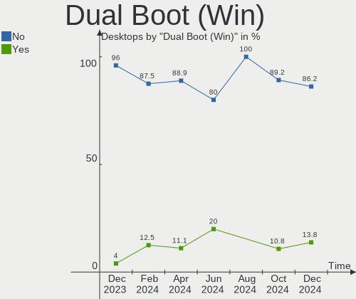

KDE neon Hardware Trends (Desktops)
-----------------------------------

A project to identify most popular hardware characteristics and track their change
over time based on data collected by KDE neon users at https://Linux-Hardware.org.

Anyone can contribute to this report by the [hw-probe](https://github.com/linuxhw/hw-probe) tool:

    sudo -E hw-probe -all -upload

Full-feature report is available here: https://linux-hardware.org/?view=trends

Period: Jan, 2022.

Contents
--------

* [ System ](#system)
  - [ OS                       ](#os)
  - [ OS Family                ](#os-family)
  - [ Kernel                   ](#kernel)
  - [ Kernel Family            ](#kernel-family)
  - [ Kernel Major Ver.        ](#kernel-major-ver)
  - [ Arch                     ](#arch)
  - [ DE                       ](#de)
  - [ Display Server           ](#display-server)
  - [ Display Manager          ](#display-manager)
  - [ OS Lang                  ](#os-lang)
  - [ Boot Mode                ](#boot-mode)
  - [ Filesystem               ](#filesystem)
  - [ Part. scheme             ](#part-scheme)
  - [ Dual Boot with Linux/BSD ](#dual-boot-with-linuxbsd)
  - [ Dual Boot (Win)          ](#dual-boot-win)

* [ Board ](#board)
  - [ Vendor                   ](#vendor)
  - [ Model                    ](#model)
  - [ Model Family             ](#model-family)
  - [ MFG Year                 ](#mfg-year)
  - [ Form Factor              ](#form-factor)
  - [ Secure Boot              ](#secure-boot)
  - [ Coreboot                 ](#coreboot)
  - [ RAM Size                 ](#ram-size)
  - [ RAM Used                 ](#ram-used)
  - [ Total Drives             ](#total-drives)
  - [ Has CD-ROM               ](#has-cd-rom)
  - [ Has Ethernet             ](#has-ethernet)
  - [ Has WiFi                 ](#has-wifi)
  - [ Has Bluetooth            ](#has-bluetooth)

* [ Location ](#location)
  - [ Country                  ](#country)
  - [ City                     ](#city)

* [ Drives ](#drives)
  - [ Drive Vendor             ](#drive-vendor)
  - [ Drive Model              ](#drive-model)
  - [ HDD Vendor               ](#hdd-vendor)
  - [ SSD Vendor               ](#ssd-vendor)
  - [ Drive Kind               ](#drive-kind)
  - [ Drive Connector          ](#drive-connector)
  - [ Drive Size               ](#drive-size)
  - [ Space Total              ](#space-total)
  - [ Space Used               ](#space-used)
  - [ Malfunc. Drives          ](#malfunc-drives)
  - [ Malfunc. Drive Vendor    ](#malfunc-drive-vendor)
  - [ Malfunc. HDD Vendor      ](#malfunc-hdd-vendor)
  - [ Malfunc. Drive Kind      ](#malfunc-drive-kind)
  - [ Failed Drives            ](#failed-drives)
  - [ Failed Drive Vendor      ](#failed-drive-vendor)
  - [ Drive Status             ](#drive-status)

* [ Storage controller ](#storage-controller)
  - [ Storage Vendor           ](#storage-vendor)
  - [ Storage Model            ](#storage-model)
  - [ Storage Kind             ](#storage-kind)

* [ Processor ](#processor)
  - [ CPU Vendor               ](#cpu-vendor)
  - [ CPU Model                ](#cpu-model)
  - [ CPU Model Family         ](#cpu-model-family)
  - [ CPU Cores                ](#cpu-cores)
  - [ CPU Sockets              ](#cpu-sockets)
  - [ CPU Threads              ](#cpu-threads)
  - [ CPU Op-Modes             ](#cpu-op-modes)
  - [ CPU Microcode            ](#cpu-microcode)
  - [ CPU Microarch            ](#cpu-microarch)

* [ Graphics ](#graphics)
  - [ GPU Vendor               ](#gpu-vendor)
  - [ GPU Model                ](#gpu-model)
  - [ GPU Combo                ](#gpu-combo)
  - [ GPU Driver               ](#gpu-driver)
  - [ GPU Memory               ](#gpu-memory)

* [ Monitor ](#monitor)
  - [ Monitor Vendor           ](#monitor-vendor)
  - [ Monitor Model            ](#monitor-model)
  - [ Monitor Resolution       ](#monitor-resolution)
  - [ Monitor Diagonal         ](#monitor-diagonal)
  - [ Monitor Width            ](#monitor-width)
  - [ Aspect Ratio             ](#aspect-ratio)
  - [ Monitor Area             ](#monitor-area)
  - [ Pixel Density            ](#pixel-density)
  - [ Multiple Monitors        ](#multiple-monitors)

* [ Network ](#network)
  - [ Net Controller Vendor    ](#net-controller-vendor)
  - [ Net Controller Model     ](#net-controller-model)
  - [ Wireless Vendor          ](#wireless-vendor)
  - [ Wireless Model           ](#wireless-model)
  - [ Ethernet Vendor          ](#ethernet-vendor)
  - [ Ethernet Model           ](#ethernet-model)
  - [ Net Controller Kind      ](#net-controller-kind)
  - [ Used Controller          ](#used-controller)
  - [ NICs                     ](#nics)
  - [ IPv6                     ](#ipv6)

* [ Bluetooth ](#bluetooth)
  - [ Bluetooth Vendor         ](#bluetooth-vendor)
  - [ Bluetooth Model          ](#bluetooth-model)

* [ Sound ](#sound)
  - [ Sound Vendor             ](#sound-vendor)
  - [ Sound Model              ](#sound-model)

* [ Memory ](#memory)
  - [ Memory Vendor            ](#memory-vendor)
  - [ Memory Model             ](#memory-model)
  - [ Memory Kind              ](#memory-kind)
  - [ Memory Form Factor       ](#memory-form-factor)
  - [ Memory Size              ](#memory-size)
  - [ Memory Speed             ](#memory-speed)

* [ Printers & scanners ](#printers--scanners)
  - [ Printer Vendor           ](#printer-vendor)
  - [ Printer Model            ](#printer-model)
  - [ Scanner Vendor           ](#scanner-vendor)
  - [ Scanner Model            ](#scanner-model)

* [ Camera ](#camera)
  - [ Camera Vendor            ](#camera-vendor)
  - [ Camera Model             ](#camera-model)

* [ Security ](#security)
  - [ Fingerprint Vendor       ](#fingerprint-vendor)
  - [ Fingerprint Model        ](#fingerprint-model)
  - [ Chipcard Vendor          ](#chipcard-vendor)
  - [ Chipcard Model           ](#chipcard-model)

* [ Unsupported ](#unsupported)
  - [ Unsupported Devices      ](#unsupported-devices)
  - [ Unsupported Device Types ](#unsupported-device-types)

System
------

OS
--

Installed operating systems

| Name             | Desktops | Percent |
|------------------|----------|---------|
| KDE neon 20.04   | 49       | 98%     |
| KDE neon 20.04.3 | 1        | 2%      |

OS Family
---------

OS without a version

| Name     | Desktops | Percent |
|----------|----------|---------|
| KDE neon | 50       | 100%    |

Kernel
------

Version of the Linux kernel

| Version                         | Desktops | Percent |
|---------------------------------|----------|---------|
| 5.13.0-27-generic               | 12       | 24%     |
| 5.11.0-46-generic               | 10       | 20%     |
| 5.11.0-43-generic               | 10       | 20%     |
| 5.11.0-44-generic               | 8        | 16%     |
| 5.8.0-59-generic                | 1        | 2%      |
| 5.16-051600-generic             | 1        | 2%      |
| 5.15.11-ext73-95.11-amdstandard | 1        | 2%      |
| 5.14.21-051421-generic          | 1        | 2%      |
| 5.14.12-051412-generic          | 1        | 2%      |
| 5.13.0-25-generic               | 1        | 2%      |
| 5.13.0-22-generic               | 1        | 2%      |
| 5.11.0-41-generic               | 1        | 2%      |
| 5.11.0-40-generic               | 1        | 2%      |
| 5.11.0-38-generic               | 1        | 2%      |

Kernel Family
-------------

Linux kernel without a distro release

| Version | Desktops | Percent |
|---------|----------|---------|
| 5.11.0  | 31       | 62%     |
| 5.13.0  | 14       | 28%     |
| 5.8.0   | 1        | 2%      |
| 5.16    | 1        | 2%      |
| 5.15.11 | 1        | 2%      |
| 5.14.21 | 1        | 2%      |
| 5.14.12 | 1        | 2%      |

Kernel Major Ver.
-----------------

Linux kernel major version

| Version | Desktops | Percent |
|---------|----------|---------|
| 5.11    | 31       | 62%     |
| 5.13    | 14       | 28%     |
| 5.14    | 2        | 4%      |
| 5.8     | 1        | 2%      |
| 5.15    | 1        | 2%      |
| 5       | 1        | 2%      |

Arch
----

OS architecture (x86_64, i586, etc.)

| Name   | Desktops | Percent |
|--------|----------|---------|
| x86_64 | 50       | 100%    |

DE
--

Desktop Environment

| Name | Desktops | Percent |
|------|----------|---------|
| KDE5 | 49       | 98%     |
| KDE  | 1        | 2%      |

Display Server
--------------

X11 or Wayland

| Name    | Desktops | Percent |
|---------|----------|---------|
| X11     | 49       | 98%     |
| Wayland | 1        | 2%      |

Display Manager
---------------

SDDM, LightDM, etc.

| Name    | Desktops | Percent |
|---------|----------|---------|
| Unknown | 40       | 80%     |
| SDDM    | 10       | 20%     |

OS Lang
-------

Language

| Lang  | Desktops | Percent |
|-------|----------|---------|
| en_US | 18       | 36%     |
| fr_FR | 4        | 8%      |
| de_DE | 4        | 8%      |
| ru_RU | 3        | 6%      |
| pt_BR | 3        | 6%      |
| en_GB | 3        | 6%      |
| C     | 3        | 6%      |
| sv_SE | 2        | 4%      |
| en_CA | 2        | 4%      |
| ru_UA | 1        | 2%      |
| hu_HU | 1        | 2%      |
| es_VE | 1        | 2%      |
| es_MX | 1        | 2%      |
| es_ES | 1        | 2%      |
| el_GR | 1        | 2%      |
| de_CH | 1        | 2%      |
| de_AT | 1        | 2%      |

Boot Mode
---------

EFI or BIOS

| Mode | Desktops | Percent |
|------|----------|---------|
| EFI  | 35       | 70%     |
| BIOS | 15       | 30%     |

Filesystem
----------

Type of filesystem

| Type    | Desktops | Percent |
|---------|----------|---------|
| Ext4    | 44       | 88%     |
| Btrfs   | 3        | 6%      |
| Overlay | 2        | 4%      |
| Zfs     | 1        | 2%      |

Part. scheme
------------

Scheme of partitioning

| Type    | Desktops | Percent |
|---------|----------|---------|
| Unknown | 46       | 92%     |
| GPT     | 3        | 6%      |
| MBR     | 1        | 2%      |

Dual Boot with Linux/BSD
------------------------

Hosting more than one Linux/BSD

| Dual boot | Desktops | Percent |
|-----------|----------|---------|
| No        | 49       | 98%     |
| Yes       | 1        | 2%      |

Dual Boot (Win)
---------------

Hosting Linux and Windows

| Dual boot | Desktops | Percent |
|-----------|----------|---------|
| No        | 42       | 84%     |
| Yes       | 8        | 16%     |

Board
-----

Vendor
------

Motherboard manufacturer

| Name                | Desktops | Percent |
|---------------------|----------|---------|
| ASUSTek Computer    | 18       | 36%     |
| MSI                 | 11       | 22%     |
| Gigabyte Technology | 4        | 8%      |
| ASRock              | 4        | 8%      |
| Intel               | 3        | 6%      |
| Hewlett-Packard     | 3        | 6%      |
| Dell                | 2        | 4%      |
| Pegatron            | 1        | 2%      |
| BESSTAR Tech        | 1        | 2%      |
| Alienware           | 1        | 2%      |
| Acer                | 1        | 2%      |
| Unknown             | 1        | 2%      |

Model
-----

Motherboard model

| Name                                 | Desktops | Percent |
|--------------------------------------|----------|---------|
| Gigabyte GA-78LMT-USB3 6.0           | 2        | 4%      |
| ASUS TUF GAMING X570-PLUS            | 2        | 4%      |
| Pegatron IPMSB-GS                    | 1        | 2%      |
| MSI MS-7D25                          | 1        | 2%      |
| MSI MS-7C95                          | 1        | 2%      |
| MSI MS-7C90                          | 1        | 2%      |
| MSI MS-7C37                          | 1        | 2%      |
| MSI MS-7B98                          | 1        | 2%      |
| MSI MS-7B93                          | 1        | 2%      |
| MSI MS-7A15                          | 1        | 2%      |
| MSI MS-7994                          | 1        | 2%      |
| MSI MS-7845                          | 1        | 2%      |
| MSI MS-7788                          | 1        | 2%      |
| MSI MS-7678                          | 1        | 2%      |
| Intel DQ77KB AAG81483-500            | 1        | 2%      |
| Intel DG41TY AAE47335-203            | 1        | 2%      |
| Intel DG31PR AAD97573-301            | 1        | 2%      |
| HP Z620 Workstation                  | 1        | 2%      |
| HP Pavilion Gaming Desktop TG01-0xxx | 1        | 2%      |
| HP 510-p127c                         | 1        | 2%      |
| Gigabyte 990XA-UD3                   | 1        | 2%      |
| Gigabyte 970A-DS3P FX                | 1        | 2%      |
| Dell Precision Tower 3620            | 1        | 2%      |
| Dell OptiPlex 790                    | 1        | 2%      |
| BESSTAR Tech HM50                    | 1        | 2%      |
| ASUS TUF GAMING X570-PRO             | 1        | 2%      |
| ASUS TUF GAMING B550-PLUS            | 1        | 2%      |
| ASUS ROG STRIX Z590-A GAMING WIFI    | 1        | 2%      |
| ASUS ROG STRIX Z390-E GAMING         | 1        | 2%      |
| ASUS ROG STRIX X570-I GAMING         | 1        | 2%      |
| ASUS ROG STRIX B450-F GAMING         | 1        | 2%      |
| ASUS PRIME Z390-A                    | 1        | 2%      |
| ASUS PRIME X370-PRO                  | 1        | 2%      |
| ASUS PRIME J4005I-C                  | 1        | 2%      |
| ASUS PRIME B550M-A                   | 1        | 2%      |
| ASUS PRIME B350M-A                   | 1        | 2%      |
| ASUS P5G41T-M LX                     | 1        | 2%      |
| ASUS M5A97 R2.0                      | 1        | 2%      |
| ASUS H110M-D                         | 1        | 2%      |
| ASUS H110M-C                         | 1        | 2%      |
| ASUS All Series                      | 1        | 2%      |
| ASRock Z590 Pro4                     | 1        | 2%      |
| ASRock Z170 Extreme7+                | 1        | 2%      |
| ASRock N68-S3 FX                     | 1        | 2%      |
| ASRock B365 Pro4                     | 1        | 2%      |
| Alienware X51 R2                     | 1        | 2%      |
| Acer Aspire XC-230                   | 1        | 2%      |
| Unknown                              | 1        | 2%      |

Model Family
------------

Motherboard model prefix

| Name                   | Desktops | Percent |
|------------------------|----------|---------|
| ASUS PRIME             | 5        | 10%     |
| ASUS TUF               | 4        | 8%      |
| ASUS ROG               | 4        | 8%      |
| Gigabyte GA-78LMT-USB3 | 2        | 4%      |
| Pegatron IPMSB-GS      | 1        | 2%      |
| MSI MS-7D25            | 1        | 2%      |
| MSI MS-7C95            | 1        | 2%      |
| MSI MS-7C90            | 1        | 2%      |
| MSI MS-7C37            | 1        | 2%      |
| MSI MS-7B98            | 1        | 2%      |
| MSI MS-7B93            | 1        | 2%      |
| MSI MS-7A15            | 1        | 2%      |
| MSI MS-7994            | 1        | 2%      |
| MSI MS-7845            | 1        | 2%      |
| MSI MS-7788            | 1        | 2%      |
| MSI MS-7678            | 1        | 2%      |
| Intel DQ77KB           | 1        | 2%      |
| Intel DG41TY           | 1        | 2%      |
| Intel DG31PR           | 1        | 2%      |
| HP Z620                | 1        | 2%      |
| HP Pavilion            | 1        | 2%      |
| HP 510-p127c           | 1        | 2%      |
| Gigabyte 990XA-UD3     | 1        | 2%      |
| Gigabyte 970A-DS3P     | 1        | 2%      |
| Dell Precision         | 1        | 2%      |
| Dell OptiPlex          | 1        | 2%      |
| BESSTAR Tech HM50      | 1        | 2%      |
| ASUS P5G41T-M          | 1        | 2%      |
| ASUS M5A97             | 1        | 2%      |
| ASUS H110M-D           | 1        | 2%      |
| ASUS H110M-C           | 1        | 2%      |
| ASUS All               | 1        | 2%      |
| ASRock Z590            | 1        | 2%      |
| ASRock Z170            | 1        | 2%      |
| ASRock N68-S3          | 1        | 2%      |
| ASRock B365            | 1        | 2%      |
| Alienware X51          | 1        | 2%      |
| Acer Aspire            | 1        | 2%      |
| Unknown                | 1        | 2%      |

MFG Year
--------

Motherboard manufacture year

| Year | Desktops | Percent |
|------|----------|---------|
| 2019 | 8        | 16%     |
| 2020 | 6        | 12%     |
| 2015 | 6        | 12%     |
| 2021 | 5        | 10%     |
| 2011 | 5        | 10%     |
| 2017 | 4        | 8%      |
| 2018 | 3        | 6%      |
| 2016 | 3        | 6%      |
| 2013 | 3        | 6%      |
| 2014 | 2        | 4%      |
| 2012 | 2        | 4%      |
| 2010 | 2        | 4%      |
| 2008 | 1        | 2%      |

Form Factor
-----------

Physical design of the computer

| Name    | Desktops | Percent |
|---------|----------|---------|
| Desktop | 50       | 100%    |

Secure Boot
-----------

Enabled or disabled

| State    | Desktops | Percent |
|----------|----------|---------|
| Disabled | 45       | 90%     |
| Enabled  | 5        | 10%     |

Coreboot
--------

Have coreboot on board

| Used | Desktops | Percent |
|------|----------|---------|
| No   | 50       | 100%    |

RAM Size
--------

Total RAM memory

| Size in GB  | Desktops | Percent |
|-------------|----------|---------|
| 16.01-24.0  | 20       | 40%     |
| 8.01-16.0   | 9        | 18%     |
| 32.01-64.0  | 7        | 14%     |
| 4.01-8.0    | 4        | 8%      |
| 64.01-256.0 | 4        | 8%      |
| 3.01-4.0    | 3        | 6%      |
| 24.01-32.0  | 1        | 2%      |
| 2.01-3.0    | 1        | 2%      |
| 1.01-2.0    | 1        | 2%      |

RAM Used
--------

Used RAM memory

| Used GB    | Desktops | Percent |
|------------|----------|---------|
| 1.01-2.0   | 16       | 32%     |
| 2.01-3.0   | 15       | 30%     |
| 4.01-8.0   | 9        | 18%     |
| 3.01-4.0   | 4        | 8%      |
| 0.51-1.0   | 3        | 6%      |
| 16.01-24.0 | 2        | 4%      |
| 24.01-32.0 | 1        | 2%      |

Total Drives
------------

Number of drives on board

| Drives | Desktops | Percent |
|--------|----------|---------|
| 2      | 16       | 32%     |
| 1      | 13       | 26%     |
| 3      | 8        | 16%     |
| 4      | 7        | 14%     |
| 5      | 3        | 6%      |
| 6      | 2        | 4%      |
| 7      | 1        | 2%      |

Has CD-ROM
----------

Has CD-ROM on board

| Presented | Desktops | Percent |
|-----------|----------|---------|
| No        | 33       | 66%     |
| Yes       | 17       | 34%     |

Has Ethernet
------------

Has Ethernet on board

| Presented | Desktops | Percent |
|-----------|----------|---------|
| Yes       | 50       | 100%    |

Has WiFi
--------

Has WiFi module

| Presented | Desktops | Percent |
|-----------|----------|---------|
| Yes       | 29       | 58%     |
| No        | 21       | 42%     |

Has Bluetooth
-------------

Has Bluetooth module

| Presented | Desktops | Percent |
|-----------|----------|---------|
| No        | 26       | 52%     |
| Yes       | 24       | 48%     |

Location
--------

Country
-------

Geographic location (country)

| Country     | Desktops | Percent |
|-------------|----------|---------|
| USA         | 14       | 28%     |
| Germany     | 4        | 8%      |
| France      | 4        | 8%      |
| Sweden      | 3        | 6%      |
| Russia      | 3        | 6%      |
| Canada      | 3        | 6%      |
| Brazil      | 3        | 6%      |
| UK          | 2        | 4%      |
| Italy       | 2        | 4%      |
| Greece      | 2        | 4%      |
| Venezuela   | 1        | 2%      |
| Ukraine     | 1        | 2%      |
| Switzerland | 1        | 2%      |
| Spain       | 1        | 2%      |
| Nicaragua   | 1        | 2%      |
| Netherlands | 1        | 2%      |
| Indonesia   | 1        | 2%      |
| Hungary     | 1        | 2%      |
| Croatia     | 1        | 2%      |
| Austria     | 1        | 2%      |

City
----

Geographic location (city)

| City            | Desktops | Percent |
|-----------------|----------|---------|
| Natick          | 2        | 4%      |
| Athens          | 2        | 4%      |
| Wolverhampton   | 1        | 2%      |
| Wiesloch        | 1        | 2%      |
| Westminster     | 1        | 2%      |
| Upplands Vasby  | 1        | 2%      |
| The Hague       | 1        | 2%      |
| Taby            | 1        | 2%      |
| Strongsville    | 1        | 2%      |
| Spanish Fork    | 1        | 2%      |
| Sorel-Tracy     | 1        | 2%      |
| Sopron          | 1        | 2%      |
| Seattle         | 1        | 2%      |
| S??o Paulo      | 1        | 2%      |
| Samobor         | 1        | 2%      |
| Saint-Nazaire   | 1        | 2%      |
| Raleigh         | 1        | 2%      |
| Port Clinton    | 1        | 2%      |
| Piedmont        | 1        | 2%      |
| Phoenix         | 1        | 2%      |
| Norwich         | 1        | 2%      |
| Naples          | 1        | 2%      |
| Moscow          | 1        | 2%      |
| Maring??        | 1        | 2%      |
| Manchester      | 1        | 2%      |
| Managua         | 1        | 2%      |
| Madrid          | 1        | 2%      |
| Kriens          | 1        | 2%      |
| Krasnodar       | 1        | 2%      |
| Kamloops        | 1        | 2%      |
| Josselin        | 1        | 2%      |
| Jakarta         | 1        | 2%      |
| Hallsta         | 1        | 2%      |
| Great Falls     | 1        | 2%      |
| Gottfrieding    | 1        | 2%      |
| East Hartford   | 1        | 2%      |
| Duque de Caxias | 1        | 2%      |
| Dolgoprudnyy    | 1        | 2%      |
| Dnipro          | 1        | 2%      |
| Delta           | 1        | 2%      |
| D??sseldorf     | 1        | 2%      |
| Caracas         | 1        | 2%      |
| Bordeaux        | 1        | 2%      |
| Bielefeld       | 1        | 2%      |
| Barberton       | 1        | 2%      |
| Andria          | 1        | 2%      |
| Amiens          | 1        | 2%      |
| Altheim         | 1        | 2%      |

Drives
------

Drive Vendor
------------

Hard drive vendors

| Vendor              | Desktops | Drives | Percent |
|---------------------|----------|--------|---------|
| WDC                 | 24       | 33     | 22.43%  |
| Samsung Electronics | 18       | 24     | 16.82%  |
| Seagate             | 15       | 20     | 14.02%  |
| Toshiba             | 9        | 10     | 8.41%   |
| Sandisk             | 9        | 10     | 8.41%   |
| Phison              | 4        | 4      | 3.74%   |
| Kingston            | 4        | 4      | 3.74%   |
| PNY                 | 3        | 3      | 2.8%    |
| Intenso             | 3        | 6      | 2.8%    |
| XPG                 | 2        | 2      | 1.87%   |
| Unknown             | 2        | 2      | 1.87%   |
| Intel               | 2        | 2      | 1.87%   |
| Crucial             | 2        | 2      | 1.87%   |
| Tanbassh            | 1        | 1      | 0.93%   |
| SK Hynix            | 1        | 1      | 0.93%   |
| Silicon Motion      | 1        | 1      | 0.93%   |
| SABRENT             | 1        | 1      | 0.93%   |
| Pioneer             | 1        | 1      | 0.93%   |
| Patriot             | 1        | 1      | 0.93%   |
| Netac               | 1        | 1      | 0.93%   |
| Hitachi             | 1        | 1      | 0.93%   |
| HGST                | 1        | 1      | 0.93%   |
| Corsair             | 1        | 1      | 0.93%   |

Drive Model
-----------

Hard drive models

| Model                                | Desktops | Percent |
|--------------------------------------|----------|---------|
| Samsung NVMe SSD Drive 1TB           | 4        | 3.25%   |
| Toshiba DT01ACA100 1TB               | 3        | 2.44%   |
| SanDisk SDSSDA120G 120GB             | 3        | 2.44%   |
| Sandisk NVMe SSD Drive 500GB         | 3        | 2.44%   |
| Samsung SSD 860 EVO 500GB            | 3        | 2.44%   |
| Unknown SD/MMC/MS PRO 128GB          | 2        | 1.63%   |
| Toshiba HDWD120 2TB                  | 2        | 1.63%   |
| Samsung SSD 860 EVO 1TB              | 2        | 1.63%   |
| Samsung SSD 850 EVO 250GB            | 2        | 1.63%   |
| PNY CS900 240GB SSD                  | 2        | 1.63%   |
| XPG NVMe SSD Drive 512GB             | 1        | 0.81%   |
| XPG NVMe SSD Drive 2TB               | 1        | 0.81%   |
| WDC WDS500G2B0C-00PXH0 500GB         | 1        | 0.81%   |
| WDC WDS500G1X0E-00AFY0 500GB         | 1        | 0.81%   |
| WDC WDS250G1B0A-00H9H0 250GB SSD     | 1        | 0.81%   |
| WDC WDS240G2G0B-00EPW0 240GB SSD     | 1        | 0.81%   |
| WDC WDS100T2B0A-00SM50 1TB SSD       | 1        | 0.81%   |
| WDC WD60EFAX-68SHWN0 6TB             | 1        | 0.81%   |
| WDC WD5001FZWX-00ZHUA0 5TB           | 1        | 0.81%   |
| WDC WD5000LPVX-80V0TT0 500GB         | 1        | 0.81%   |
| WDC WD5000LPCX-24VHAT0 500GB         | 1        | 0.81%   |
| WDC WD5000AAKX-001CA0 500GB          | 1        | 0.81%   |
| WDC WD5000AAKS-00UU3A0 500GB         | 1        | 0.81%   |
| WDC WD40EZRZ-00WN9B0 4TB             | 1        | 0.81%   |
| WDC WD3200AAJS-08L7A0 320GB          | 1        | 0.81%   |
| WDC WD20PURZ-85AKKY0 2TB             | 1        | 0.81%   |
| WDC WD20EZRX-00DC0B0 2TB             | 1        | 0.81%   |
| WDC WD20EARS-00MVWB0 2TB             | 1        | 0.81%   |
| WDC WD2003FZEX-00Z4SA0 2TB           | 1        | 0.81%   |
| WDC WD1600AAJS-08L7A0 160GB          | 1        | 0.81%   |
| WDC WD1600AAJS-07M0A0 160GB          | 1        | 0.81%   |
| WDC WD1600AAJS-00L7A0 160GB          | 1        | 0.81%   |
| WDC WD10SPCX-60KHST0 1TB             | 1        | 0.81%   |
| WDC WD10EZEX-60WN4A1 1TB             | 1        | 0.81%   |
| WDC WD10EZEX-21WN4A0 1TB             | 1        | 0.81%   |
| WDC WD10EZEX-21M2NA0 1TB             | 1        | 0.81%   |
| WDC WD10EZEX-08WN4A0 1TB             | 1        | 0.81%   |
| WDC WD10EZEX-00WN4A0 1TB             | 1        | 0.81%   |
| WDC WD10EZEX-00BN5A0 1TB             | 1        | 0.81%   |
| WDC WD10EFRX-68FYTN0 1TB             | 1        | 0.81%   |
| WDC WD10EARS-00MVWB0 1TB             | 1        | 0.81%   |
| WDC WD1003FZEX-00MK2A0 1TB           | 1        | 0.81%   |
| WDC WD1003FZEX-00K3CA0 1TB           | 1        | 0.81%   |
| Toshiba MQ04ABF100 1TB               | 1        | 0.81%   |
| Toshiba MQ02ABD100H 1TB              | 1        | 0.81%   |
| Toshiba HDWD130 3TB                  | 1        | 0.81%   |
| Toshiba DT01ACA300 3TB               | 1        | 0.81%   |
| Tanbassh 128GB                       | 1        | 0.81%   |
| SK Hynix NVMe SSD Drive 256GB        | 1        | 0.81%   |
| Silicon Motion NVMe SSD Drive 1024GB | 1        | 0.81%   |
| Seagate ST8000AS0002-1NA17Z 8TB      | 1        | 0.81%   |
| Seagate ST750LX003-1AC154 752GB      | 1        | 0.81%   |
| Seagate ST500DM009-2F110A 500GB      | 1        | 0.81%   |
| Seagate ST4000DM005-2DP166 4TB       | 1        | 0.81%   |
| Seagate ST4000DM004-2CV104 4TB       | 1        | 0.81%   |
| Seagate ST3750630AS 752GB            | 1        | 0.81%   |
| Seagate ST3500418AS 500GB            | 1        | 0.81%   |
| Seagate ST3500320NS 500GB            | 1        | 0.81%   |
| Seagate ST3250312AS 250GB            | 1        | 0.81%   |
| Seagate ST3160023AS 160GB            | 1        | 0.81%   |

HDD Vendor
----------

Hard disk drive vendors

| Vendor              | Desktops | Drives | Percent |
|---------------------|----------|--------|---------|
| WDC                 | 20       | 28     | 39.22%  |
| Seagate             | 14       | 18     | 27.45%  |
| Toshiba             | 9        | 10     | 17.65%  |
| Samsung Electronics | 3        | 4      | 5.88%   |
| Unknown             | 2        | 2      | 3.92%   |
| Intenso             | 1        | 2      | 1.96%   |
| Hitachi             | 1        | 1      | 1.96%   |
| HGST                | 1        | 1      | 1.96%   |

SSD Vendor
----------

Solid state drive vendors

| Vendor              | Desktops | Drives | Percent |
|---------------------|----------|--------|---------|
| Samsung Electronics | 12       | 14     | 33.33%  |
| SanDisk             | 6        | 7      | 16.67%  |
| Kingston            | 4        | 4      | 11.11%  |
| WDC                 | 3        | 3      | 8.33%   |
| PNY                 | 3        | 3      | 8.33%   |
| Intenso             | 2        | 3      | 5.56%   |
| Seagate             | 1        | 1      | 2.78%   |
| SABRENT             | 1        | 1      | 2.78%   |
| Pioneer             | 1        | 1      | 2.78%   |
| Patriot             | 1        | 1      | 2.78%   |
| Netac               | 1        | 1      | 2.78%   |
| Crucial             | 1        | 1      | 2.78%   |

Drive Kind
----------

HDD or SSD

| Kind    | Desktops | Drives | Percent |
|---------|----------|--------|---------|
| HDD     | 35       | 66     | 41.18%  |
| SSD     | 28       | 40     | 32.94%  |
| NVMe    | 20       | 24     | 23.53%  |
| Unknown | 2        | 2      | 2.35%   |

Drive Connector
---------------

SATA, SAS, NVMe, etc.

| Type | Desktops | Drives | Percent |
|------|----------|--------|---------|
| SATA | 45       | 101    | 64.29%  |
| NVMe | 20       | 24     | 28.57%  |
| SAS  | 5        | 7      | 7.14%   |

Drive Size
----------

Size of hard drive

| Size in TB | Desktops | Drives | Percent |
|------------|----------|--------|---------|
| 0.01-0.5   | 30       | 48     | 41.1%   |
| 0.51-1.0   | 25       | 35     | 34.25%  |
| 1.01-2.0   | 8        | 11     | 10.96%  |
| 4.01-10.0  | 4        | 5      | 5.48%   |
| 3.01-4.0   | 3        | 3      | 4.11%   |
| 2.01-3.0   | 3        | 4      | 4.11%   |

Space Total
-----------

Amount of disk space available on the file system

| Size in GB     | Desktops | Percent |
|----------------|----------|---------|
| 101-250        | 12       | 24%     |
| 501-1000       | 9        | 18%     |
| 251-500        | 8        | 16%     |
| 1001-2000      | 7        | 14%     |
| 51-100         | 6        | 12%     |
| More than 3000 | 5        | 10%     |
| 1-20           | 2        | 4%      |
| 2001-3000      | 1        | 2%      |

Space Used
----------

Amount of used disk space

| Used GB        | Desktops | Percent |
|----------------|----------|---------|
| 1-20           | 21       | 42%     |
| 21-50          | 8        | 16%     |
| 101-250        | 7        | 14%     |
| 51-100         | 5        | 10%     |
| More than 3000 | 4        | 8%      |
| 251-500        | 2        | 4%      |
| 1001-2000      | 2        | 4%      |
| 501-1000       | 1        | 2%      |

Malfunc. Drives
---------------

Drive models with a malfunction

| Model                      | Desktops | Drives | Percent |
|----------------------------|----------|--------|---------|
| Intenso SATA III SSD 240GB | 1        | 1      | 100%    |

Malfunc. Drive Vendor
---------------------

Vendors of faulty drives

| Vendor  | Desktops | Drives | Percent |
|---------|----------|--------|---------|
| Intenso | 1        | 1      | 100%    |

Malfunc. HDD Vendor
-------------------

Vendors of faulty HDD drives

Zero info for selected period =(

Malfunc. Drive Kind
-------------------

Kinds of faulty drives

| Kind | Desktops | Drives | Percent |
|------|----------|--------|---------|
| SSD  | 1        | 1      | 100%    |

Failed Drives
-------------

Failed drive models

Zero info for selected period =(

Failed Drive Vendor
-------------------

Failed drive vendors

Zero info for selected period =(

Drive Status
------------

Number of failed and malfunc. drives

| Status   | Desktops | Drives | Percent |
|----------|----------|--------|---------|
| Detected | 47       | 121    | 88.68%  |
| Works    | 5        | 10     | 9.43%   |
| Malfunc  | 1        | 1      | 1.89%   |

Storage controller
------------------

Storage Vendor
--------------

Storage controller vendors

| Vendor                    | Desktops | Percent |
|---------------------------|----------|---------|
| Intel                     | 27       | 35.06%  |
| AMD                       | 23       | 29.87%  |
| Sandisk                   | 5        | 6.49%   |
| Samsung Electronics       | 5        | 6.49%   |
| ASMedia Technology        | 5        | 6.49%   |
| Phison Electronics        | 4        | 5.19%   |
| ADATA Technology          | 2        | 2.6%    |
| SK Hynix                  | 1        | 1.3%    |
| Silicon Motion            | 1        | 1.3%    |
| Seagate Technology        | 1        | 1.3%    |
| Nvidia                    | 1        | 1.3%    |
| Micron/Crucial Technology | 1        | 1.3%    |
| Marvell Technology Group  | 1        | 1.3%    |

Storage Model
-------------

Storage controller models

| Model                                                                                   | Desktops | Percent |
|-----------------------------------------------------------------------------------------|----------|---------|
| AMD FCH SATA Controller [AHCI mode]                                                     | 13       | 13.27%  |
| Intel Q170/Q150/B150/H170/H110/Z170/CM236 Chipset SATA Controller [AHCI Mode]           | 6        | 6.12%   |
| ASMedia ASM1062 Serial ATA Controller                                                   | 5        | 5.1%    |
| AMD Starship/Matisse Chipset SATA Controller [AHCI mode]                                | 4        | 4.08%   |
| AMD SB7x0/SB8x0/SB9x0 SATA Controller [AHCI mode]                                       | 4        | 4.08%   |
| Intel NM10/ICH7 Family SATA Controller [IDE mode]                                       | 3        | 3.06%   |
| Intel Cannon Lake PCH SATA AHCI Controller                                              | 3        | 3.06%   |
| Intel 82801G (ICH7 Family) IDE Controller                                               | 3        | 3.06%   |
| Intel 6 Series/C200 Series Chipset Family Desktop SATA Controller (IDE mode, ports 4-5) | 3        | 3.06%   |
| Intel 6 Series/C200 Series Chipset Family Desktop SATA Controller (IDE mode, ports 0-3) | 3        | 3.06%   |
| AMD SB7x0/SB8x0/SB9x0 IDE Controller                                                    | 3        | 3.06%   |
| Sandisk Non-Volatile memory controller                                                  | 2        | 2.04%   |
| Samsung NVMe SSD Controller SM981/PM981/PM983                                           | 2        | 2.04%   |
| Samsung NVMe SSD Controller 980                                                         | 2        | 2.04%   |
| Intel 500 Series Chipset Family SATA AHCI Controller                                    | 2        | 2.04%   |
| AMD 400 Series Chipset SATA Controller                                                  | 2        | 2.04%   |
| AMD 300 Series Chipset SATA Controller                                                  | 2        | 2.04%   |
| ADATA XPG SX8200 Pro PCIe Gen3x4 M.2 2280 Solid State Drive                             | 2        | 2.04%   |
| SK Hynix BC501 NVMe Solid State Drive                                                   | 1        | 1.02%   |
| Silicon Motion SM2263EN/SM2263XT SSD Controller                                         | 1        | 1.02%   |
| Seagate FireCuda 520 SSD                                                                | 1        | 1.02%   |
| Sandisk WD PC SN810 / Black SN850 NVMe SSD                                              | 1        | 1.02%   |
| Sandisk WD Blue SN550 NVMe SSD                                                          | 1        | 1.02%   |
| Sandisk WD Black 2018/SN750 / PC SN720 NVMe SSD                                         | 1        | 1.02%   |
| Samsung NVMe SSD Controller SM961/PM961/SM963                                           | 1        | 1.02%   |
| Samsung NVMe SSD Controller PM9A1/PM9A3/980PRO                                          | 1        | 1.02%   |
| Phison PS5013 E13 NVMe Controller                                                       | 1        | 1.02%   |
| Phison NVMe Storage Controller                                                          | 1        | 1.02%   |
| Phison E18 PCIe4 NVMe Controller                                                        | 1        | 1.02%   |
| Phison E16 PCIe4 NVMe Controller                                                        | 1        | 1.02%   |
| Nvidia MCP61 SATA Controller                                                            | 1        | 1.02%   |
| Nvidia MCP61 IDE                                                                        | 1        | 1.02%   |
| Micron/Crucial P2 NVMe PCIe SSD                                                         | 1        | 1.02%   |
| Marvell Group 88SE9128 PCIe SATA 6 Gb/s RAID controller with HyperDuo                   | 1        | 1.02%   |
| Intel SSD Pro 7600p/760p/E 6100p Series                                                 | 1        | 1.02%   |
| Intel SSD 660P Series                                                                   | 1        | 1.02%   |
| Intel SATA Controller [RAID mode]                                                       | 1        | 1.02%   |
| Intel Celeron/Pentium Silver Processor SATA Controller                                  | 1        | 1.02%   |
| Intel C602 chipset 4-Port SATA Storage Control Unit                                     | 1        | 1.02%   |
| Intel C600/X79 series chipset IDE-r Controller                                          | 1        | 1.02%   |
| Intel C600/X79 series chipset 6-Port SATA AHCI Controller                               | 1        | 1.02%   |
| Intel C600/X79 series chipset 4-Port SATA IDE Controller                                | 1        | 1.02%   |
| Intel C600/X79 series chipset 2-Port SATA IDE Controller                                | 1        | 1.02%   |
| Intel Alder Lake-S PCH SATA Controller [AHCI Mode]                                      | 1        | 1.02%   |
| Intel 9 Series Chipset Family SATA Controller [AHCI Mode]                               | 1        | 1.02%   |
| Intel 8 Series/C220 Series Chipset Family 6-port SATA Controller 1 [AHCI mode]          | 1        | 1.02%   |
| Intel 7 Series/C210 Series Chipset Family 6-port SATA Controller [AHCI mode]            | 1        | 1.02%   |
| Intel 6 Series/C200 Series Chipset Family 6 port Desktop SATA AHCI Controller           | 1        | 1.02%   |
| Intel 200 Series PCH SATA controller [AHCI mode]                                        | 1        | 1.02%   |
| AMD X370 Series Chipset SATA Controller                                                 | 1        | 1.02%   |
| AMD SB7x0/SB8x0/SB9x0 SATA Controller [IDE mode]                                        | 1        | 1.02%   |
| AMD FCH SATA Controller [IDE mode]                                                      | 1        | 1.02%   |

Storage Kind
------------

Kind of storage controller (IDE, SATA, NVMe, SAS, ...)

| Kind | Desktops | Percent |
|------|----------|---------|
| SATA | 43       | 55.84%  |
| NVMe | 20       | 25.97%  |
| IDE  | 12       | 15.58%  |
| RAID | 1        | 1.3%    |
| SAS  | 1        | 1.3%    |

Processor
---------

CPU Vendor
----------

Processor vendors

| Vendor | Desktops | Percent |
|--------|----------|---------|
| Intel  | 26       | 52%     |
| AMD    | 24       | 48%     |

CPU Model
---------

Processor models

| Model                                          | Desktops | Percent |
|------------------------------------------------|----------|---------|
| AMD Ryzen 7 3700X 8-Core Processor             | 3        | 6%      |
| Intel Core i7-9700K CPU @ 3.60GHz              | 2        | 4%      |
| Intel Core i5-9600K CPU @ 3.70GHz              | 2        | 4%      |
| Intel Core i5-6500 CPU @ 3.20GHz               | 2        | 4%      |
| AMD Ryzen 5 3600 6-Core Processor              | 2        | 4%      |
| AMD FX-4300 Quad-Core Processor                | 2        | 4%      |
| Intel Xeon CPU E5440 @ 2.83GHz                 | 1        | 2%      |
| Intel Xeon CPU E5-2680 0 @ 2.70GHz             | 1        | 2%      |
| Intel Xeon CPU E31225 @ 3.10GHz                | 1        | 2%      |
| Intel Pentium CPU G4560 @ 3.50GHz              | 1        | 2%      |
| Intel Core i7-7700K CPU @ 4.20GHz              | 1        | 2%      |
| Intel Core i7-6700K CPU @ 4.00GHz              | 1        | 2%      |
| Intel Core i7-4790K CPU @ 4.00GHz              | 1        | 2%      |
| Intel Core i7-4770K CPU @ 3.50GHz              | 1        | 2%      |
| Intel Core i7-4770 CPU @ 3.40GHz               | 1        | 2%      |
| Intel Core i7-3770T CPU @ 2.50GHz              | 1        | 2%      |
| Intel Core i5-2400 CPU @ 3.10GHz               | 1        | 2%      |
| Intel Core i5-2300 CPU @ 2.80GHz               | 1        | 2%      |
| Intel Core i3-6098P CPU @ 3.60GHz              | 1        | 2%      |
| Intel Core i3-2100 CPU @ 3.10GHz               | 1        | 2%      |
| Intel Core 2 Quad CPU Q8200 @ 2.33GHz          | 1        | 2%      |
| Intel Core 2 Duo CPU E8400 @ 3.00GHz           | 1        | 2%      |
| Intel Celeron J4005 CPU @ 2.00GHz              | 1        | 2%      |
| Intel 12th Gen Core i9-12900K                  | 1        | 2%      |
| Intel 11th Gen Core i5-11600KF @ 3.90GHz       | 1        | 2%      |
| Intel 11th Gen Core i5-11600K @ 3.90GHz        | 1        | 2%      |
| AMD Ryzen 9 5900X 12-Core Processor            | 1        | 2%      |
| AMD Ryzen 9 5900HX with Radeon Graphics        | 1        | 2%      |
| AMD Ryzen 7 5800X 8-Core Processor             | 1        | 2%      |
| AMD Ryzen 7 1700X Eight-Core Processor         | 1        | 2%      |
| AMD Ryzen 5 5600G with Radeon Graphics         | 1        | 2%      |
| AMD Ryzen 5 4500U with Radeon Graphics         | 1        | 2%      |
| AMD Ryzen 5 3500X 6-Core Processor             | 1        | 2%      |
| AMD Ryzen 5 3500 6-Core Processor              | 1        | 2%      |
| AMD Ryzen 5 3400G with Radeon Vega Graphics    | 1        | 2%      |
| AMD Ryzen 5 1600X Six-Core Processor           | 1        | 2%      |
| AMD Ryzen 3 3100 4-Core Processor              | 1        | 2%      |
| AMD FX-8370E Eight-Core Processor              | 1        | 2%      |
| AMD FX-8350 Eight-Core Processor               | 1        | 2%      |
| AMD FX-8120 Eight-Core Processor               | 1        | 2%      |
| AMD Athlon II X2 220 Processor                 | 1        | 2%      |
| AMD A8-7410 APU with AMD Radeon R5 Graphics    | 1        | 2%      |
| AMD A12-9800 RADEON R7, 12 COMPUTE CORES 4C+8G | 1        | 2%      |

CPU Model Family
----------------

Processor model prefix

| Model             | Desktops | Percent |
|-------------------|----------|---------|
| Intel Core i7     | 8        | 16%     |
| AMD Ryzen 5       | 8        | 16%     |
| Intel Core i5     | 6        | 12%     |
| AMD Ryzen 7       | 5        | 10%     |
| AMD FX            | 5        | 10%     |
| Other             | 3        | 6%      |
| Intel Xeon        | 3        | 6%      |
| Intel Core i3     | 2        | 4%      |
| AMD Ryzen 9       | 2        | 4%      |
| Intel Pentium     | 1        | 2%      |
| Intel Core 2 Quad | 1        | 2%      |
| Intel Core 2 Duo  | 1        | 2%      |
| Intel Celeron     | 1        | 2%      |
| AMD Ryzen 3       | 1        | 2%      |
| AMD Athlon II X2  | 1        | 2%      |
| AMD A8            | 1        | 2%      |
| AMD A12           | 1        | 2%      |

CPU Cores
---------

Number of processor cores

| Number | Desktops | Percent |
|--------|----------|---------|
| 4      | 18       | 36%     |
| 6      | 11       | 22%     |
| 8      | 9        | 18%     |
| 2      | 9        | 18%     |
| 16     | 1        | 2%      |
| 12     | 1        | 2%      |
| 3      | 1        | 2%      |

CPU Sockets
-----------

Number of sockets

| Number | Desktops | Percent |
|--------|----------|---------|
| 1      | 50       | 100%    |

CPU Threads
-----------

Threads per core (Hyper-Threading)

| Number | Desktops | Percent |
|--------|----------|---------|
| 2      | 31       | 62%     |
| 1      | 19       | 38%     |

CPU Op-Modes
------------

CPU Operation Modes (32-bit, 64-bit)

| Op mode        | Desktops | Percent |
|----------------|----------|---------|
| 32-bit, 64-bit | 50       | 100%    |

CPU Microcode
-------------

Microcode number

| Number     | Desktops | Percent |
|------------|----------|---------|
| 0x08701021 | 6        | 12%     |
| 0x06000852 | 4        | 8%      |
| Unknown    | 4        | 8%      |
| 0x906ed    | 3        | 6%      |
| 0x506e3    | 3        | 6%      |
| 0x306c3    | 3        | 6%      |
| 0x206a7    | 3        | 6%      |
| 0xa0671    | 2        | 4%      |
| 0x906e9    | 2        | 4%      |
| 0x1067a    | 2        | 4%      |
| 0x0a50000c | 2        | 4%      |
| 0x08701013 | 2        | 4%      |
| 0x08001138 | 2        | 4%      |
| 0x906ec    | 1        | 2%      |
| 0x706a1    | 1        | 2%      |
| 0x306a9    | 1        | 2%      |
| 0x206d7    | 1        | 2%      |
| 0x10677    | 1        | 2%      |
| 0x0a201009 | 1        | 2%      |
| 0x08600106 | 1        | 2%      |
| 0x08108109 | 1        | 2%      |
| 0x07030105 | 1        | 2%      |
| 0x06006118 | 1        | 2%      |
| 0x0600063e | 1        | 2%      |
| 0x010000c8 | 1        | 2%      |

CPU Microarch
-------------

Microarchitecture

| Name          | Desktops | Percent |
|---------------|----------|---------|
| Zen 2         | 9        | 18%     |
| KabyLake      | 6        | 12%     |
| SandyBridge   | 5        | 10%     |
| Zen 3         | 4        | 8%      |
| Skylake       | 4        | 8%      |
| Piledriver    | 4        | 8%      |
| Penryn        | 3        | 6%      |
| Haswell       | 3        | 6%      |
| Zen           | 2        | 4%      |
| Icelake       | 2        | 4%      |
| Zen+          | 1        | 2%      |
| Puma          | 1        | 2%      |
| K10           | 1        | 2%      |
| IvyBridge     | 1        | 2%      |
| Goldmont plus | 1        | 2%      |
| Excavator     | 1        | 2%      |
| Bulldozer     | 1        | 2%      |
| Unknown       | 1        | 2%      |

Graphics
--------

GPU Vendor
----------

Vendors of graphics cards

| Vendor | Desktops | Percent |
|--------|----------|---------|
| Nvidia | 25       | 43.86%  |
| AMD    | 19       | 33.33%  |
| Intel  | 13       | 22.81%  |

GPU Model
---------

Graphics card models

| Model                                                                             | Desktops | Percent |
|-----------------------------------------------------------------------------------|----------|---------|
| AMD Ellesmere [Radeon RX 470/480/570/570X/580/580X/590]                           | 3        | 5.17%   |
| Nvidia GP108 [GeForce GT 1030]                                                    | 2        | 3.45%   |
| Nvidia GP107 [GeForce GTX 1050]                                                   | 2        | 3.45%   |
| Intel Xeon E3-1200 v3/4th Gen Core Processor Integrated Graphics Controller       | 2        | 3.45%   |
| Intel HD Graphics 530                                                             | 2        | 3.45%   |
| Intel 2nd Generation Core Processor Family Integrated Graphics Controller         | 2        | 3.45%   |
| AMD Cezanne                                                                       | 2        | 3.45%   |
| Nvidia TU117 [GeForce GTX 1650]                                                   | 1        | 1.72%   |
| Nvidia TU116 [GeForce GTX 1660 SUPER]                                             | 1        | 1.72%   |
| Nvidia TU106 [GeForce RTX 2070 Rev. A]                                            | 1        | 1.72%   |
| Nvidia TU106 [GeForce RTX 2060 Rev. A]                                            | 1        | 1.72%   |
| Nvidia TU104 [GeForce RTX 2080]                                                   | 1        | 1.72%   |
| Nvidia TU104 [GeForce RTX 2080 SUPER]                                             | 1        | 1.72%   |
| Nvidia TU104 [GeForce RTX 2070 SUPER]                                             | 1        | 1.72%   |
| Nvidia GT218 [GeForce 210]                                                        | 1        | 1.72%   |
| Nvidia GP107 [GeForce GTX 1050 Ti]                                                | 1        | 1.72%   |
| Nvidia GM206 [GeForce GTX 950]                                                    | 1        | 1.72%   |
| Nvidia GM204 [GeForce GTX 970]                                                    | 1        | 1.72%   |
| Nvidia GM200 [GeForce GTX 980 Ti]                                                 | 1        | 1.72%   |
| Nvidia GK208B [GeForce GT 710]                                                    | 1        | 1.72%   |
| Nvidia GK208 [GeForce GT 635]                                                     | 1        | 1.72%   |
| Nvidia GK110B [GeForce GTX TITAN Black]                                           | 1        | 1.72%   |
| Nvidia GK107 [GeForce GT 740]                                                     | 1        | 1.72%   |
| Nvidia GK104 [GeForce GTX 770]                                                    | 1        | 1.72%   |
| Nvidia GK104 [GeForce GTX 760]                                                    | 1        | 1.72%   |
| Nvidia GF108 [GeForce GT 730]                                                     | 1        | 1.72%   |
| Nvidia GA106 [GeForce RTX 3060]                                                   | 1        | 1.72%   |
| Nvidia GA104 [GeForce RTX 3060 Ti Lite Hash Rate]                                 | 1        | 1.72%   |
| Nvidia C61 [GeForce 7025 / nForce 630a]                                           | 1        | 1.72%   |
| Intel RocketLake-S GT1 [UHD Graphics 750]                                         | 1        | 1.72%   |
| Intel IvyBridge GT2 [HD Graphics 4000]                                            | 1        | 1.72%   |
| Intel HD Graphics 510                                                             | 1        | 1.72%   |
| Intel GeminiLake [UHD Graphics 600]                                               | 1        | 1.72%   |
| Intel CoffeeLake-S GT2 [UHD Graphics 630]                                         | 1        | 1.72%   |
| Intel AlderLake-S GT1                                                             | 1        | 1.72%   |
| Intel 82G33/G31 Express Integrated Graphics Controller                            | 1        | 1.72%   |
| AMD Vega 10 XL/XT [Radeon RX Vega 56/64]                                          | 1        | 1.72%   |
| AMD RV670 [Radeon HD 3870]                                                        | 1        | 1.72%   |
| AMD RS780L [Radeon 3000]                                                          | 1        | 1.72%   |
| AMD Renoir                                                                        | 1        | 1.72%   |
| AMD Picasso/Raven 2 [Radeon Vega Series / Radeon Vega Mobile Series]              | 1        | 1.72%   |
| AMD Oland XT [Radeon HD 8670 / R5 340X OEM / R7 250/350/350X OEM]                 | 1        | 1.72%   |
| AMD Navi 22 [Radeon RX 6700/6700 XT / 6800M]                                      | 1        | 1.72%   |
| AMD Navi 21 [Radeon RX 6800/6800 XT / 6900 XT]                                    | 1        | 1.72%   |
| AMD Navi 14 [Radeon RX 5500/5500M / Pro 5500M]                                    | 1        | 1.72%   |
| AMD Mullins [Radeon R4/R5 Graphics]                                               | 1        | 1.72%   |
| AMD Cedar [Radeon HD 5000/6000/7350/8350 Series]                                  | 1        | 1.72%   |
| AMD Cape Verde PRO / Venus LE / Tropo PRO-L [Radeon HD 8830M / R7 250 / R7 M465X] | 1        | 1.72%   |
| AMD Caicos [Radeon HD 6450/7450/8450 / R5 230 OEM]                                | 1        | 1.72%   |
| AMD Baffin [Radeon RX 550 640SP / RX 560/560X]                                    | 1        | 1.72%   |

GPU Combo
---------

Combinations of graphics cards

| Name             | Desktops | Percent |
|------------------|----------|---------|
| 1 x Nvidia       | 21       | 42%     |
| 1 x AMD          | 15       | 30%     |
| 1 x Intel        | 10       | 20%     |
| AMD + Nvidia     | 3        | 6%      |
| AMD + 2 x Nvidia | 1        | 2%      |

GPU Driver
----------

Free vs proprietary

| Driver      | Desktops | Percent |
|-------------|----------|---------|
| Free        | 44       | 88%     |
| Proprietary | 3        | 6%      |
| Unknown     | 3        | 6%      |

GPU Memory
----------

Total video memory

| Size in GB | Desktops | Percent |
|------------|----------|---------|
| Unknown    | 14       | 28%     |
| 1.01-2.0   | 10       | 20%     |
| 7.01-8.0   | 7        | 14%     |
| 0.01-0.5   | 7        | 14%     |
| 3.01-4.0   | 5        | 10%     |
| 0.51-1.0   | 3        | 6%      |
| 5.01-6.0   | 2        | 4%      |
| 8.01-16.0  | 2        | 4%      |

Monitor
-------

Monitor Vendor
--------------

Monitor vendors

| Vendor               | Desktops | Percent |
|----------------------|----------|---------|
| Samsung Electronics  | 9        | 16.07%  |
| Goldstar             | 8        | 14.29%  |
| Dell                 | 6        | 10.71%  |
| Hewlett-Packard      | 5        | 8.93%   |
| Ancor Communications | 4        | 7.14%   |
| Philips              | 3        | 5.36%   |
| BenQ                 | 3        | 5.36%   |
| Lenovo               | 2        | 3.57%   |
| HannStar             | 2        | 3.57%   |
| ASUSTek Computer     | 2        | 3.57%   |
| ViewSonic            | 1        | 1.79%   |
| Sony                 | 1        | 1.79%   |
| NEC Computers        | 1        | 1.79%   |
| MSI                  | 1        | 1.79%   |
| LG Electronics       | 1        | 1.79%   |
| Iiyama               | 1        | 1.79%   |
| Hitachi              | 1        | 1.79%   |
| Compal               | 1        | 1.79%   |
| COBY                 | 1        | 1.79%   |
| AUS                  | 1        | 1.79%   |
| AOC                  | 1        | 1.79%   |
| Acer                 | 1        | 1.79%   |

Monitor Model
-------------

Monitor models

| Model                                                                 | Desktops | Percent |
|-----------------------------------------------------------------------|----------|---------|
| Samsung Electronics C27F390 SAM0D32 1920x1080 598x336mm 27.0-inch     | 2        | 3.45%   |
| HannStar Hanns.G HW173 HSD5A47 1440x900 408x255mm 18.9-inch           | 2        | 3.45%   |
| ASUSTek Computer PA278QV AUS2700 2560x1440 597x336mm 27.0-inch        | 2        | 3.45%   |
| ViewSonic XG2405 VSC0D39 1920x1080 530x300mm 24.0-inch                | 1        | 1.72%   |
| ViewSonic VG2437 SERIES VSCA72C 1920x1080 521x293mm 23.5-inch         | 1        | 1.72%   |
| Sony LCD Monitor TV                                                   | 1        | 1.72%   |
| Samsung Electronics SMS27A550H SAM07CC 1920x1080 598x336mm 27.0-inch  | 1        | 1.72%   |
| Samsung Electronics SMBX2050N SAM0719 1600x900 443x249mm 20.0-inch    | 1        | 1.72%   |
| Samsung Electronics S24D390 SAM0B65 1920x1080 521x293mm 23.5-inch     | 1        | 1.72%   |
| Samsung Electronics LCD Monitor SAM0D3B 3840x2160 950x540mm 43.0-inch | 1        | 1.72%   |
| Samsung Electronics LC27G5xT SAM707A 2560x1440 698x393mm 31.5-inch    | 1        | 1.72%   |
| Samsung Electronics C32JG5x SAM0F55 2560x1440 697x392mm 31.5-inch     | 1        | 1.72%   |
| Samsung Electronics C32F391 SAM0D34 1920x1080 700x390mm 31.5-inch     | 1        | 1.72%   |
| Philips PHL 240B7QPJ PHL0903 1920x1200 518x324mm 24.1-inch            | 1        | 1.72%   |
| Philips 225B1 PHL0876 1680x1050 474x296mm 22.0-inch                   | 1        | 1.72%   |
| Philips 200VW PHL0852 1680x1050 474x296mm 22.0-inch                   | 1        | 1.72%   |
| NEC Computers LCD2190UXp NEC66BC 1600x1200 432x324mm 21.3-inch        | 1        | 1.72%   |
| MSI MAG271CQP MSI3FA7 2560x1440 597x336mm 27.0-inch                   | 1        | 1.72%   |
| LG Electronics LCD Monitor LG FULL HD                                 | 1        | 1.72%   |
| Lenovo LEN Q27h-10 LEN66A7 2560x1440 598x336mm 27.0-inch              | 1        | 1.72%   |
| Lenovo LEN P27q-10 LEN61A8 2560x1440 597x336mm 27.0-inch              | 1        | 1.72%   |
| Iiyama XB2776QS-B1 IVM660E 2560x1440 597x336mm 27.0-inch              | 1        | 1.72%   |
| Hitachi HISENSE HEC0030 1920x540                                      | 1        | 1.72%   |
| Hewlett-Packard x23LED HWP2911 1920x1080 509x286mm 23.0-inch          | 1        | 1.72%   |
| Hewlett-Packard V20 HPN36B3 1600x900 432x240mm 19.5-inch              | 1        | 1.72%   |
| Hewlett-Packard S2031 HWP2904 1600x900 443x249mm 20.0-inch            | 1        | 1.72%   |
| Hewlett-Packard ENVY 23 HWP310C 1920x1080 509x286mm 23.0-inch         | 1        | 1.72%   |
| Hewlett-Packard 27 QD HPN3616 2560x1440 597x339mm 27.0-inch           | 1        | 1.72%   |
| Goldstar T730SH GSM43CB 1280x960 310x230mm 15.2-inch                  | 1        | 1.72%   |
| Goldstar LG FULL HD GSM5B55 1920x1080 480x270mm 21.7-inch             | 1        | 1.72%   |
| Goldstar IPS FULLHD GSM5AB6 1920x1080 480x270mm 21.7-inch             | 1        | 1.72%   |
| Goldstar HDR 4K GSM7750 3840x2160 697x392mm 31.5-inch                 | 1        | 1.72%   |
| Goldstar HDR 4K GSM7707 3840x2160 600x340mm 27.2-inch                 | 1        | 1.72%   |
| Goldstar E2240 GSM57A3 1920x1080 477x268mm 21.5-inch                  | 1        | 1.72%   |
| Goldstar 25UM58G GSM5B98 2560x1080 673x284mm 28.8-inch                | 1        | 1.72%   |
| Goldstar 24MP55 GSM5A1F 1920x1080 510x290mm 23.1-inch                 | 1        | 1.72%   |
| Dell U2520D DELA14E 2560x1440 550x310mm 24.9-inch                     | 1        | 1.72%   |
| Dell P2418D DELD0C2 2560x1440 526x296mm 23.8-inch                     | 1        | 1.72%   |
| Dell P2418D DELD0C1 2560x1440 526x296mm 23.8-inch                     | 1        | 1.72%   |
| Dell Inspiron 5348 DEL93E8 1920x1080 510x287mm 23.0-inch              | 1        | 1.72%   |
| Dell E248WFP DELA02E 1920x1200 518x324mm 24.1-inch                    | 1        | 1.72%   |
| Dell E2013H DELD05C 1600x900 443x249mm 20.0-inch                      | 1        | 1.72%   |
| Dell E198FP DELA028 1280x1024 376x301mm 19.0-inch                     | 1        | 1.72%   |
| Compal TERRA 2450W WOR2450 1920x1080 341x256mm 16.8-inch              | 1        | 1.72%   |
| COBY LEDTV3226 COB3226 1920x1080 880x490mm 39.7-inch                  | 1        | 1.72%   |
| BenQ T221WA BNQ7719 1680x1050 473x296mm 22.0-inch                     | 1        | 1.72%   |
| BenQ LCD Monitor XL2420T 3840x1080                                    | 1        | 1.72%   |
| BenQ GL2760 BNQ78D5 1920x1080 598x336mm 27.0-inch                     | 1        | 1.72%   |
| AUS LCD Monitor ASUS VP247 3840x1080                                  | 1        | 1.72%   |
| AOC 2243W AOC2243 1920x1080 477x268mm 21.5-inch                       | 1        | 1.72%   |
| Ancor Communications VS248 ACI2498 1920x1080 531x299mm 24.0-inch      | 1        | 1.72%   |
| Ancor Communications VG248 ACI24A4 1920x1080 531x299mm 24.0-inch      | 1        | 1.72%   |
| Ancor Communications VE248 ACI2494 1920x1080 531x299mm 24.0-inch      | 1        | 1.72%   |
| Ancor Communications VE247 ACI2493 1920x1080 531x299mm 24.0-inch      | 1        | 1.72%   |
| Acer KG272 S ACR0853 1920x1080 598x336mm 27.0-inch                    | 1        | 1.72%   |

Monitor Resolution
------------------

Monitor screen resolution

| Resolution         | Desktops | Percent |
|--------------------|----------|---------|
| 1920x1080 (FHD)    | 19       | 36.54%  |
| 2560x1440 (QHD)    | 11       | 21.15%  |
| 3840x2160 (4K)     | 5        | 9.62%   |
| 1680x1050 (WSXGA+) | 3        | 5.77%   |
| 1600x900 (HD+)     | 3        | 5.77%   |
| 3840x1080          | 2        | 3.85%   |
| 1440x900 (WXGA+)   | 2        | 3.85%   |
| Unknown            | 2        | 3.85%   |
| 2560x1080          | 1        | 1.92%   |
| 1920x1200 (WUXGA)  | 1        | 1.92%   |
| 1600x1200          | 1        | 1.92%   |
| 1280x1024 (SXGA)   | 1        | 1.92%   |
| 1152x864           | 1        | 1.92%   |

Monitor Diagonal
----------------

Diagonal size in inches

| Inches  | Desktops | Percent |
|---------|----------|---------|
| 27      | 13       | 24.07%  |
| 24      | 8        | 14.81%  |
| 23      | 6        | 11.11%  |
| 21      | 5        | 9.26%   |
| 31      | 4        | 7.41%   |
| 22      | 3        | 5.56%   |
| 20      | 3        | 5.56%   |
| 84      | 2        | 3.7%    |
| 19      | 2        | 3.7%    |
| 18      | 2        | 3.7%    |
| Unknown | 2        | 3.7%    |
| 39      | 1        | 1.85%   |
| 28      | 1        | 1.85%   |
| 25      | 1        | 1.85%   |
| 15      | 1        | 1.85%   |

Monitor Width
-------------

Physical width

| Width in mm | Desktops | Percent |
|-------------|----------|---------|
| 501-600     | 26       | 50.98%  |
| 401-500     | 13       | 25.49%  |
| 601-700     | 5        | 9.8%    |
| 1501-2000   | 2        | 3.92%   |
| Unknown     | 2        | 3.92%   |
| 801-900     | 1        | 1.96%   |
| 351-400     | 1        | 1.96%   |
| 301-350     | 1        | 1.96%   |

Aspect Ratio
------------

Proportional relationship between the width and the height

| Ratio   | Desktops | Percent |
|---------|----------|---------|
| 16/9    | 36       | 73.47%  |
| 16/10   | 7        | 14.29%  |
| 4/3     | 2        | 4.08%   |
| Unknown | 2        | 4.08%   |
| 5/4     | 1        | 2.04%   |
| 21/9    | 1        | 2.04%   |

Monitor Area
------------

Area in inch

| Area in inch | Desktops | Percent |
|----------------|----------|---------|
| 201-250        | 16       | 32%     |
| 301-350        | 13       | 26%     |
| 151-200        | 7        | 14%     |
| 351-500        | 4        | 8%      |
| 251-300        | 4        | 8%      |
| More than 1000 | 2        | 4%      |
| Unknown        | 2        | 4%      |
| 111-120        | 1        | 2%      |
| 501-1000       | 1        | 2%      |

Pixel Density
-------------

Pixels per inch

| Density | Desktops | Percent |
|---------|----------|---------|
| 51-100  | 31       | 64.58%  |
| 101-120 | 12       | 25%     |
| 121-160 | 2        | 4.17%   |
| Unknown | 2        | 4.17%   |
| 161-240 | 1        | 2.08%   |

Multiple Monitors
-----------------

Total monitors connected

| Total | Desktops | Percent |
|-------|----------|---------|
| 1     | 37       | 74%     |
| 2     | 8        | 16%     |
| 0     | 3        | 6%      |
| 3     | 2        | 4%      |

Network
-------

Net Controller Vendor
---------------------

Controller vendors

| Vendor                            | Desktops | Percent |
|-----------------------------------|----------|---------|
| Realtek Semiconductor             | 28       | 41.18%  |
| Intel                             | 28       | 41.18%  |
| Qualcomm Atheros                  | 3        | 4.41%   |
| Ralink Technology                 | 2        | 2.94%   |
| Xiaomi                            | 1        | 1.47%   |
| TP-Link                           | 1        | 1.47%   |
| Sundance Technology Inc / IC Plus | 1        | 1.47%   |
| Samsung Electronics               | 1        | 1.47%   |
| Nvidia                            | 1        | 1.47%   |
| BUFFALO                           | 1        | 1.47%   |
| Broadcom                          | 1        | 1.47%   |

Net Controller Model
--------------------

Controller models

| Model                                                                      | Desktops | Percent |
|----------------------------------------------------------------------------|----------|---------|
| Realtek RTL8111/8168/8411 PCI Express Gigabit Ethernet Controller          | 24       | 27.91%  |
| Intel Wi-Fi 6 AX200                                                        | 8        | 9.3%    |
| Intel I211 Gigabit Network Connection                                      | 5        | 5.81%   |
| Intel Ethernet Controller I225-V                                           | 5        | 5.81%   |
| Realtek RTL8125 2.5GbE Controller                                          | 3        | 3.49%   |
| Intel Ethernet Connection (7) I219-V                                       | 3        | 3.49%   |
| Intel Ethernet Connection (2) I219-V                                       | 3        | 3.49%   |
| Intel Dual Band Wireless-AC 3168NGW [Stone Peak]                           | 3        | 3.49%   |
| Intel 82579LM Gigabit Network Connection (Lewisville)                      | 3        | 3.49%   |
| Intel Wireless 8260                                                        | 2        | 2.33%   |
| Xiaomi Mi/Redmi series (RNDIS)                                             | 1        | 1.16%   |
| TP-Link TL-WN823N v2/v3 [Realtek RTL8192EU]                                | 1        | 1.16%   |
| Sundance Inc / IC Plus IC Plus IP100A Integrated 10/100 Ethernet MAC + PHY | 1        | 1.16%   |
| Samsung Galaxy series, misc. (tethering mode)                              | 1        | 1.16%   |
| Realtek RTL8822CE 802.11ac PCIe Wireless Network Adapter                   | 1        | 1.16%   |
| Realtek RTL8812AU 802.11a/b/g/n/ac 2T2R DB WLAN Adapter                    | 1        | 1.16%   |
| Realtek RTL8192EU 802.11b/g/n WLAN Adapter                                 | 1        | 1.16%   |
| Realtek RTL8188FTV 802.11b/g/n 1T1R 2.4G WLAN Adapter                      | 1        | 1.16%   |
| Ralink RT5372 Wireless Adapter                                             | 1        | 1.16%   |
| Ralink RT5370 Wireless Adapter                                             | 1        | 1.16%   |
| Qualcomm Atheros Killer E220x Gigabit Ethernet Controller                  | 1        | 1.16%   |
| Qualcomm Atheros AR8131 Gigabit Ethernet                                   | 1        | 1.16%   |
| Qualcomm Atheros AR5212/5213/2414 Wireless Network Adapter                 | 1        | 1.16%   |
| Nvidia MCP61 Ethernet                                                      | 1        | 1.16%   |
| Intel Wireless-AC 9260                                                     | 1        | 1.16%   |
| Intel Wireless 8265 / 8275                                                 | 1        | 1.16%   |
| Intel WiFi Link 5100                                                       | 1        | 1.16%   |
| Intel Wi-Fi 6 AX210/AX211/AX411 160MHz                                     | 1        | 1.16%   |
| Intel Ethernet Connection (2) I219-LM                                      | 1        | 1.16%   |
| Intel Ethernet Connection (2) I218-V                                       | 1        | 1.16%   |
| Intel Centrino Advanced-N 6230 [Rainbow Peak]                              | 1        | 1.16%   |
| Intel Cannon Lake PCH CNVi WiFi                                            | 1        | 1.16%   |
| Intel Alder Lake-S PCH CNVi WiFi                                           | 1        | 1.16%   |
| Intel 82579V Gigabit Network Connection                                    | 1        | 1.16%   |
| Intel 82574L Gigabit Network Connection                                    | 1        | 1.16%   |
| BUFFALO Sony UWA-BR100 802.11abgn Wireless Adapter [Atheros AR7010+AR9280] | 1        | 1.16%   |
| Broadcom BCM4352 802.11ac Wireless Network Adapter                         | 1        | 1.16%   |

Wireless Vendor
---------------

Wireless vendors

| Vendor                | Desktops | Percent |
|-----------------------|----------|---------|
| Intel                 | 20       | 66.67%  |
| Realtek Semiconductor | 4        | 13.33%  |
| Ralink Technology     | 2        | 6.67%   |
| TP-Link               | 1        | 3.33%   |
| Qualcomm Atheros      | 1        | 3.33%   |
| BUFFALO               | 1        | 3.33%   |
| Broadcom              | 1        | 3.33%   |

Wireless Model
--------------

Wireless models

| Model                                                                      | Desktops | Percent |
|----------------------------------------------------------------------------|----------|---------|
| Intel Wi-Fi 6 AX200                                                        | 8        | 26.67%  |
| Intel Dual Band Wireless-AC 3168NGW [Stone Peak]                           | 3        | 10%     |
| Intel Wireless 8260                                                        | 2        | 6.67%   |
| TP-Link TL-WN823N v2/v3 [Realtek RTL8192EU]                                | 1        | 3.33%   |
| Realtek RTL8822CE 802.11ac PCIe Wireless Network Adapter                   | 1        | 3.33%   |
| Realtek RTL8812AU 802.11a/b/g/n/ac 2T2R DB WLAN Adapter                    | 1        | 3.33%   |
| Realtek RTL8192EU 802.11b/g/n WLAN Adapter                                 | 1        | 3.33%   |
| Realtek RTL8188FTV 802.11b/g/n 1T1R 2.4G WLAN Adapter                      | 1        | 3.33%   |
| Ralink RT5372 Wireless Adapter                                             | 1        | 3.33%   |
| Ralink RT5370 Wireless Adapter                                             | 1        | 3.33%   |
| Qualcomm Atheros AR5212/5213/2414 Wireless Network Adapter                 | 1        | 3.33%   |
| Intel Wireless-AC 9260                                                     | 1        | 3.33%   |
| Intel Wireless 8265 / 8275                                                 | 1        | 3.33%   |
| Intel WiFi Link 5100                                                       | 1        | 3.33%   |
| Intel Wi-Fi 6 AX210/AX211/AX411 160MHz                                     | 1        | 3.33%   |
| Intel Centrino Advanced-N 6230 [Rainbow Peak]                              | 1        | 3.33%   |
| Intel Cannon Lake PCH CNVi WiFi                                            | 1        | 3.33%   |
| Intel Alder Lake-S PCH CNVi WiFi                                           | 1        | 3.33%   |
| BUFFALO Sony UWA-BR100 802.11abgn Wireless Adapter [Atheros AR7010+AR9280] | 1        | 3.33%   |
| Broadcom BCM4352 802.11ac Wireless Network Adapter                         | 1        | 3.33%   |

Ethernet Vendor
---------------

Ethernet vendors

| Vendor                            | Desktops | Percent |
|-----------------------------------|----------|---------|
| Realtek Semiconductor             | 27       | 50%     |
| Intel                             | 21       | 38.89%  |
| Qualcomm Atheros                  | 2        | 3.7%    |
| Xiaomi                            | 1        | 1.85%   |
| Sundance Technology Inc / IC Plus | 1        | 1.85%   |
| Samsung Electronics               | 1        | 1.85%   |
| Nvidia                            | 1        | 1.85%   |

Ethernet Model
--------------

Ethernet models

| Model                                                                      | Desktops | Percent |
|----------------------------------------------------------------------------|----------|---------|
| Realtek RTL8111/8168/8411 PCI Express Gigabit Ethernet Controller          | 24       | 42.86%  |
| Intel I211 Gigabit Network Connection                                      | 5        | 8.93%   |
| Intel Ethernet Controller I225-V                                           | 5        | 8.93%   |
| Realtek RTL8125 2.5GbE Controller                                          | 3        | 5.36%   |
| Intel Ethernet Connection (7) I219-V                                       | 3        | 5.36%   |
| Intel Ethernet Connection (2) I219-V                                       | 3        | 5.36%   |
| Intel 82579LM Gigabit Network Connection (Lewisville)                      | 3        | 5.36%   |
| Xiaomi Mi/Redmi series (RNDIS)                                             | 1        | 1.79%   |
| Sundance Inc / IC Plus IC Plus IP100A Integrated 10/100 Ethernet MAC + PHY | 1        | 1.79%   |
| Samsung Galaxy series, misc. (tethering mode)                              | 1        | 1.79%   |
| Qualcomm Atheros Killer E220x Gigabit Ethernet Controller                  | 1        | 1.79%   |
| Qualcomm Atheros AR8131 Gigabit Ethernet                                   | 1        | 1.79%   |
| Nvidia MCP61 Ethernet                                                      | 1        | 1.79%   |
| Intel Ethernet Connection (2) I219-LM                                      | 1        | 1.79%   |
| Intel Ethernet Connection (2) I218-V                                       | 1        | 1.79%   |
| Intel 82579V Gigabit Network Connection                                    | 1        | 1.79%   |
| Intel 82574L Gigabit Network Connection                                    | 1        | 1.79%   |

Net Controller Kind
-------------------

Ethernet, WiFi or modem

| Kind     | Desktops | Percent |
|----------|----------|---------|
| Ethernet | 50       | 63.29%  |
| WiFi     | 29       | 36.71%  |

Used Controller
---------------

Currently used network controller

| Kind     | Desktops | Percent |
|----------|----------|---------|
| Ethernet | 49       | 65.33%  |
| WiFi     | 26       | 34.67%  |

NICs
----

Total network controllers on board

| Total | Desktops | Percent |
|-------|----------|---------|
| 1     | 25       | 50%     |
| 2     | 23       | 46%     |
| 3     | 2        | 4%      |

IPv6
----

IPv6 vs IPv4

| Used | Desktops | Percent |
|------|----------|---------|
| No   | 33       | 66%     |
| Yes  | 17       | 34%     |

Bluetooth
---------

Bluetooth Vendor
----------------

Controller vendors

| Vendor                  | Desktops | Percent |
|-------------------------|----------|---------|
| Intel                   | 16       | 66.67%  |
| Cambridge Silicon Radio | 5        | 20.83%  |
| Realtek Semiconductor   | 2        | 8.33%   |
| ASUSTek Computer        | 1        | 4.17%   |

Bluetooth Model
---------------

Controller models

| Model                                               | Desktops | Percent |
|-----------------------------------------------------|----------|---------|
| Intel Bluetooth Device                              | 8        | 33.33%  |
| Cambridge Silicon Radio Bluetooth Dongle (HCI mode) | 5        | 20.83%  |
| Intel Wireless-AC 3168 Bluetooth                    | 3        | 12.5%   |
| Realtek Bluetooth Radio                             | 2        | 8.33%   |
| Intel Wireless-AC 9260 Bluetooth Adapter            | 1        | 4.17%   |
| Intel Centrino Advanced-N 6230 Bluetooth adapter    | 1        | 4.17%   |
| Intel Bluetooth wireless interface                  | 1        | 4.17%   |
| Intel Bluetooth 9460/9560 Jefferson Peak (JfP)      | 1        | 4.17%   |
| Intel AX210 Bluetooth                               | 1        | 4.17%   |
| ASUS BCM20702A0                                     | 1        | 4.17%   |

Sound
-----

Sound Vendor
------------

Sound card vendors

| Vendor              | Desktops | Percent |
|---------------------|----------|---------|
| AMD                 | 31       | 29.81%  |
| Intel               | 27       | 25.96%  |
| Nvidia              | 25       | 24.04%  |
| C-Media Electronics | 6        | 5.77%   |
| Logitech            | 2        | 1.92%   |
| GN Netcom           | 2        | 1.92%   |
| Creative Labs       | 2        | 1.92%   |
| Turtle Beach        | 1        | 0.96%   |
| Texas Instruments   | 1        | 0.96%   |
| SteelSeries ApS     | 1        | 0.96%   |
| ROCCAT              | 1        | 0.96%   |
| Kingston Technology | 1        | 0.96%   |
| Focusrite-Novation  | 1        | 0.96%   |
| Corsair             | 1        | 0.96%   |
| ASUSTek Computer    | 1        | 0.96%   |
| Astro Gaming        | 1        | 0.96%   |

Sound Model
-----------

Sound card models

| Model                                                                      | Desktops | Percent |
|----------------------------------------------------------------------------|----------|---------|
| AMD Starship/Matisse HD Audio Controller                                   | 10       | 8.55%   |
| Intel 100 Series/C230 Series Chipset Family HD Audio Controller            | 6        | 5.13%   |
| Intel 6 Series/C200 Series Chipset Family High Definition Audio Controller | 4        | 3.42%   |
| AMD SBx00 Azalia (Intel HDA)                                               | 4        | 3.42%   |
| AMD Family 17h (Models 10h-1fh) HD Audio Controller                        | 4        | 3.42%   |
| Nvidia TU104 HD Audio Controller                                           | 3        | 2.56%   |
| Nvidia GP107GL High Definition Audio Controller                            | 3        | 2.56%   |
| Intel NM10/ICH7 Family High Definition Audio Controller                    | 3        | 2.56%   |
| Intel Cannon Lake PCH cAVS                                                 | 3        | 2.56%   |
| AMD Renoir Radeon High Definition Audio Controller                         | 3        | 2.56%   |
| AMD Ellesmere HDMI Audio [Radeon RX 470/480 / 570/580/590]                 | 3        | 2.56%   |
| Nvidia TU106 High Definition Audio Controller                              | 2        | 1.71%   |
| Nvidia GP108 High Definition Audio Controller                              | 2        | 1.71%   |
| Nvidia GK208 HDMI/DP Audio Controller                                      | 2        | 1.71%   |
| Nvidia GK104 HDMI Audio Controller                                         | 2        | 1.71%   |
| Intel Xeon E3-1200 v3/4th Gen Core Processor HD Audio Controller           | 2        | 1.71%   |
| Intel USB PnP Sound Device                                                 | 2        | 1.71%   |
| Intel Tiger Lake-H HD Audio Controller                                     | 2        | 1.71%   |
| Intel 8 Series/C220 Series Chipset High Definition Audio Controller        | 2        | 1.71%   |
| C-Media Electronics CMI8788 [Oxygen HD Audio]                              | 2        | 1.71%   |
| C-Media Electronics Audio Adapter (Unitek Y-247A)                          | 2        | 1.71%   |
| AMD Oland/Hainan/Cape Verde/Pitcairn HDMI Audio [Radeon HD 7000 Series]    | 2        | 1.71%   |
| AMD Navi 21 HDMI Audio [Radeon RX 6800/6800 XT / 6900 XT]                  | 2        | 1.71%   |
| AMD Family 17h (Models 00h-0fh) HD Audio Controller                        | 2        | 1.71%   |
| Turtle Beach Stealth 600 G2                                                | 1        | 0.85%   |
| Texas Instruments PCM2707 stereo audio DAC                                 | 1        | 0.85%   |
| SteelSeries ApS SteelSeries Arctis 5                                       | 1        | 0.85%   |
| ROCCAT Juke                                                                | 1        | 0.85%   |
| Nvidia TU116 High Definition Audio Controller                              | 1        | 0.85%   |
| Nvidia TU107 GeForce GTX 1650 High Definition Audio Controller             | 1        | 0.85%   |
| Nvidia MCP61 High Definition Audio                                         | 1        | 0.85%   |
| Nvidia High Definition Audio Controller                                    | 1        | 0.85%   |
| Nvidia GM206 High Definition Audio Controller                              | 1        | 0.85%   |
| Nvidia GM204 High Definition Audio Controller                              | 1        | 0.85%   |
| Nvidia GM200 High Definition Audio                                         | 1        | 0.85%   |
| Nvidia GK110 High Definition Audio Controller                              | 1        | 0.85%   |
| Nvidia GK107 HDMI Audio Controller                                         | 1        | 0.85%   |
| Nvidia GF108 High Definition Audio Controller                              | 1        | 0.85%   |
| Nvidia GA104 High Definition Audio Controller                              | 1        | 0.85%   |
| Nvidia Audio device                                                        | 1        | 0.85%   |
| Logitech G535 Wireless Gaming Headset                                      | 1        | 0.85%   |
| Logitech G432 Gaming Headset                                               | 1        | 0.85%   |
| Kingston Technology HyperX Cloud Flight S                                  | 1        | 0.85%   |
| Intel Celeron/Pentium Silver Processor High Definition Audio               | 1        | 0.85%   |
| Intel C600/X79 series chipset High Definition Audio Controller             | 1        | 0.85%   |
| Intel 9 Series Chipset Family HD Audio Controller                          | 1        | 0.85%   |
| Intel 7 Series/C216 Chipset Family High Definition Audio Controller        | 1        | 0.85%   |
| Intel 200 Series PCH HD Audio                                              | 1        | 0.85%   |
| GN Netcom Jabra Link 380                                                   | 1        | 0.85%   |
| GN Netcom Jabra Link 370                                                   | 1        | 0.85%   |
| Focusrite-Novation Focusrite Scarlett 2i2 2nd Gen                          | 1        | 0.85%   |
| Creative Labs EMU20k2 [Sound Blaster X-Fi Titanium Series]                 | 1        | 0.85%   |
| Creative Labs CA0106/CA0111 [SB Live!/Audigy/X-Fi Series]                  | 1        | 0.85%   |
| Corsair Corsair VOID ELITE Surround USB Adapter                            | 1        | 0.85%   |
| C-Media Electronics USB Audio Device                                       | 1        | 0.85%   |
| C-Media Electronics CM106 Like Sound Device                                | 1        | 0.85%   |
| ASUSTek Computer USB Audio                                                 | 1        | 0.85%   |
| Astro Gaming Astro A50                                                     | 1        | 0.85%   |
| AMD Vega 10 HDMI Audio [Radeon Vega 56/64]                                 | 1        | 0.85%   |
| AMD RV670/680 HDMI Audio [Radeon HD 3690/3800 Series]                      | 1        | 0.85%   |

Memory
------

Memory Vendor
-------------

Memory module vendors

| Vendor              | Desktops | Percent |
|---------------------|----------|---------|
| Kingston            | 2        | 25%     |
| Unknown             | 1        | 12.5%   |
| SK Hynix            | 1        | 12.5%   |
| Samsung Electronics | 1        | 12.5%   |
| Klevv               | 1        | 12.5%   |
| G.Skill             | 1        | 12.5%   |
| Corsair             | 1        | 12.5%   |

Memory Model
------------

Memory module models

| Model                                                  | Desktops | Percent |
|--------------------------------------------------------|----------|---------|
| Unknown RAM Module 4096MB DIMM 1333MT/s                | 1        | 10%     |
| Unknown RAM Module 2048MB DIMM 1333MT/s                | 1        | 10%     |
| SK Hynix RAM HMA81GU6JJR8N-VK 8GB DIMM DDR4 2667MT/s   | 1        | 10%     |
| Samsung RAM M378A1K43BB1-CPB 8GB DIMM DDR4 2733MT/s    | 1        | 10%     |
| Klevv RAM KD4AGU880-32A160U 16384MB DIMM DDR4 3200MT/s | 1        | 10%     |
| Kingston RAM Module 8192MB DIMM DDR3 1333MT/s          | 1        | 10%     |
| Kingston RAM Module 4096MB DIMM DDR3 1333MT/s          | 1        | 10%     |
| Kingston RAM CBD26D4S9S1ME-8 8GB SODIMM DDR4 2667MT/s  | 1        | 10%     |
| G.Skill RAM F4-3600C16-8GTZNC 8GB DIMM DDR4 3800MT/s   | 1        | 10%     |
| Corsair RAM CMK64GX4M2E3200C16 32GB DIMM DDR4 3200MT/s | 1        | 10%     |

Memory Kind
-----------

Memory module kinds

| Kind    | Desktops | Percent |
|---------|----------|---------|
| DDR4    | 6        | 75%     |
| DDR3    | 1        | 12.5%   |
| Unknown | 1        | 12.5%   |

Memory Form Factor
------------------

Physical design of the memory module

| Name   | Desktops | Percent |
|--------|----------|---------|
| DIMM   | 7        | 87.5%   |
| SODIMM | 1        | 12.5%   |

Memory Size
-----------

Memory module size

| Size  | Desktops | Percent |
|-------|----------|---------|
| 8192  | 5        | 50%     |
| 4096  | 2        | 20%     |
| 32768 | 1        | 10%     |
| 16384 | 1        | 10%     |
| 2048  | 1        | 10%     |

Memory Speed
------------

Memory module speed

| Speed | Desktops | Percent |
|-------|----------|---------|
| 3200  | 2        | 25%     |
| 2667  | 2        | 25%     |
| 1333  | 2        | 25%     |
| 3800  | 1        | 12.5%   |
| 2733  | 1        | 12.5%   |

Printers & scanners
-------------------

Printer Vendor
--------------

Printer device vendors

| Vendor              | Desktops | Percent |
|---------------------|----------|---------|
| Samsung Electronics | 1        | 50%     |
| Hewlett-Packard     | 1        | 50%     |

Printer Model
-------------

Printer device models

| Model                  | Desktops | Percent |
|------------------------|----------|---------|
| Samsung M2020 Series   | 1        | 50%     |
| HP DeskJet 3630 series | 1        | 50%     |

Scanner Vendor
--------------

Scanner device vendors

Zero info for selected period =(

Scanner Model
-------------

Scanner device models

Zero info for selected period =(

Camera
------

Camera Vendor
-------------

Camera device vendors

| Vendor                | Desktops | Percent |
|-----------------------|----------|---------|
| Logitech              | 2        | 28.57%  |
| Trust                 | 1        | 14.29%  |
| SJ-180517-N           | 1        | 14.29%  |
| Samsung Electronics   | 1        | 14.29%  |
| Microdia              | 1        | 14.29%  |
| Arkmicro Technologies | 1        | 14.29%  |

Camera Model
------------

Camera device models

| Model                       | Desktops | Percent |
|-----------------------------|----------|---------|
| Trust Full HD Webcam        | 1        | 14.29%  |
| SJ-180517-N 1080P Webcam    | 1        | 14.29%  |
| Samsung Galaxy A5 (MTP)     | 1        | 14.29%  |
| Microdia USB Live camera    | 1        | 14.29%  |
| Logitech HD Pro Webcam C920 | 1        | 14.29%  |
| Logitech CrystalCam         | 1        | 14.29%  |
| Arkmicro USB2.0 PC CAMERA   | 1        | 14.29%  |

Security
--------

Fingerprint Vendor
------------------

Fingerprint sensor vendors

Zero info for selected period =(

Fingerprint Model
-----------------

Fingerprint sensor models

Zero info for selected period =(

Chipcard Vendor
---------------

Chipcard module vendors

| Vendor                    | Desktops | Percent |
|---------------------------|----------|---------|
| SCM Microsystems          | 1        | 50%     |
| Aladdin Knowledge Systems | 1        | 50%     |

Chipcard Model
--------------

Chipcard module models

| Model                                                  | Desktops | Percent |
|--------------------------------------------------------|----------|---------|
| SCM Microsystems SCR331-LC1 / SCR3310 SmartCard Reader | 1        | 50%     |
| Aladdin Knowledge Systems Token JC                     | 1        | 50%     |

Unsupported
-----------

Unsupported Devices
-------------------

Total unsupported devices on board

| Total | Desktops | Percent |
|-------|----------|---------|
| 0     | 41       | 82%     |
| 1     | 8        | 16%     |
| 2     | 1        | 2%      |

Unsupported Device Types
------------------------

Types of unsupported devices

| Type                  | Desktops | Percent |
|-----------------------|----------|---------|
| Graphics card         | 4        | 44.44%  |
| Net/wireless          | 3        | 33.33%  |
| Multimedia controller | 1        | 11.11%  |
| Chipcard              | 1        | 11.11%  |

