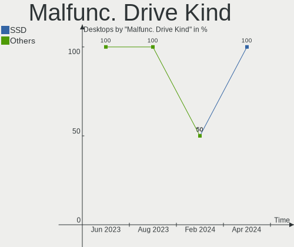
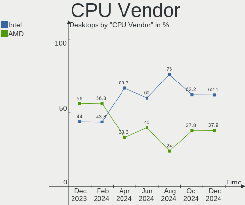
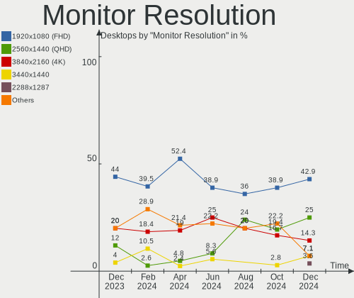
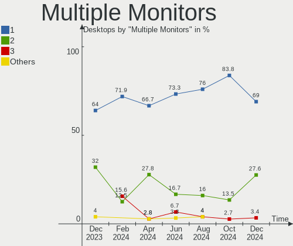
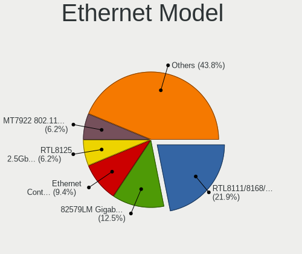

KDE neon Hardware Trends (Desktops)
-----------------------------------

A project to identify most popular hardware characteristics and track their change
over time based on data collected by KDE neon users at https://Linux-Hardware.org.

Anyone can contribute to this report by the [hw-probe](https://github.com/linuxhw/hw-probe) tool:

    sudo -E hw-probe -all -upload

Full-feature report is available here: https://linux-hardware.org/?view=trends&formfactor=desktop

Period: Aug, 2021.

Contents
--------

* [ System ](#system)
  - [ OS                       ](#os)
  - [ OS Family                ](#os-family)
  - [ Kernel                   ](#kernel)
  - [ Kernel Family            ](#kernel-family)
  - [ Kernel Major Ver.        ](#kernel-major-ver)
  - [ Arch                     ](#arch)
  - [ DE                       ](#de)
  - [ Display Server           ](#display-server)
  - [ Display Manager          ](#display-manager)
  - [ OS Lang                  ](#os-lang)
  - [ Boot Mode                ](#boot-mode)
  - [ Filesystem               ](#filesystem)
  - [ Part. scheme             ](#part-scheme)
  - [ Dual Boot with Linux/BSD ](#dual-boot-with-linuxbsd)
  - [ Dual Boot (Win)          ](#dual-boot-win)

* [ Board ](#board)
  - [ Vendor                   ](#vendor)
  - [ Model                    ](#model)
  - [ Model Family             ](#model-family)
  - [ MFG Year                 ](#mfg-year)
  - [ Form Factor              ](#form-factor)
  - [ Secure Boot              ](#secure-boot)
  - [ Coreboot                 ](#coreboot)
  - [ RAM Size                 ](#ram-size)
  - [ RAM Used                 ](#ram-used)
  - [ Total Drives             ](#total-drives)
  - [ Has CD-ROM               ](#has-cd-rom)
  - [ Has Ethernet             ](#has-ethernet)
  - [ Has WiFi                 ](#has-wifi)
  - [ Has Bluetooth            ](#has-bluetooth)

* [ Location ](#location)
  - [ Country                  ](#country)
  - [ City                     ](#city)

* [ Drives ](#drives)
  - [ Drive Vendor             ](#drive-vendor)
  - [ Drive Model              ](#drive-model)
  - [ HDD Vendor               ](#hdd-vendor)
  - [ SSD Vendor               ](#ssd-vendor)
  - [ Drive Kind               ](#drive-kind)
  - [ Drive Connector          ](#drive-connector)
  - [ Drive Size               ](#drive-size)
  - [ Space Total              ](#space-total)
  - [ Space Used               ](#space-used)
  - [ Malfunc. Drives          ](#malfunc-drives)
  - [ Malfunc. Drive Vendor    ](#malfunc-drive-vendor)
  - [ Malfunc. HDD Vendor      ](#malfunc-hdd-vendor)
  - [ Malfunc. Drive Kind      ](#malfunc-drive-kind)
  - [ Failed Drives            ](#failed-drives)
  - [ Failed Drive Vendor      ](#failed-drive-vendor)
  - [ Drive Status             ](#drive-status)

* [ Storage controller ](#storage-controller)
  - [ Storage Vendor           ](#storage-vendor)
  - [ Storage Model            ](#storage-model)
  - [ Storage Kind             ](#storage-kind)

* [ Processor ](#processor)
  - [ CPU Vendor               ](#cpu-vendor)
  - [ CPU Model                ](#cpu-model)
  - [ CPU Model Family         ](#cpu-model-family)
  - [ CPU Cores                ](#cpu-cores)
  - [ CPU Sockets              ](#cpu-sockets)
  - [ CPU Threads              ](#cpu-threads)
  - [ CPU Op-Modes             ](#cpu-op-modes)
  - [ CPU Microcode            ](#cpu-microcode)
  - [ CPU Microarch            ](#cpu-microarch)

* [ Graphics ](#graphics)
  - [ GPU Vendor               ](#gpu-vendor)
  - [ GPU Model                ](#gpu-model)
  - [ GPU Combo                ](#gpu-combo)
  - [ GPU Driver               ](#gpu-driver)
  - [ GPU Memory               ](#gpu-memory)

* [ Monitor ](#monitor)
  - [ Monitor Vendor           ](#monitor-vendor)
  - [ Monitor Model            ](#monitor-model)
  - [ Monitor Resolution       ](#monitor-resolution)
  - [ Monitor Diagonal         ](#monitor-diagonal)
  - [ Monitor Width            ](#monitor-width)
  - [ Aspect Ratio             ](#aspect-ratio)
  - [ Monitor Area             ](#monitor-area)
  - [ Pixel Density            ](#pixel-density)
  - [ Multiple Monitors        ](#multiple-monitors)

* [ Network ](#network)
  - [ Net Controller Vendor    ](#net-controller-vendor)
  - [ Net Controller Model     ](#net-controller-model)
  - [ Wireless Vendor          ](#wireless-vendor)
  - [ Wireless Model           ](#wireless-model)
  - [ Ethernet Vendor          ](#ethernet-vendor)
  - [ Ethernet Model           ](#ethernet-model)
  - [ Net Controller Kind      ](#net-controller-kind)
  - [ Used Controller          ](#used-controller)
  - [ NICs                     ](#nics)
  - [ IPv6                     ](#ipv6)

* [ Bluetooth ](#bluetooth)
  - [ Bluetooth Vendor         ](#bluetooth-vendor)
  - [ Bluetooth Model          ](#bluetooth-model)

* [ Sound ](#sound)
  - [ Sound Vendor             ](#sound-vendor)
  - [ Sound Model              ](#sound-model)

* [ Memory ](#memory)
  - [ Memory Vendor            ](#memory-vendor)
  - [ Memory Model             ](#memory-model)
  - [ Memory Kind              ](#memory-kind)
  - [ Memory Form Factor       ](#memory-form-factor)
  - [ Memory Size              ](#memory-size)
  - [ Memory Speed             ](#memory-speed)

* [ Printers & scanners ](#printers--scanners)
  - [ Printer Vendor           ](#printer-vendor)
  - [ Printer Model            ](#printer-model)
  - [ Scanner Vendor           ](#scanner-vendor)
  - [ Scanner Model            ](#scanner-model)

* [ Camera ](#camera)
  - [ Camera Vendor            ](#camera-vendor)
  - [ Camera Model             ](#camera-model)

* [ Security ](#security)
  - [ Fingerprint Vendor       ](#fingerprint-vendor)
  - [ Fingerprint Model        ](#fingerprint-model)
  - [ Chipcard Vendor          ](#chipcard-vendor)
  - [ Chipcard Model           ](#chipcard-model)

* [ Unsupported ](#unsupported)
  - [ Unsupported Devices      ](#unsupported-devices)
  - [ Unsupported Device Types ](#unsupported-device-types)

System
------

OS
--

Installed operating systems

| Name           | Desktops | Percent |
|----------------|----------|---------|
| KDE neon 20.04 | 56       | 100%    |

OS Family
---------

OS without a version

| Name     | Desktops | Percent |
|----------|----------|---------|
| KDE neon | 56       | 100%    |

Kernel
------

Version of the Linux kernel

| Version                | Desktops | Percent |
|------------------------|----------|---------|
| 5.11.0-25-generic      | 26       | 46.43%  |
| 5.11.0-27-generic      | 22       | 39.29%  |
| 5.8.0-63-generic       | 4        | 7.14%   |
| 5.4.0-80-lowlatency    | 1        | 1.79%   |
| 5.4.0-72-generic       | 1        | 1.79%   |
| 5.12.2-051202-generic  | 1        | 1.79%   |
| 5.11.10-051110-generic | 1        | 1.79%   |

Kernel Family
-------------

Linux kernel without a distro release

| Version | Desktops | Percent |
|---------|----------|---------|
| 5.11.0  | 48       | 85.71%  |
| 5.8.0   | 4        | 7.14%   |
| 5.4.0   | 2        | 3.57%   |
| 5.12.2  | 1        | 1.79%   |
| 5.11.10 | 1        | 1.79%   |

Kernel Major Ver.
-----------------

Linux kernel major version

| Version | Desktops | Percent |
|---------|----------|---------|
| 5.11    | 49       | 87.5%   |
| 5.8     | 4        | 7.14%   |
| 5.4     | 2        | 3.57%   |
| 5.12    | 1        | 1.79%   |

Arch
----

OS architecture (x86_64, i586, etc.)

| Name   | Desktops | Percent |
|--------|----------|---------|
| x86_64 | 56       | 100%    |

DE
--

Desktop Environment

| Name    | Desktops | Percent |
|---------|----------|---------|
| KDE     | 51       | 91.07%  |
| KDE5    | 3        | 5.36%   |
| Unknown | 2        | 3.57%   |

Display Server
--------------

X11 or Wayland

| Name    | Desktops | Percent |
|---------|----------|---------|
| X11     | 55       | 98.21%  |
| Wayland | 1        | 1.79%   |

Display Manager
---------------

SDDM, LightDM, etc.

| Name    | Desktops | Percent |
|---------|----------|---------|
| Unknown | 53       | 94.64%  |
| SDDM    | 3        | 5.36%   |

OS Lang
-------

Language

| Lang  | Desktops | Percent |
|-------|----------|---------|
| en_US | 17       | 30.36%  |
| de_DE | 6        | 10.71%  |
| ru_RU | 4        | 7.14%   |
| pt_BR | 4        | 7.14%   |
| es_ES | 3        | 5.36%   |
| en_IN | 3        | 5.36%   |
| en_GB | 3        | 5.36%   |
| fr_FR | 2        | 3.57%   |
| en_ZA | 2        | 3.57%   |
| en_AU | 2        | 3.57%   |
| zh_TW | 1        | 1.79%   |
| ru_UA | 1        | 1.79%   |
| pl_PL | 1        | 1.79%   |
| lt_LT | 1        | 1.79%   |
| it_IT | 1        | 1.79%   |
| fr_CA | 1        | 1.79%   |
| es_MX | 1        | 1.79%   |
| es_CO | 1        | 1.79%   |
| en_PH | 1        | 1.79%   |
| C     | 1        | 1.79%   |

Boot Mode
---------

EFI or BIOS

| Mode | Desktops | Percent |
|------|----------|---------|
| EFI  | 30       | 53.57%  |
| BIOS | 26       | 46.43%  |

Filesystem
----------

Type of filesystem

| Type | Desktops | Percent |
|------|----------|---------|
| Ext4 | 56       | 100%    |

Part. scheme
------------

Scheme of partitioning

| Type    | Desktops | Percent |
|---------|----------|---------|
| Unknown | 53       | 94.64%  |
| GPT     | 2        | 3.57%   |
| MBR     | 1        | 1.79%   |

Dual Boot with Linux/BSD
------------------------

Hosting more than one Linux/BSD

| Dual boot | Desktops | Percent |
|-----------|----------|---------|
| No        | 53       | 94.64%  |
| Yes       | 3        | 5.36%   |

Dual Boot (Win)
---------------

Hosting Linux and Windows

| Dual boot | Desktops | Percent |
|-----------|----------|---------|
| No        | 51       | 91.07%  |
| Yes       | 5        | 8.93%   |

Board
-----

Vendor
------

Motherboard manufacturer

| Name                | Desktops | Percent |
|---------------------|----------|---------|
| Gigabyte Technology | 13       | 23.21%  |
| MSI                 | 8        | 14.29%  |
| ASUSTek Computer    | 7        | 12.5%   |
| Hewlett-Packard     | 6        | 10.71%  |
| ASRock              | 5        | 8.93%   |
| Intel               | 3        | 5.36%   |
| Dell                | 3        | 5.36%   |
| Supermicro          | 2        | 3.57%   |
| Positivo            | 2        | 3.57%   |
| Acer                | 2        | 3.57%   |
| Pegatron            | 1        | 1.79%   |
| Lenovo              | 1        | 1.79%   |
| Gateway             | 1        | 1.79%   |
| Fujitsu             | 1        | 1.79%   |
| Foxconn             | 1        | 1.79%   |

Model
-----

Motherboard model

| Name                                    | Desktops | Percent |
|-----------------------------------------|----------|---------|
| MSI MS-7885                             | 2        | 3.57%   |
| Supermicro H8QM8                        | 1        | 1.79%   |
| Supermicro C2SBA                        | 1        | 1.79%   |
| Positivo POS-EINM70CS                   | 1        | 1.79%   |
| Positivo POS-EIH61CQ                    | 1        | 1.79%   |
| Pegatron 9100                           | 1        | 1.79%   |
| MSI MS-7C95                             | 1        | 1.79%   |
| MSI MS-7C88                             | 1        | 1.79%   |
| MSI MS-7C82                             | 1        | 1.79%   |
| MSI MS-7C81                             | 1        | 1.79%   |
| MSI MS-7C52                             | 1        | 1.79%   |
| MSI HPE-410fr                           | 1        | 1.79%   |
| Lenovo IdeaCentre 300S-11IBR 90DQ004GUS | 1        | 1.79%   |
| Intel X99 V1.0                          | 1        | 1.79%   |
| Intel DH61WW AAG23116-300               | 1        | 1.79%   |
| Intel DB75EN AAG39650-303               | 1        | 1.79%   |
| HP Z420 Workstation                     | 1        | 1.79%   |
| HP EliteDesk 800 G2 DM 65W              | 1        | 1.79%   |
| HP Compaq Elite 8300 MT                 | 1        | 1.79%   |
| HP Compaq dc7800 Small Form Factor      | 1        | 1.79%   |
| HP Compaq dc7800 Convertible Minitower  | 1        | 1.79%   |
| HP Compaq dc7700 Small Form Factor      | 1        | 1.79%   |
| Gigabyte Z77-DS3H                       | 1        | 1.79%   |
| Gigabyte Z77-D3H                        | 1        | 1.79%   |
| Gigabyte Z390 AORUS MASTER              | 1        | 1.79%   |
| Gigabyte X570 AORUS ELITE               | 1        | 1.79%   |
| Gigabyte H97-HD3                        | 1        | 1.79%   |
| Gigabyte H110M-H                        | 1        | 1.79%   |
| Gigabyte F2A58M-DS2                     | 1        | 1.79%   |
| Gigabyte EX58-UD3R                      | 1        | 1.79%   |
| Gigabyte EP45-DS3L                      | 1        | 1.79%   |
| Gigabyte B85M-D3H-A                     | 1        | 1.79%   |
| Gigabyte B450M DS3H                     | 1        | 1.79%   |
| Gigabyte AB350M-Gaming 3                | 1        | 1.79%   |
| Gigabyte A320M-H                        | 1        | 1.79%   |
| Gateway DX4850                          | 1        | 1.79%   |
| Fujitsu ESPRIMO C700                    | 1        | 1.79%   |
| Foxconn 2AB1 DVT                        | 1        | 1.79%   |
| Dell OptiPlex 760                       | 1        | 1.79%   |
| Dell OptiPlex 3010                      | 1        | 1.79%   |
| Dell ASM100                             | 1        | 1.79%   |
| ASUS TUF B450-PLUS GAMING               | 1        | 1.79%   |
| ASUS ROG STRIX Z390-F GAMING            | 1        | 1.79%   |
| ASUS Rampage II GENE                    | 1        | 1.79%   |
| ASUS PRIME A320M-K                      | 1        | 1.79%   |
| ASUS P7P55D-E                           | 1        | 1.79%   |
| ASUS M3A78-CM                           | 1        | 1.79%   |
| ASUS AT5IONT-I                          | 1        | 1.79%   |
| ASRock Z370 Extreme4                    | 1        | 1.79%   |
| ASRock Z170 Extreme7+                   | 1        | 1.79%   |
| ASRock H310M-HG4                        | 1        | 1.79%   |
| ASRock FM2A68M-DG3+                     | 1        | 1.79%   |
| ASRock A320M-HDV R4.0                   | 1        | 1.79%   |
| Acer Aspire M3201                       | 1        | 1.79%   |
| Acer Aspire M1470                       | 1        | 1.79%   |

Model Family
------------

Motherboard model prefix

| Name                   | Desktops | Percent |
|------------------------|----------|---------|
| HP Compaq              | 4        | 7.14%   |
| MSI MS-7885            | 2        | 3.57%   |
| Dell OptiPlex          | 2        | 3.57%   |
| Acer Aspire            | 2        | 3.57%   |
| Supermicro H8QM8       | 1        | 1.79%   |
| Supermicro C2SBA       | 1        | 1.79%   |
| Positivo POS-EINM70CS  | 1        | 1.79%   |
| Positivo POS-EIH61CQ   | 1        | 1.79%   |
| Pegatron 9100          | 1        | 1.79%   |
| MSI MS-7C95            | 1        | 1.79%   |
| MSI MS-7C88            | 1        | 1.79%   |
| MSI MS-7C82            | 1        | 1.79%   |
| MSI MS-7C81            | 1        | 1.79%   |
| MSI MS-7C52            | 1        | 1.79%   |
| MSI HPE-410fr          | 1        | 1.79%   |
| Lenovo IdeaCentre      | 1        | 1.79%   |
| Intel X99              | 1        | 1.79%   |
| Intel DH61WW           | 1        | 1.79%   |
| Intel DB75EN           | 1        | 1.79%   |
| HP Z420                | 1        | 1.79%   |
| HP EliteDesk           | 1        | 1.79%   |
| Gigabyte Z77-DS3H      | 1        | 1.79%   |
| Gigabyte Z77-D3H       | 1        | 1.79%   |
| Gigabyte Z390          | 1        | 1.79%   |
| Gigabyte X570          | 1        | 1.79%   |
| Gigabyte H97-HD3       | 1        | 1.79%   |
| Gigabyte H110M-H       | 1        | 1.79%   |
| Gigabyte F2A58M-DS2    | 1        | 1.79%   |
| Gigabyte EX58-UD3R     | 1        | 1.79%   |
| Gigabyte EP45-DS3L     | 1        | 1.79%   |
| Gigabyte B85M-D3H-A    | 1        | 1.79%   |
| Gigabyte B450M         | 1        | 1.79%   |
| Gigabyte AB350M-Gaming | 1        | 1.79%   |
| Gigabyte A320M-H       | 1        | 1.79%   |
| Gateway DX4850         | 1        | 1.79%   |
| Fujitsu ESPRIMO        | 1        | 1.79%   |
| Foxconn 2AB1           | 1        | 1.79%   |
| Dell ASM100            | 1        | 1.79%   |
| ASUS TUF               | 1        | 1.79%   |
| ASUS ROG               | 1        | 1.79%   |
| ASUS Rampage           | 1        | 1.79%   |
| ASUS PRIME             | 1        | 1.79%   |
| ASUS P7P55D-E          | 1        | 1.79%   |
| ASUS M3A78-CM          | 1        | 1.79%   |
| ASUS AT5IONT-I         | 1        | 1.79%   |
| ASRock Z370            | 1        | 1.79%   |
| ASRock Z170            | 1        | 1.79%   |
| ASRock H310M-HG4       | 1        | 1.79%   |
| ASRock FM2A68M-DG3+    | 1        | 1.79%   |
| ASRock A320M-HDV       | 1        | 1.79%   |

MFG Year
--------

Motherboard manufacture year

| Year | Desktops | Percent |
|------|----------|---------|
| 2020 | 9        | 16.07%  |
| 2019 | 7        | 12.5%   |
| 2013 | 7        | 12.5%   |
| 2015 | 6        | 10.71%  |
| 2010 | 5        | 8.93%   |
| 2012 | 4        | 7.14%   |
| 2009 | 3        | 5.36%   |
| 2021 | 2        | 3.57%   |
| 2017 | 2        | 3.57%   |
| 2016 | 2        | 3.57%   |
| 2014 | 2        | 3.57%   |
| 2011 | 2        | 3.57%   |
| 2008 | 2        | 3.57%   |
| 2007 | 2        | 3.57%   |
| 2018 | 1        | 1.79%   |

Form Factor
-----------

Physical design of the computer

| Name    | Desktops | Percent |
|---------|----------|---------|
| Desktop | 56       | 100%    |

Secure Boot
-----------

Enabled or disabled

| State    | Desktops | Percent |
|----------|----------|---------|
| Disabled | 56       | 100%    |

Coreboot
--------

Have coreboot on board

| Used | Desktops | Percent |
|------|----------|---------|
| No   | 56       | 100%    |

RAM Size
--------

Total RAM memory

| Size in GB | Desktops | Percent |
|------------|----------|---------|
| 3.01-4.0   | 12       | 21.43%  |
| 16.01-24.0 | 12       | 21.43%  |
| 32.01-64.0 | 11       | 19.64%  |
| 8.01-16.0  | 9        | 16.07%  |
| 4.01-8.0   | 8        | 14.29%  |
| 24.01-32.0 | 2        | 3.57%   |
| 2.01-3.0   | 1        | 1.79%   |
| 1.01-2.0   | 1        | 1.79%   |

RAM Used
--------

Used RAM memory

| Used GB    | Desktops | Percent |
|------------|----------|---------|
| 1.01-2.0   | 26       | 46.43%  |
| 2.01-3.0   | 14       | 25%     |
| 0.51-1.0   | 8        | 14.29%  |
| 4.01-8.0   | 5        | 8.93%   |
| 8.01-16.0  | 2        | 3.57%   |
| 16.01-24.0 | 1        | 1.79%   |

Total Drives
------------

Number of drives on board

| Drives | Desktops | Percent |
|--------|----------|---------|
| 1      | 28       | 50%     |
| 2      | 12       | 21.43%  |
| 3      | 7        | 12.5%   |
| 7      | 5        | 8.93%   |
| 5      | 3        | 5.36%   |
| 4      | 1        | 1.79%   |

Has CD-ROM
----------

Has CD-ROM on board

| Presented | Desktops | Percent |
|-----------|----------|---------|
| No        | 38       | 67.86%  |
| Yes       | 18       | 32.14%  |

Has Ethernet
------------

Has Ethernet on board

| Presented | Desktops | Percent |
|-----------|----------|---------|
| Yes       | 56       | 100%    |

Has WiFi
--------

Has WiFi module

| Presented | Desktops | Percent |
|-----------|----------|---------|
| No        | 35       | 62.5%   |
| Yes       | 21       | 37.5%   |

Has Bluetooth
-------------

Has Bluetooth module

| Presented | Desktops | Percent |
|-----------|----------|---------|
| No        | 36       | 64.29%  |
| Yes       | 20       | 35.71%  |

Location
--------

Country
-------

Geographic location (country)

| Country      | Desktops | Percent |
|--------------|----------|---------|
| USA          | 12       | 21.43%  |
| Germany      | 6        | 10.71%  |
| Russia       | 5        | 8.93%   |
| Brazil       | 4        | 7.14%   |
| Spain        | 3        | 5.36%   |
| India        | 3        | 5.36%   |
| UK           | 2        | 3.57%   |
| South Africa | 2        | 3.57%   |
| France       | 2        | 3.57%   |
| Australia    | 2        | 3.57%   |
| Argentina    | 2        | 3.57%   |
| Ukraine      | 1        | 1.79%   |
| Turkey       | 1        | 1.79%   |
| Sweden       | 1        | 1.79%   |
| Poland       | 1        | 1.79%   |
| Philippines  | 1        | 1.79%   |
| Morocco      | 1        | 1.79%   |
| Mexico       | 1        | 1.79%   |
| Malaysia     | 1        | 1.79%   |
| Lithuania    | 1        | 1.79%   |
| Italy        | 1        | 1.79%   |
| Hong Kong    | 1        | 1.79%   |
| Colombia     | 1        | 1.79%   |
| Canada       | 1        | 1.79%   |

City
----

Geographic location (city)

| City                   | Desktops | Percent |
|------------------------|----------|---------|
| New York               | 2        | 3.57%   |
| Moscow                 | 2        | 3.57%   |
| Warsaw                 | 1        | 1.79%   |
| Vilnius                | 1        | 1.79%   |
| Verbania               | 1        | 1.79%   |
| Tucson                 | 1        | 1.79%   |
| Torre??n               | 1        | 1.79%   |
| Sydney                 | 1        | 1.79%   |
| Sych?«vka              | 1        | 1.79%   |
| Swindon                | 1        | 1.79%   |
| Strongsville           | 1        | 1.79%   |
| St Petersburg          | 1        | 1.79%   |
| Solingen               | 1        | 1.79%   |
| S??o Paulo             | 1        | 1.79%   |
| S??o Bernardo do Campo | 1        | 1.79%   |
| Sankt Ingbert          | 1        | 1.79%   |
| Round Rock             | 1        | 1.79%   |
| Ronnenberg             | 1        | 1.79%   |
| Richmond               | 1        | 1.79%   |
| Petershagen            | 1        | 1.79%   |
| Petaling Jaya          | 1        | 1.79%   |
| Passo Fundo            | 1        | 1.79%   |
| Oxie                   | 1        | 1.79%   |
| Omaha                  | 1        | 1.79%   |
| North Port             | 1        | 1.79%   |
| Noginsk                | 1        | 1.79%   |
| Nanterre               | 1        | 1.79%   |
| Mont-Tremblant         | 1        | 1.79%   |
| Marrakesh              | 1        | 1.79%   |
| Mar del Plata          | 1        | 1.79%   |
| Manorville             | 1        | 1.79%   |
| Kyiv                   | 1        | 1.79%   |
| Kingsport              | 1        | 1.79%   |
| Johannesburg           | 1        | 1.79%   |
| Istanbul               | 1        | 1.79%   |
| Hattingen              | 1        | 1.79%   |
| Harrison               | 1        | 1.79%   |
| Hallettsville          | 1        | 1.79%   |
| Gij??n                 | 1        | 1.79%   |
| Freiburg im Breisgau   | 1        | 1.79%   |
| Dorking                | 1        | 1.79%   |
| Chennai                | 1        | 1.79%   |
| Cerdanyola del Vall??s | 1        | 1.79%   |
| Central                | 1        | 1.79%   |
| Cape Town              | 1        | 1.79%   |
| Buenos Aires           | 1        | 1.79%   |
| Bucy-le-Long           | 1        | 1.79%   |
| Bogot??                | 1        | 1.79%   |
| Bhopal                 | 1        | 1.79%   |
| Bettendorf             | 1        | 1.79%   |
| Bengaluru              | 1        | 1.79%   |
| Batangas               | 1        | 1.79%   |
| Alcudia de Veo         | 1        | 1.79%   |
| Abaetetuba             | 1        | 1.79%   |

Drives
------

Drive Vendor
------------

Hard drive vendors

| Vendor              | Desktops | Drives | Percent |
|---------------------|----------|--------|---------|
| WDC                 | 20       | 32     | 21.51%  |
| Seagate             | 17       | 30     | 18.28%  |
| Samsung Electronics | 15       | 20     | 16.13%  |
| Kingston            | 9        | 10     | 9.68%   |
| SanDisk             | 8        | 10     | 8.6%    |
| Toshiba             | 7        | 8      | 7.53%   |
| Hitachi             | 4        | 4      | 4.3%    |
| Crucial             | 3        | 3      | 3.23%   |
| GOODRAM             | 2        | 2      | 2.15%   |
| Unknown             | 1        | 1      | 1.08%   |
| SPCC                | 1        | 1      | 1.08%   |
| Silicon Motion      | 1        | 1      | 1.08%   |
| Lite-On             | 1        | 1      | 1.08%   |
| Intenso             | 1        | 1      | 1.08%   |
| Hewlett-Packard     | 1        | 1      | 1.08%   |
| Gigabyte Technology | 1        | 2      | 1.08%   |
| A-DATA Technology   | 1        | 1      | 1.08%   |

Drive Model
-----------

Hard drive models

| Model                               | Desktops | Percent |
|-------------------------------------|----------|---------|
| Seagate ST1000DM010-2EP102 1TB      | 3        | 2.65%   |
| Sandisk NVMe SSD Drive 500GB        | 3        | 2.65%   |
| Samsung SSD 860 EVO 1TB             | 3        | 2.65%   |
| Kingston SA400S37240G 240GB SSD     | 3        | 2.65%   |
| WDC WD40EZRZ-00GXCB0 4TB            | 2        | 1.77%   |
| Toshiba HDWD110 1TB                 | 2        | 1.77%   |
| Seagate ST500DM002-1BD142 500GB     | 2        | 1.77%   |
| Seagate ST3500413AS 500GB           | 2        | 1.77%   |
| Seagate ST31000528AS 1TB            | 2        | 1.77%   |
| Seagate ST2000DM008-2FR102 2TB      | 2        | 1.77%   |
| SanDisk SSD PLUS 480GB              | 2        | 1.77%   |
| SanDisk SDSSDA120G 120GB            | 2        | 1.77%   |
| Samsung NVMe SSD Drive 500GB        | 2        | 1.77%   |
| Kingston SV300S37A120G 120GB SSD    | 2        | 1.77%   |
| Kingston NVMe SSD Drive 500GB       | 2        | 1.77%   |
| Crucial CT500MX500SSD1 500GB        | 2        | 1.77%   |
| WDC WDS500G2B0A-00SM50 500GB SSD    | 1        | 0.88%   |
| WDC WD800JD-75MSA3 80GB             | 1        | 0.88%   |
| WDC WD5001FZWX-00ZHUA0 5TB          | 1        | 0.88%   |
| WDC WD5000LPCX-21VHAT0 500GB        | 1        | 0.88%   |
| WDC WD5000AAKX-00ERMA0 500GB        | 1        | 0.88%   |
| WDC WD5000AAKX-001CA0 500GB         | 1        | 0.88%   |
| WDC WD5000AAKS-00YGA0 500GB         | 1        | 0.88%   |
| WDC WD5000AAKS-00E4A0 500GB         | 1        | 0.88%   |
| WDC WD40EZRZ-75GXCB0 4TB            | 1        | 0.88%   |
| WDC WD40EZRZ-00WN9B0 4TB            | 1        | 0.88%   |
| WDC WD40EFRX-68N32N0 4TB            | 1        | 0.88%   |
| WDC WD4003FZEX-00Z4SA0 4TB          | 1        | 0.88%   |
| WDC WD3200BPVT-22JJ5T0 320GB        | 1        | 0.88%   |
| WDC WD3200AAKS-75VYA0 320GB         | 1        | 0.88%   |
| WDC WD3000HLFS-01G6U4 304GB         | 1        | 0.88%   |
| WDC WD2500AAKX-07U6AA1 250GB        | 1        | 0.88%   |
| WDC WD20EZRZ-00Z5HB0 2TB            | 1        | 0.88%   |
| WDC WD2003FZEX-00Z4SA0 2TB          | 1        | 0.88%   |
| WDC WD2003FYPS-27Y2B0 2TB           | 1        | 0.88%   |
| WDC WD10SPCX-60KHST0 1TB            | 1        | 0.88%   |
| WDC WD10EURX-63UY4Y0 1TB            | 1        | 0.88%   |
| WDC WD10EARX-00N0YB0 1TB            | 1        | 0.88%   |
| WDC WD10EALX-229BA0 1TB             | 1        | 0.88%   |
| WDC WD10EADS-65L5B1 1TB             | 1        | 0.88%   |
| WDC WD101KRYZ-01JPDB1 10TB          | 1        | 0.88%   |
| WDC WD1003FZEX-00MK2A0 1TB          | 1        | 0.88%   |
| WDC WD1003FZEX-00K3CA0 1TB          | 1        | 0.88%   |
| Unknown HYUNDAI/240G 240GB SSD      | 1        | 0.88%   |
| Toshiba MQ01ABD100 1TB              | 1        | 0.88%   |
| Toshiba MQ01ABD032 320GB            | 1        | 0.88%   |
| Toshiba HDWE140 4TB                 | 1        | 0.88%   |
| Toshiba DT01ACA300 3TB              | 1        | 0.88%   |
| Toshiba DT01ACA050 500GB            | 1        | 0.88%   |
| SPCC Solid State Disk 256GB         | 1        | 0.88%   |
| Silicon Motion NVMe SSD Drive 512GB | 1        | 0.88%   |
| Seagate ST500LT012-1DG142 500GB     | 1        | 0.88%   |
| Seagate ST4000DM004-2CV104 4TB      | 1        | 0.88%   |
| Seagate ST3500418AS 500GB           | 1        | 0.88%   |
| Seagate ST3250318AS 250GB           | 1        | 0.88%   |
| Seagate ST3120811AS 120GB           | 1        | 0.88%   |
| Seagate ST2000DM001-1ER164 2TB      | 1        | 0.88%   |
| Seagate ST1000DM003-9YN162 1TB      | 1        | 0.88%   |
| Seagate ST1000DM003-1SB102 1TB      | 1        | 0.88%   |
| Seagate ST1000DM003-1ER162 1TB      | 1        | 0.88%   |

HDD Vendor
----------

Hard disk drive vendors

| Vendor              | Desktops | Drives | Percent |
|---------------------|----------|--------|---------|
| WDC                 | 19       | 31     | 39.58%  |
| Seagate             | 17       | 30     | 35.42%  |
| Toshiba             | 7        | 8      | 14.58%  |
| Hitachi             | 4        | 4      | 8.33%   |
| Samsung Electronics | 1        | 1      | 2.08%   |

SSD Vendor
----------

Solid state drive vendors

| Vendor              | Desktops | Drives | Percent |
|---------------------|----------|--------|---------|
| Samsung Electronics | 12       | 14     | 34.29%  |
| Kingston            | 7        | 7      | 20%     |
| SanDisk             | 5        | 7      | 14.29%  |
| Crucial             | 3        | 3      | 8.57%   |
| GOODRAM             | 2        | 2      | 5.71%   |
| WDC                 | 1        | 1      | 2.86%   |
| Unknown             | 1        | 1      | 2.86%   |
| SPCC                | 1        | 1      | 2.86%   |
| Intenso             | 1        | 1      | 2.86%   |
| Hewlett-Packard     | 1        | 1      | 2.86%   |
| A-DATA Technology   | 1        | 1      | 2.86%   |

Drive Kind
----------

HDD or SSD

| Kind | Desktops | Drives | Percent |
|------|----------|--------|---------|
| HDD  | 40       | 74     | 47.62%  |
| SSD  | 31       | 39     | 36.9%   |
| NVMe | 13       | 15     | 15.48%  |

Drive Connector
---------------

SATA, SAS, NVMe, etc.

| Type | Desktops | Drives | Percent |
|------|----------|--------|---------|
| SATA | 54       | 109    | 76.06%  |
| NVMe | 13       | 15     | 18.31%  |
| SAS  | 4        | 4      | 5.63%   |

Drive Size
----------

Size of hard drive

| Size in TB | Desktops | Drives | Percent |
|------------|----------|--------|---------|
| 0.01-0.5   | 39       | 57     | 52%     |
| 0.51-1.0   | 20       | 33     | 26.67%  |
| 1.01-2.0   | 7        | 8      | 9.33%   |
| 3.01-4.0   | 6        | 10     | 8%      |
| 4.01-10.0  | 2        | 3      | 2.67%   |
| 2.01-3.0   | 1        | 2      | 1.33%   |

Space Total
-----------

Amount of disk space available on the file system

| Size in GB     | Desktops | Percent |
|----------------|----------|---------|
| 101-250        | 20       | 35.71%  |
| 501-1000       | 11       | 19.64%  |
| 251-500        | 10       | 17.86%  |
| More than 3000 | 7        | 12.5%   |
| 51-100         | 3        | 5.36%   |
| 21-50          | 2        | 3.57%   |
| 1001-2000      | 2        | 3.57%   |
| 1-20           | 1        | 1.79%   |

Space Used
----------

Amount of used disk space

| Used GB        | Desktops | Percent |
|----------------|----------|---------|
| 1-20           | 28       | 50%     |
| 21-50          | 9        | 16.07%  |
| 101-250        | 5        | 8.93%   |
| More than 3000 | 3        | 5.36%   |
| 1001-2000      | 3        | 5.36%   |
| 51-100         | 3        | 5.36%   |
| 251-500        | 2        | 3.57%   |
| 501-1000       | 2        | 3.57%   |
| 2001-3000      | 1        | 1.79%   |

Malfunc. Drives
---------------

Drive models with a malfunction

| Model                         | Desktops | Drives | Percent |
|-------------------------------|----------|--------|---------|
| Hitachi HDS721616PLA380 160GB | 1        | 1      | 100%    |

Malfunc. Drive Vendor
---------------------

Vendors of faulty drives

| Vendor  | Desktops | Drives | Percent |
|---------|----------|--------|---------|
| Hitachi | 1        | 1      | 100%    |

Malfunc. HDD Vendor
-------------------

Vendors of faulty HDD drives

| Vendor  | Desktops | Drives | Percent |
|---------|----------|--------|---------|
| Hitachi | 1        | 1      | 100%    |

Malfunc. Drive Kind
-------------------

Kinds of faulty drives

| Kind | Desktops | Drives | Percent |
|------|----------|--------|---------|
| HDD  | 1        | 1      | 100%    |

Failed Drives
-------------

Failed drive models

Zero info for selected period =(

Failed Drive Vendor
-------------------

Failed drive vendors

Zero info for selected period =(

Drive Status
------------

Number of failed and malfunc. drives

| Status   | Desktops | Drives | Percent |
|----------|----------|--------|---------|
| Detected | 54       | 117    | 91.53%  |
| Works    | 4        | 10     | 6.78%   |
| Malfunc  | 1        | 1      | 1.69%   |

Storage controller
------------------

Storage Vendor
--------------

Storage controller vendors

| Vendor                        | Desktops | Percent |
|-------------------------------|----------|---------|
| Intel                         | 38       | 48.72%  |
| AMD                           | 15       | 19.23%  |
| Samsung Electronics           | 5        | 6.41%   |
| JMicron Technology            | 4        | 5.13%   |
| Sandisk                       | 3        | 3.85%   |
| ASMedia Technology            | 3        | 3.85%   |
| Nvidia                        | 2        | 2.56%   |
| Kingston Technology Company   | 2        | 2.56%   |
| Silicon Motion                | 1        | 1.28%   |
| Silicon Image                 | 1        | 1.28%   |
| Phison Electronics            | 1        | 1.28%   |
| Lite-On Technology            | 1        | 1.28%   |
| Integrated Technology Express | 1        | 1.28%   |
| Broadcom / LSI                | 1        | 1.28%   |

Storage Model
-------------

Storage controller models

| Model                                                                            | Desktops | Percent |
|----------------------------------------------------------------------------------|----------|---------|
| AMD FCH SATA Controller [AHCI mode]                                              | 8        | 8.08%   |
| Intel 6 Series/C200 Series Chipset Family 6 port Desktop SATA AHCI Controller    | 5        | 5.05%   |
| Intel Q170/Q150/B150/H170/H110/Z170/CM236 Chipset SATA Controller [AHCI Mode]    | 3        | 3.03%   |
| Intel Cannon Lake PCH SATA AHCI Controller                                       | 3        | 3.03%   |
| Intel 7 Series/C210 Series Chipset Family 6-port SATA Controller [AHCI mode]     | 3        | 3.03%   |
| Intel 400 Series Chipset Family SATA AHCI Controller                             | 3        | 3.03%   |
| ASMedia ASM1062 Serial ATA Controller                                            | 3        | 3.03%   |
| AMD FCH SATA Controller D                                                        | 3        | 3.03%   |
| AMD 400 Series Chipset SATA Controller                                           | 3        | 3.03%   |
| Samsung NVMe SSD Controller SM981/PM981/PM983                                    | 2        | 2.02%   |
| Samsung NVMe SSD Controller SM961/PM961/SM963                                    | 2        | 2.02%   |
| Kingston Company A2000 NVMe SSD                                                  | 2        | 2.02%   |
| JMicron JMB363 SATA/IDE Controller                                               | 2        | 2.02%   |
| Intel 82Q35 Express PT IDER Controller                                           | 2        | 2.02%   |
| Intel 82801JI (ICH10 Family) SATA AHCI Controller                                | 2        | 2.02%   |
| Intel 82801IR/IO/IH (ICH9R/DO/DH) 6 port SATA Controller [AHCI mode]             | 2        | 2.02%   |
| Intel 82801IR/IO/IH (ICH9R/DO/DH) 4 port SATA Controller [IDE mode]              | 2        | 2.02%   |
| Intel 82801I (ICH9 Family) 2 port SATA Controller [IDE mode]                     | 2        | 2.02%   |
| Intel 8 Series/C220 Series Chipset Family 6-port SATA Controller 1 [AHCI mode]   | 2        | 2.02%   |
| AMD SB7x0/SB8x0/SB9x0 SATA Controller [AHCI mode]                                | 2        | 2.02%   |
| AMD SB7x0/SB8x0/SB9x0 IDE Controller                                             | 2        | 2.02%   |
| AMD FCH SATA Controller [IDE mode]                                               | 2        | 2.02%   |
| Silicon Motion SM2263EN/SM2263XT SSD Controller                                  | 1        | 1.01%   |
| Silicon Image PCI0680 Ultra ATA-133 Host Controller                              | 1        | 1.01%   |
| Sandisk WD Blue SN550 NVMe SSD                                                   | 1        | 1.01%   |
| Sandisk WD Black SN750 / PC SN730 NVMe SSD                                       | 1        | 1.01%   |
| Sandisk WD Black 2018/SN750 / PC SN720 NVMe SSD                                  | 1        | 1.01%   |
| Samsung NVMe SSD Controller PM9A1/PM9A3/980PRO                                   | 1        | 1.01%   |
| Phison E16 PCIe4 NVMe Controller                                                 | 1        | 1.01%   |
| Nvidia MCP79 AHCI Controller                                                     | 1        | 1.01%   |
| Nvidia MCP55 SATA Controller                                                     | 1        | 1.01%   |
| Nvidia MCP55 IDE                                                                 | 1        | 1.01%   |
| Lite-On Non-Volatile memory controller                                           | 1        | 1.01%   |
| JMicron JMB368 IDE controller                                                    | 1        | 1.01%   |
| JMicron JMB360 AHCI Controller                                                   | 1        | 1.01%   |
| Intel SATA Controller [RAID mode]                                                | 1        | 1.01%   |
| Intel NM10/ICH7 Family SATA Controller [AHCI mode]                               | 1        | 1.01%   |
| Intel C610/X99 series chipset sSATA Controller [AHCI mode]                       | 1        | 1.01%   |
| Intel C610/X99 series chipset 6-Port SATA Controller [AHCI mode]                 | 1        | 1.01%   |
| Intel C602 chipset 4-Port SATA Storage Control Unit                              | 1        | 1.01%   |
| Intel C600/X79 series chipset SATA RAID Controller                               | 1        | 1.01%   |
| Intel C600/X79 series chipset IDE-r Controller                                   | 1        | 1.01%   |
| Intel Atom/Celeron/Pentium Processor x5-E8000/J3xxx/N3xxx Series SATA Controller | 1        | 1.01%   |
| Intel 9 Series Chipset Family SATA Controller [AHCI Mode]                        | 1        | 1.01%   |
| Intel 82801JI (ICH10 Family) 4 port SATA IDE Controller #1                       | 1        | 1.01%   |
| Intel 82801JI (ICH10 Family) 2 port SATA IDE Controller #2                       | 1        | 1.01%   |
| Intel 82801JD/DO (ICH10 Family) 4-port SATA IDE Controller                       | 1        | 1.01%   |
| Intel 82801JD/DO (ICH10 Family) 2-port SATA IDE Controller                       | 1        | 1.01%   |
| Intel 82801H (ICH8 Family) 4 port SATA Controller [IDE mode]                     | 1        | 1.01%   |
| Intel 7 Series/C210 Series Chipset Family 4-port SATA Controller [IDE mode]      | 1        | 1.01%   |
| Intel 7 Series/C210 Series Chipset Family 2-port SATA Controller [IDE mode]      | 1        | 1.01%   |
| Intel 7 Series Chipset Family 6-port SATA Controller [AHCI mode]                 | 1        | 1.01%   |
| Intel 5 Series/3400 Series Chipset 6 port SATA AHCI Controller                   | 1        | 1.01%   |
| Intel 4 Series Chipset PT IDER Controller                                        | 1        | 1.01%   |
| Intel 200 Series PCH SATA controller [AHCI mode]                                 | 1        | 1.01%   |
| Integrated Express IT8212 Dual channel ATA RAID controller                       | 1        | 1.01%   |
| Broadcom / LSI SAS2308 PCI-Express Fusion-MPT SAS-2                              | 1        | 1.01%   |
| AMD Starship/Matisse Chipset SATA Controller [AHCI mode]                         | 1        | 1.01%   |
| AMD SB7x0/SB8x0/SB9x0 SATA Controller [IDE mode]                                 | 1        | 1.01%   |
| AMD FCH IDE Controller                                                           | 1        | 1.01%   |

Storage Kind
------------

Kind of storage controller (IDE, SATA, NVMe, SAS, ...)

| Kind | Desktops | Percent |
|------|----------|---------|
| SATA | 47       | 59.49%  |
| IDE  | 14       | 17.72%  |
| NVMe | 13       | 16.46%  |
| RAID | 4        | 5.06%   |
| SAS  | 1        | 1.27%   |

Processor
---------

CPU Vendor
----------

Processor vendors

| Vendor | Desktops | Percent |
|--------|----------|---------|
| Intel  | 40       | 71.43%  |
| AMD    | 16       | 28.57%  |

CPU Model
---------

Processor models

| Model                                       | Desktops | Percent |
|---------------------------------------------|----------|---------|
| Intel Core i7-5820K CPU @ 3.30GHz           | 2        | 3.57%   |
| Intel Core i7-3770 CPU @ 3.40GHz            | 2        | 3.57%   |
| Intel Core i7 CPU 920 @ 2.67GHz             | 2        | 3.57%   |
| Intel Core i5-4460 CPU @ 3.20GHz            | 2        | 3.57%   |
| Intel Core i5-3470 CPU @ 3.20GHz            | 2        | 3.57%   |
| Intel Core 2 Duo CPU E8500 @ 3.16GHz        | 2        | 3.57%   |
| AMD Ryzen 7 3700X 8-Core Processor          | 2        | 3.57%   |
| Intel Xeon CPU E5-2630L v3 @ 1.80GHz        | 1        | 1.79%   |
| Intel Xeon CPU E5-1620 0 @ 3.60GHz          | 1        | 1.79%   |
| Intel Pentium CPU J3710 @ 1.60GHz           | 1        | 1.79%   |
| Intel Pentium CPU G620 @ 2.60GHz            | 1        | 1.79%   |
| Intel Core i9-9900K CPU @ 3.60GHz           | 1        | 1.79%   |
| Intel Core i7-9700K CPU @ 3.60GHz           | 1        | 1.79%   |
| Intel Core i7-8700K CPU @ 3.70GHz           | 1        | 1.79%   |
| Intel Core i7-6700K CPU @ 4.00GHz           | 1        | 1.79%   |
| Intel Core i7-10700KF CPU @ 3.80GHz         | 1        | 1.79%   |
| Intel Core i5-6500 CPU @ 3.20GHz            | 1        | 1.79%   |
| Intel Core i5-3450 CPU @ 3.10GHz            | 1        | 1.79%   |
| Intel Core i5-3330 CPU @ 3.00GHz            | 1        | 1.79%   |
| Intel Core i5-2300 CPU @ 2.80GHz            | 1        | 1.79%   |
| Intel Core i5-10400F CPU @ 2.90GHz          | 1        | 1.79%   |
| Intel Core i5-10400 CPU @ 2.90GHz           | 1        | 1.79%   |
| Intel Core i5 CPU 750 @ 2.67GHz             | 1        | 1.79%   |
| Intel Core i5 CPU 650 @ 3.20GHz             | 1        | 1.79%   |
| Intel Core i3-8100 CPU @ 3.60GHz            | 1        | 1.79%   |
| Intel Core i3-7100 CPU @ 3.90GHz            | 1        | 1.79%   |
| Intel Core i3-4130T CPU @ 2.90GHz           | 1        | 1.79%   |
| Intel Core i3-2120 CPU @ 3.30GHz            | 1        | 1.79%   |
| Intel Core 2 Quad CPU Q8200 @ 2.33GHz       | 1        | 1.79%   |
| Intel Core 2 Duo CPU T6570 @ 2.10GHz        | 1        | 1.79%   |
| Intel Core 2 Duo CPU E6550 @ 2.33GHz        | 1        | 1.79%   |
| Intel Core 2 Duo CPU E4600 @ 2.40GHz        | 1        | 1.79%   |
| Intel Core 2 CPU 6300 @ 1.86GHz             | 1        | 1.79%   |
| Intel Celeron CPU 847 @ 1.10GHz             | 1        | 1.79%   |
| Intel Atom CPU D525 @ 1.80GHz               | 1        | 1.79%   |
| AMD Ryzen 7 2700 Eight-Core Processor       | 1        | 1.79%   |
| AMD Ryzen 5 3600 6-Core Processor           | 1        | 1.79%   |
| AMD Ryzen 5 3400G with Radeon Vega Graphics | 1        | 1.79%   |
| AMD Ryzen 5 2600X Six-Core Processor        | 1        | 1.79%   |
| AMD Ryzen 5 2600 Six-Core Processor         | 1        | 1.79%   |
| AMD Ryzen 5 1600 Six-Core Processor         | 1        | 1.79%   |
| AMD Ryzen 3 1300X Quad-Core Processor       | 1        | 1.79%   |
| AMD Phenom 9850 Quad-Core Processor         | 1        | 1.79%   |
| AMD Dual-Core Opteron Processor 8216        | 1        | 1.79%   |
| AMD Athlon II X4 635 Processor              | 1        | 1.79%   |
| AMD Athlon 7750 Dual-Core Processor         | 1        | 1.79%   |
| AMD A8-3870 APU with Radeon HD Graphics     | 1        | 1.79%   |
| AMD A4-6300 APU with Radeon HD Graphics     | 1        | 1.79%   |
| AMD A4-4020 APU with Radeon HD Graphics     | 1        | 1.79%   |

CPU Model Family
----------------

Processor model prefix

| Model             | Desktops | Percent |
|-------------------|----------|---------|
| Intel Core i5     | 12       | 21.43%  |
| Intel Core i7     | 10       | 17.86%  |
| Intel Core 2 Duo  | 5        | 8.93%   |
| AMD Ryzen 5       | 5        | 8.93%   |
| Intel Core i3     | 4        | 7.14%   |
| AMD Ryzen 7       | 3        | 5.36%   |
| Intel Xeon        | 2        | 3.57%   |
| Intel Pentium     | 2        | 3.57%   |
| AMD A4            | 2        | 3.57%   |
| Other             | 1        | 1.79%   |
| Intel Core i9     | 1        | 1.79%   |
| Intel Core 2 Quad | 1        | 1.79%   |
| Intel Core 2      | 1        | 1.79%   |
| Intel Celeron     | 1        | 1.79%   |
| Intel Atom        | 1        | 1.79%   |
| AMD Ryzen 3       | 1        | 1.79%   |
| AMD Phenom        | 1        | 1.79%   |
| AMD Athlon II X4  | 1        | 1.79%   |
| AMD Athlon        | 1        | 1.79%   |
| AMD A8            | 1        | 1.79%   |

CPU Cores
---------

Number of processor cores

| Number | Desktops | Percent |
|--------|----------|---------|
| 4      | 23       | 41.07%  |
| 2      | 14       | 25%     |
| 6      | 9        | 16.07%  |
| 8      | 8        | 14.29%  |
| 1      | 2        | 3.57%   |

CPU Sockets
-----------

Number of sockets

| Number | Desktops | Percent |
|--------|----------|---------|
| 1      | 55       | 98.21%  |
| 4      | 1        | 1.79%   |

CPU Threads
-----------

Threads per core (Hyper-Threading)

| Number | Desktops | Percent |
|--------|----------|---------|
| 2      | 29       | 51.79%  |
| 1      | 27       | 48.21%  |

CPU Op-Modes
------------

CPU Operation Modes (32-bit, 64-bit)

| Op mode        | Desktops | Percent |
|----------------|----------|---------|
| 32-bit, 64-bit | 56       | 100%    |

CPU Microcode
-------------

Microcode number

| Number     | Desktops | Percent |
|------------|----------|---------|
| 0x306a9    | 5        | 8.93%   |
| 0x206a7    | 4        | 7.14%   |
| 0x306f2    | 3        | 5.36%   |
| 0x306c3    | 3        | 5.36%   |
| 0x1067a    | 3        | 5.36%   |
| 0x08701021 | 3        | 5.36%   |
| 0x0800820d | 3        | 5.36%   |
| Unknown    | 3        | 5.36%   |
| 0xa0655    | 2        | 3.57%   |
| 0x506e3    | 2        | 3.57%   |
| 0x106a5    | 2        | 3.57%   |
| 0x06001119 | 2        | 3.57%   |
| 0x01000095 | 2        | 3.57%   |
| 0xa0653    | 1        | 1.79%   |
| 0x906ed    | 1        | 1.79%   |
| 0x906ec    | 1        | 1.79%   |
| 0x906eb    | 1        | 1.79%   |
| 0x906ea    | 1        | 1.79%   |
| 0x906e9    | 1        | 1.79%   |
| 0x6fd      | 1        | 1.79%   |
| 0x6fb      | 1        | 1.79%   |
| 0x6f2      | 1        | 1.79%   |
| 0x406c4    | 1        | 1.79%   |
| 0x206d7    | 1        | 1.79%   |
| 0x20655    | 1        | 1.79%   |
| 0x106e5    | 1        | 1.79%   |
| 0x106ca    | 1        | 1.79%   |
| 0x10677    | 1        | 1.79%   |
| 0x08108109 | 1        | 1.79%   |
| 0x0800111c | 1        | 1.79%   |
| 0x03000027 | 1        | 1.79%   |
| 0x010000c8 | 1        | 1.79%   |

CPU Microarch
-------------

Microarchitecture

| Name        | Desktops | Percent |
|-------------|----------|---------|
| IvyBridge   | 6        | 10.71%  |
| Haswell     | 6        | 10.71%  |
| Zen+        | 5        | 8.93%   |
| SandyBridge | 5        | 8.93%   |
| KabyLake    | 5        | 8.93%   |
| Penryn      | 4        | 7.14%   |
| Zen 2       | 3        | 5.36%   |
| Nehalem     | 3        | 5.36%   |
| K10         | 3        | 5.36%   |
| Core        | 3        | 5.36%   |
| CometLake   | 3        | 5.36%   |
| Skylake     | 2        | 3.57%   |
| Piledriver  | 2        | 3.57%   |
| Zen         | 1        | 1.79%   |
| Westmere    | 1        | 1.79%   |
| Silvermont  | 1        | 1.79%   |
| K8 Hammer   | 1        | 1.79%   |
| K10 Llano   | 1        | 1.79%   |
| Bonnell     | 1        | 1.79%   |

Graphics
--------

GPU Vendor
----------

Vendors of graphics cards

| Vendor | Desktops | Percent |
|--------|----------|---------|
| Nvidia | 29       | 47.54%  |
| AMD    | 18       | 29.51%  |
| Intel  | 14       | 22.95%  |

GPU Model
---------

Graphics card models

| Model                                                                                    | Desktops | Percent |
|------------------------------------------------------------------------------------------|----------|---------|
| Nvidia TU117 [GeForce GTX 1650]                                                          | 3        | 4.69%   |
| Intel 2nd Generation Core Processor Family Integrated Graphics Controller                | 3        | 4.69%   |
| AMD Ellesmere [Radeon RX 470/480/570/570X/580/580X/590]                                  | 3        | 4.69%   |
| Nvidia TU116 [GeForce GTX 1660 SUPER]                                                    | 2        | 3.13%   |
| Nvidia GP106 [GeForce GTX 1060 3GB]                                                      | 2        | 3.13%   |
| Nvidia GK208B [GeForce GT 710]                                                           | 2        | 3.13%   |
| Nvidia GF119 [GeForce GT 520]                                                            | 2        | 3.13%   |
| Intel Xeon E3-1200 v3/4th Gen Core Processor Integrated Graphics Controller              | 2        | 3.13%   |
| Intel Xeon E3-1200 v2/3rd Gen Core processor Graphics Controller                         | 2        | 3.13%   |
| Nvidia TU116 [GeForce GTX 1650]                                                          | 1        | 1.56%   |
| Nvidia TU116 [GeForce GTX 1650 SUPER]                                                    | 1        | 1.56%   |
| Nvidia TU104 [GeForce RTX 2080 Rev. A]                                                   | 1        | 1.56%   |
| Nvidia GT218 [ION]                                                                       | 1        | 1.56%   |
| Nvidia GT218 [GeForce 210]                                                               | 1        | 1.56%   |
| Nvidia GP108 [GeForce GT 1030]                                                           | 1        | 1.56%   |
| Nvidia GP107 [GeForce GTX 1050 Ti]                                                       | 1        | 1.56%   |
| Nvidia GM206 [GeForce GTX 950]                                                           | 1        | 1.56%   |
| Nvidia GM107M [GeForce GTX 860M]                                                         | 1        | 1.56%   |
| Nvidia GK208B [GeForce GT 730]                                                           | 1        | 1.56%   |
| Nvidia GF119 [NVS 310]                                                                   | 1        | 1.56%   |
| Nvidia GF114 [GeForce GTX 560 Ti]                                                        | 1        | 1.56%   |
| Nvidia GF108 [GeForce GT 730]                                                            | 1        | 1.56%   |
| Nvidia GA102 [GeForce RTX 3080]                                                          | 1        | 1.56%   |
| Nvidia G94 [GeForce 9600 GT]                                                             | 1        | 1.56%   |
| Nvidia G84 [GeForce 8600 GT]                                                             | 1        | 1.56%   |
| Nvidia G72 [GeForce 7500 LE]                                                             | 1        | 1.56%   |
| Nvidia C79 [GeForce 9300]                                                                | 1        | 1.56%   |
| Intel HD Graphics 630                                                                    | 1        | 1.56%   |
| Intel HD Graphics 530                                                                    | 1        | 1.56%   |
| Intel CometLake-S GT2 [UHD Graphics 630]                                                 | 1        | 1.56%   |
| Intel Atom/Celeron/Pentium Processor x5-E8000/J3xxx/N3xxx Integrated Graphics Controller | 1        | 1.56%   |
| Intel 82Q963/Q965 Integrated Graphics Controller                                         | 1        | 1.56%   |
| Intel 82Q35 Express Integrated Graphics Controller                                       | 1        | 1.56%   |
| Intel 4 Series Chipset Integrated Graphics Controller                                    | 1        | 1.56%   |
| AMD Vega 10 XL/XT [Radeon RX Vega 56/64]                                                 | 1        | 1.56%   |
| AMD Turks PRO [Radeon HD 7570]                                                           | 1        | 1.56%   |
| AMD Trinity 2 [Radeon HD 7480D]                                                          | 1        | 1.56%   |
| AMD Sumo [Radeon HD 6550D]                                                               | 1        | 1.56%   |
| AMD RV730 XT [Radeon HD 4670]                                                            | 1        | 1.56%   |
| AMD RV670 [Radeon HD 3690/3850]                                                          | 1        | 1.56%   |
| AMD RV515 [Radeon X1300/X1550]                                                           | 1        | 1.56%   |
| AMD RV515 [Radeon X1300/X1550 Series] (Secondary)                                        | 1        | 1.56%   |
| AMD RS780 [Radeon HD 3200]                                                               | 1        | 1.56%   |
| AMD Pitcairn PRO [Radeon HD 7850 / R7 265 / R9 270 1024SP]                               | 1        | 1.56%   |
| AMD Picasso                                                                              | 1        | 1.56%   |
| AMD Lexa PRO [Radeon 540/540X/550/550X / RX 540X/550/550X]                               | 1        | 1.56%   |
| AMD Cypress XT [Radeon HD 5870]                                                          | 1        | 1.56%   |
| AMD Curacao XT / Trinidad XT [Radeon R7 370 / R9 270X/370X]                              | 1        | 1.56%   |
| AMD Cedar [Radeon HD 5000/6000/7350/8350 Series]                                         | 1        | 1.56%   |
| AMD Cayman PRO [Radeon HD 6950]                                                          | 1        | 1.56%   |
| AMD Baffin [Radeon RX 550 640SP / RX 560/560X]                                           | 1        | 1.56%   |
| AMD Baffin [Radeon RX 460/560D / Pro 450/455/460/555/555X/560/560X]                      | 1        | 1.56%   |

GPU Combo
---------

Combinations of graphics cards

| Name           | Desktops | Percent |
|----------------|----------|---------|
| 1 x Nvidia     | 26       | 46.43%  |
| 1 x AMD        | 15       | 26.79%  |
| 1 x Intel      | 11       | 19.64%  |
| Intel + Nvidia | 2        | 3.57%   |
| 2 x AMD        | 1        | 1.79%   |
| AMD + Nvidia   | 1        | 1.79%   |

GPU Driver
----------

Free vs proprietary

| Driver      | Desktops | Percent |
|-------------|----------|---------|
| Free        | 47       | 83.93%  |
| Proprietary | 8        | 14.29%  |
| Unknown     | 1        | 1.79%   |

GPU Memory
----------

Total video memory

| Size in GB | Desktops | Percent |
|------------|----------|---------|
| Unknown    | 15       | 26.79%  |
| 0.01-0.5   | 9        | 16.07%  |
| 1.01-2.0   | 8        | 14.29%  |
| 0.51-1.0   | 8        | 14.29%  |
| 3.01-4.0   | 7        | 12.5%   |
| 7.01-8.0   | 4        | 7.14%   |
| 5.01-6.0   | 2        | 3.57%   |
| 2.01-3.0   | 2        | 3.57%   |
| 8.01-16.0  | 1        | 1.79%   |

Monitor
-------

Monitor Vendor
--------------

Monitor vendors

| Vendor               | Desktops | Percent |
|----------------------|----------|---------|
| Samsung Electronics  | 11       | 18.97%  |
| Dell                 | 8        | 13.79%  |
| Goldstar             | 6        | 10.34%  |
| Acer                 | 6        | 10.34%  |
| BenQ                 | 5        | 8.62%   |
| Hewlett-Packard      | 4        | 6.9%    |
| Positivo             | 2        | 3.45%   |
| AOC                  | 2        | 3.45%   |
| Philips              | 1        | 1.72%   |
| Panasonic            | 1        | 1.72%   |
| Onkyo                | 1        | 1.72%   |
| NEC Computers        | 1        | 1.72%   |
| LG Electronics       | 1        | 1.72%   |
| Iiyama               | 1        | 1.72%   |
| Idek Iiyama          | 1        | 1.72%   |
| GML                  | 1        | 1.72%   |
| Eizo                 | 1        | 1.72%   |
| DSC                  | 1        | 1.72%   |
| DENON                | 1        | 1.72%   |
| ATS                  | 1        | 1.72%   |
| ASUSTek Computer     | 1        | 1.72%   |
| Ancor Communications | 1        | 1.72%   |

Monitor Model
-------------

Monitor models

| Model                                                                  | Desktops | Percent |
|------------------------------------------------------------------------|----------|---------|
| Goldstar LG ULTRAWIDE GSM59F1 1920x1080 580x240mm 24.7-inch            | 2        | 3.28%   |
| Samsung Electronics U28E590 SAM0C4D 3840x2160 607x345mm 27.5-inch      | 1        | 1.64%   |
| Samsung Electronics SyncMaster SAM01AE 1600x1200 408x306mm 20.1-inch   | 1        | 1.64%   |
| Samsung Electronics SyncMaster SAM0161 1280x1024 338x270mm 17.0-inch   | 1        | 1.64%   |
| Samsung Electronics SyncMaster SAM0014 1280x1024 376x301mm 19.0-inch   | 1        | 1.64%   |
| Samsung Electronics SMB2230 SAM063F 1920x1080 477x268mm 21.5-inch      | 1        | 1.64%   |
| Samsung Electronics SMB1930N SAM0632 1366x768 410x230mm 18.5-inch      | 1        | 1.64%   |
| Samsung Electronics S22C150 SAM0AE5 1920x1080 477x268mm 21.5-inch      | 1        | 1.64%   |
| Samsung Electronics S22B370 SAM0899 1920x1080 480x270mm 21.7-inch      | 1        | 1.64%   |
| Samsung Electronics S22B300 SAM08A9 1440x900 440x250mm 19.9-inch       | 1        | 1.64%   |
| Samsung Electronics LCD Monitor SAM0C39 1920x1080 1050x590mm 47.4-inch | 1        | 1.64%   |
| Samsung Electronics LCD Monitor S22C150 1920x1080                      | 1        | 1.64%   |
| Samsung Electronics C27F390 SAM0D32 1920x1080 600x340mm 27.2-inch      | 1        | 1.64%   |
| Positivo SMILE563 NON1503 1360x768 344x194mm 15.5-inch                 | 1        | 1.64%   |
| Positivo FIT85X NON1801 1360x768 344x194mm 15.5-inch                   | 1        | 1.64%   |
| Philips PHL 345E2 PHLC237 3440x1440 800x335mm 34.1-inch                | 1        | 1.64%   |
| Panasonic TV MEIA296 1920x1080 1280x720mm 57.8-inch                    | 1        | 1.64%   |
| Onkyo TX-SR606 ONK0863 1920x1080 480x270mm 21.7-inch                   | 1        | 1.64%   |
| NEC Computers EA273WM NEC6860 1920x1080 598x337mm 27.0-inch            | 1        | 1.64%   |
| LG Electronics LCD Monitor LG HDR 4K 3840x2160                         | 1        | 1.64%   |
| Iiyama X2485 IVM6122 1920x1080 520x320mm 24.0-inch                     | 1        | 1.64%   |
| Idek Iiyama LCD Monitor PLE2207WS 3600x1080                            | 1        | 1.64%   |
| Hewlett-Packard TouchSmart HWP4000 1920x1080 510x290mm 23.1-inch       | 1        | 1.64%   |
| Hewlett-Packard P19b G4 HPN36A0 1366x768 410x230mm 18.5-inch           | 1        | 1.64%   |
| Hewlett-Packard LP2465 HWP2676 1920x1200 520x330mm 24.2-inch           | 1        | 1.64%   |
| Hewlett-Packard LA2306 HWP294A 1920x1080 510x287mm 23.0-inch           | 1        | 1.64%   |
| Goldstar ULTRAWIDE GSM76FE 2560x1080 798x334mm 34.1-inch               | 1        | 1.64%   |
| Goldstar HDR WFHD GSM7714 2560x1080 798x334mm 34.1-inch                | 1        | 1.64%   |
| Goldstar FULL HD GSM5ABA 1920x1080 480x270mm 21.7-inch                 | 1        | 1.64%   |
| Goldstar 23EA53 GSM59A9 1920x1080 510x290mm 23.1-inch                  | 1        | 1.64%   |
| GML GM-MATRIX-B GML1400 3840x1200 255x255mm 14.2-inch                  | 1        | 1.64%   |
| Eizo S2402W ENC1996 1920x1200 519x324mm 24.1-inch                      | 1        | 1.64%   |
| DSC Paperlike H D DSC0001 2200x1650 200x150mm 9.8-inch                 | 1        | 1.64%   |
| DENON LCD Monitor DENON-AVR 3840x2160                                  | 1        | 1.64%   |
| Dell UP2716D DEL40DD 2560x1440 597x336mm 27.0-inch                     | 1        | 1.64%   |
| Dell UP2715K DEL40B6 2560x1440 597x336mm 27.0-inch                     | 1        | 1.64%   |
| Dell U2414H DELA0A2 1920x1080 527x296mm 23.8-inch                      | 1        | 1.64%   |
| Dell U2412M DELA07A 1920x1200 518x324mm 24.1-inch                      | 1        | 1.64%   |
| Dell S2415H DELA0B5 1920x1080 527x296mm 23.8-inch                      | 1        | 1.64%   |
| Dell S2218H DELD0B8 1920x1080 476x268mm 21.5-inch                      | 1        | 1.64%   |
| Dell LCD Monitor U2414H 3840x1080                                      | 1        | 1.64%   |
| Dell LCD Monitor U2414H                                                | 1        | 1.64%   |
| Dell D1920 DEL406D 1366x768 410x230mm 18.5-inch                        | 1        | 1.64%   |
| Dell 1907FP DEL4014 1280x1024 376x301mm 19.0-inch                      | 1        | 1.64%   |
| BenQ XL2730Z BNQ7F45 2560x1440 600x340mm 27.2-inch                     | 1        | 1.64%   |
| BenQ PD2700U BNQ802E 3840x2160 600x340mm 27.2-inch                     | 1        | 1.64%   |
| BenQ GW2765 BNQ78D6 1920x1080 600x340mm 27.2-inch                      | 1        | 1.64%   |
| BenQ GW2470 BNQ78E4 1920x1080 527x296mm 23.8-inch                      | 1        | 1.64%   |
| BenQ G2420HD BNQ783F 1920x1080 530x300mm 24.0-inch                     | 1        | 1.64%   |
| ATS ATOMOS SHOGUN ATSA708 1920x1080                                    | 1        | 1.64%   |
| ASUSTek Computer VG32V AUS32A3 2560x1440 697x393mm 31.5-inch           | 1        | 1.64%   |
| AOC 2043 AOC2043 1600x900 443x249mm 20.0-inch                          | 1        | 1.64%   |
| AOC 1950w AOC1950 1366x768 410x230mm 18.5-inch                         | 1        | 1.64%   |
| Ancor Communications ASUS VS208 ACI20D9 1600x900 443x249mm 20.0-inch   | 1        | 1.64%   |
| Acer X243H ACR009B 1920x1080 531x298mm 24.0-inch                       | 1        | 1.64%   |
| Acer LCD Monitor SA240Y                                                | 1        | 1.64%   |
| Acer LCD Monitor K272HUL 2560x1440                                     | 1        | 1.64%   |
| Acer K242HQL ACR042E 1920x1080 521x293mm 23.5-inch                     | 1        | 1.64%   |
| Acer AL2416W ACRAD61 1920x1200 518x324mm 24.1-inch                     | 1        | 1.64%   |
| Acer AL2216W ACRAD74 1680x1050 473x296mm 22.0-inch                     | 1        | 1.64%   |

Monitor Resolution
------------------

Monitor screen resolution

| Resolution         | Desktops | Percent |
|--------------------|----------|---------|
| 1920x1080 (FHD)    | 18       | 31.58%  |
| 3840x2160 (4K)     | 5        | 8.77%   |
| 2560x1440 (QHD)    | 5        | 8.77%   |
| 1920x1200 (WUXGA)  | 5        | 8.77%   |
| 2560x1080          | 4        | 7.02%   |
| 1366x768 (WXGA)    | 4        | 7.02%   |
| 1280x1024 (SXGA)   | 3        | 5.26%   |
| 1600x900 (HD+)     | 2        | 3.51%   |
| 1360x768           | 2        | 3.51%   |
| Unknown            | 2        | 3.51%   |
| 3840x1200          | 1        | 1.75%   |
| 3840x1080          | 1        | 1.75%   |
| 3600x1080          | 1        | 1.75%   |
| 3440x1440          | 1        | 1.75%   |
| 2200x1650          | 1        | 1.75%   |
| 1680x1050 (WSXGA+) | 1        | 1.75%   |
| 1600x1200          | 1        | 1.75%   |

Monitor Diagonal
----------------

Diagonal size in inches

| Inches  | Desktops | Percent |
|---------|----------|---------|
| 24      | 10       | 17.86%  |
| 27      | 7        | 12.5%   |
| Unknown | 7        | 12.5%   |
| 21      | 6        | 10.71%  |
| 34      | 5        | 8.93%   |
| 18      | 4        | 7.14%   |
| 23      | 3        | 5.36%   |
| 20      | 3        | 5.36%   |
| 19      | 2        | 3.57%   |
| 15      | 2        | 3.57%   |
| 84      | 1        | 1.79%   |
| 47      | 1        | 1.79%   |
| 32      | 1        | 1.79%   |
| 31      | 1        | 1.79%   |
| 22      | 1        | 1.79%   |
| 17      | 1        | 1.79%   |
| 14      | 1        | 1.79%   |

Monitor Width
-------------

Physical width

| Width in mm | Desktops | Percent |
|-------------|----------|---------|
| 501-600     | 18       | 32.73%  |
| 401-500     | 14       | 25.45%  |
| Unknown     | 7        | 12.73%  |
| 701-800     | 6        | 10.91%  |
| 301-350     | 3        | 5.45%   |
| 601-700     | 2        | 3.64%   |
| 351-400     | 2        | 3.64%   |
| 201-300     | 1        | 1.82%   |
| 1501-2000   | 1        | 1.82%   |
| 1001-1500   | 1        | 1.82%   |

Aspect Ratio
------------

Proportional relationship between the width and the height

| Ratio   | Desktops | Percent |
|---------|----------|---------|
| 16/9    | 34       | 60.71%  |
| 16/10   | 6        | 10.71%  |
| Unknown | 6        | 10.71%  |
| 21/9    | 5        | 8.93%   |
| 5/4     | 3        | 5.36%   |
| 4/3     | 1        | 1.79%   |
| 1.00    | 1        | 1.79%   |

Monitor Area
------------

Area in inch²

| Area in inch² | Desktops | Percent |
|----------------|----------|---------|
| 201-250        | 13       | 23.21%  |
| 351-500        | 7        | 12.5%   |
| 301-350        | 7        | 12.5%   |
| 151-200        | 7        | 12.5%   |
| Unknown        | 7        | 12.5%   |
| 251-300        | 5        | 8.93%   |
| 141-150        | 5        | 8.93%   |
| 101-110        | 3        | 5.36%   |
| More than 1000 | 1        | 1.79%   |
| 501-1000       | 1        | 1.79%   |

Pixel Density
-------------

Pixels per inch

| Density       | Desktops | Percent |
|---------------|----------|---------|
| 51-100        | 31       | 57.41%  |
| 101-120       | 12       | 22.22%  |
| Unknown       | 7        | 12.96%  |
| More than 240 | 1        | 1.85%   |
| 1-50          | 1        | 1.85%   |
| 161-240       | 1        | 1.85%   |
| 121-160       | 1        | 1.85%   |

Multiple Monitors
-----------------

Total monitors connected

| Total | Desktops | Percent |
|-------|----------|---------|
| 1     | 48       | 85.71%  |
| 2     | 6        | 10.71%  |
| 3     | 1        | 1.79%   |
| 0     | 1        | 1.79%   |

Network
-------

Net Controller Vendor
---------------------

Controller vendors

| Vendor                          | Desktops | Percent |
|---------------------------------|----------|---------|
| Realtek Semiconductor           | 35       | 43.21%  |
| Intel                           | 25       | 30.86%  |
| Ralink Technology               | 3        | 3.7%    |
| Qualcomm Atheros                | 3        | 3.7%    |
| Broadcom                        | 3        | 3.7%    |
| TP-Link                         | 2        | 2.47%   |
| Xiaomi                          | 1        | 1.23%   |
| Ralink                          | 1        | 1.23%   |
| Qualcomm Atheros Communications | 1        | 1.23%   |
| Qualcomm                        | 1        | 1.23%   |
| Marvell Technology Group        | 1        | 1.23%   |
| Edimax Technology               | 1        | 1.23%   |
| D-Link System                   | 1        | 1.23%   |
| D-Link                          | 1        | 1.23%   |
| Broadcom Limited                | 1        | 1.23%   |
| ASUSTek Computer                | 1        | 1.23%   |

Net Controller Model
--------------------

Controller models

| Model                                                                                | Desktops | Percent |
|--------------------------------------------------------------------------------------|----------|---------|
| Realtek RTL8111/8168/8411 PCI Express Gigabit Ethernet Controller                    | 29       | 33.33%  |
| Intel 82579V Gigabit Network Connection                                              | 4        | 4.6%    |
| Realtek RTL810xE PCI Express Fast Ethernet controller                                | 3        | 3.45%   |
| Ralink MT7601U Wireless Adapter                                                      | 3        | 3.45%   |
| Intel 82566DM-2 Gigabit Network Connection                                           | 3        | 3.45%   |
| Broadcom BCM4360 802.11ac Wireless Network Adapter                                   | 3        | 3.45%   |
| Realtek RTL8125 2.5GbE Controller                                                    | 2        | 2.3%    |
| Qualcomm Atheros AR8151 v2.0 Gigabit Ethernet                                        | 2        | 2.3%    |
| Intel I211 Gigabit Network Connection                                                | 2        | 2.3%    |
| Intel Ethernet Connection (7) I219-V                                                 | 2        | 2.3%    |
| Intel Ethernet Connection (2) I219-V                                                 | 2        | 2.3%    |
| Intel Ethernet Connection (2) I218-V                                                 | 2        | 2.3%    |
| Intel 82579LM Gigabit Network Connection (Lewisville)                                | 2        | 2.3%    |
| Xiaomi Mi/Redmi series (RNDIS)                                                       | 1        | 1.15%   |
| TP-Link TL-WN823N v2/v3 [Realtek RTL8192EU]                                          | 1        | 1.15%   |
| TP-Link TL-WN722N v2/v3 [Realtek RTL8188EUS]                                         | 1        | 1.15%   |
| Realtek RTL8812AE 802.11ac PCIe Wireless Network Adapter                             | 1        | 1.15%   |
| Realtek RTL8188GU 802.11n WLAN Adapter (After Modeswitch)                            | 1        | 1.15%   |
| Realtek RTL8188EUS 802.11n Wireless Network Adapter                                  | 1        | 1.15%   |
| Realtek RTL-8100/8101L/8139 PCI Fast Ethernet Adapter                                | 1        | 1.15%   |
| Ralink RT3090 Wireless 802.11n 1T/1R PCIe                                            | 1        | 1.15%   |
| Qualcomm Mobile Router                                                               | 1        | 1.15%   |
| Qualcomm Atheros TP-Link TL-WN821N v3 / TL-WN822N v2 802.11n [Atheros AR7010+AR9287] | 1        | 1.15%   |
| Qualcomm Atheros AR5416 Wireless Network Adapter [AR5008 802.11(a)bgn]               | 1        | 1.15%   |
| Marvell Group 88E8071 PCI-E Gigabit Ethernet Controller                              | 1        | 1.15%   |
| Intel Wireless 3160                                                                  | 1        | 1.15%   |
| Intel Wi-Fi 6 AX200                                                                  | 1        | 1.15%   |
| Intel I350 Gigabit Network Connection                                                | 1        | 1.15%   |
| Intel I210 Gigabit Network Connection                                                | 1        | 1.15%   |
| Intel Ethernet Connection (2) I219-LM                                                | 1        | 1.15%   |
| Intel Ethernet Connection (11) I219-V                                                | 1        | 1.15%   |
| Intel Dual Band Wireless-AC 3165 Plus Bluetooth                                      | 1        | 1.15%   |
| Intel Cannon Lake PCH CNVi WiFi                                                      | 1        | 1.15%   |
| Intel 82567LM-3 Gigabit Network Connection                                           | 1        | 1.15%   |
| Intel 82566DM Gigabit Network Connection                                             | 1        | 1.15%   |
| Intel 82546GB Gigabit Ethernet Controller                                            | 1        | 1.15%   |
| Edimax EW-7811Un 802.11n Wireless Adapter [Realtek RTL8188CUS]                       | 1        | 1.15%   |
| D-Link System RTL8139 Ethernet                                                       | 1        | 1.15%   |
| D-Link 802.11 n WLAN                                                                 | 1        | 1.15%   |
| Broadcom Limited BCM4360 802.11ac Wireless Network Adapter                           | 1        | 1.15%   |
| ASUS 802.11ac NIC                                                                    | 1        | 1.15%   |

Wireless Vendor
---------------

Wireless vendors

| Vendor                          | Desktops | Percent |
|---------------------------------|----------|---------|
| Intel                           | 4        | 18.18%  |
| Realtek Semiconductor           | 3        | 13.64%  |
| Ralink Technology               | 3        | 13.64%  |
| Broadcom                        | 3        | 13.64%  |
| TP-Link                         | 2        | 9.09%   |
| Ralink                          | 1        | 4.55%   |
| Qualcomm Atheros Communications | 1        | 4.55%   |
| Qualcomm Atheros                | 1        | 4.55%   |
| Edimax Technology               | 1        | 4.55%   |
| D-Link                          | 1        | 4.55%   |
| Broadcom Limited                | 1        | 4.55%   |
| ASUSTek Computer                | 1        | 4.55%   |

Wireless Model
--------------

Wireless models

| Model                                                                                | Desktops | Percent |
|--------------------------------------------------------------------------------------|----------|---------|
| Ralink MT7601U Wireless Adapter                                                      | 3        | 13.64%  |
| Broadcom BCM4360 802.11ac Wireless Network Adapter                                   | 3        | 13.64%  |
| TP-Link TL-WN823N v2/v3 [Realtek RTL8192EU]                                          | 1        | 4.55%   |
| TP-Link TL-WN722N v2/v3 [Realtek RTL8188EUS]                                         | 1        | 4.55%   |
| Realtek RTL8812AE 802.11ac PCIe Wireless Network Adapter                             | 1        | 4.55%   |
| Realtek RTL8188GU 802.11n WLAN Adapter (After Modeswitch)                            | 1        | 4.55%   |
| Realtek RTL8188EUS 802.11n Wireless Network Adapter                                  | 1        | 4.55%   |
| Ralink RT3090 Wireless 802.11n 1T/1R PCIe                                            | 1        | 4.55%   |
| Qualcomm Atheros TP-Link TL-WN821N v3 / TL-WN822N v2 802.11n [Atheros AR7010+AR9287] | 1        | 4.55%   |
| Qualcomm Atheros AR5416 Wireless Network Adapter [AR5008 802.11(a)bgn]               | 1        | 4.55%   |
| Intel Wireless 3160                                                                  | 1        | 4.55%   |
| Intel Wi-Fi 6 AX200                                                                  | 1        | 4.55%   |
| Intel Dual Band Wireless-AC 3165 Plus Bluetooth                                      | 1        | 4.55%   |
| Intel Cannon Lake PCH CNVi WiFi                                                      | 1        | 4.55%   |
| Edimax EW-7811Un 802.11n Wireless Adapter [Realtek RTL8188CUS]                       | 1        | 4.55%   |
| D-Link 802.11 n WLAN                                                                 | 1        | 4.55%   |
| Broadcom Limited BCM4360 802.11ac Wireless Network Adapter                           | 1        | 4.55%   |
| ASUS 802.11ac NIC                                                                    | 1        | 4.55%   |

Ethernet Vendor
---------------

Ethernet vendors

| Vendor                   | Desktops | Percent |
|--------------------------|----------|---------|
| Realtek Semiconductor    | 35       | 55.56%  |
| Intel                    | 22       | 34.92%  |
| Qualcomm Atheros         | 2        | 3.17%   |
| Xiaomi                   | 1        | 1.59%   |
| Qualcomm                 | 1        | 1.59%   |
| Marvell Technology Group | 1        | 1.59%   |
| D-Link System            | 1        | 1.59%   |

Ethernet Model
--------------

Ethernet models

| Model                                                             | Desktops | Percent |
|-------------------------------------------------------------------|----------|---------|
| Realtek RTL8111/8168/8411 PCI Express Gigabit Ethernet Controller | 29       | 44.62%  |
| Intel 82579V Gigabit Network Connection                           | 4        | 6.15%   |
| Realtek RTL810xE PCI Express Fast Ethernet controller             | 3        | 4.62%   |
| Intel 82566DM-2 Gigabit Network Connection                        | 3        | 4.62%   |
| Realtek RTL8125 2.5GbE Controller                                 | 2        | 3.08%   |
| Qualcomm Atheros AR8151 v2.0 Gigabit Ethernet                     | 2        | 3.08%   |
| Intel I211 Gigabit Network Connection                             | 2        | 3.08%   |
| Intel Ethernet Connection (7) I219-V                              | 2        | 3.08%   |
| Intel Ethernet Connection (2) I219-V                              | 2        | 3.08%   |
| Intel Ethernet Connection (2) I218-V                              | 2        | 3.08%   |
| Intel 82579LM Gigabit Network Connection (Lewisville)             | 2        | 3.08%   |
| Xiaomi Mi/Redmi series (RNDIS)                                    | 1        | 1.54%   |
| Realtek RTL-8100/8101L/8139 PCI Fast Ethernet Adapter             | 1        | 1.54%   |
| Qualcomm Mobile Router                                            | 1        | 1.54%   |
| Marvell Group 88E8071 PCI-E Gigabit Ethernet Controller           | 1        | 1.54%   |
| Intel I350 Gigabit Network Connection                             | 1        | 1.54%   |
| Intel I210 Gigabit Network Connection                             | 1        | 1.54%   |
| Intel Ethernet Connection (2) I219-LM                             | 1        | 1.54%   |
| Intel Ethernet Connection (11) I219-V                             | 1        | 1.54%   |
| Intel 82567LM-3 Gigabit Network Connection                        | 1        | 1.54%   |
| Intel 82566DM Gigabit Network Connection                          | 1        | 1.54%   |
| Intel 82546GB Gigabit Ethernet Controller                         | 1        | 1.54%   |
| D-Link System RTL8139 Ethernet                                    | 1        | 1.54%   |

Net Controller Kind
-------------------

Ethernet, WiFi or modem

| Kind     | Desktops | Percent |
|----------|----------|---------|
| Ethernet | 56       | 72.73%  |
| WiFi     | 21       | 27.27%  |

Used Controller
---------------

Currently used network controller

| Kind     | Desktops | Percent |
|----------|----------|---------|
| Ethernet | 53       | 73.61%  |
| WiFi     | 19       | 26.39%  |

NICs
----

Total network controllers on board

| Total | Desktops | Percent |
|-------|----------|---------|
| 1     | 40       | 71.43%  |
| 2     | 12       | 21.43%  |
| 3     | 4        | 7.14%   |

IPv6
----

IPv6 vs IPv4

| Used | Desktops | Percent |
|------|----------|---------|
| No   | 40       | 71.43%  |
| Yes  | 16       | 28.57%  |

Bluetooth
---------

Bluetooth Vendor
----------------

Controller vendors

| Vendor                  | Desktops | Percent |
|-------------------------|----------|---------|
| Cambridge Silicon Radio | 11       | 52.38%  |
| Intel                   | 4        | 19.05%  |
| Apple                   | 3        | 14.29%  |
| Broadcom                | 2        | 9.52%   |
| Logitech                | 1        | 4.76%   |

Bluetooth Model
---------------

Controller models

| Model                                               | Desktops | Percent |
|-----------------------------------------------------|----------|---------|
| Cambridge Silicon Radio Bluetooth Dongle (HCI mode) | 11       | 52.38%  |
| Apple Bluetooth USB Host Controller                 | 3        | 14.29%  |
| Intel Bluetooth wireless interface                  | 2        | 9.52%   |
| Logitech BT Mini-Receiver (HCI mode)                | 1        | 4.76%   |
| Intel Bluetooth 9460/9560 Jefferson Peak (JfP)      | 1        | 4.76%   |
| Intel AX200 Bluetooth                               | 1        | 4.76%   |
| Broadcom HP Bluetooth Module                        | 1        | 4.76%   |
| Broadcom BCM20702A0 Bluetooth 4.0                   | 1        | 4.76%   |

Sound
-----

Sound Vendor
------------

Sound card vendors

| Vendor              | Desktops | Percent |
|---------------------|----------|---------|
| Intel               | 38       | 38.38%  |
| Nvidia              | 26       | 26.26%  |
| AMD                 | 24       | 24.24%  |
| C-Media Electronics | 4        | 4.04%   |
| Texas Instruments   | 1        | 1.01%   |
| Plantronics         | 1        | 1.01%   |
| Logitech            | 1        | 1.01%   |
| Kingston Technology | 1        | 1.01%   |
| Focusrite-Novation  | 1        | 1.01%   |
| Creative Labs       | 1        | 1.01%   |
| ASUSTek Computer    | 1        | 1.01%   |

Sound Model
-----------

Sound card models

| Model                                                                                             | Desktops | Percent |
|---------------------------------------------------------------------------------------------------|----------|---------|
| Intel 7 Series/C216 Chipset Family High Definition Audio Controller                               | 5        | 4.5%    |
| Intel 6 Series/C200 Series Chipset Family High Definition Audio Controller                        | 5        | 4.5%    |
| AMD Family 17h (Models 00h-0fh) HD Audio Controller                                               | 5        | 4.5%    |
| Nvidia TU116 High Definition Audio Controller                                                     | 4        | 3.6%    |
| Nvidia TU107 GeForce GTX 1650 High Definition Audio Controller                                    | 3        | 2.7%    |
| Nvidia GK208 HDMI/DP Audio Controller                                                             | 3        | 2.7%    |
| Nvidia GF119 HDMI Audio Controller                                                                | 3        | 2.7%    |
| Intel Comet Lake PCH-V Smart Sound Technology Audio Controller                                    | 3        | 2.7%    |
| Intel Cannon Lake PCH cAVS                                                                        | 3        | 2.7%    |
| Intel 82801JI (ICH10 Family) HD Audio Controller                                                  | 3        | 2.7%    |
| Intel 82801I (ICH9 Family) HD Audio Controller                                                    | 3        | 2.7%    |
| Intel 100 Series/C230 Series Chipset Family HD Audio Controller                                   | 3        | 2.7%    |
| AMD Starship/Matisse HD Audio Controller                                                          | 3        | 2.7%    |
| AMD SBx00 Azalia (Intel HDA)                                                                      | 3        | 2.7%    |
| AMD FCH Azalia Controller                                                                         | 3        | 2.7%    |
| AMD Ellesmere HDMI Audio [Radeon RX 470/480 / 570/580/590]                                        | 3        | 2.7%    |
| AMD Baffin HDMI/DP Audio [Radeon RX 550 640SP / RX 560/560X]                                      | 3        | 2.7%    |
| Nvidia High Definition Audio Controller                                                           | 2        | 1.8%    |
| Nvidia GP106 High Definition Audio Controller                                                     | 2        | 1.8%    |
| Intel Xeon E3-1200 v3/4th Gen Core Processor HD Audio Controller                                  | 2        | 1.8%    |
| Intel C610/X99 series chipset HD Audio Controller                                                 | 2        | 1.8%    |
| Intel 8 Series/C220 Series Chipset High Definition Audio Controller                               | 2        | 1.8%    |
| Intel 5 Series/3400 Series Chipset High Definition Audio                                          | 2        | 1.8%    |
| AMD Oland/Hainan/Cape Verde/Pitcairn HDMI Audio [Radeon HD 7000 Series]                           | 2        | 1.8%    |
| Texas Instruments PCM2902 Audio Codec                                                             | 1        | 0.9%    |
| Plantronics RIG                                                                                   | 1        | 0.9%    |
| Nvidia TU104 HD Audio Controller                                                                  | 1        | 0.9%    |
| Nvidia MCP79 High Definition Audio                                                                | 1        | 0.9%    |
| Nvidia GP108 High Definition Audio Controller                                                     | 1        | 0.9%    |
| Nvidia GP107GL High Definition Audio Controller                                                   | 1        | 0.9%    |
| Nvidia GM206 High Definition Audio Controller                                                     | 1        | 0.9%    |
| Nvidia GM107 High Definition Audio Controller [GeForce 940MX]                                     | 1        | 0.9%    |
| Nvidia GF114 HDMI Audio Controller                                                                | 1        | 0.9%    |
| Nvidia GF108 High Definition Audio Controller                                                     | 1        | 0.9%    |
| Nvidia GA102 High Definition Audio Controller                                                     | 1        | 0.9%    |
| Logitech G432 Gaming Headset                                                                      | 1        | 0.9%    |
| Kingston Technology HyperX 7.1 Audio                                                              | 1        | 0.9%    |
| Intel NM10/ICH7 Family High Definition Audio Controller                                           | 1        | 0.9%    |
| Intel C600/X79 series chipset High Definition Audio Controller                                    | 1        | 0.9%    |
| Intel Atom/Celeron/Pentium Processor x5-E8000/J3xxx/N3xxx Series High Definition Audio Controller | 1        | 0.9%    |
| Intel 9 Series Chipset Family HD Audio Controller                                                 | 1        | 0.9%    |
| Intel 82801JD/DO (ICH10 Family) HD Audio Controller                                               | 1        | 0.9%    |
| Intel 82801H (ICH8 Family) HD Audio Controller                                                    | 1        | 0.9%    |
| Intel 200 Series PCH HD Audio                                                                     | 1        | 0.9%    |
| Focusrite-Novation Scarlett 2i4                                                                   | 1        | 0.9%    |
| Creative Labs CA0108/CA10300 [Sound Blaster Audigy Series]                                        | 1        | 0.9%    |
| C-Media Electronics USB Audio Device                                                              | 1        | 0.9%    |
| C-Media Electronics USB Advanced Audio Device                                                     | 1        | 0.9%    |
| C-Media Electronics CM108 Audio Controller                                                        | 1        | 0.9%    |
| C-Media Electronics CM106 Like Sound Device                                                       | 1        | 0.9%    |
| ASUSTek Computer Xonar SoundCard                                                                  | 1        | 0.9%    |
| AMD Vega 10 HDMI Audio [Radeon Vega 56/64]                                                        | 1        | 0.9%    |
| AMD Turks HDMI Audio [Radeon HD 6500/6600 / 6700M Series]                                         | 1        | 0.9%    |
| AMD Trinity HDMI Audio Controller                                                                 | 1        | 0.9%    |
| AMD RV710/730 HDMI Audio [Radeon HD 4000 series]                                                  | 1        | 0.9%    |
| AMD RV670/680 HDMI Audio [Radeon HD 3690/3800 Series]                                             | 1        | 0.9%    |
| AMD RS780 HDMI Audio [Radeon 3000/3100 / HD 3200/3300]                                            | 1        | 0.9%    |
| AMD Raven/Raven2/Fenghuang HDMI/DP Audio Controller                                               | 1        | 0.9%    |
| AMD Family 17h (Models 10h-1fh) HD Audio Controller                                               | 1        | 0.9%    |
| AMD Cypress HDMI Audio [Radeon HD 5830/5850/5870 / 6850/6870 Rebrand]                             | 1        | 0.9%    |

Memory
------

Memory Vendor
-------------

Memory module vendors

| Vendor             | Desktops | Percent |
|--------------------|----------|---------|
| Corsair            | 2        | 20%     |
| Unknown            | 1        | 10%     |
| Team               | 1        | 10%     |
| Strontium          | 1        | 10%     |
| SK Hynix           | 1        | 10%     |
| Ramaxel Technology | 1        | 10%     |
| Micron Technology  | 1        | 10%     |
| Kingston           | 1        | 10%     |
| Crucial            | 1        | 10%     |

Memory Model
------------

Memory module models

| Model                                                     | Desktops | Percent |
|-----------------------------------------------------------|----------|---------|
| Unknown RAM Module 4GB DIMM DDR3 1333MT/s                 | 1        | 7.69%   |
| Team RAM TEAMGROUP-UD4-3200 8GB DIMM DDR4 3200MT/s        | 1        | 7.69%   |
| Strontium RAM SRT4G86U1-H9H 4GB DIMM DDR3 1333MT/s        | 1        | 7.69%   |
| SK Hynix RAM HYMP564U64P8-C4 512MB DIMM DDR2 533MT/s      | 1        | 7.69%   |
| SK Hynix RAM HYMP512U64CP8-Y5 1024MB DIMM DDR2 667MT/s    | 1        | 7.69%   |
| Ramaxel RAM RMR5030EF68F9W1600 4GB DIMM DDR3 1600MT/s     | 1        | 7.69%   |
| Micron RAM 8JTF25664AZ-1G4D1 2GB DIMM DDR3 1333MT/s       | 1        | 7.69%   |
| Kingston RAM 99U5584-010.A00LF 4096MB DIMM DDR3 1600MT/s  | 1        | 7.69%   |
| Crucial RAM CT8G4DFS824A.C8FE 8GB DIMM DDR4 3000MT/s      | 1        | 7.69%   |
| Crucial RAM CT8G4DFS824A.C8FBD1 8192MB DIMM DDR4 3000MT/s | 1        | 7.69%   |
| Corsair RAM VS2GB1333D4 2048MB DIMM DDR3 1600MT/s         | 1        | 7.69%   |
| Corsair RAM CMZ8GX3M1A1600C10 8GB DIMM DDR3 1600MT/s      | 1        | 7.69%   |
| Corsair RAM CM3X4GD1600C11N2 4GB DIMM DDR3 1333MT/s       | 1        | 7.69%   |

Memory Kind
-----------

Memory module kinds

| Kind  | Desktops | Percent |
|-------|----------|---------|
| DDR3  | 4        | 50%     |
| DDR4  | 2        | 25%     |
| SDRAM | 1        | 12.5%   |
| DDR2  | 1        | 12.5%   |

Memory Form Factor
------------------

Physical design of the memory module

| Name | Desktops | Percent |
|------|----------|---------|
| DIMM | 7        | 100%    |

Memory Size
-----------

Memory module size

| Size  | Desktops | Percent |
|-------|----------|---------|
| 4096  | 3        | 33.33%  |
| 8192  | 2        | 22.22%  |
| 32768 | 1        | 11.11%  |
| 2048  | 1        | 11.11%  |
| 1024  | 1        | 11.11%  |
| 512   | 1        | 11.11%  |

Memory Speed
------------

Memory module speed

| Speed | Desktops | Percent |
|-------|----------|---------|
| 1333  | 3        | 37.5%   |
| 3200  | 1        | 12.5%   |
| 3000  | 1        | 12.5%   |
| 1600  | 1        | 12.5%   |
| 667   | 1        | 12.5%   |
| 533   | 1        | 12.5%   |

Printers & scanners
-------------------

Printer Vendor
--------------

Printer device vendors

Zero info for selected period =(

Printer Model
-------------

Printer device models

Zero info for selected period =(

Scanner Vendor
--------------

Scanner device vendors

Zero info for selected period =(

Scanner Model
-------------

Scanner device models

Zero info for selected period =(

Camera
------

Camera Vendor
-------------

Camera device vendors

| Vendor                        | Desktops | Percent |
|-------------------------------|----------|---------|
| Logitech                      | 3        | 30%     |
| Z-Star Microelectronics       | 1        | 10%     |
| SunplusIT                     | 1        | 10%     |
| Sunplus Innovation Technology | 1        | 10%     |
| Microsoft                     | 1        | 10%     |
| Microdia                      | 1        | 10%     |
| Chicony Electronics           | 1        | 10%     |
| ARC International             | 1        | 10%     |

Camera Model
------------

Camera device models

| Model                        | Desktops | Percent |
|------------------------------|----------|---------|
| Logitech HD Webcam C615      | 2        | 16.67%  |
| Z-Star Venus USB2.0 Camera   | 1        | 8.33%   |
| SunplusIT USB 2.0 Camera     | 1        | 8.33%   |
| Sunplus Aukey-PC-LM1E Camera | 1        | 8.33%   |
| Microsoft LifeCam Cinema     | 1        | 8.33%   |
| Microdia Integrated Camera   | 1        | 8.33%   |
| Logitech Webcam C270         | 1        | 8.33%   |
| Logitech QuickCam Pro 9000   | 1        | 8.33%   |
| Logitech CrystalCam          | 1        | 8.33%   |
| Chicony CNF8050 Webcam       | 1        | 8.33%   |
| ARC International Camera     | 1        | 8.33%   |

Security
--------

Fingerprint Vendor
------------------

Fingerprint sensor vendors

Zero info for selected period =(

Fingerprint Model
-----------------

Fingerprint sensor models

Zero info for selected period =(

Chipcard Vendor
---------------

Chipcard module vendors

Zero info for selected period =(

Chipcard Model
--------------

Chipcard module models

Zero info for selected period =(

Unsupported
-----------

Unsupported Devices
-------------------

Total unsupported devices on board

| Total | Desktops | Percent |
|-------|----------|---------|
| 0     | 50       | 89.29%  |
| 1     | 6        | 10.71%  |

Unsupported Device Types
------------------------

Types of unsupported devices

| Type                     | Desktops | Percent |
|--------------------------|----------|---------|
| Unassigned class         | 2        | 33.33%  |
| Graphics card            | 2        | 33.33%  |
| Net/wireless             | 1        | 16.67%  |
| Communication controller | 1        | 16.67%  |

