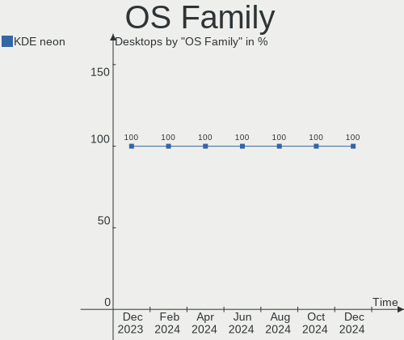
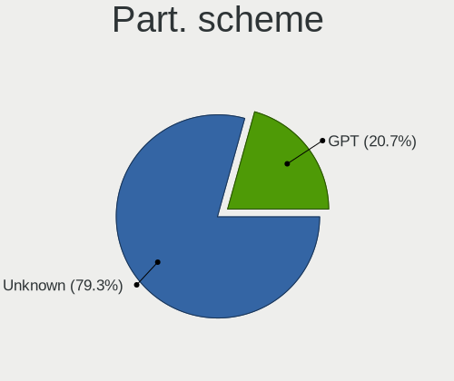
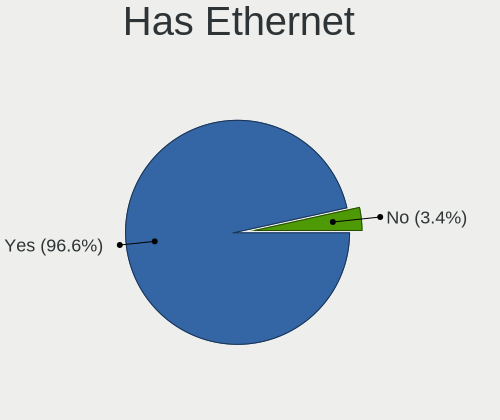
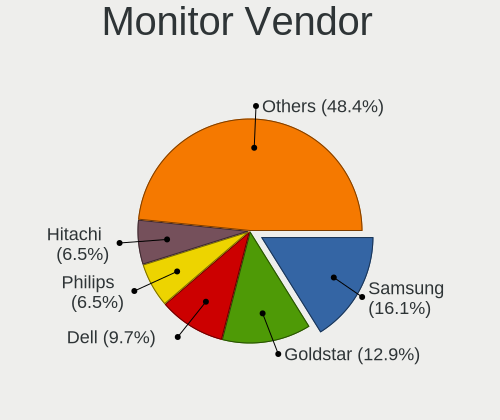
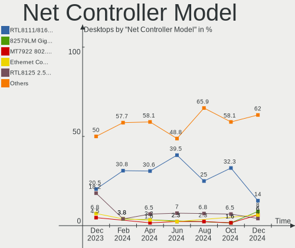
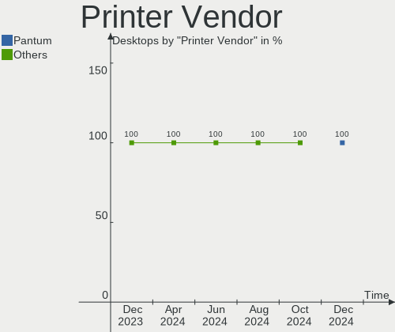
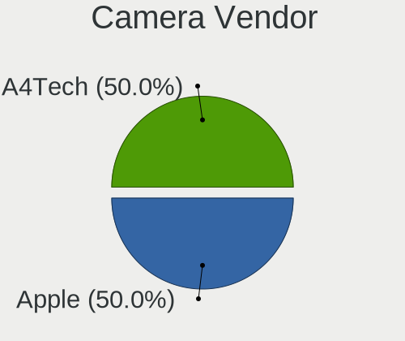

KDE neon Hardware Trends (Desktops)
-----------------------------------

A project to identify most popular hardware characteristics and track their change
over time based on data collected by KDE neon users at https://Linux-Hardware.org.

Anyone can contribute to this report by the [hw-probe](https://github.com/linuxhw/hw-probe) tool:

    sudo -E hw-probe -all -upload

Full-feature report is available here: https://linux-hardware.org/?view=trends

Period: Nov, 2021.

Contents
--------

* [ System ](#system)
  - [ OS                       ](#os)
  - [ OS Family                ](#os-family)
  - [ Kernel                   ](#kernel)
  - [ Kernel Family            ](#kernel-family)
  - [ Kernel Major Ver.        ](#kernel-major-ver)
  - [ Arch                     ](#arch)
  - [ DE                       ](#de)
  - [ Display Server           ](#display-server)
  - [ Display Manager          ](#display-manager)
  - [ OS Lang                  ](#os-lang)
  - [ Boot Mode                ](#boot-mode)
  - [ Filesystem               ](#filesystem)
  - [ Part. scheme             ](#part-scheme)
  - [ Dual Boot with Linux/BSD ](#dual-boot-with-linuxbsd)
  - [ Dual Boot (Win)          ](#dual-boot-win)

* [ Board ](#board)
  - [ Vendor                   ](#vendor)
  - [ Model                    ](#model)
  - [ Model Family             ](#model-family)
  - [ MFG Year                 ](#mfg-year)
  - [ Form Factor              ](#form-factor)
  - [ Secure Boot              ](#secure-boot)
  - [ Coreboot                 ](#coreboot)
  - [ RAM Size                 ](#ram-size)
  - [ RAM Used                 ](#ram-used)
  - [ Total Drives             ](#total-drives)
  - [ Has CD-ROM               ](#has-cd-rom)
  - [ Has Ethernet             ](#has-ethernet)
  - [ Has WiFi                 ](#has-wifi)
  - [ Has Bluetooth            ](#has-bluetooth)

* [ Location ](#location)
  - [ Country                  ](#country)
  - [ City                     ](#city)

* [ Drives ](#drives)
  - [ Drive Vendor             ](#drive-vendor)
  - [ Drive Model              ](#drive-model)
  - [ HDD Vendor               ](#hdd-vendor)
  - [ SSD Vendor               ](#ssd-vendor)
  - [ Drive Kind               ](#drive-kind)
  - [ Drive Connector          ](#drive-connector)
  - [ Drive Size               ](#drive-size)
  - [ Space Total              ](#space-total)
  - [ Space Used               ](#space-used)
  - [ Malfunc. Drives          ](#malfunc-drives)
  - [ Malfunc. Drive Vendor    ](#malfunc-drive-vendor)
  - [ Malfunc. HDD Vendor      ](#malfunc-hdd-vendor)
  - [ Malfunc. Drive Kind      ](#malfunc-drive-kind)
  - [ Failed Drives            ](#failed-drives)
  - [ Failed Drive Vendor      ](#failed-drive-vendor)
  - [ Drive Status             ](#drive-status)

* [ Storage controller ](#storage-controller)
  - [ Storage Vendor           ](#storage-vendor)
  - [ Storage Model            ](#storage-model)
  - [ Storage Kind             ](#storage-kind)

* [ Processor ](#processor)
  - [ CPU Vendor               ](#cpu-vendor)
  - [ CPU Model                ](#cpu-model)
  - [ CPU Model Family         ](#cpu-model-family)
  - [ CPU Cores                ](#cpu-cores)
  - [ CPU Sockets              ](#cpu-sockets)
  - [ CPU Threads              ](#cpu-threads)
  - [ CPU Op-Modes             ](#cpu-op-modes)
  - [ CPU Microcode            ](#cpu-microcode)
  - [ CPU Microarch            ](#cpu-microarch)

* [ Graphics ](#graphics)
  - [ GPU Vendor               ](#gpu-vendor)
  - [ GPU Model                ](#gpu-model)
  - [ GPU Combo                ](#gpu-combo)
  - [ GPU Driver               ](#gpu-driver)
  - [ GPU Memory               ](#gpu-memory)

* [ Monitor ](#monitor)
  - [ Monitor Vendor           ](#monitor-vendor)
  - [ Monitor Model            ](#monitor-model)
  - [ Monitor Resolution       ](#monitor-resolution)
  - [ Monitor Diagonal         ](#monitor-diagonal)
  - [ Monitor Width            ](#monitor-width)
  - [ Aspect Ratio             ](#aspect-ratio)
  - [ Monitor Area             ](#monitor-area)
  - [ Pixel Density            ](#pixel-density)
  - [ Multiple Monitors        ](#multiple-monitors)

* [ Network ](#network)
  - [ Net Controller Vendor    ](#net-controller-vendor)
  - [ Net Controller Model     ](#net-controller-model)
  - [ Wireless Vendor          ](#wireless-vendor)
  - [ Wireless Model           ](#wireless-model)
  - [ Ethernet Vendor          ](#ethernet-vendor)
  - [ Ethernet Model           ](#ethernet-model)
  - [ Net Controller Kind      ](#net-controller-kind)
  - [ Used Controller          ](#used-controller)
  - [ NICs                     ](#nics)
  - [ IPv6                     ](#ipv6)

* [ Bluetooth ](#bluetooth)
  - [ Bluetooth Vendor         ](#bluetooth-vendor)
  - [ Bluetooth Model          ](#bluetooth-model)

* [ Sound ](#sound)
  - [ Sound Vendor             ](#sound-vendor)
  - [ Sound Model              ](#sound-model)

* [ Memory ](#memory)
  - [ Memory Vendor            ](#memory-vendor)
  - [ Memory Model             ](#memory-model)
  - [ Memory Kind              ](#memory-kind)
  - [ Memory Form Factor       ](#memory-form-factor)
  - [ Memory Size              ](#memory-size)
  - [ Memory Speed             ](#memory-speed)

* [ Printers & scanners ](#printers--scanners)
  - [ Printer Vendor           ](#printer-vendor)
  - [ Printer Model            ](#printer-model)
  - [ Scanner Vendor           ](#scanner-vendor)
  - [ Scanner Model            ](#scanner-model)

* [ Camera ](#camera)
  - [ Camera Vendor            ](#camera-vendor)
  - [ Camera Model             ](#camera-model)

* [ Security ](#security)
  - [ Fingerprint Vendor       ](#fingerprint-vendor)
  - [ Fingerprint Model        ](#fingerprint-model)
  - [ Chipcard Vendor          ](#chipcard-vendor)
  - [ Chipcard Model           ](#chipcard-model)

* [ Unsupported ](#unsupported)
  - [ Unsupported Devices      ](#unsupported-devices)
  - [ Unsupported Device Types ](#unsupported-device-types)

System
------

OS
--

Installed operating systems

| Name           | Desktops | Percent |
|----------------|----------|---------|
| KDE neon 20.04 | 40       | 100%    |

OS Family
---------

OS without a version

| Name     | Desktops | Percent |
|----------|----------|---------|
| KDE neon | 40       | 100%    |

Kernel
------

Version of the Linux kernel

| Version           | Desktops | Percent |
|-------------------|----------|---------|
| 5.11.0-40-generic | 21       | 52.5%   |
| 5.11.0-38-generic | 13       | 32.5%   |
| 5.8.0-59-generic  | 2        | 5%      |
| 5.4.0-91-generic  | 1        | 2.5%    |
| 5.11.0-41-generic | 1        | 2.5%    |
| 5.11.0-27-generic | 1        | 2.5%    |
| Unknown           | 1        | 2.5%    |

Kernel Family
-------------

Linux kernel without a distro release

| Version | Desktops | Percent |
|---------|----------|---------|
| 5.11.0  | 36       | 90%     |
| 5.8.0   | 2        | 5%      |
| 5.4.0   | 1        | 2.5%    |
| Unknown | 1        | 2.5%    |

Kernel Major Ver.
-----------------

Linux kernel major version

| Version | Desktops | Percent |
|---------|----------|---------|
| 5.11    | 36       | 90%     |
| 5.8     | 2        | 5%      |
| 5.4     | 1        | 2.5%    |
| Unknown | 1        | 2.5%    |

Arch
----

OS architecture (x86_64, i586, etc.)

| Name   | Desktops | Percent |
|--------|----------|---------|
| x86_64 | 40       | 100%    |

DE
--

Desktop Environment

| Name    | Desktops | Percent |
|---------|----------|---------|
| KDE5    | 37       | 92.5%   |
| Unknown | 3        | 7.5%    |

Display Server
--------------

X11 or Wayland

| Name | Desktops | Percent |
|------|----------|---------|
| X11  | 40       | 100%    |

Display Manager
---------------

SDDM, LightDM, etc.

| Name    | Desktops | Percent |
|---------|----------|---------|
| Unknown | 27       | 67.5%   |
| SDDM    | 13       | 32.5%   |

OS Lang
-------

Language

| Lang    | Desktops | Percent |
|---------|----------|---------|
| en_US   | 9        | 22.5%   |
| de_DE   | 6        | 15%     |
| en_GB   | 5        | 12.5%   |
| uk_UA   | 3        | 7.5%    |
| pt_BR   | 3        | 7.5%    |
| it_IT   | 2        | 5%      |
| fr_CA   | 2        | 5%      |
| en_IN   | 2        | 5%      |
| ru_RU   | 1        | 2.5%    |
| ja_JP   | 1        | 2.5%    |
| fr_FR   | 1        | 2.5%    |
| es_UY   | 1        | 2.5%    |
| en_ZA   | 1        | 2.5%    |
| en_CA   | 1        | 2.5%    |
| ca_ES   | 1        | 2.5%    |
| Unknown | 1        | 2.5%    |

Boot Mode
---------

EFI or BIOS

| Mode | Desktops | Percent |
|------|----------|---------|
| BIOS | 23       | 57.5%   |
| EFI  | 17       | 42.5%   |

Filesystem
----------

Type of filesystem

| Type  | Desktops | Percent |
|-------|----------|---------|
| Ext4  | 36       | 90%     |
| Btrfs | 4        | 10%     |

Part. scheme
------------

Scheme of partitioning

| Type    | Desktops | Percent |
|---------|----------|---------|
| Unknown | 35       | 87.5%   |
| GPT     | 4        | 10%     |
| MBR     | 1        | 2.5%    |

Dual Boot with Linux/BSD
------------------------

Hosting more than one Linux/BSD

| Dual boot | Desktops | Percent |
|-----------|----------|---------|
| No        | 36       | 90%     |
| Yes       | 4        | 10%     |

Dual Boot (Win)
---------------

Hosting Linux and Windows

| Dual boot | Desktops | Percent |
|-----------|----------|---------|
| No        | 30       | 75%     |
| Yes       | 10       | 25%     |

Board
-----

Vendor
------

Motherboard manufacturer

| Name                | Desktops | Percent |
|---------------------|----------|---------|
| ASUSTek Computer    | 13       | 32.5%   |
| Gigabyte Technology | 9        | 22.5%   |
| Hewlett-Packard     | 4        | 10%     |
| Dell                | 4        | 10%     |
| ASRock              | 4        | 10%     |
| MSI                 | 3        | 7.5%    |
| Positivo            | 1        | 2.5%    |
| Intel               | 1        | 2.5%    |
| Fujitsu             | 1        | 2.5%    |

Model
-----

Motherboard model

| Name                             | Desktops | Percent |
|----------------------------------|----------|---------|
| Gigabyte 945GCMX-S2              | 2        | 5%      |
| ASUS All Series                  | 2        | 5%      |
| Positivo POS-PQ45AU              | 1        | 2.5%    |
| MSI MS-7D18                      | 1        | 2.5%    |
| MSI MS-7C02                      | 1        | 2.5%    |
| MSI MS-7693                      | 1        | 2.5%    |
| Intel H55                        | 1        | 2.5%    |
| HP Z400 Workstation              | 1        | 2.5%    |
| HP Compaq 6005 Pro SFF PC        | 1        | 2.5%    |
| HP 8433 11                       | 1        | 2.5%    |
| HP 260-a010                      | 1        | 2.5%    |
| Gigabyte Z370 HD3P               | 1        | 2.5%    |
| Gigabyte P55-USB3                | 1        | 2.5%    |
| Gigabyte H81M-DS2                | 1        | 2.5%    |
| Gigabyte H61M-S1                 | 1        | 2.5%    |
| Gigabyte B365M DS3H              | 1        | 2.5%    |
| Gigabyte ALDA-CE                 | 1        | 2.5%    |
| Gigabyte 970A-DS3P               | 1        | 2.5%    |
| Fujitsu ESPRIMO E910             | 1        | 2.5%    |
| Dell Vostro 3800                 | 1        | 2.5%    |
| Dell Studio Slim 540s            | 1        | 2.5%    |
| Dell Precision WorkStation T3500 | 1        | 2.5%    |
| Dell OptiPlex 7010               | 1        | 2.5%    |
| ASUS Z170-PRO                    | 1        | 2.5%    |
| ASUS TUF X470-PLUS GAMING        | 1        | 2.5%    |
| ASUS TUF GAMING X570-PLUS        | 1        | 2.5%    |
| ASUS TUF GAMING B550M-PLUS       | 1        | 2.5%    |
| ASUS Rampage IV EXTREME          | 1        | 2.5%    |
| ASUS PRIME X370-PRO              | 1        | 2.5%    |
| ASUS PRIME B550-PLUS             | 1        | 2.5%    |
| ASUS PRIME B350-PLUS             | 1        | 2.5%    |
| ASUS P8Z77-V PRO                 | 1        | 2.5%    |
| ASUS KJ375AAR-ABA s3400f         | 1        | 2.5%    |
| ASUS H110M-C                     | 1        | 2.5%    |
| ASRock Z270M Extreme4            | 1        | 2.5%    |
| ASRock J5040-ITX                 | 1        | 2.5%    |
| ASRock H570 Steel Legend         | 1        | 2.5%    |
| ASRock 970M Pro3                 | 1        | 2.5%    |

Model Family
------------

Motherboard model prefix

| Name                | Desktops | Percent |
|---------------------|----------|---------|
| ASUS TUF            | 3        | 7.5%    |
| ASUS PRIME          | 3        | 7.5%    |
| Gigabyte 945GCMX-S2 | 2        | 5%      |
| ASUS All            | 2        | 5%      |
| Positivo POS-PQ45AU | 1        | 2.5%    |
| MSI MS-7D18         | 1        | 2.5%    |
| MSI MS-7C02         | 1        | 2.5%    |
| MSI MS-7693         | 1        | 2.5%    |
| Intel H55           | 1        | 2.5%    |
| HP Z400             | 1        | 2.5%    |
| HP Compaq           | 1        | 2.5%    |
| HP 8433             | 1        | 2.5%    |
| HP 260-a010         | 1        | 2.5%    |
| Gigabyte Z370       | 1        | 2.5%    |
| Gigabyte P55-USB3   | 1        | 2.5%    |
| Gigabyte H81M-DS2   | 1        | 2.5%    |
| Gigabyte H61M-S1    | 1        | 2.5%    |
| Gigabyte B365M      | 1        | 2.5%    |
| Gigabyte ALDA-CE    | 1        | 2.5%    |
| Gigabyte 970A-DS3P  | 1        | 2.5%    |
| Fujitsu ESPRIMO     | 1        | 2.5%    |
| Dell Vostro         | 1        | 2.5%    |
| Dell Studio         | 1        | 2.5%    |
| Dell Precision      | 1        | 2.5%    |
| Dell OptiPlex       | 1        | 2.5%    |
| ASUS Z170-PRO       | 1        | 2.5%    |
| ASUS Rampage        | 1        | 2.5%    |
| ASUS P8Z77-V        | 1        | 2.5%    |
| ASUS KJ375AAR-ABA   | 1        | 2.5%    |
| ASUS H110M-C        | 1        | 2.5%    |
| ASRock Z270M        | 1        | 2.5%    |
| ASRock J5040-ITX    | 1        | 2.5%    |
| ASRock H570         | 1        | 2.5%    |
| ASRock 970M         | 1        | 2.5%    |

MFG Year
--------

Motherboard manufacture year

| Year | Desktops | Percent |
|------|----------|---------|
| 2021 | 6        | 15%     |
| 2019 | 4        | 10%     |
| 2018 | 4        | 10%     |
| 2015 | 4        | 10%     |
| 2020 | 3        | 7.5%    |
| 2014 | 3        | 7.5%    |
| 2010 | 3        | 7.5%    |
| 2009 | 3        | 7.5%    |
| 2017 | 2        | 5%      |
| 2013 | 2        | 5%      |
| 2012 | 2        | 5%      |
| 2008 | 2        | 5%      |
| 2016 | 1        | 2.5%    |
| 2011 | 1        | 2.5%    |

Form Factor
-----------

Physical design of the computer

| Name    | Desktops | Percent |
|---------|----------|---------|
| Desktop | 40       | 100%    |

Secure Boot
-----------

Enabled or disabled

| State    | Desktops | Percent |
|----------|----------|---------|
| Disabled | 37       | 92.5%   |
| Enabled  | 3        | 7.5%    |

Coreboot
--------

Have coreboot on board

| Used | Desktops | Percent |
|------|----------|---------|
| No   | 40       | 100%    |

RAM Size
--------

Total RAM memory

| Size in GB  | Desktops | Percent |
|-------------|----------|---------|
| 16.01-24.0  | 13       | 32.5%   |
| 4.01-8.0    | 6        | 15%     |
| 3.01-4.0    | 6        | 15%     |
| 32.01-64.0  | 5        | 12.5%   |
| 8.01-16.0   | 4        | 10%     |
| 64.01-256.0 | 3        | 7.5%    |
| 2.01-3.0    | 1        | 2.5%    |
| 1.01-2.0    | 1        | 2.5%    |
| Unknown     | 1        | 2.5%    |

RAM Used
--------

Used RAM memory

| Used GB   | Desktops | Percent |
|-----------|----------|---------|
| 1.01-2.0  | 11       | 27.5%   |
| 2.01-3.0  | 8        | 20%     |
| 0.51-1.0  | 8        | 20%     |
| 4.01-8.0  | 5        | 12.5%   |
| 3.01-4.0  | 5        | 12.5%   |
| 8.01-16.0 | 2        | 5%      |
| Unknown   | 1        | 2.5%    |

Total Drives
------------

Number of drives on board

| Drives | Desktops | Percent |
|--------|----------|---------|
| 1      | 13       | 32.5%   |
| 2      | 11       | 27.5%   |
| 3      | 10       | 25%     |
| 6      | 2        | 5%      |
| 5      | 2        | 5%      |
| 7      | 1        | 2.5%    |
| 4      | 1        | 2.5%    |

Has CD-ROM
----------

Has CD-ROM on board

| Presented | Desktops | Percent |
|-----------|----------|---------|
| Yes       | 21       | 52.5%   |
| No        | 19       | 47.5%   |

Has Ethernet
------------

Has Ethernet on board

| Presented | Desktops | Percent |
|-----------|----------|---------|
| Yes       | 40       | 100%    |

Has WiFi
--------

Has WiFi module

| Presented | Desktops | Percent |
|-----------|----------|---------|
| No        | 26       | 65%     |
| Yes       | 14       | 35%     |

Has Bluetooth
-------------

Has Bluetooth module

| Presented | Desktops | Percent |
|-----------|----------|---------|
| No        | 28       | 70%     |
| Yes       | 12       | 30%     |

Location
--------

Country
-------

Geographic location (country)

| Country                | Desktops | Percent |
|------------------------|----------|---------|
| USA                    | 8        | 20%     |
| Germany                | 6        | 15%     |
| Brazil                 | 4        | 10%     |
| Ukraine                | 3        | 7.5%    |
| UK                     | 3        | 7.5%    |
| Canada                 | 3        | 7.5%    |
| Spain                  | 2        | 5%      |
| Italy                  | 2        | 5%      |
| India                  | 2        | 5%      |
| Uruguay                | 1        | 2.5%    |
| South Africa           | 1        | 2.5%    |
| Russia                 | 1        | 2.5%    |
| Pakistan               | 1        | 2.5%    |
| Martinique             | 1        | 2.5%    |
| Japan                  | 1        | 2.5%    |
| Bosnia and Herzegovina | 1        | 2.5%    |

City
----

Geographic location (city)

| City             | Desktops | Percent |
|------------------|----------|---------|
| Kyiv             | 2        | 5%      |
| Koblenz          | 2        | 5%      |
| Weimar           | 1        | 2.5%    |
| Warrington       | 1        | 2.5%    |
| Valencia         | 1        | 2.5%    |
| Uberl??ndia      | 1        | 2.5%    |
| St. Paul's River | 1        | 2.5%    |
| S??o Paulo       | 1        | 2.5%    |
| Rio de Janeiro   | 1        | 2.5%    |
| Ratingen         | 1        | 2.5%    |
| Rafelbunyol      | 1        | 2.5%    |
| Porter           | 1        | 2.5%    |
| Ponta Grossa     | 1        | 2.5%    |
| Odintsovo        | 1        | 2.5%    |
| New Milford      | 1        | 2.5%    |
| New Bern         | 1        | 2.5%    |
| Naples           | 1        | 2.5%    |
| Montreal         | 1        | 2.5%    |
| Montevideo       | 1        | 2.5%    |
| Milan            | 1        | 2.5%    |
| Matsudo          | 1        | 2.5%    |
| Manchester       | 1        | 2.5%    |
| Lviv             | 1        | 2.5%    |
| Los Angeles      | 1        | 2.5%    |
| London           | 1        | 2.5%    |
| Lahore           | 1        | 2.5%    |
| Kretzschau       | 1        | 2.5%    |
| Johannesburg     | 1        | 2.5%    |
| Hillsboro        | 1        | 2.5%    |
| Fort-de-France   | 1        | 2.5%    |
| Ernakulam        | 1        | 2.5%    |
| Edwardsville     | 1        | 2.5%    |
| Eaton Rapids     | 1        | 2.5%    |
| Duncan           | 1        | 2.5%    |
| Columbus         | 1        | 2.5%    |
| Bielefeld        | 1        | 2.5%    |
| Banja Luka       | 1        | 2.5%    |
| Ahmedabad        | 1        | 2.5%    |

Drives
------

Drive Vendor
------------

Hard drive vendors

| Vendor                    | Desktops | Drives | Percent |
|---------------------------|----------|--------|---------|
| WDC                       | 16       | 19     | 19.75%  |
| Seagate                   | 14       | 19     | 17.28%  |
| Samsung Electronics       | 9        | 15     | 11.11%  |
| Toshiba                   | 7        | 8      | 8.64%   |
| Kingston                  | 5        | 5      | 6.17%   |
| Sandisk                   | 4        | 4      | 4.94%   |
| Crucial                   | 3        | 4      | 3.7%    |
| Team                      | 2        | 2      | 2.47%   |
| Mushkin                   | 2        | 2      | 2.47%   |
| Intenso                   | 2        | 4      | 2.47%   |
| Hitachi                   | 2        | 2      | 2.47%   |
| Corsair                   | 2        | 2      | 2.47%   |
| A-DATA Technology         | 2        | 2      | 2.47%   |
| WD MediaMax               | 1        | 1      | 1.23%   |
| Unknown                   | 1        | 1      | 1.23%   |
| Super Talent              | 1        | 1      | 1.23%   |
| SPCC                      | 1        | 1      | 1.23%   |
| Silicon Motion            | 1        | 1      | 1.23%   |
| Realtek Semiconductor     | 1        | 2      | 1.23%   |
| Micron/Crucial Technology | 1        | 1      | 1.23%   |
| Intel                     | 1        | 1      | 1.23%   |
| HS-SSD-C100               | 1        | 1      | 1.23%   |
| Apacer                    | 1        | 1      | 1.23%   |
| 2-Power                   | 1        | 1      | 1.23%   |

Drive Model
-----------

Hard drive models

| Model                               | Desktops | Percent |
|-------------------------------------|----------|---------|
| WDC WD5000BPVT-22HXZT3 500GB        | 2        | 2.06%   |
| WDC WD5000AACS-00ZUB0 500GB         | 2        | 2.06%   |
| Toshiba MK3256GSY 320GB             | 2        | 2.06%   |
| Toshiba DT01ACA050 500GB            | 2        | 2.06%   |
| Seagate ST500DM002-1BD142 500GB     | 2        | 2.06%   |
| Seagate ST31000528AS 1TB            | 2        | 2.06%   |
| Seagate ST2000DM008-2FR102 2TB      | 2        | 2.06%   |
| Seagate Expansion 1TB               | 2        | 2.06%   |
| SanDisk SDSSDA120G 120GB            | 2        | 2.06%   |
| Samsung SSD 850 EVO 250GB           | 2        | 2.06%   |
| Kingston SV300S37A120G 120GB SSD    | 2        | 2.06%   |
| WDC WDBNCE5000PNC 500GB SSD         | 1        | 1.03%   |
| WDC WD5000AACS-00D0B0 500GB         | 1        | 1.03%   |
| WDC WD40PURZ-85AKKY0 4TB            | 1        | 1.03%   |
| WDC WD40EFRX-68N32N0 4TB            | 1        | 1.03%   |
| WDC WD4003FZEX-00Z4SA0 4TB          | 1        | 1.03%   |
| WDC WD3200AAKS-61L9A0 320GB         | 1        | 1.03%   |
| WDC WD20EZAZ-00GGJB0 2TB            | 1        | 1.03%   |
| WDC WD20EFRX-68AX9N0 2TB            | 1        | 1.03%   |
| WDC WD2003FYYS-02W0B0 2TB           | 1        | 1.03%   |
| WDC WD2002FAEX-00MJRA0 2TB          | 1        | 1.03%   |
| WDC WD2002FAEX-007BA0 2TB           | 1        | 1.03%   |
| WDC WD10EZRZ-00HTKB0 1TB            | 1        | 1.03%   |
| WDC WD10EZEX-75M2NA0 1TB            | 1        | 1.03%   |
| WDC WD10EZEX-00BN5A0 1TB            | 1        | 1.03%   |
| WDC WD10EARS-00MVWB0 1TB            | 1        | 1.03%   |
| WD MediaMax WL2000GSA6472 0 2TB     | 1        | 1.03%   |
| Unknown SD/MMC/MS PRO 394GB         | 1        | 1.03%   |
| Toshiba MQ01ABF032 320GB            | 1        | 1.03%   |
| Toshiba DT01ACA300 3TB              | 1        | 1.03%   |
| Toshiba DT01ACA200 2TB              | 1        | 1.03%   |
| Team TEAML5Lite3D480G 480GB SSD     | 1        | 1.03%   |
| Team T253X2001T 1024GB SSD          | 1        | 1.03%   |
| Super Talent FTM56N325H 256GB       | 1        | 1.03%   |
| SPCC Solid State Disk 128GB         | 1        | 1.03%   |
| Silicon Motion NVMe SSD Drive 512GB | 1        | 1.03%   |
| Seagate ST500LM034-2GH17A 500GB     | 1        | 1.03%   |
| Seagate ST3500418AS 500GB           | 1        | 1.03%   |
| Seagate ST3500414CS 500GB           | 1        | 1.03%   |
| Seagate ST3500413AS 500GB           | 1        | 1.03%   |
| Seagate ST3500320AS 500GB           | 1        | 1.03%   |
| Seagate ST3320820AS 320GB           | 1        | 1.03%   |
| Seagate ST2000VM003-1CT164 2TB      | 1        | 1.03%   |
| Seagate ST2000DM001-9YN164 2TB      | 1        | 1.03%   |
| Seagate ST1000VX000-1ES162 1TB      | 1        | 1.03%   |
| Seagate ST1000DM010-2EP102 1TB      | 1        | 1.03%   |
| Seagate ST10000DM0004-1ZC101 10TB   | 1        | 1.03%   |
| SanDisk SSD PLUS 1000GB             | 1        | 1.03%   |
| Sandisk NVMe SSD Drive 1TB          | 1        | 1.03%   |
| Samsung SSD 970 PRO 512GB           | 1        | 1.03%   |
| Samsung SSD 970 EVO Plus 1TB        | 1        | 1.03%   |
| Samsung SSD 860 QVO 2TB             | 1        | 1.03%   |
| Samsung SSD 860 EVO 1TB             | 1        | 1.03%   |
| Samsung SSD 850 PRO 256GB           | 1        | 1.03%   |
| Samsung SSD 850 EVO 1TB             | 1        | 1.03%   |
| Samsung SSD 840 PRO Series 256GB    | 1        | 1.03%   |
| Samsung NVMe SSD Drive 500GB        | 1        | 1.03%   |
| Samsung NVMe SSD Drive 1TB          | 1        | 1.03%   |
| Samsung HM321HI 320GB               | 1        | 1.03%   |
| Samsung HD502HJ 500GB               | 1        | 1.03%   |

HDD Vendor
----------

Hard disk drive vendors

| Vendor              | Desktops | Drives | Percent |
|---------------------|----------|--------|---------|
| WDC                 | 15       | 18     | 35.71%  |
| Seagate             | 14       | 19     | 33.33%  |
| Toshiba             | 7        | 8      | 16.67%  |
| Samsung Electronics | 2        | 3      | 4.76%   |
| Hitachi             | 2        | 2      | 4.76%   |
| Unknown             | 1        | 1      | 2.38%   |
| Intenso             | 1        | 2      | 2.38%   |

SSD Vendor
----------

Solid state drive vendors

| Vendor              | Desktops | Drives | Percent |
|---------------------|----------|--------|---------|
| Samsung Electronics | 6        | 8      | 20%     |
| SanDisk             | 3        | 3      | 10%     |
| Kingston            | 3        | 3      | 10%     |
| Crucial             | 3        | 4      | 10%     |
| Team                | 2        | 2      | 6.67%   |
| Mushkin             | 2        | 2      | 6.67%   |
| Corsair             | 2        | 2      | 6.67%   |
| A-DATA Technology   | 2        | 2      | 6.67%   |
| WDC                 | 1        | 1      | 3.33%   |
| Super Talent        | 1        | 1      | 3.33%   |
| SPCC                | 1        | 1      | 3.33%   |
| Intenso             | 1        | 1      | 3.33%   |
| Intel               | 1        | 1      | 3.33%   |
| Apacer              | 1        | 1      | 3.33%   |
| 2-Power             | 1        | 1      | 3.33%   |

Drive Kind
----------

HDD or SSD

| Kind    | Desktops | Drives | Percent |
|---------|----------|--------|---------|
| HDD     | 31       | 53     | 46.27%  |
| SSD     | 24       | 33     | 35.82%  |
| NVMe    | 9        | 11     | 13.43%  |
| Unknown | 3        | 3      | 4.48%   |

Drive Connector
---------------

SATA, SAS, NVMe, etc.

| Type | Desktops | Drives | Percent |
|------|----------|--------|---------|
| SATA | 39       | 82     | 73.58%  |
| NVMe | 9        | 11     | 16.98%  |
| SAS  | 5        | 7      | 9.43%   |

Drive Size
----------

Size of hard drive

| Size in TB | Desktops | Drives | Percent |
|------------|----------|--------|---------|
| 0.01-0.5   | 32       | 52     | 54.24%  |
| 0.51-1.0   | 12       | 13     | 20.34%  |
| 1.01-2.0   | 11       | 15     | 18.64%  |
| 3.01-4.0   | 2        | 3      | 3.39%   |
| 2.01-3.0   | 1        | 2      | 1.69%   |
| 4.01-10.0  | 1        | 1      | 1.69%   |

Space Total
-----------

Amount of disk space available on the file system

| Size in GB     | Desktops | Percent |
|----------------|----------|---------|
| 101-250        | 10       | 25%     |
| 251-500        | 7        | 17.5%   |
| 501-1000       | 6        | 15%     |
| 51-100         | 5        | 12.5%   |
| 1001-2000      | 4        | 10%     |
| More than 3000 | 3        | 7.5%    |
| 2001-3000      | 3        | 7.5%    |
| 21-50          | 1        | 2.5%    |
| Unknown        | 1        | 2.5%    |

Space Used
----------

Amount of used disk space

| Used GB        | Desktops | Percent |
|----------------|----------|---------|
| 1-20           | 16       | 40%     |
| 101-250        | 7        | 17.5%   |
| 51-100         | 4        | 10%     |
| 251-500        | 3        | 7.5%    |
| 21-50          | 3        | 7.5%    |
| 1001-2000      | 3        | 7.5%    |
| More than 3000 | 1        | 2.5%    |
| 2001-3000      | 1        | 2.5%    |
| 501-1000       | 1        | 2.5%    |
| Unknown        | 1        | 2.5%    |

Malfunc. Drives
---------------

Drive models with a malfunction

| Model                           | Desktops | Drives | Percent |
|---------------------------------|----------|--------|---------|
| Seagate ST500DM002-1BD142 500GB | 1        | 1      | 100%    |

Malfunc. Drive Vendor
---------------------

Vendors of faulty drives

| Vendor  | Desktops | Drives | Percent |
|---------|----------|--------|---------|
| Seagate | 1        | 1      | 100%    |

Malfunc. HDD Vendor
-------------------

Vendors of faulty HDD drives

| Vendor  | Desktops | Drives | Percent |
|---------|----------|--------|---------|
| Seagate | 1        | 1      | 100%    |

Malfunc. Drive Kind
-------------------

Kinds of faulty drives

| Kind | Desktops | Drives | Percent |
|------|----------|--------|---------|
| HDD  | 1        | 1      | 100%    |

Failed Drives
-------------

Failed drive models

Zero info for selected period =(

Failed Drive Vendor
-------------------

Failed drive vendors

Zero info for selected period =(

Drive Status
------------

Number of failed and malfunc. drives

| Status   | Desktops | Drives | Percent |
|----------|----------|--------|---------|
| Detected | 36       | 83     | 85.71%  |
| Works    | 5        | 16     | 11.9%   |
| Malfunc  | 1        | 1      | 2.38%   |

Storage controller
------------------

Storage Vendor
--------------

Storage controller vendors

| Vendor                      | Desktops | Percent |
|-----------------------------|----------|---------|
| Intel                       | 27       | 50.94%  |
| AMD                         | 12       | 22.64%  |
| Samsung Electronics         | 3        | 5.66%   |
| ASMedia Technology          | 3        | 5.66%   |
| Kingston Technology Company | 2        | 3.77%   |
| Silicon Motion              | 1        | 1.89%   |
| Sandisk                     | 1        | 1.89%   |
| Realtek Semiconductor       | 1        | 1.89%   |
| Nvidia                      | 1        | 1.89%   |
| Micron/Crucial Technology   | 1        | 1.89%   |
| JMicron Technology          | 1        | 1.89%   |

Storage Model
-------------

Storage controller models

| Model                                                                                   | Desktops | Percent |
|-----------------------------------------------------------------------------------------|----------|---------|
| AMD FCH SATA Controller [AHCI mode]                                                     | 6        | 9.23%   |
| Intel 8 Series/C220 Series Chipset Family 6-port SATA Controller 1 [AHCI mode]          | 4        | 6.15%   |
| Samsung NVMe SSD Controller SM981/PM981/PM983                                           | 3        | 4.62%   |
| Intel NM10/ICH7 Family SATA Controller [IDE mode]                                       | 3        | 4.62%   |
| Intel 200 Series PCH SATA controller [AHCI mode]                                        | 3        | 4.62%   |
| ASMedia ASM1062 Serial ATA Controller                                                   | 3        | 4.62%   |
| AMD SB7x0/SB8x0/SB9x0 SATA Controller [AHCI mode]                                       | 3        | 4.62%   |
| Kingston Company A2000 NVMe SSD                                                         | 2        | 3.08%   |
| Intel SATA Controller [RAID mode]                                                       | 2        | 3.08%   |
| Intel Q170/Q150/B150/H170/H110/Z170/CM236 Chipset SATA Controller [AHCI Mode]           | 2        | 3.08%   |
| Intel 7 Series/C210 Series Chipset Family 6-port SATA Controller [AHCI mode]            | 2        | 3.08%   |
| Intel 500 Series Chipset Family SATA AHCI Controller                                    | 2        | 3.08%   |
| Intel 5 Series/3400 Series Chipset 6 port SATA AHCI Controller                          | 2        | 3.08%   |
| AMD Starship/Matisse Chipset SATA Controller [AHCI mode]                                | 2        | 3.08%   |
| AMD SB7x0/SB8x0/SB9x0 IDE Controller                                                    | 2        | 3.08%   |
| AMD 400 Series Chipset SATA Controller                                                  | 2        | 3.08%   |
| AMD 300 Series Chipset SATA Controller                                                  | 2        | 3.08%   |
| Silicon Motion SM2263EN/SM2263XT SSD Controller                                         | 1        | 1.54%   |
| Sandisk WD Black SN750 / PC SN730 NVMe SSD                                              | 1        | 1.54%   |
| Realtek Realtek Non-Volatile memory controller                                          | 1        | 1.54%   |
| Nvidia MCP61 SATA Controller                                                            | 1        | 1.54%   |
| Nvidia MCP61 IDE                                                                        | 1        | 1.54%   |
| Micron/Crucial P2 NVMe PCIe SSD                                                         | 1        | 1.54%   |
| JMicron JMB363 SATA/IDE Controller                                                      | 1        | 1.54%   |
| Intel Celeron/Pentium Silver Processor SATA Controller                                  | 1        | 1.54%   |
| Intel C600/X79 series chipset 6-Port SATA AHCI Controller                               | 1        | 1.54%   |
| Intel Atom/Celeron/Pentium Processor x5-E8000/J3xxx/N3xxx Series SATA Controller        | 1        | 1.54%   |
| Intel 82801JI (ICH10 Family) 4 port SATA IDE Controller #1                              | 1        | 1.54%   |
| Intel 82801JI (ICH10 Family) 2 port SATA IDE Controller #2                              | 1        | 1.54%   |
| Intel 82801JD/DO (ICH10 Family) 4-port SATA IDE Controller                              | 1        | 1.54%   |
| Intel 82801JD/DO (ICH10 Family) 2-port SATA IDE Controller                              | 1        | 1.54%   |
| Intel 7 Series/C210 Series Chipset Family 4-port SATA Controller [IDE mode]             | 1        | 1.54%   |
| Intel 7 Series/C210 Series Chipset Family 2-port SATA Controller [IDE mode]             | 1        | 1.54%   |
| Intel 6 Series/C200 Series Chipset Family Desktop SATA Controller (IDE mode, ports 4-5) | 1        | 1.54%   |
| Intel 6 Series/C200 Series Chipset Family Desktop SATA Controller (IDE mode, ports 0-3) | 1        | 1.54%   |
| AMD X370 Series Chipset SATA Controller                                                 | 1        | 1.54%   |
| AMD SB7x0/SB8x0/SB9x0 SATA Controller [IDE mode]                                        | 1        | 1.54%   |

Storage Kind
------------

Kind of storage controller (IDE, SATA, NVMe, SAS, ...)

| Kind | Desktops | Percent |
|------|----------|---------|
| SATA | 30       | 57.69%  |
| IDE  | 11       | 21.15%  |
| NVMe | 9        | 17.31%  |
| RAID | 2        | 3.85%   |

Processor
---------

CPU Vendor
----------

Processor vendors

| Vendor | Desktops | Percent |
|--------|----------|---------|
| Intel  | 27       | 67.5%   |
| AMD    | 13       | 32.5%   |

CPU Model
---------

Processor models

| Model                                          | Desktops | Percent |
|------------------------------------------------|----------|---------|
| Intel Pentium Dual-Core CPU E6300 @ 2.80GHz    | 2        | 5%      |
| AMD Ryzen 7 3700X 8-Core Processor             | 2        | 5%      |
| Intel Xeon CPU X5650 @ 2.67GHz                 | 1        | 2.5%    |
| Intel Xeon CPU W3565 @ 3.20GHz                 | 1        | 2.5%    |
| Intel Xeon CPU E5-1680 v2 @ 3.00GHz            | 1        | 2.5%    |
| Intel Pentium Silver J5040 CPU @ 2.00GHz       | 1        | 2.5%    |
| Intel Pentium Dual CPU E2180 @ 2.00GHz         | 1        | 2.5%    |
| Intel Pentium CPU J3710 @ 1.60GHz              | 1        | 2.5%    |
| Intel Core i9-10900K CPU @ 3.70GHz             | 1        | 2.5%    |
| Intel Core i7-6700K CPU @ 4.00GHz              | 1        | 2.5%    |
| Intel Core i7-4770K CPU @ 3.50GHz              | 1        | 2.5%    |
| Intel Core i7-3770K CPU @ 3.50GHz              | 1        | 2.5%    |
| Intel Core i5-9600K CPU @ 3.70GHz              | 1        | 2.5%    |
| Intel Core i5-8600K CPU @ 3.60GHz              | 1        | 2.5%    |
| Intel Core i5-6600K CPU @ 3.50GHz              | 1        | 2.5%    |
| Intel Core i5-6500 CPU @ 3.20GHz               | 1        | 2.5%    |
| Intel Core i5-4570 CPU @ 3.20GHz               | 1        | 2.5%    |
| Intel Core i5-4440 CPU @ 3.10GHz               | 1        | 2.5%    |
| Intel Core i5-3570 CPU @ 3.40GHz               | 1        | 2.5%    |
| Intel Core i5-3470 CPU @ 3.20GHz               | 1        | 2.5%    |
| Intel Core i5 CPU 760 @ 2.80GHz                | 1        | 2.5%    |
| Intel Core i3-4150 CPU @ 3.50GHz               | 1        | 2.5%    |
| Intel Core i3 CPU 530 @ 2.93GHz                | 1        | 2.5%    |
| Intel Core 2 Duo CPU E7500 @ 2.93GHz           | 1        | 2.5%    |
| Intel Core 2 Duo CPU E7400 @ 2.80GHz           | 1        | 2.5%    |
| Intel Celeron CPU G530 @ 2.40GHz               | 1        | 2.5%    |
| Intel 11th Gen Core i5-11400F @ 2.60GHz        | 1        | 2.5%    |
| AMD Sempron 145 Processor                      | 1        | 2.5%    |
| AMD Ryzen 7 2700X Eight-Core Processor         | 1        | 2.5%    |
| AMD Ryzen 7 1800X Eight-Core Processor         | 1        | 2.5%    |
| AMD Ryzen 7 1700X Eight-Core Processor         | 1        | 2.5%    |
| AMD Ryzen 5 3600 6-Core Processor              | 1        | 2.5%    |
| AMD Ryzen 5 3400G with Radeon Vega Graphics    | 1        | 2.5%    |
| AMD Phenom II X4 945 Processor                 | 1        | 2.5%    |
| AMD FX-8350 Eight-Core Processor               | 1        | 2.5%    |
| AMD Athlon II X4 630 Processor                 | 1        | 2.5%    |
| AMD Athlon 64 X2 Dual Core Processor 5200+     | 1        | 2.5%    |
| AMD A10-9700 RADEON R7, 10 COMPUTE CORES 4C+6G | 1        | 2.5%    |

CPU Model Family
----------------

Processor model prefix

| Model                   | Desktops | Percent |
|-------------------------|----------|---------|
| Intel Core i5           | 9        | 22.5%   |
| AMD Ryzen 7             | 5        | 12.5%   |
| Intel Xeon              | 3        | 7.5%    |
| Intel Core i7           | 3        | 7.5%    |
| Intel Pentium Dual-Core | 2        | 5%      |
| Intel Core i3           | 2        | 5%      |
| Intel Core 2 Duo        | 2        | 5%      |
| AMD Ryzen 5             | 2        | 5%      |
| Other                   | 1        | 2.5%    |
| Intel Pentium Silver    | 1        | 2.5%    |
| Intel Pentium Dual      | 1        | 2.5%    |
| Intel Pentium           | 1        | 2.5%    |
| Intel Core i9           | 1        | 2.5%    |
| Intel Celeron           | 1        | 2.5%    |
| AMD Sempron             | 1        | 2.5%    |
| AMD Phenom II X4        | 1        | 2.5%    |
| AMD FX                  | 1        | 2.5%    |
| AMD Athlon II X4        | 1        | 2.5%    |
| AMD Athlon 64 X2        | 1        | 2.5%    |
| AMD A10                 | 1        | 2.5%    |

CPU Cores
---------

Number of processor cores

| Number | Desktops | Percent |
|--------|----------|---------|
| 4      | 17       | 42.5%   |
| 2      | 10       | 25%     |
| 8      | 6        | 15%     |
| 6      | 5        | 12.5%   |
| 10     | 1        | 2.5%    |
| 1      | 1        | 2.5%    |

CPU Sockets
-----------

Number of sockets

| Number | Desktops | Percent |
|--------|----------|---------|
| 1      | 40       | 100%    |

CPU Threads
-----------

Threads per core (Hyper-Threading)

| Number | Desktops | Percent |
|--------|----------|---------|
| 1      | 21       | 52.5%   |
| 2      | 19       | 47.5%   |

CPU Op-Modes
------------

CPU Operation Modes (32-bit, 64-bit)

| Op mode        | Desktops | Percent |
|----------------|----------|---------|
| 32-bit, 64-bit | 40       | 100%    |

CPU Microcode
-------------

Microcode number

| Number     | Desktops | Percent |
|------------|----------|---------|
| 0x306c3    | 4        | 10%     |
| 0x1067a    | 4        | 10%     |
| 0x506e3    | 3        | 7.5%    |
| Unknown    | 3        | 7.5%    |
| 0x306a9    | 2        | 5%      |
| 0x08701021 | 2        | 5%      |
| 0x08001138 | 2        | 5%      |
| 0x010000c8 | 2        | 5%      |
| 0xa0671    | 1        | 2.5%    |
| 0xa0655    | 1        | 2.5%    |
| 0x906ed    | 1        | 2.5%    |
| 0x906ea    | 1        | 2.5%    |
| 0x706a8    | 1        | 2.5%    |
| 0x406c4    | 1        | 2.5%    |
| 0x306e4    | 1        | 2.5%    |
| 0x206c2    | 1        | 2.5%    |
| 0x206a7    | 1        | 2.5%    |
| 0x20652    | 1        | 2.5%    |
| 0x106e5    | 1        | 2.5%    |
| 0x106a5    | 1        | 2.5%    |
| 0x08701013 | 1        | 2.5%    |
| 0x08108109 | 1        | 2.5%    |
| 0x0800820d | 1        | 2.5%    |
| 0x0600611a | 1        | 2.5%    |
| 0x06000852 | 1        | 2.5%    |
| 0x010000db | 1        | 2.5%    |

CPU Microarch
-------------

Microarchitecture

| Name          | Desktops | Percent |
|---------------|----------|---------|
| Penryn        | 4        | 10%     |
| IvyBridge     | 4        | 10%     |
| Haswell       | 4        | 10%     |
| Zen 2         | 3        | 7.5%    |
| Skylake       | 3        | 7.5%    |
| K10           | 3        | 7.5%    |
| Zen+          | 2        | 5%      |
| Zen           | 2        | 5%      |
| Westmere      | 2        | 5%      |
| Nehalem       | 2        | 5%      |
| KabyLake      | 2        | 5%      |
| Silvermont    | 1        | 2.5%    |
| SandyBridge   | 1        | 2.5%    |
| Piledriver    | 1        | 2.5%    |
| K8 Hammer     | 1        | 2.5%    |
| Icelake       | 1        | 2.5%    |
| Goldmont plus | 1        | 2.5%    |
| Excavator     | 1        | 2.5%    |
| Core          | 1        | 2.5%    |
| CometLake     | 1        | 2.5%    |

Graphics
--------

GPU Vendor
----------

Vendors of graphics cards

| Vendor | Desktops | Percent |
|--------|----------|---------|
| Nvidia | 20       | 50%     |
| AMD    | 11       | 27.5%   |
| Intel  | 9        | 22.5%   |

GPU Model
---------

Graphics card models

| Model                                                                                    | Desktops | Percent |
|------------------------------------------------------------------------------------------|----------|---------|
| Nvidia GP107 [GeForce GTX 1050 Ti]                                                       | 5        | 12.5%   |
| AMD Ellesmere [Radeon RX 470/480/570/570X/580/580X/590]                                  | 4        | 10%     |
| Intel Xeon E3-1200 v2/3rd Gen Core processor Graphics Controller                         | 2        | 5%      |
| AMD Redwood PRO [Radeon HD 5550/5570/5630/6510/6610/7570]                                | 2        | 5%      |
| Nvidia TU106 [GeForce RTX 2070 Rev. A]                                                   | 1        | 2.5%    |
| Nvidia GT218 [GeForce 210]                                                               | 1        | 2.5%    |
| Nvidia GT216 [GeForce GT 220]                                                            | 1        | 2.5%    |
| Nvidia GT200GL [Quadro FX 4800]                                                          | 1        | 2.5%    |
| Nvidia GP106 [GeForce GTX 1060 6GB]                                                      | 1        | 2.5%    |
| Nvidia GP106 [GeForce GTX 1060 3GB]                                                      | 1        | 2.5%    |
| Nvidia GP104 [GeForce GTX 1070]                                                          | 1        | 2.5%    |
| Nvidia GP102 [GeForce GTX 1080 Ti]                                                       | 1        | 2.5%    |
| Nvidia GM200 [GeForce GTX 980 Ti]                                                        | 1        | 2.5%    |
| Nvidia GM107 [GeForce GTX 750 Ti]                                                        | 1        | 2.5%    |
| Nvidia GK208B [GeForce GT 710]                                                           | 1        | 2.5%    |
| Nvidia GK208 [GeForce GT 630 Rev. 2]                                                     | 1        | 2.5%    |
| Nvidia GK110GL [Quadro K5200]                                                            | 1        | 2.5%    |
| Nvidia GK106 [GeForce GTX 660]                                                           | 1        | 2.5%    |
| Nvidia GF119 [GeForce GT 610]                                                            | 1        | 2.5%    |
| Intel Xeon E3-1200 v3/4th Gen Core Processor Integrated Graphics Controller              | 1        | 2.5%    |
| Intel GeminiLake [UHD Graphics 605]                                                      | 1        | 2.5%    |
| Intel Core Processor Integrated Graphics Controller                                      | 1        | 2.5%    |
| Intel Atom/Celeron/Pentium Processor x5-E8000/J3xxx/N3xxx Integrated Graphics Controller | 1        | 2.5%    |
| Intel 82945G/GZ Integrated Graphics Controller                                           | 1        | 2.5%    |
| Intel 4th Generation Core Processor Family Integrated Graphics Controller                | 1        | 2.5%    |
| Intel 2nd Generation Core Processor Family Integrated Graphics Controller                | 1        | 2.5%    |
| AMD Wani [Radeon R5/R6/R7 Graphics]                                                      | 1        | 2.5%    |
| AMD RV710 [Radeon HD 4350/4550]                                                          | 1        | 2.5%    |
| AMD RS880 [Radeon HD 4200]                                                               | 1        | 2.5%    |
| AMD Picasso/Raven 2 [Radeon Vega Series / Radeon Vega Mobile Series]                     | 1        | 2.5%    |
| AMD Park [Mobility Radeon HD 5430]                                                       | 1        | 2.5%    |

GPU Combo
---------

Combinations of graphics cards

| Name       | Desktops | Percent |
|------------|----------|---------|
| 1 x Nvidia | 20       | 50%     |
| 1 x AMD    | 11       | 27.5%   |
| 1 x Intel  | 9        | 22.5%   |

GPU Driver
----------

Free vs proprietary

| Driver      | Desktops | Percent |
|-------------|----------|---------|
| Free        | 29       | 72.5%   |
| Proprietary | 9        | 22.5%   |
| Unknown     | 2        | 5%      |

GPU Memory
----------

Total video memory

| Size in GB | Desktops | Percent |
|------------|----------|---------|
| Unknown    | 10       | 25%     |
| 7.01-8.0   | 6        | 15%     |
| 3.01-4.0   | 6        | 15%     |
| 0.51-1.0   | 6        | 15%     |
| 1.01-2.0   | 5        | 12.5%   |
| 0.01-0.5   | 3        | 7.5%    |
| 5.01-6.0   | 2        | 5%      |
| 2.01-3.0   | 1        | 2.5%    |
| 8.01-16.0  | 1        | 2.5%    |

Monitor
-------

Monitor Vendor
--------------

Monitor vendors

| Vendor               | Desktops | Percent |
|----------------------|----------|---------|
| Goldstar             | 8        | 18.18%  |
| Samsung Electronics  | 6        | 13.64%  |
| Dell                 | 5        | 11.36%  |
| AOC                  | 3        | 6.82%   |
| Acer                 | 3        | 6.82%   |
| GRUNDIG              | 2        | 4.55%   |
| Ancor Communications | 2        | 4.55%   |
| ___                  | 1        | 2.27%   |
| ViewSonic            | 1        | 2.27%   |
| Unknown              | 1        | 2.27%   |
| Sony                 | 1        | 2.27%   |
| Philips              | 1        | 2.27%   |
| Lenovo               | 1        | 2.27%   |
| KTC                  | 1        | 2.27%   |
| Hewlett-Packard      | 1        | 2.27%   |
| HB@                  | 1        | 2.27%   |
| Gateway              | 1        | 2.27%   |
| Eizo                 | 1        | 2.27%   |
| Compal               | 1        | 2.27%   |
| AUS                  | 1        | 2.27%   |
| ASUSTek Computer     | 1        | 2.27%   |
| Unknown              | 1        | 2.27%   |

Monitor Model
-------------

Monitor models

| Model                                                                | Desktops | Percent |
|----------------------------------------------------------------------|----------|---------|
| Grundig G2 1080p dig GRU4448 1920x1080 1600x900mm 72.3-inch          | 2        | 4%      |
| Goldstar W2243 GSM56FE 1920x1080 477x269mm 21.6-inch                 | 2        | 4%      |
| ___ AAA ___01FF 1366x768 700x390mm 31.5-inch                         | 1        | 2%      |
| ViewSonic LCD Monitor VA2451 SERIES 1920x1080                        | 1        | 2%      |
| Unknown 1780 07E7 1280x1024 337x270mm 17.0-inch                      | 1        | 2%      |
| Sony TV *00 SNYF303 1920x1080 952x535mm 43.0-inch                    | 1        | 2%      |
| Samsung Electronics SyncMaster SAM036E 1280x1024 376x301mm 19.0-inch | 1        | 2%      |
| Samsung Electronics S24D300 SAM0B43 1920x1080 531x299mm 24.0-inch    | 1        | 2%      |
| Samsung Electronics S22D300 SAM0B3F 1920x1080 477x268mm 21.5-inch    | 1        | 2%      |
| Samsung Electronics S22B150 SAM08A3 1920x1080 477x268mm 21.5-inch    | 1        | 2%      |
| Samsung Electronics LU28R55 SAM1015 3840x2160 632x360mm 28.6-inch    | 1        | 2%      |
| Samsung Electronics LCD Monitor SAM03A9 1280x720                     | 1        | 2%      |
| Samsung Electronics LCD Monitor S24D300 1920x1080                    | 1        | 2%      |
| Samsung Electronics C27JG5x SAM0F58 2560x1440 597x336mm 27.0-inch    | 1        | 2%      |
| Samsung Electronics C27JG5x SAM0F57 2560x1440 600x340mm 27.2-inch    | 1        | 2%      |
| Philips FTV PHL01EA 1920x1080 1440x810mm 65.0-inch                   | 1        | 2%      |
| Lenovo LEN Y27gA LEN65C1 1920x1080 598x336mm 27.0-inch               | 1        | 2%      |
| KTC 32T55-H-CS KTC3200 1360x768 698x392mm 31.5-inch                  | 1        | 2%      |
| Hewlett-Packard 20bw HWP302C 1600x900 443x249mm 20.0-inch            | 1        | 2%      |
| HB@ HBTV-32D03HD HB@0B01 1920x540 708x398mm 32.0-inch                | 1        | 2%      |
| GRUNDIG LCD Monitor WUXGA 1920x1080                                  | 1        | 2%      |
| Goldstar W2261 GSM56CD 1680x1050 480x270mm 21.7-inch                 | 1        | 2%      |
| Goldstar W2043 GSM4E9D 1600x900 443x249mm 20.0-inch                  | 1        | 2%      |
| Goldstar M227WA GSM570D 1920x1080 480x270mm 21.7-inch                | 1        | 2%      |
| Goldstar LG ULTRAWIDE GSM59F1 1920x1080 580x240mm 24.7-inch          | 1        | 2%      |
| Goldstar HDR 4K GSM7707 3840x2160 600x340mm 27.2-inch                | 1        | 2%      |
| Goldstar FULL HD GSM5B54 1920x1080 480x270mm 21.7-inch               | 1        | 2%      |
| Gateway Monitor GWY06D9 1280x1024 338x270mm 17.0-inch                | 1        | 2%      |
| Eizo EV2333W ENC2069 1920x1080 510x287mm 23.0-inch                   | 1        | 2%      |
| Dell U2311H DELA05F 1920x1080 509x286mm 23.0-inch                    | 1        | 2%      |
| Dell P2419H DELD0D9 1920x1080 527x296mm 23.8-inch                    | 1        | 2%      |
| Dell LCD Monitor S2421HN 1920x1080                                   | 1        | 2%      |
| Dell LCD Monitor P2414H 3840x1080                                    | 1        | 2%      |
| Dell 2009W DEL4042 1680x1050 433x270mm 20.1-inch                     | 1        | 2%      |
| Compal TERRA 2450W WOR2450 1920x1080 341x256mm 16.8-inch             | 1        | 2%      |
| AUS LCD Monitor VA32AQ 2560x1440                                     | 1        | 2%      |
| ASUSTek Computer VP28U AUS28B1 3840x2160 621x341mm 27.9-inch         | 1        | 2%      |
| AOC LCD Monitor 2460G4                                               | 1        | 2%      |
| AOC 2369M AOC2369 1920x1080 509x286mm 23.0-inch                      | 1        | 2%      |
| AOC 2050 AOC2050 1600x900 443x249mm 20.0-inch                        | 1        | 2%      |
| Ancor Communications VS248 ACI2498 1920x1080 531x299mm 24.0-inch     | 1        | 2%      |
| Ancor Communications VE248 ACI2494 1920x1080 531x299mm 24.0-inch     | 1        | 2%      |
| Ancor Communications LCD Monitor VS248 3840x1080                     | 1        | 2%      |
| Ancor Communications LCD Monitor VS248                               | 1        | 2%      |
| Acer XV272 ACR06F5 1920x1080 598x336mm 27.0-inch                     | 1        | 2%      |
| Acer XR382CQK ACR0566 3840x1600 880x367mm 37.5-inch                  | 1        | 2%      |
| Acer V196WL ACR032B 1440x900 408x255mm 18.9-inch                     | 1        | 2%      |
| Unknown                                                              | 1        | 2%      |

Monitor Resolution
------------------

Monitor screen resolution

| Resolution         | Desktops | Percent |
|--------------------|----------|---------|
| 1920x1080 (FHD)    | 21       | 45.65%  |
| 3840x2160 (4K)     | 5        | 10.87%  |
| 2560x1440 (QHD)    | 3        | 6.52%   |
| 1600x900 (HD+)     | 3        | 6.52%   |
| 1280x1024 (SXGA)   | 3        | 6.52%   |
| 3840x1080          | 2        | 4.35%   |
| Unknown            | 2        | 4.35%   |
| 3840x1600          | 1        | 2.17%   |
| 2560x1080          | 1        | 2.17%   |
| 1920x540           | 1        | 2.17%   |
| 1680x1050 (WSXGA+) | 1        | 2.17%   |
| 1440x900 (WXGA+)   | 1        | 2.17%   |
| 1366x768 (WXGA)    | 1        | 2.17%   |
| 1280x720 (HD)      | 1        | 2.17%   |

Monitor Diagonal
----------------

Diagonal size in inches

| Inches  | Desktops | Percent |
|---------|----------|---------|
| Unknown | 8        | 17.78%  |
| 21      | 7        | 15.56%  |
| 27      | 5        | 11.11%  |
| 24      | 4        | 8.89%   |
| 20      | 4        | 8.89%   |
| 23      | 3        | 6.67%   |
| 72      | 2        | 4.44%   |
| 32      | 2        | 4.44%   |
| 19      | 2        | 4.44%   |
| 17      | 2        | 4.44%   |
| 75      | 1        | 2.22%   |
| 65      | 1        | 2.22%   |
| 37      | 1        | 2.22%   |
| 34      | 1        | 2.22%   |
| 31      | 1        | 2.22%   |
| 28      | 1        | 2.22%   |

Monitor Width
-------------

Physical width

| Width in mm | Desktops | Percent |
|-------------|----------|---------|
| 401-500     | 12       | 26.67%  |
| 501-600     | 11       | 24.44%  |
| Unknown     | 8        | 17.78%  |
| 701-800     | 3        | 6.67%   |
| 601-700     | 3        | 6.67%   |
| 1501-2000   | 3        | 6.67%   |
| 301-350     | 2        | 4.44%   |
| 801-900     | 1        | 2.22%   |
| 351-400     | 1        | 2.22%   |
| 1001-1500   | 1        | 2.22%   |

Aspect Ratio
------------

Proportional relationship between the width and the height

| Ratio   | Desktops | Percent |
|---------|----------|---------|
| 16/9    | 29       | 67.44%  |
| Unknown | 7        | 16.28%  |
| 5/4     | 3        | 6.98%   |
| 21/9    | 2        | 4.65%   |
| 16/10   | 2        | 4.65%   |

Monitor Area
------------

Area in inch

| Area in inch | Desktops | Percent |
|----------------|----------|---------|
| 201-250        | 14       | 31.11%  |
| Unknown        | 8        | 17.78%  |
| 151-200        | 6        | 13.33%  |
| 351-500        | 5        | 11.11%  |
| 301-350        | 5        | 11.11%  |
| More than 1000 | 4        | 8.89%   |
| 141-150        | 2        | 4.44%   |
| 501-1000       | 1        | 2.22%   |

Pixel Density
-------------

Pixels per inch

| Density | Desktops | Percent |
|---------|----------|---------|
| 51-100  | 20       | 44.44%  |
| 101-120 | 9        | 20%     |
| Unknown | 8        | 17.78%  |
| 1-50    | 5        | 11.11%  |
| 121-160 | 2        | 4.44%   |
| 161-240 | 1        | 2.22%   |

Multiple Monitors
-----------------

Total monitors connected

| Total | Desktops | Percent |
|-------|----------|---------|
| 1     | 29       | 72.5%   |
| 2     | 9        | 22.5%   |
| 0     | 2        | 5%      |

Network
-------

Net Controller Vendor
---------------------

Controller vendors

| Vendor                          | Desktops | Percent |
|---------------------------------|----------|---------|
| Realtek Semiconductor           | 28       | 51.85%  |
| Intel                           | 11       | 20.37%  |
| Broadcom                        | 5        | 9.26%   |
| Qualcomm Atheros                | 2        | 3.7%    |
| TP-Link                         | 1        | 1.85%   |
| Qualcomm Atheros Communications | 1        | 1.85%   |
| PLANEX                          | 1        | 1.85%   |
| Nvidia                          | 1        | 1.85%   |
| Gemtek                          | 1        | 1.85%   |
| Edimax Technology               | 1        | 1.85%   |
| D-Link System                   | 1        | 1.85%   |
| ASUSTek Computer                | 1        | 1.85%   |

Net Controller Model
--------------------

Controller models

| Model                                                               | Desktops | Percent |
|---------------------------------------------------------------------|----------|---------|
| Realtek RTL8111/8168/8411 PCI Express Gigabit Ethernet Controller   | 19       | 31.67%  |
| Realtek RTL8125 2.5GbE Controller                                   | 3        | 5%      |
| Realtek RTL-8110SC/8169SC Gigabit Ethernet                          | 3        | 5%      |
| Intel Ethernet Connection (2) I219-V                                | 3        | 5%      |
| Intel 82579V Gigabit Network Connection                             | 2        | 3.33%   |
| Intel 82579LM Gigabit Network Connection (Lewisville)               | 2        | 3.33%   |
| Broadcom NetXtreme BCM5761 Gigabit Ethernet PCIe                    | 2        | 3.33%   |
| Broadcom BCM4360 802.11ac Wireless Network Adapter                  | 2        | 3.33%   |
| TP-Link AC600 wireless Realtek RTL8811AU [Archer T2U Nano]          | 1        | 1.67%   |
| Realtek RTL8821CE 802.11ac PCIe Wireless Network Adapter            | 1        | 1.67%   |
| Realtek RTL8812AE 802.11ac PCIe Wireless Network Adapter            | 1        | 1.67%   |
| Realtek RTL8192EE PCIe Wireless Network Adapter                     | 1        | 1.67%   |
| Realtek RTL8192CE PCIe Wireless Network Adapter                     | 1        | 1.67%   |
| Realtek RTL8188FTV 802.11b/g/n 1T1R 2.4G WLAN Adapter               | 1        | 1.67%   |
| Realtek RTL8188EUS 802.11n Wireless Network Adapter                 | 1        | 1.67%   |
| Realtek RTL810xE PCI Express Fast Ethernet controller               | 1        | 1.67%   |
| Realtek RTL-8100/8101L/8139 PCI Fast Ethernet Adapter               | 1        | 1.67%   |
| Qualcomm Atheros Killer E220x Gigabit Ethernet Controller           | 1        | 1.67%   |
| Qualcomm Atheros AR9271 802.11n                                     | 1        | 1.67%   |
| Qualcomm Atheros AR9485 Wireless Network Adapter                    | 1        | 1.67%   |
| PLANEX GW-USValue-EZ 802.11n Wireless Adapter [Realtek RTL8188CUS]  | 1        | 1.67%   |
| Nvidia MCP61 Ethernet                                               | 1        | 1.67%   |
| Intel Wi-Fi 6 AX200                                                 | 1        | 1.67%   |
| Intel Tiger Lake PCH CNVi WiFi                                      | 1        | 1.67%   |
| Intel I211 Gigabit Network Connection                               | 1        | 1.67%   |
| Intel Gemini Lake PCH CNVi WiFi                                     | 1        | 1.67%   |
| Intel 82567LM-3 Gigabit Network Connection                          | 1        | 1.67%   |
| Gemtek WUBR-177G [Ralink RT2571W]                                   | 1        | 1.67%   |
| Edimax EW-7811Un 802.11n Wireless Adapter [Realtek RTL8188CUS]      | 1        | 1.67%   |
| D-Link System DGE-528T Gigabit Ethernet Adapter                     | 1        | 1.67%   |
| Broadcom NetXtreme BCM5764M Gigabit Ethernet PCIe                   | 1        | 1.67%   |
| ASUS USB-AC56 802.11a/b/g/n/ac Wireless Adapter [Realtek RTL8812AU] | 1        | 1.67%   |

Wireless Vendor
---------------

Wireless vendors

| Vendor                          | Desktops | Percent |
|---------------------------------|----------|---------|
| Realtek Semiconductor           | 6        | 33.33%  |
| Intel                           | 3        | 16.67%  |
| Broadcom                        | 2        | 11.11%  |
| TP-Link                         | 1        | 5.56%   |
| Qualcomm Atheros Communications | 1        | 5.56%   |
| Qualcomm Atheros                | 1        | 5.56%   |
| PLANEX                          | 1        | 5.56%   |
| Gemtek                          | 1        | 5.56%   |
| Edimax Technology               | 1        | 5.56%   |
| ASUSTek Computer                | 1        | 5.56%   |

Wireless Model
--------------

Wireless models

| Model                                                               | Desktops | Percent |
|---------------------------------------------------------------------|----------|---------|
| Broadcom BCM4360 802.11ac Wireless Network Adapter                  | 2        | 11.11%  |
| TP-Link AC600 wireless Realtek RTL8811AU [Archer T2U Nano]          | 1        | 5.56%   |
| Realtek RTL8821CE 802.11ac PCIe Wireless Network Adapter            | 1        | 5.56%   |
| Realtek RTL8812AE 802.11ac PCIe Wireless Network Adapter            | 1        | 5.56%   |
| Realtek RTL8192EE PCIe Wireless Network Adapter                     | 1        | 5.56%   |
| Realtek RTL8192CE PCIe Wireless Network Adapter                     | 1        | 5.56%   |
| Realtek RTL8188FTV 802.11b/g/n 1T1R 2.4G WLAN Adapter               | 1        | 5.56%   |
| Realtek RTL8188EUS 802.11n Wireless Network Adapter                 | 1        | 5.56%   |
| Qualcomm Atheros AR9271 802.11n                                     | 1        | 5.56%   |
| Qualcomm Atheros AR9485 Wireless Network Adapter                    | 1        | 5.56%   |
| PLANEX GW-USValue-EZ 802.11n Wireless Adapter [Realtek RTL8188CUS]  | 1        | 5.56%   |
| Intel Wi-Fi 6 AX200                                                 | 1        | 5.56%   |
| Intel Tiger Lake PCH CNVi WiFi                                      | 1        | 5.56%   |
| Intel Gemini Lake PCH CNVi WiFi                                     | 1        | 5.56%   |
| Gemtek WUBR-177G [Ralink RT2571W]                                   | 1        | 5.56%   |
| Edimax EW-7811Un 802.11n Wireless Adapter [Realtek RTL8188CUS]      | 1        | 5.56%   |
| ASUS USB-AC56 802.11a/b/g/n/ac Wireless Adapter [Realtek RTL8812AU] | 1        | 5.56%   |

Ethernet Vendor
---------------

Ethernet vendors

| Vendor                | Desktops | Percent |
|-----------------------|----------|---------|
| Realtek Semiconductor | 27       | 64.29%  |
| Intel                 | 9        | 21.43%  |
| Broadcom              | 3        | 7.14%   |
| Qualcomm Atheros      | 1        | 2.38%   |
| Nvidia                | 1        | 2.38%   |
| D-Link System         | 1        | 2.38%   |

Ethernet Model
--------------

Ethernet models

| Model                                                             | Desktops | Percent |
|-------------------------------------------------------------------|----------|---------|
| Realtek RTL8111/8168/8411 PCI Express Gigabit Ethernet Controller | 19       | 45.24%  |
| Realtek RTL8125 2.5GbE Controller                                 | 3        | 7.14%   |
| Realtek RTL-8110SC/8169SC Gigabit Ethernet                        | 3        | 7.14%   |
| Intel Ethernet Connection (2) I219-V                              | 3        | 7.14%   |
| Intel 82579V Gigabit Network Connection                           | 2        | 4.76%   |
| Intel 82579LM Gigabit Network Connection (Lewisville)             | 2        | 4.76%   |
| Broadcom NetXtreme BCM5761 Gigabit Ethernet PCIe                  | 2        | 4.76%   |
| Realtek RTL810xE PCI Express Fast Ethernet controller             | 1        | 2.38%   |
| Realtek RTL-8100/8101L/8139 PCI Fast Ethernet Adapter             | 1        | 2.38%   |
| Qualcomm Atheros Killer E220x Gigabit Ethernet Controller         | 1        | 2.38%   |
| Nvidia MCP61 Ethernet                                             | 1        | 2.38%   |
| Intel I211 Gigabit Network Connection                             | 1        | 2.38%   |
| Intel 82567LM-3 Gigabit Network Connection                        | 1        | 2.38%   |
| D-Link System DGE-528T Gigabit Ethernet Adapter                   | 1        | 2.38%   |
| Broadcom NetXtreme BCM5764M Gigabit Ethernet PCIe                 | 1        | 2.38%   |

Net Controller Kind
-------------------

Ethernet, WiFi or modem

| Kind     | Desktops | Percent |
|----------|----------|---------|
| Ethernet | 40       | 74.07%  |
| WiFi     | 14       | 25.93%  |

Used Controller
---------------

Currently used network controller

| Kind     | Desktops | Percent |
|----------|----------|---------|
| Ethernet | 38       | 76%     |
| WiFi     | 12       | 24%     |

NICs
----

Total network controllers on board

| Total | Desktops | Percent |
|-------|----------|---------|
| 1     | 30       | 75%     |
| 2     | 9        | 22.5%   |
| 3     | 1        | 2.5%    |

IPv6
----

IPv6 vs IPv4

| Used | Desktops | Percent |
|------|----------|---------|
| No   | 25       | 62.5%   |
| Yes  | 15       | 37.5%   |

Bluetooth
---------

Bluetooth Vendor
----------------

Controller vendors

| Vendor                          | Desktops | Percent |
|---------------------------------|----------|---------|
| Cambridge Silicon Radio         | 5        | 35.71%  |
| Realtek Semiconductor           | 3        | 21.43%  |
| Intel                           | 2        | 14.29%  |
| ASUSTek Computer                | 2        | 14.29%  |
| Qualcomm Atheros Communications | 1        | 7.14%   |
| Integrated System Solution      | 1        | 7.14%   |

Bluetooth Model
---------------

Controller models

| Model                                               | Desktops | Percent |
|-----------------------------------------------------|----------|---------|
| Cambridge Silicon Radio Bluetooth Dongle (HCI mode) | 5        | 35.71%  |
| Realtek Bluetooth Radio                             | 2        | 14.29%  |
| Realtek  Bluetooth 4.2 Adapter                      | 1        | 7.14%   |
| Qualcomm Atheros AR3011 Bluetooth                   | 1        | 7.14%   |
| Intel Bluetooth Device                              | 1        | 7.14%   |
| Intel Bluetooth 9460/9560 Jefferson Peak (JfP)      | 1        | 7.14%   |
| Integrated System Solution Bluetooth Device         | 1        | 7.14%   |
| ASUS Broadcom BCM20702A0 Bluetooth                  | 1        | 7.14%   |
| ASUS Bluetooth Adapter                              | 1        | 7.14%   |

Sound
-----

Sound Vendor
------------

Sound card vendors

| Vendor              | Desktops | Percent |
|---------------------|----------|---------|
| Intel               | 25       | 32.47%  |
| Nvidia              | 20       | 25.97%  |
| AMD                 | 18       | 23.38%  |
| Logitech            | 4        | 5.19%   |
| C-Media Electronics | 2        | 2.6%    |
| VIA Technologies    | 1        | 1.3%    |
| Sony                | 1        | 1.3%    |
| Rotel               | 1        | 1.3%    |
| EVGA                | 1        | 1.3%    |
| Creative Labs       | 1        | 1.3%    |
| Corsair             | 1        | 1.3%    |
| Blue Microphones    | 1        | 1.3%    |
| ASUSTek Computer    | 1        | 1.3%    |

Sound Model
-----------

Sound card models

| Model                                                                                             | Desktops | Percent |
|---------------------------------------------------------------------------------------------------|----------|---------|
| Nvidia GP107GL High Definition Audio Controller                                                   | 5        | 5.95%   |
| AMD SBx00 Azalia (Intel HDA)                                                                      | 4        | 4.76%   |
| AMD Ellesmere HDMI Audio [Radeon RX 470/480 / 570/580/590]                                        | 4        | 4.76%   |
| Intel NM10/ICH7 Family High Definition Audio Controller                                           | 3        | 3.57%   |
| Intel 82801JI (ICH10 Family) HD Audio Controller                                                  | 3        | 3.57%   |
| Intel 8 Series/C220 Series Chipset High Definition Audio Controller                               | 3        | 3.57%   |
| Intel 7 Series/C216 Chipset Family High Definition Audio Controller                               | 3        | 3.57%   |
| Intel 200 Series PCH HD Audio                                                                     | 3        | 3.57%   |
| AMD Starship/Matisse HD Audio Controller                                                          | 3        | 3.57%   |
| AMD Family 17h (Models 00h-0fh) HD Audio Controller                                               | 3        | 3.57%   |
| Nvidia GP106 High Definition Audio Controller                                                     | 2        | 2.38%   |
| Nvidia GK208 HDMI/DP Audio Controller                                                             | 2        | 2.38%   |
| Logitech Headset H390                                                                             | 2        | 2.38%   |
| Intel Xeon E3-1200 v3/4th Gen Core Processor HD Audio Controller                                  | 2        | 2.38%   |
| Intel 5 Series/3400 Series Chipset High Definition Audio                                          | 2        | 2.38%   |
| AMD Redwood HDMI Audio [Radeon HD 5000 Series]                                                    | 2        | 2.38%   |
| VIA Technologies USB Audio Device                                                                 | 1        | 1.19%   |
| Sony Wireless Controller                                                                          | 1        | 1.19%   |
| Rotel USB Audio 2.0                                                                               | 1        | 1.19%   |
| Nvidia TU106 High Definition Audio Controller                                                     | 1        | 1.19%   |
| Nvidia MCP61 High Definition Audio                                                                | 1        | 1.19%   |
| Nvidia High Definition Audio Controller                                                           | 1        | 1.19%   |
| Nvidia GT216 HDMI Audio Controller                                                                | 1        | 1.19%   |
| Nvidia GP104 High Definition Audio Controller                                                     | 1        | 1.19%   |
| Nvidia GP102 HDMI Audio Controller                                                                | 1        | 1.19%   |
| Nvidia GM200 High Definition Audio                                                                | 1        | 1.19%   |
| Nvidia GM107 High Definition Audio Controller [GeForce 940MX]                                     | 1        | 1.19%   |
| Nvidia GK110 High Definition Audio Controller                                                     | 1        | 1.19%   |
| Nvidia GK106 HDMI Audio Controller                                                                | 1        | 1.19%   |
| Nvidia GF119 HDMI Audio Controller                                                                | 1        | 1.19%   |
| Logitech PRO X                                                                                    | 1        | 1.19%   |
| Logitech G432 Gaming Headset                                                                      | 1        | 1.19%   |
| Intel Tiger Lake-H HD Audio Controller                                                            | 1        | 1.19%   |
| Intel Celeron/Pentium Silver Processor High Definition Audio                                      | 1        | 1.19%   |
| Intel C600/X79 series chipset High Definition Audio Controller                                    | 1        | 1.19%   |
| Intel Audio device                                                                                | 1        | 1.19%   |
| Intel Atom/Celeron/Pentium Processor x5-E8000/J3xxx/N3xxx Series High Definition Audio Controller | 1        | 1.19%   |
| Intel 82801JD/DO (ICH10 Family) HD Audio Controller                                               | 1        | 1.19%   |
| Intel 6 Series/C200 Series Chipset Family High Definition Audio Controller                        | 1        | 1.19%   |
| Intel 100 Series/C230 Series Chipset Family HD Audio Controller                                   | 1        | 1.19%   |
| EVGA NU Audio Pro                                                                                 | 1        | 1.19%   |
| Creative Labs CA0106/CA0111 [SB Live!/Audigy/X-Fi Series]                                         | 1        | 1.19%   |
| Corsair CORSAIR HS60 PRO SURROUND                                                                 | 1        | 1.19%   |
| C-Media Electronics TONOR TC30 Audio Device                                                       | 1        | 1.19%   |
| C-Media Electronics CMI8788 [Oxygen HD Audio]                                                     | 1        | 1.19%   |
| C-Media Electronics CM106 Like Sound Device                                                       | 1        | 1.19%   |
| Blue Microphones Yeti Stereo Microphone                                                           | 1        | 1.19%   |
| ASUSTek Computer Xonar U7 MKII                                                                    | 1        | 1.19%   |
| AMD RV710/730 HDMI Audio [Radeon HD 4000 series]                                                  | 1        | 1.19%   |
| AMD Raven/Raven2/Fenghuang HDMI/DP Audio Controller                                               | 1        | 1.19%   |
| AMD Kabini HDMI/DP Audio                                                                          | 1        | 1.19%   |
| AMD Family 17h (Models 10h-1fh) HD Audio Controller                                               | 1        | 1.19%   |
| AMD Family 15h (Models 60h-6fh) Audio Controller                                                  | 1        | 1.19%   |
| AMD Cedar HDMI Audio [Radeon HD 5400/6300/7300 Series]                                            | 1        | 1.19%   |

Memory
------

Memory Vendor
-------------

Memory module vendors

| Vendor              | Desktops | Percent |
|---------------------|----------|---------|
| Corsair             | 3        | 23.08%  |
| Samsung Electronics | 2        | 15.38%  |
| G.Skill             | 2        | 15.38%  |
| Crucial             | 2        | 15.38%  |
| SK Hynix            | 1        | 7.69%   |
| Nanya Technology    | 1        | 7.69%   |
| Kingston            | 1        | 7.69%   |
| Elpida              | 1        | 7.69%   |

Memory Model
------------

Memory module models

| Model                                                   | Desktops | Percent |
|---------------------------------------------------------|----------|---------|
| SK Hynix RAM HMT325U6CFR8C-H9 2048MB DIMM DDR3 1333MT/s | 1        | 7.14%   |
| Samsung RAM M378B5773DH0-CH9 2048MB DIMM DDR3 1333MT/s  | 1        | 7.14%   |
| Samsung RAM M378B5173BH0-CK0 4096MB DIMM DDR3 1600MT/s  | 1        | 7.14%   |
| Nanya RAM NT2GC64B88G0NF-CG 2048MB DIMM DDR3 1333MT/s   | 1        | 7.14%   |
| Kingston RAM KHX3200C16D4/8GX 8GB DIMM DDR4 3533MT/s    | 1        | 7.14%   |
| G.Skill RAM F4-3200C16-8GVKB 8GB DIMM DDR4 3200MT/s     | 1        | 7.14%   |
| G.Skill RAM F4-2400C15-8GNT 8GB DIMM DDR4 2400MT/s      | 1        | 7.14%   |
| G.Skill RAM F4-2400C15-8GIS 8GB DIMM DDR4 2400MT/s      | 1        | 7.14%   |
| Elpida RAM EBJ20UF8BCF0-DJ-F 2048MB DIMM DDR3 1333MT/s  | 1        | 7.14%   |
| Crucial RAM BLS4G3D1609DS1S00. 4GB DIMM DDR3 1600MT/s   | 1        | 7.14%   |
| Crucial RAM BL8G32C16U4BL.M8FE 8GB DIMM DDR4 3600MT/s   | 1        | 7.14%   |
| Corsair RAM CMY64GX3M8A2400C1 8GB DIMM DDR3 1600MT/s    | 1        | 7.14%   |
| Corsair RAM CMT32GX4M2C3200C16 16GB DIMM DDR4 3200MT/s  | 1        | 7.14%   |
| Corsair RAM CMK16GX4M2A2400C16 8GB DIMM DDR4 2933MT/s   | 1        | 7.14%   |

Memory Kind
-----------

Memory module kinds

| Kind  | Desktops | Percent |
|-------|----------|---------|
| DDR4  | 6        | 60%     |
| DDR3  | 3        | 30%     |
| SDRAM | 1        | 10%     |

Memory Form Factor
------------------

Physical design of the memory module

| Name | Desktops | Percent |
|------|----------|---------|
| DIMM | 9        | 100%    |

Memory Size
-----------

Memory module size

| Size  | Desktops | Percent |
|-------|----------|---------|
| 8192  | 6        | 66.67%  |
| 16384 | 1        | 11.11%  |
| 4096  | 1        | 11.11%  |
| 2048  | 1        | 11.11%  |

Memory Speed
------------

Memory module speed

| Speed | Desktops | Percent |
|-------|----------|---------|
| 3200  | 2        | 22.22%  |
| 1600  | 2        | 22.22%  |
| 3600  | 1        | 11.11%  |
| 3533  | 1        | 11.11%  |
| 2933  | 1        | 11.11%  |
| 2400  | 1        | 11.11%  |
| 1333  | 1        | 11.11%  |

Printers & scanners
-------------------

Printer Vendor
--------------

Printer device vendors

| Vendor             | Desktops | Percent |
|--------------------|----------|---------|
| Brother Industries | 2        | 66.67%  |
| Seiko Epson        | 1        | 33.33%  |

Printer Model
-------------

Printer device models

| Model                      | Desktops | Percent |
|----------------------------|----------|---------|
| Seiko Epson XP-2100 Series | 1        | 33.33%  |
| Brother HL-L2305 series    | 1        | 33.33%  |
| Brother HL-5250DN Printer  | 1        | 33.33%  |

Scanner Vendor
--------------

Scanner device vendors

| Vendor          | Desktops | Percent |
|-----------------|----------|---------|
| Hewlett-Packard | 1        | 100%    |

Scanner Model
-------------

Scanner device models

| Model       | Desktops | Percent |
|-------------|----------|---------|
| HP PSC 1200 | 1        | 100%    |

Camera
------

Camera Vendor
-------------

Camera device vendors

| Vendor                        | Desktops | Percent |
|-------------------------------|----------|---------|
| Microdia                      | 2        | 33.33%  |
| Sunplus Innovation Technology | 1        | 16.67%  |
| Samsung Electronics           | 1        | 16.67%  |
| Logitech                      | 1        | 16.67%  |
| GenesysLogic Technology       | 1        | 16.67%  |

Camera Model
------------

Camera device models

| Model                             | Desktops | Percent |
|-----------------------------------|----------|---------|
| Microdia Webcam Vitade AF         | 2        | 33.33%  |
| Sunplus HD 720P webcam            | 1        | 16.67%  |
| Samsung Galaxy A5 (MTP)           | 1        | 16.67%  |
| Logitech HD Webcam C910           | 1        | 16.67%  |
| GenesysLogic USB2.0 UVC PC Camera | 1        | 16.67%  |

Security
--------

Fingerprint Vendor
------------------

Fingerprint sensor vendors

Zero info for selected period =(

Fingerprint Model
-----------------

Fingerprint sensor models

Zero info for selected period =(

Chipcard Vendor
---------------

Chipcard module vendors

| Vendor          | Desktops | Percent |
|-----------------|----------|---------|
| Hewlett-Packard | 1        | 100%    |

Chipcard Model
--------------

Chipcard module models

| Model                                         | Desktops | Percent |
|-----------------------------------------------|----------|---------|
| Hewlett-Packard SC Keyboard - Apollo (Liteon) | 1        | 100%    |

Unsupported
-----------

Unsupported Devices
-------------------

Total unsupported devices on board

| Total | Desktops | Percent |
|-------|----------|---------|
| 0     | 34       | 85%     |
| 1     | 6        | 15%     |

Unsupported Device Types
------------------------

Types of unsupported devices

| Type          | Desktops | Percent |
|---------------|----------|---------|
| Net/wireless  | 3        | 50%     |
| Graphics card | 2        | 33.33%  |
| Network       | 1        | 16.67%  |

