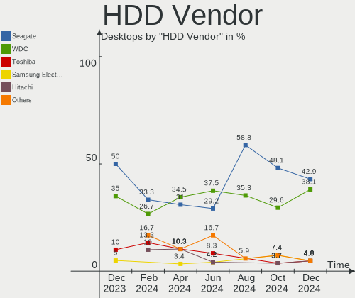
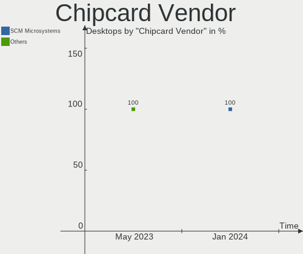
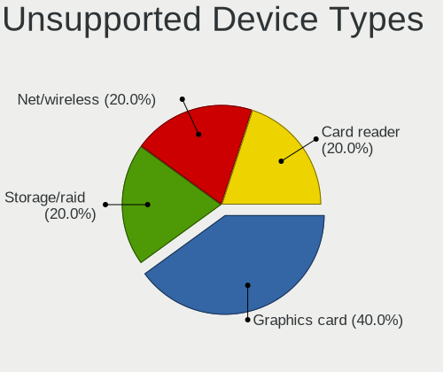

KDE neon Hardware Trends (Desktops)
-----------------------------------

A project to identify most popular hardware characteristics and track their change
over time based on data collected by KDE neon users at https://Linux-Hardware.org.

Anyone can contribute to this report by the [hw-probe](https://github.com/linuxhw/hw-probe) tool:

    sudo -E hw-probe -all -upload

Full-feature report is available here: https://linux-hardware.org/?view=trends

Period: Feb, 2022.

Contents
--------

* [ System ](#system)
  - [ OS                       ](#os)
  - [ OS Family                ](#os-family)
  - [ Kernel                   ](#kernel)
  - [ Kernel Family            ](#kernel-family)
  - [ Kernel Major Ver.        ](#kernel-major-ver)
  - [ Arch                     ](#arch)
  - [ DE                       ](#de)
  - [ Display Server           ](#display-server)
  - [ Display Manager          ](#display-manager)
  - [ OS Lang                  ](#os-lang)
  - [ Boot Mode                ](#boot-mode)
  - [ Filesystem               ](#filesystem)
  - [ Part. scheme             ](#part-scheme)
  - [ Dual Boot with Linux/BSD ](#dual-boot-with-linuxbsd)
  - [ Dual Boot (Win)          ](#dual-boot-win)

* [ Board ](#board)
  - [ Vendor                   ](#vendor)
  - [ Model                    ](#model)
  - [ Model Family             ](#model-family)
  - [ MFG Year                 ](#mfg-year)
  - [ Form Factor              ](#form-factor)
  - [ Secure Boot              ](#secure-boot)
  - [ Coreboot                 ](#coreboot)
  - [ RAM Size                 ](#ram-size)
  - [ RAM Used                 ](#ram-used)
  - [ Total Drives             ](#total-drives)
  - [ Has CD-ROM               ](#has-cd-rom)
  - [ Has Ethernet             ](#has-ethernet)
  - [ Has WiFi                 ](#has-wifi)
  - [ Has Bluetooth            ](#has-bluetooth)

* [ Location ](#location)
  - [ Country                  ](#country)
  - [ City                     ](#city)

* [ Drives ](#drives)
  - [ Drive Vendor             ](#drive-vendor)
  - [ Drive Model              ](#drive-model)
  - [ HDD Vendor               ](#hdd-vendor)
  - [ SSD Vendor               ](#ssd-vendor)
  - [ Drive Kind               ](#drive-kind)
  - [ Drive Connector          ](#drive-connector)
  - [ Drive Size               ](#drive-size)
  - [ Space Total              ](#space-total)
  - [ Space Used               ](#space-used)
  - [ Malfunc. Drives          ](#malfunc-drives)
  - [ Malfunc. Drive Vendor    ](#malfunc-drive-vendor)
  - [ Malfunc. HDD Vendor      ](#malfunc-hdd-vendor)
  - [ Malfunc. Drive Kind      ](#malfunc-drive-kind)
  - [ Failed Drives            ](#failed-drives)
  - [ Failed Drive Vendor      ](#failed-drive-vendor)
  - [ Drive Status             ](#drive-status)

* [ Storage controller ](#storage-controller)
  - [ Storage Vendor           ](#storage-vendor)
  - [ Storage Model            ](#storage-model)
  - [ Storage Kind             ](#storage-kind)

* [ Processor ](#processor)
  - [ CPU Vendor               ](#cpu-vendor)
  - [ CPU Model                ](#cpu-model)
  - [ CPU Model Family         ](#cpu-model-family)
  - [ CPU Cores                ](#cpu-cores)
  - [ CPU Sockets              ](#cpu-sockets)
  - [ CPU Threads              ](#cpu-threads)
  - [ CPU Op-Modes             ](#cpu-op-modes)
  - [ CPU Microcode            ](#cpu-microcode)
  - [ CPU Microarch            ](#cpu-microarch)

* [ Graphics ](#graphics)
  - [ GPU Vendor               ](#gpu-vendor)
  - [ GPU Model                ](#gpu-model)
  - [ GPU Combo                ](#gpu-combo)
  - [ GPU Driver               ](#gpu-driver)
  - [ GPU Memory               ](#gpu-memory)

* [ Monitor ](#monitor)
  - [ Monitor Vendor           ](#monitor-vendor)
  - [ Monitor Model            ](#monitor-model)
  - [ Monitor Resolution       ](#monitor-resolution)
  - [ Monitor Diagonal         ](#monitor-diagonal)
  - [ Monitor Width            ](#monitor-width)
  - [ Aspect Ratio             ](#aspect-ratio)
  - [ Monitor Area             ](#monitor-area)
  - [ Pixel Density            ](#pixel-density)
  - [ Multiple Monitors        ](#multiple-monitors)

* [ Network ](#network)
  - [ Net Controller Vendor    ](#net-controller-vendor)
  - [ Net Controller Model     ](#net-controller-model)
  - [ Wireless Vendor          ](#wireless-vendor)
  - [ Wireless Model           ](#wireless-model)
  - [ Ethernet Vendor          ](#ethernet-vendor)
  - [ Ethernet Model           ](#ethernet-model)
  - [ Net Controller Kind      ](#net-controller-kind)
  - [ Used Controller          ](#used-controller)
  - [ NICs                     ](#nics)
  - [ IPv6                     ](#ipv6)

* [ Bluetooth ](#bluetooth)
  - [ Bluetooth Vendor         ](#bluetooth-vendor)
  - [ Bluetooth Model          ](#bluetooth-model)

* [ Sound ](#sound)
  - [ Sound Vendor             ](#sound-vendor)
  - [ Sound Model              ](#sound-model)

* [ Memory ](#memory)
  - [ Memory Vendor            ](#memory-vendor)
  - [ Memory Model             ](#memory-model)
  - [ Memory Kind              ](#memory-kind)
  - [ Memory Form Factor       ](#memory-form-factor)
  - [ Memory Size              ](#memory-size)
  - [ Memory Speed             ](#memory-speed)

* [ Printers & scanners ](#printers--scanners)
  - [ Printer Vendor           ](#printer-vendor)
  - [ Printer Model            ](#printer-model)
  - [ Scanner Vendor           ](#scanner-vendor)
  - [ Scanner Model            ](#scanner-model)

* [ Camera ](#camera)
  - [ Camera Vendor            ](#camera-vendor)
  - [ Camera Model             ](#camera-model)

* [ Security ](#security)
  - [ Fingerprint Vendor       ](#fingerprint-vendor)
  - [ Fingerprint Model        ](#fingerprint-model)
  - [ Chipcard Vendor          ](#chipcard-vendor)
  - [ Chipcard Model           ](#chipcard-model)

* [ Unsupported ](#unsupported)
  - [ Unsupported Devices      ](#unsupported-devices)
  - [ Unsupported Device Types ](#unsupported-device-types)

System
------

OS
--

Installed operating systems

| Name           | Desktops | Percent |
|----------------|----------|---------|
| KDE neon 20.04 | 47       | 100%    |

OS Family
---------

OS without a version

| Name     | Desktops | Percent |
|----------|----------|---------|
| KDE neon | 47       | 100%    |

Kernel
------

Version of the Linux kernel

| Version               | Desktops | Percent |
|-----------------------|----------|---------|
| 5.13.0-28-generic     | 25       | 53.19%  |
| 5.13.0-30-generic     | 16       | 34.04%  |
| 5.11.0-46-generic     | 2        | 4.26%   |
| 5.16.7-051607-generic | 1        | 2.13%   |
| 5.15.22-xanmod1       | 1        | 2.13%   |
| 5.13.0-27-generic     | 1        | 2.13%   |
| 5.11.0-43-generic     | 1        | 2.13%   |

Kernel Family
-------------

Linux kernel without a distro release

| Version | Desktops | Percent |
|---------|----------|---------|
| 5.13.0  | 42       | 89.36%  |
| 5.11.0  | 3        | 6.38%   |
| 5.16.7  | 1        | 2.13%   |
| 5.15.22 | 1        | 2.13%   |

Kernel Major Ver.
-----------------

Linux kernel major version

| Version | Desktops | Percent |
|---------|----------|---------|
| 5.13    | 42       | 89.36%  |
| 5.11    | 3        | 6.38%   |
| 5.16    | 1        | 2.13%   |
| 5.15    | 1        | 2.13%   |

Arch
----

OS architecture (x86_64, i586, etc.)

| Name   | Desktops | Percent |
|--------|----------|---------|
| x86_64 | 47       | 100%    |

DE
--

Desktop Environment

| Name | Desktops | Percent |
|------|----------|---------|
| KDE5 | 47       | 100%    |

Display Server
--------------

X11 or Wayland

| Name    | Desktops | Percent |
|---------|----------|---------|
| X11     | 45       | 95.74%  |
| Wayland | 2        | 4.26%   |

Display Manager
---------------

SDDM, LightDM, etc.

| Name    | Desktops | Percent |
|---------|----------|---------|
| Unknown | 39       | 82.98%  |
| SDDM    | 8        | 17.02%  |

OS Lang
-------

Language

| Lang  | Desktops | Percent |
|-------|----------|---------|
| en_US | 14       | 29.79%  |
| de_DE | 5        | 10.64%  |
| ru_RU | 3        | 6.38%   |
| pt_BR | 3        | 6.38%   |
| fr_FR | 2        | 4.26%   |
| es_ES | 2        | 4.26%   |
| en_GB | 2        | 4.26%   |
| en_CA | 2        | 4.26%   |
| ca_ES | 2        | 4.26%   |
| zh_TW | 1        | 2.13%   |
| sv_SE | 1        | 2.13%   |
| nl_NL | 1        | 2.13%   |
| ja_JP | 1        | 2.13%   |
| hu_HU | 1        | 2.13%   |
| gl_ES | 1        | 2.13%   |
| fi_FI | 1        | 2.13%   |
| es_MX | 1        | 2.13%   |
| es_CO | 1        | 2.13%   |
| en_NZ | 1        | 2.13%   |
| en_IN | 1        | 2.13%   |
| en_IE | 1        | 2.13%   |

Boot Mode
---------

EFI or BIOS

| Mode | Desktops | Percent |
|------|----------|---------|
| EFI  | 27       | 57.45%  |
| BIOS | 20       | 42.55%  |

Filesystem
----------

Type of filesystem

| Type  | Desktops | Percent |
|-------|----------|---------|
| Ext4  | 44       | 93.62%  |
| Btrfs | 3        | 6.38%   |

Part. scheme
------------

Scheme of partitioning

| Type    | Desktops | Percent |
|---------|----------|---------|
| Unknown | 43       | 91.49%  |
| GPT     | 3        | 6.38%   |
| MBR     | 1        | 2.13%   |

Dual Boot with Linux/BSD
------------------------

Hosting more than one Linux/BSD

| Dual boot | Desktops | Percent |
|-----------|----------|---------|
| No        | 45       | 95.74%  |
| Yes       | 2        | 4.26%   |

Dual Boot (Win)
---------------

Hosting Linux and Windows

| Dual boot | Desktops | Percent |
|-----------|----------|---------|
| No        | 43       | 91.49%  |
| Yes       | 4        | 8.51%   |

Board
-----

Vendor
------

Motherboard manufacturer

| Name                | Desktops | Percent |
|---------------------|----------|---------|
| ASUSTek Computer    | 16       | 34.04%  |
| Gigabyte Technology | 9        | 19.15%  |
| MSI                 | 8        | 17.02%  |
| Dell                | 6        | 12.77%  |
| ASRock              | 4        | 8.51%   |
| Hewlett-Packard     | 3        | 6.38%   |
| BESSTAR Tech        | 1        | 2.13%   |

Model
-----

Motherboard model

| Name                               | Desktops | Percent |
|------------------------------------|----------|---------|
| ASUS All Series                    | 3        | 6.38%   |
| MSI MS-7C84                        | 2        | 4.26%   |
| Gigabyte A320M-H                   | 2        | 4.26%   |
| MSI MS-7C90                        | 1        | 2.13%   |
| MSI MS-7B93                        | 1        | 2.13%   |
| MSI MS-7B85                        | 1        | 2.13%   |
| MSI MS-7B79                        | 1        | 2.13%   |
| MSI MS-7885                        | 1        | 2.13%   |
| MSI MS-7693                        | 1        | 2.13%   |
| HP Pavilion Desktop 595-p0xxx      | 1        | 2.13%   |
| HP Compaq dc5750 Small Form Factor | 1        | 2.13%   |
| HP 750-437cb                       | 1        | 2.13%   |
| Gigabyte X570 AORUS ELITE          | 1        | 2.13%   |
| Gigabyte MZGLKBP-00                | 1        | 2.13%   |
| Gigabyte GA-78LMT-USB3 6.0         | 1        | 2.13%   |
| Gigabyte B550M AORUS PRO-P         | 1        | 2.13%   |
| Gigabyte B450M DS3H V2             | 1        | 2.13%   |
| Gigabyte A320M-S2H V2              | 1        | 2.13%   |
| Gigabyte 970A-DS3P                 | 1        | 2.13%   |
| Dell Precision Tower 5810          | 1        | 2.13%   |
| Dell OptiPlex XE2                  | 1        | 2.13%   |
| Dell OptiPlex 9020                 | 1        | 2.13%   |
| Dell OptiPlex 7010                 | 1        | 2.13%   |
| Dell OptiPlex 380                  | 1        | 2.13%   |
| Dell OptiPlex 3020                 | 1        | 2.13%   |
| BESSTAR Tech HM50                  | 1        | 2.13%   |
| ASUS Z170-PRO                      | 1        | 2.13%   |
| ASUS TUF GAMING X570-PLUS          | 1        | 2.13%   |
| ASUS TUF GAMING B560-PLUS WIFI     | 1        | 2.13%   |
| ASUS ROG ZENITH EXTREME            | 1        | 2.13%   |
| ASUS ROG STRIX B550-A GAMING       | 1        | 2.13%   |
| ASUS ROG STRIX B450-F GAMING       | 1        | 2.13%   |
| ASUS PRIME X570-P                  | 1        | 2.13%   |
| ASUS PRIME H410M-E                 | 1        | 2.13%   |
| ASUS P8H67                         | 1        | 2.13%   |
| ASUS P8H61-M LX R2.0               | 1        | 2.13%   |
| ASUS M5A78L-M PLUS/USB3            | 1        | 2.13%   |
| ASUS H110M-K                       | 1        | 2.13%   |
| ASUS B75M-A                        | 1        | 2.13%   |
| ASRock H310M-ITX/ac                | 1        | 2.13%   |
| ASRock B550 Taichi                 | 1        | 2.13%   |
| ASRock A320M-HDV R4.0              | 1        | 2.13%   |
| ASRock A320M Pro4                  | 1        | 2.13%   |

Model Family
------------

Motherboard model prefix

| Name                   | Desktops | Percent |
|------------------------|----------|---------|
| Dell OptiPlex          | 5        | 10.64%  |
| ASUS ROG               | 3        | 6.38%   |
| ASUS All               | 3        | 6.38%   |
| MSI MS-7C84            | 2        | 4.26%   |
| Gigabyte A320M-H       | 2        | 4.26%   |
| ASUS TUF               | 2        | 4.26%   |
| ASUS PRIME             | 2        | 4.26%   |
| MSI MS-7C90            | 1        | 2.13%   |
| MSI MS-7B93            | 1        | 2.13%   |
| MSI MS-7B85            | 1        | 2.13%   |
| MSI MS-7B79            | 1        | 2.13%   |
| MSI MS-7885            | 1        | 2.13%   |
| MSI MS-7693            | 1        | 2.13%   |
| HP Pavilion            | 1        | 2.13%   |
| HP Compaq              | 1        | 2.13%   |
| HP 750-437cb           | 1        | 2.13%   |
| Gigabyte X570          | 1        | 2.13%   |
| Gigabyte MZGLKBP-00    | 1        | 2.13%   |
| Gigabyte GA-78LMT-USB3 | 1        | 2.13%   |
| Gigabyte B550M         | 1        | 2.13%   |
| Gigabyte B450M         | 1        | 2.13%   |
| Gigabyte A320M-S2H     | 1        | 2.13%   |
| Gigabyte 970A-DS3P     | 1        | 2.13%   |
| Dell Precision         | 1        | 2.13%   |
| BESSTAR Tech HM50      | 1        | 2.13%   |
| ASUS Z170-PRO          | 1        | 2.13%   |
| ASUS P8H67             | 1        | 2.13%   |
| ASUS P8H61-M           | 1        | 2.13%   |
| ASUS M5A78L-M          | 1        | 2.13%   |
| ASUS H110M-K           | 1        | 2.13%   |
| ASUS B75M-A            | 1        | 2.13%   |
| ASRock H310M-ITX       | 1        | 2.13%   |
| ASRock B550            | 1        | 2.13%   |
| ASRock A320M-HDV       | 1        | 2.13%   |
| ASRock A320M           | 1        | 2.13%   |

MFG Year
--------

Motherboard manufacture year

| Year | Desktops | Percent |
|------|----------|---------|
| 2018 | 11       | 23.4%   |
| 2020 | 7        | 14.89%  |
| 2019 | 7        | 14.89%  |
| 2014 | 5        | 10.64%  |
| 2016 | 4        | 8.51%   |
| 2013 | 3        | 6.38%   |
| 2021 | 2        | 4.26%   |
| 2017 | 2        | 4.26%   |
| 2012 | 2        | 4.26%   |
| 2015 | 1        | 2.13%   |
| 2010 | 1        | 2.13%   |
| 2009 | 1        | 2.13%   |
| 2007 | 1        | 2.13%   |

Form Factor
-----------

Physical design of the computer

| Name    | Desktops | Percent |
|---------|----------|---------|
| Desktop | 47       | 100%    |

Secure Boot
-----------

Enabled or disabled

| State    | Desktops | Percent |
|----------|----------|---------|
| Disabled | 44       | 93.62%  |
| Enabled  | 3        | 6.38%   |

Coreboot
--------

Have coreboot on board

| Used | Desktops | Percent |
|------|----------|---------|
| No   | 47       | 100%    |

RAM Size
--------

Total RAM memory

| Size in GB  | Desktops | Percent |
|-------------|----------|---------|
| 16.01-24.0  | 14       | 29.79%  |
| 4.01-8.0    | 8        | 17.02%  |
| 32.01-64.0  | 7        | 14.89%  |
| 8.01-16.0   | 7        | 14.89%  |
| 3.01-4.0    | 4        | 8.51%   |
| 64.01-256.0 | 4        | 8.51%   |
| 24.01-32.0  | 3        | 6.38%   |

RAM Used
--------

Used RAM memory

| Used GB   | Desktops | Percent |
|-----------|----------|---------|
| 1.01-2.0  | 22       | 46.81%  |
| 0.51-1.0  | 7        | 14.89%  |
| 2.01-3.0  | 6        | 12.77%  |
| 4.01-8.0  | 5        | 10.64%  |
| 3.01-4.0  | 5        | 10.64%  |
| 8.01-16.0 | 2        | 4.26%   |

Total Drives
------------

Number of drives on board

| Drives | Desktops | Percent |
|--------|----------|---------|
| 2      | 19       | 40.43%  |
| 1      | 15       | 31.91%  |
| 3      | 4        | 8.51%   |
| 6      | 3        | 6.38%   |
| 5      | 2        | 4.26%   |
| 4      | 2        | 4.26%   |
| 9      | 1        | 2.13%   |
| 7      | 1        | 2.13%   |

Has CD-ROM
----------

Has CD-ROM on board

| Presented | Desktops | Percent |
|-----------|----------|---------|
| No        | 28       | 59.57%  |
| Yes       | 19       | 40.43%  |

Has Ethernet
------------

Has Ethernet on board

| Presented | Desktops | Percent |
|-----------|----------|---------|
| Yes       | 47       | 100%    |

Has WiFi
--------

Has WiFi module

| Presented | Desktops | Percent |
|-----------|----------|---------|
| No        | 25       | 53.19%  |
| Yes       | 22       | 46.81%  |

Has Bluetooth
-------------

Has Bluetooth module

| Presented | Desktops | Percent |
|-----------|----------|---------|
| No        | 26       | 55.32%  |
| Yes       | 21       | 44.68%  |

Location
--------

Country
-------

Geographic location (country)

| Country     | Desktops | Percent |
|-------------|----------|---------|
| USA         | 6        | 12.77%  |
| Spain       | 6        | 12.77%  |
| Germany     | 5        | 10.64%  |
| Russia      | 4        | 8.51%   |
| Serbia      | 3        | 6.38%   |
| UK          | 2        | 4.26%   |
| Japan       | 2        | 4.26%   |
| France      | 2        | 4.26%   |
| Canada      | 2        | 4.26%   |
| Bulgaria    | 2        | 4.26%   |
| Brazil      | 2        | 4.26%   |
| Sweden      | 1        | 2.13%   |
| Philippines | 1        | 2.13%   |
| New Zealand | 1        | 2.13%   |
| Netherlands | 1        | 2.13%   |
| Mexico      | 1        | 2.13%   |
| Italy       | 1        | 2.13%   |
| India       | 1        | 2.13%   |
| Hungary     | 1        | 2.13%   |
| Hong Kong   | 1        | 2.13%   |
| Finland     | 1        | 2.13%   |
| Colombia    | 1        | 2.13%   |

City
----

Geographic location (city)

| City                     | Desktops | Percent |
|--------------------------|----------|---------|
| Belgrade                 | 2        | 4.26%   |
| Yekaterinburg            | 1        | 2.13%   |
| Waren                    | 1        | 2.13%   |
| Varna                    | 1        | 2.13%   |
| Tokyo                    | 1        | 2.13%   |
| Tampere                  | 1        | 2.13%   |
| St Petersburg            | 1        | 2.13%   |
| Shinjuku                 | 1        | 2.13%   |
| Serra                    | 1        | 2.13%   |
| Rafelbunyol              | 1        | 2.13%   |
| Quezon City              | 1        | 2.13%   |
| Portage la Prairie       | 1        | 2.13%   |
| Plovdiv                  | 1        | 2.13%   |
| Penza                    | 1        | 2.13%   |
| Paris                    | 1        | 2.13%   |
| Palamós               | 1        | 2.13%   |
| Novi Sad                 | 1        | 2.13%   |
| Natick                   | 1        | 2.13%   |
| Mostoles                 | 1        | 2.13%   |
| Mjoelby                  | 1        | 2.13%   |
| Mission Viejo            | 1        | 2.13%   |
| Mannheim                 | 1        | 2.13%   |
| Madrid                   | 1        | 2.13%   |
| Londonderry              | 1        | 2.13%   |
| Kwu Tung                 | 1        | 2.13%   |
| Kolkata                  | 1        | 2.13%   |
| Karcsa                   | 1        | 2.13%   |
| Itaim Bibi               | 1        | 2.13%   |
| Indianapolis             | 1        | 2.13%   |
| Hilden                   | 1        | 2.13%   |
| Gloucester               | 1        | 2.13%   |
| Getxo                    | 1        | 2.13%   |
| Friesoythe               | 1        | 2.13%   |
| Edmonton                 | 1        | 2.13%   |
| Eaton Rapids             | 1        | 2.13%   |
| Ciudad Nicolás Romero | 1        | 2.13%   |
| Chelyabinsk              | 1        | 2.13%   |
| Braunschweig             | 1        | 2.13%   |
| Bordeaux                 | 1        | 2.13%   |
| Bolzano                  | 1        | 2.13%   |
| Bettendorf               | 1        | 2.13%   |
| Bend                     | 1        | 2.13%   |
| Bello                    | 1        | 2.13%   |
| Barcelona                | 1        | 2.13%   |
| Auckland                 | 1        | 2.13%   |
| Ammerzoden               | 1        | 2.13%   |

Drives
------

Drive Vendor
------------

Hard drive vendors

| Vendor                    | Desktops | Drives | Percent |
|---------------------------|----------|--------|---------|
| WDC                       | 18       | 28     | 19.57%  |
| Samsung Electronics       | 17       | 20     | 18.48%  |
| Seagate                   | 16       | 22     | 17.39%  |
| Sandisk                   | 6        | 6      | 6.52%   |
| Phison                    | 5        | 6      | 5.43%   |
| Crucial                   | 5        | 7      | 5.43%   |
| Kingston                  | 4        | 4      | 4.35%   |
| SPCC                      | 3        | 3      | 3.26%   |
| Hitachi                   | 3        | 3      | 3.26%   |
| A-DATA Technology         | 3        | 3      | 3.26%   |
| Toshiba                   | 2        | 4      | 2.17%   |
| Intel                     | 2        | 3      | 2.17%   |
| Unknown                   | 1        | 1      | 1.09%   |
| Smartbuy                  | 1        | 1      | 1.09%   |
| PNY                       | 1        | 1      | 1.09%   |
| Patriot                   | 1        | 1      | 1.09%   |
| Micron/Crucial Technology | 1        | 1      | 1.09%   |
| Intenso                   | 1        | 1      | 1.09%   |
| HGST                      | 1        | 1      | 1.09%   |
| Fujitsu                   | 1        | 1      | 1.09%   |

Drive Model
-----------

Hard drive models

| Model                               | Desktops | Percent |
|-------------------------------------|----------|---------|
| Samsung NVMe SSD Drive 500GB        | 4        | 3.6%    |
| Seagate ST500DM002-1BD142 500GB     | 3        | 2.7%    |
| Seagate ST2000DM008-2FR102 2TB      | 3        | 2.7%    |
| Samsung SSD 850 EVO 500GB           | 3        | 2.7%    |
| WDC WDS250G1B0A-00H9H0 250GB SSD    | 2        | 1.8%    |
| WDC WDS240G2G0A-00JH30 240GB SSD    | 2        | 1.8%    |
| Seagate ST2000DM001-1ER164 2TB      | 2        | 1.8%    |
| Sandisk NVMe SSD Drive 500GB        | 2        | 1.8%    |
| Sandisk NVMe SSD Drive 1TB          | 2        | 1.8%    |
| Phison NVMe SSD Drive 500GB         | 2        | 1.8%    |
| Kingston SA400S37240G 240GB SSD     | 2        | 1.8%    |
| WDC WDS480G2G0A-00JH30 480GB SSD    | 1        | 0.9%    |
| WDC WDS250G2B0B-00YS70 250GB SSD    | 1        | 0.9%    |
| WDC WDS250G2B0A-00SM50 250GB SSD    | 1        | 0.9%    |
| WDC WDS100T2B0A-00SM50 1TB SSD      | 1        | 0.9%    |
| WDC WDBNCE5000PNC-WRSN 500GB SSD    | 1        | 0.9%    |
| WDC WD800JD-60LSA0 80GB             | 1        | 0.9%    |
| WDC WD7501AALS-00J7B1 752GB         | 1        | 0.9%    |
| WDC WD5000AAKX-22ERMA0 500GB        | 1        | 0.9%    |
| WDC WD5000AAKX-00ERMA0 500GB        | 1        | 0.9%    |
| WDC WD5000AAKS-07A7B0 500GB         | 1        | 0.9%    |
| WDC WD40PURX-64NZ6Y0 4TB            | 1        | 0.9%    |
| WDC WD40PURX-64GVNY0 4TB            | 1        | 0.9%    |
| WDC WD40EZRZ-75GXCB0 4TB            | 1        | 0.9%    |
| WDC WD40EZRZ-00GXCB0 4TB            | 1        | 0.9%    |
| WDC WD4003FZEX-00Z4SA0 4TB          | 1        | 0.9%    |
| WDC WD3200BEVT-24A23T0 320GB        | 1        | 0.9%    |
| WDC WD10PURZ-85U8XY0 1TB            | 1        | 0.9%    |
| WDC WD10EZEX-22BN5A0 1TB            | 1        | 0.9%    |
| WDC WD10EZEX-08M2NA0 1TB            | 1        | 0.9%    |
| WDC WD10EZEX-00WN4A0 1TB            | 1        | 0.9%    |
| WDC WD10EZEX-00BBHA0 1TB            | 1        | 0.9%    |
| WDC WD1003FZEX-00MK2A0 1TB          | 1        | 0.9%    |
| Unknown SD/MMC/MS PRO 64GB          | 1        | 0.9%    |
| Toshiba KBG30ZMS128G 128GB NVMe SSD | 1        | 0.9%    |
| Toshiba HDWF180 8TB                 | 1        | 0.9%    |
| Toshiba HDWD120 2TB                 | 1        | 0.9%    |
| Toshiba DT01ACA100 1TB              | 1        | 0.9%    |
| SPCC Solid State Disk 512GB         | 1        | 0.9%    |
| SPCC Solid State Disk 256GB         | 1        | 0.9%    |
| SPCC Solid State Disk 120GB         | 1        | 0.9%    |
| Smartbuy SSD 120GB                  | 1        | 0.9%    |
| Seagate ST3750528AS 752GB           | 1        | 0.9%    |
| Seagate ST3500413AS 500GB           | 1        | 0.9%    |
| Seagate ST3500320AS 500GB           | 1        | 0.9%    |
| Seagate ST31000528AS 1TB            | 1        | 0.9%    |
| Seagate ST3000DM001-1ER166 3TB      | 1        | 0.9%    |
| Seagate ST2000DM006-2DM164 2TB      | 1        | 0.9%    |
| Seagate ST2000DM001-1CH164 2TB      | 1        | 0.9%    |
| Seagate ST1000LM024 HN-M101MBB 1TB  | 1        | 0.9%    |
| Seagate ST1000DM010-2EP102 1TB      | 1        | 0.9%    |
| Seagate ST1000DM003-1ER162 1TB      | 1        | 0.9%    |
| Seagate NVMe SSD Drive 1TB          | 1        | 0.9%    |
| Seagate Expansion HDD 8TB           | 1        | 0.9%    |
| SanDisk SSD PLUS 480GB              | 1        | 0.9%    |
| SanDisk SSD PLUS 240 GB             | 1        | 0.9%    |
| Samsung SSD SM871 2.5 7mm 512GB     | 1        | 0.9%    |
| Samsung SSD 970 EVO Plus 500GB      | 1        | 0.9%    |
| Samsung SSD 870 EVO 1TB             | 1        | 0.9%    |
| Samsung SSD 860 EVO 250GB           | 1        | 0.9%    |

HDD Vendor
----------

Hard disk drive vendors

| Vendor              | Desktops | Drives | Percent |
|---------------------|----------|--------|---------|
| Seagate             | 15       | 21     | 40.54%  |
| WDC                 | 12       | 19     | 32.43%  |
| Hitachi             | 3        | 3      | 8.11%   |
| Toshiba             | 2        | 3      | 5.41%   |
| Samsung Electronics | 2        | 2      | 5.41%   |
| Unknown             | 1        | 1      | 2.7%    |
| HGST                | 1        | 1      | 2.7%    |
| Fujitsu             | 1        | 1      | 2.7%    |

SSD Vendor
----------

Solid state drive vendors

| Vendor              | Desktops | Drives | Percent |
|---------------------|----------|--------|---------|
| WDC                 | 9        | 9      | 21.95%  |
| Samsung Electronics | 9        | 10     | 21.95%  |
| Crucial             | 5        | 7      | 12.2%   |
| Kingston            | 4        | 4      | 9.76%   |
| SPCC                | 3        | 3      | 7.32%   |
| A-DATA Technology   | 3        | 3      | 7.32%   |
| SanDisk             | 2        | 2      | 4.88%   |
| Intel               | 2        | 3      | 4.88%   |
| Smartbuy            | 1        | 1      | 2.44%   |
| PNY                 | 1        | 1      | 2.44%   |
| Patriot             | 1        | 1      | 2.44%   |
| Intenso             | 1        | 1      | 2.44%   |

Drive Kind
----------

HDD or SSD

| Kind | Desktops | Drives | Percent |
|------|----------|--------|---------|
| HDD  | 31       | 51     | 39.74%  |
| SSD  | 29       | 45     | 37.18%  |
| NVMe | 18       | 21     | 23.08%  |

Drive Connector
---------------

SATA, SAS, NVMe, etc.

| Type | Desktops | Drives | Percent |
|------|----------|--------|---------|
| SATA | 44       | 94     | 68.75%  |
| NVMe | 18       | 21     | 28.13%  |
| SAS  | 2        | 2      | 3.13%   |

Drive Size
----------

Size of hard drive

| Size in TB | Desktops | Drives | Percent |
|------------|----------|--------|---------|
| 0.01-0.5   | 35       | 56     | 55.56%  |
| 0.51-1.0   | 15       | 21     | 23.81%  |
| 1.01-2.0   | 7        | 9      | 11.11%  |
| 3.01-4.0   | 3        | 7      | 4.76%   |
| 4.01-10.0  | 2        | 2      | 3.17%   |
| 2.01-3.0   | 1        | 1      | 1.59%   |

Space Total
-----------

Amount of disk space available on the file system

| Size in GB     | Desktops | Percent |
|----------------|----------|---------|
| 501-1000       | 12       | 25.53%  |
| 101-250        | 11       | 23.4%   |
| 251-500        | 8        | 17.02%  |
| 1001-2000      | 6        | 12.77%  |
| 51-100         | 5        | 10.64%  |
| More than 3000 | 3        | 6.38%   |
| 21-50          | 1        | 2.13%   |
| 2001-3000      | 1        | 2.13%   |

Space Used
----------

Amount of used disk space

| Used GB        | Desktops | Percent |
|----------------|----------|---------|
| 1-20           | 18       | 38.3%   |
| 101-250        | 10       | 21.28%  |
| 51-100         | 6        | 12.77%  |
| 21-50          | 5        | 10.64%  |
| 251-500        | 3        | 6.38%   |
| More than 3000 | 2        | 4.26%   |
| 501-1000       | 2        | 4.26%   |
| 2001-3000      | 1        | 2.13%   |

Malfunc. Drives
---------------

Drive models with a malfunction

| Model                             | Desktops | Drives | Percent |
|-----------------------------------|----------|--------|---------|
| Intenso SATA III SSD 120GB        | 1        | 1      | 50%     |
| A-DATA Technology SU800 512GB SSD | 1        | 1      | 50%     |

Malfunc. Drive Vendor
---------------------

Vendors of faulty drives

| Vendor            | Desktops | Drives | Percent |
|-------------------|----------|--------|---------|
| Intenso           | 1        | 1      | 50%     |
| A-DATA Technology | 1        | 1      | 50%     |

Malfunc. HDD Vendor
-------------------

Vendors of faulty HDD drives

Zero info for selected period =(

Malfunc. Drive Kind
-------------------

Kinds of faulty drives

| Kind | Desktops | Drives | Percent |
|------|----------|--------|---------|
| SSD  | 2        | 2      | 100%    |

Failed Drives
-------------

Failed drive models

Zero info for selected period =(

Failed Drive Vendor
-------------------

Failed drive vendors

Zero info for selected period =(

Drive Status
------------

Number of failed and malfunc. drives

| Status   | Desktops | Drives | Percent |
|----------|----------|--------|---------|
| Detected | 43       | 108    | 87.76%  |
| Works    | 4        | 7      | 8.16%   |
| Malfunc  | 2        | 2      | 4.08%   |

Storage controller
------------------

Storage Vendor
--------------

Storage controller vendors

| Vendor                       | Desktops | Percent |
|------------------------------|----------|---------|
| AMD                          | 27       | 37.5%   |
| Intel                        | 20       | 27.78%  |
| Samsung Electronics          | 8        | 11.11%  |
| Phison Electronics           | 5        | 6.94%   |
| Sandisk                      | 4        | 5.56%   |
| ASMedia Technology           | 4        | 5.56%   |
| VIA Technologies             | 1        | 1.39%   |
| Toshiba America Info Systems | 1        | 1.39%   |
| Seagate Technology           | 1        | 1.39%   |
| Micron/Crucial Technology    | 1        | 1.39%   |

Storage Model
-------------

Storage controller models

| Model                                                                                   | Desktops | Percent |
|-----------------------------------------------------------------------------------------|----------|---------|
| AMD FCH SATA Controller [AHCI mode]                                                     | 18       | 19.35%  |
| Samsung NVMe SSD Controller SM981/PM981/PM983                                           | 5        | 5.38%   |
| AMD Starship/Matisse Chipset SATA Controller [AHCI mode]                                | 4        | 4.3%    |
| AMD FCH SATA Controller D                                                               | 4        | 4.3%    |
| AMD 400 Series Chipset SATA Controller                                                  | 4        | 4.3%    |
| Phison E16 PCIe4 NVMe Controller                                                        | 3        | 3.23%   |
| Intel Q170/Q150/B150/H170/H110/Z170/CM236 Chipset SATA Controller [AHCI Mode]           | 3        | 3.23%   |
| Intel 9 Series Chipset Family SATA Controller [AHCI Mode]                               | 3        | 3.23%   |
| ASMedia ASM1062 Serial ATA Controller                                                   | 3        | 3.23%   |
| AMD SB7x0/SB8x0/SB9x0 IDE Controller                                                    | 3        | 3.23%   |
| Sandisk WD Blue SN550 NVMe SSD                                                          | 2        | 2.15%   |
| Sandisk WD Black SN750 / PC SN730 NVMe SSD                                              | 2        | 2.15%   |
| Samsung NVMe SSD Controller 980                                                         | 2        | 2.15%   |
| Intel C610/X99 series chipset sSATA Controller [AHCI mode]                              | 2        | 2.15%   |
| Intel C610/X99 series chipset 6-Port SATA Controller [AHCI mode]                        | 2        | 2.15%   |
| Intel 8 Series/C220 Series Chipset Family 6-port SATA Controller 1 [AHCI mode]          | 2        | 2.15%   |
| Intel 6 Series/C200 Series Chipset Family Desktop SATA Controller (IDE mode, ports 4-5) | 2        | 2.15%   |
| Intel 6 Series/C200 Series Chipset Family Desktop SATA Controller (IDE mode, ports 0-3) | 2        | 2.15%   |
| AMD SB7x0/SB8x0/SB9x0 SATA Controller [AHCI mode]                                       | 2        | 2.15%   |
| AMD 300 Series Chipset SATA Controller                                                  | 2        | 2.15%   |
| VIA VT6415 PATA IDE Host Controller                                                     | 1        | 1.08%   |
| Toshiba America Info Systems BG3 NVMe SSD Controller                                    | 1        | 1.08%   |
| Seagate FireCuda 520 SSD                                                                | 1        | 1.08%   |
| Samsung NVMe SSD Controller SM961/PM961/SM963                                           | 1        | 1.08%   |
| Phison PS5013 E13 NVMe Controller                                                       | 1        | 1.08%   |
| Phison E18 PCIe4 NVMe Controller                                                        | 1        | 1.08%   |
| Micron/Crucial P2 NVMe PCIe SSD                                                         | 1        | 1.08%   |
| Intel SATA Controller [RAID mode]                                                       | 1        | 1.08%   |
| Intel NM10/ICH7 Family SATA Controller [IDE mode]                                       | 1        | 1.08%   |
| Intel Celeron/Pentium Silver Processor SATA Controller                                  | 1        | 1.08%   |
| Intel Cannon Lake PCH SATA AHCI Controller                                              | 1        | 1.08%   |
| Intel 82801G (ICH7 Family) IDE Controller                                               | 1        | 1.08%   |
| Intel 7 Series/C210 Series Chipset Family 6-port SATA Controller [AHCI mode]            | 1        | 1.08%   |
| Intel 7 Series/C210 Series Chipset Family 4-port SATA Controller [IDE mode]             | 1        | 1.08%   |
| Intel 7 Series/C210 Series Chipset Family 2-port SATA Controller [IDE mode]             | 1        | 1.08%   |
| Intel 500 Series Chipset Family SATA AHCI Controller                                    | 1        | 1.08%   |
| Intel 400 Series Chipset Family SATA AHCI Controller                                    | 1        | 1.08%   |
| ASMedia SATA controller                                                                 | 1        | 1.08%   |
| AMD X399 Series Chipset SATA Controller                                                 | 1        | 1.08%   |
| AMD SB7x0/SB8x0/SB9x0 SATA Controller [Non-RAID5 mode]                                  | 1        | 1.08%   |
| AMD SB7x0/SB8x0/SB9x0 SATA Controller [IDE mode]                                        | 1        | 1.08%   |
| AMD SB600 Non-Raid-5 SATA                                                               | 1        | 1.08%   |
| AMD SB600 IDE                                                                           | 1        | 1.08%   |

Storage Kind
------------

Kind of storage controller (IDE, SATA, NVMe, SAS, ...)

| Kind | Desktops | Percent |
|------|----------|---------|
| SATA | 41       | 59.42%  |
| NVMe | 18       | 26.09%  |
| IDE  | 8        | 11.59%  |
| RAID | 2        | 2.9%    |

Processor
---------

CPU Vendor
----------

Processor vendors

| Vendor | Desktops | Percent |
|--------|----------|---------|
| AMD    | 27       | 57.45%  |
| Intel  | 20       | 42.55%  |

CPU Model
---------

Processor models

| Model                                          | Desktops | Percent |
|------------------------------------------------|----------|---------|
| AMD Ryzen 7 5800X 8-Core Processor             | 3        | 6.38%   |
| AMD Ryzen 5 2600 Six-Core Processor            | 3        | 6.38%   |
| AMD Ryzen 3 3200G with Radeon Vega Graphics    | 3        | 6.38%   |
| Intel Core i7-4790K CPU @ 4.00GHz              | 2        | 4.26%   |
| AMD Ryzen 5 5600X 6-Core Processor             | 2        | 4.26%   |
| AMD Phenom II X4 945 Processor                 | 2        | 4.26%   |
| Intel Xeon CPU E5-1620 v3 @ 3.50GHz            | 1        | 2.13%   |
| Intel Pentium Silver J5005 CPU @ 1.50GHz       | 1        | 2.13%   |
| Intel Pentium Dual-Core CPU E5400 @ 2.70GHz    | 1        | 2.13%   |
| Intel Pentium CPU G630 @ 2.70GHz               | 1        | 2.13%   |
| Intel Core i7-6700 CPU @ 3.40GHz               | 1        | 2.13%   |
| Intel Core i7-5820K CPU @ 3.30GHz              | 1        | 2.13%   |
| Intel Core i7-4790 CPU @ 3.60GHz               | 1        | 2.13%   |
| Intel Core i7-2600 CPU @ 3.40GHz               | 1        | 2.13%   |
| Intel Core i5-8400 CPU @ 2.80GHz               | 1        | 2.13%   |
| Intel Core i5-6600K CPU @ 3.50GHz              | 1        | 2.13%   |
| Intel Core i5-4690K CPU @ 3.50GHz              | 1        | 2.13%   |
| Intel Core i5-4570 CPU @ 3.20GHz               | 1        | 2.13%   |
| Intel Core i5-3470 CPU @ 3.20GHz               | 1        | 2.13%   |
| Intel Core i5-10600K CPU @ 4.10GHz             | 1        | 2.13%   |
| Intel Core i5-10400F CPU @ 2.90GHz             | 1        | 2.13%   |
| Intel Core i3-6100 CPU @ 3.70GHz               | 1        | 2.13%   |
| Intel Core i3-4130 CPU @ 3.40GHz               | 1        | 2.13%   |
| Intel Core i3-3220 CPU @ 3.30GHz               | 1        | 2.13%   |
| AMD Ryzen Threadripper 1950X 16-Core Processor | 1        | 2.13%   |
| AMD Ryzen 9 5900X 12-Core Processor            | 1        | 2.13%   |
| AMD Ryzen 7 5700G with Radeon Graphics         | 1        | 2.13%   |
| AMD Ryzen 7 3700X 8-Core Processor             | 1        | 2.13%   |
| AMD Ryzen 7 2700X Eight-Core Processor         | 1        | 2.13%   |
| AMD Ryzen 5 4500U with Radeon Graphics         | 1        | 2.13%   |
| AMD Ryzen 5 3500X 6-Core Processor             | 1        | 2.13%   |
| AMD Ryzen 5 3400G with Radeon Vega Graphics    | 1        | 2.13%   |
| AMD Ryzen 5 2400G with Radeon Vega Graphics    | 1        | 2.13%   |
| AMD Ryzen 3 2200G with Radeon Vega Graphics    | 1        | 2.13%   |
| AMD FX-4300 Quad-Core Processor                | 1        | 2.13%   |
| AMD Athlon II X2 260 Processor                 | 1        | 2.13%   |
| AMD Athlon 64 X2 Dual Core Processor 3800+     | 1        | 2.13%   |
| AMD A8-9600 RADEON R7, 10 COMPUTE CORES 4C+6G  | 1        | 2.13%   |

CPU Model Family
----------------

Processor model prefix

| Model                   | Desktops | Percent |
|-------------------------|----------|---------|
| AMD Ryzen 5             | 9        | 19.15%  |
| Intel Core i5           | 7        | 14.89%  |
| Intel Core i7           | 6        | 12.77%  |
| AMD Ryzen 7             | 6        | 12.77%  |
| AMD Ryzen 3             | 4        | 8.51%   |
| Intel Core i3           | 3        | 6.38%   |
| AMD Phenom II X4        | 2        | 4.26%   |
| Intel Xeon              | 1        | 2.13%   |
| Intel Pentium Silver    | 1        | 2.13%   |
| Intel Pentium Dual-Core | 1        | 2.13%   |
| Intel Pentium           | 1        | 2.13%   |
| AMD Ryzen Threadripper  | 1        | 2.13%   |
| AMD Ryzen 9             | 1        | 2.13%   |
| AMD FX                  | 1        | 2.13%   |
| AMD Athlon II X2        | 1        | 2.13%   |
| AMD Athlon 64 X2        | 1        | 2.13%   |
| AMD A8                  | 1        | 2.13%   |

CPU Cores
---------

Number of processor cores

| Number | Desktops | Percent |
|--------|----------|---------|
| 4      | 19       | 40.43%  |
| 6      | 11       | 23.4%   |
| 2      | 9        | 19.15%  |
| 8      | 6        | 12.77%  |
| 16     | 1        | 2.13%   |
| 12     | 1        | 2.13%   |

CPU Sockets
-----------

Number of sockets

| Number | Desktops | Percent |
|--------|----------|---------|
| 1      | 47       | 100%    |

CPU Threads
-----------

Threads per core (Hyper-Threading)

| Number | Desktops | Percent |
|--------|----------|---------|
| 2      | 29       | 61.7%   |
| 1      | 18       | 38.3%   |

CPU Op-Modes
------------

CPU Operation Modes (32-bit, 64-bit)

| Op mode        | Desktops | Percent |
|----------------|----------|---------|
| 32-bit, 64-bit | 47       | 100%    |

CPU Microcode
-------------

Microcode number

| Number     | Desktops | Percent |
|------------|----------|---------|
| 0x306c3    | 6        | 12.77%  |
| Unknown    | 5        | 10.64%  |
| 0x0800820d | 4        | 8.51%   |
| 0x506e3    | 3        | 6.38%   |
| 0x0a201016 | 3        | 6.38%   |
| 0x306f2    | 2        | 4.26%   |
| 0x306a9    | 2        | 4.26%   |
| 0x206a7    | 2        | 4.26%   |
| 0x0a201009 | 2        | 4.26%   |
| 0x08701021 | 2        | 4.26%   |
| 0x08108109 | 2        | 4.26%   |
| 0x0810100b | 2        | 4.26%   |
| 0xa0655    | 1        | 2.13%   |
| 0xa0653    | 1        | 2.13%   |
| 0x906ea    | 1        | 2.13%   |
| 0x706a1    | 1        | 2.13%   |
| 0x0a50000c | 1        | 2.13%   |
| 0x0a201005 | 1        | 2.13%   |
| 0x08600106 | 1        | 2.13%   |
| 0x08001137 | 1        | 2.13%   |
| 0x0600611a | 1        | 2.13%   |
| 0x06000852 | 1        | 2.13%   |
| 0x010000db | 1        | 2.13%   |
| 0x010000c8 | 1        | 2.13%   |

CPU Microarch
-------------

Microarchitecture

| Name          | Desktops | Percent |
|---------------|----------|---------|
| Zen+          | 8        | 17.02%  |
| Haswell       | 8        | 17.02%  |
| Zen 3         | 7        | 14.89%  |
| Zen 2         | 3        | 6.38%   |
| Zen           | 3        | 6.38%   |
| Skylake       | 3        | 6.38%   |
| K10           | 3        | 6.38%   |
| SandyBridge   | 2        | 4.26%   |
| IvyBridge     | 2        | 4.26%   |
| CometLake     | 2        | 4.26%   |
| Piledriver    | 1        | 2.13%   |
| Penryn        | 1        | 2.13%   |
| KabyLake      | 1        | 2.13%   |
| K8 Hammer     | 1        | 2.13%   |
| Goldmont plus | 1        | 2.13%   |
| Excavator     | 1        | 2.13%   |

Graphics
--------

GPU Vendor
----------

Vendors of graphics cards

| Vendor | Desktops | Percent |
|--------|----------|---------|
| Nvidia | 20       | 42.55%  |
| AMD    | 17       | 36.17%  |
| Intel  | 10       | 21.28%  |

GPU Model
---------

Graphics card models

| Model                                                                       | Desktops | Percent |
|-----------------------------------------------------------------------------|----------|---------|
| Nvidia GP107 [GeForce GTX 1050 Ti]                                          | 4        | 8.51%   |
| AMD Ellesmere [Radeon RX 470/480/570/570X/580/580X/590]                     | 3        | 6.38%   |
| Nvidia TU116 [GeForce GTX 1660]                                             | 2        | 4.26%   |
| Intel Xeon E3-1200 v3/4th Gen Core Processor Integrated Graphics Controller | 2        | 4.26%   |
| Intel Xeon E3-1200 v2/3rd Gen Core processor Graphics Controller            | 2        | 4.26%   |
| AMD Picasso/Raven 2 [Radeon Vega Series / Radeon Vega Mobile Series]        | 2        | 4.26%   |
| AMD Curacao XT / Trinidad XT [Radeon R7 370 / R9 270X/370X]                 | 2        | 4.26%   |
| AMD Baffin [Radeon RX 550 640SP / RX 560/560X]                              | 2        | 4.26%   |
| Nvidia TU116 [GeForce GTX 1660 SUPER]                                       | 1        | 2.13%   |
| Nvidia TU104 [GeForce RTX 2080]                                             | 1        | 2.13%   |
| Nvidia TU104 [GeForce RTX 2070 SUPER]                                       | 1        | 2.13%   |
| Nvidia GT218 [GeForce 210]                                                  | 1        | 2.13%   |
| Nvidia GT216 [GeForce GT 220]                                               | 1        | 2.13%   |
| Nvidia GP108 [GeForce GT 1030]                                              | 1        | 2.13%   |
| Nvidia GP107 [GeForce GTX 1050]                                             | 1        | 2.13%   |
| Nvidia GP104 [GeForce GTX 1060 6GB]                                         | 1        | 2.13%   |
| Nvidia GM204GL [Quadro M4000]                                               | 1        | 2.13%   |
| Nvidia GM204 [GeForce GTX 980]                                              | 1        | 2.13%   |
| Nvidia GK208B [GeForce GT 730]                                              | 1        | 2.13%   |
| Nvidia GK106 [GeForce GTX 650 Ti]                                           | 1        | 2.13%   |
| Nvidia GF119 [GeForce GT 610]                                               | 1        | 2.13%   |
| Nvidia GF104 [GeForce GTX 460]                                              | 1        | 2.13%   |
| Intel HD Graphics 530                                                       | 1        | 2.13%   |
| Intel GeminiLake [UHD Graphics 605]                                         | 1        | 2.13%   |
| Intel CometLake-S GT2 [UHD Graphics 630]                                    | 1        | 2.13%   |
| Intel 4th Generation Core Processor Family Integrated Graphics Controller   | 1        | 2.13%   |
| Intel 4 Series Chipset Integrated Graphics Controller                       | 1        | 2.13%   |
| Intel 2nd Generation Core Processor Family Integrated Graphics Controller   | 1        | 2.13%   |
| AMD Wani [Radeon R5/R6/R7 Graphics]                                         | 1        | 2.13%   |
| AMD RS780L [Radeon 3000]                                                    | 1        | 2.13%   |
| AMD Renoir                                                                  | 1        | 2.13%   |
| AMD Raven Ridge [Radeon Vega Series / Radeon Vega Mobile Series]            | 1        | 2.13%   |
| AMD Navi 23 [Radeon RX 6600/6600 XT/6600M]                                  | 1        | 2.13%   |
| AMD Cezanne                                                                 | 1        | 2.13%   |
| AMD Caicos [Radeon HD 6450/7450/8450 / R5 230 OEM]                          | 1        | 2.13%   |
| AMD Baffin [Radeon RX 460/560D / Pro 450/455/460/555/555X/560/560X]         | 1        | 2.13%   |

GPU Combo
---------

Combinations of graphics cards

| Name       | Desktops | Percent |
|------------|----------|---------|
| 1 x Nvidia | 20       | 42.55%  |
| 1 x AMD    | 17       | 36.17%  |
| 1 x Intel  | 10       | 21.28%  |

GPU Driver
----------

Free vs proprietary

| Driver      | Desktops | Percent |
|-------------|----------|---------|
| Free        | 37       | 78.72%  |
| Proprietary | 8        | 17.02%  |
| Unknown     | 2        | 4.26%   |

GPU Memory
----------

Total video memory

| Size in GB | Desktops | Percent |
|------------|----------|---------|
| Unknown    | 15       | 31.91%  |
| 1.01-2.0   | 8        | 17.02%  |
| 3.01-4.0   | 7        | 14.89%  |
| 7.01-8.0   | 5        | 10.64%  |
| 0.51-1.0   | 5        | 10.64%  |
| 5.01-6.0   | 4        | 8.51%   |
| 0.01-0.5   | 3        | 6.38%   |

Monitor
-------

Monitor Vendor
--------------

Monitor vendors

| Vendor               | Desktops | Percent |
|----------------------|----------|---------|
| Samsung Electronics  | 8        | 17.02%  |
| Goldstar             | 7        | 14.89%  |
| BenQ                 | 5        | 10.64%  |
| AOC                  | 4        | 8.51%   |
| Philips              | 3        | 6.38%   |
| LG Electronics       | 3        | 6.38%   |
| Iiyama               | 2        | 4.26%   |
| Hewlett-Packard      | 2        | 4.26%   |
| Dell                 | 2        | 4.26%   |
| ASUSTek Computer     | 2        | 4.26%   |
| Ancor Communications | 2        | 4.26%   |
| Acer                 | 2        | 4.26%   |
| ViewSonic            | 1        | 2.13%   |
| MSI                  | 1        | 2.13%   |
| Medion               | 1        | 2.13%   |
| Idek Iiyama          | 1        | 2.13%   |
| AUS                  | 1        | 2.13%   |

Monitor Model
-------------

Monitor models

| Model                                                                | Desktops | Percent |
|----------------------------------------------------------------------|----------|---------|
| Samsung Electronics C27F390 SAM0D32 1920x1080 598x336mm 27.0-inch    | 2        | 4.17%   |
| Goldstar LG HD PLUS GSM5AC5 1600x900 440x250mm 19.9-inch             | 2        | 4.17%   |
| ViewSonic VA2405-FHD VSCA939 1920x1080 527x296mm 23.8-inch           | 1        | 2.08%   |
| Samsung Electronics SyncMaster SAM05B0 1920x1080                     | 1        | 2.08%   |
| Samsung Electronics SME1920N SAM06A3 1366x768 410x230mm 18.5-inch    | 1        | 2.08%   |
| Samsung Electronics LF27T35 SAM707F 1920x1080 598x337mm 27.0-inch    | 1        | 2.08%   |
| Samsung Electronics LCD Monitor LC27G5xT 2560x1440                   | 1        | 2.08%   |
| Samsung Electronics C49HG9x SAM0E5E 3840x1080 1196x336mm 48.9-inch   | 1        | 2.08%   |
| Samsung Electronics C32HG7x SAM0E14 2560x1440 697x392mm 31.5-inch    | 1        | 2.08%   |
| Philips PHL 345E2 PHLC237 3440x1440 800x335mm 34.1-inch              | 1        | 2.08%   |
| Philips PHL 292E2 PHLC232 2560x1080 673x284mm 28.8-inch              | 1        | 2.08%   |
| Philips PHL 234E5 PHLC0C7 1920x1080 510x290mm 23.1-inch              | 1        | 2.08%   |
| MSI Optix G24C MSI1462 1920x1080 521x293mm 23.5-inch                 | 1        | 2.08%   |
| Medion MD 20165 MED3622 1920x1080 478x269mm 21.6-inch                | 1        | 2.08%   |
| LG Electronics LCD Monitor W2442 3840x1080                           | 1        | 2.08%   |
| LG Electronics LCD Monitor W2442                                     | 1        | 2.08%   |
| LG Electronics LCD Monitor LG QHD 2560x1440                          | 1        | 2.08%   |
| LG Electronics LCD Monitor LG HDR 4K 3840x2160                       | 1        | 2.08%   |
| Iiyama PLE2283H IVM562E 1920x1080 477x268mm 21.5-inch                | 1        | 2.08%   |
| Iiyama PL2780H IVM6609 1920x1080 598x336mm 27.0-inch                 | 1        | 2.08%   |
| Idek Iiyama LCD Monitor PL2710HD 1920x1080                           | 1        | 2.08%   |
| Hewlett-Packard 27ea HPN3395 1920x1080 527x296mm 23.8-inch           | 1        | 2.08%   |
| Hewlett-Packard 27 QD HPN3616 2560x1440 597x339mm 27.0-inch          | 1        | 2.08%   |
| Goldstar W2753VC GSM5766 1920x1080 598x336mm 27.0-inch               | 1        | 2.08%   |
| Goldstar FULL HD GSM5B54 1920x1080 480x270mm 21.7-inch               | 1        | 2.08%   |
| Goldstar E1941 GSM4BF0 1366x768 410x230mm 18.5-inch                  | 1        | 2.08%   |
| Goldstar 22EA53 GSM59A5 1920x1080 477x268mm 21.5-inch                | 1        | 2.08%   |
| Goldstar 19LS4D-ZB GSM4B72 1920x1080 409x230mm 18.5-inch             | 1        | 2.08%   |
| Dell LCD Monitor P2217H 1920x1080                                    | 1        | 2.08%   |
| Dell 1704FPT DEL4005 1280x1024 338x270mm 17.0-inch                   | 1        | 2.08%   |
| BenQ ZOWIE XL LCD BNQ7F31 1920x1080 531x298mm 24.0-inch              | 1        | 2.08%   |
| BenQ PD3200Q BNQ8026 2560x1440 708x399mm 32.0-inch                   | 1        | 2.08%   |
| BenQ PD2700U BNQ802E 3840x2160 597x336mm 27.0-inch                   | 1        | 2.08%   |
| BenQ GW2283 BNQ78E9 1920x1080 476x268mm 21.5-inch                    | 1        | 2.08%   |
| BenQ G2420HDBL BNQ785F 1920x1080 530x290mm 23.8-inch                 | 1        | 2.08%   |
| AUS LCD Monitor PA278QV 2560x1440                                    | 1        | 2.08%   |
| ASUSTek Computer VG27B AUS2785 2560x1440 597x336mm 27.0-inch         | 1        | 2.08%   |
| ASUSTek Computer PA278QV AUS2701 2560x1440 597x336mm 27.0-inch       | 1        | 2.08%   |
| AOC U2868 AOC2868 3840x2160 621x341mm 27.9-inch                      | 1        | 2.08%   |
| AOC 2752H AOC2752 1920x1080 598x336mm 27.0-inch                      | 1        | 2.08%   |
| AOC 24G2W1G4 AOC2402 1920x1080 530x300mm 24.0-inch                   | 1        | 2.08%   |
| AOC 2036 AOC2036 1600x900 443x249mm 20.0-inch                        | 1        | 2.08%   |
| Ancor Communications VX238 ACI23C1 1920x1080 510x290mm 23.1-inch     | 1        | 2.08%   |
| Ancor Communications ASUS VH192 ACI19E4 1366x768 410x230mm 18.5-inch | 1        | 2.08%   |
| Acer V243H ACR00A3 1920x1080 531x298mm 24.0-inch                     | 1        | 2.08%   |
| Acer KA270H ACR0522 1920x1080 598x336mm 27.0-inch                    | 1        | 2.08%   |

Monitor Resolution
------------------

Monitor screen resolution

| Resolution       | Desktops | Percent |
|------------------|----------|---------|
| 1920x1080 (FHD)  | 22       | 46.81%  |
| 2560x1440 (QHD)  | 9        | 19.15%  |
| 3840x2160 (4K)   | 3        | 6.38%   |
| 1600x900 (HD+)   | 3        | 6.38%   |
| 1366x768 (WXGA)  | 3        | 6.38%   |
| 3840x1080        | 2        | 4.26%   |
| 3440x1440        | 2        | 4.26%   |
| 2560x1080        | 1        | 2.13%   |
| 1280x1024 (SXGA) | 1        | 2.13%   |
| Unknown          | 1        | 2.13%   |

Monitor Diagonal
----------------

Diagonal size in inches

| Inches  | Desktops | Percent |
|---------|----------|---------|
| 27      | 12       | 26.09%  |
| Unknown | 8        | 17.39%  |
| 24      | 4        | 8.7%    |
| 21      | 4        | 8.7%    |
| 18      | 4        | 8.7%    |
| 23      | 3        | 6.52%   |
| 34      | 2        | 4.35%   |
| 19      | 2        | 4.35%   |
| 49      | 1        | 2.17%   |
| 32      | 1        | 2.17%   |
| 31      | 1        | 2.17%   |
| 28      | 1        | 2.17%   |
| 22      | 1        | 2.17%   |
| 20      | 1        | 2.17%   |
| 17      | 1        | 2.17%   |

Monitor Width
-------------

Physical width

| Width in mm | Desktops | Percent |
|-------------|----------|---------|
| 501-600     | 18       | 39.13%  |
| 401-500     | 12       | 26.09%  |
| Unknown     | 8        | 17.39%  |
| 701-800     | 3        | 6.52%   |
| 601-700     | 3        | 6.52%   |
| 301-350     | 1        | 2.17%   |
| 1001-1500   | 1        | 2.17%   |

Aspect Ratio
------------

Proportional relationship between the width and the height

| Ratio   | Desktops | Percent |
|---------|----------|---------|
| 16/9    | 32       | 72.73%  |
| Unknown | 7        | 15.91%  |
| 21/9    | 3        | 6.82%   |
| 5/4     | 1        | 2.27%   |
| 32/9    | 1        | 2.27%   |

Monitor Area
------------

Area in inch²

| Area in inch² | Desktops | Percent |
|----------------|----------|---------|
| 301-350        | 12       | 26.09%  |
| 201-250        | 11       | 23.91%  |
| Unknown        | 8        | 17.39%  |
| 141-150        | 5        | 10.87%  |
| 351-500        | 4        | 8.7%    |
| 151-200        | 4        | 8.7%    |
| 251-300        | 1        | 2.17%   |
| 501-1000       | 1        | 2.17%   |

Pixel Density
-------------

Pixels per inch

| Density | Desktops | Percent |
|---------|----------|---------|
| 51-100  | 24       | 53.33%  |
| 101-120 | 10       | 22.22%  |
| Unknown | 8        | 17.78%  |
| 1-50    | 1        | 2.22%   |
| 161-240 | 1        | 2.22%   |
| 121-160 | 1        | 2.22%   |

Multiple Monitors
-----------------

Total monitors connected

| Total | Desktops | Percent |
|-------|----------|---------|
| 1     | 40       | 85.11%  |
| 2     | 5        | 10.64%  |
| 0     | 2        | 4.26%   |

Network
-------

Net Controller Vendor
---------------------

Controller vendors

| Vendor                          | Desktops | Percent |
|---------------------------------|----------|---------|
| Realtek Semiconductor           | 28       | 43.08%  |
| Intel                           | 24       | 36.92%  |
| TP-Link                         | 3        | 4.62%   |
| Qualcomm Atheros                | 2        | 3.08%   |
| Broadcom                        | 2        | 3.08%   |
| Samsung Electronics             | 1        | 1.54%   |
| Ralink Technology               | 1        | 1.54%   |
| Qualcomm Atheros Communications | 1        | 1.54%   |
| Huawei Technologies             | 1        | 1.54%   |
| DisplayLink                     | 1        | 1.54%   |
| Broadcom Limited                | 1        | 1.54%   |

Net Controller Model
--------------------

Controller models

| Model                                                             | Desktops | Percent |
|-------------------------------------------------------------------|----------|---------|
| Realtek RTL8111/8168/8411 PCI Express Gigabit Ethernet Controller | 22       | 28.95%  |
| Intel Wi-Fi 6 AX200                                               | 8        | 10.53%  |
| Realtek RTL8125 2.5GbE Controller                                 | 6        | 7.89%   |
| Intel I211 Gigabit Network Connection                             | 5        | 6.58%   |
| Intel Ethernet Controller I225-V                                  | 3        | 3.95%   |
| Intel Ethernet Connection I217-LM                                 | 3        | 3.95%   |
| Intel Ethernet Connection (2) I218-V                              | 3        | 3.95%   |
| Intel Dual Band Wireless-AC 3168NGW [Stone Peak]                  | 3        | 3.95%   |
| TP-Link Archer T4UH wireless Realtek 8812AU                       | 1        | 1.32%   |
| TP-Link Archer T2U PLUS [RTL8821AU]                               | 1        | 1.32%   |
| TP-Link 802.11ac WLAN Adapter                                     | 1        | 1.32%   |
| Samsung Galaxy series, misc. (tethering mode)                     | 1        | 1.32%   |
| Realtek RTL8822BE 802.11a/b/g/n/ac WiFi adapter                   | 1        | 1.32%   |
| Realtek RTL8188FTV 802.11b/g/n 1T1R 2.4G WLAN Adapter             | 1        | 1.32%   |
| Realtek RTL8188EUS 802.11n Wireless Network Adapter               | 1        | 1.32%   |
| Realtek RTL8169 PCI Gigabit Ethernet Controller                   | 1        | 1.32%   |
| Ralink RT2501/RT2573 Wireless Adapter                             | 1        | 1.32%   |
| Qualcomm Atheros Killer E220x Gigabit Ethernet Controller         | 1        | 1.32%   |
| Qualcomm Atheros AR9271 802.11n                                   | 1        | 1.32%   |
| Qualcomm Atheros AR9485 Wireless Network Adapter                  | 1        | 1.32%   |
| Intel Wireless-AC 9260                                            | 1        | 1.32%   |
| Intel Wi-Fi 6 AX210/AX211/AX411 160MHz                            | 1        | 1.32%   |
| Intel Tiger Lake PCH CNVi WiFi                                    | 1        | 1.32%   |
| Intel Ethernet Connection (7) I219-V                              | 1        | 1.32%   |
| Intel Ethernet Connection (2) I219-V                              | 1        | 1.32%   |
| Intel 82579LM Gigabit Network Connection (Lewisville)             | 1        | 1.32%   |
| Huawei INE-LX2                                                    | 1        | 1.32%   |
| DisplayLink ThinkPad USB 3.0 Pro Dock                             | 1        | 1.32%   |
| Broadcom NetLink BCM57780 Gigabit Ethernet PCIe                   | 1        | 1.32%   |
| Broadcom Limited NetXtreme BCM5755 Gigabit Ethernet PCI Express   | 1        | 1.32%   |
| Broadcom BCM4360 802.11ac Wireless Network Adapter                | 1        | 1.32%   |

Wireless Vendor
---------------

Wireless vendors

| Vendor                          | Desktops | Percent |
|---------------------------------|----------|---------|
| Intel                           | 14       | 58.33%  |
| TP-Link                         | 3        | 12.5%   |
| Realtek Semiconductor           | 3        | 12.5%   |
| Ralink Technology               | 1        | 4.17%   |
| Qualcomm Atheros Communications | 1        | 4.17%   |
| Qualcomm Atheros                | 1        | 4.17%   |
| Broadcom                        | 1        | 4.17%   |

Wireless Model
--------------

Wireless models

| Model                                                 | Desktops | Percent |
|-------------------------------------------------------|----------|---------|
| Intel Wi-Fi 6 AX200                                   | 8        | 33.33%  |
| Intel Dual Band Wireless-AC 3168NGW [Stone Peak]      | 3        | 12.5%   |
| TP-Link Archer T4UH wireless Realtek 8812AU           | 1        | 4.17%   |
| TP-Link Archer T2U PLUS [RTL8821AU]                   | 1        | 4.17%   |
| TP-Link 802.11ac WLAN Adapter                         | 1        | 4.17%   |
| Realtek RTL8822BE 802.11a/b/g/n/ac WiFi adapter       | 1        | 4.17%   |
| Realtek RTL8188FTV 802.11b/g/n 1T1R 2.4G WLAN Adapter | 1        | 4.17%   |
| Realtek RTL8188EUS 802.11n Wireless Network Adapter   | 1        | 4.17%   |
| Ralink RT2501/RT2573 Wireless Adapter                 | 1        | 4.17%   |
| Qualcomm Atheros AR9271 802.11n                       | 1        | 4.17%   |
| Qualcomm Atheros AR9485 Wireless Network Adapter      | 1        | 4.17%   |
| Intel Wireless-AC 9260                                | 1        | 4.17%   |
| Intel Wi-Fi 6 AX210/AX211/AX411 160MHz                | 1        | 4.17%   |
| Intel Tiger Lake PCH CNVi WiFi                        | 1        | 4.17%   |
| Broadcom BCM4360 802.11ac Wireless Network Adapter    | 1        | 4.17%   |

Ethernet Vendor
---------------

Ethernet vendors

| Vendor                | Desktops | Percent |
|-----------------------|----------|---------|
| Realtek Semiconductor | 28       | 54.9%   |
| Intel                 | 17       | 33.33%  |
| Samsung Electronics   | 1        | 1.96%   |
| Qualcomm Atheros      | 1        | 1.96%   |
| Huawei Technologies   | 1        | 1.96%   |
| DisplayLink           | 1        | 1.96%   |
| Broadcom Limited      | 1        | 1.96%   |
| Broadcom              | 1        | 1.96%   |

Ethernet Model
--------------

Ethernet models

| Model                                                             | Desktops | Percent |
|-------------------------------------------------------------------|----------|---------|
| Realtek RTL8111/8168/8411 PCI Express Gigabit Ethernet Controller | 22       | 42.31%  |
| Realtek RTL8125 2.5GbE Controller                                 | 6        | 11.54%  |
| Intel I211 Gigabit Network Connection                             | 5        | 9.62%   |
| Intel Ethernet Controller I225-V                                  | 3        | 5.77%   |
| Intel Ethernet Connection I217-LM                                 | 3        | 5.77%   |
| Intel Ethernet Connection (2) I218-V                              | 3        | 5.77%   |
| Samsung Galaxy series, misc. (tethering mode)                     | 1        | 1.92%   |
| Realtek RTL8169 PCI Gigabit Ethernet Controller                   | 1        | 1.92%   |
| Qualcomm Atheros Killer E220x Gigabit Ethernet Controller         | 1        | 1.92%   |
| Intel Ethernet Connection (7) I219-V                              | 1        | 1.92%   |
| Intel Ethernet Connection (2) I219-V                              | 1        | 1.92%   |
| Intel 82579LM Gigabit Network Connection (Lewisville)             | 1        | 1.92%   |
| Huawei INE-LX2                                                    | 1        | 1.92%   |
| DisplayLink ThinkPad USB 3.0 Pro Dock                             | 1        | 1.92%   |
| Broadcom NetLink BCM57780 Gigabit Ethernet PCIe                   | 1        | 1.92%   |
| Broadcom Limited NetXtreme BCM5755 Gigabit Ethernet PCI Express   | 1        | 1.92%   |

Net Controller Kind
-------------------

Ethernet, WiFi or modem

| Kind     | Desktops | Percent |
|----------|----------|---------|
| Ethernet | 47       | 68.12%  |
| WiFi     | 22       | 31.88%  |

Used Controller
---------------

Currently used network controller

| Kind     | Desktops | Percent |
|----------|----------|---------|
| Ethernet | 45       | 69.23%  |
| WiFi     | 20       | 30.77%  |

NICs
----

Total network controllers on board

| Total | Desktops | Percent |
|-------|----------|---------|
| 1     | 29       | 61.7%   |
| 2     | 17       | 36.17%  |
| 3     | 1        | 2.13%   |

IPv6
----

IPv6 vs IPv4

| Used | Desktops | Percent |
|------|----------|---------|
| No   | 36       | 76.6%   |
| Yes  | 11       | 23.4%   |

Bluetooth
---------

Bluetooth Vendor
----------------

Controller vendors

| Vendor                  | Desktops | Percent |
|-------------------------|----------|---------|
| Intel                   | 13       | 59.09%  |
| Cambridge Silicon Radio | 6        | 27.27%  |
| Realtek Semiconductor   | 2        | 9.09%   |
| Broadcom                | 1        | 4.55%   |

Bluetooth Model
---------------

Controller models

| Model                                               | Desktops | Percent |
|-----------------------------------------------------|----------|---------|
| Intel AX200 Bluetooth                               | 7        | 31.82%  |
| Cambridge Silicon Radio Bluetooth Dongle (HCI mode) | 6        | 27.27%  |
| Intel Wireless-AC 3168 Bluetooth                    | 3        | 13.64%  |
| Realtek  Bluetooth 4.2 Adapter                      | 1        | 4.55%   |
| Realtek Bluetooth Radio                             | 1        | 4.55%   |
| Intel Wireless-AC 9260 Bluetooth Adapter            | 1        | 4.55%   |
| Intel Bluetooth Device                              | 1        | 4.55%   |
| Intel AX201 Bluetooth                               | 1        | 4.55%   |
| Broadcom BCM20702A0 Bluetooth 4.0                   | 1        | 4.55%   |

Sound
-----

Sound Vendor
------------

Sound card vendors

| Vendor              | Desktops | Percent |
|---------------------|----------|---------|
| AMD                 | 26       | 32.5%   |
| Nvidia              | 20       | 25%     |
| Intel               | 19       | 23.75%  |
| Texas Instruments   | 2        | 2.5%    |
| C-Media Electronics | 2        | 2.5%    |
| VIA Technologies    | 1        | 1.25%   |
| Sony                | 1        | 1.25%   |
| RODE Microphones    | 1        | 1.25%   |
| Plantronics         | 1        | 1.25%   |
| Medeli Electronics  | 1        | 1.25%   |
| Logitech            | 1        | 1.25%   |
| Kingston Technology | 1        | 1.25%   |
| GN Netcom           | 1        | 1.25%   |
| Dell                | 1        | 1.25%   |
| Creative Labs       | 1        | 1.25%   |
| ASUSTek Computer    | 1        | 1.25%   |

Sound Model
-----------

Sound card models

| Model                                                                             | Desktops | Percent |
|-----------------------------------------------------------------------------------|----------|---------|
| AMD Family 17h/19h HD Audio Controller                                            | 8        | 8.08%   |
| AMD Starship/Matisse HD Audio Controller                                          | 7        | 7.07%   |
| Nvidia GP107GL High Definition Audio Controller                                   | 5        | 5.05%   |
| AMD SBx00 Azalia (Intel HDA)                                                      | 5        | 5.05%   |
| AMD Family 17h (Models 00h-0fh) HD Audio Controller                               | 4        | 4.04%   |
| Nvidia TU116 High Definition Audio Controller                                     | 3        | 3.03%   |
| Intel Xeon E3-1200 v3/4th Gen Core Processor HD Audio Controller                  | 3        | 3.03%   |
| Intel 9 Series Chipset Family HD Audio Controller                                 | 3        | 3.03%   |
| Intel 8 Series/C220 Series Chipset High Definition Audio Controller               | 3        | 3.03%   |
| AMD Raven/Raven2/Fenghuang HDMI/DP Audio Controller                               | 3        | 3.03%   |
| AMD Ellesmere HDMI Audio [Radeon RX 470/480 / 570/580/590]                        | 3        | 3.03%   |
| AMD Baffin HDMI/DP Audio [Radeon RX 550 640SP / RX 560/560X]                      | 3        | 3.03%   |
| Nvidia TU104 HD Audio Controller                                                  | 2        | 2.02%   |
| Nvidia GM204 High Definition Audio Controller                                     | 2        | 2.02%   |
| Intel C610/X99 series chipset HD Audio Controller                                 | 2        | 2.02%   |
| Intel 7 Series/C216 Chipset Family High Definition Audio Controller               | 2        | 2.02%   |
| Intel 6 Series/C200 Series Chipset Family High Definition Audio Controller        | 2        | 2.02%   |
| Intel 100 Series/C230 Series Chipset Family HD Audio Controller                   | 2        | 2.02%   |
| C-Media Electronics Audio Adapter (Unitek Y-247A)                                 | 2        | 2.02%   |
| AMD Renoir Radeon High Definition Audio Controller                                | 2        | 2.02%   |
| AMD Oland/Hainan/Cape Verde/Pitcairn HDMI Audio [Radeon HD 7000 Series]           | 2        | 2.02%   |
| VIA Technologies FX-AUDIO-DAC-X6                                                  | 1        | 1.01%   |
| Texas Instruments PCM2900B Audio CODEC                                            | 1        | 1.01%   |
| Texas Instruments PCM2707 stereo audio DAC                                        | 1        | 1.01%   |
| Sony DualShock 4 [CUH-ZCT2x]                                                      | 1        | 1.01%   |
| RODE Microphones RODE NT-USB                                                      | 1        | 1.01%   |
| Plantronics Blackwire 3220 Series                                                 | 1        | 1.01%   |
| Nvidia High Definition Audio Controller                                           | 1        | 1.01%   |
| Nvidia GT216 HDMI Audio Controller                                                | 1        | 1.01%   |
| Nvidia GP108 High Definition Audio Controller                                     | 1        | 1.01%   |
| Nvidia GP104 High Definition Audio Controller                                     | 1        | 1.01%   |
| Nvidia GK208 HDMI/DP Audio Controller                                             | 1        | 1.01%   |
| Nvidia GK106 HDMI Audio Controller                                                | 1        | 1.01%   |
| Nvidia GF119 HDMI Audio Controller                                                | 1        | 1.01%   |
| Nvidia GF104 High Definition Audio Controller                                     | 1        | 1.01%   |
| Medeli Electronics USB Audio Device                                               | 1        | 1.01%   |
| Logitech Clear Chat Comfort USB Headset                                           | 1        | 1.01%   |
| Kingston Technology HyperX 7.1 Audio                                              | 1        | 1.01%   |
| Intel NM10/ICH7 Family High Definition Audio Controller                           | 1        | 1.01%   |
| Intel Comet Lake PCH-V cAVS                                                       | 1        | 1.01%   |
| Intel Celeron/Pentium Silver Processor High Definition Audio                      | 1        | 1.01%   |
| Intel Cannon Lake PCH cAVS                                                        | 1        | 1.01%   |
| Intel Audio device                                                                | 1        | 1.01%   |
| GN Netcom Jabra Link 370                                                          | 1        | 1.01%   |
| Dell AC511 USB SoundBar                                                           | 1        | 1.01%   |
| Creative Labs CA0108/CA10300 [Sound Blaster Audigy Series]                        | 1        | 1.01%   |
| ASUSTek Computer Xonar U7 MKII                                                    | 1        | 1.01%   |
| AMD RS780 HDMI Audio [Radeon 3000/3100 / HD 3200/3300]                            | 1        | 1.01%   |
| AMD Navi 21 HDMI Audio [Radeon RX 6800/6800 XT / 6900 XT]                         | 1        | 1.01%   |
| AMD Kabini HDMI/DP Audio                                                          | 1        | 1.01%   |
| AMD Family 15h (Models 60h-6fh) Audio Controller                                  | 1        | 1.01%   |
| AMD Caicos HDMI Audio [Radeon HD 6450 / 7450/8450/8490 OEM / R5 230/235/235X OEM] | 1        | 1.01%   |

Memory
------

Memory Vendor
-------------

Memory module vendors

| Vendor            | Desktops | Percent |
|-------------------|----------|---------|
| Unknown           | 1        | 20%     |
| Team              | 1        | 20%     |
| Kingston          | 1        | 20%     |
| Crucial           | 1        | 20%     |
| A-DATA Technology | 1        | 20%     |

Memory Model
------------

Memory module models

| Model                                                      | Desktops | Percent |
|------------------------------------------------------------|----------|---------|
| Unknown RAM Module 4096MB DIMM 1333MT/s                    | 1        | 16.67%  |
| Unknown RAM Module 2048MB DIMM 1333MT/s                    | 1        | 16.67%  |
| Team RAM TEAMGROUP-UD4-2400 8192MB DIMM DDR4 2400MT/s      | 1        | 16.67%  |
| Kingston RAM 9905471-006.A00LF 4GB DIMM DDR3 1333MT/s      | 1        | 16.67%  |
| Crucial RAM BLS8G4S240FSDK.8FD 8192MB SODIMM DDR4 2400MT/s | 1        | 16.67%  |
| A-DATA RAM Module 8192MB DIMM DDR4 2666MT/s                | 1        | 16.67%  |

Memory Kind
-----------

Memory module kinds

| Kind    | Desktops | Percent |
|---------|----------|---------|
| DDR4    | 3        | 60%     |
| DDR3    | 1        | 20%     |
| Unknown | 1        | 20%     |

Memory Form Factor
------------------

Physical design of the memory module

| Name   | Desktops | Percent |
|--------|----------|---------|
| DIMM   | 4        | 80%     |
| SODIMM | 1        | 20%     |

Memory Size
-----------

Memory module size

| Size  | Desktops | Percent |
|-------|----------|---------|
| 8192  | 2        | 33.33%  |
| 4096  | 2        | 33.33%  |
| 16384 | 1        | 16.67%  |
| 2048  | 1        | 16.67%  |

Memory Speed
------------

Memory module speed

| Speed | Desktops | Percent |
|-------|----------|---------|
| 2400  | 2        | 40%     |
| 1333  | 2        | 40%     |
| 2666  | 1        | 20%     |

Printers & scanners
-------------------

Printer Vendor
--------------

Printer device vendors

| Vendor             | Desktops | Percent |
|--------------------|----------|---------|
| Xerox              | 1        | 33.33%  |
| Canon              | 1        | 33.33%  |
| Brother Industries | 1        | 33.33%  |

Printer Model
-------------

Printer device models

| Model                    | Desktops | Percent |
|--------------------------|----------|---------|
| Xerox Phaser 3020        | 1        | 33.33%  |
| Canon PIXMA MX470 Series | 1        | 33.33%  |
| Brother HL-L2305 series  | 1        | 33.33%  |

Scanner Vendor
--------------

Scanner device vendors

Zero info for selected period =(

Scanner Model
-------------

Scanner device models

Zero info for selected period =(

Camera
------

Camera Vendor
-------------

Camera device vendors

| Vendor                   | Desktops | Percent |
|--------------------------|----------|---------|
| Logitech                 | 4        | 36.36%  |
| Microdia                 | 2        | 18.18%  |
| WaveRider Communications | 1        | 9.09%   |
| Realtek Semiconductor    | 1        | 9.09%   |
| Microsoft                | 1        | 9.09%   |
| Generalplus Technology   | 1        | 9.09%   |
| ARC International        | 1        | 9.09%   |

Camera Model
------------

Camera device models

| Model                                | Desktops | Percent |
|--------------------------------------|----------|---------|
| Microdia USB 2.0 Camera              | 2        | 18.18%  |
| Logitech HD Webcam C525              | 2        | 18.18%  |
| WaveRider USB 2.0 Camera             | 1        | 9.09%   |
| Realtek Laptop_Integrated_Webcam_FHD | 1        | 9.09%   |
| Microsoft LifeCam HD-3000            | 1        | 9.09%   |
| Logitech HD Pro Webcam C920          | 1        | 9.09%   |
| Logitech BRIO Ultra HD Webcam        | 1        | 9.09%   |
| Generalplus GENERAL WEBCAM           | 1        | 9.09%   |
| ARC International Camera             | 1        | 9.09%   |

Security
--------

Fingerprint Vendor
------------------

Fingerprint sensor vendors

Zero info for selected period =(

Fingerprint Model
-----------------

Fingerprint sensor models

Zero info for selected period =(

Chipcard Vendor
---------------

Chipcard module vendors

| Vendor          | Desktops | Percent |
|-----------------|----------|---------|
| Hewlett-Packard | 1        | 100%    |

Chipcard Model
--------------

Chipcard module models

| Model                                         | Desktops | Percent |
|-----------------------------------------------|----------|---------|
| Hewlett-Packard SC Keyboard - Apollo (Liteon) | 1        | 100%    |

Unsupported
-----------

Unsupported Devices
-------------------

Total unsupported devices on board

| Total | Desktops | Percent |
|-------|----------|---------|
| 0     | 41       | 87.23%  |
| 1     | 6        | 12.77%  |

Unsupported Device Types
------------------------

Types of unsupported devices

| Type             | Desktops | Percent |
|------------------|----------|---------|
| Unassigned class | 2        | 33.33%  |
| Net/wireless     | 2        | 33.33%  |
| Graphics card    | 2        | 33.33%  |

