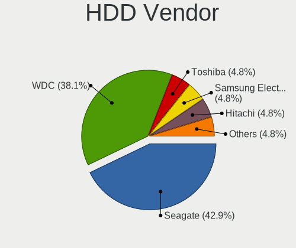
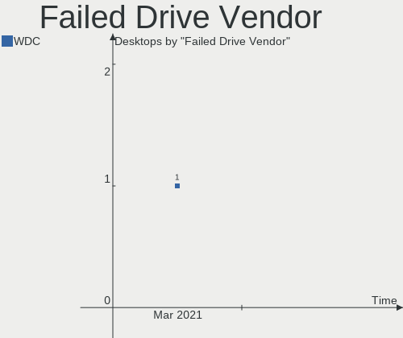
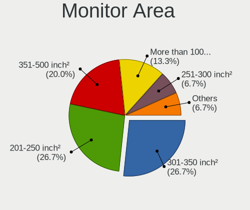
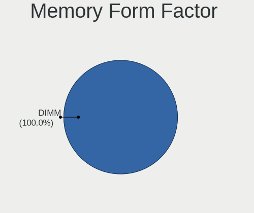
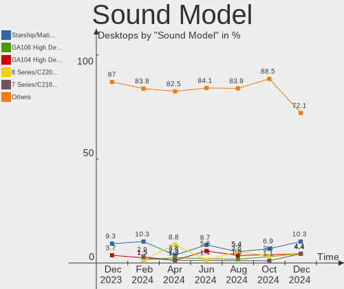

KDE neon Hardware Trends (Desktop)
----------------------------------

A project to identify most popular hardware characteristics and track their change
over time based on data collected by KDE neon users at https://Linux-Hardware.org.

Anyone can contribute to the study by uploading probes of their computers by
the [hw-probe](https://github.com/linuxhw/hw-probe) tool:

    sudo -E hw-probe -all -upload

Full-feature report is available here: https://linux-hardware.org/?view=trends&formfactor=desktop

Period: Jan, 2021.

Contents
--------

- [ OS                       ](#os)
- [ OS Family                ](#os-family)
- [ Kernel                   ](#kernel)
- [ Kernel Family            ](#kernel-family)
- [ Kernel Major Ver.        ](#kernel-major-ver)
- [ Arch                     ](#arch)
- [ DE                       ](#de)
- [ Display Server           ](#display-server)
- [ Display Manager          ](#display-manager)
- [ OS Lang                  ](#os-lang)
- [ Boot Mode                ](#boot-mode)
- [ Filesystem               ](#filesystem)
- [ Part. scheme             ](#part-scheme)
- [ Dual Boot with Linux/BSD ](#dual-boot-with-linux/bsd)
- [ Dual Boot (Win)          ](#dual-boot-win)
- [ Country                  ](#country)
- [ City                     ](#city)
- [ Vendor                   ](#vendor)
- [ Model                    ](#model)
- [ Model Family             ](#model-family)
- [ MFG Year                 ](#mfg-year)
- [ Form Factor              ](#form-factor)
- [ Secure Boot              ](#secure-boot)
- [ Coreboot                 ](#coreboot)
- [ RAM Size                 ](#ram-size)
- [ RAM Used                 ](#ram-used)
- [ Has CD-ROM               ](#has-cd-rom)
- [ Total Drives             ](#total-drives)
- [ Has Ethernet             ](#has-ethernet)
- [ Drive Vendor             ](#drive-vendor)
- [ Drive Model              ](#drive-model)
- [ HDD Vendor               ](#hdd-vendor)
- [ SSD Vendor               ](#ssd-vendor)
- [ Drive Kind               ](#drive-kind)
- [ Drive Connector          ](#drive-connector)
- [ Drive Size               ](#drive-size)
- [ Space Total              ](#space-total)
- [ Space Used               ](#space-used)
- [ Malfunc. Drives          ](#malfunc-drives)
- [ Malfunc. Drive Vendor    ](#malfunc-drive-vendor)
- [ Malfunc. HDD Vendor      ](#malfunc-hdd-vendor)
- [ Malfunc. Drive Kind      ](#malfunc-drive-kind)
- [ Failed Drives            ](#failed-drives)
- [ Failed Drive Vendor      ](#failed-drive-vendor)
- [ Drive Status             ](#drive-status)
- [ Storage Vendor           ](#storage-vendor)
- [ Storage Model            ](#storage-model)
- [ Storage Kind             ](#storage-kind)
- [ CPU Vendor               ](#cpu-vendor)
- [ CPU Model                ](#cpu-model)
- [ CPU Model Family         ](#cpu-model-family)
- [ CPU Cores                ](#cpu-cores)
- [ CPU Sockets              ](#cpu-sockets)
- [ CPU Threads              ](#cpu-threads)
- [ CPU Op-Modes             ](#cpu-op-modes)
- [ CPU Microcode            ](#cpu-microcode)
- [ CPU Microarch            ](#cpu-microarch)
- [ GPU Vendor               ](#gpu-vendor)
- [ GPU Model                ](#gpu-model)
- [ GPU Combo                ](#gpu-combo)
- [ GPU Driver               ](#gpu-driver)
- [ GPU Memory               ](#gpu-memory)
- [ Monitor Vendor           ](#monitor-vendor)
- [ Monitor Model            ](#monitor-model)
- [ Monitor Resolution       ](#monitor-resolution)
- [ Monitor Diagonal         ](#monitor-diagonal)
- [ Monitor Width            ](#monitor-width)
- [ Aspect Ratio             ](#aspect-ratio)
- [ Monitor Area             ](#monitor-area)
- [ Pixel Density            ](#pixel-density)
- [ Multiple Monitors        ](#multiple-monitors)
- [ Net Controller Vendor    ](#net-controller-vendor)
- [ Net Controller Model     ](#net-controller-model)
- [ Wireless Vendor          ](#wireless-vendor)
- [ Wireless Model           ](#wireless-model)
- [ Ethernet Vendor          ](#ethernet-vendor)
- [ Ethernet Model           ](#ethernet-model)
- [ Net Controller Kind      ](#net-controller-kind)
- [ Used Controller          ](#used-controller)
- [ NICs                     ](#nics)
- [ Memory Vendor            ](#memory-vendor)
- [ Memory Model             ](#memory-model)
- [ Memory Kind              ](#memory-kind)
- [ Memory Form Factor       ](#memory-form-factor)
- [ Memory Size              ](#memory-size)
- [ Memory Speed             ](#memory-speed)
- [ Sound Vendor             ](#sound-vendor)
- [ Sound Model              ](#sound-model)
- [ Camera Vendor            ](#camera-vendor)
- [ Camera Model             ](#camera-model)
- [ Fingerprint Vendor       ](#fingerprint-vendor)
- [ Fingerprint Model        ](#fingerprint-model)
- [ Chipcard Vendor          ](#chipcard-vendor)
- [ Chipcard Model           ](#chipcard-model)
- [ Printer Vendor           ](#printer-vendor)
- [ Printer Model            ](#printer-model)
- [ Scanner Vendor           ](#scanner-vendor)
- [ Scanner Model            ](#scanner-model)
- [ Bluetooth Vendor         ](#bluetooth-vendor)
- [ Bluetooth Model          ](#bluetooth-model)
- [ Unsupported Devices      ](#unsupported-devices)
- [ Unsupported Device Types ](#unsupported-device-types)

OS
--

Installed operating systems

| Name           | Desktops | Percent |
|----------------|----------|---------|
| KDE neon 20.04 | 63       | 96.92%  |
| KDE neon 18.04 | 2        | 3.08%   |

OS Family
---------

OS without a version

| Name     | Desktops | Percent |
|----------|----------|---------|
| KDE neon | 65       | 100%    |

Kernel
------

Version of the Linux kernel

| Version          | Desktops | Percent |
|------------------|----------|---------|
| 5.4.0-60-generic | 16       | 24.62%  |
| 5.4.0-64-generic | 10       | 15.38%  |
| 5.4.0-58-generic | 9        | 13.85%  |
| 5.4.0-59-generic | 8        | 12.31%  |
| 5.4.0-65-generic | 7        | 10.77%  |
| 5.4.0-62-generic | 7        | 10.77%  |
| 5.4.0-52-generic | 3        | 4.62%   |
| 5.8.0-36-generic | 1        | 1.54%   |
| 5.8.0-34-generic | 1        | 1.54%   |
| 5.4.90-xanmod1   | 1        | 1.54%   |
| 5.4.0-48-generic | 1        | 1.54%   |
| 5.3.0-62-generic | 1        | 1.54%   |

Kernel Family
-------------

Linux kernel without a distro release

| Version | Desktops | Percent |
|---------|----------|---------|
| 5.4.0   | 61       | 93.85%  |
| 5.8.0   | 2        | 3.08%   |
| 5.4.90  | 1        | 1.54%   |
| 5.3.0   | 1        | 1.54%   |

Kernel Major Ver.
-----------------

Linux kernel major version

| Version | Desktops | Percent |
|---------|----------|---------|
| 5.4     | 62       | 95.38%  |
| 5.8     | 2        | 3.08%   |
| 5.3     | 1        | 1.54%   |

Arch
----

OS architecture (x86_64, i586, etc.)

| Name   | Desktops | Percent |
|--------|----------|---------|
| x86_64 | 65       | 100%    |

DE
--

Desktop Environment

| Name  | Desktops | Percent |
|-------|----------|---------|
| KDE   | 61       | 93.85%  |
| KDE5  | 3        | 4.62%   |
| GNOME | 1        | 1.54%   |

Display Server
--------------

X11 or Wayland

| Name    | Desktops | Percent |
|---------|----------|---------|
| X11     | 63       | 96.92%  |
| Wayland | 2        | 3.08%   |

Display Manager
---------------

SDDM, LightDM, etc.

| Name    | Desktops | Percent |
|---------|----------|---------|
| Unknown | 62       | 95.38%  |
| SDDM    | 3        | 4.62%   |

OS Lang
-------

Language

| Lang  | Desktops | Percent |
|-------|----------|---------|
| en_US | 18       | 27.69%  |
| ru_RU | 10       | 15.38%  |
| pt_BR | 6        | 9.23%   |
| de_DE | 6        | 9.23%   |
| pl_PL | 3        | 4.62%   |
| en_CA | 3        | 4.62%   |
| C     | 3        | 4.62%   |
| fr_FR | 2        | 3.08%   |
| es_ES | 2        | 3.08%   |
| zh_TW | 1        | 1.54%   |
| zh_CN | 1        | 1.54%   |
| tr_TR | 1        | 1.54%   |
| pt_PT | 1        | 1.54%   |
| nl_NL | 1        | 1.54%   |
| it_IT | 1        | 1.54%   |
| es_CO | 1        | 1.54%   |
| en_ZA | 1        | 1.54%   |
| en_IN | 1        | 1.54%   |
| en_GB | 1        | 1.54%   |
| el_GR | 1        | 1.54%   |
| cs_CZ | 1        | 1.54%   |

Boot Mode
---------

EFI or BIOS

| Mode | Desktops | Percent |
|------|----------|---------|
| EFI  | 36       | 55.38%  |
| BIOS | 29       | 44.62%  |

Filesystem
----------

Type of filesystem

| Type    | Desktops | Percent |
|---------|----------|---------|
| Ext4    | 59       | 90.77%  |
| Btrfs   | 3        | 4.62%   |
| Xfs     | 1        | 1.54%   |
| Overlay | 1        | 1.54%   |
| Unknown | 1        | 1.54%   |

Part. scheme
------------

Scheme of partitioning

| Type    | Desktops | Percent |
|---------|----------|---------|
| Unknown | 61       | 93.85%  |
| GPT     | 4        | 6.15%   |

Dual Boot with Linux/BSD
------------------------

Hosting more than one Linux/BSD

| Dual boot | Desktops | Percent |
|-----------|----------|---------|
| No        | 63       | 96.92%  |
| Yes       | 2        | 3.08%   |

Dual Boot (Win)
---------------

Hosting Linux and Windows

| Dual boot | Desktops | Percent |
|-----------|----------|---------|
| No        | 55       | 84.62%  |
| Yes       | 10       | 15.38%  |

Country
-------

Geographic location (country)

| Country        | Desktops | Percent |
|----------------|----------|---------|
| Russia         | 11       | 16.92%  |
| USA            | 8        | 12.31%  |
| Germany        | 7        | 10.77%  |
| Brazil         | 7        | 10.77%  |
| Canada         | 5        | 7.69%   |
| Spain          | 3        | 4.62%   |
| UK             | 2        | 3.08%   |
| Turkey         | 2        | 3.08%   |
| Poland         | 2        | 3.08%   |
| Greece         | 2        | 3.08%   |
| France         | 2        | 3.08%   |
| Colombia       | 2        | 3.08%   |
| Taiwan         | 1        | 1.54%   |
| South Africa   | 1        | 1.54%   |
| Slovakia       | 1        | 1.54%   |
| Portugal       | 1        | 1.54%   |
| Netherlands    | 1        | 1.54%   |
| Latvia         | 1        | 1.54%   |
| Italy          | 1        | 1.54%   |
| India          | 1        | 1.54%   |
| Czech Republic | 1        | 1.54%   |
| China          | 1        | 1.54%   |
| Bulgaria       | 1        | 1.54%   |
| Argentina      | 1        | 1.54%   |

City
----

Geographic location (city)

| City                 | Desktops | Percent |
|----------------------|----------|---------|
| St Petersburg        | 2        | 3.08%   |
| Sapucaia             | 2        | 3.08%   |
| Moscow               | 2        | 3.08%   |
| Fernandopolis        | 2        | 3.08%   |
| Zhuji                | 1        | 1.54%   |
| Zgierz               | 1        | 1.54%   |
| Wolbrom              | 1        | 1.54%   |
| Winnipeg             | 1        | 1.54%   |
| Varna                | 1        | 1.54%   |
| Thessaloniki         | 1        | 1.54%   |
| Taipei               | 1        | 1.54%   |
| São Paulo           | 1        | 1.54%   |
| Soest                | 1        | 1.54%   |
| Sertaozinho          | 1        | 1.54%   |
| Santiago de Cali     | 1        | 1.54%   |
| Round Rock           | 1        | 1.54%   |
| Rochefort            | 1        | 1.54%   |
| Riga                 | 1        | 1.54%   |
| Pueblo               | 1        | 1.54%   |
| Porto Torres         | 1        | 1.54%   |
| Petergof             | 1        | 1.54%   |
| Pardubice            | 1        | 1.54%   |
| Orenburg             | 1        | 1.54%   |
| North Port           | 1        | 1.54%   |
| Nijmegen             | 1        | 1.54%   |
| New Bedford          | 1        | 1.54%   |
| Nemsdorf-Goehrendorf | 1        | 1.54%   |
| Nagold               | 1        | 1.54%   |
| Munich               | 1        | 1.54%   |
| Medellín            | 1        | 1.54%   |
| Madrid               | 1        | 1.54%   |
| Longmeadow           | 1        | 1.54%   |
| Lleida               | 1        | 1.54%   |
| Lexington            | 1        | 1.54%   |
| Kirs                 | 1        | 1.54%   |
| Khabarovsk           | 1        | 1.54%   |
| Johannesburg         | 1        | 1.54%   |
| Izmir                | 1        | 1.54%   |
| Izhevsk              | 1        | 1.54%   |
| Hamilton             | 1        | 1.54%   |
| Freiburg             | 1        | 1.54%   |
| Entroncamento        | 1        | 1.54%   |
| Düsseldorf          | 1        | 1.54%   |
| Dallas               | 1        | 1.54%   |
| Cherepovets          | 1        | 1.54%   |
| Canoas               | 1        | 1.54%   |
| Burlington           | 1        | 1.54%   |
| Buenos Aires         | 1        | 1.54%   |
| Brockville           | 1        | 1.54%   |
| Bratislava           | 1        | 1.54%   |
| Bhopal               | 1        | 1.54%   |
| Berlin               | 1        | 1.54%   |
| Bathgate             | 1        | 1.54%   |
| Barrow in Furness    | 1        | 1.54%   |
| Athens               | 1        | 1.54%   |
| Anzeling             | 1        | 1.54%   |
| Antalya              | 1        | 1.54%   |
| Ancaster             | 1        | 1.54%   |
| Albacete             | 1        | 1.54%   |
| Airdrie              | 1        | 1.54%   |

Vendor
------

Motherboard manufacturer

| Name                | Desktops | Percent |
|---------------------|----------|---------|
| ASUSTek Computer    | 19       | 29.23%  |
| MSI                 | 13       | 20%     |
| Gigabyte Technology | 9        | 13.85%  |
| ASRock              | 6        | 9.23%   |
| Intel               | 5        | 7.69%   |
| Hewlett-Packard     | 5        | 7.69%   |
| Lenovo              | 3        | 4.62%   |
| Supermicro          | 2        | 3.08%   |
| Google              | 1        | 1.54%   |
| Fujitsu             | 1        | 1.54%   |
| Dell                | 1        | 1.54%   |

Model
-----

Motherboard model

| Name                                 | Desktops | Percent |
|--------------------------------------|----------|---------|
| MSI MS-7C37                          | 2        | 3.08%   |
| Supermicro SYS-7038A-I               | 1        | 1.54%   |
| Supermicro H8QM8                     | 1        | 1.54%   |
| MSI MS-7C31                          | 1        | 1.54%   |
| MSI MS-7C02                          | 1        | 1.54%   |
| MSI MS-7B79                          | 1        | 1.54%   |
| MSI MS-7B48                          | 1        | 1.54%   |
| MSI MS-7A32                          | 1        | 1.54%   |
| MSI MS-7885                          | 1        | 1.54%   |
| MSI MS-7816                          | 1        | 1.54%   |
| MSI MS-7751                          | 1        | 1.54%   |
| MSI MS-7721                          | 1        | 1.54%   |
| MSI MS-7693                          | 1        | 1.54%   |
| MSI MS-7641                          | 1        | 1.54%   |
| Lenovo ThinkStation S20 4105O1U      | 1        | 1.54%   |
| Lenovo ThinkCentre M92p 3209EK4      | 1        | 1.54%   |
| Lenovo ThinkCentre M55 880894G       | 1        | 1.54%   |
| Intel X99 V102                       | 1        | 1.54%   |
| Intel X79 V2.72A                     | 1        | 1.54%   |
| Intel MAHOBAY                        | 1        | 1.54%   |
| Intel H61                            | 1        | 1.54%   |
| Intel DH61HO AAG62445-102            | 1        | 1.54%   |
| HP Z800 Workstation                  | 1        | 1.54%   |
| HP Pro3500 G2 MT PC                  | 1        | 1.54%   |
| HP Pavilion Gaming Desktop TG01-1xxx | 1        | 1.54%   |
| HP EliteBook 8730w (VQ683EA)         | 1        | 1.54%   |
| HP Compaq 8000 Elite USDT PC         | 1        | 1.54%   |
| Google Zako                          | 1        | 1.54%   |
| Gigabyte Z97X-UD5H-BK                | 1        | 1.54%   |
| Gigabyte X570 AORUS ELITE WIFI       | 1        | 1.54%   |
| Gigabyte H410M H                     | 1        | 1.54%   |
| Gigabyte H110M-S2H                   | 1        | 1.54%   |
| Gigabyte F2A88XM-HD3                 | 1        | 1.54%   |
| Gigabyte EX58-UD3R                   | 1        | 1.54%   |
| Gigabyte C847N                       | 1        | 1.54%   |
| Gigabyte B85M-D2V                    | 1        | 1.54%   |
| Gigabyte B250M-Gaming 3              | 1        | 1.54%   |
| Fujitsu ESPRIMO P710                 | 1        | 1.54%   |
| Dell Dimension 8400                  | 1        | 1.54%   |
| ASUS TUF X470-PLUS GAMING            | 1        | 1.54%   |
| ASUS TUF H310M-PLUS GAMING/BR        | 1        | 1.54%   |
| ASUS TUF GAMING X570-PLUS            | 1        | 1.54%   |
| ASUS TUF B450M-PLUS GAMING           | 1        | 1.54%   |
| ASUS PRIME X370-PRO                  | 1        | 1.54%   |
| ASUS PRIME H310M-E/BR                | 1        | 1.54%   |
| ASUS PRIME B450M-GAMING/BR           | 1        | 1.54%   |
| ASUS PRIME B350M-A                   | 1        | 1.54%   |
| ASUS P8Z77-V DELUXE                  | 1        | 1.54%   |
| ASUS P8H67-M LE                      | 1        | 1.54%   |
| ASUS P8H61-MX                        | 1        | 1.54%   |
| ASUS P5QPL-AM                        | 1        | 1.54%   |
| ASUS P5QL PRO                        | 1        | 1.54%   |
| ASUS P5P43TD                         | 1        | 1.54%   |
| ASUS M5A97 LE R2.0                   | 1        | 1.54%   |
| ASUS M5A97 EVO R2.0                  | 1        | 1.54%   |
| ASUS K31CD-K                         | 1        | 1.54%   |
| ASUS CROSSHAIR VI HERO               | 1        | 1.54%   |
| ASUS All Series                      | 1        | 1.54%   |
| ASRock G41C-GS                       | 1        | 1.54%   |
| ASRock B450M Pro4-F                  | 1        | 1.54%   |

Model Family
------------

Motherboard model prefix

| Name                   | Desktops | Percent |
|------------------------|----------|---------|
| ASUS TUF               | 4        | 6.15%   |
| ASUS PRIME             | 4        | 6.15%   |
| MSI MS-7C37            | 2        | 3.08%   |
| Lenovo ThinkCentre     | 2        | 3.08%   |
| ASUS M5A97             | 2        | 3.08%   |
| Supermicro SYS-7038A-I | 1        | 1.54%   |
| Supermicro H8QM8       | 1        | 1.54%   |
| MSI MS-7C31            | 1        | 1.54%   |
| MSI MS-7C02            | 1        | 1.54%   |
| MSI MS-7B79            | 1        | 1.54%   |
| MSI MS-7B48            | 1        | 1.54%   |
| MSI MS-7A32            | 1        | 1.54%   |
| MSI MS-7885            | 1        | 1.54%   |
| MSI MS-7816            | 1        | 1.54%   |
| MSI MS-7751            | 1        | 1.54%   |
| MSI MS-7721            | 1        | 1.54%   |
| MSI MS-7693            | 1        | 1.54%   |
| MSI MS-7641            | 1        | 1.54%   |
| Lenovo ThinkStation    | 1        | 1.54%   |
| Intel X99              | 1        | 1.54%   |
| Intel X79              | 1        | 1.54%   |
| Intel MAHOBAY          | 1        | 1.54%   |
| Intel H61              | 1        | 1.54%   |
| Intel DH61HO           | 1        | 1.54%   |
| HP Z800                | 1        | 1.54%   |
| HP Pro3500             | 1        | 1.54%   |
| HP Pavilion            | 1        | 1.54%   |
| HP EliteBook           | 1        | 1.54%   |
| HP Compaq              | 1        | 1.54%   |
| Google Zako            | 1        | 1.54%   |
| Gigabyte Z97X-UD5H-BK  | 1        | 1.54%   |
| Gigabyte X570          | 1        | 1.54%   |
| Gigabyte H410M         | 1        | 1.54%   |
| Gigabyte H110M-S2H     | 1        | 1.54%   |
| Gigabyte F2A88XM-HD3   | 1        | 1.54%   |
| Gigabyte EX58-UD3R     | 1        | 1.54%   |
| Gigabyte C847N         | 1        | 1.54%   |
| Gigabyte B85M-D2V      | 1        | 1.54%   |
| Gigabyte B250M-Gaming  | 1        | 1.54%   |
| Fujitsu ESPRIMO        | 1        | 1.54%   |
| Dell Dimension         | 1        | 1.54%   |
| ASUS P8Z77-V           | 1        | 1.54%   |
| ASUS P8H67-M           | 1        | 1.54%   |
| ASUS P8H61-MX          | 1        | 1.54%   |
| ASUS P5QPL-AM          | 1        | 1.54%   |
| ASUS P5QL              | 1        | 1.54%   |
| ASUS P5P43TD           | 1        | 1.54%   |
| ASUS K31CD-K           | 1        | 1.54%   |
| ASUS CROSSHAIR         | 1        | 1.54%   |
| ASUS All               | 1        | 1.54%   |
| ASRock G41C-GS         | 1        | 1.54%   |
| ASRock B450M           | 1        | 1.54%   |
| ASRock B450            | 1        | 1.54%   |
| ASRock AB350           | 1        | 1.54%   |
| ASRock 990FX           | 1        | 1.54%   |
| ASRock 970M            | 1        | 1.54%   |

MFG Year
--------

Motherboard manufacture year

| Year | Desktops | Percent |
|------|----------|---------|
| 2020 | 13       | 20%     |
| 2019 | 9        | 13.85%  |
| 2018 | 7        | 10.77%  |
| 2016 | 6        | 9.23%   |
| 2013 | 5        | 7.69%   |
| 2012 | 5        | 7.69%   |
| 2014 | 4        | 6.15%   |
| 2015 | 3        | 4.62%   |
| 2011 | 3        | 4.62%   |
| 2009 | 3        | 4.62%   |
| 2010 | 2        | 3.08%   |
| 2007 | 2        | 3.08%   |
| 2021 | 1        | 1.54%   |
| 2017 | 1        | 1.54%   |
| 2006 | 1        | 1.54%   |

Form Factor
-----------

Physical design of the computer

| Name    | Desktops | Percent |
|---------|----------|---------|
| Desktop | 65       | 100%    |

Secure Boot
-----------

Enabled or disabled

| State    | Desktops | Percent |
|----------|----------|---------|
| Disabled | 63       | 96.92%  |
| Enabled  | 2        | 3.08%   |

Coreboot
--------

Have coreboot on board

| Used | Desktops | Percent |
|------|----------|---------|
| No   | 64       | 98.46%  |
| Yes  | 1        | 1.54%   |

RAM Size
--------

Total RAM memory

| Size in GB  | Desktops | Percent |
|-------------|----------|---------|
| 8.01-16.0   | 20       | 30.77%  |
| 16.01-24.0  | 19       | 29.23%  |
| 4.01-8.0    | 10       | 15.38%  |
| 32.01-64.0  | 7        | 10.77%  |
| 3.01-4.0    | 7        | 10.77%  |
| 24.01-32.0  | 1        | 1.54%   |
| 64.01-256.0 | 1        | 1.54%   |

RAM Used
--------

Used RAM memory

| Used GB    | Desktops | Percent |
|------------|----------|---------|
| 1.01-2.0   | 27       | 41.54%  |
| 3.01-4.0   | 16       | 24.62%  |
| 2.01-3.0   | 15       | 23.08%  |
| 4.01-8.0   | 2        | 3.08%   |
| 8.01-16.0  | 2        | 3.08%   |
| 0.51-1.0   | 2        | 3.08%   |
| 24.01-32.0 | 1        | 1.54%   |

Has CD-ROM
----------

Has CD-ROM on board

| Presented | Desktops | Percent |
|-----------|----------|---------|
| No        | 40       | 61.54%  |
| Yes       | 25       | 38.46%  |

Total Drives
------------

Number of drives on board

| Drives | Desktops | Percent |
|--------|----------|---------|
| 1      | 20       | 30.77%  |
| 3      | 17       | 26.15%  |
| 2      | 16       | 24.62%  |
| 6      | 4        | 6.15%   |
| 5      | 4        | 6.15%   |
| 4      | 4        | 6.15%   |

Has Ethernet
------------

Has Ethernet on board

| Presented | Desktops | Percent |
|-----------|----------|---------|
| Yes       | 65       | 100%    |

Drive Vendor
------------

Hard drive vendors

| Vendor                  | Desktops | Drives | Percent |
|-------------------------|----------|--------|---------|
| Seagate                 | 28       | 29     | 19.18%  |
| WDC                     | 25       | 32     | 17.12%  |
| Samsung Electronics     | 20       | 27     | 13.7%   |
| Kingston                | 11       | 12     | 7.53%   |
| Toshiba                 | 10       | 11     | 6.85%   |
| Crucial                 | 7        | 7      | 4.79%   |
| Hitachi                 | 6        | 6      | 4.11%   |
| SanDisk                 | 5        | 6      | 3.42%   |
| Intel                   | 5        | 5      | 3.42%   |
| A-DATA Technology       | 4        | 4      | 2.74%   |
| Phison                  | 3        | 3      | 2.05%   |
| PNY                     | 2        | 4      | 1.37%   |
| Hewlett-Packard         | 2        | 2      | 1.37%   |
| China                   | 2        | 2      | 1.37%   |
| Apacer                  | 2        | 2      | 1.37%   |
| XPG                     | 1        | 1      | 0.68%   |
| Unknown                 | 1        | 1      | 0.68%   |
| Union Memory (Shenzhen) | 1        | 1      | 0.68%   |
| SPCC                    | 1        | 1      | 0.68%   |
| SABRENT                 | 1        | 1      | 0.68%   |
| Realtek Semiconductor   | 1        | 1      | 0.68%   |
| OCZ                     | 1        | 1      | 0.68%   |
| KIOXIA                  | 1        | 1      | 0.68%   |
| KingSpec                | 1        | 1      | 0.68%   |
| HS-SSD-E100             | 1        | 1      | 0.68%   |
| Fujitsu                 | 1        | 1      | 0.68%   |
| Corsair                 | 1        | 1      | 0.68%   |
| asmedia                 | 1        | 1      | 0.68%   |
| AMD                     | 1        | 1      | 0.68%   |

Drive Model
-----------

Hard drive models

| Model                                        | Desktops | Percent |
|----------------------------------------------|----------|---------|
| Samsung SSD 850 EVO 250GB                    | 4        | 2.47%   |
| Samsung NVMe SSD Drive 1TB                   | 3        | 1.85%   |
| Kingston SA400S37120G 120GB SSD              | 3        | 1.85%   |
| WDC WDS500G2B0A-00SM50 500GB SSD             | 2        | 1.23%   |
| WDC WD3200AAJS-00L7A0 320GB                  | 2        | 1.23%   |
| WDC WD20EARX-00PASB0 2TB                     | 2        | 1.23%   |
| WDC WD10EZEX-08WN4A0 1TB                     | 2        | 1.23%   |
| Toshiba DT01ACA200 2TB                       | 2        | 1.23%   |
| Toshiba DT01ACA100 1TB                       | 2        | 1.23%   |
| Seagate ST3500418AS 500GB                    | 2        | 1.23%   |
| Seagate ST2000DM008-2FR102 2TB               | 2        | 1.23%   |
| Seagate ST1000DM010-2EP102 1TB               | 2        | 1.23%   |
| Seagate ST1000DM003-1ER162 1TB               | 2        | 1.23%   |
| Seagate Expansion Desk 8TB                   | 2        | 1.23%   |
| Samsung SSD 840 EVO 120GB                    | 2        | 1.23%   |
| Samsung NVMe SSD Drive 500GB                 | 2        | 1.23%   |
| Samsung HD103SJ 1TB                          | 2        | 1.23%   |
| Kingston SV300S37A120G 120GB SSD             | 2        | 1.23%   |
| Kingston SA400M8240G 240GB SSD               | 2        | 1.23%   |
| Hitachi HDS721050CLA362 500GB                | 2        | 1.23%   |
| Crucial CT256MX100SSD1 256GB                 | 2        | 1.23%   |
| Apacer AS350 128GB SSD                       | 2        | 1.23%   |
| XPG NVMe SSD Drive 1024GB                    | 1        | 0.62%   |
| WDC WDS240G2G0B-00EPW0 240GB SSD             | 1        | 0.62%   |
| WDC WDS120G2G0B-00EPW0 120GB SSD             | 1        | 0.62%   |
| WDC WDS100T2B0B 1TB SSD                      | 1        | 0.62%   |
| WDC WDBNCE5000PNC 500GB SSD                  | 1        | 0.62%   |
| WDC WD82PURZ-85TEUY0 8TB                     | 1        | 0.62%   |
| WDC WD5000AADS-00M2B0 500GB                  | 1        | 0.62%   |
| WDC WD40EZRZ-75GXCB0 4TB                     | 1        | 0.62%   |
| WDC WD40EZRZ-22GXCB0 4TB                     | 1        | 0.62%   |
| WDC WD30EFRX-68EUZN0 3TB                     | 1        | 0.62%   |
| WDC WD2500JS-60MHB1 250GB                    | 1        | 0.62%   |
| WDC WD2500JD-75HBB0 249GB                    | 1        | 0.62%   |
| WDC WD2500BEVS-60UST0 250GB                  | 1        | 0.62%   |
| WDC WD20EZRZ-00Z5HB0 2TB                     | 1        | 0.62%   |
| WDC WD20EZAZ-00GGJB0 2TB                     | 1        | 0.62%   |
| WDC WD20EFRX-68AX9N0 2TB                     | 1        | 0.62%   |
| WDC WD1600AAJS-61WAA0 160GB                  | 1        | 0.62%   |
| WDC WD10JPVX-00JC3T0 1TB                     | 1        | 0.62%   |
| WDC WD10EZEX-00UD2A0 1TB                     | 1        | 0.62%   |
| WDC WD10EZEX-00BN5A0 1TB                     | 1        | 0.62%   |
| WDC WD10EFRX-68FYTN0 1TB                     | 1        | 0.62%   |
| WDC WD10EADS-00L5B1 1TB                      | 1        | 0.62%   |
| WDC WD1001FALS-00E8B0 1TB                    | 1        | 0.62%   |
| Unknown SSDS3STD120GB                        | 1        | 0.62%   |
| Union Memory (Shenzhen) NVMe SSD Drive 128GB | 1        | 0.62%   |
| Toshiba TL100 120GB SSD                      | 1        | 0.62%   |
| Toshiba MQ01ABD050 500GB                     | 1        | 0.62%   |
| Toshiba HDWD130 3TB                          | 1        | 0.62%   |
| Toshiba HDWD120 2TB                          | 1        | 0.62%   |
| Toshiba HDWD110 1TB                          | 1        | 0.62%   |
| Toshiba DT01ACA050 500GB                     | 1        | 0.62%   |
| SPCC Solid State Disk 128GB                  | 1        | 0.62%   |
| Seagate ST500LT012-9WS142 500GB              | 1        | 0.62%   |
| Seagate ST500DM002-1BD142 500GB              | 1        | 0.62%   |
| Seagate ST4000DM005-2DP166 4TB               | 1        | 0.62%   |
| Seagate ST4000DM004-2CV104 4TB               | 1        | 0.62%   |
| Seagate ST4000DM000-1F2168 4TB               | 1        | 0.62%   |
| Seagate ST350041 8AS 500GB                   | 1        | 0.62%   |

HDD Vendor
----------

Hard disk drive vendors

| Vendor              | Desktops | Drives | Percent |
|---------------------|----------|--------|---------|
| Seagate             | 27       | 28     | 38.03%  |
| WDC                 | 21       | 26     | 29.58%  |
| Toshiba             | 9        | 10     | 12.68%  |
| Hitachi             | 6        | 6      | 8.45%   |
| Samsung Electronics | 5        | 6      | 7.04%   |
| Hewlett-Packard     | 1        | 1      | 1.41%   |
| Fujitsu             | 1        | 1      | 1.41%   |
| asmedia             | 1        | 1      | 1.41%   |

SSD Vendor
----------

Solid state drive vendors

| Vendor              | Desktops | Drives | Percent |
|---------------------|----------|--------|---------|
| Samsung Electronics | 13       | 15     | 20.63%  |
| Kingston            | 10       | 10     | 15.87%  |
| Crucial             | 7        | 7      | 11.11%  |
| WDC                 | 6        | 6      | 9.52%   |
| SanDisk             | 4        | 4      | 6.35%   |
| Intel               | 4        | 4      | 6.35%   |
| A-DATA Technology   | 3        | 3      | 4.76%   |
| PNY                 | 2        | 4      | 3.17%   |
| China               | 2        | 2      | 3.17%   |
| Apacer              | 2        | 2      | 3.17%   |
| Unknown             | 1        | 1      | 1.59%   |
| Toshiba             | 1        | 1      | 1.59%   |
| SPCC                | 1        | 1      | 1.59%   |
| SABRENT             | 1        | 1      | 1.59%   |
| OCZ                 | 1        | 1      | 1.59%   |
| KingSpec            | 1        | 1      | 1.59%   |
| HS-SSD-E100         | 1        | 1      | 1.59%   |
| Hewlett-Packard     | 1        | 1      | 1.59%   |
| Corsair             | 1        | 1      | 1.59%   |
| AMD                 | 1        | 1      | 1.59%   |

Drive Kind
----------

HDD or SSD

| Kind    | Desktops | Drives | Percent |
|---------|----------|--------|---------|
| SSD     | 50       | 67     | 42.37%  |
| HDD     | 50       | 79     | 42.37%  |
| NVMe    | 17       | 19     | 14.41%  |
| Unknown | 1        | 1      | 0.85%   |

Drive Connector
---------------

SATA, SAS, NVMe, etc.

| Type | Desktops | Drives | Percent |
|------|----------|--------|---------|
| SATA | 65       | 140    | 73.86%  |
| NVMe | 17       | 19     | 19.32%  |
| SAS  | 6        | 7      | 6.82%   |

Drive Size
----------

Size of hard drive

| Size in TB | Desktops | Drives | Percent |
|------------|----------|--------|---------|
| 0.01-0.5   | 56       | 90     | 52.83%  |
| 0.51-1.0   | 25       | 29     | 23.58%  |
| 1.01-2.0   | 14       | 15     | 13.21%  |
| 3.01-4.0   | 4        | 5      | 3.77%   |
| 2.01-3.0   | 4        | 4      | 3.77%   |
| 4.01-10.0  | 3        | 3      | 2.83%   |

Space Total
-----------

Amount of disk space available on the file system

| Size in GB     | Desktops | Percent |
|----------------|----------|---------|
| 101-250        | 23       | 35.38%  |
| 1001-2000      | 10       | 15.38%  |
| 501-1000       | 8        | 12.31%  |
| More than 3000 | 7        | 10.77%  |
| 251-500        | 5        | 7.69%   |
| 51-100         | 5        | 7.69%   |
| 1-20           | 3        | 4.62%   |
| 2001-3000      | 2        | 3.08%   |
| 21-50          | 1        | 1.54%   |
| Unknown        | 1        | 1.54%   |

Space Used
----------

Amount of used disk space

| Used GB        | Desktops | Percent |
|----------------|----------|---------|
| 1-20           | 26       | 40%     |
| 21-50          | 13       | 20%     |
| 501-1000       | 6        | 9.23%   |
| 51-100         | 6        | 9.23%   |
| 101-250        | 5        | 7.69%   |
| More than 3000 | 3        | 4.62%   |
| 1001-2000      | 3        | 4.62%   |
| 2001-3000      | 2        | 3.08%   |
| Unknown        | 1        | 1.54%   |

Malfunc. Drives
---------------

Drive models with a malfunction

| Model                          | Desktops | Drives | Percent |
|--------------------------------|----------|--------|---------|
| WDC WD20EZRZ-00Z5HB0 2TB       | 1        | 1      | 25%     |
| WDC WD10EZEX-08WN4A0 1TB       | 1        | 1      | 25%     |
| Seagate ST3500418AS 500GB      | 1        | 1      | 25%     |
| Seagate ST1000DM010-2EP102 1TB | 1        | 1      | 25%     |

Malfunc. Drive Vendor
---------------------

Vendors of faulty drives

| Vendor  | Desktops | Drives | Percent |
|---------|----------|--------|---------|
| WDC     | 2        | 2      | 50%     |
| Seagate | 2        | 2      | 50%     |

Malfunc. HDD Vendor
-------------------

Vendors of faulty HDD drives

| Vendor  | Desktops | Drives | Percent |
|---------|----------|--------|---------|
| WDC     | 2        | 2      | 50%     |
| Seagate | 2        | 2      | 50%     |

Malfunc. Drive Kind
-------------------

Kinds of faulty drives

| Kind | Desktops | Drives | Percent |
|------|----------|--------|---------|
| HDD  | 3        | 4      | 100%    |

Failed Drives
-------------

Failed drive models

| Model                           | Desktops | Drives | Percent |
|---------------------------------|----------|--------|---------|
| Samsung Electronics HD103SJ 1TB | 1        | 1      | 100%    |

Failed Drive Vendor
-------------------

Failed drive vendors

| Vendor              | Desktops | Drives | Percent |
|---------------------|----------|--------|---------|
| Samsung Electronics | 1        | 1      | 100%    |

Drive Status
------------

Number of failed and malfunc. drives

| Status   | Desktops | Drives | Percent |
|----------|----------|--------|---------|
| Detected | 63       | 155    | 88.73%  |
| Works    | 4        | 6      | 5.63%   |
| Malfunc  | 3        | 4      | 4.23%   |
| Failed   | 1        | 1      | 1.41%   |

Storage Vendor
--------------

Storage controller vendors

| Vendor                      | Desktops | Percent |
|-----------------------------|----------|---------|
| Intel                       | 41       | 44.09%  |
| AMD                         | 24       | 25.81%  |
| ASMedia Technology          | 6        | 6.45%   |
| Samsung Electronics         | 5        | 5.38%   |
| Phison Electronics          | 3        | 3.23%   |
| Marvell Technology Group    | 3        | 3.23%   |
| Sandisk                     | 2        | 2.15%   |
| Realtek Semiconductor       | 2        | 2.15%   |
| Kingston Technology Company | 2        | 2.15%   |
| Nvidia                      | 1        | 1.08%   |
| LSI Logic / Symbios Logic   | 1        | 1.08%   |
| KIOXIA                      | 1        | 1.08%   |
| JMicron Technology          | 1        | 1.08%   |
| ADATA Technology            | 1        | 1.08%   |

Storage Model
-------------

Storage controller models

| Model                                                                          | Desktops | Percent |
|--------------------------------------------------------------------------------|----------|---------|
| AMD FCH SATA Controller [AHCI mode]                                            | 18       | 15.25%  |
| AMD 400 Series Chipset SATA Controller                                         | 7        | 5.93%   |
| ASMedia ASM1062 Serial ATA Controller                                          | 6        | 5.08%   |
| Intel 6 Series/C200 Series Chipset Family 6 port Desktop SATA AHCI Controller  | 5        | 4.24%   |
| Samsung NVMe SSD Controller SM981/PM981/PM983                                  | 4        | 3.39%   |
| Intel 7 Series/C210 Series Chipset Family 6-port SATA Controller [AHCI mode]   | 4        | 3.39%   |
| AMD SB7x0/SB8x0/SB9x0 SATA Controller [AHCI mode]                              | 4        | 3.39%   |
| Intel 82801JI (ICH10 Family) SATA AHCI Controller                              | 3        | 2.54%   |
| Intel 8 Series/C220 Series Chipset Family 6-port SATA Controller 1 [AHCI mode] | 3        | 2.54%   |
| Intel 200 Series PCH SATA controller [AHCI mode]                               | 3        | 2.54%   |
| AMD X370 Series Chipset SATA Controller                                        | 3        | 2.54%   |
| AMD SB7x0/SB8x0/SB9x0 IDE Controller                                           | 3        | 2.54%   |
| Realtek RTS5763DL NVMe SSD Controller                                          | 2        | 1.69%   |
| Kingston Company A2000 NVMe SSD                                                | 2        | 1.69%   |
| Intel Q170/Q150/B150/H170/H110/Z170/CM236 Chipset SATA Controller [AHCI Mode]  | 2        | 1.69%   |
| Intel NM10/ICH7 Family SATA Controller [IDE mode]                              | 2        | 1.69%   |
| Intel Cannon Lake PCH SATA AHCI Controller                                     | 2        | 1.69%   |
| Intel C610/X99 series chipset sSATA Controller [AHCI mode]                     | 2        | 1.69%   |
| Intel C610/X99 series chipset 6-Port SATA Controller [AHCI mode]               | 2        | 1.69%   |
| Intel 82801JI (ICH10 Family) 4 port SATA IDE Controller #1                     | 2        | 1.69%   |
| Intel 82801JI (ICH10 Family) 2 port SATA IDE Controller #2                     | 2        | 1.69%   |
| Intel 82801G (ICH7 Family) IDE Controller                                      | 2        | 1.69%   |
| AMD SB7x0/SB8x0/SB9x0 SATA Controller [IDE mode]                               | 2        | 1.69%   |
| AMD 300 Series Chipset SATA Controller                                         | 2        | 1.69%   |
| Sandisk WD Blue SN500 / PC SN520 NVMe SSD                                      | 1        | 0.85%   |
| Sandisk WD Black 2018 / PC SN720 NVMe SSD                                      | 1        | 0.85%   |
| Samsung NVMe SSD Controller SM961/PM961/SM963                                  | 1        | 0.85%   |
| Phison PS5013 E13 NVMe Controller                                              | 1        | 0.85%   |
| Phison E16 PCIe4 NVMe Controller                                               | 1        | 0.85%   |
| Phison E12 NVMe Controller                                                     | 1        | 0.85%   |
| Nvidia MCP55 SATA Controller                                                   | 1        | 0.85%   |
| Nvidia MCP55 IDE                                                               | 1        | 0.85%   |
| Marvell Group 88SE9172 SATA 6Gb/s Controller                                   | 1        | 0.85%   |
| Marvell Group 88SE9128 PCIe SATA 6 Gb/s RAID controller with HyperDuo          | 1        | 0.85%   |
| Marvell Group 88SE6101/6102 single-port PATA133 interface                      | 1        | 0.85%   |
| LSI Logic / Symbios Logic SAS1068E PCI-Express Fusion-MPT SAS                  | 1        | 0.85%   |
| KIOXIA NVMe SSD                                                                | 1        | 0.85%   |
| JMicron JMB368 IDE controller                                                  | 1        | 0.85%   |
| Intel SSD 660P Series                                                          | 1        | 0.85%   |
| Intel SATA Controller [RAID mode]                                              | 1        | 0.85%   |
| Intel Mobile 4 Series Chipset PT IDER Controller                               | 1        | 0.85%   |
| Intel C600/X79 series chipset 6-Port SATA AHCI Controller                      | 1        | 0.85%   |
| Intel 9 Series Chipset Family SATA Controller [AHCI Mode]                      | 1        | 0.85%   |
| Intel 82801JD/DO (ICH10 Family) SATA AHCI Controller                           | 1        | 0.85%   |
| Intel 82801IBM/IEM (ICH9M/ICH9M-E) 4 port SATA Controller [AHCI mode]          | 1        | 0.85%   |
| Intel 82801HR/HO/HH (ICH8R/DO/DH) 2 port SATA Controller [IDE mode]            | 1        | 0.85%   |
| Intel 82801H (ICH8 Family) 4 port SATA Controller [IDE mode]                   | 1        | 0.85%   |
| Intel 82801FR/FRW (ICH6R/ICH6RW) SATA Controller                               | 1        | 0.85%   |
| Intel 82801FB/FBM/FR/FW/FRW (ICH6 Family) IDE Controller                       | 1        | 0.85%   |
| Intel 8 Series SATA Controller 1 [AHCI mode]                                   | 1        | 0.85%   |
| Intel 7 Series Chipset Family 6-port SATA Controller [AHCI mode]               | 1        | 0.85%   |
| Intel 6 Series/C200 Series Chipset Family 6 port Mobile SATA AHCI Controller   | 1        | 0.85%   |
| Intel 400 Series Chipset Family SATA AHCI Controller                           | 1        | 0.85%   |
| Intel 4 Series Chipset PT IDER Controller                                      | 1        | 0.85%   |
| ADATA XPG SX8200 Pro PCIe Gen3x4 M.2 2280 Solid State Drive                    | 1        | 0.85%   |

Storage Kind
------------

Kind of storage controller (IDE, SATA, NVMe, SAS, ...)

| Kind | Desktops | Percent |
|------|----------|---------|
| SATA | 58       | 65.17%  |
| NVMe | 16       | 17.98%  |
| IDE  | 13       | 14.61%  |
| RAID | 1        | 1.12%   |
| SCSI | 1        | 1.12%   |

CPU Vendor
----------

Processor vendors

| Vendor | Desktops | Percent |
|--------|----------|---------|
| Intel  | 40       | 61.54%  |
| AMD    | 25       | 38.46%  |

CPU Model
---------

Processor models

| Model                                        | Desktops | Percent |
|----------------------------------------------|----------|---------|
| AMD Ryzen 5 3600 6-Core Processor            | 5        | 7.69%   |
| Intel Core i5-7400 CPU @ 3.00GHz             | 2        | 3.08%   |
| Intel Core i5-3570K CPU @ 3.40GHz            | 2        | 3.08%   |
| Intel Core i3-3240 CPU @ 3.40GHz             | 2        | 3.08%   |
| Intel Core 2 Duo CPU E7500 @ 2.93GHz         | 2        | 3.08%   |
| AMD Ryzen 7 1700X Eight-Core Processor       | 2        | 3.08%   |
| AMD Ryzen 5 1600 Six-Core Processor          | 2        | 3.08%   |
| AMD FX-6350 Six-Core Processor               | 2        | 3.08%   |
| Intel Xeon CPU X5650 @ 2.67GHz               | 1        | 1.54%   |
| Intel Xeon CPU W3550 @ 3.07GHz               | 1        | 1.54%   |
| Intel Xeon CPU E5-2680 v4 @ 2.40GHz          | 1        | 1.54%   |
| Intel Xeon CPU E5-2620 v3 @ 2.40GHz          | 1        | 1.54%   |
| Intel Xeon CPU E5-2620 0 @ 2.00GHz           | 1        | 1.54%   |
| Intel Xeon CPU E31270 @ 3.40GHz              | 1        | 1.54%   |
| Intel Xeon CPU E31220 @ 3.10GHz              | 1        | 1.54%   |
| Intel Pentium Dual-Core CPU E5700 @ 3.00GHz  | 1        | 1.54%   |
| Intel Pentium CPU G3440 @ 3.30GHz            | 1        | 1.54%   |
| Intel Pentium 4 CPU 3.00GHz                  | 1        | 1.54%   |
| Intel Core i7-8700 CPU @ 3.20GHz             | 1        | 1.54%   |
| Intel Core i7-5930K CPU @ 3.50GHz            | 1        | 1.54%   |
| Intel Core i7-4600U CPU @ 2.10GHz            | 1        | 1.54%   |
| Intel Core i7-3770 CPU @ 3.40GHz             | 1        | 1.54%   |
| Intel Core i7 CPU 920 @ 2.67GHz              | 1        | 1.54%   |
| Intel Core i5-9400F CPU @ 2.90GHz            | 1        | 1.54%   |
| Intel Core i5-7500 CPU @ 3.40GHz             | 1        | 1.54%   |
| Intel Core i5-4690K CPU @ 3.50GHz            | 1        | 1.54%   |
| Intel Core i5-4570 CPU @ 3.20GHz             | 1        | 1.54%   |
| Intel Core i5-4460 CPU @ 3.20GHz             | 1        | 1.54%   |
| Intel Core i5-3570 CPU @ 3.40GHz             | 1        | 1.54%   |
| Intel Core i5-3330 CPU @ 3.00GHz             | 1        | 1.54%   |
| Intel Core i5-2430M CPU @ 2.40GHz            | 1        | 1.54%   |
| Intel Core i5-10400F CPU @ 2.90GHz           | 1        | 1.54%   |
| Intel Core i3-9100F CPU @ 3.60GHz            | 1        | 1.54%   |
| Intel Core i3-8100 CPU @ 3.60GHz             | 1        | 1.54%   |
| Intel Core i3-10100 CPU @ 3.60GHz            | 1        | 1.54%   |
| Intel Core 2 Quad CPU Q9000 @ 2.00GHz        | 1        | 1.54%   |
| Intel Core 2 Duo CPU E6550 @ 2.33GHz         | 1        | 1.54%   |
| Intel Core 2 Duo CPU E4600 @ 2.40GHz         | 1        | 1.54%   |
| Intel Core 2 CPU 6300 @ 1.86GHz              | 1        | 1.54%   |
| Intel Celeron CPU 847 @ 1.10GHz              | 1        | 1.54%   |
| AMD Ryzen 9 3900X 12-Core Processor          | 1        | 1.54%   |
| AMD Ryzen 7 3800X 8-Core Processor           | 1        | 1.54%   |
| AMD Ryzen 7 2700X Eight-Core Processor       | 1        | 1.54%   |
| AMD Ryzen 7 2700 Eight-Core Processor        | 1        | 1.54%   |
| AMD Ryzen 7 1700 Eight-Core Processor        | 1        | 1.54%   |
| AMD Ryzen 5 2600 Six-Core Processor          | 1        | 1.54%   |
| AMD Ryzen 5 2400G with Radeon Vega Graphics  | 1        | 1.54%   |
| AMD Phenom II X6 1055T Processor             | 1        | 1.54%   |
| AMD FX-8350 Eight-Core Processor             | 1        | 1.54%   |
| AMD FX-8320 Eight-Core Processor             | 1        | 1.54%   |
| AMD FX-4300 Quad-Core Processor              | 1        | 1.54%   |
| AMD Dual-Core Opteron Processor 8216         | 1        | 1.54%   |
| AMD A8-6600K APU with Radeon HD Graphics     | 1        | 1.54%   |
| AMD A6-7480 Radeon R5, 8 Compute Cores 2C+6G | 1        | 1.54%   |

CPU Model Family
----------------

Processor model prefix

| Model                   | Desktops | Percent |
|-------------------------|----------|---------|
| Intel Core i5           | 13       | 20%     |
| AMD Ryzen 5             | 9        | 13.85%  |
| Intel Xeon              | 7        | 10.77%  |
| AMD Ryzen 7             | 6        | 9.23%   |
| Intel Core i7           | 5        | 7.69%   |
| Intel Core i3           | 5        | 7.69%   |
| AMD FX                  | 5        | 7.69%   |
| Intel Core 2 Duo        | 4        | 6.15%   |
| Other                   | 1        | 1.54%   |
| Intel Pentium Dual-Core | 1        | 1.54%   |
| Intel Pentium 4         | 1        | 1.54%   |
| Intel Pentium           | 1        | 1.54%   |
| Intel Core 2 Quad       | 1        | 1.54%   |
| Intel Core 2            | 1        | 1.54%   |
| Intel Celeron           | 1        | 1.54%   |
| AMD Ryzen 9             | 1        | 1.54%   |
| AMD Phenom II X6        | 1        | 1.54%   |
| AMD A8                  | 1        | 1.54%   |
| AMD A6                  | 1        | 1.54%   |

CPU Cores
---------

Number of processor cores

| Number | Desktops | Percent |
|--------|----------|---------|
| 4      | 22       | 33.85%  |
| 6      | 15       | 23.08%  |
| 2      | 13       | 20%     |
| 8      | 7        | 10.77%  |
| 1      | 3        | 4.62%   |
| 12     | 2        | 3.08%   |
| 3      | 2        | 3.08%   |
| 28     | 1        | 1.54%   |

CPU Sockets
-----------

Number of sockets

| Number | Desktops | Percent |
|--------|----------|---------|
| 1      | 62       | 95.38%  |
| 2      | 2        | 3.08%   |
| 4      | 1        | 1.54%   |

CPU Threads
-----------

Threads per core (Hyper-Threading)

| Number | Desktops | Percent |
|--------|----------|---------|
| 2      | 39       | 60%     |
| 1      | 26       | 40%     |

CPU Op-Modes
------------

CPU Operation Modes (32-bit, 64-bit)

| Op mode        | Desktops | Percent |
|----------------|----------|---------|
| 32-bit, 64-bit | 65       | 100%    |

CPU Microcode
-------------

Microcode number

| Number     | Desktops | Percent |
|------------|----------|---------|
| 0x306a9    | 7        | 10.77%  |
| 0x08701021 | 5        | 7.69%   |
| 0x06000852 | 5        | 7.69%   |
| 0x306c3    | 4        | 6.15%   |
| 0x206a7    | 4        | 6.15%   |
| 0x1067a    | 4        | 6.15%   |
| Unknown    | 4        | 6.15%   |
| 0x906ea    | 3        | 4.62%   |
| 0x906e9    | 3        | 4.62%   |
| 0x0800820d | 3        | 4.62%   |
| 0xa0653    | 2        | 3.08%   |
| 0x306f2    | 2        | 3.08%   |
| 0x106a5    | 2        | 3.08%   |
| 0x08701013 | 2        | 3.08%   |
| 0x08001138 | 2        | 3.08%   |
| 0xf43      | 1        | 1.54%   |
| 0x906eb    | 1        | 1.54%   |
| 0x6fd      | 1        | 1.54%   |
| 0x6fb      | 1        | 1.54%   |
| 0x406f1    | 1        | 1.54%   |
| 0x206c2    | 1        | 1.54%   |
| 0x08101016 | 1        | 1.54%   |
| 0x08001137 | 1        | 1.54%   |
| 0x08001136 | 1        | 1.54%   |
| 0x0800110e | 1        | 1.54%   |
| 0x0600611a | 1        | 1.54%   |
| 0x06001119 | 1        | 1.54%   |
| 0x010000dc | 1        | 1.54%   |

CPU Microarch
-------------

Microarchitecture

| Name        | Desktops | Percent |
|-------------|----------|---------|
| Zen 2       | 7        | 10.77%  |
| KabyLake    | 7        | 10.77%  |
| IvyBridge   | 7        | 10.77%  |
| Haswell     | 7        | 10.77%  |
| Zen         | 6        | 9.23%   |
| Piledriver  | 6        | 9.23%   |
| SandyBridge | 5        | 7.69%   |
| Penryn      | 4        | 6.15%   |
| Zen+        | 3        | 4.62%   |
| Core        | 3        | 4.62%   |
| Nehalem     | 2        | 3.08%   |
| CometLake   | 2        | 3.08%   |
| Westmere    | 1        | 1.54%   |
| NetBurst    | 1        | 1.54%   |
| K8 Hammer   | 1        | 1.54%   |
| K10         | 1        | 1.54%   |
| Excavator   | 1        | 1.54%   |
| Broadwell   | 1        | 1.54%   |

GPU Vendor
----------

Vendors of graphics cards

| Vendor | Desktops | Percent |
|--------|----------|---------|
| Nvidia | 39       | 58.21%  |
| AMD    | 15       | 22.39%  |
| Intel  | 13       | 19.4%   |

GPU Model
---------

Graphics card models

| Model                                                                       | Desktops | Percent |
|-----------------------------------------------------------------------------|----------|---------|
| Nvidia GP106 [GeForce GTX 1060 6GB]                                         | 5        | 7.46%   |
| AMD Ellesmere [Radeon RX 470/480/570/570X/580/580X/590]                     | 4        | 5.97%   |
| Intel Xeon E3-1200 v2/3rd Gen Core processor Graphics Controller            | 3        | 4.48%   |
| Nvidia TU116 [GeForce GTX 1660 SUPER]                                       | 2        | 2.99%   |
| Nvidia TU106 [GeForce RTX 2060 Rev. A]                                      | 2        | 2.99%   |
| Nvidia TU104 [GeForce RTX 2070 SUPER]                                       | 2        | 2.99%   |
| Nvidia GT218 [GeForce 210]                                                  | 2        | 2.99%   |
| Nvidia GF119 [GeForce GT 610]                                               | 2        | 2.99%   |
| Intel 4 Series Chipset Integrated Graphics Controller                       | 2        | 2.99%   |
| Intel 2nd Generation Core Processor Family Integrated Graphics Controller   | 2        | 2.99%   |
| AMD Turks XT [Radeon HD 6670/7670]                                          | 2        | 2.99%   |
| AMD Lexa PRO [Radeon 540/540X/550/550X / RX 540X/550/550X]                  | 2        | 2.99%   |
| Nvidia TU117 [GeForce GTX 1650]                                             | 1        | 1.49%   |
| Nvidia TU116 [GeForce GTX 1650 SUPER]                                       | 1        | 1.49%   |
| Nvidia TU104 [GeForce RTX 2060]                                             | 1        | 1.49%   |
| Nvidia GP107 [GeForce GTX 1050]                                             | 1        | 1.49%   |
| Nvidia GP107 [GeForce GTX 1050 Ti]                                          | 1        | 1.49%   |
| Nvidia GP106 [GeForce GTX 1060 3GB]                                         | 1        | 1.49%   |
| Nvidia GP104 [GeForce GTX 1080]                                             | 1        | 1.49%   |
| Nvidia GP104 [GeForce GTX 1070]                                             | 1        | 1.49%   |
| Nvidia GP104 [GeForce GTX 1070 Ti]                                          | 1        | 1.49%   |
| Nvidia GM206 [GeForce GTX 960]                                              | 1        | 1.49%   |
| Nvidia GM204 [GeForce GTX 980]                                              | 1        | 1.49%   |
| Nvidia GM204 [GeForce GTX 970]                                              | 1        | 1.49%   |
| Nvidia GM107 [GeForce GTX 750 Ti]                                           | 1        | 1.49%   |
| Nvidia GK208B [GeForce GT 710]                                              | 1        | 1.49%   |
| Nvidia GK107GL [Quadro K2000]                                               | 1        | 1.49%   |
| Nvidia GK104 [GeForce GTX 760]                                              | 1        | 1.49%   |
| Nvidia GF119 [GeForce GT 520]                                               | 1        | 1.49%   |
| Nvidia GF108 [GeForce GT 630]                                               | 1        | 1.49%   |
| Nvidia GF106GL [Quadro 2000]                                                | 1        | 1.49%   |
| Nvidia G96C [GeForce 9500 GT]                                               | 1        | 1.49%   |
| Nvidia G94GLM [Quadro FX 2700M]                                             | 1        | 1.49%   |
| Nvidia G94 [GeForce 9600 GT]                                                | 1        | 1.49%   |
| Nvidia G92 [GeForce 9600 GSO]                                               | 1        | 1.49%   |
| Nvidia G86 [GeForce 8400 GS]                                                | 1        | 1.49%   |
| Intel Xeon E3-1200 v3/4th Gen Core Processor Integrated Graphics Controller | 1        | 1.49%   |
| Intel UHD Graphics 630 (Desktop)                                            | 1        | 1.49%   |
| Intel HD Graphics 630                                                       | 1        | 1.49%   |
| Intel Haswell-ULT Integrated Graphics Controller                            | 1        | 1.49%   |
| Intel CometLake-S GT2 [UHD Graphics 630]                                    | 1        | 1.49%   |
| Intel 82Q963/Q965 Integrated Graphics Controller                            | 1        | 1.49%   |
| AMD Wani [Radeon R5/R6/R7 Graphics]                                         | 1        | 1.49%   |
| AMD RV710 [Radeon HD 4350/4550]                                             | 1        | 1.49%   |
| AMD Pitcairn PRO [Radeon HD 7850 / R7 265 / R9 270 1024SP]                  | 1        | 1.49%   |
| AMD Navi 14 [Radeon RX 5500/5500M / Pro 5500M]                              | 1        | 1.49%   |
| AMD Navi 10 [Radeon RX 5600 OEM/5600 XT / 5700/5700 XT]                     | 1        | 1.49%   |
| AMD Cypress XT [Radeon HD 5870]                                             | 1        | 1.49%   |
| AMD Cape Verde XT [Radeon HD 7770/8760 / R7 250X]                           | 1        | 1.49%   |

GPU Combo
---------

Combinations of graphics cards

| Name           | Desktops | Percent |
|----------------|----------|---------|
| 1 x Nvidia     | 37       | 56.92%  |
| 1 x AMD        | 15       | 23.08%  |
| 1 x Intel      | 11       | 16.92%  |
| Intel + Nvidia | 2        | 3.08%   |

GPU Driver
----------

Free vs proprietary

| Driver      | Desktops | Percent |
|-------------|----------|---------|
| Free        | 45       | 69.23%  |
| Proprietary | 16       | 24.62%  |
| Unknown     | 4        | 6.15%   |

GPU Memory
----------

Total video memory

| Size in GB | Desktops | Percent |
|------------|----------|---------|
| Unknown    | 18       | 27.69%  |
| 0.51-1.0   | 10       | 15.38%  |
| 1.01-2.0   | 9        | 13.85%  |
| 5.01-6.0   | 8        | 12.31%  |
| 3.01-4.0   | 8        | 12.31%  |
| 7.01-8.0   | 7        | 10.77%  |
| 0.01-0.5   | 4        | 6.15%   |
| 2.01-3.0   | 1        | 1.54%   |

Monitor Vendor
--------------

Monitor vendors

| Vendor                  | Desktops | Percent |
|-------------------------|----------|---------|
| Samsung Electronics     | 12       | 17.14%  |
| AOC                     | 6        | 8.57%   |
| Acer                    | 6        | 8.57%   |
| Philips                 | 5        | 7.14%   |
| Dell                    | 5        | 7.14%   |
| BenQ                    | 5        | 7.14%   |
| Goldstar                | 3        | 4.29%   |
| ViewSonic               | 2        | 2.86%   |
| Unknown                 | 2        | 2.86%   |
| Iiyama                  | 2        | 2.86%   |
| Hewlett-Packard         | 2        | 2.86%   |
| Ancor Communications    | 2        | 2.86%   |
| ___                     | 1        | 1.43%   |
| Vizio                   | 1        | 1.43%   |
| Vestel                  | 1        | 1.43%   |
| Toshiba                 | 1        | 1.43%   |
| Sony                    | 1        | 1.43%   |
| Pioneer Electronic      | 1        | 1.43%   |
| Pioneer                 | 1        | 1.43%   |
| MSI                     | 1        | 1.43%   |
| Microstep               | 1        | 1.43%   |
| LG Electronics          | 1        | 1.43%   |
| LG Display              | 1        | 1.43%   |
| KOA                     | 1        | 1.43%   |
| JVC                     | 1        | 1.43%   |
| HannStar                | 1        | 1.43%   |
| GML                     | 1        | 1.43%   |
| Fujitsu Siemens         | 1        | 1.43%   |
| Eizo                    | 1        | 1.43%   |
| Chi Mei Optoelectronics | 1        | 1.43%   |

Monitor Model
-------------

Monitor models

| Model                                                                                 | Desktops | Percent |
|---------------------------------------------------------------------------------------|----------|---------|
| ___ Monitor ranges (GTF): 48-62Hz V, 14-68kHz H, max dotclock 150MHz ___9000 1440x900 | 1        | 1.35%   |
| ___ LCDTV16 ___0101 1600x1200 1600x900mm 72.3-inch                                    | 1        | 1.35%   |
| Vizio D24hn-G9 VIZ1031 1360x768 521x293mm 23.5-inch                                   | 1        | 1.35%   |
| ViewSonic VA2216w SERIE VSC2920 1680x1050 465x291mm 21.6-inch                         | 1        | 1.35%   |
| ViewSonic VA2016w-2 VSC2820 1680x1050 433x271mm 20.1-inch                             | 1        | 1.35%   |
| Vestel LCD Monitor 48UHD_LCD_TV                                                       | 1        | 1.35%   |
| Unknown LCDTV16 9000 1360x768 1600x900mm 72.3-inch                                    | 1        | 1.35%   |
| Unknown LCDTV16 0101 1920x1080 1600x900mm 72.3-inch                                   | 1        | 1.35%   |
| Unknown LCD Monitor DELL3007WFPHC 2560x1600                                           | 1        | 1.35%   |
| Toshiba 49FHD_LCD_TV TSB3700 1920x1080 1360x768mm 61.5-inch                           | 1        | 1.35%   |
| Sony TV SNYAA01 1920x1080 880x490mm 39.7-inch                                         | 1        | 1.35%   |
| Samsung Electronics U28E590 SAM0C4D 3840x2160 607x345mm 27.5-inch                     | 1        | 1.35%   |
| Samsung Electronics SyncMaster SAM0599 1600x900 443x249mm 20.0-inch                   | 1        | 1.35%   |
| Samsung Electronics SyncMaster SAM0471 1360x768 344x194mm 15.5-inch                   | 1        | 1.35%   |
| Samsung Electronics SyncMaster SAM0274 1440x900 410x257mm 19.1-inch                   | 1        | 1.35%   |
| Samsung Electronics S24D390 SAM0B65 1920x1080 520x290mm 23.4-inch                     | 1        | 1.35%   |
| Samsung Electronics S23B300 SAM08AF 1920x1080 510x287mm 23.0-inch                     | 1        | 1.35%   |
| Samsung Electronics S20B370 SAM08B7 1600x900 443x249mm 20.0-inch                      | 1        | 1.35%   |
| Samsung Electronics LS32R75 SAM0F92 3840x2160 697x392mm 31.5-inch                     | 1        | 1.35%   |
| Samsung Electronics LCD Monitor SAM0F3B 1366x768 522x293mm 23.6-inch                  | 1        | 1.35%   |
| Samsung Electronics LCD Monitor SAM0B7C 1920x1080 886x498mm 40.0-inch                 | 1        | 1.35%   |
| Samsung Electronics LCD Monitor S24F350 1920x1080                                     | 1        | 1.35%   |
| Samsung Electronics LCD Monitor C24F390                                               | 1        | 1.35%   |
| Pioneer Electronic LCD Monitor AV Receiver 1920x1080                                  | 1        | 1.35%   |
| Pioneer AV Receiver PIO1257 1920x1080 1600x900mm 72.3-inch                            | 1        | 1.35%   |
| Philips PHL 272V8 PHLC21A 1920x1080 598x336mm 27.0-inch                               | 1        | 1.35%   |
| Philips PHL 272B8Q PHL0918 1920x1080 597x336mm 27.0-inch                              | 1        | 1.35%   |
| Philips PHL 246E7 PHLC107 1920x1080 521x293mm 23.5-inch                               | 1        | 1.35%   |
| Philips LCD Monitor PHL 243V5 3840x1080                                               | 1        | 1.35%   |
| Philips 220S4L PHL08BE 1680x1050 474x296mm 22.0-inch                                  | 1        | 1.35%   |
| MSI MAG342CQRV MSI3DB6 3440x1440 797x333mm 34.0-inch                                  | 1        | 1.35%   |
| Microstep LCD Monitor MSI G24C4 1920x1080                                             | 1        | 1.35%   |
| LG Electronics LCD Monitor LG FULL HD 1920x1080                                       | 1        | 1.35%   |
| LG Display LP171WU5-TLB1 LGD0169 1920x1200 367x230mm 17.1-inch                        | 1        | 1.35%   |
| KOA LCD Monitor TV MONIOR 1280x720                                                    | 1        | 1.35%   |
| JVC JLC47BC3002 JVC0006 1920x1080 1039x584mm 46.9-inch                                | 1        | 1.35%   |
| Iiyama PL3493WQ IVM7613 3440x1440 800x350mm 34.4-inch                                 | 1        | 1.35%   |
| Iiyama PL2888H IVM7106 1920x1080 621x341mm 27.9-inch                                  | 1        | 1.35%   |
| Hewlett-Packard V270 HPN3521 1920x1080 598x336mm 27.0-inch                            | 1        | 1.35%   |
| Hewlett-Packard LCD Monitor w20 1680x1050                                             | 1        | 1.35%   |
| HannStar LM05 HSP0013 1440x900 408x255mm 18.9-inch                                    | 1        | 1.35%   |
| Goldstar W2241 GSM56B3 1680x1050 474x296mm 22.0-inch                                  | 1        | 1.35%   |
| Goldstar HDR 4K GSM7750 3840x2160 697x392mm 31.5-inch                                 | 1        | 1.35%   |
| Goldstar HD GSM5ACB 1366x768 410x230mm 18.5-inch                                      | 1        | 1.35%   |
| GML GM-MATRIX-B GML1400 3840x1200 255x255mm 14.2-inch                                 | 1        | 1.35%   |
| Fujitsu Siemens B22W-5 ECO FUS07C4 1680x1050 474x296mm 22.0-inch                      | 1        | 1.35%   |
| Eizo S2402W ENC1996 1920x1200 519x324mm 24.1-inch                                     | 1        | 1.35%   |
| Dell SE2216H DELF071 1920x1080 476x268mm 21.5-inch                                    | 1        | 1.35%   |
| Dell S2318HN/NX DELD0C0 1920x1080 510x290mm 23.1-inch                                 | 1        | 1.35%   |
| Dell P2411H DELA06E 1920x1080 531x299mm 24.0-inch                                     | 1        | 1.35%   |
| Dell LCD Monitor E153FP 1024x768                                                      | 1        | 1.35%   |
| Dell E173FP DELA00B 1280x1024 338x270mm 17.0-inch                                     | 1        | 1.35%   |
| Chi Mei Optoelectronics CMC 19AW CMO2198 1440x900 408x255mm 18.9-inch                 | 1        | 1.35%   |
| BenQ LCD Monitor ZOWIE RL LCD                                                         | 1        | 1.35%   |
| BenQ LCD Monitor VW2245Z 1920x1080                                                    | 1        | 1.35%   |
| BenQ LCD Monitor GW2780 5760x2160                                                     | 1        | 1.35%   |
| BenQ GW2283 BNQ78E9 1920x1080 480x270mm 21.7-inch                                     | 1        | 1.35%   |
| BenQ BL2201 BNQ8004 1680x1050 478x300mm 22.2-inch                                     | 1        | 1.35%   |
| AOC LCD Monitor Q32G1WG4 2560x2520                                                    | 1        | 1.35%   |
| AOC LCD AOC3922 1920x1080 853x480mm 38.5-inch                                         | 1        | 1.35%   |

Monitor Resolution
------------------

Monitor screen resolution

| Resolution         | Desktops | Percent |
|--------------------|----------|---------|
| 1920x1080 (FHD)    | 24       | 34.29%  |
| 1680x1050 (WSXGA+) | 7        | 10%     |
| 1440x900 (WXGA+)   | 6        | 8.57%   |
| 3840x2160 (4K)     | 4        | 5.71%   |
| Unknown            | 4        | 5.71%   |
| 1920x1200 (WUXGA)  | 3        | 4.29%   |
| 1600x900 (HD+)     | 3        | 4.29%   |
| 1360x768           | 3        | 4.29%   |
| 5760x2160          | 2        | 2.86%   |
| 3440x1440          | 2        | 2.86%   |
| 2560x1440 (QHD)    | 2        | 2.86%   |
| 1366x768 (WXGA)    | 2        | 2.86%   |
| 1280x1024 (SXGA)   | 2        | 2.86%   |
| 3840x1200          | 1        | 1.43%   |
| 3840x1080          | 1        | 1.43%   |
| 2560x2520          | 1        | 1.43%   |
| 2560x1600          | 1        | 1.43%   |
| 1280x720 (HD)      | 1        | 1.43%   |
| 1024x768 (XGA)     | 1        | 1.43%   |

Monitor Diagonal
----------------

Diagonal size in inches

| Inches  | Desktops | Percent |
|---------|----------|---------|
| Unknown | 14       | 20.59%  |
| 23      | 9        | 13.24%  |
| 27      | 6        | 8.82%   |
| 22      | 5        | 7.35%   |
| 24      | 4        | 5.88%   |
| 20      | 4        | 5.88%   |
| 18      | 4        | 5.88%   |
| 21      | 3        | 4.41%   |
| 19      | 3        | 4.41%   |
| 17      | 3        | 4.41%   |
| 72      | 2        | 2.94%   |
| 34      | 2        | 2.94%   |
| 31      | 2        | 2.94%   |
| 84      | 1        | 1.47%   |
| 46      | 1        | 1.47%   |
| 40      | 1        | 1.47%   |
| 39      | 1        | 1.47%   |
| 38      | 1        | 1.47%   |
| 15      | 1        | 1.47%   |
| 14      | 1        | 1.47%   |

Monitor Width
-------------

Physical width

| Width in mm | Desktops | Percent |
|-------------|----------|---------|
| 401-500     | 19       | 28.36%  |
| 501-600     | 16       | 23.88%  |
| Unknown     | 14       | 20.9%   |
| 601-700     | 4        | 5.97%   |
| 801-900     | 3        | 4.48%   |
| 301-350     | 3        | 4.48%   |
| 1501-2000   | 3        | 4.48%   |
| 701-800     | 2        | 2.99%   |
| 351-400     | 1        | 1.49%   |
| 201-300     | 1        | 1.49%   |
| 1001-1500   | 1        | 1.49%   |

Aspect Ratio
------------

Proportional relationship between the width and the height

| Ratio   | Desktops | Percent |
|---------|----------|---------|
| 16/9    | 31       | 49.21%  |
| 16/10   | 13       | 20.63%  |
| Unknown | 13       | 20.63%  |
| 5/4     | 2        | 3.17%   |
| 21/9    | 2        | 3.17%   |
| 3/2     | 1        | 1.59%   |
| 1.00    | 1        | 1.59%   |

Monitor Area
------------

Area in inch²

| Area in inch² | Desktops | Percent |
|----------------|----------|---------|
| 201-250        | 17       | 25.37%  |
| Unknown        | 14       | 20.9%   |
| 151-200        | 9        | 13.43%  |
| 301-350        | 6        | 8.96%   |
| 351-500        | 4        | 5.97%   |
| 251-300        | 4        | 5.97%   |
| 501-1000       | 4        | 5.97%   |
| More than 1000 | 3        | 4.48%   |
| 141-150        | 3        | 4.48%   |
| 101-110        | 2        | 2.99%   |
| 131-140        | 1        | 1.49%   |

Pixel Density
-------------

Pixels per inch

| Density       | Desktops | Percent |
|---------------|----------|---------|
| 51-100        | 36       | 55.38%  |
| Unknown       | 14       | 21.54%  |
| 101-120       | 7        | 10.77%  |
| 121-160       | 4        | 6.15%   |
| 1-50          | 3        | 4.62%   |
| More than 240 | 1        | 1.54%   |

Multiple Monitors
-----------------

Total monitors connected

| Total | Desktops | Percent |
|-------|----------|---------|
| 1     | 51       | 78.46%  |
| 2     | 7        | 10.77%  |
| 0     | 4        | 6.15%   |
| 3     | 2        | 3.08%   |
| 4     | 1        | 1.54%   |

Net Controller Vendor
---------------------

Controller vendors

| Vendor                                | Desktops | Percent |
|---------------------------------------|----------|---------|
| Realtek Semiconductor                 | 45       | 50%     |
| Intel                                 | 20       | 22.22%  |
| Qualcomm Atheros                      | 11       | 12.22%  |
| Broadcom Inc. and subsidiaries        | 5        | 5.56%   |
| D-Link                                | 2        | 2.22%   |
| ASUSTek Computer                      | 2        | 2.22%   |
| TP-Link                               | 1        | 1.11%   |
| Qualcomm Atheros Communications       | 1        | 1.11%   |
| Huawei Technologies                   | 1        | 1.11%   |
| Belkin Components                     | 1        | 1.11%   |
| 802.11g Adapter [Linksys WUSB54GC v3] | 1        | 1.11%   |

Net Controller Model
--------------------

Controller models

| Model                                                                                                  | Desktops | Percent |
|--------------------------------------------------------------------------------------------------------|----------|---------|
| Realtek RTL8111/8168/8411 PCI Express Gigabit Ethernet Controller                                      | 42       | 44.21%  |
| Intel I211 Gigabit Network Connection                                                                  | 4        | 4.21%   |
| Qualcomm Atheros Killer E220x Gigabit Ethernet Controller                                              | 3        | 3.16%   |
| Qualcomm Atheros AR8121/AR8113/AR8114 Gigabit or Fast Ethernet                                         | 3        | 3.16%   |
| Intel 82579V Gigabit Network Connection                                                                | 3        | 3.16%   |
| TP-Link TL-WN821N Version 5 RTL8192EU                                                                  | 1        | 1.05%   |
| Realtek RTL8192EU 802.11b/g/n WLAN Adapter                                                             | 1        | 1.05%   |
| Realtek RTL8188EUS 802.11n Wireless Network Adapter                                                    | 1        | 1.05%   |
| Realtek RTL810xE PCI Express Fast Ethernet controller                                                  | 1        | 1.05%   |
| Realtek RTL-8185 IEEE 802.11a/b/g Wireless LAN Controller                                              | 1        | 1.05%   |
| Realtek 802.11ac NIC                                                                                   | 1        | 1.05%   |
| Qualcomm Atheros QCA9377 802.11ac Wireless Network Adapter                                             | 1        | 1.05%   |
| Qualcomm Atheros AR9271 802.11n                                                                        | 1        | 1.05%   |
| Qualcomm Atheros AR9485 Wireless Network Adapter                                                       | 1        | 1.05%   |
| Qualcomm Atheros AR9227 Wireless Network Adapter                                                       | 1        | 1.05%   |
| Qualcomm Atheros AR5416 Wireless Network Adapter [AR5008 802.11(a)bgn]                                 | 1        | 1.05%   |
| Qualcomm Atheros AR5211 Wireless Network Adapter [AR5001A 802.11a]                                     | 1        | 1.05%   |
| Qualcomm Atheros AR2413/AR2414 Wireless Network Adapter [AR5005G(S) 802.11bg]                          | 1        | 1.05%   |
| Intel Wireless 7265                                                                                    | 1        | 1.05%   |
| Intel Wi-Fi 6 AX200                                                                                    | 1        | 1.05%   |
| Intel Ultimate N WiFi Link 5300                                                                        | 1        | 1.05%   |
| Intel I210 Gigabit Network Connection                                                                  | 1        | 1.05%   |
| Intel FA82537EP 56K V.92 Data/Fax Modem PCI                                                            | 1        | 1.05%   |
| Intel Ethernet Connection I217-V                                                                       | 1        | 1.05%   |
| Intel Ethernet Connection (7) I219-V                                                                   | 1        | 1.05%   |
| Intel Ethernet Connection (2) I219-V                                                                   | 1        | 1.05%   |
| Intel Ethernet Connection (2) I218-V                                                                   | 1        | 1.05%   |
| Intel Dual Band Wireless-AC 3168NGW [Stone Peak]                                                       | 1        | 1.05%   |
| Intel Comet Lake PCH CNVi WiFi                                                                         | 1        | 1.05%   |
| Intel 82579LM Gigabit Network Connection (Lewisville)                                                  | 1        | 1.05%   |
| Intel 82567LM-3 Gigabit Network Connection                                                             | 1        | 1.05%   |
| Intel 82567LM Gigabit Network Connection                                                               | 1        | 1.05%   |
| Intel 82546GB Gigabit Ethernet Controller                                                              | 1        | 1.05%   |
| Huawei SNE-LX1                                                                                         | 1        | 1.05%   |
| D-Link DWA-171 AC600 DB Wireless Adapter(rev.A1) [Realtek RTL8811AU]                                   | 1        | 1.05%   |
| D-Link DWA-131 Wireless N Nano Adapter (Rev. E1) [Realtek RTL8192EU]                                   | 1        | 1.05%   |
| Broadcom Inc. and subsidiaries NetXtreme BCM5764M Gigabit Ethernet PCIe                                | 1        | 1.05%   |
| Broadcom Inc. and subsidiaries NetXtreme BCM5755 Gigabit Ethernet PCI Express                          | 1        | 1.05%   |
| Broadcom Inc. and subsidiaries NetXtreme BCM5751 Gigabit Ethernet PCI Express                          | 1        | 1.05%   |
| Broadcom Inc. and subsidiaries NetLink BCM5787 Gigabit Ethernet PCI Express                            | 1        | 1.05%   |
| Broadcom Inc. and subsidiaries BCM43228 802.11a/b/g/n                                                  | 1        | 1.05%   |
| Belkin Components F6D4050 N150 Enhanced Wireless Network Adapter v1000 [Ralink RT3070]                 | 1        | 1.05%   |
| ASUS USB-N14 802.11b/g/n (2x2) Wireless Adapter [Ralink RT5372]                                        | 1        | 1.05%   |
| ASUS N10 Nano 802.11n Network Adapter [Realtek RTL8192CU]                                              | 1        | 1.05%   |
| 802.11g Adapter [Linksys WUSB54GC v3] WUSB600N v1 Dual-Band Wireless-N Network Adapter [Ralink RT2870] | 1        | 1.05%   |

Wireless Vendor
---------------

Wireless vendors

| Vendor                                | Desktops | Percent |
|---------------------------------------|----------|---------|
| Qualcomm Atheros                      | 6        | 25%     |
| Intel                                 | 5        | 20.83%  |
| Realtek Semiconductor                 | 4        | 16.67%  |
| D-Link                                | 2        | 8.33%   |
| ASUSTek Computer                      | 2        | 8.33%   |
| TP-Link                               | 1        | 4.17%   |
| Qualcomm Atheros Communications       | 1        | 4.17%   |
| Broadcom Inc. and subsidiaries        | 1        | 4.17%   |
| Belkin Components                     | 1        | 4.17%   |
| 802.11g Adapter [Linksys WUSB54GC v3] | 1        | 4.17%   |

Wireless Model
--------------

Wireless models

| Model                                                                                                  | Desktops | Percent |
|--------------------------------------------------------------------------------------------------------|----------|---------|
| TP-Link TL-WN821N Version 5 RTL8192EU                                                                  | 1        | 4.17%   |
| Realtek RTL8192EU 802.11b/g/n WLAN Adapter                                                             | 1        | 4.17%   |
| Realtek RTL8188EUS 802.11n Wireless Network Adapter                                                    | 1        | 4.17%   |
| Realtek RTL-8185 IEEE 802.11a/b/g Wireless LAN Controller                                              | 1        | 4.17%   |
| Realtek 802.11ac NIC                                                                                   | 1        | 4.17%   |
| Qualcomm Atheros QCA9377 802.11ac Wireless Network Adapter                                             | 1        | 4.17%   |
| Qualcomm Atheros AR9271 802.11n                                                                        | 1        | 4.17%   |
| Qualcomm Atheros AR9485 Wireless Network Adapter                                                       | 1        | 4.17%   |
| Qualcomm Atheros AR9227 Wireless Network Adapter                                                       | 1        | 4.17%   |
| Qualcomm Atheros AR5416 Wireless Network Adapter [AR5008 802.11(a)bgn]                                 | 1        | 4.17%   |
| Qualcomm Atheros AR5211 Wireless Network Adapter [AR5001A 802.11a]                                     | 1        | 4.17%   |
| Qualcomm Atheros AR2413/AR2414 Wireless Network Adapter [AR5005G(S) 802.11bg]                          | 1        | 4.17%   |
| Intel Wireless 7265                                                                                    | 1        | 4.17%   |
| Intel Wi-Fi 6 AX200                                                                                    | 1        | 4.17%   |
| Intel Ultimate N WiFi Link 5300                                                                        | 1        | 4.17%   |
| Intel Dual Band Wireless-AC 3168NGW [Stone Peak]                                                       | 1        | 4.17%   |
| Intel Comet Lake PCH CNVi WiFi                                                                         | 1        | 4.17%   |
| D-Link DWA-171 AC600 DB Wireless Adapter(rev.A1) [Realtek RTL8811AU]                                   | 1        | 4.17%   |
| D-Link DWA-131 Wireless N Nano Adapter (Rev. E1) [Realtek RTL8192EU]                                   | 1        | 4.17%   |
| Broadcom Inc. and subsidiaries BCM43228 802.11a/b/g/n                                                  | 1        | 4.17%   |
| Belkin Components F6D4050 N150 Enhanced Wireless Network Adapter v1000 [Ralink RT3070]                 | 1        | 4.17%   |
| ASUS USB-N14 802.11b/g/n (2x2) Wireless Adapter [Ralink RT5372]                                        | 1        | 4.17%   |
| ASUS N10 Nano 802.11n Network Adapter [Realtek RTL8192CU]                                              | 1        | 4.17%   |
| 802.11g Adapter [Linksys WUSB54GC v3] WUSB600N v1 Dual-Band Wireless-N Network Adapter [Ralink RT2870] | 1        | 4.17%   |

Ethernet Vendor
---------------

Ethernet vendors

| Vendor                         | Desktops | Percent |
|--------------------------------|----------|---------|
| Realtek Semiconductor          | 43       | 61.43%  |
| Intel                          | 16       | 22.86%  |
| Qualcomm Atheros               | 6        | 8.57%   |
| Broadcom Inc. and subsidiaries | 4        | 5.71%   |
| Huawei Technologies            | 1        | 1.43%   |

Ethernet Model
--------------

Ethernet models

| Model                                                                         | Desktops | Percent |
|-------------------------------------------------------------------------------|----------|---------|
| Realtek RTL8111/8168/8411 PCI Express Gigabit Ethernet Controller             | 42       | 60%     |
| Intel I211 Gigabit Network Connection                                         | 4        | 5.71%   |
| Qualcomm Atheros Killer E220x Gigabit Ethernet Controller                     | 3        | 4.29%   |
| Qualcomm Atheros AR8121/AR8113/AR8114 Gigabit or Fast Ethernet                | 3        | 4.29%   |
| Intel 82579V Gigabit Network Connection                                       | 3        | 4.29%   |
| Realtek RTL810xE PCI Express Fast Ethernet controller                         | 1        | 1.43%   |
| Intel I210 Gigabit Network Connection                                         | 1        | 1.43%   |
| Intel Ethernet Connection I217-V                                              | 1        | 1.43%   |
| Intel Ethernet Connection (7) I219-V                                          | 1        | 1.43%   |
| Intel Ethernet Connection (2) I219-V                                          | 1        | 1.43%   |
| Intel Ethernet Connection (2) I218-V                                          | 1        | 1.43%   |
| Intel 82579LM Gigabit Network Connection (Lewisville)                         | 1        | 1.43%   |
| Intel 82567LM-3 Gigabit Network Connection                                    | 1        | 1.43%   |
| Intel 82567LM Gigabit Network Connection                                      | 1        | 1.43%   |
| Intel 82546GB Gigabit Ethernet Controller                                     | 1        | 1.43%   |
| Huawei SNE-LX1                                                                | 1        | 1.43%   |
| Broadcom Inc. and subsidiaries NetXtreme BCM5764M Gigabit Ethernet PCIe       | 1        | 1.43%   |
| Broadcom Inc. and subsidiaries NetXtreme BCM5755 Gigabit Ethernet PCI Express | 1        | 1.43%   |
| Broadcom Inc. and subsidiaries NetXtreme BCM5751 Gigabit Ethernet PCI Express | 1        | 1.43%   |
| Broadcom Inc. and subsidiaries NetLink BCM5787 Gigabit Ethernet PCI Express   | 1        | 1.43%   |

Net Controller Kind
-------------------

Ethernet, WiFi or modem

| Kind     | Desktops | Percent |
|----------|----------|---------|
| Ethernet | 65       | 73.86%  |
| WiFi     | 22       | 25%     |
| Modem    | 1        | 1.14%   |

Used Controller
---------------

Currently used network controller

| Kind     | Desktops | Percent |
|----------|----------|---------|
| Ethernet | 64       | 80%     |
| WiFi     | 16       | 20%     |

NICs
----

Total network controllers on board

| Total | Desktops | Percent |
|-------|----------|---------|
| 1     | 46       | 70.77%  |
| 2     | 17       | 26.15%  |
| 3     | 2        | 3.08%   |

Memory Vendor
-------------

Memory module vendors

| Vendor            | Desktops | Percent |
|-------------------|----------|---------|
| Kingston          | 2        | 28.57%  |
| Corsair           | 2        | 28.57%  |
| Unknown           | 1        | 14.29%  |
| G.Skill           | 1        | 14.29%  |
| A-DATA Technology | 1        | 14.29%  |

Memory Model
------------

Memory module models

| Model                                                     | Desktops | Percent |
|-----------------------------------------------------------|----------|---------|
| Unknown RAM Module 2048MB DIMM SDRAM                      | 1        | 11.11%  |
| Kingston RAM Module 4096MB DIMM DDR3 1333MT/s             | 1        | 11.11%  |
| Kingston RAM 99U5584-005.A00LF 4096MB DIMM DDR3 1600MT/s  | 1        | 11.11%  |
| Kingston RAM 99U5403-159.A01LF 8192MB DIMM DDR3 1600MT/s  | 1        | 11.11%  |
| G.Skill RAM F4-3200C16-8GTZB 8GB DIMM DDR4 3200MT/s       | 1        | 11.11%  |
| Corsair RAM CMX8GX3M2A1333C9 4096MB DIMM DDR3 1333MT/s    | 1        | 11.11%  |
| Corsair RAM CMX4GX3M1A1333C9 4096MB DIMM DDR3 1333MT/s    | 1        | 11.11%  |
| Corsair RAM CMK32GX4M2B3000C15 16384MB DIMM DDR4 3000MT/s | 1        | 11.11%  |
| A-DATA RAM DDR4 3000 8192MB DIMM DDR4 3200MT/s            | 1        | 11.11%  |

Memory Kind
-----------

Memory module kinds

| Kind  | Desktops | Percent |
|-------|----------|---------|
| DDR4  | 3        | 42.86%  |
| DDR3  | 3        | 42.86%  |
| SDRAM | 1        | 14.29%  |

Memory Form Factor
------------------

Physical design of the memory module

| Name | Desktops | Percent |
|------|----------|---------|
| DIMM | 7        | 100%    |

Memory Size
-----------

Memory module size

| Size  | Desktops | Percent |
|-------|----------|---------|
| 4096  | 3        | 37.5%   |
| 16384 | 2        | 25%     |
| 8192  | 2        | 25%     |
| 2048  | 1        | 12.5%   |

Memory Speed
------------

Memory module speed

| Speed   | Desktops | Percent |
|---------|----------|---------|
| 3200    | 2        | 25%     |
| 1600    | 2        | 25%     |
| 1333    | 2        | 25%     |
| 3000    | 1        | 12.5%   |
| Unknown | 1        | 12.5%   |

Sound Vendor
------------

Sound card vendors

| Vendor                                          | Desktops | Percent |
|-------------------------------------------------|----------|---------|
| Intel                                           | 40       | 33.9%   |
| Nvidia                                          | 32       | 27.12%  |
| AMD                                             | 30       | 25.42%  |
| C-Media Electronics                             | 5        | 4.24%   |
| Texas Instruments                               | 2        | 1.69%   |
| Plantronics                                     | 1        | 0.85%   |
| Licensed by Sony Computer Entertainment America | 1        | 0.85%   |
| Kingston Technology                             | 1        | 0.85%   |
| JMTek                                           | 1        | 0.85%   |
| GYROCOM C&C                                     | 1        | 0.85%   |
| Evolution Electronics                           | 1        | 0.85%   |
| Creative Labs                                   | 1        | 0.85%   |
| Corsair                                         | 1        | 0.85%   |
| Cambridge Silicon Radio                         | 1        | 0.85%   |

Sound Model
-----------

Sound card models

| Model                                                                      | Desktops | Percent |
|----------------------------------------------------------------------------|----------|---------|
| AMD Family 17h (Models 00h-0fh) HD Audio Controller                        | 8        | 6.25%   |
| AMD Starship/Matisse HD Audio Controller                                   | 7        | 5.47%   |
| Intel 6 Series/C200 Series Chipset Family High Definition Audio Controller | 6        | 4.69%   |
| AMD SBx00 Azalia (Intel HDA)                                               | 6        | 4.69%   |
| Nvidia GP106 High Definition Audio Controller                              | 5        | 3.91%   |
| Intel 82801JI (ICH10 Family) HD Audio Controller                           | 5        | 3.91%   |
| Intel 7 Series/C216 Chipset Family High Definition Audio Controller        | 5        | 3.91%   |
| AMD Ellesmere HDMI Audio [Radeon RX 470/480 / 570/580/590]                 | 4        | 3.13%   |
| Nvidia TU116 High Definition Audio Controller                              | 3        | 2.34%   |
| Nvidia TU104 HD Audio Controller                                           | 3        | 2.34%   |
| Nvidia GP104 High Definition Audio Controller                              | 3        | 2.34%   |
| Nvidia GF119 HDMI Audio Controller                                         | 3        | 2.34%   |
| Intel C610/X99 series chipset HD Audio Controller                          | 3        | 2.34%   |
| Intel 8 Series/C220 Series Chipset High Definition Audio Controller        | 3        | 2.34%   |
| Intel 200 Series PCH HD Audio                                              | 3        | 2.34%   |
| Nvidia TU106 High Definition Audio Controller                              | 2        | 1.56%   |
| Nvidia GP107GL High Definition Audio Controller                            | 2        | 1.56%   |
| Intel NM10/ICH7 Family High Definition Audio Controller                    | 2        | 1.56%   |
| Intel Cannon Lake PCH cAVS                                                 | 2        | 1.56%   |
| Intel 100 Series/C230 Series Chipset Family HD Audio Controller            | 2        | 1.56%   |
| C-Media Electronics CM106 Like Sound Device                                | 2        | 1.56%   |
| AMD Turks HDMI Audio [Radeon HD 6500/6600 / 6700M Series]                  | 2        | 1.56%   |
| AMD Oland/Hainan/Cape Verde/Pitcairn HDMI Audio [Radeon HD 7000 Series]    | 2        | 1.56%   |
| AMD Navi 10 HDMI Audio                                                     | 2        | 1.56%   |
| AMD FCH Azalia Controller                                                  | 2        | 1.56%   |
| AMD Baffin HDMI/DP Audio [Radeon RX 550 640SP / RX 560/560X]               | 2        | 1.56%   |
| Texas Instruments PCM2902 Audio Codec                                      | 1        | 0.78%   |
| Texas Instruments PCM2704 16-bit stereo audio DAC                          | 1        | 0.78%   |
| Plantronics BT600                                                          | 1        | 0.78%   |
| Nvidia TU107 GeForce GTX 1650 High Definition Audio Controller             | 1        | 0.78%   |
| Nvidia High Definition Audio Controller                                    | 1        | 0.78%   |
| Nvidia GM206 High Definition Audio Controller                              | 1        | 0.78%   |
| Nvidia GM204 High Definition Audio Controller                              | 1        | 0.78%   |
| Nvidia GM107 High Definition Audio Controller [GeForce 940MX]              | 1        | 0.78%   |
| Nvidia GK208 HDMI/DP Audio Controller                                      | 1        | 0.78%   |
| Nvidia GK107 HDMI Audio Controller                                         | 1        | 0.78%   |
| Nvidia GK104 HDMI Audio Controller                                         | 1        | 0.78%   |
| Nvidia GF116 High Definition Audio Controller                              | 1        | 0.78%   |
| Nvidia GF108 High Definition Audio Controller                              | 1        | 0.78%   |
| Nvidia GF106 High Definition Audio Controller                              | 1        | 0.78%   |
| Licensed by Sony Computer Entertainment America Wireless Stereo Headset    | 1        | 0.78%   |
| Kingston Technology HyperX 7.1 Audio                                       | 1        | 0.78%   |
| JMTek USB Audio Device                                                     | 1        | 0.78%   |
| Intel Xeon E3-1200 v3/4th Gen Core Processor HD Audio Controller           | 1        | 0.78%   |
| Intel Haswell-ULT HD Audio Controller                                      | 1        | 0.78%   |
| Intel Comet Lake PCH cAVS                                                  | 1        | 0.78%   |
| Intel C600/X79 series chipset High Definition Audio Controller             | 1        | 0.78%   |
| Intel Audio device                                                         | 1        | 0.78%   |
| Intel 9 Series Chipset Family HD Audio Controller                          | 1        | 0.78%   |
| Intel 82801JD/DO (ICH10 Family) HD Audio Controller                        | 1        | 0.78%   |
| Intel 82801I (ICH9 Family) HD Audio Controller                             | 1        | 0.78%   |
| Intel 82801H (ICH8 Family) HD Audio Controller                             | 1        | 0.78%   |
| Intel 82801FB/FBM/FR/FW/FRW (ICH6 Family) AC'97 Audio Controller           | 1        | 0.78%   |
| Intel 8 Series HD Audio Controller                                         | 1        | 0.78%   |
| GYROCOM C&C DigiHug USB Audio                                              | 1        | 0.78%   |
| Evolution Electronics Keystation 49e Driver                                | 1        | 0.78%   |
| Creative Labs Sound Core3D [Sound Blaster Recon3D / Z-Series]              | 1        | 0.78%   |
| Corsair HS60 Surround Adapter                                              | 1        | 0.78%   |
| Cambridge Silicon Radio B10                                                | 1        | 0.78%   |
| C-Media Electronics TONOR TC-777 Audio Device                              | 1        | 0.78%   |

Camera Vendor
-------------

Camera device vendors

| Vendor                        | Desktops | Percent |
|-------------------------------|----------|---------|
| Logitech                      | 6        | 42.86%  |
| Z-Star Microelectronics       | 1        | 7.14%   |
| WaveRider Communications      | 1        | 7.14%   |
| Unknown                       | 1        | 7.14%   |
| Sunplus Innovation Technology | 1        | 7.14%   |
| Realtek Semiconductor         | 1        | 7.14%   |
| Creative Technology           | 1        | 7.14%   |
| Chicony Electronics           | 1        | 7.14%   |
| AVerMedia Technologies        | 1        | 7.14%   |

Camera Model
------------

Camera device models

| Model                               | Desktops | Percent |
|-------------------------------------|----------|---------|
| Logitech Webcam C270                | 4        | 28.57%  |
| Z-Star USB 2.0 Web Camera           | 1        | 7.14%   |
| WaveRider USB Live camera           | 1        | 7.14%   |
| Unknown HD Camera                   | 1        | 7.14%   |
| Sunplus Aukey-PC-LM1E Camera        | 1        | 7.14%   |
| Realtek Webcam                      | 1        | 7.14%   |
| Logitech HD Webcam C525             | 1        | 7.14%   |
| Logitech BRIO                       | 1        | 7.14%   |
| Creative Live! Cam Sync HD [VF0770] | 1        | 7.14%   |
| Chicony CKA7216                     | 1        | 7.14%   |
| AVerMedia Live Gamer Mini           | 1        | 7.14%   |

Fingerprint Vendor
------------------

Fingerprint sensor vendors

| Vendor    | Desktops | Percent |
|-----------|----------|---------|
| AuthenTec | 1        | 100%    |

Fingerprint Model
-----------------

Fingerprint sensor models

| Model             | Desktops | Percent |
|-------------------|----------|---------|
| AuthenTec AES2810 | 1        | 100%    |

Chipcard Vendor
---------------

Chipcard module vendors

| Vendor                    | Desktops | Percent |
|---------------------------|----------|---------|
| OmniKey                   | 1        | 33.33%  |
| BIT4ID                    | 1        | 33.33%  |
| Aladdin Knowledge Systems | 1        | 33.33%  |

Chipcard Model
--------------

Chipcard module models

| Model                              | Desktops | Percent |
|------------------------------------|----------|---------|
| OmniKey 3x21 Smart Card Reader     | 1        | 33.33%  |
| BIT4ID miniLector EVO              | 1        | 33.33%  |
| Aladdin Knowledge Systems Token JC | 1        | 33.33%  |

Printer Vendor
--------------

Printer device vendors

| Vendor              | Desktops | Percent |
|---------------------|----------|---------|
| Samsung Electronics | 1        | 33.33%  |
| Hewlett-Packard     | 1        | 33.33%  |
| Brother Industries  | 1        | 33.33%  |

Printer Model
-------------

Printer device models

| Model                                | Desktops | Percent |
|--------------------------------------|----------|---------|
| Samsung ML-216x Series Laser Printer | 1        | 33.33%  |
| HP OfficeJet 4650 series             | 1        | 33.33%  |
| Brother MFC-J480DW                   | 1        | 33.33%  |

Scanner Vendor
--------------

Scanner device vendors

Zero info for selected period =(

Scanner Model
-------------

Scanner device models

Zero info for selected period =(

Bluetooth Vendor
----------------

Controller vendors

| Vendor                  | Desktops | Percent |
|-------------------------|----------|---------|
| Intel                   | 4        | 36.36%  |
| Cambridge Silicon Radio | 3        | 27.27%  |
| ASUSTek Computer        | 2        | 18.18%  |
| IMC Networks            | 1        | 9.09%   |
| Hewlett-Packard         | 1        | 9.09%   |

Bluetooth Model
---------------

Controller models

| Model                                               | Desktops | Percent |
|-----------------------------------------------------|----------|---------|
| Cambridge Silicon Radio Bluetooth Dongle (HCI mode) | 3        | 27.27%  |
| Intel Wireless-AC 3168 Bluetooth                    | 1        | 9.09%   |
| Intel Bluetooth wireless interface                  | 1        | 9.09%   |
| Intel Bluetooth Device                              | 1        | 9.09%   |
| Intel AX200 Bluetooth                               | 1        | 9.09%   |
| IMC Networks Bluetooth Device                       | 1        | 9.09%   |
| HP Bluetooth 2.0 Interface [Broadcom BCM2045]       | 1        | 9.09%   |
| ASUS Broadcom BCM20702A0 Bluetooth                  | 1        | 9.09%   |
| ASUS BCM20702A0                                     | 1        | 9.09%   |

Unsupported Devices
-------------------

Total unsupported devices on board

| Total | Desktops | Percent |
|-------|----------|---------|
| 0     | 51       | 78.46%  |
| 1     | 10       | 15.38%  |
| 6     | 1        | 1.54%   |
| 5     | 1        | 1.54%   |
| 3     | 1        | 1.54%   |
| 2     | 1        | 1.54%   |

Unsupported Device Types
------------------------

Types of unsupported devices

| Type                     | Desktops | Percent |
|--------------------------|----------|---------|
| Graphics card            | 7        | 29.17%  |
| Unassigned class         | 3        | 12.5%   |
| Communication controller | 3        | 12.5%   |
| Sound                    | 2        | 8.33%   |
| Net/wireless             | 2        | 8.33%   |
| Camera                   | 2        | 8.33%   |
| Storage/ide              | 1        | 4.17%   |
| Net/ethernet             | 1        | 4.17%   |
| Fingerprint reader       | 1        | 4.17%   |
| Chipcard                 | 1        | 4.17%   |
| Bluetooth                | 1        | 4.17%   |

