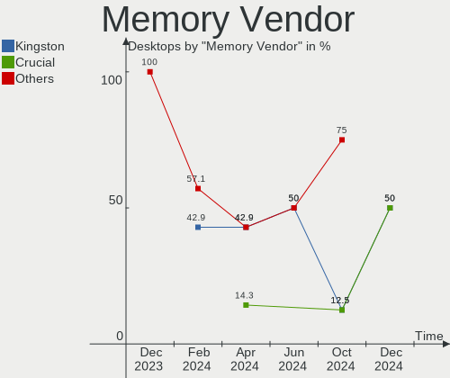

KDE neon - Hardware Trends (Desktops)
-------------------------------------

A project to identify most popular hardware characteristics and track their change
over time based on data collected by Linux users at https://Linux-Hardware.org.

Anyone can contribute to this report by the [hw-probe](https://github.com/linuxhw/hw-probe) tool:

    sudo -E hw-probe -all -upload

This report is for one last month. Overall report since the beginning of time: [TestCoverage](https://github.com/linuxhw/TestCoverage)

Period: Jan, 2023.

Contents
--------

* [ System ](#system)
  - [ OS                       ](#os)
  - [ OS Family                ](#os-family)
  - [ Kernel                   ](#kernel)
  - [ Kernel Family            ](#kernel-family)
  - [ Kernel Major Ver.        ](#kernel-major-ver)
  - [ Arch                     ](#arch)
  - [ DE                       ](#de)
  - [ Display Server           ](#display-server)
  - [ Display Manager          ](#display-manager)
  - [ OS Lang                  ](#os-lang)
  - [ Boot Mode                ](#boot-mode)
  - [ Filesystem               ](#filesystem)
  - [ Part. scheme             ](#part-scheme)
  - [ Dual Boot with Linux/BSD ](#dual-boot-with-linuxbsd)
  - [ Dual Boot (Win)          ](#dual-boot-win)

* [ Board ](#board)
  - [ Vendor                   ](#vendor)
  - [ Model                    ](#model)
  - [ Model Family             ](#model-family)
  - [ MFG Year                 ](#mfg-year)
  - [ Form Factor              ](#form-factor)
  - [ Secure Boot              ](#secure-boot)
  - [ Coreboot                 ](#coreboot)
  - [ RAM Size                 ](#ram-size)
  - [ RAM Used                 ](#ram-used)
  - [ Total Drives             ](#total-drives)
  - [ Has CD-ROM               ](#has-cd-rom)
  - [ Has Ethernet             ](#has-ethernet)
  - [ Has WiFi                 ](#has-wifi)
  - [ Has Bluetooth            ](#has-bluetooth)

* [ Location ](#location)
  - [ Country                  ](#country)
  - [ City                     ](#city)

* [ Drives ](#drives)
  - [ Drive Vendor             ](#drive-vendor)
  - [ Drive Model              ](#drive-model)
  - [ HDD Vendor               ](#hdd-vendor)
  - [ SSD Vendor               ](#ssd-vendor)
  - [ Drive Kind               ](#drive-kind)
  - [ Drive Connector          ](#drive-connector)
  - [ Drive Size               ](#drive-size)
  - [ Space Total              ](#space-total)
  - [ Space Used               ](#space-used)
  - [ Malfunc. Drives          ](#malfunc-drives)
  - [ Malfunc. Drive Vendor    ](#malfunc-drive-vendor)
  - [ Malfunc. HDD Vendor      ](#malfunc-hdd-vendor)
  - [ Malfunc. Drive Kind      ](#malfunc-drive-kind)
  - [ Failed Drives            ](#failed-drives)
  - [ Failed Drive Vendor      ](#failed-drive-vendor)
  - [ Drive Status             ](#drive-status)

* [ Storage controller ](#storage-controller)
  - [ Storage Vendor           ](#storage-vendor)
  - [ Storage Model            ](#storage-model)
  - [ Storage Kind             ](#storage-kind)

* [ Processor ](#processor)
  - [ CPU Vendor               ](#cpu-vendor)
  - [ CPU Model                ](#cpu-model)
  - [ CPU Model Family         ](#cpu-model-family)
  - [ CPU Cores                ](#cpu-cores)
  - [ CPU Sockets              ](#cpu-sockets)
  - [ CPU Threads              ](#cpu-threads)
  - [ CPU Op-Modes             ](#cpu-op-modes)
  - [ CPU Microcode            ](#cpu-microcode)
  - [ CPU Microarch            ](#cpu-microarch)

* [ Graphics ](#graphics)
  - [ GPU Vendor               ](#gpu-vendor)
  - [ GPU Model                ](#gpu-model)
  - [ GPU Combo                ](#gpu-combo)
  - [ GPU Driver               ](#gpu-driver)
  - [ GPU Memory               ](#gpu-memory)

* [ Monitor ](#monitor)
  - [ Monitor Vendor           ](#monitor-vendor)
  - [ Monitor Model            ](#monitor-model)
  - [ Monitor Resolution       ](#monitor-resolution)
  - [ Monitor Diagonal         ](#monitor-diagonal)
  - [ Monitor Width            ](#monitor-width)
  - [ Aspect Ratio             ](#aspect-ratio)
  - [ Monitor Area             ](#monitor-area)
  - [ Pixel Density            ](#pixel-density)
  - [ Multiple Monitors        ](#multiple-monitors)

* [ Network ](#network)
  - [ Net Controller Vendor    ](#net-controller-vendor)
  - [ Net Controller Model     ](#net-controller-model)
  - [ Wireless Vendor          ](#wireless-vendor)
  - [ Wireless Model           ](#wireless-model)
  - [ Ethernet Vendor          ](#ethernet-vendor)
  - [ Ethernet Model           ](#ethernet-model)
  - [ Net Controller Kind      ](#net-controller-kind)
  - [ Used Controller          ](#used-controller)
  - [ NICs                     ](#nics)
  - [ IPv6                     ](#ipv6)

* [ Bluetooth ](#bluetooth)
  - [ Bluetooth Vendor         ](#bluetooth-vendor)
  - [ Bluetooth Model          ](#bluetooth-model)

* [ Sound ](#sound)
  - [ Sound Vendor             ](#sound-vendor)
  - [ Sound Model              ](#sound-model)

* [ Memory ](#memory)
  - [ Memory Vendor            ](#memory-vendor)
  - [ Memory Model             ](#memory-model)
  - [ Memory Kind              ](#memory-kind)
  - [ Memory Form Factor       ](#memory-form-factor)
  - [ Memory Size              ](#memory-size)
  - [ Memory Speed             ](#memory-speed)

* [ Printers & scanners ](#printers--scanners)
  - [ Printer Vendor           ](#printer-vendor)
  - [ Printer Model            ](#printer-model)
  - [ Scanner Vendor           ](#scanner-vendor)
  - [ Scanner Model            ](#scanner-model)

* [ Camera ](#camera)
  - [ Camera Vendor            ](#camera-vendor)
  - [ Camera Model             ](#camera-model)

* [ Security ](#security)
  - [ Fingerprint Vendor       ](#fingerprint-vendor)
  - [ Fingerprint Model        ](#fingerprint-model)
  - [ Chipcard Vendor          ](#chipcard-vendor)
  - [ Chipcard Model           ](#chipcard-model)

* [ Unsupported ](#unsupported)
  - [ Unsupported Devices      ](#unsupported-devices)
  - [ Unsupported Device Types ](#unsupported-device-types)

System
------

OS
--

Installed operating systems

| Name           | Desktops | Percent |
|----------------|----------|---------|
| KDE neon 22.04 | 37       | 92.5%   |
| KDE neon 20.04 | 3        | 7.5%    |

OS Family
---------

OS without a version

| Name     | Desktops | Percent |
|----------|----------|---------|
| KDE neon | 40       | 100%    |

Kernel
------

Version of the Linux kernel

| Version                           | Desktops | Percent |
|-----------------------------------|----------|---------|
| 5.15.0-58-generic                 | 23       | 57.5%   |
| 5.15.0-57-generic                 | 6        | 15%     |
| 5.15.0-56-generic                 | 6        | 15%     |
| 6.1.5-x64v3-xanmod1               | 1        | 2.5%    |
| 5.4.0-54-generic                  | 1        | 2.5%    |
| 5.4.0-113-generic                 | 1        | 2.5%    |
| 5.18.14-ext73-98.14-intelstandard | 1        | 2.5%    |
| 5.14.0-1054-oem                   | 1        | 2.5%    |

Kernel Family
-------------

Linux kernel without a distro release

| Version | Desktops | Percent |
|---------|----------|---------|
| 5.15.0  | 35       | 87.5%   |
| 5.4.0   | 2        | 5%      |
| 6.1.5   | 1        | 2.5%    |
| 5.18.14 | 1        | 2.5%    |
| 5.14.0  | 1        | 2.5%    |

Kernel Major Ver.
-----------------

Linux kernel major version

| Version | Desktops | Percent |
|---------|----------|---------|
| 5.15    | 35       | 87.5%   |
| 5.4     | 2        | 5%      |
| 6.1     | 1        | 2.5%    |
| 5.18    | 1        | 2.5%    |
| 5.14    | 1        | 2.5%    |

Arch
----

OS architecture (x86_64, i586, etc.)

| Name   | Desktops | Percent |
|--------|----------|---------|
| x86_64 | 40       | 100%    |

DE
--

Desktop Environment

| Name | Desktops | Percent |
|------|----------|---------|
| KDE5 | 40       | 100%    |

Display Server
--------------

X11 or Wayland

| Name    | Desktops | Percent |
|---------|----------|---------|
| X11     | 38       | 95%     |
| Wayland | 2        | 5%      |

Display Manager
---------------

SDDM, LightDM, etc.

| Name    | Desktops | Percent |
|---------|----------|---------|
| Unknown | 31       | 77.5%   |
| SDDM    | 9        | 22.5%   |

OS Lang
-------

Language

| Lang  | Desktops | Percent |
|-------|----------|---------|
| en_US | 15       | 37.5%   |
| pl_PL | 4        | 10%     |
| C     | 4        | 10%     |
| it_IT | 3        | 7.5%    |
| es_ES | 3        | 7.5%    |
| en_IN | 2        | 5%      |
| sl_SI | 1        | 2.5%    |
| sk_SK | 1        | 2.5%    |
| pt_BR | 1        | 2.5%    |
| nl_NL | 1        | 2.5%    |
| lt_LT | 1        | 2.5%    |
| es_MX | 1        | 2.5%    |
| en_GB | 1        | 2.5%    |
| en_DK | 1        | 2.5%    |
| de_DE | 1        | 2.5%    |

Boot Mode
---------

EFI or BIOS

| Mode | Desktops | Percent |
|------|----------|---------|
| BIOS | 35       | 87.5%   |
| EFI  | 5        | 12.5%   |

Filesystem
----------

Type of filesystem

| Type    | Desktops | Percent |
|---------|----------|---------|
| Ext4    | 34       | 85%     |
| Overlay | 3        | 7.5%    |
| Btrfs   | 3        | 7.5%    |

Part. scheme
------------

Scheme of partitioning

| Type    | Desktops | Percent |
|---------|----------|---------|
| Unknown | 31       | 77.5%   |
| GPT     | 8        | 20%     |
| MBR     | 1        | 2.5%    |

Dual Boot with Linux/BSD
------------------------

Hosting more than one Linux/BSD

| Dual boot | Desktops | Percent |
|-----------|----------|---------|
| No        | 37       | 92.5%   |
| Yes       | 3        | 7.5%    |

Dual Boot (Win)
---------------

Hosting Linux and Windows

| Dual boot | Desktops | Percent |
|-----------|----------|---------|
| No        | 35       | 87.5%   |
| Yes       | 5        | 12.5%   |

Board
-----

Vendor
------

Motherboard manufacturer

| Name                | Desktops | Percent |
|---------------------|----------|---------|
| ASUSTek Computer    | 11       | 27.5%   |
| MSI                 | 9        | 22.5%   |
| Hewlett-Packard     | 7        | 17.5%   |
| Gigabyte Technology | 7        | 17.5%   |
| Lenovo              | 2        | 5%      |
| ASRock              | 2        | 5%      |
| Intel               | 1        | 2.5%    |
| Dell                | 1        | 2.5%    |

Model
-----

Motherboard model

| Name                               | Desktops | Percent |
|------------------------------------|----------|---------|
| MSI MS-7C37                        | 2        | 5%      |
| ASUS All Series                    | 2        | 5%      |
| MSI p7-1233w                       | 1        | 2.5%    |
| MSI MS-7D30                        | 1        | 2.5%    |
| MSI MS-7C84                        | 1        | 2.5%    |
| MSI MS-7C56                        | 1        | 2.5%    |
| MSI MS-7C02                        | 1        | 2.5%    |
| MSI MS-7B85                        | 1        | 2.5%    |
| MSI MS-7586                        | 1        | 2.5%    |
| Lenovo ThinkCentre M92p 32384B0    | 1        | 2.5%    |
| Lenovo Legion T5 26IOB6 90RT00UUMZ | 1        | 2.5%    |
| Intel DQ77KB AAG81483-500          | 1        | 2.5%    |
| HP Pavilion Desktop 595-p0xxx      | 1        | 2.5%    |
| HP EliteDesk 800 G2 DM 35W         | 1        | 2.5%    |
| HP Compaq Pro 6300 SFF             | 1        | 2.5%    |
| HP Compaq Elite 8300 CMT           | 1        | 2.5%    |
| HP 500-326na                       | 1        | 2.5%    |
| HP 18-1206in                       | 1        | 2.5%    |
| HP 100B All-in-One PC              | 1        | 2.5%    |
| Gigabyte X570S UD                  | 1        | 2.5%    |
| Gigabyte P85-D3                    | 1        | 2.5%    |
| Gigabyte B75M-D3H                  | 1        | 2.5%    |
| Gigabyte B550M DS3H                | 1        | 2.5%    |
| Gigabyte B460MDS3H                 | 1        | 2.5%    |
| Gigabyte ALDA+                     | 1        | 2.5%    |
| Gigabyte A520M DS3H                | 1        | 2.5%    |
| Dell OptiPlex 7010                 | 1        | 2.5%    |
| ASUS Z170 PRO GAMING               | 1        | 2.5%    |
| ASUS TUF Gaming X570-PLUS          | 1        | 2.5%    |
| ASUS ROG STRIX B550-I GAMING       | 1        | 2.5%    |
| ASUS ROG CROSSHAIR VIII HERO       | 1        | 2.5%    |
| ASUS PRIME Z690-A                  | 1        | 2.5%    |
| ASUS PRIME X470-PRO                | 1        | 2.5%    |
| ASUS PRIME H410M-E                 | 1        | 2.5%    |
| ASUS E410                          | 1        | 2.5%    |
| ASUS B150M-A/M.2                   | 1        | 2.5%    |
| ASRock P67 Pro3                    | 1        | 2.5%    |
| ASRock 960GM/U3S3 FX               | 1        | 2.5%    |

Model Family
------------

Motherboard model prefix

| Name               | Desktops | Percent |
|--------------------|----------|---------|
| ASUS PRIME         | 3        | 7.5%    |
| MSI MS-7C37        | 2        | 5%      |
| HP Compaq          | 2        | 5%      |
| ASUS ROG           | 2        | 5%      |
| ASUS All           | 2        | 5%      |
| MSI p7-1233w       | 1        | 2.5%    |
| MSI MS-7D30        | 1        | 2.5%    |
| MSI MS-7C84        | 1        | 2.5%    |
| MSI MS-7C56        | 1        | 2.5%    |
| MSI MS-7C02        | 1        | 2.5%    |
| MSI MS-7B85        | 1        | 2.5%    |
| MSI MS-7586        | 1        | 2.5%    |
| Lenovo ThinkCentre | 1        | 2.5%    |
| Lenovo Legion      | 1        | 2.5%    |
| Intel DQ77KB       | 1        | 2.5%    |
| HP Pavilion        | 1        | 2.5%    |
| HP EliteDesk       | 1        | 2.5%    |
| HP 500-326na       | 1        | 2.5%    |
| HP 18-1206in       | 1        | 2.5%    |
| HP 100B            | 1        | 2.5%    |
| Gigabyte X570S     | 1        | 2.5%    |
| Gigabyte P85-D3    | 1        | 2.5%    |
| Gigabyte B75M-D3H  | 1        | 2.5%    |
| Gigabyte B550M     | 1        | 2.5%    |
| Gigabyte B460MDS3H | 1        | 2.5%    |
| Gigabyte ALDA+     | 1        | 2.5%    |
| Gigabyte A520M     | 1        | 2.5%    |
| Dell OptiPlex      | 1        | 2.5%    |
| ASUS Z170          | 1        | 2.5%    |
| ASUS TUF           | 1        | 2.5%    |
| ASUS E410          | 1        | 2.5%    |
| ASUS B150M-A       | 1        | 2.5%    |
| ASRock P67         | 1        | 2.5%    |
| ASRock 960GM       | 1        | 2.5%    |

MFG Year
--------

Motherboard manufacture year

| Year | Desktops | Percent |
|------|----------|---------|
| 2020 | 7        | 17.5%   |
| 2015 | 6        | 15%     |
| 2012 | 5        | 12.5%   |
| 2021 | 4        | 10%     |
| 2019 | 4        | 10%     |
| 2018 | 4        | 10%     |
| 2013 | 3        | 7.5%    |
| 2011 | 2        | 5%      |
| 2022 | 1        | 2.5%    |
| 2017 | 1        | 2.5%    |
| 2016 | 1        | 2.5%    |
| 2014 | 1        | 2.5%    |
| 2009 | 1        | 2.5%    |

Form Factor
-----------

Physical design of the computer

| Name    | Desktops | Percent |
|---------|----------|---------|
| Desktop | 40       | 100%    |

Secure Boot
-----------

Enabled or disabled

| State    | Desktops | Percent |
|----------|----------|---------|
| Disabled | 39       | 97.5%   |
| Enabled  | 1        | 2.5%    |

Coreboot
--------

Have coreboot on board

| Used | Desktops | Percent |
|------|----------|---------|
| No   | 40       | 100%    |

RAM Size
--------

Total RAM memory

| Size in GB  | Desktops | Percent |
|-------------|----------|---------|
| 32.01-64.0  | 10       | 25%     |
| 16.01-24.0  | 10       | 25%     |
| 4.01-8.0    | 8        | 20%     |
| 8.01-16.0   | 7        | 17.5%   |
| 64.01-256.0 | 3        | 7.5%    |
| 24.01-32.0  | 1        | 2.5%    |
| 1.01-2.0    | 1        | 2.5%    |

RAM Used
--------

Used RAM memory

| Used GB  | Desktops | Percent |
|----------|----------|---------|
| 2.01-3.0 | 17       | 42.5%   |
| 3.01-4.0 | 8        | 20%     |
| 1.01-2.0 | 8        | 20%     |
| 4.01-8.0 | 6        | 15%     |
| 0.51-1.0 | 1        | 2.5%    |

Total Drives
------------

Number of drives on board

| Drives | Desktops | Percent |
|--------|----------|---------|
| 2      | 12       | 30%     |
| 1      | 10       | 25%     |
| 4      | 7        | 17.5%   |
| 3      | 7        | 17.5%   |
| 6      | 3        | 7.5%    |
| 5      | 1        | 2.5%    |

Has CD-ROM
----------

Has CD-ROM on board

| Presented | Desktops | Percent |
|-----------|----------|---------|
| No        | 25       | 62.5%   |
| Yes       | 15       | 37.5%   |

Has Ethernet
------------

Has Ethernet on board

| Presented | Desktops | Percent |
|-----------|----------|---------|
| Yes       | 40       | 100%    |

Has WiFi
--------

Has WiFi module

| Presented | Desktops | Percent |
|-----------|----------|---------|
| Yes       | 20       | 50%     |
| No        | 20       | 50%     |

Has Bluetooth
-------------

Has Bluetooth module

| Presented | Desktops | Percent |
|-----------|----------|---------|
| No        | 23       | 57.5%   |
| Yes       | 17       | 42.5%   |

Location
--------

Country
-------

Geographic location (country)

| Country     | Desktops | Percent |
|-------------|----------|---------|
| USA         | 8        | 20%     |
| Spain       | 4        | 10%     |
| India       | 4        | 10%     |
| UK          | 3        | 7.5%    |
| Italy       | 3        | 7.5%    |
| Canada      | 3        | 7.5%    |
| Poland      | 2        | 5%      |
| Netherlands | 2        | 5%      |
| Brazil      | 2        | 5%      |
| Switzerland | 1        | 2.5%    |
| Slovenia    | 1        | 2.5%    |
| Russia      | 1        | 2.5%    |
| Norway      | 1        | 2.5%    |
| Mexico      | 1        | 2.5%    |
| Germany     | 1        | 2.5%    |
| France      | 1        | 2.5%    |
| Denmark     | 1        | 2.5%    |
| Colombia    | 1        | 2.5%    |

City
----

Geographic location (city)

| City              | Desktops | Percent |
|-------------------|----------|---------|
| Montreal          | 2        | 5%      |
| Campinas          | 2        | 5%      |
| Zheleznogorsk     | 1        | 2.5%    |
| Wuppertal         | 1        | 2.5%    |
| Wroclaw           | 1        | 2.5%    |
| Winter Park       | 1        | 2.5%    |
| White House       | 1        | 2.5%    |
| Wetzikon          | 1        | 2.5%    |
| Vicenza           | 1        | 2.5%    |
| Valencia          | 1        | 2.5%    |
| Valby             | 1        | 2.5%    |
| Torun             | 1        | 2.5%    |
| Toms River        | 1        | 2.5%    |
| The Bronx         | 1        | 2.5%    |
| Selvazzano Dentro | 1        | 2.5%    |
| Saint-Nazaire     | 1        | 2.5%    |
| Ramanathapuram    | 1        | 2.5%    |
| Pickering         | 1        | 2.5%    |
| Phoenix           | 1        | 2.5%    |
| Naugatuck         | 1        | 2.5%    |
| Mumbai            | 1        | 2.5%    |
| Medellín         | 1        | 2.5%    |
| Málaga           | 1        | 2.5%    |
| Madrid            | 1        | 2.5%    |
| Madison           | 1        | 2.5%    |
| Lugo              | 1        | 2.5%    |
| London            | 1        | 2.5%    |
| Levico Terme      | 1        | 2.5%    |
| Kingston          | 1        | 2.5%    |
| Kamnik            | 1        | 2.5%    |
| Jackson           | 1        | 2.5%    |
| Indore            | 1        | 2.5%    |
| Heerhugowaard     | 1        | 2.5%    |
| Guadalajara       | 1        | 2.5%    |
| Grijpskerk        | 1        | 2.5%    |
| Bristol           | 1        | 2.5%    |
| Bengaluru         | 1        | 2.5%    |
| Akrehamn          | 1        | 2.5%    |

Drives
------

Drive Vendor
------------

Hard drive vendors

| Vendor                      | Desktops | Drives | Percent |
|-----------------------------|----------|--------|---------|
| Seagate                     | 18       | 25     | 21.18%  |
| WDC                         | 14       | 17     | 16.47%  |
| Samsung Electronics         | 7        | 10     | 8.24%   |
| Kingston                    | 6        | 7      | 7.06%   |
| SanDisk                     | 5        | 6      | 5.88%   |
| Crucial                     | 5        | 6      | 5.88%   |
| Toshiba                     | 4        | 5      | 4.71%   |
| Phison Electronics          | 3        | 4      | 3.53%   |
| Intel                       | 3        | 3      | 3.53%   |
| Team                        | 2        | 2      | 2.35%   |
| Silicon Motion              | 2        | 3      | 2.35%   |
| Realtek Semiconductor       | 2        | 2      | 2.35%   |
| Kingston Technology Company | 2        | 2      | 2.35%   |
| Seagate Technology          | 1        | 1      | 1.18%   |
| POLION                      | 1        | 1      | 1.18%   |
| OCZ                         | 1        | 1      | 1.18%   |
| Micron/Crucial Technology   | 1        | 1      | 1.18%   |
| Micron Technology           | 1        | 1      | 1.18%   |
| JMicron Technology          | 1        | 1      | 1.18%   |
| Hitachi                     | 1        | 1      | 1.18%   |
| HGST                        | 1        | 1      | 1.18%   |
| Hewlett-Packard             | 1        | 1      | 1.18%   |
| GOODRAM                     | 1        | 1      | 1.18%   |
| ADATA Technology            | 1        | 1      | 1.18%   |
| A-DATA Technology           | 1        | 1      | 1.18%   |

Drive Model
-----------

Hard drive models

| Model                                                 | Desktops | Percent |
|-------------------------------------------------------|----------|---------|
| Phison E12 NVMe Controller 1TB                        | 3        | 3.13%   |
| Kingston SA400S37240G 240GB SSD                       | 3        | 3.13%   |
| Crucial CT480BX500SSD1 480GB                          | 3        | 3.13%   |
| WDC WD5000AAKX-60U6AA0 500GB                          | 2        | 2.08%   |
| WDC WD10EZEX-08WN4A0 1TB                              | 2        | 2.08%   |
| Silicon Motion SM2263EN/SM2263XT SSD Controller 512GB | 2        | 2.08%   |
| Seagate ST3500630AS 500GB                             | 2        | 2.08%   |
| Seagate ST2000DM008-2FR102 2TB                        | 2        | 2.08%   |
| SanDisk SDSSDA240G 240GB                              | 2        | 2.08%   |
| Samsung NVMe SSD Controller SM981/PM981/PM983 500GB   | 2        | 2.08%   |
| Realtek RTS5763DL NVMe SSD Controller 4TB             | 2        | 2.08%   |
| Kingston Company A2000 NVMe SSD 1TB                   | 2        | 2.08%   |
| WDC WDBNCE0010PNC 1TB SSD                             | 1        | 1.04%   |
| WDC WD80EFBX-68AZZN0 8TB                              | 1        | 1.04%   |
| WDC WD60EFRX-68MYMN1 6TB                              | 1        | 1.04%   |
| WDC WD5000AZLX-00K4KA0 500GB                          | 1        | 1.04%   |
| WDC WD5000AVCS-632DY1 500GB                           | 1        | 1.04%   |
| WDC WD5000AAKX-22ERMA0 500GB                          | 1        | 1.04%   |
| WDC WD30EZRZ-00Z5HB0 3TB                              | 1        | 1.04%   |
| WDC WD20EZRZ-00Z5HB0 2TB                              | 1        | 1.04%   |
| WDC WD20EZAZ-00L9GB0 2TB                              | 1        | 1.04%   |
| WDC WD2003FYYS-05T9B0 2TB                             | 1        | 1.04%   |
| WDC WD10EZEX-75WN4A0 1TB                              | 1        | 1.04%   |
| WDC WD1002FBYS-05A6B0 1TB                             | 1        | 1.04%   |
| Toshiba TR150 240GB SSD                               | 1        | 1.04%   |
| Toshiba HDWT840 4TB                                   | 1        | 1.04%   |
| Toshiba DT01ACA100 1TB                                | 1        | 1.04%   |
| Toshiba DT01ACA050 500GB                              | 1        | 1.04%   |
| Toshiba BG3 NVMe SSD Controller 256GB                 | 1        | 1.04%   |
| Team T253X2256G 256GB SSD                             | 1        | 1.04%   |
| Team NVMe SSD Drive 512GB                             | 1        | 1.04%   |
| Seagate FireCuda 520 SSD 2TB                          | 1        | 1.04%   |
| Seagate ST6000VN0033-2EE110 6TB                       | 1        | 1.04%   |
| Seagate ST4000VN008-2DR166 4TB                        | 1        | 1.04%   |
| Seagate ST4000DM004-2U9104 4TB                        | 1        | 1.04%   |
| Seagate ST4000DM004-2CV104 4TB                        | 1        | 1.04%   |
| Seagate ST380815AS 80GB                               | 1        | 1.04%   |
| Seagate ST3500418AS 500GB                             | 1        | 1.04%   |
| Seagate ST3250310AS 250GB                             | 1        | 1.04%   |
| Seagate ST3160812AS 160GB                             | 1        | 1.04%   |

HDD Vendor
----------

Hard disk drive vendors

| Vendor          | Desktops | Drives | Percent |
|-----------------|----------|--------|---------|
| Seagate         | 18       | 25     | 48.65%  |
| WDC             | 13       | 16     | 35.14%  |
| Toshiba         | 3        | 3      | 8.11%   |
| Hitachi         | 1        | 1      | 2.7%    |
| HGST            | 1        | 1      | 2.7%    |
| Hewlett-Packard | 1        | 1      | 2.7%    |

SSD Vendor
----------

Solid state drive vendors

| Vendor              | Desktops | Drives | Percent |
|---------------------|----------|--------|---------|
| Kingston            | 5        | 6      | 19.23%  |
| Crucial             | 5        | 6      | 19.23%  |
| Samsung Electronics | 4        | 5      | 15.38%  |
| SanDisk             | 3        | 3      | 11.54%  |
| WDC                 | 1        | 1      | 3.85%   |
| Toshiba             | 1        | 1      | 3.85%   |
| Team                | 1        | 1      | 3.85%   |
| OCZ                 | 1        | 1      | 3.85%   |
| Micron Technology   | 1        | 1      | 3.85%   |
| JMicron Technology  | 1        | 1      | 3.85%   |
| Intel               | 1        | 1      | 3.85%   |
| GOODRAM             | 1        | 1      | 3.85%   |
| A-DATA Technology   | 1        | 1      | 3.85%   |

Drive Kind
----------

HDD or SSD

| Kind    | Desktops | Drives | Percent |
|---------|----------|--------|---------|
| HDD     | 29       | 47     | 43.94%  |
| SSD     | 19       | 29     | 28.79%  |
| NVMe    | 17       | 27     | 25.76%  |
| Unknown | 1        | 1      | 1.52%   |

Drive Connector
---------------

SATA, SAS, NVMe, etc.

| Type | Desktops | Drives | Percent |
|------|----------|--------|---------|
| SATA | 35       | 73     | 62.5%   |
| NVMe | 17       | 27     | 30.36%  |
| SAS  | 4        | 4      | 7.14%   |

Drive Size
----------

Size of hard drive

| Size in TB | Desktops | Drives | Percent |
|------------|----------|--------|---------|
| 0.01-0.5   | 24       | 38     | 42.86%  |
| 0.51-1.0   | 15       | 18     | 26.79%  |
| 1.01-2.0   | 6        | 6      | 10.71%  |
| 3.01-4.0   | 5        | 5      | 8.93%   |
| 2.01-3.0   | 3        | 4      | 5.36%   |
| 4.01-10.0  | 3        | 5      | 5.36%   |

Space Total
-----------

Amount of disk space available on the file system

| Size in GB     | Desktops | Percent |
|----------------|----------|---------|
| More than 3000 | 9        | 22.5%   |
| 251-500        | 6        | 15%     |
| 501-1000       | 6        | 15%     |
| 51-100         | 6        | 15%     |
| 101-250        | 4        | 10%     |
| 1001-2000      | 4        | 10%     |
| 21-50          | 2        | 5%      |
| 1-20           | 2        | 5%      |
| 2001-3000      | 1        | 2.5%    |

Space Used
----------

Amount of used disk space

| Used GB        | Desktops | Percent |
|----------------|----------|---------|
| 1-20           | 17       | 42.5%   |
| 251-500        | 4        | 10%     |
| 21-50          | 4        | 10%     |
| 2001-3000      | 4        | 10%     |
| 101-250        | 4        | 10%     |
| 51-100         | 4        | 10%     |
| More than 3000 | 2        | 5%      |
| 1001-2000      | 1        | 2.5%    |

Malfunc. Drives
---------------

Drive models with a malfunction

| Model                    | Desktops | Drives | Percent |
|--------------------------|----------|--------|---------|
| Seagate ST31000528AS 1TB | 1        | 1      | 50%     |
| SanDisk SSD PLUS 120GB   | 1        | 1      | 50%     |

Malfunc. Drive Vendor
---------------------

Vendors of faulty drives

| Vendor  | Desktops | Drives | Percent |
|---------|----------|--------|---------|
| Seagate | 1        | 1      | 50%     |
| SanDisk | 1        | 1      | 50%     |

Malfunc. HDD Vendor
-------------------

Vendors of faulty HDD drives

| Vendor  | Desktops | Drives | Percent |
|---------|----------|--------|---------|
| Seagate | 1        | 1      | 100%    |

Malfunc. Drive Kind
-------------------

Kinds of faulty drives

| Kind | Desktops | Drives | Percent |
|------|----------|--------|---------|
| SSD  | 1        | 1      | 50%     |
| HDD  | 1        | 1      | 50%     |

Failed Drives
-------------

Failed drive models

Zero info for selected period =(

Failed Drive Vendor
-------------------

Failed drive vendors

Zero info for selected period =(

Drive Status
------------

Number of failed and malfunc. drives

| Status   | Desktops | Drives | Percent |
|----------|----------|--------|---------|
| Detected | 36       | 90     | 85.71%  |
| Works    | 5        | 12     | 11.9%   |
| Malfunc  | 1        | 2      | 2.38%   |

Storage controller
------------------

Storage Vendor
--------------

Storage controller vendors

| Vendor                       | Desktops | Percent |
|------------------------------|----------|---------|
| Intel                        | 23       | 33.82%  |
| AMD                          | 19       | 27.94%  |
| Samsung Electronics          | 4        | 5.88%   |
| Phison Electronics           | 3        | 4.41%   |
| Kingston Technology Company  | 3        | 4.41%   |
| ASMedia Technology           | 3        | 4.41%   |
| Silicon Motion               | 2        | 2.94%   |
| SanDisk                      | 2        | 2.94%   |
| Realtek Semiconductor        | 2        | 2.94%   |
| Toshiba America Info Systems | 1        | 1.47%   |
| Seagate Technology           | 1        | 1.47%   |
| Micron/Crucial Technology    | 1        | 1.47%   |
| JMicron Technology           | 1        | 1.47%   |
| INNOGRIT                     | 1        | 1.47%   |
| ATTO Technology              | 1        | 1.47%   |
| ADATA Technology             | 1        | 1.47%   |

Storage Model
-------------

Storage controller models

| Model                                                                                   | Desktops | Percent |
|-----------------------------------------------------------------------------------------|----------|---------|
| AMD FCH SATA Controller [AHCI mode]                                                     | 11       | 14.47%  |
| Intel 7 Series/C210 Series Chipset Family 6-port SATA Controller [AHCI mode]            | 5        | 6.58%   |
| Phison E12 NVMe Controller                                                              | 3        | 3.95%   |
| Intel Q170/Q150/B150/H170/H110/Z170/CM236 Chipset SATA Controller [AHCI Mode]           | 3        | 3.95%   |
| Intel 8 Series/C220 Series Chipset Family 6-port SATA Controller 1 [AHCI mode]          | 3        | 3.95%   |
| ASMedia ASM1062 Serial ATA Controller                                                   | 3        | 3.95%   |
| AMD 500 Series Chipset SATA Controller                                                  | 3        | 3.95%   |
| AMD 400 Series Chipset SATA Controller                                                  | 3        | 3.95%   |
| Silicon Motion SM2263EN/SM2263XT SSD Controller                                         | 2        | 2.63%   |
| Samsung NVMe SSD Controller SM981/PM981/PM983                                           | 2        | 2.63%   |
| Samsung NVMe SSD Controller SM951/PM951                                                 | 2        | 2.63%   |
| Realtek RTS5763DL NVMe SSD Controller                                                   | 2        | 2.63%   |
| Kingston Company A2000 NVMe SSD                                                         | 2        | 2.63%   |
| Intel Alder Lake-S PCH SATA Controller [AHCI Mode]                                      | 2        | 2.63%   |
| Intel 400 Series Chipset Family SATA AHCI Controller                                    | 2        | 2.63%   |
| AMD SB7x0/SB8x0/SB9x0 SATA Controller [AHCI mode]                                       | 2        | 2.63%   |
| Toshiba America Info Systems BG3 NVMe SSD Controller                                    | 1        | 1.32%   |
| Seagate FireCuda 520 SSD                                                                | 1        | 1.32%   |
| SanDisk WD Blue SN570 NVMe SSD                                                          | 1        | 1.32%   |
| SanDisk WD Blue SN550 NVMe SSD                                                          | 1        | 1.32%   |
| SanDisk WD Black SN750 / PC SN730 NVMe SSD                                              | 1        | 1.32%   |
| Micron/Crucial Non-Volatile memory controller                                           | 1        | 1.32%   |
| Kingston Company Company Non-Volatile memory controller                                 | 1        | 1.32%   |
| JMicron JMB363 SATA/IDE Controller                                                      | 1        | 1.32%   |
| Intel Volume Management Device NVMe RAID Controller                                     | 1        | 1.32%   |
| Intel SSD 660P Series                                                                   | 1        | 1.32%   |
| Intel Non-Volatile memory controller                                                    | 1        | 1.32%   |
| Intel Atom/Celeron/Pentium Processor x5-E8000/J3xxx/N3xxx Series SATA Controller        | 1        | 1.32%   |
| Intel 9 Series Chipset Family SATA Controller [AHCI Mode]                               | 1        | 1.32%   |
| Intel 7 Series/C210 Series Chipset Family 4-port SATA Controller [IDE mode]             | 1        | 1.32%   |
| Intel 7 Series/C210 Series Chipset Family 2-port SATA Controller [IDE mode]             | 1        | 1.32%   |
| Intel 6 Series/C200 Series Chipset Family Desktop SATA Controller (IDE mode, ports 4-5) | 1        | 1.32%   |
| Intel 6 Series/C200 Series Chipset Family Desktop SATA Controller (IDE mode, ports 0-3) | 1        | 1.32%   |
| Intel 500 Series Chipset Family SATA AHCI Controller                                    | 1        | 1.32%   |
| Intel 5 Series/3400 Series Chipset 4 port SATA IDE Controller                           | 1        | 1.32%   |
| Intel 5 Series/3400 Series Chipset 2 port SATA IDE Controller                           | 1        | 1.32%   |
| INNOGRIT Non-Volatile memory controller                                                 | 1        | 1.32%   |
| ATTO Ultra320 SCSI Host Adapter                                                         | 1        | 1.32%   |
| AMD SB7x0/SB8x0/SB9x0 IDE Controller                                                    | 1        | 1.32%   |
| AMD FCH RAID Controller                                                                 | 1        | 1.32%   |

Storage Kind
------------

Kind of storage controller (IDE, SATA, NVMe, SAS, ...)

| Kind | Desktops | Percent |
|------|----------|---------|
| SATA | 36       | 60%     |
| NVMe | 17       | 28.33%  |
| IDE  | 4        | 6.67%   |
| RAID | 2        | 3.33%   |
| SCSI | 1        | 1.67%   |

Processor
---------

CPU Vendor
----------

Processor vendors

| Vendor | Desktops | Percent |
|--------|----------|---------|
| Intel  | 21       | 52.5%   |
| AMD    | 19       | 47.5%   |

CPU Model
---------

Processor models

| Model                                       | Desktops | Percent |
|---------------------------------------------|----------|---------|
| AMD Ryzen 7 3700X 8-Core Processor          | 3        | 7.5%    |
| Intel Core i7-4790K CPU @ 4.00GHz           | 2        | 5%      |
| Intel Core i7-3770 CPU @ 3.40GHz            | 2        | 5%      |
| AMD Ryzen 5 5600X 6-Core Processor          | 2        | 5%      |
| Intel Core i7-6700 CPU @ 3.40GHz            | 1        | 2.5%    |
| Intel Core i7-4770 CPU @ 3.40GHz            | 1        | 2.5%    |
| Intel Core i7-3770T CPU @ 2.50GHz           | 1        | 2.5%    |
| Intel Core i5-6400 CPU @ 2.70GHz            | 1        | 2.5%    |
| Intel Core i5-3570 CPU @ 3.40GHz            | 1        | 2.5%    |
| Intel Core i5-3470T CPU @ 2.90GHz           | 1        | 2.5%    |
| Intel Core i5-3470 CPU @ 3.20GHz            | 1        | 2.5%    |
| Intel Core i5-2500K CPU @ 3.30GHz           | 1        | 2.5%    |
| Intel Core i5-10400F CPU @ 2.90GHz          | 1        | 2.5%    |
| Intel Core i5 CPU 750 @ 2.67GHz             | 1        | 2.5%    |
| Intel Core i3-6100T CPU @ 3.20GHz           | 1        | 2.5%    |
| Intel Core i3-4160 CPU @ 3.60GHz            | 1        | 2.5%    |
| Intel Core i3-10105F CPU @ 3.70GHz          | 1        | 2.5%    |
| Intel Celeron CPU N3150 @ 1.60GHz           | 1        | 2.5%    |
| Intel 13th Gen Core i7-13700KF              | 1        | 2.5%    |
| Intel 12th Gen Core i7-12700KF              | 1        | 2.5%    |
| Intel 11th Gen Core i7-11700F @ 2.50GHz     | 1        | 2.5%    |
| AMD Ryzen 9 5950X 16-Core Processor         | 1        | 2.5%    |
| AMD Ryzen 9 3950X 16-Core Processor         | 1        | 2.5%    |
| AMD Ryzen 9 3900X 12-Core Processor         | 1        | 2.5%    |
| AMD Ryzen 7 5700X 8-Core Processor          | 1        | 2.5%    |
| AMD Ryzen 7 3800X 8-Core Processor          | 1        | 2.5%    |
| AMD Ryzen 7 2700 Eight-Core Processor       | 1        | 2.5%    |
| AMD Ryzen 5 5600 6-Core Processor           | 1        | 2.5%    |
| AMD Ryzen 5 3600 6-Core Processor           | 1        | 2.5%    |
| AMD Ryzen 5 2400G with Radeon Vega Graphics | 1        | 2.5%    |
| AMD Phenom II X6 1055T Processor            | 1        | 2.5%    |
| AMD E1-1500 APU with Radeon HD Graphics     | 1        | 2.5%    |
| AMD E-350 Processor                         | 1        | 2.5%    |
| AMD A8-6500 APU with Radeon HD Graphics     | 1        | 2.5%    |
| AMD A8-5500 APU with Radeon HD Graphics     | 1        | 2.5%    |

CPU Model Family
----------------

Processor model prefix

| Model            | Desktops | Percent |
|------------------|----------|---------|
| Intel Core i7    | 7        | 17.5%   |
| Intel Core i5    | 7        | 17.5%   |
| AMD Ryzen 7      | 6        | 15%     |
| AMD Ryzen 5      | 5        | 12.5%   |
| Other            | 3        | 7.5%    |
| Intel Core i3    | 3        | 7.5%    |
| AMD Ryzen 9      | 3        | 7.5%    |
| AMD A8           | 2        | 5%      |
| Intel Celeron    | 1        | 2.5%    |
| AMD Phenom II X6 | 1        | 2.5%    |
| AMD E1           | 1        | 2.5%    |
| AMD E            | 1        | 2.5%    |

CPU Cores
---------

Number of processor cores

| Number | Desktops | Percent |
|--------|----------|---------|
| 4      | 15       | 37.5%   |
| 8      | 7        | 17.5%   |
| 2      | 7        | 17.5%   |
| 6      | 6        | 15%     |
| 16     | 3        | 7.5%    |
| 12     | 2        | 5%      |

CPU Sockets
-----------

Number of sockets

| Number | Desktops | Percent |
|--------|----------|---------|
| 1      | 40       | 100%    |

CPU Threads
-----------

Threads per core (Hyper-Threading)

| Number | Desktops | Percent |
|--------|----------|---------|
| 2      | 30       | 75%     |
| 1      | 10       | 25%     |

CPU Op-Modes
------------

CPU Operation Modes (32-bit, 64-bit)

| Op mode        | Desktops | Percent |
|----------------|----------|---------|
| 32-bit, 64-bit | 40       | 100%    |

CPU Microcode
-------------

Microcode number

| Number     | Desktops | Percent |
|------------|----------|---------|
| Unknown    | 31       | 77.5%   |
| 0x306c3    | 2        | 5%      |
| 0x08701021 | 2        | 5%      |
| 0xa0653    | 1        | 2.5%    |
| 0x506e3    | 1        | 2.5%    |
| 0x406c3    | 1        | 2.5%    |
| 0x206a7    | 1        | 2.5%    |
| 0x0800820d | 1        | 2.5%    |

CPU Microarch
-------------

Microarchitecture

| Name        | Desktops | Percent |
|-------------|----------|---------|
| Zen 2       | 7        | 17.5%   |
| IvyBridge   | 6        | 15%     |
| Zen 3       | 5        | 12.5%   |
| Haswell     | 4        | 10%     |
| Skylake     | 3        | 7.5%    |
| Unknown     | 3        | 7.5%    |
| Piledriver  | 2        | 5%      |
| CometLake   | 2        | 5%      |
| Bobcat      | 2        | 5%      |
| Zen+        | 1        | 2.5%    |
| Zen         | 1        | 2.5%    |
| Silvermont  | 1        | 2.5%    |
| SandyBridge | 1        | 2.5%    |
| Nehalem     | 1        | 2.5%    |
| K10         | 1        | 2.5%    |

Graphics
--------

GPU Vendor
----------

Vendors of graphics cards

| Vendor | Desktops | Percent |
|--------|----------|---------|
| Nvidia | 20       | 48.78%  |
| AMD    | 14       | 34.15%  |
| Intel  | 7        | 17.07%  |

GPU Model
---------

Graphics card models

| Model                                                                                    | Desktops | Percent |
|------------------------------------------------------------------------------------------|----------|---------|
| Nvidia GP107 [GeForce GTX 1050 Ti]                                                       | 2        | 4.88%   |
| Nvidia GA106 [GeForce RTX 3060 Lite Hash Rate]                                           | 2        | 4.88%   |
| Nvidia GA106 [Geforce RTX 3050]                                                          | 2        | 4.88%   |
| Intel IvyBridge GT2 [HD Graphics 4000]                                                   | 2        | 4.88%   |
| Nvidia TU116 [GeForce GTX 1660 Ti]                                                       | 1        | 2.44%   |
| Nvidia GT218 [GeForce G210]                                                              | 1        | 2.44%   |
| Nvidia GP106GL [Quadro P2000]                                                            | 1        | 2.44%   |
| Nvidia GP106 [GeForce GTX 1060 6GB]                                                      | 1        | 2.44%   |
| Nvidia GP104 [GeForce GTX 1080]                                                          | 1        | 2.44%   |
| Nvidia GM206GL [Quadro M2000]                                                            | 1        | 2.44%   |
| Nvidia GM206 [GeForce GTX 950]                                                           | 1        | 2.44%   |
| Nvidia GM204 [GeForce GTX 980]                                                           | 1        | 2.44%   |
| Nvidia GM200 [GeForce GTX 980 Ti]                                                        | 1        | 2.44%   |
| Nvidia GK208B [GeForce GT 730]                                                           | 1        | 2.44%   |
| Nvidia GK208B [GeForce GT 710]                                                           | 1        | 2.44%   |
| Nvidia GA104 [GeForce RTX 3070]                                                          | 1        | 2.44%   |
| Nvidia GA104 [GeForce RTX 3060 Ti Lite Hash Rate]                                        | 1        | 2.44%   |
| Nvidia GA102 [GeForce RTX 3080 Lite Hash Rate]                                           | 1        | 2.44%   |
| Intel Xeon E3-1200 v3/4th Gen Core Processor Integrated Graphics Controller              | 1        | 2.44%   |
| Intel Xeon E3-1200 v2/3rd Gen Core processor Graphics Controller                         | 1        | 2.44%   |
| Intel HD Graphics 530                                                                    | 1        | 2.44%   |
| Intel Atom/Celeron/Pentium Processor x5-E8000/J3xxx/N3xxx Integrated Graphics Controller | 1        | 2.44%   |
| Intel 4th Generation Core Processor Family Integrated Graphics Controller                | 1        | 2.44%   |
| AMD Wrestler [Radeon HD 7310]                                                            | 1        | 2.44%   |
| AMD Wrestler [Radeon HD 6310]                                                            | 1        | 2.44%   |
| AMD Trinity [Radeon HD 7560D]                                                            | 1        | 2.44%   |
| AMD RS780L [Radeon 3000]                                                                 | 1        | 2.44%   |
| AMD Raven Ridge [Radeon Vega Series / Radeon Vega Mobile Series]                         | 1        | 2.44%   |
| AMD Oland [Radeon HD 8570 / R5 430 OEM / R7 240/340 / Radeon 520 OEM]                    | 1        | 2.44%   |
| AMD Navi 31 [Radeon RX 7900 XT/7900 XTX]                                                 | 1        | 2.44%   |
| AMD Navi 23 [Radeon RX 6600/6600 XT/6600M]                                               | 1        | 2.44%   |
| AMD Navi 22 [Radeon RX 6700/6700 XT/6750 XT / 6800M]                                     | 1        | 2.44%   |
| AMD Hawaii PRO [Radeon R9 290/390]                                                       | 1        | 2.44%   |
| AMD Ellesmere [Radeon RX 470/480/570/570X/580/580X/590]                                  | 1        | 2.44%   |
| AMD Cypress PRO [Radeon HD 5850]                                                         | 1        | 2.44%   |
| AMD Cape Verde XT [Radeon HD 7770/8760 / R7 250X]                                        | 1        | 2.44%   |
| AMD Barts XT [Radeon HD 6870]                                                            | 1        | 2.44%   |

GPU Combo
---------

Combinations of graphics cards

| Name        | Desktops | Percent |
|-------------|----------|---------|
| 1 x Nvidia  | 20       | 50%     |
| 1 x AMD     | 13       | 32.5%   |
| 1 x Intel   | 6        | 15%     |
| Intel + AMD | 1        | 2.5%    |

GPU Driver
----------

Free vs proprietary

| Driver      | Desktops | Percent |
|-------------|----------|---------|
| Free        | 30       | 75%     |
| Proprietary | 8        | 20%     |
| Unknown     | 2        | 5%      |

GPU Memory
----------

Total video memory

| Size in GB | Desktops | Percent |
|------------|----------|---------|
| Unknown    | 29       | 72.5%   |
| 5.01-6.0   | 3        | 7.5%    |
| 7.01-8.0   | 2        | 5%      |
| 3.01-4.0   | 2        | 5%      |
| 1.01-2.0   | 2        | 5%      |
| 0.51-1.0   | 2        | 5%      |

Monitor
-------

Monitor Vendor
--------------

Monitor vendors

| Vendor               | Desktops | Percent |
|----------------------|----------|---------|
| Goldstar             | 8        | 17.39%  |
| Samsung Electronics  | 7        | 15.22%  |
| Hewlett-Packard      | 7        | 15.22%  |
| Acer                 | 4        | 8.7%    |
| Dell                 | 3        | 6.52%   |
| ASUSTek Computer     | 3        | 6.52%   |
| AOC                  | 3        | 6.52%   |
| Ancor Communications | 2        | 4.35%   |
| Vita                 | 1        | 2.17%   |
| Sharp                | 1        | 2.17%   |
| Philips              | 1        | 2.17%   |
| Mi                   | 1        | 2.17%   |
| LG Electronics       | 1        | 2.17%   |
| Iiyama               | 1        | 2.17%   |
| Compaq Computer      | 1        | 2.17%   |
| BenQ                 | 1        | 2.17%   |
| Unknown              | 1        | 2.17%   |

Monitor Model
-------------

Monitor models

| Model                                                                 | Desktops | Percent |
|-----------------------------------------------------------------------|----------|---------|
| ASUSTek Computer VZ249 AUS24CC 1920x1080 527x296mm 23.8-inch          | 2        | 4.26%   |
| Vita VT-24WKT VIT0962 1920x1080 473x296mm 22.0-inch                   | 1        | 2.13%   |
| Sharp LCD SHP4255 1920x1080 640x360mm 28.9-inch                       | 1        | 2.13%   |
| Samsung Electronics T24E390 SAM0C20 1920x1080 521x293mm 23.5-inch     | 1        | 2.13%   |
| Samsung Electronics SMBX2231 SAM076D 1920x1080 477x268mm 21.5-inch    | 1        | 2.13%   |
| Samsung Electronics S24F350 SAM0D20 1920x1080 521x293mm 23.5-inch     | 1        | 2.13%   |
| Samsung Electronics LF22T35 SAM707B 1920x1080 477x268mm 21.5-inch     | 1        | 2.13%   |
| Samsung Electronics F24G3xTF SAM710B 1920x1080 527x296mm 23.8-inch    | 1        | 2.13%   |
| Samsung Electronics C32JG5x SAM0F55 2560x1440 697x392mm 31.5-inch     | 1        | 2.13%   |
| Samsung Electronics C24F390 SAM0D2C 1920x1080 521x293mm 23.5-inch     | 1        | 2.13%   |
| Philips PHL 226E9Q PHLC17D 1920x1080 477x268mm 21.5-inch              | 1        | 2.13%   |
| Mi Monitor XMI3445 3440x1440 800x330mm 34.1-inch                      | 1        | 2.13%   |
| LG Electronics LCD Monitor LG HDR 4K                                  | 1        | 2.13%   |
| Iiyama XB2776QS-B1 IVM660E 2560x1440 597x336mm 27.0-inch              | 1        | 2.13%   |
| Hewlett-Packard w2558hc HWP2818 1920x1200 550x309mm 24.8-inch         | 1        | 2.13%   |
| Hewlett-Packard w2207 HWP26A9 1680x1050 473x296mm 22.0-inch           | 1        | 2.13%   |
| Hewlett-Packard S2031 HWP2903 1600x900 443x249mm 20.0-inch            | 1        | 2.13%   |
| Hewlett-Packard Compaq W185q HWP284F 1366x768 410x230mm 18.5-inch     | 1        | 2.13%   |
| Hewlett-Packard All in One HWP410E 1366x768 410x230mm 18.5-inch       | 1        | 2.13%   |
| Hewlett-Packard AIO HWP4109 1600x900 443x249mm 20.0-inch              | 1        | 2.13%   |
| Hewlett-Packard 24ea HPN3394 1920x1080 527x296mm 23.8-inch            | 1        | 2.13%   |
| Hewlett-Packard 2009 HWP2827 1600x900 443x250mm 20.0-inch             | 1        | 2.13%   |
| Goldstar ULTRAWIDE GSM76F9 2560x1080 531x298mm 24.0-inch              | 1        | 2.13%   |
| Goldstar ULTRAGEAR GSM5BB2 1920x1080 527x296mm 23.8-inch              | 1        | 2.13%   |
| Goldstar ULTRAFINE GSM5BC2 3840x2160 600x340mm 27.2-inch              | 1        | 2.13%   |
| Goldstar Ultra HD GSM5B08 3840x2160 600x340mm 27.2-inch               | 1        | 2.13%   |
| Goldstar M2280D GSM57B9 1920x1080 598x336mm 27.0-inch                 | 1        | 2.13%   |
| Goldstar LG ULTRAWIDE GSM59F1 2560x1080 670x280mm 28.6-inch           | 1        | 2.13%   |
| Goldstar IPS FULLHD GSM5AB8 1920x1080 480x270mm 21.7-inch             | 1        | 2.13%   |
| Goldstar HD PLUS GSM5AC5 1600x900 440x250mm 19.9-inch                 | 1        | 2.13%   |
| Dell U2414H DELA0A4 1920x1080 527x296mm 23.8-inch                     | 1        | 2.13%   |
| Dell SE2416H DELD082 1920x1080 527x296mm 23.8-inch                    | 1        | 2.13%   |
| Dell P2419H DELD0D9 1920x1080 527x296mm 23.8-inch                     | 1        | 2.13%   |
| Compaq Computer FS7600 CPQ1461 1280x1024 312x234mm 15.4-inch          | 1        | 2.13%   |
| BenQ LCD BNQ801E 3840x2160 596x335mm 26.9-inch                        | 1        | 2.13%   |
| ASUSTek Computer VP247 AUS24DA 1920x1080 521x293mm 23.5-inch          | 1        | 2.13%   |
| AOC U3277WB AOC3277 3840x2160 698x393mm 31.5-inch                     | 1        | 2.13%   |
| AOC 2269W AOC2269 1920x1080 477x268mm 21.5-inch                       | 1        | 2.13%   |
| AOC 2060W AOC2060 1600x900 432x240mm 19.5-inch                        | 1        | 2.13%   |
| Ancor Communications ROG PG279Q ACI27EC 2560x1440 598x336mm 27.0-inch | 1        | 2.13%   |

Monitor Resolution
------------------

Monitor screen resolution

| Resolution         | Desktops | Percent |
|--------------------|----------|---------|
| 1920x1080 (FHD)    | 19       | 45.24%  |
| 3840x2160 (4K)     | 4        | 9.52%   |
| 2560x1440 (QHD)    | 4        | 9.52%   |
| 1600x900 (HD+)     | 4        | 9.52%   |
| 2560x1080          | 2        | 4.76%   |
| 1366x768 (WXGA)    | 2        | 4.76%   |
| Unknown            | 2        | 4.76%   |
| 3840x1080          | 1        | 2.38%   |
| 3440x1440          | 1        | 2.38%   |
| 1920x1200 (WUXGA)  | 1        | 2.38%   |
| 1680x1050 (WSXGA+) | 1        | 2.38%   |
| 1280x1024 (SXGA)   | 1        | 2.38%   |

Monitor Diagonal
----------------

Diagonal size in inches

| Inches  | Desktops | Percent |
|---------|----------|---------|
| 21      | 8        | 18.6%   |
| 23      | 7        | 16.28%  |
| 24      | 6        | 13.95%  |
| 27      | 5        | 11.63%  |
| 34      | 3        | 6.98%   |
| 20      | 3        | 6.98%   |
| 22      | 2        | 4.65%   |
| 18      | 2        | 4.65%   |
| Unknown | 2        | 4.65%   |
| 32      | 1        | 2.33%   |
| 31      | 1        | 2.33%   |
| 28      | 1        | 2.33%   |
| 19      | 1        | 2.33%   |
| 15      | 1        | 2.33%   |

Monitor Width
-------------

Physical width

| Width in mm | Desktops | Percent |
|-------------|----------|---------|
| 501-600     | 17       | 41.46%  |
| 401-500     | 15       | 36.59%  |
| 701-800     | 4        | 9.76%   |
| 601-700     | 2        | 4.88%   |
| Unknown     | 2        | 4.88%   |
| 301-350     | 1        | 2.44%   |

Aspect Ratio
------------

Proportional relationship between the width and the height

| Ratio   | Desktops | Percent |
|---------|----------|---------|
| 16/9    | 31       | 79.49%  |
| 21/9    | 3        | 7.69%   |
| 16/10   | 2        | 5.13%   |
| Unknown | 2        | 5.13%   |
| 4/3     | 1        | 2.56%   |

Monitor Area
------------

Area in inch²

| Area in inch² | Desktops | Percent |
|----------------|----------|---------|
| 201-250        | 15       | 38.46%  |
| 351-500        | 6        | 15.38%  |
| 151-200        | 6        | 15.38%  |
| 301-350        | 5        | 12.82%  |
| 251-300        | 2        | 5.13%   |
| 141-150        | 2        | 5.13%   |
| Unknown        | 2        | 5.13%   |
| 111-120        | 1        | 2.56%   |

Pixel Density
-------------

Pixels per inch

| Density | Desktops | Percent |
|---------|----------|---------|
| 51-100  | 24       | 58.54%  |
| 101-120 | 12       | 29.27%  |
| 161-240 | 2        | 4.88%   |
| Unknown | 2        | 4.88%   |
| 121-160 | 1        | 2.44%   |

Multiple Monitors
-----------------

Total monitors connected

| Total | Desktops | Percent |
|-------|----------|---------|
| 1     | 29       | 72.5%   |
| 2     | 8        | 20%     |
| 0     | 2        | 5%      |
| 3     | 1        | 2.5%    |

Network
-------

Net Controller Vendor
---------------------

Controller vendors

| Vendor                     | Desktops | Percent |
|----------------------------|----------|---------|
| Realtek Semiconductor      | 26       | 48.15%  |
| Intel                      | 16       | 29.63%  |
| Qualcomm Atheros           | 5        | 9.26%   |
| TP-Link                    | 2        | 3.7%    |
| ZTE WCDMA Technologies MSM | 1        | 1.85%   |
| Ralink                     | 1        | 1.85%   |
| Motorola PCS               | 1        | 1.85%   |
| Microsoft                  | 1        | 1.85%   |
| Huawei Technologies        | 1        | 1.85%   |

Net Controller Model
--------------------

Controller models

| Model                                                             | Desktops | Percent |
|-------------------------------------------------------------------|----------|---------|
| Realtek RTL8111/8168/8411 PCI Express Gigabit Ethernet Controller | 22       | 34.38%  |
| Intel 82579LM Gigabit Network Connection (Lewisville)             | 5        | 7.81%   |
| Realtek RTL8125 2.5GbE Controller                                 | 3        | 4.69%   |
| Intel Wi-Fi 6 AX200                                               | 3        | 4.69%   |
| Intel I211 Gigabit Network Connection                             | 3        | 4.69%   |
| Qualcomm Atheros AR9485 Wireless Network Adapter                  | 2        | 3.13%   |
| Intel Wireless-AC 9260                                            | 2        | 3.13%   |
| Intel Ethernet Controller I225-V                                  | 2        | 3.13%   |
| ZTE WCDMA MSM USB SCSI CD-ROM                                     | 1        | 1.56%   |
| TP-Link UE300 10/100/1000 LAN (ethernet mode) [Realtek RTL8153]   | 1        | 1.56%   |
| TP-Link 802.11ac NIC                                              | 1        | 1.56%   |
| Realtek RTL8822BE 802.11a/b/g/n/ac WiFi adapter                   | 1        | 1.56%   |
| Realtek RTL8821CE 802.11ac PCIe Wireless Network Adapter          | 1        | 1.56%   |
| Realtek RTL8812AE 802.11ac PCIe Wireless Network Adapter          | 1        | 1.56%   |
| Realtek RTL8192SE Wireless LAN Controller                         | 1        | 1.56%   |
| Realtek RTL8192EU 802.11b/g/n WLAN Adapter                        | 1        | 1.56%   |
| Realtek RTL810xE PCI Express Fast Ethernet controller             | 1        | 1.56%   |
| Realtek 802.11ac NIC                                              | 1        | 1.56%   |
| Ralink RT5390 Wireless 802.11n 1T/1R PCIe                         | 1        | 1.56%   |
| Qualcomm Atheros AR9285 Wireless Network Adapter (PCI-Express)    | 1        | 1.56%   |
| Qualcomm Atheros AR9227 Wireless Network Adapter                  | 1        | 1.56%   |
| Qualcomm Atheros AR8161 Gigabit Ethernet                          | 1        | 1.56%   |
| Motorola PCS motorola one 5G ace                                  | 1        | 1.56%   |
| Microsoft Xbox 360 Wireless Adapter                               | 1        | 1.56%   |
| Intel Tiger Lake PCH CNVi WiFi                                    | 1        | 1.56%   |
| Intel Ethernet Connection (2) I219-V                              | 1        | 1.56%   |
| Intel Ethernet Connection (2) I219-LM                             | 1        | 1.56%   |
| Intel Ethernet Connection (2) I218-V                              | 1        | 1.56%   |
| Intel Centrino Advanced-N 6230 [Rainbow Peak]                     | 1        | 1.56%   |
| Huawei ELS-NX9                                                    | 1        | 1.56%   |

Wireless Vendor
---------------

Wireless vendors

| Vendor                | Desktops | Percent |
|-----------------------|----------|---------|
| Intel                 | 7        | 35%     |
| Realtek Semiconductor | 6        | 30%     |
| Qualcomm Atheros      | 4        | 20%     |
| TP-Link               | 1        | 5%      |
| Ralink                | 1        | 5%      |
| Microsoft             | 1        | 5%      |

Wireless Model
--------------

Wireless models

| Model                                                          | Desktops | Percent |
|----------------------------------------------------------------|----------|---------|
| Intel Wi-Fi 6 AX200                                            | 3        | 15%     |
| Qualcomm Atheros AR9485 Wireless Network Adapter               | 2        | 10%     |
| Intel Wireless-AC 9260                                         | 2        | 10%     |
| TP-Link 802.11ac NIC                                           | 1        | 5%      |
| Realtek RTL8822BE 802.11a/b/g/n/ac WiFi adapter                | 1        | 5%      |
| Realtek RTL8821CE 802.11ac PCIe Wireless Network Adapter       | 1        | 5%      |
| Realtek RTL8812AE 802.11ac PCIe Wireless Network Adapter       | 1        | 5%      |
| Realtek RTL8192SE Wireless LAN Controller                      | 1        | 5%      |
| Realtek RTL8192EU 802.11b/g/n WLAN Adapter                     | 1        | 5%      |
| Realtek 802.11ac NIC                                           | 1        | 5%      |
| Ralink RT5390 Wireless 802.11n 1T/1R PCIe                      | 1        | 5%      |
| Qualcomm Atheros AR9285 Wireless Network Adapter (PCI-Express) | 1        | 5%      |
| Qualcomm Atheros AR9227 Wireless Network Adapter               | 1        | 5%      |
| Microsoft Xbox 360 Wireless Adapter                            | 1        | 5%      |
| Intel Tiger Lake PCH CNVi WiFi                                 | 1        | 5%      |
| Intel Centrino Advanced-N 6230 [Rainbow Peak]                  | 1        | 5%      |

Ethernet Vendor
---------------

Ethernet vendors

| Vendor                     | Desktops | Percent |
|----------------------------|----------|---------|
| Realtek Semiconductor      | 26       | 59.09%  |
| Intel                      | 13       | 29.55%  |
| ZTE WCDMA Technologies MSM | 1        | 2.27%   |
| TP-Link                    | 1        | 2.27%   |
| Qualcomm Atheros           | 1        | 2.27%   |
| Motorola PCS               | 1        | 2.27%   |
| Huawei Technologies        | 1        | 2.27%   |

Ethernet Model
--------------

Ethernet models

| Model                                                             | Desktops | Percent |
|-------------------------------------------------------------------|----------|---------|
| Realtek RTL8111/8168/8411 PCI Express Gigabit Ethernet Controller | 22       | 50%     |
| Intel 82579LM Gigabit Network Connection (Lewisville)             | 5        | 11.36%  |
| Realtek RTL8125 2.5GbE Controller                                 | 3        | 6.82%   |
| Intel I211 Gigabit Network Connection                             | 3        | 6.82%   |
| Intel Ethernet Controller I225-V                                  | 2        | 4.55%   |
| ZTE WCDMA MSM USB SCSI CD-ROM                                     | 1        | 2.27%   |
| TP-Link UE300 10/100/1000 LAN (ethernet mode) [Realtek RTL8153]   | 1        | 2.27%   |
| Realtek RTL810xE PCI Express Fast Ethernet controller             | 1        | 2.27%   |
| Qualcomm Atheros AR8161 Gigabit Ethernet                          | 1        | 2.27%   |
| Motorola PCS motorola one 5G ace                                  | 1        | 2.27%   |
| Intel Ethernet Connection (2) I219-V                              | 1        | 2.27%   |
| Intel Ethernet Connection (2) I219-LM                             | 1        | 2.27%   |
| Intel Ethernet Connection (2) I218-V                              | 1        | 2.27%   |
| Huawei ELS-NX9                                                    | 1        | 2.27%   |

Net Controller Kind
-------------------

Ethernet, WiFi or modem

| Kind     | Desktops | Percent |
|----------|----------|---------|
| Ethernet | 40       | 66.67%  |
| WiFi     | 20       | 33.33%  |

Used Controller
---------------

Currently used network controller

| Kind     | Desktops | Percent |
|----------|----------|---------|
| Ethernet | 31       | 79.49%  |
| WiFi     | 8        | 20.51%  |

NICs
----

Total network controllers on board

| Total | Desktops | Percent |
|-------|----------|---------|
| 1     | 22       | 55%     |
| 2     | 16       | 40%     |
| 3     | 1        | 2.5%    |
| 0     | 1        | 2.5%    |

IPv6
----

IPv6 vs IPv4

| Used | Desktops | Percent |
|------|----------|---------|
| No   | 32       | 80%     |
| Yes  | 8        | 20%     |

Bluetooth
---------

Bluetooth Vendor
----------------

Controller vendors

| Vendor                  | Desktops | Percent |
|-------------------------|----------|---------|
| Intel                   | 8        | 50%     |
| Realtek Semiconductor   | 3        | 18.75%  |
| Cambridge Silicon Radio | 3        | 18.75%  |
| TP-Link                 | 1        | 6.25%   |
| ASUSTek Computer        | 1        | 6.25%   |

Bluetooth Model
---------------

Controller models

| Model                                               | Desktops | Percent |
|-----------------------------------------------------|----------|---------|
| Intel AX200 Bluetooth                               | 3        | 18.75%  |
| Cambridge Silicon Radio Bluetooth Dongle (HCI mode) | 3        | 18.75%  |
| Realtek Bluetooth Radio                             | 2        | 12.5%   |
| Intel Wireless-AC 9260 Bluetooth Adapter            | 2        | 12.5%   |
| TP-Link TPuLink UB500 Adapter                       | 1        | 6.25%   |
| Realtek  Bluetooth 4.2 Adapter                      | 1        | 6.25%   |
| Intel Wireless-AC 3168 Bluetooth                    | 1        | 6.25%   |
| Intel Centrino Advanced-N 6230 Bluetooth adapter    | 1        | 6.25%   |
| Intel Bluetooth Device                              | 1        | 6.25%   |
| ASUS ASUS USB-BT500                                 | 1        | 6.25%   |

Sound
-----

Sound Vendor
------------

Sound card vendors

| Vendor                     | Desktops | Percent |
|----------------------------|----------|---------|
| AMD                        | 24       | 33.8%   |
| Intel                      | 21       | 29.58%  |
| Nvidia                     | 20       | 28.17%  |
| Texas Instruments          | 1        | 1.41%   |
| SteelSeries ApS            | 1        | 1.41%   |
| PreSonus Audio Electronics | 1        | 1.41%   |
| Micro Star International   | 1        | 1.41%   |
| Corsair                    | 1        | 1.41%   |
| Blue Microphones           | 1        | 1.41%   |

Sound Model
-----------

Sound card models

| Model                                                                                             | Desktops | Percent |
|---------------------------------------------------------------------------------------------------|----------|---------|
| AMD Starship/Matisse HD Audio Controller                                                          | 11       | 14.1%   |
| Intel 7 Series/C216 Chipset Family High Definition Audio Controller                               | 6        | 7.69%   |
| Nvidia GA106 High Definition Audio Controller                                                     | 4        | 5.13%   |
| Intel 8 Series/C220 Series Chipset High Definition Audio Controller                               | 3        | 3.85%   |
| Intel 100 Series/C230 Series Chipset Family HD Audio Controller                                   | 3        | 3.85%   |
| AMD FCH Azalia Controller                                                                         | 3        | 3.85%   |
| Nvidia GP107GL High Definition Audio Controller                                                   | 2        | 2.56%   |
| Nvidia GP106 High Definition Audio Controller                                                     | 2        | 2.56%   |
| Nvidia GM206 High Definition Audio Controller                                                     | 2        | 2.56%   |
| Nvidia GK208 HDMI/DP Audio Controller                                                             | 2        | 2.56%   |
| Nvidia GA104 High Definition Audio Controller                                                     | 2        | 2.56%   |
| Intel Xeon E3-1200 v3/4th Gen Core Processor HD Audio Controller                                  | 2        | 2.56%   |
| Intel Comet Lake PCH-V cAVS                                                                       | 2        | 2.56%   |
| Intel Alder Lake-S HD Audio Controller                                                            | 2        | 2.56%   |
| AMD SBx00 Azalia (Intel HDA)                                                                      | 2        | 2.56%   |
| AMD Oland/Hainan/Cape Verde/Pitcairn HDMI Audio [Radeon HD 7000 Series]                           | 2        | 2.56%   |
| AMD Navi 21/23 HDMI/DP Audio Controller                                                           | 2        | 2.56%   |
| Texas Instruments PCM2902 Audio Codec                                                             | 1        | 1.28%   |
| SteelSeries ApS SteelSeries Arctis 5                                                              | 1        | 1.28%   |
| PreSonus Audio Electronics AudioBox USB 96                                                        | 1        | 1.28%   |
| Nvidia TU116 High Definition Audio Controller                                                     | 1        | 1.28%   |
| Nvidia High Definition Audio Controller                                                           | 1        | 1.28%   |
| Nvidia GP104 High Definition Audio Controller                                                     | 1        | 1.28%   |
| Nvidia GM204 High Definition Audio Controller                                                     | 1        | 1.28%   |
| Nvidia GM200 High Definition Audio                                                                | 1        | 1.28%   |
| Nvidia GA102 High Definition Audio Controller                                                     | 1        | 1.28%   |
| Micro Star International USB Audio                                                                | 1        | 1.28%   |
| Intel Tiger Lake-H HD Audio Controller                                                            | 1        | 1.28%   |
| Intel Atom/Celeron/Pentium Processor x5-E8000/J3xxx/N3xxx Series High Definition Audio Controller | 1        | 1.28%   |
| Intel 9 Series Chipset Family HD Audio Controller                                                 | 1        | 1.28%   |
| Intel 6 Series/C200 Series Chipset Family High Definition Audio Controller                        | 1        | 1.28%   |
| Intel 5 Series/3400 Series Chipset High Definition Audio                                          | 1        | 1.28%   |
| Corsair HS55 SURROUND                                                                             | 1        | 1.28%   |
| Blue Microphones DEXP U700 microphone                                                             | 1        | 1.28%   |
| AMD RS780 HDMI Audio [Radeon 3000/3100 / HD 3200/3300]                                            | 1        | 1.28%   |
| AMD Raven/Raven2/Fenghuang HDMI/DP Audio Controller                                               | 1        | 1.28%   |
| AMD Hawaii HDMI Audio [Radeon R9 290/290X / 390/390X]                                             | 1        | 1.28%   |
| AMD Family 17h/19h HD Audio Controller                                                            | 1        | 1.28%   |
| AMD Family 17h (Models 00h-0fh) HD Audio Controller                                               | 1        | 1.28%   |
| AMD Ellesmere HDMI Audio [Radeon RX 470/480 / 570/580/590]                                        | 1        | 1.28%   |

Memory
------

Memory Vendor
-------------

Memory module vendors

| Vendor            | Desktops | Percent |
|-------------------|----------|---------|
| Crucial           | 3        | 50%     |
| Kingston          | 1        | 16.67%  |
| G.Skill           | 1        | 16.67%  |
| A-DATA Technology | 1        | 16.67%  |

Memory Model
------------

Memory module models

| Model                                                 | Desktops | Percent |
|-------------------------------------------------------|----------|---------|
| Kingston RAM 9905625-062.A00G 8GB DIMM DDR4 2133MT/s  | 1        | 12.5%   |
| G.Skill RAM F4-3200C16-8GFX 8GB DIMM DDR4 3200MT/s    | 1        | 12.5%   |
| Crucial RAM CT8G4DFRA266.M8FR 8GB DIMM DDR4 2666MT/s  | 1        | 12.5%   |
| Crucial RAM CT8G4DFRA266.C8FP 8GB DIMM DDR4 2666MT/s  | 1        | 12.5%   |
| Crucial RAM CT8G4DFRA266.C8FJ 8GB DIMM DDR4 2800MT/s  | 1        | 12.5%   |
| Crucial RAM CB16GU2666.C8ET 16GB DIMM DDR4 2666MT/s   | 1        | 12.5%   |
| Crucial RAM BLS8G3D1609DS1S00. 8GB DIMM DDR3 1600MT/s | 1        | 12.5%   |
| A-DATA RAM Module 8GB DIMM DDR3 1600MT/s              | 1        | 12.5%   |

Memory Kind
-----------

Memory module kinds

| Kind | Desktops | Percent |
|------|----------|---------|
| DDR4 | 4        | 66.67%  |
| DDR3 | 2        | 33.33%  |

Memory Form Factor
------------------

Physical design of the memory module

| Name | Desktops | Percent |
|------|----------|---------|
| DIMM | 6        | 100%    |

Memory Size
-----------

Memory module size

| Size  | Desktops | Percent |
|-------|----------|---------|
| 8192  | 5        | 83.33%  |
| 16384 | 1        | 16.67%  |

Memory Speed
------------

Memory module speed

| Speed | Desktops | Percent |
|-------|----------|---------|
| 2666  | 2        | 28.57%  |
| 1600  | 2        | 28.57%  |
| 3200  | 1        | 14.29%  |
| 2800  | 1        | 14.29%  |
| 2133  | 1        | 14.29%  |

Printers & scanners
-------------------

Printer Vendor
--------------

Printer device vendors

| Vendor              | Desktops | Percent |
|---------------------|----------|---------|
| Seiko Epson         | 1        | 33.33%  |
| Samsung Electronics | 1        | 33.33%  |
| Hewlett-Packard     | 1        | 33.33%  |

Printer Model
-------------

Printer device models

| Model                      | Desktops | Percent |
|----------------------------|----------|---------|
| Seiko Epson ET-2820 Series | 1        | 33.33%  |
| Samsung SCX-3400 Series    | 1        | 33.33%  |
| HP LaserJet P2015 series   | 1        | 33.33%  |

Scanner Vendor
--------------

Scanner device vendors

Zero info for selected period =(

Scanner Model
-------------

Scanner device models

Zero info for selected period =(

Camera
------

Camera Vendor
-------------

Camera device vendors

| Vendor                | Desktops | Percent |
|-----------------------|----------|---------|
| Logitech              | 3        | 33.33%  |
| Microdia              | 2        | 22.22%  |
| Samsung Electronics   | 1        | 11.11%  |
| Realtek Semiconductor | 1        | 11.11%  |
| Hewlett-Packard       | 1        | 11.11%  |
| Apple                 | 1        | 11.11%  |

Camera Model
------------

Camera device models

| Model                                   | Desktops | Percent |
|-----------------------------------------|----------|---------|
| Samsung Galaxy A5 (MTP)                 | 1        | 11.11%  |
| Realtek HP 1.0MP High Definition Webcam | 1        | 11.11%  |
| Microdia USB 2.0 Camera                 | 1        | 11.11%  |
| Microdia Lumina Camera - Raw            | 1        | 11.11%  |
| Logitech C922 Pro Stream Webcam         | 1        | 11.11%  |
| Logitech C505e HD Webcam                | 1        | 11.11%  |
| Logitech BRIO Ultra HD Webcam           | 1        | 11.11%  |
| HP Webcam                               | 1        | 11.11%  |
| Apple iPod Touch 5.Gen [A1421]          | 1        | 11.11%  |

Security
--------

Fingerprint Vendor
------------------

Fingerprint sensor vendors

Zero info for selected period =(

Fingerprint Model
-----------------

Fingerprint sensor models

Zero info for selected period =(

Chipcard Vendor
---------------

Chipcard module vendors

Zero info for selected period =(

Chipcard Model
--------------

Chipcard module models

Zero info for selected period =(

Unsupported
-----------

Unsupported Devices
-------------------

Total unsupported devices on board

| Total | Desktops | Percent |
|-------|----------|---------|
| 0     | 35       | 87.5%   |
| 1     | 5        | 12.5%   |

Unsupported Device Types
------------------------

Types of unsupported devices

| Type          | Desktops | Percent |
|---------------|----------|---------|
| Net/wireless  | 2        | 40%     |
| Graphics card | 2        | 40%     |
| Storage/raid  | 1        | 20%     |

