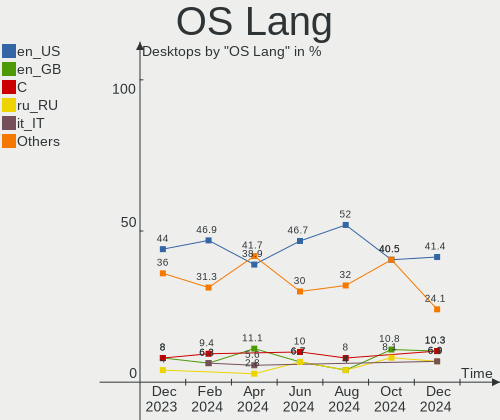
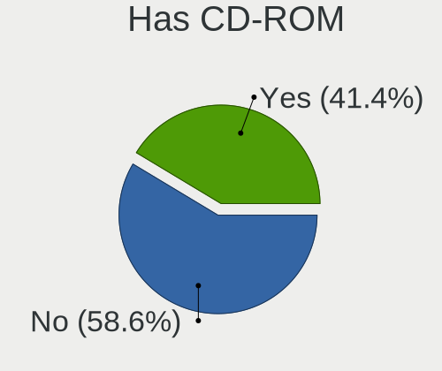
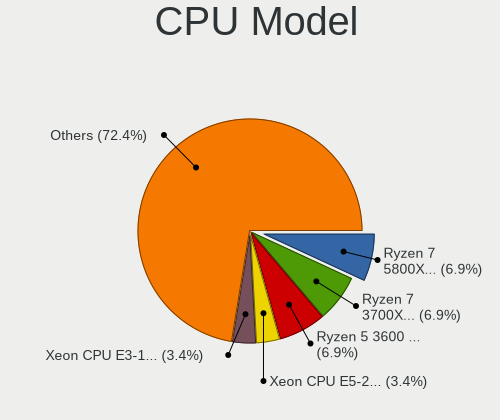
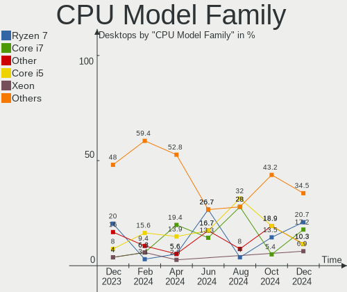
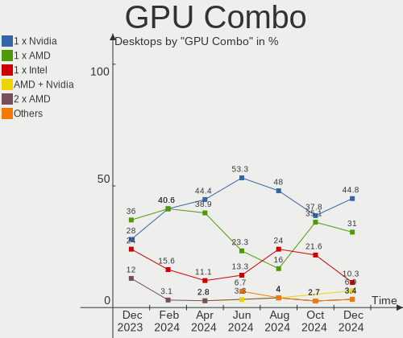
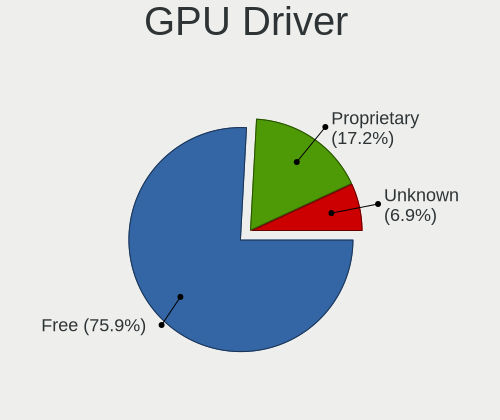

KDE neon - Hardware Trends (Desktops)
-------------------------------------

A project to identify most popular hardware characteristics and track their change
over time based on data collected by Linux users at https://Linux-Hardware.org.

Anyone can contribute to this report by the [hw-probe](https://github.com/linuxhw/hw-probe) tool:

    sudo -E hw-probe -all -upload

This report is for one last month. Overall report since the beginning of time: [TestCoverage](https://github.com/linuxhw/TestCoverage)

Period: Jun, 2022.

Contents
--------

* [ System ](#system)
  - [ OS                       ](#os)
  - [ OS Family                ](#os-family)
  - [ Kernel                   ](#kernel)
  - [ Kernel Family            ](#kernel-family)
  - [ Kernel Major Ver.        ](#kernel-major-ver)
  - [ Arch                     ](#arch)
  - [ DE                       ](#de)
  - [ Display Server           ](#display-server)
  - [ Display Manager          ](#display-manager)
  - [ OS Lang                  ](#os-lang)
  - [ Boot Mode                ](#boot-mode)
  - [ Filesystem               ](#filesystem)
  - [ Part. scheme             ](#part-scheme)
  - [ Dual Boot with Linux/BSD ](#dual-boot-with-linuxbsd)
  - [ Dual Boot (Win)          ](#dual-boot-win)

* [ Board ](#board)
  - [ Vendor                   ](#vendor)
  - [ Model                    ](#model)
  - [ Model Family             ](#model-family)
  - [ MFG Year                 ](#mfg-year)
  - [ Form Factor              ](#form-factor)
  - [ Secure Boot              ](#secure-boot)
  - [ Coreboot                 ](#coreboot)
  - [ RAM Size                 ](#ram-size)
  - [ RAM Used                 ](#ram-used)
  - [ Total Drives             ](#total-drives)
  - [ Has CD-ROM               ](#has-cd-rom)
  - [ Has Ethernet             ](#has-ethernet)
  - [ Has WiFi                 ](#has-wifi)
  - [ Has Bluetooth            ](#has-bluetooth)

* [ Location ](#location)
  - [ Country                  ](#country)
  - [ City                     ](#city)

* [ Drives ](#drives)
  - [ Drive Vendor             ](#drive-vendor)
  - [ Drive Model              ](#drive-model)
  - [ HDD Vendor               ](#hdd-vendor)
  - [ SSD Vendor               ](#ssd-vendor)
  - [ Drive Kind               ](#drive-kind)
  - [ Drive Connector          ](#drive-connector)
  - [ Drive Size               ](#drive-size)
  - [ Space Total              ](#space-total)
  - [ Space Used               ](#space-used)
  - [ Malfunc. Drives          ](#malfunc-drives)
  - [ Malfunc. Drive Vendor    ](#malfunc-drive-vendor)
  - [ Malfunc. HDD Vendor      ](#malfunc-hdd-vendor)
  - [ Malfunc. Drive Kind      ](#malfunc-drive-kind)
  - [ Failed Drives            ](#failed-drives)
  - [ Failed Drive Vendor      ](#failed-drive-vendor)
  - [ Drive Status             ](#drive-status)

* [ Storage controller ](#storage-controller)
  - [ Storage Vendor           ](#storage-vendor)
  - [ Storage Model            ](#storage-model)
  - [ Storage Kind             ](#storage-kind)

* [ Processor ](#processor)
  - [ CPU Vendor               ](#cpu-vendor)
  - [ CPU Model                ](#cpu-model)
  - [ CPU Model Family         ](#cpu-model-family)
  - [ CPU Cores                ](#cpu-cores)
  - [ CPU Sockets              ](#cpu-sockets)
  - [ CPU Threads              ](#cpu-threads)
  - [ CPU Op-Modes             ](#cpu-op-modes)
  - [ CPU Microcode            ](#cpu-microcode)
  - [ CPU Microarch            ](#cpu-microarch)

* [ Graphics ](#graphics)
  - [ GPU Vendor               ](#gpu-vendor)
  - [ GPU Model                ](#gpu-model)
  - [ GPU Combo                ](#gpu-combo)
  - [ GPU Driver               ](#gpu-driver)
  - [ GPU Memory               ](#gpu-memory)

* [ Monitor ](#monitor)
  - [ Monitor Vendor           ](#monitor-vendor)
  - [ Monitor Model            ](#monitor-model)
  - [ Monitor Resolution       ](#monitor-resolution)
  - [ Monitor Diagonal         ](#monitor-diagonal)
  - [ Monitor Width            ](#monitor-width)
  - [ Aspect Ratio             ](#aspect-ratio)
  - [ Monitor Area             ](#monitor-area)
  - [ Pixel Density            ](#pixel-density)
  - [ Multiple Monitors        ](#multiple-monitors)

* [ Network ](#network)
  - [ Net Controller Vendor    ](#net-controller-vendor)
  - [ Net Controller Model     ](#net-controller-model)
  - [ Wireless Vendor          ](#wireless-vendor)
  - [ Wireless Model           ](#wireless-model)
  - [ Ethernet Vendor          ](#ethernet-vendor)
  - [ Ethernet Model           ](#ethernet-model)
  - [ Net Controller Kind      ](#net-controller-kind)
  - [ Used Controller          ](#used-controller)
  - [ NICs                     ](#nics)
  - [ IPv6                     ](#ipv6)

* [ Bluetooth ](#bluetooth)
  - [ Bluetooth Vendor         ](#bluetooth-vendor)
  - [ Bluetooth Model          ](#bluetooth-model)

* [ Sound ](#sound)
  - [ Sound Vendor             ](#sound-vendor)
  - [ Sound Model              ](#sound-model)

* [ Memory ](#memory)
  - [ Memory Vendor            ](#memory-vendor)
  - [ Memory Model             ](#memory-model)
  - [ Memory Kind              ](#memory-kind)
  - [ Memory Form Factor       ](#memory-form-factor)
  - [ Memory Size              ](#memory-size)
  - [ Memory Speed             ](#memory-speed)

* [ Printers & scanners ](#printers--scanners)
  - [ Printer Vendor           ](#printer-vendor)
  - [ Printer Model            ](#printer-model)
  - [ Scanner Vendor           ](#scanner-vendor)
  - [ Scanner Model            ](#scanner-model)

* [ Camera ](#camera)
  - [ Camera Vendor            ](#camera-vendor)
  - [ Camera Model             ](#camera-model)

* [ Security ](#security)
  - [ Fingerprint Vendor       ](#fingerprint-vendor)
  - [ Fingerprint Model        ](#fingerprint-model)
  - [ Chipcard Vendor          ](#chipcard-vendor)
  - [ Chipcard Model           ](#chipcard-model)

* [ Unsupported ](#unsupported)
  - [ Unsupported Devices      ](#unsupported-devices)
  - [ Unsupported Device Types ](#unsupported-device-types)

System
------

OS
--

Installed operating systems

| Name           | Desktops | Percent |
|----------------|----------|---------|
| KDE neon 20.04 | 46       | 100%    |

OS Family
---------

OS without a version

| Name     | Desktops | Percent |
|----------|----------|---------|
| KDE neon | 46       | 100%    |

Kernel
------

Version of the Linux kernel

| Version           | Desktops | Percent |
|-------------------|----------|---------|
| 5.13.0-51-generic | 19       | 41.3%   |
| 5.13.0-44-generic | 15       | 32.61%  |
| 5.13.0-48-generic | 5        | 10.87%  |
| 5.13.0-41-generic | 2        | 4.35%   |
| 5.4.0-120-generic | 1        | 2.17%   |
| 5.4.0-117-generic | 1        | 2.17%   |
| 5.13.0-52-generic | 1        | 2.17%   |
| 5.13.0-39-generic | 1        | 2.17%   |
| 5.13.0-30-generic | 1        | 2.17%   |

Kernel Family
-------------

Linux kernel without a distro release

| Version | Desktops | Percent |
|---------|----------|---------|
| 5.13.0  | 44       | 95.65%  |
| 5.4.0   | 2        | 4.35%   |

Kernel Major Ver.
-----------------

Linux kernel major version

| Version | Desktops | Percent |
|---------|----------|---------|
| 5.13    | 44       | 95.65%  |
| 5.4     | 2        | 4.35%   |

Arch
----

OS architecture (x86_64, i586, etc.)

| Name   | Desktops | Percent |
|--------|----------|---------|
| x86_64 | 46       | 100%    |

DE
--

Desktop Environment

| Name | Desktops | Percent |
|------|----------|---------|
| KDE5 | 46       | 100%    |

Display Server
--------------

X11 or Wayland

| Name | Desktops | Percent |
|------|----------|---------|
| X11  | 46       | 100%    |

Display Manager
---------------

SDDM, LightDM, etc.

| Name    | Desktops | Percent |
|---------|----------|---------|
| Unknown | 37       | 80.43%  |
| SDDM    | 9        | 19.57%  |

OS Lang
-------

Language

| Lang    | Desktops | Percent |
|---------|----------|---------|
| en_US   | 21       | 45.65%  |
| en_GB   | 6        | 13.04%  |
| tr_TR   | 2        | 4.35%   |
| C       | 2        | 4.35%   |
| zh_TW   | 1        | 2.17%   |
| sv_SE   | 1        | 2.17%   |
| ru_UA   | 1        | 2.17%   |
| ru_RU   | 1        | 2.17%   |
| pt_PT   | 1        | 2.17%   |
| nl_NL   | 1        | 2.17%   |
| it_IT   | 1        | 2.17%   |
| fr_FR   | 1        | 2.17%   |
| fi_FI   | 1        | 2.17%   |
| es_BO   | 1        | 2.17%   |
| en_IN   | 1        | 2.17%   |
| en_IL   | 1        | 2.17%   |
| en_CA   | 1        | 2.17%   |
| en_AU   | 1        | 2.17%   |
| Default | 1        | 2.17%   |

Boot Mode
---------

EFI or BIOS

| Mode | Desktops | Percent |
|------|----------|---------|
| EFI  | 26       | 56.52%  |
| BIOS | 20       | 43.48%  |

Filesystem
----------

Type of filesystem

| Type    | Desktops | Percent |
|---------|----------|---------|
| Ext4    | 44       | 95.65%  |
| Overlay | 2        | 4.35%   |

Part. scheme
------------

Scheme of partitioning

| Type    | Desktops | Percent |
|---------|----------|---------|
| Unknown | 40       | 86.96%  |
| GPT     | 5        | 10.87%  |
| MBR     | 1        | 2.17%   |

Dual Boot with Linux/BSD
------------------------

Hosting more than one Linux/BSD

| Dual boot | Desktops | Percent |
|-----------|----------|---------|
| No        | 44       | 95.65%  |
| Yes       | 2        | 4.35%   |

Dual Boot (Win)
---------------

Hosting Linux and Windows

| Dual boot | Desktops | Percent |
|-----------|----------|---------|
| No        | 42       | 91.3%   |
| Yes       | 4        | 8.7%    |

Board
-----

Vendor
------

Motherboard manufacturer

| Name                | Desktops | Percent |
|---------------------|----------|---------|
| ASUSTek Computer    | 14       | 30.43%  |
| Gigabyte Technology | 8        | 17.39%  |
| ASRock              | 8        | 17.39%  |
| Hewlett-Packard     | 5        | 10.87%  |
| Dell                | 5        | 10.87%  |
| MSI                 | 4        | 8.7%    |
| Lenovo              | 1        | 2.17%   |
| Cincoze             | 1        | 2.17%   |

Model
-----

Motherboard model

| Name                                   | Desktops | Percent |
|----------------------------------------|----------|---------|
| Dell OptiPlex 9020                     | 2        | 4.35%   |
| ASUS All Series                        | 2        | 4.35%   |
| MSI WE208AA-ABH HPE-120nl              | 1        | 2.17%   |
| MSI MS-7C95                            | 1        | 2.17%   |
| MSI MS-7C56                            | 1        | 2.17%   |
| MSI MS-7693                            | 1        | 2.17%   |
| Lenovo ThinkStation S20 410599U        | 1        | 2.17%   |
| HP ProLiant ML110 G7                   | 1        | 2.17%   |
| HP ProDesk 600 G6 Small Form Factor PC | 1        | 2.17%   |
| HP EliteDesk 800 G2 DM 35W             | 1        | 2.17%   |
| HP Compaq 8000 Elite CMT PC            | 1        | 2.17%   |
| HP 860-050na                           | 1        | 2.17%   |
| Gigabyte X99-UD5 WIFI-CF               | 1        | 2.17%   |
| Gigabyte X570 AORUS MASTER             | 1        | 2.17%   |
| Gigabyte H67M-UD2H-B3                  | 1        | 2.17%   |
| Gigabyte GA-H310TN-R2                  | 1        | 2.17%   |
| Gigabyte GA-78LMT-USB3 6.0             | 1        | 2.17%   |
| Gigabyte EX58-UD5                      | 1        | 2.17%   |
| Gigabyte B75M-D3V                      | 1        | 2.17%   |
| Gigabyte B250M-D3H                     | 1        | 2.17%   |
| Dell Precision T3610                   | 1        | 2.17%   |
| Dell OptiPlex 3080                     | 1        | 2.17%   |
| Dell Inspiron 620                      | 1        | 2.17%   |
| Cincoze P1101                          | 1        | 2.17%   |
| ASUS TUF Gaming B550M-PLUS             | 1        | 2.17%   |
| ASUS ROG STRIX Z490-F GAMING           | 1        | 2.17%   |
| ASUS ROG STRIX TRX40-E GAMING          | 1        | 2.17%   |
| ASUS ROG Maximus XIII HERO             | 1        | 2.17%   |
| ASUS ProArt Z690-CREATOR WIFI          | 1        | 2.17%   |
| ASUS PRIME B560-PLUS                   | 1        | 2.17%   |
| ASUS P9X79                             | 1        | 2.17%   |
| ASUS M5A97 EVO R2.0                    | 1        | 2.17%   |
| ASUS H61M-PRO                          | 1        | 2.17%   |
| ASUS B250 MINING EXPERT                | 1        | 2.17%   |
| ASUS AT5IONT-I                         | 1        | 2.17%   |
| ASUS A68HM-K                           | 1        | 2.17%   |
| ASRock H61M-ITX                        | 1        | 2.17%   |
| ASRock H270 Pro4                       | 1        | 2.17%   |
| ASRock G41M-S3                         | 1        | 2.17%   |
| ASRock G41C-GS                         | 1        | 2.17%   |
| ASRock G31M-VS2                        | 1        | 2.17%   |
| ASRock EP2C602-4L/D16                  | 1        | 2.17%   |
| ASRock B450M Steel Legend              | 1        | 2.17%   |
| ASRock A320M-DVS R3.0                  | 1        | 2.17%   |

Model Family
------------

Motherboard model prefix

| Name                   | Desktops | Percent |
|------------------------|----------|---------|
| Dell OptiPlex          | 3        | 6.52%   |
| ASUS ROG               | 3        | 6.52%   |
| ASUS All               | 2        | 4.35%   |
| MSI WE208AA-ABH        | 1        | 2.17%   |
| MSI MS-7C95            | 1        | 2.17%   |
| MSI MS-7C56            | 1        | 2.17%   |
| MSI MS-7693            | 1        | 2.17%   |
| Lenovo ThinkStation    | 1        | 2.17%   |
| HP ProLiant            | 1        | 2.17%   |
| HP ProDesk             | 1        | 2.17%   |
| HP EliteDesk           | 1        | 2.17%   |
| HP Compaq              | 1        | 2.17%   |
| HP 860-050na           | 1        | 2.17%   |
| Gigabyte X99-UD5       | 1        | 2.17%   |
| Gigabyte X570          | 1        | 2.17%   |
| Gigabyte H67M-UD2H-B3  | 1        | 2.17%   |
| Gigabyte GA-H310TN-R2  | 1        | 2.17%   |
| Gigabyte GA-78LMT-USB3 | 1        | 2.17%   |
| Gigabyte EX58-UD5      | 1        | 2.17%   |
| Gigabyte B75M-D3V      | 1        | 2.17%   |
| Gigabyte B250M-D3H     | 1        | 2.17%   |
| Dell Precision         | 1        | 2.17%   |
| Dell Inspiron          | 1        | 2.17%   |
| Cincoze P1101          | 1        | 2.17%   |
| ASUS TUF               | 1        | 2.17%   |
| ASUS ProArt            | 1        | 2.17%   |
| ASUS PRIME             | 1        | 2.17%   |
| ASUS P9X79             | 1        | 2.17%   |
| ASUS M5A97             | 1        | 2.17%   |
| ASUS H61M-PRO          | 1        | 2.17%   |
| ASUS B250              | 1        | 2.17%   |
| ASUS AT5IONT-I         | 1        | 2.17%   |
| ASUS A68HM-K           | 1        | 2.17%   |
| ASRock H61M-ITX        | 1        | 2.17%   |
| ASRock H270            | 1        | 2.17%   |
| ASRock G41M-S3         | 1        | 2.17%   |
| ASRock G41C-GS         | 1        | 2.17%   |
| ASRock G31M-VS2        | 1        | 2.17%   |
| ASRock EP2C602-4L      | 1        | 2.17%   |
| ASRock B450M           | 1        | 2.17%   |
| ASRock A320M-DVS       | 1        | 2.17%   |

MFG Year
--------

Motherboard manufacture year

| Year | Desktops | Percent |
|------|----------|---------|
| 2020 | 6        | 13.04%  |
| 2014 | 6        | 13.04%  |
| 2021 | 4        | 8.7%    |
| 2013 | 4        | 8.7%    |
| 2012 | 4        | 8.7%    |
| 2011 | 4        | 8.7%    |
| 2019 | 3        | 6.52%   |
| 2017 | 3        | 6.52%   |
| 2009 | 3        | 6.52%   |
| 2018 | 2        | 4.35%   |
| 2016 | 2        | 4.35%   |
| 2010 | 2        | 4.35%   |
| 2022 | 1        | 2.17%   |
| 2015 | 1        | 2.17%   |
| 2008 | 1        | 2.17%   |

Form Factor
-----------

Physical design of the computer

| Name    | Desktops | Percent |
|---------|----------|---------|
| Desktop | 46       | 100%    |

Secure Boot
-----------

Enabled or disabled

| State    | Desktops | Percent |
|----------|----------|---------|
| Disabled | 41       | 89.13%  |
| Enabled  | 5        | 10.87%  |

Coreboot
--------

Have coreboot on board

| Used | Desktops | Percent |
|------|----------|---------|
| No   | 46       | 100%    |

RAM Size
--------

Total RAM memory

| Size in GB      | Desktops | Percent |
|-----------------|----------|---------|
| 16.01-24.0      | 12       | 26.09%  |
| 4.01-8.0        | 10       | 21.74%  |
| 32.01-64.0      | 8        | 17.39%  |
| 8.01-16.0       | 7        | 15.22%  |
| 3.01-4.0        | 3        | 6.52%   |
| 64.01-256.0     | 3        | 6.52%   |
| 24.01-32.0      | 2        | 4.35%   |
| More than 256.0 | 1        | 2.17%   |

RAM Used
--------

Used RAM memory

| Used GB   | Desktops | Percent |
|-----------|----------|---------|
| 1.01-2.0  | 19       | 41.3%   |
| 2.01-3.0  | 10       | 21.74%  |
| 4.01-8.0  | 8        | 17.39%  |
| 3.01-4.0  | 7        | 15.22%  |
| 8.01-16.0 | 1        | 2.17%   |
| 0.51-1.0  | 1        | 2.17%   |

Total Drives
------------

Number of drives on board

| Drives | Desktops | Percent |
|--------|----------|---------|
| 1      | 18       | 39.13%  |
| 2      | 13       | 28.26%  |
| 3      | 10       | 21.74%  |
| 5      | 3        | 6.52%   |
| 4      | 2        | 4.35%   |

Has CD-ROM
----------

Has CD-ROM on board

| Presented | Desktops | Percent |
|-----------|----------|---------|
| No        | 29       | 63.04%  |
| Yes       | 17       | 36.96%  |

Has Ethernet
------------

Has Ethernet on board

| Presented | Desktops | Percent |
|-----------|----------|---------|
| Yes       | 45       | 97.83%  |
| No        | 1        | 2.17%   |

Has WiFi
--------

Has WiFi module

| Presented | Desktops | Percent |
|-----------|----------|---------|
| Yes       | 23       | 50%     |
| No        | 23       | 50%     |

Has Bluetooth
-------------

Has Bluetooth module

| Presented | Desktops | Percent |
|-----------|----------|---------|
| No        | 28       | 60.87%  |
| Yes       | 18       | 39.13%  |

Location
--------

Country
-------

Geographic location (country)

| Country     | Desktops | Percent |
|-------------|----------|---------|
| USA         | 14       | 30.43%  |
| UK          | 6        | 13.04%  |
| Ukraine     | 3        | 6.52%   |
| Turkey      | 2        | 4.35%   |
| Sweden      | 2        | 4.35%   |
| Serbia      | 2        | 4.35%   |
| Taiwan      | 1        | 2.17%   |
| Slovenia    | 1        | 2.17%   |
| Russia      | 1        | 2.17%   |
| Portugal    | 1        | 2.17%   |
| Netherlands | 1        | 2.17%   |
| Italy       | 1        | 2.17%   |
| Israel      | 1        | 2.17%   |
| India       | 1        | 2.17%   |
| Georgia     | 1        | 2.17%   |
| France      | 1        | 2.17%   |
| Finland     | 1        | 2.17%   |
| Croatia     | 1        | 2.17%   |
| Colombia    | 1        | 2.17%   |
| Canada      | 1        | 2.17%   |
| Bolivia     | 1        | 2.17%   |
| Bangladesh  | 1        | 2.17%   |
| Australia   | 1        | 2.17%   |

City
----

Geographic location (city)

| City             | Desktops | Percent |
|------------------|----------|---------|
| Melbourne        | 2        | 4.35%   |
| Kyiv             | 2        | 4.35%   |
| Zagreb           | 1        | 2.17%   |
| Wigan            | 1        | 2.17%   |
| Västerås       | 1        | 2.17%   |
| Valence          | 1        | 2.17%   |
| Troy             | 1        | 2.17%   |
| Temecula         | 1        | 2.17%   |
| Tbilisi          | 1        | 2.17%   |
| Taoyuan District | 1        | 2.17%   |
| Tampere          | 1        | 2.17%   |
| Sweet            | 1        | 2.17%   |
| Solleftea        | 1        | 2.17%   |
| Roseland         | 1        | 2.17%   |
| Rome             | 1        | 2.17%   |
| Pikesville       | 1        | 2.17%   |
| Perkasie         | 1        | 2.17%   |
| Perivale         | 1        | 2.17%   |
| Pančevo         | 1        | 2.17%   |
| Niverville       | 1        | 2.17%   |
| Nederland        | 1        | 2.17%   |
| Mount Holly      | 1        | 2.17%   |
| Ljubljana        | 1        | 2.17%   |
| La Paz           | 1        | 2.17%   |
| Kelmentsi        | 1        | 2.17%   |
| Inwood           | 1        | 2.17%   |
| Gosport          | 1        | 2.17%   |
| Gaziantep        | 1        | 2.17%   |
| Feltham          | 1        | 2.17%   |
| Eureka           | 1        | 2.17%   |
| Entroncamento    | 1        | 2.17%   |
| Dunnellon        | 1        | 2.17%   |
| Dhaka            | 1        | 2.17%   |
| Derby            | 1        | 2.17%   |
| Crown Point      | 1        | 2.17%   |
| Bryansk          | 1        | 2.17%   |
| Bogotá          | 1        | 2.17%   |
| Bengaluru        | 1        | 2.17%   |
| Belgrade         | 1        | 2.17%   |
| Bath             | 1        | 2.17%   |
| Ashquelon        | 1        | 2.17%   |
| Albuquerque      | 1        | 2.17%   |
| Adana            | 1        | 2.17%   |
| Aalten           | 1        | 2.17%   |

Drives
------

Drive Vendor
------------

Hard drive vendors

| Vendor                    | Desktops | Drives | Percent |
|---------------------------|----------|--------|---------|
| WDC                       | 15       | 18     | 19.74%  |
| Samsung Electronics       | 15       | 22     | 19.74%  |
| Seagate                   | 11       | 15     | 14.47%  |
| Kingston                  | 7        | 12     | 9.21%   |
| SanDisk                   | 4        | 4      | 5.26%   |
| Toshiba                   | 3        | 4      | 3.95%   |
| Realtek Semiconductor     | 2        | 2      | 2.63%   |
| Crucial                   | 2        | 4      | 2.63%   |
| XINTOR                    | 1        | 1      | 1.32%   |
| Unknown                   | 1        | 1      | 1.32%   |
| Team                      | 1        | 1      | 1.32%   |
| SSK                       | 1        | 1      | 1.32%   |
| SPCC                      | 1        | 1      | 1.32%   |
| Silicon Motion            | 1        | 1      | 1.32%   |
| Phison                    | 1        | 1      | 1.32%   |
| OCZ                       | 1        | 1      | 1.32%   |
| Micron/Crucial Technology | 1        | 1      | 1.32%   |
| Micron Technology         | 1        | 1      | 1.32%   |
| Intel                     | 1        | 1      | 1.32%   |
| Integral                  | 1        | 1      | 1.32%   |
| Innodisk                  | 1        | 1      | 1.32%   |
| Hitachi                   | 1        | 1      | 1.32%   |
| Gigabyte Technology       | 1        | 1      | 1.32%   |
| BIWIN                     | 1        | 1      | 1.32%   |
| A-DATA Technology         | 1        | 1      | 1.32%   |

Drive Model
-----------

Hard drive models

| Model                                  | Desktops | Percent |
|----------------------------------------|----------|---------|
| Kingston SA400S37240G 240GB SSD        | 6        | 6.52%   |
| Samsung NVMe SSD Drive 1TB             | 4        | 4.35%   |
| WDC WD10EZEX-00BBHA0 1TB               | 2        | 2.17%   |
| Samsung SSD 860 EVO 1TB                | 2        | 2.17%   |
| Samsung SSD 850 EVO 250GB              | 2        | 2.17%   |
| XINTOR SSD 240GB                       | 1        | 1.09%   |
| WDC WDS500G2B0A-00SM50 500GB SSD       | 1        | 1.09%   |
| WDC WDS250G2B0A 250GB SSD              | 1        | 1.09%   |
| WDC WDBNCE0010PNC 1TB SSD              | 1        | 1.09%   |
| WDC WD800JD-22MSA1 80GB                | 1        | 1.09%   |
| WDC WD5003AZEX-00K1GA0 500GB           | 1        | 1.09%   |
| WDC WD5000AVDS-73U7B1 500GB            | 1        | 1.09%   |
| WDC WD5000AURX-63UY4Y0 500GB           | 1        | 1.09%   |
| WDC WD5000AAKX-00ERMA0 500GB           | 1        | 1.09%   |
| WDC WD5000AAKS-00UU3A0 500GB           | 1        | 1.09%   |
| WDC WD2500AAJS-60Z0A0 250GB            | 1        | 1.09%   |
| WDC WD20EZBX-00AYRA0 2TB               | 1        | 1.09%   |
| WDC WD1600AAJS-00WAA0 160GB            | 1        | 1.09%   |
| WDC WD15EARS-00MVWB0 1TB               | 1        | 1.09%   |
| WDC WD10EZEX-21M2NA0 1TB               | 1        | 1.09%   |
| WDC WD10EZEX-00BN5A0 1TB               | 1        | 1.09%   |
| WDC WD10EADS-65M2BX 1TB                | 1        | 1.09%   |
| Unknown SD/MMC/MS PRO 128GB            | 1        | 1.09%   |
| Toshiba MQ01ACF050 500GB               | 1        | 1.09%   |
| Toshiba HDWQ140 4TB                    | 1        | 1.09%   |
| Toshiba DT01ACA050 500GB               | 1        | 1.09%   |
| Team T253LE120G 120GB SSD              | 1        | 1.09%   |
| SSK Disk 480GB                         | 1        | 1.09%   |
| SPCC Solid State Disk 512GB            | 1        | 1.09%   |
| Silicon Motion NVMe SSD Drive 120GB    | 1        | 1.09%   |
| Seagate ST95005620AS 500GB             | 1        | 1.09%   |
| Seagate ST500LM021-1KJ152 500GB        | 1        | 1.09%   |
| Seagate ST4000DM005-2DP166 4TB         | 1        | 1.09%   |
| Seagate ST3500312CS 500GB              | 1        | 1.09%   |
| Seagate ST3250310AS 250GB              | 1        | 1.09%   |
| Seagate ST31500341AS 1TB               | 1        | 1.09%   |
| Seagate ST31000524AS 1TB               | 1        | 1.09%   |
| Seagate ST3000DM007-1WY10G 3TB         | 1        | 1.09%   |
| Seagate ST2000DX002-2DV164 2TB         | 1        | 1.09%   |
| Seagate ST2000DM008-2FR102 2TB         | 1        | 1.09%   |
| Seagate ST1000DM003-1ER162 1TB         | 1        | 1.09%   |
| Seagate ST1000DM003-1CH162 1TB         | 1        | 1.09%   |
| SanDisk SDSSDHII960G 960GB             | 1        | 1.09%   |
| SanDisk NVMe SSD Drive 500GB           | 1        | 1.09%   |
| SanDisk NVMe SSD Drive 2TB             | 1        | 1.09%   |
| SanDisk NVMe SSD Drive 256GB           | 1        | 1.09%   |
| Samsung SSD 870 QVO 2TB                | 1        | 1.09%   |
| Samsung SSD 860 QVO 1TB                | 1        | 1.09%   |
| Samsung SSD 860 PRO 512GB              | 1        | 1.09%   |
| Samsung SSD 860 EVO 2TB                | 1        | 1.09%   |
| Samsung SSD 850 PRO 128GB              | 1        | 1.09%   |
| Samsung SSD 850 EVO 500GB              | 1        | 1.09%   |
| Samsung SSD 840 PRO Series 256GB       | 1        | 1.09%   |
| Samsung SSD 840 PRO Series 128GB       | 1        | 1.09%   |
| Samsung SSD 840 EVO 250GB              | 1        | 1.09%   |
| Samsung SP1613N 160GB                  | 1        | 1.09%   |
| Samsung SM963 2.5" NVMe PCIe SSD 500GB | 1        | 1.09%   |
| Samsung NVMe SSD Drive 512GB           | 1        | 1.09%   |
| Samsung HD161GJ 160GB                  | 1        | 1.09%   |
| Samsung HD103UJ 1TB                    | 1        | 1.09%   |

HDD Vendor
----------

Hard disk drive vendors

| Vendor              | Desktops | Drives | Percent |
|---------------------|----------|--------|---------|
| WDC                 | 14       | 15     | 42.42%  |
| Seagate             | 11       | 15     | 33.33%  |
| Toshiba             | 3        | 4      | 9.09%   |
| Samsung Electronics | 3        | 3      | 9.09%   |
| Unknown             | 1        | 1      | 3.03%   |
| Hitachi             | 1        | 1      | 3.03%   |

SSD Vendor
----------

Solid state drive vendors

| Vendor              | Desktops | Drives | Percent |
|---------------------|----------|--------|---------|
| Samsung Electronics | 11       | 13     | 33.33%  |
| Kingston            | 7        | 11     | 21.21%  |
| WDC                 | 3        | 3      | 9.09%   |
| Crucial             | 2        | 3      | 6.06%   |
| XINTOR              | 1        | 1      | 3.03%   |
| Team                | 1        | 1      | 3.03%   |
| SPCC                | 1        | 1      | 3.03%   |
| SanDisk             | 1        | 1      | 3.03%   |
| OCZ                 | 1        | 1      | 3.03%   |
| Micron Technology   | 1        | 1      | 3.03%   |
| Integral            | 1        | 1      | 3.03%   |
| Innodisk            | 1        | 1      | 3.03%   |
| Gigabyte Technology | 1        | 1      | 3.03%   |
| A-DATA Technology   | 1        | 1      | 3.03%   |

Drive Kind
----------

HDD or SSD

| Kind    | Desktops | Drives | Percent |
|---------|----------|--------|---------|
| SSD     | 28       | 40     | 40%     |
| HDD     | 27       | 39     | 38.57%  |
| NVMe    | 14       | 18     | 20%     |
| Unknown | 1        | 1      | 1.43%   |

Drive Connector
---------------

SATA, SAS, NVMe, etc.

| Type | Desktops | Drives | Percent |
|------|----------|--------|---------|
| SATA | 40       | 78     | 71.43%  |
| NVMe | 14       | 18     | 25%     |
| SAS  | 2        | 2      | 3.57%   |

Drive Size
----------

Size of hard drive

| Size in TB | Desktops | Drives | Percent |
|------------|----------|--------|---------|
| 0.01-0.5   | 31       | 49     | 53.45%  |
| 0.51-1.0   | 19       | 21     | 32.76%  |
| 1.01-2.0   | 5        | 5      | 8.62%   |
| 3.01-4.0   | 2        | 3      | 3.45%   |
| 2.01-3.0   | 1        | 1      | 1.72%   |

Space Total
-----------

Amount of disk space available on the file system

| Size in GB     | Desktops | Percent |
|----------------|----------|---------|
| 101-250        | 14       | 30.43%  |
| 1001-2000      | 10       | 21.74%  |
| 251-500        | 6        | 13.04%  |
| 501-1000       | 6        | 13.04%  |
| More than 3000 | 5        | 10.87%  |
| 1-20           | 2        | 4.35%   |
| 21-50          | 1        | 2.17%   |
| 51-100         | 1        | 2.17%   |
| Unknown        | 1        | 2.17%   |

Space Used
----------

Amount of used disk space

| Used GB        | Desktops | Percent |
|----------------|----------|---------|
| 1-20           | 22       | 47.83%  |
| 251-500        | 5        | 10.87%  |
| 21-50          | 5        | 10.87%  |
| 101-250        | 4        | 8.7%    |
| 1001-2000      | 3        | 6.52%   |
| 501-1000       | 2        | 4.35%   |
| 51-100         | 2        | 4.35%   |
| More than 3000 | 1        | 2.17%   |
| 2001-3000      | 1        | 2.17%   |
| Unknown        | 1        | 2.17%   |

Malfunc. Drives
---------------

Drive models with a malfunction

| Model                                  | Desktops | Drives | Percent |
|----------------------------------------|----------|--------|---------|
| Innodisk DES25-64GM41BW1DC-27 64GB SSD | 1        | 1      | 100%    |

Malfunc. Drive Vendor
---------------------

Vendors of faulty drives

| Vendor   | Desktops | Drives | Percent |
|----------|----------|--------|---------|
| Innodisk | 1        | 1      | 100%    |

Malfunc. HDD Vendor
-------------------

Vendors of faulty HDD drives

Zero info for selected period =(

Malfunc. Drive Kind
-------------------

Kinds of faulty drives

| Kind | Desktops | Drives | Percent |
|------|----------|--------|---------|
| SSD  | 1        | 1      | 100%    |

Failed Drives
-------------

Failed drive models

Zero info for selected period =(

Failed Drive Vendor
-------------------

Failed drive vendors

Zero info for selected period =(

Drive Status
------------

Number of failed and malfunc. drives

| Status   | Desktops | Drives | Percent |
|----------|----------|--------|---------|
| Detected | 40       | 88     | 85.11%  |
| Works    | 6        | 9      | 12.77%  |
| Malfunc  | 1        | 1      | 2.13%   |

Storage controller
------------------

Storage Vendor
--------------

Storage controller vendors

| Vendor                      | Desktops | Percent |
|-----------------------------|----------|---------|
| Intel                       | 35       | 53.03%  |
| AMD                         | 11       | 16.67%  |
| Samsung Electronics         | 5        | 7.58%   |
| SanDisk                     | 3        | 4.55%   |
| Realtek Semiconductor       | 2        | 3.03%   |
| JMicron Technology          | 2        | 3.03%   |
| ASMedia Technology          | 2        | 3.03%   |
| Silicon Motion              | 1        | 1.52%   |
| Phison Electronics          | 1        | 1.52%   |
| Micron/Crucial Technology   | 1        | 1.52%   |
| Marvell Technology Group    | 1        | 1.52%   |
| Kingston Technology Company | 1        | 1.52%   |
| Biwin Storage Technology    | 1        | 1.52%   |

Storage Model
-------------

Storage controller models

| Model                                                                                   | Desktops | Percent |
|-----------------------------------------------------------------------------------------|----------|---------|
| Intel SATA Controller [RAID mode]                                                       | 4        | 5.06%   |
| Intel NM10/ICH7 Family SATA Controller [IDE mode]                                       | 4        | 5.06%   |
| AMD FCH SATA Controller [AHCI mode]                                                     | 4        | 5.06%   |
| Samsung NVMe SSD Controller PM9A1/PM9A3/980PRO                                          | 3        | 3.8%    |
| Intel C600/X79 series chipset 6-Port SATA AHCI Controller                               | 3        | 3.8%    |
| Intel 82801G (ICH7 Family) IDE Controller                                               | 3        | 3.8%    |
| AMD 500 Series Chipset SATA Controller                                                  | 3        | 3.8%    |
| Intel Q170/Q150/B150/H170/H110/Z170/CM236 Chipset SATA Controller [AHCI Mode]           | 2        | 2.53%   |
| Intel Comet Lake SATA AHCI Controller                                                   | 2        | 2.53%   |
| Intel 9 Series Chipset Family SATA Controller [AHCI Mode]                               | 2        | 2.53%   |
| Intel 6 Series/C200 Series Chipset Family Desktop SATA Controller (IDE mode, ports 4-5) | 2        | 2.53%   |
| Intel 6 Series/C200 Series Chipset Family Desktop SATA Controller (IDE mode, ports 0-3) | 2        | 2.53%   |
| Intel 6 Series/C200 Series Chipset Family 6 port Desktop SATA AHCI Controller           | 2        | 2.53%   |
| Intel 500 Series Chipset Family SATA AHCI Controller                                    | 2        | 2.53%   |
| ASMedia ASM1062 Serial ATA Controller                                                   | 2        | 2.53%   |
| AMD SB7x0/SB8x0/SB9x0 SATA Controller [AHCI mode]                                       | 2        | 2.53%   |
| Silicon Motion SM2263EN/SM2263XT SSD Controller                                         | 1        | 1.27%   |
| SanDisk WD PC SN810 / Black SN850 NVMe SSD                                              | 1        | 1.27%   |
| SanDisk WD Blue SN570 NVMe SSD                                                          | 1        | 1.27%   |
| SanDisk Non-Volatile memory controller                                                  | 1        | 1.27%   |
| Samsung NVMe SSD Controller SM981/PM981/PM983                                           | 1        | 1.27%   |
| Samsung NVMe SSD Controller SM961/PM961/SM963                                           | 1        | 1.27%   |
| Samsung NVMe SSD Controller 980                                                         | 1        | 1.27%   |
| Realtek RTS5763DL NVMe SSD Controller                                                   | 1        | 1.27%   |
| Realtek Realtek Non-Volatile memory controller                                          | 1        | 1.27%   |
| Phison E16 PCIe4 NVMe Controller                                                        | 1        | 1.27%   |
| Micron/Crucial Non-Volatile memory controller                                           | 1        | 1.27%   |
| Marvell Group 88SE9230 PCIe 2.0 x2 4-port SATA 6 Gb/s RAID Controller                   | 1        | 1.27%   |
| Kingston Company Company Non-Volatile memory controller                                 | 1        | 1.27%   |
| JMicron JMB363 SATA/IDE Controller                                                      | 1        | 1.27%   |
| JMicron JMB362 SATA Controller                                                          | 1        | 1.27%   |
| Intel Volume Management Device NVMe RAID Controller                                     | 1        | 1.27%   |
| Intel Non-Volatile memory controller                                                    | 1        | 1.27%   |
| Intel Celeron N3350/Pentium N4200/Atom E3900 Series SATA AHCI Controller                | 1        | 1.27%   |
| Intel Cannon Lake PCH SATA AHCI Controller                                              | 1        | 1.27%   |
| Intel C610/X99 series chipset 6-Port SATA Controller [AHCI mode]                        | 1        | 1.27%   |
| Intel C602 chipset 4-Port SATA Storage Control Unit                                     | 1        | 1.27%   |
| Intel Alder Lake-S PCH SATA Controller [AHCI Mode]                                      | 1        | 1.27%   |
| Intel 82801JI (ICH10 Family) 4 port SATA IDE Controller #1                              | 1        | 1.27%   |
| Intel 82801JI (ICH10 Family) 2 port SATA IDE Controller #2                              | 1        | 1.27%   |
| Intel 82801JD/DO (ICH10 Family) 4-port SATA IDE Controller                              | 1        | 1.27%   |
| Intel 82801JD/DO (ICH10 Family) 2-port SATA IDE Controller                              | 1        | 1.27%   |
| Intel 8 Series/C220 Series Chipset Family 6-port SATA Controller 1 [AHCI mode]          | 1        | 1.27%   |
| Intel 7 Series/C210 Series Chipset Family 6-port SATA Controller [AHCI mode]            | 1        | 1.27%   |
| Intel 6 Series/C200 Series Desktop SATA RAID Controller                                 | 1        | 1.27%   |
| Intel 400 Series Chipset Family SATA AHCI Controller                                    | 1        | 1.27%   |
| Intel 4 Series Chipset PT IDER Controller                                               | 1        | 1.27%   |
| Intel 200 Series PCH SATA controller [AHCI mode]                                        | 1        | 1.27%   |
| Biwin Storage Non-Volatile memory controller                                            | 1        | 1.27%   |
| AMD SB7x0/SB8x0/SB9x0 SATA Controller [IDE mode]                                        | 1        | 1.27%   |
| AMD SB7x0/SB8x0/SB9x0 IDE Controller                                                    | 1        | 1.27%   |
| AMD FCH SATA Controller D                                                               | 1        | 1.27%   |
| AMD 400 Series Chipset SATA Controller                                                  | 1        | 1.27%   |

Storage Kind
------------

Kind of storage controller (IDE, SATA, NVMe, SAS, ...)

| Kind | Desktops | Percent |
|------|----------|---------|
| SATA | 33       | 52.38%  |
| NVMe | 14       | 22.22%  |
| IDE  | 9        | 14.29%  |
| RAID | 6        | 9.52%   |
| SAS  | 1        | 1.59%   |

Processor
---------

CPU Vendor
----------

Processor vendors

| Vendor | Desktops | Percent |
|--------|----------|---------|
| Intel  | 35       | 76.09%  |
| AMD    | 11       | 23.91%  |

CPU Model
---------

Processor models

| Model                                          | Desktops | Percent |
|------------------------------------------------|----------|---------|
| Intel Core i7-4770 CPU @ 3.40GHz               | 3        | 6.52%   |
| AMD Ryzen 7 5800X 8-Core Processor             | 3        | 6.52%   |
| Intel Core i7-10700K CPU @ 3.80GHz             | 2        | 4.35%   |
| Intel Xeon CPU W3520 @ 2.67GHz                 | 1        | 2.17%   |
| Intel Xeon CPU E5-2670 0 @ 2.60GHz             | 1        | 2.17%   |
| Intel Xeon CPU E5-1650 v2 @ 3.50GHz            | 1        | 2.17%   |
| Intel Pentium Dual CPU E2180 @ 2.00GHz         | 1        | 2.17%   |
| Intel Pentium CPU N4200 @ 1.10GHz              | 1        | 2.17%   |
| Intel Pentium CPU G840 @ 2.80GHz               | 1        | 2.17%   |
| Intel Pentium CPU G4560T @ 2.90GHz             | 1        | 2.17%   |
| Intel Pentium CPU G4560 @ 3.50GHz              | 1        | 2.17%   |
| Intel Core i7-5820K CPU @ 3.30GHz              | 1        | 2.17%   |
| Intel Core i7-4930K CPU @ 3.40GHz              | 1        | 2.17%   |
| Intel Core i7-4790K CPU @ 4.00GHz              | 1        | 2.17%   |
| Intel Core i7-3770 CPU @ 3.40GHz               | 1        | 2.17%   |
| Intel Core i7 CPU 950 @ 3.07GHz                | 1        | 2.17%   |
| Intel Core i7 CPU 860 @ 2.80GHz                | 1        | 2.17%   |
| Intel Core i5-8500T CPU @ 2.10GHz              | 1        | 2.17%   |
| Intel Core i5-7600K CPU @ 3.80GHz              | 1        | 2.17%   |
| Intel Core i5-6600K CPU @ 3.50GHz              | 1        | 2.17%   |
| Intel Core i5-6500T CPU @ 2.50GHz              | 1        | 2.17%   |
| Intel Core i5-2500K CPU @ 3.30GHz              | 1        | 2.17%   |
| Intel Core i5-2400 CPU @ 3.10GHz               | 1        | 2.17%   |
| Intel Core i5-2310 CPU @ 2.90GHz               | 1        | 2.17%   |
| Intel Core i5-10500T CPU @ 2.30GHz             | 1        | 2.17%   |
| Intel Core i5-10500 CPU @ 3.10GHz              | 1        | 2.17%   |
| Intel Core i5-10400F CPU @ 2.90GHz             | 1        | 2.17%   |
| Intel Core i3-3220 CPU @ 3.30GHz               | 1        | 2.17%   |
| Intel Core 2 Quad CPU Q9500 @ 2.83GHz          | 1        | 2.17%   |
| Intel Core 2 Duo CPU E8400 @ 3.00GHz           | 1        | 2.17%   |
| Intel Core 2 Duo CPU E7500 @ 2.93GHz           | 1        | 2.17%   |
| Intel Atom CPU D525 @ 1.80GHz                  | 1        | 2.17%   |
| Intel 12th Gen Core i7-12700                   | 1        | 2.17%   |
| AMD Ryzen Threadripper 3960X 24-Core Processor | 1        | 2.17%   |
| AMD Ryzen 7 5700X 8-Core Processor             | 1        | 2.17%   |
| AMD Ryzen 5 3600 6-Core Processor              | 1        | 2.17%   |
| AMD FX-8350 Eight-Core Processor               | 1        | 2.17%   |
| AMD FX-8320 Eight-Core Processor               | 1        | 2.17%   |
| AMD FX-6300 Six-Core Processor                 | 1        | 2.17%   |
| AMD Athlon X4 840 Quad Core Processor          | 1        | 2.17%   |
| AMD Athlon 200GE with Radeon Vega Graphics     | 1        | 2.17%   |

CPU Model Family
----------------

Processor model prefix

| Model                  | Desktops | Percent |
|------------------------|----------|---------|
| Intel Core i7          | 11       | 23.91%  |
| Intel Core i5          | 10       | 21.74%  |
| Intel Pentium          | 4        | 8.7%    |
| AMD Ryzen 7            | 4        | 8.7%    |
| Intel Xeon             | 3        | 6.52%   |
| AMD FX                 | 3        | 6.52%   |
| Intel Core 2 Duo       | 2        | 4.35%   |
| Other                  | 1        | 2.17%   |
| Intel Pentium Dual     | 1        | 2.17%   |
| Intel Core i3          | 1        | 2.17%   |
| Intel Core 2 Quad      | 1        | 2.17%   |
| Intel Atom             | 1        | 2.17%   |
| AMD Ryzen Threadripper | 1        | 2.17%   |
| AMD Ryzen 5            | 1        | 2.17%   |
| AMD Athlon X4          | 1        | 2.17%   |
| AMD Athlon             | 1        | 2.17%   |

CPU Cores
---------

Number of processor cores

| Number | Desktops | Percent |
|--------|----------|---------|
| 4      | 18       | 39.13%  |
| 2      | 10       | 21.74%  |
| 6      | 8        | 17.39%  |
| 8      | 6        | 13.04%  |
| 24     | 1        | 2.17%   |
| 16     | 1        | 2.17%   |
| 12     | 1        | 2.17%   |
| 3      | 1        | 2.17%   |

CPU Sockets
-----------

Number of sockets

| Number | Desktops | Percent |
|--------|----------|---------|
| 1      | 45       | 97.83%  |
| 2      | 1        | 2.17%   |

CPU Threads
-----------

Threads per core (Hyper-Threading)

| Number | Desktops | Percent |
|--------|----------|---------|
| 2      | 32       | 69.57%  |
| 1      | 14       | 30.43%  |

CPU Op-Modes
------------

CPU Operation Modes (32-bit, 64-bit)

| Op mode        | Desktops | Percent |
|----------------|----------|---------|
| 32-bit, 64-bit | 46       | 100%    |

CPU Microcode
-------------

Microcode number

| Number     | Desktops | Percent |
|------------|----------|---------|
| 0x306c3    | 4        | 8.7%    |
| 0x206a7    | 4        | 8.7%    |
| Unknown    | 4        | 8.7%    |
| 0xa0653    | 3        | 6.52%   |
| 0x906e9    | 3        | 6.52%   |
| 0x1067a    | 3        | 6.52%   |
| 0x06000852 | 3        | 6.52%   |
| 0x506e3    | 2        | 4.35%   |
| 0x306e4    | 2        | 4.35%   |
| 0x306a9    | 2        | 4.35%   |
| 0xa0655    | 1        | 2.17%   |
| 0x906ea    | 1        | 2.17%   |
| 0x90672    | 1        | 2.17%   |
| 0x6fd      | 1        | 2.17%   |
| 0x506ca    | 1        | 2.17%   |
| 0x306f2    | 1        | 2.17%   |
| 0x206d7    | 1        | 2.17%   |
| 0x106e5    | 1        | 2.17%   |
| 0x106a5    | 1        | 2.17%   |
| 0x0a20120a | 1        | 2.17%   |
| 0x0a201016 | 1        | 2.17%   |
| 0x0a201009 | 1        | 2.17%   |
| 0x08701021 | 1        | 2.17%   |
| 0x08301025 | 1        | 2.17%   |
| 0x0810100b | 1        | 2.17%   |
| 0x06003106 | 1        | 2.17%   |

CPU Microarch
-------------

Microarchitecture

| Name             | Desktops | Percent |
|------------------|----------|---------|
| SandyBridge      | 5        | 10.87%  |
| Haswell          | 5        | 10.87%  |
| CometLake        | 5        | 10.87%  |
| Zen 3            | 4        | 8.7%    |
| KabyLake         | 4        | 8.7%    |
| IvyBridge        | 4        | 8.7%    |
| Piledriver       | 3        | 6.52%   |
| Penryn           | 3        | 6.52%   |
| Nehalem          | 3        | 6.52%   |
| Zen 2            | 2        | 4.35%   |
| Skylake          | 2        | 4.35%   |
| Zen              | 1        | 2.17%   |
| Steamroller      | 1        | 2.17%   |
| Goldmont         | 1        | 2.17%   |
| Core             | 1        | 2.17%   |
| Bonnell          | 1        | 2.17%   |
| Alderlake Hybrid | 1        | 2.17%   |

Graphics
--------

GPU Vendor
----------

Vendors of graphics cards

| Vendor                     | Desktops | Percent |
|----------------------------|----------|---------|
| Nvidia                     | 27       | 57.45%  |
| Intel                      | 11       | 23.4%   |
| AMD                        | 8        | 17.02%  |
| Matrox Electronics Systems | 1        | 2.13%   |

GPU Model
---------

Graphics card models

| Model                                                                              | Desktops | Percent |
|------------------------------------------------------------------------------------|----------|---------|
| Nvidia TU117 [GeForce GTX 1650]                                                    | 2        | 4.17%   |
| Nvidia GM206 [GeForce GTX 960]                                                     | 2        | 4.17%   |
| Nvidia GM107 [GeForce GTX 750 Ti]                                                  | 2        | 4.17%   |
| Nvidia GK208B [GeForce GT 710]                                                     | 2        | 4.17%   |
| Nvidia GK107 [GeForce GTX 650]                                                     | 2        | 4.17%   |
| Intel Xeon E3-1200 v3/4th Gen Core Processor Integrated Graphics Controller        | 2        | 4.17%   |
| Intel CometLake-S GT2 [UHD Graphics 630]                                           | 2        | 4.17%   |
| Nvidia TU106 [GeForce RTX 2060 Rev. A]                                             | 1        | 2.08%   |
| Nvidia GT218 [ION]                                                                 | 1        | 2.08%   |
| Nvidia GT218 [GeForce 210]                                                         | 1        | 2.08%   |
| Nvidia GT216 [GeForce GT 220]                                                      | 1        | 2.08%   |
| Nvidia GP107 [GeForce GTX 1050 Ti]                                                 | 1        | 2.08%   |
| Nvidia GP106 [GeForce GTX 1060 3GB]                                                | 1        | 2.08%   |
| Nvidia GP104 [GeForce GTX 1080]                                                    | 1        | 2.08%   |
| Nvidia GP102 [GeForce GTX 1080 Ti]                                                 | 1        | 2.08%   |
| Nvidia GM206 [GeForce GTX 950]                                                     | 1        | 2.08%   |
| Nvidia GM107 [GeForce GTX 750]                                                     | 1        | 2.08%   |
| Nvidia GK208B [GeForce GT 730]                                                     | 1        | 2.08%   |
| Nvidia GK104 [GeForce GTX 660 Ti]                                                  | 1        | 2.08%   |
| Nvidia GF119 [GeForce GT 610]                                                      | 1        | 2.08%   |
| Nvidia GA106 [GeForce RTX 3060 Lite Hash Rate]                                     | 1        | 2.08%   |
| Nvidia GA104 [GeForce RTX 3070 Ti]                                                 | 1        | 2.08%   |
| Nvidia G96C [GeForce 9500 GT]                                                      | 1        | 2.08%   |
| Nvidia G86 [GeForce 8400 GS]                                                       | 1        | 2.08%   |
| Matrox Electronics Systems MGA G200EH                                              | 1        | 2.08%   |
| Intel Xeon E3-1200 v2/3rd Gen Core processor Graphics Controller                   | 1        | 2.08%   |
| Intel HD Graphics 630                                                              | 1        | 2.08%   |
| Intel HD Graphics 610                                                              | 1        | 2.08%   |
| Intel HD Graphics 530                                                              | 1        | 2.08%   |
| Intel CoffeeLake-S GT2 [UHD Graphics 630]                                          | 1        | 2.08%   |
| Intel Celeron N3350/Pentium N4200/Atom E3900 Series Integrated Graphics Controller | 1        | 2.08%   |
| Intel 2nd Generation Core Processor Family Integrated Graphics Controller          | 1        | 2.08%   |
| AMD Turks XT [Radeon HD 6670/7670]                                                 | 1        | 2.08%   |
| AMD RV710 [Radeon HD 4350/4550]                                                    | 1        | 2.08%   |
| AMD Raven Ridge [Radeon Vega Series / Radeon Vega Mobile Series]                   | 1        | 2.08%   |
| AMD Navi 23 [Radeon RX 6650 XT]                                                    | 1        | 2.08%   |
| AMD Ellesmere [Radeon RX 470/480/570/570X/580/580X/590]                            | 1        | 2.08%   |
| AMD Cypress XT [Radeon HD 5870]                                                    | 1        | 2.08%   |
| AMD Curacao PRO [Radeon R7 370 / R9 270/370 OEM]                                   | 1        | 2.08%   |
| AMD Cedar [Radeon HD 5000/6000/7350/8350 Series]                                   | 1        | 2.08%   |
| AMD Baffin [Radeon RX 550 640SP / RX 560/560X]                                     | 1        | 2.08%   |

GPU Combo
---------

Combinations of graphics cards

| Name       | Desktops | Percent |
|------------|----------|---------|
| 1 x Nvidia | 27       | 58.7%   |
| 1 x Intel  | 10       | 21.74%  |
| 1 x AMD    | 8        | 17.39%  |
| 1 x Matrox | 1        | 2.17%   |

GPU Driver
----------

Free vs proprietary

| Driver      | Desktops | Percent |
|-------------|----------|---------|
| Free        | 38       | 82.61%  |
| Proprietary | 8        | 17.39%  |

GPU Memory
----------

Total video memory

| Size in GB | Desktops | Percent |
|------------|----------|---------|
| Unknown    | 15       | 32.61%  |
| 1.01-2.0   | 9        | 19.57%  |
| 0.51-1.0   | 8        | 17.39%  |
| 3.01-4.0   | 5        | 10.87%  |
| 0.01-0.5   | 3        | 6.52%   |
| 7.01-8.0   | 2        | 4.35%   |
| 8.01-16.0  | 2        | 4.35%   |
| 5.01-6.0   | 1        | 2.17%   |
| 2.01-3.0   | 1        | 2.17%   |

Monitor
-------

Monitor Vendor
--------------

Monitor vendors

| Vendor               | Desktops | Percent |
|----------------------|----------|---------|
| Dell                 | 7        | 13.73%  |
| Samsung Electronics  | 6        | 11.76%  |
| Philips              | 5        | 9.8%    |
| Goldstar             | 5        | 9.8%    |
| ASUSTek Computer     | 4        | 7.84%   |
| Hewlett-Packard      | 3        | 5.88%   |
| Acer                 | 3        | 5.88%   |
| ViewSonic            | 2        | 3.92%   |
| Unknown              | 2        | 3.92%   |
| Iiyama               | 2        | 3.92%   |
| Ancor Communications | 2        | 3.92%   |
| Xerox                | 1        | 1.96%   |
| Panasonic            | 1        | 1.96%   |
| LG Electronics       | 1        | 1.96%   |
| KTC                  | 1        | 1.96%   |
| HUAWEI               | 1        | 1.96%   |
| Grundig              | 1        | 1.96%   |
| Gigabyte Technology  | 1        | 1.96%   |
| Eizo                 | 1        | 1.96%   |
| BenQ                 | 1        | 1.96%   |
| AUS                  | 1        | 1.96%   |

Monitor Model
-------------

Monitor models

| Model                                                                   | Desktops | Percent |
|-------------------------------------------------------------------------|----------|---------|
| Goldstar FULL HD GSM5B55 1920x1080 480x270mm 21.7-inch                  | 2        | 3.45%   |
| Acer S243HL ACRADCF 1920x1080 530x300mm 24.0-inch                       | 2        | 3.45%   |
| Xerox XA7-19i XER95B2 1280x1024 376x301mm 19.0-inch                     | 1        | 1.72%   |
| ViewSonic VX2370 SERIES VSC342C 1920x1080 509x286mm 23.0-inch           | 1        | 1.72%   |
| ViewSonic VA2432-FHD VSCB639 1920x1080 527x296mm 23.8-inch              | 1        | 1.72%   |
| Unknown LCD Monitor SAMSUNG 1920x1080                                   | 1        | 1.72%   |
| Unknown LCD Monitor RTK UHD HDR                                         | 1        | 1.72%   |
| Samsung Electronics U28H75x SAM0E00 3840x2160 607x345mm 27.5-inch       | 1        | 1.72%   |
| Samsung Electronics U28E570 SAM0D6F 3840x2160 607x345mm 27.5-inch       | 1        | 1.72%   |
| Samsung Electronics SyncMaster SAM0599 1600x900 443x249mm 20.0-inch     | 1        | 1.72%   |
| Samsung Electronics S23B350 SAM08D6 1920x1080 510x287mm 23.0-inch       | 1        | 1.72%   |
| Samsung Electronics LCD Monitor U28E570 5760x2160                       | 1        | 1.72%   |
| Samsung Electronics LCD Monitor SAM0FEE 3840x2160 1872x1053mm 84.6-inch | 1        | 1.72%   |
| Samsung Electronics LCD Monitor SAM0C26 1920x1080 1209x680mm 54.6-inch  | 1        | 1.72%   |
| Philips PHL 271E1 PHLC208 1920x1080 598x336mm 27.0-inch                 | 1        | 1.72%   |
| Philips PHL 241B4 PHL08D4 1920x1080 531x299mm 24.0-inch                 | 1        | 1.72%   |
| Philips PHL 203V5 PHLC0CE 1600x900 434x236mm 19.4-inch                  | 1        | 1.72%   |
| Philips 273ELH PHLC07D 1920x1080 598x336mm 27.0-inch                    | 1        | 1.72%   |
| Philips 226V4 PHLC0B1 1920x1080 477x268mm 21.5-inch                     | 1        | 1.72%   |
| Panasonic PanasonicTV0 MEIA0C1 1920x540                                 | 1        | 1.72%   |
| LG Electronics LCD Monitor LG Ultra HD                                  | 1        | 1.72%   |
| KTC VESTEL V-5005 L KTC1550 1024x768 304x228mm 15.0-inch                | 1        | 1.72%   |
| Iiyama PL2779Q IVM6615 2560x1440 597x336mm 27.0-inch                    | 1        | 1.72%   |
| Iiyama PL2409HD IVM560C 1920x1080 521x293mm 23.5-inch                   | 1        | 1.72%   |
| HUAWEI AD80HW HWV2402 1920x1080 527x296mm 23.8-inch                     | 1        | 1.72%   |
| Hewlett-Packard L2245w HWP26FB 1680x1050 473x296mm 22.0-inch            | 1        | 1.72%   |
| Hewlett-Packard E24 G4 HPN3688 1920x1080 527x296mm 23.8-inch            | 1        | 1.72%   |
| Hewlett-Packard 2710 HWP2894 1920x1080 600x340mm 27.2-inch              | 1        | 1.72%   |
| Grundig WXGA GRU4448 1600x1200                                          | 1        | 1.72%   |
| Goldstar W2753VC GSM5766 1920x1080 598x336mm 27.0-inch                  | 1        | 1.72%   |
| Goldstar ULTRAGEAR GSM5B70 1920x1080 531x298mm 24.0-inch                | 1        | 1.72%   |
| Goldstar HDR 4K GSM7706 3840x2160 600x340mm 27.2-inch                   | 1        | 1.72%   |
| Gigabyte Technology G34WQC GBT3400 3440x1440 797x334mm 34.0-inch        | 1        | 1.72%   |
| Eizo EV2416W ENC2388 1920x1200 519x324mm 24.1-inch                      | 1        | 1.72%   |
| Dell U2311H DELA05F 1920x1080 509x286mm 23.0-inch                       | 1        | 1.72%   |
| Dell S2340L DELD057 1920x1080 509x286mm 23.0-inch                       | 1        | 1.72%   |
| Dell P2418HZm DELD0C4 1920x1080 527x296mm 23.8-inch                     | 1        | 1.72%   |
| Dell P2418HZm DELD0C3 1920x1080 527x296mm 23.8-inch                     | 1        | 1.72%   |
| Dell P2219H DELA113 1920x1080 480x270mm 21.7-inch                       | 1        | 1.72%   |
| Dell LCD Monitor P2219H 1920x1080                                       | 1        | 1.72%   |
| Dell E2216H DELF069 1920x1080 476x268mm 21.5-inch                       | 1        | 1.72%   |
| Dell E2213H DELA08F 1920x1080 477x268mm 21.5-inch                       | 1        | 1.72%   |
| Dell E2210H DELD031 1920x1080 477x268mm 21.5-inch                       | 1        | 1.72%   |
| Dell E1916HV DELF06C 1366x768 409x230mm 18.5-inch                       | 1        | 1.72%   |
| BenQ GW2780 BNQ78E6 1920x1080 598x336mm 27.0-inch                       | 1        | 1.72%   |
| AUS LCD Monitor MG248                                                   | 1        | 1.72%   |
| ASUSTek Computer VG32VQR AUS32A8 2560x1440 697x393mm 31.5-inch          | 1        | 1.72%   |
| ASUSTek Computer VG27AQL1A AUS2704 2560x1440 596x336mm 26.9-inch        | 1        | 1.72%   |
| ASUSTek Computer VA229 AUS22F3 1920x1080 476x268mm 21.5-inch            | 1        | 1.72%   |
| ASUSTek Computer MG248 AUS24A3 1920x1080 531x299mm 24.0-inch            | 1        | 1.72%   |
| Ancor Communications LCD Monitor ASUS VS239                             | 1        | 1.72%   |
| Ancor Communications LCD Monitor ASUS VH238 3840x1080                   | 1        | 1.72%   |
| Ancor Communications ASUS VS239 ACI23D2 1920x1080 509x286mm 23.0-inch   | 1        | 1.72%   |
| Ancor Communications ASUS VH238 ACI23C3 1920x1080 509x286mm 23.0-inch   | 1        | 1.72%   |
| Ancor Communications ASUS VE278 ACI27F6 1920x1080 598x336mm 27.0-inch   | 1        | 1.72%   |
| Acer S271HL ACR02CA 1920x1080 598x336mm 27.0-inch                       | 1        | 1.72%   |

Monitor Resolution
------------------

Monitor screen resolution

| Resolution         | Desktops | Percent |
|--------------------|----------|---------|
| 1920x1080 (FHD)    | 28       | 53.85%  |
| 3840x2160 (4K)     | 7        | 13.46%  |
| 2560x1440 (QHD)    | 3        | 5.77%   |
| Unknown            | 3        | 5.77%   |
| 1600x900 (HD+)     | 2        | 3.85%   |
| 5760x2160          | 1        | 1.92%   |
| 3840x1080          | 1        | 1.92%   |
| 3440x1440          | 1        | 1.92%   |
| 1920x540           | 1        | 1.92%   |
| 1920x1200 (WUXGA)  | 1        | 1.92%   |
| 1680x1050 (WSXGA+) | 1        | 1.92%   |
| 1366x768 (WXGA)    | 1        | 1.92%   |
| 1280x1024 (SXGA)   | 1        | 1.92%   |
| 1024x768 (XGA)     | 1        | 1.92%   |

Monitor Diagonal
----------------

Diagonal size in inches

| Inches  | Desktops | Percent |
|---------|----------|---------|
| 27      | 12       | 23.08%  |
| 24      | 9        | 17.31%  |
| 21      | 8        | 15.38%  |
| 23      | 6        | 11.54%  |
| Unknown | 5        | 9.62%   |
| 31      | 2        | 3.85%   |
| 19      | 2        | 3.85%   |
| 84      | 1        | 1.92%   |
| 60      | 1        | 1.92%   |
| 54      | 1        | 1.92%   |
| 34      | 1        | 1.92%   |
| 22      | 1        | 1.92%   |
| 20      | 1        | 1.92%   |
| 18      | 1        | 1.92%   |
| 15      | 1        | 1.92%   |

Monitor Width
-------------

Physical width

| Width in mm | Desktops | Percent |
|-------------|----------|---------|
| 501-600     | 25       | 50%     |
| 401-500     | 10       | 20%     |
| Unknown     | 5        | 10%     |
| 601-700     | 4        | 8%      |
| 1001-1500   | 2        | 4%      |
| 701-800     | 1        | 2%      |
| 351-400     | 1        | 2%      |
| 301-350     | 1        | 2%      |
| 1501-2000   | 1        | 2%      |

Aspect Ratio
------------

Proportional relationship between the width and the height

| Ratio   | Desktops | Percent |
|---------|----------|---------|
| 16/9    | 38       | 79.17%  |
| Unknown | 5        | 10.42%  |
| 16/10   | 2        | 4.17%   |
| 5/4     | 1        | 2.08%   |
| 4/3     | 1        | 2.08%   |
| 21/9    | 1        | 2.08%   |

Monitor Area
------------

Area in inch²

| Area in inch² | Desktops | Percent |
|----------------|----------|---------|
| 201-250        | 22       | 42.31%  |
| 301-350        | 12       | 23.08%  |
| Unknown        | 5        | 9.62%   |
| 151-200        | 4        | 7.69%   |
| More than 1000 | 3        | 5.77%   |
| 351-500        | 3        | 5.77%   |
| 251-300        | 1        | 1.92%   |
| 141-150        | 1        | 1.92%   |
| 101-110        | 1        | 1.92%   |

Pixel Density
-------------

Pixels per inch

| Density | Desktops | Percent |
|---------|----------|---------|
| 51-100  | 32       | 62.75%  |
| 101-120 | 10       | 19.61%  |
| Unknown | 5        | 9.8%    |
| 121-160 | 2        | 3.92%   |
| 1-50    | 1        | 1.96%   |
| 161-240 | 1        | 1.96%   |

Multiple Monitors
-----------------

Total monitors connected

| Total | Desktops | Percent |
|-------|----------|---------|
| 1     | 36       | 78.26%  |
| 2     | 10       | 21.74%  |

Network
-------

Net Controller Vendor
---------------------

Controller vendors

| Vendor                | Desktops | Percent |
|-----------------------|----------|---------|
| Realtek Semiconductor | 26       | 40%     |
| Intel                 | 25       | 38.46%  |
| Qualcomm Atheros      | 3        | 4.62%   |
| D-Link                | 2        | 3.08%   |
| Xiaomi                | 1        | 1.54%   |
| TP-Link               | 1        | 1.54%   |
| Sierra Wireless       | 1        | 1.54%   |
| Ralink Technology     | 1        | 1.54%   |
| Microchip Technology  | 1        | 1.54%   |
| Mellanox Technologies | 1        | 1.54%   |
| Broadcom Limited      | 1        | 1.54%   |
| Broadcom              | 1        | 1.54%   |
| Aquantia              | 1        | 1.54%   |

Net Controller Model
--------------------

Controller models

| Model                                                                                         | Desktops | Percent |
|-----------------------------------------------------------------------------------------------|----------|---------|
| Realtek RTL8111/8168/8411 PCI Express Gigabit Ethernet Controller                             | 19       | 25%     |
| Intel Wi-Fi 6 AX200                                                                           | 6        | 7.89%   |
| Realtek RTL8125 2.5GbE Controller                                                             | 3        | 3.95%   |
| Intel Ethernet Controller I225-V                                                              | 3        | 3.95%   |
| Intel Ethernet Connection (2) I218-V                                                          | 3        | 3.95%   |
| Realtek RTL810xE PCI Express Fast Ethernet controller                                         | 2        | 2.63%   |
| Intel Wi-Fi 6 AX210/AX211/AX411 160MHz                                                        | 2        | 2.63%   |
| Intel I211 Gigabit Network Connection                                                         | 2        | 2.63%   |
| Intel I210 Gigabit Network Connection                                                         | 2        | 2.63%   |
| Intel Ethernet Connection I217-LM                                                             | 2        | 2.63%   |
| Intel Ethernet Connection (2) I219-V                                                          | 2        | 2.63%   |
| Intel 82574L Gigabit Network Connection                                                       | 2        | 2.63%   |
| Xiaomi Mi/Redmi series (RNDIS + ADB)                                                          | 1        | 1.32%   |
| TP-Link TL-WN823N v2/v3 [Realtek RTL8192EU]                                                   | 1        | 1.32%   |
| Sierra Wireless AirPrime MC7455 3G/4G LTE Modem                                               | 1        | 1.32%   |
| Realtek RTL8812AU 802.11a/b/g/n/ac 2T2R DB WLAN Adapter                                       | 1        | 1.32%   |
| Realtek RTL8188EE Wireless Network Adapter                                                    | 1        | 1.32%   |
| Realtek RTL8188CUS 802.11n WLAN Adapter                                                       | 1        | 1.32%   |
| Realtek Realtek 8812AU/8821AU 802.11ac WLAN Adapter [USB Wireless Dual-Band Adapter 2.4/5Ghz] | 1        | 1.32%   |
| Ralink MT7601U Wireless Adapter                                                               | 1        | 1.32%   |
| Qualcomm Atheros Killer E220x Gigabit Ethernet Controller                                     | 1        | 1.32%   |
| Qualcomm Atheros AR9462 Wireless Network Adapter                                              | 1        | 1.32%   |
| Qualcomm Atheros AR93xx Wireless Network Adapter                                              | 1        | 1.32%   |
| Microchip CDC RS-232 Emulation Demo                                                           | 1        | 1.32%   |
| Mellanox MT26448 [ConnectX EN 10GigE, PCIe 2.0 5GT/s]                                         | 1        | 1.32%   |
| Intel Wireless 7265                                                                           | 1        | 1.32%   |
| Intel Wireless 7260                                                                           | 1        | 1.32%   |
| Intel Wireless 3165                                                                           | 1        | 1.32%   |
| Intel Ethernet Connection (2) I219-LM                                                         | 1        | 1.32%   |
| Intel Ethernet Connection (14) I219-V                                                         | 1        | 1.32%   |
| Intel Ethernet Connection (11) I219-LM                                                        | 1        | 1.32%   |
| Intel Comet Lake PCH CNVi WiFi                                                                | 1        | 1.32%   |
| Intel 82579V Gigabit Network Connection                                                       | 1        | 1.32%   |
| Intel 82579LM Gigabit Network Connection (Lewisville)                                         | 1        | 1.32%   |
| Intel 82567LM-3 Gigabit Network Connection                                                    | 1        | 1.32%   |
| D-Link DWA-160 802.11abgn Xtreme N Dual Band Adapter(rev.B2) [Ralink RT5572]                  | 1        | 1.32%   |
| D-Link 802.11ac NIC                                                                           | 1        | 1.32%   |
| Broadcom NetXtreme BCM5755 Gigabit Ethernet PCI Express                                       | 1        | 1.32%   |
| Broadcom Limited BCM43228 802.11a/b/g/n                                                       | 1        | 1.32%   |
| Aquantia AQC113CS NBase-T/IEEE 802.3bz Ethernet Controller [AQtion]                           | 1        | 1.32%   |

Wireless Vendor
---------------

Wireless vendors

| Vendor                | Desktops | Percent |
|-----------------------|----------|---------|
| Intel                 | 12       | 50%     |
| Realtek Semiconductor | 4        | 16.67%  |
| Qualcomm Atheros      | 2        | 8.33%   |
| D-Link                | 2        | 8.33%   |
| TP-Link               | 1        | 4.17%   |
| Sierra Wireless       | 1        | 4.17%   |
| Ralink Technology     | 1        | 4.17%   |
| Broadcom Limited      | 1        | 4.17%   |

Wireless Model
--------------

Wireless models

| Model                                                                                         | Desktops | Percent |
|-----------------------------------------------------------------------------------------------|----------|---------|
| Intel Wi-Fi 6 AX200                                                                           | 6        | 25%     |
| Intel Wi-Fi 6 AX210/AX211/AX411 160MHz                                                        | 2        | 8.33%   |
| TP-Link TL-WN823N v2/v3 [Realtek RTL8192EU]                                                   | 1        | 4.17%   |
| Sierra Wireless AirPrime MC7455 3G/4G LTE Modem                                               | 1        | 4.17%   |
| Realtek RTL8812AU 802.11a/b/g/n/ac 2T2R DB WLAN Adapter                                       | 1        | 4.17%   |
| Realtek RTL8188EE Wireless Network Adapter                                                    | 1        | 4.17%   |
| Realtek RTL8188CUS 802.11n WLAN Adapter                                                       | 1        | 4.17%   |
| Realtek Realtek 8812AU/8821AU 802.11ac WLAN Adapter [USB Wireless Dual-Band Adapter 2.4/5Ghz] | 1        | 4.17%   |
| Ralink MT7601U Wireless Adapter                                                               | 1        | 4.17%   |
| Qualcomm Atheros AR9462 Wireless Network Adapter                                              | 1        | 4.17%   |
| Qualcomm Atheros AR93xx Wireless Network Adapter                                              | 1        | 4.17%   |
| Intel Wireless 7265                                                                           | 1        | 4.17%   |
| Intel Wireless 7260                                                                           | 1        | 4.17%   |
| Intel Wireless 3165                                                                           | 1        | 4.17%   |
| Intel Comet Lake PCH CNVi WiFi                                                                | 1        | 4.17%   |
| D-Link DWA-160 802.11abgn Xtreme N Dual Band Adapter(rev.B2) [Ralink RT5572]                  | 1        | 4.17%   |
| D-Link 802.11ac NIC                                                                           | 1        | 4.17%   |
| Broadcom Limited BCM43228 802.11a/b/g/n                                                       | 1        | 4.17%   |

Ethernet Vendor
---------------

Ethernet vendors

| Vendor                | Desktops | Percent |
|-----------------------|----------|---------|
| Realtek Semiconductor | 24       | 48%     |
| Intel                 | 21       | 42%     |
| Xiaomi                | 1        | 2%      |
| Qualcomm Atheros      | 1        | 2%      |
| Mellanox Technologies | 1        | 2%      |
| Broadcom              | 1        | 2%      |
| Aquantia              | 1        | 2%      |

Ethernet Model
--------------

Ethernet models

| Model                                                               | Desktops | Percent |
|---------------------------------------------------------------------|----------|---------|
| Realtek RTL8111/8168/8411 PCI Express Gigabit Ethernet Controller   | 19       | 37.25%  |
| Realtek RTL8125 2.5GbE Controller                                   | 3        | 5.88%   |
| Intel Ethernet Controller I225-V                                    | 3        | 5.88%   |
| Intel Ethernet Connection (2) I218-V                                | 3        | 5.88%   |
| Realtek RTL810xE PCI Express Fast Ethernet controller               | 2        | 3.92%   |
| Intel I211 Gigabit Network Connection                               | 2        | 3.92%   |
| Intel I210 Gigabit Network Connection                               | 2        | 3.92%   |
| Intel Ethernet Connection I217-LM                                   | 2        | 3.92%   |
| Intel Ethernet Connection (2) I219-V                                | 2        | 3.92%   |
| Intel 82574L Gigabit Network Connection                             | 2        | 3.92%   |
| Xiaomi Mi/Redmi series (RNDIS + ADB)                                | 1        | 1.96%   |
| Qualcomm Atheros Killer E220x Gigabit Ethernet Controller           | 1        | 1.96%   |
| Mellanox MT26448 [ConnectX EN 10GigE, PCIe 2.0 5GT/s]               | 1        | 1.96%   |
| Intel Ethernet Connection (2) I219-LM                               | 1        | 1.96%   |
| Intel Ethernet Connection (14) I219-V                               | 1        | 1.96%   |
| Intel Ethernet Connection (11) I219-LM                              | 1        | 1.96%   |
| Intel 82579V Gigabit Network Connection                             | 1        | 1.96%   |
| Intel 82579LM Gigabit Network Connection (Lewisville)               | 1        | 1.96%   |
| Intel 82567LM-3 Gigabit Network Connection                          | 1        | 1.96%   |
| Broadcom NetXtreme BCM5755 Gigabit Ethernet PCI Express             | 1        | 1.96%   |
| Aquantia AQC113CS NBase-T/IEEE 802.3bz Ethernet Controller [AQtion] | 1        | 1.96%   |

Net Controller Kind
-------------------

Ethernet, WiFi or modem

| Kind     | Desktops | Percent |
|----------|----------|---------|
| Ethernet | 45       | 65.22%  |
| WiFi     | 23       | 33.33%  |
| Modem    | 1        | 1.45%   |

Used Controller
---------------

Currently used network controller

| Kind     | Desktops | Percent |
|----------|----------|---------|
| Ethernet | 35       | 72.92%  |
| WiFi     | 13       | 27.08%  |

NICs
----

Total network controllers on board

| Total | Desktops | Percent |
|-------|----------|---------|
| 1     | 26       | 56.52%  |
| 2     | 12       | 26.09%  |
| 3     | 5        | 10.87%  |
| 4     | 2        | 4.35%   |
| 0     | 1        | 2.17%   |

IPv6
----

IPv6 vs IPv4

| Used | Desktops | Percent |
|------|----------|---------|
| No   | 32       | 69.57%  |
| Yes  | 14       | 30.43%  |

Bluetooth
---------

Bluetooth Vendor
----------------

Controller vendors

| Vendor                          | Desktops | Percent |
|---------------------------------|----------|---------|
| Intel                           | 12       | 66.67%  |
| Cambridge Silicon Radio         | 2        | 11.11%  |
| Broadcom                        | 2        | 11.11%  |
| Qualcomm Atheros Communications | 1        | 5.56%   |
| ASUSTek Computer                | 1        | 5.56%   |

Bluetooth Model
---------------

Controller models

| Model                                               | Desktops | Percent |
|-----------------------------------------------------|----------|---------|
| Intel AX200 Bluetooth                               | 6        | 33.33%  |
| Intel Bluetooth wireless interface                  | 3        | 16.67%  |
| Intel AX210 Bluetooth                               | 2        | 11.11%  |
| Cambridge Silicon Radio Bluetooth Dongle (HCI mode) | 2        | 11.11%  |
| Qualcomm Atheros  Bluetooth Device                  | 1        | 5.56%   |
| Intel Bluetooth Device                              | 1        | 5.56%   |
| Broadcom BCM20702A0 Bluetooth 4.0                   | 1        | 5.56%   |
| Broadcom BCM20702A0                                 | 1        | 5.56%   |
| ASUS Broadcom BCM20702A0 Bluetooth                  | 1        | 5.56%   |

Sound
-----

Sound Vendor
------------

Sound card vendors

| Vendor                    | Desktops | Percent |
|---------------------------|----------|---------|
| Intel                     | 31       | 35.63%  |
| Nvidia                    | 25       | 28.74%  |
| AMD                       | 16       | 18.39%  |
| Generalplus Technology    | 3        | 3.45%   |
| C-Media Electronics       | 2        | 2.3%    |
| ASUSTek Computer          | 2        | 2.3%    |
| Sennheiser Communications | 1        | 1.15%   |
| Razer USA                 | 1        | 1.15%   |
| Mackie Designs            | 1        | 1.15%   |
| Kingston Technology       | 1        | 1.15%   |
| JMTek                     | 1        | 1.15%   |
| Dell                      | 1        | 1.15%   |
| Creative Labs             | 1        | 1.15%   |
| Conexant Systems          | 1        | 1.15%   |

Sound Model
-----------

Sound card models

| Model                                                                      | Desktops | Percent |
|----------------------------------------------------------------------------|----------|---------|
| AMD Starship/Matisse HD Audio Controller                                   | 6        | 6.45%   |
| Intel NM10/ICH7 Family High Definition Audio Controller                    | 4        | 4.3%    |
| Nvidia GM206 High Definition Audio Controller                              | 3        | 3.23%   |
| Nvidia GM107 High Definition Audio Controller [GeForce 940MX]              | 3        | 3.23%   |
| Nvidia GK208 HDMI/DP Audio Controller                                      | 3        | 3.23%   |
| Intel 6 Series/C200 Series Chipset Family High Definition Audio Controller | 3        | 3.23%   |
| Intel 200 Series PCH HD Audio                                              | 3        | 3.23%   |
| Generalplus Technology IMYB 7.1 Channel                                    | 3        | 3.23%   |
| AMD SBx00 Azalia (Intel HDA)                                               | 3        | 3.23%   |
| Nvidia TU107 GeForce GTX 1650 High Definition Audio Controller             | 2        | 2.15%   |
| Nvidia High Definition Audio Controller                                    | 2        | 2.15%   |
| Nvidia GK107 HDMI Audio Controller                                         | 2        | 2.15%   |
| Intel Xeon E3-1200 v3/4th Gen Core Processor HD Audio Controller           | 2        | 2.15%   |
| Intel Comet Lake PCH cAVS                                                  | 2        | 2.15%   |
| Intel Audio device                                                         | 2        | 2.15%   |
| Intel 9 Series Chipset Family HD Audio Controller                          | 2        | 2.15%   |
| Intel 82801JI (ICH10 Family) HD Audio Controller                           | 2        | 2.15%   |
| Intel 8 Series/C220 Series Chipset High Definition Audio Controller        | 2        | 2.15%   |
| Intel 100 Series/C230 Series Chipset Family HD Audio Controller            | 2        | 2.15%   |
| ASUSTek Computer USB Audio                                                 | 2        | 2.15%   |
| Sennheiser Communications GSX 1000 Main Audio                              | 1        | 1.08%   |
| Razer USA Kraken Tournament Edition                                        | 1        | 1.08%   |
| Nvidia TU106 High Definition Audio Controller                              | 1        | 1.08%   |
| Nvidia GT216 HDMI Audio Controller                                         | 1        | 1.08%   |
| Nvidia GP107GL High Definition Audio Controller                            | 1        | 1.08%   |
| Nvidia GP106 High Definition Audio Controller                              | 1        | 1.08%   |
| Nvidia GP104 High Definition Audio Controller                              | 1        | 1.08%   |
| Nvidia GP102 HDMI Audio Controller                                         | 1        | 1.08%   |
| Nvidia GK104 HDMI Audio Controller                                         | 1        | 1.08%   |
| Nvidia GF119 HDMI Audio Controller                                         | 1        | 1.08%   |
| Nvidia GA104 High Definition Audio Controller                              | 1        | 1.08%   |
| Nvidia Audio device                                                        | 1        | 1.08%   |
| Mackie Designs Onyx Producer 2-2                                           | 1        | 1.08%   |
| Kingston Technology HyperX 7.1 Audio                                       | 1        | 1.08%   |
| JMTek USB PnP Audio Device                                                 | 1        | 1.08%   |
| Intel Comet Lake PCH-V cAVS                                                | 1        | 1.08%   |
| Intel Celeron N3350/Pentium N4200/Atom E3900 Series Audio Cluster          | 1        | 1.08%   |
| Intel Cannon Lake PCH cAVS                                                 | 1        | 1.08%   |
| Intel C610/X99 series chipset HD Audio Controller                          | 1        | 1.08%   |
| Intel C600/X79 series chipset High Definition Audio Controller             | 1        | 1.08%   |
| Intel Alder Lake-S HD Audio Controller                                     | 1        | 1.08%   |
| Intel 82801JD/DO (ICH10 Family) HD Audio Controller                        | 1        | 1.08%   |
| Intel 7 Series/C216 Chipset Family High Definition Audio Controller        | 1        | 1.08%   |
| Intel 5 Series/3400 Series Chipset High Definition Audio                   | 1        | 1.08%   |
| Dell AC511 USB SoundBar                                                    | 1        | 1.08%   |
| Creative Labs Sound Core3D [Sound Blaster Recon3D / Z-Series]              | 1        | 1.08%   |
| Conexant Systems P2418HZm                                                  | 1        | 1.08%   |
| C-Media Electronics CMI8738/CMI8768 PCI Audio                              | 1        | 1.08%   |
| C-Media Electronics CM108 Audio Controller                                 | 1        | 1.08%   |
| AMD Turks HDMI Audio [Radeon HD 6500/6600 / 6700M Series]                  | 1        | 1.08%   |
| AMD RV710/730 HDMI Audio [Radeon HD 4000 series]                           | 1        | 1.08%   |
| AMD Raven/Raven2/Fenghuang HDMI/DP Audio Controller                        | 1        | 1.08%   |
| AMD Oland/Hainan/Cape Verde/Pitcairn HDMI Audio [Radeon HD 7000 Series]    | 1        | 1.08%   |
| AMD Navi 21/23 HDMI/DP Audio Controller                                    | 1        | 1.08%   |
| AMD FCH Azalia Controller                                                  | 1        | 1.08%   |
| AMD Family 17h/19h HD Audio Controller                                     | 1        | 1.08%   |
| AMD Ellesmere HDMI Audio [Radeon RX 470/480 / 570/580/590]                 | 1        | 1.08%   |
| AMD Cypress HDMI Audio [Radeon HD 5830/5850/5870 / 6850/6870 Rebrand]      | 1        | 1.08%   |
| AMD Cedar HDMI Audio [Radeon HD 5400/6300/7300 Series]                     | 1        | 1.08%   |
| AMD Baffin HDMI/DP Audio [Radeon RX 550 640SP / RX 560/560X]               | 1        | 1.08%   |

Memory
------

Memory Vendor
-------------

Memory module vendors

| Vendor              | Desktops | Percent |
|---------------------|----------|---------|
| Samsung Electronics | 3        | 30%     |
| Unknown             | 2        | 20%     |
| Unknown             | 1        | 10%     |
| SK hynix            | 1        | 10%     |
| Micron Technology   | 1        | 10%     |
| Kingston            | 1        | 10%     |
| Crucial             | 1        | 10%     |

Memory Model
------------

Memory module models

| Model                                                   | Desktops | Percent |
|---------------------------------------------------------|----------|---------|
| Unknown                                                 | 2        | 18.18%  |
| Unknown RAM Module 4GB DIMM 800MT/s                     | 1        | 9.09%   |
| Unknown RAM Module 2GB DIMM 400MT/s                     | 1        | 9.09%   |
| SK hynix RAM HMT41GU6MFR8C-PB 8192MB DIMM DDR3 1600MT/s | 1        | 9.09%   |
| Samsung RAM Module 16384MB DIMM DDR4 3200MT/s           | 1        | 9.09%   |
| Samsung RAM M393B2G70BH0 16GB DIMM DDR3 1600MT/s        | 1        | 9.09%   |
| Samsung RAM M378B5173QH0-CK0 4096MB DIMM DDR3 1866MT/s  | 1        | 9.09%   |
| Micron RAM MTC8C1084S1UC48BA1 16384MB DIMM 4000MT/s     | 1        | 9.09%   |
| Kingston RAM 9934635-P01.A00G 32GB DIMM DDR4 2667MT/s   | 1        | 9.09%   |
| Crucial RAM BL8G36C16U4B.M8FE1 8GB DIMM DDR4 3733MT/s   | 1        | 9.09%   |

Memory Kind
-----------

Memory module kinds

| Kind    | Desktops | Percent |
|---------|----------|---------|
| DDR3    | 4        | 44.44%  |
| DDR4    | 3        | 33.33%  |
| Unknown | 2        | 22.22%  |

Memory Form Factor
------------------

Physical design of the memory module

| Name   | Desktops | Percent |
|--------|----------|---------|
| DIMM   | 8        | 88.89%  |
| SODIMM | 1        | 11.11%  |

Memory Size
-----------

Memory module size

| Size  | Desktops | Percent |
|-------|----------|---------|
| 16384 | 3        | 25%     |
| 8192  | 3        | 25%     |
| 4096  | 3        | 25%     |
| 2048  | 2        | 16.67%  |
| 32768 | 1        | 8.33%   |

Memory Speed
------------

Memory module speed

| Speed | Desktops | Percent |
|-------|----------|---------|
| 1866  | 2        | 18.18%  |
| 1600  | 2        | 18.18%  |
| 4000  | 1        | 9.09%   |
| 3733  | 1        | 9.09%   |
| 3200  | 1        | 9.09%   |
| 2667  | 1        | 9.09%   |
| 800   | 1        | 9.09%   |
| 400   | 1        | 9.09%   |
| 133   | 1        | 9.09%   |

Printers & scanners
-------------------

Printer Vendor
--------------

Printer device vendors

| Vendor             | Desktops | Percent |
|--------------------|----------|---------|
| Brother Industries | 1        | 100%    |

Printer Model
-------------

Printer device models

| Model                      | Desktops | Percent |
|----------------------------|----------|---------|
| Brother DCP-L2530DW series | 1        | 100%    |

Scanner Vendor
--------------

Scanner device vendors

Zero info for selected period =(

Scanner Model
-------------

Scanner device models

Zero info for selected period =(

Camera
------

Camera Vendor
-------------

Camera device vendors

| Vendor                        | Desktops | Percent |
|-------------------------------|----------|---------|
| Logitech                      | 4        | 44.44%  |
| Microdia                      | 2        | 22.22%  |
| Sunplus Innovation Technology | 1        | 11.11%  |
| Sonix Technology              | 1        | 11.11%  |
| Realtek Semiconductor         | 1        | 11.11%  |

Camera Model
------------

Camera device models

| Model                          | Desktops | Percent |
|--------------------------------|----------|---------|
| Logitech Webcam C310           | 2        | 22.22%  |
| Sunplus FHD Camera Microphone  | 1        | 11.11%  |
| Sonix USB 2.0 Camera           | 1        | 11.11%  |
| Realtek Dell_Monitor_IR_Webcam | 1        | 11.11%  |
| Microdia USB Microscope        | 1        | 11.11%  |
| Microdia USB 2.0 Camera        | 1        | 11.11%  |
| Logitech Webcam C270           | 1        | 11.11%  |
| Logitech C505 HD Webcam        | 1        | 11.11%  |

Security
--------

Fingerprint Vendor
------------------

Fingerprint sensor vendors

Zero info for selected period =(

Fingerprint Model
-----------------

Fingerprint sensor models

Zero info for selected period =(

Chipcard Vendor
---------------

Chipcard module vendors

Zero info for selected period =(

Chipcard Model
--------------

Chipcard module models

Zero info for selected period =(

Unsupported
-----------

Unsupported Devices
-------------------

Total unsupported devices on board

| Total | Desktops | Percent |
|-------|----------|---------|
| 0     | 37       | 80.43%  |
| 1     | 9        | 19.57%  |

Unsupported Device Types
------------------------

Types of unsupported devices

| Type                     | Desktops | Percent |
|--------------------------|----------|---------|
| Graphics card            | 3        | 37.5%   |
| Net/wireless             | 2        | 25%     |
| Unassigned class         | 1        | 12.5%   |
| Sound                    | 1        | 12.5%   |
| Communication controller | 1        | 12.5%   |

