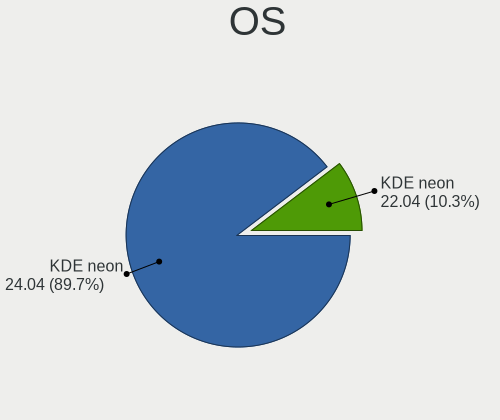
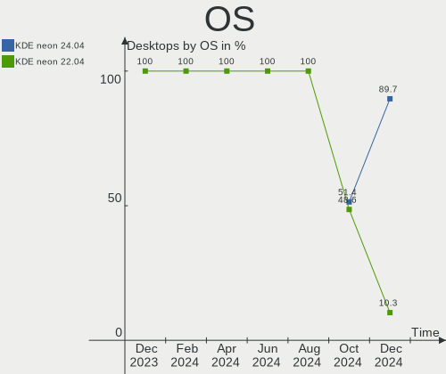
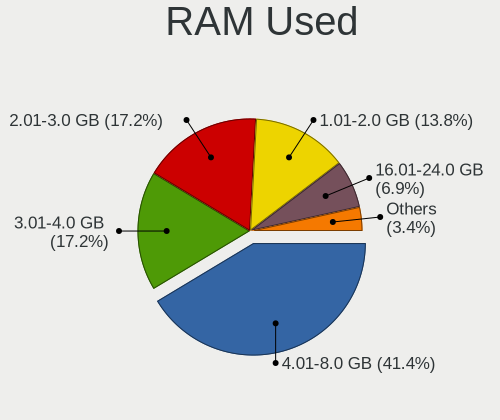
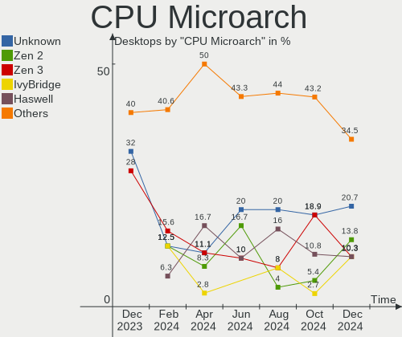
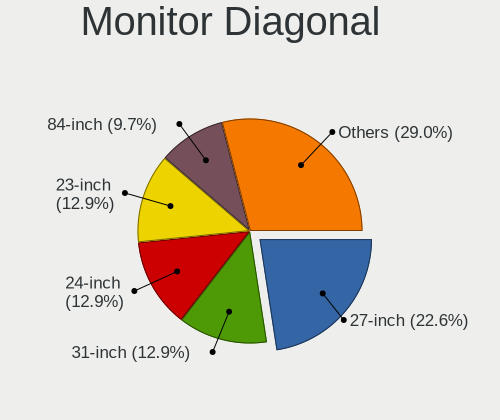
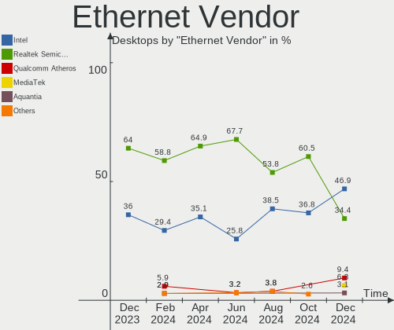
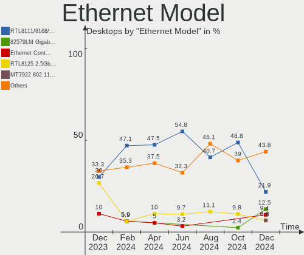
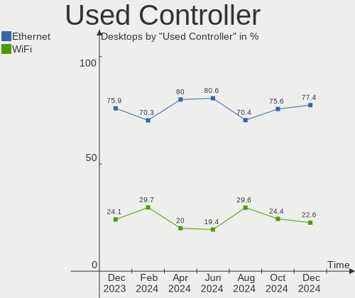
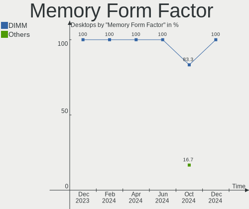
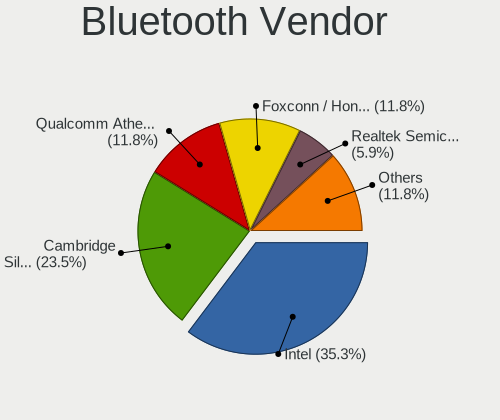

KDE neon Hardware Trends (Desktop)
----------------------------------

A project to identify most popular hardware characteristics and track their change
over time based on data collected by KDE neon users at https://Linux-Hardware.org.

Anyone can contribute to the study by uploading probes of their computers by
the [hw-probe](https://github.com/linuxhw/hw-probe) tool:

    sudo -E hw-probe -all -upload

Full-feature report is available here: https://linux-hardware.org/?view=trends&formfactor=desktop

Period: Dec, 2020.

Contents
--------

- [ OS                       ](#os)
- [ OS Family                ](#os-family)
- [ Kernel                   ](#kernel)
- [ Kernel Family            ](#kernel-family)
- [ Kernel Major Ver.        ](#kernel-major-ver)
- [ Arch                     ](#arch)
- [ DE                       ](#de)
- [ Display Server           ](#display-server)
- [ Display Manager          ](#display-manager)
- [ OS Lang                  ](#os-lang)
- [ Boot Mode                ](#boot-mode)
- [ Filesystem               ](#filesystem)
- [ Part. scheme             ](#part-scheme)
- [ Dual Boot with Linux/BSD ](#dual-boot-with-linux/bsd)
- [ Dual Boot (Win)          ](#dual-boot-win)
- [ Country                  ](#country)
- [ City                     ](#city)
- [ Vendor                   ](#vendor)
- [ Model                    ](#model)
- [ Model Family             ](#model-family)
- [ MFG Year                 ](#mfg-year)
- [ Form Factor              ](#form-factor)
- [ Secure Boot              ](#secure-boot)
- [ Coreboot                 ](#coreboot)
- [ RAM Size                 ](#ram-size)
- [ RAM Used                 ](#ram-used)
- [ Has CD-ROM               ](#has-cd-rom)
- [ Total Drives             ](#total-drives)
- [ Has Ethernet             ](#has-ethernet)
- [ Drive Vendor             ](#drive-vendor)
- [ Drive Model              ](#drive-model)
- [ HDD Vendor               ](#hdd-vendor)
- [ SSD Vendor               ](#ssd-vendor)
- [ Drive Kind               ](#drive-kind)
- [ Drive Connector          ](#drive-connector)
- [ Drive Size               ](#drive-size)
- [ Space Total              ](#space-total)
- [ Space Used               ](#space-used)
- [ Malfunc. Drives          ](#malfunc-drives)
- [ Malfunc. Drive Vendor    ](#malfunc-drive-vendor)
- [ Malfunc. HDD Vendor      ](#malfunc-hdd-vendor)
- [ Malfunc. Drive Kind      ](#malfunc-drive-kind)
- [ Failed Drives            ](#failed-drives)
- [ Failed Drive Vendor      ](#failed-drive-vendor)
- [ Drive Status             ](#drive-status)
- [ Storage Vendor           ](#storage-vendor)
- [ Storage Model            ](#storage-model)
- [ Storage Kind             ](#storage-kind)
- [ CPU Vendor               ](#cpu-vendor)
- [ CPU Model                ](#cpu-model)
- [ CPU Model Family         ](#cpu-model-family)
- [ CPU Cores                ](#cpu-cores)
- [ CPU Sockets              ](#cpu-sockets)
- [ CPU Threads              ](#cpu-threads)
- [ CPU Op-Modes             ](#cpu-op-modes)
- [ CPU Microcode            ](#cpu-microcode)
- [ CPU Microarch            ](#cpu-microarch)
- [ GPU Vendor               ](#gpu-vendor)
- [ GPU Model                ](#gpu-model)
- [ GPU Combo                ](#gpu-combo)
- [ GPU Driver               ](#gpu-driver)
- [ GPU Memory               ](#gpu-memory)
- [ Monitor Vendor           ](#monitor-vendor)
- [ Monitor Model            ](#monitor-model)
- [ Monitor Resolution       ](#monitor-resolution)
- [ Monitor Diagonal         ](#monitor-diagonal)
- [ Monitor Width            ](#monitor-width)
- [ Aspect Ratio             ](#aspect-ratio)
- [ Monitor Area             ](#monitor-area)
- [ Pixel Density            ](#pixel-density)
- [ Multiple Monitors        ](#multiple-monitors)
- [ Net Controller Vendor    ](#net-controller-vendor)
- [ Net Controller Model     ](#net-controller-model)
- [ Wireless Vendor          ](#wireless-vendor)
- [ Wireless Model           ](#wireless-model)
- [ Ethernet Vendor          ](#ethernet-vendor)
- [ Ethernet Model           ](#ethernet-model)
- [ Net Controller Kind      ](#net-controller-kind)
- [ Used Controller          ](#used-controller)
- [ NICs                     ](#nics)
- [ Memory Vendor            ](#memory-vendor)
- [ Memory Model             ](#memory-model)
- [ Memory Kind              ](#memory-kind)
- [ Memory Form Factor       ](#memory-form-factor)
- [ Memory Size              ](#memory-size)
- [ Memory Speed             ](#memory-speed)
- [ Sound Vendor             ](#sound-vendor)
- [ Sound Model              ](#sound-model)
- [ Camera Vendor            ](#camera-vendor)
- [ Camera Model             ](#camera-model)
- [ Fingerprint Vendor       ](#fingerprint-vendor)
- [ Fingerprint Model        ](#fingerprint-model)
- [ Chipcard Vendor          ](#chipcard-vendor)
- [ Chipcard Model           ](#chipcard-model)
- [ Printer Vendor           ](#printer-vendor)
- [ Printer Model            ](#printer-model)
- [ Scanner Vendor           ](#scanner-vendor)
- [ Scanner Model            ](#scanner-model)
- [ Bluetooth Vendor         ](#bluetooth-vendor)
- [ Bluetooth Model          ](#bluetooth-model)
- [ Unsupported Devices      ](#unsupported-devices)
- [ Unsupported Device Types ](#unsupported-device-types)

OS
--

Installed operating systems

| Name           | Desktops | Percent |
|----------------|----------|---------|
| KDE neon 20.04 | 90       | 98.9%   |
| KDE neon 18.04 | 1        | 1.1%    |

OS Family
---------

OS without a version

| Name     | Desktops | Percent |
|----------|----------|---------|
| KDE neon | 91       | 100%    |

Kernel
------

Version of the Linux kernel

| Version               | Desktops | Percent |
|-----------------------|----------|---------|
| 5.4.0-58-generic      | 48       | 52.75%  |
| 5.4.0-56-generic      | 27       | 29.67%  |
| 5.4.0-54-generic      | 9        | 9.89%   |
| 5.4.0-52-generic      | 2        | 2.2%    |
| 5.9.15-xanmod1        | 1        | 1.1%    |
| 5.9.12-050912-generic | 1        | 1.1%    |
| 5.4.0-57-generic      | 1        | 1.1%    |
| 5.4.0-42-generic      | 1        | 1.1%    |
| 5.3.0-62-generic      | 1        | 1.1%    |

Kernel Family
-------------

Linux kernel without a distro release

| Version | Desktops | Percent |
|---------|----------|---------|
| 5.4.0   | 88       | 96.7%   |
| 5.9.15  | 1        | 1.1%    |
| 5.9.12  | 1        | 1.1%    |
| 5.3.0   | 1        | 1.1%    |

Kernel Major Ver.
-----------------

Linux kernel major version

| Version | Desktops | Percent |
|---------|----------|---------|
| 5.4     | 88       | 96.7%   |
| 5.9     | 2        | 2.2%    |
| 5.3     | 1        | 1.1%    |

Arch
----

OS architecture (x86_64, i586, etc.)

| Name   | Desktops | Percent |
|--------|----------|---------|
| x86_64 | 91       | 100%    |

DE
--

Desktop Environment

| Name    | Desktops | Percent |
|---------|----------|---------|
| KDE     | 82       | 90.11%  |
| KDE5    | 7        | 7.69%   |
| Unknown | 2        | 2.2%    |

Display Server
--------------

X11 or Wayland

| Name    | Desktops | Percent |
|---------|----------|---------|
| X11     | 90       | 98.9%   |
| Unknown | 1        | 1.1%    |

Display Manager
---------------

SDDM, LightDM, etc.

| Name    | Desktops | Percent |
|---------|----------|---------|
| Unknown | 84       | 92.31%  |
| SDDM    | 6        | 6.59%   |
| GDM     | 1        | 1.1%    |

OS Lang
-------

Language

| Lang  | Desktops | Percent |
|-------|----------|---------|
| en_US | 27       | 29.67%  |
| it_IT | 8        | 8.79%   |
| pt_BR | 7        | 7.69%   |
| de_DE | 7        | 7.69%   |
| ru_RU | 6        | 6.59%   |
| en_GB | 5        | 5.49%   |
| fr_FR | 4        | 4.4%    |
| en_CA | 4        | 4.4%    |
| pl_PL | 3        | 3.3%    |
| es_ES | 3        | 3.3%    |
| es_MX | 2        | 2.2%    |
| en_AU | 2        | 2.2%    |
| C     | 2        | 2.2%    |
| tr_TR | 1        | 1.1%    |
| sv_SE | 1        | 1.1%    |
| sl_SI | 1        | 1.1%    |
| ru_UA | 1        | 1.1%    |
| nl_NL | 1        | 1.1%    |
| nb_NO | 1        | 1.1%    |
| fr_BE | 1        | 1.1%    |
| fi_FI | 1        | 1.1%    |
| en_IN | 1        | 1.1%    |
| de_CH | 1        | 1.1%    |
| C     | 1        | 1.1%    |

Boot Mode
---------

EFI or BIOS

| Mode | Desktops | Percent |
|------|----------|---------|
| EFI  | 48       | 52.75%  |
| BIOS | 43       | 47.25%  |

Filesystem
----------

Type of filesystem

| Type    | Desktops | Percent |
|---------|----------|---------|
| Ext4    | 83       | 91.21%  |
| Btrfs   | 7        | 7.69%   |
| Overlay | 1        | 1.1%    |

Part. scheme
------------

Scheme of partitioning

| Type    | Desktops | Percent |
|---------|----------|---------|
| Unknown | 84       | 92.31%  |
| GPT     | 4        | 4.4%    |
| MBR     | 3        | 3.3%    |

Dual Boot with Linux/BSD
------------------------

Hosting more than one Linux/BSD

| Dual boot | Desktops | Percent |
|-----------|----------|---------|
| No        | 81       | 89.01%  |
| Yes       | 10       | 10.99%  |

Dual Boot (Win)
---------------

Hosting Linux and Windows

| Dual boot | Desktops | Percent |
|-----------|----------|---------|
| No        | 82       | 90.11%  |
| Yes       | 9        | 9.89%   |

Country
-------

Geographic location (country)

| Country        | Desktops | Percent |
|----------------|----------|---------|
| USA            | 17       | 18.68%  |
| Italy          | 9        | 9.89%   |
| Germany        | 8        | 8.79%   |
| Brazil         | 8        | 8.79%   |
| Canada         | 7        | 7.69%   |
| UK             | 3        | 3.3%    |
| Spain          | 3        | 3.3%    |
| Russia         | 3        | 3.3%    |
| Poland         | 3        | 3.3%    |
| France         | 3        | 3.3%    |
| Australia      | 3        | 3.3%    |
| Ukraine        | 2        | 2.2%    |
| Serbia         | 2        | 2.2%    |
| Netherlands    | 2        | 2.2%    |
| Mexico         | 2        | 2.2%    |
| Finland        | 2        | 2.2%    |
| Turkey         | 1        | 1.1%    |
| Switzerland    | 1        | 1.1%    |
| Sweden         | 1        | 1.1%    |
| Slovenia       | 1        | 1.1%    |
| Norway         | 1        | 1.1%    |
| Malaysia       | 1        | 1.1%    |
| Kazakhstan     | 1        | 1.1%    |
| India          | 1        | 1.1%    |
| Czech Republic | 1        | 1.1%    |
| Colombia       | 1        | 1.1%    |
| Bulgaria       | 1        | 1.1%    |
| Belgium        | 1        | 1.1%    |
| Belarus        | 1        | 1.1%    |
| Argentina      | 1        | 1.1%    |

City
----

Geographic location (city)

| City                 | Desktops | Percent |
|----------------------|----------|---------|
| Jacksonville         | 2        | 2.2%    |
| Cologne              | 2        | 2.2%    |
| Belgrade             | 2        | 2.2%    |
| Zell am Harmersbach  | 1        | 1.1%    |
| Zaragoza             | 1        | 1.1%    |
| Zaporizhia           | 1        | 1.1%    |
| Wiesbaden            | 1        | 1.1%    |
| Wałbrzych           | 1        | 1.1%    |
| Washington           | 1        | 1.1%    |
| Warsaw               | 1        | 1.1%    |
| Vicar                | 1        | 1.1%    |
| Venegono Inferiore   | 1        | 1.1%    |
| Val-d'Or             | 1        | 1.1%    |
| Turlock              | 1        | 1.1%    |
| Trieste              | 1        | 1.1%    |
| Toulouse             | 1        | 1.1%    |
| Tampere              | 1        | 1.1%    |
| São Paulo           | 1        | 1.1%    |
| St Petersburg        | 1        | 1.1%    |
| Sofia                | 1        | 1.1%    |
| Slattum              | 1        | 1.1%    |
| Skondal              | 1        | 1.1%    |
| Savona               | 1        | 1.1%    |
| Sarlat-la-Canéda    | 1        | 1.1%    |
| Salo                 | 1        | 1.1%    |
| Rome                 | 1        | 1.1%    |
| Rio de Janeiro       | 1        | 1.1%    |
| Richmond Hill        | 1        | 1.1%    |
| Québec              | 1        | 1.1%    |
| Pulsano              | 1        | 1.1%    |
| Pouso Alegre         | 1        | 1.1%    |
| Pensacola            | 1        | 1.1%    |
| Olten                | 1        | 1.1%    |
| Newcastle upon Tyne  | 1        | 1.1%    |
| New York             | 1        | 1.1%    |
| Nantes               | 1        | 1.1%    |
| Murcia               | 1        | 1.1%    |
| Munich               | 1        | 1.1%    |
| Morano sul Po        | 1        | 1.1%    |
| Montreal             | 1        | 1.1%    |
| Monticello           | 1        | 1.1%    |
| Milwaukee            | 1        | 1.1%    |
| Melbourne            | 1        | 1.1%    |
| Medellín            | 1        | 1.1%    |
| Marieville           | 1        | 1.1%    |
| Mansfield            | 1        | 1.1%    |
| Mandaguacu           | 1        | 1.1%    |
| Longmeadow           | 1        | 1.1%    |
| Ljubljana            | 1        | 1.1%    |
| Liverpool            | 1        | 1.1%    |
| Krasnoyarsk          | 1        | 1.1%    |
| Kerkdriel            | 1        | 1.1%    |
| Izmir                | 1        | 1.1%    |
| Itapecerica da Serra | 1        | 1.1%    |
| Houston              | 1        | 1.1%    |
| Horizonte            | 1        | 1.1%    |
| Hilton               | 1        | 1.1%    |
| Guanajuato City      | 1        | 1.1%    |
| Garibaldi            | 1        | 1.1%    |
| Floresville          | 1        | 1.1%    |

Vendor
------

Motherboard manufacturer

| Name                | Desktops | Percent |
|---------------------|----------|---------|
| Gigabyte Technology | 26       | 28.57%  |
| ASUSTek Computer    | 20       | 21.98%  |
| ASRock              | 9        | 9.89%   |
| MSI                 | 7        | 7.69%   |
| Dell                | 7        | 7.69%   |
| Hewlett-Packard     | 6        | 6.59%   |
| Lenovo              | 4        | 4.4%    |
| Intel               | 3        | 3.3%    |
| Acer                | 2        | 2.2%    |
| System76            | 1        | 1.1%    |
| Supermicro          | 1        | 1.1%    |
| Sapphire            | 1        | 1.1%    |
| Pegatron            | 1        | 1.1%    |
| ICP / iEi           | 1        | 1.1%    |
| Centrium            | 1        | 1.1%    |
| Unknown             | 1        | 1.1%    |

Model
-----

Motherboard model

| Name                                      | Desktops | Percent |
|-------------------------------------------|----------|---------|
| Gigabyte H310M S2H 2.0                    | 2        | 2.2%    |
| Gigabyte H310M S2 2.0                     | 2        | 2.2%    |
| ASUS All Series                           | 2        | 2.2%    |
| System76 Thelio                           | 1        | 1.1%    |
| Supermicro H8DI3+                         | 1        | 1.1%    |
| Sapphire PI-AM3RS785G                     | 1        | 1.1%    |
| Pegatron 600-1365qd                       | 1        | 1.1%    |
| MSI s5780es                               | 1        | 1.1%    |
| MSI MS-7C37                               | 1        | 1.1%    |
| MSI MS-7B89                               | 1        | 1.1%    |
| MSI MS-7A33                               | 1        | 1.1%    |
| MSI MS-7971                               | 1        | 1.1%    |
| MSI MS-7817                               | 1        | 1.1%    |
| MSI MS-7641                               | 1        | 1.1%    |
| Lenovo ThinkCentre M93p 10AAA0FA00        | 1        | 1.1%    |
| Lenovo ThinkCentre M910q 10MUS46V00       | 1        | 1.1%    |
| Lenovo ThinkCentre E73 10AW008RMX         | 1        | 1.1%    |
| Lenovo IdeaCentre T540-15AMA G 90L5002AGE | 1        | 1.1%    |
| Intel HURONRIVER                          | 1        | 1.1%    |
| Intel DP45SG AAE27733-404                 | 1        | 1.1%    |
| Intel DH61WW AAG23116-300                 | 1        | 1.1%    |
| ICP / iEi B202                            | 1        | 1.1%    |
| HP Z800 Workstation                       | 1        | 1.1%    |
| HP Pavilion Desktop TP01-0xxx             | 1        | 1.1%    |
| HP Pavilion Desktop PC 570-p0xx           | 1        | 1.1%    |
| HP EliteDesk 705 G2 MINI                  | 1        | 1.1%    |
| HP Compaq Pro 6300 SFF                    | 1        | 1.1%    |
| HP 110-420nl                              | 1        | 1.1%    |
| Gigabyte Z97X-UD3H-BK                     | 1        | 1.1%    |
| Gigabyte Z87M-HD3                         | 1        | 1.1%    |
| Gigabyte Z87-HD3                          | 1        | 1.1%    |
| Gigabyte Z77-D3H                          | 1        | 1.1%    |
| Gigabyte X570 AORUS ELITE                 | 1        | 1.1%    |
| Gigabyte Wild Dog Pro                     | 1        | 1.1%    |
| Gigabyte M68MT-S2                         | 1        | 1.1%    |
| Gigabyte H77-D3H                          | 1        | 1.1%    |
| Gigabyte H67A-UD3H                        | 1        | 1.1%    |
| Gigabyte H370M-DS3H                       | 1        | 1.1%    |
| Gigabyte H270-HD3                         | 1        | 1.1%    |
| Gigabyte H170M-DS3H                       | 1        | 1.1%    |
| Gigabyte GA-MA770-DS3                     | 1        | 1.1%    |
| Gigabyte F2A68HM-H                        | 1        | 1.1%    |
| Gigabyte B75M-D2V                         | 1        | 1.1%    |
| Gigabyte B550M DS3H                       | 1        | 1.1%    |
| Gigabyte B550 AORUS PRO                   | 1        | 1.1%    |
| Gigabyte B450M DS3H                       | 1        | 1.1%    |
| Gigabyte B450 AORUS PRO WIFI              | 1        | 1.1%    |
| Gigabyte AB350M-DS3H V2                   | 1        | 1.1%    |
| Gigabyte 970A-DS3P                        | 1        | 1.1%    |
| Gigabyte 965P-DS4                         | 1        | 1.1%    |
| Dell PowerEdge SC440                      | 1        | 1.1%    |
| Dell OptiPlex 7010                        | 1        | 1.1%    |
| Dell OptiPlex 390                         | 1        | 1.1%    |
| Dell OptiPlex 3020                        | 1        | 1.1%    |
| Dell Inspiron 531                         | 1        | 1.1%    |
| Dell Inspiron 3470                        | 1        | 1.1%    |
| Dell Dimension 8400                       | 1        | 1.1%    |
| Centrium C2016-H110M4-C2H                 | 1        | 1.1%    |
| ASUS Z170-A                               | 1        | 1.1%    |
| ASUS SABERTOOTH P67                       | 1        | 1.1%    |

Model Family
------------

Motherboard model prefix

| Name                      | Desktops | Percent |
|---------------------------|----------|---------|
| Gigabyte H310M            | 4        | 4.4%    |
| ASUS PRIME                | 4        | 4.4%    |
| Lenovo ThinkCentre        | 3        | 3.3%    |
| Dell OptiPlex             | 3        | 3.3%    |
| ASUS ROG                  | 3        | 3.3%    |
| HP Pavilion               | 2        | 2.2%    |
| Dell Inspiron             | 2        | 2.2%    |
| ASUS All                  | 2        | 2.2%    |
| System76 Thelio           | 1        | 1.1%    |
| Supermicro H8DI3+         | 1        | 1.1%    |
| Sapphire PI-AM3RS785G     | 1        | 1.1%    |
| Pegatron 600-1365qd       | 1        | 1.1%    |
| MSI s5780es               | 1        | 1.1%    |
| MSI MS-7C37               | 1        | 1.1%    |
| MSI MS-7B89               | 1        | 1.1%    |
| MSI MS-7A33               | 1        | 1.1%    |
| MSI MS-7971               | 1        | 1.1%    |
| MSI MS-7817               | 1        | 1.1%    |
| MSI MS-7641               | 1        | 1.1%    |
| Lenovo IdeaCentre         | 1        | 1.1%    |
| Intel HURONRIVER          | 1        | 1.1%    |
| Intel DP45SG              | 1        | 1.1%    |
| Intel DH61WW              | 1        | 1.1%    |
| ICP / iEi B202            | 1        | 1.1%    |
| HP Z800                   | 1        | 1.1%    |
| HP EliteDesk              | 1        | 1.1%    |
| HP Compaq                 | 1        | 1.1%    |
| HP 110-420nl              | 1        | 1.1%    |
| Gigabyte Z97X-UD3H-BK     | 1        | 1.1%    |
| Gigabyte Z87M-HD3         | 1        | 1.1%    |
| Gigabyte Z87-HD3          | 1        | 1.1%    |
| Gigabyte Z77-D3H          | 1        | 1.1%    |
| Gigabyte X570             | 1        | 1.1%    |
| Gigabyte Wild             | 1        | 1.1%    |
| Gigabyte M68MT-S2         | 1        | 1.1%    |
| Gigabyte H77-D3H          | 1        | 1.1%    |
| Gigabyte H67A-UD3H        | 1        | 1.1%    |
| Gigabyte H370M-DS3H       | 1        | 1.1%    |
| Gigabyte H270-HD3         | 1        | 1.1%    |
| Gigabyte H170M-DS3H       | 1        | 1.1%    |
| Gigabyte GA-MA770-DS3     | 1        | 1.1%    |
| Gigabyte F2A68HM-H        | 1        | 1.1%    |
| Gigabyte B75M-D2V         | 1        | 1.1%    |
| Gigabyte B550M            | 1        | 1.1%    |
| Gigabyte B550             | 1        | 1.1%    |
| Gigabyte B450M            | 1        | 1.1%    |
| Gigabyte B450             | 1        | 1.1%    |
| Gigabyte AB350M-DS3H      | 1        | 1.1%    |
| Gigabyte 970A-DS3P        | 1        | 1.1%    |
| Gigabyte 965P-DS4         | 1        | 1.1%    |
| Dell PowerEdge            | 1        | 1.1%    |
| Dell Dimension            | 1        | 1.1%    |
| Centrium C2016-H110M4-C2H | 1        | 1.1%    |
| ASUS Z170-A               | 1        | 1.1%    |
| ASUS SABERTOOTH           | 1        | 1.1%    |
| ASUS P8Z77-V              | 1        | 1.1%    |
| ASUS P8H67-M              | 1        | 1.1%    |
| ASUS P8H67                | 1        | 1.1%    |
| ASUS P5KPL-AM             | 1        | 1.1%    |
| ASUS M5A97                | 1        | 1.1%    |

MFG Year
--------

Motherboard manufacture year

| Year | Desktops | Percent |
|------|----------|---------|
| 2020 | 18       | 19.78%  |
| 2019 | 12       | 13.19%  |
| 2018 | 11       | 12.09%  |
| 2013 | 7        | 7.69%   |
| 2012 | 7        | 7.69%   |
| 2010 | 7        | 7.69%   |
| 2014 | 6        | 6.59%   |
| 2011 | 6        | 6.59%   |
| 2017 | 4        | 4.4%    |
| 2015 | 4        | 4.4%    |
| 2009 | 4        | 4.4%    |
| 2016 | 2        | 2.2%    |
| 2007 | 2        | 2.2%    |
| 2006 | 1        | 1.1%    |

Form Factor
-----------

Physical design of the computer

| Name    | Desktops | Percent |
|---------|----------|---------|
| Desktop | 91       | 100%    |

Secure Boot
-----------

Enabled or disabled

| State    | Desktops | Percent |
|----------|----------|---------|
| Disabled | 86       | 94.51%  |
| Enabled  | 5        | 5.49%   |

Coreboot
--------

Have coreboot on board

| Used | Desktops | Percent |
|------|----------|---------|
| No   | 91       | 100%    |

RAM Size
--------

Total RAM memory

| Size in GB  | Desktops | Percent |
|-------------|----------|---------|
| 16.01-24.0  | 28       | 30.77%  |
| 8.01-16.0   | 24       | 26.37%  |
| 4.01-8.0    | 14       | 15.38%  |
| 32.01-64.0  | 11       | 12.09%  |
| 3.01-4.0    | 11       | 12.09%  |
| 24.01-32.0  | 1        | 1.1%    |
| 64.01-256.0 | 1        | 1.1%    |
| 1.01-2.0    | 1        | 1.1%    |

RAM Used
--------

Used RAM memory

| Used GB   | Desktops | Percent |
|-----------|----------|---------|
| 1.01-2.0  | 34       | 37.36%  |
| 2.01-3.0  | 28       | 30.77%  |
| 3.01-4.0  | 13       | 14.29%  |
| 4.01-8.0  | 10       | 10.99%  |
| 0.51-1.0  | 4        | 4.4%    |
| 8.01-16.0 | 2        | 2.2%    |

Has CD-ROM
----------

Has CD-ROM on board

| Presented | Desktops | Percent |
|-----------|----------|---------|
| No        | 60       | 65.93%  |
| Yes       | 31       | 34.07%  |

Total Drives
------------

Number of drives on board

| Drives | Desktops | Percent |
|--------|----------|---------|
| 2      | 38       | 41.76%  |
| 1      | 31       | 34.07%  |
| 3      | 8        | 8.79%   |
| 4      | 6        | 6.59%   |
| 6      | 5        | 5.49%   |
| 5      | 2        | 2.2%    |
| 8      | 1        | 1.1%    |

Has Ethernet
------------

Has Ethernet on board

| Presented | Desktops | Percent |
|-----------|----------|---------|
| Yes       | 91       | 100%    |

Drive Vendor
------------

Hard drive vendors

| Vendor                | Desktops | Drives | Percent |
|-----------------------|----------|--------|---------|
| WDC                   | 29       | 38     | 17.58%  |
| Seagate               | 29       | 43     | 17.58%  |
| Samsung Electronics   | 29       | 38     | 17.58%  |
| Kingston              | 12       | 13     | 7.27%   |
| SanDisk               | 10       | 10     | 6.06%   |
| Crucial               | 9        | 9      | 5.45%   |
| Toshiba               | 8        | 9      | 4.85%   |
| Intel                 | 4        | 5      | 2.42%   |
| Hitachi               | 4        | 4      | 2.42%   |
| A-DATA Technology     | 4        | 5      | 2.42%   |
| SK Hynix              | 2        | 2      | 1.21%   |
| Realtek Semiconductor | 2        | 2      | 1.21%   |
| Phison                | 2        | 2      | 1.21%   |
| Intenso               | 2        | 2      | 1.21%   |
| China                 | 2        | 2      | 1.21%   |
| WD MediaMax           | 1        | 1      | 0.61%   |
| Unknown               | 1        | 1      | 0.61%   |
| SPCC                  | 1        | 1      | 0.61%   |
| Silicon Motion        | 1        | 1      | 0.61%   |
| PNY                   | 1        | 1      | 0.61%   |
| PLEXTOR               | 1        | 2      | 0.61%   |
| MAXTOR                | 1        | 1      | 0.61%   |
| Lenovo                | 1        | 1      | 0.61%   |
| KingFast              | 1        | 1      | 0.61%   |
| JMicron               | 1        | 1      | 0.61%   |
| HGST                  | 1        | 1      | 0.61%   |
| Gigabyte Technology   | 1        | 1      | 0.61%   |
| Fujitsu               | 1        | 1      | 0.61%   |
| DAS                   | 1        | 2      | 0.61%   |
| Corsair               | 1        | 1      | 0.61%   |
| Biostar               | 1        | 1      | 0.61%   |
| BHT                   | 1        | 1      | 0.61%   |

Drive Model
-----------

Hard drive models

| Model                            | Desktops | Percent |
|----------------------------------|----------|---------|
| Kingston SA400S37240G 240GB SSD  | 5        | 2.54%   |
| Seagate ST500DM002-1BD142 500GB  | 4        | 2.03%   |
| Samsung SSD 850 EVO 250GB        | 4        | 2.03%   |
| Samsung NVMe SSD Drive 250GB     | 4        | 2.03%   |
| WDC WD10EZEX-08WN4A0 1TB         | 3        | 1.52%   |
| Seagate ST3500418AS 500GB        | 3        | 1.52%   |
| Sandisk NVMe SSD Drive 1TB       | 3        | 1.52%   |
| Crucial CT500MX500SSD1 500GB     | 3        | 1.52%   |
| WDC WDS240G2G0A-00JH30 240GB SSD | 2        | 1.02%   |
| WDC WD20EZRZ-00Z5HB0 2TB         | 2        | 1.02%   |
| Seagate ST2000DM006-2DM164 2TB   | 2        | 1.02%   |
| Seagate ST1000VM002-1CT162 1TB   | 2        | 1.02%   |
| Seagate ST1000DM010-2EP102 1TB   | 2        | 1.02%   |
| Sandisk NVMe SSD Drive 500GB     | 2        | 1.02%   |
| Samsung SSD 860 QVO 2TB          | 2        | 1.02%   |
| Samsung SSD 860 EVO 500GB        | 2        | 1.02%   |
| Samsung SSD 840 EVO 120GB        | 2        | 1.02%   |
| Samsung NVMe SSD Drive 256GB     | 2        | 1.02%   |
| Kingston SA400S37120G 120GB SSD  | 2        | 1.02%   |
| Intenso SSD SATAIII 480GB        | 2        | 1.02%   |
| WDC WDS250G2B0A 250GB SSD        | 1        | 0.51%   |
| WDC WDS240G2G0B-00EPW0 240GB SSD | 1        | 0.51%   |
| WDC WD800JD-08MSA1 80GB          | 1        | 0.51%   |
| WDC WD6401AALS-00J7B1 640GB      | 1        | 0.51%   |
| WDC WD6400AAKS-22A7B2 640GB      | 1        | 0.51%   |
| WDC WD5000BEVT-75ZAT0 500GB      | 1        | 0.51%   |
| WDC WD5000AAKX-22ERMA0 500GB     | 1        | 0.51%   |
| WDC WD5000AAKX-00U6AA0 500GB     | 1        | 0.51%   |
| WDC WD5000AADS-56S9B0 500GB      | 1        | 0.51%   |
| WDC WD40EZRZ-22GXCB0 4TB         | 1        | 0.51%   |
| WDC WD40EZRZ-00GXCB0 4TB         | 1        | 0.51%   |
| WDC WD3200AAJS-56B4A0 320GB      | 1        | 0.51%   |
| WDC WD2500JD-75HBB0 249GB        | 1        | 0.51%   |
| WDC WD2500AAJS-00L7A0 250GB      | 1        | 0.51%   |
| WDC WD20PURZ-85GU6Y0 2TB         | 1        | 0.51%   |
| WDC WD20EZAZ-00GGJB0 2TB         | 1        | 0.51%   |
| WDC WD20EARX-00PASB0 2TB         | 1        | 0.51%   |
| WDC WD1601ABYS-18C0A0 160GB      | 1        | 0.51%   |
| WDC WD1600JD-00HBB0 160GB        | 1        | 0.51%   |
| WDC WD10EZRZ-00HTKB0 1TB         | 1        | 0.51%   |
| WDC WD10EZEX-75M2NA0 1TB         | 1        | 0.51%   |
| WDC WD10EZEX-60WN4A0 1TB         | 1        | 0.51%   |
| WDC WD10EZEX-22RKKA0 1TB         | 1        | 0.51%   |
| WDC WD10EZEX-22MFCA0 1TB         | 1        | 0.51%   |
| WDC WD10EZEX-00WN4A0 1TB         | 1        | 0.51%   |
| WDC WD10EURX-63FH1Y0 1TB         | 1        | 0.51%   |
| WDC WD10EFRX-68FYTN0 1TB         | 1        | 0.51%   |
| WDC WD10EARX-00N0YB0 1TB         | 1        | 0.51%   |
| WDC WD10EACS-00D6B1 1TB          | 1        | 0.51%   |
| WD MediaMax WL1000GSA6454 1TB    | 1        | 0.51%   |
| Unknown SD/MMC/MS PRO 128GB      | 1        | 0.51%   |
| Toshiba NVMe SSD Drive 256GB     | 1        | 0.51%   |
| Toshiba MQ01ABF050 500GB         | 1        | 0.51%   |
| Toshiba MQ01ABD050 500GB         | 1        | 0.51%   |
| Toshiba MK1255GSX H 120GB        | 1        | 0.51%   |
| Toshiba MK1059GSM 1TB            | 1        | 0.51%   |
| Toshiba HDWD110 1TB              | 1        | 0.51%   |
| Toshiba DT01ACA100 1TB           | 1        | 0.51%   |
| Toshiba DT01ACA050 500GB         | 1        | 0.51%   |
| SPCC Solid State Disk 120GB      | 1        | 0.51%   |

HDD Vendor
----------

Hard disk drive vendors

| Vendor              | Desktops | Drives | Percent |
|---------------------|----------|--------|---------|
| Seagate             | 29       | 43     | 40.28%  |
| WDC                 | 26       | 34     | 36.11%  |
| Toshiba             | 7        | 8      | 9.72%   |
| Hitachi             | 4        | 4      | 5.56%   |
| Samsung Electronics | 3        | 3      | 4.17%   |
| MAXTOR              | 1        | 1      | 1.39%   |
| HGST                | 1        | 1      | 1.39%   |
| Fujitsu             | 1        | 1      | 1.39%   |

SSD Vendor
----------

Solid state drive vendors

| Vendor              | Desktops | Drives | Percent |
|---------------------|----------|--------|---------|
| Samsung Electronics | 19       | 22     | 29.69%  |
| Kingston            | 11       | 12     | 17.19%  |
| Crucial             | 8        | 8      | 12.5%   |
| WDC                 | 4        | 4      | 6.25%   |
| SanDisk             | 4        | 4      | 6.25%   |
| A-DATA Technology   | 4        | 5      | 6.25%   |
| Intel               | 3        | 3      | 4.69%   |
| Intenso             | 2        | 2      | 3.13%   |
| China               | 2        | 2      | 3.13%   |
| SPCC                | 1        | 1      | 1.56%   |
| PNY                 | 1        | 1      | 1.56%   |
| PLEXTOR             | 1        | 2      | 1.56%   |
| JMicron             | 1        | 1      | 1.56%   |
| Gigabyte Technology | 1        | 1      | 1.56%   |
| Corsair             | 1        | 1      | 1.56%   |
| Biostar             | 1        | 1      | 1.56%   |

Drive Kind
----------

HDD or SSD

| Kind    | Desktops | Drives | Percent |
|---------|----------|--------|---------|
| HDD     | 56       | 95     | 40.58%  |
| SSD     | 52       | 70     | 37.68%  |
| NVMe    | 25       | 32     | 18.12%  |
| Unknown | 5        | 6      | 3.62%   |

Drive Connector
---------------

SATA, SAS, NVMe, etc.

| Type | Desktops | Drives | Percent |
|------|----------|--------|---------|
| SATA | 89       | 166    | 75.42%  |
| NVMe | 25       | 32     | 21.19%  |
| SAS  | 4        | 5      | 3.39%   |

Drive Size
----------

Size of hard drive

| Size in TB | Desktops | Drives | Percent |
|------------|----------|--------|---------|
| 0.01-0.5   | 68       | 104    | 57.14%  |
| 0.51-1.0   | 32       | 37     | 26.89%  |
| 1.01-2.0   | 13       | 15     | 10.92%  |
| 3.01-4.0   | 5        | 8      | 4.2%    |
| 2.01-3.0   | 1        | 1      | 0.84%   |

Space Total
-----------

Amount of disk space available on the file system

| Size in GB     | Desktops | Percent |
|----------------|----------|---------|
| 101-250        | 27       | 29.67%  |
| 501-1000       | 15       | 16.48%  |
| 251-500        | 11       | 12.09%  |
| 1001-2000      | 10       | 10.99%  |
| 51-100         | 9        | 9.89%   |
| More than 3000 | 5        | 5.49%   |
| 21-50          | 4        | 4.4%    |
| 2001-3000      | 4        | 4.4%    |
| 1-20           | 3        | 3.3%    |
| Unknown        | 3        | 3.3%    |

Space Used
----------

Amount of used disk space

| Used GB        | Desktops | Percent |
|----------------|----------|---------|
| 1-20           | 44       | 48.35%  |
| 21-50          | 13       | 14.29%  |
| 501-1000       | 7        | 7.69%   |
| 51-100         | 7        | 7.69%   |
| 101-250        | 6        | 6.59%   |
| 1001-2000      | 4        | 4.4%    |
| More than 3000 | 3        | 3.3%    |
| 251-500        | 3        | 3.3%    |
| Unknown        | 3        | 3.3%    |
| 2001-3000      | 1        | 1.1%    |

Malfunc. Drives
---------------

Drive models with a malfunction

| Model                                 | Desktops | Drives | Percent |
|---------------------------------------|----------|--------|---------|
| Samsung Electronics SSD 970 EVO 500GB | 1        | 1      | 33.33%  |
| Hitachi HTS543232L9A300 320GB         | 1        | 1      | 33.33%  |
| Crucial CT500MX500SSD1 500GB          | 1        | 1      | 33.33%  |

Malfunc. Drive Vendor
---------------------

Vendors of faulty drives

| Vendor              | Desktops | Drives | Percent |
|---------------------|----------|--------|---------|
| Samsung Electronics | 1        | 1      | 33.33%  |
| Hitachi             | 1        | 1      | 33.33%  |
| Crucial             | 1        | 1      | 33.33%  |

Malfunc. HDD Vendor
-------------------

Vendors of faulty HDD drives

| Vendor  | Desktops | Drives | Percent |
|---------|----------|--------|---------|
| Hitachi | 1        | 1      | 100%    |

Malfunc. Drive Kind
-------------------

Kinds of faulty drives

| Kind | Desktops | Drives | Percent |
|------|----------|--------|---------|
| NVMe | 1        | 1      | 33.33%  |
| SSD  | 1        | 1      | 33.33%  |
| HDD  | 1        | 1      | 33.33%  |

Failed Drives
-------------

Failed drive models

Zero info for selected period =(

Failed Drive Vendor
-------------------

Failed drive vendors

Zero info for selected period =(

Drive Status
------------

Number of failed and malfunc. drives

| Status   | Desktops | Drives | Percent |
|----------|----------|--------|---------|
| Detected | 84       | 179    | 85.71%  |
| Works    | 11       | 21     | 11.22%  |
| Malfunc  | 3        | 3      | 3.06%   |

Storage Vendor
--------------

Storage controller vendors

| Vendor                       | Desktops | Percent |
|------------------------------|----------|---------|
| Intel                        | 59       | 45.38%  |
| AMD                          | 31       | 23.85%  |
| Samsung Electronics          | 9        | 6.92%   |
| Sandisk                      | 6        | 4.62%   |
| ASMedia Technology           | 5        | 3.85%   |
| SK Hynix                     | 2        | 1.54%   |
| Realtek Semiconductor        | 2        | 1.54%   |
| Phison Electronics           | 2        | 1.54%   |
| Nvidia                       | 2        | 1.54%   |
| Marvell Technology Group     | 2        | 1.54%   |
| JMicron Technology           | 2        | 1.54%   |
| VIA Technologies             | 1        | 0.77%   |
| Toshiba America Info Systems | 1        | 0.77%   |
| Silicon Motion               | 1        | 0.77%   |
| Micron/Crucial Technology    | 1        | 0.77%   |
| LSI Logic / Symbios Logic    | 1        | 0.77%   |
| Lenovo                       | 1        | 0.77%   |
| Kingston Technology Company  | 1        | 0.77%   |
| HighPoint Technologies       | 1        | 0.77%   |

Storage Model
-------------

Storage controller models

| Model                                                                                   | Desktops | Percent |
|-----------------------------------------------------------------------------------------|----------|---------|
| AMD FCH SATA Controller [AHCI mode]                                                     | 19       | 11.73%  |
| Intel 200 Series PCH SATA controller [AHCI mode]                                        | 9        | 5.56%   |
| Intel 8 Series/C220 Series Chipset Family 6-port SATA Controller 1 [AHCI mode]          | 7        | 4.32%   |
| AMD 400 Series Chipset SATA Controller                                                  | 7        | 4.32%   |
| Intel Q170/Q150/B150/H170/H110/Z170/CM236 Chipset SATA Controller [AHCI Mode]           | 6        | 3.7%    |
| Intel 7 Series/C210 Series Chipset Family 6-port SATA Controller [AHCI mode]            | 6        | 3.7%    |
| Samsung NVMe SSD Controller SM981/PM981/PM983                                           | 5        | 3.09%   |
| Intel 6 Series/C200 Series Chipset Family 6 port Desktop SATA AHCI Controller           | 5        | 3.09%   |
| ASMedia ASM1062 Serial ATA Controller                                                   | 5        | 3.09%   |
| AMD SB7x0/SB8x0/SB9x0 SATA Controller [AHCI mode]                                       | 5        | 3.09%   |
| Intel 6 Series/C200 Series Chipset Family Desktop SATA Controller (IDE mode, ports 4-5) | 4        | 2.47%   |
| Intel 6 Series/C200 Series Chipset Family Desktop SATA Controller (IDE mode, ports 0-3) | 4        | 2.47%   |
| AMD SB7x0/SB8x0/SB9x0 IDE Controller                                                    | 4        | 2.47%   |
| AMD SATA controller                                                                     | 4        | 2.47%   |
| Samsung NVMe SSD Controller SM961/PM961/SM963                                           | 3        | 1.85%   |
| Intel SATA Controller [RAID mode]                                                       | 3        | 1.85%   |
| Intel Cannon Lake PCH SATA AHCI Controller                                              | 3        | 1.85%   |
| Intel 82801JI (ICH10 Family) 4 port SATA IDE Controller #1                              | 3        | 1.85%   |
| Intel 82801JI (ICH10 Family) 2 port SATA IDE Controller #2                              | 3        | 1.85%   |
| AMD X370 Series Chipset SATA Controller                                                 | 3        | 1.85%   |
| AMD 300 Series Chipset SATA Controller                                                  | 3        | 1.85%   |
| SK Hynix BC501 NVMe Solid State Drive 512GB                                             | 2        | 1.23%   |
| Sandisk WD Blue SN550 NVMe SSD                                                          | 2        | 1.23%   |
| Sandisk WD Black SN750 / PC SN730 NVMe SSD                                              | 2        | 1.23%   |
| Nvidia MCP61 SATA Controller                                                            | 2        | 1.23%   |
| Intel NM10/ICH7 Family SATA Controller [IDE mode]                                       | 2        | 1.23%   |
| Intel 9 Series Chipset Family SATA Controller [AHCI Mode]                               | 2        | 1.23%   |
| Intel 82801G (ICH7 Family) IDE Controller                                               | 2        | 1.23%   |
| Intel 5 Series/3400 Series Chipset 6 port SATA AHCI Controller                          | 2        | 1.23%   |
| AMD SB7x0/SB8x0/SB9x0 SATA Controller [IDE mode]                                        | 2        | 1.23%   |
| VIA VT6415 PATA IDE Host Controller                                                     | 1        | 0.62%   |
| Toshiba America Info Systems XG6 NVMe SSD Controller                                    | 1        | 0.62%   |
| Silicon Motion SM2263EN/SM2263XT SSD Controller                                         | 1        | 0.62%   |
| Sandisk WD Black NVMe SSD                                                               | 1        | 0.62%   |
| Sandisk WD Black 2018 / PC SN720 NVMe SSD                                               | 1        | 0.62%   |
| Samsung NVMe SSD Controller SM951/PM951                                                 | 1        | 0.62%   |
| Realtek RTS5763DL NVMe SSD Controller                                                   | 1        | 0.62%   |
| Realtek Realtek Non-Volatile memory controller                                          | 1        | 0.62%   |
| Phison E16 PCIe4 NVMe Controller                                                        | 1        | 0.62%   |
| Phison E12 NVMe Controller                                                              | 1        | 0.62%   |
| Nvidia MCP61 IDE                                                                        | 1        | 0.62%   |
| Micron/Crucial Non-Volatile memory controller                                           | 1        | 0.62%   |
| Marvell Group 88SE9172 SATA 6Gb/s Controller                                            | 1        | 0.62%   |
| Marvell Group 88SE912x IDE Controller                                                   | 1        | 0.62%   |
| Marvell Group 88SE9123 PCIe SATA 6.0 Gb/s controller                                    | 1        | 0.62%   |
| LSI Logic / Symbios Logic SAS1068E PCI-Express Fusion-MPT SAS                           | 1        | 0.62%   |
| Lenovo Non-Volatile memory controller                                                   | 1        | 0.62%   |
| Kingston Company A2000 NVMe SSD                                                         | 1        | 0.62%   |
| JMicron JMB363 SATA/IDE Controller                                                      | 1        | 0.62%   |
| JMicron JMB362 SATA Controller                                                          | 1        | 0.62%   |
| Intel SSD 660P Series                                                                   | 1        | 0.62%   |
| Intel Atom/Celeron/Pentium Processor x5-E8000/J3xxx/N3xxx Series SATA Controller        | 1        | 0.62%   |
| Intel Atom Processor E3800 Series SATA IDE Controller                                   | 1        | 0.62%   |
| Intel 82801JI (ICH10 Family) SATA AHCI Controller                                       | 1        | 0.62%   |
| Intel 82801FR/FRW (ICH6R/ICH6RW) SATA Controller                                        | 1        | 0.62%   |
| Intel 82801FB/FBM/FR/FW/FRW (ICH6 Family) IDE Controller                                | 1        | 0.62%   |
| Intel 7 Series/C210 Series Chipset Family 4-port SATA Controller [IDE mode]             | 1        | 0.62%   |
| Intel 7 Series/C210 Series Chipset Family 2-port SATA Controller [IDE mode]             | 1        | 0.62%   |
| Intel 6 Series/C200 Series Chipset Family IDE-r Controller                              | 1        | 0.62%   |
| Intel 6 Series/C200 Series Chipset Family 6 port Mobile SATA AHCI Controller            | 1        | 0.62%   |

Storage Kind
------------

Kind of storage controller (IDE, SATA, NVMe, SAS, ...)

| Kind | Desktops | Percent |
|------|----------|---------|
| SATA | 75       | 59.06%  |
| NVMe | 25       | 19.69%  |
| IDE  | 22       | 17.32%  |
| RAID | 4        | 3.15%   |
| SCSI | 1        | 0.79%   |

CPU Vendor
----------

Processor vendors

| Vendor | Desktops | Percent |
|--------|----------|---------|
| Intel  | 58       | 63.74%  |
| AMD    | 33       | 36.26%  |

CPU Model
---------

Processor models

| Model                                       | Desktops | Percent |
|---------------------------------------------|----------|---------|
| AMD Ryzen 7 3700X 8-Core Processor          | 3        | 3.3%    |
| AMD Ryzen 5 3600 6-Core Processor           | 3        | 3.3%    |
| Intel Core i7-6700 CPU @ 3.40GHz            | 2        | 2.2%    |
| Intel Core i7-4790K CPU @ 4.00GHz           | 2        | 2.2%    |
| Intel Core i7-2600 CPU @ 3.40GHz            | 2        | 2.2%    |
| Intel Core i5-7400 CPU @ 3.00GHz            | 2        | 2.2%    |
| Intel Core i3-9100F CPU @ 3.60GHz           | 2        | 2.2%    |
| Intel Core i3-8100 CPU @ 3.60GHz            | 2        | 2.2%    |
| AMD Ryzen 7 3800X 8-Core Processor          | 2        | 2.2%    |
| AMD Ryzen 5 3600X 6-Core Processor          | 2        | 2.2%    |
| AMD FX-6300 Six-Core Processor              | 2        | 2.2%    |
| Intel Xeon CPU X5650 @ 2.67GHz              | 1        | 1.1%    |
| Intel Xeon CPU E5-2689 0 @ 2.60GHz          | 1        | 1.1%    |
| Intel Xeon CPU E3-1245 V2 @ 3.40GHz         | 1        | 1.1%    |
| Intel Xeon CPU 3040 @ 1.86GHz               | 1        | 1.1%    |
| Intel Pentium Gold G5400 CPU @ 3.70GHz      | 1        | 1.1%    |
| Intel Pentium Dual-Core CPU E5500 @ 2.80GHz | 1        | 1.1%    |
| Intel Pentium CPU G640 @ 2.80GHz            | 1        | 1.1%    |
| Intel Pentium CPU G630 @ 2.70GHz            | 1        | 1.1%    |
| Intel Pentium CPU G4560 @ 3.50GHz           | 1        | 1.1%    |
| Intel Pentium CPU G3258 @ 3.20GHz           | 1        | 1.1%    |
| Intel Pentium 4 CPU 3.00GHz                 | 1        | 1.1%    |
| Intel Core i9-9900K CPU @ 3.60GHz           | 1        | 1.1%    |
| Intel Core i7-9700F CPU @ 3.00GHz           | 1        | 1.1%    |
| Intel Core i7-8700K CPU @ 3.70GHz           | 1        | 1.1%    |
| Intel Core i7-8700 CPU @ 3.20GHz            | 1        | 1.1%    |
| Intel Core i7-4790 CPU @ 3.60GHz            | 1        | 1.1%    |
| Intel Core i7-4770K CPU @ 3.50GHz           | 1        | 1.1%    |
| Intel Core i7-3770 CPU @ 3.40GHz            | 1        | 1.1%    |
| Intel Core i7-2710QE CPU @ 2.10GHz          | 1        | 1.1%    |
| Intel Core i7-2700K CPU @ 3.50GHz           | 1        | 1.1%    |
| Intel Core i7-2600K CPU @ 3.40GHz           | 1        | 1.1%    |
| Intel Core i7 CPU Q 740 @ 1.73GHz           | 1        | 1.1%    |
| Intel Core i7 CPU 950 @ 3.07GHz             | 1        | 1.1%    |
| Intel Core i5-9600KF CPU @ 3.70GHz          | 1        | 1.1%    |
| Intel Core i5-9600K CPU @ 3.70GHz           | 1        | 1.1%    |
| Intel Core i5-9400F CPU @ 2.90GHz           | 1        | 1.1%    |
| Intel Core i5-6600K CPU @ 3.50GHz           | 1        | 1.1%    |
| Intel Core i5-6400 CPU @ 2.70GHz            | 1        | 1.1%    |
| Intel Core i5-4670K CPU @ 3.40GHz           | 1        | 1.1%    |
| Intel Core i5-4590 CPU @ 3.30GHz            | 1        | 1.1%    |
| Intel Core i5-4570T CPU @ 2.90GHz           | 1        | 1.1%    |
| Intel Core i5-4460S CPU @ 2.90GHz           | 1        | 1.1%    |
| Intel Core i5-3570K CPU @ 3.40GHz           | 1        | 1.1%    |
| Intel Core i5-3470 CPU @ 3.20GHz            | 1        | 1.1%    |
| Intel Core i5-2500 CPU @ 3.30GHz            | 1        | 1.1%    |
| Intel Core i5 CPU 650 @ 3.20GHz             | 1        | 1.1%    |
| Intel Core i3-7100T CPU @ 3.40GHz           | 1        | 1.1%    |
| Intel Core i3-3250 CPU @ 3.50GHz            | 1        | 1.1%    |
| Intel Core i3-2120 CPU @ 3.30GHz            | 1        | 1.1%    |
| Intel Core i3-2100 CPU @ 3.10GHz            | 1        | 1.1%    |
| Intel Core 2 Quad CPU Q9550 @ 2.83GHz       | 1        | 1.1%    |
| Intel Core 2 Quad CPU Q8400 @ 2.66GHz       | 1        | 1.1%    |
| Intel Core 2 CPU 6420 @ 2.13GHz             | 1        | 1.1%    |
| Intel Celeron CPU N3150 @ 1.60GHz           | 1        | 1.1%    |
| Intel Celeron CPU J1800 @ 2.41GHz           | 1        | 1.1%    |
| Intel Celeron CPU G555 @ 2.70GHz            | 1        | 1.1%    |
| AMD Six-Core Opteron Processor 8435         | 1        | 1.1%    |
| AMD Ryzen 7 2700X Eight-Core Processor      | 1        | 1.1%    |
| AMD Ryzen 7 1700X Eight-Core Processor      | 1        | 1.1%    |

CPU Model Family
----------------

Processor model prefix

| Model                   | Desktops | Percent |
|-------------------------|----------|---------|
| Intel Core i7           | 17       | 18.68%  |
| Intel Core i5           | 15       | 16.48%  |
| AMD Ryzen 5             | 9        | 9.89%   |
| Intel Core i3           | 8        | 8.79%   |
| AMD Ryzen 7             | 8        | 8.79%   |
| Intel Xeon              | 4        | 4.4%    |
| Intel Pentium           | 4        | 4.4%    |
| AMD FX                  | 4        | 4.4%    |
| Intel Celeron           | 3        | 3.3%    |
| Intel Core 2 Quad       | 2        | 2.2%    |
| AMD A8                  | 2        | 2.2%    |
| AMD A10                 | 2        | 2.2%    |
| Intel Pentium Gold      | 1        | 1.1%    |
| Intel Pentium Dual-Core | 1        | 1.1%    |
| Intel Pentium 4         | 1        | 1.1%    |
| Intel Core i9           | 1        | 1.1%    |
| Intel Core 2            | 1        | 1.1%    |
| AMD Six-Core Opteron    | 1        | 1.1%    |
| AMD Ryzen 3 PRO         | 1        | 1.1%    |
| AMD Ryzen 3             | 1        | 1.1%    |
| AMD PRO A10             | 1        | 1.1%    |
| AMD Phenom II X4        | 1        | 1.1%    |
| AMD Phenom II X2        | 1        | 1.1%    |
| AMD Athlon Dual Core    | 1        | 1.1%    |
| AMD Athlon 64 X2        | 1        | 1.1%    |

CPU Cores
---------

Number of processor cores

| Number | Desktops | Percent |
|--------|----------|---------|
| 4      | 38       | 41.76%  |
| 2      | 24       | 26.37%  |
| 6      | 13       | 14.29%  |
| 8      | 11       | 12.09%  |
| 12     | 2        | 2.2%    |
| 3      | 2        | 2.2%    |
| 1      | 1        | 1.1%    |

CPU Sockets
-----------

Number of sockets

| Number | Desktops | Percent |
|--------|----------|---------|
| 1      | 89       | 97.8%   |
| 2      | 2        | 2.2%    |

CPU Threads
-----------

Threads per core (Hyper-Threading)

| Number | Desktops | Percent |
|--------|----------|---------|
| 2      | 54       | 59.34%  |
| 1      | 37       | 40.66%  |

CPU Op-Modes
------------

CPU Operation Modes (32-bit, 64-bit)

| Op mode        | Desktops | Percent |
|----------------|----------|---------|
| 32-bit, 64-bit | 91       | 100%    |

CPU Microcode
-------------

Microcode number

| Number     | Desktops | Percent |
|------------|----------|---------|
| 0x206a7    | 10       | 10.99%  |
| 0x306c3    | 9        | 9.89%   |
| Unknown    | 6        | 6.59%   |
| 0x906ea    | 5        | 5.49%   |
| 0x306a9    | 5        | 5.49%   |
| 0x08701013 | 5        | 5.49%   |
| 0x906ed    | 4        | 4.4%    |
| 0x906e9    | 4        | 4.4%    |
| 0x506e3    | 4        | 4.4%    |
| 0x906eb    | 3        | 3.3%    |
| 0x1067a    | 3        | 3.3%    |
| 0x08701021 | 3        | 3.3%    |
| 0x08001138 | 3        | 3.3%    |
| 0x06000852 | 3        | 3.3%    |
| 0x0800820d | 2        | 2.2%    |
| 0x0600611a | 2        | 2.2%    |
| 0x06001119 | 2        | 2.2%    |
| 0xf43      | 1        | 1.1%    |
| 0x6f6      | 1        | 1.1%    |
| 0x6f2      | 1        | 1.1%    |
| 0x406c3    | 1        | 1.1%    |
| 0x30678    | 1        | 1.1%    |
| 0x206d7    | 1        | 1.1%    |
| 0x206c2    | 1        | 1.1%    |
| 0x20655    | 1        | 1.1%    |
| 0x106e5    | 1        | 1.1%    |
| 0x106a5    | 1        | 1.1%    |
| 0x0a201009 | 1        | 1.1%    |
| 0x08108109 | 1        | 1.1%    |
| 0x08001137 | 1        | 1.1%    |
| 0x08001129 | 1        | 1.1%    |
| 0x06003106 | 1        | 1.1%    |
| 0x0600063e | 1        | 1.1%    |
| 0x010000db | 1        | 1.1%    |
| 0x010000da | 1        | 1.1%    |

CPU Microarch
-------------

Microarchitecture

| Name        | Desktops | Percent |
|-------------|----------|---------|
| KabyLake    | 16       | 17.58%  |
| SandyBridge | 12       | 13.19%  |
| Zen 2       | 10       | 10.99%  |
| Haswell     | 9        | 9.89%   |
| Zen         | 5        | 5.49%   |
| Piledriver  | 5        | 5.49%   |
| IvyBridge   | 5        | 5.49%   |
| Skylake     | 4        | 4.4%    |
| Zen+        | 3        | 3.3%    |
| Penryn      | 3        | 3.3%    |
| K10         | 3        | 3.3%    |
| Westmere    | 2        | 2.2%    |
| Silvermont  | 2        | 2.2%    |
| Nehalem     | 2        | 2.2%    |
| K8 Hammer   | 2        | 2.2%    |
| Excavator   | 2        | 2.2%    |
| Core        | 2        | 2.2%    |
| Steamroller | 1        | 1.1%    |
| NetBurst    | 1        | 1.1%    |
| Bulldozer   | 1        | 1.1%    |
| Unknown     | 1        | 1.1%    |

GPU Vendor
----------

Vendors of graphics cards

| Vendor                     | Desktops | Percent |
|----------------------------|----------|---------|
| Nvidia                     | 49       | 49%     |
| AMD                        | 27       | 27%     |
| Intel                      | 23       | 23%     |
| Matrox Electronics Systems | 1        | 1%      |

GPU Model
---------

Graphics card models

| Model                                                                                    | Desktops | Percent |
|------------------------------------------------------------------------------------------|----------|---------|
| Intel Xeon E3-1200 v3/4th Gen Core Processor Integrated Graphics Controller              | 7        | 6.86%   |
| AMD Ellesmere [Radeon RX 470/480/570/570X/580/580X/590]                                  | 6        | 5.88%   |
| Intel 2nd Generation Core Processor Family Integrated Graphics Controller                | 5        | 4.9%    |
| Nvidia GP107 [GeForce GTX 1050 Ti]                                                       | 4        | 3.92%   |
| Nvidia GK208B [GeForce GT 710]                                                           | 4        | 3.92%   |
| Nvidia GT218 [GeForce 210]                                                               | 3        | 2.94%   |
| Nvidia GP106 [GeForce GTX 1060 6GB]                                                      | 3        | 2.94%   |
| Nvidia GK208B [GeForce GT 730]                                                           | 3        | 2.94%   |
| Nvidia TU117 [GeForce GTX 1650]                                                          | 2        | 1.96%   |
| Nvidia TU116 [GeForce GTX 1660 Ti]                                                       | 2        | 1.96%   |
| Nvidia TU116 [GeForce GTX 1660 SUPER]                                                    | 2        | 1.96%   |
| Nvidia TU106 [GeForce RTX 2060 Rev. A]                                                   | 2        | 1.96%   |
| Nvidia GM206 [GeForce GTX 960]                                                           | 2        | 1.96%   |
| Nvidia G96C [GeForce 9500 GT]                                                            | 2        | 1.96%   |
| Intel Xeon E3-1200 v2/3rd Gen Core processor Graphics Controller                         | 2        | 1.96%   |
| Intel HD Graphics 630                                                                    | 2        | 1.96%   |
| AMD Juniper XT [Radeon HD 5770]                                                          | 2        | 1.96%   |
| Nvidia TU116 [GeForce GTX 1660]                                                          | 1        | 0.98%   |
| Nvidia TU104 [GeForce RTX 2080 SUPER]                                                    | 1        | 0.98%   |
| Nvidia TU104 [GeForce RTX 2070 SUPER]                                                    | 1        | 0.98%   |
| Nvidia NV44 [GeForce 6200 LE]                                                            | 1        | 0.98%   |
| Nvidia GT216M [GeForce GT 230M]                                                          | 1        | 0.98%   |
| Nvidia GT216 [GeForce GT 220]                                                            | 1        | 0.98%   |
| Nvidia GP106 [GeForce GTX 1060 3GB]                                                      | 1        | 0.98%   |
| Nvidia GP104 [GeForce GTX 1080]                                                          | 1        | 0.98%   |
| Nvidia GP104 [GeForce GTX 1070]                                                          | 1        | 0.98%   |
| Nvidia GM206 [GeForce GTX 950]                                                           | 1        | 0.98%   |
| Nvidia GM204 [GeForce GTX 970]                                                           | 1        | 0.98%   |
| Nvidia GM107GL [Quadro K620]                                                             | 1        | 0.98%   |
| Nvidia GK106 [GeForce GTX 650 Ti]                                                        | 1        | 0.98%   |
| Nvidia GF116 [GeForce GTX 550 Ti]                                                        | 1        | 0.98%   |
| Nvidia GF110 [GeForce GTX 560 Ti 448 Cores]                                              | 1        | 0.98%   |
| Nvidia GF108 [GeForce GT 430]                                                            | 1        | 0.98%   |
| Nvidia GF106GL [Quadro 2000]                                                             | 1        | 0.98%   |
| Nvidia GF104 [GeForce GTX 460]                                                           | 1        | 0.98%   |
| Nvidia G98 [GeForce 8400 GS Rev. 2]                                                      | 1        | 0.98%   |
| Nvidia G92 [GeForce 9600 GSO]                                                            | 1        | 0.98%   |
| Matrox Electronics Systems MGA G200eW WPCM450                                            | 1        | 0.98%   |
| Intel UHD Graphics 630 (Desktop)                                                         | 1        | 0.98%   |
| Intel UHD Graphics 630 (Desktop 9 Series)                                                | 1        | 0.98%   |
| Intel Coffee Lake UHD Graphics 610                                                       | 1        | 0.98%   |
| Intel Atom/Celeron/Pentium Processor x5-E8000/J3xxx/N3xxx Integrated Graphics Controller | 1        | 0.98%   |
| Intel Atom Processor Z36xxx/Z37xxx Series Graphics & Display                             | 1        | 0.98%   |
| Intel 8th Gen Core Processor Gaussian Mixture Model                                      | 1        | 0.98%   |
| Intel 4 Series Chipset Integrated Graphics Controller                                    | 1        | 0.98%   |
| AMD Wani [Radeon R5/R6/R7 Graphics]                                                      | 1        | 0.98%   |
| AMD Vega 20 [Radeon VII]                                                                 | 1        | 0.98%   |
| AMD Vega 10 XL/XT [Radeon RX Vega 56/64]                                                 | 1        | 0.98%   |
| AMD Turks PRO [Radeon HD 6570/7570/8550]                                                 | 1        | 0.98%   |
| AMD Trinity [Radeon HD 7660D]                                                            | 1        | 0.98%   |
| AMD RV710 [Radeon HD 4350/4550]                                                          | 1        | 0.98%   |
| AMD Richland [Radeon HD 8670D]                                                           | 1        | 0.98%   |
| AMD Pitcairn XT [Radeon HD 7870 GHz Edition]                                             | 1        | 0.98%   |
| AMD Pitcairn PRO [Radeon HD 7850 / R7 265 / R9 270 1024SP]                               | 1        | 0.98%   |
| AMD Picasso                                                                              | 1        | 0.98%   |
| AMD Navi 14 [Radeon RX 5500/5500M / Pro 5500M]                                           | 1        | 0.98%   |
| AMD Navi 10 [Radeon RX 5600 OEM/5600 XT / 5700/5700 XT]                                  | 1        | 0.98%   |
| AMD Lexa PRO [Radeon 540/540X/550/550X / RX 540X/550/550X]                               | 1        | 0.98%   |
| AMD Kaveri [Radeon R7 Graphics]                                                          | 1        | 0.98%   |
| AMD Hawaii PRO [Radeon R9 290/390]                                                       | 1        | 0.98%   |

GPU Combo
---------

Combinations of graphics cards

| Name           | Desktops | Percent |
|----------------|----------|---------|
| 1 x Nvidia     | 45       | 49.45%  |
| 1 x AMD        | 23       | 25.27%  |
| 1 x Intel      | 16       | 17.58%  |
| Intel + Nvidia | 3        | 3.3%    |
| 2 x AMD        | 2        | 2.2%    |
| AMD + Nvidia   | 1        | 1.1%    |
| AMD + Matrox   | 1        | 1.1%    |

GPU Driver
----------

Free vs proprietary

| Driver      | Desktops | Percent |
|-------------|----------|---------|
| Free        | 65       | 71.43%  |
| Proprietary | 21       | 23.08%  |
| Unknown     | 5        | 5.49%   |

GPU Memory
----------

Total video memory

| Size in GB | Desktops | Percent |
|------------|----------|---------|
| Unknown    | 21       | 23.08%  |
| 1.01-2.0   | 18       | 19.78%  |
| 0.51-1.0   | 15       | 16.48%  |
| 7.01-8.0   | 11       | 12.09%  |
| 5.01-6.0   | 9        | 9.89%   |
| 3.01-4.0   | 9        | 9.89%   |
| 0.01-0.5   | 7        | 7.69%   |
| 2.01-3.0   | 1        | 1.1%    |

Monitor Vendor
--------------

Monitor vendors

| Vendor               | Desktops | Percent |
|----------------------|----------|---------|
| Dell                 | 15       | 15.96%  |
| Samsung Electronics  | 13       | 13.83%  |
| Hewlett-Packard      | 8        | 8.51%   |
| Goldstar             | 8        | 8.51%   |
| Ancor Communications | 8        | 8.51%   |
| AOC                  | 7        | 7.45%   |
| Acer                 | 5        | 5.32%   |
| BenQ                 | 4        | 4.26%   |
| Unknown              | 3        | 3.19%   |
| ViewSonic            | 2        | 2.13%   |
| Sony                 | 2        | 2.13%   |
| Philips              | 2        | 2.13%   |
| Lenovo               | 2        | 2.13%   |
| FUS                  | 2        | 2.13%   |
| WDT                  | 1        | 1.06%   |
| SAC                  | 1        | 1.06%   |
| Pixio                | 1        | 1.06%   |
| LG Electronics       | 1        | 1.06%   |
| KTC                  | 1        | 1.06%   |
| Iiyama               | 1        | 1.06%   |
| Idek Iiyama          | 1        | 1.06%   |
| Hitachi              | 1        | 1.06%   |
| Gateway              | 1        | 1.06%   |
| Fujitsu Siemens      | 1        | 1.06%   |
| DENON                | 1        | 1.06%   |
| ASUSTek Computer     | 1        | 1.06%   |
| AMT International    | 1        | 1.06%   |

Monitor Model
-------------

Monitor models

| Model                                                                 | Desktops | Percent |
|-----------------------------------------------------------------------|----------|---------|
| Goldstar FULL HD GSM5B55 1920x1080 480x270mm 21.7-inch                | 2        | 1.96%   |
| Dell U2412M DELA07B 1920x1200 518x324mm 24.1-inch                     | 2        | 1.96%   |
| AOC LCD Monitor 936W 1366x768                                         | 2        | 1.96%   |
| WDT LCD Monitor TV 1366x768                                           | 1        | 0.98%   |
| ViewSonic VA2703 Series VSC622A 1920x1080 598x336mm 27.0-inch         | 1        | 0.98%   |
| ViewSonic VA2342 SERIES VSCFA2B 1920x1080 509x286mm 23.0-inch         | 1        | 0.98%   |
| Unknown LCD Monitor SAMSUNG 3840x2160                                 | 1        | 0.98%   |
| Unknown LCD Monitor DELL3007WFPHC 2560x1600                           | 1        | 0.98%   |
| Unknown HV-734TB ___1770 1280x1024 338x270mm 17.0-inch                | 1        | 0.98%   |
| Sony TV SNY7702 1920x1080 886x498mm 40.0-inch                         | 1        | 0.98%   |
| Sony TV *00 SNY4904 3840x2160 1600x900mm 72.3-inch                    | 1        | 0.98%   |
| Sony LCD Monitor TV  *00                                              | 1        | 0.98%   |
| Samsung Electronics SyncMaster SAM0657 1920x1080                      | 1        | 0.98%   |
| Samsung Electronics SyncMaster SAM0304 1680x1050 494x320mm 23.2-inch  | 1        | 0.98%   |
| Samsung Electronics SyncMaster SAM0303 1680x1050 494x320mm 23.2-inch  | 1        | 0.98%   |
| Samsung Electronics SMB2230 SAM063E 1920x1080 477x268mm 21.5-inch     | 1        | 0.98%   |
| Samsung Electronics SA300/SA350 SAM084A 1920x1080 510x287mm 23.0-inch | 1        | 0.98%   |
| Samsung Electronics S24D300 SAM0B43 1920x1080 531x299mm 24.0-inch     | 1        | 0.98%   |
| Samsung Electronics S24C650 SAM0B12 1920x1200 518x324mm 24.1-inch     | 1        | 0.98%   |
| Samsung Electronics S24B300 SAM08B4 1920x1080 521x293mm 23.5-inch     | 1        | 0.98%   |
| Samsung Electronics S23C350 SAM0A36 1920x1080 510x287mm 23.0-inch     | 1        | 0.98%   |
| Samsung Electronics S22B300 SAM08C8 1920x1080 480x270mm 21.7-inch     | 1        | 0.98%   |
| Samsung Electronics LCD Monitor SAM0FEE 3840x2160 950x540mm 43.0-inch | 1        | 0.98%   |
| Samsung Electronics LCD Monitor SAM0DF6 3840x2160 890x500mm 40.2-inch | 1        | 0.98%   |
| Samsung Electronics LCD Monitor SA300/SA350                           | 1        | 0.98%   |
| Samsung Electronics LC27T55 SAM701E 1920x1080 609x349mm 27.6-inch     | 1        | 0.98%   |
| SAC DP SAC3236 1920x1080 697x392mm 31.5-inch                          | 1        | 0.98%   |
| Pixio PX275h WAM2700 2560x1440 600x330mm 27.0-inch                    | 1        | 0.98%   |
| Philips PHL 243V7 PHLC155 1920x1080 530x300mm 24.0-inch               | 1        | 0.98%   |
| Philips LCD Monitor PHLC081 1920x1080 480x270mm 21.7-inch             | 1        | 0.98%   |
| LG Electronics LCD Monitor LG TV 3840x2160                            | 1        | 0.98%   |
| Lenovo LEN Y27q-20 LEN65EE 2560x1440 597x336mm 27.0-inch              | 1        | 0.98%   |
| Lenovo LEN P27u-10 LEN61B0 3840x2160 597x336mm 27.0-inch              | 1        | 0.98%   |
| KTC 24'TV KTC2400 1360x768 525x297mm 23.7-inch                        | 1        | 0.98%   |
| Iiyama PL3270Q IVM7608 2560x1440 698x393mm 31.5-inch                  | 1        | 0.98%   |
| Idek Iiyama LCD Monitor PL2710HD 1920x1080                            | 1        | 0.98%   |
| Hitachi N220W D-sub HIT60FF 1680x1050 474x296mm 22.0-inch             | 1        | 0.98%   |
| Hewlett-Packard ZR24w HWP2869 1920x1200 518x324mm 24.1-inch           | 1        | 0.98%   |
| Hewlett-Packard W2072a HWP299F 1600x900 443x249mm 20.0-inch           | 1        | 0.98%   |
| Hewlett-Packard TouchSmart HWP4000 1920x1080 510x290mm 23.1-inch      | 1        | 0.98%   |
| Hewlett-Packard Pavilion 27q HPN3491 2560x1440 597x336mm 27.0-inch    | 1        | 0.98%   |
| Hewlett-Packard LCD Monitor 2310 1920x1080                            | 1        | 0.98%   |
| Hewlett-Packard E190i HWP3117 1280x1024 374x299mm 18.9-inch           | 1        | 0.98%   |
| Hewlett-Packard 24w HPN3431 1920x1080 527x296mm 23.8-inch             | 1        | 0.98%   |
| Hewlett-Packard 2159 HWP282B 1680x1050 480x270mm 21.7-inch            | 1        | 0.98%   |
| Goldstar W2340 GSM57A7 1920x1080 510x290mm 23.1-inch                  | 1        | 0.98%   |
| Goldstar W2220 GSM577B 1680x1050 474x296mm 22.0-inch                  | 1        | 0.98%   |
| Goldstar W1942 GSM4B6F 1440x900 408x255mm 18.9-inch                   | 1        | 0.98%   |
| Goldstar MP59HT GSM5B44 1920x1080 480x270mm 21.7-inch                 | 1        | 0.98%   |
| Goldstar M2752D GSM60B2 1920x1080 531x299mm 24.0-inch                 | 1        | 0.98%   |
| Goldstar HDR 4K GSM7750 3840x2160 697x392mm 31.5-inch                 | 1        | 0.98%   |
| Gateway HD2201 GWY08AE 1680x1050 473x296mm 22.0-inch                  | 1        | 0.98%   |
| FUS LCD Monitor P27T-6 IPS 2560x1440                                  | 1        | 0.98%   |
| FUS LCD Monitor A17-3 1280x1024                                       | 1        | 0.98%   |
| Fujitsu Siemens P27T-6 IPS FUS07EF 2560x1440 600x340mm 27.2-inch      | 1        | 0.98%   |
| DENON LCD Monitor DENON-AVAMP 2048x1152                               | 1        | 0.98%   |
| Dell SE2717H/HX DELD0A0 1920x1080 598x336mm 27.0-inch                 | 1        | 0.98%   |
| Dell S2719H DELD0CD 1920x1080 598x336mm 27.0-inch                     | 1        | 0.98%   |
| Dell S2415H DELA0B5 1920x1080 527x296mm 23.8-inch                     | 1        | 0.98%   |
| Dell P2414H DELA09C 1920x1080 530x300mm 24.0-inch                     | 1        | 0.98%   |

Monitor Resolution
------------------

Monitor screen resolution

| Resolution         | Desktops | Percent |
|--------------------|----------|---------|
| 1920x1080 (FHD)    | 43       | 45.74%  |
| 3840x2160 (4K)     | 9        | 9.57%   |
| 1680x1050 (WSXGA+) | 7        | 7.45%   |
| 2560x1440 (QHD)    | 6        | 6.38%   |
| 1280x1024 (SXGA)   | 6        | 6.38%   |
| 1920x1200 (WUXGA)  | 4        | 4.26%   |
| 1366x768 (WXGA)    | 4        | 4.26%   |
| Unknown            | 3        | 3.19%   |
| 1600x1200          | 2        | 2.13%   |
| 1440x900 (WXGA+)   | 2        | 2.13%   |
| 1024x768 (XGA)     | 2        | 2.13%   |
| 7680x2160          | 1        | 1.06%   |
| 5760x2160          | 1        | 1.06%   |
| 3440x1440          | 1        | 1.06%   |
| 2560x1600          | 1        | 1.06%   |
| 2048x1152          | 1        | 1.06%   |
| 1600x900 (HD+)     | 1        | 1.06%   |

Monitor Diagonal
----------------

Diagonal size in inches

| Inches  | Desktops | Percent |
|---------|----------|---------|
| Unknown | 19       | 20.43%  |
| 27      | 14       | 15.05%  |
| 24      | 13       | 13.98%  |
| 21      | 11       | 11.83%  |
| 23      | 9        | 9.68%   |
| 22      | 5        | 5.38%   |
| 18      | 5        | 5.38%   |
| 31      | 3        | 3.23%   |
| 19      | 3        | 3.23%   |
| 84      | 2        | 2.15%   |
| 20      | 2        | 2.15%   |
| 17      | 2        | 2.15%   |
| 72      | 1        | 1.08%   |
| 46      | 1        | 1.08%   |
| 34      | 1        | 1.08%   |
| 32      | 1        | 1.08%   |
| 15      | 1        | 1.08%   |

Monitor Width
-------------

Physical width

| Width in mm | Desktops | Percent |
|-------------|----------|---------|
| 501-600     | 30       | 33.33%  |
| 401-500     | 23       | 25.56%  |
| Unknown     | 19       | 21.11%  |
| 601-700     | 5        | 5.56%   |
| 351-400     | 4        | 4.44%   |
| 301-350     | 3        | 3.33%   |
| 1501-2000   | 3        | 3.33%   |
| 701-800     | 2        | 2.22%   |
| 1001-1500   | 1        | 1.11%   |

Aspect Ratio
------------

Proportional relationship between the width and the height

| Ratio   | Desktops | Percent |
|---------|----------|---------|
| 16/9    | 51       | 56.67%  |
| Unknown | 18       | 20%     |
| 16/10   | 10       | 11.11%  |
| 5/4     | 5        | 5.56%   |
| 4/3     | 3        | 3.33%   |
| 3/2     | 2        | 2.22%   |
| 21/9    | 1        | 1.11%   |

Monitor Area
------------

Area in inch²

| Area in inch² | Desktops | Percent |
|----------------|----------|---------|
| 201-250        | 32       | 34.41%  |
| Unknown        | 19       | 20.43%  |
| 301-350        | 14       | 15.05%  |
| 151-200        | 10       | 10.75%  |
| 351-500        | 5        | 5.38%   |
| 251-300        | 4        | 4.3%    |
| 141-150        | 4        | 4.3%    |
| More than 1000 | 3        | 3.23%   |
| 101-110        | 1        | 1.08%   |
| 501-1000       | 1        | 1.08%   |

Pixel Density
-------------

Pixels per inch

| Density | Desktops | Percent |
|---------|----------|---------|
| 51-100  | 45       | 51.72%  |
| Unknown | 19       | 21.84%  |
| 101-120 | 17       | 19.54%  |
| 1-50    | 2        | 2.3%    |
| 161-240 | 2        | 2.3%    |
| 121-160 | 2        | 2.3%    |

Multiple Monitors
-----------------

Total monitors connected

| Total | Desktops | Percent |
|-------|----------|---------|
| 1     | 69       | 75.82%  |
| 2     | 15       | 16.48%  |
| 0     | 5        | 5.49%   |
| 3     | 2        | 2.2%    |

Net Controller Vendor
---------------------

Controller vendors

| Vendor                         | Desktops | Percent |
|--------------------------------|----------|---------|
| Realtek Semiconductor          | 52       | 43.7%   |
| Intel                          | 32       | 26.89%  |
| Qualcomm Atheros               | 11       | 9.24%   |
| Ralink Technology              | 5        | 4.2%    |
| TP-Link                        | 4        | 3.36%   |
| Broadcom Inc. and subsidiaries | 4        | 3.36%   |
| D-Link                         | 2        | 1.68%   |
| Xiaomi                         | 1        | 0.84%   |
| VIA Technologies               | 1        | 0.84%   |
| Ralink                         | 1        | 0.84%   |
| Nvidia                         | 1        | 0.84%   |
| Microsoft                      | 1        | 0.84%   |
| Marvell Technology Group       | 1        | 0.84%   |
| InterBiometrics                | 1        | 0.84%   |
| D-Link System                  | 1        | 0.84%   |
| Broadcom                       | 1        | 0.84%   |

Net Controller Model
--------------------

Controller models

| Model                                                                             | Desktops | Percent |
|-----------------------------------------------------------------------------------|----------|---------|
| Realtek RTL8111/8168/8411 PCI Express Gigabit Ethernet Controller                 | 48       | 35.04%  |
| Intel I211 Gigabit Network Connection                                             | 7        | 5.11%   |
| Intel Ethernet Connection (2) I219-V                                              | 5        | 3.65%   |
| Intel 82579V Gigabit Network Connection                                           | 4        | 2.92%   |
| Intel 82579LM Gigabit Network Connection (Lewisville)                             | 4        | 2.92%   |
| Intel 82574L Gigabit Network Connection                                           | 4        | 2.92%   |
| TP-Link TL-WN823N v2/v3 [Realtek RTL8192EU]                                       | 3        | 2.19%   |
| Realtek RTL8821CE 802.11ac PCIe Wireless Network Adapter                          | 2        | 1.46%   |
| Realtek RTL810xE PCI Express Fast Ethernet controller                             | 2        | 1.46%   |
| Ralink MT7601U Wireless Adapter                                                   | 2        | 1.46%   |
| Qualcomm Atheros AR8161 Gigabit Ethernet                                          | 2        | 1.46%   |
| Qualcomm Atheros AR8121/AR8113/AR8114 Gigabit or Fast Ethernet                    | 2        | 1.46%   |
| Intel Ethernet Controller I225-V                                                  | 2        | 1.46%   |
| Intel Ethernet Connection (7) I219-V                                              | 2        | 1.46%   |
| Intel Dual Band Wireless-AC 3168NGW [Stone Peak]                                  | 2        | 1.46%   |
| Xiaomi Mi/Redmi series (RNDIS)                                                    | 1        | 0.73%   |
| VIA VT6105/VT6106S [Rhine-III]                                                    | 1        | 0.73%   |
| TP-Link 802.11n NIC                                                               | 1        | 0.73%   |
| Realtek RTL88x2bu [AC1200 Techkey]                                                | 1        | 0.73%   |
| Realtek RTL8822CE 802.11ac PCIe Wireless Network Adapter                          | 1        | 0.73%   |
| Realtek RTL8812AE 802.11ac PCIe Wireless Network Adapter                          | 1        | 0.73%   |
| Realtek RTL8192CU 802.11n WLAN Adapter                                            | 1        | 0.73%   |
| Realtek RTL8188EUS 802.11n Wireless Network Adapter                               | 1        | 0.73%   |
| Realtek RTL8125 2.5GbE Controller                                                 | 1        | 0.73%   |
| Realtek RTL-8185 IEEE 802.11a/b/g Wireless LAN Controller                         | 1        | 0.73%   |
| Ralink RT5372 Wireless Adapter                                                    | 1        | 0.73%   |
| Ralink RT3072 Wireless Adapter                                                    | 1        | 0.73%   |
| Ralink RT2870/RT3070 Wireless Adapter                                             | 1        | 0.73%   |
| Ralink RT3092 Wireless 802.11n 2T/2R PCIe                                         | 1        | 0.73%   |
| Qualcomm Atheros QCA9565 / AR9565 Wireless Network Adapter                        | 1        | 0.73%   |
| Qualcomm Atheros AR9462 Wireless Network Adapter                                  | 1        | 0.73%   |
| Qualcomm Atheros AR93xx Wireless Network Adapter                                  | 1        | 0.73%   |
| Qualcomm Atheros AR9285 Wireless Network Adapter (PCI-Express)                    | 1        | 0.73%   |
| Qualcomm Atheros AR922X Wireless Network Adapter                                  | 1        | 0.73%   |
| Qualcomm Atheros AR9227 Wireless Network Adapter                                  | 1        | 0.73%   |
| Qualcomm Atheros AR5212/5213/2414 Wireless Network Adapter                        | 1        | 0.73%   |
| Nvidia MCP61 Ethernet                                                             | 1        | 0.73%   |
| Microsoft XBOX ACC                                                                | 1        | 0.73%   |
| Marvell Group 88E8056 PCI-E Gigabit Ethernet Controller                           | 1        | 0.73%   |
| InterBiometrics Io                                                                | 1        | 0.73%   |
| Intel Wireless-AC 9560 [Jefferson Peak]                                           | 1        | 0.73%   |
| Intel Wireless-AC 9260                                                            | 1        | 0.73%   |
| Intel Wireless 8265 / 8275                                                        | 1        | 0.73%   |
| Intel Wireless 7260                                                               | 1        | 0.73%   |
| Intel Wireless 3165                                                               | 1        | 0.73%   |
| Intel Wi-Fi 6 AX200                                                               | 1        | 0.73%   |
| Intel FA82537EP 56K V.92 Data/Fax Modem PCI                                       | 1        | 0.73%   |
| Intel Ethernet Connection I217-V                                                  | 1        | 0.73%   |
| Intel Ethernet Connection I217-LM                                                 | 1        | 0.73%   |
| Intel Ethernet Connection (2) I219-LM                                             | 1        | 0.73%   |
| Intel Ethernet Connection (2) I218-V                                              | 1        | 0.73%   |
| Intel 82583V Gigabit Network Connection                                           | 1        | 0.73%   |
| Intel 82567LF-2 Gigabit Network Connection                                        | 1        | 0.73%   |
| D-Link System DWA-131 802.11n Wireless N Nano Adapter(rev.A1) [Realtek RTL8192SU] | 1        | 0.73%   |
| D-Link DWA-140 RangeBooster N Adapter(rev.B3) [Ralink RT5372]                     | 1        | 0.73%   |
| D-Link DWA-131 Wireless N Nano Adapter (Rev. E1) [Realtek RTL8192EU]              | 1        | 0.73%   |
| Broadcom NetXtreme BCM5721 Gigabit Ethernet PCI Express                           | 1        | 0.73%   |
| Broadcom Inc. and subsidiaries NetXtreme BCM5764M Gigabit Ethernet PCIe           | 1        | 0.73%   |
| Broadcom Inc. and subsidiaries NetXtreme BCM5762 Gigabit Ethernet PCIe            | 1        | 0.73%   |
| Broadcom Inc. and subsidiaries NetXtreme BCM5751 Gigabit Ethernet PCI Express     | 1        | 0.73%   |

Wireless Vendor
---------------

Wireless vendors

| Vendor                         | Desktops | Percent |
|--------------------------------|----------|---------|
| Realtek Semiconductor          | 8        | 21.05%  |
| Intel                          | 8        | 21.05%  |
| Qualcomm Atheros               | 7        | 18.42%  |
| Ralink Technology              | 5        | 13.16%  |
| TP-Link                        | 4        | 10.53%  |
| D-Link                         | 2        | 5.26%   |
| Ralink                         | 1        | 2.63%   |
| Microsoft                      | 1        | 2.63%   |
| D-Link System                  | 1        | 2.63%   |
| Broadcom Inc. and subsidiaries | 1        | 2.63%   |

Wireless Model
--------------

Wireless models

| Model                                                                             | Desktops | Percent |
|-----------------------------------------------------------------------------------|----------|---------|
| TP-Link TL-WN823N v2/v3 [Realtek RTL8192EU]                                       | 3        | 7.89%   |
| Realtek RTL8821CE 802.11ac PCIe Wireless Network Adapter                          | 2        | 5.26%   |
| Ralink MT7601U Wireless Adapter                                                   | 2        | 5.26%   |
| Intel Dual Band Wireless-AC 3168NGW [Stone Peak]                                  | 2        | 5.26%   |
| TP-Link 802.11n NIC                                                               | 1        | 2.63%   |
| Realtek RTL88x2bu [AC1200 Techkey]                                                | 1        | 2.63%   |
| Realtek RTL8822CE 802.11ac PCIe Wireless Network Adapter                          | 1        | 2.63%   |
| Realtek RTL8812AE 802.11ac PCIe Wireless Network Adapter                          | 1        | 2.63%   |
| Realtek RTL8192CU 802.11n WLAN Adapter                                            | 1        | 2.63%   |
| Realtek RTL8188EUS 802.11n Wireless Network Adapter                               | 1        | 2.63%   |
| Realtek RTL-8185 IEEE 802.11a/b/g Wireless LAN Controller                         | 1        | 2.63%   |
| Ralink RT5372 Wireless Adapter                                                    | 1        | 2.63%   |
| Ralink RT3072 Wireless Adapter                                                    | 1        | 2.63%   |
| Ralink RT2870/RT3070 Wireless Adapter                                             | 1        | 2.63%   |
| Ralink RT3092 Wireless 802.11n 2T/2R PCIe                                         | 1        | 2.63%   |
| Qualcomm Atheros QCA9565 / AR9565 Wireless Network Adapter                        | 1        | 2.63%   |
| Qualcomm Atheros AR9462 Wireless Network Adapter                                  | 1        | 2.63%   |
| Qualcomm Atheros AR93xx Wireless Network Adapter                                  | 1        | 2.63%   |
| Qualcomm Atheros AR9285 Wireless Network Adapter (PCI-Express)                    | 1        | 2.63%   |
| Qualcomm Atheros AR922X Wireless Network Adapter                                  | 1        | 2.63%   |
| Qualcomm Atheros AR9227 Wireless Network Adapter                                  | 1        | 2.63%   |
| Qualcomm Atheros AR5212/5213/2414 Wireless Network Adapter                        | 1        | 2.63%   |
| Microsoft XBOX ACC                                                                | 1        | 2.63%   |
| Intel Wireless-AC 9560 [Jefferson Peak]                                           | 1        | 2.63%   |
| Intel Wireless-AC 9260                                                            | 1        | 2.63%   |
| Intel Wireless 8265 / 8275                                                        | 1        | 2.63%   |
| Intel Wireless 7260                                                               | 1        | 2.63%   |
| Intel Wireless 3165                                                               | 1        | 2.63%   |
| Intel Wi-Fi 6 AX200                                                               | 1        | 2.63%   |
| D-Link System DWA-131 802.11n Wireless N Nano Adapter(rev.A1) [Realtek RTL8192SU] | 1        | 2.63%   |
| D-Link DWA-140 RangeBooster N Adapter(rev.B3) [Ralink RT5372]                     | 1        | 2.63%   |
| D-Link DWA-131 Wireless N Nano Adapter (Rev. E1) [Realtek RTL8192EU]              | 1        | 2.63%   |
| Broadcom Inc. and subsidiaries BCM4360 802.11ac Wireless Network Adapter          | 1        | 2.63%   |

Ethernet Vendor
---------------

Ethernet vendors

| Vendor                         | Desktops | Percent |
|--------------------------------|----------|---------|
| Realtek Semiconductor          | 51       | 54.84%  |
| Intel                          | 30       | 32.26%  |
| Qualcomm Atheros               | 4        | 4.3%    |
| Broadcom Inc. and subsidiaries | 3        | 3.23%   |
| Xiaomi                         | 1        | 1.08%   |
| VIA Technologies               | 1        | 1.08%   |
| Nvidia                         | 1        | 1.08%   |
| Marvell Technology Group       | 1        | 1.08%   |
| Broadcom                       | 1        | 1.08%   |

Ethernet Model
--------------

Ethernet models

| Model                                                                         | Desktops | Percent |
|-------------------------------------------------------------------------------|----------|---------|
| Realtek RTL8111/8168/8411 PCI Express Gigabit Ethernet Controller             | 48       | 49.48%  |
| Intel I211 Gigabit Network Connection                                         | 7        | 7.22%   |
| Intel Ethernet Connection (2) I219-V                                          | 5        | 5.15%   |
| Intel 82579V Gigabit Network Connection                                       | 4        | 4.12%   |
| Intel 82579LM Gigabit Network Connection (Lewisville)                         | 4        | 4.12%   |
| Intel 82574L Gigabit Network Connection                                       | 4        | 4.12%   |
| Realtek RTL810xE PCI Express Fast Ethernet controller                         | 2        | 2.06%   |
| Qualcomm Atheros AR8161 Gigabit Ethernet                                      | 2        | 2.06%   |
| Qualcomm Atheros AR8121/AR8113/AR8114 Gigabit or Fast Ethernet                | 2        | 2.06%   |
| Intel Ethernet Controller I225-V                                              | 2        | 2.06%   |
| Intel Ethernet Connection (7) I219-V                                          | 2        | 2.06%   |
| Xiaomi Mi/Redmi series (RNDIS)                                                | 1        | 1.03%   |
| VIA VT6105/VT6106S [Rhine-III]                                                | 1        | 1.03%   |
| Realtek RTL8125 2.5GbE Controller                                             | 1        | 1.03%   |
| Nvidia MCP61 Ethernet                                                         | 1        | 1.03%   |
| Marvell Group 88E8056 PCI-E Gigabit Ethernet Controller                       | 1        | 1.03%   |
| Intel Ethernet Connection I217-V                                              | 1        | 1.03%   |
| Intel Ethernet Connection I217-LM                                             | 1        | 1.03%   |
| Intel Ethernet Connection (2) I219-LM                                         | 1        | 1.03%   |
| Intel Ethernet Connection (2) I218-V                                          | 1        | 1.03%   |
| Intel 82583V Gigabit Network Connection                                       | 1        | 1.03%   |
| Intel 82567LF-2 Gigabit Network Connection                                    | 1        | 1.03%   |
| Broadcom NetXtreme BCM5721 Gigabit Ethernet PCI Express                       | 1        | 1.03%   |
| Broadcom Inc. and subsidiaries NetXtreme BCM5764M Gigabit Ethernet PCIe       | 1        | 1.03%   |
| Broadcom Inc. and subsidiaries NetXtreme BCM5762 Gigabit Ethernet PCIe        | 1        | 1.03%   |
| Broadcom Inc. and subsidiaries NetXtreme BCM5751 Gigabit Ethernet PCI Express | 1        | 1.03%   |

Net Controller Kind
-------------------

Ethernet, WiFi or modem

| Kind     | Desktops | Percent |
|----------|----------|---------|
| Ethernet | 91       | 70%     |
| WiFi     | 37       | 28.46%  |
| Modem    | 2        | 1.54%   |

Used Controller
---------------

Currently used network controller

| Kind     | Desktops | Percent |
|----------|----------|---------|
| Ethernet | 88       | 73.95%  |
| WiFi     | 31       | 26.05%  |

NICs
----

Total network controllers on board

| Total | Desktops | Percent |
|-------|----------|---------|
| 1     | 65       | 71.43%  |
| 2     | 24       | 26.37%  |
| 3     | 2        | 2.2%    |

Memory Vendor
-------------

Memory module vendors

| Vendor              | Desktops | Percent |
|---------------------|----------|---------|
| Kingston            | 5        | 27.78%  |
| Unknown             | 2        | 11.11%  |
| G.Skill             | 2        | 11.11%  |
| Crucial             | 2        | 11.11%  |
| Corsair             | 2        | 11.11%  |
| SK Hynix            | 1        | 5.56%   |
| Samsung Electronics | 1        | 5.56%   |
| Ramaxel Technology  | 1        | 5.56%   |
| Micron Technology   | 1        | 5.56%   |
| Gloway              | 1        | 5.56%   |

Memory Model
------------

Memory module models

| Model                                                      | Desktops | Percent |
|------------------------------------------------------------|----------|---------|
| Crucial RAM CT8G4DFS824A.C8FDD1 8192MB DIMM DDR4 2667MT/s  | 2        | 9.52%   |
| Unknown RAM Module 8GB DIMM 1333MT/s                       | 1        | 4.76%   |
| Unknown RAM Module 4GB DIMM 1333MT/s                       | 1        | 4.76%   |
| Unknown RAM Module 4096MB DIMM 1333MT/s                    | 1        | 4.76%   |
| Unknown RAM Module 2GB DIMM 1333MT/s                       | 1        | 4.76%   |
| SK Hynix RAM HMP31GP7AFR4C-Y5 32MB DIMM DDR2 266MT/s       | 1        | 4.76%   |
| Samsung RAM M471B5273CH0-CH9 4096MB DIMM DDR3 1333MT/s     | 1        | 4.76%   |
| Ramaxel RAM RMUA5110ME78HAF-2666 8GB DIMM DDR4 2667MT/s    | 1        | 4.76%   |
| Micron RAM MT16JTF1G64AZ-1G6E 8192MB DIMM DDR3 1600MT/s    | 1        | 4.76%   |
| Kingston RAM 99U5471-058.A00LF 8192MB DIMM DDR3 1600MT/s   | 1        | 4.76%   |
| Kingston RAM 9905678-121.A00G 8192MB DIMM DDR4 1866MT/s    | 1        | 4.76%   |
| Kingston RAM 9905471-006.A00LF 4GB DIMM DDR3 1333MT/s      | 1        | 4.76%   |
| Kingston RAM 9905403-590.A00G 8192MB DIMM DDR3 1600MT/s    | 1        | 4.76%   |
| Kingston RAM 9905403-400.A00LF 4096MB DIMM DDR3 1600MT/s   | 1        | 4.76%   |
| Gloway RAM TYA4U2666D19081C 8192MB DIMM DDR4 2666MT/s      | 1        | 4.76%   |
| G.Skill RAM F4-3600C16-16GVKC 16GB DIMM DDR4 3600MT/s      | 1        | 4.76%   |
| G.Skill RAM F4-3200C16-8GIS 8192MB DIMM DDR4 3200MT/s      | 1        | 4.76%   |
| Crucial RAM CT8G4DFD8213.C16FDD2 8192MB DIMM DDR4 2134MT/s | 1        | 4.76%   |
| Corsair RAM CMV8GX3M2A1600C11 4096MB DIMM 1333MT/s         | 1        | 4.76%   |
| Corsair RAM CMK16GX4M4B3000C15 4096MB DIMM DDR4 3000MT/s   | 1        | 4.76%   |

Memory Kind
-----------

Memory module kinds

| Kind    | Desktops | Percent |
|---------|----------|---------|
| DDR4    | 7        | 43.75%  |
| DDR3    | 6        | 37.5%   |
| Unknown | 2        | 12.5%   |
| DDR2    | 1        | 6.25%   |

Memory Form Factor
------------------

Physical design of the memory module

| Name | Desktops | Percent |
|------|----------|---------|
| DIMM | 16       | 100%    |

Memory Size
-----------

Memory module size

| Size  | Desktops | Percent |
|-------|----------|---------|
| 8192  | 9        | 50%     |
| 4096  | 6        | 33.33%  |
| 16384 | 1        | 5.56%   |
| 2048  | 1        | 5.56%   |
| 32    | 1        | 5.56%   |

Memory Speed
------------

Memory module speed

| Speed | Desktops | Percent |
|-------|----------|---------|
| 1600  | 4        | 22.22%  |
| 1333  | 4        | 22.22%  |
| 2667  | 3        | 16.67%  |
| 3600  | 1        | 5.56%   |
| 3200  | 1        | 5.56%   |
| 3000  | 1        | 5.56%   |
| 2666  | 1        | 5.56%   |
| 2134  | 1        | 5.56%   |
| 1866  | 1        | 5.56%   |
| 266   | 1        | 5.56%   |

Sound Vendor
------------

Sound card vendors

| Vendor                     | Desktops | Percent |
|----------------------------|----------|---------|
| Intel                      | 54       | 32.53%  |
| Nvidia                     | 44       | 26.51%  |
| AMD                        | 42       | 25.3%   |
| C-Media Electronics        | 4        | 2.41%   |
| Logitech                   | 3        | 1.81%   |
| JMTek                      | 3        | 1.81%   |
| Creative Labs              | 3        | 1.81%   |
| Razer USA                  | 2        | 1.2%    |
| Creative Technology        | 2        | 1.2%    |
| Texas Instruments          | 1        | 0.6%    |
| Samson Technologies        | 1        | 0.6%    |
| PreSonus Audio Electronics | 1        | 0.6%    |
| Plantronics                | 1        | 0.6%    |
| ONN                        | 1        | 0.6%    |
| Holtek Semiconductor       | 1        | 0.6%    |
| Focusrite-Novation         | 1        | 0.6%    |
| Corsair                    | 1        | 0.6%    |
| ASUSTek Computer           | 1        | 0.6%    |

Sound Model
-----------

Sound card models

| Model                                                                                             | Desktops | Percent |
|---------------------------------------------------------------------------------------------------|----------|---------|
| AMD Starship/Matisse HD Audio Controller                                                          | 11       | 5.85%   |
| Intel 200 Series PCH HD Audio                                                                     | 10       | 5.32%   |
| Intel 6 Series/C200 Series Chipset Family High Definition Audio Controller                        | 9        | 4.79%   |
| Nvidia GK208 HDMI/DP Audio Controller                                                             | 7        | 3.72%   |
| Intel 7 Series/C216 Chipset Family High Definition Audio Controller                               | 7        | 3.72%   |
| Intel Xeon E3-1200 v3/4th Gen Core Processor HD Audio Controller                                  | 6        | 3.19%   |
| Intel 8 Series/C220 Series Chipset High Definition Audio Controller                               | 6        | 3.19%   |
| Intel 100 Series/C230 Series Chipset Family HD Audio Controller                                   | 6        | 3.19%   |
| AMD SBx00 Azalia (Intel HDA)                                                                      | 6        | 3.19%   |
| AMD Family 17h (Models 00h-0fh) HD Audio Controller                                               | 6        | 3.19%   |
| AMD Ellesmere HDMI Audio [Radeon RX 470/480 / 570/580/590]                                        | 6        | 3.19%   |
| Nvidia TU116 High Definition Audio Controller                                                     | 5        | 2.66%   |
| Nvidia GP107GL High Definition Audio Controller                                                   | 4        | 2.13%   |
| Nvidia GP106 High Definition Audio Controller                                                     | 4        | 2.13%   |
| Intel Cannon Lake PCH cAVS                                                                        | 4        | 2.13%   |
| Nvidia GM206 High Definition Audio Controller                                                     | 3        | 1.6%    |
| Intel 82801JI (ICH10 Family) HD Audio Controller                                                  | 3        | 1.6%    |
| AMD FCH Azalia Controller                                                                         | 3        | 1.6%    |
| Nvidia TU107 GeForce GTX 1650 High Definition Audio Controller                                    | 2        | 1.06%   |
| Nvidia TU106 High Definition Audio Controller                                                     | 2        | 1.06%   |
| Nvidia TU104 HD Audio Controller                                                                  | 2        | 1.06%   |
| Nvidia MCP61 High Definition Audio                                                                | 2        | 1.06%   |
| Nvidia High Definition Audio Controller                                                           | 2        | 1.06%   |
| Nvidia GT216 HDMI Audio Controller                                                                | 2        | 1.06%   |
| Nvidia GP104 High Definition Audio Controller                                                     | 2        | 1.06%   |
| JMTek USB PnP Audio Device                                                                        | 2        | 1.06%   |
| Intel 9 Series Chipset Family HD Audio Controller                                                 | 2        | 1.06%   |
| Intel 5 Series/3400 Series Chipset High Definition Audio                                          | 2        | 1.06%   |
| Creative Technology Sound Blaster Premium HD [SBX]                                                | 2        | 1.06%   |
| Creative Labs CA0106/CA0111 [SB Live!/Audigy/X-Fi Series]                                         | 2        | 1.06%   |
| C-Media Electronics CMI8738/CMI8768 PCI Audio                                                     | 2        | 1.06%   |
| AMD Trinity HDMI Audio Controller                                                                 | 2        | 1.06%   |
| AMD Oland/Hainan/Cape Verde/Pitcairn HDMI Audio [Radeon HD 7000 Series]                           | 2        | 1.06%   |
| AMD Navi 10 HDMI Audio                                                                            | 2        | 1.06%   |
| AMD Juniper HDMI Audio [Radeon HD 5700 Series]                                                    | 2        | 1.06%   |
| AMD Family 15h (Models 60h-6fh) Audio Controller                                                  | 2        | 1.06%   |
| AMD Baffin HDMI/DP Audio [Radeon RX 550 640SP / RX 560/560X]                                      | 2        | 1.06%   |
| Texas Instruments PCM2900C Audio CODEC                                                            | 1        | 0.53%   |
| Samson Technologies Meteor condenser microphone                                                   | 1        | 0.53%   |
| Razer USA Nommo Chroma                                                                            | 1        | 0.53%   |
| Razer USA Nari (Wireless)                                                                         | 1        | 0.53%   |
| PreSonus Audio Electronics AudioBox 1818 VSL                                                      | 1        | 0.53%   |
| Plantronics BT600                                                                                 | 1        | 0.53%   |
| ONN 100009002                                                                                     | 1        | 0.53%   |
| Nvidia GM204 High Definition Audio Controller                                                     | 1        | 0.53%   |
| Nvidia GM107 High Definition Audio Controller [GeForce 940MX]                                     | 1        | 0.53%   |
| Nvidia GK106 HDMI Audio Controller                                                                | 1        | 0.53%   |
| Nvidia GF116 High Definition Audio Controller                                                     | 1        | 0.53%   |
| Nvidia GF110 High Definition Audio Controller                                                     | 1        | 0.53%   |
| Nvidia GF108 High Definition Audio Controller                                                     | 1        | 0.53%   |
| Nvidia GF106 High Definition Audio Controller                                                     | 1        | 0.53%   |
| Nvidia GF104 High Definition Audio Controller                                                     | 1        | 0.53%   |
| Logitech USB Headset                                                                              | 1        | 0.53%   |
| Logitech H570e Mono                                                                               | 1        | 0.53%   |
| Logitech G933 Wireless Headset Dongle                                                             | 1        | 0.53%   |
| JMTek Sharkoon 7.1 Sound Extension                                                                | 1        | 0.53%   |
| Intel NM10/ICH7 Family High Definition Audio Controller                                           | 1        | 0.53%   |
| Intel Atom/Celeron/Pentium Processor x5-E8000/J3xxx/N3xxx Series High Definition Audio Controller | 1        | 0.53%   |
| Intel Atom Processor Z36xxx/Z37xxx Series High Definition Audio Controller                        | 1        | 0.53%   |
| Intel 82801H (ICH8 Family) HD Audio Controller                                                    | 1        | 0.53%   |

Camera Vendor
-------------

Camera device vendors

| Vendor                  | Desktops | Percent |
|-------------------------|----------|---------|
| Logitech                | 7        | 58.33%  |
| Z-Star Microelectronics | 1        | 8.33%   |
| Microsoft               | 1        | 8.33%   |
| Generalplus Technology  | 1        | 8.33%   |
| Cubeternet              | 1        | 8.33%   |
| Chicony Electronics     | 1        | 8.33%   |

Camera Model
------------

Camera device models

| Model                                | Desktops | Percent |
|--------------------------------------|----------|---------|
| Logitech HD Pro Webcam C920          | 4        | 30.77%  |
| Z-Star Venus USB2.0 Camera           | 1        | 7.69%   |
| Microsoft Microsoft LifeCam Cinema | 1        | 7.69%   |
| Logitech Webcam C270                 | 1        | 7.69%   |
| Logitech HD Webcam C910              | 1        | 7.69%   |
| Logitech HD Webcam C525              | 1        | 7.69%   |
| Logitech CrystalCam                  | 1        | 7.69%   |
| Generalplus 808 Camera               | 1        | 7.69%   |
| Cubeternet USB2.0 Camera             | 1        | 7.69%   |
| Chicony CNF8050 Webcam               | 1        | 7.69%   |

Fingerprint Vendor
------------------

Fingerprint sensor vendors

Zero info for selected period =(

Fingerprint Model
-----------------

Fingerprint sensor models

Zero info for selected period =(

Chipcard Vendor
---------------

Chipcard module vendors

Zero info for selected period =(

Chipcard Model
--------------

Chipcard module models

Zero info for selected period =(

Printer Vendor
--------------

Printer device vendors

| Vendor              | Desktops | Percent |
|---------------------|----------|---------|
| Brother Industries  | 3        | 60%     |
| Samsung Electronics | 1        | 20%     |
| Canon               | 1        | 20%     |

Printer Model
-------------

Printer device models

| Model                                                 | Desktops | Percent |
|-------------------------------------------------------|----------|---------|
| Samsung C48x Series Color Laser Multifunction Printer | 1        | 20%     |
| Canon PIXMA MP495                                     | 1        | 20%     |
| Brother Printer                                       | 1        | 20%     |
| Brother MFC-J480DW                                    | 1        | 20%     |
| Brother HL-3170CDW series                             | 1        | 20%     |

Scanner Vendor
--------------

Scanner device vendors

| Vendor          | Desktops | Percent |
|-----------------|----------|---------|
| Seiko Epson     | 1        | 50%     |
| Hewlett-Packard | 1        | 50%     |

Scanner Model
-------------

Scanner device models

| Model                                         | Desktops | Percent |
|-----------------------------------------------|----------|---------|
| Seiko Epson GT-9300UF [Perfection 2400 PHOTO] | 1        | 50%     |
| HP ScanJet 3570c                              | 1        | 50%     |

Bluetooth Vendor
----------------

Controller vendors

| Vendor                          | Desktops | Percent |
|---------------------------------|----------|---------|
| Intel                           | 7        | 36.84%  |
| Cambridge Silicon Radio         | 5        | 26.32%  |
| Realtek Semiconductor           | 3        | 15.79%  |
| Broadcom                        | 2        | 10.53%  |
| Qualcomm Atheros Communications | 1        | 5.26%   |
| Lite-On Technology              | 1        | 5.26%   |

Bluetooth Model
---------------

Controller models

| Model                                               | Desktops | Percent |
|-----------------------------------------------------|----------|---------|
| Cambridge Silicon Radio Bluetooth Dongle (HCI mode) | 5        | 26.32%  |
| Realtek  Bluetooth 4.2 Adapter                      | 2        | 10.53%  |
| Intel Wireless-AC 3168 Bluetooth                    | 2        | 10.53%  |
| Intel Bluetooth wireless interface                  | 2        | 10.53%  |
| Realtek Bluetooth Radio                             | 1        | 5.26%   |
| Qualcomm Atheros  Bluetooth Device                  | 1        | 5.26%   |
| Lite-On Bluetooth Device                            | 1        | 5.26%   |
| Intel Wireless-AC 9260 Bluetooth Adapter            | 1        | 5.26%   |
| Intel Bluetooth Device                              | 1        | 5.26%   |
| Intel Bluetooth 9460/9560 Jefferson Peak (JfP)      | 1        | 5.26%   |
| Broadcom HP Bluetooth Module                        | 1        | 5.26%   |
| Broadcom BCM20702A0 Bluetooth 4.0                   | 1        | 5.26%   |

Unsupported Devices
-------------------

Total unsupported devices on board

| Total | Desktops | Percent |
|-------|----------|---------|
| 0     | 78       | 85.71%  |
| 1     | 10       | 10.99%  |
| 2     | 2        | 2.2%    |
| 3     | 1        | 1.1%    |

Unsupported Device Types
------------------------

Types of unsupported devices

| Type                     | Desktops | Percent |
|--------------------------|----------|---------|
| Graphics card            | 7        | 43.75%  |
| Net/wireless             | 4        | 25%     |
| Communication controller | 2        | 12.5%   |
| Network                  | 1        | 6.25%   |
| Net/ethernet             | 1        | 6.25%   |
| Modem                    | 1        | 6.25%   |

