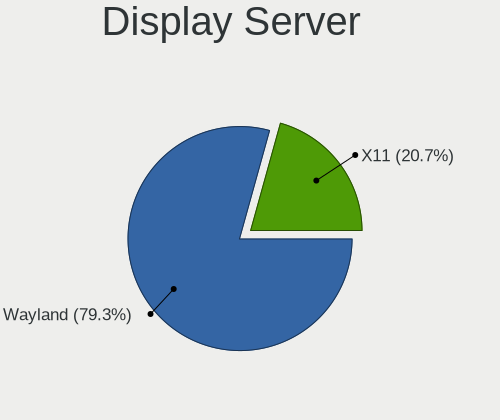
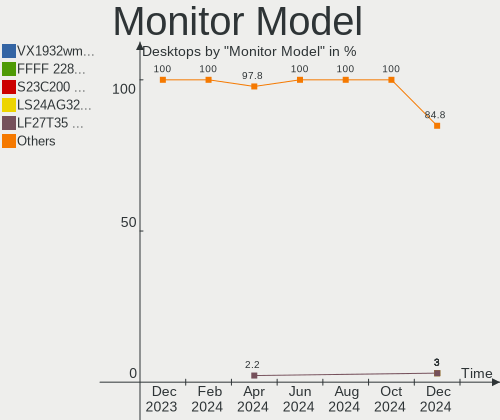

KDE neon - Hardware Trends (Desktops)
-------------------------------------

A project to identify most popular hardware characteristics and track their change
over time based on data collected by Linux users at https://Linux-Hardware.org.

Anyone can contribute to this report by the [hw-probe](https://github.com/linuxhw/hw-probe) tool:

    sudo -E hw-probe -all -upload

This report is for one last month. Overall report since the beginning of time: [TestDays](https://github.com/linuxhw/TestDays)

Period: Nov, 2023.

Contents
--------

* [ System ](#system)
  - [ OS                       ](#os)
  - [ OS Family                ](#os-family)
  - [ Kernel                   ](#kernel)
  - [ Kernel Family            ](#kernel-family)
  - [ Kernel Major Ver.        ](#kernel-major-ver)
  - [ Arch                     ](#arch)
  - [ DE                       ](#de)
  - [ Display Server           ](#display-server)
  - [ Display Manager          ](#display-manager)
  - [ OS Lang                  ](#os-lang)
  - [ Boot Mode                ](#boot-mode)
  - [ Filesystem               ](#filesystem)
  - [ Part. scheme             ](#part-scheme)
  - [ Dual Boot with Linux/BSD ](#dual-boot-with-linuxbsd)
  - [ Dual Boot (Win)          ](#dual-boot-win)

* [ Board ](#board)
  - [ Vendor                   ](#vendor)
  - [ Model                    ](#model)
  - [ Model Family             ](#model-family)
  - [ MFG Year                 ](#mfg-year)
  - [ Form Factor              ](#form-factor)
  - [ Secure Boot              ](#secure-boot)
  - [ Coreboot                 ](#coreboot)
  - [ RAM Size                 ](#ram-size)
  - [ RAM Used                 ](#ram-used)
  - [ Total Drives             ](#total-drives)
  - [ Has CD-ROM               ](#has-cd-rom)
  - [ Has Ethernet             ](#has-ethernet)
  - [ Has WiFi                 ](#has-wifi)
  - [ Has Bluetooth            ](#has-bluetooth)

* [ Location ](#location)
  - [ Country                  ](#country)
  - [ City                     ](#city)

* [ Drives ](#drives)
  - [ Drive Vendor             ](#drive-vendor)
  - [ Drive Model              ](#drive-model)
  - [ HDD Vendor               ](#hdd-vendor)
  - [ SSD Vendor               ](#ssd-vendor)
  - [ Drive Kind               ](#drive-kind)
  - [ Drive Connector          ](#drive-connector)
  - [ Drive Size               ](#drive-size)
  - [ Space Total              ](#space-total)
  - [ Space Used               ](#space-used)
  - [ Malfunc. Drives          ](#malfunc-drives)
  - [ Malfunc. Drive Vendor    ](#malfunc-drive-vendor)
  - [ Malfunc. HDD Vendor      ](#malfunc-hdd-vendor)
  - [ Malfunc. Drive Kind      ](#malfunc-drive-kind)
  - [ Failed Drives            ](#failed-drives)
  - [ Failed Drive Vendor      ](#failed-drive-vendor)
  - [ Drive Status             ](#drive-status)

* [ Storage controller ](#storage-controller)
  - [ Storage Vendor           ](#storage-vendor)
  - [ Storage Model            ](#storage-model)
  - [ Storage Kind             ](#storage-kind)

* [ Processor ](#processor)
  - [ CPU Vendor               ](#cpu-vendor)
  - [ CPU Model                ](#cpu-model)
  - [ CPU Model Family         ](#cpu-model-family)
  - [ CPU Cores                ](#cpu-cores)
  - [ CPU Sockets              ](#cpu-sockets)
  - [ CPU Threads              ](#cpu-threads)
  - [ CPU Op-Modes             ](#cpu-op-modes)
  - [ CPU Microcode            ](#cpu-microcode)
  - [ CPU Microarch            ](#cpu-microarch)

* [ Graphics ](#graphics)
  - [ GPU Vendor               ](#gpu-vendor)
  - [ GPU Model                ](#gpu-model)
  - [ GPU Combo                ](#gpu-combo)
  - [ GPU Driver               ](#gpu-driver)
  - [ GPU Memory               ](#gpu-memory)

* [ Monitor ](#monitor)
  - [ Monitor Vendor           ](#monitor-vendor)
  - [ Monitor Model            ](#monitor-model)
  - [ Monitor Resolution       ](#monitor-resolution)
  - [ Monitor Diagonal         ](#monitor-diagonal)
  - [ Monitor Width            ](#monitor-width)
  - [ Aspect Ratio             ](#aspect-ratio)
  - [ Monitor Area             ](#monitor-area)
  - [ Pixel Density            ](#pixel-density)
  - [ Multiple Monitors        ](#multiple-monitors)

* [ Network ](#network)
  - [ Net Controller Vendor    ](#net-controller-vendor)
  - [ Net Controller Model     ](#net-controller-model)
  - [ Wireless Vendor          ](#wireless-vendor)
  - [ Wireless Model           ](#wireless-model)
  - [ Ethernet Vendor          ](#ethernet-vendor)
  - [ Ethernet Model           ](#ethernet-model)
  - [ Net Controller Kind      ](#net-controller-kind)
  - [ Used Controller          ](#used-controller)
  - [ NICs                     ](#nics)
  - [ IPv6                     ](#ipv6)

* [ Bluetooth ](#bluetooth)
  - [ Bluetooth Vendor         ](#bluetooth-vendor)
  - [ Bluetooth Model          ](#bluetooth-model)

* [ Sound ](#sound)
  - [ Sound Vendor             ](#sound-vendor)
  - [ Sound Model              ](#sound-model)

* [ Memory ](#memory)
  - [ Memory Vendor            ](#memory-vendor)
  - [ Memory Model             ](#memory-model)
  - [ Memory Kind              ](#memory-kind)
  - [ Memory Form Factor       ](#memory-form-factor)
  - [ Memory Size              ](#memory-size)
  - [ Memory Speed             ](#memory-speed)

* [ Printers & scanners ](#printers--scanners)
  - [ Printer Vendor           ](#printer-vendor)
  - [ Printer Model            ](#printer-model)
  - [ Scanner Vendor           ](#scanner-vendor)
  - [ Scanner Model            ](#scanner-model)

* [ Camera ](#camera)
  - [ Camera Vendor            ](#camera-vendor)
  - [ Camera Model             ](#camera-model)

* [ Security ](#security)
  - [ Fingerprint Vendor       ](#fingerprint-vendor)
  - [ Fingerprint Model        ](#fingerprint-model)
  - [ Chipcard Vendor          ](#chipcard-vendor)
  - [ Chipcard Model           ](#chipcard-model)

* [ Unsupported ](#unsupported)
  - [ Unsupported Devices      ](#unsupported-devices)
  - [ Unsupported Device Types ](#unsupported-device-types)

System
------

OS
--

Installed operating systems

| Name           | Desktops | Percent |
|----------------|----------|---------|
| KDE neon 22.04 | 25       | 100%    |

OS Family
---------

OS without a version

| Name     | Desktops | Percent |
|----------|----------|---------|
| KDE neon | 25       | 100%    |

Kernel
------

Version of the Linux kernel

| Version              | Desktops | Percent |
|----------------------|----------|---------|
| 6.2.0-36-generic     | 13       | 52%     |
| 6.2.0-37-generic     | 5        | 20%     |
| 6.2.0-35-generic     | 3        | 12%     |
| 6.4.0-060400-generic | 1        | 4%      |
| 6.2.0-33-generic     | 1        | 4%      |
| 5.19.0-38-generic    | 1        | 4%      |
| 5.15.0-56-generic    | 1        | 4%      |

Kernel Family
-------------

Linux kernel without a distro release

| Version | Desktops | Percent |
|---------|----------|---------|
| 6.2.0   | 22       | 88%     |
| 6.4.0   | 1        | 4%      |
| 5.19.0  | 1        | 4%      |
| 5.15.0  | 1        | 4%      |

Kernel Major Ver.
-----------------

Linux kernel major version

| Version | Desktops | Percent |
|---------|----------|---------|
| 6.2     | 22       | 88%     |
| 6.4     | 1        | 4%      |
| 5.19    | 1        | 4%      |
| 5.15    | 1        | 4%      |

Arch
----

OS architecture (x86_64, i586, etc.)

| Name   | Desktops | Percent |
|--------|----------|---------|
| x86_64 | 25       | 100%    |

DE
--

Desktop Environment

| Name | Desktops | Percent |
|------|----------|---------|
| KDE5 | 23       | 92%     |
| KDE6 | 1        | 4%      |
| KDE  | 1        | 4%      |

Display Server
--------------

X11 or Wayland

| Name    | Desktops | Percent |
|---------|----------|---------|
| X11     | 23       | 92%     |
| Wayland | 2        | 8%      |

Display Manager
---------------

SDDM, LightDM, etc.

| Name    | Desktops | Percent |
|---------|----------|---------|
| Unknown | 22       | 88%     |
| SDDM    | 3        | 12%     |

OS Lang
-------

Language

| Lang  | Desktops | Percent |
|-------|----------|---------|
| en_US | 12       | 48%     |
| ru_RU | 2        | 8%      |
| pt_BR | 2        | 8%      |
| en_GB | 2        | 8%      |
| sk_SK | 1        | 4%      |
| pl_PL | 1        | 4%      |
| it_IT | 1        | 4%      |
| es_MX | 1        | 4%      |
| es_ES | 1        | 4%      |
| en_AU | 1        | 4%      |
| de_DE | 1        | 4%      |

Boot Mode
---------

EFI or BIOS

| Mode | Desktops | Percent |
|------|----------|---------|
| BIOS | 23       | 92%     |
| EFI  | 2        | 8%      |

Filesystem
----------

Type of filesystem

| Type  | Desktops | Percent |
|-------|----------|---------|
| Ext4  | 23       | 92%     |
| Tmpfs | 2        | 8%      |

Part. scheme
------------

Scheme of partitioning

| Type    | Desktops | Percent |
|---------|----------|---------|
| Unknown | 22       | 88%     |
| GPT     | 3        | 12%     |

Dual Boot with Linux/BSD
------------------------

Hosting more than one Linux/BSD

| Dual boot | Desktops | Percent |
|-----------|----------|---------|
| No        | 24       | 96%     |
| Yes       | 1        | 4%      |

Dual Boot (Win)
---------------

Hosting Linux and Windows

| Dual boot | Desktops | Percent |
|-----------|----------|---------|
| No        | 22       | 88%     |
| Yes       | 3        | 12%     |

Board
-----

Vendor
------

Motherboard manufacturer

| Name                | Desktops | Percent |
|---------------------|----------|---------|
| ASUSTek Computer    | 11       | 44%     |
| Gigabyte Technology | 5        | 20%     |
| MSI                 | 3        | 12%     |
| Dell                | 2        | 8%      |
| ASRock              | 2        | 8%      |
| Positivo            | 1        | 4%      |
| Hewlett-Packard     | 1        | 4%      |

Model
-----

Motherboard model

| Name                               | Desktops | Percent |
|------------------------------------|----------|---------|
| ASUS All Series                    | 2        | 8%      |
| Positivo POS-EIH61CE               | 1        | 4%      |
| MSI MS-7E12                        | 1        | 4%      |
| MSI MS-7B89                        | 1        | 4%      |
| MSI MS-7623                        | 1        | 4%      |
| HP EliteDesk 800 G2 SFF            | 1        | 4%      |
| Gigabyte Z690 UD                   | 1        | 4%      |
| Gigabyte Z390 AORUS PRO WIFI       | 1        | 4%      |
| Gigabyte H81M-H                    | 1        | 4%      |
| Gigabyte GA-MA785GM-US2H           | 1        | 4%      |
| Gigabyte B550 AORUS PRO AC         | 1        | 4%      |
| Dell Vostro 270                    | 1        | 4%      |
| Dell Precision 5820 Tower X-Series | 1        | 4%      |
| ASUS TUF Gaming B650-PLUS WIFI     | 1        | 4%      |
| ASUS ROG CROSSHAIR VII HERO        | 1        | 4%      |
| ASUS PRIME Z370-A II               | 1        | 4%      |
| ASUS PRIME H310M-R R2.0            | 1        | 4%      |
| ASUS PRIME B650-PLUS               | 1        | 4%      |
| ASUS P8H61-M LX3 R2.0              | 1        | 4%      |
| ASUS H110M-E/M.2                   | 1        | 4%      |
| ASUS H110M-D                       | 1        | 4%      |
| ASUS B150M-A/M.2                   | 1        | 4%      |
| ASRock Z87 Extreme6                | 1        | 4%      |
| ASRock B550 Phantom Gaming 4/ac    | 1        | 4%      |

Model Family
------------

Motherboard model prefix

| Name                     | Desktops | Percent |
|--------------------------|----------|---------|
| ASUS PRIME               | 3        | 12%     |
| ASUS All                 | 2        | 8%      |
| Positivo POS-EIH61CE     | 1        | 4%      |
| MSI MS-7E12              | 1        | 4%      |
| MSI MS-7B89              | 1        | 4%      |
| MSI MS-7623              | 1        | 4%      |
| HP EliteDesk             | 1        | 4%      |
| Gigabyte Z690            | 1        | 4%      |
| Gigabyte Z390            | 1        | 4%      |
| Gigabyte H81M-H          | 1        | 4%      |
| Gigabyte GA-MA785GM-US2H | 1        | 4%      |
| Gigabyte B550            | 1        | 4%      |
| Dell Vostro              | 1        | 4%      |
| Dell Precision           | 1        | 4%      |
| ASUS TUF                 | 1        | 4%      |
| ASUS ROG                 | 1        | 4%      |
| ASUS P8H61-M             | 1        | 4%      |
| ASUS H110M-E             | 1        | 4%      |
| ASUS H110M-D             | 1        | 4%      |
| ASUS B150M-A             | 1        | 4%      |
| ASRock Z87               | 1        | 4%      |
| ASRock B550              | 1        | 4%      |

MFG Year
--------

Motherboard manufacture year

| Year | Desktops | Percent |
|------|----------|---------|
| 2018 | 5        | 20%     |
| 2013 | 4        | 16%     |
| 2015 | 3        | 12%     |
| 2023 | 2        | 8%      |
| 2022 | 2        | 8%      |
| 2020 | 2        | 8%      |
| 2016 | 2        | 8%      |
| 2021 | 1        | 4%      |
| 2012 | 1        | 4%      |
| 2011 | 1        | 4%      |
| 2010 | 1        | 4%      |
| 2009 | 1        | 4%      |

Form Factor
-----------

Physical design of the computer

| Name    | Desktops | Percent |
|---------|----------|---------|
| Desktop | 25       | 100%    |

Secure Boot
-----------

Enabled or disabled

| State    | Desktops | Percent |
|----------|----------|---------|
| Disabled | 25       | 100%    |

Coreboot
--------

Have coreboot on board

| Used | Desktops | Percent |
|------|----------|---------|
| No   | 25       | 100%    |

RAM Size
--------

Total RAM memory

| Size in GB  | Desktops | Percent |
|-------------|----------|---------|
| 32.01-64.0  | 6        | 24%     |
| 16.01-24.0  | 6        | 24%     |
| 4.01-8.0    | 5        | 20%     |
| 3.01-4.0    | 3        | 12%     |
| 64.01-256.0 | 2        | 8%      |
| 8.01-16.0   | 2        | 8%      |
| 24.01-32.0  | 1        | 4%      |

RAM Used
--------

Used RAM memory

| Used GB   | Desktops | Percent |
|-----------|----------|---------|
| 1.01-2.0  | 8        | 32%     |
| 2.01-3.0  | 7        | 28%     |
| 3.01-4.0  | 5        | 20%     |
| 4.01-8.0  | 4        | 16%     |
| 8.01-16.0 | 1        | 4%      |

Total Drives
------------

Number of drives on board

| Drives | Desktops | Percent |
|--------|----------|---------|
| 4      | 6        | 24%     |
| 1      | 6        | 24%     |
| 5      | 4        | 16%     |
| 2      | 4        | 16%     |
| 3      | 3        | 12%     |
| 9      | 1        | 4%      |
| 6      | 1        | 4%      |

Has CD-ROM
----------

Has CD-ROM on board

| Presented | Desktops | Percent |
|-----------|----------|---------|
| No        | 18       | 72%     |
| Yes       | 7        | 28%     |

Has Ethernet
------------

Has Ethernet on board

| Presented | Desktops | Percent |
|-----------|----------|---------|
| Yes       | 25       | 100%    |

Has WiFi
--------

Has WiFi module

| Presented | Desktops | Percent |
|-----------|----------|---------|
| No        | 14       | 56%     |
| Yes       | 11       | 44%     |

Has Bluetooth
-------------

Has Bluetooth module

| Presented | Desktops | Percent |
|-----------|----------|---------|
| No        | 16       | 64%     |
| Yes       | 9        | 36%     |

Location
--------

Country
-------

Geographic location (country)

| Country     | Desktops | Percent |
|-------------|----------|---------|
| USA         | 6        | 24%     |
| Russia      | 2        | 8%      |
| Poland      | 2        | 8%      |
| Netherlands | 2        | 8%      |
| Brazil      | 2        | 8%      |
| UK          | 1        | 4%      |
| Spain       | 1        | 4%      |
| Slovakia    | 1        | 4%      |
| Norway      | 1        | 4%      |
| Italy       | 1        | 4%      |
| Germany     | 1        | 4%      |
| Cuba        | 1        | 4%      |
| Colombia    | 1        | 4%      |
| Bolivia     | 1        | 4%      |
| Austria     | 1        | 4%      |
| Australia   | 1        | 4%      |

City
----

Geographic location (city)

| City             | Desktops | Percent |
|------------------|----------|---------|
| Zoetermeer       | 1        | 4%      |
| Vigonza          | 1        | 4%      |
| Valladolid       | 1        | 4%      |
| Ufa              | 1        | 4%      |
| Senhor do Bonfim | 1        | 4%      |
| Rauris           | 1        | 4%      |
| Poznan           | 1        | 4%      |
| Moberly          | 1        | 4%      |
| Medellín        | 1        | 4%      |
| Marília         | 1        | 4%      |
| La Paz           | 1        | 4%      |
| Kurgan           | 1        | 4%      |
| Kety             | 1        | 4%      |
| Harvest          | 1        | 4%      |
| Croydon          | 1        | 4%      |
| Cortland         | 1        | 4%      |
| Colorado Springs | 1        | 4%      |
| Charleston       | 1        | 4%      |
| Centro Habana    | 1        | 4%      |
| Brezno           | 1        | 4%      |
| Berlin           | 1        | 4%      |
| Bergen           | 1        | 4%      |
| Anna             | 1        | 4%      |
| Amsterdam        | 1        | 4%      |
| Adelaide         | 1        | 4%      |

Drives
------

Drive Vendor
------------

Hard drive vendors

| Vendor              | Desktops | Drives | Percent |
|---------------------|----------|--------|---------|
| Seagate             | 9        | 16     | 16.98%  |
| Samsung Electronics | 9        | 17     | 16.98%  |
| WDC                 | 8        | 16     | 15.09%  |
| Toshiba             | 7        | 8      | 13.21%  |
| Sandisk             | 5        | 8      | 9.43%   |
| Kingston            | 5        | 5      | 9.43%   |
| Crucial             | 3        | 3      | 5.66%   |
| Hitachi             | 2        | 2      | 3.77%   |
| Unknown             | 1        | 2      | 1.89%   |
| SPCC                | 1        | 1      | 1.89%   |
| SK hynix            | 1        | 1      | 1.89%   |
| Hewlett-Packard     | 1        | 1      | 1.89%   |
| A-DATA Technology   | 1        | 1      | 1.89%   |

Drive Model
-----------

Hard drive models

| Model                                               | Desktops | Percent |
|-----------------------------------------------------|----------|---------|
| Samsung NVMe SSD Controller SM981/PM981/PM983 250GB | 3        | 3.95%   |
| Toshiba HDWD130 3TB                                 | 2        | 2.63%   |
| Seagate ST2000DX002-2DV164 2TB                      | 2        | 2.63%   |
| Samsung SSD 850 EVO 250GB                           | 2        | 2.63%   |
| WDC WDS100T2B0B 1TB SSD                             | 1        | 1.32%   |
| WDC WDBNCE0010PNC 1TB SSD                           | 1        | 1.32%   |
| WDC WD6401AALS-00L3B2 640GB                         | 1        | 1.32%   |
| WDC WD5000AAKX-08ERMA0 500GB                        | 1        | 1.32%   |
| WDC WD5000AAKX-001CA0 500GB                         | 1        | 1.32%   |
| WDC WD40EZRZ-00GXCB0 4TB                            | 1        | 1.32%   |
| WDC WD3200AAKS-00YGA0 320GB                         | 1        | 1.32%   |
| WDC WD20SPZX-22UA7T0 2TB                            | 1        | 1.32%   |
| WDC WD20EZRX-00D8PB0 2TB                            | 1        | 1.32%   |
| WDC WD20EARX-00PASB0 2TB                            | 1        | 1.32%   |
| WDC WD181KRYZ-01AGBB0 18TB                          | 1        | 1.32%   |
| WDC WD1600AAJS-00WAA0 160GB                         | 1        | 1.32%   |
| WDC WD121KRYZ-01W0RB0 12TB                          | 1        | 1.32%   |
| WDC WD10EARS-00Y5B1 1TB                             | 1        | 1.32%   |
| WDC WD100EMAZ-00WJTA0 10TB                          | 1        | 1.32%   |
| Unknown SD/MMC 2GB                                  | 1        | 1.32%   |
| Unknown M.S./M.S.Pro/HG 16GB                        | 1        | 1.32%   |
| Toshiba TR150 240GB SSD                             | 1        | 1.32%   |
| Toshiba MQ01ABD032 320GB                            | 1        | 1.32%   |
| Toshiba MK5075GSX 500GB                             | 1        | 1.32%   |
| Toshiba HDWD105 500GB                               | 1        | 1.32%   |
| Toshiba DT01ACA100 1TB                              | 1        | 1.32%   |
| SPCC Solid State Disk 256GB                         | 1        | 1.32%   |
| SK hynix SHGS31-500GS-2 500GB SSD                   | 1        | 1.32%   |
| Seagate ST4000DM000-1F2168 4TB                      | 1        | 1.32%   |
| Seagate ST3160212SCE 160GB                          | 1        | 1.32%   |
| Seagate ST31000524AS 1TB                            | 1        | 1.32%   |
| Seagate ST3000DM001-1ER166 3TB                      | 1        | 1.32%   |
| Seagate ST3000DM001-1CH166 3TB                      | 1        | 1.32%   |
| Seagate ST2000DM001-1ER164 2TB                      | 1        | 1.32%   |
| Seagate ST18000NM000J-2TV103 18TB                   | 1        | 1.32%   |
| Seagate ST16000NM001G-2KK103 16TB                   | 1        | 1.32%   |
| Seagate ST1000LM035-1RK172 1TB                      | 1        | 1.32%   |
| Seagate ST1000LM024 HN-M101MBB 1TB                  | 1        | 1.32%   |
| Seagate ST1000DM010-2EP102 1TB                      | 1        | 1.32%   |
| Seagate ST10000VX0004-1ZE101 10TB                   | 1        | 1.32%   |

HDD Vendor
----------

Hard disk drive vendors

| Vendor              | Desktops | Drives | Percent |
|---------------------|----------|--------|---------|
| Seagate             | 9        | 16     | 33.33%  |
| WDC                 | 8        | 14     | 29.63%  |
| Toshiba             | 6        | 7      | 22.22%  |
| Samsung Electronics | 2        | 2      | 7.41%   |
| Hitachi             | 2        | 2      | 7.41%   |

SSD Vendor
----------

Solid state drive vendors

| Vendor              | Desktops | Drives | Percent |
|---------------------|----------|--------|---------|
| Samsung Electronics | 6        | 10     | 30%     |
| Kingston            | 3        | 3      | 15%     |
| Crucial             | 3        | 3      | 15%     |
| WDC                 | 2        | 2      | 10%     |
| Toshiba             | 1        | 1      | 5%      |
| SPCC                | 1        | 1      | 5%      |
| SK hynix            | 1        | 1      | 5%      |
| SanDisk             | 1        | 2      | 5%      |
| Hewlett-Packard     | 1        | 1      | 5%      |
| A-DATA Technology   | 1        | 1      | 5%      |

Drive Kind
----------

HDD or SSD

| Kind    | Desktops | Drives | Percent |
|---------|----------|--------|---------|
| HDD     | 19       | 41     | 44.19%  |
| SSD     | 15       | 25     | 34.88%  |
| NVMe    | 8        | 13     | 18.6%   |
| Unknown | 1        | 2      | 2.33%   |

Drive Connector
---------------

SATA, SAS, NVMe, etc.

| Type | Desktops | Drives | Percent |
|------|----------|--------|---------|
| SATA | 23       | 66     | 71.88%  |
| NVMe | 8        | 13     | 25%     |
| SAS  | 1        | 2      | 3.13%   |

Drive Size
----------

Size of hard drive

| Size in TB | Desktops | Drives | Percent |
|------------|----------|--------|---------|
| 0.01-0.5   | 18       | 26     | 41.86%  |
| 0.51-1.0   | 9        | 13     | 20.93%  |
| 1.01-2.0   | 5        | 9      | 11.63%  |
| 2.01-3.0   | 4        | 4      | 9.3%    |
| 3.01-4.0   | 3        | 5      | 6.98%   |
| 4.01-10.0  | 3        | 4      | 6.98%   |
| 10.01-20.0 | 1        | 5      | 2.33%   |

Space Total
-----------

Amount of disk space available on the file system

| Size in GB     | Desktops | Percent |
|----------------|----------|---------|
| 251-500        | 8        | 32%     |
| More than 3000 | 4        | 16%     |
| 101-250        | 4        | 16%     |
| 2001-3000      | 3        | 12%     |
| 501-1000       | 2        | 8%      |
| 1001-2000      | 1        | 4%      |
| 1-20           | 1        | 4%      |
| 51-100         | 1        | 4%      |
| Unknown        | 1        | 4%      |

Space Used
----------

Amount of used disk space

| Used GB        | Desktops | Percent |
|----------------|----------|---------|
| 1-20           | 8        | 32%     |
| More than 3000 | 3        | 12%     |
| 21-50          | 3        | 12%     |
| 101-250        | 3        | 12%     |
| 1001-2000      | 2        | 8%      |
| 501-1000       | 2        | 8%      |
| 51-100         | 2        | 8%      |
| 2001-3000      | 1        | 4%      |
| Unknown        | 1        | 4%      |

Malfunc. Drives
---------------

Drive models with a malfunction

Zero info for selected period =(

Malfunc. Drive Vendor
---------------------

Vendors of faulty drives

Zero info for selected period =(

Malfunc. HDD Vendor
-------------------

Vendors of faulty HDD drives

Zero info for selected period =(

Malfunc. Drive Kind
-------------------

Kinds of faulty drives

Zero info for selected period =(

Failed Drives
-------------

Failed drive models

Zero info for selected period =(

Failed Drive Vendor
-------------------

Failed drive vendors

Zero info for selected period =(

Drive Status
------------

Number of failed and malfunc. drives

| Status   | Desktops | Drives | Percent |
|----------|----------|--------|---------|
| Detected | 24       | 76     | 96%     |
| Works    | 1        | 5      | 4%      |

Storage controller
------------------

Storage Vendor
--------------

Storage controller vendors

| Vendor                      | Desktops | Percent |
|-----------------------------|----------|---------|
| Intel                       | 16       | 45.71%  |
| AMD                         | 9        | 25.71%  |
| SanDisk                     | 4        | 11.43%  |
| Samsung Electronics         | 3        | 8.57%   |
| Kingston Technology Company | 2        | 5.71%   |
| ASMedia Technology          | 1        | 2.86%   |

Storage Model
-------------

Storage controller models

| Model                                                                                   | Desktops | Percent |
|-----------------------------------------------------------------------------------------|----------|---------|
| AMD FCH SATA Controller [AHCI mode]                                                     | 5        | 11.36%  |
| Intel Q170/Q150/B150/H170/H110/Z170/CM236 Chipset SATA Controller [AHCI Mode]           | 4        | 9.09%   |
| Samsung NVMe SSD Controller SM981/PM981/PM983                                           | 3        | 6.82%   |
| Intel 8 Series/C220 Series Chipset Family 6-port SATA Controller 1 [AHCI mode]          | 3        | 6.82%   |
| Intel 200 Series PCH SATA controller [AHCI mode]                                        | 3        | 6.82%   |
| AMD SB7x0/SB8x0/SB9x0 IDE Controller                                                    | 2        | 4.55%   |
| AMD 500 Series Chipset SATA Controller                                                  | 2        | 4.55%   |
| AMD 400 Series Chipset SATA Controller                                                  | 2        | 4.55%   |
| SanDisk WD PC SN810 / Black SN850 NVMe SSD                                              | 1        | 2.27%   |
| SanDisk WD Black SN770 / PC SN740 256GB / PC SN560 (DRAM-less) NVMe SSD                 | 1        | 2.27%   |
| SanDisk Ultra 3D / WD Blue SN570 NVMe SSD (DRAM-less)                                   | 1        | 2.27%   |
| SanDisk Ultra 3D / WD Blue SN550 NVMe SSD                                               | 1        | 2.27%   |
| SanDisk Extreme Pro / WD Black SN750 / PC SN730 / Red SN700 NVMe SSD                    | 1        | 2.27%   |
| SanDisk Extreme Pro / WD Black 2018/SN750/PC SN720 NVMe SSD                             | 1        | 2.27%   |
| Samsung NVMe SSD Controller PM9A1/PM9A3/980PRO                                          | 1        | 2.27%   |
| Kingston Company NV1 NVMe SSD SM2263XT                                                  | 1        | 2.27%   |
| Kingston Company KC3000/FURY Renegade NVMe SSD E18                                      | 1        | 2.27%   |
| Intel Volume Management Device NVMe RAID Controller                                     | 1        | 2.27%   |
| Intel Cannon Lake PCH SATA AHCI Controller                                              | 1        | 2.27%   |
| Intel Alder Lake-S PCH SATA Controller [AHCI Mode]                                      | 1        | 2.27%   |
| Intel 9 Series Chipset Family SATA Controller [AHCI Mode]                               | 1        | 2.27%   |
| Intel 7 Series/C210 Series Chipset Family 6-port SATA Controller [AHCI mode]            | 1        | 2.27%   |
| Intel 6 Series/C200 Series Chipset Family Desktop SATA Controller (IDE mode, ports 4-5) | 1        | 2.27%   |
| Intel 6 Series/C200 Series Chipset Family Desktop SATA Controller (IDE mode, ports 0-3) | 1        | 2.27%   |
| Intel 6 Series/C200 Series Chipset Family 6 port Desktop SATA AHCI Controller           | 1        | 2.27%   |
| ASMedia ASM1062 Serial ATA Controller                                                   | 1        | 2.27%   |
| AMD SB7x0/SB8x0/SB9x0 SATA Controller [IDE mode]                                        | 1        | 2.27%   |
| AMD SB7x0/SB8x0/SB9x0 SATA Controller [AHCI mode]                                       | 1        | 2.27%   |

Storage Kind
------------

Kind of storage controller (IDE, SATA, NVMe, SAS, ...)

| Kind | Desktops | Percent |
|------|----------|---------|
| SATA | 24       | 66.67%  |
| NVMe | 8        | 22.22%  |
| IDE  | 3        | 8.33%   |
| RAID | 1        | 2.78%   |

Processor
---------

CPU Vendor
----------

Processor vendors

| Vendor | Desktops | Percent |
|--------|----------|---------|
| Intel  | 16       | 64%     |
| AMD    | 9        | 36%     |

CPU Model
---------

Processor models

| Model                                  | Desktops | Percent |
|----------------------------------------|----------|---------|
| AMD Ryzen 9 7900X 12-Core Processor    | 2        | 8%      |
| AMD Ryzen 7 2700X Eight-Core Processor | 2        | 8%      |
| Intel Pentium Gold G5400 CPU @ 3.70GHz | 1        | 4%      |
| Intel Pentium CPU G4400 @ 3.30GHz      | 1        | 4%      |
| Intel Pentium CPU G3240 @ 3.10GHz      | 1        | 4%      |
| Intel Core i9-9900X CPU @ 3.50GHz      | 1        | 4%      |
| Intel Core i7-9700K CPU @ 3.60GHz      | 1        | 4%      |
| Intel Core i7-8700 CPU @ 3.20GHz       | 1        | 4%      |
| Intel Core i7-7700 CPU @ 3.60GHz       | 1        | 4%      |
| Intel Core i7-4790K CPU @ 4.00GHz      | 1        | 4%      |
| Intel Core i5-6500 CPU @ 3.20GHz       | 1        | 4%      |
| Intel Core i5-6400 CPU @ 2.70GHz       | 1        | 4%      |
| Intel Core i5-4670K CPU @ 3.40GHz      | 1        | 4%      |
| Intel Core i5-4570 CPU @ 3.20GHz       | 1        | 4%      |
| Intel Core i5-3470 CPU @ 3.20GHz       | 1        | 4%      |
| Intel Core i5-2400 CPU @ 3.10GHz       | 1        | 4%      |
| Intel Celeron CPU G540 @ 2.50GHz       | 1        | 4%      |
| Intel 12th Gen Core i3-12100           | 1        | 4%      |
| AMD Ryzen 7 7800X3D 8-Core Processor   | 1        | 4%      |
| AMD Ryzen 7 5700X 8-Core Processor     | 1        | 4%      |
| AMD Ryzen 5 5600X 6-Core Processor     | 1        | 4%      |
| AMD Phenom II X6 1075T Processor       | 1        | 4%      |
| AMD Phenom II X2 560 Processor         | 1        | 4%      |

CPU Model Family
----------------

Processor model prefix

| Model              | Desktops | Percent |
|--------------------|----------|---------|
| Intel Core i5      | 6        | 24%     |
| Intel Core i7      | 4        | 16%     |
| AMD Ryzen 7        | 4        | 16%     |
| Intel Pentium      | 2        | 8%      |
| AMD Ryzen 9        | 2        | 8%      |
| Other              | 1        | 4%      |
| Intel Pentium Gold | 1        | 4%      |
| Intel Core i9      | 1        | 4%      |
| Intel Celeron      | 1        | 4%      |
| AMD Ryzen 5        | 1        | 4%      |
| AMD Phenom II X6   | 1        | 4%      |
| AMD Phenom II X2   | 1        | 4%      |

CPU Cores
---------

Number of processor cores

| Number | Desktops | Percent |
|--------|----------|---------|
| 4      | 9        | 36%     |
| 8      | 5        | 20%     |
| 2      | 5        | 20%     |
| 6      | 3        | 12%     |
| 12     | 2        | 8%      |
| 10     | 1        | 4%      |

CPU Sockets
-----------

Number of sockets

| Number | Desktops | Percent |
|--------|----------|---------|
| 1      | 25       | 100%    |

CPU Threads
-----------

Threads per core (Hyper-Threading)

| Number | Desktops | Percent |
|--------|----------|---------|
| 2      | 13       | 52%     |
| 1      | 12       | 48%     |

CPU Op-Modes
------------

CPU Operation Modes (32-bit, 64-bit)

| Op mode        | Desktops | Percent |
|----------------|----------|---------|
| 32-bit, 64-bit | 25       | 100%    |

CPU Microcode
-------------

Microcode number

| Number     | Desktops | Percent |
|------------|----------|---------|
| Unknown    | 24       | 96%     |
| 0x010000dc | 1        | 4%      |

CPU Microarch
-------------

Microarchitecture

| Name        | Desktops | Percent |
|-------------|----------|---------|
| Skylake     | 4        | 16%     |
| KabyLake    | 4        | 16%     |
| Haswell     | 4        | 16%     |
| Unknown     | 4        | 16%     |
| Zen+        | 2        | 8%      |
| Zen 3       | 2        | 8%      |
| SandyBridge | 2        | 8%      |
| K10         | 2        | 8%      |
| IvyBridge   | 1        | 4%      |

Graphics
--------

GPU Vendor
----------

Vendors of graphics cards

| Vendor | Desktops | Percent |
|--------|----------|---------|
| Nvidia | 16       | 53.33%  |
| Intel  | 9        | 30%     |
| AMD    | 5        | 16.67%  |

GPU Model
---------

Graphics card models

| Model                                                                       | Desktops | Percent |
|-----------------------------------------------------------------------------|----------|---------|
| Intel Xeon E3-1200 v3/4th Gen Core Processor Integrated Graphics Controller | 3        | 9.68%   |
| Nvidia TU102 [GeForce RTX 2080 Ti Rev. A]                                   | 2        | 6.45%   |
| Nvidia GP106 [GeForce GTX 1060 6GB]                                         | 2        | 6.45%   |
| Nvidia TU117 [GeForce GTX 1650]                                             | 1        | 3.23%   |
| Nvidia GP108 [GeForce GT 1030]                                              | 1        | 3.23%   |
| Nvidia GP107 [GeForce GTX 1050 Ti]                                          | 1        | 3.23%   |
| Nvidia GP104GL [Quadro P4000]                                               | 1        | 3.23%   |
| Nvidia GP104 [GeForce GTX 1070]                                             | 1        | 3.23%   |
| Nvidia GP104 [GeForce GTX 1070 Ti]                                          | 1        | 3.23%   |
| Nvidia GM206 [GeForce GTX 950]                                              | 1        | 3.23%   |
| Nvidia GM107 [GeForce GTX 750 Ti]                                           | 1        | 3.23%   |
| Nvidia GK208B [GeForce GT 710]                                              | 1        | 3.23%   |
| Nvidia GF119 [GeForce GT 520]                                               | 1        | 3.23%   |
| Nvidia GA106 [GeForce RTX 3060 Lite Hash Rate]                              | 1        | 3.23%   |
| Nvidia GA104 [GeForce RTX 3060 Ti]                                          | 1        | 3.23%   |
| Intel Xeon E3-1200 v2/3rd Gen Core processor Graphics Controller            | 1        | 3.23%   |
| Intel HD Graphics 630                                                       | 1        | 3.23%   |
| Intel HD Graphics 530                                                       | 1        | 3.23%   |
| Intel CoffeeLake-S GT2 [UHD Graphics 630]                                   | 1        | 3.23%   |
| Intel Alder Lake-S GT1 [UHD Graphics 730]                                   | 1        | 3.23%   |
| Intel 2nd Generation Core Processor Family Integrated Graphics Controller   | 1        | 3.23%   |
| AMD RS880 [Radeon HD 4250]                                                  | 1        | 3.23%   |
| AMD Raphael                                                                 | 1        | 3.23%   |
| AMD Polaris 20 XL [Radeon RX 580 2048SP]                                    | 1        | 3.23%   |
| AMD Oland PRO [Radeon R7 240/340 / Radeon 520]                              | 1        | 3.23%   |
| AMD Navi 23 [Radeon RX 6600/6600 XT/6600M]                                  | 1        | 3.23%   |
| AMD Cedar [Radeon HD 5000/6000/7350/8350 Series]                            | 1        | 3.23%   |

GPU Combo
---------

Combinations of graphics cards

| Name           | Desktops | Percent |
|----------------|----------|---------|
| 1 x Nvidia     | 12       | 48%     |
| Intel + Nvidia | 4        | 16%     |
| 1 x Intel      | 4        | 16%     |
| 1 x AMD        | 4        | 16%     |
| 2 x AMD        | 1        | 4%      |

GPU Driver
----------

Free vs proprietary

| Driver      | Desktops | Percent |
|-------------|----------|---------|
| Free        | 14       | 56%     |
| Proprietary | 9        | 36%     |
| Unknown     | 2        | 8%      |

GPU Memory
----------

Total video memory

| Size in GB | Desktops | Percent |
|------------|----------|---------|
| Unknown    | 17       | 68%     |
| 1.01-2.0   | 3        | 12%     |
| 7.01-8.0   | 2        | 8%      |
| 8.01-16.0  | 2        | 8%      |
| 3.01-4.0   | 1        | 4%      |

Monitor
-------

Monitor Vendor
--------------

Monitor vendors

| Vendor               | Desktops | Percent |
|----------------------|----------|---------|
| Goldstar             | 4        | 16.67%  |
| Dell                 | 4        | 16.67%  |
| Samsung Electronics  | 3        | 12.5%   |
| AOC                  | 2        | 8.33%   |
| VIE                  | 1        | 4.17%   |
| Positivo             | 1        | 4.17%   |
| LG Electronics       | 1        | 4.17%   |
| Insignia             | 1        | 4.17%   |
| Iiyama               | 1        | 4.17%   |
| Hitachi              | 1        | 4.17%   |
| CASIO                | 1        | 4.17%   |
| Apple                | 1        | 4.17%   |
| Ancor Communications | 1        | 4.17%   |
| Acer                 | 1        | 4.17%   |
| Unknown              | 1        | 4.17%   |

Monitor Model
-------------

Monitor models

| Model                                                                 | Desktops | Percent |
|-----------------------------------------------------------------------|----------|---------|
| Goldstar HDR 4K GSM7707 3840x2160 600x340mm 27.2-inch                 | 2        | 8.33%   |
| VIE IM27VL1 VIE1919 1920x1080 600x330mm 27.0-inch                     | 1        | 4.17%   |
| Samsung Electronics T24E390 SAM0C20 1920x1080 521x293mm 23.5-inch     | 1        | 4.17%   |
| Samsung Electronics S27F350 SAM0D22 1920x1080 598x336mm 27.0-inch     | 1        | 4.17%   |
| Samsung Electronics C27F398 SAM0D44 1920x1080 598x336mm 27.0-inch     | 1        | 4.17%   |
| Positivo SMILE56X NON1503 1360x768 344x194mm 15.5-inch                | 1        | 4.17%   |
| LG Electronics LCD Monitor 27GL850 2560x1440                          | 1        | 4.17%   |
| Insignia DX-32L221A12 BBY3222 1360x768 697x392mm 31.5-inch            | 1        | 4.17%   |
| Iiyama PL2492H IVM612F 1920x1080 527x296mm 23.8-inch                  | 1        | 4.17%   |
| Hitachi HDMI HEC0030 1920x1080 580x330mm 26.3-inch                    | 1        | 4.17%   |
| Goldstar IPS237 GSM5901 1920x1080 510x290mm 23.1-inch                 | 1        | 4.17%   |
| Goldstar 2D HD TV GSM59C8 1366x768 509x286mm 23.0-inch                | 1        | 4.17%   |
| Dell UP2516D DEL40E0 2560x1440 553x311mm 25.0-inch                    | 1        | 4.17%   |
| Dell U2723QE DEL426A 3840x2160 597x336mm 27.0-inch                    | 1        | 4.17%   |
| Dell S2716DG DELA0D1 2560x1440 598x336mm 27.0-inch                    | 1        | 4.17%   |
| Dell G2410 DEL404B 1920x1080 531x298mm 24.0-inch                      | 1        | 4.17%   |
| CASIO PJ CAS8044 1680x1050 1291x807mm 59.9-inch                       | 1        | 4.17%   |
| Apple Cinema HD APP921C 1920x1200 495x310mm 23.0-inch                 | 1        | 4.17%   |
| AOC 2769M AOC2769 1920x1080 598x336mm 27.0-inch                       | 1        | 4.17%   |
| AOC 2450W AOC2450 1920x1080 521x293mm 23.5-inch                       | 1        | 4.17%   |
| Ancor Communications ASUS VS228 ACI22FD 1920x1080 480x270mm 21.7-inch | 1        | 4.17%   |
| Acer K243Y ACR08B7 1920x1080 527x296mm 23.8-inch                      | 1        | 4.17%   |
| Unknown                                                               | 1        | 4.17%   |

Monitor Resolution
------------------

Monitor screen resolution

| Resolution         | Desktops | Percent |
|--------------------|----------|---------|
| 1920x1080 (FHD)    | 10       | 43.48%  |
| 3840x2160 (4K)     | 4        | 17.39%  |
| 2560x1440 (QHD)    | 3        | 13.04%  |
| 1360x768           | 2        | 8.7%    |
| 1920x1200 (WUXGA)  | 1        | 4.35%   |
| 1680x1050 (WSXGA+) | 1        | 4.35%   |
| 1366x768 (WXGA)    | 1        | 4.35%   |
| 1280x800 (WXGA)    | 1        | 4.35%   |

Monitor Diagonal
----------------

Diagonal size in inches

| Inches  | Desktops | Percent |
|---------|----------|---------|
| 27      | 8        | 33.33%  |
| 23      | 5        | 20.83%  |
| 24      | 2        | 8.33%   |
| Unknown | 2        | 8.33%   |
| 84      | 1        | 4.17%   |
| 59      | 1        | 4.17%   |
| 31      | 1        | 4.17%   |
| 26      | 1        | 4.17%   |
| 25      | 1        | 4.17%   |
| 21      | 1        | 4.17%   |
| 15      | 1        | 4.17%   |

Monitor Width
-------------

Physical width

| Width in mm | Desktops | Percent |
|-------------|----------|---------|
| 501-600     | 15       | 65.22%  |
| 401-500     | 2        | 8.7%    |
| Unknown     | 2        | 8.7%    |
| 601-700     | 1        | 4.35%   |
| 301-350     | 1        | 4.35%   |
| 1501-2000   | 1        | 4.35%   |
| 1001-1500   | 1        | 4.35%   |

Aspect Ratio
------------

Proportional relationship between the width and the height

| Ratio   | Desktops | Percent |
|---------|----------|---------|
| 16/9    | 18       | 81.82%  |
| 16/10   | 2        | 9.09%   |
| Unknown | 2        | 9.09%   |

Monitor Area
------------

Area in inch²

| Area in inch² | Desktops | Percent |
|----------------|----------|---------|
| 301-350        | 8        | 34.78%  |
| 201-250        | 7        | 30.43%  |
| More than 1000 | 2        | 8.7%    |
| 251-300        | 2        | 8.7%    |
| Unknown        | 2        | 8.7%    |
| 351-500        | 1        | 4.35%   |
| 101-110        | 1        | 4.35%   |

Pixel Density
-------------

Pixels per inch

| Density | Desktops | Percent |
|---------|----------|---------|
| 51-100  | 13       | 54.17%  |
| 101-120 | 4        | 16.67%  |
| 161-240 | 3        | 12.5%   |
| 1-50    | 2        | 8.33%   |
| Unknown | 2        | 8.33%   |

Multiple Monitors
-----------------

Total monitors connected

| Total | Desktops | Percent |
|-------|----------|---------|
| 1     | 21       | 84%     |
| 2     | 2        | 8%      |
| 0     | 2        | 8%      |

Network
-------

Net Controller Vendor
---------------------

Controller vendors

| Vendor                | Desktops | Percent |
|-----------------------|----------|---------|
| Realtek Semiconductor | 17       | 53.13%  |
| Intel                 | 9        | 28.13%  |
| Qualcomm Atheros      | 3        | 9.38%   |
| TP-Link               | 1        | 3.13%   |
| MediaTek              | 1        | 3.13%   |
| Broadcom              | 1        | 3.13%   |

Net Controller Model
--------------------

Controller models

| Model                                                             | Desktops | Percent |
|-------------------------------------------------------------------|----------|---------|
| Realtek RTL8111/8168/8411 PCI Express Gigabit Ethernet Controller | 11       | 28.21%  |
| Realtek RTL8125 2.5GbE Controller                                 | 5        | 12.82%  |
| Realtek RTL8153 Gigabit Ethernet Adapter                          | 2        | 5.13%   |
| Intel I211 Gigabit Network Connection                             | 2        | 5.13%   |
| Intel Dual Band Wireless-AC 3168NGW [Stone Peak]                  | 2        | 5.13%   |
| TP-Link TL-WN823N v2/v3 [Realtek RTL8192EU]                       | 1        | 2.56%   |
| Realtek RTL8822BE 802.11a/b/g/n/ac WiFi adapter                   | 1        | 2.56%   |
| Realtek RTL8188EUS 802.11n Wireless Network Adapter               | 1        | 2.56%   |
| Realtek RTL8188EE Wireless Network Adapter                        | 1        | 2.56%   |
| Qualcomm Atheros AR9485 Wireless Network Adapter                  | 1        | 2.56%   |
| Qualcomm Atheros AR8152 v2.0 Fast Ethernet                        | 1        | 2.56%   |
| Qualcomm Atheros AR8131 Gigabit Ethernet                          | 1        | 2.56%   |
| MediaTek MT7922 802.11ax PCI Express Wireless Network Adapter     | 1        | 2.56%   |
| Intel Wi-Fi 6 AX210/AX211/AX411 160MHz                            | 1        | 2.56%   |
| Intel Ethernet Connection I217-V                                  | 1        | 2.56%   |
| Intel Ethernet Connection (7) I219-V                              | 1        | 2.56%   |
| Intel Ethernet Connection (5) I219-LM                             | 1        | 2.56%   |
| Intel Ethernet Connection (2) I219-V                              | 1        | 2.56%   |
| Intel Ethernet Connection (2) I219-LM                             | 1        | 2.56%   |
| Intel Ethernet Connection (2) I218-V                              | 1        | 2.56%   |
| Intel Cannon Lake PCH CNVi WiFi                                   | 1        | 2.56%   |
| Broadcom BCM4352 802.11ac Dual Band Wireless Network Adapter      | 1        | 2.56%   |

Wireless Vendor
---------------

Wireless vendors

| Vendor                | Desktops | Percent |
|-----------------------|----------|---------|
| Intel                 | 4        | 36.36%  |
| Realtek Semiconductor | 3        | 27.27%  |
| TP-Link               | 1        | 9.09%   |
| Qualcomm Atheros      | 1        | 9.09%   |
| MediaTek              | 1        | 9.09%   |
| Broadcom              | 1        | 9.09%   |

Wireless Model
--------------

Wireless models

| Model                                                         | Desktops | Percent |
|---------------------------------------------------------------|----------|---------|
| Intel Dual Band Wireless-AC 3168NGW [Stone Peak]              | 2        | 18.18%  |
| TP-Link TL-WN823N v2/v3 [Realtek RTL8192EU]                   | 1        | 9.09%   |
| Realtek RTL8822BE 802.11a/b/g/n/ac WiFi adapter               | 1        | 9.09%   |
| Realtek RTL8188EUS 802.11n Wireless Network Adapter           | 1        | 9.09%   |
| Realtek RTL8188EE Wireless Network Adapter                    | 1        | 9.09%   |
| Qualcomm Atheros AR9485 Wireless Network Adapter              | 1        | 9.09%   |
| MediaTek MT7922 802.11ax PCI Express Wireless Network Adapter | 1        | 9.09%   |
| Intel Wi-Fi 6 AX210/AX211/AX411 160MHz                        | 1        | 9.09%   |
| Intel Cannon Lake PCH CNVi WiFi                               | 1        | 9.09%   |
| Broadcom BCM4352 802.11ac Dual Band Wireless Network Adapter  | 1        | 9.09%   |

Ethernet Vendor
---------------

Ethernet vendors

| Vendor                | Desktops | Percent |
|-----------------------|----------|---------|
| Realtek Semiconductor | 16       | 64%     |
| Intel                 | 7        | 28%     |
| Qualcomm Atheros      | 2        | 8%      |

Ethernet Model
--------------

Ethernet models

| Model                                                             | Desktops | Percent |
|-------------------------------------------------------------------|----------|---------|
| Realtek RTL8111/8168/8411 PCI Express Gigabit Ethernet Controller | 11       | 39.29%  |
| Realtek RTL8125 2.5GbE Controller                                 | 5        | 17.86%  |
| Realtek RTL8153 Gigabit Ethernet Adapter                          | 2        | 7.14%   |
| Intel I211 Gigabit Network Connection                             | 2        | 7.14%   |
| Qualcomm Atheros AR8152 v2.0 Fast Ethernet                        | 1        | 3.57%   |
| Qualcomm Atheros AR8131 Gigabit Ethernet                          | 1        | 3.57%   |
| Intel Ethernet Connection I217-V                                  | 1        | 3.57%   |
| Intel Ethernet Connection (7) I219-V                              | 1        | 3.57%   |
| Intel Ethernet Connection (5) I219-LM                             | 1        | 3.57%   |
| Intel Ethernet Connection (2) I219-V                              | 1        | 3.57%   |
| Intel Ethernet Connection (2) I219-LM                             | 1        | 3.57%   |
| Intel Ethernet Connection (2) I218-V                              | 1        | 3.57%   |

Net Controller Kind
-------------------

Ethernet, WiFi or modem

| Kind     | Desktops | Percent |
|----------|----------|---------|
| Ethernet | 25       | 69.44%  |
| WiFi     | 11       | 30.56%  |

Used Controller
---------------

Currently used network controller

| Kind     | Desktops | Percent |
|----------|----------|---------|
| Ethernet | 21       | 84%     |
| WiFi     | 4        | 16%     |

NICs
----

Total network controllers on board

| Total | Desktops | Percent |
|-------|----------|---------|
| 1     | 15       | 60%     |
| 2     | 10       | 40%     |

IPv6
----

IPv6 vs IPv4

| Used | Desktops | Percent |
|------|----------|---------|
| No   | 20       | 80%     |
| Yes  | 5        | 20%     |

Bluetooth
---------

Bluetooth Vendor
----------------

Controller vendors

| Vendor                  | Desktops | Percent |
|-------------------------|----------|---------|
| Intel                   | 4        | 40%     |
| ASUSTek Computer        | 3        | 30%     |
| Cambridge Silicon Radio | 2        | 20%     |
| MediaTek                | 1        | 10%     |

Bluetooth Model
---------------

Controller models

| Model                                               | Desktops | Percent |
|-----------------------------------------------------|----------|---------|
| Intel Wireless-AC 3168 Bluetooth                    | 2        | 20%     |
| Cambridge Silicon Radio Bluetooth Dongle (HCI mode) | 2        | 20%     |
| MediaTek Wireless_Device                            | 1        | 10%     |
| Intel Bluetooth 9460/9560 Jefferson Peak (JfP)      | 1        | 10%     |
| Intel AX210 Bluetooth                               | 1        | 10%     |
| ASUS Broadcom BCM20702A0 Bluetooth                  | 1        | 10%     |
| ASUS Bluetooth Radio                                | 1        | 10%     |
| ASUS BCM20702A0                                     | 1        | 10%     |

Sound
-----

Sound Vendor
------------

Sound card vendors

| Vendor              | Desktops | Percent |
|---------------------|----------|---------|
| Nvidia              | 16       | 36.36%  |
| Intel               | 16       | 36.36%  |
| AMD                 | 11       | 25%     |
| C-Media Electronics | 1        | 2.27%   |

Sound Model
-----------

Sound card models

| Model                                                                      | Desktops | Percent |
|----------------------------------------------------------------------------|----------|---------|
| Intel 100 Series/C230 Series Chipset Family HD Audio Controller            | 4        | 8%      |
| Nvidia GP104 High Definition Audio Controller                              | 3        | 6%      |
| Intel Xeon E3-1200 v3/4th Gen Core Processor HD Audio Controller           | 3        | 6%      |
| Intel 8 Series/C220 Series Chipset High Definition Audio Controller        | 3        | 6%      |
| Intel 200 Series PCH HD Audio                                              | 3        | 6%      |
| Nvidia TU102 High Definition Audio Controller                              | 2        | 4%      |
| Nvidia GP106 High Definition Audio Controller                              | 2        | 4%      |
| Intel 6 Series/C200 Series Chipset Family High Definition Audio Controller | 2        | 4%      |
| AMD Starship/Matisse HD Audio Controller                                   | 2        | 4%      |
| AMD SBx00 Azalia (Intel HDA)                                               | 2        | 4%      |
| AMD Family 17h/19h HD Audio Controller                                     | 2        | 4%      |
| AMD Family 17h (Models 00h-0fh) HD Audio Controller                        | 2        | 4%      |
| Nvidia TU107 GeForce GTX 1650 High Definition Audio Controller             | 1        | 2%      |
| Nvidia GP108 High Definition Audio Controller                              | 1        | 2%      |
| Nvidia GP107GL High Definition Audio Controller                            | 1        | 2%      |
| Nvidia GM206 High Definition Audio Controller                              | 1        | 2%      |
| Nvidia GM107 High Definition Audio Controller [GeForce 940MX]              | 1        | 2%      |
| Nvidia GK208 HDMI/DP Audio Controller                                      | 1        | 2%      |
| Nvidia GF119 HDMI Audio Controller                                         | 1        | 2%      |
| Nvidia GA106 High Definition Audio Controller                              | 1        | 2%      |
| Nvidia GA104 High Definition Audio Controller                              | 1        | 2%      |
| Intel Cannon Lake PCH cAVS                                                 | 1        | 2%      |
| Intel Alder Lake-S HD Audio Controller                                     | 1        | 2%      |
| Intel 9 Series Chipset Family HD Audio Controller                          | 1        | 2%      |
| Intel 7 Series/C216 Chipset Family High Definition Audio Controller        | 1        | 2%      |
| C-Media Electronics USB Audio Device                                       | 1        | 2%      |
| AMD RS880 HDMI Audio [Radeon HD 4200 Series]                               | 1        | 2%      |
| AMD Rembrandt Radeon High Definition Audio Controller                      | 1        | 2%      |
| AMD Oland/Hainan/Cape Verde/Pitcairn HDMI Audio [Radeon HD 7000 Series]    | 1        | 2%      |
| AMD Navi 21/23 HDMI/DP Audio Controller                                    | 1        | 2%      |
| AMD Ellesmere HDMI Audio [Radeon RX 470/480 / 570/580/590]                 | 1        | 2%      |
| AMD Cedar HDMI Audio [Radeon HD 5400/6300/7300 Series]                     | 1        | 2%      |

Memory
------

Memory Vendor
-------------

Memory module vendors

| Vendor            | Desktops | Percent |
|-------------------|----------|---------|
| Kingston          | 2        | 50%     |
| Corsair           | 1        | 25%     |
| A-DATA Technology | 1        | 25%     |

Memory Model
------------

Memory module models

| Model                                                 | Desktops | Percent |
|-------------------------------------------------------|----------|---------|
| Kingston RAM KHX1866C9D3/8GX 8GB DIMM DDR3 1866MT/s   | 1        | 25%     |
| Kingston RAM 9965745-022.A00G 32GB DIMM DDR4 2667MT/s | 1        | 25%     |
| Corsair RAM CMX16GX3M4A1333C9 4GB DIMM 1333MT/s       | 1        | 25%     |
| A-DATA RAM Module 4GB DIMM DDR4 2400MT/s              | 1        | 25%     |

Memory Kind
-----------

Memory module kinds

| Kind | Desktops | Percent |
|------|----------|---------|
| DDR4 | 2        | 50%     |
| DDR3 | 2        | 50%     |

Memory Form Factor
------------------

Physical design of the memory module

| Name | Desktops | Percent |
|------|----------|---------|
| DIMM | 4        | 100%    |

Memory Size
-----------

Memory module size

| Size  | Desktops | Percent |
|-------|----------|---------|
| 4096  | 2        | 50%     |
| 32768 | 1        | 25%     |
| 8192  | 1        | 25%     |

Memory Speed
------------

Memory module speed

| Speed | Desktops | Percent |
|-------|----------|---------|
| 2667  | 1        | 25%     |
| 2400  | 1        | 25%     |
| 1866  | 1        | 25%     |
| 1333  | 1        | 25%     |

Printers & scanners
-------------------

Printer Vendor
--------------

Printer device vendors

| Vendor          | Desktops | Percent |
|-----------------|----------|---------|
| Hewlett-Packard | 1        | 100%    |

Printer Model
-------------

Printer device models

| Model                     | Desktops | Percent |
|---------------------------|----------|---------|
| HP ENVY Photo 6200 series | 1        | 100%    |

Scanner Vendor
--------------

Scanner device vendors

Zero info for selected period =(

Scanner Model
-------------

Scanner device models

Zero info for selected period =(

Camera
------

Camera Vendor
-------------

Camera device vendors

| Vendor   | Desktops | Percent |
|----------|----------|---------|
| Logitech | 2        | 100%    |

Camera Model
------------

Camera device models

| Model                      | Desktops | Percent |
|----------------------------|----------|---------|
| Logitech Logi Webcam C920e | 1        | 50%     |
| Logitech C505 HD Webcam    | 1        | 50%     |

Security
--------

Fingerprint Vendor
------------------

Fingerprint sensor vendors

Zero info for selected period =(

Fingerprint Model
-----------------

Fingerprint sensor models

Zero info for selected period =(

Chipcard Vendor
---------------

Chipcard module vendors

Zero info for selected period =(

Chipcard Model
--------------

Chipcard module models

Zero info for selected period =(

Unsupported
-----------

Unsupported Devices
-------------------

Total unsupported devices on board

| Total | Desktops | Percent |
|-------|----------|---------|
| 0     | 22       | 88%     |
| 1     | 3        | 12%     |

Unsupported Device Types
------------------------

Types of unsupported devices

| Type          | Desktops | Percent |
|---------------|----------|---------|
| Graphics card | 3        | 100%    |

