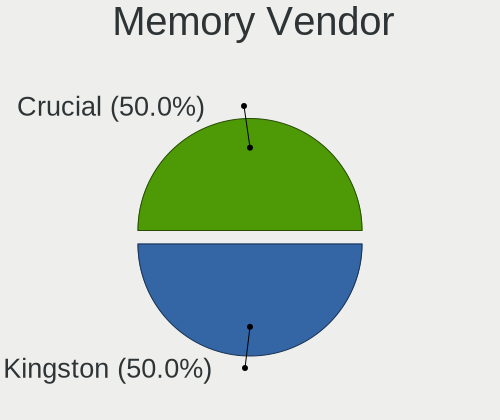

KDE neon Hardware Trends (Desktop)
----------------------------------

A project to identify most popular hardware characteristics and track their change
over time based on data collected by KDE neon users at https://Linux-Hardware.org.

Anyone can contribute to the study by uploading probes of their computers by
the [hw-probe](https://github.com/linuxhw/hw-probe) tool:

    sudo -E hw-probe -all -upload

Full-feature report is available here: https://linux-hardware.org/?view=trends&formfactor=desktop

Period: Sep, 2020.

Contents
--------

- [ OS                       ](#os)
- [ OS Family                ](#os-family)
- [ Kernel                   ](#kernel)
- [ Kernel Family            ](#kernel-family)
- [ Kernel Major Ver.        ](#kernel-major-ver)
- [ Arch                     ](#arch)
- [ DE                       ](#de)
- [ Display Server           ](#display-server)
- [ Display Manager          ](#display-manager)
- [ OS Lang                  ](#os-lang)
- [ Boot Mode                ](#boot-mode)
- [ Filesystem               ](#filesystem)
- [ Part. scheme             ](#part-scheme)
- [ Dual Boot with Linux/BSD ](#dual-boot-with-linux/bsd)
- [ Dual Boot (Win)          ](#dual-boot-win)
- [ Country                  ](#country)
- [ City                     ](#city)
- [ Vendor                   ](#vendor)
- [ Model                    ](#model)
- [ Model Family             ](#model-family)
- [ MFG Year                 ](#mfg-year)
- [ Form Factor              ](#form-factor)
- [ Secure Boot              ](#secure-boot)
- [ Coreboot                 ](#coreboot)
- [ RAM Size                 ](#ram-size)
- [ RAM Used                 ](#ram-used)
- [ Has CD-ROM               ](#has-cd-rom)
- [ Total Drives             ](#total-drives)
- [ Has Ethernet             ](#has-ethernet)
- [ Drive Vendor             ](#drive-vendor)
- [ HDD Vendor               ](#hdd-vendor)
- [ SSD Vendor               ](#ssd-vendor)
- [ Drive Model              ](#drive-model)
- [ Drive Kind               ](#drive-kind)
- [ Drive Connector          ](#drive-connector)
- [ Drive Size               ](#drive-size)
- [ Space Total              ](#space-total)
- [ Space Used               ](#space-used)
- [ Malfunc. Drives          ](#malfunc-drives)
- [ Malfunc. Drive Vendor    ](#malfunc-drive-vendor)
- [ Malfunc. HDD Vendor      ](#malfunc-hdd-vendor)
- [ Malfunc. Drive Kind      ](#malfunc-drive-kind)
- [ Failed Drives            ](#failed-drives)
- [ Failed Drive Vendor      ](#failed-drive-vendor)
- [ Drive Status             ](#drive-status)
- [ Storage Vendor           ](#storage-vendor)
- [ Storage Model            ](#storage-model)
- [ Storage Kind             ](#storage-kind)
- [ CPU Vendor               ](#cpu-vendor)
- [ CPU Model                ](#cpu-model)
- [ CPU Model Family         ](#cpu-model-family)
- [ CPU Cores                ](#cpu-cores)
- [ CPU Sockets              ](#cpu-sockets)
- [ CPU Threads              ](#cpu-threads)
- [ CPU Op-Modes             ](#cpu-op-modes)
- [ CPU Microcode            ](#cpu-microcode)
- [ CPU Microarch            ](#cpu-microarch)
- [ GPU Vendor               ](#gpu-vendor)
- [ GPU Model                ](#gpu-model)
- [ GPU Combo                ](#gpu-combo)
- [ GPU Driver               ](#gpu-driver)
- [ GPU Memory               ](#gpu-memory)
- [ Monitor Vendor           ](#monitor-vendor)
- [ Monitor Model            ](#monitor-model)
- [ Monitor Resolution       ](#monitor-resolution)
- [ Monitor Diagonal         ](#monitor-diagonal)
- [ Monitor Width            ](#monitor-width)
- [ Aspect Ratio             ](#aspect-ratio)
- [ Monitor Area             ](#monitor-area)
- [ Pixel Density            ](#pixel-density)
- [ Multiple Monitors        ](#multiple-monitors)
- [ Net Controller Vendor    ](#net-controller-vendor)
- [ Net Controller Model     ](#net-controller-model)
- [ Wireless Vendor          ](#wireless-vendor)
- [ Wireless Model           ](#wireless-model)
- [ Ethernet Vendor          ](#ethernet-vendor)
- [ Ethernet Model           ](#ethernet-model)
- [ Net Controller Kind      ](#net-controller-kind)
- [ Used Controller          ](#used-controller)
- [ NICs                     ](#nics)
- [ Memory Vendor            ](#memory-vendor)
- [ Memory Model             ](#memory-model)
- [ Memory Kind              ](#memory-kind)
- [ Memory Form Factor       ](#memory-form-factor)
- [ Memory Size              ](#memory-size)
- [ Memory Speed             ](#memory-speed)
- [ Sound Vendor             ](#sound-vendor)
- [ Sound Model              ](#sound-model)
- [ Camera Vendor            ](#camera-vendor)
- [ Camera Model             ](#camera-model)
- [ Fingerprint Vendor       ](#fingerprint-vendor)
- [ Fingerprint Model        ](#fingerprint-model)
- [ Chipcard Vendor          ](#chipcard-vendor)
- [ Chipcard Model           ](#chipcard-model)
- [ Printer Vendor           ](#printer-vendor)
- [ Printer Model            ](#printer-model)
- [ Scanner Vendor           ](#scanner-vendor)
- [ Scanner Model            ](#scanner-model)
- [ Bluetooth Vendor         ](#bluetooth-vendor)
- [ Bluetooth Model          ](#bluetooth-model)
- [ Unsupported Devices      ](#unsupported-devices)
- [ Unsupported Device Types ](#unsupported-device-types)

OS
--

Installed operating systems

| Name           | Desktops | Percent |
|----------------|----------|---------|
| KDE neon 20.04 | 22       | 95.65%  |
| KDE neon 18.04 | 1        | 4.35%   |

OS Family
---------

OS without a version

| Name     | Desktops | Percent |
|----------|----------|---------|
| KDE neon | 23       | 100%    |

Kernel
------

Version of the Linux kernel

| Version          | Desktops | Percent |
|------------------|----------|---------|
| 5.4.0-48-generic | 7        | 30.43%  |
| 5.4.0-45-generic | 7        | 30.43%  |
| 5.4.0-47-generic | 6        | 26.09%  |
| 5.4.0-42-generic | 2        | 8.7%    |
| 5.4.0-49-generic | 1        | 4.35%   |

Kernel Family
-------------

Linux kernel without a distro release

| Version | Desktops | Percent |
|---------|----------|---------|
| 5.4.0   | 23       | 100%    |

Kernel Major Ver.
-----------------

Linux kernel major version

| Version | Desktops | Percent |
|---------|----------|---------|
| 5.4     | 23       | 100%    |

Arch
----

OS architecture (x86_64, i586, etc.)

| Name   | Desktops | Percent |
|--------|----------|---------|
| x86_64 | 23       | 100%    |

DE
--

Desktop Environment

| Name    | Desktops | Percent |
|---------|----------|---------|
| KDE     | 17       | 73.91%  |
| KDE5    | 5        | 21.74%  |
| Unknown | 1        | 4.35%   |

Display Server
--------------

X11 or Wayland

| Name | Desktops | Percent |
|------|----------|---------|
| X11  | 23       | 100%    |

Display Manager
---------------

SDDM, LightDM, etc.

| Name    | Desktops | Percent |
|---------|----------|---------|
| Unknown | 17       | 73.91%  |
| SDDM    | 6        | 26.09%  |

OS Lang
-------

Language

| Lang    | Desktops | Percent |
|---------|----------|---------|
| en_US   | 10       | 43.48%  |
| en_GB   | 2        | 8.7%    |
| de_DE   | 2        | 8.7%    |
| uk_UA   | 1        | 4.35%   |
| ru_RU   | 1        | 4.35%   |
| pt_BR   | 1        | 4.35%   |
| nl_BE   | 1        | 4.35%   |
| id_ID   | 1        | 4.35%   |
| es_AR   | 1        | 4.35%   |
| en_AU   | 1        | 4.35%   |
| de_CH   | 1        | 4.35%   |
| Unknown | 1        | 4.35%   |

Boot Mode
---------

EFI or BIOS

| Mode | Desktops | Percent |
|------|----------|---------|
| BIOS | 13       | 56.52%  |
| EFI  | 10       | 43.48%  |

Filesystem
----------

Type of filesystem

| Type | Desktops | Percent |
|------|----------|---------|
| Ext4 | 21       | 91.3%   |
| Zfs  | 1        | 4.35%   |
| Xfs  | 1        | 4.35%   |

Part. scheme
------------

Scheme of partitioning

| Type    | Desktops | Percent |
|---------|----------|---------|
| Unknown | 16       | 69.57%  |
| GPT     | 7        | 30.43%  |

Dual Boot with Linux/BSD
------------------------

Hosting more than one Linux/BSD

| Dual boot | Desktops | Percent |
|-----------|----------|---------|
| No        | 22       | 95.65%  |
| Yes       | 1        | 4.35%   |

Dual Boot (Win)
---------------

Hosting Linux and Windows

| Dual boot | Desktops | Percent |
|-----------|----------|---------|
| No        | 17       | 73.91%  |
| Yes       | 6        | 26.09%  |

Country
-------

Geographic location (country)

| Country      | Desktops | Percent |
|--------------|----------|---------|
| USA          | 6        | 26.09%  |
| Brazil       | 3        | 13.04%  |
| UK           | 2        | 8.7%    |
| Germany      | 2        | 8.7%    |
| Ukraine      | 1        | 4.35%   |
| Thailand     | 1        | 4.35%   |
| Switzerland  | 1        | 4.35%   |
| Saudi Arabia | 1        | 4.35%   |
| Russia       | 1        | 4.35%   |
| Peru         | 1        | 4.35%   |
| Indonesia    | 1        | 4.35%   |
| Belgium      | 1        | 4.35%   |
| Australia    | 1        | 4.35%   |
| Argentina    | 1        | 4.35%   |

City
----

Geographic location (city)

| City              | Desktops | Percent |
|-------------------|----------|---------|
| Gloucester        | 2        | 8.7%    |
| Tron              | 1        | 4.35%   |
| St. Petersburg    | 1        | 4.35%   |
| Springdale        | 1        | 4.35%   |
| Schellerten       | 1        | 4.35%   |
| Santa Ana         | 1        | 4.35%   |
| Palmas            | 1        | 4.35%   |
| Orem              | 1        | 4.35%   |
| Nova Londrina     | 1        | 4.35%   |
| Nizhniy Novgorod  | 1        | 4.35%   |
| Littleton         | 1        | 4.35%   |
| Lima              | 1        | 4.35%   |
| Lier              | 1        | 4.35%   |
| Kyiv              | 1        | 4.35%   |
| Hobart            | 1        | 4.35%   |
| Frick             | 1        | 4.35%   |
| Frankfurt am Main | 1        | 4.35%   |
| Flushing          | 1        | 4.35%   |
| Dhahran           | 1        | 4.35%   |
| Codó             | 1        | 4.35%   |
| Buenos Aires      | 1        | 4.35%   |
| Batam             | 1        | 4.35%   |

Vendor
------

Motherboard manufacturer

| Name                | Desktops | Percent |
|---------------------|----------|---------|
| Gigabyte Technology | 7        | 30.43%  |
| ASUSTek Computer    | 6        | 26.09%  |
| ASRock              | 3        | 13.04%  |
| Dell                | 2        | 8.7%    |
| MSI                 | 1        | 4.35%   |
| Medion              | 1        | 4.35%   |
| Hewlett-Packard     | 1        | 4.35%   |
| ECS                 | 1        | 4.35%   |
| Unknown             | 1        | 4.35%   |

Model
-----

Motherboard model

| Name                             | Desktops | Percent |
|----------------------------------|----------|---------|
| MSI MS-7817                      | 1        | 4.35%   |
| Medion MS-7646                   | 1        | 4.35%   |
| HP EliteDesk 800 G4 DM 35W (TAA) | 1        | 4.35%   |
| Gigabyte X570 AORUS PRO WIFI     | 1        | 4.35%   |
| Gigabyte Gaming B8               | 1        | 4.35%   |
| Gigabyte GA-MA78G-DS3H           | 1        | 4.35%   |
| Gigabyte GA-990FXA-UD5           | 1        | 4.35%   |
| Gigabyte B450M DS3H              | 1        | 4.35%   |
| Gigabyte B450 AORUS PRO          | 1        | 4.35%   |
| Gigabyte AX370-Gaming            | 1        | 4.35%   |
| ECS Z97M-PK                      | 1        | 4.35%   |
| Dell OptiPlex 3010               | 1        | 4.35%   |
| Dell Dimension 8400              | 1        | 4.35%   |
| ASUS TUF GAMING X570-PLUS        | 1        | 4.35%   |
| ASUS ROG STRIX B450-F GAMING     | 1        | 4.35%   |
| ASUS PRIME B350-PLUS             | 1        | 4.35%   |
| ASUS M5A97 R2.0                  | 1        | 4.35%   |
| ASUS M5A78L-M/USB3               | 1        | 4.35%   |
| ASUS All Series                  | 1        | 4.35%   |
| ASRock X470 Master SLI/ac        | 1        | 4.35%   |
| ASRock B450M Steel Legend        | 1        | 4.35%   |
| ASRock A320M-HD                  | 1        | 4.35%   |
| Unknown                          | 1        | 4.35%   |

Model Family
------------

Motherboard model prefix

| Name                   | Desktops | Percent |
|------------------------|----------|---------|
| MSI MS-7817            | 1        | 4.35%   |
| Medion MS-7646         | 1        | 4.35%   |
| HP EliteDesk           | 1        | 4.35%   |
| Gigabyte X570          | 1        | 4.35%   |
| Gigabyte Gaming        | 1        | 4.35%   |
| Gigabyte GA-MA78G-DS3H | 1        | 4.35%   |
| Gigabyte GA-990FXA-UD5 | 1        | 4.35%   |
| Gigabyte B450M         | 1        | 4.35%   |
| Gigabyte B450          | 1        | 4.35%   |
| Gigabyte AX370-Gaming  | 1        | 4.35%   |
| ECS Z97M-PK            | 1        | 4.35%   |
| Dell OptiPlex          | 1        | 4.35%   |
| Dell Dimension         | 1        | 4.35%   |
| ASUS TUF               | 1        | 4.35%   |
| ASUS ROG               | 1        | 4.35%   |
| ASUS PRIME             | 1        | 4.35%   |
| ASUS M5A97             | 1        | 4.35%   |
| ASUS M5A78L-M          | 1        | 4.35%   |
| ASUS All               | 1        | 4.35%   |
| ASRock X470            | 1        | 4.35%   |
| ASRock B450M           | 1        | 4.35%   |
| ASRock A320M-HD        | 1        | 4.35%   |
| Unknown                | 1        | 4.35%   |

MFG Year
--------

Motherboard manufacture year

| Year | Desktops | Percent |
|------|----------|---------|
| 2019 | 5        | 21.74%  |
| 2018 | 5        | 21.74%  |
| 2020 | 3        | 13.04%  |
| 2014 | 3        | 13.04%  |
| 2017 | 1        | 4.35%   |
| 2016 | 1        | 4.35%   |
| 2015 | 1        | 4.35%   |
| 2011 | 1        | 4.35%   |
| 2010 | 1        | 4.35%   |
| 2009 | 1        | 4.35%   |
| 2005 | 1        | 4.35%   |

Form Factor
-----------

Physical design of the computer

| Name    | Desktops | Percent |
|---------|----------|---------|
| Desktop | 23       | 100%    |

Secure Boot
-----------

Enabled or disabled

| State    | Desktops | Percent |
|----------|----------|---------|
| Disabled | 23       | 100%    |

Coreboot
--------

Have coreboot on board

| Used | Desktops | Percent |
|------|----------|---------|
| No   | 23       | 100%    |

RAM Size
--------

Total RAM memory

| Size in GB | Desktops | Percent |
|------------|----------|---------|
| 16.01-24.0 | 10       | 43.48%  |
| 32.01-64.0 | 5        | 21.74%  |
| 3.01-4.0   | 3        | 13.04%  |
| 8.01-16.0  | 3        | 13.04%  |
| 4.01-8.0   | 2        | 8.7%    |

RAM Used
--------

Used RAM memory

| Used GB   | Desktops | Percent |
|-----------|----------|---------|
| 2.01-3.0  | 8        | 34.78%  |
| 4.01-8.0  | 6        | 26.09%  |
| 1.01-2.0  | 6        | 26.09%  |
| 3.01-4.0  | 2        | 8.7%    |
| 8.01-16.0 | 1        | 4.35%   |

Has CD-ROM
----------

Has CD-ROM on board

| Presented | Desktops | Percent |
|-----------|----------|---------|
| No        | 13       | 56.52%  |
| Yes       | 10       | 43.48%  |

Total Drives
------------

Number of drives on board

| Drives | Desktops | Percent |
|--------|----------|---------|
| 3      | 6        | 26.09%  |
| 2      | 6        | 26.09%  |
| 1      | 6        | 26.09%  |
| 4      | 3        | 13.04%  |
| 6      | 1        | 4.35%   |
| 5      | 1        | 4.35%   |

Has Ethernet
------------

Has Ethernet on board

| Presented | Desktops | Percent |
|-----------|----------|---------|
| Yes       | 22       | 95.65%  |
| No        | 1        | 4.35%   |

Drive Vendor
------------

Hard drive vendors

| Vendor                    | Desktops | Drives | Percent |
|---------------------------|----------|--------|---------|
| Seagate                   | 11       | 16     | 22.45%  |
| WDC                       | 7        | 7      | 14.29%  |
| Kingston                  | 5        | 6      | 10.2%   |
| Toshiba                   | 4        | 4      | 8.16%   |
| Samsung Electronics       | 4        | 4      | 8.16%   |
| Crucial                   | 3        | 4      | 6.12%   |
| Hitachi                   | 2        | 2      | 4.08%   |
| SPCC                      | 1        | 1      | 2.04%   |
| SK Hynix                  | 1        | 1      | 2.04%   |
| Silicon Motion            | 1        | 1      | 2.04%   |
| SanDisk                   | 1        | 1      | 2.04%   |
| Phison                    | 1        | 1      | 2.04%   |
| Mushkin                   | 1        | 1      | 2.04%   |
| Micron/Crucial Technology | 1        | 1      | 2.04%   |
| KESU                      | 1        | 1      | 2.04%   |
| HyperX                    | 1        | 1      | 2.04%   |
| HS-SSD-C100               | 1        | 1      | 2.04%   |
| HGST                      | 1        | 4      | 2.04%   |
| China                     | 1        | 1      | 2.04%   |
| A-DATA Technology         | 1        | 1      | 2.04%   |

HDD Vendor
----------

Hard disk drive vendors

| Vendor              | Desktops | Drives | Percent |
|---------------------|----------|--------|---------|
| Seagate             | 10       | 14     | 38.46%  |
| WDC                 | 5        | 5      | 19.23%  |
| Toshiba             | 4        | 4      | 15.38%  |
| Samsung Electronics | 3        | 3      | 11.54%  |
| Hitachi             | 2        | 2      | 7.69%   |
| KESU                | 1        | 1      | 3.85%   |
| HGST                | 1        | 4      | 3.85%   |

SSD Vendor
----------

Solid state drive vendors

| Vendor              | Desktops | Drives | Percent |
|---------------------|----------|--------|---------|
| Kingston            | 4        | 5      | 26.67%  |
| Crucial             | 3        | 4      | 20%     |
| WDC                 | 2        | 2      | 13.33%  |
| SPCC                | 1        | 1      | 6.67%   |
| SanDisk             | 1        | 1      | 6.67%   |
| Samsung Electronics | 1        | 1      | 6.67%   |
| Mushkin             | 1        | 1      | 6.67%   |
| HyperX              | 1        | 1      | 6.67%   |
| China               | 1        | 1      | 6.67%   |

Drive Model
-----------

Hard drive models

| Model                          | Desktops | Percent |
|--------------------------------|----------|---------|
| SA400S37240G 240GB SSD         | 2        | 3.64%   |
| SA400S37120G 120GB SSD         | 2        | 3.64%   |
| NVMe SSD Drive 500GB           | 2        | 3.64%   |
| WDS500G2B0A-00SM50 500GB SSD   | 1        | 1.82%   |
| WDS120G2G0B-00EPW0 120GB SSD   | 1        | 1.82%   |
| WD40EZRX-00SPEB0 4TB           | 1        | 1.82%   |
| WD20EZRX-00D8PB0 2TB           | 1        | 1.82%   |
| WD10SPCX-24HWST1 1TB           | 1        | 1.82%   |
| WD10EZEX-21M2NA0 1TB           | 1        | 1.82%   |
| WD10EZEX-00BN5A0 1TB           | 1        | 1.82%   |
| USB 3.0 320GB                  | 1        | 1.82%   |
| Ultra Slim PL 1TB              | 1        | 1.82%   |
| Ultra II 250GB SSD             | 1        | 1.82%   |
| SX8100NP 512GB                 | 1        | 1.82%   |
| SUV300S37A240G 240GB SSD       | 1        | 1.82%   |
| ST4000DM004-2CV104 4TB         | 1        | 1.82%   |
| ST3160023AS 160GB              | 1        | 1.82%   |
| ST31000528AS 1TB               | 1        | 1.82%   |
| ST31000340NS 1TB               | 1        | 1.82%   |
| ST3000DM008-2DM166 3TB         | 1        | 1.82%   |
| ST2000DX002-2DV164 2TB         | 1        | 1.82%   |
| ST2000DM006-2DM164 2TB         | 1        | 1.82%   |
| ST2000DL003-9VT166 2TB         | 1        | 1.82%   |
| ST1000DM010-2EP102 1TB         | 1        | 1.82%   |
| ST1000DM003-1ER162 1TB         | 1        | 1.82%   |
| ST1000DM003-1CH162 1TB         | 1        | 1.82%   |
| SSD 860 EVO 500GB              | 1        | 1.82%   |
| Solid State Disk 64GB          | 1        | 1.82%   |
| NVMe SSD Drive 250GB           | 1        | 1.82%   |
| MQ01ABF050 500GB               | 1        | 1.82%   |
| MKNSSDRE512GB                  | 1        | 1.82%   |
| MK2565GSXN 250GB               | 1        | 1.82%   |
| HMS5C4040BLE640 4TB            | 1        | 1.82%   |
| HDWD110 1TB                    | 1        | 1.82%   |
| HDT725032VLA380 320GB          | 1        | 1.82%   |
| HDS721010CLA332 1TB            | 1        | 1.82%   |
| HD502HI 500GB                  | 1        | 1.82%   |
| HD154UI 1TB                    | 1        | 1.82%   |
| HD103UJ 1TB                    | 1        | 1.82%   |
| Fury 3D 240GB SSD              | 1        | 1.82%   |
| Expansion 1TB                  | 1        | 1.82%   |
| ESA3SMD2HTGT240GB SSD          | 1        | 1.82%   |
| DT01ACA200 2TB                 | 1        | 1.82%   |
| CT64M225 64GB SSD              | 1        | 1.82%   |
| CT500MX500SSD1 500GB           | 1        | 1.82%   |
| CT1000MX500SSD1 1TB            | 1        | 1.82%   |
| BUP Slim WH 2TB                | 1        | 1.82%   |
| BUP Slim GD 1TB                | 1        | 1.82%   |
| BC501 HFM256GDJTNG-8310A 256GB | 1        | 1.82%   |
| BACKUP+ 250GB                  | 1        | 1.82%   |
| AITC M.2 FZ300 128GB           | 1        | 1.82%   |
| 240G                           | 1        | 1.82%   |

Drive Kind
----------

HDD or SSD

| Kind    | Desktops | Drives | Percent |
|---------|----------|--------|---------|
| HDD     | 19       | 33     | 46.34%  |
| SSD     | 13       | 17     | 31.71%  |
| NVMe    | 6        | 6      | 14.63%  |
| Unknown | 3        | 3      | 7.32%   |

Drive Connector
---------------

SATA, SAS, NVMe, etc.

| Type | Desktops | Drives | Percent |
|------|----------|--------|---------|
| SATA | 20       | 47     | 64.52%  |
| NVMe | 6        | 6      | 19.35%  |
| SAS  | 5        | 6      | 16.13%  |

Drive Size
----------

Size of hard drive

| Size in TB | Desktops | Drives | Percent |
|------------|----------|--------|---------|
| 0.01-0.5   | 19       | 28     | 46.34%  |
| 0.51-1.0   | 14       | 18     | 34.15%  |
| 1.01-2.0   | 5        | 6      | 12.2%   |
| 3.01-4.0   | 2        | 6      | 4.88%   |
| 2.01-3.0   | 1        | 1      | 2.44%   |

Space Total
-----------

Amount of disk space available on the file system

| Size in GB     | Desktops | Percent |
|----------------|----------|---------|
| 1001-2000      | 6        | 26.09%  |
| More than 3000 | 5        | 21.74%  |
| 101-250        | 4        | 17.39%  |
| 251-500        | 3        | 13.04%  |
| 1-20           | 2        | 8.7%    |
| 501-1000       | 1        | 4.35%   |
| 51-100         | 1        | 4.35%   |
| Unknown        | 1        | 4.35%   |

Space Used
----------

Amount of used disk space

| Used GB        | Desktops | Percent |
|----------------|----------|---------|
| More than 3000 | 4        | 17.39%  |
| 21-50          | 4        | 17.39%  |
| 1-20           | 4        | 17.39%  |
| 501-1000       | 3        | 13.04%  |
| 251-500        | 2        | 8.7%    |
| 101-250        | 2        | 8.7%    |
| 2001-3000      | 1        | 4.35%   |
| 1001-2000      | 1        | 4.35%   |
| 51-100         | 1        | 4.35%   |
| Unknown        | 1        | 4.35%   |

Malfunc. Drives
---------------

Drive models with a malfunction

| Model                 | Desktops | Drives | Percent |
|-----------------------|----------|--------|---------|
| ESA3SMD2HTGT240GB SSD | 1        | 1      | 100%    |

Malfunc. Drive Vendor
---------------------

Vendors of faulty drives

| Vendor | Desktops | Drives | Percent |
|--------|----------|--------|---------|
| China  | 1        | 1      | 100%    |

Malfunc. HDD Vendor
-------------------

Vendors of faulty HDD drives

Zero info for selected period =(

Malfunc. Drive Kind
-------------------

Kinds of faulty drives

| Kind | Desktops | Drives | Percent |
|------|----------|--------|---------|
| SSD  | 1        | 1      | 100%    |

Failed Drives
-------------

Failed drive models

Zero info for selected period =(

Failed Drive Vendor
-------------------

Failed drive vendors

Zero info for selected period =(

Drive Status
------------

Number of failed and malfunc. drives

| Status   | Desktops | Drives | Percent |
|----------|----------|--------|---------|
| Detected | 16       | 42     | 64%     |
| Works    | 8        | 16     | 32%     |
| Malfunc  | 1        | 1      | 4%      |

Storage Vendor
--------------

Storage controller vendors

| Vendor                      | Desktops | Percent |
|-----------------------------|----------|---------|
| AMD                         | 15       | 50%     |
| Intel                       | 8        | 26.67%  |
| SK Hynix                    | 1        | 3.33%   |
| Silicon Motion              | 1        | 3.33%   |
| Realtek Semiconductor       | 1        | 3.33%   |
| Phison Electronics          | 1        | 3.33%   |
| Micron/Crucial Technology   | 1        | 3.33%   |
| Marvell Technology Group    | 1        | 3.33%   |
| Kingston Technology Company | 1        | 3.33%   |

Storage Model
-------------

Storage controller models

| Model                                                                    | Desktops | Percent |
|--------------------------------------------------------------------------|----------|---------|
| FCH SATA Controller [AHCI mode]                                          | 9        | 21.95%  |
| 400 Series Chipset SATA Controller                                       | 5        | 12.2%   |
| SB7x0/SB8x0/SB9x0 SATA Controller [AHCI mode]                            | 4        | 9.76%   |
| SB7x0/SB8x0/SB9x0 IDE Controller                                         | 3        | 7.32%   |
| 8 Series/C220 Series Chipset Family 6-port SATA Controller 1 [AHCI mode] | 2        | 4.88%   |
| 6 Series/C200 Series Chipset Family 6 port Desktop SATA AHCI Controller  | 2        | 4.88%   |
| X370 Series Chipset SATA Controller                                      | 1        | 2.44%   |
| SB7x0/SB8x0/SB9x0 SATA Controller [IDE mode]                             | 1        | 2.44%   |
| Realtek Non-Volatile memory controller                                   | 1        | 2.44%   |
| P1 NVMe PCIe SSD                                                         | 1        | 2.44%   |
| Non-Volatile memory controller                                           | 1        | 2.44%   |
| FCH SATA Controller D                                                    | 1        | 2.44%   |
| E12 NVMe Controller                                                      | 1        | 2.44%   |
| Cannon Lake PCH SATA AHCI Controller                                     | 1        | 2.44%   |
| BC501 NVMe Solid State Drive 512GB                                       | 1        | 2.44%   |
| A2000, M.2, 500GB                                                        | 1        | 2.44%   |
| 9 Series Chipset Family SATA Controller [AHCI Mode]                      | 1        | 2.44%   |
| 88SE9172 SATA 6Gb/s Controller                                           | 1        | 2.44%   |
| 82801FR/FRW (ICH6R/ICH6RW) SATA Controller                               | 1        | 2.44%   |
| 82801FB/FBM/FR/FW/FRW (ICH6 Family) IDE Controller                       | 1        | 2.44%   |
| 300 Series Chipset SATA Controller                                       | 1        | 2.44%   |
| 200 Series PCH SATA controller [AHCI mode]                               | 1        | 2.44%   |

Storage Kind
------------

Kind of storage controller (IDE, SATA, NVMe, SAS, ...)

| Kind | Desktops | Percent |
|------|----------|---------|
| SATA | 23       | 69.7%   |
| NVMe | 6        | 18.18%  |
| IDE  | 4        | 12.12%  |

CPU Vendor
----------

Processor vendors

| Vendor | Desktops | Percent |
|--------|----------|---------|
| AMD    | 15       | 65.22%  |
| Intel  | 8        | 34.78%  |

CPU Model
---------

Processor models

| Model                                      | Desktops | Percent |
|--------------------------------------------|----------|---------|
| Intel Xeon CPU E5-2687W 0 @ 3.10GHz        | 1        | 4.35%   |
| Intel Pentium 4 CPU 3.00GHz                | 1        | 4.35%   |
| Intel Core i7-6700K CPU @ 4.00GHz          | 1        | 4.35%   |
| Intel Core i7-4790S CPU @ 3.20GHz          | 1        | 4.35%   |
| Intel Core i7-4790 CPU @ 3.60GHz           | 1        | 4.35%   |
| Intel Core i5-8500T CPU @ 2.10GHz          | 1        | 4.35%   |
| Intel Core i5-4440 CPU @ 3.10GHz           | 1        | 4.35%   |
| Intel Core i3-3220 CPU @ 3.30GHz           | 1        | 4.35%   |
| AMD Ryzen 9 3900X 12-Core Processor        | 1        | 4.35%   |
| AMD Ryzen 7 3700X 8-Core Processor         | 1        | 4.35%   |
| AMD Ryzen 7 2700 Eight-Core Processor      | 1        | 4.35%   |
| AMD Ryzen 7 1800X Eight-Core Processor     | 1        | 4.35%   |
| AMD Ryzen 7 1700 Eight-Core Processor      | 1        | 4.35%   |
| AMD Ryzen 5 3600 6-Core Processor          | 1        | 4.35%   |
| AMD Ryzen 5 2600X Six-Core Processor       | 1        | 4.35%   |
| AMD Ryzen 5 2600 Six-Core Processor        | 1        | 4.35%   |
| AMD Ryzen 5 1500X Quad-Core Processor      | 1        | 4.35%   |
| AMD PRO A8-9600 R7, 10 COMPUTE CORES 4C+6G | 1        | 4.35%   |
| AMD Phenom II X4 940 Processor             | 1        | 4.35%   |
| AMD FX-8350 Eight-Core Processor           | 1        | 4.35%   |
| AMD FX-8150 Eight-Core Processor           | 1        | 4.35%   |
| AMD FX-4300 Quad-Core Processor            | 1        | 4.35%   |
| AMD Athlon II X4 620 Processor             | 1        | 4.35%   |

CPU Model Family
----------------

Processor model prefix

| Model            | Desktops | Percent |
|------------------|----------|---------|
| AMD Ryzen 7      | 4        | 17.39%  |
| AMD Ryzen 5      | 4        | 17.39%  |
| Intel Core i7    | 3        | 13.04%  |
| AMD FX           | 3        | 13.04%  |
| Intel Core i5    | 2        | 8.7%    |
| Intel Xeon       | 1        | 4.35%   |
| Intel Pentium 4  | 1        | 4.35%   |
| Intel Core i3    | 1        | 4.35%   |
| AMD Ryzen 9      | 1        | 4.35%   |
| AMD PRO A8       | 1        | 4.35%   |
| AMD Phenom II X4 | 1        | 4.35%   |
| AMD Athlon II X4 | 1        | 4.35%   |

CPU Cores
---------

Number of processor cores

| Number | Desktops | Percent |
|--------|----------|---------|
| 4      | 9        | 39.13%  |
| 8      | 5        | 21.74%  |
| 6      | 4        | 17.39%  |
| 2      | 3        | 13.04%  |
| 12     | 1        | 4.35%   |
| 1      | 1        | 4.35%   |

CPU Sockets
-----------

Number of sockets

| Number | Desktops | Percent |
|--------|----------|---------|
| 1      | 23       | 100%    |

CPU Threads
-----------

Threads per core (Hyper-Threading)

| Number | Desktops | Percent |
|--------|----------|---------|
| 2      | 18       | 78.26%  |
| 1      | 5        | 21.74%  |

CPU Op-Modes
------------

CPU Operation Modes (32-bit, 64-bit)

| Op mode        | Desktops | Percent |
|----------------|----------|---------|
| 32-bit, 64-bit | 23       | 100%    |

CPU Microcode
-------------

Microcode number

| Number     | Desktops | Percent |
|------------|----------|---------|
| 0x306c3    | 3        | 13.04%  |
| 0x0800820d | 3        | 13.04%  |
| 0x08701013 | 2        | 8.7%    |
| 0x08001138 | 2        | 8.7%    |
| 0x06000852 | 2        | 8.7%    |
| 0x010000db | 2        | 8.7%    |
| 0xf43      | 1        | 4.35%   |
| 0x906ea    | 1        | 4.35%   |
| 0x506e3    | 1        | 4.35%   |
| 0x306a9    | 1        | 4.35%   |
| 0x206d7    | 1        | 4.35%   |
| 0x08001126 | 1        | 4.35%   |
| 0x0600611a | 1        | 4.35%   |
| 0x0600063e | 1        | 4.35%   |
| Unknown    | 1        | 4.35%   |

CPU Microarch
-------------

Microarchitecture

| Name        | Desktops | Percent |
|-------------|----------|---------|
| Zen+        | 3        | 13.04%  |
| Zen 2       | 3        | 13.04%  |
| Zen         | 3        | 13.04%  |
| Haswell     | 3        | 13.04%  |
| Skylake     | 2        | 8.7%    |
| Piledriver  | 2        | 8.7%    |
| K10         | 2        | 8.7%    |
| SandyBridge | 1        | 4.35%   |
| NetBurst    | 1        | 4.35%   |
| IvyBridge   | 1        | 4.35%   |
| Excavator   | 1        | 4.35%   |
| Bulldozer   | 1        | 4.35%   |

GPU Vendor
----------

Vendors of graphics cards

| Vendor | Desktops | Percent |
|--------|----------|---------|
| AMD    | 10       | 43.48%  |
| Nvidia | 9        | 39.13%  |
| Intel  | 4        | 17.39%  |

GPU Model
---------

Graphics card models

| Model                                                                 | Desktops | Percent |
|-----------------------------------------------------------------------|----------|---------|
| Xeon E3-1200 v3/4th Gen Core Processor Integrated Graphics Controller | 2        | 8.7%    |
| GM107GL [Quadro K2200]                                                | 2        | 8.7%    |
| Ellesmere [Radeon RX 470/480/570/570X/580/580X/590]                   | 2        | 8.7%    |
| Xeon E3-1200 v2/3rd Gen Core processor Graphics Controller            | 1        | 4.35%   |
| Wani [Radeon R5/R6/R7 Graphics]                                       | 1        | 4.35%   |
| Vega 10 XL/XT [Radeon RX Vega 56/64]                                  | 1        | 4.35%   |
| UHD Graphics 630 (Desktop)                                            | 1        | 4.35%   |
| Turks PRO [Radeon HD 6570/7570/8550]                                  | 1        | 4.35%   |
| TU116 [GeForce GTX 1650]                                              | 1        | 4.35%   |
| Redwood XT [Radeon HD 5670/5690/5730]                                 | 1        | 4.35%   |
| Oland XT [Radeon HD 8670 / R7 250/350]                                | 1        | 4.35%   |
| Hawaii PRO [Radeon R9 290/390]                                        | 1        | 4.35%   |
| GP106 [GeForce GTX 1060 6GB]                                          | 1        | 4.35%   |
| GP104 [GeForce GTX 1070 Ti]                                           | 1        | 4.35%   |
| GK107 [GeForce GT 640]                                                | 1        | 4.35%   |
| GK106 [GeForce GTX 650 Ti]                                            | 1        | 4.35%   |
| GF119 [GeForce GT 610]                                                | 1        | 4.35%   |
| G84 [GeForce 8600 GT]                                                 | 1        | 4.35%   |
| Curacao PRO [Radeon R7 370 / R9 270/370 OEM]                          | 1        | 4.35%   |
| Baffin [Radeon RX 550 640SP / RX 560/560X]                            | 1        | 4.35%   |

GPU Combo
---------

Combinations of graphics cards

| Name       | Desktops | Percent |
|------------|----------|---------|
| 1 x AMD    | 10       | 43.48%  |
| 1 x Nvidia | 9        | 39.13%  |
| 1 x Intel  | 4        | 17.39%  |

GPU Driver
----------

Free vs proprietary

| Driver      | Desktops | Percent |
|-------------|----------|---------|
| Free        | 16       | 69.57%  |
| Proprietary | 7        | 30.43%  |

GPU Memory
----------

Total video memory

| Size in GB | Desktops | Percent |
|------------|----------|---------|
| 7.01-8.0   | 5        | 21.74%  |
| 3.01-4.0   | 5        | 21.74%  |
| 0.51-1.0   | 4        | 17.39%  |
| Unknown    | 4        | 17.39%  |
| 1.01-2.0   | 2        | 8.7%    |
| 0.01-0.5   | 2        | 8.7%    |
| 5.01-6.0   | 1        | 4.35%   |

Monitor Vendor
--------------

Monitor vendors

| Vendor               | Desktops | Percent |
|----------------------|----------|---------|
| Goldstar             | 4        | 15.38%  |
| AOC                  | 4        | 15.38%  |
| Dell                 | 3        | 11.54%  |
| Samsung Electronics  | 2        | 7.69%   |
| Acer                 | 2        | 7.69%   |
| Vizio                | 1        | 3.85%   |
| Sony                 | 1        | 3.85%   |
| Philips              | 1        | 3.85%   |
| Panasonic            | 1        | 3.85%   |
| LG Electronics       | 1        | 3.85%   |
| Lenovo               | 1        | 3.85%   |
| HYO                  | 1        | 3.85%   |
| HPN                  | 1        | 3.85%   |
| Hewlett-Packard      | 1        | 3.85%   |
| BenQ                 | 1        | 3.85%   |
| Ancor Communications | 1        | 3.85%   |

Monitor Model
-------------

Monitor models

| Model                                               | Desktops | Percent |
|-----------------------------------------------------|----------|---------|
| W2234 GSM56B8 1680x1050 474x296mm 22.0-inch         | 1        | 3.45%   |
| VS278 ACI27A1 1920x1080 598x336mm 27.0-inch         | 1        | 3.45%   |
| Ultra HD GSM5B09 3840x2160 600x340mm 27.2-inch      | 1        | 3.45%   |
| U34G2G4R3 AOC3402 3440x1440 797x334mm 34.0-inch     | 1        | 3.45%   |
| TV XV SNY8300 1920x1080 1600x900mm 72.3-inch        | 1        | 3.45%   |
| TV MEIC122 1280x720 697x392mm 31.5-inch             | 1        | 3.45%   |
| S23C350 SAM0A36 1920x1080 510x287mm 23.0-inch       | 1        | 3.45%   |
| P2319H DELD0D6 1920x1080 509x286mm 23.0-inch        | 1        | 3.45%   |
| P2317H DEL40F3 1920x1080 509x286mm 23.0-inch        | 1        | 3.45%   |
| LG ULTRAWIDE GSM59F1 1920x1080 580x240mm 24.7-inch  | 1        | 3.45%   |
| LEN LT2223pwC LEN60A1 1920x1080 477x268mm 21.5-inch | 1        | 3.45%   |
| LCD Monitor U34G2G1 3440x1440                       | 1        | 3.45%   |
| LCD Monitor U2311H 3840x1080                        | 1        | 3.45%   |
| LCD Monitor U2311H                                  | 1        | 3.45%   |
| LCD Monitor S27B350                                 | 1        | 3.45%   |
| LCD Monitor PHLC0B1 1920x1080 480x270mm 21.7-inch   | 1        | 3.45%   |
| LCD Monitor LG ULTRAWIDE 2560x1080                  | 1        | 3.45%   |
| LCD Monitor IN2030M 3520x1080                       | 1        | 3.45%   |
| LCD Monitor HP VH240a 1920x1080                     | 1        | 3.45%   |
| H274HL ACR0264 1920x1080 600x340mm 27.2-inch        | 1        | 3.45%   |
| GD245HQ ACR0125 1920x1080 520x290mm 23.4-inch       | 1        | 3.45%   |
| G2450 BNQ78A8 1920x1080 531x298mm 24.0-inch         | 1        | 3.45%   |
| E273 HPN3470 1920x1080 598x336mm 27.0-inch          | 1        | 3.45%   |
| E220MV VIZ0062 1920x1080 509x286mm 23.0-inch        | 1        | 3.45%   |
| DUAL-DVI HYO049B 2560x1440 597x336mm 27.0-inch      | 1        | 3.45%   |
| 2D FHD LG TV GSM59C4 1680x1050 510x290mm 23.1-inch  | 1        | 3.45%   |
| 24B1W AOC2401 1920x1080 521x293mm 23.5-inch         | 1        | 3.45%   |
| 2436 AOC2436 1920x1080 521x293mm 23.5-inch          | 1        | 3.45%   |
| 2381 AOC2381 1920x1080 509x286mm 23.0-inch          | 1        | 3.45%   |

Monitor Resolution
------------------

Monitor screen resolution

| Resolution         | Desktops | Percent |
|--------------------|----------|---------|
| 1920x1080 (FHD)    | 15       | 57.69%  |
| 3440x1440          | 2        | 7.69%   |
| Unknown            | 2        | 7.69%   |
| 3840x2160 (4K)     | 1        | 3.85%   |
| 3840x1080          | 1        | 3.85%   |
| 3520x1080          | 1        | 3.85%   |
| 2560x1440 (QHD)    | 1        | 3.85%   |
| 2560x1080          | 1        | 3.85%   |
| 1680x1050 (WSXGA+) | 1        | 3.85%   |
| 1280x720 (HD)      | 1        | 3.85%   |

Monitor Diagonal
----------------

Diagonal size in inches

| Inches  | Desktops | Percent |
|---------|----------|---------|
| 23      | 7        | 29.17%  |
| Unknown | 5        | 20.83%  |
| 27      | 4        | 16.67%  |
| 21      | 2        | 8.33%   |
| 72      | 1        | 4.17%   |
| 34      | 1        | 4.17%   |
| 31      | 1        | 4.17%   |
| 29      | 1        | 4.17%   |
| 24      | 1        | 4.17%   |
| 22      | 1        | 4.17%   |

Monitor Width
-------------

Physical width

| Width in mm | Desktops | Percent |
|-------------|----------|---------|
| 501-600     | 12       | 52.17%  |
| Unknown     | 5        | 21.74%  |
| 601-700     | 2        | 8.7%    |
| 401-500     | 2        | 8.7%    |
| 701-800     | 1        | 4.35%   |
| 1501-2000   | 1        | 4.35%   |

Aspect Ratio
------------

Proportional relationship between the width and the height

| Ratio   | Desktops | Percent |
|---------|----------|---------|
| 16/9    | 15       | 65.22%  |
| Unknown | 5        | 21.74%  |
| 21/9    | 2        | 8.7%    |
| 16/10   | 1        | 4.35%   |

Monitor Area
------------

Area in inch²

| Area in inch² | Desktops | Percent |
|----------------|----------|---------|
| 201-250        | 9        | 37.5%   |
| 301-350        | 5        | 20.83%  |
| Unknown        | 5        | 20.83%  |
| 351-500        | 2        | 8.33%   |
| 151-200        | 2        | 8.33%   |
| More than 1000 | 1        | 4.17%   |

Pixel Density
-------------

Pixels per inch

| Density | Desktops | Percent |
|---------|----------|---------|
| 51-100  | 13       | 52%     |
| Unknown | 5        | 20%     |
| 101-120 | 4        | 16%     |
| 1-50    | 2        | 8%      |
| 161-240 | 1        | 4%      |

Multiple Monitors
-----------------

Total monitors connected

| Total | Desktops | Percent |
|-------|----------|---------|
| 1     | 16       | 69.57%  |
| 2     | 7        | 30.43%  |

Net Controller Vendor
---------------------

Controller vendors

| Vendor                | Desktops | Percent |
|-----------------------|----------|---------|
| Realtek Semiconductor | 16       | 51.61%  |
| Intel                 | 8        | 25.81%  |
| Linksys               | 2        | 6.45%   |
| TP-Link               | 1        | 3.23%   |
| Ralink Technology     | 1        | 3.23%   |
| Qualcomm Atheros      | 1        | 3.23%   |
| IMC Networks          | 1        | 3.23%   |
| ASIX Electronics      | 1        | 3.23%   |

Net Controller Model
--------------------

Controller models

| Model                                                            | Desktops | Percent |
|------------------------------------------------------------------|----------|---------|
| RTL8111/8168/8411 PCI Express Gigabit Ethernet Controller        | 16       | 47.06%  |
| I211 Gigabit Network Connection                                  | 4        | 11.76%  |
| Wi-Fi 6 AX200                                                    | 3        | 8.82%   |
| WUSB600N v2 Dual-Band Wireless-N Network Adapter [Ralink RT3572] | 2        | 5.88%   |
| RTL8188CE 802.11b/g/n WiFi Adapter                               | 1        | 2.94%   |
| MT7601U Wireless Adapter                                         | 1        | 2.94%   |
| Mediao 802.11n WLAN [Realtek RTL8191SU]                          | 1        | 2.94%   |
| Ethernet Connection (7) I219-LM                                  | 1        | 2.94%   |
| Ethernet Connection (2) I219-V                                   | 1        | 2.94%   |
| Dual Band Wireless-AC 3168NGW [Stone Peak]                       | 1        | 2.94%   |
| AX88772B                                                         | 1        | 2.94%   |
| AR2417 Wireless Network Adapter [AR5007G 802.11bg]               | 1        | 2.94%   |
| 802.11ac WLAN Adapter                                            | 1        | 2.94%   |

Wireless Vendor
---------------

Wireless vendors

| Vendor                | Desktops | Percent |
|-----------------------|----------|---------|
| Intel                 | 4        | 36.36%  |
| Linksys               | 2        | 18.18%  |
| TP-Link               | 1        | 9.09%   |
| Realtek Semiconductor | 1        | 9.09%   |
| Ralink Technology     | 1        | 9.09%   |
| Qualcomm Atheros      | 1        | 9.09%   |
| IMC Networks          | 1        | 9.09%   |

Wireless Model
--------------

Wireless models

| Model                                                            | Desktops | Percent |
|------------------------------------------------------------------|----------|---------|
| Wi-Fi 6 AX200                                                    | 3        | 27.27%  |
| WUSB600N v2 Dual-Band Wireless-N Network Adapter [Ralink RT3572] | 2        | 18.18%  |
| RTL8188CE 802.11b/g/n WiFi Adapter                               | 1        | 9.09%   |
| MT7601U Wireless Adapter                                         | 1        | 9.09%   |
| Mediao 802.11n WLAN [Realtek RTL8191SU]                          | 1        | 9.09%   |
| Dual Band Wireless-AC 3168NGW [Stone Peak]                       | 1        | 9.09%   |
| AR2417 Wireless Network Adapter [AR5007G 802.11bg]               | 1        | 9.09%   |
| 802.11ac WLAN Adapter                                            | 1        | 9.09%   |

Ethernet Vendor
---------------

Ethernet vendors

| Vendor                | Desktops | Percent |
|-----------------------|----------|---------|
| Realtek Semiconductor | 16       | 69.57%  |
| Intel                 | 6        | 26.09%  |
| ASIX Electronics      | 1        | 4.35%   |

Ethernet Model
--------------

Ethernet models

| Model                                                     | Desktops | Percent |
|-----------------------------------------------------------|----------|---------|
| RTL8111/8168/8411 PCI Express Gigabit Ethernet Controller | 16       | 69.57%  |
| I211 Gigabit Network Connection                           | 4        | 17.39%  |
| Ethernet Connection (7) I219-LM                           | 1        | 4.35%   |
| Ethernet Connection (2) I219-V                            | 1        | 4.35%   |
| AX88772B                                                  | 1        | 4.35%   |

Net Controller Kind
-------------------

Ethernet, WiFi or modem

| Kind     | Desktops | Percent |
|----------|----------|---------|
| Ethernet | 22       | 66.67%  |
| WiFi     | 11       | 33.33%  |

Used Controller
---------------

Currently used network controller

| Kind     | Desktops | Percent |
|----------|----------|---------|
| Ethernet | 17       | 65.38%  |
| WiFi     | 9        | 34.62%  |

NICs
----

Total network controllers on board

| Total | Desktops | Percent |
|-------|----------|---------|
| 1     | 16       | 69.57%  |
| 2     | 6        | 26.09%  |
| 0     | 1        | 4.35%   |

Memory Vendor
-------------

Memory module vendors

| Vendor              | Desktops | Percent |
|---------------------|----------|---------|
| Kingston            | 3        | 21.43%  |
| Unknown             | 2        | 14.29%  |
| Micron Technology   | 2        | 14.29%  |
| G.Skill             | 2        | 14.29%  |
| SK Hynix            | 1        | 7.14%   |
| Samsung Electronics | 1        | 7.14%   |
| KLEVV               | 1        | 7.14%   |
| Crucial             | 1        | 7.14%   |
| Corsair             | 1        | 7.14%   |

Memory Model
------------

Memory module models

| Model                                               | Desktops | Percent |
|-----------------------------------------------------|----------|---------|
| RAM Module 8192MB SODIMM DDR4 2667MT/s              | 1        | 6.25%   |
| RAM Module 8192MB DIMM 1600MT/s                     | 1        | 6.25%   |
| RAM Module 4096MB DIMM 667MT/s                      | 1        | 6.25%   |
| RAM Module 2048MB DIMM 667MT/s                      | 1        | 6.25%   |
| RAM KD48GU880-36A180U 8192MB DIMM DDR4 3600MT/s     | 1        | 6.25%   |
| RAM HMT31GR7CFR4A 8192MB DIMM DDR3 1333MT/s         | 1        | 6.25%   |
| RAM HMT31GR7BFR4A 8192MB DIMM DDR3 1333MT/s         | 1        | 6.25%   |
| RAM F4-3600C18-8GTZN 8192MB DIMM DDR4 3000MT/s      | 1        | 6.25%   |
| RAM F4-3200C16-16GTZR 16384MB DIMM DDR4 3200MT/s    | 1        | 6.25%   |
| RAM CMZ16GX3M2A1600C9 8192MB DIMM DDR3 1600MT/s     | 1        | 6.25%   |
| RAM CL16-18-18 D4-3000 8192MB DIMM DDR4 3000MT/s    | 1        | 6.25%   |
| RAM BLS16G4D240FSB.16FAD 16384MB DIMM DDR4 2133MT/s | 1        | 6.25%   |
| RAM 99U5471-050.A00LF 8192MB DIMM DDR3 1600MT/s     | 1        | 6.25%   |
| RAM 9905702-135.A00G 8192MB DIMM DDR4 3200MT/s      | 1        | 6.25%   |
| RAM 8JTF51264AZ-1G6E1 4096MB DIMM DDR3 1600MT/s     | 1        | 6.25%   |
| RAM 36KSF1G72PZ-1 8192MB DIMM DDR3 1600MT/s         | 1        | 6.25%   |

Memory Kind
-----------

Memory module kinds

| Kind    | Desktops | Percent |
|---------|----------|---------|
| DDR4    | 6        | 50%     |
| DDR3    | 4        | 33.33%  |
| Unknown | 2        | 16.67%  |

Memory Form Factor
------------------

Physical design of the memory module

| Name   | Desktops | Percent |
|--------|----------|---------|
| DIMM   | 11       | 91.67%  |
| SODIMM | 1        | 8.33%   |

Memory Size
-----------

Memory module size

| Size  | Desktops | Percent |
|-------|----------|---------|
| 8192  | 9        | 64.29%  |
| 16384 | 2        | 14.29%  |
| 4096  | 2        | 14.29%  |
| 2048  | 1        | 7.14%   |

Memory Speed
------------

Memory module speed

| Speed | Desktops | Percent |
|-------|----------|---------|
| 1600  | 3        | 25%     |
| 3200  | 2        | 16.67%  |
| 1333  | 2        | 16.67%  |
| 3600  | 1        | 8.33%   |
| 3000  | 1        | 8.33%   |
| 2667  | 1        | 8.33%   |
| 2133  | 1        | 8.33%   |
| 667   | 1        | 8.33%   |

Sound Vendor
------------

Sound card vendors

| Vendor              | Desktops | Percent |
|---------------------|----------|---------|
| AMD                 | 18       | 47.37%  |
| Nvidia              | 8        | 21.05%  |
| Intel               | 8        | 21.05%  |
| C-Media Electronics | 2        | 5.26%   |
| Numark              | 1        | 2.63%   |
| Corsair             | 1        | 2.63%   |

Sound Model
-----------

Sound card models

| Model                                                                | Desktops | Percent |
|----------------------------------------------------------------------|----------|---------|
| Family 17h (Models 00h-0fh) HD Audio Controller                      | 6        | 12.77%  |
| SBx00 Azalia (Intel HDA)                                             | 5        | 10.64%  |
| Starship/Matisse HD Audio Controller                                 | 3        | 6.38%   |
| Xeon E3-1200 v3/4th Gen Core Processor HD Audio Controller           | 2        | 4.26%   |
| Oland/Hainan/Cape Verde/Pitcairn HDMI Audio [Radeon HD 7000 Series]  | 2        | 4.26%   |
| GM107 High Definition Audio Controller [GeForce 940MX]               | 2        | 4.26%   |
| Ellesmere HDMI Audio [Radeon RX 470/480 / 570/580/590]               | 2        | 4.26%   |
| 8 Series/C220 Series Chipset High Definition Audio Controller        | 2        | 4.26%   |
| 6 Series/C200 Series Chipset Family High Definition Audio Controller | 2        | 4.26%   |
| VOID PRO Wireless Gaming Headset                                     | 1        | 2.13%   |
| Vega 10 HDMI Audio [Radeon Vega 56/64]                               | 1        | 2.13%   |
| Turks HDMI Audio [Radeon HD 6500/6600 / 6700M Series]                | 1        | 2.13%   |
| TU116 High Definition Audio Controller                               | 1        | 2.13%   |
| Redwood HDMI Audio [Radeon HD 5000 Series]                           | 1        | 2.13%   |
| Kabini HDMI/DP Audio                                                 | 1        | 2.13%   |
| Ion Discover DJ                                                      | 1        | 2.13%   |
| Hawaii HDMI Audio [Radeon R9 290/290X / 390/390X]                    | 1        | 2.13%   |
| GP106 High Definition Audio Controller                               | 1        | 2.13%   |
| GP104 High Definition Audio Controller                               | 1        | 2.13%   |
| GK107 HDMI Audio Controller                                          | 1        | 2.13%   |
| GK106 HDMI Audio Controller                                          | 1        | 2.13%   |
| GF119 HDMI Audio Controller                                          | 1        | 2.13%   |
| Family 15h (Models 60h-6fh) Audio Controller                         | 1        | 2.13%   |
| CM108 Audio Controller                                               | 1        | 2.13%   |
| Cannon Lake PCH cAVS                                                 | 1        | 2.13%   |
| Blue Snowball                                                        | 1        | 2.13%   |
| Baffin HDMI/DP Audio [Radeon RX 550 640SP / RX 560/560X]             | 1        | 2.13%   |
| 9 Series Chipset Family HD Audio Controller                          | 1        | 2.13%   |
| 82801FB/FBM/FR/FW/FRW (ICH6 Family) AC'97 Audio Controller           | 1        | 2.13%   |
| 200 Series PCH HD Audio                                              | 1        | 2.13%   |

Camera Vendor
-------------

Camera device vendors

| Vendor                      | Desktops | Percent |
|-----------------------------|----------|---------|
| Logitech                    | 1        | 50%     |
| KYE Systems (Mouse Systems) | 1        | 50%     |

Camera Model
------------

Camera device models

| Model        | Desktops | Percent |
|--------------|----------|---------|
| Webcam C300  | 1        | 50%     |
| iSlim 2000AF | 1        | 50%     |

Fingerprint Vendor
------------------

Fingerprint sensor vendors

Zero info for selected period =(

Fingerprint Model
-----------------

Fingerprint sensor models

Zero info for selected period =(

Chipcard Vendor
---------------

Chipcard module vendors

Zero info for selected period =(

Chipcard Model
--------------

Chipcard module models

Zero info for selected period =(

Printer Vendor
--------------

Printer device vendors

| Vendor              | Desktops | Percent |
|---------------------|----------|---------|
| Samsung Electronics | 1        | 50%     |
| Canon               | 1        | 50%     |

Printer Model
-------------

Printer device models

| Model                        | Desktops | Percent |
|------------------------------|----------|---------|
| ML-1640 Series Laser Printer | 1        | 50%     |
| iP7200 series                | 1        | 50%     |

Scanner Vendor
--------------

Scanner device vendors

Zero info for selected period =(

Scanner Model
-------------

Scanner device models

Zero info for selected period =(

Bluetooth Vendor
----------------

Controller vendors

| Vendor                  | Desktops | Percent |
|-------------------------|----------|---------|
| Intel                   | 4        | 66.67%  |
| Cambridge Silicon Radio | 2        | 33.33%  |

Bluetooth Model
---------------

Controller models

| Model                       | Desktops | Percent |
|-----------------------------|----------|---------|
| Bluetooth Device            | 3        | 50%     |
| Bluetooth Dongle (HCI mode) | 2        | 33.33%  |
| Wireless-AC 3168 Bluetooth  | 1        | 16.67%  |

Unsupported Devices
-------------------

Total unsupported devices on board

| Total | Desktops | Percent |
|-------|----------|---------|
| 0     | 23       | 100%    |

Unsupported Device Types
------------------------

Types of unsupported devices

Zero info for selected period =(

