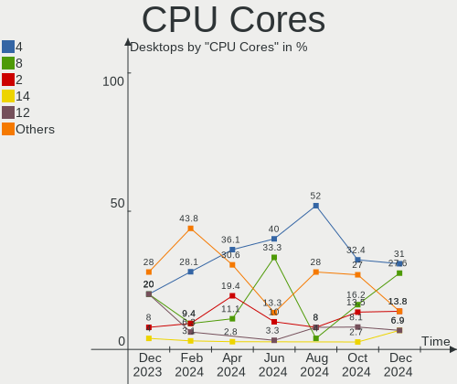
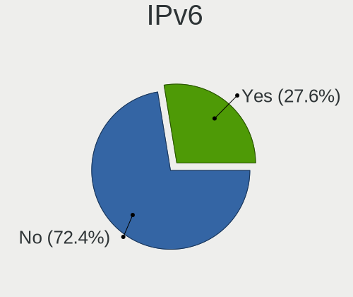
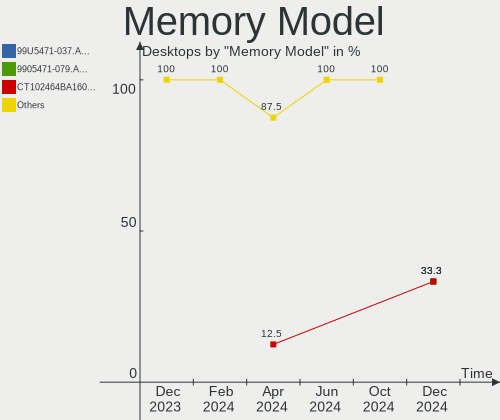
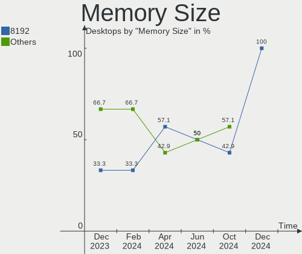
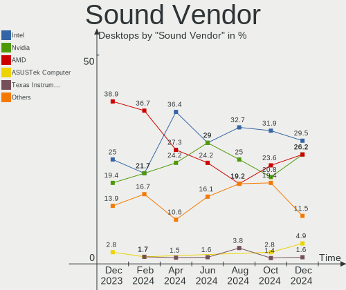
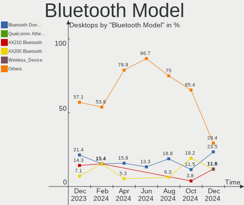

KDE neon Hardware Trends (Desktop)
----------------------------------

A project to identify most popular hardware characteristics and track their change
over time based on data collected by KDE neon users at https://Linux-Hardware.org.

Anyone can contribute to the study by uploading probes of their computers by
the [hw-probe](https://github.com/linuxhw/hw-probe) tool:

    sudo -E hw-probe -all -upload

Full-feature report is available here: https://linux-hardware.org/?view=trends&formfactor=desktop

Period: Apr, 2021.

Contents
--------

- [ OS                       ](#os)
- [ OS Family                ](#os-family)
- [ Kernel                   ](#kernel)
- [ Kernel Family            ](#kernel-family)
- [ Kernel Major Ver.        ](#kernel-major-ver)
- [ Arch                     ](#arch)
- [ DE                       ](#de)
- [ Display Server           ](#display-server)
- [ Display Manager          ](#display-manager)
- [ OS Lang                  ](#os-lang)
- [ Boot Mode                ](#boot-mode)
- [ Filesystem               ](#filesystem)
- [ Part. scheme             ](#part-scheme)
- [ Dual Boot with Linux/BSD ](#dual-boot-with-linux/bsd)
- [ Dual Boot (Win)          ](#dual-boot-win)
- [ Country                  ](#country)
- [ City                     ](#city)
- [ Vendor                   ](#vendor)
- [ Model                    ](#model)
- [ Model Family             ](#model-family)
- [ MFG Year                 ](#mfg-year)
- [ Form Factor              ](#form-factor)
- [ Secure Boot              ](#secure-boot)
- [ Coreboot                 ](#coreboot)
- [ RAM Size                 ](#ram-size)
- [ RAM Used                 ](#ram-used)
- [ Has CD-ROM               ](#has-cd-rom)
- [ Total Drives             ](#total-drives)
- [ Has Ethernet             ](#has-ethernet)
- [ Has WiFi                 ](#has-wifi)
- [ Has Bluetooth            ](#has-bluetooth)
- [ Drive Vendor             ](#drive-vendor)
- [ Drive Model              ](#drive-model)
- [ HDD Vendor               ](#hdd-vendor)
- [ SSD Vendor               ](#ssd-vendor)
- [ Drive Kind               ](#drive-kind)
- [ Drive Connector          ](#drive-connector)
- [ Drive Size               ](#drive-size)
- [ Space Total              ](#space-total)
- [ Space Used               ](#space-used)
- [ Malfunc. Drives          ](#malfunc-drives)
- [ Malfunc. Drive Vendor    ](#malfunc-drive-vendor)
- [ Malfunc. HDD Vendor      ](#malfunc-hdd-vendor)
- [ Malfunc. Drive Kind      ](#malfunc-drive-kind)
- [ Failed Drives            ](#failed-drives)
- [ Failed Drive Vendor      ](#failed-drive-vendor)
- [ Drive Status             ](#drive-status)
- [ Storage Vendor           ](#storage-vendor)
- [ Storage Model            ](#storage-model)
- [ Storage Kind             ](#storage-kind)
- [ CPU Vendor               ](#cpu-vendor)
- [ CPU Model                ](#cpu-model)
- [ CPU Model Family         ](#cpu-model-family)
- [ CPU Cores                ](#cpu-cores)
- [ CPU Sockets              ](#cpu-sockets)
- [ CPU Threads              ](#cpu-threads)
- [ CPU Op-Modes             ](#cpu-op-modes)
- [ CPU Microcode            ](#cpu-microcode)
- [ CPU Microarch            ](#cpu-microarch)
- [ GPU Vendor               ](#gpu-vendor)
- [ GPU Model                ](#gpu-model)
- [ GPU Combo                ](#gpu-combo)
- [ GPU Driver               ](#gpu-driver)
- [ GPU Memory               ](#gpu-memory)
- [ Monitor Vendor           ](#monitor-vendor)
- [ Monitor Model            ](#monitor-model)
- [ Monitor Resolution       ](#monitor-resolution)
- [ Monitor Diagonal         ](#monitor-diagonal)
- [ Monitor Width            ](#monitor-width)
- [ Aspect Ratio             ](#aspect-ratio)
- [ Monitor Area             ](#monitor-area)
- [ Pixel Density            ](#pixel-density)
- [ Multiple Monitors        ](#multiple-monitors)
- [ Net Controller Vendor    ](#net-controller-vendor)
- [ Net Controller Model     ](#net-controller-model)
- [ Wireless Vendor          ](#wireless-vendor)
- [ Wireless Model           ](#wireless-model)
- [ Ethernet Vendor          ](#ethernet-vendor)
- [ Ethernet Model           ](#ethernet-model)
- [ Net Controller Kind      ](#net-controller-kind)
- [ Used Controller          ](#used-controller)
- [ NICs                     ](#nics)
- [ IPv6                     ](#ipv6)
- [ Memory Vendor            ](#memory-vendor)
- [ Memory Model             ](#memory-model)
- [ Memory Kind              ](#memory-kind)
- [ Memory Form Factor       ](#memory-form-factor)
- [ Memory Size              ](#memory-size)
- [ Memory Speed             ](#memory-speed)
- [ Sound Vendor             ](#sound-vendor)
- [ Sound Model              ](#sound-model)
- [ Camera Vendor            ](#camera-vendor)
- [ Camera Model             ](#camera-model)
- [ Fingerprint Vendor       ](#fingerprint-vendor)
- [ Fingerprint Model        ](#fingerprint-model)
- [ Chipcard Vendor          ](#chipcard-vendor)
- [ Chipcard Model           ](#chipcard-model)
- [ Printer Vendor           ](#printer-vendor)
- [ Printer Model            ](#printer-model)
- [ Scanner Vendor           ](#scanner-vendor)
- [ Scanner Model            ](#scanner-model)
- [ Bluetooth Vendor         ](#bluetooth-vendor)
- [ Bluetooth Model          ](#bluetooth-model)
- [ Unsupported Devices      ](#unsupported-devices)
- [ Unsupported Device Types ](#unsupported-device-types)

OS
--

Installed operating systems

| Name           | Desktops | Percent |
|----------------|----------|---------|
| KDE neon 20.04 | 75       | 98.68%  |
| KDE neon 18.04 | 1        | 1.32%   |

OS Family
---------

OS without a version

| Name     | Desktops | Percent |
|----------|----------|---------|
| KDE neon | 76       | 100%    |

Kernel
------

Version of the Linux kernel

| Version                | Desktops | Percent |
|------------------------|----------|---------|
| 5.4.0-70-generic       | 31       | 40.79%  |
| 5.4.0-72-generic       | 24       | 31.58%  |
| 5.4.0-71-generic       | 8        | 10.53%  |
| 5.8.0-48-generic       | 2        | 2.63%   |
| 5.4.0-66-generic       | 2        | 2.63%   |
| 5.9.16-050916-generic  | 1        | 1.32%   |
| 5.8.0-50-generic       | 1        | 1.32%   |
| 5.4.0-65-generic       | 1        | 1.32%   |
| 5.4.0-51-generic       | 1        | 1.32%   |
| 5.3.0-62-generic       | 1        | 1.32%   |
| 5.11.16-xanmod1        | 1        | 1.32%   |
| 5.11.12-xanmod1        | 1        | 1.32%   |
| 5.11.11-051111-generic | 1        | 1.32%   |
| Unknown                | 1        | 1.32%   |

Kernel Family
-------------

Linux kernel without a distro release

| Version | Desktops | Percent |
|---------|----------|---------|
| 5.4.0   | 67       | 88.16%  |
| 5.8.0   | 3        | 3.95%   |
| 5.9.16  | 1        | 1.32%   |
| 5.3.0   | 1        | 1.32%   |
| 5.11.16 | 1        | 1.32%   |
| 5.11.12 | 1        | 1.32%   |
| 5.11.11 | 1        | 1.32%   |
| Unknown | 1        | 1.32%   |

Kernel Major Ver.
-----------------

Linux kernel major version

| Version | Desktops | Percent |
|---------|----------|---------|
| 5.4     | 67       | 88.16%  |
| 5.8     | 3        | 3.95%   |
| 5.11    | 3        | 3.95%   |
| 5.9     | 1        | 1.32%   |
| 5.3     | 1        | 1.32%   |
| Unknown | 1        | 1.32%   |

Arch
----

OS architecture (x86_64, i586, etc.)

| Name   | Desktops | Percent |
|--------|----------|---------|
| x86_64 | 76       | 100%    |

DE
--

Desktop Environment

| Name    | Desktops | Percent |
|---------|----------|---------|
| KDE     | 68       | 89.47%  |
| KDE5    | 5        | 6.58%   |
| Unknown | 3        | 3.95%   |

Display Server
--------------

X11 or Wayland

| Name    | Desktops | Percent |
|---------|----------|---------|
| X11     | 75       | 98.68%  |
| Wayland | 1        | 1.32%   |

Display Manager
---------------

SDDM, LightDM, etc.

| Name    | Desktops | Percent |
|---------|----------|---------|
| Unknown | 70       | 92.11%  |
| SDDM    | 6        | 7.89%   |

OS Lang
-------

Language

| Lang    | Desktops | Percent |
|---------|----------|---------|
| en_US   | 28       | 36.84%  |
| ru_RU   | 9        | 11.84%  |
| de_DE   | 9        | 11.84%  |
| en_GB   | 5        | 6.58%   |
| pt_BR   | 4        | 5.26%   |
| es_ES   | 3        | 3.95%   |
| en_CA   | 3        | 3.95%   |
| sv_SE   | 2        | 2.63%   |
| tr_TR   | 1        | 1.32%   |
| sk_SK   | 1        | 1.32%   |
| ro_RO   | 1        | 1.32%   |
| pl_PL   | 1        | 1.32%   |
| fr_FR   | 1        | 1.32%   |
| fi_FI   | 1        | 1.32%   |
| es_CU   | 1        | 1.32%   |
| es_AR   | 1        | 1.32%   |
| en_NZ   | 1        | 1.32%   |
| en_IN   | 1        | 1.32%   |
| en_AU   | 1        | 1.32%   |
| C       | 1        | 1.32%   |
| Unknown | 1        | 1.32%   |

Boot Mode
---------

EFI or BIOS

| Mode | Desktops | Percent |
|------|----------|---------|
| EFI  | 46       | 60.53%  |
| BIOS | 30       | 39.47%  |

Filesystem
----------

Type of filesystem

| Type | Desktops | Percent |
|------|----------|---------|
| Ext4 | 76       | 100%    |

Part. scheme
------------

Scheme of partitioning

| Type    | Desktops | Percent |
|---------|----------|---------|
| Unknown | 69       | 90.79%  |
| GPT     | 4        | 5.26%   |
| MBR     | 3        | 3.95%   |

Dual Boot with Linux/BSD
------------------------

Hosting more than one Linux/BSD

| Dual boot | Desktops | Percent |
|-----------|----------|---------|
| No        | 73       | 96.05%  |
| Yes       | 3        | 3.95%   |

Dual Boot (Win)
---------------

Hosting Linux and Windows

| Dual boot | Desktops | Percent |
|-----------|----------|---------|
| No        | 70       | 92.11%  |
| Yes       | 6        | 7.89%   |

Country
-------

Geographic location (country)

| Country     | Desktops | Percent |
|-------------|----------|---------|
| USA         | 19       | 25%     |
| Russia      | 10       | 13.16%  |
| Germany     | 10       | 13.16%  |
| Poland      | 4        | 5.26%   |
| Brazil      | 4        | 5.26%   |
| UK          | 3        | 3.95%   |
| Spain       | 3        | 3.95%   |
| Canada      | 3        | 3.95%   |
| Sweden      | 2        | 2.63%   |
| Netherlands | 2        | 2.63%   |
| Argentina   | 2        | 2.63%   |
| Turkey      | 1        | 1.32%   |
| Slovenia    | 1        | 1.32%   |
| Romania     | 1        | 1.32%   |
| New Zealand | 1        | 1.32%   |
| Luxembourg  | 1        | 1.32%   |
| Lithuania   | 1        | 1.32%   |
| India       | 1        | 1.32%   |
| France      | 1        | 1.32%   |
| Finland     | 1        | 1.32%   |
| Egypt       | 1        | 1.32%   |
| Czechia     | 1        | 1.32%   |
| Colombia    | 1        | 1.32%   |
| Austria     | 1        | 1.32%   |
| Australia   | 1        | 1.32%   |

City
----

Geographic location (city)

| City                        | Desktops | Percent |
|-----------------------------|----------|---------|
| St Petersburg               | 3        | 3.95%   |
| Peterborough                | 2        | 2.63%   |
| Krakow                      | 2        | 2.63%   |
| Everett                     | 2        | 2.63%   |
| Essen                       | 2        | 2.63%   |
| Žalec                      | 1        | 1.32%   |
| Zielona Góra               | 1        | 1.32%   |
| Zefta                       | 1        | 1.32%   |
| Winslow                     | 1        | 1.32%   |
| Vilnius                     | 1        | 1.32%   |
| Vienna                      | 1        | 1.32%   |
| Tubarao                     | 1        | 1.32%   |
| Tacoma                      | 1        | 1.32%   |
| São Luís                  | 1        | 1.32%   |
| São João del Rei          | 1        | 1.32%   |
| Soleuvre                    | 1        | 1.32%   |
| Savannah                    | 1        | 1.32%   |
| San Nicolás de los Arroyos | 1        | 1.32%   |
| San Francisco               | 1        | 1.32%   |
| Rosenheim                   | 1        | 1.32%   |
| Rondonópolis               | 1        | 1.32%   |
| Radom                       | 1        | 1.32%   |
| Piikkiö                    | 1        | 1.32%   |
| Phoenix                     | 1        | 1.32%   |
| Oxie                        | 1        | 1.32%   |
| Novosibirsk                 | 1        | 1.32%   |
| Newport News                | 1        | 1.32%   |
| Nakhabino                   | 1        | 1.32%   |
| Murmansk                    | 1        | 1.32%   |
| Moscow                      | 1        | 1.32%   |
| Mjoelby                     | 1        | 1.32%   |
| Miami                       | 1        | 1.32%   |
| Mezhdurechensk              | 1        | 1.32%   |
| Medellín                   | 1        | 1.32%   |
| Martinez                    | 1        | 1.32%   |
| Lynn                        | 1        | 1.32%   |
| Longmeadow                  | 1        | 1.32%   |
| Leipzig                     | 1        | 1.32%   |
| Kostroma                    | 1        | 1.32%   |
| Kingsport                   | 1        | 1.32%   |
| Istanbul                    | 1        | 1.32%   |
| Indio                       | 1        | 1.32%   |
| Ilfeld                      | 1        | 1.32%   |
| Iasi                        | 1        | 1.32%   |
| Houston                     | 1        | 1.32%   |
| Harleysville                | 1        | 1.32%   |
| Hamburg                     | 1        | 1.32%   |
| Grove                       | 1        | 1.32%   |
| Gonzales                    | 1        | 1.32%   |
| Gijón                      | 1        | 1.32%   |
| Frankfurt am Main           | 1        | 1.32%   |
| Fokino                      | 1        | 1.32%   |
| Duivendrecht                | 1        | 1.32%   |
| Concord                     | 1        | 1.32%   |
| Chilliwack                  | 1        | 1.32%   |
| Chaska                      | 1        | 1.32%   |
| Chandannagar                | 1        | 1.32%   |
| Burlington                  | 1        | 1.32%   |
| Brno                        | 1        | 1.32%   |
| Brisbane                    | 1        | 1.32%   |

Vendor
------

Motherboard manufacturer

| Name                | Desktops | Percent |
|---------------------|----------|---------|
| ASUSTek Computer    | 23       | 30.26%  |
| MSI                 | 15       | 19.74%  |
| Gigabyte Technology | 9        | 11.84%  |
| ASRock              | 8        | 10.53%  |
| Hewlett-Packard     | 7        | 9.21%   |
| Dell                | 5        | 6.58%   |
| Lenovo              | 3        | 3.95%   |
| Pegatron            | 1        | 1.32%   |
| Intel               | 1        | 1.32%   |
| Fujitsu             | 1        | 1.32%   |
| Foxconn             | 1        | 1.32%   |
| DEPO Computers      | 1        | 1.32%   |
| Apple               | 1        | 1.32%   |

Model
-----

Motherboard model

| Name                                    | Desktops | Percent |
|-----------------------------------------|----------|---------|
| ASUS All Series                         | 3        | 3.95%   |
| HP EliteDesk 800 G1 SFF                 | 2        | 2.63%   |
| ASUS PRIME B450M-A                      | 2        | 2.63%   |
| ASUS P8Z77-V PRO                        | 2        | 2.63%   |
| ASRock B450 Gaming K4                   | 2        | 2.63%   |
| Pegatron FQ604AA-ABA m9552p             | 1        | 1.32%   |
| MSI MS-7C95                             | 1        | 1.32%   |
| MSI MS-7C82                             | 1        | 1.32%   |
| MSI MS-7C52                             | 1        | 1.32%   |
| MSI MS-7C37                             | 1        | 1.32%   |
| MSI MS-7C02                             | 1        | 1.32%   |
| MSI MS-7B85                             | 1        | 1.32%   |
| MSI MS-7B00                             | 1        | 1.32%   |
| MSI MS-7A33                             | 1        | 1.32%   |
| MSI MS-7978                             | 1        | 1.32%   |
| MSI MS-7888                             | 1        | 1.32%   |
| MSI MS-7798                             | 1        | 1.32%   |
| MSI MS-7693                             | 1        | 1.32%   |
| MSI MS-7309                             | 1        | 1.32%   |
| MSI G314                                | 1        | 1.32%   |
| MSI Cubi N 8GL (MS-B171)                | 1        | 1.32%   |
| Lenovo ThinkStation S20 4157ZSK         | 1        | 1.32%   |
| Lenovo IdeaCentre 3 07ADA05 90MV007SUS  | 1        | 1.32%   |
| Lenovo H50-50 90B6007BUK                | 1        | 1.32%   |
| Intel H81                               | 1        | 1.32%   |
| HP Z800 Workstation                     | 1        | 1.32%   |
| HP ProDesk 600 G2 DM                    | 1        | 1.32%   |
| HP Pro3500 G2 MT PC                     | 1        | 1.32%   |
| HP Pavilion 590-p0097c Desktop Rfrbd PC | 1        | 1.32%   |
| HP Compaq Elite 8300 MT                 | 1        | 1.32%   |
| Gigabyte Z170X-UD5 TH                   | 1        | 1.32%   |
| Gigabyte H81M-D3H                       | 1        | 1.32%   |
| Gigabyte H410M H                        | 1        | 1.32%   |
| Gigabyte B75M-D3H                       | 1        | 1.32%   |
| Gigabyte B550M DS3H                     | 1        | 1.32%   |
| Gigabyte B550 AORUS PRO AC              | 1        | 1.32%   |
| Gigabyte B450M DS3H V2                  | 1        | 1.32%   |
| Gigabyte B450 AORUS M                   | 1        | 1.32%   |
| Gigabyte AB350-Gaming 3                 | 1        | 1.32%   |
| Fujitsu ESPRIMO P900 0-Watt             | 1        | 1.32%   |
| Foxconn p6504f                          | 1        | 1.32%   |
| DEPO Computers MS-7846                  | 1        | 1.32%   |
| Dell OptiPlex 760                       | 1        | 1.32%   |
| Dell OptiPlex 7010                      | 1        | 1.32%   |
| Dell OptiPlex 3040                      | 1        | 1.32%   |
| Dell Inspiron 537s                      | 1        | 1.32%   |
| Dell DM061                              | 1        | 1.32%   |
| ASUS TUF X470-PLUS GAMING               | 1        | 1.32%   |
| ASUS TUF GAMING Z490-PLUS               | 1        | 1.32%   |
| ASUS TUF B450-PLUS GAMING               | 1        | 1.32%   |
| ASUS SABERTOOTH 990FX R2.0              | 1        | 1.32%   |
| ASUS ROG STRIX Z490-G GAMING            | 1        | 1.32%   |
| ASUS ROG STRIX Z370-F GAMING            | 1        | 1.32%   |
| ASUS ROG STRIX B450-F GAMING            | 1        | 1.32%   |
| ASUS ROG CROSSHAIR VI EXTREME           | 1        | 1.32%   |
| ASUS PRIME A320M-K/BR                   | 1        | 1.32%   |
| ASUS PRIME A320M-K                      | 1        | 1.32%   |
| ASUS P7P55 LX                           | 1        | 1.32%   |
| ASUS P5KPL/1600                         | 1        | 1.32%   |
| ASUS M5A97 LE R2.0                      | 1        | 1.32%   |

Model Family
------------

Motherboard model prefix

| Name                   | Desktops | Percent |
|------------------------|----------|---------|
| ASUS ROG               | 4        | 5.26%   |
| ASUS PRIME             | 4        | 5.26%   |
| Dell OptiPlex          | 3        | 3.95%   |
| ASUS TUF               | 3        | 3.95%   |
| ASUS All               | 3        | 3.95%   |
| HP EliteDesk           | 2        | 2.63%   |
| ASUS P8Z77-V           | 2        | 2.63%   |
| ASRock B450M           | 2        | 2.63%   |
| ASRock B450            | 2        | 2.63%   |
| Pegatron FQ604AA-ABA   | 1        | 1.32%   |
| MSI MS-7C95            | 1        | 1.32%   |
| MSI MS-7C82            | 1        | 1.32%   |
| MSI MS-7C52            | 1        | 1.32%   |
| MSI MS-7C37            | 1        | 1.32%   |
| MSI MS-7C02            | 1        | 1.32%   |
| MSI MS-7B85            | 1        | 1.32%   |
| MSI MS-7B00            | 1        | 1.32%   |
| MSI MS-7A33            | 1        | 1.32%   |
| MSI MS-7978            | 1        | 1.32%   |
| MSI MS-7888            | 1        | 1.32%   |
| MSI MS-7798            | 1        | 1.32%   |
| MSI MS-7693            | 1        | 1.32%   |
| MSI MS-7309            | 1        | 1.32%   |
| MSI G314               | 1        | 1.32%   |
| MSI Cubi               | 1        | 1.32%   |
| Lenovo ThinkStation    | 1        | 1.32%   |
| Lenovo IdeaCentre      | 1        | 1.32%   |
| Lenovo H50-50          | 1        | 1.32%   |
| Intel H81              | 1        | 1.32%   |
| HP Z800                | 1        | 1.32%   |
| HP ProDesk             | 1        | 1.32%   |
| HP Pro3500             | 1        | 1.32%   |
| HP Pavilion            | 1        | 1.32%   |
| HP Compaq              | 1        | 1.32%   |
| Gigabyte Z170X-UD5     | 1        | 1.32%   |
| Gigabyte H81M-D3H      | 1        | 1.32%   |
| Gigabyte H410M         | 1        | 1.32%   |
| Gigabyte B75M-D3H      | 1        | 1.32%   |
| Gigabyte B550M         | 1        | 1.32%   |
| Gigabyte B550          | 1        | 1.32%   |
| Gigabyte B450M         | 1        | 1.32%   |
| Gigabyte B450          | 1        | 1.32%   |
| Gigabyte AB350-Gaming  | 1        | 1.32%   |
| Fujitsu ESPRIMO        | 1        | 1.32%   |
| Foxconn p6504f         | 1        | 1.32%   |
| DEPO Computers MS-7846 | 1        | 1.32%   |
| Dell Inspiron          | 1        | 1.32%   |
| Dell DM061             | 1        | 1.32%   |
| ASUS SABERTOOTH        | 1        | 1.32%   |
| ASUS P7P55             | 1        | 1.32%   |
| ASUS P5KPL             | 1        | 1.32%   |
| ASUS M5A97             | 1        | 1.32%   |
| ASUS M5A78L-M          | 1        | 1.32%   |
| ASUS M4A79T            | 1        | 1.32%   |
| ASUS B75M-PLUS         | 1        | 1.32%   |
| ASRock Z390            | 1        | 1.32%   |
| ASRock J4205-ITX       | 1        | 1.32%   |
| ASRock A55M-VS         | 1        | 1.32%   |
| ASRock A320M-HDV       | 1        | 1.32%   |
| Apple MacPro5          | 1        | 1.32%   |

MFG Year
--------

Motherboard manufacture year

| Year | Desktops | Percent |
|------|----------|---------|
| 2020 | 19       | 25%     |
| 2019 | 13       | 17.11%  |
| 2013 | 8        | 10.53%  |
| 2018 | 6        | 7.89%   |
| 2009 | 5        | 6.58%   |
| 2021 | 4        | 5.26%   |
| 2016 | 4        | 5.26%   |
| 2014 | 4        | 5.26%   |
| 2017 | 3        | 3.95%   |
| 2015 | 3        | 3.95%   |
| 2012 | 3        | 3.95%   |
| 2010 | 2        | 2.63%   |
| 2011 | 1        | 1.32%   |
| 2007 | 1        | 1.32%   |

Form Factor
-----------

Physical design of the computer

| Name    | Desktops | Percent |
|---------|----------|---------|
| Desktop | 76       | 100%    |

Secure Boot
-----------

Enabled or disabled

| State    | Desktops | Percent |
|----------|----------|---------|
| Disabled | 72       | 94.74%  |
| Enabled  | 4        | 5.26%   |

Coreboot
--------

Have coreboot on board

| Used | Desktops | Percent |
|------|----------|---------|
| No   | 76       | 100%    |

RAM Size
--------

Total RAM memory

| Size in GB  | Desktops | Percent |
|-------------|----------|---------|
| 16.01-24.0  | 23       | 30.26%  |
| 8.01-16.0   | 23       | 30.26%  |
| 32.01-64.0  | 10       | 13.16%  |
| 3.01-4.0    | 10       | 13.16%  |
| 4.01-8.0    | 5        | 6.58%   |
| 24.01-32.0  | 4        | 5.26%   |
| 64.01-256.0 | 1        | 1.32%   |

RAM Used
--------

Used RAM memory

| Used GB   | Desktops | Percent |
|-----------|----------|---------|
| 2.01-3.0  | 28       | 36.84%  |
| 1.01-2.0  | 25       | 32.89%  |
| 3.01-4.0  | 12       | 15.79%  |
| 4.01-8.0  | 9        | 11.84%  |
| 8.01-16.0 | 1        | 1.32%   |
| 0.51-1.0  | 1        | 1.32%   |

Has CD-ROM
----------

Has CD-ROM on board

| Presented | Desktops | Percent |
|-----------|----------|---------|
| No        | 43       | 56.58%  |
| Yes       | 33       | 43.42%  |

Total Drives
------------

Number of drives on board

| Drives | Desktops | Percent |
|--------|----------|---------|
| 2      | 27       | 35.53%  |
| 1      | 22       | 28.95%  |
| 3      | 17       | 22.37%  |
| 4      | 6        | 7.89%   |
| 5      | 3        | 3.95%   |
| 9      | 1        | 1.32%   |

Has Ethernet
------------

Has Ethernet on board

| Presented | Desktops | Percent |
|-----------|----------|---------|
| Yes       | 75       | 98.68%  |
| No        | 1        | 1.32%   |

Has WiFi
--------

Has WiFi module

| Presented | Desktops | Percent |
|-----------|----------|---------|
| No        | 40       | 52.63%  |
| Yes       | 36       | 47.37%  |

Has Bluetooth
-------------

Has Bluetooth module

| Presented | Desktops | Percent |
|-----------|----------|---------|
| No        | 46       | 60.53%  |
| Yes       | 30       | 39.47%  |

Drive Vendor
------------

Hard drive vendors

| Vendor                | Desktops | Drives | Percent |
|-----------------------|----------|--------|---------|
| Samsung Electronics   | 23       | 33     | 16.31%  |
| WDC                   | 22       | 32     | 15.6%   |
| Seagate               | 20       | 26     | 14.18%  |
| Toshiba               | 12       | 14     | 8.51%   |
| Kingston              | 11       | 13     | 7.8%    |
| Sandisk               | 6        | 6      | 4.26%   |
| Hitachi               | 6        | 7      | 4.26%   |
| Phison                | 5        | 5      | 3.55%   |
| Intel                 | 3        | 3      | 2.13%   |
| Hewlett-Packard       | 3        | 3      | 2.13%   |
| China                 | 3        | 3      | 2.13%   |
| SPCC                  | 2        | 2      | 1.42%   |
| MAXTOR                | 2        | 2      | 1.42%   |
| GOODRAM               | 2        | 2      | 1.42%   |
| Crucial               | 2        | 3      | 1.42%   |
| A-DATA Technology     | 2        | 2      | 1.42%   |
| XPG                   | 1        | 1      | 0.71%   |
| Unknown               | 1        | 2      | 0.71%   |
| SK Hynix              | 1        | 1      | 0.71%   |
| Realtek Semiconductor | 1        | 1      | 0.71%   |
| PNY                   | 1        | 2      | 0.71%   |
| Patriot               | 1        | 1      | 0.71%   |
| OCZ                   | 1        | 1      | 0.71%   |
| Micron Technology     | 1        | 1      | 0.71%   |
| KingSpec              | 1        | 1      | 0.71%   |
| KESU                  | 1        | 1      | 0.71%   |
| JMicron               | 1        | 1      | 0.71%   |
| HS-SSD-E100           | 1        | 1      | 0.71%   |
| HGST                  | 1        | 1      | 0.71%   |
| FORESEE               | 1        | 1      | 0.71%   |
| Envoy                 | 1        | 1      | 0.71%   |
| Corsair               | 1        | 1      | 0.71%   |
| ASMT                  | 1        | 1      | 0.71%   |

Drive Model
-----------

Hard drive models

| Model                               | Desktops | Percent |
|-------------------------------------|----------|---------|
| WDC WD10EZEX-08WN4A0 1TB            | 4        | 2.34%   |
| Seagate ST500DM002-1BD142 500GB     | 4        | 2.34%   |
| Samsung NVMe SSD Drive 500GB        | 4        | 2.34%   |
| Kingston SA400S37240G 240GB SSD     | 4        | 2.34%   |
| Toshiba DT01ACA050 500GB            | 3        | 1.75%   |
| Samsung SSD 850 EVO 250GB           | 3        | 1.75%   |
| Samsung SSD 840 EVO 250GB           | 3        | 1.75%   |
| Samsung NVMe SSD Drive 1TB          | 3        | 1.75%   |
| WDC WDS500G2B0A-00SM50 500GB SSD    | 2        | 1.17%   |
| WDC WDS240G2G0A-00JH30 240GB SSD    | 2        | 1.17%   |
| Toshiba HDWD130 3TB                 | 2        | 1.17%   |
| Seagate ST500LM012 HN-M500MBB 500GB | 2        | 1.17%   |
| Seagate ST3000DM001-1CH166 3TB      | 2        | 1.17%   |
| Seagate ST1000DM010-2EP102 1TB      | 2        | 1.17%   |
| Sandisk NVMe SSD Drive 500GB        | 2        | 1.17%   |
| Samsung SSD 860 EVO 500GB           | 2        | 1.17%   |
| Phison NVMe SSD Drive 256GB         | 2        | 1.17%   |
| Kingston SV300S37A120G 120GB SSD    | 2        | 1.17%   |
| Kingston SA2000M8500G 500GB         | 2        | 1.17%   |
| Kingston NVMe SSD Drive 500GB       | 2        | 1.17%   |
| Hitachi HUA722020ALA331 2TB         | 2        | 1.17%   |
| HP SSD S700 500GB                   | 2        | 1.17%   |
| Crucial CT2000BX500SSD1 2TB         | 2        | 1.17%   |
| XPG NVMe SSD Drive 1024GB           | 1        | 0.58%   |
| WDC WDS500G2B0A 500GB SSD           | 1        | 0.58%   |
| WDC WDS250G2X0C-00L350 250GB        | 1        | 0.58%   |
| WDC WDS240G2G0B-00EPW0 240GB SSD    | 1        | 0.58%   |
| WDC WDS240G1G0A-00SS50 240GB SSD    | 1        | 0.58%   |
| WDC WDS120G2G0A-00JH30 120GB SSD    | 1        | 0.58%   |
| WDC WDS100T2B0B-00YS70 1TB SSD      | 1        | 0.58%   |
| WDC WDS100T2B0A-00SM50 1TB SSD      | 1        | 0.58%   |
| WDC WD82PURZ-85TEUY0 8TB            | 1        | 0.58%   |
| WDC WD5000AAKX-00KJ3A0 500GB        | 1        | 0.58%   |
| WDC WD5000AAKX-003CA0 500GB         | 1        | 0.58%   |
| WDC WD2500AAKX-083CA1 250GB         | 1        | 0.58%   |
| WDC WD2500AAKX-001CA0 250GB         | 1        | 0.58%   |
| WDC WD2500AAJS-22VTA0 250GB         | 1        | 0.58%   |
| WDC WD20EZAZ-00GGJB0 2TB            | 1        | 0.58%   |
| WDC WD2003FYPS-27Y2B0 2TB           | 1        | 0.58%   |
| WDC WD10EZEX-00UD2A0 1TB            | 1        | 0.58%   |
| WDC WD10EZEX-00BN5A0 1TB            | 1        | 0.58%   |
| WDC WD10EURX-62C57Y0 1TB            | 1        | 0.58%   |
| WDC WD10EARS-00MVWB0 1TB            | 1        | 0.58%   |
| WDC WD10EALX-009BA0 1TB             | 1        | 0.58%   |
| WDC WD1003FZEX-00K3CA0 1TB          | 1        | 0.58%   |
| WDC WD1003FBYX-36Y7B0 1TB           | 1        | 0.58%   |
| WDC WD FILEIO 10TB                  | 1        | 0.58%   |
| Unknown SD/MMC 64GB                 | 1        | 0.58%   |
| Unknown M.S./M.S.Pro/HG 16GB        | 1        | 0.58%   |
| Toshiba MQ01ABD075 752GB            | 1        | 0.58%   |
| Toshiba MQ01ABD032 320GB            | 1        | 0.58%   |
| Toshiba HDWE160 6TB                 | 1        | 0.58%   |
| Toshiba HDWE140 4TB                 | 1        | 0.58%   |
| Toshiba HDWD120 2TB                 | 1        | 0.58%   |
| Toshiba HDWD110 1TB                 | 1        | 0.58%   |
| Toshiba DT01ACA300 3TB              | 1        | 0.58%   |
| Toshiba DT01ACA200 2TB              | 1        | 0.58%   |
| Toshiba DT01ACA100 1TB              | 1        | 0.58%   |
| SPCC Solid State Disk 512GB         | 1        | 0.58%   |
| SPCC Solid State Disk 120GB         | 1        | 0.58%   |

HDD Vendor
----------

Hard disk drive vendors

| Vendor              | Desktops | Drives | Percent |
|---------------------|----------|--------|---------|
| Seagate             | 20       | 26     | 31.25%  |
| WDC                 | 18       | 21     | 28.13%  |
| Toshiba             | 12       | 14     | 18.75%  |
| Hitachi             | 6        | 7      | 9.38%   |
| Samsung Electronics | 3        | 3      | 4.69%   |
| MAXTOR              | 2        | 2      | 3.13%   |
| KESU                | 1        | 1      | 1.56%   |
| HGST                | 1        | 1      | 1.56%   |
| ASMT                | 1        | 1      | 1.56%   |

SSD Vendor
----------

Solid state drive vendors

| Vendor              | Desktops | Drives | Percent |
|---------------------|----------|--------|---------|
| Samsung Electronics | 18       | 21     | 30.51%  |
| Kingston            | 8        | 9      | 13.56%  |
| WDC                 | 6        | 10     | 10.17%  |
| SanDisk             | 3        | 3      | 5.08%   |
| Hewlett-Packard     | 3        | 3      | 5.08%   |
| China               | 3        | 3      | 5.08%   |
| SPCC                | 2        | 2      | 3.39%   |
| Intel               | 2        | 2      | 3.39%   |
| GOODRAM             | 2        | 2      | 3.39%   |
| Crucial             | 2        | 3      | 3.39%   |
| A-DATA Technology   | 2        | 2      | 3.39%   |
| PNY                 | 1        | 2      | 1.69%   |
| Patriot             | 1        | 1      | 1.69%   |
| OCZ                 | 1        | 1      | 1.69%   |
| Micron Technology   | 1        | 1      | 1.69%   |
| KingSpec            | 1        | 1      | 1.69%   |
| JMicron             | 1        | 1      | 1.69%   |
| FORESEE             | 1        | 1      | 1.69%   |
| Corsair             | 1        | 1      | 1.69%   |

Drive Kind
----------

HDD or SSD

| Kind    | Desktops | Drives | Percent |
|---------|----------|--------|---------|
| HDD     | 53       | 76     | 42.06%  |
| SSD     | 47       | 69     | 37.3%   |
| NVMe    | 23       | 26     | 18.25%  |
| Unknown | 3        | 4      | 2.38%   |

Drive Connector
---------------

SATA, SAS, NVMe, etc.

| Type | Desktops | Drives | Percent |
|------|----------|--------|---------|
| SATA | 71       | 142    | 71%     |
| NVMe | 23       | 26     | 23%     |
| SAS  | 6        | 7      | 6%      |

Drive Size
----------

Size of hard drive

| Size in TB | Desktops | Drives | Percent |
|------------|----------|--------|---------|
| 0.01-0.5   | 56       | 87     | 53.85%  |
| 0.51-1.0   | 23       | 29     | 22.12%  |
| 1.01-2.0   | 14       | 17     | 13.46%  |
| 2.01-3.0   | 5        | 6      | 4.81%   |
| 4.01-10.0  | 4        | 4      | 3.85%   |
| 3.01-4.0   | 2        | 2      | 1.92%   |

Space Total
-----------

Amount of disk space available on the file system

| Size in GB     | Desktops | Percent |
|----------------|----------|---------|
| 101-250        | 22       | 28.95%  |
| 251-500        | 17       | 22.37%  |
| 501-1000       | 13       | 17.11%  |
| 51-100         | 6        | 7.89%   |
| 1001-2000      | 5        | 6.58%   |
| More than 3000 | 4        | 5.26%   |
| 2001-3000      | 3        | 3.95%   |
| Unknown        | 3        | 3.95%   |
| 21-50          | 2        | 2.63%   |
| 1-20           | 1        | 1.32%   |

Space Used
----------

Amount of used disk space

| Used GB        | Desktops | Percent |
|----------------|----------|---------|
| 1-20           | 28       | 36.84%  |
| 21-50          | 12       | 15.79%  |
| 101-250        | 9        | 11.84%  |
| 251-500        | 8        | 10.53%  |
| 51-100         | 6        | 7.89%   |
| 501-1000       | 4        | 5.26%   |
| More than 3000 | 3        | 3.95%   |
| 1001-2000      | 3        | 3.95%   |
| Unknown        | 3        | 3.95%   |

Malfunc. Drives
---------------

Drive models with a malfunction

Zero info for selected period =(

Malfunc. Drive Vendor
---------------------

Vendors of faulty drives

Zero info for selected period =(

Malfunc. HDD Vendor
-------------------

Vendors of faulty HDD drives

Zero info for selected period =(

Malfunc. Drive Kind
-------------------

Kinds of faulty drives

Zero info for selected period =(

Failed Drives
-------------

Failed drive models

Zero info for selected period =(

Failed Drive Vendor
-------------------

Failed drive vendors

Zero info for selected period =(

Drive Status
------------

Number of failed and malfunc. drives

| Status   | Desktops | Drives | Percent |
|----------|----------|--------|---------|
| Detected | 69       | 163    | 89.61%  |
| Works    | 8        | 12     | 10.39%  |

Storage Vendor
--------------

Storage controller vendors

| Vendor                      | Desktops | Percent |
|-----------------------------|----------|---------|
| Intel                       | 44       | 38.6%   |
| AMD                         | 32       | 28.07%  |
| ASMedia Technology          | 9        | 7.89%   |
| Samsung Electronics         | 8        | 7.02%   |
| Phison Electronics          | 5        | 4.39%   |
| Sandisk                     | 4        | 3.51%   |
| Kingston Technology Company | 3        | 2.63%   |
| VIA Technologies            | 2        | 1.75%   |
| Marvell Technology Group    | 2        | 1.75%   |
| SK Hynix                    | 1        | 0.88%   |
| Realtek Semiconductor       | 1        | 0.88%   |
| Nvidia                      | 1        | 0.88%   |
| LSI Logic / Symbios Logic   | 1        | 0.88%   |
| ADATA Technology            | 1        | 0.88%   |

Storage Model
-------------

Storage controller models

| Model                                                                                   | Desktops | Percent |
|-----------------------------------------------------------------------------------------|----------|---------|
| AMD FCH SATA Controller [AHCI mode]                                                     | 21       | 14.19%  |
| AMD 400 Series Chipset SATA Controller                                                  | 14       | 9.46%   |
| Intel 8 Series/C220 Series Chipset Family 6-port SATA Controller 1 [AHCI mode]          | 9        | 6.08%   |
| ASMedia ASM1062 Serial ATA Controller                                                   | 9        | 6.08%   |
| Samsung NVMe SSD Controller SM981/PM981/PM983                                           | 8        | 5.41%   |
| Intel 7 Series/C210 Series Chipset Family 6-port SATA Controller [AHCI mode]            | 7        | 4.73%   |
| Intel Q170/Q150/B150/H170/H110/Z170/CM236 Chipset SATA Controller [AHCI Mode]           | 4        | 2.7%    |
| Phison E12 NVMe Controller                                                              | 3        | 2.03%   |
| Kingston Company A2000 NVMe SSD                                                         | 3        | 2.03%   |
| Intel NM10/ICH7 Family SATA Controller [IDE mode]                                       | 3        | 2.03%   |
| AMD Starship/Matisse Chipset SATA Controller [AHCI mode]                                | 3        | 2.03%   |
| AMD SB7x0/SB8x0/SB9x0 SATA Controller [AHCI mode]                                       | 3        | 2.03%   |
| AMD FCH SATA Controller D                                                               | 3        | 2.03%   |
| Sandisk WD Black 2018/SN750 / PC SN720 NVMe SSD                                         | 2        | 1.35%   |
| Intel SATA Controller [RAID mode]                                                       | 2        | 1.35%   |
| Intel Comet Lake SATA AHCI Controller                                                   | 2        | 1.35%   |
| Intel Cannon Lake PCH SATA AHCI Controller                                              | 2        | 1.35%   |
| Intel 82801JI (ICH10 Family) SATA AHCI Controller                                       | 2        | 1.35%   |
| Intel 82801G (ICH7 Family) IDE Controller                                               | 2        | 1.35%   |
| Intel 400 Series Chipset Family SATA AHCI Controller                                    | 2        | 1.35%   |
| AMD X370 Series Chipset SATA Controller                                                 | 2        | 1.35%   |
| AMD SB7x0/SB8x0/SB9x0 SATA Controller [IDE mode]                                        | 2        | 1.35%   |
| AMD SB7x0/SB8x0/SB9x0 IDE Controller                                                    | 2        | 1.35%   |
| AMD 300 Series Chipset SATA Controller                                                  | 2        | 1.35%   |
| VIA VT6421 IDE/SATA Controller                                                          | 1        | 0.68%   |
| VIA VT6415 PATA IDE Host Controller                                                     | 1        | 0.68%   |
| SK Hynix BC501 NVMe Solid State Drive 512GB                                             | 1        | 0.68%   |
| Sandisk WD Blue SN550 NVMe SSD                                                          | 1        | 0.68%   |
| Sandisk WD Black SN750 / PC SN730 NVMe SSD                                              | 1        | 0.68%   |
| Samsung NVMe SSD Controller SM951/PM951                                                 | 1        | 0.68%   |
| Samsung Electronics SATA controller                                                     | 1        | 0.68%   |
| Realtek Realtek Non-Volatile memory controller                                          | 1        | 0.68%   |
| Phison PS5013 E13 NVMe Controller                                                       | 1        | 0.68%   |
| Phison NVMe Storage Controller                                                          | 1        | 0.68%   |
| Nvidia MCP61 SATA Controller                                                            | 1        | 0.68%   |
| Nvidia MCP61 IDE                                                                        | 1        | 0.68%   |
| Marvell Group 88SE9230 PCIe 2.0 x2 4-port SATA 6 Gb/s RAID Controller                   | 1        | 0.68%   |
| Marvell Group 88SE9215 PCIe 2.0 x1 4-port SATA 6 Gb/s Controller                        | 1        | 0.68%   |
| LSI Logic / Symbios Logic SAS1068E PCI-Express Fusion-MPT SAS                           | 1        | 0.68%   |
| Intel Non-Volatile memory controller                                                    | 1        | 0.68%   |
| Intel Celeron/Pentium Silver Processor SATA Controller                                  | 1        | 0.68%   |
| Intel Celeron N3350/Pentium N4200/Atom E3900 Series SATA AHCI Controller                | 1        | 0.68%   |
| Intel 9 Series Chipset Family SATA Controller [AHCI Mode]                               | 1        | 0.68%   |
| Intel 82801JI (ICH10 Family) 4 port SATA IDE Controller #1                              | 1        | 0.68%   |
| Intel 82801JI (ICH10 Family) 2 port SATA IDE Controller #2                              | 1        | 0.68%   |
| Intel 82801JD/DO (ICH10 Family) 4-port SATA IDE Controller                              | 1        | 0.68%   |
| Intel 82801JD/DO (ICH10 Family) 2-port SATA IDE Controller                              | 1        | 0.68%   |
| Intel 82801HR/HO/HH (ICH8R/DO/DH) 2 port SATA Controller [IDE mode]                     | 1        | 0.68%   |
| Intel 82801H (ICH8 Family) 4 port SATA Controller [IDE mode]                            | 1        | 0.68%   |
| Intel 7 Series/C210 Series Chipset Family 4-port SATA Controller [IDE mode]             | 1        | 0.68%   |
| Intel 7 Series/C210 Series Chipset Family 2-port SATA Controller [IDE mode]             | 1        | 0.68%   |
| Intel 6 Series/C200 Series Chipset Family Desktop SATA Controller (IDE mode, ports 4-5) | 1        | 0.68%   |
| Intel 6 Series/C200 Series Chipset Family Desktop SATA Controller (IDE mode, ports 0-3) | 1        | 0.68%   |
| Intel 6 Series/C200 Series Chipset Family 6 port Desktop SATA AHCI Controller           | 1        | 0.68%   |
| Intel 5 Series/3400 Series Chipset 4 port SATA IDE Controller                           | 1        | 0.68%   |
| Intel 5 Series/3400 Series Chipset 2 port SATA IDE Controller                           | 1        | 0.68%   |
| Intel 4 Series Chipset PT IDER Controller                                               | 1        | 0.68%   |
| Intel 200 Series PCH SATA controller [AHCI mode]                                        | 1        | 0.68%   |
| AMD FCH IDE Controller                                                                  | 1        | 0.68%   |
| ADATA XPG SX8200 Pro PCIe Gen3x4 M.2 2280 Solid State Drive                             | 1        | 0.68%   |

Storage Kind
------------

Kind of storage controller (IDE, SATA, NVMe, SAS, ...)

| Kind | Desktops | Percent |
|------|----------|---------|
| SATA | 65       | 61.9%   |
| NVMe | 23       | 21.9%   |
| IDE  | 13       | 12.38%  |
| RAID | 3        | 2.86%   |
| SCSI | 1        | 0.95%   |

CPU Vendor
----------

Processor vendors

| Vendor | Desktops | Percent |
|--------|----------|---------|
| Intel  | 43       | 56.58%  |
| AMD    | 33       | 43.42%  |

CPU Model
---------

Processor models

| Model                                       | Desktops | Percent |
|---------------------------------------------|----------|---------|
| AMD Ryzen 7 2700 Eight-Core Processor       | 4        | 5.26%   |
| Intel Core i5-4460 CPU @ 3.20GHz            | 3        | 3.95%   |
| AMD Ryzen 7 3700X 8-Core Processor          | 3        | 3.95%   |
| AMD Ryzen 5 2600 Six-Core Processor         | 3        | 3.95%   |
| Intel Core i5-4570 CPU @ 3.20GHz            | 2        | 2.63%   |
| Intel Core i5-3570K CPU @ 3.40GHz           | 2        | 2.63%   |
| Intel Core i5-3470 CPU @ 3.20GHz            | 2        | 2.63%   |
| Intel Core i5-2400 CPU @ 3.10GHz            | 2        | 2.63%   |
| Intel Core 2 Quad CPU Q8200 @ 2.33GHz       | 2        | 2.63%   |
| AMD Ryzen 5 3400G with Radeon Vega Graphics | 2        | 2.63%   |
| AMD Ryzen 5 2400G with Radeon Vega Graphics | 2        | 2.63%   |
| Intel Xeon CPU X5650 @ 2.67GHz              | 1        | 1.32%   |
| Intel Xeon CPU W3690 @ 3.47GHz              | 1        | 1.32%   |
| Intel Xeon CPU W3565 @ 3.20GHz              | 1        | 1.32%   |
| Intel Xeon CPU E5472 @ 3.00GHz              | 1        | 1.32%   |
| Intel Pentium Silver N5000 CPU @ 1.10GHz    | 1        | 1.32%   |
| Intel Pentium CPU J4205 @ 1.50GHz           | 1        | 1.32%   |
| Intel Pentium CPU G2030 @ 3.00GHz           | 1        | 1.32%   |
| Intel Core i7-9700 CPU @ 3.00GHz            | 1        | 1.32%   |
| Intel Core i7-8086K CPU @ 4.00GHz           | 1        | 1.32%   |
| Intel Core i7-6700K CPU @ 4.00GHz           | 1        | 1.32%   |
| Intel Core i7-4790 CPU @ 3.60GHz            | 1        | 1.32%   |
| Intel Core i7-4770 CPU @ 3.40GHz            | 1        | 1.32%   |
| Intel Core i7-2600 CPU @ 3.40GHz            | 1        | 1.32%   |
| Intel Core i7 CPU 870 @ 2.93GHz             | 1        | 1.32%   |
| Intel Core i5-8400 CPU @ 2.80GHz            | 1        | 1.32%   |
| Intel Core i5-7600K CPU @ 3.80GHz           | 1        | 1.32%   |
| Intel Core i5-6600 CPU @ 3.30GHz            | 1        | 1.32%   |
| Intel Core i5-6500 CPU @ 3.20GHz            | 1        | 1.32%   |
| Intel Core i5-4690K CPU @ 3.50GHz           | 1        | 1.32%   |
| Intel Core i5-10600K CPU @ 4.10GHz          | 1        | 1.32%   |
| Intel Core i5-10600 CPU @ 3.30GHz           | 1        | 1.32%   |
| Intel Core i5-10400F CPU @ 2.90GHz          | 1        | 1.32%   |
| Intel Core i3-6100T CPU @ 3.20GHz           | 1        | 1.32%   |
| Intel Core i3-3240 CPU @ 3.40GHz            | 1        | 1.32%   |
| Intel Core i3-10100 CPU @ 3.60GHz           | 1        | 1.32%   |
| Intel Core 2 Quad CPU Q6600 @ 2.40GHz       | 1        | 1.32%   |
| Intel Core 2 Duo CPU E8500 @ 3.16GHz        | 1        | 1.32%   |
| Intel Core 2 Duo CPU E8400 @ 3.00GHz        | 1        | 1.32%   |
| Intel Celeron CPU G1840 @ 2.80GHz           | 1        | 1.32%   |
| Intel Celeron CPU G1820 @ 2.70GHz           | 1        | 1.32%   |
| AMD Ryzen 9 3900X 12-Core Processor         | 1        | 1.32%   |
| AMD Ryzen 7 PRO 4750G with Radeon Graphics  | 1        | 1.32%   |
| AMD Ryzen 7 3800X 8-Core Processor          | 1        | 1.32%   |
| AMD Ryzen 7 2700X Eight-Core Processor      | 1        | 1.32%   |
| AMD Ryzen 5 3600XT 6-Core Processor         | 1        | 1.32%   |
| AMD Ryzen 5 3600 6-Core Processor           | 1        | 1.32%   |
| AMD Ryzen 5 3500X 6-Core Processor          | 1        | 1.32%   |
| AMD Ryzen 5 3500 6-Core Processor           | 1        | 1.32%   |
| AMD Ryzen 5 1600X Six-Core Processor        | 1        | 1.32%   |
| AMD Ryzen 5 1600 Six-Core Processor         | 1        | 1.32%   |
| AMD Ryzen 5 1500X Quad-Core Processor       | 1        | 1.32%   |
| AMD Ryzen 3 3250U with Radeon Graphics      | 1        | 1.32%   |
| AMD Phenom II X6 1090T Processor            | 1        | 1.32%   |
| AMD Phenom 9650 Quad-Core Processor         | 1        | 1.32%   |
| AMD FX-8350 Eight-Core Processor            | 1        | 1.32%   |
| AMD FX-6350 Six-Core Processor              | 1        | 1.32%   |
| AMD FX-6300 Six-Core Processor              | 1        | 1.32%   |
| AMD FX-4300 Quad-Core Processor             | 1        | 1.32%   |
| AMD A8-3870 APU with Radeon HD Graphics     | 1        | 1.32%   |

CPU Model Family
----------------

Processor model prefix

| Model                | Desktops | Percent |
|----------------------|----------|---------|
| Intel Core i5        | 19       | 25%     |
| AMD Ryzen 5          | 14       | 18.42%  |
| AMD Ryzen 7          | 9        | 11.84%  |
| Intel Core i7        | 7        | 9.21%   |
| Intel Xeon           | 4        | 5.26%   |
| AMD FX               | 4        | 5.26%   |
| Intel Core i3        | 3        | 3.95%   |
| Intel Core 2 Quad    | 3        | 3.95%   |
| Intel Pentium        | 2        | 2.63%   |
| Intel Core 2 Duo     | 2        | 2.63%   |
| Intel Celeron        | 2        | 2.63%   |
| Intel Pentium Silver | 1        | 1.32%   |
| AMD Ryzen 9          | 1        | 1.32%   |
| AMD Ryzen 7 PRO      | 1        | 1.32%   |
| AMD Ryzen 3          | 1        | 1.32%   |
| AMD Phenom II X6     | 1        | 1.32%   |
| AMD Phenom           | 1        | 1.32%   |
| AMD A8               | 1        | 1.32%   |

CPU Cores
---------

Number of processor cores

| Number | Desktops | Percent |
|--------|----------|---------|
| 4      | 36       | 47.37%  |
| 6      | 16       | 21.05%  |
| 8      | 11       | 14.47%  |
| 2      | 9        | 11.84%  |
| 12     | 2        | 2.63%   |
| 3      | 2        | 2.63%   |

CPU Sockets
-----------

Number of sockets

| Number | Desktops | Percent |
|--------|----------|---------|
| 1      | 75       | 98.68%  |
| 2      | 1        | 1.32%   |

CPU Threads
-----------

Threads per core (Hyper-Threading)

| Number | Desktops | Percent |
|--------|----------|---------|
| 2      | 42       | 55.26%  |
| 1      | 34       | 44.74%  |

CPU Op-Modes
------------

CPU Operation Modes (32-bit, 64-bit)

| Op mode        | Desktops | Percent |
|----------------|----------|---------|
| 32-bit, 64-bit | 76       | 100%    |

CPU Microcode
-------------

Microcode number

| Number     | Desktops | Percent |
|------------|----------|---------|
| 0x306c3    | 10       | 13.16%  |
| 0x0800820d | 8        | 10.53%  |
| 0x306a9    | 6        | 7.89%   |
| 0x08701021 | 6        | 7.89%   |
| Unknown    | 5        | 6.58%   |
| 0x506e3    | 4        | 5.26%   |
| 0xa0653    | 3        | 3.95%   |
| 0x206a7    | 3        | 3.95%   |
| 0x08108109 | 3        | 3.95%   |
| 0x06000852 | 3        | 3.95%   |
| 0x906ea    | 2        | 2.63%   |
| 0x206c2    | 2        | 2.63%   |
| 0x1067a    | 2        | 2.63%   |
| 0x08701013 | 2        | 2.63%   |
| 0x08101016 | 2        | 2.63%   |
| 0xa0655    | 1        | 1.32%   |
| 0x906ed    | 1        | 1.32%   |
| 0x906e9    | 1        | 1.32%   |
| 0x706a1    | 1        | 1.32%   |
| 0x6fb      | 1        | 1.32%   |
| 0x506c9    | 1        | 1.32%   |
| 0x106e5    | 1        | 1.32%   |
| 0x106a5    | 1        | 1.32%   |
| 0x10677    | 1        | 1.32%   |
| 0x10676    | 1        | 1.32%   |
| 0x08600106 | 1        | 1.32%   |
| 0x08001138 | 1        | 1.32%   |
| 0x08001126 | 1        | 1.32%   |
| 0x03000027 | 1        | 1.32%   |
| 0x010000dc | 1        | 1.32%   |

CPU Microarch
-------------

Microarchitecture

| Name          | Desktops | Percent |
|---------------|----------|---------|
| Zen+          | 11       | 14.47%  |
| Zen 2         | 10       | 13.16%  |
| Haswell       | 10       | 13.16%  |
| IvyBridge     | 6        | 7.89%   |
| Zen           | 5        | 6.58%   |
| Penryn        | 5        | 6.58%   |
| Skylake       | 4        | 5.26%   |
| Piledriver    | 4        | 5.26%   |
| KabyLake      | 4        | 5.26%   |
| CometLake     | 4        | 5.26%   |
| SandyBridge   | 3        | 3.95%   |
| Westmere      | 2        | 2.63%   |
| Nehalem       | 2        | 2.63%   |
| K10           | 2        | 2.63%   |
| K10 Llano     | 1        | 1.32%   |
| Goldmont plus | 1        | 1.32%   |
| Goldmont      | 1        | 1.32%   |
| Core          | 1        | 1.32%   |

GPU Vendor
----------

Vendors of graphics cards

| Vendor | Desktops | Percent |
|--------|----------|---------|
| Nvidia | 36       | 46.15%  |
| AMD    | 27       | 34.62%  |
| Intel  | 15       | 19.23%  |

GPU Model
---------

Graphics card models

| Model                                                                              | Desktops | Percent |
|------------------------------------------------------------------------------------|----------|---------|
| AMD Ellesmere [Radeon RX 470/480/570/570X/580/580X/590]                            | 7        | 8.64%   |
| Intel Xeon E3-1200 v2/3rd Gen Core processor Graphics Controller                   | 5        | 6.17%   |
| Intel Xeon E3-1200 v3/4th Gen Core Processor Integrated Graphics Controller        | 4        | 4.94%   |
| Nvidia TU116 [GeForce GTX 1660 SUPER]                                              | 3        | 3.7%    |
| AMD Picasso                                                                        | 3        | 3.7%    |
| Nvidia TU116 [GeForce GTX 1650 SUPER]                                              | 2        | 2.47%   |
| Nvidia TU106 [GeForce RTX 2060 Rev. A]                                             | 2        | 2.47%   |
| Nvidia GP106 [GeForce GTX 1060 6GB]                                                | 2        | 2.47%   |
| Nvidia GM107 [GeForce GTX 750 Ti]                                                  | 2        | 2.47%   |
| Nvidia GK208B [GeForce GT 730]                                                     | 2        | 2.47%   |
| Nvidia GK104 [GeForce GTX 760]                                                     | 2        | 2.47%   |
| Nvidia GF119 [GeForce GT 610]                                                      | 2        | 2.47%   |
| Nvidia GF114 [GeForce GTX 560]                                                     | 2        | 2.47%   |
| Nvidia GF106GL [Quadro 2000]                                                       | 2        | 2.47%   |
| Intel HD Graphics 530                                                              | 2        | 2.47%   |
| Intel 4 Series Chipset Integrated Graphics Controller                              | 2        | 2.47%   |
| AMD Tahiti PRO [Radeon HD 7950/8950 OEM / R9 280]                                  | 2        | 2.47%   |
| AMD Raven Ridge [Radeon Vega Series / Radeon Vega Mobile Series]                   | 2        | 2.47%   |
| AMD Navi 10 [Radeon RX 5600 OEM/5600 XT / 5700/5700 XT]                            | 2        | 2.47%   |
| Nvidia TU117 [GeForce GTX 1650]                                                    | 1        | 1.23%   |
| Nvidia TU116 [GeForce GTX 1660 Ti]                                                 | 1        | 1.23%   |
| Nvidia TU116 [GeForce GTX 1650]                                                    | 1        | 1.23%   |
| Nvidia TU104 [GeForce RTX 2060]                                                    | 1        | 1.23%   |
| Nvidia GT218 [GeForce 405]                                                         | 1        | 1.23%   |
| Nvidia GT218 [GeForce 210]                                                         | 1        | 1.23%   |
| Nvidia GP107 [GeForce GTX 1050 Ti]                                                 | 1        | 1.23%   |
| Nvidia GP106 [GeForce GTX 1060 3GB]                                                | 1        | 1.23%   |
| Nvidia GP104 [GeForce GTX 1070]                                                    | 1        | 1.23%   |
| Nvidia GM206 [GeForce GTX 950]                                                     | 1        | 1.23%   |
| Nvidia GM204 [GeForce GTX 970]                                                     | 1        | 1.23%   |
| Nvidia GK107 [GeForce GTX 650]                                                     | 1        | 1.23%   |
| Nvidia GK106 [GeForce GTX 660]                                                     | 1        | 1.23%   |
| Nvidia GF119 [GeForce GT 520]                                                      | 1        | 1.23%   |
| Nvidia GF116 [GeForce GTX 550 Ti]                                                  | 1        | 1.23%   |
| Nvidia G96 [GeForce 9500 GS]                                                       | 1        | 1.23%   |
| Intel GeminiLake [UHD Graphics 605]                                                | 1        | 1.23%   |
| Intel Celeron N3350/Pentium N4200/Atom E3900 Series Integrated Graphics Controller | 1        | 1.23%   |
| AMD Sumo [Radeon HD 6550D]                                                         | 1        | 1.23%   |
| AMD RV730 PRO [Radeon HD 4650]                                                     | 1        | 1.23%   |
| AMD RV516 [Radeon X1300/X1550 Series] (Secondary)                                  | 1        | 1.23%   |
| AMD RV516 [Radeon X1300/X1550 Series]                                              | 1        | 1.23%   |
| AMD Renoir                                                                         | 1        | 1.23%   |
| AMD Redwood XT [Radeon HD 5670/5690/5730]                                          | 1        | 1.23%   |
| AMD Oland XT [Radeon HD 8670 / R5 340X OEM / R7 250/350/350X OEM]                  | 1        | 1.23%   |
| AMD Curacao PRO [Radeon R7 370 / R9 270/370 OEM]                                   | 1        | 1.23%   |
| AMD Cayman PRO GL [FirePro V7900]                                                  | 1        | 1.23%   |
| AMD Cape Verde XT [Radeon HD 7770/8760 / R7 250X]                                  | 1        | 1.23%   |
| AMD Caicos [Radeon HD 6450/7450/8450 / R5 230 OEM]                                 | 1        | 1.23%   |
| AMD Caicos XT [Radeon HD 7470/8470 / R5 235/310 OEM]                               | 1        | 1.23%   |
| AMD Baffin [Radeon RX 460/560D / Pro 450/455/460/555/555X/560/560X]                | 1        | 1.23%   |

GPU Combo
---------

Combinations of graphics cards

| Name           | Desktops | Percent |
|----------------|----------|---------|
| 1 x Nvidia     | 35       | 46.05%  |
| 1 x AMD        | 25       | 32.89%  |
| 1 x Intel      | 13       | 17.11%  |
| 2 x AMD        | 2        | 2.63%   |
| Intel + Nvidia | 1        | 1.32%   |

GPU Driver
----------

Free vs proprietary

| Driver      | Desktops | Percent |
|-------------|----------|---------|
| Free        | 56       | 73.68%  |
| Proprietary | 14       | 18.42%  |
| Unknown     | 6        | 7.89%   |

GPU Memory
----------

Total video memory

| Size in GB | Desktops | Percent |
|------------|----------|---------|
| Unknown    | 22       | 28.95%  |
| 1.01-2.0   | 16       | 21.05%  |
| 3.01-4.0   | 10       | 13.16%  |
| 5.01-6.0   | 7        | 9.21%   |
| 0.51-1.0   | 7        | 9.21%   |
| 7.01-8.0   | 6        | 7.89%   |
| 0.01-0.5   | 5        | 6.58%   |
| 2.01-3.0   | 3        | 3.95%   |

Monitor Vendor
--------------

Monitor vendors

| Vendor               | Desktops | Percent |
|----------------------|----------|---------|
| Samsung Electronics  | 16       | 20.25%  |
| Goldstar             | 11       | 13.92%  |
| Acer                 | 7        | 8.86%   |
| Hewlett-Packard      | 6        | 7.59%   |
| Dell                 | 6        | 7.59%   |
| BenQ                 | 4        | 5.06%   |
| Ancor Communications | 4        | 5.06%   |
| Philips              | 3        | 3.8%    |
| Unknown              | 2        | 2.53%   |
| Panasonic            | 2        | 2.53%   |
| LG Electronics       | 2        | 2.53%   |
| Fujitsu Siemens      | 2        | 2.53%   |
| AOC                  | 2        | 2.53%   |
| Vizio                | 1        | 1.27%   |
| ViewSonic            | 1        | 1.27%   |
| Vestel Elektronik    | 1        | 1.27%   |
| TXD                  | 1        | 1.27%   |
| Toshiba              | 1        | 1.27%   |
| Sony                 | 1        | 1.27%   |
| Sharp                | 1        | 1.27%   |
| Medion               | 1        | 1.27%   |
| Iiyama               | 1        | 1.27%   |
| Idek Iiyama          | 1        | 1.27%   |
| Element              | 1        | 1.27%   |
| Apple                | 1        | 1.27%   |

Monitor Model
-------------

Monitor models

| Model                                                                   | Desktops | Percent |
|-------------------------------------------------------------------------|----------|---------|
| Hewlett-Packard LA2405x HWP301F 1920x1200 518x324mm 24.1-inch           | 2        | 2.3%    |
| Goldstar ULTRAWIDE GSM76F9 2560x1080 531x298mm 24.0-inch                | 2        | 2.3%    |
| Goldstar FULL HD GSM5B55 1920x1080 480x270mm 21.7-inch                  | 2        | 2.3%    |
| Dell U2412M DELA07A 1920x1200 518x324mm 24.1-inch                       | 2        | 2.3%    |
| AOC 27G2G4 AOC2702 1920x1080 598x336mm 27.0-inch                        | 2        | 2.3%    |
| Vizio D32h-F0 VIZ1028 1366x768 698x392mm 31.5-inch                      | 1        | 1.15%   |
| ViewSonic VA2407 SERIES VSC8C31 1920x1080 521x293mm 23.5-inch           | 1        | 1.15%   |
| Vestel Elektronik 50UHD_LCD_TV VES3700 3840x2160 1872x1053mm 84.6-inch  | 1        | 1.15%   |
| Unknown LCD Monitor DELL3007WFPHC 2560x1600                             | 1        | 1.15%   |
| Unknown LCD Monitor Chuntex/CTX WE238 1920x1080                         | 1        | 1.15%   |
| TXD HDMI TXD2360 1920x1080                                              | 1        | 1.15%   |
| Toshiba Monitor LCD0010 1366x768 432x286mm 20.4-inch                    | 1        | 1.15%   |
| Sony SDM-X72 SNY1E70 1280x1024 338x270mm 17.0-inch                      | 1        | 1.15%   |
| Sharp HDMI SHP103E 1920x1080 820x460mm 37.0-inch                        | 1        | 1.15%   |
| Samsung Electronics T27B350 SAM0944 1920x1080 598x336mm 27.0-inch       | 1        | 1.15%   |
| Samsung Electronics SyncMaster SAM05C5 1920x1080                        | 1        | 1.15%   |
| Samsung Electronics SyncMaster SAM04DF 1360x768 410x230mm 18.5-inch     | 1        | 1.15%   |
| Samsung Electronics SyncMaster SAM011F 1280x1024 376x301mm 19.0-inch    | 1        | 1.15%   |
| Samsung Electronics SMS24A450/460 SAM0837 1920x1080 531x299mm 24.0-inch | 1        | 1.15%   |
| Samsung Electronics SMB2230H SAM0648 1920x1080                          | 1        | 1.15%   |
| Samsung Electronics S27D590C SAM0BEA 1920x1080 598x336mm 27.0-inch      | 1        | 1.15%   |
| Samsung Electronics S24E650 SAM0CBE 1920x1200 520x320mm 24.0-inch       | 1        | 1.15%   |
| Samsung Electronics S24E650 SAM0C86 1920x1200 518x324mm 24.1-inch       | 1        | 1.15%   |
| Samsung Electronics S22F350 SAM0D1A 1920x1080 480x270mm 21.7-inch       | 1        | 1.15%   |
| Samsung Electronics S19C150 SAM0AE6 1366x768 410x230mm 18.5-inch        | 1        | 1.15%   |
| Samsung Electronics S19B300 SAM08A6 1366x768 410x230mm 18.5-inch        | 1        | 1.15%   |
| Samsung Electronics LCD Monitor SyncMaster                              | 1        | 1.15%   |
| Samsung Electronics LCD Monitor SAM0F3B 1366x768 522x293mm 23.6-inch    | 1        | 1.15%   |
| Samsung Electronics LCD Monitor SAM07BA 1920x1080 890x500mm 40.2-inch   | 1        | 1.15%   |
| Samsung Electronics LCD Monitor SAM065F 1360x768                        | 1        | 1.15%   |
| Samsung Electronics LCD Monitor SAM02A3 1920x540                        | 1        | 1.15%   |
| Samsung Electronics LCD Monitor S24F350 3360x1080                       | 1        | 1.15%   |
| Samsung Electronics LC32T55 SAM7024 1920x1080 700x400mm 31.7-inch       | 1        | 1.15%   |
| Philips PHL 328E9F PHLC181 2560x1440 697x392mm 31.5-inch                | 1        | 1.15%   |
| Philips LCD Monitor PHL 233V5 1920x1080                                 | 1        | 1.15%   |
| Philips 196VL PHLC07F 1366x768 409x230mm 18.5-inch                      | 1        | 1.15%   |
| Panasonic TV MEIA296 1920x1080 1280x720mm 57.8-inch                     | 1        | 1.15%   |
| Panasonic TV MEIA07C 1920x540                                           | 1        | 1.15%   |
| Medion MD30999PD MED89C3 1440x900 410x260mm 19.1-inch                   | 1        | 1.15%   |
| LG Electronics LCD Monitor W2343 1920x1080                              | 1        | 1.15%   |
| LG Electronics LCD Monitor MP59G 1920x1080                              | 1        | 1.15%   |
| Iiyama PL3466WQ IVM761A 3440x1440 800x340mm 34.2-inch                   | 1        | 1.15%   |
| Idek Iiyama LCD Monitor PLE2207WS 3600x1080                             | 1        | 1.15%   |
| Hewlett-Packard vx74 HWP2629 1280x1024 312x234mm 15.4-inch              | 1        | 1.15%   |
| Hewlett-Packard LA2206 HWP2947 1920x1080 476x268mm 21.5-inch            | 1        | 1.15%   |
| Hewlett-Packard 2310e HWP288E 1920x1080 510x287mm 23.0-inch             | 1        | 1.15%   |
| Hewlett-Packard 20xi HWP3044 1600x900 443x249mm 20.0-inch               | 1        | 1.15%   |
| Goldstar W2252 GSM567E 1680x1050 474x296mm 22.0-inch                    | 1        | 1.15%   |
| Goldstar ULTRAWIDE GSM76F6 3440x1440 800x335mm 34.1-inch                | 1        | 1.15%   |
| Goldstar TV GSM9DD0 1360x768 708x398mm 32.0-inch                        | 1        | 1.15%   |
| Goldstar TV GSM9DCF 1360x768 708x398mm 32.0-inch                        | 1        | 1.15%   |
| Goldstar L1952TQ GSM4B17 1280x1024 376x301mm 19.0-inch                  | 1        | 1.15%   |
| Goldstar L1753T GSM4477 1280x1024 338x270mm 17.0-inch                   | 1        | 1.15%   |
| Goldstar L1753T GSM4476 1280x1024 338x270mm 17.0-inch                   | 1        | 1.15%   |
| Goldstar L1552S GSM3BAE 1024x768 304x228mm 15.0-inch                    | 1        | 1.15%   |
| Goldstar HDR WFHD GSM7714 2560x1080 798x334mm 34.1-inch                 | 1        | 1.15%   |
| Goldstar 24EN33 GSM59D5 1920x1080 521x293mm 23.5-inch                   | 1        | 1.15%   |
| Fujitsu Siemens B22W-5 ECO FUS07C3 1680x1050 474x296mm 22.0-inch        | 1        | 1.15%   |
| Fujitsu Siemens B19-5 ECO FUS07C0 1280x1024 376x301mm 19.0-inch         | 1        | 1.15%   |
| Element E2SW3918 ELE6486 1920x1080 1365x768mm 61.7-inch                 | 1        | 1.15%   |

Monitor Resolution
------------------

Monitor screen resolution

| Resolution         | Desktops | Percent |
|--------------------|----------|---------|
| 1920x1080 (FHD)    | 27       | 33.33%  |
| 1280x1024 (SXGA)   | 8        | 9.88%   |
| 3840x2160 (4K)     | 6        | 7.41%   |
| 1366x768 (WXGA)    | 6        | 7.41%   |
| 2560x1440 (QHD)    | 5        | 6.17%   |
| Unknown            | 4        | 4.94%   |
| 2560x1080          | 3        | 3.7%    |
| 1920x1200 (WUXGA)  | 3        | 3.7%    |
| 1360x768           | 3        | 3.7%    |
| 3440x1440          | 2        | 2.47%   |
| 1920x540           | 2        | 2.47%   |
| 1680x1050 (WSXGA+) | 2        | 2.47%   |
| 1600x900 (HD+)     | 2        | 2.47%   |
| 5760x2160          | 1        | 1.23%   |
| 3840x1600          | 1        | 1.23%   |
| 3600x1080          | 1        | 1.23%   |
| 3360x1080          | 1        | 1.23%   |
| 3200x900           | 1        | 1.23%   |
| 2560x1600          | 1        | 1.23%   |
| 1440x900 (WXGA+)   | 1        | 1.23%   |
| 1024x768 (XGA)     | 1        | 1.23%   |

Monitor Diagonal
----------------

Diagonal size in inches

| Inches  | Desktops | Percent |
|---------|----------|---------|
| Unknown | 16       | 20.51%  |
| 27      | 8        | 10.26%  |
| 23      | 8        | 10.26%  |
| 24      | 6        | 7.69%   |
| 21      | 5        | 6.41%   |
| 19      | 5        | 6.41%   |
| 34      | 4        | 5.13%   |
| 18      | 4        | 5.13%   |
| 31      | 3        | 3.85%   |
| 20      | 3        | 3.85%   |
| 17      | 3        | 3.85%   |
| 15      | 3        | 3.85%   |
| 84      | 2        | 2.56%   |
| 40      | 2        | 2.56%   |
| 37      | 2        | 2.56%   |
| 32      | 2        | 2.56%   |
| 61      | 1        | 1.28%   |
| 22      | 1        | 1.28%   |

Monitor Width
-------------

Physical width

| Width in mm | Desktops | Percent |
|-------------|----------|---------|
| 501-600     | 21       | 27.63%  |
| Unknown     | 16       | 21.05%  |
| 401-500     | 14       | 18.42%  |
| 701-800     | 6        | 7.89%   |
| 301-350     | 5        | 6.58%   |
| 801-900     | 4        | 5.26%   |
| 351-400     | 4        | 5.26%   |
| 601-700     | 3        | 3.95%   |
| 1501-2000   | 2        | 2.63%   |
| 1001-1500   | 1        | 1.32%   |

Aspect Ratio
------------

Proportional relationship between the width and the height

| Ratio   | Desktops | Percent |
|---------|----------|---------|
| 16/9    | 42       | 56%     |
| Unknown | 10       | 13.33%  |
| 5/4     | 7        | 9.33%   |
| 21/9    | 5        | 6.67%   |
| 16/10   | 5        | 6.67%   |
| 4/3     | 2        | 2.67%   |
| 32/9    | 2        | 2.67%   |
| 3/2     | 2        | 2.67%   |

Monitor Area
------------

Area in inch²

| Area in inch² | Desktops | Percent |
|----------------|----------|---------|
| 201-250        | 16       | 21.05%  |
| Unknown        | 16       | 21.05%  |
| 351-500        | 9        | 11.84%  |
| 301-350        | 8        | 10.53%  |
| 151-200        | 8        | 10.53%  |
| 141-150        | 6        | 7.89%   |
| 501-1000       | 4        | 5.26%   |
| More than 1000 | 3        | 3.95%   |
| 251-300        | 3        | 3.95%   |
| 101-110        | 2        | 2.63%   |
| 111-120        | 1        | 1.32%   |

Pixel Density
-------------

Pixels per inch

| Density | Desktops | Percent |
|---------|----------|---------|
| 51-100  | 43       | 58.11%  |
| Unknown | 16       | 21.62%  |
| 101-120 | 12       | 16.22%  |
| 1-50    | 3        | 4.05%   |

Multiple Monitors
-----------------

Total monitors connected

| Total | Desktops | Percent |
|-------|----------|---------|
| 1     | 53       | 69.74%  |
| 2     | 15       | 19.74%  |
| 0     | 6        | 7.89%   |
| 3     | 2        | 2.63%   |

Net Controller Vendor
---------------------

Controller vendors

| Vendor                          | Desktops | Percent |
|---------------------------------|----------|---------|
| Realtek Semiconductor           | 51       | 43.22%  |
| Intel                           | 31       | 26.27%  |
| Qualcomm Atheros                | 9        | 7.63%   |
| Qualcomm Atheros Communications | 3        | 2.54%   |
| Broadcom                        | 3        | 2.54%   |
| TP-Link                         | 2        | 1.69%   |
| Ralink Technology               | 2        | 1.69%   |
| DisplayLink                     | 2        | 1.69%   |
| D-Link System                   | 2        | 1.69%   |
| Broadcom Limited                | 2        | 1.69%   |
| ASUSTek Computer                | 2        | 1.69%   |
| VIA Technologies                | 1        | 0.85%   |
| Qualcomm                        | 1        | 0.85%   |
| Panasonic (Matsushita)          | 1        | 0.85%   |
| Nvidia                          | 1        | 0.85%   |
| Mellanox Technologies           | 1        | 0.85%   |
| MediaTek                        | 1        | 0.85%   |
| Loupedeck                       | 1        | 0.85%   |
| Hawking Technologies            | 1        | 0.85%   |
| BUFFALO                         | 1        | 0.85%   |

Net Controller Model
--------------------

Controller models

| Model                                                                                       | Desktops | Percent |
|---------------------------------------------------------------------------------------------|----------|---------|
| Realtek RTL8111/8168/8411 PCI Express Gigabit Ethernet Controller                           | 40       | 32%     |
| Intel Dual Band Wireless-AC 3168NGW [Stone Peak]                                            | 5        | 4%      |
| Realtek RTL810xE PCI Express Fast Ethernet controller                                       | 4        | 3.2%    |
| Intel I211 Gigabit Network Connection                                                       | 4        | 3.2%    |
| Qualcomm Atheros AR9271 802.11n                                                             | 3        | 2.4%    |
| Intel Ethernet Connection (2) I219-V                                                        | 3        | 2.4%    |
| Intel 82579LM Gigabit Network Connection (Lewisville)                                       | 3        | 2.4%    |
| Realtek RTL8125 2.5GbE Controller                                                           | 2        | 1.6%    |
| Qualcomm Atheros AR9462 Wireless Network Adapter                                            | 2        | 1.6%    |
| Intel Wireless 7265                                                                         | 2        | 1.6%    |
| Intel Wi-Fi 6 AX200                                                                         | 2        | 1.6%    |
| Intel Ethernet Connection I217-LM                                                           | 2        | 1.6%    |
| DisplayLink Plugable UD-3900                                                                | 2        | 1.6%    |
| Broadcom Limited BCM4321 802.11a/b/g/n                                                      | 2        | 1.6%    |
| VIA VT6105/VT6106S [Rhine-III]                                                              | 1        | 0.8%    |
| TP-Link TL-WN822N Version 4 RTL8192EU                                                       | 1        | 0.8%    |
| TP-Link AC600 wireless Realtek RTL8811AU [Archer T2U Nano]                                  | 1        | 0.8%    |
| Realtek RTL8822BE 802.11a/b/g/n/ac WiFi adapter                                             | 1        | 0.8%    |
| Realtek RTL8821CE 802.11ac PCIe Wireless Network Adapter                                    | 1        | 0.8%    |
| Realtek RTL8812AE 802.11ac PCIe Wireless Network Adapter                                    | 1        | 0.8%    |
| Realtek RTL8723BE PCIe Wireless Network Adapter                                             | 1        | 0.8%    |
| Realtek RTL8192EE PCIe Wireless Network Adapter                                             | 1        | 0.8%    |
| Realtek RTL8188CE 802.11b/g/n WiFi Adapter                                                  | 1        | 0.8%    |
| Realtek RTL-8110SC/8169SC Gigabit Ethernet                                                  | 1        | 0.8%    |
| Realtek 802.11ac NIC                                                                        | 1        | 0.8%    |
| Ralink RT3572 Wireless Adapter                                                              | 1        | 0.8%    |
| Ralink MT7601U Wireless Adapter                                                             | 1        | 0.8%    |
| Qualcomm Redmi Note 7                                                                       | 1        | 0.8%    |
| Qualcomm Atheros QCA8171 Gigabit Ethernet                                                   | 1        | 0.8%    |
| Qualcomm Atheros QCA6174 802.11ac Wireless Network Adapter                                  | 1        | 0.8%    |
| Qualcomm Atheros Killer E2400 Gigabit Ethernet Controller                                   | 1        | 0.8%    |
| Qualcomm Atheros TP-Link TL-WN821N v3 / TL-WN822N v2 802.11n [Atheros AR7010+AR9287]        | 1        | 0.8%    |
| Qualcomm Atheros AR9287 Wireless Network Adapter (PCI-Express)                              | 1        | 0.8%    |
| Qualcomm Atheros AR9285 Wireless Network Adapter (PCI-Express)                              | 1        | 0.8%    |
| Qualcomm Atheros AR5212/5213/2414 Wireless Network Adapter                                  | 1        | 0.8%    |
| Qualcomm Atheros AR2413/AR2414 Wireless Network Adapter [AR5005G(S) 802.11bg]               | 1        | 0.8%    |
| Panasonic (Matsushita) N5HBZ0000055 802.11abgn Wireless Adapter [Atheros AR7010+AR9280]     | 1        | 0.8%    |
| Nvidia MCP61 Ethernet                                                                       | 1        | 0.8%    |
| Mellanox MT26448 [ConnectX EN 10GigE, PCIe 2.0 5GT/s]                                       | 1        | 0.8%    |
| MediaTek GS100                                                                              | 1        | 0.8%    |
| Loupedeck Loupedeck+                                                                        | 1        | 0.8%    |
| Intel Wireless-AC 9260                                                                      | 1        | 0.8%    |
| Intel Wireless 8260                                                                         | 1        | 0.8%    |
| Intel Ethernet Controller I225-V                                                            | 1        | 0.8%    |
| Intel Ethernet Connection I217-V                                                            | 1        | 0.8%    |
| Intel Ethernet Connection (7) I219-V                                                        | 1        | 0.8%    |
| Intel Ethernet Connection (2) I219-LM                                                       | 1        | 0.8%    |
| Intel Ethernet Connection (2) I218-V                                                        | 1        | 0.8%    |
| Intel Ethernet Connection (11) I219-V                                                       | 1        | 0.8%    |
| Intel Comet Lake PCH CNVi WiFi                                                              | 1        | 0.8%    |
| Intel 82574L Gigabit Network Connection                                                     | 1        | 0.8%    |
| Intel 82567LM-3 Gigabit Network Connection                                                  | 1        | 0.8%    |
| Intel 82562V 10/100 Network Connection                                                      | 1        | 0.8%    |
| Intel 82557/8/9/0/1 Ethernet Pro 100                                                        | 1        | 0.8%    |
| Hawking HWUN1 Hi-Gain Wireless-300N Adapter w/ Upgradable Antenna [Ralink RT2870]           | 1        | 0.8%    |
| D-Link System DWA-160 802.11abgn Xtreme N Dual Band Adapter(rev.A1) [Atheros AR9170+AR9104] | 1        | 0.8%    |
| D-Link System DWA-140 RangeBooster N Adapter(rev.B1) [Ralink RT2870]                        | 1        | 0.8%    |
| BUFFALO WLI-UC-G301N Wireless LAN Adapter [Ralink RT3072]                                   | 1        | 0.8%    |
| Broadcom NetXtreme BCM5764M Gigabit Ethernet PCIe                                           | 1        | 0.8%    |
| Broadcom NetXtreme BCM5755 Gigabit Ethernet PCI Express                                     | 1        | 0.8%    |

Wireless Vendor
---------------

Wireless vendors

| Vendor                          | Desktops | Percent |
|---------------------------------|----------|---------|
| Intel                           | 12       | 27.91%  |
| Realtek Semiconductor           | 7        | 16.28%  |
| Qualcomm Atheros                | 7        | 16.28%  |
| Qualcomm Atheros Communications | 3        | 6.98%   |
| TP-Link                         | 2        | 4.65%   |
| Ralink Technology               | 2        | 4.65%   |
| D-Link System                   | 2        | 4.65%   |
| Broadcom Limited                | 2        | 4.65%   |
| ASUSTek Computer                | 2        | 4.65%   |
| Panasonic (Matsushita)          | 1        | 2.33%   |
| Hawking Technologies            | 1        | 2.33%   |
| BUFFALO                         | 1        | 2.33%   |
| Broadcom                        | 1        | 2.33%   |

Wireless Model
--------------

Wireless models

| Model                                                                                       | Desktops | Percent |
|---------------------------------------------------------------------------------------------|----------|---------|
| Intel Dual Band Wireless-AC 3168NGW [Stone Peak]                                            | 5        | 11.36%  |
| Qualcomm Atheros AR9271 802.11n                                                             | 3        | 6.82%   |
| Qualcomm Atheros AR9462 Wireless Network Adapter                                            | 2        | 4.55%   |
| Intel Wireless 7265                                                                         | 2        | 4.55%   |
| Intel Wi-Fi 6 AX200                                                                         | 2        | 4.55%   |
| Broadcom Limited BCM4321 802.11a/b/g/n                                                      | 2        | 4.55%   |
| TP-Link TL-WN822N Version 4 RTL8192EU                                                       | 1        | 2.27%   |
| TP-Link AC600 wireless Realtek RTL8811AU [Archer T2U Nano]                                  | 1        | 2.27%   |
| Realtek RTL8822BE 802.11a/b/g/n/ac WiFi adapter                                             | 1        | 2.27%   |
| Realtek RTL8821CE 802.11ac PCIe Wireless Network Adapter                                    | 1        | 2.27%   |
| Realtek RTL8812AE 802.11ac PCIe Wireless Network Adapter                                    | 1        | 2.27%   |
| Realtek RTL8723BE PCIe Wireless Network Adapter                                             | 1        | 2.27%   |
| Realtek RTL8192EE PCIe Wireless Network Adapter                                             | 1        | 2.27%   |
| Realtek RTL8188CE 802.11b/g/n WiFi Adapter                                                  | 1        | 2.27%   |
| Realtek 802.11ac NIC                                                                        | 1        | 2.27%   |
| Ralink RT3572 Wireless Adapter                                                              | 1        | 2.27%   |
| Ralink MT7601U Wireless Adapter                                                             | 1        | 2.27%   |
| Qualcomm Atheros QCA6174 802.11ac Wireless Network Adapter                                  | 1        | 2.27%   |
| Qualcomm Atheros TP-Link TL-WN821N v3 / TL-WN822N v2 802.11n [Atheros AR7010+AR9287]        | 1        | 2.27%   |
| Qualcomm Atheros AR9287 Wireless Network Adapter (PCI-Express)                              | 1        | 2.27%   |
| Qualcomm Atheros AR9285 Wireless Network Adapter (PCI-Express)                              | 1        | 2.27%   |
| Qualcomm Atheros AR5212/5213/2414 Wireless Network Adapter                                  | 1        | 2.27%   |
| Qualcomm Atheros AR2413/AR2414 Wireless Network Adapter [AR5005G(S) 802.11bg]               | 1        | 2.27%   |
| Panasonic (Matsushita) N5HBZ0000055 802.11abgn Wireless Adapter [Atheros AR7010+AR9280]     | 1        | 2.27%   |
| Intel Wireless-AC 9260                                                                      | 1        | 2.27%   |
| Intel Wireless 8260                                                                         | 1        | 2.27%   |
| Intel Comet Lake PCH CNVi WiFi                                                              | 1        | 2.27%   |
| Hawking HWUN1 Hi-Gain Wireless-300N Adapter w/ Upgradable Antenna [Ralink RT2870]           | 1        | 2.27%   |
| D-Link System DWA-160 802.11abgn Xtreme N Dual Band Adapter(rev.A1) [Atheros AR9170+AR9104] | 1        | 2.27%   |
| D-Link System DWA-140 RangeBooster N Adapter(rev.B1) [Ralink RT2870]                        | 1        | 2.27%   |
| BUFFALO WLI-UC-G301N Wireless LAN Adapter [Ralink RT3072]                                   | 1        | 2.27%   |
| Broadcom BCM4322 802.11a/b/g/n Wireless LAN Controller                                      | 1        | 2.27%   |
| ASUS N10 Nano 802.11n Network Adapter [Realtek RTL8192CU]                                   | 1        | 2.27%   |
| ASUS 802.11ac NIC                                                                           | 1        | 2.27%   |

Ethernet Vendor
---------------

Ethernet vendors

| Vendor                | Desktops | Percent |
|-----------------------|----------|---------|
| Realtek Semiconductor | 47       | 58.75%  |
| Intel                 | 22       | 27.5%   |
| Qualcomm Atheros      | 2        | 2.5%    |
| DisplayLink           | 2        | 2.5%    |
| Broadcom              | 2        | 2.5%    |
| VIA Technologies      | 1        | 1.25%   |
| Qualcomm              | 1        | 1.25%   |
| Nvidia                | 1        | 1.25%   |
| Mellanox Technologies | 1        | 1.25%   |
| MediaTek              | 1        | 1.25%   |

Ethernet Model
--------------

Ethernet models

| Model                                                             | Desktops | Percent |
|-------------------------------------------------------------------|----------|---------|
| Realtek RTL8111/8168/8411 PCI Express Gigabit Ethernet Controller | 40       | 50%     |
| Realtek RTL810xE PCI Express Fast Ethernet controller             | 4        | 5%      |
| Intel I211 Gigabit Network Connection                             | 4        | 5%      |
| Intel Ethernet Connection (2) I219-V                              | 3        | 3.75%   |
| Intel 82579LM Gigabit Network Connection (Lewisville)             | 3        | 3.75%   |
| Realtek RTL8125 2.5GbE Controller                                 | 2        | 2.5%    |
| Intel Ethernet Connection I217-LM                                 | 2        | 2.5%    |
| DisplayLink Plugable UD-3900                                      | 2        | 2.5%    |
| VIA VT6105/VT6106S [Rhine-III]                                    | 1        | 1.25%   |
| Realtek RTL-8110SC/8169SC Gigabit Ethernet                        | 1        | 1.25%   |
| Qualcomm Redmi Note 7                                             | 1        | 1.25%   |
| Qualcomm Atheros QCA8171 Gigabit Ethernet                         | 1        | 1.25%   |
| Qualcomm Atheros Killer E2400 Gigabit Ethernet Controller         | 1        | 1.25%   |
| Nvidia MCP61 Ethernet                                             | 1        | 1.25%   |
| Mellanox MT26448 [ConnectX EN 10GigE, PCIe 2.0 5GT/s]             | 1        | 1.25%   |
| MediaTek GS100                                                    | 1        | 1.25%   |
| Intel Ethernet Controller I225-V                                  | 1        | 1.25%   |
| Intel Ethernet Connection I217-V                                  | 1        | 1.25%   |
| Intel Ethernet Connection (7) I219-V                              | 1        | 1.25%   |
| Intel Ethernet Connection (2) I219-LM                             | 1        | 1.25%   |
| Intel Ethernet Connection (2) I218-V                              | 1        | 1.25%   |
| Intel Ethernet Connection (11) I219-V                             | 1        | 1.25%   |
| Intel 82574L Gigabit Network Connection                           | 1        | 1.25%   |
| Intel 82567LM-3 Gigabit Network Connection                        | 1        | 1.25%   |
| Intel 82562V 10/100 Network Connection                            | 1        | 1.25%   |
| Intel 82557/8/9/0/1 Ethernet Pro 100                              | 1        | 1.25%   |
| Broadcom NetXtreme BCM5764M Gigabit Ethernet PCIe                 | 1        | 1.25%   |
| Broadcom NetXtreme BCM5755 Gigabit Ethernet PCI Express           | 1        | 1.25%   |

Net Controller Kind
-------------------

Ethernet, WiFi or modem

| Kind     | Desktops | Percent |
|----------|----------|---------|
| Ethernet | 75       | 66.96%  |
| WiFi     | 36       | 32.14%  |
| Modem    | 1        | 0.89%   |

Used Controller
---------------

Currently used network controller

| Kind     | Desktops | Percent |
|----------|----------|---------|
| Ethernet | 71       | 68.93%  |
| WiFi     | 32       | 31.07%  |

NICs
----

Total network controllers on board

| Total | Desktops | Percent |
|-------|----------|---------|
| 1     | 48       | 63.16%  |
| 2     | 24       | 31.58%  |
| 3     | 3        | 3.95%   |
| 0     | 1        | 1.32%   |

IPv6
----

IPv6 vs IPv4

| Used | Desktops | Percent |
|------|----------|---------|
| No   | 54       | 71.05%  |
| Yes  | 22       | 28.95%  |

Memory Vendor
-------------

Memory module vendors

| Vendor              | Desktops | Percent |
|---------------------|----------|---------|
| Kingston            | 5        | 29.41%  |
| G.Skill             | 3        | 17.65%  |
| Corsair             | 3        | 17.65%  |
| Unknown             | 1        | 5.88%   |
| Samsung Electronics | 1        | 5.88%   |
| Nanya Technol       | 1        | 5.88%   |
| Elpida              | 1        | 5.88%   |
| AMD                 | 1        | 5.88%   |
| A-DATA Technology   | 1        | 5.88%   |

Memory Model
------------

Memory module models

| Model                                                    | Desktops | Percent |
|----------------------------------------------------------|----------|---------|
| G.Skill RAM F3-1600C9-8GXM 8192MB DIMM DDR3 1600MT/s     | 2        | 9.52%   |
| Corsair RAM CMZ16GX3M2A1600C10 8192MB DIMM DDR3 1600MT/s | 2        | 9.52%   |
| Unknown RAM Module 8192MB DIMM DDR4 2666MT/s             | 1        | 4.76%   |
| Samsung RAM Module 8192MB DIMM DDR4 2666MT/s             | 1        | 4.76%   |
| Nanya Technol RAM Module 2048MB DIMM DDR2 800MT/s        | 1        | 4.76%   |
| Kingston RAM KHX2666C16/8G 8GB DIMM DDR4 3200MT/s        | 1        | 4.76%   |
| Kingston RAM KHX2400C11D3/8GX 8192MB DIMM DDR3 2400MT/s  | 1        | 4.76%   |
| Kingston RAM KHX1866C10D3/8G 8GB DIMM DDR3 2133MT/s      | 1        | 4.76%   |
| Kingston RAM 99U5474-036.A00LF 4096MB DIMM DDR3 1600MT/s | 1        | 4.76%   |
| Kingston RAM 99U5474-028.A00LF 4GB DIMM DDR3 1600MT/s    | 1        | 4.76%   |
| Kingston RAM 99U5471-059.A00LF 8192MB DIMM DDR3 1333MT/s | 1        | 4.76%   |
| Kingston RAM 99U5471-054.A00LF 8GB DIMM DDR3 1600MT/s    | 1        | 4.76%   |
| Kingston RAM 99U5471-053.A00LF 8192MB DIMM DDR3 1600MT/s | 1        | 4.76%   |
| G.Skill RAM F4-3200C16-16GIS 16GB DIMM DDR4 3200MT/s     | 1        | 4.76%   |
| Elpida RAM EBE21UE8AEFA-8G-E 2GB DIMM DDR2 800MT/s       | 1        | 4.76%   |
| Corsair RAM CMK16GX4M2B3200C16 8GB DIMM DDR4 3266MT/s    | 1        | 4.76%   |
| AMD RAM R748G2606U2S-U 8GB DIMM DDR4 3066MT/s            | 1        | 4.76%   |
| AMD RAM R748G2606U2S 8GB DIMM DDR4 3200MT/s              | 1        | 4.76%   |
| A-DATA RAM Module 4096MB DIMM DDR3 1333MT/s              | 1        | 4.76%   |

Memory Kind
-----------

Memory module kinds

| Kind | Desktops | Percent |
|------|----------|---------|
| DDR3 | 6        | 46.15%  |
| DDR4 | 5        | 38.46%  |
| DDR2 | 2        | 15.38%  |

Memory Form Factor
------------------

Physical design of the memory module

| Name | Desktops | Percent |
|------|----------|---------|
| DIMM | 13       | 100%    |

Memory Size
-----------

Memory module size

| Size  | Desktops | Percent |
|-------|----------|---------|
| 8192  | 10       | 66.67%  |
| 4096  | 2        | 13.33%  |
| 2048  | 2        | 13.33%  |
| 16384 | 1        | 6.67%   |

Memory Speed
------------

Memory module speed

| Speed | Desktops | Percent |
|-------|----------|---------|
| 1600  | 4        | 25%     |
| 3200  | 3        | 18.75%  |
| 1333  | 2        | 12.5%   |
| 800   | 2        | 12.5%   |
| 3266  | 1        | 6.25%   |
| 3066  | 1        | 6.25%   |
| 2666  | 1        | 6.25%   |
| 2400  | 1        | 6.25%   |
| 2133  | 1        | 6.25%   |

Sound Vendor
------------

Sound card vendors

| Vendor              | Desktops | Percent |
|---------------------|----------|---------|
| Intel               | 42       | 32.31%  |
| AMD                 | 39       | 30%     |
| Nvidia              | 36       | 27.69%  |
| Logitech            | 2        | 1.54%   |
| C-Media Electronics | 2        | 1.54%   |
| Syntek              | 1        | 0.77%   |
| Plantronics         | 1        | 0.77%   |
| JMTek               | 1        | 0.77%   |
| Focusrite-Novation  | 1        | 0.77%   |
| Creative Technology | 1        | 0.77%   |
| Corsair             | 1        | 0.77%   |
| BY EDIFIER          | 1        | 0.77%   |
| Astro Gaming        | 1        | 0.77%   |
| Apple               | 1        | 0.77%   |

Sound Model
-----------

Sound card models

| Model                                                                             | Desktops | Percent |
|-----------------------------------------------------------------------------------|----------|---------|
| AMD Family 17h (Models 00h-0fh) HD Audio Controller                               | 11       | 7.14%   |
| Intel 8 Series/C220 Series Chipset High Definition Audio Controller               | 9        | 5.84%   |
| AMD Starship/Matisse HD Audio Controller                                          | 9        | 5.84%   |
| Nvidia TU116 High Definition Audio Controller                                     | 7        | 4.55%   |
| Intel 7 Series/C216 Chipset Family High Definition Audio Controller               | 7        | 4.55%   |
| AMD Ellesmere HDMI Audio [Radeon RX 470/480 / 570/580/590]                        | 7        | 4.55%   |
| AMD Family 17h (Models 10h-1fh) HD Audio Controller                               | 6        | 3.9%    |
| AMD SBx00 Azalia (Intel HDA)                                                      | 5        | 3.25%   |
| AMD Raven/Raven2/Fenghuang HDMI/DP Audio Controller                               | 5        | 3.25%   |
| Intel Xeon E3-1200 v3/4th Gen Core Processor HD Audio Controller                  | 4        | 2.6%    |
| Intel 100 Series/C230 Series Chipset Family HD Audio Controller                   | 4        | 2.6%    |
| Nvidia GP106 High Definition Audio Controller                                     | 3        | 1.95%   |
| Nvidia GF119 HDMI Audio Controller                                                | 3        | 1.95%   |
| Intel 82801JI (ICH10 Family) HD Audio Controller                                  | 3        | 1.95%   |
| AMD Oland/Hainan/Cape Verde/Pitcairn HDMI Audio [Radeon HD 7000 Series]           | 3        | 1.95%   |
| Nvidia TU106 High Definition Audio Controller                                     | 2        | 1.3%    |
| Nvidia High Definition Audio Controller                                           | 2        | 1.3%    |
| Nvidia GM107 High Definition Audio Controller [GeForce 940MX]                     | 2        | 1.3%    |
| Nvidia GK208 HDMI/DP Audio Controller                                             | 2        | 1.3%    |
| Nvidia GK104 HDMI Audio Controller                                                | 2        | 1.3%    |
| Nvidia GF114 HDMI Audio Controller                                                | 2        | 1.3%    |
| Nvidia GF106 High Definition Audio Controller                                     | 2        | 1.3%    |
| Intel NM10/ICH7 Family High Definition Audio Controller                           | 2        | 1.3%    |
| Intel Comet Lake PCH-V Smart Sound Technology Audio Controller                    | 2        | 1.3%    |
| Intel Comet Lake PCH cAVS                                                         | 2        | 1.3%    |
| Intel Cannon Lake PCH cAVS                                                        | 2        | 1.3%    |
| Intel 6 Series/C200 Series Chipset Family High Definition Audio Controller        | 2        | 1.3%    |
| Intel 200 Series PCH HD Audio                                                     | 2        | 1.3%    |
| C-Media Electronics CM106 Like Sound Device                                       | 2        | 1.3%    |
| AMD Tahiti HDMI Audio [Radeon HD 7870 XT / 7950/7970]                             | 2        | 1.3%    |
| AMD Navi 10 HDMI Audio                                                            | 2        | 1.3%    |
| AMD Caicos HDMI Audio [Radeon HD 6450 / 7450/8450/8490 OEM / R5 230/235/235X OEM] | 2        | 1.3%    |
| Syntek STK1160 Video Capture Device                                               | 1        | 0.65%   |
| Plantronics BT600                                                                 | 1        | 0.65%   |
| Nvidia TU107 GeForce GTX 1650 High Definition Audio Controller                    | 1        | 0.65%   |
| Nvidia TU104 HD Audio Controller                                                  | 1        | 0.65%   |
| Nvidia MCP61 High Definition Audio                                                | 1        | 0.65%   |
| Nvidia GP107GL High Definition Audio Controller                                   | 1        | 0.65%   |
| Nvidia GP104 High Definition Audio Controller                                     | 1        | 0.65%   |
| Nvidia GM206 High Definition Audio Controller                                     | 1        | 0.65%   |
| Nvidia GM204 High Definition Audio Controller                                     | 1        | 0.65%   |
| Nvidia GK107 HDMI Audio Controller                                                | 1        | 0.65%   |
| Nvidia GK106 HDMI Audio Controller                                                | 1        | 0.65%   |
| Nvidia GF116 High Definition Audio Controller                                     | 1        | 0.65%   |
| Logitech H390 headset with microphone                                             | 1        | 0.65%   |
| Logitech G432 Gaming Headset                                                      | 1        | 0.65%   |
| JMTek USB PnP Audio Device                                                        | 1        | 0.65%   |
| Intel Celeron/Pentium Silver Processor High Definition Audio                      | 1        | 0.65%   |
| Intel Celeron N3350/Pentium N4200/Atom E3900 Series Audio Cluster                 | 1        | 0.65%   |
| Intel 9 Series Chipset Family HD Audio Controller                                 | 1        | 0.65%   |
| Intel 82801JD/DO (ICH10 Family) HD Audio Controller                               | 1        | 0.65%   |
| Intel 82801I (ICH9 Family) HD Audio Controller                                    | 1        | 0.65%   |
| Intel 82801H (ICH8 Family) HD Audio Controller                                    | 1        | 0.65%   |
| Intel 5 Series/3400 Series Chipset High Definition Audio                          | 1        | 0.65%   |
| Focusrite-Novation Focusrite Scarlett 2i2                                         | 1        | 0.65%   |
| Creative Technology SB Omni Surround 5.1                                          | 1        | 0.65%   |
| Corsair HS60 PRO Surround USB Sound Adapter                                       | 1        | 0.65%   |
| BY EDIFIER EDIFIER G2 II GAMING HEADSET                                           | 1        | 0.65%   |
| Astro Gaming Astro MixAmp Pro                                                     | 1        | 0.65%   |
| Apple Audio in LED Cinema Display                                                 | 1        | 0.65%   |

Camera Vendor
-------------

Camera device vendors

| Vendor                    | Desktops | Percent |
|---------------------------|----------|---------|
| Logitech                  | 4        | 23.53%  |
| Chicony Electronics       | 2        | 11.76%  |
| Apple                     | 2        | 11.76%  |
| Trust                     | 1        | 5.88%   |
| SiGma Micro               | 1        | 5.88%   |
| SHENZHEN EMEET TECHNOLOGY | 1        | 5.88%   |
| Samsung Electronics       | 1        | 5.88%   |
| GEMBIRD                   | 1        | 5.88%   |
| Creative Technology       | 1        | 5.88%   |
| AVerMedia Technologies    | 1        | 5.88%   |
| Aveo Technology           | 1        | 5.88%   |
| ARC International         | 1        | 5.88%   |

Camera Model
------------

Camera device models

| Model                                             | Desktops | Percent |
|---------------------------------------------------|----------|---------|
| Trust Webcam                                      | 1        | 5.88%   |
| SiGma Micro Micro USB Web Camera                  | 1        | 5.88%   |
| SHENZHEN EMEET TECHNOLOGY HD Webcam eMeet C960    | 1        | 5.88%   |
| Samsung Galaxy A5 (MTP)                           | 1        | 5.88%   |
| Logitech Webcam C270                              | 1        | 5.88%   |
| Logitech Webcam C170                              | 1        | 5.88%   |
| Logitech HD Webcam C525                           | 1        | 5.88%   |
| Logitech BRIO                                     | 1        | 5.88%   |
| GEMBIRD Generic UVC 1.00 camera [AppoTech AX2311] | 1        | 5.88%   |
| Creative Live! Cam Sync HD [VF0770]               | 1        | 5.88%   |
| Chicony USB2.0 UVC VGA                            | 1        | 5.88%   |
| Chicony HP 720p HD Monitor Webcam                 | 1        | 5.88%   |
| AVerMedia Live Gamer Portable 2 Plus              | 1        | 5.88%   |
| Aveo USB2.0 Camera                                | 1        | 5.88%   |
| ARC International Camera                          | 1        | 5.88%   |
| Apple iSight in LED Cinema Display                | 1        | 5.88%   |
| Apple iPhone 5/5C/5S/6/SE                         | 1        | 5.88%   |

Fingerprint Vendor
------------------

Fingerprint sensor vendors

Zero info for selected period =(

Fingerprint Model
-----------------

Fingerprint sensor models

Zero info for selected period =(

Chipcard Vendor
---------------

Chipcard module vendors

| Vendor          | Desktops | Percent |
|-----------------|----------|---------|
| Hewlett-Packard | 1        | 100%    |

Chipcard Model
--------------

Chipcard module models

| Model                                         | Desktops | Percent |
|-----------------------------------------------|----------|---------|
| Hewlett-Packard SC Keyboard - Apollo (Liteon) | 1        | 100%    |

Printer Vendor
--------------

Printer device vendors

| Vendor             | Desktops | Percent |
|--------------------|----------|---------|
| Brother Industries | 1        | 100%    |

Printer Model
-------------

Printer device models

| Model              | Desktops | Percent |
|--------------------|----------|---------|
| Brother MFC-J480DW | 1        | 100%    |

Scanner Vendor
--------------

Scanner device vendors

Zero info for selected period =(

Scanner Model
-------------

Scanner device models

Zero info for selected period =(

Bluetooth Vendor
----------------

Controller vendors

| Vendor                          | Desktops | Percent |
|---------------------------------|----------|---------|
| Intel                           | 11       | 35.48%  |
| Cambridge Silicon Radio         | 8        | 25.81%  |
| Realtek Semiconductor           | 4        | 12.9%   |
| ASUSTek Computer                | 3        | 9.68%   |
| Broadcom                        | 2        | 6.45%   |
| Toshiba                         | 1        | 3.23%   |
| Qualcomm Atheros Communications | 1        | 3.23%   |
| Apple                           | 1        | 3.23%   |

Bluetooth Model
---------------

Controller models

| Model                                               | Desktops | Percent |
|-----------------------------------------------------|----------|---------|
| Cambridge Silicon Radio Bluetooth Dongle (HCI mode) | 8        | 25.81%  |
| Intel Wireless-AC 3168 Bluetooth                    | 5        | 16.13%  |
| Intel Bluetooth Device                              | 4        | 12.9%   |
| Realtek Bluetooth Radio                             | 2        | 6.45%   |
| Toshiba Atheros AR3012 Bluetooth                    | 1        | 3.23%   |
| Realtek RTL8723B Bluetooth                          | 1        | 3.23%   |
| Realtek  Bluetooth 4.2 Adapter                      | 1        | 3.23%   |
| Qualcomm Atheros QCA61x4 Bluetooth 4.0              | 1        | 3.23%   |
| Intel Wireless-AC 9260 Bluetooth Adapter            | 1        | 3.23%   |
| Intel Bluetooth wireless interface                  | 1        | 3.23%   |
| Broadcom Bluetooth 3.0 USB Dongle                   | 1        | 3.23%   |
| Broadcom BCM20702A0 Bluetooth 4.0                   | 1        | 3.23%   |
| ASUS Broadcom BCM20702A0 Bluetooth                  | 1        | 3.23%   |
| ASUS Bluetooth Radio                                | 1        | 3.23%   |
| ASUS Bluetooth Device                               | 1        | 3.23%   |
| Apple Built-in Bluetooth 2.0+EDR HCI                | 1        | 3.23%   |

Unsupported Devices
-------------------

Total unsupported devices on board

| Total | Desktops | Percent |
|-------|----------|---------|
| 0     | 66       | 86.84%  |
| 1     | 9        | 11.84%  |
| 2     | 1        | 1.32%   |

Unsupported Device Types
------------------------

Types of unsupported devices

| Type                     | Desktops | Percent |
|--------------------------|----------|---------|
| Graphics card            | 6        | 54.55%  |
| Network                  | 2        | 18.18%  |
| Net/wireless             | 1        | 9.09%   |
| Multimedia controller    | 1        | 9.09%   |
| Communication controller | 1        | 9.09%   |

