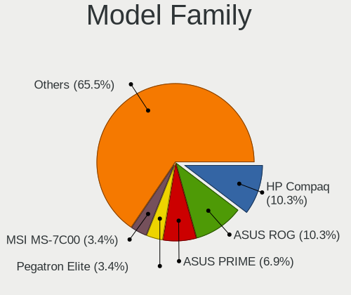
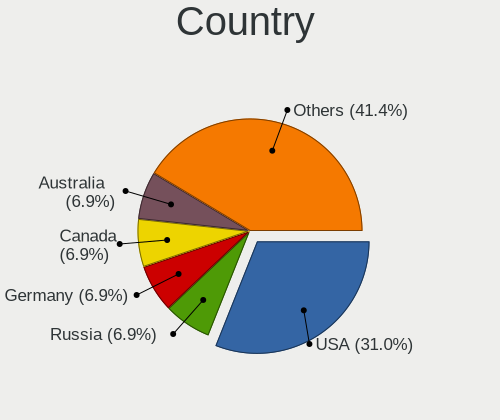
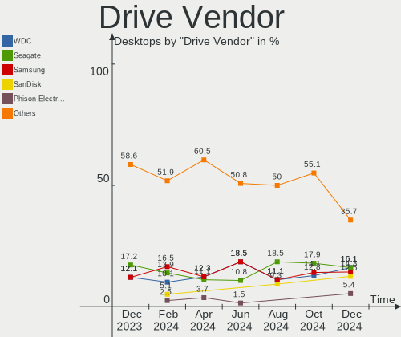
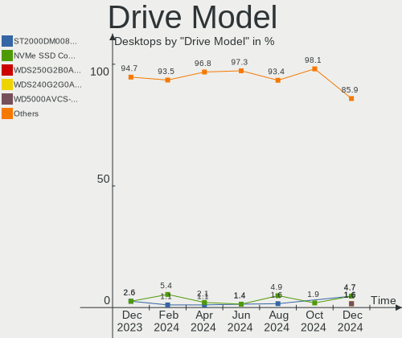
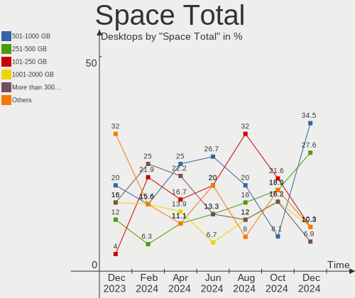
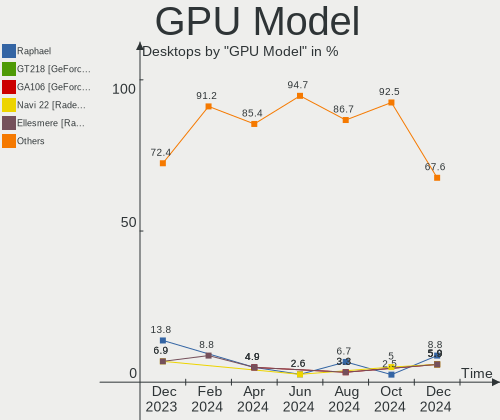
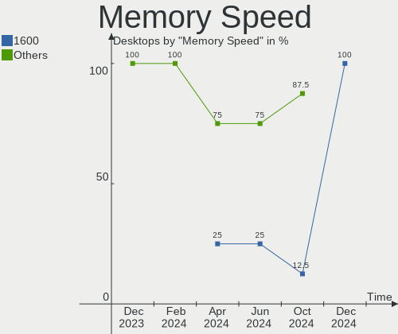
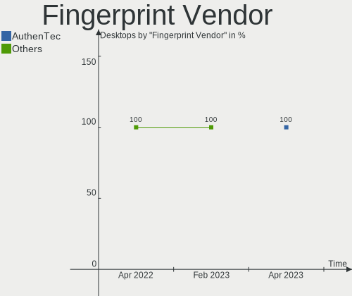

KDE neon - Hardware Trends (Desktops)
-------------------------------------

A project to identify most popular hardware characteristics and track their change
over time based on data collected by Linux users at https://Linux-Hardware.org.

Anyone can contribute to this report by the [hw-probe](https://github.com/linuxhw/hw-probe) tool:

    sudo -E hw-probe -all -upload

This report is for one last month. Overall report since the beginning of time: [TestDays](https://github.com/linuxhw/TestDays)

Period: Apr, 2023.

Contents
--------

* [ System ](#system)
  - [ OS                       ](#os)
  - [ OS Family                ](#os-family)
  - [ Kernel                   ](#kernel)
  - [ Kernel Family            ](#kernel-family)
  - [ Kernel Major Ver.        ](#kernel-major-ver)
  - [ Arch                     ](#arch)
  - [ DE                       ](#de)
  - [ Display Server           ](#display-server)
  - [ Display Manager          ](#display-manager)
  - [ OS Lang                  ](#os-lang)
  - [ Boot Mode                ](#boot-mode)
  - [ Filesystem               ](#filesystem)
  - [ Part. scheme             ](#part-scheme)
  - [ Dual Boot with Linux/BSD ](#dual-boot-with-linuxbsd)
  - [ Dual Boot (Win)          ](#dual-boot-win)

* [ Board ](#board)
  - [ Vendor                   ](#vendor)
  - [ Model                    ](#model)
  - [ Model Family             ](#model-family)
  - [ MFG Year                 ](#mfg-year)
  - [ Form Factor              ](#form-factor)
  - [ Secure Boot              ](#secure-boot)
  - [ Coreboot                 ](#coreboot)
  - [ RAM Size                 ](#ram-size)
  - [ RAM Used                 ](#ram-used)
  - [ Total Drives             ](#total-drives)
  - [ Has CD-ROM               ](#has-cd-rom)
  - [ Has Ethernet             ](#has-ethernet)
  - [ Has WiFi                 ](#has-wifi)
  - [ Has Bluetooth            ](#has-bluetooth)

* [ Location ](#location)
  - [ Country                  ](#country)
  - [ City                     ](#city)

* [ Drives ](#drives)
  - [ Drive Vendor             ](#drive-vendor)
  - [ Drive Model              ](#drive-model)
  - [ HDD Vendor               ](#hdd-vendor)
  - [ SSD Vendor               ](#ssd-vendor)
  - [ Drive Kind               ](#drive-kind)
  - [ Drive Connector          ](#drive-connector)
  - [ Drive Size               ](#drive-size)
  - [ Space Total              ](#space-total)
  - [ Space Used               ](#space-used)
  - [ Malfunc. Drives          ](#malfunc-drives)
  - [ Malfunc. Drive Vendor    ](#malfunc-drive-vendor)
  - [ Malfunc. HDD Vendor      ](#malfunc-hdd-vendor)
  - [ Malfunc. Drive Kind      ](#malfunc-drive-kind)
  - [ Failed Drives            ](#failed-drives)
  - [ Failed Drive Vendor      ](#failed-drive-vendor)
  - [ Drive Status             ](#drive-status)

* [ Storage controller ](#storage-controller)
  - [ Storage Vendor           ](#storage-vendor)
  - [ Storage Model            ](#storage-model)
  - [ Storage Kind             ](#storage-kind)

* [ Processor ](#processor)
  - [ CPU Vendor               ](#cpu-vendor)
  - [ CPU Model                ](#cpu-model)
  - [ CPU Model Family         ](#cpu-model-family)
  - [ CPU Cores                ](#cpu-cores)
  - [ CPU Sockets              ](#cpu-sockets)
  - [ CPU Threads              ](#cpu-threads)
  - [ CPU Op-Modes             ](#cpu-op-modes)
  - [ CPU Microcode            ](#cpu-microcode)
  - [ CPU Microarch            ](#cpu-microarch)

* [ Graphics ](#graphics)
  - [ GPU Vendor               ](#gpu-vendor)
  - [ GPU Model                ](#gpu-model)
  - [ GPU Combo                ](#gpu-combo)
  - [ GPU Driver               ](#gpu-driver)
  - [ GPU Memory               ](#gpu-memory)

* [ Monitor ](#monitor)
  - [ Monitor Vendor           ](#monitor-vendor)
  - [ Monitor Model            ](#monitor-model)
  - [ Monitor Resolution       ](#monitor-resolution)
  - [ Monitor Diagonal         ](#monitor-diagonal)
  - [ Monitor Width            ](#monitor-width)
  - [ Aspect Ratio             ](#aspect-ratio)
  - [ Monitor Area             ](#monitor-area)
  - [ Pixel Density            ](#pixel-density)
  - [ Multiple Monitors        ](#multiple-monitors)

* [ Network ](#network)
  - [ Net Controller Vendor    ](#net-controller-vendor)
  - [ Net Controller Model     ](#net-controller-model)
  - [ Wireless Vendor          ](#wireless-vendor)
  - [ Wireless Model           ](#wireless-model)
  - [ Ethernet Vendor          ](#ethernet-vendor)
  - [ Ethernet Model           ](#ethernet-model)
  - [ Net Controller Kind      ](#net-controller-kind)
  - [ Used Controller          ](#used-controller)
  - [ NICs                     ](#nics)
  - [ IPv6                     ](#ipv6)

* [ Bluetooth ](#bluetooth)
  - [ Bluetooth Vendor         ](#bluetooth-vendor)
  - [ Bluetooth Model          ](#bluetooth-model)

* [ Sound ](#sound)
  - [ Sound Vendor             ](#sound-vendor)
  - [ Sound Model              ](#sound-model)

* [ Memory ](#memory)
  - [ Memory Vendor            ](#memory-vendor)
  - [ Memory Model             ](#memory-model)
  - [ Memory Kind              ](#memory-kind)
  - [ Memory Form Factor       ](#memory-form-factor)
  - [ Memory Size              ](#memory-size)
  - [ Memory Speed             ](#memory-speed)

* [ Printers & scanners ](#printers--scanners)
  - [ Printer Vendor           ](#printer-vendor)
  - [ Printer Model            ](#printer-model)
  - [ Scanner Vendor           ](#scanner-vendor)
  - [ Scanner Model            ](#scanner-model)

* [ Camera ](#camera)
  - [ Camera Vendor            ](#camera-vendor)
  - [ Camera Model             ](#camera-model)

* [ Security ](#security)
  - [ Fingerprint Vendor       ](#fingerprint-vendor)
  - [ Fingerprint Model        ](#fingerprint-model)
  - [ Chipcard Vendor          ](#chipcard-vendor)
  - [ Chipcard Model           ](#chipcard-model)

* [ Unsupported ](#unsupported)
  - [ Unsupported Devices      ](#unsupported-devices)
  - [ Unsupported Device Types ](#unsupported-device-types)

System
------

OS
--

Installed operating systems

| Name           | Desktops | Percent |
|----------------|----------|---------|
| KDE neon 22.04 | 38       | 100%    |

OS Family
---------

OS without a version

| Name     | Desktops | Percent |
|----------|----------|---------|
| KDE neon | 38       | 100%    |

Kernel
------

Version of the Linux kernel

| Version           | Desktops | Percent |
|-------------------|----------|---------|
| 5.19.0-38-generic | 20       | 52.63%  |
| 5.19.0-41-generic | 7        | 18.42%  |
| 5.19.0-40-generic | 7        | 18.42%  |
| 5.15.0-60-generic | 3        | 7.89%   |
| 5.19.0-35-generic | 1        | 2.63%   |

Kernel Family
-------------

Linux kernel without a distro release

| Version | Desktops | Percent |
|---------|----------|---------|
| 5.19.0  | 35       | 92.11%  |
| 5.15.0  | 3        | 7.89%   |

Kernel Major Ver.
-----------------

Linux kernel major version

| Version | Desktops | Percent |
|---------|----------|---------|
| 5.19    | 35       | 92.11%  |
| 5.15    | 3        | 7.89%   |

Arch
----

OS architecture (x86_64, i586, etc.)

| Name   | Desktops | Percent |
|--------|----------|---------|
| x86_64 | 38       | 100%    |

DE
--

Desktop Environment

| Name | Desktops | Percent |
|------|----------|---------|
| KDE5 | 38       | 100%    |

Display Server
--------------

X11 or Wayland

| Name    | Desktops | Percent |
|---------|----------|---------|
| X11     | 37       | 97.37%  |
| Wayland | 1        | 2.63%   |

Display Manager
---------------

SDDM, LightDM, etc.

| Name    | Desktops | Percent |
|---------|----------|---------|
| Unknown | 31       | 81.58%  |
| SDDM    | 7        | 18.42%  |

OS Lang
-------

Language

| Lang       | Desktops | Percent |
|------------|----------|---------|
| en_US      | 11       | 28.95%  |
| it_IT      | 3        | 7.89%   |
| en_GB      | 3        | 7.89%   |
| en_CA      | 3        | 7.89%   |
| es_ES      | 2        | 5.26%   |
| en_IN      | 2        | 5.26%   |
| en_AU      | 2        | 5.26%   |
| tr_TR      | 1        | 2.63%   |
| sl_SI      | 1        | 2.63%   |
| ru_RU      | 1        | 2.63%   |
| pl_PL      | 1        | 2.63%   |
| fr_FR      | 1        | 2.63%   |
| es_MX      | 1        | 2.63%   |
| es_ES.UTF8 | 1        | 2.63%   |
| en_NZ      | 1        | 2.63%   |
| en_DK      | 1        | 2.63%   |
| de_DE      | 1        | 2.63%   |
| cs_CZ      | 1        | 2.63%   |
| C          | 1        | 2.63%   |

Boot Mode
---------

EFI or BIOS

| Mode | Desktops | Percent |
|------|----------|---------|
| BIOS | 35       | 92.11%  |
| EFI  | 3        | 7.89%   |

Filesystem
----------

Type of filesystem

| Type  | Desktops | Percent |
|-------|----------|---------|
| Ext4  | 35       | 92.11%  |
| Xfs   | 1        | 2.63%   |
| Tmpfs | 1        | 2.63%   |
| Btrfs | 1        | 2.63%   |

Part. scheme
------------

Scheme of partitioning

| Type    | Desktops | Percent |
|---------|----------|---------|
| Unknown | 31       | 81.58%  |
| GPT     | 7        | 18.42%  |

Dual Boot with Linux/BSD
------------------------

Hosting more than one Linux/BSD

| Dual boot | Desktops | Percent |
|-----------|----------|---------|
| No        | 37       | 97.37%  |
| Yes       | 1        | 2.63%   |

Dual Boot (Win)
---------------

Hosting Linux and Windows

| Dual boot | Desktops | Percent |
|-----------|----------|---------|
| No        | 34       | 89.47%  |
| Yes       | 4        | 10.53%  |

Board
-----

Vendor
------

Motherboard manufacturer

| Name                                 | Desktops | Percent |
|--------------------------------------|----------|---------|
| Gigabyte Technology                  | 12       | 31.58%  |
| MSI                                  | 6        | 15.79%  |
| ASUSTek Computer                     | 6        | 15.79%  |
| ASRock                               | 4        | 10.53%  |
| Hewlett-Packard                      | 3        | 7.89%   |
| Acer                                 | 2        | 5.26%   |
| Shenzhen Meigao Electronic Equipment | 1        | 2.63%   |
| Lenovo                               | 1        | 2.63%   |
| Dell                                 | 1        | 2.63%   |
| Biostar                              | 1        | 2.63%   |
| BESSTAR Tech                         | 1        | 2.63%   |

Model
-----

Motherboard model

| Name                                       | Desktops | Percent |
|--------------------------------------------|----------|---------|
| MSI MS-7C37                                | 2        | 5.26%   |
| Shenzhen Meigao Electronic Equipment HX99G | 1        | 2.63%   |
| MSI MS-7D73                                | 1        | 2.63%   |
| MSI MS-7B89                                | 1        | 2.63%   |
| MSI MS-7B87                                | 1        | 2.63%   |
| MSI MS-7760                                | 1        | 2.63%   |
| Lenovo ThinkCentre M92p 3227A2U            | 1        | 2.63%   |
| HP EliteDesk 800 G3 TWR                    | 1        | 2.63%   |
| HP EliteDesk 800 G1 SFF                    | 1        | 2.63%   |
| HP Compaq Elite 8300 SFF                   | 1        | 2.63%   |
| Gigabyte Z97X-Gaming 3                     | 1        | 2.63%   |
| Gigabyte Z690 GAMING X DDR4                | 1        | 2.63%   |
| Gigabyte X79-UD5                           | 1        | 2.63%   |
| Gigabyte TRX40 AORUS XTREME                | 1        | 2.63%   |
| Gigabyte H610M H DDR4                      | 1        | 2.63%   |
| Gigabyte H110M-S2                          | 1        | 2.63%   |
| Gigabyte B85M-DS3H                         | 1        | 2.63%   |
| Gigabyte B550 AORUS PRO V2                 | 1        | 2.63%   |
| Gigabyte B365M DS3H                        | 1        | 2.63%   |
| Gigabyte AX370-Gaming 5                    | 1        | 2.63%   |
| Gigabyte A320M-H                           | 1        | 2.63%   |
| Gigabyte 970A-D3P                          | 1        | 2.63%   |
| Dell Inspiron 3250                         | 1        | 2.63%   |
| Biostar A10N-9630E                         | 1        | 2.63%   |
| BESSTAR Tech UM700                         | 1        | 2.63%   |
| ASUS TUF Gaming Z490-PLUS                  | 1        | 2.63%   |
| ASUS SABERTOOTH P67                        | 1        | 2.63%   |
| ASUS ROG Strix G10DK_G10DK                 | 1        | 2.63%   |
| ASUS PRIME B450M-A II                      | 1        | 2.63%   |
| ASUS PRIME B450M-A                         | 1        | 2.63%   |
| ASUS K200                                  | 1        | 2.63%   |
| ASRock H61M-HVS                            | 1        | 2.63%   |
| ASRock B650M PG Riptide                    | 1        | 2.63%   |
| ASRock B550M Phantom Gaming 4              | 1        | 2.63%   |
| ASRock B450 Pro4 R2.0                      | 1        | 2.63%   |
| Acer Predator PO3-620                      | 1        | 2.63%   |
| Acer Aspire XC-230                         | 1        | 2.63%   |

Model Family
------------

Motherboard model prefix

| Name                                       | Desktops | Percent |
|--------------------------------------------|----------|---------|
| MSI MS-7C37                                | 2        | 5.26%   |
| HP EliteDesk                               | 2        | 5.26%   |
| ASUS PRIME                                 | 2        | 5.26%   |
| Shenzhen Meigao Electronic Equipment HX99G | 1        | 2.63%   |
| MSI MS-7D73                                | 1        | 2.63%   |
| MSI MS-7B89                                | 1        | 2.63%   |
| MSI MS-7B87                                | 1        | 2.63%   |
| MSI MS-7760                                | 1        | 2.63%   |
| Lenovo ThinkCentre                         | 1        | 2.63%   |
| HP Compaq                                  | 1        | 2.63%   |
| Gigabyte Z97X-Gaming                       | 1        | 2.63%   |
| Gigabyte Z690                              | 1        | 2.63%   |
| Gigabyte X79-UD5                           | 1        | 2.63%   |
| Gigabyte TRX40                             | 1        | 2.63%   |
| Gigabyte H610M                             | 1        | 2.63%   |
| Gigabyte H110M-S2                          | 1        | 2.63%   |
| Gigabyte B85M-DS3H                         | 1        | 2.63%   |
| Gigabyte B550                              | 1        | 2.63%   |
| Gigabyte B365M                             | 1        | 2.63%   |
| Gigabyte AX370-Gaming                      | 1        | 2.63%   |
| Gigabyte A320M-H                           | 1        | 2.63%   |
| Gigabyte 970A-D3P                          | 1        | 2.63%   |
| Dell Inspiron                              | 1        | 2.63%   |
| Biostar A10N-9630E                         | 1        | 2.63%   |
| BESSTAR Tech UM700                         | 1        | 2.63%   |
| ASUS TUF                                   | 1        | 2.63%   |
| ASUS SABERTOOTH                            | 1        | 2.63%   |
| ASUS ROG                                   | 1        | 2.63%   |
| ASUS K200                                  | 1        | 2.63%   |
| ASRock H61M-HVS                            | 1        | 2.63%   |
| ASRock B650M                               | 1        | 2.63%   |
| ASRock B550M                               | 1        | 2.63%   |
| ASRock B450                                | 1        | 2.63%   |
| Acer Predator                              | 1        | 2.63%   |
| Acer Aspire                                | 1        | 2.63%   |

MFG Year
--------

Motherboard manufacture year

| Year | Desktops | Percent |
|------|----------|---------|
| 2020 | 6        | 15.79%  |
| 2019 | 5        | 13.16%  |
| 2018 | 5        | 13.16%  |
| 2021 | 4        | 10.53%  |
| 2013 | 4        | 10.53%  |
| 2022 | 3        | 7.89%   |
| 2012 | 3        | 7.89%   |
| 2016 | 2        | 5.26%   |
| 2011 | 2        | 5.26%   |
| 2023 | 1        | 2.63%   |
| 2017 | 1        | 2.63%   |
| 2014 | 1        | 2.63%   |
| 2007 | 1        | 2.63%   |

Form Factor
-----------

Physical design of the computer

| Name    | Desktops | Percent |
|---------|----------|---------|
| Desktop | 38       | 100%    |

Secure Boot
-----------

Enabled or disabled

| State    | Desktops | Percent |
|----------|----------|---------|
| Disabled | 38       | 100%    |

Coreboot
--------

Have coreboot on board

| Used | Desktops | Percent |
|------|----------|---------|
| No   | 38       | 100%    |

RAM Size
--------

Total RAM memory

| Size in GB      | Desktops | Percent |
|-----------------|----------|---------|
| 32.01-64.0      | 13       | 34.21%  |
| 16.01-24.0      | 12       | 31.58%  |
| 8.01-16.0       | 7        | 18.42%  |
| 4.01-8.0        | 3        | 7.89%   |
| 3.01-4.0        | 2        | 5.26%   |
| More than 256.0 | 1        | 2.63%   |

RAM Used
--------

Used RAM memory

| Used GB   | Desktops | Percent |
|-----------|----------|---------|
| 2.01-3.0  | 15       | 39.47%  |
| 1.01-2.0  | 12       | 31.58%  |
| 4.01-8.0  | 6        | 15.79%  |
| 3.01-4.0  | 3        | 7.89%   |
| 8.01-16.0 | 2        | 5.26%   |

Total Drives
------------

Number of drives on board

| Drives | Desktops | Percent |
|--------|----------|---------|
| 2      | 11       | 28.95%  |
| 1      | 9        | 23.68%  |
| 4      | 5        | 13.16%  |
| 3      | 5        | 13.16%  |
| 6      | 4        | 10.53%  |
| 5      | 3        | 7.89%   |
| 7      | 1        | 2.63%   |

Has CD-ROM
----------

Has CD-ROM on board

| Presented | Desktops | Percent |
|-----------|----------|---------|
| No        | 26       | 68.42%  |
| Yes       | 12       | 31.58%  |

Has Ethernet
------------

Has Ethernet on board

| Presented | Desktops | Percent |
|-----------|----------|---------|
| Yes       | 38       | 100%    |

Has WiFi
--------

Has WiFi module

| Presented | Desktops | Percent |
|-----------|----------|---------|
| Yes       | 19       | 50%     |
| No        | 19       | 50%     |

Has Bluetooth
-------------

Has Bluetooth module

| Presented | Desktops | Percent |
|-----------|----------|---------|
| Yes       | 19       | 50%     |
| No        | 19       | 50%     |

Location
--------

Country
-------

Geographic location (country)

| Country     | Desktops | Percent |
|-------------|----------|---------|
| USA         | 7        | 18.42%  |
| Canada      | 5        | 13.16%  |
| Italy       | 4        | 10.53%  |
| Spain       | 3        | 7.89%   |
| UK          | 2        | 5.26%   |
| India       | 2        | 5.26%   |
| Australia   | 2        | 5.26%   |
| Turkey      | 1        | 2.63%   |
| Slovenia    | 1        | 2.63%   |
| Poland      | 1        | 2.63%   |
| New Zealand | 1        | 2.63%   |
| Mexico      | 1        | 2.63%   |
| Lithuania   | 1        | 2.63%   |
| Kazakhstan  | 1        | 2.63%   |
| Germany     | 1        | 2.63%   |
| France      | 1        | 2.63%   |
| Denmark     | 1        | 2.63%   |
| Czechia     | 1        | 2.63%   |
| Colombia    | 1        | 2.63%   |
| Belarus     | 1        | 2.63%   |

City
----

Geographic location (city)

| City                | Desktops | Percent |
|---------------------|----------|---------|
| Rome                | 3        | 7.89%   |
| Montreal            | 2        | 5.26%   |
| Wroclaw             | 1        | 2.63%   |
| Vincennes           | 1        | 2.63%   |
| Tamworth            | 1        | 2.63%   |
| Sydney              | 1        | 2.63%   |
| Senozece            | 1        | 2.63%   |
| Prague              | 1        | 2.63%   |
| Porirua             | 1        | 2.63%   |
| Pavlodar            | 1        | 2.63%   |
| Paris               | 1        | 2.63%   |
| Oviedo              | 1        | 2.63%   |
| Northampton         | 1        | 2.63%   |
| Mundelein           | 1        | 2.63%   |
| Moscow              | 1        | 2.63%   |
| Melbourne           | 1        | 2.63%   |
| Medellín           | 1        | 2.63%   |
| Kaunas              | 1        | 2.63%   |
| Istanbul            | 1        | 2.63%   |
| Hyderabad           | 1        | 2.63%   |
| Horsens             | 1        | 2.63%   |
| Hamburg             | 1        | 2.63%   |
| Gurgaon             | 1        | 2.63%   |
| Guadalajara         | 1        | 2.63%   |
| Granby              | 1        | 2.63%   |
| el Catllar          | 1        | 2.63%   |
| Cypress             | 1        | 2.63%   |
| Craigavon           | 1        | 2.63%   |
| Casalecchio di Reno | 1        | 2.63%   |
| Canonsburg          | 1        | 2.63%   |
| Calgary             | 1        | 2.63%   |
| Brooklyn            | 1        | 2.63%   |
| Brockville          | 1        | 2.63%   |
| Brest               | 1        | 2.63%   |
| Barcelona           | 1        | 2.63%   |

Drives
------

Drive Vendor
------------

Hard drive vendors

| Vendor                         | Desktops | Drives  | Percent |
|--------------------------------|----------|---------|---------|
| WDC                            | 11       | 19      | 13.25%  |
| Seagate                        | 11       | 15      | 13.25%  |
| Samsung Electronics            | 11       | 21      | 13.25%  |
| Crucial                        | 6        | 7       | 7.23%   |
| Kingston                       | 5        | 5       | 6.02%   |
| Toshiba                        | 4        | 5       | 4.82%   |
| SanDisk                        | 3        | 5       | 3.61%   |
| Phison Electronics             | 3        | 6       | 3.61%   |
| SPCC                           | 2        | 2       | 2.41%   |
| Silicon Motion                 | 2        | 2       | 2.41%   |
| Patriot                        | 2        | 2       | 2.41%   |
| Kingston Technology Company    | 2        | 2       | 2.41%   |
| Transcend                      | 1        | 1       | 1.2%    |
| T-FORCE                        | 1        | 1       | 1.2%    |
| StoreJet                       | 1        | 1       | 1.2%    |
| Solid State Storage Technology | 1        | 1       | 1.2%    |
| Realtek Semiconductor          | 1        | 1       | 1.2%    |
| POLION                         | 1        | 1       | 1.2%    |
| PNY                            | 1        | 1       | 1.2%    |
| Phison                         | 1        | 1       | 1.2%    |
| Micron Technology              | 1        | 1       | 1.2%    |
| Maxtor                         | 1        | 1       | 1.2%    |
| Intel                          | 1        | 1       | 1.2%    |
| HL-DT-ST                       | 1        | Unknown | 1.2%    |
| HGST                           | 1        | 1       | 1.2%    |
| GOODRAM                        | 1        | 1       | 1.2%    |
| Gigabyte Technology            | 1        | 1       | 1.2%    |
| Corsair                        | 1        | 1       | 1.2%    |
| China                          | 1        | 1       | 1.2%    |
| ADATA Technology               | 1        | 1       | 1.2%    |
| A-DATA Technology              | 1        | 1       | 1.2%    |
| 2.5"                           | 1        | 2       | 1.2%    |
| Unknown                        | 1        | 1       | 1.2%    |

Drive Model
-----------

Hard drive models

| Model                                                  | Desktops | Percent |
|--------------------------------------------------------|----------|---------|
| Samsung NVMe SSD Controller SM981/PM981/PM983 1TB      | 3        | 2.91%   |
| Toshiba DT01ACA050 500GB                               | 2        | 1.94%   |
| Silicon Motion SM2263EN/SM2263XT SSD Controller 1024GB | 2        | 1.94%   |
| Seagate ST3500418AS 500GB                              | 2        | 1.94%   |
| Samsung SSD 860 EVO 1TB                                | 2        | 1.94%   |
| Samsung SSD 840 EVO 120GB                              | 2        | 1.94%   |
| Samsung NVMe SSD Controller PM9A1/PM9A3/980PRO 2TB     | 2        | 1.94%   |
| Crucial CT500MX500SSD1 500GB                           | 2        | 1.94%   |
| Crucial CT240BX500SSD1 240GB                           | 2        | 1.94%   |
| WDC WDS100T2B0B-00YS70 1TB SSD                         | 1        | 0.97%   |
| WDC WD7500BPVX-22JC3T0 752GB                           | 1        | 0.97%   |
| WDC WD6003FZBX-00K5WB0 6TB                             | 1        | 0.97%   |
| WDC WD5000AAKX-001CA0 500GB                            | 1        | 0.97%   |
| WDC WD40EZRZ-22GXCB0 4TB                               | 1        | 0.97%   |
| WDC WD40EZAZ-00SF3B0 4TB                               | 1        | 0.97%   |
| WDC WD40EFRX-68N32N0 4TB                               | 1        | 0.97%   |
| WDC WD40EFAX-68JH4N1 4TB                               | 1        | 0.97%   |
| WDC WD2500AAKX-75U6AA0 250GB                           | 1        | 0.97%   |
| WDC WD20EZBX-00AYRA0 2TB                               | 1        | 0.97%   |
| WDC WD1600JD-00HBB0 160GB                              | 1        | 0.97%   |
| WDC WD1600AAJS-08L7A0 160GB                            | 1        | 0.97%   |
| WDC WD10EZEX-00BN5A0 1TB                               | 1        | 0.97%   |
| WDC WD10EARS-00Z5B1 1TB                                | 1        | 0.97%   |
| WDC WD10EARS-00Y5B1 1TB                                | 1        | 0.97%   |
| WDC WD1003FZEX-00K3CA0 1TB                             | 1        | 0.97%   |
| WDC WD1003FBYX-01Y7B1 1TB                              | 1        | 0.97%   |
| Transcend TS128GSSD230S 128GB                          | 1        | 0.97%   |
| Toshiba HDWD110 1TB                                    | 1        | 0.97%   |
| Toshiba DT01ACA100 1TB                                 | 1        | 0.97%   |
| Toshiba BG3 NVMe SSD Controller 128GB                  | 1        | 0.97%   |
| T-FORCE 1TB                                            | 1        | 0.97%   |
| StoreJet Transcend 1024GB                              | 1        | 0.97%   |
| SPCC Solid State Disk 512GB                            | 1        | 0.97%   |
| SPCC Solid State Disk 128GB                            | 1        | 0.97%   |
| Solid State Storage NVMe CLR-8W512 512GB               | 1        | 0.97%   |
| Seagate ST6000VN001-2BB186 6TB                         | 1        | 0.97%   |
| Seagate ST500DM002-1SB10A 500GB                        | 1        | 0.97%   |
| Seagate ST5000DM003-2FH18L 5TB                         | 1        | 0.97%   |
| Seagate ST4000NM0033-9ZM170 4TB                        | 1        | 0.97%   |
| Seagate ST4000DM004-2CV104 4TB                         | 1        | 0.97%   |

HDD Vendor
----------

Hard disk drive vendors

| Vendor              | Desktops | Drives | Percent |
|---------------------|----------|--------|---------|
| WDC                 | 11       | 18     | 37.93%  |
| Seagate             | 11       | 15     | 37.93%  |
| Toshiba             | 3        | 4      | 10.34%  |
| Samsung Electronics | 2        | 2      | 6.9%    |
| Maxtor              | 1        | 1      | 3.45%   |
| HGST                | 1        | 1      | 3.45%   |

SSD Vendor
----------

Solid state drive vendors

| Vendor              | Desktops | Drives | Percent |
|---------------------|----------|--------|---------|
| Samsung Electronics | 10       | 11     | 27.78%  |
| Crucial             | 6        | 7      | 16.67%  |
| Kingston            | 4        | 4      | 11.11%  |
| SPCC                | 2        | 2      | 5.56%   |
| SanDisk             | 2        | 3      | 5.56%   |
| Patriot             | 2        | 2      | 5.56%   |
| WDC                 | 1        | 1      | 2.78%   |
| Transcend           | 1        | 1      | 2.78%   |
| StoreJet            | 1        | 1      | 2.78%   |
| PNY                 | 1        | 1      | 2.78%   |
| Intel               | 1        | 1      | 2.78%   |
| GOODRAM             | 1        | 1      | 2.78%   |
| Gigabyte Technology | 1        | 1      | 2.78%   |
| China               | 1        | 1      | 2.78%   |
| A-DATA Technology   | 1        | 1      | 2.78%   |
| 2.5"                | 1        | 2      | 2.78%   |

Drive Kind
----------

HDD or SSD

| Kind    | Desktops | Drives | Percent |
|---------|----------|--------|---------|
| SSD     | 25       | 40     | 35.21%  |
| HDD     | 23       | 41     | 32.39%  |
| NVMe    | 20       | 28     | 28.17%  |
| Unknown | 3        | 3      | 4.23%   |

Drive Connector
---------------

SATA, SAS, NVMe, etc.

| Type | Desktops | Drives | Percent |
|------|----------|--------|---------|
| SATA | 31       | 81     | 56.36%  |
| NVMe | 20       | 28     | 36.36%  |
| SAS  | 4        | 3      | 7.27%   |

Drive Size
----------

Size of hard drive

| Size in TB | Desktops | Drives | Percent |
|------------|----------|--------|---------|
| 0.01-0.5   | 23       | 40     | 42.59%  |
| 0.51-1.0   | 17       | 22     | 31.48%  |
| 3.01-4.0   | 6        | 9      | 11.11%  |
| 1.01-2.0   | 6        | 7      | 11.11%  |
| 4.01-10.0  | 2        | 3      | 3.7%    |

Space Total
-----------

Amount of disk space available on the file system

| Size in GB     | Desktops | Percent |
|----------------|----------|---------|
| 101-250        | 9        | 23.68%  |
| 251-500        | 7        | 18.42%  |
| 51-100         | 7        | 18.42%  |
| 1001-2000      | 6        | 15.79%  |
| More than 3000 | 5        | 13.16%  |
| 21-50          | 2        | 5.26%   |
| 1-20           | 1        | 2.63%   |
| 501-1000       | 1        | 2.63%   |

Space Used
----------

Amount of used disk space

| Used GB        | Desktops | Percent |
|----------------|----------|---------|
| 1-20           | 15       | 39.47%  |
| 51-100         | 8        | 21.05%  |
| 21-50          | 4        | 10.53%  |
| 251-500        | 3        | 7.89%   |
| 1001-2000      | 3        | 7.89%   |
| More than 3000 | 2        | 5.26%   |
| 501-1000       | 2        | 5.26%   |
| 101-250        | 1        | 2.63%   |

Malfunc. Drives
---------------

Drive models with a malfunction

Zero info for selected period =(

Malfunc. Drive Vendor
---------------------

Vendors of faulty drives

Zero info for selected period =(

Malfunc. HDD Vendor
-------------------

Vendors of faulty HDD drives

Zero info for selected period =(

Malfunc. Drive Kind
-------------------

Kinds of faulty drives

Zero info for selected period =(

Failed Drives
-------------

Failed drive models

Zero info for selected period =(

Failed Drive Vendor
-------------------

Failed drive vendors

Zero info for selected period =(

Drive Status
------------

Number of failed and malfunc. drives

| Status   | Desktops | Drives | Percent |
|----------|----------|--------|---------|
| Detected | 35       | 102    | 92.11%  |
| Works    | 3        | 10     | 7.89%   |

Storage controller
------------------

Storage Vendor
--------------

Storage controller vendors

| Vendor                         | Desktops | Percent |
|--------------------------------|----------|---------|
| Intel                          | 18       | 27.69%  |
| AMD                            | 18       | 27.69%  |
| Samsung Electronics            | 5        | 7.69%   |
| Phison Electronics             | 5        | 7.69%   |
| ASMedia Technology             | 4        | 6.15%   |
| Kingston Technology Company    | 3        | 4.62%   |
| Silicon Motion                 | 2        | 3.08%   |
| SanDisk                        | 2        | 3.08%   |
| Marvell Technology Group       | 2        | 3.08%   |
| Toshiba America Info Systems   | 1        | 1.54%   |
| Solid State Storage Technology | 1        | 1.54%   |
| Realtek Semiconductor          | 1        | 1.54%   |
| Micron Technology              | 1        | 1.54%   |
| JMicron Technology             | 1        | 1.54%   |
| ADATA Technology               | 1        | 1.54%   |

Storage Model
-------------

Storage controller models

| Model                                                                                   | Desktops | Percent |
|-----------------------------------------------------------------------------------------|----------|---------|
| AMD FCH SATA Controller [AHCI mode]                                                     | 12       | 16.67%  |
| AMD 400 Series Chipset SATA Controller                                                  | 5        | 6.94%   |
| ASMedia ASM1062 Serial ATA Controller                                                   | 4        | 5.56%   |
| Samsung NVMe SSD Controller SM981/PM981/PM983                                           | 3        | 4.17%   |
| Samsung NVMe SSD Controller PM9A1/PM9A3/980PRO                                          | 3        | 4.17%   |
| AMD 500 Series Chipset SATA Controller                                                  | 3        | 4.17%   |
| Silicon Motion SM2263EN/SM2263XT SSD Controller                                         | 2        | 2.78%   |
| Phison E12 NVMe Controller                                                              | 2        | 2.78%   |
| Marvell Group 88SE9172 SATA 6Gb/s Controller                                            | 2        | 2.78%   |
| Intel Q170/Q150/B150/H170/H110/Z170/CM236 Chipset SATA Controller [AHCI Mode]           | 2        | 2.78%   |
| Intel Comet Lake SATA AHCI Controller                                                   | 2        | 2.78%   |
| Intel C600/X79 series chipset 6-Port SATA AHCI Controller                               | 2        | 2.78%   |
| Intel Alder Lake-S PCH SATA Controller [AHCI Mode]                                      | 2        | 2.78%   |
| Intel 8 Series/C220 Series Chipset Family 6-port SATA Controller 1 [AHCI mode]          | 2        | 2.78%   |
| Intel 7 Series/C210 Series Chipset Family 6-port SATA Controller [AHCI mode]            | 2        | 2.78%   |
| Intel 200 Series PCH SATA controller [AHCI mode]                                        | 2        | 2.78%   |
| Toshiba America Info Systems BG3 NVMe SSD Controller                                    | 1        | 1.39%   |
| Solid State Storage Non-Volatile memory controller                                      | 1        | 1.39%   |
| SanDisk WD Blue SN550 NVMe SSD                                                          | 1        | 1.39%   |
| SanDisk WD Black 2018/SN750 / PC SN720 NVMe SSD                                         | 1        | 1.39%   |
| Realtek RTS5763DL NVMe SSD Controller                                                   | 1        | 1.39%   |
| Phison PS5013 E13 NVMe Controller                                                       | 1        | 1.39%   |
| Phison E18 PCIe4 NVMe Controller                                                        | 1        | 1.39%   |
| Phison E16 PCIe4 NVMe Controller                                                        | 1        | 1.39%   |
| Micron NVMe Storage Controller                                                          | 1        | 1.39%   |
| Kingston Company Company Non-Volatile memory controller                                 | 1        | 1.39%   |
| Kingston Company SNVS2000G [NV1 NVMe PCIe SSD 2TB]                                      | 1        | 1.39%   |
| Kingston Company OM3PDP3 NVMe SSD                                                       | 1        | 1.39%   |
| JMicron JMB362 SATA Controller                                                          | 1        | 1.39%   |
| Intel 9 Series Chipset Family SATA Controller [AHCI Mode]                               | 1        | 1.39%   |
| Intel 6 Series/C200 Series Chipset Family Desktop SATA Controller (IDE mode, ports 4-5) | 1        | 1.39%   |
| Intel 6 Series/C200 Series Chipset Family Desktop SATA Controller (IDE mode, ports 0-3) | 1        | 1.39%   |
| Intel 6 Series/C200 Series Chipset Family 6 port Desktop SATA AHCI Controller           | 1        | 1.39%   |
| Intel 400 Series Chipset Family SATA AHCI Controller                                    | 1        | 1.39%   |
| AMD X370 Series Chipset SATA Controller                                                 | 1        | 1.39%   |
| AMD SB7x0/SB8x0/SB9x0 SATA Controller [AHCI mode]                                       | 1        | 1.39%   |
| AMD FCH SATA Controller D                                                               | 1        | 1.39%   |
| ADATA A Non-Volatile memory controller                                                  | 1        | 1.39%   |

Storage Kind
------------

Kind of storage controller (IDE, SATA, NVMe, SAS, ...)

| Kind | Desktops | Percent |
|------|----------|---------|
| SATA | 35       | 62.5%   |
| NVMe | 20       | 35.71%  |
| IDE  | 1        | 1.79%   |

Processor
---------

CPU Vendor
----------

Processor vendors

| Vendor | Desktops | Percent |
|--------|----------|---------|
| AMD    | 20       | 52.63%  |
| Intel  | 18       | 47.37%  |

CPU Model
---------

Processor models

| Model                                           | Desktops | Percent |
|-------------------------------------------------|----------|---------|
| Intel Core i7-4790K CPU @ 4.00GHz               | 2        | 5.26%   |
| Intel Core i5-3470 CPU @ 3.20GHz                | 2        | 5.26%   |
| AMD Ryzen 5 7600X 6-Core Processor              | 2        | 5.26%   |
| AMD Ryzen 5 5600G with Radeon Graphics          | 2        | 5.26%   |
| AMD Ryzen 5 3600X 6-Core Processor              | 2        | 5.26%   |
| AMD Ryzen 5 3600 6-Core Processor               | 2        | 5.26%   |
| Intel Xeon CPU E5-2650 v2 @ 2.60GHz             | 1        | 2.63%   |
| Intel Pentium CPU G630 @ 2.70GHz                | 1        | 2.63%   |
| Intel Pentium CPU G4400 @ 3.30GHz               | 1        | 2.63%   |
| Intel Core i7-7700 CPU @ 3.60GHz                | 1        | 2.63%   |
| Intel Core i7-3930K CPU @ 3.20GHz               | 1        | 2.63%   |
| Intel Core i7-2600K CPU @ 3.40GHz               | 1        | 2.63%   |
| Intel Core i7-10700K CPU @ 3.80GHz              | 1        | 2.63%   |
| Intel Core i7-10700 CPU @ 2.90GHz               | 1        | 2.63%   |
| Intel Core i5-9400F CPU @ 2.90GHz               | 1        | 2.63%   |
| Intel Core i5-7400 CPU @ 3.00GHz                | 1        | 2.63%   |
| Intel Core i5-10400 CPU @ 2.90GHz               | 1        | 2.63%   |
| Intel Core i3-4160 CPU @ 3.60GHz                | 1        | 2.63%   |
| Intel 12th Gen Core i7-12700KF                  | 1        | 2.63%   |
| Intel 12th Gen Core i3-12100F                   | 1        | 2.63%   |
| AMD Ryzen Threadripper 3970X 32-Core Processor  | 1        | 2.63%   |
| AMD Ryzen 9 6900HX with Radeon Graphics         | 1        | 2.63%   |
| AMD Ryzen 7 5700G with Radeon Graphics          | 1        | 2.63%   |
| AMD Ryzen 7 3800X 8-Core Processor              | 1        | 2.63%   |
| AMD Ryzen 7 3750H with Radeon Vega Mobile Gfx   | 1        | 2.63%   |
| AMD Ryzen 7 1700X Eight-Core Processor          | 1        | 2.63%   |
| AMD Ryzen 5 5600X 6-Core Processor              | 1        | 2.63%   |
| AMD Ryzen 5 3500X 6-Core Processor              | 1        | 2.63%   |
| AMD Ryzen 5 2600 Six-Core Processor             | 1        | 2.63%   |
| AMD FX-8370 Eight-Core Processor                | 1        | 2.63%   |
| AMD A8-7410 APU with AMD Radeon R5 Graphics     | 1        | 2.63%   |
| AMD A10-9630P RADEON R5, 10 COMPUTE CORES 4C+6G | 1        | 2.63%   |

CPU Model Family
----------------

Processor model prefix

| Model                  | Desktops | Percent |
|------------------------|----------|---------|
| AMD Ryzen 5            | 11       | 28.95%  |
| Intel Core i7          | 7        | 18.42%  |
| Intel Core i5          | 5        | 13.16%  |
| AMD Ryzen 7            | 4        | 10.53%  |
| Other                  | 2        | 5.26%   |
| Intel Pentium          | 2        | 5.26%   |
| Intel Xeon             | 1        | 2.63%   |
| Intel Core i3          | 1        | 2.63%   |
| AMD Ryzen Threadripper | 1        | 2.63%   |
| AMD Ryzen 9            | 1        | 2.63%   |
| AMD FX                 | 1        | 2.63%   |
| AMD A8                 | 1        | 2.63%   |
| AMD A10                | 1        | 2.63%   |

CPU Cores
---------

Number of processor cores

| Number | Desktops | Percent |
|--------|----------|---------|
| 6      | 14       | 36.84%  |
| 4      | 11       | 28.95%  |
| 8      | 7        | 18.42%  |
| 2      | 4        | 10.53%  |
| 32     | 1        | 2.63%   |
| 12     | 1        | 2.63%   |

CPU Sockets
-----------

Number of sockets

| Number | Desktops | Percent |
|--------|----------|---------|
| 1      | 38       | 100%    |

CPU Threads
-----------

Threads per core (Hyper-Threading)

| Number | Desktops | Percent |
|--------|----------|---------|
| 2      | 29       | 76.32%  |
| 1      | 9        | 23.68%  |

CPU Op-Modes
------------

CPU Operation Modes (32-bit, 64-bit)

| Op mode        | Desktops | Percent |
|----------------|----------|---------|
| 32-bit, 64-bit | 38       | 100%    |

CPU Microcode
-------------

Microcode number

| Number     | Desktops | Percent |
|------------|----------|---------|
| Unknown    | 34       | 89.47%  |
| 0xa0655    | 1        | 2.63%   |
| 0x506e3    | 1        | 2.63%   |
| 0x0a50000c | 1        | 2.63%   |
| 0x08701021 | 1        | 2.63%   |

CPU Microarch
-------------

Microarchitecture

| Name        | Desktops | Percent |
|-------------|----------|---------|
| Zen 2       | 7        | 18.42%  |
| Unknown     | 5        | 13.16%  |
| Zen 3       | 4        | 10.53%  |
| SandyBridge | 3        | 7.89%   |
| KabyLake    | 3        | 7.89%   |
| IvyBridge   | 3        | 7.89%   |
| Haswell     | 3        | 7.89%   |
| CometLake   | 3        | 7.89%   |
| Zen+        | 2        | 5.26%   |
| Zen         | 1        | 2.63%   |
| Skylake     | 1        | 2.63%   |
| Puma        | 1        | 2.63%   |
| Piledriver  | 1        | 2.63%   |
| Excavator   | 1        | 2.63%   |

Graphics
--------

GPU Vendor
----------

Vendors of graphics cards

| Vendor | Desktops | Percent |
|--------|----------|---------|
| Nvidia | 20       | 47.62%  |
| AMD    | 16       | 38.1%   |
| Intel  | 6        | 14.29%  |

GPU Model
---------

Graphics card models

| Model                                                                       | Desktops | Percent |
|-----------------------------------------------------------------------------|----------|---------|
| Nvidia GP108 [GeForce GT 1030]                                              | 4        | 9.3%    |
| Nvidia TU116 [GeForce GTX 1660 Ti]                                          | 3        | 6.98%   |
| AMD Ellesmere [Radeon RX 470/480/570/570X/580/580X/590]                     | 3        | 6.98%   |
| AMD Cezanne [Radeon Vega Series / Radeon Vega Mobile Series]                | 3        | 6.98%   |
| Intel Xeon E3-1200 v3/4th Gen Core Processor Integrated Graphics Controller | 2        | 4.65%   |
| Nvidia TU117 [GeForce GTX 1650]                                             | 1        | 2.33%   |
| Nvidia TU116 [GeForce GTX 1650 SUPER]                                       | 1        | 2.33%   |
| Nvidia TU106 [GeForce RTX 2060 Rev. A]                                      | 1        | 2.33%   |
| Nvidia GP104 [GeForce GTX 1080]                                             | 1        | 2.33%   |
| Nvidia GP104 [GeForce GTX 1070]                                             | 1        | 2.33%   |
| Nvidia GP102 [GeForce GTX 1080 Ti]                                          | 1        | 2.33%   |
| Nvidia GM206 [GeForce GTX 960]                                              | 1        | 2.33%   |
| Nvidia GF110 [GeForce GTX 560 Ti 448 Cores]                                 | 1        | 2.33%   |
| Nvidia GA106 [GeForce RTX 3060 Lite Hash Rate]                              | 1        | 2.33%   |
| Nvidia GA106 [Geforce RTX 3050]                                             | 1        | 2.33%   |
| Nvidia GA104 [GeForce RTX 3060 Ti Lite Hash Rate]                           | 1        | 2.33%   |
| Nvidia GA102 [GeForce RTX 3090]                                             | 1        | 2.33%   |
| Nvidia GA102 [GeForce RTX 3080 Lite Hash Rate]                              | 1        | 2.33%   |
| Intel HD Graphics 630                                                       | 1        | 2.33%   |
| Intel HD Graphics 510                                                       | 1        | 2.33%   |
| Intel 4th Generation Core Processor Family Integrated Graphics Controller   | 1        | 2.33%   |
| Intel 2nd Generation Core Processor Family Integrated Graphics Controller   | 1        | 2.33%   |
| AMD Wani [Radeon R5/R6/R7 Graphics]                                         | 1        | 2.33%   |
| AMD Tahiti XT [Radeon HD 7970/8970 OEM / R9 280X]                           | 1        | 2.33%   |
| AMD RV620 LE [Radeon HD 3450]                                               | 1        | 2.33%   |
| AMD Rembrandt [Radeon 680M]                                                 | 1        | 2.33%   |
| AMD Raphael                                                                 | 1        | 2.33%   |
| AMD Picasso/Raven 2 [Radeon Vega Series / Radeon Vega Mobile Series]        | 1        | 2.33%   |
| AMD Navi 23 [Radeon RX 6600/6600 XT/6600M]                                  | 1        | 2.33%   |
| AMD Navi 22 [Radeon RX 6700/6700 XT/6750 XT / 6800M/6850M XT]               | 1        | 2.33%   |
| AMD Mullins [Radeon R4/R5 Graphics]                                         | 1        | 2.33%   |
| AMD Lexa PRO [Radeon 540/540X/550/550X / RX 540X/550/550X]                  | 1        | 2.33%   |
| AMD Hawaii PRO [Radeon R9 290/390]                                          | 1        | 2.33%   |

GPU Combo
---------

Combinations of graphics cards

| Name         | Desktops | Percent |
|--------------|----------|---------|
| 1 x Nvidia   | 18       | 47.37%  |
| 1 x AMD      | 11       | 28.95%  |
| 1 x Intel    | 4        | 10.53%  |
| Intel + AMD  | 2        | 5.26%   |
| AMD + Nvidia | 2        | 5.26%   |
| 2 x AMD      | 1        | 2.63%   |

GPU Driver
----------

Free vs proprietary

| Driver      | Desktops | Percent |
|-------------|----------|---------|
| Free        | 26       | 68.42%  |
| Proprietary | 11       | 28.95%  |
| Unknown     | 1        | 2.63%   |

GPU Memory
----------

Total video memory

| Size in GB | Desktops | Percent |
|------------|----------|---------|
| Unknown    | 28       | 73.68%  |
| 5.01-6.0   | 2        | 5.26%   |
| 3.01-4.0   | 2        | 5.26%   |
| 1.01-2.0   | 2        | 5.26%   |
| 8.01-16.0  | 2        | 5.26%   |
| 7.01-8.0   | 1        | 2.63%   |
| 0.01-0.5   | 1        | 2.63%   |

Monitor
-------

Monitor Vendor
--------------

Monitor vendors

| Vendor               | Desktops | Percent |
|----------------------|----------|---------|
| Goldstar             | 11       | 23.4%   |
| Samsung Electronics  | 7        | 14.89%  |
| Acer                 | 5        | 10.64%  |
| Dell                 | 4        | 8.51%   |
| MSI                  | 2        | 4.26%   |
| Huion                | 2        | 4.26%   |
| Hewlett-Packard      | 2        | 4.26%   |
| Yamaha               | 1        | 2.13%   |
| ViewSonic            | 1        | 2.13%   |
| Sony                 | 1        | 2.13%   |
| RCA                  | 1        | 2.13%   |
| NEC Computers        | 1        | 2.13%   |
| MiTAC                | 1        | 2.13%   |
| Lenovo               | 1        | 2.13%   |
| Iiyama               | 1        | 2.13%   |
| HJW                  | 1        | 2.13%   |
| HannStar             | 1        | 2.13%   |
| Gigabyte Technology  | 1        | 2.13%   |
| ASUSTek Computer     | 1        | 2.13%   |
| Ancor Communications | 1        | 2.13%   |
| AGO                  | 1        | 2.13%   |

Monitor Model
-------------

Monitor models

| Model                                                                   | Desktops | Percent |
|-------------------------------------------------------------------------|----------|---------|
| Goldstar ULTRAGEAR GSM5BB2 1920x1080 527x296mm 23.8-inch                | 2        | 4.17%   |
| Yamaha RX-V373 YMH3170 1920x540                                         | 1        | 2.08%   |
| ViewSonic VX2753 SERIES VSC7228 1920x1080 597x336mm 27.0-inch           | 1        | 2.08%   |
| Sony SDM-HS75P SNY2300 1280x1024 338x270mm 17.0-inch                    | 1        | 2.08%   |
| Samsung Electronics U28H75x SAM0E00 3840x2160 607x345mm 27.5-inch       | 1        | 2.08%   |
| Samsung Electronics U28E510 SAM0D63 3840x2160 607x345mm 27.5-inch       | 1        | 2.08%   |
| Samsung Electronics U28D590 SAM0B81 3840x2160 608x345mm 27.5-inch       | 1        | 2.08%   |
| Samsung Electronics SMBX2231 SAM076D 1920x1080 477x268mm 21.5-inch      | 1        | 2.08%   |
| Samsung Electronics LCD Monitor SAM0F14 3840x2160 1872x1053mm 84.6-inch | 1        | 2.08%   |
| Samsung Electronics LC32G5xT SAM7088 2560x1440 698x393mm 31.5-inch      | 1        | 2.08%   |
| Samsung Electronics LC27RG50 SAM100A 1920x1080 532x304mm 24.1-inch      | 1        | 2.08%   |
| Samsung Electronics C27F390 SAM0D32 1920x1080 598x336mm 27.0-inch       | 1        | 2.08%   |
| RCA RTR4061-B-CA RCA0B01 1920x1080 698x392mm 31.5-inch                  | 1        | 2.08%   |
| NEC Computers LCD2090UXi NEC66B0 1600x1200 408x306mm 20.1-inch          | 1        | 2.08%   |
| MSI G32C4 MSI3DA6 1920x1080 698x393mm 31.5-inch                         | 1        | 2.08%   |
| MSI G27C5 MSI3CA9 1920x1080 598x336mm 27.0-inch                         | 1        | 2.08%   |
| MiTAC Smart TV MTC0030 3840x2160 708x398mm 32.0-inch                    | 1        | 2.08%   |
| Lenovo LEN L24q-30 LEN65FB 2560x1440 527x296mm 23.8-inch                | 1        | 2.08%   |
| Iiyama PLE2407HDS IVM560D 1920x1080 521x293mm 23.5-inch                 | 1        | 2.08%   |
| Huion Kamvas Pro 16 HAT1602 2560x1440 349x208mm 16.0-inch               | 1        | 2.08%   |
| Huion GT-133 HAT1330 1920x1080 294x165mm 13.3-inch                      | 1        | 2.08%   |
| HJW MACROSILICON HJW9291 1280x960 530x290mm 23.8-inch                   | 1        | 2.08%   |
| Hewlett-Packard E23 G4 HPN3685 1920x1080 509x286mm 23.0-inch            | 1        | 2.08%   |
| Hewlett-Packard 24es HWP3320 1920x1080 527x296mm 23.8-inch              | 1        | 2.08%   |
| HannStar HSG1074 HSP0019 1920x1080 543x305mm 24.5-inch                  | 1        | 2.08%   |
| Goldstar W2042 GSM4E7E 1680x1050 434x270mm 20.1-inch                    | 1        | 2.08%   |
| Goldstar ULTRAWIDE GSM7794 2560x1080 800x335mm 34.1-inch                | 1        | 2.08%   |
| Goldstar TV SSCR2 GSMC0C8 3840x2160                                     | 1        | 2.08%   |
| Goldstar L222W GSM5665 1680x1050 474x296mm 22.0-inch                    | 1        | 2.08%   |
| Goldstar L1750S GSM43CC 1280x1024 338x270mm 17.0-inch                   | 1        | 2.08%   |
| Goldstar IPS FULLHD GSM5AB8 1920x1080 480x270mm 21.7-inch               | 1        | 2.08%   |
| Goldstar HDR QHD GSM5B96 2560x1440 698x392mm 31.5-inch                  | 1        | 2.08%   |
| Goldstar E2060 GSM4EBF 1600x900 443x249mm 20.0-inch                     | 1        | 2.08%   |
| Goldstar BN650Y GSM5BA6 1920x1080 600x340mm 27.2-inch                   | 1        | 2.08%   |
| Gigabyte Technology M32Q GBT3203 2560x1440 698x393mm 31.5-inch          | 1        | 2.08%   |
| Dell SE2717H/HX DELD0A1 1920x1080 598x336mm 27.0-inch                   | 1        | 2.08%   |
| Dell S2721D DELA19A 2560x1440 597x336mm 27.0-inch                       | 1        | 2.08%   |
| Dell S2422HG DELA1BF 1920x1080 521x293mm 23.5-inch                      | 1        | 2.08%   |
| Dell E1916HV DELF06C 1366x768 409x230mm 18.5-inch                       | 1        | 2.08%   |
| ASUSTek Computer VZ229 AUS22CC 1920x1080 476x268mm 21.5-inch            | 1        | 2.08%   |

Monitor Resolution
------------------

Monitor screen resolution

| Resolution         | Desktops | Percent |
|--------------------|----------|---------|
| 1920x1080 (FHD)    | 20       | 46.51%  |
| 3840x2160 (4K)     | 6        | 13.95%  |
| 2560x1440 (QHD)    | 5        | 11.63%  |
| 1680x1050 (WSXGA+) | 2        | 4.65%   |
| 1600x900 (HD+)     | 2        | 4.65%   |
| 1280x1024 (SXGA)   | 2        | 4.65%   |
| 2560x1080          | 1        | 2.33%   |
| 1920x540           | 1        | 2.33%   |
| 1600x1200          | 1        | 2.33%   |
| 1440x900 (WXGA+)   | 1        | 2.33%   |
| 1366x768 (WXGA)    | 1        | 2.33%   |
| 1280x960           | 1        | 2.33%   |

Monitor Diagonal
----------------

Diagonal size in inches

| Inches  | Desktops | Percent |
|---------|----------|---------|
| 27      | 7        | 15.22%  |
| 24      | 7        | 15.22%  |
| 23      | 5        | 10.87%  |
| 31      | 4        | 8.7%    |
| 20      | 4        | 8.7%    |
| 21      | 3        | 6.52%   |
| 17      | 2        | 4.35%   |
| Unknown | 2        | 4.35%   |
| 84      | 1        | 2.17%   |
| 72      | 1        | 2.17%   |
| 52      | 1        | 2.17%   |
| 40      | 1        | 2.17%   |
| 36      | 1        | 2.17%   |
| 34      | 1        | 2.17%   |
| 22      | 1        | 2.17%   |
| 19      | 1        | 2.17%   |
| 18      | 1        | 2.17%   |
| 16      | 1        | 2.17%   |
| 15      | 1        | 2.17%   |
| 12      | 1        | 2.17%   |

Monitor Width
-------------

Physical width

| Width in mm | Desktops | Percent |
|-------------|----------|---------|
| 501-600     | 17       | 37.78%  |
| 401-500     | 9        | 20%     |
| 601-700     | 6        | 13.33%  |
| 301-350     | 4        | 8.89%   |
| 701-800     | 2        | 4.44%   |
| 1501-2000   | 2        | 4.44%   |
| Unknown     | 2        | 4.44%   |
| 801-900     | 1        | 2.22%   |
| 201-300     | 1        | 2.22%   |
| 1001-1500   | 1        | 2.22%   |

Aspect Ratio
------------

Proportional relationship between the width and the height

| Ratio   | Desktops | Percent |
|---------|----------|---------|
| 16/9    | 28       | 73.68%  |
| 16/10   | 3        | 7.89%   |
| 5/4     | 2        | 5.26%   |
| 4/3     | 2        | 5.26%   |
| 32/9    | 1        | 2.63%   |
| 21/9    | 1        | 2.63%   |
| Unknown | 1        | 2.63%   |

Monitor Area
------------

Area in inch²

| Area in inch² | Desktops | Percent |
|----------------|----------|---------|
| 201-250        | 12       | 27.27%  |
| 301-350        | 7        | 15.91%  |
| 351-500        | 5        | 11.36%  |
| 151-200        | 5        | 11.36%  |
| More than 1000 | 3        | 6.82%   |
| 141-150        | 3        | 6.82%   |
| 251-300        | 2        | 4.55%   |
| 501-1000       | 2        | 4.55%   |
| Unknown        | 2        | 4.55%   |
| 71-80          | 1        | 2.27%   |
| 111-120        | 1        | 2.27%   |
| 91-100         | 1        | 2.27%   |

Pixel Density
-------------

Pixels per inch

| Density | Desktops | Percent |
|---------|----------|---------|
| 51-100  | 26       | 65%     |
| 121-160 | 5        | 12.5%   |
| 101-120 | 4        | 10%     |
| 161-240 | 2        | 5%      |
| Unknown | 2        | 5%      |
| 1-50    | 1        | 2.5%    |

Multiple Monitors
-----------------

Total monitors connected

| Total | Desktops | Percent |
|-------|----------|---------|
| 1     | 26       | 68.42%  |
| 2     | 8        | 21.05%  |
| 3     | 2        | 5.26%   |
| 4     | 1        | 2.63%   |
| 0     | 1        | 2.63%   |

Network
-------

Net Controller Vendor
---------------------

Controller vendors

| Vendor                | Desktops | Percent |
|-----------------------|----------|---------|
| Realtek Semiconductor | 26       | 49.06%  |
| Intel                 | 16       | 30.19%  |
| Qualcomm Atheros      | 3        | 5.66%   |
| MediaTek              | 2        | 3.77%   |
| Ralink Technology     | 1        | 1.89%   |
| Motorola PCS          | 1        | 1.89%   |
| Edimax Technology     | 1        | 1.89%   |
| Broadcom Limited      | 1        | 1.89%   |
| Broadcom              | 1        | 1.89%   |
| Belkin Components     | 1        | 1.89%   |

Net Controller Model
--------------------

Controller models

| Model                                                                                     | Desktops | Percent |
|-------------------------------------------------------------------------------------------|----------|---------|
| Realtek RTL8111/8168/8411 PCI Express Gigabit Ethernet Controller                         | 19       | 32.2%   |
| Realtek RTL8125 2.5GbE Controller                                                         | 4        | 6.78%   |
| Intel Wi-Fi 6 AX200                                                                       | 3        | 5.08%   |
| Intel Wireless 7265                                                                       | 2        | 3.39%   |
| Intel Comet Lake PCH CNVi WiFi                                                            | 2        | 3.39%   |
| Intel 82579V Gigabit Network Connection                                                   | 2        | 3.39%   |
| Intel 82579LM Gigabit Network Connection (Lewisville)                                     | 2        | 3.39%   |
| Realtek RTL8192CE PCIe Wireless Network Adapter                                           | 1        | 1.69%   |
| Realtek RTL8191SU 802.11n WLAN Adapter                                                    | 1        | 1.69%   |
| Realtek RTL8188EE Wireless Network Adapter                                                | 1        | 1.69%   |
| Realtek RTL8169 PCI Gigabit Ethernet Controller                                           | 1        | 1.69%   |
| Realtek RTL810xE PCI Express Fast Ethernet controller                                     | 1        | 1.69%   |
| Realtek Killer E2600 Gigabit Ethernet Controller                                          | 1        | 1.69%   |
| Ralink RT5370 Wireless Adapter                                                            | 1        | 1.69%   |
| Qualcomm Atheros QCA9565 / AR9565 Wireless Network Adapter                                | 1        | 1.69%   |
| Qualcomm Atheros Killer E2500 Gigabit Ethernet Controller                                 | 1        | 1.69%   |
| Qualcomm Atheros Killer E220x Gigabit Ethernet Controller                                 | 1        | 1.69%   |
| Motorola PCS motorola razr 2022                                                           | 1        | 1.69%   |
| MediaTek MT7922 802.11ax PCI Express Wireless Network Adapter                             | 1        | 1.69%   |
| MediaTek MT7921 802.11ax PCI Express Wireless Network Adapter                             | 1        | 1.69%   |
| Intel Wi-Fi 6 AX210/AX211/AX411 160MHz                                                    | 1        | 1.69%   |
| Intel I211 Gigabit Network Connection                                                     | 1        | 1.69%   |
| Intel Ethernet Controller X550                                                            | 1        | 1.69%   |
| Intel Ethernet Controller I225-V                                                          | 1        | 1.69%   |
| Intel Ethernet Connection I217-LM                                                         | 1        | 1.69%   |
| Intel Ethernet Connection (5) I219-LM                                                     | 1        | 1.69%   |
| Intel Ethernet Connection (12) I219-V                                                     | 1        | 1.69%   |
| Intel Ethernet Connection (11) I219-V                                                     | 1        | 1.69%   |
| Edimax EW-7612UAn V2 802.11n Wireless Adapter [Realtek RTL8192CU]                         | 1        | 1.69%   |
| Broadcom Limited BCM4360 802.11ac Wireless Network Adapter                                | 1        | 1.69%   |
| Broadcom BCM4352 802.11ac Wireless Network Adapter                                        | 1        | 1.69%   |
| Belkin Components F7D2101 802.11n Surf & Share Wireless Adapter v1000 [Realtek RTL8192SU] | 1        | 1.69%   |

Wireless Vendor
---------------

Wireless vendors

| Vendor                | Desktops | Percent |
|-----------------------|----------|---------|
| Intel                 | 8        | 42.11%  |
| Realtek Semiconductor | 3        | 15.79%  |
| MediaTek              | 2        | 10.53%  |
| Ralink Technology     | 1        | 5.26%   |
| Qualcomm Atheros      | 1        | 5.26%   |
| Edimax Technology     | 1        | 5.26%   |
| Broadcom Limited      | 1        | 5.26%   |
| Broadcom              | 1        | 5.26%   |
| Belkin Components     | 1        | 5.26%   |

Wireless Model
--------------

Wireless models

| Model                                                                                     | Desktops | Percent |
|-------------------------------------------------------------------------------------------|----------|---------|
| Intel Wi-Fi 6 AX200                                                                       | 3        | 15.79%  |
| Intel Wireless 7265                                                                       | 2        | 10.53%  |
| Intel Comet Lake PCH CNVi WiFi                                                            | 2        | 10.53%  |
| Realtek RTL8192CE PCIe Wireless Network Adapter                                           | 1        | 5.26%   |
| Realtek RTL8191SU 802.11n WLAN Adapter                                                    | 1        | 5.26%   |
| Realtek RTL8188EE Wireless Network Adapter                                                | 1        | 5.26%   |
| Ralink RT5370 Wireless Adapter                                                            | 1        | 5.26%   |
| Qualcomm Atheros QCA9565 / AR9565 Wireless Network Adapter                                | 1        | 5.26%   |
| MediaTek MT7922 802.11ax PCI Express Wireless Network Adapter                             | 1        | 5.26%   |
| MediaTek MT7921 802.11ax PCI Express Wireless Network Adapter                             | 1        | 5.26%   |
| Intel Wi-Fi 6 AX210/AX211/AX411 160MHz                                                    | 1        | 5.26%   |
| Edimax EW-7612UAn V2 802.11n Wireless Adapter [Realtek RTL8192CU]                         | 1        | 5.26%   |
| Broadcom Limited BCM4360 802.11ac Wireless Network Adapter                                | 1        | 5.26%   |
| Broadcom BCM4352 802.11ac Wireless Network Adapter                                        | 1        | 5.26%   |
| Belkin Components F7D2101 802.11n Surf & Share Wireless Adapter v1000 [Realtek RTL8192SU] | 1        | 5.26%   |

Ethernet Vendor
---------------

Ethernet vendors

| Vendor                | Desktops | Percent |
|-----------------------|----------|---------|
| Realtek Semiconductor | 26       | 65%     |
| Intel                 | 11       | 27.5%   |
| Qualcomm Atheros      | 2        | 5%      |
| Motorola PCS          | 1        | 2.5%    |

Ethernet Model
--------------

Ethernet models

| Model                                                             | Desktops | Percent |
|-------------------------------------------------------------------|----------|---------|
| Realtek RTL8111/8168/8411 PCI Express Gigabit Ethernet Controller | 19       | 47.5%   |
| Realtek RTL8125 2.5GbE Controller                                 | 4        | 10%     |
| Intel 82579V Gigabit Network Connection                           | 2        | 5%      |
| Intel 82579LM Gigabit Network Connection (Lewisville)             | 2        | 5%      |
| Realtek RTL8169 PCI Gigabit Ethernet Controller                   | 1        | 2.5%    |
| Realtek RTL810xE PCI Express Fast Ethernet controller             | 1        | 2.5%    |
| Realtek Killer E2600 Gigabit Ethernet Controller                  | 1        | 2.5%    |
| Qualcomm Atheros Killer E2500 Gigabit Ethernet Controller         | 1        | 2.5%    |
| Qualcomm Atheros Killer E220x Gigabit Ethernet Controller         | 1        | 2.5%    |
| Motorola PCS motorola razr 2022                                   | 1        | 2.5%    |
| Intel I211 Gigabit Network Connection                             | 1        | 2.5%    |
| Intel Ethernet Controller X550                                    | 1        | 2.5%    |
| Intel Ethernet Controller I225-V                                  | 1        | 2.5%    |
| Intel Ethernet Connection I217-LM                                 | 1        | 2.5%    |
| Intel Ethernet Connection (5) I219-LM                             | 1        | 2.5%    |
| Intel Ethernet Connection (12) I219-V                             | 1        | 2.5%    |
| Intel Ethernet Connection (11) I219-V                             | 1        | 2.5%    |

Net Controller Kind
-------------------

Ethernet, WiFi or modem

| Kind     | Desktops | Percent |
|----------|----------|---------|
| Ethernet | 38       | 66.67%  |
| WiFi     | 19       | 33.33%  |

Used Controller
---------------

Currently used network controller

| Kind     | Desktops | Percent |
|----------|----------|---------|
| Ethernet | 27       | 69.23%  |
| WiFi     | 12       | 30.77%  |

NICs
----

Total network controllers on board

| Total | Desktops | Percent |
|-------|----------|---------|
| 1     | 22       | 57.89%  |
| 2     | 14       | 36.84%  |
| 3     | 2        | 5.26%   |

IPv6
----

IPv6 vs IPv4

| Used | Desktops | Percent |
|------|----------|---------|
| No   | 26       | 68.42%  |
| Yes  | 12       | 31.58%  |

Bluetooth
---------

Bluetooth Vendor
----------------

Controller vendors

| Vendor                          | Desktops | Percent |
|---------------------------------|----------|---------|
| Intel                           | 8        | 42.11%  |
| Cambridge Silicon Radio         | 5        | 26.32%  |
| Realtek                         | 1        | 5.26%   |
| Qualcomm Atheros Communications | 1        | 5.26%   |
| MediaTek                        | 1        | 5.26%   |
| IMC Networks                    | 1        | 5.26%   |
| Edimax Technology               | 1        | 5.26%   |
| Apple                           | 1        | 5.26%   |

Bluetooth Model
---------------

Controller models

| Model                                               | Desktops | Percent |
|-----------------------------------------------------|----------|---------|
| Cambridge Silicon Radio Bluetooth Dongle (HCI mode) | 5        | 26.32%  |
| Intel AX200 Bluetooth                               | 3        | 15.79%  |
| Intel Bluetooth wireless interface                  | 2        | 10.53%  |
| Intel AX201 Bluetooth                               | 2        | 10.53%  |
| Realtek Bluetooth Radio                             | 1        | 5.26%   |
| Qualcomm Atheros  Bluetooth Device                  | 1        | 5.26%   |
| MediaTek Wireless_Device                            | 1        | 5.26%   |
| Intel AX210 Bluetooth                               | 1        | 5.26%   |
| IMC Networks Wireless_Device                        | 1        | 5.26%   |
| Edimax Bluetooth Adapter                            | 1        | 5.26%   |
| Apple Bluetooth Host Controller                     | 1        | 5.26%   |

Sound
-----

Sound Vendor
------------

Sound card vendors

| Vendor                   | Desktops | Percent |
|--------------------------|----------|---------|
| AMD                      | 24       | 34.78%  |
| Nvidia                   | 20       | 28.99%  |
| Intel                    | 17       | 24.64%  |
| C-Media Electronics      | 2        | 2.9%    |
| Syntek                   | 1        | 1.45%   |
| SteelSeries ApS          | 1        | 1.45%   |
| Razer USA                | 1        | 1.45%   |
| Micro Star International | 1        | 1.45%   |
| Giga-Byte Technology     | 1        | 1.45%   |
| Creative Labs            | 1        | 1.45%   |

Sound Model
-----------

Sound card models

| Model                                                                                           | Desktops | Percent |
|-------------------------------------------------------------------------------------------------|----------|---------|
| AMD Starship/Matisse HD Audio Controller                                                        | 8        | 9.52%   |
| AMD Family 17h/19h HD Audio Controller                                                          | 7        | 8.33%   |
| Nvidia TU116 High Definition Audio Controller                                                   | 4        | 4.76%   |
| Nvidia GP108 High Definition Audio Controller                                                   | 4        | 4.76%   |
| Intel Xeon E3-1200 v3/4th Gen Core Processor HD Audio Controller                                | 3        | 3.57%   |
| AMD Renoir Radeon High Definition Audio Controller                                              | 3        | 3.57%   |
| AMD Ellesmere HDMI Audio [Radeon RX 470/480 / 570/580/590]                                      | 3        | 3.57%   |
| Nvidia GP104 High Definition Audio Controller                                                   | 2        | 2.38%   |
| Nvidia GA106 High Definition Audio Controller                                                   | 2        | 2.38%   |
| Nvidia GA102 High Definition Audio Controller                                                   | 2        | 2.38%   |
| Intel Comet Lake PCH cAVS                                                                       | 2        | 2.38%   |
| Intel C600/X79 series chipset High Definition Audio Controller                                  | 2        | 2.38%   |
| Intel 8 Series/C220 Series Chipset High Definition Audio Controller                             | 2        | 2.38%   |
| Intel 7 Series/C216 Chipset Family High Definition Audio Controller                             | 2        | 2.38%   |
| Intel 6 Series/C200 Series Chipset Family High Definition Audio Controller                      | 2        | 2.38%   |
| Intel 200 Series PCH HD Audio                                                                   | 2        | 2.38%   |
| Intel 100 Series/C230 Series Chipset Family HD Audio Controller                                 | 2        | 2.38%   |
| AMD Rembrandt Radeon High Definition Audio Controller                                           | 2        | 2.38%   |
| AMD Navi 21/23 HDMI/DP Audio Controller                                                         | 2        | 2.38%   |
| AMD Kabini HDMI/DP Audio                                                                        | 2        | 2.38%   |
| AMD Family 17h (Models 00h-0fh) HD Audio Controller                                             | 2        | 2.38%   |
| Syntek USB Ear-Microphone                                                                       | 1        | 1.19%   |
| SteelSeries ApS SteelSeries SC2 USB Headset                                                     | 1        | 1.19%   |
| Razer USA Kraken Tournament Edition                                                             | 1        | 1.19%   |
| Nvidia TU107 GeForce GTX 1650 High Definition Audio Controller                                  | 1        | 1.19%   |
| Nvidia TU106 High Definition Audio Controller                                                   | 1        | 1.19%   |
| Nvidia GP102 HDMI Audio Controller                                                              | 1        | 1.19%   |
| Nvidia GM206 High Definition Audio Controller                                                   | 1        | 1.19%   |
| Nvidia GF110 High Definition Audio Controller                                                   | 1        | 1.19%   |
| Nvidia GA104 High Definition Audio Controller                                                   | 1        | 1.19%   |
| Micro Star International USB Audio                                                              | 1        | 1.19%   |
| Intel Comet Lake PCH-V cAVS                                                                     | 1        | 1.19%   |
| Intel Alder Lake-S HD Audio Controller                                                          | 1        | 1.19%   |
| Intel 9 Series Chipset Family HD Audio Controller                                               | 1        | 1.19%   |
| Giga-Byte Technology USB Audio                                                                  | 1        | 1.19%   |
| Creative Labs CA0132 Sound Core3D [Sound Blaster Recon3D / Z-Series / Sound BlasterX AE-5 Plus] | 1        | 1.19%   |
| C-Media Electronics USB Advanced Audio Device                                                   | 1        | 1.19%   |
| C-Media Electronics Audio Adapter (Unitek Y-247A)                                               | 1        | 1.19%   |
| AMD Tahiti HDMI Audio [Radeon HD 7870 XT / 7950/7970]                                           | 1        | 1.19%   |
| AMD SBx00 Azalia (Intel HDA)                                                                    | 1        | 1.19%   |

Memory
------

Memory Vendor
-------------

Memory module vendors

| Vendor            | Desktops | Percent |
|-------------------|----------|---------|
| Patriot           | 1        | 25%     |
| Micron Technology | 1        | 25%     |
| Kingston          | 1        | 25%     |
| Corsair           | 1        | 25%     |

Memory Model
------------

Memory module models

| Model                                                 | Desktops | Percent |
|-------------------------------------------------------|----------|---------|
| Patriot RAM 3200 C16 Series 8GB DIMM DDR4 3266MT/s    | 1        | 25%     |
| Micron RAM 8KTF51264AZ-1G6P1 4GB DIMM DDR3 1600MT/s   | 1        | 25%     |
| Kingston RAM KF3200C16D4/8GX 8GB DIMM DDR4 3600MT/s   | 1        | 25%     |
| Corsair RAM CMT32GX4M4C3600C18 8GB DIMM DDR4 3600MT/s | 1        | 25%     |

Memory Kind
-----------

Memory module kinds

| Kind | Desktops | Percent |
|------|----------|---------|
| DDR4 | 3        | 75%     |
| DDR3 | 1        | 25%     |

Memory Form Factor
------------------

Physical design of the memory module

| Name | Desktops | Percent |
|------|----------|---------|
| DIMM | 4        | 100%    |

Memory Size
-----------

Memory module size

| Size  | Desktops | Percent |
|-------|----------|---------|
| 8192  | 2        | 50%     |
| 32768 | 1        | 25%     |
| 4096  | 1        | 25%     |

Memory Speed
------------

Memory module speed

| Speed | Desktops | Percent |
|-------|----------|---------|
| 3600  | 2        | 50%     |
| 3266  | 1        | 25%     |
| 1600  | 1        | 25%     |

Printers & scanners
-------------------

Printer Vendor
--------------

Printer device vendors

Zero info for selected period =(

Printer Model
-------------

Printer device models

Zero info for selected period =(

Scanner Vendor
--------------

Scanner device vendors

Zero info for selected period =(

Scanner Model
-------------

Scanner device models

Zero info for selected period =(

Camera
------

Camera Vendor
-------------

Camera device vendors

| Vendor              | Desktops | Percent |
|---------------------|----------|---------|
| Logitech            | 5        | 38.46%  |
| Microsoft           | 2        | 15.38%  |
| Microdia            | 2        | 15.38%  |
| eMeet               | 2        | 15.38%  |
| Lenovo              | 1        | 7.69%   |
| Creative Technology | 1        | 7.69%   |

Camera Model
------------

Camera device models

| Model                               | Desktops | Percent |
|-------------------------------------|----------|---------|
| eMeet HD Webcam C960                | 2        | 15.38%  |
| Microsoft Xbox NUI Camera           | 1        | 7.69%   |
| Microsoft LifeCam Cinema            | 1        | 7.69%   |
| Microdia Webcam Vitade AF           | 1        | 7.69%   |
| Microdia ACR010 USB Webcam          | 1        | 7.69%   |
| Logitech Webcam C270                | 1        | 7.69%   |
| Logitech Webcam C170                | 1        | 7.69%   |
| Logitech StreamCam                  | 1        | 7.69%   |
| Logitech HD Webcam C525             | 1        | 7.69%   |
| Logitech C922 Pro Stream Webcam     | 1        | 7.69%   |
| Lenovo FHD Webcam                   | 1        | 7.69%   |
| Creative Live! Cam Chat HD [VF0700] | 1        | 7.69%   |

Security
--------

Fingerprint Vendor
------------------

Fingerprint sensor vendors

| Vendor    | Desktops | Percent |
|-----------|----------|---------|
| AuthenTec | 1        | 100%    |

Fingerprint Model
-----------------

Fingerprint sensor models

| Model                                | Desktops | Percent |
|--------------------------------------|----------|---------|
| AuthenTec AES2550 Fingerprint Sensor | 1        | 100%    |

Chipcard Vendor
---------------

Chipcard module vendors

Zero info for selected period =(

Chipcard Model
--------------

Chipcard module models

Zero info for selected period =(

Unsupported
-----------

Unsupported Devices
-------------------

Total unsupported devices on board

| Total | Desktops | Percent |
|-------|----------|---------|
| 0     | 34       | 89.47%  |
| 1     | 4        | 10.53%  |

Unsupported Device Types
------------------------

Types of unsupported devices

| Type               | Desktops | Percent |
|--------------------|----------|---------|
| Storage/nvme       | 1        | 25%     |
| Net/wireless       | 1        | 25%     |
| Graphics card      | 1        | 25%     |
| Fingerprint reader | 1        | 25%     |

