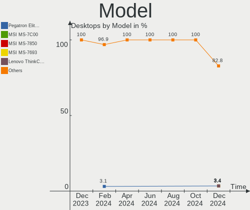
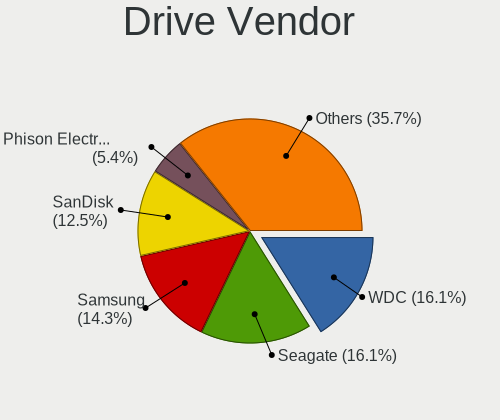
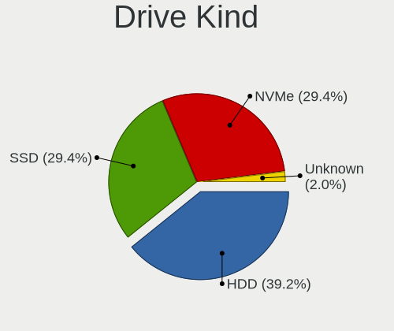
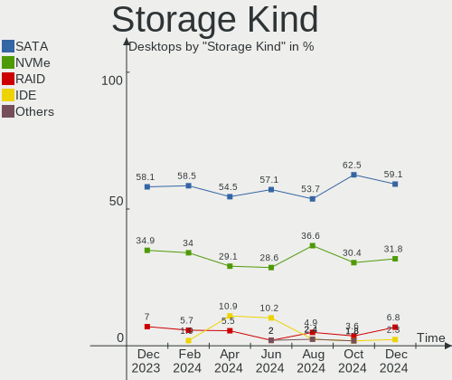
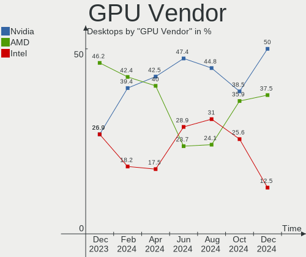
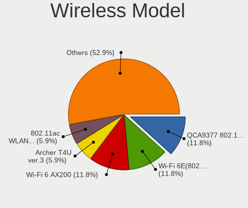
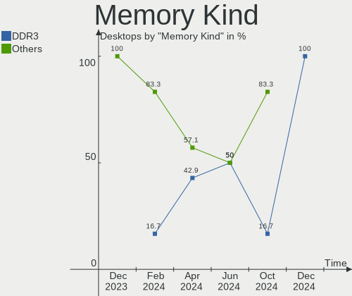

KDE neon - Hardware Trends (Desktops)
-------------------------------------

A project to identify most popular hardware characteristics and track their change
over time based on data collected by Linux users at https://Linux-Hardware.org.

Anyone can contribute to this report by the [hw-probe](https://github.com/linuxhw/hw-probe) tool:

    sudo -E hw-probe -all -upload

This report is for one last month. Overall report since the beginning of time: [TestDays](https://github.com/linuxhw/TestDays)

Period: Jun, 2023.

Contents
--------

* [ System ](#system)
  - [ OS                       ](#os)
  - [ OS Family                ](#os-family)
  - [ Kernel                   ](#kernel)
  - [ Kernel Family            ](#kernel-family)
  - [ Kernel Major Ver.        ](#kernel-major-ver)
  - [ Arch                     ](#arch)
  - [ DE                       ](#de)
  - [ Display Server           ](#display-server)
  - [ Display Manager          ](#display-manager)
  - [ OS Lang                  ](#os-lang)
  - [ Boot Mode                ](#boot-mode)
  - [ Filesystem               ](#filesystem)
  - [ Part. scheme             ](#part-scheme)
  - [ Dual Boot with Linux/BSD ](#dual-boot-with-linuxbsd)
  - [ Dual Boot (Win)          ](#dual-boot-win)

* [ Board ](#board)
  - [ Vendor                   ](#vendor)
  - [ Model                    ](#model)
  - [ Model Family             ](#model-family)
  - [ MFG Year                 ](#mfg-year)
  - [ Form Factor              ](#form-factor)
  - [ Secure Boot              ](#secure-boot)
  - [ Coreboot                 ](#coreboot)
  - [ RAM Size                 ](#ram-size)
  - [ RAM Used                 ](#ram-used)
  - [ Total Drives             ](#total-drives)
  - [ Has CD-ROM               ](#has-cd-rom)
  - [ Has Ethernet             ](#has-ethernet)
  - [ Has WiFi                 ](#has-wifi)
  - [ Has Bluetooth            ](#has-bluetooth)

* [ Location ](#location)
  - [ Country                  ](#country)
  - [ City                     ](#city)

* [ Drives ](#drives)
  - [ Drive Vendor             ](#drive-vendor)
  - [ Drive Model              ](#drive-model)
  - [ HDD Vendor               ](#hdd-vendor)
  - [ SSD Vendor               ](#ssd-vendor)
  - [ Drive Kind               ](#drive-kind)
  - [ Drive Connector          ](#drive-connector)
  - [ Drive Size               ](#drive-size)
  - [ Space Total              ](#space-total)
  - [ Space Used               ](#space-used)
  - [ Malfunc. Drives          ](#malfunc-drives)
  - [ Malfunc. Drive Vendor    ](#malfunc-drive-vendor)
  - [ Malfunc. HDD Vendor      ](#malfunc-hdd-vendor)
  - [ Malfunc. Drive Kind      ](#malfunc-drive-kind)
  - [ Failed Drives            ](#failed-drives)
  - [ Failed Drive Vendor      ](#failed-drive-vendor)
  - [ Drive Status             ](#drive-status)

* [ Storage controller ](#storage-controller)
  - [ Storage Vendor           ](#storage-vendor)
  - [ Storage Model            ](#storage-model)
  - [ Storage Kind             ](#storage-kind)

* [ Processor ](#processor)
  - [ CPU Vendor               ](#cpu-vendor)
  - [ CPU Model                ](#cpu-model)
  - [ CPU Model Family         ](#cpu-model-family)
  - [ CPU Cores                ](#cpu-cores)
  - [ CPU Sockets              ](#cpu-sockets)
  - [ CPU Threads              ](#cpu-threads)
  - [ CPU Op-Modes             ](#cpu-op-modes)
  - [ CPU Microcode            ](#cpu-microcode)
  - [ CPU Microarch            ](#cpu-microarch)

* [ Graphics ](#graphics)
  - [ GPU Vendor               ](#gpu-vendor)
  - [ GPU Model                ](#gpu-model)
  - [ GPU Combo                ](#gpu-combo)
  - [ GPU Driver               ](#gpu-driver)
  - [ GPU Memory               ](#gpu-memory)

* [ Monitor ](#monitor)
  - [ Monitor Vendor           ](#monitor-vendor)
  - [ Monitor Model            ](#monitor-model)
  - [ Monitor Resolution       ](#monitor-resolution)
  - [ Monitor Diagonal         ](#monitor-diagonal)
  - [ Monitor Width            ](#monitor-width)
  - [ Aspect Ratio             ](#aspect-ratio)
  - [ Monitor Area             ](#monitor-area)
  - [ Pixel Density            ](#pixel-density)
  - [ Multiple Monitors        ](#multiple-monitors)

* [ Network ](#network)
  - [ Net Controller Vendor    ](#net-controller-vendor)
  - [ Net Controller Model     ](#net-controller-model)
  - [ Wireless Vendor          ](#wireless-vendor)
  - [ Wireless Model           ](#wireless-model)
  - [ Ethernet Vendor          ](#ethernet-vendor)
  - [ Ethernet Model           ](#ethernet-model)
  - [ Net Controller Kind      ](#net-controller-kind)
  - [ Used Controller          ](#used-controller)
  - [ NICs                     ](#nics)
  - [ IPv6                     ](#ipv6)

* [ Bluetooth ](#bluetooth)
  - [ Bluetooth Vendor         ](#bluetooth-vendor)
  - [ Bluetooth Model          ](#bluetooth-model)

* [ Sound ](#sound)
  - [ Sound Vendor             ](#sound-vendor)
  - [ Sound Model              ](#sound-model)

* [ Memory ](#memory)
  - [ Memory Vendor            ](#memory-vendor)
  - [ Memory Model             ](#memory-model)
  - [ Memory Kind              ](#memory-kind)
  - [ Memory Form Factor       ](#memory-form-factor)
  - [ Memory Size              ](#memory-size)
  - [ Memory Speed             ](#memory-speed)

* [ Printers & scanners ](#printers--scanners)
  - [ Printer Vendor           ](#printer-vendor)
  - [ Printer Model            ](#printer-model)
  - [ Scanner Vendor           ](#scanner-vendor)
  - [ Scanner Model            ](#scanner-model)

* [ Camera ](#camera)
  - [ Camera Vendor            ](#camera-vendor)
  - [ Camera Model             ](#camera-model)

* [ Security ](#security)
  - [ Fingerprint Vendor       ](#fingerprint-vendor)
  - [ Fingerprint Model        ](#fingerprint-model)
  - [ Chipcard Vendor          ](#chipcard-vendor)
  - [ Chipcard Model           ](#chipcard-model)

* [ Unsupported ](#unsupported)
  - [ Unsupported Devices      ](#unsupported-devices)
  - [ Unsupported Device Types ](#unsupported-device-types)

System
------

OS
--

Installed operating systems

| Name           | Desktops | Percent |
|----------------|----------|---------|
| KDE neon 22.04 | 31       | 100%    |

OS Family
---------

OS without a version

| Name     | Desktops | Percent |
|----------|----------|---------|
| KDE neon | 31       | 100%    |

Kernel
------

Version of the Linux kernel

| Version           | Desktops | Percent |
|-------------------|----------|---------|
| 5.19.0-43-generic | 16       | 51.61%  |
| 5.19.0-45-generic | 11       | 35.48%  |
| 5.19.0-41-generic | 2        | 6.45%   |
| 5.19.0-42-generic | 1        | 3.23%   |
| 5.15.0-73-generic | 1        | 3.23%   |

Kernel Family
-------------

Linux kernel without a distro release

| Version | Desktops | Percent |
|---------|----------|---------|
| 5.19.0  | 30       | 96.77%  |
| 5.15.0  | 1        | 3.23%   |

Kernel Major Ver.
-----------------

Linux kernel major version

| Version | Desktops | Percent |
|---------|----------|---------|
| 5.19    | 30       | 96.77%  |
| 5.15    | 1        | 3.23%   |

Arch
----

OS architecture (x86_64, i586, etc.)

| Name   | Desktops | Percent |
|--------|----------|---------|
| x86_64 | 31       | 100%    |

DE
--

Desktop Environment

| Name | Desktops | Percent |
|------|----------|---------|
| KDE5 | 31       | 100%    |

Display Server
--------------

X11 or Wayland

| Name    | Desktops | Percent |
|---------|----------|---------|
| X11     | 29       | 93.55%  |
| Wayland | 2        | 6.45%   |

Display Manager
---------------

SDDM, LightDM, etc.

| Name    | Desktops | Percent |
|---------|----------|---------|
| Unknown | 20       | 64.52%  |
| SDDM    | 11       | 35.48%  |

OS Lang
-------

Language

| Lang  | Desktops | Percent |
|-------|----------|---------|
| en_US | 16       | 51.61%  |
| en_GB | 4        | 12.9%   |
| tr_TR | 1        | 3.23%   |
| nl_BE | 1        | 3.23%   |
| it_IT | 1        | 3.23%   |
| hr_HR | 1        | 3.23%   |
| es_MX | 1        | 3.23%   |
| es_ES | 1        | 3.23%   |
| en_ZA | 1        | 3.23%   |
| en_PH | 1        | 3.23%   |
| en_CA | 1        | 3.23%   |
| cs_CZ | 1        | 3.23%   |
| C     | 1        | 3.23%   |

Boot Mode
---------

EFI or BIOS

| Mode | Desktops | Percent |
|------|----------|---------|
| BIOS | 26       | 83.87%  |
| EFI  | 5        | 16.13%  |

Filesystem
----------

Type of filesystem

| Type    | Desktops | Percent |
|---------|----------|---------|
| Ext4    | 24       | 77.42%  |
| Tmpfs   | 5        | 16.13%  |
| Xfs     | 1        | 3.23%   |
| Overlay | 1        | 3.23%   |

Part. scheme
------------

Scheme of partitioning

| Type    | Desktops | Percent |
|---------|----------|---------|
| Unknown | 20       | 64.52%  |
| GPT     | 11       | 35.48%  |

Dual Boot with Linux/BSD
------------------------

Hosting more than one Linux/BSD

| Dual boot | Desktops | Percent |
|-----------|----------|---------|
| No        | 26       | 83.87%  |
| Yes       | 5        | 16.13%  |

Dual Boot (Win)
---------------

Hosting Linux and Windows

| Dual boot | Desktops | Percent |
|-----------|----------|---------|
| No        | 25       | 80.65%  |
| Yes       | 6        | 19.35%  |

Board
-----

Vendor
------

Motherboard manufacturer

| Name                                 | Desktops | Percent |
|--------------------------------------|----------|---------|
| Gigabyte Technology                  | 5        | 16.13%  |
| Dell                                 | 5        | 16.13%  |
| ASUSTek Computer                     | 5        | 16.13%  |
| MSI                                  | 4        | 12.9%   |
| Hewlett-Packard                      | 4        | 12.9%   |
| ASRock                               | 4        | 12.9%   |
| Intel                                | 2        | 6.45%   |
| Shenzhen Meigao Electronic Equipment | 1        | 3.23%   |
| Apple                                | 1        | 3.23%   |

Model
-----

Motherboard model

| Name                                            | Desktops | Percent |
|-------------------------------------------------|----------|---------|
| MSI MS-7A38                                     | 2        | 6.45%   |
| Shenzhen Meigao Electronic Equipment UM773 Lite | 1        | 3.23%   |
| MSI MS-7C95                                     | 1        | 3.23%   |
| MSI MS-7B17                                     | 1        | 3.23%   |
| Intel DQ77KB AAG81483-500                       | 1        | 3.23%   |
| Intel DP965LT AAD41694-301                      | 1        | 3.23%   |
| HP ProDesk 400 G4 SFF                           | 1        | 3.23%   |
| HP Pavilion tp01-0030 Desktop Rfrbd PC          | 1        | 3.23%   |
| HP Compaq dc7900 Ultra-Slim Desktop             | 1        | 3.23%   |
| HP Compaq 8200 Elite USDT PC                    | 1        | 3.23%   |
| Gigabyte X570 AORUS PRO WIFI                    | 1        | 3.23%   |
| Gigabyte H310M S2 2.0                           | 1        | 3.23%   |
| Gigabyte GB-BRR7H-4800                          | 1        | 3.23%   |
| Gigabyte GA-78LMT-USB3 6.0                      | 1        | 3.23%   |
| Gigabyte B550 AORUS ELITE V2                    | 1        | 3.23%   |
| Dell XPS 8940                                   | 1        | 3.23%   |
| Dell Precision Tower 3420                       | 1        | 3.23%   |
| Dell Precision T3600                            | 1        | 3.23%   |
| Dell Precision 3630 Tower                       | 1        | 3.23%   |
| Dell OptiPlex 7010                              | 1        | 3.23%   |
| ASUS TUF Gaming X570-PLUS                       | 1        | 3.23%   |
| ASUS TUF Gaming B550-PLUS                       | 1        | 3.23%   |
| ASUS ROG STRIX Z590-A GAMING WIFI               | 1        | 3.23%   |
| ASUS PRIME B550-PLUS                            | 1        | 3.23%   |
| ASUS PRIME B450M-A                              | 1        | 3.23%   |
| ASRock X670E PG Lightning                       | 1        | 3.23%   |
| ASRock H470M-HDV                                | 1        | 3.23%   |
| ASRock B550 Pro4                                | 1        | 3.23%   |
| ASRock B450M-HDV R4.0                           | 1        | 3.23%   |
| Apple MacPro1,1                                 | 1        | 3.23%   |

Model Family
------------

Motherboard model prefix

| Name                                       | Desktops | Percent |
|--------------------------------------------|----------|---------|
| Dell Precision                             | 3        | 9.68%   |
| MSI MS-7A38                                | 2        | 6.45%   |
| HP Compaq                                  | 2        | 6.45%   |
| ASUS TUF                                   | 2        | 6.45%   |
| ASUS PRIME                                 | 2        | 6.45%   |
| Shenzhen Meigao Electronic Equipment UM773 | 1        | 3.23%   |
| MSI MS-7C95                                | 1        | 3.23%   |
| MSI MS-7B17                                | 1        | 3.23%   |
| Intel DQ77KB                               | 1        | 3.23%   |
| Intel DP965LT                              | 1        | 3.23%   |
| HP ProDesk                                 | 1        | 3.23%   |
| HP Pavilion                                | 1        | 3.23%   |
| Gigabyte X570                              | 1        | 3.23%   |
| Gigabyte H310M                             | 1        | 3.23%   |
| Gigabyte GB-BRR7H-4800                     | 1        | 3.23%   |
| Gigabyte GA-78LMT-USB3                     | 1        | 3.23%   |
| Gigabyte B550                              | 1        | 3.23%   |
| Dell XPS                                   | 1        | 3.23%   |
| Dell OptiPlex                              | 1        | 3.23%   |
| ASUS ROG                                   | 1        | 3.23%   |
| ASRock X670E                               | 1        | 3.23%   |
| ASRock H470M-HDV                           | 1        | 3.23%   |
| ASRock B550                                | 1        | 3.23%   |
| ASRock B450M-HDV                           | 1        | 3.23%   |
| Apple MacPro1                              | 1        | 3.23%   |

MFG Year
--------

Motherboard manufacture year

| Year | Desktops | Percent |
|------|----------|---------|
| 2018 | 6        | 19.35%  |
| 2020 | 5        | 16.13%  |
| 2022 | 3        | 9.68%   |
| 2021 | 3        | 9.68%   |
| 2019 | 3        | 9.68%   |
| 2007 | 2        | 6.45%   |
| 2023 | 1        | 3.23%   |
| 2017 | 1        | 3.23%   |
| 2016 | 1        | 3.23%   |
| 2015 | 1        | 3.23%   |
| 2014 | 1        | 3.23%   |
| 2013 | 1        | 3.23%   |
| 2012 | 1        | 3.23%   |
| 2011 | 1        | 3.23%   |
| 2008 | 1        | 3.23%   |

Form Factor
-----------

Physical design of the computer

| Name    | Desktops | Percent |
|---------|----------|---------|
| Desktop | 31       | 100%    |

Secure Boot
-----------

Enabled or disabled

| State    | Desktops | Percent |
|----------|----------|---------|
| Disabled | 31       | 100%    |

Coreboot
--------

Have coreboot on board

| Used | Desktops | Percent |
|------|----------|---------|
| No   | 31       | 100%    |

RAM Size
--------

Total RAM memory

| Size in GB  | Desktops | Percent |
|-------------|----------|---------|
| 16.01-24.0  | 8        | 25.81%  |
| 8.01-16.0   | 7        | 22.58%  |
| 32.01-64.0  | 5        | 16.13%  |
| 4.01-8.0    | 4        | 12.9%   |
| 3.01-4.0    | 3        | 9.68%   |
| 24.01-32.0  | 2        | 6.45%   |
| 64.01-256.0 | 2        | 6.45%   |

RAM Used
--------

Used RAM memory

| Used GB   | Desktops | Percent |
|-----------|----------|---------|
| 3.01-4.0  | 10       | 32.26%  |
| 2.01-3.0  | 7        | 22.58%  |
| 1.01-2.0  | 7        | 22.58%  |
| 8.01-16.0 | 4        | 12.9%   |
| 4.01-8.0  | 3        | 9.68%   |

Total Drives
------------

Number of drives on board

| Drives | Desktops | Percent |
|--------|----------|---------|
| 2      | 11       | 35.48%  |
| 1      | 10       | 32.26%  |
| 3      | 5        | 16.13%  |
| 4      | 3        | 9.68%   |
| 10     | 1        | 3.23%   |
| 5      | 1        | 3.23%   |

Has CD-ROM
----------

Has CD-ROM on board

| Presented | Desktops | Percent |
|-----------|----------|---------|
| No        | 23       | 74.19%  |
| Yes       | 8        | 25.81%  |

Has Ethernet
------------

Has Ethernet on board

| Presented | Desktops | Percent |
|-----------|----------|---------|
| Yes       | 30       | 96.77%  |
| No        | 1        | 3.23%   |

Has WiFi
--------

Has WiFi module

| Presented | Desktops | Percent |
|-----------|----------|---------|
| Yes       | 22       | 70.97%  |
| No        | 9        | 29.03%  |

Has Bluetooth
-------------

Has Bluetooth module

| Presented | Desktops | Percent |
|-----------|----------|---------|
| No        | 17       | 54.84%  |
| Yes       | 14       | 45.16%  |

Location
--------

Country
-------

Geographic location (country)

| Country      | Desktops | Percent |
|--------------|----------|---------|
| USA          | 10       | 32.26%  |
| Spain        | 2        | 6.45%   |
| Brazil       | 2        | 6.45%   |
| UK           | 1        | 3.23%   |
| Turkey       | 1        | 3.23%   |
| Sweden       | 1        | 3.23%   |
| South Africa | 1        | 3.23%   |
| Romania      | 1        | 3.23%   |
| Philippines  | 1        | 3.23%   |
| Peru         | 1        | 3.23%   |
| Italy        | 1        | 3.23%   |
| Ireland      | 1        | 3.23%   |
| India        | 1        | 3.23%   |
| Germany      | 1        | 3.23%   |
| France       | 1        | 3.23%   |
| Czechia      | 1        | 3.23%   |
| Croatia      | 1        | 3.23%   |
| Canada       | 1        | 3.23%   |
| Belgium      | 1        | 3.23%   |
| Bangladesh   | 1        | 3.23%   |

City
----

Geographic location (city)

| City             | Desktops | Percent |
|------------------|----------|---------|
| Cleveland        | 2        | 6.45%   |
| Wichita          | 1        | 3.23%   |
| Vyškov          | 1        | 3.23%   |
| Trujillo         | 1        | 3.23%   |
| Split            | 1        | 3.23%   |
| Savannah         | 1        | 3.23%   |
| San Francisco    | 1        | 3.23%   |
| Paris            | 1        | 3.23%   |
| Palmas           | 1        | 3.23%   |
| Mumbai           | 1        | 3.23%   |
| Madrid           | 1        | 3.23%   |
| Langley          | 1        | 3.23%   |
| Kil              | 1        | 3.23%   |
| Karabük         | 1        | 3.23%   |
| Joinville        | 1        | 3.23%   |
| Johannesburg     | 1        | 3.23%   |
| Izegem           | 1        | 3.23%   |
| Iloilo City      | 1        | 3.23%   |
| Elmira           | 1        | 3.23%   |
| Dublin           | 1        | 3.23%   |
| Dhaka            | 1        | 3.23%   |
| DeFuniak Springs | 1        | 3.23%   |
| Dallas           | 1        | 3.23%   |
| Colwyn Bay       | 1        | 3.23%   |
| Bucharest        | 1        | 3.23%   |
| Bologna          | 1        | 3.23%   |
| Berlin           | 1        | 3.23%   |
| Batavia          | 1        | 3.23%   |
| Alovera          | 1        | 3.23%   |
| Albuquerque      | 1        | 3.23%   |

Drives
------

Drive Vendor
------------

Hard drive vendors

| Vendor                      | Desktops | Drives | Percent |
|-----------------------------|----------|--------|---------|
| WDC                         | 11       | 11     | 17.19%  |
| Seagate                     | 8        | 15     | 12.5%   |
| Toshiba                     | 5        | 5      | 7.81%   |
| Samsung Electronics         | 5        | 6      | 7.81%   |
| Sandisk                     | 4        | 5      | 6.25%   |
| Phison Electronics          | 4        | 4      | 6.25%   |
| Kingston                    | 4        | 4      | 6.25%   |
| Realtek Semiconductor       | 3        | 3      | 4.69%   |
| Crucial                     | 3        | 4      | 4.69%   |
| China                       | 3        | 3      | 4.69%   |
| SPCC                        | 2        | 3      | 3.13%   |
| SK hynix                    | 1        | 1      | 1.56%   |
| Silicon Motion              | 1        | 1      | 1.56%   |
| Micron/Crucial Technology   | 1        | 1      | 1.56%   |
| LITEON                      | 1        | 1      | 1.56%   |
| KIOXIA-EXCERIA              | 1        | 1      | 1.56%   |
| KIOXIA                      | 1        | 1      | 1.56%   |
| Kingston Technology Company | 1        | 1      | 1.56%   |
| KingFast                    | 1        | 1      | 1.56%   |
| INNOVATION IT               | 1        | 1      | 1.56%   |
| Inland                      | 1        | 1      | 1.56%   |
| ADATA Technology            | 1        | 1      | 1.56%   |
| A-DATA Technology           | 1        | 1      | 1.56%   |

Drive Model
-----------

Hard drive models

| Model                                               | Desktops | Percent |
|-----------------------------------------------------|----------|---------|
| Seagate ST1000DM010-2EP102 1TB                      | 3        | 4.29%   |
| Sandisk WD Blue SN550 NVMe SSD 1TB                  | 3        | 4.29%   |
| WDC WDS500G2B0A-00SM50 500GB SSD                    | 2        | 2.86%   |
| Seagate ST2000DM008-2FR102 2TB                      | 2        | 2.86%   |
| Samsung SSD 860 EVO 500GB                           | 2        | 2.86%   |
| Samsung NVMe SSD Controller SM981/PM981/PM983 250GB | 2        | 2.86%   |
| Realtek RTS5763DL NVMe SSD Controller 512GB         | 2        | 2.86%   |
| Phison E12 NVMe Controller 1TB                      | 2        | 2.86%   |
| WDC WD5000BPVT-24HXZT3 500GB                        | 1        | 1.43%   |
| WDC WD5000BEVT-60ZAT1 500GB                         | 1        | 1.43%   |
| WDC WD50 00LPLX-60ZNT 500GB                         | 1        | 1.43%   |
| WDC WD3200AAKS-00G3A0 320GB                         | 1        | 1.43%   |
| WDC WD30EZRZ-00GXCB0 3TB                            | 1        | 1.43%   |
| WDC WD20EARX-00PASB0 2TB                            | 1        | 1.43%   |
| WDC WD10JPCX-24UE4T0 1TB                            | 1        | 1.43%   |
| WDC WD10EZEX-75WN4A1 1TB                            | 1        | 1.43%   |
| WDC WD10EZEX-60M2NA0 1TB                            | 1        | 1.43%   |
| Toshiba TR150 240GB SSD                             | 1        | 1.43%   |
| Toshiba MQ04ABD200 2TB                              | 1        | 1.43%   |
| Toshiba MQ01ABF032 320GB                            | 1        | 1.43%   |
| Toshiba MQ01ABD100 1TB                              | 1        | 1.43%   |
| Toshiba HDWD320 2TB                                 | 1        | 1.43%   |
| SPCC Solid State Disk 256GB                         | 1        | 1.43%   |
| SPCC Solid State Disk 1024GB                        | 1        | 1.43%   |
| SK hynix BC711 NVMe 256GB                           | 1        | 1.43%   |
| Silicon Motion SM2262/SM2262EN SSD Controller 480GB | 1        | 1.43%   |
| Seagate ST932032 5AS 320GB                          | 1        | 1.43%   |
| Seagate ST500VT003-1RE17D 500GB                     | 1        | 1.43%   |
| Seagate ST500DM002-1BD142 500GB                     | 1        | 1.43%   |
| Seagate ST4000NE001-2MA101 4TB                      | 1        | 1.43%   |
| Seagate Expansion HDD 8TB                           | 1        | 1.43%   |
| Seagate Expansion Desk 5TB                          | 1        | 1.43%   |
| Seagate Backup+ Hub BK 6TB                          | 1        | 1.43%   |
| Sandisk WD Black SN750 / PC SN730 NVMe SSD 500GB    | 1        | 1.43%   |
| SanDisk NVMe SSD Drive 1TB                          | 1        | 1.43%   |
| Samsung SSD 860 EVO 1TB                             | 1        | 1.43%   |
| Samsung HD154UI 1TB                                 | 1        | 1.43%   |
| Realtek ADATA SX6000PNP 256GB                       | 1        | 1.43%   |
| Phison PS5013 E13 NVMe Controller 512GB             | 1        | 1.43%   |
| Phison E16 PCIe4 NVMe Controller 1TB                | 1        | 1.43%   |

HDD Vendor
----------

Hard disk drive vendors

| Vendor              | Desktops | Drives | Percent |
|---------------------|----------|--------|---------|
| WDC                 | 9        | 9      | 40.91%  |
| Seagate             | 8        | 15     | 36.36%  |
| Toshiba             | 4        | 4      | 18.18%  |
| Samsung Electronics | 1        | 1      | 4.55%   |

SSD Vendor
----------

Solid state drive vendors

| Vendor              | Desktops | Drives | Percent |
|---------------------|----------|--------|---------|
| Kingston            | 4        | 4      | 18.18%  |
| Samsung Electronics | 3        | 3      | 13.64%  |
| China               | 3        | 3      | 13.64%  |
| WDC                 | 2        | 2      | 9.09%   |
| SPCC                | 2        | 3      | 9.09%   |
| Crucial             | 2        | 3      | 9.09%   |
| Toshiba             | 1        | 1      | 4.55%   |
| LITEON              | 1        | 1      | 4.55%   |
| KIOXIA-EXCERIA      | 1        | 1      | 4.55%   |
| INNOVATION IT       | 1        | 1      | 4.55%   |
| Inland              | 1        | 1      | 4.55%   |
| A-DATA Technology   | 1        | 1      | 4.55%   |

Drive Kind
----------

HDD or SSD

| Kind    | Desktops | Drives | Percent |
|---------|----------|--------|---------|
| SSD     | 16       | 24     | 33.33%  |
| HDD     | 16       | 29     | 33.33%  |
| NVMe    | 15       | 21     | 31.25%  |
| Unknown | 1        | 1      | 2.08%   |

Drive Connector
---------------

SATA, SAS, NVMe, etc.

| Type | Desktops | Drives | Percent |
|------|----------|--------|---------|
| SATA | 28       | 46     | 62.22%  |
| NVMe | 15       | 21     | 33.33%  |
| SAS  | 2        | 8      | 4.44%   |

Drive Size
----------

Size of hard drive

| Size in TB | Desktops | Drives | Percent |
|------------|----------|--------|---------|
| 0.01-0.5   | 17       | 25     | 44.74%  |
| 0.51-1.0   | 11       | 13     | 28.95%  |
| 1.01-2.0   | 7        | 7      | 18.42%  |
| 3.01-4.0   | 1        | 1      | 2.63%   |
| 2.01-3.0   | 1        | 1      | 2.63%   |
| 4.01-10.0  | 1        | 6      | 2.63%   |

Space Total
-----------

Amount of disk space available on the file system

| Size in GB     | Desktops | Percent |
|----------------|----------|---------|
| 251-500        | 7        | 22.58%  |
| 501-1000       | 6        | 19.35%  |
| 101-250        | 5        | 16.13%  |
| More than 3000 | 4        | 12.9%   |
| 1001-2000      | 3        | 9.68%   |
| 1-20           | 2        | 6.45%   |
| 51-100         | 2        | 6.45%   |
| 2001-3000      | 1        | 3.23%   |
| Unknown        | 1        | 3.23%   |

Space Used
----------

Amount of used disk space

| Used GB        | Desktops | Percent |
|----------------|----------|---------|
| 1-20           | 12       | 38.71%  |
| 21-50          | 4        | 12.9%   |
| 251-500        | 3        | 9.68%   |
| 101-250        | 3        | 9.68%   |
| 1001-2000      | 3        | 9.68%   |
| More than 3000 | 2        | 6.45%   |
| 51-100         | 2        | 6.45%   |
| 501-1000       | 1        | 3.23%   |
| Unknown        | 1        | 3.23%   |

Malfunc. Drives
---------------

Drive models with a malfunction

| Model                           | Desktops | Drives | Percent |
|---------------------------------|----------|--------|---------|
| WDC WD20EARX-00PASB0 2TB        | 1        | 1      | 50%     |
| Samsung Electronics HD154UI 1TB | 1        | 1      | 50%     |

Malfunc. Drive Vendor
---------------------

Vendors of faulty drives

| Vendor              | Desktops | Drives | Percent |
|---------------------|----------|--------|---------|
| WDC                 | 1        | 1      | 50%     |
| Samsung Electronics | 1        | 1      | 50%     |

Malfunc. HDD Vendor
-------------------

Vendors of faulty HDD drives

| Vendor              | Desktops | Drives | Percent |
|---------------------|----------|--------|---------|
| WDC                 | 1        | 1      | 50%     |
| Samsung Electronics | 1        | 1      | 50%     |

Malfunc. Drive Kind
-------------------

Kinds of faulty drives

| Kind | Desktops | Drives | Percent |
|------|----------|--------|---------|
| HDD  | 2        | 2      | 100%    |

Failed Drives
-------------

Failed drive models

Zero info for selected period =(

Failed Drive Vendor
-------------------

Failed drive vendors

Zero info for selected period =(

Drive Status
------------

Number of failed and malfunc. drives

| Status   | Desktops | Drives | Percent |
|----------|----------|--------|---------|
| Detected | 27       | 63     | 77.14%  |
| Works    | 6        | 10     | 17.14%  |
| Malfunc  | 2        | 2      | 5.71%   |

Storage controller
------------------

Storage Vendor
--------------

Storage controller vendors

| Vendor                       | Desktops | Percent |
|------------------------------|----------|---------|
| Intel                        | 16       | 30.77%  |
| AMD                          | 15       | 28.85%  |
| SanDisk                      | 4        | 7.69%   |
| Phison Electronics           | 4        | 7.69%   |
| Realtek Semiconductor        | 3        | 5.77%   |
| Samsung Electronics          | 2        | 3.85%   |
| Micron/Crucial Technology    | 2        | 3.85%   |
| Toshiba America Info Systems | 1        | 1.92%   |
| SK hynix                     | 1        | 1.92%   |
| Silicon Motion               | 1        | 1.92%   |
| Marvell Technology Group     | 1        | 1.92%   |
| Kingston Technology Company  | 1        | 1.92%   |
| ADATA Technology             | 1        | 1.92%   |

Storage Model
-------------

Storage controller models

| Model                                                                         | Desktops | Percent |
|-------------------------------------------------------------------------------|----------|---------|
| AMD FCH SATA Controller [AHCI mode]                                           | 6        | 10.17%  |
| AMD 500 Series Chipset SATA Controller                                        | 5        | 8.47%   |
| AMD 400 Series Chipset SATA Controller                                        | 4        | 6.78%   |
| SanDisk WD Blue SN550 NVMe SSD                                                | 3        | 5.08%   |
| Intel Cannon Lake PCH SATA AHCI Controller                                    | 3        | 5.08%   |
| Samsung NVMe SSD Controller SM981/PM981/PM983                                 | 2        | 3.39%   |
| Realtek RTS5763DL NVMe SSD Controller                                         | 2        | 3.39%   |
| Phison E12 NVMe Controller                                                    | 2        | 3.39%   |
| Micron/Crucial P2 NVMe PCIe SSD                                               | 2        | 3.39%   |
| Intel Comet Lake SATA AHCI Controller                                         | 2        | 3.39%   |
| Intel 7 Series/C210 Series Chipset Family 6-port SATA Controller [AHCI mode]  | 2        | 3.39%   |
| Intel 200 Series PCH SATA controller [AHCI mode]                              | 2        | 3.39%   |
| Toshiba America Info Systems XG6 NVMe SSD Controller                          | 1        | 1.69%   |
| SK hynix Gold P31/BC711/PC711 NVMe Solid State Drive                          | 1        | 1.69%   |
| Silicon Motion SM2262/SM2262EN SSD Controller                                 | 1        | 1.69%   |
| SanDisk WD PC SN810 / Black SN850 NVMe SSD                                    | 1        | 1.69%   |
| SanDisk WD Black SN750 / PC SN730 NVMe SSD                                    | 1        | 1.69%   |
| Realtek NVMe Controller                                                       | 1        | 1.69%   |
| Phison PS5013 E13 NVMe Controller                                             | 1        | 1.69%   |
| Phison E16 PCIe4 NVMe Controller                                              | 1        | 1.69%   |
| Marvell Group 88SE6101/6102 single-port PATA133 interface                     | 1        | 1.69%   |
| Kingston Company Company Non-Volatile memory controller                       | 1        | 1.69%   |
| Intel SATA Controller [RAID mode]                                             | 1        | 1.69%   |
| Intel C602 chipset 4-Port SATA Storage Control Unit                           | 1        | 1.69%   |
| Intel C600/X79 series chipset 6-Port SATA AHCI Controller                     | 1        | 1.69%   |
| Intel 82801JD/DO (ICH10 Family) 4-port SATA IDE Controller                    | 1        | 1.69%   |
| Intel 82801JD/DO (ICH10 Family) 2-port SATA IDE Controller                    | 1        | 1.69%   |
| Intel 82801HB (ICH8) 4 port SATA Controller [AHCI mode]                       | 1        | 1.69%   |
| Intel 631xESB/632xESB/3100 Chipset SATA IDE Controller                        | 1        | 1.69%   |
| Intel 631xESB/632xESB IDE Controller                                          | 1        | 1.69%   |
| Intel 6 Series/C200 Series Chipset Family 6 port Desktop SATA AHCI Controller | 1        | 1.69%   |
| Intel 500 Series Chipset Family SATA RAID Controller                          | 1        | 1.69%   |
| Intel 4 Series Chipset PT IDER Controller                                     | 1        | 1.69%   |
| AMD SB7x0/SB8x0/SB9x0 SATA Controller [IDE mode]                              | 1        | 1.69%   |
| AMD SB7x0/SB8x0/SB9x0 IDE Controller                                          | 1        | 1.69%   |
| ADATA XPG SX8200 Pro PCIe Gen3x4 M.2 2280 Solid State Drive                   | 1        | 1.69%   |

Storage Kind
------------

Kind of storage controller (IDE, SATA, NVMe, SAS, ...)

| Kind | Desktops | Percent |
|------|----------|---------|
| SATA | 27       | 55.1%   |
| NVMe | 15       | 30.61%  |
| IDE  | 4        | 8.16%   |
| RAID | 2        | 4.08%   |
| SAS  | 1        | 2.04%   |

Processor
---------

CPU Vendor
----------

Processor vendors

| Vendor | Desktops | Percent |
|--------|----------|---------|
| Intel  | 16       | 51.61%  |
| AMD    | 15       | 48.39%  |

CPU Model
---------

Processor models

| Model                                       | Desktops | Percent |
|---------------------------------------------|----------|---------|
| Intel Xeon E-2186G CPU @ 3.80GHz            | 1        | 3.23%   |
| Intel Xeon CPU E5-1650 0 @ 3.20GHz          | 1        | 3.23%   |
| Intel Xeon CPU 5150 @ 2.66GHz               | 1        | 3.23%   |
| Intel Pentium Gold G6400 CPU @ 4.00GHz      | 1        | 3.23%   |
| Intel Pentium Dual-Core CPU E5200 @ 2.50GHz | 1        | 3.23%   |
| Intel Core i7-9700K CPU @ 3.60GHz           | 1        | 3.23%   |
| Intel Core i7-6700 CPU @ 3.40GHz            | 1        | 3.23%   |
| Intel Core i7-3770T CPU @ 2.50GHz           | 1        | 3.23%   |
| Intel Core i5-6400 CPU @ 2.70GHz            | 1        | 3.23%   |
| Intel Core i3-9100F CPU @ 3.60GHz           | 1        | 3.23%   |
| Intel Core i3-9100 CPU @ 3.60GHz            | 1        | 3.23%   |
| Intel Core i3-3240 CPU @ 3.40GHz            | 1        | 3.23%   |
| Intel Core i3-2120 CPU @ 3.30GHz            | 1        | 3.23%   |
| Intel Core 2 Quad CPU Q6600 @ 2.40GHz       | 1        | 3.23%   |
| Intel 11th Gen Core i7-11700K @ 3.60GHz     | 1        | 3.23%   |
| Intel 11th Gen Core i7-11700 @ 2.50GHz      | 1        | 3.23%   |
| AMD Ryzen 9 7900X 12-Core Processor         | 1        | 3.23%   |
| AMD Ryzen 9 3900X 12-Core Processor         | 1        | 3.23%   |
| AMD Ryzen 7 7735HS with Radeon Graphics     | 1        | 3.23%   |
| AMD Ryzen 7 5800X3D 8-Core Processor        | 1        | 3.23%   |
| AMD Ryzen 7 5800X 8-Core Processor          | 1        | 3.23%   |
| AMD Ryzen 7 5700X 8-Core Processor          | 1        | 3.23%   |
| AMD Ryzen 7 4800U with Radeon Graphics      | 1        | 3.23%   |
| AMD Ryzen 7 3700X 8-Core Processor          | 1        | 3.23%   |
| AMD Ryzen 5 5600G with Radeon Graphics      | 1        | 3.23%   |
| AMD Ryzen 5 5600 6-Core Processor           | 1        | 3.23%   |
| AMD Ryzen 5 3600X 6-Core Processor          | 1        | 3.23%   |
| AMD Ryzen 5 3600 6-Core Processor           | 1        | 3.23%   |
| AMD Ryzen 5 2600 Six-Core Processor         | 1        | 3.23%   |
| AMD Ryzen 3 2200G with Radeon Vega Graphics | 1        | 3.23%   |
| AMD FX-8350 Eight-Core Processor            | 1        | 3.23%   |

CPU Model Family
----------------

Processor model prefix

| Model                   | Desktops | Percent |
|-------------------------|----------|---------|
| AMD Ryzen 7             | 6        | 19.35%  |
| AMD Ryzen 5             | 5        | 16.13%  |
| Intel Core i3           | 4        | 12.9%   |
| Intel Xeon              | 3        | 9.68%   |
| Intel Core i7           | 3        | 9.68%   |
| Other                   | 2        | 6.45%   |
| AMD Ryzen 9             | 2        | 6.45%   |
| Intel Pentium Gold      | 1        | 3.23%   |
| Intel Pentium Dual-Core | 1        | 3.23%   |
| Intel Core i5           | 1        | 3.23%   |
| Intel Core 2 Quad       | 1        | 3.23%   |
| AMD Ryzen 3             | 1        | 3.23%   |
| AMD FX                  | 1        | 3.23%   |

CPU Cores
---------

Number of processor cores

| Number | Desktops | Percent |
|--------|----------|---------|
| 8      | 9        | 29.03%  |
| 4      | 9        | 29.03%  |
| 6      | 7        | 22.58%  |
| 2      | 4        | 12.9%   |
| 12     | 2        | 6.45%   |

CPU Sockets
-----------

Number of sockets

| Number | Desktops | Percent |
|--------|----------|---------|
| 1      | 30       | 96.77%  |
| 2      | 1        | 3.23%   |

CPU Threads
-----------

Threads per core (Hyper-Threading)

| Number | Desktops | Percent |
|--------|----------|---------|
| 2      | 23       | 74.19%  |
| 1      | 8        | 25.81%  |

CPU Op-Modes
------------

CPU Operation Modes (32-bit, 64-bit)

| Op mode        | Desktops | Percent |
|----------------|----------|---------|
| 32-bit, 64-bit | 31       | 100%    |

CPU Microcode
-------------

Microcode number

| Number     | Desktops | Percent |
|------------|----------|---------|
| Unknown    | 26       | 83.87%  |
| 0xa0671    | 1        | 3.23%   |
| 0x506e3    | 1        | 3.23%   |
| 0x0a601203 | 1        | 3.23%   |
| 0x0a404102 | 1        | 3.23%   |
| 0x06000852 | 1        | 3.23%   |

CPU Microarch
-------------

Microarchitecture

| Name        | Desktops | Percent |
|-------------|----------|---------|
| Zen 3       | 5        | 16.13%  |
| Zen 2       | 5        | 16.13%  |
| KabyLake    | 4        | 12.9%   |
| Unknown     | 3        | 9.68%   |
| Skylake     | 2        | 6.45%   |
| SandyBridge | 2        | 6.45%   |
| IvyBridge   | 2        | 6.45%   |
| Core        | 2        | 6.45%   |
| Zen+        | 1        | 3.23%   |
| Zen         | 1        | 3.23%   |
| Piledriver  | 1        | 3.23%   |
| Penryn      | 1        | 3.23%   |
| Icelake     | 1        | 3.23%   |
| CometLake   | 1        | 3.23%   |

Graphics
--------

GPU Vendor
----------

Vendors of graphics cards

| Vendor | Desktops | Percent |
|--------|----------|---------|
| Nvidia | 16       | 47.06%  |
| AMD    | 10       | 29.41%  |
| Intel  | 8        | 23.53%  |

GPU Model
---------

Graphics card models

| Model                                                                     | Desktops | Percent |
|---------------------------------------------------------------------------|----------|---------|
| Nvidia TU116 [GeForce GTX 1660 Ti]                                        | 2        | 5.88%   |
| Intel HD Graphics 530                                                     | 2        | 5.88%   |
| AMD Navi 23 [Radeon RX 6600/6600 XT/6600M]                                | 2        | 5.88%   |
| Nvidia TU116 [GeForce GTX 1650]                                           | 1        | 2.94%   |
| Nvidia TU116 [GeForce GTX 1650 SUPER]                                     | 1        | 2.94%   |
| Nvidia TU106 [GeForce RTX 2060 SUPER]                                     | 1        | 2.94%   |
| Nvidia TU104GL [Quadro RTX 4000]                                          | 1        | 2.94%   |
| Nvidia TU104 [GeForce RTX 2080 SUPER]                                     | 1        | 2.94%   |
| Nvidia GP107GL [Quadro P400]                                              | 1        | 2.94%   |
| Nvidia GP106 [GeForce GTX 1060 6GB]                                       | 1        | 2.94%   |
| Nvidia GM107GL [Quadro K620]                                              | 1        | 2.94%   |
| Nvidia GK208B [GeForce GT 710]                                            | 1        | 2.94%   |
| Nvidia GK208 [GeForce GT 630 Rev. 2]                                      | 1        | 2.94%   |
| Nvidia GK104GL [Quadro K5000]                                             | 1        | 2.94%   |
| Nvidia GA106 [GeForce RTX 3060 Lite Hash Rate]                            | 1        | 2.94%   |
| Nvidia GA104 [GeForce RTX 3060 Ti Lite Hash Rate]                         | 1        | 2.94%   |
| Nvidia G98 [GeForce 8400 GS Rev. 2]                                       | 1        | 2.94%   |
| Intel Xeon E3-1200 v2/3rd Gen Core processor Graphics Controller          | 1        | 2.94%   |
| Intel RocketLake-S GT1 [UHD Graphics 750]                                 | 1        | 2.94%   |
| Intel IvyBridge GT2 [HD Graphics 4000]                                    | 1        | 2.94%   |
| Intel CoffeeLake-S GT2 [UHD Graphics P630]                                | 1        | 2.94%   |
| Intel 4 Series Chipset Integrated Graphics Controller                     | 1        | 2.94%   |
| Intel 2nd Generation Core Processor Family Integrated Graphics Controller | 1        | 2.94%   |
| AMD RS780L [Radeon 3000]                                                  | 1        | 2.94%   |
| AMD Renoir                                                                | 1        | 2.94%   |
| AMD Rembrandt [Radeon 680M]                                               | 1        | 2.94%   |
| AMD Raven Ridge [Radeon Vega Series / Radeon Vega Mobile Series]          | 1        | 2.94%   |
| AMD Navi 22 [Radeon RX 6700/6700 XT/6750 XT / 6800M/6850M XT]             | 1        | 2.94%   |
| AMD Ellesmere [Radeon RX 470/480/570/570X/580/580X/590]                   | 1        | 2.94%   |
| AMD Cezanne [Radeon Vega Series / Radeon Vega Mobile Series]              | 1        | 2.94%   |
| AMD Baffin [Radeon RX 460/560D / Pro 450/455/460/555/555X/560/560X]       | 1        | 2.94%   |

GPU Combo
---------

Combinations of graphics cards

| Name           | Desktops | Percent |
|----------------|----------|---------|
| 1 x Nvidia     | 13       | 41.94%  |
| 1 x AMD        | 10       | 32.26%  |
| 1 x Intel      | 5        | 16.13%  |
| Intel + Nvidia | 3        | 9.68%   |

GPU Driver
----------

Free vs proprietary

| Driver      | Desktops | Percent |
|-------------|----------|---------|
| Free        | 24       | 77.42%  |
| Proprietary | 7        | 22.58%  |

GPU Memory
----------

Total video memory

| Size in GB | Desktops | Percent |
|------------|----------|---------|
| Unknown    | 22       | 70.97%  |
| 7.01-8.0   | 2        | 6.45%   |
| 5.01-6.0   | 2        | 6.45%   |
| 1.01-2.0   | 2        | 6.45%   |
| 3.01-4.0   | 1        | 3.23%   |
| 8.01-16.0  | 1        | 3.23%   |
| 0.01-0.5   | 1        | 3.23%   |

Monitor
-------

Monitor Vendor
--------------

Monitor vendors

| Vendor              | Desktops | Percent |
|---------------------|----------|---------|
| Goldstar            | 9        | 22.5%   |
| Samsung Electronics | 6        | 15%     |
| Hewlett-Packard     | 6        | 15%     |
| Dell                | 5        | 12.5%   |
| Acer                | 3        | 7.5%    |
| ONN                 | 2        | 5%      |
| BenQ                | 2        | 5%      |
| ASUSTek Computer    | 2        | 5%      |
| AOC                 | 2        | 5%      |
| Iiyama              | 1        | 2.5%    |
| HUAWEI              | 1        | 2.5%    |
| Grundig             | 1        | 2.5%    |

Monitor Model
-------------

Monitor models

| Model                                                                  | Desktops | Percent |
|------------------------------------------------------------------------|----------|---------|
| ONN ONA24HB19T01 ONN0101 1920x1080 517x323mm 24.0-inch                 | 2        | 4.65%   |
| Goldstar FULL HD GSM5B55 1920x1080 480x270mm 21.7-inch                 | 2        | 4.65%   |
| Samsung Electronics SyncMaster SAM0423 1920x1080                       | 1        | 2.33%   |
| Samsung Electronics SyncMaster SAM0161 1280x1024 338x270mm 17.0-inch   | 1        | 2.33%   |
| Samsung Electronics SA300/SA350 SAM078A 1366x768 410x230mm 18.5-inch   | 1        | 2.33%   |
| Samsung Electronics S20D300 SAM0B3A 1600x900 430x240mm 19.4-inch       | 1        | 2.33%   |
| Samsung Electronics Odyssey G40B SAM727E 1920x1080 597x336mm 27.0-inch | 1        | 2.33%   |
| Samsung Electronics LS49AG95 SAM71AC 3840x1080 1193x336mm 48.8-inch    | 1        | 2.33%   |
| Iiyama XB2776QS-B1 IVM660E 2560x1440 597x336mm 27.0-inch               | 1        | 2.33%   |
| HUAWEI SSN-24 HWV6E4E 1920x1080 527x296mm 23.8-inch                    | 1        | 2.33%   |
| Hewlett-Packard w1907 HWP26A3 1440x900 408x255mm 18.9-inch             | 1        | 2.33%   |
| Hewlett-Packard V270 HPN3521 1920x1080 598x336mm 27.0-inch             | 1        | 2.33%   |
| Hewlett-Packard LV2311 HWP300E 1920x1080 510x287mm 23.0-inch           | 1        | 2.33%   |
| Hewlett-Packard E27u G4 HPN36EE 2560x1440 597x336mm 27.0-inch          | 1        | 2.33%   |
| Hewlett-Packard E231 HWP3065 1920x1080 509x286mm 23.0-inch             | 1        | 2.33%   |
| Hewlett-Packard E231 HWP3063 1920x1080 510x287mm 23.0-inch             | 1        | 2.33%   |
| Hewlett-Packard 22vx HWP3294 1920x1080 480x270mm 21.7-inch             | 1        | 2.33%   |
| Grundig WUXGA GRU4448 1920x1080                                        | 1        | 2.33%   |
| Goldstar W1953 GSM4BA7 1360x768 406x229mm 18.4-inch                    | 1        | 2.33%   |
| Goldstar ULTRAWIDE GSM7795 2560x1080 800x335mm 34.1-inch               | 1        | 2.33%   |
| Goldstar ULTRAGEAR+ GSM5BBF 3840x2160 600x340mm 27.2-inch              | 1        | 2.33%   |
| Goldstar LG IPS FULLHD GSM5AB8 1920x1080 480x270mm 21.7-inch           | 1        | 2.33%   |
| Goldstar HDR WFHD GSM7715 2560x1080 798x334mm 34.1-inch                | 1        | 2.33%   |
| Goldstar HDR 4K GSM7750 3840x2160 697x392mm 31.5-inch                  | 1        | 2.33%   |
| Goldstar HDR 4K GSM7706 3840x2160 600x340mm 27.2-inch                  | 1        | 2.33%   |
| Goldstar 27GN7 GSM5B8E 1920x1080 610x360mm 27.9-inch                   | 1        | 2.33%   |
| Dell SE2422H DEL424A 1920x1080 527x296mm 23.8-inch                     | 1        | 2.33%   |
| Dell S2421HS DEL41F3 1920x1080 527x296mm 23.8-inch                     | 1        | 2.33%   |
| Dell P2319H DELD0D6 1920x1080 509x286mm 23.0-inch                      | 1        | 2.33%   |
| Dell P2317H DEL40F3 1920x1080 510x290mm 23.1-inch                      | 1        | 2.33%   |
| Dell P2212H DELA07F 1920x1080 531x299mm 24.0-inch                      | 1        | 2.33%   |
| Dell D1918H DEL2005 1366x768 410x230mm 18.5-inch                       | 1        | 2.33%   |
| BenQ PD2705Q BNQ8035 2560x1440 597x336mm 27.0-inch                     | 1        | 2.33%   |
| BenQ PD2500Q BNQ802A 2560x1440 553x311mm 25.0-inch                     | 1        | 2.33%   |
| ASUSTek Computer VG245 AUS24A1 1920x1080 531x299mm 24.0-inch           | 1        | 2.33%   |
| ASUSTek Computer PA278QV AUS2701 2560x1440 597x336mm 27.0-inch         | 1        | 2.33%   |
| AOC LM722 AOCA722 1280x1024 340x270mm 17.1-inch                        | 1        | 2.33%   |
| AOC 2778G5 AOC2778 1920x1080 598x336mm 27.0-inch                       | 1        | 2.33%   |
| Acer XF251Q ACR0624 1920x1080 544x303mm 24.5-inch                      | 1        | 2.33%   |
| Acer V246HL ACR0336 1920x1080 531x299mm 24.0-inch                      | 1        | 2.33%   |

Monitor Resolution
------------------

Monitor screen resolution

| Resolution       | Desktops | Percent |
|------------------|----------|---------|
| 1920x1080 (FHD)  | 16       | 44.44%  |
| 3840x2160 (4K)   | 5        | 13.89%  |
| 2560x1440 (QHD)  | 5        | 13.89%  |
| 2560x1080        | 2        | 5.56%   |
| 1366x768 (WXGA)  | 2        | 5.56%   |
| 1280x1024 (SXGA) | 2        | 5.56%   |
| 3840x1080        | 1        | 2.78%   |
| 1600x900 (HD+)   | 1        | 2.78%   |
| 1440x900 (WXGA+) | 1        | 2.78%   |
| 1360x768         | 1        | 2.78%   |

Monitor Diagonal
----------------

Diagonal size in inches

| Inches  | Desktops | Percent |
|---------|----------|---------|
| 27      | 8        | 21.05%  |
| 24      | 6        | 15.79%  |
| 23      | 5        | 13.16%  |
| 21      | 4        | 10.53%  |
| 31      | 3        | 7.89%   |
| 34      | 2        | 5.26%   |
| 19      | 2        | 5.26%   |
| 18      | 2        | 5.26%   |
| 17      | 2        | 5.26%   |
| 54      | 1        | 2.63%   |
| 48      | 1        | 2.63%   |
| 25      | 1        | 2.63%   |
| Unknown | 1        | 2.63%   |

Monitor Width
-------------

Physical width

| Width in mm | Desktops | Percent |
|-------------|----------|---------|
| 501-600     | 17       | 47.22%  |
| 401-500     | 8        | 22.22%  |
| 601-700     | 4        | 11.11%  |
| 701-800     | 2        | 5.56%   |
| 301-350     | 2        | 5.56%   |
| 1001-1500   | 2        | 5.56%   |
| Unknown     | 1        | 2.78%   |

Aspect Ratio
------------

Proportional relationship between the width and the height

| Ratio | Desktops | Percent |
|-------|----------|---------|
| 16/9  | 27       | 81.82%  |
| 5/4   | 2        | 6.06%   |
| 21/9  | 2        | 6.06%   |
| 32/9  | 1        | 3.03%   |
| 16/10 | 1        | 3.03%   |

Monitor Area
------------

Area in inch²

| Area in inch² | Desktops | Percent |
|----------------|----------|---------|
| 201-250        | 13       | 34.21%  |
| 301-350        | 8        | 21.05%  |
| 351-500        | 5        | 13.16%  |
| 141-150        | 4        | 10.53%  |
| 251-300        | 3        | 7.89%   |
| 151-200        | 2        | 5.26%   |
| More than 1000 | 1        | 2.63%   |
| 501-1000       | 1        | 2.63%   |
| Unknown        | 1        | 2.63%   |

Pixel Density
-------------

Pixels per inch

| Density | Desktops | Percent |
|---------|----------|---------|
| 51-100  | 20       | 62.5%   |
| 101-120 | 9        | 28.13%  |
| 161-240 | 1        | 3.13%   |
| 121-160 | 1        | 3.13%   |
| Unknown | 1        | 3.13%   |

Multiple Monitors
-----------------

Total monitors connected

| Total | Desktops | Percent |
|-------|----------|---------|
| 1     | 20       | 64.52%  |
| 2     | 8        | 25.81%  |
| 3     | 3        | 9.68%   |

Network
-------

Net Controller Vendor
---------------------

Controller vendors

| Vendor                          | Desktops | Percent |
|---------------------------------|----------|---------|
| Realtek Semiconductor           | 21       | 42.86%  |
| Intel                           | 17       | 34.69%  |
| Ralink Technology               | 5        | 10.2%   |
| MediaTek                        | 2        | 4.08%   |
| Qualcomm Atheros Communications | 1        | 2.04%   |
| D-Link                          | 1        | 2.04%   |
| Broadcom                        | 1        | 2.04%   |
| ASIX Electronics                | 1        | 2.04%   |

Net Controller Model
--------------------

Controller models

| Model                                                                | Desktops | Percent |
|----------------------------------------------------------------------|----------|---------|
| Realtek RTL8111/8168/8411 PCI Express Gigabit Ethernet Controller    | 14       | 24.56%  |
| Realtek RTL8125 2.5GbE Controller                                    | 4        | 7.02%   |
| Ralink MT7601U Wireless Adapter                                      | 4        | 7.02%   |
| Intel Wi-Fi 6 AX200                                                  | 4        | 7.02%   |
| Intel 82579LM Gigabit Network Connection (Lewisville)                | 3        | 5.26%   |
| Realtek RTL8192EU 802.11b/g/n WLAN Adapter                           | 2        | 3.51%   |
| Intel Ethernet Controller I225-V                                     | 2        | 3.51%   |
| Realtek RTL88x2bu [AC1200 Techkey]                                   | 1        | 1.75%   |
| Realtek RTL8821CE 802.11ac PCIe Wireless Network Adapter             | 1        | 1.75%   |
| Realtek RTL8152 Fast Ethernet Adapter                                | 1        | 1.75%   |
| Realtek Killer E2600 Gigabit Ethernet Controller                     | 1        | 1.75%   |
| Realtek 802.11ac NIC                                                 | 1        | 1.75%   |
| Ralink RT5572 Wireless Adapter                                       | 1        | 1.75%   |
| Qualcomm Atheros AR9271 802.11n                                      | 1        | 1.75%   |
| MediaTek MT7921K (RZ608) Wi-Fi 6E 80MHz                              | 1        | 1.75%   |
| MediaTek MT7612U 802.11a/b/g/n/ac Wireless Adapter                   | 1        | 1.75%   |
| Intel Wireless-AC 9260                                               | 1        | 1.75%   |
| Intel I211 Gigabit Network Connection                                | 1        | 1.75%   |
| Intel Ethernet Connection (7) I219-V                                 | 1        | 1.75%   |
| Intel Ethernet Connection (7) I219-LM                                | 1        | 1.75%   |
| Intel Ethernet Connection (2) I219-LM                                | 1        | 1.75%   |
| Intel Dual Band Wireless-AC 3168NGW [Stone Peak]                     | 1        | 1.75%   |
| Intel Comet Lake PCH CNVi WiFi                                       | 1        | 1.75%   |
| Intel Centrino Advanced-N 6230 [Rainbow Peak]                        | 1        | 1.75%   |
| Intel 82574L Gigabit Network Connection                              | 1        | 1.75%   |
| Intel 82567LM-3 Gigabit Network Connection                           | 1        | 1.75%   |
| Intel 82566DC Gigabit Network Connection                             | 1        | 1.75%   |
| Intel 80003ES2LAN Gigabit Ethernet Controller (Copper)               | 1        | 1.75%   |
| D-Link DWA-131 Wireless N Nano Adapter (Rev. E1) [Realtek RTL8192EU] | 1        | 1.75%   |
| Broadcom BCM4360 802.11ac Wireless Network Adapter                   | 1        | 1.75%   |
| ASIX AX88179 Gigabit Ethernet                                        | 1        | 1.75%   |

Wireless Vendor
---------------

Wireless vendors

| Vendor                          | Desktops | Percent |
|---------------------------------|----------|---------|
| Intel                           | 8        | 36.36%  |
| Ralink Technology               | 5        | 22.73%  |
| Realtek Semiconductor           | 4        | 18.18%  |
| MediaTek                        | 2        | 9.09%   |
| Qualcomm Atheros Communications | 1        | 4.55%   |
| D-Link                          | 1        | 4.55%   |
| Broadcom                        | 1        | 4.55%   |

Wireless Model
--------------

Wireless models

| Model                                                                | Desktops | Percent |
|----------------------------------------------------------------------|----------|---------|
| Ralink MT7601U Wireless Adapter                                      | 4        | 17.39%  |
| Intel Wi-Fi 6 AX200                                                  | 4        | 17.39%  |
| Realtek RTL8192EU 802.11b/g/n WLAN Adapter                           | 2        | 8.7%    |
| Realtek RTL88x2bu [AC1200 Techkey]                                   | 1        | 4.35%   |
| Realtek RTL8821CE 802.11ac PCIe Wireless Network Adapter             | 1        | 4.35%   |
| Realtek 802.11ac NIC                                                 | 1        | 4.35%   |
| Ralink RT5572 Wireless Adapter                                       | 1        | 4.35%   |
| Qualcomm Atheros AR9271 802.11n                                      | 1        | 4.35%   |
| MediaTek MT7921K (RZ608) Wi-Fi 6E 80MHz                              | 1        | 4.35%   |
| MediaTek MT7612U 802.11a/b/g/n/ac Wireless Adapter                   | 1        | 4.35%   |
| Intel Wireless-AC 9260                                               | 1        | 4.35%   |
| Intel Dual Band Wireless-AC 3168NGW [Stone Peak]                     | 1        | 4.35%   |
| Intel Comet Lake PCH CNVi WiFi                                       | 1        | 4.35%   |
| Intel Centrino Advanced-N 6230 [Rainbow Peak]                        | 1        | 4.35%   |
| D-Link DWA-131 Wireless N Nano Adapter (Rev. E1) [Realtek RTL8192EU] | 1        | 4.35%   |
| Broadcom BCM4360 802.11ac Wireless Network Adapter                   | 1        | 4.35%   |

Ethernet Vendor
---------------

Ethernet vendors

| Vendor                | Desktops | Percent |
|-----------------------|----------|---------|
| Realtek Semiconductor | 20       | 60.61%  |
| Intel                 | 12       | 36.36%  |
| ASIX Electronics      | 1        | 3.03%   |

Ethernet Model
--------------

Ethernet models

| Model                                                             | Desktops | Percent |
|-------------------------------------------------------------------|----------|---------|
| Realtek RTL8111/8168/8411 PCI Express Gigabit Ethernet Controller | 14       | 41.18%  |
| Realtek RTL8125 2.5GbE Controller                                 | 4        | 11.76%  |
| Intel 82579LM Gigabit Network Connection (Lewisville)             | 3        | 8.82%   |
| Intel Ethernet Controller I225-V                                  | 2        | 5.88%   |
| Realtek RTL8152 Fast Ethernet Adapter                             | 1        | 2.94%   |
| Realtek Killer E2600 Gigabit Ethernet Controller                  | 1        | 2.94%   |
| Intel I211 Gigabit Network Connection                             | 1        | 2.94%   |
| Intel Ethernet Connection (7) I219-V                              | 1        | 2.94%   |
| Intel Ethernet Connection (7) I219-LM                             | 1        | 2.94%   |
| Intel Ethernet Connection (2) I219-LM                             | 1        | 2.94%   |
| Intel 82574L Gigabit Network Connection                           | 1        | 2.94%   |
| Intel 82567LM-3 Gigabit Network Connection                        | 1        | 2.94%   |
| Intel 82566DC Gigabit Network Connection                          | 1        | 2.94%   |
| Intel 80003ES2LAN Gigabit Ethernet Controller (Copper)            | 1        | 2.94%   |
| ASIX AX88179 Gigabit Ethernet                                     | 1        | 2.94%   |

Net Controller Kind
-------------------

Ethernet, WiFi or modem

| Kind     | Desktops | Percent |
|----------|----------|---------|
| Ethernet | 30       | 57.69%  |
| WiFi     | 22       | 42.31%  |

Used Controller
---------------

Currently used network controller

| Kind     | Desktops | Percent |
|----------|----------|---------|
| Ethernet | 24       | 68.57%  |
| WiFi     | 11       | 31.43%  |

NICs
----

Total network controllers on board

| Total | Desktops | Percent |
|-------|----------|---------|
| 1     | 18       | 58.06%  |
| 2     | 10       | 32.26%  |
| 3     | 2        | 6.45%   |
| 0     | 1        | 3.23%   |

IPv6
----

IPv6 vs IPv4

| Used | Desktops | Percent |
|------|----------|---------|
| No   | 20       | 64.52%  |
| Yes  | 11       | 35.48%  |

Bluetooth
---------

Bluetooth Vendor
----------------

Controller vendors

| Vendor                     | Desktops | Percent |
|----------------------------|----------|---------|
| Intel                      | 8        | 57.14%  |
| Realtek Semiconductor      | 2        | 14.29%  |
| MediaTek                   | 1        | 7.14%   |
| Integrated System Solution | 1        | 7.14%   |
| Cambridge Silicon Radio    | 1        | 7.14%   |
| Unknown                    | 1        | 7.14%   |

Bluetooth Model
---------------

Controller models

| Model                                               | Desktops | Percent |
|-----------------------------------------------------|----------|---------|
| Intel AX200 Bluetooth                               | 4        | 28.57%  |
| Realtek  Bluetooth 4.2 Adapter                      | 1        | 7.14%   |
| Realtek Bluetooth Radio                             | 1        | 7.14%   |
| MediaTek Wireless_Device                            | 1        | 7.14%   |
| Intel Wireless-AC 9260 Bluetooth Adapter            | 1        | 7.14%   |
| Intel Wireless-AC 3168 Bluetooth                    | 1        | 7.14%   |
| Intel Centrino Advanced-N 6230 Bluetooth adapter    | 1        | 7.14%   |
| Intel AX201 Bluetooth                               | 1        | 7.14%   |
| Integrated System Solution Bluetooth Device         | 1        | 7.14%   |
| Cambridge Silicon Radio Bluetooth Dongle (HCI mode) | 1        | 7.14%   |
| Unknown                                             | 1        | 7.14%   |

Sound
-----

Sound Vendor
------------

Sound card vendors

| Vendor                | Desktops | Percent |
|-----------------------|----------|---------|
| Intel                 | 16       | 26.67%  |
| Nvidia                | 15       | 25%     |
| AMD                   | 15       | 25%     |
| C-Media Electronics   | 3        | 5%      |
| Logitech              | 2        | 3.33%   |
| Corsair               | 2        | 3.33%   |
| Scarlett              | 1        | 1.67%   |
| Realtek Semiconductor | 1        | 1.67%   |
| Razer USA             | 1        | 1.67%   |
| Medeli Electronics    | 1        | 1.67%   |
| Fry's Electronics     | 1        | 1.67%   |
| Creative Labs         | 1        | 1.67%   |
| ASUSTek Computer      | 1        | 1.67%   |

Sound Model
-----------

Sound card models

| Model                                                                      | Desktops | Percent |
|----------------------------------------------------------------------------|----------|---------|
| AMD Starship/Matisse HD Audio Controller                                   | 8        | 11.27%  |
| AMD Family 17h/19h HD Audio Controller                                     | 5        | 7.04%   |
| Nvidia TU116 High Definition Audio Controller                              | 4        | 5.63%   |
| Intel Cannon Lake PCH cAVS                                                 | 3        | 4.23%   |
| AMD Navi 21/23 HDMI/DP Audio Controller                                    | 3        | 4.23%   |
| Nvidia TU104 HD Audio Controller                                           | 2        | 2.82%   |
| Intel 7 Series/C216 Chipset Family High Definition Audio Controller        | 2        | 2.82%   |
| Intel 200 Series PCH HD Audio                                              | 2        | 2.82%   |
| Corsair VOID ELITE Wireless Gaming Dongle                                  | 2        | 2.82%   |
| AMD Renoir Radeon High Definition Audio Controller                         | 2        | 2.82%   |
| Scarlett Scarlett 2i2 Camera                                               | 1        | 1.41%   |
| Realtek Semiconductor USB Condenser Microphone                             | 1        | 1.41%   |
| Razer USA Razer BlackShark V2 Pro                                          | 1        | 1.41%   |
| Nvidia TU106 High Definition Audio Controller                              | 1        | 1.41%   |
| Nvidia GP107GL High Definition Audio Controller                            | 1        | 1.41%   |
| Nvidia GP106 High Definition Audio Controller                              | 1        | 1.41%   |
| Nvidia GM107 High Definition Audio Controller [GeForce 940MX]              | 1        | 1.41%   |
| Nvidia GK208 HDMI/DP Audio Controller                                      | 1        | 1.41%   |
| Nvidia GK104 HDMI Audio Controller                                         | 1        | 1.41%   |
| Nvidia GF119 HDMI Audio Controller                                         | 1        | 1.41%   |
| Nvidia GA106 High Definition Audio Controller                              | 1        | 1.41%   |
| Nvidia GA104 High Definition Audio Controller                              | 1        | 1.41%   |
| Medeli Electronics FDUCE ProAudio                                          | 1        | 1.41%   |
| Logitech G733 Gaming Headset                                               | 1        | 1.41%   |
| Logitech G535 Wireless Gaming Headset                                      | 1        | 1.41%   |
| Intel Tiger Lake-H HD Audio Controller                                     | 1        | 1.41%   |
| Intel HD Graphics SGPC                                                     | 1        | 1.41%   |
| Intel Comet Lake PCH cAVS                                                  | 1        | 1.41%   |
| Intel C600/X79 series chipset High Definition Audio Controller             | 1        | 1.41%   |
| Intel 82801JD/DO (ICH10 Family) HD Audio Controller                        | 1        | 1.41%   |
| Intel 82801H (ICH8 Family) HD Audio Controller                             | 1        | 1.41%   |
| Intel 631xESB/632xESB High Definition Audio Controller                     | 1        | 1.41%   |
| Intel 6 Series/C200 Series Chipset Family High Definition Audio Controller | 1        | 1.41%   |
| Intel 100 Series/C230 Series Chipset Family HD Audio Controller            | 1        | 1.41%   |
| Fry's Electronics EDIFIER R19U                                             | 1        | 1.41%   |
| Creative Labs EMU10k1 [Sound Blaster Live! Series]                         | 1        | 1.41%   |
| C-Media Electronics JLAB TALK GO MICROPHONE                                | 1        | 1.41%   |
| C-Media Electronics CMI8738/CMI8768 PCI Audio                              | 1        | 1.41%   |
| C-Media Electronics BIRD UM1                                               | 1        | 1.41%   |
| C-Media Electronics Audio Adapter (Unitek Y-247A)                          | 1        | 1.41%   |

Memory
------

Memory Vendor
-------------

Memory module vendors

| Vendor              | Desktops | Percent |
|---------------------|----------|---------|
| Corsair             | 2        | 33.33%  |
| Unknown             | 1        | 16.67%  |
| Samsung Electronics | 1        | 16.67%  |
| Micron Technology   | 1        | 16.67%  |
| Crucial             | 1        | 16.67%  |

Memory Model
------------

Memory module models

| Model                                                   | Desktops | Percent |
|---------------------------------------------------------|----------|---------|
| Unknown RAM Module 8GB DIMM 1600MT/s                    | 1        | 16.67%  |
| Samsung RAM M471A2K43EB1-CWE 16GB SODIMM DDR4 3200MT/s  | 1        | 16.67%  |
| Micron RAM 8ATF1G64AZ-2G3E1 8GB DIMM DDR4 2400MT/s      | 1        | 16.67%  |
| Crucial RAM CT16G48C40S5.M8A1 16GB SODIMM DDR5 4800MT/s | 1        | 16.67%  |
| Corsair RAM CMK32GX5M2D6000Z36 16GB DIMM DDR5 6000MT/s  | 1        | 16.67%  |
| Corsair RAM CMH16GX4M2E3200C16 8GB DIMM DDR4 3200MT/s   | 1        | 16.67%  |

Memory Kind
-----------

Memory module kinds

| Kind    | Desktops | Percent |
|---------|----------|---------|
| DDR4    | 3        | 50%     |
| DDR5    | 2        | 33.33%  |
| Unknown | 1        | 16.67%  |

Memory Form Factor
------------------

Physical design of the memory module

| Name   | Desktops | Percent |
|--------|----------|---------|
| DIMM   | 4        | 66.67%  |
| SODIMM | 2        | 33.33%  |

Memory Size
-----------

Memory module size

| Size  | Desktops | Percent |
|-------|----------|---------|
| 16384 | 3        | 50%     |
| 8192  | 3        | 50%     |

Memory Speed
------------

Memory module speed

| Speed | Desktops | Percent |
|-------|----------|---------|
| 3200  | 2        | 33.33%  |
| 6000  | 1        | 16.67%  |
| 4800  | 1        | 16.67%  |
| 2400  | 1        | 16.67%  |
| 1600  | 1        | 16.67%  |

Printers & scanners
-------------------

Printer Vendor
--------------

Printer device vendors

| Vendor                        | Desktops | Percent |
|-------------------------------|----------|---------|
| Samsung Info. Systems America | 1        | 50%     |
| Dymo-CoStar                   | 1        | 50%     |

Printer Model
-------------

Printer device models

| Model                                         | Desktops | Percent |
|-----------------------------------------------|----------|---------|
| Samsung Info. Systems America SAMSUNG SRP-270 | 1        | 50%     |
| Dymo-CoStar DYMO LabelWriter 450 Turbo        | 1        | 50%     |

Scanner Vendor
--------------

Scanner device vendors

Zero info for selected period =(

Scanner Model
-------------

Scanner device models

Zero info for selected period =(

Camera
------

Camera Vendor
-------------

Camera device vendors

| Vendor                        | Desktops | Percent |
|-------------------------------|----------|---------|
| Sunplus Innovation Technology | 2        | 28.57%  |
| Unknown                       | 1        | 14.29%  |
| Microdia                      | 1        | 14.29%  |
| Logitech                      | 1        | 14.29%  |
| Generalplus Technology        | 1        | 14.29%  |
| 2M UVC CAMERA                 | 1        | 14.29%  |

Camera Model
------------

Camera device models

| Model                                | Desktops | Percent |
|--------------------------------------|----------|---------|
| Unknown HD camera                    | 1        | 14.29%  |
| Sunplus HD 720P webcam               | 1        | 14.29%  |
| Sunplus Full HD webcam               | 1        | 14.29%  |
| Microdia Sonix USB 2.0 Camera        | 1        | 14.29%  |
| Logitech Webcam C270                 | 1        | 14.29%  |
| Generalplus WEB CAM                  | 1        | 14.29%  |
| 2M UVC CAMERA NexiGo N660 FHD Webcam | 1        | 14.29%  |

Security
--------

Fingerprint Vendor
------------------

Fingerprint sensor vendors

Zero info for selected period =(

Fingerprint Model
-----------------

Fingerprint sensor models

Zero info for selected period =(

Chipcard Vendor
---------------

Chipcard module vendors

Zero info for selected period =(

Chipcard Model
--------------

Chipcard module models

Zero info for selected period =(

Unsupported
-----------

Unsupported Devices
-------------------

Total unsupported devices on board

| Total | Desktops | Percent |
|-------|----------|---------|
| 0     | 28       | 90.32%  |
| 1     | 3        | 9.68%   |

Unsupported Device Types
------------------------

Types of unsupported devices

| Type         | Desktops | Percent |
|--------------|----------|---------|
| Net/wireless | 3        | 100%    |

