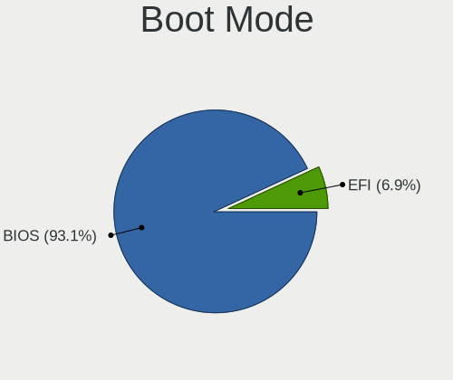
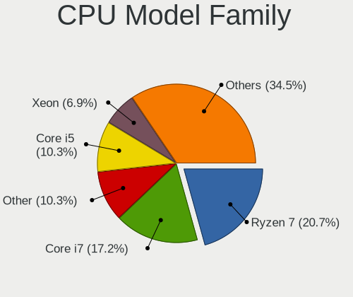

KDE neon - Hardware Trends (Desktops)
-------------------------------------

A project to identify most popular hardware characteristics and track their change
over time based on data collected by Linux users at https://Linux-Hardware.org.

Anyone can contribute to this report by the [hw-probe](https://github.com/linuxhw/hw-probe) tool:

    sudo -E hw-probe -all -upload

This report is for one last month. Overall report since the beginning of time: [TestDays](https://github.com/linuxhw/TestDays)

Period: Aug, 2023.

Contents
--------

* [ System ](#system)
  - [ OS                       ](#os)
  - [ OS Family                ](#os-family)
  - [ Kernel                   ](#kernel)
  - [ Kernel Family            ](#kernel-family)
  - [ Kernel Major Ver.        ](#kernel-major-ver)
  - [ Arch                     ](#arch)
  - [ DE                       ](#de)
  - [ Display Server           ](#display-server)
  - [ Display Manager          ](#display-manager)
  - [ OS Lang                  ](#os-lang)
  - [ Boot Mode                ](#boot-mode)
  - [ Filesystem               ](#filesystem)
  - [ Part. scheme             ](#part-scheme)
  - [ Dual Boot with Linux/BSD ](#dual-boot-with-linuxbsd)
  - [ Dual Boot (Win)          ](#dual-boot-win)

* [ Board ](#board)
  - [ Vendor                   ](#vendor)
  - [ Model                    ](#model)
  - [ Model Family             ](#model-family)
  - [ MFG Year                 ](#mfg-year)
  - [ Form Factor              ](#form-factor)
  - [ Secure Boot              ](#secure-boot)
  - [ Coreboot                 ](#coreboot)
  - [ RAM Size                 ](#ram-size)
  - [ RAM Used                 ](#ram-used)
  - [ Total Drives             ](#total-drives)
  - [ Has CD-ROM               ](#has-cd-rom)
  - [ Has Ethernet             ](#has-ethernet)
  - [ Has WiFi                 ](#has-wifi)
  - [ Has Bluetooth            ](#has-bluetooth)

* [ Location ](#location)
  - [ Country                  ](#country)
  - [ City                     ](#city)

* [ Drives ](#drives)
  - [ Drive Vendor             ](#drive-vendor)
  - [ Drive Model              ](#drive-model)
  - [ HDD Vendor               ](#hdd-vendor)
  - [ SSD Vendor               ](#ssd-vendor)
  - [ Drive Kind               ](#drive-kind)
  - [ Drive Connector          ](#drive-connector)
  - [ Drive Size               ](#drive-size)
  - [ Space Total              ](#space-total)
  - [ Space Used               ](#space-used)
  - [ Malfunc. Drives          ](#malfunc-drives)
  - [ Malfunc. Drive Vendor    ](#malfunc-drive-vendor)
  - [ Malfunc. HDD Vendor      ](#malfunc-hdd-vendor)
  - [ Malfunc. Drive Kind      ](#malfunc-drive-kind)
  - [ Failed Drives            ](#failed-drives)
  - [ Failed Drive Vendor      ](#failed-drive-vendor)
  - [ Drive Status             ](#drive-status)

* [ Storage controller ](#storage-controller)
  - [ Storage Vendor           ](#storage-vendor)
  - [ Storage Model            ](#storage-model)
  - [ Storage Kind             ](#storage-kind)

* [ Processor ](#processor)
  - [ CPU Vendor               ](#cpu-vendor)
  - [ CPU Model                ](#cpu-model)
  - [ CPU Model Family         ](#cpu-model-family)
  - [ CPU Cores                ](#cpu-cores)
  - [ CPU Sockets              ](#cpu-sockets)
  - [ CPU Threads              ](#cpu-threads)
  - [ CPU Op-Modes             ](#cpu-op-modes)
  - [ CPU Microcode            ](#cpu-microcode)
  - [ CPU Microarch            ](#cpu-microarch)

* [ Graphics ](#graphics)
  - [ GPU Vendor               ](#gpu-vendor)
  - [ GPU Model                ](#gpu-model)
  - [ GPU Combo                ](#gpu-combo)
  - [ GPU Driver               ](#gpu-driver)
  - [ GPU Memory               ](#gpu-memory)

* [ Monitor ](#monitor)
  - [ Monitor Vendor           ](#monitor-vendor)
  - [ Monitor Model            ](#monitor-model)
  - [ Monitor Resolution       ](#monitor-resolution)
  - [ Monitor Diagonal         ](#monitor-diagonal)
  - [ Monitor Width            ](#monitor-width)
  - [ Aspect Ratio             ](#aspect-ratio)
  - [ Monitor Area             ](#monitor-area)
  - [ Pixel Density            ](#pixel-density)
  - [ Multiple Monitors        ](#multiple-monitors)

* [ Network ](#network)
  - [ Net Controller Vendor    ](#net-controller-vendor)
  - [ Net Controller Model     ](#net-controller-model)
  - [ Wireless Vendor          ](#wireless-vendor)
  - [ Wireless Model           ](#wireless-model)
  - [ Ethernet Vendor          ](#ethernet-vendor)
  - [ Ethernet Model           ](#ethernet-model)
  - [ Net Controller Kind      ](#net-controller-kind)
  - [ Used Controller          ](#used-controller)
  - [ NICs                     ](#nics)
  - [ IPv6                     ](#ipv6)

* [ Bluetooth ](#bluetooth)
  - [ Bluetooth Vendor         ](#bluetooth-vendor)
  - [ Bluetooth Model          ](#bluetooth-model)

* [ Sound ](#sound)
  - [ Sound Vendor             ](#sound-vendor)
  - [ Sound Model              ](#sound-model)

* [ Memory ](#memory)
  - [ Memory Vendor            ](#memory-vendor)
  - [ Memory Model             ](#memory-model)
  - [ Memory Kind              ](#memory-kind)
  - [ Memory Form Factor       ](#memory-form-factor)
  - [ Memory Size              ](#memory-size)
  - [ Memory Speed             ](#memory-speed)

* [ Printers & scanners ](#printers--scanners)
  - [ Printer Vendor           ](#printer-vendor)
  - [ Printer Model            ](#printer-model)
  - [ Scanner Vendor           ](#scanner-vendor)
  - [ Scanner Model            ](#scanner-model)

* [ Camera ](#camera)
  - [ Camera Vendor            ](#camera-vendor)
  - [ Camera Model             ](#camera-model)

* [ Security ](#security)
  - [ Fingerprint Vendor       ](#fingerprint-vendor)
  - [ Fingerprint Model        ](#fingerprint-model)
  - [ Chipcard Vendor          ](#chipcard-vendor)
  - [ Chipcard Model           ](#chipcard-model)

* [ Unsupported ](#unsupported)
  - [ Unsupported Devices      ](#unsupported-devices)
  - [ Unsupported Device Types ](#unsupported-device-types)

System
------

OS
--

Installed operating systems

| Name           | Desktops | Percent |
|----------------|----------|---------|
| KDE neon 22.04 | 28       | 100%    |

OS Family
---------

OS without a version

| Name     | Desktops | Percent |
|----------|----------|---------|
| KDE neon | 28       | 100%    |

Kernel
------

Version of the Linux kernel

| Version           | Desktops | Percent |
|-------------------|----------|---------|
| 6.2.0-26-generic  | 13       | 46.43%  |
| 5.19.0-50-generic | 10       | 35.71%  |
| 6.2.0-31-generic  | 2        | 7.14%   |
| 5.19.0-46-generic | 2        | 7.14%   |
| 5.19.0-32-generic | 1        | 3.57%   |

Kernel Family
-------------

Linux kernel without a distro release

| Version | Desktops | Percent |
|---------|----------|---------|
| 6.2.0   | 15       | 53.57%  |
| 5.19.0  | 13       | 46.43%  |

Kernel Major Ver.
-----------------

Linux kernel major version

| Version | Desktops | Percent |
|---------|----------|---------|
| 6.2     | 15       | 53.57%  |
| 5.19    | 13       | 46.43%  |

Arch
----

OS architecture (x86_64, i586, etc.)

| Name   | Desktops | Percent |
|--------|----------|---------|
| x86_64 | 28       | 100%    |

DE
--

Desktop Environment

| Name | Desktops | Percent |
|------|----------|---------|
| KDE5 | 28       | 100%    |

Display Server
--------------

X11 or Wayland

| Name    | Desktops | Percent |
|---------|----------|---------|
| X11     | 27       | 96.43%  |
| Wayland | 1        | 3.57%   |

Display Manager
---------------

SDDM, LightDM, etc.

| Name    | Desktops | Percent |
|---------|----------|---------|
| Unknown | 24       | 85.71%  |
| SDDM    | 4        | 14.29%  |

OS Lang
-------

Language

| Lang  | Desktops | Percent |
|-------|----------|---------|
| en_US | 14       | 50%     |
| en_GB | 4        | 14.29%  |
| de_DE | 2        | 7.14%   |
| pl_PL | 1        | 3.57%   |
| it_IT | 1        | 3.57%   |
| es_UY | 1        | 3.57%   |
| es_PR | 1        | 3.57%   |
| es_MX | 1        | 3.57%   |
| en_PH | 1        | 3.57%   |
| en_IN | 1        | 3.57%   |
| en_CA | 1        | 3.57%   |

Boot Mode
---------

EFI or BIOS

| Mode | Desktops | Percent |
|------|----------|---------|
| BIOS | 27       | 96.43%  |
| EFI  | 1        | 3.57%   |

Filesystem
----------

Type of filesystem

| Type  | Desktops | Percent |
|-------|----------|---------|
| Ext4  | 25       | 89.29%  |
| Btrfs | 2        | 7.14%   |
| Tmpfs | 1        | 3.57%   |

Part. scheme
------------

Scheme of partitioning

| Type    | Desktops | Percent |
|---------|----------|---------|
| Unknown | 24       | 85.71%  |
| GPT     | 3        | 10.71%  |
| MBR     | 1        | 3.57%   |

Dual Boot with Linux/BSD
------------------------

Hosting more than one Linux/BSD

| Dual boot | Desktops | Percent |
|-----------|----------|---------|
| No        | 27       | 96.43%  |
| Yes       | 1        | 3.57%   |

Dual Boot (Win)
---------------

Hosting Linux and Windows

| Dual boot | Desktops | Percent |
|-----------|----------|---------|
| No        | 25       | 89.29%  |
| Yes       | 3        | 10.71%  |

Board
-----

Vendor
------

Motherboard manufacturer

| Name                | Desktops | Percent |
|---------------------|----------|---------|
| ASUSTek Computer    | 8        | 28.57%  |
| MSI                 | 6        | 21.43%  |
| Gigabyte Technology | 4        | 14.29%  |
| Hewlett-Packard     | 3        | 10.71%  |
| Intel               | 2        | 7.14%   |
| Dell                | 2        | 7.14%   |
| Gateway             | 1        | 3.57%   |
| EMAXX TECHNOLOGY    | 1        | 3.57%   |
| ASRock              | 1        | 3.57%   |

Model
-----

Motherboard model

| Name                              | Desktops | Percent |
|-----------------------------------|----------|---------|
| MSI MS-7A38                       | 2        | 7.14%   |
| MSI p7-1233w                      | 1        | 3.57%   |
| MSI MS-7E12                       | 1        | 3.57%   |
| MSI MS-7E07                       | 1        | 3.57%   |
| MSI MS-7C94                       | 1        | 3.57%   |
| Intel DQ77KB AAG40294-401         | 1        | 3.57%   |
| Intel DH61WW AAG23116-302         | 1        | 3.57%   |
| HP Z200 Workstation               | 1        | 3.57%   |
| HP ProDesk 400 G4 SFF             | 1        | 3.57%   |
| HP 550-310                        | 1        | 3.57%   |
| Gigabyte Z790 AORUS ELITE AX DDR4 | 1        | 3.57%   |
| Gigabyte Z790 AORUS ELITE AX      | 1        | 3.57%   |
| Gigabyte X570 I AORUS PRO WIFI    | 1        | 3.57%   |
| Gigabyte H410M H V3               | 1        | 3.57%   |
| Gateway DX4300                    | 1        | 3.57%   |
| EMAXX TECHNOLOGY EMX-B450M-GAMING | 1        | 3.57%   |
| Dell OptiPlex 7010                | 1        | 3.57%   |
| Dell Inspiron 3891                | 1        | 3.57%   |
| ASUS TUF Gaming X570-PLUS         | 1        | 3.57%   |
| ASUS ROG CROSSHAIR VIII HERO      | 1        | 3.57%   |
| ASUS PRIME Z590-P WIFI            | 1        | 3.57%   |
| ASUS PRIME X470-PRO               | 1        | 3.57%   |
| ASUS P8Z68-V LX                   | 1        | 3.57%   |
| ASUS M5A97 LE R2.0                | 1        | 3.57%   |
| ASUS K200                         | 1        | 3.57%   |
| ASUS A68HM-PLUS                   | 1        | 3.57%   |
| ASRock H97 Performance            | 1        | 3.57%   |

Model Family
------------

Motherboard model prefix

| Name                              | Desktops | Percent |
|-----------------------------------|----------|---------|
| MSI MS-7A38                       | 2        | 7.14%   |
| Gigabyte Z790                     | 2        | 7.14%   |
| ASUS PRIME                        | 2        | 7.14%   |
| MSI p7-1233w                      | 1        | 3.57%   |
| MSI MS-7E12                       | 1        | 3.57%   |
| MSI MS-7E07                       | 1        | 3.57%   |
| MSI MS-7C94                       | 1        | 3.57%   |
| Intel DQ77KB                      | 1        | 3.57%   |
| Intel DH61WW                      | 1        | 3.57%   |
| HP Z200                           | 1        | 3.57%   |
| HP ProDesk                        | 1        | 3.57%   |
| HP 550-310                        | 1        | 3.57%   |
| Gigabyte X570                     | 1        | 3.57%   |
| Gigabyte H410M                    | 1        | 3.57%   |
| Gateway DX4300                    | 1        | 3.57%   |
| EMAXX TECHNOLOGY EMX-B450M-GAMING | 1        | 3.57%   |
| Dell OptiPlex                     | 1        | 3.57%   |
| Dell Inspiron                     | 1        | 3.57%   |
| ASUS TUF                          | 1        | 3.57%   |
| ASUS ROG                          | 1        | 3.57%   |
| ASUS P8Z68-V                      | 1        | 3.57%   |
| ASUS M5A97                        | 1        | 3.57%   |
| ASUS K200                         | 1        | 3.57%   |
| ASUS A68HM-PLUS                   | 1        | 3.57%   |
| ASRock H97                        | 1        | 3.57%   |

MFG Year
--------

Motherboard manufacture year

| Year | Desktops | Percent |
|------|----------|---------|
| 2022 | 4        | 14.29%  |
| 2019 | 4        | 14.29%  |
| 2012 | 4        | 14.29%  |
| 2021 | 3        | 10.71%  |
| 2023 | 2        | 7.14%   |
| 2020 | 2        | 7.14%   |
| 2016 | 2        | 7.14%   |
| 2018 | 1        | 3.57%   |
| 2017 | 1        | 3.57%   |
| 2014 | 1        | 3.57%   |
| 2013 | 1        | 3.57%   |
| 2011 | 1        | 3.57%   |
| 2010 | 1        | 3.57%   |
| 2009 | 1        | 3.57%   |

Form Factor
-----------

Physical design of the computer

| Name    | Desktops | Percent |
|---------|----------|---------|
| Desktop | 28       | 100%    |

Secure Boot
-----------

Enabled or disabled

| State    | Desktops | Percent |
|----------|----------|---------|
| Disabled | 28       | 100%    |

Coreboot
--------

Have coreboot on board

| Used | Desktops | Percent |
|------|----------|---------|
| No   | 28       | 100%    |

RAM Size
--------

Total RAM memory

| Size in GB  | Desktops | Percent |
|-------------|----------|---------|
| 32.01-64.0  | 7        | 25%     |
| 16.01-24.0  | 6        | 21.43%  |
| 4.01-8.0    | 5        | 17.86%  |
| 8.01-16.0   | 5        | 17.86%  |
| 64.01-256.0 | 3        | 10.71%  |
| 3.01-4.0    | 1        | 3.57%   |
| 24.01-32.0  | 1        | 3.57%   |

RAM Used
--------

Used RAM memory

| Used GB    | Desktops | Percent |
|------------|----------|---------|
| 1.01-2.0   | 8        | 28.57%  |
| 3.01-4.0   | 6        | 21.43%  |
| 2.01-3.0   | 5        | 17.86%  |
| 4.01-8.0   | 4        | 14.29%  |
| 8.01-16.0  | 3        | 10.71%  |
| 16.01-24.0 | 2        | 7.14%   |

Total Drives
------------

Number of drives on board

| Drives | Desktops | Percent |
|--------|----------|---------|
| 2      | 8        | 28.57%  |
| 1      | 7        | 25%     |
| 3      | 6        | 21.43%  |
| 7      | 2        | 7.14%   |
| 4      | 2        | 7.14%   |
| 12     | 1        | 3.57%   |
| 11     | 1        | 3.57%   |
| 5      | 1        | 3.57%   |

Has CD-ROM
----------

Has CD-ROM on board

| Presented | Desktops | Percent |
|-----------|----------|---------|
| No        | 20       | 71.43%  |
| Yes       | 8        | 28.57%  |

Has Ethernet
------------

Has Ethernet on board

| Presented | Desktops | Percent |
|-----------|----------|---------|
| Yes       | 26       | 92.86%  |
| No        | 2        | 7.14%   |

Has WiFi
--------

Has WiFi module

| Presented | Desktops | Percent |
|-----------|----------|---------|
| Yes       | 17       | 60.71%  |
| No        | 11       | 39.29%  |

Has Bluetooth
-------------

Has Bluetooth module

| Presented | Desktops | Percent |
|-----------|----------|---------|
| Yes       | 15       | 53.57%  |
| No        | 13       | 46.43%  |

Location
--------

Country
-------

Geographic location (country)

| Country     | Desktops | Percent |
|-------------|----------|---------|
| USA         | 8        | 28.57%  |
| Germany     | 3        | 10.71%  |
| UK          | 2        | 7.14%   |
| Poland      | 2        | 7.14%   |
| Ireland     | 2        | 7.14%   |
| Uruguay     | 1        | 3.57%   |
| Puerto Rico | 1        | 3.57%   |
| Philippines | 1        | 3.57%   |
| Mozambique  | 1        | 3.57%   |
| Mexico      | 1        | 3.57%   |
| Latvia      | 1        | 3.57%   |
| Italy       | 1        | 3.57%   |
| India       | 1        | 3.57%   |
| Georgia     | 1        | 3.57%   |
| France      | 1        | 3.57%   |
| Canada      | 1        | 3.57%   |

City
----

Geographic location (city)

| City                | Desktops | Percent |
|---------------------|----------|---------|
| Zielona Góra       | 1        | 3.57%   |
| Winter Garden       | 1        | 3.57%   |
| Vero Beach          | 1        | 3.57%   |
| Vancouver           | 1        | 3.57%   |
| Toms River          | 1        | 3.57%   |
| Tbilisi             | 1        | 3.57%   |
| Spokane             | 1        | 3.57%   |
| Seattle             | 1        | 3.57%   |
| San Fernando City   | 1        | 3.57%   |
| Rochdale            | 1        | 3.57%   |
| Rio Grande          | 1        | 3.57%   |
| Riga                | 1        | 3.57%   |
| Pila                | 1        | 3.57%   |
| Munich              | 1        | 3.57%   |
| Mount Sinai         | 1        | 3.57%   |
| Montevideo          | 1        | 3.57%   |
| Monterrey           | 1        | 3.57%   |
| Monterey            | 1        | 3.57%   |
| Maputo              | 1        | 3.57%   |
| Epworth             | 1        | 3.57%   |
| Dublin              | 1        | 3.57%   |
| Dortmund            | 1        | 3.57%   |
| Corinth             | 1        | 3.57%   |
| Casalecchio di Reno | 1        | 3.57%   |
| Brétigny-sur-Orge  | 1        | 3.57%   |
| Blackrock           | 1        | 3.57%   |
| Berlin              | 1        | 3.57%   |
| Ahmedabad           | 1        | 3.57%   |

Drives
------

Drive Vendor
------------

Hard drive vendors

| Vendor                         | Desktops | Drives | Percent |
|--------------------------------|----------|--------|---------|
| Seagate                        | 14       | 19     | 19.72%  |
| Samsung Electronics            | 13       | 20     | 18.31%  |
| Phison Electronics             | 6        | 6      | 8.45%   |
| WDC                            | 5        | 7      | 7.04%   |
| Sandisk                        | 4        | 4      | 5.63%   |
| Crucial                        | 3        | 3      | 4.23%   |
| Unknown                        | 2        | 2      | 2.82%   |
| Toshiba                        | 2        | 2      | 2.82%   |
| MAXIO Technology (Hangzhou)    | 2        | 3      | 2.82%   |
| Kingston                       | 2        | 2      | 2.82%   |
| Intel                          | 2        | 3      | 2.82%   |
| Hitachi                        | 2        | 2      | 2.82%   |
| A-DATA Technology              | 2        | 2      | 2.82%   |
| walram                         | 1        | 1      | 1.41%   |
| TCSUNBOW                       | 1        | 1      | 1.41%   |
| SSK                            | 1        | 1      | 1.41%   |
| SPCC                           | 1        | 1      | 1.41%   |
| Solid State Storage Technology | 1        | 1      | 1.41%   |
| PNY                            | 1        | 1      | 1.41%   |
| Micron/Crucial Technology      | 1        | 1      | 1.41%   |
| KingSpec                       | 1        | 1      | 1.41%   |
| Gigabyte Technology            | 1        | 1      | 1.41%   |
| China                          | 1        | 5      | 1.41%   |
| ASMT                           | 1        | 1      | 1.41%   |
| Unknown                        | 1        | 1      | 1.41%   |

Drive Model
-----------

Hard drive models

| Model                                                 | Desktops | Percent |
|-------------------------------------------------------|----------|---------|
| Samsung NVMe SSD Controller SM981/PM981/PM983 500GB   | 4        | 4.88%   |
| Phison PS5013 E13 NVMe Controller 512GB               | 3        | 3.66%   |
| Phison E12 NVMe Controller 256GB                      | 3        | 3.66%   |
| WDC WD40EFRX-68WT0N0 4TB                              | 2        | 2.44%   |
| Toshiba DT01ACA100 1TB                                | 2        | 2.44%   |
| Seagate ST4000DM004-2CV104 4TB                        | 2        | 2.44%   |
| Seagate ST1000DM010-2EP102 1TB                        | 2        | 2.44%   |
| Samsung SSD 860 EVO 500GB                             | 2        | 2.44%   |
| Samsung SSD 860 EVO 1TB                               | 2        | 2.44%   |
| Samsung NVMe SSD Controller PM9A1/PM9A3/980PRO 1024GB | 2        | 2.44%   |
| Crucial CT1000MX500SSD1 1TB                           | 2        | 2.44%   |
| A-DATA SU630 240GB SSD                                | 2        | 2.44%   |
| WDC WDS480G2G0A-00JH30 480GB SSD                      | 1        | 1.22%   |
| WDC WD60EFRX-68MYMN1 6TB                              | 1        | 1.22%   |
| WDC WD3200AAJS-22RYA0 320GB                           | 1        | 1.22%   |
| WDC WD10EFRX-68FYTN0 1TB                              | 1        | 1.22%   |
| WDC WD Blue SA510 2.5 500GB                           | 1        | 1.22%   |
| walram 64G                                            | 1        | 1.22%   |
| Unknown SD/MMC/MS PRO 1GB                             | 1        | 1.22%   |
| Unknown NVMe SSD Drive 2TB                            | 1        | 1.22%   |
| TCSUNBOW X3 240GB                                     | 1        | 1.22%   |
| SSK Storage 128GB                                     | 1        | 1.22%   |
| SPCC Solid State Disk 512GB                           | 1        | 1.22%   |
| Solid State Storage NVMe CLR-8W512 512GB              | 1        | 1.22%   |
| Seagate ST6000VN0033-2EE110 6TB                       | 1        | 1.22%   |
| Seagate ST500VT003-1RE17D 500GB                       | 1        | 1.22%   |
| Seagate ST4000VN008-2DR166 4TB                        | 1        | 1.22%   |
| Seagate ST3500630AS 500GB                             | 1        | 1.22%   |
| Seagate ST3160316CS 160GB                             | 1        | 1.22%   |
| Seagate ST3000DM001-1CH166 3TB                        | 1        | 1.22%   |
| Seagate ST2000DM001-9YN164 2TB                        | 1        | 1.22%   |
| Seagate ST16000NE000-2RW103 16TB                      | 1        | 1.22%   |
| Seagate ST1000LM035-1RK172 1TB                        | 1        | 1.22%   |
| Seagate ST1000DM003-9YN162 1TB                        | 1        | 1.22%   |
| Seagate ST1000DM003-1CH162 1TB                        | 1        | 1.22%   |
| Seagate Backup+ Hub BK 8TB                            | 1        | 1.22%   |
| Sandisk WD Green SN350 1TB                            | 1        | 1.22%   |
| Sandisk WD Blue SN550 NVMe SSD 250GB                  | 1        | 1.22%   |
| SanDisk SDSSDHP128G 128GB                             | 1        | 1.22%   |
| SanDisk SDSSDA240G 240GB                              | 1        | 1.22%   |

HDD Vendor
----------

Hard disk drive vendors

| Vendor  | Desktops | Drives | Percent |
|---------|----------|--------|---------|
| Seagate | 14       | 19     | 60.87%  |
| WDC     | 4        | 5      | 17.39%  |
| Toshiba | 2        | 2      | 8.7%    |
| Hitachi | 2        | 2      | 8.7%    |
| Unknown | 1        | 1      | 4.35%   |

SSD Vendor
----------

Solid state drive vendors

| Vendor              | Desktops | Drives | Percent |
|---------------------|----------|--------|---------|
| Samsung Electronics | 9        | 12     | 34.62%  |
| Crucial             | 3        | 3      | 11.54%  |
| WDC                 | 2        | 2      | 7.69%   |
| SanDisk             | 2        | 2      | 7.69%   |
| A-DATA Technology   | 2        | 2      | 7.69%   |
| TCSUNBOW            | 1        | 1      | 3.85%   |
| SPCC                | 1        | 1      | 3.85%   |
| PNY                 | 1        | 1      | 3.85%   |
| Kingston            | 1        | 1      | 3.85%   |
| KingSpec            | 1        | 1      | 3.85%   |
| Intel               | 1        | 1      | 3.85%   |
| Gigabyte Technology | 1        | 1      | 3.85%   |
| China               | 1        | 5      | 3.85%   |

Drive Kind
----------

HDD or SSD

| Kind    | Desktops | Drives | Percent |
|---------|----------|--------|---------|
| HDD     | 20       | 29     | 37.04%  |
| SSD     | 18       | 33     | 33.33%  |
| NVMe    | 15       | 27     | 27.78%  |
| Unknown | 1        | 2      | 1.85%   |

Drive Connector
---------------

SATA, SAS, NVMe, etc.

| Type | Desktops | Drives | Percent |
|------|----------|--------|---------|
| SATA | 27       | 62     | 58.7%   |
| NVMe | 15       | 25     | 32.61%  |
| SAS  | 4        | 4      | 8.7%    |

Drive Size
----------

Size of hard drive

| Size in TB | Desktops | Drives | Percent |
|------------|----------|--------|---------|
| 0.01-0.5   | 16       | 28     | 40%     |
| 0.51-1.0   | 13       | 17     | 32.5%   |
| 3.01-4.0   | 5        | 5      | 12.5%   |
| 4.01-10.0  | 3        | 7      | 7.5%    |
| 2.01-3.0   | 1        | 2      | 2.5%    |
| 10.01-20.0 | 1        | 2      | 2.5%    |
| 1.01-2.0   | 1        | 1      | 2.5%    |

Space Total
-----------

Amount of disk space available on the file system

| Size in GB     | Desktops | Percent |
|----------------|----------|---------|
| More than 3000 | 8        | 28.57%  |
| 1001-2000      | 5        | 17.86%  |
| 501-1000       | 5        | 17.86%  |
| 251-500        | 4        | 14.29%  |
| 101-250        | 3        | 10.71%  |
| 2001-3000      | 1        | 3.57%   |
| 51-100         | 1        | 3.57%   |
| Unknown        | 1        | 3.57%   |

Space Used
----------

Amount of used disk space

| Used GB        | Desktops | Percent |
|----------------|----------|---------|
| 21-50          | 5        | 17.86%  |
| 251-500        | 4        | 14.29%  |
| 1001-2000      | 4        | 14.29%  |
| 1-20           | 4        | 14.29%  |
| More than 3000 | 3        | 10.71%  |
| 51-100         | 3        | 10.71%  |
| 2001-3000      | 2        | 7.14%   |
| 101-250        | 1        | 3.57%   |
| 501-1000       | 1        | 3.57%   |
| Unknown        | 1        | 3.57%   |

Malfunc. Drives
---------------

Drive models with a malfunction

| Model                  | Desktops | Drives | Percent |
|------------------------|----------|--------|---------|
| Toshiba DT01ACA100 1TB | 1        | 1      | 100%    |

Malfunc. Drive Vendor
---------------------

Vendors of faulty drives

| Vendor  | Desktops | Drives | Percent |
|---------|----------|--------|---------|
| Toshiba | 1        | 1      | 100%    |

Malfunc. HDD Vendor
-------------------

Vendors of faulty HDD drives

| Vendor  | Desktops | Drives | Percent |
|---------|----------|--------|---------|
| Toshiba | 1        | 1      | 100%    |

Malfunc. Drive Kind
-------------------

Kinds of faulty drives

| Kind | Desktops | Drives | Percent |
|------|----------|--------|---------|
| HDD  | 1        | 1      | 100%    |

Failed Drives
-------------

Failed drive models

Zero info for selected period =(

Failed Drive Vendor
-------------------

Failed drive vendors

Zero info for selected period =(

Drive Status
------------

Number of failed and malfunc. drives

| Status   | Desktops | Drives | Percent |
|----------|----------|--------|---------|
| Detected | 25       | 82     | 89.29%  |
| Works    | 2        | 8      | 7.14%   |
| Malfunc  | 1        | 1      | 3.57%   |

Storage controller
------------------

Storage Vendor
--------------

Storage controller vendors

| Vendor                         | Desktops | Percent |
|--------------------------------|----------|---------|
| Intel                          | 14       | 27.45%  |
| AMD                            | 14       | 27.45%  |
| Samsung Electronics            | 7        | 13.73%  |
| Phison Electronics             | 6        | 11.76%  |
| SanDisk                        | 2        | 3.92%   |
| MAXIO Technology (Hangzhou)    | 2        | 3.92%   |
| Solid State Storage Technology | 1        | 1.96%   |
| Micron/Crucial Technology      | 1        | 1.96%   |
| Kingston Technology Company    | 1        | 1.96%   |
| JMicron Technology             | 1        | 1.96%   |
| INNOGRIT                       | 1        | 1.96%   |
| ASMedia Technology             | 1        | 1.96%   |

Storage Model
-------------

Storage controller models

| Model                                                                         | Desktops | Percent |
|-------------------------------------------------------------------------------|----------|---------|
| AMD FCH SATA Controller [AHCI mode]                                           | 11       | 18.64%  |
| Samsung NVMe SSD Controller SM981/PM981/PM983                                 | 5        | 8.47%   |
| AMD 400 Series Chipset SATA Controller                                        | 4        | 6.78%   |
| Phison PS5013 E13 NVMe Controller                                             | 3        | 5.08%   |
| Phison E12 NVMe Controller                                                    | 3        | 5.08%   |
| Intel 700 Series Chipset Family SATA AHCI Controller                          | 3        | 5.08%   |
| Intel 500 Series Chipset Family SATA AHCI Controller                          | 3        | 5.08%   |
| Samsung NVMe SSD Controller PM9A1/PM9A3/980PRO                                | 2        | 3.39%   |
| Intel 7 Series/C210 Series Chipset Family 6-port SATA Controller [AHCI mode]  | 2        | 3.39%   |
| Intel 6 Series/C200 Series Chipset Family 6 port Desktop SATA AHCI Controller | 2        | 3.39%   |
| Solid State Storage CLR-8W512 NVMe SSD M.2 (DRAM-less)                        | 1        | 1.69%   |
| SanDisk WD Green SN350 NVMe SSD 1 TB (DRAM-less)                              | 1        | 1.69%   |
| SanDisk WD Blue SN550 NVMe SSD                                                | 1        | 1.69%   |
| Samsung NVMe SSD Controller S4LV008[Pascal]                                   | 1        | 1.69%   |
| Micron/Crucial P1 NVMe PCIe SSD[Frampton2]                                    | 1        | 1.69%   |
| MAXIO (Hangzhou) NVMe SSD Controller MAP1602                                  | 1        | 1.69%   |
| MAXIO (Hangzhou) NVMe SSD Controller MAP1202                                  | 1        | 1.69%   |
| Kingston Company NVMe Controller                                              | 1        | 1.69%   |
| JMicron JMB58x AHCI SATA controller                                           | 1        | 1.69%   |
| Intel SSD DC P4101/Pro 7600p/760p/E 6100p Series                              | 1        | 1.69%   |
| Intel SATA Controller [RAID mode]                                             | 1        | 1.69%   |
| Intel PCIe Data Center SSD                                                    | 1        | 1.69%   |
| Intel 9 Series Chipset Family SATA Controller [AHCI Mode]                     | 1        | 1.69%   |
| Intel 400 Series Chipset Family SATA AHCI Controller                          | 1        | 1.69%   |
| Intel 200 Series PCH SATA controller [AHCI mode]                              | 1        | 1.69%   |
| INNOGRIT NVMe SSD Controller IG5216 (DRAM-less)                               | 1        | 1.69%   |
| ASMedia ASM1062 Serial ATA Controller                                         | 1        | 1.69%   |
| AMD SB7x0/SB8x0/SB9x0 SATA Controller [IDE mode]                              | 1        | 1.69%   |
| AMD SB7x0/SB8x0/SB9x0 SATA Controller [AHCI mode]                             | 1        | 1.69%   |
| AMD SB7x0/SB8x0/SB9x0 IDE Controller                                          | 1        | 1.69%   |
| AMD 500 Series Chipset SATA Controller                                        | 1        | 1.69%   |

Storage Kind
------------

Kind of storage controller (IDE, SATA, NVMe, SAS, ...)

| Kind | Desktops | Percent |
|------|----------|---------|
| SATA | 27       | 61.36%  |
| NVMe | 15       | 34.09%  |
| RAID | 1        | 2.27%   |
| IDE  | 1        | 2.27%   |

Processor
---------

CPU Vendor
----------

Processor vendors

| Vendor | Desktops | Percent |
|--------|----------|---------|
| Intel  | 14       | 50%     |
| AMD    | 14       | 50%     |

CPU Model
---------

Processor models

| Model                                          | Desktops | Percent |
|------------------------------------------------|----------|---------|
| Intel Core i5-10400 CPU @ 2.90GHz              | 2        | 7.14%   |
| AMD Ryzen 7 2700X Eight-Core Processor         | 2        | 7.14%   |
| Intel Core i7-3770T CPU @ 2.50GHz              | 1        | 3.57%   |
| Intel Core i7-2600K CPU @ 3.40GHz              | 1        | 3.57%   |
| Intel Core i5-7500 CPU @ 3.40GHz               | 1        | 3.57%   |
| Intel Core i5-4670 CPU @ 3.40GHz               | 1        | 3.57%   |
| Intel Core i5-2320 CPU @ 3.00GHz               | 1        | 3.57%   |
| Intel Core i5 CPU 650 @ 3.20GHz                | 1        | 3.57%   |
| Intel Core i3-3240 CPU @ 3.40GHz               | 1        | 3.57%   |
| Intel 13th Gen Core i9-13900K                  | 1        | 3.57%   |
| Intel 13th Gen Core i7-13700K                  | 1        | 3.57%   |
| Intel 13th Gen Core i5-13600K                  | 1        | 3.57%   |
| Intel 11th Gen Core i7-11700K @ 3.60GHz        | 1        | 3.57%   |
| Intel 11th Gen Core i7-11700F @ 2.50GHz        | 1        | 3.57%   |
| AMD Ryzen 9 7950X 16-Core Processor            | 1        | 3.57%   |
| AMD Ryzen 9 3900X 12-Core Processor            | 1        | 3.57%   |
| AMD Ryzen 7 5800X3D 8-Core Processor           | 1        | 3.57%   |
| AMD Ryzen 7 5700G with Radeon Graphics         | 1        | 3.57%   |
| AMD Ryzen 7 3800X 8-Core Processor             | 1        | 3.57%   |
| AMD Ryzen 5 PRO 4650G with Radeon Graphics     | 1        | 3.57%   |
| AMD Ryzen 5 5600G with Radeon Graphics         | 1        | 3.57%   |
| AMD Phenom II X4 805 Processor                 | 1        | 3.57%   |
| AMD FX-6300 Six-Core Processor                 | 1        | 3.57%   |
| AMD A8-5500 APU with Radeon HD Graphics        | 1        | 3.57%   |
| AMD A6-6400K APU with Radeon HD Graphics       | 1        | 3.57%   |
| AMD A10-8750 Radeon R7, 12 Compute Cores 4C+8G | 1        | 3.57%   |

CPU Model Family
----------------

Processor model prefix

| Model            | Desktops | Percent |
|------------------|----------|---------|
| Intel Core i5    | 6        | 21.43%  |
| Other            | 5        | 17.86%  |
| AMD Ryzen 7      | 5        | 17.86%  |
| Intel Core i7    | 2        | 7.14%   |
| AMD Ryzen 9      | 2        | 7.14%   |
| Intel Core i3    | 1        | 3.57%   |
| AMD Ryzen 5 PRO  | 1        | 3.57%   |
| AMD Ryzen 5      | 1        | 3.57%   |
| AMD Phenom II X4 | 1        | 3.57%   |
| AMD FX           | 1        | 3.57%   |
| AMD A8           | 1        | 3.57%   |
| AMD A6           | 1        | 3.57%   |
| AMD A10          | 1        | 3.57%   |

CPU Cores
---------

Number of processor cores

| Number | Desktops | Percent |
|--------|----------|---------|
| 8      | 7        | 25%     |
| 4      | 6        | 21.43%  |
| 6      | 4        | 14.29%  |
| 2      | 4        | 14.29%  |
| 16     | 2        | 7.14%   |
| 24     | 1        | 3.57%   |
| 14     | 1        | 3.57%   |
| 12     | 1        | 3.57%   |
| 3      | 1        | 3.57%   |
| 1      | 1        | 3.57%   |

CPU Sockets
-----------

Number of sockets

| Number | Desktops | Percent |
|--------|----------|---------|
| 1      | 28       | 100%    |

CPU Threads
-----------

Threads per core (Hyper-Threading)

| Number | Desktops | Percent |
|--------|----------|---------|
| 2      | 24       | 85.71%  |
| 1      | 4        | 14.29%  |

CPU Op-Modes
------------

CPU Operation Modes (32-bit, 64-bit)

| Op mode        | Desktops | Percent |
|----------------|----------|---------|
| 32-bit, 64-bit | 28       | 100%    |

CPU Microcode
-------------

Microcode number

| Number     | Desktops | Percent |
|------------|----------|---------|
| Unknown    | 26       | 92.86%  |
| 0x206a7    | 1        | 3.57%   |
| 0x0800820d | 1        | 3.57%   |

CPU Microarch
-------------

Microarchitecture

| Name        | Desktops | Percent |
|-------------|----------|---------|
| Unknown     | 6        | 21.43%  |
| Zen 3       | 3        | 10.71%  |
| Zen 2       | 3        | 10.71%  |
| Piledriver  | 3        | 10.71%  |
| Zen+        | 2        | 7.14%   |
| SandyBridge | 2        | 7.14%   |
| IvyBridge   | 2        | 7.14%   |
| CometLake   | 2        | 7.14%   |
| Westmere    | 1        | 3.57%   |
| Steamroller | 1        | 3.57%   |
| KabyLake    | 1        | 3.57%   |
| K10         | 1        | 3.57%   |
| Haswell     | 1        | 3.57%   |

Graphics
--------

GPU Vendor
----------

Vendors of graphics cards

| Vendor | Desktops | Percent |
|--------|----------|---------|
| Nvidia | 12       | 36.36%  |
| AMD    | 11       | 33.33%  |
| Intel  | 10       | 30.3%   |

GPU Model
---------

Graphics card models

| Model                                                                       | Desktops | Percent |
|-----------------------------------------------------------------------------|----------|---------|
| Intel Raptor Lake-S GT1 [UHD Graphics 770]                                  | 3        | 8.82%   |
| AMD Cezanne [Radeon Vega Series / Radeon Vega Mobile Series]                | 2        | 5.88%   |
| Nvidia TU116 [GeForce GTX 1660 SUPER]                                       | 1        | 2.94%   |
| Nvidia GP108 [GeForce GT 1030]                                              | 1        | 2.94%   |
| Nvidia GM107 [GeForce GTX 750 Ti]                                           | 1        | 2.94%   |
| Nvidia GK107 [GeForce GTX 650]                                              | 1        | 2.94%   |
| Nvidia GF108 [GeForce GT 730]                                               | 1        | 2.94%   |
| Nvidia GF108 [GeForce GT 630]                                               | 1        | 2.94%   |
| Nvidia GA106 [GeForce RTX 3060 Lite Hash Rate]                              | 1        | 2.94%   |
| Nvidia GA106 [Geforce RTX 3050]                                             | 1        | 2.94%   |
| Nvidia GA104 [GeForce RTX 3060 Ti Lite Hash Rate]                           | 1        | 2.94%   |
| Nvidia AD106 [GeForce RTX 4060 Ti]                                          | 1        | 2.94%   |
| Nvidia AD103 [GeForce RTX 4080]                                             | 1        | 2.94%   |
| Nvidia AD102 [GeForce RTX 4090]                                             | 1        | 2.94%   |
| Intel Xeon E3-1200 v3/4th Gen Core Processor Integrated Graphics Controller | 1        | 2.94%   |
| Intel Xeon E3-1200 v2/3rd Gen Core processor Graphics Controller            | 1        | 2.94%   |
| Intel IvyBridge GT2 [HD Graphics 4000]                                      | 1        | 2.94%   |
| Intel HD Graphics 630                                                       | 1        | 2.94%   |
| Intel Core Processor Integrated Graphics Controller                         | 1        | 2.94%   |
| Intel CometLake-S GT2 [UHD Graphics 630]                                    | 1        | 2.94%   |
| Intel 2nd Generation Core Processor Family Integrated Graphics Controller   | 1        | 2.94%   |
| AMD Trinity [Radeon HD 7560D]                                               | 1        | 2.94%   |
| AMD RS780 [Radeon HD 3200]                                                  | 1        | 2.94%   |
| AMD Richland [Radeon HD 8470D]                                              | 1        | 2.94%   |
| AMD Renoir                                                                  | 1        | 2.94%   |
| AMD Raphael                                                                 | 1        | 2.94%   |
| AMD Navi 23 [Radeon RX 6600/6600 XT/6600M]                                  | 1        | 2.94%   |
| AMD Navi 21 [Radeon RX 6800/6800 XT / 6900 XT]                              | 1        | 2.94%   |
| AMD Lexa PRO [Radeon 540/540X/550/550X / RX 540X/550/550X]                  | 1        | 2.94%   |
| AMD Ellesmere [Radeon RX 470/480/570/570X/580/580X/590]                     | 1        | 2.94%   |
| AMD Caicos [Radeon HD 6450/7450/8450 / R5 230 OEM]                          | 1        | 2.94%   |

GPU Combo
---------

Combinations of graphics cards

| Name           | Desktops | Percent |
|----------------|----------|---------|
| 1 x Nvidia     | 9        | 32.14%  |
| 1 x AMD        | 9        | 32.14%  |
| 1 x Intel      | 6        | 21.43%  |
| Intel + Nvidia | 2        | 7.14%   |
| 2 x AMD        | 1        | 3.57%   |
| AMD + Nvidia   | 1        | 3.57%   |

GPU Driver
----------

Free vs proprietary

| Driver      | Desktops | Percent |
|-------------|----------|---------|
| Free        | 20       | 71.43%  |
| Proprietary | 6        | 21.43%  |
| Unknown     | 2        | 7.14%   |

GPU Memory
----------

Total video memory

| Size in GB | Desktops | Percent |
|------------|----------|---------|
| Unknown    | 22       | 78.57%  |
| 8.01-16.0  | 2        | 7.14%   |
| 7.01-8.0   | 1        | 3.57%   |
| 5.01-6.0   | 1        | 3.57%   |
| 3.01-4.0   | 1        | 3.57%   |
| 1.01-2.0   | 1        | 3.57%   |

Monitor
-------

Monitor Vendor
--------------

Monitor vendors

| Vendor               | Desktops | Percent |
|----------------------|----------|---------|
| Goldstar             | 6        | 18.75%  |
| Hewlett-Packard      | 4        | 12.5%   |
| Dell                 | 4        | 12.5%   |
| Acer                 | 4        | 12.5%   |
| ViewSonic            | 2        | 6.25%   |
| Toshiba              | 1        | 3.13%   |
| Sony                 | 1        | 3.13%   |
| SKG                  | 1        | 3.13%   |
| Sceptre Tech         | 1        | 3.13%   |
| Samsung Electronics  | 1        | 3.13%   |
| Philips              | 1        | 3.13%   |
| Mi                   | 1        | 3.13%   |
| Lenovo               | 1        | 3.13%   |
| Iiyama               | 1        | 3.13%   |
| ASUSTek Computer     | 1        | 3.13%   |
| AOC                  | 1        | 3.13%   |
| Ancor Communications | 1        | 3.13%   |

Monitor Model
-------------

Monitor models

| Model                                                                 | Desktops | Percent |
|-----------------------------------------------------------------------|----------|---------|
| ViewSonic XG250 VSCE43B 1920x1080 544x303mm 24.5-inch                 | 1        | 3.03%   |
| ViewSonic VX2770 SERIES VSC2C3A 1920x1080 597x336mm 27.0-inch         | 1        | 3.03%   |
| Toshiba 50UHD_LCD_TV TSB3700 3840x2160 1872x1053mm 84.6-inch          | 1        | 3.03%   |
| Sony SDM-HS75P SNY2300 1280x1024 338x270mm 17.0-inch                  | 1        | 3.03%   |
| SKG TV SKG5300 1600x900 698x392mm 31.5-inch                           | 1        | 3.03%   |
| Sceptre Tech X409BV-FHD SPT0FA4 1920x1080 698x392mm 31.5-inch         | 1        | 3.03%   |
| Samsung Electronics LCD Monitor SAM0C3C 1366x768 609x347mm 27.6-inch  | 1        | 3.03%   |
| Philips 109S2 PHLE008 1920x1440 360x270mm 17.7-inch                   | 1        | 3.03%   |
| Mi Monitor XMI3444 3440x1440 797x334mm 34.0-inch                      | 1        | 3.03%   |
| Lenovo LEN T25d-10 LEN61DB 1920x1200 535x339mm 24.9-inch              | 1        | 3.03%   |
| Iiyama XB2776QS-B1 IVM660E 2560x1440 597x336mm 27.0-inch              | 1        | 3.03%   |
| Hewlett-Packard Z27 HPN3538 3840x2160 597x336mm 27.0-inch             | 1        | 3.03%   |
| Hewlett-Packard w2558hc HWP2818 1920x1200 550x309mm 24.8-inch         | 1        | 3.03%   |
| Hewlett-Packard U32 4K HDR HPN373F 3840x2160 709x411mm 32.3-inch      | 1        | 3.03%   |
| Hewlett-Packard E231 HWP3063 1920x1080 509x286mm 23.0-inch            | 1        | 3.03%   |
| Goldstar TV SSCR2 GSM8080 3840x2160                                   | 1        | 3.03%   |
| Goldstar IPS QHD GSM5BC3 2560x1440 527x296mm 23.8-inch                | 1        | 3.03%   |
| Goldstar HDR 4K GSM7707 3840x2160 600x340mm 27.2-inch                 | 1        | 3.03%   |
| Goldstar FULL HD GSM5BDE 1920x1080 480x270mm 21.7-inch                | 1        | 3.03%   |
| Goldstar E2351 GSM5872 1920x1080 510x290mm 23.1-inch                  | 1        | 3.03%   |
| Goldstar 2D HD LG TV GSM59CA 1366x768 510x290mm 23.1-inch             | 1        | 3.03%   |
| Dell P2419H DELD0DA 1920x1080 527x296mm 23.8-inch                     | 1        | 3.03%   |
| Dell IN2030M DELF03C 1600x900 443x249mm 20.0-inch                     | 1        | 3.03%   |
| Dell E1916H DELF065 1366x768 410x230mm 18.5-inch                      | 1        | 3.03%   |
| Dell 2408WFP DELA02A 1920x1200 519x324mm 24.1-inch                    | 1        | 3.03%   |
| Dell 2407WFP DELA017 1920x1200 519x324mm 24.1-inch                    | 1        | 3.03%   |
| ASUSTek Computer VP247 AUS24CA 1920x1080 521x293mm 23.5-inch          | 1        | 3.03%   |
| AOC U34G2G1 AOC3402 3440x1440 797x334mm 34.0-inch                     | 1        | 3.03%   |
| Ancor Communications ROG PG348Q ACI3433 3440x1440 798x335mm 34.1-inch | 1        | 3.03%   |
| Acer X34 ACR0462 3440x1440 797x333mm 34.0-inch                        | 1        | 3.03%   |
| Acer X203H ACR009D 1600x900 443x249mm 20.0-inch                       | 1        | 3.03%   |
| Acer H277HK ACR0520 3840x2160 597x336mm 27.0-inch                     | 1        | 3.03%   |
| Acer G246HL ACR02FF 1920x1080 531x299mm 24.0-inch                     | 1        | 3.03%   |

Monitor Resolution
------------------

Monitor screen resolution

| Resolution        | Desktops | Percent |
|-------------------|----------|---------|
| 1920x1080 (FHD)   | 10       | 35.71%  |
| 3440x1440         | 4        | 14.29%  |
| 3840x2160 (4K)    | 3        | 10.71%  |
| 1600x900 (HD+)    | 3        | 10.71%  |
| 2560x1440 (QHD)   | 2        | 7.14%   |
| 1920x1200 (WUXGA) | 2        | 7.14%   |
| 1366x768 (WXGA)   | 2        | 7.14%   |
| 1280x1024 (SXGA)  | 2        | 7.14%   |

Monitor Diagonal
----------------

Diagonal size in inches

| Inches | Desktops | Percent |
|--------|----------|---------|
| 24     | 6        | 19.35%  |
| 23     | 6        | 19.35%  |
| 34     | 4        | 12.9%   |
| 27     | 4        | 12.9%   |
| 31     | 3        | 9.68%   |
| 20     | 2        | 6.45%   |
| 17     | 2        | 6.45%   |
| 84     | 1        | 3.23%   |
| 72     | 1        | 3.23%   |
| 32     | 1        | 3.23%   |
| 18     | 1        | 3.23%   |

Monitor Width
-------------

Physical width

| Width in mm | Desktops | Percent |
|-------------|----------|---------|
| 501-600     | 14       | 48.28%  |
| 701-800     | 5        | 17.24%  |
| 601-700     | 3        | 10.34%  |
| 401-500     | 3        | 10.34%  |
| 1501-2000   | 2        | 6.9%    |
| 351-400     | 1        | 3.45%   |
| 301-350     | 1        | 3.45%   |

Aspect Ratio
------------

Proportional relationship between the width and the height

| Ratio | Desktops | Percent |
|-------|----------|---------|
| 16/9  | 18       | 69.23%  |
| 21/9  | 4        | 15.38%  |
| 16/10 | 2        | 7.69%   |
| 5/4   | 1        | 3.85%   |
| 4/3   | 1        | 3.85%   |

Monitor Area
------------

Area in inch²

| Area in inch² | Desktops | Percent |
|----------------|----------|---------|
| 351-500        | 8        | 27.59%  |
| 201-250        | 6        | 20.69%  |
| 301-350        | 4        | 13.79%  |
| 251-300        | 4        | 13.79%  |
| 151-200        | 3        | 10.34%  |
| More than 1000 | 2        | 6.9%    |
| 141-150        | 2        | 6.9%    |

Pixel Density
-------------

Pixels per inch

| Density | Desktops | Percent |
|---------|----------|---------|
| 51-100  | 20       | 68.97%  |
| 101-120 | 4        | 13.79%  |
| 161-240 | 2        | 6.9%    |
| 121-160 | 2        | 6.9%    |
| 1-50    | 1        | 3.45%   |

Multiple Monitors
-----------------

Total monitors connected

| Total | Desktops | Percent |
|-------|----------|---------|
| 1     | 19       | 67.86%  |
| 2     | 5        | 17.86%  |
| 3     | 2        | 7.14%   |
| 0     | 2        | 7.14%   |

Network
-------

Net Controller Vendor
---------------------

Controller vendors

| Vendor                | Desktops | Percent |
|-----------------------|----------|---------|
| Realtek Semiconductor | 17       | 41.46%  |
| Intel                 | 15       | 36.59%  |
| Xiaomi                | 2        | 4.88%   |
| TP-Link               | 1        | 2.44%   |
| Ralink Technology     | 1        | 2.44%   |
| Qualcomm Atheros      | 1        | 2.44%   |
| NetGear               | 1        | 2.44%   |
| Microsoft             | 1        | 2.44%   |
| MediaTek              | 1        | 2.44%   |
| ASUSTek Computer      | 1        | 2.44%   |

Net Controller Model
--------------------

Controller models

| Model                                                             | Desktops | Percent |
|-------------------------------------------------------------------|----------|---------|
| Realtek RTL8111/8168/8411 PCI Express Gigabit Ethernet Controller | 11       | 22%     |
| Realtek RTL8125 2.5GbE Controller                                 | 6        | 12%     |
| Intel Wi-Fi 6 AX200                                               | 3        | 6%      |
| Intel I211 Gigabit Network Connection                             | 3        | 6%      |
| Intel 700 Series Chipset Family Wi-Fi                             | 3        | 6%      |
| Realtek RTL8153 Gigabit Ethernet Adapter                          | 2        | 4%      |
| Realtek 802.11ac NIC                                              | 2        | 4%      |
| Intel Tiger Lake PCH CNVi WiFi                                    | 2        | 4%      |
| Xiaomi Mi/Redmi series (RNDIS)                                    | 1        | 2%      |
| Xiaomi Mi/Redmi series (RNDIS + ADB)                              | 1        | 2%      |
| TP-Link Archer T3U [Realtek RTL8812BU]                            | 1        | 2%      |
| Realtek RTL8723BE PCIe Wireless Network Adapter                   | 1        | 2%      |
| Ralink MT7601U Wireless Adapter                                   | 1        | 2%      |
| Qualcomm Atheros AR8161 Gigabit Ethernet                          | 1        | 2%      |
| NetGear WNA1100 Wireless-N 150 [Atheros AR9271]                   | 1        | 2%      |
| Microsoft Xbox Wireless Adapter for Windows                       | 1        | 2%      |
| MediaTek MT7922 802.11ax PCI Express Wireless Network Adapter     | 1        | 2%      |
| Intel Wireless-AC 9260                                            | 1        | 2%      |
| Intel Ethernet Controller I225-V                                  | 1        | 2%      |
| Intel Ethernet Connection (2) I218-V                              | 1        | 2%      |
| Intel Ethernet Connection (12) I219-V                             | 1        | 2%      |
| Intel 82579V Gigabit Network Connection                           | 1        | 2%      |
| Intel 82579LM Gigabit Network Connection (Lewisville)             | 1        | 2%      |
| Intel 82578DM Gigabit Network Connection                          | 1        | 2%      |
| Intel 82574L Gigabit Network Connection                           | 1        | 2%      |
| ASUS WL-167G v1 802.11g Adapter [Ralink RT2571]                   | 1        | 2%      |

Wireless Vendor
---------------

Wireless vendors

| Vendor                | Desktops | Percent |
|-----------------------|----------|---------|
| Intel                 | 9        | 50%     |
| Realtek Semiconductor | 3        | 16.67%  |
| TP-Link               | 1        | 5.56%   |
| Ralink Technology     | 1        | 5.56%   |
| NetGear               | 1        | 5.56%   |
| Microsoft             | 1        | 5.56%   |
| MediaTek              | 1        | 5.56%   |
| ASUSTek Computer      | 1        | 5.56%   |

Wireless Model
--------------

Wireless models

| Model                                                         | Desktops | Percent |
|---------------------------------------------------------------|----------|---------|
| Intel Wi-Fi 6 AX200                                           | 3        | 16.67%  |
| Intel 700 Series Chipset Family Wi-Fi                         | 3        | 16.67%  |
| Realtek 802.11ac NIC                                          | 2        | 11.11%  |
| Intel Tiger Lake PCH CNVi WiFi                                | 2        | 11.11%  |
| TP-Link Archer T3U [Realtek RTL8812BU]                        | 1        | 5.56%   |
| Realtek RTL8723BE PCIe Wireless Network Adapter               | 1        | 5.56%   |
| Ralink MT7601U Wireless Adapter                               | 1        | 5.56%   |
| NetGear WNA1100 Wireless-N 150 [Atheros AR9271]               | 1        | 5.56%   |
| Microsoft Xbox Wireless Adapter for Windows                   | 1        | 5.56%   |
| MediaTek MT7922 802.11ax PCI Express Wireless Network Adapter | 1        | 5.56%   |
| Intel Wireless-AC 9260                                        | 1        | 5.56%   |
| ASUS WL-167G v1 802.11g Adapter [Ralink RT2571]               | 1        | 5.56%   |

Ethernet Vendor
---------------

Ethernet vendors

| Vendor                | Desktops | Percent |
|-----------------------|----------|---------|
| Realtek Semiconductor | 17       | 58.62%  |
| Intel                 | 9        | 31.03%  |
| Xiaomi                | 2        | 6.9%    |
| Qualcomm Atheros      | 1        | 3.45%   |

Ethernet Model
--------------

Ethernet models

| Model                                                             | Desktops | Percent |
|-------------------------------------------------------------------|----------|---------|
| Realtek RTL8111/8168/8411 PCI Express Gigabit Ethernet Controller | 11       | 34.38%  |
| Realtek RTL8125 2.5GbE Controller                                 | 6        | 18.75%  |
| Intel I211 Gigabit Network Connection                             | 3        | 9.38%   |
| Realtek RTL8153 Gigabit Ethernet Adapter                          | 2        | 6.25%   |
| Xiaomi Mi/Redmi series (RNDIS)                                    | 1        | 3.13%   |
| Xiaomi Mi/Redmi series (RNDIS + ADB)                              | 1        | 3.13%   |
| Qualcomm Atheros AR8161 Gigabit Ethernet                          | 1        | 3.13%   |
| Intel Ethernet Controller I225-V                                  | 1        | 3.13%   |
| Intel Ethernet Connection (2) I218-V                              | 1        | 3.13%   |
| Intel Ethernet Connection (12) I219-V                             | 1        | 3.13%   |
| Intel 82579V Gigabit Network Connection                           | 1        | 3.13%   |
| Intel 82579LM Gigabit Network Connection (Lewisville)             | 1        | 3.13%   |
| Intel 82578DM Gigabit Network Connection                          | 1        | 3.13%   |
| Intel 82574L Gigabit Network Connection                           | 1        | 3.13%   |

Net Controller Kind
-------------------

Ethernet, WiFi or modem

| Kind     | Desktops | Percent |
|----------|----------|---------|
| Ethernet | 26       | 60.47%  |
| WiFi     | 17       | 39.53%  |

Used Controller
---------------

Currently used network controller

| Kind     | Desktops | Percent |
|----------|----------|---------|
| Ethernet | 23       | 76.67%  |
| WiFi     | 7        | 23.33%  |

NICs
----

Total network controllers on board

| Total | Desktops | Percent |
|-------|----------|---------|
| 1     | 14       | 50%     |
| 2     | 11       | 39.29%  |
| 0     | 2        | 7.14%   |
| 3     | 1        | 3.57%   |

IPv6
----

IPv6 vs IPv4

| Used | Desktops | Percent |
|------|----------|---------|
| No   | 19       | 67.86%  |
| Yes  | 9        | 32.14%  |

Bluetooth
---------

Bluetooth Vendor
----------------

Controller vendors

| Vendor                     | Desktops | Percent |
|----------------------------|----------|---------|
| Intel                      | 9        | 56.25%  |
| Cambridge Silicon Radio    | 3        | 18.75%  |
| Realtek Semiconductor      | 2        | 12.5%   |
| MediaTek                   | 1        | 6.25%   |
| Integrated System Solution | 1        | 6.25%   |

Bluetooth Model
---------------

Controller models

| Model                                               | Desktops | Percent |
|-----------------------------------------------------|----------|---------|
| Intel Bluetooth Device                              | 3        | 18.75%  |
| Intel AX200 Bluetooth                               | 3        | 18.75%  |
| Cambridge Silicon Radio Bluetooth Dongle (HCI mode) | 3        | 18.75%  |
| Realtek Bluetooth Radio                             | 2        | 12.5%   |
| Intel AX201 Bluetooth                               | 2        | 12.5%   |
| MediaTek Wireless_Device                            | 1        | 6.25%   |
| Intel Wireless-AC 9260 Bluetooth Adapter            | 1        | 6.25%   |
| Integrated System Solution Bluetooth Device         | 1        | 6.25%   |

Sound
-----

Sound Vendor
------------

Sound card vendors

| Vendor                   | Desktops | Percent |
|--------------------------|----------|---------|
| AMD                      | 16       | 30.77%  |
| Intel                    | 14       | 26.92%  |
| Nvidia                   | 12       | 23.08%  |
| Logitech                 | 2        | 3.85%   |
| Micro Star International | 1        | 1.92%   |
| Kingston Technology      | 1        | 1.92%   |
| Hewlett-Packard          | 1        | 1.92%   |
| GN Netcom                | 1        | 1.92%   |
| Focusrite-Novation       | 1        | 1.92%   |
| Creative Technology      | 1        | 1.92%   |
| C-Media Electronics      | 1        | 1.92%   |
| BEHRINGER International  | 1        | 1.92%   |

Sound Model
-----------

Sound card models

| Model                                                                      | Desktops | Percent |
|----------------------------------------------------------------------------|----------|---------|
| AMD Family 17h/19h HD Audio Controller                                     | 4        | 6.45%   |
| Intel 700 Series Chipset Family Precise Touch and Stylus Port #1           | 3        | 4.84%   |
| AMD Starship/Matisse HD Audio Controller                                   | 3        | 4.84%   |
| AMD Renoir Radeon High Definition Audio Controller                         | 3        | 4.84%   |
| AMD FCH Azalia Controller                                                  | 3        | 4.84%   |
| Nvidia GF108 High Definition Audio Controller                              | 2        | 3.23%   |
| Nvidia GA106 High Definition Audio Controller                              | 2        | 3.23%   |
| Nvidia Audio device                                                        | 2        | 3.23%   |
| Intel Tiger Lake-H HD Audio Controller                                     | 2        | 3.23%   |
| Intel 7 Series/C216 Chipset Family High Definition Audio Controller        | 2        | 3.23%   |
| Intel 6 Series/C200 Series Chipset Family High Definition Audio Controller | 2        | 3.23%   |
| AMD SBx00 Azalia (Intel HDA)                                               | 2        | 3.23%   |
| AMD Navi 21/23 HDMI/DP Audio Controller                                    | 2        | 3.23%   |
| AMD Family 17h (Models 00h-0fh) HD Audio Controller                        | 2        | 3.23%   |
| Nvidia TU116 High Definition Audio Controller                              | 1        | 1.61%   |
| Nvidia GP108 High Definition Audio Controller                              | 1        | 1.61%   |
| Nvidia GM107 High Definition Audio Controller [GeForce 940MX]              | 1        | 1.61%   |
| Nvidia GK107 HDMI Audio Controller                                         | 1        | 1.61%   |
| Nvidia GA104 High Definition Audio Controller                              | 1        | 1.61%   |
| Nvidia AD102 High Definition Audio Controller                              | 1        | 1.61%   |
| Micro Star International USB Audio                                         | 1        | 1.61%   |
| Logitech Yeti X WoW Edition                                                | 1        | 1.61%   |
| Logitech Speaker Lapdesk N700                                              | 1        | 1.61%   |
| Kingston Technology HyperX QuadCast S                                      | 1        | 1.61%   |
| Intel Xeon E3-1200 v3/4th Gen Core Processor HD Audio Controller           | 1        | 1.61%   |
| Intel Smart Sound Technology (SST) Audio Controller                        | 1        | 1.61%   |
| Intel Comet Lake PCH-V cAVS                                                | 1        | 1.61%   |
| Intel 9 Series Chipset Family HD Audio Controller                          | 1        | 1.61%   |
| Intel 5 Series/3400 Series Chipset High Definition Audio                   | 1        | 1.61%   |
| Intel 200 Series PCH HD Audio                                              | 1        | 1.61%   |
| Hewlett-Packard HyperX Cloud Stinger Core Wireless DTS                     | 1        | 1.61%   |
| GN Netcom Jabra SPEAK 510                                                  | 1        | 1.61%   |
| Focusrite-Novation Saffire 6                                               | 1        | 1.61%   |
| Creative Technology Pebble V3                                              | 1        | 1.61%   |
| C-Media Electronics Cmedia Audio                                           | 1        | 1.61%   |
| BEHRINGER International UMC204HD 192k                                      | 1        | 1.61%   |
| AMD Trinity HDMI Audio Controller                                          | 1        | 1.61%   |
| AMD RS780 HDMI Audio [Radeon 3000/3100 / HD 3200/3300]                     | 1        | 1.61%   |
| AMD Rembrandt Radeon High Definition Audio Controller                      | 1        | 1.61%   |
| AMD Ellesmere HDMI Audio [Radeon RX 470/480 / 570/580/590]                 | 1        | 1.61%   |

Memory
------

Memory Vendor
-------------

Memory module vendors

| Vendor            | Desktops | Percent |
|-------------------|----------|---------|
| Micron Technology | 1        | 25%     |
| Kingston          | 1        | 25%     |
| G.Skill           | 1        | 25%     |
| Corsair           | 1        | 25%     |

Memory Model
------------

Memory module models

| Model                                                 | Desktops | Percent |
|-------------------------------------------------------|----------|---------|
| Micron RAM 8JTF51264AZ-1G6E1 4GB DIMM DDR3 1600MT/s   | 1        | 25%     |
| Kingston RAM KF3200C16D4/16GX 16GB DIMM DDR4 3200MT/s | 1        | 25%     |
| G.Skill RAM F3-1600C9-8GAR 8GB DIMM DDR3 1600MT/s     | 1        | 25%     |
| Corsair RAM CMK16GX4M2D3000C16 8GB DIMM DDR4 3200MT/s | 1        | 25%     |

Memory Kind
-----------

Memory module kinds

| Kind | Desktops | Percent |
|------|----------|---------|
| DDR4 | 2        | 50%     |
| DDR3 | 2        | 50%     |

Memory Form Factor
------------------

Physical design of the memory module

| Name | Desktops | Percent |
|------|----------|---------|
| DIMM | 4        | 100%    |

Memory Size
-----------

Memory module size

| Size  | Desktops | Percent |
|-------|----------|---------|
| 8192  | 2        | 50%     |
| 16384 | 1        | 25%     |
| 4096  | 1        | 25%     |

Memory Speed
------------

Memory module speed

| Speed | Desktops | Percent |
|-------|----------|---------|
| 3200  | 2        | 50%     |
| 1600  | 2        | 50%     |

Printers & scanners
-------------------

Printer Vendor
--------------

Printer device vendors

| Vendor                | Desktops | Percent |
|-----------------------|----------|---------|
| Lexmark International | 1        | 50%     |
| Brother Industries    | 1        | 50%     |

Printer Model
-------------

Printer device models

| Model                         | Desktops | Percent |
|-------------------------------|----------|---------|
| Lexmark International B2236dw | 1        | 50%     |
| Brother HL-L2370DW series     | 1        | 50%     |

Scanner Vendor
--------------

Scanner device vendors

Zero info for selected period =(

Scanner Model
-------------

Scanner device models

Zero info for selected period =(

Camera
------

Camera Vendor
-------------

Camera device vendors

| Vendor            | Desktops | Percent |
|-------------------|----------|---------|
| Logitech          | 3        | 42.86%  |
| Microdia          | 1        | 14.29%  |
| Hewlett-Packard   | 1        | 14.29%  |
| ARC International | 1        | 14.29%  |
| Apple             | 1        | 14.29%  |

Camera Model
------------

Camera device models

| Model                           | Desktops | Percent |
|---------------------------------|----------|---------|
| Microdia USB Live camera        | 1        | 14.29%  |
| Logitech Webcam C170            | 1        | 14.29%  |
| Logitech C922 Pro Stream Webcam | 1        | 14.29%  |
| Logitech BRIO Ultra HD Webcam   | 1        | 14.29%  |
| HP Webcam                       | 1        | 14.29%  |
| ARC International Camera        | 1        | 14.29%  |
| Apple iPod Touch 5.Gen [A1421]  | 1        | 14.29%  |

Security
--------

Fingerprint Vendor
------------------

Fingerprint sensor vendors

Zero info for selected period =(

Fingerprint Model
-----------------

Fingerprint sensor models

Zero info for selected period =(

Chipcard Vendor
---------------

Chipcard module vendors

| Vendor              | Desktops | Percent |
|---------------------|----------|---------|
| Chicony Electronics | 1        | 100%    |

Chipcard Model
--------------

Chipcard module models

| Model                                                | Desktops | Percent |
|------------------------------------------------------|----------|---------|
| Chicony Electronics HP Skylab USB Smartcard Keyboard | 1        | 100%    |

Unsupported
-----------

Unsupported Devices
-------------------

Total unsupported devices on board

| Total | Desktops | Percent |
|-------|----------|---------|
| 0     | 24       | 85.71%  |
| 1     | 3        | 10.71%  |
| 2     | 1        | 3.57%   |

Unsupported Device Types
------------------------

Types of unsupported devices

| Type          | Desktops | Percent |
|---------------|----------|---------|
| Net/wireless  | 3        | 60%     |
| Graphics card | 2        | 40%     |

