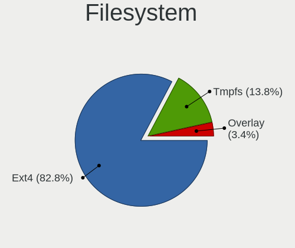
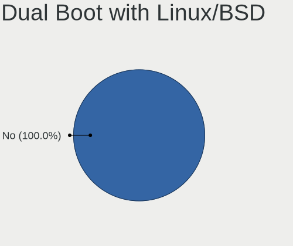
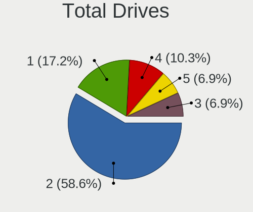
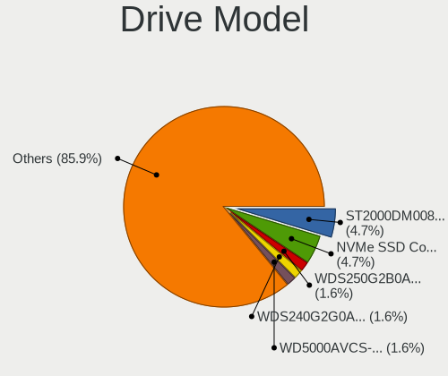
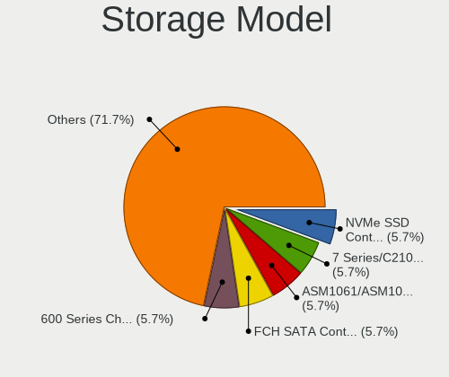
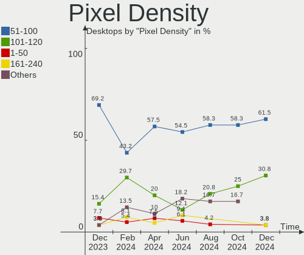
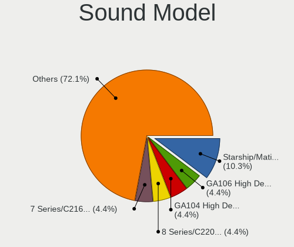
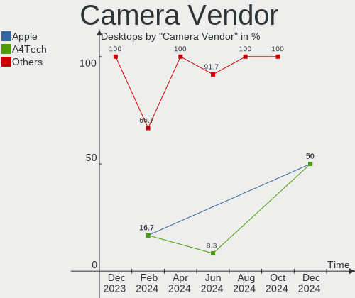

KDE neon Hardware Trends (Desktops)
-----------------------------------

A project to identify most popular hardware characteristics and track their change
over time based on data collected by KDE neon users at https://Linux-Hardware.org.

Anyone can contribute to this report by the [hw-probe](https://github.com/linuxhw/hw-probe) tool:

    sudo -E hw-probe -all -upload

This report is for one last month. Overall report since the beginning of time: [TestCoverage](https://github.com/linuxhw/TestCoverage)

Period: Apr, 2022.

Contents
--------

* [ System ](#system)
  - [ OS                       ](#os)
  - [ OS Family                ](#os-family)
  - [ Kernel                   ](#kernel)
  - [ Kernel Family            ](#kernel-family)
  - [ Kernel Major Ver.        ](#kernel-major-ver)
  - [ Arch                     ](#arch)
  - [ DE                       ](#de)
  - [ Display Server           ](#display-server)
  - [ Display Manager          ](#display-manager)
  - [ OS Lang                  ](#os-lang)
  - [ Boot Mode                ](#boot-mode)
  - [ Filesystem               ](#filesystem)
  - [ Part. scheme             ](#part-scheme)
  - [ Dual Boot with Linux/BSD ](#dual-boot-with-linuxbsd)
  - [ Dual Boot (Win)          ](#dual-boot-win)

* [ Board ](#board)
  - [ Vendor                   ](#vendor)
  - [ Model                    ](#model)
  - [ Model Family             ](#model-family)
  - [ MFG Year                 ](#mfg-year)
  - [ Form Factor              ](#form-factor)
  - [ Secure Boot              ](#secure-boot)
  - [ Coreboot                 ](#coreboot)
  - [ RAM Size                 ](#ram-size)
  - [ RAM Used                 ](#ram-used)
  - [ Total Drives             ](#total-drives)
  - [ Has CD-ROM               ](#has-cd-rom)
  - [ Has Ethernet             ](#has-ethernet)
  - [ Has WiFi                 ](#has-wifi)
  - [ Has Bluetooth            ](#has-bluetooth)

* [ Location ](#location)
  - [ Country                  ](#country)
  - [ City                     ](#city)

* [ Drives ](#drives)
  - [ Drive Vendor             ](#drive-vendor)
  - [ Drive Model              ](#drive-model)
  - [ HDD Vendor               ](#hdd-vendor)
  - [ SSD Vendor               ](#ssd-vendor)
  - [ Drive Kind               ](#drive-kind)
  - [ Drive Connector          ](#drive-connector)
  - [ Drive Size               ](#drive-size)
  - [ Space Total              ](#space-total)
  - [ Space Used               ](#space-used)
  - [ Malfunc. Drives          ](#malfunc-drives)
  - [ Malfunc. Drive Vendor    ](#malfunc-drive-vendor)
  - [ Malfunc. HDD Vendor      ](#malfunc-hdd-vendor)
  - [ Malfunc. Drive Kind      ](#malfunc-drive-kind)
  - [ Failed Drives            ](#failed-drives)
  - [ Failed Drive Vendor      ](#failed-drive-vendor)
  - [ Drive Status             ](#drive-status)

* [ Storage controller ](#storage-controller)
  - [ Storage Vendor           ](#storage-vendor)
  - [ Storage Model            ](#storage-model)
  - [ Storage Kind             ](#storage-kind)

* [ Processor ](#processor)
  - [ CPU Vendor               ](#cpu-vendor)
  - [ CPU Model                ](#cpu-model)
  - [ CPU Model Family         ](#cpu-model-family)
  - [ CPU Cores                ](#cpu-cores)
  - [ CPU Sockets              ](#cpu-sockets)
  - [ CPU Threads              ](#cpu-threads)
  - [ CPU Op-Modes             ](#cpu-op-modes)
  - [ CPU Microcode            ](#cpu-microcode)
  - [ CPU Microarch            ](#cpu-microarch)

* [ Graphics ](#graphics)
  - [ GPU Vendor               ](#gpu-vendor)
  - [ GPU Model                ](#gpu-model)
  - [ GPU Combo                ](#gpu-combo)
  - [ GPU Driver               ](#gpu-driver)
  - [ GPU Memory               ](#gpu-memory)

* [ Monitor ](#monitor)
  - [ Monitor Vendor           ](#monitor-vendor)
  - [ Monitor Model            ](#monitor-model)
  - [ Monitor Resolution       ](#monitor-resolution)
  - [ Monitor Diagonal         ](#monitor-diagonal)
  - [ Monitor Width            ](#monitor-width)
  - [ Aspect Ratio             ](#aspect-ratio)
  - [ Monitor Area             ](#monitor-area)
  - [ Pixel Density            ](#pixel-density)
  - [ Multiple Monitors        ](#multiple-monitors)

* [ Network ](#network)
  - [ Net Controller Vendor    ](#net-controller-vendor)
  - [ Net Controller Model     ](#net-controller-model)
  - [ Wireless Vendor          ](#wireless-vendor)
  - [ Wireless Model           ](#wireless-model)
  - [ Ethernet Vendor          ](#ethernet-vendor)
  - [ Ethernet Model           ](#ethernet-model)
  - [ Net Controller Kind      ](#net-controller-kind)
  - [ Used Controller          ](#used-controller)
  - [ NICs                     ](#nics)
  - [ IPv6                     ](#ipv6)

* [ Bluetooth ](#bluetooth)
  - [ Bluetooth Vendor         ](#bluetooth-vendor)
  - [ Bluetooth Model          ](#bluetooth-model)

* [ Sound ](#sound)
  - [ Sound Vendor             ](#sound-vendor)
  - [ Sound Model              ](#sound-model)

* [ Memory ](#memory)
  - [ Memory Vendor            ](#memory-vendor)
  - [ Memory Model             ](#memory-model)
  - [ Memory Kind              ](#memory-kind)
  - [ Memory Form Factor       ](#memory-form-factor)
  - [ Memory Size              ](#memory-size)
  - [ Memory Speed             ](#memory-speed)

* [ Printers & scanners ](#printers--scanners)
  - [ Printer Vendor           ](#printer-vendor)
  - [ Printer Model            ](#printer-model)
  - [ Scanner Vendor           ](#scanner-vendor)
  - [ Scanner Model            ](#scanner-model)

* [ Camera ](#camera)
  - [ Camera Vendor            ](#camera-vendor)
  - [ Camera Model             ](#camera-model)

* [ Security ](#security)
  - [ Fingerprint Vendor       ](#fingerprint-vendor)
  - [ Fingerprint Model        ](#fingerprint-model)
  - [ Chipcard Vendor          ](#chipcard-vendor)
  - [ Chipcard Model           ](#chipcard-model)

* [ Unsupported ](#unsupported)
  - [ Unsupported Devices      ](#unsupported-devices)
  - [ Unsupported Device Types ](#unsupported-device-types)

System
------

OS
--

Installed operating systems

| Name           | Desktops | Percent |
|----------------|----------|---------|
| KDE neon 20.04 | 51       | 98.08%  |
| KDE neon 18.04 | 1        | 1.92%   |

OS Family
---------

OS without a version

| Name     | Desktops | Percent |
|----------|----------|---------|
| KDE neon | 52       | 100%    |

Kernel
------

Version of the Linux kernel

| Version                       | Desktops | Percent |
|-------------------------------|----------|---------|
| 5.13.0-39-generic             | 30       | 57.69%  |
| 5.13.0-40-generic             | 12       | 23.08%  |
| 5.13.0-37-generic             | 4        | 7.69%   |
| 5.4.0-108-generic             | 1        | 1.92%   |
| 5.4.0-105-generic             | 1        | 1.92%   |
| 5.4.0-104-generic             | 1        | 1.92%   |
| 5.17.1-051701-generic         | 1        | 1.92%   |
| 5.17.0-ext73-97.0-sandybridge | 1        | 1.92%   |
| 5.15.34-xanmod1               | 1        | 1.92%   |

Kernel Family
-------------

Linux kernel without a distro release

| Version | Desktops | Percent |
|---------|----------|---------|
| 5.13.0  | 46       | 88.46%  |
| 5.4.0   | 3        | 5.77%   |
| 5.17.1  | 1        | 1.92%   |
| 5.17.0  | 1        | 1.92%   |
| 5.15.34 | 1        | 1.92%   |

Kernel Major Ver.
-----------------

Linux kernel major version

| Version | Desktops | Percent |
|---------|----------|---------|
| 5.13    | 46       | 88.46%  |
| 5.4     | 3        | 5.77%   |
| 5.17    | 2        | 3.85%   |
| 5.15    | 1        | 1.92%   |

Arch
----

OS architecture (x86_64, i586, etc.)

| Name   | Desktops | Percent |
|--------|----------|---------|
| x86_64 | 52       | 100%    |

DE
--

Desktop Environment

| Name | Desktops | Percent |
|------|----------|---------|
| KDE5 | 52       | 100%    |

Display Server
--------------

X11 or Wayland

| Name    | Desktops | Percent |
|---------|----------|---------|
| X11     | 48       | 92.31%  |
| Wayland | 3        | 5.77%   |
| Tty     | 1        | 1.92%   |

Display Manager
---------------

SDDM, LightDM, etc.

| Name    | Desktops | Percent |
|---------|----------|---------|
| Unknown | 39       | 75%     |
| SDDM    | 13       | 25%     |

OS Lang
-------

Language

| Lang   | Desktops | Percent |
|--------|----------|---------|
| en_US  | 20       | 38.46%  |
| en_GB  | 7        | 13.46%  |
| de_DE  | 4        | 7.69%   |
| pt_BR  | 3        | 5.77%   |
| pl_PL  | 3        | 5.77%   |
| en_CA  | 3        | 5.77%   |
| es_MX  | 2        | 3.85%   |
| sv_SE  | 1        | 1.92%   |
| ru_RU  | 1        | 1.92%   |
| it_IT  | 1        | 1.92%   |
| io_001 | 1        | 1.92%   |
| es_PY  | 1        | 1.92%   |
| es_AR  | 1        | 1.92%   |
| en_IN  | 1        | 1.92%   |
| en_IE  | 1        | 1.92%   |
| en_AU  | 1        | 1.92%   |
| C      | 1        | 1.92%   |

Boot Mode
---------

EFI or BIOS

| Mode | Desktops | Percent |
|------|----------|---------|
| EFI  | 30       | 57.69%  |
| BIOS | 22       | 42.31%  |

Filesystem
----------

Type of filesystem

| Type    | Desktops | Percent |
|---------|----------|---------|
| Ext4    | 47       | 90.38%  |
| Btrfs   | 3        | 5.77%   |
| Zfs     | 1        | 1.92%   |
| Overlay | 1        | 1.92%   |

Part. scheme
------------

Scheme of partitioning

| Type    | Desktops | Percent |
|---------|----------|---------|
| Unknown | 44       | 84.62%  |
| GPT     | 6        | 11.54%  |
| MBR     | 2        | 3.85%   |

Dual Boot with Linux/BSD
------------------------

Hosting more than one Linux/BSD

| Dual boot | Desktops | Percent |
|-----------|----------|---------|
| No        | 49       | 94.23%  |
| Yes       | 3        | 5.77%   |

Dual Boot (Win)
---------------

Hosting Linux and Windows

| Dual boot | Desktops | Percent |
|-----------|----------|---------|
| No        | 49       | 94.23%  |
| Yes       | 3        | 5.77%   |

Board
-----

Vendor
------

Motherboard manufacturer

| Name                | Desktops | Percent |
|---------------------|----------|---------|
| ASUSTek Computer    | 18       | 34.62%  |
| Gigabyte Technology | 9        | 17.31%  |
| MSI                 | 7        | 13.46%  |
| ASRock              | 6        | 11.54%  |
| Dell                | 4        | 7.69%   |
| Hewlett-Packard     | 3        | 5.77%   |
| Pegatron            | 1        | 1.92%   |
| Lenovo              | 1        | 1.92%   |
| Itautec             | 1        | 1.92%   |
| Biostar             | 1        | 1.92%   |
| BESSTAR Tech        | 1        | 1.92%   |

Model
-----

Motherboard model

| Name                               | Desktops | Percent |
|------------------------------------|----------|---------|
| ASUS All Series                    | 3        | 5.77%   |
| ASUS TUF Gaming X570-PLUS          | 2        | 3.85%   |
| ASUS TUF Gaming B550-PLUS          | 2        | 3.85%   |
| ASUS P5G41T-M                      | 2        | 3.85%   |
| Pegatron HPE-380t                  | 1        | 1.92%   |
| MSI MS-7D41                        | 1        | 1.92%   |
| MSI MS-7C95                        | 1        | 1.92%   |
| MSI MS-7C35                        | 1        | 1.92%   |
| MSI MS-7C34                        | 1        | 1.92%   |
| MSI MS-7B84                        | 1        | 1.92%   |
| MSI MS-7A38                        | 1        | 1.92%   |
| MSI MS-7760                        | 1        | 1.92%   |
| Lenovo S500 10HS0030MT             | 1        | 1.92%   |
| Itautec Infoway                    | 1        | 1.92%   |
| HP Z440 Workstation                | 1        | 1.92%   |
| HP Z200 SFF Workstation            | 1        | 1.92%   |
| HP Compaq dc7700 Small Form Factor | 1        | 1.92%   |
| Gigabyte Z97X-UD5H                 | 1        | 1.92%   |
| Gigabyte Z68P-DS3                  | 1        | 1.92%   |
| Gigabyte Z370 AORUS Gaming 5       | 1        | 1.92%   |
| Gigabyte Z170-Gaming K3            | 1        | 1.92%   |
| Gigabyte H67M-UD2H-B3              | 1        | 1.92%   |
| Gigabyte F2A88XN-WIFI              | 1        | 1.92%   |
| Gigabyte B550M DS3H                | 1        | 1.92%   |
| Gigabyte AB350M-DS3H               | 1        | 1.92%   |
| Gigabyte 945PL-S3                  | 1        | 1.92%   |
| Dell Studio XPS 8100               | 1        | 1.92%   |
| Dell OptiPlex 9020                 | 1        | 1.92%   |
| Dell OptiPlex 5080                 | 1        | 1.92%   |
| Dell OptiPlex 3020M                | 1        | 1.92%   |
| Biostar TB250-BTC PRO              | 1        | 1.92%   |
| BESSTAR Tech HM90                  | 1        | 1.92%   |
| ASUS ROG STRIX B450-F GAMING       | 1        | 1.92%   |
| ASUS ROG Maximus XI HERO           | 1        | 1.92%   |
| ASUS PRIME Z390M-PLUS              | 1        | 1.92%   |
| ASUS PRIME X470-PRO                | 1        | 1.92%   |
| ASUS PRIME H370M-PLUS              | 1        | 1.92%   |
| ASUS P9X79                         | 1        | 1.92%   |
| ASUS M5A78L-M/USB3                 | 1        | 1.92%   |
| ASUS F2A55-M                       | 1        | 1.92%   |
| ASUS Amd Am4 Home Office           | 1        | 1.92%   |
| ASRock Z270 Extreme4               | 1        | 1.92%   |
| ASRock P67 Pro3                    | 1        | 1.92%   |
| ASRock G41M-GS                     | 1        | 1.92%   |
| ASRock B450M Steel Legend          | 1        | 1.92%   |
| ASRock B450 Gaming-ITX/ac          | 1        | 1.92%   |
| ASRock 990FX Extreme3              | 1        | 1.92%   |

Model Family
------------

Motherboard model prefix

| Name                  | Desktops | Percent |
|-----------------------|----------|---------|
| ASUS TUF              | 4        | 7.69%   |
| Dell OptiPlex         | 3        | 5.77%   |
| ASUS PRIME            | 3        | 5.77%   |
| ASUS All              | 3        | 5.77%   |
| ASUS ROG              | 2        | 3.85%   |
| ASUS P5G41T-M         | 2        | 3.85%   |
| Pegatron HPE-380t     | 1        | 1.92%   |
| MSI MS-7D41           | 1        | 1.92%   |
| MSI MS-7C95           | 1        | 1.92%   |
| MSI MS-7C35           | 1        | 1.92%   |
| MSI MS-7C34           | 1        | 1.92%   |
| MSI MS-7B84           | 1        | 1.92%   |
| MSI MS-7A38           | 1        | 1.92%   |
| MSI MS-7760           | 1        | 1.92%   |
| Lenovo S500           | 1        | 1.92%   |
| Itautec Infoway       | 1        | 1.92%   |
| HP Z440               | 1        | 1.92%   |
| HP Z200               | 1        | 1.92%   |
| HP Compaq             | 1        | 1.92%   |
| Gigabyte Z97X-UD5H    | 1        | 1.92%   |
| Gigabyte Z68P-DS3     | 1        | 1.92%   |
| Gigabyte Z370         | 1        | 1.92%   |
| Gigabyte Z170-Gaming  | 1        | 1.92%   |
| Gigabyte H67M-UD2H-B3 | 1        | 1.92%   |
| Gigabyte F2A88XN-WIFI | 1        | 1.92%   |
| Gigabyte B550M        | 1        | 1.92%   |
| Gigabyte AB350M-DS3H  | 1        | 1.92%   |
| Gigabyte 945PL-S3     | 1        | 1.92%   |
| Dell Studio           | 1        | 1.92%   |
| Biostar TB250-BTC     | 1        | 1.92%   |
| BESSTAR Tech HM90     | 1        | 1.92%   |
| ASUS P9X79            | 1        | 1.92%   |
| ASUS M5A78L-M         | 1        | 1.92%   |
| ASUS F2A55-M          | 1        | 1.92%   |
| ASUS Amd              | 1        | 1.92%   |
| ASRock Z270           | 1        | 1.92%   |
| ASRock P67            | 1        | 1.92%   |
| ASRock G41M-GS        | 1        | 1.92%   |
| ASRock B450M          | 1        | 1.92%   |
| ASRock B450           | 1        | 1.92%   |
| ASRock 990FX          | 1        | 1.92%   |

MFG Year
--------

Motherboard manufacture year

| Year | Desktops | Percent |
|------|----------|---------|
| 2018 | 8        | 15.38%  |
| 2011 | 6        | 11.54%  |
| 2020 | 5        | 9.62%   |
| 2019 | 5        | 9.62%   |
| 2014 | 5        | 9.62%   |
| 2021 | 4        | 7.69%   |
| 2017 | 3        | 5.77%   |
| 2015 | 3        | 5.77%   |
| 2012 | 3        | 5.77%   |
| 2009 | 3        | 5.77%   |
| 2013 | 2        | 3.85%   |
| 2010 | 2        | 3.85%   |
| 2006 | 2        | 3.85%   |
| 2022 | 1        | 1.92%   |

Form Factor
-----------

Physical design of the computer

| Name    | Desktops | Percent |
|---------|----------|---------|
| Desktop | 52       | 100%    |

Secure Boot
-----------

Enabled or disabled

| State    | Desktops | Percent |
|----------|----------|---------|
| Disabled | 49       | 94.23%  |
| Enabled  | 3        | 5.77%   |

Coreboot
--------

Have coreboot on board

| Used | Desktops | Percent |
|------|----------|---------|
| No   | 52       | 100%    |

RAM Size
--------

Total RAM memory

| Size in GB  | Desktops | Percent |
|-------------|----------|---------|
| 16.01-24.0  | 17       | 32.69%  |
| 8.01-16.0   | 11       | 21.15%  |
| 32.01-64.0  | 8        | 15.38%  |
| 3.01-4.0    | 5        | 9.62%   |
| 4.01-8.0    | 4        | 7.69%   |
| 64.01-256.0 | 4        | 7.69%   |
| 24.01-32.0  | 2        | 3.85%   |
| 2.01-3.0    | 1        | 1.92%   |

RAM Used
--------

Used RAM memory

| Used GB    | Desktops | Percent |
|------------|----------|---------|
| 1.01-2.0   | 22       | 42.31%  |
| 2.01-3.0   | 14       | 26.92%  |
| 4.01-8.0   | 7        | 13.46%  |
| 3.01-4.0   | 3        | 5.77%   |
| 32.01-64.0 | 2        | 3.85%   |
| 8.01-16.0  | 2        | 3.85%   |
| 0.51-1.0   | 2        | 3.85%   |

Total Drives
------------

Number of drives on board

| Drives | Desktops | Percent |
|--------|----------|---------|
| 2      | 18       | 34.62%  |
| 1      | 13       | 25%     |
| 3      | 11       | 21.15%  |
| 4      | 5        | 9.62%   |
| 5      | 4        | 7.69%   |
| 0      | 1        | 1.92%   |

Has CD-ROM
----------

Has CD-ROM on board

| Presented | Desktops | Percent |
|-----------|----------|---------|
| No        | 33       | 63.46%  |
| Yes       | 19       | 36.54%  |

Has Ethernet
------------

Has Ethernet on board

| Presented | Desktops | Percent |
|-----------|----------|---------|
| Yes       | 50       | 96.15%  |
| No        | 2        | 3.85%   |

Has WiFi
--------

Has WiFi module

| Presented | Desktops | Percent |
|-----------|----------|---------|
| No        | 29       | 55.77%  |
| Yes       | 23       | 44.23%  |

Has Bluetooth
-------------

Has Bluetooth module

| Presented | Desktops | Percent |
|-----------|----------|---------|
| No        | 29       | 55.77%  |
| Yes       | 23       | 44.23%  |

Location
--------

Country
-------

Geographic location (country)

| Country     | Desktops | Percent |
|-------------|----------|---------|
| USA         | 15       | 28.85%  |
| UK          | 7        | 13.46%  |
| Germany     | 5        | 9.62%   |
| Canada      | 4        | 7.69%   |
| Brazil      | 3        | 5.77%   |
| Sweden      | 2        | 3.85%   |
| Poland      | 2        | 3.85%   |
| Mexico      | 2        | 3.85%   |
| Uzbekistan  | 1        | 1.92%   |
| Turkey      | 1        | 1.92%   |
| Russia      | 1        | 1.92%   |
| Paraguay    | 1        | 1.92%   |
| Netherlands | 1        | 1.92%   |
| Italy       | 1        | 1.92%   |
| Ireland     | 1        | 1.92%   |
| Iran        | 1        | 1.92%   |
| India       | 1        | 1.92%   |
| Denmark     | 1        | 1.92%   |
| Australia   | 1        | 1.92%   |
| Argentina   | 1        | 1.92%   |

City
----

Geographic location (city)

| City           | Desktops | Percent |
|----------------|----------|---------|
| Richmond       | 2        | 3.85%   |
| York           | 1        | 1.92%   |
| Whippany       | 1        | 1.92%   |
| Wasilla        | 1        | 1.92%   |
| Warsaw         | 1        | 1.92%   |
| Venice         | 1        | 1.92%   |
| Tulsa          | 1        | 1.92%   |
| Torreón       | 1        | 1.92%   |
| Tonypandy      | 1        | 1.92%   |
| Tashkent       | 1        | 1.92%   |
| Sundsvall      | 1        | 1.92%   |
| Sheffield      | 1        | 1.92%   |
| Savannah       | 1        | 1.92%   |
| Salvador       | 1        | 1.92%   |
| Rostock        | 1        | 1.92%   |
| Rey            | 1        | 1.92%   |
| Perivale       | 1        | 1.92%   |
| Panambi        | 1        | 1.92%   |
| Panama City    | 1        | 1.92%   |
| Orange         | 1        | 1.92%   |
| Niagara Falls  | 1        | 1.92%   |
| New York       | 1        | 1.92%   |
| Munich         | 1        | 1.92%   |
| Mount Vernon   | 1        | 1.92%   |
| Mjoelby        | 1        | 1.92%   |
| Maidstone      | 1        | 1.92%   |
| Maastricht     | 1        | 1.92%   |
| Lowicz         | 1        | 1.92%   |
| Levis          | 1        | 1.92%   |
| Lerdo          | 1        | 1.92%   |
| Lake Worth     | 1        | 1.92%   |
| La Plata       | 1        | 1.92%   |
| Kitchener      | 1        | 1.92%   |
| Istanbul       | 1        | 1.92%   |
| Hvidovre       | 1        | 1.92%   |
| Holzwickede    | 1        | 1.92%   |
| Halle          | 1        | 1.92%   |
| Gloucester     | 1        | 1.92%   |
| Gainesville    | 1        | 1.92%   |
| Foz do Iguaçu | 1        | 1.92%   |
| Edmonton       | 1        | 1.92%   |
| Dublin         | 1        | 1.92%   |
| Dallas         | 1        | 1.92%   |
| Cologne        | 1        | 1.92%   |
| Chambersburg   | 1        | 1.92%   |
| Cambridge      | 1        | 1.92%   |
| Bengaluru      | 1        | 1.92%   |
| Atlanta        | 1        | 1.92%   |
| Asunción      | 1        | 1.92%   |
| Aleksandrovsk  | 1        | 1.92%   |
| Adelaide       | 1        | 1.92%   |

Drives
------

Drive Vendor
------------

Hard drive vendors

| Vendor                    | Desktops | Drives | Percent |
|---------------------------|----------|--------|---------|
| Seagate                   | 19       | 20     | 19.39%  |
| WDC                       | 15       | 24     | 15.31%  |
| Samsung Electronics       | 14       | 21     | 14.29%  |
| SanDisk                   | 8        | 9      | 8.16%   |
| Crucial                   | 7        | 8      | 7.14%   |
| Toshiba                   | 5        | 5      | 5.1%    |
| Kingston                  | 5        | 9      | 5.1%    |
| Hitachi                   | 3        | 3      | 3.06%   |
| PNY                       | 2        | 2      | 2.04%   |
| Patriot                   | 2        | 2      | 2.04%   |
| Hewlett-Packard           | 2        | 3      | 2.04%   |
| A-DATA Technology         | 2        | 2      | 2.04%   |
| Unknown                   | 1        | 1      | 1.02%   |
| Team                      | 1        | 1      | 1.02%   |
| SPCC                      | 1        | 1      | 1.02%   |
| Silicon Motion            | 1        | 1      | 1.02%   |
| SABRENT                   | 1        | 1      | 1.02%   |
| Phison                    | 1        | 1      | 1.02%   |
| OCZ                       | 1        | 1      | 1.02%   |
| N600                      | 1        | 1      | 1.02%   |
| Micron/Crucial Technology | 1        | 1      | 1.02%   |
| KINGBANK                  | 1        | 1      | 1.02%   |
| HS-SSD-C100               | 1        | 1      | 1.02%   |
| EMTEC                     | 1        | 1      | 1.02%   |
| China                     | 1        | 3      | 1.02%   |
| ADATA SU                  | 1        | 1      | 1.02%   |

Drive Model
-----------

Hard drive models

| Model                                      | Desktops | Percent |
|--------------------------------------------|----------|---------|
| Samsung NVMe SSD Drive 1TB                 | 5        | 4.17%   |
| Sandisk NVMe SSD Drive 1TB                 | 3        | 2.5%    |
| Kingston SA400S37240G 240GB SSD            | 3        | 2.5%    |
| WDC WD800BB-75CAA0 80GB                    | 2        | 1.67%   |
| WDC WD10EZEX-08M2NA0 1TB                   | 2        | 1.67%   |
| Seagate ST3100011A 100GB                   | 2        | 1.67%   |
| Seagate ST2000DM006-2DM164 2TB             | 2        | 1.67%   |
| Seagate Expansion+ 2TB                     | 2        | 1.67%   |
| SanDisk SDSSDP128G 128GB                   | 2        | 1.67%   |
| Samsung SSD 860 EVO 500GB                  | 2        | 1.67%   |
| Patriot Burst 120GB SSD                    | 2        | 1.67%   |
| Kingston NVMe SSD Drive 250GB              | 2        | 1.67%   |
| WDC WDS500G2B0A-00SM50 500GB SSD           | 1        | 0.83%   |
| WDC WDS250G1B0B-00AS40 250GB SSD           | 1        | 0.83%   |
| WDC WDS250G1B0A-00H9H0 250GB SSD           | 1        | 0.83%   |
| WDC WDS100T2B0C-00PXH0 1TB                 | 1        | 0.83%   |
| WDC WD5000AAKX-003CA0 500GB                | 1        | 0.83%   |
| WDC WD5000AAKS-22A7B0 500GB                | 1        | 0.83%   |
| WDC WD4005FZBX-00K5WB0 4TB                 | 1        | 0.83%   |
| WDC WD3200AAJS-07M0A0 320GB                | 1        | 0.83%   |
| WDC WD30EZRX-00SPEB0 3TB                   | 1        | 0.83%   |
| WDC WD30EZRX-00D8PB0 3TB                   | 1        | 0.83%   |
| WDC WD20EZAZ-00GGJB0 2TB                   | 1        | 0.83%   |
| WDC WD20EARS-00MVWB0 2TB                   | 1        | 0.83%   |
| WDC WD10JPVX-75JC3T0 1TB                   | 1        | 0.83%   |
| WDC WD10EZEX-75ZF5A0 1TB                   | 1        | 0.83%   |
| WDC WD10EZEX-00WN4A0 1TB                   | 1        | 0.83%   |
| WDC WD10EFRX-68FYTN0 1TB                   | 1        | 0.83%   |
| WDC WD1002FAEX-00Z3A0 1TB                  | 1        | 0.83%   |
| WDC WD1001FALS-00E8B0 1TB                  | 1        | 0.83%   |
| Unknown 256GB PCS 2.5" S                   | 1        | 0.83%   |
| Toshiba TR200 240GB SSD                    | 1        | 0.83%   |
| Toshiba MK5075GSX 500GB                    | 1        | 0.83%   |
| Toshiba HDWD110 1TB                        | 1        | 0.83%   |
| Toshiba DT01ACA200 2TB                     | 1        | 0.83%   |
| Toshiba DT01ABA100V 1TB                    | 1        | 0.83%   |
| Team L5 LITE SSD 120GB                     | 1        | 0.83%   |
| SPCC Solid State Disk 240GB                | 1        | 0.83%   |
| Silicon Motion NVMe SSD Drive 512GB        | 1        | 0.83%   |
| Seagate ST9750420AS 752GB                  | 1        | 0.83%   |
| Seagate ST9250421ASG 250GB                 | 1        | 0.83%   |
| Seagate ST9250315AS 250GB                  | 1        | 0.83%   |
| Seagate ST4000VN008 4TB                    | 1        | 0.83%   |
| Seagate ST3400620AS 400GB                  | 1        | 0.83%   |
| Seagate ST3250318AS 250GB                  | 1        | 0.83%   |
| Seagate ST32000542AS 2TB                   | 1        | 0.83%   |
| Seagate ST31000524AS 1TB                   | 1        | 0.83%   |
| Seagate ST2000DL003-9VT166 2TB             | 1        | 0.83%   |
| Seagate ST1000DM010-2EP102 1TB             | 1        | 0.83%   |
| Seagate ST1000DM003-1ER162 1TB             | 1        | 0.83%   |
| Seagate ST1000DM 003-1CH162 1TB            | 1        | 0.83%   |
| Seagate IronWolf ZA500NM10002-2ZG101 500GB | 1        | 0.83%   |
| Seagate Backup+ Desk 5TB                   | 1        | 0.83%   |
| SanDisk SSD PLUS 240 GB                    | 1        | 0.83%   |
| SanDisk SDSSDHII960G 960GB                 | 1        | 0.83%   |
| Sandisk NVMe SSD Drive 2TB                 | 1        | 0.83%   |
| Samsung SSD 980 1TB                        | 1        | 0.83%   |
| Samsung SSD 970 EVO Plus 1TB               | 1        | 0.83%   |
| Samsung SSD 860 EVO 250GB                  | 1        | 0.83%   |
| Samsung SSD 850 EVO 250GB                  | 1        | 0.83%   |

HDD Vendor
----------

Hard disk drive vendors

| Vendor              | Desktops | Drives | Percent |
|---------------------|----------|--------|---------|
| Seagate             | 18       | 18     | 41.86%  |
| WDC                 | 12       | 20     | 27.91%  |
| Toshiba             | 4        | 4      | 9.3%    |
| Samsung Electronics | 4        | 4      | 9.3%    |
| Hitachi             | 3        | 3      | 6.98%   |
| SABRENT             | 1        | 1      | 2.33%   |
| Hewlett-Packard     | 1        | 1      | 2.33%   |

SSD Vendor
----------

Solid state drive vendors

| Vendor              | Desktops | Drives | Percent |
|---------------------|----------|--------|---------|
| Crucial             | 7        | 8      | 17.07%  |
| Samsung Electronics | 5        | 9      | 12.2%   |
| SanDisk             | 4        | 4      | 9.76%   |
| Kingston            | 4        | 6      | 9.76%   |
| WDC                 | 3        | 3      | 7.32%   |
| PNY                 | 2        | 2      | 4.88%   |
| Patriot             | 2        | 2      | 4.88%   |
| A-DATA Technology   | 2        | 2      | 4.88%   |
| Unknown             | 1        | 1      | 2.44%   |
| Toshiba             | 1        | 1      | 2.44%   |
| Team                | 1        | 1      | 2.44%   |
| SPCC                | 1        | 1      | 2.44%   |
| Seagate             | 1        | 1      | 2.44%   |
| OCZ                 | 1        | 1      | 2.44%   |
| N600                | 1        | 1      | 2.44%   |
| KINGBANK            | 1        | 1      | 2.44%   |
| Hewlett-Packard     | 1        | 2      | 2.44%   |
| EMTEC               | 1        | 1      | 2.44%   |
| China               | 1        | 3      | 2.44%   |
| ADATA SU            | 1        | 1      | 2.44%   |

Drive Kind
----------

HDD or SSD

| Kind    | Desktops | Drives | Percent |
|---------|----------|--------|---------|
| HDD     | 33       | 51     | 39.29%  |
| SSD     | 31       | 51     | 36.9%   |
| NVMe    | 18       | 20     | 21.43%  |
| Unknown | 2        | 2      | 2.38%   |

Drive Connector
---------------

SATA, SAS, NVMe, etc.

| Type | Desktops | Drives | Percent |
|------|----------|--------|---------|
| SATA | 44       | 98     | 65.67%  |
| NVMe | 18       | 20     | 26.87%  |
| SAS  | 5        | 6      | 7.46%   |

Drive Size
----------

Size of hard drive

| Size in TB | Desktops | Drives | Percent |
|------------|----------|--------|---------|
| 0.01-0.5   | 38       | 62     | 52.78%  |
| 0.51-1.0   | 19       | 23     | 26.39%  |
| 1.01-2.0   | 10       | 10     | 13.89%  |
| 3.01-4.0   | 3        | 4      | 4.17%   |
| 2.01-3.0   | 2        | 3      | 2.78%   |

Space Total
-----------

Amount of disk space available on the file system

| Size in GB     | Desktops | Percent |
|----------------|----------|---------|
| 101-250        | 9        | 17.31%  |
| 501-1000       | 8        | 15.38%  |
| 2001-3000      | 7        | 13.46%  |
| More than 3000 | 6        | 11.54%  |
| 1001-2000      | 6        | 11.54%  |
| 251-500        | 5        | 9.62%   |
| Unknown        | 4        | 7.69%   |
| 1-20           | 3        | 5.77%   |
| 51-100         | 3        | 5.77%   |
| 21-50          | 1        | 1.92%   |

Space Used
----------

Amount of used disk space

| Used GB        | Desktops | Percent |
|----------------|----------|---------|
| 1-20           | 12       | 23.08%  |
| 101-250        | 10       | 19.23%  |
| 501-1000       | 8        | 15.38%  |
| 21-50          | 5        | 9.62%   |
| 51-100         | 4        | 7.69%   |
| Unknown        | 4        | 7.69%   |
| 2001-3000      | 3        | 5.77%   |
| 1001-2000      | 3        | 5.77%   |
| 251-500        | 2        | 3.85%   |
| More than 3000 | 1        | 1.92%   |

Malfunc. Drives
---------------

Drive models with a malfunction

| Model                            | Desktops | Drives | Percent |
|----------------------------------|----------|--------|---------|
| Seagate ST3250318AS 250GB        | 1        | 1      | 33.33%  |
| Kingston SV300S37A120G 120GB SSD | 1        | 1      | 33.33%  |
| Crucial CT525MX300SSD1 528GB     | 1        | 1      | 33.33%  |

Malfunc. Drive Vendor
---------------------

Vendors of faulty drives

| Vendor   | Desktops | Drives | Percent |
|----------|----------|--------|---------|
| Seagate  | 1        | 1      | 33.33%  |
| Kingston | 1        | 1      | 33.33%  |
| Crucial  | 1        | 1      | 33.33%  |

Malfunc. HDD Vendor
-------------------

Vendors of faulty HDD drives

| Vendor  | Desktops | Drives | Percent |
|---------|----------|--------|---------|
| Seagate | 1        | 1      | 100%    |

Malfunc. Drive Kind
-------------------

Kinds of faulty drives

| Kind | Desktops | Drives | Percent |
|------|----------|--------|---------|
| SSD  | 1        | 2      | 50%     |
| HDD  | 1        | 1      | 50%     |

Failed Drives
-------------

Failed drive models

Zero info for selected period =(

Failed Drive Vendor
-------------------

Failed drive vendors

Zero info for selected period =(

Drive Status
------------

Number of failed and malfunc. drives

| Status   | Desktops | Drives | Percent |
|----------|----------|--------|---------|
| Detected | 44       | 103    | 84.62%  |
| Works    | 6        | 18     | 11.54%  |
| Malfunc  | 2        | 3      | 3.85%   |

Storage controller
------------------

Storage Vendor
--------------

Storage controller vendors

| Vendor                      | Desktops | Percent |
|-----------------------------|----------|---------|
| Intel                       | 31       | 39.74%  |
| AMD                         | 21       | 26.92%  |
| Samsung Electronics         | 8        | 10.26%  |
| Sandisk                     | 5        | 6.41%   |
| Kingston Technology Company | 3        | 3.85%   |
| ASMedia Technology          | 3        | 3.85%   |
| JMicron Technology          | 2        | 2.56%   |
| Silicon Motion              | 1        | 1.28%   |
| Phison Electronics          | 1        | 1.28%   |
| Micron/Crucial Technology   | 1        | 1.28%   |
| Marvell Technology Group    | 1        | 1.28%   |
| Adaptec                     | 1        | 1.28%   |

Storage Model
-------------

Storage controller models

| Model                                                                                   | Desktops | Percent |
|-----------------------------------------------------------------------------------------|----------|---------|
| AMD FCH SATA Controller [AHCI mode]                                                     | 14       | 14.43%  |
| Samsung NVMe SSD Controller SM981/PM981/PM983                                           | 4        | 4.12%   |
| Intel NM10/ICH7 Family SATA Controller [IDE mode]                                       | 4        | 4.12%   |
| Intel 8 Series/C220 Series Chipset Family 6-port SATA Controller 1 [AHCI mode]          | 4        | 4.12%   |
| AMD 500 Series Chipset SATA Controller                                                  | 4        | 4.12%   |
| AMD 400 Series Chipset SATA Controller                                                  | 4        | 4.12%   |
| Intel Cannon Lake PCH SATA AHCI Controller                                              | 3        | 3.09%   |
| Intel 82801G (ICH7 Family) IDE Controller                                               | 3        | 3.09%   |
| Intel 200 Series PCH SATA controller [AHCI mode]                                        | 3        | 3.09%   |
| ASMedia ASM1062 Serial ATA Controller                                                   | 3        | 3.09%   |
| Sandisk WD PC SN810 / Black SN850 NVMe SSD                                              | 2        | 2.06%   |
| Sandisk WD Blue SN550 NVMe SSD                                                          | 2        | 2.06%   |
| Samsung NVMe SSD Controller PM9A1/PM9A3/980PRO                                          | 2        | 2.06%   |
| Samsung NVMe SSD Controller 980                                                         | 2        | 2.06%   |
| Kingston Company A2000 NVMe SSD                                                         | 2        | 2.06%   |
| Intel SATA Controller [RAID mode]                                                       | 2        | 2.06%   |
| Intel C600/X79 series chipset 6-Port SATA AHCI Controller                               | 2        | 2.06%   |
| Intel 9 Series Chipset Family SATA Controller [AHCI Mode]                               | 2        | 2.06%   |
| Intel 6 Series/C200 Series Chipset Family Desktop SATA Controller (IDE mode, ports 4-5) | 2        | 2.06%   |
| Intel 6 Series/C200 Series Chipset Family Desktop SATA Controller (IDE mode, ports 0-3) | 2        | 2.06%   |
| AMD SB7x0/SB8x0/SB9x0 SATA Controller [IDE mode]                                        | 2        | 2.06%   |
| AMD SB7x0/SB8x0/SB9x0 IDE Controller                                                    | 2        | 2.06%   |
| AMD FCH SATA Controller D                                                               | 2        | 2.06%   |
| Silicon Motion SM2262/SM2262EN SSD Controller                                           | 1        | 1.03%   |
| Sandisk WD Black 2018/SN750 / PC SN720 NVMe SSD                                         | 1        | 1.03%   |
| Sandisk Non-Volatile memory controller                                                  | 1        | 1.03%   |
| Phison E12 NVMe Controller                                                              | 1        | 1.03%   |
| Micron/Crucial NVMe Controller                                                          | 1        | 1.03%   |
| Marvell Group 88SE9172 SATA 6Gb/s Controller                                            | 1        | 1.03%   |
| Kingston Company Company Non-Volatile memory controller                                 | 1        | 1.03%   |
| JMicron JMB368 IDE controller                                                           | 1        | 1.03%   |
| JMicron JMB363 SATA/IDE Controller                                                      | 1        | 1.03%   |
| Intel Q170/Q150/B150/H170/H110/Z170/CM236 Chipset SATA Controller [AHCI Mode]           | 1        | 1.03%   |
| Intel Comet Lake SATA AHCI Controller                                                   | 1        | 1.03%   |
| Intel C610/X99 series chipset sSATA Controller [AHCI mode]                              | 1        | 1.03%   |
| Intel C610/X99 series chipset 6-Port SATA Controller [AHCI mode]                        | 1        | 1.03%   |
| Intel Alder Lake-S PCH SATA Controller [AHCI Mode]                                      | 1        | 1.03%   |
| Intel 82801JI (ICH10 Family) SATA AHCI Controller                                       | 1        | 1.03%   |
| Intel 82801JD/DO (ICH10 Family) 4-port SATA IDE Controller                              | 1        | 1.03%   |
| Intel 82801JD/DO (ICH10 Family) 2-port SATA IDE Controller                              | 1        | 1.03%   |
| Intel 82801H (ICH8 Family) 4 port SATA Controller [IDE mode]                            | 1        | 1.03%   |
| Intel 6 Series/C200 Series Chipset Family 6 port Desktop SATA AHCI Controller           | 1        | 1.03%   |
| Intel 5 Series/3400 Series Chipset 4 port SATA IDE Controller                           | 1        | 1.03%   |
| Intel 5 Series/3400 Series Chipset 2 port SATA IDE Controller                           | 1        | 1.03%   |
| Intel 4 Series Chipset PT IDER Controller                                               | 1        | 1.03%   |
| AMD X370 Series Chipset SATA Controller                                                 | 1        | 1.03%   |
| AMD 300 Series Chipset SATA Controller                                                  | 1        | 1.03%   |
| Adaptec AHA-2940U/UW / AHA-39xx / AIC-7895                                              | 1        | 1.03%   |

Storage Kind
------------

Kind of storage controller (IDE, SATA, NVMe, SAS, ...)

| Kind | Desktops | Percent |
|------|----------|---------|
| SATA | 41       | 55.41%  |
| NVMe | 18       | 24.32%  |
| IDE  | 12       | 16.22%  |
| RAID | 2        | 2.7%    |
| SCSI | 1        | 1.35%   |

Processor
---------

CPU Vendor
----------

Processor vendors

| Vendor | Desktops | Percent |
|--------|----------|---------|
| Intel  | 31       | 59.62%  |
| AMD    | 21       | 40.38%  |

CPU Model
---------

Processor models

| Model                                           | Desktops | Percent |
|-------------------------------------------------|----------|---------|
| Intel Pentium Dual-Core CPU E6700 @ 3.20GHz     | 2        | 3.85%   |
| Intel Core i7-8700 CPU @ 3.20GHz                | 2        | 3.85%   |
| Intel Core i5-6600K CPU @ 3.50GHz               | 2        | 3.85%   |
| AMD Ryzen 5 5600G with Radeon Graphics          | 2        | 3.85%   |
| AMD Ryzen 5 3600 6-Core Processor               | 2        | 3.85%   |
| Intel Xeon CPU E5-1620 v3 @ 3.50GHz             | 1        | 1.92%   |
| Intel Xeon CPU E31270 @ 3.40GHz                 | 1        | 1.92%   |
| Intel Pentium Dual-Core CPU E6600 @ 3.06GHz     | 1        | 1.92%   |
| Intel Pentium Dual-Core CPU E5700 @ 3.00GHz     | 1        | 1.92%   |
| Intel Pentium Dual CPU E2180 @ 2.00GHz          | 1        | 1.92%   |
| Intel Core i7-9700F CPU @ 3.00GHz               | 1        | 1.92%   |
| Intel Core i7-4930K CPU @ 3.40GHz               | 1        | 1.92%   |
| Intel Core i7-4790 CPU @ 3.60GHz                | 1        | 1.92%   |
| Intel Core i7-3820 CPU @ 3.60GHz                | 1        | 1.92%   |
| Intel Core i7-10700 CPU @ 2.90GHz               | 1        | 1.92%   |
| Intel Core i7 CPU 930 @ 2.80GHz                 | 1        | 1.92%   |
| Intel Core i7 CPU 870 @ 2.93GHz                 | 1        | 1.92%   |
| Intel Core i5-9400 CPU @ 2.90GHz                | 1        | 1.92%   |
| Intel Core i5-6400 CPU @ 2.70GHz                | 1        | 1.92%   |
| Intel Core i5-4690K CPU @ 3.50GHz               | 1        | 1.92%   |
| Intel Core i5-4590T CPU @ 2.00GHz               | 1        | 1.92%   |
| Intel Core i5-4460S CPU @ 2.90GHz               | 1        | 1.92%   |
| Intel Core i5-4460 CPU @ 3.20GHz                | 1        | 1.92%   |
| Intel Core i5-4440 CPU @ 3.10GHz                | 1        | 1.92%   |
| Intel Core i5-2500K CPU @ 3.30GHz               | 1        | 1.92%   |
| Intel Core i5-2400 CPU @ 3.10GHz                | 1        | 1.92%   |
| Intel Core i5 CPU 660 @ 3.33GHz                 | 1        | 1.92%   |
| Intel Core i3-4160 CPU @ 3.60GHz                | 1        | 1.92%   |
| Intel Core 2 CPU 6700 @ 2.66GHz                 | 1        | 1.92%   |
| Intel 12th Gen Core i5-12600K                   | 1        | 1.92%   |
| AMD Ryzen 9 4900H with Radeon Graphics          | 1        | 1.92%   |
| AMD Ryzen 9 3950X 16-Core Processor             | 1        | 1.92%   |
| AMD Ryzen 9 3900X 12-Core Processor             | 1        | 1.92%   |
| AMD Ryzen 7 5800X 8-Core Processor              | 1        | 1.92%   |
| AMD Ryzen 5 5600X 6-Core Processor              | 1        | 1.92%   |
| AMD Ryzen 5 3600X 6-Core Processor              | 1        | 1.92%   |
| AMD Ryzen 5 3400G with Radeon Vega Graphics     | 1        | 1.92%   |
| AMD Ryzen 5 2600X Six-Core Processor            | 1        | 1.92%   |
| AMD Ryzen 5 2600 Six-Core Processor             | 1        | 1.92%   |
| AMD Ryzen 5 1500X Quad-Core Processor           | 1        | 1.92%   |
| AMD Ryzen 3 PRO 4350G with Radeon Graphics      | 1        | 1.92%   |
| AMD Ryzen 3 3200G with Radeon Vega Graphics     | 1        | 1.92%   |
| AMD Ryzen 3 1200 Quad-Core Processor            | 1        | 1.92%   |
| AMD FX-8320 Eight-Core Processor                | 1        | 1.92%   |
| AMD FX-8120 Eight-Core Processor                | 1        | 1.92%   |
| AMD A8-5600K APU with Radeon HD Graphics        | 1        | 1.92%   |
| AMD A10-7860K Radeon R7, 12 Compute Cores 4C+8G | 1        | 1.92%   |

CPU Model Family
----------------

Processor model prefix

| Model                   | Desktops | Percent |
|-------------------------|----------|---------|
| Intel Core i5           | 12       | 23.08%  |
| AMD Ryzen 5             | 10       | 19.23%  |
| Intel Core i7           | 9        | 17.31%  |
| Intel Pentium Dual-Core | 4        | 7.69%   |
| AMD Ryzen 9             | 3        | 5.77%   |
| Intel Xeon              | 2        | 3.85%   |
| AMD Ryzen 3             | 2        | 3.85%   |
| AMD FX                  | 2        | 3.85%   |
| Other                   | 1        | 1.92%   |
| Intel Pentium Dual      | 1        | 1.92%   |
| Intel Core i3           | 1        | 1.92%   |
| Intel Core 2            | 1        | 1.92%   |
| AMD Ryzen 7             | 1        | 1.92%   |
| AMD Ryzen 3 PRO         | 1        | 1.92%   |
| AMD A8                  | 1        | 1.92%   |
| AMD A10                 | 1        | 1.92%   |

CPU Cores
---------

Number of processor cores

| Number | Desktops | Percent |
|--------|----------|---------|
| 4      | 23       | 44.23%  |
| 6      | 12       | 23.08%  |
| 2      | 10       | 19.23%  |
| 8      | 4        | 7.69%   |
| 16     | 1        | 1.92%   |
| 12     | 1        | 1.92%   |
| 10     | 1        | 1.92%   |

CPU Sockets
-----------

Number of sockets

| Number | Desktops | Percent |
|--------|----------|---------|
| 1      | 52       | 100%    |

CPU Threads
-----------

Threads per core (Hyper-Threading)

| Number | Desktops | Percent |
|--------|----------|---------|
| 2      | 31       | 59.62%  |
| 1      | 21       | 40.38%  |

CPU Op-Modes
------------

CPU Operation Modes (32-bit, 64-bit)

| Op mode        | Desktops | Percent |
|----------------|----------|---------|
| 32-bit, 64-bit | 52       | 100%    |

CPU Microcode
-------------

Microcode number

| Number     | Desktops | Percent |
|------------|----------|---------|
| 0x306c3    | 7        | 13.46%  |
| 0x08701021 | 5        | 9.62%   |
| 0x1067a    | 4        | 7.69%   |
| 0x506e3    | 3        | 5.77%   |
| 0x206a7    | 3        | 5.77%   |
| Unknown    | 3        | 5.77%   |
| 0x906ed    | 2        | 3.85%   |
| 0x906ea    | 2        | 3.85%   |
| 0x0a50000c | 2        | 3.85%   |
| 0x0a201016 | 2        | 3.85%   |
| 0x08600106 | 2        | 3.85%   |
| 0xa0655    | 1        | 1.92%   |
| 0x90672    | 1        | 1.92%   |
| 0x6fd      | 1        | 1.92%   |
| 0x6f6      | 1        | 1.92%   |
| 0x306f2    | 1        | 1.92%   |
| 0x306e4    | 1        | 1.92%   |
| 0x206d7    | 1        | 1.92%   |
| 0x20652    | 1        | 1.92%   |
| 0x106e5    | 1        | 1.92%   |
| 0x106a5    | 1        | 1.92%   |
| 0x08108109 | 1        | 1.92%   |
| 0x08001136 | 1        | 1.92%   |
| 0x0800111c | 1        | 1.92%   |
| 0x06003106 | 1        | 1.92%   |
| 0x06001119 | 1        | 1.92%   |
| 0x06000852 | 1        | 1.92%   |
| 0x0600063e | 1        | 1.92%   |

CPU Microarch
-------------

Microarchitecture

| Name             | Desktops | Percent |
|------------------|----------|---------|
| Haswell          | 8        | 15.38%  |
| Zen 2            | 7        | 13.46%  |
| Zen+             | 4        | 7.69%   |
| Zen 3            | 4        | 7.69%   |
| SandyBridge      | 4        | 7.69%   |
| Penryn           | 4        | 7.69%   |
| KabyLake         | 4        | 7.69%   |
| Skylake          | 3        | 5.77%   |
| Zen              | 2        | 3.85%   |
| Piledriver       | 2        | 3.85%   |
| Nehalem          | 2        | 3.85%   |
| Core             | 2        | 3.85%   |
| Westmere         | 1        | 1.92%   |
| Steamroller      | 1        | 1.92%   |
| IvyBridge        | 1        | 1.92%   |
| CometLake        | 1        | 1.92%   |
| Bulldozer        | 1        | 1.92%   |
| Alderlake Hybrid | 1        | 1.92%   |

Graphics
--------

GPU Vendor
----------

Vendors of graphics cards

| Vendor | Desktops | Percent |
|--------|----------|---------|
| Nvidia | 28       | 50.91%  |
| AMD    | 17       | 30.91%  |
| Intel  | 10       | 18.18%  |

GPU Model
---------

Graphics card models

| Model                                                                       | Desktops | Percent |
|-----------------------------------------------------------------------------|----------|---------|
| AMD Ellesmere [Radeon RX 470/480/570/570X/580/580X/590]                     | 5        | 8.77%   |
| Nvidia GP107 [GeForce GTX 1050 Ti]                                          | 3        | 5.26%   |
| Nvidia GP106 [GeForce GTX 1060 6GB]                                         | 3        | 5.26%   |
| Intel Xeon E3-1200 v3/4th Gen Core Processor Integrated Graphics Controller | 3        | 5.26%   |
| Nvidia GK208B [GeForce GT 710]                                              | 2        | 3.51%   |
| Nvidia GK107 [GeForce GT 640]                                               | 2        | 3.51%   |
| Intel 4 Series Chipset Integrated Graphics Controller                       | 2        | 3.51%   |
| AMD Renoir                                                                  | 2        | 3.51%   |
| AMD Picasso/Raven 2 [Radeon Vega Series / Radeon Vega Mobile Series]        | 2        | 3.51%   |
| Nvidia TU117 [GeForce GTX 1650]                                             | 1        | 1.75%   |
| Nvidia TU116 [GeForce GTX 1660]                                             | 1        | 1.75%   |
| Nvidia TU116 [GeForce GTX 1660 SUPER]                                       | 1        | 1.75%   |
| Nvidia TU104 [GeForce RTX 2080 SUPER]                                       | 1        | 1.75%   |
| Nvidia TU102GL [Quadro RTX 6000/8000]                                       | 1        | 1.75%   |
| Nvidia GT216 [GeForce 210]                                                  | 1        | 1.75%   |
| Nvidia GP104 [GeForce GTX 1080]                                             | 1        | 1.75%   |
| Nvidia GP104 [GeForce GTX 1070]                                             | 1        | 1.75%   |
| Nvidia GM206 [GeForce GTX 950]                                              | 1        | 1.75%   |
| Nvidia GM204 [GeForce GTX 970]                                              | 1        | 1.75%   |
| Nvidia GM107 [GeForce GTX 750 Ti]                                           | 1        | 1.75%   |
| Nvidia GK104 [GeForce GTX 760]                                              | 1        | 1.75%   |
| Nvidia GK104 [GeForce GTX 660 OEM]                                          | 1        | 1.75%   |
| Nvidia GF119 [NVS 310]                                                      | 1        | 1.75%   |
| Nvidia GF119 [GeForce GT 620 OEM]                                           | 1        | 1.75%   |
| Nvidia GF116 [GeForce GTX 550 Ti]                                           | 1        | 1.75%   |
| Nvidia GA106 [Geforce RTX 3050]                                             | 1        | 1.75%   |
| Nvidia G96C [GeForce 9500 GT]                                               | 1        | 1.75%   |
| Intel Core Processor Integrated Graphics Controller                         | 1        | 1.75%   |
| Intel CometLake-S GT2 [UHD Graphics 630]                                    | 1        | 1.75%   |
| Intel CoffeeLake-S GT2 [UHD Graphics 630]                                   | 1        | 1.75%   |
| Intel AlderLake-S GT1                                                       | 1        | 1.75%   |
| Intel 82Q963/Q965 Integrated Graphics Controller                            | 1        | 1.75%   |
| AMD Trinity [Radeon HD 7560D]                                               | 1        | 1.75%   |
| AMD RV630 PRO [Radeon HD 2600 PRO]                                          | 1        | 1.75%   |
| AMD RV610 [Radeon HD 2400 PRO]                                              | 1        | 1.75%   |
| AMD RV516 [Radeon X1300/X1550 Series] (Secondary)                           | 1        | 1.75%   |
| AMD RV516 [Radeon X1300/X1550 Series]                                       | 1        | 1.75%   |
| AMD Oland XT [Radeon HD 8670 / R5 340X OEM / R7 250/350/350X OEM]           | 1        | 1.75%   |
| AMD Hawaii XT / Grenada XT [Radeon R9 290X/390X]                            | 1        | 1.75%   |
| AMD Cedar [Radeon HD 5000/6000/7350/8350 Series]                            | 1        | 1.75%   |
| AMD Barts XT [Radeon HD 6870]                                               | 1        | 1.75%   |
| AMD Baffin [Radeon RX 460/560D / Pro 450/455/460/555/555X/560/560X]         | 1        | 1.75%   |

GPU Combo
---------

Combinations of graphics cards

| Name           | Desktops | Percent |
|----------------|----------|---------|
| 1 x Nvidia     | 26       | 50%     |
| 1 x AMD        | 13       | 25%     |
| 1 x Intel      | 8        | 15.38%  |
| 2 x AMD        | 2        | 3.85%   |
| Intel + Nvidia | 1        | 1.92%   |
| Intel + AMD    | 1        | 1.92%   |
| AMD + Nvidia   | 1        | 1.92%   |

GPU Driver
----------

Free vs proprietary

| Driver      | Desktops | Percent |
|-------------|----------|---------|
| Free        | 41       | 78.85%  |
| Proprietary | 10       | 19.23%  |
| Unknown     | 1        | 1.92%   |

GPU Memory
----------

Total video memory

| Size in GB | Desktops | Percent |
|------------|----------|---------|
| Unknown    | 13       | 25%     |
| 1.01-2.0   | 10       | 19.23%  |
| 7.01-8.0   | 6        | 11.54%  |
| 3.01-4.0   | 6        | 11.54%  |
| 0.01-0.5   | 6        | 11.54%  |
| 5.01-6.0   | 5        | 9.62%   |
| 0.51-1.0   | 5        | 9.62%   |
| 32.01-64.0 | 1        | 1.92%   |

Monitor
-------

Monitor Vendor
--------------

Monitor vendors

| Vendor               | Desktops | Percent |
|----------------------|----------|---------|
| Samsung Electronics  | 8        | 13.33%  |
| Goldstar             | 6        | 10%     |
| Dell                 | 6        | 10%     |
| AOC                  | 6        | 10%     |
| BenQ                 | 5        | 8.33%   |
| LG Electronics       | 4        | 6.67%   |
| Hewlett-Packard      | 4        | 6.67%   |
| Acer                 | 3        | 5%      |
| Philips              | 2        | 3.33%   |
| ASUSTek Computer     | 2        | 3.33%   |
| Ancor Communications | 2        | 3.33%   |
| ViewSonic            | 1        | 1.67%   |
| Unknown              | 1        | 1.67%   |
| Toshiba              | 1        | 1.67%   |
| STD                  | 1        | 1.67%   |
| Sony                 | 1        | 1.67%   |
| Sceptre Tech         | 1        | 1.67%   |
| MSI                  | 1        | 1.67%   |
| HPN                  | 1        | 1.67%   |
| HannStar             | 1        | 1.67%   |
| Eizo                 | 1        | 1.67%   |
| DAO                  | 1        | 1.67%   |
| Unknown              | 1        | 1.67%   |

Monitor Model
-------------

Monitor models

| Model                                                                   | Desktops | Percent |
|-------------------------------------------------------------------------|----------|---------|
| ViewSonic VX2776 Series VSC3E32 1920x1080 598x336mm 27.0-inch           | 1        | 1.52%   |
| ViewSonic LCD Monitor VX2776 Series 1920x1080                           | 1        | 1.52%   |
| Unknown LCD Monitor RTK UHD HDR                                         | 1        | 1.52%   |
| Toshiba TV TSB0206 1920x1080 700x390mm 31.5-inch                        | 1        | 1.52%   |
| STD HDMI TV STD00C7 1680x1050 698x392mm 31.5-inch                       | 1        | 1.52%   |
| Sony TV SNYE903 1920x1080                                               | 1        | 1.52%   |
| Sceptre Tech Sceptre P30 SPT0BCC 2560x1080 690x290mm 29.5-inch          | 1        | 1.52%   |
| Samsung Electronics U32J59x SAM0F52 3840x2160 697x392mm 31.5-inch       | 1        | 1.52%   |
| Samsung Electronics SMB1930N SAM0632 1360x768 410x230mm 18.5-inch       | 1        | 1.52%   |
| Samsung Electronics S24B350 SAM08DA 1920x1080 531x299mm 24.0-inch       | 1        | 1.52%   |
| Samsung Electronics S19F350 SAM0D46 1366x768 410x230mm 18.5-inch        | 1        | 1.52%   |
| Samsung Electronics LCD Monitor SAM0DEF 3840x2160 1872x1053mm 84.6-inch | 1        | 1.52%   |
| Samsung Electronics LCD Monitor SAM0659 1920x1080                       | 1        | 1.52%   |
| Samsung Electronics LCD Monitor SAM0503 1920x1080                       | 1        | 1.52%   |
| Samsung Electronics C24F390 SAM0D2C 1920x1080 521x293mm 23.5-inch       | 1        | 1.52%   |
| Philips PHL 343E2 PHLC23F 2560x1080 800x335mm 34.1-inch                 | 1        | 1.52%   |
| Philips PHL 328P6V PHL090B 3840x2160 698x398mm 31.6-inch                | 1        | 1.52%   |
| MSI MAG273R MSI3CB6 1920x1080 599x335mm 27.0-inch                       | 1        | 1.52%   |
| LG Electronics LCD Monitor LG Ultra HD                                  | 1        | 1.52%   |
| LG Electronics LCD Monitor LG TV 1920x1080                              | 1        | 1.52%   |
| LG Electronics LCD Monitor LG FULL HD 1920x1080                         | 1        | 1.52%   |
| LG Electronics LCD Monitor IPS234                                       | 1        | 1.52%   |
| HPN LCD Monitor HP V270 1920x1080                                       | 1        | 1.52%   |
| Hewlett-Packard LCD Monitor LA1956x                                     | 1        | 1.52%   |
| Hewlett-Packard LA1956x HWP3022 1280x1024 376x301mm 19.0-inch           | 1        | 1.52%   |
| Hewlett-Packard 32 Display HPN351A 1920x1080 698x393mm 31.5-inch        | 1        | 1.52%   |
| Hewlett-Packard 24w HPN3431 1920x1080 527x296mm 23.8-inch               | 1        | 1.52%   |
| Hewlett-Packard 24es HWP3321 1920x1080 527x296mm 23.8-inch              | 1        | 1.52%   |
| HannStar HX193DPB HSD30DF 1280x1024 376x301mm 19.0-inch                 | 1        | 1.52%   |
| Goldstar W2452 GSM5694 1920x1200 518x324mm 24.1-inch                    | 1        | 1.52%   |
| Goldstar M2280D GSM57B9 1920x1080 598x336mm 27.0-inch                   | 1        | 1.52%   |
| Goldstar L192WS GSM4B32 1440x900 410x256mm 19.0-inch                    | 1        | 1.52%   |
| Goldstar HDR WQHD GSM772B 3440x1440 800x335mm 34.1-inch                 | 1        | 1.52%   |
| Goldstar FHD GSM5BC9 1920x1080 480x270mm 21.7-inch                      | 1        | 1.52%   |
| Goldstar E2350 GSM5790 1920x1080 510x290mm 23.1-inch                    | 1        | 1.52%   |
| Goldstar E2240 GSM57A3 1920x1080 477x268mm 21.5-inch                    | 1        | 1.52%   |
| Eizo EV2416W ENC2388 1920x1200 519x324mm 24.1-inch                      | 1        | 1.52%   |
| Dell SE2417HG DELD08E 1920x1080 521x293mm 23.5-inch                     | 1        | 1.52%   |
| Dell SE2417HG DELD08C 1920x1080 521x293mm 23.5-inch                     | 1        | 1.52%   |
| Dell S2817Q DEL40EF 3840x2160 621x341mm 27.9-inch                       | 1        | 1.52%   |
| Dell S2721Q DELA193 3840x2160 597x336mm 27.0-inch                       | 1        | 1.52%   |
| Dell P2210 DEL404E 1680x1050 474x296mm 22.0-inch                        | 1        | 1.52%   |
| Dell E2414H DEL4091 1920x1080 531x299mm 24.0-inch                       | 1        | 1.52%   |
| Dell E207WFP DELD011 1680x1050 430x270mm 20.0-inch                      | 1        | 1.52%   |
| DAO 215SERIES A DAO9215 1920x1080 510x287mm 23.0-inch                   | 1        | 1.52%   |
| BenQ V2220 BNQ7B0C 1920x1080 477x268mm 21.5-inch                        | 1        | 1.52%   |
| BenQ SW2700 BNQ7F47 2560x1440 596x335mm 26.9-inch                       | 1        | 1.52%   |
| BenQ GW2470 BNQ78E4 1920x1080 527x296mm 23.8-inch                       | 1        | 1.52%   |
| BenQ GW2250H BNQ78BD 1920x1080 477x268mm 21.5-inch                      | 1        | 1.52%   |
| BenQ G925HDA BNQ7843 1366x768 410x230mm 18.5-inch                       | 1        | 1.52%   |
| BenQ G2420HDBL BNQ785F 1920x1080 477x268mm 21.5-inch                    | 1        | 1.52%   |
| ASUSTek Computer VP247 AUS24CA 1920x1080 521x293mm 23.5-inch            | 1        | 1.52%   |
| ASUSTek Computer VG248 AUS24AC 1920x1080 531x299mm 24.0-inch            | 1        | 1.52%   |
| AOC LM942 AOCC942 1280x1024 376x301mm 19.0-inch                         | 1        | 1.52%   |
| AOC LCD Monitor Q3279WG5B 4480x1440                                     | 1        | 1.52%   |
| AOC LCD Monitor 2470W 3200x1080                                         | 1        | 1.52%   |
| AOC 24G2W1G4 AOC2402 1920x1080 527x296mm 23.8-inch                      | 1        | 1.52%   |
| AOC 24E1W1 AOC2401 1920x1080 527x296mm 23.8-inch                        | 1        | 1.52%   |
| AOC 2470W AOC2470 1920x1080 521x293mm 23.5-inch                         | 1        | 1.52%   |
| AOC 1970W AOC1970 1366x768 410x230mm 18.5-inch                          | 1        | 1.52%   |

Monitor Resolution
------------------

Monitor screen resolution

| Resolution         | Desktops | Percent |
|--------------------|----------|---------|
| 1920x1080 (FHD)    | 29       | 50%     |
| 3840x2160 (4K)     | 7        | 12.07%  |
| 1366x768 (WXGA)    | 4        | 6.9%    |
| 1280x1024 (SXGA)   | 3        | 5.17%   |
| Unknown            | 3        | 5.17%   |
| 2560x1440 (QHD)    | 2        | 3.45%   |
| 2560x1080          | 2        | 3.45%   |
| 1920x1200 (WUXGA)  | 2        | 3.45%   |
| 1680x1050 (WSXGA+) | 2        | 3.45%   |
| 4480x1440          | 1        | 1.72%   |
| 3440x1440          | 1        | 1.72%   |
| 3200x1080          | 1        | 1.72%   |
| 1440x900 (WXGA+)   | 1        | 1.72%   |

Monitor Diagonal
----------------

Diagonal size in inches

| Inches  | Desktops | Percent |
|---------|----------|---------|
| Unknown | 10       | 17.24%  |
| 23      | 9        | 15.52%  |
| 27      | 8        | 13.79%  |
| 24      | 8        | 13.79%  |
| 31      | 4        | 6.9%    |
| 19      | 4        | 6.9%    |
| 18      | 4        | 6.9%    |
| 21      | 3        | 5.17%   |
| 34      | 2        | 3.45%   |
| 84      | 1        | 1.72%   |
| 74      | 1        | 1.72%   |
| 72      | 1        | 1.72%   |
| 29      | 1        | 1.72%   |
| 22      | 1        | 1.72%   |
| 20      | 1        | 1.72%   |

Monitor Width
-------------

Physical width

| Width in mm | Desktops | Percent |
|-------------|----------|---------|
| 501-600     | 21       | 37.5%   |
| 401-500     | 10       | 17.86%  |
| Unknown     | 10       | 17.86%  |
| 601-700     | 8        | 14.29%  |
| 351-400     | 3        | 5.36%   |
| 701-800     | 2        | 3.57%   |
| 1501-2000   | 2        | 3.57%   |

Aspect Ratio
------------

Proportional relationship between the width and the height

| Ratio   | Desktops | Percent |
|---------|----------|---------|
| 16/9    | 35       | 62.5%   |
| Unknown | 8        | 14.29%  |
| 16/10   | 7        | 12.5%   |
| 5/4     | 3        | 5.36%   |
| 21/9    | 3        | 5.36%   |

Monitor Area
------------

Area in inch²

| Area in inch² | Desktops | Percent |
|----------------|----------|---------|
| 201-250        | 18       | 31.03%  |
| Unknown        | 10       | 17.24%  |
| 301-350        | 9        | 15.52%  |
| 351-500        | 6        | 10.34%  |
| 151-200        | 6        | 10.34%  |
| 141-150        | 4        | 6.9%    |
| 251-300        | 3        | 5.17%   |
| More than 1000 | 2        | 3.45%   |

Pixel Density
-------------

Pixels per inch

| Density | Desktops | Percent |
|---------|----------|---------|
| 51-100  | 30       | 56.6%   |
| Unknown | 10       | 18.87%  |
| 121-160 | 5        | 9.43%   |
| 101-120 | 5        | 9.43%   |
| 1-50    | 2        | 3.77%   |
| 161-240 | 1        | 1.89%   |

Multiple Monitors
-----------------

Total monitors connected

| Total | Desktops | Percent |
|-------|----------|---------|
| 1     | 37       | 71.15%  |
| 2     | 14       | 26.92%  |
| 0     | 1        | 1.92%   |

Network
-------

Net Controller Vendor
---------------------

Controller vendors

| Vendor                | Desktops | Percent |
|-----------------------|----------|---------|
| Realtek Semiconductor | 31       | 42.47%  |
| Intel                 | 27       | 36.99%  |
| TP-Link               | 2        | 2.74%   |
| Qualcomm Atheros      | 2        | 2.74%   |
| Motorola PCS          | 2        | 2.74%   |
| Broadcom              | 2        | 2.74%   |
| Ralink Technology     | 1        | 1.37%   |
| Ralink                | 1        | 1.37%   |
| Microchip Technology  | 1        | 1.37%   |
| MEDIATEK              | 1        | 1.37%   |
| Huawei Technologies   | 1        | 1.37%   |
| Broadcom Limited      | 1        | 1.37%   |
| Aquantia              | 1        | 1.37%   |

Net Controller Model
--------------------

Controller models

| Model                                                                       | Desktops | Percent |
|-----------------------------------------------------------------------------|----------|---------|
| Realtek RTL8111/8168/8411 PCI Express Gigabit Ethernet Controller           | 23       | 27.06%  |
| Realtek RTL8125 2.5GbE Controller                                           | 4        | 4.71%   |
| Intel I211 Gigabit Network Connection                                       | 4        | 4.71%   |
| Intel Wi-Fi 6 AX200                                                         | 3        | 3.53%   |
| Intel Ethernet Connection (7) I219-V                                        | 3        | 3.53%   |
| Realtek RTL8192EE PCIe Wireless Network Adapter                             | 2        | 2.35%   |
| Motorola PCS moto g power (2021)                                            | 2        | 2.35%   |
| Intel Wireless 7260                                                         | 2        | 2.35%   |
| Intel Ethernet Connection I217-V                                            | 2        | 2.35%   |
| Intel Ethernet Connection (2) I219-V                                        | 2        | 2.35%   |
| Intel Dual Band Wireless-AC 3168NGW [Stone Peak]                            | 2        | 2.35%   |
| Intel 82579V Gigabit Network Connection                                     | 2        | 2.35%   |
| TP-Link TL-WN822N Version 4 RTL8192EU                                       | 1        | 1.18%   |
| TP-Link TL-WN722N v2/v3 [Realtek RTL8188EUS]                                | 1        | 1.18%   |
| Realtek RTL88x2bu [AC1200 Techkey]                                          | 1        | 1.18%   |
| Realtek RTL8812AE 802.11ac PCIe Wireless Network Adapter                    | 1        | 1.18%   |
| Realtek RTL8192EU 802.11b/g/n WLAN Adapter                                  | 1        | 1.18%   |
| Realtek RTL8192CU 802.11n WLAN Adapter                                      | 1        | 1.18%   |
| Realtek RTL8188EUS 802.11n Wireless Network Adapter                         | 1        | 1.18%   |
| Realtek RTL8153 Gigabit Ethernet Adapter                                    | 1        | 1.18%   |
| Realtek Killer E3000 2.5GbE Controller                                      | 1        | 1.18%   |
| Realtek Killer E2600 Gigabit Ethernet Controller                            | 1        | 1.18%   |
| Ralink RT2501/RT2573 Wireless Adapter                                       | 1        | 1.18%   |
| Ralink RT3090 Wireless 802.11n 1T/1R PCIe                                   | 1        | 1.18%   |
| Qualcomm Atheros Killer E2400 Gigabit Ethernet Controller                   | 1        | 1.18%   |
| Qualcomm Atheros Killer E220x Gigabit Ethernet Controller                   | 1        | 1.18%   |
| Microchip HTC Hub Controller                                                | 1        | 1.18%   |
| MEDIATEK RZ608 Wi-Fi 6E 80MHz                                               | 1        | 1.18%   |
| Intel Wireless-AC 9260                                                      | 1        | 1.18%   |
| Intel Wireless 3165                                                         | 1        | 1.18%   |
| Intel Wi-Fi 6 AX210/AX211/AX411 160MHz                                      | 1        | 1.18%   |
| Intel Ethernet Controller I225-V                                            | 1        | 1.18%   |
| Intel Ethernet Connection I217-LM                                           | 1        | 1.18%   |
| Intel Ethernet Connection (2) I218-LM                                       | 1        | 1.18%   |
| Intel Ethernet Connection (11) I219-LM                                      | 1        | 1.18%   |
| Intel Centrino Wireless-N 1030 [Rainbow Peak]                               | 1        | 1.18%   |
| Intel Alder Lake-S PCH CNVi WiFi                                            | 1        | 1.18%   |
| Intel 82578DM Gigabit Network Connection                                    | 1        | 1.18%   |
| Intel 82567V-2 Gigabit Network Connection                                   | 1        | 1.18%   |
| Intel 82567LM-3 Gigabit Network Connection                                  | 1        | 1.18%   |
| Intel 82566DM Gigabit Network Connection                                    | 1        | 1.18%   |
| Huawei R205 Mobile WiFi (Charging)                                          | 1        | 1.18%   |
| Broadcom NetLink BCM57781 Gigabit Ethernet PCIe                             | 1        | 1.18%   |
| Broadcom NetLink BCM57780 Gigabit Ethernet PCIe                             | 1        | 1.18%   |
| Broadcom Limited BCM4318 [AirForce One 54g] 802.11g Wireless LAN Controller | 1        | 1.18%   |
| Aquantia AQC107 NBase-T/IEEE 802.3bz Ethernet Controller [AQtion]           | 1        | 1.18%   |

Wireless Vendor
---------------

Wireless vendors

| Vendor                | Desktops | Percent |
|-----------------------|----------|---------|
| Intel                 | 11       | 45.83%  |
| Realtek Semiconductor | 7        | 29.17%  |
| TP-Link               | 2        | 8.33%   |
| Ralink Technology     | 1        | 4.17%   |
| Ralink                | 1        | 4.17%   |
| MEDIATEK              | 1        | 4.17%   |
| Broadcom Limited      | 1        | 4.17%   |

Wireless Model
--------------

Wireless models

| Model                                                                       | Desktops | Percent |
|-----------------------------------------------------------------------------|----------|---------|
| Intel Wi-Fi 6 AX200                                                         | 3        | 12%     |
| Realtek RTL8192EE PCIe Wireless Network Adapter                             | 2        | 8%      |
| Intel Wireless 7260                                                         | 2        | 8%      |
| Intel Dual Band Wireless-AC 3168NGW [Stone Peak]                            | 2        | 8%      |
| TP-Link TL-WN822N Version 4 RTL8192EU                                       | 1        | 4%      |
| TP-Link TL-WN722N v2/v3 [Realtek RTL8188EUS]                                | 1        | 4%      |
| Realtek RTL88x2bu [AC1200 Techkey]                                          | 1        | 4%      |
| Realtek RTL8812AE 802.11ac PCIe Wireless Network Adapter                    | 1        | 4%      |
| Realtek RTL8192EU 802.11b/g/n WLAN Adapter                                  | 1        | 4%      |
| Realtek RTL8192CU 802.11n WLAN Adapter                                      | 1        | 4%      |
| Realtek RTL8188EUS 802.11n Wireless Network Adapter                         | 1        | 4%      |
| Ralink RT2501/RT2573 Wireless Adapter                                       | 1        | 4%      |
| Ralink RT3090 Wireless 802.11n 1T/1R PCIe                                   | 1        | 4%      |
| MEDIATEK RZ608 Wi-Fi 6E 80MHz                                               | 1        | 4%      |
| Intel Wireless-AC 9260                                                      | 1        | 4%      |
| Intel Wireless 3165                                                         | 1        | 4%      |
| Intel Wi-Fi 6 AX210/AX211/AX411 160MHz                                      | 1        | 4%      |
| Intel Centrino Wireless-N 1030 [Rainbow Peak]                               | 1        | 4%      |
| Intel Alder Lake-S PCH CNVi WiFi                                            | 1        | 4%      |
| Broadcom Limited BCM4318 [AirForce One 54g] 802.11g Wireless LAN Controller | 1        | 4%      |

Ethernet Vendor
---------------

Ethernet vendors

| Vendor                | Desktops | Percent |
|-----------------------|----------|---------|
| Realtek Semiconductor | 28       | 51.85%  |
| Intel                 | 21       | 38.89%  |
| Qualcomm Atheros      | 2        | 3.7%    |
| Broadcom              | 2        | 3.7%    |
| Aquantia              | 1        | 1.85%   |

Ethernet Model
--------------

Ethernet models

| Model                                                             | Desktops | Percent |
|-------------------------------------------------------------------|----------|---------|
| Realtek RTL8111/8168/8411 PCI Express Gigabit Ethernet Controller | 23       | 41.07%  |
| Realtek RTL8125 2.5GbE Controller                                 | 4        | 7.14%   |
| Intel I211 Gigabit Network Connection                             | 4        | 7.14%   |
| Intel Ethernet Connection (7) I219-V                              | 3        | 5.36%   |
| Intel Ethernet Connection I217-V                                  | 2        | 3.57%   |
| Intel Ethernet Connection (2) I219-V                              | 2        | 3.57%   |
| Intel 82579V Gigabit Network Connection                           | 2        | 3.57%   |
| Realtek RTL8153 Gigabit Ethernet Adapter                          | 1        | 1.79%   |
| Realtek Killer E3000 2.5GbE Controller                            | 1        | 1.79%   |
| Realtek Killer E2600 Gigabit Ethernet Controller                  | 1        | 1.79%   |
| Qualcomm Atheros Killer E2400 Gigabit Ethernet Controller         | 1        | 1.79%   |
| Qualcomm Atheros Killer E220x Gigabit Ethernet Controller         | 1        | 1.79%   |
| Intel Ethernet Controller I225-V                                  | 1        | 1.79%   |
| Intel Ethernet Connection I217-LM                                 | 1        | 1.79%   |
| Intel Ethernet Connection (2) I218-LM                             | 1        | 1.79%   |
| Intel Ethernet Connection (11) I219-LM                            | 1        | 1.79%   |
| Intel 82578DM Gigabit Network Connection                          | 1        | 1.79%   |
| Intel 82567V-2 Gigabit Network Connection                         | 1        | 1.79%   |
| Intel 82567LM-3 Gigabit Network Connection                        | 1        | 1.79%   |
| Intel 82566DM Gigabit Network Connection                          | 1        | 1.79%   |
| Broadcom NetLink BCM57781 Gigabit Ethernet PCIe                   | 1        | 1.79%   |
| Broadcom NetLink BCM57780 Gigabit Ethernet PCIe                   | 1        | 1.79%   |
| Aquantia AQC107 NBase-T/IEEE 802.3bz Ethernet Controller [AQtion] | 1        | 1.79%   |

Net Controller Kind
-------------------

Ethernet, WiFi or modem

| Kind     | Desktops | Percent |
|----------|----------|---------|
| Ethernet | 50       | 64.94%  |
| WiFi     | 23       | 29.87%  |
| Modem    | 2        | 2.6%    |
| Unknown  | 2        | 2.6%    |

Used Controller
---------------

Currently used network controller

| Kind     | Desktops | Percent |
|----------|----------|---------|
| Ethernet | 39       | 72.22%  |
| WiFi     | 14       | 25.93%  |
| Unknown  | 1        | 1.85%   |

NICs
----

Total network controllers on board

| Total | Desktops | Percent |
|-------|----------|---------|
| 1     | 34       | 65.38%  |
| 2     | 13       | 25%     |
| 3     | 4        | 7.69%   |
| 0     | 1        | 1.92%   |

IPv6
----

IPv6 vs IPv4

| Used | Desktops | Percent |
|------|----------|---------|
| No   | 33       | 63.46%  |
| Yes  | 19       | 36.54%  |

Bluetooth
---------

Bluetooth Vendor
----------------

Controller vendors

| Vendor                     | Desktops | Percent |
|----------------------------|----------|---------|
| Intel                      | 10       | 41.67%  |
| Cambridge Silicon Radio    | 8        | 33.33%  |
| Broadcom                   | 2        | 8.33%   |
| Realtek Semiconductor      | 1        | 4.17%   |
| MediaTek                   | 1        | 4.17%   |
| Integrated System Solution | 1        | 4.17%   |
| HTC (High Tech Computer)   | 1        | 4.17%   |

Bluetooth Model
---------------

Controller models

| Model                                                                | Desktops | Percent |
|----------------------------------------------------------------------|----------|---------|
| Cambridge Silicon Radio Bluetooth Dongle (HCI mode)                  | 8        | 33.33%  |
| Intel Bluetooth wireless interface                                   | 3        | 12.5%   |
| Intel AX200 Bluetooth                                                | 3        | 12.5%   |
| Realtek Bluetooth Radio                                              | 1        | 4.17%   |
| MediaTek Wireless_Device                                             | 1        | 4.17%   |
| Intel Wireless-AC 9260 Bluetooth Adapter                             | 1        | 4.17%   |
| Intel Wireless-AC 3168 Bluetooth                                     | 1        | 4.17%   |
| Intel Bluetooth Device                                               | 1        | 4.17%   |
| Intel AX210 Bluetooth                                                | 1        | 4.17%   |
| Integrated System Solution Bluetooth Device                          | 1        | 4.17%   |
| HTC (High Tech Computer) Vive Hub Bluetooth 4.1 (Broadcom BCM920703) | 1        | 4.17%   |
| Broadcom BCM20702A0 Bluetooth 4.0                                    | 1        | 4.17%   |
| Broadcom BCM2035 Bluetooth dongle                                    | 1        | 4.17%   |

Sound
-----

Sound Vendor
------------

Sound card vendors

| Vendor                 | Desktops | Percent |
|------------------------|----------|---------|
| Intel                  | 29       | 30.21%  |
| Nvidia                 | 27       | 28.13%  |
| AMD                    | 25       | 26.04%  |
| Texas Instruments      | 2        | 2.08%   |
| Creative Technology    | 2        | 2.08%   |
| Creative Labs          | 2        | 2.08%   |
| C-Media Electronics    | 2        | 2.08%   |
| Blue Microphones       | 2        | 2.08%   |
| ZOOM                   | 1        | 1.04%   |
| Razer USA              | 1        | 1.04%   |
| Logitech               | 1        | 1.04%   |
| Generalplus Technology | 1        | 1.04%   |
| Corsair                | 1        | 1.04%   |

Sound Model
-----------

Sound card models

| Model                                                                      | Desktops | Percent |
|----------------------------------------------------------------------------|----------|---------|
| AMD Starship/Matisse HD Audio Controller                                   | 6        | 5.41%   |
| Intel 8 Series/C220 Series Chipset High Definition Audio Controller        | 5        | 4.5%    |
| AMD Family 17h/19h HD Audio Controller                                     | 5        | 4.5%    |
| AMD Ellesmere HDMI Audio [Radeon RX 470/480 / 570/580/590]                 | 5        | 4.5%    |
| Intel NM10/ICH7 Family High Definition Audio Controller                    | 4        | 3.6%    |
| AMD Renoir Radeon High Definition Audio Controller                         | 4        | 3.6%    |
| AMD Family 17h (Models 00h-0fh) HD Audio Controller                        | 4        | 3.6%    |
| Nvidia GP107GL High Definition Audio Controller                            | 3        | 2.7%    |
| Nvidia GP106 High Definition Audio Controller                              | 3        | 2.7%    |
| Intel Xeon E3-1200 v3/4th Gen Core Processor HD Audio Controller           | 3        | 2.7%    |
| Intel Cannon Lake PCH cAVS                                                 | 3        | 2.7%    |
| Intel 6 Series/C200 Series Chipset Family High Definition Audio Controller | 3        | 2.7%    |
| Intel 200 Series PCH HD Audio                                              | 3        | 2.7%    |
| Nvidia TU116 High Definition Audio Controller                              | 2        | 1.8%    |
| Nvidia GP104 High Definition Audio Controller                              | 2        | 1.8%    |
| Nvidia GK208 HDMI/DP Audio Controller                                      | 2        | 1.8%    |
| Nvidia GK107 HDMI Audio Controller                                         | 2        | 1.8%    |
| Nvidia GK104 HDMI Audio Controller                                         | 2        | 1.8%    |
| Nvidia GF119 HDMI Audio Controller                                         | 2        | 1.8%    |
| Intel 9 Series Chipset Family HD Audio Controller                          | 2        | 1.8%    |
| Intel 5 Series/3400 Series Chipset High Definition Audio                   | 2        | 1.8%    |
| Creative Labs Sound Core3D [Sound Blaster Recon3D / Z-Series]              | 2        | 1.8%    |
| C-Media Electronics Audio Adapter (Unitek Y-247A)                          | 2        | 1.8%    |
| Blue Microphones Yeti Stereo Microphone                                    | 2        | 1.8%    |
| AMD SBx00 Azalia (Intel HDA)                                               | 2        | 1.8%    |
| AMD Raven/Raven2/Fenghuang HDMI/DP Audio Controller                        | 2        | 1.8%    |
| AMD FCH Azalia Controller                                                  | 2        | 1.8%    |
| ZOOM UAC-2                                                                 | 1        | 0.9%    |
| Texas Instruments PCM2902 Audio Codec                                      | 1        | 0.9%    |
| Texas Instruments PCM2900C Audio CODEC                                     | 1        | 0.9%    |
| Razer USA Razer Seiren Pro                                                 | 1        | 0.9%    |
| Nvidia TU107 GeForce GTX 1650 High Definition Audio Controller             | 1        | 0.9%    |
| Nvidia TU104 HD Audio Controller                                           | 1        | 0.9%    |
| Nvidia TU102 High Definition Audio Controller                              | 1        | 0.9%    |
| Nvidia GT216 HDMI Audio Controller                                         | 1        | 0.9%    |
| Nvidia GM206 High Definition Audio Controller                              | 1        | 0.9%    |
| Nvidia GM204 High Definition Audio Controller                              | 1        | 0.9%    |
| Nvidia GM107 High Definition Audio Controller [GeForce 940MX]              | 1        | 0.9%    |
| Nvidia GF116 High Definition Audio Controller                              | 1        | 0.9%    |
| Nvidia Audio device                                                        | 1        | 0.9%    |
| Logitech H600 [Wireless Headset]                                           | 1        | 0.9%    |
| Intel Comet Lake PCH cAVS                                                  | 1        | 0.9%    |
| Intel C610/X99 series chipset HD Audio Controller                          | 1        | 0.9%    |
| Intel C600/X79 series chipset High Definition Audio Controller             | 1        | 0.9%    |
| Intel 82801JI (ICH10 Family) HD Audio Controller                           | 1        | 0.9%    |
| Intel 82801JD/DO (ICH10 Family) HD Audio Controller                        | 1        | 0.9%    |
| Intel 82801H (ICH8 Family) HD Audio Controller                             | 1        | 0.9%    |
| Intel 100 Series/C230 Series Chipset Family HD Audio Controller            | 1        | 0.9%    |
| Generalplus Technology USB Audio Device                                    | 1        | 0.9%    |
| Creative Technology Sound Blaster Play! 3                                  | 1        | 0.9%    |
| Creative Technology E-Mu 0202                                              | 1        | 0.9%    |
| Corsair Corsair Vengeance 1500                                             | 1        | 0.9%    |
| AMD Trinity HDMI Audio Controller                                          | 1        | 0.9%    |
| AMD RV610 HDMI Audio [Radeon HD 2350 PRO / 2400 PRO/XT / HD 3410]          | 1        | 0.9%    |
| AMD Oland/Hainan/Cape Verde/Pitcairn HDMI Audio [Radeon HD 7000 Series]    | 1        | 0.9%    |
| AMD Hawaii HDMI Audio [Radeon R9 290/290X / 390/390X]                      | 1        | 0.9%    |
| AMD Cedar HDMI Audio [Radeon HD 5400/6300/7300 Series]                     | 1        | 0.9%    |
| AMD Barts HDMI Audio [Radeon HD 6790/6850/6870 / 7720 OEM]                 | 1        | 0.9%    |
| AMD Baffin HDMI/DP Audio [Radeon RX 550 640SP / RX 560/560X]               | 1        | 0.9%    |

Memory
------

Memory Vendor
-------------

Memory module vendors

| Vendor            | Desktops | Percent |
|-------------------|----------|---------|
| Corsair           | 3        | 37.5%   |
| Unknown           | 1        | 12.5%   |
| Micron Technology | 1        | 12.5%   |
| Kingston          | 1        | 12.5%   |
| G.Skill           | 1        | 12.5%   |
| Crucial           | 1        | 12.5%   |

Memory Model
------------

Memory module models

| Model                                                     | Desktops | Percent |
|-----------------------------------------------------------|----------|---------|
| Unknown RAM Module 8192MB DIMM 1333MT/s                   | 1        | 10%     |
| Unknown RAM Module 4096MB DIMM 1333MT/s                   | 1        | 10%     |
| Micron RAM 18JSF25672AZ-1G4F 2048MB DIMM DDR3 1333MT/s    | 1        | 10%     |
| Kingston RAM KHX3200C16D4/16GX 16GB DIMM DDR4 3600MT/s    | 1        | 10%     |
| G.Skill RAM F4-3600C18-8GTZRX 8GB DIMM DDR4 3600MT/s      | 1        | 10%     |
| Crucial RAM BLS8G4D32AESBK.M8FE 8192MB DIMM DDR4 3200MT/s | 1        | 10%     |
| Corsair RAM CMK32GX4M2B3000C15 16384MB DIMM DDR4 3000MT/s | 1        | 10%     |
| Corsair RAM CMK16GX4M2Z3200C16 8GB DIMM DDR4 3200MT/s     | 1        | 10%     |
| Corsair RAM CMK16GX4M2B3200C16 8GB DIMM DDR4 3600MT/s     | 1        | 10%     |
| Corsair RAM CMK16GX4M2B3000C15 8GB DIMM DDR4 3000MT/s     | 1        | 10%     |

Memory Kind
-----------

Memory module kinds

| Kind    | Desktops | Percent |
|---------|----------|---------|
| DDR4    | 6        | 75%     |
| DDR3    | 1        | 12.5%   |
| Unknown | 1        | 12.5%   |

Memory Form Factor
------------------

Physical design of the memory module

| Name | Desktops | Percent |
|------|----------|---------|
| DIMM | 8        | 100%    |

Memory Size
-----------

Memory module size

| Size  | Desktops | Percent |
|-------|----------|---------|
| 8192  | 5        | 55.56%  |
| 16384 | 2        | 22.22%  |
| 4096  | 1        | 11.11%  |
| 2048  | 1        | 11.11%  |

Memory Speed
------------

Memory module speed

| Speed | Desktops | Percent |
|-------|----------|---------|
| 3600  | 3        | 33.33%  |
| 3200  | 2        | 22.22%  |
| 1333  | 2        | 22.22%  |
| 3466  | 1        | 11.11%  |
| 3000  | 1        | 11.11%  |

Printers & scanners
-------------------

Printer Vendor
--------------

Printer device vendors

| Vendor              | Desktops | Percent |
|---------------------|----------|---------|
| Samsung Electronics | 1        | 33.33%  |
| Hewlett-Packard     | 1        | 33.33%  |
| Canon               | 1        | 33.33%  |

Printer Model
-------------

Printer device models

| Model                    | Desktops | Percent |
|--------------------------|----------|---------|
| Samsung M2070 Series     | 1        | 33.33%  |
| HP DeskJet 980c          | 1        | 33.33%  |
| Canon PIXMA MX920 Series | 1        | 33.33%  |

Scanner Vendor
--------------

Scanner device vendors

| Vendor | Desktops | Percent |
|--------|----------|---------|
| Canon  | 1        | 100%    |

Scanner Model
-------------

Scanner device models

| Model                              | Desktops | Percent |
|------------------------------------|----------|---------|
| Canon CanoScan N670U/N676U/LiDE 20 | 1        | 100%    |

Camera
------

Camera Vendor
-------------

Camera device vendors

| Vendor                        | Desktops | Percent |
|-------------------------------|----------|---------|
| Sunplus Innovation Technology | 3        | 27.27%  |
| Logitech                      | 2        | 18.18%  |
| Samsung Electronics           | 1        | 9.09%   |
| Razer USA                     | 1        | 9.09%   |
| Microdia                      | 1        | 9.09%   |
| Genesys Logic                 | 1        | 9.09%   |
| Generalplus Technology        | 1        | 9.09%   |
| Alcorlink                     | 1        | 9.09%   |

Camera Model
------------

Camera device models

| Model                                    | Desktops | Percent |
|------------------------------------------|----------|---------|
| Sunplus Integrated_Webcam_HD             | 2        | 18.18%  |
| Sunplus UHD Capture                      | 1        | 9.09%   |
| Samsung Galaxy A5 (MTP)                  | 1        | 9.09%   |
| Razer USA Gaming Webcam [Kiyo]           | 1        | 9.09%   |
| Microdia Webcam Vitade AF                | 1        | 9.09%   |
| Logitech Webcam C270                     | 1        | 9.09%   |
| Logitech HD Pro Webcam C920              | 1        | 9.09%   |
| Genesys Logic Digital Microscope         | 1        | 9.09%   |
| Generalplus 808 Camera #9 (web-cam mode) | 1        | 9.09%   |
| Alcorlink USB 2.0 Camera                 | 1        | 9.09%   |

Security
--------

Fingerprint Vendor
------------------

Fingerprint sensor vendors

| Vendor                | Desktops | Percent |
|-----------------------|----------|---------|
| Elan Microelectronics | 1        | 100%    |

Fingerprint Model
-----------------

Fingerprint sensor models

| Model                 | Desktops | Percent |
|-----------------------|----------|---------|
| Elan ELAN:Fingerprint | 1        | 100%    |

Chipcard Vendor
---------------

Chipcard module vendors

Zero info for selected period =(

Chipcard Model
--------------

Chipcard module models

Zero info for selected period =(

Unsupported
-----------

Unsupported Devices
-------------------

Total unsupported devices on board

| Total | Desktops | Percent |
|-------|----------|---------|
| 0     | 46       | 88.46%  |
| 1     | 6        | 11.54%  |

Unsupported Device Types
------------------------

Types of unsupported devices

| Type               | Desktops | Percent |
|--------------------|----------|---------|
| Net/wireless       | 2        | 33.33%  |
| Graphics card      | 2        | 33.33%  |
| Unassigned class   | 1        | 16.67%  |
| Fingerprint reader | 1        | 16.67%  |

