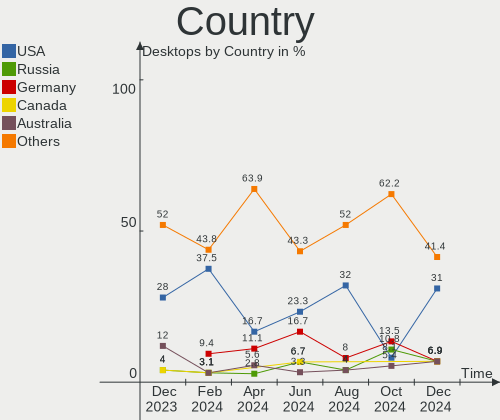
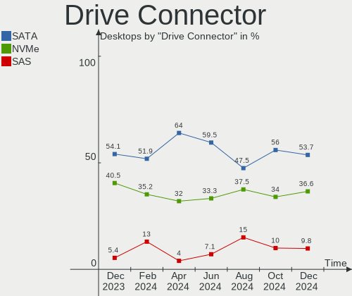
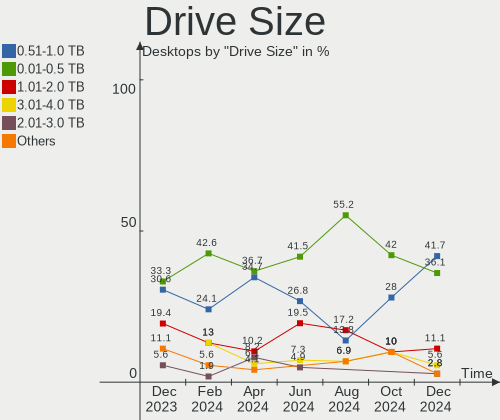
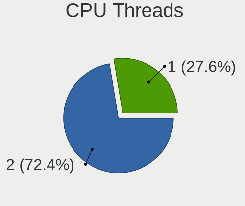
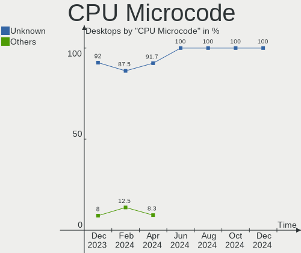
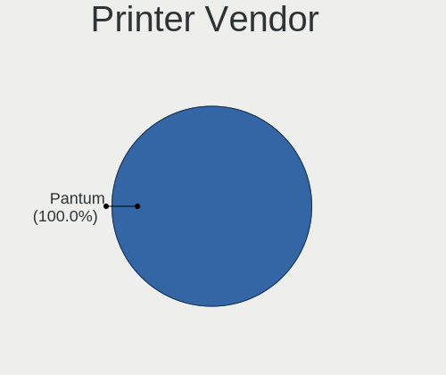
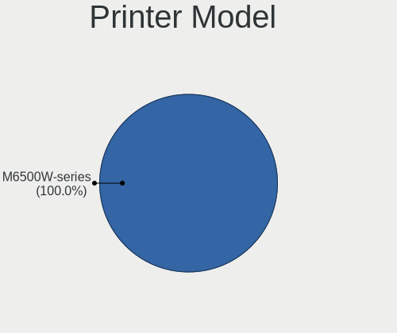
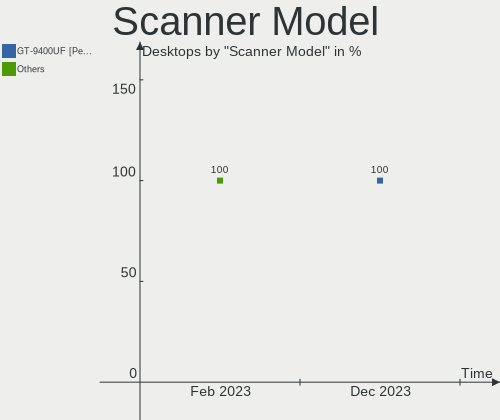

KDE neon - Hardware Trends (Desktops)
-------------------------------------

A project to identify most popular hardware characteristics and track their change
over time based on data collected by Linux users at https://Linux-Hardware.org.

Anyone can contribute to this report by the [hw-probe](https://github.com/linuxhw/hw-probe) tool:

    sudo -E hw-probe -all -upload

This report is for one last month. Overall report since the beginning of time: [TestDays](https://github.com/linuxhw/TestDays)

Period: Dec, 2023.

Contents
--------

* [ System ](#system)
  - [ OS                       ](#os)
  - [ OS Family                ](#os-family)
  - [ Kernel                   ](#kernel)
  - [ Kernel Family            ](#kernel-family)
  - [ Kernel Major Ver.        ](#kernel-major-ver)
  - [ Arch                     ](#arch)
  - [ DE                       ](#de)
  - [ Display Server           ](#display-server)
  - [ Display Manager          ](#display-manager)
  - [ OS Lang                  ](#os-lang)
  - [ Boot Mode                ](#boot-mode)
  - [ Filesystem               ](#filesystem)
  - [ Part. scheme             ](#part-scheme)
  - [ Dual Boot with Linux/BSD ](#dual-boot-with-linuxbsd)
  - [ Dual Boot (Win)          ](#dual-boot-win)

* [ Board ](#board)
  - [ Vendor                   ](#vendor)
  - [ Model                    ](#model)
  - [ Model Family             ](#model-family)
  - [ MFG Year                 ](#mfg-year)
  - [ Form Factor              ](#form-factor)
  - [ Secure Boot              ](#secure-boot)
  - [ Coreboot                 ](#coreboot)
  - [ RAM Size                 ](#ram-size)
  - [ RAM Used                 ](#ram-used)
  - [ Total Drives             ](#total-drives)
  - [ Has CD-ROM               ](#has-cd-rom)
  - [ Has Ethernet             ](#has-ethernet)
  - [ Has WiFi                 ](#has-wifi)
  - [ Has Bluetooth            ](#has-bluetooth)

* [ Location ](#location)
  - [ Country                  ](#country)
  - [ City                     ](#city)

* [ Drives ](#drives)
  - [ Drive Vendor             ](#drive-vendor)
  - [ Drive Model              ](#drive-model)
  - [ HDD Vendor               ](#hdd-vendor)
  - [ SSD Vendor               ](#ssd-vendor)
  - [ Drive Kind               ](#drive-kind)
  - [ Drive Connector          ](#drive-connector)
  - [ Drive Size               ](#drive-size)
  - [ Space Total              ](#space-total)
  - [ Space Used               ](#space-used)
  - [ Malfunc. Drives          ](#malfunc-drives)
  - [ Malfunc. Drive Vendor    ](#malfunc-drive-vendor)
  - [ Malfunc. HDD Vendor      ](#malfunc-hdd-vendor)
  - [ Malfunc. Drive Kind      ](#malfunc-drive-kind)
  - [ Failed Drives            ](#failed-drives)
  - [ Failed Drive Vendor      ](#failed-drive-vendor)
  - [ Drive Status             ](#drive-status)

* [ Storage controller ](#storage-controller)
  - [ Storage Vendor           ](#storage-vendor)
  - [ Storage Model            ](#storage-model)
  - [ Storage Kind             ](#storage-kind)

* [ Processor ](#processor)
  - [ CPU Vendor               ](#cpu-vendor)
  - [ CPU Model                ](#cpu-model)
  - [ CPU Model Family         ](#cpu-model-family)
  - [ CPU Cores                ](#cpu-cores)
  - [ CPU Sockets              ](#cpu-sockets)
  - [ CPU Threads              ](#cpu-threads)
  - [ CPU Op-Modes             ](#cpu-op-modes)
  - [ CPU Microcode            ](#cpu-microcode)
  - [ CPU Microarch            ](#cpu-microarch)

* [ Graphics ](#graphics)
  - [ GPU Vendor               ](#gpu-vendor)
  - [ GPU Model                ](#gpu-model)
  - [ GPU Combo                ](#gpu-combo)
  - [ GPU Driver               ](#gpu-driver)
  - [ GPU Memory               ](#gpu-memory)

* [ Monitor ](#monitor)
  - [ Monitor Vendor           ](#monitor-vendor)
  - [ Monitor Model            ](#monitor-model)
  - [ Monitor Resolution       ](#monitor-resolution)
  - [ Monitor Diagonal         ](#monitor-diagonal)
  - [ Monitor Width            ](#monitor-width)
  - [ Aspect Ratio             ](#aspect-ratio)
  - [ Monitor Area             ](#monitor-area)
  - [ Pixel Density            ](#pixel-density)
  - [ Multiple Monitors        ](#multiple-monitors)

* [ Network ](#network)
  - [ Net Controller Vendor    ](#net-controller-vendor)
  - [ Net Controller Model     ](#net-controller-model)
  - [ Wireless Vendor          ](#wireless-vendor)
  - [ Wireless Model           ](#wireless-model)
  - [ Ethernet Vendor          ](#ethernet-vendor)
  - [ Ethernet Model           ](#ethernet-model)
  - [ Net Controller Kind      ](#net-controller-kind)
  - [ Used Controller          ](#used-controller)
  - [ NICs                     ](#nics)
  - [ IPv6                     ](#ipv6)

* [ Bluetooth ](#bluetooth)
  - [ Bluetooth Vendor         ](#bluetooth-vendor)
  - [ Bluetooth Model          ](#bluetooth-model)

* [ Sound ](#sound)
  - [ Sound Vendor             ](#sound-vendor)
  - [ Sound Model              ](#sound-model)

* [ Memory ](#memory)
  - [ Memory Vendor            ](#memory-vendor)
  - [ Memory Model             ](#memory-model)
  - [ Memory Kind              ](#memory-kind)
  - [ Memory Form Factor       ](#memory-form-factor)
  - [ Memory Size              ](#memory-size)
  - [ Memory Speed             ](#memory-speed)

* [ Printers & scanners ](#printers--scanners)
  - [ Printer Vendor           ](#printer-vendor)
  - [ Printer Model            ](#printer-model)
  - [ Scanner Vendor           ](#scanner-vendor)
  - [ Scanner Model            ](#scanner-model)

* [ Camera ](#camera)
  - [ Camera Vendor            ](#camera-vendor)
  - [ Camera Model             ](#camera-model)

* [ Security ](#security)
  - [ Fingerprint Vendor       ](#fingerprint-vendor)
  - [ Fingerprint Model        ](#fingerprint-model)
  - [ Chipcard Vendor          ](#chipcard-vendor)
  - [ Chipcard Model           ](#chipcard-model)

* [ Unsupported ](#unsupported)
  - [ Unsupported Devices      ](#unsupported-devices)
  - [ Unsupported Device Types ](#unsupported-device-types)

System
------

OS
--

Installed operating systems

| Name           | Desktops | Percent |
|----------------|----------|---------|
| KDE neon 22.04 | 25       | 100%    |

OS Family
---------

OS without a version

| Name     | Desktops | Percent |
|----------|----------|---------|
| KDE neon | 25       | 100%    |

Kernel
------

Version of the Linux kernel

| Version              | Desktops | Percent |
|----------------------|----------|---------|
| 6.2.0-39-generic     | 11       | 44%     |
| 6.2.0-37-generic     | 8        | 32%     |
| 6.2.0-34-generic     | 3        | 12%     |
| 6.3.0-060300-generic | 1        | 4%      |
| 5.15.0-91-generic    | 1        | 4%      |
| 5.15.0-71-generic    | 1        | 4%      |

Kernel Family
-------------

Linux kernel without a distro release

| Version | Desktops | Percent |
|---------|----------|---------|
| 6.2.0   | 22       | 88%     |
| 5.15.0  | 2        | 8%      |
| 6.3.0   | 1        | 4%      |

Kernel Major Ver.
-----------------

Linux kernel major version

| Version | Desktops | Percent |
|---------|----------|---------|
| 6.2     | 22       | 88%     |
| 5.15    | 2        | 8%      |
| 6.3     | 1        | 4%      |

Arch
----

OS architecture (x86_64, i586, etc.)

| Name   | Desktops | Percent |
|--------|----------|---------|
| x86_64 | 25       | 100%    |

DE
--

Desktop Environment

| Name | Desktops | Percent |
|------|----------|---------|
| KDE5 | 25       | 100%    |

Display Server
--------------

X11 or Wayland

| Name | Desktops | Percent |
|------|----------|---------|
| X11  | 25       | 100%    |

Display Manager
---------------

SDDM, LightDM, etc.

| Name    | Desktops | Percent |
|---------|----------|---------|
| Unknown | 22       | 88%     |
| SDDM    | 3        | 12%     |

OS Lang
-------

Language

| Lang           | Desktops | Percent |
|----------------|----------|---------|
| en_US          | 11       | 44%     |
| en_GB          | 2        | 8%      |
| en_AU          | 2        | 8%      |
| C              | 2        | 8%      |
| ru_RU          | 1        | 4%      |
| pt_BR          | 1        | 4%      |
| fi_FI          | 1        | 4%      |
| es_MX          | 1        | 4%      |
| en_IN          | 1        | 4%      |
| en_CA          | 1        | 4%      |
| cs_CZ          | 1        | 4%      |
| ca_ES@valencia | 1        | 4%      |

Boot Mode
---------

EFI or BIOS

| Mode | Desktops | Percent |
|------|----------|---------|
| BIOS | 23       | 92%     |
| EFI  | 2        | 8%      |

Filesystem
----------

Type of filesystem

| Type  | Desktops | Percent |
|-------|----------|---------|
| Ext4  | 23       | 92%     |
| Tmpfs | 1        | 4%      |
| Btrfs | 1        | 4%      |

Part. scheme
------------

Scheme of partitioning

| Type    | Desktops | Percent |
|---------|----------|---------|
| Unknown | 22       | 88%     |
| GPT     | 3        | 12%     |

Dual Boot with Linux/BSD
------------------------

Hosting more than one Linux/BSD

| Dual boot | Desktops | Percent |
|-----------|----------|---------|
| No        | 25       | 100%    |

Dual Boot (Win)
---------------

Hosting Linux and Windows

| Dual boot | Desktops | Percent |
|-----------|----------|---------|
| No        | 24       | 96%     |
| Yes       | 1        | 4%      |

Board
-----

Vendor
------

Motherboard manufacturer

| Name                | Desktops | Percent |
|---------------------|----------|---------|
| ASUSTek Computer    | 8        | 32%     |
| MSI                 | 6        | 24%     |
| Gigabyte Technology | 4        | 16%     |
| Hewlett-Packard     | 3        | 12%     |
| LattePanda          | 1        | 4%      |
| Intel               | 1        | 4%      |
| BY OEM              | 1        | 4%      |
| ASRock              | 1        | 4%      |

Model
-----

Motherboard model

| Name                              | Desktops | Percent |
|-----------------------------------|----------|---------|
| MSI MS-7E12                       | 1        | 4%      |
| MSI MS-7D75                       | 1        | 4%      |
| MSI MS-7C91                       | 1        | 4%      |
| MSI MS-7C02                       | 1        | 4%      |
| MSI MS-7B89                       | 1        | 4%      |
| MSI MS-7B49                       | 1        | 4%      |
| LattePanda Sigma                  | 1        | 4%      |
| Intel H61                         | 1        | 4%      |
| HP Z4 G4 Workstation              | 1        | 4%      |
| HP ProDesk 400 G5 Desktop Mini    | 1        | 4%      |
| HP EliteDesk 800 G3 SFF           | 1        | 4%      |
| Gigabyte X570 I AORUS PRO WIFI    | 1        | 4%      |
| Gigabyte B760M D3H DDR4           | 1        | 4%      |
| Gigabyte B550M AORUS ELITE        | 1        | 4%      |
| Gigabyte 970A-D3P                 | 1        | 4%      |
| BY OEM B365                       | 1        | 4%      |
| ASUS TUF Gaming B760-PLUS WIFI D4 | 1        | 4%      |
| ASUS TUF Gaming B660M-E D4        | 1        | 4%      |
| ASUS TUF Gaming B650-PLUS WIFI    | 1        | 4%      |
| ASUS ROG STRIX B450-F GAMING II   | 1        | 4%      |
| ASUS ProArt B550-CREATOR          | 1        | 4%      |
| ASUS PRIME B650-PLUS              | 1        | 4%      |
| ASUS PRIME B250M-PLUS             | 1        | 4%      |
| ASUS PRIME A320M-K                | 1        | 4%      |
| ASRock A300M-STX                  | 1        | 4%      |

Model Family
------------

Motherboard model prefix

| Name              | Desktops | Percent |
|-------------------|----------|---------|
| ASUS TUF          | 3        | 12%     |
| ASUS PRIME        | 3        | 12%     |
| MSI MS-7E12       | 1        | 4%      |
| MSI MS-7D75       | 1        | 4%      |
| MSI MS-7C91       | 1        | 4%      |
| MSI MS-7C02       | 1        | 4%      |
| MSI MS-7B89       | 1        | 4%      |
| MSI MS-7B49       | 1        | 4%      |
| LattePanda Sigma  | 1        | 4%      |
| Intel H61         | 1        | 4%      |
| HP Z4             | 1        | 4%      |
| HP ProDesk        | 1        | 4%      |
| HP EliteDesk      | 1        | 4%      |
| Gigabyte X570     | 1        | 4%      |
| Gigabyte B760M    | 1        | 4%      |
| Gigabyte B550M    | 1        | 4%      |
| Gigabyte 970A-D3P | 1        | 4%      |
| BY OEM B365       | 1        | 4%      |
| ASUS ROG          | 1        | 4%      |
| ASUS ProArt       | 1        | 4%      |
| ASRock A300M-STX  | 1        | 4%      |

MFG Year
--------

Motherboard manufacture year

| Year | Desktops | Percent |
|------|----------|---------|
| 2022 | 5        | 20%     |
| 2023 | 4        | 16%     |
| 2017 | 4        | 16%     |
| 2020 | 3        | 12%     |
| 2019 | 3        | 12%     |
| 2018 | 3        | 12%     |
| 2021 | 1        | 4%      |
| 2016 | 1        | 4%      |
| 2013 | 1        | 4%      |

Form Factor
-----------

Physical design of the computer

| Name    | Desktops | Percent |
|---------|----------|---------|
| Desktop | 25       | 100%    |

Secure Boot
-----------

Enabled or disabled

| State    | Desktops | Percent |
|----------|----------|---------|
| Disabled | 25       | 100%    |

Coreboot
--------

Have coreboot on board

| Used | Desktops | Percent |
|------|----------|---------|
| No   | 25       | 100%    |

RAM Size
--------

Total RAM memory

| Size in GB  | Desktops | Percent |
|-------------|----------|---------|
| 32.01-64.0  | 8        | 32%     |
| 16.01-24.0  | 8        | 32%     |
| 64.01-256.0 | 3        | 12%     |
| 24.01-32.0  | 2        | 8%      |
| 8.01-16.0   | 2        | 8%      |
| 4.01-8.0    | 1        | 4%      |
| 3.01-4.0    | 1        | 4%      |

RAM Used
--------

Used RAM memory

| Used GB   | Desktops | Percent |
|-----------|----------|---------|
| 4.01-8.0  | 12       | 48%     |
| 3.01-4.0  | 5        | 20%     |
| 2.01-3.0  | 3        | 12%     |
| 1.01-2.0  | 3        | 12%     |
| 8.01-16.0 | 2        | 8%      |

Total Drives
------------

Number of drives on board

| Drives | Desktops | Percent |
|--------|----------|---------|
| 3      | 7        | 28%     |
| 2      | 7        | 28%     |
| 1      | 4        | 16%     |
| 4      | 3        | 12%     |
| 9      | 1        | 4%      |
| 8      | 1        | 4%      |
| 6      | 1        | 4%      |
| 5      | 1        | 4%      |

Has CD-ROM
----------

Has CD-ROM on board

| Presented | Desktops | Percent |
|-----------|----------|---------|
| No        | 22       | 88%     |
| Yes       | 3        | 12%     |

Has Ethernet
------------

Has Ethernet on board

| Presented | Desktops | Percent |
|-----------|----------|---------|
| Yes       | 25       | 100%    |

Has WiFi
--------

Has WiFi module

| Presented | Desktops | Percent |
|-----------|----------|---------|
| No        | 14       | 56%     |
| Yes       | 11       | 44%     |

Has Bluetooth
-------------

Has Bluetooth module

| Presented | Desktops | Percent |
|-----------|----------|---------|
| No        | 13       | 52%     |
| Yes       | 12       | 48%     |

Location
--------

Country
-------

Geographic location (country)

| Country   | Desktops | Percent |
|-----------|----------|---------|
| USA       | 7        | 28%     |
| Australia | 3        | 12%     |
| UK        | 2        | 8%      |
| Norway    | 2        | 8%      |
| Brazil    | 2        | 8%      |
| Spain     | 1        | 4%      |
| Serbia    | 1        | 4%      |
| Russia    | 1        | 4%      |
| Poland    | 1        | 4%      |
| Mexico    | 1        | 4%      |
| India     | 1        | 4%      |
| Finland   | 1        | 4%      |
| Czechia   | 1        | 4%      |
| Canada    | 1        | 4%      |

City
----

Geographic location (city)

| City                  | Desktops | Percent |
|-----------------------|----------|---------|
| Perth                 | 2        | 8%      |
| Warsaw                | 1        | 4%      |
| Voronezh              | 1        | 4%      |
| Trondheim             | 1        | 4%      |
| Portland              | 1        | 4%      |
| Patos de Minas        | 1        | 4%      |
| Owosso                | 1        | 4%      |
| Northampton           | 1        | 4%      |
| Niš                  | 1        | 4%      |
| Mumbai                | 1        | 4%      |
| Monument              | 1        | 4%      |
| Moberly               | 1        | 4%      |
| Mexico City           | 1        | 4%      |
| Kannonkoski           | 1        | 4%      |
| Kalamazoo             | 1        | 4%      |
| Hradec nad Moravici   | 1        | 4%      |
| Grand Blanc           | 1        | 4%      |
| Edmonton              | 1        | 4%      |
| Cwmbran               | 1        | 4%      |
| Contagem              | 1        | 4%      |
| Castelló de la Plana | 1        | 4%      |
| Carshalton            | 1        | 4%      |
| Brisbane              | 1        | 4%      |
| Bergen                | 1        | 4%      |

Drives
------

Drive Vendor
------------

Hard drive vendors

| Vendor                      | Desktops | Drives | Percent |
|-----------------------------|----------|--------|---------|
| Seagate                     | 10       | 21     | 17.24%  |
| WDC                         | 7        | 10     | 12.07%  |
| Sandisk                     | 7        | 9      | 12.07%  |
| Samsung Electronics         | 7        | 10     | 12.07%  |
| Kingston                    | 6        | 6      | 10.34%  |
| Toshiba                     | 3        | 3      | 5.17%   |
| Intel                       | 3        | 3      | 5.17%   |
| Crucial                     | 3        | 4      | 5.17%   |
| Realtek Semiconductor       | 2        | 3      | 3.45%   |
| WALRAM                      | 1        | 1      | 1.72%   |
| SPCC                        | 1        | 1      | 1.72%   |
| SK hynix                    | 1        | 1      | 1.72%   |
| Seagate Technology          | 1        | 1      | 1.72%   |
| POWER                       | 1        | 1      | 1.72%   |
| KIOXIA                      | 1        | 1      | 1.72%   |
| Kingston Technology Company | 1        | 1      | 1.72%   |
| GOODRAM                     | 1        | 1      | 1.72%   |
| Fanxiang                    | 1        | 1      | 1.72%   |
| acmeor                      | 1        | 1      | 1.72%   |

Drive Model
-----------

Hard drive models

| Model                                               | Desktops | Percent |
|-----------------------------------------------------|----------|---------|
| WDC WD30EZRX-00D8PB0 3TB                            | 2        | 2.63%   |
| Seagate ST2000DM008-2FR102 2TB                      | 2        | 2.63%   |
| Seagate ST2000DM001-1ER164 2TB                      | 2        | 2.63%   |
| Sandisk WD Black SN750 / PC SN730 NVMe SSD 2TB      | 2        | 2.63%   |
| Samsung NVMe SSD Controller SM981/PM981/PM983 512GB | 2        | 2.63%   |
| Realtek RTS5763DL NVMe SSD Controller 256GB         | 2        | 2.63%   |
| Kingston SV300S37A120G 120GB SSD                    | 2        | 2.63%   |
| Kingston SA400S37240G 240GB SSD                     | 2        | 2.63%   |
| Crucial CT500MX500SSD1 500GB                        | 2        | 2.63%   |
| WDC WDS500G2B0A-00SM50 500GB SSD                    | 1        | 1.32%   |
| WDC WD7500BPVT-60HXZT3 752GB                        | 1        | 1.32%   |
| WDC WD15EADS-22P8B0 1TB                             | 1        | 1.32%   |
| WDC WD10SPSX-00A6WT0 1TB                            | 1        | 1.32%   |
| WDC WD10EZEX-08WN4A0 1TB                            | 1        | 1.32%   |
| WDC WD10EZEX-00WN4A0 1TB                            | 1        | 1.32%   |
| WDC WD10EADS-00M2B0 1TB                             | 1        | 1.32%   |
| WDC WD1003FBYX-01Y7B1 1TB                           | 1        | 1.32%   |
| WALRAM 128G                                         | 1        | 1.32%   |
| Toshiba THNSNJ128GCSU 128GB SSD                     | 1        | 1.32%   |
| Toshiba HDWL110 1TB                                 | 1        | 1.32%   |
| Toshiba DT01ACA100 1TB                              | 1        | 1.32%   |
| SPCC Solid State Disk 2TB                           | 1        | 1.32%   |
| SK hynix SHGS31-500GS-2 500GB SSD                   | 1        | 1.32%   |
| Seagate FireCuda 510 SSD 500GB                      | 1        | 1.32%   |
| Seagate ST8000DM004-2CX188 8TB                      | 1        | 1.32%   |
| Seagate ST500LM021-1KJ152 500GB                     | 1        | 1.32%   |
| Seagate ST500DM002-1BD142 500GB                     | 1        | 1.32%   |
| Seagate ST3500320AS 500GB                           | 1        | 1.32%   |
| Seagate ST2000VM003-1ET164 2TB                      | 1        | 1.32%   |
| Seagate ST2000DX002-2DV164 2TB                      | 1        | 1.32%   |
| Seagate ST2000DM006-2DM164 2TB                      | 1        | 1.32%   |
| Seagate ST16000NE000-2WX103 16TB                    | 1        | 1.32%   |
| Seagate ST12000NE0008-2JL101 12TB                   | 1        | 1.32%   |
| Seagate ST1000LM035-1RK172 1TB                      | 1        | 1.32%   |
| Seagate ST1000LM024 HN-M101MBB 1TB                  | 1        | 1.32%   |
| Seagate ST1000DM010-2EP102 1TB                      | 1        | 1.32%   |
| Seagate ST1000DM003-1CH162 1TB                      | 1        | 1.32%   |
| Seagate Expansion HDD 2TB                           | 1        | 1.32%   |
| Sandisk WD_BLACK SN850X 1000GB                      | 1        | 1.32%   |
| Sandisk WD_BLACK SN770 500GB                        | 1        | 1.32%   |

HDD Vendor
----------

Hard disk drive vendors

| Vendor              | Desktops | Drives | Percent |
|---------------------|----------|--------|---------|
| Seagate             | 10       | 21     | 50%     |
| WDC                 | 7        | 9      | 35%     |
| Toshiba             | 2        | 2      | 10%     |
| Samsung Electronics | 1        | 1      | 5%      |

SSD Vendor
----------

Solid state drive vendors

| Vendor              | Desktops | Drives | Percent |
|---------------------|----------|--------|---------|
| Samsung Electronics | 5        | 5      | 26.32%  |
| Kingston            | 5        | 5      | 26.32%  |
| Crucial             | 2        | 3      | 10.53%  |
| WDC                 | 1        | 1      | 5.26%   |
| Toshiba             | 1        | 1      | 5.26%   |
| SPCC                | 1        | 1      | 5.26%   |
| SK hynix            | 1        | 1      | 5.26%   |
| SanDisk             | 1        | 1      | 5.26%   |
| Intel               | 1        | 1      | 5.26%   |
| GOODRAM             | 1        | 1      | 5.26%   |

Drive Kind
----------

HDD or SSD

| Kind    | Desktops | Drives | Percent |
|---------|----------|--------|---------|
| NVMe    | 15       | 22     | 31.91%  |
| HDD     | 15       | 33     | 31.91%  |
| SSD     | 13       | 20     | 27.66%  |
| Unknown | 4        | 4      | 8.51%   |

Drive Connector
---------------

SATA, SAS, NVMe, etc.

| Type | Desktops | Drives | Percent |
|------|----------|--------|---------|
| SATA | 20       | 55     | 54.05%  |
| NVMe | 15       | 22     | 40.54%  |
| SAS  | 2        | 2      | 5.41%   |

Drive Size
----------

Size of hard drive

| Size in TB | Desktops | Drives | Percent |
|------------|----------|--------|---------|
| 0.01-0.5   | 12       | 18     | 34.29%  |
| 0.51-1.0   | 11       | 17     | 31.43%  |
| 1.01-2.0   | 7        | 12     | 20%     |
| 2.01-3.0   | 2        | 2      | 5.71%   |
| 10.01-20.0 | 2        | 3      | 5.71%   |
| 4.01-10.0  | 1        | 1      | 2.86%   |

Space Total
-----------

Amount of disk space available on the file system

| Size in GB     | Desktops | Percent |
|----------------|----------|---------|
| 501-1000       | 5        | 20%     |
| More than 3000 | 4        | 16%     |
| 1001-2000      | 4        | 16%     |
| 51-100         | 4        | 16%     |
| 251-500        | 3        | 12%     |
| 2001-3000      | 2        | 8%      |
| 1-20           | 2        | 8%      |
| 101-250        | 1        | 4%      |

Space Used
----------

Amount of used disk space

| Used GB        | Desktops | Percent |
|----------------|----------|---------|
| 1-20           | 7        | 28%     |
| 251-500        | 3        | 12%     |
| 21-50          | 3        | 12%     |
| 1001-2000      | 3        | 12%     |
| 501-1000       | 3        | 12%     |
| 51-100         | 3        | 12%     |
| More than 3000 | 1        | 4%      |
| 2001-3000      | 1        | 4%      |
| 101-250        | 1        | 4%      |

Malfunc. Drives
---------------

Drive models with a malfunction

Zero info for selected period =(

Malfunc. Drive Vendor
---------------------

Vendors of faulty drives

Zero info for selected period =(

Malfunc. HDD Vendor
-------------------

Vendors of faulty HDD drives

Zero info for selected period =(

Malfunc. Drive Kind
-------------------

Kinds of faulty drives

Zero info for selected period =(

Failed Drives
-------------

Failed drive models

Zero info for selected period =(

Failed Drive Vendor
-------------------

Failed drive vendors

Zero info for selected period =(

Drive Status
------------

Number of failed and malfunc. drives

| Status   | Desktops | Drives | Percent |
|----------|----------|--------|---------|
| Detected | 23       | 75     | 92%     |
| Works    | 2        | 4      | 8%      |

Storage controller
------------------

Storage Vendor
--------------

Storage controller vendors

| Vendor                      | Desktops | Percent |
|-----------------------------|----------|---------|
| AMD                         | 14       | 31.11%  |
| Intel                       | 11       | 24.44%  |
| SanDisk                     | 6        | 13.33%  |
| Samsung Electronics         | 4        | 8.89%   |
| Realtek Semiconductor       | 2        | 4.44%   |
| Kingston Technology Company | 2        | 4.44%   |
| ASMedia Technology          | 2        | 4.44%   |
| Seagate Technology          | 1        | 2.22%   |
| Micron/Crucial Technology   | 1        | 2.22%   |
| Marvell Technology Group    | 1        | 2.22%   |
| KIOXIA                      | 1        | 2.22%   |

Storage Model
-------------

Storage controller models

| Model                                                                         | Desktops | Percent |
|-------------------------------------------------------------------------------|----------|---------|
| AMD FCH SATA Controller [AHCI mode]                                           | 9        | 16.36%  |
| Intel 200 Series PCH SATA controller [AHCI mode]                              | 4        | 7.27%   |
| Samsung NVMe SSD Controller SM981/PM981/PM983                                 | 3        | 5.45%   |
| AMD 500 Series Chipset SATA Controller                                        | 3        | 5.45%   |
| AMD 400 Series Chipset SATA Controller                                        | 3        | 5.45%   |
| SanDisk WD Black SN770 / PC SN740 256GB / PC SN560 (DRAM-less) NVMe SSD       | 2        | 3.64%   |
| SanDisk Extreme Pro / WD Black SN750 / PC SN730 / Red SN700 NVMe SSD          | 2        | 3.64%   |
| Realtek RTS5762 NVMe SSD Controller                                           | 2        | 3.64%   |
| Intel 700 Series Chipset Family SATA AHCI Controller                          | 2        | 3.64%   |
| Seagate FireCuda/IronWolf 510 SSD                                             | 1        | 1.82%   |
| SanDisk WD Green SN350 240GB (DRAM-less) / SN560E NVMe SSD                    | 1        | 1.82%   |
| Sandisk WD Black SN850X NVMe SSD                                              | 1        | 1.82%   |
| SanDisk Ultra 3D / WD Blue SN570 NVMe SSD (DRAM-less)                         | 1        | 1.82%   |
| SanDisk Extreme Pro / WD Black 2018/SN750/PC SN720 NVMe SSD                   | 1        | 1.82%   |
| Samsung NVMe SSD Controller 980 (DRAM-less)                                   | 1        | 1.82%   |
| Realtek RTS5763DL x2 NVMe SSD Controller                                      | 1        | 1.82%   |
| Micron/Crucial P2 [Nick P2] / P3 / P3 Plus NVMe PCIe SSD (DRAM-less)          | 1        | 1.82%   |
| Marvell Group 88SE9120 SATA 6Gb/s Controller                                  | 1        | 1.82%   |
| KIOXIA NVMe SSD                                                               | 1        | 1.82%   |
| Kingston Company NV2 NVMe SSD SM2267XT                                        | 1        | 1.82%   |
| Kingston Company KC3000/FURY Renegade NVMe SSD E18                            | 1        | 1.82%   |
| Intel Volume Management Device NVMe RAID Controller Intel Corporation         | 1        | 1.82%   |
| Intel Volume Management Device NVMe RAID Controller                           | 1        | 1.82%   |
| Intel SSD 660P Series                                                         | 1        | 1.82%   |
| Intel SSD 600P Series                                                         | 1        | 1.82%   |
| Intel Cannon Lake PCH SATA AHCI Controller                                    | 1        | 1.82%   |
| Intel C600/X79 series chipset SATA RAID Controller                            | 1        | 1.82%   |
| Intel Alder Lake-S PCH SATA Controller [AHCI Mode]                            | 1        | 1.82%   |
| Intel Alder Lake-P SATA AHCI Controller                                       | 1        | 1.82%   |
| Intel 6 Series/C200 Series Chipset Family 6 port Desktop SATA AHCI Controller | 1        | 1.82%   |
| ASMedia ASM1062 Serial ATA Controller                                         | 1        | 1.82%   |
| ASMedia 1064 SATA Controller                                                  | 1        | 1.82%   |
| AMD SB7x0/SB8x0/SB9x0 SATA Controller [AHCI mode]                             | 1        | 1.82%   |
| AMD FCH SATA Controller D                                                     | 1        | 1.82%   |

Storage Kind
------------

Kind of storage controller (IDE, SATA, NVMe, SAS, ...)

| Kind | Desktops | Percent |
|------|----------|---------|
| SATA | 25       | 58.14%  |
| NVMe | 15       | 34.88%  |
| RAID | 3        | 6.98%   |

Processor
---------

CPU Vendor
----------

Processor vendors

| Vendor | Desktops | Percent |
|--------|----------|---------|
| AMD    | 14       | 56%     |
| Intel  | 11       | 44%     |

CPU Model
---------

Processor models

| Model                                       | Desktops | Percent |
|---------------------------------------------|----------|---------|
| AMD Ryzen 9 5900X 12-Core Processor         | 2        | 8%      |
| AMD Ryzen 7 5800X 8-Core Processor          | 2        | 8%      |
| AMD Ryzen 5 5600G with Radeon Graphics      | 2        | 8%      |
| Intel Xeon W-2133 CPU @ 3.60GHz             | 1        | 4%      |
| Intel Core i7-6700 CPU @ 3.40GHz            | 1        | 4%      |
| Intel Core i5-8500 CPU @ 3.00GHz            | 1        | 4%      |
| Intel Core i5-7400 CPU @ 3.00GHz            | 1        | 4%      |
| Intel Core i3-9100T CPU @ 3.10GHz           | 1        | 4%      |
| Intel Core i3-6100 CPU @ 3.70GHz            | 1        | 4%      |
| Intel Core i3-2100 CPU @ 3.10GHz            | 1        | 4%      |
| Intel 13th Gen Core i7-13700F               | 1        | 4%      |
| Intel 13th Gen Core i5-13500                | 1        | 4%      |
| Intel 13th Gen Core i5-1340P                | 1        | 4%      |
| Intel 12th Gen Core i5-12400F               | 1        | 4%      |
| AMD Ryzen 9 7900X3D 12-Core Processor       | 1        | 4%      |
| AMD Ryzen 9 7900 12-Core Processor          | 1        | 4%      |
| AMD Ryzen 7 7700X 8-Core Processor          | 1        | 4%      |
| AMD Ryzen 7 7700 8-Core Processor           | 1        | 4%      |
| AMD Ryzen 7 2700X Eight-Core Processor      | 1        | 4%      |
| AMD Ryzen 5 5600X 6-Core Processor          | 1        | 4%      |
| AMD Ryzen 5 3400G with Radeon Vega Graphics | 1        | 4%      |
| AMD FX-8370 Eight-Core Processor            | 1        | 4%      |

CPU Model Family
----------------

Processor model prefix

| Model         | Desktops | Percent |
|---------------|----------|---------|
| AMD Ryzen 7   | 5        | 20%     |
| Other         | 4        | 16%     |
| AMD Ryzen 9   | 4        | 16%     |
| AMD Ryzen 5   | 4        | 16%     |
| Intel Core i3 | 3        | 12%     |
| Intel Core i5 | 2        | 8%      |
| Intel Xeon    | 1        | 4%      |
| Intel Core i7 | 1        | 4%      |
| AMD FX        | 1        | 4%      |

CPU Cores
---------

Number of processor cores

| Number | Desktops | Percent |
|--------|----------|---------|
| 6      | 6        | 24%     |
| 12     | 5        | 20%     |
| 8      | 5        | 20%     |
| 4      | 5        | 20%     |
| 2      | 2        | 8%      |
| 16     | 1        | 4%      |
| 14     | 1        | 4%      |

CPU Sockets
-----------

Number of sockets

| Number | Desktops | Percent |
|--------|----------|---------|
| 1      | 25       | 100%    |

CPU Threads
-----------

Threads per core (Hyper-Threading)

| Number | Desktops | Percent |
|--------|----------|---------|
| 2      | 21       | 84%     |
| 1      | 4        | 16%     |

CPU Op-Modes
------------

CPU Operation Modes (32-bit, 64-bit)

| Op mode        | Desktops | Percent |
|----------------|----------|---------|
| 32-bit, 64-bit | 25       | 100%    |

CPU Microcode
-------------

Microcode number

| Number     | Desktops | Percent |
|------------|----------|---------|
| Unknown    | 23       | 92%     |
| 0x0a50000d | 1        | 4%      |
| 0x0a201204 | 1        | 4%      |

CPU Microarch
-------------

Microarchitecture

| Name        | Desktops | Percent |
|-------------|----------|---------|
| Unknown     | 8        | 32%     |
| Zen 3       | 7        | 28%     |
| Skylake     | 3        | 12%     |
| KabyLake    | 3        | 12%     |
| Zen+        | 2        | 8%      |
| SandyBridge | 1        | 4%      |
| Piledriver  | 1        | 4%      |

Graphics
--------

GPU Vendor
----------

Vendors of graphics cards

| Vendor | Desktops | Percent |
|--------|----------|---------|
| AMD    | 12       | 46.15%  |
| Nvidia | 7        | 26.92%  |
| Intel  | 7        | 26.92%  |

GPU Model
---------

Graphics card models

| Model                                                                     | Desktops | Percent |
|---------------------------------------------------------------------------|----------|---------|
| AMD Raphael                                                               | 4        | 13.79%  |
| Nvidia GP106 [GeForce GTX 1060 6GB]                                       | 2        | 6.9%    |
| Intel HD Graphics 530                                                     | 2        | 6.9%    |
| Intel CoffeeLake-S GT2 [UHD Graphics 630]                                 | 2        | 6.9%    |
| AMD Navi 32 [Radeon RX 7700 XT / 7800 XT]                                 | 2        | 6.9%    |
| AMD Navi 22 [Radeon RX 6700/6700 XT/6750 XT / 6800M/6850M XT]             | 2        | 6.9%    |
| AMD Ellesmere [Radeon RX 470/480/570/570X/580/580X/590]                   | 2        | 6.9%    |
| Nvidia TU116 [GeForce GTX 1660 SUPER]                                     | 1        | 3.45%   |
| Nvidia GP104 [GeForce GTX 1070 Ti]                                        | 1        | 3.45%   |
| Nvidia GA104 [GeForce RTX 3070]                                           | 1        | 3.45%   |
| Nvidia GA104 [GeForce RTX 3060 Ti GDDR6X]                                 | 1        | 3.45%   |
| Nvidia AD107 [GeForce RTX 4060]                                           | 1        | 3.45%   |
| Intel Raptor Lake-P [Iris Xe Graphics]                                    | 1        | 3.45%   |
| Intel AlderLake-S GT1                                                     | 1        | 3.45%   |
| Intel 2nd Generation Core Processor Family Integrated Graphics Controller | 1        | 3.45%   |
| AMD Picasso/Raven 2 [Radeon Vega Series / Radeon Vega Mobile Series]      | 1        | 3.45%   |
| AMD Navi 33 [Radeon RX 7700S/7600/7600S/7600M XT/PRO W7600]               | 1        | 3.45%   |
| AMD Navi 23 [Radeon RX 6600/6600 XT/6600M]                                | 1        | 3.45%   |
| AMD Navi 21 [Radeon RX 6900 XT]                                           | 1        | 3.45%   |
| AMD Cezanne [Radeon Vega Series / Radeon Vega Mobile Series]              | 1        | 3.45%   |

GPU Combo
---------

Combinations of graphics cards

| Name       | Desktops | Percent |
|------------|----------|---------|
| 1 x AMD    | 9        | 36%     |
| 1 x Nvidia | 7        | 28%     |
| 1 x Intel  | 6        | 24%     |
| 2 x AMD    | 3        | 12%     |

GPU Driver
----------

Free vs proprietary

| Driver      | Desktops | Percent |
|-------------|----------|---------|
| Free        | 20       | 80%     |
| Proprietary | 3        | 12%     |
| Unknown     | 2        | 8%      |

GPU Memory
----------

Total video memory

| Size in GB | Desktops | Percent |
|------------|----------|---------|
| Unknown    | 20       | 80%     |
| 5.01-6.0   | 2        | 8%      |
| 7.01-8.0   | 1        | 4%      |
| 8.01-16.0  | 1        | 4%      |
| 0.01-0.5   | 1        | 4%      |

Monitor
-------

Monitor Vendor
--------------

Monitor vendors

| Vendor               | Desktops | Percent |
|----------------------|----------|---------|
| Goldstar             | 9        | 31.03%  |
| BenQ                 | 3        | 10.34%  |
| Samsung Electronics  | 2        | 6.9%    |
| Lenovo               | 2        | 6.9%    |
| Ancor Communications | 2        | 6.9%    |
| Vizio                | 1        | 3.45%   |
| Sony                 | 1        | 3.45%   |
| Philips              | 1        | 3.45%   |
| MSI                  | 1        | 3.45%   |
| Hitachi              | 1        | 3.45%   |
| Hewlett-Packard      | 1        | 3.45%   |
| HannStar             | 1        | 3.45%   |
| Dell                 | 1        | 3.45%   |
| ASUSTek Computer     | 1        | 3.45%   |
| AOC                  | 1        | 3.45%   |
| Acer                 | 1        | 3.45%   |

Monitor Model
-------------

Monitor models

| Model                                                                 | Desktops | Percent |
|-----------------------------------------------------------------------|----------|---------|
| Vizio E24-C1 VIZ1005 1920x1080 521x293mm 23.5-inch                    | 1        | 3.45%   |
| Sony AVAMP SNYF400 1920x1080                                          | 1        | 3.45%   |
| Samsung Electronics LCD Monitor SAM07BA 1920x1080 890x500mm 40.2-inch | 1        | 3.45%   |
| Samsung Electronics C27FG70 SAM0DC9 1920x1080 598x337mm 27.0-inch     | 1        | 3.45%   |
| Philips PHL 328P6A PHL0913 2560x1440 698x393mm 31.5-inch              | 1        | 3.45%   |
| MSI MAG241C MSI3EA2 1920x1080 521x293mm 23.5-inch                     | 1        | 3.45%   |
| Lenovo L32p-30 LEN66C9 3840x2160 697x392mm 31.5-inch                  | 1        | 3.45%   |
| Lenovo L2250p Wide LEN0A0C 1680x1050 474x296mm 22.0-inch              | 1        | 3.45%   |
| Hitachi HDMI HEC0030 1920x1080 1150x650mm 52.0-inch                   | 1        | 3.45%   |
| Hewlett-Packard E233 HPN345F 1920x1080 509x286mm 23.0-inch            | 1        | 3.45%   |
| HannStar JC199D HSD04C6 1280x1024 376x301mm 19.0-inch                 | 1        | 3.45%   |
| Goldstar ULTRAWIDE GSM7794 2560x1080 800x335mm 34.1-inch              | 1        | 3.45%   |
| Goldstar ULTRAWIDE GSM59F1 2560x1080 673x284mm 28.8-inch              | 1        | 3.45%   |
| Goldstar ULTRAGEAR GSM5BB3 2560x1440 597x336mm 27.0-inch              | 1        | 3.45%   |
| Goldstar M2252D GSM60AC 1920x1080 531x299mm 24.0-inch                 | 1        | 3.45%   |
| Goldstar IPS237 GSM5901 1920x1080 510x290mm 23.1-inch                 | 1        | 3.45%   |
| Goldstar HDR WQHD GSM7755 3440x1440 820x346mm 35.0-inch               | 1        | 3.45%   |
| Goldstar FULL HD GSM5B55 1920x1080 480x270mm 21.7-inch                | 1        | 3.45%   |
| Goldstar E2060 GSM4EBF 1600x900 443x249mm 20.0-inch                   | 1        | 3.45%   |
| Goldstar 27M45 GSM5A5D 1920x1080 600x340mm 27.2-inch                  | 1        | 3.45%   |
| Dell U2723QE DEL426A 3840x2160 597x336mm 27.0-inch                    | 1        | 3.45%   |
| BenQ GW2470 BNQ78E4 1920x1080 527x296mm 23.8-inch                     | 1        | 3.45%   |
| BenQ BL2780 BNQ802B 1920x1080 598x336mm 27.0-inch                     | 1        | 3.45%   |
| BenQ BL2283 BNQ78EA 1920x1080 476x268mm 21.5-inch                     | 1        | 3.45%   |
| ASUSTek Computer VP32AQ AUS32A6 2560x1440 697x392mm 31.5-inch         | 1        | 3.45%   |
| AOC 27G2G4 AOC2702 1920x1080 598x336mm 27.0-inch                      | 1        | 3.45%   |
| Ancor Communications VS278 ACI27A1 1920x1080 598x336mm 27.0-inch      | 1        | 3.45%   |
| Ancor Communications ASUS MS228 ACI22F7 1920x1080 476x268mm 21.5-inch | 1        | 3.45%   |
| Acer VG240Y ACR0673 1920x1080 527x296mm 23.8-inch                     | 1        | 3.45%   |

Monitor Resolution
------------------

Monitor screen resolution

| Resolution         | Desktops | Percent |
|--------------------|----------|---------|
| 1920x1080 (FHD)    | 11       | 44%     |
| 3840x2160 (4K)     | 5        | 20%     |
| 2560x1440 (QHD)    | 3        | 12%     |
| 2560x1080          | 2        | 8%      |
| 3440x1440          | 1        | 4%      |
| 1680x1050 (WSXGA+) | 1        | 4%      |
| 1600x900 (HD+)     | 1        | 4%      |
| 1280x1024 (SXGA)   | 1        | 4%      |

Monitor Diagonal
----------------

Diagonal size in inches

| Inches | Desktops | Percent |
|--------|----------|---------|
| 27     | 6        | 22.22%  |
| 31     | 3        | 11.11%  |
| 24     | 3        | 11.11%  |
| 23     | 3        | 11.11%  |
| 21     | 3        | 11.11%  |
| 34     | 2        | 7.41%   |
| 84     | 1        | 3.7%    |
| 65     | 1        | 3.7%    |
| 46     | 1        | 3.7%    |
| 35     | 1        | 3.7%    |
| 22     | 1        | 3.7%    |
| 20     | 1        | 3.7%    |
| 19     | 1        | 3.7%    |

Monitor Width
-------------

Physical width

| Width in mm | Desktops | Percent |
|-------------|----------|---------|
| 501-600     | 9        | 37.5%   |
| 401-500     | 5        | 20.83%  |
| 601-700     | 3        | 12.5%   |
| 701-800     | 2        | 8.33%   |
| 1001-1500   | 2        | 8.33%   |
| 801-900     | 1        | 4.17%   |
| 351-400     | 1        | 4.17%   |
| 1501-2000   | 1        | 4.17%   |

Aspect Ratio
------------

Proportional relationship between the width and the height

| Ratio | Desktops | Percent |
|-------|----------|---------|
| 16/9  | 18       | 78.26%  |
| 21/9  | 3        | 13.04%  |
| 5/4   | 1        | 4.35%   |
| 16/10 | 1        | 4.35%   |

Monitor Area
------------

Area in inch²

| Area in inch² | Desktops | Percent |
|----------------|----------|---------|
| 351-500        | 6        | 24%     |
| 301-350        | 6        | 24%     |
| 201-250        | 6        | 24%     |
| 151-200        | 4        | 16%     |
| More than 1000 | 2        | 8%      |
| 501-1000       | 1        | 4%      |

Pixel Density
-------------

Pixels per inch

| Density | Desktops | Percent |
|---------|----------|---------|
| 51-100  | 17       | 65.38%  |
| 101-120 | 5        | 19.23%  |
| 1-50    | 2        | 7.69%   |
| 161-240 | 1        | 3.85%   |
| 121-160 | 1        | 3.85%   |

Multiple Monitors
-----------------

Total monitors connected

| Total | Desktops | Percent |
|-------|----------|---------|
| 1     | 16       | 64%     |
| 2     | 8        | 32%     |
| 0     | 1        | 4%      |

Network
-------

Net Controller Vendor
---------------------

Controller vendors

| Vendor                | Desktops | Percent |
|-----------------------|----------|---------|
| Realtek Semiconductor | 17       | 51.52%  |
| Intel                 | 11       | 33.33%  |
| TP-Link               | 2        | 6.06%   |
| MediaTek              | 2        | 6.06%   |
| Unknown               | 1        | 3.03%   |

Net Controller Model
--------------------

Controller models

| Model                                                             | Desktops | Percent |
|-------------------------------------------------------------------|----------|---------|
| Realtek RTL8111/8168/8411 PCI Express Gigabit Ethernet Controller | 9        | 20.45%  |
| Realtek RTL8125 2.5GbE Controller                                 | 8        | 18.18%  |
| Intel Ethernet Controller I225-V                                  | 3        | 6.82%   |
| MediaTek MT7922 802.11ax PCI Express Wireless Network Adapter     | 2        | 4.55%   |
| Intel Wi-Fi 6 AX210/AX211/AX411 160MHz                            | 2        | 4.55%   |
| Intel I211 Gigabit Network Connection                             | 2        | 4.55%   |
| Intel Ethernet Connection (2) I219-V                              | 2        | 4.55%   |
| TP-Link Archer T4U ver.3                                          | 1        | 2.27%   |
| TP-Link Archer T3U [Realtek RTL8812BU]                            | 1        | 2.27%   |
| TP-Link 802.11ac WLAN Adapter                                     | 1        | 2.27%   |
| Realtek RTL8852BE PCIe 802.11ax Wireless Network Controller       | 1        | 2.27%   |
| Realtek RTL8814AU 802.11a/b/g/n/ac Wireless Adapter               | 1        | 2.27%   |
| Realtek RTL8723BU 802.11b/g/n WLAN Adapter                        | 1        | 2.27%   |
| Realtek RTL8188FTV 802.11b/g/n 1T1R 2.4G WLAN Adapter             | 1        | 2.27%   |
| Realtek RTL8153 Gigabit Ethernet Adapter                          | 1        | 2.27%   |
| Realtek RTL810xE PCI Express Fast Ethernet controller             | 1        | 2.27%   |
| Intel Wi-Fi 6 AX200                                               | 1        | 2.27%   |
| Intel Raptor Lake PCH CNVi WiFi                                   | 1        | 2.27%   |
| Intel I210 Gigabit Network Connection                             | 1        | 2.27%   |
| Intel Ethernet Connection (5) I219-LM                             | 1        | 2.27%   |
| Intel Ethernet Connection (2) I219-LM                             | 1        | 2.27%   |
| Intel 700 Series Chipset Family Wi-Fi                             | 1        | 2.27%   |
| Unknown                                                           | 1        | 2.27%   |

Wireless Vendor
---------------

Wireless vendors

| Vendor                | Desktops | Percent |
|-----------------------|----------|---------|
| Intel                 | 5        | 38.46%  |
| Realtek Semiconductor | 4        | 30.77%  |
| TP-Link               | 2        | 15.38%  |
| MediaTek              | 2        | 15.38%  |

Wireless Model
--------------

Wireless models

| Model                                                         | Desktops | Percent |
|---------------------------------------------------------------|----------|---------|
| MediaTek MT7922 802.11ax PCI Express Wireless Network Adapter | 2        | 14.29%  |
| Intel Wi-Fi 6 AX210/AX211/AX411 160MHz                        | 2        | 14.29%  |
| TP-Link Archer T4U ver.3                                      | 1        | 7.14%   |
| TP-Link Archer T3U [Realtek RTL8812BU]                        | 1        | 7.14%   |
| TP-Link 802.11ac WLAN Adapter                                 | 1        | 7.14%   |
| Realtek RTL8852BE PCIe 802.11ax Wireless Network Controller   | 1        | 7.14%   |
| Realtek RTL8814AU 802.11a/b/g/n/ac Wireless Adapter           | 1        | 7.14%   |
| Realtek RTL8723BU 802.11b/g/n WLAN Adapter                    | 1        | 7.14%   |
| Realtek RTL8188FTV 802.11b/g/n 1T1R 2.4G WLAN Adapter         | 1        | 7.14%   |
| Intel Wi-Fi 6 AX200                                           | 1        | 7.14%   |
| Intel Raptor Lake PCH CNVi WiFi                               | 1        | 7.14%   |
| Intel 700 Series Chipset Family Wi-Fi                         | 1        | 7.14%   |

Ethernet Vendor
---------------

Ethernet vendors

| Vendor                | Desktops | Percent |
|-----------------------|----------|---------|
| Realtek Semiconductor | 16       | 64%     |
| Intel                 | 9        | 36%     |

Ethernet Model
--------------

Ethernet models

| Model                                                             | Desktops | Percent |
|-------------------------------------------------------------------|----------|---------|
| Realtek RTL8111/8168/8411 PCI Express Gigabit Ethernet Controller | 9        | 31.03%  |
| Realtek RTL8125 2.5GbE Controller                                 | 8        | 27.59%  |
| Intel Ethernet Controller I225-V                                  | 3        | 10.34%  |
| Intel I211 Gigabit Network Connection                             | 2        | 6.9%    |
| Intel Ethernet Connection (2) I219-V                              | 2        | 6.9%    |
| Realtek RTL8153 Gigabit Ethernet Adapter                          | 1        | 3.45%   |
| Realtek RTL810xE PCI Express Fast Ethernet controller             | 1        | 3.45%   |
| Intel I210 Gigabit Network Connection                             | 1        | 3.45%   |
| Intel Ethernet Connection (5) I219-LM                             | 1        | 3.45%   |
| Intel Ethernet Connection (2) I219-LM                             | 1        | 3.45%   |

Net Controller Kind
-------------------

Ethernet, WiFi or modem

| Kind     | Desktops | Percent |
|----------|----------|---------|
| Ethernet | 25       | 65.79%  |
| WiFi     | 12       | 31.58%  |
| Modem    | 1        | 2.63%   |

Used Controller
---------------

Currently used network controller

| Kind     | Desktops | Percent |
|----------|----------|---------|
| Ethernet | 21       | 72.41%  |
| WiFi     | 8        | 27.59%  |

NICs
----

Total network controllers on board

| Total | Desktops | Percent |
|-------|----------|---------|
| 1     | 13       | 52%     |
| 2     | 11       | 44%     |
| 3     | 1        | 4%      |

IPv6
----

IPv6 vs IPv4

| Used | Desktops | Percent |
|------|----------|---------|
| No   | 15       | 60%     |
| Yes  | 10       | 40%     |

Bluetooth
---------

Bluetooth Vendor
----------------

Controller vendors

| Vendor                  | Desktops | Percent |
|-------------------------|----------|---------|
| Intel                   | 5        | 35.71%  |
| Cambridge Silicon Radio | 3        | 21.43%  |
| MediaTek                | 2        | 14.29%  |
| Realtek Semiconductor   | 1        | 7.14%   |
| Realtek                 | 1        | 7.14%   |
| IMC Networks            | 1        | 7.14%   |
| Broadcom                | 1        | 7.14%   |

Bluetooth Model
---------------

Controller models

| Model                                               | Desktops | Percent |
|-----------------------------------------------------|----------|---------|
| Cambridge Silicon Radio Bluetooth Dongle (HCI mode) | 3        | 21.43%  |
| MediaTek Wireless_Device                            | 2        | 14.29%  |
| Intel Bluetooth Device                              | 2        | 14.29%  |
| Intel AX210 Bluetooth                               | 2        | 14.29%  |
| Realtek Bluetooth Radio                             | 1        | 7.14%   |
| Realtek Bluetooth Radio                             | 1        | 7.14%   |
| Intel AX200 Bluetooth                               | 1        | 7.14%   |
| IMC Networks Bluetooth Radio                        | 1        | 7.14%   |
| Broadcom BCM92045B3 ROM                             | 1        | 7.14%   |

Sound
-----

Sound Vendor
------------

Sound card vendors

| Vendor                   | Desktops | Percent |
|--------------------------|----------|---------|
| AMD                      | 14       | 38.89%  |
| Intel                    | 9        | 25%     |
| Nvidia                   | 7        | 19.44%  |
| C-Media Electronics      | 2        | 5.56%   |
| Samson Technologies      | 1        | 2.78%   |
| Micro Star International | 1        | 2.78%   |
| DSEA A/S                 | 1        | 2.78%   |
| ASUSTek Computer         | 1        | 2.78%   |

Sound Model
-----------

Sound card models

| Model                                                                      | Desktops | Percent |
|----------------------------------------------------------------------------|----------|---------|
| AMD Family 17h/19h HD Audio Controller                                     | 7        | 12.96%  |
| AMD Starship/Matisse HD Audio Controller                                   | 5        | 9.26%   |
| Intel 200 Series PCH HD Audio                                              | 4        | 7.41%   |
| AMD Rembrandt Radeon High Definition Audio Controller                      | 4        | 7.41%   |
| AMD Navi 21/23 HDMI/DP Audio Controller                                    | 4        | 7.41%   |
| AMD Navi 31 HDMI/DP Audio                                                  | 3        | 5.56%   |
| Nvidia GP106 High Definition Audio Controller                              | 2        | 3.7%    |
| Nvidia GA104 High Definition Audio Controller                              | 2        | 3.7%    |
| AMD Renoir Radeon High Definition Audio Controller                         | 2        | 3.7%    |
| AMD Ellesmere HDMI Audio [Radeon RX 470/480 / 570/580/590]                 | 2        | 3.7%    |
| Samson Technologies C01U Pro condenser microphone                          | 1        | 1.85%   |
| Nvidia TU116 High Definition Audio Controller                              | 1        | 1.85%   |
| Nvidia GP104 High Definition Audio Controller                              | 1        | 1.85%   |
| Nvidia Audio device                                                        | 1        | 1.85%   |
| Micro Star International USB Audio                                         | 1        | 1.85%   |
| Intel USB2.0 Device                                                        | 1        | 1.85%   |
| Intel Raptor Lake-P/U/H cAVS                                               | 1        | 1.85%   |
| Intel Cannon Lake PCH cAVS                                                 | 1        | 1.85%   |
| Intel Alder Lake-S HD Audio Controller                                     | 1        | 1.85%   |
| Intel 700 Series Chipset Family Precise Touch and Stylus Port #1           | 1        | 1.85%   |
| Intel 6 Series/C200 Series Chipset Family High Definition Audio Controller | 1        | 1.85%   |
| DSEA A/S EPOS GSX 300                                                      | 1        | 1.85%   |
| C-Media Electronics Blue Snowball                                          | 1        | 1.85%   |
| C-Media Electronics Audio Adapter (Unitek Y-247A)                          | 1        | 1.85%   |
| ASUSTek Computer Strix Wireless Headset                                    | 1        | 1.85%   |
| ASUSTek Computer ASUS ROG 7.1                                              | 1        | 1.85%   |
| AMD SBx00 Azalia (Intel HDA)                                               | 1        | 1.85%   |
| AMD Raven/Raven2/Fenghuang HDMI/DP Audio Controller                        | 1        | 1.85%   |
| AMD Family 17h (Models 00h-0fh) HD Audio Controller                        | 1        | 1.85%   |

Memory
------

Memory Vendor
-------------

Memory module vendors

| Vendor            | Desktops | Percent |
|-------------------|----------|---------|
| Patriot           | 1        | 33.33%  |
| Corsair           | 1        | 33.33%  |
| A-DATA Technology | 1        | 33.33%  |

Memory Model
------------

Memory module models

| Model                                                 | Desktops | Percent |
|-------------------------------------------------------|----------|---------|
| Patriot RAM 3000 C16 Series 8GB DIMM DDR4 3200MT/s    | 1        | 33.33%  |
| Corsair RAM CMK16GX4M2D3000C16 8GB DIMM DDR4 3200MT/s | 1        | 33.33%  |
| A-DATA RAM DDR4 3200 8GB DIMM DDR4 3600MT/s           | 1        | 33.33%  |

Memory Kind
-----------

Memory module kinds

| Kind | Desktops | Percent |
|------|----------|---------|
| DDR4 | 2        | 100%    |

Memory Form Factor
------------------

Physical design of the memory module

| Name | Desktops | Percent |
|------|----------|---------|
| DIMM | 2        | 100%    |

Memory Size
-----------

Memory module size

| Size  | Desktops | Percent |
|-------|----------|---------|
| 32768 | 2        | 66.67%  |
| 8192  | 1        | 33.33%  |

Memory Speed
------------

Memory module speed

| Speed | Desktops | Percent |
|-------|----------|---------|
| 3600  | 1        | 50%     |
| 3200  | 1        | 50%     |

Printers & scanners
-------------------

Printer Vendor
--------------

Printer device vendors

| Vendor          | Desktops | Percent |
|-----------------|----------|---------|
| Hewlett-Packard | 1        | 100%    |

Printer Model
-------------

Printer device models

| Model                  | Desktops | Percent |
|------------------------|----------|---------|
| HP Deskjet 2540 series | 1        | 100%    |

Scanner Vendor
--------------

Scanner device vendors

| Vendor      | Desktops | Percent |
|-------------|----------|---------|
| Seiko Epson | 1        | 100%    |

Scanner Model
-------------

Scanner device models

| Model                                   | Desktops | Percent |
|-----------------------------------------|----------|---------|
| Seiko Epson GT-9400UF [Perfection 3170] | 1        | 100%    |

Camera
------

Camera Vendor
-------------

Camera device vendors

| Vendor            | Desktops | Percent |
|-------------------|----------|---------|
| Logitech          | 2        | 50%     |
| Microsoft         | 1        | 25%     |
| ARC International | 1        | 25%     |

Camera Model
------------

Camera device models

| Model                                               | Desktops | Percent |
|-----------------------------------------------------|----------|---------|
| Microsoft Microsoft LifeCam HD-6000 for Notebooks | 1        | 25%     |
| Logitech C922 Pro Stream Webcam                     | 1        | 25%     |
| Logitech C920 PRO HD Webcam                         | 1        | 25%     |
| ARC International Camera                            | 1        | 25%     |

Security
--------

Fingerprint Vendor
------------------

Fingerprint sensor vendors

Zero info for selected period =(

Fingerprint Model
-----------------

Fingerprint sensor models

Zero info for selected period =(

Chipcard Vendor
---------------

Chipcard module vendors

Zero info for selected period =(

Chipcard Model
--------------

Chipcard module models

Zero info for selected period =(

Unsupported
-----------

Unsupported Devices
-------------------

Total unsupported devices on board

| Total | Desktops | Percent |
|-------|----------|---------|
| 0     | 23       | 92%     |
| 2     | 1        | 4%      |
| 1     | 1        | 4%      |

Unsupported Device Types
------------------------

Types of unsupported devices

| Type          | Desktops | Percent |
|---------------|----------|---------|
| Graphics card | 2        | 66.67%  |
| Net/wireless  | 1        | 33.33%  |

