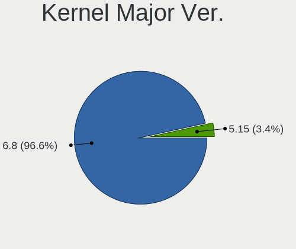
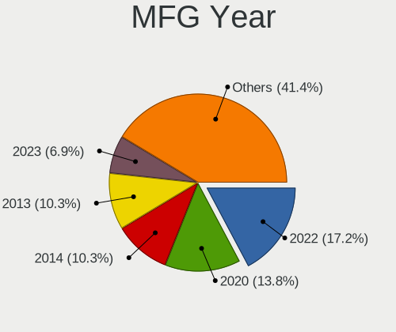
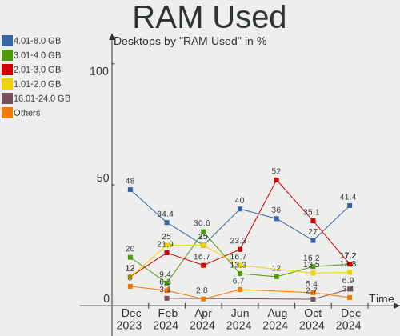

KDE neon - Hardware Trends (Desktops)
-------------------------------------

A project to identify most popular hardware characteristics and track their change
over time based on data collected by Linux users at https://Linux-Hardware.org.

Anyone can contribute to this report by the [hw-probe](https://github.com/linuxhw/hw-probe) tool:

    sudo -E hw-probe -all -upload

This report is for one last month. Overall report since the beginning of time: [TestCoverage](https://github.com/linuxhw/TestCoverage)

Period: Aug, 2022.

Contents
--------

* [ System ](#system)
  - [ OS                       ](#os)
  - [ OS Family                ](#os-family)
  - [ Kernel                   ](#kernel)
  - [ Kernel Family            ](#kernel-family)
  - [ Kernel Major Ver.        ](#kernel-major-ver)
  - [ Arch                     ](#arch)
  - [ DE                       ](#de)
  - [ Display Server           ](#display-server)
  - [ Display Manager          ](#display-manager)
  - [ OS Lang                  ](#os-lang)
  - [ Boot Mode                ](#boot-mode)
  - [ Filesystem               ](#filesystem)
  - [ Part. scheme             ](#part-scheme)
  - [ Dual Boot with Linux/BSD ](#dual-boot-with-linuxbsd)
  - [ Dual Boot (Win)          ](#dual-boot-win)

* [ Board ](#board)
  - [ Vendor                   ](#vendor)
  - [ Model                    ](#model)
  - [ Model Family             ](#model-family)
  - [ MFG Year                 ](#mfg-year)
  - [ Form Factor              ](#form-factor)
  - [ Secure Boot              ](#secure-boot)
  - [ Coreboot                 ](#coreboot)
  - [ RAM Size                 ](#ram-size)
  - [ RAM Used                 ](#ram-used)
  - [ Total Drives             ](#total-drives)
  - [ Has CD-ROM               ](#has-cd-rom)
  - [ Has Ethernet             ](#has-ethernet)
  - [ Has WiFi                 ](#has-wifi)
  - [ Has Bluetooth            ](#has-bluetooth)

* [ Location ](#location)
  - [ Country                  ](#country)
  - [ City                     ](#city)

* [ Drives ](#drives)
  - [ Drive Vendor             ](#drive-vendor)
  - [ Drive Model              ](#drive-model)
  - [ HDD Vendor               ](#hdd-vendor)
  - [ SSD Vendor               ](#ssd-vendor)
  - [ Drive Kind               ](#drive-kind)
  - [ Drive Connector          ](#drive-connector)
  - [ Drive Size               ](#drive-size)
  - [ Space Total              ](#space-total)
  - [ Space Used               ](#space-used)
  - [ Malfunc. Drives          ](#malfunc-drives)
  - [ Malfunc. Drive Vendor    ](#malfunc-drive-vendor)
  - [ Malfunc. HDD Vendor      ](#malfunc-hdd-vendor)
  - [ Malfunc. Drive Kind      ](#malfunc-drive-kind)
  - [ Failed Drives            ](#failed-drives)
  - [ Failed Drive Vendor      ](#failed-drive-vendor)
  - [ Drive Status             ](#drive-status)

* [ Storage controller ](#storage-controller)
  - [ Storage Vendor           ](#storage-vendor)
  - [ Storage Model            ](#storage-model)
  - [ Storage Kind             ](#storage-kind)

* [ Processor ](#processor)
  - [ CPU Vendor               ](#cpu-vendor)
  - [ CPU Model                ](#cpu-model)
  - [ CPU Model Family         ](#cpu-model-family)
  - [ CPU Cores                ](#cpu-cores)
  - [ CPU Sockets              ](#cpu-sockets)
  - [ CPU Threads              ](#cpu-threads)
  - [ CPU Op-Modes             ](#cpu-op-modes)
  - [ CPU Microcode            ](#cpu-microcode)
  - [ CPU Microarch            ](#cpu-microarch)

* [ Graphics ](#graphics)
  - [ GPU Vendor               ](#gpu-vendor)
  - [ GPU Model                ](#gpu-model)
  - [ GPU Combo                ](#gpu-combo)
  - [ GPU Driver               ](#gpu-driver)
  - [ GPU Memory               ](#gpu-memory)

* [ Monitor ](#monitor)
  - [ Monitor Vendor           ](#monitor-vendor)
  - [ Monitor Model            ](#monitor-model)
  - [ Monitor Resolution       ](#monitor-resolution)
  - [ Monitor Diagonal         ](#monitor-diagonal)
  - [ Monitor Width            ](#monitor-width)
  - [ Aspect Ratio             ](#aspect-ratio)
  - [ Monitor Area             ](#monitor-area)
  - [ Pixel Density            ](#pixel-density)
  - [ Multiple Monitors        ](#multiple-monitors)

* [ Network ](#network)
  - [ Net Controller Vendor    ](#net-controller-vendor)
  - [ Net Controller Model     ](#net-controller-model)
  - [ Wireless Vendor          ](#wireless-vendor)
  - [ Wireless Model           ](#wireless-model)
  - [ Ethernet Vendor          ](#ethernet-vendor)
  - [ Ethernet Model           ](#ethernet-model)
  - [ Net Controller Kind      ](#net-controller-kind)
  - [ Used Controller          ](#used-controller)
  - [ NICs                     ](#nics)
  - [ IPv6                     ](#ipv6)

* [ Bluetooth ](#bluetooth)
  - [ Bluetooth Vendor         ](#bluetooth-vendor)
  - [ Bluetooth Model          ](#bluetooth-model)

* [ Sound ](#sound)
  - [ Sound Vendor             ](#sound-vendor)
  - [ Sound Model              ](#sound-model)

* [ Memory ](#memory)
  - [ Memory Vendor            ](#memory-vendor)
  - [ Memory Model             ](#memory-model)
  - [ Memory Kind              ](#memory-kind)
  - [ Memory Form Factor       ](#memory-form-factor)
  - [ Memory Size              ](#memory-size)
  - [ Memory Speed             ](#memory-speed)

* [ Printers & scanners ](#printers--scanners)
  - [ Printer Vendor           ](#printer-vendor)
  - [ Printer Model            ](#printer-model)
  - [ Scanner Vendor           ](#scanner-vendor)
  - [ Scanner Model            ](#scanner-model)

* [ Camera ](#camera)
  - [ Camera Vendor            ](#camera-vendor)
  - [ Camera Model             ](#camera-model)

* [ Security ](#security)
  - [ Fingerprint Vendor       ](#fingerprint-vendor)
  - [ Fingerprint Model        ](#fingerprint-model)
  - [ Chipcard Vendor          ](#chipcard-vendor)
  - [ Chipcard Model           ](#chipcard-model)

* [ Unsupported ](#unsupported)
  - [ Unsupported Devices      ](#unsupported-devices)
  - [ Unsupported Device Types ](#unsupported-device-types)

System
------

OS
--

Installed operating systems

| Name           | Desktops | Percent |
|----------------|----------|---------|
| KDE neon 20.04 | 39       | 92.86%  |
| KDE neon 22.04 | 3        | 7.14%   |

OS Family
---------

OS without a version

| Name     | Desktops | Percent |
|----------|----------|---------|
| KDE neon | 42       | 100%    |

Kernel
------

Version of the Linux kernel

| Version           | Desktops | Percent |
|-------------------|----------|---------|
| 5.15.0-46-generic | 27       | 64.29%  |
| 5.15.0-43-generic | 10       | 23.81%  |
| 5.15.0-41-generic | 2        | 4.76%   |
| 5.13.0-52-generic | 1        | 2.38%   |
| 5.13.0-44-generic | 1        | 2.38%   |
| 5.11.0-46-generic | 1        | 2.38%   |

Kernel Family
-------------

Linux kernel without a distro release

| Version | Desktops | Percent |
|---------|----------|---------|
| 5.15.0  | 39       | 92.86%  |
| 5.13.0  | 2        | 4.76%   |
| 5.11.0  | 1        | 2.38%   |

Kernel Major Ver.
-----------------

Linux kernel major version

| Version | Desktops | Percent |
|---------|----------|---------|
| 5.15    | 39       | 92.86%  |
| 5.13    | 2        | 4.76%   |
| 5.11    | 1        | 2.38%   |

Arch
----

OS architecture (x86_64, i586, etc.)

| Name   | Desktops | Percent |
|--------|----------|---------|
| x86_64 | 42       | 100%    |

DE
--

Desktop Environment

| Name | Desktops | Percent |
|------|----------|---------|
| KDE5 | 42       | 100%    |

Display Server
--------------

X11 or Wayland

| Name    | Desktops | Percent |
|---------|----------|---------|
| X11     | 41       | 97.62%  |
| Wayland | 1        | 2.38%   |

Display Manager
---------------

SDDM, LightDM, etc.

| Name    | Desktops | Percent |
|---------|----------|---------|
| Unknown | 42       | 100%    |

OS Lang
-------

Language

| Lang  | Desktops | Percent |
|-------|----------|---------|
| en_US | 17       | 40.48%  |
| de_DE | 5        | 11.9%   |
| es_ES | 4        | 9.52%   |
| ru_RU | 3        | 7.14%   |
| en_GB | 3        | 7.14%   |
| en_AG | 2        | 4.76%   |
| zh_CN | 1        | 2.38%   |
| pt_BR | 1        | 2.38%   |
| fr_FR | 1        | 2.38%   |
| es_AR | 1        | 2.38%   |
| en_NZ | 1        | 2.38%   |
| en_DK | 1        | 2.38%   |
| en_AU | 1        | 2.38%   |
| C     | 1        | 2.38%   |

Boot Mode
---------

EFI or BIOS

| Mode | Desktops | Percent |
|------|----------|---------|
| EFI  | 29       | 69.05%  |
| BIOS | 13       | 30.95%  |

Filesystem
----------

Type of filesystem

| Type  | Desktops | Percent |
|-------|----------|---------|
| Ext4  | 41       | 97.62%  |
| Btrfs | 1        | 2.38%   |

Part. scheme
------------

Scheme of partitioning

| Type    | Desktops | Percent |
|---------|----------|---------|
| Unknown | 42       | 100%    |

Dual Boot with Linux/BSD
------------------------

Hosting more than one Linux/BSD

| Dual boot | Desktops | Percent |
|-----------|----------|---------|
| No        | 42       | 100%    |

Dual Boot (Win)
---------------

Hosting Linux and Windows

| Dual boot | Desktops | Percent |
|-----------|----------|---------|
| No        | 42       | 100%    |

Board
-----

Vendor
------

Motherboard manufacturer

| Name                      | Desktops | Percent |
|---------------------------|----------|---------|
| ASUSTek Computer          | 13       | 30.95%  |
| MSI                       | 9        | 21.43%  |
| Gigabyte Technology       | 8        | 19.05%  |
| Dell                      | 4        | 9.52%   |
| ASRock                    | 3        | 7.14%   |
| Hewlett-Packard           | 2        | 4.76%   |
| Biostar                   | 1        | 2.38%   |
| Arquimedes Automacao Inf. | 1        | 2.38%   |
| Alienware                 | 1        | 2.38%   |

Model
-----

Motherboard model

| Name                             | Desktops | Percent |
|----------------------------------|----------|---------|
| MSI MS-7C37                      | 2        | 4.76%   |
| MSI MS-7C02                      | 1        | 2.38%   |
| MSI MS-7B53                      | 1        | 2.38%   |
| MSI MS-7A54                      | 1        | 2.38%   |
| MSI MS-7924                      | 1        | 2.38%   |
| MSI MS-7917                      | 1        | 2.38%   |
| MSI MS-7758                      | 1        | 2.38%   |
| MSI MS-7751                      | 1        | 2.38%   |
| HP Pavilion Desktop 590-p0xxx    | 1        | 2.38%   |
| HP Compaq 6000 Pro SFF PC        | 1        | 2.38%   |
| Gigabyte P85-D3                  | 1        | 2.38%   |
| Gigabyte H87M-HD3                | 1        | 2.38%   |
| Gigabyte H81M-D3H                | 1        | 2.38%   |
| Gigabyte H170-D3H                | 1        | 2.38%   |
| Gigabyte GA-78LMT-USB3 6.0       | 1        | 2.38%   |
| Gigabyte BOLD E3032              | 1        | 2.38%   |
| Gigabyte B560M DS3H AC           | 1        | 2.38%   |
| Gigabyte B550M DS3H              | 1        | 2.38%   |
| Dell XPS 8930                    | 1        | 2.38%   |
| Dell Precision WorkStation T5500 | 1        | 2.38%   |
| Dell OptiPlex 9010               | 1        | 2.38%   |
| Dell Inspiron 560                | 1        | 2.38%   |
| Biostar B550M-SILVER             | 1        | 2.38%   |
| ASUS TUF Gaming X570-PLUS        | 1        | 2.38%   |
| ASUS TUF Gaming B560M-PLUS WIFI  | 1        | 2.38%   |
| ASUS ROG STRIX X570-E GAMING     | 1        | 2.38%   |
| ASUS ROG STRIX G15DK_G15DK       | 1        | 2.38%   |
| ASUS ROG STRIX B450-F GAMING     | 1        | 2.38%   |
| ASUS PRIME X570-P                | 1        | 2.38%   |
| ASUS PRIME X370-PRO              | 1        | 2.38%   |
| ASUS PRIME B350-PLUS             | 1        | 2.38%   |
| ASUS P8Z77-M PRO                 | 1        | 2.38%   |
| ASUS Maximus VIII HERO           | 1        | 2.38%   |
| ASUS M5A78L-M LX/BR              | 1        | 2.38%   |
| ASUS All Series                  | 1        | 2.38%   |
| ASUS A68HM-K                     | 1        | 2.38%   |
| ASRock E350M1                    | 1        | 2.38%   |
| ASRock B660M-HDV                 | 1        | 2.38%   |
| ASRock B550M Pro4                | 1        | 2.38%   |
| Arquimedes Automacao Inf. ARQ78  | 1        | 2.38%   |
| Alienware Aurora R6              | 1        | 2.38%   |

Model Family
------------

Motherboard model prefix

| Name                            | Desktops | Percent |
|---------------------------------|----------|---------|
| ASUS ROG                        | 3        | 7.14%   |
| ASUS PRIME                      | 3        | 7.14%   |
| MSI MS-7C37                     | 2        | 4.76%   |
| ASUS TUF                        | 2        | 4.76%   |
| MSI MS-7C02                     | 1        | 2.38%   |
| MSI MS-7B53                     | 1        | 2.38%   |
| MSI MS-7A54                     | 1        | 2.38%   |
| MSI MS-7924                     | 1        | 2.38%   |
| MSI MS-7917                     | 1        | 2.38%   |
| MSI MS-7758                     | 1        | 2.38%   |
| MSI MS-7751                     | 1        | 2.38%   |
| HP Pavilion                     | 1        | 2.38%   |
| HP Compaq                       | 1        | 2.38%   |
| Gigabyte P85-D3                 | 1        | 2.38%   |
| Gigabyte H87M-HD3               | 1        | 2.38%   |
| Gigabyte H81M-D3H               | 1        | 2.38%   |
| Gigabyte H170-D3H               | 1        | 2.38%   |
| Gigabyte GA-78LMT-USB3          | 1        | 2.38%   |
| Gigabyte BOLD                   | 1        | 2.38%   |
| Gigabyte B560M                  | 1        | 2.38%   |
| Gigabyte B550M                  | 1        | 2.38%   |
| Dell XPS                        | 1        | 2.38%   |
| Dell Precision                  | 1        | 2.38%   |
| Dell OptiPlex                   | 1        | 2.38%   |
| Dell Inspiron                   | 1        | 2.38%   |
| Biostar B550M-SILVER            | 1        | 2.38%   |
| ASUS P8Z77-M                    | 1        | 2.38%   |
| ASUS Maximus                    | 1        | 2.38%   |
| ASUS M5A78L-M                   | 1        | 2.38%   |
| ASUS All                        | 1        | 2.38%   |
| ASUS A68HM-K                    | 1        | 2.38%   |
| ASRock E350M1                   | 1        | 2.38%   |
| ASRock B660M-HDV                | 1        | 2.38%   |
| ASRock B550M                    | 1        | 2.38%   |
| Arquimedes Automacao Inf. ARQ78 | 1        | 2.38%   |
| Alienware Aurora                | 1        | 2.38%   |

MFG Year
--------

Motherboard manufacture year

| Year | Desktops | Percent |
|------|----------|---------|
| 2019 | 6        | 14.29%  |
| 2018 | 6        | 14.29%  |
| 2014 | 6        | 14.29%  |
| 2021 | 3        | 7.14%   |
| 2020 | 3        | 7.14%   |
| 2017 | 3        | 7.14%   |
| 2013 | 3        | 7.14%   |
| 2012 | 3        | 7.14%   |
| 2011 | 3        | 7.14%   |
| 2022 | 2        | 4.76%   |
| 2015 | 2        | 4.76%   |
| 2010 | 1        | 2.38%   |
| 2009 | 1        | 2.38%   |

Form Factor
-----------

Physical design of the computer

| Name    | Desktops | Percent |
|---------|----------|---------|
| Desktop | 42       | 100%    |

Secure Boot
-----------

Enabled or disabled

| State    | Desktops | Percent |
|----------|----------|---------|
| Disabled | 40       | 95.24%  |
| Enabled  | 2        | 4.76%   |

Coreboot
--------

Have coreboot on board

| Used | Desktops | Percent |
|------|----------|---------|
| No   | 42       | 100%    |

RAM Size
--------

Total RAM memory

| Size in GB  | Desktops | Percent |
|-------------|----------|---------|
| 16.01-24.0  | 16       | 38.1%   |
| 4.01-8.0    | 7        | 16.67%  |
| 32.01-64.0  | 7        | 16.67%  |
| 3.01-4.0    | 3        | 7.14%   |
| 64.01-256.0 | 3        | 7.14%   |
| 8.01-16.0   | 3        | 7.14%   |
| 24.01-32.0  | 2        | 4.76%   |
| 2.01-3.0    | 1        | 2.38%   |

RAM Used
--------

Used RAM memory

| Used GB  | Desktops | Percent |
|----------|----------|---------|
| 1.01-2.0 | 14       | 33.33%  |
| 2.01-3.0 | 12       | 28.57%  |
| 3.01-4.0 | 9        | 21.43%  |
| 4.01-8.0 | 5        | 11.9%   |
| 0.51-1.0 | 2        | 4.76%   |

Total Drives
------------

Number of drives on board

| Drives | Desktops | Percent |
|--------|----------|---------|
| 2      | 14       | 33.33%  |
| 1      | 13       | 30.95%  |
| 3      | 6        | 14.29%  |
| 6      | 4        | 9.52%   |
| 5      | 3        | 7.14%   |
| 4      | 2        | 4.76%   |

Has CD-ROM
----------

Has CD-ROM on board

| Presented | Desktops | Percent |
|-----------|----------|---------|
| No        | 30       | 71.43%  |
| Yes       | 12       | 28.57%  |

Has Ethernet
------------

Has Ethernet on board

| Presented | Desktops | Percent |
|-----------|----------|---------|
| Yes       | 40       | 95.24%  |
| No        | 2        | 4.76%   |

Has WiFi
--------

Has WiFi module

| Presented | Desktops | Percent |
|-----------|----------|---------|
| Yes       | 24       | 57.14%  |
| No        | 18       | 42.86%  |

Has Bluetooth
-------------

Has Bluetooth module

| Presented | Desktops | Percent |
|-----------|----------|---------|
| No        | 23       | 54.76%  |
| Yes       | 19       | 45.24%  |

Location
--------

Country
-------

Geographic location (country)

| Country     | Desktops | Percent |
|-------------|----------|---------|
| USA         | 12       | 28.57%  |
| Germany     | 5        | 11.9%   |
| Spain       | 4        | 9.52%   |
| Russia      | 4        | 9.52%   |
| UK          | 2        | 4.76%   |
| Brazil      | 2        | 4.76%   |
| Uruguay     | 1        | 2.38%   |
| Turkey      | 1        | 2.38%   |
| Switzerland | 1        | 2.38%   |
| Sweden      | 1        | 2.38%   |
| Singapore   | 1        | 2.38%   |
| Poland      | 1        | 2.38%   |
| New Zealand | 1        | 2.38%   |
| Indonesia   | 1        | 2.38%   |
| France      | 1        | 2.38%   |
| Denmark     | 1        | 2.38%   |
| Colombia    | 1        | 2.38%   |
| China       | 1        | 2.38%   |
| Argentina   | 1        | 2.38%   |

City
----

Geographic location (city)

| City                      | Desktops | Percent |
|---------------------------|----------|---------|
| Moscow                    | 3        | 7.14%   |
| Del Valle                 | 2        | 4.76%   |
| Bixby                     | 2        | 4.76%   |
| Zurich                    | 1        | 2.38%   |
| Wiehl                     | 1        | 2.38%   |
| Valence                   | 1        | 2.38%   |
| Umeå                     | 1        | 2.38%   |
| Singapore                 | 1        | 2.38%   |
| Siedlce                   | 1        | 2.38%   |
| Seville                   | 1        | 2.38%   |
| Schloss Holte-Stukenbrock | 1        | 2.38%   |
| Santee                    | 1        | 2.38%   |
| Penalsordo                | 1        | 2.38%   |
| Novokuznetsk              | 1        | 2.38%   |
| Navàs                    | 1        | 2.38%   |
| Murfreesboro              | 1        | 2.38%   |
| Mount Pleasant            | 1        | 2.38%   |
| Montevideo                | 1        | 2.38%   |
| Marica                    | 1        | 2.38%   |
| Makassar                  | 1        | 2.38%   |
| Magdeburg                 | 1        | 2.38%   |
| Leominster                | 1        | 2.38%   |
| Leeds                     | 1        | 2.38%   |
| La Plata                  | 1        | 2.38%   |
| Johnstown                 | 1        | 2.38%   |
| Hamburg                   | 1        | 2.38%   |
| Guangzhou                 | 1        | 2.38%   |
| Florence                  | 1        | 2.38%   |
| East Brunswick            | 1        | 2.38%   |
| Copenhagen                | 1        | 2.38%   |
| Chelsea                   | 1        | 2.38%   |
| Cary                      | 1        | 2.38%   |
| Caraguatatuba             | 1        | 2.38%   |
| Cabanillas del Campo      | 1        | 2.38%   |
| Bogotá                   | 1        | 2.38%   |
| Bad Oeynhausen            | 1        | 2.38%   |
| Auckland                  | 1        | 2.38%   |
| Aksaray                   | 1        | 2.38%   |

Drives
------

Drive Vendor
------------

Hard drive vendors

| Vendor                      | Desktops | Drives | Percent |
|-----------------------------|----------|--------|---------|
| Seagate                     | 24       | 31     | 28.24%  |
| WDC                         | 13       | 20     | 15.29%  |
| Samsung Electronics         | 10       | 16     | 11.76%  |
| SanDisk                     | 7        | 7      | 8.24%   |
| Crucial                     | 3        | 3      | 3.53%   |
| XPG                         | 2        | 2      | 2.35%   |
| Toshiba                     | 2        | 2      | 2.35%   |
| PNY                         | 2        | 2      | 2.35%   |
| Kingston                    | 2        | 3      | 2.35%   |
| Intel                       | 2        | 2      | 2.35%   |
| XUM                         | 1        | 1      | 1.18%   |
| WALRAM                      | 1        | 1      | 1.18%   |
| Transcend                   | 1        | 1      | 1.18%   |
| SSK                         | 1        | 1      | 1.18%   |
| Silicon Motion              | 1        | 1      | 1.18%   |
| Realtek Semiconductor       | 1        | 1      | 1.18%   |
| Phison                      | 1        | 1      | 1.18%   |
| OCZ                         | 1        | 1      | 1.18%   |
| Micron Technology           | 1        | 1      | 1.18%   |
| MAXIO Technology (Hangzhou) | 1        | 1      | 1.18%   |
| LaCie                       | 1        | 1      | 1.18%   |
| Hitachi                     | 1        | 1      | 1.18%   |
| HGST                        | 1        | 1      | 1.18%   |
| Hewlett-Packard             | 1        | 1      | 1.18%   |
| China                       | 1        | 1      | 1.18%   |
| Biostar                     | 1        | 1      | 1.18%   |
| BHT                         | 1        | 1      | 1.18%   |
| Apacer                      | 1        | 1      | 1.18%   |

Drive Model
-----------

Hard drive models

| Model                               | Desktops | Percent |
|-------------------------------------|----------|---------|
| Seagate ST1000DM010-2EP102 1TB      | 4        | 3.96%   |
| Samsung NVMe SSD Drive 1TB          | 4        | 3.96%   |
| WDC WDS500G2B0A-00SM50 500GB SSD    | 2        | 1.98%   |
| WDC WD10EZEX-00BN5A0 1TB            | 2        | 1.98%   |
| Seagate ST500DM002-1BD142 500GB     | 2        | 1.98%   |
| Seagate ST3500630AS 500GB           | 2        | 1.98%   |
| Seagate ST31000528AS 1TB            | 2        | 1.98%   |
| Seagate ST2000DM008-2FR102 2TB      | 2        | 1.98%   |
| Seagate ST1000DM003-1SB102 1TB      | 2        | 1.98%   |
| SanDisk NVMe SSD Drive 1TB          | 2        | 1.98%   |
| Samsung NVMe SSD Drive 500GB        | 2        | 1.98%   |
| XUM HX256GSSDSATA3 256GB            | 1        | 0.99%   |
| XPG NVMe SSD Drive 256GB            | 1        | 0.99%   |
| XPG NVMe SSD Drive 1024GB           | 1        | 0.99%   |
| WDC WDS500G2B0B 500GB SSD           | 1        | 0.99%   |
| WDC WDS500G1B0A-00H9H0 500GB SSD    | 1        | 0.99%   |
| WDC WDBNCE0010PNC 1TB SSD           | 1        | 0.99%   |
| WDC WD7500AARS-00Y5B1 752GB         | 1        | 0.99%   |
| WDC WD6400AACS-00G8B1 640GB         | 1        | 0.99%   |
| WDC WD5000HHTZ-04N21V0 500GB        | 1        | 0.99%   |
| WDC WD5000AZLX-22JKKA0 500GB        | 1        | 0.99%   |
| WDC WD5000AAKX-60U6AA0 500GB        | 1        | 0.99%   |
| WDC WD5000AAKX-001CA0 500GB         | 1        | 0.99%   |
| WDC WD5000AAKS-00YGA0 500GB         | 1        | 0.99%   |
| WDC WD2500BEKT-75PVMT0 250GB        | 1        | 0.99%   |
| WDC WD20EARX-008FB0 2TB             | 1        | 0.99%   |
| WDC WD20EARS-00MVWB0 2TB            | 1        | 0.99%   |
| WDC WD10EZEX-08M2NA0 1TB            | 1        | 0.99%   |
| WDC WD10EZEX-00ZF5A0 1TB            | 1        | 0.99%   |
| WALRAM 128G                         | 1        | 0.99%   |
| Transcend TS512GSSD720 512GB        | 1        | 0.99%   |
| Toshiba NVMe SSD Drive 512GB        | 1        | 0.99%   |
| Toshiba DT01ACA200 2TB              | 1        | 0.99%   |
| SSK Disk 256GB                      | 1        | 0.99%   |
| Silicon Motion NVMe SSD Drive 250GB | 1        | 0.99%   |
| Seagate ST9250315AS 250GB           | 1        | 0.99%   |
| Seagate ST4000VN008-2DR166 4TB      | 1        | 0.99%   |
| Seagate ST4000DM004-2CV104 4TB      | 1        | 0.99%   |
| Seagate ST4000DM 000-1F2168 4TB     | 1        | 0.99%   |
| Seagate ST3500630NS 500GB           | 1        | 0.99%   |
| Seagate ST3500418AS 500GB           | 1        | 0.99%   |
| Seagate ST3250620AS 250GB           | 1        | 0.99%   |
| Seagate ST320LT020-9YG142 320GB     | 1        | 0.99%   |
| Seagate ST31000524AS 1TB            | 1        | 0.99%   |
| Seagate ST3000DM007-1WY10G 3TB      | 1        | 0.99%   |
| Seagate ST2000DM006-2DM164 2TB      | 1        | 0.99%   |
| Seagate ST1000NM0011 1TB            | 1        | 0.99%   |
| Seagate ST1000LM049-2GH172 1TB      | 1        | 0.99%   |
| Seagate ST1000DM003-9YN162 1TB      | 1        | 0.99%   |
| Seagate ST1000DM003-1SB10C 1TB      | 1        | 0.99%   |
| Seagate BUP Slim RD 2TB             | 1        | 0.99%   |
| Seagate BUP Slim 2TB                | 1        | 0.99%   |
| SanDisk SDSSDH3512G 512GB           | 1        | 0.99%   |
| SanDisk SDSSDA240G 240GB            | 1        | 0.99%   |
| SanDisk SDSSDA120G 120GB            | 1        | 0.99%   |
| SanDisk SDSSDA-2T00 2TB             | 1        | 0.99%   |
| SanDisk NVMe SSD Drive 500GB        | 1        | 0.99%   |
| Samsung SSD 870 EVO 1TB             | 1        | 0.99%   |
| Samsung SSD 860 EVO 500GB           | 1        | 0.99%   |
| Samsung SSD 860 EVO 250GB           | 1        | 0.99%   |

HDD Vendor
----------

Hard disk drive vendors

| Vendor          | Desktops | Drives | Percent |
|-----------------|----------|--------|---------|
| Seagate         | 24       | 31     | 63.16%  |
| WDC             | 10       | 15     | 26.32%  |
| Toshiba         | 1        | 1      | 2.63%   |
| Hitachi         | 1        | 1      | 2.63%   |
| HGST            | 1        | 1      | 2.63%   |
| Hewlett-Packard | 1        | 1      | 2.63%   |

SSD Vendor
----------

Solid state drive vendors

| Vendor              | Desktops | Drives | Percent |
|---------------------|----------|--------|---------|
| Samsung Electronics | 7        | 8      | 24.14%  |
| WDC                 | 5        | 5      | 17.24%  |
| SanDisk             | 4        | 4      | 13.79%  |
| Crucial             | 3        | 3      | 10.34%  |
| PNY                 | 2        | 2      | 6.9%    |
| Kingston            | 2        | 3      | 6.9%    |
| XUM                 | 1        | 1      | 3.45%   |
| Transcend           | 1        | 1      | 3.45%   |
| OCZ                 | 1        | 1      | 3.45%   |
| Intel               | 1        | 1      | 3.45%   |
| China               | 1        | 1      | 3.45%   |
| Apacer              | 1        | 1      | 3.45%   |

Drive Kind
----------

HDD or SSD

| Kind    | Desktops | Drives | Percent |
|---------|----------|--------|---------|
| HDD     | 31       | 50     | 40.26%  |
| SSD     | 24       | 31     | 31.17%  |
| NVMe    | 17       | 20     | 22.08%  |
| Unknown | 5        | 5      | 6.49%   |

Drive Connector
---------------

SATA, SAS, NVMe, etc.

| Type | Desktops | Drives | Percent |
|------|----------|--------|---------|
| SATA | 38       | 80     | 63.33%  |
| NVMe | 17       | 20     | 28.33%  |
| SAS  | 5        | 6      | 8.33%   |

Drive Size
----------

Size of hard drive

| Size in TB | Desktops | Drives | Percent |
|------------|----------|--------|---------|
| 0.51-1.0   | 24       | 28     | 40.68%  |
| 0.01-0.5   | 20       | 37     | 33.9%   |
| 1.01-2.0   | 9        | 10     | 15.25%  |
| 3.01-4.0   | 3        | 3      | 5.08%   |
| 2.01-3.0   | 2        | 2      | 3.39%   |
| 4.01-10.0  | 1        | 1      | 1.69%   |

Space Total
-----------

Amount of disk space available on the file system

| Size in GB     | Desktops | Percent |
|----------------|----------|---------|
| 251-500        | 14       | 33.33%  |
| 501-1000       | 7        | 16.67%  |
| 101-250        | 6        | 14.29%  |
| 51-100         | 4        | 9.52%   |
| 1001-2000      | 3        | 7.14%   |
| More than 3000 | 2        | 4.76%   |
| 1-20           | 2        | 4.76%   |
| Unknown        | 2        | 4.76%   |
| 21-50          | 1        | 2.38%   |
| 2001-3000      | 1        | 2.38%   |

Space Used
----------

Amount of used disk space

| Used GB        | Desktops | Percent |
|----------------|----------|---------|
| 1-20           | 27       | 64.29%  |
| 101-250        | 3        | 7.14%   |
| 251-500        | 2        | 4.76%   |
| 21-50          | 2        | 4.76%   |
| 1001-2000      | 2        | 4.76%   |
| 51-100         | 2        | 4.76%   |
| Unknown        | 2        | 4.76%   |
| More than 3000 | 1        | 2.38%   |
| 501-1000       | 1        | 2.38%   |

Malfunc. Drives
---------------

Drive models with a malfunction

Zero info for selected period =(

Malfunc. Drive Vendor
---------------------

Vendors of faulty drives

Zero info for selected period =(

Malfunc. HDD Vendor
-------------------

Vendors of faulty HDD drives

Zero info for selected period =(

Malfunc. Drive Kind
-------------------

Kinds of faulty drives

Zero info for selected period =(

Failed Drives
-------------

Failed drive models

Zero info for selected period =(

Failed Drive Vendor
-------------------

Failed drive vendors

Zero info for selected period =(

Drive Status
------------

Number of failed and malfunc. drives

| Status   | Desktops | Drives | Percent |
|----------|----------|--------|---------|
| Detected | 42       | 106    | 100%    |

Storage controller
------------------

Storage Vendor
--------------

Storage controller vendors

| Vendor                       | Desktops | Percent |
|------------------------------|----------|---------|
| Intel                        | 25       | 39.68%  |
| AMD                          | 18       | 28.57%  |
| Samsung Electronics          | 5        | 7.94%   |
| ASMedia Technology           | 4        | 6.35%   |
| SanDisk                      | 3        | 4.76%   |
| ADATA Technology             | 2        | 3.17%   |
| Toshiba America Info Systems | 1        | 1.59%   |
| Silicon Motion               | 1        | 1.59%   |
| Realtek Semiconductor        | 1        | 1.59%   |
| Phison Electronics           | 1        | 1.59%   |
| Micron Technology            | 1        | 1.59%   |
| MAXIO Technology (Hangzhou)  | 1        | 1.59%   |

Storage Model
-------------

Storage controller models

| Model                                                                          | Desktops | Percent |
|--------------------------------------------------------------------------------|----------|---------|
| AMD FCH SATA Controller [AHCI mode]                                            | 8        | 11.27%  |
| ASMedia ASM1062 Serial ATA Controller                                          | 4        | 5.63%   |
| AMD SB7x0/SB8x0/SB9x0 IDE Controller                                           | 4        | 5.63%   |
| AMD 500 Series Chipset SATA Controller                                         | 4        | 5.63%   |
| Intel Q170/Q150/B150/H170/H110/Z170/CM236 Chipset SATA Controller [AHCI Mode]  | 3        | 4.23%   |
| Intel 9 Series Chipset Family SATA Controller [AHCI Mode]                      | 3        | 4.23%   |
| Intel 8 Series/C220 Series Chipset Family 6-port SATA Controller 1 [AHCI mode] | 3        | 4.23%   |
| Intel 7 Series/C210 Series Chipset Family 6-port SATA Controller [AHCI mode]   | 3        | 4.23%   |
| Samsung NVMe SSD Controller SM981/PM981/PM983                                  | 2        | 2.82%   |
| Samsung NVMe SSD Controller PM9A1/PM9A3/980PRO                                 | 2        | 2.82%   |
| Intel Cannon Lake PCH SATA AHCI Controller                                     | 2        | 2.82%   |
| Intel 82801JI (ICH10 Family) SATA AHCI Controller                              | 2        | 2.82%   |
| Intel 500 Series Chipset Family SATA AHCI Controller                           | 2        | 2.82%   |
| Intel 200 Series PCH SATA controller [AHCI mode]                               | 2        | 2.82%   |
| AMD SB7x0/SB8x0/SB9x0 SATA Controller [IDE mode]                               | 2        | 2.82%   |
| AMD SB7x0/SB8x0/SB9x0 SATA Controller [AHCI mode]                              | 2        | 2.82%   |
| AMD 400 Series Chipset SATA Controller                                         | 2        | 2.82%   |
| ADATA XPG SX8200 Pro PCIe Gen3x4 M.2 2280 Solid State Drive                    | 2        | 2.82%   |
| Toshiba America Info Systems XG6 NVMe SSD Controller                           | 1        | 1.41%   |
| Silicon Motion SM2263EN/SM2263XT SSD Controller                                | 1        | 1.41%   |
| SanDisk WD Blue SN570 NVMe SSD                                                 | 1        | 1.41%   |
| SanDisk WD Blue SN550 NVMe SSD                                                 | 1        | 1.41%   |
| SanDisk WD Black SN750 / PC SN730 NVMe SSD                                     | 1        | 1.41%   |
| Samsung NVMe SSD Controller SM961/PM961/SM963                                  | 1        | 1.41%   |
| Samsung NVMe SSD Controller 980                                                | 1        | 1.41%   |
| Realtek Realtek Non-Volatile memory controller                                 | 1        | 1.41%   |
| Phison E12 NVMe Controller                                                     | 1        | 1.41%   |
| Micron Non-Volatile memory controller                                          | 1        | 1.41%   |
| MAXIO (Hangzhou) NVMe SSD Controller MAP1202                                   | 1        | 1.41%   |
| Intel SSD 660P Series                                                          | 1        | 1.41%   |
| Intel SATA Controller [RAID mode]                                              | 1        | 1.41%   |
| Intel C610/X99 series chipset 6-Port SATA Controller [AHCI mode]               | 1        | 1.41%   |
| Intel Alder Lake-S PCH SATA Controller [AHCI Mode]                             | 1        | 1.41%   |
| Intel 82801JD/DO (ICH10 Family) 4-port SATA IDE Controller                     | 1        | 1.41%   |
| Intel 82801JD/DO (ICH10 Family) 2-port SATA IDE Controller                     | 1        | 1.41%   |
| AMD X370 Series Chipset SATA Controller                                        | 1        | 1.41%   |
| AMD 300 Series Chipset SATA Controller                                         | 1        | 1.41%   |

Storage Kind
------------

Kind of storage controller (IDE, SATA, NVMe, SAS, ...)

| Kind | Desktops | Percent |
|------|----------|---------|
| SATA | 40       | 63.49%  |
| NVMe | 17       | 26.98%  |
| IDE  | 5        | 7.94%   |
| RAID | 1        | 1.59%   |

Processor
---------

CPU Vendor
----------

Processor vendors

| Vendor | Desktops | Percent |
|--------|----------|---------|
| Intel  | 24       | 57.14%  |
| AMD    | 18       | 42.86%  |

CPU Model
---------

Processor models

| Model                                   | Desktops | Percent |
|-----------------------------------------|----------|---------|
| Intel Core i7-4790K CPU @ 4.00GHz       | 3        | 7.14%   |
| Intel Core i7-7700 CPU @ 3.60GHz        | 2        | 4.76%   |
| AMD Ryzen 7 5800X 8-Core Processor      | 2        | 4.76%   |
| AMD Ryzen 5 5500                        | 2        | 4.76%   |
| AMD Ryzen 5 3600 6-Core Processor       | 2        | 4.76%   |
| Intel Xeon CPU X5650 @ 2.67GHz          | 1        | 2.38%   |
| Intel Pentium CPU G3220 @ 3.00GHz       | 1        | 2.38%   |
| Intel Core i7-8700 CPU @ 3.20GHz        | 1        | 2.38%   |
| Intel Core i7-6900K CPU @ 3.20GHz       | 1        | 2.38%   |
| Intel Core i7-6700K CPU @ 4.00GHz       | 1        | 2.38%   |
| Intel Core i7-4770 CPU @ 3.40GHz        | 1        | 2.38%   |
| Intel Core i7-3770 CPU @ 3.40GHz        | 1        | 2.38%   |
| Intel Core i7-10700K CPU @ 3.80GHz      | 1        | 2.38%   |
| Intel Core i5-8600 CPU @ 3.10GHz        | 1        | 2.38%   |
| Intel Core i5-8400 CPU @ 2.80GHz        | 1        | 2.38%   |
| Intel Core i5-7400T CPU @ 2.40GHz       | 1        | 2.38%   |
| Intel Core i5-4440 CPU @ 3.10GHz        | 1        | 2.38%   |
| Intel Core i5-3570K CPU @ 3.40GHz       | 1        | 2.38%   |
| Intel Core i5-3570 CPU @ 3.40GHz        | 1        | 2.38%   |
| Intel Core i5-2500K CPU @ 3.30GHz       | 1        | 2.38%   |
| Intel Core 2 Duo CPU E8500 @ 3.16GHz    | 1        | 2.38%   |
| Intel Core 2 Duo CPU E7500 @ 2.93GHz    | 1        | 2.38%   |
| Intel 12th Gen Core i5-12490F           | 1        | 2.38%   |
| Intel 11th Gen Core i7-11700 @ 2.50GHz  | 1        | 2.38%   |
| AMD Ryzen 9 5950X 16-Core Processor     | 1        | 2.38%   |
| AMD Ryzen 9 5900X 12-Core Processor     | 1        | 2.38%   |
| AMD Ryzen 9 3900X 12-Core Processor     | 1        | 2.38%   |
| AMD Ryzen 7 5700G with Radeon Graphics  | 1        | 2.38%   |
| AMD Ryzen 7 3800X 8-Core Processor      | 1        | 2.38%   |
| AMD Ryzen 7 3700X 8-Core Processor      | 1        | 2.38%   |
| AMD Ryzen 5 1600 Six-Core Processor     | 1        | 2.38%   |
| AMD Phenom II X4 850 Processor          | 1        | 2.38%   |
| AMD FX-6300 Six-Core Processor          | 1        | 2.38%   |
| AMD FX-4300 Quad-Core Processor         | 1        | 2.38%   |
| AMD E-350D APU with Radeon HD Graphics  | 1        | 2.38%   |
| AMD A4-6300 APU with Radeon HD Graphics | 1        | 2.38%   |

CPU Model Family
----------------

Processor model prefix

| Model            | Desktops | Percent |
|------------------|----------|---------|
| Intel Core i7    | 11       | 26.19%  |
| Intel Core i5    | 7        | 16.67%  |
| AMD Ryzen 7      | 5        | 11.9%   |
| AMD Ryzen 5      | 5        | 11.9%   |
| AMD Ryzen 9      | 3        | 7.14%   |
| Other            | 2        | 4.76%   |
| Intel Core 2 Duo | 2        | 4.76%   |
| AMD FX           | 2        | 4.76%   |
| Intel Xeon       | 1        | 2.38%   |
| Intel Pentium    | 1        | 2.38%   |
| AMD Phenom II X4 | 1        | 2.38%   |
| AMD E            | 1        | 2.38%   |
| AMD A4           | 1        | 2.38%   |

CPU Cores
---------

Number of processor cores

| Number | Desktops | Percent |
|--------|----------|---------|
| 4      | 14       | 33.33%  |
| 6      | 10       | 23.81%  |
| 8      | 8        | 19.05%  |
| 2      | 5        | 11.9%   |
| 12     | 2        | 4.76%   |
| 16     | 1        | 2.38%   |
| 3      | 1        | 2.38%   |
| 1      | 1        | 2.38%   |

CPU Sockets
-----------

Number of sockets

| Number | Desktops | Percent |
|--------|----------|---------|
| 1      | 42       | 100%    |

CPU Threads
-----------

Threads per core (Hyper-Threading)

| Number | Desktops | Percent |
|--------|----------|---------|
| 2      | 30       | 71.43%  |
| 1      | 12       | 28.57%  |

CPU Op-Modes
------------

CPU Operation Modes (32-bit, 64-bit)

| Op mode        | Desktops | Percent |
|----------------|----------|---------|
| 32-bit, 64-bit | 42       | 100%    |

CPU Microcode
-------------

Microcode number

| Number     | Desktops | Percent |
|------------|----------|---------|
| 0x306c3    | 6        | 14.29%  |
| Unknown    | 5        | 11.9%   |
| 0x08701021 | 4        | 9.52%   |
| 0x906ea    | 3        | 7.14%   |
| 0x906e9    | 3        | 7.14%   |
| 0x0a201009 | 3        | 7.14%   |
| 0x1067a    | 2        | 4.76%   |
| 0x0a50000c | 2        | 4.76%   |
| 0xa0671    | 1        | 2.38%   |
| 0xa0655    | 1        | 2.38%   |
| 0x90672    | 1        | 2.38%   |
| 0x406f1    | 1        | 2.38%   |
| 0x306a9    | 1        | 2.38%   |
| 0x206c2    | 1        | 2.38%   |
| 0x206a7    | 1        | 2.38%   |
| 0x0a50000d | 1        | 2.38%   |
| 0x0a201016 | 1        | 2.38%   |
| 0x08001138 | 1        | 2.38%   |
| 0x06001119 | 1        | 2.38%   |
| 0x06000852 | 1        | 2.38%   |
| 0x05000119 | 1        | 2.38%   |
| 0x010000c8 | 1        | 2.38%   |

CPU Microarch
-------------

Microarchitecture

| Name             | Desktops | Percent |
|------------------|----------|---------|
| Zen 3            | 7        | 16.67%  |
| KabyLake         | 6        | 14.29%  |
| Haswell          | 6        | 14.29%  |
| Zen 2            | 5        | 11.9%   |
| Piledriver       | 3        | 7.14%   |
| IvyBridge        | 3        | 7.14%   |
| Penryn           | 2        | 4.76%   |
| Zen              | 1        | 2.38%   |
| Westmere         | 1        | 2.38%   |
| Skylake          | 1        | 2.38%   |
| SandyBridge      | 1        | 2.38%   |
| K10              | 1        | 2.38%   |
| Icelake          | 1        | 2.38%   |
| CometLake        | 1        | 2.38%   |
| Broadwell        | 1        | 2.38%   |
| Bobcat           | 1        | 2.38%   |
| Alderlake Hybrid | 1        | 2.38%   |

Graphics
--------

GPU Vendor
----------

Vendors of graphics cards

| Vendor | Desktops | Percent |
|--------|----------|---------|
| Nvidia | 29       | 54.72%  |
| Intel  | 14       | 26.42%  |
| AMD    | 10       | 18.87%  |

GPU Model
---------

Graphics card models

| Model                                                                       | Desktops | Percent |
|-----------------------------------------------------------------------------|----------|---------|
| Intel Xeon E3-1200 v3/4th Gen Core Processor Integrated Graphics Controller | 4        | 7.55%   |
| Nvidia GP106 [GeForce GTX 1060 6GB]                                         | 3        | 5.66%   |
| Nvidia GK208B [GeForce GT 730]                                              | 3        | 5.66%   |
| Intel HD Graphics 630                                                       | 3        | 5.66%   |
| Nvidia TU116 [GeForce GTX 1660 Ti]                                          | 2        | 3.77%   |
| Nvidia GP107 [GeForce GTX 1050 Ti]                                          | 2        | 3.77%   |
| Nvidia GP104 [GeForce GTX 1080]                                             | 2        | 3.77%   |
| Nvidia GP104 [GeForce GTX 1070]                                             | 2        | 3.77%   |
| Nvidia GA106 [GeForce RTX 3060 Lite Hash Rate]                              | 2        | 3.77%   |
| Nvidia GA104 [GeForce RTX 3070]                                             | 2        | 3.77%   |
| Intel IvyBridge GT2 [HD Graphics 4000]                                      | 2        | 3.77%   |
| Intel CoffeeLake-S GT2 [UHD Graphics 630]                                   | 2        | 3.77%   |
| Nvidia TU106 [GeForce RTX 2060 Rev. A]                                      | 1        | 1.89%   |
| Nvidia TU104 [GeForce RTX 2070 SUPER]                                       | 1        | 1.89%   |
| Nvidia GT218 [GeForce 8400 GS Rev. 3]                                       | 1        | 1.89%   |
| Nvidia GT218 [GeForce 210]                                                  | 1        | 1.89%   |
| Nvidia GM206 [GeForce GTX 960]                                              | 1        | 1.89%   |
| Nvidia GM200 [GeForce GTX 980 Ti]                                           | 1        | 1.89%   |
| Nvidia GM107 [GeForce GTX 750 Ti]                                           | 1        | 1.89%   |
| Nvidia GK208B [GeForce GT 710]                                              | 1        | 1.89%   |
| Nvidia GA104 [GeForce RTX 3070 Lite Hash Rate]                              | 1        | 1.89%   |
| Nvidia GA102 [GeForce RTX 3080 Ti]                                          | 1        | 1.89%   |
| Nvidia G96C [GeForce 9400 GT]                                               | 1        | 1.89%   |
| Intel Xeon E3-1200 v2/3rd Gen Core processor Graphics Controller            | 1        | 1.89%   |
| Intel CometLake-S GT2 [UHD Graphics 630]                                    | 1        | 1.89%   |
| Intel 2nd Generation Core Processor Family Integrated Graphics Controller   | 1        | 1.89%   |
| AMD Wrestler [Radeon HD 6310]                                               | 1        | 1.89%   |
| AMD Turks PRO [Radeon HD 7570]                                              | 1        | 1.89%   |
| AMD RS780L [Radeon 3000]                                                    | 1        | 1.89%   |
| AMD Richland [Radeon HD 8370D]                                              | 1        | 1.89%   |
| AMD Juniper XT [Radeon HD 5770]                                             | 1        | 1.89%   |
| AMD Jet PRO [Radeon R5 M230 / R7 M260DX / Radeon 520 Mobile]                | 1        | 1.89%   |
| AMD Hawaii PRO [Radeon R9 290/390]                                          | 1        | 1.89%   |
| AMD Ellesmere [Radeon RX 470/480/570/570X/580/580X/590]                     | 1        | 1.89%   |
| AMD Cezanne                                                                 | 1        | 1.89%   |
| AMD Cape Verde GL [FirePro W4100]                                           | 1        | 1.89%   |

GPU Combo
---------

Combinations of graphics cards

| Name           | Desktops | Percent |
|----------------|----------|---------|
| 1 x Nvidia     | 26       | 61.9%   |
| 1 x AMD        | 6        | 14.29%  |
| 1 x Intel      | 5        | 11.9%   |
| Intel + AMD    | 2        | 4.76%   |
| AMD + Nvidia   | 2        | 4.76%   |
| Intel + Nvidia | 1        | 2.38%   |

GPU Driver
----------

Free vs proprietary

| Driver      | Desktops | Percent |
|-------------|----------|---------|
| Free        | 36       | 85.71%  |
| Proprietary | 5        | 11.9%   |
| Unknown     | 1        | 2.38%   |

GPU Memory
----------

Total video memory

| Size in GB | Desktops | Percent |
|------------|----------|---------|
| Unknown    | 10       | 23.81%  |
| 7.01-8.0   | 7        | 16.67%  |
| 5.01-6.0   | 7        | 16.67%  |
| 0.51-1.0   | 6        | 14.29%  |
| 3.01-4.0   | 3        | 7.14%   |
| 1.01-2.0   | 3        | 7.14%   |
| 8.01-16.0  | 3        | 7.14%   |
| 0.01-0.5   | 3        | 7.14%   |

Monitor
-------

Monitor Vendor
--------------

Monitor vendors

| Vendor               | Desktops | Percent |
|----------------------|----------|---------|
| Dell                 | 8        | 16.33%  |
| Samsung Electronics  | 6        | 12.24%  |
| Goldstar             | 4        | 8.16%   |
| AOC                  | 4        | 8.16%   |
| Ancor Communications | 4        | 8.16%   |
| Philips              | 3        | 6.12%   |
| Acer                 | 3        | 6.12%   |
| Sony                 | 2        | 4.08%   |
| MSI                  | 2        | 4.08%   |
| Hewlett-Packard      | 2        | 4.08%   |
| BenQ                 | 2        | 4.08%   |
| ViewSonic            | 1        | 2.04%   |
| STD                  | 1        | 2.04%   |
| Sharp                | 1        | 2.04%   |
| Packard Bell         | 1        | 2.04%   |
| Microstep            | 1        | 2.04%   |
| LG Electronics       | 1        | 2.04%   |
| Iiyama               | 1        | 2.04%   |
| HKC                  | 1        | 2.04%   |
| AUS                  | 1        | 2.04%   |

Monitor Model
-------------

Monitor models

| Model                                                                   | Desktops | Percent |
|-------------------------------------------------------------------------|----------|---------|
| Sony TV SNY4803 1920x1080 1107x623mm 50.0-inch                          | 2        | 3.85%   |
| ViewSonic VA2446 SERIES VSC732E 1920x1080 521x293mm 23.5-inch           | 1        | 1.92%   |
| STD HDMI TV STD00C7 1920x1080 698x392mm 31.5-inch                       | 1        | 1.92%   |
| Sharp LC-42LE540U SHP4254 1920x1080 930x523mm 42.0-inch                 | 1        | 1.92%   |
| Samsung Electronics SyncMaster SAM027F 1680x1050 474x296mm 22.0-inch    | 1        | 1.92%   |
| Samsung Electronics SyncMaster SAM00A1 1280x1024 338x270mm 17.0-inch    | 1        | 1.92%   |
| Samsung Electronics SA300/SA350 SAM0791 1920x1080 510x287mm 23.0-inch   | 1        | 1.92%   |
| Samsung Electronics S34J55x SAM0F72 1720x1440                           | 1        | 1.92%   |
| Samsung Electronics S24B350 SAM08D8 1920x1080 521x293mm 23.5-inch       | 1        | 1.92%   |
| Samsung Electronics LCD Monitor SAM0F14 3840x2160 1872x1053mm 84.6-inch | 1        | 1.92%   |
| Samsung Electronics C27F390 SAM0D32 1920x1080 600x340mm 27.2-inch       | 1        | 1.92%   |
| Philips PHL 346E2C PHLC247 3440x1440 797x334mm 34.0-inch                | 1        | 1.92%   |
| Philips PHL 244E5 PHLC0C0 1920x1080 527x296mm 23.8-inch                 | 1        | 1.92%   |
| Philips PHL 224E5 PHLC0C6 1920x1080 476x268mm 21.5-inch                 | 1        | 1.92%   |
| Packard Bell Maestro226DX PKB036D 1920x1080 476x268mm 21.5-inch         | 1        | 1.92%   |
| MSI Optix G241VC MSI1462 1920x1080 521x294mm 23.6-inch                  | 1        | 1.92%   |
| MSI MAG342CQRV MSI3DB6 3440x1440 797x333mm 34.0-inch                    | 1        | 1.92%   |
| Microstep LCD Monitor Optix AG32C 3840x1080                             | 1        | 1.92%   |
| LG Electronics LCD Monitor 2D FHD LG TV 1920x1080                       | 1        | 1.92%   |
| Iiyama PL2779Q IVM6615 2560x1440 597x336mm 27.0-inch                    | 1        | 1.92%   |
| HKC Monitor HKC1850 1360x768 409x230mm 18.5-inch                        | 1        | 1.92%   |
| Hewlett-Packard S140u HWP3176 1600x900 310x170mm 13.9-inch              | 1        | 1.92%   |
| Hewlett-Packard 27f HPN354A 1920x1080 598x336mm 27.0-inch               | 1        | 1.92%   |
| Goldstar W1934 GSM4B7A 1440x900 410x256mm 19.0-inch                     | 1        | 1.92%   |
| Goldstar ULTRAGEAR GSM7766 2560x1440 697x392mm 31.5-inch                | 1        | 1.92%   |
| Goldstar IPS277 GSM5903 1920x1080 600x340mm 27.2-inch                   | 1        | 1.92%   |
| Goldstar BK550Y GSM5B42 1920x1080 600x340mm 27.2-inch                   | 1        | 1.92%   |
| Dell U2414H DELA0A4 1920x1080 527x296mm 23.8-inch                       | 1        | 1.92%   |
| Dell U2412M DELA07B 1920x1200 518x324mm 24.1-inch                       | 1        | 1.92%   |
| Dell SE2419HR DELF113 1920x1080 527x296mm 23.8-inch                     | 1        | 1.92%   |
| Dell P2415Q DELA0BE 3840x2160 527x296mm 23.8-inch                       | 1        | 1.92%   |
| Dell P2317H DEL40F4 1920x1080 509x286mm 23.0-inch                       | 1        | 1.92%   |
| Dell P2213 DELF043 1680x1050 473x296mm 22.0-inch                        | 1        | 1.92%   |
| Dell 2208WFP DEL403C 1680x1050 473x296mm 22.0-inch                      | 1        | 1.92%   |
| Dell 1707FP DEL4013 1280x1024 338x270mm 17.0-inch                       | 1        | 1.92%   |
| BenQ LCD Monitor GW2480 5760x1080                                       | 1        | 1.92%   |
| BenQ LCD Monitor GW2480                                                 | 1        | 1.92%   |
| BenQ GL2450H BNQ78A7 1920x1080 531x298mm 24.0-inch                      | 1        | 1.92%   |
| AUS LCD Monitor ASUS VG27W 2560x1440                                    | 1        | 1.92%   |
| AOC Q32G2WG3 AOC3202 2560x1440 697x392mm 31.5-inch                      | 1        | 1.92%   |
| AOC LCD Monitor 2367                                                    | 1        | 1.92%   |
| AOC D2367 AOC2367 1920x1080 509x286mm 23.0-inch                         | 1        | 1.92%   |
| AOC 28E850 AOC0CCD 2560x1600 480x270mm 21.7-inch                        | 1        | 1.92%   |
| AOC 2270W AOC2270 1920x1080 477x268mm 21.5-inch                         | 1        | 1.92%   |
| Ancor Communications VE247 ACI2493 1920x1080 531x299mm 24.0-inch        | 1        | 1.92%   |
| Ancor Communications ROG PG279Q ACI27EC 2560x1440 598x336mm 27.0-inch   | 1        | 1.92%   |
| Ancor Communications ASUS VS197 ACI19F2 1366x768 410x230mm 18.5-inch    | 1        | 1.92%   |
| Ancor Communications ASUS PB287Q ACI28A3 3840x2160 621x341mm 27.9-inch  | 1        | 1.92%   |
| Acer XF243Y P ACR0852 1920x1080 527x296mm 23.8-inch                     | 1        | 1.92%   |
| Acer SA270 ACR0580 1920x1080 598x336mm 27.0-inch                        | 1        | 1.92%   |
| Acer G206HQL ACR0327 1600x900 432x239mm 19.4-inch                       | 1        | 1.92%   |

Monitor Resolution
------------------

Monitor screen resolution

| Resolution         | Desktops | Percent |
|--------------------|----------|---------|
| 1920x1080 (FHD)    | 21       | 42.86%  |
| 2560x1440 (QHD)    | 5        | 10.2%   |
| 3840x2160 (4K)     | 4        | 8.16%   |
| 3440x1440          | 4        | 8.16%   |
| 1680x1050 (WSXGA+) | 3        | 6.12%   |
| 1600x900 (HD+)     | 2        | 4.08%   |
| 1280x1024 (SXGA)   | 2        | 4.08%   |
| Unknown            | 2        | 4.08%   |
| 5760x1080          | 1        | 2.04%   |
| 3840x1080          | 1        | 2.04%   |
| 1920x1200 (WUXGA)  | 1        | 2.04%   |
| 1440x900 (WXGA+)   | 1        | 2.04%   |
| 1366x768 (WXGA)    | 1        | 2.04%   |
| 1360x768           | 1        | 2.04%   |

Monitor Diagonal
----------------

Diagonal size in inches

| Inches  | Desktops | Percent |
|---------|----------|---------|
| 27      | 8        | 17.02%  |
| 24      | 5        | 10.64%  |
| 23      | 5        | 10.64%  |
| 34      | 4        | 8.51%   |
| 21      | 4        | 8.51%   |
| Unknown | 4        | 8.51%   |
| 31      | 3        | 6.38%   |
| 22      | 3        | 6.38%   |
| 55      | 2        | 4.26%   |
| 19      | 2        | 4.26%   |
| 18      | 2        | 4.26%   |
| 17      | 2        | 4.26%   |
| 84      | 1        | 2.13%   |
| 42      | 1        | 2.13%   |
| 13      | 1        | 2.13%   |

Monitor Width
-------------

Physical width

| Width in mm | Desktops | Percent |
|-------------|----------|---------|
| 501-600     | 16       | 34.78%  |
| 401-500     | 11       | 23.91%  |
| 701-800     | 4        | 8.7%    |
| 601-700     | 4        | 8.7%    |
| Unknown     | 4        | 8.7%    |
| 301-350     | 3        | 6.52%   |
| 1001-1500   | 2        | 4.35%   |
| 1501-2000   | 1        | 2.17%   |
| 901-1000    | 1        | 2.17%   |

Aspect Ratio
------------

Proportional relationship between the width and the height

| Ratio   | Desktops | Percent |
|---------|----------|---------|
| 16/9    | 30       | 66.67%  |
| 16/10   | 5        | 11.11%  |
| 21/9    | 4        | 8.89%   |
| Unknown | 4        | 8.89%   |
| 5/4     | 2        | 4.44%   |

Monitor Area
------------

Area in inch²

| Area in inch² | Desktops | Percent |
|----------------|----------|---------|
| 201-250        | 14       | 31.11%  |
| 301-350        | 8        | 17.78%  |
| 351-500        | 6        | 13.33%  |
| 141-150        | 4        | 8.89%   |
| Unknown        | 4        | 8.89%   |
| More than 1000 | 3        | 6.67%   |
| 151-200        | 3        | 6.67%   |
| 81-90          | 1        | 2.22%   |
| 251-300        | 1        | 2.22%   |
| 501-1000       | 1        | 2.22%   |

Pixel Density
-------------

Pixels per inch

| Density | Desktops | Percent |
|---------|----------|---------|
| 51-100  | 27       | 58.7%   |
| 101-120 | 9        | 19.57%  |
| Unknown | 4        | 8.7%    |
| 121-160 | 3        | 6.52%   |
| 1-50    | 2        | 4.35%   |
| 161-240 | 1        | 2.17%   |

Multiple Monitors
-----------------

Total monitors connected

| Total | Desktops | Percent |
|-------|----------|---------|
| 1     | 28       | 66.67%  |
| 2     | 11       | 26.19%  |
| 3     | 2        | 4.76%   |
| 0     | 1        | 2.38%   |

Network
-------

Net Controller Vendor
---------------------

Controller vendors

| Vendor                          | Desktops | Percent |
|---------------------------------|----------|---------|
| Realtek Semiconductor           | 29       | 46.03%  |
| Intel                           | 15       | 23.81%  |
| Qualcomm Atheros                | 4        | 6.35%   |
| Ralink Technology               | 3        | 4.76%   |
| Qualcomm Atheros Communications | 3        | 4.76%   |
| TP-Link                         | 2        | 3.17%   |
| Broadcom                        | 2        | 3.17%   |
| Realtek                         | 1        | 1.59%   |
| NetGear                         | 1        | 1.59%   |
| Microsoft                       | 1        | 1.59%   |
| MediaTek                        | 1        | 1.59%   |
| AVM                             | 1        | 1.59%   |

Net Controller Model
--------------------

Controller models

| Model                                                             | Desktops | Percent |
|-------------------------------------------------------------------|----------|---------|
| Realtek RTL8111/8168/8411 PCI Express Gigabit Ethernet Controller | 26       | 36.11%  |
| Realtek RTL8125 2.5GbE Controller                                 | 3        | 4.17%   |
| Qualcomm Atheros AR9271 802.11n                                   | 3        | 4.17%   |
| Intel I211 Gigabit Network Connection                             | 3        | 4.17%   |
| Realtek RTL8821CE 802.11ac PCIe Wireless Network Adapter          | 2        | 2.78%   |
| Intel Ethernet Connection (2) I219-V                              | 2        | 2.78%   |
| TP-Link TL-WN821N v5/v6 [RTL8192EU]                               | 1        | 1.39%   |
| TP-Link AC600 wireless Realtek RTL8811AU [Archer T2U Nano]        | 1        | 1.39%   |
| Realtek RTL8822CE 802.11ac PCIe Wireless Network Adapter          | 1        | 1.39%   |
| Realtek RTL8723BU 802.11b/g/n WLAN Adapter                        | 1        | 1.39%   |
| Realtek RTL8153 Gigabit Ethernet Adapter                          | 1        | 1.39%   |
| Realtek 802.11ac NIC                                              | 1        | 1.39%   |
| Realtek 802.11ac NIC                                              | 1        | 1.39%   |
| Ralink RT3572 Wireless Adapter                                    | 1        | 1.39%   |
| Ralink RT2870/RT3070 Wireless Adapter                             | 1        | 1.39%   |
| Ralink RT2770 Wireless Adapter                                    | 1        | 1.39%   |
| Qualcomm Atheros QCA9377 802.11ac Wireless Network Adapter        | 1        | 1.39%   |
| Qualcomm Atheros Killer E2400 Gigabit Ethernet Controller         | 1        | 1.39%   |
| Qualcomm Atheros Killer E220x Gigabit Ethernet Controller         | 1        | 1.39%   |
| Qualcomm Atheros AR9485 Wireless Network Adapter                  | 1        | 1.39%   |
| Qualcomm Atheros AR9287 Wireless Network Adapter (PCI-Express)    | 1        | 1.39%   |
| NetGear WNA3100(v1) Wireless-N 300 [Broadcom BCM43231]            | 1        | 1.39%   |
| Microsoft XBOX ACC                                                | 1        | 1.39%   |
| Microsoft Xbox 360 Wireless Adapter                               | 1        | 1.39%   |
| MediaTek Infinix HOT 9                                            | 1        | 1.39%   |
| Intel Wireless-AC 9260                                            | 1        | 1.39%   |
| Intel Wireless 7265                                               | 1        | 1.39%   |
| Intel Wireless 3165                                               | 1        | 1.39%   |
| Intel Wi-Fi 6 AX200                                               | 1        | 1.39%   |
| Intel Tiger Lake PCH CNVi WiFi                                    | 1        | 1.39%   |
| Intel Ethernet Connection (2) I218-V                              | 1        | 1.39%   |
| Intel Ethernet Connection (2) I218-LM                             | 1        | 1.39%   |
| Intel Ethernet Connection (17) I219-V                             | 1        | 1.39%   |
| Intel Dual Band Wireless-AC 3168NGW [Stone Peak]                  | 1        | 1.39%   |
| Intel 82579LM Gigabit Network Connection (Lewisville)             | 1        | 1.39%   |
| Intel 82574L Gigabit Network Connection                           | 1        | 1.39%   |
| Broadcom NetXtreme BCM5761 Gigabit Ethernet PCIe                  | 1        | 1.39%   |
| Broadcom BCM4360 802.11ac Wireless Network Adapter                | 1        | 1.39%   |
| AVM FRITZ!WLAN AC 860                                             | 1        | 1.39%   |

Wireless Vendor
---------------

Wireless vendors

| Vendor                          | Desktops | Percent |
|---------------------------------|----------|---------|
| Intel                           | 6        | 22.22%  |
| Realtek Semiconductor           | 5        | 18.52%  |
| Ralink Technology               | 3        | 11.11%  |
| Qualcomm Atheros Communications | 3        | 11.11%  |
| Qualcomm Atheros                | 3        | 11.11%  |
| TP-Link                         | 2        | 7.41%   |
| Realtek                         | 1        | 3.7%    |
| NetGear                         | 1        | 3.7%    |
| Microsoft                       | 1        | 3.7%    |
| Broadcom                        | 1        | 3.7%    |
| AVM                             | 1        | 3.7%    |

Wireless Model
--------------

Wireless models

| Model                                                          | Desktops | Percent |
|----------------------------------------------------------------|----------|---------|
| Qualcomm Atheros AR9271 802.11n                                | 3        | 10.71%  |
| Realtek RTL8821CE 802.11ac PCIe Wireless Network Adapter       | 2        | 7.14%   |
| TP-Link TL-WN821N v5/v6 [RTL8192EU]                            | 1        | 3.57%   |
| TP-Link AC600 wireless Realtek RTL8811AU [Archer T2U Nano]     | 1        | 3.57%   |
| Realtek RTL8822CE 802.11ac PCIe Wireless Network Adapter       | 1        | 3.57%   |
| Realtek RTL8723BU 802.11b/g/n WLAN Adapter                     | 1        | 3.57%   |
| Realtek 802.11ac NIC                                           | 1        | 3.57%   |
| Realtek 802.11ac NIC                                           | 1        | 3.57%   |
| Ralink RT3572 Wireless Adapter                                 | 1        | 3.57%   |
| Ralink RT2870/RT3070 Wireless Adapter                          | 1        | 3.57%   |
| Ralink RT2770 Wireless Adapter                                 | 1        | 3.57%   |
| Qualcomm Atheros QCA9377 802.11ac Wireless Network Adapter     | 1        | 3.57%   |
| Qualcomm Atheros AR9485 Wireless Network Adapter               | 1        | 3.57%   |
| Qualcomm Atheros AR9287 Wireless Network Adapter (PCI-Express) | 1        | 3.57%   |
| NetGear WNA3100(v1) Wireless-N 300 [Broadcom BCM43231]         | 1        | 3.57%   |
| Microsoft XBOX ACC                                             | 1        | 3.57%   |
| Microsoft Xbox 360 Wireless Adapter                            | 1        | 3.57%   |
| Intel Wireless-AC 9260                                         | 1        | 3.57%   |
| Intel Wireless 7265                                            | 1        | 3.57%   |
| Intel Wireless 3165                                            | 1        | 3.57%   |
| Intel Wi-Fi 6 AX200                                            | 1        | 3.57%   |
| Intel Tiger Lake PCH CNVi WiFi                                 | 1        | 3.57%   |
| Intel Dual Band Wireless-AC 3168NGW [Stone Peak]               | 1        | 3.57%   |
| Broadcom BCM4360 802.11ac Wireless Network Adapter             | 1        | 3.57%   |
| AVM FRITZ!WLAN AC 860                                          | 1        | 3.57%   |

Ethernet Vendor
---------------

Ethernet vendors

| Vendor                | Desktops | Percent |
|-----------------------|----------|---------|
| Realtek Semiconductor | 29       | 67.44%  |
| Intel                 | 10       | 23.26%  |
| Qualcomm Atheros      | 2        | 4.65%   |
| MediaTek              | 1        | 2.33%   |
| Broadcom              | 1        | 2.33%   |

Ethernet Model
--------------

Ethernet models

| Model                                                             | Desktops | Percent |
|-------------------------------------------------------------------|----------|---------|
| Realtek RTL8111/8168/8411 PCI Express Gigabit Ethernet Controller | 26       | 59.09%  |
| Realtek RTL8125 2.5GbE Controller                                 | 3        | 6.82%   |
| Intel I211 Gigabit Network Connection                             | 3        | 6.82%   |
| Intel Ethernet Connection (2) I219-V                              | 2        | 4.55%   |
| Realtek RTL8153 Gigabit Ethernet Adapter                          | 1        | 2.27%   |
| Qualcomm Atheros Killer E2400 Gigabit Ethernet Controller         | 1        | 2.27%   |
| Qualcomm Atheros Killer E220x Gigabit Ethernet Controller         | 1        | 2.27%   |
| MediaTek Infinix HOT 9                                            | 1        | 2.27%   |
| Intel Ethernet Connection (2) I218-V                              | 1        | 2.27%   |
| Intel Ethernet Connection (2) I218-LM                             | 1        | 2.27%   |
| Intel Ethernet Connection (17) I219-V                             | 1        | 2.27%   |
| Intel 82579LM Gigabit Network Connection (Lewisville)             | 1        | 2.27%   |
| Intel 82574L Gigabit Network Connection                           | 1        | 2.27%   |
| Broadcom NetXtreme BCM5761 Gigabit Ethernet PCIe                  | 1        | 2.27%   |

Net Controller Kind
-------------------

Ethernet, WiFi or modem

| Kind     | Desktops | Percent |
|----------|----------|---------|
| Ethernet | 40       | 62.5%   |
| WiFi     | 24       | 37.5%   |

Used Controller
---------------

Currently used network controller

| Kind     | Desktops | Percent |
|----------|----------|---------|
| Ethernet | 31       | 70.45%  |
| WiFi     | 13       | 29.55%  |

NICs
----

Total network controllers on board

| Total | Desktops | Percent |
|-------|----------|---------|
| 1     | 26       | 61.9%   |
| 2     | 14       | 33.33%  |
| 3     | 1        | 2.38%   |
| 0     | 1        | 2.38%   |

IPv6
----

IPv6 vs IPv4

| Used | Desktops | Percent |
|------|----------|---------|
| No   | 28       | 66.67%  |
| Yes  | 14       | 33.33%  |

Bluetooth
---------

Bluetooth Vendor
----------------

Controller vendors

| Vendor                          | Desktops | Percent |
|---------------------------------|----------|---------|
| Intel                           | 6        | 31.58%  |
| Cambridge Silicon Radio         | 5        | 26.32%  |
| Qualcomm Atheros Communications | 2        | 10.53%  |
| Broadcom                        | 2        | 10.53%  |
| Realtek Semiconductor           | 1        | 5.26%   |
| Lite-On Technology              | 1        | 5.26%   |
| IMC Networks                    | 1        | 5.26%   |
| ASUSTek Computer                | 1        | 5.26%   |

Bluetooth Model
---------------

Controller models

| Model                                               | Desktops | Percent |
|-----------------------------------------------------|----------|---------|
| Cambridge Silicon Radio Bluetooth Dongle (HCI mode) | 5        | 26.32%  |
| Intel Bluetooth wireless interface                  | 2        | 10.53%  |
| Broadcom BCM2045 Bluetooth                          | 2        | 10.53%  |
| Realtek  Bluetooth 4.2 Adapter                      | 1        | 5.26%   |
| Qualcomm Atheros  Bluetooth Device                  | 1        | 5.26%   |
| Qualcomm Atheros AR3011 Bluetooth                   | 1        | 5.26%   |
| Lite-On Bluetooth Radio                             | 1        | 5.26%   |
| Intel Wireless-AC 9260 Bluetooth Adapter            | 1        | 5.26%   |
| Intel Wireless-AC 3168 Bluetooth                    | 1        | 5.26%   |
| Intel AX201 Bluetooth                               | 1        | 5.26%   |
| Intel AX200 Bluetooth                               | 1        | 5.26%   |
| IMC Networks Bluetooth Radio                        | 1        | 5.26%   |
| ASUS ASUS USB-BT500                                 | 1        | 5.26%   |

Sound
-----

Sound Vendor
------------

Sound card vendors

| Vendor                     | Desktops | Percent |
|----------------------------|----------|---------|
| Nvidia                     | 28       | 32.18%  |
| Intel                      | 23       | 26.44%  |
| AMD                        | 21       | 24.14%  |
| RODE Microphones           | 2        | 2.3%    |
| Focusrite-Novation         | 2        | 2.3%    |
| Valve Software             | 1        | 1.15%   |
| SteelSeries ApS            | 1        | 1.15%   |
| Schiit Audio               | 1        | 1.15%   |
| Realtek Semiconductor      | 1        | 1.15%   |
| PreSonus Audio Electronics | 1        | 1.15%   |
| M-Audio                    | 1        | 1.15%   |
| Logitech                   | 1        | 1.15%   |
| Kingston Technology        | 1        | 1.15%   |
| GN Netcom                  | 1        | 1.15%   |
| Creative Labs              | 1        | 1.15%   |
| C-Media Electronics        | 1        | 1.15%   |

Sound Model
-----------

Sound card models

| Model                                                                   | Desktops | Percent |
|-------------------------------------------------------------------------|----------|---------|
| AMD Starship/Matisse HD Audio Controller                                | 9        | 9.38%   |
| Nvidia GP104 High Definition Audio Controller                           | 4        | 4.17%   |
| Nvidia GK208 HDMI/DP Audio Controller                                   | 4        | 4.17%   |
| Intel Xeon E3-1200 v3/4th Gen Core Processor HD Audio Controller        | 4        | 4.17%   |
| Intel 7 Series/C216 Chipset Family High Definition Audio Controller     | 4        | 4.17%   |
| AMD SBx00 Azalia (Intel HDA)                                            | 4        | 4.17%   |
| Nvidia GP106 High Definition Audio Controller                           | 3        | 3.13%   |
| Nvidia GA104 High Definition Audio Controller                           | 3        | 3.13%   |
| Intel 9 Series Chipset Family HD Audio Controller                       | 3        | 3.13%   |
| Intel 8 Series/C220 Series Chipset High Definition Audio Controller     | 3        | 3.13%   |
| Intel 100 Series/C230 Series Chipset Family HD Audio Controller         | 3        | 3.13%   |
| AMD Renoir Radeon High Definition Audio Controller                      | 3        | 3.13%   |
| AMD Family 17h/19h HD Audio Controller                                  | 3        | 3.13%   |
| RODE Microphones RODE NT-USB                                            | 2        | 2.08%   |
| Nvidia TU116 High Definition Audio Controller                           | 2        | 2.08%   |
| Nvidia High Definition Audio Controller                                 | 2        | 2.08%   |
| Nvidia GP107GL High Definition Audio Controller                         | 2        | 2.08%   |
| Nvidia GA106 High Definition Audio Controller                           | 2        | 2.08%   |
| Intel Cannon Lake PCH cAVS                                              | 2        | 2.08%   |
| Intel 82801JI (ICH10 Family) HD Audio Controller                        | 2        | 2.08%   |
| Intel 200 Series PCH HD Audio                                           | 2        | 2.08%   |
| Valve Software Valve VR Radio & HMD Mic                                 | 1        | 1.04%   |
| SteelSeries ApS SteelSeries Arctis 1 Wireless                           | 1        | 1.04%   |
| Schiit Audio Schiit Hel                                                 | 1        | 1.04%   |
| Realtek Semiconductor Realtek Audio USB                                 | 1        | 1.04%   |
| PreSonus Audio Electronics Studio 24c                                   | 1        | 1.04%   |
| Nvidia TU106 High Definition Audio Controller                           | 1        | 1.04%   |
| Nvidia TU104 HD Audio Controller                                        | 1        | 1.04%   |
| Nvidia GM206 High Definition Audio Controller                           | 1        | 1.04%   |
| Nvidia GM200 High Definition Audio                                      | 1        | 1.04%   |
| Nvidia GM107 High Definition Audio Controller [GeForce 940MX]           | 1        | 1.04%   |
| Nvidia GA102 High Definition Audio Controller                           | 1        | 1.04%   |
| M-Audio M-Track                                                         | 1        | 1.04%   |
| Logitech PRO X                                                          | 1        | 1.04%   |
| Kingston Technology HyperX Cloud Stinger S                              | 1        | 1.04%   |
| Intel Tiger Lake-H HD Audio Controller                                  | 1        | 1.04%   |
| Intel Audio device                                                      | 1        | 1.04%   |
| Intel Alder Lake-S HD Audio Controller                                  | 1        | 1.04%   |
| Intel 82801JD/DO (ICH10 Family) HD Audio Controller                     | 1        | 1.04%   |
| GN Netcom Jabra Evolve2 40                                              | 1        | 1.04%   |
| Focusrite-Novation Scarlett Solo (3rd Gen.)                             | 1        | 1.04%   |
| Focusrite-Novation Scarlett 2i2 Camera                                  | 1        | 1.04%   |
| Creative Labs Sound Core3D [Sound Blaster Recon3D / Z-Series]           | 1        | 1.04%   |
| C-Media Electronics USB Advanced Audio Device                           | 1        | 1.04%   |
| AMD Turks HDMI Audio [Radeon HD 6500/6600 / 6700M Series]               | 1        | 1.04%   |
| AMD Oland/Hainan/Cape Verde/Pitcairn HDMI Audio [Radeon HD 7000 Series] | 1        | 1.04%   |
| AMD Juniper HDMI Audio [Radeon HD 5700 Series]                          | 1        | 1.04%   |
| AMD Hawaii HDMI Audio [Radeon R9 290/290X / 390/390X]                   | 1        | 1.04%   |
| AMD FCH Azalia Controller                                               | 1        | 1.04%   |
| AMD Family 17h (Models 00h-0fh) HD Audio Controller                     | 1        | 1.04%   |
| AMD Ellesmere HDMI Audio [Radeon RX 470/480 / 570/580/590]              | 1        | 1.04%   |

Memory
------

Memory Vendor
-------------

Memory module vendors

Zero info for selected period =(

Memory Model
------------

Memory module models

Zero info for selected period =(

Memory Kind
-----------

Memory module kinds

Zero info for selected period =(

Memory Form Factor
------------------

Physical design of the memory module

Zero info for selected period =(

Memory Size
-----------

Memory module size

Zero info for selected period =(

Memory Speed
------------

Memory module speed

Zero info for selected period =(

Printers & scanners
-------------------

Printer Vendor
--------------

Printer device vendors

| Vendor          | Desktops | Percent |
|-----------------|----------|---------|
| Hewlett-Packard | 1        | 100%    |

Printer Model
-------------

Printer device models

| Model                  | Desktops | Percent |
|------------------------|----------|---------|
| HP Deskjet 3520 series | 1        | 100%    |

Scanner Vendor
--------------

Scanner device vendors

Zero info for selected period =(

Scanner Model
-------------

Scanner device models

Zero info for selected period =(

Camera
------

Camera Vendor
-------------

Camera device vendors

| Vendor         | Desktops | Percent |
|----------------|----------|---------|
| Logitech       | 3        | 42.86%  |
| Valve Software | 1        | 14.29%  |
| Microsoft      | 1        | 14.29%  |
| GEMBIRD        | 1        | 14.29%  |
| Alcor Micro    | 1        | 14.29%  |

Camera Model
------------

Camera device models

| Model                                             | Desktops | Percent |
|---------------------------------------------------|----------|---------|
| Valve Software 3D Camera                          | 1        | 14.29%  |
| Microsoft LifeCam Cinema                          | 1        | 14.29%  |
| Logitech Webcam C270                              | 1        | 14.29%  |
| Logitech C930c                                    | 1        | 14.29%  |
| Logitech C922 Pro Stream Webcam                   | 1        | 14.29%  |
| GEMBIRD Generic UVC 1.00 camera [AppoTech AX2311] | 1        | 14.29%  |
| Alcor Micro USB 2.0 PC Camera                     | 1        | 14.29%  |

Security
--------

Fingerprint Vendor
------------------

Fingerprint sensor vendors

Zero info for selected period =(

Fingerprint Model
-----------------

Fingerprint sensor models

Zero info for selected period =(

Chipcard Vendor
---------------

Chipcard module vendors

Zero info for selected period =(

Chipcard Model
--------------

Chipcard module models

Zero info for selected period =(

Unsupported
-----------

Unsupported Devices
-------------------

Total unsupported devices on board

| Total | Desktops | Percent |
|-------|----------|---------|
| 0     | 36       | 85.71%  |
| 1     | 6        | 14.29%  |

Unsupported Device Types
------------------------

Types of unsupported devices

| Type             | Desktops | Percent |
|------------------|----------|---------|
| Net/wireless     | 3        | 50%     |
| Unassigned class | 1        | 16.67%  |
| Storage          | 1        | 16.67%  |
| Graphics card    | 1        | 16.67%  |

