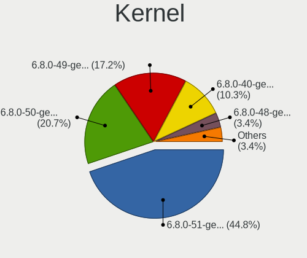
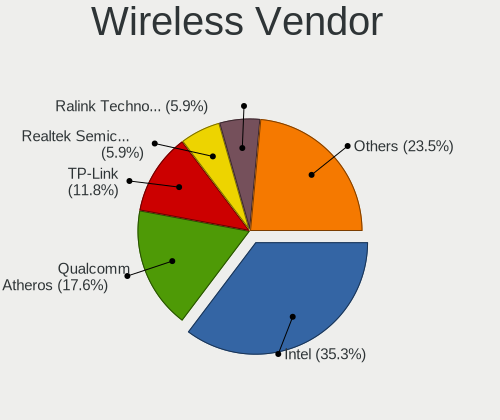
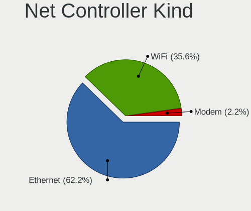
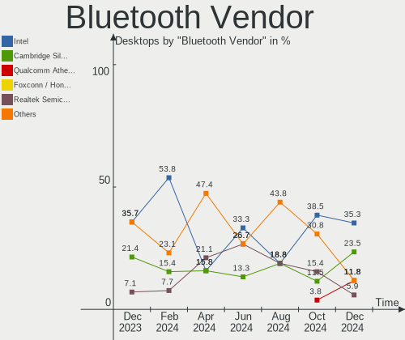

KDE neon - Hardware Trends (Desktops)
-------------------------------------

A project to identify most popular hardware characteristics and track their change
over time based on data collected by Linux users at https://Linux-Hardware.org.

Anyone can contribute to this report by the [hw-probe](https://github.com/linuxhw/hw-probe) tool:

    sudo -E hw-probe -all -upload

This report is for one last month. Overall report since the beginning of time: [TestCoverage](https://github.com/linuxhw/TestCoverage)

Period: Sep, 2022.

Contents
--------

* [ System ](#system)
  - [ OS                       ](#os)
  - [ OS Family                ](#os-family)
  - [ Kernel                   ](#kernel)
  - [ Kernel Family            ](#kernel-family)
  - [ Kernel Major Ver.        ](#kernel-major-ver)
  - [ Arch                     ](#arch)
  - [ DE                       ](#de)
  - [ Display Server           ](#display-server)
  - [ Display Manager          ](#display-manager)
  - [ OS Lang                  ](#os-lang)
  - [ Boot Mode                ](#boot-mode)
  - [ Filesystem               ](#filesystem)
  - [ Part. scheme             ](#part-scheme)
  - [ Dual Boot with Linux/BSD ](#dual-boot-with-linuxbsd)
  - [ Dual Boot (Win)          ](#dual-boot-win)

* [ Board ](#board)
  - [ Vendor                   ](#vendor)
  - [ Model                    ](#model)
  - [ Model Family             ](#model-family)
  - [ MFG Year                 ](#mfg-year)
  - [ Form Factor              ](#form-factor)
  - [ Secure Boot              ](#secure-boot)
  - [ Coreboot                 ](#coreboot)
  - [ RAM Size                 ](#ram-size)
  - [ RAM Used                 ](#ram-used)
  - [ Total Drives             ](#total-drives)
  - [ Has CD-ROM               ](#has-cd-rom)
  - [ Has Ethernet             ](#has-ethernet)
  - [ Has WiFi                 ](#has-wifi)
  - [ Has Bluetooth            ](#has-bluetooth)

* [ Location ](#location)
  - [ Country                  ](#country)
  - [ City                     ](#city)

* [ Drives ](#drives)
  - [ Drive Vendor             ](#drive-vendor)
  - [ Drive Model              ](#drive-model)
  - [ HDD Vendor               ](#hdd-vendor)
  - [ SSD Vendor               ](#ssd-vendor)
  - [ Drive Kind               ](#drive-kind)
  - [ Drive Connector          ](#drive-connector)
  - [ Drive Size               ](#drive-size)
  - [ Space Total              ](#space-total)
  - [ Space Used               ](#space-used)
  - [ Malfunc. Drives          ](#malfunc-drives)
  - [ Malfunc. Drive Vendor    ](#malfunc-drive-vendor)
  - [ Malfunc. HDD Vendor      ](#malfunc-hdd-vendor)
  - [ Malfunc. Drive Kind      ](#malfunc-drive-kind)
  - [ Failed Drives            ](#failed-drives)
  - [ Failed Drive Vendor      ](#failed-drive-vendor)
  - [ Drive Status             ](#drive-status)

* [ Storage controller ](#storage-controller)
  - [ Storage Vendor           ](#storage-vendor)
  - [ Storage Model            ](#storage-model)
  - [ Storage Kind             ](#storage-kind)

* [ Processor ](#processor)
  - [ CPU Vendor               ](#cpu-vendor)
  - [ CPU Model                ](#cpu-model)
  - [ CPU Model Family         ](#cpu-model-family)
  - [ CPU Cores                ](#cpu-cores)
  - [ CPU Sockets              ](#cpu-sockets)
  - [ CPU Threads              ](#cpu-threads)
  - [ CPU Op-Modes             ](#cpu-op-modes)
  - [ CPU Microcode            ](#cpu-microcode)
  - [ CPU Microarch            ](#cpu-microarch)

* [ Graphics ](#graphics)
  - [ GPU Vendor               ](#gpu-vendor)
  - [ GPU Model                ](#gpu-model)
  - [ GPU Combo                ](#gpu-combo)
  - [ GPU Driver               ](#gpu-driver)
  - [ GPU Memory               ](#gpu-memory)

* [ Monitor ](#monitor)
  - [ Monitor Vendor           ](#monitor-vendor)
  - [ Monitor Model            ](#monitor-model)
  - [ Monitor Resolution       ](#monitor-resolution)
  - [ Monitor Diagonal         ](#monitor-diagonal)
  - [ Monitor Width            ](#monitor-width)
  - [ Aspect Ratio             ](#aspect-ratio)
  - [ Monitor Area             ](#monitor-area)
  - [ Pixel Density            ](#pixel-density)
  - [ Multiple Monitors        ](#multiple-monitors)

* [ Network ](#network)
  - [ Net Controller Vendor    ](#net-controller-vendor)
  - [ Net Controller Model     ](#net-controller-model)
  - [ Wireless Vendor          ](#wireless-vendor)
  - [ Wireless Model           ](#wireless-model)
  - [ Ethernet Vendor          ](#ethernet-vendor)
  - [ Ethernet Model           ](#ethernet-model)
  - [ Net Controller Kind      ](#net-controller-kind)
  - [ Used Controller          ](#used-controller)
  - [ NICs                     ](#nics)
  - [ IPv6                     ](#ipv6)

* [ Bluetooth ](#bluetooth)
  - [ Bluetooth Vendor         ](#bluetooth-vendor)
  - [ Bluetooth Model          ](#bluetooth-model)

* [ Sound ](#sound)
  - [ Sound Vendor             ](#sound-vendor)
  - [ Sound Model              ](#sound-model)

* [ Memory ](#memory)
  - [ Memory Vendor            ](#memory-vendor)
  - [ Memory Model             ](#memory-model)
  - [ Memory Kind              ](#memory-kind)
  - [ Memory Form Factor       ](#memory-form-factor)
  - [ Memory Size              ](#memory-size)
  - [ Memory Speed             ](#memory-speed)

* [ Printers & scanners ](#printers--scanners)
  - [ Printer Vendor           ](#printer-vendor)
  - [ Printer Model            ](#printer-model)
  - [ Scanner Vendor           ](#scanner-vendor)
  - [ Scanner Model            ](#scanner-model)

* [ Camera ](#camera)
  - [ Camera Vendor            ](#camera-vendor)
  - [ Camera Model             ](#camera-model)

* [ Security ](#security)
  - [ Fingerprint Vendor       ](#fingerprint-vendor)
  - [ Fingerprint Model        ](#fingerprint-model)
  - [ Chipcard Vendor          ](#chipcard-vendor)
  - [ Chipcard Model           ](#chipcard-model)

* [ Unsupported ](#unsupported)
  - [ Unsupported Devices      ](#unsupported-devices)
  - [ Unsupported Device Types ](#unsupported-device-types)

System
------

OS
--

Installed operating systems

| Name           | Desktops | Percent |
|----------------|----------|---------|
| KDE neon 20.04 | 28       | 90.32%  |
| KDE neon 22.04 | 3        | 9.68%   |

OS Family
---------

OS without a version

| Name     | Desktops | Percent |
|----------|----------|---------|
| KDE neon | 31       | 100%    |

Kernel
------

Version of the Linux kernel

| Version           | Desktops | Percent |
|-------------------|----------|---------|
| 5.15.0-46-generic | 17       | 54.84%  |
| 5.15.0-48-generic | 8        | 25.81%  |
| 5.15.0-47-generic | 3        | 9.68%   |
| 5.15.0-43-generic | 2        | 6.45%   |
| 5.14.0-1047-oem   | 1        | 3.23%   |

Kernel Family
-------------

Linux kernel without a distro release

| Version | Desktops | Percent |
|---------|----------|---------|
| 5.15.0  | 30       | 96.77%  |
| 5.14.0  | 1        | 3.23%   |

Kernel Major Ver.
-----------------

Linux kernel major version

| Version | Desktops | Percent |
|---------|----------|---------|
| 5.15    | 30       | 96.77%  |
| 5.14    | 1        | 3.23%   |

Arch
----

OS architecture (x86_64, i586, etc.)

| Name   | Desktops | Percent |
|--------|----------|---------|
| x86_64 | 31       | 100%    |

DE
--

Desktop Environment

| Name | Desktops | Percent |
|------|----------|---------|
| KDE5 | 31       | 100%    |

Display Server
--------------

X11 or Wayland

| Name | Desktops | Percent |
|------|----------|---------|
| X11  | 31       | 100%    |

Display Manager
---------------

SDDM, LightDM, etc.

| Name    | Desktops | Percent |
|---------|----------|---------|
| Unknown | 24       | 77.42%  |
| SDDM    | 7        | 22.58%  |

OS Lang
-------

Language

| Lang  | Desktops | Percent |
|-------|----------|---------|
| en_US | 10       | 32.26%  |
| de_DE | 4        | 12.9%   |
| pl_PL | 2        | 6.45%   |
| it_IT | 2        | 6.45%   |
| C     | 2        | 6.45%   |
| sv_SE | 1        | 3.23%   |
| ru_RU | 1        | 3.23%   |
| pt_BR | 1        | 3.23%   |
| lt_LT | 1        | 3.23%   |
| es_MX | 1        | 3.23%   |
| es_BO | 1        | 3.23%   |
| en_ZA | 1        | 3.23%   |
| en_SG | 1        | 3.23%   |
| en_IN | 1        | 3.23%   |
| en_AU | 1        | 3.23%   |
| ba_RU | 1        | 3.23%   |

Boot Mode
---------

EFI or BIOS

| Mode | Desktops | Percent |
|------|----------|---------|
| EFI  | 17       | 54.84%  |
| BIOS | 14       | 45.16%  |

Filesystem
----------

Type of filesystem

| Type    | Desktops | Percent |
|---------|----------|---------|
| Ext4    | 28       | 90.32%  |
| Btrfs   | 2        | 6.45%   |
| Overlay | 1        | 3.23%   |

Part. scheme
------------

Scheme of partitioning

| Type    | Desktops | Percent |
|---------|----------|---------|
| Unknown | 29       | 93.55%  |
| GPT     | 2        | 6.45%   |

Dual Boot with Linux/BSD
------------------------

Hosting more than one Linux/BSD

| Dual boot | Desktops | Percent |
|-----------|----------|---------|
| No        | 27       | 87.1%   |
| Yes       | 4        | 12.9%   |

Dual Boot (Win)
---------------

Hosting Linux and Windows

| Dual boot | Desktops | Percent |
|-----------|----------|---------|
| No        | 28       | 90.32%  |
| Yes       | 3        | 9.68%   |

Board
-----

Vendor
------

Motherboard manufacturer

| Name                | Desktops | Percent |
|---------------------|----------|---------|
| MSI                 | 9        | 29.03%  |
| ASUSTek Computer    | 7        | 22.58%  |
| Gigabyte Technology | 4        | 12.9%   |
| ASRock              | 4        | 12.9%   |
| Dell                | 3        | 9.68%   |
| MiTAC               | 1        | 3.23%   |
| Lenovo              | 1        | 3.23%   |
| Intel               | 1        | 3.23%   |
| Hewlett-Packard     | 1        | 3.23%   |

Model
-----

Motherboard model

| Name                               | Desktops | Percent |
|------------------------------------|----------|---------|
| MSI MS-7C84                        | 2        | 6.45%   |
| MSI MS-7C37                        | 2        | 6.45%   |
| MSI MS-7C82                        | 1        | 3.23%   |
| MSI MS-7B92                        | 1        | 3.23%   |
| MSI MS-7B89                        | 1        | 3.23%   |
| MSI MS-7B79                        | 1        | 3.23%   |
| MSI MS-7758                        | 1        | 3.23%   |
| MiTAC E210                         | 1        | 3.23%   |
| Lenovo ThinkCentre M93p 10A90012MS | 1        | 3.23%   |
| Intel H55                          | 1        | 3.23%   |
| HP Z400 Workstation                | 1        | 3.23%   |
| Gigabyte H81M-S2PV                 | 1        | 3.23%   |
| Gigabyte H410M H V3                | 1        | 3.23%   |
| Gigabyte B550 AORUS ELITE V2       | 1        | 3.23%   |
| Gigabyte B450 AORUS ELITE          | 1        | 3.23%   |
| Dell Precision T3610               | 1        | 3.23%   |
| Dell OptiPlex 7010                 | 1        | 3.23%   |
| Dell Inspiron 660                  | 1        | 3.23%   |
| ASUS TUF Gaming X570-PRO           | 1        | 3.23%   |
| ASUS TUF Gaming B550-PLUS          | 1        | 3.23%   |
| ASUS PRIME Z690-P WIFI D4          | 1        | 3.23%   |
| ASUS PRIME B550-PLUS               | 1        | 3.23%   |
| ASUS P8Z77-M                       | 1        | 3.23%   |
| ASUS H110T                         | 1        | 3.23%   |
| ASUS All Series                    | 1        | 3.23%   |
| ASRock X399 Taichi                 | 1        | 3.23%   |
| ASRock N3700-ITX                   | 1        | 3.23%   |
| ASRock G41M-S3                     | 1        | 3.23%   |
| ASRock A320M-DVS R4.0              | 1        | 3.23%   |

Model Family
------------

Motherboard model prefix

| Name               | Desktops | Percent |
|--------------------|----------|---------|
| MSI MS-7C84        | 2        | 6.45%   |
| MSI MS-7C37        | 2        | 6.45%   |
| ASUS TUF           | 2        | 6.45%   |
| ASUS PRIME         | 2        | 6.45%   |
| MSI MS-7C82        | 1        | 3.23%   |
| MSI MS-7B92        | 1        | 3.23%   |
| MSI MS-7B89        | 1        | 3.23%   |
| MSI MS-7B79        | 1        | 3.23%   |
| MSI MS-7758        | 1        | 3.23%   |
| MiTAC E210         | 1        | 3.23%   |
| Lenovo ThinkCentre | 1        | 3.23%   |
| Intel H55          | 1        | 3.23%   |
| HP Z400            | 1        | 3.23%   |
| Gigabyte H81M-S2PV | 1        | 3.23%   |
| Gigabyte H410M     | 1        | 3.23%   |
| Gigabyte B550      | 1        | 3.23%   |
| Gigabyte B450      | 1        | 3.23%   |
| Dell Precision     | 1        | 3.23%   |
| Dell OptiPlex      | 1        | 3.23%   |
| Dell Inspiron      | 1        | 3.23%   |
| ASUS P8Z77-M       | 1        | 3.23%   |
| ASUS H110T         | 1        | 3.23%   |
| ASUS All           | 1        | 3.23%   |
| ASRock X399        | 1        | 3.23%   |
| ASRock N3700-ITX   | 1        | 3.23%   |
| ASRock G41M-S3     | 1        | 3.23%   |
| ASRock A320M-DVS   | 1        | 3.23%   |

MFG Year
--------

Motherboard manufacture year

| Year | Desktops | Percent |
|------|----------|---------|
| 2020 | 7        | 22.58%  |
| 2018 | 4        | 12.9%   |
| 2014 | 4        | 12.9%   |
| 2013 | 4        | 12.9%   |
| 2019 | 3        | 9.68%   |
| 2021 | 2        | 6.45%   |
| 2015 | 2        | 6.45%   |
| 2010 | 2        | 6.45%   |
| 2017 | 1        | 3.23%   |
| 2016 | 1        | 3.23%   |
| 2012 | 1        | 3.23%   |

Form Factor
-----------

Physical design of the computer

| Name    | Desktops | Percent |
|---------|----------|---------|
| Desktop | 31       | 100%    |

Secure Boot
-----------

Enabled or disabled

| State    | Desktops | Percent |
|----------|----------|---------|
| Disabled | 31       | 100%    |

Coreboot
--------

Have coreboot on board

| Used | Desktops | Percent |
|------|----------|---------|
| No   | 31       | 100%    |

RAM Size
--------

Total RAM memory

| Size in GB  | Desktops | Percent |
|-------------|----------|---------|
| 16.01-24.0  | 11       | 35.48%  |
| 32.01-64.0  | 6        | 19.35%  |
| 4.01-8.0    | 4        | 12.9%   |
| 8.01-16.0   | 4        | 12.9%   |
| 64.01-256.0 | 3        | 9.68%   |
| 3.01-4.0    | 2        | 6.45%   |
| 24.01-32.0  | 1        | 3.23%   |

RAM Used
--------

Used RAM memory

| Used GB    | Desktops | Percent |
|------------|----------|---------|
| 2.01-3.0   | 11       | 35.48%  |
| 1.01-2.0   | 10       | 32.26%  |
| 3.01-4.0   | 4        | 12.9%   |
| 4.01-8.0   | 3        | 9.68%   |
| 8.01-16.0  | 2        | 6.45%   |
| 16.01-24.0 | 1        | 3.23%   |

Total Drives
------------

Number of drives on board

| Drives | Desktops | Percent |
|--------|----------|---------|
| 2      | 8        | 25.81%  |
| 4      | 7        | 22.58%  |
| 3      | 5        | 16.13%  |
| 1      | 4        | 12.9%   |
| 6      | 2        | 6.45%   |
| 5      | 2        | 6.45%   |
| 11     | 1        | 3.23%   |
| 8      | 1        | 3.23%   |
| 7      | 1        | 3.23%   |

Has CD-ROM
----------

Has CD-ROM on board

| Presented | Desktops | Percent |
|-----------|----------|---------|
| No        | 22       | 70.97%  |
| Yes       | 9        | 29.03%  |

Has Ethernet
------------

Has Ethernet on board

| Presented | Desktops | Percent |
|-----------|----------|---------|
| Yes       | 31       | 100%    |

Has WiFi
--------

Has WiFi module

| Presented | Desktops | Percent |
|-----------|----------|---------|
| Yes       | 19       | 61.29%  |
| No        | 12       | 38.71%  |

Has Bluetooth
-------------

Has Bluetooth module

| Presented | Desktops | Percent |
|-----------|----------|---------|
| No        | 21       | 67.74%  |
| Yes       | 10       | 32.26%  |

Location
--------

Country
-------

Geographic location (country)

| Country      | Desktops | Percent |
|--------------|----------|---------|
| USA          | 9        | 29.03%  |
| Germany      | 5        | 16.13%  |
| Russia       | 3        | 9.68%   |
| Poland       | 2        | 6.45%   |
| Italy        | 2        | 6.45%   |
| Sweden       | 1        | 3.23%   |
| South Africa | 1        | 3.23%   |
| Singapore    | 1        | 3.23%   |
| Mexico       | 1        | 3.23%   |
| Lithuania    | 1        | 3.23%   |
| Indonesia    | 1        | 3.23%   |
| India        | 1        | 3.23%   |
| Brazil       | 1        | 3.23%   |
| Bolivia      | 1        | 3.23%   |
| Australia    | 1        | 3.23%   |

City
----

Geographic location (city)

| City             | Desktops | Percent |
|------------------|----------|---------|
| Warsaw           | 1        | 3.23%   |
| Volgograd        | 1        | 3.23%   |
| Venice           | 1        | 3.23%   |
| Stolpen          | 1        | 3.23%   |
| Singapore        | 1        | 3.23%   |
| Saeffle          | 1        | 3.23%   |
| Pune             | 1        | 3.23%   |
| Puebla City      | 1        | 3.23%   |
| Poços de Caldas | 1        | 3.23%   |
| Peoria           | 1        | 3.23%   |
| Osnabrück       | 1        | 3.23%   |
| Murfreesboro     | 1        | 3.23%   |
| Moscow           | 1        | 3.23%   |
| Morrison         | 1        | 3.23%   |
| Lehigh Acres     | 1        | 3.23%   |
| La Paz           | 1        | 3.23%   |
| Kaunas           | 1        | 3.23%   |
| Johannesburg     | 1        | 3.23%   |
| Jakarta          | 1        | 3.23%   |
| Huxley           | 1        | 3.23%   |
| Hamm             | 1        | 3.23%   |
| Hamburg          | 1        | 3.23%   |
| Grozny           | 1        | 3.23%   |
| Gliwice          | 1        | 3.23%   |
| Dallas           | 1        | 3.23%   |
| Bologna          | 1        | 3.23%   |
| Bismarck         | 1        | 3.23%   |
| Bartow           | 1        | 3.23%   |
| Austin           | 1        | 3.23%   |
| Augsburg         | 1        | 3.23%   |
| Adelaide         | 1        | 3.23%   |

Drives
------

Drive Vendor
------------

Hard drive vendors

| Vendor                    | Desktops | Drives | Percent |
|---------------------------|----------|--------|---------|
| WDC                       | 13       | 20     | 18.06%  |
| Seagate                   | 12       | 18     | 16.67%  |
| Samsung Electronics       | 12       | 34     | 16.67%  |
| SanDisk                   | 4        | 4      | 5.56%   |
| Phison                    | 3        | 3      | 4.17%   |
| Kingston                  | 3        | 4      | 4.17%   |
| Hitachi                   | 3        | 4      | 4.17%   |
| Phison Electronics        | 2        | 3      | 2.78%   |
| Micron/Crucial Technology | 2        | 2      | 2.78%   |
| HGST                      | 2        | 2      | 2.78%   |
| Crucial                   | 2        | 2      | 2.78%   |
| Transcend                 | 1        | 1      | 1.39%   |
| Toshiba                   | 1        | 1      | 1.39%   |
| SPCC                      | 1        | 2      | 1.39%   |
| Silicon Motion            | 1        | 1      | 1.39%   |
| PNY                       | 1        | 1      | 1.39%   |
| Patriot                   | 1        | 1      | 1.39%   |
| OWC                       | 1        | 1      | 1.39%   |
| OCZ                       | 1        | 1      | 1.39%   |
| KIOXIA-EXCERIA            | 1        | 1      | 1.39%   |
| Intel                     | 1        | 1      | 1.39%   |
| Innodisk                  | 1        | 1      | 1.39%   |
| HS-SSD-C100               | 1        | 1      | 1.39%   |
| China                     | 1        | 3      | 1.39%   |
| A-DATA Technology         | 1        | 1      | 1.39%   |

Drive Model
-----------

Hard drive models

| Model                               | Desktops | Percent |
|-------------------------------------|----------|---------|
| Samsung SSD 860 EVO 500GB           | 3        | 3.13%   |
| WDC WD40EFRX-68N32N0 4TB            | 2        | 2.08%   |
| Seagate ST1000DM003-1CH162 1TB      | 2        | 2.08%   |
| Samsung SSD 860 EVO 1TB             | 2        | 2.08%   |
| Samsung SSD 840 EVO 120GB           | 2        | 2.08%   |
| Samsung NVMe SSD Drive 500GB        | 2        | 2.08%   |
| Samsung NVMe SSD Drive 1TB          | 2        | 2.08%   |
| Phison E12 NVMe Controller 1024GB   | 2        | 2.08%   |
| Kingston SA400S37480G 480GB SSD     | 2        | 2.08%   |
| WDC WDS500G2B0A-00SM50 500GB SSD    | 1        | 1.04%   |
| WDC WD5000LPCX-60VHAT0 500GB        | 1        | 1.04%   |
| WDC WD5000HHTZ-04N21V0 500GB        | 1        | 1.04%   |
| WDC WD5000AAKX-60U6AA0 500GB        | 1        | 1.04%   |
| WDC WD5000AAKS-00YGA0 500GB         | 1        | 1.04%   |
| WDC WD3200AAKS-00L9A0 320GB         | 1        | 1.04%   |
| WDC WD20EZRZ-00Z5HB0 2TB            | 1        | 1.04%   |
| WDC WD2003FYYS-02W0B0 2TB           | 1        | 1.04%   |
| WDC WD2000F9YZ-09N20L0 2TB          | 1        | 1.04%   |
| WDC WD1600AAJS-00WAA0 160GB         | 1        | 1.04%   |
| WDC WD10EZRZ-00HTKB0 1TB            | 1        | 1.04%   |
| WDC WD10EZRX-00A8LB0 1TB            | 1        | 1.04%   |
| WDC WD10EACS-00ZJB0 1TB             | 1        | 1.04%   |
| WDC WD1002FBYS-05A6B0 1TB           | 1        | 1.04%   |
| Transcend TS512GMTS430S 512GB SSD   | 1        | 1.04%   |
| Toshiba HDWE140 4TB                 | 1        | 1.04%   |
| SPCC Solid State Disk 256GB         | 1        | 1.04%   |
| SPCC M.2 SSD 256GB                  | 1        | 1.04%   |
| Silicon Motion NVMe SSD Drive 250GB | 1        | 1.04%   |
| Seagate ST8000VN004-2M2101 8TB      | 1        | 1.04%   |
| Seagate ST500DM002-1BD142 500GB     | 1        | 1.04%   |
| Seagate ST3320813AS 320GB           | 1        | 1.04%   |
| Seagate ST3250410AS 250GB           | 1        | 1.04%   |
| Seagate ST3000DM001-1CH166 3TB      | 1        | 1.04%   |
| Seagate ST2000VM003-1CT164 2TB      | 1        | 1.04%   |
| Seagate ST18000NM000J-2TV103 18TB   | 1        | 1.04%   |
| Seagate ST1000LM035-1RK172 1TB      | 1        | 1.04%   |
| Seagate ST1000DM010-2EP102 1TB      | 1        | 1.04%   |
| Seagate ST1000DM003-1SB10C 1TB      | 1        | 1.04%   |
| Seagate ST1000DM003-1SB102 1TB      | 1        | 1.04%   |
| Seagate ST1000DM003-1ER162 1TB      | 1        | 1.04%   |

HDD Vendor
----------

Hard disk drive vendors

| Vendor              | Desktops | Drives | Percent |
|---------------------|----------|--------|---------|
| WDC                 | 12       | 19     | 37.5%   |
| Seagate             | 12       | 18     | 37.5%   |
| Hitachi             | 3        | 4      | 9.38%   |
| Samsung Electronics | 2        | 2      | 6.25%   |
| HGST                | 2        | 2      | 6.25%   |
| Toshiba             | 1        | 1      | 3.13%   |

SSD Vendor
----------

Solid state drive vendors

| Vendor              | Desktops | Drives | Percent |
|---------------------|----------|--------|---------|
| Samsung Electronics | 10       | 14     | 37.04%  |
| Kingston            | 3        | 4      | 11.11%  |
| SanDisk             | 2        | 2      | 7.41%   |
| Crucial             | 2        | 2      | 7.41%   |
| WDC                 | 1        | 1      | 3.7%    |
| Transcend           | 1        | 1      | 3.7%    |
| SPCC                | 1        | 2      | 3.7%    |
| PNY                 | 1        | 1      | 3.7%    |
| Patriot             | 1        | 1      | 3.7%    |
| OWC                 | 1        | 1      | 3.7%    |
| OCZ                 | 1        | 1      | 3.7%    |
| Innodisk            | 1        | 1      | 3.7%    |
| China               | 1        | 3      | 3.7%    |
| A-DATA Technology   | 1        | 1      | 3.7%    |

Drive Kind
----------

HDD or SSD

| Kind    | Desktops | Drives | Percent |
|---------|----------|--------|---------|
| SSD     | 24       | 35     | 39.34%  |
| HDD     | 22       | 46     | 36.07%  |
| NVMe    | 14       | 31     | 22.95%  |
| Unknown | 1        | 1      | 1.64%   |

Drive Connector
---------------

SATA, SAS, NVMe, etc.

| Type | Desktops | Drives | Percent |
|------|----------|--------|---------|
| SATA | 31       | 81     | 67.39%  |
| NVMe | 14       | 31     | 30.43%  |
| SAS  | 1        | 1      | 2.17%   |

Drive Size
----------

Size of hard drive

| Size in TB | Desktops | Drives | Percent |
|------------|----------|--------|---------|
| 0.01-0.5   | 25       | 42     | 48.08%  |
| 0.51-1.0   | 15       | 22     | 28.85%  |
| 3.01-4.0   | 4        | 6      | 7.69%   |
| 1.01-2.0   | 4        | 5      | 7.69%   |
| 2.01-3.0   | 2        | 2      | 3.85%   |
| 10.01-20.0 | 1        | 2      | 1.92%   |
| 4.01-10.0  | 1        | 2      | 1.92%   |

Space Total
-----------

Amount of disk space available on the file system

| Size in GB     | Desktops | Percent |
|----------------|----------|---------|
| 251-500        | 8        | 25.81%  |
| 101-250        | 7        | 22.58%  |
| More than 3000 | 4        | 12.9%   |
| 501-1000       | 3        | 9.68%   |
| 51-100         | 3        | 9.68%   |
| 21-50          | 2        | 6.45%   |
| 2001-3000      | 1        | 3.23%   |
| 1001-2000      | 1        | 3.23%   |
| 1-20           | 1        | 3.23%   |
| Unknown        | 1        | 3.23%   |

Space Used
----------

Amount of used disk space

| Used GB        | Desktops | Percent |
|----------------|----------|---------|
| 1-20           | 11       | 35.48%  |
| 21-50          | 8        | 25.81%  |
| 101-250        | 4        | 12.9%   |
| More than 3000 | 2        | 6.45%   |
| 251-500        | 2        | 6.45%   |
| 2001-3000      | 1        | 3.23%   |
| 1001-2000      | 1        | 3.23%   |
| 51-100         | 1        | 3.23%   |
| Unknown        | 1        | 3.23%   |

Malfunc. Drives
---------------

Drive models with a malfunction

| Model                            | Desktops | Drives | Percent |
|----------------------------------|----------|--------|---------|
| Innodisk Corp. - mSATA 3ME4 64GB | 1        | 1      | 100%    |

Malfunc. Drive Vendor
---------------------

Vendors of faulty drives

| Vendor   | Desktops | Drives | Percent |
|----------|----------|--------|---------|
| Innodisk | 1        | 1      | 100%    |

Malfunc. HDD Vendor
-------------------

Vendors of faulty HDD drives

Zero info for selected period =(

Malfunc. Drive Kind
-------------------

Kinds of faulty drives

| Kind | Desktops | Drives | Percent |
|------|----------|--------|---------|
| SSD  | 1        | 1      | 100%    |

Failed Drives
-------------

Failed drive models

Zero info for selected period =(

Failed Drive Vendor
-------------------

Failed drive vendors

Zero info for selected period =(

Drive Status
------------

Number of failed and malfunc. drives

| Status   | Desktops | Drives | Percent |
|----------|----------|--------|---------|
| Detected | 29       | 98     | 87.88%  |
| Works    | 3        | 14     | 9.09%   |
| Malfunc  | 1        | 1      | 3.03%   |

Storage controller
------------------

Storage Vendor
--------------

Storage controller vendors

| Vendor                    | Desktops | Percent |
|---------------------------|----------|---------|
| Intel                     | 17       | 32.69%  |
| AMD                       | 15       | 28.85%  |
| Samsung Electronics       | 6        | 11.54%  |
| Phison Electronics        | 4        | 7.69%   |
| ASMedia Technology        | 4        | 7.69%   |
| SanDisk                   | 2        | 3.85%   |
| Micron/Crucial Technology | 2        | 3.85%   |
| Silicon Motion            | 1        | 1.92%   |
| KIOXIA                    | 1        | 1.92%   |

Storage Model
-------------

Storage controller models

| Model                                                                            | Desktops | Percent |
|----------------------------------------------------------------------------------|----------|---------|
| AMD FCH SATA Controller [AHCI mode]                                              | 12       | 19.35%  |
| Samsung NVMe SSD Controller SM981/PM981/PM983                                    | 4        | 6.45%   |
| Phison E12 NVMe Controller                                                       | 4        | 6.45%   |
| ASMedia ASM1062 Serial ATA Controller                                            | 4        | 6.45%   |
| Samsung NVMe SSD Controller PM9A1/PM9A3/980PRO                                   | 3        | 4.84%   |
| AMD 500 Series Chipset SATA Controller                                           | 3        | 4.84%   |
| AMD 400 Series Chipset SATA Controller                                           | 3        | 4.84%   |
| Micron/Crucial Non-Volatile memory controller                                    | 2        | 3.23%   |
| Intel SATA Controller [RAID mode]                                                | 2        | 3.23%   |
| Intel 8 Series/C220 Series Chipset Family 6-port SATA Controller 1 [AHCI mode]   | 2        | 3.23%   |
| Intel 7 Series/C210 Series Chipset Family 6-port SATA Controller [AHCI mode]     | 2        | 3.23%   |
| AMD X399 Series Chipset SATA Controller                                          | 2        | 3.23%   |
| Silicon Motion SM2263EN/SM2263XT SSD Controller                                  | 1        | 1.61%   |
| SanDisk WD Blue SN550 NVMe SSD                                                   | 1        | 1.61%   |
| SanDisk Non-Volatile memory controller                                           | 1        | 1.61%   |
| KIOXIA Non-Volatile memory controller                                            | 1        | 1.61%   |
| Intel Volume Management Device NVMe RAID Controller                              | 1        | 1.61%   |
| Intel SSD 660P Series                                                            | 1        | 1.61%   |
| Intel Q170/Q150/B150/H170/H110/Z170/CM236 Chipset SATA Controller [AHCI Mode]    | 1        | 1.61%   |
| Intel NM10/ICH7 Family SATA Controller [IDE mode]                                | 1        | 1.61%   |
| Intel NM10/ICH7 Family SATA Controller [AHCI mode]                               | 1        | 1.61%   |
| Intel C600/X79 series chipset SATA RAID Controller                               | 1        | 1.61%   |
| Intel Atom/Celeron/Pentium Processor x5-E8000/J3xxx/N3xxx Series SATA Controller | 1        | 1.61%   |
| Intel Alder Lake-S PCH SATA Controller [AHCI Mode]                               | 1        | 1.61%   |
| Intel 82801G (ICH7 Family) IDE Controller                                        | 1        | 1.61%   |
| Intel 7 Series/C210 Series Chipset Family 4-port SATA Controller [IDE mode]      | 1        | 1.61%   |
| Intel 7 Series/C210 Series Chipset Family 2-port SATA Controller [IDE mode]      | 1        | 1.61%   |
| Intel 500 Series Chipset Family SATA AHCI Controller                             | 1        | 1.61%   |
| Intel 5 Series/3400 Series Chipset 4 port SATA AHCI Controller                   | 1        | 1.61%   |
| Intel 400 Series Chipset Family SATA AHCI Controller                             | 1        | 1.61%   |
| AMD FCH SATA Controller D                                                        | 1        | 1.61%   |

Storage Kind
------------

Kind of storage controller (IDE, SATA, NVMe, SAS, ...)

| Kind | Desktops | Percent |
|------|----------|---------|
| SATA | 26       | 56.52%  |
| NVMe | 14       | 30.43%  |
| RAID | 4        | 8.7%    |
| IDE  | 2        | 4.35%   |

Processor
---------

CPU Vendor
----------

Processor vendors

| Vendor | Desktops | Percent |
|--------|----------|---------|
| Intel  | 16       | 51.61%  |
| AMD    | 15       | 48.39%  |

CPU Model
---------

Processor models

| Model                                           | Desktops | Percent |
|-------------------------------------------------|----------|---------|
| AMD Ryzen 7 3700X 8-Core Processor              | 3        | 9.68%   |
| AMD Ryzen 9 5900X 12-Core Processor             | 2        | 6.45%   |
| Intel Xeon CPU W3565 @ 3.20GHz                  | 1        | 3.23%   |
| Intel Xeon CPU E5-1620 v2 @ 3.70GHz             | 1        | 3.23%   |
| Intel Pentium Gold G6400 CPU @ 4.00GHz          | 1        | 3.23%   |
| Intel Pentium CPU N3700 @ 1.60GHz               | 1        | 3.23%   |
| Intel Pentium CPU G4560 @ 3.50GHz               | 1        | 3.23%   |
| Intel Core i7-4770K CPU @ 3.50GHz               | 1        | 3.23%   |
| Intel Core i5-3570K CPU @ 3.40GHz               | 1        | 3.23%   |
| Intel Core i5-3570 CPU @ 3.40GHz                | 1        | 3.23%   |
| Intel Core i5-3550 CPU @ 3.30GHz                | 1        | 3.23%   |
| Intel Core i5-10400F CPU @ 2.90GHz              | 1        | 3.23%   |
| Intel Core i5 CPU 650 @ 3.20GHz                 | 1        | 3.23%   |
| Intel Core i3-4360 CPU @ 3.70GHz                | 1        | 3.23%   |
| Intel Core i3-3240 CPU @ 3.40GHz                | 1        | 3.23%   |
| Intel Core 2 Duo CPU E7500 @ 2.93GHz            | 1        | 3.23%   |
| Intel Atom CPU D2550 @ 1.86GHz                  | 1        | 3.23%   |
| Intel 12th Gen Core i5-12600K                   | 1        | 3.23%   |
| AMD Sempron 3850 APU with Radeon R3             | 1        | 3.23%   |
| AMD Ryzen Threadripper 2990WX 32-Core Processor | 1        | 3.23%   |
| AMD Ryzen Threadripper 2950X 16-Core Processor  | 1        | 3.23%   |
| AMD Ryzen 7 2700X Eight-Core Processor          | 1        | 3.23%   |
| AMD Ryzen 5 5600X 6-Core Processor              | 1        | 3.23%   |
| AMD Ryzen 5 5600G with Radeon Graphics          | 1        | 3.23%   |
| AMD Ryzen 5 3600 6-Core Processor               | 1        | 3.23%   |
| AMD Ryzen 5 3500X 6-Core Processor              | 1        | 3.23%   |
| AMD Ryzen 5 2600 Six-Core Processor             | 1        | 3.23%   |
| AMD Athlon 3000G with Radeon Vega Graphics      | 1        | 3.23%   |

CPU Model Family
----------------

Processor model prefix

| Model                  | Desktops | Percent |
|------------------------|----------|---------|
| Intel Core i5          | 5        | 16.13%  |
| AMD Ryzen 5            | 5        | 16.13%  |
| AMD Ryzen 7            | 4        | 12.9%   |
| Intel Xeon             | 2        | 6.45%   |
| Intel Pentium          | 2        | 6.45%   |
| Intel Core i3          | 2        | 6.45%   |
| AMD Ryzen Threadripper | 2        | 6.45%   |
| AMD Ryzen 9            | 2        | 6.45%   |
| Other                  | 1        | 3.23%   |
| Intel Pentium Gold     | 1        | 3.23%   |
| Intel Core i7          | 1        | 3.23%   |
| Intel Core 2 Duo       | 1        | 3.23%   |
| Intel Atom             | 1        | 3.23%   |
| AMD Sempron            | 1        | 3.23%   |
| AMD Athlon             | 1        | 3.23%   |

CPU Cores
---------

Number of processor cores

| Number | Desktops | Percent |
|--------|----------|---------|
| 4      | 8        | 25.81%  |
| 2      | 8        | 25.81%  |
| 6      | 6        | 19.35%  |
| 8      | 4        | 12.9%   |
| 12     | 2        | 6.45%   |
| 32     | 1        | 3.23%   |
| 16     | 1        | 3.23%   |
| 10     | 1        | 3.23%   |

CPU Sockets
-----------

Number of sockets

| Number | Desktops | Percent |
|--------|----------|---------|
| 1      | 31       | 100%    |

CPU Threads
-----------

Threads per core (Hyper-Threading)

| Number | Desktops | Percent |
|--------|----------|---------|
| 2      | 23       | 74.19%  |
| 1      | 8        | 25.81%  |

CPU Op-Modes
------------

CPU Operation Modes (32-bit, 64-bit)

| Op mode        | Desktops | Percent |
|----------------|----------|---------|
| 32-bit, 64-bit | 31       | 100%    |

CPU Microcode
-------------

Microcode number

| Number     | Desktops | Percent |
|------------|----------|---------|
| 0x08701021 | 5        | 16.13%  |
| 0x0800820d | 4        | 12.9%   |
| 0x306a9    | 3        | 9.68%   |
| 0x0a201016 | 3        | 9.68%   |
| Unknown    | 3        | 9.68%   |
| 0xa0653    | 1        | 3.23%   |
| 0x906e9    | 1        | 3.23%   |
| 0x90672    | 1        | 3.23%   |
| 0x406c3    | 1        | 3.23%   |
| 0x306e4    | 1        | 3.23%   |
| 0x306c3    | 1        | 3.23%   |
| 0x30661    | 1        | 3.23%   |
| 0x20652    | 1        | 3.23%   |
| 0x106a5    | 1        | 3.23%   |
| 0x1067a    | 1        | 3.23%   |
| 0x0a50000d | 1        | 3.23%   |
| 0x08108109 | 1        | 3.23%   |
| 0x0700010f | 1        | 3.23%   |

CPU Microarch
-------------

Microarchitecture

| Name             | Desktops | Percent |
|------------------|----------|---------|
| Zen+             | 5        | 16.13%  |
| Zen 2            | 5        | 16.13%  |
| IvyBridge        | 5        | 16.13%  |
| Zen 3            | 4        | 12.9%   |
| Haswell          | 2        | 6.45%   |
| CometLake        | 2        | 6.45%   |
| Westmere         | 1        | 3.23%   |
| Silvermont       | 1        | 3.23%   |
| Penryn           | 1        | 3.23%   |
| Nehalem          | 1        | 3.23%   |
| KabyLake         | 1        | 3.23%   |
| Jaguar           | 1        | 3.23%   |
| Bonnell          | 1        | 3.23%   |
| Alderlake Hybrid | 1        | 3.23%   |

Graphics
--------

GPU Vendor
----------

Vendors of graphics cards

| Vendor | Desktops | Percent |
|--------|----------|---------|
| Nvidia | 15       | 44.12%  |
| Intel  | 10       | 29.41%  |
| AMD    | 9        | 26.47%  |

GPU Model
---------

Graphics card models

| Model                                                                                    | Desktops | Percent |
|------------------------------------------------------------------------------------------|----------|---------|
| Nvidia GP108 [GeForce GT 1030]                                                           | 3        | 8.82%   |
| AMD Ellesmere [Radeon RX 470/480/570/570X/580/580X/590]                                  | 3        | 8.82%   |
| Nvidia GP107 [GeForce GTX 1050 Ti]                                                       | 2        | 5.88%   |
| Intel Xeon E3-1200 v2/3rd Gen Core processor Graphics Controller                         | 2        | 5.88%   |
| Nvidia TU117 [GeForce GTX 1650]                                                          | 1        | 2.94%   |
| Nvidia TU116 [GeForce GTX 1660]                                                          | 1        | 2.94%   |
| Nvidia TU116 [GeForce GTX 1660 SUPER]                                                    | 1        | 2.94%   |
| Nvidia TU102 [GeForce RTX 2080 Ti Rev. A]                                                | 1        | 2.94%   |
| Nvidia GP104 [GeForce GTX 1080]                                                          | 1        | 2.94%   |
| Nvidia GM206GL [Quadro M2000]                                                            | 1        | 2.94%   |
| Nvidia GM206 [GeForce GTX 960]                                                           | 1        | 2.94%   |
| Nvidia GM107 [GeForce GTX 750 Ti]                                                        | 1        | 2.94%   |
| Nvidia GK208B [GeForce GT 730]                                                           | 1        | 2.94%   |
| Nvidia GA104 [GeForce RTX 3060 Ti Lite Hash Rate]                                        | 1        | 2.94%   |
| Intel Xeon E3-1200 v3/4th Gen Core Processor Integrated Graphics Controller              | 1        | 2.94%   |
| Intel IvyBridge GT2 [HD Graphics 4000]                                                   | 1        | 2.94%   |
| Intel HD Graphics 610                                                                    | 1        | 2.94%   |
| Intel Core Processor Integrated Graphics Controller                                      | 1        | 2.94%   |
| Intel CometLake-S GT1 [UHD Graphics 610]                                                 | 1        | 2.94%   |
| Intel Atom/Celeron/Pentium Processor x5-E8000/J3xxx/N3xxx Integrated Graphics Controller | 1        | 2.94%   |
| Intel Atom Processor D2xxx/N2xxx Integrated Graphics Controller                          | 1        | 2.94%   |
| Intel 4 Series Chipset Integrated Graphics Controller                                    | 1        | 2.94%   |
| AMD Pitcairn XT GL [FirePro W7000]                                                       | 1        | 2.94%   |
| AMD Picasso/Raven 2 [Radeon Vega Series / Radeon Vega Mobile Series]                     | 1        | 2.94%   |
| AMD Park [Mobility Radeon HD 5430]                                                       | 1        | 2.94%   |
| AMD Navi 24 [Radeon RX 6400 / 6500 XT]                                                   | 1        | 2.94%   |
| AMD Navi 21 [Radeon RX 6800/6800 XT / 6900 XT]                                           | 1        | 2.94%   |
| AMD Kabini [Radeon HD 8280 / R3 Series]                                                  | 1        | 2.94%   |

GPU Combo
---------

Combinations of graphics cards

| Name       | Desktops | Percent |
|------------|----------|---------|
| 1 x Nvidia | 15       | 48.39%  |
| 1 x AMD    | 9        | 29.03%  |
| 1 x Intel  | 7        | 22.58%  |

GPU Driver
----------

Free vs proprietary

| Driver      | Desktops | Percent |
|-------------|----------|---------|
| Free        | 21       | 67.74%  |
| Proprietary | 10       | 32.26%  |

GPU Memory
----------

Total video memory

| Size in GB | Desktops | Percent |
|------------|----------|---------|
| Unknown    | 8        | 25.81%  |
| 3.01-4.0   | 7        | 22.58%  |
| 1.01-2.0   | 6        | 19.35%  |
| 7.01-8.0   | 4        | 12.9%   |
| 5.01-6.0   | 2        | 6.45%   |
| 8.01-16.0  | 2        | 6.45%   |
| 0.51-1.0   | 1        | 3.23%   |
| 0.01-0.5   | 1        | 3.23%   |

Monitor
-------

Monitor Vendor
--------------

Monitor vendors

| Vendor               | Desktops | Percent |
|----------------------|----------|---------|
| Samsung Electronics  | 6        | 17.65%  |
| Goldstar             | 3        | 8.82%   |
| Dell                 | 3        | 8.82%   |
| Philips              | 2        | 5.88%   |
| Hewlett-Packard      | 2        | 5.88%   |
| Vestel Elektronik    | 1        | 2.94%   |
| Sceptre Tech         | 1        | 2.94%   |
| MSI                  | 1        | 2.94%   |
| Mi                   | 1        | 2.94%   |
| LG Electronics       | 1        | 2.94%   |
| Lenovo               | 1        | 2.94%   |
| Insignia             | 1        | 2.94%   |
| Iiyama               | 1        | 2.94%   |
| HPN                  | 1        | 2.94%   |
| HannStar             | 1        | 2.94%   |
| Gateway              | 1        | 2.94%   |
| DENON                | 1        | 2.94%   |
| CVT                  | 1        | 2.94%   |
| CHO                  | 1        | 2.94%   |
| BenQ                 | 1        | 2.94%   |
| AOC                  | 1        | 2.94%   |
| Ancor Communications | 1        | 2.94%   |
| Acer                 | 1        | 2.94%   |

Monitor Model
-------------

Monitor models

| Model                                                                 | Desktops | Percent |
|-----------------------------------------------------------------------|----------|---------|
| Vestel Elektronik 24W_LCD_TV VES3700 1920x1080 706x398mm 31.9-inch    | 1        | 2.44%   |
| Sceptre Tech Sceptre F27 SPT0AD7 1920x1080 600x330mm 27.0-inch        | 1        | 2.44%   |
| Samsung Electronics SyncMaster SAM0599 1600x900 443x249mm 20.0-inch   | 1        | 2.44%   |
| Samsung Electronics SyncMaster SAM041E 2048x1152 510x287mm 23.0-inch  | 1        | 2.44%   |
| Samsung Electronics SMBX2335 SAM0702 1920x1080 510x287mm 23.0-inch    | 1        | 2.44%   |
| Samsung Electronics S27D850 SAM0BC9 2560x1440 598x336mm 27.0-inch     | 1        | 2.44%   |
| Samsung Electronics LF27T450F SAM7097 1920x1080 597x336mm 27.0-inch   | 1        | 2.44%   |
| Samsung Electronics LF27T35 SAM707F 1920x1080 598x337mm 27.0-inch     | 1        | 2.44%   |
| Samsung Electronics LCD Monitor LF27T450F 1920x1080                   | 1        | 2.44%   |
| Samsung Electronics LCD Monitor C24F390 3840x1080                     | 1        | 2.44%   |
| Samsung Electronics LCD Monitor C24F390                               | 1        | 2.44%   |
| Philips PHL BDM4065 PHL08E1 3840x2160 878x485mm 39.5-inch             | 1        | 2.44%   |
| Philips PHL 328E9F PHLC181 2560x1440 700x390mm 31.5-inch              | 1        | 2.44%   |
| Philips LCD Monitor PHL 328E9F 2560x1440                              | 1        | 2.44%   |
| MSI G24C4 MSI3BA0 1920x1080 521x293mm 23.5-inch                       | 1        | 2.44%   |
| Mi Monitor XMI23C3 1920x1080 527x293mm 23.7-inch                      | 1        | 2.44%   |
| LG Electronics LCD Monitor LG HDR 4K                                  | 1        | 2.44%   |
| Lenovo LCD Monitor LEN65A7 1920x1080 510x290mm 23.1-inch              | 1        | 2.44%   |
| Insignia NS19ED200NA14 BBY0032 1680x1050 640x384mm 29.4-inch          | 1        | 2.44%   |
| Iiyama X2483/2481 IVM6128 1920x1080 527x296mm 23.8-inch               | 1        | 2.44%   |
| HPN LCD Monitor HP V270 1920x1080                                     | 1        | 2.44%   |
| Hewlett-Packard 27vx HWP329E 1920x1080 600x340mm 27.2-inch            | 1        | 2.44%   |
| Hewlett-Packard 25f HPN3547 1920x1080 553x309mm 24.9-inch             | 1        | 2.44%   |
| HannStar HL272HPB HSD6537 1920x1080 597x336mm 27.0-inch               | 1        | 2.44%   |
| Goldstar WX942 GSM4B7F 1440x900 408x255mm 18.9-inch                   | 1        | 2.44%   |
| Goldstar HDR WFHD GSM5B9F 2560x1080 798x334mm 34.1-inch               | 1        | 2.44%   |
| Goldstar HDR 4K GSM7707 3840x2160 600x340mm 27.2-inch                 | 1        | 2.44%   |
| Gateway FHD2303L GWY0218 1920x1080 509x286mm 23.0-inch                | 1        | 2.44%   |
| DENON AVR DON0035 1920x1080 500x281mm 22.6-inch                       | 1        | 2.44%   |
| Dell U3417W DELA0DE 3440x1440 800x335mm 34.1-inch                     | 1        | 2.44%   |
| Dell U3415W DELA0A6 3440x1440 798x335mm 34.1-inch                     | 1        | 2.44%   |
| Dell U2412M DELA07B 1920x1200 518x324mm 24.1-inch                     | 1        | 2.44%   |
| Dell LCD Monitor P2417H 3840x1080                                     | 1        | 2.44%   |
| Dell LCD Monitor P2417H                                               | 1        | 2.44%   |
| CVT LCD TV CVT0001 1920x1080 880x490mm 39.7-inch                      | 1        | 2.44%   |
| CHO Smart TV CHO0030 3840x2160 1394x784mm 63.0-inch                   | 1        | 2.44%   |
| BenQ LCD Monitor GW2480 5760x1080                                     | 1        | 2.44%   |
| BenQ LCD Monitor GW2480                                               | 1        | 2.44%   |
| AOC 2460G5 AOC2460 1920x1080 531x299mm 24.0-inch                      | 1        | 2.44%   |
| Ancor Communications ASUS VS228 ACI22FD 1920x1080 476x268mm 21.5-inch | 1        | 2.44%   |

Monitor Resolution
------------------

Monitor screen resolution

| Resolution         | Desktops | Percent |
|--------------------|----------|---------|
| 1920x1080 (FHD)    | 14       | 40%     |
| 3840x2160 (4K)     | 4        | 11.43%  |
| Unknown            | 4        | 11.43%  |
| 3840x1080          | 2        | 5.71%   |
| 2560x1440 (QHD)    | 2        | 5.71%   |
| 5760x1080          | 1        | 2.86%   |
| 3440x1440          | 1        | 2.86%   |
| 2560x1080          | 1        | 2.86%   |
| 2048x1152          | 1        | 2.86%   |
| 1920x540           | 1        | 2.86%   |
| 1920x1200 (WUXGA)  | 1        | 2.86%   |
| 1680x1050 (WSXGA+) | 1        | 2.86%   |
| 1600x900 (HD+)     | 1        | 2.86%   |
| 1440x900 (WXGA+)   | 1        | 2.86%   |

Monitor Diagonal
----------------

Diagonal size in inches

| Inches  | Desktops | Percent |
|---------|----------|---------|
| Unknown | 7        | 19.44%  |
| 27      | 6        | 16.67%  |
| 23      | 6        | 16.67%  |
| 24      | 4        | 11.11%  |
| 39      | 2        | 5.56%   |
| 34      | 2        | 5.56%   |
| 84      | 1        | 2.78%   |
| 63      | 1        | 2.78%   |
| 54      | 1        | 2.78%   |
| 48      | 1        | 2.78%   |
| 31      | 1        | 2.78%   |
| 22      | 1        | 2.78%   |
| 21      | 1        | 2.78%   |
| 20      | 1        | 2.78%   |
| 18      | 1        | 2.78%   |

Monitor Width
-------------

Physical width

| Width in mm | Desktops | Percent |
|-------------|----------|---------|
| 501-600     | 15       | 42.86%  |
| Unknown     | 7        | 20%     |
| 401-500     | 4        | 11.43%  |
| 1001-1500   | 3        | 8.57%   |
| 801-900     | 2        | 5.71%   |
| 701-800     | 2        | 5.71%   |
| 601-700     | 1        | 2.86%   |
| 1501-2000   | 1        | 2.86%   |

Aspect Ratio
------------

Proportional relationship between the width and the height

| Ratio   | Desktops | Percent |
|---------|----------|---------|
| 16/9    | 19       | 57.58%  |
| Unknown | 7        | 21.21%  |
| 16/10   | 4        | 12.12%  |
| 21/9    | 2        | 6.06%   |
| 1.96    | 1        | 3.03%   |

Monitor Area
------------

Area in inch²

| Area in inch² | Desktops | Percent |
|----------------|----------|---------|
| 201-250        | 8        | 23.53%  |
| Unknown        | 7        | 20.59%  |
| 301-350        | 6        | 17.65%  |
| More than 1000 | 3        | 8.82%   |
| 351-500        | 3        | 8.82%   |
| 251-300        | 3        | 8.82%   |
| 151-200        | 2        | 5.88%   |
| 501-1000       | 2        | 5.88%   |

Pixel Density
-------------

Pixels per inch

| Density | Desktops | Percent |
|---------|----------|---------|
| 51-100  | 19       | 55.88%  |
| Unknown | 7        | 20.59%  |
| 101-120 | 5        | 14.71%  |
| 1-50    | 2        | 5.88%   |
| 161-240 | 1        | 2.94%   |

Multiple Monitors
-----------------

Total monitors connected

| Total | Desktops | Percent |
|-------|----------|---------|
| 1     | 23       | 74.19%  |
| 2     | 6        | 19.35%  |
| 4     | 1        | 3.23%   |
| 3     | 1        | 3.23%   |

Network
-------

Net Controller Vendor
---------------------

Controller vendors

| Vendor                | Desktops | Percent |
|-----------------------|----------|---------|
| Realtek Semiconductor | 26       | 55.32%  |
| Intel                 | 13       | 27.66%  |
| Qualcomm Atheros      | 2        | 4.26%   |
| Broadcom              | 2        | 4.26%   |
| Xiaomi                | 1        | 2.13%   |
| Ralink Technology     | 1        | 2.13%   |
| Microsoft             | 1        | 2.13%   |
| D-Link System         | 1        | 2.13%   |

Net Controller Model
--------------------

Controller models

| Model                                                                | Desktops | Percent |
|----------------------------------------------------------------------|----------|---------|
| Realtek RTL8111/8168/8411 PCI Express Gigabit Ethernet Controller    | 16       | 28.07%  |
| Realtek RTL8125 2.5GbE Controller                                    | 6        | 10.53%  |
| Intel Wi-Fi 6 AX200                                                  | 5        | 8.77%   |
| Realtek RTL8192EE PCIe Wireless Network Adapter                      | 2        | 3.51%   |
| Realtek RTL810xE PCI Express Fast Ethernet controller                | 2        | 3.51%   |
| Qualcomm Atheros AR9485 Wireless Network Adapter                     | 2        | 3.51%   |
| Intel I211 Gigabit Network Connection                                | 2        | 3.51%   |
| Intel Dual Band Wireless-AC 3168NGW [Stone Peak]                     | 2        | 3.51%   |
| Intel 82579LM Gigabit Network Connection (Lewisville)                | 2        | 3.51%   |
| Xiaomi Mi/Redmi series (RNDIS)                                       | 1        | 1.75%   |
| Realtek RTL8811AU 802.11a/b/g/n/ac WLAN Adapter                      | 1        | 1.75%   |
| Realtek RTL8192EU 802.11b/g/n WLAN Adapter                           | 1        | 1.75%   |
| Realtek RTL8188EE Wireless Network Adapter                           | 1        | 1.75%   |
| Realtek RTL8153 Gigabit Ethernet Adapter                             | 1        | 1.75%   |
| Realtek RTL-8100/8101L/8139 PCI Fast Ethernet Adapter                | 1        | 1.75%   |
| Ralink RT2870/RT3070 Wireless Adapter                                | 1        | 1.75%   |
| Microsoft XBOX ACC                                                   | 1        | 1.75%   |
| Microsoft Xbox 360 Wireless Adapter                                  | 1        | 1.75%   |
| Intel Wireless-AC 9260                                               | 1        | 1.75%   |
| Intel Ethernet Controller I225-V                                     | 1        | 1.75%   |
| Intel Ethernet Connection I217-LM                                    | 1        | 1.75%   |
| Intel Ethernet Connection (2) I219-V                                 | 1        | 1.75%   |
| Intel Alder Lake-S PCH CNVi WiFi                                     | 1        | 1.75%   |
| Intel 82572EI Gigabit Ethernet Controller (Copper)                   | 1        | 1.75%   |
| D-Link System DWA-140 RangeBooster N Adapter(rev.B2) [Ralink RT3072] | 1        | 1.75%   |
| Broadcom NetXtreme BCM5764M Gigabit Ethernet PCIe                    | 1        | 1.75%   |
| Broadcom BCM43142 802.11b/g/n                                        | 1        | 1.75%   |

Wireless Vendor
---------------

Wireless vendors

| Vendor                | Desktops | Percent |
|-----------------------|----------|---------|
| Intel                 | 9        | 45%     |
| Realtek Semiconductor | 5        | 25%     |
| Qualcomm Atheros      | 2        | 10%     |
| Ralink Technology     | 1        | 5%      |
| Microsoft             | 1        | 5%      |
| D-Link System         | 1        | 5%      |
| Broadcom              | 1        | 5%      |

Wireless Model
--------------

Wireless models

| Model                                                                | Desktops | Percent |
|----------------------------------------------------------------------|----------|---------|
| Intel Wi-Fi 6 AX200                                                  | 5        | 23.81%  |
| Realtek RTL8192EE PCIe Wireless Network Adapter                      | 2        | 9.52%   |
| Qualcomm Atheros AR9485 Wireless Network Adapter                     | 2        | 9.52%   |
| Intel Dual Band Wireless-AC 3168NGW [Stone Peak]                     | 2        | 9.52%   |
| Realtek RTL8811AU 802.11a/b/g/n/ac WLAN Adapter                      | 1        | 4.76%   |
| Realtek RTL8192EU 802.11b/g/n WLAN Adapter                           | 1        | 4.76%   |
| Realtek RTL8188EE Wireless Network Adapter                           | 1        | 4.76%   |
| Ralink RT2870/RT3070 Wireless Adapter                                | 1        | 4.76%   |
| Microsoft XBOX ACC                                                   | 1        | 4.76%   |
| Microsoft Xbox 360 Wireless Adapter                                  | 1        | 4.76%   |
| Intel Wireless-AC 9260                                               | 1        | 4.76%   |
| Intel Alder Lake-S PCH CNVi WiFi                                     | 1        | 4.76%   |
| D-Link System DWA-140 RangeBooster N Adapter(rev.B2) [Ralink RT3072] | 1        | 4.76%   |
| Broadcom BCM43142 802.11b/g/n                                        | 1        | 4.76%   |

Ethernet Vendor
---------------

Ethernet vendors

| Vendor                | Desktops | Percent |
|-----------------------|----------|---------|
| Realtek Semiconductor | 25       | 71.43%  |
| Intel                 | 8        | 22.86%  |
| Xiaomi                | 1        | 2.86%   |
| Broadcom              | 1        | 2.86%   |

Ethernet Model
--------------

Ethernet models

| Model                                                             | Desktops | Percent |
|-------------------------------------------------------------------|----------|---------|
| Realtek RTL8111/8168/8411 PCI Express Gigabit Ethernet Controller | 16       | 44.44%  |
| Realtek RTL8125 2.5GbE Controller                                 | 6        | 16.67%  |
| Realtek RTL810xE PCI Express Fast Ethernet controller             | 2        | 5.56%   |
| Intel I211 Gigabit Network Connection                             | 2        | 5.56%   |
| Intel 82579LM Gigabit Network Connection (Lewisville)             | 2        | 5.56%   |
| Xiaomi Mi/Redmi series (RNDIS)                                    | 1        | 2.78%   |
| Realtek RTL8153 Gigabit Ethernet Adapter                          | 1        | 2.78%   |
| Realtek RTL-8100/8101L/8139 PCI Fast Ethernet Adapter             | 1        | 2.78%   |
| Intel Ethernet Controller I225-V                                  | 1        | 2.78%   |
| Intel Ethernet Connection I217-LM                                 | 1        | 2.78%   |
| Intel Ethernet Connection (2) I219-V                              | 1        | 2.78%   |
| Intel 82572EI Gigabit Ethernet Controller (Copper)                | 1        | 2.78%   |
| Broadcom NetXtreme BCM5764M Gigabit Ethernet PCIe                 | 1        | 2.78%   |

Net Controller Kind
-------------------

Ethernet, WiFi or modem

| Kind     | Desktops | Percent |
|----------|----------|---------|
| Ethernet | 31       | 60.78%  |
| WiFi     | 20       | 39.22%  |

Used Controller
---------------

Currently used network controller

| Kind     | Desktops | Percent |
|----------|----------|---------|
| Ethernet | 22       | 66.67%  |
| WiFi     | 11       | 33.33%  |

NICs
----

Total network controllers on board

| Total | Desktops | Percent |
|-------|----------|---------|
| 2     | 14       | 45.16%  |
| 1     | 13       | 41.94%  |
| 3     | 4        | 12.9%   |

IPv6
----

IPv6 vs IPv4

| Used | Desktops | Percent |
|------|----------|---------|
| No   | 22       | 70.97%  |
| Yes  | 9        | 29.03%  |

Bluetooth
---------

Bluetooth Vendor
----------------

Controller vendors

| Vendor   | Desktops | Percent |
|----------|----------|---------|
| Intel    | 9        | 81.82%  |
| TP-Link  | 1        | 9.09%   |
| Broadcom | 1        | 9.09%   |

Bluetooth Model
---------------

Controller models

| Model                                    | Desktops | Percent |
|------------------------------------------|----------|---------|
| Intel AX200 Bluetooth                    | 5        | 45.45%  |
| Intel Wireless-AC 3168 Bluetooth         | 2        | 18.18%  |
| TP-Link UB500 Adapter                    | 1        | 9.09%   |
| Intel Wireless-AC 9260 Bluetooth Adapter | 1        | 9.09%   |
| Intel AX201 Bluetooth                    | 1        | 9.09%   |
| Broadcom BCM43142 Bluetooth 4.0          | 1        | 9.09%   |

Sound
-----

Sound Vendor
------------

Sound card vendors

| Vendor              | Desktops | Percent |
|---------------------|----------|---------|
| AMD                 | 19       | 32.2%   |
| Intel               | 16       | 27.12%  |
| Nvidia              | 15       | 25.42%  |
| Texas Instruments   | 1        | 1.69%   |
| Razer USA           | 1        | 1.69%   |
| Kingston Technology | 1        | 1.69%   |
| JMTek               | 1        | 1.69%   |
| GN Netcom           | 1        | 1.69%   |
| Creative Labs       | 1        | 1.69%   |
| C-Media Electronics | 1        | 1.69%   |
| Best Buy            | 1        | 1.69%   |
| Astro Gaming        | 1        | 1.69%   |

Sound Model
-----------

Sound card models

| Model                                                                                             | Desktops | Percent |
|---------------------------------------------------------------------------------------------------|----------|---------|
| AMD Starship/Matisse HD Audio Controller                                                          | 8        | 12.5%   |
| Intel 7 Series/C216 Chipset Family High Definition Audio Controller                               | 4        | 6.25%   |
| AMD Family 17h (Models 00h-0fh) HD Audio Controller                                               | 4        | 6.25%   |
| Nvidia GP108 High Definition Audio Controller                                                     | 3        | 4.69%   |
| AMD Ellesmere HDMI Audio [Radeon RX 470/480 / 570/580/590]                                        | 3        | 4.69%   |
| Nvidia TU116 High Definition Audio Controller                                                     | 2        | 3.13%   |
| Nvidia GP107GL High Definition Audio Controller                                                   | 2        | 3.13%   |
| Nvidia GM206 High Definition Audio Controller                                                     | 2        | 3.13%   |
| Intel NM10/ICH7 Family High Definition Audio Controller                                           | 2        | 3.13%   |
| AMD Navi 21/23 HDMI/DP Audio Controller                                                           | 2        | 3.13%   |
| Texas Instruments PCM2902 Audio Codec                                                             | 1        | 1.56%   |
| Razer USA Razer Barracuda X                                                                       | 1        | 1.56%   |
| Nvidia TU107 GeForce GTX 1650 High Definition Audio Controller                                    | 1        | 1.56%   |
| Nvidia TU102 High Definition Audio Controller                                                     | 1        | 1.56%   |
| Nvidia GP104 High Definition Audio Controller                                                     | 1        | 1.56%   |
| Nvidia GM107 High Definition Audio Controller [GeForce 940MX]                                     | 1        | 1.56%   |
| Nvidia GK208 HDMI/DP Audio Controller                                                             | 1        | 1.56%   |
| Nvidia GA104 High Definition Audio Controller                                                     | 1        | 1.56%   |
| Kingston Technology HyperX Cloud Stinger S                                                        | 1        | 1.56%   |
| JMTek USB PnP Audio Device                                                                        | 1        | 1.56%   |
| Intel Xeon E3-1200 v3/4th Gen Core Processor HD Audio Controller                                  | 1        | 1.56%   |
| Intel Comet Lake PCH-V cAVS                                                                       | 1        | 1.56%   |
| Intel C600/X79 series chipset High Definition Audio Controller                                    | 1        | 1.56%   |
| Intel Audio device                                                                                | 1        | 1.56%   |
| Intel Atom/Celeron/Pentium Processor x5-E8000/J3xxx/N3xxx Series High Definition Audio Controller | 1        | 1.56%   |
| Intel Alder Lake-S HD Audio Controller                                                            | 1        | 1.56%   |
| Intel 82801JI (ICH10 Family) HD Audio Controller                                                  | 1        | 1.56%   |
| Intel 8 Series/C220 Series Chipset High Definition Audio Controller                               | 1        | 1.56%   |
| Intel 5 Series/3400 Series Chipset High Definition Audio                                          | 1        | 1.56%   |
| Intel 100 Series/C230 Series Chipset Family HD Audio Controller                                   | 1        | 1.56%   |
| GN Netcom Jabra EVOLVE 20 MS                                                                      | 1        | 1.56%   |
| Creative Labs Sound Core3D [Sound Blaster Recon3D / Z-Series]                                     | 1        | 1.56%   |
| C-Media Electronics CMI8738/CMI8768 PCI Audio                                                     | 1        | 1.56%   |
| Best Buy INSIGNIA NS-CBM19                                                                        | 1        | 1.56%   |
| Astro Gaming Astro A50                                                                            | 1        | 1.56%   |
| AMD Renoir Radeon High Definition Audio Controller                                                | 1        | 1.56%   |
| AMD Raven/Raven2/Fenghuang HDMI/DP Audio Controller                                               | 1        | 1.56%   |
| AMD Oland/Hainan/Cape Verde/Pitcairn HDMI Audio [Radeon HD 7000 Series]                           | 1        | 1.56%   |
| AMD Kabini HDMI/DP Audio                                                                          | 1        | 1.56%   |
| AMD FCH Azalia Controller                                                                         | 1        | 1.56%   |

Memory
------

Memory Vendor
-------------

Memory module vendors

| Vendor   | Desktops | Percent |
|----------|----------|---------|
| Kingston | 1        | 33.33%  |
| G.Skill  | 1        | 33.33%  |
| Crucial  | 1        | 33.33%  |

Memory Model
------------

Memory module models

| Model                                                     | Desktops | Percent |
|-----------------------------------------------------------|----------|---------|
| Kingston RAM KF3200C16D4/32GX 32GB DIMM DDR4 3200MT/s     | 1        | 25%     |
| G.Skill RAM F4-3200C16-16GVK 16GB DIMM DDR4 3600MT/s      | 1        | 25%     |
| Crucial RAM BLS8G4D26BFSB.16FD2 8192MB DIMM DDR4 2667MT/s | 1        | 25%     |
| Crucial RAM BLS8G4D26B 8192MB DIMM DDR4 2667MT/s          | 1        | 25%     |

Memory Kind
-----------

Memory module kinds

| Kind | Desktops | Percent |
|------|----------|---------|
| DDR4 | 3        | 100%    |

Memory Form Factor
------------------

Physical design of the memory module

| Name | Desktops | Percent |
|------|----------|---------|
| DIMM | 3        | 100%    |

Memory Size
-----------

Memory module size

| Size  | Desktops | Percent |
|-------|----------|---------|
| 32768 | 1        | 33.33%  |
| 16384 | 1        | 33.33%  |
| 8192  | 1        | 33.33%  |

Memory Speed
------------

Memory module speed

| Speed | Desktops | Percent |
|-------|----------|---------|
| 3600  | 1        | 33.33%  |
| 3200  | 1        | 33.33%  |
| 2667  | 1        | 33.33%  |

Printers & scanners
-------------------

Printer Vendor
--------------

Printer device vendors

| Vendor          | Desktops | Percent |
|-----------------|----------|---------|
| Seiko Epson     | 1        | 50%     |
| Hewlett-Packard | 1        | 50%     |

Printer Model
-------------

Printer device models

| Model                      | Desktops | Percent |
|----------------------------|----------|---------|
| Seiko Epson XP-7100 Series | 1        | 50%     |
| HP LaserJet P2015 series   | 1        | 50%     |

Scanner Vendor
--------------

Scanner device vendors

Zero info for selected period =(

Scanner Model
-------------

Scanner device models

Zero info for selected period =(

Camera
------

Camera Vendor
-------------

Camera device vendors

| Vendor       | Desktops | Percent |
|--------------|----------|---------|
| Microsoft    | 1        | 25%     |
| Logitech     | 1        | 25%     |
| IMC Networks | 1        | 25%     |
| A4Tech       | 1        | 25%     |

Camera Model
------------

Camera device models

| Model                      | Desktops | Percent |
|----------------------------|----------|---------|
| Microsoft LifeCam HD-3000  | 1        | 25%     |
| Logitech Webcam C270       | 1        | 25%     |
| IMC Networks XHC Camera    | 1        | 25%     |
| A4Tech FHD 1080P PC Camera | 1        | 25%     |

Security
--------

Fingerprint Vendor
------------------

Fingerprint sensor vendors

Zero info for selected period =(

Fingerprint Model
-----------------

Fingerprint sensor models

Zero info for selected period =(

Chipcard Vendor
---------------

Chipcard module vendors

Zero info for selected period =(

Chipcard Model
--------------

Chipcard module models

Zero info for selected period =(

Unsupported
-----------

Unsupported Devices
-------------------

Total unsupported devices on board

| Total | Desktops | Percent |
|-------|----------|---------|
| 0     | 30       | 96.77%  |
| 1     | 1        | 3.23%   |

Unsupported Device Types
------------------------

Types of unsupported devices

| Type         | Desktops | Percent |
|--------------|----------|---------|
| Net/wireless | 1        | 100%    |

