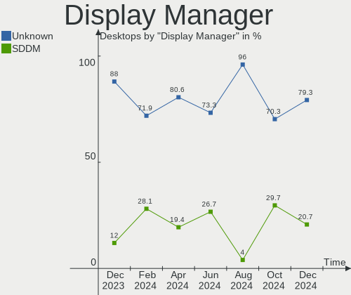
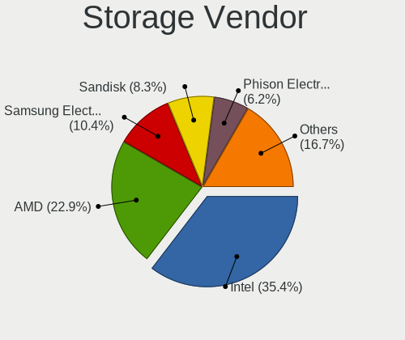
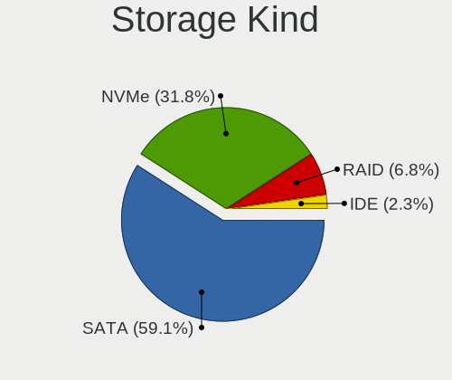
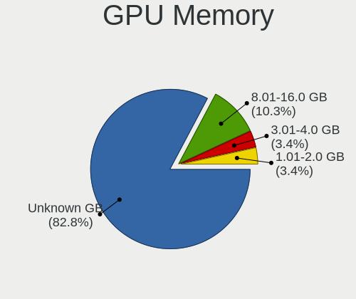
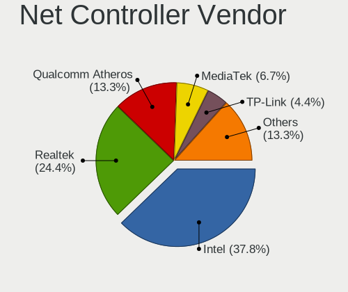

KDE neon Hardware Trends (Desktops)
-----------------------------------

A project to identify most popular hardware characteristics and track their change
over time based on data collected by KDE neon users at https://Linux-Hardware.org.

Anyone can contribute to this report by the [hw-probe](https://github.com/linuxhw/hw-probe) tool:

    sudo -E hw-probe -all -upload

Full-feature report is available here: https://linux-hardware.org/?view=trends&formfactor=desktop

Period: Oct, 2021.

Contents
--------

* [ System ](#system)
  - [ OS                       ](#os)
  - [ OS Family                ](#os-family)
  - [ Kernel                   ](#kernel)
  - [ Kernel Family            ](#kernel-family)
  - [ Kernel Major Ver.        ](#kernel-major-ver)
  - [ Arch                     ](#arch)
  - [ DE                       ](#de)
  - [ Display Server           ](#display-server)
  - [ Display Manager          ](#display-manager)
  - [ OS Lang                  ](#os-lang)
  - [ Boot Mode                ](#boot-mode)
  - [ Filesystem               ](#filesystem)
  - [ Part. scheme             ](#part-scheme)
  - [ Dual Boot with Linux/BSD ](#dual-boot-with-linuxbsd)
  - [ Dual Boot (Win)          ](#dual-boot-win)

* [ Board ](#board)
  - [ Vendor                   ](#vendor)
  - [ Model                    ](#model)
  - [ Model Family             ](#model-family)
  - [ MFG Year                 ](#mfg-year)
  - [ Form Factor              ](#form-factor)
  - [ Secure Boot              ](#secure-boot)
  - [ Coreboot                 ](#coreboot)
  - [ RAM Size                 ](#ram-size)
  - [ RAM Used                 ](#ram-used)
  - [ Total Drives             ](#total-drives)
  - [ Has CD-ROM               ](#has-cd-rom)
  - [ Has Ethernet             ](#has-ethernet)
  - [ Has WiFi                 ](#has-wifi)
  - [ Has Bluetooth            ](#has-bluetooth)

* [ Location ](#location)
  - [ Country                  ](#country)
  - [ City                     ](#city)

* [ Drives ](#drives)
  - [ Drive Vendor             ](#drive-vendor)
  - [ Drive Model              ](#drive-model)
  - [ HDD Vendor               ](#hdd-vendor)
  - [ SSD Vendor               ](#ssd-vendor)
  - [ Drive Kind               ](#drive-kind)
  - [ Drive Connector          ](#drive-connector)
  - [ Drive Size               ](#drive-size)
  - [ Space Total              ](#space-total)
  - [ Space Used               ](#space-used)
  - [ Malfunc. Drives          ](#malfunc-drives)
  - [ Malfunc. Drive Vendor    ](#malfunc-drive-vendor)
  - [ Malfunc. HDD Vendor      ](#malfunc-hdd-vendor)
  - [ Malfunc. Drive Kind      ](#malfunc-drive-kind)
  - [ Failed Drives            ](#failed-drives)
  - [ Failed Drive Vendor      ](#failed-drive-vendor)
  - [ Drive Status             ](#drive-status)

* [ Storage controller ](#storage-controller)
  - [ Storage Vendor           ](#storage-vendor)
  - [ Storage Model            ](#storage-model)
  - [ Storage Kind             ](#storage-kind)

* [ Processor ](#processor)
  - [ CPU Vendor               ](#cpu-vendor)
  - [ CPU Model                ](#cpu-model)
  - [ CPU Model Family         ](#cpu-model-family)
  - [ CPU Cores                ](#cpu-cores)
  - [ CPU Sockets              ](#cpu-sockets)
  - [ CPU Threads              ](#cpu-threads)
  - [ CPU Op-Modes             ](#cpu-op-modes)
  - [ CPU Microcode            ](#cpu-microcode)
  - [ CPU Microarch            ](#cpu-microarch)

* [ Graphics ](#graphics)
  - [ GPU Vendor               ](#gpu-vendor)
  - [ GPU Model                ](#gpu-model)
  - [ GPU Combo                ](#gpu-combo)
  - [ GPU Driver               ](#gpu-driver)
  - [ GPU Memory               ](#gpu-memory)

* [ Monitor ](#monitor)
  - [ Monitor Vendor           ](#monitor-vendor)
  - [ Monitor Model            ](#monitor-model)
  - [ Monitor Resolution       ](#monitor-resolution)
  - [ Monitor Diagonal         ](#monitor-diagonal)
  - [ Monitor Width            ](#monitor-width)
  - [ Aspect Ratio             ](#aspect-ratio)
  - [ Monitor Area             ](#monitor-area)
  - [ Pixel Density            ](#pixel-density)
  - [ Multiple Monitors        ](#multiple-monitors)

* [ Network ](#network)
  - [ Net Controller Vendor    ](#net-controller-vendor)
  - [ Net Controller Model     ](#net-controller-model)
  - [ Wireless Vendor          ](#wireless-vendor)
  - [ Wireless Model           ](#wireless-model)
  - [ Ethernet Vendor          ](#ethernet-vendor)
  - [ Ethernet Model           ](#ethernet-model)
  - [ Net Controller Kind      ](#net-controller-kind)
  - [ Used Controller          ](#used-controller)
  - [ NICs                     ](#nics)
  - [ IPv6                     ](#ipv6)

* [ Bluetooth ](#bluetooth)
  - [ Bluetooth Vendor         ](#bluetooth-vendor)
  - [ Bluetooth Model          ](#bluetooth-model)

* [ Sound ](#sound)
  - [ Sound Vendor             ](#sound-vendor)
  - [ Sound Model              ](#sound-model)

* [ Memory ](#memory)
  - [ Memory Vendor            ](#memory-vendor)
  - [ Memory Model             ](#memory-model)
  - [ Memory Kind              ](#memory-kind)
  - [ Memory Form Factor       ](#memory-form-factor)
  - [ Memory Size              ](#memory-size)
  - [ Memory Speed             ](#memory-speed)

* [ Printers & scanners ](#printers--scanners)
  - [ Printer Vendor           ](#printer-vendor)
  - [ Printer Model            ](#printer-model)
  - [ Scanner Vendor           ](#scanner-vendor)
  - [ Scanner Model            ](#scanner-model)

* [ Camera ](#camera)
  - [ Camera Vendor            ](#camera-vendor)
  - [ Camera Model             ](#camera-model)

* [ Security ](#security)
  - [ Fingerprint Vendor       ](#fingerprint-vendor)
  - [ Fingerprint Model        ](#fingerprint-model)
  - [ Chipcard Vendor          ](#chipcard-vendor)
  - [ Chipcard Model           ](#chipcard-model)

* [ Unsupported ](#unsupported)
  - [ Unsupported Devices      ](#unsupported-devices)
  - [ Unsupported Device Types ](#unsupported-device-types)

System
------

OS
--

Installed operating systems

| Name           | Desktops | Percent |
|----------------|----------|---------|
| KDE neon 20.04 | 44       | 100%    |

OS Family
---------

OS without a version

| Name     | Desktops | Percent |
|----------|----------|---------|
| KDE neon | 44       | 100%    |

Kernel
------

Version of the Linux kernel

| Version                   | Desktops | Percent |
|---------------------------|----------|---------|
| 5.11.0-37-generic         | 24       | 54.55%  |
| 5.11.0-38-generic         | 12       | 27.27%  |
| 5.4.0-74-generic          | 2        | 4.55%   |
| 5.4.0-90-generic          | 1        | 2.27%   |
| 5.14.0-9.1-liquorix-amd64 | 1        | 2.27%   |
| 5.13.0-1012-oem           | 1        | 2.27%   |
| 5.11.0-34-generic         | 1        | 2.27%   |
| 5.11.0-27-generic         | 1        | 2.27%   |
| 5.11.0-25-generic         | 1        | 2.27%   |

Kernel Family
-------------

Linux kernel without a distro release

| Version | Desktops | Percent |
|---------|----------|---------|
| 5.11.0  | 39       | 88.64%  |
| 5.4.0   | 3        | 6.82%   |
| 5.14.0  | 1        | 2.27%   |
| 5.13.0  | 1        | 2.27%   |

Kernel Major Ver.
-----------------

Linux kernel major version

| Version | Desktops | Percent |
|---------|----------|---------|
| 5.11    | 39       | 88.64%  |
| 5.4     | 3        | 6.82%   |
| 5.14    | 1        | 2.27%   |
| 5.13    | 1        | 2.27%   |

Arch
----

OS architecture (x86_64, i586, etc.)

| Name   | Desktops | Percent |
|--------|----------|---------|
| x86_64 | 44       | 100%    |

DE
--

Desktop Environment

| Name    | Desktops | Percent |
|---------|----------|---------|
| KDE5    | 39       | 88.64%  |
| KDE     | 3        | 6.82%   |
| Unknown | 2        | 4.55%   |

Display Server
--------------

X11 or Wayland

| Name | Desktops | Percent |
|------|----------|---------|
| X11  | 43       | 97.73%  |
| Tty  | 1        | 2.27%   |

Display Manager
---------------

SDDM, LightDM, etc.

| Name    | Desktops | Percent |
|---------|----------|---------|
| Unknown | 30       | 68.18%  |
| SDDM    | 14       | 31.82%  |

OS Lang
-------

Language

| Lang  | Desktops | Percent |
|-------|----------|---------|
| en_US | 13       | 29.55%  |
| pt_BR | 5        | 11.36%  |
| en_GB | 4        | 9.09%   |
| de_DE | 4        | 9.09%   |
| uk_UA | 2        | 4.55%   |
| ru_UA | 2        | 4.55%   |
| ru_RU | 2        | 4.55%   |
| it_IT | 2        | 4.55%   |
| es_MX | 2        | 4.55%   |
| pl_PL | 1        | 2.27%   |
| nl_NL | 1        | 2.27%   |
| ja_JP | 1        | 2.27%   |
| fr_FR | 1        | 2.27%   |
| es_VE | 1        | 2.27%   |
| es_ES | 1        | 2.27%   |
| en_ZA | 1        | 2.27%   |
| en_CA | 1        | 2.27%   |

Boot Mode
---------

EFI or BIOS

| Mode | Desktops | Percent |
|------|----------|---------|
| BIOS | 31       | 70.45%  |
| EFI  | 13       | 29.55%  |

Filesystem
----------

Type of filesystem

| Type  | Desktops | Percent |
|-------|----------|---------|
| Ext4  | 40       | 90.91%  |
| Btrfs | 3        | 6.82%   |
| Xfs   | 1        | 2.27%   |

Part. scheme
------------

Scheme of partitioning

| Type    | Desktops | Percent |
|---------|----------|---------|
| Unknown | 42       | 95.45%  |
| GPT     | 2        | 4.55%   |

Dual Boot with Linux/BSD
------------------------

Hosting more than one Linux/BSD

| Dual boot | Desktops | Percent |
|-----------|----------|---------|
| No        | 42       | 95.45%  |
| Yes       | 2        | 4.55%   |

Dual Boot (Win)
---------------

Hosting Linux and Windows

| Dual boot | Desktops | Percent |
|-----------|----------|---------|
| No        | 34       | 77.27%  |
| Yes       | 10       | 22.73%  |

Board
-----

Vendor
------

Motherboard manufacturer

| Name                | Desktops | Percent |
|---------------------|----------|---------|
| ASUSTek Computer    | 13       | 29.55%  |
| ASRock              | 9        | 20.45%  |
| Gigabyte Technology | 6        | 13.64%  |
| MSI                 | 4        | 9.09%   |
| Hewlett-Packard     | 4        | 9.09%   |
| Biostar             | 3        | 6.82%   |
| Lenovo              | 2        | 4.55%   |
| Dell                | 2        | 4.55%   |
| Fujitsu Siemens     | 1        | 2.27%   |

Model
-----

Motherboard model

| Name                                | Desktops | Percent |
|-------------------------------------|----------|---------|
| MSI MS-7C35                         | 1        | 2.27%   |
| MSI MS-7B89                         | 1        | 2.27%   |
| MSI MS-7A94                         | 1        | 2.27%   |
| MSI MS-7A59                         | 1        | 2.27%   |
| Lenovo ThinkCentre E73 10DS000KUK   | 1        | 2.27%   |
| Lenovo M710e ThinkCentre 10UR001MUS | 1        | 2.27%   |
| HP Z230 SFF Workstation             | 1        | 2.27%   |
| HP Compaq dc7700 Small Form Factor  | 1        | 2.27%   |
| HP Compaq 8200 Elite SFF PC         | 1        | 2.27%   |
| HP Compaq 6005 Pro SFF PC           | 1        | 2.27%   |
| Gigabyte Z77-DS3H                   | 1        | 2.27%   |
| Gigabyte Z370 HD3P                  | 1        | 2.27%   |
| Gigabyte X570 AORUS PRO WIFI        | 1        | 2.27%   |
| Gigabyte H61MA-D3V                  | 1        | 2.27%   |
| Gigabyte H170-D3HP                  | 1        | 2.27%   |
| Gigabyte EP43T-S3L                  | 1        | 2.27%   |
| Fujitsu Siemens MS-7379VP           | 1        | 2.27%   |
| Dell Precision WorkStation T3500    | 1        | 2.27%   |
| Dell OptiPlex 7010                  | 1        | 2.27%   |
| Biostar B350GTN                     | 1        | 2.27%   |
| Biostar A55MLC2                     | 1        | 2.27%   |
| Biostar A10N-9630E                  | 1        | 2.27%   |
| ASUS ROG STRIX Z370-F GAMING        | 1        | 2.27%   |
| ASUS ROG STRIX X570-F GAMING        | 1        | 2.27%   |
| ASUS PRIME Z370-A                   | 1        | 2.27%   |
| ASUS PRIME B450M-GAMING/BR          | 1        | 2.27%   |
| ASUS PRIME B450-PLUS                | 1        | 2.27%   |
| ASUS P7P55D                         | 1        | 2.27%   |
| ASUS P5G41T-M LE                    | 1        | 2.27%   |
| ASUS P5B-Deluxe                     | 1        | 2.27%   |
| ASUS M2N-E                          | 1        | 2.27%   |
| ASUS H110M-C                        | 1        | 2.27%   |
| ASUS F1A55-M LX PLUS                | 1        | 2.27%   |
| ASUS E520                           | 1        | 2.27%   |
| ASUS A68HM-PLUS                     | 1        | 2.27%   |
| ASRock Z370 Extreme4                | 1        | 2.27%   |
| ASRock Z170 Pro4S                   | 1        | 2.27%   |
| ASRock Z170 Extreme7+               | 1        | 2.27%   |
| ASRock X370 Taichi                  | 1        | 2.27%   |
| ASRock N68-S3 FX                    | 1        | 2.27%   |
| ASRock J5040-ITX                    | 1        | 2.27%   |
| ASRock H77 Pro4-M                   | 1        | 2.27%   |
| ASRock H61M-VG3                     | 1        | 2.27%   |
| ASRock G41C-GS                      | 1        | 2.27%   |

Model Family
------------

Motherboard model prefix

| Name                      | Desktops | Percent |
|---------------------------|----------|---------|
| HP Compaq                 | 3        | 6.82%   |
| ASUS PRIME                | 3        | 6.82%   |
| ASUS ROG                  | 2        | 4.55%   |
| ASRock Z170               | 2        | 4.55%   |
| MSI MS-7C35               | 1        | 2.27%   |
| MSI MS-7B89               | 1        | 2.27%   |
| MSI MS-7A94               | 1        | 2.27%   |
| MSI MS-7A59               | 1        | 2.27%   |
| Lenovo ThinkCentre        | 1        | 2.27%   |
| Lenovo M710e              | 1        | 2.27%   |
| HP Z230                   | 1        | 2.27%   |
| Gigabyte Z77-DS3H         | 1        | 2.27%   |
| Gigabyte Z370             | 1        | 2.27%   |
| Gigabyte X570             | 1        | 2.27%   |
| Gigabyte H61MA-D3V        | 1        | 2.27%   |
| Gigabyte H170-D3HP        | 1        | 2.27%   |
| Gigabyte EP43T-S3L        | 1        | 2.27%   |
| Fujitsu Siemens MS-7379VP | 1        | 2.27%   |
| Dell Precision            | 1        | 2.27%   |
| Dell OptiPlex             | 1        | 2.27%   |
| Biostar B350GTN           | 1        | 2.27%   |
| Biostar A55MLC2           | 1        | 2.27%   |
| Biostar A10N-9630E        | 1        | 2.27%   |
| ASUS P7P55D               | 1        | 2.27%   |
| ASUS P5G41T-M             | 1        | 2.27%   |
| ASUS P5B-Deluxe           | 1        | 2.27%   |
| ASUS M2N-E                | 1        | 2.27%   |
| ASUS H110M-C              | 1        | 2.27%   |
| ASUS F1A55-M              | 1        | 2.27%   |
| ASUS E520                 | 1        | 2.27%   |
| ASUS A68HM-PLUS           | 1        | 2.27%   |
| ASRock Z370               | 1        | 2.27%   |
| ASRock X370               | 1        | 2.27%   |
| ASRock N68-S3             | 1        | 2.27%   |
| ASRock J5040-ITX          | 1        | 2.27%   |
| ASRock H77                | 1        | 2.27%   |
| ASRock H61M-VG3           | 1        | 2.27%   |
| ASRock G41C-GS            | 1        | 2.27%   |

MFG Year
--------

Motherboard manufacture year

| Year | Desktops | Percent |
|------|----------|---------|
| 2021 | 6        | 13.64%  |
| 2012 | 6        | 13.64%  |
| 2020 | 5        | 11.36%  |
| 2013 | 5        | 11.36%  |
| 2018 | 4        | 9.09%   |
| 2017 | 3        | 6.82%   |
| 2010 | 3        | 6.82%   |
| 2019 | 2        | 4.55%   |
| 2016 | 2        | 4.55%   |
| 2015 | 2        | 4.55%   |
| 2011 | 2        | 4.55%   |
| 2008 | 2        | 4.55%   |
| 2014 | 1        | 2.27%   |
| 2007 | 1        | 2.27%   |

Form Factor
-----------

Physical design of the computer

| Name    | Desktops | Percent |
|---------|----------|---------|
| Desktop | 44       | 100%    |

Secure Boot
-----------

Enabled or disabled

| State    | Desktops | Percent |
|----------|----------|---------|
| Disabled | 44       | 100%    |

Coreboot
--------

Have coreboot on board

| Used | Desktops | Percent |
|------|----------|---------|
| No   | 44       | 100%    |

RAM Size
--------

Total RAM memory

| Size in GB  | Desktops | Percent |
|-------------|----------|---------|
| 16.01-24.0  | 13       | 29.55%  |
| 8.01-16.0   | 13       | 29.55%  |
| 32.01-64.0  | 6        | 13.64%  |
| 3.01-4.0    | 4        | 9.09%   |
| 4.01-8.0    | 3        | 6.82%   |
| 24.01-32.0  | 2        | 4.55%   |
| 64.01-256.0 | 2        | 4.55%   |
| 2.01-3.0    | 1        | 2.27%   |

RAM Used
--------

Used RAM memory

| Used GB    | Desktops | Percent |
|------------|----------|---------|
| 1.01-2.0   | 21       | 47.73%  |
| 4.01-8.0   | 8        | 18.18%  |
| 2.01-3.0   | 8        | 18.18%  |
| 0.51-1.0   | 4        | 9.09%   |
| 3.01-4.0   | 1        | 2.27%   |
| 16.01-24.0 | 1        | 2.27%   |
| 8.01-16.0  | 1        | 2.27%   |

Total Drives
------------

Number of drives on board

| Drives | Desktops | Percent |
|--------|----------|---------|
| 1      | 17       | 38.64%  |
| 2      | 15       | 34.09%  |
| 3      | 5        | 11.36%  |
| 7      | 2        | 4.55%   |
| 5      | 2        | 4.55%   |
| 4      | 2        | 4.55%   |
| 6      | 1        | 2.27%   |

Has CD-ROM
----------

Has CD-ROM on board

| Presented | Desktops | Percent |
|-----------|----------|---------|
| No        | 28       | 63.64%  |
| Yes       | 16       | 36.36%  |

Has Ethernet
------------

Has Ethernet on board

| Presented | Desktops | Percent |
|-----------|----------|---------|
| Yes       | 43       | 97.73%  |
| No        | 1        | 2.27%   |

Has WiFi
--------

Has WiFi module

| Presented | Desktops | Percent |
|-----------|----------|---------|
| Yes       | 25       | 56.82%  |
| No        | 19       | 43.18%  |

Has Bluetooth
-------------

Has Bluetooth module

| Presented | Desktops | Percent |
|-----------|----------|---------|
| No        | 32       | 72.73%  |
| Yes       | 12       | 27.27%  |

Location
--------

Country
-------

Geographic location (country)

| Country      | Desktops | Percent |
|--------------|----------|---------|
| USA          | 8        | 18.18%  |
| Brazil       | 5        | 11.36%  |
| UK           | 4        | 9.09%   |
| Germany      | 4        | 9.09%   |
| Ukraine      | 3        | 6.82%   |
| Russia       | 3        | 6.82%   |
| Sweden       | 2        | 4.55%   |
| Netherlands  | 2        | 4.55%   |
| Mexico       | 2        | 4.55%   |
| Italy        | 2        | 4.55%   |
| Vietnam      | 1        | 2.27%   |
| Venezuela    | 1        | 2.27%   |
| Thailand     | 1        | 2.27%   |
| South Africa | 1        | 2.27%   |
| Poland       | 1        | 2.27%   |
| Paraguay     | 1        | 2.27%   |
| Japan        | 1        | 2.27%   |
| Iran         | 1        | 2.27%   |
| France       | 1        | 2.27%   |

City
----

Geographic location (city)

| City           | Desktops | Percent |
|----------------|----------|---------|
| Moscow         | 2        | 4.55%   |
| Zapopan        | 1        | 2.27%   |
| Warsaw         | 1        | 2.27%   |
| Strongsville   | 1        | 2.27%   |
| St Louis       | 1        | 2.27%   |
| Sheffield      | 1        | 2.27%   |
| Santa Fe       | 1        | 2.27%   |
| Salt Lake City | 1        | 2.27%   |
| Rio de Janeiro | 1        | 2.27%   |
| Ridderkerk     | 1        | 2.27%   |
| Rey            | 1        | 2.27%   |
| Praia Grande   | 1        | 2.27%   |
| Pisa           | 1        | 2.27%   |
| Phoenix        | 1        | 2.27%   |
| Paris          | 1        | 2.27%   |
| Palmas         | 1        | 2.27%   |
| Osasco         | 1        | 2.27%   |
| Oberhausen     | 1        | 2.27%   |
| New Milford    | 1        | 2.27%   |
| Neasden        | 1        | 2.27%   |
| Matsudo        | 1        | 2.27%   |
| Mandaguari     | 1        | 2.27%   |
| Malmo          | 1        | 2.27%   |
| Lviv           | 1        | 2.27%   |
| Los Osos       | 1        | 2.27%   |
| Lerdo          | 1        | 2.27%   |
| Kyiv           | 1        | 2.27%   |
| Koblenz        | 1        | 2.27%   |
| Ivanovo        | 1        | 2.27%   |
| Hanoi          | 1        | 2.27%   |
| Guatire        | 1        | 2.27%   |
| Forshaga       | 1        | 2.27%   |
| Edinburgh      | 1        | 2.27%   |
| Durbanville    | 1        | 2.27%   |
| Dordrecht      | 1        | 2.27%   |
| Diepenau       | 1        | 2.27%   |
| Dallas         | 1        | 2.27%   |
| Chiang Rai     | 1        | 2.27%   |
| Cherkasy       | 1        | 2.27%   |
| Bussoleno      | 1        | 2.27%   |
| Brixton Hill   | 1        | 2.27%   |
| Bremen         | 1        | 2.27%   |
| Asunci??n      | 1        | 2.27%   |

Drives
------

Drive Vendor
------------

Hard drive vendors

| Vendor                    | Desktops | Drives | Percent |
|---------------------------|----------|--------|---------|
| WDC                       | 16       | 26     | 20%     |
| Seagate                   | 15       | 16     | 18.75%  |
| Samsung Electronics       | 13       | 18     | 16.25%  |
| Crucial                   | 7        | 7      | 8.75%   |
| Phison                    | 3        | 5      | 3.75%   |
| A-DATA Technology         | 3        | 4      | 3.75%   |
| SanDisk                   | 2        | 2      | 2.5%    |
| Hitachi                   | 2        | 2      | 2.5%    |
| Toshiba                   | 1        | 1      | 1.25%   |
| Tanbassh                  | 1        | 1      | 1.25%   |
| Smartbuy                  | 1        | 1      | 1.25%   |
| Realtek Semiconductor     | 1        | 1      | 1.25%   |
| PNY                       | 1        | 1      | 1.25%   |
| PLEXTOR                   | 1        | 1      | 1.25%   |
| Patriot                   | 1        | 1      | 1.25%   |
| PALIT                     | 1        | 2      | 1.25%   |
| Micron/Crucial Technology | 1        | 1      | 1.25%   |
| MAXTOR                    | 1        | 1      | 1.25%   |
| Kingston                  | 1        | 1      | 1.25%   |
| KingFast                  | 1        | 1      | 1.25%   |
| Intenso                   | 1        | 1      | 1.25%   |
| Intel                     | 1        | 1      | 1.25%   |
| Integral                  | 1        | 1      | 1.25%   |
| HGST                      | 1        | 1      | 1.25%   |
| GOODRAM                   | 1        | 1      | 1.25%   |
| China                     | 1        | 2      | 1.25%   |
| 2-Power                   | 1        | 1      | 1.25%   |

Drive Model
-----------

Hard drive models

| Model                                  | Desktops | Percent |
|----------------------------------------|----------|---------|
| Seagate ST2000DM008-2FR102 2TB         | 3        | 3.13%   |
| WDC WD10EZEX-08WN4A0 1TB               | 2        | 2.08%   |
| Seagate ST2000DM006-2DM164 2TB         | 2        | 2.08%   |
| Samsung SSD 860 EVO 1TB                | 2        | 2.08%   |
| Samsung NVMe SSD Drive 1TB             | 2        | 2.08%   |
| Crucial CT500MX500SSD1 500GB           | 2        | 2.08%   |
| Crucial CT480BX500SSD1 480GB           | 2        | 2.08%   |
| A-DATA SX8200PNP 1TB                   | 2        | 2.08%   |
| WDC WUH721414ALE6L4 14TB               | 1        | 1.04%   |
| WDC WDS500G2B0B-00YS70 500GB SSD       | 1        | 1.04%   |
| WDC WDS240G2G0A-00JH30 240GB SSD       | 1        | 1.04%   |
| WDC WDS100T2B0A-00SM50 1TB SSD         | 1        | 1.04%   |
| WDC WDS100T2B0A 1TB SSD                | 1        | 1.04%   |
| WDC WD5001FZWX-00ZHUA0 5TB             | 1        | 1.04%   |
| WDC WD5000LPCX-24VHAT0 500GB           | 1        | 1.04%   |
| WDC WD5000AAKX-22ERMA0 500GB           | 1        | 1.04%   |
| WDC WD5000AAKX-08U6AA0 500GB           | 1        | 1.04%   |
| WDC WD5000AAKX-08ERMA0 500GB           | 1        | 1.04%   |
| WDC WD40EZRZ-00WN9B0 4TB               | 1        | 1.04%   |
| WDC WD3200AAKS-75L9A0 320GB            | 1        | 1.04%   |
| WDC WD2500BEVT-22ZCT0 250GB            | 1        | 1.04%   |
| WDC WD20EZAZ-00GGJB0 2TB               | 1        | 1.04%   |
| WDC WD2005FBYZ-01YCBB2 2TB             | 1        | 1.04%   |
| WDC WD2003FZEX-00Z4SA0 2TB             | 1        | 1.04%   |
| WDC WD1600AAJS-08L7A0 160GB            | 1        | 1.04%   |
| WDC WD1600AAJS-00L7A0 160GB            | 1        | 1.04%   |
| WDC WD15EARX-00PASB0 1TB               | 1        | 1.04%   |
| WDC WD10SPCX-60KHST0 1TB               | 1        | 1.04%   |
| WDC WD10EZEX-00WN4A0 1TB               | 1        | 1.04%   |
| WDC WD10EARS-22Y5B1 1TB                | 1        | 1.04%   |
| WDC WD1005FBYZ-01YCBB2 1TB             | 1        | 1.04%   |
| WDC WD1003FZEX-00K3CA0 1TB             | 1        | 1.04%   |
| Toshiba DT01ACA200 2TB                 | 1        | 1.04%   |
| Tanbassh 128GB                         | 1        | 1.04%   |
| Smartbuy SSD 120GB                     | 1        | 1.04%   |
| Seagate ST8000DM004-2CX188 8TB         | 1        | 1.04%   |
| Seagate ST500DM002-1BD142 500GB        | 1        | 1.04%   |
| Seagate ST3500418AS 500GB              | 1        | 1.04%   |
| Seagate ST31000524AS 1TB               | 1        | 1.04%   |
| Seagate ST1000NM0053-1C1173 1TB        | 1        | 1.04%   |
| Seagate ST1000LM035-1RK172 1TB         | 1        | 1.04%   |
| Seagate ST1000DM010-2EP102 1TB         | 1        | 1.04%   |
| Seagate ST1000DM003-1CH162 1TB         | 1        | 1.04%   |
| Seagate ST10000NM0086-2AA101 10TB      | 1        | 1.04%   |
| Seagate NVMe SSD Drive 500GB           | 1        | 1.04%   |
| Seagate Expansion Desk 4TB             | 1        | 1.04%   |
| SanDisk Ultra II 240GB SSD             | 1        | 1.04%   |
| SanDisk SDSA6AM-008G-1006 8GB SSD      | 1        | 1.04%   |
| Samsung SSD 960 PRO 512GB              | 1        | 1.04%   |
| Samsung SSD 960 EVO 250GB              | 1        | 1.04%   |
| Samsung SSD 870 EVO 1TB                | 1        | 1.04%   |
| Samsung SSD 860 EVO 2TB                | 1        | 1.04%   |
| Samsung SSD 850 PRO 512GB              | 1        | 1.04%   |
| Samsung SSD 850 EVO 500GB              | 1        | 1.04%   |
| Samsung SSD 850 EVO 250GB              | 1        | 1.04%   |
| Samsung SSD 850 EVO 120GB              | 1        | 1.04%   |
| Samsung SM963 2.5" NVMe PCIe SSD 250GB | 1        | 1.04%   |
| Samsung PM963 2.5" NVMe PCIe SSD 512GB | 1        | 1.04%   |
| Samsung NVMe SSD Drive 1024GB          | 1        | 1.04%   |
| Samsung HD161HJ 160GB                  | 1        | 1.04%   |

HDD Vendor
----------

Hard disk drive vendors

| Vendor              | Desktops | Drives | Percent |
|---------------------|----------|--------|---------|
| WDC                 | 15       | 22     | 42.86%  |
| Seagate             | 14       | 15     | 40%     |
| Hitachi             | 2        | 2      | 5.71%   |
| Toshiba             | 1        | 1      | 2.86%   |
| Samsung Electronics | 1        | 1      | 2.86%   |
| MAXTOR              | 1        | 1      | 2.86%   |
| HGST                | 1        | 1      | 2.86%   |

SSD Vendor
----------

Solid state drive vendors

| Vendor              | Desktops | Drives | Percent |
|---------------------|----------|--------|---------|
| Samsung Electronics | 7        | 10     | 21.88%  |
| Crucial             | 7        | 7      | 21.88%  |
| WDC                 | 3        | 4      | 9.38%   |
| SanDisk             | 2        | 2      | 6.25%   |
| Smartbuy            | 1        | 1      | 3.13%   |
| PNY                 | 1        | 1      | 3.13%   |
| PLEXTOR             | 1        | 1      | 3.13%   |
| Patriot             | 1        | 1      | 3.13%   |
| PALIT               | 1        | 2      | 3.13%   |
| Kingston            | 1        | 1      | 3.13%   |
| Intenso             | 1        | 1      | 3.13%   |
| Intel               | 1        | 1      | 3.13%   |
| Integral            | 1        | 1      | 3.13%   |
| GOODRAM             | 1        | 1      | 3.13%   |
| China               | 1        | 2      | 3.13%   |
| A-DATA Technology   | 1        | 1      | 3.13%   |
| 2-Power             | 1        | 1      | 3.13%   |

Drive Kind
----------

HDD or SSD

| Kind    | Desktops | Drives | Percent |
|---------|----------|--------|---------|
| HDD     | 31       | 43     | 43.66%  |
| SSD     | 26       | 38     | 36.62%  |
| NVMe    | 12       | 18     | 16.9%   |
| Unknown | 2        | 2      | 2.82%   |

Drive Connector
---------------

SATA, SAS, NVMe, etc.

| Type | Desktops | Drives | Percent |
|------|----------|--------|---------|
| SATA | 41       | 82     | 75.93%  |
| NVMe | 12       | 18     | 22.22%  |
| SAS  | 1        | 1      | 1.85%   |

Drive Size
----------

Size of hard drive

| Size in TB | Desktops | Drives | Percent |
|------------|----------|--------|---------|
| 0.01-0.5   | 25       | 41     | 43.86%  |
| 0.51-1.0   | 16       | 23     | 28.07%  |
| 1.01-2.0   | 11       | 11     | 19.3%   |
| 4.01-10.0  | 3        | 3      | 5.26%   |
| 3.01-4.0   | 1        | 2      | 1.75%   |
| 10.01-20.0 | 1        | 1      | 1.75%   |

Space Total
-----------

Amount of disk space available on the file system

| Size in GB     | Desktops | Percent |
|----------------|----------|---------|
| 101-250        | 14       | 31.82%  |
| 501-1000       | 7        | 15.91%  |
| 1001-2000      | 6        | 13.64%  |
| 51-100         | 5        | 11.36%  |
| 251-500        | 3        | 6.82%   |
| 2001-3000      | 3        | 6.82%   |
| Unknown        | 3        | 6.82%   |
| More than 3000 | 2        | 4.55%   |
| 21-50          | 1        | 2.27%   |

Space Used
----------

Amount of used disk space

| Used GB        | Desktops | Percent |
|----------------|----------|---------|
| 1-20           | 16       | 36.36%  |
| 51-100         | 7        | 15.91%  |
| 21-50          | 4        | 9.09%   |
| 501-1000       | 4        | 9.09%   |
| 251-500        | 3        | 6.82%   |
| 1001-2000      | 3        | 6.82%   |
| Unknown        | 3        | 6.82%   |
| More than 3000 | 2        | 4.55%   |
| 101-250        | 2        | 4.55%   |

Malfunc. Drives
---------------

Drive models with a malfunction

Zero info for selected period =(

Malfunc. Drive Vendor
---------------------

Vendors of faulty drives

Zero info for selected period =(

Malfunc. HDD Vendor
-------------------

Vendors of faulty HDD drives

Zero info for selected period =(

Malfunc. Drive Kind
-------------------

Kinds of faulty drives

Zero info for selected period =(

Failed Drives
-------------

Failed drive models

Zero info for selected period =(

Failed Drive Vendor
-------------------

Failed drive vendors

Zero info for selected period =(

Drive Status
------------

Number of failed and malfunc. drives

| Status   | Desktops | Drives | Percent |
|----------|----------|--------|---------|
| Detected | 40       | 88     | 90.91%  |
| Works    | 4        | 13     | 9.09%   |

Storage controller
------------------

Storage Vendor
--------------

Storage controller vendors

| Vendor                    | Desktops | Percent |
|---------------------------|----------|---------|
| Intel                     | 29       | 42.03%  |
| AMD                       | 13       | 18.84%  |
| Samsung Electronics       | 7        | 10.14%  |
| ASMedia Technology        | 5        | 7.25%   |
| Phison Electronics        | 3        | 4.35%   |
| Realtek Semiconductor     | 2        | 2.9%    |
| Nvidia                    | 2        | 2.9%    |
| JMicron Technology        | 2        | 2.9%    |
| ADATA Technology          | 2        | 2.9%    |
| Silicon Image             | 1        | 1.45%   |
| Seagate Technology        | 1        | 1.45%   |
| Micron/Crucial Technology | 1        | 1.45%   |
| Marvell Technology Group  | 1        | 1.45%   |

Storage Model
-------------

Storage controller models

| Model                                                                                   | Desktops | Percent |
|-----------------------------------------------------------------------------------------|----------|---------|
| AMD FCH SATA Controller [AHCI mode]                                                     | 9        | 10.84%  |
| Intel 200 Series PCH SATA controller [AHCI mode]                                        | 6        | 7.23%   |
| Samsung NVMe SSD Controller SM961/PM961/SM963                                           | 5        | 6.02%   |
| Intel Q170/Q150/B150/H170/H110/Z170/CM236 Chipset SATA Controller [AHCI Mode]           | 5        | 6.02%   |
| ASMedia ASM1062 Serial ATA Controller                                                   | 5        | 6.02%   |
| Intel NM10/ICH7 Family SATA Controller [IDE mode]                                       | 3        | 3.61%   |
| Intel 82801G (ICH7 Family) IDE Controller                                               | 3        | 3.61%   |
| AMD 400 Series Chipset SATA Controller                                                  | 3        | 3.61%   |
| Samsung NVMe SSD Controller SM981/PM981/PM983                                           | 2        | 2.41%   |
| Phison E16 PCIe4 NVMe Controller                                                        | 2        | 2.41%   |
| Intel SATA Controller [RAID mode]                                                       | 2        | 2.41%   |
| Intel 7 Series/C210 Series Chipset Family 6-port SATA Controller [AHCI mode]            | 2        | 2.41%   |
| Intel 6 Series/C200 Series Chipset Family 6 port Desktop SATA AHCI Controller           | 2        | 2.41%   |
| AMD FCH SATA Controller [IDE mode]                                                      | 2        | 2.41%   |
| AMD FCH IDE Controller                                                                  | 2        | 2.41%   |
| ADATA XPG SX8200 Pro PCIe Gen3x4 M.2 2280 Solid State Drive                             | 2        | 2.41%   |
| Silicon Image SiI 3132 Serial ATA Raid II Controller                                    | 1        | 1.2%    |
| Seagate FireCuda 510 SSD                                                                | 1        | 1.2%    |
| Realtek RTS5763DL NVMe SSD Controller                                                   | 1        | 1.2%    |
| Realtek Realtek Non-Volatile memory controller                                          | 1        | 1.2%    |
| Phison E12 NVMe Controller                                                              | 1        | 1.2%    |
| Nvidia MCP61 SATA Controller                                                            | 1        | 1.2%    |
| Nvidia MCP61 IDE                                                                        | 1        | 1.2%    |
| Nvidia MCP55 SATA Controller                                                            | 1        | 1.2%    |
| Nvidia MCP55 IDE                                                                        | 1        | 1.2%    |
| Micron/Crucial P1 NVMe PCIe SSD                                                         | 1        | 1.2%    |
| Marvell Group 88SE9172 SATA 6Gb/s Controller                                            | 1        | 1.2%    |
| JMicron JMB368 IDE controller                                                           | 1        | 1.2%    |
| JMicron JMB363 SATA/IDE Controller                                                      | 1        | 1.2%    |
| Intel Celeron/Pentium Silver Processor SATA Controller                                  | 1        | 1.2%    |
| Intel 82801JI (ICH10 Family) SATA AHCI Controller                                       | 1        | 1.2%    |
| Intel 82801JI (ICH10 Family) 4 port SATA IDE Controller #1                              | 1        | 1.2%    |
| Intel 82801JI (ICH10 Family) 2 port SATA IDE Controller #2                              | 1        | 1.2%    |
| Intel 82801HR/HO/HH (ICH8R/DO/DH) 6 port SATA Controller [AHCI mode]                    | 1        | 1.2%    |
| Intel 82801H (ICH8 Family) 4 port SATA Controller [IDE mode]                            | 1        | 1.2%    |
| Intel 8 Series/C220 Series Chipset Family 6-port SATA Controller 1 [AHCI mode]          | 1        | 1.2%    |
| Intel 7 Series/C210 Series Chipset Family 4-port SATA Controller [IDE mode]             | 1        | 1.2%    |
| Intel 7 Series/C210 Series Chipset Family 2-port SATA Controller [IDE mode]             | 1        | 1.2%    |
| Intel 6 Series/C200 Series Chipset Family Desktop SATA Controller (IDE mode, ports 4-5) | 1        | 1.2%    |
| Intel 6 Series/C200 Series Chipset Family Desktop SATA Controller (IDE mode, ports 0-3) | 1        | 1.2%    |
| Intel 5 Series/3400 Series Chipset 6 port SATA AHCI Controller                          | 1        | 1.2%    |
| AMD X370 Series Chipset SATA Controller                                                 | 1        | 1.2%    |
| AMD SB7x0/SB8x0/SB9x0 SATA Controller [AHCI mode]                                       | 1        | 1.2%    |
| AMD 300 Series Chipset SATA Controller                                                  | 1        | 1.2%    |

Storage Kind
------------

Kind of storage controller (IDE, SATA, NVMe, SAS, ...)

| Kind | Desktops | Percent |
|------|----------|---------|
| SATA | 33       | 55%     |
| NVMe | 12       | 20%     |
| IDE  | 12       | 20%     |
| RAID | 3        | 5%      |

Processor
---------

CPU Vendor
----------

Processor vendors

| Vendor | Desktops | Percent |
|--------|----------|---------|
| Intel  | 29       | 65.91%  |
| AMD    | 15       | 34.09%  |

CPU Model
---------

Processor models

| Model                                           | Desktops | Percent |
|-------------------------------------------------|----------|---------|
| Intel Core i7-3770 CPU @ 3.40GHz                | 3        | 6.82%   |
| Intel Core i7-8700K CPU @ 3.70GHz               | 2        | 4.55%   |
| Intel Xeon CPU W3565 @ 3.20GHz                  | 1        | 2.27%   |
| Intel Xeon CPU E3-1240 v3 @ 3.40GHz             | 1        | 2.27%   |
| Intel Pentium Silver J5040 CPU @ 2.00GHz        | 1        | 2.27%   |
| Intel Pentium Dual-Core CPU E5700 @ 3.00GHz     | 1        | 2.27%   |
| Intel Core i9-9980XE CPU @ 3.00GHz              | 1        | 2.27%   |
| Intel Core i7-8700 CPU @ 3.20GHz                | 1        | 2.27%   |
| Intel Core i7-7700 CPU @ 3.60GHz                | 1        | 2.27%   |
| Intel Core i7-6700K CPU @ 4.00GHz               | 1        | 2.27%   |
| Intel Core i7-6700 CPU @ 3.40GHz                | 1        | 2.27%   |
| Intel Core i5-8600K CPU @ 3.60GHz               | 1        | 2.27%   |
| Intel Core i5-6600K CPU @ 3.50GHz               | 1        | 2.27%   |
| Intel Core i5-6500 CPU @ 3.20GHz                | 1        | 2.27%   |
| Intel Core i5-3330 CPU @ 3.00GHz                | 1        | 2.27%   |
| Intel Core i5-2500 CPU @ 3.30GHz                | 1        | 2.27%   |
| Intel Core i5 CPU 750 @ 2.67GHz                 | 1        | 2.27%   |
| Intel Core i3-7100T CPU @ 3.40GHz               | 1        | 2.27%   |
| Intel Core i3-6100 CPU @ 3.70GHz                | 1        | 2.27%   |
| Intel Core i3-4160 CPU @ 3.60GHz                | 1        | 2.27%   |
| Intel Core i3-3240 CPU @ 3.40GHz                | 1        | 2.27%   |
| Intel Core 2 Quad CPU Q9400 @ 2.66GHz           | 1        | 2.27%   |
| Intel Core 2 Quad CPU Q8200 @ 2.33GHz           | 1        | 2.27%   |
| Intel Core 2 Duo CPU E7400 @ 2.80GHz            | 1        | 2.27%   |
| Intel Core 2 Duo CPU E6550 @ 2.33GHz            | 1        | 2.27%   |
| Intel Core 2 CPU 6300 @ 1.86GHz                 | 1        | 2.27%   |
| AMD Sempron 145 Processor                       | 1        | 2.27%   |
| AMD Ryzen 9 5900X 12-Core Processor             | 1        | 2.27%   |
| AMD Ryzen 9 3900X 12-Core Processor             | 1        | 2.27%   |
| AMD Ryzen 7 5800X 8-Core Processor              | 1        | 2.27%   |
| AMD Ryzen 7 3700X 8-Core Processor              | 1        | 2.27%   |
| AMD Ryzen 7 1700X Eight-Core Processor          | 1        | 2.27%   |
| AMD Ryzen 5 2600X Six-Core Processor            | 1        | 2.27%   |
| AMD Ryzen 5 1400 Quad-Core Processor            | 1        | 2.27%   |
| AMD Ryzen 3 2200G with Radeon Vega Graphics     | 1        | 2.27%   |
| AMD Phenom II X4 945 Processor                  | 1        | 2.27%   |
| AMD FX-4300 Quad-Core Processor                 | 1        | 2.27%   |
| AMD A8-3870 APU with Radeon HD Graphics         | 1        | 2.27%   |
| AMD A4-3300 APU with Radeon HD Graphics         | 1        | 2.27%   |
| AMD A10-9630P RADEON R5, 10 COMPUTE CORES 4C+6G | 1        | 2.27%   |
| AMD A10-7850K Radeon R7, 12 Compute Cores 4C+8G | 1        | 2.27%   |

CPU Model Family
----------------

Processor model prefix

| Model                   | Desktops | Percent |
|-------------------------|----------|---------|
| Intel Core i7           | 9        | 20.45%  |
| Intel Core i5           | 6        | 13.64%  |
| Intel Core i3           | 4        | 9.09%   |
| AMD Ryzen 7             | 3        | 6.82%   |
| Intel Xeon              | 2        | 4.55%   |
| Intel Core 2 Quad       | 2        | 4.55%   |
| Intel Core 2 Duo        | 2        | 4.55%   |
| AMD Ryzen 9             | 2        | 4.55%   |
| AMD Ryzen 5             | 2        | 4.55%   |
| AMD A10                 | 2        | 4.55%   |
| Intel Pentium Silver    | 1        | 2.27%   |
| Intel Pentium Dual-Core | 1        | 2.27%   |
| Intel Core i9           | 1        | 2.27%   |
| Intel Core 2            | 1        | 2.27%   |
| AMD Sempron             | 1        | 2.27%   |
| AMD Ryzen 3             | 1        | 2.27%   |
| AMD Phenom II X4        | 1        | 2.27%   |
| AMD FX                  | 1        | 2.27%   |
| AMD A8                  | 1        | 2.27%   |
| AMD A4                  | 1        | 2.27%   |

CPU Cores
---------

Number of processor cores

| Number | Desktops | Percent |
|--------|----------|---------|
| 4      | 20       | 45.45%  |
| 2      | 12       | 27.27%  |
| 6      | 5        | 11.36%  |
| 8      | 3        | 6.82%   |
| 12     | 2        | 4.55%   |
| 18     | 1        | 2.27%   |
| 1      | 1        | 2.27%   |

CPU Sockets
-----------

Number of sockets

| Number | Desktops | Percent |
|--------|----------|---------|
| 1      | 44       | 100%    |

CPU Threads
-----------

Threads per core (Hyper-Threading)

| Number | Desktops | Percent |
|--------|----------|---------|
| 2      | 26       | 59.09%  |
| 1      | 18       | 40.91%  |

CPU Op-Modes
------------

CPU Operation Modes (32-bit, 64-bit)

| Op mode        | Desktops | Percent |
|----------------|----------|---------|
| 32-bit, 64-bit | 44       | 100%    |

CPU Microcode
-------------

Microcode number

| Number     | Desktops | Percent |
|------------|----------|---------|
| 0x506e3    | 5        | 11.36%  |
| 0x306a9    | 5        | 11.36%  |
| 0x906ea    | 4        | 9.09%   |
| 0x1067a    | 3        | 6.82%   |
| 0x906e9    | 2        | 4.55%   |
| 0x306c3    | 2        | 4.55%   |
| 0x08701021 | 2        | 4.55%   |
| 0x03000027 | 2        | 4.55%   |
| 0x010000c8 | 2        | 4.55%   |
| Unknown    | 2        | 4.55%   |
| 0x706a8    | 1        | 2.27%   |
| 0x6fb      | 1        | 2.27%   |
| 0x6f2      | 1        | 2.27%   |
| 0x50654    | 1        | 2.27%   |
| 0x206a7    | 1        | 2.27%   |
| 0x106e5    | 1        | 2.27%   |
| 0x106a5    | 1        | 2.27%   |
| 0x10677    | 1        | 2.27%   |
| 0x0a201016 | 1        | 2.27%   |
| 0x08101016 | 1        | 2.27%   |
| 0x0800820d | 1        | 2.27%   |
| 0x08001136 | 1        | 2.27%   |
| 0x0600611a | 1        | 2.27%   |
| 0x06003106 | 1        | 2.27%   |
| 0x06000852 | 1        | 2.27%   |

CPU Microarch
-------------

Microarchitecture

| Name          | Desktops | Percent |
|---------------|----------|---------|
| Skylake       | 6        | 13.64%  |
| KabyLake      | 6        | 13.64%  |
| IvyBridge     | 5        | 11.36%  |
| Penryn        | 4        | 9.09%   |
| Zen           | 3        | 6.82%   |
| Zen 3         | 2        | 4.55%   |
| Zen 2         | 2        | 4.55%   |
| Nehalem       | 2        | 4.55%   |
| K10 Llano     | 2        | 4.55%   |
| K10           | 2        | 4.55%   |
| Haswell       | 2        | 4.55%   |
| Core          | 2        | 4.55%   |
| Zen+          | 1        | 2.27%   |
| Steamroller   | 1        | 2.27%   |
| SandyBridge   | 1        | 2.27%   |
| Piledriver    | 1        | 2.27%   |
| Goldmont plus | 1        | 2.27%   |
| Excavator     | 1        | 2.27%   |

Graphics
--------

GPU Vendor
----------

Vendors of graphics cards

| Vendor | Desktops | Percent |
|--------|----------|---------|
| Nvidia | 22       | 48.89%  |
| AMD    | 14       | 31.11%  |
| Intel  | 9        | 20%     |

GPU Model
---------

Graphics card models

| Model                                                                     | Desktops | Percent |
|---------------------------------------------------------------------------|----------|---------|
| Nvidia GP107 [GeForce GTX 1050 Ti]                                        | 3        | 6.67%   |
| AMD Ellesmere [Radeon RX 470/480/570/570X/580/580X/590]                   | 3        | 6.67%   |
| Intel HD Graphics 530                                                     | 2        | 4.44%   |
| Nvidia TU117 [GeForce GTX 1650]                                           | 1        | 2.22%   |
| Nvidia TU116 [GeForce GTX 1660 Ti]                                        | 1        | 2.22%   |
| Nvidia TU116 [GeForce GTX 1650]                                           | 1        | 2.22%   |
| Nvidia TU106 [GeForce RTX 2060 SUPER]                                     | 1        | 2.22%   |
| Nvidia TU104 [GeForce RTX 2080 SUPER]                                     | 1        | 2.22%   |
| Nvidia TU104 [GeForce RTX 2080 Rev. A]                                    | 1        | 2.22%   |
| Nvidia TU104 [GeForce RTX 2070 SUPER]                                     | 1        | 2.22%   |
| Nvidia GT216 [GeForce GT 220]                                             | 1        | 2.22%   |
| Nvidia GP106 [GeForce GTX 1060 3GB]                                       | 1        | 2.22%   |
| Nvidia GP104 [GeForce GTX 1060 3GB]                                       | 1        | 2.22%   |
| Nvidia GK208B [GeForce GT 710]                                            | 1        | 2.22%   |
| Nvidia GK107 [NVS 510]                                                    | 1        | 2.22%   |
| Nvidia GF114 [GeForce GTX 560 Ti]                                         | 1        | 2.22%   |
| Nvidia GF108 [GeForce GT 630]                                             | 1        | 2.22%   |
| Nvidia GF104 [GeForce GTX 460]                                            | 1        | 2.22%   |
| Nvidia GA102 [GeForce RTX 3090]                                           | 1        | 2.22%   |
| Nvidia GA102 [GeForce RTX 3080]                                           | 1        | 2.22%   |
| Nvidia G98 [GeForce 9300 GE]                                              | 1        | 2.22%   |
| Nvidia G86 [GeForce 8400 GS]                                              | 1        | 2.22%   |
| Intel Xeon E3-1200 v2/3rd Gen Core processor Graphics Controller          | 1        | 2.22%   |
| Intel HD Graphics 630                                                     | 1        | 2.22%   |
| Intel GeminiLake [UHD Graphics 605]                                       | 1        | 2.22%   |
| Intel 82Q963/Q965 Integrated Graphics Controller                          | 1        | 2.22%   |
| Intel 4th Generation Core Processor Family Integrated Graphics Controller | 1        | 2.22%   |
| Intel 4 Series Chipset Integrated Graphics Controller                     | 1        | 2.22%   |
| Intel 2nd Generation Core Processor Family Integrated Graphics Controller | 1        | 2.22%   |
| AMD Wani [Radeon R5/R6/R7 Graphics]                                       | 1        | 2.22%   |
| AMD Vega 10 XL/XT [Radeon RX Vega 56/64]                                  | 1        | 2.22%   |
| AMD SuperSumo [Radeon HD 6410D]                                           | 1        | 2.22%   |
| AMD Sumo [Radeon HD 6550D]                                                | 1        | 2.22%   |
| AMD RS880 [Radeon HD 4200]                                                | 1        | 2.22%   |
| AMD Raven Ridge [Radeon Vega Series / Radeon Vega Mobile Series]          | 1        | 2.22%   |
| AMD Navi 10 [Radeon RX 5600 OEM/5600 XT / 5700/5700 XT]                   | 1        | 2.22%   |
| AMD Lexa PRO [Radeon 540/540X/550/550X / RX 540X/550/550X]                | 1        | 2.22%   |
| AMD Kaveri [Radeon R7 Graphics]                                           | 1        | 2.22%   |
| AMD Caicos [Radeon HD 6450/7450/8450 / R5 230 OEM]                        | 1        | 2.22%   |
| AMD Barts XT [Radeon HD 6870]                                             | 1        | 2.22%   |

GPU Combo
---------

Combinations of graphics cards

| Name         | Desktops | Percent |
|--------------|----------|---------|
| 1 x Nvidia   | 21       | 47.73%  |
| 1 x AMD      | 13       | 29.55%  |
| 1 x Intel    | 9        | 20.45%  |
| AMD + Nvidia | 1        | 2.27%   |

GPU Driver
----------

Free vs proprietary

| Driver      | Desktops | Percent |
|-------------|----------|---------|
| Free        | 30       | 68.18%  |
| Proprietary | 11       | 25%     |
| Unknown     | 3        | 6.82%   |

GPU Memory
----------

Total video memory

| Size in GB | Desktops | Percent |
|------------|----------|---------|
| Unknown    | 12       | 27.27%  |
| 7.01-8.0   | 8        | 18.18%  |
| 3.01-4.0   | 7        | 15.91%  |
| 0.51-1.0   | 5        | 11.36%  |
| 0.01-0.5   | 4        | 9.09%   |
| 1.01-2.0   | 3        | 6.82%   |
| 2.01-3.0   | 2        | 4.55%   |
| 5.01-6.0   | 1        | 2.27%   |
| 16.01-24.0 | 1        | 2.27%   |
| 8.01-16.0  | 1        | 2.27%   |

Monitor
-------

Monitor Vendor
--------------

Monitor vendors

| Vendor               | Desktops | Percent |
|----------------------|----------|---------|
| Dell                 | 11       | 21.15%  |
| Samsung Electronics  | 9        | 17.31%  |
| Goldstar             | 9        | 17.31%  |
| BenQ                 | 4        | 7.69%   |
| Philips              | 3        | 5.77%   |
| Acer                 | 3        | 5.77%   |
| Hewlett-Packard      | 2        | 3.85%   |
| AOC                  | 2        | 3.85%   |
| Unknown              | 1        | 1.92%   |
| SKY                  | 1        | 1.92%   |
| Pixio                | 1        | 1.92%   |
| LG Electronics       | 1        | 1.92%   |
| Lenovo               | 1        | 1.92%   |
| Grundig              | 1        | 1.92%   |
| Fujitsu Siemens      | 1        | 1.92%   |
| ASUSTek Computer     | 1        | 1.92%   |
| Ancor Communications | 1        | 1.92%   |

Monitor Model
-------------

Monitor models

| Model                                                                   | Desktops | Percent |
|-------------------------------------------------------------------------|----------|---------|
| Unknown LCD Monitor SAMSUNG 1920x1080                                   | 1        | 1.82%   |
| SKY TV Monitor SKY1502 3840x2160 1430x800mm 64.5-inch                   | 1        | 1.82%   |
| Samsung Electronics SyncMaster SAM037A 1680x1050 433x271mm 20.1-inch    | 1        | 1.82%   |
| Samsung Electronics SyncMaster SAM0354 1920x1200 291x364mm 18.3-inch    | 1        | 1.82%   |
| Samsung Electronics SMB1930N SAM0632 1366x768 410x230mm 18.5-inch       | 1        | 1.82%   |
| Samsung Electronics S22E390 SAM0C18 1920x1080 480x270mm 21.7-inch       | 1        | 1.82%   |
| Samsung Electronics S19C170 SAM0B02 1366x768 410x230mm 18.5-inch        | 1        | 1.82%   |
| Samsung Electronics LCD Monitor SME1920                                 | 1        | 1.82%   |
| Samsung Electronics LCD Monitor SAM0F13 3840x2160 1872x1053mm 84.6-inch | 1        | 1.82%   |
| Samsung Electronics LCD Monitor S24E391 1024x768                        | 1        | 1.82%   |
| Samsung Electronics C27F390 SAM0D32 1920x1080 600x340mm 27.2-inch       | 1        | 1.82%   |
| Pixio PX248P PNS0279 1920x1080 698x393mm 31.5-inch                      | 1        | 1.82%   |
| Philips PHL 276E9Q PHLC17B 1920x1080 598x336mm 27.0-inch                | 1        | 1.82%   |
| Philips LCD Monitor 237E4                                               | 1        | 1.82%   |
| Philips 220S PHL0886 1680x1050 470x300mm 22.0-inch                      | 1        | 1.82%   |
| LG Electronics LCD Monitor LG Ultra HD 8704x2160                        | 1        | 1.82%   |
| LG Electronics LCD Monitor LG HDR 4K                                    | 1        | 1.82%   |
| Lenovo LEN G32qc-10 LEN66A2 2560x1440 698x392mm 31.5-inch               | 1        | 1.82%   |
| Hewlett-Packard V270 HPN3521 1920x1080 598x336mm 27.0-inch              | 1        | 1.82%   |
| Hewlett-Packard LCD Monitor HPN3421 2560x1440 600x340mm 27.2-inch       | 1        | 1.82%   |
| Grundig G2 1080p dig GRU4448 1920x1080 1600x900mm 72.3-inch             | 1        | 1.82%   |
| Goldstar W2261 GSM56CD 1680x1050 480x270mm 21.7-inch                    | 1        | 1.82%   |
| Goldstar ULTRAWIDE GSM5AE2 3440x1440 800x335mm 34.1-inch                | 1        | 1.82%   |
| Goldstar T730SH GSM43CB 1152x864 310x230mm 15.2-inch                    | 1        | 1.82%   |
| Goldstar L177W GSM448B 1280x720 373x209mm 16.8-inch                     | 1        | 1.82%   |
| Goldstar HDR 4K GSM7707 3840x2160 600x340mm 27.2-inch                   | 1        | 1.82%   |
| Goldstar E2241 GSM5818 1920x1080 477x268mm 21.5-inch                    | 1        | 1.82%   |
| Goldstar 27GL850 GSM5B7F 2560x1440 597x336mm 27.0-inch                  | 1        | 1.82%   |
| Goldstar 22MP55 GSM5A24 1680x1050 480x270mm 21.7-inch                   | 1        | 1.82%   |
| Goldstar 20M35 GSM4EED 1600x900 433x236mm 19.4-inch                     | 1        | 1.82%   |
| Fujitsu Siemens LSL 3220T FUS07BC 1920x1080 477x268mm 21.5-inch         | 1        | 1.82%   |
| Dell UP2716D DEL40DD 2560x1440 597x336mm 27.0-inch                      | 1        | 1.82%   |
| Dell U2515H DELD06E 1920x1080 550x310mm 24.9-inch                       | 1        | 1.82%   |
| Dell SE2417HG DELD08C 1920x1080 521x293mm 23.5-inch                     | 1        | 1.82%   |
| Dell S3220DGF DELD0F4 2560x1440 697x392mm 31.5-inch                     | 1        | 1.82%   |
| Dell P2418D DELD0C2 2560x1440 526x296mm 23.8-inch                       | 1        | 1.82%   |
| Dell P2319H DELD0D6 1920x1080 509x286mm 23.0-inch                       | 1        | 1.82%   |
| Dell P2317H DEL40F3 1920x1080 509x286mm 23.0-inch                       | 1        | 1.82%   |
| Dell LCD Monitor S2721QS 3840x2160                                      | 1        | 1.82%   |
| Dell LCD Monitor S2421HN 1920x1080                                      | 1        | 1.82%   |
| Dell LCD Monitor P2314H 2048x768                                        | 1        | 1.82%   |
| Dell LCD Monitor E2313H 1920x1080                                       | 1        | 1.82%   |
| Dell E2313H DELF045 1920x1080 509x286mm 23.0-inch                       | 1        | 1.82%   |
| Dell E207WFP DELD011 1680x1050 430x270mm 20.0-inch                      | 1        | 1.82%   |
| BenQ ZOWIE XL LCD BNQ7F33 1920x1080 531x298mm 24.0-inch                 | 1        | 1.82%   |
| BenQ XL2730Z BNQ7F45 2560x1440 600x340mm 27.2-inch                      | 1        | 1.82%   |
| BenQ LCD Monitor PD2700U 3840x2160                                      | 1        | 1.82%   |
| BenQ G922HDA BNQ783C 1366x768 410x230mm 18.5-inch                       | 1        | 1.82%   |
| ASUSTek Computer VA32AQ AUS32A1 1920x1080 698x393mm 31.5-inch           | 1        | 1.82%   |
| AOC LCD Monitor 2460G4 1920x1080                                        | 1        | 1.82%   |
| AOC 2200W AOC2200 1920x1080 476x268mm 21.5-inch                         | 1        | 1.82%   |
| Ancor Communications VN279 ACI27A4 1920x1080 597x336mm 27.0-inch        | 1        | 1.82%   |
| Acer Viseo 220Dx ACR00FF 1920x1080 477x268mm 21.5-inch                  | 1        | 1.82%   |
| Acer LCD Monitor X193HQ 2732x768                                        | 1        | 1.82%   |
| Acer G276HL ACR0300 1920x1080 600x340mm 27.2-inch                       | 1        | 1.82%   |

Monitor Resolution
------------------

Monitor screen resolution

| Resolution         | Desktops | Percent |
|--------------------|----------|---------|
| 1920x1080 (FHD)    | 17       | 34.69%  |
| 2560x1440 (QHD)    | 8        | 16.33%  |
| 3840x2160 (4K)     | 6        | 12.24%  |
| 1680x1050 (WSXGA+) | 3        | 6.12%   |
| 1366x768 (WXGA)    | 3        | 6.12%   |
| Unknown            | 3        | 6.12%   |
| 8704x2160          | 1        | 2.04%   |
| 3440x1440          | 1        | 2.04%   |
| 2732x768           | 1        | 2.04%   |
| 2048x768           | 1        | 2.04%   |
| 1920x1200 (WUXGA)  | 1        | 2.04%   |
| 1600x900 (HD+)     | 1        | 2.04%   |
| 1280x720 (HD)      | 1        | 2.04%   |
| 1152x864           | 1        | 2.04%   |
| 1024x768 (XGA)     | 1        | 2.04%   |

Monitor Diagonal
----------------

Diagonal size in inches

| Inches  | Desktops | Percent |
|---------|----------|---------|
| 27      | 9        | 18.37%  |
| Unknown | 9        | 18.37%  |
| 21      | 6        | 12.24%  |
| 31      | 4        | 8.16%   |
| 23      | 4        | 8.16%   |
| 18      | 4        | 8.16%   |
| 24      | 2        | 4.08%   |
| 20      | 2        | 4.08%   |
| 84      | 1        | 2.04%   |
| 72      | 1        | 2.04%   |
| 64      | 1        | 2.04%   |
| 34      | 1        | 2.04%   |
| 25      | 1        | 2.04%   |
| 22      | 1        | 2.04%   |
| 19      | 1        | 2.04%   |
| 16      | 1        | 2.04%   |
| 15      | 1        | 2.04%   |

Monitor Width
-------------

Physical width

| Width in mm | Desktops | Percent |
|-------------|----------|---------|
| 501-600     | 15       | 31.25%  |
| 401-500     | 13       | 27.08%  |
| Unknown     | 9        | 18.75%  |
| 601-700     | 4        | 8.33%   |
| 1501-2000   | 2        | 4.17%   |
| 701-800     | 1        | 2.08%   |
| 351-400     | 1        | 2.08%   |
| 301-350     | 1        | 2.08%   |
| 201-300     | 1        | 2.08%   |
| 1001-1500   | 1        | 2.08%   |

Aspect Ratio
------------

Proportional relationship between the width and the height

| Ratio   | Desktops | Percent |
|---------|----------|---------|
| 16/9    | 30       | 66.67%  |
| Unknown | 9        | 20%     |
| 16/10   | 3        | 6.67%   |
| 4/3     | 1        | 2.22%   |
| 21/9    | 1        | 2.22%   |
| 0.80    | 1        | 2.22%   |

Monitor Area
------------

Area in inch

| Area in inch | Desktops | Percent |
|----------------|----------|---------|
| 201-250        | 12       | 25%     |
| 301-350        | 9        | 18.75%  |
| Unknown        | 9        | 18.75%  |
| 351-500        | 5        | 10.42%  |
| 151-200        | 4        | 8.33%   |
| More than 1000 | 3        | 6.25%   |
| 141-150        | 3        | 6.25%   |
| 251-300        | 1        | 2.08%   |
| 121-130        | 1        | 2.08%   |
| 111-120        | 1        | 2.08%   |

Pixel Density
-------------

Pixels per inch

| Density | Desktops | Percent |
|---------|----------|---------|
| 51-100  | 22       | 47.83%  |
| 101-120 | 11       | 23.91%  |
| Unknown | 9        | 19.57%  |
| 121-160 | 2        | 4.35%   |
| 1-50    | 1        | 2.17%   |
| 161-240 | 1        | 2.17%   |

Multiple Monitors
-----------------

Total monitors connected

| Total | Desktops | Percent |
|-------|----------|---------|
| 1     | 31       | 70.45%  |
| 2     | 10       | 22.73%  |
| 0     | 2        | 4.55%   |
| 3     | 1        | 2.27%   |

Network
-------

Net Controller Vendor
---------------------

Controller vendors

| Vendor                   | Desktops | Percent |
|--------------------------|----------|---------|
| Realtek Semiconductor    | 24       | 37.5%   |
| Intel                    | 17       | 26.56%  |
| Qualcomm Atheros         | 6        | 9.38%   |
| TP-Link                  | 3        | 4.69%   |
| Ralink Technology        | 3        | 4.69%   |
| Nvidia                   | 2        | 3.13%   |
| SysKonnect               | 1        | 1.56%   |
| Realtek                  | 1        | 1.56%   |
| PLANEX                   | 1        | 1.56%   |
| Motorola PCS             | 1        | 1.56%   |
| Microsoft                | 1        | 1.56%   |
| Marvell Technology Group | 1        | 1.56%   |
| Broadcom                 | 1        | 1.56%   |
| Belkin Components        | 1        | 1.56%   |
| AVM                      | 1        | 1.56%   |

Net Controller Model
--------------------

Controller models

| Model                                                                          | Desktops | Percent |
|--------------------------------------------------------------------------------|----------|---------|
| Realtek RTL8111/8168/8411 PCI Express Gigabit Ethernet Controller              | 18       | 24.66%  |
| Intel Ethernet Connection (2) I219-V                                           | 9        | 12.33%  |
| Intel I211 Gigabit Network Connection                                          | 4        | 5.48%   |
| TP-Link TL-WN722N v2/v3 [Realtek RTL8188EUS]                                   | 2        | 2.74%   |
| Realtek RTL8188EUS 802.11n Wireless Network Adapter                            | 2        | 2.74%   |
| Realtek RTL8188CUS 802.11n WLAN Adapter                                        | 2        | 2.74%   |
| Qualcomm Atheros AR9485 Wireless Network Adapter                               | 2        | 2.74%   |
| Intel Wi-Fi 6 AX200                                                            | 2        | 2.74%   |
| Intel 82579LM Gigabit Network Connection (Lewisville)                          | 2        | 2.74%   |
| TP-Link Archer T3U [Realtek RTL8812BU]                                         | 1        | 1.37%   |
| SysKonnect SK-98xx V2.0 Gigabit Ethernet Adapter [Marvell 88E8001]             | 1        | 1.37%   |
| Realtek RTL88x2bu [AC1200 Techkey]                                             | 1        | 1.37%   |
| Realtek RTL8723BE PCIe Wireless Network Adapter                                | 1        | 1.37%   |
| Realtek RTL8192EE PCIe Wireless Network Adapter                                | 1        | 1.37%   |
| Realtek RTL8192CE PCIe Wireless Network Adapter                                | 1        | 1.37%   |
| Realtek RTL8125 2.5GbE Controller                                              | 1        | 1.37%   |
| Realtek RTL810xE PCI Express Fast Ethernet controller                          | 1        | 1.37%   |
| Realtek 802.11ac NIC                                                           | 1        | 1.37%   |
| Realtek 802.11n NIC                                                            | 1        | 1.37%   |
| Ralink RT5370 Wireless Adapter                                                 | 1        | 1.37%   |
| Ralink MT7610U ("Archer T2U" 2.4G+5G WLAN Adapter                              | 1        | 1.37%   |
| Ralink MT7601U Wireless Adapter                                                | 1        | 1.37%   |
| Qualcomm Atheros AR9287 Wireless Network Adapter (PCI-Express)                 | 1        | 1.37%   |
| Qualcomm Atheros AR8151 v2.0 Gigabit Ethernet                                  | 1        | 1.37%   |
| Qualcomm Atheros AR8131 Gigabit Ethernet                                       | 1        | 1.37%   |
| Qualcomm Atheros AR5413/AR5414 Wireless Network Adapter [AR5006X(S) 802.11abg] | 1        | 1.37%   |
| PLANEX GW-USValue-EZ 802.11n Wireless Adapter [Realtek RTL8188CUS]             | 1        | 1.37%   |
| Nvidia MCP61 Ethernet                                                          | 1        | 1.37%   |
| Nvidia MCP55 Ethernet                                                          | 1        | 1.37%   |
| Motorola PCS REVVLRY                                                           | 1        | 1.37%   |
| Microsoft XBOX ACC                                                             | 1        | 1.37%   |
| Marvell Group 88E8056 PCI-E Gigabit Ethernet Controller                        | 1        | 1.37%   |
| Intel Ethernet Connection I217-LM                                              | 1        | 1.37%   |
| Intel Dual Band Wireless-AC 3168NGW [Stone Peak]                               | 1        | 1.37%   |
| Intel 82599 10 Gigabit Dual Port Network Connection                            | 1        | 1.37%   |
| Intel 82566DM Gigabit Network Connection                                       | 1        | 1.37%   |
| Broadcom NetXtreme BCM5761 Gigabit Ethernet PCIe                               | 1        | 1.37%   |
| Belkin Components F9L1103 N750 DB 802.11abgn 2x3:3 [Ralink RT3573]             | 1        | 1.37%   |
| AVM Fritz!WLAN N [Atheros AR9001U]                                             | 1        | 1.37%   |

Wireless Vendor
---------------

Wireless vendors

| Vendor                | Desktops | Percent |
|-----------------------|----------|---------|
| Realtek Semiconductor | 9        | 33.33%  |
| Qualcomm Atheros      | 4        | 14.81%  |
| TP-Link               | 3        | 11.11%  |
| Ralink Technology     | 3        | 11.11%  |
| Intel                 | 3        | 11.11%  |
| Realtek               | 1        | 3.7%    |
| PLANEX                | 1        | 3.7%    |
| Microsoft             | 1        | 3.7%    |
| Belkin Components     | 1        | 3.7%    |
| AVM                   | 1        | 3.7%    |

Wireless Model
--------------

Wireless models

| Model                                                                          | Desktops | Percent |
|--------------------------------------------------------------------------------|----------|---------|
| TP-Link TL-WN722N v2/v3 [Realtek RTL8188EUS]                                   | 2        | 7.41%   |
| Realtek RTL8188EUS 802.11n Wireless Network Adapter                            | 2        | 7.41%   |
| Realtek RTL8188CUS 802.11n WLAN Adapter                                        | 2        | 7.41%   |
| Qualcomm Atheros AR9485 Wireless Network Adapter                               | 2        | 7.41%   |
| Intel Wi-Fi 6 AX200                                                            | 2        | 7.41%   |
| TP-Link Archer T3U [Realtek RTL8812BU]                                         | 1        | 3.7%    |
| Realtek RTL88x2bu [AC1200 Techkey]                                             | 1        | 3.7%    |
| Realtek RTL8723BE PCIe Wireless Network Adapter                                | 1        | 3.7%    |
| Realtek RTL8192EE PCIe Wireless Network Adapter                                | 1        | 3.7%    |
| Realtek RTL8192CE PCIe Wireless Network Adapter                                | 1        | 3.7%    |
| Realtek 802.11ac NIC                                                           | 1        | 3.7%    |
| Realtek 802.11n NIC                                                            | 1        | 3.7%    |
| Ralink RT5370 Wireless Adapter                                                 | 1        | 3.7%    |
| Ralink MT7610U ("Archer T2U" 2.4G+5G WLAN Adapter                              | 1        | 3.7%    |
| Ralink MT7601U Wireless Adapter                                                | 1        | 3.7%    |
| Qualcomm Atheros AR9287 Wireless Network Adapter (PCI-Express)                 | 1        | 3.7%    |
| Qualcomm Atheros AR5413/AR5414 Wireless Network Adapter [AR5006X(S) 802.11abg] | 1        | 3.7%    |
| PLANEX GW-USValue-EZ 802.11n Wireless Adapter [Realtek RTL8188CUS]             | 1        | 3.7%    |
| Microsoft XBOX ACC                                                             | 1        | 3.7%    |
| Intel Dual Band Wireless-AC 3168NGW [Stone Peak]                               | 1        | 3.7%    |
| Belkin Components F9L1103 N750 DB 802.11abgn 2x3:3 [Ralink RT3573]             | 1        | 3.7%    |
| AVM Fritz!WLAN N [Atheros AR9001U]                                             | 1        | 3.7%    |

Ethernet Vendor
---------------

Ethernet vendors

| Vendor                   | Desktops | Percent |
|--------------------------|----------|---------|
| Realtek Semiconductor    | 20       | 46.51%  |
| Intel                    | 16       | 37.21%  |
| Qualcomm Atheros         | 2        | 4.65%   |
| Nvidia                   | 2        | 4.65%   |
| SysKonnect               | 1        | 2.33%   |
| Marvell Technology Group | 1        | 2.33%   |
| Broadcom                 | 1        | 2.33%   |

Ethernet Model
--------------

Ethernet models

| Model                                                              | Desktops | Percent |
|--------------------------------------------------------------------|----------|---------|
| Realtek RTL8111/8168/8411 PCI Express Gigabit Ethernet Controller  | 18       | 40%     |
| Intel Ethernet Connection (2) I219-V                               | 9        | 20%     |
| Intel I211 Gigabit Network Connection                              | 4        | 8.89%   |
| Intel 82579LM Gigabit Network Connection (Lewisville)              | 2        | 4.44%   |
| SysKonnect SK-98xx V2.0 Gigabit Ethernet Adapter [Marvell 88E8001] | 1        | 2.22%   |
| Realtek RTL8125 2.5GbE Controller                                  | 1        | 2.22%   |
| Realtek RTL810xE PCI Express Fast Ethernet controller              | 1        | 2.22%   |
| Qualcomm Atheros AR8151 v2.0 Gigabit Ethernet                      | 1        | 2.22%   |
| Qualcomm Atheros AR8131 Gigabit Ethernet                           | 1        | 2.22%   |
| Nvidia MCP61 Ethernet                                              | 1        | 2.22%   |
| Nvidia MCP55 Ethernet                                              | 1        | 2.22%   |
| Marvell Group 88E8056 PCI-E Gigabit Ethernet Controller            | 1        | 2.22%   |
| Intel Ethernet Connection I217-LM                                  | 1        | 2.22%   |
| Intel 82599 10 Gigabit Dual Port Network Connection                | 1        | 2.22%   |
| Intel 82566DM Gigabit Network Connection                           | 1        | 2.22%   |
| Broadcom NetXtreme BCM5761 Gigabit Ethernet PCIe                   | 1        | 2.22%   |

Net Controller Kind
-------------------

Ethernet, WiFi or modem

| Kind     | Desktops | Percent |
|----------|----------|---------|
| Ethernet | 43       | 62.32%  |
| WiFi     | 25       | 36.23%  |
| Unknown  | 1        | 1.45%   |

Used Controller
---------------

Currently used network controller

| Kind     | Desktops | Percent |
|----------|----------|---------|
| Ethernet | 37       | 63.79%  |
| WiFi     | 21       | 36.21%  |

NICs
----

Total network controllers on board

| Total | Desktops | Percent |
|-------|----------|---------|
| 1     | 31       | 70.45%  |
| 2     | 11       | 25%     |
| 3     | 1        | 2.27%   |
| 0     | 1        | 2.27%   |

IPv6
----

IPv6 vs IPv4

| Used | Desktops | Percent |
|------|----------|---------|
| No   | 29       | 65.91%  |
| Yes  | 15       | 34.09%  |

Bluetooth
---------

Bluetooth Vendor
----------------

Controller vendors

| Vendor                  | Desktops | Percent |
|-------------------------|----------|---------|
| Cambridge Silicon Radio | 5        | 41.67%  |
| Realtek Semiconductor   | 3        | 25%     |
| Intel                   | 3        | 25%     |
| Broadcom                | 1        | 8.33%   |

Bluetooth Model
---------------

Controller models

| Model                                               | Desktops | Percent |
|-----------------------------------------------------|----------|---------|
| Cambridge Silicon Radio Bluetooth Dongle (HCI mode) | 5        | 41.67%  |
| Realtek Bluetooth Radio                             | 3        | 25%     |
| Intel AX200 Bluetooth                               | 2        | 16.67%  |
| Intel Wireless-AC 3168 Bluetooth                    | 1        | 8.33%   |
| Broadcom BCM20702A0 Bluetooth 4.0                   | 1        | 8.33%   |

Sound
-----

Sound Vendor
------------

Sound card vendors

| Vendor                     | Desktops | Percent |
|----------------------------|----------|---------|
| Intel                      | 28       | 32.56%  |
| Nvidia                     | 21       | 24.42%  |
| AMD                        | 17       | 19.77%  |
| Logitech                   | 4        | 4.65%   |
| Kingston Technology        | 2        | 2.33%   |
| Creative Labs              | 2        | 2.33%   |
| Corsair                    | 2        | 2.33%   |
| C-Media Electronics        | 2        | 2.33%   |
| Tenx Technology            | 1        | 1.16%   |
| SteelSeries ApS            | 1        | 1.16%   |
| Samson Technologies        | 1        | 1.16%   |
| Razer USA                  | 1        | 1.16%   |
| PreSonus Audio Electronics | 1        | 1.16%   |
| Plantronics                | 1        | 1.16%   |
| Harman                     | 1        | 1.16%   |
| FIFINE Microphones         | 1        | 1.16%   |

Sound Model
-----------

Sound card models

| Model                                                                             | Desktops | Percent |
|-----------------------------------------------------------------------------------|----------|---------|
| Intel 200 Series PCH HD Audio                                                     | 7        | 7.37%   |
| Intel 100 Series/C230 Series Chipset Family HD Audio Controller                   | 5        | 5.26%   |
| Nvidia TU104 HD Audio Controller                                                  | 3        | 3.16%   |
| Nvidia GP107GL High Definition Audio Controller                                   | 3        | 3.16%   |
| Intel 6 Series/C200 Series Chipset Family High Definition Audio Controller        | 3        | 3.16%   |
| AMD Starship/Matisse HD Audio Controller                                          | 3        | 3.16%   |
| AMD FCH Azalia Controller                                                         | 3        | 3.16%   |
| AMD Ellesmere HDMI Audio [Radeon RX 470/480 / 570/580/590]                        | 3        | 3.16%   |
| Nvidia TU116 High Definition Audio Controller                                     | 2        | 2.11%   |
| Nvidia GA102 High Definition Audio Controller                                     | 2        | 2.11%   |
| Logitech PRO X                                                                    | 2        | 2.11%   |
| Kingston Technology HyperX 7.1 Audio                                              | 2        | 2.11%   |
| Intel NM10/ICH7 Family High Definition Audio Controller                           | 2        | 2.11%   |
| Intel 82801JI (ICH10 Family) HD Audio Controller                                  | 2        | 2.11%   |
| Intel 82801H (ICH8 Family) HD Audio Controller                                    | 2        | 2.11%   |
| Intel 8 Series/C220 Series Chipset High Definition Audio Controller               | 2        | 2.11%   |
| Intel 7 Series/C216 Chipset Family High Definition Audio Controller               | 2        | 2.11%   |
| Creative Labs Sound Core3D [Sound Blaster Recon3D / Z-Series]                     | 2        | 2.11%   |
| AMD Family 17h (Models 00h-0fh) HD Audio Controller                               | 2        | 2.11%   |
| Tenx Technology USB AUDIO                                                         | 1        | 1.05%   |
| SteelSeries ApS SteelSeries Arctis 7                                              | 1        | 1.05%   |
| Samson Technologies GoMic compact condenser mic                                   | 1        | 1.05%   |
| Razer USA RZ19-0229 Gaming Microphone                                             | 1        | 1.05%   |
| PreSonus Audio Electronics Studio 26c                                             | 1        | 1.05%   |
| Plantronics DA45                                                                  | 1        | 1.05%   |
| Nvidia TU107 GeForce GTX 1650 High Definition Audio Controller                    | 1        | 1.05%   |
| Nvidia TU106 High Definition Audio Controller                                     | 1        | 1.05%   |
| Nvidia MCP61 High Definition Audio                                                | 1        | 1.05%   |
| Nvidia MCP55 High Definition Audio                                                | 1        | 1.05%   |
| Nvidia GT216 HDMI Audio Controller                                                | 1        | 1.05%   |
| Nvidia GP106 High Definition Audio Controller                                     | 1        | 1.05%   |
| Nvidia GP104 High Definition Audio Controller                                     | 1        | 1.05%   |
| Nvidia GK208 HDMI/DP Audio Controller                                             | 1        | 1.05%   |
| Nvidia GK107 HDMI Audio Controller                                                | 1        | 1.05%   |
| Nvidia GF114 HDMI Audio Controller                                                | 1        | 1.05%   |
| Nvidia GF108 High Definition Audio Controller                                     | 1        | 1.05%   |
| Nvidia GF104 High Definition Audio Controller                                     | 1        | 1.05%   |
| Logitech Headset H340                                                             | 1        | 1.05%   |
| Logitech G935 Gaming Headset                                                      | 1        | 1.05%   |
| Intel Xeon E3-1200 v3/4th Gen Core Processor HD Audio Controller                  | 1        | 1.05%   |
| Intel USB PnP Sound Device                                                        | 1        | 1.05%   |
| Intel Celeron/Pentium Silver Processor High Definition Audio                      | 1        | 1.05%   |
| Intel 5 Series/3400 Series Chipset High Definition Audio                          | 1        | 1.05%   |
| Harman JBL Pebbles                                                                | 1        | 1.05%   |
| FIFINE Microphones FIFINE K670 Microphone                                         | 1        | 1.05%   |
| Corsair VOID Wireless Gaming Dongle                                               | 1        | 1.05%   |
| Corsair VOID PRO Wireless Gaming Headset                                          | 1        | 1.05%   |
| C-Media Electronics TONOR TC-777 Audio Device                                     | 1        | 1.05%   |
| C-Media Electronics CMI8738/CMI8768 PCI Audio                                     | 1        | 1.05%   |
| C-Media Electronics Audio Adapter (Unitek Y-247A)                                 | 1        | 1.05%   |
| AMD Vega 10 HDMI Audio [Radeon Vega 56/64]                                        | 1        | 1.05%   |
| AMD SBx00 Azalia (Intel HDA)                                                      | 1        | 1.05%   |
| AMD Raven/Raven2/Fenghuang HDMI/DP Audio Controller                               | 1        | 1.05%   |
| AMD Navi 10 HDMI Audio                                                            | 1        | 1.05%   |
| AMD Kaveri HDMI/DP Audio Controller                                               | 1        | 1.05%   |
| AMD Kabini HDMI/DP Audio                                                          | 1        | 1.05%   |
| AMD Family 17h (Models 10h-1fh) HD Audio Controller                               | 1        | 1.05%   |
| AMD Family 15h (Models 60h-6fh) Audio Controller                                  | 1        | 1.05%   |
| AMD Caicos HDMI Audio [Radeon HD 6450 / 7450/8450/8490 OEM / R5 230/235/235X OEM] | 1        | 1.05%   |
| AMD BeaverCreek HDMI Audio [Radeon HD 6500D and 6400G-6600G series]               | 1        | 1.05%   |

Memory
------

Memory Vendor
-------------

Memory module vendors

| Vendor   | Desktops | Percent |
|----------|----------|---------|
| G.Skill  | 4        | 57.14%  |
| Kingston | 2        | 28.57%  |
| Unknown  | 1        | 14.29%  |

Memory Model
------------

Memory module models

| Model                                                   | Desktops | Percent |
|---------------------------------------------------------|----------|---------|
| Unknown RAM Module 4GB DIMM DDR 1333MT/s                | 1        | 11.11%  |
| Unknown RAM Module 2GB DIMM DDR 1333MT/s                | 1        | 11.11%  |
| Kingston RAM KHX3200C20S4/16G 16GB SODIMM DDR4 3200MT/s | 1        | 11.11%  |
| Kingston RAM KHX2666C13/16GX 16384MB DIMM DDR4 3200MT/s | 1        | 11.11%  |
| G.Skill RAM F4-3600C16-8GVKC 8192MB DIMM DDR4 3600MT/s  | 1        | 11.11%  |
| G.Skill RAM F4-3200C16-16GTZR 16GB DIMM DDR4 3333MT/s   | 1        | 11.11%  |
| G.Skill RAM F4-2400C15-8GNT 8GB DIMM DDR4 2400MT/s      | 1        | 11.11%  |
| G.Skill RAM F4-2400C15-8GIS 8GB DIMM DDR4 2400MT/s      | 1        | 11.11%  |
| G.Skill RAM F3-12800CL9-4GBXL 4GB DIMM DDR3 1600MT/s    | 1        | 11.11%  |

Memory Kind
-----------

Memory module kinds

| Kind | Desktops | Percent |
|------|----------|---------|
| DDR4 | 5        | 71.43%  |
| DDR3 | 1        | 14.29%  |
| DDR  | 1        | 14.29%  |

Memory Form Factor
------------------

Physical design of the memory module

| Name   | Desktops | Percent |
|--------|----------|---------|
| DIMM   | 6        | 85.71%  |
| SODIMM | 1        | 14.29%  |

Memory Size
-----------

Memory module size

| Size  | Desktops | Percent |
|-------|----------|---------|
| 16384 | 3        | 37.5%   |
| 8192  | 2        | 25%     |
| 4096  | 2        | 25%     |
| 2048  | 1        | 12.5%   |

Memory Speed
------------

Memory module speed

| Speed | Desktops | Percent |
|-------|----------|---------|
| 3200  | 2        | 28.57%  |
| 3600  | 1        | 14.29%  |
| 3333  | 1        | 14.29%  |
| 2400  | 1        | 14.29%  |
| 1600  | 1        | 14.29%  |
| 1333  | 1        | 14.29%  |

Printers & scanners
-------------------

Printer Vendor
--------------

Printer device vendors

| Vendor      | Desktops | Percent |
|-------------|----------|---------|
| Seiko Epson | 1        | 100%    |

Printer Model
-------------

Printer device models

| Model                      | Desktops | Percent |
|----------------------------|----------|---------|
| Seiko Epson XP-2100 Series | 1        | 100%    |

Scanner Vendor
--------------

Scanner device vendors

Zero info for selected period =(

Scanner Model
-------------

Scanner device models

Zero info for selected period =(

Camera
------

Camera Vendor
-------------

Camera device vendors

| Vendor                        | Desktops | Percent |
|-------------------------------|----------|---------|
| Sunplus Innovation Technology | 2        | 33.33%  |
| Realtek Semiconductor         | 1        | 16.67%  |
| Microdia                      | 1        | 16.67%  |
| Logitech                      | 1        | 16.67%  |
| A4Tech                        | 1        | 16.67%  |

Camera Model
------------

Camera device models

| Model                         | Desktops | Percent |
|-------------------------------|----------|---------|
| Sunplus NexiGo N940 2K Webcam | 1        | 14.29%  |
| Sunplus Full HD webcam        | 1        | 14.29%  |
| Realtek Full HD webcam        | 1        | 14.29%  |
| Microdia USB 2.0 Camera       | 1        | 14.29%  |
| Logitech HD Webcam C615       | 1        | 14.29%  |
| Logitech CrystalCam           | 1        | 14.29%  |
| A4Tech HD 720P PC Camera      | 1        | 14.29%  |

Security
--------

Fingerprint Vendor
------------------

Fingerprint sensor vendors

Zero info for selected period =(

Fingerprint Model
-----------------

Fingerprint sensor models

Zero info for selected period =(

Chipcard Vendor
---------------

Chipcard module vendors

Zero info for selected period =(

Chipcard Model
--------------

Chipcard module models

Zero info for selected period =(

Unsupported
-----------

Unsupported Devices
-------------------

Total unsupported devices on board

| Total | Desktops | Percent |
|-------|----------|---------|
| 0     | 39       | 88.64%  |
| 1     | 5        | 11.36%  |

Unsupported Device Types
------------------------

Types of unsupported devices

| Type          | Desktops | Percent |
|---------------|----------|---------|
| Graphics card | 3        | 60%     |
| Net/wireless  | 2        | 40%     |

