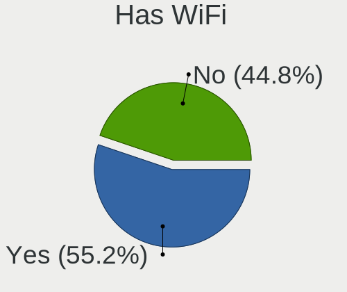
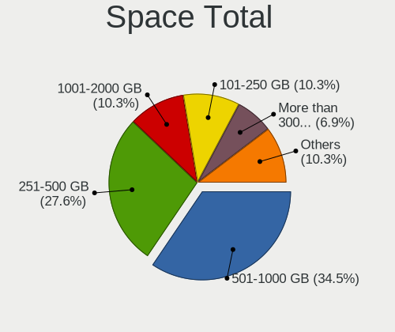
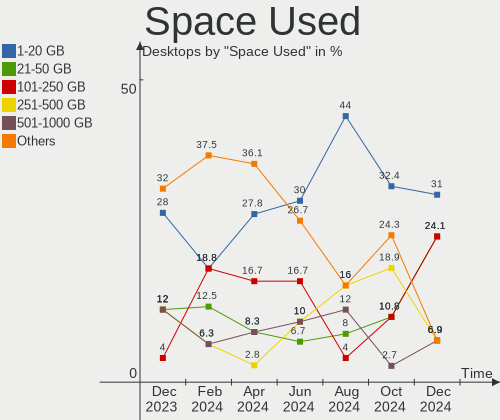

KDE neon - Hardware Trends (Desktops)
-------------------------------------

A project to identify most popular hardware characteristics and track their change
over time based on data collected by Linux users at https://Linux-Hardware.org.

Anyone can contribute to this report by the [hw-probe](https://github.com/linuxhw/hw-probe) tool:

    sudo -E hw-probe -all -upload

This report is for one last month. Overall report since the beginning of time: [TestDays](https://github.com/linuxhw/TestDays)

Period: Sep, 2023.

Contents
--------

* [ System ](#system)
  - [ OS                       ](#os)
  - [ OS Family                ](#os-family)
  - [ Kernel                   ](#kernel)
  - [ Kernel Family            ](#kernel-family)
  - [ Kernel Major Ver.        ](#kernel-major-ver)
  - [ Arch                     ](#arch)
  - [ DE                       ](#de)
  - [ Display Server           ](#display-server)
  - [ Display Manager          ](#display-manager)
  - [ OS Lang                  ](#os-lang)
  - [ Boot Mode                ](#boot-mode)
  - [ Filesystem               ](#filesystem)
  - [ Part. scheme             ](#part-scheme)
  - [ Dual Boot with Linux/BSD ](#dual-boot-with-linuxbsd)
  - [ Dual Boot (Win)          ](#dual-boot-win)

* [ Board ](#board)
  - [ Vendor                   ](#vendor)
  - [ Model                    ](#model)
  - [ Model Family             ](#model-family)
  - [ MFG Year                 ](#mfg-year)
  - [ Form Factor              ](#form-factor)
  - [ Secure Boot              ](#secure-boot)
  - [ Coreboot                 ](#coreboot)
  - [ RAM Size                 ](#ram-size)
  - [ RAM Used                 ](#ram-used)
  - [ Total Drives             ](#total-drives)
  - [ Has CD-ROM               ](#has-cd-rom)
  - [ Has Ethernet             ](#has-ethernet)
  - [ Has WiFi                 ](#has-wifi)
  - [ Has Bluetooth            ](#has-bluetooth)

* [ Location ](#location)
  - [ Country                  ](#country)
  - [ City                     ](#city)

* [ Drives ](#drives)
  - [ Drive Vendor             ](#drive-vendor)
  - [ Drive Model              ](#drive-model)
  - [ HDD Vendor               ](#hdd-vendor)
  - [ SSD Vendor               ](#ssd-vendor)
  - [ Drive Kind               ](#drive-kind)
  - [ Drive Connector          ](#drive-connector)
  - [ Drive Size               ](#drive-size)
  - [ Space Total              ](#space-total)
  - [ Space Used               ](#space-used)
  - [ Malfunc. Drives          ](#malfunc-drives)
  - [ Malfunc. Drive Vendor    ](#malfunc-drive-vendor)
  - [ Malfunc. HDD Vendor      ](#malfunc-hdd-vendor)
  - [ Malfunc. Drive Kind      ](#malfunc-drive-kind)
  - [ Failed Drives            ](#failed-drives)
  - [ Failed Drive Vendor      ](#failed-drive-vendor)
  - [ Drive Status             ](#drive-status)

* [ Storage controller ](#storage-controller)
  - [ Storage Vendor           ](#storage-vendor)
  - [ Storage Model            ](#storage-model)
  - [ Storage Kind             ](#storage-kind)

* [ Processor ](#processor)
  - [ CPU Vendor               ](#cpu-vendor)
  - [ CPU Model                ](#cpu-model)
  - [ CPU Model Family         ](#cpu-model-family)
  - [ CPU Cores                ](#cpu-cores)
  - [ CPU Sockets              ](#cpu-sockets)
  - [ CPU Threads              ](#cpu-threads)
  - [ CPU Op-Modes             ](#cpu-op-modes)
  - [ CPU Microcode            ](#cpu-microcode)
  - [ CPU Microarch            ](#cpu-microarch)

* [ Graphics ](#graphics)
  - [ GPU Vendor               ](#gpu-vendor)
  - [ GPU Model                ](#gpu-model)
  - [ GPU Combo                ](#gpu-combo)
  - [ GPU Driver               ](#gpu-driver)
  - [ GPU Memory               ](#gpu-memory)

* [ Monitor ](#monitor)
  - [ Monitor Vendor           ](#monitor-vendor)
  - [ Monitor Model            ](#monitor-model)
  - [ Monitor Resolution       ](#monitor-resolution)
  - [ Monitor Diagonal         ](#monitor-diagonal)
  - [ Monitor Width            ](#monitor-width)
  - [ Aspect Ratio             ](#aspect-ratio)
  - [ Monitor Area             ](#monitor-area)
  - [ Pixel Density            ](#pixel-density)
  - [ Multiple Monitors        ](#multiple-monitors)

* [ Network ](#network)
  - [ Net Controller Vendor    ](#net-controller-vendor)
  - [ Net Controller Model     ](#net-controller-model)
  - [ Wireless Vendor          ](#wireless-vendor)
  - [ Wireless Model           ](#wireless-model)
  - [ Ethernet Vendor          ](#ethernet-vendor)
  - [ Ethernet Model           ](#ethernet-model)
  - [ Net Controller Kind      ](#net-controller-kind)
  - [ Used Controller          ](#used-controller)
  - [ NICs                     ](#nics)
  - [ IPv6                     ](#ipv6)

* [ Bluetooth ](#bluetooth)
  - [ Bluetooth Vendor         ](#bluetooth-vendor)
  - [ Bluetooth Model          ](#bluetooth-model)

* [ Sound ](#sound)
  - [ Sound Vendor             ](#sound-vendor)
  - [ Sound Model              ](#sound-model)

* [ Memory ](#memory)
  - [ Memory Vendor            ](#memory-vendor)
  - [ Memory Model             ](#memory-model)
  - [ Memory Kind              ](#memory-kind)
  - [ Memory Form Factor       ](#memory-form-factor)
  - [ Memory Size              ](#memory-size)
  - [ Memory Speed             ](#memory-speed)

* [ Printers & scanners ](#printers--scanners)
  - [ Printer Vendor           ](#printer-vendor)
  - [ Printer Model            ](#printer-model)
  - [ Scanner Vendor           ](#scanner-vendor)
  - [ Scanner Model            ](#scanner-model)

* [ Camera ](#camera)
  - [ Camera Vendor            ](#camera-vendor)
  - [ Camera Model             ](#camera-model)

* [ Security ](#security)
  - [ Fingerprint Vendor       ](#fingerprint-vendor)
  - [ Fingerprint Model        ](#fingerprint-model)
  - [ Chipcard Vendor          ](#chipcard-vendor)
  - [ Chipcard Model           ](#chipcard-model)

* [ Unsupported ](#unsupported)
  - [ Unsupported Devices      ](#unsupported-devices)
  - [ Unsupported Device Types ](#unsupported-device-types)

System
------

OS
--

Installed operating systems

| Name           | Desktops | Percent |
|----------------|----------|---------|
| KDE neon 22.04 | 28       | 100%    |

OS Family
---------

OS without a version

| Name     | Desktops | Percent |
|----------|----------|---------|
| KDE neon | 28       | 100%    |

Kernel
------

Version of the Linux kernel

| Version           | Desktops | Percent |
|-------------------|----------|---------|
| 6.2.0-33-generic  | 10       | 35.71%  |
| 6.2.0-32-generic  | 10       | 35.71%  |
| 5.19.0-50-generic | 4        | 14.29%  |
| 6.2.0-34-generic  | 1        | 3.57%   |
| 6.2.0-26-generic  | 1        | 3.57%   |
| 5.19.0-46-generic | 1        | 3.57%   |
| 5.15.0-52-generic | 1        | 3.57%   |

Kernel Family
-------------

Linux kernel without a distro release

| Version | Desktops | Percent |
|---------|----------|---------|
| 6.2.0   | 22       | 78.57%  |
| 5.19.0  | 5        | 17.86%  |
| 5.15.0  | 1        | 3.57%   |

Kernel Major Ver.
-----------------

Linux kernel major version

| Version | Desktops | Percent |
|---------|----------|---------|
| 6.2     | 22       | 78.57%  |
| 5.19    | 5        | 17.86%  |
| 5.15    | 1        | 3.57%   |

Arch
----

OS architecture (x86_64, i586, etc.)

| Name   | Desktops | Percent |
|--------|----------|---------|
| x86_64 | 28       | 100%    |

DE
--

Desktop Environment

| Name | Desktops | Percent |
|------|----------|---------|
| KDE5 | 28       | 100%    |

Display Server
--------------

X11 or Wayland

| Name | Desktops | Percent |
|------|----------|---------|
| X11  | 27       | 96.43%  |
| Tty  | 1        | 3.57%   |

Display Manager
---------------

SDDM, LightDM, etc.

| Name    | Desktops | Percent |
|---------|----------|---------|
| Unknown | 24       | 85.71%  |
| SDDM    | 4        | 14.29%  |

OS Lang
-------

Language

| Lang  | Desktops | Percent |
|-------|----------|---------|
| en_US | 10       | 35.71%  |
| ru_RU | 4        | 14.29%  |
| en_GB | 3        | 10.71%  |
| de_DE | 3        | 10.71%  |
| it_IT | 2        | 7.14%   |
| pt_BR | 1        | 3.57%   |
| fr_FR | 1        | 3.57%   |
| es_MX | 1        | 3.57%   |
| es_ES | 1        | 3.57%   |
| en_CA | 1        | 3.57%   |
| C     | 1        | 3.57%   |

Boot Mode
---------

EFI or BIOS

| Mode | Desktops | Percent |
|------|----------|---------|
| BIOS | 26       | 92.86%  |
| EFI  | 2        | 7.14%   |

Filesystem
----------

Type of filesystem

| Type  | Desktops | Percent |
|-------|----------|---------|
| Ext4  | 25       | 89.29%  |
| Tmpfs | 2        | 7.14%   |
| Btrfs | 1        | 3.57%   |

Part. scheme
------------

Scheme of partitioning

| Type    | Desktops | Percent |
|---------|----------|---------|
| Unknown | 24       | 85.71%  |
| GPT     | 4        | 14.29%  |

Dual Boot with Linux/BSD
------------------------

Hosting more than one Linux/BSD

| Dual boot | Desktops | Percent |
|-----------|----------|---------|
| No        | 25       | 89.29%  |
| Yes       | 3        | 10.71%  |

Dual Boot (Win)
---------------

Hosting Linux and Windows

| Dual boot | Desktops | Percent |
|-----------|----------|---------|
| No        | 25       | 89.29%  |
| Yes       | 3        | 10.71%  |

Board
-----

Vendor
------

Motherboard manufacturer

| Name                | Desktops | Percent |
|---------------------|----------|---------|
| Gigabyte Technology | 6        | 21.43%  |
| ASUSTek Computer    | 6        | 21.43%  |
| MSI                 | 4        | 14.29%  |
| Hewlett-Packard     | 3        | 10.71%  |
| Dell                | 3        | 10.71%  |
| Intel               | 2        | 7.14%   |
| QIYIDA              | 1        | 3.57%   |
| Biostar             | 1        | 3.57%   |
| ASRock              | 1        | 3.57%   |
| Unknown             | 1        | 3.57%   |

Model
-----

Motherboard model

| Name                            | Desktops | Percent |
|---------------------------------|----------|---------|
| MSI MS-7C37                     | 2        | 7.14%   |
| QIYIDA X99-H9 V2.0              | 1        | 3.57%   |
| MSI p7-1233w                    | 1        | 3.57%   |
| MSI MS-7C56                     | 1        | 3.57%   |
| Intel DQ77KB AAG81483-500       | 1        | 3.57%   |
| Intel DH67CL AAG10212-210       | 1        | 3.57%   |
| HP Z240 Tower Workstation       | 1        | 3.57%   |
| HP Pavilion Desktop PC 570-p0XX | 1        | 3.57%   |
| HP EliteDesk 800 G3 TWR         | 1        | 3.57%   |
| Gigabyte X570 UD                | 1        | 3.57%   |
| Gigabyte GA-78LMT-USB3 R2       | 1        | 3.57%   |
| Gigabyte G31M-ES2C              | 1        | 3.57%   |
| Gigabyte C1037UN-EU             | 1        | 3.57%   |
| Gigabyte A320M-S2H V2           | 1        | 3.57%   |
| Gigabyte A320M-S2H              | 1        | 3.57%   |
| Dell Precision T1700            | 1        | 3.57%   |
| Dell OptiPlex 9020              | 1        | 3.57%   |
| Dell OptiPlex 790               | 1        | 3.57%   |
| Biostar A10N-9630E              | 1        | 3.57%   |
| ASUS ROG STRIX B450-F GAMING II | 1        | 3.57%   |
| ASUS PRIME X370-PRO             | 1        | 3.57%   |
| ASUS PRIME H310M-E              | 1        | 3.57%   |
| ASUS P8H61-M EVO                | 1        | 3.57%   |
| ASUS CUSTOM                     | 1        | 3.57%   |
| ASUS All Series                 | 1        | 3.57%   |
| ASRock B550M-ITX/ac             | 1        | 3.57%   |
| Unknown                         | 1        | 3.57%   |

Model Family
------------

Motherboard model prefix

| Name                   | Desktops | Percent |
|------------------------|----------|---------|
| MSI MS-7C37            | 2        | 7.14%   |
| Gigabyte A320M-S2H     | 2        | 7.14%   |
| Dell OptiPlex          | 2        | 7.14%   |
| ASUS PRIME             | 2        | 7.14%   |
| QIYIDA X99-H9          | 1        | 3.57%   |
| MSI p7-1233w           | 1        | 3.57%   |
| MSI MS-7C56            | 1        | 3.57%   |
| Intel DQ77KB           | 1        | 3.57%   |
| Intel DH67CL           | 1        | 3.57%   |
| HP Z240                | 1        | 3.57%   |
| HP Pavilion            | 1        | 3.57%   |
| HP EliteDesk           | 1        | 3.57%   |
| Gigabyte X570          | 1        | 3.57%   |
| Gigabyte GA-78LMT-USB3 | 1        | 3.57%   |
| Gigabyte G31M-ES2C     | 1        | 3.57%   |
| Gigabyte C1037UN-EU    | 1        | 3.57%   |
| Dell Precision         | 1        | 3.57%   |
| Biostar A10N-9630E     | 1        | 3.57%   |
| ASUS ROG               | 1        | 3.57%   |
| ASUS P8H61-M           | 1        | 3.57%   |
| ASUS CUSTOM            | 1        | 3.57%   |
| ASUS All               | 1        | 3.57%   |
| ASRock B550M-ITX       | 1        | 3.57%   |
| Unknown                | 1        | 3.57%   |

MFG Year
--------

Motherboard manufacture year

| Year | Desktops | Percent |
|------|----------|---------|
| 2019 | 4        | 14.29%  |
| 2018 | 4        | 14.29%  |
| 2017 | 3        | 10.71%  |
| 2011 | 3        | 10.71%  |
| 2023 | 2        | 7.14%   |
| 2020 | 2        | 7.14%   |
| 2015 | 2        | 7.14%   |
| 2013 | 2        | 7.14%   |
| 2022 | 1        | 3.57%   |
| 2021 | 1        | 3.57%   |
| 2016 | 1        | 3.57%   |
| 2014 | 1        | 3.57%   |
| 2012 | 1        | 3.57%   |
| 2008 | 1        | 3.57%   |

Form Factor
-----------

Physical design of the computer

| Name    | Desktops | Percent |
|---------|----------|---------|
| Desktop | 28       | 100%    |

Secure Boot
-----------

Enabled or disabled

| State    | Desktops | Percent |
|----------|----------|---------|
| Disabled | 27       | 96.43%  |
| Enabled  | 1        | 3.57%   |

Coreboot
--------

Have coreboot on board

| Used | Desktops | Percent |
|------|----------|---------|
| No   | 28       | 100%    |

RAM Size
--------

Total RAM memory

| Size in GB  | Desktops | Percent |
|-------------|----------|---------|
| 16.01-24.0  | 12       | 42.86%  |
| 4.01-8.0    | 4        | 14.29%  |
| 8.01-16.0   | 4        | 14.29%  |
| 32.01-64.0  | 3        | 10.71%  |
| 3.01-4.0    | 2        | 7.14%   |
| 64.01-256.0 | 2        | 7.14%   |
| 24.01-32.0  | 1        | 3.57%   |

RAM Used
--------

Used RAM memory

| Used GB   | Desktops | Percent |
|-----------|----------|---------|
| 2.01-3.0  | 10       | 35.71%  |
| 1.01-2.0  | 8        | 28.57%  |
| 3.01-4.0  | 7        | 25%     |
| 4.01-8.0  | 2        | 7.14%   |
| 8.01-16.0 | 1        | 3.57%   |

Total Drives
------------

Number of drives on board

| Drives | Desktops | Percent |
|--------|----------|---------|
| 2      | 10       | 35.71%  |
| 1      | 10       | 35.71%  |
| 4      | 3        | 10.71%  |
| 3      | 3        | 10.71%  |
| 5      | 2        | 7.14%   |

Has CD-ROM
----------

Has CD-ROM on board

| Presented | Desktops | Percent |
|-----------|----------|---------|
| No        | 17       | 60.71%  |
| Yes       | 11       | 39.29%  |

Has Ethernet
------------

Has Ethernet on board

| Presented | Desktops | Percent |
|-----------|----------|---------|
| Yes       | 28       | 100%    |

Has WiFi
--------

Has WiFi module

| Presented | Desktops | Percent |
|-----------|----------|---------|
| No        | 16       | 57.14%  |
| Yes       | 12       | 42.86%  |

Has Bluetooth
-------------

Has Bluetooth module

| Presented | Desktops | Percent |
|-----------|----------|---------|
| No        | 21       | 75%     |
| Yes       | 7        | 25%     |

Location
--------

Country
-------

Geographic location (country)

| Country      | Desktops | Percent |
|--------------|----------|---------|
| USA          | 6        | 21.43%  |
| Russia       | 4        | 14.29%  |
| Italy        | 3        | 10.71%  |
| France       | 3        | 10.71%  |
| Mexico       | 2        | 7.14%   |
| Brazil       | 2        | 7.14%   |
| Switzerland  | 1        | 3.57%   |
| Sweden       | 1        | 3.57%   |
| South Africa | 1        | 3.57%   |
| Ireland      | 1        | 3.57%   |
| Germany      | 1        | 3.57%   |
| Costa Rica   | 1        | 3.57%   |
| Canada       | 1        | 3.57%   |
| Austria      | 1        | 3.57%   |

City
----

Geographic location (city)

| City                | Desktops | Percent |
|---------------------|----------|---------|
| Verona              | 1        | 3.57%   |
| Trail               | 1        | 3.57%   |
| Toms River          | 1        | 3.57%   |
| Stockholm           | 1        | 3.57%   |
| Steinach            | 1        | 3.57%   |
| Samara              | 1        | 3.57%   |
| Rome                | 1        | 3.57%   |
| Raleigh             | 1        | 3.57%   |
| Puebla City         | 1        | 3.57%   |
| Pretoria            | 1        | 3.57%   |
| Paris               | 1        | 3.57%   |
| Pantin              | 1        | 3.57%   |
| Pantano             | 1        | 3.57%   |
| Nizhniy Novgorod    | 1        | 3.57%   |
| Naberezhnyye Chelny | 1        | 3.57%   |
| Morada Nova         | 1        | 3.57%   |
| Montpellier         | 1        | 3.57%   |
| Minneapolis         | 1        | 3.57%   |
| Mafra               | 1        | 3.57%   |
| Kirov               | 1        | 3.57%   |
| Hamm (Sieg)         | 1        | 3.57%   |
| Hallein             | 1        | 3.57%   |
| Guadalajara         | 1        | 3.57%   |
| Chesapeake          | 1        | 3.57%   |
| Cariblanca          | 1        | 3.57%   |
| Cairo               | 1        | 3.57%   |
| Blackrock           | 1        | 3.57%   |
| Annapolis           | 1        | 3.57%   |

Drives
------

Drive Vendor
------------

Hard drive vendors

| Vendor                | Desktops | Drives | Percent |
|-----------------------|----------|--------|---------|
| Seagate               | 13       | 15     | 24.53%  |
| WDC                   | 9        | 12     | 16.98%  |
| Samsung Electronics   | 5        | 8      | 9.43%   |
| Crucial               | 4        | 4      | 7.55%   |
| Silicon Motion        | 2        | 2      | 3.77%   |
| Sandisk               | 2        | 3      | 3.77%   |
| Realtek Semiconductor | 2        | 2      | 3.77%   |
| PNY                   | 2        | 2      | 3.77%   |
| Kingston              | 2        | 2      | 3.77%   |
| XrayDisk              | 1        | 1      | 1.89%   |
| Unknown               | 1        | 1      | 1.89%   |
| SSSTC                 | 1        | 1      | 1.89%   |
| SOLIDIGM              | 1        | 1      | 1.89%   |
| Smartbuy              | 1        | 1      | 1.89%   |
| Neo                   | 1        | 1      | 1.89%   |
| JMicron Technology    | 1        | 1      | 1.89%   |
| Intel                 | 1        | 1      | 1.89%   |
| INNOVATION IT         | 1        | 1      | 1.89%   |
| Hitachi               | 1        | 1      | 1.89%   |
| China                 | 1        | 1      | 1.89%   |
| BIWIN                 | 1        | 1      | 1.89%   |

Drive Model
-----------

Hard drive models

| Model                                               | Desktops | Percent |
|-----------------------------------------------------|----------|---------|
| Seagate ST500DM002-1BD142 500GB                     | 4        | 6.45%   |
| Samsung SSD 860 EVO 500GB                           | 2        | 3.23%   |
| Samsung NVMe SSD Controller PM9A1/PM9A3/980PRO 1TB  | 2        | 3.23%   |
| Realtek RTS5763DL NVMe SSD Controller 256GB         | 2        | 3.23%   |
| Crucial CT480BX500SSD1 480GB                        | 2        | 3.23%   |
| XrayDisk 256GB                                      | 1        | 1.61%   |
| WDC WDBNCE0010PNC 1TB SSD                           | 1        | 1.61%   |
| WDC WD7500BPKX-00HPJT0 752GB                        | 1        | 1.61%   |
| WDC WD7500AADS-00M2B0 752GB                         | 1        | 1.61%   |
| WDC WD5003ABYX-01WERA1 500GB                        | 1        | 1.61%   |
| WDC WD20EFAX-68B2RN1 2TB                            | 1        | 1.61%   |
| WDC WD20EARS-00MVWB0 2TB                            | 1        | 1.61%   |
| WDC WD10EZEX-22MFCA0 1TB                            | 1        | 1.61%   |
| WDC WD10EZEX-08WN4A1 1TB                            | 1        | 1.61%   |
| WDC WD10EZEX-08RKKA0 1TB                            | 1        | 1.61%   |
| WDC WD10EZEX-00RKKA0 1TB                            | 1        | 1.61%   |
| WDC WD10EFRX-68FYTN0 1TB                            | 1        | 1.61%   |
| WDC WD10EALS-00Z8A0 1TB                             | 1        | 1.61%   |
| Unknown SD/MMC/MS PRO 128GB                         | 1        | 1.61%   |
| SSSTC CVB-8D128-HP 128GB                            | 1        | 1.61%   |
| SOLIDIGM SSDPFKNU020TZ 2TB                          | 1        | 1.61%   |
| Smartbuy SSD 120GB                                  | 1        | 1.61%   |
| Silicon Motion SM2262/SM2262EN SSD Controller 500GB | 1        | 1.61%   |
| Silicon Motion NE-128 128GB                         | 1        | 1.61%   |
| Seagate ST9500325AS 500GB                           | 1        | 1.61%   |
| Seagate ST3500630AS 500GB                           | 1        | 1.61%   |
| Seagate ST3500418AS 500GB                           | 1        | 1.61%   |
| Seagate ST3320620AS 320GB                           | 1        | 1.61%   |
| Seagate ST32000542AS 2TB                            | 1        | 1.61%   |
| Seagate ST240HM000-1G5152 240GB                     | 1        | 1.61%   |
| Seagate ST2000DL003-9VT166 2TB                      | 1        | 1.61%   |
| Seagate ST1000NM0053-1C1173 1TB                     | 1        | 1.61%   |
| Seagate ST1000LM024 HN-M101MBB 1TB                  | 1        | 1.61%   |
| Seagate ST1000DX001-1CM162 1TB                      | 1        | 1.61%   |
| Seagate ST1000DM010-2EP102 1TB                      | 1        | 1.61%   |
| Sandisk WD_BLACK SN770 1TB                          | 1        | 1.61%   |
| Sandisk WD Blue SN550 NVMe SSD 512GB                | 1        | 1.61%   |
| SanDisk SDSSDH3 500G                                | 1        | 1.61%   |
| Samsung SSD 980 PRO 1TB                             | 1        | 1.61%   |
| Samsung SSD 850 PRO 256GB                           | 1        | 1.61%   |

HDD Vendor
----------

Hard disk drive vendors

| Vendor  | Desktops | Drives | Percent |
|---------|----------|--------|---------|
| Seagate | 13       | 15     | 56.52%  |
| WDC     | 8        | 11     | 34.78%  |
| Unknown | 1        | 1      | 4.35%   |
| Hitachi | 1        | 1      | 4.35%   |

SSD Vendor
----------

Solid state drive vendors

| Vendor              | Desktops | Drives | Percent |
|---------------------|----------|--------|---------|
| Samsung Electronics | 4        | 4      | 20%     |
| Crucial             | 4        | 4      | 20%     |
| PNY                 | 2        | 2      | 10%     |
| WDC                 | 1        | 1      | 5%      |
| SSSTC               | 1        | 1      | 5%      |
| SOLIDIGM            | 1        | 1      | 5%      |
| Smartbuy            | 1        | 1      | 5%      |
| SanDisk             | 1        | 1      | 5%      |
| Neo                 | 1        | 1      | 5%      |
| Kingston            | 1        | 1      | 5%      |
| INNOVATION IT       | 1        | 1      | 5%      |
| China               | 1        | 1      | 5%      |
| BIWIN               | 1        | 1      | 5%      |

Drive Kind
----------

HDD or SSD

| Kind    | Desktops | Drives | Percent |
|---------|----------|--------|---------|
| HDD     | 20       | 28     | 41.67%  |
| SSD     | 16       | 20     | 33.33%  |
| NVMe    | 10       | 12     | 20.83%  |
| Unknown | 2        | 2      | 4.17%   |

Drive Connector
---------------

SATA, SAS, NVMe, etc.

| Type | Desktops | Drives | Percent |
|------|----------|--------|---------|
| SATA | 27       | 47     | 69.23%  |
| NVMe | 10       | 12     | 25.64%  |
| SAS  | 2        | 3      | 5.13%   |

Drive Size
----------

Size of hard drive

| Size in TB | Desktops | Drives | Percent |
|------------|----------|--------|---------|
| 0.01-0.5   | 21       | 27     | 51.22%  |
| 0.51-1.0   | 15       | 16     | 36.59%  |
| 1.01-2.0   | 5        | 5      | 12.2%   |

Space Total
-----------

Amount of disk space available on the file system

| Size in GB     | Desktops | Percent |
|----------------|----------|---------|
| 501-1000       | 7        | 25%     |
| 251-500        | 5        | 17.86%  |
| 1001-2000      | 5        | 17.86%  |
| 101-250        | 4        | 14.29%  |
| 51-100         | 2        | 7.14%   |
| Unknown        | 2        | 7.14%   |
| More than 3000 | 1        | 3.57%   |
| 2001-3000      | 1        | 3.57%   |
| 1-20           | 1        | 3.57%   |

Space Used
----------

Amount of used disk space

| Used GB        | Desktops | Percent |
|----------------|----------|---------|
| 1-20           | 9        | 32.14%  |
| 51-100         | 5        | 17.86%  |
| 251-500        | 3        | 10.71%  |
| 101-250        | 3        | 10.71%  |
| 501-1000       | 3        | 10.71%  |
| 21-50          | 2        | 7.14%   |
| Unknown        | 2        | 7.14%   |
| More than 3000 | 1        | 3.57%   |

Malfunc. Drives
---------------

Drive models with a malfunction

| Model                                   | Desktops | Drives | Percent |
|-----------------------------------------|----------|--------|---------|
| WDC WD10EZEX-22MFCA0 1TB                | 1        | 1      | 50%     |
| Neo Forza NFS121SA312-6007000 120GB SSD | 1        | 1      | 50%     |

Malfunc. Drive Vendor
---------------------

Vendors of faulty drives

| Vendor | Desktops | Drives | Percent |
|--------|----------|--------|---------|
| WDC    | 1        | 1      | 50%     |
| Neo    | 1        | 1      | 50%     |

Malfunc. HDD Vendor
-------------------

Vendors of faulty HDD drives

| Vendor | Desktops | Drives | Percent |
|--------|----------|--------|---------|
| WDC    | 1        | 1      | 100%    |

Malfunc. Drive Kind
-------------------

Kinds of faulty drives

| Kind | Desktops | Drives | Percent |
|------|----------|--------|---------|
| SSD  | 1        | 1      | 50%     |
| HDD  | 1        | 1      | 50%     |

Failed Drives
-------------

Failed drive models

Zero info for selected period =(

Failed Drive Vendor
-------------------

Failed drive vendors

Zero info for selected period =(

Drive Status
------------

Number of failed and malfunc. drives

| Status   | Desktops | Drives | Percent |
|----------|----------|--------|---------|
| Detected | 26       | 53     | 86.67%  |
| Works    | 3        | 7      | 10%     |
| Malfunc  | 1        | 2      | 3.33%   |

Storage controller
------------------

Storage Vendor
--------------

Storage controller vendors

| Vendor                      | Desktops | Percent |
|-----------------------------|----------|---------|
| Intel                       | 16       | 37.21%  |
| AMD                         | 13       | 30.23%  |
| Samsung Electronics         | 3        | 6.98%   |
| ASMedia Technology          | 3        | 6.98%   |
| Silicon Motion              | 2        | 4.65%   |
| SanDisk                     | 2        | 4.65%   |
| Realtek Semiconductor       | 2        | 4.65%   |
| LSI Logic / Symbios Logic   | 1        | 2.33%   |
| Kingston Technology Company | 1        | 2.33%   |

Storage Model
-------------

Storage controller models

| Model                                                                                   | Desktops | Percent |
|-----------------------------------------------------------------------------------------|----------|---------|
| AMD FCH SATA Controller [AHCI mode]                                                     | 9        | 18.75%  |
| ASMedia ASM1062 Serial ATA Controller                                                   | 3        | 6.25%   |
| Samsung NVMe SSD Controller PM9A1/PM9A3/980PRO                                          | 2        | 4.17%   |
| Realtek RTS5763DL NVMe SSD Controller                                                   | 2        | 4.17%   |
| Intel SATA Controller [RAID mode]                                                       | 2        | 4.17%   |
| Intel 8 Series/C220 Series Chipset Family 6-port SATA Controller 1 [AHCI mode]          | 2        | 4.17%   |
| Intel 6 Series/C200 Series Chipset Family 6 port Desktop SATA AHCI Controller           | 2        | 4.17%   |
| Intel 200 Series PCH SATA controller [AHCI mode]                                        | 2        | 4.17%   |
| AMD 500 Series Chipset SATA Controller                                                  | 2        | 4.17%   |
| Silicon Motion SM2263EN/SM2263XT (DRAM-less) NVMe SSD Controllers                       | 1        | 2.08%   |
| Silicon Motion SM2262/SM2262EN SSD Controller                                           | 1        | 2.08%   |
| SanDisk WD Blue SN550 NVMe SSD                                                          | 1        | 2.08%   |
| SanDisk WD Black SN770 / PC SN740 256GB / PC SN560 (DRAM-less) NVMe SSD                 | 1        | 2.08%   |
| Samsung NVMe SSD Controller SM981/PM981/PM983                                           | 1        | 2.08%   |
| LSI Logic / Symbios Logic 53c1030 PCI-X Fusion-MPT Dual Ultra320 SCSI                   | 1        | 2.08%   |
| Kingston Company NV1 NVMe SSD                                                           | 1        | 2.08%   |
| Intel SSD 660P Series                                                                   | 1        | 2.08%   |
| Intel NM10/ICH7 Family SATA Controller [IDE mode]                                       | 1        | 2.08%   |
| Intel Cannon Lake PCH SATA AHCI Controller                                              | 1        | 2.08%   |
| Intel Alder Lake-P SATA AHCI Controller                                                 | 1        | 2.08%   |
| Intel 8 Series/C220 Series Chipset Family 4-port SATA Controller 1 [IDE mode]           | 1        | 2.08%   |
| Intel 7 Series/C210 Series Chipset Family 6-port SATA Controller [AHCI mode]            | 1        | 2.08%   |
| Intel 7 Series Chipset Family 6-port SATA Controller [AHCI mode]                        | 1        | 2.08%   |
| Intel 6 Series/C200 Series Chipset Family Desktop SATA Controller (IDE mode, ports 4-5) | 1        | 2.08%   |
| Intel 6 Series/C200 Series Chipset Family Desktop SATA Controller (IDE mode, ports 0-3) | 1        | 2.08%   |
| AMD X370 Series Chipset SATA Controller                                                 | 1        | 2.08%   |
| AMD SB7x0/SB8x0/SB9x0 SATA Controller [IDE mode]                                        | 1        | 2.08%   |
| AMD SB7x0/SB8x0/SB9x0 IDE Controller                                                    | 1        | 2.08%   |
| AMD FCH SATA Controller D                                                               | 1        | 2.08%   |
| AMD 400 Series Chipset SATA Controller                                                  | 1        | 2.08%   |
| AMD 300 Series Chipset SATA Controller                                                  | 1        | 2.08%   |

Storage Kind
------------

Kind of storage controller (IDE, SATA, NVMe, SAS, ...)

| Kind | Desktops | Percent |
|------|----------|---------|
| SATA | 24       | 58.54%  |
| NVMe | 10       | 24.39%  |
| IDE  | 4        | 9.76%   |
| RAID | 2        | 4.88%   |
| SCSI | 1        | 2.44%   |

Processor
---------

CPU Vendor
----------

Processor vendors

| Vendor | Desktops | Percent |
|--------|----------|---------|
| Intel  | 15       | 53.57%  |
| AMD    | 13       | 46.43%  |

CPU Model
---------

Processor models

| Model                                           | Desktops | Percent |
|-------------------------------------------------|----------|---------|
| AMD Ryzen 7 3700X 8-Core Processor              | 2        | 7.14%   |
| AMD Ryzen 5 3600 6-Core Processor               | 2        | 7.14%   |
| Intel Xeon CPU E5-2620 v3 @ 2.40GHz             | 1        | 3.57%   |
| Intel Core i7-8700K CPU @ 3.70GHz               | 1        | 3.57%   |
| Intel Core i7-7700 CPU @ 3.60GHz                | 1        | 3.57%   |
| Intel Core i7-6700 CPU @ 3.40GHz                | 1        | 3.57%   |
| Intel Core i7-4770 CPU @ 3.40GHz                | 1        | 3.57%   |
| Intel Core i7-3770T CPU @ 2.50GHz               | 1        | 3.57%   |
| Intel Core i7-2700K CPU @ 3.50GHz               | 1        | 3.57%   |
| Intel Core i7-2600 CPU @ 3.40GHz                | 1        | 3.57%   |
| Intel Core i5-7400 CPU @ 3.00GHz                | 1        | 3.57%   |
| Intel Core i5-4590 CPU @ 3.30GHz                | 1        | 3.57%   |
| Intel Core i5-2320 CPU @ 3.00GHz                | 1        | 3.57%   |
| Intel Core i3-4150 CPU @ 3.50GHz                | 1        | 3.57%   |
| Intel Core 2 Duo CPU E7400 @ 2.80GHz            | 1        | 3.57%   |
| Intel Celeron CPU 1037U @ 1.80GHz               | 1        | 3.57%   |
| Intel 12th Gen Core i5-12450H                   | 1        | 3.57%   |
| AMD Ryzen 7 1700 Eight-Core Processor           | 1        | 3.57%   |
| AMD Ryzen 5 PRO 7645 6-Core Processor           | 1        | 3.57%   |
| AMD Ryzen 5 5600X 6-Core Processor              | 1        | 3.57%   |
| AMD Ryzen 5 2600 Six-Core Processor             | 1        | 3.57%   |
| AMD Ryzen 5 2400G with Radeon Vega Graphics     | 1        | 3.57%   |
| AMD Ryzen 5 1600 Six-Core Processor             | 1        | 3.57%   |
| AMD Phenom II X4 945 Processor                  | 1        | 3.57%   |
| AMD A8-5500 APU with Radeon HD Graphics         | 1        | 3.57%   |
| AMD A10-9630P RADEON R5, 10 COMPUTE CORES 4C+6G | 1        | 3.57%   |

CPU Model Family
----------------

Processor model prefix

| Model            | Desktops | Percent |
|------------------|----------|---------|
| Intel Core i7    | 7        | 25%     |
| AMD Ryzen 5      | 6        | 21.43%  |
| Intel Core i5    | 3        | 10.71%  |
| AMD Ryzen 7      | 3        | 10.71%  |
| Other            | 1        | 3.57%   |
| Intel Xeon       | 1        | 3.57%   |
| Intel Core i3    | 1        | 3.57%   |
| Intel Core 2 Duo | 1        | 3.57%   |
| Intel Celeron    | 1        | 3.57%   |
| AMD Ryzen 5 PRO  | 1        | 3.57%   |
| AMD Phenom II X4 | 1        | 3.57%   |
| AMD A8           | 1        | 3.57%   |
| AMD A10          | 1        | 3.57%   |

CPU Cores
---------

Number of processor cores

| Number | Desktops | Percent |
|--------|----------|---------|
| 4      | 11       | 39.29%  |
| 6      | 8        | 28.57%  |
| 2      | 5        | 17.86%  |
| 8      | 4        | 14.29%  |

CPU Sockets
-----------

Number of sockets

| Number | Desktops | Percent |
|--------|----------|---------|
| 1      | 28       | 100%    |

CPU Threads
-----------

Threads per core (Hyper-Threading)

| Number | Desktops | Percent |
|--------|----------|---------|
| 2      | 22       | 78.57%  |
| 1      | 6        | 21.43%  |

CPU Op-Modes
------------

CPU Operation Modes (32-bit, 64-bit)

| Op mode        | Desktops | Percent |
|----------------|----------|---------|
| 32-bit, 64-bit | 28       | 100%    |

CPU Microcode
-------------

Microcode number

| Number     | Desktops | Percent |
|------------|----------|---------|
| Unknown    | 25       | 89.29%  |
| 0x0a601203 | 1        | 3.57%   |
| 0x0800820d | 1        | 3.57%   |
| 0x08001138 | 1        | 3.57%   |

CPU Microarch
-------------

Microarchitecture

| Name        | Desktops | Percent |
|-------------|----------|---------|
| Zen 2       | 4        | 14.29%  |
| Haswell     | 4        | 14.29%  |
| Zen         | 3        | 10.71%  |
| SandyBridge | 3        | 10.71%  |
| KabyLake    | 3        | 10.71%  |
| IvyBridge   | 2        | 7.14%   |
| Unknown     | 2        | 7.14%   |
| Zen+        | 1        | 3.57%   |
| Zen 3       | 1        | 3.57%   |
| Skylake     | 1        | 3.57%   |
| Piledriver  | 1        | 3.57%   |
| Penryn      | 1        | 3.57%   |
| K10         | 1        | 3.57%   |
| Excavator   | 1        | 3.57%   |

Graphics
--------

GPU Vendor
----------

Vendors of graphics cards

| Vendor | Desktops | Percent |
|--------|----------|---------|
| AMD    | 12       | 41.38%  |
| Intel  | 9        | 31.03%  |
| Nvidia | 8        | 27.59%  |

GPU Model
---------

Graphics card models

| Model                                                                       | Desktops | Percent |
|-----------------------------------------------------------------------------|----------|---------|
| Intel HD Graphics 630                                                       | 2        | 6.9%    |
| Nvidia GT218 [GeForce 405]                                                  | 1        | 3.45%   |
| Nvidia GP107 [GeForce GTX 1050]                                             | 1        | 3.45%   |
| Nvidia GP107 [GeForce GTX 1050 Ti]                                          | 1        | 3.45%   |
| Nvidia GM206 [GeForce GTX 950]                                              | 1        | 3.45%   |
| Nvidia GM107 [GeForce GTX 750 Ti]                                           | 1        | 3.45%   |
| Nvidia GK107 [GeForce GTX 650]                                              | 1        | 3.45%   |
| Nvidia GA104GL [RTX A4000]                                                  | 1        | 3.45%   |
| Nvidia G98 [GeForce 8400 GS Rev. 2]                                         | 1        | 3.45%   |
| Intel Xeon E3-1200 v3/4th Gen Core Processor Integrated Graphics Controller | 1        | 3.45%   |
| Intel IvyBridge GT2 [HD Graphics 4000]                                      | 1        | 3.45%   |
| Intel CoffeeLake-S GT2 [UHD Graphics 630]                                   | 1        | 3.45%   |
| Intel Alder Lake-P GT1 [UHD Graphics]                                       | 1        | 3.45%   |
| Intel 4th Generation Core Processor Family Integrated Graphics Controller   | 1        | 3.45%   |
| Intel 3rd Gen Core processor Graphics Controller                            | 1        | 3.45%   |
| Intel 2nd Generation Core Processor Family Integrated Graphics Controller   | 1        | 3.45%   |
| AMD Wani [Radeon R5/R6/R7 Graphics]                                         | 1        | 3.45%   |
| AMD Trinity [Radeon HD 7560D]                                               | 1        | 3.45%   |
| AMD Raven Ridge [Radeon Vega Series / Radeon Vega Mobile Series]            | 1        | 3.45%   |
| AMD Raphael                                                                 | 1        | 3.45%   |
| AMD Polaris 20 XL [Radeon RX 580 2048SP]                                    | 1        | 3.45%   |
| AMD Oland GL [FirePro W2100]                                                | 1        | 3.45%   |
| AMD Navi 23 [Radeon RX 6650 XT / 6700S / 6800S]                             | 1        | 3.45%   |
| AMD Navi 23 [Radeon RX 6600/6600 XT/6600M]                                  | 1        | 3.45%   |
| AMD Navi 22 [Radeon RX 6700/6700 XT/6750 XT / 6800M/6850M XT]               | 1        | 3.45%   |
| AMD Navi 21 [Radeon RX 6800/6800 XT / 6900 XT]                              | 1        | 3.45%   |
| AMD Caicos [Radeon HD 6450/7450/8450 / R5 230 OEM]                          | 1        | 3.45%   |
| AMD Caicos XTX [Radeon HD 8490 / R5 235X OEM]                               | 1        | 3.45%   |

GPU Combo
---------

Combinations of graphics cards

| Name         | Desktops | Percent |
|--------------|----------|---------|
| 1 x AMD      | 11       | 39.29%  |
| 1 x Intel    | 9        | 32.14%  |
| 1 x Nvidia   | 7        | 25%     |
| AMD + Nvidia | 1        | 3.57%   |

GPU Driver
----------

Free vs proprietary

| Driver      | Desktops | Percent |
|-------------|----------|---------|
| Free        | 25       | 89.29%  |
| Proprietary | 2        | 7.14%   |
| Unknown     | 1        | 3.57%   |

GPU Memory
----------

Total video memory

| Size in GB | Desktops | Percent |
|------------|----------|---------|
| Unknown    | 25       | 89.29%  |
| 0.51-1.0   | 2        | 7.14%   |
| 7.01-8.0   | 1        | 3.57%   |

Monitor
-------

Monitor Vendor
--------------

Monitor vendors

| Vendor               | Desktops | Percent |
|----------------------|----------|---------|
| Samsung Electronics  | 4        | 13.33%  |
| Dell                 | 4        | 13.33%  |
| AOC                  | 4        | 13.33%  |
| ViewSonic            | 2        | 6.67%   |
| Philips              | 2        | 6.67%   |
| Iiyama               | 2        | 6.67%   |
| Hewlett-Packard      | 2        | 6.67%   |
| Plain Tree Systems   | 1        | 3.33%   |
| MiTAC                | 1        | 3.33%   |
| IPS                  | 1        | 3.33%   |
| HKC                  | 1        | 3.33%   |
| Goldstar             | 1        | 3.33%   |
| Gigabyte Technology  | 1        | 3.33%   |
| Eizo                 | 1        | 3.33%   |
| Compal               | 1        | 3.33%   |
| Ancor Communications | 1        | 3.33%   |
| Unknown              | 1        | 3.33%   |

Monitor Model
-------------

Monitor models

| Model                                                                   | Desktops | Percent |
|-------------------------------------------------------------------------|----------|---------|
| ViewSonic XG2402 SERIES VSC1B35 1920x1080 531x299mm 24.0-inch           | 1        | 3.33%   |
| ViewSonic VX2250 SERIES VSCCB25 1920x1080 477x268mm 21.5-inch           | 1        | 3.33%   |
| Samsung Electronics S27B550 SAM091B 1920x1080 598x336mm 27.0-inch       | 1        | 3.33%   |
| Samsung Electronics S24D330 SAM0D92 1920x1080 531x299mm 24.0-inch       | 1        | 3.33%   |
| Samsung Electronics LCD Monitor SAM0F14 3840x2160 1872x1053mm 84.6-inch | 1        | 3.33%   |
| Samsung Electronics LCD Monitor SAM03A6 1360x768 885x498mm 40.0-inch    | 1        | 3.33%   |
| Plain Tree Systems FULL HDTV PTS00D7 1920x1080 477x268mm 21.5-inch      | 1        | 3.33%   |
| Philips PHL 245B1 PHL094C 2560x1440 527x296mm 23.8-inch                 | 1        | 3.33%   |
| Philips 160EW PHL0875 1366x768 344x194mm 15.5-inch                      | 1        | 3.33%   |
| MiTAC Smart TV MTC0030 1920x1080 708x398mm 32.0-inch                    | 1        | 3.33%   |
| IPS 21.5HQ-LED IPS2150 1920x1080 475x267mm 21.5-inch                    | 1        | 3.33%   |
| Iiyama XB2776QS-B1 IVM660E 2560x1440 597x336mm 27.0-inch                | 1        | 3.33%   |
| Iiyama PL2294H IVM563B 1920x1080 476x268mm 21.5-inch                    | 1        | 3.33%   |
| HKC 27E6QC HKC274F 2560x1440 597x336mm 27.0-inch                        | 1        | 3.33%   |
| Hewlett-Packard w2558hc HWP2818 1920x1200 550x309mm 24.8-inch           | 1        | 3.33%   |
| Hewlett-Packard E232 HWP327A 1920x1080 509x286mm 23.0-inch              | 1        | 3.33%   |
| Goldstar M237WDP GSM5778 1920x1080 510x290mm 23.1-inch                  | 1        | 3.33%   |
| Gigabyte Technology M32U GBT3204 3840x2160 697x392mm 31.5-inch          | 1        | 3.33%   |
| Eizo CG211 ENC1844 1200x1600 324x432mm 21.3-inch                        | 1        | 3.33%   |
| Dell U2715H DELD066 2560x1440 597x336mm 27.0-inch                       | 1        | 3.33%   |
| Dell SE2219H DELF10F 1920x1080 476x268mm 21.5-inch                      | 1        | 3.33%   |
| Dell S2415H DELA0B5 1920x1080 530x300mm 24.0-inch                       | 1        | 3.33%   |
| Dell E198FP DELA028 1280x1024 380x305mm 19.2-inch                       | 1        | 3.33%   |
| Compal TERRA 2765WPV WOR2765 2560x1440 597x336mm 27.0-inch              | 1        | 3.33%   |
| AOC Q27P1B AOC2701 2560x1440 597x336mm 27.0-inch                        | 1        | 3.33%   |
| AOC F19 AOC1900 1366x768 410x230mm 18.5-inch                            | 1        | 3.33%   |
| AOC 27B2 AOC2702 1920x1080 598x336mm 27.0-inch                          | 1        | 3.33%   |
| AOC 2070W AOC2070 1600x900 434x236mm 19.4-inch                          | 1        | 3.33%   |
| Ancor Communications ASUS PB287Q ACI28A3 3840x2160 621x341mm 27.9-inch  | 1        | 3.33%   |
| Unknown                                                                 | 1        | 3.33%   |

Monitor Resolution
------------------

Monitor screen resolution

| Resolution        | Desktops | Percent |
|-------------------|----------|---------|
| 1920x1080 (FHD)   | 12       | 41.38%  |
| 3840x2160 (4K)    | 5        | 17.24%  |
| 2560x1440 (QHD)   | 5        | 17.24%  |
| 1366x768 (WXGA)   | 2        | 6.9%    |
| 1920x1200 (WUXGA) | 1        | 3.45%   |
| 1600x900 (HD+)    | 1        | 3.45%   |
| 1360x768          | 1        | 3.45%   |
| 1280x1024 (SXGA)  | 1        | 3.45%   |
| 1200x1600         | 1        | 3.45%   |

Monitor Diagonal
----------------

Diagonal size in inches

| Inches  | Desktops | Percent |
|---------|----------|---------|
| 27      | 8        | 27.59%  |
| 21      | 6        | 20.69%  |
| 24      | 4        | 13.79%  |
| 23      | 2        | 6.9%    |
| 19      | 2        | 6.9%    |
| 84      | 1        | 3.45%   |
| 52      | 1        | 3.45%   |
| 40      | 1        | 3.45%   |
| 31      | 1        | 3.45%   |
| 18      | 1        | 3.45%   |
| 15      | 1        | 3.45%   |
| Unknown | 1        | 3.45%   |

Monitor Width
-------------

Physical width

| Width in mm | Desktops | Percent |
|-------------|----------|---------|
| 501-600     | 13       | 44.83%  |
| 401-500     | 7        | 24.14%  |
| 601-700     | 2        | 6.9%    |
| 301-350     | 2        | 6.9%    |
| 801-900     | 1        | 3.45%   |
| 351-400     | 1        | 3.45%   |
| 1501-2000   | 1        | 3.45%   |
| 1001-1500   | 1        | 3.45%   |
| Unknown     | 1        | 3.45%   |

Aspect Ratio
------------

Proportional relationship between the width and the height

| Ratio   | Desktops | Percent |
|---------|----------|---------|
| 16/9    | 23       | 88.46%  |
| 5/4     | 1        | 3.85%   |
| 0.75    | 1        | 3.85%   |
| Unknown | 1        | 3.85%   |

Monitor Area
------------

Area in inch

| Area in inch | Desktops | Percent |
|----------------|----------|---------|
| 301-350        | 8        | 27.59%  |
| 201-250        | 8        | 27.59%  |
| 151-200        | 5        | 17.24%  |
| More than 1000 | 2        | 6.9%    |
| 351-500        | 1        | 3.45%   |
| 251-300        | 1        | 3.45%   |
| 141-150        | 1        | 3.45%   |
| 101-110        | 1        | 3.45%   |
| 501-1000       | 1        | 3.45%   |
| Unknown        | 1        | 3.45%   |

Pixel Density
-------------

Pixels per inch

| Density | Desktops | Percent |
|---------|----------|---------|
| 51-100  | 13       | 46.43%  |
| 101-120 | 9        | 32.14%  |
| 121-160 | 3        | 10.71%  |
| 1-50    | 2        | 7.14%   |
| Unknown | 1        | 3.57%   |

Multiple Monitors
-----------------

Total monitors connected

| Total | Desktops | Percent |
|-------|----------|---------|
| 1     | 24       | 85.71%  |
| 2     | 4        | 14.29%  |

Network
-------

Net Controller Vendor
---------------------

Controller vendors

| Vendor                | Desktops | Percent |
|-----------------------|----------|---------|
| Realtek Semiconductor | 19       | 44.19%  |
| Intel                 | 15       | 34.88%  |
| Qualcomm Atheros      | 2        | 4.65%   |
| TP-Link               | 1        | 2.33%   |
| MediaTek              | 1        | 2.33%   |
| Google                | 1        | 2.33%   |
| D-Link                | 1        | 2.33%   |
| Broadcom Limited      | 1        | 2.33%   |
| Aquantia              | 1        | 2.33%   |
| Apple                 | 1        | 2.33%   |

Net Controller Model
--------------------

Controller models

| Model                                                               | Desktops | Percent |
|---------------------------------------------------------------------|----------|---------|
| Realtek RTL8111/8168/8411 PCI Express Gigabit Ethernet Controller   | 15       | 32.61%  |
| Intel I211 Gigabit Network Connection                               | 2        | 4.35%   |
| Intel Ethernet Connection I217-LM                                   | 2        | 4.35%   |
| Intel Dual Band Wireless-AC 3168NGW [Stone Peak]                    | 2        | 4.35%   |
| Intel 82579LM Gigabit Network Connection (Lewisville)               | 2        | 4.35%   |
| TP-Link Archer T3U [Realtek RTL8812BU]                              | 1        | 2.17%   |
| Realtek RTL8821CE 802.11ac PCIe Wireless Network Adapter            | 1        | 2.17%   |
| Realtek RTL8192CU 802.11n WLAN Adapter                              | 1        | 2.17%   |
| Realtek RTL8188CUS 802.11n WLAN Adapter                             | 1        | 2.17%   |
| Realtek RTL810xE PCI Express Fast Ethernet controller               | 1        | 2.17%   |
| Realtek 802.11ac NIC                                                | 1        | 2.17%   |
| Qualcomm Atheros AR922X Wireless Network Adapter                    | 1        | 2.17%   |
| Qualcomm Atheros AR8161 Gigabit Ethernet                            | 1        | 2.17%   |
| MediaTek MT7922 802.11ax PCI Express Wireless Network Adapter       | 1        | 2.17%   |
| Intel Wireless 7265                                                 | 1        | 2.17%   |
| Intel Ethernet Controller I225-V                                    | 1        | 2.17%   |
| Intel Ethernet Connection (5) I219-LM                               | 1        | 2.17%   |
| Intel Ethernet Connection (2) I219-LM                               | 1        | 2.17%   |
| Intel Ethernet Connection (16) I219-LM                              | 1        | 2.17%   |
| Intel Centrino Advanced-N 6230 [Rainbow Peak]                       | 1        | 2.17%   |
| Intel 82579V Gigabit Network Connection                             | 1        | 2.17%   |
| Intel 82576 Gigabit Network Connection                              | 1        | 2.17%   |
| Intel 82574L Gigabit Network Connection                             | 1        | 2.17%   |
| Google Nexus/Pixel Device (tether)                                  | 1        | 2.17%   |
| D-Link 11ac adapter                                                 | 1        | 2.17%   |
| Broadcom Limited BCM4360 802.11ac Wireless Network Adapter          | 1        | 2.17%   |
| Aquantia AQC113CS NBase-T/IEEE 802.3bz Ethernet Controller [AQtion] | 1        | 2.17%   |
| Apple iPad 4/Mini1                                                  | 1        | 2.17%   |

Wireless Vendor
---------------

Wireless vendors

| Vendor                | Desktops | Percent |
|-----------------------|----------|---------|
| Realtek Semiconductor | 4        | 30.77%  |
| Intel                 | 4        | 30.77%  |
| TP-Link               | 1        | 7.69%   |
| Qualcomm Atheros      | 1        | 7.69%   |
| MediaTek              | 1        | 7.69%   |
| D-Link                | 1        | 7.69%   |
| Broadcom Limited      | 1        | 7.69%   |

Wireless Model
--------------

Wireless models

| Model                                                         | Desktops | Percent |
|---------------------------------------------------------------|----------|---------|
| Intel Dual Band Wireless-AC 3168NGW [Stone Peak]              | 2        | 15.38%  |
| TP-Link Archer T3U [Realtek RTL8812BU]                        | 1        | 7.69%   |
| Realtek RTL8821CE 802.11ac PCIe Wireless Network Adapter      | 1        | 7.69%   |
| Realtek RTL8192CU 802.11n WLAN Adapter                        | 1        | 7.69%   |
| Realtek RTL8188CUS 802.11n WLAN Adapter                       | 1        | 7.69%   |
| Realtek 802.11ac NIC                                          | 1        | 7.69%   |
| Qualcomm Atheros AR922X Wireless Network Adapter              | 1        | 7.69%   |
| MediaTek MT7922 802.11ax PCI Express Wireless Network Adapter | 1        | 7.69%   |
| Intel Wireless 7265                                           | 1        | 7.69%   |
| Intel Centrino Advanced-N 6230 [Rainbow Peak]                 | 1        | 7.69%   |
| D-Link 11ac adapter                                           | 1        | 7.69%   |
| Broadcom Limited BCM4360 802.11ac Wireless Network Adapter    | 1        | 7.69%   |

Ethernet Vendor
---------------

Ethernet vendors

| Vendor                | Desktops | Percent |
|-----------------------|----------|---------|
| Realtek Semiconductor | 16       | 50%     |
| Intel                 | 12       | 37.5%   |
| Qualcomm Atheros      | 1        | 3.13%   |
| Google                | 1        | 3.13%   |
| Aquantia              | 1        | 3.13%   |
| Apple                 | 1        | 3.13%   |

Ethernet Model
--------------

Ethernet models

| Model                                                               | Desktops | Percent |
|---------------------------------------------------------------------|----------|---------|
| Realtek RTL8111/8168/8411 PCI Express Gigabit Ethernet Controller   | 15       | 45.45%  |
| Intel I211 Gigabit Network Connection                               | 2        | 6.06%   |
| Intel Ethernet Connection I217-LM                                   | 2        | 6.06%   |
| Intel 82579LM Gigabit Network Connection (Lewisville)               | 2        | 6.06%   |
| Realtek RTL810xE PCI Express Fast Ethernet controller               | 1        | 3.03%   |
| Qualcomm Atheros AR8161 Gigabit Ethernet                            | 1        | 3.03%   |
| Intel Ethernet Controller I225-V                                    | 1        | 3.03%   |
| Intel Ethernet Connection (5) I219-LM                               | 1        | 3.03%   |
| Intel Ethernet Connection (2) I219-LM                               | 1        | 3.03%   |
| Intel Ethernet Connection (16) I219-LM                              | 1        | 3.03%   |
| Intel 82579V Gigabit Network Connection                             | 1        | 3.03%   |
| Intel 82576 Gigabit Network Connection                              | 1        | 3.03%   |
| Intel 82574L Gigabit Network Connection                             | 1        | 3.03%   |
| Google Nexus/Pixel Device (tether)                                  | 1        | 3.03%   |
| Aquantia AQC113CS NBase-T/IEEE 802.3bz Ethernet Controller [AQtion] | 1        | 3.03%   |
| Apple iPad 4/Mini1                                                  | 1        | 3.03%   |

Net Controller Kind
-------------------

Ethernet, WiFi or modem

| Kind     | Desktops | Percent |
|----------|----------|---------|
| Ethernet | 28       | 70%     |
| WiFi     | 12       | 30%     |

Used Controller
---------------

Currently used network controller

| Kind     | Desktops | Percent |
|----------|----------|---------|
| Ethernet | 22       | 81.48%  |
| WiFi     | 5        | 18.52%  |

NICs
----

Total network controllers on board

| Total | Desktops | Percent |
|-------|----------|---------|
| 1     | 18       | 64.29%  |
| 2     | 7        | 25%     |
| 3     | 3        | 10.71%  |

IPv6
----

IPv6 vs IPv4

| Used | Desktops | Percent |
|------|----------|---------|
| No   | 20       | 71.43%  |
| Yes  | 8        | 28.57%  |

Bluetooth
---------

Bluetooth Vendor
----------------

Controller vendors

| Vendor                | Desktops | Percent |
|-----------------------|----------|---------|
| Intel                 | 4        | 57.14%  |
| Realtek Semiconductor | 1        | 14.29%  |
| Foxconn / Hon Hai     | 1        | 14.29%  |
| Apple                 | 1        | 14.29%  |

Bluetooth Model
---------------

Controller models

| Model                                            | Desktops | Percent |
|--------------------------------------------------|----------|---------|
| Intel Wireless-AC 3168 Bluetooth                 | 2        | 28.57%  |
| Realtek Bluetooth Radio                          | 1        | 14.29%  |
| Intel Centrino Advanced-N 6230 Bluetooth adapter | 1        | 14.29%  |
| Intel Bluetooth wireless interface               | 1        | 14.29%  |
| Foxconn / Hon Hai Wireless_Device                | 1        | 14.29%  |
| Apple Bluetooth Host Controller                  | 1        | 14.29%  |

Sound
-----

Sound Vendor
------------

Sound card vendors

| Vendor                                       | Desktops | Percent |
|----------------------------------------------|----------|---------|
| Intel                                        | 15       | 32.61%  |
| AMD                                          | 15       | 32.61%  |
| Nvidia                                       | 7        | 15.22%  |
| C-Media Electronics                          | 3        | 6.52%   |
| Zoran Co. Personal Media Division (Nogatech) | 1        | 2.17%   |
| SteelSeries ApS                              | 1        | 2.17%   |
| Dell                                         | 1        | 2.17%   |
| Creative Technology                          | 1        | 2.17%   |
| Corsair                                      | 1        | 2.17%   |
| ASUSTek Computer                             | 1        | 2.17%   |

Sound Model
-----------

Sound card models

| Model                                                                             | Desktops | Percent |
|-----------------------------------------------------------------------------------|----------|---------|
| AMD Starship/Matisse HD Audio Controller                                          | 5        | 8.77%   |
| Intel 8 Series/C220 Series Chipset High Definition Audio Controller               | 4        | 7.02%   |
| AMD Navi 21/23 HDMI/DP Audio Controller                                           | 4        | 7.02%   |
| Intel 6 Series/C200 Series Chipset Family High Definition Audio Controller        | 3        | 5.26%   |
| AMD Family 17h (Models 00h-0fh) HD Audio Controller                               | 3        | 5.26%   |
| Nvidia GP107GL High Definition Audio Controller                                   | 2        | 3.51%   |
| Intel Xeon E3-1200 v3/4th Gen Core Processor HD Audio Controller                  | 2        | 3.51%   |
| Intel 7 Series/C216 Chipset Family High Definition Audio Controller               | 2        | 3.51%   |
| Intel 200 Series PCH HD Audio                                                     | 2        | 3.51%   |
| AMD Family 17h/19h HD Audio Controller                                            | 2        | 3.51%   |
| AMD Caicos HDMI Audio [Radeon HD 6450 / 7450/8450/8490 OEM / R5 230/235/235X OEM] | 2        | 3.51%   |
| Zoran Co. Personal Media Division (Nogatech) USB Audio and HID                    | 1        | 1.75%   |
| SteelSeries ApS Arctis Nova 7                                                     | 1        | 1.75%   |
| Nvidia High Definition Audio Controller                                           | 1        | 1.75%   |
| Nvidia GM206 High Definition Audio Controller                                     | 1        | 1.75%   |
| Nvidia GM107 High Definition Audio Controller [GeForce 940MX]                     | 1        | 1.75%   |
| Nvidia GK107 HDMI Audio Controller                                                | 1        | 1.75%   |
| Nvidia GA104 High Definition Audio Controller                                     | 1        | 1.75%   |
| Intel NM10/ICH7 Family High Definition Audio Controller                           | 1        | 1.75%   |
| Intel Cannon Lake PCH cAVS                                                        | 1        | 1.75%   |
| Intel Alder Lake PCH-P High Definition Audio Controller                           | 1        | 1.75%   |
| Intel 100 Series/C230 Series Chipset Family HD Audio Controller                   | 1        | 1.75%   |
| Dell AC511 Sound Bar                                                              | 1        | 1.75%   |
| Creative Technology Pebble V3                                                     | 1        | 1.75%   |
| Corsair VOID ELITE USB Gaming Headset                                             | 1        | 1.75%   |
| C-Media Electronics USB Audio Device                                              | 1        | 1.75%   |
| C-Media Electronics CMI8788 [Oxygen HD Audio]                                     | 1        | 1.75%   |
| C-Media Electronics CM108 Audio Controller                                        | 1        | 1.75%   |
| ASUSTek Computer Xonar SoundCard                                                  | 1        | 1.75%   |
| AMD SBx00 Azalia (Intel HDA)                                                      | 1        | 1.75%   |
| AMD Rembrandt Radeon High Definition Audio Controller                             | 1        | 1.75%   |
| AMD Raven/Raven2/Fenghuang HDMI/DP Audio Controller                               | 1        | 1.75%   |
| AMD Oland/Hainan/Cape Verde/Pitcairn HDMI Audio [Radeon HD 7000 Series]           | 1        | 1.75%   |
| AMD Kabini HDMI/DP Audio                                                          | 1        | 1.75%   |
| AMD FCH Azalia Controller                                                         | 1        | 1.75%   |
| AMD Family 15h (Models 60h-6fh) Audio Controller                                  | 1        | 1.75%   |
| AMD Ellesmere HDMI Audio [Radeon RX 470/480 / 570/580/590]                        | 1        | 1.75%   |

Memory
------

Memory Vendor
-------------

Memory module vendors

| Vendor            | Desktops | Percent |
|-------------------|----------|---------|
| Corsair           | 2        | 66.67%  |
| A-DATA Technology | 1        | 33.33%  |

Memory Model
------------

Memory module models

| Model                                                  | Desktops | Percent |
|--------------------------------------------------------|----------|---------|
| Corsair RAM CMK16GX4M2A2400C16 8GB DIMM DDR4 2933MT/s  | 1        | 33.33%  |
| Corsair RAM CMH64GX5M2B6000Z30 32GB DIMM DDR5 4800MT/s | 1        | 33.33%  |
| A-DATA RAM DDR4 3200 8GB DIMM DDR4 3600MT/s            | 1        | 33.33%  |

Memory Kind
-----------

Memory module kinds

| Kind | Desktops | Percent |
|------|----------|---------|
| DDR4 | 2        | 66.67%  |
| DDR5 | 1        | 33.33%  |

Memory Form Factor
------------------

Physical design of the memory module

| Name | Desktops | Percent |
|------|----------|---------|
| DIMM | 3        | 100%    |

Memory Size
-----------

Memory module size

| Size  | Desktops | Percent |
|-------|----------|---------|
| 32768 | 2        | 66.67%  |
| 8192  | 1        | 33.33%  |

Memory Speed
------------

Memory module speed

| Speed | Desktops | Percent |
|-------|----------|---------|
| 4800  | 1        | 33.33%  |
| 3600  | 1        | 33.33%  |
| 2933  | 1        | 33.33%  |

Printers & scanners
-------------------

Printer Vendor
--------------

Printer device vendors

| Vendor             | Desktops | Percent |
|--------------------|----------|---------|
| Brother Industries | 2        | 66.67%  |
| Hewlett-Packard    | 1        | 33.33%  |

Printer Model
-------------

Printer device models

| Model                        | Desktops | Percent |
|------------------------------|----------|---------|
| HP Officejet 4500 G510g-m    | 1        | 33.33%  |
| Brother MFC-L2710DW series   | 1        | 33.33%  |
| Brother MFC Composite Device | 1        | 33.33%  |

Scanner Vendor
--------------

Scanner device vendors

Zero info for selected period =(

Scanner Model
-------------

Scanner device models

Zero info for selected period =(

Camera
------

Camera Vendor
-------------

Camera device vendors

| Vendor              | Desktops | Percent |
|---------------------|----------|---------|
| Microsoft           | 1        | 20%     |
| Logitech            | 1        | 20%     |
| Hewlett-Packard     | 1        | 20%     |
| Creative Technology | 1        | 20%     |
| Apple               | 1        | 20%     |

Camera Model
------------

Camera device models

| Model                              | Desktops | Percent |
|------------------------------------|----------|---------|
| Microsoft LifeCam HD-3000          | 1        | 20%     |
| Logitech HD Webcam C525            | 1        | 20%     |
| HP Webcam                          | 1        | 20%     |
| Creative Live! Cam Sync 1080p      | 1        | 20%     |
| Apple iPhone 5/5C/5S/6/SE/7/8/X/XR | 1        | 20%     |

Security
--------

Fingerprint Vendor
------------------

Fingerprint sensor vendors

Zero info for selected period =(

Fingerprint Model
-----------------

Fingerprint sensor models

Zero info for selected period =(

Chipcard Vendor
---------------

Chipcard module vendors

Zero info for selected period =(

Chipcard Model
--------------

Chipcard module models

Zero info for selected period =(

Unsupported
-----------

Unsupported Devices
-------------------

Total unsupported devices on board

| Total | Desktops | Percent |
|-------|----------|---------|
| 0     | 25       | 89.29%  |
| 1     | 2        | 7.14%   |
| 2     | 1        | 3.57%   |

Unsupported Device Types
------------------------

Types of unsupported devices

| Type          | Desktops | Percent |
|---------------|----------|---------|
| Sound         | 1        | 33.33%  |
| Net/wireless  | 1        | 33.33%  |
| Graphics card | 1        | 33.33%  |

