KDE neon - Hardware Trends (Notebooks)
--------------------------------------

A project to identify most popular hardware characteristics and track their change
over time based on data collected by Linux users at https://Linux-Hardware.org.

Anyone can contribute to this report by the [hw-probe](https://github.com/linuxhw/hw-probe) tool:

    sudo -E hw-probe -all -upload

This report is for one last month. Overall report since the beginning of time: [TestDays](https://github.com/linuxhw/TestDays)

Period: Dec, 2025.

Contents
--------

* [ System ](#system)
  - [ OS                       ](#os)
  - [ OS Family                ](#os-family)
  - [ Kernel                   ](#kernel)
  - [ Kernel Family            ](#kernel-family)
  - [ Kernel Major Ver.        ](#kernel-major-ver)
  - [ Arch                     ](#arch)
  - [ DE                       ](#de)
  - [ Display Server           ](#display-server)
  - [ Display Manager          ](#display-manager)
  - [ OS Lang                  ](#os-lang)
  - [ Boot Mode                ](#boot-mode)
  - [ Filesystem               ](#filesystem)
  - [ Part. scheme             ](#part-scheme)
  - [ Dual Boot with Linux/BSD ](#dual-boot-with-linuxbsd)
  - [ Dual Boot (Win)          ](#dual-boot-win)

* [ Board ](#board)
  - [ Vendor                   ](#vendor)
  - [ Model                    ](#model)
  - [ Model Family             ](#model-family)
  - [ MFG Year                 ](#mfg-year)
  - [ Form Factor              ](#form-factor)
  - [ Secure Boot              ](#secure-boot)
  - [ Coreboot                 ](#coreboot)
  - [ RAM Size                 ](#ram-size)
  - [ RAM Used                 ](#ram-used)
  - [ Total Drives             ](#total-drives)
  - [ Has CD-ROM               ](#has-cd-rom)
  - [ Has Ethernet             ](#has-ethernet)
  - [ Has WiFi                 ](#has-wifi)
  - [ Has Bluetooth            ](#has-bluetooth)

* [ Location ](#location)
  - [ Country                  ](#country)
  - [ City                     ](#city)

* [ Drives ](#drives)
  - [ Drive Vendor             ](#drive-vendor)
  - [ Drive Model              ](#drive-model)
  - [ HDD Vendor               ](#hdd-vendor)
  - [ SSD Vendor               ](#ssd-vendor)
  - [ Drive Kind               ](#drive-kind)
  - [ Drive Connector          ](#drive-connector)
  - [ Drive Size               ](#drive-size)
  - [ Space Total              ](#space-total)
  - [ Space Used               ](#space-used)
  - [ Malfunc. Drives          ](#malfunc-drives)
  - [ Malfunc. Drive Vendor    ](#malfunc-drive-vendor)
  - [ Malfunc. HDD Vendor      ](#malfunc-hdd-vendor)
  - [ Malfunc. Drive Kind      ](#malfunc-drive-kind)
  - [ Failed Drives            ](#failed-drives)
  - [ Failed Drive Vendor      ](#failed-drive-vendor)
  - [ Drive Status             ](#drive-status)

* [ Storage controller ](#storage-controller)
  - [ Storage Vendor           ](#storage-vendor)
  - [ Storage Model            ](#storage-model)
  - [ Storage Kind             ](#storage-kind)

* [ Processor ](#processor)
  - [ CPU Vendor               ](#cpu-vendor)
  - [ CPU Model                ](#cpu-model)
  - [ CPU Model Family         ](#cpu-model-family)
  - [ CPU Cores                ](#cpu-cores)
  - [ CPU Sockets              ](#cpu-sockets)
  - [ CPU Threads              ](#cpu-threads)
  - [ CPU Op-Modes             ](#cpu-op-modes)
  - [ CPU Microcode            ](#cpu-microcode)
  - [ CPU Microarch            ](#cpu-microarch)

* [ Graphics ](#graphics)
  - [ GPU Vendor               ](#gpu-vendor)
  - [ GPU Model                ](#gpu-model)
  - [ GPU Combo                ](#gpu-combo)
  - [ GPU Driver               ](#gpu-driver)
  - [ GPU Memory               ](#gpu-memory)

* [ Monitor ](#monitor)
  - [ Monitor Vendor           ](#monitor-vendor)
  - [ Monitor Model            ](#monitor-model)
  - [ Monitor Resolution       ](#monitor-resolution)
  - [ Monitor Diagonal         ](#monitor-diagonal)
  - [ Monitor Width            ](#monitor-width)
  - [ Aspect Ratio             ](#aspect-ratio)
  - [ Monitor Area             ](#monitor-area)
  - [ Pixel Density            ](#pixel-density)
  - [ Multiple Monitors        ](#multiple-monitors)

* [ Network ](#network)
  - [ Net Controller Vendor    ](#net-controller-vendor)
  - [ Net Controller Model     ](#net-controller-model)
  - [ Wireless Vendor          ](#wireless-vendor)
  - [ Wireless Model           ](#wireless-model)
  - [ Ethernet Vendor          ](#ethernet-vendor)
  - [ Ethernet Model           ](#ethernet-model)
  - [ Net Controller Kind      ](#net-controller-kind)
  - [ Used Controller          ](#used-controller)
  - [ NICs                     ](#nics)
  - [ IPv6                     ](#ipv6)

* [ Bluetooth ](#bluetooth)
  - [ Bluetooth Vendor         ](#bluetooth-vendor)
  - [ Bluetooth Model          ](#bluetooth-model)

* [ Sound ](#sound)
  - [ Sound Vendor             ](#sound-vendor)
  - [ Sound Model              ](#sound-model)

* [ Memory ](#memory)
  - [ Memory Vendor            ](#memory-vendor)
  - [ Memory Model             ](#memory-model)
  - [ Memory Kind              ](#memory-kind)
  - [ Memory Form Factor       ](#memory-form-factor)
  - [ Memory Size              ](#memory-size)
  - [ Memory Speed             ](#memory-speed)

* [ Printers & scanners ](#printers--scanners)
  - [ Printer Vendor           ](#printer-vendor)
  - [ Printer Model            ](#printer-model)
  - [ Scanner Vendor           ](#scanner-vendor)
  - [ Scanner Model            ](#scanner-model)

* [ Camera ](#camera)
  - [ Camera Vendor            ](#camera-vendor)
  - [ Camera Model             ](#camera-model)

* [ Security ](#security)
  - [ Fingerprint Vendor       ](#fingerprint-vendor)
  - [ Fingerprint Model        ](#fingerprint-model)
  - [ Chipcard Vendor          ](#chipcard-vendor)
  - [ Chipcard Model           ](#chipcard-model)

* [ Unsupported ](#unsupported)
  - [ Unsupported Devices      ](#unsupported-devices)
  - [ Unsupported Device Types ](#unsupported-device-types)

System
------

OS
--

Installed operating systems

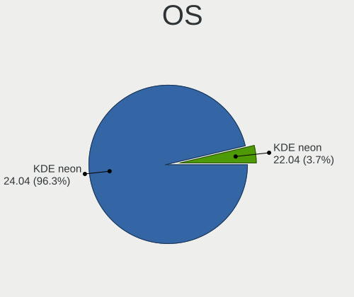

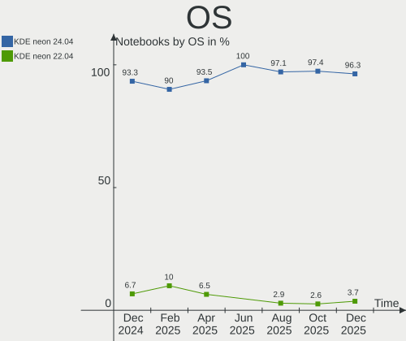

| Name           | Notebooks | Percent |
|----------------|-----------|---------|
| KDE neon 24.04 | 26        | 96.3%   |
| KDE neon 22.04 | 1         | 3.7%    |

OS Family
---------

OS without a version

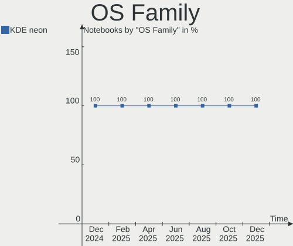

| Name     | Notebooks | Percent |
|----------|-----------|---------|
| KDE neon | 27        | 100%    |

Kernel
------

Version of the Linux kernel

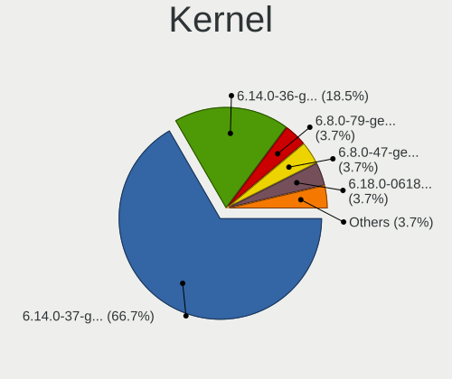

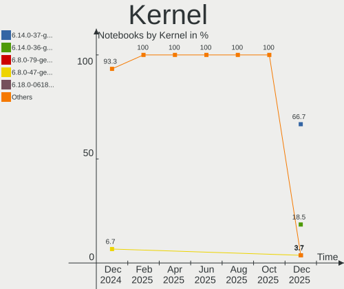

| Version               | Notebooks | Percent |
|-----------------------|-----------|---------|
| 6.14.0-37-generic     | 18        | 66.67%  |
| 6.14.0-36-generic     | 5         | 18.52%  |
| 6.8.0-79-generic      | 1         | 3.7%    |
| 6.8.0-47-generic      | 1         | 3.7%    |
| 6.18.0-061800-generic | 1         | 3.7%    |
| 6.17.10-x64v3-xanmod1 | 1         | 3.7%    |

Kernel Family
-------------

Linux kernel without a distro release

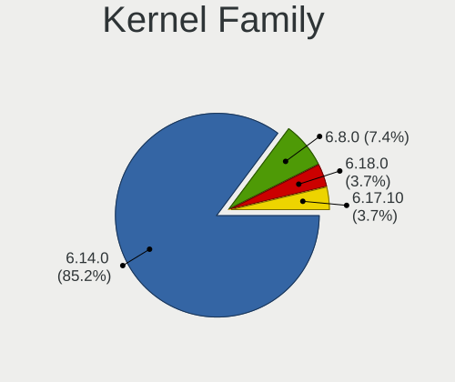

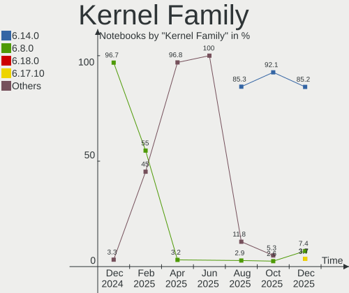

| Version | Notebooks | Percent |
|---------|-----------|---------|
| 6.14.0  | 23        | 85.19%  |
| 6.8.0   | 2         | 7.41%   |
| 6.18.0  | 1         | 3.7%    |
| 6.17.10 | 1         | 3.7%    |

Kernel Major Ver.
-----------------

Linux kernel major version

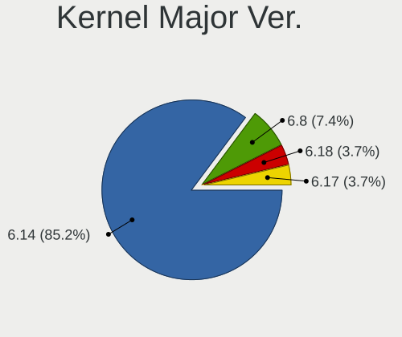

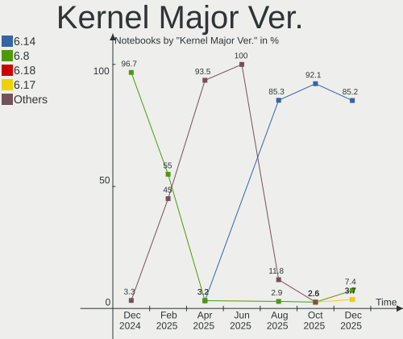

| Version | Notebooks | Percent |
|---------|-----------|---------|
| 6.14    | 23        | 85.19%  |
| 6.8     | 2         | 7.41%   |
| 6.18    | 1         | 3.7%    |
| 6.17    | 1         | 3.7%    |

Arch
----

OS architecture (x86_64, i586, etc.)

| Name   | Notebooks | Percent |
|--------|-----------|---------|
| x86_64 | 27        | 100%    |

DE
--

Desktop Environment

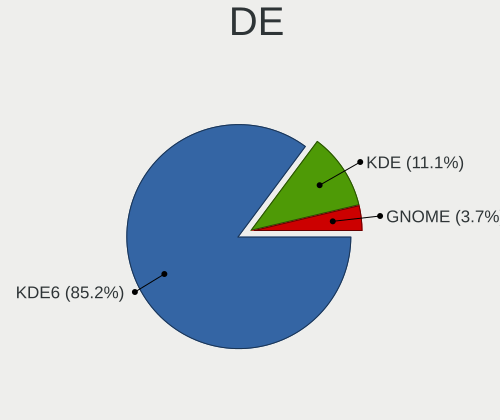

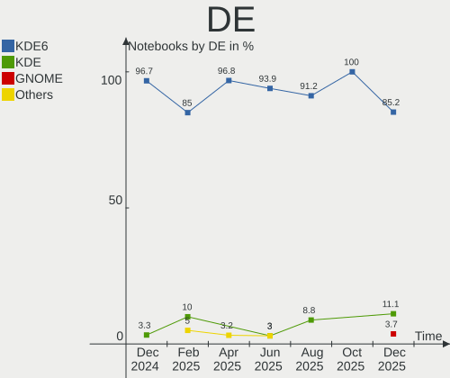

| Name  | Notebooks | Percent |
|-------|-----------|---------|
| KDE6  | 23        | 85.19%  |
| KDE   | 3         | 11.11%  |
| GNOME | 1         | 3.7%    |

Display Server
--------------

X11 or Wayland

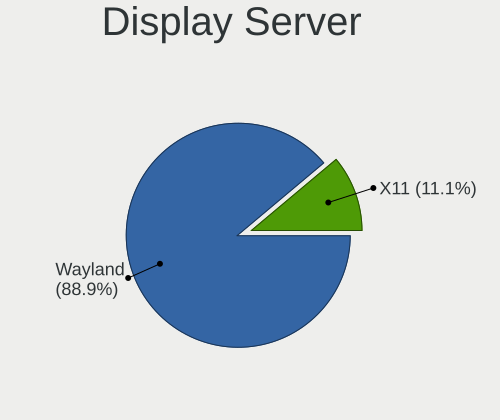

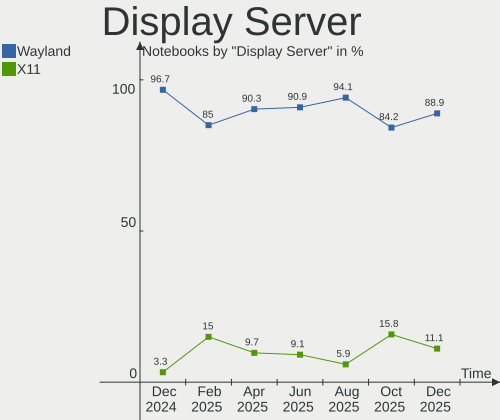

| Name    | Notebooks | Percent |
|---------|-----------|---------|
| Wayland | 24        | 88.89%  |
| X11     | 3         | 11.11%  |

Display Manager
---------------

SDDM, LightDM, etc.

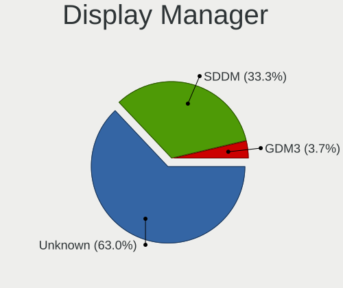

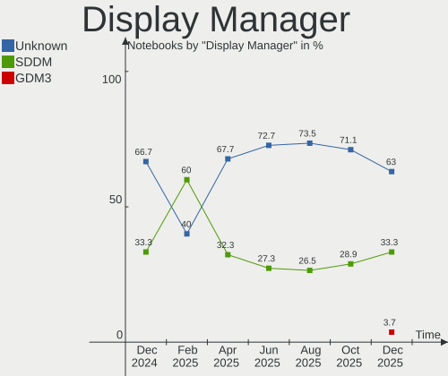

| Name    | Notebooks | Percent |
|---------|-----------|---------|
| Unknown | 17        | 62.96%  |
| SDDM    | 9         | 33.33%  |
| GDM3    | 1         | 3.7%    |

OS Lang
-------

Language

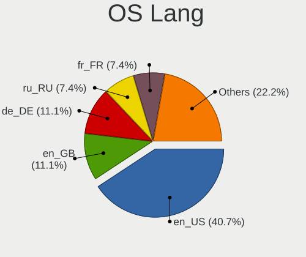

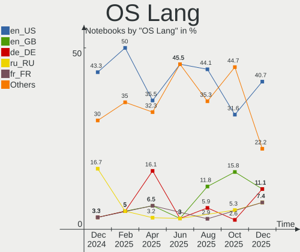

| Lang  | Notebooks | Percent |
|-------|-----------|---------|
| en_US | 11        | 40.74%  |
| en_GB | 3         | 11.11%  |
| de_DE | 3         | 11.11%  |
| ru_RU | 2         | 7.41%   |
| fr_FR | 2         | 7.41%   |
| pt_BR | 1         | 3.7%    |
| nn_NO | 1         | 3.7%    |
| et_EE | 1         | 3.7%    |
| es_MX | 1         | 3.7%    |
| es_ES | 1         | 3.7%    |
| C     | 1         | 3.7%    |

Boot Mode
---------

EFI or BIOS

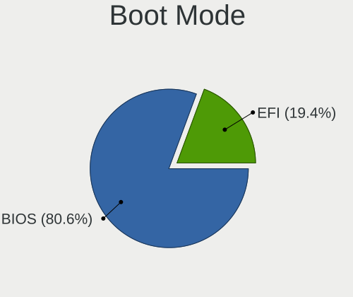

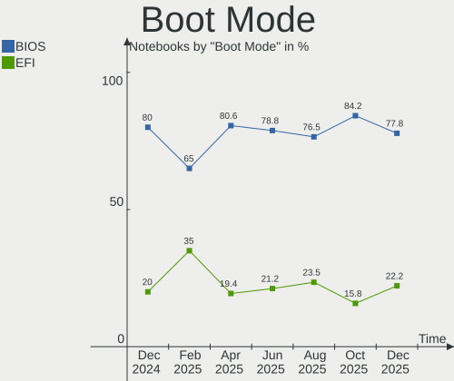

| Mode | Notebooks | Percent |
|------|-----------|---------|
| BIOS | 21        | 77.78%  |
| EFI  | 6         | 22.22%  |

Filesystem
----------

Type of filesystem

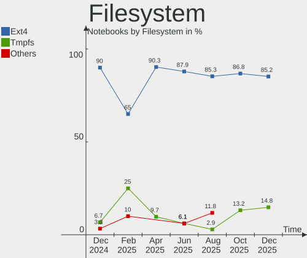

| Type  | Notebooks | Percent |
|-------|-----------|---------|
| Ext4  | 23        | 85.19%  |
| Tmpfs | 4         | 14.81%  |

Part. scheme
------------

Scheme of partitioning

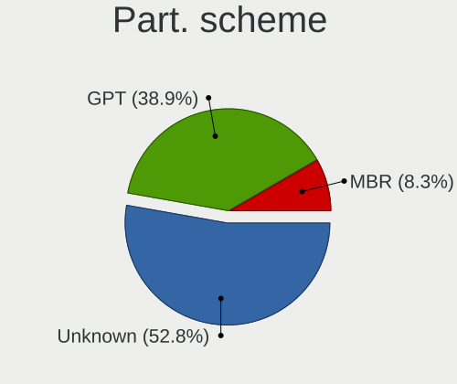

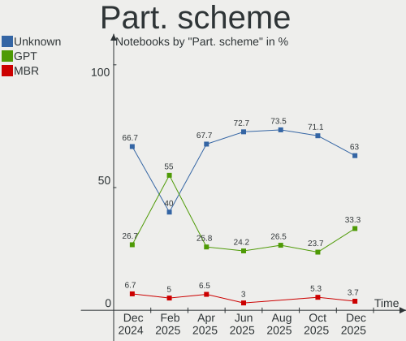

| Type    | Notebooks | Percent |
|---------|-----------|---------|
| Unknown | 17        | 62.96%  |
| GPT     | 9         | 33.33%  |
| MBR     | 1         | 3.7%    |

Dual Boot with Linux/BSD
------------------------

Hosting more than one Linux/BSD

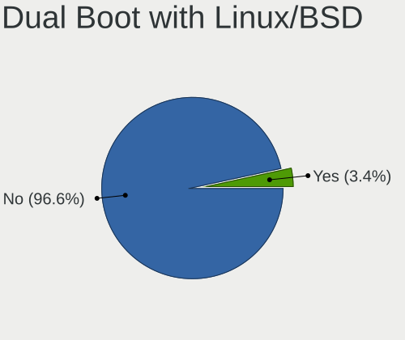

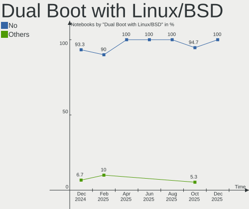

| Dual boot | Notebooks | Percent |
|-----------|-----------|---------|
| No        | 27        | 100%    |

Dual Boot (Win)
---------------

Hosting Linux and Windows

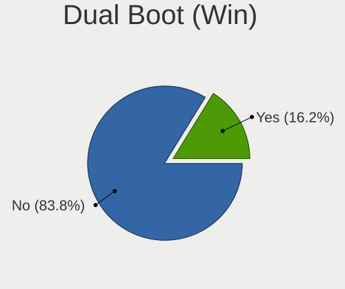

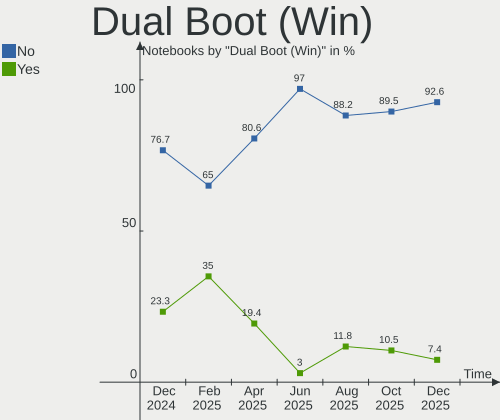

| Dual boot | Notebooks | Percent |
|-----------|-----------|---------|
| No        | 25        | 92.59%  |
| Yes       | 2         | 7.41%   |

Board
-----

Vendor
------

Motherboard manufacturer

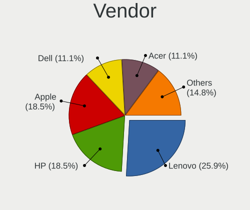

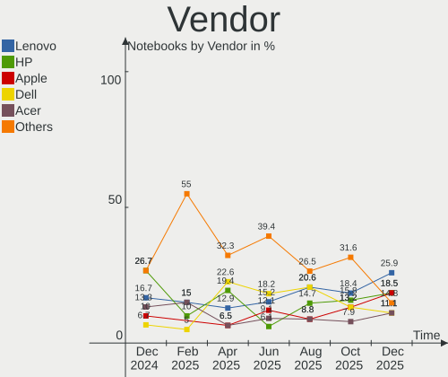

| Name             | Notebooks | Percent |
|------------------|-----------|---------|
| Lenovo           | 7         | 25.93%  |
| Hewlett-Packard  | 5         | 18.52%  |
| Apple            | 5         | 18.52%  |
| Dell             | 3         | 11.11%  |
| Acer             | 3         | 11.11%  |
| ASUSTek Computer | 2         | 7.41%   |
| Toshiba          | 1         | 3.7%    |
| IPASON           | 1         | 3.7%    |

Model
-----

Motherboard model

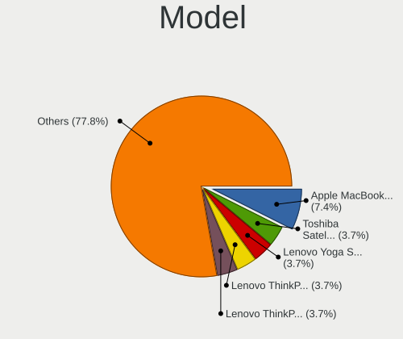

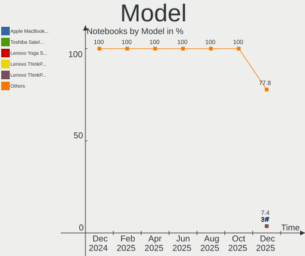

| Name                                     | Notebooks | Percent |
|------------------------------------------|-----------|---------|
| Apple MacBookAir6,2                      | 2         | 7.41%   |
| Toshiba Satellite C55-C                  | 1         | 3.7%    |
| Lenovo Yoga Slim 6 14IRH8 83E0           | 1         | 3.7%    |
| Lenovo ThinkPad X230 2320ENG             | 1         | 3.7%    |
| Lenovo ThinkPad X1 Carbon 4th 20FB003TGE | 1         | 3.7%    |
| Lenovo ThinkPad L580 20LXS45K00          | 1         | 3.7%    |
| Lenovo Legion 5 16IRX9 83DG              | 1         | 3.7%    |
| Lenovo Legion 5 15IMH05H 81Y6            | 1         | 3.7%    |
| Lenovo IdeaPad Slim 1-14AST-05 81VS      | 1         | 3.7%    |
| IPASON MaxBook P1 Pro                    | 1         | 3.7%    |
| HP Pavilion dv7                          | 1         | 3.7%    |
| HP Laptop 15s-fq5xxx                     | 1         | 3.7%    |
| HP Laptop 15-dw3xxx                      | 1         | 3.7%    |
| HP EliteBook 8460p                       | 1         | 3.7%    |
| HP 256R 15.6 inch G9 Notebook PC         | 1         | 3.7%    |
| Dell Precision M4800                     | 1         | 3.7%    |
| Dell Latitude E7440                      | 1         | 3.7%    |
| Dell Latitude 7370                       | 1         | 3.7%    |
| ASUS VivoBook_ASUSLaptop M1403QA_M1403QA | 1         | 3.7%    |
| ASUS Vivobook Go E1504FA_E1504FA         | 1         | 3.7%    |
| Apple MacBookPro9,2                      | 1         | 3.7%    |
| Apple MacBookPro14,1                     | 1         | 3.7%    |
| Apple MacBookAir9,1                      | 1         | 3.7%    |
| Acer Aspire ES1-520                      | 1         | 3.7%    |
| Acer Aspire A515-57                      | 1         | 3.7%    |
| Acer Aspire 4730Z                        | 1         | 3.7%    |

Model Family
------------

Motherboard model prefix

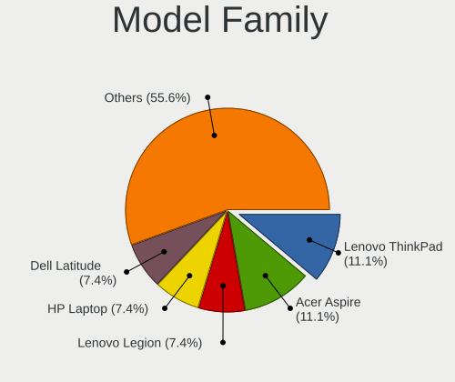

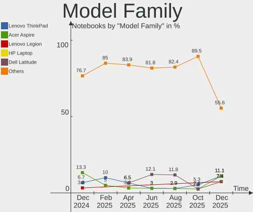

| Name               | Notebooks | Percent |
|--------------------|-----------|---------|
| Lenovo ThinkPad    | 3         | 11.11%  |
| Acer Aspire        | 3         | 11.11%  |
| Lenovo Legion      | 2         | 7.41%   |
| HP Laptop          | 2         | 7.41%   |
| Dell Latitude      | 2         | 7.41%   |
| ASUS Vivobook      | 2         | 7.41%   |
| Apple MacBookAir6  | 2         | 7.41%   |
| Toshiba Satellite  | 1         | 3.7%    |
| Lenovo Yoga        | 1         | 3.7%    |
| Lenovo IdeaPad     | 1         | 3.7%    |
| IPASON MaxBook     | 1         | 3.7%    |
| HP Pavilion        | 1         | 3.7%    |
| HP EliteBook       | 1         | 3.7%    |
| HP 256R            | 1         | 3.7%    |
| Dell Precision     | 1         | 3.7%    |
| Apple MacBookPro9  | 1         | 3.7%    |
| Apple MacBookPro14 | 1         | 3.7%    |
| Apple MacBookAir9  | 1         | 3.7%    |

MFG Year
--------

Motherboard manufacture year

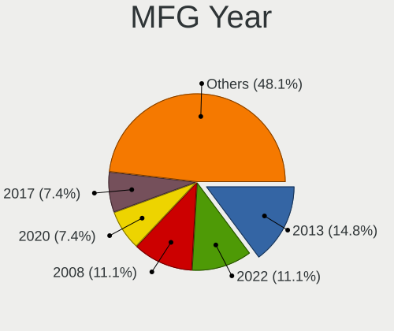

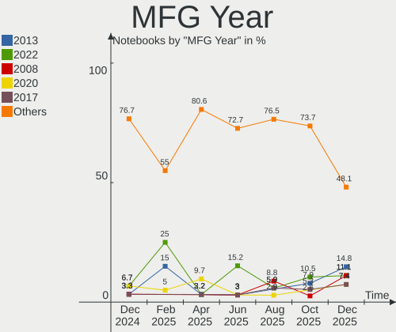

| Year | Notebooks | Percent |
|------|-----------|---------|
| 2013 | 4         | 14.81%  |
| 2022 | 3         | 11.11%  |
| 2008 | 3         | 11.11%  |
| 2020 | 2         | 7.41%   |
| 2017 | 2         | 7.41%   |
| 2016 | 2         | 7.41%   |
| 2015 | 2         | 7.41%   |
| 2025 | 1         | 3.7%    |
| 2024 | 1         | 3.7%    |
| 2023 | 1         | 3.7%    |
| 2021 | 1         | 3.7%    |
| 2019 | 1         | 3.7%    |
| 2018 | 1         | 3.7%    |
| 2012 | 1         | 3.7%    |
| 2011 | 1         | 3.7%    |
| 2007 | 1         | 3.7%    |

Form Factor
-----------

Physical design of the computer

| Name     | Notebooks | Percent |
|----------|-----------|---------|
| Notebook | 27        | 100%    |

Secure Boot
-----------

Enabled or disabled

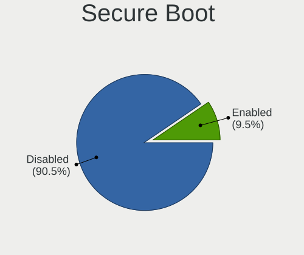

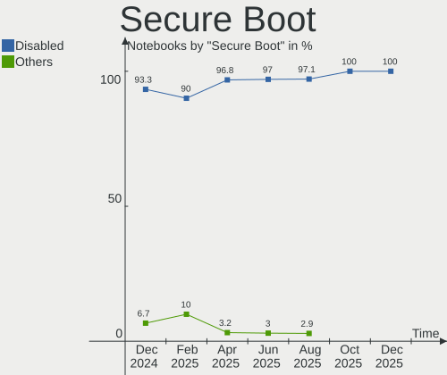

| State    | Notebooks | Percent |
|----------|-----------|---------|
| Disabled | 27        | 100%    |

Coreboot
--------

Have coreboot on board

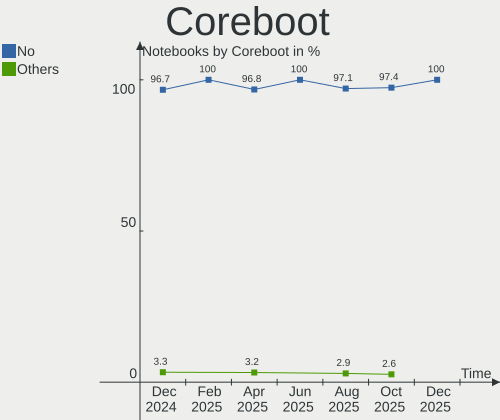

| Used | Notebooks | Percent |
|------|-----------|---------|
| No   | 27        | 100%    |

RAM Size
--------

Total RAM memory

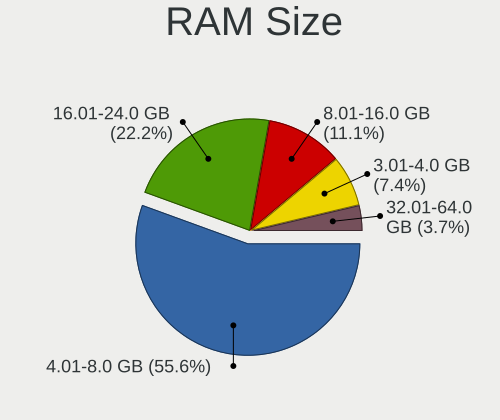

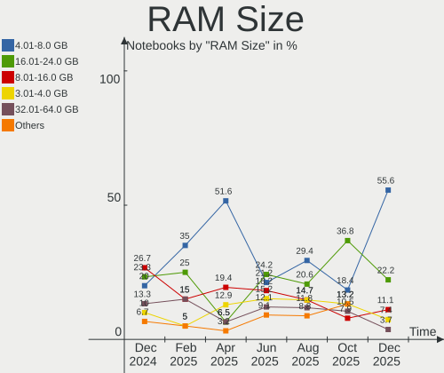

| Size in GB | Notebooks | Percent |
|------------|-----------|---------|
| 4.01-8.0   | 15        | 55.56%  |
| 16.01-24.0 | 6         | 22.22%  |
| 8.01-16.0  | 3         | 11.11%  |
| 3.01-4.0   | 2         | 7.41%   |
| 32.01-64.0 | 1         | 3.7%    |

RAM Used
--------

Used RAM memory

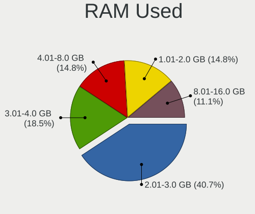

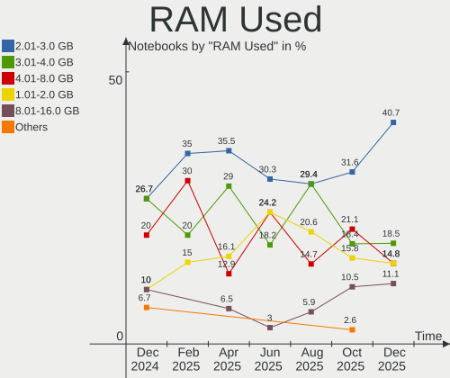

| Used GB   | Notebooks | Percent |
|-----------|-----------|---------|
| 2.01-3.0  | 11        | 40.74%  |
| 3.01-4.0  | 5         | 18.52%  |
| 4.01-8.0  | 4         | 14.81%  |
| 1.01-2.0  | 4         | 14.81%  |
| 8.01-16.0 | 3         | 11.11%  |

Total Drives
------------

Number of drives on board

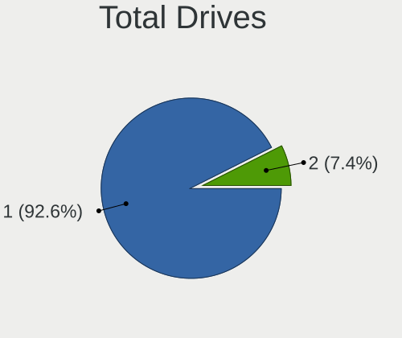

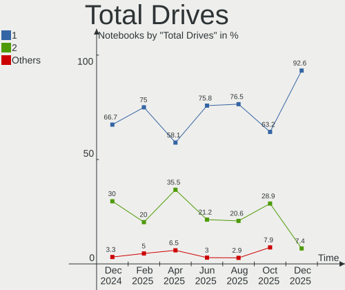

| Drives | Notebooks | Percent |
|--------|-----------|---------|
| 1      | 25        | 92.59%  |
| 2      | 2         | 7.41%   |

Has CD-ROM
----------

Has CD-ROM on board

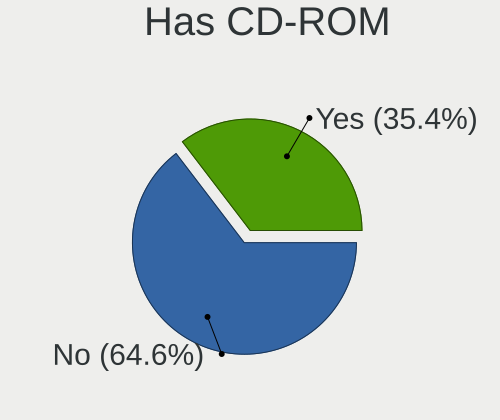

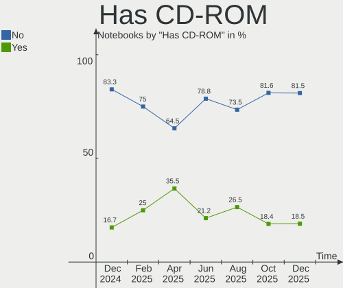

| Presented | Notebooks | Percent |
|-----------|-----------|---------|
| No        | 22        | 81.48%  |
| Yes       | 5         | 18.52%  |

Has Ethernet
------------

Has Ethernet on board

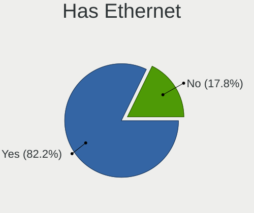

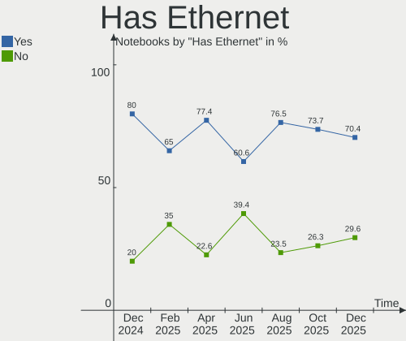

| Presented | Notebooks | Percent |
|-----------|-----------|---------|
| Yes       | 19        | 70.37%  |
| No        | 8         | 29.63%  |

Has WiFi
--------

Has WiFi module

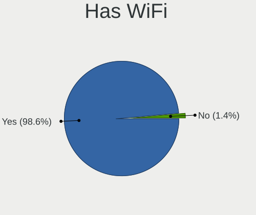

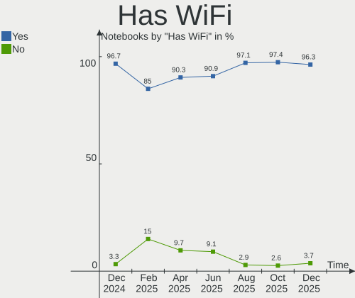

| Presented | Notebooks | Percent |
|-----------|-----------|---------|
| Yes       | 26        | 96.3%   |
| No        | 1         | 3.7%    |

Has Bluetooth
-------------

Has Bluetooth module

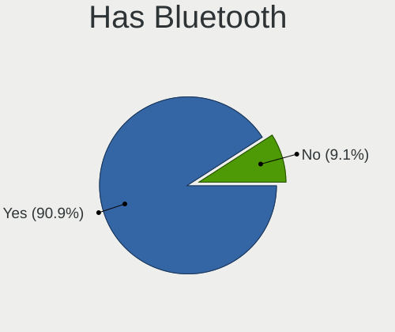

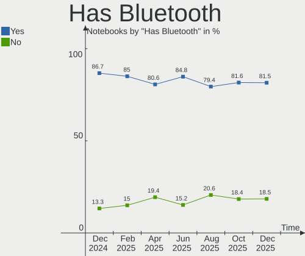

| Presented | Notebooks | Percent |
|-----------|-----------|---------|
| Yes       | 22        | 81.48%  |
| No        | 5         | 18.52%  |

Location
--------

Country
-------

Geographic location (country)

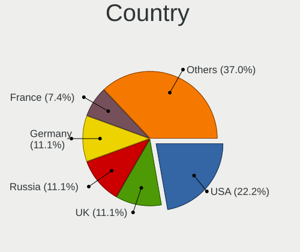

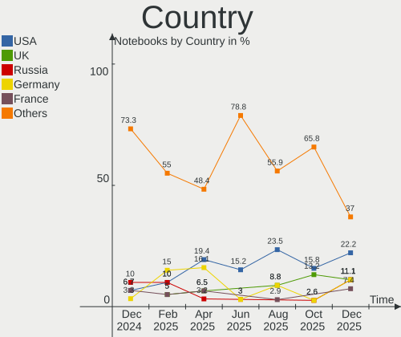

| Country      | Notebooks | Percent |
|--------------|-----------|---------|
| USA          | 6         | 22.22%  |
| UK           | 3         | 11.11%  |
| Russia       | 3         | 11.11%  |
| Germany      | 3         | 11.11%  |
| France       | 2         | 7.41%   |
| Spain        | 1         | 3.7%    |
| Saudi Arabia | 1         | 3.7%    |
| Romania      | 1         | 3.7%    |
| Norway       | 1         | 3.7%    |
| Netherlands  | 1         | 3.7%    |
| Indonesia    | 1         | 3.7%    |
| Estonia      | 1         | 3.7%    |
| Czechia      | 1         | 3.7%    |
| Colombia     | 1         | 3.7%    |
| Brazil       | 1         | 3.7%    |

City
----

Geographic location (city)

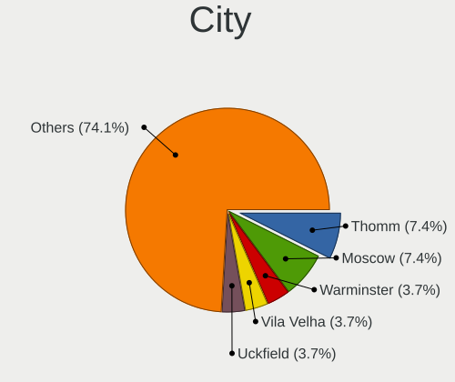

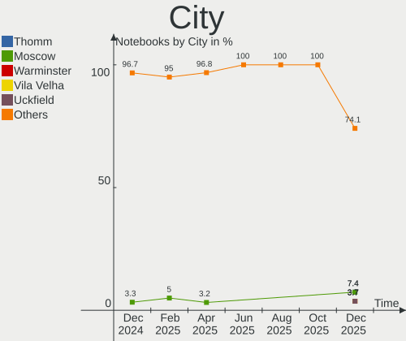

| City             | Notebooks | Percent |
|------------------|-----------|---------|
| Thomm            | 2         | 7.41%   |
| Moscow           | 2         | 7.41%   |
| Warminster       | 1         | 3.7%    |
| Vila Velha       | 1         | 3.7%    |
| Uckfield         | 1         | 3.7%    |
| Tallinn          | 1         | 3.7%    |
| Springfield      | 1         | 3.7%    |
| Salt Lake City   | 1         | 3.7%    |
| Rosny-sous-Bois  | 1         | 3.7%    |
| Rosmalen         | 1         | 3.7%    |
| Prague           | 1         | 3.7%    |
| Paris            | 1         | 3.7%    |
| Ochtrup          | 1         | 3.7%    |
| Northampton      | 1         | 3.7%    |
| Mranggen         | 1         | 3.7%    |
| League City      | 1         | 3.7%    |
| Jeddah           | 1         | 3.7%    |
| Greeneville      | 1         | 3.7%    |
| Everett          | 1         | 3.7%    |
| Collado Villalba | 1         | 3.7%    |
| Cherepovets      | 1         | 3.7%    |
| Bogotá          | 1         | 3.7%    |
| Bexley           | 1         | 3.7%    |
| Bergen           | 1         | 3.7%    |
| Arad             | 1         | 3.7%    |

Drives
------

Drive Vendor
------------

Hard drive vendors

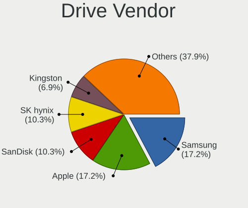

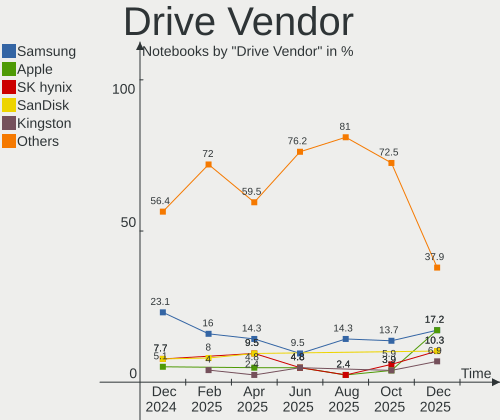

| Vendor              | Notebooks | Drives  | Percent |
|---------------------|-----------|---------|---------|
| Samsung Electronics | 5         | 5       | 17.24%  |
| Apple               | 5         | 6       | 17.24%  |
| SK hynix            | 3         | 3       | 10.34%  |
| SanDisk             | 3         | 3       | 10.34%  |
| Kingston            | 2         | 2       | 6.9%    |
| ADATA Technology    | 2         | 2       | 6.9%    |
| WDC                 | 1         | 1       | 3.45%   |
| Unknown             | 1         | 1       | 3.45%   |
| Seagate             | 1         | 1       | 3.45%   |
| Patriot             | 1         | 1       | 3.45%   |
| Micron Technology   | 1         | 1       | 3.45%   |
| LITEON              | 1         | 1       | 3.45%   |
| Hitachi             | 1         | 1       | 3.45%   |
| Hewlett-Packard     | 1         | Unknown | 3.45%   |
| A-DATA Technology   | 1         | 1       | 3.45%   |

Drive Model
-----------

Hard drive models

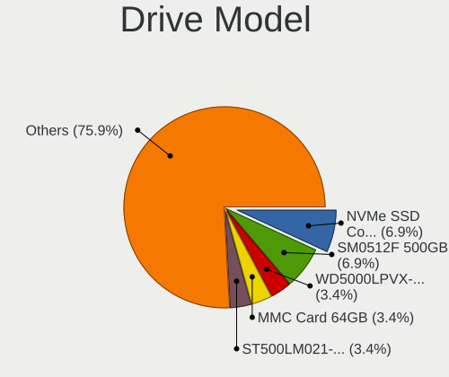

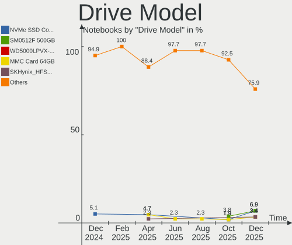

| Model                                                              | Notebooks | Percent |
|--------------------------------------------------------------------|-----------|---------|
| Samsung NVMe SSD Controller SM981/PM981/PM983 1TB                  | 2         | 6.9%    |
| Apple SSD SM0512F 500GB                                            | 2         | 6.9%    |
| WDC WD5000LPVX-22V0TT0 500GB                                       | 1         | 3.45%   |
| Unknown MMC Card  64GB                                             | 1         | 3.45%   |
| SK hynix SKHynix_HFS512GEJ4X112N 512GB                             | 1         | 3.45%   |
| SK hynix SKHynix_HFS001TEJ9X115N 1024GB                            | 1         | 3.45%   |
| SK hynix BC511 512GB                                               | 1         | 3.45%   |
| Seagate ST500LM021-1KJ152 500GB                                    | 1         | 3.45%   |
| Sandisk WD Blue SN580 1TB                                          | 1         | 3.45%   |
| SanDisk NVMe SSD Drive 256GB                                       | 1         | 3.45%   |
| SanDisk A400 NVMe 256GB                                            | 1         | 3.45%   |
| Samsung SSD PM851 mSATA 128GB                                      | 1         | 3.45%   |
| Samsung SSD 870 QVO 2TB                                            | 1         | 3.45%   |
| Samsung MZVL4512HBLU-00BTW 512GB                                   | 1         | 3.45%   |
| Patriot Burst 120GB SSD                                            | 1         | 3.45%   |
| Micron 2450_MTFDKBA1T0TFK 1TB                                      | 1         | 3.45%   |
| LITEON L8H-256V2G 256GB SSD                                        | 1         | 3.45%   |
| Kingston SHFS37A240G 240GB SSD                                     | 1         | 3.45%   |
| Kingston SA400S37240G 240GB SSD                                    | 1         | 3.45%   |
| Hitachi HTS547575A9E384 752GB                                      | 1         | 3.45%   |
| HP BD E DS6E2LH 1GB                                                | 1         | 3.45%   |
| Apple S3X NVMe Controller 256GB                                    | 1         | 3.45%   |
| Apple HDD HTS545050A7E362 500GB                                    | 1         | 3.45%   |
| Apple ANS2 NVMe Controller 4TB                                     | 1         | 3.45%   |
| ADATA XPG SX8200 Pro PCIe Gen3x4 M.2 2280 Solid State Drive 1024GB | 1         | 3.45%   |
| ADATA SM2P41C8-256GC7 256GB                                        | 1         | 3.45%   |
| A-DATA SU650 256GB SSD                                             | 1         | 3.45%   |

HDD Vendor
----------

Hard disk drive vendors

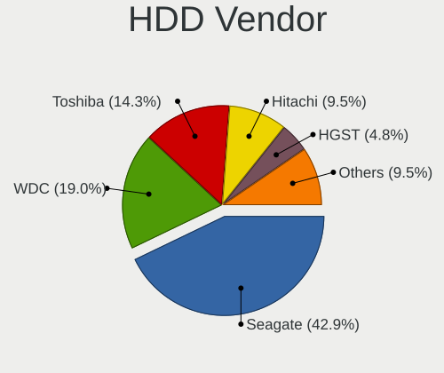

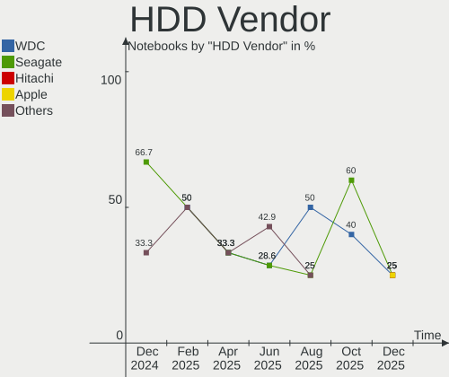

| Vendor  | Notebooks | Drives | Percent |
|---------|-----------|--------|---------|
| WDC     | 1         | 1      | 25%     |
| Seagate | 1         | 1      | 25%     |
| Hitachi | 1         | 1      | 25%     |
| Apple   | 1         | 1      | 25%     |

SSD Vendor
----------

Solid state drive vendors

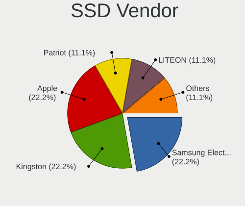

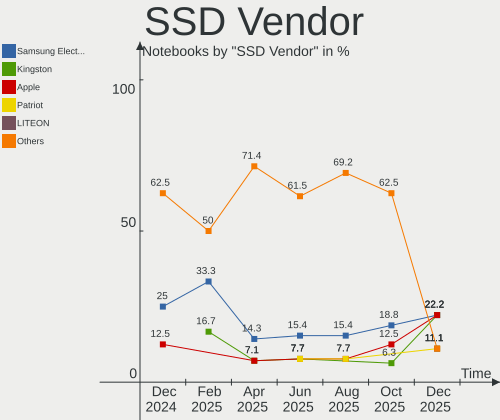

| Vendor              | Notebooks | Drives | Percent |
|---------------------|-----------|--------|---------|
| Samsung Electronics | 2         | 2      | 22.22%  |
| Kingston            | 2         | 2      | 22.22%  |
| Apple               | 2         | 2      | 22.22%  |
| Patriot             | 1         | 1      | 11.11%  |
| LITEON              | 1         | 1      | 11.11%  |
| A-DATA Technology   | 1         | 1      | 11.11%  |

Drive Kind
----------

HDD or SSD

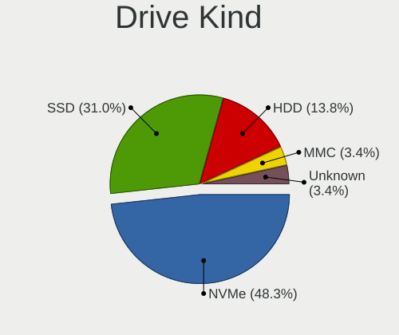

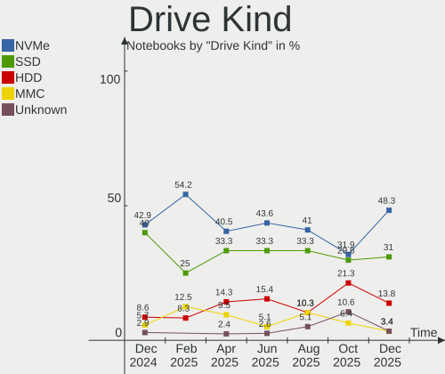

| Kind    | Notebooks | Drives  | Percent |
|---------|-----------|---------|---------|
| NVMe    | 14        | 15      | 48.28%  |
| SSD     | 9         | 9       | 31.03%  |
| HDD     | 4         | 4       | 13.79%  |
| MMC     | 1         | 1       | 3.45%   |
| Unknown | 1         | Unknown | 3.45%   |

Drive Connector
---------------

SATA, SAS, NVMe, etc.

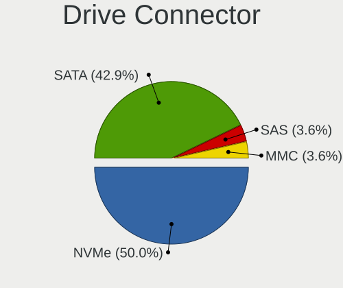

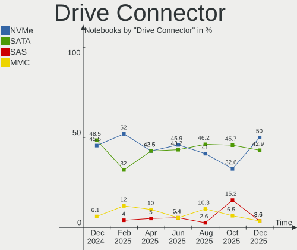

| Type | Notebooks | Drives  | Percent |
|------|-----------|---------|---------|
| NVMe | 14        | 15      | 50%     |
| SATA | 12        | 13      | 42.86%  |
| SAS  | 1         | Unknown | 3.57%   |
| MMC  | 1         | 1       | 3.57%   |

Drive Size
----------

Size of hard drive

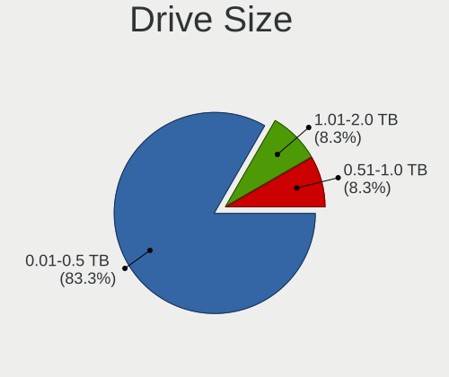

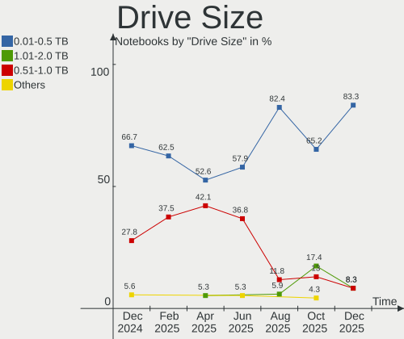

| Size in TB | Notebooks | Drives | Percent |
|------------|-----------|--------|---------|
| 0.01-0.5   | 10        | 11     | 83.33%  |
| 1.01-2.0   | 1         | 1      | 8.33%   |
| 0.51-1.0   | 1         | 1      | 8.33%   |

Space Total
-----------

Amount of disk space available on the file system

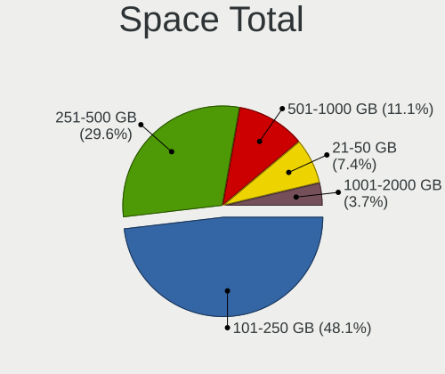

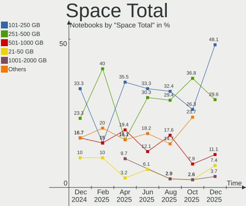

| Size in GB | Notebooks | Percent |
|------------|-----------|---------|
| 101-250    | 13        | 48.15%  |
| 251-500    | 8         | 29.63%  |
| 501-1000   | 3         | 11.11%  |
| 21-50      | 2         | 7.41%   |
| 1001-2000  | 1         | 3.7%    |

Space Used
----------

Amount of used disk space

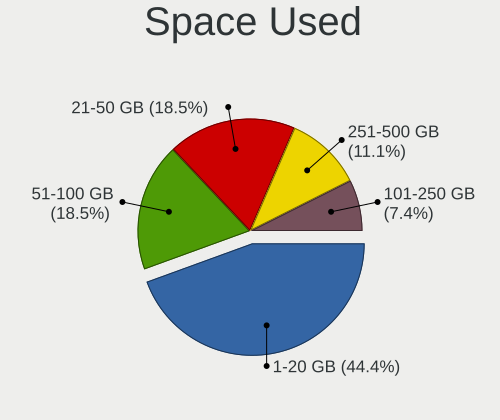

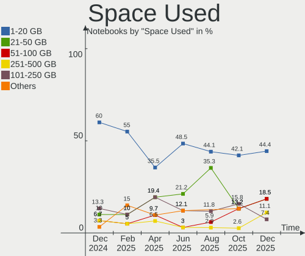

| Used GB | Notebooks | Percent |
|---------|-----------|---------|
| 1-20    | 12        | 44.44%  |
| 21-50   | 5         | 18.52%  |
| 51-100  | 5         | 18.52%  |
| 251-500 | 3         | 11.11%  |
| 101-250 | 2         | 7.41%   |

Malfunc. Drives
---------------

Drive models with a malfunction

Zero info for selected period =(

Malfunc. Drive Vendor
---------------------

Vendors of faulty drives

Zero info for selected period =(

Malfunc. HDD Vendor
-------------------

Vendors of faulty HDD drives

Zero info for selected period =(

Malfunc. Drive Kind
-------------------

Kinds of faulty drives

Zero info for selected period =(

Failed Drives
-------------

Failed drive models

Zero info for selected period =(

Failed Drive Vendor
-------------------

Failed drive vendors

Zero info for selected period =(

Drive Status
------------

Number of failed and malfunc. drives

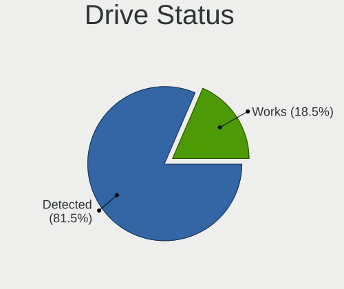

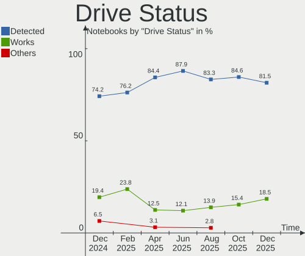

| Status   | Notebooks | Drives | Percent |
|----------|-----------|--------|---------|
| Detected | 22        | 24     | 81.48%  |
| Works    | 5         | 5      | 18.52%  |

Storage controller
------------------

Storage Vendor
--------------

Storage controller vendors

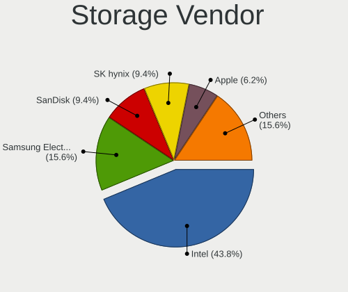

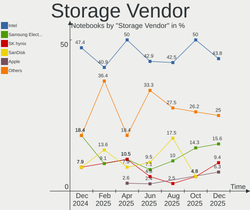

| Vendor              | Notebooks | Percent |
|---------------------|-----------|---------|
| Intel               | 14        | 43.75%  |
| Samsung Electronics | 5         | 15.63%  |
| SK hynix            | 3         | 9.38%   |
| SanDisk             | 3         | 9.38%   |
| Apple               | 2         | 6.25%   |
| AMD                 | 2         | 6.25%   |
| ADATA Technology    | 2         | 6.25%   |
| Micron Technology   | 1         | 3.13%   |

Storage Model
-------------

Storage controller models

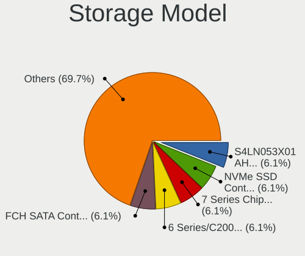

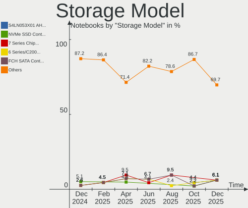

| Model                                                                          | Notebooks | Percent |
|--------------------------------------------------------------------------------|-----------|---------|
| Samsung S4LN053X01 AHCI SSD Controller(Apple slot)                             | 2         | 6.06%   |
| Samsung NVMe SSD Controller SM981/PM981/PM983                                  | 2         | 6.06%   |
| Intel 7 Series Chipset Family 6-port SATA Controller [AHCI mode]               | 2         | 6.06%   |
| Intel 6 Series/C200 Series Chipset Family 6 port Mobile SATA AHCI Controller   | 2         | 6.06%   |
| AMD FCH SATA Controller [AHCI mode]                                            | 2         | 6.06%   |
| SK hynix Platinum P41/PC801 NVMe Solid State Drive                             | 1         | 3.03%   |
| SK hynix BC901 NVMe Solid State Drive (DRAM-less)                              | 1         | 3.03%   |
| SK hynix BC511 NVMe SSD                                                        | 1         | 3.03%   |
| SanDisk WD SN560/SN740/SN770/SN5000 NVMe SSD                                   | 1         | 3.03%   |
| Sandisk WD Blue SN580 NVMe SSD (DRAM-less)                                     | 1         | 3.03%   |
| SanDisk WD Black NVMe SSD                                                      | 1         | 3.03%   |
| Samsung NVMe SSD Controller PM9B1 (DRAM-less)                                  | 1         | 3.03%   |
| Micron 2450 NVMe SSD [HendrixV] (DRAM-less)                                    | 1         | 3.03%   |
| Intel Wildcat Point-LP SATA Controller [AHCI Mode]                             | 1         | 3.03%   |
| Intel Volume Management Device NVMe RAID Controller                            | 1         | 3.03%   |
| Intel Tiger Lake-LP SATA Controller                                            | 1         | 3.03%   |
| Intel Sunrise Point-LP SATA Controller [AHCI mode]                             | 1         | 3.03%   |
| Intel SATA controller                                                          | 1         | 3.03%   |
| Intel Cannon Point-LP SATA Controller [AHCI Mode]                              | 1         | 3.03%   |
| Intel Alder Lake-P SATA AHCI Controller                                        | 1         | 3.03%   |
| Intel 82801IBM/IEM (ICH9M/ICH9M-E) 4 port SATA Controller [AHCI mode]          | 1         | 3.03%   |
| Intel 82801 Mobile SATA Controller [RAID mode]                                 | 1         | 3.03%   |
| Intel 8 Series/C220 Series Chipset Family 6-port SATA Controller 1 [AHCI mode] | 1         | 3.03%   |
| Intel 400 Series Chipset Family SATA AHCI Controller                           | 1         | 3.03%   |
| Apple S3X NVMe Controller                                                      | 1         | 3.03%   |
| Apple ANS2 NVMe Controller                                                     | 1         | 3.03%   |
| ADATA XPG SX8200 Pro PCIe Gen3x4 M.2 2280 Solid State Drive                    | 1         | 3.03%   |
| ADATA SM2P41C8 NVMe SSD (DRAM-less)                                            | 1         | 3.03%   |

Storage Kind
------------

Kind of storage controller (IDE, SATA, NVMe, SAS, ...)

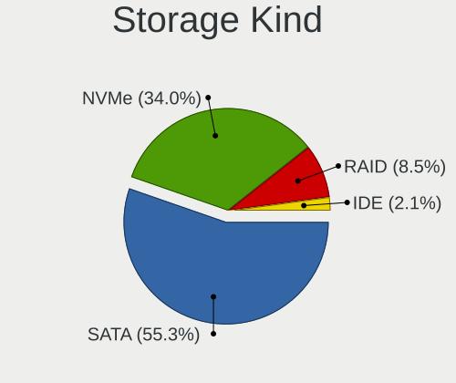

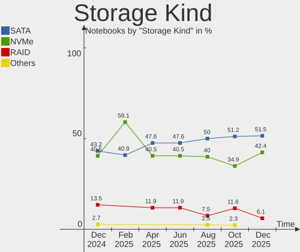

| Kind | Notebooks | Percent |
|------|-----------|---------|
| SATA | 17        | 51.52%  |
| NVMe | 14        | 42.42%  |
| RAID | 2         | 6.06%   |

Processor
---------

CPU Vendor
----------

Processor vendors

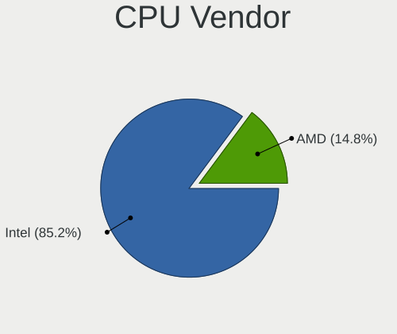

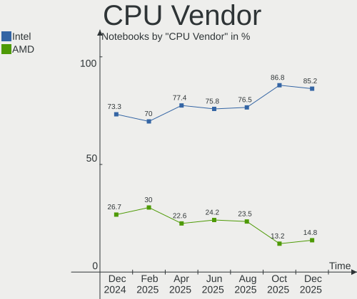

| Vendor | Notebooks | Percent |
|--------|-----------|---------|
| Intel  | 23        | 85.19%  |
| AMD    | 4         | 14.81%  |

CPU Model
---------

Processor models

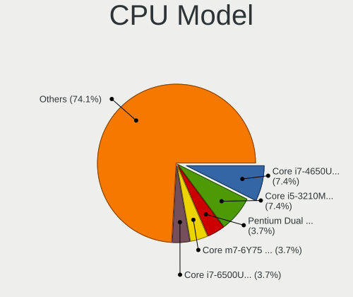

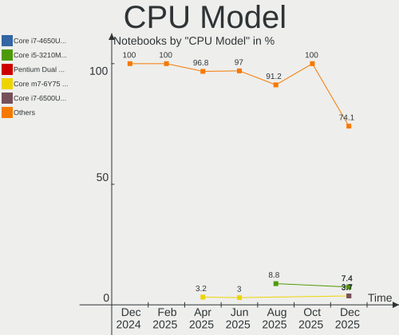

| Model                                         | Notebooks | Percent |
|-----------------------------------------------|-----------|---------|
| Intel Core i7-4650U CPU @ 1.70GHz             | 2         | 7.41%   |
| Intel Core i5-3210M CPU @ 2.50GHz             | 2         | 7.41%   |
| Intel Pentium Dual CPU T3400 @ 2.16GHz        | 1         | 3.7%    |
| Intel Core m7-6Y75 CPU @ 1.20GHz              | 1         | 3.7%    |
| Intel Core i7-6500U CPU @ 2.50GHz             | 1         | 3.7%    |
| Intel Core i7-4810MQ CPU @ 2.80GHz            | 1         | 3.7%    |
| Intel Core i7-14650HX                         | 1         | 3.7%    |
| Intel Core i7-10750H CPU @ 2.60GHz            | 1         | 3.7%    |
| Intel Core i7-1060NG7 CPU @ 1.20GHz           | 1         | 3.7%    |
| Intel Core i5-8259U CPU @ 2.30GHz             | 1         | 3.7%    |
| Intel Core i5-8250U CPU @ 1.60GHz             | 1         | 3.7%    |
| Intel Core i5-7360U CPU @ 2.30GHz             | 1         | 3.7%    |
| Intel Core i5-4310U CPU @ 2.00GHz             | 1         | 3.7%    |
| Intel Core i5-2450M CPU @ 2.50GHz             | 1         | 3.7%    |
| Intel Core i5-2410M CPU @ 2.30GHz             | 1         | 3.7%    |
| Intel Core i3-5005U CPU @ 2.00GHz             | 1         | 3.7%    |
| Intel 13th Gen Core i5-13500H                 | 1         | 3.7%    |
| Intel 13th Gen Core i5-1334U                  | 1         | 3.7%    |
| Intel 12th Gen Core i7-12650H                 | 1         | 3.7%    |
| Intel 12th Gen Core i5-1235U                  | 1         | 3.7%    |
| Intel 11th Gen Core i5-1135G7 @ 2.40GHz       | 1         | 3.7%    |
| AMD Ryzen 5 7520U with Radeon Graphics        | 1         | 3.7%    |
| AMD Ryzen 5 5600H with Radeon Graphics        | 1         | 3.7%    |
| AMD E1-2500 APU with Radeon HD Graphics       | 1         | 3.7%    |
| AMD A6-9220e RADEON R4, 5 COMPUTE CORES 2C+3G | 1         | 3.7%    |

CPU Model Family
----------------

Processor model prefix

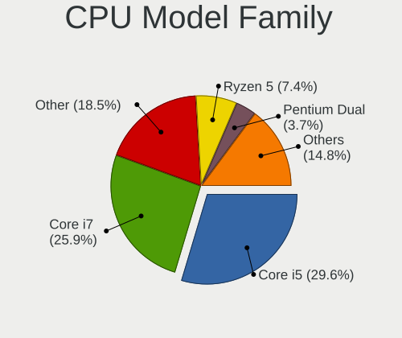

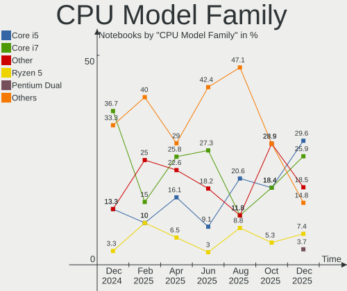

| Model              | Notebooks | Percent |
|--------------------|-----------|---------|
| Intel Core i5      | 8         | 29.63%  |
| Intel Core i7      | 7         | 25.93%  |
| Other              | 5         | 18.52%  |
| AMD Ryzen 5        | 2         | 7.41%   |
| Intel Pentium Dual | 1         | 3.7%    |
| Intel Core m7      | 1         | 3.7%    |
| Intel Core i3      | 1         | 3.7%    |
| AMD E1             | 1         | 3.7%    |
| AMD A6             | 1         | 3.7%    |

CPU Cores
---------

Number of processor cores

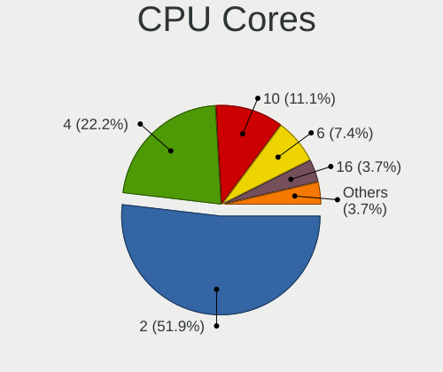

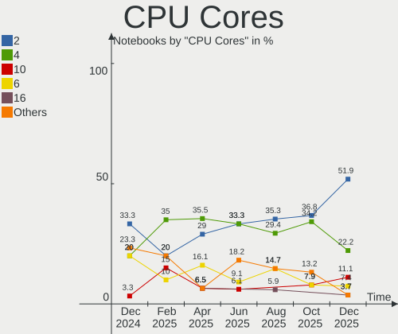

| Number | Notebooks | Percent |
|--------|-----------|---------|
| 2      | 14        | 51.85%  |
| 4      | 6         | 22.22%  |
| 10     | 3         | 11.11%  |
| 6      | 2         | 7.41%   |
| 16     | 1         | 3.7%    |
| 12     | 1         | 3.7%    |

CPU Sockets
-----------

Number of sockets

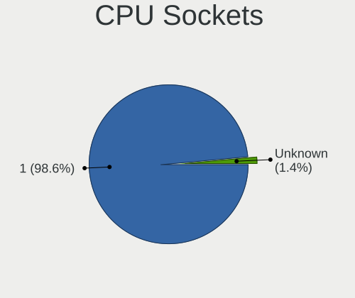

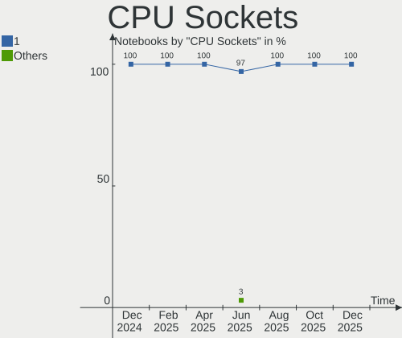

| Number | Notebooks | Percent |
|--------|-----------|---------|
| 1      | 27        | 100%    |

CPU Threads
-----------

Threads per core (Hyper-Threading)

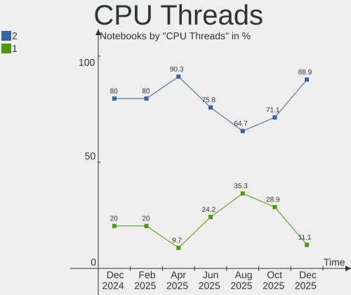

| Number | Notebooks | Percent |
|--------|-----------|---------|
| 2      | 24        | 88.89%  |
| 1      | 3         | 11.11%  |

CPU Op-Modes
------------

CPU Operation Modes (32-bit, 64-bit)

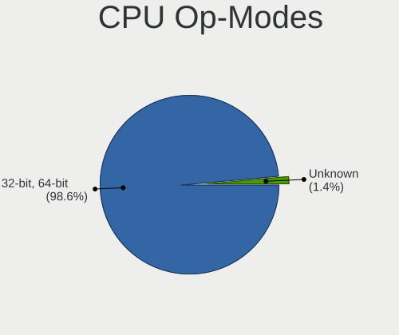

| Op mode        | Notebooks | Percent |
|----------------|-----------|---------|
| 32-bit, 64-bit | 27        | 100%    |

CPU Microcode
-------------

Microcode number

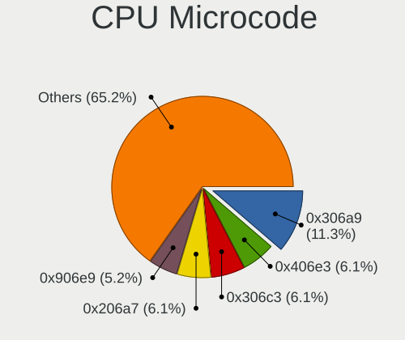

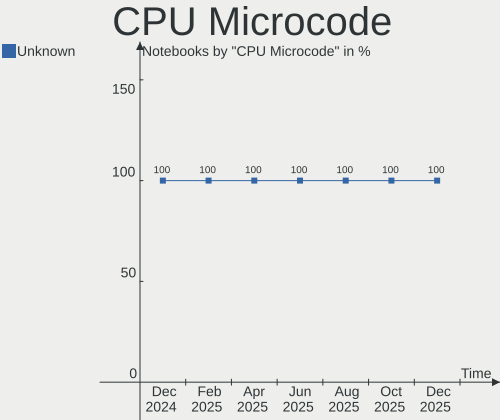

| Number  | Notebooks | Percent |
|---------|-----------|---------|
| Unknown | 27        | 100%    |

CPU Microarch
-------------

Microarchitecture

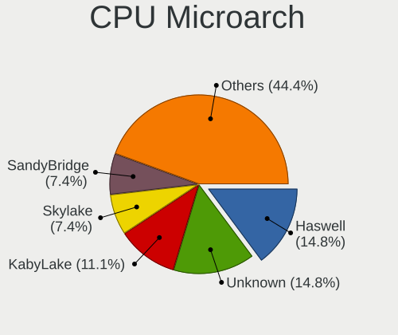

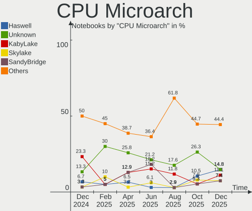

| Name             | Notebooks | Percent |
|------------------|-----------|---------|
| Haswell          | 4         | 14.81%  |
| Unknown          | 4         | 14.81%  |
| KabyLake         | 3         | 11.11%  |
| Skylake          | 2         | 7.41%   |
| SandyBridge      | 2         | 7.41%   |
| IvyBridge        | 2         | 7.41%   |
| Alderlake Hybrid | 2         | 7.41%   |
| Zen 3            | 1         | 3.7%    |
| TigerLake        | 1         | 3.7%    |
| Jaguar           | 1         | 3.7%    |
| IceLake          | 1         | 3.7%    |
| Excavator        | 1         | 3.7%    |
| Core             | 1         | 3.7%    |
| CometLake        | 1         | 3.7%    |
| Broadwell        | 1         | 3.7%    |

Graphics
--------

GPU Vendor
----------

Vendors of graphics cards

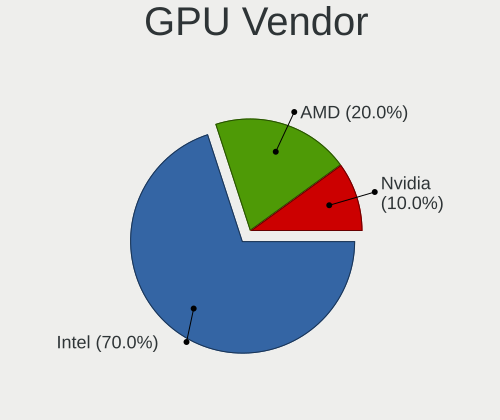

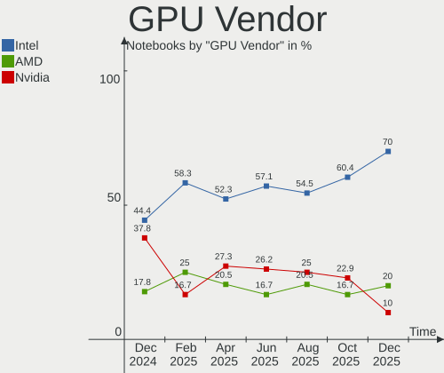

| Vendor | Notebooks | Percent |
|--------|-----------|---------|
| Intel  | 21        | 70%     |
| AMD    | 6         | 20%     |
| Nvidia | 3         | 10%     |

GPU Model
---------

Graphics card models

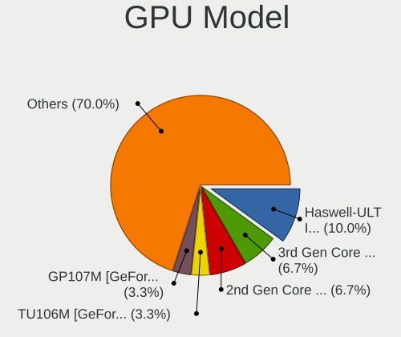

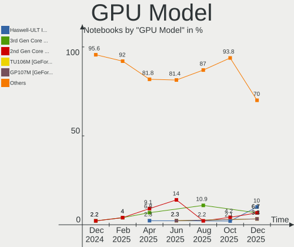

| Model                                                                     | Notebooks | Percent |
|---------------------------------------------------------------------------|-----------|---------|
| Intel Haswell-ULT Integrated Graphics Controller                          | 3         | 10%     |
| Intel 3rd Gen Core processor Graphics Controller                          | 2         | 6.67%   |
| Intel 2nd Generation Core Processor Family Integrated Graphics Controller | 2         | 6.67%   |
| Nvidia TU106M [GeForce RTX 2060 Mobile]                                   | 1         | 3.33%   |
| Nvidia GP107M [GeForce MX350]                                             | 1         | 3.33%   |
| Nvidia AD107M [GeForce RTX 4060 Max-Q / Mobile]                           | 1         | 3.33%   |
| Intel TigerLake-LP GT2 [Iris Xe Graphics]                                 | 1         | 3.33%   |
| Intel Skylake-Y GT2 [HD Graphics 515]                                     | 1         | 3.33%   |
| Intel Skylake-U GT2 [HD Graphics 520]                                     | 1         | 3.33%   |
| Intel Raptor Lake-S UHD Graphics                                          | 1         | 3.33%   |
| Intel Raptor Lake-P [UHD Graphics]                                        | 1         | 3.33%   |
| Intel Raptor Lake-P [Iris Xe Graphics]                                    | 1         | 3.33%   |
| Intel Mobile 4 Series Chipset Integrated Graphics Controller              | 1         | 3.33%   |
| Intel Kaby Lake-U GT3 [Iris Plus Graphics 640]                            | 1         | 3.33%   |
| Intel Kaby Lake-R GT2 [UHD Graphics 620]                                  | 1         | 3.33%   |
| Intel Iris Plus Graphics G7 (Ice Lake)                                    | 1         | 3.33%   |
| Intel CoffeeLake-U GT3e [Iris Plus Graphics 655]                          | 1         | 3.33%   |
| Intel Broadwell-U GT2 [HD Graphics 5500]                                  | 1         | 3.33%   |
| Intel Alder Lake-UP3 GT2 [Iris Xe Graphics]                               | 1         | 3.33%   |
| Intel Alder Lake-P GT1 [UHD Graphics]                                     | 1         | 3.33%   |
| AMD Venus XT [Radeon HD 8870M / R9 M270X/M370X]                           | 1         | 3.33%   |
| AMD Stoney [Radeon R2/R3/R4/R5 Graphics]                                  | 1         | 3.33%   |
| AMD Seymour [Radeon HD 6400M/7400M Series]                                | 1         | 3.33%   |
| AMD Mendocino [Radeon 610M]                                               | 1         | 3.33%   |
| AMD Kabini [Radeon HD 8240 / R3 Series]                                   | 1         | 3.33%   |
| AMD Cezanne [Radeon Vega Series / Radeon Vega Mobile Series]              | 1         | 3.33%   |

GPU Combo
---------

Combinations of graphics cards

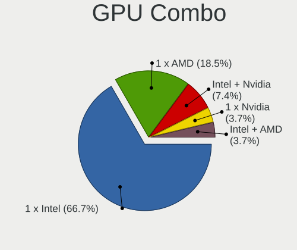

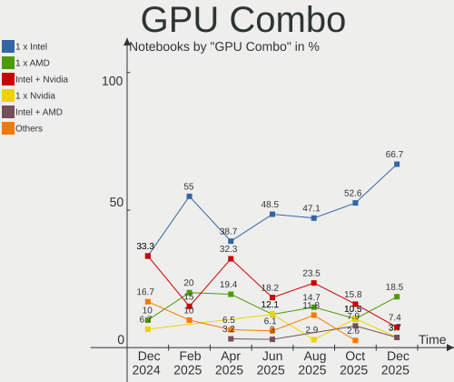

| Name           | Notebooks | Percent |
|----------------|-----------|---------|
| 1 x Intel      | 18        | 66.67%  |
| 1 x AMD        | 5         | 18.52%  |
| Intel + Nvidia | 2         | 7.41%   |
| 1 x Nvidia     | 1         | 3.7%    |
| Intel + AMD    | 1         | 3.7%    |

GPU Driver
----------

Free vs proprietary

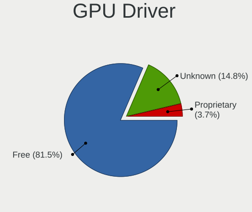

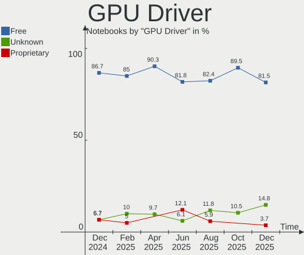

| Driver      | Notebooks | Percent |
|-------------|-----------|---------|
| Free        | 22        | 81.48%  |
| Unknown     | 4         | 14.81%  |
| Proprietary | 1         | 3.7%    |

GPU Memory
----------

Total video memory

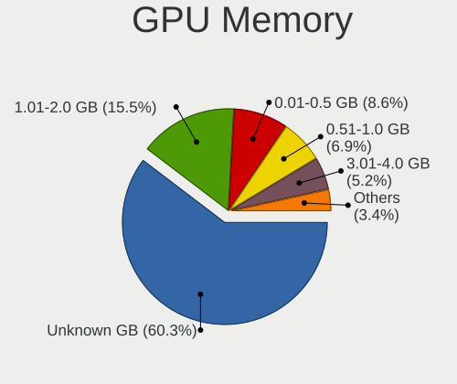

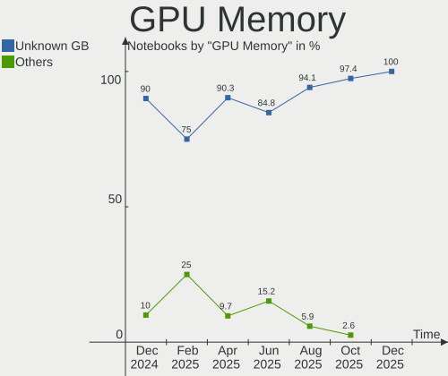

| Size in GB | Notebooks | Percent |
|------------|-----------|---------|
| Unknown    | 27        | 100%    |

Monitor
-------

Monitor Vendor
--------------

Monitor vendors

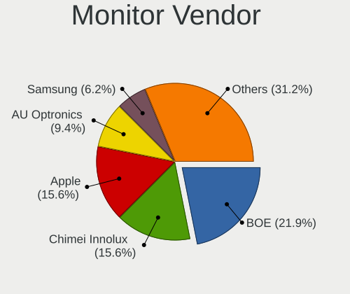

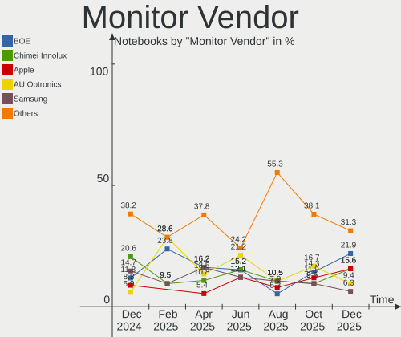

| Vendor                  | Notebooks | Percent |
|-------------------------|-----------|---------|
| BOE                     | 7         | 21.88%  |
| Chimei Innolux          | 5         | 15.63%  |
| Apple                   | 5         | 15.63%  |
| AU Optronics            | 3         | 9.38%   |
| Samsung Electronics     | 2         | 6.25%   |
| LG Display              | 2         | 6.25%   |
| Sony                    | 1         | 3.13%   |
| Sharp                   | 1         | 3.13%   |
| Philips                 | 1         | 3.13%   |
| MSI                     | 1         | 3.13%   |
| Goldstar                | 1         | 3.13%   |
| Dell                    | 1         | 3.13%   |
| Chi Mei Optoelectronics | 1         | 3.13%   |
| Acer                    | 1         | 3.13%   |

Monitor Model
-------------

Monitor models

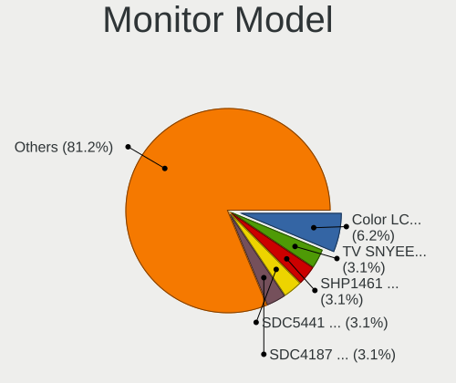

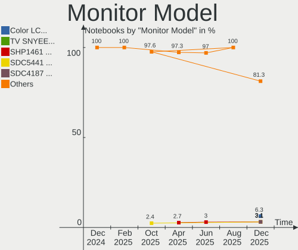

| Model                                                                    | Notebooks | Percent |
|--------------------------------------------------------------------------|-----------|---------|
| Apple Color LCD APP9CF0 1440x900 290x180mm 13.4-inch                     | 2         | 6.25%   |
| Sony TV SNYEE01 1920x1080                                                | 1         | 3.13%   |
| Sharp LCD Monitor SHP1461 3200x1800 294x165mm 13.3-inch                  | 1         | 3.13%   |
| Samsung Electronics LCD Monitor SDC5441 1366x768 344x193mm 15.5-inch     | 1         | 3.13%   |
| Samsung Electronics LCD Monitor SDC4187 1920x1200 302x189mm 14.0-inch    | 1         | 3.13%   |
| Philips PHL 276E8V PHLC18F 3840x2160 597x336mm 27.0-inch                 | 1         | 3.13%   |
| MSI MAG 274QRFW MSI9CC2 2560x1440 597x336mm 27.0-inch                    | 1         | 3.13%   |
| LG Display LCD Monitor LGD046F 1920x1080 344x194mm 15.5-inch             | 1         | 3.13%   |
| LG Display LCD Monitor LGD02D8 1366x768 277x156mm 12.5-inch              | 1         | 3.13%   |
| Goldstar TV SSCR2 GSM80A0 3840x2160                                      | 1         | 3.13%   |
| Dell P2417H DELA0DC 1920x1080 527x296mm 23.8-inch                        | 1         | 3.13%   |
| Chimei Innolux LCD Monitor CMN1728 1600x900 382x215mm 17.3-inch          | 1         | 3.13%   |
| Chimei Innolux LCD Monitor CMN15F5 1920x1080 344x193mm 15.5-inch         | 1         | 3.13%   |
| Chimei Innolux LCD Monitor CMN15E7 1920x1080 344x193mm 15.5-inch         | 1         | 3.13%   |
| Chimei Innolux LCD Monitor CMN15CA 1366x768 344x193mm 15.5-inch          | 1         | 3.13%   |
| Chimei Innolux LCD Monitor CMN1441 1920x1200 301x188mm 14.0-inch         | 1         | 3.13%   |
| Chi Mei Optoelectronics LCD Monitor CMO1467 1366x768 309x174mm 14.0-inch | 1         | 3.13%   |
| BOE LCD Monitor BOE0C1D 2560x1600 345x215mm 16.0-inch                    | 1         | 3.13%   |
| BOE LCD Monitor BOE0B15 1920x1080 344x194mm 15.5-inch                    | 1         | 3.13%   |
| BOE LCD Monitor BOE0B14 1920x1080 344x194mm 15.5-inch                    | 1         | 3.13%   |
| BOE LCD Monitor BOE08DF 1920x1080 344x194mm 15.5-inch                    | 1         | 3.13%   |
| BOE LCD Monitor BOE0819 1920x1080 344x194mm 15.5-inch                    | 1         | 3.13%   |
| BOE LCD Monitor BOE06B0 1366x768 344x194mm 15.5-inch                     | 1         | 3.13%   |
| BOE LCD Monitor BOE06A5 1366x768 344x194mm 15.5-inch                     | 1         | 3.13%   |
| AU Optronics LCD Monitor AUO723C 1366x768 309x173mm 13.9-inch            | 1         | 3.13%   |
| AU Optronics LCD Monitor AUO4444 1280x800 304x190mm 14.1-inch            | 1         | 3.13%   |
| AU Optronics LCD Monitor AUO173D 1920x1080 309x173mm 13.9-inch           | 1         | 3.13%   |
| Apple LCD Monitor APP9CC3 1280x800 286x179mm 13.3-inch                   | 1         | 3.13%   |
| Apple Color LCD APPA042 2560x1600 286x179mm 13.3-inch                    | 1         | 3.13%   |
| Apple Color LCD APPA034 2880x1800 286x179mm 13.3-inch                    | 1         | 3.13%   |
| Acer G276HL ACR0300 1920x1080 598x336mm 27.0-inch                        | 1         | 3.13%   |

Monitor Resolution
------------------

Monitor screen resolution

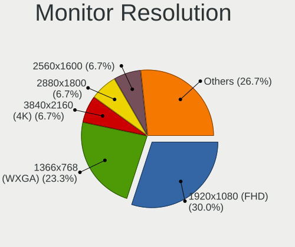

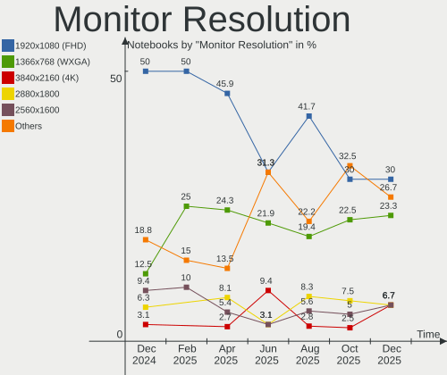

| Resolution        | Notebooks | Percent |
|-------------------|-----------|---------|
| 1920x1080 (FHD)   | 9         | 30%     |
| 1366x768 (WXGA)   | 7         | 23.33%  |
| 3840x2160 (4K)    | 2         | 6.67%   |
| 2880x1800         | 2         | 6.67%   |
| 2560x1600         | 2         | 6.67%   |
| 1440x900 (WXGA+)  | 2         | 6.67%   |
| 1280x800 (WXGA)   | 2         | 6.67%   |
| 3200x1800 (QHD+)  | 1         | 3.33%   |
| 2560x1440 (QHD)   | 1         | 3.33%   |
| 1920x1200 (WUXGA) | 1         | 3.33%   |
| 1600x900 (HD+)    | 1         | 3.33%   |

Monitor Diagonal
----------------

Diagonal size in inches

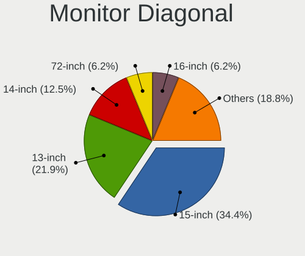

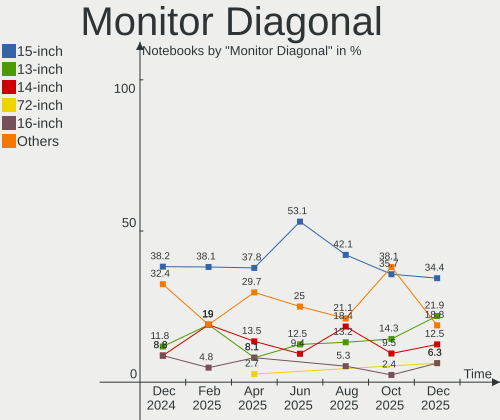

| Inches | Notebooks | Percent |
|--------|-----------|---------|
| 15     | 11        | 34.38%  |
| 13     | 7         | 21.88%  |
| 14     | 4         | 12.5%   |
| 72     | 2         | 6.25%   |
| 16     | 2         | 6.25%   |
| 63     | 1         | 3.13%   |
| 31     | 1         | 3.13%   |
| 27     | 1         | 3.13%   |
| 24     | 1         | 3.13%   |
| 17     | 1         | 3.13%   |
| 12     | 1         | 3.13%   |

Monitor Width
-------------

Physical width

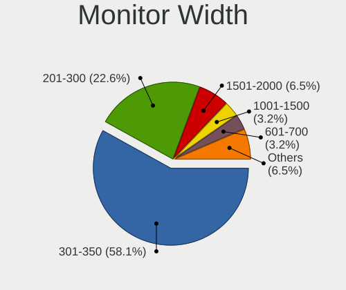

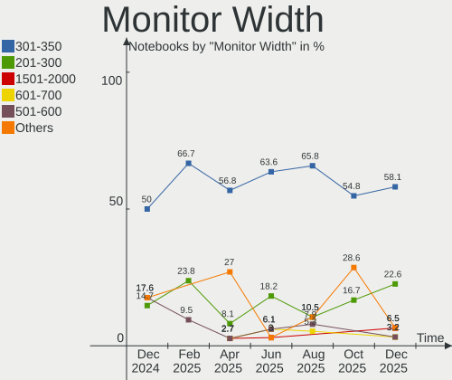

| Width in mm | Notebooks | Percent |
|-------------|-----------|---------|
| 301-350     | 18        | 58.06%  |
| 201-300     | 7         | 22.58%  |
| 1501-2000   | 2         | 6.45%   |
| 601-700     | 1         | 3.23%   |
| 501-600     | 1         | 3.23%   |
| 351-400     | 1         | 3.23%   |
| 1001-1500   | 1         | 3.23%   |

Aspect Ratio
------------

Proportional relationship between the width and the height

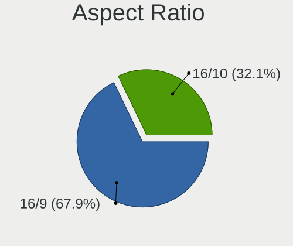

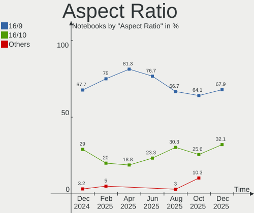

| Ratio | Notebooks | Percent |
|-------|-----------|---------|
| 16/9  | 19        | 67.86%  |
| 16/10 | 9         | 32.14%  |

Monitor Area
------------

Area in inch²

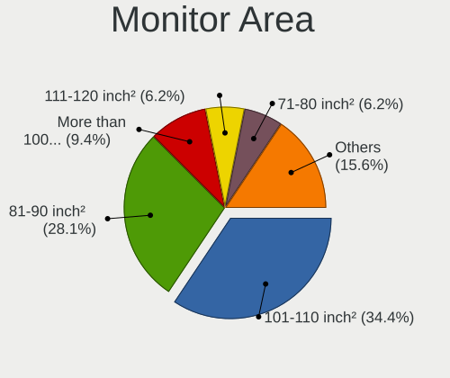

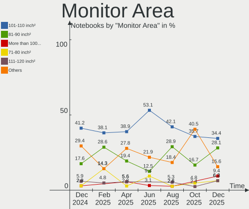

| Area in inch² | Notebooks | Percent |
|----------------|-----------|---------|
| 101-110        | 11        | 34.38%  |
| 81-90          | 9         | 28.13%  |
| More than 1000 | 3         | 9.38%   |
| 71-80          | 2         | 6.25%   |
| 111-120        | 2         | 6.25%   |
| 61-70          | 1         | 3.13%   |
| 351-500        | 1         | 3.13%   |
| 301-350        | 1         | 3.13%   |
| 201-250        | 1         | 3.13%   |
| 131-140        | 1         | 3.13%   |

Pixel Density
-------------

Pixels per inch

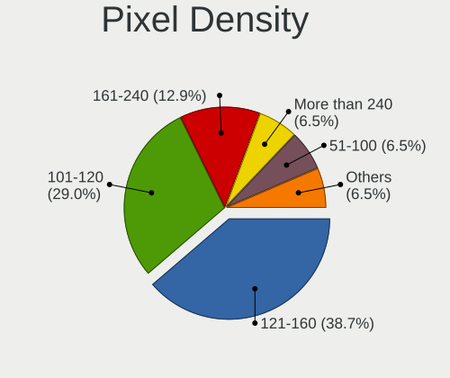

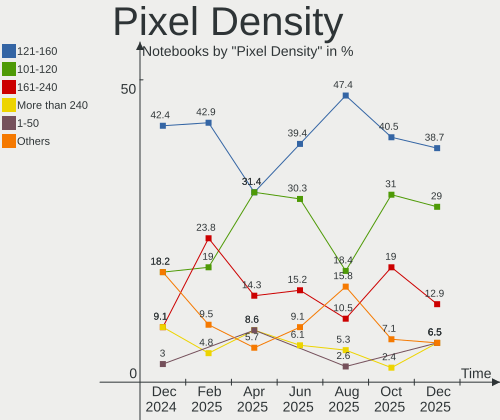

| Density       | Notebooks | Percent |
|---------------|-----------|---------|
| 121-160       | 12        | 38.71%  |
| 101-120       | 9         | 29.03%  |
| 161-240       | 4         | 12.9%   |
| More than 240 | 2         | 6.45%   |
| 1-50          | 2         | 6.45%   |
| 51-100        | 2         | 6.45%   |

Multiple Monitors
-----------------

Total monitors connected

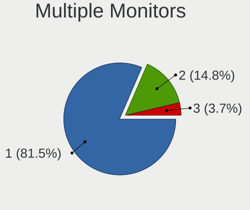

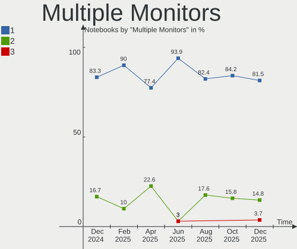

| Total | Notebooks | Percent |
|-------|-----------|---------|
| 1     | 22        | 81.48%  |
| 2     | 4         | 14.81%  |
| 3     | 1         | 3.7%    |

Network
-------

Net Controller Vendor
---------------------

Controller vendors

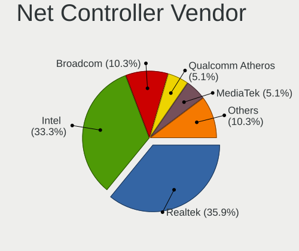

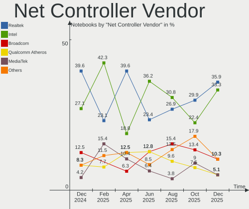

| Vendor                | Notebooks | Percent |
|-----------------------|-----------|---------|
| Realtek Semiconductor | 14        | 35.9%   |
| Intel                 | 13        | 33.33%  |
| Broadcom              | 4         | 10.26%  |
| Qualcomm Atheros      | 2         | 5.13%   |
| MediaTek              | 2         | 5.13%   |
| Broadcom Limited      | 2         | 5.13%   |
| Sierra Wireless       | 1         | 2.56%   |
| Ralink                | 1         | 2.56%   |

Net Controller Model
--------------------

Controller models

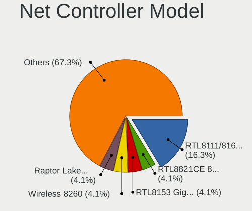

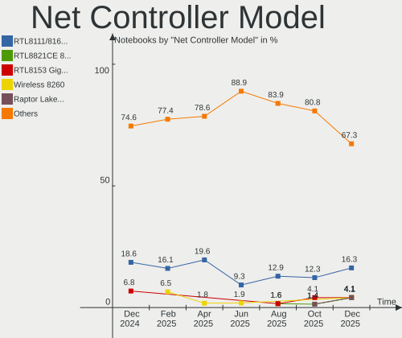

| Model                                                                  | Notebooks | Percent |
|------------------------------------------------------------------------|-----------|---------|
| Realtek RTL8111/8168/8211/8411 PCI Express Gigabit Ethernet Controller | 8         | 16.33%  |
| Realtek RTL8821CE 802.11ac PCIe Wireless Network Adapter               | 2         | 4.08%   |
| Realtek RTL8153 Gigabit Ethernet Adapter                               | 2         | 4.08%   |
| Intel Wireless 8260                                                    | 2         | 4.08%   |
| Intel Raptor Lake PCH CNVi WiFi                                        | 2         | 4.08%   |
| Intel Centrino Advanced-N 6205 [Taylor Peak]                           | 2         | 4.08%   |
| Intel 82579LM Gigabit Network Connection (Lewisville)                  | 2         | 4.08%   |
| Broadcom Limited BCM4360 802.11ac Dual Band Wireless Network Adapter   | 2         | 4.08%   |
| Sierra Wireless EM7455                                                 | 1         | 2.04%   |
| Realtek RTL8723BU 802.11b/g/n WLAN Adapter                             | 1         | 2.04%   |
| Realtek RTL8152 Fast Ethernet Adapter                                  | 1         | 2.04%   |
| Realtek RTL810xE PCI Express Fast Ethernet controller                  | 1         | 2.04%   |
| Realtek 802.11ac NIC                                                   | 1         | 2.04%   |
| Ralink RT2790 Wireless 802.11n 1T/2R PCIe                              | 1         | 2.04%   |
| Qualcomm Atheros QCA9565 / AR9565 Wireless Network Adapter             | 1         | 2.04%   |
| Qualcomm Atheros QCA9377 802.11ac Wireless Network Adapter             | 1         | 2.04%   |
| MediaTek MT7921 802.11ax PCIe Wireless Network Adapter [Filogic 330]   | 1         | 2.04%   |
| MediaTek MT7902 802.11ax PCIe Wireless Network Adapter [Filogic 310]   | 1         | 2.04%   |
| Intel Wireless 8265 / 8275                                             | 1         | 2.04%   |
| Intel Wireless 7260                                                    | 1         | 2.04%   |
| Intel Ethernet Connection I219-V                                       | 1         | 2.04%   |
| Intel Ethernet Connection I218-LM                                      | 1         | 2.04%   |
| Intel Ethernet Connection I217-LM                                      | 1         | 2.04%   |
| Intel Ethernet Connection (4) I219-V                                   | 1         | 2.04%   |
| Intel Comet Lake PCH CNVi WiFi                                         | 1         | 2.04%   |
| Intel Centrino Wireless-N 1030 [Rainbow Peak]                          | 1         | 2.04%   |
| Intel Centrino Advanced-N 6200                                         | 1         | 2.04%   |
| Intel Alder Lake-P PCH CNVi WiFi                                       | 1         | 2.04%   |
| Intel 700 Series Chipset CNVi WiFi                                     | 1         | 2.04%   |
| Broadcom NetXtreme BCM57765 Gigabit Ethernet PCIe                      | 1         | 2.04%   |
| Broadcom BRCM4377 Bluetooth Controller                                 | 1         | 2.04%   |
| Broadcom BCM4377b Wireless Network Adapter                             | 1         | 2.04%   |
| Broadcom BCM4350 802.11ac Wireless Network Adapter                     | 1         | 2.04%   |
| Broadcom BCM4331 802.11a/b/g/n                                         | 1         | 2.04%   |
| Broadcom BCM43142 802.11b/g/n                                          | 1         | 2.04%   |

Wireless Vendor
---------------

Wireless vendors

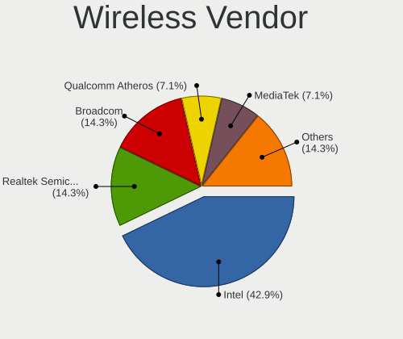

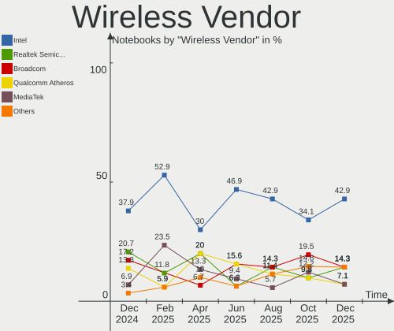

| Vendor                | Notebooks | Percent |
|-----------------------|-----------|---------|
| Intel                 | 12        | 42.86%  |
| Realtek Semiconductor | 4         | 14.29%  |
| Broadcom              | 4         | 14.29%  |
| Qualcomm Atheros      | 2         | 7.14%   |
| MediaTek              | 2         | 7.14%   |
| Broadcom Limited      | 2         | 7.14%   |
| Sierra Wireless       | 1         | 3.57%   |
| Ralink                | 1         | 3.57%   |

Wireless Model
--------------

Wireless models

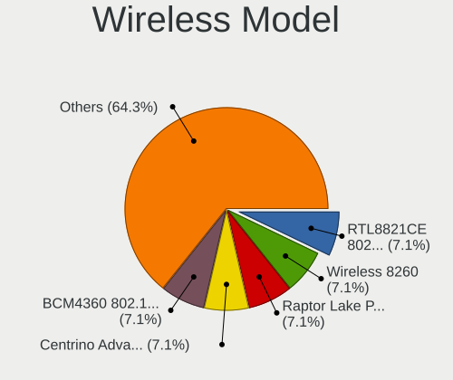

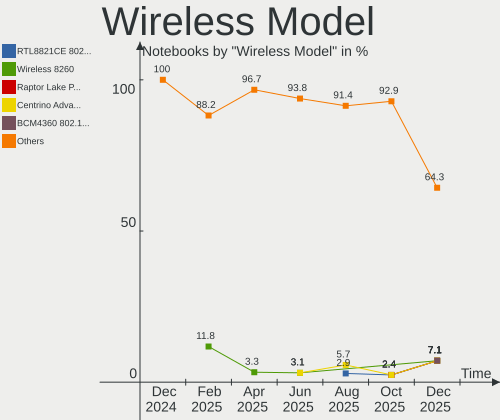

| Model                                                                | Notebooks | Percent |
|----------------------------------------------------------------------|-----------|---------|
| Realtek RTL8821CE 802.11ac PCIe Wireless Network Adapter             | 2         | 7.14%   |
| Intel Wireless 8260                                                  | 2         | 7.14%   |
| Intel Raptor Lake PCH CNVi WiFi                                      | 2         | 7.14%   |
| Intel Centrino Advanced-N 6205 [Taylor Peak]                         | 2         | 7.14%   |
| Broadcom Limited BCM4360 802.11ac Dual Band Wireless Network Adapter | 2         | 7.14%   |
| Sierra Wireless EM7455                                               | 1         | 3.57%   |
| Realtek RTL8723BU 802.11b/g/n WLAN Adapter                           | 1         | 3.57%   |
| Realtek 802.11ac NIC                                                 | 1         | 3.57%   |
| Ralink RT2790 Wireless 802.11n 1T/2R PCIe                            | 1         | 3.57%   |
| Qualcomm Atheros QCA9565 / AR9565 Wireless Network Adapter           | 1         | 3.57%   |
| Qualcomm Atheros QCA9377 802.11ac Wireless Network Adapter           | 1         | 3.57%   |
| MediaTek MT7921 802.11ax PCIe Wireless Network Adapter [Filogic 330] | 1         | 3.57%   |
| MediaTek MT7902 802.11ax PCIe Wireless Network Adapter [Filogic 310] | 1         | 3.57%   |
| Intel Wireless 8265 / 8275                                           | 1         | 3.57%   |
| Intel Wireless 7260                                                  | 1         | 3.57%   |
| Intel Comet Lake PCH CNVi WiFi                                       | 1         | 3.57%   |
| Intel Centrino Wireless-N 1030 [Rainbow Peak]                        | 1         | 3.57%   |
| Intel Centrino Advanced-N 6200                                       | 1         | 3.57%   |
| Intel 700 Series Chipset CNVi WiFi                                   | 1         | 3.57%   |
| Broadcom BCM4377b Wireless Network Adapter                           | 1         | 3.57%   |
| Broadcom BCM4350 802.11ac Wireless Network Adapter                   | 1         | 3.57%   |
| Broadcom BCM4331 802.11a/b/g/n                                       | 1         | 3.57%   |
| Broadcom BCM43142 802.11b/g/n                                        | 1         | 3.57%   |

Ethernet Vendor
---------------

Ethernet vendors

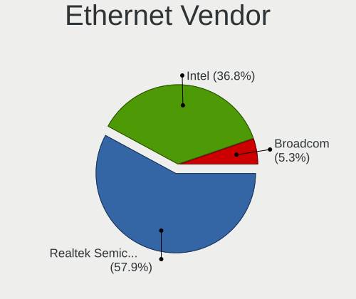

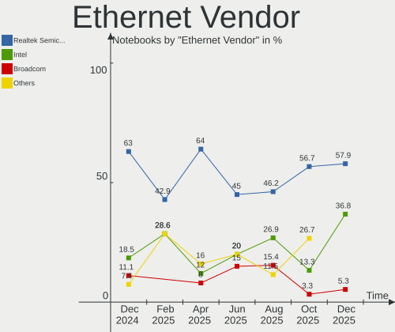

| Vendor                | Notebooks | Percent |
|-----------------------|-----------|---------|
| Realtek Semiconductor | 11        | 57.89%  |
| Intel                 | 7         | 36.84%  |
| Broadcom              | 1         | 5.26%   |

Ethernet Model
--------------

Ethernet models

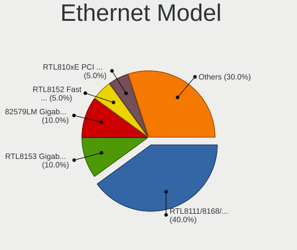

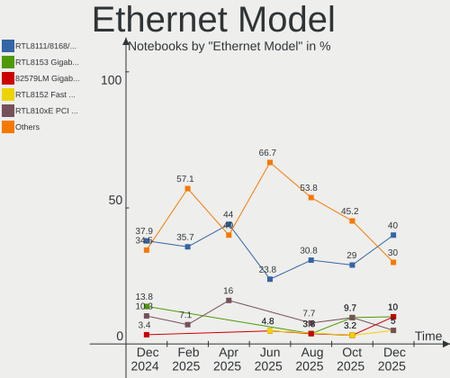

| Model                                                                  | Notebooks | Percent |
|------------------------------------------------------------------------|-----------|---------|
| Realtek RTL8111/8168/8211/8411 PCI Express Gigabit Ethernet Controller | 8         | 40%     |
| Realtek RTL8153 Gigabit Ethernet Adapter                               | 2         | 10%     |
| Intel 82579LM Gigabit Network Connection (Lewisville)                  | 2         | 10%     |
| Realtek RTL8152 Fast Ethernet Adapter                                  | 1         | 5%      |
| Realtek RTL810xE PCI Express Fast Ethernet controller                  | 1         | 5%      |
| Intel Ethernet Connection I219-V                                       | 1         | 5%      |
| Intel Ethernet Connection I218-LM                                      | 1         | 5%      |
| Intel Ethernet Connection I217-LM                                      | 1         | 5%      |
| Intel Ethernet Connection (4) I219-V                                   | 1         | 5%      |
| Intel Alder Lake-P PCH CNVi WiFi                                       | 1         | 5%      |
| Broadcom NetXtreme BCM57765 Gigabit Ethernet PCIe                      | 1         | 5%      |

Net Controller Kind
-------------------

Ethernet, WiFi or modem

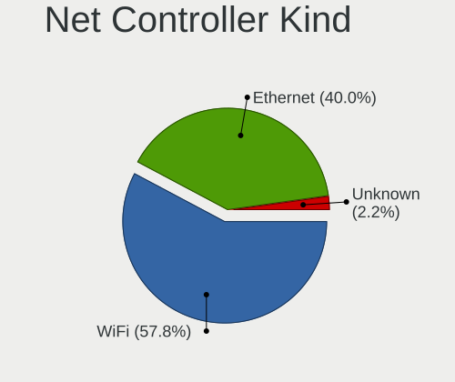

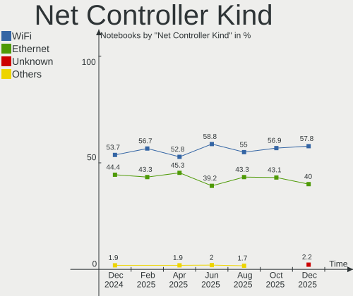

| Kind     | Notebooks | Percent |
|----------|-----------|---------|
| WiFi     | 26        | 57.78%  |
| Ethernet | 18        | 40%     |
| Unknown  | 1         | 2.22%   |

Used Controller
---------------

Currently used network controller

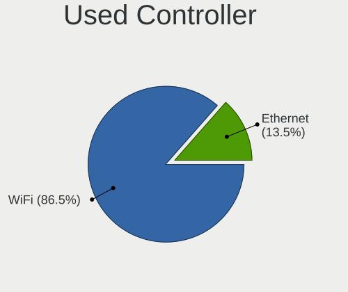

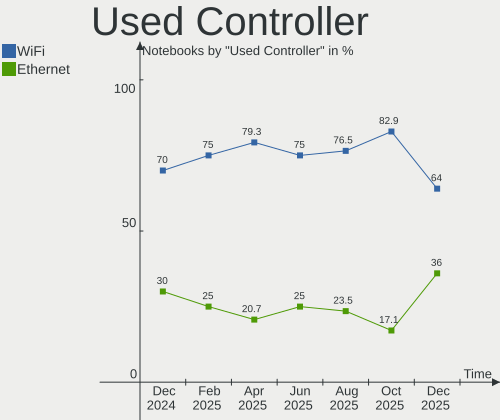

| Kind     | Notebooks | Percent |
|----------|-----------|---------|
| WiFi     | 16        | 64%     |
| Ethernet | 9         | 36%     |

NICs
----

Total network controllers on board

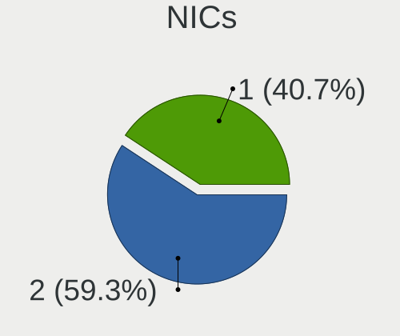

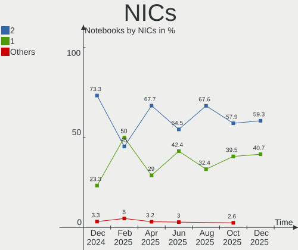

| Total | Notebooks | Percent |
|-------|-----------|---------|
| 2     | 16        | 59.26%  |
| 1     | 11        | 40.74%  |

IPv6
----

IPv6 vs IPv4

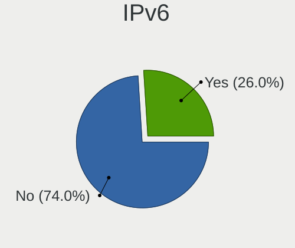

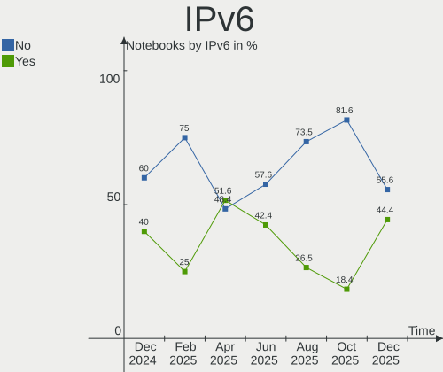

| Used | Notebooks | Percent |
|------|-----------|---------|
| No   | 15        | 55.56%  |
| Yes  | 12        | 44.44%  |

Bluetooth
---------

Bluetooth Vendor
----------------

Controller vendors

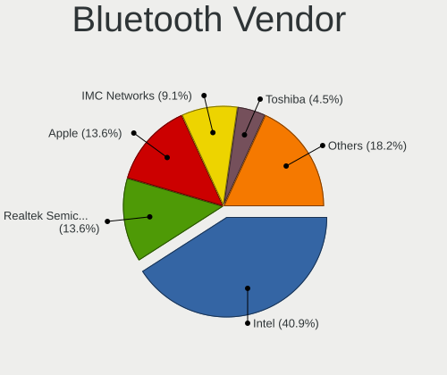

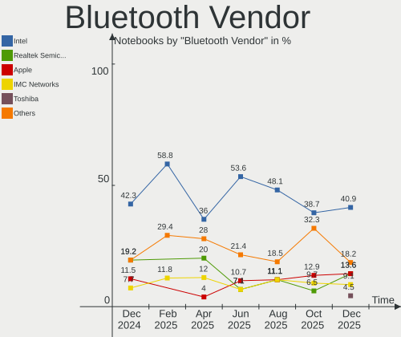

| Vendor                          | Notebooks | Percent |
|---------------------------------|-----------|---------|
| Intel                           | 9         | 40.91%  |
| Realtek Semiconductor           | 3         | 13.64%  |
| Apple                           | 3         | 13.64%  |
| IMC Networks                    | 2         | 9.09%   |
| Toshiba                         | 1         | 4.55%   |
| Qualcomm Atheros Communications | 1         | 4.55%   |
| Lite-On Technology              | 1         | 4.55%   |
| Hewlett-Packard                 | 1         | 4.55%   |
| Broadcom                        | 1         | 4.55%   |

Bluetooth Model
---------------

Controller models

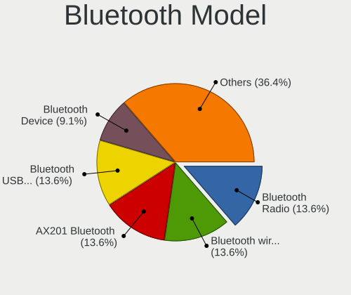

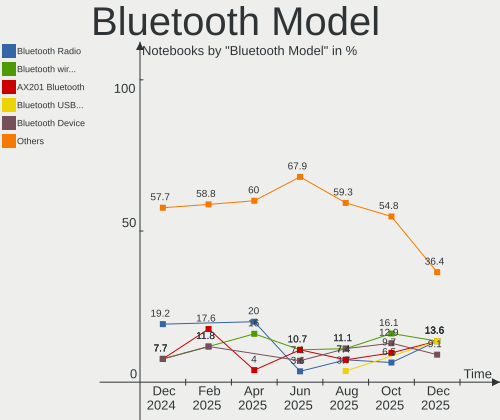

| Model                                            | Notebooks | Percent |
|--------------------------------------------------|-----------|---------|
| Realtek Bluetooth Radio                          | 3         | 13.64%  |
| Intel Bluetooth wireless interface               | 3         | 13.64%  |
| Intel AX201 Bluetooth                            | 3         | 13.64%  |
| Apple Bluetooth USB Host Controller              | 3         | 13.64%  |
| Intel Bluetooth Device                           | 2         | 9.09%   |
| IMC Networks Wireless_Device                     | 2         | 9.09%   |
| Toshiba BCM43142A0                               | 1         | 4.55%   |
| Qualcomm Atheros  Bluetooth Device               | 1         | 4.55%   |
| Lite-On Atheros AR3012 Bluetooth                 | 1         | 4.55%   |
| Intel Centrino Advanced-N 6230 Bluetooth adapter | 1         | 4.55%   |
| HP Broadcom 2070 Bluetooth Combo                 | 1         | 4.55%   |
| Broadcom BCM20702 Bluetooth 4.0 [ThinkPad]       | 1         | 4.55%   |

Sound
-----

Sound Vendor
------------

Sound card vendors

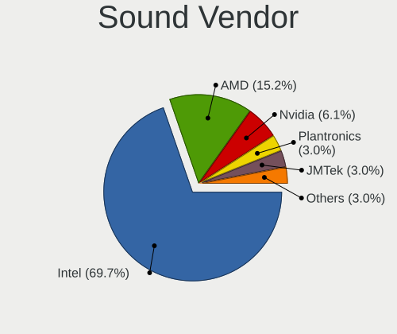

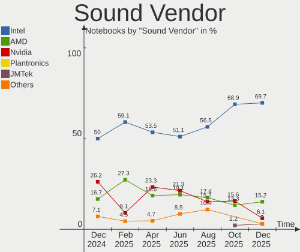

| Vendor      | Notebooks | Percent |
|-------------|-----------|---------|
| Intel       | 23        | 69.7%   |
| AMD         | 5         | 15.15%  |
| Nvidia      | 2         | 6.06%   |
| Plantronics | 1         | 3.03%   |
| JMTek       | 1         | 3.03%   |
| Apple       | 1         | 3.03%   |

Sound Model
-----------

Sound card models

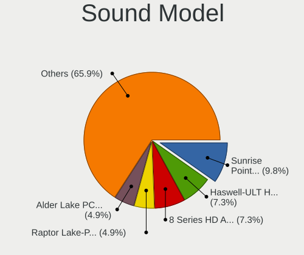

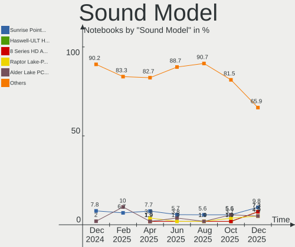

| Model                                                                      | Notebooks | Percent |
|----------------------------------------------------------------------------|-----------|---------|
| Intel Sunrise Point-LP HD Audio                                            | 4         | 9.76%   |
| Intel Haswell-ULT HD Audio Controller                                      | 3         | 7.32%   |
| Intel 8 Series HD Audio Controller                                         | 3         | 7.32%   |
| Intel Raptor Lake-P/U/H cAVS                                               | 2         | 4.88%   |
| Intel Alder Lake PCH-P High Definition Audio Controller                    | 2         | 4.88%   |
| Intel 7 Series/C216 Chipset Family High Definition Audio Controller        | 2         | 4.88%   |
| Intel 6 Series/C200 Series Chipset Family High Definition Audio Controller | 2         | 4.88%   |
| AMD Ryzen HD Audio Controller                                              | 2         | 4.88%   |
| Plantronics Blackwire 3220 Series                                          | 1         | 2.44%   |
| Nvidia TU106 High Definition Audio Controller                              | 1         | 2.44%   |
| Nvidia AD107 High Definition Audio Controller                              | 1         | 2.44%   |
| JMTek USB PnP Audio Device                                                 | 1         | 2.44%   |
| Intel Wildcat Point-LP High Definition Audio Controller                    | 1         | 2.44%   |
| Intel Tiger Lake-LP Smart Sound Technology Audio Controller                | 1         | 2.44%   |
| Intel Raptor Lake High Definition Audio Controller                         | 1         | 2.44%   |
| Intel Ice Lake-LP Smart Sound Technology Audio Controller                  | 1         | 2.44%   |
| Intel Comet Lake PCH cAVS                                                  | 1         | 2.44%   |
| Intel Cannon Point-LP High Definition Audio Controller                     | 1         | 2.44%   |
| Intel Broadwell-U Audio Controller                                         | 1         | 2.44%   |
| Intel 82801I (ICH9 Family) HD Audio Controller                             | 1         | 2.44%   |
| Intel 8 Series/C220 Series Chipset High Definition Audio Controller        | 1         | 2.44%   |
| Apple Audio Device                                                         | 1         | 2.44%   |
| AMD Renoir/Cezanne HDMI/DP Audio Controller                                | 1         | 2.44%   |
| AMD Radeon High Definition Audio Controller                                | 1         | 2.44%   |
| AMD Oland/Hainan/Cape Verde/Pitcairn HDMI Audio [Radeon HD 7000 Series]    | 1         | 2.44%   |
| AMD Kabini HDMI/DP Audio                                                   | 1         | 2.44%   |
| AMD High Definition Audio Controller                                       | 1         | 2.44%   |
| AMD FCH Azalia Controller                                                  | 1         | 2.44%   |
| AMD Family 15h (Models 60h-6fh) Audio Controller                           | 1         | 2.44%   |

Memory
------

Memory Vendor
-------------

Memory module vendors

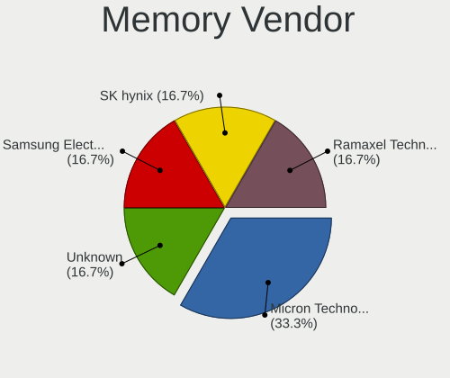

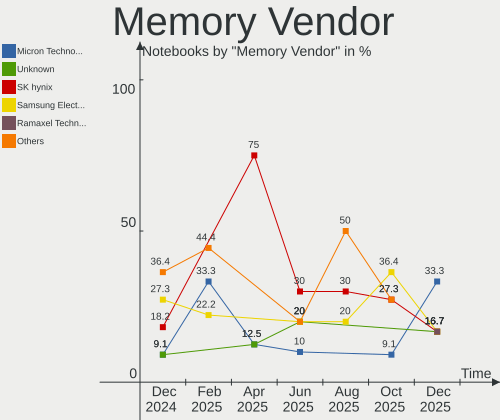

| Vendor              | Notebooks | Percent |
|---------------------|-----------|---------|
| Micron Technology   | 2         | 33.33%  |
| Unknown             | 1         | 16.67%  |
| SK hynix            | 1         | 16.67%  |
| Samsung Electronics | 1         | 16.67%  |
| Ramaxel Technology  | 1         | 16.67%  |

Memory Model
------------

Memory module models

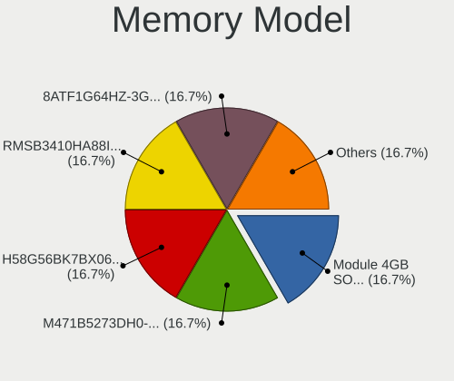

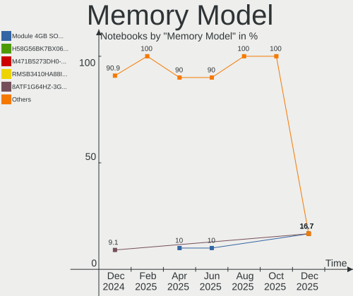

| Model                                                        | Notebooks | Percent |
|--------------------------------------------------------------|-----------|---------|
| Unknown RAM Module 4GB SODIMM LPDDR3 1600MT/s                | 1         | 16.67%  |
| SK hynix RAM H58G56BK7BX068 2GB Row Of Chips LPDDR5 8600MT/s | 1         | 16.67%  |
| Samsung RAM M471B5273DH0-CK0 4GB SODIMM DDR3 2400MT/s        | 1         | 16.67%  |
| Ramaxel RAM RMSB3410HA88IBF-5600 16GB SODIMM DDR5 5600MT/s   | 1         | 16.67%  |
| Micron RAM 8ATF1G64HZ-3G2R1 8GB SODIMM DDR4 3200MT/s         | 1         | 16.67%  |
| Micron RAM 4ATF51264HZ-3G2R1 4GB SODIMM DDR4 3200MT/s        | 1         | 16.67%  |

Memory Kind
-----------

Memory module kinds

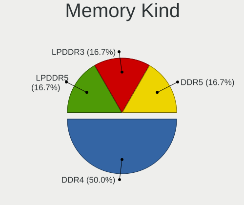

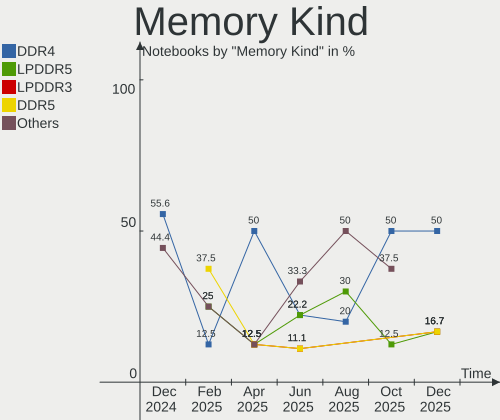

| Kind   | Notebooks | Percent |
|--------|-----------|---------|
| DDR4   | 3         | 50%     |
| LPDDR5 | 1         | 16.67%  |
| LPDDR3 | 1         | 16.67%  |
| DDR5   | 1         | 16.67%  |

Memory Form Factor
------------------

Physical design of the memory module

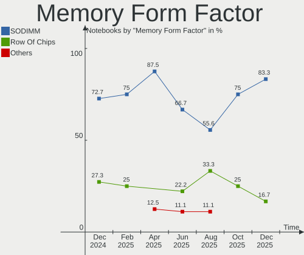

| Name         | Notebooks | Percent |
|--------------|-----------|---------|
| SODIMM       | 5         | 83.33%  |
| Row Of Chips | 1         | 16.67%  |

Memory Size
-----------

Memory module size

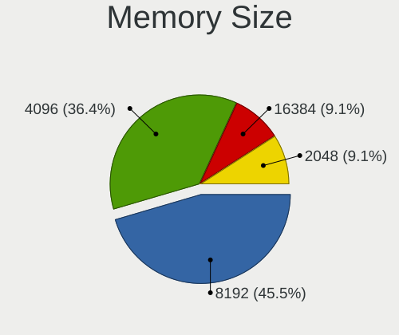

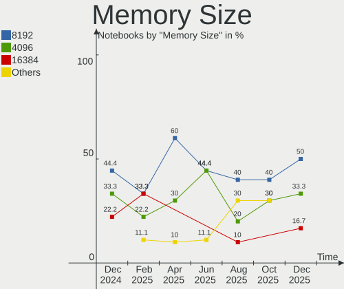

| Size  | Notebooks | Percent |
|-------|-----------|---------|
| 8192  | 3         | 50%     |
| 4096  | 2         | 33.33%  |
| 16384 | 1         | 16.67%  |

Memory Speed
------------

Memory module speed

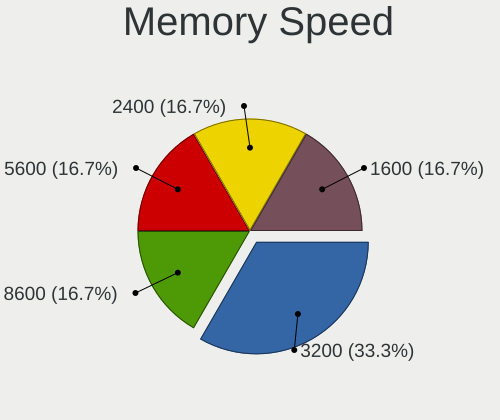

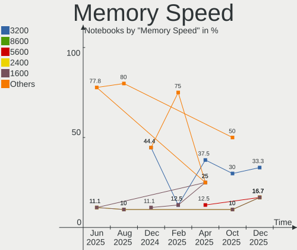

| Speed | Notebooks | Percent |
|-------|-----------|---------|
| 3200  | 2         | 33.33%  |
| 8600  | 1         | 16.67%  |
| 5600  | 1         | 16.67%  |
| 2400  | 1         | 16.67%  |
| 1600  | 1         | 16.67%  |

Printers & scanners
-------------------

Printer Vendor
--------------

Printer device vendors

Zero info for selected period =(

Printer Model
-------------

Printer device models

Zero info for selected period =(

Scanner Vendor
--------------

Scanner device vendors

Zero info for selected period =(

Scanner Model
-------------

Scanner device models

Zero info for selected period =(

Camera
------

Camera Vendor
-------------

Camera device vendors

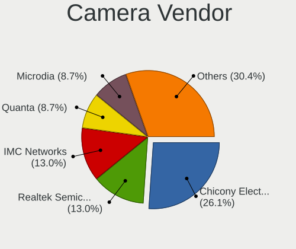

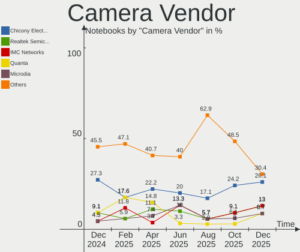

| Vendor                      | Notebooks | Percent |
|-----------------------------|-----------|---------|
| Chicony Electronics         | 6         | 26.09%  |
| Realtek Semiconductor       | 3         | 13.04%  |
| IMC Networks                | 3         | 13.04%  |
| Quanta                      | 2         | 8.7%    |
| Microdia                    | 2         | 8.7%    |
| Apple                       | 2         | 8.7%    |
| Syntek                      | 1         | 4.35%   |
| Suyin                       | 1         | 4.35%   |
| Luxvisions Innotech Limited | 1         | 4.35%   |
| Bison Electronics           | 1         | 4.35%   |
| A4Tech                      | 1         | 4.35%   |

Camera Model
------------

Camera device models

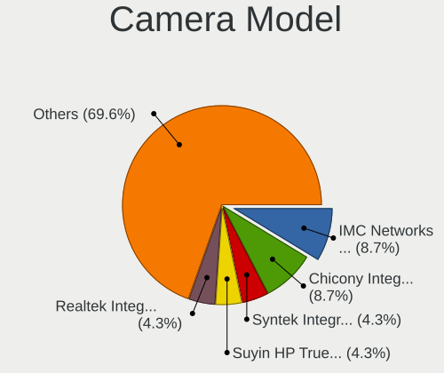

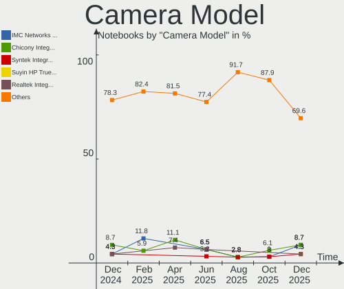

| Model                                               | Notebooks | Percent |
|-----------------------------------------------------|-----------|---------|
| IMC Networks USB2.0 HD UVC WebCam                   | 2         | 8.7%    |
| Chicony Integrated Camera                           | 2         | 8.7%    |
| Syntek Integrated Camera                            | 1         | 4.35%   |
| Suyin HP TrueVision HD                              | 1         | 4.35%   |
| Realtek Integrated_Webcam_HD                        | 1         | 4.35%   |
| Realtek EasyCamera                                  | 1         | 4.35%   |
| Realtek Acer 640 x 480 laptop camera                | 1         | 4.35%   |
| Quanta HP TrueVision HD Camera                      | 1         | 4.35%   |
| Quanta HD Webcam                                    | 1         | 4.35%   |
| Microdia Webcam Vitade AF                           | 1         | 4.35%   |
| Microdia Integrated Webcam                          | 1         | 4.35%   |
| Luxvisions Innotech Limited HP TrueVision HD Camera | 1         | 4.35%   |
| IMC Networks Integrated RGB Camera                  | 1         | 4.35%   |
| Chicony TOSHIBA Web Camera - HD                     | 1         | 4.35%   |
| Chicony Integrated HP HD Webcam                     | 1         | 4.35%   |
| Chicony Integrated Camera [ThinkPad]                | 1         | 4.35%   |
| Chicony HP TrueVision HD Camera                     | 1         | 4.35%   |
| Bison SunplusIT Integrated Camera                   | 1         | 4.35%   |
| Apple iPhone 5/5C/5S/6/SE/7/8/X                     | 1         | 4.35%   |
| Apple FaceTime HD Camera                            | 1         | 4.35%   |
| A4Tech FHD 1080P PC Camera                          | 1         | 4.35%   |

Security
--------

Fingerprint Vendor
------------------

Fingerprint sensor vendors

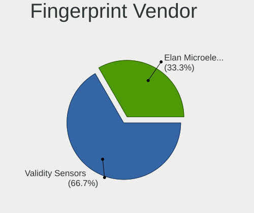

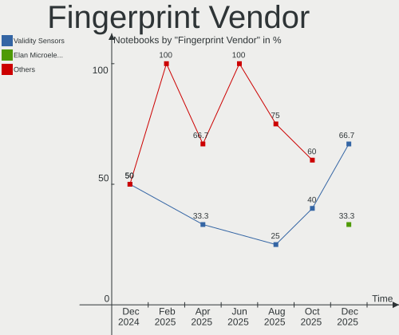

| Vendor                | Notebooks | Percent |
|-----------------------|-----------|---------|
| Validity Sensors      | 2         | 66.67%  |
| Elan Microelectronics | 1         | 33.33%  |

Fingerprint Model
-----------------

Fingerprint sensor models

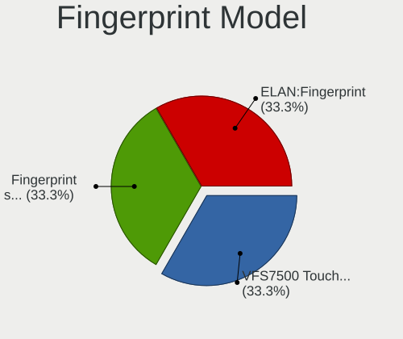

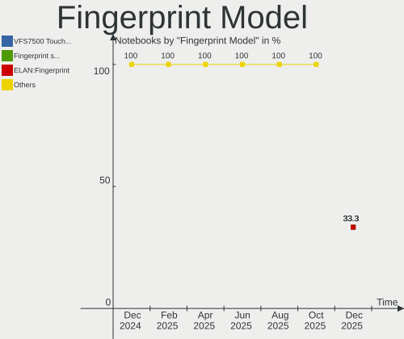

| Model                                             | Notebooks | Percent |
|---------------------------------------------------|-----------|---------|
| Validity Sensors VFS7500 Touch Fingerprint Sensor | 1         | 33.33%  |
| Validity Sensors Fingerprint scanner              | 1         | 33.33%  |
| Elan ELAN:Fingerprint                             | 1         | 33.33%  |

Chipcard Vendor
---------------

Chipcard module vendors

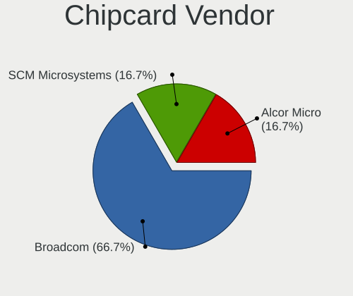

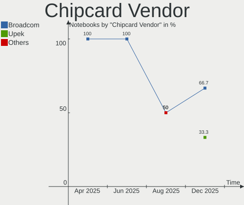

| Vendor   | Notebooks | Percent |
|----------|-----------|---------|
| Broadcom | 2         | 66.67%  |
| Upek     | 1         | 33.33%  |

Chipcard Model
--------------

Chipcard module models

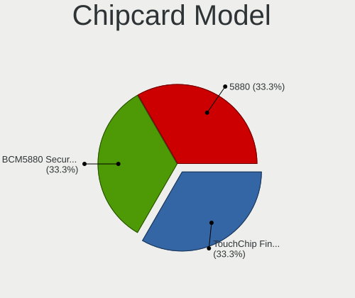

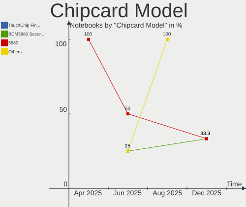

| Model                                                      | Notebooks | Percent |
|------------------------------------------------------------|-----------|---------|
| Upek TouchChip Fingerprint Coprocessor (WBF advanced mode) | 1         | 33.33%  |
| Broadcom BCM5880 Secure Applications Processor             | 1         | 33.33%  |
| Broadcom 5880                                              | 1         | 33.33%  |

Unsupported
-----------

Unsupported Devices
-------------------

Total unsupported devices on board

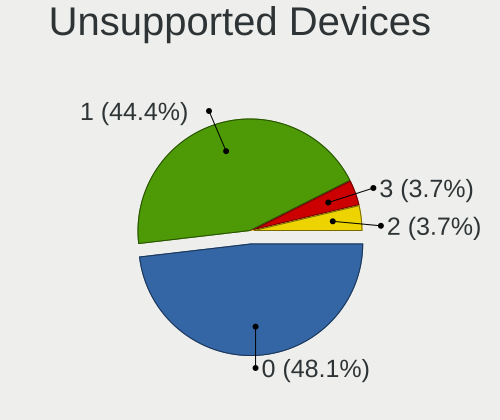

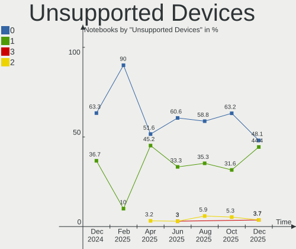

| Total | Notebooks | Percent |
|-------|-----------|---------|
| 0     | 13        | 48.15%  |
| 1     | 12        | 44.44%  |
| 3     | 1         | 3.7%    |
| 2     | 1         | 3.7%    |

Unsupported Device Types
------------------------

Types of unsupported devices

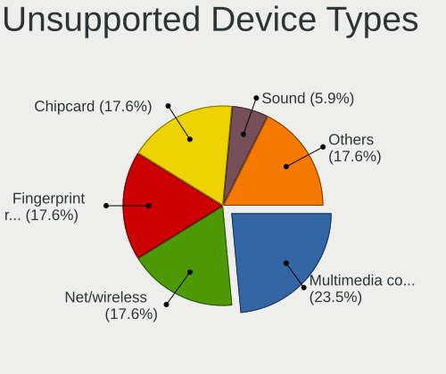

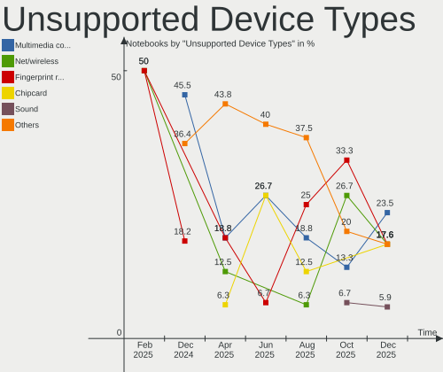

| Type                  | Notebooks | Percent |
|-----------------------|-----------|---------|
| Multimedia controller | 4         | 23.53%  |
| Net/wireless          | 3         | 17.65%  |
| Fingerprint reader    | 3         | 17.65%  |
| Chipcard              | 3         | 17.65%  |
| Sound                 | 1         | 5.88%   |
| Network               | 1         | 5.88%   |
| Graphics card         | 1         | 5.88%   |
| Camera                | 1         | 5.88%   |

