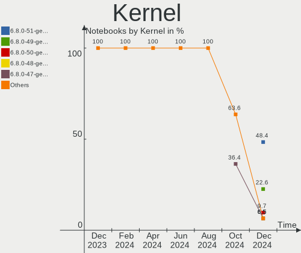
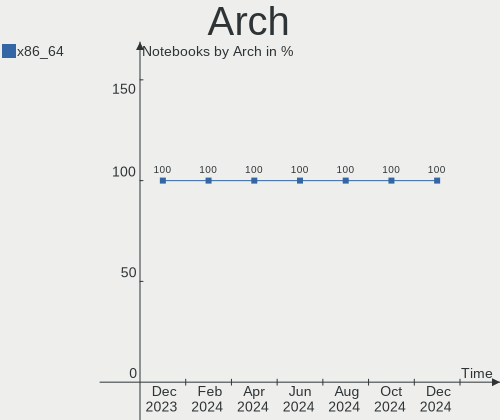
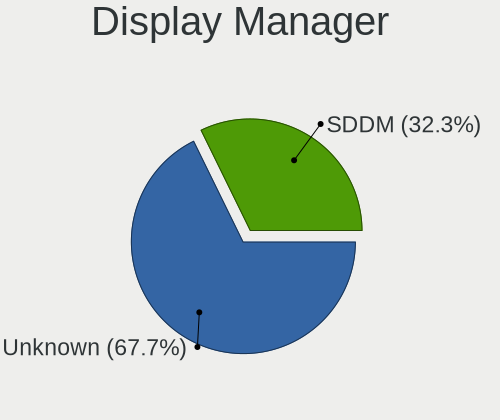
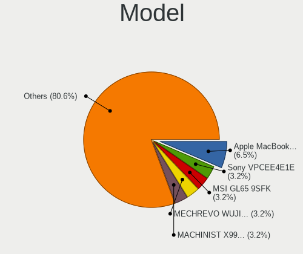
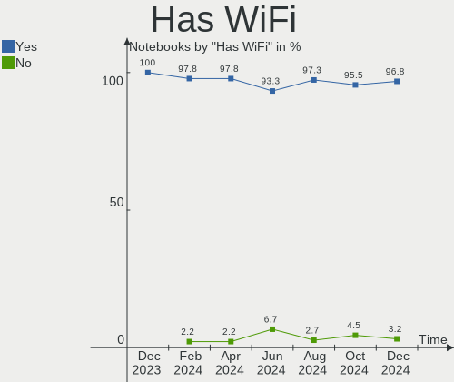
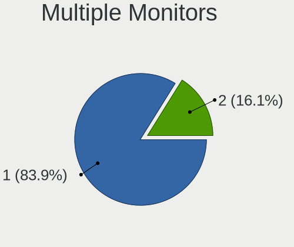
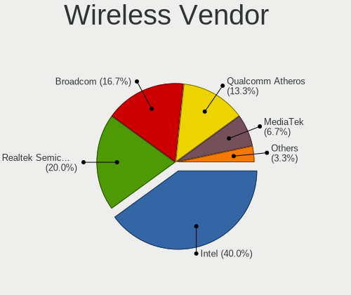
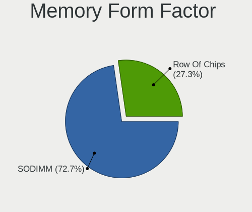

KDE neon Hardware Trends (Notebooks)
------------------------------------

A project to identify most popular hardware characteristics and track their change
over time based on data collected by KDE neon users at https://Linux-Hardware.org.

Anyone can contribute to this report by the [hw-probe](https://github.com/linuxhw/hw-probe) tool:

    sudo -E hw-probe -all -upload

Full-feature report is available here: https://linux-hardware.org/?view=trends

Period: Nov, 2021.

Contents
--------

* [ System ](#system)
  - [ OS                       ](#os)
  - [ OS Family                ](#os-family)
  - [ Kernel                   ](#kernel)
  - [ Kernel Family            ](#kernel-family)
  - [ Kernel Major Ver.        ](#kernel-major-ver)
  - [ Arch                     ](#arch)
  - [ DE                       ](#de)
  - [ Display Server           ](#display-server)
  - [ Display Manager          ](#display-manager)
  - [ OS Lang                  ](#os-lang)
  - [ Boot Mode                ](#boot-mode)
  - [ Filesystem               ](#filesystem)
  - [ Part. scheme             ](#part-scheme)
  - [ Dual Boot with Linux/BSD ](#dual-boot-with-linuxbsd)
  - [ Dual Boot (Win)          ](#dual-boot-win)

* [ Board ](#board)
  - [ Vendor                   ](#vendor)
  - [ Model                    ](#model)
  - [ Model Family             ](#model-family)
  - [ MFG Year                 ](#mfg-year)
  - [ Form Factor              ](#form-factor)
  - [ Secure Boot              ](#secure-boot)
  - [ Coreboot                 ](#coreboot)
  - [ RAM Size                 ](#ram-size)
  - [ RAM Used                 ](#ram-used)
  - [ Total Drives             ](#total-drives)
  - [ Has CD-ROM               ](#has-cd-rom)
  - [ Has Ethernet             ](#has-ethernet)
  - [ Has WiFi                 ](#has-wifi)
  - [ Has Bluetooth            ](#has-bluetooth)

* [ Location ](#location)
  - [ Country                  ](#country)
  - [ City                     ](#city)

* [ Drives ](#drives)
  - [ Drive Vendor             ](#drive-vendor)
  - [ Drive Model              ](#drive-model)
  - [ HDD Vendor               ](#hdd-vendor)
  - [ SSD Vendor               ](#ssd-vendor)
  - [ Drive Kind               ](#drive-kind)
  - [ Drive Connector          ](#drive-connector)
  - [ Drive Size               ](#drive-size)
  - [ Space Total              ](#space-total)
  - [ Space Used               ](#space-used)
  - [ Malfunc. Drives          ](#malfunc-drives)
  - [ Malfunc. Drive Vendor    ](#malfunc-drive-vendor)
  - [ Malfunc. HDD Vendor      ](#malfunc-hdd-vendor)
  - [ Malfunc. Drive Kind      ](#malfunc-drive-kind)
  - [ Failed Drives            ](#failed-drives)
  - [ Failed Drive Vendor      ](#failed-drive-vendor)
  - [ Drive Status             ](#drive-status)

* [ Storage controller ](#storage-controller)
  - [ Storage Vendor           ](#storage-vendor)
  - [ Storage Model            ](#storage-model)
  - [ Storage Kind             ](#storage-kind)

* [ Processor ](#processor)
  - [ CPU Vendor               ](#cpu-vendor)
  - [ CPU Model                ](#cpu-model)
  - [ CPU Model Family         ](#cpu-model-family)
  - [ CPU Cores                ](#cpu-cores)
  - [ CPU Sockets              ](#cpu-sockets)
  - [ CPU Threads              ](#cpu-threads)
  - [ CPU Op-Modes             ](#cpu-op-modes)
  - [ CPU Microcode            ](#cpu-microcode)
  - [ CPU Microarch            ](#cpu-microarch)

* [ Graphics ](#graphics)
  - [ GPU Vendor               ](#gpu-vendor)
  - [ GPU Model                ](#gpu-model)
  - [ GPU Combo                ](#gpu-combo)
  - [ GPU Driver               ](#gpu-driver)
  - [ GPU Memory               ](#gpu-memory)

* [ Monitor ](#monitor)
  - [ Monitor Vendor           ](#monitor-vendor)
  - [ Monitor Model            ](#monitor-model)
  - [ Monitor Resolution       ](#monitor-resolution)
  - [ Monitor Diagonal         ](#monitor-diagonal)
  - [ Monitor Width            ](#monitor-width)
  - [ Aspect Ratio             ](#aspect-ratio)
  - [ Monitor Area             ](#monitor-area)
  - [ Pixel Density            ](#pixel-density)
  - [ Multiple Monitors        ](#multiple-monitors)

* [ Network ](#network)
  - [ Net Controller Vendor    ](#net-controller-vendor)
  - [ Net Controller Model     ](#net-controller-model)
  - [ Wireless Vendor          ](#wireless-vendor)
  - [ Wireless Model           ](#wireless-model)
  - [ Ethernet Vendor          ](#ethernet-vendor)
  - [ Ethernet Model           ](#ethernet-model)
  - [ Net Controller Kind      ](#net-controller-kind)
  - [ Used Controller          ](#used-controller)
  - [ NICs                     ](#nics)
  - [ IPv6                     ](#ipv6)

* [ Bluetooth ](#bluetooth)
  - [ Bluetooth Vendor         ](#bluetooth-vendor)
  - [ Bluetooth Model          ](#bluetooth-model)

* [ Sound ](#sound)
  - [ Sound Vendor             ](#sound-vendor)
  - [ Sound Model              ](#sound-model)

* [ Memory ](#memory)
  - [ Memory Vendor            ](#memory-vendor)
  - [ Memory Model             ](#memory-model)
  - [ Memory Kind              ](#memory-kind)
  - [ Memory Form Factor       ](#memory-form-factor)
  - [ Memory Size              ](#memory-size)
  - [ Memory Speed             ](#memory-speed)

* [ Printers & scanners ](#printers--scanners)
  - [ Printer Vendor           ](#printer-vendor)
  - [ Printer Model            ](#printer-model)
  - [ Scanner Vendor           ](#scanner-vendor)
  - [ Scanner Model            ](#scanner-model)

* [ Camera ](#camera)
  - [ Camera Vendor            ](#camera-vendor)
  - [ Camera Model             ](#camera-model)

* [ Security ](#security)
  - [ Fingerprint Vendor       ](#fingerprint-vendor)
  - [ Fingerprint Model        ](#fingerprint-model)
  - [ Chipcard Vendor          ](#chipcard-vendor)
  - [ Chipcard Model           ](#chipcard-model)

* [ Unsupported ](#unsupported)
  - [ Unsupported Devices      ](#unsupported-devices)
  - [ Unsupported Device Types ](#unsupported-device-types)

System
------

OS
--

Installed operating systems

| Name           | Notebooks | Percent |
|----------------|-----------|---------|
| KDE neon 20.04 | 41        | 100%    |

OS Family
---------

OS without a version

| Name     | Notebooks | Percent |
|----------|-----------|---------|
| KDE neon | 41        | 100%    |

Kernel
------

Version of the Linux kernel

| Version               | Notebooks | Percent |
|-----------------------|-----------|---------|
| 5.11.0-40-generic     | 22        | 53.66%  |
| 5.11.0-38-generic     | 11        | 26.83%  |
| 5.11.0-37-generic     | 3         | 7.32%   |
| 5.11.0-41-generic     | 2         | 4.88%   |
| 5.4.0-74-generic      | 1         | 2.44%   |
| 5.15.1-051501-generic | 1         | 2.44%   |
| 5.14.16-xanmod1       | 1         | 2.44%   |

Kernel Family
-------------

Linux kernel without a distro release

| Version | Notebooks | Percent |
|---------|-----------|---------|
| 5.11.0  | 38        | 92.68%  |
| 5.4.0   | 1         | 2.44%   |
| 5.15.1  | 1         | 2.44%   |
| 5.14.16 | 1         | 2.44%   |

Kernel Major Ver.
-----------------

Linux kernel major version

| Version | Notebooks | Percent |
|---------|-----------|---------|
| 5.11    | 38        | 92.68%  |
| 5.4     | 1         | 2.44%   |
| 5.15    | 1         | 2.44%   |
| 5.14    | 1         | 2.44%   |

Arch
----

OS architecture (x86_64, i586, etc.)

| Name   | Notebooks | Percent |
|--------|-----------|---------|
| x86_64 | 41        | 100%    |

DE
--

Desktop Environment

| Name    | Notebooks | Percent |
|---------|-----------|---------|
| KDE5    | 38        | 92.68%  |
| Unknown | 3         | 7.32%   |

Display Server
--------------

X11 or Wayland

| Name    | Notebooks | Percent |
|---------|-----------|---------|
| X11     | 39        | 95.12%  |
| Wayland | 2         | 4.88%   |

Display Manager
---------------

SDDM, LightDM, etc.

| Name    | Notebooks | Percent |
|---------|-----------|---------|
| Unknown | 26        | 63.41%  |
| SDDM    | 15        | 36.59%  |

OS Lang
-------

Language

| Lang  | Notebooks | Percent |
|-------|-----------|---------|
| en_US | 13        | 31.71%  |
| de_DE | 5         | 12.2%   |
| C     | 5         | 12.2%   |
| en_AU | 3         | 7.32%   |
| ru_RU | 2         | 4.88%   |
| pt_BR | 2         | 4.88%   |
| en_GB | 2         | 4.88%   |
| en_CA | 2         | 4.88%   |
| tr_TR | 1         | 2.44%   |
| it_IT | 1         | 2.44%   |
| fi_FI | 1         | 2.44%   |
| es_PE | 1         | 2.44%   |
| es_ES | 1         | 2.44%   |
| es_CL | 1         | 2.44%   |
| en_IN | 1         | 2.44%   |

Boot Mode
---------

EFI or BIOS

| Mode | Notebooks | Percent |
|------|-----------|---------|
| EFI  | 31        | 75.61%  |
| BIOS | 10        | 24.39%  |

Filesystem
----------

Type of filesystem

| Type    | Notebooks | Percent |
|---------|-----------|---------|
| Ext4    | 38        | 92.68%  |
| Overlay | 2         | 4.88%   |
| Btrfs   | 1         | 2.44%   |

Part. scheme
------------

Scheme of partitioning

| Type    | Notebooks | Percent |
|---------|-----------|---------|
| Unknown | 34        | 82.93%  |
| GPT     | 6         | 14.63%  |
| MBR     | 1         | 2.44%   |

Dual Boot with Linux/BSD
------------------------

Hosting more than one Linux/BSD

| Dual boot | Notebooks | Percent |
|-----------|-----------|---------|
| No        | 40        | 97.56%  |
| Yes       | 1         | 2.44%   |

Dual Boot (Win)
---------------

Hosting Linux and Windows

| Dual boot | Notebooks | Percent |
|-----------|-----------|---------|
| No        | 34        | 82.93%  |
| Yes       | 7         | 17.07%  |

Board
-----

Vendor
------

Motherboard manufacturer

| Name                | Notebooks | Percent |
|---------------------|-----------|---------|
| Lenovo              | 14        | 34.15%  |
| Dell                | 7         | 17.07%  |
| Hewlett-Packard     | 6         | 14.63%  |
| ASUSTek Computer    | 3         | 7.32%   |
| Apple               | 2         | 4.88%   |
| Toshiba             | 1         | 2.44%   |
| Teclast             | 1         | 2.44%   |
| Samsung Electronics | 1         | 2.44%   |
| MSI                 | 1         | 2.44%   |
| Medion              | 1         | 2.44%   |
| LG Electronics      | 1         | 2.44%   |
| HUAWEI              | 1         | 2.44%   |
| GPU Company         | 1         | 2.44%   |
| Acer                | 1         | 2.44%   |

Model
-----

Motherboard model

| Name                                   | Notebooks | Percent |
|----------------------------------------|-----------|---------|
| Toshiba Satellite L750D                | 1         | 2.44%   |
| Teclast F15 Plus                       | 1         | 2.44%   |
| Samsung 550XBE/350XBE                  | 1         | 2.44%   |
| MSI GS60 6QE                           | 1         | 2.44%   |
| Medion Akoya E6424 MD99850             | 1         | 2.44%   |
| LG 14Z960-GR3HK                        | 1         | 2.44%   |
| Lenovo V15-ADA 82C7                    | 1         | 2.44%   |
| Lenovo V145-15AST 81MT                 | 1         | 2.44%   |
| Lenovo ThinkPad X1 Extreme 20MF000DUS  | 1         | 2.44%   |
| Lenovo ThinkPad T480s 20L7001LGE       | 1         | 2.44%   |
| Lenovo ThinkPad T470s W10DG 20JTS14R00 | 1         | 2.44%   |
| Lenovo ThinkPad P52s 20LB000AFR        | 1         | 2.44%   |
| Lenovo ThinkPad E580 20KS006HRT        | 1         | 2.44%   |
| Lenovo ThinkPad E15 Gen 2 20TES2MF00   | 1         | 2.44%   |
| Lenovo ThinkPad E14 Gen 2 20T6S08J00   | 1         | 2.44%   |
| Lenovo Legion 5 15ACH6H 82JU           | 1         | 2.44%   |
| Lenovo IdeaPad U400 09934FG            | 1         | 2.44%   |
| Lenovo IdeaPad S145-15API 81V7         | 1         | 2.44%   |
| Lenovo IdeaPad 5 15ARE05 81YQ          | 1         | 2.44%   |
| Lenovo IdeaPad 320-15IKB 80XL          | 1         | 2.44%   |
| HUAWEI KLVL-WXX9                       | 1         | 2.44%   |
| HP Pavilion g7                         | 1         | 2.44%   |
| HP Pavilion dv7                        | 1         | 2.44%   |
| HP OMEN by Laptop                      | 1         | 2.44%   |
| HP Laptop 15s-eq2xxx                   | 1         | 2.44%   |
| HP Laptop 15-bs0xx                     | 1         | 2.44%   |
| HP EliteBook 840 G1                    | 1         | 2.44%   |
| GPU Company GWTC116-2                  | 1         | 2.44%   |
| Dell XPS 15 9500                       | 1         | 2.44%   |
| Dell Latitude E5400                    | 1         | 2.44%   |
| Dell Latitude 5480                     | 1         | 2.44%   |
| Dell Latitude 5420                     | 1         | 2.44%   |
| Dell Inspiron 7573                     | 1         | 2.44%   |
| Dell Inspiron 7560                     | 1         | 2.44%   |
| Dell Inspiron 5555                     | 1         | 2.44%   |
| ASUS X556UQK                           | 1         | 2.44%   |
| ASUS X555LAB                           | 1         | 2.44%   |
| ASUS TUF Gaming FX505DT_FX505DT        | 1         | 2.44%   |
| Apple MacBookPro8,1                    | 1         | 2.44%   |
| Apple MacBook4,1                       | 1         | 2.44%   |
| Acer Aspire A515-46                    | 1         | 2.44%   |

Model Family
------------

Motherboard model prefix

| Name                  | Notebooks | Percent |
|-----------------------|-----------|---------|
| Lenovo ThinkPad       | 7         | 17.07%  |
| Lenovo IdeaPad        | 4         | 9.76%   |
| Dell Latitude         | 3         | 7.32%   |
| Dell Inspiron         | 3         | 7.32%   |
| HP Pavilion           | 2         | 4.88%   |
| HP Laptop             | 2         | 4.88%   |
| Toshiba Satellite     | 1         | 2.44%   |
| Teclast F15           | 1         | 2.44%   |
| Samsung 550XBE        | 1         | 2.44%   |
| MSI GS60              | 1         | 2.44%   |
| Medion Akoya          | 1         | 2.44%   |
| LG 14Z960-GR3HK       | 1         | 2.44%   |
| Lenovo V15-ADA        | 1         | 2.44%   |
| Lenovo V145-15AST     | 1         | 2.44%   |
| Lenovo Legion         | 1         | 2.44%   |
| HUAWEI KLVL-WXX9      | 1         | 2.44%   |
| HP OMEN               | 1         | 2.44%   |
| HP EliteBook          | 1         | 2.44%   |
| GPU Company GWTC116-2 | 1         | 2.44%   |
| Dell XPS              | 1         | 2.44%   |
| ASUS X556UQK          | 1         | 2.44%   |
| ASUS X555LAB          | 1         | 2.44%   |
| ASUS TUF              | 1         | 2.44%   |
| Apple MacBookPro8     | 1         | 2.44%   |
| Apple MacBook4        | 1         | 2.44%   |
| Acer Aspire           | 1         | 2.44%   |

MFG Year
--------

Motherboard manufacture year

| Year | Notebooks | Percent |
|------|-----------|---------|
| 2021 | 15        | 36.59%  |
| 2018 | 5         | 12.2%   |
| 2019 | 4         | 9.76%   |
| 2020 | 3         | 7.32%   |
| 2017 | 3         | 7.32%   |
| 2016 | 3         | 7.32%   |
| 2012 | 2         | 4.88%   |
| 2015 | 1         | 2.44%   |
| 2014 | 1         | 2.44%   |
| 2013 | 1         | 2.44%   |
| 2011 | 1         | 2.44%   |
| 2009 | 1         | 2.44%   |
| 2008 | 1         | 2.44%   |

Form Factor
-----------

Physical design of the computer

| Name     | Notebooks | Percent |
|----------|-----------|---------|
| Notebook | 41        | 100%    |

Secure Boot
-----------

Enabled or disabled

| State    | Notebooks | Percent |
|----------|-----------|---------|
| Disabled | 35        | 85.37%  |
| Enabled  | 6         | 14.63%  |

Coreboot
--------

Have coreboot on board

| Used | Notebooks | Percent |
|------|-----------|---------|
| No   | 41        | 100%    |

RAM Size
--------

Total RAM memory

| Size in GB | Notebooks | Percent |
|------------|-----------|---------|
| 4.01-8.0   | 16        | 39.02%  |
| 8.01-16.0  | 10        | 24.39%  |
| 16.01-24.0 | 8         | 19.51%  |
| 3.01-4.0   | 4         | 9.76%   |
| 32.01-64.0 | 2         | 4.88%   |
| 1.01-2.0   | 1         | 2.44%   |

RAM Used
--------

Used RAM memory

| Used GB   | Notebooks | Percent |
|-----------|-----------|---------|
| 1.01-2.0  | 15        | 36.59%  |
| 2.01-3.0  | 9         | 21.95%  |
| 3.01-4.0  | 7         | 17.07%  |
| 4.01-8.0  | 5         | 12.2%   |
| 0.51-1.0  | 4         | 9.76%   |
| 8.01-16.0 | 1         | 2.44%   |

Total Drives
------------

Number of drives on board

| Drives | Notebooks | Percent |
|--------|-----------|---------|
| 1      | 29        | 70.73%  |
| 2      | 11        | 26.83%  |
| 0      | 1         | 2.44%   |

Has CD-ROM
----------

Has CD-ROM on board

| Presented | Notebooks | Percent |
|-----------|-----------|---------|
| No        | 28        | 68.29%  |
| Yes       | 13        | 31.71%  |

Has Ethernet
------------

Has Ethernet on board

| Presented | Notebooks | Percent |
|-----------|-----------|---------|
| Yes       | 32        | 78.05%  |
| No        | 9         | 21.95%  |

Has WiFi
--------

Has WiFi module

| Presented | Notebooks | Percent |
|-----------|-----------|---------|
| Yes       | 41        | 100%    |

Has Bluetooth
-------------

Has Bluetooth module

| Presented | Notebooks | Percent |
|-----------|-----------|---------|
| Yes       | 36        | 87.8%   |
| No        | 5         | 12.2%   |

Location
--------

Country
-------

Geographic location (country)

| Country                | Notebooks | Percent |
|------------------------|-----------|---------|
| USA                    | 10        | 24.39%  |
| Germany                | 5         | 12.2%   |
| Brazil                 | 3         | 7.32%   |
| Australia              | 3         | 7.32%   |
| Russia                 | 2         | 4.88%   |
| Portugal               | 2         | 4.88%   |
| Italy                  | 2         | 4.88%   |
| France                 | 2         | 4.88%   |
| Canada                 | 2         | 4.88%   |
| Ukraine                | 1         | 2.44%   |
| UK                     | 1         | 2.44%   |
| Turkey                 | 1         | 2.44%   |
| Spain                  | 1         | 2.44%   |
| Poland                 | 1         | 2.44%   |
| Peru                   | 1         | 2.44%   |
| India                  | 1         | 2.44%   |
| Finland                | 1         | 2.44%   |
| Chile                  | 1         | 2.44%   |
| Bosnia and Herzegovina | 1         | 2.44%   |

City
----

Geographic location (city)

| City                       | Notebooks | Percent |
|----------------------------|-----------|---------|
| Moscow                     | 2         | 4.88%   |
| Feira                      | 2         | 4.88%   |
| Winchester                 | 1         | 2.44%   |
| Westlock                   | 1         | 2.44%   |
| Weaverville                | 1         | 2.44%   |
| Waldkraiburg               | 1         | 2.44%   |
| Villa Guardia              | 1         | 2.44%   |
| Tarn??w                    | 1         | 2.44%   |
| Sydney                     | 1         | 2.44%   |
| Shawnee                    | 1         | 2.44%   |
| Santiago                   | 1         | 2.44%   |
| Saint-Hilaire-sur-Benaize  | 1         | 2.44%   |
| Raleigh                    | 1         | 2.44%   |
| Portland                   | 1         | 2.44%   |
| Ponta Grossa               | 1         | 2.44%   |
| Phoenixville               | 1         | 2.44%   |
| Pathanamthitta             | 1         | 2.44%   |
| Pale                       | 1         | 2.44%   |
| Ottawa                     | 1         | 2.44%   |
| Northeim                   | 1         | 2.44%   |
| Lyon                       | 1         | 2.44%   |
| Los Palacios y Villafranca | 1         | 2.44%   |
| Lima                       | 1         | 2.44%   |
| Klappholz                  | 1         | 2.44%   |
| Helsinki                   | 1         | 2.44%   |
| Goi??nia                   | 1         | 2.44%   |
| Glen Waverley              | 1         | 2.44%   |
| Georgetown                 | 1         | 2.44%   |
| Fiorano Modenese           | 1         | 2.44%   |
| Eastbourne                 | 1         | 2.44%   |
| Dresden                    | 1         | 2.44%   |
| Chicago                    | 1         | 2.44%   |
| Cherkasy                   | 1         | 2.44%   |
| Brooklyn                   | 1         | 2.44%   |
| Brisbane                   | 1         | 2.44%   |
| Bradenton                  | 1         | 2.44%   |
| Boock                      | 1         | 2.44%   |
| Batatais                   | 1         | 2.44%   |
| ?°zmit                     | 1         | 2.44%   |

Drives
------

Drive Vendor
------------

Hard drive vendors

| Vendor              | Notebooks | Drives | Percent |
|---------------------|-----------|--------|---------|
| WDC                 | 10        | 10     | 20.41%  |
| Samsung Electronics | 10        | 11     | 20.41%  |
| Toshiba             | 5         | 5      | 10.2%   |
| Sandisk             | 5         | 5      | 10.2%   |
| SK Hynix            | 4         | 4      | 8.16%   |
| Seagate             | 2         | 2      | 4.08%   |
| Kingston            | 2         | 2      | 4.08%   |
| Unknown             | 1         | 1      | 2.04%   |
| Teclast             | 1         | 1      | 2.04%   |
| PNY                 | 1         | 1      | 2.04%   |
| Micron Technology   | 1         | 1      | 2.04%   |
| LITEON              | 1         | 1      | 2.04%   |
| Intel               | 1         | 1      | 2.04%   |
| Hitachi             | 1         | 1      | 2.04%   |
| HGST                | 1         | 1      | 2.04%   |
| Fujitsu             | 1         | 1      | 2.04%   |
| External            | 1         | 1      | 2.04%   |
| Crucial             | 1         | 1      | 2.04%   |

Drive Model
-----------

Hard drive models

| Model                                 | Notebooks | Percent |
|---------------------------------------|-----------|---------|
| Toshiba MQ01ABD100 1TB                | 2         | 4.08%   |
| SK Hynix NVMe SSD Drive 256GB         | 2         | 4.08%   |
| Samsung SSD 860 EVO 250GB             | 2         | 4.08%   |
| Samsung NVMe SSD Drive 256GB          | 2         | 4.08%   |
| WDC WDS500G2B0B-00YS70 500GB SSD      | 1         | 2.04%   |
| WDC WDS500G2B0A-00SM50 500GB SSD      | 1         | 2.04%   |
| WDC WDS240G1G0A-00SS50 240GB SSD      | 1         | 2.04%   |
| WDC WDS200T2B0C-00PXH0 2TB            | 1         | 2.04%   |
| WDC WD10SPZX-75Z10T1 1TB              | 1         | 2.04%   |
| WDC WD10SPZX-08Z10 1TB                | 1         | 2.04%   |
| WDC WD10S21X-24R1BT0-SSHD-8GB         | 1         | 2.04%   |
| WDC PC SN730 SDBPNTY-1T00-1101 1TB    | 1         | 2.04%   |
| WDC PC SN530 SDBPNPZ-512G-1006 512GB  | 1         | 2.04%   |
| WDC PC SN530 NVMe 512GB               | 1         | 2.04%   |
| Unknown Biwin  64GB                   | 1         | 2.04%   |
| Toshiba MQ01ABF050 500GB              | 1         | 2.04%   |
| Toshiba MK6475GSX 640GB               | 1         | 2.04%   |
| Toshiba MK3263GSXN 320GB              | 1         | 2.04%   |
| Teclast BD256GB SHCB-2280 SSD         | 1         | 2.04%   |
| SK Hynix NVMe SSD Drive 128GB         | 1         | 2.04%   |
| SK Hynix HFS256G3BTND-N210A 256GB SSD | 1         | 2.04%   |
| Seagate ST9160314AS 160GB             | 1         | 2.04%   |
| Seagate ST2000LM007-1R8174 2TB        | 1         | 2.04%   |
| SanDisk SD8SNAT-128G-1006 128GB SSD   | 1         | 2.04%   |
| SanDisk SD8SN8U128G1001 128GB SSD     | 1         | 2.04%   |
| SanDisk SD8SN8U-128G-1006 128GB SSD   | 1         | 2.04%   |
| Sandisk NVMe SSD Drive 512GB          | 1         | 2.04%   |
| Sandisk NVMe SSD Drive 1TB            | 1         | 2.04%   |
| Samsung SSD 850 EVO 250GB             | 1         | 2.04%   |
| Samsung NVMe SSD Drive 512GB          | 1         | 2.04%   |
| Samsung NVMe SSD Drive 1024GB         | 1         | 2.04%   |
| Samsung MZMPA032HMCD-000L1 32GB SSD   | 1         | 2.04%   |
| Samsung MZALQ512HALU-000L1 512GB      | 1         | 2.04%   |
| Samsung MZ7LN128HAHQ-000L2 128GB SSD  | 1         | 2.04%   |
| PNY CS900 1TB SSD                     | 1         | 2.04%   |
| Micron NVMe SSD Drive 512GB           | 1         | 2.04%   |
| LITEON CV3-8D128-11 SATA 128GB SSD    | 1         | 2.04%   |
| Kingston SV300S37A240G 240GB SSD      | 1         | 2.04%   |
| Kingston SA400S37960G 960GB SSD       | 1         | 2.04%   |
| Intel SSDSCKJW180H6 180GB             | 1         | 2.04%   |
| Hitachi HTS727575A9E364 752GB         | 1         | 2.04%   |
| HGST HTS721010A9E630 1TB              | 1         | 2.04%   |
| Fujitsu MHY2160BH 160GB               | 1         | 2.04%   |
| External USB3.0 120GB                 | 1         | 2.04%   |
| Crucial CT1000MX500SSD1 1TB           | 1         | 2.04%   |

HDD Vendor
----------

Hard disk drive vendors

| Vendor   | Notebooks | Drives | Percent |
|----------|-----------|--------|---------|
| Toshiba  | 5         | 5      | 35.71%  |
| WDC      | 3         | 3      | 21.43%  |
| Seagate  | 2         | 2      | 14.29%  |
| Hitachi  | 1         | 1      | 7.14%   |
| HGST     | 1         | 1      | 7.14%   |
| Fujitsu  | 1         | 1      | 7.14%   |
| External | 1         | 1      | 7.14%   |

SSD Vendor
----------

Solid state drive vendors

| Vendor              | Notebooks | Drives | Percent |
|---------------------|-----------|--------|---------|
| Samsung Electronics | 5         | 5      | 26.32%  |
| WDC                 | 3         | 3      | 15.79%  |
| SanDisk             | 3         | 3      | 15.79%  |
| Kingston            | 2         | 2      | 10.53%  |
| Teclast             | 1         | 1      | 5.26%   |
| SK Hynix            | 1         | 1      | 5.26%   |
| PNY                 | 1         | 1      | 5.26%   |
| LITEON              | 1         | 1      | 5.26%   |
| Intel               | 1         | 1      | 5.26%   |
| Crucial             | 1         | 1      | 5.26%   |

Drive Kind
----------

HDD or SSD

| Kind | Notebooks | Drives | Percent |
|------|-----------|--------|---------|
| SSD  | 19        | 19     | 39.58%  |
| NVMe | 14        | 16     | 29.17%  |
| HDD  | 14        | 14     | 29.17%  |
| MMC  | 1         | 1      | 2.08%   |

Drive Connector
---------------

SATA, SAS, NVMe, etc.

| Type | Notebooks | Drives | Percent |
|------|-----------|--------|---------|
| SATA | 28        | 32     | 63.64%  |
| NVMe | 14        | 16     | 31.82%  |
| SAS  | 1         | 1      | 2.27%   |
| MMC  | 1         | 1      | 2.27%   |

Drive Size
----------

Size of hard drive

| Size in TB | Notebooks | Drives | Percent |
|------------|-----------|--------|---------|
| 0.01-0.5   | 20        | 21     | 62.5%   |
| 0.51-1.0   | 11        | 11     | 34.38%  |
| 1.01-2.0   | 1         | 1      | 3.13%   |

Space Total
-----------

Amount of disk space available on the file system

| Size in GB | Notebooks | Percent |
|------------|-----------|---------|
| 101-250    | 15        | 36.59%  |
| 251-500    | 8         | 19.51%  |
| 1001-2000  | 4         | 9.76%   |
| 1-20       | 4         | 9.76%   |
| 501-1000   | 4         | 9.76%   |
| 21-50      | 3         | 7.32%   |
| 51-100     | 3         | 7.32%   |

Space Used
----------

Amount of used disk space

| Used GB  | Notebooks | Percent |
|----------|-----------|---------|
| 1-20     | 17        | 41.46%  |
| 21-50    | 11        | 26.83%  |
| 51-100   | 6         | 14.63%  |
| 251-500  | 3         | 7.32%   |
| 101-250  | 2         | 4.88%   |
| 501-1000 | 2         | 4.88%   |

Malfunc. Drives
---------------

Drive models with a malfunction

Zero info for selected period =(

Malfunc. Drive Vendor
---------------------

Vendors of faulty drives

Zero info for selected period =(

Malfunc. HDD Vendor
-------------------

Vendors of faulty HDD drives

Zero info for selected period =(

Malfunc. Drive Kind
-------------------

Kinds of faulty drives

Zero info for selected period =(

Failed Drives
-------------

Failed drive models

Zero info for selected period =(

Failed Drive Vendor
-------------------

Failed drive vendors

Zero info for selected period =(

Drive Status
------------

Number of failed and malfunc. drives

| Status   | Notebooks | Drives | Percent |
|----------|-----------|--------|---------|
| Detected | 33        | 41     | 80.49%  |
| Works    | 8         | 9      | 19.51%  |

Storage controller
------------------

Storage Vendor
--------------

Storage controller vendors

| Vendor                    | Notebooks | Percent |
|---------------------------|-----------|---------|
| Intel                     | 21        | 44.68%  |
| AMD                       | 10        | 21.28%  |
| Sandisk                   | 6         | 12.77%  |
| Samsung Electronics       | 5         | 10.64%  |
| SK Hynix                  | 3         | 6.38%   |
| Micron/Crucial Technology | 1         | 2.13%   |
| Micron Technology         | 1         | 2.13%   |

Storage Model
-------------

Storage controller models

| Model                                                                        | Notebooks | Percent |
|------------------------------------------------------------------------------|-----------|---------|
| AMD FCH SATA Controller [AHCI mode]                                          | 9         | 18.37%  |
| Intel Sunrise Point-LP SATA Controller [AHCI mode]                           | 8         | 16.33%  |
| Sandisk Non-Volatile memory controller                                       | 3         | 6.12%   |
| Samsung NVMe SSD Controller 980                                              | 3         | 6.12%   |
| SK Hynix BC501 NVMe Solid State Drive                                        | 2         | 4.08%   |
| Sandisk WD Blue SN550 NVMe SSD                                               | 2         | 4.08%   |
| Samsung NVMe SSD Controller SM981/PM981/PM983                                | 2         | 4.08%   |
| Intel HM170/QM170 Chipset SATA Controller [AHCI Mode]                        | 2         | 4.08%   |
| Intel Celeron/Pentium Silver Processor SATA Controller                       | 2         | 4.08%   |
| Intel 82801 Mobile SATA Controller [RAID mode]                               | 2         | 4.08%   |
| Intel 6 Series/C200 Series Chipset Family 6 port Mobile SATA AHCI Controller | 2         | 4.08%   |
| SK Hynix Gold P31 SSD                                                        | 1         | 2.04%   |
| Sandisk WD Black SN750 / PC SN730 NVMe SSD                                   | 1         | 2.04%   |
| Micron/Crucial P1 NVMe PCIe SSD                                              | 1         | 2.04%   |
| Micron Non-Volatile memory controller                                        | 1         | 2.04%   |
| Intel Wildcat Point-LP SATA Controller [AHCI Mode]                           | 1         | 2.04%   |
| Intel Cannon Point-LP SATA Controller [AHCI Mode]                            | 1         | 2.04%   |
| Intel 82801IBM/IEM (ICH9M/ICH9M-E) 4 port SATA Controller [AHCI mode]        | 1         | 2.04%   |
| Intel 82801HM/HEM (ICH8M/ICH8M-E) SATA Controller [AHCI mode]                | 1         | 2.04%   |
| Intel 82801HM/HEM (ICH8M/ICH8M-E) IDE Controller                             | 1         | 2.04%   |
| Intel 8 Series SATA Controller 1 [AHCI mode]                                 | 1         | 2.04%   |
| AMD SB7x0/SB8x0/SB9x0 SATA Controller [AHCI mode]                            | 1         | 2.04%   |
| AMD SB7x0/SB8x0/SB9x0 IDE Controller                                         | 1         | 2.04%   |

Storage Kind
------------

Kind of storage controller (IDE, SATA, NVMe, SAS, ...)

| Kind | Notebooks | Percent |
|------|-----------|---------|
| SATA | 29        | 60.42%  |
| NVMe | 15        | 31.25%  |
| RAID | 2         | 4.17%   |
| IDE  | 2         | 4.17%   |

Processor
---------

CPU Vendor
----------

Processor vendors

| Vendor | Notebooks | Percent |
|--------|-----------|---------|
| Intel  | 27        | 65.85%  |
| AMD    | 14        | 34.15%  |

CPU Model
---------

Processor models

| Model                                           | Notebooks | Percent |
|-------------------------------------------------|-----------|---------|
| Intel Core i7-8550U CPU @ 1.80GHz               | 2         | 4.88%   |
| Intel Core i5-8250U CPU @ 1.60GHz               | 2         | 4.88%   |
| Intel Core i5-7200U CPU @ 2.50GHz               | 2         | 4.88%   |
| Intel Core i7-8850H CPU @ 2.60GHz               | 1         | 2.44%   |
| Intel Core i7-8565U CPU @ 1.80GHz               | 1         | 2.44%   |
| Intel Core i7-7500U CPU @ 2.70GHz               | 1         | 2.44%   |
| Intel Core i7-6700HQ CPU @ 2.60GHz              | 1         | 2.44%   |
| Intel Core i7-10750H CPU @ 2.60GHz              | 1         | 2.44%   |
| Intel Core i5-6300U CPU @ 2.40GHz               | 1         | 2.44%   |
| Intel Core i5-6300HQ CPU @ 2.30GHz              | 1         | 2.44%   |
| Intel Core i5-6267U CPU @ 2.90GHz               | 1         | 2.44%   |
| Intel Core i5-6200U CPU @ 2.30GHz               | 1         | 2.44%   |
| Intel Core i5-5200U CPU @ 2.20GHz               | 1         | 2.44%   |
| Intel Core i5-4300U CPU @ 1.90GHz               | 1         | 2.44%   |
| Intel Core i5-2450M CPU @ 2.50GHz               | 1         | 2.44%   |
| Intel Core i5-2415M CPU @ 2.30GHz               | 1         | 2.44%   |
| Intel Core i3-7100U CPU @ 2.40GHz               | 1         | 2.44%   |
| Intel Core i3-6100U CPU @ 2.30GHz               | 1         | 2.44%   |
| Intel Core 2 Duo CPU T8300 @ 2.40GHz            | 1         | 2.44%   |
| Intel Core 2 Duo CPU T7250 @ 2.00GHz            | 1         | 2.44%   |
| Intel Celeron N4120 CPU @ 1.10GHz               | 1         | 2.44%   |
| Intel Celeron N4020 CPU @ 1.10GHz               | 1         | 2.44%   |
| Intel 11th Gen Core i7-1165G7 @ 2.80GHz         | 1         | 2.44%   |
| Intel 11th Gen Core i5-1135G7 @ 2.40GHz         | 1         | 2.44%   |
| AMD Turion X2 Ultra Dual-Core Mobile ZM-87      | 1         | 2.44%   |
| AMD Ryzen 7 5800H with Radeon Graphics          | 1         | 2.44%   |
| AMD Ryzen 7 4800H with Radeon Graphics          | 1         | 2.44%   |
| AMD Ryzen 7 4700U with Radeon Graphics          | 1         | 2.44%   |
| AMD Ryzen 7 3700U with Radeon Vega Mobile Gfx   | 1         | 2.44%   |
| AMD Ryzen 5 5500U with Radeon Graphics          | 1         | 2.44%   |
| AMD Ryzen 5 3550H with Radeon Vega Mobile Gfx   | 1         | 2.44%   |
| AMD Ryzen 5 3500U with Radeon Vega Mobile Gfx   | 1         | 2.44%   |
| AMD Ryzen 3 4300U with Radeon Graphics          | 1         | 2.44%   |
| AMD Ryzen 3 3350U with Radeon Vega Mobile Gfx   | 1         | 2.44%   |
| AMD A6-3420M APU with Radeon HD Graphics        | 1         | 2.44%   |
| AMD A6-3400M APU with Radeon HD Graphics        | 1         | 2.44%   |
| AMD A4-9125 RADEON R3, 4 COMPUTE CORES 2C+2G    | 1         | 2.44%   |
| AMD A10-8700P Radeon R6, 10 Compute Cores 4C+6G | 1         | 2.44%   |

CPU Model Family
----------------

Processor model prefix

| Model                                | Notebooks | Percent |
|--------------------------------------|-----------|---------|
| Intel Core i5                        | 12        | 29.27%  |
| Intel Core i7                        | 7         | 17.07%  |
| AMD Ryzen 7                          | 4         | 9.76%   |
| AMD Ryzen 5                          | 3         | 7.32%   |
| Other                                | 2         | 4.88%   |
| Intel Core i3                        | 2         | 4.88%   |
| Intel Core 2 Duo                     | 2         | 4.88%   |
| Intel Celeron                        | 2         | 4.88%   |
| AMD Ryzen 3                          | 2         | 4.88%   |
| AMD A6                               | 2         | 4.88%   |
| AMD Turion X2 Ultra Dual-Core Mobile | 1         | 2.44%   |
| AMD A4                               | 1         | 2.44%   |
| AMD A10                              | 1         | 2.44%   |

CPU Cores
---------

Number of processor cores

| Number | Notebooks | Percent |
|--------|-----------|---------|
| 2      | 18        | 43.9%   |
| 4      | 17        | 41.46%  |
| 8      | 3         | 7.32%   |
| 6      | 3         | 7.32%   |

CPU Sockets
-----------

Number of sockets

| Number | Notebooks | Percent |
|--------|-----------|---------|
| 1      | 41        | 100%    |

CPU Threads
-----------

Threads per core (Hyper-Threading)

| Number | Notebooks | Percent |
|--------|-----------|---------|
| 2      | 29        | 70.73%  |
| 1      | 12        | 29.27%  |

CPU Op-Modes
------------

CPU Operation Modes (32-bit, 64-bit)

| Op mode        | Notebooks | Percent |
|----------------|-----------|---------|
| 32-bit, 64-bit | 41        | 100%    |

CPU Microcode
-------------

Microcode number

| Number     | Notebooks | Percent |
|------------|-----------|---------|
| 0x806ea    | 4         | 9.76%   |
| 0x806e9    | 4         | 9.76%   |
| 0x406e3    | 4         | 9.76%   |
| 0x806c1    | 2         | 4.88%   |
| 0x706a8    | 2         | 4.88%   |
| 0x506e3    | 2         | 4.88%   |
| 0x206a7    | 2         | 4.88%   |
| 0x08108109 | 2         | 4.88%   |
| 0x08108102 | 2         | 4.88%   |
| 0x03000027 | 2         | 4.88%   |
| 0xa0652    | 1         | 2.44%   |
| 0x906ea    | 1         | 2.44%   |
| 0x806ec    | 1         | 2.44%   |
| 0x6fd      | 1         | 2.44%   |
| 0x40651    | 1         | 2.44%   |
| 0x306d4    | 1         | 2.44%   |
| 0x10676    | 1         | 2.44%   |
| 0x0a50000b | 1         | 2.44%   |
| 0x08608103 | 1         | 2.44%   |
| 0x08600106 | 1         | 2.44%   |
| 0x08600104 | 1         | 2.44%   |
| 0x08600103 | 1         | 2.44%   |
| 0x06006705 | 1         | 2.44%   |
| 0x06006110 | 1         | 2.44%   |
| Unknown    | 1         | 2.44%   |

CPU Microarch
-------------

Microarchitecture

| Name            | Notebooks | Percent |
|-----------------|-----------|---------|
| KabyLake        | 10        | 24.39%  |
| Skylake         | 6         | 14.63%  |
| Zen+            | 4         | 9.76%   |
| Zen 2           | 3         | 7.32%   |
| TigerLake       | 2         | 4.88%   |
| SandyBridge     | 2         | 4.88%   |
| K10 Llano       | 2         | 4.88%   |
| Goldmont plus   | 2         | 4.88%   |
| Excavator       | 2         | 4.88%   |
| Zen 3           | 1         | 2.44%   |
| Penryn          | 1         | 2.44%   |
| K8 & K10 hybrid | 1         | 2.44%   |
| Haswell         | 1         | 2.44%   |
| Core            | 1         | 2.44%   |
| CometLake       | 1         | 2.44%   |
| Broadwell       | 1         | 2.44%   |
| Unknown         | 1         | 2.44%   |

Graphics
--------

GPU Vendor
----------

Vendors of graphics cards

| Vendor | Notebooks | Percent |
|--------|-----------|---------|
| Intel  | 26        | 50%     |
| AMD    | 15        | 28.85%  |
| Nvidia | 11        | 21.15%  |

GPU Model
---------

Graphics card models

| Model                                                                                 | Notebooks | Percent |
|---------------------------------------------------------------------------------------|-----------|---------|
| Intel UHD Graphics 620                                                                | 4         | 7.27%   |
| Intel HD Graphics 620                                                                 | 4         | 7.27%   |
| AMD Picasso/Raven 2 [Radeon Vega Series / Radeon Vega Mobile Series]                  | 4         | 7.27%   |
| Nvidia GM108M [GeForce 940MX]                                                         | 3         | 5.45%   |
| Intel Skylake GT2 [HD Graphics 520]                                                   | 3         | 5.45%   |
| AMD Renoir                                                                            | 3         | 5.45%   |
| Intel TigerLake-LP GT2 [Iris Xe Graphics]                                             | 2         | 3.64%   |
| Intel HD Graphics 530                                                                 | 2         | 3.64%   |
| Intel GeminiLake [UHD Graphics 600]                                                   | 2         | 3.64%   |
| Intel 2nd Generation Core Processor Family Integrated Graphics Controller             | 2         | 3.64%   |
| AMD Sumo [Radeon HD 6520G]                                                            | 2         | 3.64%   |
| AMD Seymour [Radeon HD 6400M/7400M Series]                                            | 2         | 3.64%   |
| Nvidia TU117M [GeForce GTX 1650 Ti Mobile]                                            | 1         | 1.82%   |
| Nvidia TU117M [GeForce GTX 1650 Mobile / Max-Q]                                       | 1         | 1.82%   |
| Nvidia GP108GLM [Quadro P500 Mobile]                                                  | 1         | 1.82%   |
| Nvidia GP107M [GeForce GTX 1050 Ti Mobile]                                            | 1         | 1.82%   |
| Nvidia GM204M [GeForce GTX 970M]                                                      | 1         | 1.82%   |
| Nvidia GM108M [GeForce MX110]                                                         | 1         | 1.82%   |
| Nvidia GM107M [GeForce GTX 960M]                                                      | 1         | 1.82%   |
| Nvidia GA106M [GeForce RTX 3060 Mobile / Max-Q]                                       | 1         | 1.82%   |
| Intel WhiskeyLake-U GT2 [UHD Graphics 620]                                            | 1         | 1.82%   |
| Intel Mobile GM965/GL960 Integrated Graphics Controller (secondary)                   | 1         | 1.82%   |
| Intel Mobile GM965/GL960 Integrated Graphics Controller (primary)                     | 1         | 1.82%   |
| Intel Mobile 4 Series Chipset Integrated Graphics Controller                          | 1         | 1.82%   |
| Intel Iris Graphics 550                                                               | 1         | 1.82%   |
| Intel HD Graphics 5500                                                                | 1         | 1.82%   |
| Intel Haswell-ULT Integrated Graphics Controller                                      | 1         | 1.82%   |
| Intel CometLake-H GT2 [UHD Graphics]                                                  | 1         | 1.82%   |
| AMD Wani [Radeon R5/R6/R7 Graphics]                                                   | 1         | 1.82%   |
| AMD Topaz XT [Radeon R7 M260/M265 / M340/M360 / M440/M445 / 530/535 / 620/625 Mobile] | 1         | 1.82%   |
| AMD Stoney [Radeon R2/R3/R4/R5 Graphics]                                              | 1         | 1.82%   |
| AMD RV635/M86 [Mobility Radeon HD 3650]                                               | 1         | 1.82%   |
| AMD Lucienne                                                                          | 1         | 1.82%   |
| AMD Cezanne                                                                           | 1         | 1.82%   |

GPU Combo
---------

Combinations of graphics cards

| Name           | Notebooks | Percent |
|----------------|-----------|---------|
| 1 x Intel      | 17        | 41.46%  |
| 1 x AMD        | 10        | 24.39%  |
| Intel + Nvidia | 8         | 19.51%  |
| 2 x AMD        | 2         | 4.88%   |
| AMD + Nvidia   | 2         | 4.88%   |
| 1 x Nvidia     | 1         | 2.44%   |
| Intel + AMD    | 1         | 2.44%   |

GPU Driver
----------

Free vs proprietary

| Driver      | Notebooks | Percent |
|-------------|-----------|---------|
| Free        | 37        | 90.24%  |
| Proprietary | 4         | 9.76%   |

GPU Memory
----------

Total video memory

| Size in GB | Notebooks | Percent |
|------------|-----------|---------|
| Unknown    | 20        | 48.78%  |
| 0.01-0.5   | 8         | 19.51%  |
| 1.01-2.0   | 7         | 17.07%  |
| 3.01-4.0   | 4         | 9.76%   |
| 0.51-1.0   | 2         | 4.88%   |

Monitor
-------

Monitor Vendor
--------------

Monitor vendors

| Vendor              | Notebooks | Percent |
|---------------------|-----------|---------|
| AU Optronics        | 13        | 28.89%  |
| LG Display          | 9         | 20%     |
| BOE                 | 7         | 15.56%  |
| Chimei Innolux      | 4         | 8.89%   |
| Samsung Electronics | 2         | 4.44%   |
| Lenovo              | 2         | 4.44%   |
| Goldstar            | 2         | 4.44%   |
| Apple               | 2         | 4.44%   |
| Sharp               | 1         | 2.22%   |
| PANDA               | 1         | 2.22%   |
| LG Philips          | 1         | 2.22%   |
| BenQ                | 1         | 2.22%   |

Monitor Model
-------------

Monitor models

| Model                                                                | Notebooks | Percent |
|----------------------------------------------------------------------|-----------|---------|
| Lenovo LCD Monitor LEN40BA 1920x1080 344x194mm 15.5-inch             | 2         | 4.44%   |
| Chimei Innolux LCD Monitor CMN15F5 1920x1080 344x193mm 15.5-inch     | 2         | 4.44%   |
| Chimei Innolux LCD Monitor CMN15D5 1920x1080 340x190mm 15.3-inch     | 2         | 4.44%   |
| BOE LCD Monitor BOE06B4 1920x1080 344x194mm 15.5-inch                | 2         | 4.44%   |
| Sharp LCD Monitor SHP14D1 1920x1200 336x210mm 15.6-inch              | 1         | 2.22%   |
| Samsung Electronics LCD Monitor SEC5541 1366x768 344x193mm 15.5-inch | 1         | 2.22%   |
| Samsung Electronics LCD Monitor SAM04FB 1920x1080                    | 1         | 2.22%   |
| PANDA LCD Monitor NCP0040 1920x1080 344x194mm 15.5-inch              | 1         | 2.22%   |
| LG Philips LCD Monitor LPLA104 1440x900 367x230mm 17.1-inch          | 1         | 2.22%   |
| LG Display LCD Monitor LGD068B 1920x1080 309x174mm 14.0-inch         | 1         | 2.22%   |
| LG Display LCD Monitor LGD0563 1920x1080 344x194mm 15.5-inch         | 1         | 2.22%   |
| LG Display LCD Monitor LGD0558 1920x1080 309x174mm 14.0-inch         | 1         | 2.22%   |
| LG Display LCD Monitor LGD0532 1920x1080 344x194mm 15.5-inch         | 1         | 2.22%   |
| LG Display LCD Monitor LGD0521 1920x1080 309x174mm 14.0-inch         | 1         | 2.22%   |
| LG Display LCD Monitor LGD0484 1366x768 344x194mm 15.5-inch          | 1         | 2.22%   |
| LG Display LCD Monitor LGD0476 1920x1080 309x174mm 14.0-inch         | 1         | 2.22%   |
| LG Display LCD Monitor LGD046F 1920x1080 344x194mm 15.5-inch         | 1         | 2.22%   |
| LG Display LCD Monitor LGD0336 1366x768 310x174mm 14.0-inch          | 1         | 2.22%   |
| Goldstar L1742 GSM449C 1280x1024 338x270mm 17.0-inch                 | 1         | 2.22%   |
| Goldstar IPS FULLHD GSM5AB8 1920x1080 480x270mm 21.7-inch            | 1         | 2.22%   |
| BOE LCD Monitor BOE0936 1920x1080 344x194mm 15.5-inch                | 1         | 2.22%   |
| BOE LCD Monitor BOE0893 2160x1440 296x197mm 14.0-inch                | 1         | 2.22%   |
| BOE LCD Monitor BOE0812 1920x1080 344x194mm 15.5-inch                | 1         | 2.22%   |
| BOE LCD Monitor BOE07BD 1920x1080 309x174mm 14.0-inch                | 1         | 2.22%   |
| BOE LCD Monitor BOE0771 1366x768 256x144mm 11.6-inch                 | 1         | 2.22%   |
| BenQ GW2480 BNQ78E7 1920x1080 527x296mm 23.8-inch                    | 1         | 2.22%   |
| AU Optronics LCD Monitor AUOD1ED 1920x1080 340x190mm 15.3-inch       | 1         | 2.22%   |
| AU Optronics LCD Monitor AUOD0ED 1920x1080 344x193mm 15.5-inch       | 1         | 2.22%   |
| AU Optronics LCD Monitor AUO71EC 1366x768 340x190mm 15.3-inch        | 1         | 2.22%   |
| AU Optronics LCD Monitor AUO45EC 1366x768 340x190mm 15.3-inch        | 1         | 2.22%   |
| AU Optronics LCD Monitor AUO4544 1280x800 304x190mm 14.1-inch        | 1         | 2.22%   |
| AU Optronics LCD Monitor AUO38ED 1920x1080 340x190mm 15.3-inch       | 1         | 2.22%   |
| AU Optronics LCD Monitor AUO32EB 3840x2160 344x193mm 15.5-inch       | 1         | 2.22%   |
| AU Optronics LCD Monitor AUO30ED 1920x1080 344x193mm 15.5-inch       | 1         | 2.22%   |
| AU Optronics LCD Monitor AUO243D 1920x1080 309x173mm 13.9-inch       | 1         | 2.22%   |
| AU Optronics LCD Monitor AUO238D 1920x1080 344x194mm 15.5-inch       | 1         | 2.22%   |
| AU Optronics LCD Monitor AUO159E 1600x900 380x210mm 17.1-inch        | 1         | 2.22%   |
| AU Optronics LCD Monitor AUO123D 1920x1080 309x173mm 13.9-inch       | 1         | 2.22%   |
| AU Optronics LCD Monitor AUO10EC 1366x768 340x190mm 15.3-inch        | 1         | 2.22%   |
| Apple LCD Monitor APP9CC5 1280x800 286x179mm 13.3-inch               | 1         | 2.22%   |
| Apple LCD Monitor APP9C5F 1280x800 286x179mm 13.3-inch               | 1         | 2.22%   |

Monitor Resolution
------------------

Monitor screen resolution

| Resolution        | Notebooks | Percent |
|-------------------|-----------|---------|
| 1920x1080 (FHD)   | 27        | 62.79%  |
| 1366x768 (WXGA)   | 7         | 16.28%  |
| 1280x800 (WXGA)   | 3         | 6.98%   |
| 3840x2160 (4K)    | 1         | 2.33%   |
| 2160x1440         | 1         | 2.33%   |
| 1920x1200 (WUXGA) | 1         | 2.33%   |
| 1600x900 (HD+)    | 1         | 2.33%   |
| 1440x900 (WXGA+)  | 1         | 2.33%   |
| 1280x1024 (SXGA)  | 1         | 2.33%   |

Monitor Diagonal
----------------

Diagonal size in inches

| Inches  | Notebooks | Percent |
|---------|-----------|---------|
| 15      | 26        | 57.78%  |
| 14      | 9         | 20%     |
| 17      | 3         | 6.67%   |
| 13      | 3         | 6.67%   |
| 24      | 1         | 2.22%   |
| 21      | 1         | 2.22%   |
| 11      | 1         | 2.22%   |
| Unknown | 1         | 2.22%   |

Monitor Width
-------------

Physical width

| Width in mm | Notebooks | Percent |
|-------------|-----------|---------|
| 301-350     | 35        | 79.55%  |
| 201-300     | 4         | 9.09%   |
| 351-400     | 2         | 4.55%   |
| 501-600     | 1         | 2.27%   |
| 401-500     | 1         | 2.27%   |
| Unknown     | 1         | 2.27%   |

Aspect Ratio
------------

Proportional relationship between the width and the height

| Ratio | Notebooks | Percent |
|-------|-----------|---------|
| 16/9  | 36        | 83.72%  |
| 16/10 | 5         | 11.63%  |
| 5/4   | 1         | 2.33%   |
| 3/2   | 1         | 2.33%   |

Monitor Area
------------

Area in inch²

| Area in inch² | Notebooks | Percent |
|----------------|-----------|---------|
| 101-110        | 26        | 57.78%  |
| 81-90          | 12        | 26.67%  |
| 201-250        | 2         | 4.44%   |
| 51-60          | 1         | 2.22%   |
| 141-150        | 1         | 2.22%   |
| 131-140        | 1         | 2.22%   |
| 121-130        | 1         | 2.22%   |
| Unknown        | 1         | 2.22%   |

Pixel Density
-------------

Pixels per inch

| Density       | Notebooks | Percent |
|---------------|-----------|---------|
| 121-160       | 28        | 62.22%  |
| 101-120       | 11        | 24.44%  |
| 51-100        | 3         | 6.67%   |
| More than 240 | 1         | 2.22%   |
| 161-240       | 1         | 2.22%   |
| Unknown       | 1         | 2.22%   |

Multiple Monitors
-----------------

Total monitors connected

| Total | Notebooks | Percent |
|-------|-----------|---------|
| 1     | 38        | 92.68%  |
| 2     | 3         | 7.32%   |

Network
-------

Net Controller Vendor
---------------------

Controller vendors

| Vendor                   | Notebooks | Percent |
|--------------------------|-----------|---------|
| Realtek Semiconductor    | 24        | 42.11%  |
| Intel                    | 19        | 33.33%  |
| Qualcomm Atheros         | 8         | 14.04%  |
| Broadcom                 | 2         | 3.51%   |
| TP-Link                  | 1         | 1.75%   |
| Marvell Technology Group | 1         | 1.75%   |
| Huawei Technologies      | 1         | 1.75%   |
| Broadcom Limited         | 1         | 1.75%   |

Net Controller Model
--------------------

Controller models

| Model                                                                   | Notebooks | Percent |
|-------------------------------------------------------------------------|-----------|---------|
| Realtek RTL8111/8168/8411 PCI Express Gigabit Ethernet Controller       | 15        | 18.99%  |
| Intel Wi-Fi 6 AX200                                                     | 4         | 5.06%   |
| Realtek RTL8821CE 802.11ac PCIe Wireless Network Adapter                | 3         | 3.8%    |
| Realtek RTL810xE PCI Express Fast Ethernet controller                   | 3         | 3.8%    |
| Qualcomm Atheros QCA6174 802.11ac Wireless Network Adapter              | 3         | 3.8%    |
| Intel Wireless 8265 / 8275                                              | 3         | 3.8%    |
| Intel Wireless 7265                                                     | 3         | 3.8%    |
| Realtek RTL88x2bu [AC1200 Techkey]                                      | 2         | 2.53%   |
| Realtek RTL8821AE 802.11ac PCIe Wireless Network Adapter                | 2         | 2.53%   |
| Qualcomm Atheros QCA9377 802.11ac Wireless Network Adapter              | 2         | 2.53%   |
| Intel Wi-Fi 6 AX201                                                     | 2         | 2.53%   |
| Intel Ethernet Connection (4) I219-V                                    | 2         | 2.53%   |
| TP-Link Archer T2U PLUS [RTL8821AU]                                     | 1         | 1.27%   |
| Realtek RTL8852AE 802.11ax PCIe Wireless Network Adapter                | 1         | 1.27%   |
| Realtek RTL8822CE 802.11ac PCIe Wireless Network Adapter                | 1         | 1.27%   |
| Realtek RTL8723DE Wireless Network Adapter                              | 1         | 1.27%   |
| Realtek RTL8192CU 802.11n WLAN Adapter                                  | 1         | 1.27%   |
| Realtek RTL8188CE 802.11b/g/n WiFi Adapter                              | 1         | 1.27%   |
| Realtek RTL8152 Fast Ethernet Adapter                                   | 1         | 1.27%   |
| Realtek Realtek Network controller                                      | 1         | 1.27%   |
| Realtek 802.11n WLAN Adapter                                            | 1         | 1.27%   |
| Realtek 802.11ac WLAN Adapter                                           | 1         | 1.27%   |
| Qualcomm Atheros QCA9565 / AR9565 Wireless Network Adapter              | 1         | 1.27%   |
| Qualcomm Atheros Killer E2400 Gigabit Ethernet Controller               | 1         | 1.27%   |
| Qualcomm Atheros AR9285 Wireless Network Adapter (PCI-Express)          | 1         | 1.27%   |
| Qualcomm Atheros AR8152 v2.0 Fast Ethernet                              | 1         | 1.27%   |
| Qualcomm Atheros AR242x / AR542x Wireless Network Adapter (PCI-Express) | 1         | 1.27%   |
| Marvell Group 88E8058 PCI-E Gigabit Ethernet Controller                 | 1         | 1.27%   |
| Intel Wireless 8260                                                     | 1         | 1.27%   |
| Intel Wireless 7260                                                     | 1         | 1.27%   |
| Intel Wireless 3165                                                     | 1         | 1.27%   |
| Intel Ethernet Connection I219-LM                                       | 1         | 1.27%   |
| Intel Ethernet Connection I218-LM                                       | 1         | 1.27%   |
| Intel Ethernet Connection (7) I219-LM                                   | 1         | 1.27%   |
| Intel Ethernet Connection (4) I219-LM                                   | 1         | 1.27%   |
| Intel Ethernet Connection (13) I219-V                                   | 1         | 1.27%   |
| Intel Dual Band Wireless-AC 3165 Plus Bluetooth                         | 1         | 1.27%   |
| Intel Comet Lake PCH CNVi WiFi                                          | 1         | 1.27%   |
| Intel Centrino Wireless-N 1030 [Rainbow Peak]                           | 1         | 1.27%   |
| Intel Cannon Lake PCH CNVi WiFi                                         | 1         | 1.27%   |
| Intel 82579LM Gigabit Network Connection (Lewisville)                   | 1         | 1.27%   |
| Huawei DRA-L01                                                          | 1         | 1.27%   |
| Broadcom NetXtreme BCM57765 Gigabit Ethernet PCIe                       | 1         | 1.27%   |
| Broadcom Limited NetXtreme BCM5761e Gigabit Ethernet PCIe               | 1         | 1.27%   |
| Broadcom Limited BCM4312 802.11b/g LP-PHY                               | 1         | 1.27%   |
| Broadcom BCM4331 802.11a/b/g/n                                          | 1         | 1.27%   |
| Broadcom BCM4321 802.11a/b/g/n                                          | 1         | 1.27%   |

Wireless Vendor
---------------

Wireless vendors

| Vendor                | Notebooks | Percent |
|-----------------------|-----------|---------|
| Intel                 | 19        | 42.22%  |
| Realtek Semiconductor | 14        | 31.11%  |
| Qualcomm Atheros      | 8         | 17.78%  |
| Broadcom              | 2         | 4.44%   |
| TP-Link               | 1         | 2.22%   |
| Broadcom Limited      | 1         | 2.22%   |

Wireless Model
--------------

Wireless models

| Model                                                                   | Notebooks | Percent |
|-------------------------------------------------------------------------|-----------|---------|
| Intel Wi-Fi 6 AX200                                                     | 4         | 8.7%    |
| Realtek RTL8821CE 802.11ac PCIe Wireless Network Adapter                | 3         | 6.52%   |
| Qualcomm Atheros QCA6174 802.11ac Wireless Network Adapter              | 3         | 6.52%   |
| Intel Wireless 8265 / 8275                                              | 3         | 6.52%   |
| Intel Wireless 7265                                                     | 3         | 6.52%   |
| Realtek RTL88x2bu [AC1200 Techkey]                                      | 2         | 4.35%   |
| Realtek RTL8821AE 802.11ac PCIe Wireless Network Adapter                | 2         | 4.35%   |
| Qualcomm Atheros QCA9377 802.11ac Wireless Network Adapter              | 2         | 4.35%   |
| Intel Wi-Fi 6 AX201                                                     | 2         | 4.35%   |
| TP-Link Archer T2U PLUS [RTL8821AU]                                     | 1         | 2.17%   |
| Realtek RTL8852AE 802.11ax PCIe Wireless Network Adapter                | 1         | 2.17%   |
| Realtek RTL8822CE 802.11ac PCIe Wireless Network Adapter                | 1         | 2.17%   |
| Realtek RTL8723DE Wireless Network Adapter                              | 1         | 2.17%   |
| Realtek RTL8192CU 802.11n WLAN Adapter                                  | 1         | 2.17%   |
| Realtek RTL8188CE 802.11b/g/n WiFi Adapter                              | 1         | 2.17%   |
| Realtek Realtek Network controller                                      | 1         | 2.17%   |
| Realtek 802.11n WLAN Adapter                                            | 1         | 2.17%   |
| Realtek 802.11ac WLAN Adapter                                           | 1         | 2.17%   |
| Qualcomm Atheros QCA9565 / AR9565 Wireless Network Adapter              | 1         | 2.17%   |
| Qualcomm Atheros AR9285 Wireless Network Adapter (PCI-Express)          | 1         | 2.17%   |
| Qualcomm Atheros AR242x / AR542x Wireless Network Adapter (PCI-Express) | 1         | 2.17%   |
| Intel Wireless 8260                                                     | 1         | 2.17%   |
| Intel Wireless 7260                                                     | 1         | 2.17%   |
| Intel Wireless 3165                                                     | 1         | 2.17%   |
| Intel Dual Band Wireless-AC 3165 Plus Bluetooth                         | 1         | 2.17%   |
| Intel Comet Lake PCH CNVi WiFi                                          | 1         | 2.17%   |
| Intel Centrino Wireless-N 1030 [Rainbow Peak]                           | 1         | 2.17%   |
| Intel Cannon Lake PCH CNVi WiFi                                         | 1         | 2.17%   |
| Broadcom Limited BCM4312 802.11b/g LP-PHY                               | 1         | 2.17%   |
| Broadcom BCM4331 802.11a/b/g/n                                          | 1         | 2.17%   |
| Broadcom BCM4321 802.11a/b/g/n                                          | 1         | 2.17%   |

Ethernet Vendor
---------------

Ethernet vendors

| Vendor                   | Notebooks | Percent |
|--------------------------|-----------|---------|
| Realtek Semiconductor    | 19        | 57.58%  |
| Intel                    | 8         | 24.24%  |
| Qualcomm Atheros         | 2         | 6.06%   |
| Marvell Technology Group | 1         | 3.03%   |
| Huawei Technologies      | 1         | 3.03%   |
| Broadcom Limited         | 1         | 3.03%   |
| Broadcom                 | 1         | 3.03%   |

Ethernet Model
--------------

Ethernet models

| Model                                                             | Notebooks | Percent |
|-------------------------------------------------------------------|-----------|---------|
| Realtek RTL8111/8168/8411 PCI Express Gigabit Ethernet Controller | 15        | 45.45%  |
| Realtek RTL810xE PCI Express Fast Ethernet controller             | 3         | 9.09%   |
| Intel Ethernet Connection (4) I219-V                              | 2         | 6.06%   |
| Realtek RTL8152 Fast Ethernet Adapter                             | 1         | 3.03%   |
| Qualcomm Atheros Killer E2400 Gigabit Ethernet Controller         | 1         | 3.03%   |
| Qualcomm Atheros AR8152 v2.0 Fast Ethernet                        | 1         | 3.03%   |
| Marvell Group 88E8058 PCI-E Gigabit Ethernet Controller           | 1         | 3.03%   |
| Intel Ethernet Connection I219-LM                                 | 1         | 3.03%   |
| Intel Ethernet Connection I218-LM                                 | 1         | 3.03%   |
| Intel Ethernet Connection (7) I219-LM                             | 1         | 3.03%   |
| Intel Ethernet Connection (4) I219-LM                             | 1         | 3.03%   |
| Intel Ethernet Connection (13) I219-V                             | 1         | 3.03%   |
| Intel 82579LM Gigabit Network Connection (Lewisville)             | 1         | 3.03%   |
| Huawei DRA-L01                                                    | 1         | 3.03%   |
| Broadcom NetXtreme BCM57765 Gigabit Ethernet PCIe                 | 1         | 3.03%   |
| Broadcom Limited NetXtreme BCM5761e Gigabit Ethernet PCIe         | 1         | 3.03%   |

Net Controller Kind
-------------------

Ethernet, WiFi or modem

| Kind     | Notebooks | Percent |
|----------|-----------|---------|
| WiFi     | 41        | 56.16%  |
| Ethernet | 32        | 43.84%  |

Used Controller
---------------

Currently used network controller

| Kind     | Notebooks | Percent |
|----------|-----------|---------|
| WiFi     | 39        | 60.94%  |
| Ethernet | 25        | 39.06%  |

NICs
----

Total network controllers on board

| Total | Notebooks | Percent |
|-------|-----------|---------|
| 2     | 29        | 70.73%  |
| 1     | 10        | 24.39%  |
| 3     | 1         | 2.44%   |
| 0     | 1         | 2.44%   |

IPv6
----

IPv6 vs IPv4

| Used | Notebooks | Percent |
|------|-----------|---------|
| No   | 32        | 78.05%  |
| Yes  | 9         | 21.95%  |

Bluetooth
---------

Bluetooth Vendor
----------------

Controller vendors

| Vendor                          | Notebooks | Percent |
|---------------------------------|-----------|---------|
| Intel                           | 18        | 50%     |
| Qualcomm Atheros Communications | 7         | 19.44%  |
| Realtek Semiconductor           | 6         | 16.67%  |
| Realtek                         | 2         | 5.56%   |
| Apple                           | 2         | 5.56%   |
| Cambridge Silicon Radio         | 1         | 2.78%   |

Bluetooth Model
---------------

Controller models

| Model                                               | Notebooks | Percent |
|-----------------------------------------------------|-----------|---------|
| Intel Bluetooth wireless interface                  | 9         | 25%     |
| Realtek Bluetooth Radio                             | 4         | 11.11%  |
| Qualcomm Atheros  Bluetooth Device                  | 4         | 11.11%  |
| Intel AX200 Bluetooth                               | 4         | 11.11%  |
| Realtek Bluetooth Radio                             | 2         | 5.56%   |
| Intel Bluetooth Device                              | 2         | 5.56%   |
| Intel Bluetooth 9460/9560 Jefferson Peak (JfP)      | 2         | 5.56%   |
| Realtek RTL8821A Bluetooth                          | 1         | 2.78%   |
| Realtek 802.11n WLAN Adapter                        | 1         | 2.78%   |
| Qualcomm Atheros QCA61x4 Bluetooth 4.0              | 1         | 2.78%   |
| Qualcomm Atheros AR3012 Bluetooth 4.0               | 1         | 2.78%   |
| Qualcomm Atheros AR3011 Bluetooth                   | 1         | 2.78%   |
| Intel Centrino Advanced-N 6230 Bluetooth adapter    | 1         | 2.78%   |
| Cambridge Silicon Radio Bluetooth Dongle (HCI mode) | 1         | 2.78%   |
| Apple Bluetooth Host Controller                     | 1         | 2.78%   |
| Apple Bluetooth HCI                                 | 1         | 2.78%   |

Sound
-----

Sound Vendor
------------

Sound card vendors

| Vendor                      | Notebooks | Percent |
|-----------------------------|-----------|---------|
| Intel                       | 27        | 57.45%  |
| AMD                         | 14        | 29.79%  |
| Nvidia                      | 4         | 8.51%   |
| FMIC                        | 1         | 2.13%   |
| FiiO Electronics Technology | 1         | 2.13%   |

Sound Model
-----------

Sound card models

| Model                                                                      | Notebooks | Percent |
|----------------------------------------------------------------------------|-----------|---------|
| Intel Sunrise Point-LP HD Audio                                            | 12        | 19.67%  |
| AMD Family 17h (Models 10h-1fh) HD Audio Controller                        | 9         | 14.75%  |
| AMD Renoir Radeon High Definition Audio Controller                         | 4         | 6.56%   |
| AMD Raven/Raven2/Fenghuang HDMI/DP Audio Controller                        | 3         | 4.92%   |
| Intel Tiger Lake-LP Smart Sound Technology Audio Controller                | 2         | 3.28%   |
| Intel Celeron/Pentium Silver Processor High Definition Audio               | 2         | 3.28%   |
| Intel 6 Series/C200 Series Chipset Family High Definition Audio Controller | 2         | 3.28%   |
| Intel 100 Series/C230 Series Chipset Family HD Audio Controller            | 2         | 3.28%   |
| AMD FCH Azalia Controller                                                  | 2         | 3.28%   |
| AMD Family 15h (Models 60h-6fh) Audio Controller                           | 2         | 3.28%   |
| AMD BeaverCreek HDMI Audio [Radeon HD 6500D and 6400G-6600G series]        | 2         | 3.28%   |
| Nvidia TU107 GeForce GTX 1650 High Definition Audio Controller             | 1         | 1.64%   |
| Nvidia GP107GL High Definition Audio Controller                            | 1         | 1.64%   |
| Nvidia GM107 High Definition Audio Controller [GeForce 940MX]              | 1         | 1.64%   |
| Nvidia Audio device                                                        | 1         | 1.64%   |
| Intel Wildcat Point-LP High Definition Audio Controller                    | 1         | 1.64%   |
| Intel Haswell-ULT HD Audio Controller                                      | 1         | 1.64%   |
| Intel Comet Lake PCH cAVS                                                  | 1         | 1.64%   |
| Intel Cannon Point-LP High Definition Audio Controller                     | 1         | 1.64%   |
| Intel Cannon Lake PCH cAVS                                                 | 1         | 1.64%   |
| Intel Broadwell-U Audio Controller                                         | 1         | 1.64%   |
| Intel 82801I (ICH9 Family) HD Audio Controller                             | 1         | 1.64%   |
| Intel 82801H (ICH8 Family) HD Audio Controller                             | 1         | 1.64%   |
| Intel 8 Series HD Audio Controller                                         | 1         | 1.64%   |
| FMIC Mustang Amplifier                                                     | 1         | 1.64%   |
| FiiO Electronics Technology K3                                             | 1         | 1.64%   |
| AMD SBx00 Azalia (Intel HDA)                                               | 1         | 1.64%   |
| AMD RV635 HDMI Audio [Radeon HD 3650/3730/3750]                            | 1         | 1.64%   |
| AMD Kabini HDMI/DP Audio                                                   | 1         | 1.64%   |
| AMD High Definition Audio Controller                                       | 1         | 1.64%   |

Memory
------

Memory Vendor
-------------

Memory module vendors

| Vendor              | Notebooks | Percent |
|---------------------|-----------|---------|
| SK Hynix            | 5         | 38.46%  |
| Samsung Electronics | 3         | 23.08%  |
| Unknown (ABCD)      | 1         | 7.69%   |
| Smart               | 1         | 7.69%   |
| Micron Technology   | 1         | 7.69%   |
| Crucial             | 1         | 7.69%   |
| A-DATA Technology   | 1         | 7.69%   |

Memory Model
------------

Memory module models

| Model                                                          | Notebooks | Percent |
|----------------------------------------------------------------|-----------|---------|
| SK Hynix RAM HMAA1GS6CJR6N-XN 8GB SODIMM DDR4 3200MT/s         | 2         | 15.38%  |
| Unknown (ABCD) RAM 123456789012345678 2GB SODIMM DDR4 2400MT/s | 1         | 7.69%   |
| Smart RAM SMS4TDC3C0K0446SCG 4096MB SODIMM DDR4 2667MT/s       | 1         | 7.69%   |
| SK Hynix RAM HMT41GS6AFR8A-PB 8GB SODIMM DDR3 1600MT/s         | 1         | 7.69%   |
| SK Hynix RAM HMA81GS6DJR8N-XN 8GB SODIMM DDR4 3200MT/s         | 1         | 7.69%   |
| SK Hynix RAM HMA41GS6AFR8N-TF 8192MB SODIMM DDR4 2667MT/s      | 1         | 7.69%   |
| Samsung RAM M471A2K43DB1-CWE 16GB SODIMM DDR4 3200MT/s         | 1         | 7.69%   |
| Samsung RAM M471A2K43CB1-CRC 16GB SODIMM DDR4 2667MT/s         | 1         | 7.69%   |
| Samsung RAM M471A1K43CB1-CRC 8GB SODIMM DDR4 2667MT/s          | 1         | 7.69%   |
| Micron RAM 4ATF1G64HZ-3G2E1 8192MB Row Of Chips DDR4 3200MT/s  | 1         | 7.69%   |
| Crucial RAM CT16G4SFD824A.M16FE 16GB SODIMM DDR4 2400MT/s      | 1         | 7.69%   |
| A-DATA RAM AE4S240038G17-BHYA 8192MB SODIMM DDR4 2400MT/s      | 1         | 7.69%   |

Memory Kind
-----------

Memory module kinds

| Kind   | Notebooks | Percent |
|--------|-----------|---------|
| DDR4   | 10        | 83.33%  |
| LPDDR4 | 1         | 8.33%   |
| DDR3   | 1         | 8.33%   |

Memory Form Factor
------------------

Physical design of the memory module

| Name         | Notebooks | Percent |
|--------------|-----------|---------|
| SODIMM       | 11        | 91.67%  |
| Row Of Chips | 1         | 8.33%   |

Memory Size
-----------

Memory module size

| Size  | Notebooks | Percent |
|-------|-----------|---------|
| 8192  | 8         | 66.67%  |
| 16384 | 2         | 16.67%  |
| 4096  | 2         | 16.67%  |

Memory Speed
------------

Memory module speed

| Speed | Notebooks | Percent |
|-------|-----------|---------|
| 3200  | 5         | 38.46%  |
| 2667  | 4         | 30.77%  |
| 2400  | 3         | 23.08%  |
| 1600  | 1         | 7.69%   |

Printers & scanners
-------------------

Printer Vendor
--------------

Printer device vendors

Zero info for selected period =(

Printer Model
-------------

Printer device models

Zero info for selected period =(

Scanner Vendor
--------------

Scanner device vendors

Zero info for selected period =(

Scanner Model
-------------

Scanner device models

Zero info for selected period =(

Camera
------

Camera Vendor
-------------

Camera device vendors

| Vendor                                 | Notebooks | Percent |
|----------------------------------------|-----------|---------|
| Realtek Semiconductor                  | 7         | 18.42%  |
| Chicony Electronics                    | 7         | 18.42%  |
| IMC Networks                           | 5         | 13.16%  |
| Syntek                                 | 3         | 7.89%   |
| Sunplus Innovation Technology          | 2         | 5.26%   |
| Silicon Motion                         | 2         | 5.26%   |
| Quanta                                 | 2         | 5.26%   |
| Cheng Uei Precision Industry (Foxlink) | 2         | 5.26%   |
| Acer                                   | 2         | 5.26%   |
| SunplusIT                              | 1         | 2.63%   |
| Primax Electronics                     | 1         | 2.63%   |
| Luxvisions Innotech Limited            | 1         | 2.63%   |
| Lite-On Technology                     | 1         | 2.63%   |
| icSpring                               | 1         | 2.63%   |
| Apple                                  | 1         | 2.63%   |

Camera Model
------------

Camera device models

| Model                                                                      | Notebooks | Percent |
|----------------------------------------------------------------------------|-----------|---------|
| Chicony Integrated Camera                                                  | 3         | 7.69%   |
| Syntek Integrated Camera                                                   | 2         | 5.13%   |
| Sunplus Integrated_Webcam_HD                                               | 2         | 5.13%   |
| Chicony Integrated Camera (1280x720@30)                                    | 2         | 5.13%   |
| Acer Integrated Camera                                                     | 2         | 5.13%   |
| Syntek EasyCamera                                                          | 1         | 2.56%   |
| SunplusIT MTD camera                                                       | 1         | 2.56%   |
| Silicon Motion Web Camera                                                  | 1         | 2.56%   |
| Silicon Motion HP Webcam                                                   | 1         | 2.56%   |
| Realtek USB Camera                                                         | 1         | 2.56%   |
| Realtek LG HD Webcam                                                       | 1         | 2.56%   |
| Realtek Integrated_Webcam_HD                                               | 1         | 2.56%   |
| Realtek Integrated Webcam HD                                               | 1         | 2.56%   |
| Realtek Integrated Webcam                                                  | 1         | 2.56%   |
| Realtek Built-In Video Camera                                              | 1         | 2.56%   |
| Realtek 2SF001                                                             | 1         | 2.56%   |
| Quanta HP TrueVision HD Camera                                             | 1         | 2.56%   |
| Quanta HD User Facing                                                      | 1         | 2.56%   |
| Primax webcam                                                              | 1         | 2.56%   |
| Luxvisions Innotech Limited Integrated Camera                              | 1         | 2.56%   |
| Lite-On HP HD Webcam                                                       | 1         | 2.56%   |
| IMC Networks USB2.0 VGA UVC WebCam                                         | 1         | 2.56%   |
| IMC Networks USB2.0 HD UVC WebCam                                          | 1         | 2.56%   |
| IMC Networks Integrated Camera                                             | 1         | 2.56%   |
| IMC Networks HD Camera                                                     | 1         | 2.56%   |
| IMC Networks EasyCamera                                                    | 1         | 2.56%   |
| icSpring camera                                                            | 1         | 2.56%   |
| Chicony Lenovo EasyCamera                                                  | 1         | 2.56%   |
| Chicony Integrated IR Camera                                               | 1         | 2.56%   |
| Chicony CNF9055 Toshiba Webcam                                             | 1         | 2.56%   |
| Cheng Uei Precision Industry (Foxlink) HP Wide Vision HD integrated webcam | 1         | 2.56%   |
| Cheng Uei Precision Industry (Foxlink) HP TrueVision HD Camera             | 1         | 2.56%   |
| Apple FaceTime HD Camera                                                   | 1         | 2.56%   |

Security
--------

Fingerprint Vendor
------------------

Fingerprint sensor vendors

| Vendor                     | Notebooks | Percent |
|----------------------------|-----------|---------|
| Synaptics                  | 4         | 50%     |
| Shenzhen Goodix Technology | 3         | 37.5%   |
| Validity Sensors           | 1         | 12.5%   |

Fingerprint Model
-----------------

Fingerprint sensor models

| Model                                            | Notebooks | Percent |
|--------------------------------------------------|-----------|---------|
| Synaptics Metallica MIS Touch Fingerprint Reader | 3         | 37.5%   |
| Shenzhen Goodix  Fingerprint Device              | 2         | 25%     |
| Validity Sensors VFS495 Fingerprint Reader       | 1         | 12.5%   |
| Synaptics Metallica MOH Touch Fingerprint Reader | 1         | 12.5%   |
| Shenzhen Goodix FingerPrint                      | 1         | 12.5%   |

Chipcard Vendor
---------------

Chipcard module vendors

| Vendor      | Notebooks | Percent |
|-------------|-----------|---------|
| Alcor Micro | 1         | 100%    |

Chipcard Model
--------------

Chipcard module models

| Model                               | Notebooks | Percent |
|-------------------------------------|-----------|---------|
| Alcor Micro AU9540 Smartcard Reader | 1         | 100%    |

Unsupported
-----------

Unsupported Devices
-------------------

Total unsupported devices on board

| Total | Notebooks | Percent |
|-------|-----------|---------|
| 0     | 27        | 65.85%  |
| 1     | 11        | 26.83%  |
| 3     | 2         | 4.88%   |
| 2     | 1         | 2.44%   |

Unsupported Device Types
------------------------

Types of unsupported devices

| Type                  | Notebooks | Percent |
|-----------------------|-----------|---------|
| Fingerprint reader    | 8         | 44.44%  |
| Net/wireless          | 5         | 27.78%  |
| Multimedia controller | 2         | 11.11%  |
| Sound                 | 1         | 5.56%   |
| Graphics card         | 1         | 5.56%   |
| Chipcard              | 1         | 5.56%   |

