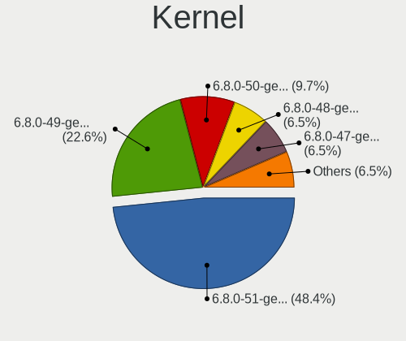
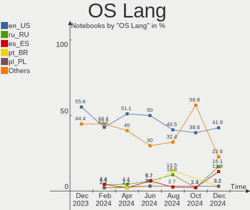
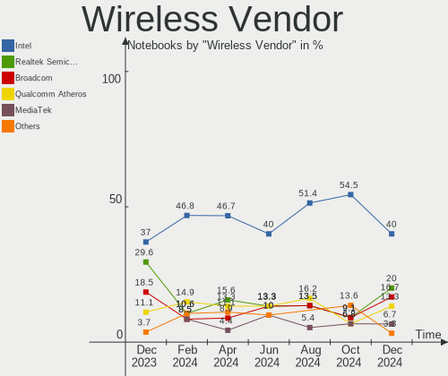
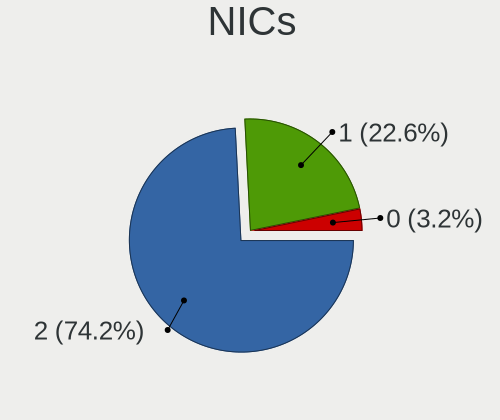

KDE neon - Hardware Trends (Notebooks)
--------------------------------------

A project to identify most popular hardware characteristics and track their change
over time based on data collected by Linux users at https://Linux-Hardware.org.

Anyone can contribute to this report by the [hw-probe](https://github.com/linuxhw/hw-probe) tool:

    sudo -E hw-probe -all -upload

This report is for one last month. Overall report since the beginning of time: [TestDays](https://github.com/linuxhw/TestDays)

Period: Aug, 2023.

Contents
--------

* [ System ](#system)
  - [ OS                       ](#os)
  - [ OS Family                ](#os-family)
  - [ Kernel                   ](#kernel)
  - [ Kernel Family            ](#kernel-family)
  - [ Kernel Major Ver.        ](#kernel-major-ver)
  - [ Arch                     ](#arch)
  - [ DE                       ](#de)
  - [ Display Server           ](#display-server)
  - [ Display Manager          ](#display-manager)
  - [ OS Lang                  ](#os-lang)
  - [ Boot Mode                ](#boot-mode)
  - [ Filesystem               ](#filesystem)
  - [ Part. scheme             ](#part-scheme)
  - [ Dual Boot with Linux/BSD ](#dual-boot-with-linuxbsd)
  - [ Dual Boot (Win)          ](#dual-boot-win)

* [ Board ](#board)
  - [ Vendor                   ](#vendor)
  - [ Model                    ](#model)
  - [ Model Family             ](#model-family)
  - [ MFG Year                 ](#mfg-year)
  - [ Form Factor              ](#form-factor)
  - [ Secure Boot              ](#secure-boot)
  - [ Coreboot                 ](#coreboot)
  - [ RAM Size                 ](#ram-size)
  - [ RAM Used                 ](#ram-used)
  - [ Total Drives             ](#total-drives)
  - [ Has CD-ROM               ](#has-cd-rom)
  - [ Has Ethernet             ](#has-ethernet)
  - [ Has WiFi                 ](#has-wifi)
  - [ Has Bluetooth            ](#has-bluetooth)

* [ Location ](#location)
  - [ Country                  ](#country)
  - [ City                     ](#city)

* [ Drives ](#drives)
  - [ Drive Vendor             ](#drive-vendor)
  - [ Drive Model              ](#drive-model)
  - [ HDD Vendor               ](#hdd-vendor)
  - [ SSD Vendor               ](#ssd-vendor)
  - [ Drive Kind               ](#drive-kind)
  - [ Drive Connector          ](#drive-connector)
  - [ Drive Size               ](#drive-size)
  - [ Space Total              ](#space-total)
  - [ Space Used               ](#space-used)
  - [ Malfunc. Drives          ](#malfunc-drives)
  - [ Malfunc. Drive Vendor    ](#malfunc-drive-vendor)
  - [ Malfunc. HDD Vendor      ](#malfunc-hdd-vendor)
  - [ Malfunc. Drive Kind      ](#malfunc-drive-kind)
  - [ Failed Drives            ](#failed-drives)
  - [ Failed Drive Vendor      ](#failed-drive-vendor)
  - [ Drive Status             ](#drive-status)

* [ Storage controller ](#storage-controller)
  - [ Storage Vendor           ](#storage-vendor)
  - [ Storage Model            ](#storage-model)
  - [ Storage Kind             ](#storage-kind)

* [ Processor ](#processor)
  - [ CPU Vendor               ](#cpu-vendor)
  - [ CPU Model                ](#cpu-model)
  - [ CPU Model Family         ](#cpu-model-family)
  - [ CPU Cores                ](#cpu-cores)
  - [ CPU Sockets              ](#cpu-sockets)
  - [ CPU Threads              ](#cpu-threads)
  - [ CPU Op-Modes             ](#cpu-op-modes)
  - [ CPU Microcode            ](#cpu-microcode)
  - [ CPU Microarch            ](#cpu-microarch)

* [ Graphics ](#graphics)
  - [ GPU Vendor               ](#gpu-vendor)
  - [ GPU Model                ](#gpu-model)
  - [ GPU Combo                ](#gpu-combo)
  - [ GPU Driver               ](#gpu-driver)
  - [ GPU Memory               ](#gpu-memory)

* [ Monitor ](#monitor)
  - [ Monitor Vendor           ](#monitor-vendor)
  - [ Monitor Model            ](#monitor-model)
  - [ Monitor Resolution       ](#monitor-resolution)
  - [ Monitor Diagonal         ](#monitor-diagonal)
  - [ Monitor Width            ](#monitor-width)
  - [ Aspect Ratio             ](#aspect-ratio)
  - [ Monitor Area             ](#monitor-area)
  - [ Pixel Density            ](#pixel-density)
  - [ Multiple Monitors        ](#multiple-monitors)

* [ Network ](#network)
  - [ Net Controller Vendor    ](#net-controller-vendor)
  - [ Net Controller Model     ](#net-controller-model)
  - [ Wireless Vendor          ](#wireless-vendor)
  - [ Wireless Model           ](#wireless-model)
  - [ Ethernet Vendor          ](#ethernet-vendor)
  - [ Ethernet Model           ](#ethernet-model)
  - [ Net Controller Kind      ](#net-controller-kind)
  - [ Used Controller          ](#used-controller)
  - [ NICs                     ](#nics)
  - [ IPv6                     ](#ipv6)

* [ Bluetooth ](#bluetooth)
  - [ Bluetooth Vendor         ](#bluetooth-vendor)
  - [ Bluetooth Model          ](#bluetooth-model)

* [ Sound ](#sound)
  - [ Sound Vendor             ](#sound-vendor)
  - [ Sound Model              ](#sound-model)

* [ Memory ](#memory)
  - [ Memory Vendor            ](#memory-vendor)
  - [ Memory Model             ](#memory-model)
  - [ Memory Kind              ](#memory-kind)
  - [ Memory Form Factor       ](#memory-form-factor)
  - [ Memory Size              ](#memory-size)
  - [ Memory Speed             ](#memory-speed)

* [ Printers & scanners ](#printers--scanners)
  - [ Printer Vendor           ](#printer-vendor)
  - [ Printer Model            ](#printer-model)
  - [ Scanner Vendor           ](#scanner-vendor)
  - [ Scanner Model            ](#scanner-model)

* [ Camera ](#camera)
  - [ Camera Vendor            ](#camera-vendor)
  - [ Camera Model             ](#camera-model)

* [ Security ](#security)
  - [ Fingerprint Vendor       ](#fingerprint-vendor)
  - [ Fingerprint Model        ](#fingerprint-model)
  - [ Chipcard Vendor          ](#chipcard-vendor)
  - [ Chipcard Model           ](#chipcard-model)

* [ Unsupported ](#unsupported)
  - [ Unsupported Devices      ](#unsupported-devices)
  - [ Unsupported Device Types ](#unsupported-device-types)

System
------

OS
--

Installed operating systems

| Name           | Notebooks | Percent |
|----------------|-----------|---------|
| KDE neon 22.04 | 35        | 97.22%  |
| KDE neon 20.04 | 1         | 2.78%   |

OS Family
---------

OS without a version

| Name     | Notebooks | Percent |
|----------|-----------|---------|
| KDE neon | 36        | 100%    |

Kernel
------

Version of the Linux kernel

| Version              | Notebooks | Percent |
|----------------------|-----------|---------|
| 6.2.0-26-generic     | 22        | 61.11%  |
| 5.19.0-50-generic    | 8         | 22.22%  |
| 5.19.0-46-generic    | 2         | 5.56%   |
| 6.4.8-060408-generic | 1         | 2.78%   |
| 6.2.0-31-generic     | 1         | 2.78%   |
| 5.19.0-45-generic    | 1         | 2.78%   |
| 5.15.0-79-generic    | 1         | 2.78%   |

Kernel Family
-------------

Linux kernel without a distro release

| Version | Notebooks | Percent |
|---------|-----------|---------|
| 6.2.0   | 23        | 63.89%  |
| 5.19.0  | 11        | 30.56%  |
| 6.4.8   | 1         | 2.78%   |
| 5.15.0  | 1         | 2.78%   |

Kernel Major Ver.
-----------------

Linux kernel major version

| Version | Notebooks | Percent |
|---------|-----------|---------|
| 6.2     | 23        | 63.89%  |
| 5.19    | 11        | 30.56%  |
| 6.4     | 1         | 2.78%   |
| 5.15    | 1         | 2.78%   |

Arch
----

OS architecture (x86_64, i586, etc.)

| Name   | Notebooks | Percent |
|--------|-----------|---------|
| x86_64 | 36        | 100%    |

DE
--

Desktop Environment

| Name  | Notebooks | Percent |
|-------|-----------|---------|
| KDE5  | 35        | 97.22%  |
| GNOME | 1         | 2.78%   |

Display Server
--------------

X11 or Wayland

| Name    | Notebooks | Percent |
|---------|-----------|---------|
| X11     | 30        | 83.33%  |
| Wayland | 6         | 16.67%  |

Display Manager
---------------

SDDM, LightDM, etc.

| Name    | Notebooks | Percent |
|---------|-----------|---------|
| Unknown | 29        | 80.56%  |
| SDDM    | 7         | 19.44%  |

OS Lang
-------

Language

| Lang  | Notebooks | Percent |
|-------|-----------|---------|
| en_US | 15        | 41.67%  |
| it_IT | 4         | 11.11%  |
| ru_RU | 2         | 5.56%   |
| en_GB | 2         | 5.56%   |
| de_DE | 2         | 5.56%   |
| zh_CN | 1         | 2.78%   |
| tr_TR | 1         | 2.78%   |
| lt_LT | 1         | 2.78%   |
| es_VE | 1         | 2.78%   |
| es_MX | 1         | 2.78%   |
| en_ZA | 1         | 2.78%   |
| en_IN | 1         | 2.78%   |
| en_IE | 1         | 2.78%   |
| en_CA | 1         | 2.78%   |
| cs_CZ | 1         | 2.78%   |
| C     | 1         | 2.78%   |

Boot Mode
---------

EFI or BIOS

| Mode | Notebooks | Percent |
|------|-----------|---------|
| BIOS | 31        | 86.11%  |
| EFI  | 5         | 13.89%  |

Filesystem
----------

Type of filesystem

| Type    | Notebooks | Percent |
|---------|-----------|---------|
| Ext4    | 33        | 91.67%  |
| Tmpfs   | 2         | 5.56%   |
| Overlay | 1         | 2.78%   |

Part. scheme
------------

Scheme of partitioning

| Type    | Notebooks | Percent |
|---------|-----------|---------|
| Unknown | 29        | 80.56%  |
| GPT     | 6         | 16.67%  |
| MBR     | 1         | 2.78%   |

Dual Boot with Linux/BSD
------------------------

Hosting more than one Linux/BSD

| Dual boot | Notebooks | Percent |
|-----------|-----------|---------|
| No        | 36        | 100%    |

Dual Boot (Win)
---------------

Hosting Linux and Windows

| Dual boot | Notebooks | Percent |
|-----------|-----------|---------|
| No        | 33        | 91.67%  |
| Yes       | 3         | 8.33%   |

Board
-----

Vendor
------

Motherboard manufacturer

| Name                | Notebooks | Percent |
|---------------------|-----------|---------|
| Dell                | 9         | 25%     |
| Lenovo              | 7         | 19.44%  |
| Hewlett-Packard     | 6         | 16.67%  |
| Acer                | 4         | 11.11%  |
| ASUSTek Computer    | 3         | 8.33%   |
| SLIMBOOK            | 1         | 2.78%   |
| MSI                 | 1         | 2.78%   |
| HUAWEI              | 1         | 2.78%   |
| Gigabyte Technology | 1         | 2.78%   |
| Fujitsu             | 1         | 2.78%   |
| ASRock              | 1         | 2.78%   |
| Apple               | 1         | 2.78%   |

Model
-----

Motherboard model

| Name                                   | Notebooks | Percent |
|----------------------------------------|-----------|---------|
| Dell Latitude 5400                     | 2         | 5.56%   |
| SLIMBOOK PROX-AMD5                     | 1         | 2.78%   |
| MSI GP66 Leopard 10UE                  | 1         | 2.78%   |
| Lenovo ThinkPad X260 20F600A2MN        | 1         | 2.78%   |
| Lenovo ThinkPad L14 Gen 2a 20X50049GE  | 1         | 2.78%   |
| Lenovo Legion S7 15ACH6 82K8           | 1         | 2.78%   |
| Lenovo IdeaPad 5 14ALC05 82LM          | 1         | 2.78%   |
| Lenovo IdeaPad 3 15ALC6 82KU           | 1         | 2.78%   |
| Lenovo IdeaPad 3 14ITL6 82H7           | 1         | 2.78%   |
| Lenovo G500 20236                      | 1         | 2.78%   |
| HUAWEI NBLB-WAX9N                      | 1         | 2.78%   |
| HP ZBook 14u G5                        | 1         | 2.78%   |
| HP Stream Laptop 14-ax0XX              | 1         | 2.78%   |
| HP Laptop 17-cn0xxx                    | 1         | 2.78%   |
| HP EliteBook 8470p                     | 1         | 2.78%   |
| HP EliteBook 820 G1                    | 1         | 2.78%   |
| HP Compaq Presario CQ40                | 1         | 2.78%   |
| Gigabyte AORUS 17G XB                  | 1         | 2.78%   |
| Fujitsu LIFEBOOK AH530                 | 1         | 2.78%   |
| Dell XPS L521X                         | 1         | 2.78%   |
| Dell XPS 15 9500                       | 1         | 2.78%   |
| Dell Vostro 5581                       | 1         | 2.78%   |
| Dell Vostro 5468                       | 1         | 2.78%   |
| Dell Latitude E5540                    | 1         | 2.78%   |
| Dell Inspiron 1464                     | 1         | 2.78%   |
| Dell Inspiron 13-5368                  | 1         | 2.78%   |
| ASUS X540SA                            | 1         | 2.78%   |
| ASUS VivoBook_ASUSLaptop X415EA_X415EA | 1         | 2.78%   |
| ASUS G75VW                             | 1         | 2.78%   |
| ASRock H81M-HG4 R4.0                   | 1         | 2.78%   |
| Apple MacBook8,1                       | 1         | 2.78%   |
| Acer Aspire xxxx                       | 1         | 2.78%   |
| Acer Aspire E1-532                     | 1         | 2.78%   |
| Acer Aspire A715-71G                   | 1         | 2.78%   |
| Acer Aspire 7250                       | 1         | 2.78%   |

Model Family
------------

Motherboard model prefix

| Name               | Notebooks | Percent |
|--------------------|-----------|---------|
| Acer Aspire        | 4         | 11.11%  |
| Lenovo IdeaPad     | 3         | 8.33%   |
| Dell Latitude      | 3         | 8.33%   |
| Lenovo ThinkPad    | 2         | 5.56%   |
| HP EliteBook       | 2         | 5.56%   |
| Dell XPS           | 2         | 5.56%   |
| Dell Vostro        | 2         | 5.56%   |
| Dell Inspiron      | 2         | 5.56%   |
| SLIMBOOK PROX-AMD5 | 1         | 2.78%   |
| MSI GP66           | 1         | 2.78%   |
| Lenovo Legion      | 1         | 2.78%   |
| Lenovo G500        | 1         | 2.78%   |
| HUAWEI NBLB-WAX9N  | 1         | 2.78%   |
| HP ZBook           | 1         | 2.78%   |
| HP Stream          | 1         | 2.78%   |
| HP Laptop          | 1         | 2.78%   |
| HP Compaq          | 1         | 2.78%   |
| Gigabyte AORUS     | 1         | 2.78%   |
| Fujitsu LIFEBOOK   | 1         | 2.78%   |
| ASUS X540SA        | 1         | 2.78%   |
| ASUS VivoBook      | 1         | 2.78%   |
| ASUS G75VW         | 1         | 2.78%   |
| ASRock H81M-HG4    | 1         | 2.78%   |
| Apple MacBook8     | 1         | 2.78%   |

MFG Year
--------

Motherboard manufacture year

| Year | Notebooks | Percent |
|------|-----------|---------|
| 2021 | 8         | 22.22%  |
| 2019 | 4         | 11.11%  |
| 2020 | 3         | 8.33%   |
| 2018 | 3         | 8.33%   |
| 2016 | 3         | 8.33%   |
| 2013 | 3         | 8.33%   |
| 2010 | 3         | 8.33%   |
| 2012 | 2         | 5.56%   |
| 2011 | 2         | 5.56%   |
| 2022 | 1         | 2.78%   |
| 2017 | 1         | 2.78%   |
| 2015 | 1         | 2.78%   |
| 2014 | 1         | 2.78%   |
| 2008 | 1         | 2.78%   |

Form Factor
-----------

Physical design of the computer

| Name     | Notebooks | Percent |
|----------|-----------|---------|
| Notebook | 36        | 100%    |

Secure Boot
-----------

Enabled or disabled

| State    | Notebooks | Percent |
|----------|-----------|---------|
| Disabled | 36        | 100%    |

Coreboot
--------

Have coreboot on board

| Used | Notebooks | Percent |
|------|-----------|---------|
| No   | 36        | 100%    |

RAM Size
--------

Total RAM memory

| Size in GB  | Notebooks | Percent |
|-------------|-----------|---------|
| 4.01-8.0    | 9         | 25%     |
| 16.01-24.0  | 9         | 25%     |
| 32.01-64.0  | 6         | 16.67%  |
| 8.01-16.0   | 5         | 13.89%  |
| 3.01-4.0    | 4         | 11.11%  |
| 64.01-256.0 | 2         | 5.56%   |
| 1.01-2.0    | 1         | 2.78%   |

RAM Used
--------

Used RAM memory

| Used GB  | Notebooks | Percent |
|----------|-----------|---------|
| 1.01-2.0 | 14        | 38.89%  |
| 3.01-4.0 | 9         | 25%     |
| 2.01-3.0 | 8         | 22.22%  |
| 4.01-8.0 | 4         | 11.11%  |
| 0.51-1.0 | 1         | 2.78%   |

Total Drives
------------

Number of drives on board

| Drives | Notebooks | Percent |
|--------|-----------|---------|
| 1      | 25        | 69.44%  |
| 2      | 8         | 22.22%  |
| 3      | 2         | 5.56%   |
| 4      | 1         | 2.78%   |

Has CD-ROM
----------

Has CD-ROM on board

| Presented | Notebooks | Percent |
|-----------|-----------|---------|
| No        | 28        | 77.78%  |
| Yes       | 8         | 22.22%  |

Has Ethernet
------------

Has Ethernet on board

| Presented | Notebooks | Percent |
|-----------|-----------|---------|
| Yes       | 25        | 69.44%  |
| No        | 11        | 30.56%  |

Has WiFi
--------

Has WiFi module

| Presented | Notebooks | Percent |
|-----------|-----------|---------|
| Yes       | 35        | 97.22%  |
| No        | 1         | 2.78%   |

Has Bluetooth
-------------

Has Bluetooth module

| Presented | Notebooks | Percent |
|-----------|-----------|---------|
| Yes       | 28        | 77.78%  |
| No        | 8         | 22.22%  |

Location
--------

Country
-------

Geographic location (country)

| Country      | Notebooks | Percent |
|--------------|-----------|---------|
| USA          | 9         | 25%     |
| Italy        | 3         | 8.33%   |
| Germany      | 3         | 8.33%   |
| Russia       | 2         | 5.56%   |
| Venezuela    | 1         | 2.78%   |
| UK           | 1         | 2.78%   |
| Turkey       | 1         | 2.78%   |
| South Africa | 1         | 2.78%   |
| Singapore    | 1         | 2.78%   |
| Serbia       | 1         | 2.78%   |
| Paraguay     | 1         | 2.78%   |
| Pakistan     | 1         | 2.78%   |
| Netherlands  | 1         | 2.78%   |
| Mexico       | 1         | 2.78%   |
| Lithuania    | 1         | 2.78%   |
| India        | 1         | 2.78%   |
| Finland      | 1         | 2.78%   |
| Denmark      | 1         | 2.78%   |
| Czechia      | 1         | 2.78%   |
| Croatia      | 1         | 2.78%   |
| Canada       | 1         | 2.78%   |
| Brazil       | 1         | 2.78%   |
| Australia    | 1         | 2.78%   |

City
----

Geographic location (city)

| City                  | Notebooks | Percent |
|-----------------------|-----------|---------|
| Lawrence              | 2         | 5.56%   |
| Zagreb                | 1         | 2.78%   |
| Yass                  | 1         | 2.78%   |
| Workum                | 1         | 2.78%   |
| Vilnius               | 1         | 2.78%   |
| Turin                 | 1         | 2.78%   |
| Singapore             | 1         | 2.78%   |
| San Lorenzo           | 1         | 2.78%   |
| Ringwood              | 1         | 2.78%   |
| Pueblo                | 1         | 2.78%   |
| Pottstown             | 1         | 2.78%   |
| Ostrava               | 1         | 2.78%   |
| Munich                | 1         | 2.78%   |
| Moscow                | 1         | 2.78%   |
| Kostroma              | 1         | 2.78%   |
| Kelowna               | 1         | 2.78%   |
| Joinville             | 1         | 2.78%   |
| Johannesburg          | 1         | 2.78%   |
| Istanbul              | 1         | 2.78%   |
| Islamabad             | 1         | 2.78%   |
| Fort Worth            | 1         | 2.78%   |
| Espoo                 | 1         | 2.78%   |
| Enumclaw              | 1         | 2.78%   |
| Eberswalde            | 1         | 2.78%   |
| Dayton                | 1         | 2.78%   |
| Copenhagen            | 1         | 2.78%   |
| Ciudad Guayana        | 1         | 2.78%   |
| Chinampa de Gorostiza | 1         | 2.78%   |
| Chandigarh            | 1         | 2.78%   |
| Bradenton             | 1         | 2.78%   |
| Bologna               | 1         | 2.78%   |
| Bionde                | 1         | 2.78%   |
| Belgrade              | 1         | 2.78%   |
| Bayreuth              | 1         | 2.78%   |
| Abilene               | 1         | 2.78%   |

Drives
------

Drive Vendor
------------

Hard drive vendors

| Vendor                      | Notebooks | Drives | Percent |
|-----------------------------|-----------|--------|---------|
| Samsung Electronics         | 6         | 6      | 13.33%  |
| WDC                         | 4         | 4      | 8.89%   |
| SanDisk                     | 4         | 5      | 8.89%   |
| Kingston                    | 4         | 4      | 8.89%   |
| Toshiba                     | 2         | 2      | 4.44%   |
| SK hynix                    | 2         | 2      | 4.44%   |
| Seagate                     | 2         | 4      | 4.44%   |
| Phison Electronics          | 2         | 2      | 4.44%   |
| Micron/Crucial Technology   | 2         | 2      | 4.44%   |
| KIOXIA                      | 2         | 2      | 4.44%   |
| Apple                       | 2         | 2      | 4.44%   |
| WALRAM                      | 1         | 2      | 2.22%   |
| Unknown                     | 1         | 1      | 2.22%   |
| SPCC                        | 1         | 1      | 2.22%   |
| Patriot                     | 1         | 1      | 2.22%   |
| Netac                       | 1         | 1      | 2.22%   |
| Mushkin                     | 1         | 1      | 2.22%   |
| Micron Technology           | 1         | 1      | 2.22%   |
| Kingston Technology Company | 1         | 1      | 2.22%   |
| Hitachi                     | 1         | 1      | 2.22%   |
| HGST                        | 1         | 1      | 2.22%   |
| Gigabyte Technology         | 1         | 1      | 2.22%   |
| A-DATA Technology           | 1         | 1      | 2.22%   |
| Unknown                     | 1         | 1      | 2.22%   |

Drive Model
-----------

Hard drive models

| Model                                               | Notebooks | Percent |
|-----------------------------------------------------|-----------|---------|
| Samsung NVMe SSD Controller SM981/PM981/PM983 500GB | 2         | 4.17%   |
| Phison E12 NVMe Controller 256GB                    | 2         | 4.17%   |
| Micron/Crucial P2 NVMe PCIe SSD 1TB                 | 2         | 4.17%   |
| KIOXIA KBG40ZNS256G NVMe 256GB                      | 2         | 4.17%   |
| WDC WD5000LPCX-75VHAT0 500GB                        | 1         | 2.08%   |
| WDC WD1600BEVT-60ZCT0 160GB                         | 1         | 2.08%   |
| WDC WD10JPVX-00JC3T0 1TB                            | 1         | 2.08%   |
| WDC PC SN730 SDBQNTY-512G-1001 512GB                | 1         | 2.08%   |
| WALRAM SSD 500G                                     | 1         | 2.08%   |
| WALRAM 500G                                         | 1         | 2.08%   |
| Unknown MMC Card  32GB                              | 1         | 2.08%   |
| Toshiba MQ01ABF050 500GB                            | 1         | 2.08%   |
| Toshiba MQ01ABD100H 1TB                             | 1         | 2.08%   |
| SPCC Solid State Disk 240GB                         | 1         | 2.08%   |
| SK hynix SKHynix_HFS512GDE9X084N 512GB              | 1         | 2.08%   |
| SK hynix PC711 NVMe 1TB                             | 1         | 2.08%   |
| Seagate ST9750420AS 752GB                           | 1         | 2.08%   |
| Seagate ST1000LM014-1EJ164 1TB                      | 1         | 2.08%   |
| Seagate ST1000DM003-1CH162 1TB                      | 1         | 2.08%   |
| SanDisk X400 M.2 2280 256GB SSD                     | 1         | 2.08%   |
| Sandisk WDC PC SN530 SDBPMPZ-512G-1101 512GB        | 1         | 2.08%   |
| SanDisk SDSSDH3250G 250GB                           | 1         | 2.08%   |
| SanDisk SD8TB8U256G1001 256GB SSD                   | 1         | 2.08%   |
| Sandisk PC SN520 NVMe SSD 256GB                     | 1         | 2.08%   |
| Samsung SSD 870 EVO 500GB                           | 1         | 2.08%   |
| Samsung SSD 860 EVO 1TB                             | 1         | 2.08%   |
| Samsung Portable SSD T5 250GB                       | 1         | 2.08%   |
| Samsung MZALQ256HBJD-00BL2 256GB                    | 1         | 2.08%   |
| Patriot Burst Elite 480GB SSD                       | 1         | 2.08%   |
| Netac SSD 120GB                                     | 1         | 2.08%   |
| Mushkin MKNSSDCR480GB-7                             | 1         | 2.08%   |
| Micron MTFDKCD512QFM-1BD1AABLA 512GB                | 1         | 2.08%   |
| Kingston Company OM3PDP3 NVMe SSD 256GB             | 1         | 2.08%   |
| Kingston SNVS500G 500GB                             | 1         | 2.08%   |
| Kingston SKC600MS256G 256GB SSD                     | 1         | 2.08%   |
| Kingston SA400S37240G 240GB SSD                     | 1         | 2.08%   |
| Kingston OM8PCP31024F-AI1 1024GB                    | 1         | 2.08%   |
| Hitachi HTS545050B9A300 500GB                       | 1         | 2.08%   |
| HGST HTS545032A7E680 320GB                          | 1         | 2.08%   |
| Gigabyte GP-GSTFS31120GNTD 120GB SSD                | 1         | 2.08%   |

HDD Vendor
----------

Hard disk drive vendors

| Vendor  | Notebooks | Drives | Percent |
|---------|-----------|--------|---------|
| WDC     | 3         | 3      | 30%     |
| Toshiba | 2         | 2      | 20%     |
| Seagate | 2         | 4      | 20%     |
| Hitachi | 1         | 1      | 10%     |
| HGST    | 1         | 1      | 10%     |
| Apple   | 1         | 1      | 10%     |

SSD Vendor
----------

Solid state drive vendors

| Vendor              | Notebooks | Drives | Percent |
|---------------------|-----------|--------|---------|
| SanDisk             | 3         | 3      | 18.75%  |
| Samsung Electronics | 3         | 3      | 18.75%  |
| Kingston            | 2         | 2      | 12.5%   |
| WALRAM              | 1         | 1      | 6.25%   |
| SPCC                | 1         | 1      | 6.25%   |
| Patriot             | 1         | 1      | 6.25%   |
| Netac               | 1         | 1      | 6.25%   |
| Mushkin             | 1         | 1      | 6.25%   |
| Gigabyte Technology | 1         | 1      | 6.25%   |
| A-DATA Technology   | 1         | 1      | 6.25%   |
| Unknown             | 1         | 1      | 6.25%   |

Drive Kind
----------

HDD or SSD

| Kind    | Notebooks | Drives | Percent |
|---------|-----------|--------|---------|
| NVMe    | 18        | 19     | 40.91%  |
| SSD     | 14        | 16     | 31.82%  |
| HDD     | 10        | 12     | 22.73%  |
| MMC     | 1         | 1      | 2.27%   |
| Unknown | 1         | 1      | 2.27%   |

Drive Connector
---------------

SATA, SAS, NVMe, etc.

| Type | Notebooks | Drives | Percent |
|------|-----------|--------|---------|
| SATA | 20        | 28     | 50%     |
| NVMe | 18        | 19     | 45%     |
| SAS  | 1         | 1      | 2.5%    |
| MMC  | 1         | 1      | 2.5%    |

Drive Size
----------

Size of hard drive

| Size in TB | Notebooks | Drives | Percent |
|------------|-----------|--------|---------|
| 0.01-0.5   | 20        | 21     | 80%     |
| 0.51-1.0   | 5         | 7      | 20%     |

Space Total
-----------

Amount of disk space available on the file system

| Size in GB     | Notebooks | Percent |
|----------------|-----------|---------|
| 251-500        | 11        | 30.56%  |
| 101-250        | 10        | 27.78%  |
| 501-1000       | 5         | 13.89%  |
| 2001-3000      | 2         | 5.56%   |
| 1001-2000      | 2         | 5.56%   |
| Unknown        | 2         | 5.56%   |
| More than 3000 | 1         | 2.78%   |
| 21-50          | 1         | 2.78%   |
| 1-20           | 1         | 2.78%   |
| 51-100         | 1         | 2.78%   |

Space Used
----------

Amount of used disk space

| Used GB   | Notebooks | Percent |
|-----------|-----------|---------|
| 1-20      | 14        | 38.89%  |
| 51-100    | 7         | 19.44%  |
| 21-50     | 4         | 11.11%  |
| 251-500   | 3         | 8.33%   |
| 101-250   | 3         | 8.33%   |
| 1001-2000 | 3         | 8.33%   |
| Unknown   | 2         | 5.56%   |

Malfunc. Drives
---------------

Drive models with a malfunction

| Model                     | Notebooks | Drives | Percent |
|---------------------------|-----------|--------|---------|
| Seagate ST9750420AS 752GB | 1         | 1      | 100%    |

Malfunc. Drive Vendor
---------------------

Vendors of faulty drives

| Vendor  | Notebooks | Drives | Percent |
|---------|-----------|--------|---------|
| Seagate | 1         | 1      | 100%    |

Malfunc. HDD Vendor
-------------------

Vendors of faulty HDD drives

| Vendor  | Notebooks | Drives | Percent |
|---------|-----------|--------|---------|
| Seagate | 1         | 1      | 100%    |

Malfunc. Drive Kind
-------------------

Kinds of faulty drives

| Kind | Notebooks | Drives | Percent |
|------|-----------|--------|---------|
| HDD  | 1         | 1      | 100%    |

Failed Drives
-------------

Failed drive models

Zero info for selected period =(

Failed Drive Vendor
-------------------

Failed drive vendors

Zero info for selected period =(

Drive Status
------------

Number of failed and malfunc. drives

| Status   | Notebooks | Drives | Percent |
|----------|-----------|--------|---------|
| Detected | 31        | 40     | 81.58%  |
| Works    | 6         | 8      | 15.79%  |
| Malfunc  | 1         | 1      | 2.63%   |

Storage controller
------------------

Storage Vendor
--------------

Storage controller vendors

| Vendor                      | Notebooks | Percent |
|-----------------------------|-----------|---------|
| Intel                       | 23        | 50%     |
| AMD                         | 4         | 8.7%    |
| SanDisk                     | 3         | 6.52%   |
| Samsung Electronics         | 3         | 6.52%   |
| Kingston Technology Company | 3         | 6.52%   |
| SK hynix                    | 2         | 4.35%   |
| Phison Electronics          | 2         | 4.35%   |
| Micron/Crucial Technology   | 2         | 4.35%   |
| KIOXIA                      | 2         | 4.35%   |
| Micron Technology           | 1         | 2.17%   |
| Apple                       | 1         | 2.17%   |

Storage Model
-------------

Storage controller models

| Model                                                                            | Notebooks | Percent |
|----------------------------------------------------------------------------------|-----------|---------|
| Intel Volume Management Device NVMe RAID Controller                              | 3         | 5.77%   |
| Intel Tiger Lake-LP SATA Controller                                              | 3         | 5.77%   |
| Intel Sunrise Point-LP SATA Controller [AHCI mode]                               | 3         | 5.77%   |
| Intel Cannon Point-LP SATA Controller [AHCI Mode]                                | 3         | 5.77%   |
| SK hynix Gold P31/BC711/PC711 NVMe Solid State Drive                             | 2         | 3.85%   |
| Samsung NVMe SSD Controller SM981/PM981/PM983                                    | 2         | 3.85%   |
| Phison E12 NVMe Controller                                                       | 2         | 3.85%   |
| Micron/Crucial P2 [Nick P2] / P3 / P3 Plus NVMe PCIe SSD (DRAM-less)             | 2         | 3.85%   |
| KIOXIA NVMe SSD Controller BG4 (DRAM-less)                                       | 2         | 3.85%   |
| Intel 82801 Mobile SATA Controller [RAID mode]                                   | 2         | 3.85%   |
| Intel 8 Series SATA Controller 1 [AHCI mode]                                     | 2         | 3.85%   |
| Intel 7 Series Chipset Family 6-port SATA Controller [AHCI mode]                 | 2         | 3.85%   |
| Intel 5 Series/3400 Series Chipset 4 port SATA AHCI Controller                   | 2         | 3.85%   |
| AMD SB7x0/SB8x0/SB9x0 SATA Controller [AHCI mode]                                | 2         | 3.85%   |
| AMD FCH SATA Controller [AHCI mode]                                              | 2         | 3.85%   |
| SanDisk WD Black SN750 / PC SN730 NVMe SSD                                       | 1         | 1.92%   |
| SanDisk PC SN530 NVMe SSD (DRAM-less)                                            | 1         | 1.92%   |
| SanDisk PC SN520 NVMe SSD                                                        | 1         | 1.92%   |
| Samsung NVMe SSD Controller 980                                                  | 1         | 1.92%   |
| Micron 2400 NVMe SSD (DRAM-less)                                                 | 1         | 1.92%   |
| Kingston Company OM8PCP Design-In PCIe 3 NVMe SSD (DRAM-less)                    | 1         | 1.92%   |
| Kingston Company OM3PDP3 NVMe SSD                                                | 1         | 1.92%   |
| Kingston Company NV1 NVMe SSD                                                    | 1         | 1.92%   |
| Intel HM170/QM170 Chipset SATA Controller [AHCI Mode]                            | 1         | 1.92%   |
| Intel Comet Lake SATA AHCI Controller                                            | 1         | 1.92%   |
| Intel Atom/Celeron/Pentium Processor x5-E8000/J3xxx/N3xxx Series SATA Controller | 1         | 1.92%   |
| Intel 82801IBM/IEM (ICH9M/ICH9M-E) 4 port SATA Controller [AHCI mode]            | 1         | 1.92%   |
| Intel 8 Series/C220 Series Chipset Family 6-port SATA Controller 1 [AHCI mode]   | 1         | 1.92%   |
| Intel 7 Series Chipset Family 4-port SATA Controller [IDE mode]                  | 1         | 1.92%   |
| Intel 7 Series Chipset Family 2-port SATA Controller [IDE mode]                  | 1         | 1.92%   |
| Apple S1X NVMe Controller                                                        | 1         | 1.92%   |
| AMD SB7x0/SB8x0/SB9x0 SATA Controller [IDE mode]                                 | 1         | 1.92%   |
| AMD SB7x0/SB8x0/SB9x0 IDE Controller                                             | 1         | 1.92%   |

Storage Kind
------------

Kind of storage controller (IDE, SATA, NVMe, SAS, ...)

| Kind | Notebooks | Percent |
|------|-----------|---------|
| SATA | 24        | 48.98%  |
| NVMe | 18        | 36.73%  |
| RAID | 5         | 10.2%   |
| IDE  | 2         | 4.08%   |

Processor
---------

CPU Vendor
----------

Processor vendors

| Vendor | Notebooks | Percent |
|--------|-----------|---------|
| Intel  | 29        | 80.56%  |
| AMD    | 7         | 19.44%  |

CPU Model
---------

Processor models

| Model                                      | Notebooks | Percent |
|--------------------------------------------|-----------|---------|
| Intel Core i5-8365U CPU @ 1.60GHz          | 2         | 5.56%   |
| AMD Ryzen 5 5500U with Radeon Graphics     | 2         | 5.56%   |
| Intel Pentium Gold 7505 @ 2.00GHz          | 1         | 2.78%   |
| Intel Pentium CPU N3710 @ 1.60GHz          | 1         | 2.78%   |
| Intel Pentium CPU 2020M @ 2.40GHz          | 1         | 2.78%   |
| Intel Core M-5Y71 CPU @ 1.20GHz            | 1         | 2.78%   |
| Intel Core i9-10885H CPU @ 2.40GHz         | 1         | 2.78%   |
| Intel Core i7-8565U CPU @ 1.80GHz          | 1         | 2.78%   |
| Intel Core i7-8550U CPU @ 1.80GHz          | 1         | 2.78%   |
| Intel Core i7-3612QM CPU @ 2.10GHz         | 1         | 2.78%   |
| Intel Core i7-3610QM CPU @ 2.30GHz         | 1         | 2.78%   |
| Intel Core i7-10875H CPU @ 2.30GHz         | 1         | 2.78%   |
| Intel Core i7-10870H CPU @ 2.20GHz         | 1         | 2.78%   |
| Intel Core i5-7300HQ CPU @ 2.50GHz         | 1         | 2.78%   |
| Intel Core i5-7200U CPU @ 2.50GHz          | 1         | 2.78%   |
| Intel Core i5-6200U CPU @ 2.30GHz          | 1         | 2.78%   |
| Intel Core i5-4460 CPU @ 3.20GHz           | 1         | 2.78%   |
| Intel Core i5-4310U CPU @ 2.00GHz          | 1         | 2.78%   |
| Intel Core i5-4200U CPU @ 1.60GHz          | 1         | 2.78%   |
| Intel Core i5-3230M CPU @ 2.60GHz          | 1         | 2.78%   |
| Intel Core i5-10210U CPU @ 1.60GHz         | 1         | 2.78%   |
| Intel Core i5 CPU M 480 @ 2.67GHz          | 1         | 2.78%   |
| Intel Core i3-6100U CPU @ 2.30GHz          | 1         | 2.78%   |
| Intel Core i3 CPU M 330 @ 2.13GHz          | 1         | 2.78%   |
| Intel Core 2 Duo CPU T5800 @ 2.00GHz       | 1         | 2.78%   |
| Intel Celeron CPU N3060 @ 1.60GHz          | 1         | 2.78%   |
| Intel Celeron 2955U @ 1.40GHz              | 1         | 2.78%   |
| Intel 11th Gen Core i5-1155G7 @ 2.50GHz    | 1         | 2.78%   |
| Intel 11th Gen Core i5-1135G7 @ 2.40GHz    | 1         | 2.78%   |
| AMD Ryzen 7 PRO 5850U with Radeon Graphics | 1         | 2.78%   |
| AMD Ryzen 7 5800H with Radeon Graphics     | 1         | 2.78%   |
| AMD Ryzen 7 5700U with Radeon Graphics     | 1         | 2.78%   |
| AMD Phenom II N930 Quad-Core Processor     | 1         | 2.78%   |
| AMD E-300 APU with Radeon HD Graphics      | 1         | 2.78%   |

CPU Model Family
----------------

Processor model prefix

| Model              | Notebooks | Percent |
|--------------------|-----------|---------|
| Intel Core i5      | 11        | 30.56%  |
| Intel Core i7      | 6         | 16.67%  |
| Other              | 2         | 5.56%   |
| Intel Pentium      | 2         | 5.56%   |
| Intel Core i3      | 2         | 5.56%   |
| Intel Celeron      | 2         | 5.56%   |
| AMD Ryzen 7        | 2         | 5.56%   |
| AMD Ryzen 5        | 2         | 5.56%   |
| Intel Pentium Gold | 1         | 2.78%   |
| Intel Core M       | 1         | 2.78%   |
| Intel Core i9      | 1         | 2.78%   |
| Intel Core 2 Duo   | 1         | 2.78%   |
| AMD Ryzen 7 PRO    | 1         | 2.78%   |
| AMD Phenom II      | 1         | 2.78%   |
| AMD E              | 1         | 2.78%   |

CPU Cores
---------

Number of processor cores

| Number | Notebooks | Percent |
|--------|-----------|---------|
| 2      | 15        | 41.67%  |
| 4      | 13        | 36.11%  |
| 8      | 6         | 16.67%  |
| 6      | 2         | 5.56%   |

CPU Sockets
-----------

Number of sockets

| Number | Notebooks | Percent |
|--------|-----------|---------|
| 1      | 36        | 100%    |

CPU Threads
-----------

Threads per core (Hyper-Threading)

| Number | Notebooks | Percent |
|--------|-----------|---------|
| 2      | 27        | 75%     |
| 1      | 9         | 25%     |

CPU Op-Modes
------------

CPU Operation Modes (32-bit, 64-bit)

| Op mode        | Notebooks | Percent |
|----------------|-----------|---------|
| 32-bit, 64-bit | 36        | 100%    |

CPU Microcode
-------------

Microcode number

| Number     | Notebooks | Percent |
|------------|-----------|---------|
| Unknown    | 29        | 80.56%  |
| 0x306a9    | 2         | 5.56%   |
| 0x806ec    | 1         | 2.78%   |
| 0x806c2    | 1         | 2.78%   |
| 0x406e3    | 1         | 2.78%   |
| 0x40651    | 1         | 2.78%   |
| 0x0a50000d | 1         | 2.78%   |

CPU Microarch
-------------

Microarchitecture

| Name       | Notebooks | Percent |
|------------|-----------|---------|
| KabyLake   | 7         | 19.44%  |
| IvyBridge  | 4         | 11.11%  |
| Haswell    | 4         | 11.11%  |
| TigerLake  | 3         | 8.33%   |
| CometLake  | 3         | 8.33%   |
| Unknown    | 3         | 8.33%   |
| Zen 3      | 2         | 5.56%   |
| Westmere   | 2         | 5.56%   |
| Skylake    | 2         | 5.56%   |
| Silvermont | 2         | 5.56%   |
| K10        | 1         | 2.78%   |
| Core       | 1         | 2.78%   |
| Broadwell  | 1         | 2.78%   |
| Bobcat     | 1         | 2.78%   |

Graphics
--------

GPU Vendor
----------

Vendors of graphics cards

| Vendor | Notebooks | Percent |
|--------|-----------|---------|
| Intel  | 26        | 59.09%  |
| Nvidia | 10        | 22.73%  |
| AMD    | 8         | 18.18%  |

GPU Model
---------

Graphics card models

| Model                                                                                    | Notebooks | Percent |
|------------------------------------------------------------------------------------------|-----------|---------|
| Intel WhiskeyLake-U GT2 [UHD Graphics 620]                                               | 3         | 6.82%   |
| Intel Haswell-ULT Integrated Graphics Controller                                         | 3         | 6.82%   |
| Intel CometLake-H GT2 [UHD Graphics]                                                     | 3         | 6.82%   |
| AMD Lucienne                                                                             | 3         | 6.82%   |
| Nvidia GA106M [GeForce RTX 3060 Mobile / Max-Q]                                          | 2         | 4.55%   |
| Intel TigerLake-LP GT2 [Iris Xe Graphics]                                                | 2         | 4.55%   |
| Intel Skylake GT2 [HD Graphics 520]                                                      | 2         | 4.55%   |
| Intel Core Processor Integrated Graphics Controller                                      | 2         | 4.55%   |
| Intel Atom/Celeron/Pentium Processor x5-E8000/J3xxx/N3xxx Integrated Graphics Controller | 2         | 4.55%   |
| Intel 3rd Gen Core processor Graphics Controller                                         | 2         | 4.55%   |
| Nvidia TU117M [GeForce GTX 1650 Ti Mobile]                                               | 1         | 2.27%   |
| Nvidia TU116 [GeForce GTX 1660]                                                          | 1         | 2.27%   |
| Nvidia TU104M [GeForce RTX 2070 SUPER Mobile / Max-Q]                                    | 1         | 2.27%   |
| Nvidia GP107M [GeForce GTX 1050 Mobile]                                                  | 1         | 2.27%   |
| Nvidia GM108M [GeForce MX130]                                                            | 1         | 2.27%   |
| Nvidia GM108M [GeForce 940MX]                                                            | 1         | 2.27%   |
| Nvidia GK107M [GeForce GTX 660M]                                                         | 1         | 2.27%   |
| Nvidia GK107M [GeForce GT 640M]                                                          | 1         | 2.27%   |
| Intel UHD Graphics 620                                                                   | 1         | 2.27%   |
| Intel Tiger Lake-LP GT2 [UHD Graphics G4]                                                | 1         | 2.27%   |
| Intel Mobile 4 Series Chipset Integrated Graphics Controller                             | 1         | 2.27%   |
| Intel HD Graphics 630                                                                    | 1         | 2.27%   |
| Intel HD Graphics 620                                                                    | 1         | 2.27%   |
| Intel HD Graphics 5300                                                                   | 1         | 2.27%   |
| Intel CometLake-U GT2 [UHD Graphics]                                                     | 1         | 2.27%   |
| AMD Wrestler [Radeon HD 6310]                                                            | 1         | 2.27%   |
| AMD Thames [Radeon HD 7550M/7570M/7650M]                                                 | 1         | 2.27%   |
| AMD Madison [Mobility Radeon HD 5650/5750 / 6530M/6550M]                                 | 1         | 2.27%   |
| AMD Lexa XT [Radeon PRO WX 3100]                                                         | 1         | 2.27%   |
| AMD Cezanne [Radeon Vega Series / Radeon Vega Mobile Series]                             | 1         | 2.27%   |

GPU Combo
---------

Combinations of graphics cards

| Name           | Notebooks | Percent |
|----------------|-----------|---------|
| 1 x Intel      | 18        | 50%     |
| Intel + Nvidia | 7         | 19.44%  |
| 1 x AMD        | 7         | 19.44%  |
| 1 x Nvidia     | 3         | 8.33%   |
| Intel + AMD    | 1         | 2.78%   |

GPU Driver
----------

Free vs proprietary

| Driver      | Notebooks | Percent |
|-------------|-----------|---------|
| Free        | 28        | 77.78%  |
| Proprietary | 7         | 19.44%  |
| Unknown     | 1         | 2.78%   |

GPU Memory
----------

Total video memory

| Size in GB | Notebooks | Percent |
|------------|-----------|---------|
| Unknown    | 32        | 88.89%  |
| 1.01-2.0   | 2         | 5.56%   |
| 5.01-6.0   | 1         | 2.78%   |
| 0.51-1.0   | 1         | 2.78%   |

Monitor
-------

Monitor Vendor
--------------

Monitor vendors

| Vendor                  | Notebooks | Percent |
|-------------------------|-----------|---------|
| AU Optronics            | 11        | 26.19%  |
| BOE                     | 7         | 16.67%  |
| Chimei Innolux          | 5         | 11.9%   |
| LG Display              | 3         | 7.14%   |
| Sharp                   | 2         | 4.76%   |
| Samsung Electronics     | 2         | 4.76%   |
| Goldstar                | 2         | 4.76%   |
| Philips                 | 1         | 2.38%   |
| NEC Computers           | 1         | 2.38%   |
| LG Philips              | 1         | 2.38%   |
| Dell                    | 1         | 2.38%   |
| CSO                     | 1         | 2.38%   |
| Chi Mei Optoelectronics | 1         | 2.38%   |
| CHD                     | 1         | 2.38%   |
| Apple                   | 1         | 2.38%   |
| Ancor Communications    | 1         | 2.38%   |
| Acer                    | 1         | 2.38%   |

Monitor Model
-------------

Monitor models

| Model                                                                    | Notebooks | Percent |
|--------------------------------------------------------------------------|-----------|---------|
| Sharp LQ156M1JW09 SHP14D3 1920x1080 344x194mm 15.5-inch                  | 1         | 2.38%   |
| Sharp LCD Monitor SHP14D0 3840x2400 336x210mm 15.6-inch                  | 1         | 2.38%   |
| Samsung Electronics SyncMaster SAM006E 1280x1024 338x270mm 17.0-inch     | 1         | 2.38%   |
| Samsung Electronics LCD Monitor SEC5441 1280x800 331x207mm 15.4-inch     | 1         | 2.38%   |
| Philips PHL BDM4037U PHLC142 3840x2160 885x498mm 40.0-inch               | 1         | 2.38%   |
| NEC Computers EX231Wp NEC684F 1920x1080 510x287mm 23.0-inch              | 1         | 2.38%   |
| LG Philips LCD Monitor LPL0129 1280x800 304x190mm 14.1-inch              | 1         | 2.38%   |
| LG Display LCD Monitor LGD066C 1920x1080 382x215mm 17.3-inch             | 1         | 2.38%   |
| LG Display LCD Monitor LGD05C4 1920x1080 344x194mm 15.5-inch             | 1         | 2.38%   |
| LG Display LCD Monitor LGD02DC 1366x768 344x194mm 15.5-inch              | 1         | 2.38%   |
| Goldstar ULTRAWIDE GSM59F1 2560x1080 673x284mm 28.8-inch                 | 1         | 2.38%   |
| Goldstar M2380A GSM57EE 1920x1080 509x286mm 23.0-inch                    | 1         | 2.38%   |
| Dell P2422H DELA1C5 1920x1080 530x300mm 24.0-inch                        | 1         | 2.38%   |
| CSO LCD Monitor CSO1505 3840x2160 344x194mm 15.5-inch                    | 1         | 2.38%   |
| Chimei Innolux LCD Monitor CMN15CA 1366x768 344x193mm 15.5-inch          | 1         | 2.38%   |
| Chimei Innolux LCD Monitor CMN15BE 1366x768 344x194mm 15.5-inch          | 1         | 2.38%   |
| Chimei Innolux LCD Monitor CMN152D 1920x1080 344x193mm 15.5-inch         | 1         | 2.38%   |
| Chimei Innolux LCD Monitor CMN14F3 1920x1080 309x173mm 13.9-inch         | 1         | 2.38%   |
| Chimei Innolux LCD Monitor CMN140A 1920x1080 309x173mm 13.9-inch         | 1         | 2.38%   |
| Chi Mei Optoelectronics LCD Monitor CMO15A7 1366x768 344x193mm 15.5-inch | 1         | 2.38%   |
| CHD 22MC625BF CHD0220 1920x1080 480x260mm 21.5-inch                      | 1         | 2.38%   |
| BOE LCD Monitor BOE09AE 1920x1080 309x174mm 14.0-inch                    | 1         | 2.38%   |
| BOE LCD Monitor BOE08B2 1366x768 309x174mm 14.0-inch                     | 1         | 2.38%   |
| BOE LCD Monitor BOE0877 1920x1080 309x173mm 13.9-inch                    | 1         | 2.38%   |
| BOE LCD Monitor BOE07BB 1920x1080 309x173mm 13.9-inch                    | 1         | 2.38%   |
| BOE LCD Monitor BOE06C6 1920x1080 344x194mm 15.5-inch                    | 1         | 2.38%   |
| BOE LCD Monitor BOE06B6 1366x768 309x173mm 13.9-inch                     | 1         | 2.38%   |
| BOE LCD Monitor BOE06A7 1920x1080 294x165mm 13.3-inch                    | 1         | 2.38%   |
| AU Optronics LCD Monitor AUOD792 1600x900 382x215mm 17.3-inch            | 1         | 2.38%   |
| AU Optronics LCD Monitor AUO543D 1920x1080 309x174mm 14.0-inch           | 1         | 2.38%   |
| AU Optronics LCD Monitor AUO369F 1920x1080 344x194mm 15.5-inch           | 1         | 2.38%   |
| AU Optronics LCD Monitor AUO2D3C 1366x768 309x173mm 13.9-inch            | 1         | 2.38%   |
| AU Optronics LCD Monitor AUO226D 1920x1080 276x155mm 12.5-inch           | 1         | 2.38%   |
| AU Optronics LCD Monitor AUO223E 1600x900 309x174mm 14.0-inch            | 1         | 2.38%   |
| AU Optronics LCD Monitor AUO21ED 1920x1080 344x193mm 15.5-inch           | 1         | 2.38%   |
| AU Optronics LCD Monitor AUO206C 1366x768 277x156mm 12.5-inch            | 1         | 2.38%   |
| AU Optronics LCD Monitor AUO159E 1600x900 382x214mm 17.2-inch            | 1         | 2.38%   |
| AU Optronics LCD Monitor AUO129E 1600x900 382x214mm 17.2-inch            | 1         | 2.38%   |
| AU Optronics LCD Monitor AUO00ED 1920x1080 344x193mm 15.5-inch           | 1         | 2.38%   |
| Apple Color LCD APPA027 2304x1440 259x162mm 12.0-inch                    | 1         | 2.38%   |

Monitor Resolution
------------------

Monitor screen resolution

| Resolution       | Notebooks | Percent |
|------------------|-----------|---------|
| 1920x1080 (FHD)  | 17        | 45.95%  |
| 1366x768 (WXGA)  | 9         | 24.32%  |
| 1600x900 (HD+)   | 4         | 10.81%  |
| 3840x2160 (4K)   | 2         | 5.41%   |
| 3840x2400        | 1         | 2.7%    |
| 2560x1080        | 1         | 2.7%    |
| 2304x1440        | 1         | 2.7%    |
| 1280x800 (WXGA)  | 1         | 2.7%    |
| 1280x1024 (SXGA) | 1         | 2.7%    |

Monitor Diagonal
----------------

Diagonal size in inches

| Inches | Notebooks | Percent |
|--------|-----------|---------|
| 15     | 14        | 33.33%  |
| 13     | 7         | 16.67%  |
| 17     | 5         | 11.9%   |
| 14     | 5         | 11.9%   |
| 12     | 3         | 7.14%   |
| 24     | 2         | 4.76%   |
| 23     | 2         | 4.76%   |
| 40     | 1         | 2.38%   |
| 34     | 1         | 2.38%   |
| 27     | 1         | 2.38%   |
| 22     | 1         | 2.38%   |

Monitor Width
-------------

Physical width

| Width in mm | Notebooks | Percent |
|-------------|-----------|---------|
| 301-350     | 25        | 60.98%  |
| 351-400     | 5         | 12.2%   |
| 201-300     | 4         | 9.76%   |
| 501-600     | 3         | 7.32%   |
| 801-900     | 1         | 2.44%   |
| 701-800     | 1         | 2.44%   |
| 601-700     | 1         | 2.44%   |
| 401-500     | 1         | 2.44%   |

Aspect Ratio
------------

Proportional relationship between the width and the height

| Ratio | Notebooks | Percent |
|-------|-----------|---------|
| 16/9  | 31        | 86.11%  |
| 16/10 | 3         | 8.33%   |
| 5/4   | 1         | 2.78%   |
| 21/9  | 1         | 2.78%   |

Monitor Area
------------

Area in inch

| Area in inch | Notebooks | Percent |
|----------------|-----------|---------|
| 101-110        | 14        | 34.15%  |
| 81-90          | 11        | 26.83%  |
| 201-250        | 4         | 9.76%   |
| 121-130        | 4         | 9.76%   |
| 61-70          | 3         | 7.32%   |
| 71-80          | 1         | 2.44%   |
| 351-500        | 1         | 2.44%   |
| 301-350        | 1         | 2.44%   |
| 141-150        | 1         | 2.44%   |
| 501-1000       | 1         | 2.44%   |

Pixel Density
-------------

Pixels per inch

| Density       | Notebooks | Percent |
|---------------|-----------|---------|
| 121-160       | 17        | 41.46%  |
| 101-120       | 11        | 26.83%  |
| 51-100        | 8         | 19.51%  |
| 161-240       | 3         | 7.32%   |
| More than 240 | 2         | 4.88%   |

Multiple Monitors
-----------------

Total monitors connected

| Total | Notebooks | Percent |
|-------|-----------|---------|
| 1     | 28        | 77.78%  |
| 2     | 6         | 16.67%  |
| 3     | 1         | 2.78%   |
| 0     | 1         | 2.78%   |

Network
-------

Net Controller Vendor
---------------------

Controller vendors

| Vendor                | Notebooks | Percent |
|-----------------------|-----------|---------|
| Intel                 | 21        | 38.89%  |
| Realtek Semiconductor | 13        | 24.07%  |
| Qualcomm Atheros      | 9         | 16.67%  |
| Broadcom              | 5         | 9.26%   |
| Qualcomm              | 1         | 1.85%   |
| OPPO Electronics      | 1         | 1.85%   |
| Motorola PCS          | 1         | 1.85%   |
| Huawei Technologies   | 1         | 1.85%   |
| Broadcom Limited      | 1         | 1.85%   |
| ASIX Electronics      | 1         | 1.85%   |

Net Controller Model
--------------------

Controller models

| Model                                                             | Notebooks | Percent |
|-------------------------------------------------------------------|-----------|---------|
| Realtek RTL8111/8168/8411 PCI Express Gigabit Ethernet Controller | 8         | 12.31%  |
| Intel Wi-Fi 6 AX200                                               | 4         | 6.15%   |
| Realtek RTL810xE PCI Express Fast Ethernet controller             | 3         | 4.62%   |
| Qualcomm Atheros AR9485 Wireless Network Adapter                  | 3         | 4.62%   |
| Intel Cannon Point-LP CNVi [Wireless-AC]                          | 3         | 4.62%   |
| Qualcomm Atheros QCA6174 802.11ac Wireless Network Adapter        | 2         | 3.08%   |
| Intel Wireless 7260                                               | 2         | 3.08%   |
| Intel Wireless 3165                                               | 2         | 3.08%   |
| Intel Wi-Fi 6 AX201                                               | 2         | 3.08%   |
| Intel Ethernet Connection I218-LM                                 | 2         | 3.08%   |
| Realtek RTL8821CE 802.11ac PCIe Wireless Network Adapter          | 1         | 1.54%   |
| Realtek RTL8188EUS 802.11n Wireless Network Adapter               | 1         | 1.54%   |
| Realtek RTL8153 Gigabit Ethernet Adapter                          | 1         | 1.54%   |
| Realtek Killer E2600 Gigabit Ethernet Controller                  | 1         | 1.54%   |
| Qualcomm QCA6390 Wireless Network Adapter                         | 1         | 1.54%   |
| Qualcomm Atheros QCA9565 / AR9565 Wireless Network Adapter        | 1         | 1.54%   |
| Qualcomm Atheros QCA8172 Fast Ethernet                            | 1         | 1.54%   |
| Qualcomm Atheros AR9287 Wireless Network Adapter (PCI-Express)    | 1         | 1.54%   |
| Qualcomm Atheros AR9285 Wireless Network Adapter (PCI-Express)    | 1         | 1.54%   |
| Qualcomm Atheros AR8152 v2.0 Fast Ethernet                        | 1         | 1.54%   |
| Qualcomm Atheros AR8151 v2.0 Gigabit Ethernet                     | 1         | 1.54%   |
| OPPO OnePlus Nord                                                 | 1         | 1.54%   |
| Motorola PCS motorola edge 20 lite                                | 1         | 1.54%   |
| Intel Wireless 8265 / 8275                                        | 1         | 1.54%   |
| Intel Wireless 8260                                               | 1         | 1.54%   |
| Intel Wireless 7265                                               | 1         | 1.54%   |
| Intel Wi-Fi 6 AX210/AX211/AX411 160MHz                            | 1         | 1.54%   |
| Intel Ethernet Controller I225-V                                  | 1         | 1.54%   |
| Intel Ethernet Connection I219-V                                  | 1         | 1.54%   |
| Intel Ethernet Connection (6) I219-LM                             | 1         | 1.54%   |
| Intel Ethernet Connection (4) I219-V                              | 1         | 1.54%   |
| Intel Comet Lake PCH-LP CNVi WiFi                                 | 1         | 1.54%   |
| Intel Comet Lake PCH CNVi WiFi                                    | 1         | 1.54%   |
| Intel Centrino Ultimate-N 6300                                    | 1         | 1.54%   |
| Intel Centrino Advanced-N 6235                                    | 1         | 1.54%   |
| Intel 82579LM Gigabit Network Connection (Lewisville)             | 1         | 1.54%   |
| Huawei E353/E3131                                                 | 1         | 1.54%   |
| Broadcom NetXtreme BCM57786 Gigabit Ethernet PCIe                 | 1         | 1.54%   |
| Broadcom NetLink BCM57780 Gigabit Ethernet PCIe                   | 1         | 1.54%   |
| Broadcom Limited BCM4312 802.11b/g LP-PHY                         | 1         | 1.54%   |

Wireless Vendor
---------------

Wireless vendors

| Vendor                | Notebooks | Percent |
|-----------------------|-----------|---------|
| Intel                 | 21        | 58.33%  |
| Qualcomm Atheros      | 8         | 22.22%  |
| Broadcom              | 3         | 8.33%   |
| Realtek Semiconductor | 2         | 5.56%   |
| Qualcomm              | 1         | 2.78%   |
| Broadcom Limited      | 1         | 2.78%   |

Wireless Model
--------------

Wireless models

| Model                                                          | Notebooks | Percent |
|----------------------------------------------------------------|-----------|---------|
| Intel Wi-Fi 6 AX200                                            | 4         | 11.11%  |
| Qualcomm Atheros AR9485 Wireless Network Adapter               | 3         | 8.33%   |
| Intel Cannon Point-LP CNVi [Wireless-AC]                       | 3         | 8.33%   |
| Qualcomm Atheros QCA6174 802.11ac Wireless Network Adapter     | 2         | 5.56%   |
| Intel Wireless 7260                                            | 2         | 5.56%   |
| Intel Wireless 3165                                            | 2         | 5.56%   |
| Intel Wi-Fi 6 AX201                                            | 2         | 5.56%   |
| Realtek RTL8821CE 802.11ac PCIe Wireless Network Adapter       | 1         | 2.78%   |
| Realtek RTL8188EUS 802.11n Wireless Network Adapter            | 1         | 2.78%   |
| Qualcomm QCA6390 Wireless Network Adapter                      | 1         | 2.78%   |
| Qualcomm Atheros QCA9565 / AR9565 Wireless Network Adapter     | 1         | 2.78%   |
| Qualcomm Atheros AR9287 Wireless Network Adapter (PCI-Express) | 1         | 2.78%   |
| Qualcomm Atheros AR9285 Wireless Network Adapter (PCI-Express) | 1         | 2.78%   |
| Intel Wireless 8265 / 8275                                     | 1         | 2.78%   |
| Intel Wireless 8260                                            | 1         | 2.78%   |
| Intel Wireless 7265                                            | 1         | 2.78%   |
| Intel Wi-Fi 6 AX210/AX211/AX411 160MHz                         | 1         | 2.78%   |
| Intel Comet Lake PCH-LP CNVi WiFi                              | 1         | 2.78%   |
| Intel Comet Lake PCH CNVi WiFi                                 | 1         | 2.78%   |
| Intel Centrino Ultimate-N 6300                                 | 1         | 2.78%   |
| Intel Centrino Advanced-N 6235                                 | 1         | 2.78%   |
| Broadcom Limited BCM4312 802.11b/g LP-PHY                      | 1         | 2.78%   |
| Broadcom BCM4350 802.11ac Wireless Network Adapter             | 1         | 2.78%   |
| Broadcom BCM43142 802.11b/g/n                                  | 1         | 2.78%   |
| Broadcom BCM4312 802.11b/g LP-PHY                              | 1         | 2.78%   |

Ethernet Vendor
---------------

Ethernet vendors

| Vendor                | Notebooks | Percent |
|-----------------------|-----------|---------|
| Realtek Semiconductor | 12        | 42.86%  |
| Intel                 | 7         | 25%     |
| Qualcomm Atheros      | 3         | 10.71%  |
| Broadcom              | 2         | 7.14%   |
| OPPO Electronics      | 1         | 3.57%   |
| Motorola PCS          | 1         | 3.57%   |
| Huawei Technologies   | 1         | 3.57%   |
| ASIX Electronics      | 1         | 3.57%   |

Ethernet Model
--------------

Ethernet models

| Model                                                             | Notebooks | Percent |
|-------------------------------------------------------------------|-----------|---------|
| Realtek RTL8111/8168/8411 PCI Express Gigabit Ethernet Controller | 8         | 27.59%  |
| Realtek RTL810xE PCI Express Fast Ethernet controller             | 3         | 10.34%  |
| Intel Ethernet Connection I218-LM                                 | 2         | 6.9%    |
| Realtek RTL8153 Gigabit Ethernet Adapter                          | 1         | 3.45%   |
| Realtek Killer E2600 Gigabit Ethernet Controller                  | 1         | 3.45%   |
| Qualcomm Atheros QCA8172 Fast Ethernet                            | 1         | 3.45%   |
| Qualcomm Atheros AR8152 v2.0 Fast Ethernet                        | 1         | 3.45%   |
| Qualcomm Atheros AR8151 v2.0 Gigabit Ethernet                     | 1         | 3.45%   |
| OPPO OnePlus Nord                                                 | 1         | 3.45%   |
| Motorola PCS motorola edge 20 lite                                | 1         | 3.45%   |
| Intel Ethernet Controller I225-V                                  | 1         | 3.45%   |
| Intel Ethernet Connection I219-V                                  | 1         | 3.45%   |
| Intel Ethernet Connection (6) I219-LM                             | 1         | 3.45%   |
| Intel Ethernet Connection (4) I219-V                              | 1         | 3.45%   |
| Intel 82579LM Gigabit Network Connection (Lewisville)             | 1         | 3.45%   |
| Huawei E353/E3131                                                 | 1         | 3.45%   |
| Broadcom NetXtreme BCM57786 Gigabit Ethernet PCIe                 | 1         | 3.45%   |
| Broadcom NetLink BCM57780 Gigabit Ethernet PCIe                   | 1         | 3.45%   |
| ASIX AX88179 Gigabit Ethernet                                     | 1         | 3.45%   |

Net Controller Kind
-------------------

Ethernet, WiFi or modem

| Kind     | Notebooks | Percent |
|----------|-----------|---------|
| WiFi     | 35        | 58.33%  |
| Ethernet | 25        | 41.67%  |

Used Controller
---------------

Currently used network controller

| Kind     | Notebooks | Percent |
|----------|-----------|---------|
| WiFi     | 32        | 84.21%  |
| Ethernet | 6         | 15.79%  |

NICs
----

Total network controllers on board

| Total | Notebooks | Percent |
|-------|-----------|---------|
| 2     | 23        | 63.89%  |
| 1     | 13        | 36.11%  |

IPv6
----

IPv6 vs IPv4

| Used | Notebooks | Percent |
|------|-----------|---------|
| No   | 25        | 69.44%  |
| Yes  | 11        | 30.56%  |

Bluetooth
---------

Bluetooth Vendor
----------------

Controller vendors

| Vendor                          | Notebooks | Percent |
|---------------------------------|-----------|---------|
| Intel                           | 20        | 71.43%  |
| Lite-On Technology              | 2         | 7.14%   |
| Realtek Semiconductor           | 1         | 3.57%   |
| Qualcomm Atheros Communications | 1         | 3.57%   |
| IMC Networks                    | 1         | 3.57%   |
| Foxconn International           | 1         | 3.57%   |
| Broadcom                        | 1         | 3.57%   |
| Askey Computer                  | 1         | 3.57%   |

Bluetooth Model
---------------

Controller models

| Model                                             | Notebooks | Percent |
|---------------------------------------------------|-----------|---------|
| Intel Bluetooth wireless interface                | 7         | 25%     |
| Intel Bluetooth 9460/9560 Jefferson Peak (JfP)    | 5         | 17.86%  |
| Intel AX200 Bluetooth                             | 4         | 14.29%  |
| Intel AX201 Bluetooth                             | 2         | 7.14%   |
| Realtek Bluetooth Radio                           | 1         | 3.57%   |
| Qualcomm Atheros QCA61x4 Bluetooth 4.0            | 1         | 3.57%   |
| Lite-On Bluetooth Device                          | 1         | 3.57%   |
| Lite-On Atheros AR3012 Bluetooth                  | 1         | 3.57%   |
| Intel Centrino Bluetooth Wireless Transceiver     | 1         | 3.57%   |
| Intel AX210 Bluetooth                             | 1         | 3.57%   |
| IMC Networks Atheros AR3012 Bluetooth 4.0 Adapter | 1         | 3.57%   |
| Foxconn International BCM43142A0 Bluetooth module | 1         | 3.57%   |
| Broadcom HP Portable SoftSailing                  | 1         | 3.57%   |
| Askey Bluetooth Device                            | 1         | 3.57%   |

Sound
-----

Sound Vendor
------------

Sound card vendors

| Vendor                 | Notebooks | Percent |
|------------------------|-----------|---------|
| Intel                  | 28        | 58.33%  |
| AMD                    | 8         | 16.67%  |
| Nvidia                 | 7         | 14.58%  |
| Sony                   | 1         | 2.08%   |
| Sennheiser electronic  | 1         | 2.08%   |
| Generalplus Technology | 1         | 2.08%   |
| Creative Labs          | 1         | 2.08%   |
| AKAI Professional M.I. | 1         | 2.08%   |

Sound Model
-----------

Sound card models

| Model                                                                                             | Notebooks | Percent |
|---------------------------------------------------------------------------------------------------|-----------|---------|
| AMD Family 17h/19h HD Audio Controller                                                            | 5         | 8.62%   |
| Intel Sunrise Point-LP HD Audio                                                                   | 4         | 6.9%    |
| Intel 7 Series/C216 Chipset Family High Definition Audio Controller                               | 4         | 6.9%    |
| AMD Renoir Radeon High Definition Audio Controller                                                | 4         | 6.9%    |
| Intel Tiger Lake-LP Smart Sound Technology Audio Controller                                       | 3         | 5.17%   |
| Intel Haswell-ULT HD Audio Controller                                                             | 3         | 5.17%   |
| Intel Comet Lake PCH cAVS                                                                         | 3         | 5.17%   |
| Intel Cannon Point-LP High Definition Audio Controller                                            | 3         | 5.17%   |
| Intel 8 Series HD Audio Controller                                                                | 3         | 5.17%   |
| Nvidia GK107 HDMI Audio Controller                                                                | 2         | 3.45%   |
| Nvidia GA106 High Definition Audio Controller                                                     | 2         | 3.45%   |
| Intel Atom/Celeron/Pentium Processor x5-E8000/J3xxx/N3xxx Series High Definition Audio Controller | 2         | 3.45%   |
| Intel 5 Series/3400 Series Chipset High Definition Audio                                          | 2         | 3.45%   |
| AMD SBx00 Azalia (Intel HDA)                                                                      | 2         | 3.45%   |
| Sony DualShock 4 [CUH-ZCT2x]                                                                      | 1         | 1.72%   |
| Sennheiser electronic MOMENTUM 3                                                                  | 1         | 1.72%   |
| Nvidia TU116 High Definition Audio Controller                                                     | 1         | 1.72%   |
| Nvidia TU104 HD Audio Controller                                                                  | 1         | 1.72%   |
| Nvidia GP107GL High Definition Audio Controller                                                   | 1         | 1.72%   |
| Intel Wildcat Point-LP High Definition Audio Controller                                           | 1         | 1.72%   |
| Intel Comet Lake PCH-LP cAVS                                                                      | 1         | 1.72%   |
| Intel CM238 HD Audio Controller                                                                   | 1         | 1.72%   |
| Intel Broadwell-U Audio Controller                                                                | 1         | 1.72%   |
| Intel 82801I (ICH9 Family) HD Audio Controller                                                    | 1         | 1.72%   |
| Generalplus Technology USB Audio Device                                                           | 1         | 1.72%   |
| Creative Labs EMU20k2 [Sound Blaster X-Fi Titanium Series]                                        | 1         | 1.72%   |
| AMD Wrestler HDMI Audio                                                                           | 1         | 1.72%   |
| AMD Turks HDMI Audio [Radeon HD 6500/6600 / 6700M Series]                                         | 1         | 1.72%   |
| AMD Redwood HDMI Audio [Radeon HD 5000 Series]                                                    | 1         | 1.72%   |
| AKAI Professional M.I. MPK mini 3                                                                 | 1         | 1.72%   |

Memory
------

Memory Vendor
-------------

Memory module vendors

| Vendor              | Notebooks | Percent |
|---------------------|-----------|---------|
| Samsung Electronics | 4         | 44.44%  |
| Micron Technology   | 2         | 22.22%  |
| SK hynix            | 1         | 11.11%  |
| G.Skill             | 1         | 11.11%  |
| Crucial             | 1         | 11.11%  |

Memory Model
------------

Memory module models

| Model                                                       | Notebooks | Percent |
|-------------------------------------------------------------|-----------|---------|
| SK hynix RAM HMT351S6BFR8C-H9 4GB SODIMM DDR3 1334MT/s      | 1         | 11.11%  |
| Samsung RAM M471B1G73BH0-YK0 8GB SODIMM DDR3 1600MT/s       | 1         | 11.11%  |
| Samsung RAM M471A2K43CB1-CRC 16GB SODIMM DDR4 2667MT/s      | 1         | 11.11%  |
| Samsung RAM M471A1K43CB1-CTD 8GB SODIMM DDR4 2667MT/s       | 1         | 11.11%  |
| Samsung RAM M471A1G44BB0-CWE 8GB Row Of Chips DDR4 3200MT/s | 1         | 11.11%  |
| Micron RAM 8JSF25664HZ-1G4D1 2GB SODIMM DDR3 1334MT/s       | 1         | 11.11%  |
| Micron RAM 4ATF1G64HZ-3G2E1 8GB SODIMM DDR4 3200MT/s        | 1         | 11.11%  |
| G.Skill RAM F4-3200C22-32GRS 32GB SODIMM DDR4 3200MT/s      | 1         | 11.11%  |
| Crucial RAM CT51264BC1067.M16F 4GB SODIMM DDR3 1067MT/s     | 1         | 11.11%  |

Memory Kind
-----------

Memory module kinds

| Kind | Notebooks | Percent |
|------|-----------|---------|
| DDR4 | 5         | 62.5%   |
| DDR3 | 3         | 37.5%   |

Memory Form Factor
------------------

Physical design of the memory module

| Name         | Notebooks | Percent |
|--------------|-----------|---------|
| SODIMM       | 7         | 87.5%   |
| Row Of Chips | 1         | 12.5%   |

Memory Size
-----------

Memory module size

| Size  | Notebooks | Percent |
|-------|-----------|---------|
| 8192  | 4         | 44.44%  |
| 4096  | 2         | 22.22%  |
| 32768 | 1         | 11.11%  |
| 16384 | 1         | 11.11%  |
| 2048  | 1         | 11.11%  |

Memory Speed
------------

Memory module speed

| Speed | Notebooks | Percent |
|-------|-----------|---------|
| 3200  | 3         | 37.5%   |
| 2667  | 2         | 25%     |
| 1600  | 1         | 12.5%   |
| 1334  | 1         | 12.5%   |
| 1067  | 1         | 12.5%   |

Printers & scanners
-------------------

Printer Vendor
--------------

Printer device vendors

| Vendor             | Notebooks | Percent |
|--------------------|-----------|---------|
| Brother Industries | 1         | 100%    |

Printer Model
-------------

Printer device models

| Model                      | Notebooks | Percent |
|----------------------------|-----------|---------|
| Brother DCP-L2535DW series | 1         | 100%    |

Scanner Vendor
--------------

Scanner device vendors

Zero info for selected period =(

Scanner Model
-------------

Scanner device models

Zero info for selected period =(

Camera
------

Camera Vendor
-------------

Camera device vendors

| Vendor                                 | Notebooks | Percent |
|----------------------------------------|-----------|---------|
| Realtek Semiconductor                  | 7         | 20.59%  |
| Microdia                               | 5         | 14.71%  |
| Chicony Electronics                    | 5         | 14.71%  |
| Quanta                                 | 3         | 8.82%   |
| Syntek                                 | 2         | 5.88%   |
| Suyin                                  | 2         | 5.88%   |
| Sunplus Innovation Technology          | 2         | 5.88%   |
| IMC Networks                           | 2         | 5.88%   |
| Cheng Uei Precision Industry (Foxlink) | 2         | 5.88%   |
| Bison Electronics                      | 2         | 5.88%   |
| Samsung Electronics                    | 1         | 2.94%   |
| Apple                                  | 1         | 2.94%   |

Camera Model
------------

Camera device models

| Model                                                           | Notebooks | Percent |
|-----------------------------------------------------------------|-----------|---------|
| Realtek Integrated_Webcam_HD                                    | 3         | 8.57%   |
| Syntek Integrated Camera                                        | 2         | 5.71%   |
| Realtek Integrated Webcam                                       | 2         | 5.71%   |
| Chicony Integrated Camera                                       | 2         | 5.71%   |
| Suyin HD WebCam                                                 | 1         | 2.86%   |
| Suyin 1.3M WebCam (notebook emachines E730, Acer sub-brand)     | 1         | 2.86%   |
| Sunplus ASUS Webcam                                             | 1         | 2.86%   |
| Sunplus 1.3M HD WebCam                                          | 1         | 2.86%   |
| Samsung Galaxy series, misc. (MTP mode)                         | 1         | 2.86%   |
| Realtek USB2.0 VGA UVC WebCam                                   | 1         | 2.86%   |
| Realtek Lenovo EasyCamera                                       | 1         | 2.86%   |
| Quanta USB Webcam                                               | 1         | 2.86%   |
| Quanta ov9734_techfront_camera                                  | 1         | 2.86%   |
| Quanta HD Webcam                                                | 1         | 2.86%   |
| Microdia Laptop_Integrated_Webcam_1.3M                          | 1         | 2.86%   |
| Microdia Integrated_Webcam_HD                                   | 1         | 2.86%   |
| Microdia Integrated Webcam                                      | 1         | 2.86%   |
| Microdia HP Webcam                                              | 1         | 2.86%   |
| Microdia GC02M2                                                 | 1         | 2.86%   |
| Microdia 1.3 MPixel Integrated Webcam                           | 1         | 2.86%   |
| IMC Networks USB2.0 HD UVC WebCam                               | 1         | 2.86%   |
| IMC Networks Integrated Camera                                  | 1         | 2.86%   |
| Chicony Integrated IR Camera                                    | 1         | 2.86%   |
| Chicony HP HD Camera                                            | 1         | 2.86%   |
| Chicony CNF7062                                                 | 1         | 2.86%   |
| Cheng Uei Precision Industry (Foxlink) HP True Vision HD Camera | 1         | 2.86%   |
| Cheng Uei Precision Industry (Foxlink) HP HD Webcam             | 1         | 2.86%   |
| Bison Integrated Camera                                         | 1         | 2.86%   |
| Bison HD Webcam                                                 | 1         | 2.86%   |
| Apple iPhone 5/5C/5S/6/SE/7/8/X                                 | 1         | 2.86%   |

Security
--------

Fingerprint Vendor
------------------

Fingerprint sensor vendors

| Vendor                     | Notebooks | Percent |
|----------------------------|-----------|---------|
| Validity Sensors           | 6         | 66.67%  |
| Synaptics                  | 1         | 11.11%  |
| Shenzhen Goodix Technology | 1         | 11.11%  |
| Elan Microelectronics      | 1         | 11.11%  |

Fingerprint Model
-----------------

Fingerprint sensor models

| Model                                                                      | Notebooks | Percent |
|----------------------------------------------------------------------------|-----------|---------|
| Validity Sensors VFS495 Fingerprint Reader                                 | 2         | 22.22%  |
| Validity Sensors VFS5011 Fingerprint Reader                                | 1         | 11.11%  |
| Validity Sensors VFS491                                                    | 1         | 11.11%  |
| Validity Sensors VFS 5011 fingerprint sensor                               | 1         | 11.11%  |
| Validity Sensors Synaptics VFS7552 Touch Fingerprint Sensor with PurePrint | 1         | 11.11%  |
| Synaptics Prometheus MIS Touch Fingerprint Reader                          | 1         | 11.11%  |
| Shenzhen Goodix  FingerPrint Device                                        | 1         | 11.11%  |
| Elan WBF Fingerprint Sensor                                                | 1         | 11.11%  |

Chipcard Vendor
---------------

Chipcard module vendors

| Vendor      | Notebooks | Percent |
|-------------|-----------|---------|
| Alcor Micro | 2         | 100%    |

Chipcard Model
--------------

Chipcard module models

| Model                               | Notebooks | Percent |
|-------------------------------------|-----------|---------|
| Alcor Micro AU9540 Smartcard Reader | 2         | 100%    |

Unsupported
-----------

Unsupported Devices
-------------------

Total unsupported devices on board

| Total | Notebooks | Percent |
|-------|-----------|---------|
| 0     | 20        | 55.56%  |
| 1     | 13        | 36.11%  |
| 2     | 3         | 8.33%   |

Unsupported Device Types
------------------------

Types of unsupported devices

| Type                  | Notebooks | Percent |
|-----------------------|-----------|---------|
| Fingerprint reader    | 9         | 47.37%  |
| Multimedia controller | 4         | 21.05%  |
| Graphics card         | 3         | 15.79%  |
| Chipcard              | 2         | 10.53%  |
| Camera                | 1         | 5.26%   |

