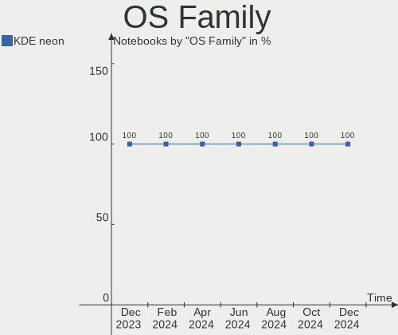
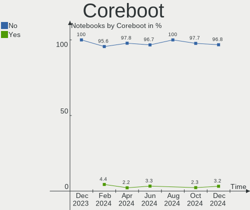
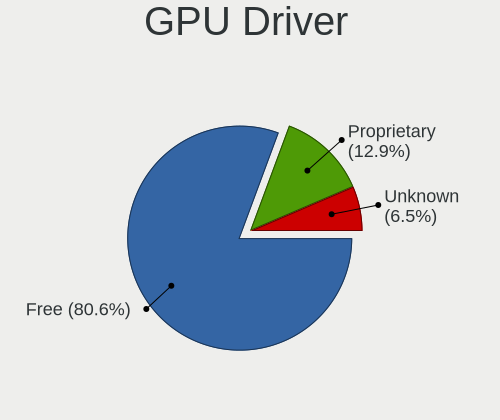
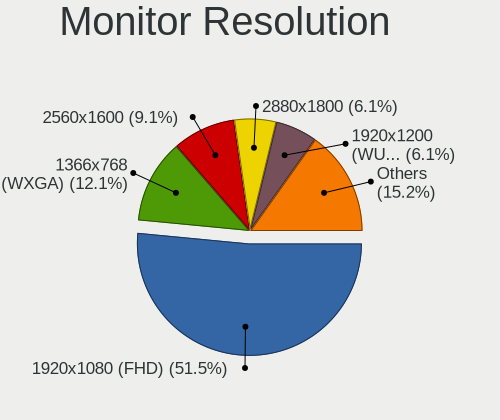
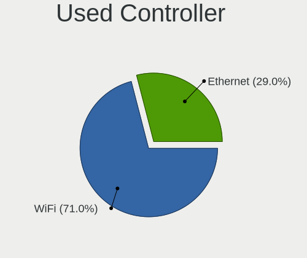
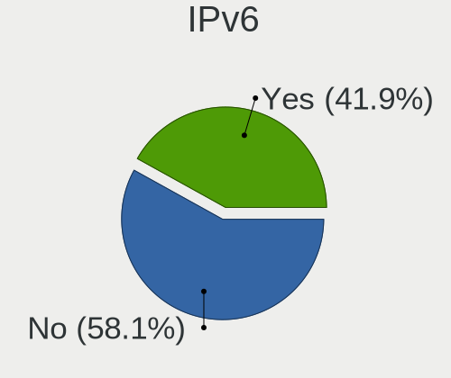
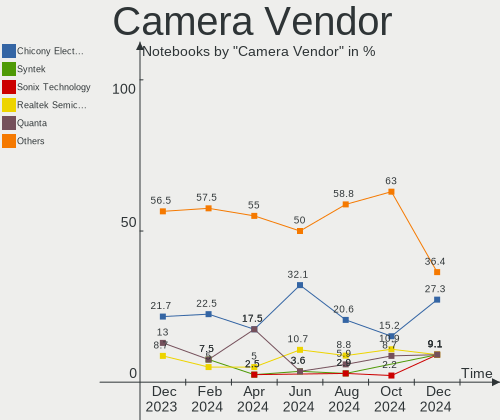

KDE neon Hardware Trends (Notebook)
-----------------------------------

A project to identify most popular hardware characteristics and track their change
over time based on data collected by KDE neon users at https://Linux-Hardware.org.

Anyone can contribute to the study by uploading probes of their computers by
the [hw-probe](https://github.com/linuxhw/hw-probe) tool:

    sudo -E hw-probe -all -upload

Full-feature report is available here: https://linux-hardware.org/?view=trends&formfactor=notebook

Period: Apr, 2021.

Contents
--------

- [ OS                       ](#os)
- [ OS Family                ](#os-family)
- [ Kernel                   ](#kernel)
- [ Kernel Family            ](#kernel-family)
- [ Kernel Major Ver.        ](#kernel-major-ver)
- [ Arch                     ](#arch)
- [ DE                       ](#de)
- [ Display Server           ](#display-server)
- [ Display Manager          ](#display-manager)
- [ OS Lang                  ](#os-lang)
- [ Boot Mode                ](#boot-mode)
- [ Filesystem               ](#filesystem)
- [ Part. scheme             ](#part-scheme)
- [ Dual Boot with Linux/BSD ](#dual-boot-with-linux/bsd)
- [ Dual Boot (Win)          ](#dual-boot-win)
- [ Country                  ](#country)
- [ City                     ](#city)
- [ Vendor                   ](#vendor)
- [ Model                    ](#model)
- [ Model Family             ](#model-family)
- [ MFG Year                 ](#mfg-year)
- [ Form Factor              ](#form-factor)
- [ Secure Boot              ](#secure-boot)
- [ Coreboot                 ](#coreboot)
- [ RAM Size                 ](#ram-size)
- [ RAM Used                 ](#ram-used)
- [ Has CD-ROM               ](#has-cd-rom)
- [ Total Drives             ](#total-drives)
- [ Has Ethernet             ](#has-ethernet)
- [ Has WiFi                 ](#has-wifi)
- [ Has Bluetooth            ](#has-bluetooth)
- [ Drive Vendor             ](#drive-vendor)
- [ Drive Model              ](#drive-model)
- [ HDD Vendor               ](#hdd-vendor)
- [ SSD Vendor               ](#ssd-vendor)
- [ Drive Kind               ](#drive-kind)
- [ Drive Connector          ](#drive-connector)
- [ Drive Size               ](#drive-size)
- [ Space Total              ](#space-total)
- [ Space Used               ](#space-used)
- [ Malfunc. Drives          ](#malfunc-drives)
- [ Malfunc. Drive Vendor    ](#malfunc-drive-vendor)
- [ Malfunc. HDD Vendor      ](#malfunc-hdd-vendor)
- [ Malfunc. Drive Kind      ](#malfunc-drive-kind)
- [ Failed Drives            ](#failed-drives)
- [ Failed Drive Vendor      ](#failed-drive-vendor)
- [ Drive Status             ](#drive-status)
- [ Storage Vendor           ](#storage-vendor)
- [ Storage Model            ](#storage-model)
- [ Storage Kind             ](#storage-kind)
- [ CPU Vendor               ](#cpu-vendor)
- [ CPU Model                ](#cpu-model)
- [ CPU Model Family         ](#cpu-model-family)
- [ CPU Cores                ](#cpu-cores)
- [ CPU Sockets              ](#cpu-sockets)
- [ CPU Threads              ](#cpu-threads)
- [ CPU Op-Modes             ](#cpu-op-modes)
- [ CPU Microcode            ](#cpu-microcode)
- [ CPU Microarch            ](#cpu-microarch)
- [ GPU Vendor               ](#gpu-vendor)
- [ GPU Model                ](#gpu-model)
- [ GPU Combo                ](#gpu-combo)
- [ GPU Driver               ](#gpu-driver)
- [ GPU Memory               ](#gpu-memory)
- [ Monitor Vendor           ](#monitor-vendor)
- [ Monitor Model            ](#monitor-model)
- [ Monitor Resolution       ](#monitor-resolution)
- [ Monitor Diagonal         ](#monitor-diagonal)
- [ Monitor Width            ](#monitor-width)
- [ Aspect Ratio             ](#aspect-ratio)
- [ Monitor Area             ](#monitor-area)
- [ Pixel Density            ](#pixel-density)
- [ Multiple Monitors        ](#multiple-monitors)
- [ Net Controller Vendor    ](#net-controller-vendor)
- [ Net Controller Model     ](#net-controller-model)
- [ Wireless Vendor          ](#wireless-vendor)
- [ Wireless Model           ](#wireless-model)
- [ Ethernet Vendor          ](#ethernet-vendor)
- [ Ethernet Model           ](#ethernet-model)
- [ Net Controller Kind      ](#net-controller-kind)
- [ Used Controller          ](#used-controller)
- [ NICs                     ](#nics)
- [ IPv6                     ](#ipv6)
- [ Memory Vendor            ](#memory-vendor)
- [ Memory Model             ](#memory-model)
- [ Memory Kind              ](#memory-kind)
- [ Memory Form Factor       ](#memory-form-factor)
- [ Memory Size              ](#memory-size)
- [ Memory Speed             ](#memory-speed)
- [ Sound Vendor             ](#sound-vendor)
- [ Sound Model              ](#sound-model)
- [ Camera Vendor            ](#camera-vendor)
- [ Camera Model             ](#camera-model)
- [ Fingerprint Vendor       ](#fingerprint-vendor)
- [ Fingerprint Model        ](#fingerprint-model)
- [ Chipcard Vendor          ](#chipcard-vendor)
- [ Chipcard Model           ](#chipcard-model)
- [ Printer Vendor           ](#printer-vendor)
- [ Printer Model            ](#printer-model)
- [ Scanner Vendor           ](#scanner-vendor)
- [ Scanner Model            ](#scanner-model)
- [ Bluetooth Vendor         ](#bluetooth-vendor)
- [ Bluetooth Model          ](#bluetooth-model)
- [ Unsupported Devices      ](#unsupported-devices)
- [ Unsupported Device Types ](#unsupported-device-types)

OS
--

Installed operating systems

| Name           | Notebooks | Percent |
|----------------|-----------|---------|
| KDE neon 20.04 | 88        | 100%    |

OS Family
---------

OS without a version

| Name     | Notebooks | Percent |
|----------|-----------|---------|
| KDE neon | 88        | 100%    |

Kernel
------

Version of the Linux kernel

| Version                | Notebooks | Percent |
|------------------------|-----------|---------|
| 5.4.0-70-generic       | 37        | 42.05%  |
| 5.4.0-72-generic       | 34        | 38.64%  |
| 5.4.0-71-generic       | 7         | 7.95%   |
| 5.8.0-49-generic       | 2         | 2.27%   |
| 5.4.0-66-generic       | 2         | 2.27%   |
| 5.11.16-051116-generic | 2         | 2.27%   |
| 5.4.0-72-lowlatency    | 1         | 1.14%   |
| 5.4.0-70-lowlatency    | 1         | 1.14%   |
| 5.12.0-rc7+            | 1         | 1.14%   |
| 5.11.14-051114-generic | 1         | 1.14%   |

Kernel Family
-------------

Linux kernel without a distro release

| Version | Notebooks | Percent |
|---------|-----------|---------|
| 5.4.0   | 82        | 93.18%  |
| 5.8.0   | 2         | 2.27%   |
| 5.11.16 | 2         | 2.27%   |
| 5.12.0  | 1         | 1.14%   |
| 5.11.14 | 1         | 1.14%   |

Kernel Major Ver.
-----------------

Linux kernel major version

| Version | Notebooks | Percent |
|---------|-----------|---------|
| 5.4     | 82        | 93.18%  |
| 5.11    | 3         | 3.41%   |
| 5.8     | 2         | 2.27%   |
| 5.12    | 1         | 1.14%   |

Arch
----

OS architecture (x86_64, i586, etc.)

| Name   | Notebooks | Percent |
|--------|-----------|---------|
| x86_64 | 88        | 100%    |

DE
--

Desktop Environment

| Name       | Notebooks | Percent |
|------------|-----------|---------|
| KDE        | 82        | 93.18%  |
| KDE5       | 4         | 4.55%   |
| X-Cinnamon | 1         | 1.14%   |
| Unknown    | 1         | 1.14%   |

Display Server
--------------

X11 or Wayland

| Name    | Notebooks | Percent |
|---------|-----------|---------|
| X11     | 80        | 90.91%  |
| Wayland | 8         | 9.09%   |

Display Manager
---------------

SDDM, LightDM, etc.

| Name    | Notebooks | Percent |
|---------|-----------|---------|
| Unknown | 84        | 95.45%  |
| SDDM    | 4         | 4.55%   |

OS Lang
-------

Language

| Lang   | Notebooks | Percent |
|--------|-----------|---------|
| en_US  | 35        | 39.77%  |
| de_DE  | 11        | 12.5%   |
| ru_RU  | 8         | 9.09%   |
| pt_BR  | 3         | 3.41%   |
| es_ES  | 3         | 3.41%   |
| en_IE  | 3         | 3.41%   |
| en_GB  | 3         | 3.41%   |
| ru_UA  | 2         | 2.27%   |
| pt_PT  | 2         | 2.27%   |
| es_MX  | 2         | 2.27%   |
| en_IN  | 2         | 2.27%   |
| en_CA  | 2         | 2.27%   |
| zh_CN  | 1         | 1.14%   |
| uk_UA  | 1         | 1.14%   |
| szl_PL | 1         | 1.14%   |
| nl_NL  | 1         | 1.14%   |
| id_ID  | 1         | 1.14%   |
| fr_FR  | 1         | 1.14%   |
| es_DO  | 1         | 1.14%   |
| en_ZA  | 1         | 1.14%   |
| en_PH  | 1         | 1.14%   |
| en_AU  | 1         | 1.14%   |
| cv_RU  | 1         | 1.14%   |
| C      | 1         | 1.14%   |

Boot Mode
---------

EFI or BIOS

| Mode | Notebooks | Percent |
|------|-----------|---------|
| EFI  | 50        | 56.82%  |
| BIOS | 38        | 43.18%  |

Filesystem
----------

Type of filesystem

| Type | Notebooks | Percent |
|------|-----------|---------|
| Ext4 | 88        | 100%    |

Part. scheme
------------

Scheme of partitioning

| Type    | Notebooks | Percent |
|---------|-----------|---------|
| Unknown | 84        | 95.45%  |
| GPT     | 4         | 4.55%   |

Dual Boot with Linux/BSD
------------------------

Hosting more than one Linux/BSD

| Dual boot | Notebooks | Percent |
|-----------|-----------|---------|
| No        | 85        | 96.59%  |
| Yes       | 3         | 3.41%   |

Dual Boot (Win)
---------------

Hosting Linux and Windows

| Dual boot | Notebooks | Percent |
|-----------|-----------|---------|
| No        | 81        | 92.05%  |
| Yes       | 7         | 7.95%   |

Country
-------

Geographic location (country)

| Country            | Notebooks | Percent |
|--------------------|-----------|---------|
| USA                | 16        | 18.18%  |
| Germany            | 12        | 13.64%  |
| Russia             | 8         | 9.09%   |
| Spain              | 5         | 5.68%   |
| Ukraine            | 4         | 4.55%   |
| Turkey             | 3         | 3.41%   |
| Netherlands        | 3         | 3.41%   |
| Ireland            | 3         | 3.41%   |
| India              | 3         | 3.41%   |
| Brazil             | 3         | 3.41%   |
| UK                 | 2         | 2.27%   |
| South Africa       | 2         | 2.27%   |
| Portugal           | 2         | 2.27%   |
| Mexico             | 2         | 2.27%   |
| Indonesia          | 2         | 2.27%   |
| Canada             | 2         | 2.27%   |
| Vietnam            | 1         | 1.14%   |
| Thailand           | 1         | 1.14%   |
| Switzerland        | 1         | 1.14%   |
| Serbia             | 1         | 1.14%   |
| Romania            | 1         | 1.14%   |
| Poland             | 1         | 1.14%   |
| Philippines        | 1         | 1.14%   |
| Norway             | 1         | 1.14%   |
| Iraq               | 1         | 1.14%   |
| Hungary            | 1         | 1.14%   |
| France             | 1         | 1.14%   |
| Dominican Republic | 1         | 1.14%   |
| China              | 1         | 1.14%   |
| Belarus            | 1         | 1.14%   |
| Australia          | 1         | 1.14%   |
| Algeria            | 1         | 1.14%   |

City
----

Geographic location (city)

| City                  | Notebooks | Percent |
|-----------------------|-----------|---------|
| St Petersburg         | 3         | 3.41%   |
| Perm                  | 2         | 2.27%   |
| Edmonton              | 2         | 2.27%   |
| Dublin                | 2         | 2.27%   |
| Cape Town             | 2         | 2.27%   |
| Amsterdam             | 2         | 2.27%   |
| İzmit                | 1         | 1.14%   |
| Zebulon               | 1         | 1.14%   |
| Winter Park           | 1         | 1.14%   |
| Weehawken             | 1         | 1.14%   |
| Washington            | 1         | 1.14%   |
| Volzhskiy             | 1         | 1.14%   |
| Valladolid            | 1         | 1.14%   |
| Trenggalek            | 1         | 1.14%   |
| Torelló              | 1         | 1.14%   |
| Timișoara            | 1         | 1.14%   |
| Ternopil              | 1         | 1.14%   |
| Tarnów               | 1         | 1.14%   |
| Sligo                 | 1         | 1.14%   |
| Shenzhen              | 1         | 1.14%   |
| Seville               | 1         | 1.14%   |
| Senhora da Hora       | 1         | 1.14%   |
| Seesen                | 1         | 1.14%   |
| Santo Domingo Este    | 1         | 1.14%   |
| Santa Cruz            | 1         | 1.14%   |
| Santa Clara           | 1         | 1.14%   |
| San Luis Potosí City | 1         | 1.14%   |
| San Diego             | 1         | 1.14%   |
| San Antonio           | 1         | 1.14%   |
| Samut Prakan          | 1         | 1.14%   |
| Saint Paul            | 1         | 1.14%   |
| Saint Joseph          | 1         | 1.14%   |
| Rostov-on-Don         | 1         | 1.14%   |
| Rivne                 | 1         | 1.14%   |
| Reno                  | 1         | 1.14%   |
| Phalempin             | 1         | 1.14%   |
| Pachuca               | 1         | 1.14%   |
| Nizhniy Novgorod      | 1         | 1.14%   |
| Nagpur                | 1         | 1.14%   |
| Munich                | 1         | 1.14%   |
| Monheim               | 1         | 1.14%   |
| Minsk                 | 1         | 1.14%   |
| Minneapolis           | 1         | 1.14%   |
| McConnelsville        | 1         | 1.14%   |
| Lünen                | 1         | 1.14%   |
| Lucknow               | 1         | 1.14%   |
| London                | 1         | 1.14%   |
| Lencois Paulista      | 1         | 1.14%   |
| Lauter                | 1         | 1.14%   |
| Laer                  | 1         | 1.14%   |
| Kyiv                  | 1         | 1.14%   |
| Kamyianets-Podilskyy  | 1         | 1.14%   |
| Jakarta               | 1         | 1.14%   |
| Istanbul              | 1         | 1.14%   |
| Hyderabad             | 1         | 1.14%   |
| Ho Chi Minh City      | 1         | 1.14%   |
| Hildesheim            | 1         | 1.14%   |
| Hamburg               | 1         | 1.14%   |
| Gornji Milanovac      | 1         | 1.14%   |
| Everett               | 1         | 1.14%   |

Vendor
------

Motherboard manufacturer

| Name                             | Notebooks | Percent |
|----------------------------------|-----------|---------|
| Hewlett-Packard                  | 18        | 20.45%  |
| Dell                             | 15        | 17.05%  |
| Lenovo                           | 13        | 14.77%  |
| ASUSTek Computer                 | 12        | 13.64%  |
| Acer                             | 8         | 9.09%   |
| Toshiba                          | 3         | 3.41%   |
| Sony                             | 2         | 2.27%   |
| Samsung Electronics              | 2         | 2.27%   |
| MSI                              | 2         | 2.27%   |
| VINGA                            | 1         | 1.14%   |
| Semp Toshiba                     | 1         | 1.14%   |
| PINNACLEMICRO                    | 1         | 1.14%   |
| Medion                           | 1         | 1.14%   |
| LG Electronics                   | 1         | 1.14%   |
| Itautec                          | 1         | 1.14%   |
| HUAWEI                           | 1         | 1.14%   |
| GPD                              | 1         | 1.14%   |
| FUJITSU CLIENT COMPUTING LIMITED | 1         | 1.14%   |
| eMachines                        | 1         | 1.14%   |
| Chuwi                            | 1         | 1.14%   |
| Apple                            | 1         | 1.14%   |
| Alienware                        | 1         | 1.14%   |

Model
-----

Motherboard model

| Name                                            | Notebooks | Percent |
|-------------------------------------------------|-----------|---------|
| HP Pavilion g6                                  | 2         | 2.27%   |
| HP Pavilion dv7                                 | 2         | 2.27%   |
| Dell Latitude E6420                             | 2         | 2.27%   |
| ASUS ZenBook UX431DA_UM431DA                    | 2         | 2.27%   |
| VINGA Iron S140                                 | 1         | 1.14%   |
| Toshiba Satellite R630                          | 1         | 1.14%   |
| Toshiba Satellite P870                          | 1         | 1.14%   |
| Toshiba Satellite L50D-B                        | 1         | 1.14%   |
| Sony VPCEJ1L1E                                  | 1         | 1.14%   |
| Sony VGN-FZ140N                                 | 1         | 1.14%   |
| Semp Toshiba STI NI 1401                        | 1         | 1.14%   |
| Samsung 905S3G/906S3G/915S3G/9305SG             | 1         | 1.14%   |
| Samsung 300V3Z/300V4Z/300V5Z/200A4Y/200A5Y      | 1         | 1.14%   |
| PINNACLEMICRO P65_P67RGRERA                     | 1         | 1.14%   |
| MSI GP60 2OD                                    | 1         | 1.14%   |
| MSI GE62 6QD                                    | 1         | 1.14%   |
| Medion P8614                                    | 1         | 1.14%   |
| LG 17Z90N-R.AAC8U1                              | 1         | 1.14%   |
| Lenovo V110-15ISK 80TL                          | 1         | 1.14%   |
| Lenovo ThinkPad X61 7674Y2E                     | 1         | 1.14%   |
| Lenovo ThinkPad X230 232425U                    | 1         | 1.14%   |
| Lenovo ThinkPad X1 Carbon 7th 20QD000SUS        | 1         | 1.14%   |
| Lenovo ThinkPad T480s 20L7001LUK                | 1         | 1.14%   |
| Lenovo ThinkPad T460p 20FW003MMS                | 1         | 1.14%   |
| Lenovo ThinkPad T440p 20AN00C2UK                | 1         | 1.14%   |
| Lenovo ThinkPad P15s Gen 1 20T4A001AU           | 1         | 1.14%   |
| Lenovo ThinkPad E560 20EV003WUS                 | 1         | 1.14%   |
| Lenovo ThinkPad E15 Gen 2 20T8000TMZ            | 1         | 1.14%   |
| Lenovo IdeaPad S145-15API 81V7                  | 1         | 1.14%   |
| Lenovo IdeaPad S145-14IWL 81MU                  | 1         | 1.14%   |
| Lenovo G700 20251                               | 1         | 1.14%   |
| Itautec Infoway w7535                           | 1         | 1.14%   |
| HUAWEI HN-WX9X                                  | 1         | 1.14%   |
| HP ZBook 15u G3                                 | 1         | 1.14%   |
| HP Presario V6000 (RK664AV#ABA)                 | 1         | 1.14%   |
| HP Pavilion Laptop 15-cc1xx                     | 1         | 1.14%   |
| HP Pavilion dv6                                 | 1         | 1.14%   |
| HP Pavilion dv4                                 | 1         | 1.14%   |
| HP Pavilion 15                                  | 1         | 1.14%   |
| HP Pavilion 14                                  | 1         | 1.14%   |
| HP OMEN by HP Laptop                            | 1         | 1.14%   |
| HP Laptop 15-dy1xxx                             | 1         | 1.14%   |
| HP Laptop 15-dw1xxx                             | 1         | 1.14%   |
| HP EliteBook Folio G1                           | 1         | 1.14%   |
| HP EliteBook 8560w                              | 1         | 1.14%   |
| HP 255 G2                                       | 1         | 1.14%   |
| HP 250 G7 Notebook PC                           | 1         | 1.14%   |
| GPD P2 MAX                                      | 1         | 1.14%   |
| FUJITSU CLIENT COMPUTING LIMITED LIFEBOOK E5510 | 1         | 1.14%   |
| eMachines eME732                                | 1         | 1.14%   |
| Dell XPS 17 9700                                | 1         | 1.14%   |
| Dell XPS 15 9570                                | 1         | 1.14%   |
| Dell XPS 13 9350                                | 1         | 1.14%   |
| Dell Studio 1735                                | 1         | 1.14%   |
| Dell Latitude D830                              | 1         | 1.14%   |
| Dell Latitude 7490                              | 1         | 1.14%   |
| Dell Latitude 7410                              | 1         | 1.14%   |
| Dell Latitude 7280                              | 1         | 1.14%   |
| Dell Latitude 3410                              | 1         | 1.14%   |
| Dell Inspiron N7110                             | 1         | 1.14%   |

Model Family
------------

Motherboard model prefix

| Name                                      | Notebooks | Percent |
|-------------------------------------------|-----------|---------|
| Lenovo ThinkPad                           | 9         | 10.23%  |
| HP Pavilion                               | 9         | 10.23%  |
| Dell Latitude                             | 7         | 7.95%   |
| Acer Aspire                               | 6         | 6.82%   |
| Dell Inspiron                             | 4         | 4.55%   |
| Toshiba Satellite                         | 3         | 3.41%   |
| Dell XPS                                  | 3         | 3.41%   |
| Lenovo IdeaPad                            | 2         | 2.27%   |
| HP Laptop                                 | 2         | 2.27%   |
| HP EliteBook                              | 2         | 2.27%   |
| ASUS ZenBook                              | 2         | 2.27%   |
| ASUS VivoBook                             | 2         | 2.27%   |
| ASUS TUF                                  | 2         | 2.27%   |
| VINGA Iron                                | 1         | 1.14%   |
| Sony VPCEJ1L1E                            | 1         | 1.14%   |
| Sony VGN-FZ140N                           | 1         | 1.14%   |
| Semp Toshiba STI                          | 1         | 1.14%   |
| Samsung 905S3G                            | 1         | 1.14%   |
| Samsung 300V3Z                            | 1         | 1.14%   |
| PINNACLEMICRO P65                         | 1         | 1.14%   |
| MSI GP60                                  | 1         | 1.14%   |
| MSI GE62                                  | 1         | 1.14%   |
| Medion P8614                              | 1         | 1.14%   |
| LG 17Z90N-R.AAC8U1                        | 1         | 1.14%   |
| Lenovo V110-15ISK                         | 1         | 1.14%   |
| Lenovo G700                               | 1         | 1.14%   |
| Itautec Infoway                           | 1         | 1.14%   |
| HUAWEI HN-WX9X                            | 1         | 1.14%   |
| HP ZBook                                  | 1         | 1.14%   |
| HP Presario                               | 1         | 1.14%   |
| HP OMEN                                   | 1         | 1.14%   |
| HP 255                                    | 1         | 1.14%   |
| HP 250                                    | 1         | 1.14%   |
| GPD P2                                    | 1         | 1.14%   |
| FUJITSU CLIENT COMPUTING LIMITED LIFEBOOK | 1         | 1.14%   |
| eMachines eME732                          | 1         | 1.14%   |
| Dell Studio                               | 1         | 1.14%   |
| Chuwi LapBook                             | 1         | 1.14%   |
| ASUS Zephyrus                             | 1         | 1.14%   |
| ASUS X751MA                               | 1         | 1.14%   |
| ASUS X441UV                               | 1         | 1.14%   |
| ASUS N53SN                                | 1         | 1.14%   |
| ASUS GL552VW                              | 1         | 1.14%   |
| ASUS 1025C                                | 1         | 1.14%   |
| Apple MacBookPro8                         | 1         | 1.14%   |
| Alienware M11x                            | 1         | 1.14%   |
| Acer Swift                                | 1         | 1.14%   |
| Acer Extensa                              | 1         | 1.14%   |

MFG Year
--------

Motherboard manufacture year

| Year    | Notebooks | Percent |
|---------|-----------|---------|
| 2020    | 22        | 25%     |
| 2019    | 9         | 10.23%  |
| 2018    | 8         | 9.09%   |
| 2011    | 7         | 7.95%   |
| 2014    | 6         | 6.82%   |
| 2012    | 6         | 6.82%   |
| 2021    | 5         | 5.68%   |
| 2013    | 5         | 5.68%   |
| 2010    | 5         | 5.68%   |
| 2008    | 4         | 4.55%   |
| 2017    | 3         | 3.41%   |
| 2016    | 2         | 2.27%   |
| 2015    | 2         | 2.27%   |
| 2007    | 2         | 2.27%   |
| 2009    | 1         | 1.14%   |
| Unknown | 1         | 1.14%   |

Form Factor
-----------

Physical design of the computer

| Name     | Notebooks | Percent |
|----------|-----------|---------|
| Notebook | 88        | 100%    |

Secure Boot
-----------

Enabled or disabled

| State    | Notebooks | Percent |
|----------|-----------|---------|
| Disabled | 76        | 86.36%  |
| Enabled  | 12        | 13.64%  |

Coreboot
--------

Have coreboot on board

| Used | Notebooks | Percent |
|------|-----------|---------|
| No   | 88        | 100%    |

RAM Size
--------

Total RAM memory

| Size in GB | Notebooks | Percent |
|------------|-----------|---------|
| 4.01-8.0   | 31        | 35.23%  |
| 3.01-4.0   | 20        | 22.73%  |
| 8.01-16.0  | 16        | 18.18%  |
| 16.01-24.0 | 15        | 17.05%  |
| 32.01-64.0 | 2         | 2.27%   |
| 24.01-32.0 | 2         | 2.27%   |
| 1.01-2.0   | 2         | 2.27%   |

RAM Used
--------

Used RAM memory

| Used GB   | Notebooks | Percent |
|-----------|-----------|---------|
| 1.01-2.0  | 36        | 40.91%  |
| 2.01-3.0  | 25        | 28.41%  |
| 3.01-4.0  | 16        | 18.18%  |
| 4.01-8.0  | 7         | 7.95%   |
| 0.51-1.0  | 3         | 3.41%   |
| 8.01-16.0 | 1         | 1.14%   |

Has CD-ROM
----------

Has CD-ROM on board

| Presented | Notebooks | Percent |
|-----------|-----------|---------|
| No        | 51        | 57.95%  |
| Yes       | 37        | 42.05%  |

Total Drives
------------

Number of drives on board

| Drives | Notebooks | Percent |
|--------|-----------|---------|
| 1      | 64        | 72.73%  |
| 2      | 20        | 22.73%  |
| 3      | 3         | 3.41%   |
| 4      | 1         | 1.14%   |

Has Ethernet
------------

Has Ethernet on board

| Presented | Notebooks | Percent |
|-----------|-----------|---------|
| Yes       | 69        | 78.41%  |
| No        | 19        | 21.59%  |

Has WiFi
--------

Has WiFi module

| Presented | Notebooks | Percent |
|-----------|-----------|---------|
| Yes       | 87        | 98.86%  |
| No        | 1         | 1.14%   |

Has Bluetooth
-------------

Has Bluetooth module

| Presented | Notebooks | Percent |
|-----------|-----------|---------|
| Yes       | 62        | 70.45%  |
| No        | 26        | 29.55%  |

Drive Vendor
------------

Hard drive vendors

| Vendor                | Notebooks | Drives | Percent |
|-----------------------|-----------|--------|---------|
| WDC                   | 14        | 14     | 13.21%  |
| Toshiba               | 12        | 12     | 11.32%  |
| Samsung Electronics   | 12        | 16     | 11.32%  |
| Seagate               | 11        | 12     | 10.38%  |
| SanDisk               | 8         | 8      | 7.55%   |
| Unknown               | 7         | 8      | 6.6%    |
| Kingston              | 6         | 7      | 5.66%   |
| SK Hynix              | 5         | 5      | 4.72%   |
| Intel                 | 4         | 5      | 3.77%   |
| Crucial               | 4         | 4      | 3.77%   |
| HGST                  | 3         | 3      | 2.83%   |
| Micron Technology     | 2         | 2      | 1.89%   |
| Hitachi               | 2         | 2      | 1.89%   |
| V-GeN                 | 1         | 1      | 0.94%   |
| USB30                 | 1         | 1      | 0.94%   |
| Union Memory          | 1         | 1      | 0.94%   |
| Transcend             | 1         | 1      | 0.94%   |
| SPCC                  | 1         | 1      | 0.94%   |
| Silicon Motion        | 1         | 1      | 0.94%   |
| SABRENT               | 1         | 1      | 0.94%   |
| Realtek Semiconductor | 1         | 1      | 0.94%   |
| PNY                   | 1         | 1      | 0.94%   |
| Phison                | 1         | 1      | 0.94%   |
| Patriot               | 1         | 1      | 0.94%   |
| GOODRAM               | 1         | 1      | 0.94%   |
| FORESEE               | 1         | 1      | 0.94%   |
| EZCOOL                | 1         | 1      | 0.94%   |
| EDGE                  | 1         | 1      | 0.94%   |
| A-DATA Technology     | 1         | 1      | 0.94%   |

Drive Model
-----------

Hard drive models

| Model                                  | Notebooks | Percent |
|----------------------------------------|-----------|---------|
| Toshiba NVMe SSD Drive 512GB           | 3         | 2.65%   |
| Unknown MMC Card  128GB                | 2         | 1.77%   |
| Seagate ST1000LM035-1RK172 1TB         | 2         | 1.77%   |
| Samsung NVMe SSD Drive 512GB           | 2         | 1.77%   |
| Samsung NVMe SSD Drive 256GB           | 2         | 1.77%   |
| Kingston SA400S37240G 240GB SSD        | 2         | 1.77%   |
| WDC WDS100T2B0A-00SM50 1TB SSD         | 1         | 0.88%   |
| WDC WDBNCE0010PNC 1TB SSD              | 1         | 0.88%   |
| WDC WD7500BPVX-22JC3T0 752GB           | 1         | 0.88%   |
| WDC WD7500BPKX-60HPJT0 752GB           | 1         | 0.88%   |
| WDC WD7500BPKX-00HPJT0 752GB           | 1         | 0.88%   |
| WDC WD6400BPVT-22HXZT3 640GB           | 1         | 0.88%   |
| WDC WD5000LPZX-60Z10T0 500GB           | 1         | 0.88%   |
| WDC WD5000LPVX-60V0TT0 500GB           | 1         | 0.88%   |
| WDC WD3200LPVT-22G33T0 320GB           | 1         | 0.88%   |
| WDC WD3200BPVT-24JJ5T0 320GB           | 1         | 0.88%   |
| WDC WD3200BEVT-75ZCT1 320GB            | 1         | 0.88%   |
| WDC WD10JPVX-00JC3T0 1TB               | 1         | 0.88%   |
| WDC WD10JPCX-24UE4T0 1TB               | 1         | 0.88%   |
| WDC PC SN730 NVMe 1024GB               | 1         | 0.88%   |
| V-GeN V-GEN08SM20AR128SDK 128GB        | 1         | 0.88%   |
| USB30 Disk 500GB                       | 1         | 0.88%   |
| Unknown SD/MMC/MS PRO 32GB             | 1         | 0.88%   |
| Unknown S300-1TB                       | 1         | 0.88%   |
| Unknown MMC Card  32GB                 | 1         | 0.88%   |
| Unknown MMC Card  134GB                | 1         | 0.88%   |
| Unknown IND-S3N80P/256G 256GB          | 1         | 0.88%   |
| Union Memory RTOTJ128VGD2EYX 128GB SSD | 1         | 0.88%   |
| Transcend TS256GMTS830S 256GB SSD      | 1         | 0.88%   |
| Toshiba TR200 480GB SSD                | 1         | 0.88%   |
| Toshiba NVMe SSD Drive 256GB           | 1         | 0.88%   |
| Toshiba MQ04ABF100 1TB                 | 1         | 0.88%   |
| Toshiba MQ02ABD100H 1TB                | 1         | 0.88%   |
| Toshiba MQ01ABF050 500GB               | 1         | 0.88%   |
| Toshiba MQ01ABD050 500GB               | 1         | 0.88%   |
| Toshiba MK1655GSX 160GB                | 1         | 0.88%   |
| Toshiba HDWJ110 1TB                    | 1         | 0.88%   |
| Toshiba A100 120GB SSD                 | 1         | 0.88%   |
| SPCC Solid State Disk 128GB            | 1         | 0.88%   |
| SK Hynix NVMe SSD Drive 512GB          | 1         | 0.88%   |
| SK Hynix NVMe SSD Drive 256GB          | 1         | 0.88%   |
| SK Hynix NVMe SSD Drive 1024GB         | 1         | 0.88%   |
| SK Hynix HFS512GD9TNG-L2A0A 512GB      | 1         | 0.88%   |
| SK Hynix HFS128G39TND-N210A 128GB SSD  | 1         | 0.88%   |
| Silicon Motion NVMe SSD Drive 512GB    | 1         | 0.88%   |
| Seagate ST9320320AS 320GB              | 1         | 0.88%   |
| Seagate ST9160827AS 160GB              | 1         | 0.88%   |
| Seagate ST750LM022 HN-M750MBB 752GB    | 1         | 0.88%   |
| Seagate ST500LT012-1DG142 500GB        | 1         | 0.88%   |
| Seagate ST500LM021-1KJ152 500GB        | 1         | 0.88%   |
| Seagate ST2000LX001-1RG174 2TB         | 1         | 0.88%   |
| Seagate ST2000LM007-1R8174 2TB         | 1         | 0.88%   |
| Seagate ST1000VT001-1RE172 1TB         | 1         | 0.88%   |
| Seagate ST1000LX015-1U7172-SSHD 1TB    | 1         | 0.88%   |
| Seagate ST1000LM014-SSHD-8GB           | 1         | 0.88%   |
| SanDisk X400 M.2 2280 128GB SSD        | 1         | 0.88%   |
| SanDisk Ultra II 960GB SSD             | 1         | 0.88%   |
| SanDisk SSD PLUS 120GB                 | 1         | 0.88%   |
| SanDisk SDSSDH31024G 1TB               | 1         | 0.88%   |
| SanDisk SDSSDH3 500G                   | 1         | 0.88%   |

HDD Vendor
----------

Hard disk drive vendors

| Vendor              | Notebooks | Drives | Percent |
|---------------------|-----------|--------|---------|
| WDC                 | 11        | 11     | 32.35%  |
| Seagate             | 11        | 12     | 32.35%  |
| Toshiba             | 6         | 6      | 17.65%  |
| HGST                | 3         | 3      | 8.82%   |
| Hitachi             | 2         | 2      | 5.88%   |
| Samsung Electronics | 1         | 1      | 2.94%   |

SSD Vendor
----------

Solid state drive vendors

| Vendor              | Notebooks | Drives | Percent |
|---------------------|-----------|--------|---------|
| SanDisk             | 7         | 7      | 17.5%   |
| Samsung Electronics | 7         | 9      | 17.5%   |
| Kingston            | 5         | 5      | 12.5%   |
| Crucial             | 4         | 4      | 10%     |
| WDC                 | 2         | 2      | 5%      |
| Toshiba             | 2         | 2      | 5%      |
| Micron Technology   | 2         | 2      | 5%      |
| USB30               | 1         | 1      | 2.5%    |
| Union Memory        | 1         | 1      | 2.5%    |
| Transcend           | 1         | 1      | 2.5%    |
| SPCC                | 1         | 1      | 2.5%    |
| SK Hynix            | 1         | 1      | 2.5%    |
| PNY                 | 1         | 1      | 2.5%    |
| Patriot             | 1         | 1      | 2.5%    |
| GOODRAM             | 1         | 1      | 2.5%    |
| FORESEE             | 1         | 1      | 2.5%    |
| EDGE                | 1         | 1      | 2.5%    |
| A-DATA Technology   | 1         | 1      | 2.5%    |

Drive Kind
----------

HDD or SSD

| Kind    | Notebooks | Drives | Percent |
|---------|-----------|--------|---------|
| SSD     | 39        | 42     | 36.79%  |
| HDD     | 33        | 35     | 31.13%  |
| NVMe    | 25        | 27     | 23.58%  |
| Unknown | 5         | 6      | 4.72%   |
| MMC     | 4         | 4      | 3.77%   |

Drive Connector
---------------

SATA, SAS, NVMe, etc.

| Type | Notebooks | Drives | Percent |
|------|-----------|--------|---------|
| SATA | 68        | 81     | 68.69%  |
| NVMe | 24        | 26     | 24.24%  |
| MMC  | 4         | 4      | 4.04%   |
| SAS  | 3         | 3      | 3.03%   |

Drive Size
----------

Size of hard drive

| Size in TB | Notebooks | Drives | Percent |
|------------|-----------|--------|---------|
| 0.01-0.5   | 41        | 47     | 59.42%  |
| 0.51-1.0   | 24        | 26     | 34.78%  |
| 1.01-2.0   | 4         | 4      | 5.8%    |

Space Total
-----------

Amount of disk space available on the file system

| Size in GB | Notebooks | Percent |
|------------|-----------|---------|
| 101-250    | 21        | 23.86%  |
| 251-500    | 20        | 22.73%  |
| 501-1000   | 16        | 18.18%  |
| 51-100     | 11        | 12.5%   |
| 21-50      | 9         | 10.23%  |
| 1001-2000  | 4         | 4.55%   |
| 2001-3000  | 3         | 3.41%   |
| 1-20       | 2         | 2.27%   |
| Unknown    | 2         | 2.27%   |

Space Used
----------

Amount of used disk space

| Used GB   | Notebooks | Percent |
|-----------|-----------|---------|
| 1-20      | 48        | 54.55%  |
| 251-500   | 9         | 10.23%  |
| 21-50     | 9         | 10.23%  |
| 101-250   | 8         | 9.09%   |
| 51-100    | 8         | 9.09%   |
| 501-1000  | 3         | 3.41%   |
| Unknown   | 2         | 2.27%   |
| 2001-3000 | 1         | 1.14%   |

Malfunc. Drives
---------------

Drive models with a malfunction

Zero info for selected period =(

Malfunc. Drive Vendor
---------------------

Vendors of faulty drives

Zero info for selected period =(

Malfunc. HDD Vendor
-------------------

Vendors of faulty HDD drives

Zero info for selected period =(

Malfunc. Drive Kind
-------------------

Kinds of faulty drives

Zero info for selected period =(

Failed Drives
-------------

Failed drive models

Zero info for selected period =(

Failed Drive Vendor
-------------------

Failed drive vendors

Zero info for selected period =(

Drive Status
------------

Number of failed and malfunc. drives

| Status   | Notebooks | Drives | Percent |
|----------|-----------|--------|---------|
| Detected | 84        | 109    | 94.38%  |
| Works    | 5         | 5      | 5.62%   |

Storage Vendor
--------------

Storage controller vendors

| Vendor                       | Notebooks | Percent |
|------------------------------|-----------|---------|
| Intel                        | 67        | 66.34%  |
| AMD                          | 13        | 12.87%  |
| Samsung Electronics          | 6         | 5.94%   |
| Toshiba America Info Systems | 4         | 3.96%   |
| SK Hynix                     | 4         | 3.96%   |
| Sandisk                      | 2         | 1.98%   |
| Silicon Motion               | 1         | 0.99%   |
| Realtek Semiconductor        | 1         | 0.99%   |
| Phison Electronics           | 1         | 0.99%   |
| Nvidia                       | 1         | 0.99%   |
| Kingston Technology Company  | 1         | 0.99%   |

Storage Model
-------------

Storage controller models

| Model                                                                            | Notebooks | Percent |
|----------------------------------------------------------------------------------|-----------|---------|
| Intel 6 Series/C200 Series Chipset Family 6 port Mobile SATA AHCI Controller     | 13        | 12.04%  |
| AMD FCH SATA Controller [AHCI mode]                                              | 12        | 11.11%  |
| Intel Sunrise Point-LP SATA Controller [AHCI mode]                               | 10        | 9.26%   |
| Intel 7 Series Chipset Family 6-port SATA Controller [AHCI mode]                 | 6         | 5.56%   |
| Intel HM170/QM170 Chipset SATA Controller [AHCI Mode]                            | 5         | 4.63%   |
| Intel 82801 Mobile SATA Controller [RAID mode]                                   | 5         | 4.63%   |
| Intel 82801HM/HEM (ICH8M/ICH8M-E) IDE Controller                                 | 4         | 3.7%    |
| Intel 5 Series/3400 Series Chipset 4 port SATA AHCI Controller                   | 4         | 3.7%    |
| Intel Comet Lake SATA AHCI Controller                                            | 3         | 2.78%   |
| Intel 82801HM/HEM (ICH8M/ICH8M-E) SATA Controller [AHCI mode]                    | 3         | 2.78%   |
| Toshiba America Info Systems XG6 NVMe SSD Controller                             | 2         | 1.85%   |
| SK Hynix BC501 NVMe Solid State Drive 512GB                                      | 2         | 1.85%   |
| Samsung NVMe SSD Controller SM981/PM981/PM983                                    | 2         | 1.85%   |
| Samsung NVMe SSD Controller SM951/PM951                                          | 2         | 1.85%   |
| Samsung NVMe Controller                                                          | 2         | 1.85%   |
| Intel SSD Pro 7600p/760p/E 6100p Series                                          | 2         | 1.85%   |
| Intel Celeron/Pentium Silver Processor SATA Controller                           | 2         | 1.85%   |
| Intel Cannon Lake Mobile PCH SATA AHCI Controller                                | 2         | 1.85%   |
| Intel 82801IBM/IEM (ICH9M/ICH9M-E) 4 port SATA Controller [AHCI mode]            | 2         | 1.85%   |
| Intel 82801HM/HEM (ICH8M/ICH8M-E) SATA Controller [IDE mode]                     | 2         | 1.85%   |
| Intel 8 Series/C220 Series Chipset Family 6-port SATA Controller 1 [AHCI mode]   | 2         | 1.85%   |
| Toshiba America Info Systems Toshiba America Info Non-Volatile memory controller | 1         | 0.93%   |
| Toshiba America Info Systems BG3 NVMe SSD Controller                             | 1         | 0.93%   |
| SK Hynix PC401 NVMe Solid State Drive 256GB                                      | 1         | 0.93%   |
| SK Hynix Non-Volatile memory controller                                          | 1         | 0.93%   |
| Silicon Motion SM2263EN/SM2263XT SSD Controller                                  | 1         | 0.93%   |
| Sandisk WD Blue SN550 NVMe SSD                                                   | 1         | 0.93%   |
| Sandisk WD Black SN750 / PC SN730 NVMe SSD                                       | 1         | 0.93%   |
| Realtek Realtek Non-Volatile memory controller                                   | 1         | 0.93%   |
| Phison E12 NVMe Controller                                                       | 1         | 0.93%   |
| Nvidia MCP51 Serial ATA Controller                                               | 1         | 0.93%   |
| Nvidia MCP51 IDE                                                                 | 1         | 0.93%   |
| Kingston Company U-SNS8154P3 NVMe SSD                                            | 1         | 0.93%   |
| Intel SSD 660P Series                                                            | 1         | 0.93%   |
| Intel Non-Volatile memory controller                                             | 1         | 0.93%   |
| Intel NM10/ICH7 Family SATA Controller [AHCI mode]                               | 1         | 0.93%   |
| Intel Cannon Point-LP SATA Controller [AHCI Mode]                                | 1         | 0.93%   |
| Intel Atom Processor E3800 Series SATA AHCI Controller                           | 1         | 0.93%   |
| Intel 8 Series SATA Controller 1 [AHCI mode]                                     | 1         | 0.93%   |
| Intel 5 Series/3400 Series Chipset 6 port SATA AHCI Controller                   | 1         | 0.93%   |
| AMD SB7x0/SB8x0/SB9x0 SATA Controller [AHCI mode]                                | 1         | 0.93%   |
| AMD SB7x0/SB8x0/SB9x0 IDE Controller                                             | 1         | 0.93%   |

Storage Kind
------------

Kind of storage controller (IDE, SATA, NVMe, SAS, ...)

| Kind | Notebooks | Percent |
|------|-----------|---------|
| SATA | 70        | 66.67%  |
| NVMe | 24        | 22.86%  |
| IDE  | 6         | 5.71%   |
| RAID | 5         | 4.76%   |

CPU Vendor
----------

Processor vendors

| Vendor | Notebooks | Percent |
|--------|-----------|---------|
| Intel  | 72        | 81.82%  |
| AMD    | 16        | 18.18%  |

CPU Model
---------

Processor models

| Model                                         | Notebooks | Percent |
|-----------------------------------------------|-----------|---------|
| Intel Core i7-6700HQ CPU @ 2.60GHz            | 5         | 5.68%   |
| AMD Ryzen 5 3500U with Radeon Vega Mobile Gfx | 4         | 4.55%   |
| Intel Core i7-2670QM CPU @ 2.20GHz            | 3         | 3.41%   |
| Intel Core i7-10510U CPU @ 1.80GHz            | 3         | 3.41%   |
| Intel Core i5-8250U CPU @ 1.60GHz             | 3         | 3.41%   |
| Intel Core i5-6200U CPU @ 2.30GHz             | 3         | 3.41%   |
| Intel Core i3-2310M CPU @ 2.10GHz             | 3         | 3.41%   |
| Intel Core i7-1065G7 CPU @ 1.30GHz            | 2         | 2.27%   |
| Intel Core i5-2430M CPU @ 2.40GHz             | 2         | 2.27%   |
| Intel Core i5-2410M CPU @ 2.30GHz             | 2         | 2.27%   |
| Intel Core i3-6006U CPU @ 2.00GHz             | 2         | 2.27%   |
| Intel Core i3 CPU M 370 @ 2.40GHz             | 2         | 2.27%   |
| Intel Pentium Silver N5000 CPU @ 1.10GHz      | 1         | 1.14%   |
| Intel Pentium CPU N3530 @ 2.16GHz             | 1         | 1.14%   |
| Intel Pentium CPU 6405U @ 2.40GHz             | 1         | 1.14%   |
| Intel Pentium CPU 2020M @ 2.40GHz             | 1         | 1.14%   |
| Intel Genuine CPU U7300 @ 1.30GHz             | 1         | 1.14%   |
| Intel Core m5-6Y57 CPU @ 1.10GHz              | 1         | 1.14%   |
| Intel Core m3-8100Y CPU @ 1.10GHz             | 1         | 1.14%   |
| Intel Core i9-8950HK CPU @ 2.90GHz            | 1         | 1.14%   |
| Intel Core i7-9750H CPU @ 2.60GHz             | 1         | 1.14%   |
| Intel Core i7-8665U CPU @ 1.90GHz             | 1         | 1.14%   |
| Intel Core i7-8650U CPU @ 1.90GHz             | 1         | 1.14%   |
| Intel Core i7-8565U CPU @ 1.80GHz             | 1         | 1.14%   |
| Intel Core i7-8550U CPU @ 1.80GHz             | 1         | 1.14%   |
| Intel Core i7-6500U CPU @ 2.50GHz             | 1         | 1.14%   |
| Intel Core i7-4710MQ CPU @ 2.50GHz            | 1         | 1.14%   |
| Intel Core i7-3630QM CPU @ 2.40GHz            | 1         | 1.14%   |
| Intel Core i7-2720QM CPU @ 2.20GHz            | 1         | 1.14%   |
| Intel Core i7-2630QM CPU @ 2.00GHz            | 1         | 1.14%   |
| Intel Core i7-10750H CPU @ 2.60GHz            | 1         | 1.14%   |
| Intel Core i7-10610U CPU @ 1.80GHz            | 1         | 1.14%   |
| Intel Core i5-8300H CPU @ 2.30GHz             | 1         | 1.14%   |
| Intel Core i5-7200U CPU @ 2.50GHz             | 1         | 1.14%   |
| Intel Core i5-4200M CPU @ 2.50GHz             | 1         | 1.14%   |
| Intel Core i5-3360M CPU @ 2.80GHz             | 1         | 1.14%   |
| Intel Core i5-3230M CPU @ 2.60GHz             | 1         | 1.14%   |
| Intel Core i5-3210M CPU @ 2.50GHz             | 1         | 1.14%   |
| Intel Core i5-2520M CPU @ 2.50GHz             | 1         | 1.14%   |
| Intel Core i5-2450M CPU @ 2.50GHz             | 1         | 1.14%   |
| Intel Core i5 CPU M 560 @ 2.67GHz             | 1         | 1.14%   |
| Intel Core i5 CPU M 480 @ 2.67GHz             | 1         | 1.14%   |
| Intel Core i5 CPU M 450 @ 2.40GHz             | 1         | 1.14%   |
| Intel Core i3-4030U CPU @ 1.90GHz             | 1         | 1.14%   |
| Intel Core i3-3110M CPU @ 2.40GHz             | 1         | 1.14%   |
| Intel Core 2 Duo CPU T9300 @ 2.50GHz          | 1         | 1.14%   |
| Intel Core 2 Duo CPU T8100 @ 2.10GHz          | 1         | 1.14%   |
| Intel Core 2 Duo CPU T7300 @ 2.00GHz          | 1         | 1.14%   |
| Intel Core 2 Duo CPU T7100 @ 1.80GHz          | 1         | 1.14%   |
| Intel Core 2 Duo CPU T5550 @ 1.83GHz          | 1         | 1.14%   |
| Intel Core 2 Duo CPU P7450 @ 2.13GHz          | 1         | 1.14%   |
| Intel Celeron N4100 CPU @ 1.10GHz             | 1         | 1.14%   |
| Intel Celeron CPU 4205U @ 1.80GHz             | 1         | 1.14%   |
| Intel Atom CPU N2800 @ 1.86GHz                | 1         | 1.14%   |
| AMD Turion X2 Dual-Core Mobile RM-72          | 1         | 1.14%   |
| AMD Turion 64 Mobile Technology MK-36         | 1         | 1.14%   |
| AMD Ryzen 7 4700U with Radeon Graphics        | 1         | 1.14%   |
| AMD Ryzen 7 3700U with Radeon Vega Mobile Gfx | 1         | 1.14%   |
| AMD Ryzen 7 2700U with Radeon Vega Mobile Gfx | 1         | 1.14%   |
| AMD Ryzen 5 3550H with Radeon Vega Mobile Gfx | 1         | 1.14%   |

CPU Model Family
----------------

Processor model prefix

| Model                          | Notebooks | Percent |
|--------------------------------|-----------|---------|
| Intel Core i7                  | 25        | 28.41%  |
| Intel Core i5                  | 21        | 23.86%  |
| Intel Core i3                  | 9         | 10.23%  |
| Intel Core 2 Duo               | 6         | 6.82%   |
| AMD Ryzen 5                    | 6         | 6.82%   |
| Intel Pentium                  | 3         | 3.41%   |
| AMD Ryzen 7                    | 3         | 3.41%   |
| Intel Celeron                  | 2         | 2.27%   |
| AMD A6                         | 2         | 2.27%   |
| Intel Pentium Silver           | 1         | 1.14%   |
| Intel Genuine                  | 1         | 1.14%   |
| Intel Core m5                  | 1         | 1.14%   |
| Intel Core m3                  | 1         | 1.14%   |
| Intel Core i9                  | 1         | 1.14%   |
| Intel Atom                     | 1         | 1.14%   |
| AMD Turion X2 Dual-Core Mobile | 1         | 1.14%   |
| AMD Turion 64 Mobile           | 1         | 1.14%   |
| AMD Quad-Core                  | 1         | 1.14%   |
| AMD E1                         | 1         | 1.14%   |
| AMD A8                         | 1         | 1.14%   |

CPU Cores
---------

Number of processor cores

| Number | Notebooks | Percent |
|--------|-----------|---------|
| 2      | 43        | 48.86%  |
| 4      | 39        | 44.32%  |
| 6      | 3         | 3.41%   |
| 1      | 2         | 2.27%   |
| 8      | 1         | 1.14%   |

CPU Sockets
-----------

Number of sockets

| Number | Notebooks | Percent |
|--------|-----------|---------|
| 1      | 88        | 100%    |

CPU Threads
-----------

Threads per core (Hyper-Threading)

| Number | Notebooks | Percent |
|--------|-----------|---------|
| 2      | 70        | 79.55%  |
| 1      | 18        | 20.45%  |

CPU Op-Modes
------------

CPU Operation Modes (32-bit, 64-bit)

| Op mode        | Notebooks | Percent |
|----------------|-----------|---------|
| 32-bit, 64-bit | 88        | 100%    |

CPU Microcode
-------------

Microcode number

| Number     | Notebooks | Percent |
|------------|-----------|---------|
| 0x206a7    | 13        | 14.77%  |
| 0x406e3    | 7         | 7.95%   |
| 0x806ec    | 6         | 6.82%   |
| 0x306a9    | 6         | 6.82%   |
| 0x806ea    | 5         | 5.68%   |
| 0x506e3    | 5         | 5.68%   |
| 0x20655    | 5         | 5.68%   |
| Unknown    | 4         | 4.55%   |
| 0x906ea    | 3         | 3.41%   |
| 0x10676    | 3         | 3.41%   |
| 0x08108109 | 3         | 3.41%   |
| 0x08108102 | 3         | 3.41%   |
| 0x806e9    | 2         | 2.27%   |
| 0x706a1    | 2         | 2.27%   |
| 0x6fd      | 2         | 2.27%   |
| 0x306c3    | 2         | 2.27%   |
| 0x08101007 | 2         | 2.27%   |
| 0x0700010f | 2         | 2.27%   |
| 0x06001119 | 2         | 2.27%   |
| 0xa0652    | 1         | 1.14%   |
| 0x806eb    | 1         | 1.14%   |
| 0x706e5    | 1         | 1.14%   |
| 0x6fb      | 1         | 1.14%   |
| 0x40651    | 1         | 1.14%   |
| 0x30678    | 1         | 1.14%   |
| 0x30661    | 1         | 1.14%   |
| 0x1067a    | 1         | 1.14%   |
| 0x08600103 | 1         | 1.14%   |
| 0x07030104 | 1         | 1.14%   |
| 0x02000057 | 1         | 1.14%   |

CPU Microarch
-------------

Microarchitecture

| Name            | Notebooks | Percent |
|-----------------|-----------|---------|
| KabyLake        | 18        | 20.45%  |
| SandyBridge     | 14        | 15.91%  |
| Skylake         | 12        | 13.64%  |
| Zen+            | 6         | 6.82%   |
| IvyBridge       | 6         | 6.82%   |
| Westmere        | 5         | 5.68%   |
| Penryn          | 4         | 4.55%   |
| Haswell         | 3         | 3.41%   |
| Core            | 3         | 3.41%   |
| Zen             | 2         | 2.27%   |
| Piledriver      | 2         | 2.27%   |
| Jaguar          | 2         | 2.27%   |
| IceLake         | 2         | 2.27%   |
| Goldmont plus   | 2         | 2.27%   |
| Zen 2           | 1         | 1.14%   |
| Silvermont      | 1         | 1.14%   |
| Puma            | 1         | 1.14%   |
| K8 Hammer       | 1         | 1.14%   |
| K8 & K10 hybrid | 1         | 1.14%   |
| CometLake       | 1         | 1.14%   |
| Bonnell         | 1         | 1.14%   |

GPU Vendor
----------

Vendors of graphics cards

| Vendor | Notebooks | Percent |
|--------|-----------|---------|
| Intel  | 63        | 53.85%  |
| Nvidia | 33        | 28.21%  |
| AMD    | 21        | 17.95%  |

GPU Model
---------

Graphics card models

| Model                                                                     | Notebooks | Percent |
|---------------------------------------------------------------------------|-----------|---------|
| Intel 2nd Generation Core Processor Family Integrated Graphics Controller | 12        | 9.92%   |
| Intel 3rd Gen Core processor Graphics Controller                          | 6         | 4.96%   |
| AMD Picasso                                                               | 6         | 4.96%   |
| Intel UHD Graphics 620                                                    | 5         | 4.13%   |
| Intel Skylake GT2 [HD Graphics 520]                                       | 5         | 4.13%   |
| Intel Core Processor Integrated Graphics Controller                       | 4         | 3.31%   |
| Intel CometLake-U GT2 [UHD Graphics]                                      | 4         | 3.31%   |
| Intel Mobile GM965/GL960 Integrated Graphics Controller (secondary)       | 3         | 2.48%   |
| Intel Mobile GM965/GL960 Integrated Graphics Controller (primary)         | 3         | 2.48%   |
| Intel HD Graphics 530                                                     | 3         | 2.48%   |
| Intel CoffeeLake-H GT2 [UHD Graphics 630]                                 | 3         | 2.48%   |
| Nvidia GP107M [GeForce GTX 1050 Ti Mobile]                                | 2         | 1.65%   |
| Nvidia GM108M [GeForce 940MX]                                             | 2         | 1.65%   |
| Nvidia GM107M [GeForce GTX 960M]                                          | 2         | 1.65%   |
| Nvidia GF108M [GeForce GT 620M/630M/635M/640M LE]                         | 2         | 1.65%   |
| Nvidia GF108M [GeForce GT 525M]                                           | 2         | 1.65%   |
| Intel WhiskeyLake-U GT2 [UHD Graphics 620]                                | 2         | 1.65%   |
| Intel Iris Plus Graphics G7                                               | 2         | 1.65%   |
| Intel 4th Gen Core Processor Integrated Graphics Controller               | 2         | 1.65%   |
| AMD Raven Ridge [Radeon Vega Series / Radeon Vega Mobile Series]          | 2         | 1.65%   |
| Nvidia TU117M [GeForce GTX 1650 Ti Mobile]                                | 1         | 0.83%   |
| Nvidia TU116M [GeForce GTX 1660 Ti Mobile]                                | 1         | 0.83%   |
| Nvidia GT215M [GeForce GT 335M]                                           | 1         | 0.83%   |
| Nvidia GP108M [GeForce MX150]                                             | 1         | 0.83%   |
| Nvidia GP108GLM [Quadro P520]                                             | 1         | 0.83%   |
| Nvidia GP107M [GeForce GTX 1050 Mobile]                                   | 1         | 0.83%   |
| Nvidia GP104BM [GeForce GTX 1070 Mobile]                                  | 1         | 0.83%   |
| Nvidia GM204M [GeForce GTX 970M]                                          | 1         | 0.83%   |
| Nvidia GM108M [GeForce 920MX]                                             | 1         | 0.83%   |
| Nvidia GM108M [GeForce 830M]                                              | 1         | 0.83%   |
| Nvidia GM107 [GeForce 940MX]                                              | 1         | 0.83%   |
| Nvidia GK208M [GeForce GT 740M]                                           | 1         | 0.83%   |
| Nvidia GK208M [GeForce GT 730M]                                           | 1         | 0.83%   |
| Nvidia GF119M [NVS 4200M]                                                 | 1         | 0.83%   |
| Nvidia GF119M [GeForce GT 520M]                                           | 1         | 0.83%   |
| Nvidia GF119M [GeForce GT 520MX]                                          | 1         | 0.83%   |
| Nvidia GF119M [GeForce 410M]                                              | 1         | 0.83%   |
| Nvidia GF117M [GeForce 610M/710M/810M/820M / GT 620M/625M/630M/720M]      | 1         | 0.83%   |
| Nvidia GF108M [GeForce GT 550M]                                           | 1         | 0.83%   |
| Nvidia GF108M [GeForce GT 520M]                                           | 1         | 0.83%   |
| Nvidia GF108GLM [Quadro 1000M]                                            | 1         | 0.83%   |
| Nvidia G96CM [GeForce 9600M GT]                                           | 1         | 0.83%   |
| Nvidia C51 [GeForce Go 6150]                                              | 1         | 0.83%   |
| Intel UHD Graphics 615                                                    | 1         | 0.83%   |
| Intel HD Graphics 620                                                     | 1         | 0.83%   |
| Intel HD Graphics 520                                                     | 1         | 0.83%   |
| Intel HD Graphics 515                                                     | 1         | 0.83%   |
| Intel Haswell-ULT Integrated Graphics Controller                          | 1         | 0.83%   |
| Intel GeminiLake [UHD Graphics 605]                                       | 1         | 0.83%   |
| Intel GeminiLake [UHD Graphics 600]                                       | 1         | 0.83%   |
| Intel CometLake-H GT2 [UHD Graphics]                                      | 1         | 0.83%   |
| Intel Comet Lake UHD Graphics                                             | 1         | 0.83%   |
| Intel Coffee Lake UHD 610 Graphics Controller                             | 1         | 0.83%   |
| Intel Atom Processor Z36xxx/Z37xxx Series Graphics & Display              | 1         | 0.83%   |
| Intel Atom Processor D2xxx/N2xxx Integrated Graphics Controller           | 1         | 0.83%   |
| AMD Whistler [Radeon HD 6630M/6650M/6750M/7670M/7690M]                    | 1         | 0.83%   |
| AMD Trinity [Radeon HD 7640G]                                             | 1         | 0.83%   |
| AMD Trinity 2 [Radeon HD 7520G]                                           | 1         | 0.83%   |
| AMD Temash [Radeon HD 8250/8280G]                                         | 1         | 0.83%   |
| AMD RV730/M96 [Mobility Radeon HD 4650/5165]                              | 1         | 0.83%   |

GPU Combo
---------

Combinations of graphics cards

| Name           | Notebooks | Percent |
|----------------|-----------|---------|
| 1 x Intel      | 34        | 38.64%  |
| Intel + Nvidia | 26        | 29.55%  |
| 1 x AMD        | 17        | 19.32%  |
| 1 x Nvidia     | 7         | 7.95%   |
| Intel + AMD    | 3         | 3.41%   |
| 2 x AMD        | 1         | 1.14%   |

GPU Driver
----------

Free vs proprietary

| Driver      | Notebooks | Percent |
|-------------|-----------|---------|
| Free        | 82        | 93.18%  |
| Proprietary | 5         | 5.68%   |
| Unknown     | 1         | 1.14%   |

GPU Memory
----------

Total video memory

| Size in GB | Notebooks | Percent |
|------------|-----------|---------|
| Unknown    | 41        | 46.59%  |
| 0.51-1.0   | 16        | 18.18%  |
| 1.01-2.0   | 15        | 17.05%  |
| 0.01-0.5   | 11        | 12.5%   |
| 3.01-4.0   | 3         | 3.41%   |
| 7.01-8.0   | 1         | 1.14%   |
| 2.01-3.0   | 1         | 1.14%   |

Monitor Vendor
--------------

Monitor vendors

| Vendor                  | Notebooks | Percent |
|-------------------------|-----------|---------|
| LG Display              | 18        | 17.65%  |
| Samsung Electronics     | 16        | 15.69%  |
| AU Optronics            | 15        | 14.71%  |
| BOE                     | 13        | 12.75%  |
| Chimei Innolux          | 10        | 9.8%    |
| Sharp                   | 5         | 4.9%    |
| Goldstar                | 4         | 3.92%   |
| Ancor Communications    | 3         | 2.94%   |
| PANDA                   | 2         | 1.96%   |
| LG Philips              | 2         | 1.96%   |
| InfoVision              | 2         | 1.96%   |
| Dell                    | 2         | 1.96%   |
| Chi Mei Optoelectronics | 2         | 1.96%   |
| Packard Bell            | 1         | 0.98%   |
| OEM                     | 1         | 0.98%   |
| Lenovo                  | 1         | 0.98%   |
| InnoLux Display         | 1         | 0.98%   |
| Hewlett-Packard         | 1         | 0.98%   |
| BenQ                    | 1         | 0.98%   |
| Apple                   | 1         | 0.98%   |
| Acer                    | 1         | 0.98%   |

Monitor Model
-------------

Monitor models

| Model                                                                 | Notebooks | Percent |
|-----------------------------------------------------------------------|-----------|---------|
| LG Display LCD Monitor LGD046F 1920x1080 344x194mm 15.5-inch          | 3         | 2.88%   |
| LG Display LCD Monitor LGD02DC 1366x768 344x194mm 15.5-inch           | 2         | 1.92%   |
| Chimei Innolux LCD Monitor CMN1728 1600x900 382x215mm 17.3-inch       | 2         | 1.92%   |
| BOE LCD Monitor BOE076F 1366x768 344x194mm 15.5-inch                  | 2         | 1.92%   |
| AU Optronics LCD Monitor AUO723C 1366x768 309x173mm 13.9-inch         | 2         | 1.92%   |
| Sharp LQ156M1JW09 SHP14D3 1920x1080 344x194mm 15.5-inch               | 1         | 0.96%   |
| Sharp LQ133M1JW08 SHP1425 1920x1080 294x165mm 13.3-inch               | 1         | 0.96%   |
| Sharp LCD Monitor SHP14D7 1920x1200 366x229mm 17.0-inch               | 1         | 0.96%   |
| Sharp LCD Monitor SHP149A 1920x1080 344x194mm 15.5-inch               | 1         | 0.96%   |
| Sharp LCD Monitor SHP144A 3200x1800 294x165mm 13.3-inch               | 1         | 0.96%   |
| Samsung Electronics SyncMaster SAM0579 1920x1080                      | 1         | 0.96%   |
| Samsung Electronics SyncMaster SAM027F 1680x1050 474x296mm 22.0-inch  | 1         | 0.96%   |
| Samsung Electronics SMS24A450 SAM083A 1920x1200 518x324mm 24.1-inch   | 1         | 0.96%   |
| Samsung Electronics LF24T40 SAM703D 1920x1080 521x293mm 23.5-inch     | 1         | 0.96%   |
| Samsung Electronics LCD Monitor SEC544B 1600x900 382x214mm 17.2-inch  | 1         | 0.96%   |
| Samsung Electronics LCD Monitor SEC5442 1440x900 367x230mm 17.1-inch  | 1         | 0.96%   |
| Samsung Electronics LCD Monitor SEC5441 1366x768 344x194mm 15.5-inch  | 1         | 0.96%   |
| Samsung Electronics LCD Monitor SEC4D42 1280x800 303x190mm 14.1-inch  | 1         | 0.96%   |
| Samsung Electronics LCD Monitor SEC494A 1366x768 344x193mm 15.5-inch  | 1         | 0.96%   |
| Samsung Electronics LCD Monitor SEC4251 1366x768 344x194mm 15.5-inch  | 1         | 0.96%   |
| Samsung Electronics LCD Monitor SEC335A 1366x768 309x174mm 14.0-inch  | 1         | 0.96%   |
| Samsung Electronics LCD Monitor SEC334B 1440x900 367x230mm 17.1-inch  | 1         | 0.96%   |
| Samsung Electronics LCD Monitor SEC324A 1366x768 344x194mm 15.5-inch  | 1         | 0.96%   |
| Samsung Electronics LCD Monitor SEC314C 1920x1080 344x194mm 15.5-inch | 1         | 0.96%   |
| Samsung Electronics LCD Monitor SEC314B 1680x945 409x230mm 18.5-inch  | 1         | 0.96%   |
| Samsung Electronics LCD Monitor SDC4951 1366x768 344x194mm 15.5-inch  | 1         | 0.96%   |
| Samsung Electronics LCD Monitor SAM01FF 1360x768 885x498mm 40.0-inch  | 1         | 0.96%   |
| PANDA LCD Monitor NCP0046 1920x1080 344x194mm 15.5-inch               | 1         | 0.96%   |
| PANDA LCD Monitor NCP0035 1920x1080 309x174mm 14.0-inch               | 1         | 0.96%   |
| Packard Bell Viseo243D PKB0386 1920x1080 531x299mm 24.0-inch          | 1         | 0.96%   |
| OEM 32W_LCD_TV OEM3700 1920x1080                                      | 1         | 0.96%   |
| LG Philips LCD Monitor LPLBC00 1280x800 331x207mm 15.4-inch           | 1         | 0.96%   |
| LG Philips LCD Monitor LPL0201 1280x800 331x207mm 15.4-inch           | 1         | 0.96%   |
| LG Display LCD Monitor LGD05F8 2560x1600 366x229mm 17.0-inch          | 1         | 0.96%   |
| LG Display LCD Monitor LGD054F 1920x1080 344x194mm 15.5-inch          | 1         | 0.96%   |
| LG Display LCD Monitor LGD04F9 1920x1080 309x174mm 14.0-inch          | 1         | 0.96%   |
| LG Display LCD Monitor LGD046E 1920x1080 380x210mm 17.1-inch          | 1         | 0.96%   |
| LG Display LCD Monitor LGD03FC 1600x900 309x174mm 14.0-inch           | 1         | 0.96%   |
| LG Display LCD Monitor LGD0396 1600x900 382x215mm 17.3-inch           | 1         | 0.96%   |
| LG Display LCD Monitor LGD0395 1366x768 344x194mm 15.5-inch           | 1         | 0.96%   |
| LG Display LCD Monitor LGD038E 1366x768 340x190mm 15.3-inch           | 1         | 0.96%   |
| LG Display LCD Monitor LGD0384 1366x768 344x194mm 15.5-inch           | 1         | 0.96%   |
| LG Display LCD Monitor LGD02DF 1600x900 310x174mm 14.0-inch           | 1         | 0.96%   |
| LG Display LCD Monitor LGD02D8 1366x768 277x156mm 12.5-inch           | 1         | 0.96%   |
| LG Display LCD Monitor LGD02D1 1600x900 382x215mm 17.3-inch           | 1         | 0.96%   |
| LG Display LCD Monitor LGD0259 1920x1080 350x190mm 15.7-inch          | 1         | 0.96%   |
| Lenovo LCD Monitor LEN4000 1024x768 246x185mm 12.1-inch               | 1         | 0.96%   |
| InnoLux Display LCD Monitor INL0016 1366x768 309x174mm 14.0-inch      | 1         | 0.96%   |
| InfoVision M140NWR2 R1 IVO057A 1366x768 309x174mm 14.0-inch           | 1         | 0.96%   |
| InfoVision LCD Monitor IVO03F4 1920x1200 263x164mm 12.2-inch          | 1         | 0.96%   |
| Hewlett-Packard E233 HPN345F 1920x1080 510x290mm 23.1-inch            | 1         | 0.96%   |
| Goldstar MP59G GSM5B34 1920x1080 480x270mm 21.7-inch                  | 1         | 0.96%   |
| Goldstar LG ULTRAWIDE GSM59F1 1920x1080 580x240mm 24.7-inch           | 1         | 0.96%   |
| Goldstar L194WT GSM4B05 1440x900 408x255mm 18.9-inch                  | 1         | 0.96%   |
| Goldstar 37LC3R-ZH GSM7585 1360x768 700x392mm 31.6-inch               | 1         | 0.96%   |
| Dell U2415 DELA0B8 1920x1080 520x320mm 24.0-inch                      | 1         | 0.96%   |
| Dell P2417H DELA0DB 1920x1080 527x296mm 23.8-inch                     | 1         | 0.96%   |
| Dell P2317H DEL40F4 1920x1080 509x286mm 23.0-inch                     | 1         | 0.96%   |
| Chimei Innolux P130ZDZ-EF1 CMN8201 2160x1440 275x183mm 13.0-inch      | 1         | 0.96%   |
| Chimei Innolux LCD Monitor CMN15E7 1920x1080 344x193mm 15.5-inch      | 1         | 0.96%   |

Monitor Resolution
------------------

Monitor screen resolution

| Resolution         | Notebooks | Percent |
|--------------------|-----------|---------|
| 1920x1080 (FHD)    | 33        | 34.38%  |
| 1366x768 (WXGA)    | 30        | 31.25%  |
| 1600x900 (HD+)     | 8         | 8.33%   |
| 1920x1200 (WUXGA)  | 5         | 5.21%   |
| 1280x800 (WXGA)    | 4         | 4.17%   |
| 1440x900 (WXGA+)   | 3         | 3.13%   |
| 1680x1050 (WSXGA+) | 2         | 2.08%   |
| 1360x768           | 2         | 2.08%   |
| 3840x2160 (4K)     | 1         | 1.04%   |
| 3840x1080          | 1         | 1.04%   |
| 3200x1800 (QHD+)   | 1         | 1.04%   |
| 2560x1600          | 1         | 1.04%   |
| 2560x1080          | 1         | 1.04%   |
| 2160x1440          | 1         | 1.04%   |
| 1920x540           | 1         | 1.04%   |
| 1680x945           | 1         | 1.04%   |
| Unknown            | 1         | 1.04%   |

Monitor Diagonal
----------------

Diagonal size in inches

| Inches  | Notebooks | Percent |
|---------|-----------|---------|
| 15      | 42        | 40.78%  |
| 17      | 13        | 12.62%  |
| 14      | 12        | 11.65%  |
| 13      | 10        | 9.71%   |
| 23      | 5         | 4.85%   |
| 24      | 4         | 3.88%   |
| 18      | 3         | 2.91%   |
| 12      | 3         | 2.91%   |
| Unknown | 3         | 2.91%   |
| 22      | 2         | 1.94%   |
| 40      | 1         | 0.97%   |
| 34      | 1         | 0.97%   |
| 31      | 1         | 0.97%   |
| 27      | 1         | 0.97%   |
| 21      | 1         | 0.97%   |
| 11      | 1         | 0.97%   |

Monitor Width
-------------

Physical width

| Width in mm | Notebooks | Percent |
|-------------|-----------|---------|
| 301-350     | 57        | 55.88%  |
| 351-400     | 15        | 14.71%  |
| 501-600     | 9         | 8.82%   |
| 201-300     | 9         | 8.82%   |
| 401-500     | 6         | 5.88%   |
| Unknown     | 3         | 2.94%   |
| 801-900     | 1         | 0.98%   |
| 701-800     | 1         | 0.98%   |
| 601-700     | 1         | 0.98%   |

Aspect Ratio
------------

Proportional relationship between the width and the height

| Ratio   | Notebooks | Percent |
|---------|-----------|---------|
| 16/9    | 73        | 80.22%  |
| 16/10   | 14        | 15.38%  |
| 32/9    | 1         | 1.1%    |
| 3/2     | 1         | 1.1%    |
| 21/9    | 1         | 1.1%    |
| Unknown | 1         | 1.1%    |

Monitor Area
------------

Area in inch²

| Area in inch² | Notebooks | Percent |
|----------------|-----------|---------|
| 101-110        | 42        | 40.78%  |
| 81-90          | 17        | 16.5%   |
| 201-250        | 10        | 9.71%   |
| 121-130        | 8         | 7.77%   |
| 71-80          | 5         | 4.85%   |
| 131-140        | 5         | 4.85%   |
| 61-70          | 3         | 2.91%   |
| Unknown        | 3         | 2.91%   |
| 351-500        | 2         | 1.94%   |
| 251-300        | 2         | 1.94%   |
| 141-150        | 2         | 1.94%   |
| 51-60          | 1         | 0.97%   |
| 301-350        | 1         | 0.97%   |
| 151-200        | 1         | 0.97%   |
| 501-1000       | 1         | 0.97%   |

Pixel Density
-------------

Pixels per inch

| Density       | Notebooks | Percent |
|---------------|-----------|---------|
| 101-120       | 35        | 35%     |
| 121-160       | 33        | 33%     |
| 51-100        | 20        | 20%     |
| 161-240       | 5         | 5%      |
| Unknown       | 3         | 3%      |
| More than 240 | 2         | 2%      |
| 1-50          | 2         | 2%      |

Multiple Monitors
-----------------

Total monitors connected

| Total | Notebooks | Percent |
|-------|-----------|---------|
| 1     | 69        | 78.41%  |
| 2     | 16        | 18.18%  |
| 3     | 2         | 2.27%   |
| 0     | 1         | 1.14%   |

Net Controller Vendor
---------------------

Controller vendors

| Vendor                   | Notebooks | Percent |
|--------------------------|-----------|---------|
| Realtek Semiconductor    | 42        | 29.58%  |
| Intel                    | 42        | 29.58%  |
| Qualcomm Atheros         | 23        | 16.2%   |
| Broadcom                 | 18        | 12.68%  |
| Broadcom Limited         | 3         | 2.11%   |
| JMicron Technology       | 2         | 1.41%   |
| Xiaomi                   | 1         | 0.7%    |
| TP-Link                  | 1         | 0.7%    |
| Sierra Wireless          | 1         | 0.7%    |
| Samsung Electronics      | 1         | 0.7%    |
| Ralink                   | 1         | 0.7%    |
| Nvidia                   | 1         | 0.7%    |
| Marvell Technology Group | 1         | 0.7%    |
| Huawei Technologies      | 1         | 0.7%    |
| DisplayLink              | 1         | 0.7%    |
| Dell                     | 1         | 0.7%    |
| Attansic Technology      | 1         | 0.7%    |
| Android                  | 1         | 0.7%    |

Net Controller Model
--------------------

Controller models

| Model                                                                 | Notebooks | Percent |
|-----------------------------------------------------------------------|-----------|---------|
| Realtek RTL8111/8168/8411 PCI Express Gigabit Ethernet Controller     | 24        | 14.63%  |
| Realtek RTL810xE PCI Express Fast Ethernet controller                 | 10        | 6.1%    |
| Intel Wireless 8265 / 8275                                            | 5         | 3.05%   |
| Intel Wireless 8260                                                   | 5         | 3.05%   |
| Intel Wireless 7265                                                   | 5         | 3.05%   |
| Realtek RTL8821CE 802.11ac PCIe Wireless Network Adapter              | 4         | 2.44%   |
| Qualcomm Atheros QCA9565 / AR9565 Wireless Network Adapter            | 4         | 2.44%   |
| Qualcomm Atheros QCA9377 802.11ac Wireless Network Adapter            | 4         | 2.44%   |
| Qualcomm Atheros AR9285 Wireless Network Adapter (PCI-Express)        | 4         | 2.44%   |
| Intel Comet Lake PCH-LP CNVi WiFi                                     | 4         | 2.44%   |
| Intel 82579LM Gigabit Network Connection (Lewisville)                 | 4         | 2.44%   |
| Broadcom NetLink BCM57785 Gigabit Ethernet PCIe                       | 4         | 2.44%   |
| Qualcomm Atheros AR9485 Wireless Network Adapter                      | 3         | 1.83%   |
| Intel Wireless 3165                                                   | 3         | 1.83%   |
| Intel Centrino Advanced-N 6205 [Taylor Peak]                          | 3         | 1.83%   |
| Broadcom BCM43227 802.11b/g/n                                         | 3         | 1.83%   |
| Broadcom BCM43142 802.11b/g/n                                         | 3         | 1.83%   |
| Broadcom BCM4313 802.11bgn Wireless Network Adapter                   | 3         | 1.83%   |
| Realtek RTL8822CE 802.11ac PCIe Wireless Network Adapter              | 2         | 1.22%   |
| Realtek RTL8723AE PCIe Wireless Network Adapter                       | 2         | 1.22%   |
| Realtek RTL8188CE 802.11b/g/n WiFi Adapter                            | 2         | 1.22%   |
| Qualcomm Atheros QCA6174 802.11ac Wireless Network Adapter            | 2         | 1.22%   |
| Qualcomm Atheros AR9287 Wireless Network Adapter (PCI-Express)        | 2         | 1.22%   |
| Qualcomm Atheros AR8161 Gigabit Ethernet                              | 2         | 1.22%   |
| JMicron JMC250 PCI Express Gigabit Ethernet Controller                | 2         | 1.22%   |
| Intel Wireless-AC 9560 [Jefferson Peak]                               | 2         | 1.22%   |
| Intel PRO/Wireless 3945ABG [Golan] Network Connection                 | 2         | 1.22%   |
| Intel Ethernet Connection I219-V                                      | 2         | 1.22%   |
| Intel Ethernet Connection (4) I219-LM                                 | 2         | 1.22%   |
| Broadcom Limited NetLink BCM57780 Gigabit Ethernet PCIe               | 2         | 1.22%   |
| Broadcom BCM4312 802.11b/g LP-PHY                                     | 2         | 1.22%   |
| Xiaomi Mi/Redmi series (RNDIS)                                        | 1         | 0.61%   |
| TP-Link Archer T1U 802.11a/n/ac Wireless Adapter [MediaTek MT7610U]   | 1         | 0.61%   |
| Sierra Wireless EM7345 4G LTE                                         | 1         | 0.61%   |
| Samsung GT-I9070 (network tethering, USB debugging enabled)           | 1         | 0.61%   |
| Realtek RTL8822BE 802.11a/b/g/n/ac WiFi adapter                       | 1         | 0.61%   |
| Realtek RTL8191SEvB Wireless LAN Controller                           | 1         | 0.61%   |
| Realtek RTL8153 Gigabit Ethernet Adapter                              | 1         | 0.61%   |
| Ralink RT3290 Wireless 802.11n 1T/1R PCIe                             | 1         | 0.61%   |
| Qualcomm Atheros Killer E2400 Gigabit Ethernet Controller             | 1         | 0.61%   |
| Qualcomm Atheros AR8162 Fast Ethernet                                 | 1         | 0.61%   |
| Nvidia MCP51 Ethernet Controller                                      | 1         | 0.61%   |
| Marvell Group 88E8036 PCI-E Fast Ethernet Controller                  | 1         | 0.61%   |
| Intel Wireless 7260                                                   | 1         | 0.61%   |
| Intel Wi-Fi 6 AX200                                                   | 1         | 0.61%   |
| Intel PRO/Wireless 5100 AGN [Shiloh] Network Connection               | 1         | 0.61%   |
| Intel PRO/Wireless 4965 AG or AGN [Kedron] Network Connection         | 1         | 0.61%   |
| Intel Killer Wi-Fi 6 AX1650i 160MHz Wireless Network Adapter (201NGW) | 1         | 0.61%   |
| Intel Ethernet Connection I217-LM                                     | 1         | 0.61%   |
| Intel Ethernet Connection (4) I219-V                                  | 1         | 0.61%   |
| Intel Ethernet Connection (2) I219-LM                                 | 1         | 0.61%   |
| Intel Ethernet Connection (10) I219-V                                 | 1         | 0.61%   |
| Intel Ethernet Connection (10) I219-LM                                | 1         | 0.61%   |
| Intel Dual Band Wireless-AC 3165 Plus Bluetooth                       | 1         | 0.61%   |
| Intel Comet Lake PCH CNVi WiFi                                        | 1         | 0.61%   |
| Intel Centrino Wireless-N 2230                                        | 1         | 0.61%   |
| Intel Centrino Wireless-N 130                                         | 1         | 0.61%   |
| Intel Centrino Wireless-N 1000 [Condor Peak]                          | 1         | 0.61%   |
| Intel Cannon Point-LP CNVi [Wireless-AC]                              | 1         | 0.61%   |
| Intel 82577LC Gigabit Network Connection                              | 1         | 0.61%   |

Wireless Vendor
---------------

Wireless vendors

| Vendor                | Notebooks | Percent |
|-----------------------|-----------|---------|
| Intel                 | 40        | 44.94%  |
| Qualcomm Atheros      | 19        | 21.35%  |
| Broadcom              | 15        | 16.85%  |
| Realtek Semiconductor | 12        | 13.48%  |
| TP-Link               | 1         | 1.12%   |
| Sierra Wireless       | 1         | 1.12%   |
| Ralink                | 1         | 1.12%   |

Wireless Model
--------------

Wireless models

| Model                                                                 | Notebooks | Percent |
|-----------------------------------------------------------------------|-----------|---------|
| Intel Wireless 8265 / 8275                                            | 5         | 5.62%   |
| Intel Wireless 8260                                                   | 5         | 5.62%   |
| Intel Wireless 7265                                                   | 5         | 5.62%   |
| Realtek RTL8821CE 802.11ac PCIe Wireless Network Adapter              | 4         | 4.49%   |
| Qualcomm Atheros QCA9565 / AR9565 Wireless Network Adapter            | 4         | 4.49%   |
| Qualcomm Atheros QCA9377 802.11ac Wireless Network Adapter            | 4         | 4.49%   |
| Qualcomm Atheros AR9285 Wireless Network Adapter (PCI-Express)        | 4         | 4.49%   |
| Intel Comet Lake PCH-LP CNVi WiFi                                     | 4         | 4.49%   |
| Qualcomm Atheros AR9485 Wireless Network Adapter                      | 3         | 3.37%   |
| Intel Wireless 3165                                                   | 3         | 3.37%   |
| Intel Centrino Advanced-N 6205 [Taylor Peak]                          | 3         | 3.37%   |
| Broadcom BCM43227 802.11b/g/n                                         | 3         | 3.37%   |
| Broadcom BCM43142 802.11b/g/n                                         | 3         | 3.37%   |
| Broadcom BCM4313 802.11bgn Wireless Network Adapter                   | 3         | 3.37%   |
| Realtek RTL8822CE 802.11ac PCIe Wireless Network Adapter              | 2         | 2.25%   |
| Realtek RTL8723AE PCIe Wireless Network Adapter                       | 2         | 2.25%   |
| Realtek RTL8188CE 802.11b/g/n WiFi Adapter                            | 2         | 2.25%   |
| Qualcomm Atheros QCA6174 802.11ac Wireless Network Adapter            | 2         | 2.25%   |
| Qualcomm Atheros AR9287 Wireless Network Adapter (PCI-Express)        | 2         | 2.25%   |
| Intel Wireless-AC 9560 [Jefferson Peak]                               | 2         | 2.25%   |
| Intel PRO/Wireless 3945ABG [Golan] Network Connection                 | 2         | 2.25%   |
| Broadcom BCM4312 802.11b/g LP-PHY                                     | 2         | 2.25%   |
| TP-Link Archer T1U 802.11a/n/ac Wireless Adapter [MediaTek MT7610U]   | 1         | 1.12%   |
| Sierra Wireless EM7345 4G LTE                                         | 1         | 1.12%   |
| Realtek RTL8822BE 802.11a/b/g/n/ac WiFi adapter                       | 1         | 1.12%   |
| Realtek RTL8191SEvB Wireless LAN Controller                           | 1         | 1.12%   |
| Ralink RT3290 Wireless 802.11n 1T/1R PCIe                             | 1         | 1.12%   |
| Intel Wireless 7260                                                   | 1         | 1.12%   |
| Intel Wi-Fi 6 AX200                                                   | 1         | 1.12%   |
| Intel PRO/Wireless 5100 AGN [Shiloh] Network Connection               | 1         | 1.12%   |
| Intel PRO/Wireless 4965 AG or AGN [Kedron] Network Connection         | 1         | 1.12%   |
| Intel Killer Wi-Fi 6 AX1650i 160MHz Wireless Network Adapter (201NGW) | 1         | 1.12%   |
| Intel Dual Band Wireless-AC 3165 Plus Bluetooth                       | 1         | 1.12%   |
| Intel Comet Lake PCH CNVi WiFi                                        | 1         | 1.12%   |
| Intel Centrino Wireless-N 2230                                        | 1         | 1.12%   |
| Intel Centrino Wireless-N 130                                         | 1         | 1.12%   |
| Intel Centrino Wireless-N 1000 [Condor Peak]                          | 1         | 1.12%   |
| Intel Cannon Point-LP CNVi [Wireless-AC]                              | 1         | 1.12%   |
| Broadcom BCM4350 802.11ac Wireless Network Adapter                    | 1         | 1.12%   |
| Broadcom BCM4331 802.11a/b/g/n                                        | 1         | 1.12%   |
| Broadcom BCM43224 802.11a/b/g/n                                       | 1         | 1.12%   |
| Broadcom BCM4322 802.11a/b/g/n Wireless LAN Controller                | 1         | 1.12%   |

Ethernet Vendor
---------------

Ethernet vendors

| Vendor                   | Notebooks | Percent |
|--------------------------|-----------|---------|
| Realtek Semiconductor    | 35        | 47.3%   |
| Intel                    | 15        | 20.27%  |
| Broadcom                 | 7         | 9.46%   |
| Qualcomm Atheros         | 4         | 5.41%   |
| Broadcom Limited         | 3         | 4.05%   |
| JMicron Technology       | 2         | 2.7%    |
| Xiaomi                   | 1         | 1.35%   |
| Samsung Electronics      | 1         | 1.35%   |
| Nvidia                   | 1         | 1.35%   |
| Marvell Technology Group | 1         | 1.35%   |
| Huawei Technologies      | 1         | 1.35%   |
| DisplayLink              | 1         | 1.35%   |
| Attansic Technology      | 1         | 1.35%   |
| Android                  | 1         | 1.35%   |

Ethernet Model
--------------

Ethernet models

| Model                                                             | Notebooks | Percent |
|-------------------------------------------------------------------|-----------|---------|
| Realtek RTL8111/8168/8411 PCI Express Gigabit Ethernet Controller | 24        | 32.43%  |
| Realtek RTL810xE PCI Express Fast Ethernet controller             | 10        | 13.51%  |
| Intel 82579LM Gigabit Network Connection (Lewisville)             | 4         | 5.41%   |
| Broadcom NetLink BCM57785 Gigabit Ethernet PCIe                   | 4         | 5.41%   |
| Qualcomm Atheros AR8161 Gigabit Ethernet                          | 2         | 2.7%    |
| JMicron JMC250 PCI Express Gigabit Ethernet Controller            | 2         | 2.7%    |
| Intel Ethernet Connection I219-V                                  | 2         | 2.7%    |
| Intel Ethernet Connection (4) I219-LM                             | 2         | 2.7%    |
| Broadcom Limited NetLink BCM57780 Gigabit Ethernet PCIe           | 2         | 2.7%    |
| Xiaomi Mi/Redmi series (RNDIS)                                    | 1         | 1.35%   |
| Samsung GT-I9070 (network tethering, USB debugging enabled)       | 1         | 1.35%   |
| Realtek RTL8153 Gigabit Ethernet Adapter                          | 1         | 1.35%   |
| Qualcomm Atheros Killer E2400 Gigabit Ethernet Controller         | 1         | 1.35%   |
| Qualcomm Atheros AR8162 Fast Ethernet                             | 1         | 1.35%   |
| Nvidia MCP51 Ethernet Controller                                  | 1         | 1.35%   |
| Marvell Group 88E8036 PCI-E Fast Ethernet Controller              | 1         | 1.35%   |
| Intel Ethernet Connection I217-LM                                 | 1         | 1.35%   |
| Intel Ethernet Connection (4) I219-V                              | 1         | 1.35%   |
| Intel Ethernet Connection (2) I219-LM                             | 1         | 1.35%   |
| Intel Ethernet Connection (10) I219-V                             | 1         | 1.35%   |
| Intel Ethernet Connection (10) I219-LM                            | 1         | 1.35%   |
| Intel 82577LC Gigabit Network Connection                          | 1         | 1.35%   |
| Intel 82566MM Gigabit Network Connection                          | 1         | 1.35%   |
| Huawei MAR-LX1M                                                   | 1         | 1.35%   |
| DisplayLink Targus USB3.0 DV Dock with Power                      | 1         | 1.35%   |
| Broadcom NetXtreme BCM57765 Gigabit Ethernet PCIe                 | 1         | 1.35%   |
| Broadcom NetLink BCM5787M Gigabit Ethernet PCI Express            | 1         | 1.35%   |
| Broadcom NetLink BCM5784M Gigabit Ethernet PCIe                   | 1         | 1.35%   |
| Broadcom Limited NetXtreme BCM5755M Gigabit Ethernet PCI Express  | 1         | 1.35%   |
| Attansic AR8152 v2.0 Fast Ethernet                                | 1         | 1.35%   |
| Android Android                                                   | 1         | 1.35%   |

Net Controller Kind
-------------------

Ethernet, WiFi or modem

| Kind     | Notebooks | Percent |
|----------|-----------|---------|
| WiFi     | 87        | 55.41%  |
| Ethernet | 69        | 43.95%  |
| Modem    | 1         | 0.64%   |

Used Controller
---------------

Currently used network controller

| Kind     | Notebooks | Percent |
|----------|-----------|---------|
| WiFi     | 81        | 58.27%  |
| Ethernet | 58        | 41.73%  |

NICs
----

Total network controllers on board

| Total | Notebooks | Percent |
|-------|-----------|---------|
| 2     | 67        | 76.14%  |
| 1     | 21        | 23.86%  |

IPv6
----

IPv6 vs IPv4

| Used | Notebooks | Percent |
|------|-----------|---------|
| No   | 64        | 72.73%  |
| Yes  | 24        | 27.27%  |

Memory Vendor
-------------

Memory module vendors

| Vendor              | Notebooks | Percent |
|---------------------|-----------|---------|
| SK Hynix            | 5         | 27.78%  |
| Samsung Electronics | 5         | 27.78%  |
| Kingston            | 3         | 16.67%  |
| Corsair             | 2         | 11.11%  |
| Unknown             | 1         | 5.56%   |
| Micron Technology   | 1         | 5.56%   |
| A-DATA Technology   | 1         | 5.56%   |

Memory Model
------------

Memory module models

| Model                                                       | Notebooks | Percent |
|-------------------------------------------------------------|-----------|---------|
| Samsung RAM M471A1K43DB1-CWE 8192MB SODIMM DDR4 3200MT/s    | 2         | 10.53%  |
| Unknown RAM Module 4096MB SODIMM DDR3 1600MT/s              | 1         | 5.26%   |
| SK Hynix RAM HMAA1GS6CMR6N-XN 8192MB SODIMM DDR4 3200MT/s   | 1         | 5.26%   |
| SK Hynix RAM HMA82GS6CJR8N-VK 16384MB SODIMM DDR4 2667MT/s  | 1         | 5.26%   |
| SK Hynix RAM HMA81GS6DJR8N-XN 8GB SODIMM DDR4 3200MT/s      | 1         | 5.26%   |
| SK Hynix RAM HMA81GS6CJR8N-VK 8GB SODIMM DDR4 2667MT/s      | 1         | 5.26%   |
| SK Hynix RAM HMA81GS6CJR8N-VK 8192MB SODIMM DDR4 2667MT/s   | 1         | 5.26%   |
| Samsung RAM M471B5273CH0-CH9 4GB SODIMM DDR3 1334MT/s       | 1         | 5.26%   |
| Samsung RAM M471B5173DB0-YK0 4GB SODIMM DDR3 1600MT/s       | 1         | 5.26%   |
| Samsung RAM M471A5244BB0-CRC 4096MB SODIMM DDR4 2400MT/s    | 1         | 5.26%   |
| Samsung RAM M471A1G44AB0-CWE 8GB SODIMM DDR4 3200MT/s       | 1         | 5.26%   |
| Micron RAM 4ATF51264HZ-2G3B2 4GB SODIMM DDR4 2400MT/s       | 1         | 5.26%   |
| Kingston RAM TSB1600D3S11ELD/4G 4096MB SODIMM DDR3 1600MT/s | 1         | 5.26%   |
| Kingston RAM ACR512X64D3S16C11G 4096MB SODIMM DDR3 1600MT/s | 1         | 5.26%   |
| Kingston RAM 9905703-010.A00G 16GB SODIMM DDR4 2133MT/s     | 1         | 5.26%   |
| Corsair RAM Module 4GB SODIMM DDR3 1333MT/s                 | 1         | 5.26%   |
| Corsair RAM CMSO4GX3M1A1600C11 4096MB SODIMM DDR3 1600MT/s  | 1         | 5.26%   |
| A-DATA RAM AM1U16BC4P2-B19B 4GB SODIMM DDR3 1067MT/s        | 1         | 5.26%   |

Memory Kind
-----------

Memory module kinds

| Kind | Notebooks | Percent |
|------|-----------|---------|
| DDR4 | 8         | 57.14%  |
| DDR3 | 6         | 42.86%  |

Memory Form Factor
------------------

Physical design of the memory module

| Name   | Notebooks | Percent |
|--------|-----------|---------|
| SODIMM | 14        | 100%    |

Memory Size
-----------

Memory module size

| Size  | Notebooks | Percent |
|-------|-----------|---------|
| 4096  | 7         | 46.67%  |
| 8192  | 6         | 40%     |
| 16384 | 2         | 13.33%  |

Memory Speed
------------

Memory module speed

| Speed | Notebooks | Percent |
|-------|-----------|---------|
| 1600  | 4         | 25%     |
| 3200  | 3         | 18.75%  |
| 2667  | 3         | 18.75%  |
| 2400  | 2         | 12.5%   |
| 2133  | 1         | 6.25%   |
| 1334  | 1         | 6.25%   |
| 1333  | 1         | 6.25%   |
| 1067  | 1         | 6.25%   |

Sound Vendor
------------

Sound card vendors

| Vendor              | Notebooks | Percent |
|---------------------|-----------|---------|
| Intel               | 72        | 66.06%  |
| AMD                 | 19        | 17.43%  |
| Nvidia              | 15        | 13.76%  |
| Kingston Technology | 1         | 0.92%   |
| Focusrite-Novation  | 1         | 0.92%   |
| C-Media Electronics | 1         | 0.92%   |

Sound Model
-----------

Sound card models

| Model                                                                      | Notebooks | Percent |
|----------------------------------------------------------------------------|-----------|---------|
| Intel Sunrise Point-LP HD Audio                                            | 14        | 11.02%  |
| Intel 6 Series/C200 Series Chipset Family High Definition Audio Controller | 14        | 11.02%  |
| AMD Family 17h (Models 10h-1fh) HD Audio Controller                        | 9         | 7.09%   |
| AMD Raven/Raven2/Fenghuang HDMI/DP Audio Controller                        | 8         | 6.3%    |
| Nvidia GF108 High Definition Audio Controller                              | 7         | 5.51%   |
| Intel 7 Series/C216 Chipset Family High Definition Audio Controller        | 6         | 4.72%   |
| Intel Comet Lake PCH-LP cAVS                                               | 5         | 3.94%   |
| Intel 82801H (ICH8 Family) HD Audio Controller                             | 5         | 3.94%   |
| Intel 5 Series/3400 Series Chipset High Definition Audio                   | 5         | 3.94%   |
| Intel 100 Series/C230 Series Chipset Family HD Audio Controller            | 5         | 3.94%   |
| AMD FCH Azalia Controller                                                  | 5         | 3.94%   |
| Intel Cannon Point-LP High Definition Audio Controller                     | 3         | 2.36%   |
| Intel Cannon Lake PCH cAVS                                                 | 3         | 2.36%   |
| AMD Kabini HDMI/DP Audio                                                   | 3         | 2.36%   |
| Nvidia GF119 HDMI Audio Controller                                         | 2         | 1.57%   |
| Intel Xeon E3-1200 v3/4th Gen Core Processor HD Audio Controller           | 2         | 1.57%   |
| Intel Ice Lake-LP Smart Sound Technology Audio Controller                  | 2         | 1.57%   |
| Intel Celeron/Pentium Silver Processor High Definition Audio               | 2         | 1.57%   |
| Intel 82801I (ICH9 Family) HD Audio Controller                             | 2         | 1.57%   |
| Intel 8 Series/C220 Series Chipset High Definition Audio Controller        | 2         | 1.57%   |
| AMD Trinity HDMI Audio Controller                                          | 2         | 1.57%   |
| Nvidia TU116 High Definition Audio Controller                              | 1         | 0.79%   |
| Nvidia MCP51 High Definition Audio                                         | 1         | 0.79%   |
| Nvidia High Definition Audio Controller                                    | 1         | 0.79%   |
| Nvidia GP104 High Definition Audio Controller                              | 1         | 0.79%   |
| Nvidia GM204 High Definition Audio Controller                              | 1         | 0.79%   |
| Nvidia GM107 High Definition Audio Controller [GeForce 940MX]              | 1         | 0.79%   |
| Kingston Technology HyperX 7.1 Audio                                       | 1         | 0.79%   |
| Intel NM10/ICH7 Family High Definition Audio Controller                    | 1         | 0.79%   |
| Intel Haswell-ULT HD Audio Controller                                      | 1         | 0.79%   |
| Intel Comet Lake PCH cAVS                                                  | 1         | 0.79%   |
| Intel Atom Processor Z36xxx/Z37xxx Series High Definition Audio Controller | 1         | 0.79%   |
| Intel 8 Series HD Audio Controller                                         | 1         | 0.79%   |
| Focusrite-Novation Scarlett 18i8                                           | 1         | 0.79%   |
| C-Media Electronics Audio Adapter (Planet UP-100, Genius G-Talk)           | 1         | 0.79%   |
| AMD Turks HDMI Audio [Radeon HD 6500/6600 / 6700M Series]                  | 1         | 0.79%   |
| AMD SBx00 Azalia (Intel HDA)                                               | 1         | 0.79%   |
| AMD RV710/730 HDMI Audio [Radeon HD 4000 series]                           | 1         | 0.79%   |
| AMD RV635 HDMI Audio [Radeon HD 3650/3730/3750]                            | 1         | 0.79%   |
| AMD RS780 HDMI Audio [Radeon 3000/3100 / HD 3200/3300]                     | 1         | 0.79%   |
| AMD Renoir Radeon High Definition Audio Controller                         | 1         | 0.79%   |
| AMD Redwood HDMI Audio [Radeon HD 5000 Series]                             | 1         | 0.79%   |

Camera Vendor
-------------

Camera device vendors

| Vendor                                 | Notebooks | Percent |
|----------------------------------------|-----------|---------|
| Chicony Electronics                    | 19        | 22.62%  |
| Realtek Semiconductor                  | 11        | 13.1%   |
| IMC Networks                           | 11        | 13.1%   |
| Acer                                   | 7         | 8.33%   |
| Microdia                               | 5         | 5.95%   |
| Sunplus Innovation Technology          | 4         | 4.76%   |
| Suyin                                  | 3         | 3.57%   |
| Silicon Motion                         | 3         | 3.57%   |
| Ricoh                                  | 3         | 3.57%   |
| Alcor Micro                            | 3         | 3.57%   |
| Microsoft                              | 2         | 2.38%   |
| Luxvisions Innotech Limited            | 2         | 2.38%   |
| Generalplus Technology                 | 2         | 2.38%   |
| Cheng Uei Precision Industry (Foxlink) | 2         | 2.38%   |
| Syntek                                 | 1         | 1.19%   |
| Quanta                                 | 1         | 1.19%   |
| Logitech                               | 1         | 1.19%   |
| Lite-On Technology                     | 1         | 1.19%   |
| Importek                               | 1         | 1.19%   |
| Genesys Logic                          | 1         | 1.19%   |
| Apple                                  | 1         | 1.19%   |

Camera Model
------------

Camera device models

| Model                                                           | Notebooks | Percent |
|-----------------------------------------------------------------|-----------|---------|
| IMC Networks USB2.0 HD UVC WebCam                               | 5         | 5.95%   |
| Realtek Integrated_Webcam_HD                                    | 4         | 4.76%   |
| Chicony Integrated Camera                                       | 3         | 3.57%   |
| Microdia Integrated_Webcam_HD                                   | 2         | 2.38%   |
| Luxvisions Innotech Limited HP TrueVision HD Camera             | 2         | 2.38%   |
| Chicony HP Truevision HD                                        | 2         | 2.38%   |
| Chicony HD WebCam                                               | 2         | 2.38%   |
| Chicony 1.3M HD WebCam                                          | 2         | 2.38%   |
| Syntek Integrated Camera                                        | 1         | 1.19%   |
| Suyin Sony Visual Communication Camera                          | 1         | 1.19%   |
| Suyin HP Webcam-50                                              | 1         | 1.19%   |
| Suyin HP webcam [dv6-1190en]                                    | 1         | 1.19%   |
| Sunplus Laptop_Integrated_Webcam_HD                             | 1         | 1.19%   |
| Sunplus Laptop_Integrated_Webcam_FHD                            | 1         | 1.19%   |
| Sunplus Integrated_Webcam_HD                                    | 1         | 1.19%   |
| Sunplus Dell HD Webcam                                          | 1         | 1.19%   |
| Silicon Motion WebCam SCB-1100N                                 | 1         | 1.19%   |
| Silicon Motion WebCam SC-10HDD13335N                            | 1         | 1.19%   |
| Silicon Motion HP Webcam                                        | 1         | 1.19%   |
| Ricoh Visual Communication Camera VGP-VCC4 [R5U870]             | 1         | 1.19%   |
| Ricoh Laptop_Integrated_Webcam_FHD                              | 1         | 1.19%   |
| Ricoh Integrated Webcam                                         | 1         | 1.19%   |
| Realtek USB Camera                                              | 1         | 1.19%   |
| Realtek LG Camera                                               | 1         | 1.19%   |
| Realtek Integrated Webcam_HD                                    | 1         | 1.19%   |
| Realtek HP Webcam-101                                           | 1         | 1.19%   |
| Realtek HP Truevision HD                                        | 1         | 1.19%   |
| Realtek HD WebCam                                               | 1         | 1.19%   |
| Realtek 2SF001                                                  | 1         | 1.19%   |
| Quanta HP Webcam                                                | 1         | 1.19%   |
| Microsoft Microsoft LifeCam HD-5001                           | 1         | 1.19%   |
| Microsoft LifeCam HD-5000                                       | 1         | 1.19%   |
| Microdia USB 2.0 Camera                                         | 1         | 1.19%   |
| Microdia Laptop_Integrated_Webcam_1.3M                          | 1         | 1.19%   |
| Microdia Integrated Webcam HD                                   | 1         | 1.19%   |
| Logitech Webcam C270                                            | 1         | 1.19%   |
| Lite-On Integrated Camera                                       | 1         | 1.19%   |
| Importek TOSHIBA Web Camera - FHD                               | 1         | 1.19%   |
| IMC Networks USB2.0 VGA UVC WebCam                              | 1         | 1.19%   |
| IMC Networks USB 2.0 UVC VGA WebCam                             | 1         | 1.19%   |
| IMC Networks Integrated Camera                                  | 1         | 1.19%   |
| IMC Networks HD Camera                                          | 1         | 1.19%   |
| IMC Networks EasyCamera                                         | 1         | 1.19%   |
| IMC Networks 2M Integrated Webcam                               | 1         | 1.19%   |
| Genesys Logic USB2.0 UVC PC Camera                              | 1         | 1.19%   |
| Generalplus GENERAL WEBCAM                                      | 1         | 1.19%   |
| Generalplus 808 Camera                                          | 1         | 1.19%   |
| Chicony USB2.0 VGA UVC WebCam                                   | 1         | 1.19%   |
| Chicony USB2.0 HD UVC WebCam                                    | 1         | 1.19%   |
| Chicony USB 2.0 Webcam Device                                   | 1         | 1.19%   |
| Chicony TOSHIBA Web Camera - HD                                 | 1         | 1.19%   |
| Chicony Integrated Camera [ThinkPad]                            | 1         | 1.19%   |
| Chicony HP Wide Vision HD                                       | 1         | 1.19%   |
| Chicony HP Truevision HD camera                                 | 1         | 1.19%   |
| Chicony HP HD Camera                                            | 1         | 1.19%   |
| Chicony FJ Camera                                               | 1         | 1.19%   |
| Chicony 1.3M Webcam                                             | 1         | 1.19%   |
| Cheng Uei Precision Industry (Foxlink) HP Wide Vision HD Camera | 1         | 1.19%   |
| Cheng Uei Precision Industry (Foxlink) HP HD Camera             | 1         | 1.19%   |
| Apple FaceTime HD Camera                                        | 1         | 1.19%   |

Fingerprint Vendor
------------------

Fingerprint sensor vendors

| Vendor                     | Notebooks | Percent |
|----------------------------|-----------|---------|
| Validity Sensors           | 6         | 37.5%   |
| Synaptics                  | 3         | 18.75%  |
| Shenzhen Goodix Technology | 2         | 12.5%   |
| Elan Microelectronics      | 2         | 12.5%   |
| STMicroelectronics         | 1         | 6.25%   |
| LighTuning Technology      | 1         | 6.25%   |
| AuthenTec                  | 1         | 6.25%   |

Fingerprint Model
-----------------

Fingerprint sensor models

| Model                                             | Notebooks | Percent |
|---------------------------------------------------|-----------|---------|
| Synaptics Prometheus MIS Touch Fingerprint Reader | 2         | 12.5%   |
| Elan ELAN:Fingerprint                             | 2         | 12.5%   |
| Validity Sensors VFS7500 Touch Fingerprint Sensor | 1         | 6.25%   |
| Validity Sensors VFS5011 Fingerprint Reader       | 1         | 6.25%   |
| Validity Sensors VFS495 Fingerprint Reader        | 1         | 6.25%   |
| Validity Sensors VFS301 Fingerprint Reader        | 1         | 6.25%   |
| Validity Sensors VFS 5011 fingerprint sensor      | 1         | 6.25%   |
| Validity Sensors Fingerprint scanner              | 1         | 6.25%   |
| Synaptics Metallica MIS Touch Fingerprint Reader  | 1         | 6.25%   |
| STMicroelectronics Fingerprint Reader             | 1         | 6.25%   |
| Shenzhen Goodix Fingerprint Reader                | 1         | 6.25%   |
| Shenzhen Goodix FingerPrint                       | 1         | 6.25%   |
| LighTuning EgisTec Touch Fingerprint Sensor       | 1         | 6.25%   |
| AuthenTec AES2810                                 | 1         | 6.25%   |

Chipcard Vendor
---------------

Chipcard module vendors

| Vendor      | Notebooks | Percent |
|-------------|-----------|---------|
| Broadcom    | 4         | 40%     |
| Alcor Micro | 4         | 40%     |
| Upek        | 1         | 10%     |
| O2 Micro    | 1         | 10%     |

Chipcard Model
--------------

Chipcard module models

| Model                                                      | Notebooks | Percent |
|------------------------------------------------------------|-----------|---------|
| Alcor Micro AU9540 Smartcard Reader                        | 4         | 40%     |
| Broadcom BCM5880 Secure Applications Processor             | 2         | 20%     |
| Upek TouchChip Fingerprint Coprocessor (WBF advanced mode) | 1         | 10%     |
| O2 Micro OZ776 CCID Smartcard Reader                       | 1         | 10%     |
| Broadcom 5880                                              | 1         | 10%     |
| Broadcom 58200                                             | 1         | 10%     |

Printer Vendor
--------------

Printer device vendors

Zero info for selected period =(

Printer Model
-------------

Printer device models

Zero info for selected period =(

Scanner Vendor
--------------

Scanner device vendors

Zero info for selected period =(

Scanner Model
-------------

Scanner device models

Zero info for selected period =(

Bluetooth Vendor
----------------

Controller vendors

| Vendor                          | Notebooks | Percent |
|---------------------------------|-----------|---------|
| Intel                           | 30        | 48.39%  |
| Qualcomm Atheros Communications | 11        | 17.74%  |
| IMC Networks                    | 4         | 6.45%   |
| Lite-On Technology              | 3         | 4.84%   |
| Broadcom                        | 3         | 4.84%   |
| Toshiba                         | 2         | 3.23%   |
| Realtek Semiconductor           | 2         | 3.23%   |
| Realtek                         | 1         | 1.61%   |
| Ralink                          | 1         | 1.61%   |
| Hewlett-Packard                 | 1         | 1.61%   |
| Foxconn International           | 1         | 1.61%   |
| Foxconn / Hon Hai               | 1         | 1.61%   |
| Dell                            | 1         | 1.61%   |
| Apple                           | 1         | 1.61%   |

Bluetooth Model
---------------

Controller models

| Model                                             | Notebooks | Percent |
|---------------------------------------------------|-----------|---------|
| Intel Bluetooth Device                            | 18        | 29.03%  |
| Intel Bluetooth wireless interface                | 8         | 12.9%   |
| Qualcomm Atheros  Bluetooth Device                | 4         | 6.45%   |
| Qualcomm Atheros AR3011 Bluetooth                 | 4         | 6.45%   |
| Intel Bluetooth 9460/9560 Jefferson Peak (JfP)    | 3         | 4.84%   |
| Realtek Bluetooth Radio                           | 2         | 3.23%   |
| Lite-On Bluetooth Device                          | 2         | 3.23%   |
| IMC Networks Bluetooth Radio                      | 2         | 3.23%   |
| Toshiba RT Bluetooth Radio                        | 1         | 1.61%   |
| Toshiba Askey Bluetooth Module                    | 1         | 1.61%   |
| Realtek Bluetooth Radio                           | 1         | 1.61%   |
| Ralink RT3290 Bluetooth                           | 1         | 1.61%   |
| Qualcomm Atheros QCA61x4 Bluetooth 4.0            | 1         | 1.61%   |
| Qualcomm Atheros Bluetooth                        | 1         | 1.61%   |
| Qualcomm Atheros AR3012 Bluetooth 4.0             | 1         | 1.61%   |
| Lite-On Atheros AR3012 Bluetooth                  | 1         | 1.61%   |
| Intel Centrino Advanced-N 6230 Bluetooth adapter  | 1         | 1.61%   |
| IMC Networks Bluetooth Device                     | 1         | 1.61%   |
| IMC Networks Bluetooth                            | 1         | 1.61%   |
| HP Broadcom 2070 Bluetooth Combo                  | 1         | 1.61%   |
| Foxconn International BCM43142A0 Bluetooth module | 1         | 1.61%   |
| Foxconn / Hon Hai Acer Module                     | 1         | 1.61%   |
| Dell DW375 Bluetooth Module                       | 1         | 1.61%   |
| Broadcom BCM43142A0 Bluetooth Device              | 1         | 1.61%   |
| Broadcom BCM2045B (BDC-2) [Bluetooth Controller]  | 1         | 1.61%   |
| Broadcom BCM2045A0                                | 1         | 1.61%   |
| Apple Bluetooth Host Controller                   | 1         | 1.61%   |

Unsupported Devices
-------------------

Total unsupported devices on board

| Total | Notebooks | Percent |
|-------|-----------|---------|
| 0     | 53        | 60.23%  |
| 1     | 25        | 28.41%  |
| 2     | 9         | 10.23%  |
| 3     | 1         | 1.14%   |

Unsupported Device Types
------------------------

Types of unsupported devices

| Type                     | Notebooks | Percent |
|--------------------------|-----------|---------|
| Fingerprint reader       | 15        | 32.61%  |
| Chipcard                 | 10        | 21.74%  |
| Graphics card            | 6         | 13.04%  |
| Multimedia controller    | 5         | 10.87%  |
| Net/wireless             | 4         | 8.7%    |
| Storage                  | 2         | 4.35%   |
| Camera                   | 2         | 4.35%   |
| Communication controller | 1         | 2.17%   |
| Bluetooth                | 1         | 2.17%   |

