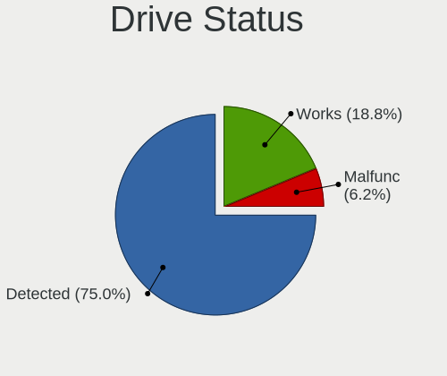
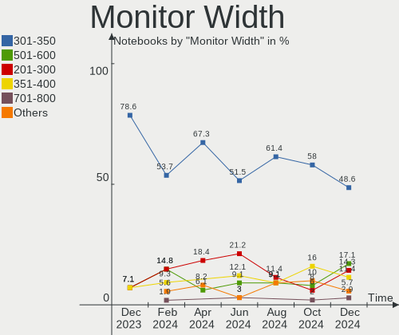
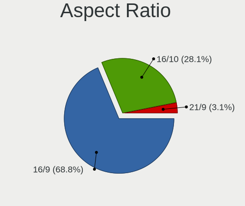
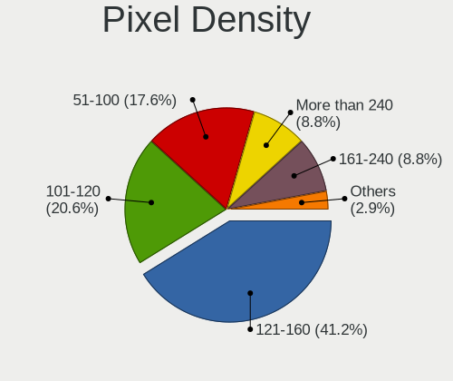
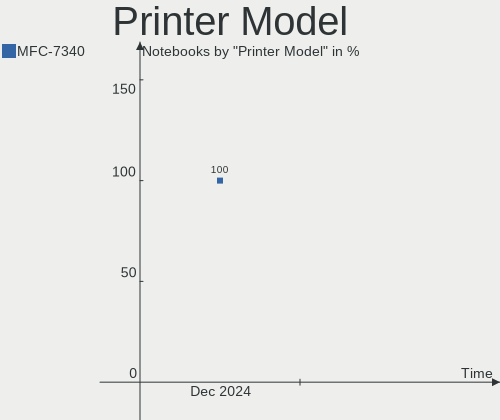

KDE neon - Hardware Trends (Notebooks)
--------------------------------------

A project to identify most popular hardware characteristics and track their change
over time based on data collected by Linux users at https://Linux-Hardware.org.

Anyone can contribute to this report by the [hw-probe](https://github.com/linuxhw/hw-probe) tool:

    sudo -E hw-probe -all -upload

This report is for one last month. Overall report since the beginning of time: [TestDays](https://github.com/linuxhw/TestDays)

Period: Dec, 2024.

Contents
--------

* [ System ](#system)
  - [ OS                       ](#os)
  - [ OS Family                ](#os-family)
  - [ Kernel                   ](#kernel)
  - [ Kernel Family            ](#kernel-family)
  - [ Kernel Major Ver.        ](#kernel-major-ver)
  - [ Arch                     ](#arch)
  - [ DE                       ](#de)
  - [ Display Server           ](#display-server)
  - [ Display Manager          ](#display-manager)
  - [ OS Lang                  ](#os-lang)
  - [ Boot Mode                ](#boot-mode)
  - [ Filesystem               ](#filesystem)
  - [ Part. scheme             ](#part-scheme)
  - [ Dual Boot with Linux/BSD ](#dual-boot-with-linuxbsd)
  - [ Dual Boot (Win)          ](#dual-boot-win)

* [ Board ](#board)
  - [ Vendor                   ](#vendor)
  - [ Model                    ](#model)
  - [ Model Family             ](#model-family)
  - [ MFG Year                 ](#mfg-year)
  - [ Form Factor              ](#form-factor)
  - [ Secure Boot              ](#secure-boot)
  - [ Coreboot                 ](#coreboot)
  - [ RAM Size                 ](#ram-size)
  - [ RAM Used                 ](#ram-used)
  - [ Total Drives             ](#total-drives)
  - [ Has CD-ROM               ](#has-cd-rom)
  - [ Has Ethernet             ](#has-ethernet)
  - [ Has WiFi                 ](#has-wifi)
  - [ Has Bluetooth            ](#has-bluetooth)

* [ Location ](#location)
  - [ Country                  ](#country)
  - [ City                     ](#city)

* [ Drives ](#drives)
  - [ Drive Vendor             ](#drive-vendor)
  - [ Drive Model              ](#drive-model)
  - [ HDD Vendor               ](#hdd-vendor)
  - [ SSD Vendor               ](#ssd-vendor)
  - [ Drive Kind               ](#drive-kind)
  - [ Drive Connector          ](#drive-connector)
  - [ Drive Size               ](#drive-size)
  - [ Space Total              ](#space-total)
  - [ Space Used               ](#space-used)
  - [ Malfunc. Drives          ](#malfunc-drives)
  - [ Malfunc. Drive Vendor    ](#malfunc-drive-vendor)
  - [ Malfunc. HDD Vendor      ](#malfunc-hdd-vendor)
  - [ Malfunc. Drive Kind      ](#malfunc-drive-kind)
  - [ Failed Drives            ](#failed-drives)
  - [ Failed Drive Vendor      ](#failed-drive-vendor)
  - [ Drive Status             ](#drive-status)

* [ Storage controller ](#storage-controller)
  - [ Storage Vendor           ](#storage-vendor)
  - [ Storage Model            ](#storage-model)
  - [ Storage Kind             ](#storage-kind)

* [ Processor ](#processor)
  - [ CPU Vendor               ](#cpu-vendor)
  - [ CPU Model                ](#cpu-model)
  - [ CPU Model Family         ](#cpu-model-family)
  - [ CPU Cores                ](#cpu-cores)
  - [ CPU Sockets              ](#cpu-sockets)
  - [ CPU Threads              ](#cpu-threads)
  - [ CPU Op-Modes             ](#cpu-op-modes)
  - [ CPU Microcode            ](#cpu-microcode)
  - [ CPU Microarch            ](#cpu-microarch)

* [ Graphics ](#graphics)
  - [ GPU Vendor               ](#gpu-vendor)
  - [ GPU Model                ](#gpu-model)
  - [ GPU Combo                ](#gpu-combo)
  - [ GPU Driver               ](#gpu-driver)
  - [ GPU Memory               ](#gpu-memory)

* [ Monitor ](#monitor)
  - [ Monitor Vendor           ](#monitor-vendor)
  - [ Monitor Model            ](#monitor-model)
  - [ Monitor Resolution       ](#monitor-resolution)
  - [ Monitor Diagonal         ](#monitor-diagonal)
  - [ Monitor Width            ](#monitor-width)
  - [ Aspect Ratio             ](#aspect-ratio)
  - [ Monitor Area             ](#monitor-area)
  - [ Pixel Density            ](#pixel-density)
  - [ Multiple Monitors        ](#multiple-monitors)

* [ Network ](#network)
  - [ Net Controller Vendor    ](#net-controller-vendor)
  - [ Net Controller Model     ](#net-controller-model)
  - [ Wireless Vendor          ](#wireless-vendor)
  - [ Wireless Model           ](#wireless-model)
  - [ Ethernet Vendor          ](#ethernet-vendor)
  - [ Ethernet Model           ](#ethernet-model)
  - [ Net Controller Kind      ](#net-controller-kind)
  - [ Used Controller          ](#used-controller)
  - [ NICs                     ](#nics)
  - [ IPv6                     ](#ipv6)

* [ Bluetooth ](#bluetooth)
  - [ Bluetooth Vendor         ](#bluetooth-vendor)
  - [ Bluetooth Model          ](#bluetooth-model)

* [ Sound ](#sound)
  - [ Sound Vendor             ](#sound-vendor)
  - [ Sound Model              ](#sound-model)

* [ Memory ](#memory)
  - [ Memory Vendor            ](#memory-vendor)
  - [ Memory Model             ](#memory-model)
  - [ Memory Kind              ](#memory-kind)
  - [ Memory Form Factor       ](#memory-form-factor)
  - [ Memory Size              ](#memory-size)
  - [ Memory Speed             ](#memory-speed)

* [ Printers & scanners ](#printers--scanners)
  - [ Printer Vendor           ](#printer-vendor)
  - [ Printer Model            ](#printer-model)
  - [ Scanner Vendor           ](#scanner-vendor)
  - [ Scanner Model            ](#scanner-model)

* [ Camera ](#camera)
  - [ Camera Vendor            ](#camera-vendor)
  - [ Camera Model             ](#camera-model)

* [ Security ](#security)
  - [ Fingerprint Vendor       ](#fingerprint-vendor)
  - [ Fingerprint Model        ](#fingerprint-model)
  - [ Chipcard Vendor          ](#chipcard-vendor)
  - [ Chipcard Model           ](#chipcard-model)

* [ Unsupported ](#unsupported)
  - [ Unsupported Devices      ](#unsupported-devices)
  - [ Unsupported Device Types ](#unsupported-device-types)

System
------

OS
--

Installed operating systems

| Name           | Notebooks | Percent |
|----------------|-----------|---------|
| KDE neon 24.04 | 29        | 93.55%  |
| KDE neon 22.04 | 2         | 6.45%   |

OS Family
---------

OS without a version

| Name     | Notebooks | Percent |
|----------|-----------|---------|
| KDE neon | 31        | 100%    |

Kernel
------

Version of the Linux kernel

| Version                | Notebooks | Percent |
|------------------------|-----------|---------|
| 6.8.0-51-generic       | 15        | 48.39%  |
| 6.8.0-49-generic       | 7         | 22.58%  |
| 6.8.0-50-generic       | 3         | 9.68%   |
| 6.8.0-48-generic       | 2         | 6.45%   |
| 6.8.0-47-generic       | 2         | 6.45%   |
| 6.9.3-76060903-generic | 1         | 3.23%   |
| 6.8.0-45-generic       | 1         | 3.23%   |

Kernel Family
-------------

Linux kernel without a distro release

| Version | Notebooks | Percent |
|---------|-----------|---------|
| 6.8.0   | 30        | 96.77%  |
| 6.9.3   | 1         | 3.23%   |

Kernel Major Ver.
-----------------

Linux kernel major version

| Version | Notebooks | Percent |
|---------|-----------|---------|
| 6.8     | 30        | 96.77%  |
| 6.9     | 1         | 3.23%   |

Arch
----

OS architecture (x86_64, i586, etc.)

| Name   | Notebooks | Percent |
|--------|-----------|---------|
| x86_64 | 31        | 100%    |

DE
--

Desktop Environment

| Name | Notebooks | Percent |
|------|-----------|---------|
| KDE6 | 30        | 96.77%  |
| KDE  | 1         | 3.23%   |

Display Server
--------------

X11 or Wayland

| Name    | Notebooks | Percent |
|---------|-----------|---------|
| Wayland | 30        | 96.77%  |
| X11     | 1         | 3.23%   |

Display Manager
---------------

SDDM, LightDM, etc.

| Name    | Notebooks | Percent |
|---------|-----------|---------|
| Unknown | 21        | 67.74%  |
| SDDM    | 10        | 32.26%  |

OS Lang
-------

Language

| Lang  | Notebooks | Percent |
|-------|-----------|---------|
| en_US | 13        | 41.94%  |
| ru_RU | 5         | 16.13%  |
| es_ES | 4         | 12.9%   |
| pt_BR | 1         | 3.23%   |
| pl_PL | 1         | 3.23%   |
| nl_NL | 1         | 3.23%   |
| fr_FR | 1         | 3.23%   |
| en_IE | 1         | 3.23%   |
| en_GB | 1         | 3.23%   |
| en_AU | 1         | 3.23%   |
| de_DE | 1         | 3.23%   |
| C     | 1         | 3.23%   |

Boot Mode
---------

EFI or BIOS

| Mode | Notebooks | Percent |
|------|-----------|---------|
| BIOS | 25        | 80.65%  |
| EFI  | 6         | 19.35%  |

Filesystem
----------

Type of filesystem

| Type    | Notebooks | Percent |
|---------|-----------|---------|
| Ext4    | 28        | 90.32%  |
| Tmpfs   | 2         | 6.45%   |
| Overlay | 1         | 3.23%   |

Part. scheme
------------

Scheme of partitioning

| Type    | Notebooks | Percent |
|---------|-----------|---------|
| Unknown | 21        | 67.74%  |
| GPT     | 8         | 25.81%  |
| MBR     | 2         | 6.45%   |

Dual Boot with Linux/BSD
------------------------

Hosting more than one Linux/BSD

| Dual boot | Notebooks | Percent |
|-----------|-----------|---------|
| No        | 29        | 93.55%  |
| Yes       | 2         | 6.45%   |

Dual Boot (Win)
---------------

Hosting Linux and Windows

| Dual boot | Notebooks | Percent |
|-----------|-----------|---------|
| No        | 24        | 77.42%  |
| Yes       | 7         | 22.58%  |

Board
-----

Vendor
------

Motherboard manufacturer

| Name             | Notebooks | Percent |
|------------------|-----------|---------|
| Hewlett-Packard  | 8         | 25.81%  |
| Lenovo           | 5         | 16.13%  |
| ASUSTek Computer | 4         | 12.9%   |
| Acer             | 4         | 12.9%   |
| Apple            | 3         | 9.68%   |
| Dell             | 2         | 6.45%   |
| Sony             | 1         | 3.23%   |
| MSI              | 1         | 3.23%   |
| MECHREVO         | 1         | 3.23%   |
| MACHINIST        | 1         | 3.23%   |
| Google           | 1         | 3.23%   |

Model
-----

Motherboard model

| Name                                     | Notebooks | Percent |
|------------------------------------------|-----------|---------|
| Apple MacBookPro12,1                     | 2         | 6.45%   |
| Sony VPCEE4E1E                           | 1         | 3.23%   |
| MSI GL65 9SFK                            | 1         | 3.23%   |
| MECHREVO WUJIE14XA                       | 1         | 3.23%   |
| MACHINIST X99-RS9 V1.11                  | 1         | 3.23%   |
| Lenovo Yoga Slim 7 Pro 14ACH5 OD 82NK    | 1         | 3.23%   |
| Lenovo V14 G2 ITL 82NM                   | 1         | 3.23%   |
| Lenovo ThinkPad T430 2349TUM             | 1         | 3.23%   |
| Lenovo ThinkPad L580 20LXS45K00          | 1         | 3.23%   |
| Lenovo Legion S7 15ACH6 82K8             | 1         | 3.23%   |
| HP ZBook FuRY 16 G10 Mobile              | 1         | 3.23%   |
| HP VR backpack G2                        | 1         | 3.23%   |
| HP Pavilion Gaming Laptop 16-a0xxx       | 1         | 3.23%   |
| HP Pavilion Gaming Laptop 15-ec2xxx      | 1         | 3.23%   |
| HP Pavilion dv4                          | 1         | 3.23%   |
| HP OMEN by Laptop                        | 1         | 3.23%   |
| HP ENVY TS 15                            | 1         | 3.23%   |
| HP 635                                   | 1         | 3.23%   |
| Google Magolor                           | 1         | 3.23%   |
| Dell XPS 15 9570                         | 1         | 3.23%   |
| Dell Inspiron 7773                       | 1         | 3.23%   |
| ASUS X541UJ                              | 1         | 3.23%   |
| ASUS ROG Strix G614JV_G614JV             | 1         | 3.23%   |
| ASUS ASUS TUF Gaming A15 FA507RE_FA507RE | 1         | 3.23%   |
| ASUS ASUS TUF Gaming A15 FA506IC_FA506IC | 1         | 3.23%   |
| Apple MacBookPro8,1                      | 1         | 3.23%   |
| Acer Aspire VN7-791G                     | 1         | 3.23%   |
| Acer Aspire SW5-014                      | 1         | 3.23%   |
| Acer Aspire F5-573G                      | 1         | 3.23%   |
| Acer Aspire A515-57                      | 1         | 3.23%   |

Model Family
------------

Motherboard model prefix

| Name               | Notebooks | Percent |
|--------------------|-----------|---------|
| Acer Aspire        | 4         | 12.9%   |
| HP Pavilion        | 3         | 9.68%   |
| Lenovo ThinkPad    | 2         | 6.45%   |
| ASUS ASUS          | 2         | 6.45%   |
| Apple MacBookPro12 | 2         | 6.45%   |
| Sony VPCEE4E1E     | 1         | 3.23%   |
| MSI GL65           | 1         | 3.23%   |
| MECHREVO WUJIE14XA | 1         | 3.23%   |
| MACHINIST X99-RS9  | 1         | 3.23%   |
| Lenovo Yoga        | 1         | 3.23%   |
| Lenovo V14         | 1         | 3.23%   |
| Lenovo Legion      | 1         | 3.23%   |
| HP ZBook           | 1         | 3.23%   |
| HP VR              | 1         | 3.23%   |
| HP OMEN            | 1         | 3.23%   |
| HP ENVY            | 1         | 3.23%   |
| HP 635             | 1         | 3.23%   |
| Google Magolor     | 1         | 3.23%   |
| Dell XPS           | 1         | 3.23%   |
| Dell Inspiron      | 1         | 3.23%   |
| ASUS X541UJ        | 1         | 3.23%   |
| ASUS ROG           | 1         | 3.23%   |
| Apple MacBookPro8  | 1         | 3.23%   |

MFG Year
--------

Motherboard manufacture year

| Year | Notebooks | Percent |
|------|-----------|---------|
| 2021 | 5         | 16.13%  |
| 2015 | 4         | 12.9%   |
| 2024 | 3         | 9.68%   |
| 2011 | 3         | 9.68%   |
| 2023 | 2         | 6.45%   |
| 2022 | 2         | 6.45%   |
| 2020 | 2         | 6.45%   |
| 2019 | 2         | 6.45%   |
| 2018 | 2         | 6.45%   |
| 2016 | 2         | 6.45%   |
| 2017 | 1         | 3.23%   |
| 2013 | 1         | 3.23%   |
| 2012 | 1         | 3.23%   |
| 2008 | 1         | 3.23%   |

Form Factor
-----------

Physical design of the computer

| Name     | Notebooks | Percent |
|----------|-----------|---------|
| Notebook | 31        | 100%    |

Secure Boot
-----------

Enabled or disabled

| State    | Notebooks | Percent |
|----------|-----------|---------|
| Disabled | 29        | 93.55%  |
| Enabled  | 2         | 6.45%   |

Coreboot
--------

Have coreboot on board

| Used | Notebooks | Percent |
|------|-----------|---------|
| No   | 30        | 96.77%  |
| Yes  | 1         | 3.23%   |

RAM Size
--------

Total RAM memory

| Size in GB  | Notebooks | Percent |
|-------------|-----------|---------|
| 8.01-16.0   | 8         | 25.81%  |
| 4.01-8.0    | 7         | 22.58%  |
| 16.01-24.0  | 7         | 22.58%  |
| 32.01-64.0  | 4         | 12.9%   |
| 3.01-4.0    | 3         | 9.68%   |
| 64.01-256.0 | 1         | 3.23%   |
| 1.01-2.0    | 1         | 3.23%   |

RAM Used
--------

Used RAM memory

| Used GB    | Notebooks | Percent |
|------------|-----------|---------|
| 3.01-4.0   | 8         | 25.81%  |
| 2.01-3.0   | 8         | 25.81%  |
| 4.01-8.0   | 6         | 19.35%  |
| 1.01-2.0   | 4         | 12.9%   |
| 8.01-16.0  | 3         | 9.68%   |
| 16.01-24.0 | 1         | 3.23%   |
| 0.51-1.0   | 1         | 3.23%   |

Total Drives
------------

Number of drives on board

| Drives | Notebooks | Percent |
|--------|-----------|---------|
| 1      | 20        | 64.52%  |
| 2      | 10        | 32.26%  |
| 4      | 1         | 3.23%   |

Has CD-ROM
----------

Has CD-ROM on board

| Presented | Notebooks | Percent |
|-----------|-----------|---------|
| No        | 26        | 83.87%  |
| Yes       | 5         | 16.13%  |

Has Ethernet
------------

Has Ethernet on board

| Presented | Notebooks | Percent |
|-----------|-----------|---------|
| Yes       | 25        | 80.65%  |
| No        | 6         | 19.35%  |

Has WiFi
--------

Has WiFi module

| Presented | Notebooks | Percent |
|-----------|-----------|---------|
| Yes       | 30        | 96.77%  |
| No        | 1         | 3.23%   |

Has Bluetooth
-------------

Has Bluetooth module

| Presented | Notebooks | Percent |
|-----------|-----------|---------|
| Yes       | 26        | 83.87%  |
| No        | 5         | 16.13%  |

Location
--------

Country
-------

Geographic location (country)

| Country             | Notebooks | Percent |
|---------------------|-----------|---------|
| Spain               | 5         | 16.13%  |
| Poland              | 4         | 12.9%   |
| Russia              | 3         | 9.68%   |
| USA                 | 2         | 6.45%   |
| France              | 2         | 6.45%   |
| Brazil              | 2         | 6.45%   |
| U.S. Virgin Islands | 1         | 3.23%   |
| The Netherlands     | 1         | 3.23%   |
| Singapore           | 1         | 3.23%   |
| Saudi Arabia        | 1         | 3.23%   |
| Romania             | 1         | 3.23%   |
| Philippines         | 1         | 3.23%   |
| Latvia              | 1         | 3.23%   |
| Indonesia           | 1         | 3.23%   |
| Hungary             | 1         | 3.23%   |
| Germany             | 1         | 3.23%   |
| Belarus             | 1         | 3.23%   |
| Azerbaijan          | 1         | 3.23%   |
| Australia           | 1         | 3.23%   |

City
----

Geographic location (city)

| City              | Notebooks | Percent |
|-------------------|-----------|---------|
| Warsaw            | 2         | 6.45%   |
| Zaragoza          | 1         | 3.23%   |
| Wroclaw           | 1         | 3.23%   |
| Vitebsk           | 1         | 3.23%   |
| Teruel            | 1         | 3.23%   |
| Szczecin          | 1         | 3.23%   |
| St Petersburg     | 1         | 3.23%   |
| Singapore         | 1         | 3.23%   |
| San Fernando City | 1         | 3.23%   |
| Rosny-sous-Bois   | 1         | 3.23%   |
| Riyadh            | 1         | 3.23%   |
| Riga              | 1         | 3.23%   |
| Port de Sagunt    | 1         | 3.23%   |
| Moscow            | 1         | 3.23%   |
| Montauban         | 1         | 3.23%   |
| Madrid            | 1         | 3.23%   |
| Jakarta           | 1         | 3.23%   |
| Fortaleza         | 1         | 3.23%   |
| Englewood         | 1         | 3.23%   |
| Chicago           | 1         | 3.23%   |
| Charlotte Amalie  | 1         | 3.23%   |
| Cadiz             | 1         | 3.23%   |
| Budapest          | 1         | 3.23%   |
| Bucharest         | 1         | 3.23%   |
| Brisbane          | 1         | 3.23%   |
| Blumenau          | 1         | 3.23%   |
| Baku              | 1         | 3.23%   |
| Augsburg          | 1         | 3.23%   |
| Arkhangelsk       | 1         | 3.23%   |
| Amsterdam         | 1         | 3.23%   |

Drives
------

Drive Vendor
------------

Hard drive vendors

| Vendor                      | Notebooks | Drives | Percent |
|-----------------------------|-----------|--------|---------|
| Samsung Electronics         | 9         | 12     | 21.95%  |
| WDC                         | 3         | 3      | 7.32%   |
| SK hynix                    | 3         | 3      | 7.32%   |
| Seagate                     | 3         | 3      | 7.32%   |
| Sandisk                     | 3         | 3      | 7.32%   |
| Unknown                     | 2         | 2      | 4.88%   |
| SPCC                        | 2         | 2      | 4.88%   |
| Intel                       | 2         | 2      | 4.88%   |
| GOODRAM                     | 2         | 2      | 4.88%   |
| Apple                       | 2         | 2      | 4.88%   |
| Yangtze Memory Technologies | 1         | 1      | 2.44%   |
| Silicon Motion              | 1         | 1      | 2.44%   |
| Micron/Crucial Technology   | 1         | 1      | 2.44%   |
| Micron Technology           | 1         | 1      | 2.44%   |
| HS-SSD-C100                 | 1         | 1      | 2.44%   |
| HGST                        | 1         | 1      | 2.44%   |
| Crucial                     | 1         | 1      | 2.44%   |
| China                       | 1         | 1      | 2.44%   |
| Azerty                      | 1         | 1      | 2.44%   |
| A-DATA Technology           | 1         | 1      | 2.44%   |

Drive Model
-----------

Hard drive models

| Model                                               | Notebooks | Percent |
|-----------------------------------------------------|-----------|---------|
| SK hynix SKHynix_HFS001TDE9X084N 1TB                | 2         | 4.88%   |
| Samsung NVMe SSD Controller SM981/PM981/PM983 512GB | 2         | 4.88%   |
| Yangtze Memory YMTC PC411-1024GB-B                  | 1         | 2.44%   |
| WDC WDS500G2B0A-00SM50 500GB SSD                    | 1         | 2.44%   |
| WDC WDS120G2G0A-00JH30 120GB SSD                    | 1         | 2.44%   |
| WDC PC SN520 SDAPNUW-512G-1032 512GB                | 1         | 2.44%   |
| Unknown MMC Card  32GB                              | 1         | 2.44%   |
| Unknown DA4032  32GB                                | 1         | 2.44%   |
| SPCC Solid State Disk 512GB                         | 1         | 2.44%   |
| SPCC Solid State Disk 4TB                           | 1         | 2.44%   |
| SK hynix PC601 HFS001TD9TNG-L2A0A 1024GB            | 1         | 2.44%   |
| Silicon Motion Asgard AN1TNVMe-M.2-80 1TB           | 1         | 2.44%   |
| Seagate ST9320325AS 320GB                           | 1         | 2.44%   |
| Seagate ST500DM002-1BD142 500GB                     | 1         | 2.44%   |
| Seagate ST1000LM024 HN-M101MBB 1TB                  | 1         | 2.44%   |
| SanDisk X600 M.2 2280 SATA 128GB SSD                | 1         | 2.44%   |
| Sandisk WD PC SN560 SDDPNQE-1T00-1002 1024GB        | 1         | 2.44%   |
| Sandisk WD Blue SN570 500GB SSD                     | 1         | 2.44%   |
| Samsung SSD 990 PRO 4TB                             | 1         | 2.44%   |
| Samsung SSD 860 EVO 500GB                           | 1         | 2.44%   |
| Samsung SSD 860 EVO 250GB                           | 1         | 2.44%   |
| Samsung SSD 860 EVO 1TB                             | 1         | 2.44%   |
| Samsung SSD 850 EVO mSATA 500GB                     | 1         | 2.44%   |
| Samsung NVMe SSD Controller SM961/PM961/SM963 256GB | 1         | 2.44%   |
| Samsung MZVLQ512HBLU-00BTW 512GB                    | 1         | 2.44%   |
| Micron/Crucial CT1000P5PSSD8 1TB                    | 1         | 2.44%   |
| Micron 2450_MTFDKBA1T0TFK 1TB                       | 1         | 2.44%   |
| Intel SSDPEKNU512GZH 512GB                          | 1         | 2.44%   |
| Intel SSDPEKNU512GZ 512GB                           | 1         | 2.44%   |
| HS-SSD-C100 240G                                    | 1         | 2.44%   |
| HGST HTS721010A9E630 1TB                            | 1         | 2.44%   |
| GOODRAM SSDPR-CX400-512 512GB                       | 1         | 2.44%   |
| GOODRAM SSD 120GB                                   | 1         | 2.44%   |
| Crucial CT240BX500SSD1 240GB                        | 1         | 2.44%   |
| China SSD 360GB                                     | 1         | 2.44%   |
| Azerty SSD 256GB                                    | 1         | 2.44%   |
| Apple SSD SM0512G 500GB                             | 1         | 2.44%   |
| Apple SSD SM0256G 256GB                             | 1         | 2.44%   |
| A-DATA SU650 240GB SSD                              | 1         | 2.44%   |

HDD Vendor
----------

Hard disk drive vendors

| Vendor  | Notebooks | Drives | Percent |
|---------|-----------|--------|---------|
| Seagate | 3         | 3      | 75%     |
| HGST    | 1         | 1      | 25%     |

SSD Vendor
----------

Solid state drive vendors

| Vendor              | Notebooks | Drives | Percent |
|---------------------|-----------|--------|---------|
| Samsung Electronics | 4         | 4      | 23.53%  |
| WDC                 | 2         | 2      | 11.76%  |
| SPCC                | 2         | 2      | 11.76%  |
| GOODRAM             | 2         | 2      | 11.76%  |
| Apple               | 2         | 2      | 11.76%  |
| SanDisk             | 1         | 1      | 5.88%   |
| Crucial             | 1         | 1      | 5.88%   |
| China               | 1         | 1      | 5.88%   |
| Azerty              | 1         | 1      | 5.88%   |
| A-DATA Technology   | 1         | 1      | 5.88%   |

Drive Kind
----------

HDD or SSD

| Kind    | Notebooks | Drives | Percent |
|---------|-----------|--------|---------|
| NVMe    | 15        | 20     | 40.54%  |
| SSD     | 15        | 17     | 40.54%  |
| HDD     | 4         | 4      | 10.81%  |
| MMC     | 2         | 2      | 5.41%   |
| Unknown | 1         | 1      | 2.7%    |

Drive Connector
---------------

SATA, SAS, NVMe, etc.

| Type | Notebooks | Drives | Percent |
|------|-----------|--------|---------|
| SATA | 17        | 22     | 50%     |
| NVMe | 15        | 20     | 44.12%  |
| MMC  | 2         | 2      | 5.88%   |

Drive Size
----------

Size of hard drive

| Size in TB | Notebooks | Drives | Percent |
|------------|-----------|--------|---------|
| 0.01-0.5   | 13        | 15     | 68.42%  |
| 0.51-1.0   | 5         | 5      | 26.32%  |
| 3.01-4.0   | 1         | 1      | 5.26%   |

Space Total
-----------

Amount of disk space available on the file system

| Size in GB     | Notebooks | Percent |
|----------------|-----------|---------|
| 101-250        | 10        | 32.26%  |
| 251-500        | 8         | 25.81%  |
| 501-1000       | 5         | 16.13%  |
| 21-50          | 3         | 9.68%   |
| 1-20           | 2         | 6.45%   |
| 51-100         | 2         | 6.45%   |
| More than 3000 | 1         | 3.23%   |

Space Used
----------

Amount of used disk space

| Used GB  | Notebooks | Percent |
|----------|-----------|---------|
| 1-20     | 19        | 61.29%  |
| 101-250  | 4         | 12.9%   |
| 21-50    | 3         | 9.68%   |
| 251-500  | 2         | 6.45%   |
| 51-100   | 2         | 6.45%   |
| 501-1000 | 1         | 3.23%   |

Malfunc. Drives
---------------

Drive models with a malfunction

| Model                                     | Notebooks | Drives | Percent |
|-------------------------------------------|-----------|--------|---------|
| Silicon Motion Asgard AN1TNVMe-M.2-80 1TB | 1         | 1      | 50%     |
| Seagate ST9320325AS 320GB                 | 1         | 1      | 50%     |

Malfunc. Drive Vendor
---------------------

Vendors of faulty drives

| Vendor         | Notebooks | Drives | Percent |
|----------------|-----------|--------|---------|
| Silicon Motion | 1         | 1      | 50%     |
| Seagate        | 1         | 1      | 50%     |

Malfunc. HDD Vendor
-------------------

Vendors of faulty HDD drives

| Vendor  | Notebooks | Drives | Percent |
|---------|-----------|--------|---------|
| Seagate | 1         | 1      | 100%    |

Malfunc. Drive Kind
-------------------

Kinds of faulty drives

| Kind | Notebooks | Drives | Percent |
|------|-----------|--------|---------|
| NVMe | 1         | 1      | 50%     |
| HDD  | 1         | 1      | 50%     |

Failed Drives
-------------

Failed drive models

Zero info for selected period =(

Failed Drive Vendor
-------------------

Failed drive vendors

Zero info for selected period =(

Drive Status
------------

Number of failed and malfunc. drives

| Status   | Notebooks | Drives | Percent |
|----------|-----------|--------|---------|
| Detected | 24        | 35     | 75%     |
| Works    | 6         | 7      | 18.75%  |
| Malfunc  | 2         | 2      | 6.25%   |

Storage controller
------------------

Storage Vendor
--------------

Storage controller vendors

| Vendor                      | Notebooks | Percent |
|-----------------------------|-----------|---------|
| Intel                       | 19        | 48.72%  |
| Samsung Electronics         | 7         | 17.95%  |
| SK hynix                    | 3         | 7.69%   |
| SanDisk                     | 3         | 7.69%   |
| AMD                         | 3         | 7.69%   |
| Yangtze Memory Technologies | 1         | 2.56%   |
| Silicon Motion              | 1         | 2.56%   |
| Micron/Crucial Technology   | 1         | 2.56%   |
| Micron Technology           | 1         | 2.56%   |

Storage Model
-------------

Storage controller models

| Model                                                                          | Notebooks | Percent |
|--------------------------------------------------------------------------------|-----------|---------|
| Intel Sunrise Point-LP SATA Controller [AHCI mode]                             | 3         | 7.5%    |
| Intel 82801 Mobile SATA Controller [RAID mode]                                 | 3         | 7.5%    |
| SK hynix Gold P31/BC711/PC711 NVMe Solid State Drive                           | 2         | 5%      |
| Samsung S4LN058A01[SSUBX] AHCI SSD Controller (Apple slot)                     | 2         | 5%      |
| Samsung NVMe SSD Controller SM981/PM981/PM983                                  | 2         | 5%      |
| Intel Volume Management Device NVMe RAID Controller Intel Corporation          | 2         | 5%      |
| Intel SSD 670p Series [Keystone Harbor]                                        | 2         | 5%      |
| Intel Cannon Lake Mobile PCH SATA AHCI Controller                              | 2         | 5%      |
| Intel 8 Series/C220 Series Chipset Family 6-port SATA Controller 1 [AHCI mode] | 2         | 5%      |
| AMD SB7x0/SB8x0/SB9x0 SATA Controller [AHCI mode]                              | 2         | 5%      |
| Yangtze Memory PC411 NVMe SSD (DRAM-less)                                      | 1         | 2.5%    |
| SK hynix PC601 NVMe Solid State Drive                                          | 1         | 2.5%    |
| Silicon Motion SM2263EN/SM2263XT (DRAM-less) NVMe SSD Controllers              | 1         | 2.5%    |
| SanDisk WD Blue SN500 / PC SN520 x2 M.2 2280 NVMe SSD                          | 1         | 2.5%    |
| SanDisk WD Black SN770 / PC SN740 256GB / PC SN560 (DRAM-less) NVMe SSD        | 1         | 2.5%    |
| SanDisk Ultra 3D / WD Blue SN570 NVMe SSD (DRAM-less)                          | 1         | 2.5%    |
| Samsung NVMe SSD Controller SM961/PM961/SM963                                  | 1         | 2.5%    |
| Samsung NVMe SSD Controller S4LV008[Pascal]                                    | 1         | 2.5%    |
| Samsung NVMe SSD Controller 980 (DRAM-less)                                    | 1         | 2.5%    |
| Micron/Crucial P5 Plus NVMe PCIe SSD                                           | 1         | 2.5%    |
| Micron 2450 NVMe SSD [HendrixV] (DRAM-less)                                    | 1         | 2.5%    |
| Intel Tiger Lake-LP SATA Controller                                            | 1         | 2.5%    |
| Intel Alder Lake-P SATA AHCI Controller                                        | 1         | 2.5%    |
| Intel 82801IBM/IEM (ICH9M/ICH9M-E) 4 port SATA Controller [AHCI mode]          | 1         | 2.5%    |
| Intel 7 Series Chipset Family 6-port SATA Controller [AHCI mode]               | 1         | 2.5%    |
| Intel 6 Series/C200 Series Chipset Family 6 port Mobile SATA AHCI Controller   | 1         | 2.5%    |
| AMD SB7x0/SB8x0/SB9x0 IDE Controller                                           | 1         | 2.5%    |
| AMD FCH SATA Controller [AHCI mode]                                            | 1         | 2.5%    |

Storage Kind
------------

Kind of storage controller (IDE, SATA, NVMe, SAS, ...)

| Kind | Notebooks | Percent |
|------|-----------|---------|
| SATA | 17        | 44.74%  |
| NVMe | 15        | 39.47%  |
| RAID | 5         | 13.16%  |
| IDE  | 1         | 2.63%   |

Processor
---------

CPU Vendor
----------

Processor vendors

| Vendor | Notebooks | Percent |
|--------|-----------|---------|
| Intel  | 23        | 74.19%  |
| AMD    | 8         | 25.81%  |

CPU Model
---------

Processor models

| Model                                      | Notebooks | Percent |
|--------------------------------------------|-----------|---------|
| Intel Core i7-8750H CPU @ 2.20GHz          | 2         | 6.45%   |
| Intel Xeon CPU E5-2667 v4 @ 3.20GHz        | 1         | 3.23%   |
| Intel Core i7-9750H CPU @ 2.60GHz          | 1         | 3.23%   |
| Intel Core i7-8850H CPU @ 2.60GHz          | 1         | 3.23%   |
| Intel Core i7-8550U CPU @ 1.80GHz          | 1         | 3.23%   |
| Intel Core i7-7500U CPU @ 2.70GHz          | 1         | 3.23%   |
| Intel Core i7-5557U CPU @ 3.10GHz          | 1         | 3.23%   |
| Intel Core i7-4720HQ CPU @ 2.60GHz         | 1         | 3.23%   |
| Intel Core i7-4702MQ CPU @ 2.20GHz         | 1         | 3.23%   |
| Intel Core i7-3520M CPU @ 2.90GHz          | 1         | 3.23%   |
| Intel Core i7-10750H CPU @ 2.60GHz         | 1         | 3.23%   |
| Intel Core i5-8250U CPU @ 1.60GHz          | 1         | 3.23%   |
| Intel Core i5-6200U CPU @ 2.30GHz          | 1         | 3.23%   |
| Intel Core i5-5257U CPU @ 2.70GHz          | 1         | 3.23%   |
| Intel Core i5-2415M CPU @ 2.30GHz          | 1         | 3.23%   |
| Intel Core 2 Duo CPU P8700 @ 2.53GHz       | 1         | 3.23%   |
| Intel Celeron N4500 @ 1.10GHz              | 1         | 3.23%   |
| Intel Atom x5-Z8300 CPU @ 1.44GHz          | 1         | 3.23%   |
| Intel 13th Gen Core i7-13850HX             | 1         | 3.23%   |
| Intel 13th Gen Core i7-13650HX             | 1         | 3.23%   |
| Intel 12th Gen Core i7-12650H              | 1         | 3.23%   |
| Intel 11th Gen Core i5-1135G7 @ 2.40GHz    | 1         | 3.23%   |
| AMD Ryzen 9 5900HX with Radeon Graphics    | 1         | 3.23%   |
| AMD Ryzen 9 5900HS Creator Edition         | 1         | 3.23%   |
| AMD Ryzen 7 8845HS w/ Radeon 780M Graphics | 1         | 3.23%   |
| AMD Ryzen 7 6800H with Radeon Graphics     | 1         | 3.23%   |
| AMD Ryzen 7 4800H with Radeon Graphics     | 1         | 3.23%   |
| AMD Ryzen 5 5600H with Radeon Graphics     | 1         | 3.23%   |
| AMD E-300 APU with Radeon HD Graphics      | 1         | 3.23%   |
| AMD Athlon II P360 Dual-Core Processor     | 1         | 3.23%   |

CPU Model Family
----------------

Processor model prefix

| Model            | Notebooks | Percent |
|------------------|-----------|---------|
| Intel Core i7    | 11        | 35.48%  |
| Other            | 4         | 12.9%   |
| Intel Core i5    | 4         | 12.9%   |
| AMD Ryzen 7      | 3         | 9.68%   |
| AMD Ryzen 9      | 2         | 6.45%   |
| Intel Xeon       | 1         | 3.23%   |
| Intel Core 2 Duo | 1         | 3.23%   |
| Intel Celeron    | 1         | 3.23%   |
| Intel Atom       | 1         | 3.23%   |
| AMD Ryzen 5      | 1         | 3.23%   |
| AMD E            | 1         | 3.23%   |
| AMD Athlon II    | 1         | 3.23%   |

CPU Cores
---------

Number of processor cores

| Number | Notebooks | Percent |
|--------|-----------|---------|
| 2      | 10        | 32.26%  |
| 8      | 6         | 19.35%  |
| 6      | 6         | 19.35%  |
| 4      | 6         | 19.35%  |
| 20     | 1         | 3.23%   |
| 14     | 1         | 3.23%   |
| 10     | 1         | 3.23%   |

CPU Sockets
-----------

Number of sockets

| Number | Notebooks | Percent |
|--------|-----------|---------|
| 1      | 31        | 100%    |

CPU Threads
-----------

Threads per core (Hyper-Threading)

| Number | Notebooks | Percent |
|--------|-----------|---------|
| 2      | 25        | 80.65%  |
| 1      | 6         | 19.35%  |

CPU Op-Modes
------------

CPU Operation Modes (32-bit, 64-bit)

| Op mode        | Notebooks | Percent |
|----------------|-----------|---------|
| 32-bit, 64-bit | 31        | 100%    |

CPU Microcode
-------------

Microcode number

| Number  | Notebooks | Percent |
|---------|-----------|---------|
| Unknown | 31        | 100%    |

CPU Microarch
-------------

Microarchitecture

| Name             | Notebooks | Percent |
|------------------|-----------|---------|
| KabyLake         | 7         | 22.58%  |
| Unknown          | 4         | 12.9%   |
| Zen 3            | 3         | 9.68%   |
| Broadwell        | 3         | 9.68%   |
| Haswell          | 2         | 6.45%   |
| Zen 2            | 1         | 3.23%   |
| Tremont          | 1         | 3.23%   |
| TigerLake        | 1         | 3.23%   |
| Skylake          | 1         | 3.23%   |
| Silvermont       | 1         | 3.23%   |
| SandyBridge      | 1         | 3.23%   |
| Penryn           | 1         | 3.23%   |
| K10              | 1         | 3.23%   |
| IvyBridge        | 1         | 3.23%   |
| CometLake        | 1         | 3.23%   |
| Bobcat           | 1         | 3.23%   |
| Alderlake Hybrid | 1         | 3.23%   |

Graphics
--------

GPU Vendor
----------

Vendors of graphics cards

| Vendor | Notebooks | Percent |
|--------|-----------|---------|
| Intel  | 20        | 43.48%  |
| Nvidia | 17        | 36.96%  |
| AMD    | 9         | 19.57%  |

GPU Model
---------

Graphics card models

| Model                                                                                    | Notebooks | Percent |
|------------------------------------------------------------------------------------------|-----------|---------|
| AMD Cezanne [Radeon Vega Series / Radeon Vega Mobile Series]                             | 3         | 6.52%   |
| Nvidia GM107M [GeForce GTX 950M]                                                         | 2         | 4.35%   |
| Nvidia GA107M [GeForce RTX 3050 Mobile]                                                  | 2         | 4.35%   |
| Intel UHD Graphics 620                                                                   | 2         | 4.35%   |
| Intel Raptor Lake-S UHD Graphics                                                         | 2         | 4.35%   |
| Intel Iris Graphics 6100                                                                 | 2         | 4.35%   |
| Intel CoffeeLake-H GT2 [UHD Graphics 630]                                                | 2         | 4.35%   |
| Intel 4th Gen Core Processor Integrated Graphics Controller                              | 2         | 4.35%   |
| Nvidia TU117M [GeForce MX450]                                                            | 1         | 2.17%   |
| Nvidia TU117M [GeForce GTX 1650 Ti Mobile]                                               | 1         | 2.17%   |
| Nvidia TU104M [GeForce RTX 2080 Mobile]                                                  | 1         | 2.17%   |
| Nvidia GP108M [GeForce MX150]                                                            | 1         | 2.17%   |
| Nvidia GP107M [GeForce GTX 1050 Ti Mobile]                                               | 1         | 2.17%   |
| Nvidia GP106M [GeForce GTX 1060 Mobile]                                                  | 1         | 2.17%   |
| Nvidia GK208BM [GeForce 920M]                                                            | 1         | 2.17%   |
| Nvidia GK107M [GeForce GT 750M]                                                          | 1         | 2.17%   |
| Nvidia GF108M [NVS 5400M]                                                                | 1         | 2.17%   |
| Nvidia GA107M [GeForce RTX 3050 Ti Mobile]                                               | 1         | 2.17%   |
| Nvidia GA106M [GeForce RTX 3050 Ti Mobile / Max-Q]                                       | 1         | 2.17%   |
| Nvidia AD107M [GeForce RTX 4060 Max-Q / Mobile]                                          | 1         | 2.17%   |
| Nvidia AD107GLM [RTX 2000 Ada Generation Laptop GPU]                                     | 1         | 2.17%   |
| Intel TigerLake-LP GT2 [Iris Xe Graphics]                                                | 1         | 2.17%   |
| Intel Skylake GT2 [HD Graphics 520]                                                      | 1         | 2.17%   |
| Intel Mobile 4 Series Chipset Integrated Graphics Controller                             | 1         | 2.17%   |
| Intel JasperLake [UHD Graphics]                                                          | 1         | 2.17%   |
| Intel HD Graphics 620                                                                    | 1         | 2.17%   |
| Intel CometLake-H GT2 [UHD Graphics]                                                     | 1         | 2.17%   |
| Intel Atom/Celeron/Pentium Processor x5-E8000/J3xxx/N3xxx Integrated Graphics Controller | 1         | 2.17%   |
| Intel Alder Lake-P GT1 [UHD Graphics]                                                    | 1         | 2.17%   |
| Intel 3rd Gen Core processor Graphics Controller                                         | 1         | 2.17%   |
| Intel 2nd Generation Core Processor Family Integrated Graphics Controller                | 1         | 2.17%   |
| AMD Wrestler [Radeon HD 6310]                                                            | 1         | 2.17%   |
| AMD RS880M [Mobility Radeon HD 4225/4250]                                                | 1         | 2.17%   |
| AMD Renoir [Radeon Vega Series / Radeon Vega Mobile Series]                              | 1         | 2.17%   |
| AMD Rembrandt [Radeon 680M]                                                              | 1         | 2.17%   |
| AMD Phoenix3                                                                             | 1         | 2.17%   |
| AMD Lexa PRO [Radeon 540/540X/550/550X / RX 540X/550/550X]                               | 1         | 2.17%   |

GPU Combo
---------

Combinations of graphics cards

| Name           | Notebooks | Percent |
|----------------|-----------|---------|
| Intel + Nvidia | 10        | 32.26%  |
| 1 x Intel      | 10        | 32.26%  |
| AMD + Nvidia   | 5         | 16.13%  |
| 1 x AMD        | 4         | 12.9%   |
| 1 x Nvidia     | 2         | 6.45%   |

GPU Driver
----------

Free vs proprietary

| Driver      | Notebooks | Percent |
|-------------|-----------|---------|
| Free        | 25        | 80.65%  |
| Proprietary | 4         | 12.9%   |
| Unknown     | 2         | 6.45%   |

GPU Memory
----------

Total video memory

| Size in GB | Notebooks | Percent |
|------------|-----------|---------|
| Unknown    | 28        | 90.32%  |
| 3.01-4.0   | 2         | 6.45%   |
| 0.01-0.5   | 1         | 3.23%   |

Monitor
-------

Monitor Vendor
--------------

Monitor vendors

| Vendor              | Notebooks | Percent |
|---------------------|-----------|---------|
| Chimei Innolux      | 7         | 20%     |
| Samsung Electronics | 5         | 14.29%  |
| LG Display          | 4         | 11.43%  |
| BOE                 | 4         | 11.43%  |
| Apple               | 3         | 8.57%   |
| Philips             | 2         | 5.71%   |
| Hewlett-Packard     | 2         | 5.71%   |
| AU Optronics        | 2         | 5.71%   |
| TMA                 | 1         | 2.86%   |
| Sharp               | 1         | 2.86%   |
| MSI                 | 1         | 2.86%   |
| Gigabyte Technology | 1         | 2.86%   |
| CSO                 | 1         | 2.86%   |
| BenQ                | 1         | 2.86%   |

Monitor Model
-------------

Monitor models

| Model                                                                  | Notebooks | Percent |
|------------------------------------------------------------------------|-----------|---------|
| TMA TL140ADXP24-0 TMA2004 2880x1800 300x190mm 14.0-inch                | 1         | 2.86%   |
| Sharp LCD Monitor SHP149A 1920x1080 344x194mm 15.5-inch                | 1         | 2.86%   |
| Samsung Electronics S27D390 SAM0B67 1920x1080 598x336mm 27.0-inch      | 1         | 2.86%   |
| Samsung Electronics LCD Monitor SEC5142 1280x800 303x190mm 14.1-inch   | 1         | 2.86%   |
| Samsung Electronics LCD Monitor SEC304C 1366x768 309x174mm 14.0-inch   | 1         | 2.86%   |
| Samsung Electronics LCD Monitor SDC4152 2880x1800 302x189mm 14.0-inch  | 1         | 2.86%   |
| Samsung Electronics LCD Monitor SAM06C6 1920x1080 1110x620mm 50.1-inch | 1         | 2.86%   |
| Philips PHL 346B1C PHL093E 3440x1440 797x334mm 34.0-inch               | 1         | 2.86%   |
| Philips PHL 223V5 PHLC0CF 1920x1080 480x270mm 21.7-inch                | 1         | 2.86%   |
| MSI G2412 MSI9BA4 1920x1080 527x296mm 23.8-inch                        | 1         | 2.86%   |
| LG Display LCD Monitor LGD05FE 1920x1080 344x194mm 15.5-inch           | 1         | 2.86%   |
| LG Display LCD Monitor LGD0469 1920x1080 382x215mm 17.3-inch           | 1         | 2.86%   |
| LG Display LCD Monitor LGD02F1 1366x768 344x194mm 15.5-inch            | 1         | 2.86%   |
| LG Display LCD Monitor LGD02CA 1366x768 345x194mm 15.6-inch            | 1         | 2.86%   |
| Hewlett-Packard LP2465 HWP2676 1920x1200 519x324mm 24.1-inch           | 1         | 2.86%   |
| Hewlett-Packard 27f HPN354B 1920x1080 598x336mm 27.0-inch              | 1         | 2.86%   |
| Gigabyte Technology GS27QC GBT271F 2560x1440 597x336mm 27.0-inch       | 1         | 2.86%   |
| CSO LCD Monitor CSO1505 3840x2160 344x194mm 15.5-inch                  | 1         | 2.86%   |
| Chimei Innolux LCD Monitor CMN1606 1920x1080 355x199mm 16.0-inch       | 1         | 2.86%   |
| Chimei Innolux LCD Monitor CMN15E7 1920x1080 344x193mm 15.5-inch       | 1         | 2.86%   |
| Chimei Innolux LCD Monitor CMN15BB 1920x1080 344x194mm 15.5-inch       | 1         | 2.86%   |
| Chimei Innolux LCD Monitor CMN153C 1920x1080 344x193mm 15.5-inch       | 1         | 2.86%   |
| Chimei Innolux LCD Monitor CMN1521 1920x1080 344x193mm 15.5-inch       | 1         | 2.86%   |
| Chimei Innolux LCD Monitor CMN14E5 1920x1080 309x173mm 13.9-inch       | 1         | 2.86%   |
| Chimei Innolux LCD Monitor CMN114C 1366x768 256x144mm 11.6-inch        | 1         | 2.86%   |
| BOE NE160QDM-NZ5 BOE0B3A 2560x1600 344x215mm 16.0-inch                 | 1         | 2.86%   |
| BOE LCD Monitor BOE0A4F 1920x1200 345x215mm 16.0-inch                  | 1         | 2.86%   |
| BOE LCD Monitor BOE0739 1920x1080 344x193mm 15.5-inch                  | 1         | 2.86%   |
| BOE LCD Monitor BOE06B0 1366x768 344x194mm 15.5-inch                   | 1         | 2.86%   |
| BenQ GL2580 BNQ78E5 1920x1080 544x303mm 24.5-inch                      | 1         | 2.86%   |
| AU Optronics LCD Monitor AUOD0ED 1920x1080 344x193mm 15.5-inch         | 1         | 2.86%   |
| AU Optronics LCD Monitor AUO109D 1920x1080 381x214mm 17.2-inch         | 1         | 2.86%   |
| Apple Color LCD APPA02A 2560x1600 286x179mm 13.3-inch                  | 1         | 2.86%   |
| Apple Color LCD APPA029 2560x1600 286x179mm 13.3-inch                  | 1         | 2.86%   |
| Apple Color LCD APP9CC9 1280x800 286x178mm 13.3-inch                   | 1         | 2.86%   |

Monitor Resolution
------------------

Monitor screen resolution

| Resolution        | Notebooks | Percent |
|-------------------|-----------|---------|
| 1920x1080 (FHD)   | 17        | 51.52%  |
| 1366x768 (WXGA)   | 4         | 12.12%  |
| 2560x1600         | 3         | 9.09%   |
| 2880x1800         | 2         | 6.06%   |
| 1920x1200 (WUXGA) | 2         | 6.06%   |
| 1280x800 (WXGA)   | 2         | 6.06%   |
| 3840x2160 (4K)    | 1         | 3.03%   |
| 3440x1440         | 1         | 3.03%   |
| 2560x1440 (QHD)   | 1         | 3.03%   |

Monitor Diagonal
----------------

Diagonal size in inches

| Inches | Notebooks | Percent |
|--------|-----------|---------|
| 15     | 13        | 37.14%  |
| 13     | 4         | 11.43%  |
| 27     | 3         | 8.57%   |
| 16     | 3         | 8.57%   |
| 14     | 3         | 8.57%   |
| 24     | 2         | 5.71%   |
| 17     | 2         | 5.71%   |
| 58     | 1         | 2.86%   |
| 34     | 1         | 2.86%   |
| 23     | 1         | 2.86%   |
| 21     | 1         | 2.86%   |
| 11     | 1         | 2.86%   |

Monitor Width
-------------

Physical width

| Width in mm | Notebooks | Percent |
|-------------|-----------|---------|
| 301-350     | 17        | 48.57%  |
| 501-600     | 6         | 17.14%  |
| 201-300     | 5         | 14.29%  |
| 351-400     | 4         | 11.43%  |
| 701-800     | 1         | 2.86%   |
| 401-500     | 1         | 2.86%   |
| 1001-1500   | 1         | 2.86%   |

Aspect Ratio
------------

Proportional relationship between the width and the height

| Ratio | Notebooks | Percent |
|-------|-----------|---------|
| 16/9  | 22        | 68.75%  |
| 16/10 | 9         | 28.13%  |
| 21/9  | 1         | 3.13%   |

Monitor Area
------------

Area in inch

| Area in inch | Notebooks | Percent |
|----------------|-----------|---------|
| 101-110        | 14        | 40%     |
| 81-90          | 6         | 17.14%  |
| 301-350        | 3         | 8.57%   |
| 251-300        | 2         | 5.71%   |
| 201-250        | 2         | 5.71%   |
| 121-130        | 2         | 5.71%   |
| 111-120        | 2         | 5.71%   |
| More than 1000 | 1         | 2.86%   |
| 71-80          | 1         | 2.86%   |
| 51-60          | 1         | 2.86%   |
| 351-500        | 1         | 2.86%   |

Pixel Density
-------------

Pixels per inch

| Density       | Notebooks | Percent |
|---------------|-----------|---------|
| 121-160       | 14        | 41.18%  |
| 101-120       | 7         | 20.59%  |
| 51-100        | 6         | 17.65%  |
| More than 240 | 3         | 8.82%   |
| 161-240       | 3         | 8.82%   |
| 1-50          | 1         | 2.94%   |

Multiple Monitors
-----------------

Total monitors connected

| Total | Notebooks | Percent |
|-------|-----------|---------|
| 1     | 26        | 83.87%  |
| 2     | 5         | 16.13%  |

Network
-------

Net Controller Vendor
---------------------

Controller vendors

| Vendor                                 | Notebooks | Percent |
|----------------------------------------|-----------|---------|
| Realtek Semiconductor                  | 20        | 40.82%  |
| Intel                                  | 14        | 28.57%  |
| Broadcom                               | 6         | 12.24%  |
| Qualcomm Atheros                       | 4         | 8.16%   |
| MediaTek                               | 2         | 4.08%   |
| Suzhou Motorcomm Electronic Technology | 1         | 2.04%   |
| Samsung Electronics                    | 1         | 2.04%   |
| ASUSTek Computer                       | 1         | 2.04%   |

Net Controller Model
--------------------

Controller models

| Model                                                                  | Notebooks | Percent |
|------------------------------------------------------------------------|-----------|---------|
| Realtek RTL8111/8168/8211/8411 PCI Express Gigabit Ethernet Controller | 12        | 20%     |
| Realtek RTL8153 Gigabit Ethernet Adapter                               | 4         | 6.67%   |
| Realtek RTL8852AE 802.11ax PCIe Wireless Network Adapter               | 3         | 5%      |
| Realtek RTL810xE PCI Express Fast Ethernet controller                  | 3         | 5%      |
| Qualcomm Atheros QCA6174 802.11ac Wireless Network Adapter             | 2         | 3.33%   |
| Qualcomm Atheros AR9285 Wireless Network Adapter (PCI-Express)         | 2         | 3.33%   |
| MediaTek MT7921 802.11ax PCI Express Wireless Network Adapter          | 2         | 3.33%   |
| Intel Raptor Lake-S PCH CNVi WiFi                                      | 2         | 3.33%   |
| Intel Cannon Lake PCH CNVi WiFi                                        | 2         | 3.33%   |
| Broadcom BCM43602 802.11ac Wireless LAN SoC                            | 2         | 3.33%   |
| Suzhou Motorcomm Electronic YT6801 Gigabit Ethernet Controller         | 1         | 1.67%   |
| Samsung GT-I9070 (network tethering, USB debugging enabled)            | 1         | 1.67%   |
| Realtek RTL8822CE 802.11ac PCIe Wireless Network Adapter               | 1         | 1.67%   |
| Realtek RTL8723BE PCIe Wireless Network Adapter                        | 1         | 1.67%   |
| Realtek RTL8192EU 802.11b/g/n WLAN Adapter                             | 1         | 1.67%   |
| Realtek Killer E2600 GbE Controller                                    | 1         | 1.67%   |
| Intel Wireless 8265 / 8275                                             | 1         | 1.67%   |
| Intel Wireless 7265                                                    | 1         | 1.67%   |
| Intel Wireless 7260                                                    | 1         | 1.67%   |
| Intel Wireless 3165                                                    | 1         | 1.67%   |
| Intel Wi-Fi 6 AX201 160MHz                                             | 1         | 1.67%   |
| Intel Wi-Fi 6 AX201                                                    | 1         | 1.67%   |
| Intel Wi-Fi 6 AX200                                                    | 1         | 1.67%   |
| Intel Wi-Fi 5(802.11ac) Wireless-AC 9x6x [Thunder Peak]                | 1         | 1.67%   |
| Intel Ethernet Controller I219-LM                                      | 1         | 1.67%   |
| Intel Ethernet Connection (7) I219-LM                                  | 1         | 1.67%   |
| Intel Ethernet Connection (4) I219-V                                   | 1         | 1.67%   |
| Intel Alder Lake-P PCH CNVi WiFi                                       | 1         | 1.67%   |
| Intel 82579LM Gigabit Network Connection (Lewisville)                  | 1         | 1.67%   |
| Broadcom NetXtreme BCM57765 Gigabit Ethernet PCIe                      | 1         | 1.67%   |
| Broadcom NetXtreme BCM57762 Gigabit Ethernet PCIe                      | 1         | 1.67%   |
| Broadcom NetLink BCM57780 Gigabit Ethernet PCIe                        | 1         | 1.67%   |
| Broadcom BCM4331 802.11a/b/g/n                                         | 1         | 1.67%   |
| Broadcom BCM4313 802.11bgn Wireless Network Adapter                    | 1         | 1.67%   |
| Broadcom BCM4312 802.11b/g LP-PHY                                      | 1         | 1.67%   |
| ASUS WL-167G v1 802.11g Adapter [Ralink RT2571]                        | 1         | 1.67%   |

Wireless Vendor
---------------

Wireless vendors

| Vendor                | Notebooks | Percent |
|-----------------------|-----------|---------|
| Intel                 | 12        | 40%     |
| Realtek Semiconductor | 6         | 20%     |
| Broadcom              | 5         | 16.67%  |
| Qualcomm Atheros      | 4         | 13.33%  |
| MediaTek              | 2         | 6.67%   |
| ASUSTek Computer      | 1         | 3.33%   |

Wireless Model
--------------

Wireless models

| Model                                                          | Notebooks | Percent |
|----------------------------------------------------------------|-----------|---------|
| Realtek RTL8852AE 802.11ax PCIe Wireless Network Adapter       | 3         | 10%     |
| Qualcomm Atheros QCA6174 802.11ac Wireless Network Adapter     | 2         | 6.67%   |
| Qualcomm Atheros AR9285 Wireless Network Adapter (PCI-Express) | 2         | 6.67%   |
| MediaTek MT7921 802.11ax PCI Express Wireless Network Adapter  | 2         | 6.67%   |
| Intel Cannon Lake PCH CNVi WiFi                                | 2         | 6.67%   |
| Broadcom BCM43602 802.11ac Wireless LAN SoC                    | 2         | 6.67%   |
| Realtek RTL8822CE 802.11ac PCIe Wireless Network Adapter       | 1         | 3.33%   |
| Realtek RTL8723BE PCIe Wireless Network Adapter                | 1         | 3.33%   |
| Realtek RTL8192EU 802.11b/g/n WLAN Adapter                     | 1         | 3.33%   |
| Intel Wireless 8265 / 8275                                     | 1         | 3.33%   |
| Intel Wireless 7265                                            | 1         | 3.33%   |
| Intel Wireless 7260                                            | 1         | 3.33%   |
| Intel Wireless 3165                                            | 1         | 3.33%   |
| Intel Wi-Fi 6 AX201 160MHz                                     | 1         | 3.33%   |
| Intel Wi-Fi 6 AX201                                            | 1         | 3.33%   |
| Intel Wi-Fi 6 AX200                                            | 1         | 3.33%   |
| Intel Wi-Fi 5(802.11ac) Wireless-AC 9x6x [Thunder Peak]        | 1         | 3.33%   |
| Intel Raptor Lake-S PCH CNVi WiFi                              | 1         | 3.33%   |
| Intel Alder Lake-P PCH CNVi WiFi                               | 1         | 3.33%   |
| Broadcom BCM4331 802.11a/b/g/n                                 | 1         | 3.33%   |
| Broadcom BCM4313 802.11bgn Wireless Network Adapter            | 1         | 3.33%   |
| Broadcom BCM4312 802.11b/g LP-PHY                              | 1         | 3.33%   |
| ASUS WL-167G v1 802.11g Adapter [Ralink RT2571]                | 1         | 3.33%   |

Ethernet Vendor
---------------

Ethernet vendors

| Vendor                                 | Notebooks | Percent |
|----------------------------------------|-----------|---------|
| Realtek Semiconductor                  | 18        | 69.23%  |
| Intel                                  | 4         | 15.38%  |
| Broadcom                               | 3         | 11.54%  |
| Suzhou Motorcomm Electronic Technology | 1         | 3.85%   |

Ethernet Model
--------------

Ethernet models

| Model                                                                  | Notebooks | Percent |
|------------------------------------------------------------------------|-----------|---------|
| Realtek RTL8111/8168/8211/8411 PCI Express Gigabit Ethernet Controller | 12        | 41.38%  |
| Realtek RTL8153 Gigabit Ethernet Adapter                               | 4         | 13.79%  |
| Realtek RTL810xE PCI Express Fast Ethernet controller                  | 3         | 10.34%  |
| Suzhou Motorcomm Electronic YT6801 Gigabit Ethernet Controller         | 1         | 3.45%   |
| Realtek Killer E2600 GbE Controller                                    | 1         | 3.45%   |
| Intel Raptor Lake-S PCH CNVi WiFi                                      | 1         | 3.45%   |
| Intel Ethernet Controller I219-LM                                      | 1         | 3.45%   |
| Intel Ethernet Connection (7) I219-LM                                  | 1         | 3.45%   |
| Intel Ethernet Connection (4) I219-V                                   | 1         | 3.45%   |
| Intel 82579LM Gigabit Network Connection (Lewisville)                  | 1         | 3.45%   |
| Broadcom NetXtreme BCM57765 Gigabit Ethernet PCIe                      | 1         | 3.45%   |
| Broadcom NetXtreme BCM57762 Gigabit Ethernet PCIe                      | 1         | 3.45%   |
| Broadcom NetLink BCM57780 Gigabit Ethernet PCIe                        | 1         | 3.45%   |

Net Controller Kind
-------------------

Ethernet, WiFi or modem

| Kind     | Notebooks | Percent |
|----------|-----------|---------|
| WiFi     | 30        | 53.57%  |
| Ethernet | 25        | 44.64%  |
| Modem    | 1         | 1.79%   |

Used Controller
---------------

Currently used network controller

| Kind     | Notebooks | Percent |
|----------|-----------|---------|
| WiFi     | 22        | 70.97%  |
| Ethernet | 9         | 29.03%  |

NICs
----

Total network controllers on board

| Total | Notebooks | Percent |
|-------|-----------|---------|
| 2     | 23        | 74.19%  |
| 1     | 7         | 22.58%  |
| 0     | 1         | 3.23%   |

IPv6
----

IPv6 vs IPv4

| Used | Notebooks | Percent |
|------|-----------|---------|
| No   | 18        | 58.06%  |
| Yes  | 13        | 41.94%  |

Bluetooth
---------

Bluetooth Vendor
----------------

Controller vendors

| Vendor                          | Notebooks | Percent |
|---------------------------------|-----------|---------|
| Intel                           | 11        | 42.31%  |
| Realtek Semiconductor           | 5         | 19.23%  |
| Apple                           | 3         | 11.54%  |
| Qualcomm Atheros Communications | 2         | 7.69%   |
| IMC Networks                    | 2         | 7.69%   |
| Cambridge Silicon Radio         | 2         | 7.69%   |
| Foxconn / Hon Hai               | 1         | 3.85%   |

Bluetooth Model
---------------

Controller models

| Model                                               | Notebooks | Percent |
|-----------------------------------------------------|-----------|---------|
| Realtek Bluetooth Radio                             | 5         | 19.23%  |
| Intel Bluetooth 9460/9560 Jefferson Peak (JfP)      | 3         | 11.54%  |
| Apple Bluetooth Host Controller                     | 3         | 11.54%  |
| Intel Bluetooth wireless interface                  | 2         | 7.69%   |
| Intel AX211 Bluetooth                               | 2         | 7.69%   |
| Intel AX201 Bluetooth                               | 2         | 7.69%   |
| IMC Networks Wireless_Device                        | 2         | 7.69%   |
| Cambridge Silicon Radio Bluetooth Dongle (HCI mode) | 2         | 7.69%   |
| Qualcomm Atheros QCA61x4 Bluetooth 4.0              | 1         | 3.85%   |
| Qualcomm Atheros AR3011 Bluetooth                   | 1         | 3.85%   |
| Intel Wireless-AC 9260 Bluetooth Adapter            | 1         | 3.85%   |
| Intel AX200 Bluetooth                               | 1         | 3.85%   |
| Foxconn / Hon Hai Bluetooth Device                  | 1         | 3.85%   |

Sound
-----

Sound Vendor
------------

Sound card vendors

| Vendor              | Notebooks | Percent |
|---------------------|-----------|---------|
| Intel               | 22        | 48.89%  |
| Nvidia              | 11        | 24.44%  |
| AMD                 | 8         | 17.78%  |
| Turtle Beach        | 1         | 2.22%   |
| Sony                | 1         | 2.22%   |
| C-Media Electronics | 1         | 2.22%   |
| ASUSTek Computer    | 1         | 2.22%   |

Sound Model
-----------

Sound card models

| Model                                                                      | Notebooks | Percent |
|----------------------------------------------------------------------------|-----------|---------|
| AMD Family 17h/19h/1ah HD Audio Controller                                 | 5         | 9.26%   |
| Intel Sunrise Point-LP HD Audio                                            | 4         | 7.41%   |
| Intel Cannon Lake PCH cAVS                                                 | 4         | 7.41%   |
| Nvidia GA107 High Definition Audio Controller                              | 3         | 5.56%   |
| Intel 8 Series/C220 Series Chipset High Definition Audio Controller        | 3         | 5.56%   |
| Nvidia AD107 High Definition Audio Controller                              | 2         | 3.7%    |
| Intel Xeon E3-1200 v3/4th Gen Core Processor HD Audio Controller           | 2         | 3.7%    |
| Intel Wildcat Point-LP High Definition Audio Controller                    | 2         | 3.7%    |
| Intel Raptor Lake High Definition Audio Controller                         | 2         | 3.7%    |
| Intel Broadwell-U Audio Controller                                         | 2         | 3.7%    |
| AMD SBx00 Azalia (Intel HDA)                                               | 2         | 3.7%    |
| AMD Renoir Radeon High Definition Audio Controller                         | 2         | 3.7%    |
| Turtle Beach PX22                                                          | 1         | 1.85%   |
| Sony DualShock 4 [CUH-ZCT2x]                                               | 1         | 1.85%   |
| Nvidia TU107 GeForce GTX 1650 High Definition Audio Controller             | 1         | 1.85%   |
| Nvidia TU104 HD Audio Controller                                           | 1         | 1.85%   |
| Nvidia GP106 High Definition Audio Controller                              | 1         | 1.85%   |
| Nvidia GK208 HDMI/DP Audio Controller                                      | 1         | 1.85%   |
| Nvidia GF108 High Definition Audio Controller                              | 1         | 1.85%   |
| Nvidia GA106 High Definition Audio Controller                              | 1         | 1.85%   |
| Intel Tiger Lake-LP Smart Sound Technology Audio Controller                | 1         | 1.85%   |
| Intel Jasper Lake HD Audio                                                 | 1         | 1.85%   |
| Intel Comet Lake PCH cAVS                                                  | 1         | 1.85%   |
| Intel Alder Lake PCH-P High Definition Audio Controller                    | 1         | 1.85%   |
| Intel 82801I (ICH9 Family) HD Audio Controller                             | 1         | 1.85%   |
| Intel 7 Series/C216 Chipset Family High Definition Audio Controller        | 1         | 1.85%   |
| Intel 6 Series/C200 Series Chipset Family High Definition Audio Controller | 1         | 1.85%   |
| C-Media Electronics Digital Hifi Audio                                     | 1         | 1.85%   |
| ASUSTek Computer C-Media Audio                                             | 1         | 1.85%   |
| AMD Wrestler HDMI Audio                                                    | 1         | 1.85%   |
| AMD RS880 HDMI Audio [Radeon HD 4200 Series]                               | 1         | 1.85%   |
| AMD Rembrandt Radeon High Definition Audio Controller                      | 1         | 1.85%   |
| AMD Baffin HDMI/DP Audio [Radeon RX 550 640SP / RX 560/560X]               | 1         | 1.85%   |

Memory
------

Memory Vendor
-------------

Memory module vendors

| Vendor              | Notebooks | Percent |
|---------------------|-----------|---------|
| Samsung Electronics | 3         | 27.27%  |
| SK hynix            | 2         | 18.18%  |
| Unknown             | 1         | 9.09%   |
| Micron Technology   | 1         | 9.09%   |
| Lenovo              | 1         | 9.09%   |
| G.Skill             | 1         | 9.09%   |
| Elpida              | 1         | 9.09%   |
| Crucial             | 1         | 9.09%   |

Memory Model
------------

Memory module models

| Model                                                       | Notebooks | Percent |
|-------------------------------------------------------------|-----------|---------|
| Samsung RAM M471A1G44AB0-CWE 8GB Row Of Chips DDR4 3200MT/s | 2         | 18.18%  |
| Unknown RAM Module 4GB SODIMM DDR3 1066MT/s                 | 1         | 9.09%   |
| SK hynix RAM Module 4GB Row Of Chips LPDDR4 2933MT/s        | 1         | 9.09%   |
| SK hynix RAM HMAA1GS6CJR6N-XN 8GB SODIMM DDR4 3200MT/s      | 1         | 9.09%   |
| Samsung RAM M471B5173DB0-YK0 4GB SODIMM DDR3 1600MT/s       | 1         | 9.09%   |
| Micron RAM 8ATF1G64HZ-3G2R1 8GB SODIMM DDR4 3200MT/s        | 1         | 9.09%   |
| Lenovo RAM Module 8GB SODIMM DDR4 3200MT/s                  | 1         | 9.09%   |
| G.Skill RAM F4-3200C22-16GRS 16GB SODIMM DDR4 3200MT/s      | 1         | 9.09%   |
| Elpida RAM Module 8GB SODIMM DDR3 1867MT/s                  | 1         | 9.09%   |
| Crucial RAM CT16G4SFD8266.M16FE 16GB SODIMM DDR4 2667MT/s   | 1         | 9.09%   |

Memory Kind
-----------

Memory module kinds

| Kind   | Notebooks | Percent |
|--------|-----------|---------|
| DDR4   | 5         | 55.56%  |
| DDR3   | 3         | 33.33%  |
| LPDDR4 | 1         | 11.11%  |

Memory Form Factor
------------------

Physical design of the memory module

| Name         | Notebooks | Percent |
|--------------|-----------|---------|
| SODIMM       | 8         | 72.73%  |
| Row Of Chips | 3         | 27.27%  |

Memory Size
-----------

Memory module size

| Size  | Notebooks | Percent |
|-------|-----------|---------|
| 8192  | 4         | 44.44%  |
| 4096  | 3         | 33.33%  |
| 16384 | 2         | 22.22%  |

Memory Speed
------------

Memory module speed

| Speed | Notebooks | Percent |
|-------|-----------|---------|
| 3200  | 4         | 44.44%  |
| 2933  | 1         | 11.11%  |
| 2667  | 1         | 11.11%  |
| 1867  | 1         | 11.11%  |
| 1600  | 1         | 11.11%  |
| 1066  | 1         | 11.11%  |

Printers & scanners
-------------------

Printer Vendor
--------------

Printer device vendors

| Vendor             | Notebooks | Percent |
|--------------------|-----------|---------|
| Brother Industries | 1         | 100%    |

Printer Model
-------------

Printer device models

| Model            | Notebooks | Percent |
|------------------|-----------|---------|
| Brother MFC-7340 | 1         | 100%    |

Scanner Vendor
--------------

Scanner device vendors

Zero info for selected period =(

Scanner Model
-------------

Scanner device models

Zero info for selected period =(

Camera
------

Camera Vendor
-------------

Camera device vendors

| Vendor                                 | Notebooks | Percent |
|----------------------------------------|-----------|---------|
| Chicony Electronics                    | 6         | 27.27%  |
| Syntek                                 | 2         | 9.09%   |
| Sonix Technology                       | 2         | 9.09%   |
| Realtek Semiconductor                  | 2         | 9.09%   |
| Quanta                                 | 2         | 9.09%   |
| Apple                                  | 2         | 9.09%   |
| SunplusIT                              | 1         | 4.55%   |
| Microdia                               | 1         | 4.55%   |
| Luxvisions Innotech Limited            | 1         | 4.55%   |
| IMC Networks                           | 1         | 4.55%   |
| Cheng Uei Precision Industry (Foxlink) | 1         | 4.55%   |
| Bison Electronics                      | 1         | 4.55%   |

Camera Model
------------

Camera device models

| Model                                                | Notebooks | Percent |
|------------------------------------------------------|-----------|---------|
| Sonix USB2.0 HD UVC WebCam                           | 2         | 8.7%    |
| Chicony Integrated Camera                            | 2         | 8.7%    |
| Apple iPhone 5/5C/5S/6/SE/7/8/X/XR                   | 2         | 8.7%    |
| Syntek USB Camera Device                             | 1         | 4.35%   |
| Syntek Integrated Camera                             | 1         | 4.35%   |
| SunplusIT HD Webcam                                  | 1         | 4.35%   |
| Realtek Integrated_Webcam_HD                         | 1         | 4.35%   |
| Realtek HP Wide Vision HD Camera                     | 1         | 4.35%   |
| Quanta HP 5MP Camera                                 | 1         | 4.35%   |
| Quanta ACER HD User Facing                           | 1         | 4.35%   |
| Microdia Integrated_Webcam_HD                        | 1         | 4.35%   |
| Luxvisions Innotech Limited HP TrueVision HD Camera  | 1         | 4.35%   |
| IMC Networks USB2.0 HD UVC WebCam                    | 1         | 4.35%   |
| Chicony HP TrueVision HD Camera                      | 1         | 4.35%   |
| Chicony HP Truevision HD                             | 1         | 4.35%   |
| Chicony HD WebCam                                    | 1         | 4.35%   |
| Chicony HD User Facing                               | 1         | 4.35%   |
| Cheng Uei Precision Industry (Foxlink) HP Webcam-101 | 1         | 4.35%   |
| Bison SunplusIT Integrated Camera                    | 1         | 4.35%   |
| Apple FaceTime HD Camera                             | 1         | 4.35%   |

Security
--------

Fingerprint Vendor
------------------

Fingerprint sensor vendors

| Vendor           | Notebooks | Percent |
|------------------|-----------|---------|
| Validity Sensors | 1         | 50%     |
| Synaptics        | 1         | 50%     |

Fingerprint Model
-----------------

Fingerprint sensor models

| Model                                                    | Notebooks | Percent |
|----------------------------------------------------------|-----------|---------|
| Validity Sensors Swipe Fingerprint Sensor                | 1         | 50%     |
| Synaptics FS7604 Touch Fingerprint Sensor with PurePrint | 1         | 50%     |

Chipcard Vendor
---------------

Chipcard module vendors

Zero info for selected period =(

Chipcard Model
--------------

Chipcard module models

Zero info for selected period =(

Unsupported
-----------

Unsupported Devices
-------------------

Total unsupported devices on board

| Total | Notebooks | Percent |
|-------|-----------|---------|
| 0     | 21        | 67.74%  |
| 1     | 10        | 32.26%  |

Unsupported Device Types
------------------------

Types of unsupported devices

| Type                  | Notebooks | Percent |
|-----------------------|-----------|---------|
| Multimedia controller | 5         | 50%     |
| Graphics card         | 2         | 20%     |
| Fingerprint reader    | 2         | 20%     |
| Net/ethernet          | 1         | 10%     |

