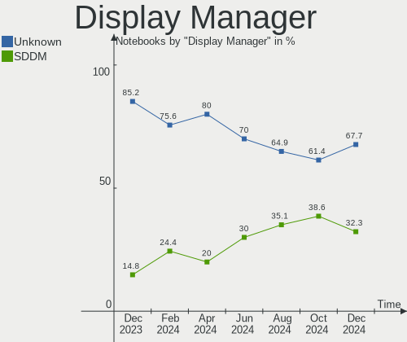
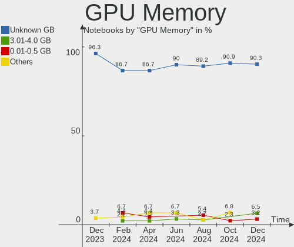
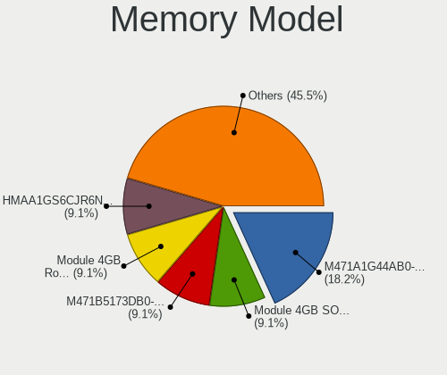
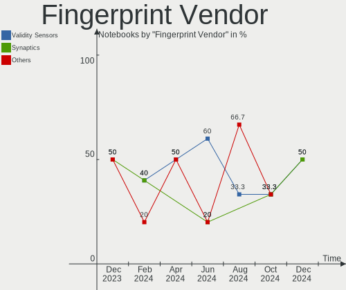

KDE neon Hardware Trends (Notebook)
-----------------------------------

A project to identify most popular hardware characteristics and track their change
over time based on data collected by KDE neon users at https://Linux-Hardware.org.

Anyone can contribute to the study by uploading probes of their computers by
the [hw-probe](https://github.com/linuxhw/hw-probe) tool:

    sudo -E hw-probe -all -upload

Full-feature report is available here: https://linux-hardware.org/?view=trends&formfactor=notebook

Period: Jan, 2021.

Contents
--------

- [ OS                       ](#os)
- [ OS Family                ](#os-family)
- [ Kernel                   ](#kernel)
- [ Kernel Family            ](#kernel-family)
- [ Kernel Major Ver.        ](#kernel-major-ver)
- [ Arch                     ](#arch)
- [ DE                       ](#de)
- [ Display Server           ](#display-server)
- [ Display Manager          ](#display-manager)
- [ OS Lang                  ](#os-lang)
- [ Boot Mode                ](#boot-mode)
- [ Filesystem               ](#filesystem)
- [ Part. scheme             ](#part-scheme)
- [ Dual Boot with Linux/BSD ](#dual-boot-with-linux/bsd)
- [ Dual Boot (Win)          ](#dual-boot-win)
- [ Country                  ](#country)
- [ City                     ](#city)
- [ Vendor                   ](#vendor)
- [ Model                    ](#model)
- [ Model Family             ](#model-family)
- [ MFG Year                 ](#mfg-year)
- [ Form Factor              ](#form-factor)
- [ Secure Boot              ](#secure-boot)
- [ Coreboot                 ](#coreboot)
- [ RAM Size                 ](#ram-size)
- [ RAM Used                 ](#ram-used)
- [ Has CD-ROM               ](#has-cd-rom)
- [ Total Drives             ](#total-drives)
- [ Has Ethernet             ](#has-ethernet)
- [ Drive Vendor             ](#drive-vendor)
- [ Drive Model              ](#drive-model)
- [ HDD Vendor               ](#hdd-vendor)
- [ SSD Vendor               ](#ssd-vendor)
- [ Drive Kind               ](#drive-kind)
- [ Drive Connector          ](#drive-connector)
- [ Drive Size               ](#drive-size)
- [ Space Total              ](#space-total)
- [ Space Used               ](#space-used)
- [ Malfunc. Drives          ](#malfunc-drives)
- [ Malfunc. Drive Vendor    ](#malfunc-drive-vendor)
- [ Malfunc. HDD Vendor      ](#malfunc-hdd-vendor)
- [ Malfunc. Drive Kind      ](#malfunc-drive-kind)
- [ Failed Drives            ](#failed-drives)
- [ Failed Drive Vendor      ](#failed-drive-vendor)
- [ Drive Status             ](#drive-status)
- [ Storage Vendor           ](#storage-vendor)
- [ Storage Model            ](#storage-model)
- [ Storage Kind             ](#storage-kind)
- [ CPU Vendor               ](#cpu-vendor)
- [ CPU Model                ](#cpu-model)
- [ CPU Model Family         ](#cpu-model-family)
- [ CPU Cores                ](#cpu-cores)
- [ CPU Sockets              ](#cpu-sockets)
- [ CPU Threads              ](#cpu-threads)
- [ CPU Op-Modes             ](#cpu-op-modes)
- [ CPU Microcode            ](#cpu-microcode)
- [ CPU Microarch            ](#cpu-microarch)
- [ GPU Vendor               ](#gpu-vendor)
- [ GPU Model                ](#gpu-model)
- [ GPU Combo                ](#gpu-combo)
- [ GPU Driver               ](#gpu-driver)
- [ GPU Memory               ](#gpu-memory)
- [ Monitor Vendor           ](#monitor-vendor)
- [ Monitor Model            ](#monitor-model)
- [ Monitor Resolution       ](#monitor-resolution)
- [ Monitor Diagonal         ](#monitor-diagonal)
- [ Monitor Width            ](#monitor-width)
- [ Aspect Ratio             ](#aspect-ratio)
- [ Monitor Area             ](#monitor-area)
- [ Pixel Density            ](#pixel-density)
- [ Multiple Monitors        ](#multiple-monitors)
- [ Net Controller Vendor    ](#net-controller-vendor)
- [ Net Controller Model     ](#net-controller-model)
- [ Wireless Vendor          ](#wireless-vendor)
- [ Wireless Model           ](#wireless-model)
- [ Ethernet Vendor          ](#ethernet-vendor)
- [ Ethernet Model           ](#ethernet-model)
- [ Net Controller Kind      ](#net-controller-kind)
- [ Used Controller          ](#used-controller)
- [ NICs                     ](#nics)
- [ Memory Vendor            ](#memory-vendor)
- [ Memory Model             ](#memory-model)
- [ Memory Kind              ](#memory-kind)
- [ Memory Form Factor       ](#memory-form-factor)
- [ Memory Size              ](#memory-size)
- [ Memory Speed             ](#memory-speed)
- [ Sound Vendor             ](#sound-vendor)
- [ Sound Model              ](#sound-model)
- [ Camera Vendor            ](#camera-vendor)
- [ Camera Model             ](#camera-model)
- [ Fingerprint Vendor       ](#fingerprint-vendor)
- [ Fingerprint Model        ](#fingerprint-model)
- [ Chipcard Vendor          ](#chipcard-vendor)
- [ Chipcard Model           ](#chipcard-model)
- [ Printer Vendor           ](#printer-vendor)
- [ Printer Model            ](#printer-model)
- [ Scanner Vendor           ](#scanner-vendor)
- [ Scanner Model            ](#scanner-model)
- [ Bluetooth Vendor         ](#bluetooth-vendor)
- [ Bluetooth Model          ](#bluetooth-model)
- [ Unsupported Devices      ](#unsupported-devices)
- [ Unsupported Device Types ](#unsupported-device-types)

OS
--

Installed operating systems

| Name           | Notebooks | Percent |
|----------------|-----------|---------|
| KDE neon 20.04 | 82        | 98.8%   |
| KDE neon 18.04 | 1         | 1.2%    |

OS Family
---------

OS without a version

| Name     | Notebooks | Percent |
|----------|-----------|---------|
| KDE neon | 83        | 100%    |

Kernel
------

Version of the Linux kernel

| Version               | Notebooks | Percent |
|-----------------------|-----------|---------|
| 5.4.0-58-generic      | 16        | 19.28%  |
| 5.4.0-59-generic      | 15        | 18.07%  |
| 5.4.0-60-generic      | 13        | 15.66%  |
| 5.4.0-62-generic      | 12        | 14.46%  |
| 5.4.0-65-generic      | 9         | 10.84%  |
| 5.4.0-64-generic      | 7         | 8.43%   |
| 5.8.0-34-generic      | 2         | 2.41%   |
| 5.9.16                | 1         | 1.2%    |
| 5.9.0-050900-generic  | 1         | 1.2%    |
| 5.8.0-36-generic      | 1         | 1.2%    |
| 5.8.0-33-generic      | 1         | 1.2%    |
| 5.6.0-1042-oem        | 1         | 1.2%    |
| 5.5.4-050504-generic  | 1         | 1.2%    |
| 5.4.0-54-generic      | 1         | 1.2%    |
| 5.4.0-52-generic      | 1         | 1.2%    |
| 5.10.4-051004-generic | 1         | 1.2%    |

Kernel Family
-------------

Linux kernel without a distro release

| Version | Notebooks | Percent |
|---------|-----------|---------|
| 5.4.0   | 74        | 89.16%  |
| 5.8.0   | 4         | 4.82%   |
| 5.9.16  | 1         | 1.2%    |
| 5.9.0   | 1         | 1.2%    |
| 5.6.0   | 1         | 1.2%    |
| 5.5.4   | 1         | 1.2%    |
| 5.10.4  | 1         | 1.2%    |

Kernel Major Ver.
-----------------

Linux kernel major version

| Version | Notebooks | Percent |
|---------|-----------|---------|
| 5.4     | 74        | 89.16%  |
| 5.8     | 4         | 4.82%   |
| 5.9     | 2         | 2.41%   |
| 5.6     | 1         | 1.2%    |
| 5.5     | 1         | 1.2%    |
| 5.10    | 1         | 1.2%    |

Arch
----

OS architecture (x86_64, i586, etc.)

| Name   | Notebooks | Percent |
|--------|-----------|---------|
| x86_64 | 83        | 100%    |

DE
--

Desktop Environment

| Name     | Notebooks | Percent |
|----------|-----------|---------|
| KDE      | 74        | 89.16%  |
| KDE5     | 7         | 8.43%   |
| Pantheon | 1         | 1.2%    |
| Unknown  | 1         | 1.2%    |

Display Server
--------------

X11 or Wayland

| Name    | Notebooks | Percent |
|---------|-----------|---------|
| X11     | 81        | 97.59%  |
| Wayland | 1         | 1.2%    |
| Tty     | 1         | 1.2%    |

Display Manager
---------------

SDDM, LightDM, etc.

| Name    | Notebooks | Percent |
|---------|-----------|---------|
| Unknown | 76        | 91.57%  |
| SDDM    | 7         | 8.43%   |

OS Lang
-------

Language

| Lang  | Notebooks | Percent |
|-------|-----------|---------|
| en_US | 39        | 46.99%  |
| pt_BR | 6         | 7.23%   |
| de_DE | 6         | 7.23%   |
| ru_RU | 4         | 4.82%   |
| fr_FR | 4         | 4.82%   |
| es_ES | 4         | 4.82%   |
| en_GB | 4         | 4.82%   |
| en_IN | 2         | 2.41%   |
| en_CA | 2         | 2.41%   |
| C     | 2         | 2.41%   |
| tr_TR | 1         | 1.2%    |
| ru_UA | 1         | 1.2%    |
| pl_PL | 1         | 1.2%    |
| nl_NL | 1         | 1.2%    |
| it_IT | 1         | 1.2%    |
| fr_CA | 1         | 1.2%    |
| es_CR | 1         | 1.2%    |
| en_ZA | 1         | 1.2%    |
| en_IE | 1         | 1.2%    |
| en_AU | 1         | 1.2%    |

Boot Mode
---------

EFI or BIOS

| Mode | Notebooks | Percent |
|------|-----------|---------|
| EFI  | 50        | 60.24%  |
| BIOS | 33        | 39.76%  |

Filesystem
----------

Type of filesystem

| Type    | Notebooks | Percent |
|---------|-----------|---------|
| Ext4    | 80        | 96.39%  |
| Btrfs   | 2         | 2.41%   |
| Overlay | 1         | 1.2%    |

Part. scheme
------------

Scheme of partitioning

| Type    | Notebooks | Percent |
|---------|-----------|---------|
| Unknown | 76        | 91.57%  |
| GPT     | 6         | 7.23%   |
| MBR     | 1         | 1.2%    |

Dual Boot with Linux/BSD
------------------------

Hosting more than one Linux/BSD

| Dual boot | Notebooks | Percent |
|-----------|-----------|---------|
| No        | 78        | 93.98%  |
| Yes       | 5         | 6.02%   |

Dual Boot (Win)
---------------

Hosting Linux and Windows

| Dual boot | Notebooks | Percent |
|-----------|-----------|---------|
| No        | 78        | 93.98%  |
| Yes       | 5         | 6.02%   |

Country
-------

Geographic location (country)

| Country      | Notebooks | Percent |
|--------------|-----------|---------|
| USA          | 21        | 25.3%   |
| Germany      | 8         | 9.64%   |
| Brazil       | 7         | 8.43%   |
| Spain        | 4         | 4.82%   |
| France       | 4         | 4.82%   |
| Canada       | 4         | 4.82%   |
| Russia       | 3         | 3.61%   |
| Romania      | 3         | 3.61%   |
| Italy        | 3         | 3.61%   |
| Ukraine      | 2         | 2.41%   |
| UK           | 2         | 2.41%   |
| Turkey       | 2         | 2.41%   |
| Poland       | 2         | 2.41%   |
| Malaysia     | 2         | 2.41%   |
| India        | 2         | 2.41%   |
| Uzbekistan   | 1         | 1.2%    |
| Uruguay      | 1         | 1.2%    |
| Switzerland  | 1         | 1.2%    |
| South Africa | 1         | 1.2%    |
| Pakistan     | 1         | 1.2%    |
| Norway       | 1         | 1.2%    |
| Netherlands  | 1         | 1.2%    |
| Morocco      | 1         | 1.2%    |
| Kazakhstan   | 1         | 1.2%    |
| Ireland      | 1         | 1.2%    |
| Indonesia    | 1         | 1.2%    |
| Costa Rica   | 1         | 1.2%    |
| Belarus      | 1         | 1.2%    |
| Australia    | 1         | 1.2%    |

City
----

Geographic location (city)

| City                | Notebooks | Percent |
|---------------------|-----------|---------|
| Rio de Janeiro      | 2         | 2.41%   |
| Odesa               | 2         | 2.41%   |
| Kuala Lumpur        | 2         | 2.41%   |
| Dresden             | 2         | 2.41%   |
| Łódź             | 1         | 1.2%    |
| Wrocław            | 1         | 1.2%    |
| Woodstock           | 1         | 1.2%    |
| Ulhasnagar          | 1         | 1.2%    |
| Turlock             | 1         | 1.2%    |
| Toulouse            | 1         | 1.2%    |
| Tekirdağ           | 1         | 1.2%    |
| Tashkent            | 1         | 1.2%    |
| San Jose            | 1         | 1.2%    |
| San Francisco       | 1         | 1.2%    |
| Samsun              | 1         | 1.2%    |
| Saint Johns         | 1         | 1.2%    |
| Saarbrücken        | 1         | 1.2%    |
| Rotherham           | 1         | 1.2%    |
| Ribeirão das Neves | 1         | 1.2%    |
| Rabat               | 1         | 1.2%    |
| Prestonsburg        | 1         | 1.2%    |
| Presidente Prudente | 1         | 1.2%    |
| Portland            | 1         | 1.2%    |
| Omsk                | 1         | 1.2%    |
| Offenbach           | 1         | 1.2%    |
| Natal               | 1         | 1.2%    |
| Munich              | 1         | 1.2%    |
| Moscow              | 1         | 1.2%    |
| Montevideo          | 1         | 1.2%    |
| Minsk               | 1         | 1.2%    |
| Milan               | 1         | 1.2%    |
| Midlothian          | 1         | 1.2%    |
| Marghita            | 1         | 1.2%    |
| Maizieres-les-Metz  | 1         | 1.2%    |
| Madrid              | 1         | 1.2%    |
| Mackay              | 1         | 1.2%    |
| Laval               | 1         | 1.2%    |
| Lahore              | 1         | 1.2%    |
| Lafayette           | 1         | 1.2%    |
| La Rochelle         | 1         | 1.2%    |
| La Colle-sur-Loup   | 1         | 1.2%    |
| Kirksville          | 1         | 1.2%    |
| Ketchikan           | 1         | 1.2%    |
| Keller              | 1         | 1.2%    |
| Johannesburg        | 1         | 1.2%    |
| Jaipur              | 1         | 1.2%    |
| Jacksonville        | 1         | 1.2%    |
| Itapira             | 1         | 1.2%    |
| Inverness           | 1         | 1.2%    |
| Iasi                | 1         | 1.2%    |
| Hubbard             | 1         | 1.2%    |
| Heredia             | 1         | 1.2%    |
| Hamburg             | 1         | 1.2%    |
| Gloucester          | 1         | 1.2%    |
| Gianyar             | 1         | 1.2%    |
| Galgagnano          | 1         | 1.2%    |
| Düsseldorf         | 1         | 1.2%    |
| Dublin              | 1         | 1.2%    |
| Douglas             | 1         | 1.2%    |
| Dos Hermanas        | 1         | 1.2%    |

Vendor
------

Motherboard manufacturer

| Name                | Notebooks | Percent |
|---------------------|-----------|---------|
| Lenovo              | 16        | 19.28%  |
| Hewlett-Packard     | 16        | 19.28%  |
| Dell                | 15        | 18.07%  |
| ASUSTek Computer    | 13        | 15.66%  |
| Acer                | 5         | 6.02%   |
| MSI                 | 4         | 4.82%   |
| Sony                | 3         | 3.61%   |
| Apple               | 3         | 3.61%   |
| Toshiba             | 2         | 2.41%   |
| Samsung Electronics | 1         | 1.2%    |
| Razer               | 1         | 1.2%    |
| Panasonic           | 1         | 1.2%    |
| HUAWEI              | 1         | 1.2%    |
| Google              | 1         | 1.2%    |
| Fujitsu             | 1         | 1.2%    |

Model
-----

Motherboard model

| Name                                  | Notebooks | Percent |
|---------------------------------------|-----------|---------|
| HP Pavilion dv7                       | 4         | 4.82%   |
| Dell Latitude E6440                   | 2         | 2.41%   |
| Acer Nitro AN515-42                   | 2         | 2.41%   |
| Toshiba Satellite S855                | 1         | 1.2%    |
| Toshiba Satellite L550                | 1         | 1.2%    |
| Sony VPCEJ2L1E                        | 1         | 1.2%    |
| Sony VPCEB33FX                        | 1         | 1.2%    |
| Samsung 530U3C/530U4C/532U3C          | 1         | 1.2%    |
| Razer Blade                           | 1         | 1.2%    |
| Panasonic CF-C2CC-03CM                | 1         | 1.2%    |
| MSI MS-16Y1                           | 1         | 1.2%    |
| MSI GL65 Leopard 10SCXR               | 1         | 1.2%    |
| MSI GE75 Raider 8RE                   | 1         | 1.2%    |
| MSI GE72 2QF                          | 1         | 1.2%    |
| Lenovo V14-ADA 82C6                   | 1         | 1.2%    |
| Lenovo V110-15ISK 80TL                | 1         | 1.2%    |
| Lenovo ThinkPad X230 23301G3          | 1         | 1.2%    |
| Lenovo ThinkPad W541 20EF000SGE       | 1         | 1.2%    |
| Lenovo ThinkPad T470 W10DG 20JNS11R1Y | 1         | 1.2%    |
| Lenovo ThinkPad T470 20HDCTO1WW       | 1         | 1.2%    |
| Lenovo ThinkPad T460 20FN002SUS       | 1         | 1.2%    |
| Lenovo ThinkPad T460 20FMS39800       | 1         | 1.2%    |
| Lenovo ThinkPad T14s Gen 1 20UHCTO1WW | 1         | 1.2%    |
| Lenovo ThinkPad T14 Gen 1 20UES00L00  | 1         | 1.2%    |
| Lenovo ThinkPad E570 20H500CTRT       | 1         | 1.2%    |
| Lenovo ThinkPad E15 Gen 2 20T8000TMZ  | 1         | 1.2%    |
| Lenovo IdeaPad S145-15IWL 81S9        | 1         | 1.2%    |
| Lenovo IdeaPad 530S-15IKB 81EV        | 1         | 1.2%    |
| Lenovo G570 20079                     | 1         | 1.2%    |
| Lenovo 1.01UL F40-30                  | 1         | 1.2%    |
| HUAWEI KLVC-WXX9                      | 1         | 1.2%    |
| HP Stream Notebook PC 14              | 1         | 1.2%    |
| HP ProBook 6570b                      | 1         | 1.2%    |
| HP Pavilion x2 Detachable PC 10       | 1         | 1.2%    |
| HP Pavilion g4                        | 1         | 1.2%    |
| HP Laptop 15s-eq0xxx                  | 1         | 1.2%    |
| HP Laptop 14-dk1xxx                   | 1         | 1.2%    |
| HP G42                                | 1         | 1.2%    |
| HP ENVY Laptop 13-ad0xx               | 1         | 1.2%    |
| HP EliteBook 840 G1                   | 1         | 1.2%    |
| HP EliteBook 2730p                    | 1         | 1.2%    |
| HP 250 G7 Notebook PC                 | 1         | 1.2%    |
| HP 250 G6 Notebook PC                 | 1         | 1.2%    |
| Google Candy                          | 1         | 1.2%    |
| Fujitsu LIFEBOOK T935                 | 1         | 1.2%    |
| Dell XPS L702X                        | 1         | 1.2%    |
| Dell Vostro V131                      | 1         | 1.2%    |
| Dell Studio 1558                      | 1         | 1.2%    |
| Dell Precision M4800                  | 1         | 1.2%    |
| Dell Precision 7520                   | 1         | 1.2%    |
| Dell Latitude E6400                   | 1         | 1.2%    |
| Dell Latitude E5500                   | 1         | 1.2%    |
| Dell Latitude 3490                    | 1         | 1.2%    |
| Dell Inspiron 7559                    | 1         | 1.2%    |
| Dell Inspiron 3593                    | 1         | 1.2%    |
| Dell Inspiron 3520                    | 1         | 1.2%    |
| Dell Inspiron 15-3567                 | 1         | 1.2%    |
| Dell Inspiron 15 7000 Gaming          | 1         | 1.2%    |
| ASUS ZenBook UX325EA_UX325EA          | 1         | 1.2%    |
| ASUS X555QA                           | 1         | 1.2%    |

Model Family
------------

Motherboard model prefix

| Name                   | Notebooks | Percent |
|------------------------|-----------|---------|
| Lenovo ThinkPad        | 10        | 12.05%  |
| HP Pavilion            | 6         | 7.23%   |
| Dell Latitude          | 5         | 6.02%   |
| Dell Inspiron          | 5         | 6.02%   |
| Toshiba Satellite      | 2         | 2.41%   |
| Lenovo IdeaPad         | 2         | 2.41%   |
| HP Laptop              | 2         | 2.41%   |
| HP EliteBook           | 2         | 2.41%   |
| HP 250                 | 2         | 2.41%   |
| Dell Precision         | 2         | 2.41%   |
| Acer Nitro             | 2         | 2.41%   |
| Acer Aspire            | 2         | 2.41%   |
| Sony VPCEJ2L1E         | 1         | 1.2%    |
| Sony VPCEB33FX         | 1         | 1.2%    |
| Samsung 530U3C         | 1         | 1.2%    |
| Razer Blade            | 1         | 1.2%    |
| Panasonic CF-C2CC-03CM | 1         | 1.2%    |
| MSI MS-16Y1            | 1         | 1.2%    |
| MSI GL65               | 1         | 1.2%    |
| MSI GE75               | 1         | 1.2%    |
| MSI GE72               | 1         | 1.2%    |
| Lenovo V14-ADA         | 1         | 1.2%    |
| Lenovo V110-15ISK      | 1         | 1.2%    |
| Lenovo G570            | 1         | 1.2%    |
| Lenovo 1.01UL          | 1         | 1.2%    |
| HUAWEI KLVC-WXX9       | 1         | 1.2%    |
| HP Stream              | 1         | 1.2%    |
| HP ProBook             | 1         | 1.2%    |
| HP G42                 | 1         | 1.2%    |
| HP ENVY                | 1         | 1.2%    |
| Google Candy           | 1         | 1.2%    |
| Fujitsu LIFEBOOK       | 1         | 1.2%    |
| Dell XPS               | 1         | 1.2%    |
| Dell Vostro            | 1         | 1.2%    |
| Dell Studio            | 1         | 1.2%    |
| ASUS ZenBook           | 1         | 1.2%    |
| ASUS X555QA            | 1         | 1.2%    |
| ASUS VivoBook          | 1         | 1.2%    |
| ASUS UX410UAK          | 1         | 1.2%    |
| ASUS UX331UA           | 1         | 1.2%    |
| ASUS T100TA            | 1         | 1.2%    |
| ASUS ROG               | 1         | 1.2%    |
| ASUS N551JM            | 1         | 1.2%    |
| ASUS K53SV             | 1         | 1.2%    |
| ASUS K52F              | 1         | 1.2%    |
| ASUS GL552JX           | 1         | 1.2%    |
| ASUS G750JM            | 1         | 1.2%    |
| ASUS F7Z               | 1         | 1.2%    |
| Apple MacBookPro9      | 1         | 1.2%    |
| Apple MacBookPro8      | 1         | 1.2%    |
| Apple MacBookAir5      | 1         | 1.2%    |
| Acer Extensa           | 1         | 1.2%    |
| Unknown                | 1         | 1.2%    |

MFG Year
--------

Motherboard manufacture year

| Year | Notebooks | Percent |
|------|-----------|---------|
| 2020 | 24        | 28.92%  |
| 2019 | 12        | 14.46%  |
| 2014 | 7         | 8.43%   |
| 2018 | 6         | 7.23%   |
| 2012 | 6         | 7.23%   |
| 2011 | 6         | 7.23%   |
| 2017 | 5         | 6.02%   |
| 2015 | 4         | 4.82%   |
| 2013 | 4         | 4.82%   |
| 2010 | 4         | 4.82%   |
| 2009 | 3         | 3.61%   |
| 2016 | 1         | 1.2%    |
| 2008 | 1         | 1.2%    |

Form Factor
-----------

Physical design of the computer

| Name     | Notebooks | Percent |
|----------|-----------|---------|
| Notebook | 83        | 100%    |

Secure Boot
-----------

Enabled or disabled

| State    | Notebooks | Percent |
|----------|-----------|---------|
| Disabled | 76        | 91.57%  |
| Enabled  | 7         | 8.43%   |

Coreboot
--------

Have coreboot on board

| Used | Notebooks | Percent |
|------|-----------|---------|
| No   | 82        | 98.8%   |
| Yes  | 1         | 1.2%    |

RAM Size
--------

Total RAM memory

| Size in GB  | Notebooks | Percent |
|-------------|-----------|---------|
| 4.01-8.0    | 29        | 34.94%  |
| 16.01-24.0  | 16        | 19.28%  |
| 8.01-16.0   | 16        | 19.28%  |
| 3.01-4.0    | 12        | 14.46%  |
| 1.01-2.0    | 4         | 4.82%   |
| 24.01-32.0  | 3         | 3.61%   |
| 32.01-64.0  | 1         | 1.2%    |
| 2.01-3.0    | 1         | 1.2%    |
| 64.01-256.0 | 1         | 1.2%    |

RAM Used
--------

Used RAM memory

| Used GB   | Notebooks | Percent |
|-----------|-----------|---------|
| 1.01-2.0  | 32        | 38.55%  |
| 2.01-3.0  | 27        | 32.53%  |
| 3.01-4.0  | 10        | 12.05%  |
| 4.01-8.0  | 7         | 8.43%   |
| 0.51-1.0  | 5         | 6.02%   |
| 8.01-16.0 | 2         | 2.41%   |

Has CD-ROM
----------

Has CD-ROM on board

| Presented | Notebooks | Percent |
|-----------|-----------|---------|
| No        | 48        | 57.83%  |
| Yes       | 35        | 42.17%  |

Total Drives
------------

Number of drives on board

| Drives | Notebooks | Percent |
|--------|-----------|---------|
| 1      | 53        | 63.86%  |
| 2      | 27        | 32.53%  |
| 3      | 3         | 3.61%   |

Has Ethernet
------------

Has Ethernet on board

| Presented | Notebooks | Percent |
|-----------|-----------|---------|
| Yes       | 67        | 80.72%  |
| No        | 16        | 19.28%  |

Drive Vendor
------------

Hard drive vendors

| Vendor              | Notebooks | Drives | Percent |
|---------------------|-----------|--------|---------|
| Samsung Electronics | 16        | 17     | 14.55%  |
| Seagate             | 14        | 14     | 12.73%  |
| WDC                 | 9         | 9      | 8.18%   |
| Unknown             | 9         | 11     | 8.18%   |
| Toshiba             | 9         | 9      | 8.18%   |
| Sandisk             | 7         | 7      | 6.36%   |
| Kingston            | 6         | 6      | 5.45%   |
| HGST                | 6         | 6      | 5.45%   |
| Crucial             | 5         | 5      | 4.55%   |
| Hitachi             | 4         | 4      | 3.64%   |
| Intel               | 3         | 3      | 2.73%   |
| SPCC                | 2         | 2      | 1.82%   |
| SK Hynix            | 2         | 2      | 1.82%   |
| KIOXIA              | 2         | 2      | 1.82%   |
| Apple               | 2         | 2      | 1.82%   |
| Apacer              | 2         | 2      | 1.82%   |
| A-DATA Technology   | 2         | 2      | 1.82%   |
| Patriot             | 1         | 1      | 0.91%   |
| Micron Technology   | 1         | 1      | 0.91%   |
| LITEON              | 1         | 1      | 0.91%   |
| Lite-On             | 1         | 1      | 0.91%   |
| Lenovo              | 1         | 1      | 0.91%   |
| KingFast            | 1         | 1      | 0.91%   |
| Intenso             | 1         | 1      | 0.91%   |
| Hewlett-Packard     | 1         | 1      | 0.91%   |
| China               | 1         | 1      | 0.91%   |
| BHT                 | 1         | 1      | 0.91%   |

Drive Model
-----------

Hard drive models

| Model                                    | Notebooks | Percent |
|------------------------------------------|-----------|---------|
| Unknown MMC Card  32GB                   | 4         | 3.54%   |
| Unknown MMC Card  64GB                   | 3         | 2.65%   |
| Seagate ST1000LM035-1RK172 1TB           | 3         | 2.65%   |
| HGST HTS721010A9E630 1TB                 | 3         | 2.65%   |
| Unknown MMC Card  16GB                   | 2         | 1.77%   |
| Seagate ST9500325AS 500GB                | 2         | 1.77%   |
| Sandisk NVMe SSD Drive 512GB             | 2         | 1.77%   |
| Samsung SSD 860 EVO 500GB                | 2         | 1.77%   |
| Apacer AS340 240GB SSD                   | 2         | 1.77%   |
| WDC WDS250G2B0B-00YS70 250GB SSD         | 1         | 0.88%   |
| WDC WDBNCE5000PNC 500GB SSD              | 1         | 0.88%   |
| WDC WD6400BEVT-60A0RT0 640GB             | 1         | 0.88%   |
| WDC WD5000BEVT-26A0RT0 500GB             | 1         | 0.88%   |
| WDC WD3200BEVT-80A0RT0 320GB             | 1         | 0.88%   |
| WDC WD10SPZX-75Z10T1 1TB                 | 1         | 0.88%   |
| WDC WD10SPZX-60Z10T0 1TB                 | 1         | 0.88%   |
| WDC WD10JPVT-22A1YT0 1TB                 | 1         | 0.88%   |
| WDC PC SN520 SDAPNUW-256G-1002 256GB     | 1         | 0.88%   |
| Unknown SD/MMC/MS PRO 32GB               | 1         | 0.88%   |
| Unknown MMC Card  7GB                    | 1         | 0.88%   |
| Toshiba TR150 480GB SSD                  | 1         | 0.88%   |
| Toshiba MQ04ABF100 1TB                   | 1         | 0.88%   |
| Toshiba MQ02ABD100H 1TB                  | 1         | 0.88%   |
| Toshiba MQ01ABD100 1TB                   | 1         | 0.88%   |
| Toshiba MQ01ABD050 500GB                 | 1         | 0.88%   |
| Toshiba MK6476GSXN 640GB                 | 1         | 0.88%   |
| Toshiba MK3261GSYN 320GB                 | 1         | 0.88%   |
| Toshiba MK2533GSG 250GB                  | 1         | 0.88%   |
| Toshiba A100 120GB SSD                   | 1         | 0.88%   |
| SPCC Solid State Disk 256GB              | 1         | 0.88%   |
| SPCC Solid State Disk 120GB              | 1         | 0.88%   |
| SK Hynix HFS256G39TND-N210A 256GB SSD    | 1         | 0.88%   |
| SK Hynix HFS128G39TND-N210A 128GB SSD    | 1         | 0.88%   |
| Seagate ST950042 3AS 500GB               | 1         | 0.88%   |
| Seagate ST9320325AS 320GB                | 1         | 0.88%   |
| Seagate ST9160314AS 160GB                | 1         | 0.88%   |
| Seagate ST500LM012 HN-M500MBB 500GB      | 1         | 0.88%   |
| Seagate ST1000LM048-2E7172 1TB           | 1         | 0.88%   |
| Seagate ST1000LM014-1EJ164 1TB           | 1         | 0.88%   |
| Seagate Expansion Desk 8TB               | 1         | 0.88%   |
| Seagate BUP Slim BK 1TB                  | 1         | 0.88%   |
| Seagate BarraCuda SSD ZA500CM10002 500GB | 1         | 0.88%   |
| SanDisk Ultra II 240GB SSD               | 1         | 0.88%   |
| SanDisk SSD i100 24GB                    | 1         | 0.88%   |
| SanDisk SD8TN8U256G1001 256GB SSD        | 1         | 0.88%   |
| SanDisk SD8SB8U128G1122 128GB SSD        | 1         | 0.88%   |
| Sandisk NVMe SSD Drive 256GB             | 1         | 0.88%   |
| Samsung SSD SM841N mSATA 256GB SED       | 1         | 0.88%   |
| Samsung SSD 960 EVO 500GB                | 1         | 0.88%   |
| Samsung SSD 860 QVO 1TB                  | 1         | 0.88%   |
| Samsung SSD 860 EVO M.2 500GB            | 1         | 0.88%   |
| Samsung SSD 860 EVO 2TB                  | 1         | 0.88%   |
| Samsung SSD 860 EVO 1TB                  | 1         | 0.88%   |
| Samsung SSD 850 EVO M.2 500GB            | 1         | 0.88%   |
| Samsung SSD 840 EVO 250GB                | 1         | 0.88%   |
| Samsung NVMe SSD Drive 512GB             | 1         | 0.88%   |
| Samsung NVMe SSD Drive 1024GB            | 1         | 0.88%   |
| Samsung MZVLB1T0HBLR-000L7 1TB           | 1         | 0.88%   |
| Samsung MZNLN256HAJQ-000H1 256GB SSD     | 1         | 0.88%   |
| Samsung MZALQ512HALU-000L1 512GB         | 1         | 0.88%   |

HDD Vendor
----------

Hard disk drive vendors

| Vendor  | Notebooks | Drives | Percent |
|---------|-----------|--------|---------|
| Seagate | 13        | 13     | 35.14%  |
| Toshiba | 7         | 7      | 18.92%  |
| WDC     | 6         | 6      | 16.22%  |
| HGST    | 6         | 6      | 16.22%  |
| Hitachi | 4         | 4      | 10.81%  |
| Apple   | 1         | 1      | 2.7%    |

SSD Vendor
----------

Solid state drive vendors

| Vendor              | Notebooks | Drives | Percent |
|---------------------|-----------|--------|---------|
| Samsung Electronics | 11        | 12     | 25%     |
| Crucial             | 5         | 5      | 11.36%  |
| SanDisk             | 4         | 4      | 9.09%   |
| Kingston            | 4         | 4      | 9.09%   |
| WDC                 | 2         | 2      | 4.55%   |
| Toshiba             | 2         | 2      | 4.55%   |
| SPCC                | 2         | 2      | 4.55%   |
| SK Hynix            | 2         | 2      | 4.55%   |
| Apacer              | 2         | 2      | 4.55%   |
| A-DATA Technology   | 2         | 2      | 4.55%   |
| Seagate             | 1         | 1      | 2.27%   |
| Patriot             | 1         | 1      | 2.27%   |
| Micron Technology   | 1         | 1      | 2.27%   |
| Intenso             | 1         | 1      | 2.27%   |
| Hewlett-Packard     | 1         | 1      | 2.27%   |
| China               | 1         | 1      | 2.27%   |
| BHT                 | 1         | 1      | 2.27%   |
| Apple               | 1         | 1      | 2.27%   |

Drive Kind
----------

HDD or SSD

| Kind    | Notebooks | Drives | Percent |
|---------|-----------|--------|---------|
| SSD     | 44        | 45     | 40.74%  |
| HDD     | 35        | 37     | 32.41%  |
| NVMe    | 19        | 19     | 17.59%  |
| MMC     | 8         | 10     | 7.41%   |
| Unknown | 2         | 2      | 1.85%   |

Drive Connector
---------------

SATA, SAS, NVMe, etc.

| Type | Notebooks | Drives | Percent |
|------|-----------|--------|---------|
| SATA | 66        | 80     | 68.04%  |
| NVMe | 19        | 19     | 19.59%  |
| MMC  | 8         | 10     | 8.25%   |
| SAS  | 4         | 4      | 4.12%   |

Drive Size
----------

Size of hard drive

| Size in TB | Notebooks | Drives | Percent |
|------------|-----------|--------|---------|
| 0.01-0.5   | 46        | 53     | 61.33%  |
| 0.51-1.0   | 26        | 26     | 34.67%  |
| 1.01-2.0   | 2         | 2      | 2.67%   |
| 4.01-10.0  | 1         | 1      | 1.33%   |

Space Total
-----------

Amount of disk space available on the file system

| Size in GB     | Notebooks | Percent |
|----------------|-----------|---------|
| 101-250        | 26        | 31.33%  |
| 251-500        | 18        | 21.69%  |
| 501-1000       | 15        | 18.07%  |
| 21-50          | 7         | 8.43%   |
| 51-100         | 6         | 7.23%   |
| 1001-2000      | 3         | 3.61%   |
| More than 3000 | 2         | 2.41%   |
| 2001-3000      | 2         | 2.41%   |
| 1-20           | 2         | 2.41%   |
| Unknown        | 2         | 2.41%   |

Space Used
----------

Amount of used disk space

| Used GB   | Notebooks | Percent |
|-----------|-----------|---------|
| 1-20      | 41        | 49.4%   |
| 21-50     | 14        | 16.87%  |
| 251-500   | 10        | 12.05%  |
| 101-250   | 6         | 7.23%   |
| 501-1000  | 4         | 4.82%   |
| 51-100    | 4         | 4.82%   |
| 1001-2000 | 2         | 2.41%   |
| Unknown   | 2         | 2.41%   |

Malfunc. Drives
---------------

Drive models with a malfunction

Zero info for selected period =(

Malfunc. Drive Vendor
---------------------

Vendors of faulty drives

Zero info for selected period =(

Malfunc. HDD Vendor
-------------------

Vendors of faulty HDD drives

Zero info for selected period =(

Malfunc. Drive Kind
-------------------

Kinds of faulty drives

Zero info for selected period =(

Failed Drives
-------------

Failed drive models

Zero info for selected period =(

Failed Drive Vendor
-------------------

Failed drive vendors

Zero info for selected period =(

Drive Status
------------

Number of failed and malfunc. drives

| Status   | Notebooks | Drives | Percent |
|----------|-----------|--------|---------|
| Detected | 75        | 102    | 89.29%  |
| Works    | 9         | 11     | 10.71%  |

Storage Vendor
--------------

Storage controller vendors

| Vendor                      | Notebooks | Percent |
|-----------------------------|-----------|---------|
| Intel                       | 64        | 72.73%  |
| AMD                         | 8         | 9.09%   |
| Samsung Electronics         | 5         | 5.68%   |
| Sandisk                     | 4         | 4.55%   |
| Lite-On Technology          | 2         | 2.27%   |
| KIOXIA                      | 2         | 2.27%   |
| Kingston Technology Company | 2         | 2.27%   |
| Lenovo                      | 1         | 1.14%   |

Storage Model
-------------

Storage controller models

| Model                                                                          | Notebooks | Percent |
|--------------------------------------------------------------------------------|-----------|---------|
| Intel Sunrise Point-LP SATA Controller [AHCI mode]                             | 9         | 9.68%   |
| Intel 6 Series/C200 Series Chipset Family 6 port Mobile SATA AHCI Controller   | 9         | 9.68%   |
| Intel 8 Series/C220 Series Chipset Family 6-port SATA Controller 1 [AHCI mode] | 7         | 7.53%   |
| AMD FCH SATA Controller [AHCI mode]                                            | 7         | 7.53%   |
| Intel 7 Series Chipset Family 6-port SATA Controller [AHCI mode]               | 6         | 6.45%   |
| Intel 5 Series/3400 Series Chipset 4 port SATA AHCI Controller                 | 6         | 6.45%   |
| Samsung NVMe SSD Controller SM981/PM981/PM983                                  | 3         | 3.23%   |
| Intel 82801IBM/IEM (ICH9M/ICH9M-E) 4 port SATA Controller [AHCI mode]          | 3         | 3.23%   |
| Intel 8 Series SATA Controller 1 [AHCI mode]                                   | 3         | 3.23%   |
| Sandisk WD Blue SN500 / PC SN520 NVMe SSD                                      | 2         | 2.15%   |
| Lite-On NVMe Controller                                                        | 2         | 2.15%   |
| KIOXIA Non-Volatile memory controller                                          | 2         | 2.15%   |
| Intel Wildcat Point-LP SATA Controller [AHCI Mode]                             | 2         | 2.15%   |
| Intel SSD 600P Series                                                          | 2         | 2.15%   |
| Intel HM170/QM170 Chipset SATA Controller [AHCI Mode]                          | 2         | 2.15%   |
| Intel Celeron/Pentium Silver Processor SATA Controller                         | 2         | 2.15%   |
| Intel Cannon Lake Mobile PCH SATA AHCI Controller                              | 2         | 2.15%   |
| Intel 82801IBM/IEM (ICH9M/ICH9M-E) 2 port SATA Controller [IDE mode]           | 2         | 2.15%   |
| Intel 82801 Mobile SATA Controller [RAID mode]                                 | 2         | 2.15%   |
| Sandisk WD Black SN750 / PC SN730 NVMe SSD                                     | 1         | 1.08%   |
| Sandisk Non-Volatile memory controller                                         | 1         | 1.08%   |
| Samsung NVMe SSD Controller SM961/PM961/SM963                                  | 1         | 1.08%   |
| Samsung Electronics Non-Volatile memory controller                             | 1         | 1.08%   |
| Lenovo Non-Volatile memory controller                                          | 1         | 1.08%   |
| Kingston Company Company Non-Volatile memory controller                        | 1         | 1.08%   |
| Kingston Company A2000 NVMe SSD                                                | 1         | 1.08%   |
| Intel Volume Management Device NVMe RAID Controller                            | 1         | 1.08%   |
| Intel SSD 660P Series                                                          | 1         | 1.08%   |
| Intel SATA Controller [RAID mode]                                              | 1         | 1.08%   |
| Intel Ice Lake-LP SATA Controller [AHCI mode]                                  | 1         | 1.08%   |
| Intel Comet Lake SATA AHCI Controller                                          | 1         | 1.08%   |
| Intel Cannon Point-LP SATA Controller [AHCI Mode]                              | 1         | 1.08%   |
| Intel Atom Processor E3800 Series SATA AHCI Controller                         | 1         | 1.08%   |
| Intel 7 Series Chipset Family 4-port SATA Controller [IDE mode]                | 1         | 1.08%   |
| Intel 7 Series Chipset Family 2-port SATA Controller [IDE mode]                | 1         | 1.08%   |
| Intel 5 Series/3400 Series Chipset 6 port SATA AHCI Controller                 | 1         | 1.08%   |
| Intel 400 Series Chipset Family SATA AHCI Controller                           | 1         | 1.08%   |
| AMD SB7x0/SB8x0/SB9x0 SATA Controller [AHCI mode]                              | 1         | 1.08%   |
| AMD SB7x0/SB8x0/SB9x0 IDE Controller                                           | 1         | 1.08%   |

Storage Kind
------------

Kind of storage controller (IDE, SATA, NVMe, SAS, ...)

| Kind | Notebooks | Percent |
|------|-----------|---------|
| SATA | 65        | 70.65%  |
| NVMe | 19        | 20.65%  |
| RAID | 4         | 4.35%   |
| IDE  | 4         | 4.35%   |

CPU Vendor
----------

Processor vendors

| Vendor | Notebooks | Percent |
|--------|-----------|---------|
| Intel  | 70        | 84.34%  |
| AMD    | 13        | 15.66%  |

CPU Model
---------

Processor models

| Model                                         | Notebooks | Percent |
|-----------------------------------------------|-----------|---------|
| Intel Core i5-6200U CPU @ 2.30GHz             | 3         | 3.61%   |
| Intel Core i3 CPU M 370 @ 2.40GHz             | 3         | 3.61%   |
| Intel Core i7-8550U CPU @ 1.80GHz             | 2         | 2.41%   |
| Intel Core i7-4720HQ CPU @ 2.60GHz            | 2         | 2.41%   |
| Intel Core i7-2670QM CPU @ 2.20GHz            | 2         | 2.41%   |
| Intel Core i5-7200U CPU @ 2.50GHz             | 2         | 2.41%   |
| Intel Core i5-5200U CPU @ 2.20GHz             | 2         | 2.41%   |
| Intel Core i5-3210M CPU @ 2.50GHz             | 2         | 2.41%   |
| Intel Core i5-2410M CPU @ 2.30GHz             | 2         | 2.41%   |
| Intel Core i3-6006U CPU @ 2.00GHz             | 2         | 2.41%   |
| Intel Core 2 Duo CPU P8700 @ 2.53GHz          | 2         | 2.41%   |
| Intel Celeron N4000 CPU @ 1.10GHz             | 2         | 2.41%   |
| AMD Ryzen 7 PRO 4750U with Radeon Graphics    | 2         | 2.41%   |
| AMD Ryzen 5 2500U with Radeon Vega Mobile Gfx | 2         | 2.41%   |
| Intel Xeon CPU E3-1545M v5 @ 2.90GHz          | 1         | 1.2%    |
| Intel Core i7-8750H CPU @ 2.20GHz             | 1         | 1.2%    |
| Intel Core i7-7700HQ CPU @ 2.80GHz            | 1         | 1.2%    |
| Intel Core i7-7500U CPU @ 2.70GHz             | 1         | 1.2%    |
| Intel Core i7-6700HQ CPU @ 2.60GHz            | 1         | 1.2%    |
| Intel Core i7-5700HQ CPU @ 2.70GHz            | 1         | 1.2%    |
| Intel Core i7-4910MQ CPU @ 2.90GHz            | 1         | 1.2%    |
| Intel Core i7-4800MQ CPU @ 2.70GHz            | 1         | 1.2%    |
| Intel Core i7-4710HQ CPU @ 2.50GHz            | 1         | 1.2%    |
| Intel Core i7-4700HQ CPU @ 2.40GHz            | 1         | 1.2%    |
| Intel Core i7-3610QM CPU @ 2.30GHz            | 1         | 1.2%    |
| Intel Core i7-2860QM CPU @ 2.50GHz            | 1         | 1.2%    |
| Intel Core i7-10750H CPU @ 2.60GHz            | 1         | 1.2%    |
| Intel Core i7-1065G7 CPU @ 1.30GHz            | 1         | 1.2%    |
| Intel Core i7-10510U CPU @ 1.80GHz            | 1         | 1.2%    |
| Intel Core i7 CPU Q 720 @ 1.60GHz             | 1         | 1.2%    |
| Intel Core i5-9300H CPU @ 2.40GHz             | 1         | 1.2%    |
| Intel Core i5-8265U CPU @ 1.60GHz             | 1         | 1.2%    |
| Intel Core i5-7300U CPU @ 2.60GHz             | 1         | 1.2%    |
| Intel Core i5-4310U CPU @ 2.00GHz             | 1         | 1.2%    |
| Intel Core i5-4310M CPU @ 2.70GHz             | 1         | 1.2%    |
| Intel Core i5-4300U CPU @ 1.90GHz             | 1         | 1.2%    |
| Intel Core i5-4300M CPU @ 2.60GHz             | 1         | 1.2%    |
| Intel Core i5-4210U CPU @ 1.70GHz             | 1         | 1.2%    |
| Intel Core i5-3317U CPU @ 1.70GHz             | 1         | 1.2%    |
| Intel Core i5-3230M CPU @ 2.60GHz             | 1         | 1.2%    |
| Intel Core i5-2537M CPU @ 1.40GHz             | 1         | 1.2%    |
| Intel Core i5-2450M CPU @ 2.50GHz             | 1         | 1.2%    |
| Intel Core i5-2430M CPU @ 2.40GHz             | 1         | 1.2%    |
| Intel Core i5 CPU M 460 @ 2.53GHz             | 1         | 1.2%    |
| Intel Core i3-7020U CPU @ 2.30GHz             | 1         | 1.2%    |
| Intel Core i3-2370M CPU @ 2.40GHz             | 1         | 1.2%    |
| Intel Core i3-2350M CPU @ 2.30GHz             | 1         | 1.2%    |
| Intel Core i3-2330M CPU @ 2.20GHz             | 1         | 1.2%    |
| Intel Core i3 CPU M 380 @ 2.53GHz             | 1         | 1.2%    |
| Intel Core i3 CPU M 350 @ 2.27GHz             | 1         | 1.2%    |
| Intel Core 2 Duo CPU P8400 @ 2.26GHz          | 1         | 1.2%    |
| Intel Core 2 Duo CPU P7450 @ 2.13GHz          | 1         | 1.2%    |
| Intel Core 2 Duo CPU L9400 @ 1.86GHz          | 1         | 1.2%    |
| Intel Celeron CPU N2840 @ 2.16GHz             | 1         | 1.2%    |
| Intel Celeron CPU N2830 @ 2.16GHz             | 1         | 1.2%    |
| Intel Atom CPU Z3775 @ 1.46GHz                | 1         | 1.2%    |
| Intel Atom CPU Z3736F @ 1.33GHz               | 1         | 1.2%    |
| Intel 11th Gen Core i7-1165G7 @ 2.80GHz       | 1         | 1.2%    |
| AMD Turion X2 Dual-Core Mobile RM-70          | 1         | 1.2%    |
| AMD Ryzen 7 4700U with Radeon Graphics        | 1         | 1.2%    |

CPU Model Family
----------------

Processor model prefix

| Model                          | Notebooks | Percent |
|--------------------------------|-----------|---------|
| Intel Core i5                  | 25        | 30.12%  |
| Intel Core i7                  | 21        | 25.3%   |
| Intel Core i3                  | 11        | 13.25%  |
| Intel Core 2 Duo               | 5         | 6.02%   |
| Intel Celeron                  | 4         | 4.82%   |
| AMD Ryzen 5                    | 3         | 3.61%   |
| Intel Atom                     | 2         | 2.41%   |
| AMD Ryzen 7 PRO                | 2         | 2.41%   |
| AMD Ryzen 7                    | 2         | 2.41%   |
| AMD Ryzen 3                    | 2         | 2.41%   |
| AMD A10                        | 2         | 2.41%   |
| Other                          | 1         | 1.2%    |
| Intel Xeon                     | 1         | 1.2%    |
| AMD Turion X2 Dual-Core Mobile | 1         | 1.2%    |
| AMD A4                         | 1         | 1.2%    |

CPU Cores
---------

Number of processor cores

| Number | Notebooks | Percent |
|--------|-----------|---------|
| 2      | 48        | 57.83%  |
| 4      | 30        | 36.14%  |
| 8      | 3         | 3.61%   |
| 6      | 2         | 2.41%   |

CPU Sockets
-----------

Number of sockets

| Number | Notebooks | Percent |
|--------|-----------|---------|
| 1      | 83        | 100%    |

CPU Threads
-----------

Threads per core (Hyper-Threading)

| Number | Notebooks | Percent |
|--------|-----------|---------|
| 2      | 68        | 81.93%  |
| 1      | 15        | 18.07%  |

CPU Op-Modes
------------

CPU Operation Modes (32-bit, 64-bit)

| Op mode        | Notebooks | Percent |
|----------------|-----------|---------|
| 32-bit, 64-bit | 83        | 100%    |

CPU Microcode
-------------

Microcode number

| Number     | Notebooks | Percent |
|------------|-----------|---------|
| 0x206a7    | 11        | 13.25%  |
| 0x306c3    | 7         | 8.43%   |
| 0x806e9    | 5         | 6.02%   |
| 0x406e3    | 5         | 6.02%   |
| 0x306a9    | 5         | 6.02%   |
| 0x20655    | 5         | 6.02%   |
| 0x1067a    | 4         | 4.82%   |
| Unknown    | 4         | 4.82%   |
| 0x40651    | 3         | 3.61%   |
| 0x30678    | 3         | 3.61%   |
| 0x08108109 | 3         | 3.61%   |
| 0x906ea    | 2         | 2.41%   |
| 0x806ea    | 2         | 2.41%   |
| 0x706a1    | 2         | 2.41%   |
| 0x506e3    | 2         | 2.41%   |
| 0x306d4    | 2         | 2.41%   |
| 0x0810100b | 2         | 2.41%   |
| 0xa0652    | 1         | 1.2%    |
| 0x906e9    | 1         | 1.2%    |
| 0x806ec    | 1         | 1.2%    |
| 0x806c1    | 1         | 1.2%    |
| 0x706e5    | 1         | 1.2%    |
| 0x40671    | 1         | 1.2%    |
| 0x20652    | 1         | 1.2%    |
| 0x106e5    | 1         | 1.2%    |
| 0x10676    | 1         | 1.2%    |
| 0x08600106 | 1         | 1.2%    |
| 0x08600103 | 1         | 1.2%    |
| 0x08108102 | 1         | 1.2%    |
| 0x07030105 | 1         | 1.2%    |
| 0x0600611a | 1         | 1.2%    |
| 0x06001119 | 1         | 1.2%    |
| 0x02000032 | 1         | 1.2%    |

CPU Microarch
-------------

Microarchitecture

| Name            | Notebooks | Percent |
|-----------------|-----------|---------|
| KabyLake        | 12        | 14.46%  |
| SandyBridge     | 11        | 13.25%  |
| Haswell         | 11        | 13.25%  |
| Skylake         | 7         | 8.43%   |
| Westmere        | 6         | 7.23%   |
| Penryn          | 5         | 6.02%   |
| IvyBridge       | 5         | 6.02%   |
| Zen+            | 4         | 4.82%   |
| Silvermont      | 4         | 4.82%   |
| Zen 2           | 3         | 3.61%   |
| Broadwell       | 3         | 3.61%   |
| Zen             | 2         | 2.41%   |
| Goldmont plus   | 2         | 2.41%   |
| TigerLake       | 1         | 1.2%    |
| Puma            | 1         | 1.2%    |
| Piledriver      | 1         | 1.2%    |
| Nehalem         | 1         | 1.2%    |
| K8 & K10 hybrid | 1         | 1.2%    |
| IceLake         | 1         | 1.2%    |
| Excavator       | 1         | 1.2%    |
| CometLake       | 1         | 1.2%    |

GPU Vendor
----------

Vendors of graphics cards

| Vendor | Notebooks | Percent |
|--------|-----------|---------|
| Intel  | 65        | 60.19%  |
| Nvidia | 22        | 20.37%  |
| AMD    | 21        | 19.44%  |

GPU Model
---------

Graphics card models

| Model                                                                         | Notebooks | Percent |
|-------------------------------------------------------------------------------|-----------|---------|
| Intel 2nd Generation Core Processor Family Integrated Graphics Controller     | 10        | 9.09%   |
| Intel 4th Gen Core Processor Integrated Graphics Controller                   | 8         | 7.27%   |
| Intel Core Processor Integrated Graphics Controller                           | 6         | 5.45%   |
| Intel 3rd Gen Core processor Graphics Controller                              | 5         | 4.55%   |
| Intel Skylake GT2 [HD Graphics 520]                                           | 4         | 3.64%   |
| Intel HD Graphics 620                                                         | 4         | 3.64%   |
| Intel Atom Processor Z36xxx/Z37xxx Series Graphics & Display                  | 4         | 3.64%   |
| AMD Picasso                                                                   | 4         | 3.64%   |
| Intel Mobile 4 Series Chipset Integrated Graphics Controller                  | 3         | 2.73%   |
| Intel Haswell-ULT Integrated Graphics Controller                              | 3         | 2.73%   |
| AMD Renoir                                                                    | 3         | 2.73%   |
| Nvidia GP108M [GeForce MX150]                                                 | 2         | 1.82%   |
| Nvidia GM204M [GeForce GTX 970M]                                              | 2         | 1.82%   |
| Nvidia GM107M [GeForce GTX 950M]                                              | 2         | 1.82%   |
| Nvidia GM107M [GeForce GTX 860M]                                              | 2         | 1.82%   |
| Intel UHD Graphics 630 (Mobile)                                               | 2         | 1.82%   |
| Intel UHD Graphics 620                                                        | 2         | 1.82%   |
| Intel UHD Graphics 605                                                        | 2         | 1.82%   |
| Intel HD Graphics 5500                                                        | 2         | 1.82%   |
| AMD Whistler [Radeon HD 6730M/6770M/7690M XT]                                 | 2         | 1.82%   |
| AMD Sun XT [Radeon HD 8670A/8670M/8690M / R5 M330 / M430 / Radeon 520 Mobile] | 2         | 1.82%   |
| AMD Raven Ridge [Radeon Vega Series / Radeon Vega Mobile Series]              | 2         | 1.82%   |
| AMD Baffin [Radeon RX 460/560D / Pro 450/455/460/555/555X/560/560X]           | 2         | 1.82%   |
| Nvidia TU117M [GeForce GTX 1650 Mobile / Max-Q]                               | 1         | 0.91%   |
| Nvidia TU117M                                                                 | 1         | 0.91%   |
| Nvidia GT216M [GeForce GT 230M]                                               | 1         | 0.91%   |
| Nvidia GP107M [GeForce MX350]                                                 | 1         | 0.91%   |
| Nvidia GP107M [GeForce GTX 1050 Ti Mobile]                                    | 1         | 0.91%   |
| Nvidia GP106M [GeForce GTX 1060 Mobile]                                       | 1         | 0.91%   |
| Nvidia GM206GLM [Quadro M2200 Mobile]                                         | 1         | 0.91%   |
| Nvidia GM108M [GeForce 940M]                                                  | 1         | 0.91%   |
| Nvidia GM107M [GeForce GTX 960M]                                              | 1         | 0.91%   |
| Nvidia GK106GLM [Quadro K2100M]                                               | 1         | 0.91%   |
| Nvidia GF119M [GeForce 410M]                                                  | 1         | 0.91%   |
| Nvidia GF116M [GeForce GT 550M]                                               | 1         | 0.91%   |
| Nvidia GF108M [GeForce GT 540M]                                               | 1         | 0.91%   |
| Nvidia G96CM [GeForce 9600M GT]                                               | 1         | 0.91%   |
| Intel TigerLake GT2 [Iris Xe Graphics]                                        | 1         | 0.91%   |
| Intel Kaby Lake-U GT2f Integrated Graphics Controller                         | 1         | 0.91%   |
| Intel Iris Plus Graphics G7                                                   | 1         | 0.91%   |
| Intel HD Graphics 630                                                         | 1         | 0.91%   |
| Intel HD Graphics 5600                                                        | 1         | 0.91%   |
| Intel HD Graphics 530                                                         | 1         | 0.91%   |
| Intel HD Graphics 520                                                         | 1         | 0.91%   |
| Intel CometLake-U GT2 [UHD Graphics]                                          | 1         | 0.91%   |
| Intel CometLake-H GT2 [UHD Graphics]                                          | 1         | 0.91%   |
| Intel Coffee Lake UHD Graphics                                                | 1         | 0.91%   |
| AMD Wani [Radeon R5/R6/R7 Graphics]                                           | 1         | 0.91%   |
| AMD Venus XT [Radeon HD 8870M / R9 M270X/M370X]                               | 1         | 0.91%   |
| AMD Trinity [Radeon HD 7660G]                                                 | 1         | 0.91%   |
| AMD Seymour [Radeon HD 6400M/7400M Series]                                    | 1         | 0.91%   |
| AMD RV730/M96 [Mobility Radeon HD 4650/5165]                                  | 1         | 0.91%   |
| AMD RS780M [Mobility Radeon HD 3200]                                          | 1         | 0.91%   |
| AMD Park [Mobility Radeon HD 5430/5450/5470]                                  | 1         | 0.91%   |
| AMD Mullins [Radeon R3E Graphics]                                             | 1         | 0.91%   |

GPU Combo
---------

Combinations of graphics cards

| Name           | Notebooks | Percent |
|----------------|-----------|---------|
| 1 x Intel      | 40        | 48.19%  |
| Intel + Nvidia | 18        | 21.69%  |
| 1 x AMD        | 12        | 14.46%  |
| Intel + AMD    | 7         | 8.43%   |
| 1 x Nvidia     | 4         | 4.82%   |
| 2 x AMD        | 2         | 2.41%   |

GPU Driver
----------

Free vs proprietary

| Driver      | Notebooks | Percent |
|-------------|-----------|---------|
| Free        | 74        | 89.16%  |
| Proprietary | 5         | 6.02%   |
| Unknown     | 4         | 4.82%   |

GPU Memory
----------

Total video memory

| Size in GB | Notebooks | Percent |
|------------|-----------|---------|
| Unknown    | 49        | 59.04%  |
| 1.01-2.0   | 14        | 16.87%  |
| 3.01-4.0   | 7         | 8.43%   |
| 0.01-0.5   | 6         | 7.23%   |
| 0.51-1.0   | 5         | 6.02%   |
| 2.01-3.0   | 2         | 2.41%   |

Monitor Vendor
--------------

Monitor vendors

| Vendor                  | Notebooks | Percent |
|-------------------------|-----------|---------|
| LG Display              | 17        | 19.77%  |
| AU Optronics            | 15        | 17.44%  |
| Chimei Innolux          | 12        | 13.95%  |
| BOE                     | 12        | 13.95%  |
| Samsung Electronics     | 8         | 9.3%    |
| Goldstar                | 3         | 3.49%   |
| Apple                   | 3         | 3.49%   |
| Sharp                   | 2         | 2.33%   |
| Panasonic               | 2         | 2.33%   |
| Chi Mei Optoelectronics | 2         | 2.33%   |
| Westinghouse            | 1         | 1.16%   |
| Seiko/Epson             | 1         | 1.16%   |
| NEC Computers           | 1         | 1.16%   |
| InnoLux Display         | 1         | 1.16%   |
| Iiyama                  | 1         | 1.16%   |
| Hewlett-Packard         | 1         | 1.16%   |
| Dell                    | 1         | 1.16%   |
| AOC                     | 1         | 1.16%   |
| Ancor Communications    | 1         | 1.16%   |
| Acer                    | 1         | 1.16%   |

Monitor Model
-------------

Monitor models

| Model                                                                     | Notebooks | Percent |
|---------------------------------------------------------------------------|-----------|---------|
| Samsung Electronics LCD Monitor SEC5441 1366x768 344x194mm 15.5-inch      | 3         | 3.45%   |
| LG Display LCD Monitor LGD02DC 1366x768 344x194mm 15.5-inch               | 2         | 2.3%    |
| Goldstar IPS FULLHD GSM5AB8 1920x1080 480x270mm 21.7-inch                 | 2         | 2.3%    |
| Chimei Innolux LCD Monitor CMN1490 1366x768 309x173mm 13.9-inch           | 2         | 2.3%    |
| AU Optronics LCD Monitor AUO10EC 1366x768 340x190mm 15.3-inch             | 2         | 2.3%    |
| Westinghouse WD32HW2490 WET0320 1366x768 700x390mm 31.5-inch              | 1         | 1.15%   |
| Sharp LQ140Z1JW01 SHP1401 3200x1800 310x174mm 14.0-inch                   | 1         | 1.15%   |
| Sharp LQ133T1JW17 SHP1409 2560x1440 294x165mm 13.3-inch                   | 1         | 1.15%   |
| Seiko/Epson LCD Monitor 1440x900                                          | 1         | 1.15%   |
| Samsung Electronics SMS24A450 SAM083A 1920x1200 518x324mm 24.1-inch       | 1         | 1.15%   |
| Samsung Electronics LCD Monitor SEC335A 1366x768 309x174mm 14.0-inch      | 1         | 1.15%   |
| Samsung Electronics LCD Monitor SEC3150 1366x768 344x193mm 15.5-inch      | 1         | 1.15%   |
| Samsung Electronics LCD Monitor SDC324C 1920x1080 344x194mm 15.5-inch     | 1         | 1.15%   |
| Samsung Electronics LCD Monitor SAM07BA 1920x1080 890x500mm 40.2-inch     | 1         | 1.15%   |
| Panasonic VVX13F009G00 MEI96A2 1920x1080 290x170mm 13.2-inch              | 1         | 1.15%   |
| Panasonic TV MEIA296 1920x1080 1280x720mm 57.8-inch                       | 1         | 1.15%   |
| NEC Computers EA221WMe NEC6778 1680x1050 474x296mm 22.0-inch              | 1         | 1.15%   |
| LG Display LCD Monitor LGD05D8 1920x1080 344x194mm 15.5-inch              | 1         | 1.15%   |
| LG Display LCD Monitor LGD0563 1920x1080 344x194mm 15.5-inch              | 1         | 1.15%   |
| LG Display LCD Monitor LGD046F 1920x1080 344x194mm 15.5-inch              | 1         | 1.15%   |
| LG Display LCD Monitor LGD0469 1920x1080 382x215mm 17.3-inch              | 1         | 1.15%   |
| LG Display LCD Monitor LGD0466 1366x768 309x174mm 14.0-inch               | 1         | 1.15%   |
| LG Display LCD Monitor LGD045E 1366x768 309x174mm 14.0-inch               | 1         | 1.15%   |
| LG Display LCD Monitor LGD0404 1366x768 277x156mm 12.5-inch               | 1         | 1.15%   |
| LG Display LCD Monitor LGD03A3 1366x768 277x156mm 12.5-inch               | 1         | 1.15%   |
| LG Display LCD Monitor LGD0395 1366x768 344x194mm 15.5-inch               | 1         | 1.15%   |
| LG Display LCD Monitor LGD02EC 1366x768 293x165mm 13.2-inch               | 1         | 1.15%   |
| LG Display LCD Monitor LGD02D1 1600x900 382x215mm 17.3-inch               | 1         | 1.15%   |
| LG Display LCD Monitor LGD02B2 1366x768 310x174mm 14.0-inch               | 1         | 1.15%   |
| LG Display LCD Monitor LGD027A 1600x900 380x210mm 17.1-inch               | 1         | 1.15%   |
| LG Display LCD Monitor LGD0226 1600x900 382x215mm 17.3-inch               | 1         | 1.15%   |
| LG Display LCD Monitor LGD01CA 1600x900 382x215mm 17.3-inch               | 1         | 1.15%   |
| InnoLux Display LCD Monitor INL0005 1366x768 344x194mm 15.5-inch          | 1         | 1.15%   |
| Iiyama PLE2483H IVM6113 1920x1080 531x299mm 24.0-inch                     | 1         | 1.15%   |
| Hewlett-Packard LA2306 HWP294A 1920x1080 510x287mm 23.0-inch              | 1         | 1.15%   |
| Goldstar ULTRAWIDE GSM76F9 2560x1080 531x298mm 24.0-inch                  | 1         | 1.15%   |
| Dell SE2417HG DELD08E 1920x1080 521x293mm 23.5-inch                       | 1         | 1.15%   |
| Chimei Innolux P140ZKA-BZ1 CMN8C02 2160x1440 296x197mm 14.0-inch          | 1         | 1.15%   |
| Chimei Innolux LCD Monitor CMN15DB 1366x768 344x193mm 15.5-inch           | 1         | 1.15%   |
| Chimei Innolux LCD Monitor CMN15C9 1366x768 344x193mm 15.5-inch           | 1         | 1.15%   |
| Chimei Innolux LCD Monitor CMN15C4 1920x1080 344x193mm 15.5-inch          | 1         | 1.15%   |
| Chimei Innolux LCD Monitor CMN1515 1920x1080 344x193mm 15.5-inch          | 1         | 1.15%   |
| Chimei Innolux LCD Monitor CMN14D2 1920x1080 309x173mm 13.9-inch          | 1         | 1.15%   |
| Chimei Innolux LCD Monitor CMN14C9 1920x1080 309x173mm 13.9-inch          | 1         | 1.15%   |
| Chimei Innolux LCD Monitor CMN14C3 1366x768 309x173mm 13.9-inch           | 1         | 1.15%   |
| Chimei Innolux LCD Monitor CMN1489 1366x768 309x173mm 13.9-inch           | 1         | 1.15%   |
| Chimei Innolux LCD Monitor CMN1388 1920x1080 293x165mm 13.2-inch          | 1         | 1.15%   |
| Chi Mei Optoelectronics LCD Monitor CMO1720 1920x1080 382x215mm 17.3-inch | 1         | 1.15%   |
| Chi Mei Optoelectronics LCD Monitor CMO1222 1280x800 261x163mm 12.1-inch  | 1         | 1.15%   |
| BOE LCD Monitor BOE092B 1366x768 309x174mm 14.0-inch                      | 1         | 1.15%   |
| BOE LCD Monitor BOE08F2 1920x1080 310x174mm 14.0-inch                     | 1         | 1.15%   |
| BOE LCD Monitor BOE086A 1366x768 344x194mm 15.5-inch                      | 1         | 1.15%   |
| BOE LCD Monitor BOE0757 1366x768 344x194mm 15.5-inch                      | 1         | 1.15%   |
| BOE LCD Monitor BOE070E 1920x1080 294x165mm 13.3-inch                     | 1         | 1.15%   |
| BOE LCD Monitor BOE0700 1920x1080 344x194mm 15.5-inch                     | 1         | 1.15%   |
| BOE LCD Monitor BOE06F1 1920x1080 344x194mm 15.5-inch                     | 1         | 1.15%   |
| BOE LCD Monitor BOE06B3 1366x768 309x173mm 13.9-inch                      | 1         | 1.15%   |
| BOE LCD Monitor BOE06A5 1366x768 344x194mm 15.5-inch                      | 1         | 1.15%   |
| BOE LCD Monitor BOE0675 1366x768 344x194mm 15.5-inch                      | 1         | 1.15%   |
| BOE LCD Monitor BOE062F 1920x1080 344x194mm 15.5-inch                     | 1         | 1.15%   |

Monitor Resolution
------------------

Monitor screen resolution

| Resolution         | Notebooks | Percent |
|--------------------|-----------|---------|
| 1366x768 (WXGA)    | 35        | 43.21%  |
| 1920x1080 (FHD)    | 26        | 32.1%   |
| 1600x900 (HD+)     | 5         | 6.17%   |
| 3840x2160 (4K)     | 2         | 2.47%   |
| 2560x1440 (QHD)    | 2         | 2.47%   |
| 1680x1050 (WSXGA+) | 2         | 2.47%   |
| 1440x900 (WXGA+)   | 2         | 2.47%   |
| 1280x800 (WXGA)    | 2         | 2.47%   |
| 3440x1440          | 1         | 1.23%   |
| 3200x1800 (QHD+)   | 1         | 1.23%   |
| 2560x1080          | 1         | 1.23%   |
| 2160x1440          | 1         | 1.23%   |
| 1920x1200 (WUXGA)  | 1         | 1.23%   |

Monitor Diagonal
----------------

Diagonal size in inches

| Inches  | Notebooks | Percent |
|---------|-----------|---------|
| 15      | 33        | 37.93%  |
| 13      | 13        | 14.94%  |
| 17      | 10        | 11.49%  |
| 14      | 10        | 11.49%  |
| 12      | 3         | 3.45%   |
| 34      | 2         | 2.3%    |
| 27      | 2         | 2.3%    |
| 24      | 2         | 2.3%    |
| 23      | 2         | 2.3%    |
| 21      | 2         | 2.3%    |
| 11      | 2         | 2.3%    |
| 84      | 1         | 1.15%   |
| 40      | 1         | 1.15%   |
| 31      | 1         | 1.15%   |
| 22      | 1         | 1.15%   |
| 18      | 1         | 1.15%   |
| Unknown | 1         | 1.15%   |

Monitor Width
-------------

Physical width

| Width in mm | Notebooks | Percent |
|-------------|-----------|---------|
| 301-350     | 46        | 52.87%  |
| 351-400     | 13        | 14.94%  |
| 201-300     | 12        | 13.79%  |
| 501-600     | 6         | 6.9%    |
| 401-500     | 4         | 4.6%    |
| 701-800     | 2         | 2.3%    |
| 801-900     | 1         | 1.15%   |
| 601-700     | 1         | 1.15%   |
| 1501-2000   | 1         | 1.15%   |
| Unknown     | 1         | 1.15%   |

Aspect Ratio
------------

Proportional relationship between the width and the height

| Ratio   | Notebooks | Percent |
|---------|-----------|---------|
| 16/9    | 68        | 87.18%  |
| 16/10   | 6         | 7.69%   |
| 21/9    | 2         | 2.56%   |
| 3/2     | 1         | 1.28%   |
| Unknown | 1         | 1.28%   |

Monitor Area
------------

Area in inch²

| Area in inch² | Notebooks | Percent |
|----------------|-----------|---------|
| 101-110        | 33        | 37.93%  |
| 81-90          | 18        | 20.69%  |
| 121-130        | 9         | 10.34%  |
| 201-250        | 6         | 6.9%    |
| 71-80          | 5         | 5.75%   |
| 61-70          | 3         | 3.45%   |
| 351-500        | 3         | 3.45%   |
| 51-60          | 2         | 2.3%    |
| 301-350        | 2         | 2.3%    |
| More than 1000 | 1         | 1.15%   |
| 251-300        | 1         | 1.15%   |
| 141-150        | 1         | 1.15%   |
| 131-140        | 1         | 1.15%   |
| 501-1000       | 1         | 1.15%   |
| Unknown        | 1         | 1.15%   |

Pixel Density
-------------

Pixels per inch

| Density       | Notebooks | Percent |
|---------------|-----------|---------|
| 101-120       | 38        | 44.19%  |
| 121-160       | 25        | 29.07%  |
| 51-100        | 13        | 15.12%  |
| 161-240       | 6         | 6.98%   |
| More than 240 | 2         | 2.33%   |
| 1-50          | 1         | 1.16%   |
| Unknown       | 1         | 1.16%   |

Multiple Monitors
-----------------

Total monitors connected

| Total | Notebooks | Percent |
|-------|-----------|---------|
| 1     | 65        | 78.31%  |
| 2     | 13        | 15.66%  |
| 0     | 4         | 4.82%   |
| 3     | 1         | 1.2%    |

Net Controller Vendor
---------------------

Controller vendors

| Vendor                         | Notebooks | Percent |
|--------------------------------|-----------|---------|
| Realtek Semiconductor          | 44        | 33.33%  |
| Intel                          | 43        | 32.58%  |
| Qualcomm Atheros               | 21        | 15.91%  |
| Broadcom Inc. and subsidiaries | 11        | 8.33%   |
| Ralink Technology              | 2         | 1.52%   |
| DisplayLink                    | 2         | 1.52%   |
| Broadcom Limited               | 2         | 1.52%   |
| TP-Link                        | 1         | 0.76%   |
| Samsung Electronics            | 1         | 0.76%   |
| Motorola PCS                   | 1         | 0.76%   |
| Marvell Technology Group       | 1         | 0.76%   |
| JMicron Technology             | 1         | 0.76%   |
| Dell                           | 1         | 0.76%   |
| Broadcom                       | 1         | 0.76%   |

Net Controller Model
--------------------

Controller models

| Model                                                                          | Notebooks | Percent |
|--------------------------------------------------------------------------------|-----------|---------|
| Realtek RTL8111/8168/8411 PCI Express Gigabit Ethernet Controller              | 32        | 20.25%  |
| Intel Wireless 7260                                                            | 8         | 5.06%   |
| Realtek RTL810xE PCI Express Fast Ethernet controller                          | 6         | 3.8%    |
| Qualcomm Atheros AR9285 Wireless Network Adapter (PCI-Express)                 | 5         | 3.16%   |
| Qualcomm Atheros QCA9377 802.11ac Wireless Network Adapter                     | 4         | 2.53%   |
| Qualcomm Atheros QCA6174 802.11ac Wireless Network Adapter                     | 4         | 2.53%   |
| Intel Wireless 8260                                                            | 4         | 2.53%   |
| Intel Ethernet Connection I217-LM                                              | 4         | 2.53%   |
| Broadcom Inc. and subsidiaries BCM4313 802.11bgn Wireless Network Adapter      | 4         | 2.53%   |
| Realtek RTL8821CE 802.11ac PCIe Wireless Network Adapter                       | 3         | 1.9%    |
| Intel Wireless 8265 / 8275                                                     | 3         | 1.9%    |
| Intel Wireless 7265                                                            | 3         | 1.9%    |
| Intel Wi-Fi 6 AX200                                                            | 3         | 1.9%    |
| Intel Ethernet Connection I219-V                                               | 3         | 1.9%    |
| Realtek RTL8822BE 802.11a/b/g/n/ac WiFi adapter                                | 2         | 1.27%   |
| Realtek RTL8153 Gigabit Ethernet Adapter                                       | 2         | 1.27%   |
| Qualcomm Atheros AR8151 v2.0 Gigabit Ethernet                                  | 2         | 1.27%   |
| Intel Wireless-AC 9560 [Jefferson Peak]                                        | 2         | 1.27%   |
| Intel PRO/Wireless 5100 AGN [Shiloh] Network Connection                        | 2         | 1.27%   |
| Intel Ethernet Connection I218-LM                                              | 2         | 1.27%   |
| Intel Centrino Wireless-N 1000 [Condor Peak]                                   | 2         | 1.27%   |
| Intel Centrino Advanced-N 6235                                                 | 2         | 1.27%   |
| Intel 82567LM Gigabit Network Connection                                       | 2         | 1.27%   |
| Broadcom Inc. and subsidiaries NetXtreme BCM57765 Gigabit Ethernet PCIe        | 2         | 1.27%   |
| Broadcom Inc. and subsidiaries BCM4331 802.11a/b/g/n                           | 2         | 1.27%   |
| TP-Link TL WN823N RTL8192EU                                                    | 1         | 0.63%   |
| Samsung Galaxy series, misc. (tethering mode)                                  | 1         | 0.63%   |
| Realtek RTL8822CE 802.11ac PCIe Wireless Network Adapter                       | 1         | 0.63%   |
| Realtek RTL8821AE 802.11ac PCIe Wireless Network Adapter                       | 1         | 0.63%   |
| Realtek RTL8723AE PCIe Wireless Network Adapter                                | 1         | 0.63%   |
| Realtek RTL8191SEvB Wireless LAN Controller                                    | 1         | 0.63%   |
| Realtek RTL8188CE 802.11b/g/n WiFi Adapter                                     | 1         | 0.63%   |
| Realtek 802.11ac NIC                                                           | 1         | 0.63%   |
| Ralink RT5370 Wireless Adapter                                                 | 1         | 0.63%   |
| Ralink MT7601U Wireless Adapter                                                | 1         | 0.63%   |
| Qualcomm Atheros QCA9565 / AR9565 Wireless Network Adapter                     | 1         | 0.63%   |
| Qualcomm Atheros QCA8171 Gigabit Ethernet                                      | 1         | 0.63%   |
| Qualcomm Atheros Killer E2500 Gigabit Ethernet Controller                      | 1         | 0.63%   |
| Qualcomm Atheros Killer E220x Gigabit Ethernet Controller                      | 1         | 0.63%   |
| Qualcomm Atheros AR9462 Wireless Network Adapter                               | 1         | 0.63%   |
| Qualcomm Atheros AR928X Wireless Network Adapter (PCI-Express)                 | 1         | 0.63%   |
| Qualcomm Atheros AR8161 Gigabit Ethernet                                       | 1         | 0.63%   |
| Qualcomm Atheros AR8152 v2.0 Fast Ethernet                                     | 1         | 0.63%   |
| Motorola PCS moto g(7) plus                                                    | 1         | 0.63%   |
| Marvell Group Yukon Optima 88E8059 [PCIe Gigabit Ethernet Controller with AVB] | 1         | 0.63%   |
| JMicron JMC250 PCI Express Gigabit Ethernet Controller                         | 1         | 0.63%   |
| Intel Wireless 3165                                                            | 1         | 0.63%   |
| Intel Wireless 3160                                                            | 1         | 0.63%   |
| Intel WiFi Link 5100                                                           | 1         | 0.63%   |
| Intel Wi-Fi 6 AX201                                                            | 1         | 0.63%   |
| Intel Ethernet Connection (5) I219-LM                                          | 1         | 0.63%   |
| Intel Ethernet Connection (4) I219-LM                                          | 1         | 0.63%   |
| Intel Ethernet Connection (3) I218-LM                                          | 1         | 0.63%   |
| Intel Dual Band Wireless-AC 3165 Plus Bluetooth                                | 1         | 0.63%   |
| Intel Comet Lake PCH-LP CNVi WiFi                                              | 1         | 0.63%   |
| Intel Comet Lake PCH CNVi WiFi                                                 | 1         | 0.63%   |
| Intel Centrino Wireless-N 100                                                  | 1         | 0.63%   |
| Intel Centrino Ultimate-N 6300                                                 | 1         | 0.63%   |
| Intel Centrino Advanced-N 6205 [Taylor Peak]                                   | 1         | 0.63%   |
| Intel Centrino Advanced-N 6200                                                 | 1         | 0.63%   |

Wireless Vendor
---------------

Wireless vendors

| Vendor                         | Notebooks | Percent |
|--------------------------------|-----------|---------|
| Intel                          | 41        | 48.24%  |
| Qualcomm Atheros               | 16        | 18.82%  |
| Realtek Semiconductor          | 11        | 12.94%  |
| Broadcom Inc. and subsidiaries | 11        | 12.94%  |
| Ralink Technology              | 2         | 2.35%   |
| Broadcom Limited               | 2         | 2.35%   |
| TP-Link                        | 1         | 1.18%   |
| Broadcom                       | 1         | 1.18%   |

Wireless Model
--------------

Wireless models

| Model                                                                        | Notebooks | Percent |
|------------------------------------------------------------------------------|-----------|---------|
| Intel Wireless 7260                                                          | 8         | 9.41%   |
| Qualcomm Atheros AR9285 Wireless Network Adapter (PCI-Express)               | 5         | 5.88%   |
| Qualcomm Atheros QCA9377 802.11ac Wireless Network Adapter                   | 4         | 4.71%   |
| Qualcomm Atheros QCA6174 802.11ac Wireless Network Adapter                   | 4         | 4.71%   |
| Intel Wireless 8260                                                          | 4         | 4.71%   |
| Broadcom Inc. and subsidiaries BCM4313 802.11bgn Wireless Network Adapter    | 4         | 4.71%   |
| Realtek RTL8821CE 802.11ac PCIe Wireless Network Adapter                     | 3         | 3.53%   |
| Intel Wireless 8265 / 8275                                                   | 3         | 3.53%   |
| Intel Wireless 7265                                                          | 3         | 3.53%   |
| Intel Wi-Fi 6 AX200                                                          | 3         | 3.53%   |
| Realtek RTL8822BE 802.11a/b/g/n/ac WiFi adapter                              | 2         | 2.35%   |
| Intel Wireless-AC 9560 [Jefferson Peak]                                      | 2         | 2.35%   |
| Intel PRO/Wireless 5100 AGN [Shiloh] Network Connection                      | 2         | 2.35%   |
| Intel Centrino Wireless-N 1000 [Condor Peak]                                 | 2         | 2.35%   |
| Intel Centrino Advanced-N 6235                                               | 2         | 2.35%   |
| Broadcom Inc. and subsidiaries BCM4331 802.11a/b/g/n                         | 2         | 2.35%   |
| TP-Link TL WN823N RTL8192EU                                                  | 1         | 1.18%   |
| Realtek RTL8822CE 802.11ac PCIe Wireless Network Adapter                     | 1         | 1.18%   |
| Realtek RTL8821AE 802.11ac PCIe Wireless Network Adapter                     | 1         | 1.18%   |
| Realtek RTL8723AE PCIe Wireless Network Adapter                              | 1         | 1.18%   |
| Realtek RTL8191SEvB Wireless LAN Controller                                  | 1         | 1.18%   |
| Realtek RTL8188CE 802.11b/g/n WiFi Adapter                                   | 1         | 1.18%   |
| Realtek 802.11ac NIC                                                         | 1         | 1.18%   |
| Ralink RT5370 Wireless Adapter                                               | 1         | 1.18%   |
| Ralink MT7601U Wireless Adapter                                              | 1         | 1.18%   |
| Qualcomm Atheros QCA9565 / AR9565 Wireless Network Adapter                   | 1         | 1.18%   |
| Qualcomm Atheros AR9462 Wireless Network Adapter                             | 1         | 1.18%   |
| Qualcomm Atheros AR928X Wireless Network Adapter (PCI-Express)               | 1         | 1.18%   |
| Intel Wireless 3165                                                          | 1         | 1.18%   |
| Intel Wireless 3160                                                          | 1         | 1.18%   |
| Intel WiFi Link 5100                                                         | 1         | 1.18%   |
| Intel Wi-Fi 6 AX201                                                          | 1         | 1.18%   |
| Intel Dual Band Wireless-AC 3165 Plus Bluetooth                              | 1         | 1.18%   |
| Intel Comet Lake PCH-LP CNVi WiFi                                            | 1         | 1.18%   |
| Intel Comet Lake PCH CNVi WiFi                                               | 1         | 1.18%   |
| Intel Centrino Wireless-N 100                                                | 1         | 1.18%   |
| Intel Centrino Ultimate-N 6300                                               | 1         | 1.18%   |
| Intel Centrino Advanced-N 6205 [Taylor Peak]                                 | 1         | 1.18%   |
| Intel Centrino Advanced-N 6200                                               | 1         | 1.18%   |
| Intel AC 1550i Wireless                                                      | 1         | 1.18%   |
| Broadcom Limited BCM4352 802.11ac Wireless Network Adapter                   | 1         | 1.18%   |
| Broadcom Limited BCM43225 802.11b/g/n                                        | 1         | 1.18%   |
| Broadcom Inc. and subsidiaries BCM4352 802.11ac Wireless Network Adapter     | 1         | 1.18%   |
| Broadcom Inc. and subsidiaries BCM43228 802.11a/b/g/n                        | 1         | 1.18%   |
| Broadcom Inc. and subsidiaries BCM43224 802.11a/b/g/n                        | 1         | 1.18%   |
| Broadcom Inc. and subsidiaries BCM4322 802.11a/b/g/n Wireless LAN Controller | 1         | 1.18%   |
| Broadcom Inc. and subsidiaries BCM43142 802.11b/g/n                          | 1         | 1.18%   |
| Broadcom BCM43142 802.11b/g/n                                                | 1         | 1.18%   |

Ethernet Vendor
---------------

Ethernet vendors

| Vendor                         | Notebooks | Percent |
|--------------------------------|-----------|---------|
| Realtek Semiconductor          | 40        | 56.34%  |
| Intel                          | 16        | 22.54%  |
| Qualcomm Atheros               | 7         | 9.86%   |
| Broadcom Inc. and subsidiaries | 3         | 4.23%   |
| DisplayLink                    | 2         | 2.82%   |
| Samsung Electronics            | 1         | 1.41%   |
| Marvell Technology Group       | 1         | 1.41%   |
| JMicron Technology             | 1         | 1.41%   |

Ethernet Model
--------------

Ethernet models

| Model                                                                          | Notebooks | Percent |
|--------------------------------------------------------------------------------|-----------|---------|
| Realtek RTL8111/8168/8411 PCI Express Gigabit Ethernet Controller              | 32        | 45.07%  |
| Realtek RTL810xE PCI Express Fast Ethernet controller                          | 6         | 8.45%   |
| Intel Ethernet Connection I217-LM                                              | 4         | 5.63%   |
| Intel Ethernet Connection I219-V                                               | 3         | 4.23%   |
| Realtek RTL8153 Gigabit Ethernet Adapter                                       | 2         | 2.82%   |
| Qualcomm Atheros AR8151 v2.0 Gigabit Ethernet                                  | 2         | 2.82%   |
| Intel Ethernet Connection I218-LM                                              | 2         | 2.82%   |
| Intel 82567LM Gigabit Network Connection                                       | 2         | 2.82%   |
| Broadcom Inc. and subsidiaries NetXtreme BCM57765 Gigabit Ethernet PCIe        | 2         | 2.82%   |
| Samsung Galaxy series, misc. (tethering mode)                                  | 1         | 1.41%   |
| Qualcomm Atheros QCA8171 Gigabit Ethernet                                      | 1         | 1.41%   |
| Qualcomm Atheros Killer E2500 Gigabit Ethernet Controller                      | 1         | 1.41%   |
| Qualcomm Atheros Killer E220x Gigabit Ethernet Controller                      | 1         | 1.41%   |
| Qualcomm Atheros AR8161 Gigabit Ethernet                                       | 1         | 1.41%   |
| Qualcomm Atheros AR8152 v2.0 Fast Ethernet                                     | 1         | 1.41%   |
| Marvell Group Yukon Optima 88E8059 [PCIe Gigabit Ethernet Controller with AVB] | 1         | 1.41%   |
| JMicron JMC250 PCI Express Gigabit Ethernet Controller                         | 1         | 1.41%   |
| Intel Ethernet Connection (5) I219-LM                                          | 1         | 1.41%   |
| Intel Ethernet Connection (4) I219-LM                                          | 1         | 1.41%   |
| Intel Ethernet Connection (3) I218-LM                                          | 1         | 1.41%   |
| Intel 82579V Gigabit Network Connection                                        | 1         | 1.41%   |
| Intel 82579LM Gigabit Network Connection (Lewisville)                          | 1         | 1.41%   |
| DisplayLink Plugable UD-3900H                                                  | 1         | 1.41%   |
| DisplayLink Dell 4-in-1 Adapter                                                | 1         | 1.41%   |
| Broadcom Inc. and subsidiaries NetXtreme BCM5761e Gigabit Ethernet PCIe        | 1         | 1.41%   |

Net Controller Kind
-------------------

Ethernet, WiFi or modem

| Kind     | Notebooks | Percent |
|----------|-----------|---------|
| WiFi     | 82        | 54.3%   |
| Ethernet | 67        | 44.37%  |
| Modem    | 1         | 0.66%   |
| Unknown  | 1         | 0.66%   |

Used Controller
---------------

Currently used network controller

| Kind     | Notebooks | Percent |
|----------|-----------|---------|
| WiFi     | 78        | 56.93%  |
| Ethernet | 58        | 42.34%  |
| Modem    | 1         | 0.73%   |

NICs
----

Total network controllers on board

| Total | Notebooks | Percent |
|-------|-----------|---------|
| 2     | 65        | 78.31%  |
| 1     | 15        | 18.07%  |
| 0     | 2         | 2.41%   |
| 3     | 1         | 1.2%    |

Memory Vendor
-------------

Memory module vendors

| Vendor              | Notebooks | Percent |
|---------------------|-----------|---------|
| Samsung Electronics | 6         | 37.5%   |
| SK Hynix            | 4         | 25%     |
| Micron Technology   | 4         | 25%     |
| Kingston            | 1         | 6.25%   |
| G.Skill             | 1         | 6.25%   |

Memory Model
------------

Memory module models

| Model                                                           | Notebooks | Percent |
|-----------------------------------------------------------------|-----------|---------|
| SK Hynix RAM HMT451S6BFR8A-PB 4096MB SODIMM DDR3 1600MT/s       | 1         | 6.25%   |
| SK Hynix RAM HMAA1GS6CMR6N-XN 8GB SODIMM DDR4 3200MT/s          | 1         | 6.25%   |
| SK Hynix RAM HMA851S6AFR6N-UH 4GB SODIMM DDR4 2400MT/s          | 1         | 6.25%   |
| SK Hynix RAM HMA81GS6JJR8N-VK 8192MB SODIMM DDR4 2667MT/s       | 1         | 6.25%   |
| Samsung RAM M471B5173QH0-YK0 4096MB SODIMM DDR3 1600MT/s        | 1         | 6.25%   |
| Samsung RAM M471A1K43DB1-CWE 8192MB SODIMM DDR4 3200MT/s        | 1         | 6.25%   |
| Samsung RAM M471A1K43CB1-CTD 8GB SODIMM DDR4 2667MT/s           | 1         | 6.25%   |
| Samsung RAM M471A1K43CB1-CRC 8192MB SODIMM DDR4 2667MT/s        | 1         | 6.25%   |
| Samsung RAM K4E6E304EB-EGCG 4096MB Row Of Chips LPDDR3 2133MT/s | 1         | 6.25%   |
| Samsung RAM K4E6E304EB-EGCF 4GB Row Of Chips LPDDR3 1867MT/s    | 1         | 6.25%   |
| Micron RAM MT40A1G8WE-083E:B 8GB SODIMM DDR4 2400MT/s           | 1         | 6.25%   |
| Micron RAM 4ATS2G64HZ-3G2B1 16GB SODIMM DDR4 3200MT/s           | 1         | 6.25%   |
| Micron RAM 4ATF51264HZ-2G3B2 4GB SODIMM DDR4 2400MT/s           | 1         | 6.25%   |
| Micron RAM 4ATF1G64HZ-3G2E1 8192MB SODIMM DDR4 3200MT/s         | 1         | 6.25%   |
| Kingston RAM 9905703-010.A00G 16GB SODIMM DDR4 2133MT/s         | 1         | 6.25%   |
| G.Skill RAM F3-10666CL9-4GBSQ 4GB SODIMM DDR3 1333MT/s          | 1         | 6.25%   |

Memory Kind
-----------

Memory module kinds

| Kind   | Notebooks | Percent |
|--------|-----------|---------|
| DDR4   | 8         | 66.67%  |
| LPDDR3 | 2         | 16.67%  |
| DDR3   | 2         | 16.67%  |

Memory Form Factor
------------------

Physical design of the memory module

| Name         | Notebooks | Percent |
|--------------|-----------|---------|
| SODIMM       | 10        | 83.33%  |
| Row Of Chips | 2         | 16.67%  |

Memory Size
-----------

Memory module size

| Size  | Notebooks | Percent |
|-------|-----------|---------|
| 8192  | 6         | 42.86%  |
| 4096  | 6         | 42.86%  |
| 16384 | 2         | 14.29%  |

Memory Speed
------------

Memory module speed

| Speed | Notebooks | Percent |
|-------|-----------|---------|
| 3200  | 3         | 23.08%  |
| 2667  | 3         | 23.08%  |
| 2400  | 2         | 15.38%  |
| 2133  | 2         | 15.38%  |
| 1867  | 1         | 7.69%   |
| 1600  | 1         | 7.69%   |
| 1333  | 1         | 7.69%   |

Sound Vendor
------------

Sound card vendors

| Vendor                | Notebooks | Percent |
|-----------------------|-----------|---------|
| Intel                 | 68        | 68.69%  |
| AMD                   | 17        | 17.17%  |
| Nvidia                | 8         | 8.08%   |
| XMOS                  | 1         | 1.01%   |
| Texas Instruments     | 1         | 1.01%   |
| Sony                  | 1         | 1.01%   |
| Samson Technologies   | 1         | 1.01%   |
| Realtek Semiconductor | 1         | 1.01%   |
| Audio-Technica        | 1         | 1.01%   |

Sound Model
-----------

Sound card models

| Model                                                                      | Notebooks | Percent |
|----------------------------------------------------------------------------|-----------|---------|
| Intel Sunrise Point-LP HD Audio                                            | 12        | 9.52%   |
| Intel 8 Series/C220 Series Chipset High Definition Audio Controller        | 9         | 7.14%   |
| Intel 6 Series/C200 Series Chipset Family High Definition Audio Controller | 9         | 7.14%   |
| AMD Family 17h (Models 10h-1fh) HD Audio Controller                        | 9         | 7.14%   |
| Intel Xeon E3-1200 v3/4th Gen Core Processor HD Audio Controller           | 8         | 6.35%   |
| Intel 7 Series/C216 Chipset Family High Definition Audio Controller        | 7         | 5.56%   |
| Intel 5 Series/3400 Series Chipset High Definition Audio                   | 7         | 5.56%   |
| AMD Raven/Raven2/Fenghuang HDMI/DP Audio Controller                        | 6         | 4.76%   |
| Intel 82801I (ICH9 Family) HD Audio Controller                             | 5         | 3.97%   |
| Intel Haswell-ULT HD Audio Controller                                      | 3         | 2.38%   |
| Intel Broadwell-U Audio Controller                                         | 3         | 2.38%   |
| Intel 8 Series HD Audio Controller                                         | 3         | 2.38%   |
| AMD Renoir Radeon High Definition Audio Controller                         | 3         | 2.38%   |
| Intel Wildcat Point-LP High Definition Audio Controller                    | 2         | 1.59%   |
| Intel CM238 HD Audio Controller                                            | 2         | 1.59%   |
| Intel Celeron/Pentium Silver Processor High Definition Audio               | 2         | 1.59%   |
| Intel Cannon Lake PCH cAVS                                                 | 2         | 1.59%   |
| Intel Atom Processor Z36xxx/Z37xxx Series High Definition Audio Controller | 2         | 1.59%   |
| AMD Kabini HDMI/DP Audio                                                   | 2         | 1.59%   |
| AMD FCH Azalia Controller                                                  | 2         | 1.59%   |
| XMOS X1S USB DAC                                                           | 1         | 0.79%   |
| Texas Instruments PCM2902 Audio Codec                                      | 1         | 0.79%   |
| Sony DualShock 4 [CUH-ZCT2x]                                               | 1         | 0.79%   |
| Samson Technologies Meteor condenser microphone                            | 1         | 0.79%   |
| Realtek Semiconductor USB Audio                                            | 1         | 0.79%   |
| Nvidia TU107 GeForce GTX 1650 High Definition Audio Controller             | 1         | 0.79%   |
| Nvidia GT216 HDMI Audio Controller                                         | 1         | 0.79%   |
| Nvidia GP107GL High Definition Audio Controller                            | 1         | 0.79%   |
| Nvidia GM206 High Definition Audio Controller                              | 1         | 0.79%   |
| Nvidia GK106 HDMI Audio Controller                                         | 1         | 0.79%   |
| Nvidia GF119 HDMI Audio Controller                                         | 1         | 0.79%   |
| Nvidia GF116 High Definition Audio Controller                              | 1         | 0.79%   |
| Nvidia GF108 High Definition Audio Controller                              | 1         | 0.79%   |
| Intel Tiger Lake-LP Smart Sound Technology Audio Controller                | 1         | 0.79%   |
| Intel Ice Lake-LP Smart Sound Technology Audio Controller                  | 1         | 0.79%   |
| Intel Comet Lake PCH-LP cAVS                                               | 1         | 0.79%   |
| Intel Comet Lake PCH cAVS                                                  | 1         | 0.79%   |
| Intel Cannon Point-LP High Definition Audio Controller                     | 1         | 0.79%   |
| Intel 100 Series/C230 Series Chipset Family HD Audio Controller            | 1         | 0.79%   |
| Audio-Technica AT2020 USB                                                  | 1         | 0.79%   |
| AMD Turks HDMI Audio [Radeon HD 6500/6600 / 6700M Series]                  | 1         | 0.79%   |
| AMD Trinity HDMI Audio Controller                                          | 1         | 0.79%   |
| AMD SBx00 Azalia (Intel HDA)                                               | 1         | 0.79%   |
| AMD RV710/730 HDMI Audio [Radeon HD 4000 series]                           | 1         | 0.79%   |
| AMD RS780 HDMI Audio [Radeon 3000/3100 / HD 3200/3300]                     | 1         | 0.79%   |
| AMD Oland/Hainan/Cape Verde/Pitcairn HDMI Audio [Radeon HD 7000 Series]    | 1         | 0.79%   |
| AMD Family 15h (Models 60h-6fh) Audio Controller                           | 1         | 0.79%   |
| AMD Cedar HDMI Audio [Radeon HD 5400/6300/7300 Series]                     | 1         | 0.79%   |

Camera Vendor
-------------

Camera device vendors

| Vendor                                 | Notebooks | Percent |
|----------------------------------------|-----------|---------|
| Chicony Electronics                    | 20        | 27.4%   |
| Microdia                               | 8         | 10.96%  |
| IMC Networks                           | 8         | 10.96%  |
| Acer                                   | 8         | 10.96%  |
| Realtek Semiconductor                  | 6         | 8.22%   |
| Suyin                                  | 5         | 6.85%   |
| Cheng Uei Precision Industry (Foxlink) | 3         | 4.11%   |
| Apple                                  | 3         | 4.11%   |
| Sunplus Innovation Technology          | 2         | 2.74%   |
| Silicon Motion                         | 2         | 2.74%   |
| Quanta                                 | 2         | 2.74%   |
| Syntek                                 | 1         | 1.37%   |
| Ricoh                                  | 1         | 1.37%   |
| Logitech                               | 1         | 1.37%   |
| Lite-On Technology                     | 1         | 1.37%   |
| Importek                               | 1         | 1.37%   |
| Alcor Micro                            | 1         | 1.37%   |

Camera Model
------------

Camera device models

| Model                                                          | Notebooks | Percent |
|----------------------------------------------------------------|-----------|---------|
| Chicony Integrated Camera                                      | 6         | 8.22%   |
| Microdia Integrated Webcam                                     | 3         | 4.11%   |
| Acer HD Webcam                                                 | 3         | 4.11%   |
| Microdia Laptop_Integrated_Webcam_HD                           | 2         | 2.74%   |
| IMC Networks USB2.0 HD UVC WebCam                              | 2         | 2.74%   |
| IMC Networks Integrated Camera                                 | 2         | 2.74%   |
| Chicony USB2.0 HD UVC WebCam                                   | 2         | 2.74%   |
| Chicony HD WebCam                                              | 2         | 2.74%   |
| Apple FaceTime HD Camera                                       | 2         | 2.74%   |
| Syntek Integrated Camera                                       | 1         | 1.37%   |
| Suyin USB 2.0 Camera                                           | 1         | 1.37%   |
| Suyin Integrated_Webcam_HD                                     | 1         | 1.37%   |
| Suyin HP Webcam-101                                            | 1         | 1.37%   |
| Suyin HP webcam [dv6-1190en]                                   | 1         | 1.37%   |
| Suyin HP Webcam                                                | 1         | 1.37%   |
| Sunplus Laptop_Integrated_Webcam_HD                            | 1         | 1.37%   |
| Sunplus Integrated_Webcam_HD                                   | 1         | 1.37%   |
| Silicon Motion WebCam SC-13HDL12131N                           | 1         | 1.37%   |
| Silicon Motion HP Webcam                                       | 1         | 1.37%   |
| Ricoh USB2.0 Camera                                            | 1         | 1.37%   |
| Realtek USB Camera                                             | 1         | 1.37%   |
| Realtek Laptop_Integrated_Webcam_HD                            | 1         | 1.37%   |
| Realtek Integrated Webcam                                      | 1         | 1.37%   |
| Realtek HP Wide Vision HD Camera                               | 1         | 1.37%   |
| Realtek HP Truevision HD integrated webcam                     | 1         | 1.37%   |
| Realtek HD Webcam - Realtek                                    | 1         | 1.37%   |
| Quanta Laptop_Integrated_Webcam_2HDM                           | 1         | 1.37%   |
| Quanta HD Webcam                                               | 1         | 1.37%   |
| Microdia USB 2.0 Camera                                        | 1         | 1.37%   |
| Microdia Sony Visual Communication Camera                      | 1         | 1.37%   |
| Microdia Integrated_Webcam_HD                                  | 1         | 1.37%   |
| Logitech HD Pro Webcam C920                                    | 1         | 1.37%   |
| Lite-On Integrated Camera                                      | 1         | 1.37%   |
| Importek TOSHIBA Web Camera - HD                               | 1         | 1.37%   |
| IMC Networks USB2.0 VGA UVC WebCam                             | 1         | 1.37%   |
| IMC Networks USB2.0 UVC HD Webcam                              | 1         | 1.37%   |
| IMC Networks HD Camera                                         | 1         | 1.37%   |
| IMC Networks EasyCamera                                        | 1         | 1.37%   |
| Chicony USB2.0 VGA UVC WebCam                                  | 1         | 1.37%   |
| Chicony USB2.0 0.3M UVC WebCam                                 | 1         | 1.37%   |
| Chicony Lenovo EasyCamera                                      | 1         | 1.37%   |
| Chicony HP Webcam                                              | 1         | 1.37%   |
| Chicony HP TrueVision HD Camera                                | 1         | 1.37%   |
| Chicony HP HD Webcam [Fixed]                                   | 1         | 1.37%   |
| Chicony HP HD Webcam                                           | 1         | 1.37%   |
| Chicony FJ Camera                                              | 1         | 1.37%   |
| Chicony CKA7240                                                | 1         | 1.37%   |
| Chicony 1.3 MPixel UVC Webcam                                  | 1         | 1.37%   |
| Cheng Uei Precision Industry (Foxlink) USB2.0 UVC 1.3M Webcam  | 1         | 1.37%   |
| Cheng Uei Precision Industry (Foxlink) HP Webcam               | 1         | 1.37%   |
| Cheng Uei Precision Industry (Foxlink) HP TrueVision HD Camera | 1         | 1.37%   |
| Apple FaceTime HD Camera (Built-in)                            | 1         | 1.37%   |
| Alcor Micro Asus Integrated Webcam                             | 1         | 1.37%   |
| Acer USB HD Webcam                                             | 1         | 1.37%   |
| Acer ThinkPad P50 Integrated Camera                            | 1         | 1.37%   |
| Acer ThinkPad Integrated Camera                                | 1         | 1.37%   |
| Acer Integrated Camera                                         | 1         | 1.37%   |
| Acer HP TrueVision HD Webcam                                   | 1         | 1.37%   |

Fingerprint Vendor
------------------

Fingerprint sensor vendors

| Vendor                     | Notebooks | Percent |
|----------------------------|-----------|---------|
| Validity Sensors           | 9         | 69.23%  |
| Synaptics                  | 2         | 15.38%  |
| Shenzhen Goodix Technology | 1         | 7.69%   |
| AuthenTec                  | 1         | 7.69%   |

Fingerprint Model
-----------------

Fingerprint sensor models

| Model                                             | Notebooks | Percent |
|---------------------------------------------------|-----------|---------|
| Validity Sensors VFS 5011 fingerprint sensor      | 3         | 23.08%  |
| Validity Sensors VFS5011 Fingerprint Reader       | 2         | 15.38%  |
| Synaptics Prometheus MIS Touch Fingerprint Reader | 2         | 15.38%  |
| Validity Sensors VFS495 Fingerprint Reader        | 1         | 7.69%   |
| Validity Sensors VFS491                           | 1         | 7.69%   |
| Validity Sensors Swipe Fingerprint Sensor         | 1         | 7.69%   |
| Validity Sensors Fingerprint scanner              | 1         | 7.69%   |
| Shenzhen Goodix Fingerprint Reader                | 1         | 7.69%   |
| AuthenTec AES1660 Fingerprint Sensor              | 1         | 7.69%   |

Chipcard Vendor
---------------

Chipcard module vendors

| Vendor      | Notebooks | Percent |
|-------------|-----------|---------|
| Broadcom    | 3         | 42.86%  |
| Alcor Micro | 3         | 42.86%  |
| O2 Micro    | 1         | 14.29%  |

Chipcard Model
--------------

Chipcard module models

| Model                                                                        | Notebooks | Percent |
|------------------------------------------------------------------------------|-----------|---------|
| Alcor Micro AU9540 Smartcard Reader                                          | 3         | 42.86%  |
| O2 Micro OZ776 CCID Smartcard Reader                                         | 1         | 14.29%  |
| Broadcom BCM5880 Secure Applications Processor with fingerprint swipe sensor | 1         | 14.29%  |
| Broadcom BCM5880 Secure Applications Processor                               | 1         | 14.29%  |
| Broadcom 5880                                                                | 1         | 14.29%  |

Printer Vendor
--------------

Printer device vendors

| Vendor          | Notebooks | Percent |
|-----------------|-----------|---------|
| Hewlett-Packard | 1         | 100%    |

Printer Model
-------------

Printer device models

| Model             | Notebooks | Percent |
|-------------------|-----------|---------|
| HP LaserJet P1005 | 1         | 100%    |

Scanner Vendor
--------------

Scanner device vendors

Zero info for selected period =(

Scanner Model
-------------

Scanner device models

Zero info for selected period =(

Bluetooth Vendor
----------------

Controller vendors

| Vendor                          | Notebooks | Percent |
|---------------------------------|-----------|---------|
| Intel                           | 31        | 47.69%  |
| Qualcomm Atheros Communications | 7         | 10.77%  |
| Realtek Semiconductor           | 5         | 7.69%   |
| Broadcom                        | 5         | 7.69%   |
| IMC Networks                    | 3         | 4.62%   |
| Apple                           | 3         | 4.62%   |
| Lite-On Technology              | 2         | 3.08%   |
| Foxconn / Hon Hai               | 2         | 3.08%   |
| Dell                            | 2         | 3.08%   |
| USI                             | 1         | 1.54%   |
| Toshiba                         | 1         | 1.54%   |
| Realtek                         | 1         | 1.54%   |
| Hewlett-Packard                 | 1         | 1.54%   |
| ASUSTek Computer                | 1         | 1.54%   |

Bluetooth Model
---------------

Controller models

| Model                                          | Notebooks | Percent |
|------------------------------------------------|-----------|---------|
| Intel Bluetooth wireless interface             | 20        | 30.77%  |
| Qualcomm Atheros  Bluetooth Device             | 6         | 9.23%   |
| Intel Bluetooth Device                         | 4         | 6.15%   |
| Intel Bluetooth 9460/9560 Jefferson Peak (JfP) | 4         | 6.15%   |
| Realtek  Bluetooth 4.2 Adapter                 | 3         | 4.62%   |
| Intel AX200 Bluetooth                          | 3         | 4.62%   |
| Lite-On Bluetooth Device                       | 2         | 3.08%   |
| Foxconn / Hon Hai Bluetooth Device             | 2         | 3.08%   |
| Broadcom BCM2070 Bluetooth 2.1 + EDR           | 2         | 3.08%   |
| USI Bluetooth Module BCM92070                  | 1         | 1.54%   |
| Toshiba Askey for                              | 1         | 1.54%   |
| Realtek RTL8822BE Bluetooth 4.2 Adapter        | 1         | 1.54%   |
| Realtek Bluetooth Radio                        | 1         | 1.54%   |
| Realtek Bluetooth Radio                        | 1         | 1.54%   |
| Qualcomm Atheros AR3011 Bluetooth              | 1         | 1.54%   |
| IMC Networks Bluetooth Radio                   | 1         | 1.54%   |
| IMC Networks BCM20702A0                        | 1         | 1.54%   |
| IMC Networks Atheros AR3012 Bluetooth          | 1         | 1.54%   |
| HP Bluetooth 2.0 Interface [Broadcom BCM2045]  | 1         | 1.54%   |
| Dell Wireless 370 Bluetooth Mini-card          | 1         | 1.54%   |
| Dell Broadcom BCM20702A0 Bluetooth             | 1         | 1.54%   |
| Broadcom HP Portable SoftSailing               | 1         | 1.54%   |
| Broadcom BCM43142A0 Bluetooth 4.0              | 1         | 1.54%   |
| Broadcom BCM20702 Bluetooth 4.0 [ThinkPad]     | 1         | 1.54%   |
| ASUS BT-253 Bluetooth Adapter                  | 1         | 1.54%   |
| Apple Built-in Bluetooth 2.0+EDR HCI           | 1         | 1.54%   |
| Apple Bluetooth USB Host Controller            | 1         | 1.54%   |
| Apple Bluetooth Host Controller                | 1         | 1.54%   |

Unsupported Devices
-------------------

Total unsupported devices on board

| Total | Notebooks | Percent |
|-------|-----------|---------|
| 0     | 58        | 69.88%  |
| 1     | 20        | 24.1%   |
| 3     | 3         | 3.61%   |
| 2     | 2         | 2.41%   |

Unsupported Device Types
------------------------

Types of unsupported devices

| Type                  | Notebooks | Percent |
|-----------------------|-----------|---------|
| Fingerprint reader    | 13        | 39.39%  |
| Chipcard              | 7         | 21.21%  |
| Graphics card         | 5         | 15.15%  |
| Net/wireless          | 4         | 12.12%  |
| Multimedia controller | 3         | 9.09%   |
| Bluetooth             | 1         | 3.03%   |

