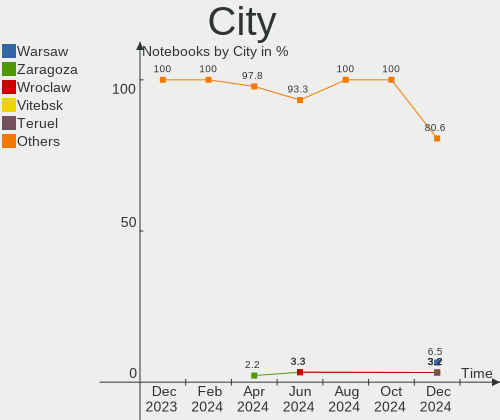
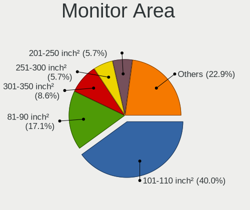
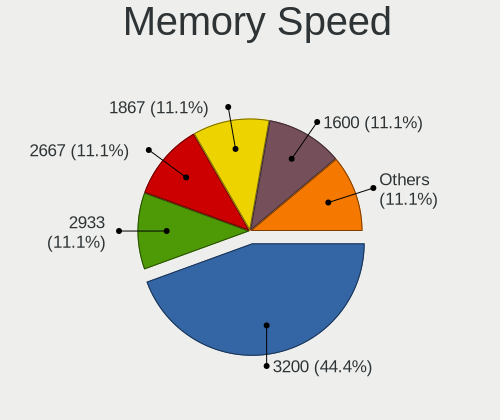

KDE neon Hardware Trends (Notebooks)
------------------------------------

A project to identify most popular hardware characteristics and track their change
over time based on data collected by KDE neon users at https://Linux-Hardware.org.

Anyone can contribute to this report by the [hw-probe](https://github.com/linuxhw/hw-probe) tool:

    sudo -E hw-probe -all -upload

Full-feature report is available here: https://linux-hardware.org/?view=trends

Period: Dec, 2021.

Contents
--------

* [ System ](#system)
  - [ OS                       ](#os)
  - [ OS Family                ](#os-family)
  - [ Kernel                   ](#kernel)
  - [ Kernel Family            ](#kernel-family)
  - [ Kernel Major Ver.        ](#kernel-major-ver)
  - [ Arch                     ](#arch)
  - [ DE                       ](#de)
  - [ Display Server           ](#display-server)
  - [ Display Manager          ](#display-manager)
  - [ OS Lang                  ](#os-lang)
  - [ Boot Mode                ](#boot-mode)
  - [ Filesystem               ](#filesystem)
  - [ Part. scheme             ](#part-scheme)
  - [ Dual Boot with Linux/BSD ](#dual-boot-with-linuxbsd)
  - [ Dual Boot (Win)          ](#dual-boot-win)

* [ Board ](#board)
  - [ Vendor                   ](#vendor)
  - [ Model                    ](#model)
  - [ Model Family             ](#model-family)
  - [ MFG Year                 ](#mfg-year)
  - [ Form Factor              ](#form-factor)
  - [ Secure Boot              ](#secure-boot)
  - [ Coreboot                 ](#coreboot)
  - [ RAM Size                 ](#ram-size)
  - [ RAM Used                 ](#ram-used)
  - [ Total Drives             ](#total-drives)
  - [ Has CD-ROM               ](#has-cd-rom)
  - [ Has Ethernet             ](#has-ethernet)
  - [ Has WiFi                 ](#has-wifi)
  - [ Has Bluetooth            ](#has-bluetooth)

* [ Location ](#location)
  - [ Country                  ](#country)
  - [ City                     ](#city)

* [ Drives ](#drives)
  - [ Drive Vendor             ](#drive-vendor)
  - [ Drive Model              ](#drive-model)
  - [ HDD Vendor               ](#hdd-vendor)
  - [ SSD Vendor               ](#ssd-vendor)
  - [ Drive Kind               ](#drive-kind)
  - [ Drive Connector          ](#drive-connector)
  - [ Drive Size               ](#drive-size)
  - [ Space Total              ](#space-total)
  - [ Space Used               ](#space-used)
  - [ Malfunc. Drives          ](#malfunc-drives)
  - [ Malfunc. Drive Vendor    ](#malfunc-drive-vendor)
  - [ Malfunc. HDD Vendor      ](#malfunc-hdd-vendor)
  - [ Malfunc. Drive Kind      ](#malfunc-drive-kind)
  - [ Failed Drives            ](#failed-drives)
  - [ Failed Drive Vendor      ](#failed-drive-vendor)
  - [ Drive Status             ](#drive-status)

* [ Storage controller ](#storage-controller)
  - [ Storage Vendor           ](#storage-vendor)
  - [ Storage Model            ](#storage-model)
  - [ Storage Kind             ](#storage-kind)

* [ Processor ](#processor)
  - [ CPU Vendor               ](#cpu-vendor)
  - [ CPU Model                ](#cpu-model)
  - [ CPU Model Family         ](#cpu-model-family)
  - [ CPU Cores                ](#cpu-cores)
  - [ CPU Sockets              ](#cpu-sockets)
  - [ CPU Threads              ](#cpu-threads)
  - [ CPU Op-Modes             ](#cpu-op-modes)
  - [ CPU Microcode            ](#cpu-microcode)
  - [ CPU Microarch            ](#cpu-microarch)

* [ Graphics ](#graphics)
  - [ GPU Vendor               ](#gpu-vendor)
  - [ GPU Model                ](#gpu-model)
  - [ GPU Combo                ](#gpu-combo)
  - [ GPU Driver               ](#gpu-driver)
  - [ GPU Memory               ](#gpu-memory)

* [ Monitor ](#monitor)
  - [ Monitor Vendor           ](#monitor-vendor)
  - [ Monitor Model            ](#monitor-model)
  - [ Monitor Resolution       ](#monitor-resolution)
  - [ Monitor Diagonal         ](#monitor-diagonal)
  - [ Monitor Width            ](#monitor-width)
  - [ Aspect Ratio             ](#aspect-ratio)
  - [ Monitor Area             ](#monitor-area)
  - [ Pixel Density            ](#pixel-density)
  - [ Multiple Monitors        ](#multiple-monitors)

* [ Network ](#network)
  - [ Net Controller Vendor    ](#net-controller-vendor)
  - [ Net Controller Model     ](#net-controller-model)
  - [ Wireless Vendor          ](#wireless-vendor)
  - [ Wireless Model           ](#wireless-model)
  - [ Ethernet Vendor          ](#ethernet-vendor)
  - [ Ethernet Model           ](#ethernet-model)
  - [ Net Controller Kind      ](#net-controller-kind)
  - [ Used Controller          ](#used-controller)
  - [ NICs                     ](#nics)
  - [ IPv6                     ](#ipv6)

* [ Bluetooth ](#bluetooth)
  - [ Bluetooth Vendor         ](#bluetooth-vendor)
  - [ Bluetooth Model          ](#bluetooth-model)

* [ Sound ](#sound)
  - [ Sound Vendor             ](#sound-vendor)
  - [ Sound Model              ](#sound-model)

* [ Memory ](#memory)
  - [ Memory Vendor            ](#memory-vendor)
  - [ Memory Model             ](#memory-model)
  - [ Memory Kind              ](#memory-kind)
  - [ Memory Form Factor       ](#memory-form-factor)
  - [ Memory Size              ](#memory-size)
  - [ Memory Speed             ](#memory-speed)

* [ Printers & scanners ](#printers--scanners)
  - [ Printer Vendor           ](#printer-vendor)
  - [ Printer Model            ](#printer-model)
  - [ Scanner Vendor           ](#scanner-vendor)
  - [ Scanner Model            ](#scanner-model)

* [ Camera ](#camera)
  - [ Camera Vendor            ](#camera-vendor)
  - [ Camera Model             ](#camera-model)

* [ Security ](#security)
  - [ Fingerprint Vendor       ](#fingerprint-vendor)
  - [ Fingerprint Model        ](#fingerprint-model)
  - [ Chipcard Vendor          ](#chipcard-vendor)
  - [ Chipcard Model           ](#chipcard-model)

* [ Unsupported ](#unsupported)
  - [ Unsupported Devices      ](#unsupported-devices)
  - [ Unsupported Device Types ](#unsupported-device-types)

System
------

OS
--

Installed operating systems

| Name           | Notebooks | Percent |
|----------------|-----------|---------|
| KDE neon 20.04 | 58        | 100%    |

OS Family
---------

OS without a version

| Name     | Notebooks | Percent |
|----------|-----------|---------|
| KDE neon | 58        | 100%    |

Kernel
------

Version of the Linux kernel

| Version               | Notebooks | Percent |
|-----------------------|-----------|---------|
| 5.11.0-43-generic     | 32        | 55.17%  |
| 5.11.0-41-generic     | 20        | 34.48%  |
| 5.11.0-40-generic     | 2         | 3.45%   |
| 5.4.0-84-generic      | 1         | 1.72%   |
| 5.14.6-051406-generic | 1         | 1.72%   |
| 5.13.0-22-lowlatency  | 1         | 1.72%   |
| 5.11.0-27-generic     | 1         | 1.72%   |

Kernel Family
-------------

Linux kernel without a distro release

| Version | Notebooks | Percent |
|---------|-----------|---------|
| 5.11.0  | 55        | 94.83%  |
| 5.4.0   | 1         | 1.72%   |
| 5.14.6  | 1         | 1.72%   |
| 5.13.0  | 1         | 1.72%   |

Kernel Major Ver.
-----------------

Linux kernel major version

| Version | Notebooks | Percent |
|---------|-----------|---------|
| 5.11    | 55        | 94.83%  |
| 5.4     | 1         | 1.72%   |
| 5.14    | 1         | 1.72%   |
| 5.13    | 1         | 1.72%   |

Arch
----

OS architecture (x86_64, i586, etc.)

| Name   | Notebooks | Percent |
|--------|-----------|---------|
| x86_64 | 58        | 100%    |

DE
--

Desktop Environment

| Name | Notebooks | Percent |
|------|-----------|---------|
| KDE5 | 58        | 100%    |

Display Server
--------------

X11 or Wayland

| Name    | Notebooks | Percent |
|---------|-----------|---------|
| X11     | 54        | 93.1%   |
| Wayland | 4         | 6.9%    |

Display Manager
---------------

SDDM, LightDM, etc.

| Name    | Notebooks | Percent |
|---------|-----------|---------|
| Unknown | 47        | 81.03%  |
| SDDM    | 11        | 18.97%  |

OS Lang
-------

Language

| Lang  | Notebooks | Percent |
|-------|-----------|---------|
| en_US | 21        | 36.21%  |
| es_ES | 7         | 12.07%  |
| en_GB | 5         | 8.62%   |
| en_IN | 4         | 6.9%    |
| de_DE | 3         | 5.17%   |
| C     | 3         | 5.17%   |
| ru_RU | 2         | 3.45%   |
| pl_PL | 2         | 3.45%   |
| zh_CN | 1         | 1.72%   |
| uk_UA | 1         | 1.72%   |
| pt_PT | 1         | 1.72%   |
| fr_FR | 1         | 1.72%   |
| fr_CH | 1         | 1.72%   |
| es_MX | 1         | 1.72%   |
| en_ZA | 1         | 1.72%   |
| en_NZ | 1         | 1.72%   |
| en_AU | 1         | 1.72%   |
| el_GR | 1         | 1.72%   |
| de_CH | 1         | 1.72%   |

Boot Mode
---------

EFI or BIOS

| Mode | Notebooks | Percent |
|------|-----------|---------|
| EFI  | 34        | 58.62%  |
| BIOS | 24        | 41.38%  |

Filesystem
----------

Type of filesystem

| Type    | Notebooks | Percent |
|---------|-----------|---------|
| Ext4    | 52        | 89.66%  |
| Btrfs   | 3         | 5.17%   |
| Overlay | 2         | 3.45%   |
| Xfs     | 1         | 1.72%   |

Part. scheme
------------

Scheme of partitioning

| Type    | Notebooks | Percent |
|---------|-----------|---------|
| Unknown | 53        | 91.38%  |
| GPT     | 5         | 8.62%   |

Dual Boot with Linux/BSD
------------------------

Hosting more than one Linux/BSD

| Dual boot | Notebooks | Percent |
|-----------|-----------|---------|
| No        | 58        | 100%    |

Dual Boot (Win)
---------------

Hosting Linux and Windows

| Dual boot | Notebooks | Percent |
|-----------|-----------|---------|
| No        | 51        | 87.93%  |
| Yes       | 7         | 12.07%  |

Board
-----

Vendor
------

Motherboard manufacturer

| Name                | Notebooks | Percent |
|---------------------|-----------|---------|
| Dell                | 14        | 24.14%  |
| Hewlett-Packard     | 13        | 22.41%  |
| Lenovo              | 10        | 17.24%  |
| MSI                 | 5         | 8.62%   |
| Acer                | 5         | 8.62%   |
| Toshiba             | 2         | 3.45%   |
| Chuwi               | 2         | 3.45%   |
| ASUSTek Computer    | 2         | 3.45%   |
| Sony                | 1         | 1.72%   |
| Samsung Electronics | 1         | 1.72%   |
| HUAWEI              | 1         | 1.72%   |
| Gigabyte Technology | 1         | 1.72%   |
| Framework           | 1         | 1.72%   |

Model
-----

Motherboard model

| Name                                 | Notebooks | Percent |
|--------------------------------------|-----------|---------|
| Toshiba TECRA Z50-A                  | 1         | 1.72%   |
| Toshiba Satellite P775               | 1         | 1.72%   |
| Sony VPCEA35FL                       | 1         | 1.72%   |
| Samsung 500R5L/501R5L/500R5P/550R5L  | 1         | 1.72%   |
| MSI Modern 14 B4MW                   | 1         | 1.72%   |
| MSI Modern 14 A10M                   | 1         | 1.72%   |
| MSI Katana GF66 11UC                 | 1         | 1.72%   |
| MSI GE63 Raider RGB 8RE              | 1         | 1.72%   |
| MSI Alpha 15 A4DEK                   | 1         | 1.72%   |
| Lenovo ThinkPad T460s 20FAS4A200     | 1         | 1.72%   |
| Lenovo ThinkPad E14 Gen 3 20Y7CTO1WW | 1         | 1.72%   |
| Lenovo ThinkPad E14 Gen 2 20T60027RT | 1         | 1.72%   |
| Lenovo Legion 5 Pro 16ACH6H 82JQ     | 1         | 1.72%   |
| Lenovo Legion 5 15ARH05H 82B1        | 1         | 1.72%   |
| Lenovo IdeaPad U400 09934FG          | 1         | 1.72%   |
| Lenovo IdeaPad 530S-15IKB 81EV       | 1         | 1.72%   |
| Lenovo IdeaPad 3 17ITL6 82H9         | 1         | 1.72%   |
| Lenovo IdeaPad 3 15ALC6 82KU         | 1         | 1.72%   |
| Lenovo IdeaPad 3 14ADA05 81W0        | 1         | 1.72%   |
| HUAWEI KLVL-WXXW                     | 1         | 1.72%   |
| HP Victus by Laptop 16-e0xxx         | 1         | 1.72%   |
| HP Stream Notebook PC 11             | 1         | 1.72%   |
| HP ProBook 6540b                     | 1         | 1.72%   |
| HP ProBook 6460b                     | 1         | 1.72%   |
| HP Pavilion Laptop 15-eh1xxx         | 1         | 1.72%   |
| HP Pavilion Gaming Laptop 15-ec2xxx  | 1         | 1.72%   |
| HP Pavilion dv7                      | 1         | 1.72%   |
| HP OMEN by Laptop                    | 1         | 1.72%   |
| HP Laptop 15s-fq2xxx                 | 1         | 1.72%   |
| HP G62                               | 1         | 1.72%   |
| HP ENVY Laptop 17-ch0xxx             | 1         | 1.72%   |
| HP EliteBook 840 G2                  | 1         | 1.72%   |
| HP 14                                | 1         | 1.72%   |
| Gigabyte P17FR5                      | 1         | 1.72%   |
| Framework Laptop                     | 1         | 1.72%   |
| Dell XPS 15 7590                     | 1         | 1.72%   |
| Dell Latitude E6440                  | 1         | 1.72%   |
| Dell Latitude E6410                  | 1         | 1.72%   |
| Dell Latitude 7280                   | 1         | 1.72%   |
| Dell Latitude 5590                   | 1         | 1.72%   |
| Dell Latitude 3420                   | 1         | 1.72%   |
| Dell Inspiron 7559                   | 1         | 1.72%   |
| Dell Inspiron 5577                   | 1         | 1.72%   |
| Dell Inspiron 5559                   | 1         | 1.72%   |
| Dell Inspiron 5555                   | 1         | 1.72%   |
| Dell Inspiron 5535                   | 1         | 1.72%   |
| Dell Inspiron 5502                   | 1         | 1.72%   |
| Dell Inspiron 3543                   | 1         | 1.72%   |
| Dell Inspiron 3541                   | 1         | 1.72%   |
| Chuwi HeroBox Pro                    | 1         | 1.72%   |
| Chuwi GemiBook Pro                   | 1         | 1.72%   |
| ASUS Q552UB                          | 1         | 1.72%   |
| ASUS N53SV                           | 1         | 1.72%   |
| Acer Swift SF315-51G                 | 1         | 1.72%   |
| Acer Swift SF314-42                  | 1         | 1.72%   |
| Acer Nitro AN515-44                  | 1         | 1.72%   |
| Acer Aspire VN7-791                  | 1         | 1.72%   |
| Acer Aspire 5755G                    | 1         | 1.72%   |

Model Family
------------

Motherboard model prefix

| Name              | Notebooks | Percent |
|-------------------|-----------|---------|
| Dell Inspiron     | 8         | 13.79%  |
| Lenovo IdeaPad    | 5         | 8.62%   |
| Dell Latitude     | 5         | 8.62%   |
| Lenovo ThinkPad   | 3         | 5.17%   |
| HP Pavilion       | 3         | 5.17%   |
| MSI Modern        | 2         | 3.45%   |
| Lenovo Legion     | 2         | 3.45%   |
| HP ProBook        | 2         | 3.45%   |
| Acer Swift        | 2         | 3.45%   |
| Acer Aspire       | 2         | 3.45%   |
| Toshiba TECRA     | 1         | 1.72%   |
| Toshiba Satellite | 1         | 1.72%   |
| Sony VPCEA35FL    | 1         | 1.72%   |
| Samsung 500R5L    | 1         | 1.72%   |
| MSI Katana        | 1         | 1.72%   |
| MSI GE63          | 1         | 1.72%   |
| MSI Alpha         | 1         | 1.72%   |
| HUAWEI KLVL-WXXW  | 1         | 1.72%   |
| HP Victus         | 1         | 1.72%   |
| HP Stream         | 1         | 1.72%   |
| HP OMEN           | 1         | 1.72%   |
| HP Laptop         | 1         | 1.72%   |
| HP G62            | 1         | 1.72%   |
| HP ENVY           | 1         | 1.72%   |
| HP EliteBook      | 1         | 1.72%   |
| HP 14             | 1         | 1.72%   |
| Gigabyte P17FR5   | 1         | 1.72%   |
| Framework Laptop  | 1         | 1.72%   |
| Dell XPS          | 1         | 1.72%   |
| Chuwi HeroBox     | 1         | 1.72%   |
| Chuwi GemiBook    | 1         | 1.72%   |
| ASUS Q552UB       | 1         | 1.72%   |
| ASUS N53SV        | 1         | 1.72%   |
| Acer Nitro        | 1         | 1.72%   |

MFG Year
--------

Motherboard manufacture year

| Year | Notebooks | Percent |
|------|-----------|---------|
| 2021 | 23        | 39.66%  |
| 2020 | 7         | 12.07%  |
| 2018 | 5         | 8.62%   |
| 2015 | 5         | 8.62%   |
| 2016 | 4         | 6.9%    |
| 2011 | 3         | 5.17%   |
| 2010 | 3         | 5.17%   |
| 2017 | 2         | 3.45%   |
| 2012 | 2         | 3.45%   |
| 2019 | 1         | 1.72%   |
| 2014 | 1         | 1.72%   |
| 2013 | 1         | 1.72%   |
| 2009 | 1         | 1.72%   |

Form Factor
-----------

Physical design of the computer

| Name     | Notebooks | Percent |
|----------|-----------|---------|
| Notebook | 58        | 100%    |

Secure Boot
-----------

Enabled or disabled

| State    | Notebooks | Percent |
|----------|-----------|---------|
| Disabled | 46        | 79.31%  |
| Enabled  | 12        | 20.69%  |

Coreboot
--------

Have coreboot on board

| Used | Notebooks | Percent |
|------|-----------|---------|
| No   | 58        | 100%    |

RAM Size
--------

Total RAM memory

| Size in GB | Notebooks | Percent |
|------------|-----------|---------|
| 4.01-8.0   | 22        | 37.93%  |
| 8.01-16.0  | 16        | 27.59%  |
| 16.01-24.0 | 9         | 15.52%  |
| 3.01-4.0   | 6         | 10.34%  |
| 32.01-64.0 | 3         | 5.17%   |
| 2.01-3.0   | 1         | 1.72%   |
| 1.01-2.0   | 1         | 1.72%   |

RAM Used
--------

Used RAM memory

| Used GB    | Notebooks | Percent |
|------------|-----------|---------|
| 1.01-2.0   | 30        | 51.72%  |
| 2.01-3.0   | 9         | 15.52%  |
| 4.01-8.0   | 8         | 13.79%  |
| 3.01-4.0   | 8         | 13.79%  |
| 0.51-1.0   | 2         | 3.45%   |
| 16.01-24.0 | 1         | 1.72%   |

Total Drives
------------

Number of drives on board

| Drives | Notebooks | Percent |
|--------|-----------|---------|
| 1      | 40        | 68.97%  |
| 2      | 18        | 31.03%  |

Has CD-ROM
----------

Has CD-ROM on board

| Presented | Notebooks | Percent |
|-----------|-----------|---------|
| No        | 41        | 70.69%  |
| Yes       | 17        | 29.31%  |

Has Ethernet
------------

Has Ethernet on board

| Presented | Notebooks | Percent |
|-----------|-----------|---------|
| Yes       | 46        | 79.31%  |
| No        | 12        | 20.69%  |

Has WiFi
--------

Has WiFi module

| Presented | Notebooks | Percent |
|-----------|-----------|---------|
| Yes       | 58        | 100%    |

Has Bluetooth
-------------

Has Bluetooth module

| Presented | Notebooks | Percent |
|-----------|-----------|---------|
| Yes       | 53        | 91.38%  |
| No        | 5         | 8.62%   |

Location
--------

Country
-------

Geographic location (country)

| Country      | Notebooks | Percent |
|--------------|-----------|---------|
| USA          | 10        | 17.24%  |
| Spain        | 5         | 8.62%   |
| India        | 5         | 8.62%   |
| Ukraine      | 3         | 5.17%   |
| UK           | 3         | 5.17%   |
| Poland       | 3         | 5.17%   |
| Mexico       | 3         | 5.17%   |
| Germany      | 3         | 5.17%   |
| Switzerland  | 2         | 3.45%   |
| Russia       | 2         | 3.45%   |
| Romania      | 2         | 3.45%   |
| Portugal     | 2         | 3.45%   |
| Brazil       | 2         | 3.45%   |
| South Africa | 1         | 1.72%   |
| Slovenia     | 1         | 1.72%   |
| Philippines  | 1         | 1.72%   |
| Netherlands  | 1         | 1.72%   |
| Nepal        | 1         | 1.72%   |
| Moldova      | 1         | 1.72%   |
| Latvia       | 1         | 1.72%   |
| Israel       | 1         | 1.72%   |
| Greece       | 1         | 1.72%   |
| France       | 1         | 1.72%   |
| Cuba         | 1         | 1.72%   |
| China        | 1         | 1.72%   |
| Australia    | 1         | 1.72%   |

City
----

Geographic location (city)

| City               | Notebooks | Percent |
|--------------------|-----------|---------|
| Moscow             | 2         | 3.45%   |
| Madrid             | 2         | 3.45%   |
| Zurich             | 1         | 1.72%   |
| Wegberg            | 1         | 1.72%   |
| Wallasey           | 1         | 1.72%   |
| Vermoim            | 1         | 1.72%   |
| Torre del Mar      | 1         | 1.72%   |
| Tijuana            | 1         | 1.72%   |
| Thessaloniki       | 1         | 1.72%   |
| Tecamac            | 1         | 1.72%   |
| T??rgu Jiu         | 1         | 1.72%   |
| Stari Trg pri Lozu | 1         | 1.72%   |
| Soroca             | 1         | 1.72%   |
| Rossrueti          | 1         | 1.72%   |
| Riga               | 1         | 1.72%   |
| Renton             | 1         | 1.72%   |
| Queluz             | 1         | 1.72%   |
| Palmas             | 1         | 1.72%   |
| Overland           | 1         | 1.72%   |
| North Hollywood    | 1         | 1.72%   |
| Navarre            | 1         | 1.72%   |
| Murrieta           | 1         | 1.72%   |
| Mosina             | 1         | 1.72%   |
| Morintsy           | 1         | 1.72%   |
| Melbourne          | 1         | 1.72%   |
| Lublin             | 1         | 1.72%   |
| Lincoln            | 1         | 1.72%   |
| Lilburn            | 1         | 1.72%   |
| Lerma de Villada   | 1         | 1.72%   |
| Krakow             | 1         | 1.72%   |
| Kinneret           | 1         | 1.72%   |
| Kathmandu          | 1         | 1.72%   |
| Kalush             | 1         | 1.72%   |
| Jaipur             | 1         | 1.72%   |
| Havana             | 1         | 1.72%   |
| Harrow             | 1         | 1.72%   |
| Gifhorn            | 1         | 1.72%   |
| Evans              | 1         | 1.72%   |
| Enerhodar          | 1         | 1.72%   |
| Dunfermline        | 1         | 1.72%   |
| Dresden            | 1         | 1.72%   |
| Dhanbad            | 1         | 1.72%   |
| Davisburg          | 1         | 1.72%   |
| Dasmarinas         | 1         | 1.72%   |
| Cordova            | 1         | 1.72%   |
| Chandrakona        | 1         | 1.72%   |
| Cape Town          | 1         | 1.72%   |
| Bucharest          | 1         | 1.72%   |
| Bras?­lia          | 1         | 1.72%   |
| Bhubaneswar        | 1         | 1.72%   |
| Bengaluru          | 1         | 1.72%   |
| Beigao             | 1         | 1.72%   |
| Bar-sur-Aube       | 1         | 1.72%   |
| Avil?©s            | 1         | 1.72%   |
| Atlantic           | 1         | 1.72%   |
| Amsterdam          | 1         | 1.72%   |

Drives
------

Drive Vendor
------------

Hard drive vendors

| Vendor                  | Notebooks | Drives | Percent |
|-------------------------|-----------|--------|---------|
| Kingston                | 9         | 9      | 12.16%  |
| Sandisk                 | 7         | 7      | 9.46%   |
| Samsung Electronics     | 7         | 7      | 9.46%   |
| WDC                     | 6         | 6      | 8.11%   |
| Seagate                 | 6         | 6      | 8.11%   |
| Toshiba                 | 5         | 6      | 6.76%   |
| SK Hynix                | 5         | 5      | 6.76%   |
| A-DATA Technology       | 4         | 4      | 5.41%   |
| LITEON                  | 3         | 3      | 4.05%   |
| Intel                   | 3         | 3      | 4.05%   |
| Unknown                 | 2         | 3      | 2.7%    |
| Transcend               | 2         | 2      | 2.7%    |
| KIOXIA                  | 2         | 2      | 2.7%    |
| Hitachi                 | 2         | 2      | 2.7%    |
| Crucial                 | 2         | 2      | 2.7%    |
| Union Memory (Shenzhen) | 1         | 1      | 1.35%   |
| Silicon Motion          | 1         | 1      | 1.35%   |
| Ramsta                  | 1         | 1      | 1.35%   |
| Phison                  | 1         | 1      | 1.35%   |
| Netac                   | 1         | 1      | 1.35%   |
| Micron Technology       | 1         | 1      | 1.35%   |
| HGST                    | 1         | 1      | 1.35%   |
| Colorful                | 1         | 1      | 1.35%   |
| China                   | 1         | 1      | 1.35%   |

Drive Model
-----------

Hard drive models

| Model                                        | Notebooks | Percent |
|----------------------------------------------|-----------|---------|
| Kingston SA400S37240G 240GB SSD              | 3         | 3.95%   |
| SK Hynix NVMe SSD Drive 256GB                | 2         | 2.63%   |
| Seagate ST1000LM049-2GH172 1TB               | 2         | 2.63%   |
| Sandisk NVMe SSD Drive 256GB                 | 2         | 2.63%   |
| WDC WDS120G2G0A-00JH30 120GB SSD             | 1         | 1.32%   |
| WDC WD10SPZX-24Z10 1TB                       | 1         | 1.32%   |
| WDC WD10SPZX-21Z10T0 1TB                     | 1         | 1.32%   |
| WDC WD10SPZX-08Z10 1TB                       | 1         | 1.32%   |
| WDC PC SN530 SDBPNPZ-1T00-1006 1TB           | 1         | 1.32%   |
| WDC PC SN530 SDBPMPZ-512G-1001 512GB         | 1         | 1.32%   |
| Unknown SD/MMC/MS PRO 7GB                    | 1         | 1.32%   |
| Unknown MMC Card  32GB                       | 1         | 1.32%   |
| Unknown MMC Card  250GB                      | 1         | 1.32%   |
| Union Memory (Shenzhen) NVMe SSD Drive 256GB | 1         | 1.32%   |
| Transcend TS512GSSD230S 512GB                | 1         | 1.32%   |
| Transcend TS120GMTS420S 120GB SSD            | 1         | 1.32%   |
| Toshiba THNSNK128GVN8 M.2 2280 128GB SSD     | 1         | 1.32%   |
| Toshiba MQ02ABD100H 1TB                      | 1         | 1.32%   |
| Toshiba MQ01ACF032 320GB                     | 1         | 1.32%   |
| Toshiba MQ01ABF050 500GB                     | 1         | 1.32%   |
| Toshiba MQ01ABD100 1TB                       | 1         | 1.32%   |
| Toshiba MK3255GSXF 320GB                     | 1         | 1.32%   |
| SK Hynix SC311 SATA 512GB SSD                | 1         | 1.32%   |
| SK Hynix NVMe SSD Drive 512GB                | 1         | 1.32%   |
| SK Hynix NVMe SSD Drive 128GB                | 1         | 1.32%   |
| Silicon Motion NVMe SSD Drive 512GB          | 1         | 1.32%   |
| Seagate ST500LT012-1DG142 500GB              | 1         | 1.32%   |
| Seagate ST1000LM035-1RK172 1TB               | 1         | 1.32%   |
| Seagate ST1000LM024 HN-M101MBB 1TB           | 1         | 1.32%   |
| Seagate BUP Slim 1TB                         | 1         | 1.32%   |
| SanDisk SDSSDP128G 128GB                     | 1         | 1.32%   |
| Sandisk NVMe SSD Drive 512GB                 | 1         | 1.32%   |
| Sandisk NVMe SSD Drive 1TB                   | 1         | 1.32%   |
| Sandisk NVMe SSD Drive 128GB                 | 1         | 1.32%   |
| Sandisk NVMe SSD Drive 1024GB                | 1         | 1.32%   |
| Samsung SSD SM841N mSATA 256GB SED           | 1         | 1.32%   |
| Samsung SSD PM871b M.2 2280 256GB            | 1         | 1.32%   |
| Samsung SSD 860 EVO 1TB                      | 1         | 1.32%   |
| Samsung SSD 850 EVO 250GB                    | 1         | 1.32%   |
| Samsung NVMe SSD Drive 512GB                 | 1         | 1.32%   |
| Samsung NVMe SSD Drive 256GB                 | 1         | 1.32%   |
| Samsung MZMPA032HMCD-000L1 32GB SSD          | 1         | 1.32%   |
| Ramsta SSD S800 120GB                        | 1         | 1.32%   |
| Phison 311CD0512GB                           | 1         | 1.32%   |
| Netac S539N8/256 256GB                       | 1         | 1.32%   |
| Micron NVMe SSD Drive 512GB                  | 1         | 1.32%   |
| LITEON IT LCS-128L9S-HP 128GB SSD            | 1         | 1.32%   |
| LITEON CV3-8D128 128GB SSD                   | 1         | 1.32%   |
| LITEON CV1-8B256 256GB SSD                   | 1         | 1.32%   |
| KIOXIA NVMe SSD Drive 128GB                  | 1         | 1.32%   |
| KIOXIA KBG40ZNS256G NVMe 256GB               | 1         | 1.32%   |
| Kingston SA2000M8250G 250GB                  | 1         | 1.32%   |
| Kingston RBU-SNS8100S3128GD 128GB SSD        | 1         | 1.32%   |
| Kingston NVMe SSD Drive 512GB                | 1         | 1.32%   |
| Kingston NVMe SSD Drive 500GB                | 1         | 1.32%   |
| Kingston NVMe SSD Drive 256GB                | 1         | 1.32%   |
| Kingston NVMe SSD Drive 1024GB               | 1         | 1.32%   |
| Intel SSDSC2BF180A5H SED 180GB               | 1         | 1.32%   |
| Intel NVMe SSD Drive 512GB                   | 1         | 1.32%   |
| Intel NVMe SSD Drive 1024GB                  | 1         | 1.32%   |

HDD Vendor
----------

Hard disk drive vendors

| Vendor  | Notebooks | Drives | Percent |
|---------|-----------|--------|---------|
| Seagate | 6         | 6      | 33.33%  |
| Toshiba | 5         | 5      | 27.78%  |
| WDC     | 3         | 3      | 16.67%  |
| Hitachi | 2         | 2      | 11.11%  |
| Unknown | 1         | 1      | 5.56%   |
| HGST    | 1         | 1      | 5.56%   |

SSD Vendor
----------

Solid state drive vendors

| Vendor              | Notebooks | Drives | Percent |
|---------------------|-----------|--------|---------|
| Samsung Electronics | 5         | 5      | 17.86%  |
| Kingston            | 4         | 4      | 14.29%  |
| A-DATA Technology   | 4         | 4      | 14.29%  |
| LITEON              | 3         | 3      | 10.71%  |
| Transcend           | 2         | 2      | 7.14%   |
| Crucial             | 2         | 2      | 7.14%   |
| WDC                 | 1         | 1      | 3.57%   |
| Toshiba             | 1         | 1      | 3.57%   |
| SK Hynix            | 1         | 1      | 3.57%   |
| SanDisk             | 1         | 1      | 3.57%   |
| Ramsta              | 1         | 1      | 3.57%   |
| Netac               | 1         | 1      | 3.57%   |
| Intel               | 1         | 1      | 3.57%   |
| China               | 1         | 1      | 3.57%   |

Drive Kind
----------

HDD or SSD

| Kind    | Notebooks | Drives | Percent |
|---------|-----------|--------|---------|
| NVMe    | 26        | 27     | 36.11%  |
| SSD     | 25        | 28     | 34.72%  |
| HDD     | 18        | 18     | 25%     |
| MMC     | 2         | 2      | 2.78%   |
| Unknown | 1         | 1      | 1.39%   |

Drive Connector
---------------

SATA, SAS, NVMe, etc.

| Type | Notebooks | Drives | Percent |
|------|-----------|--------|---------|
| SATA | 37        | 45     | 55.22%  |
| NVMe | 26        | 27     | 38.81%  |
| SAS  | 2         | 2      | 2.99%   |
| MMC  | 2         | 2      | 2.99%   |

Drive Size
----------

Size of hard drive

| Size in TB | Notebooks | Drives | Percent |
|------------|-----------|--------|---------|
| 0.01-0.5   | 27        | 30     | 62.79%  |
| 0.51-1.0   | 16        | 16     | 37.21%  |

Space Total
-----------

Amount of disk space available on the file system

| Size in GB | Notebooks | Percent |
|------------|-----------|---------|
| 101-250    | 17        | 29.31%  |
| 251-500    | 14        | 24.14%  |
| 1001-2000  | 7         | 12.07%  |
| 51-100     | 7         | 12.07%  |
| 501-1000   | 5         | 8.62%   |
| 21-50      | 4         | 6.9%    |
| 1-20       | 2         | 3.45%   |
| Unknown    | 2         | 3.45%   |

Space Used
----------

Amount of used disk space

| Used GB  | Notebooks | Percent |
|----------|-----------|---------|
| 1-20     | 30        | 51.72%  |
| 251-500  | 6         | 10.34%  |
| 501-1000 | 6         | 10.34%  |
| 51-100   | 6         | 10.34%  |
| 21-50    | 4         | 6.9%    |
| 101-250  | 4         | 6.9%    |
| Unknown  | 2         | 3.45%   |

Malfunc. Drives
---------------

Drive models with a malfunction

Zero info for selected period =(

Malfunc. Drive Vendor
---------------------

Vendors of faulty drives

Zero info for selected period =(

Malfunc. HDD Vendor
-------------------

Vendors of faulty HDD drives

Zero info for selected period =(

Malfunc. Drive Kind
-------------------

Kinds of faulty drives

Zero info for selected period =(

Failed Drives
-------------

Failed drive models

Zero info for selected period =(

Failed Drive Vendor
-------------------

Failed drive vendors

Zero info for selected period =(

Drive Status
------------

Number of failed and malfunc. drives

| Status   | Notebooks | Drives | Percent |
|----------|-----------|--------|---------|
| Detected | 53        | 70     | 91.38%  |
| Works    | 5         | 6      | 8.62%   |

Storage controller
------------------

Storage Vendor
--------------

Storage controller vendors

| Vendor                      | Notebooks | Percent |
|-----------------------------|-----------|---------|
| Intel                       | 37        | 49.33%  |
| AMD                         | 13        | 17.33%  |
| Sandisk                     | 8         | 10.67%  |
| Kingston Technology Company | 5         | 6.67%   |
| SK Hynix                    | 4         | 5.33%   |
| Samsung Electronics         | 2         | 2.67%   |
| KIOXIA                      | 2         | 2.67%   |
| Union Memory (Shenzhen)     | 1         | 1.33%   |
| Silicon Motion              | 1         | 1.33%   |
| Phison Electronics          | 1         | 1.33%   |
| Micron Technology           | 1         | 1.33%   |

Storage Model
-------------

Storage controller models

| Model                                                                          | Notebooks | Percent |
|--------------------------------------------------------------------------------|-----------|---------|
| AMD FCH SATA Controller [AHCI mode]                                            | 13        | 16.67%  |
| Intel Sunrise Point-LP SATA Controller [AHCI mode]                             | 5         | 6.41%   |
| Intel 6 Series/C200 Series Chipset Family 6 port Mobile SATA AHCI Controller   | 5         | 6.41%   |
| Sandisk WD Blue SN550 NVMe SSD                                                 | 4         | 5.13%   |
| Intel HM170/QM170 Chipset SATA Controller [AHCI Mode]                          | 4         | 5.13%   |
| Intel 82801 Mobile SATA Controller [RAID mode]                                 | 4         | 5.13%   |
| Intel Volume Management Device NVMe RAID Controller                            | 3         | 3.85%   |
| SK Hynix BC511                                                                 | 2         | 2.56%   |
| Sandisk WD Black SN750 / PC SN730 NVMe SSD                                     | 2         | 2.56%   |
| KIOXIA Non-Volatile memory controller                                          | 2         | 2.56%   |
| Kingston Company Company Non-Volatile memory controller                        | 2         | 2.56%   |
| Intel Wildcat Point-LP SATA Controller [AHCI Mode]                             | 2         | 2.56%   |
| Intel Tiger Lake-LP SATA Controller [AHCI mode]                                | 2         | 2.56%   |
| Intel Cannon Lake Mobile PCH SATA AHCI Controller                              | 2         | 2.56%   |
| Intel 5 Series/3400 Series Chipset 4 port SATA AHCI Controller                 | 2         | 2.56%   |
| Union Memory (Shenzhen) Non-Volatile memory controller                         | 1         | 1.28%   |
| SK Hynix Non-Volatile memory controller                                        | 1         | 1.28%   |
| SK Hynix Gold P31 SSD                                                          | 1         | 1.28%   |
| Silicon Motion SM2262/SM2262EN SSD Controller                                  | 1         | 1.28%   |
| Sandisk WD Blue SN500 / PC SN520 NVMe SSD                                      | 1         | 1.28%   |
| Sandisk Non-Volatile memory controller                                         | 1         | 1.28%   |
| Samsung NVMe SSD Controller SM981/PM981/PM983                                  | 1         | 1.28%   |
| Samsung NVMe SSD Controller 980                                                | 1         | 1.28%   |
| Phison PS5013 E13 NVMe Controller                                              | 1         | 1.28%   |
| Micron Non-Volatile memory controller                                          | 1         | 1.28%   |
| Kingston Company SNVS2000G [NV1 NVMe PCIe SSD 2TB]                             | 1         | 1.28%   |
| Kingston Company OM3PDP3 NVMe SSD                                              | 1         | 1.28%   |
| Kingston Company A2000 NVMe SSD                                                | 1         | 1.28%   |
| Intel SSD Pro 7600p/760p/E 6100p Series                                        | 1         | 1.28%   |
| Intel SSD 660P Series                                                          | 1         | 1.28%   |
| Intel Jasper Lake SATA AHCI Controller                                         | 1         | 1.28%   |
| Intel Celeron/Pentium Silver Processor SATA Controller                         | 1         | 1.28%   |
| Intel Atom Processor E3800 Series SATA AHCI Controller                         | 1         | 1.28%   |
| Intel 82801IBM/IEM (ICH9M/ICH9M-E) 4 port SATA Controller [AHCI mode]          | 1         | 1.28%   |
| Intel 8 Series/C220 Series Chipset Family 6-port SATA Controller 1 [AHCI mode] | 1         | 1.28%   |
| Intel 8 Series SATA Controller 1 [AHCI mode]                                   | 1         | 1.28%   |
| Intel 500 Series Chipset Family SATA AHCI Controller                           | 1         | 1.28%   |
| Intel 5 Series/3400 Series Chipset 4 port SATA IDE Controller                  | 1         | 1.28%   |
| Intel 5 Series/3400 Series Chipset 2 port SATA IDE Controller                  | 1         | 1.28%   |

Storage Kind
------------

Kind of storage controller (IDE, SATA, NVMe, SAS, ...)

| Kind | Notebooks | Percent |
|------|-----------|---------|
| SATA | 42        | 55.26%  |
| NVMe | 26        | 34.21%  |
| RAID | 7         | 9.21%   |
| IDE  | 1         | 1.32%   |

Processor
---------

CPU Vendor
----------

Processor vendors

| Vendor | Notebooks | Percent |
|--------|-----------|---------|
| Intel  | 41        | 70.69%  |
| AMD    | 17        | 29.31%  |

CPU Model
---------

Processor models

| Model                                         | Notebooks | Percent |
|-----------------------------------------------|-----------|---------|
| Intel Core i5-2450M CPU @ 2.50GHz             | 3         | 5.17%   |
| Intel 11th Gen Core i7-1165G7 @ 2.80GHz       | 3         | 5.17%   |
| Intel Core i7-6700HQ CPU @ 2.60GHz            | 2         | 3.45%   |
| Intel Core i7-6500U CPU @ 2.50GHz             | 2         | 3.45%   |
| Intel Core i5-6300U CPU @ 2.40GHz             | 2         | 3.45%   |
| Intel Core i5 CPU M 520 @ 2.40GHz             | 2         | 3.45%   |
| Intel Celeron CPU N2840 @ 2.16GHz             | 2         | 3.45%   |
| Intel 11th Gen Core i5-1135G7 @ 2.40GHz       | 2         | 3.45%   |
| AMD Ryzen 7 5800H with Radeon Graphics        | 2         | 3.45%   |
| AMD Ryzen 7 5700U with Radeon Graphics        | 2         | 3.45%   |
| AMD Ryzen 7 4700U with Radeon Graphics        | 2         | 3.45%   |
| AMD Ryzen 5 4600H with Radeon Graphics        | 2         | 3.45%   |
| Intel Pentium 3805U @ 1.90GHz                 | 1         | 1.72%   |
| Intel Core i7-9750H CPU @ 2.60GHz             | 1         | 1.72%   |
| Intel Core i7-8750H CPU @ 2.20GHz             | 1         | 1.72%   |
| Intel Core i7-8650U CPU @ 1.90GHz             | 1         | 1.72%   |
| Intel Core i7-8550U CPU @ 1.80GHz             | 1         | 1.72%   |
| Intel Core i7-7700HQ CPU @ 2.80GHz            | 1         | 1.72%   |
| Intel Core i7-4720HQ CPU @ 2.60GHz            | 1         | 1.72%   |
| Intel Core i7-2670QM CPU @ 2.20GHz            | 1         | 1.72%   |
| Intel Core i5-8250U CPU @ 1.60GHz             | 1         | 1.72%   |
| Intel Core i5-7300HQ CPU @ 2.50GHz            | 1         | 1.72%   |
| Intel Core i5-6200U CPU @ 2.30GHz             | 1         | 1.72%   |
| Intel Core i5-5300U CPU @ 2.30GHz             | 1         | 1.72%   |
| Intel Core i5-4310M CPU @ 2.70GHz             | 1         | 1.72%   |
| Intel Core i5-4300U CPU @ 1.90GHz             | 1         | 1.72%   |
| Intel Core i5-2430M CPU @ 2.40GHz             | 1         | 1.72%   |
| Intel Core i5-10210U CPU @ 1.60GHz            | 1         | 1.72%   |
| Intel Core i3 CPU M 370 @ 2.40GHz             | 1         | 1.72%   |
| Intel Core i3 CPU M 330 @ 2.13GHz             | 1         | 1.72%   |
| Intel Core 2 Duo CPU P7450 @ 2.13GHz          | 1         | 1.72%   |
| Intel Celeron N4500 @ 1.10GHz                 | 1         | 1.72%   |
| Intel Celeron J4125 CPU @ 2.00GHz             | 1         | 1.72%   |
| Intel 11th Gen Core i7-11800H @ 2.30GHz       | 1         | 1.72%   |
| Intel 11th Gen Core i3-1115G4 @ 3.00GHz       | 1         | 1.72%   |
| AMD Ryzen 7 4800H with Radeon Graphics        | 1         | 1.72%   |
| AMD Ryzen 5 5600H with Radeon Graphics        | 1         | 1.72%   |
| AMD Ryzen 5 5500U with Radeon Graphics        | 1         | 1.72%   |
| AMD Ryzen 5 4500U with Radeon Graphics        | 1         | 1.72%   |
| AMD Ryzen 5 3500U with Radeon Vega Mobile Gfx | 1         | 1.72%   |
| AMD Ryzen 3 5300U with Radeon Graphics        | 1         | 1.72%   |
| AMD E2-7110 APU with AMD Radeon R2 Graphics   | 1         | 1.72%   |
| AMD A6-6310 APU with AMD Radeon R4 Graphics   | 1         | 1.72%   |
| AMD A10-5745M APU with Radeon HD Graphics     | 1         | 1.72%   |

CPU Model Family
----------------

Processor model prefix

| Model            | Notebooks | Percent |
|------------------|-----------|---------|
| Intel Core i5    | 15        | 25.86%  |
| Intel Core i7    | 11        | 18.97%  |
| Other            | 7         | 12.07%  |
| AMD Ryzen 7      | 7         | 12.07%  |
| AMD Ryzen 5      | 6         | 10.34%  |
| Intel Celeron    | 4         | 6.9%    |
| Intel Core i3    | 2         | 3.45%   |
| Intel Pentium    | 1         | 1.72%   |
| Intel Core 2 Duo | 1         | 1.72%   |
| AMD Ryzen 3      | 1         | 1.72%   |
| AMD E2           | 1         | 1.72%   |
| AMD A6           | 1         | 1.72%   |
| AMD A10          | 1         | 1.72%   |

CPU Cores
---------

Number of processor cores

| Number | Notebooks | Percent |
|--------|-----------|---------|
| 2      | 23        | 39.66%  |
| 4      | 20        | 34.48%  |
| 8      | 8         | 13.79%  |
| 6      | 7         | 12.07%  |

CPU Sockets
-----------

Number of sockets

| Number | Notebooks | Percent |
|--------|-----------|---------|
| 1      | 58        | 100%    |

CPU Threads
-----------

Threads per core (Hyper-Threading)

| Number | Notebooks | Percent |
|--------|-----------|---------|
| 2      | 46        | 79.31%  |
| 1      | 12        | 20.69%  |

CPU Op-Modes
------------

CPU Operation Modes (32-bit, 64-bit)

| Op mode        | Notebooks | Percent |
|----------------|-----------|---------|
| 32-bit, 64-bit | 58        | 100%    |

CPU Microcode
-------------

Microcode number

| Number     | Notebooks | Percent |
|------------|-----------|---------|
| Unknown    | 10        | 17.24%  |
| 0x806c1    | 5         | 8.62%   |
| 0x206a7    | 4         | 6.9%    |
| 0x406e3    | 3         | 5.17%   |
| 0x20652    | 3         | 5.17%   |
| 0x08600104 | 3         | 5.17%   |
| 0x906ea    | 2         | 3.45%   |
| 0x506e3    | 2         | 3.45%   |
| 0x306d4    | 2         | 3.45%   |
| 0x306c3    | 2         | 3.45%   |
| 0x30678    | 2         | 3.45%   |
| 0x0a50000c | 2         | 3.45%   |
| 0x08608103 | 2         | 3.45%   |
| 0x08608102 | 2         | 3.45%   |
| 0x08600103 | 2         | 3.45%   |
| 0x906e9    | 1         | 1.72%   |
| 0x906c0    | 1         | 1.72%   |
| 0x806ec    | 1         | 1.72%   |
| 0x806ea    | 1         | 1.72%   |
| 0x806d1    | 1         | 1.72%   |
| 0x706a8    | 1         | 1.72%   |
| 0x40651    | 1         | 1.72%   |
| 0x20655    | 1         | 1.72%   |
| 0x10676    | 1         | 1.72%   |
| 0x08108109 | 1         | 1.72%   |
| 0x07030105 | 1         | 1.72%   |
| 0x06001119 | 1         | 1.72%   |

CPU Microarch
-------------

Microarchitecture

| Name          | Notebooks | Percent |
|---------------|-----------|---------|
| KabyLake      | 8         | 13.79%  |
| Skylake       | 7         | 12.07%  |
| Zen 2         | 6         | 10.34%  |
| TigerLake     | 6         | 10.34%  |
| SandyBridge   | 5         | 8.62%   |
| Westmere      | 4         | 6.9%    |
| Unknown       | 4         | 6.9%    |
| Zen 3         | 3         | 5.17%   |
| Haswell       | 3         | 5.17%   |
| Silvermont    | 2         | 3.45%   |
| Puma          | 2         | 3.45%   |
| Broadwell     | 2         | 3.45%   |
| Zen+          | 1         | 1.72%   |
| Tremont       | 1         | 1.72%   |
| Piledriver    | 1         | 1.72%   |
| Penryn        | 1         | 1.72%   |
| Icelake       | 1         | 1.72%   |
| Goldmont plus | 1         | 1.72%   |

Graphics
--------

GPU Vendor
----------

Vendors of graphics cards

| Vendor | Notebooks | Percent |
|--------|-----------|---------|
| Intel  | 40        | 49.38%  |
| Nvidia | 22        | 27.16%  |
| AMD    | 19        | 23.46%  |

GPU Model
---------

Graphics card models

| Model                                                                         | Notebooks | Percent |
|-------------------------------------------------------------------------------|-----------|---------|
| AMD Renoir                                                                    | 6         | 7.23%   |
| Intel TigerLake-LP GT2 [Iris Xe Graphics]                                     | 5         | 6.02%   |
| Intel Skylake GT2 [HD Graphics 520]                                           | 5         | 6.02%   |
| Intel 2nd Generation Core Processor Family Integrated Graphics Controller     | 5         | 6.02%   |
| Intel Core Processor Integrated Graphics Controller                           | 4         | 4.82%   |
| AMD Lucienne                                                                  | 4         | 4.82%   |
| Intel UHD Graphics 620                                                        | 3         | 3.61%   |
| AMD Cezanne                                                                   | 3         | 3.61%   |
| Nvidia TU117M                                                                 | 2         | 2.41%   |
| Nvidia GP108M [GeForce MX150]                                                 | 2         | 2.41%   |
| Nvidia GP107M [GeForce GTX 1050 Mobile]                                       | 2         | 2.41%   |
| Nvidia GF108M [GeForce GT 540M]                                               | 2         | 2.41%   |
| Intel HD Graphics 630                                                         | 2         | 2.41%   |
| Intel HD Graphics 530                                                         | 2         | 2.41%   |
| Intel CoffeeLake-H GT2 [UHD Graphics 630]                                     | 2         | 2.41%   |
| Intel Atom Processor Z36xxx/Z37xxx Series Graphics & Display                  | 2         | 2.41%   |
| Intel 4th Gen Core Processor Integrated Graphics Controller                   | 2         | 2.41%   |
| Nvidia TU117M [GeForce MX450]                                                 | 1         | 1.2%    |
| Nvidia TU117M [GeForce GTX 1650 Mobile / Max-Q]                               | 1         | 1.2%    |
| Nvidia TU106M [GeForce RTX 2060 Mobile]                                       | 1         | 1.2%    |
| Nvidia GP106M [GeForce GTX 1060 Mobile]                                       | 1         | 1.2%    |
| Nvidia GM108M [GeForce 940M]                                                  | 1         | 1.2%    |
| Nvidia GM108M [GeForce 940MX]                                                 | 1         | 1.2%    |
| Nvidia GM108M [GeForce 840M]                                                  | 1         | 1.2%    |
| Nvidia GM107M [GeForce GTX 960M]                                              | 1         | 1.2%    |
| Nvidia GM107M [GeForce GTX 950M]                                              | 1         | 1.2%    |
| Nvidia GK208M [GeForce GT 730M]                                               | 1         | 1.2%    |
| Nvidia GF117M [GeForce 610M/710M/810M/820M / GT 620M/625M/630M/720M]          | 1         | 1.2%    |
| Nvidia GA107M [GeForce RTX 3050 Mobile]                                       | 1         | 1.2%    |
| Nvidia GA106M [GeForce RTX 3060 Mobile / Max-Q]                               | 1         | 1.2%    |
| Nvidia G96CM [GeForce 9600M GT]                                               | 1         | 1.2%    |
| Intel TigerLake-H GT1 [UHD Graphics]                                          | 1         | 1.2%    |
| Intel Tiger Lake UHD Graphics                                                 | 1         | 1.2%    |
| Intel JasperLake [UHD Graphics]                                               | 1         | 1.2%    |
| Intel HD Graphics 5500                                                        | 1         | 1.2%    |
| Intel HD Graphics                                                             | 1         | 1.2%    |
| Intel Haswell-ULT Integrated Graphics Controller                              | 1         | 1.2%    |
| Intel GeminiLake [UHD Graphics 600]                                           | 1         | 1.2%    |
| Intel CometLake-U GT2 [UHD Graphics]                                          | 1         | 1.2%    |
| AMD Sun XT [Radeon HD 8670A/8670M/8690M / R5 M330 / M430 / Radeon 520 Mobile] | 1         | 1.2%    |
| AMD Seymour [Radeon HD 6400M/7400M Series]                                    | 1         | 1.2%    |
| AMD Richland [Radeon HD 8610G]                                                | 1         | 1.2%    |
| AMD Picasso/Raven 2 [Radeon Vega Series / Radeon Vega Mobile Series]          | 1         | 1.2%    |
| AMD Navi 14 [Radeon RX 5500/5500M / Pro 5500M]                                | 1         | 1.2%    |
| AMD Navi 10 [Radeon RX 5600 OEM/5600 XT / 5700/5700 XT]                       | 1         | 1.2%    |
| AMD Mullins [Radeon R4/R5 Graphics]                                           | 1         | 1.2%    |
| AMD Mullins [Radeon R3 Graphics]                                              | 1         | 1.2%    |

GPU Combo
---------

Combinations of graphics cards

| Name           | Notebooks | Percent |
|----------------|-----------|---------|
| 1 x Intel      | 22        | 37.93%  |
| Intel + Nvidia | 17        | 29.31%  |
| 1 x AMD        | 11        | 18.97%  |
| AMD + Nvidia   | 4         | 6.9%    |
| 2 x AMD        | 2         | 3.45%   |
| 1 x Nvidia     | 1         | 1.72%   |
| Intel + AMD    | 1         | 1.72%   |

GPU Driver
----------

Free vs proprietary

| Driver      | Notebooks | Percent |
|-------------|-----------|---------|
| Free        | 51        | 87.93%  |
| Proprietary | 4         | 6.9%    |
| Unknown     | 3         | 5.17%   |

GPU Memory
----------

Total video memory

| Size in GB | Notebooks | Percent |
|------------|-----------|---------|
| Unknown    | 35        | 60.34%  |
| 1.01-2.0   | 9         | 15.52%  |
| 0.01-0.5   | 5         | 8.62%   |
| 0.51-1.0   | 4         | 6.9%    |
| 3.01-4.0   | 3         | 5.17%   |
| 5.01-6.0   | 2         | 3.45%   |

Monitor
-------

Monitor Vendor
--------------

Monitor vendors

| Vendor              | Notebooks | Percent |
|---------------------|-----------|---------|
| AU Optronics        | 18        | 29.51%  |
| BOE                 | 10        | 16.39%  |
| Chimei Innolux      | 9         | 14.75%  |
| Samsung Electronics | 7         | 11.48%  |
| LG Display          | 7         | 11.48%  |
| PANDA               | 2         | 3.28%   |
| Goldstar            | 2         | 3.28%   |
| BenQ                | 2         | 3.28%   |
| Sharp               | 1         | 1.64%   |
| Philips             | 1         | 1.64%   |
| Marantz             | 1         | 1.64%   |
| CSO                 | 1         | 1.64%   |

Monitor Model
-------------

Monitor models

| Model                                                                 | Notebooks | Percent |
|-----------------------------------------------------------------------|-----------|---------|
| AU Optronics LCD Monitor AUOAF90 1920x1080 344x193mm 15.5-inch        | 2         | 3.23%   |
| AU Optronics LCD Monitor AUO21ED 1920x1080 344x194mm 15.5-inch        | 2         | 3.23%   |
| Sharp LCD Monitor SHP14B9 3840x2160 344x194mm 15.5-inch               | 1         | 1.61%   |
| Samsung Electronics SyncMaster SAM060A 1920x1080                      | 1         | 1.61%   |
| Samsung Electronics SA300/SA350 SAM0791 1920x1080 510x287mm 23.0-inch | 1         | 1.61%   |
| Samsung Electronics S24R35x SAM100E 1920x1080 530x300mm 24.0-inch     | 1         | 1.61%   |
| Samsung Electronics S24D300 SAM0B45 1920x1080 521x293mm 23.5-inch     | 1         | 1.61%   |
| Samsung Electronics LCD Monitor SEC5842 1366x768 309x174mm 14.0-inch  | 1         | 1.61%   |
| Samsung Electronics LCD Monitor SEC5441 1366x768 344x194mm 15.5-inch  | 1         | 1.61%   |
| Samsung Electronics LCD Monitor SEC334B 1440x900 367x230mm 17.1-inch  | 1         | 1.61%   |
| Samsung Electronics LCD Monitor SDC484E 1600x900 309x174mm 14.0-inch  | 1         | 1.61%   |
| Philips PHL 241E1 PHLC207 1920x1080 530x300mm 24.0-inch               | 1         | 1.61%   |
| PANDA LCD Monitor NCP0058 1920x1080 344x194mm 15.5-inch               | 1         | 1.61%   |
| PANDA LCD Monitor NCP0040 1920x1080 344x194mm 15.5-inch               | 1         | 1.61%   |
| Marantz SR6003 HDMI2 MJI0016 1920x1200 640x400mm 29.7-inch            | 1         | 1.61%   |
| LG Display LP156WH2-TLR2 LGD027D 1366x768 344x194mm 15.5-inch         | 1         | 1.61%   |
| LG Display LCD Monitor LGD05F2 1920x1080 344x194mm 15.5-inch          | 1         | 1.61%   |
| LG Display LCD Monitor LGD0532 1920x1080 344x194mm 15.5-inch          | 1         | 1.61%   |
| LG Display LCD Monitor LGD046F 1920x1080 344x194mm 15.5-inch          | 1         | 1.61%   |
| LG Display LCD Monitor LGD0469 1920x1080 382x215mm 17.3-inch          | 1         | 1.61%   |
| LG Display LCD Monitor LGD038E 1366x768 340x190mm 15.3-inch           | 1         | 1.61%   |
| LG Display LCD Monitor LGD02AC 1366x768 344x194mm 15.5-inch           | 1         | 1.61%   |
| Goldstar M2294D-PZ GSM56B2 1920x1080 470x300mm 22.0-inch              | 1         | 1.61%   |
| Goldstar LG ULTRAWIDE GSM59F1 1920x1080 580x240mm 24.7-inch           | 1         | 1.61%   |
| CSO LCD Monitor CSO1600 2560x1600 345x215mm 16.0-inch                 | 1         | 1.61%   |
| Chimei Innolux P140ZKA-BZ1 CMN8C02 2160x1440 296x197mm 14.0-inch      | 1         | 1.61%   |
| Chimei Innolux LCD Monitor CMN15E7 1920x1080 344x193mm 15.5-inch      | 1         | 1.61%   |
| Chimei Innolux LCD Monitor CMN15D6 1920x1080 344x193mm 15.5-inch      | 1         | 1.61%   |
| Chimei Innolux LCD Monitor CMN15CA 1366x768 340x190mm 15.3-inch       | 1         | 1.61%   |
| Chimei Innolux LCD Monitor CMN15B6 1366x768 340x190mm 15.3-inch       | 1         | 1.61%   |
| Chimei Innolux LCD Monitor CMN151E 1920x1080 344x193mm 15.5-inch      | 1         | 1.61%   |
| Chimei Innolux LCD Monitor CMN14E6 1366x768 309x173mm 13.9-inch       | 1         | 1.61%   |
| Chimei Innolux LCD Monitor CMN14E5 1920x1080 309x173mm 13.9-inch      | 1         | 1.61%   |
| Chimei Innolux LCD Monitor CMN14A1 1366x768 309x174mm 14.0-inch       | 1         | 1.61%   |
| BOE LCD Monitor BOE099C 1920x1080 355x200mm 16.0-inch                 | 1         | 1.61%   |
| BOE LCD Monitor BOE095F 2256x1504 285x190mm 13.5-inch                 | 1         | 1.61%   |
| BOE LCD Monitor BOE08E4 1600x900 382x215mm 17.3-inch                  | 1         | 1.61%   |
| BOE LCD Monitor BOE08D7 1920x1080 309x174mm 14.0-inch                 | 1         | 1.61%   |
| BOE LCD Monitor BOE0893 2160x1440 296x197mm 14.0-inch                 | 1         | 1.61%   |
| BOE LCD Monitor BOE0700 1920x1080 344x194mm 15.5-inch                 | 1         | 1.61%   |
| BOE LCD Monitor BOE06DF 1920x1080 309x173mm 13.9-inch                 | 1         | 1.61%   |
| BOE LCD Monitor BOE062B 1920x1080 344x193mm 15.5-inch                 | 1         | 1.61%   |
| BOE LCD Monitor BOE0615 1366x768 309x173mm 13.9-inch                  | 1         | 1.61%   |
| BOE LCD Monitor BOE05F3 1366x768 309x173mm 13.9-inch                  | 1         | 1.61%   |
| BenQ GL2250H BNQ78A1 1920x1080 477x268mm 21.5-inch                    | 1         | 1.61%   |
| BenQ BL2480T BNQ802F 1920x1080 527x296mm 23.8-inch                    | 1         | 1.61%   |
| AU Optronics LCD Monitor AUOD1ED 1920x1080 340x190mm 15.3-inch        | 1         | 1.61%   |
| AU Optronics LCD Monitor AUO63ED 1920x1080 344x193mm 15.5-inch        | 1         | 1.61%   |
| AU Optronics LCD Monitor AUO439D 1920x1080 382x215mm 17.3-inch        | 1         | 1.61%   |
| AU Optronics LCD Monitor AUO41ED 1920x1080 344x193mm 15.5-inch        | 1         | 1.61%   |
| AU Optronics LCD Monitor AUO403D 1920x1080 309x173mm 13.9-inch        | 1         | 1.61%   |
| AU Optronics LCD Monitor AUO38ED 1920x1080 340x190mm 15.3-inch        | 1         | 1.61%   |
| AU Optronics LCD Monitor AUO315C 1366x768 260x140mm 11.6-inch         | 1         | 1.61%   |
| AU Optronics LCD Monitor AUO26EC 1366x768 344x193mm 15.5-inch         | 1         | 1.61%   |
| AU Optronics LCD Monitor AUO243D 1920x1080 309x173mm 13.9-inch        | 1         | 1.61%   |
| AU Optronics LCD Monitor AUO236D 1920x1080 276x155mm 12.5-inch        | 1         | 1.61%   |
| AU Optronics LCD Monitor AUO139E 1600x900 382x214mm 17.2-inch         | 1         | 1.61%   |
| AU Optronics LCD Monitor AUO11EC 1366x768 344x193mm 15.5-inch         | 1         | 1.61%   |
| AU Optronics LCD Monitor AUO119D 1920x1080 381x214mm 17.2-inch        | 1         | 1.61%   |
| AU Optronics LCD Monitor AUO10EC 1366x768 340x190mm 15.3-inch         | 1         | 1.61%   |

Monitor Resolution
------------------

Monitor screen resolution

| Resolution        | Notebooks | Percent |
|-------------------|-----------|---------|
| 1920x1080 (FHD)   | 31        | 54.39%  |
| 1366x768 (WXGA)   | 15        | 26.32%  |
| 1600x900 (HD+)    | 3         | 5.26%   |
| 2160x1440         | 2         | 3.51%   |
| 3840x2160 (4K)    | 1         | 1.75%   |
| 2560x1600         | 1         | 1.75%   |
| 2560x1080         | 1         | 1.75%   |
| 2256x1504         | 1         | 1.75%   |
| 1920x1200 (WUXGA) | 1         | 1.75%   |
| 1440x900 (WXGA+)  | 1         | 1.75%   |

Monitor Diagonal
----------------

Diagonal size in inches

| Inches  | Notebooks | Percent |
|---------|-----------|---------|
| 15      | 28        | 46.67%  |
| 14      | 8         | 13.33%  |
| 17      | 6         | 10%     |
| 13      | 6         | 10%     |
| 24      | 2         | 3.33%   |
| 16      | 2         | 3.33%   |
| 34      | 1         | 1.67%   |
| 32      | 1         | 1.67%   |
| 23      | 1         | 1.67%   |
| 22      | 1         | 1.67%   |
| 21      | 1         | 1.67%   |
| 12      | 1         | 1.67%   |
| 11      | 1         | 1.67%   |
| Unknown | 1         | 1.67%   |

Monitor Width
-------------

Physical width

| Width in mm | Notebooks | Percent |
|-------------|-----------|---------|
| 301-350     | 39        | 65%     |
| 351-400     | 8         | 13.33%  |
| 201-300     | 5         | 8.33%   |
| 501-600     | 3         | 5%      |
| 701-800     | 2         | 3.33%   |
| 401-500     | 2         | 3.33%   |
| Unknown     | 1         | 1.67%   |

Aspect Ratio
------------

Proportional relationship between the width and the height

| Ratio | Notebooks | Percent |
|-------|-----------|---------|
| 16/9  | 49        | 87.5%   |
| 3/2   | 3         | 5.36%   |
| 16/10 | 3         | 5.36%   |
| 21/9  | 1         | 1.79%   |

Monitor Area
------------

Area in inch²

| Area in inch² | Notebooks | Percent |
|----------------|-----------|---------|
| 101-110        | 29        | 48.33%  |
| 81-90          | 14        | 23.33%  |
| 201-250        | 5         | 8.33%   |
| 121-130        | 5         | 8.33%   |
| 351-500        | 2         | 3.33%   |
| 61-70          | 1         | 1.67%   |
| 51-60          | 1         | 1.67%   |
| 131-140        | 1         | 1.67%   |
| 111-120        | 1         | 1.67%   |
| Unknown        | 1         | 1.67%   |

Pixel Density
-------------

Pixels per inch

| Density       | Notebooks | Percent |
|---------------|-----------|---------|
| 121-160       | 29        | 49.15%  |
| 101-120       | 17        | 28.81%  |
| 51-100        | 6         | 10.17%  |
| 161-240       | 5         | 8.47%   |
| More than 240 | 1         | 1.69%   |
| Unknown       | 1         | 1.69%   |

Multiple Monitors
-----------------

Total monitors connected

| Total | Notebooks | Percent |
|-------|-----------|---------|
| 1     | 48        | 82.76%  |
| 2     | 5         | 8.62%   |
| 0     | 3         | 5.17%   |
| 3     | 2         | 3.45%   |

Network
-------

Net Controller Vendor
---------------------

Controller vendors

| Vendor                   | Notebooks | Percent |
|--------------------------|-----------|---------|
| Realtek Semiconductor    | 35        | 38.04%  |
| Intel                    | 34        | 36.96%  |
| Qualcomm Atheros         | 8         | 8.7%    |
| Broadcom                 | 8         | 8.7%    |
| Marvell Technology Group | 2         | 2.17%   |
| TP-Link                  | 1         | 1.09%   |
| Samsung Electronics      | 1         | 1.09%   |
| Ralink Technology        | 1         | 1.09%   |
| MEDIATEK                 | 1         | 1.09%   |
| Huawei Technologies      | 1         | 1.09%   |

Net Controller Model
--------------------

Controller models

| Model                                                                          | Notebooks | Percent |
|--------------------------------------------------------------------------------|-----------|---------|
| Realtek RTL8111/8168/8411 PCI Express Gigabit Ethernet Controller              | 19        | 17.27%  |
| Intel Wi-Fi 6 AX200                                                            | 8         | 7.27%   |
| Realtek RTL810xE PCI Express Fast Ethernet controller                          | 7         | 6.36%   |
| Realtek RTL8822CE 802.11ac PCIe Wireless Network Adapter                       | 4         | 3.64%   |
| Realtek RTL8153 Gigabit Ethernet Adapter                                       | 4         | 3.64%   |
| Intel Wireless 7265                                                            | 4         | 3.64%   |
| Realtek RTL8852AE 802.11ax PCIe Wireless Network Adapter                       | 3         | 2.73%   |
| Qualcomm Atheros QCA6174 802.11ac Wireless Network Adapter                     | 3         | 2.73%   |
| Intel Wi-Fi 6 AX201                                                            | 3         | 2.73%   |
| Broadcom BCM43142 802.11b/g/n                                                  | 3         | 2.73%   |
| Realtek RTL8821CE 802.11ac PCIe Wireless Network Adapter                       | 2         | 1.82%   |
| Qualcomm Atheros QCA9565 / AR9565 Wireless Network Adapter                     | 2         | 1.82%   |
| Qualcomm Atheros AR9285 Wireless Network Adapter (PCI-Express)                 | 2         | 1.82%   |
| Intel Wireless 8265 / 8275                                                     | 2         | 1.82%   |
| Intel Wireless 8260                                                            | 2         | 1.82%   |
| Intel Wireless 3165                                                            | 2         | 1.82%   |
| Intel Wireless 3160                                                            | 2         | 1.82%   |
| Intel Ethernet Connection (4) I219-LM                                          | 2         | 1.82%   |
| Intel 82579V Gigabit Network Connection                                        | 2         | 1.82%   |
| Broadcom BCM43224 802.11a/b/g/n                                                | 2         | 1.82%   |
| TP-Link USB 10/100 LAN                                                         | 1         | 0.91%   |
| Samsung Galaxy series, misc. (tethering mode)                                  | 1         | 0.91%   |
| Realtek RTL8822BE 802.11a/b/g/n/ac WiFi adapter                                | 1         | 0.91%   |
| Realtek RTL8723BE PCIe Wireless Network Adapter                                | 1         | 0.91%   |
| Realtek RTL8192CU 802.11n WLAN Adapter                                         | 1         | 0.91%   |
| Realtek RTL8188FTV 802.11b/g/n 1T1R 2.4G WLAN Adapter                          | 1         | 0.91%   |
| Realtek Killer E2600 Gigabit Ethernet Controller                               | 1         | 0.91%   |
| Ralink MT7601U Wireless Adapter                                                | 1         | 0.91%   |
| Qualcomm Atheros Killer E2500 Gigabit Ethernet Controller                      | 1         | 0.91%   |
| MEDIATEK Network controller                                                    | 1         | 0.91%   |
| Marvell Group Yukon Optima 88E8059 [PCIe Gigabit Ethernet Controller with AVB] | 1         | 0.91%   |
| Marvell Group 88E8072 PCI-E Gigabit Ethernet Controller                        | 1         | 0.91%   |
| Intel Wireless 7260                                                            | 1         | 0.91%   |
| Intel Tiger Lake PCH CNVi WiFi                                                 | 1         | 0.91%   |
| Intel PRO/Wireless 5100 AGN [Shiloh] Network Connection                        | 1         | 0.91%   |
| Intel Ethernet Connection I219-LM                                              | 1         | 0.91%   |
| Intel Ethernet Connection I218-LM                                              | 1         | 0.91%   |
| Intel Ethernet Connection I217-LM                                              | 1         | 0.91%   |
| Intel Ethernet Connection (3) I218-LM                                          | 1         | 0.91%   |
| Intel Comet Lake PCH-LP CNVi WiFi                                              | 1         | 0.91%   |
| Intel Centrino Wireless-N 6150                                                 | 1         | 0.91%   |
| Intel Centrino Wireless-N 1030 [Rainbow Peak]                                  | 1         | 0.91%   |
| Intel Centrino Wireless-N 1000 [Condor Peak]                                   | 1         | 0.91%   |
| Intel Centrino Wireless-N + WiMAX 6150                                         | 1         | 0.91%   |
| Intel Centrino Advanced-N 6235                                                 | 1         | 0.91%   |
| Intel Cannon Lake PCH CNVi WiFi                                                | 1         | 0.91%   |
| Intel 82577LM Gigabit Network Connection                                       | 1         | 0.91%   |
| Huawei ELE-AL00                                                                | 1         | 0.91%   |
| Broadcom NetLink BCM57785 Gigabit Ethernet PCIe                                | 1         | 0.91%   |
| Broadcom NetLink BCM57780 Gigabit Ethernet PCIe                                | 1         | 0.91%   |
| Broadcom BCM43227 802.11b/g/n                                                  | 1         | 0.91%   |
| Broadcom BCM4313 802.11bgn Wireless Network Adapter                            | 1         | 0.91%   |

Wireless Vendor
---------------

Wireless vendors

| Vendor                | Notebooks | Percent |
|-----------------------|-----------|---------|
| Intel                 | 32        | 53.33%  |
| Realtek Semiconductor | 12        | 20%     |
| Qualcomm Atheros      | 7         | 11.67%  |
| Broadcom              | 7         | 11.67%  |
| Ralink Technology     | 1         | 1.67%   |
| MEDIATEK              | 1         | 1.67%   |

Wireless Model
--------------

Wireless models

| Model                                                          | Notebooks | Percent |
|----------------------------------------------------------------|-----------|---------|
| Intel Wi-Fi 6 AX200                                            | 8         | 12.9%   |
| Realtek RTL8822CE 802.11ac PCIe Wireless Network Adapter       | 4         | 6.45%   |
| Intel Wireless 7265                                            | 4         | 6.45%   |
| Realtek RTL8852AE 802.11ax PCIe Wireless Network Adapter       | 3         | 4.84%   |
| Qualcomm Atheros QCA6174 802.11ac Wireless Network Adapter     | 3         | 4.84%   |
| Intel Wi-Fi 6 AX201                                            | 3         | 4.84%   |
| Broadcom BCM43142 802.11b/g/n                                  | 3         | 4.84%   |
| Realtek RTL8821CE 802.11ac PCIe Wireless Network Adapter       | 2         | 3.23%   |
| Qualcomm Atheros QCA9565 / AR9565 Wireless Network Adapter     | 2         | 3.23%   |
| Qualcomm Atheros AR9285 Wireless Network Adapter (PCI-Express) | 2         | 3.23%   |
| Intel Wireless 8265 / 8275                                     | 2         | 3.23%   |
| Intel Wireless 8260                                            | 2         | 3.23%   |
| Intel Wireless 3165                                            | 2         | 3.23%   |
| Intel Wireless 3160                                            | 2         | 3.23%   |
| Broadcom BCM43224 802.11a/b/g/n                                | 2         | 3.23%   |
| Realtek RTL8822BE 802.11a/b/g/n/ac WiFi adapter                | 1         | 1.61%   |
| Realtek RTL8723BE PCIe Wireless Network Adapter                | 1         | 1.61%   |
| Realtek RTL8192CU 802.11n WLAN Adapter                         | 1         | 1.61%   |
| Realtek RTL8188FTV 802.11b/g/n 1T1R 2.4G WLAN Adapter          | 1         | 1.61%   |
| Ralink MT7601U Wireless Adapter                                | 1         | 1.61%   |
| MEDIATEK Network controller                                    | 1         | 1.61%   |
| Intel Wireless 7260                                            | 1         | 1.61%   |
| Intel Tiger Lake PCH CNVi WiFi                                 | 1         | 1.61%   |
| Intel PRO/Wireless 5100 AGN [Shiloh] Network Connection        | 1         | 1.61%   |
| Intel Comet Lake PCH-LP CNVi WiFi                              | 1         | 1.61%   |
| Intel Centrino Wireless-N 6150                                 | 1         | 1.61%   |
| Intel Centrino Wireless-N 1030 [Rainbow Peak]                  | 1         | 1.61%   |
| Intel Centrino Wireless-N 1000 [Condor Peak]                   | 1         | 1.61%   |
| Intel Centrino Wireless-N + WiMAX 6150                         | 1         | 1.61%   |
| Intel Centrino Advanced-N 6235                                 | 1         | 1.61%   |
| Intel Cannon Lake PCH CNVi WiFi                                | 1         | 1.61%   |
| Broadcom BCM43227 802.11b/g/n                                  | 1         | 1.61%   |
| Broadcom BCM4313 802.11bgn Wireless Network Adapter            | 1         | 1.61%   |

Ethernet Vendor
---------------

Ethernet vendors

| Vendor                   | Notebooks | Percent |
|--------------------------|-----------|---------|
| Realtek Semiconductor    | 31        | 64.58%  |
| Intel                    | 9         | 18.75%  |
| Marvell Technology Group | 2         | 4.17%   |
| Broadcom                 | 2         | 4.17%   |
| TP-Link                  | 1         | 2.08%   |
| Samsung Electronics      | 1         | 2.08%   |
| Qualcomm Atheros         | 1         | 2.08%   |
| Huawei Technologies      | 1         | 2.08%   |

Ethernet Model
--------------

Ethernet models

| Model                                                                          | Notebooks | Percent |
|--------------------------------------------------------------------------------|-----------|---------|
| Realtek RTL8111/8168/8411 PCI Express Gigabit Ethernet Controller              | 19        | 39.58%  |
| Realtek RTL810xE PCI Express Fast Ethernet controller                          | 7         | 14.58%  |
| Realtek RTL8153 Gigabit Ethernet Adapter                                       | 4         | 8.33%   |
| Intel Ethernet Connection (4) I219-LM                                          | 2         | 4.17%   |
| Intel 82579V Gigabit Network Connection                                        | 2         | 4.17%   |
| TP-Link USB 10/100 LAN                                                         | 1         | 2.08%   |
| Samsung Galaxy series, misc. (tethering mode)                                  | 1         | 2.08%   |
| Realtek Killer E2600 Gigabit Ethernet Controller                               | 1         | 2.08%   |
| Qualcomm Atheros Killer E2500 Gigabit Ethernet Controller                      | 1         | 2.08%   |
| Marvell Group Yukon Optima 88E8059 [PCIe Gigabit Ethernet Controller with AVB] | 1         | 2.08%   |
| Marvell Group 88E8072 PCI-E Gigabit Ethernet Controller                        | 1         | 2.08%   |
| Intel Ethernet Connection I219-LM                                              | 1         | 2.08%   |
| Intel Ethernet Connection I218-LM                                              | 1         | 2.08%   |
| Intel Ethernet Connection I217-LM                                              | 1         | 2.08%   |
| Intel Ethernet Connection (3) I218-LM                                          | 1         | 2.08%   |
| Intel 82577LM Gigabit Network Connection                                       | 1         | 2.08%   |
| Huawei ELE-AL00                                                                | 1         | 2.08%   |
| Broadcom NetLink BCM57785 Gigabit Ethernet PCIe                                | 1         | 2.08%   |
| Broadcom NetLink BCM57780 Gigabit Ethernet PCIe                                | 1         | 2.08%   |

Net Controller Kind
-------------------

Ethernet, WiFi or modem

| Kind     | Notebooks | Percent |
|----------|-----------|---------|
| WiFi     | 58        | 55.77%  |
| Ethernet | 46        | 44.23%  |

Used Controller
---------------

Currently used network controller

| Kind     | Notebooks | Percent |
|----------|-----------|---------|
| WiFi     | 51        | 54.26%  |
| Ethernet | 43        | 45.74%  |

NICs
----

Total network controllers on board

| Total | Notebooks | Percent |
|-------|-----------|---------|
| 2     | 41        | 70.69%  |
| 1     | 17        | 29.31%  |

IPv6
----

IPv6 vs IPv4

| Used | Notebooks | Percent |
|------|-----------|---------|
| No   | 40        | 68.97%  |
| Yes  | 18        | 31.03%  |

Bluetooth
---------

Bluetooth Vendor
----------------

Controller vendors

| Vendor                          | Notebooks | Percent |
|---------------------------------|-----------|---------|
| Intel                           | 27        | 50.94%  |
| Realtek Semiconductor           | 9         | 16.98%  |
| Qualcomm Atheros Communications | 4         | 7.55%   |
| Foxconn / Hon Hai               | 4         | 7.55%   |
| Broadcom                        | 3         | 5.66%   |
| IMC Networks                    | 2         | 3.77%   |
| Realtek                         | 1         | 1.89%   |
| Hewlett-Packard                 | 1         | 1.89%   |
| Dell                            | 1         | 1.89%   |
| Cambridge Silicon Radio         | 1         | 1.89%   |

Bluetooth Model
---------------

Controller models

| Model                                                                               | Notebooks | Percent |
|-------------------------------------------------------------------------------------|-----------|---------|
| Intel Bluetooth wireless interface                                                  | 9         | 16.98%  |
| Intel Bluetooth Device                                                              | 9         | 16.98%  |
| Realtek Bluetooth Radio                                                             | 8         | 15.09%  |
| Intel AX200 Bluetooth                                                               | 8         | 15.09%  |
| Qualcomm Atheros  Bluetooth Device                                                  | 3         | 5.66%   |
| Broadcom BCM43142 Bluetooth 4.0                                                     | 2         | 3.77%   |
| Realtek RTL8822BE Bluetooth 4.2 Adapter                                             | 1         | 1.89%   |
| Realtek Bluetooth Radio                                                             | 1         | 1.89%   |
| Qualcomm Atheros AR9462 Bluetooth                                                   | 1         | 1.89%   |
| Intel Centrino Advanced-N 6230 Bluetooth adapter                                    | 1         | 1.89%   |
| IMC Networks Bluetooth Radio                                                        | 1         | 1.89%   |
| IMC Networks Asus Integrated Bluetooth module [AR3011]                              | 1         | 1.89%   |
| HP Broadcom 2070 Bluetooth Combo                                                    | 1         | 1.89%   |
| Foxconn / Hon Hai Wireless_Device                                                   | 1         | 1.89%   |
| Foxconn / Hon Hai Foxconn T77H114 BCM2070 [Single-Chip Bluetooth 2.1 + EDR Adapter] | 1         | 1.89%   |
| Foxconn / Hon Hai Bluetooth Device                                                  | 1         | 1.89%   |
| Foxconn / Hon Hai Acer Module                                                       | 1         | 1.89%   |
| Dell DW375 Bluetooth Module                                                         | 1         | 1.89%   |
| Cambridge Silicon Radio Bluetooth Dongle (HCI mode)                                 | 1         | 1.89%   |
| Broadcom BCM43142A0 Bluetooth Device                                                | 1         | 1.89%   |

Sound
-----

Sound Vendor
------------

Sound card vendors

| Vendor                | Notebooks | Percent |
|-----------------------|-----------|---------|
| Intel                 | 41        | 61.19%  |
| AMD                   | 17        | 25.37%  |
| Nvidia                | 8         | 11.94%  |
| Realtek Semiconductor | 1         | 1.49%   |

Sound Model
-----------

Sound card models

| Model                                                                      | Notebooks | Percent |
|----------------------------------------------------------------------------|-----------|---------|
| AMD Family 17h (Models 10h-1fh) HD Audio Controller                        | 13        | 15.29%  |
| Intel Sunrise Point-LP HD Audio                                            | 8         | 9.41%   |
| AMD Renoir Radeon High Definition Audio Controller                         | 8         | 9.41%   |
| Intel Tiger Lake-LP Smart Sound Technology Audio Controller                | 6         | 7.06%   |
| Intel 6 Series/C200 Series Chipset Family High Definition Audio Controller | 5         | 5.88%   |
| Intel 5 Series/3400 Series Chipset High Definition Audio                   | 4         | 4.71%   |
| AMD FCH Azalia Controller                                                  | 3         | 3.53%   |
| Nvidia TU107 GeForce GTX 1650 High Definition Audio Controller             | 2         | 2.35%   |
| Nvidia GF108 High Definition Audio Controller                              | 2         | 2.35%   |
| Intel Xeon E3-1200 v3/4th Gen Core Processor HD Audio Controller           | 2         | 2.35%   |
| Intel Wildcat Point-LP High Definition Audio Controller                    | 2         | 2.35%   |
| Intel CM238 HD Audio Controller                                            | 2         | 2.35%   |
| Intel Cannon Lake PCH cAVS                                                 | 2         | 2.35%   |
| Intel Broadwell-U Audio Controller                                         | 2         | 2.35%   |
| Intel Atom Processor Z36xxx/Z37xxx Series High Definition Audio Controller | 2         | 2.35%   |
| Intel 8 Series/C220 Series Chipset High Definition Audio Controller        | 2         | 2.35%   |
| Intel 100 Series/C230 Series Chipset Family HD Audio Controller            | 2         | 2.35%   |
| AMD Navi 10 HDMI Audio                                                     | 2         | 2.35%   |
| AMD Kabini HDMI/DP Audio                                                   | 2         | 2.35%   |
| Realtek Semiconductor USB Audio                                            | 1         | 1.18%   |
| Nvidia TU106 High Definition Audio Controller                              | 1         | 1.18%   |
| Nvidia GP107GL High Definition Audio Controller                            | 1         | 1.18%   |
| Nvidia GP106 High Definition Audio Controller                              | 1         | 1.18%   |
| Nvidia Audio device                                                        | 1         | 1.18%   |
| Intel Tiger Lake-H HD Audio Controller                                     | 1         | 1.18%   |
| Intel Jasper Lake HD Graphics SGPC                                         | 1         | 1.18%   |
| Intel Haswell-ULT HD Audio Controller                                      | 1         | 1.18%   |
| Intel Comet Lake PCH-LP cAVS                                               | 1         | 1.18%   |
| Intel Celeron/Pentium Silver Processor High Definition Audio               | 1         | 1.18%   |
| Intel 82801I (ICH9 Family) HD Audio Controller                             | 1         | 1.18%   |
| Intel 8 Series HD Audio Controller                                         | 1         | 1.18%   |
| AMD Trinity HDMI Audio Controller                                          | 1         | 1.18%   |
| AMD Raven/Raven2/Fenghuang HDMI/DP Audio Controller                        | 1         | 1.18%   |

Memory
------

Memory Vendor
-------------

Memory module vendors

| Vendor              | Notebooks | Percent |
|---------------------|-----------|---------|
| SK Hynix            | 1         | 12.5%   |
| Samsung Electronics | 1         | 12.5%   |
| Nanya Technology    | 1         | 12.5%   |
| Micron Technology   | 1         | 12.5%   |
| Kingston            | 1         | 12.5%   |
| Crucial             | 1         | 12.5%   |
| A-DATA Technology   | 1         | 12.5%   |
| 89F700000000        | 1         | 12.5%   |

Memory Model
------------

Memory module models

| Model                                                      | Notebooks | Percent |
|------------------------------------------------------------|-----------|---------|
| SK Hynix RAM HMT41GS6BFR8A-PB 8GB SODIMM DDR3 1600MT/s     | 1         | 11.11%  |
| Samsung RAM M471A1K43DB1-CWE 8192MB SODIMM DDR4 3200MT/s   | 1         | 11.11%  |
| Samsung RAM M471A1G44AB0-CWE 8GB SODIMM DDR4 3200MT/s      | 1         | 11.11%  |
| Nanya RAM NT8GA64D88CX3S-JR 8GB SODIMM DDR4 3200MT/s       | 1         | 11.11%  |
| Micron RAM 4ATF1G64HZ-3G2E1 8GB Row Of Chips DDR4 3200MT/s | 1         | 11.11%  |
| Kingston RAM KNWMX1-ETB 4GB SODIMM DDR3 1600MT/s           | 1         | 11.11%  |
| Crucial RAM CT102464BF160B.C16 8GB SODIMM DDR3 1600MT/s    | 1         | 11.11%  |
| A-DATA RAM AO1P32NC8T1-BBVS 8192MB SODIMM DDR4 3200MT/s    | 1         | 11.11%  |
| 89F700000000 RAM Module 16384MB SODIMM DDR4 3200MT/s       | 1         | 11.11%  |

Memory Kind
-----------

Memory module kinds

| Kind | Notebooks | Percent |
|------|-----------|---------|
| DDR4 | 5         | 62.5%   |
| DDR3 | 3         | 37.5%   |

Memory Form Factor
------------------

Physical design of the memory module

| Name         | Notebooks | Percent |
|--------------|-----------|---------|
| SODIMM       | 7         | 87.5%   |
| Row Of Chips | 1         | 12.5%   |

Memory Size
-----------

Memory module size

| Size  | Notebooks | Percent |
|-------|-----------|---------|
| 8192  | 6         | 75%     |
| 16384 | 1         | 12.5%   |
| 4096  | 1         | 12.5%   |

Memory Speed
------------

Memory module speed

| Speed | Notebooks | Percent |
|-------|-----------|---------|
| 3200  | 5         | 62.5%   |
| 1600  | 3         | 37.5%   |

Printers & scanners
-------------------

Printer Vendor
--------------

Printer device vendors

Zero info for selected period =(

Printer Model
-------------

Printer device models

Zero info for selected period =(

Scanner Vendor
--------------

Scanner device vendors

Zero info for selected period =(

Scanner Model
-------------

Scanner device models

Zero info for selected period =(

Camera
------

Camera Vendor
-------------

Camera device vendors

| Vendor                                 | Notebooks | Percent |
|----------------------------------------|-----------|---------|
| Chicony Electronics                    | 14        | 26.42%  |
| Microdia                               | 11        | 20.75%  |
| IMC Networks                           | 6         | 11.32%  |
| Sunplus Innovation Technology          | 5         | 9.43%   |
| Acer                                   | 3         | 5.66%   |
| Suyin                                  | 2         | 3.77%   |
| Samsung Electronics                    | 2         | 3.77%   |
| Quanta                                 | 2         | 3.77%   |
| Unknown                                | 1         | 1.89%   |
| Silicon Motion                         | 1         | 1.89%   |
| Realtek Semiconductor                  | 1         | 1.89%   |
| Luxvisions Innotech Limited            | 1         | 1.89%   |
| Lite-On Technology                     | 1         | 1.89%   |
| DLEQNA1G4FA2WJ                         | 1         | 1.89%   |
| Cheng Uei Precision Industry (Foxlink) | 1         | 1.89%   |
| Alcor Micro                            | 1         | 1.89%   |

Camera Model
------------

Camera device models

| Model                                                                      | Notebooks | Percent |
|----------------------------------------------------------------------------|-----------|---------|
| Microdia Integrated_Webcam_HD                                              | 6         | 11.32%  |
| Chicony Integrated Camera                                                  | 4         | 7.55%   |
| Sunplus Integrated_Webcam_HD                                               | 3         | 5.66%   |
| IMC Networks Integrated Camera                                             | 3         | 5.66%   |
| Chicony HD WebCam                                                          | 3         | 5.66%   |
| Samsung Galaxy A5 (MTP)                                                    | 2         | 3.77%   |
| Acer HD Webcam                                                             | 2         | 3.77%   |
| Unknown ATIV VGA CAMERA                                                    | 1         | 1.89%   |
| Suyin USB 2.0 Camera                                                       | 1         | 1.89%   |
| Suyin HP Truevision HD                                                     | 1         | 1.89%   |
| Sunplus HP HD Webcam [Fixed]                                               | 1         | 1.89%   |
| Sunplus 1.3M HD WebCam                                                     | 1         | 1.89%   |
| Silicon Motion HP Webcam                                                   | 1         | 1.89%   |
| Realtek USB Camera                                                         | 1         | 1.89%   |
| Quanta HP Wide Vision HD Camera                                            | 1         | 1.89%   |
| Quanta HD User Facing                                                      | 1         | 1.89%   |
| Microdia Webcam Vitade AF                                                  | 1         | 1.89%   |
| Microdia USB 2.0 Camera                                                    | 1         | 1.89%   |
| Microdia Integrated Webcam HD                                              | 1         | 1.89%   |
| Microdia Integrated Webcam                                                 | 1         | 1.89%   |
| Microdia Dell Laptop Integrated Webcam HD                                  | 1         | 1.89%   |
| Luxvisions Innotech Limited HP Wide Vision HD Camera                       | 1         | 1.89%   |
| Lite-On HP HD Webcam                                                       | 1         | 1.89%   |
| IMC Networks HP TrueVision HD Camera                                       | 1         | 1.89%   |
| IMC Networks HD Camera                                                     | 1         | 1.89%   |
| IMC Networks 2M Integrated Webcam                                          | 1         | 1.89%   |
| DLEQNA1G4FA2WJ HP TrueVision HD Camera                                     | 1         | 1.89%   |
| Chicony USB2.0 HD UVC WebCam                                               | 1         | 1.89%   |
| Chicony USB2.0 Camera                                                      | 1         | 1.89%   |
| Chicony TOSHIBA Web Camera - FHD                                           | 1         | 1.89%   |
| Chicony Lenovo EasyCamera                                                  | 1         | 1.89%   |
| Chicony HP Wide Vision HD Camera                                           | 1         | 1.89%   |
| Chicony HP Webcam [2 MP Macro]                                             | 1         | 1.89%   |
| Chicony HP Webcam                                                          | 1         | 1.89%   |
| Cheng Uei Precision Industry (Foxlink) HP Wide Vision HD integrated webcam | 1         | 1.89%   |
| Alcor Micro USB 2.0 Camera                                                 | 1         | 1.89%   |
| Acer Integrated Camera                                                     | 1         | 1.89%   |

Security
--------

Fingerprint Vendor
------------------

Fingerprint sensor vendors

| Vendor                     | Notebooks | Percent |
|----------------------------|-----------|---------|
| Validity Sensors           | 3         | 42.86%  |
| Shenzhen Goodix Technology | 3         | 42.86%  |
| LighTuning Technology      | 1         | 14.29%  |

Fingerprint Model
-----------------

Fingerprint sensor models

| Model                                             | Notebooks | Percent |
|---------------------------------------------------|-----------|---------|
| Shenzhen Goodix  FingerPrint Device               | 2         | 28.57%  |
| Validity Sensors VFS7500 Touch Fingerprint Sensor | 1         | 14.29%  |
| Validity Sensors VFS451 Fingerprint Reader        | 1         | 14.29%  |
| Validity Sensors VFS Fingerprint sensor           | 1         | 14.29%  |
| Shenzhen Goodix Fingerprint Reader                | 1         | 14.29%  |
| LighTuning EgisTec Touch Fingerprint Sensor       | 1         | 14.29%  |

Chipcard Vendor
---------------

Chipcard module vendors

| Vendor   | Notebooks | Percent |
|----------|-----------|---------|
| Broadcom | 2         | 100%    |

Chipcard Model
--------------

Chipcard module models

| Model                                          | Notebooks | Percent |
|------------------------------------------------|-----------|---------|
| Broadcom BCM5880 Secure Applications Processor | 1         | 50%     |
| Broadcom 5880                                  | 1         | 50%     |

Unsupported
-----------

Unsupported Devices
-------------------

Total unsupported devices on board

| Total | Notebooks | Percent |
|-------|-----------|---------|
| 0     | 30        | 51.72%  |
| 1     | 22        | 37.93%  |
| 2     | 4         | 6.9%    |
| 3     | 2         | 3.45%   |

Unsupported Device Types
------------------------

Types of unsupported devices

| Type                  | Notebooks | Percent |
|-----------------------|-----------|---------|
| Multimedia controller | 7         | 21.21%  |
| Graphics card         | 7         | 21.21%  |
| Fingerprint reader    | 7         | 21.21%  |
| Net/wireless          | 6         | 18.18%  |
| Chipcard              | 2         | 6.06%   |
| Modem                 | 1         | 3.03%   |
| Card reader           | 1         | 3.03%   |
| Camera                | 1         | 3.03%   |
| Bluetooth             | 1         | 3.03%   |

