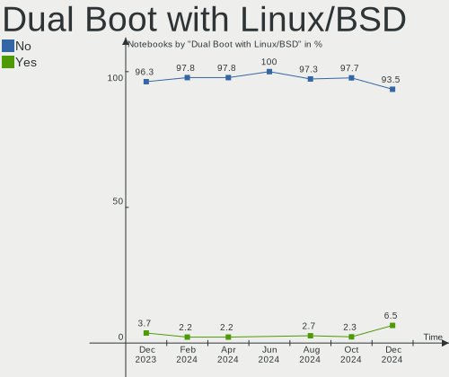
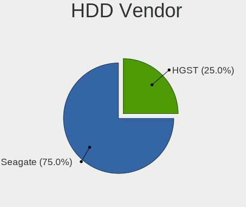
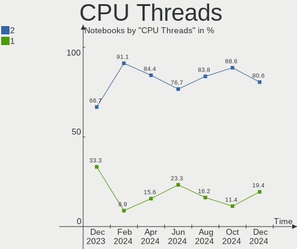

KDE neon - Hardware Trends (Notebooks)
--------------------------------------

A project to identify most popular hardware characteristics and track their change
over time based on data collected by Linux users at https://Linux-Hardware.org.

Anyone can contribute to this report by the [hw-probe](https://github.com/linuxhw/hw-probe) tool:

    sudo -E hw-probe -all -upload

This report is for one last month. Overall report since the beginning of time: [TestDays](https://github.com/linuxhw/TestDays)

Period: Jan, 2024.

Contents
--------

* [ System ](#system)
  - [ OS                       ](#os)
  - [ OS Family                ](#os-family)
  - [ Kernel                   ](#kernel)
  - [ Kernel Family            ](#kernel-family)
  - [ Kernel Major Ver.        ](#kernel-major-ver)
  - [ Arch                     ](#arch)
  - [ DE                       ](#de)
  - [ Display Server           ](#display-server)
  - [ Display Manager          ](#display-manager)
  - [ OS Lang                  ](#os-lang)
  - [ Boot Mode                ](#boot-mode)
  - [ Filesystem               ](#filesystem)
  - [ Part. scheme             ](#part-scheme)
  - [ Dual Boot with Linux/BSD ](#dual-boot-with-linuxbsd)
  - [ Dual Boot (Win)          ](#dual-boot-win)

* [ Board ](#board)
  - [ Vendor                   ](#vendor)
  - [ Model                    ](#model)
  - [ Model Family             ](#model-family)
  - [ MFG Year                 ](#mfg-year)
  - [ Form Factor              ](#form-factor)
  - [ Secure Boot              ](#secure-boot)
  - [ Coreboot                 ](#coreboot)
  - [ RAM Size                 ](#ram-size)
  - [ RAM Used                 ](#ram-used)
  - [ Total Drives             ](#total-drives)
  - [ Has CD-ROM               ](#has-cd-rom)
  - [ Has Ethernet             ](#has-ethernet)
  - [ Has WiFi                 ](#has-wifi)
  - [ Has Bluetooth            ](#has-bluetooth)

* [ Location ](#location)
  - [ Country                  ](#country)
  - [ City                     ](#city)

* [ Drives ](#drives)
  - [ Drive Vendor             ](#drive-vendor)
  - [ Drive Model              ](#drive-model)
  - [ HDD Vendor               ](#hdd-vendor)
  - [ SSD Vendor               ](#ssd-vendor)
  - [ Drive Kind               ](#drive-kind)
  - [ Drive Connector          ](#drive-connector)
  - [ Drive Size               ](#drive-size)
  - [ Space Total              ](#space-total)
  - [ Space Used               ](#space-used)
  - [ Malfunc. Drives          ](#malfunc-drives)
  - [ Malfunc. Drive Vendor    ](#malfunc-drive-vendor)
  - [ Malfunc. HDD Vendor      ](#malfunc-hdd-vendor)
  - [ Malfunc. Drive Kind      ](#malfunc-drive-kind)
  - [ Failed Drives            ](#failed-drives)
  - [ Failed Drive Vendor      ](#failed-drive-vendor)
  - [ Drive Status             ](#drive-status)

* [ Storage controller ](#storage-controller)
  - [ Storage Vendor           ](#storage-vendor)
  - [ Storage Model            ](#storage-model)
  - [ Storage Kind             ](#storage-kind)

* [ Processor ](#processor)
  - [ CPU Vendor               ](#cpu-vendor)
  - [ CPU Model                ](#cpu-model)
  - [ CPU Model Family         ](#cpu-model-family)
  - [ CPU Cores                ](#cpu-cores)
  - [ CPU Sockets              ](#cpu-sockets)
  - [ CPU Threads              ](#cpu-threads)
  - [ CPU Op-Modes             ](#cpu-op-modes)
  - [ CPU Microcode            ](#cpu-microcode)
  - [ CPU Microarch            ](#cpu-microarch)

* [ Graphics ](#graphics)
  - [ GPU Vendor               ](#gpu-vendor)
  - [ GPU Model                ](#gpu-model)
  - [ GPU Combo                ](#gpu-combo)
  - [ GPU Driver               ](#gpu-driver)
  - [ GPU Memory               ](#gpu-memory)

* [ Monitor ](#monitor)
  - [ Monitor Vendor           ](#monitor-vendor)
  - [ Monitor Model            ](#monitor-model)
  - [ Monitor Resolution       ](#monitor-resolution)
  - [ Monitor Diagonal         ](#monitor-diagonal)
  - [ Monitor Width            ](#monitor-width)
  - [ Aspect Ratio             ](#aspect-ratio)
  - [ Monitor Area             ](#monitor-area)
  - [ Pixel Density            ](#pixel-density)
  - [ Multiple Monitors        ](#multiple-monitors)

* [ Network ](#network)
  - [ Net Controller Vendor    ](#net-controller-vendor)
  - [ Net Controller Model     ](#net-controller-model)
  - [ Wireless Vendor          ](#wireless-vendor)
  - [ Wireless Model           ](#wireless-model)
  - [ Ethernet Vendor          ](#ethernet-vendor)
  - [ Ethernet Model           ](#ethernet-model)
  - [ Net Controller Kind      ](#net-controller-kind)
  - [ Used Controller          ](#used-controller)
  - [ NICs                     ](#nics)
  - [ IPv6                     ](#ipv6)

* [ Bluetooth ](#bluetooth)
  - [ Bluetooth Vendor         ](#bluetooth-vendor)
  - [ Bluetooth Model          ](#bluetooth-model)

* [ Sound ](#sound)
  - [ Sound Vendor             ](#sound-vendor)
  - [ Sound Model              ](#sound-model)

* [ Memory ](#memory)
  - [ Memory Vendor            ](#memory-vendor)
  - [ Memory Model             ](#memory-model)
  - [ Memory Kind              ](#memory-kind)
  - [ Memory Form Factor       ](#memory-form-factor)
  - [ Memory Size              ](#memory-size)
  - [ Memory Speed             ](#memory-speed)

* [ Printers & scanners ](#printers--scanners)
  - [ Printer Vendor           ](#printer-vendor)
  - [ Printer Model            ](#printer-model)
  - [ Scanner Vendor           ](#scanner-vendor)
  - [ Scanner Model            ](#scanner-model)

* [ Camera ](#camera)
  - [ Camera Vendor            ](#camera-vendor)
  - [ Camera Model             ](#camera-model)

* [ Security ](#security)
  - [ Fingerprint Vendor       ](#fingerprint-vendor)
  - [ Fingerprint Model        ](#fingerprint-model)
  - [ Chipcard Vendor          ](#chipcard-vendor)
  - [ Chipcard Model           ](#chipcard-model)

* [ Unsupported ](#unsupported)
  - [ Unsupported Devices      ](#unsupported-devices)
  - [ Unsupported Device Types ](#unsupported-device-types)

System
------

OS
--

Installed operating systems

| Name           | Notebooks | Percent |
|----------------|-----------|---------|
| KDE neon 22.04 | 41        | 97.62%  |
| KDE neon 20.04 | 1         | 2.38%   |

OS Family
---------

OS without a version

| Name     | Notebooks | Percent |
|----------|-----------|---------|
| KDE neon | 42        | 100%    |

Kernel
------

Version of the Linux kernel

| Version                | Notebooks | Percent |
|------------------------|-----------|---------|
| 6.2.0-39-generic       | 17        | 40.48%  |
| 6.5.0-14-generic       | 12        | 28.57%  |
| 6.5.0-15-generic       | 6         | 14.29%  |
| 6.6.9-1-liquorix-amd64 | 1         | 2.38%   |
| 6.5.6-060506-generic   | 1         | 2.38%   |
| 6.2.0-36-generic       | 1         | 2.38%   |
| 6.2.0-35-generic       | 1         | 2.38%   |
| 6.2.0-31-generic       | 1         | 2.38%   |
| 6.2.0-1013-nvidia      | 1         | 2.38%   |
| 5.15.0-48-generic      | 1         | 2.38%   |

Kernel Family
-------------

Linux kernel without a distro release

| Version | Notebooks | Percent |
|---------|-----------|---------|
| 6.2.0   | 21        | 50%     |
| 6.5.0   | 18        | 42.86%  |
| 6.6.9   | 1         | 2.38%   |
| 6.5.6   | 1         | 2.38%   |
| 5.15.0  | 1         | 2.38%   |

Kernel Major Ver.
-----------------

Linux kernel major version

| Version | Notebooks | Percent |
|---------|-----------|---------|
| 6.2     | 21        | 50%     |
| 6.5     | 19        | 45.24%  |
| 6.6     | 1         | 2.38%   |
| 5.15    | 1         | 2.38%   |

Arch
----

OS architecture (x86_64, i586, etc.)

| Name   | Notebooks | Percent |
|--------|-----------|---------|
| x86_64 | 42        | 100%    |

DE
--

Desktop Environment

| Name | Notebooks | Percent |
|------|-----------|---------|
| KDE5 | 39        | 92.86%  |
| KDE6 | 2         | 4.76%   |
| LXDE | 1         | 2.38%   |

Display Server
--------------

X11 or Wayland

| Name    | Notebooks | Percent |
|---------|-----------|---------|
| X11     | 35        | 83.33%  |
| Wayland | 7         | 16.67%  |

Display Manager
---------------

SDDM, LightDM, etc.

| Name    | Notebooks | Percent |
|---------|-----------|---------|
| Unknown | 29        | 69.05%  |
| SDDM    | 13        | 30.95%  |

OS Lang
-------

Language

| Lang  | Notebooks | Percent |
|-------|-----------|---------|
| en_US | 17        | 40.48%  |
| es_MX | 3         | 7.14%   |
| de_DE | 3         | 7.14%   |
| C     | 3         | 7.14%   |
| ru_RU | 2         | 4.76%   |
| fr_FR | 2         | 4.76%   |
| en_GB | 2         | 4.76%   |
| pt_PT | 1         | 2.38%   |
| pt_BR | 1         | 2.38%   |
| it_IT | 1         | 2.38%   |
| es_ES | 1         | 2.38%   |
| es_CO | 1         | 2.38%   |
| es_AR | 1         | 2.38%   |
| en_ZA | 1         | 2.38%   |
| en_PH | 1         | 2.38%   |
| en_AU | 1         | 2.38%   |
| cs_CZ | 1         | 2.38%   |

Boot Mode
---------

EFI or BIOS

| Mode | Notebooks | Percent |
|------|-----------|---------|
| BIOS | 34        | 80.95%  |
| EFI  | 8         | 19.05%  |

Filesystem
----------

Type of filesystem

| Type    | Notebooks | Percent |
|---------|-----------|---------|
| Ext4    | 35        | 83.33%  |
| Tmpfs   | 3         | 7.14%   |
| Btrfs   | 3         | 7.14%   |
| Overlay | 1         | 2.38%   |

Part. scheme
------------

Scheme of partitioning

| Type    | Notebooks | Percent |
|---------|-----------|---------|
| Unknown | 29        | 69.05%  |
| GPT     | 10        | 23.81%  |
| MBR     | 3         | 7.14%   |

Dual Boot with Linux/BSD
------------------------

Hosting more than one Linux/BSD

| Dual boot | Notebooks | Percent |
|-----------|-----------|---------|
| No        | 41        | 97.62%  |
| Yes       | 1         | 2.38%   |

Dual Boot (Win)
---------------

Hosting Linux and Windows

| Dual boot | Notebooks | Percent |
|-----------|-----------|---------|
| No        | 37        | 88.1%   |
| Yes       | 5         | 11.9%   |

Board
-----

Vendor
------

Motherboard manufacturer

| Name                | Notebooks | Percent |
|---------------------|-----------|---------|
| Dell                | 8         | 19.05%  |
| Lenovo              | 5         | 11.9%   |
| Hewlett-Packard     | 5         | 11.9%   |
| MSI                 | 4         | 9.52%   |
| Notebook            | 2         | 4.76%   |
| ASUSTek Computer    | 2         | 4.76%   |
| Acer                | 2         | 4.76%   |
| VPU Company         | 1         | 2.38%   |
| UNOWHY              | 1         | 2.38%   |
| UMAX                | 1         | 2.38%   |
| Toshiba             | 1         | 2.38%   |
| Timi                | 1         | 2.38%   |
| Sony                | 1         | 2.38%   |
| Samsung Electronics | 1         | 2.38%   |
| Razer               | 1         | 2.38%   |
| Intel               | 1         | 2.38%   |
| HUAWEI              | 1         | 2.38%   |
| Google              | 1         | 2.38%   |
| Gigabyte Technology | 1         | 2.38%   |
| Gateway             | 1         | 2.38%   |
| Apple               | 1         | 2.38%   |

Model
-----

Motherboard model

| Name                                               | Notebooks | Percent |
|----------------------------------------------------|-----------|---------|
| HP Laptop 15-da0xxx                                | 2         | 4.76%   |
| VPU Company VWNC71429-S                            | 1         | 2.38%   |
| UNOWHY Y13G010S4EI                                 | 1         | 2.38%   |
| UMAX VisionBook 14Wr Plus                          | 1         | 2.38%   |
| Toshiba Satellite L655                             | 1         | 2.38%   |
| Timi RedmiBook Pro 15S                             | 1         | 2.38%   |
| Sony SVF1521J7EW                                   | 1         | 2.38%   |
| Samsung RV420/RV520/RV720/E3530/S3530/E3420/E3520  | 1         | 2.38%   |
| Razer Blade 15 Base Model (Early 2021) - RZ09-0369 | 1         | 2.38%   |
| Notebook X170KM-G                                  | 1         | 2.38%   |
| Notebook N150CU                                    | 1         | 2.38%   |
| MSI MS-7D46                                        | 1         | 2.38%   |
| MSI Modern 15 B7M                                  | 1         | 2.38%   |
| MSI Bravo 17 A4DDR                                 | 1         | 2.38%   |
| MSI Bravo 15 B5DD                                  | 1         | 2.38%   |
| Lenovo ThinkPad T61 6464AS3                        | 1         | 2.38%   |
| Lenovo ThinkPad T495 20NKS1XW08                    | 1         | 2.38%   |
| Lenovo ThinkPad T450s 20BWS3ET0E                   | 1         | 2.38%   |
| Lenovo ThinkPad T14 Gen 2i 20W1SGQY00              | 1         | 2.38%   |
| Lenovo IdeaPad Y580 20132                          | 1         | 2.38%   |
| HUAWEI KLVL-WXXW                                   | 1         | 2.38%   |
| HP Pavilion 15                                     | 1         | 2.38%   |
| HP Laptop 15-dw0xxx                                | 1         | 2.38%   |
| HP EliteBook 735 G5                                | 1         | 2.38%   |
| Google Fleex                                       | 1         | 2.38%   |
| Gigabyte AORUS 17G XB                              | 1         | 2.38%   |
| Gateway NV59C                                      | 1         | 2.38%   |
| Dell XPS 13 9300                                   | 1         | 2.38%   |
| Dell Precision 7720                                | 1         | 2.38%   |
| Dell Latitude E6540                                | 1         | 2.38%   |
| Dell Latitude 5590                                 | 1         | 2.38%   |
| Dell Latitude 5480                                 | 1         | 2.38%   |
| Dell Latitude 3380                                 | 1         | 2.38%   |
| Dell Inspiron 13-5368                              | 1         | 2.38%   |
| Dell Inspiron 11-3157                              | 1         | 2.38%   |
| ASUS Zenbook UM5302TA_UM5302TA                     | 1         | 2.38%   |
| ASUS VivoBook 15_ASUS Laptop X540UBR               | 1         | 2.38%   |
| Apple MacBookPro9,2                                | 1         | 2.38%   |
| Acer TM8573T                                       | 1         | 2.38%   |
| Acer Aspire A515-44G                               | 1         | 2.38%   |

Model Family
------------

Motherboard model prefix

| Name                    | Notebooks | Percent |
|-------------------------|-----------|---------|
| Lenovo ThinkPad         | 4         | 9.52%   |
| Dell Latitude           | 4         | 9.52%   |
| HP Laptop               | 3         | 7.14%   |
| MSI Bravo               | 2         | 4.76%   |
| Dell Inspiron           | 2         | 4.76%   |
| VPU Company VWNC71429-S | 1         | 2.38%   |
| UNOWHY Y13G010S4EI      | 1         | 2.38%   |
| UMAX VisionBook         | 1         | 2.38%   |
| Toshiba Satellite       | 1         | 2.38%   |
| Timi RedmiBook          | 1         | 2.38%   |
| Sony SVF1521J7EW        | 1         | 2.38%   |
| Samsung RV420           | 1         | 2.38%   |
| Razer Blade             | 1         | 2.38%   |
| Notebook X170KM-G       | 1         | 2.38%   |
| Notebook N150CU         | 1         | 2.38%   |
| MSI MS-7D46             | 1         | 2.38%   |
| MSI Modern              | 1         | 2.38%   |
| Lenovo IdeaPad          | 1         | 2.38%   |
| HUAWEI KLVL-WXXW        | 1         | 2.38%   |
| HP Pavilion             | 1         | 2.38%   |
| HP EliteBook            | 1         | 2.38%   |
| Google Fleex            | 1         | 2.38%   |
| Gigabyte AORUS          | 1         | 2.38%   |
| Gateway NV59C           | 1         | 2.38%   |
| Dell XPS                | 1         | 2.38%   |
| Dell Precision          | 1         | 2.38%   |
| ASUS Zenbook            | 1         | 2.38%   |
| ASUS VivoBook           | 1         | 2.38%   |
| Apple MacBookPro9       | 1         | 2.38%   |
| Acer TM8573T            | 1         | 2.38%   |
| Acer Aspire             | 1         | 2.38%   |
| Unknown                 | 1         | 2.38%   |

MFG Year
--------

Motherboard manufacture year

| Year | Notebooks | Percent |
|------|-----------|---------|
| 2020 | 7         | 16.67%  |
| 2018 | 6         | 14.29%  |
| 2022 | 5         | 11.9%   |
| 2021 | 4         | 9.52%   |
| 2017 | 4         | 9.52%   |
| 2019 | 3         | 7.14%   |
| 2013 | 3         | 7.14%   |
| 2023 | 2         | 4.76%   |
| 2012 | 2         | 4.76%   |
| 2011 | 2         | 4.76%   |
| 2010 | 2         | 4.76%   |
| 2014 | 1         | 2.38%   |
| 2007 | 1         | 2.38%   |

Form Factor
-----------

Physical design of the computer

| Name     | Notebooks | Percent |
|----------|-----------|---------|
| Notebook | 42        | 100%    |

Secure Boot
-----------

Enabled or disabled

| State    | Notebooks | Percent |
|----------|-----------|---------|
| Disabled | 39        | 92.86%  |
| Enabled  | 3         | 7.14%   |

Coreboot
--------

Have coreboot on board

| Used | Notebooks | Percent |
|------|-----------|---------|
| No   | 41        | 97.62%  |
| Yes  | 1         | 2.38%   |

RAM Size
--------

Total RAM memory

| Size in GB  | Notebooks | Percent |
|-------------|-----------|---------|
| 8.01-16.0   | 12        | 28.57%  |
| 4.01-8.0    | 8         | 19.05%  |
| 16.01-24.0  | 8         | 19.05%  |
| 3.01-4.0    | 7         | 16.67%  |
| 32.01-64.0  | 3         | 7.14%   |
| 64.01-256.0 | 3         | 7.14%   |
| 1.01-2.0    | 1         | 2.38%   |

RAM Used
--------

Used RAM memory

| Used GB   | Notebooks | Percent |
|-----------|-----------|---------|
| 2.01-3.0  | 16        | 38.1%   |
| 4.01-8.0  | 10        | 23.81%  |
| 3.01-4.0  | 8         | 19.05%  |
| 1.01-2.0  | 6         | 14.29%  |
| 8.01-16.0 | 2         | 4.76%   |

Total Drives
------------

Number of drives on board

| Drives | Notebooks | Percent |
|--------|-----------|---------|
| 1      | 30        | 71.43%  |
| 2      | 10        | 23.81%  |
| 4      | 1         | 2.38%   |
| 3      | 1         | 2.38%   |

Has CD-ROM
----------

Has CD-ROM on board

| Presented | Notebooks | Percent |
|-----------|-----------|---------|
| No        | 32        | 76.19%  |
| Yes       | 10        | 23.81%  |

Has Ethernet
------------

Has Ethernet on board

| Presented | Notebooks | Percent |
|-----------|-----------|---------|
| Yes       | 32        | 76.19%  |
| No        | 10        | 23.81%  |

Has WiFi
--------

Has WiFi module

| Presented | Notebooks | Percent |
|-----------|-----------|---------|
| Yes       | 42        | 100%    |

Has Bluetooth
-------------

Has Bluetooth module

| Presented | Notebooks | Percent |
|-----------|-----------|---------|
| Yes       | 37        | 88.1%   |
| No        | 5         | 11.9%   |

Location
--------

Country
-------

Geographic location (country)

| Country      | Notebooks | Percent |
|--------------|-----------|---------|
| USA          | 10        | 23.81%  |
| Russia       | 4         | 9.52%   |
| Germany      | 4         | 9.52%   |
| Mexico       | 3         | 7.14%   |
| France       | 2         | 4.76%   |
| Czechia      | 2         | 4.76%   |
| Colombia     | 2         | 4.76%   |
| Brazil       | 2         | 4.76%   |
| Venezuela    | 1         | 2.38%   |
| Spain        | 1         | 2.38%   |
| South Africa | 1         | 2.38%   |
| Portugal     | 1         | 2.38%   |
| Philippines  | 1         | 2.38%   |
| Paraguay     | 1         | 2.38%   |
| Norway       | 1         | 2.38%   |
| Lithuania    | 1         | 2.38%   |
| Italy        | 1         | 2.38%   |
| Hungary      | 1         | 2.38%   |
| Bolivia      | 1         | 2.38%   |
| Austria      | 1         | 2.38%   |
| Australia    | 1         | 2.38%   |

City
----

Geographic location (city)

| City                | Notebooks | Percent |
|---------------------|-----------|---------|
| Moscow              | 2         | 4.76%   |
| Medellín           | 2         | 4.76%   |
| Zapopan             | 1         | 2.38%   |
| Wiesbaden           | 1         | 2.38%   |
| Wasilla             | 1         | 2.38%   |
| St Petersburg       | 1         | 2.38%   |
| Solikamsk           | 1         | 2.38%   |
| Roy                 | 1         | 2.38%   |
| Quezon City         | 1         | 2.38%   |
| Prague              | 1         | 2.38%   |
| Potosí             | 1         | 2.38%   |
| Piratininga         | 1         | 2.38%   |
| Pinhais             | 1         | 2.38%   |
| Phoenix             | 1         | 2.38%   |
| Olympia             | 1         | 2.38%   |
| Nulvi               | 1         | 2.38%   |
| New York            | 1         | 2.38%   |
| Madrid              | 1         | 2.38%   |
| Lephalale           | 1         | 2.38%   |
| Kreuztal            | 1         | 2.38%   |
| Krenglbach          | 1         | 2.38%   |
| Frisco              | 1         | 2.38%   |
| Fort Worth          | 1         | 2.38%   |
| Fort Wayne          | 1         | 2.38%   |
| Fana                | 1         | 2.38%   |
| Entroncamento       | 1         | 2.38%   |
| Corbeil-Essonnes    | 1         | 2.38%   |
| Cleveland           | 1         | 2.38%   |
| Choisy-en-Brie      | 1         | 2.38%   |
| Capiatá            | 1         | 2.38%   |
| Budapest            | 1         | 2.38%   |
| Brisbane            | 1         | 2.38%   |
| Bojkovice           | 1         | 2.38%   |
| Berlin              | 1         | 2.38%   |
| Bayreuth            | 1         | 2.38%   |
| Austin              | 1         | 2.38%   |
| Alytus              | 1         | 2.38%   |
| Agua Prieta         | 1         | 2.38%   |
| Acarigua            | 1         | 2.38%   |
| Acapulco de Juárez | 1         | 2.38%   |

Drives
------

Drive Vendor
------------

Hard drive vendors

| Vendor                         | Notebooks | Drives | Percent |
|--------------------------------|-----------|--------|---------|
| Unknown                        | 5         | 5      | 9.26%   |
| SK hynix                       | 4         | 4      | 7.41%   |
| Sandisk                        | 4         | 4      | 7.41%   |
| Samsung Electronics            | 4         | 4      | 7.41%   |
| Phison Electronics             | 4         | 4      | 7.41%   |
| Micron Technology              | 4         | 4      | 7.41%   |
| WDC                            | 3         | 3      | 5.56%   |
| Kingston                       | 3         | 3      | 5.56%   |
| Transcend                      | 2         | 2      | 3.7%    |
| SPCC                           | 2         | 2      | 3.7%    |
| Lexar                          | 2         | 2      | 3.7%    |
| HGST                           | 2         | 2      | 3.7%    |
| Toshiba                        | 1         | 1      | 1.85%   |
| Team                           | 1         | 1      | 1.85%   |
| SSSTC                          | 1         | 1      | 1.85%   |
| Solid State Storage Technology | 1         | 1      | 1.85%   |
| Silicon Motion                 | 1         | 1      | 1.85%   |
| Seagate                        | 1         | 1      | 1.85%   |
| Realtek Semiconductor          | 1         | 2      | 1.85%   |
| Patriot                        | 1         | 1      | 1.85%   |
| Micron/Crucial Technology      | 1         | 1      | 1.85%   |
| MaxDigital                     | 1         | 1      | 1.85%   |
| Hitachi                        | 1         | 1      | 1.85%   |
| China                          | 1         | 1      | 1.85%   |
| ADATA LE                       | 1         | 1      | 1.85%   |
| A-DATA Technology              | 1         | 1      | 1.85%   |
| Unknown                        | 1         | 1      | 1.85%   |

Drive Model
-----------

Hard drive models

| Model                                                 | Notebooks | Percent |
|-------------------------------------------------------|-----------|---------|
| Sandisk WD Blue SN550 NVMe SSD 512GB                  | 2         | 3.7%    |
| Phison PS5013 E13 NVMe Controller 256GB               | 2         | 3.7%    |
| WDC WDS120G2G0A-00JH30 120GB SSD                      | 1         | 1.85%   |
| WDC WD5000LPCX-75VHAT0 500GB                          | 1         | 1.85%   |
| WDC WD3200LPVX-75V0TT0 320GB                          | 1         | 1.85%   |
| Unknown MMC Card  64GB                                | 1         | 1.85%   |
| Unknown MMC Card  32GB                                | 1         | 1.85%   |
| Unknown FNX1TBMORM 1024GB                             | 1         | 1.85%   |
| Unknown DA4064  64GB                                  | 1         | 1.85%   |
| Unknown DA4032  32GB                                  | 1         | 1.85%   |
| Transcend TS128GMSA370 128GB SSD                      | 1         | 1.85%   |
| Transcend TS120GMTS420S 120GB SSD                     | 1         | 1.85%   |
| Toshiba MK3265GSX 320GB                               | 1         | 1.85%   |
| Team T253X6512G 512GB SSD                             | 1         | 1.85%   |
| SSSTC CV8-8E128-HP 128GB                              | 1         | 1.85%   |
| SPCC Solid State Disk 256GB                           | 1         | 1.85%   |
| SPCC Solid State Disk 128GB                           | 1         | 1.85%   |
| Solid State Storage SSSTC CL4-8D256-Q79 256GB         | 1         | 1.85%   |
| SK hynix HFS128G32TNF-N3A0A 128GB SSD                 | 1         | 1.85%   |
| SK hynix HFM001TD3JX013N 1024GB                       | 1         | 1.85%   |
| SK hynix BC711 HFM512GD3JX013N 512GB                  | 1         | 1.85%   |
| SK hynix BC501 HFM256GDJTNG-8310A 256GB               | 1         | 1.85%   |
| Silicon Motion SM2263EN/SM2263XT SSD Controller 128GB | 1         | 1.85%   |
| Seagate ST4000VX 016-3CV104 4TB                       | 1         | 1.85%   |
| SanDisk X400 M.2 2280 256GB SSD                       | 1         | 1.85%   |
| Sandisk WD Blue SN580 1TB                             | 1         | 1.85%   |
| Samsung SSD 860 EVO 500GB                             | 1         | 1.85%   |
| Samsung NVMe SSD Controller SM981/PM981/PM983 1TB     | 1         | 1.85%   |
| Samsung MZVL21T0HCLR-00B00 1TB                        | 1         | 1.85%   |
| Samsung MZ7LN256HCHP-000L7 256GB SSD                  | 1         | 1.85%   |
| Realtek T-FORCE TM8FP8002T 2TB                        | 1         | 1.85%   |
| Phison E12 NVMe Controller 1TB                        | 1         | 1.85%   |
| Phison Corsair MP600 CORE XT 2TB                      | 1         | 1.85%   |
| Patriot Blast 480GB SSD                               | 1         | 1.85%   |
| Micron/Crucial P2 NVMe PCIe SSD 1TB                   | 1         | 1.85%   |
| Micron 2400_MTFDKBA512QFM 512GB                       | 1         | 1.85%   |
| Micron 2300 NVMe 1024GB                               | 1         | 1.85%   |
| Micron 2210_MTFDHBA512QFD 512GB                       | 1         | 1.85%   |
| Micron 2210_MTFDHBA1T0QFD 1TB                         | 1         | 1.85%   |
| MaxDigital MD500GBLS                                  | 1         | 1.85%   |

HDD Vendor
----------

Hard disk drive vendors

| Vendor     | Notebooks | Drives | Percent |
|------------|-----------|--------|---------|
| WDC        | 2         | 2      | 25%     |
| HGST       | 2         | 2      | 25%     |
| Toshiba    | 1         | 1      | 12.5%   |
| Seagate    | 1         | 1      | 12.5%   |
| MaxDigital | 1         | 1      | 12.5%   |
| Hitachi    | 1         | 1      | 12.5%   |

SSD Vendor
----------

Solid state drive vendors

| Vendor              | Notebooks | Drives | Percent |
|---------------------|-----------|--------|---------|
| Transcend           | 2         | 2      | 11.11%  |
| SPCC                | 2         | 2      | 11.11%  |
| Samsung Electronics | 2         | 2      | 11.11%  |
| Kingston            | 2         | 2      | 11.11%  |
| WDC                 | 1         | 1      | 5.56%   |
| Team                | 1         | 1      | 5.56%   |
| SSSTC               | 1         | 1      | 5.56%   |
| SK hynix            | 1         | 1      | 5.56%   |
| SanDisk             | 1         | 1      | 5.56%   |
| Patriot             | 1         | 1      | 5.56%   |
| Lexar               | 1         | 1      | 5.56%   |
| China               | 1         | 1      | 5.56%   |
| ADATA LE            | 1         | 1      | 5.56%   |
| A-DATA Technology   | 1         | 1      | 5.56%   |

Drive Kind
----------

HDD or SSD

| Kind    | Notebooks | Drives | Percent |
|---------|-----------|--------|---------|
| NVMe    | 18        | 22     | 36%     |
| SSD     | 17        | 18     | 34%     |
| HDD     | 8         | 8      | 16%     |
| MMC     | 4         | 4      | 8%      |
| Unknown | 3         | 3      | 6%      |

Drive Connector
---------------

SATA, SAS, NVMe, etc.

| Type | Notebooks | Drives | Percent |
|------|-----------|--------|---------|
| SATA | 24        | 26     | 50%     |
| NVMe | 18        | 22     | 37.5%   |
| MMC  | 4         | 4      | 8.33%   |
| SAS  | 2         | 3      | 4.17%   |

Drive Size
----------

Size of hard drive

| Size in TB | Notebooks | Drives | Percent |
|------------|-----------|--------|---------|
| 0.01-0.5   | 20        | 21     | 80%     |
| 0.51-1.0   | 3         | 3      | 12%     |
| 3.01-4.0   | 1         | 1      | 4%      |
| 1.01-2.0   | 1         | 1      | 4%      |

Space Total
-----------

Amount of disk space available on the file system

| Size in GB     | Notebooks | Percent |
|----------------|-----------|---------|
| 251-500        | 12        | 28.57%  |
| 101-250        | 12        | 28.57%  |
| 21-50          | 5         | 11.9%   |
| 501-1000       | 5         | 11.9%   |
| 1001-2000      | 3         | 7.14%   |
| 1-20           | 2         | 4.76%   |
| More than 3000 | 1         | 2.38%   |
| 2001-3000      | 1         | 2.38%   |
| 51-100         | 1         | 2.38%   |

Space Used
----------

Amount of used disk space

| Used GB        | Notebooks | Percent |
|----------------|-----------|---------|
| 1-20           | 19        | 45.24%  |
| 21-50          | 10        | 23.81%  |
| 51-100         | 5         | 11.9%   |
| 251-500        | 3         | 7.14%   |
| 501-1000       | 2         | 4.76%   |
| More than 3000 | 1         | 2.38%   |
| 101-250        | 1         | 2.38%   |
| 1001-2000      | 1         | 2.38%   |

Malfunc. Drives
---------------

Drive models with a malfunction

Zero info for selected period =(

Malfunc. Drive Vendor
---------------------

Vendors of faulty drives

Zero info for selected period =(

Malfunc. HDD Vendor
-------------------

Vendors of faulty HDD drives

Zero info for selected period =(

Malfunc. Drive Kind
-------------------

Kinds of faulty drives

Zero info for selected period =(

Failed Drives
-------------

Failed drive models

Zero info for selected period =(

Failed Drive Vendor
-------------------

Failed drive vendors

Zero info for selected period =(

Drive Status
------------

Number of failed and malfunc. drives

| Status   | Notebooks | Drives | Percent |
|----------|-----------|--------|---------|
| Detected | 33        | 46     | 78.57%  |
| Works    | 9         | 9      | 21.43%  |

Storage controller
------------------

Storage Vendor
--------------

Storage controller vendors

| Vendor                         | Notebooks | Percent |
|--------------------------------|-----------|---------|
| Intel                          | 28        | 51.85%  |
| AMD                            | 5         | 9.26%   |
| Phison Electronics             | 4         | 7.41%   |
| Micron Technology              | 4         | 7.41%   |
| SK hynix                       | 3         | 5.56%   |
| Sandisk                        | 3         | 5.56%   |
| Samsung Electronics            | 2         | 3.7%    |
| Solid State Storage Technology | 1         | 1.85%   |
| Silicon Motion                 | 1         | 1.85%   |
| Realtek Semiconductor          | 1         | 1.85%   |
| Micron/Crucial Technology      | 1         | 1.85%   |
| Kingston Technology Company    | 1         | 1.85%   |

Storage Model
-------------

Storage controller models

| Model                                                                            | Notebooks | Percent |
|----------------------------------------------------------------------------------|-----------|---------|
| AMD FCH SATA Controller [AHCI mode]                                              | 5         | 9.09%   |
| Intel Sunrise Point-LP SATA Controller [AHCI mode]                               | 4         | 7.27%   |
| Intel Celeron/Pentium Silver Processor SATA Controller                           | 4         | 7.27%   |
| Intel 7 Series Chipset Family 6-port SATA Controller [AHCI mode]                 | 3         | 5.45%   |
| SK hynix Gold P31/BC711/PC711 NVMe Solid State Drive                             | 2         | 3.64%   |
| SanDisk Ultra 3D / WD Blue SN550 NVMe SSD                                        | 2         | 3.64%   |
| Phison PS5013-E13 PCIe3 NVMe Controller (DRAM-less)                              | 2         | 3.64%   |
| Micron 2210 NVMe SSD [Cobain]                                                    | 2         | 3.64%   |
| Intel Q170/Q150/B150/H170/H110/Z170/CM236 Chipset SATA Controller [AHCI Mode]    | 2         | 3.64%   |
| Intel 82801 Mobile SATA Controller [RAID mode]                                   | 2         | 3.64%   |
| Intel 6 Series/C200 Series Chipset Family 6 port Mobile SATA AHCI Controller     | 2         | 3.64%   |
| Intel 5 Series/3400 Series Chipset 4 port SATA AHCI Controller                   | 2         | 3.64%   |
| Solid State Storage CL4-8D512 NVMe SSD M.2 (DRAM-less)                           | 1         | 1.82%   |
| SK hynix BC501 NVMe Solid State Drive                                            | 1         | 1.82%   |
| Silicon Motion SM2263EN/SM2263XT (DRAM-less) NVMe SSD Controllers                | 1         | 1.82%   |
| Sandisk WD Blue SN580 NVMe SSD (DRAM-less)                                       | 1         | 1.82%   |
| Samsung NVMe SSD Controller SM981/PM981/PM983                                    | 1         | 1.82%   |
| Samsung NVMe SSD Controller PM9A1/PM9A3/980PRO                                   | 1         | 1.82%   |
| Realtek RTS5765DL NVMe SSD Controller (DRAM-less)                                | 1         | 1.82%   |
| Phison PS5021-E21 PCIe4 NVMe Controller (DRAM-less)                              | 1         | 1.82%   |
| Phison E12 NVMe Controller                                                       | 1         | 1.82%   |
| Micron/Crucial P2 [Nick P2] / P3 / P3 Plus NVMe PCIe SSD (DRAM-less)             | 1         | 1.82%   |
| Micron 2400 NVMe SSD (DRAM-less)                                                 | 1         | 1.82%   |
| Micron 2300 NVMe SSD [Santana]                                                   | 1         | 1.82%   |
| Kingston Company NV1 NVMe SSD SM2263XT (DRAM-less)                               | 1         | 1.82%   |
| Intel Wildcat Point-LP SATA Controller [AHCI Mode]                               | 1         | 1.82%   |
| Intel Tiger Lake-LP SATA Controller                                              | 1         | 1.82%   |
| Intel Comet Lake SATA AHCI Controller                                            | 1         | 1.82%   |
| Intel Atom/Celeron/Pentium Processor x5-E8000/J3xxx/N3xxx Series SATA Controller | 1         | 1.82%   |
| Intel Alder Lake-S PCH SATA Controller [AHCI Mode]                               | 1         | 1.82%   |
| Intel Alder Lake-P SATA AHCI Controller                                          | 1         | 1.82%   |
| Intel 82801HM/HEM (ICH8M/ICH8M-E) SATA Controller [AHCI mode]                    | 1         | 1.82%   |
| Intel 82801HM/HEM (ICH8M/ICH8M-E) IDE Controller                                 | 1         | 1.82%   |
| Intel 8 Series SATA Controller 1 [AHCI mode]                                     | 1         | 1.82%   |
| Intel 500 Series Chipset Family SATA AHCI Controller                             | 1         | 1.82%   |

Storage Kind
------------

Kind of storage controller (IDE, SATA, NVMe, SAS, ...)

| Kind | Notebooks | Percent |
|------|-----------|---------|
| SATA | 31        | 59.62%  |
| NVMe | 18        | 34.62%  |
| RAID | 2         | 3.85%   |
| IDE  | 1         | 1.92%   |

Processor
---------

CPU Vendor
----------

Processor vendors

| Vendor | Notebooks | Percent |
|--------|-----------|---------|
| Intel  | 33        | 78.57%  |
| AMD    | 9         | 21.43%  |

CPU Model
---------

Processor models

| Model                                           | Notebooks | Percent |
|-------------------------------------------------|-----------|---------|
| Intel Core i3 CPU M 350 @ 2.27GHz               | 2         | 4.76%   |
| Intel Celeron N4000 CPU @ 1.10GHz               | 2         | 4.76%   |
| AMD Ryzen 7 5800H with Radeon Graphics          | 2         | 4.76%   |
| Intel Pentium Silver N5000 CPU @ 1.10GHz        | 1         | 2.38%   |
| Intel Core i9-10900K CPU @ 3.70GHz              | 1         | 2.38%   |
| Intel Core i7-8650U CPU @ 1.90GHz               | 1         | 2.38%   |
| Intel Core i7-8550U CPU @ 1.80GHz               | 1         | 2.38%   |
| Intel Core i7-6820HQ CPU @ 2.70GHz              | 1         | 2.38%   |
| Intel Core i7-4610M CPU @ 3.00GHz               | 1         | 2.38%   |
| Intel Core i7-4510U CPU @ 2.00GHz               | 1         | 2.38%   |
| Intel Core i7-3630QM CPU @ 2.40GHz              | 1         | 2.38%   |
| Intel Core i7-3520M CPU @ 2.90GHz               | 1         | 2.38%   |
| Intel Core i7-10875H CPU @ 2.30GHz              | 1         | 2.38%   |
| Intel Core i7-10750H CPU @ 2.60GHz              | 1         | 2.38%   |
| Intel Core i7-1065G7 CPU @ 1.30GHz              | 1         | 2.38%   |
| Intel Core i7-10510U CPU @ 1.80GHz              | 1         | 2.38%   |
| Intel Core i5-6440HQ CPU @ 2.60GHz              | 1         | 2.38%   |
| Intel Core i5-5300U CPU @ 2.30GHz               | 1         | 2.38%   |
| Intel Core i5-2450M CPU @ 2.50GHz               | 1         | 2.38%   |
| Intel Core i5-2410M CPU @ 2.30GHz               | 1         | 2.38%   |
| Intel Core i3-7020U CPU @ 2.30GHz               | 1         | 2.38%   |
| Intel Core i3-6100U CPU @ 2.30GHz               | 1         | 2.38%   |
| Intel Core i3-6006U CPU @ 2.00GHz               | 1         | 2.38%   |
| Intel Core i3-3217U CPU @ 1.80GHz               | 1         | 2.38%   |
| Intel Core 2 Duo CPU T7100 @ 1.80GHz            | 1         | 2.38%   |
| Intel Celeron N4120 CPU @ 1.10GHz               | 1         | 2.38%   |
| Intel Celeron N4100 CPU @ 1.10GHz               | 1         | 2.38%   |
| Intel Celeron CPU N3050 @ 1.60GHz               | 1         | 2.38%   |
| Intel 13th Gen Core i5-13600KF                  | 1         | 2.38%   |
| Intel 12th Gen Core i7-1255U                    | 1         | 2.38%   |
| Intel 11th Gen Core i7-1185G7 @ 3.00GHz         | 1         | 2.38%   |
| Intel 11th Gen Core i7-1165G7 @ 2.80GHz         | 1         | 2.38%   |
| AMD Ryzen 7 PRO 2700U w/ Radeon Vega Mobile Gfx | 1         | 2.38%   |
| AMD Ryzen 7 6800U with Radeon Graphics          | 1         | 2.38%   |
| AMD Ryzen 7 4800H with Radeon Graphics          | 1         | 2.38%   |
| AMD Ryzen 5 PRO 3500U w/ Radeon Vega Mobile Gfx | 1         | 2.38%   |
| AMD Ryzen 5 7530U with Radeon Graphics          | 1         | 2.38%   |
| AMD Ryzen 5 5500U with Radeon Graphics          | 1         | 2.38%   |
| AMD Ryzen 5 4500U with Radeon Graphics          | 1         | 2.38%   |

CPU Model Family
----------------

Processor model prefix

| Model                | Notebooks | Percent |
|----------------------|-----------|---------|
| Intel Core i7        | 11        | 26.19%  |
| Intel Core i3        | 6         | 14.29%  |
| Intel Celeron        | 5         | 11.9%   |
| Other                | 4         | 9.52%   |
| Intel Core i5        | 4         | 9.52%   |
| AMD Ryzen 7          | 4         | 9.52%   |
| AMD Ryzen 5          | 3         | 7.14%   |
| Intel Pentium Silver | 1         | 2.38%   |
| Intel Core i9        | 1         | 2.38%   |
| Intel Core 2 Duo     | 1         | 2.38%   |
| AMD Ryzen 7 PRO      | 1         | 2.38%   |
| AMD Ryzen 5 PRO      | 1         | 2.38%   |

CPU Cores
---------

Number of processor cores

| Number | Notebooks | Percent |
|--------|-----------|---------|
| 2      | 16        | 38.1%   |
| 4      | 14        | 33.33%  |
| 8      | 5         | 11.9%   |
| 6      | 4         | 9.52%   |
| 10     | 2         | 4.76%   |
| 14     | 1         | 2.38%   |

CPU Sockets
-----------

Number of sockets

| Number | Notebooks | Percent |
|--------|-----------|---------|
| 1      | 42        | 100%    |

CPU Threads
-----------

Threads per core (Hyper-Threading)

| Number | Notebooks | Percent |
|--------|-----------|---------|
| 2      | 32        | 76.19%  |
| 1      | 10        | 23.81%  |

CPU Op-Modes
------------

CPU Operation Modes (32-bit, 64-bit)

| Op mode        | Notebooks | Percent |
|----------------|-----------|---------|
| 32-bit, 64-bit | 42        | 100%    |

CPU Microcode
-------------

Microcode number

| Number     | Notebooks | Percent |
|------------|-----------|---------|
| Unknown    | 37        | 88.1%   |
| 0x306a9    | 1         | 2.38%   |
| 0x0a50000d | 1         | 2.38%   |
| 0x0a404101 | 1         | 2.38%   |
| 0x08608102 | 1         | 2.38%   |
| 0x08600103 | 1         | 2.38%   |

CPU Microarch
-------------

Microarchitecture

| Name             | Notebooks | Percent |
|------------------|-----------|---------|
| Goldmont plus    | 5         | 11.9%   |
| Skylake          | 4         | 9.52%   |
| KabyLake         | 4         | 9.52%   |
| Zen 3            | 3         | 7.14%   |
| IvyBridge        | 3         | 7.14%   |
| CometLake        | 3         | 7.14%   |
| Unknown          | 3         | 7.14%   |
| Zen 2            | 2         | 4.76%   |
| Westmere         | 2         | 4.76%   |
| TigerLake        | 2         | 4.76%   |
| SandyBridge      | 2         | 4.76%   |
| Haswell          | 2         | 4.76%   |
| Zen+             | 1         | 2.38%   |
| Zen              | 1         | 2.38%   |
| Silvermont       | 1         | 2.38%   |
| IceLake          | 1         | 2.38%   |
| Core             | 1         | 2.38%   |
| Broadwell        | 1         | 2.38%   |
| Alderlake Hybrid | 1         | 2.38%   |

Graphics
--------

GPU Vendor
----------

Vendors of graphics cards

| Vendor | Notebooks | Percent |
|--------|-----------|---------|
| Intel  | 29        | 56.86%  |
| Nvidia | 11        | 21.57%  |
| AMD    | 11        | 21.57%  |

GPU Model
---------

Graphics card models

| Model                                                                                    | Notebooks | Percent |
|------------------------------------------------------------------------------------------|-----------|---------|
| Intel GeminiLake [UHD Graphics 600]                                                      | 4         | 7.27%   |
| Intel 3rd Gen Core processor Graphics Controller                                         | 3         | 5.45%   |
| Intel UHD Graphics 620                                                                   | 2         | 3.64%   |
| Intel TigerLake-LP GT2 [Iris Xe Graphics]                                                | 2         | 3.64%   |
| Intel Skylake GT2 [HD Graphics 520]                                                      | 2         | 3.64%   |
| Intel HD Graphics 530                                                                    | 2         | 3.64%   |
| Intel CometLake-H GT2 [UHD Graphics]                                                     | 2         | 3.64%   |
| AMD Renoir [Radeon RX Vega 6 (Ryzen 4000/5000 Mobile Series)]                            | 2         | 3.64%   |
| AMD Navi 14 [Radeon RX 5500/5500M / Pro 5500M]                                           | 2         | 3.64%   |
| AMD Cezanne [Radeon Vega Series / Radeon Vega Mobile Series]                             | 2         | 3.64%   |
| Nvidia TU104M [GeForce RTX 2070 SUPER Mobile / Max-Q]                                    | 1         | 1.82%   |
| Nvidia GM108M [GeForce MX130]                                                            | 1         | 1.82%   |
| Nvidia GM108M [GeForce MX110]                                                            | 1         | 1.82%   |
| Nvidia GM108M [GeForce 840M]                                                             | 1         | 1.82%   |
| Nvidia GM107GLM [Quadro M1200 Mobile]                                                    | 1         | 1.82%   |
| Nvidia GK208M [GeForce GT 740M]                                                          | 1         | 1.82%   |
| Nvidia GK107M [GeForce GTX 660M]                                                         | 1         | 1.82%   |
| Nvidia GF119M [GeForce GT 520M]                                                          | 1         | 1.82%   |
| Nvidia GA106 [GeForce RTX 3060 Lite Hash Rate]                                           | 1         | 1.82%   |
| Nvidia GA104M [GeForce RTX 3080 Mobile / Max-Q 8GB/16GB]                                 | 1         | 1.82%   |
| Nvidia GA104M [GeForce RTX 3070 Mobile / Max-Q]                                          | 1         | 1.82%   |
| Intel Mobile GM965/GL960 Integrated Graphics Controller (secondary)                      | 1         | 1.82%   |
| Intel Mobile GM965/GL960 Integrated Graphics Controller (primary)                        | 1         | 1.82%   |
| Intel Iris Plus Graphics G7                                                              | 1         | 1.82%   |
| Intel HD Graphics 620                                                                    | 1         | 1.82%   |
| Intel HD Graphics 5500                                                                   | 1         | 1.82%   |
| Intel Haswell-ULT Integrated Graphics Controller                                         | 1         | 1.82%   |
| Intel GeminiLake [UHD Graphics 605]                                                      | 1         | 1.82%   |
| Intel Core Processor Integrated Graphics Controller                                      | 1         | 1.82%   |
| Intel CometLake-U GT2 [UHD Graphics]                                                     | 1         | 1.82%   |
| Intel Atom/Celeron/Pentium Processor x5-E8000/J3xxx/N3xxx Integrated Graphics Controller | 1         | 1.82%   |
| Intel Alder Lake-UP3 GT2 [Iris Xe Graphics]                                              | 1         | 1.82%   |
| Intel 4th Gen Core Processor Integrated Graphics Controller                              | 1         | 1.82%   |
| Intel 2nd Generation Core Processor Family Integrated Graphics Controller                | 1         | 1.82%   |
| AMD RV710/M92 [Mobility Radeon HD 4530/4570/5145/530v/540v/545v]                         | 1         | 1.82%   |
| AMD Rembrandt [Radeon 680M]                                                              | 1         | 1.82%   |
| AMD Raven Ridge [Radeon Vega Series / Radeon Vega Mobile Series]                         | 1         | 1.82%   |
| AMD Picasso/Raven 2 [Radeon Vega Series / Radeon Vega Mobile Series]                     | 1         | 1.82%   |
| AMD Mars XTX [Radeon HD 8790M]                                                           | 1         | 1.82%   |
| AMD Lucienne                                                                             | 1         | 1.82%   |

GPU Combo
---------

Combinations of graphics cards

| Name           | Notebooks | Percent |
|----------------|-----------|---------|
| 1 x Intel      | 19        | 45.24%  |
| Intel + Nvidia | 8         | 19.05%  |
| 1 x AMD        | 7         | 16.67%  |
| 2 x AMD        | 3         | 7.14%   |
| 1 x Nvidia     | 3         | 7.14%   |
| Other          | 1         | 2.38%   |
| Intel + AMD    | 1         | 2.38%   |

GPU Driver
----------

Free vs proprietary

| Driver      | Notebooks | Percent |
|-------------|-----------|---------|
| Free        | 35        | 83.33%  |
| Proprietary | 6         | 14.29%  |
| Unknown     | 1         | 2.38%   |

GPU Memory
----------

Total video memory

| Size in GB | Notebooks | Percent |
|------------|-----------|---------|
| Unknown    | 34        | 80.95%  |
| 1.01-2.0   | 4         | 9.52%   |
| 0.01-0.5   | 2         | 4.76%   |
| 3.01-4.0   | 1         | 2.38%   |
| 0.51-1.0   | 1         | 2.38%   |

Monitor
-------

Monitor Vendor
--------------

Monitor vendors

| Vendor                  | Notebooks | Percent |
|-------------------------|-----------|---------|
| AU Optronics            | 11        | 22.45%  |
| BOE                     | 9         | 18.37%  |
| Samsung Electronics     | 7         | 14.29%  |
| LG Display              | 4         | 8.16%   |
| Chimei Innolux          | 4         | 8.16%   |
| Goldstar                | 2         | 4.08%   |
| TMX                     | 1         | 2.04%   |
| Sharp                   | 1         | 2.04%   |
| JDZ                     | 1         | 2.04%   |
| ITE                     | 1         | 2.04%   |
| InfoVision              | 1         | 2.04%   |
| IBM                     | 1         | 2.04%   |
| Hewlett-Packard         | 1         | 2.04%   |
| HannStar                | 1         | 2.04%   |
| Dell                    | 1         | 2.04%   |
| Chi Mei Optoelectronics | 1         | 2.04%   |
| Apple                   | 1         | 2.04%   |
| Acer                    | 1         | 2.04%   |

Monitor Model
-------------

Monitor models

| Model                                                                    | Notebooks | Percent |
|--------------------------------------------------------------------------|-----------|---------|
| TMX TL156MDMP01-0 TMX1560 3200x2000 336x210mm 15.6-inch                  | 1         | 2.04%   |
| Sharp LCD Monitor SHP14CC 3840x2400 288x180mm 13.4-inch                  | 1         | 2.04%   |
| Samsung Electronics SyncMaster SAM0656 1920x1080 510x287mm 23.0-inch     | 1         | 2.04%   |
| Samsung Electronics S27E390 SAM0C1C 1920x1080 598x336mm 27.0-inch        | 1         | 2.04%   |
| Samsung Electronics S24D300 SAM0B43 1920x1080 531x299mm 24.0-inch        | 1         | 2.04%   |
| Samsung Electronics LCD Monitor SDC4C48 1920x1080 344x194mm 15.5-inch    | 1         | 2.04%   |
| Samsung Electronics LCD Monitor SDC4172 2880x1800 289x186mm 13.5-inch    | 1         | 2.04%   |
| Samsung Electronics LCD Monitor SAM7016 3840x2160 1872x1053mm 84.6-inch  | 1         | 2.04%   |
| Samsung Electronics LCD Monitor SAM07D0 1360x768 700x390mm 31.5-inch     | 1         | 2.04%   |
| LG Display LCD Monitor LGD066C 1920x1080 382x215mm 17.3-inch             | 1         | 2.04%   |
| LG Display LCD Monitor LGD05FA 1920x1080 309x174mm 14.0-inch             | 1         | 2.04%   |
| LG Display LCD Monitor LGD031C 1366x768 345x194mm 15.6-inch              | 1         | 2.04%   |
| LG Display LCD Monitor LGD01E9 1920x1080 345x194mm 15.6-inch             | 1         | 2.04%   |
| JDZ LCD Monitor JDZ002D 1920x1080 294x165mm 13.3-inch                    | 1         | 2.04%   |
| ITE DP2HDMI 1760 ITE80AC 1920x1080 600x340mm 27.2-inch                   | 1         | 2.04%   |
| InfoVision LCD Monitor IVO057D 1920x1080 309x174mm 14.0-inch             | 1         | 2.04%   |
| IBM LCD Monitor IBM2887 1680x1050 331x207mm 15.4-inch                    | 1         | 2.04%   |
| Hewlett-Packard 24fw HPN3545 1920x1080 527x296mm 23.8-inch               | 1         | 2.04%   |
| HannStar HL161ABB HSD61C7 1366x768 344x193mm 15.5-inch                   | 1         | 2.04%   |
| Goldstar HDR 4K GSM7750 3840x2160 697x392mm 31.5-inch                    | 1         | 2.04%   |
| Goldstar E2011 GSM4ED4 1600x900 443x249mm 20.0-inch                      | 1         | 2.04%   |
| Dell P2314H DEL409A 1920x1080 510x290mm 23.1-inch                        | 1         | 2.04%   |
| Chimei Innolux LCD Monitor CMN15E7 1920x1080 344x193mm 15.5-inch         | 1         | 2.04%   |
| Chimei Innolux LCD Monitor CMN152A 2560x1440 344x193mm 15.5-inch         | 1         | 2.04%   |
| Chimei Innolux LCD Monitor CMN14B1 1920x1080 308x173mm 13.9-inch         | 1         | 2.04%   |
| Chimei Innolux LCD Monitor CMN142B 1920x1080 309x173mm 13.9-inch         | 1         | 2.04%   |
| Chi Mei Optoelectronics LCD Monitor CMO1721 1600x900 382x215mm 17.3-inch | 1         | 2.04%   |
| BOE LCD Monitor BOE0A14 2560x1440 344x194mm 15.5-inch                    | 1         | 2.04%   |
| BOE LCD Monitor BOE09DE 1920x1080 309x174mm 14.0-inch                    | 1         | 2.04%   |
| BOE LCD Monitor BOE0893 2160x1440 296x197mm 14.0-inch                    | 1         | 2.04%   |
| BOE LCD Monitor BOE076F 1366x768 344x194mm 15.5-inch                     | 1         | 2.04%   |
| BOE LCD Monitor BOE0708 1366x768 277x156mm 12.5-inch                     | 1         | 2.04%   |
| BOE LCD Monitor BOE06E2 1920x1080 309x173mm 13.9-inch                    | 1         | 2.04%   |
| BOE LCD Monitor BOE06A7 1920x1080 294x165mm 13.3-inch                    | 1         | 2.04%   |
| BOE LCD Monitor BOE069C 1920x1080 344x193mm 15.5-inch                    | 1         | 2.04%   |
| BOE LCD Monitor BOE064A 1366x768 256x144mm 11.6-inch                     | 1         | 2.04%   |
| AU Optronics LCD Monitor AUODF87 1920x1080 344x193mm 15.5-inch           | 1         | 2.04%   |
| AU Optronics LCD Monitor AUO978F 1920x1080 382x215mm 17.3-inch           | 1         | 2.04%   |
| AU Optronics LCD Monitor AUO80ED 1920x1080 344x193mm 15.5-inch           | 1         | 2.04%   |
| AU Optronics LCD Monitor AUO63ED 1920x1080 344x193mm 15.5-inch           | 1         | 2.04%   |

Monitor Resolution
------------------

Monitor screen resolution

| Resolution         | Notebooks | Percent |
|--------------------|-----------|---------|
| 1920x1080 (FHD)    | 24        | 52.17%  |
| 1366x768 (WXGA)    | 8         | 17.39%  |
| 3840x2160 (4K)     | 3         | 6.52%   |
| 2560x1440 (QHD)    | 2         | 4.35%   |
| 1600x900 (HD+)     | 2         | 4.35%   |
| 3840x2400          | 1         | 2.17%   |
| 3200x2000          | 1         | 2.17%   |
| 2880x1800          | 1         | 2.17%   |
| 2160x1440          | 1         | 2.17%   |
| 1680x1050 (WSXGA+) | 1         | 2.17%   |
| 1360x768           | 1         | 2.17%   |
| 1280x800 (WXGA)    | 1         | 2.17%   |

Monitor Diagonal
----------------

Diagonal size in inches

| Inches | Notebooks | Percent |
|--------|-----------|---------|
| 15     | 16        | 32.65%  |
| 13     | 8         | 16.33%  |
| 17     | 5         | 10.2%   |
| 14     | 4         | 8.16%   |
| 27     | 3         | 6.12%   |
| 31     | 2         | 4.08%   |
| 24     | 2         | 4.08%   |
| 23     | 2         | 4.08%   |
| 11     | 2         | 4.08%   |
| 84     | 1         | 2.04%   |
| 21     | 1         | 2.04%   |
| 20     | 1         | 2.04%   |
| 18     | 1         | 2.04%   |
| 12     | 1         | 2.04%   |

Monitor Width
-------------

Physical width

| Width in mm | Notebooks | Percent |
|-------------|-----------|---------|
| 301-350     | 22        | 45.83%  |
| 201-300     | 9         | 18.75%  |
| 501-600     | 6         | 12.5%   |
| 351-400     | 5         | 10.42%  |
| 401-500     | 3         | 6.25%   |
| 601-700     | 2         | 4.17%   |
| 1501-2000   | 1         | 2.08%   |

Aspect Ratio
------------

Proportional relationship between the width and the height

| Ratio | Notebooks | Percent |
|-------|-----------|---------|
| 16/9  | 37        | 86.05%  |
| 16/10 | 5         | 11.63%  |
| 3/2   | 1         | 2.33%   |

Monitor Area
------------

Area in inch²

| Area in inch² | Notebooks | Percent |
|----------------|-----------|---------|
| 101-110        | 16        | 32.65%  |
| 81-90          | 9         | 18.37%  |
| 201-250        | 5         | 10.2%   |
| 121-130        | 5         | 10.2%   |
| 71-80          | 3         | 6.12%   |
| 301-350        | 3         | 6.12%   |
| 51-60          | 2         | 4.08%   |
| 351-500        | 2         | 4.08%   |
| More than 1000 | 1         | 2.04%   |
| 61-70          | 1         | 2.04%   |
| 151-200        | 1         | 2.04%   |
| 141-150        | 1         | 2.04%   |

Pixel Density
-------------

Pixels per inch

| Density       | Notebooks | Percent |
|---------------|-----------|---------|
| 121-160       | 21        | 43.75%  |
| 101-120       | 9         | 18.75%  |
| 51-100        | 8         | 16.67%  |
| 161-240       | 5         | 10.42%  |
| More than 240 | 4         | 8.33%   |
| 1-50          | 1         | 2.08%   |

Multiple Monitors
-----------------

Total monitors connected

| Total | Notebooks | Percent |
|-------|-----------|---------|
| 1     | 32        | 76.19%  |
| 2     | 8         | 19.05%  |
| 3     | 1         | 2.38%   |
| 0     | 1         | 2.38%   |

Network
-------

Net Controller Vendor
---------------------

Controller vendors

| Vendor                          | Notebooks | Percent |
|---------------------------------|-----------|---------|
| Realtek Semiconductor           | 25        | 37.88%  |
| Intel                           | 23        | 34.85%  |
| Qualcomm Atheros                | 6         | 9.09%   |
| Broadcom                        | 6         | 9.09%   |
| MediaTek                        | 2         | 3.03%   |
| TP-Link                         | 1         | 1.52%   |
| Sierra Wireless                 | 1         | 1.52%   |
| Qualcomm Atheros Communications | 1         | 1.52%   |
| Motorola PCS                    | 1         | 1.52%   |

Net Controller Model
--------------------

Controller models

| Model                                                                  | Notebooks | Percent |
|------------------------------------------------------------------------|-----------|---------|
| Realtek RTL8111/8168/8211/8411 PCI Express Gigabit Ethernet Controller | 15        | 18.75%  |
| Intel Wi-Fi 6 AX200                                                    | 4         | 5%      |
| Broadcom BCM43142 802.11b/g/n                                          | 3         | 3.75%   |
| Realtek RTL8153 Gigabit Ethernet Adapter                               | 2         | 2.5%    |
| Realtek 802.11n WLAN Adapter                                           | 2         | 2.5%    |
| Qualcomm Atheros QCA6174 802.11ac Wireless Network Adapter             | 2         | 2.5%    |
| Intel Wireless 8265 / 8275                                             | 2         | 2.5%    |
| Intel Wireless 3165                                                    | 2         | 2.5%    |
| Intel Wi-Fi 6 AX201                                                    | 2         | 2.5%    |
| Intel Ethernet Connection (5) I219-LM                                  | 2         | 2.5%    |
| TP-Link Archer T2U PLUS [RTL8821AU]                                    | 1         | 1.25%   |
| Sierra Wireless EM7345 4G LTE                                          | 1         | 1.25%   |
| Realtek RTL8852BE PCIe 802.11ax Wireless Network Controller            | 1         | 1.25%   |
| Realtek RTL8822CE 802.11ac PCIe Wireless Network Adapter               | 1         | 1.25%   |
| Realtek RTL8822BE 802.11a/b/g/n/ac WiFi adapter                        | 1         | 1.25%   |
| Realtek RTL8821CE 802.11ac PCIe Wireless Network Adapter               | 1         | 1.25%   |
| Realtek RTL8723DE Wireless Network Adapter                             | 1         | 1.25%   |
| Realtek RTL8723BE PCIe Wireless Network Adapter                        | 1         | 1.25%   |
| Realtek RTL8191SEvB Wireless LAN Controller                            | 1         | 1.25%   |
| Realtek RTL8188EUS 802.11n Wireless Network Adapter                    | 1         | 1.25%   |
| Realtek RTL810xE PCI Express Fast Ethernet controller                  | 1         | 1.25%   |
| Realtek Killer E3000 2.5GbE Controller                                 | 1         | 1.25%   |
| Realtek Killer E2600 GbE Controller                                    | 1         | 1.25%   |
| Qualcomm Atheros QCA9377 802.11ac Wireless Network Adapter             | 1         | 1.25%   |
| Qualcomm Atheros AR9271 802.11n                                        | 1         | 1.25%   |
| Qualcomm Atheros AR928X Wireless Network Adapter (PCI-Express)         | 1         | 1.25%   |
| Qualcomm Atheros AR8161 Gigabit Ethernet                               | 1         | 1.25%   |
| Qualcomm Atheros AR8152 v1.1 Fast Ethernet                             | 1         | 1.25%   |
| Motorola PCS moto g 5G - 2023                                          | 1         | 1.25%   |
| MediaTek MT7922 802.11ax PCI Express Wireless Network Adapter          | 1         | 1.25%   |
| MediaTek MT7921K (RZ608) Wi-Fi 6E 80MHz                                | 1         | 1.25%   |
| Intel Wireless 8260                                                    | 1         | 1.25%   |
| Intel Wireless 7265                                                    | 1         | 1.25%   |
| Intel Wi-Fi 6E(802.11ax) AX210/AX1675* 2x2 [Typhoon Peak]              | 1         | 1.25%   |
| Intel Wi-Fi 5(802.11ac) Wireless-AC 9x6x [Thunder Peak]                | 1         | 1.25%   |
| Intel Tiger Lake PCH CNVi WiFi                                         | 1         | 1.25%   |
| Intel PRO/Wireless 4965 AG or AGN [Kedron] Network Connection          | 1         | 1.25%   |
| Intel Ice Lake-LP PCH CNVi WiFi                                        | 1         | 1.25%   |
| Intel Gemini Lake PCH CNVi WiFi                                        | 1         | 1.25%   |
| Intel Ethernet Connection I217-LM                                      | 1         | 1.25%   |

Wireless Vendor
---------------

Wireless vendors

| Vendor                          | Notebooks | Percent |
|---------------------------------|-----------|---------|
| Intel                           | 23        | 50%     |
| Realtek Semiconductor           | 10        | 21.74%  |
| Qualcomm Atheros                | 4         | 8.7%    |
| Broadcom                        | 4         | 8.7%    |
| MediaTek                        | 2         | 4.35%   |
| TP-Link                         | 1         | 2.17%   |
| Sierra Wireless                 | 1         | 2.17%   |
| Qualcomm Atheros Communications | 1         | 2.17%   |

Wireless Model
--------------

Wireless models

| Model                                                          | Notebooks | Percent |
|----------------------------------------------------------------|-----------|---------|
| Intel Wi-Fi 6 AX200                                            | 4         | 8.7%    |
| Broadcom BCM43142 802.11b/g/n                                  | 3         | 6.52%   |
| Realtek 802.11n WLAN Adapter                                   | 2         | 4.35%   |
| Qualcomm Atheros QCA6174 802.11ac Wireless Network Adapter     | 2         | 4.35%   |
| Intel Wireless 8265 / 8275                                     | 2         | 4.35%   |
| Intel Wireless 3165                                            | 2         | 4.35%   |
| Intel Wi-Fi 6 AX201                                            | 2         | 4.35%   |
| TP-Link Archer T2U PLUS [RTL8821AU]                            | 1         | 2.17%   |
| Sierra Wireless EM7345 4G LTE                                  | 1         | 2.17%   |
| Realtek RTL8852BE PCIe 802.11ax Wireless Network Controller    | 1         | 2.17%   |
| Realtek RTL8822CE 802.11ac PCIe Wireless Network Adapter       | 1         | 2.17%   |
| Realtek RTL8822BE 802.11a/b/g/n/ac WiFi adapter                | 1         | 2.17%   |
| Realtek RTL8821CE 802.11ac PCIe Wireless Network Adapter       | 1         | 2.17%   |
| Realtek RTL8723DE Wireless Network Adapter                     | 1         | 2.17%   |
| Realtek RTL8723BE PCIe Wireless Network Adapter                | 1         | 2.17%   |
| Realtek RTL8191SEvB Wireless LAN Controller                    | 1         | 2.17%   |
| Realtek RTL8188EUS 802.11n Wireless Network Adapter            | 1         | 2.17%   |
| Qualcomm Atheros QCA9377 802.11ac Wireless Network Adapter     | 1         | 2.17%   |
| Qualcomm Atheros AR9271 802.11n                                | 1         | 2.17%   |
| Qualcomm Atheros AR928X Wireless Network Adapter (PCI-Express) | 1         | 2.17%   |
| MediaTek MT7922 802.11ax PCI Express Wireless Network Adapter  | 1         | 2.17%   |
| MediaTek MT7921K (RZ608) Wi-Fi 6E 80MHz                        | 1         | 2.17%   |
| Intel Wireless 8260                                            | 1         | 2.17%   |
| Intel Wireless 7265                                            | 1         | 2.17%   |
| Intel Wi-Fi 6E(802.11ax) AX210/AX1675* 2x2 [Typhoon Peak]      | 1         | 2.17%   |
| Intel Wi-Fi 5(802.11ac) Wireless-AC 9x6x [Thunder Peak]        | 1         | 2.17%   |
| Intel Tiger Lake PCH CNVi WiFi                                 | 1         | 2.17%   |
| Intel PRO/Wireless 4965 AG or AGN [Kedron] Network Connection  | 1         | 2.17%   |
| Intel Ice Lake-LP PCH CNVi WiFi                                | 1         | 2.17%   |
| Intel Gemini Lake PCH CNVi WiFi                                | 1         | 2.17%   |
| Intel Comet Lake PCH CNVi WiFi                                 | 1         | 2.17%   |
| Intel Centrino Wireless-N 2200                                 | 1         | 2.17%   |
| Intel Centrino Advanced-N 6235                                 | 1         | 2.17%   |
| Intel Centrino Advanced-N 6205 [Taylor Peak]                   | 1         | 2.17%   |
| Intel Alder Lake-P PCH CNVi WiFi                               | 1         | 2.17%   |
| Broadcom BCM4331 802.11a/b/g/n                                 | 1         | 2.17%   |

Ethernet Vendor
---------------

Ethernet vendors

| Vendor                | Notebooks | Percent |
|-----------------------|-----------|---------|
| Realtek Semiconductor | 19        | 59.38%  |
| Intel                 | 8         | 25%     |
| Broadcom              | 3         | 9.38%   |
| Qualcomm Atheros      | 2         | 6.25%   |

Ethernet Model
--------------

Ethernet models

| Model                                                                  | Notebooks | Percent |
|------------------------------------------------------------------------|-----------|---------|
| Realtek RTL8111/8168/8211/8411 PCI Express Gigabit Ethernet Controller | 15        | 45.45%  |
| Realtek RTL8153 Gigabit Ethernet Adapter                               | 2         | 6.06%   |
| Intel Ethernet Connection (5) I219-LM                                  | 2         | 6.06%   |
| Realtek RTL810xE PCI Express Fast Ethernet controller                  | 1         | 3.03%   |
| Realtek Killer E3000 2.5GbE Controller                                 | 1         | 3.03%   |
| Realtek Killer E2600 GbE Controller                                    | 1         | 3.03%   |
| Qualcomm Atheros AR8161 Gigabit Ethernet                               | 1         | 3.03%   |
| Qualcomm Atheros AR8152 v1.1 Fast Ethernet                             | 1         | 3.03%   |
| Intel Ethernet Connection I217-LM                                      | 1         | 3.03%   |
| Intel Ethernet Connection (4) I219-LM                                  | 1         | 3.03%   |
| Intel Ethernet Connection (3) I218-LM                                  | 1         | 3.03%   |
| Intel Ethernet Connection (17) I219-V                                  | 1         | 3.03%   |
| Intel Ethernet Connection (13) I219-LM                                 | 1         | 3.03%   |
| Intel 82566MM Gigabit Network Connection                               | 1         | 3.03%   |
| Broadcom NetXtreme BCM57765 Gigabit Ethernet PCIe                      | 1         | 3.03%   |
| Broadcom NetXtreme BCM57761 Gigabit Ethernet PCIe                      | 1         | 3.03%   |
| Broadcom NetLink BCM57780 Gigabit Ethernet PCIe                        | 1         | 3.03%   |

Net Controller Kind
-------------------

Ethernet, WiFi or modem

| Kind     | Notebooks | Percent |
|----------|-----------|---------|
| WiFi     | 42        | 56%     |
| Ethernet | 32        | 42.67%  |
| Unknown  | 1         | 1.33%   |

Used Controller
---------------

Currently used network controller

| Kind     | Notebooks | Percent |
|----------|-----------|---------|
| WiFi     | 36        | 83.72%  |
| Ethernet | 7         | 16.28%  |

NICs
----

Total network controllers on board

| Total | Notebooks | Percent |
|-------|-----------|---------|
| 2     | 29        | 69.05%  |
| 1     | 11        | 26.19%  |
| 3     | 1         | 2.38%   |
| 0     | 1         | 2.38%   |

IPv6
----

IPv6 vs IPv4

| Used | Notebooks | Percent |
|------|-----------|---------|
| No   | 28        | 66.67%  |
| Yes  | 14        | 33.33%  |

Bluetooth
---------

Bluetooth Vendor
----------------

Controller vendors

| Vendor                          | Notebooks | Percent |
|---------------------------------|-----------|---------|
| Intel                           | 19        | 51.35%  |
| Realtek Semiconductor           | 4         | 10.81%  |
| Foxconn / Hon Hai               | 4         | 10.81%  |
| Broadcom                        | 2         | 5.41%   |
| TP-Link                         | 1         | 2.7%    |
| Realtek                         | 1         | 2.7%    |
| Qualcomm Atheros Communications | 1         | 2.7%    |
| Opticis                         | 1         | 2.7%    |
| MediaTek                        | 1         | 2.7%    |
| Lite-On Technology              | 1         | 2.7%    |
| IMC Networks                    | 1         | 2.7%    |
| Apple                           | 1         | 2.7%    |

Bluetooth Model
---------------

Controller models

| Model                                           | Notebooks | Percent |
|-------------------------------------------------|-----------|---------|
| Intel Bluetooth wireless interface              | 6         | 15.79%  |
| Intel AX201 Bluetooth                           | 5         | 13.16%  |
| Intel AX200 Bluetooth                           | 4         | 10.53%  |
| Realtek  Bluetooth 4.2 Adapter                  | 3         | 7.89%   |
| Intel Bluetooth 9460/9560 Jefferson Peak (JfP)  | 2         | 5.26%   |
| TP-Link UB500 Adapter                           | 1         | 2.63%   |
| Realtek Bluetooth Radio                         | 1         | 2.63%   |
| Realtek Bluetooth Radio                         | 1         | 2.63%   |
| Qualcomm Atheros  Bluetooth Device              | 1         | 2.63%   |
| Opticis Bluetooth Radio                         | 1         | 2.63%   |
| MediaTek Wireless_Device                        | 1         | 2.63%   |
| Lite-On Bluetooth Device                        | 1         | 2.63%   |
| Intel Wireless-AC 9260 Bluetooth Adapter        | 1         | 2.63%   |
| Intel Centrino Bluetooth Wireless Transceiver   | 1         | 2.63%   |
| IMC Networks Bluetooth Device                   | 1         | 2.63%   |
| Foxconn / Hon Hai Wireless_Device               | 1         | 2.63%   |
| Foxconn / Hon Hai Broadcom BCM20702 Bluetooth   | 1         | 2.63%   |
| Foxconn / Hon Hai Bluetooth USB Host Controller | 1         | 2.63%   |
| Foxconn / Hon Hai BCM43142A0                    | 1         | 2.63%   |
| Broadcom BCM43142A0 Bluetooth Device            | 1         | 2.63%   |
| Broadcom BCM43142 Bluetooth 4.0                 | 1         | 2.63%   |
| Broadcom BCM20702A0 Bluetooth 4.0               | 1         | 2.63%   |
| Apple Bluetooth USB Host Controller             | 1         | 2.63%   |

Sound
-----

Sound Vendor
------------

Sound card vendors

| Vendor                 | Notebooks | Percent |
|------------------------|-----------|---------|
| Intel                  | 33        | 62.26%  |
| AMD                    | 10        | 18.87%  |
| Nvidia                 | 6         | 11.32%  |
| Logitech               | 2         | 3.77%   |
| Sony                   | 1         | 1.89%   |
| Generalplus Technology | 1         | 1.89%   |

Sound Model
-----------

Sound card models

| Model                                                                                             | Notebooks | Percent |
|---------------------------------------------------------------------------------------------------|-----------|---------|
| AMD Family 17h/19h HD Audio Controller                                                            | 8         | 12.31%  |
| Intel Sunrise Point-LP HD Audio                                                                   | 5         | 7.69%   |
| Intel Celeron/Pentium Silver Processor High Definition Audio                                      | 5         | 7.69%   |
| AMD Renoir Radeon High Definition Audio Controller                                                | 5         | 7.69%   |
| Intel 7 Series/C216 Chipset Family High Definition Audio Controller                               | 3         | 4.62%   |
| Nvidia GA104 High Definition Audio Controller                                                     | 2         | 3.08%   |
| Intel Tiger Lake-LP Smart Sound Technology Audio Controller                                       | 2         | 3.08%   |
| Intel Comet Lake PCH cAVS                                                                         | 2         | 3.08%   |
| Intel CM238 HD Audio Controller                                                                   | 2         | 3.08%   |
| Intel 6 Series/C200 Series Chipset Family High Definition Audio Controller                        | 2         | 3.08%   |
| Intel 5 Series/3400 Series Chipset High Definition Audio                                          | 2         | 3.08%   |
| AMD Raven/Raven2/Fenghuang HDMI/DP Audio Controller                                               | 2         | 3.08%   |
| AMD Navi 10 HDMI Audio                                                                            | 2         | 3.08%   |
| Sony DualSense wireless controller (PS5)                                                          | 1         | 1.54%   |
| Nvidia TU104 HD Audio Controller                                                                  | 1         | 1.54%   |
| Nvidia GM107 High Definition Audio Controller [GeForce 940MX]                                     | 1         | 1.54%   |
| Nvidia GF119 HDMI Audio Controller                                                                | 1         | 1.54%   |
| Nvidia GA106 High Definition Audio Controller                                                     | 1         | 1.54%   |
| Logitech Blue Microphones                                                                         | 1         | 1.54%   |
| Logitech 960 Headset                                                                              | 1         | 1.54%   |
| Intel Xeon E3-1200 v3/4th Gen Core Processor HD Audio Controller                                  | 1         | 1.54%   |
| Intel Wildcat Point-LP High Definition Audio Controller                                           | 1         | 1.54%   |
| Intel Smart Sound Technology (SST) Audio Controller                                               | 1         | 1.54%   |
| Intel Ice Lake-LP Smart Sound Technology Audio Controller                                         | 1         | 1.54%   |
| Intel Haswell-ULT HD Audio Controller                                                             | 1         | 1.54%   |
| Intel Comet Lake PCH-LP cAVS                                                                      | 1         | 1.54%   |
| Intel Broadwell-U Audio Controller                                                                | 1         | 1.54%   |
| Intel Atom/Celeron/Pentium Processor x5-E8000/J3xxx/N3xxx Series High Definition Audio Controller | 1         | 1.54%   |
| Intel Alder Lake-S HD Audio Controller                                                            | 1         | 1.54%   |
| Intel Alder Lake PCH-P High Definition Audio Controller                                           | 1         | 1.54%   |
| Intel 82801H (ICH8 Family) HD Audio Controller                                                    | 1         | 1.54%   |
| Intel 8 Series/C220 Series Chipset High Definition Audio Controller                               | 1         | 1.54%   |
| Intel 8 Series HD Audio Controller                                                                | 1         | 1.54%   |
| Generalplus Technology USB Audio Device                                                           | 1         | 1.54%   |
| AMD RV710/730 HDMI Audio [Radeon HD 4000 series]                                                  | 1         | 1.54%   |
| AMD Rembrandt Radeon High Definition Audio Controller                                             | 1         | 1.54%   |

Memory
------

Memory Vendor
-------------

Memory module vendors

| Vendor              | Notebooks | Percent |
|---------------------|-----------|---------|
| Samsung Electronics | 6         | 35.29%  |
| SK hynix            | 3         | 17.65%  |
| Crucial             | 2         | 11.76%  |
| Unknown (ABCD)      | 1         | 5.88%   |
| Unknown             | 1         | 5.88%   |
| Kingston            | 1         | 5.88%   |
| ff                  | 1         | 5.88%   |
| Corsair             | 1         | 5.88%   |
| 4ea5                | 1         | 5.88%   |

Memory Model
------------

Memory module models

| Model                                                               | Notebooks | Percent |
|---------------------------------------------------------------------|-----------|---------|
| Unknown RAM Module 1GB SODIMM DDR2 667MT/s                          | 1         | 5.56%   |
| Unknown (ABCD) RAM 123456789012345678 2048MB SODIMM LPDDR4 2400MT/s | 1         | 5.56%   |
| SK hynix RAM HMT351S6BFR8C-H9 4GB SODIMM DDR3 1333MT/s              | 1         | 5.56%   |
| SK hynix RAM HMAA1GS6CMR6N-VK 8GB SODIMM DDR4 2667MT/s              | 1         | 5.56%   |
| SK hynix RAM HMA81GS6MFR8N-UH 8GB SODIMM DDR4 2400MT/s              | 1         | 5.56%   |
| Samsung RAM Module 8GB SODIMM DDR4 2667MT/s                         | 1         | 5.56%   |
| Samsung RAM M471A1K43DB1-CWE 8GB SODIMM DDR4 3200MT/s               | 1         | 5.56%   |
| Samsung RAM M471A1G44BB0-CWE 8GB SODIMM DDR4 3200MT/s               | 1         | 5.56%   |
| Samsung RAM M471A1G44AB0-CWE 8GB Row Of Chips DDR4 3200MT/s         | 1         | 5.56%   |
| Samsung RAM K4F8E304HB-MGCJ 1GB LPDDR4 2400MT/s                     | 1         | 5.56%   |
| Samsung RAM K3LKBKB0BM-MGCP 4GB SODIMM LPDDR5 6400MT/s              | 1         | 5.56%   |
| Kingston RAM 9905428-401.A00LF 8GB SODIMM DDR3 1600MT/s             | 1         | 5.56%   |
| Kingston RAM 9905428-087.A00G 8GB SODIMM DDR3 1600MT/s              | 1         | 5.56%   |
| ff RAM K4F8E304HB-MGCJ 1GB LPDDR4 2400MT/s                          | 1         | 5.56%   |
| Crucial RAM CT8G4SFS832A.M8FR 8GB SODIMM DDR4 3200MT/s              | 1         | 5.56%   |
| Crucial RAM CT8G4SFRA32A.M8FR 8GB SODIMM DDR4 3200MT/s              | 1         | 5.56%   |
| Corsair RAM CMSO8GX3M1A1333C9 8GB SODIMM DDR3 1334MT/s              | 1         | 5.56%   |
| 4ea5 RAM K4F8E304HB-MGCJ 1GB LPDDR4 2400MT/s                        | 1         | 5.56%   |

Memory Kind
-----------

Memory module kinds

| Kind   | Notebooks | Percent |
|--------|-----------|---------|
| DDR4   | 6         | 50%     |
| LPDDR4 | 2         | 16.67%  |
| DDR3   | 2         | 16.67%  |
| LPDDR5 | 1         | 8.33%   |
| DDR2   | 1         | 8.33%   |

Memory Form Factor
------------------

Physical design of the memory module

| Name         | Notebooks | Percent |
|--------------|-----------|---------|
| SODIMM       | 10        | 83.33%  |
| Row Of Chips | 1         | 8.33%   |
| Unknown      | 1         | 8.33%   |

Memory Size
-----------

Memory module size

| Size | Notebooks | Percent |
|------|-----------|---------|
| 8192 | 9         | 69.23%  |
| 4096 | 2         | 15.38%  |
| 1024 | 2         | 15.38%  |

Memory Speed
------------

Memory module speed

| Speed | Notebooks | Percent |
|-------|-----------|---------|
| 3200  | 5         | 33.33%  |
| 2400  | 3         | 20%     |
| 2667  | 2         | 13.33%  |
| 6400  | 1         | 6.67%   |
| 1600  | 1         | 6.67%   |
| 1334  | 1         | 6.67%   |
| 1333  | 1         | 6.67%   |
| 667   | 1         | 6.67%   |

Printers & scanners
-------------------

Printer Vendor
--------------

Printer device vendors

Zero info for selected period =(

Printer Model
-------------

Printer device models

Zero info for selected period =(

Scanner Vendor
--------------

Scanner device vendors

Zero info for selected period =(

Scanner Model
-------------

Scanner device models

Zero info for selected period =(

Camera
------

Camera Vendor
-------------

Camera device vendors

| Vendor                        | Notebooks | Percent |
|-------------------------------|-----------|---------|
| Realtek Semiconductor         | 5         | 12.82%  |
| Chicony Electronics           | 5         | 12.82%  |
| Sunplus Innovation Technology | 4         | 10.26%  |
| IMC Networks                  | 4         | 10.26%  |
| Bison Electronics             | 4         | 10.26%  |
| Microdia                      | 3         | 7.69%   |
| USB Camera                    | 1         | 2.56%   |
| Suyin                         | 1         | 2.56%   |
| SunplusIT                     | 1         | 2.56%   |
| Silicon Motion                | 1         | 2.56%   |
| Samsung Electronics           | 1         | 2.56%   |
| Razer USA                     | 1         | 2.56%   |
| Quanta                        | 1         | 2.56%   |
| Motorola PCS                  | 1         | 2.56%   |
| Luxvisions Innotech Limited   | 1         | 2.56%   |
| Logitech                      | 1         | 2.56%   |
| Lite-On Technology            | 1         | 2.56%   |
| Apple                         | 1         | 2.56%   |
| Alcor Micro                   | 1         | 2.56%   |
| Acer                          | 1         | 2.56%   |

Camera Model
------------

Camera device models

| Model                                                       | Notebooks | Percent |
|-------------------------------------------------------------|-----------|---------|
| Sunplus Integrated_Webcam_HD                                | 3         | 7.69%   |
| Realtek Integrated_Webcam_HD                                | 3         | 7.69%   |
| USB Camera USB Camera                                       | 1         | 2.56%   |
| Suyin 1.3M WebCam (notebook emachines E730, Acer sub-brand) | 1         | 2.56%   |
| SunplusIT PC Camera                                         | 1         | 2.56%   |
| Sunplus XiaoMi USB 2.0 Webcam                               | 1         | 2.56%   |
| Silicon Motion WebCam SCB-0385N                             | 1         | 2.56%   |
| Samsung Galaxy series, misc. (MTP mode)                     | 1         | 2.56%   |
| Realtek USB Camera                                          | 1         | 2.56%   |
| Realtek Integrated Webcam                                   | 1         | 2.56%   |
| Razer USA Razer Kiyo Pro                                    | 1         | 2.56%   |
| Quanta HD User Facing                                       | 1         | 2.56%   |
| Motorola PCS XT1033 [Moto G], PTP mode                      | 1         | 2.56%   |
| Microdia Sonix USB 2.0 Camera                               | 1         | 2.56%   |
| Microdia Integrated_Webcam_HD                               | 1         | 2.56%   |
| Microdia Integrated Webcam                                  | 1         | 2.56%   |
| Luxvisions Innotech Limited HP TrueVision HD Camera         | 1         | 2.56%   |
| Logitech Webcam C925e                                       | 1         | 2.56%   |
| Lite-On HP TrueVision HD Camera                             | 1         | 2.56%   |
| IMC Networks USB2.0 HD UVC WebCam                           | 1         | 2.56%   |
| IMC Networks USB Camera                                     | 1         | 2.56%   |
| IMC Networks Integrated Camera                              | 1         | 2.56%   |
| IMC Networks HD Camera                                      | 1         | 2.56%   |
| Chicony USB2.0 VGA UVC WebCam                               | 1         | 2.56%   |
| Chicony USB2.0 Camera                                       | 1         | 2.56%   |
| Chicony Integrated Camera                                   | 1         | 2.56%   |
| Chicony HP HD Camera                                        | 1         | 2.56%   |
| Chicony CNF9055 Toshiba Webcam                              | 1         | 2.56%   |
| Bison Lenovo EasyCamera                                     | 1         | 2.56%   |
| Bison HD Webcam                                             | 1         | 2.56%   |
| Bison Front Camera                                          | 1         | 2.56%   |
| Bison BisonCam,NB Pro                                       | 1         | 2.56%   |
| Apple FaceTime HD Camera                                    | 1         | 2.56%   |
| Alcor Micro Acer Integrated Webcam                          | 1         | 2.56%   |
| Acer HD Webcam                                              | 1         | 2.56%   |

Security
--------

Fingerprint Vendor
------------------

Fingerprint sensor vendors

| Vendor                     | Notebooks | Percent |
|----------------------------|-----------|---------|
| Synaptics                  | 4         | 57.14%  |
| Shenzhen Goodix Technology | 2         | 28.57%  |
| LighTuning Technology      | 1         | 14.29%  |

Fingerprint Model
-----------------

Fingerprint sensor models

| Model                                             | Notebooks | Percent |
|---------------------------------------------------|-----------|---------|
| Synaptics Prometheus MIS Touch Fingerprint Reader | 2         | 28.57%  |
| Unknown                                           | 2         | 28.57%  |
| Shenzhen Goodix  Fingerprint Device               | 1         | 14.29%  |
| Shenzhen Goodix FingerPrint                       | 1         | 14.29%  |
| LighTuning ES603 Swipe Fingerprint Sensor         | 1         | 14.29%  |

Chipcard Vendor
---------------

Chipcard module vendors

| Vendor                | Notebooks | Percent |
|-----------------------|-----------|---------|
| Broadcom              | 2         | 66.67%  |
| Gemalto (was Gemplus) | 1         | 33.33%  |

Chipcard Model
--------------

Chipcard module models

| Model                                             | Notebooks | Percent |
|---------------------------------------------------|-----------|---------|
| Broadcom 5880                                     | 2         | 66.67%  |
| Gemalto (was Gemplus) GemPC Twin SmartCard Reader | 1         | 33.33%  |

Unsupported
-----------

Unsupported Devices
-------------------

Total unsupported devices on board

| Total | Notebooks | Percent |
|-------|-----------|---------|
| 0     | 28        | 66.67%  |
| 1     | 12        | 28.57%  |
| 2     | 2         | 4.76%   |

Unsupported Device Types
------------------------

Types of unsupported devices

| Type                  | Notebooks | Percent |
|-----------------------|-----------|---------|
| Fingerprint reader    | 7         | 38.89%  |
| Chipcard              | 4         | 22.22%  |
| Net/wireless          | 2         | 11.11%  |
| Graphics card         | 2         | 11.11%  |
| Camera                | 2         | 11.11%  |
| Multimedia controller | 1         | 5.56%   |

