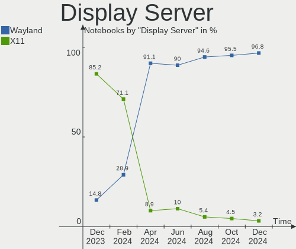
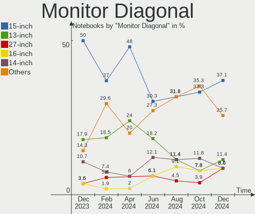

KDE neon Hardware Trends (Notebook)
-----------------------------------

A project to identify most popular hardware characteristics and track their change
over time based on data collected by KDE neon users at https://Linux-Hardware.org.

Anyone can contribute to the study by uploading probes of their computers by
the [hw-probe](https://github.com/linuxhw/hw-probe) tool:

    sudo -E hw-probe -all -upload

Full-feature report is available here: https://linux-hardware.org/?view=trends&formfactor=notebook

Period: Oct, 2020.

Contents
--------

- [ OS                       ](#os)
- [ OS Family                ](#os-family)
- [ Kernel                   ](#kernel)
- [ Kernel Family            ](#kernel-family)
- [ Kernel Major Ver.        ](#kernel-major-ver)
- [ Arch                     ](#arch)
- [ DE                       ](#de)
- [ Display Server           ](#display-server)
- [ Display Manager          ](#display-manager)
- [ OS Lang                  ](#os-lang)
- [ Boot Mode                ](#boot-mode)
- [ Filesystem               ](#filesystem)
- [ Part. scheme             ](#part-scheme)
- [ Dual Boot with Linux/BSD ](#dual-boot-with-linux/bsd)
- [ Dual Boot (Win)          ](#dual-boot-win)
- [ Country                  ](#country)
- [ City                     ](#city)
- [ Vendor                   ](#vendor)
- [ Model                    ](#model)
- [ Model Family             ](#model-family)
- [ MFG Year                 ](#mfg-year)
- [ Form Factor              ](#form-factor)
- [ Secure Boot              ](#secure-boot)
- [ Coreboot                 ](#coreboot)
- [ RAM Size                 ](#ram-size)
- [ RAM Used                 ](#ram-used)
- [ Has CD-ROM               ](#has-cd-rom)
- [ Total Drives             ](#total-drives)
- [ Has Ethernet             ](#has-ethernet)
- [ Drive Vendor             ](#drive-vendor)
- [ HDD Vendor               ](#hdd-vendor)
- [ SSD Vendor               ](#ssd-vendor)
- [ Drive Model              ](#drive-model)
- [ Drive Kind               ](#drive-kind)
- [ Drive Connector          ](#drive-connector)
- [ Drive Size               ](#drive-size)
- [ Space Total              ](#space-total)
- [ Space Used               ](#space-used)
- [ Malfunc. Drives          ](#malfunc-drives)
- [ Malfunc. Drive Vendor    ](#malfunc-drive-vendor)
- [ Malfunc. HDD Vendor      ](#malfunc-hdd-vendor)
- [ Malfunc. Drive Kind      ](#malfunc-drive-kind)
- [ Failed Drives            ](#failed-drives)
- [ Failed Drive Vendor      ](#failed-drive-vendor)
- [ Drive Status             ](#drive-status)
- [ Storage Vendor           ](#storage-vendor)
- [ Storage Model            ](#storage-model)
- [ Storage Kind             ](#storage-kind)
- [ CPU Vendor               ](#cpu-vendor)
- [ CPU Model                ](#cpu-model)
- [ CPU Model Family         ](#cpu-model-family)
- [ CPU Cores                ](#cpu-cores)
- [ CPU Sockets              ](#cpu-sockets)
- [ CPU Threads              ](#cpu-threads)
- [ CPU Op-Modes             ](#cpu-op-modes)
- [ CPU Microcode            ](#cpu-microcode)
- [ CPU Microarch            ](#cpu-microarch)
- [ GPU Vendor               ](#gpu-vendor)
- [ GPU Model                ](#gpu-model)
- [ GPU Combo                ](#gpu-combo)
- [ GPU Driver               ](#gpu-driver)
- [ GPU Memory               ](#gpu-memory)
- [ Monitor Vendor           ](#monitor-vendor)
- [ Monitor Model            ](#monitor-model)
- [ Monitor Resolution       ](#monitor-resolution)
- [ Monitor Diagonal         ](#monitor-diagonal)
- [ Monitor Width            ](#monitor-width)
- [ Aspect Ratio             ](#aspect-ratio)
- [ Monitor Area             ](#monitor-area)
- [ Pixel Density            ](#pixel-density)
- [ Multiple Monitors        ](#multiple-monitors)
- [ Net Controller Vendor    ](#net-controller-vendor)
- [ Net Controller Model     ](#net-controller-model)
- [ Wireless Vendor          ](#wireless-vendor)
- [ Wireless Model           ](#wireless-model)
- [ Ethernet Vendor          ](#ethernet-vendor)
- [ Ethernet Model           ](#ethernet-model)
- [ Net Controller Kind      ](#net-controller-kind)
- [ Used Controller          ](#used-controller)
- [ NICs                     ](#nics)
- [ Memory Vendor            ](#memory-vendor)
- [ Memory Model             ](#memory-model)
- [ Memory Kind              ](#memory-kind)
- [ Memory Form Factor       ](#memory-form-factor)
- [ Memory Size              ](#memory-size)
- [ Memory Speed             ](#memory-speed)
- [ Sound Vendor             ](#sound-vendor)
- [ Sound Model              ](#sound-model)
- [ Camera Vendor            ](#camera-vendor)
- [ Camera Model             ](#camera-model)
- [ Fingerprint Vendor       ](#fingerprint-vendor)
- [ Fingerprint Model        ](#fingerprint-model)
- [ Chipcard Vendor          ](#chipcard-vendor)
- [ Chipcard Model           ](#chipcard-model)
- [ Printer Vendor           ](#printer-vendor)
- [ Printer Model            ](#printer-model)
- [ Scanner Vendor           ](#scanner-vendor)
- [ Scanner Model            ](#scanner-model)
- [ Bluetooth Vendor         ](#bluetooth-vendor)
- [ Bluetooth Model          ](#bluetooth-model)
- [ Unsupported Devices      ](#unsupported-devices)
- [ Unsupported Device Types ](#unsupported-device-types)

OS
--

Installed operating systems

| Name           | Notebooks | Percent |
|----------------|-----------|---------|
| KDE neon 20.04 | 54        | 100%    |

OS Family
---------

OS without a version

| Name     | Notebooks | Percent |
|----------|-----------|---------|
| KDE neon | 54        | 100%    |

Kernel
------

Version of the Linux kernel

| Version                 | Notebooks | Percent |
|-------------------------|-----------|---------|
| 5.4.0-52-generic        | 27        | 50%     |
| 5.4.0-48-generic        | 13        | 24.07%  |
| 5.4.0-51-generic        | 10        | 18.52%  |
| 5.9.0-050900rc8-generic | 1         | 1.85%   |
| 5.8.7-050807-generic    | 1         | 1.85%   |
| 5.8.14-xanmod1          | 1         | 1.85%   |
| 5.8.13-050813-generic   | 1         | 1.85%   |

Kernel Family
-------------

Linux kernel without a distro release

| Version | Notebooks | Percent |
|---------|-----------|---------|
| 5.4.0   | 50        | 92.59%  |
| 5.9.0   | 1         | 1.85%   |
| 5.8.7   | 1         | 1.85%   |
| 5.8.14  | 1         | 1.85%   |
| 5.8.13  | 1         | 1.85%   |

Kernel Major Ver.
-----------------

Linux kernel major version

| Version | Notebooks | Percent |
|---------|-----------|---------|
| 5.4     | 50        | 92.59%  |
| 5.8     | 3         | 5.56%   |
| 5.9     | 1         | 1.85%   |

Arch
----

OS architecture (x86_64, i586, etc.)

| Name   | Notebooks | Percent |
|--------|-----------|---------|
| x86_64 | 54        | 100%    |

DE
--

Desktop Environment

| Name | Notebooks | Percent |
|------|-----------|---------|
| KDE  | 49        | 90.74%  |
| KDE5 | 5         | 9.26%   |

Display Server
--------------

X11 or Wayland

| Name    | Notebooks | Percent |
|---------|-----------|---------|
| X11     | 53        | 98.15%  |
| Wayland | 1         | 1.85%   |

Display Manager
---------------

SDDM, LightDM, etc.

| Name    | Notebooks | Percent |
|---------|-----------|---------|
| Unknown | 48        | 88.89%  |
| SDDM    | 6         | 11.11%  |

OS Lang
-------

Language

| Lang  | Notebooks | Percent |
|-------|-----------|---------|
| en_US | 18        | 33.33%  |
| de_DE | 6         | 11.11%  |
| en_GB | 4         | 7.41%   |
| ru_RU | 3         | 5.56%   |
| pt_BR | 3         | 5.56%   |
| C     | 3         | 5.56%   |
| it_IT | 2         | 3.7%    |
| es_ES | 2         | 3.7%    |
| zh_TW | 1         | 1.85%   |
| uz_UZ | 1         | 1.85%   |
| ru_UA | 1         | 1.85%   |
| pt_PT | 1         | 1.85%   |
| nl_NL | 1         | 1.85%   |
| es_SV | 1         | 1.85%   |
| es_HN | 1         | 1.85%   |
| es_CO | 1         | 1.85%   |
| en_ZA | 1         | 1.85%   |
| en_IN | 1         | 1.85%   |
| en_CA | 1         | 1.85%   |
| en_AU | 1         | 1.85%   |
| de_AT | 1         | 1.85%   |

Boot Mode
---------

EFI or BIOS

| Mode | Notebooks | Percent |
|------|-----------|---------|
| EFI  | 33        | 61.11%  |
| BIOS | 21        | 38.89%  |

Filesystem
----------

Type of filesystem

| Type    | Notebooks | Percent |
|---------|-----------|---------|
| Ext4    | 51        | 94.44%  |
| Overlay | 3         | 5.56%   |

Part. scheme
------------

Scheme of partitioning

| Type    | Notebooks | Percent |
|---------|-----------|---------|
| Unknown | 49        | 90.74%  |
| GPT     | 4         | 7.41%   |
| MBR     | 1         | 1.85%   |

Dual Boot with Linux/BSD
------------------------

Hosting more than one Linux/BSD

| Dual boot | Notebooks | Percent |
|-----------|-----------|---------|
| No        | 53        | 98.15%  |
| Yes       | 1         | 1.85%   |

Dual Boot (Win)
---------------

Hosting Linux and Windows

| Dual boot | Notebooks | Percent |
|-----------|-----------|---------|
| No        | 46        | 85.19%  |
| Yes       | 8         | 14.81%  |

Country
-------

Geographic location (country)

| Country        | Notebooks | Percent |
|----------------|-----------|---------|
| USA            | 12        | 22.22%  |
| Germany        | 6         | 11.11%  |
| Ukraine        | 3         | 5.56%   |
| Italy          | 3         | 5.56%   |
| Brazil         | 3         | 5.56%   |
| UK             | 2         | 3.7%    |
| Russia         | 2         | 3.7%    |
| Venezuela      | 1         | 1.85%   |
| Uzbekistan     | 1         | 1.85%   |
| Taiwan         | 1         | 1.85%   |
| Switzerland    | 1         | 1.85%   |
| Spain          | 1         | 1.85%   |
| South Africa   | 1         | 1.85%   |
| Portugal       | 1         | 1.85%   |
| Poland         | 1         | 1.85%   |
| Nicaragua      | 1         | 1.85%   |
| Netherlands    | 1         | 1.85%   |
| Kazakhstan     | 1         | 1.85%   |
| Japan          | 1         | 1.85%   |
| Iran           | 1         | 1.85%   |
| Indonesia      | 1         | 1.85%   |
| India          | 1         | 1.85%   |
| Honduras       | 1         | 1.85%   |
| Denmark        | 1         | 1.85%   |
| Czech Republic | 1         | 1.85%   |
| Colombia       | 1         | 1.85%   |
| Canada         | 1         | 1.85%   |
| Austria        | 1         | 1.85%   |
| Australia      | 1         | 1.85%   |
| Andorra        | 1         | 1.85%   |

City
----

Geographic location (city)

| City              | Notebooks | Percent |
|-------------------|-----------|---------|
| Zurich            | 1         | 1.85%   |
| Třebíč         | 1         | 1.85%   |
| Trieste           | 1         | 1.85%   |
| Tashkent          | 1         | 1.85%   |
| Taipei            | 1         | 1.85%   |
| Surabaya          | 1         | 1.85%   |
| Stoke-on-Trent    | 1         | 1.85%   |
| St Petersburg     | 1         | 1.85%   |
| Springfield       | 1         | 1.85%   |
| South Lake Tahoe  | 1         | 1.85%   |
| Saarlouis         | 1         | 1.85%   |
| Rochester         | 1         | 1.85%   |
| Rahden            | 1         | 1.85%   |
| Pretoria          | 1         | 1.85%   |
| Poznan            | 1         | 1.85%   |
| Potsdam           | 1         | 1.85%   |
| Osaka             | 1         | 1.85%   |
| Nuremberg         | 1         | 1.85%   |
| Northcote         | 1         | 1.85%   |
| Neiva             | 1         | 1.85%   |
| Moscow            | 1         | 1.85%   |
| Managua           | 1         | 1.85%   |
| Maerne            | 1         | 1.85%   |
| Lviv              | 1         | 1.85%   |
| Lloydminster      | 1         | 1.85%   |
| Kyiv              | 1         | 1.85%   |
| Kostanay          | 1         | 1.85%   |
| Jamaica Plain     | 1         | 1.85%   |
| Hayward           | 1         | 1.85%   |
| Hamburg           | 1         | 1.85%   |
| Gussago           | 1         | 1.85%   |
| Greven            | 1         | 1.85%   |
| Greer             | 1         | 1.85%   |
| Fort Madison      | 1         | 1.85%   |
| Fafe              | 1         | 1.85%   |
| Ernakulam         | 1         | 1.85%   |
| Donnerskirchen    | 1         | 1.85%   |
| Donetsk           | 1         | 1.85%   |
| Daasdorf am Berge | 1         | 1.85%   |
| Curvelo           | 1         | 1.85%   |
| Copenhagen        | 1         | 1.85%   |
| Choloma           | 1         | 1.85%   |
| Cheshunt          | 1         | 1.85%   |
| Candler           | 1         | 1.85%   |
| Campo Grande      | 1         | 1.85%   |
| Caldas Novas      | 1         | 1.85%   |
| Barcelona         | 1         | 1.85%   |
| Bajestān         | 1         | 1.85%   |
| Apopka            | 1         | 1.85%   |
| Annandale         | 1         | 1.85%   |
| Andorra la Vella  | 1         | 1.85%   |
| Almere Stad       | 1         | 1.85%   |
| Alexandria        | 1         | 1.85%   |
| Agua Salada       | 1         | 1.85%   |

Vendor
------

Motherboard manufacturer

| Name                | Notebooks | Percent |
|---------------------|-----------|---------|
| Lenovo              | 18        | 33.33%  |
| Hewlett-Packard     | 11        | 20.37%  |
| ASUSTek Computer    | 8         | 14.81%  |
| Dell                | 7         | 12.96%  |
| Acer                | 5         | 9.26%   |
| HUAWEI              | 2         | 3.7%    |
| Toshiba             | 1         | 1.85%   |
| Samsung Electronics | 1         | 1.85%   |
| MSI                 | 1         | 1.85%   |

Model
-----

Motherboard model

| Name                                              | Notebooks | Percent |
|---------------------------------------------------|-----------|---------|
| Lenovo G700 20251                                 | 2         | 3.7%    |
| ASUS VivoBook_ASUSLaptop X580GD_N580GD            | 2         | 3.7%    |
| Toshiba Satellite A200                            | 1         | 1.85%   |
| Samsung Electronics RV411/RV511/E3511/S3511/RV711 | 1         | 1.85%   |
| MSI GE66 Raider 10SFS                             | 1         | 1.85%   |
| Lenovo Y520-15IKBN 80WK                           | 1         | 1.85%   |
| Lenovo ThinkPad Yoga 11e 20DAS02M00               | 1         | 1.85%   |
| Lenovo ThinkPad X200 7459Z7N                      | 1         | 1.85%   |
| Lenovo ThinkPad X1 Carbon 6th 20KHCTO1WW          | 1         | 1.85%   |
| Lenovo ThinkPad T450s 20BWS1LE0C                  | 1         | 1.85%   |
| Lenovo ThinkPad T420 4236QB1                      | 1         | 1.85%   |
| Lenovo ThinkPad T14 Gen 1 20UDS0FG00              | 1         | 1.85%   |
| Lenovo ThinkPad P14s Gen 1 20S4CTO1WW             | 1         | 1.85%   |
| Lenovo ThinkPad Edge E531 688534V                 | 1         | 1.85%   |
| Lenovo ThinkPad E580 20KS003HUK                   | 1         | 1.85%   |
| Lenovo ThinkPad E15 20RD0011MC                    | 1         | 1.85%   |
| Lenovo Legion 5 15IMH05H 81Y6                     | 1         | 1.85%   |
| Lenovo IdeaPad L340-17IWL 81M0                    | 1         | 1.85%   |
| Lenovo IdeaPad 500-15ISK 80NT                     | 1         | 1.85%   |
| Lenovo IdeaPad 330-15IKB 81FE                     | 1         | 1.85%   |
| Lenovo IdeaPad 320-15ABR 80XS                     | 1         | 1.85%   |
| HUAWEI VLT-WX0                                    | 1         | 1.85%   |
| HUAWEI BOHK-WAX9X                                 | 1         | 1.85%   |
| HP ProBook 650 G1                                 | 1         | 1.85%   |
| HP ProBook 6465b                                  | 1         | 1.85%   |
| HP ProBook 455R G6                                | 1         | 1.85%   |
| HP Pavilion Power Laptop 15-cb0xx                 | 1         | 1.85%   |
| HP Pavilion Gaming Laptop 15-ec0xxx               | 1         | 1.85%   |
| HP Pavilion dm4                                   | 1         | 1.85%   |
| HP Pavilion 15                                    | 1         | 1.85%   |
| HP Laptop 14z-cm000                               | 1         | 1.85%   |
| HP G62                                            | 1         | 1.85%   |
| HP EliteBook x360 1040 G5                         | 1         | 1.85%   |
| HP EliteBook 840 G2                               | 1         | 1.85%   |
| Dell Latitude E6530                               | 1         | 1.85%   |
| Dell Latitude E6420                               | 1         | 1.85%   |
| Dell Latitude E6410                               | 1         | 1.85%   |
| Dell Latitude E5470                               | 1         | 1.85%   |
| Dell Inspiron 7720                                | 1         | 1.85%   |
| Dell Inspiron 3480                                | 1         | 1.85%   |
| Dell Inspiron 3180                                | 1         | 1.85%   |
| ASUS X553MA                                       | 1         | 1.85%   |
| ASUS X540LA                                       | 1         | 1.85%   |
| ASUS VivoBook_ASUSLaptop X512DA_F512DA            | 1         | 1.85%   |
| ASUS VivoBook 15_ASUS Laptop X540MA_X543MA        | 1         | 1.85%   |
| ASUS TUF Gaming FX505DY_FX505DY                   | 1         | 1.85%   |
| ASUS ROG Strix G512LV_G512LV                      | 1         | 1.85%   |
| Acer Predator PH317-53                            | 1         | 1.85%   |
| Acer Nitro AN715-51                               | 1         | 1.85%   |
| Acer Nitro AN515-52                               | 1         | 1.85%   |
| Acer Aspire V3-572G                               | 1         | 1.85%   |
| Acer Aspire E5-571                                | 1         | 1.85%   |

Model Family
------------

Motherboard model prefix

| Name                      | Notebooks | Percent |
|---------------------------|-----------|---------|
| Lenovo ThinkPad           | 10        | 18.52%  |
| Lenovo IdeaPad            | 4         | 7.41%   |
| HP Pavilion               | 4         | 7.41%   |
| Dell Latitude             | 4         | 7.41%   |
| ASUS VivoBook             | 4         | 7.41%   |
| HP ProBook                | 3         | 5.56%   |
| Dell Inspiron             | 3         | 5.56%   |
| Lenovo G700               | 2         | 3.7%    |
| HP EliteBook              | 2         | 3.7%    |
| Acer Nitro                | 2         | 3.7%    |
| Acer Aspire               | 2         | 3.7%    |
| Toshiba Satellite         | 1         | 1.85%   |
| Samsung Electronics RV411 | 1         | 1.85%   |
| MSI GE66                  | 1         | 1.85%   |
| Lenovo Y520-15IKBN        | 1         | 1.85%   |
| Lenovo Legion             | 1         | 1.85%   |
| HUAWEI VLT-WX0            | 1         | 1.85%   |
| HUAWEI BOHK-WAX9X         | 1         | 1.85%   |
| HP Laptop                 | 1         | 1.85%   |
| HP G62                    | 1         | 1.85%   |
| ASUS X553MA               | 1         | 1.85%   |
| ASUS X540LA               | 1         | 1.85%   |
| ASUS TUF                  | 1         | 1.85%   |
| ASUS ROG                  | 1         | 1.85%   |
| Acer Predator             | 1         | 1.85%   |

MFG Year
--------

Motherboard manufacture year

| Year | Notebooks | Percent |
|------|-----------|---------|
| 2020 | 14        | 25.93%  |
| 2019 | 13        | 24.07%  |
| 2018 | 9         | 16.67%  |
| 2017 | 3         | 5.56%   |
| 2015 | 3         | 5.56%   |
| 2013 | 3         | 5.56%   |
| 2012 | 2         | 3.7%    |
| 2011 | 2         | 3.7%    |
| 2010 | 2         | 3.7%    |
| 2016 | 1         | 1.85%   |
| 2014 | 1         | 1.85%   |
| 2008 | 1         | 1.85%   |

Form Factor
-----------

Physical design of the computer

| Name     | Notebooks | Percent |
|----------|-----------|---------|
| Notebook | 54        | 100%    |

Secure Boot
-----------

Enabled or disabled

| State    | Notebooks | Percent |
|----------|-----------|---------|
| Disabled | 42        | 77.78%  |
| Enabled  | 12        | 22.22%  |

Coreboot
--------

Have coreboot on board

| Used | Notebooks | Percent |
|------|-----------|---------|
| No   | 54        | 100%    |

RAM Size
--------

Total RAM memory

| Size in GB | Notebooks | Percent |
|------------|-----------|---------|
| 4.01-8.0   | 20        | 37.04%  |
| 3.01-4.0   | 11        | 20.37%  |
| 16.01-24.0 | 10        | 18.52%  |
| 8.01-16.0  | 10        | 18.52%  |
| 32.01-64.0 | 2         | 3.7%    |
| 24.01-32.0 | 1         | 1.85%   |

RAM Used
--------

Used RAM memory

| Used GB  | Notebooks | Percent |
|----------|-----------|---------|
| 1.01-2.0 | 17        | 31.48%  |
| 2.01-3.0 | 15        | 27.78%  |
| 3.01-4.0 | 12        | 22.22%  |
| 4.01-8.0 | 10        | 18.52%  |

Has CD-ROM
----------

Has CD-ROM on board

| Presented | Notebooks | Percent |
|-----------|-----------|---------|
| No        | 35        | 64.81%  |
| Yes       | 19        | 35.19%  |

Total Drives
------------

Number of drives on board

| Drives | Notebooks | Percent |
|--------|-----------|---------|
| 1      | 34        | 62.96%  |
| 2      | 17        | 31.48%  |
| 3      | 2         | 3.7%    |
| 0      | 1         | 1.85%   |

Has Ethernet
------------

Has Ethernet on board

| Presented | Notebooks | Percent |
|-----------|-----------|---------|
| Yes       | 49        | 90.74%  |
| No        | 5         | 9.26%   |

Drive Vendor
------------

Hard drive vendors

| Vendor              | Notebooks | Drives | Percent |
|---------------------|-----------|--------|---------|
| Seagate             | 14        | 15     | 18.92%  |
| Samsung Electronics | 10        | 10     | 13.51%  |
| Toshiba             | 7         | 7      | 9.46%   |
| SanDisk             | 7         | 7      | 9.46%   |
| WDC                 | 5         | 5      | 6.76%   |
| Kingston            | 4         | 4      | 5.41%   |
| Unknown             | 3         | 3      | 4.05%   |
| SK Hynix            | 3         | 3      | 4.05%   |
| Micron Technology   | 2         | 2      | 2.7%    |
| LITEONIT            | 2         | 2      | 2.7%    |
| Lenovo              | 2         | 2      | 2.7%    |
| Intel               | 2         | 2      | 2.7%    |
| SPCC                | 1         | 1      | 1.35%   |
| Mushkin             | 1         | 1      | 1.35%   |
| Intenso             | 1         | 1      | 1.35%   |
| Hitachi             | 1         | 1      | 1.35%   |
| HGST HTE            | 1         | 1      | 1.35%   |
| GOODRAM             | 1         | 1      | 1.35%   |
| Fujitsu             | 1         | 1      | 1.35%   |
| Dell                | 1         | 1      | 1.35%   |
| CT500MX5            | 1         | 1      | 1.35%   |
| Crucial             | 1         | 1      | 1.35%   |
| BHT                 | 1         | 1      | 1.35%   |
| ASMT                | 1         | 1      | 1.35%   |
| AGI                 | 1         | 1      | 1.35%   |

HDD Vendor
----------

Hard disk drive vendors

| Vendor  | Notebooks | Drives | Percent |
|---------|-----------|--------|---------|
| Seagate | 14        | 15     | 51.85%  |
| Toshiba | 7         | 7      | 25.93%  |
| WDC     | 4         | 4      | 14.81%  |
| Hitachi | 1         | 1      | 3.7%    |
| Fujitsu | 1         | 1      | 3.7%    |

SSD Vendor
----------

Solid state drive vendors

| Vendor              | Notebooks | Drives | Percent |
|---------------------|-----------|--------|---------|
| Samsung Electronics | 4         | 4      | 15.38%  |
| Kingston            | 4         | 4      | 15.38%  |
| SanDisk             | 3         | 3      | 11.54%  |
| SK Hynix            | 2         | 2      | 7.69%   |
| LITEONIT            | 2         | 2      | 7.69%   |
| SPCC                | 1         | 1      | 3.85%   |
| Mushkin             | 1         | 1      | 3.85%   |
| Micron Technology   | 1         | 1      | 3.85%   |
| Intenso             | 1         | 1      | 3.85%   |
| Intel               | 1         | 1      | 3.85%   |
| GOODRAM             | 1         | 1      | 3.85%   |
| Dell                | 1         | 1      | 3.85%   |
| CT500MX5            | 1         | 1      | 3.85%   |
| Crucial             | 1         | 1      | 3.85%   |
| BHT                 | 1         | 1      | 3.85%   |
| ASMT                | 1         | 1      | 3.85%   |

Drive Model
-----------

Hard drive models

| Model                            | Notebooks | Percent |
|----------------------------------|-----------|---------|
| NVMe SSD Drive 512GB             | 5         | 6.67%   |
| ST1000LM035-1RK172 1TB           | 3         | 4%      |
| NVMe SSD Drive 1TB               | 3         | 4%      |
| MQ04ABF100 1TB                   | 3         | 4%      |
| NVMe SSD Drive 256GB             | 2         | 2.67%   |
| MQ01ABF050 500GB                 | 2         | 2.67%   |
| WR202KD128G E70245F5 128GB       | 1         | 1.33%   |
| WR202I0032G E70245F5 32GB        | 1         | 1.33%   |
| WDS100T2B0C-00PXH0 1TB           | 1         | 1.33%   |
| WD5000LPLX-60ZNTT2 500GB         | 1         | 1.33%   |
| WD5000BEVT-60A0RT0 500GB         | 1         | 1.33%   |
| WD10SPZX-24Z10 1TB               | 1         | 1.33%   |
| WD10JPVX-22JC3T0 1TB             | 1         | 1.33%   |
| SUV300S37A240G 240GB SSD         | 1         | 1.33%   |
| ST9250410AS 250GB                | 1         | 1.33%   |
| ST9160827AS 160GB                | 1         | 1.33%   |
| ST500LT012-9WS142 500GB          | 1         | 1.33%   |
| ST500LT012-1DG142 500GB          | 1         | 1.33%   |
| ST500LM021-1KJ152 500GB          | 1         | 1.33%   |
| ST2000LX001-1RG174 2TB           | 1         | 1.33%   |
| ST2000LM003 HN-M201RAD 2TB       | 1         | 1.33%   |
| ST1000LX015-1U7172 1TB           | 1         | 1.33%   |
| ST1000LM049-2GH172 1TB           | 1         | 1.33%   |
| ST1000LM048-2E7172 1TB           | 1         | 1.33%   |
| SSDSC2BF240A5L 240GB             | 1         | 1.33%   |
| SSDPR-CX400-256 256GB            | 1         | 1.33%   |
| SSD Sata III 240GB               | 1         | 1.33%   |
| SSD PLUS 240GB                   | 1         | 1.33%   |
| SSD 860 QVO 1TB                  | 1         | 1.33%   |
| SSD 860 EVO M.2 500GB            | 1         | 1.33%   |
| SSD 850 EVO 500GB                | 1         | 1.33%   |
| Solid State Disk 512GB           | 1         | 1.33%   |
| SKHynix_HFS512GD9TNI-L2B0B 512GB | 1         | 1.33%   |
| SD8SBBU480G1122 480GB SSD        | 1         | 1.33%   |
| SD6SB1M-256G-1006 256GB SSD      | 1         | 1.33%   |
| SD/MMC/MS PRO 32GB               | 1         | 1.33%   |
| SA400S37480G 480GB SSD           | 1         | 1.33%   |
| SA400S37240G 240GB SSD           | 1         | 1.33%   |
| RBUSNS4180S316GG 16GB SSD        | 1         | 1.33%   |
| NVMe SSD Drive 500GB             | 1         | 1.33%   |
| NVMe SSD Drive 2TB               | 1         | 1.33%   |
| NVMe SSD Drive 128GB             | 1         | 1.33%   |
| NVMe SSD Drive 1024GB            | 1         | 1.33%   |
| MZ7TE128HMGR-000L1 128GB SSD     | 1         | 1.33%   |
| MQ01ABD032 320GB                 | 1         | 1.33%   |
| MMC Card  961MB                  | 1         | 1.33%   |
| MMC Card  16GB                   | 1         | 1.33%   |
| MKNSSDSR120GB                    | 1         | 1.33%   |
| MK7559GSXP 752GB                 | 1         | 1.33%   |
| MHV2080BH 80GB                   | 1         | 1.33%   |
| LSS-24L6G 24GB SSD               | 1         | 1.33%   |
| LCS-128L9S-11 2.5 7mm 128GB SSD  | 1         | 1.33%   |
| HTS545016B9SA00 160GB            | 1         | 1.33%   |
| HFS256G39TNH-73A0A 256GB SSD     | 1         | 1.33%   |
| HFS128G39TND-N210A 128GB SSD     | 1         | 1.33%   |
| Expansion 4TB                    | 1         | 1.33%   |
| CT500MX500SSD1 500GB             | 1         | 1.33%   |
| BUP Slim BK 1TB                  | 1         | 1.33%   |
| AGILITY AI138 240 240GB          | 1         | 1.33%   |
| 725032A7E630 320GB               | 1         | 1.33%   |

Drive Kind
----------

HDD or SSD

| Kind    | Notebooks | Drives | Percent |
|---------|-----------|--------|---------|
| HDD     | 26        | 28     | 37.14%  |
| SSD     | 25        | 26     | 35.71%  |
| NVMe    | 15        | 16     | 21.43%  |
| MMC     | 2         | 2      | 2.86%   |
| Unknown | 2         | 3      | 2.86%   |

Drive Connector
---------------

SATA, SAS, NVMe, etc.

| Type | Notebooks | Drives | Percent |
|------|-----------|--------|---------|
| SATA | 43        | 51     | 65.15%  |
| NVMe | 15        | 16     | 22.73%  |
| SAS  | 6         | 6      | 9.09%   |
| MMC  | 2         | 2      | 3.03%   |

Drive Size
----------

Size of hard drive

| Size in TB | Notebooks | Drives | Percent |
|------------|-----------|--------|---------|
| 0.01-0.5   | 33        | 36     | 66%     |
| 0.51-1.0   | 14        | 15     | 28%     |
| 1.01-2.0   | 2         | 2      | 4%      |
| 3.01-4.0   | 1         | 1      | 2%      |

Space Total
-----------

Amount of disk space available on the file system

| Size in GB | Notebooks | Percent |
|------------|-----------|---------|
| 101-250    | 19        | 35.19%  |
| 251-500    | 14        | 25.93%  |
| 1001-2000  | 6         | 11.11%  |
| 1-20       | 6         | 11.11%  |
| 51-100     | 4         | 7.41%   |
| 501-1000   | 2         | 3.7%    |
| 21-50      | 1         | 1.85%   |
| 2001-3000  | 1         | 1.85%   |
| Unknown    | 1         | 1.85%   |

Space Used
----------

Amount of used disk space

| Used GB   | Notebooks | Percent |
|-----------|-----------|---------|
| 1-20      | 26        | 48.15%  |
| 251-500   | 6         | 11.11%  |
| 21-50     | 6         | 11.11%  |
| 101-250   | 6         | 11.11%  |
| 501-1000  | 4         | 7.41%   |
| 51-100    | 4         | 7.41%   |
| 1001-2000 | 1         | 1.85%   |
| Unknown   | 1         | 1.85%   |

Malfunc. Drives
---------------

Drive models with a malfunction

Zero info for selected period =(

Malfunc. Drive Vendor
---------------------

Vendors of faulty drives

Zero info for selected period =(

Malfunc. HDD Vendor
-------------------

Vendors of faulty HDD drives

Zero info for selected period =(

Malfunc. Drive Kind
-------------------

Kinds of faulty drives

Zero info for selected period =(

Failed Drives
-------------

Failed drive models

Zero info for selected period =(

Failed Drive Vendor
-------------------

Failed drive vendors

Zero info for selected period =(

Drive Status
------------

Number of failed and malfunc. drives

| Status   | Notebooks | Drives | Percent |
|----------|-----------|--------|---------|
| Detected | 47        | 67     | 88.68%  |
| Works    | 6         | 8      | 11.32%  |

Storage Vendor
--------------

Storage controller vendors

| Vendor              | Notebooks | Percent |
|---------------------|-----------|---------|
| Intel               | 38        | 61.29%  |
| AMD                 | 9         | 14.52%  |
| Samsung Electronics | 6         | 9.68%   |
| Sandisk             | 5         | 8.06%   |
| Lenovo              | 2         | 3.23%   |
| SK Hynix            | 1         | 1.61%   |
| Micron Technology   | 1         | 1.61%   |

Storage Model
-------------

Storage controller models

| Model                                                                    | Notebooks | Percent |
|--------------------------------------------------------------------------|-----------|---------|
| FCH SATA Controller [AHCI mode]                                          | 9         | 14.29%  |
| 82801 Mobile SATA Controller [RAID mode]                                 | 6         | 9.52%   |
| NVMe SSD Controller SM981/PM981/PM983                                    | 4         | 6.35%   |
| Non-Volatile memory controller                                           | 4         | 6.35%   |
| 7 Series Chipset Family 6-port SATA Controller [AHCI mode]               | 4         | 6.35%   |
| Wildcat Point-LP SATA Controller [AHCI Mode]                             | 3         | 4.76%   |
| Sunrise Point-LP SATA Controller [AHCI mode]                             | 3         | 4.76%   |
| 8 Series SATA Controller 1 [AHCI mode]                                   | 3         | 4.76%   |
| 6 Series/C200 Series Chipset Family 6 port Mobile SATA AHCI Controller   | 3         | 4.76%   |
| WD Blue SN550 NVMe SSD                                                   | 2         | 3.17%   |
| WD Black 2018 / PC SN720 NVMe SSD                                        | 2         | 3.17%   |
| HM170/QM170 Chipset SATA Controller [AHCI Mode]                          | 2         | 3.17%   |
| Cannon Point-LP SATA Controller [AHCI Mode]                              | 2         | 3.17%   |
| Atom Processor E3800 Series SATA AHCI Controller                         | 2         | 3.17%   |
| 5 Series/3400 Series Chipset 4 port SATA AHCI Controller                 | 2         | 3.17%   |
| WD Black 2019/PC SN750 NVMe SSD                                          | 1         | 1.59%   |
| SSD 660P Series                                                          | 1         | 1.59%   |
| SATA controller                                                          | 1         | 1.59%   |
| NVMe SSD Controller SM961/PM961                                          | 1         | 1.59%   |
| Electronics Non-Volatile memory controller                               | 1         | 1.59%   |
| Comet Lake SATA AHCI Controller                                          | 1         | 1.59%   |
| Cannon Lake Mobile PCH SATA AHCI Controller                              | 1         | 1.59%   |
| 82801IBM/IEM (ICH9M/ICH9M-E) 4 port SATA Controller [AHCI mode]          | 1         | 1.59%   |
| 82801HM/HEM (ICH8M/ICH8M-E) SATA Controller [AHCI mode]                  | 1         | 1.59%   |
| 82801HM/HEM (ICH8M/ICH8M-E) IDE Controller                               | 1         | 1.59%   |
| 8 Series/C220 Series Chipset Family 6-port SATA Controller 1 [AHCI mode] | 1         | 1.59%   |
| 400 Series Chipset Family SATA AHCI Controller                           | 1         | 1.59%   |

Storage Kind
------------

Kind of storage controller (IDE, SATA, NVMe, SAS, ...)

| Kind | Notebooks | Percent |
|------|-----------|---------|
| SATA | 40        | 64.52%  |
| NVMe | 15        | 24.19%  |
| RAID | 6         | 9.68%   |
| IDE  | 1         | 1.61%   |

CPU Vendor
----------

Processor vendors

| Vendor | Notebooks | Percent |
|--------|-----------|---------|
| Intel  | 44        | 81.48%  |
| AMD    | 10        | 18.52%  |

CPU Model
---------

Processor models

| Model                                           | Notebooks | Percent |
|-------------------------------------------------|-----------|---------|
| Intel Core i7-10750H CPU @ 2.60GHz              | 3         | 5.56%   |
| Intel Core i5-8250U CPU @ 1.60GHz               | 3         | 5.56%   |
| Intel Core i5-3230M CPU @ 2.60GHz               | 3         | 5.56%   |
| Intel Core i7-9750H CPU @ 2.60GHz               | 2         | 3.7%    |
| Intel Core i7-8750H CPU @ 2.20GHz               | 2         | 3.7%    |
| Intel Core i7-8550U CPU @ 1.80GHz               | 2         | 3.7%    |
| Intel Core i5-8265U CPU @ 1.60GHz               | 2         | 3.7%    |
| Intel Core i5-7300HQ CPU @ 2.50GHz              | 2         | 3.7%    |
| Intel Celeron CPU N2930 @ 1.83GHz               | 2         | 3.7%    |
| AMD Ryzen 5 3500U with Radeon Vega Mobile Gfx   | 2         | 3.7%    |
| Intel Pentium Dual CPU T3200 @ 2.00GHz          | 1         | 1.85%   |
| Intel Pentium CPU 2020M @ 2.40GHz               | 1         | 1.85%   |
| Intel Core i7-6500U CPU @ 2.50GHz               | 1         | 1.85%   |
| Intel Core i7-5600U CPU @ 2.60GHz               | 1         | 1.85%   |
| Intel Core i7-4510U CPU @ 2.00GHz               | 1         | 1.85%   |
| Intel Core i7-2620M CPU @ 2.70GHz               | 1         | 1.85%   |
| Intel Core i7-10610U CPU @ 1.80GHz              | 1         | 1.85%   |
| Intel Core i7-10510U CPU @ 1.80GHz              | 1         | 1.85%   |
| Intel Core i7 CPU M 620 @ 2.67GHz               | 1         | 1.85%   |
| Intel Core i5-8300H CPU @ 2.30GHz               | 1         | 1.85%   |
| Intel Core i5-6300U CPU @ 2.40GHz               | 1         | 1.85%   |
| Intel Core i5-5300U CPU @ 2.30GHz               | 1         | 1.85%   |
| Intel Core i5-4310M CPU @ 2.70GHz               | 1         | 1.85%   |
| Intel Core i5-4210U CPU @ 1.70GHz               | 1         | 1.85%   |
| Intel Core i5-3210M CPU @ 2.50GHz               | 1         | 1.85%   |
| Intel Core i5-2540M CPU @ 2.60GHz               | 1         | 1.85%   |
| Intel Core i5-2410M CPU @ 2.30GHz               | 1         | 1.85%   |
| Intel Core i5 CPU M 460 @ 2.53GHz               | 1         | 1.85%   |
| Intel Core i3-5005U CPU @ 2.00GHz               | 1         | 1.85%   |
| Intel Core i3-4005U CPU @ 1.70GHz               | 1         | 1.85%   |
| Intel Core i3 CPU M 370 @ 2.40GHz               | 1         | 1.85%   |
| Intel Core 2 Duo CPU P8600 @ 2.40GHz            | 1         | 1.85%   |
| Intel Celeron N4000 CPU @ 1.10GHz               | 1         | 1.85%   |
| AMD Ryzen 7 PRO 4750U with Radeon Graphics      | 1         | 1.85%   |
| AMD Ryzen 7 3750H with Radeon Vega Mobile Gfx   | 1         | 1.85%   |
| AMD Ryzen 5 3550H with Radeon Vega Mobile Gfx   | 1         | 1.85%   |
| AMD Ryzen 3 3200U with Radeon Vega Mobile Gfx   | 1         | 1.85%   |
| AMD E2-9000e RADEON R2, 4 COMPUTE CORES 2C+2G   | 1         | 1.85%   |
| AMD A9-9420e RADEON R5, 5 COMPUTE CORES 2C+3G   | 1         | 1.85%   |
| AMD A6-3410MX APU with Radeon HD Graphics       | 1         | 1.85%   |
| AMD A12-9720P RADEON R7, 12 COMPUTE CORES 4C+8G | 1         | 1.85%   |

CPU Model Family
----------------

Processor model prefix

| Model              | Notebooks | Percent |
|--------------------|-----------|---------|
| Intel Core i5      | 19        | 35.19%  |
| Intel Core i7      | 16        | 29.63%  |
| Intel Core i3      | 3         | 5.56%   |
| Intel Celeron      | 3         | 5.56%   |
| AMD Ryzen 5        | 3         | 5.56%   |
| Other              | 1         | 1.85%   |
| Intel Pentium Dual | 1         | 1.85%   |
| Intel Pentium      | 1         | 1.85%   |
| Intel Core 2 Duo   | 1         | 1.85%   |
| AMD Ryzen 7 PRO    | 1         | 1.85%   |
| AMD Ryzen 7        | 1         | 1.85%   |
| AMD Ryzen 3        | 1         | 1.85%   |
| AMD E2             | 1         | 1.85%   |
| AMD A6             | 1         | 1.85%   |
| AMD A12            | 1         | 1.85%   |

CPU Cores
---------

Number of processor cores

| Number | Notebooks | Percent |
|--------|-----------|---------|
| 2      | 27        | 50%     |
| 4      | 19        | 35.19%  |
| 6      | 7         | 12.96%  |
| 8      | 1         | 1.85%   |

CPU Sockets
-----------

Number of sockets

| Number | Notebooks | Percent |
|--------|-----------|---------|
| 1      | 54        | 100%    |

CPU Threads
-----------

Threads per core (Hyper-Threading)

| Number | Notebooks | Percent |
|--------|-----------|---------|
| 2      | 43        | 79.63%  |
| 1      | 11        | 20.37%  |

CPU Op-Modes
------------

CPU Operation Modes (32-bit, 64-bit)

| Op mode        | Notebooks | Percent |
|----------------|-----------|---------|
| 32-bit, 64-bit | 54        | 100%    |

CPU Microcode
-------------

Microcode number

| Number     | Notebooks | Percent |
|------------|-----------|---------|
| Unknown    | 10        | 18.52%  |
| 0x306a9    | 5         | 9.26%   |
| 0x906ea    | 4         | 7.41%   |
| 0x806ea    | 4         | 7.41%   |
| 0x806ec    | 3         | 5.56%   |
| 0x40651    | 3         | 5.56%   |
| 0x306d4    | 3         | 5.56%   |
| 0x20655    | 3         | 5.56%   |
| 0xa0652    | 2         | 3.7%    |
| 0x406e3    | 2         | 3.7%    |
| 0x206a7    | 2         | 3.7%    |
| 0x08108109 | 2         | 3.7%    |
| 0x08108102 | 2         | 3.7%    |
| 0x906e9    | 1         | 1.85%   |
| 0x306c3    | 1         | 1.85%   |
| 0x30678    | 1         | 1.85%   |
| 0x1067a    | 1         | 1.85%   |
| 0x08600104 | 1         | 1.85%   |
| 0x06006705 | 1         | 1.85%   |
| 0x06006704 | 1         | 1.85%   |
| 0x0600611a | 1         | 1.85%   |
| 0x03000027 | 1         | 1.85%   |

CPU Microarch
-------------

Microarchitecture

| Name          | Notebooks | Percent |
|---------------|-----------|---------|
| KabyLake      | 16        | 29.63%  |
| Zen+          | 5         | 9.26%   |
| IvyBridge     | 5         | 9.26%   |
| Haswell       | 4         | 7.41%   |
| Westmere      | 3         | 5.56%   |
| SandyBridge   | 3         | 5.56%   |
| Excavator     | 3         | 5.56%   |
| CometLake     | 3         | 5.56%   |
| Broadwell     | 3         | 5.56%   |
| Skylake       | 2         | 3.7%    |
| Silvermont    | 2         | 3.7%    |
| Zen 2         | 1         | 1.85%   |
| Penryn        | 1         | 1.85%   |
| K10 Llano     | 1         | 1.85%   |
| Goldmont plus | 1         | 1.85%   |
| Core          | 1         | 1.85%   |

GPU Vendor
----------

Vendors of graphics cards

| Vendor | Notebooks | Percent |
|--------|-----------|---------|
| Intel  | 43        | 55.84%  |
| Nvidia | 18        | 23.38%  |
| AMD    | 16        | 20.78%  |

GPU Model
---------

Graphics card models

| Model                                                                             | Notebooks | Percent |
|-----------------------------------------------------------------------------------|-----------|---------|
| UHD Graphics 630 (Mobile)                                                         | 5         | 6.41%   |
| UHD Graphics 620                                                                  | 5         | 6.41%   |
| UHD Graphics                                                                      | 5         | 6.41%   |
| Picasso                                                                           | 5         | 6.41%   |
| 3rd Gen Core processor Graphics Controller                                        | 5         | 6.41%   |
| HD Graphics 5500                                                                  | 3         | 3.85%   |
| Haswell-ULT Integrated Graphics Controller                                        | 3         | 3.85%   |
| GP107M [GeForce GTX 1050 Mobile]                                                  | 3         | 3.85%   |
| Core Processor Integrated Graphics Controller                                     | 3         | 3.85%   |
| 2nd Generation Core Processor Family Integrated Graphics Controller               | 3         | 3.85%   |
| UHD Graphics 620 (Whiskey Lake)                                                   | 2         | 2.56%   |
| TU117M [GeForce GTX 1650 Mobile / Max-Q]                                          | 2         | 2.56%   |
| TU106M [GeForce RTX 2060 Mobile]                                                  | 2         | 2.56%   |
| Stoney [Radeon R2/R3/R4/R5 Graphics]                                              | 2         | 2.56%   |
| Skylake GT2 [HD Graphics 520]                                                     | 2         | 2.56%   |
| HD Graphics 630                                                                   | 2         | 2.56%   |
| GM108M [GeForce 840M]                                                             | 2         | 2.56%   |
| Atom Processor Z36xxx/Z37xxx Series Graphics & Display                            | 2         | 2.56%   |
| Wani [Radeon R5/R6/R7 Graphics]                                                   | 1         | 1.28%   |
| UHD Graphics 605                                                                  | 1         | 1.28%   |
| TU116M [GeForce GTX 1660 Ti Mobile]                                               | 1         | 1.28%   |
| TU104M [GeForce RTX 2070 SUPER Mobile / Max-Q]                                    | 1         | 1.28%   |
| Topaz XT [Radeon R7 M260/M265 / M340/M360 / M440/M445 / 530/535 / 620/625 Mobile] | 1         | 1.28%   |
| Sumo [Radeon HD 6520G]                                                            | 1         | 1.28%   |
| Seymour [Radeon HD 6400M/7400M Series]                                            | 1         | 1.28%   |
| RV610/M72-S [Mobility Radeon HD 2400]                                             | 1         | 1.28%   |
| Renoir                                                                            | 1         | 1.28%   |
| Park [Mobility Radeon HD 5430/5450/5470]                                          | 1         | 1.28%   |
| Mobile 4 Series Chipset Integrated Graphics Controller                            | 1         | 1.28%   |
| Lexa [Radeon 540X/550X/630 / RX 640 / E9171 MCM]                                  | 1         | 1.28%   |
| GP108M [GeForce MX150]                                                            | 1         | 1.28%   |
| GP108GLM [Quadro P520]                                                            | 1         | 1.28%   |
| GP107M [GeForce GTX 1050 Ti Mobile]                                               | 1         | 1.28%   |
| GK208M [GeForce GT 740M]                                                          | 1         | 1.28%   |
| GK107M [GeForce GT 650M]                                                          | 1         | 1.28%   |
| GF119M [NVS 4200M]                                                                | 1         | 1.28%   |
| GF117M [GeForce 610M/710M/810M/820M / GT 620M/625M/630M/720M]                     | 1         | 1.28%   |
| Ellesmere [Radeon RX 470/480/570/570X/580/580X/590]                               | 1         | 1.28%   |
| Baffin [Radeon RX 460/560D / Pro 450/455/460/555/555X/560/560X]                   | 1         | 1.28%   |
| 4th Gen Core Processor Integrated Graphics Controller                             | 1         | 1.28%   |

GPU Combo
---------

Combinations of graphics cards

| Name                     | Notebooks | Percent |
|--------------------------|-----------|---------|
| 1 x Intel                | 22        | 40.74%  |
| Intel + Nvidia           | 15        | 27.78%  |
| 1 x AMD                  | 9         | 16.67%  |
| Intel + AMD              | 4         | 7.41%   |
| 2 x AMD                  | 1         | 1.85%   |
| 1 x Nvidia               | 1         | 1.85%   |
| Intel + AMD + 1 x Nvidia | 1         | 1.85%   |
| AMD + Nvidia             | 1         | 1.85%   |

GPU Driver
----------

Free vs proprietary

| Driver      | Notebooks | Percent |
|-------------|-----------|---------|
| Free        | 47        | 87.04%  |
| Proprietary | 4         | 7.41%   |
| Unknown     | 3         | 5.56%   |

GPU Memory
----------

Total video memory

| Size in GB | Notebooks | Percent |
|------------|-----------|---------|
| Unknown    | 29        | 53.7%   |
| 1.01-2.0   | 10        | 18.52%  |
| 3.01-4.0   | 5         | 9.26%   |
| 0.01-0.5   | 5         | 9.26%   |
| 0.51-1.0   | 3         | 5.56%   |
| 7.01-8.0   | 1         | 1.85%   |
| 5.01-6.0   | 1         | 1.85%   |

Monitor Vendor
--------------

Monitor vendors

| Vendor              | Notebooks | Percent |
|---------------------|-----------|---------|
| AU Optronics        | 14        | 24.14%  |
| LG Display          | 11        | 18.97%  |
| Chimei Innolux      | 8         | 13.79%  |
| BOE                 | 8         | 13.79%  |
| Samsung Electronics | 4         | 6.9%    |
| PANDA               | 3         | 5.17%   |
| ASUSTek Computer    | 2         | 3.45%   |
| Sharp               | 1         | 1.72%   |
| Philips             | 1         | 1.72%   |
| LG Philips          | 1         | 1.72%   |
| Lenovo              | 1         | 1.72%   |
| InfoVision          | 1         | 1.72%   |
| Iiyama              | 1         | 1.72%   |
| Hewlett-Packard     | 1         | 1.72%   |
| Goldstar            | 1         | 1.72%   |

Monitor Model
-------------

Monitor models

| Model                                             | Notebooks | Percent |
|---------------------------------------------------|-----------|---------|
| LCD Monitor LGD0396 1600x900 382x215mm 17.3-inch  | 2         | 3.45%   |
| LCD Monitor CMN15B9 1920x1080 340x190mm 15.3-inch | 2         | 3.45%   |
| LCD Monitor AUO61ED 1920x1080 340x190mm 15.3-inch | 2         | 3.45%   |
| LCD Monitor AUO21ED 1920x1080 344x194mm 15.5-inch | 2         | 3.45%   |
| VZ279HE AUS27C0 1920x1080 598x336mm 27.0-inch     | 1         | 1.72%   |
| VP248 AUS24CB 1920x1080 530x300mm 24.0-inch       | 1         | 1.72%   |
| Ultra HD GSM5B08 3840x2160 600x340mm 27.2-inch    | 1         | 1.72%   |
| S22B420 SAM0978 1680x1050 473x291mm 21.9-inch     | 1         | 1.72%   |
| PL2773HD IVM6606 1920x1080 598x336mm 27.0-inch    | 1         | 1.72%   |
| PHL 273V7 PHLC156 1920x1080 598x336mm 27.0-inch   | 1         | 1.72%   |
| LQ156M1JW03 SHP14C5 1920x1080 344x194mm 15.5-inch | 1         | 1.72%   |
| LCD Monitor SEC5442 1440x900 367x230mm 17.1-inch  | 1         | 1.72%   |
| LCD Monitor SEC4542 1280x800 303x190mm 14.1-inch  | 1         | 1.72%   |
| LCD Monitor SEC3942 1366x768 309x174mm 14.0-inch  | 1         | 1.72%   |
| LCD Monitor NCP004D 1920x1080 344x194mm 15.5-inch | 1         | 1.72%   |
| LCD Monitor NCP003B 1920x1080 344x194mm 15.5-inch | 1         | 1.72%   |
| LCD Monitor NCP0036 1920x1080 344x194mm 15.5-inch | 1         | 1.72%   |
| LCD Monitor LPLDD00 1280x800 331x207mm 15.4-inch  | 1         | 1.72%   |
| LCD Monitor LGD061E 1920x1080 344x194mm 15.5-inch | 1         | 1.72%   |
| LCD Monitor LGD0590 1920x1080 344x194mm 15.5-inch | 1         | 1.72%   |
| LCD Monitor LGD0465 1366x768 344x194mm 15.5-inch  | 1         | 1.72%   |
| LCD Monitor LGD0456 1366x768 344x194mm 15.5-inch  | 1         | 1.72%   |
| LCD Monitor LGD0338 1600x900 344x194mm 15.5-inch  | 1         | 1.72%   |
| LCD Monitor LGD02EB 1366x768 309x174mm 14.0-inch  | 1         | 1.72%   |
| LCD Monitor LGD02E2 1600x900 310x174mm 14.0-inch  | 1         | 1.72%   |
| LCD Monitor LGD02DF 1600x900 310x174mm 14.0-inch  | 1         | 1.72%   |
| LCD Monitor LGD02DA 1920x1080 380x220mm 17.3-inch | 1         | 1.72%   |
| LCD Monitor LEN4010 1280x800 261x163mm 12.1-inch  | 1         | 1.72%   |
| LCD Monitor IVO057F 1920x1080 309x174mm 14.0-inch | 1         | 1.72%   |
| LCD Monitor CMN15DB 1366x768 344x193mm 15.5-inch  | 1         | 1.72%   |
| LCD Monitor CMN15D5 1920x1080 340x190mm 15.3-inch | 1         | 1.72%   |
| LCD Monitor CMN15C4 1920x1080 344x193mm 15.5-inch | 1         | 1.72%   |
| LCD Monitor CMN15AB 1366x768 350x190mm 15.7-inch  | 1         | 1.72%   |
| LCD Monitor CMN14C3 1366x768 309x173mm 13.9-inch  | 1         | 1.72%   |
| LCD Monitor CMN1490 1366x768 309x173mm 13.9-inch  | 1         | 1.72%   |
| LCD Monitor BOE08E8 1920x1080 344x194mm 15.5-inch | 1         | 1.72%   |
| LCD Monitor BOE085E 1920x1080 344x194mm 15.5-inch | 1         | 1.72%   |
| LCD Monitor BOE07F1 1920x1080 344x193mm 15.5-inch | 1         | 1.72%   |
| LCD Monitor BOE07DB 1920x1080 309x174mm 14.0-inch | 1         | 1.72%   |
| LCD Monitor BOE07A8 1366x768 256x144mm 11.6-inch  | 1         | 1.72%   |
| LCD Monitor BOE076E 1366x768 344x194mm 15.5-inch  | 1         | 1.72%   |
| LCD Monitor BOE0764 1920x1080 309x173mm 13.9-inch | 1         | 1.72%   |
| LCD Monitor BOE05E9 1366x768 256x144mm 11.6-inch  | 1         | 1.72%   |
| LCD Monitor AUO70EC 1366x768 340x190mm 15.3-inch  | 1         | 1.72%   |
| LCD Monitor AUO48EC 1366x768 344x193mm 15.5-inch  | 1         | 1.72%   |
| LCD Monitor AUO409D 1920x1080 382x215mm 17.3-inch | 1         | 1.72%   |
| LCD Monitor AUO303E 1600x900 309x174mm 14.0-inch  | 1         | 1.72%   |
| LCD Monitor AUO2D3C 1366x768 310x170mm 13.9-inch  | 1         | 1.72%   |
| LCD Monitor AUO28ED 1920x1080 344x193mm 15.5-inch | 1         | 1.72%   |
| LCD Monitor AUO22EC 1366x768 344x193mm 15.5-inch  | 1         | 1.72%   |
| LCD Monitor AUO2036 2560x1440 309x174mm 14.0-inch | 1         | 1.72%   |
| LCD Monitor AUO179D 1920x1080 381x214mm 17.2-inch | 1         | 1.72%   |
| LCD Monitor AUO133D 1920x1080 309x173mm 13.9-inch | 1         | 1.72%   |
| LA2405x HWP301E 1920x1200 518x324mm 24.1-inch     | 1         | 1.72%   |

Monitor Resolution
------------------

Monitor screen resolution

| Resolution         | Notebooks | Percent |
|--------------------|-----------|---------|
| 1920x1080 (FHD)    | 26        | 47.27%  |
| 1366x768 (WXGA)    | 16        | 29.09%  |
| 1600x900 (HD+)     | 6         | 10.91%  |
| 1280x800 (WXGA)    | 2         | 3.64%   |
| 3840x2160 (4K)     | 1         | 1.82%   |
| 2560x1440 (QHD)    | 1         | 1.82%   |
| 1920x1200 (WUXGA)  | 1         | 1.82%   |
| 1680x1050 (WSXGA+) | 1         | 1.82%   |
| 1440x900 (WXGA+)   | 1         | 1.82%   |

Monitor Diagonal
----------------

Diagonal size in inches

| Inches | Notebooks | Percent |
|--------|-----------|---------|
| 15     | 28        | 48.28%  |
| 14     | 10        | 17.24%  |
| 17     | 6         | 10.34%  |
| 27     | 4         | 6.9%    |
| 13     | 4         | 6.9%    |
| 24     | 2         | 3.45%   |
| 11     | 2         | 3.45%   |
| 21     | 1         | 1.72%   |
| 12     | 1         | 1.72%   |

Monitor Width
-------------

Physical width

| Width in mm | Notebooks | Percent |
|-------------|-----------|---------|
| 301-350     | 42        | 72.41%  |
| 501-600     | 6         | 10.34%  |
| 351-400     | 6         | 10.34%  |
| 201-300     | 3         | 5.17%   |
| 401-500     | 1         | 1.72%   |

Aspect Ratio
------------

Proportional relationship between the width and the height

| Ratio | Notebooks | Percent |
|-------|-----------|---------|
| 16/9  | 47        | 88.68%  |
| 16/10 | 6         | 11.32%  |

Monitor Area
------------

Area in inch²

| Area in inch² | Notebooks | Percent |
|----------------|-----------|---------|
| 101-110        | 28        | 48.28%  |
| 81-90          | 14        | 24.14%  |
| 121-130        | 5         | 8.62%   |
| 301-350        | 4         | 6.9%    |
| 51-60          | 2         | 3.45%   |
| 201-250        | 2         | 3.45%   |
| 61-70          | 1         | 1.72%   |
| 251-300        | 1         | 1.72%   |
| 131-140        | 1         | 1.72%   |

Pixel Density
-------------

Pixels per inch

| Density | Notebooks | Percent |
|---------|-----------|---------|
| 121-160 | 31        | 53.45%  |
| 101-120 | 16        | 27.59%  |
| 51-100  | 9         | 15.52%  |
| 161-240 | 2         | 3.45%   |

Multiple Monitors
-----------------

Total monitors connected

| Total | Notebooks | Percent |
|-------|-----------|---------|
| 1     | 43        | 79.63%  |
| 2     | 8         | 14.81%  |
| 0     | 3         | 5.56%   |

Net Controller Vendor
---------------------

Controller vendors

| Vendor                          | Notebooks | Percent |
|---------------------------------|-----------|---------|
| Realtek Semiconductor           | 36        | 37.89%  |
| Intel                           | 31        | 32.63%  |
| Qualcomm Atheros                | 11        | 11.58%  |
| Broadcom Inc. and subsidiaries  | 8         | 8.42%   |
| Dell                            | 2         | 2.11%   |
| Broadcom Limited                | 2         | 2.11%   |
| TP-Link                         | 1         | 1.05%   |
| Samsung Electronics             | 1         | 1.05%   |
| Qualcomm Atheros Communications | 1         | 1.05%   |
| Hewlett-Packard                 | 1         | 1.05%   |
| ASIX Electronics                | 1         | 1.05%   |

Net Controller Model
--------------------

Controller models

| Model                                                     | Notebooks | Percent |
|-----------------------------------------------------------|-----------|---------|
| RTL8111/8168/8411 PCI Express Gigabit Ethernet Controller | 25        | 22.52%  |
| RTL810xE PCI Express Fast Ethernet controller             | 7         | 6.31%   |
| Wireless-AC 9560 [Jefferson Peak]                         | 5         | 4.5%    |
| RTL8821CE 802.11ac PCIe Wireless Network Adapter          | 4         | 3.6%    |
| Wireless 8265 / 8275                                      | 3         | 2.7%    |
| Wireless 7265                                             | 3         | 2.7%    |
| QCA9377 802.11ac Wireless Network Adapter                 | 3         | 2.7%    |
| Dual Band Wireless-AC 3165 Plus Bluetooth                 | 3         | 2.7%    |
| Comet Lake PCH CNVi WiFi                                  | 3         | 2.7%    |
| BCM43142 802.11b/g/n                                      | 3         | 2.7%    |
| BCM4313 802.11bgn Wireless Network Adapter                | 3         | 2.7%    |
| 82579LM Gigabit Network Connection (Lewisville)           | 3         | 2.7%    |
| Wireless 7260                                             | 2         | 1.8%    |
| RTL8822CE 802.11ac PCIe Wireless Network Adapter          | 2         | 1.8%    |
| RTL8153 Gigabit Ethernet Adapter                          | 2         | 1.8%    |
| Ethernet Connection (3) I218-LM                           | 2         | 1.8%    |
| Comet Lake PCH-LP CNVi WiFi                               | 2         | 1.8%    |
| Centrino Advanced-N 6205 [Taylor Peak]                    | 2         | 1.8%    |
| BCM43228 802.11a/b/g/n                                    | 2         | 1.8%    |
| BCM43224 802.11a/b/g/n                                    | 2         | 1.8%    |
| Wireless 8260                                             | 1         | 0.9%    |
| Wireless 3165                                             | 1         | 0.9%    |
| Wi-Fi 6 AX200                                             | 1         | 0.9%    |
| Ultimate N WiFi Link 5300                                 | 1         | 0.9%    |
| TL-WN722N v2/v3 [Realtek RTL8188EUS]                      | 1         | 0.9%    |
| RTL8821AE 802.11ac PCIe Wireless Network Adapter          | 1         | 0.9%    |
| RTL8723BE PCIe Wireless Network Adapter                   | 1         | 0.9%    |
| QCA9565 / AR9565 Wireless Network Adapter                 | 1         | 0.9%    |
| QCA8172 Fast Ethernet                                     | 1         | 0.9%    |
| lt4112 Gobi 4G Module Network Device                      | 1         | 0.9%    |
| Killer E2500 Gigabit Ethernet Controller                  | 1         | 0.9%    |
| Galaxy series, misc. (tethering mode)                     | 1         | 0.9%    |
| Ethernet controller                                       | 1         | 0.9%    |
| Ethernet Connection I219-LM                               | 1         | 0.9%    |
| Ethernet Connection I217-LM                               | 1         | 0.9%    |
| Ethernet Connection (4) I219-V                            | 1         | 0.9%    |
| Ethernet Connection (10) I219-LM                          | 1         | 0.9%    |
| DW5560 miniPCIe HSPA+ Mobile Broadband Modem              | 1         | 0.9%    |
| DW5550                                                    | 1         | 0.9%    |
| Centrino Wireless-N 2230                                  | 1         | 0.9%    |
| Centrino Wireless-N 1030 [Rainbow Peak]                   | 1         | 0.9%    |
| AX88179 Gigabit Ethernet                                  | 1         | 0.9%    |
| AR9485 Wireless Network Adapter                           | 1         | 0.9%    |
| AR9462 Wireless Network Adapter                           | 1         | 0.9%    |
| AR9271 802.11n                                            | 1         | 0.9%    |
| AR8162 Fast Ethernet                                      | 1         | 0.9%    |
| AR8151 v2.0 Gigabit Ethernet                              | 1         | 0.9%    |
| AR242x / AR542x Wireless Network Adapter (PCI-Express)    | 1         | 0.9%    |
| 82577LM Gigabit Network Connection                        | 1         | 0.9%    |
| 82567LM Gigabit Network Connection                        | 1         | 0.9%    |

Wireless Vendor
---------------

Wireless vendors

| Vendor                          | Notebooks | Percent |
|---------------------------------|-----------|---------|
| Intel                           | 29        | 50.88%  |
| Realtek Semiconductor           | 8         | 14.04%  |
| Broadcom Inc. and subsidiaries  | 8         | 14.04%  |
| Qualcomm Atheros                | 7         | 12.28%  |
| Broadcom Limited                | 2         | 3.51%   |
| TP-Link                         | 1         | 1.75%   |
| Qualcomm Atheros Communications | 1         | 1.75%   |
| Hewlett-Packard                 | 1         | 1.75%   |

Wireless Model
--------------

Wireless models

| Model                                                  | Notebooks | Percent |
|--------------------------------------------------------|-----------|---------|
| Wireless-AC 9560 [Jefferson Peak]                      | 5         | 8.77%   |
| RTL8821CE 802.11ac PCIe Wireless Network Adapter       | 4         | 7.02%   |
| Wireless 8265 / 8275                                   | 3         | 5.26%   |
| Wireless 7265                                          | 3         | 5.26%   |
| QCA9377 802.11ac Wireless Network Adapter              | 3         | 5.26%   |
| Dual Band Wireless-AC 3165 Plus Bluetooth              | 3         | 5.26%   |
| Comet Lake PCH CNVi WiFi                               | 3         | 5.26%   |
| BCM43142 802.11b/g/n                                   | 3         | 5.26%   |
| BCM4313 802.11bgn Wireless Network Adapter             | 3         | 5.26%   |
| Wireless 7260                                          | 2         | 3.51%   |
| RTL8822CE 802.11ac PCIe Wireless Network Adapter       | 2         | 3.51%   |
| Comet Lake PCH-LP CNVi WiFi                            | 2         | 3.51%   |
| Centrino Advanced-N 6205 [Taylor Peak]                 | 2         | 3.51%   |
| BCM43228 802.11a/b/g/n                                 | 2         | 3.51%   |
| BCM43224 802.11a/b/g/n                                 | 2         | 3.51%   |
| Wireless 8260                                          | 1         | 1.75%   |
| Wireless 3165                                          | 1         | 1.75%   |
| Wi-Fi 6 AX200                                          | 1         | 1.75%   |
| Ultimate N WiFi Link 5300                              | 1         | 1.75%   |
| TL-WN722N v2/v3 [Realtek RTL8188EUS]                   | 1         | 1.75%   |
| RTL8821AE 802.11ac PCIe Wireless Network Adapter       | 1         | 1.75%   |
| RTL8723BE PCIe Wireless Network Adapter                | 1         | 1.75%   |
| QCA9565 / AR9565 Wireless Network Adapter              | 1         | 1.75%   |
| lt4112 Gobi 4G Module Network Device                   | 1         | 1.75%   |
| Centrino Wireless-N 2230                               | 1         | 1.75%   |
| Centrino Wireless-N 1030 [Rainbow Peak]                | 1         | 1.75%   |
| AR9485 Wireless Network Adapter                        | 1         | 1.75%   |
| AR9462 Wireless Network Adapter                        | 1         | 1.75%   |
| AR9271 802.11n                                         | 1         | 1.75%   |
| AR242x / AR542x Wireless Network Adapter (PCI-Express) | 1         | 1.75%   |

Ethernet Vendor
---------------

Ethernet vendors

| Vendor                | Notebooks | Percent |
|-----------------------|-----------|---------|
| Realtek Semiconductor | 34        | 65.38%  |
| Intel                 | 12        | 23.08%  |
| Qualcomm Atheros      | 4         | 7.69%   |
| Samsung Electronics   | 1         | 1.92%   |
| ASIX Electronics      | 1         | 1.92%   |

Ethernet Model
--------------

Ethernet models

| Model                                                     | Notebooks | Percent |
|-----------------------------------------------------------|-----------|---------|
| RTL8111/8168/8411 PCI Express Gigabit Ethernet Controller | 25        | 48.08%  |
| RTL810xE PCI Express Fast Ethernet controller             | 7         | 13.46%  |
| 82579LM Gigabit Network Connection (Lewisville)           | 3         | 5.77%   |
| RTL8153 Gigabit Ethernet Adapter                          | 2         | 3.85%   |
| Ethernet Connection (3) I218-LM                           | 2         | 3.85%   |
| QCA8172 Fast Ethernet                                     | 1         | 1.92%   |
| Killer E2500 Gigabit Ethernet Controller                  | 1         | 1.92%   |
| Galaxy series, misc. (tethering mode)                     | 1         | 1.92%   |
| Ethernet controller                                       | 1         | 1.92%   |
| Ethernet Connection I219-LM                               | 1         | 1.92%   |
| Ethernet Connection I217-LM                               | 1         | 1.92%   |
| Ethernet Connection (4) I219-V                            | 1         | 1.92%   |
| Ethernet Connection (10) I219-LM                          | 1         | 1.92%   |
| AX88179 Gigabit Ethernet                                  | 1         | 1.92%   |
| AR8162 Fast Ethernet                                      | 1         | 1.92%   |
| AR8151 v2.0 Gigabit Ethernet                              | 1         | 1.92%   |
| 82577LM Gigabit Network Connection                        | 1         | 1.92%   |
| 82567LM Gigabit Network Connection                        | 1         | 1.92%   |

Net Controller Kind
-------------------

Ethernet, WiFi or modem

| Kind     | Notebooks | Percent |
|----------|-----------|---------|
| WiFi     | 54        | 51.43%  |
| Ethernet | 49        | 46.67%  |
| Modem    | 2         | 1.9%    |

Used Controller
---------------

Currently used network controller

| Kind     | Notebooks | Percent |
|----------|-----------|---------|
| WiFi     | 47        | 53.41%  |
| Ethernet | 41        | 46.59%  |

NICs
----

Total network controllers on board

| Total | Notebooks | Percent |
|-------|-----------|---------|
| 2     | 47        | 87.04%  |
| 1     | 6         | 11.11%  |
| 3     | 1         | 1.85%   |

Memory Vendor
-------------

Memory module vendors

| Vendor              | Notebooks | Percent |
|---------------------|-----------|---------|
| SK Hynix            | 4         | 30.77%  |
| Samsung Electronics | 4         | 30.77%  |
| Transcend           | 1         | 7.69%   |
| Ramaxel Technology  | 1         | 7.69%   |
| Micron Technology   | 1         | 7.69%   |
| Kingston            | 1         | 7.69%   |
| A-DATA Technology   | 1         | 7.69%   |

Memory Model
------------

Memory module models

| Model                                                  | Notebooks | Percent |
|--------------------------------------------------------|-----------|---------|
| RAM RMT3170MN68F9F1600 4096MB SODIMM DDR3 1600MT/s     | 1         | 7.69%   |
| RAM Module 4096MB SODIMM DDR4 2667MT/s                 | 1         | 7.69%   |
| RAM M471B5173QH0-YK0 4096MB SODIMM DDR3 1600MT/s       | 1         | 7.69%   |
| RAM M471B5173DB0-YK0 4096MB SODIMM DDR3 1600MT/s       | 1         | 7.69%   |
| RAM M471A5244CB0-CTD 4096MB Row Of Chips DDR4 2667MT/s | 1         | 7.69%   |
| RAM M471A2K43CB1-CRC 16384MB SODIMM DDR4 2667MT/s      | 1         | 7.69%   |
| RAM JM2666HSB-16G 16384MB SODIMM DDR4 2667MT/s         | 1         | 7.69%   |
| RAM HMT851S6CMR6A-PB 4096MB SODIMM DDR3 1600MT/s       | 1         | 7.69%   |
| RAM HMT451S6BFR8A-PB 4GB SODIMM DDR3 1600MT/s          | 1         | 7.69%   |
| RAM HMA82GS6JJR8N-VK 16384MB SODIMM DDR4 2667MT/s      | 1         | 7.69%   |
| RAM HMA81GS6JJR8N-VK 8192MB SODIMM DDR4 2667MT/s       | 1         | 7.69%   |
| RAM 9905663-021.A00G 16384MB SODIMM DDR4 2400MT/s      | 1         | 7.69%   |
| RAM 4ATS2G64HZ-3G2B1 16384MB SODIMM DDR4 3200MT/s      | 1         | 7.69%   |

Memory Kind
-----------

Memory module kinds

| Kind | Notebooks | Percent |
|------|-----------|---------|
| DDR4 | 6         | 66.67%  |
| DDR3 | 3         | 33.33%  |

Memory Form Factor
------------------

Physical design of the memory module

| Name         | Notebooks | Percent |
|--------------|-----------|---------|
| SODIMM       | 8         | 88.89%  |
| Row Of Chips | 1         | 11.11%  |

Memory Size
-----------

Memory module size

| Size  | Notebooks | Percent |
|-------|-----------|---------|
| 4096  | 5         | 50%     |
| 16384 | 4         | 40%     |
| 8192  | 1         | 10%     |

Memory Speed
------------

Memory module speed

| Speed | Notebooks | Percent |
|-------|-----------|---------|
| 2667  | 5         | 50%     |
| 1600  | 3         | 30%     |
| 3200  | 1         | 10%     |
| 2400  | 1         | 10%     |

Sound Vendor
------------

Sound card vendors

| Vendor                | Notebooks | Percent |
|-----------------------|-----------|---------|
| Intel                 | 44        | 62.86%  |
| AMD                   | 13        | 18.57%  |
| Nvidia                | 9         | 12.86%  |
| SteelSeries ApS       | 2         | 2.86%   |
| Realtek Semiconductor | 1         | 1.43%   |
| Plantronics           | 1         | 1.43%   |

Sound Model
-----------

Sound card models

| Model                                                                | Notebooks | Percent |
|----------------------------------------------------------------------|-----------|---------|
| Sunrise Point-LP HD Audio                                            | 7         | 8.14%   |
| Family 17h (Models 10h-1fh) HD Audio Controller                      | 6         | 6.98%   |
| Cannon Lake PCH cAVS                                                 | 5         | 5.81%   |
| 7 Series/C216 Chipset Family High Definition Audio Controller        | 5         | 5.81%   |
| Raven/Raven2/Fenghuang HDMI/DP Audio Controller                      | 4         | 4.65%   |
| Wildcat Point-LP High Definition Audio Controller                    | 3         | 3.49%   |
| Haswell-ULT HD Audio Controller                                      | 3         | 3.49%   |
| Family 15h (Models 60h-6fh) Audio Controller                         | 3         | 3.49%   |
| Comet Lake PCH cAVS                                                  | 3         | 3.49%   |
| Broadwell-U Audio Controller                                         | 3         | 3.49%   |
| 8 Series HD Audio Controller                                         | 3         | 3.49%   |
| 6 Series/C200 Series Chipset Family High Definition Audio Controller | 3         | 3.49%   |
| 5 Series/3400 Series Chipset High Definition Audio                   | 3         | 3.49%   |
| TU116 High Definition Audio Controller                               | 2         | 2.33%   |
| TU107 GeForce GTX 1650 High Definition Audio Controller              | 2         | 2.33%   |
| TU106 High Definition Audio Controller                               | 2         | 2.33%   |
| High Definition Audio Controller                                     | 2         | 2.33%   |
| Comet Lake PCH-LP cAVS                                               | 2         | 2.33%   |
| CM238 HD Audio Controller                                            | 2         | 2.33%   |
| Cannon Point-LP High Definition Audio Controller                     | 2         | 2.33%   |
| Atom Processor Z36xxx/Z37xxx Series High Definition Audio Controller | 2         | 2.33%   |
| Xeon E3-1200 v3/4th Gen Core Processor HD Audio Controller           | 1         | 1.16%   |
| USB Audio                                                            | 1         | 1.16%   |
| TU104 HD Audio Controller                                            | 1         | 1.16%   |
| SteelSeries Arctis 5                                                 | 1         | 1.16%   |
| RV610 HDMI Audio [Radeon HD 2350 PRO / 2400 PRO/XT / HD 3410]        | 1         | 1.16%   |
| Renoir Radeon High Definition Audio Controller                       | 1         | 1.16%   |
| Kabini HDMI/DP Audio                                                 | 1         | 1.16%   |
| GP107GL High Definition Audio Controller                             | 1         | 1.16%   |
| GF119 HDMI Audio Controller                                          | 1         | 1.16%   |
| FCH Azalia Controller                                                | 1         | 1.16%   |
| Ellesmere HDMI Audio [Radeon RX 470/480 / 570/580/590]               | 1         | 1.16%   |
| Celeron/Pentium Silver Processor High Definition Audio               | 1         | 1.16%   |
| Cedar HDMI Audio [Radeon HD 5400/6300/7300 Series]                   | 1         | 1.16%   |
| BT600                                                                | 1         | 1.16%   |
| BeaverCreek HDMI Audio [Radeon HD 6500D and 6400G-6600G series]      | 1         | 1.16%   |
| Arctis Pro Wireless                                                  | 1         | 1.16%   |
| 82801I (ICH9 Family) HD Audio Controller                             | 1         | 1.16%   |
| 82801H (ICH8 Family) HD Audio Controller                             | 1         | 1.16%   |
| 8 Series/C220 Series Chipset High Definition Audio Controller        | 1         | 1.16%   |

Camera Vendor
-------------

Camera device vendors

| Vendor                                 | Notebooks | Percent |
|----------------------------------------|-----------|---------|
| Chicony Electronics                    | 13        | 25.49%  |
| IMC Networks                           | 10        | 19.61%  |
| Acer                                   | 6         | 11.76%  |
| Realtek Semiconductor                  | 4         | 7.84%   |
| Cheng Uei Precision Industry (Foxlink) | 4         | 7.84%   |
| Quanta                                 | 3         | 5.88%   |
| Sunplus Innovation Technology          | 2         | 3.92%   |
| Samsung Electronics                    | 2         | 3.92%   |
| Microdia                               | 2         | 3.92%   |
| Syntek                                 | 1         | 1.96%   |
| Silicon Motion                         | 1         | 1.96%   |
| Ricoh                                  | 1         | 1.96%   |
| Intel                                  | 1         | 1.96%   |
| Apple                                  | 1         | 1.96%   |

Camera Model
------------

Camera device models

| Model                               | Notebooks | Percent |
|-------------------------------------|-----------|---------|
| Integrated Camera                   | 9         | 17.65%  |
| USB2.0 HD UVC WebCam                | 5         | 9.8%    |
| HD Webcam                           | 4         | 7.84%   |
| Integrated_Webcam_HD                | 3         | 5.88%   |
| EasyCamera                          | 3         | 5.88%   |
| USB2.0 VGA UVC WebCam               | 2         | 3.92%   |
| HP TrueVision HD Camera             | 2         | 3.92%   |
| Galaxy series, misc. (MTP mode)     | 2         | 3.92%   |
| WebCam SCB-0385N                    | 1         | 1.96%   |
| Webcam                              | 1         | 1.96%   |
| USB 2.0 Camera                      | 1         | 1.96%   |
| SunplusIT Integrated Camera         | 1         | 1.96%   |
| RealSense 3D Camera (Front F200)    | 1         | 1.96%   |
| ov9734_azurewave_camera             | 1         | 1.96%   |
| Lenovo Integrated Webcam            | 1         | 1.96%   |
| Lenovo EasyCamera                   | 1         | 1.96%   |
| Laptop_Integrated_Webcam_HD         | 1         | 1.96%   |
| Laptop_Integrated_Webcam_FHD        | 1         | 1.96%   |
| iPhone 5/5C/5S/6/SE                 | 1         | 1.96%   |
| Integrated Webcam                   | 1         | 1.96%   |
| Integrated Camera (1280x720@30)     | 1         | 1.96%   |
| imx188_azurewave(p)                 | 1         | 1.96%   |
| HP Wide Vision HD Integrated Webcam | 1         | 1.96%   |
| HP Wide Vision HD Camera            | 1         | 1.96%   |
| HP Webcam-101                       | 1         | 1.96%   |
| HP Universal Camera                 | 1         | 1.96%   |
| HP Full-HD Camera                   | 1         | 1.96%   |
| HP EliteBook integrated HD Webcam   | 1         | 1.96%   |
| HD User Facing                      | 1         | 1.96%   |

Fingerprint Vendor
------------------

Fingerprint sensor vendors

| Vendor                     | Notebooks | Percent |
|----------------------------|-----------|---------|
| Validity Sensors           | 3         | 33.33%  |
| Synaptics                  | 3         | 33.33%  |
| Shenzhen Goodix Technology | 1         | 11.11%  |
| Elan Microelectronics      | 1         | 11.11%  |
| AuthenTec                  | 1         | 11.11%  |

Fingerprint Model
-----------------

Fingerprint sensor models

| Model                                                     | Notebooks | Percent |
|-----------------------------------------------------------|-----------|---------|
| Prometheus MIS Touch Fingerprint Reader                   | 2         | 22.22%  |
| VFS5011 Fingerprint Reader                                | 1         | 11.11%  |
| Synaptics VFS7552 Touch Fingerprint Sensor with PurePrint | 1         | 11.11%  |
| Metallica MIS Touch Fingerprint Reader                    | 1         | 11.11%  |
| Goodix Fingerprint Device                                 | 1         | 11.11%  |
| Fingerprint scanner                                       | 1         | 11.11%  |
| ELAN:Fingerprint                                          | 1         | 11.11%  |
| AES2810                                                   | 1         | 11.11%  |

Chipcard Vendor
---------------

Chipcard module vendors

| Vendor      | Notebooks | Percent |
|-------------|-----------|---------|
| Broadcom    | 4         | 57.14%  |
| Alcor Micro | 3         | 42.86%  |

Chipcard Model
--------------

Chipcard module models

| Model                                                               | Notebooks | Percent |
|---------------------------------------------------------------------|-----------|---------|
| AU9540 Smartcard Reader                                             | 3         | 42.86%  |
| BCM5880 Secure Applications Processor                               | 2         | 28.57%  |
| BCM5880 Secure Applications Processor with fingerprint swipe sensor | 1         | 14.29%  |
| 5880                                                                | 1         | 14.29%  |

Printer Vendor
--------------

Printer device vendors

Zero info for selected period =(

Printer Model
-------------

Printer device models

Zero info for selected period =(

Scanner Vendor
--------------

Scanner device vendors

Zero info for selected period =(

Scanner Model
-------------

Scanner device models

Zero info for selected period =(

Bluetooth Vendor
----------------

Controller vendors

| Vendor                          | Notebooks | Percent |
|---------------------------------|-----------|---------|
| Intel                           | 26        | 55.32%  |
| Realtek Semiconductor           | 4         | 8.51%   |
| Broadcom                        | 4         | 8.51%   |
| Qualcomm Atheros Communications | 3         | 6.38%   |
| IMC Networks                    | 3         | 6.38%   |
| Foxconn International           | 2         | 4.26%   |
| Foxconn / Hon Hai               | 2         | 4.26%   |
| Dell                            | 2         | 4.26%   |
| Realtek                         | 1         | 2.13%   |

Bluetooth Model
---------------

Controller models

| Model                                      | Notebooks | Percent |
|--------------------------------------------|-----------|---------|
| Bluetooth wireless interface               | 13        | 27.66%  |
| Bluetooth Device                           | 7         | 14.89%  |
| Bluetooth Radio                            | 5         | 10.64%  |
| Bluetooth 9460/9560 Jefferson Peak (JfP)   | 5         | 10.64%  |
| Qualcomm Atheros Bluetooth Device          | 3         | 6.38%   |
| BCM43142A0 Bluetooth module                | 2         | 4.26%   |
| BCM20702A0                                 | 2         | 4.26%   |
| RTL8821A Bluetooth                         | 1         | 2.13%   |
| Realtek Bluetooth 4.2 Adapter              | 1         | 2.13%   |
| DW375 Bluetooth Module                     | 1         | 2.13%   |
| Centrino Bluetooth Wireless Transceiver    | 1         | 2.13%   |
| Centrino Advanced-N 6230 Bluetooth adapter | 1         | 2.13%   |
| BCM43142A0 Bluetooth Device                | 1         | 2.13%   |
| BCM20702A0 Bluetooth Module                | 1         | 2.13%   |
| BCM2070 Bluetooth Device                   | 1         | 2.13%   |
| BCM2045B (BDC-2.1) [Bluetooth Controller]  | 1         | 2.13%   |
| AX200 Bluetooth                            | 1         | 2.13%   |

Unsupported Devices
-------------------

Total unsupported devices on board

| Total | Notebooks | Percent |
|-------|-----------|---------|
| 0     | 30        | 55.56%  |
| 1     | 16        | 29.63%  |
| 2     | 6         | 11.11%  |
| 3     | 2         | 3.7%    |

Unsupported Device Types
------------------------

Types of unsupported devices

| Type                  | Notebooks | Percent |
|-----------------------|-----------|---------|
| Fingerprint reader    | 9         | 25.71%  |
| Net/wireless          | 8         | 22.86%  |
| Chipcard              | 7         | 20%     |
| Graphics card         | 5         | 14.29%  |
| Multimedia controller | 3         | 8.57%   |
| Storage               | 1         | 2.86%   |
| Network               | 1         | 2.86%   |
| Camera                | 1         | 2.86%   |

