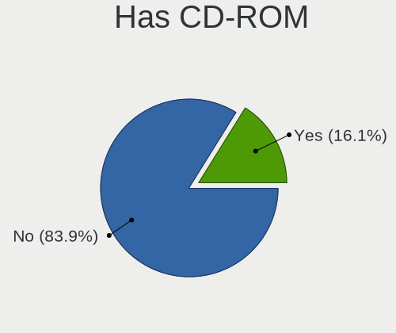
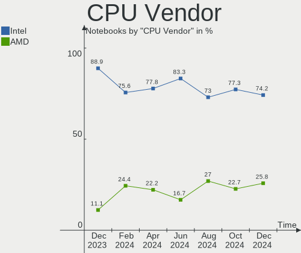

KDE neon Hardware Trends (Notebook)
-----------------------------------

A project to identify most popular hardware characteristics and track their change
over time based on data collected by KDE neon users at https://Linux-Hardware.org.

Anyone can contribute to the study by uploading probes of their computers by
the [hw-probe](https://github.com/linuxhw/hw-probe) tool:

    sudo -E hw-probe -all -upload

Full-feature report is available here: https://linux-hardware.org/?view=trends&formfactor=notebook

Period: Nov, 2020.

Contents
--------

- [ OS                       ](#os)
- [ OS Family                ](#os-family)
- [ Kernel                   ](#kernel)
- [ Kernel Family            ](#kernel-family)
- [ Kernel Major Ver.        ](#kernel-major-ver)
- [ Arch                     ](#arch)
- [ DE                       ](#de)
- [ Display Server           ](#display-server)
- [ Display Manager          ](#display-manager)
- [ OS Lang                  ](#os-lang)
- [ Boot Mode                ](#boot-mode)
- [ Filesystem               ](#filesystem)
- [ Part. scheme             ](#part-scheme)
- [ Dual Boot with Linux/BSD ](#dual-boot-with-linux/bsd)
- [ Dual Boot (Win)          ](#dual-boot-win)
- [ Country                  ](#country)
- [ City                     ](#city)
- [ Vendor                   ](#vendor)
- [ Model                    ](#model)
- [ Model Family             ](#model-family)
- [ MFG Year                 ](#mfg-year)
- [ Form Factor              ](#form-factor)
- [ Secure Boot              ](#secure-boot)
- [ Coreboot                 ](#coreboot)
- [ RAM Size                 ](#ram-size)
- [ RAM Used                 ](#ram-used)
- [ Has CD-ROM               ](#has-cd-rom)
- [ Total Drives             ](#total-drives)
- [ Has Ethernet             ](#has-ethernet)
- [ Drive Vendor             ](#drive-vendor)
- [ Drive Model              ](#drive-model)
- [ HDD Vendor               ](#hdd-vendor)
- [ SSD Vendor               ](#ssd-vendor)
- [ Drive Kind               ](#drive-kind)
- [ Drive Connector          ](#drive-connector)
- [ Drive Size               ](#drive-size)
- [ Space Total              ](#space-total)
- [ Space Used               ](#space-used)
- [ Malfunc. Drives          ](#malfunc-drives)
- [ Malfunc. Drive Vendor    ](#malfunc-drive-vendor)
- [ Malfunc. HDD Vendor      ](#malfunc-hdd-vendor)
- [ Malfunc. Drive Kind      ](#malfunc-drive-kind)
- [ Failed Drives            ](#failed-drives)
- [ Failed Drive Vendor      ](#failed-drive-vendor)
- [ Drive Status             ](#drive-status)
- [ Storage Vendor           ](#storage-vendor)
- [ Storage Model            ](#storage-model)
- [ Storage Kind             ](#storage-kind)
- [ CPU Vendor               ](#cpu-vendor)
- [ CPU Model                ](#cpu-model)
- [ CPU Model Family         ](#cpu-model-family)
- [ CPU Cores                ](#cpu-cores)
- [ CPU Sockets              ](#cpu-sockets)
- [ CPU Threads              ](#cpu-threads)
- [ CPU Op-Modes             ](#cpu-op-modes)
- [ CPU Microcode            ](#cpu-microcode)
- [ CPU Microarch            ](#cpu-microarch)
- [ GPU Vendor               ](#gpu-vendor)
- [ GPU Model                ](#gpu-model)
- [ GPU Combo                ](#gpu-combo)
- [ GPU Driver               ](#gpu-driver)
- [ GPU Memory               ](#gpu-memory)
- [ Monitor Vendor           ](#monitor-vendor)
- [ Monitor Model            ](#monitor-model)
- [ Monitor Resolution       ](#monitor-resolution)
- [ Monitor Diagonal         ](#monitor-diagonal)
- [ Monitor Width            ](#monitor-width)
- [ Aspect Ratio             ](#aspect-ratio)
- [ Monitor Area             ](#monitor-area)
- [ Pixel Density            ](#pixel-density)
- [ Multiple Monitors        ](#multiple-monitors)
- [ Net Controller Vendor    ](#net-controller-vendor)
- [ Net Controller Model     ](#net-controller-model)
- [ Wireless Vendor          ](#wireless-vendor)
- [ Wireless Model           ](#wireless-model)
- [ Ethernet Vendor          ](#ethernet-vendor)
- [ Ethernet Model           ](#ethernet-model)
- [ Net Controller Kind      ](#net-controller-kind)
- [ Used Controller          ](#used-controller)
- [ NICs                     ](#nics)
- [ Memory Vendor            ](#memory-vendor)
- [ Memory Model             ](#memory-model)
- [ Memory Kind              ](#memory-kind)
- [ Memory Form Factor       ](#memory-form-factor)
- [ Memory Size              ](#memory-size)
- [ Memory Speed             ](#memory-speed)
- [ Sound Vendor             ](#sound-vendor)
- [ Sound Model              ](#sound-model)
- [ Camera Vendor            ](#camera-vendor)
- [ Camera Model             ](#camera-model)
- [ Fingerprint Vendor       ](#fingerprint-vendor)
- [ Fingerprint Model        ](#fingerprint-model)
- [ Chipcard Vendor          ](#chipcard-vendor)
- [ Chipcard Model           ](#chipcard-model)
- [ Printer Vendor           ](#printer-vendor)
- [ Printer Model            ](#printer-model)
- [ Scanner Vendor           ](#scanner-vendor)
- [ Scanner Model            ](#scanner-model)
- [ Bluetooth Vendor         ](#bluetooth-vendor)
- [ Bluetooth Model          ](#bluetooth-model)
- [ Unsupported Devices      ](#unsupported-devices)
- [ Unsupported Device Types ](#unsupported-device-types)

OS
--

Installed operating systems

| Name           | Notebooks | Percent |
|----------------|-----------|---------|
| KDE neon 20.04 | 104       | 98.11%  |
| KDE neon 18.04 | 2         | 1.89%   |

OS Family
---------

OS without a version

| Name     | Notebooks | Percent |
|----------|-----------|---------|
| KDE neon | 106       | 100%    |

Kernel
------

Version of the Linux kernel

| Version              | Notebooks | Percent |
|----------------------|-----------|---------|
| 5.4.0-52-generic     | 43        | 40.57%  |
| 5.4.0-54-generic     | 35        | 33.02%  |
| 5.4.0-53-generic     | 20        | 18.87%  |
| 5.9.8-050908-generic | 3         | 2.83%   |
| 5.6.0-1032-oem       | 2         | 1.89%   |
| 5.5.4-050504-generic | 1         | 0.94%   |
| 5.4.0-51-generic     | 1         | 0.94%   |
| 5.4.0-47-generic     | 1         | 0.94%   |

Kernel Family
-------------

Linux kernel without a distro release

| Version | Notebooks | Percent |
|---------|-----------|---------|
| 5.4.0   | 100       | 94.34%  |
| 5.9.8   | 3         | 2.83%   |
| 5.6.0   | 2         | 1.89%   |
| 5.5.4   | 1         | 0.94%   |

Kernel Major Ver.
-----------------

Linux kernel major version

| Version | Notebooks | Percent |
|---------|-----------|---------|
| 5.4     | 100       | 94.34%  |
| 5.9     | 3         | 2.83%   |
| 5.6     | 2         | 1.89%   |
| 5.5     | 1         | 0.94%   |

Arch
----

OS architecture (x86_64, i586, etc.)

| Name   | Notebooks | Percent |
|--------|-----------|---------|
| x86_64 | 106       | 100%    |

DE
--

Desktop Environment

| Name    | Notebooks | Percent |
|---------|-----------|---------|
| KDE     | 93        | 87.74%  |
| KDE5    | 10        | 9.43%   |
| Unknown | 3         | 2.83%   |

Display Server
--------------

X11 or Wayland

| Name    | Notebooks | Percent |
|---------|-----------|---------|
| X11     | 104       | 98.11%  |
| Wayland | 2         | 1.89%   |

Display Manager
---------------

SDDM, LightDM, etc.

| Name    | Notebooks | Percent |
|---------|-----------|---------|
| Unknown | 94        | 88.68%  |
| SDDM    | 12        | 11.32%  |

OS Lang
-------

Language

| Lang  | Notebooks | Percent |
|-------|-----------|---------|
| en_US | 37        | 34.91%  |
| ru_RU | 9         | 8.49%   |
| es_ES | 7         | 6.6%    |
| pt_BR | 6         | 5.66%   |
| de_DE | 6         | 5.66%   |
| en_GB | 5         | 4.72%   |
| en_IN | 4         | 3.77%   |
| pl_PL | 3         | 2.83%   |
| C     | 3         | 2.83%   |
| fr_FR | 2         | 1.89%   |
| en_CA | 2         | 1.89%   |
| en_AU | 2         | 1.89%   |
| zh_CN | 1         | 0.94%   |
| vi_VN | 1         | 0.94%   |
| tr_TR | 1         | 0.94%   |
| sk_SK | 1         | 0.94%   |
| pt_PT | 1         | 0.94%   |
| nl_NL | 1         | 0.94%   |
| nl_BE | 1         | 0.94%   |
| nb_NO | 1         | 0.94%   |
| mn_CN | 1         | 0.94%   |
| ja_JP | 1         | 0.94%   |
| it_IT | 1         | 0.94%   |
| gl_ES | 1         | 0.94%   |
| fr_CA | 1         | 0.94%   |
| fr_BE | 1         | 0.94%   |
| es_PE | 1         | 0.94%   |
| es_MX | 1         | 0.94%   |
| es_CO | 1         | 0.94%   |
| es_AR | 1         | 0.94%   |
| en_IE | 1         | 0.94%   |
| el_GR | 1         | 0.94%   |

Boot Mode
---------

EFI or BIOS

| Mode | Notebooks | Percent |
|------|-----------|---------|
| EFI  | 63        | 59.43%  |
| BIOS | 43        | 40.57%  |

Filesystem
----------

Type of filesystem

| Type    | Notebooks | Percent |
|---------|-----------|---------|
| Ext4    | 103       | 97.17%  |
| Btrfs   | 2         | 1.89%   |
| Overlay | 1         | 0.94%   |

Part. scheme
------------

Scheme of partitioning

| Type    | Notebooks | Percent |
|---------|-----------|---------|
| Unknown | 94        | 88.68%  |
| GPT     | 9         | 8.49%   |
| MBR     | 3         | 2.83%   |

Dual Boot with Linux/BSD
------------------------

Hosting more than one Linux/BSD

| Dual boot | Notebooks | Percent |
|-----------|-----------|---------|
| No        | 105       | 99.06%  |
| Yes       | 1         | 0.94%   |

Dual Boot (Win)
---------------

Hosting Linux and Windows

| Dual boot | Notebooks | Percent |
|-----------|-----------|---------|
| No        | 98        | 92.45%  |
| Yes       | 8         | 7.55%   |

Country
-------

Geographic location (country)

| Country     | Notebooks | Percent |
|-------------|-----------|---------|
| USA         | 16        | 15.09%  |
| Russia      | 9         | 8.49%   |
| Brazil      | 9         | 8.49%   |
| Spain       | 8         | 7.55%   |
| Germany     | 8         | 7.55%   |
| India       | 5         | 4.72%   |
| UK          | 4         | 3.77%   |
| Poland      | 4         | 3.77%   |
| Netherlands | 4         | 3.77%   |
| Canada      | 3         | 2.83%   |
| Ukraine     | 2         | 1.89%   |
| Norway      | 2         | 1.89%   |
| Mexico      | 2         | 1.89%   |
| Colombia    | 2         | 1.89%   |
| China       | 2         | 1.89%   |
| Belgium     | 2         | 1.89%   |
| Australia   | 2         | 1.89%   |
| Vietnam     | 1         | 0.94%   |
| Turkey      | 1         | 0.94%   |
| Thailand    | 1         | 0.94%   |
| Switzerland | 1         | 0.94%   |
| Slovenia    | 1         | 0.94%   |
| Portugal    | 1         | 0.94%   |
| Philippines | 1         | 0.94%   |
| Peru        | 1         | 0.94%   |
| Morocco     | 1         | 0.94%   |
| Malaysia    | 1         | 0.94%   |
| Kazakhstan  | 1         | 0.94%   |
| Japan       | 1         | 0.94%   |
| Italy       | 1         | 0.94%   |
| Ireland     | 1         | 0.94%   |
| Iraq        | 1         | 0.94%   |
| Iceland     | 1         | 0.94%   |
| Greece      | 1         | 0.94%   |
| Ghana       | 1         | 0.94%   |
| France      | 1         | 0.94%   |
| Argentina   | 1         | 0.94%   |
| Andorra     | 1         | 0.94%   |
| Algeria     | 1         | 0.94%   |

City
----

Geographic location (city)

| City                   | Notebooks | Percent |
|------------------------|-----------|---------|
| Moscow                 | 4         | 3.77%   |
| Kansas City            | 2         | 1.89%   |
| Zurich                 | 1         | 0.94%   |
| Warsaw                 | 1         | 0.94%   |
| Walla Walla            | 1         | 0.94%   |
| Vulkannyy              | 1         | 0.94%   |
| Valladolid             | 1         | 0.94%   |
| Valencia               | 1         | 0.94%   |
| Toronto                | 1         | 0.94%   |
| Tlemcen                | 1         | 0.94%   |
| Tlalpan                | 1         | 0.94%   |
| São José dos Pinhais | 1         | 0.94%   |
| Stuttgart              | 1         | 0.94%   |
| St Petersburg          | 1         | 0.94%   |
| Srinagar               | 1         | 0.94%   |
| Sint-Niklaas           | 1         | 0.94%   |
| Shinjuku               | 1         | 0.94%   |
| Shenzhen               | 1         | 0.94%   |
| Santa Rosa             | 1         | 0.94%   |
| Sandnes                | 1         | 0.94%   |
| San Francisco          | 1         | 0.94%   |
| Salvador               | 1         | 0.94%   |
| Ruurlo                 | 1         | 0.94%   |
| Rochester              | 1         | 0.94%   |
| Rivera                 | 1         | 0.94%   |
| Rio de Janeiro         | 1         | 0.94%   |
| Ratzeburg              | 1         | 0.94%   |
| Rancho Cordova         | 1         | 0.94%   |
| Quezon City            | 1         | 0.94%   |
| Portsmouth             | 1         | 0.94%   |
| Portland               | 1         | 0.94%   |
| Perillo                | 1         | 0.94%   |
| Paris                  | 1         | 0.94%   |
| Palma                  | 1         | 0.94%   |
| Otrebusy               | 1         | 0.94%   |
| Oslo                   | 1         | 0.94%   |
| Opole                  | 1         | 0.94%   |
| Omaha                  | 1         | 0.94%   |
| Ochtrup                | 1         | 0.94%   |
| Nova Lima              | 1         | 0.94%   |
| New Delhi              | 1         | 0.94%   |
| Neubeuern              | 1         | 0.94%   |
| Natal                  | 1         | 0.94%   |
| Munich                 | 1         | 0.94%   |
| Muhlhausen             | 1         | 0.94%   |
| Mexico City            | 1         | 0.94%   |
| Melbourne              | 1         | 0.94%   |
| Maple Ridge            | 1         | 0.94%   |
| Manchester             | 1         | 0.94%   |
| Lviv                   | 1         | 0.94%   |
| Ludhiana               | 1         | 0.94%   |
| London                 | 1         | 0.94%   |
| Ljubljana              | 1         | 0.94%   |
| Lisbon                 | 1         | 0.94%   |
| Lipetsk                | 1         | 0.94%   |
| Lima                   | 1         | 0.94%   |
| Kearney                | 1         | 0.94%   |
| Jemeppe-sur-Sambre     | 1         | 0.94%   |
| Jasin                  | 1         | 0.94%   |
| Itatiaiucu             | 1         | 0.94%   |

Vendor
------

Motherboard manufacturer

| Name                | Notebooks | Percent |
|---------------------|-----------|---------|
| Hewlett-Packard     | 22        | 20.75%  |
| Dell                | 21        | 19.81%  |
| Lenovo              | 17        | 16.04%  |
| Acer                | 9         | 8.49%   |
| Apple               | 8         | 7.55%   |
| ASUSTek Computer    | 6         | 5.66%   |
| MSI                 | 5         | 4.72%   |
| Sony                | 4         | 3.77%   |
| SLIMBOOK            | 3         | 2.83%   |
| Samsung Electronics | 3         | 2.83%   |
| Toshiba             | 2         | 1.89%   |
| Alienware           | 2         | 1.89%   |
| Positivo            | 1         | 0.94%   |
| Notebook            | 1         | 0.94%   |
| HUAWEI              | 1         | 0.94%   |
| Fujitsu             | 1         | 0.94%   |

Model
-----

Motherboard model

| Name                                        | Notebooks | Percent |
|---------------------------------------------|-----------|---------|
| SLIMBOOK PROX14-AMD                         | 3         | 2.83%   |
| HP Pavilion Gaming Laptop 15-cx0xxx         | 3         | 2.83%   |
| Dell Latitude E6440                         | 3         | 2.83%   |
| Apple MacBookPro9,2                         | 3         | 2.83%   |
| HP Pavilion dv6                             | 2         | 1.89%   |
| Dell Latitude E6400                         | 2         | 1.89%   |
| Toshiba Satellite C870-DJW                  | 1         | 0.94%   |
| Toshiba Satellite C855-1XJ                  | 1         | 0.94%   |
| Sony VPCEB15FM                              | 1         | 0.94%   |
| Sony SVF14N11CXB                            | 1         | 0.94%   |
| Sony SVE1512C6EW                            | 1         | 0.94%   |
| Sony SVE14A25CLB                            | 1         | 0.94%   |
| Samsung QX310/QX410/QX510/SF310/SF410/SF510 | 1         | 0.94%   |
| Samsung 870Z5G/880Z5F                       | 1         | 0.94%   |
| Samsung 370E4K                              | 1         | 0.94%   |
| Positivo CHT14B                             | 1         | 0.94%   |
| Notebook NH5xAx                             | 1         | 0.94%   |
| MSI GS70 2QD                                | 1         | 0.94%   |
| MSI GP63 Leopard 8RE                        | 1         | 0.94%   |
| MSI GP60 2OD                                | 1         | 0.94%   |
| MSI GL65 Leopard 10SEK                      | 1         | 0.94%   |
| MSI CX62 6QD                                | 1         | 0.94%   |
| Lenovo Y520-15IKBN 80WK                     | 1         | 0.94%   |
| Lenovo V145-15AST 81MT                      | 1         | 0.94%   |
| Lenovo ThinkPad Yoga 11e 20DAS02M00         | 1         | 0.94%   |
| Lenovo ThinkPad X1 Tablet 20GGS00S00        | 1         | 0.94%   |
| Lenovo ThinkPad X1 Carbon 7th 20QD0000US    | 1         | 0.94%   |
| Lenovo ThinkPad L15 Gen 1 20U3CTO1WW        | 1         | 0.94%   |
| Lenovo ThinkPad Edge E540 20C60046UK        | 1         | 0.94%   |
| Lenovo QIWG5                                | 1         | 0.94%   |
| Lenovo Legion 5 17IMH05H 81Y8               | 1         | 0.94%   |
| Lenovo IdeaPad U510 20191                   | 1         | 0.94%   |
| Lenovo IdeaPad 500-15ISK 80NT               | 1         | 0.94%   |
| Lenovo IdeaPad 320-15ABR 80XS               | 1         | 0.94%   |
| Lenovo IdeaPad 110-14IBR 80T6               | 1         | 0.94%   |
| Lenovo G700 20251                           | 1         | 0.94%   |
| Lenovo G50-45 80MQ                          | 1         | 0.94%   |
| Lenovo G50-45 80E3                          | 1         | 0.94%   |
| Lenovo 1.01UL F40-30                        | 1         | 0.94%   |
| HUAWEI HN-WX9X                              | 1         | 0.94%   |
| HP ProBook 640 G1                           | 1         | 0.94%   |
| HP Presario CQ57                            | 1         | 0.94%   |
| HP Pavilion tx2500                          | 1         | 0.94%   |
| HP OMEN by HP Laptop 17-cb1xxx              | 1         | 0.94%   |
| HP Notebook                                 | 1         | 0.94%   |
| HP Laptop 17-by0xxx                         | 1         | 0.94%   |
| HP Laptop 15s-eq0xxx                        | 1         | 0.94%   |
| HP Laptop 14-dk1xxx                         | 1         | 0.94%   |
| HP Laptop 14-bs0xx                          | 1         | 0.94%   |
| HP EliteBook x360 1040 G5                   | 1         | 0.94%   |
| HP EliteBook 8470p                          | 1         | 0.94%   |
| HP EliteBook 840 G1                         | 1         | 0.94%   |
| HP EliteBook 2730p                          | 1         | 0.94%   |
| HP EliteBook 2560p                          | 1         | 0.94%   |
| HP Compaq Presario CQ45                     | 1         | 0.94%   |
| HP 470 G7 Notebook PC                       | 1         | 0.94%   |
| HP 14                                       | 1         | 0.94%   |
| Fujitsu LIFEBOOK T732                       | 1         | 0.94%   |
| Dell XPS 15 7590                            | 1         | 0.94%   |
| Dell Vostro 3360                            | 1         | 0.94%   |

Model Family
------------

Motherboard model prefix

| Name                | Notebooks | Percent |
|---------------------|-----------|---------|
| Dell Inspiron       | 11        | 10.38%  |
| Acer Aspire         | 8         | 7.55%   |
| Dell Latitude       | 7         | 6.6%    |
| HP Pavilion         | 6         | 5.66%   |
| Lenovo ThinkPad     | 5         | 4.72%   |
| HP EliteBook        | 5         | 4.72%   |
| Lenovo IdeaPad      | 4         | 3.77%   |
| HP Laptop           | 4         | 3.77%   |
| SLIMBOOK PROX14-AMD | 3         | 2.83%   |
| Apple MacBookPro9   | 3         | 2.83%   |
| Toshiba Satellite   | 2         | 1.89%   |
| Lenovo G50-45       | 2         | 1.89%   |
| ASUS VivoBook       | 2         | 1.89%   |
| Apple MacBookPro11  | 2         | 1.89%   |
| Sony VPCEB15FM      | 1         | 0.94%   |
| Sony SVF14N11CXB    | 1         | 0.94%   |
| Sony SVE1512C6EW    | 1         | 0.94%   |
| Sony SVE14A25CLB    | 1         | 0.94%   |
| Samsung QX310       | 1         | 0.94%   |
| Samsung 870Z5G      | 1         | 0.94%   |
| Samsung 370E4K      | 1         | 0.94%   |
| Positivo CHT14B     | 1         | 0.94%   |
| Notebook NH5xAx     | 1         | 0.94%   |
| MSI GS70            | 1         | 0.94%   |
| MSI GP63            | 1         | 0.94%   |
| MSI GP60            | 1         | 0.94%   |
| MSI GL65            | 1         | 0.94%   |
| MSI CX62            | 1         | 0.94%   |
| Lenovo Y520-15IKBN  | 1         | 0.94%   |
| Lenovo V145-15AST   | 1         | 0.94%   |
| Lenovo QIWG5        | 1         | 0.94%   |
| Lenovo Legion       | 1         | 0.94%   |
| Lenovo G700         | 1         | 0.94%   |
| Lenovo 1.01UL       | 1         | 0.94%   |
| HUAWEI HN-WX9X      | 1         | 0.94%   |
| HP ProBook          | 1         | 0.94%   |
| HP Presario         | 1         | 0.94%   |
| HP OMEN             | 1         | 0.94%   |
| HP Notebook         | 1         | 0.94%   |
| HP Compaq           | 1         | 0.94%   |
| HP 470              | 1         | 0.94%   |
| HP 14               | 1         | 0.94%   |
| Fujitsu LIFEBOOK    | 1         | 0.94%   |
| Dell XPS            | 1         | 0.94%   |
| Dell Vostro         | 1         | 0.94%   |
| Dell Precision      | 1         | 0.94%   |
| ASUS X556UJ         | 1         | 0.94%   |
| ASUS UX410UAK       | 1         | 0.94%   |
| ASUS UX360UA        | 1         | 0.94%   |
| ASUS TUF            | 1         | 0.94%   |
| Apple MacBookPro8   | 1         | 0.94%   |
| Apple MacBookPro5   | 1         | 0.94%   |
| Apple MacBookAir5   | 1         | 0.94%   |
| Alienware 17        | 1         | 0.94%   |
| Alienware 15        | 1         | 0.94%   |
| Acer Predator       | 1         | 0.94%   |

MFG Year
--------

Motherboard manufacture year

| Year | Notebooks | Percent |
|------|-----------|---------|
| 2020 | 22        | 20.75%  |
| 2019 | 21        | 19.81%  |
| 2018 | 10        | 9.43%   |
| 2013 | 10        | 9.43%   |
| 2017 | 8         | 7.55%   |
| 2015 | 8         | 7.55%   |
| 2014 | 6         | 5.66%   |
| 2011 | 5         | 4.72%   |
| 2016 | 4         | 3.77%   |
| 2012 | 4         | 3.77%   |
| 2010 | 3         | 2.83%   |
| 2009 | 3         | 2.83%   |
| 2008 | 1         | 0.94%   |
| 2007 | 1         | 0.94%   |

Form Factor
-----------

Physical design of the computer

| Name     | Notebooks | Percent |
|----------|-----------|---------|
| Notebook | 106       | 100%    |

Secure Boot
-----------

Enabled or disabled

| State    | Notebooks | Percent |
|----------|-----------|---------|
| Disabled | 94        | 88.68%  |
| Enabled  | 12        | 11.32%  |

Coreboot
--------

Have coreboot on board

| Used | Notebooks | Percent |
|------|-----------|---------|
| No   | 106       | 100%    |

RAM Size
--------

Total RAM memory

| Size in GB  | Notebooks | Percent |
|-------------|-----------|---------|
| 3.01-4.0    | 29        | 27.36%  |
| 4.01-8.0    | 26        | 24.53%  |
| 8.01-16.0   | 21        | 19.81%  |
| 16.01-24.0  | 18        | 16.98%  |
| 1.01-2.0    | 6         | 5.66%   |
| 32.01-64.0  | 4         | 3.77%   |
| 64.01-256.0 | 2         | 1.89%   |

RAM Used
--------

Used RAM memory

| Used GB   | Notebooks | Percent |
|-----------|-----------|---------|
| 1.01-2.0  | 46        | 43.4%   |
| 2.01-3.0  | 31        | 29.25%  |
| 4.01-8.0  | 13        | 12.26%  |
| 3.01-4.0  | 10        | 9.43%   |
| 0.01-1.0  | 5         | 4.72%   |
| 8.01-16.0 | 1         | 0.94%   |

Has CD-ROM
----------

Has CD-ROM on board

| Presented | Notebooks | Percent |
|-----------|-----------|---------|
| No        | 57        | 53.77%  |
| Yes       | 49        | 46.23%  |

Total Drives
------------

Number of drives on board

| Drives | Notebooks | Percent |
|--------|-----------|---------|
| 1      | 73        | 68.87%  |
| 2      | 31        | 29.25%  |
| 3      | 2         | 1.89%   |

Has Ethernet
------------

Has Ethernet on board

| Presented | Notebooks | Percent |
|-----------|-----------|---------|
| Yes       | 95        | 89.62%  |
| No        | 11        | 10.38%  |

Drive Vendor
------------

Hard drive vendors

| Vendor              | Notebooks | Drives | Percent |
|---------------------|-----------|--------|---------|
| Samsung Electronics | 22        | 22     | 15.83%  |
| Seagate             | 18        | 18     | 12.95%  |
| Kingston            | 18        | 18     | 12.95%  |
| Toshiba             | 17        | 17     | 12.23%  |
| WDC                 | 15        | 15     | 10.79%  |
| Sandisk             | 10        | 10     | 7.19%   |
| Crucial             | 7         | 7      | 5.04%   |
| Unknown             | 4         | 5      | 2.88%   |
| HGST                | 4         | 4      | 2.88%   |
| Hitachi             | 3         | 3      | 2.16%   |
| Transcend           | 2         | 2      | 1.44%   |
| PNY                 | 2         | 2      | 1.44%   |
| Intel               | 2         | 2      | 1.44%   |
| Apple               | 2         | 2      | 1.44%   |
| SK Hynix            | 1         | 1      | 0.72%   |
| S528                | 1         | 1      | 0.72%   |
| PLEXTOR             | 1         | 1      | 0.72%   |
| Phison              | 1         | 1      | 0.72%   |
| OCZ                 | 1         | 1      | 0.72%   |
| Micron Technology   | 1         | 1      | 0.72%   |
| KIOXIA              | 1         | 1      | 0.72%   |
| Intenso             | 1         | 1      | 0.72%   |
| HP SSD E            | 1         | 1      | 0.72%   |
| Fujitsu             | 1         | 1      | 0.72%   |
| Corsair             | 1         | 1      | 0.72%   |
| BHT                 | 1         | 1      | 0.72%   |
| A-DATA Technology   | 1         | 1      | 0.72%   |

Drive Model
-----------

Hard drive models

| Model                                | Notebooks | Percent |
|--------------------------------------|-----------|---------|
| Seagate ST1000LM035-1RK172 1TB       | 7         | 5%      |
| Kingston SA400S37480G 480GB SSD      | 6         | 4.29%   |
| Toshiba MQ01ABF050 500GB             | 3         | 2.14%   |
| Seagate ST1000LM024 HN-M101MBB 1TB   | 3         | 2.14%   |
| Samsung NVMe SSD Drive 512GB         | 3         | 2.14%   |
| HGST HTS721010A9E630 1TB             | 3         | 2.14%   |
| WDC WD5000LPVX-75V0TT0 500GB         | 2         | 1.43%   |
| Unknown SD/MMC/MS PRO 128GB          | 2         | 1.43%   |
| Unknown MMC Card  16GB               | 2         | 1.43%   |
| Toshiba NVMe SSD Drive 256GB         | 2         | 1.43%   |
| Toshiba MQ04ABF100 1TB               | 2         | 1.43%   |
| Toshiba MQ01ABD100 1TB               | 2         | 1.43%   |
| Toshiba HDWL110 1TB                  | 2         | 1.43%   |
| Seagate ST1000LX015-1U7172 1TB       | 2         | 1.43%   |
| Sandisk NVMe SSD Drive 256GB         | 2         | 1.43%   |
| SanDisk Extreme SSD 250GB            | 2         | 1.43%   |
| Samsung SSD 860 EVO 500GB            | 2         | 1.43%   |
| Samsung SSD 860 EVO 1TB              | 2         | 1.43%   |
| Samsung NVMe SSD Drive 500GB         | 2         | 1.43%   |
| Samsung NVMe SSD Drive 1TB           | 2         | 1.43%   |
| PNY CS900 500GB SSD                  | 2         | 1.43%   |
| Kingston SA400S37240G 240GB SSD      | 2         | 1.43%   |
| Kingston SA400S37120G 120GB SSD      | 2         | 1.43%   |
| Kingston SA400M8240G 240GB SSD       | 2         | 1.43%   |
| Hitachi HTS545050A7E380 500GB        | 2         | 1.43%   |
| Crucial CT500MX500SSD1 500GB         | 2         | 1.43%   |
| WDC WDS480G2G0A-00JH30 480GB SSD     | 1         | 0.71%   |
| WDC WDS240G2G0B-00EPW0 240GB SSD     | 1         | 0.71%   |
| WDC WDS120G2G0A-00JH30 120GB SSD     | 1         | 0.71%   |
| WDC WDS100T1B0A-00H9H0 1TB SSD       | 1         | 0.71%   |
| WDC WD7500BPVX-22JC3T0 752GB         | 1         | 0.71%   |
| WDC WD5000LUCT-63RC2Y0 500GB         | 1         | 0.71%   |
| WDC WD5000LPVT-75G33T0 500GB         | 1         | 0.71%   |
| WDC WD5000LPVT-22G33T0 500GB         | 1         | 0.71%   |
| WDC WD10SPZX-75Z10T1 1TB             | 1         | 0.71%   |
| WDC WD10SPZX-60Z10T0 1TB             | 1         | 0.71%   |
| WDC WD10JPVX-22JC3T0 1TB             | 1         | 0.71%   |
| WDC WD10JPCX-24UE4T0 1TB             | 1         | 0.71%   |
| WDC PC SN730 SDBQNTY-512G-1001 512GB | 1         | 0.71%   |
| Unknown MMC Card  32GB               | 1         | 0.71%   |
| Transcend TS64GMSA370 64GB SSD       | 1         | 0.71%   |
| Transcend TS128GMTS400S 128GB SSD    | 1         | 0.71%   |
| Toshiba THNSNK256GCS8 SATA 256GB SSD | 1         | 0.71%   |
| Toshiba MQ01ABF050H 500GB            | 1         | 0.71%   |
| Toshiba MQ01ABD050 500GB             | 1         | 0.71%   |
| Toshiba MK7559GSXF 752GB             | 1         | 0.71%   |
| Toshiba MK5065GSXF 500GB             | 1         | 0.71%   |
| Toshiba MK1216GSG 120GB              | 1         | 0.71%   |
| SK Hynix NVMe SSD Drive 512GB        | 1         | 0.71%   |
| Seagate ST750LM022 HN-M750MBB 752GB  | 1         | 0.71%   |
| Seagate ST500LT012-1DG142 500GB      | 1         | 0.71%   |
| Seagate ST2000LM003 HN-M201RAD 2TB   | 1         | 0.71%   |
| Seagate ST1000LM048-2E7172 1TB       | 1         | 0.71%   |
| Seagate ST1000LM044 HN-M101SAD 1TB   | 1         | 0.71%   |
| Seagate Expansion 1TB                | 1         | 0.71%   |
| SanDisk X400 M.2 2280 128GB SSD      | 1         | 0.71%   |
| SanDisk SSD U100 24GB                | 1         | 0.71%   |
| SanDisk SDSSDHP128G 128GB            | 1         | 0.71%   |
| Sandisk NVMe SSD Drive 512GB         | 1         | 0.71%   |
| Sandisk NVMe SSD Drive 500GB         | 1         | 0.71%   |

HDD Vendor
----------

Hard disk drive vendors

| Vendor  | Notebooks | Drives | Percent |
|---------|-----------|--------|---------|
| Seagate | 18        | 18     | 36%     |
| Toshiba | 14        | 14     | 28%     |
| WDC     | 10        | 10     | 20%     |
| HGST    | 4         | 4      | 8%      |
| Hitachi | 3         | 3      | 6%      |
| Fujitsu | 1         | 1      | 2%      |

SSD Vendor
----------

Solid state drive vendors

| Vendor              | Notebooks | Drives | Percent |
|---------------------|-----------|--------|---------|
| Kingston            | 16        | 16     | 27.59%  |
| Samsung Electronics | 12        | 12     | 20.69%  |
| Crucial             | 6         | 6      | 10.34%  |
| SanDisk             | 5         | 5      | 8.62%   |
| WDC                 | 4         | 4      | 6.9%    |
| Transcend           | 2         | 2      | 3.45%   |
| PNY                 | 2         | 2      | 3.45%   |
| Apple               | 2         | 2      | 3.45%   |
| Toshiba             | 1         | 1      | 1.72%   |
| S528                | 1         | 1      | 1.72%   |
| PLEXTOR             | 1         | 1      | 1.72%   |
| OCZ                 | 1         | 1      | 1.72%   |
| Micron Technology   | 1         | 1      | 1.72%   |
| Intenso             | 1         | 1      | 1.72%   |
| Intel               | 1         | 1      | 1.72%   |
| Corsair             | 1         | 1      | 1.72%   |
| A-DATA Technology   | 1         | 1      | 1.72%   |

Drive Kind
----------

HDD or SSD

| Kind    | Notebooks | Drives | Percent |
|---------|-----------|--------|---------|
| SSD     | 56        | 58     | 41.79%  |
| HDD     | 49        | 50     | 36.57%  |
| NVMe    | 23        | 25     | 17.16%  |
| Unknown | 4         | 4      | 2.99%   |
| MMC     | 2         | 3      | 1.49%   |

Drive Connector
---------------

SATA, SAS, NVMe, etc.

| Type | Notebooks | Drives | Percent |
|------|-----------|--------|---------|
| SATA | 92        | 106    | 75.41%  |
| NVMe | 23        | 25     | 18.85%  |
| SAS  | 5         | 6      | 4.1%    |
| MMC  | 2         | 3      | 1.64%   |

Drive Size
----------

Size of hard drive

| Size in TB | Notebooks | Drives | Percent |
|------------|-----------|--------|---------|
| 0.01-0.5   | 67        | 71     | 64.42%  |
| 0.51-1.0   | 36        | 36     | 34.62%  |
| 1.01-2.0   | 1         | 1      | 0.96%   |

Space Total
-----------

Amount of disk space available on the file system

| Size in GB     | Notebooks | Percent |
|----------------|-----------|---------|
| 101-250        | 29        | 27.36%  |
| 251-500        | 28        | 26.42%  |
| 501-1000       | 20        | 18.87%  |
| 1001-2000      | 8         | 7.55%   |
| 51-100         | 8         | 7.55%   |
| 1-20           | 6         | 5.66%   |
| 21-50          | 4         | 3.77%   |
| More than 3000 | 1         | 0.94%   |
| 2001-3000      | 1         | 0.94%   |
| Unknown        | 1         | 0.94%   |

Space Used
----------

Amount of used disk space

| Used GB        | Notebooks | Percent |
|----------------|-----------|---------|
| 1-20           | 63        | 59.43%  |
| 21-50          | 16        | 15.09%  |
| 101-250        | 8         | 7.55%   |
| 51-100         | 8         | 7.55%   |
| 251-500        | 4         | 3.77%   |
| 501-1000       | 3         | 2.83%   |
| 1001-2000      | 2         | 1.89%   |
| More than 3000 | 1         | 0.94%   |
| Unknown        | 1         | 0.94%   |

Malfunc. Drives
---------------

Drive models with a malfunction

| Model                        | Notebooks | Drives | Percent |
|------------------------------|-----------|--------|---------|
| WDC WD5000LPVX-75V0TT0 500GB | 1         | 1      | 100%    |

Malfunc. Drive Vendor
---------------------

Vendors of faulty drives

| Vendor | Notebooks | Drives | Percent |
|--------|-----------|--------|---------|
| WDC    | 1         | 1      | 100%    |

Malfunc. HDD Vendor
-------------------

Vendors of faulty HDD drives

| Vendor | Notebooks | Drives | Percent |
|--------|-----------|--------|---------|
| WDC    | 1         | 1      | 100%    |

Malfunc. Drive Kind
-------------------

Kinds of faulty drives

| Kind | Notebooks | Drives | Percent |
|------|-----------|--------|---------|
| HDD  | 1         | 1      | 100%    |

Failed Drives
-------------

Failed drive models

Zero info for selected period =(

Failed Drive Vendor
-------------------

Failed drive vendors

Zero info for selected period =(

Drive Status
------------

Number of failed and malfunc. drives

| Status   | Notebooks | Drives | Percent |
|----------|-----------|--------|---------|
| Detected | 94        | 127    | 88.68%  |
| Works    | 11        | 12     | 10.38%  |
| Malfunc  | 1         | 1      | 0.94%   |

Storage Vendor
--------------

Storage controller vendors

| Vendor                       | Notebooks | Percent |
|------------------------------|-----------|---------|
| Intel                        | 82        | 66.13%  |
| AMD                          | 16        | 12.9%   |
| Samsung Electronics          | 11        | 8.87%   |
| Sandisk                      | 6         | 4.84%   |
| Toshiba America Info Systems | 2         | 1.61%   |
| Kingston Technology Company  | 2         | 1.61%   |
| SK Hynix                     | 1         | 0.81%   |
| Phison Electronics           | 1         | 0.81%   |
| Nvidia                       | 1         | 0.81%   |
| Micron/Crucial Technology    | 1         | 0.81%   |
| KIOXIA                       | 1         | 0.81%   |

Storage Model
-------------

Storage controller models

| Model                                                                            | Notebooks | Percent |
|----------------------------------------------------------------------------------|-----------|---------|
| Intel 7 Series Chipset Family 6-port SATA Controller [AHCI mode]                 | 18        | 13.95%  |
| AMD FCH SATA Controller [AHCI mode]                                              | 12        | 9.3%    |
| Intel 82801 Mobile SATA Controller [RAID mode]                                   | 10        | 7.75%   |
| Intel Sunrise Point-LP SATA Controller [AHCI mode]                               | 9         | 6.98%   |
| Samsung Electronics NVMe SSD Controller SM981/PM981/PM983                        | 8         | 6.2%    |
| Intel Cannon Lake Mobile PCH SATA AHCI Controller                                | 7         | 5.43%   |
| Intel 8 Series/C220 Series Chipset Family 6-port SATA Controller 1 [AHCI mode]   | 6         | 4.65%   |
| Intel 8 Series SATA Controller 1 [AHCI mode]                                     | 6         | 4.65%   |
| Intel 82801IBM/IEM (ICH9M/ICH9M-E) 4 port SATA Controller [AHCI mode]            | 4         | 3.1%    |
| Intel Wildcat Point-LP SATA Controller [AHCI Mode]                               | 3         | 2.33%   |
| Intel 6 Series/C200 Series Chipset Family 6 port Mobile SATA AHCI Controller     | 3         | 2.33%   |
| AMD SB7x0/SB8x0/SB9x0 SATA Controller [AHCI mode]                                | 3         | 2.33%   |
| Sandisk WD Black 2019/PC SN750 NVMe SSD                                          | 2         | 1.55%   |
| Sandisk WD Black 2018 / PC SN720 NVMe SSD                                        | 2         | 1.55%   |
| Sandisk WD Black 2018 / PC SN520 NVMe SSD                                        | 2         | 1.55%   |
| Samsung Electronics NVMe SSD Controller SM961/PM961                              | 2         | 1.55%   |
| Kingston Technology Company Non-Volatile memory controller                       | 2         | 1.55%   |
| Intel Q170/Q150/B150/H170/H110/Z170/CM236 Chipset SATA Controller [AHCI Mode]    | 2         | 1.55%   |
| Intel HM170/QM170 Chipset SATA Controller [AHCI Mode]                            | 2         | 1.55%   |
| Intel Atom/Celeron/Pentium Processor x5-E8000/J3xxx/N3xxx Series SATA Controller | 2         | 1.55%   |
| Intel Atom Processor E3800 Series SATA AHCI Controller                           | 2         | 1.55%   |
| Intel 5 Series/3400 Series Chipset 4 port SATA AHCI Controller                   | 2         | 1.55%   |
| Intel 400 Series Chipset Family SATA AHCI Controller                             | 2         | 1.55%   |
| Toshiba America Info Systems XG4 NVMe SSD Controller                             | 1         | 0.78%   |
| Toshiba America Info Systems Toshiba America Info Non-Volatile memory controller | 1         | 0.78%   |
| SK Hynix Non-Volatile memory controller                                          | 1         | 0.78%   |
| Samsung Electronics Apple PCIe SSD                                               | 1         | 0.78%   |
| Phison Electronics E12 NVMe Controller                                           | 1         | 0.78%   |
| Nvidia MCP79 AHCI Controller                                                     | 1         | 0.78%   |
| Micron/Crucial Technology Non-Volatile memory controller                         | 1         | 0.78%   |
| KIOXIA Non-Volatile memory controller                                            | 1         | 0.78%   |
| Intel SSD Pro 7600p/760p/E 6100p Series                                          | 1         | 0.78%   |
| Intel SATA controller                                                            | 1         | 0.78%   |
| Intel Mobile 4 Series Chipset PT IDER Controller                                 | 1         | 0.78%   |
| Intel Ice Lake-LP SATA Controller [AHCI mode]                                    | 1         | 0.78%   |
| Intel Comet Lake SATA AHCI Controller                                            | 1         | 0.78%   |
| Intel 82801GBM/GHM (ICH7-M Family) SATA Controller [IDE mode]                    | 1         | 0.78%   |
| AMD SB7x0/SB8x0/SB9x0 IDE Controller                                             | 1         | 0.78%   |
| AMD FCH SATA Controller [IDE mode]                                               | 1         | 0.78%   |
| AMD FCH IDE Controller                                                           | 1         | 0.78%   |
| AMD 400 Series Chipset SATA Controller                                           | 1         | 0.78%   |

Storage Kind
------------

Kind of storage controller (IDE, SATA, NVMe, SAS, ...)

| Kind | Notebooks | Percent |
|------|-----------|---------|
| SATA | 89        | 70.63%  |
| NVMe | 23        | 18.25%  |
| RAID | 10        | 7.94%   |
| IDE  | 4         | 3.17%   |

CPU Vendor
----------

Processor vendors

| Vendor | Notebooks | Percent |
|--------|-----------|---------|
| Intel  | 88        | 83.02%  |
| AMD    | 18        | 16.98%  |

CPU Model
---------

Processor models

| Model                                         | Notebooks | Percent |
|-----------------------------------------------|-----------|---------|
| Intel Core i5-8300H CPU @ 2.30GHz             | 4         | 3.77%   |
| Intel Core i5-3210M CPU @ 2.50GHz             | 4         | 3.77%   |
| Intel Core i7-7700HQ CPU @ 2.80GHz            | 3         | 2.83%   |
| Intel Core i7-10750H CPU @ 2.60GHz            | 3         | 2.83%   |
| Intel Core i7-10510U CPU @ 1.80GHz            | 3         | 2.83%   |
| AMD Ryzen 7 4800H with Radeon Graphics        | 3         | 2.83%   |
| Intel Core i7-8750H CPU @ 2.20GHz             | 2         | 1.89%   |
| Intel Core i5-7200U CPU @ 2.50GHz             | 2         | 1.89%   |
| Intel Core i5-6200U CPU @ 2.30GHz             | 2         | 1.89%   |
| Intel Core i5-4310M CPU @ 2.70GHz             | 2         | 1.89%   |
| Intel Core i5-4200U CPU @ 1.60GHz             | 2         | 1.89%   |
| Intel Core i5-4200M CPU @ 2.50GHz             | 2         | 1.89%   |
| Intel Core i5-3320M CPU @ 2.60GHz             | 2         | 1.89%   |
| Intel Core i3-6006U CPU @ 2.00GHz             | 2         | 1.89%   |
| Intel Core i3-5005U CPU @ 2.00GHz             | 2         | 1.89%   |
| Intel Core i3-4005U CPU @ 1.70GHz             | 2         | 1.89%   |
| Intel Core i3-2312M CPU @ 2.10GHz             | 2         | 1.89%   |
| AMD Ryzen 5 3500U with Radeon Vega Mobile Gfx | 2         | 1.89%   |
| Intel Pentium CPU N3710 @ 1.60GHz             | 1         | 0.94%   |
| Intel Pentium CPU B980 @ 2.40GHz              | 1         | 0.94%   |
| Intel Pentium CPU 2020M @ 2.40GHz             | 1         | 0.94%   |
| Intel Pentium 3805U @ 1.90GHz                 | 1         | 0.94%   |
| Intel Pentium 3558U @ 1.70GHz                 | 1         | 0.94%   |
| Intel Core m5-6Y54 CPU @ 1.10GHz              | 1         | 0.94%   |
| Intel Core i7-9750H CPU @ 2.60GHz             | 1         | 0.94%   |
| Intel Core i7-8565U CPU @ 1.80GHz             | 1         | 0.94%   |
| Intel Core i7-8550U CPU @ 1.80GHz             | 1         | 0.94%   |
| Intel Core i7-6820HQ CPU @ 2.70GHz            | 1         | 0.94%   |
| Intel Core i7-6700HQ CPU @ 2.60GHz            | 1         | 0.94%   |
| Intel Core i7-6500U CPU @ 2.50GHz             | 1         | 0.94%   |
| Intel Core i7-5700HQ CPU @ 2.70GHz            | 1         | 0.94%   |
| Intel Core i7-4870HQ CPU @ 2.50GHz            | 1         | 0.94%   |
| Intel Core i7-4702MQ CPU @ 2.20GHz            | 1         | 0.94%   |
| Intel Core i7-4700MQ CPU @ 2.40GHz            | 1         | 0.94%   |
| Intel Core i7-4700HQ CPU @ 2.40GHz            | 1         | 0.94%   |
| Intel Core i7-3720QM CPU @ 2.60GHz            | 1         | 0.94%   |
| Intel Core i7-3667U CPU @ 2.00GHz             | 1         | 0.94%   |
| Intel Core i7-3520M CPU @ 2.90GHz             | 1         | 0.94%   |
| Intel Core i7-3517U CPU @ 1.90GHz             | 1         | 0.94%   |
| Intel Core i7-1065G7 CPU @ 1.30GHz            | 1         | 0.94%   |
| Intel Core i5-8250U CPU @ 1.60GHz             | 1         | 0.94%   |
| Intel Core i5-4310U CPU @ 2.00GHz             | 1         | 0.94%   |
| Intel Core i5-4300M CPU @ 2.60GHz             | 1         | 0.94%   |
| Intel Core i5-3337U CPU @ 1.80GHz             | 1         | 0.94%   |
| Intel Core i5-3230M CPU @ 2.60GHz             | 1         | 0.94%   |
| Intel Core i5-2520M CPU @ 2.50GHz             | 1         | 0.94%   |
| Intel Core i5-2435M CPU @ 2.40GHz             | 1         | 0.94%   |
| Intel Core i5-1035G1 CPU @ 1.00GHz            | 1         | 0.94%   |
| Intel Core i5 CPU M 460 @ 2.53GHz             | 1         | 0.94%   |
| Intel Core i3-7020U CPU @ 2.30GHz             | 1         | 0.94%   |
| Intel Core i3-3227U CPU @ 1.90GHz             | 1         | 0.94%   |
| Intel Core i3-3110M CPU @ 2.40GHz             | 1         | 0.94%   |
| Intel Core i3-2330M CPU @ 2.20GHz             | 1         | 0.94%   |
| Intel Core i3 CPU M 330 @ 2.13GHz             | 1         | 0.94%   |
| Intel Core 2 Duo CPU T9600 @ 2.80GHz          | 1         | 0.94%   |
| Intel Core 2 Duo CPU T5900 @ 2.20GHz          | 1         | 0.94%   |
| Intel Core 2 Duo CPU P9400 @ 2.40GHz          | 1         | 0.94%   |
| Intel Core 2 Duo CPU P8700 @ 2.53GHz          | 1         | 0.94%   |
| Intel Core 2 Duo CPU P8600 @ 2.40GHz          | 1         | 0.94%   |
| Intel Core 2 Duo CPU P7550 @ 2.26GHz          | 1         | 0.94%   |

CPU Model Family
----------------

Processor model prefix

| Model                                | Notebooks | Percent |
|--------------------------------------|-----------|---------|
| Intel Core i5                        | 29        | 27.36%  |
| Intel Core i7                        | 27        | 25.47%  |
| Intel Core i3                        | 13        | 12.26%  |
| Intel Core 2 Duo                     | 7         | 6.6%    |
| Intel Pentium                        | 5         | 4.72%   |
| Intel Celeron                        | 4         | 3.77%   |
| AMD Ryzen 5                          | 4         | 3.77%   |
| AMD Ryzen 7                          | 3         | 2.83%   |
| AMD Ryzen 3                          | 2         | 1.89%   |
| AMD A6                               | 2         | 1.89%   |
| AMD A4                               | 2         | 1.89%   |
| Intel Core m5                        | 1         | 0.94%   |
| Intel Core 2                         | 1         | 0.94%   |
| Intel Atom                           | 1         | 0.94%   |
| AMD Turion X2 Ultra Dual-Core Mobile | 1         | 0.94%   |
| AMD QC                               | 1         | 0.94%   |
| AMD Phenom II                        | 1         | 0.94%   |
| AMD E                                | 1         | 0.94%   |
| AMD A12                              | 1         | 0.94%   |

CPU Cores
---------

Number of processor cores

| Number | Notebooks | Percent |
|--------|-----------|---------|
| 2      | 63        | 59.43%  |
| 4      | 33        | 31.13%  |
| 6      | 7         | 6.6%    |
| 8      | 3         | 2.83%   |

CPU Sockets
-----------

Number of sockets

| Number | Notebooks | Percent |
|--------|-----------|---------|
| 1      | 106       | 100%    |

CPU Threads
-----------

Threads per core (Hyper-Threading)

| Number | Notebooks | Percent |
|--------|-----------|---------|
| 2      | 80        | 75.47%  |
| 1      | 26        | 24.53%  |

CPU Op-Modes
------------

CPU Operation Modes (32-bit, 64-bit)

| Op mode        | Notebooks | Percent |
|----------------|-----------|---------|
| 32-bit, 64-bit | 106       | 100%    |

CPU Microcode
-------------

Microcode number

| Number     | Notebooks | Percent |
|------------|-----------|---------|
| 0x306a9    | 15        | 14.15%  |
| 0x306c3    | 7         | 6.6%    |
| 0x906ea    | 6         | 5.66%   |
| 0x406e3    | 6         | 5.66%   |
| 0x40651    | 6         | 5.66%   |
| 0x1067a    | 6         | 5.66%   |
| 0x206a7    | 5         | 4.72%   |
| 0x806ec    | 4         | 3.77%   |
| Unknown    | 4         | 3.77%   |
| 0xa0652    | 3         | 2.83%   |
| 0x906e9    | 3         | 2.83%   |
| 0x406c4    | 3         | 2.83%   |
| 0x306d4    | 3         | 2.83%   |
| 0x08600103 | 3         | 2.83%   |
| 0x08108109 | 3         | 2.83%   |
| 0x806ea    | 2         | 1.89%   |
| 0x806e9    | 2         | 1.89%   |
| 0x706e5    | 2         | 1.89%   |
| 0x506e3    | 2         | 1.89%   |
| 0x30678    | 2         | 1.89%   |
| 0x08108102 | 2         | 1.89%   |
| 0x706a1    | 1         | 0.94%   |
| 0x6fd      | 1         | 0.94%   |
| 0x6f6      | 1         | 0.94%   |
| 0x40671    | 1         | 0.94%   |
| 0x40661    | 1         | 0.94%   |
| 0x20655    | 1         | 0.94%   |
| 0x20652    | 1         | 0.94%   |
| 0x08701013 | 1         | 0.94%   |
| 0x07030105 | 1         | 0.94%   |
| 0x07030104 | 1         | 0.94%   |
| 0x0700010f | 1         | 0.94%   |
| 0x06006705 | 1         | 0.94%   |
| 0x06006118 | 1         | 0.94%   |
| 0x05000119 | 1         | 0.94%   |
| 0x03000027 | 1         | 0.94%   |
| 0x02000032 | 1         | 0.94%   |
| 0x010000c8 | 1         | 0.94%   |

CPU Microarch
-------------

Microarchitecture

| Name            | Notebooks | Percent |
|-----------------|-----------|---------|
| KabyLake        | 19        | 17.92%  |
| IvyBridge       | 15        | 14.15%  |
| Haswell         | 15        | 14.15%  |
| Skylake         | 8         | 7.55%   |
| SandyBridge     | 6         | 5.66%   |
| Penryn          | 6         | 5.66%   |
| Zen+            | 5         | 4.72%   |
| Silvermont      | 5         | 4.72%   |
| Zen 2           | 4         | 3.77%   |
| Broadwell       | 4         | 3.77%   |
| CometLake       | 3         | 2.83%   |
| Westmere        | 2         | 1.89%   |
| Puma            | 2         | 1.89%   |
| IceLake         | 2         | 1.89%   |
| Excavator       | 2         | 1.89%   |
| Core            | 2         | 1.89%   |
| K8 & K10 hybrid | 1         | 0.94%   |
| K10 Llano       | 1         | 0.94%   |
| K10             | 1         | 0.94%   |
| Jaguar          | 1         | 0.94%   |
| Goldmont plus   | 1         | 0.94%   |
| Bobcat          | 1         | 0.94%   |

GPU Vendor
----------

Vendors of graphics cards

| Vendor | Notebooks | Percent |
|--------|-----------|---------|
| Intel  | 79        | 59.85%  |
| Nvidia | 28        | 21.21%  |
| AMD    | 25        | 18.94%  |

GPU Model
---------

Graphics card models

| Model                                                                                    | Notebooks | Percent |
|------------------------------------------------------------------------------------------|-----------|---------|
| Intel 3rd Gen Core processor Graphics Controller                                         | 15        | 11.19%  |
| Intel 4th Gen Core Processor Integrated Graphics Controller                              | 8         | 5.97%   |
| Intel UHD Graphics 630 (Mobile)                                                          | 7         | 5.22%   |
| Intel Haswell-ULT Integrated Graphics Controller                                         | 6         | 4.48%   |
| Intel Skylake GT2 [HD Graphics 520]                                                      | 5         | 3.73%   |
| Intel 2nd Generation Core Processor Family Integrated Graphics Controller                | 5         | 3.73%   |
| AMD Picasso                                                                              | 5         | 3.73%   |
| Intel UHD Graphics                                                                       | 4         | 2.99%   |
| Intel Mobile 4 Series Chipset Integrated Graphics Controller                             | 4         | 2.99%   |
| Nvidia GP107M [GeForce GTX 1050 Ti Mobile]                                               | 3         | 2.24%   |
| Nvidia GP107M [GeForce GTX 1050 Mobile]                                                  | 3         | 2.24%   |
| Intel HD Graphics 630                                                                    | 3         | 2.24%   |
| Intel Atom/Celeron/Pentium Processor x5-E8000/J3xxx/N3xxx Integrated Graphics Controller | 3         | 2.24%   |
| AMD Sun XT [Radeon HD 8670A/8670M/8690M / R5 M330 / M430 / Radeon 520 Mobile]            | 3         | 2.24%   |
| AMD Renoir                                                                               | 3         | 2.24%   |
| Nvidia TU106M [GeForce RTX 2060 Mobile]                                                  | 2         | 1.49%   |
| Nvidia GP106M [GeForce GTX 1060 Mobile]                                                  | 2         | 1.49%   |
| Nvidia GK208M [GeForce GT 740M]                                                          | 2         | 1.49%   |
| Intel UHD Graphics 620                                                                   | 2         | 1.49%   |
| Intel HD Graphics 620                                                                    | 2         | 1.49%   |
| Intel HD Graphics 5500                                                                   | 2         | 1.49%   |
| Intel Core Processor Integrated Graphics Controller                                      | 2         | 1.49%   |
| Intel Atom Processor Z36xxx/Z37xxx Series Graphics & Display                             | 2         | 1.49%   |
| AMD Whistler [Radeon HD 6630M/6650M/6750M/7670M/7690M]                                   | 2         | 1.49%   |
| AMD Topaz XT [Radeon R7 M260/M265 / M340/M360 / M440/M445 / 530/535 / 620/625 Mobile]    | 2         | 1.49%   |
| Nvidia TU117M [GeForce GTX 1650 Mobile / Max-Q]                                          | 1         | 0.75%   |
| Nvidia TU116M [GeForce GTX 1660 Ti Mobile]                                               | 1         | 0.75%   |
| Nvidia TU106M [GeForce RTX 2070 Mobile / Max-Q Refresh]                                  | 1         | 0.75%   |
| Nvidia GT218M [GeForce 310M]                                                             | 1         | 0.75%   |
| Nvidia GP104BM [GeForce GTX 1070 Mobile]                                                 | 1         | 0.75%   |
| Nvidia GM204M [GeForce GTX 965M]                                                         | 1         | 0.75%   |
| Nvidia GM108M [GeForce 940MX]                                                            | 1         | 0.75%   |
| Nvidia GM107GLM [Quadro M1000M]                                                          | 1         | 0.75%   |
| Nvidia GK208BM [GeForce 920M]                                                            | 1         | 0.75%   |
| Nvidia GK107M [GeForce GT 750M]                                                          | 1         | 0.75%   |
| Nvidia GK107M [GeForce GT 750M Mac Edition]                                              | 1         | 0.75%   |
| Nvidia GF117M [GeForce 610M/710M/810M/820M / GT 620M/625M/630M/720M]                     | 1         | 0.75%   |
| Nvidia GF108GLM [NVS 5200M]                                                              | 1         | 0.75%   |
| Nvidia G98M [Quadro NVS 160M]                                                            | 1         | 0.75%   |
| Nvidia G71M [GeForce Go 7900 GS]                                                         | 1         | 0.75%   |
| Nvidia C79 [GeForce 9400M]                                                               | 1         | 0.75%   |
| Intel UHD Graphics 620 (Whiskey Lake)                                                    | 1         | 0.75%   |
| Intel UHD Graphics 605                                                                   | 1         | 0.75%   |
| Intel Kaby Lake-U GT2f Integrated Graphics Controller                                    | 1         | 0.75%   |
| Intel Iris Plus Graphics G7                                                              | 1         | 0.75%   |
| Intel Iris Plus Graphics G1 (Ice Lake)                                                   | 1         | 0.75%   |
| Intel HD Graphics 5600                                                                   | 1         | 0.75%   |
| Intel HD Graphics 530                                                                    | 1         | 0.75%   |
| Intel HD Graphics 515                                                                    | 1         | 0.75%   |
| Intel HD Graphics                                                                        | 1         | 0.75%   |
| AMD Wrestler [Radeon HD 6310]                                                            | 1         | 0.75%   |
| AMD Whistler LE [Radeon HD 6610M/7610M]                                                  | 1         | 0.75%   |
| AMD Wani [Radeon R5/R6/R7 Graphics]                                                      | 1         | 0.75%   |
| AMD Thames [Radeon HD 7500M/7600M Series]                                                | 1         | 0.75%   |
| AMD SuperSumo [Radeon HD 6480G]                                                          | 1         | 0.75%   |
| AMD Stoney [Radeon R2/R3/R4/R5 Graphics]                                                 | 1         | 0.75%   |
| AMD RV730/M96 [Mobility Radeon HD 4650/5165]                                             | 1         | 0.75%   |
| AMD RS780M [Mobility Radeon HD 3200]                                                     | 1         | 0.75%   |
| AMD Mullins [Radeon R4/R5 Graphics]                                                      | 1         | 0.75%   |
| AMD Mullins [Radeon R3E Graphics]                                                        | 1         | 0.75%   |

GPU Combo
---------

Combinations of graphics cards

| Name           | Notebooks | Percent |
|----------------|-----------|---------|
| 1 x Intel      | 53        | 50%     |
| Intel + Nvidia | 19        | 17.92%  |
| 1 x AMD        | 17        | 16.04%  |
| 1 x Nvidia     | 9         | 8.49%   |
| Intel + AMD    | 6         | 5.66%   |
| 2 x AMD        | 2         | 1.89%   |

GPU Driver
----------

Free vs proprietary

| Driver      | Notebooks | Percent |
|-------------|-----------|---------|
| Free        | 93        | 87.74%  |
| Proprietary | 7         | 6.6%    |
| Unknown     | 6         | 5.66%   |

GPU Memory
----------

Total video memory

| Size in GB | Notebooks | Percent |
|------------|-----------|---------|
| Unknown    | 61        | 57.55%  |
| 0.01-0.5   | 15        | 14.15%  |
| 1.01-2.0   | 13        | 12.26%  |
| 0.51-1.0   | 8         | 7.55%   |
| 3.01-4.0   | 6         | 5.66%   |
| 5.01-6.0   | 2         | 1.89%   |
| 7.01-8.0   | 1         | 0.94%   |

Monitor Vendor
--------------

Monitor vendors

| Vendor                  | Notebooks | Percent |
|-------------------------|-----------|---------|
| AU Optronics            | 22        | 19.64%  |
| Chimei Innolux          | 21        | 18.75%  |
| LG Display              | 18        | 16.07%  |
| Samsung Electronics     | 11        | 9.82%   |
| BOE                     | 11        | 9.82%   |
| Apple                   | 7         | 6.25%   |
| Goldstar                | 3         | 2.68%   |
| Chi Mei Optoelectronics | 3         | 2.68%   |
| ViewSonic               | 2         | 1.79%   |
| PANDA                   | 2         | 1.79%   |
| Hewlett-Packard         | 2         | 1.79%   |
| Dell                    | 2         | 1.79%   |
| AOC                     | 2         | 1.79%   |
| SKY                     | 1         | 0.89%   |
| Sharp                   | 1         | 0.89%   |
| LG Philips              | 1         | 0.89%   |
| InfoVision              | 1         | 0.89%   |
| Eizo                    | 1         | 0.89%   |
| Ancor Communications    | 1         | 0.89%   |

Monitor Model
-------------

Monitor models

| Model                                                                 | Notebooks | Percent |
|-----------------------------------------------------------------------|-----------|---------|
| Chimei Innolux LCD Monitor CMN14D5 1920x1080 309x173mm 13.9-inch      | 3         | 2.61%   |
| Apple Color LCD APP9CC7 1280x800 290x180mm 13.4-inch                  | 3         | 2.61%   |
| LG Display LCD Monitor LGD045E 1366x768 309x174mm 14.0-inch           | 2         | 1.74%   |
| Chimei Innolux LCD Monitor CMN15DB 1366x768 344x193mm 15.5-inch       | 2         | 1.74%   |
| AU Optronics LCD Monitor AUO183C 1366x768 309x173mm 13.9-inch         | 2         | 1.74%   |
| AU Optronics LCD Monitor AUO109D 1920x1080 381x214mm 17.2-inch        | 2         | 1.74%   |
| ViewSonic VG2230wm-EU VSCA21E 1680x1050 474x296mm 22.0-inch           | 1         | 0.87%   |
| ViewSonic LCD Monitor VX3276-QHD                                      | 1         | 0.87%   |
| ViewSonic LCD Monitor VX3211-2K                                       | 1         | 0.87%   |
| SKY TV-monitor SKY0104 1920x1080 885x498mm 40.0-inch                  | 1         | 0.87%   |
| Sharp LCD Monitor SHP14B9 3840x2160 344x194mm 15.5-inch               | 1         | 0.87%   |
| Samsung Electronics SyncMaster SAM0273 1440x900 410x257mm 19.1-inch   | 1         | 0.87%   |
| Samsung Electronics LCD Monitor SEC5441 1366x768 344x194mm 15.5-inch  | 1         | 0.87%   |
| Samsung Electronics LCD Monitor SEC4841 1280x800 261x163mm 12.1-inch  | 1         | 0.87%   |
| Samsung Electronics LCD Monitor SEC4251 1366x768 344x194mm 15.5-inch  | 1         | 0.87%   |
| Samsung Electronics LCD Monitor SEC4149 1366x768 292x174mm 13.4-inch  | 1         | 0.87%   |
| Samsung Electronics LCD Monitor SEC3649 1366x768 309x174mm 14.0-inch  | 1         | 0.87%   |
| Samsung Electronics LCD Monitor SEC3355 1366x768 293x165mm 13.2-inch  | 1         | 0.87%   |
| Samsung Electronics LCD Monitor SEC315A 1366x768 344x194mm 15.5-inch  | 1         | 0.87%   |
| Samsung Electronics LCD Monitor SEC3150 1366x768 344x193mm 15.5-inch  | 1         | 0.87%   |
| Samsung Electronics LCD Monitor SDC4244 2160x1440 254x169mm 12.0-inch | 1         | 0.87%   |
| Samsung Electronics LCD Monitor SDC324C 1920x1080 344x194mm 15.5-inch | 1         | 0.87%   |
| Samsung Electronics C24F390 SAM0D2D 1920x1080 521x293mm 23.5-inch     | 1         | 0.87%   |
| PANDA LCD Monitor NCP0040 1920x1080 344x194mm 15.5-inch               | 1         | 0.87%   |
| PANDA LCD Monitor NCP0036 1920x1080 344x194mm 15.5-inch               | 1         | 0.87%   |
| LG Philips LCD Monitor LPL1201 1280x800 300x190mm 14.0-inch           | 1         | 0.87%   |
| LG Display LCD Monitor LGD4601 1280x800 286x179mm 13.3-inch           | 1         | 0.87%   |
| LG Display LCD Monitor LGD11F9 1280x800 290x180mm 13.4-inch           | 1         | 0.87%   |
| LG Display LCD Monitor LGD0534 1920x1080 344x194mm 15.5-inch          | 1         | 0.87%   |
| LG Display LCD Monitor LGD0533 1920x1080 344x194mm 15.5-inch          | 1         | 0.87%   |
| LG Display LCD Monitor LGD0512 3200x1800 293x165mm 13.2-inch          | 1         | 0.87%   |
| LG Display LCD Monitor LGD04E2 1366x768 344x194mm 15.5-inch           | 1         | 0.87%   |
| LG Display LCD Monitor LGD04B9 1920x1080 344x194mm 15.5-inch          | 1         | 0.87%   |
| LG Display LCD Monitor LGD04B1 1366x768 310x174mm 14.0-inch           | 1         | 0.87%   |
| LG Display LCD Monitor LGD0493 1366x768 344x194mm 15.5-inch           | 1         | 0.87%   |
| LG Display LCD Monitor LGD046D 1920x1080 309x174mm 14.0-inch          | 1         | 0.87%   |
| LG Display LCD Monitor LGD0468 1366x768 340x190mm 15.3-inch           | 1         | 0.87%   |
| LG Display LCD Monitor LGD03FF 1920x1080 309x175mm 14.0-inch          | 1         | 0.87%   |
| LG Display LCD Monitor LGD039B 1366x768 277x156mm 12.5-inch           | 1         | 0.87%   |
| LG Display LCD Monitor LGD0396 1600x900 382x215mm 17.3-inch           | 1         | 0.87%   |
| LG Display LCD Monitor LGD033F 1366x768 309x174mm 14.0-inch           | 1         | 0.87%   |
| LG Display LCD Monitor LGD02DC 1366x768 344x194mm 15.5-inch           | 1         | 0.87%   |
| LG Display LCD Monitor LGD0259 1920x1080 350x190mm 15.7-inch          | 1         | 0.87%   |
| InfoVision LCD Monitor IVO057F 1920x1080 309x174mm 14.0-inch          | 1         | 0.87%   |
| Hewlett-Packard LA2405x HWP301E 1920x1200 518x324mm 24.1-inch         | 1         | 0.87%   |
| Hewlett-Packard 27f 4k HPN363B 3840x2160 597x336mm 27.0-inch          | 1         | 0.87%   |
| Goldstar W2242 GSM5677 1680x1050 474x296mm 22.0-inch                  | 1         | 0.87%   |
| Goldstar L196WTQ GSM4B4F 1440x900 408x255mm 18.9-inch                 | 1         | 0.87%   |
| Goldstar DM2350D GSM5867 1920x1080 509x286mm 23.0-inch                | 1         | 0.87%   |
| Eizo EV2316W ENC2395 1920x1080 510x287mm 23.0-inch                    | 1         | 0.87%   |
| Dell P2419H DELD0DA 1920x1080 527x296mm 23.8-inch                     | 1         | 0.87%   |
| Dell 1703FP DEL3010 1280x1024 338x270mm 17.0-inch                     | 1         | 0.87%   |
| Chimei Innolux P130ZDZ-EF1 CMN8201 2160x1440 275x183mm 13.0-inch      | 1         | 0.87%   |
| Chimei Innolux LCD Monitor CMNAE0D 1600x900 388x219mm 17.5-inch       | 1         | 0.87%   |
| Chimei Innolux LCD Monitor CMN1735 1920x1080 382x215mm 17.3-inch      | 1         | 0.87%   |
| Chimei Innolux LCD Monitor CMN1734 1600x900 382x214mm 17.2-inch       | 1         | 0.87%   |
| Chimei Innolux LCD Monitor CMN15D5 1920x1080 340x190mm 15.3-inch      | 1         | 0.87%   |
| Chimei Innolux LCD Monitor CMN15D3 1920x1080 344x193mm 15.5-inch      | 1         | 0.87%   |
| Chimei Innolux LCD Monitor CMN15D2 1920x1080 340x190mm 15.3-inch      | 1         | 0.87%   |
| Chimei Innolux LCD Monitor CMN15C4 1920x1080 344x193mm 15.5-inch      | 1         | 0.87%   |

Monitor Resolution
------------------

Monitor screen resolution

| Resolution         | Notebooks | Percent |
|--------------------|-----------|---------|
| 1366x768 (WXGA)    | 43        | 39.09%  |
| 1920x1080 (FHD)    | 35        | 31.82%  |
| 1280x800 (WXGA)    | 9         | 8.18%   |
| 1600x900 (HD+)     | 7         | 6.36%   |
| 1440x900 (WXGA+)   | 3         | 2.73%   |
| 3840x2160 (4K)     | 2         | 1.82%   |
| 2160x1440          | 2         | 1.82%   |
| 1680x1050 (WSXGA+) | 2         | 1.82%   |
| 7040x1440          | 1         | 0.91%   |
| 3200x1800 (QHD+)   | 1         | 0.91%   |
| 2880x1800          | 1         | 0.91%   |
| 2560x1440 (QHD)    | 1         | 0.91%   |
| 1920x1200 (WUXGA)  | 1         | 0.91%   |
| 1280x1024 (SXGA)   | 1         | 0.91%   |
| Unknown            | 1         | 0.91%   |

Monitor Diagonal
----------------

Diagonal size in inches

| Inches  | Notebooks | Percent |
|---------|-----------|---------|
| 15      | 43        | 38.39%  |
| 13      | 23        | 20.54%  |
| 14      | 15        | 13.39%  |
| 17      | 10        | 8.93%   |
| 23      | 4         | 3.57%   |
| 12      | 4         | 3.57%   |
| 24      | 3         | 2.68%   |
| 27      | 2         | 1.79%   |
| 19      | 2         | 1.79%   |
| 11      | 2         | 1.79%   |
| 40      | 1         | 0.89%   |
| 22      | 1         | 0.89%   |
| 18      | 1         | 0.89%   |
| Unknown | 1         | 0.89%   |

Monitor Width
-------------

Physical width

| Width in mm | Notebooks | Percent |
|-------------|-----------|---------|
| 301-350     | 71        | 63.39%  |
| 201-300     | 16        | 14.29%  |
| 351-400     | 10        | 8.93%   |
| 501-600     | 8         | 7.14%   |
| 401-500     | 5         | 4.46%   |
| 801-900     | 1         | 0.89%   |
| Unknown     | 1         | 0.89%   |

Aspect Ratio
------------

Proportional relationship between the width and the height

| Ratio   | Notebooks | Percent |
|---------|-----------|---------|
| 16/9    | 84        | 80.77%  |
| 16/10   | 15        | 14.42%  |
| 3/2     | 3         | 2.88%   |
| 5/4     | 1         | 0.96%   |
| Unknown | 1         | 0.96%   |

Monitor Area
------------

Area in inch²

| Area in inch² | Notebooks | Percent |
|----------------|-----------|---------|
| 101-110        | 43        | 38.05%  |
| 81-90          | 33        | 29.2%   |
| 121-130        | 8         | 7.08%   |
| 201-250        | 7         | 6.19%   |
| 71-80          | 6         | 5.31%   |
| 61-70          | 4         | 3.54%   |
| 51-60          | 2         | 1.77%   |
| 301-350        | 2         | 1.77%   |
| 151-200        | 2         | 1.77%   |
| 141-150        | 2         | 1.77%   |
| 251-300        | 1         | 0.88%   |
| 131-140        | 1         | 0.88%   |
| 501-1000       | 1         | 0.88%   |
| Unknown        | 1         | 0.88%   |

Pixel Density
-------------

Pixels per inch

| Density       | Notebooks | Percent |
|---------------|-----------|---------|
| 101-120       | 51        | 45.54%  |
| 121-160       | 39        | 34.82%  |
| 51-100        | 15        | 13.39%  |
| 161-240       | 4         | 3.57%   |
| More than 240 | 2         | 1.79%   |
| Unknown       | 1         | 0.89%   |

Multiple Monitors
-----------------

Total monitors connected

| Total | Notebooks | Percent |
|-------|-----------|---------|
| 1     | 85        | 80.19%  |
| 2     | 15        | 14.15%  |
| 0     | 5         | 4.72%   |
| 3     | 1         | 0.94%   |

Net Controller Vendor
---------------------

Controller vendors

| Vendor                         | Notebooks | Percent |
|--------------------------------|-----------|---------|
| Realtek Semiconductor          | 65        | 35.91%  |
| Intel                          | 46        | 25.41%  |
| Qualcomm Atheros               | 29        | 16.02%  |
| Broadcom Inc. and subsidiaries | 20        | 11.05%  |
| Broadcom Limited               | 3         | 1.66%   |
| Xiaomi                         | 2         | 1.1%    |
| Ralink Technology              | 2         | 1.1%    |
| Marvell Technology Group       | 2         | 1.1%    |
| TP-Link                        | 1         | 0.55%   |
| Sierra Wireless                | 1         | 0.55%   |
| Samsung Electronics            | 1         | 0.55%   |
| Qualcomm                       | 1         | 0.55%   |
| Nvidia                         | 1         | 0.55%   |
| Motorola PCS                   | 1         | 0.55%   |
| Microsoft                      | 1         | 0.55%   |
| MediaTek                       | 1         | 0.55%   |
| Huawei Technologies            | 1         | 0.55%   |
| D-Link System                  | 1         | 0.55%   |
| Broadcom                       | 1         | 0.55%   |
| Belkin Components              | 1         | 0.55%   |

Net Controller Model
--------------------

Controller models

| Model                                                                                         | Notebooks | Percent |
|-----------------------------------------------------------------------------------------------|-----------|---------|
| Realtek RTL8111/8168/8411 PCI Express Gigabit Ethernet Controller                             | 39        | 18.06%  |
| Realtek RTL810xE PCI Express Fast Ethernet controller                                         | 17        | 7.87%   |
| Realtek RTL8821CE 802.11ac PCIe Wireless Network Adapter                                      | 7         | 3.24%   |
| Qualcomm Atheros QCA9565 / AR9565 Wireless Network Adapter                                    | 7         | 3.24%   |
| Intel Wi-Fi 6 AX200                                                                           | 6         | 2.78%   |
| Broadcom Inc. and subsidiaries BCM43142 802.11b/g/n                                           | 6         | 2.78%   |
| Qualcomm Atheros QCA9377 802.11ac Wireless Network Adapter                                    | 5         | 2.31%   |
| Qualcomm Atheros QCA6174 802.11ac Wireless Network Adapter                                    | 4         | 1.85%   |
| Qualcomm Atheros AR9485 Wireless Network Adapter                                              | 4         | 1.85%   |
| Intel Wireless-AC 9560 [Jefferson Peak]                                                       | 4         | 1.85%   |
| Intel Wireless 7260                                                                           | 4         | 1.85%   |
| Intel 82579LM Gigabit Network Connection (Lewisville)                                         | 4         | 1.85%   |
| Intel 82567LM Gigabit Network Connection                                                      | 4         | 1.85%   |
| Broadcom Inc. and subsidiaries NetXtreme BCM57765 Gigabit Ethernet PCIe                       | 4         | 1.85%   |
| Broadcom Inc. and subsidiaries BCM4331 802.11a/b/g/n                                          | 4         | 1.85%   |
| Realtek RTL8723BE PCIe Wireless Network Adapter                                               | 3         | 1.39%   |
| Realtek RTL8723AE PCIe Wireless Network Adapter                                               | 3         | 1.39%   |
| Realtek RTL8153 Gigabit Ethernet Adapter                                                      | 3         | 1.39%   |
| Intel Wireless 8260                                                                           | 3         | 1.39%   |
| Intel Wireless 3165                                                                           | 3         | 1.39%   |
| Intel WiFi Link 5100                                                                          | 3         | 1.39%   |
| Intel Ethernet Connection I217-LM                                                             | 3         | 1.39%   |
| Intel Comet Lake PCH CNVi WiFi                                                                | 3         | 1.39%   |
| Intel Centrino Advanced-N 6205 [Taylor Peak]                                                  | 3         | 1.39%   |
| Qualcomm Atheros Killer E2500 Gigabit Ethernet Controller                                     | 2         | 0.93%   |
| Qualcomm Atheros AR9462 Wireless Network Adapter                                              | 2         | 0.93%   |
| Qualcomm Atheros AR9285 Wireless Network Adapter (PCI-Express)                                | 2         | 0.93%   |
| Qualcomm Atheros AR8162 Fast Ethernet                                                         | 2         | 0.93%   |
| Qualcomm Atheros AR8161 Gigabit Ethernet                                                      | 2         | 0.93%   |
| Marvell Group Yukon Optima 88E8059 [PCIe Gigabit Ethernet Controller with AVB]                | 2         | 0.93%   |
| Intel Dual Band Wireless-AC 3165 Plus Bluetooth                                               | 2         | 0.93%   |
| Intel Comet Lake PCH-LP CNVi WiFi                                                             | 2         | 0.93%   |
| Intel Centrino Ultimate-N 6300                                                                | 2         | 0.93%   |
| Broadcom Inc. and subsidiaries NetLink BCM57780 Gigabit Ethernet PCIe                         | 2         | 0.93%   |
| Broadcom Inc. and subsidiaries BCM4313 802.11bgn Wireless Network Adapter                     | 2         | 0.93%   |
| Xiaomi Mi/Redmi series (RNDIS + ADB)                                                          | 1         | 0.46%   |
| Xiaomi Mi A3                                                                                  | 1         | 0.46%   |
| TP-Link TL-WN722N v2/v3 [Realtek RTL8188EUS]                                                  | 1         | 0.46%   |
| Sierra Wireless EM7455 Qualcomm Snapdragon X7 LTE-A                                           | 1         | 0.46%   |
| Samsung Galaxy series, misc. (tethering mode)                                                 | 1         | 0.46%   |
| Realtek RTL8822CE 802.11ac PCIe Wireless Network Adapter                                      | 1         | 0.46%   |
| Realtek RTL8822BE 802.11a/b/g/n/ac WiFi adapter                                               | 1         | 0.46%   |
| Realtek RTL8188EUS 802.11n Wireless Network Adapter                                           | 1         | 0.46%   |
| Realtek RTL8188EE Wireless Network Adapter                                                    | 1         | 0.46%   |
| Realtek RTL8188CE 802.11b/g/n WiFi Adapter                                                    | 1         | 0.46%   |
| Realtek Realtek 8812AU/8821AU 802.11ac WLAN Adapter [USB Wireless Dual-Band Adapter 2.4/5Ghz] | 1         | 0.46%   |
| Ralink RT5370 Wireless Adapter                                                                | 1         | 0.46%   |
| Ralink MT7601U Wireless Adapter                                                               | 1         | 0.46%   |
| Qualcomm Atheros QCA8171 Gigabit Ethernet                                                     | 1         | 0.46%   |
| Qualcomm Atheros Killer E2400 Gigabit Ethernet Controller                                     | 1         | 0.46%   |
| Qualcomm Atheros Killer E220x Gigabit Ethernet Controller                                     | 1         | 0.46%   |
| Qualcomm Android                                                                              | 1         | 0.46%   |
| Nvidia MCP79 Ethernet                                                                         | 1         | 0.46%   |
| Motorola PCS Moto C Plus                                                                      | 1         | 0.46%   |
| Microsoft Wireless XBox Controller Dongle                                                     | 1         | 0.46%   |
| MediaTek Infinix X572                                                                         | 1         | 0.46%   |
| Intel Wireless 8265 / 8275                                                                    | 1         | 0.46%   |
| Intel Wireless 7265                                                                           | 1         | 0.46%   |
| Intel PRO/Wireless 5100 AGN [Shiloh] Network Connection                                       | 1         | 0.46%   |
| Intel PRO/Wireless 3945ABG [Golan] Network Connection                                         | 1         | 0.46%   |

Wireless Vendor
---------------

Wireless vendors

| Vendor                         | Notebooks | Percent |
|--------------------------------|-----------|---------|
| Intel                          | 44        | 38.94%  |
| Qualcomm Atheros               | 24        | 21.24%  |
| Realtek Semiconductor          | 18        | 15.93%  |
| Broadcom Inc. and subsidiaries | 17        | 15.04%  |
| Ralink Technology              | 2         | 1.77%   |
| Broadcom Limited               | 2         | 1.77%   |
| TP-Link                        | 1         | 0.88%   |
| Sierra Wireless                | 1         | 0.88%   |
| Microsoft                      | 1         | 0.88%   |
| D-Link System                  | 1         | 0.88%   |
| Broadcom                       | 1         | 0.88%   |
| Belkin Components              | 1         | 0.88%   |

Wireless Model
--------------

Wireless models

| Model                                                                                         | Notebooks | Percent |
|-----------------------------------------------------------------------------------------------|-----------|---------|
| Realtek RTL8821CE 802.11ac PCIe Wireless Network Adapter                                      | 7         | 6.14%   |
| Qualcomm Atheros QCA9565 / AR9565 Wireless Network Adapter                                    | 7         | 6.14%   |
| Intel Wi-Fi 6 AX200                                                                           | 6         | 5.26%   |
| Broadcom Inc. and subsidiaries BCM43142 802.11b/g/n                                           | 6         | 5.26%   |
| Qualcomm Atheros QCA9377 802.11ac Wireless Network Adapter                                    | 5         | 4.39%   |
| Qualcomm Atheros QCA6174 802.11ac Wireless Network Adapter                                    | 4         | 3.51%   |
| Qualcomm Atheros AR9485 Wireless Network Adapter                                              | 4         | 3.51%   |
| Intel Wireless-AC 9560 [Jefferson Peak]                                                       | 4         | 3.51%   |
| Intel Wireless 7260                                                                           | 4         | 3.51%   |
| Broadcom Inc. and subsidiaries BCM4331 802.11a/b/g/n                                          | 4         | 3.51%   |
| Realtek RTL8723BE PCIe Wireless Network Adapter                                               | 3         | 2.63%   |
| Realtek RTL8723AE PCIe Wireless Network Adapter                                               | 3         | 2.63%   |
| Intel Wireless 8260                                                                           | 3         | 2.63%   |
| Intel Wireless 3165                                                                           | 3         | 2.63%   |
| Intel WiFi Link 5100                                                                          | 3         | 2.63%   |
| Intel Comet Lake PCH CNVi WiFi                                                                | 3         | 2.63%   |
| Intel Centrino Advanced-N 6205 [Taylor Peak]                                                  | 3         | 2.63%   |
| Qualcomm Atheros AR9462 Wireless Network Adapter                                              | 2         | 1.75%   |
| Qualcomm Atheros AR9285 Wireless Network Adapter (PCI-Express)                                | 2         | 1.75%   |
| Intel Dual Band Wireless-AC 3165 Plus Bluetooth                                               | 2         | 1.75%   |
| Intel Comet Lake PCH-LP CNVi WiFi                                                             | 2         | 1.75%   |
| Intel Centrino Ultimate-N 6300                                                                | 2         | 1.75%   |
| Broadcom Inc. and subsidiaries BCM4313 802.11bgn Wireless Network Adapter                     | 2         | 1.75%   |
| TP-Link TL-WN722N v2/v3 [Realtek RTL8188EUS]                                                  | 1         | 0.88%   |
| Sierra Wireless EM7455 Qualcomm Snapdragon X7 LTE-A                                           | 1         | 0.88%   |
| Realtek RTL8822CE 802.11ac PCIe Wireless Network Adapter                                      | 1         | 0.88%   |
| Realtek RTL8822BE 802.11a/b/g/n/ac WiFi adapter                                               | 1         | 0.88%   |
| Realtek RTL8188EUS 802.11n Wireless Network Adapter                                           | 1         | 0.88%   |
| Realtek RTL8188EE Wireless Network Adapter                                                    | 1         | 0.88%   |
| Realtek RTL8188CE 802.11b/g/n WiFi Adapter                                                    | 1         | 0.88%   |
| Realtek Realtek 8812AU/8821AU 802.11ac WLAN Adapter [USB Wireless Dual-Band Adapter 2.4/5Ghz] | 1         | 0.88%   |
| Ralink RT5370 Wireless Adapter                                                                | 1         | 0.88%   |
| Ralink MT7601U Wireless Adapter                                                               | 1         | 0.88%   |
| Microsoft Wireless XBox Controller Dongle                                                     | 1         | 0.88%   |
| Intel Wireless 8265 / 8275                                                                    | 1         | 0.88%   |
| Intel Wireless 7265                                                                           | 1         | 0.88%   |
| Intel PRO/Wireless 5100 AGN [Shiloh] Network Connection                                       | 1         | 0.88%   |
| Intel PRO/Wireless 3945ABG [Golan] Network Connection                                         | 1         | 0.88%   |
| Intel Dual Band Wireless-AC 3168NGW [Stone Peak]                                              | 1         | 0.88%   |
| Intel Centrino Wireless-N 2230                                                                | 1         | 0.88%   |
| Intel Centrino Advanced-N 6235                                                                | 1         | 0.88%   |
| Intel Centrino Advanced-N 6200                                                                | 1         | 0.88%   |
| Intel Cannon Point-LP CNVi [Wireless-AC]                                                      | 1         | 0.88%   |
| D-Link System DWA-140 RangeBooster N Adapter(rev.B2) [Ralink RT3072]                          | 1         | 0.88%   |
| Broadcom Limited BCM4313 802.11bgn Wireless Network Adapter                                   | 1         | 0.88%   |
| Broadcom Limited BCM4312 802.11b/g LP-PHY                                                     | 1         | 0.88%   |
| Broadcom Inc. and subsidiaries BCM43228 802.11a/b/g/n                                         | 1         | 0.88%   |
| Broadcom Inc. and subsidiaries BCM43224 802.11a/b/g/n                                         | 1         | 0.88%   |
| Broadcom Inc. and subsidiaries BCM4322 802.11a/b/g/n Wireless LAN Controller                  | 1         | 0.88%   |
| Broadcom Inc. and subsidiaries BCM4321 802.11a/b/g/n                                          | 1         | 0.88%   |
| Broadcom Inc. and subsidiaries BCM4312 802.11b/g LP-PHY                                       | 1         | 0.88%   |
| Broadcom BCM4360 802.11ac Wireless Network Adapter                                            | 1         | 0.88%   |
| Belkin Components F7D1101 v1 Basic Wireless Adapter [Realtek RTL8188SU]                       | 1         | 0.88%   |

Ethernet Vendor
---------------

Ethernet vendors

| Vendor                         | Notebooks | Percent |
|--------------------------------|-----------|---------|
| Realtek Semiconductor          | 58        | 58%     |
| Intel                          | 16        | 16%     |
| Qualcomm Atheros               | 9         | 9%      |
| Broadcom Inc. and subsidiaries | 7         | 7%      |
| Xiaomi                         | 2         | 2%      |
| Marvell Technology Group       | 2         | 2%      |
| Samsung Electronics            | 1         | 1%      |
| Qualcomm                       | 1         | 1%      |
| Nvidia                         | 1         | 1%      |
| MediaTek                       | 1         | 1%      |
| Huawei Technologies            | 1         | 1%      |
| Broadcom Limited               | 1         | 1%      |

Ethernet Model
--------------

Ethernet models

| Model                                                                          | Notebooks | Percent |
|--------------------------------------------------------------------------------|-----------|---------|
| Realtek RTL8111/8168/8411 PCI Express Gigabit Ethernet Controller              | 39        | 38.61%  |
| Realtek RTL810xE PCI Express Fast Ethernet controller                          | 17        | 16.83%  |
| Intel 82579LM Gigabit Network Connection (Lewisville)                          | 4         | 3.96%   |
| Intel 82567LM Gigabit Network Connection                                       | 4         | 3.96%   |
| Broadcom Inc. and subsidiaries NetXtreme BCM57765 Gigabit Ethernet PCIe        | 4         | 3.96%   |
| Realtek RTL8153 Gigabit Ethernet Adapter                                       | 3         | 2.97%   |
| Intel Ethernet Connection I217-LM                                              | 3         | 2.97%   |
| Qualcomm Atheros Killer E2500 Gigabit Ethernet Controller                      | 2         | 1.98%   |
| Qualcomm Atheros AR8162 Fast Ethernet                                          | 2         | 1.98%   |
| Qualcomm Atheros AR8161 Gigabit Ethernet                                       | 2         | 1.98%   |
| Marvell Group Yukon Optima 88E8059 [PCIe Gigabit Ethernet Controller with AVB] | 2         | 1.98%   |
| Broadcom Inc. and subsidiaries NetLink BCM57780 Gigabit Ethernet PCIe          | 2         | 1.98%   |
| Xiaomi Mi/Redmi series (RNDIS + ADB)                                           | 1         | 0.99%   |
| Xiaomi Mi A3                                                                   | 1         | 0.99%   |
| Samsung Galaxy series, misc. (tethering mode)                                  | 1         | 0.99%   |
| Qualcomm Atheros QCA8171 Gigabit Ethernet                                      | 1         | 0.99%   |
| Qualcomm Atheros Killer E2400 Gigabit Ethernet Controller                      | 1         | 0.99%   |
| Qualcomm Atheros Killer E220x Gigabit Ethernet Controller                      | 1         | 0.99%   |
| Qualcomm Android                                                               | 1         | 0.99%   |
| Nvidia MCP79 Ethernet                                                          | 1         | 0.99%   |
| MediaTek Infinix X572                                                          | 1         | 0.99%   |
| Intel Ethernet Connection I218-LM                                              | 1         | 0.99%   |
| Intel Ethernet Connection I217-V                                               | 1         | 0.99%   |
| Intel Ethernet Connection (6) I219-V                                           | 1         | 0.99%   |
| Intel Ethernet Connection (2) I219-LM                                          | 1         | 0.99%   |
| Intel Ethernet Connection (10) I219-V                                          | 1         | 0.99%   |
| Huawei LYA-L09                                                                 | 1         | 0.99%   |
| Broadcom Limited BCM4401-B0 100Base-TX                                         | 1         | 0.99%   |
| Broadcom Inc. and subsidiaries NetLink BCM57785 Gigabit Ethernet PCIe          | 1         | 0.99%   |

Net Controller Kind
-------------------

Ethernet, WiFi or modem

| Kind     | Notebooks | Percent |
|----------|-----------|---------|
| WiFi     | 105       | 52.24%  |
| Ethernet | 95        | 47.26%  |
| Unknown  | 1         | 0.5%    |

Used Controller
---------------

Currently used network controller

| Kind     | Notebooks | Percent |
|----------|-----------|---------|
| WiFi     | 99        | 55%     |
| Ethernet | 81        | 45%     |

NICs
----

Total network controllers on board

| Total | Notebooks | Percent |
|-------|-----------|---------|
| 2     | 90        | 84.91%  |
| 1     | 14        | 13.21%  |
| 3     | 1         | 0.94%   |
| 0     | 1         | 0.94%   |

Memory Vendor
-------------

Memory module vendors

| Vendor                 | Notebooks | Percent |
|------------------------|-----------|---------|
| Samsung Electronics    | 5         | 33.33%  |
| SK Hynix               | 4         | 26.67%  |
| Micron Technology      | 2         | 13.33%  |
| Unknown (009C23240000) | 1         | 6.67%   |
| Unknown                | 1         | 6.67%   |
| Ramaxel Technology     | 1         | 6.67%   |
| A-DATA Technology      | 1         | 6.67%   |

Memory Model
------------

Memory module models

| Model                                                             | Notebooks | Percent |
|-------------------------------------------------------------------|-----------|---------|
| Unknown RAM Module 2048MB SODIMM DDR3                             | 1         | 6.67%   |
| Unknown (009C23240000) RAM KMKYF9-MIB 8192MB SODIMM DDR4 2400MT/s | 1         | 6.67%   |
| SK Hynix RAM Module 4096MB SODIMM DDR3 1600MT/s                   | 1         | 6.67%   |
| SK Hynix RAM HMT451S6BFR8A-PB 4GB SODIMM DDR3 1600MT/s            | 1         | 6.67%   |
| SK Hynix RAM HMT41GS6BFR8A-PB 8192MB SODIMM DDR3 1600MT/s         | 1         | 6.67%   |
| SK Hynix RAM HMAA1GS6CMR6N-VK 8192MB SODIMM DDR4 2667MT/s         | 1         | 6.67%   |
| Samsung RAM M471B5173QH0-YK0 4GB SODIMM DDR3 1600MT/s             | 1         | 6.67%   |
| Samsung RAM M471B5173DB0-YK0 4096MB SODIMM DDR3 1600MT/s          | 1         | 6.67%   |
| Samsung RAM M471A2K43DB1-CWE 16384MB SODIMM DDR4 3200MT/s         | 1         | 6.67%   |
| Samsung RAM M471A1K43CB1-CTD 8192MB SODIMM DDR4 2667MT/s          | 1         | 6.67%   |
| Samsung RAM K4E6E304EB-EGCF 4096MB SODIMM LPDDR3 1867MT/s         | 1         | 6.67%   |
| Ramaxel RAM RMSA3260NA78HAF-2666 8GB SODIMM DDR4 2667MT/s         | 1         | 6.67%   |
| Micron RAM 8KTF51264HZ-1G6N1 4GB SODIMM DDR3 1600MT/s             | 1         | 6.67%   |
| Micron RAM 4KTF25664HZ-1G9P1 2GB SODIMM DDR3 1776MT/s             | 1         | 6.67%   |
| A-DATA RAM Module 32GB SODIMM DDR4 3200MT/s                       | 1         | 6.67%   |

Memory Kind
-----------

Memory module kinds

| Kind   | Notebooks | Percent |
|--------|-----------|---------|
| DDR3   | 7         | 50%     |
| DDR4   | 6         | 42.86%  |
| LPDDR3 | 1         | 7.14%   |

Memory Form Factor
------------------

Physical design of the memory module

| Name   | Notebooks | Percent |
|--------|-----------|---------|
| SODIMM | 14        | 100%    |

Memory Size
-----------

Memory module size

| Size  | Notebooks | Percent |
|-------|-----------|---------|
| 4096  | 6         | 40%     |
| 8192  | 5         | 33.33%  |
| 2048  | 2         | 13.33%  |
| 32768 | 1         | 6.67%   |
| 16384 | 1         | 6.67%   |

Memory Speed
------------

Memory module speed

| Speed   | Notebooks | Percent |
|---------|-----------|---------|
| 1600    | 5         | 35.71%  |
| 2667    | 3         | 21.43%  |
| 3200    | 2         | 14.29%  |
| 2400    | 1         | 7.14%   |
| 1867    | 1         | 7.14%   |
| 1776    | 1         | 7.14%   |
| Unknown | 1         | 7.14%   |

Sound Vendor
------------

Sound card vendors

| Vendor                | Notebooks | Percent |
|-----------------------|-----------|---------|
| Intel                 | 86        | 67.72%  |
| AMD                   | 20        | 15.75%  |
| Nvidia                | 17        | 13.39%  |
| Texas Instruments     | 1         | 0.79%   |
| Realtek Semiconductor | 1         | 0.79%   |
| Plantronics           | 1         | 0.79%   |
| Midiplus              | 1         | 0.79%   |

Sound Model
-----------

Sound card models

| Model                                                                                             | Notebooks | Percent |
|---------------------------------------------------------------------------------------------------|-----------|---------|
| Intel 7 Series/C216 Chipset Family High Definition Audio Controller                               | 18        | 11.25%  |
| Intel Sunrise Point-LP HD Audio                                                                   | 11        | 6.88%   |
| Intel 8 Series/C220 Series Chipset High Definition Audio Controller                               | 10        | 6.25%   |
| Intel Xeon E3-1200 v3/4th Gen Core Processor HD Audio Controller                                  | 8         | 5%      |
| AMD Family 17h (Models 10h-1fh) HD Audio Controller                                               | 8         | 5%      |
| Intel Cannon Lake PCH cAVS                                                                        | 7         | 4.38%   |
| Intel Haswell-ULT HD Audio Controller                                                             | 6         | 3.75%   |
| Intel 82801I (ICH9 Family) HD Audio Controller                                                    | 6         | 3.75%   |
| Intel 8 Series HD Audio Controller                                                                | 6         | 3.75%   |
| AMD Raven/Raven2/Fenghuang HDMI/DP Audio Controller                                               | 5         | 3.13%   |
| Nvidia GP107GL High Definition Audio Controller                                                   | 4         | 2.5%    |
| Intel Broadwell-U Audio Controller                                                                | 4         | 2.5%    |
| AMD Kabini HDMI/DP Audio                                                                          | 4         | 2.5%    |
| AMD FCH Azalia Controller                                                                         | 4         | 2.5%    |
| Nvidia TU106 High Definition Audio Controller                                                     | 3         | 1.88%   |
| Intel Wildcat Point-LP High Definition Audio Controller                                           | 3         | 1.88%   |
| Intel Comet Lake PCH-LP cAVS                                                                      | 3         | 1.88%   |
| Intel Comet Lake PCH cAVS                                                                         | 3         | 1.88%   |
| Intel CM238 HD Audio Controller                                                                   | 3         | 1.88%   |
| Intel 6 Series/C200 Series Chipset Family High Definition Audio Controller                        | 3         | 1.88%   |
| AMD SBx00 Azalia (Intel HDA)                                                                      | 3         | 1.88%   |
| AMD Renoir Radeon High Definition Audio Controller                                                | 3         | 1.88%   |
| Nvidia GP106 High Definition Audio Controller                                                     | 2         | 1.25%   |
| Intel Smart Sound Technology Audio Controller                                                     | 2         | 1.25%   |
| Intel Atom/Celeron/Pentium Processor x5-E8000/J3xxx/N3xxx Series High Definition Audio Controller | 2         | 1.25%   |
| Intel Atom Processor Z36xxx/Z37xxx Series High Definition Audio Controller                        | 2         | 1.25%   |
| Intel 5 Series/3400 Series Chipset High Definition Audio                                          | 2         | 1.25%   |
| Intel 100 Series/C230 Series Chipset Family HD Audio Controller                                   | 2         | 1.25%   |
| AMD Turks HDMI Audio [Radeon HD 6500/6600 / 6700M Series]                                         | 2         | 1.25%   |
| AMD Family 15h (Models 60h-6fh) Audio Controller                                                  | 2         | 1.25%   |
| Texas Instruments PCM2902 Audio Codec                                                             | 1         | 0.63%   |
| Realtek Semiconductor USB Audio                                                                   | 1         | 0.63%   |
| Plantronics BT600                                                                                 | 1         | 0.63%   |
| Nvidia TU116 High Definition Audio Controller                                                     | 1         | 0.63%   |
| Nvidia MCP79 High Definition Audio                                                                | 1         | 0.63%   |
| Nvidia High Definition Audio Controller                                                           | 1         | 0.63%   |
| Nvidia GP104 High Definition Audio Controller                                                     | 1         | 0.63%   |
| Nvidia GM107 High Definition Audio Controller [GeForce 940MX]                                     | 1         | 0.63%   |
| Nvidia GK208 HDMI/DP Audio Controller                                                             | 1         | 0.63%   |
| Nvidia GK107 HDMI Audio Controller                                                                | 1         | 0.63%   |
| Nvidia GF108 High Definition Audio Controller                                                     | 1         | 0.63%   |
| Midiplus AK490 Pro                                                                                | 1         | 0.63%   |
| Intel NM10/ICH7 Family High Definition Audio Controller                                           | 1         | 0.63%   |
| Intel Celeron/Pentium Silver Processor High Definition Audio                                      | 1         | 0.63%   |
| Intel Cannon Point-LP High Definition Audio Controller                                            | 1         | 0.63%   |
| AMD Starship/Matisse HD Audio Controller                                                          | 1         | 0.63%   |
| AMD RV710/730 HDMI Audio [Radeon HD 4000 series]                                                  | 1         | 0.63%   |
| AMD High Definition Audio Controller                                                              | 1         | 0.63%   |
| AMD BeaverCreek HDMI Audio [Radeon HD 6500D and 6400G-6600G series]                               | 1         | 0.63%   |

Camera Vendor
-------------

Camera device vendors

| Vendor                                 | Notebooks | Percent |
|----------------------------------------|-----------|---------|
| Chicony Electronics                    | 25        | 26.32%  |
| Microdia                               | 15        | 15.79%  |
| Acer                                   | 7         | 7.37%   |
| Suyin                                  | 6         | 6.32%   |
| Quanta                                 | 6         | 6.32%   |
| IMC Networks                           | 6         | 6.32%   |
| Apple                                  | 6         | 6.32%   |
| Realtek Semiconductor                  | 5         | 5.26%   |
| Sunplus Innovation Technology          | 4         | 4.21%   |
| Cheng Uei Precision Industry (Foxlink) | 4         | 4.21%   |
| Silicon Motion                         | 2         | 2.11%   |
| Alcor Micro                            | 2         | 2.11%   |
| Samsung Electronics                    | 1         | 1.05%   |
| Ricoh                                  | 1         | 1.05%   |
| Pixart Imaging                         | 1         | 1.05%   |
| MacroSilicon                           | 1         | 1.05%   |
| Intel                                  | 1         | 1.05%   |
| Foxconn / Hon Hai                      | 1         | 1.05%   |
| DigiTech                               | 1         | 1.05%   |

Camera Model
------------

Camera device models

| Model                                                          | Notebooks | Percent |
|----------------------------------------------------------------|-----------|---------|
| Microdia Integrated_Webcam_HD                                  | 5         | 5.26%   |
| Quanta HP Wide Vision HD Camera                                | 4         | 4.21%   |
| Chicony Integrated Camera                                      | 4         | 4.21%   |
| Chicony HP TrueVision HD Camera                                | 4         | 4.21%   |
| Chicony HD Webcam                                              | 4         | 4.21%   |
| Apple FaceTime HD Camera                                       | 4         | 4.21%   |
| Microdia Integrated Webcam                                     | 3         | 3.16%   |
| Suyin HP TrueVision HD                                         | 2         | 2.11%   |
| Sunplus Integrated_Webcam_HD                                   | 2         | 2.11%   |
| Sunplus HD WebCam                                              | 2         | 2.11%   |
| Realtek Integrated Webcam HD                                   | 2         | 2.11%   |
| Microdia Laptop_Integrated_Webcam_HD                           | 2         | 2.11%   |
| Microdia Dell Laptop Integrated Webcam HD                      | 2         | 2.11%   |
| IMC Networks USB2.0 VGA UVC WebCam                             | 2         | 2.11%   |
| IMC Networks EasyCamera                                        | 2         | 2.11%   |
| Chicony USB2.0 HD UVC WebCam                                   | 2         | 2.11%   |
| Chicony TOSHIBA Web Camera - HD                                | 2         | 2.11%   |
| Cheng Uei Precision Industry (Foxlink) Webcam                  | 2         | 2.11%   |
| Acer Lenovo Integrated Webcam                                  | 2         | 2.11%   |
| Acer HD Webcam                                                 | 2         | 2.11%   |
| Suyin HP webcam [dv6-1190en]                                   | 1         | 1.05%   |
| Suyin HP Webcam                                                | 1         | 1.05%   |
| Suyin HP Integrated Webcam                                     | 1         | 1.05%   |
| Suyin HD WebCam                                                | 1         | 1.05%   |
| Silicon Motion WebCam SC-10HDP12631N                           | 1         | 1.05%   |
| Silicon Motion ATIV VGA Camera                                 | 1         | 1.05%   |
| Samsung Galaxy A5 (MTP)                                        | 1         | 1.05%   |
| Ricoh USB2.0 Camera                                            | 1         | 1.05%   |
| Realtek USB Camera                                             | 1         | 1.05%   |
| Realtek Lenovo EasyCamera                                      | 1         | 1.05%   |
| Realtek Integrated_Webcam_HD                                   | 1         | 1.05%   |
| Quanta HD Webcam                                               | 1         | 1.05%   |
| Quanta HD User Facing                                          | 1         | 1.05%   |
| Pixart Imaging USB_2.0_Webcam                                  | 1         | 1.05%   |
| Microdia Webcam                                                | 1         | 1.05%   |
| Microdia Lenovo EasyCamera                                     | 1         | 1.05%   |
| Microdia Laptop_Integrated_Webcam_1.3M                         | 1         | 1.05%   |
| MacroSilicon USB Video                                         | 1         | 1.05%   |
| Intel RealSense 3D Camera (Front F200)                         | 1         | 1.05%   |
| IMC Networks USB2.0 HD UVC WebCam                              | 1         | 1.05%   |
| IMC Networks HD Camera                                         | 1         | 1.05%   |
| Foxconn / Hon Hai USB2.0 Camera                                | 1         | 1.05%   |
| DigiTech WebCam SCB-0380M                                      | 1         | 1.05%   |
| Chicony VGA WebCam                                             | 1         | 1.05%   |
| Chicony Lenovo EasyCamera                                      | 1         | 1.05%   |
| Chicony Integrated HP HD Webcam                                | 1         | 1.05%   |
| Chicony HP HD Webcam                                           | 1         | 1.05%   |
| Chicony HP Full-HD Camera                                      | 1         | 1.05%   |
| Chicony HD User Facing                                         | 1         | 1.05%   |
| Chicony FJ Camera                                              | 1         | 1.05%   |
| Chicony EasyCamera                                             | 1         | 1.05%   |
| Chicony 1.3M Webcam                                            | 1         | 1.05%   |
| Cheng Uei Precision Industry (Foxlink) HP TrueVision HD Camera | 1         | 1.05%   |
| Cheng Uei Precision Industry (Foxlink) HP HD Webcam            | 1         | 1.05%   |
| Apple FaceTime HD Camera (Built-in)                            | 1         | 1.05%   |
| Apple Built-in iSight                                          | 1         | 1.05%   |
| Alcor Micro USB 2.0 Web Camera                                 | 1         | 1.05%   |
| Alcor Micro HP Webcam-101                                      | 1         | 1.05%   |
| Acer Front Camera                                              | 1         | 1.05%   |
| Acer EasyCamera                                                | 1         | 1.05%   |

Fingerprint Vendor
------------------

Fingerprint sensor vendors

| Vendor                     | Notebooks | Percent |
|----------------------------|-----------|---------|
| Validity Sensors           | 8         | 50%     |
| AuthenTec                  | 3         | 18.75%  |
| Synaptics                  | 2         | 12.5%   |
| Shenzhen Goodix Technology | 2         | 12.5%   |
| Elan Microelectronics      | 1         | 6.25%   |

Fingerprint Model
-----------------

Fingerprint sensor models

| Model                                                                      | Notebooks | Percent |
|----------------------------------------------------------------------------|-----------|---------|
| Validity Sensors VFS5011 Fingerprint Reader                                | 2         | 12.5%   |
| Validity Sensors VFS495 Fingerprint Reader                                 | 2         | 12.5%   |
| Shenzhen Goodix Fingerprint Reader                                         | 2         | 12.5%   |
| Validity Sensors VFS491                                                    | 1         | 6.25%   |
| Validity Sensors VFS471 Fingerprint Reader                                 | 1         | 6.25%   |
| Validity Sensors Synaptics VFS7552 Touch Fingerprint Sensor with PurePrint | 1         | 6.25%   |
| Validity Sensors Fingerprint scanner                                       | 1         | 6.25%   |
| Synaptics Prometheus MIS Touch Fingerprint Reader                          | 1         | 6.25%   |
| Elan ELAN:Fingerprint                                                      | 1         | 6.25%   |
| AuthenTec Fingerprint Sensor                                               | 1         | 6.25%   |
| AuthenTec AES2810                                                          | 1         | 6.25%   |
| AuthenTec AES1600                                                          | 1         | 6.25%   |
| Unknown                                                                    | 1         | 6.25%   |

Chipcard Vendor
---------------

Chipcard module vendors

| Vendor      | Notebooks | Percent |
|-------------|-----------|---------|
| Broadcom    | 7         | 87.5%   |
| Alcor Micro | 1         | 12.5%   |

Chipcard Model
--------------

Chipcard module models

| Model                                                                        | Notebooks | Percent |
|------------------------------------------------------------------------------|-----------|---------|
| Broadcom BCM5880 Secure Applications Processor                               | 4         | 50%     |
| Broadcom BCM5880 Secure Applications Processor with fingerprint touch sensor | 1         | 12.5%   |
| Broadcom BCM5880 Secure Applications Processor with fingerprint swipe sensor | 1         | 12.5%   |
| Broadcom 5880                                                                | 1         | 12.5%   |
| Alcor Micro AU9540 Smartcard Reader                                          | 1         | 12.5%   |

Printer Vendor
--------------

Printer device vendors

Zero info for selected period =(

Printer Model
-------------

Printer device models

Zero info for selected period =(

Scanner Vendor
--------------

Scanner device vendors

Zero info for selected period =(

Scanner Model
-------------

Scanner device models

Zero info for selected period =(

Bluetooth Vendor
----------------

Controller vendors

| Vendor                          | Notebooks | Percent |
|---------------------------------|-----------|---------|
| Intel                           | 32        | 36.36%  |
| Qualcomm Atheros Communications | 14        | 15.91%  |
| Realtek Semiconductor           | 7         | 7.95%   |
| Apple                           | 7         | 7.95%   |
| Broadcom                        | 6         | 6.82%   |
| Foxconn / Hon Hai               | 5         | 5.68%   |
| IMC Networks                    | 4         | 4.55%   |
| Lite-On Technology              | 3         | 3.41%   |
| Foxconn International           | 3         | 3.41%   |
| Toshiba                         | 2         | 2.27%   |
| Dell                            | 2         | 2.27%   |
| Realtek                         | 1         | 1.14%   |
| Hewlett-Packard                 | 1         | 1.14%   |
| Cambridge Silicon Radio         | 1         | 1.14%   |

Bluetooth Model
---------------

Controller models

| Model                                               | Notebooks | Percent |
|-----------------------------------------------------|-----------|---------|
| Intel Bluetooth wireless interface                  | 14        | 15.91%  |
| Qualcomm Atheros  Bluetooth Device                  | 6         | 6.82%   |
| Intel AX200 Bluetooth                               | 6         | 6.82%   |
| Intel Bluetooth Device                              | 5         | 5.68%   |
| Intel Bluetooth 9460/9560 Jefferson Peak (JfP)      | 5         | 5.68%   |
| Realtek  Bluetooth 4.2 Adapter                      | 4         | 4.55%   |
| Qualcomm Atheros AR9462 Bluetooth                   | 4         | 4.55%   |
| Realtek Bluetooth Radio                             | 3         | 3.41%   |
| Lite-On Bluetooth Device                            | 3         | 3.41%   |
| IMC Networks Bluetooth Radio                        | 3         | 3.41%   |
| Foxconn International BCM43142A0 Bluetooth module   | 3         | 3.41%   |
| Apple Bluetooth USB Host Controller                 | 3         | 3.41%   |
| Apple Bluetooth Host Controller                     | 3         | 3.41%   |
| Toshiba RT Bluetooth Radio                          | 2         | 2.27%   |
| Qualcomm Atheros AR3012 Bluetooth 4.0               | 2         | 2.27%   |
| Foxconn / Hon Hai Bluetooth USB Host Controller     | 2         | 2.27%   |
| Foxconn / Hon Hai Bluetooth Device                  | 2         | 2.27%   |
| Realtek Bluetooth Radio                             | 1         | 1.14%   |
| Qualcomm Atheros Bluetooth USB Host Controller      | 1         | 1.14%   |
| Qualcomm Atheros AR3011 Bluetooth                   | 1         | 1.14%   |
| Intel Wireless-AC 3168 Bluetooth                    | 1         | 1.14%   |
| Intel Centrino Bluetooth Wireless Transceiver       | 1         | 1.14%   |
| IMC Networks Bluetooth                              | 1         | 1.14%   |
| HP Bluetooth 2.0 Interface [Broadcom BCM2045]       | 1         | 1.14%   |
| Foxconn / Hon Hai BCM20702A0                        | 1         | 1.14%   |
| Dell Wireless 365 Bluetooth                         | 1         | 1.14%   |
| Dell BCM20702A0 Bluetooth Module                    | 1         | 1.14%   |
| Cambridge Silicon Radio Bluetooth Dongle (HCI mode) | 1         | 1.14%   |
| Broadcom HP Portable SoftSailing                    | 1         | 1.14%   |
| Broadcom HP Portable Bumble Bee                     | 1         | 1.14%   |
| Broadcom BCM43142A0 Bluetooth 4.0                   | 1         | 1.14%   |
| Broadcom BCM43142 Bluetooth 4.0                     | 1         | 1.14%   |
| Broadcom BCM2070 Bluetooth Device                   | 1         | 1.14%   |
| Broadcom BCM2070 Bluetooth 2.1 + EDR                | 1         | 1.14%   |
| Apple Built-in Bluetooth 2.0+EDR HCI                | 1         | 1.14%   |

Unsupported Devices
-------------------

Total unsupported devices on board

| Total | Notebooks | Percent |
|-------|-----------|---------|
| 0     | 61        | 57.55%  |
| 1     | 34        | 32.08%  |
| 2     | 9         | 8.49%   |
| 3     | 2         | 1.89%   |

Unsupported Device Types
------------------------

Types of unsupported devices

| Type                  | Notebooks | Percent |
|-----------------------|-----------|---------|
| Fingerprint reader    | 16        | 28.57%  |
| Net/wireless          | 12        | 21.43%  |
| Graphics card         | 10        | 17.86%  |
| Chipcard              | 8         | 14.29%  |
| Multimedia controller | 5         | 8.93%   |
| Card reader           | 3         | 5.36%   |
| Storage/ide           | 1         | 1.79%   |
| Camera                | 1         | 1.79%   |

