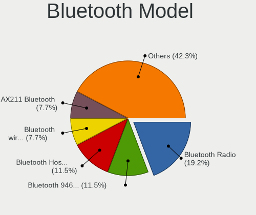
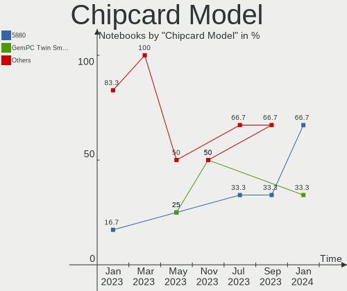

KDE neon - Hardware Trends (Notebooks)
--------------------------------------

A project to identify most popular hardware characteristics and track their change
over time based on data collected by Linux users at https://Linux-Hardware.org.

Anyone can contribute to this report by the [hw-probe](https://github.com/linuxhw/hw-probe) tool:

    sudo -E hw-probe -all -upload

This report is for one last month. Overall report since the beginning of time: [TestCoverage](https://github.com/linuxhw/TestCoverage)

Period: Jan, 2023.

Contents
--------

* [ System ](#system)
  - [ OS                       ](#os)
  - [ OS Family                ](#os-family)
  - [ Kernel                   ](#kernel)
  - [ Kernel Family            ](#kernel-family)
  - [ Kernel Major Ver.        ](#kernel-major-ver)
  - [ Arch                     ](#arch)
  - [ DE                       ](#de)
  - [ Display Server           ](#display-server)
  - [ Display Manager          ](#display-manager)
  - [ OS Lang                  ](#os-lang)
  - [ Boot Mode                ](#boot-mode)
  - [ Filesystem               ](#filesystem)
  - [ Part. scheme             ](#part-scheme)
  - [ Dual Boot with Linux/BSD ](#dual-boot-with-linuxbsd)
  - [ Dual Boot (Win)          ](#dual-boot-win)

* [ Board ](#board)
  - [ Vendor                   ](#vendor)
  - [ Model                    ](#model)
  - [ Model Family             ](#model-family)
  - [ MFG Year                 ](#mfg-year)
  - [ Form Factor              ](#form-factor)
  - [ Secure Boot              ](#secure-boot)
  - [ Coreboot                 ](#coreboot)
  - [ RAM Size                 ](#ram-size)
  - [ RAM Used                 ](#ram-used)
  - [ Total Drives             ](#total-drives)
  - [ Has CD-ROM               ](#has-cd-rom)
  - [ Has Ethernet             ](#has-ethernet)
  - [ Has WiFi                 ](#has-wifi)
  - [ Has Bluetooth            ](#has-bluetooth)

* [ Location ](#location)
  - [ Country                  ](#country)
  - [ City                     ](#city)

* [ Drives ](#drives)
  - [ Drive Vendor             ](#drive-vendor)
  - [ Drive Model              ](#drive-model)
  - [ HDD Vendor               ](#hdd-vendor)
  - [ SSD Vendor               ](#ssd-vendor)
  - [ Drive Kind               ](#drive-kind)
  - [ Drive Connector          ](#drive-connector)
  - [ Drive Size               ](#drive-size)
  - [ Space Total              ](#space-total)
  - [ Space Used               ](#space-used)
  - [ Malfunc. Drives          ](#malfunc-drives)
  - [ Malfunc. Drive Vendor    ](#malfunc-drive-vendor)
  - [ Malfunc. HDD Vendor      ](#malfunc-hdd-vendor)
  - [ Malfunc. Drive Kind      ](#malfunc-drive-kind)
  - [ Failed Drives            ](#failed-drives)
  - [ Failed Drive Vendor      ](#failed-drive-vendor)
  - [ Drive Status             ](#drive-status)

* [ Storage controller ](#storage-controller)
  - [ Storage Vendor           ](#storage-vendor)
  - [ Storage Model            ](#storage-model)
  - [ Storage Kind             ](#storage-kind)

* [ Processor ](#processor)
  - [ CPU Vendor               ](#cpu-vendor)
  - [ CPU Model                ](#cpu-model)
  - [ CPU Model Family         ](#cpu-model-family)
  - [ CPU Cores                ](#cpu-cores)
  - [ CPU Sockets              ](#cpu-sockets)
  - [ CPU Threads              ](#cpu-threads)
  - [ CPU Op-Modes             ](#cpu-op-modes)
  - [ CPU Microcode            ](#cpu-microcode)
  - [ CPU Microarch            ](#cpu-microarch)

* [ Graphics ](#graphics)
  - [ GPU Vendor               ](#gpu-vendor)
  - [ GPU Model                ](#gpu-model)
  - [ GPU Combo                ](#gpu-combo)
  - [ GPU Driver               ](#gpu-driver)
  - [ GPU Memory               ](#gpu-memory)

* [ Monitor ](#monitor)
  - [ Monitor Vendor           ](#monitor-vendor)
  - [ Monitor Model            ](#monitor-model)
  - [ Monitor Resolution       ](#monitor-resolution)
  - [ Monitor Diagonal         ](#monitor-diagonal)
  - [ Monitor Width            ](#monitor-width)
  - [ Aspect Ratio             ](#aspect-ratio)
  - [ Monitor Area             ](#monitor-area)
  - [ Pixel Density            ](#pixel-density)
  - [ Multiple Monitors        ](#multiple-monitors)

* [ Network ](#network)
  - [ Net Controller Vendor    ](#net-controller-vendor)
  - [ Net Controller Model     ](#net-controller-model)
  - [ Wireless Vendor          ](#wireless-vendor)
  - [ Wireless Model           ](#wireless-model)
  - [ Ethernet Vendor          ](#ethernet-vendor)
  - [ Ethernet Model           ](#ethernet-model)
  - [ Net Controller Kind      ](#net-controller-kind)
  - [ Used Controller          ](#used-controller)
  - [ NICs                     ](#nics)
  - [ IPv6                     ](#ipv6)

* [ Bluetooth ](#bluetooth)
  - [ Bluetooth Vendor         ](#bluetooth-vendor)
  - [ Bluetooth Model          ](#bluetooth-model)

* [ Sound ](#sound)
  - [ Sound Vendor             ](#sound-vendor)
  - [ Sound Model              ](#sound-model)

* [ Memory ](#memory)
  - [ Memory Vendor            ](#memory-vendor)
  - [ Memory Model             ](#memory-model)
  - [ Memory Kind              ](#memory-kind)
  - [ Memory Form Factor       ](#memory-form-factor)
  - [ Memory Size              ](#memory-size)
  - [ Memory Speed             ](#memory-speed)

* [ Printers & scanners ](#printers--scanners)
  - [ Printer Vendor           ](#printer-vendor)
  - [ Printer Model            ](#printer-model)
  - [ Scanner Vendor           ](#scanner-vendor)
  - [ Scanner Model            ](#scanner-model)

* [ Camera ](#camera)
  - [ Camera Vendor            ](#camera-vendor)
  - [ Camera Model             ](#camera-model)

* [ Security ](#security)
  - [ Fingerprint Vendor       ](#fingerprint-vendor)
  - [ Fingerprint Model        ](#fingerprint-model)
  - [ Chipcard Vendor          ](#chipcard-vendor)
  - [ Chipcard Model           ](#chipcard-model)

* [ Unsupported ](#unsupported)
  - [ Unsupported Devices      ](#unsupported-devices)
  - [ Unsupported Device Types ](#unsupported-device-types)

System
------

OS
--

Installed operating systems

| Name           | Notebooks | Percent |
|----------------|-----------|---------|
| KDE neon 22.04 | 57        | 93.44%  |
| KDE neon 20.04 | 4         | 6.56%   |

OS Family
---------

OS without a version

| Name     | Notebooks | Percent |
|----------|-----------|---------|
| KDE neon | 61        | 100%    |

Kernel
------

Version of the Linux kernel

| Version                    | Notebooks | Percent |
|----------------------------|-----------|---------|
| 5.15.0-58-generic          | 27        | 44.26%  |
| 5.15.0-57-generic          | 16        | 26.23%  |
| 5.15.0-56-generic          | 13        | 21.31%  |
| 6.1.8-2-liquorix-amd64     | 1         | 1.64%   |
| 5.19.0-17.1-liquorix-amd64 | 1         | 1.64%   |
| 5.15.0-52-generic          | 1         | 1.64%   |
| 5.14.15-051415-generic     | 1         | 1.64%   |
| 5.13.0-37-generic          | 1         | 1.64%   |

Kernel Family
-------------

Linux kernel without a distro release

| Version | Notebooks | Percent |
|---------|-----------|---------|
| 5.15.0  | 57        | 93.44%  |
| 6.1.8   | 1         | 1.64%   |
| 5.19.0  | 1         | 1.64%   |
| 5.14.15 | 1         | 1.64%   |
| 5.13.0  | 1         | 1.64%   |

Kernel Major Ver.
-----------------

Linux kernel major version

| Version | Notebooks | Percent |
|---------|-----------|---------|
| 5.15    | 57        | 93.44%  |
| 6.1     | 1         | 1.64%   |
| 5.19    | 1         | 1.64%   |
| 5.14    | 1         | 1.64%   |
| 5.13    | 1         | 1.64%   |

Arch
----

OS architecture (x86_64, i586, etc.)

| Name   | Notebooks | Percent |
|--------|-----------|---------|
| x86_64 | 61        | 100%    |

DE
--

Desktop Environment

| Name | Notebooks | Percent |
|------|-----------|---------|
| KDE5 | 61        | 100%    |

Display Server
--------------

X11 or Wayland

| Name    | Notebooks | Percent |
|---------|-----------|---------|
| X11     | 52        | 85.25%  |
| Wayland | 9         | 14.75%  |

Display Manager
---------------

SDDM, LightDM, etc.

| Name    | Notebooks | Percent |
|---------|-----------|---------|
| Unknown | 47        | 77.05%  |
| SDDM    | 14        | 22.95%  |

OS Lang
-------

Language

| Lang  | Notebooks | Percent |
|-------|-----------|---------|
| en_US | 19        | 31.15%  |
| ru_RU | 6         | 9.84%   |
| en_GB | 5         | 8.2%    |
| de_DE | 4         | 6.56%   |
| it_IT | 3         | 4.92%   |
| es_ES | 3         | 4.92%   |
| es_MX | 2         | 3.28%   |
| en_AU | 2         | 3.28%   |
| C     | 2         | 3.28%   |
| uk_UA | 1         | 1.64%   |
| tr_TR | 1         | 1.64%   |
| sl_SI | 1         | 1.64%   |
| pt_PT | 1         | 1.64%   |
| pt_BR | 1         | 1.64%   |
| pl_PL | 1         | 1.64%   |
| hu_HU | 1         | 1.64%   |
| hr_HR | 1         | 1.64%   |
| fr_FR | 1         | 1.64%   |
| fr_BE | 1         | 1.64%   |
| es_US | 1         | 1.64%   |
| en_DK | 1         | 1.64%   |
| en_DE | 1         | 1.64%   |
| ca_ES | 1         | 1.64%   |
| ca_AD | 1         | 1.64%   |

Boot Mode
---------

EFI or BIOS

| Mode | Notebooks | Percent |
|------|-----------|---------|
| BIOS | 54        | 88.52%  |
| EFI  | 7         | 11.48%  |

Filesystem
----------

Type of filesystem

| Type  | Notebooks | Percent |
|-------|-----------|---------|
| Ext4  | 58        | 95.08%  |
| Ext3  | 2         | 3.28%   |
| Btrfs | 1         | 1.64%   |

Part. scheme
------------

Scheme of partitioning

| Type    | Notebooks | Percent |
|---------|-----------|---------|
| Unknown | 47        | 77.05%  |
| GPT     | 12        | 19.67%  |
| MBR     | 2         | 3.28%   |

Dual Boot with Linux/BSD
------------------------

Hosting more than one Linux/BSD

| Dual boot | Notebooks | Percent |
|-----------|-----------|---------|
| No        | 58        | 95.08%  |
| Yes       | 3         | 4.92%   |

Dual Boot (Win)
---------------

Hosting Linux and Windows

| Dual boot | Notebooks | Percent |
|-----------|-----------|---------|
| No        | 53        | 86.89%  |
| Yes       | 8         | 13.11%  |

Board
-----

Vendor
------

Motherboard manufacturer

| Name                | Notebooks | Percent |
|---------------------|-----------|---------|
| Dell                | 12        | 19.67%  |
| ASUSTek Computer    | 11        | 18.03%  |
| Lenovo              | 10        | 16.39%  |
| Hewlett-Packard     | 7         | 11.48%  |
| Samsung Electronics | 3         | 4.92%   |
| Acer                | 3         | 4.92%   |
| Toshiba             | 2         | 3.28%   |
| MSI                 | 2         | 3.28%   |
| HUAWEI              | 2         | 3.28%   |
| Timi                | 1         | 1.64%   |
| Sony                | 1         | 1.64%   |
| Qilive              | 1         | 1.64%   |
| Pegatron            | 1         | 1.64%   |
| PC Specialist       | 1         | 1.64%   |
| Infinix             | 1         | 1.64%   |
| Fujitsu             | 1         | 1.64%   |
| Apple               | 1         | 1.64%   |
| Unknown             | 1         | 1.64%   |

Model
-----

Motherboard model

| Name                            | Notebooks | Percent |
|---------------------------------|-----------|---------|
| HP Notebook                     | 2         | 3.28%   |
| Toshiba Satellite P200          | 1         | 1.64%   |
| Toshiba Satellite A200          | 1         | 1.64%   |
| Timi RedmiBook Pro 15S          | 1         | 1.64%   |
| Sony VPCEA30EL                  | 1         | 1.64%   |
| Samsung 550XBE/350XBE           | 1         | 1.64%   |
| Samsung 550P5C/550P7C           | 1         | 1.64%   |
| Samsung 305V4A/305V5A           | 1         | 1.64%   |
| Qilive QW2214SP                 | 1         | 1.64%   |
| Pegatron B74                    | 1         | 1.64%   |
| PC Specialist P65_67RSRP        | 1         | 1.64%   |
| MSI GF63 Thin 10SC              | 1         | 1.64%   |
| MSI GE70 2QD                    | 1         | 1.64%   |
| Lenovo V15 G2 ITL 82KB          | 1         | 1.64%   |
| Lenovo ThinkPad T530 24292DG    | 1         | 1.64%   |
| Lenovo ThinkPad L380 20M5S09Y00 | 1         | 1.64%   |
| Lenovo Legion 5 15IMH05 82AU    | 1         | 1.64%   |
| Lenovo Legion 5 15ACH6H 82JU    | 1         | 1.64%   |
| Lenovo IdeaPad Y700-15ISK 80NV  | 1         | 1.64%   |
| Lenovo IdeaPad 530S-15IKB 81EV  | 1         | 1.64%   |
| Lenovo IdeaPad 330-15IKB 81DE   | 1         | 1.64%   |
| Lenovo IdeaPad 320-15AST 80XV   | 1         | 1.64%   |
| Lenovo G50-30 80G0              | 1         | 1.64%   |
| Infinix INBOOK X2 GEN11         | 1         | 1.64%   |
| HUAWEI WRTB-WXX9                | 1         | 1.64%   |
| HUAWEI KLVL-WXX9                | 1         | 1.64%   |
| HP Pavilion dv7                 | 1         | 1.64%   |
| HP Pavilion                     | 1         | 1.64%   |
| HP EliteBook Revolve 810 G3     | 1         | 1.64%   |
| HP EliteBook 8470p              | 1         | 1.64%   |
| HP 15                           | 1         | 1.64%   |
| Fujitsu LIFEBOOK A556           | 1         | 1.64%   |
| Dell XPS 17 9720                | 1         | 1.64%   |
| Dell XPS 15 9510                | 1         | 1.64%   |
| Dell XPS 15 7590                | 1         | 1.64%   |
| Dell XPS 13 9333                | 1         | 1.64%   |
| Dell Precision M6600            | 1         | 1.64%   |
| Dell Precision 7760             | 1         | 1.64%   |
| Dell Latitude E6520             | 1         | 1.64%   |
| Dell Latitude E5440             | 1         | 1.64%   |

Model Family
------------

Motherboard model prefix

| Name              | Notebooks | Percent |
|-------------------|-----------|---------|
| Lenovo IdeaPad    | 4         | 6.56%   |
| Dell XPS          | 4         | 6.56%   |
| Dell Latitude     | 3         | 4.92%   |
| Dell Inspiron     | 3         | 4.92%   |
| Toshiba Satellite | 2         | 3.28%   |
| Lenovo ThinkPad   | 2         | 3.28%   |
| Lenovo Legion     | 2         | 3.28%   |
| HP Pavilion       | 2         | 3.28%   |
| HP Notebook       | 2         | 3.28%   |
| HP EliteBook      | 2         | 3.28%   |
| Dell Precision    | 2         | 3.28%   |
| Acer Aspire       | 2         | 3.28%   |
| Timi RedmiBook    | 1         | 1.64%   |
| Sony VPCEA30EL    | 1         | 1.64%   |
| Samsung 550XBE    | 1         | 1.64%   |
| Samsung 550P5C    | 1         | 1.64%   |
| Samsung 305V4A    | 1         | 1.64%   |
| Qilive QW2214SP   | 1         | 1.64%   |
| Pegatron B74      | 1         | 1.64%   |
| PC Specialist P65 | 1         | 1.64%   |
| MSI GF63          | 1         | 1.64%   |
| MSI GE70          | 1         | 1.64%   |
| Lenovo V15        | 1         | 1.64%   |
| Lenovo G50-30     | 1         | 1.64%   |
| Infinix INBOOK    | 1         | 1.64%   |
| HUAWEI WRTB-WXX9  | 1         | 1.64%   |
| HUAWEI KLVL-WXX9  | 1         | 1.64%   |
| HP 15             | 1         | 1.64%   |
| Fujitsu LIFEBOOK  | 1         | 1.64%   |
| ASUS Zenbook      | 1         | 1.64%   |
| ASUS X751LK       | 1         | 1.64%   |
| ASUS X556UQK      | 1         | 1.64%   |
| ASUS X555LD       | 1         | 1.64%   |
| ASUS X541UV       | 1         | 1.64%   |
| ASUS TUF          | 1         | 1.64%   |
| ASUS TP301UJ      | 1         | 1.64%   |
| ASUS K55DR        | 1         | 1.64%   |
| ASUS K53SC        | 1         | 1.64%   |
| ASUS K50IJ        | 1         | 1.64%   |
| ASUS K501UW       | 1         | 1.64%   |

MFG Year
--------

Motherboard manufacture year

| Year | Notebooks | Percent |
|------|-----------|---------|
| 2016 | 9         | 14.75%  |
| 2021 | 6         | 9.84%   |
| 2019 | 5         | 8.2%    |
| 2015 | 5         | 8.2%    |
| 2011 | 5         | 8.2%    |
| 2022 | 4         | 6.56%   |
| 2020 | 4         | 6.56%   |
| 2018 | 4         | 6.56%   |
| 2014 | 4         | 6.56%   |
| 2013 | 4         | 6.56%   |
| 2012 | 4         | 6.56%   |
| 2017 | 2         | 3.28%   |
| 2007 | 2         | 3.28%   |
| 2010 | 1         | 1.64%   |
| 2009 | 1         | 1.64%   |
| 2008 | 1         | 1.64%   |

Form Factor
-----------

Physical design of the computer

| Name     | Notebooks | Percent |
|----------|-----------|---------|
| Notebook | 61        | 100%    |

Secure Boot
-----------

Enabled or disabled

| State    | Notebooks | Percent |
|----------|-----------|---------|
| Disabled | 61        | 100%    |

Coreboot
--------

Have coreboot on board

| Used | Notebooks | Percent |
|------|-----------|---------|
| No   | 61        | 100%    |

RAM Size
--------

Total RAM memory

| Size in GB  | Notebooks | Percent |
|-------------|-----------|---------|
| 4.01-8.0    | 22        | 36.07%  |
| 16.01-24.0  | 15        | 24.59%  |
| 3.01-4.0    | 10        | 16.39%  |
| 8.01-16.0   | 7         | 11.48%  |
| 32.01-64.0  | 4         | 6.56%   |
| 24.01-32.0  | 1         | 1.64%   |
| 64.01-256.0 | 1         | 1.64%   |
| 1.01-2.0    | 1         | 1.64%   |

RAM Used
--------

Used RAM memory

| Used GB   | Notebooks | Percent |
|-----------|-----------|---------|
| 2.01-3.0  | 20        | 32.79%  |
| 1.01-2.0  | 17        | 27.87%  |
| 4.01-8.0  | 10        | 16.39%  |
| 3.01-4.0  | 8         | 13.11%  |
| 8.01-16.0 | 4         | 6.56%   |
| 0.51-1.0  | 2         | 3.28%   |

Total Drives
------------

Number of drives on board

| Drives | Notebooks | Percent |
|--------|-----------|---------|
| 1      | 44        | 72.13%  |
| 2      | 13        | 21.31%  |
| 4      | 3         | 4.92%   |
| 3      | 1         | 1.64%   |

Has CD-ROM
----------

Has CD-ROM on board

| Presented | Notebooks | Percent |
|-----------|-----------|---------|
| No        | 39        | 63.93%  |
| Yes       | 22        | 36.07%  |

Has Ethernet
------------

Has Ethernet on board

| Presented | Notebooks | Percent |
|-----------|-----------|---------|
| Yes       | 52        | 85.25%  |
| No        | 9         | 14.75%  |

Has WiFi
--------

Has WiFi module

| Presented | Notebooks | Percent |
|-----------|-----------|---------|
| Yes       | 60        | 98.36%  |
| No        | 1         | 1.64%   |

Has Bluetooth
-------------

Has Bluetooth module

| Presented | Notebooks | Percent |
|-----------|-----------|---------|
| Yes       | 55        | 90.16%  |
| No        | 6         | 9.84%   |

Location
--------

Country
-------

Geographic location (country)

| Country      | Notebooks | Percent |
|--------------|-----------|---------|
| Germany      | 9         | 14.75%  |
| USA          | 6         | 9.84%   |
| Russia       | 6         | 9.84%   |
| Spain        | 5         | 8.2%    |
| UK           | 4         | 6.56%   |
| Romania      | 3         | 4.92%   |
| Italy        | 3         | 4.92%   |
| France       | 2         | 3.28%   |
| Brazil       | 2         | 3.28%   |
| Australia    | 2         | 3.28%   |
| Venezuela    | 1         | 1.64%   |
| Turkey       | 1         | 1.64%   |
| Thailand     | 1         | 1.64%   |
| Slovenia     | 1         | 1.64%   |
| Saudi Arabia | 1         | 1.64%   |
| Portugal     | 1         | 1.64%   |
| Poland       | 1         | 1.64%   |
| Netherlands  | 1         | 1.64%   |
| Mexico       | 1         | 1.64%   |
| Kazakhstan   | 1         | 1.64%   |
| Ivory Coast  | 1         | 1.64%   |
| India        | 1         | 1.64%   |
| Hungary      | 1         | 1.64%   |
| Georgia      | 1         | 1.64%   |
| Denmark      | 1         | 1.64%   |
| Croatia      | 1         | 1.64%   |
| Bangladesh   | 1         | 1.64%   |
| Argentina    | 1         | 1.64%   |
| Algeria      | 1         | 1.64%   |

City
----

Geographic location (city)

| City                      | Notebooks | Percent |
|---------------------------|-----------|---------|
| St Petersburg             | 2         | 3.28%   |
| Moscow                    | 2         | 3.28%   |
| Barcelona                 | 2         | 3.28%   |
| Youngstown                | 1         | 1.64%   |
| Yala                      | 1         | 1.64%   |
| Wuppertal                 | 1         | 1.64%   |
| Warstein                  | 1         | 1.64%   |
| Villafranca de los Barros | 1         | 1.64%   |
| Vila do Conde             | 1         | 1.64%   |
| Veigne                    | 1         | 1.64%   |
| Valdemoro                 | 1         | 1.64%   |
| Tbilisi                   | 1         | 1.64%   |
| Szombathely               | 1         | 1.64%   |
| Sydney                    | 1         | 1.64%   |
| Stockton-on-Tees          | 1         | 1.64%   |
| Split                     | 1         | 1.64%   |
| Sibiu                     | 1         | 1.64%   |
| Seattle                   | 1         | 1.64%   |
| Schwäbisch Gmünd        | 1         | 1.64%   |
| Rome                      | 1         | 1.64%   |
| Riyadh                    | 1         | 1.64%   |
| Rafael Castillo           | 1         | 1.64%   |
| Pune                      | 1         | 1.64%   |
| Porto Alegre              | 1         | 1.64%   |
| Oropesa                   | 1         | 1.64%   |
| Oradea                    | 1         | 1.64%   |
| Oklahoma City             | 1         | 1.64%   |
| Okehampton                | 1         | 1.64%   |
| Oberursel                 | 1         | 1.64%   |
| Nice                      | 1         | 1.64%   |
| Milan                     | 1         | 1.64%   |
| Mexicali                  | 1         | 1.64%   |
| Melbourne                 | 1         | 1.64%   |
| Manchester                | 1         | 1.64%   |
| Long Beach                | 1         | 1.64%   |
| Loebau                    | 1         | 1.64%   |
| Ljubljana                 | 1         | 1.64%   |
| Linz am Rhein             | 1         | 1.64%   |
| Kazan’                  | 1         | 1.64%   |
| Katowice                  | 1         | 1.64%   |

Drives
------

Drive Vendor
------------

Hard drive vendors

| Vendor              | Notebooks | Drives | Percent |
|---------------------|-----------|--------|---------|
| SanDisk             | 9         | 9      | 11.11%  |
| Samsung Electronics | 9         | 9      | 11.11%  |
| WDC                 | 8         | 8      | 9.88%   |
| Seagate             | 8         | 9      | 9.88%   |
| Toshiba             | 7         | 7      | 8.64%   |
| SK hynix            | 5         | 5      | 6.17%   |
| Kingston            | 5         | 6      | 6.17%   |
| Crucial             | 4         | 5      | 4.94%   |
| Unknown             | 3         | 4      | 3.7%    |
| Micron Technology   | 3         | 3      | 3.7%    |
| Hitachi             | 3         | 3      | 3.7%    |
| HGST                | 3         | 3      | 3.7%    |
| SPCC                | 1         | 1      | 1.23%   |
| Solid State Storage | 1         | 1      | 1.23%   |
| Phison Electronics  | 1         | 1      | 1.23%   |
| Netac               | 1         | 1      | 1.23%   |
| Lenovo              | 1         | 1      | 1.23%   |
| KIOXIA-EXCERIA      | 1         | 1      | 1.23%   |
| Kingchuxing         | 1         | 1      | 1.23%   |
| JMicron Technology  | 1         | 1      | 1.23%   |
| Intenso             | 1         | 1      | 1.23%   |
| Hewlett-Packard     | 1         | 1      | 1.23%   |
| Fujitsu             | 1         | 1      | 1.23%   |
| FORESEE             | 1         | 1      | 1.23%   |
| China               | 1         | 1      | 1.23%   |
| Unknown             | 1         | 1      | 1.23%   |

Drive Model
-----------

Hard drive models

| Model                                                | Notebooks | Percent |
|------------------------------------------------------|-----------|---------|
| Seagate ST1000LM024 HN-M101MBB 1TB                   | 3         | 3.53%   |
| Samsung NVMe SSD Controller SM981/PM981/PM983 500GB  | 3         | 3.53%   |
| Kingston SA400S37240G 240GB SSD                      | 3         | 3.53%   |
| Unknown MMC Card  128GB                              | 2         | 2.35%   |
| Toshiba MQ01ABF032 320GB                             | 2         | 2.35%   |
| Sandisk WD Black SN750 / PC SN730 NVMe SSD 1TB       | 2         | 2.35%   |
| Samsung NVMe SSD Controller PM9A1/PM9A3/980PRO 512GB | 2         | 2.35%   |
| WDC WDS240G2G0B-00EPW0 240GB SSD                     | 1         | 1.18%   |
| WDC WDS240G2G0A-00JH30 240GB SSD                     | 1         | 1.18%   |
| WDC WD10SPZX-21Z10T0 1TB                             | 1         | 1.18%   |
| WDC WD10SPCX-60KHST0 1TB                             | 1         | 1.18%   |
| WDC WD10JPVX-60JC3T1 1TB                             | 1         | 1.18%   |
| WDC WD10JPVX-60JC3T0 1TB                             | 1         | 1.18%   |
| WDC WD10JPVX-16JC3T3 1TB                             | 1         | 1.18%   |
| WDC WD10JPCX-24UE4T0 1TB                             | 1         | 1.18%   |
| Unknown MMC Card  249GB                              | 1         | 1.18%   |
| Unknown MMC Card  16GB                               | 1         | 1.18%   |
| Toshiba XG6 NVMe SSD Controller 512GB                | 1         | 1.18%   |
| Toshiba MQ04ABF100 1TB                               | 1         | 1.18%   |
| Toshiba MQ01ABD100 1TB                               | 1         | 1.18%   |
| Toshiba MQ01ABD032 320GB                             | 1         | 1.18%   |
| Toshiba BG3 NVMe SSD Controller 256GB                | 1         | 1.18%   |
| SPCC Solid State Disk 256GB                          | 1         | 1.18%   |
| Solid State Storage SSSTC CL1-4D256 256GB            | 1         | 1.18%   |
| SK hynix SC300 M.2 2280 256GB SSD                    | 1         | 1.18%   |
| SK hynix PC711 NVMe 512GB                            | 1         | 1.18%   |
| SK hynix HFS256G32MND-2200A 256GB SSD                | 1         | 1.18%   |
| SK hynix HFM001TD3JX013N 1TB                         | 1         | 1.18%   |
| SK hynix BC511 512GB                                 | 1         | 1.18%   |
| Seagate ST9320325AS 320GB                            | 1         | 1.18%   |
| Seagate ST500LT012-1DG142 500GB                      | 1         | 1.18%   |
| Seagate ST500LM030-2E717D 500GB                      | 1         | 1.18%   |
| Seagate ST500LM021-1KJ152 500GB                      | 1         | 1.18%   |
| Seagate ST320LT007-9ZV142 320GB                      | 1         | 1.18%   |
| Seagate OneTouch HDD 2TB                             | 1         | 1.18%   |
| Sandisk WD Blue SN550 NVMe SSD 1TB                   | 1         | 1.18%   |
| SanDisk Ultra II 240GB SSD                           | 1         | 1.18%   |
| SanDisk SSD U100 24GB                                | 1         | 1.18%   |
| SanDisk SSD PLUS 120GB                               | 1         | 1.18%   |
| SanDisk SDSSDA240G 240GB                             | 1         | 1.18%   |

HDD Vendor
----------

Hard disk drive vendors

| Vendor  | Notebooks | Drives | Percent |
|---------|-----------|--------|---------|
| Seagate | 8         | 9      | 30.77%  |
| WDC     | 6         | 6      | 23.08%  |
| Toshiba | 5         | 5      | 19.23%  |
| Hitachi | 3         | 3      | 11.54%  |
| HGST    | 3         | 3      | 11.54%  |
| Fujitsu | 1         | 1      | 3.85%   |

SSD Vendor
----------

Solid state drive vendors

| Vendor              | Notebooks | Drives | Percent |
|---------------------|-----------|--------|---------|
| SanDisk             | 6         | 6      | 20.69%  |
| Samsung Electronics | 4         | 4      | 13.79%  |
| Crucial             | 4         | 5      | 13.79%  |
| Kingston            | 3         | 4      | 10.34%  |
| WDC                 | 2         | 2      | 6.9%    |
| SK hynix            | 2         | 2      | 6.9%    |
| SPCC                | 1         | 1      | 3.45%   |
| Netac               | 1         | 1      | 3.45%   |
| Lenovo              | 1         | 1      | 3.45%   |
| KIOXIA-EXCERIA      | 1         | 1      | 3.45%   |
| JMicron Technology  | 1         | 1      | 3.45%   |
| Hewlett-Packard     | 1         | 1      | 3.45%   |
| China               | 1         | 1      | 3.45%   |
| Unknown             | 1         | 1      | 3.45%   |

Drive Kind
----------

HDD or SSD

| Kind    | Notebooks | Drives | Percent |
|---------|-----------|--------|---------|
| SSD     | 28        | 31     | 36.36%  |
| HDD     | 23        | 27     | 29.87%  |
| NVMe    | 21        | 21     | 27.27%  |
| MMC     | 3         | 4      | 3.9%    |
| Unknown | 2         | 2      | 2.6%    |

Drive Connector
---------------

SATA, SAS, NVMe, etc.

| Type | Notebooks | Drives | Percent |
|------|-----------|--------|---------|
| SATA | 44        | 57     | 61.97%  |
| NVMe | 21        | 21     | 29.58%  |
| SAS  | 3         | 3      | 4.23%   |
| MMC  | 3         | 4      | 4.23%   |

Drive Size
----------

Size of hard drive

| Size in TB | Notebooks | Drives | Percent |
|------------|-----------|--------|---------|
| 0.01-0.5   | 33        | 37     | 62.26%  |
| 0.51-1.0   | 18        | 19     | 33.96%  |
| 1.01-2.0   | 2         | 2      | 3.77%   |

Space Total
-----------

Amount of disk space available on the file system

| Size in GB | Notebooks | Percent |
|------------|-----------|---------|
| 101-250    | 21        | 34.43%  |
| 501-1000   | 16        | 26.23%  |
| 251-500    | 11        | 18.03%  |
| 21-50      | 4         | 6.56%   |
| 1001-2000  | 3         | 4.92%   |
| 51-100     | 3         | 4.92%   |
| 1-20       | 2         | 3.28%   |
| 2001-3000  | 1         | 1.64%   |

Space Used
----------

Amount of used disk space

| Used GB  | Notebooks | Percent |
|----------|-----------|---------|
| 1-20     | 28        | 45.9%   |
| 101-250  | 11        | 18.03%  |
| 21-50    | 9         | 14.75%  |
| 251-500  | 7         | 11.48%  |
| 51-100   | 5         | 8.2%    |
| 501-1000 | 1         | 1.64%   |

Malfunc. Drives
---------------

Drive models with a malfunction

| Model                         | Notebooks | Drives | Percent |
|-------------------------------|-----------|--------|---------|
| Hitachi HTS542525K9SA00 250GB | 1         | 1      | 100%    |

Malfunc. Drive Vendor
---------------------

Vendors of faulty drives

| Vendor  | Notebooks | Drives | Percent |
|---------|-----------|--------|---------|
| Hitachi | 1         | 1      | 100%    |

Malfunc. HDD Vendor
-------------------

Vendors of faulty HDD drives

| Vendor  | Notebooks | Drives | Percent |
|---------|-----------|--------|---------|
| Hitachi | 1         | 1      | 100%    |

Malfunc. Drive Kind
-------------------

Kinds of faulty drives

| Kind | Notebooks | Drives | Percent |
|------|-----------|--------|---------|
| HDD  | 1         | 1      | 100%    |

Failed Drives
-------------

Failed drive models

Zero info for selected period =(

Failed Drive Vendor
-------------------

Failed drive vendors

Zero info for selected period =(

Drive Status
------------

Number of failed and malfunc. drives

| Status   | Notebooks | Drives | Percent |
|----------|-----------|--------|---------|
| Detected | 55        | 78     | 90.16%  |
| Works    | 5         | 6      | 8.2%    |
| Malfunc  | 1         | 1      | 1.64%   |

Storage controller
------------------

Storage Vendor
--------------

Storage controller vendors

| Vendor                         | Notebooks | Percent |
|--------------------------------|-----------|---------|
| Intel                          | 49        | 63.64%  |
| AMD                            | 7         | 9.09%   |
| Samsung Electronics            | 5         | 6.49%   |
| SK hynix                       | 3         | 3.9%    |
| SanDisk                        | 3         | 3.9%    |
| Micron Technology              | 3         | 3.9%    |
| Toshiba America Info Systems   | 2         | 2.6%    |
| Kingston Technology Company    | 2         | 2.6%    |
| Solid State Storage Technology | 1         | 1.3%    |
| Shenzhen Longsys Electronics   | 1         | 1.3%    |
| Phison Electronics             | 1         | 1.3%    |

Storage Model
-------------

Storage controller models

| Model                                                                          | Notebooks | Percent |
|--------------------------------------------------------------------------------|-----------|---------|
| Intel Sunrise Point-LP SATA Controller [AHCI mode]                             | 7         | 8.64%   |
| AMD FCH SATA Controller [AHCI mode]                                            | 7         | 8.64%   |
| Intel Wildcat Point-LP SATA Controller [AHCI Mode]                             | 4         | 4.94%   |
| Intel Volume Management Device NVMe RAID Controller                            | 4         | 4.94%   |
| Intel 8 Series SATA Controller 1 [AHCI mode]                                   | 4         | 4.94%   |
| Samsung NVMe SSD Controller SM981/PM981/PM983                                  | 3         | 3.7%    |
| Micron Non-Volatile memory controller                                          | 3         | 3.7%    |
| Intel HM170/QM170 Chipset SATA Controller [AHCI Mode]                          | 3         | 3.7%    |
| Intel 82801 Mobile SATA Controller [RAID mode]                                 | 3         | 3.7%    |
| Intel 6 Series/C200 Series Chipset Family 6 port Mobile SATA AHCI Controller   | 3         | 3.7%    |
| SK hynix Gold P31/PC711 NVMe Solid State Drive                                 | 2         | 2.47%   |
| SanDisk WD Black SN750 / PC SN730 NVMe SSD                                     | 2         | 2.47%   |
| Samsung NVMe SSD Controller PM9A1/PM9A3/980PRO                                 | 2         | 2.47%   |
| Kingston Company Company Non-Volatile memory controller                        | 2         | 2.47%   |
| Intel Tiger Lake-LP SATA Controller                                            | 2         | 2.47%   |
| Intel Celeron/Pentium Silver Processor SATA Controller                         | 2         | 2.47%   |
| Intel Cannon Point-LP SATA Controller [AHCI Mode]                              | 2         | 2.47%   |
| Intel Cannon Lake Mobile PCH SATA AHCI Controller                              | 2         | 2.47%   |
| Intel 82801HM/HEM (ICH8M/ICH8M-E) SATA Controller [AHCI mode]                  | 2         | 2.47%   |
| Intel 82801HM/HEM (ICH8M/ICH8M-E) IDE Controller                               | 2         | 2.47%   |
| Intel 7 Series Chipset Family 6-port SATA Controller [AHCI mode]               | 2         | 2.47%   |
| Intel 7 Series Chipset Family 4-port SATA Controller [IDE mode]                | 2         | 2.47%   |
| Intel 7 Series Chipset Family 2-port SATA Controller [IDE mode]                | 2         | 2.47%   |
| Intel 400 Series Chipset Family SATA AHCI Controller                           | 2         | 2.47%   |
| Toshiba America Info Systems XG6 NVMe SSD Controller                           | 1         | 1.23%   |
| Toshiba America Info Systems BG3 NVMe SSD Controller                           | 1         | 1.23%   |
| Solid State Storage Non-Volatile memory controller                             | 1         | 1.23%   |
| SK hynix BC511                                                                 | 1         | 1.23%   |
| Shenzhen Longsys Electronics Non-Volatile memory controller                    | 1         | 1.23%   |
| SanDisk WD Blue SN550 NVMe SSD                                                 | 1         | 1.23%   |
| Phison E12 NVMe Controller                                                     | 1         | 1.23%   |
| Intel Comet Lake SATA AHCI Controller                                          | 1         | 1.23%   |
| Intel Atom Processor E3800 Series SATA AHCI Controller                         | 1         | 1.23%   |
| Intel 82801IBM/IEM (ICH9M/ICH9M-E) 4 port SATA Controller [AHCI mode]          | 1         | 1.23%   |
| Intel 8 Series/C220 Series Chipset Family 6-port SATA Controller 1 [AHCI mode] | 1         | 1.23%   |
| Intel 5 Series/3400 Series Chipset 4 port SATA AHCI Controller                 | 1         | 1.23%   |

Storage Kind
------------

Kind of storage controller (IDE, SATA, NVMe, SAS, ...)

| Kind | Notebooks | Percent |
|------|-----------|---------|
| SATA | 47        | 59.49%  |
| NVMe | 21        | 26.58%  |
| RAID | 7         | 8.86%   |
| IDE  | 4         | 5.06%   |

Processor
---------

CPU Vendor
----------

Processor vendors

| Vendor | Notebooks | Percent |
|--------|-----------|---------|
| Intel  | 53        | 86.89%  |
| AMD    | 8         | 13.11%  |

CPU Model
---------

Processor models

| Model                                  | Notebooks | Percent |
|----------------------------------------|-----------|---------|
| Intel Core i7-6500U CPU @ 2.50GHz      | 3         | 4.92%   |
| Intel Core i7-6700HQ CPU @ 2.60GHz     | 2         | 3.28%   |
| Intel Core i7-4510U CPU @ 2.00GHz      | 2         | 3.28%   |
| Intel Core i7-2720QM CPU @ 2.20GHz     | 2         | 3.28%   |
| Intel Core i5-8250U CPU @ 1.60GHz      | 2         | 3.28%   |
| Intel Core i5-6200U CPU @ 2.30GHz      | 2         | 3.28%   |
| Intel Core i5-4210U CPU @ 1.70GHz      | 2         | 3.28%   |
| Intel Pentium Dual CPU T2330 @ 1.60GHz | 1         | 1.64%   |
| Intel Pentium CPU P6100 @ 2.00GHz      | 1         | 1.64%   |
| Intel Core i9-9980HK CPU @ 2.40GHz     | 1         | 1.64%   |
| Intel Core i7-9750H CPU @ 2.60GHz      | 1         | 1.64%   |
| Intel Core i7-8565U CPU @ 1.80GHz      | 1         | 1.64%   |
| Intel Core i7-8550U CPU @ 1.80GHz      | 1         | 1.64%   |
| Intel Core i7-7500U CPU @ 2.70GHz      | 1         | 1.64%   |
| Intel Core i7-5500U CPU @ 2.40GHz      | 1         | 1.64%   |
| Intel Core i7-4770HQ CPU @ 2.20GHz     | 1         | 1.64%   |
| Intel Core i7-4720HQ CPU @ 2.60GHz     | 1         | 1.64%   |
| Intel Core i5-8265U CPU @ 1.60GHz      | 1         | 1.64%   |
| Intel Core i5-7300HQ CPU @ 2.50GHz     | 1         | 1.64%   |
| Intel Core i5-7200U CPU @ 2.50GHz      | 1         | 1.64%   |
| Intel Core i5-6360U CPU @ 2.00GHz      | 1         | 1.64%   |
| Intel Core i5-5200U CPU @ 2.20GHz      | 1         | 1.64%   |
| Intel Core i5-3320M CPU @ 2.60GHz      | 1         | 1.64%   |
| Intel Core i5-3230M CPU @ 2.60GHz      | 1         | 1.64%   |
| Intel Core i5-3210M CPU @ 2.50GHz      | 1         | 1.64%   |
| Intel Core i5-2410M CPU @ 2.30GHz      | 1         | 1.64%   |
| Intel Core i5-10500H CPU @ 2.50GHz     | 1         | 1.64%   |
| Intel Core i5-10300H CPU @ 2.50GHz     | 1         | 1.64%   |
| Intel Core i5-10210U CPU @ 1.60GHz     | 1         | 1.64%   |
| Intel Core i3-5015U CPU @ 2.10GHz      | 1         | 1.64%   |
| Intel Core i3-5005U CPU @ 2.00GHz      | 1         | 1.64%   |
| Intel Core i3-4010U CPU @ 1.70GHz      | 1         | 1.64%   |
| Intel Core i3-3120M CPU @ 2.50GHz      | 1         | 1.64%   |
| Intel Core i3-2310M CPU @ 2.10GHz      | 1         | 1.64%   |
| Intel Core 2 Duo CPU T9300 @ 2.50GHz   | 1         | 1.64%   |
| Intel Core 2 Duo CPU T5800 @ 2.00GHz   | 1         | 1.64%   |
| Intel Celeron N4020 CPU @ 1.10GHz      | 1         | 1.64%   |
| Intel Celeron J4105 CPU @ 1.50GHz      | 1         | 1.64%   |
| Intel Celeron CPU N2830 @ 2.16GHz      | 1         | 1.64%   |
| Intel 12th Gen Core i9-12900HK         | 1         | 1.64%   |

CPU Model Family
----------------

Processor model prefix

| Model              | Notebooks | Percent |
|--------------------|-----------|---------|
| Intel Core i5      | 18        | 29.51%  |
| Intel Core i7      | 16        | 26.23%  |
| Other              | 7         | 11.48%  |
| Intel Core i3      | 5         | 8.2%    |
| Intel Celeron      | 3         | 4.92%   |
| AMD Ryzen 5        | 3         | 4.92%   |
| Intel Core 2 Duo   | 2         | 3.28%   |
| AMD A8             | 2         | 3.28%   |
| Intel Pentium Dual | 1         | 1.64%   |
| Intel Pentium      | 1         | 1.64%   |
| Intel Core i9      | 1         | 1.64%   |
| AMD Ryzen 7        | 1         | 1.64%   |
| AMD A4             | 1         | 1.64%   |

CPU Cores
---------

Number of processor cores

| Number | Notebooks | Percent |
|--------|-----------|---------|
| 2      | 32        | 52.46%  |
| 4      | 19        | 31.15%  |
| 8      | 4         | 6.56%   |
| 6      | 4         | 6.56%   |
| 14     | 2         | 3.28%   |

CPU Sockets
-----------

Number of sockets

| Number | Notebooks | Percent |
|--------|-----------|---------|
| 1      | 61        | 100%    |

CPU Threads
-----------

Threads per core (Hyper-Threading)

| Number | Notebooks | Percent |
|--------|-----------|---------|
| 2      | 50        | 81.97%  |
| 1      | 11        | 18.03%  |

CPU Op-Modes
------------

CPU Operation Modes (32-bit, 64-bit)

| Op mode        | Notebooks | Percent |
|----------------|-----------|---------|
| 32-bit, 64-bit | 61        | 100%    |

CPU Microcode
-------------

Microcode number

| Number  | Notebooks | Percent |
|---------|-----------|---------|
| Unknown | 51        | 83.61%  |
| 0x40651 | 2         | 3.28%   |
| 0x806e9 | 1         | 1.64%   |
| 0x806c2 | 1         | 1.64%   |
| 0x706a1 | 1         | 1.64%   |
| 0x6fd   | 1         | 1.64%   |
| 0x406e3 | 1         | 1.64%   |
| 0x306d4 | 1         | 1.64%   |
| 0x306c3 | 1         | 1.64%   |
| 0x206a7 | 1         | 1.64%   |

CPU Microarch
-------------

Microarchitecture

| Name          | Notebooks | Percent |
|---------------|-----------|---------|
| KabyLake      | 11        | 18.03%  |
| Skylake       | 8         | 13.11%  |
| Haswell       | 7         | 11.48%  |
| SandyBridge   | 4         | 6.56%   |
| IvyBridge     | 4         | 6.56%   |
| Broadwell     | 4         | 6.56%   |
| Unknown       | 4         | 6.56%   |
| Zen 3         | 2         | 3.28%   |
| TigerLake     | 2         | 3.28%   |
| Goldmont plus | 2         | 3.28%   |
| Core          | 2         | 3.28%   |
| CometLake     | 2         | 3.28%   |
| Zen+          | 1         | 1.64%   |
| Zen 2         | 1         | 1.64%   |
| Westmere      | 1         | 1.64%   |
| Silvermont    | 1         | 1.64%   |
| Piledriver    | 1         | 1.64%   |
| Penryn        | 1         | 1.64%   |
| K10 Llano     | 1         | 1.64%   |
| Jaguar        | 1         | 1.64%   |
| Excavator     | 1         | 1.64%   |

Graphics
--------

GPU Vendor
----------

Vendors of graphics cards

| Vendor | Notebooks | Percent |
|--------|-----------|---------|
| Intel  | 49        | 52.69%  |
| Nvidia | 30        | 32.26%  |
| AMD    | 14        | 15.05%  |

GPU Model
---------

Graphics card models

| Model                                                                                 | Notebooks | Percent |
|---------------------------------------------------------------------------------------|-----------|---------|
| Intel Skylake GT2 [HD Graphics 520]                                                   | 5         | 5.21%   |
| Intel Haswell-ULT Integrated Graphics Controller                                      | 5         | 5.21%   |
| Intel HD Graphics 5500                                                                | 4         | 4.17%   |
| Intel 2nd Generation Core Processor Family Integrated Graphics Controller             | 4         | 4.17%   |
| Nvidia TU117M [GeForce GTX 1650 Mobile / Max-Q]                                       | 3         | 3.13%   |
| Intel UHD Graphics 620                                                                | 3         | 3.13%   |
| Intel 3rd Gen Core processor Graphics Controller                                      | 3         | 3.13%   |
| Nvidia GP108M [GeForce MX150]                                                         | 2         | 2.08%   |
| Nvidia GM107M [GeForce GTX 960M]                                                      | 2         | 2.08%   |
| Nvidia GM107M [GeForce GTX 950M]                                                      | 2         | 2.08%   |
| Nvidia GF117M [GeForce 610M/710M/810M/820M / GT 620M/625M/630M/720M]                  | 2         | 2.08%   |
| Intel WhiskeyLake-U GT2 [UHD Graphics 620]                                            | 2         | 2.08%   |
| Intel TigerLake-H GT1 [UHD Graphics]                                                  | 2         | 2.08%   |
| Intel HD Graphics 620                                                                 | 2         | 2.08%   |
| Intel GeminiLake [UHD Graphics 600]                                                   | 2         | 2.08%   |
| Intel CometLake-H GT2 [UHD Graphics]                                                  | 2         | 2.08%   |
| Intel CoffeeLake-H GT2 [UHD Graphics 630]                                             | 2         | 2.08%   |
| Intel Alder Lake-P Integrated Graphics Controller                                     | 2         | 2.08%   |
| AMD Topaz XT [Radeon R7 M260/M265 / M340/M360 / M440/M445 / 530/535 / 620/625 Mobile] | 2         | 2.08%   |
| AMD Cezanne [Radeon Vega Series / Radeon Vega Mobile Series]                          | 2         | 2.08%   |
| Nvidia TU117M [GeForce GTX 1650 Ti Mobile]                                            | 1         | 1.04%   |
| Nvidia TU117GLM [T1200 Laptop GPU]                                                    | 1         | 1.04%   |
| Nvidia TU106M [GeForce RTX 2060 Mobile]                                               | 1         | 1.04%   |
| Nvidia GP108M [GeForce MX250]                                                         | 1         | 1.04%   |
| Nvidia GP107M [GeForce GTX 1050 Mobile]                                               | 1         | 1.04%   |
| Nvidia GP104BM [GeForce GTX 1070 Mobile]                                              | 1         | 1.04%   |
| Nvidia GM108M [GeForce MX110]                                                         | 1         | 1.04%   |
| Nvidia GM108M [GeForce 940MX]                                                         | 1         | 1.04%   |
| Nvidia GM108M [GeForce 920MX]                                                         | 1         | 1.04%   |
| Nvidia GM108M [GeForce 840M]                                                          | 1         | 1.04%   |
| Nvidia GM107M [GeForce GTX 850M]                                                      | 1         | 1.04%   |
| Nvidia GK208BM [GeForce 920M]                                                         | 1         | 1.04%   |
| Nvidia GF119M [NVS 4200M]                                                             | 1         | 1.04%   |
| Nvidia GF119M [GeForce GT 520MX]                                                      | 1         | 1.04%   |
| Nvidia GF108M [GeForce GT 620M/630M/635M/640M LE]                                     | 1         | 1.04%   |
| Nvidia GF104GLM [Quadro 4000M]                                                        | 1         | 1.04%   |
| Nvidia GA107M [GeForce RTX 3050 Ti Mobile]                                            | 1         | 1.04%   |
| Nvidia GA106M [GeForce RTX 3060 Mobile / Max-Q]                                       | 1         | 1.04%   |
| Nvidia GA104M [GeForce RTX 3070 Mobile / Max-Q]                                       | 1         | 1.04%   |
| Intel TigerLake-LP GT2 [Iris Xe Graphics]                                             | 1         | 1.04%   |

GPU Combo
---------

Combinations of graphics cards

| Name           | Notebooks | Percent |
|----------------|-----------|---------|
| Intel + Nvidia | 27        | 44.26%  |
| 1 x Intel      | 19        | 31.15%  |
| 1 x AMD        | 6         | 9.84%   |
| 2 x AMD        | 3         | 4.92%   |
| Intel + AMD    | 3         | 4.92%   |
| AMD + Nvidia   | 2         | 3.28%   |
| 1 x Nvidia     | 1         | 1.64%   |

GPU Driver
----------

Free vs proprietary

| Driver      | Notebooks | Percent |
|-------------|-----------|---------|
| Free        | 50        | 81.97%  |
| Proprietary | 9         | 14.75%  |
| Unknown     | 2         | 3.28%   |

GPU Memory
----------

Total video memory

| Size in GB | Notebooks | Percent |
|------------|-----------|---------|
| Unknown    | 56        | 91.8%   |
| 0.01-0.5   | 2         | 3.28%   |
| 7.01-8.0   | 1         | 1.64%   |
| 1.01-2.0   | 1         | 1.64%   |
| 0.51-1.0   | 1         | 1.64%   |

Monitor
-------

Monitor Vendor
--------------

Monitor vendors

| Vendor                  | Notebooks | Percent |
|-------------------------|-----------|---------|
| AU Optronics            | 13        | 20%     |
| BOE                     | 12        | 18.46%  |
| Chimei Innolux          | 10        | 15.38%  |
| LG Display              | 7         | 10.77%  |
| Samsung Electronics     | 6         | 9.23%   |
| Dell                    | 3         | 4.62%   |
| TMX                     | 2         | 3.08%   |
| PANDA                   | 2         | 3.08%   |
| LG Philips              | 2         | 3.08%   |
| Xiaomi                  | 1         | 1.54%   |
| Sharp                   | 1         | 1.54%   |
| KDC                     | 1         | 1.54%   |
| Goldstar                | 1         | 1.54%   |
| CPT                     | 1         | 1.54%   |
| Chi Mei Optoelectronics | 1         | 1.54%   |
| Apple                   | 1         | 1.54%   |
| Ancor Communications    | 1         | 1.54%   |

Monitor Model
-------------

Monitor models

| Model                                                                     | Notebooks | Percent |
|---------------------------------------------------------------------------|-----------|---------|
| Xiaomi Mi TV XMD00E1 1440x900 708x398mm 32.0-inch                         | 1         | 1.52%   |
| TMX TL156MDMP01-0 TMX1560 3200x2000 336x210mm 15.6-inch                   | 1         | 1.52%   |
| TMX TL140VDXP04-0 TMX1398 1920x1080 309x174mm 14.0-inch                   | 1         | 1.52%   |
| Sharp LCD Monitor SHP1517 3840x2400 366x229mm 17.0-inch                   | 1         | 1.52%   |
| Samsung Electronics S24D300 SAM0B43 1920x1080 531x299mm 24.0-inch         | 1         | 1.52%   |
| Samsung Electronics LCD Monitor SEC3252 1600x900 344x194mm 15.5-inch      | 1         | 1.52%   |
| Samsung Electronics LCD Monitor SEC324A 1366x768 344x194mm 15.5-inch      | 1         | 1.52%   |
| Samsung Electronics LCD Monitor SDCA029 3840x2160 344x194mm 15.5-inch     | 1         | 1.52%   |
| Samsung Electronics LCD Monitor SDC4154 2880x1800 302x189mm 14.0-inch     | 1         | 1.52%   |
| Samsung Electronics C49HG9x SAM0E5D 3840x1080 1196x336mm 48.9-inch        | 1         | 1.52%   |
| PANDA LCD Monitor NCP002D 1920x1080 344x194mm 15.5-inch                   | 1         | 1.52%   |
| PANDA LCD Monitor NCP0027 1920x1080 344x194mm 15.5-inch                   | 1         | 1.52%   |
| LG Philips LP154WX4-TLC8 LPL0120 1280x800 331x207mm 15.4-inch             | 1         | 1.52%   |
| LG Philips LCD Monitor LPLA002 1440x900 367x230mm 17.1-inch               | 1         | 1.52%   |
| LG Display LCD Monitor LGD06B3 1920x1200 336x210mm 15.6-inch              | 1         | 1.52%   |
| LG Display LCD Monitor LGD0532 1920x1080 344x194mm 15.5-inch              | 1         | 1.52%   |
| LG Display LCD Monitor LGD04BE 1366x768 344x194mm 15.5-inch               | 1         | 1.52%   |
| LG Display LCD Monitor LGD04A7 1920x1080 344x194mm 15.5-inch              | 1         | 1.52%   |
| LG Display LCD Monitor LGD046C 1920x1080 382x215mm 17.3-inch              | 1         | 1.52%   |
| LG Display LCD Monitor LGD02DA 1920x1080 382x215mm 17.3-inch              | 1         | 1.52%   |
| LG Display LCD Monitor LGD02D9 1920x1080 344x194mm 15.5-inch              | 1         | 1.52%   |
| KDC LCD Monitor KDC0607 1366x768 309x174mm 14.0-inch                      | 1         | 1.52%   |
| Goldstar W2353 GSM56F0 1920x1080 510x290mm 23.1-inch                      | 1         | 1.52%   |
| Dell U2722D DEL422D 2560x1440 597x336mm 27.0-inch                         | 1         | 1.52%   |
| Dell U2715H DELD069 2560x1440 597x336mm 27.0-inch                         | 1         | 1.52%   |
| Dell U2412M DELA07A 1920x1200 518x324mm 24.1-inch                         | 1         | 1.52%   |
| Dell U2412M DELA079 1920x1200 518x324mm 24.1-inch                         | 1         | 1.52%   |
| CPT LCD Monitor CPT14BF 1366x768 344x193mm 15.5-inch                      | 1         | 1.52%   |
| Chimei Innolux P130ZFA-BA1 CMN8201 2160x1440 275x183mm 13.0-inch          | 1         | 1.52%   |
| Chimei Innolux LCD Monitor CMN174A 1920x1080 381x214mm 17.2-inch          | 1         | 1.52%   |
| Chimei Innolux LCD Monitor CMN1735 1920x1080 382x215mm 17.3-inch          | 1         | 1.52%   |
| Chimei Innolux LCD Monitor CMN1734 1600x900 382x214mm 17.2-inch           | 1         | 1.52%   |
| Chimei Innolux LCD Monitor CMN15D5 1920x1080 344x193mm 15.5-inch          | 1         | 1.52%   |
| Chimei Innolux LCD Monitor CMN15CA 1366x768 344x193mm 15.5-inch           | 1         | 1.52%   |
| Chimei Innolux LCD Monitor CMN15C4 1920x1080 344x193mm 15.5-inch          | 1         | 1.52%   |
| Chimei Innolux LCD Monitor CMN1475 1366x768 309x174mm 14.0-inch           | 1         | 1.52%   |
| Chimei Innolux LCD Monitor CMN1361 1920x1080 293x165mm 13.2-inch          | 1         | 1.52%   |
| Chimei Innolux LCD Monitor CMN1345 1920x1080 293x165mm 13.2-inch          | 1         | 1.52%   |
| Chi Mei Optoelectronics LCD Monitor CMO1720 1920x1080 382x215mm 17.3-inch | 1         | 1.52%   |
| BOE LCD Monitor BOE0A1C 1920x1080 344x194mm 15.5-inch                     | 1         | 1.52%   |

Monitor Resolution
------------------

Monitor screen resolution

| Resolution        | Notebooks | Percent |
|-------------------|-----------|---------|
| 1920x1080 (FHD)   | 29        | 45.31%  |
| 1366x768 (WXGA)   | 16        | 25%     |
| 1600x900 (HD+)    | 4         | 6.25%   |
| 3840x2160 (4K)    | 2         | 3.13%   |
| 2880x1800         | 2         | 3.13%   |
| 2560x1440 (QHD)   | 2         | 3.13%   |
| 2160x1440         | 2         | 3.13%   |
| 1920x1200 (WUXGA) | 2         | 3.13%   |
| 3840x2400         | 1         | 1.56%   |
| 3840x1080         | 1         | 1.56%   |
| 3200x2000         | 1         | 1.56%   |
| 1440x900 (WXGA+)  | 1         | 1.56%   |
| 1280x800 (WXGA)   | 1         | 1.56%   |

Monitor Diagonal
----------------

Diagonal size in inches

| Inches | Notebooks | Percent |
|--------|-----------|---------|
| 15     | 33        | 50.77%  |
| 17     | 9         | 13.85%  |
| 14     | 7         | 10.77%  |
| 13     | 6         | 9.23%   |
| 27     | 2         | 3.08%   |
| 24     | 2         | 3.08%   |
| 23     | 2         | 3.08%   |
| 49     | 1         | 1.54%   |
| 43     | 1         | 1.54%   |
| 12     | 1         | 1.54%   |
| 11     | 1         | 1.54%   |

Monitor Width
-------------

Physical width

| Width in mm | Notebooks | Percent |
|-------------|-----------|---------|
| 301-350     | 41        | 63.08%  |
| 351-400     | 9         | 13.85%  |
| 201-300     | 7         | 10.77%  |
| 501-600     | 6         | 9.23%   |
| 1001-1500   | 1         | 1.54%   |
| 901-1000    | 1         | 1.54%   |

Aspect Ratio
------------

Proportional relationship between the width and the height

| Ratio | Notebooks | Percent |
|-------|-----------|---------|
| 16/9  | 50        | 81.97%  |
| 16/10 | 8         | 13.11%  |
| 3/2   | 2         | 3.28%   |
| 32/9  | 1         | 1.64%   |

Monitor Area
------------

Area in inch²

| Area in inch² | Notebooks | Percent |
|----------------|-----------|---------|
| 101-110        | 33        | 50.77%  |
| 81-90          | 9         | 13.85%  |
| 121-130        | 8         | 12.31%  |
| 71-80          | 4         | 6.15%   |
| 201-250        | 3         | 4.62%   |
| 301-350        | 2         | 3.08%   |
| 501-1000       | 2         | 3.08%   |
| 61-70          | 1         | 1.54%   |
| 51-60          | 1         | 1.54%   |
| 251-300        | 1         | 1.54%   |
| 131-140        | 1         | 1.54%   |

Pixel Density
-------------

Pixels per inch

| Density       | Notebooks | Percent |
|---------------|-----------|---------|
| 121-160       | 28        | 43.08%  |
| 101-120       | 20        | 30.77%  |
| 51-100        | 7         | 10.77%  |
| 161-240       | 6         | 9.23%   |
| More than 240 | 4         | 6.15%   |

Multiple Monitors
-----------------

Total monitors connected

| Total | Notebooks | Percent |
|-------|-----------|---------|
| 1     | 49        | 80.33%  |
| 2     | 8         | 13.11%  |
| 0     | 3         | 4.92%   |
| 3     | 1         | 1.64%   |

Network
-------

Net Controller Vendor
---------------------

Controller vendors

| Vendor                   | Notebooks | Percent |
|--------------------------|-----------|---------|
| Realtek Semiconductor    | 38        | 38.38%  |
| Intel                    | 32        | 32.32%  |
| Qualcomm Atheros         | 16        | 16.16%  |
| Broadcom                 | 5         | 5.05%   |
| TP-Link                  | 2         | 2.02%   |
| Xiaomi                   | 1         | 1.01%   |
| Samsung Electronics      | 1         | 1.01%   |
| Motorola PCS             | 1         | 1.01%   |
| MediaTek                 | 1         | 1.01%   |
| Marvell Technology Group | 1         | 1.01%   |
| DisplayLink              | 1         | 1.01%   |

Net Controller Model
--------------------

Controller models

| Model                                                                   | Notebooks | Percent |
|-------------------------------------------------------------------------|-----------|---------|
| Realtek RTL8111/8168/8411 PCI Express Gigabit Ethernet Controller       | 22        | 18.97%  |
| Realtek RTL810xE PCI Express Fast Ethernet controller                   | 10        | 8.62%   |
| Realtek RTL8723BE PCIe Wireless Network Adapter                         | 4         | 3.45%   |
| Qualcomm Atheros QCA9377 802.11ac Wireless Network Adapter              | 4         | 3.45%   |
| Intel Wireless 7265                                                     | 4         | 3.45%   |
| Intel 82579LM Gigabit Network Connection (Lewisville)                   | 4         | 3.45%   |
| Qualcomm Atheros AR9485 Wireless Network Adapter                        | 3         | 2.59%   |
| Intel Wireless 8260                                                     | 3         | 2.59%   |
| Intel Wi-Fi 6 AX200                                                     | 3         | 2.59%   |
| Intel Centrino Ultimate-N 6300                                          | 3         | 2.59%   |
| Realtek RTL8821CE 802.11ac PCIe Wireless Network Adapter                | 2         | 1.72%   |
| Qualcomm Atheros QCA9565 / AR9565 Wireless Network Adapter              | 2         | 1.72%   |
| Qualcomm Atheros AR9285 Wireless Network Adapter (PCI-Express)          | 2         | 1.72%   |
| Intel Wireless 8265 / 8275                                              | 2         | 1.72%   |
| Intel Wireless 7260                                                     | 2         | 1.72%   |
| Intel Wireless 3160                                                     | 2         | 1.72%   |
| Intel Wi-Fi 6 AX201                                                     | 2         | 1.72%   |
| Intel Comet Lake PCH CNVi WiFi                                          | 2         | 1.72%   |
| Broadcom BCM43142 802.11b/g/n                                           | 2         | 1.72%   |
| Broadcom BCM4313 802.11bgn Wireless Network Adapter                     | 2         | 1.72%   |
| Xiaomi Mi/Redmi series (RNDIS)                                          | 1         | 0.86%   |
| TP-Link TL-WN823N v2/v3 [Realtek RTL8192EU]                             | 1         | 0.86%   |
| TP-Link AC600 wireless Realtek RTL8811AU [Archer T2U Nano]              | 1         | 0.86%   |
| Samsung Galaxy series, misc. (tethering mode)                           | 1         | 0.86%   |
| Realtek RTL8822CE 802.11ac PCIe Wireless Network Adapter                | 1         | 0.86%   |
| Realtek RTL8822BE 802.11a/b/g/n/ac WiFi adapter                         | 1         | 0.86%   |
| Realtek RTL8723DE Wireless Network Adapter                              | 1         | 0.86%   |
| Realtek RTL8723AE PCIe Wireless Network Adapter                         | 1         | 0.86%   |
| Realtek RTL8153 Gigabit Ethernet Adapter                                | 1         | 0.86%   |
| Realtek Realtek Network controller                                      | 1         | 0.86%   |
| Realtek 802.11ac WLAN Adapter                                           | 1         | 0.86%   |
| Realtek 802.11ac NIC                                                    | 1         | 0.86%   |
| Qualcomm Atheros QCA8171 Gigabit Ethernet                               | 1         | 0.86%   |
| Qualcomm Atheros Killer E2500 Gigabit Ethernet Controller               | 1         | 0.86%   |
| Qualcomm Atheros Killer E220x Gigabit Ethernet Controller               | 1         | 0.86%   |
| Qualcomm Atheros AR8161 Gigabit Ethernet                                | 1         | 0.86%   |
| Qualcomm Atheros AR8121/AR8113/AR8114 Gigabit or Fast Ethernet          | 1         | 0.86%   |
| Qualcomm Atheros AR242x / AR542x Wireless Network Adapter (PCI-Express) | 1         | 0.86%   |
| Motorola PCS motorola one 5G ace                                        | 1         | 0.86%   |
| MediaTek WLAN controller                                                | 1         | 0.86%   |

Wireless Vendor
---------------

Wireless vendors

| Vendor                | Notebooks | Percent |
|-----------------------|-----------|---------|
| Intel                 | 31        | 49.21%  |
| Realtek Semiconductor | 12        | 19.05%  |
| Qualcomm Atheros      | 12        | 19.05%  |
| Broadcom              | 5         | 7.94%   |
| TP-Link               | 2         | 3.17%   |
| MediaTek              | 1         | 1.59%   |

Wireless Model
--------------

Wireless models

| Model                                                                   | Notebooks | Percent |
|-------------------------------------------------------------------------|-----------|---------|
| Realtek RTL8723BE PCIe Wireless Network Adapter                         | 4         | 6.25%   |
| Qualcomm Atheros QCA9377 802.11ac Wireless Network Adapter              | 4         | 6.25%   |
| Intel Wireless 7265                                                     | 4         | 6.25%   |
| Qualcomm Atheros AR9485 Wireless Network Adapter                        | 3         | 4.69%   |
| Intel Wireless 8260                                                     | 3         | 4.69%   |
| Intel Wi-Fi 6 AX200                                                     | 3         | 4.69%   |
| Intel Centrino Ultimate-N 6300                                          | 3         | 4.69%   |
| Realtek RTL8821CE 802.11ac PCIe Wireless Network Adapter                | 2         | 3.13%   |
| Qualcomm Atheros QCA9565 / AR9565 Wireless Network Adapter              | 2         | 3.13%   |
| Qualcomm Atheros AR9285 Wireless Network Adapter (PCI-Express)          | 2         | 3.13%   |
| Intel Wireless 8265 / 8275                                              | 2         | 3.13%   |
| Intel Wireless 7260                                                     | 2         | 3.13%   |
| Intel Wireless 3160                                                     | 2         | 3.13%   |
| Intel Wi-Fi 6 AX201                                                     | 2         | 3.13%   |
| Intel Comet Lake PCH CNVi WiFi                                          | 2         | 3.13%   |
| Broadcom BCM43142 802.11b/g/n                                           | 2         | 3.13%   |
| Broadcom BCM4313 802.11bgn Wireless Network Adapter                     | 2         | 3.13%   |
| TP-Link TL-WN823N v2/v3 [Realtek RTL8192EU]                             | 1         | 1.56%   |
| TP-Link AC600 wireless Realtek RTL8811AU [Archer T2U Nano]              | 1         | 1.56%   |
| Realtek RTL8822CE 802.11ac PCIe Wireless Network Adapter                | 1         | 1.56%   |
| Realtek RTL8822BE 802.11a/b/g/n/ac WiFi adapter                         | 1         | 1.56%   |
| Realtek RTL8723DE Wireless Network Adapter                              | 1         | 1.56%   |
| Realtek RTL8723AE PCIe Wireless Network Adapter                         | 1         | 1.56%   |
| Realtek Realtek Network controller                                      | 1         | 1.56%   |
| Realtek 802.11ac WLAN Adapter                                           | 1         | 1.56%   |
| Realtek 802.11ac NIC                                                    | 1         | 1.56%   |
| Qualcomm Atheros AR242x / AR542x Wireless Network Adapter (PCI-Express) | 1         | 1.56%   |
| MediaTek WLAN controller                                                | 1         | 1.56%   |
| Intel Wireless-AC 9260                                                  | 1         | 1.56%   |
| Intel Wi-Fi 6 AX210/AX211/AX411 160MHz                                  | 1         | 1.56%   |
| Intel Tiger Lake PCH CNVi WiFi                                          | 1         | 1.56%   |
| Intel PRO/Wireless 3945ABG [Golan] Network Connection                   | 1         | 1.56%   |
| Intel Comet Lake PCH-LP CNVi WiFi                                       | 1         | 1.56%   |
| Intel Centrino Advanced-N 6235                                          | 1         | 1.56%   |
| Intel Centrino Advanced-N 6205 [Taylor Peak]                            | 1         | 1.56%   |
| Intel Alder Lake-P PCH CNVi WiFi                                        | 1         | 1.56%   |
| Broadcom BCM4360 802.11ac Wireless Network Adapter                      | 1         | 1.56%   |

Ethernet Vendor
---------------

Ethernet vendors

| Vendor                   | Notebooks | Percent |
|--------------------------|-----------|---------|
| Realtek Semiconductor    | 33        | 63.46%  |
| Intel                    | 9         | 17.31%  |
| Qualcomm Atheros         | 5         | 9.62%   |
| Xiaomi                   | 1         | 1.92%   |
| Samsung Electronics      | 1         | 1.92%   |
| Motorola PCS             | 1         | 1.92%   |
| Marvell Technology Group | 1         | 1.92%   |
| DisplayLink              | 1         | 1.92%   |

Ethernet Model
--------------

Ethernet models

| Model                                                                          | Notebooks | Percent |
|--------------------------------------------------------------------------------|-----------|---------|
| Realtek RTL8111/8168/8411 PCI Express Gigabit Ethernet Controller              | 22        | 42.31%  |
| Realtek RTL810xE PCI Express Fast Ethernet controller                          | 10        | 19.23%  |
| Intel 82579LM Gigabit Network Connection (Lewisville)                          | 4         | 7.69%   |
| Xiaomi Mi/Redmi series (RNDIS)                                                 | 1         | 1.92%   |
| Samsung Galaxy series, misc. (tethering mode)                                  | 1         | 1.92%   |
| Realtek RTL8153 Gigabit Ethernet Adapter                                       | 1         | 1.92%   |
| Qualcomm Atheros QCA8171 Gigabit Ethernet                                      | 1         | 1.92%   |
| Qualcomm Atheros Killer E2500 Gigabit Ethernet Controller                      | 1         | 1.92%   |
| Qualcomm Atheros Killer E220x Gigabit Ethernet Controller                      | 1         | 1.92%   |
| Qualcomm Atheros AR8161 Gigabit Ethernet                                       | 1         | 1.92%   |
| Qualcomm Atheros AR8121/AR8113/AR8114 Gigabit or Fast Ethernet                 | 1         | 1.92%   |
| Motorola PCS motorola one 5G ace                                               | 1         | 1.92%   |
| Marvell Group Yukon Optima 88E8059 [PCIe Gigabit Ethernet Controller with AVB] | 1         | 1.92%   |
| Intel Ethernet Connection I218-LM                                              | 1         | 1.92%   |
| Intel Ethernet Connection (4) I219-V                                           | 1         | 1.92%   |
| Intel Ethernet Connection (4) I219-LM                                          | 1         | 1.92%   |
| Intel Ethernet Connection (3) I218-LM                                          | 1         | 1.92%   |
| Intel Ethernet Connection (14) I219-LM                                         | 1         | 1.92%   |
| DisplayLink USB3.0 5K Graphic Docking                                          | 1         | 1.92%   |

Net Controller Kind
-------------------

Ethernet, WiFi or modem

| Kind     | Notebooks | Percent |
|----------|-----------|---------|
| WiFi     | 60        | 53.57%  |
| Ethernet | 52        | 46.43%  |

Used Controller
---------------

Currently used network controller

| Kind     | Notebooks | Percent |
|----------|-----------|---------|
| WiFi     | 50        | 81.97%  |
| Ethernet | 11        | 18.03%  |

NICs
----

Total network controllers on board

| Total | Notebooks | Percent |
|-------|-----------|---------|
| 2     | 46        | 75.41%  |
| 1     | 15        | 24.59%  |

IPv6
----

IPv6 vs IPv4

| Used | Notebooks | Percent |
|------|-----------|---------|
| No   | 49        | 80.33%  |
| Yes  | 12        | 19.67%  |

Bluetooth
---------

Bluetooth Vendor
----------------

Controller vendors

| Vendor                          | Notebooks | Percent |
|---------------------------------|-----------|---------|
| Intel                           | 26        | 47.27%  |
| Realtek Semiconductor           | 7         | 12.73%  |
| Qualcomm Atheros Communications | 5         | 9.09%   |
| Lite-On Technology              | 3         | 5.45%   |
| Broadcom                        | 3         | 5.45%   |
| IMC Networks                    | 2         | 3.64%   |
| Dell                            | 2         | 3.64%   |
| Toshiba                         | 1         | 1.82%   |
| Realtek                         | 1         | 1.82%   |
| Opticis                         | 1         | 1.82%   |
| Foxconn International           | 1         | 1.82%   |
| Foxconn / Hon Hai               | 1         | 1.82%   |
| ASUSTek Computer                | 1         | 1.82%   |
| Apple                           | 1         | 1.82%   |

Bluetooth Model
---------------

Controller models

| Model                                                                               | Notebooks | Percent |
|-------------------------------------------------------------------------------------|-----------|---------|
| Intel Bluetooth wireless interface                                                  | 13        | 23.64%  |
| Realtek Bluetooth Radio                                                             | 5         | 9.09%   |
| Intel Bluetooth Device                                                              | 4         | 7.27%   |
| Qualcomm Atheros  Bluetooth Device                                                  | 3         | 5.45%   |
| Intel Bluetooth 9460/9560 Jefferson Peak (JfP)                                      | 3         | 5.45%   |
| Intel AX200 Bluetooth                                                               | 3         | 5.45%   |
| Lite-On Bluetooth Device                                                            | 2         | 3.64%   |
| Dell DW375 Bluetooth Module                                                         | 2         | 3.64%   |
| Toshiba Integrated Bluetooth HCI                                                    | 1         | 1.82%   |
| Realtek RTL8822BE Bluetooth 4.2 Adapter                                             | 1         | 1.82%   |
| Realtek 802.11n WLAN Adapter                                                        | 1         | 1.82%   |
| Realtek Bluetooth Radio                                                             | 1         | 1.82%   |
| Qualcomm Atheros AR3012 Bluetooth 4.0                                               | 1         | 1.82%   |
| Qualcomm Atheros AR3011 Bluetooth                                                   | 1         | 1.82%   |
| Opticis Bluetooth Radio                                                             | 1         | 1.82%   |
| Lite-On Atheros AR3012 Bluetooth                                                    | 1         | 1.82%   |
| Intel Wireless-AC 9260 Bluetooth Adapter                                            | 1         | 1.82%   |
| Intel Centrino Bluetooth Wireless Transceiver                                       | 1         | 1.82%   |
| Intel AX210 Bluetooth                                                               | 1         | 1.82%   |
| IMC Networks Bluetooth Radio                                                        | 1         | 1.82%   |
| IMC Networks Atheros AR3012 Bluetooth 4.0 Adapter                                   | 1         | 1.82%   |
| Foxconn International BCM43142A0 Bluetooth module                                   | 1         | 1.82%   |
| Foxconn / Hon Hai Foxconn T77H114 BCM2070 [Single-Chip Bluetooth 2.1 + EDR Adapter] | 1         | 1.82%   |
| Broadcom HP Portable SoftSailing                                                    | 1         | 1.82%   |
| Broadcom BCM43142 Bluetooth 4.0                                                     | 1         | 1.82%   |
| Broadcom BCM20702 Bluetooth 4.0 [ThinkPad]                                          | 1         | 1.82%   |
| ASUS Broadcom BCM20702A0 Bluetooth                                                  | 1         | 1.82%   |
| Apple Bluetooth Host Controller                                                     | 1         | 1.82%   |

Sound
-----

Sound Vendor
------------

Sound card vendors

| Vendor   | Notebooks | Percent |
|----------|-----------|---------|
| Intel    | 53        | 68.83%  |
| Nvidia   | 12        | 15.58%  |
| AMD      | 11        | 14.29%  |
| Logitech | 1         | 1.3%    |

Sound Model
-----------

Sound card models

| Model                                                                      | Notebooks | Percent |
|----------------------------------------------------------------------------|-----------|---------|
| Intel Sunrise Point-LP HD Audio                                            | 11        | 11.7%   |
| Intel Haswell-ULT HD Audio Controller                                      | 5         | 5.32%   |
| Intel 8 Series HD Audio Controller                                         | 5         | 5.32%   |
| Intel Wildcat Point-LP High Definition Audio Controller                    | 4         | 4.26%   |
| Intel Broadwell-U Audio Controller                                         | 4         | 4.26%   |
| Intel 7 Series/C216 Chipset Family High Definition Audio Controller        | 4         | 4.26%   |
| Intel 6 Series/C200 Series Chipset Family High Definition Audio Controller | 4         | 4.26%   |
| AMD Family 17h/19h HD Audio Controller                                     | 4         | 4.26%   |
| Nvidia TU107 GeForce GTX 1650 High Definition Audio Controller             | 3         | 3.19%   |
| AMD FCH Azalia Controller                                                  | 3         | 3.19%   |
| Intel Tiger Lake-LP Smart Sound Technology Audio Controller                | 2         | 2.13%   |
| Intel Tiger Lake-H HD Audio Controller                                     | 2         | 2.13%   |
| Intel Comet Lake PCH cAVS                                                  | 2         | 2.13%   |
| Intel Celeron/Pentium Silver Processor High Definition Audio               | 2         | 2.13%   |
| Intel Cannon Point-LP High Definition Audio Controller                     | 2         | 2.13%   |
| Intel Cannon Lake PCH cAVS                                                 | 2         | 2.13%   |
| Intel Alder Lake PCH-P High Definition Audio Controller                    | 2         | 2.13%   |
| Intel 82801H (ICH8 Family) HD Audio Controller                             | 2         | 2.13%   |
| Intel 8 Series/C220 Series Chipset High Definition Audio Controller        | 2         | 2.13%   |
| Intel 100 Series/C230 Series Chipset Family HD Audio Controller            | 2         | 2.13%   |
| AMD Renoir Radeon High Definition Audio Controller                         | 2         | 2.13%   |
| Nvidia TU106 High Definition Audio Controller                              | 1         | 1.06%   |
| Nvidia GP107GL High Definition Audio Controller                            | 1         | 1.06%   |
| Nvidia GP104 High Definition Audio Controller                              | 1         | 1.06%   |
| Nvidia GK208 HDMI/DP Audio Controller                                      | 1         | 1.06%   |
| Nvidia GF119 HDMI Audio Controller                                         | 1         | 1.06%   |
| Nvidia GF108 High Definition Audio Controller                              | 1         | 1.06%   |
| Nvidia GF104 High Definition Audio Controller                              | 1         | 1.06%   |
| Nvidia GA106 High Definition Audio Controller                              | 1         | 1.06%   |
| Nvidia GA104 High Definition Audio Controller                              | 1         | 1.06%   |
| Logitech 960 Headset                                                       | 1         | 1.06%   |
| Intel Xeon E3-1200 v3/4th Gen Core Processor HD Audio Controller           | 1         | 1.06%   |
| Intel Crystal Well HD Audio Controller                                     | 1         | 1.06%   |
| Intel Comet Lake PCH-LP cAVS                                               | 1         | 1.06%   |
| Intel CM238 HD Audio Controller                                            | 1         | 1.06%   |
| Intel Atom Processor Z36xxx/Z37xxx Series High Definition Audio Controller | 1         | 1.06%   |
| Intel 82801I (ICH9 Family) HD Audio Controller                             | 1         | 1.06%   |
| Intel 5 Series/3400 Series Chipset High Definition Audio                   | 1         | 1.06%   |
| AMD Turks HDMI Audio [Radeon HD 6500/6600 / 6700M Series]                  | 1         | 1.06%   |
| AMD Trinity HDMI Audio Controller                                          | 1         | 1.06%   |

Memory
------

Memory Vendor
-------------

Memory module vendors

| Vendor              | Notebooks | Percent |
|---------------------|-----------|---------|
| Samsung Electronics | 4         | 30.77%  |
| Micron Technology   | 3         | 23.08%  |
| SK hynix            | 2         | 15.38%  |
| Unknown (ABCD)      | 1         | 7.69%   |
| Unknown             | 1         | 7.69%   |
| Kingston            | 1         | 7.69%   |
| Corsair             | 1         | 7.69%   |

Memory Model
------------

Memory module models

| Model                                                            | Notebooks | Percent |
|------------------------------------------------------------------|-----------|---------|
| Unknown RAM Module 2GB SODIMM DDR2 667MT/s                       | 1         | 6.67%   |
| Unknown RAM Module 1GB SODIMM DDR2 667MT/s                       | 1         | 6.67%   |
| Unknown (ABCD) RAM 123456789012345678 2GB SODIMM LPDDR4 2400MT/s | 1         | 6.67%   |
| SK hynix RAM HMT451S6BFR8A-PB 4096MB SODIMM DDR3 1600MT/s        | 1         | 6.67%   |
| SK hynix RAM HMA81GS6MFR8N-TF 8GB SODIMM DDR4 2133MT/s           | 1         | 6.67%   |
| Samsung RAM M471B5273EB0-CK0 4GB SODIMM DDR3 4199MT/s            | 1         | 6.67%   |
| Samsung RAM M471B5173BH0-YK0 4GB SODIMM DDR3 1600MT/s            | 1         | 6.67%   |
| Samsung RAM M471A5143DB0-CPB 4096MB SODIMM DDR4 2133MT/s         | 1         | 6.67%   |
| Samsung RAM 53E1G32D4NQ-046WTE 1GB Row Of Chips LPDDR4 3200MT/s  | 1         | 6.67%   |
| Micron RAM Module 4GB SODIMM DDR3 1600MT/s                       | 1         | 6.67%   |
| Micron RAM 8KTF51264HZ-1G6E1 4GB SODIMM DDR3 1600MT/s            | 1         | 6.67%   |
| Micron RAM 16KTF51264HZ-1G6M1 4GB SODIMM DDR3 1600MT/s           | 1         | 6.67%   |
| Kingston RAM MSI16D3LS1MNG/8G 8GB SODIMM DDR3 1600MT/s           | 1         | 6.67%   |
| Kingston RAM 99U5428-018.A00LF 8GB SODIMM DDR3 1600MT/s          | 1         | 6.67%   |
| Corsair RAM CMSO16GX4M1A2133C15 16GB SODIMM DDR4 2133MT/s        | 1         | 6.67%   |

Memory Kind
-----------

Memory module kinds

| Kind   | Notebooks | Percent |
|--------|-----------|---------|
| DDR3   | 4         | 40%     |
| LPDDR4 | 2         | 20%     |
| DDR4   | 2         | 20%     |
| SDRAM  | 1         | 10%     |
| DDR2   | 1         | 10%     |

Memory Form Factor
------------------

Physical design of the memory module

| Name         | Notebooks | Percent |
|--------------|-----------|---------|
| SODIMM       | 9         | 90%     |
| Row Of Chips | 1         | 10%     |

Memory Size
-----------

Memory module size

| Size  | Notebooks | Percent |
|-------|-----------|---------|
| 4096  | 5         | 41.67%  |
| 8192  | 3         | 25%     |
| 1024  | 2         | 16.67%  |
| 16384 | 1         | 8.33%   |
| 2048  | 1         | 8.33%   |

Memory Speed
------------

Memory module speed

| Speed | Notebooks | Percent |
|-------|-----------|---------|
| 1600  | 4         | 40%     |
| 2133  | 2         | 20%     |
| 4199  | 1         | 10%     |
| 3200  | 1         | 10%     |
| 2400  | 1         | 10%     |
| 667   | 1         | 10%     |

Printers & scanners
-------------------

Printer Vendor
--------------

Printer device vendors

| Vendor | Notebooks | Percent |
|--------|-----------|---------|
| Canon  | 1         | 100%    |

Printer Model
-------------

Printer device models

| Model             | Notebooks | Percent |
|-------------------|-----------|---------|
| Canon PIXMA MX300 | 1         | 100%    |

Scanner Vendor
--------------

Scanner device vendors

Zero info for selected period =(

Scanner Model
-------------

Scanner device models

Zero info for selected period =(

Camera
------

Camera Vendor
-------------

Camera device vendors

| Vendor                                 | Notebooks | Percent |
|----------------------------------------|-----------|---------|
| Chicony Electronics                    | 11        | 20.37%  |
| IMC Networks                           | 8         | 14.81%  |
| Microdia                               | 7         | 12.96%  |
| Realtek Semiconductor                  | 6         | 11.11%  |
| Cheng Uei Precision Industry (Foxlink) | 4         | 7.41%   |
| Suyin                                  | 3         | 5.56%   |
| Silicon Motion                         | 3         | 5.56%   |
| Acer                                   | 3         | 5.56%   |
| Sunplus Innovation Technology          | 2         | 3.7%    |
| Alcor Micro                            | 2         | 3.7%    |
| Ricoh                                  | 1         | 1.85%   |
| Quanta                                 | 1         | 1.85%   |
| Logitech                               | 1         | 1.85%   |
| Google                                 | 1         | 1.85%   |
| GEMBIRD                                | 1         | 1.85%   |

Camera Model
------------

Camera device models

| Model                                                                      | Notebooks | Percent |
|----------------------------------------------------------------------------|-----------|---------|
| Realtek Integrated_Webcam_HD                                               | 3         | 5.56%   |
| Microdia Integrated_Webcam_HD                                              | 3         | 5.56%   |
| Chicony USB 2.0 Camera                                                     | 3         | 5.56%   |
| Realtek USB2.0 VGA UVC WebCam                                              | 2         | 3.7%    |
| Microdia USB 2.0 Camera                                                    | 2         | 3.7%    |
| IMC Networks USB2.0 HD UVC WebCam                                          | 2         | 3.7%    |
| IMC Networks Integrated Camera                                             | 2         | 3.7%    |
| IMC Networks EasyCamera                                                    | 2         | 3.7%    |
| Chicony Integrated Camera                                                  | 2         | 3.7%    |
| Suyin USB 2.0 Camera                                                       | 1         | 1.85%   |
| Suyin Integrated_Webcam_HD                                                 | 1         | 1.85%   |
| Suyin HD WebCam                                                            | 1         | 1.85%   |
| Sunplus XiaoMi USB 2.0 Webcam                                              | 1         | 1.85%   |
| Sunplus Asus Webcam                                                        | 1         | 1.85%   |
| Silicon Motion WebCam SCB-1100N                                            | 1         | 1.85%   |
| Silicon Motion WebCam SC-13HDL11939N                                       | 1         | 1.85%   |
| Silicon Motion Web Camera                                                  | 1         | 1.85%   |
| Ricoh Laptop_Integrated_Webcam_FHD                                         | 1         | 1.85%   |
| Realtek HD WebCam                                                          | 1         | 1.85%   |
| Quanta HD User Facing                                                      | 1         | 1.85%   |
| Microdia Lenovo EasyCamera                                                 | 1         | 1.85%   |
| Microdia Integrated Webcam                                                 | 1         | 1.85%   |
| Logitech Webcam C310                                                       | 1         | 1.85%   |
| IMC Networks USB2.0 VGA UVC WebCam                                         | 1         | 1.85%   |
| IMC Networks HD Camera                                                     | 1         | 1.85%   |
| Google Nexus/Pixel Device (MTP + debug)                                    | 1         | 1.85%   |
| GEMBIRD Generic UVC 1.00 camera [AppoTech AX2311]                          | 1         | 1.85%   |
| Chicony USB2.0 VGA UVC WebCam                                              | 1         | 1.85%   |
| Chicony Integrated Camera (1280x720@30)                                    | 1         | 1.85%   |
| Chicony HP Webcam                                                          | 1         | 1.85%   |
| Chicony HP TrueVision HD                                                   | 1         | 1.85%   |
| Chicony FJ Camera                                                          | 1         | 1.85%   |
| Chicony 2.0M UVC Webcam / CNF7129                                          | 1         | 1.85%   |
| Cheng Uei Precision Industry (Foxlink) Webcam                              | 1         | 1.85%   |
| Cheng Uei Precision Industry (Foxlink) HP Wide Vision HD integrated webcam | 1         | 1.85%   |
| Cheng Uei Precision Industry (Foxlink) HP EliteBook integrated HD Webcam   | 1         | 1.85%   |
| Cheng Uei Precision Industry (Foxlink) HD Camera                           | 1         | 1.85%   |
| Alcor Micro USB Camera                                                     | 1         | 1.85%   |
| Alcor Micro Asus Integrated Webcam                                         | 1         | 1.85%   |
| Acer Lenovo EasyCamera                                                     | 1         | 1.85%   |

Security
--------

Fingerprint Vendor
------------------

Fingerprint sensor vendors

| Vendor                     | Notebooks | Percent |
|----------------------------|-----------|---------|
| Validity Sensors           | 2         | 33.33%  |
| Shenzhen Goodix Technology | 2         | 33.33%  |
| Synaptics                  | 1         | 16.67%  |
| LighTuning Technology      | 1         | 16.67%  |

Fingerprint Model
-----------------

Fingerprint sensor models

| Model                                            | Notebooks | Percent |
|--------------------------------------------------|-----------|---------|
| Validity Sensors VFS491                          | 1         | 16.67%  |
| Validity Sensors Fingerprint scanner             | 1         | 16.67%  |
| Synaptics Metallica MOH Touch Fingerprint Reader | 1         | 16.67%  |
| Shenzhen Goodix  Fingerprint Device              | 1         | 16.67%  |
| Shenzhen Goodix Fingerprint Reader               | 1         | 16.67%  |
| LighTuning ES603 Swipe Fingerprint Sensor        | 1         | 16.67%  |

Chipcard Vendor
---------------

Chipcard module vendors

| Vendor   | Notebooks | Percent |
|----------|-----------|---------|
| Broadcom | 4         | 66.67%  |
| Upek     | 1         | 16.67%  |
| Lenovo   | 1         | 16.67%  |

Chipcard Model
--------------

Chipcard module models

| Model                                                      | Notebooks | Percent |
|------------------------------------------------------------|-----------|---------|
| Broadcom BCM5880 Secure Applications Processor             | 2         | 33.33%  |
| Upek TouchChip Fingerprint Coprocessor (WBF advanced mode) | 1         | 16.67%  |
| Lenovo Integrated Smart Card Reader                        | 1         | 16.67%  |
| Broadcom 5880                                              | 1         | 16.67%  |
| Broadcom 58200                                             | 1         | 16.67%  |

Unsupported
-----------

Unsupported Devices
-------------------

Total unsupported devices on board

| Total | Notebooks | Percent |
|-------|-----------|---------|
| 0     | 39        | 63.93%  |
| 1     | 15        | 24.59%  |
| 2     | 6         | 9.84%   |
| 3     | 1         | 1.64%   |

Unsupported Device Types
------------------------

Types of unsupported devices

| Type                  | Notebooks | Percent |
|-----------------------|-----------|---------|
| Graphics card         | 7         | 25.93%  |
| Fingerprint reader    | 6         | 22.22%  |
| Chipcard              | 5         | 18.52%  |
| Net/wireless          | 3         | 11.11%  |
| Multimedia controller | 3         | 11.11%  |
| Storage               | 2         | 7.41%   |
| Network               | 1         | 3.7%    |

