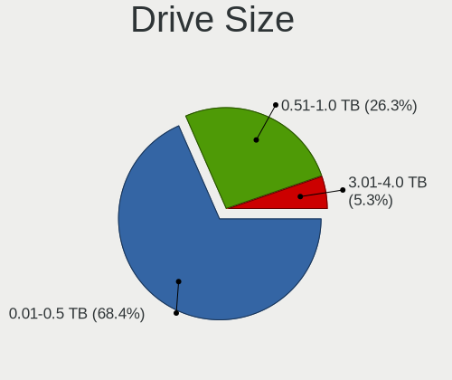
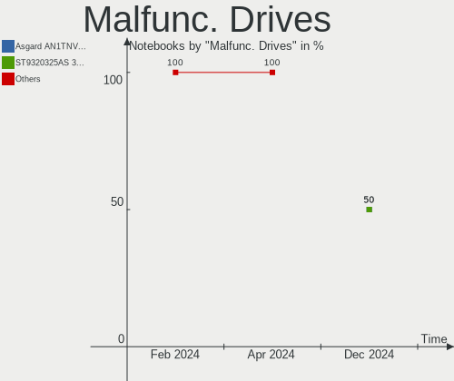
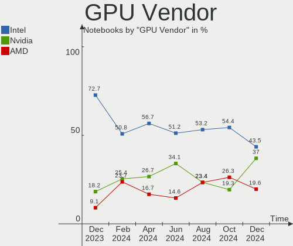
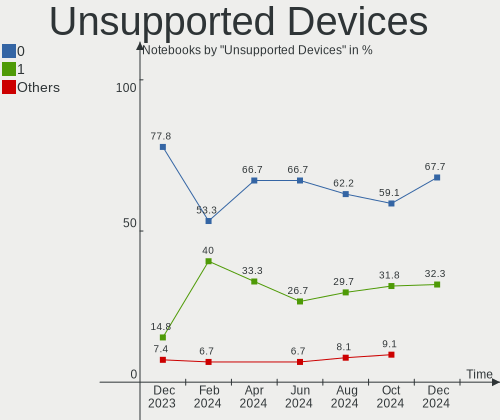

KDE neon - Hardware Trends (Notebooks)
--------------------------------------

A project to identify most popular hardware characteristics and track their change
over time based on data collected by Linux users at https://Linux-Hardware.org.

Anyone can contribute to this report by the [hw-probe](https://github.com/linuxhw/hw-probe) tool:

    sudo -E hw-probe -all -upload

This report is for one last month. Overall report since the beginning of time: [TestDays](https://github.com/linuxhw/TestDays)

Period: Apr, 2024.

Contents
--------

* [ System ](#system)
  - [ OS                       ](#os)
  - [ OS Family                ](#os-family)
  - [ Kernel                   ](#kernel)
  - [ Kernel Family            ](#kernel-family)
  - [ Kernel Major Ver.        ](#kernel-major-ver)
  - [ Arch                     ](#arch)
  - [ DE                       ](#de)
  - [ Display Server           ](#display-server)
  - [ Display Manager          ](#display-manager)
  - [ OS Lang                  ](#os-lang)
  - [ Boot Mode                ](#boot-mode)
  - [ Filesystem               ](#filesystem)
  - [ Part. scheme             ](#part-scheme)
  - [ Dual Boot with Linux/BSD ](#dual-boot-with-linuxbsd)
  - [ Dual Boot (Win)          ](#dual-boot-win)

* [ Board ](#board)
  - [ Vendor                   ](#vendor)
  - [ Model                    ](#model)
  - [ Model Family             ](#model-family)
  - [ MFG Year                 ](#mfg-year)
  - [ Form Factor              ](#form-factor)
  - [ Secure Boot              ](#secure-boot)
  - [ Coreboot                 ](#coreboot)
  - [ RAM Size                 ](#ram-size)
  - [ RAM Used                 ](#ram-used)
  - [ Total Drives             ](#total-drives)
  - [ Has CD-ROM               ](#has-cd-rom)
  - [ Has Ethernet             ](#has-ethernet)
  - [ Has WiFi                 ](#has-wifi)
  - [ Has Bluetooth            ](#has-bluetooth)

* [ Location ](#location)
  - [ Country                  ](#country)
  - [ City                     ](#city)

* [ Drives ](#drives)
  - [ Drive Vendor             ](#drive-vendor)
  - [ Drive Model              ](#drive-model)
  - [ HDD Vendor               ](#hdd-vendor)
  - [ SSD Vendor               ](#ssd-vendor)
  - [ Drive Kind               ](#drive-kind)
  - [ Drive Connector          ](#drive-connector)
  - [ Drive Size               ](#drive-size)
  - [ Space Total              ](#space-total)
  - [ Space Used               ](#space-used)
  - [ Malfunc. Drives          ](#malfunc-drives)
  - [ Malfunc. Drive Vendor    ](#malfunc-drive-vendor)
  - [ Malfunc. HDD Vendor      ](#malfunc-hdd-vendor)
  - [ Malfunc. Drive Kind      ](#malfunc-drive-kind)
  - [ Failed Drives            ](#failed-drives)
  - [ Failed Drive Vendor      ](#failed-drive-vendor)
  - [ Drive Status             ](#drive-status)

* [ Storage controller ](#storage-controller)
  - [ Storage Vendor           ](#storage-vendor)
  - [ Storage Model            ](#storage-model)
  - [ Storage Kind             ](#storage-kind)

* [ Processor ](#processor)
  - [ CPU Vendor               ](#cpu-vendor)
  - [ CPU Model                ](#cpu-model)
  - [ CPU Model Family         ](#cpu-model-family)
  - [ CPU Cores                ](#cpu-cores)
  - [ CPU Sockets              ](#cpu-sockets)
  - [ CPU Threads              ](#cpu-threads)
  - [ CPU Op-Modes             ](#cpu-op-modes)
  - [ CPU Microcode            ](#cpu-microcode)
  - [ CPU Microarch            ](#cpu-microarch)

* [ Graphics ](#graphics)
  - [ GPU Vendor               ](#gpu-vendor)
  - [ GPU Model                ](#gpu-model)
  - [ GPU Combo                ](#gpu-combo)
  - [ GPU Driver               ](#gpu-driver)
  - [ GPU Memory               ](#gpu-memory)

* [ Monitor ](#monitor)
  - [ Monitor Vendor           ](#monitor-vendor)
  - [ Monitor Model            ](#monitor-model)
  - [ Monitor Resolution       ](#monitor-resolution)
  - [ Monitor Diagonal         ](#monitor-diagonal)
  - [ Monitor Width            ](#monitor-width)
  - [ Aspect Ratio             ](#aspect-ratio)
  - [ Monitor Area             ](#monitor-area)
  - [ Pixel Density            ](#pixel-density)
  - [ Multiple Monitors        ](#multiple-monitors)

* [ Network ](#network)
  - [ Net Controller Vendor    ](#net-controller-vendor)
  - [ Net Controller Model     ](#net-controller-model)
  - [ Wireless Vendor          ](#wireless-vendor)
  - [ Wireless Model           ](#wireless-model)
  - [ Ethernet Vendor          ](#ethernet-vendor)
  - [ Ethernet Model           ](#ethernet-model)
  - [ Net Controller Kind      ](#net-controller-kind)
  - [ Used Controller          ](#used-controller)
  - [ NICs                     ](#nics)
  - [ IPv6                     ](#ipv6)

* [ Bluetooth ](#bluetooth)
  - [ Bluetooth Vendor         ](#bluetooth-vendor)
  - [ Bluetooth Model          ](#bluetooth-model)

* [ Sound ](#sound)
  - [ Sound Vendor             ](#sound-vendor)
  - [ Sound Model              ](#sound-model)

* [ Memory ](#memory)
  - [ Memory Vendor            ](#memory-vendor)
  - [ Memory Model             ](#memory-model)
  - [ Memory Kind              ](#memory-kind)
  - [ Memory Form Factor       ](#memory-form-factor)
  - [ Memory Size              ](#memory-size)
  - [ Memory Speed             ](#memory-speed)

* [ Printers & scanners ](#printers--scanners)
  - [ Printer Vendor           ](#printer-vendor)
  - [ Printer Model            ](#printer-model)
  - [ Scanner Vendor           ](#scanner-vendor)
  - [ Scanner Model            ](#scanner-model)

* [ Camera ](#camera)
  - [ Camera Vendor            ](#camera-vendor)
  - [ Camera Model             ](#camera-model)

* [ Security ](#security)
  - [ Fingerprint Vendor       ](#fingerprint-vendor)
  - [ Fingerprint Model        ](#fingerprint-model)
  - [ Chipcard Vendor          ](#chipcard-vendor)
  - [ Chipcard Model           ](#chipcard-model)

* [ Unsupported ](#unsupported)
  - [ Unsupported Devices      ](#unsupported-devices)
  - [ Unsupported Device Types ](#unsupported-device-types)

System
------

OS
--

Installed operating systems

| Name           | Notebooks | Percent |
|----------------|-----------|---------|
| KDE neon 22.04 | 45        | 100%    |

OS Family
---------

OS without a version

| Name     | Notebooks | Percent |
|----------|-----------|---------|
| KDE neon | 45        | 100%    |

Kernel
------

Version of the Linux kernel

| Version              | Notebooks | Percent |
|----------------------|-----------|---------|
| 6.5.0-26-generic     | 15        | 33.33%  |
| 6.5.0-27-generic     | 14        | 31.11%  |
| 6.5.0-28-generic     | 12        | 26.67%  |
| 6.7.12-x64v3-xanmod1 | 1         | 2.22%   |
| 6.2.0-39-generic     | 1         | 2.22%   |
| 6.2.0-36-generic     | 1         | 2.22%   |
| 5.19.0-50-generic    | 1         | 2.22%   |

Kernel Family
-------------

Linux kernel without a distro release

| Version | Notebooks | Percent |
|---------|-----------|---------|
| 6.5.0   | 41        | 91.11%  |
| 6.2.0   | 2         | 4.44%   |
| 6.7.12  | 1         | 2.22%   |
| 5.19.0  | 1         | 2.22%   |

Kernel Major Ver.
-----------------

Linux kernel major version

| Version | Notebooks | Percent |
|---------|-----------|---------|
| 6.5     | 41        | 91.11%  |
| 6.2     | 2         | 4.44%   |
| 6.7     | 1         | 2.22%   |
| 5.19    | 1         | 2.22%   |

Arch
----

OS architecture (x86_64, i586, etc.)

| Name   | Notebooks | Percent |
|--------|-----------|---------|
| x86_64 | 45        | 100%    |

DE
--

Desktop Environment

| Name | Notebooks | Percent |
|------|-----------|---------|
| KDE6 | 42        | 93.33%  |
| KDE5 | 3         | 6.67%   |

Display Server
--------------

X11 or Wayland

| Name    | Notebooks | Percent |
|---------|-----------|---------|
| Wayland | 41        | 91.11%  |
| X11     | 4         | 8.89%   |

Display Manager
---------------

SDDM, LightDM, etc.

| Name    | Notebooks | Percent |
|---------|-----------|---------|
| Unknown | 36        | 80%     |
| SDDM    | 9         | 20%     |

OS Lang
-------

Language

| Lang  | Notebooks | Percent |
|-------|-----------|---------|
| en_US | 23        | 51.11%  |
| en_GB | 4         | 8.89%   |
| ru_RU | 2         | 4.44%   |
| en_AU | 2         | 4.44%   |
| C     | 2         | 4.44%   |
| pt_BR | 1         | 2.22%   |
| it_IT | 1         | 2.22%   |
| hu_HU | 1         | 2.22%   |
| hr_HR | 1         | 2.22%   |
| es_ES | 1         | 2.22%   |
| es_CU | 1         | 2.22%   |
| en_PH | 1         | 2.22%   |
| en_IN | 1         | 2.22%   |
| en_CA | 1         | 2.22%   |
| de_DE | 1         | 2.22%   |
| da_DK | 1         | 2.22%   |
| cs_CZ | 1         | 2.22%   |

Boot Mode
---------

EFI or BIOS

| Mode | Notebooks | Percent |
|------|-----------|---------|
| BIOS | 36        | 80%     |
| EFI  | 9         | 20%     |

Filesystem
----------

Type of filesystem

| Type    | Notebooks | Percent |
|---------|-----------|---------|
| Ext4    | 40        | 88.89%  |
| Overlay | 2         | 4.44%   |
| Tmpfs   | 1         | 2.22%   |
| F2fs    | 1         | 2.22%   |
| Btrfs   | 1         | 2.22%   |

Part. scheme
------------

Scheme of partitioning

| Type    | Notebooks | Percent |
|---------|-----------|---------|
| Unknown | 36        | 80%     |
| GPT     | 9         | 20%     |

Dual Boot with Linux/BSD
------------------------

Hosting more than one Linux/BSD

| Dual boot | Notebooks | Percent |
|-----------|-----------|---------|
| No        | 44        | 97.78%  |
| Yes       | 1         | 2.22%   |

Dual Boot (Win)
---------------

Hosting Linux and Windows

| Dual boot | Notebooks | Percent |
|-----------|-----------|---------|
| No        | 38        | 84.44%  |
| Yes       | 7         | 15.56%  |

Board
-----

Vendor
------

Motherboard manufacturer

| Name                | Notebooks | Percent |
|---------------------|-----------|---------|
| Hewlett-Packard     | 11        | 24.44%  |
| ASUSTek Computer    | 8         | 17.78%  |
| Apple               | 6         | 13.33%  |
| Acer                | 5         | 11.11%  |
| Dell                | 4         | 8.89%   |
| Lenovo              | 3         | 6.67%   |
| Gigabyte Technology | 2         | 4.44%   |
| Toshiba             | 1         | 2.22%   |
| Panasonic           | 1         | 2.22%   |
| MSI                 | 1         | 2.22%   |
| HUAWEI              | 1         | 2.22%   |
| Google              | 1         | 2.22%   |
| Unknown             | 1         | 2.22%   |

Model
-----

Motherboard model

| Name                                     | Notebooks | Percent |
|------------------------------------------|-----------|---------|
| Apple MacBookAir6,2                      | 2         | 4.44%   |
| Toshiba PORTEGE Z10t-A                   | 1         | 2.22%   |
| Panasonic CF-19-8                        | 1         | 2.22%   |
| MSI GS60 2QE                             | 1         | 2.22%   |
| Lenovo V130-15IKB 81HN                   | 1         | 2.22%   |
| Lenovo ThinkBook 16p Gen 4 21J8          | 1         | 2.22%   |
| Lenovo IdeaPad 330-15ARR 81D2            | 1         | 2.22%   |
| HUAWEI NBLK-WAX9X                        | 1         | 2.22%   |
| HP ZHAN 66 Pro A 14 G4 Notebook PC       | 1         | 2.22%   |
| HP ZBook 15 G5                           | 1         | 2.22%   |
| HP Pavilion Laptop 15-eh0xxx             | 1         | 2.22%   |
| HP Pavilion Laptop 15-cs2xxx             | 1         | 2.22%   |
| HP Notebook                              | 1         | 2.22%   |
| HP Laptop 15-dy5xxx                      | 1         | 2.22%   |
| HP Laptop 15-dy1xxx                      | 1         | 2.22%   |
| HP Laptop 14-df0xxx                      | 1         | 2.22%   |
| HP EliteBook 840 G4                      | 1         | 2.22%   |
| HP EliteBook 840 G3                      | 1         | 2.22%   |
| HP 255 G7 Notebook PC                    | 1         | 2.22%   |
| Google Magolor                           | 1         | 2.22%   |
| Gigabyte G5 GE                           | 1         | 2.22%   |
| Gigabyte AERO 15 XD                      | 1         | 2.22%   |
| Dell XPS L521X                           | 1         | 2.22%   |
| Dell XPS 13 9300                         | 1         | 2.22%   |
| Dell Latitude E5440                      | 1         | 2.22%   |
| Dell Latitude 3510                       | 1         | 2.22%   |
| ASUS X555LJ                              | 1         | 2.22%   |
| ASUS X550ZA                              | 1         | 2.22%   |
| ASUS VivoBook_ASUSLaptop K6502VJQ_Q530VJ | 1         | 2.22%   |
| ASUS VivoBook_ASUSLaptop K3405ZF_K3405ZF | 1         | 2.22%   |
| ASUS ROG GU501GM                         | 1         | 2.22%   |
| ASUS PRIME Z370-A                        | 1         | 2.22%   |
| ASUS GL503VD                             | 1         | 2.22%   |
| ASUS ASUS TUF Gaming A15 FA507RE_FA507RE | 1         | 2.22%   |
| Apple MacBookPro9,2                      | 1         | 2.22%   |
| Apple MacBookPro8,1                      | 1         | 2.22%   |
| Apple MacBookAir7,2                      | 1         | 2.22%   |
| Apple MacBook5,1                         | 1         | 2.22%   |
| Acer Nitro AN515-57                      | 1         | 2.22%   |
| Acer Aspire A515-44G                     | 1         | 2.22%   |

Model Family
------------

Motherboard model prefix

| Name              | Notebooks | Percent |
|-------------------|-----------|---------|
| HP Laptop         | 3         | 6.67%   |
| Acer Aspire       | 3         | 6.67%   |
| HP Pavilion       | 2         | 4.44%   |
| HP EliteBook      | 2         | 4.44%   |
| Dell XPS          | 2         | 4.44%   |
| Dell Latitude     | 2         | 4.44%   |
| ASUS VivoBook     | 2         | 4.44%   |
| Apple MacBookAir6 | 2         | 4.44%   |
| Toshiba PORTEGE   | 1         | 2.22%   |
| Panasonic CF-19-8 | 1         | 2.22%   |
| MSI GS60          | 1         | 2.22%   |
| Lenovo V130-15IKB | 1         | 2.22%   |
| Lenovo ThinkBook  | 1         | 2.22%   |
| Lenovo IdeaPad    | 1         | 2.22%   |
| HUAWEI NBLK-WAX9X | 1         | 2.22%   |
| HP ZHAN           | 1         | 2.22%   |
| HP ZBook          | 1         | 2.22%   |
| HP Notebook       | 1         | 2.22%   |
| HP 255            | 1         | 2.22%   |
| Google Magolor    | 1         | 2.22%   |
| Gigabyte G5       | 1         | 2.22%   |
| Gigabyte AERO     | 1         | 2.22%   |
| ASUS X555LJ       | 1         | 2.22%   |
| ASUS X550ZA       | 1         | 2.22%   |
| ASUS ROG          | 1         | 2.22%   |
| ASUS PRIME        | 1         | 2.22%   |
| ASUS GL503VD      | 1         | 2.22%   |
| ASUS ASUS         | 1         | 2.22%   |
| Apple MacBookPro9 | 1         | 2.22%   |
| Apple MacBookPro8 | 1         | 2.22%   |
| Apple MacBookAir7 | 1         | 2.22%   |
| Apple MacBook5    | 1         | 2.22%   |
| Acer Nitro        | 1         | 2.22%   |
| Acer AO756        | 1         | 2.22%   |
| Unknown           | 1         | 2.22%   |

MFG Year
--------

Motherboard manufacture year

| Year | Notebooks | Percent |
|------|-----------|---------|
| 2020 | 5         | 11.11%  |
| 2019 | 5         | 11.11%  |
| 2018 | 5         | 11.11%  |
| 2022 | 4         | 8.89%   |
| 2013 | 4         | 8.89%   |
| 2023 | 3         | 6.67%   |
| 2021 | 3         | 6.67%   |
| 2017 | 3         | 6.67%   |
| 2014 | 3         | 6.67%   |
| 2012 | 3         | 6.67%   |
| 2015 | 2         | 4.44%   |
| 2024 | 1         | 2.22%   |
| 2016 | 1         | 2.22%   |
| 2011 | 1         | 2.22%   |
| 2009 | 1         | 2.22%   |
| 2007 | 1         | 2.22%   |

Form Factor
-----------

Physical design of the computer

| Name     | Notebooks | Percent |
|----------|-----------|---------|
| Notebook | 45        | 100%    |

Secure Boot
-----------

Enabled or disabled

| State    | Notebooks | Percent |
|----------|-----------|---------|
| Disabled | 43        | 95.56%  |
| Enabled  | 2         | 4.44%   |

Coreboot
--------

Have coreboot on board

| Used | Notebooks | Percent |
|------|-----------|---------|
| No   | 44        | 97.78%  |
| Yes  | 1         | 2.22%   |

RAM Size
--------

Total RAM memory

| Size in GB | Notebooks | Percent |
|------------|-----------|---------|
| 4.01-8.0   | 17        | 37.78%  |
| 8.01-16.0  | 9         | 20%     |
| 16.01-24.0 | 8         | 17.78%  |
| 3.01-4.0   | 6         | 13.33%  |
| 32.01-64.0 | 5         | 11.11%  |

RAM Used
--------

Used RAM memory

| Used GB   | Notebooks | Percent |
|-----------|-----------|---------|
| 2.01-3.0  | 17        | 37.78%  |
| 1.01-2.0  | 11        | 24.44%  |
| 4.01-8.0  | 8         | 17.78%  |
| 3.01-4.0  | 8         | 17.78%  |
| 8.01-16.0 | 1         | 2.22%   |

Total Drives
------------

Number of drives on board

| Drives | Notebooks | Percent |
|--------|-----------|---------|
| 1      | 32        | 71.11%  |
| 2      | 11        | 24.44%  |
| 4      | 1         | 2.22%   |
| 3      | 1         | 2.22%   |

Has CD-ROM
----------

Has CD-ROM on board

| Presented | Notebooks | Percent |
|-----------|-----------|---------|
| No        | 40        | 88.89%  |
| Yes       | 5         | 11.11%  |

Has Ethernet
------------

Has Ethernet on board

| Presented | Notebooks | Percent |
|-----------|-----------|---------|
| Yes       | 37        | 82.22%  |
| No        | 8         | 17.78%  |

Has WiFi
--------

Has WiFi module

| Presented | Notebooks | Percent |
|-----------|-----------|---------|
| Yes       | 44        | 97.78%  |
| No        | 1         | 2.22%   |

Has Bluetooth
-------------

Has Bluetooth module

| Presented | Notebooks | Percent |
|-----------|-----------|---------|
| Yes       | 42        | 93.33%  |
| No        | 3         | 6.67%   |

Location
--------

Country
-------

Geographic location (country)

| Country     | Notebooks | Percent |
|-------------|-----------|---------|
| USA         | 15        | 33.33%  |
| UK          | 3         | 6.67%   |
| Russia      | 2         | 4.44%   |
| Netherlands | 2         | 4.44%   |
| India       | 2         | 4.44%   |
| Germany     | 2         | 4.44%   |
| Canada      | 2         | 4.44%   |
| Brazil      | 2         | 4.44%   |
| Australia   | 2         | 4.44%   |
| Türkiye    | 1         | 2.22%   |
| Sweden      | 1         | 2.22%   |
| Spain       | 1         | 2.22%   |
| Poland      | 1         | 2.22%   |
| Philippines | 1         | 2.22%   |
| Italy       | 1         | 2.22%   |
| Hungary     | 1         | 2.22%   |
| Greece      | 1         | 2.22%   |
| France      | 1         | 2.22%   |
| Denmark     | 1         | 2.22%   |
| Czechia     | 1         | 2.22%   |
| Croatia     | 1         | 2.22%   |
| Austria     | 1         | 2.22%   |

City
----

Geographic location (city)

| City            | Notebooks | Percent |
|-----------------|-----------|---------|
| Zaragoza        | 1         | 2.22%   |
| Zagreb          | 1         | 2.22%   |
| Utrecht         | 1         | 2.22%   |
| Uberlândia     | 1         | 2.22%   |
| Turin           | 1         | 2.22%   |
| Spanaway        | 1         | 2.22%   |
| San Francisco   | 1         | 2.22%   |
| Salt Lake City  | 1         | 2.22%   |
| Rotterdam       | 1         | 2.22%   |
| Prague          | 1         | 2.22%   |
| Poznan          | 1         | 2.22%   |
| Orlando         | 1         | 2.22%   |
| Oldenburg       | 1         | 2.22%   |
| Ogden           | 1         | 2.22%   |
| Oberhausen      | 1         | 2.22%   |
| Nyiregyhaza     | 1         | 2.22%   |
| Nordmaling      | 1         | 2.22%   |
| Newport News    | 1         | 2.22%   |
| Napanee         | 1         | 2.22%   |
| Mumbai          | 1         | 2.22%   |
| Moscow          | 1         | 2.22%   |
| Milton Keynes   | 1         | 2.22%   |
| Messines        | 1         | 2.22%   |
| Mesa            | 1         | 2.22%   |
| Melbourne       | 1         | 2.22%   |
| Manila          | 1         | 2.22%   |
| Krenglbach      | 1         | 2.22%   |
| Krasnodar       | 1         | 2.22%   |
| Joplin          | 1         | 2.22%   |
| Itabuna         | 1         | 2.22%   |
| Istanbul        | 1         | 2.22%   |
| Islington       | 1         | 2.22%   |
| Harrisburg      | 1         | 2.22%   |
| Gravelines      | 1         | 2.22%   |
| Fort Lauderdale | 1         | 2.22%   |
| Flint           | 1         | 2.22%   |
| Ferndale        | 1         | 2.22%   |
| Coppell         | 1         | 2.22%   |
| Copenhagen      | 1         | 2.22%   |
| Conway          | 1         | 2.22%   |

Drives
------

Drive Vendor
------------

Hard drive vendors

| Vendor                       | Notebooks | Drives | Percent |
|------------------------------|-----------|--------|---------|
| Samsung Electronics          | 11        | 13     | 18.97%  |
| Toshiba                      | 6         | 8      | 10.34%  |
| Unknown                      | 4         | 5      | 6.9%    |
| Seagate                      | 4         | 4      | 6.9%    |
| Silicon Motion               | 3         | 3      | 5.17%   |
| Micron Technology            | 3         | 3      | 5.17%   |
| HGST                         | 3         | 3      | 5.17%   |
| SanDisk                      | 2         | 2      | 3.45%   |
| Kingston                     | 2         | 2      | 3.45%   |
| Intel                        | 2         | 2      | 3.45%   |
| ADATA Technology             | 2         | 2      | 3.45%   |
| WDC                          | 1         | 1      | 1.72%   |
| SSK                          | 1         | 1      | 1.72%   |
| SK hynix                     | 1         | 1      | 1.72%   |
| Shenzhen Longsys Electronics | 1         | 1      | 1.72%   |
| S3+                          | 1         | 1      | 1.72%   |
| PNY                          | 1         | 1      | 1.72%   |
| Phison Electronics           | 1         | 1      | 1.72%   |
| Phison                       | 1         | 1      | 1.72%   |
| Micron/Crucial Technology    | 1         | 1      | 1.72%   |
| KIOXIA                       | 1         | 1      | 1.72%   |
| Gigabyte Technology          | 1         | 1      | 1.72%   |
| Crucial                      | 1         | 1      | 1.72%   |
| ASMT                         | 1         | 1      | 1.72%   |
| Apple                        | 1         | 1      | 1.72%   |
| A-DATA Technology            | 1         | 1      | 1.72%   |
| Unknown                      | 1         | 1      | 1.72%   |

Drive Model
-----------

Hard drive models

| Model                                                 | Notebooks | Percent |
|-------------------------------------------------------|-----------|---------|
| Unknown MMC Card  64GB                                | 2         | 3.23%   |
| Toshiba XG6 NVMe SSD Controller 1024GB                | 2         | 3.23%   |
| Silicon Motion SM2262/SM2262EN SSD Controller 2TB     | 2         | 3.23%   |
| Samsung SSD 860 EVO 1TB                               | 2         | 3.23%   |
| WDC WDS240G2G0A-00JH30 240GB SSD                      | 1         | 1.61%   |
| Unknown SD/MMC/MS PRO 128GB                           | 1         | 1.61%   |
| Unknown NVMe SSD Drive 1TB                            | 1         | 1.61%   |
| Unknown MMC Card  128GB                               | 1         | 1.61%   |
| Toshiba THNSNJ256GMCU 256GB SSD                       | 1         | 1.61%   |
| Toshiba THNSNJ128G8NU 128GB SSD                       | 1         | 1.61%   |
| Toshiba MK5065GSXF 500GB                              | 1         | 1.61%   |
| Toshiba MK5059GSXP 500GB                              | 1         | 1.61%   |
| Toshiba KXG50ZNV512G 512GB                            | 1         | 1.61%   |
| SSK Disk 256GB                                        | 1         | 1.61%   |
| SK hynix HFM512GD3JX013N 512GB                        | 1         | 1.61%   |
| Silicon Motion SM2263EN/SM2263XT SSD Controller 256GB | 1         | 1.61%   |
| Shenzhen Longsys Lexar SSD NM710 2TB                  | 1         | 1.61%   |
| Seagate ST9750420AS 752GB                             | 1         | 1.61%   |
| Seagate ST9250320AS 250GB                             | 1         | 1.61%   |
| Seagate ST1000LX015-1U7172 1TB                        | 1         | 1.61%   |
| Seagate ST1000LM014-1EJ164 1TB                        | 1         | 1.61%   |
| Sandisk WD Blue SN550 NVMe SSD 2TB                    | 1         | 1.61%   |
| SanDisk SD8TN8U-256G-1006 256GB SSD                   | 1         | 1.61%   |
| Samsung SSD 860 EVO 500GB                             | 1         | 1.61%   |
| Samsung SSD 850 EVO 500GB                             | 1         | 1.61%   |
| Samsung SSD 850 EVO 1TB                               | 1         | 1.61%   |
| Samsung PM991 NVMe 256GB                              | 1         | 1.61%   |
| Samsung NVMe SSD Controller SM981/PM981/PM983 1TB     | 1         | 1.61%   |
| Samsung NVMe SSD Controller PM9A1/PM9A3/980PRO 1TB    | 1         | 1.61%   |
| Samsung MZVLQ512HBLU-00B00 512GB                      | 1         | 1.61%   |
| Samsung MZVLQ512HALU-000H1 512GB                      | 1         | 1.61%   |
| Samsung MZVL4512HBLU-00BTW 512GB                      | 1         | 1.61%   |
| Samsung MZVL2512HDJD-00BL2 512GB                      | 1         | 1.61%   |
| Samsung MZNLN256HAJQ-000H1 256GB SSD                  | 1         | 1.61%   |
| S3+ S3SSDC120 120GB                                   | 1         | 1.61%   |
| PNY CS900120GB SSD                                    | 1         | 1.61%   |
| Phison PSEJN512GA87EC0 512GB                          | 1         | 1.61%   |
| Phison E16 PCIe4 NVMe Controller 1TB                  | 1         | 1.61%   |
| Micron/Crucial P2 NVMe PCIe SSD 4TB                   | 1         | 1.61%   |
| Micron MTFDHBA256TCK-1AS1AABHA 256GB                  | 1         | 1.61%   |

HDD Vendor
----------

Hard disk drive vendors

| Vendor  | Notebooks | Drives | Percent |
|---------|-----------|--------|---------|
| Seagate | 4         | 4      | 44.44%  |
| HGST    | 3         | 3      | 33.33%  |
| Unknown | 1         | 1      | 11.11%  |
| Toshiba | 1         | 2      | 11.11%  |

SSD Vendor
----------

Solid state drive vendors

| Vendor              | Notebooks | Drives | Percent |
|---------------------|-----------|--------|---------|
| Samsung Electronics | 6         | 6      | 27.27%  |
| Toshiba             | 2         | 3      | 9.09%   |
| Kingston            | 2         | 2      | 9.09%   |
| WDC                 | 1         | 1      | 4.55%   |
| SSK                 | 1         | 1      | 4.55%   |
| SanDisk             | 1         | 1      | 4.55%   |
| S3+                 | 1         | 1      | 4.55%   |
| PNY                 | 1         | 1      | 4.55%   |
| Intel               | 1         | 1      | 4.55%   |
| Gigabyte Technology | 1         | 1      | 4.55%   |
| Crucial             | 1         | 1      | 4.55%   |
| ASMT                | 1         | 1      | 4.55%   |
| Apple               | 1         | 1      | 4.55%   |
| A-DATA Technology   | 1         | 1      | 4.55%   |
| Unknown             | 1         | 1      | 4.55%   |

Drive Kind
----------

HDD or SSD

| Kind | Notebooks | Drives | Percent |
|------|-----------|--------|---------|
| NVMe | 24        | 27     | 45.28%  |
| SSD  | 19        | 23     | 35.85%  |
| HDD  | 8         | 10     | 15.09%  |
| MMC  | 2         | 3      | 3.77%   |

Drive Connector
---------------

SATA, SAS, NVMe, etc.

| Type | Notebooks | Drives | Percent |
|------|-----------|--------|---------|
| NVMe | 24        | 27     | 47.06%  |
| SATA | 23        | 30     | 45.1%   |
| SAS  | 2         | 3      | 3.92%   |
| MMC  | 2         | 3      | 3.92%   |

Drive Size
----------

Size of hard drive

| Size in TB | Notebooks | Drives | Percent |
|------------|-----------|--------|---------|
| 0.01-0.5   | 18        | 22     | 64.29%  |
| 0.51-1.0   | 9         | 10     | 32.14%  |
| 1.01-2.0   | 1         | 1      | 3.57%   |

Space Total
-----------

Amount of disk space available on the file system

| Size in GB     | Notebooks | Percent |
|----------------|-----------|---------|
| 101-250        | 15        | 33.33%  |
| 501-1000       | 10        | 22.22%  |
| 251-500        | 8         | 17.78%  |
| 21-50          | 3         | 6.67%   |
| 51-100         | 3         | 6.67%   |
| 1-20           | 2         | 4.44%   |
| Unknown        | 2         | 4.44%   |
| More than 3000 | 1         | 2.22%   |
| 1001-2000      | 1         | 2.22%   |

Space Used
----------

Amount of used disk space

| Used GB        | Notebooks | Percent |
|----------------|-----------|---------|
| 1-20           | 22        | 48.89%  |
| 21-50          | 8         | 17.78%  |
| 251-500        | 5         | 11.11%  |
| 101-250        | 4         | 8.89%   |
| 51-100         | 3         | 6.67%   |
| Unknown        | 2         | 4.44%   |
| More than 3000 | 1         | 2.22%   |

Malfunc. Drives
---------------

Drive models with a malfunction

| Model                     | Notebooks | Drives | Percent |
|---------------------------|-----------|--------|---------|
| Seagate ST9750420AS 752GB | 1         | 1      | 50%     |
| Seagate ST9250320AS 250GB | 1         | 1      | 50%     |

Malfunc. Drive Vendor
---------------------

Vendors of faulty drives

| Vendor  | Notebooks | Drives | Percent |
|---------|-----------|--------|---------|
| Seagate | 2         | 2      | 100%    |

Malfunc. HDD Vendor
-------------------

Vendors of faulty HDD drives

| Vendor  | Notebooks | Drives | Percent |
|---------|-----------|--------|---------|
| Seagate | 2         | 2      | 100%    |

Malfunc. Drive Kind
-------------------

Kinds of faulty drives

| Kind | Notebooks | Drives | Percent |
|------|-----------|--------|---------|
| HDD  | 2         | 2      | 100%    |

Failed Drives
-------------

Failed drive models

Zero info for selected period =(

Failed Drive Vendor
-------------------

Failed drive vendors

Zero info for selected period =(

Drive Status
------------

Number of failed and malfunc. drives

| Status   | Notebooks | Drives | Percent |
|----------|-----------|--------|---------|
| Detected | 38        | 52     | 79.17%  |
| Works    | 8         | 9      | 16.67%  |
| Malfunc  | 2         | 2      | 4.17%   |

Storage controller
------------------

Storage Vendor
--------------

Storage controller vendors

| Vendor                       | Notebooks | Percent |
|------------------------------|-----------|---------|
| Intel                        | 25        | 44.64%  |
| Samsung Electronics          | 7         | 12.5%   |
| AMD                          | 4         | 7.14%   |
| Toshiba America Info Systems | 3         | 5.36%   |
| Silicon Motion               | 3         | 5.36%   |
| Micron Technology            | 3         | 5.36%   |
| Phison Electronics           | 2         | 3.57%   |
| ADATA Technology             | 2         | 3.57%   |
| Solidigm                     | 1         | 1.79%   |
| SK hynix                     | 1         | 1.79%   |
| Shenzhen Longsys Electronics | 1         | 1.79%   |
| SanDisk                      | 1         | 1.79%   |
| Nvidia                       | 1         | 1.79%   |
| Micron/Crucial Technology    | 1         | 1.79%   |
| KIOXIA                       | 1         | 1.79%   |

Storage Model
-------------

Storage controller models

| Model                                                                                  | Notebooks | Percent |
|----------------------------------------------------------------------------------------|-----------|---------|
| Intel 82801 Mobile SATA Controller [RAID mode]                                         | 6         | 10.17%  |
| Samsung NVMe SSD Controller 980 (DRAM-less)                                            | 3         | 5.08%   |
| Intel Sunrise Point-LP SATA Controller [AHCI mode]                                     | 3         | 5.08%   |
| Intel 7 Series Chipset Family 6-port SATA Controller [AHCI mode]                       | 3         | 5.08%   |
| AMD FCH SATA Controller [AHCI mode]                                                    | 3         | 5.08%   |
| Toshiba America Info Systems XG6 NVMe SSD Controller                                   | 2         | 3.39%   |
| Silicon Motion SM2262/SM2262EN SSD Controller                                          | 2         | 3.39%   |
| Samsung NVMe SSD Controller PM9A1/PM9A3/980PRO                                         | 2         | 3.39%   |
| Intel Wildcat Point-LP SATA Controller [AHCI Mode]                                     | 2         | 3.39%   |
| Intel Volume Management Device NVMe RAID Controller                                    | 2         | 3.39%   |
| Intel Cannon Lake Mobile PCH SATA AHCI Controller                                      | 2         | 3.39%   |
| Toshiba America Info Systems XG5 NVMe SSD Controller                                   | 1         | 1.69%   |
| Solidigm P41 Plus NVMe SSD (DRAM-less) [Echo Harbor]                                   | 1         | 1.69%   |
| SK hynix Gold P31/BC711/PC711 NVMe Solid State Drive                                   | 1         | 1.69%   |
| Silicon Motion SM2263EN/SM2263XT (DRAM-less) NVMe SSD Controllers                      | 1         | 1.69%   |
| Shenzhen Longsys Lexar NM790 NVME SSD (DRAM-less)                                      | 1         | 1.69%   |
| SanDisk Ultra 3D / WD Blue SN550 NVMe SSD                                              | 1         | 1.69%   |
| Samsung S4LN058A01[SSUBX] AHCI SSD Controller (Apple slot)                             | 1         | 1.69%   |
| Samsung NVMe SSD Controller SM981/PM981/PM983                                          | 1         | 1.69%   |
| Samsung NVMe SSD Controller PM9B1 (DRAM-less)                                          | 1         | 1.69%   |
| Phison PS5019-E19 PCIe4 NVMe Controller (DRAM-less)                                    | 1         | 1.69%   |
| Phison E16 PCIe4 NVMe Controller                                                       | 1         | 1.69%   |
| Nvidia MCP79 AHCI Controller                                                           | 1         | 1.69%   |
| Micron/Crucial P2 [Nick P2] / P3 / P3 Plus NVMe PCIe SSD (DRAM-less)                   | 1         | 1.69%   |
| Micron 2400 NVMe SSD (DRAM-less)                                                       | 1         | 1.69%   |
| Micron 2210 NVMe SSD [Cobain]                                                          | 1         | 1.69%   |
| Micron 2200S NVMe SSD [Cassandra]                                                      | 1         | 1.69%   |
| KIOXIA NVMe SSD Controller BG4 (DRAM-less)                                             | 1         | 1.69%   |
| Intel Volume Management Device NVMe RAID Controller Intel Corporation                  | 1         | 1.69%   |
| Intel Tiger Lake SATA AHCI Controller                                                  | 1         | 1.69%   |
| Intel SSD 670p Series [Keystone Harbor]                                                | 1         | 1.69%   |
| Intel Comet Lake RAID Controller                                                       | 1         | 1.69%   |
| Intel Celeron/Pentium Silver Processor SATA Controller                                 | 1         | 1.69%   |
| Intel Alder Lake-P SATA AHCI Controller                                                | 1         | 1.69%   |
| Intel 8 Series SATA Controller 1 [AHCI mode]                                           | 1         | 1.69%   |
| Intel 6 Series/C200 Series Chipset Family 6 port Mobile SATA AHCI Controller           | 1         | 1.69%   |
| Intel 200 Series PCH SATA controller [AHCI mode]                                       | 1         | 1.69%   |
| AMD FCH SATA Controller [IDE mode]                                                     | 1         | 1.69%   |
| ADATA XPG GAMMIXS1 1L, XPG GAMMIX S5, LEGEND 710 / 740, SWORDFISH NVMe SSD (DRAM-less) | 1         | 1.69%   |
| ADATA SM2P41C8 NVMe SSD (DRAM-less)                                                    | 1         | 1.69%   |

Storage Kind
------------

Kind of storage controller (IDE, SATA, NVMe, SAS, ...)

| Kind | Notebooks | Percent |
|------|-----------|---------|
| NVMe | 24        | 42.86%  |
| SATA | 22        | 39.29%  |
| RAID | 10        | 17.86%  |

Processor
---------

CPU Vendor
----------

Processor vendors

| Vendor | Notebooks | Percent |
|--------|-----------|---------|
| Intel  | 35        | 77.78%  |
| AMD    | 10        | 22.22%  |

CPU Model
---------

Processor models

| Model                                         | Notebooks | Percent |
|-----------------------------------------------|-----------|---------|
| Intel Core i7-8750H CPU @ 2.20GHz             | 2         | 4.44%   |
| Intel Core i5-7200U CPU @ 2.50GHz             | 2         | 4.44%   |
| AMD Ryzen 5 4500U with Radeon Graphics        | 2         | 4.44%   |
| AMD Ryzen 3 3200U with Radeon Vega Mobile Gfx | 2         | 4.44%   |
| Intel Pentium CPU 3825U @ 1.90GHz             | 1         | 2.22%   |
| Intel Core i7-8700K CPU @ 3.70GHz             | 1         | 2.22%   |
| Intel Core i7-8565U CPU @ 1.80GHz             | 1         | 2.22%   |
| Intel Core i7-7700HQ CPU @ 2.80GHz            | 1         | 2.22%   |
| Intel Core i7-4710HQ CPU @ 2.50GHz            | 1         | 2.22%   |
| Intel Core i7-4650U CPU @ 1.70GHz             | 1         | 2.22%   |
| Intel Core i7-3612QM CPU @ 2.10GHz            | 1         | 2.22%   |
| Intel Core i7-1065G7 CPU @ 1.30GHz            | 1         | 2.22%   |
| Intel Core i5-6300U CPU @ 2.40GHz             | 1         | 2.22%   |
| Intel Core i5-5250U CPU @ 1.60GHz             | 1         | 2.22%   |
| Intel Core i5-5200U CPU @ 2.20GHz             | 1         | 2.22%   |
| Intel Core i5-4250U CPU @ 1.30GHz             | 1         | 2.22%   |
| Intel Core i5-4210Y CPU @ 1.50GHz             | 1         | 2.22%   |
| Intel Core i5-3610ME CPU @ 2.70GHz            | 1         | 2.22%   |
| Intel Core i5-3210M CPU @ 2.50GHz             | 1         | 2.22%   |
| Intel Core i5-2435M CPU @ 2.40GHz             | 1         | 2.22%   |
| Intel Core i5-1035G1 CPU @ 1.00GHz            | 1         | 2.22%   |
| Intel Core i3-4010U CPU @ 1.70GHz             | 1         | 2.22%   |
| Intel Core i3-10110U CPU @ 2.10GHz            | 1         | 2.22%   |
| Intel Core 2 Duo CPU P7350 @ 2.00GHz          | 1         | 2.22%   |
| Intel Celeron N4500 @ 1.10GHz                 | 1         | 2.22%   |
| Intel Celeron N4000 CPU @ 1.10GHz             | 1         | 2.22%   |
| Intel Celeron J4115 CPU @ 1.80GHz             | 1         | 2.22%   |
| Intel Celeron CPU 877 @ 1.40GHz               | 1         | 2.22%   |
| Intel 13th Gen Core i7-13700H                 | 1         | 2.22%   |
| Intel 13th Gen Core i7-13620H                 | 1         | 2.22%   |
| Intel 12th Gen Core i7-1255U                  | 1         | 2.22%   |
| Intel 12th Gen Core i5-12500H                 | 1         | 2.22%   |
| Intel 12th Gen Core i5-12450H                 | 1         | 2.22%   |
| Intel 11th Gen Core i7-11800H @ 2.30GHz       | 1         | 2.22%   |
| Intel 11th Gen Core i5-11400H @ 2.70GHz       | 1         | 2.22%   |
| AMD Ryzen 7 6800H with Radeon Graphics        | 1         | 2.22%   |
| AMD Ryzen 7 5800U with Radeon Graphics        | 1         | 2.22%   |
| AMD Ryzen 5 7520U with Radeon Graphics        | 1         | 2.22%   |
| AMD Ryzen 5 3500U with Radeon Vega Mobile Gfx | 1         | 2.22%   |
| AMD Ryzen 5 2500U with Radeon Vega Mobile Gfx | 1         | 2.22%   |

CPU Model Family
----------------

Processor model prefix

| Model            | Notebooks | Percent |
|------------------|-----------|---------|
| Intel Core i5    | 11        | 24.44%  |
| Intel Core i7    | 9         | 20%     |
| Other            | 7         | 15.56%  |
| AMD Ryzen 5      | 5         | 11.11%  |
| Intel Celeron    | 4         | 8.89%   |
| Intel Core i3    | 2         | 4.44%   |
| AMD Ryzen 7      | 2         | 4.44%   |
| AMD Ryzen 3      | 2         | 4.44%   |
| Intel Pentium    | 1         | 2.22%   |
| Intel Core 2 Duo | 1         | 2.22%   |
| AMD A10          | 1         | 2.22%   |

CPU Cores
---------

Number of processor cores

| Number | Notebooks | Percent |
|--------|-----------|---------|
| 2      | 21        | 46.67%  |
| 4      | 10        | 22.22%  |
| 6      | 6         | 13.33%  |
| 8      | 4         | 8.89%   |
| 10     | 2         | 4.44%   |
| 14     | 1         | 2.22%   |
| 12     | 1         | 2.22%   |

CPU Sockets
-----------

Number of sockets

| Number | Notebooks | Percent |
|--------|-----------|---------|
| 1      | 45        | 100%    |

CPU Threads
-----------

Threads per core (Hyper-Threading)

| Number | Notebooks | Percent |
|--------|-----------|---------|
| 2      | 38        | 84.44%  |
| 1      | 7         | 15.56%  |

CPU Op-Modes
------------

CPU Operation Modes (32-bit, 64-bit)

| Op mode        | Notebooks | Percent |
|----------------|-----------|---------|
| 32-bit, 64-bit | 45        | 100%    |

CPU Microcode
-------------

Microcode number

| Number     | Notebooks | Percent |
|------------|-----------|---------|
| Unknown    | 41        | 91.11%  |
| 0x306a9    | 1         | 2.22%   |
| 0x0a50000d | 1         | 2.22%   |
| 0x0a404101 | 1         | 2.22%   |
| 0x08600103 | 1         | 2.22%   |

CPU Microarch
-------------

Microarchitecture

| Name             | Notebooks | Percent |
|------------------|-----------|---------|
| KabyLake         | 8         | 17.78%  |
| Unknown          | 7         | 15.56%  |
| Haswell          | 5         | 11.11%  |
| Zen+             | 3         | 6.67%   |
| IvyBridge        | 3         | 6.67%   |
| Broadwell        | 3         | 6.67%   |
| Zen 2            | 2         | 4.44%   |
| SandyBridge      | 2         | 4.44%   |
| IceLake          | 2         | 4.44%   |
| Goldmont plus    | 2         | 4.44%   |
| Alderlake Hybrid | 2         | 4.44%   |
| Zen 3            | 1         | 2.22%   |
| Zen              | 1         | 2.22%   |
| Tremont          | 1         | 2.22%   |
| Steamroller      | 1         | 2.22%   |
| Skylake          | 1         | 2.22%   |
| Penryn           | 1         | 2.22%   |

Graphics
--------

GPU Vendor
----------

Vendors of graphics cards

| Vendor | Notebooks | Percent |
|--------|-----------|---------|
| Intel  | 34        | 56.67%  |
| Nvidia | 16        | 26.67%  |
| AMD    | 10        | 16.67%  |

GPU Model
---------

Graphics card models

| Model                                                                     | Notebooks | Percent |
|---------------------------------------------------------------------------|-----------|---------|
| Intel Haswell-ULT Integrated Graphics Controller                          | 3         | 4.92%   |
| Intel 3rd Gen Core processor Graphics Controller                          | 3         | 4.92%   |
| AMD Picasso/Raven 2 [Radeon Vega Series / Radeon Vega Mobile Series]      | 3         | 4.92%   |
| Nvidia GA107M [GeForce RTX 3050 Mobile]                                   | 2         | 3.28%   |
| Intel TigerLake-H GT1 [UHD Graphics]                                      | 2         | 3.28%   |
| Intel HD Graphics 620                                                     | 2         | 3.28%   |
| Intel GeminiLake [UHD Graphics 600]                                       | 2         | 3.28%   |
| Intel CoffeeLake-H GT2 [UHD Graphics 630]                                 | 2         | 3.28%   |
| Intel 2nd Generation Core Processor Family Integrated Graphics Controller | 2         | 3.28%   |
| AMD Renoir [Radeon RX Vega 6 (Ryzen 4000/5000 Mobile Series)]             | 2         | 3.28%   |
| Nvidia GP108M [GeForce MX250]                                             | 1         | 1.64%   |
| Nvidia GP107M [GeForce GTX 1050 Mobile]                                   | 1         | 1.64%   |
| Nvidia GP107GLM [Quadro P1000 Mobile]                                     | 1         | 1.64%   |
| Nvidia GP106M [GeForce GTX 1060 Mobile]                                   | 1         | 1.64%   |
| Nvidia GN20-P0-R-K2 [GeForce RTX 3050 6GB Laptop GPU]                     | 1         | 1.64%   |
| Nvidia GM204M [GeForce GTX 960 OEM / 970M]                                | 1         | 1.64%   |
| Nvidia GK208BM [GeForce 920M]                                             | 1         | 1.64%   |
| Nvidia GK107M [GeForce GT 640M]                                           | 1         | 1.64%   |
| Nvidia GA107M [GeForce RTX 3050 Ti Mobile]                                | 1         | 1.64%   |
| Nvidia GA107M [GeForce RTX 2050]                                          | 1         | 1.64%   |
| Nvidia GA106 [GeForce RTX 3060 Lite Hash Rate]                            | 1         | 1.64%   |
| Nvidia GA104M [GeForce RTX 3070 Mobile / Max-Q]                           | 1         | 1.64%   |
| Nvidia C79 [GeForce 9400M]                                                | 1         | 1.64%   |
| Nvidia AD107M [GeForce RTX 4060 Max-Q / Mobile]                           | 1         | 1.64%   |
| Intel WhiskeyLake-U GT2 [UHD Graphics 620]                                | 1         | 1.64%   |
| Intel Skylake GT2 [HD Graphics 520]                                       | 1         | 1.64%   |
| Intel Raptor Lake-P [UHD Graphics]                                        | 1         | 1.64%   |
| Intel Raptor Lake-P [Iris Xe Graphics]                                    | 1         | 1.64%   |
| Intel JasperLake [UHD Graphics]                                           | 1         | 1.64%   |
| Intel Iris Plus Graphics G7                                               | 1         | 1.64%   |
| Intel Iris Plus Graphics G1 (Ice Lake)                                    | 1         | 1.64%   |
| Intel HD Graphics 630                                                     | 1         | 1.64%   |
| Intel HD Graphics 6000                                                    | 1         | 1.64%   |
| Intel HD Graphics 5500                                                    | 1         | 1.64%   |
| Intel HD Graphics                                                         | 1         | 1.64%   |
| Intel Haswell-ULT Integrated Graphics Controller [HD Graphics]            | 1         | 1.64%   |
| Intel CometLake-U GT2 [UHD Graphics]                                      | 1         | 1.64%   |
| Intel CoffeeLake-S GT2 [UHD Graphics 630]                                 | 1         | 1.64%   |
| Intel Alder Lake-UP3 GT2 [Iris Xe Graphics]                               | 1         | 1.64%   |
| Intel Alder Lake-P GT2 [Iris Xe Graphics]                                 | 1         | 1.64%   |

GPU Combo
---------

Combinations of graphics cards

| Name           | Notebooks | Percent |
|----------------|-----------|---------|
| 1 x Intel      | 20        | 44.44%  |
| Intel + Nvidia | 13        | 28.89%  |
| 1 x AMD        | 8         | 17.78%  |
| 1 x Nvidia     | 2         | 4.44%   |
| 2 x AMD        | 1         | 2.22%   |
| AMD + Nvidia   | 1         | 2.22%   |

GPU Driver
----------

Free vs proprietary

| Driver      | Notebooks | Percent |
|-------------|-----------|---------|
| Free        | 42        | 93.33%  |
| Proprietary | 3         | 6.67%   |

GPU Memory
----------

Total video memory

| Size in GB | Notebooks | Percent |
|------------|-----------|---------|
| Unknown    | 39        | 86.67%  |
| 1.01-2.0   | 2         | 4.44%   |
| 0.01-0.5   | 2         | 4.44%   |
| 7.01-8.0   | 1         | 2.22%   |
| 3.01-4.0   | 1         | 2.22%   |

Monitor
-------

Monitor Vendor
--------------

Monitor vendors

| Vendor              | Notebooks | Percent |
|---------------------|-----------|---------|
| AU Optronics        | 13        | 26%     |
| Chimei Innolux      | 7         | 14%     |
| Apple               | 6         | 12%     |
| BOE                 | 5         | 10%     |
| LG Display          | 4         | 8%      |
| Samsung Electronics | 3         | 6%      |
| PANDA               | 3         | 6%      |
| Sharp               | 2         | 4%      |
| SGT                 | 1         | 2%      |
| Panasonic           | 1         | 2%      |
| Hewlett-Packard     | 1         | 2%      |
| Dell                | 1         | 2%      |
| CHD                 | 1         | 2%      |
| AOC                 | 1         | 2%      |
| Acer                | 1         | 2%      |

Monitor Model
-------------

Monitor models

| Model                                                                 | Notebooks | Percent |
|-----------------------------------------------------------------------|-----------|---------|
| AU Optronics LCD Monitor AUO123D 1920x1080 309x173mm 13.9-inch        | 2         | 3.92%   |
| Apple Color LCD APP9CDF 1440x900 286x179mm 13.3-inch                  | 2         | 3.92%   |
| Sharp LQ156M1JW01 SHP14C3 1920x1080 344x194mm 15.5-inch               | 1         | 1.96%   |
| Sharp LCD Monitor SHP14CB 1920x1200 288x180mm 13.4-inch               | 1         | 1.96%   |
| SGT HX156U SGT1560 3840x2160 345x194mm 15.6-inch                      | 1         | 1.96%   |
| Samsung Electronics S24E450 SAM0C9B 1920x1080 521x293mm 23.5-inch     | 1         | 1.96%   |
| Samsung Electronics LCD Monitor SDC4161 1920x1080 344x194mm 15.5-inch | 1         | 1.96%   |
| Samsung Electronics LCD Monitor SDC4143 3840x2160 344x194mm 15.5-inch | 1         | 1.96%   |
| PANDA LCD Monitor NCP004D 1920x1080 344x194mm 15.5-inch               | 1         | 1.96%   |
| PANDA LCD Monitor NCP0040 1920x1080 344x194mm 15.5-inch               | 1         | 1.96%   |
| PANDA LCD Monitor NCP0035 1920x1080 309x174mm 14.0-inch               | 1         | 1.96%   |
| Panasonic VVX13F009G00 MEI96A2 1920x1080 344x193mm 15.5-inch          | 1         | 1.96%   |
| LG Display LCD Monitor LGD05CE 1920x1080 344x194mm 15.5-inch          | 1         | 1.96%   |
| LG Display LCD Monitor LGD046F 1920x1080 340x190mm 15.3-inch          | 1         | 1.96%   |
| LG Display LCD Monitor LGD045D 1366x768 345x194mm 15.6-inch           | 1         | 1.96%   |
| LG Display LCD Monitor LGD045C 1366x768 345x194mm 15.6-inch           | 1         | 1.96%   |
| Hewlett-Packard E243 HPN346A 1920x1080 527x296mm 23.8-inch            | 1         | 1.96%   |
| Dell U2424HE DELA237 1920x1080 527x296mm 23.8-inch                    | 1         | 1.96%   |
| Dell U2424H DELA233 1920x1080 527x296mm 23.8-inch                     | 1         | 1.96%   |
| Chimei Innolux LCD Monitor CMN15D5 1920x1080 344x193mm 15.5-inch      | 1         | 1.96%   |
| Chimei Innolux LCD Monitor CMN153C 1920x1080 344x193mm 15.5-inch      | 1         | 1.96%   |
| Chimei Innolux LCD Monitor CMN1521 1920x1080 344x193mm 15.5-inch      | 1         | 1.96%   |
| Chimei Innolux LCD Monitor CMN14F2 1920x1080 309x173mm 13.9-inch      | 1         | 1.96%   |
| Chimei Innolux LCD Monitor CMN1476 1366x768 309x174mm 14.0-inch       | 1         | 1.96%   |
| Chimei Innolux LCD Monitor CMN1404 1920x1080 309x173mm 13.9-inch      | 1         | 1.96%   |
| Chimei Innolux LCD Monitor CMN1119 1366x768 256x144mm 11.6-inch       | 1         | 1.96%   |
| CHD 27P620Q CHD0270 2560x1440 698x393mm 31.5-inch                     | 1         | 1.96%   |
| BOE LCD Monitor BOE0ADF 2560x1600 345x215mm 16.0-inch                 | 1         | 1.96%   |
| BOE LCD Monitor BOE07B5 1366x768 309x173mm 13.9-inch                  | 1         | 1.96%   |
| BOE LCD Monitor BOE07A3 1920x1080 344x193mm 15.5-inch                 | 1         | 1.96%   |
| BOE LCD Monitor BOE0780 1920x1080 344x194mm 15.5-inch                 | 1         | 1.96%   |
| BOE LCD Monitor BOE0687 1920x1080 344x193mm 15.5-inch                 | 1         | 1.96%   |
| AU Optronics LCD Monitor AUODF87 1920x1080 344x193mm 15.5-inch        | 1         | 1.96%   |
| AU Optronics LCD Monitor AUO829F 1920x1200 301x188mm 14.0-inch        | 1         | 1.96%   |
| AU Optronics LCD Monitor AUO81EC 1366x768 344x193mm 15.5-inch         | 1         | 1.96%   |
| AU Optronics LCD Monitor AUO80EC 1366x768 344x193mm 15.5-inch         | 1         | 1.96%   |
| AU Optronics LCD Monitor AUO61ED 1920x1080 344x194mm 15.5-inch        | 1         | 1.96%   |
| AU Optronics LCD Monitor AUO45ED 1920x1080 344x193mm 15.5-inch        | 1         | 1.96%   |
| AU Optronics LCD Monitor AUO45EC 1366x768 344x193mm 15.5-inch         | 1         | 1.96%   |
| AU Optronics LCD Monitor AUO315D 1920x1080 256x144mm 11.6-inch        | 1         | 1.96%   |

Monitor Resolution
------------------

Monitor screen resolution

| Resolution        | Notebooks | Percent |
|-------------------|-----------|---------|
| 1920x1080 (FHD)   | 27        | 56.25%  |
| 1366x768 (WXGA)   | 8         | 16.67%  |
| 3840x2160 (4K)    | 3         | 6.25%   |
| 1440x900 (WXGA+)  | 3         | 6.25%   |
| 1280x800 (WXGA)   | 3         | 6.25%   |
| 1920x1200 (WUXGA) | 2         | 4.17%   |
| 2560x1600         | 1         | 2.08%   |
| 2560x1440 (QHD)   | 1         | 2.08%   |

Monitor Diagonal
----------------

Diagonal size in inches

| Inches | Notebooks | Percent |
|--------|-----------|---------|
| 15     | 24        | 48%     |
| 13     | 12        | 24%     |
| 23     | 3         | 6%      |
| 14     | 3         | 6%      |
| 11     | 2         | 4%      |
| 31     | 1         | 2%      |
| 24     | 1         | 2%      |
| 21     | 1         | 2%      |
| 20     | 1         | 2%      |
| 17     | 1         | 2%      |
| 16     | 1         | 2%      |

Monitor Width
-------------

Physical width

| Width in mm | Notebooks | Percent |
|-------------|-----------|---------|
| 301-350     | 33        | 67.35%  |
| 201-300     | 9         | 18.37%  |
| 501-600     | 3         | 6.12%   |
| 401-500     | 2         | 4.08%   |
| 601-700     | 1         | 2.04%   |
| 351-400     | 1         | 2.04%   |

Aspect Ratio
------------

Proportional relationship between the width and the height

| Ratio | Notebooks | Percent |
|-------|-----------|---------|
| 16/9  | 37        | 80.43%  |
| 16/10 | 9         | 19.57%  |

Monitor Area
------------

Area in inch²

| Area in inch² | Notebooks | Percent |
|----------------|-----------|---------|
| 101-110        | 24        | 48%     |
| 81-90          | 10        | 20%     |
| 71-80          | 5         | 10%     |
| 201-250        | 4         | 8%      |
| 51-60          | 2         | 4%      |
| 351-500        | 1         | 2%      |
| 251-300        | 1         | 2%      |
| 151-200        | 1         | 2%      |
| 121-130        | 1         | 2%      |
| 111-120        | 1         | 2%      |

Pixel Density
-------------

Pixels per inch

| Density       | Notebooks | Percent |
|---------------|-----------|---------|
| 121-160       | 27        | 57.45%  |
| 101-120       | 8         | 17.02%  |
| 51-100        | 6         | 12.77%  |
| 161-240       | 4         | 8.51%   |
| More than 240 | 2         | 4.26%   |

Multiple Monitors
-----------------

Total monitors connected

| Total | Notebooks | Percent |
|-------|-----------|---------|
| 1     | 39        | 86.67%  |
| 2     | 5         | 11.11%  |
| 3     | 1         | 2.22%   |

Network
-------

Net Controller Vendor
---------------------

Controller vendors

| Vendor                | Notebooks | Percent |
|-----------------------|-----------|---------|
| Realtek Semiconductor | 26        | 36.11%  |
| Intel                 | 23        | 31.94%  |
| Qualcomm Atheros      | 6         | 8.33%   |
| Broadcom              | 5         | 6.94%   |
| Broadcom Limited      | 3         | 4.17%   |
| TP-Link               | 2         | 2.78%   |
| Samsung Electronics   | 2         | 2.78%   |
| MediaTek              | 2         | 2.78%   |
| Nvidia                | 1         | 1.39%   |
| Hewlett-Packard       | 1         | 1.39%   |
| Edimax Technology     | 1         | 1.39%   |

Net Controller Model
--------------------

Controller models

| Model                                                                  | Notebooks | Percent |
|------------------------------------------------------------------------|-----------|---------|
| Realtek RTL8111/8168/8211/8411 PCI Express Gigabit Ethernet Controller | 16        | 19.28%  |
| Realtek RTL8821CE 802.11ac PCIe Wireless Network Adapter               | 5         | 6.02%   |
| Qualcomm Atheros QCA6174 802.11ac Wireless Network Adapter             | 3         | 3.61%   |
| Broadcom Limited BCM4360 802.11ac Dual Band Wireless Network Adapter   | 3         | 3.61%   |
| Samsung Galaxy series, misc. (tethering mode)                          | 2         | 2.41%   |
| Realtek RTL8822CE 802.11ac PCIe Wireless Network Adapter               | 2         | 2.41%   |
| Realtek RTL8153 Gigabit Ethernet Adapter                               | 2         | 2.41%   |
| Qualcomm Atheros AR9485 Wireless Network Adapter                       | 2         | 2.41%   |
| Intel Wireless 8265 / 8275                                             | 2         | 2.41%   |
| Intel Wi-Fi 6 AX200                                                    | 2         | 2.41%   |
| Intel Raptor Lake PCH CNVi WiFi                                        | 2         | 2.41%   |
| Intel Centrino Advanced-N 6235                                         | 2         | 2.41%   |
| Intel Cannon Lake PCH CNVi WiFi                                        | 2         | 2.41%   |
| Intel Alder Lake-P PCH CNVi WiFi                                       | 2         | 2.41%   |
| Broadcom NetXtreme BCM57765 Gigabit Ethernet PCIe                      | 2         | 2.41%   |
| TP-Link UE300 10/100/1000 LAN (ethernet mode) [Realtek RTL8153]        | 1         | 1.2%    |
| TP-Link Archer T3U [Realtek RTL8812BU]                                 | 1         | 1.2%    |
| Realtek USB 10/100/1G/2.5G LAN                                         | 1         | 1.2%    |
| Realtek RTL8125 2.5GbE Controller                                      | 1         | 1.2%    |
| Realtek RTL810xE PCI Express Fast Ethernet controller                  | 1         | 1.2%    |
| Realtek Killer E2600 GbE Controller                                    | 1         | 1.2%    |
| Qualcomm Atheros QCA9565 / AR9565 Wireless Network Adapter             | 1         | 1.2%    |
| Qualcomm Atheros Killer E220x Gigabit Ethernet Controller              | 1         | 1.2%    |
| Nvidia MCP79 Ethernet                                                  | 1         | 1.2%    |
| MediaTek Wi-Fi 6E MT7902 Wireless Network Adapter                      | 1         | 1.2%    |
| MediaTek MT7921 802.11ax PCI Express Wireless Network Adapter          | 1         | 1.2%    |
| Intel Wireless 8260                                                    | 1         | 1.2%    |
| Intel Wireless 7260                                                    | 1         | 1.2%    |
| Intel Wi-Fi 6 AX201 160MHz                                             | 1         | 1.2%    |
| Intel Tiger Lake PCH CNVi WiFi                                         | 1         | 1.2%    |
| Intel Ice Lake-LP PCH CNVi WiFi                                        | 1         | 1.2%    |
| Intel Gemini Lake PCH CNVi WiFi                                        | 1         | 1.2%    |
| Intel Ethernet Connection I219-LM                                      | 1         | 1.2%    |
| Intel Ethernet Connection I218-V                                       | 1         | 1.2%    |
| Intel Ethernet Connection I218-LM                                      | 1         | 1.2%    |
| Intel Ethernet Connection (7) I219-LM                                  | 1         | 1.2%    |
| Intel Ethernet Connection (4) I219-V                                   | 1         | 1.2%    |
| Intel Ethernet Connection (2) I219-V                                   | 1         | 1.2%    |
| Intel Dual Band Wireless-AC 3165 Plus Bluetooth                        | 1         | 1.2%    |
| Intel Comet Lake PCH-LP CNVi WiFi                                      | 1         | 1.2%    |

Wireless Vendor
---------------

Wireless vendors

| Vendor                | Notebooks | Percent |
|-----------------------|-----------|---------|
| Intel                 | 21        | 46.67%  |
| Realtek Semiconductor | 7         | 15.56%  |
| Qualcomm Atheros      | 6         | 13.33%  |
| Broadcom              | 4         | 8.89%   |
| Broadcom Limited      | 3         | 6.67%   |
| MediaTek              | 2         | 4.44%   |
| TP-Link               | 1         | 2.22%   |
| Edimax Technology     | 1         | 2.22%   |

Wireless Model
--------------

Wireless models

| Model                                                                | Notebooks | Percent |
|----------------------------------------------------------------------|-----------|---------|
| Realtek RTL8821CE 802.11ac PCIe Wireless Network Adapter             | 5         | 11.11%  |
| Qualcomm Atheros QCA6174 802.11ac Wireless Network Adapter           | 3         | 6.67%   |
| Broadcom Limited BCM4360 802.11ac Dual Band Wireless Network Adapter | 3         | 6.67%   |
| Realtek RTL8822CE 802.11ac PCIe Wireless Network Adapter             | 2         | 4.44%   |
| Qualcomm Atheros AR9485 Wireless Network Adapter                     | 2         | 4.44%   |
| Intel Wireless 8265 / 8275                                           | 2         | 4.44%   |
| Intel Wi-Fi 6 AX200                                                  | 2         | 4.44%   |
| Intel Raptor Lake PCH CNVi WiFi                                      | 2         | 4.44%   |
| Intel Centrino Advanced-N 6235                                       | 2         | 4.44%   |
| Intel Cannon Lake PCH CNVi WiFi                                      | 2         | 4.44%   |
| Intel Alder Lake-P PCH CNVi WiFi                                     | 2         | 4.44%   |
| TP-Link Archer T3U [Realtek RTL8812BU]                               | 1         | 2.22%   |
| Qualcomm Atheros QCA9565 / AR9565 Wireless Network Adapter           | 1         | 2.22%   |
| MediaTek Wi-Fi 6E MT7902 Wireless Network Adapter                    | 1         | 2.22%   |
| MediaTek MT7921 802.11ax PCI Express Wireless Network Adapter        | 1         | 2.22%   |
| Intel Wireless 8260                                                  | 1         | 2.22%   |
| Intel Wireless 7260                                                  | 1         | 2.22%   |
| Intel Wi-Fi 6 AX201 160MHz                                           | 1         | 2.22%   |
| Intel Tiger Lake PCH CNVi WiFi                                       | 1         | 2.22%   |
| Intel Ice Lake-LP PCH CNVi WiFi                                      | 1         | 2.22%   |
| Intel Gemini Lake PCH CNVi WiFi                                      | 1         | 2.22%   |
| Intel Dual Band Wireless-AC 3165 Plus Bluetooth                      | 1         | 2.22%   |
| Intel Comet Lake PCH-LP CNVi WiFi                                    | 1         | 2.22%   |
| Intel Cannon Point-LP CNVi [Wireless-AC]                             | 1         | 2.22%   |
| Edimax EW-7711UTn nLite Wireless Adapter [Ralink RT3070]             | 1         | 2.22%   |
| Broadcom BCM4331 802.11a/b/g/n                                       | 1         | 2.22%   |
| Broadcom BCM43228 802.11a/b/g/n                                      | 1         | 2.22%   |
| Broadcom BCM4322 802.11a/b/g/n Wireless LAN Controller               | 1         | 2.22%   |
| Broadcom BCM43142 802.11b/g/n                                        | 1         | 2.22%   |

Ethernet Vendor
---------------

Ethernet vendors

| Vendor                | Notebooks | Percent |
|-----------------------|-----------|---------|
| Realtek Semiconductor | 22        | 57.89%  |
| Intel                 | 7         | 18.42%  |
| Broadcom              | 3         | 7.89%   |
| Samsung Electronics   | 2         | 5.26%   |
| TP-Link               | 1         | 2.63%   |
| Qualcomm Atheros      | 1         | 2.63%   |
| Nvidia                | 1         | 2.63%   |
| Hewlett-Packard       | 1         | 2.63%   |

Ethernet Model
--------------

Ethernet models

| Model                                                                  | Notebooks | Percent |
|------------------------------------------------------------------------|-----------|---------|
| Realtek RTL8111/8168/8211/8411 PCI Express Gigabit Ethernet Controller | 16        | 42.11%  |
| Samsung Galaxy series, misc. (tethering mode)                          | 2         | 5.26%   |
| Realtek RTL8153 Gigabit Ethernet Adapter                               | 2         | 5.26%   |
| Broadcom NetXtreme BCM57765 Gigabit Ethernet PCIe                      | 2         | 5.26%   |
| TP-Link UE300 10/100/1000 LAN (ethernet mode) [Realtek RTL8153]        | 1         | 2.63%   |
| Realtek USB 10/100/1G/2.5G LAN                                         | 1         | 2.63%   |
| Realtek RTL8125 2.5GbE Controller                                      | 1         | 2.63%   |
| Realtek RTL810xE PCI Express Fast Ethernet controller                  | 1         | 2.63%   |
| Realtek Killer E2600 GbE Controller                                    | 1         | 2.63%   |
| Qualcomm Atheros Killer E220x Gigabit Ethernet Controller              | 1         | 2.63%   |
| Nvidia MCP79 Ethernet                                                  | 1         | 2.63%   |
| Intel Ethernet Connection I219-LM                                      | 1         | 2.63%   |
| Intel Ethernet Connection I218-V                                       | 1         | 2.63%   |
| Intel Ethernet Connection I218-LM                                      | 1         | 2.63%   |
| Intel Ethernet Connection (7) I219-LM                                  | 1         | 2.63%   |
| Intel Ethernet Connection (4) I219-V                                   | 1         | 2.63%   |
| Intel Ethernet Connection (2) I219-V                                   | 1         | 2.63%   |
| Intel 82579LM Gigabit Network Connection (Lewisville)                  | 1         | 2.63%   |
| HP lt4120 Snapdragon X5 LTE                                            | 1         | 2.63%   |
| Broadcom NetLink BCM57785 Gigabit Ethernet PCIe                        | 1         | 2.63%   |

Net Controller Kind
-------------------

Ethernet, WiFi or modem

| Kind     | Notebooks | Percent |
|----------|-----------|---------|
| WiFi     | 44        | 55%     |
| Ethernet | 36        | 45%     |

Used Controller
---------------

Currently used network controller

| Kind     | Notebooks | Percent |
|----------|-----------|---------|
| WiFi     | 35        | 72.92%  |
| Ethernet | 13        | 27.08%  |

NICs
----

Total network controllers on board

| Total | Notebooks | Percent |
|-------|-----------|---------|
| 2     | 29        | 64.44%  |
| 1     | 16        | 35.56%  |

IPv6
----

IPv6 vs IPv4

| Used | Notebooks | Percent |
|------|-----------|---------|
| No   | 31        | 68.89%  |
| Yes  | 14        | 31.11%  |

Bluetooth
---------

Bluetooth Vendor
----------------

Controller vendors

| Vendor                          | Notebooks | Percent |
|---------------------------------|-----------|---------|
| Intel                           | 21        | 50%     |
| Realtek Semiconductor           | 5         | 11.9%   |
| Apple                           | 5         | 11.9%   |
| IMC Networks                    | 3         | 7.14%   |
| Lite-On Technology              | 2         | 4.76%   |
| TP-Link                         | 1         | 2.38%   |
| Realtek                         | 1         | 2.38%   |
| Qualcomm Atheros Communications | 1         | 2.38%   |
| Foxconn / Hon Hai               | 1         | 2.38%   |
| Cambridge Silicon Radio         | 1         | 2.38%   |
| Broadcom                        | 1         | 2.38%   |

Bluetooth Model
---------------

Controller models

| Model                                               | Notebooks | Percent |
|-----------------------------------------------------|-----------|---------|
| Intel Bluetooth 9460/9560 Jefferson Peak (JfP)      | 4         | 9.52%   |
| Intel AX211 Bluetooth                               | 4         | 9.52%   |
| Intel AX201 Bluetooth                               | 4         | 9.52%   |
| Intel Bluetooth Device                              | 3         | 7.14%   |
| Apple Bluetooth USB Host Controller                 | 3         | 7.14%   |
| Realtek  Bluetooth 4.2 Adapter                      | 2         | 4.76%   |
| Realtek Bluetooth Radio                             | 2         | 4.76%   |
| Lite-On Bluetooth Device                            | 2         | 4.76%   |
| Intel Centrino Bluetooth Wireless Transceiver       | 2         | 4.76%   |
| Intel Bluetooth wireless interface                  | 2         | 4.76%   |
| Intel AX200 Bluetooth                               | 2         | 4.76%   |
| IMC Networks Wireless_Device                        | 2         | 4.76%   |
| Apple Bluetooth Host Controller                     | 2         | 4.76%   |
| TP-Link UB500 Adapter                               | 1         | 2.38%   |
| Realtek 802.11ac WLAN Adapter                       | 1         | 2.38%   |
| Realtek Bluetooth Radio                             | 1         | 2.38%   |
| Qualcomm Atheros AR3012 Bluetooth 4.0               | 1         | 2.38%   |
| IMC Networks Bluetooth Device                       | 1         | 2.38%   |
| Foxconn / Hon Hai BCM20702A0                        | 1         | 2.38%   |
| Cambridge Silicon Radio Bluetooth Dongle (HCI mode) | 1         | 2.38%   |
| Broadcom BCM43142A0 Bluetooth 4.0                   | 1         | 2.38%   |

Sound
-----

Sound Vendor
------------

Sound card vendors

| Vendor              | Notebooks | Percent |
|---------------------|-----------|---------|
| Intel               | 34        | 58.62%  |
| Nvidia              | 11        | 18.97%  |
| AMD                 | 9         | 15.52%  |
| Sony                | 1         | 1.72%   |
| Kingston Technology | 1         | 1.72%   |
| GN Netcom           | 1         | 1.72%   |
| ASUSTek Computer    | 1         | 1.72%   |

Sound Model
-----------

Sound card models

| Model                                                                      | Notebooks | Percent |
|----------------------------------------------------------------------------|-----------|---------|
| AMD Family 17h/19h HD Audio Controller                                     | 8         | 10.67%  |
| Nvidia Audio device                                                        | 4         | 5.33%   |
| Intel Haswell-ULT HD Audio Controller                                      | 4         | 5.33%   |
| Intel 8 Series HD Audio Controller                                         | 4         | 5.33%   |
| Intel 7 Series/C216 Chipset Family High Definition Audio Controller        | 4         | 5.33%   |
| AMD Raven/Raven2/Fenghuang HDMI/DP Audio Controller                        | 4         | 5.33%   |
| Intel Wildcat Point-LP High Definition Audio Controller                    | 3         | 4%      |
| Intel Sunrise Point-LP HD Audio                                            | 3         | 4%      |
| Intel Broadwell-U Audio Controller                                         | 3         | 4%      |
| Intel Alder Lake PCH-P High Definition Audio Controller                    | 3         | 4%      |
| AMD Renoir Radeon High Definition Audio Controller                         | 3         | 4%      |
| Intel Tiger Lake-H HD Audio Controller                                     | 2         | 2.67%   |
| Intel Raptor Lake-P/U/H cAVS                                               | 2         | 2.67%   |
| Intel Ice Lake-LP Smart Sound Technology Audio Controller                  | 2         | 2.67%   |
| Intel Celeron/Pentium Silver Processor High Definition Audio               | 2         | 2.67%   |
| Intel Cannon Lake PCH cAVS                                                 | 2         | 2.67%   |
| Sony DualShock 4 [CUH-ZCT2x]                                               | 1         | 1.33%   |
| Nvidia MCP79 High Definition Audio                                         | 1         | 1.33%   |
| Nvidia GP107GL High Definition Audio Controller                            | 1         | 1.33%   |
| Nvidia GP106 High Definition Audio Controller                              | 1         | 1.33%   |
| Nvidia GK208 HDMI/DP Audio Controller                                      | 1         | 1.33%   |
| Nvidia GK107 HDMI Audio Controller                                         | 1         | 1.33%   |
| Nvidia GA106 High Definition Audio Controller                              | 1         | 1.33%   |
| Nvidia GA104 High Definition Audio Controller                              | 1         | 1.33%   |
| Kingston Technology HyperX 7.1 Audio                                       | 1         | 1.33%   |
| Intel Xeon E3-1200 v3/4th Gen Core Processor HD Audio Controller           | 1         | 1.33%   |
| Intel Jasper Lake HD Audio                                                 | 1         | 1.33%   |
| Intel Comet Lake PCH-LP cAVS                                               | 1         | 1.33%   |
| Intel CM238 HD Audio Controller                                            | 1         | 1.33%   |
| Intel Cannon Point-LP High Definition Audio Controller                     | 1         | 1.33%   |
| Intel 8 Series/C220 Series Chipset High Definition Audio Controller        | 1         | 1.33%   |
| Intel 6 Series/C200 Series Chipset Family High Definition Audio Controller | 1         | 1.33%   |
| Intel 200 Series PCH HD Audio                                              | 1         | 1.33%   |
| GN Netcom Jabra SPEAK 410 USB                                              | 1         | 1.33%   |
| ASUSTek Computer C-Media Audio                                             | 1         | 1.33%   |
| AMD Rembrandt Radeon High Definition Audio Controller                      | 1         | 1.33%   |
| AMD Kaveri HDMI/DP Audio Controller                                        | 1         | 1.33%   |
| AMD FCH Azalia Controller                                                  | 1         | 1.33%   |

Memory
------

Memory Vendor
-------------

Memory module vendors

| Vendor              | Notebooks | Percent |
|---------------------|-----------|---------|
| Samsung Electronics | 5         | 41.67%  |
| SK hynix            | 2         | 16.67%  |
| Micron Technology   | 2         | 16.67%  |
| Crucial             | 2         | 16.67%  |
| Unknown (ABCD)      | 1         | 8.33%   |

Memory Model
------------

Memory module models

| Model                                                            | Notebooks | Percent |
|------------------------------------------------------------------|-----------|---------|
| Unknown (ABCD) RAM 123456789012345678 2GB SODIMM LPDDR4 2400MT/s | 1         | 6.67%   |
| SK hynix RAM Module 8GB SODIMM DDR4 3200MT/s                     | 1         | 6.67%   |
| SK hynix RAM HMAA1GS6CMR6N-VK 8GB SODIMM DDR4 2667MT/s           | 1         | 6.67%   |
| Samsung RAM M471B1G73QH0-YK0 8GB SODIMM DDR3 1600MT/s            | 1         | 6.67%   |
| Samsung RAM M471B1G73BH0-YK0 8GB SODIMM DDR3 1600MT/s            | 1         | 6.67%   |
| Samsung RAM M471A1K43EB1-CWE 8GB SODIMM DDR4 3200MT/s            | 1         | 6.67%   |
| Samsung RAM M471A1K43DB1-CWE 8GB SODIMM DDR4 3200MT/s            | 1         | 6.67%   |
| Samsung RAM M471A1G44BB0-CWE 8GB SODIMM DDR4 3200MT/s            | 1         | 6.67%   |
| Samsung RAM M425R1GB4BB0-CQKOL 8GB SODIMM 4800MT/s               | 1         | 6.67%   |
| Samsung RAM M425R1GB4BB0-CQKOD 8GB SODIMM DDR5 4800MT/s          | 1         | 6.67%   |
| Micron RAM MTC4C10163S1SC48BA1 8GB SODIMM DDR5 4800MT/s          | 1         | 6.67%   |
| Micron RAM MT53E512M32D1NP-046 WT:B 4GB LPDDR4 2933MT/s          | 1         | 6.67%   |
| Crucial RAM CT8G48C40S5.M4A1 8GB SODIMM DDR5 4800MT/s            | 1         | 6.67%   |
| Crucial RAM CT16G56C46S5.M8D1 16GB SODIMM DDR5 5600MT/s          | 1         | 6.67%   |
| Crucial RAM CT16G56C46S5.C8B2 16GB SODIMM DDR5 5600MT/s          | 1         | 6.67%   |

Memory Kind
-----------

Memory module kinds

| Kind   | Notebooks | Percent |
|--------|-----------|---------|
| DDR5   | 3         | 30%     |
| DDR4   | 3         | 30%     |
| LPDDR4 | 2         | 20%     |
| DDR3   | 2         | 20%     |

Memory Form Factor
------------------

Physical design of the memory module

| Name    | Notebooks | Percent |
|---------|-----------|---------|
| SODIMM  | 9         | 90%     |
| Unknown | 1         | 10%     |

Memory Size
-----------

Memory module size

| Size  | Notebooks | Percent |
|-------|-----------|---------|
| 8192  | 8         | 80%     |
| 16384 | 1         | 10%     |
| 4096  | 1         | 10%     |

Memory Speed
------------

Memory module speed

| Speed | Notebooks | Percent |
|-------|-----------|---------|
| 3200  | 3         | 27.27%  |
| 4800  | 2         | 18.18%  |
| 2667  | 2         | 18.18%  |
| 5600  | 1         | 9.09%   |
| 2933  | 1         | 9.09%   |
| 2400  | 1         | 9.09%   |
| 1600  | 1         | 9.09%   |

Printers & scanners
-------------------

Printer Vendor
--------------

Printer device vendors

Zero info for selected period =(

Printer Model
-------------

Printer device models

Zero info for selected period =(

Scanner Vendor
--------------

Scanner device vendors

Zero info for selected period =(

Scanner Model
-------------

Scanner device models

Zero info for selected period =(

Camera
------

Camera Vendor
-------------

Camera device vendors

| Vendor                      | Notebooks | Percent |
|-----------------------------|-----------|---------|
| Quanta                      | 7         | 17.5%   |
| Chicony Electronics         | 7         | 17.5%   |
| IMC Networks                | 6         | 15%     |
| Apple                       | 4         | 10%     |
| Microdia                    | 3         | 7.5%    |
| Luxvisions Innotech Limited | 3         | 7.5%    |
| Realtek Semiconductor       | 2         | 5%      |
| Lite-On Technology          | 2         | 5%      |
| Trust                       | 1         | 2.5%    |
| Syntek                      | 1         | 2.5%    |
| Sonix Technology            | 1         | 2.5%    |
| OPPO Electronics            | 1         | 2.5%    |
| Bison Electronics           | 1         | 2.5%    |
| Alcor Micro                 | 1         | 2.5%    |

Camera Model
------------

Camera device models

| Model                                                | Notebooks | Percent |
|------------------------------------------------------|-----------|---------|
| IMC Networks USB2.0 HD UVC WebCam                    | 5         | 12.5%   |
| Quanta HD User Facing                                | 4         | 10%     |
| Quanta HP TrueVision HD Camera                       | 3         | 7.5%    |
| Chicony HP HD Camera                                 | 2         | 5%      |
| Apple FaceTime HD Camera                             | 2         | 5%      |
| Trust Full HD Webcam                                 | 1         | 2.5%    |
| Syntek EasyCamera                                    | 1         | 2.5%    |
| Sonix USB2.0 FHD UVC WebCam                          | 1         | 2.5%    |
| Realtek USB Camera                                   | 1         | 2.5%    |
| Realtek Integrated_Webcam_HD                         | 1         | 2.5%    |
| OPPO SM6375-QRD _SN:EA0028BC                         | 1         | 2.5%    |
| Microdia Laptop_Integrated_Webcam_1.3M               | 1         | 2.5%    |
| Microdia Integrated_Webcam_HD                        | 1         | 2.5%    |
| Microdia HP Webcam                                   | 1         | 2.5%    |
| Luxvisions Innotech Limited Integrated RGB Camera    | 1         | 2.5%    |
| Luxvisions Innotech Limited HP Wide Vision HD Camera | 1         | 2.5%    |
| Luxvisions Innotech Limited HP HD Camera             | 1         | 2.5%    |
| Lite-On Integrated Camera                            | 1         | 2.5%    |
| Lite-On HP HD Camera                                 | 1         | 2.5%    |
| IMC Networks ov9734_azurewave_camera                 | 1         | 2.5%    |
| Chicony USB2.0 VGA UVC WebCam                        | 1         | 2.5%    |
| Chicony HP Wide Vision HD Camera                     | 1         | 2.5%    |
| Chicony HP Webcam                                    | 1         | 2.5%    |
| Chicony HD WebCam                                    | 1         | 2.5%    |
| Chicony ACER HD User Facing                          | 1         | 2.5%    |
| Bison BisonCam,NB Pro                                | 1         | 2.5%    |
| Apple iPhone 5/5C/5S/6/SE/7/8/X                      | 1         | 2.5%    |
| Apple Built-in iSight                                | 1         | 2.5%    |
| Alcor Micro USB 2.0 PC cam                           | 1         | 2.5%    |

Security
--------

Fingerprint Vendor
------------------

Fingerprint sensor vendors

| Vendor                     | Notebooks | Percent |
|----------------------------|-----------|---------|
| Validity Sensors           | 2         | 50%     |
| Shenzhen Goodix Technology | 2         | 50%     |

Fingerprint Model
-----------------

Fingerprint sensor models

| Model                                                                      | Notebooks | Percent |
|----------------------------------------------------------------------------|-----------|---------|
| Validity Sensors VFS495 Fingerprint Reader                                 | 1         | 25%     |
| Validity Sensors Synaptics VFS7552 Touch Fingerprint Sensor with PurePrint | 1         | 25%     |
| Shenzhen Goodix  Fingerprint Device                                        | 1         | 25%     |
| Shenzhen Goodix FingerPrint                                                | 1         | 25%     |

Chipcard Vendor
---------------

Chipcard module vendors

Zero info for selected period =(

Chipcard Model
--------------

Chipcard module models

Zero info for selected period =(

Unsupported
-----------

Unsupported Devices
-------------------

Total unsupported devices on board

| Total | Notebooks | Percent |
|-------|-----------|---------|
| 0     | 30        | 66.67%  |
| 1     | 15        | 33.33%  |

Unsupported Device Types
------------------------

Types of unsupported devices

| Type                  | Notebooks | Percent |
|-----------------------|-----------|---------|
| Multimedia controller | 4         | 26.67%  |
| Fingerprint reader    | 4         | 26.67%  |
| Net/wireless          | 2         | 13.33%  |
| Graphics card         | 2         | 13.33%  |
| Camera                | 2         | 13.33%  |
| Net/ethernet          | 1         | 6.67%   |

