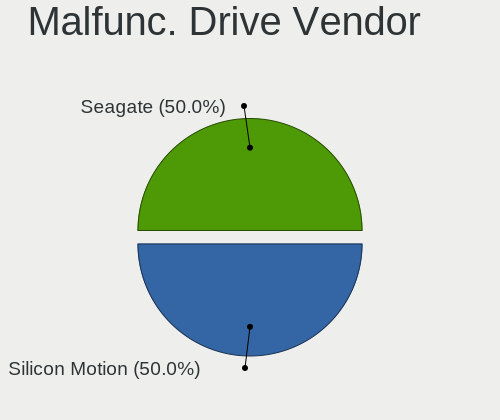
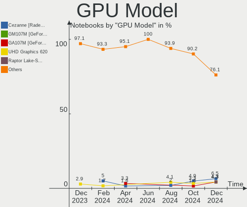
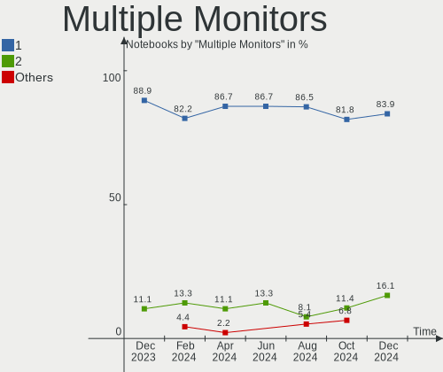
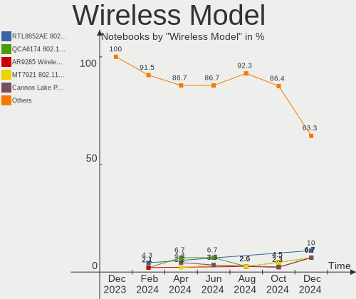

KDE neon Hardware Trends (Notebook)
-----------------------------------

A project to identify most popular hardware characteristics and track their change
over time based on data collected by KDE neon users at https://Linux-Hardware.org.

Anyone can contribute to the study by uploading probes of their computers by
the [hw-probe](https://github.com/linuxhw/hw-probe) tool:

    sudo -E hw-probe -all -upload

Full-feature report is available here: https://linux-hardware.org/?view=trends&formfactor=notebook

Period: Dec, 2020.

Contents
--------

- [ OS                       ](#os)
- [ OS Family                ](#os-family)
- [ Kernel                   ](#kernel)
- [ Kernel Family            ](#kernel-family)
- [ Kernel Major Ver.        ](#kernel-major-ver)
- [ Arch                     ](#arch)
- [ DE                       ](#de)
- [ Display Server           ](#display-server)
- [ Display Manager          ](#display-manager)
- [ OS Lang                  ](#os-lang)
- [ Boot Mode                ](#boot-mode)
- [ Filesystem               ](#filesystem)
- [ Part. scheme             ](#part-scheme)
- [ Dual Boot with Linux/BSD ](#dual-boot-with-linux/bsd)
- [ Dual Boot (Win)          ](#dual-boot-win)
- [ Country                  ](#country)
- [ City                     ](#city)
- [ Vendor                   ](#vendor)
- [ Model                    ](#model)
- [ Model Family             ](#model-family)
- [ MFG Year                 ](#mfg-year)
- [ Form Factor              ](#form-factor)
- [ Secure Boot              ](#secure-boot)
- [ Coreboot                 ](#coreboot)
- [ RAM Size                 ](#ram-size)
- [ RAM Used                 ](#ram-used)
- [ Has CD-ROM               ](#has-cd-rom)
- [ Total Drives             ](#total-drives)
- [ Has Ethernet             ](#has-ethernet)
- [ Drive Vendor             ](#drive-vendor)
- [ Drive Model              ](#drive-model)
- [ HDD Vendor               ](#hdd-vendor)
- [ SSD Vendor               ](#ssd-vendor)
- [ Drive Kind               ](#drive-kind)
- [ Drive Connector          ](#drive-connector)
- [ Drive Size               ](#drive-size)
- [ Space Total              ](#space-total)
- [ Space Used               ](#space-used)
- [ Malfunc. Drives          ](#malfunc-drives)
- [ Malfunc. Drive Vendor    ](#malfunc-drive-vendor)
- [ Malfunc. HDD Vendor      ](#malfunc-hdd-vendor)
- [ Malfunc. Drive Kind      ](#malfunc-drive-kind)
- [ Failed Drives            ](#failed-drives)
- [ Failed Drive Vendor      ](#failed-drive-vendor)
- [ Drive Status             ](#drive-status)
- [ Storage Vendor           ](#storage-vendor)
- [ Storage Model            ](#storage-model)
- [ Storage Kind             ](#storage-kind)
- [ CPU Vendor               ](#cpu-vendor)
- [ CPU Model                ](#cpu-model)
- [ CPU Model Family         ](#cpu-model-family)
- [ CPU Cores                ](#cpu-cores)
- [ CPU Sockets              ](#cpu-sockets)
- [ CPU Threads              ](#cpu-threads)
- [ CPU Op-Modes             ](#cpu-op-modes)
- [ CPU Microcode            ](#cpu-microcode)
- [ CPU Microarch            ](#cpu-microarch)
- [ GPU Vendor               ](#gpu-vendor)
- [ GPU Model                ](#gpu-model)
- [ GPU Combo                ](#gpu-combo)
- [ GPU Driver               ](#gpu-driver)
- [ GPU Memory               ](#gpu-memory)
- [ Monitor Vendor           ](#monitor-vendor)
- [ Monitor Model            ](#monitor-model)
- [ Monitor Resolution       ](#monitor-resolution)
- [ Monitor Diagonal         ](#monitor-diagonal)
- [ Monitor Width            ](#monitor-width)
- [ Aspect Ratio             ](#aspect-ratio)
- [ Monitor Area             ](#monitor-area)
- [ Pixel Density            ](#pixel-density)
- [ Multiple Monitors        ](#multiple-monitors)
- [ Net Controller Vendor    ](#net-controller-vendor)
- [ Net Controller Model     ](#net-controller-model)
- [ Wireless Vendor          ](#wireless-vendor)
- [ Wireless Model           ](#wireless-model)
- [ Ethernet Vendor          ](#ethernet-vendor)
- [ Ethernet Model           ](#ethernet-model)
- [ Net Controller Kind      ](#net-controller-kind)
- [ Used Controller          ](#used-controller)
- [ NICs                     ](#nics)
- [ Memory Vendor            ](#memory-vendor)
- [ Memory Model             ](#memory-model)
- [ Memory Kind              ](#memory-kind)
- [ Memory Form Factor       ](#memory-form-factor)
- [ Memory Size              ](#memory-size)
- [ Memory Speed             ](#memory-speed)
- [ Sound Vendor             ](#sound-vendor)
- [ Sound Model              ](#sound-model)
- [ Camera Vendor            ](#camera-vendor)
- [ Camera Model             ](#camera-model)
- [ Fingerprint Vendor       ](#fingerprint-vendor)
- [ Fingerprint Model        ](#fingerprint-model)
- [ Chipcard Vendor          ](#chipcard-vendor)
- [ Chipcard Model           ](#chipcard-model)
- [ Printer Vendor           ](#printer-vendor)
- [ Printer Model            ](#printer-model)
- [ Scanner Vendor           ](#scanner-vendor)
- [ Scanner Model            ](#scanner-model)
- [ Bluetooth Vendor         ](#bluetooth-vendor)
- [ Bluetooth Model          ](#bluetooth-model)
- [ Unsupported Devices      ](#unsupported-devices)
- [ Unsupported Device Types ](#unsupported-device-types)

OS
--

Installed operating systems

| Name           | Notebooks | Percent |
|----------------|-----------|---------|
| KDE neon 20.04 | 115       | 100%    |

OS Family
---------

OS without a version

| Name     | Notebooks | Percent |
|----------|-----------|---------|
| KDE neon | 115       | 100%    |

Kernel
------

Version of the Linux kernel

| Version               | Notebooks | Percent |
|-----------------------|-----------|---------|
| 5.4.0-58-generic      | 59        | 51.3%   |
| 5.4.0-56-generic      | 37        | 32.17%  |
| 5.4.0-54-generic      | 12        | 10.43%  |
| 5.4.0-57-generic      | 2         | 1.74%   |
| 5.6.0-1035-oem        | 1         | 0.87%   |
| 5.5.4-050504-generic  | 1         | 0.87%   |
| 5.4.0-59-generic      | 1         | 0.87%   |
| 5.4.0-53-generic      | 1         | 0.87%   |
| 5.10.1-051001-generic | 1         | 0.87%   |

Kernel Family
-------------

Linux kernel without a distro release

| Version | Notebooks | Percent |
|---------|-----------|---------|
| 5.4.0   | 112       | 97.39%  |
| 5.6.0   | 1         | 0.87%   |
| 5.5.4   | 1         | 0.87%   |
| 5.10.1  | 1         | 0.87%   |

Kernel Major Ver.
-----------------

Linux kernel major version

| Version | Notebooks | Percent |
|---------|-----------|---------|
| 5.4     | 112       | 97.39%  |
| 5.6     | 1         | 0.87%   |
| 5.5     | 1         | 0.87%   |
| 5.10    | 1         | 0.87%   |

Arch
----

OS architecture (x86_64, i586, etc.)

| Name   | Notebooks | Percent |
|--------|-----------|---------|
| x86_64 | 115       | 100%    |

DE
--

Desktop Environment

| Name    | Notebooks | Percent |
|---------|-----------|---------|
| KDE     | 106       | 92.17%  |
| KDE5    | 8         | 6.96%   |
| Unknown | 1         | 0.87%   |

Display Server
--------------

X11 or Wayland

| Name    | Notebooks | Percent |
|---------|-----------|---------|
| X11     | 114       | 99.13%  |
| Wayland | 1         | 0.87%   |

Display Manager
---------------

SDDM, LightDM, etc.

| Name    | Notebooks | Percent |
|---------|-----------|---------|
| Unknown | 105       | 91.3%   |
| SDDM    | 10        | 8.7%    |

OS Lang
-------

Language

| Lang  | Notebooks | Percent |
|-------|-----------|---------|
| en_US | 37        | 32.17%  |
| de_DE | 9         | 7.83%   |
| pt_BR | 7         | 6.09%   |
| fr_FR | 6         | 5.22%   |
| it_IT | 5         | 4.35%   |
| en_IN | 5         | 4.35%   |
| en_GB | 5         | 4.35%   |
| C     | 5         | 4.35%   |
| ru_RU | 4         | 3.48%   |
| es_ES | 4         | 3.48%   |
| pl_PL | 3         | 2.61%   |
| fr_CA | 2         | 1.74%   |
| es_MX | 2         | 1.74%   |
| en_AU | 2         | 1.74%   |
| el_GR | 2         | 1.74%   |
| zh_TW | 1         | 0.87%   |
| vi_VN | 1         | 0.87%   |
| tr_TR | 1         | 0.87%   |
| sv_SE | 1         | 0.87%   |
| sk_SK | 1         | 0.87%   |
| hu_HU | 1         | 0.87%   |
| es_NI | 1         | 0.87%   |
| es_CO | 1         | 0.87%   |
| es_CL | 1         | 0.87%   |
| en_ZA | 1         | 0.87%   |
| en_PK | 1         | 0.87%   |
| en_IE | 1         | 0.87%   |
| en_CA | 1         | 0.87%   |
| de_AT | 1         | 0.87%   |
| ca_ES | 1         | 0.87%   |
| C     | 1         | 0.87%   |
| an_ES | 1         | 0.87%   |

Boot Mode
---------

EFI or BIOS

| Mode | Notebooks | Percent |
|------|-----------|---------|
| EFI  | 64        | 55.65%  |
| BIOS | 51        | 44.35%  |

Filesystem
----------

Type of filesystem

| Type    | Notebooks | Percent |
|---------|-----------|---------|
| Ext4    | 111       | 96.52%  |
| Btrfs   | 2         | 1.74%   |
| Xfs     | 1         | 0.87%   |
| Overlay | 1         | 0.87%   |

Part. scheme
------------

Scheme of partitioning

| Type    | Notebooks | Percent |
|---------|-----------|---------|
| Unknown | 107       | 93.04%  |
| GPT     | 7         | 6.09%   |
| MBR     | 1         | 0.87%   |

Dual Boot with Linux/BSD
------------------------

Hosting more than one Linux/BSD

| Dual boot | Notebooks | Percent |
|-----------|-----------|---------|
| No        | 114       | 99.13%  |
| Yes       | 1         | 0.87%   |

Dual Boot (Win)
---------------

Hosting Linux and Windows

| Dual boot | Notebooks | Percent |
|-----------|-----------|---------|
| No        | 110       | 95.65%  |
| Yes       | 5         | 4.35%   |

Country
-------

Geographic location (country)

| Country        | Notebooks | Percent |
|----------------|-----------|---------|
| USA            | 17        | 14.78%  |
| Germany        | 12        | 10.43%  |
| Brazil         | 8         | 6.96%   |
| Russia         | 7         | 6.09%   |
| Spain          | 6         | 5.22%   |
| Poland         | 5         | 4.35%   |
| India          | 5         | 4.35%   |
| Italy          | 4         | 3.48%   |
| France         | 4         | 3.48%   |
| Canada         | 4         | 3.48%   |
| UK             | 3         | 2.61%   |
| Greece         | 3         | 2.61%   |
| Vietnam        | 2         | 1.74%   |
| Switzerland    | 2         | 1.74%   |
| Sweden         | 2         | 1.74%   |
| South Africa   | 2         | 1.74%   |
| Slovakia       | 2         | 1.74%   |
| Morocco        | 2         | 1.74%   |
| Mexico         | 2         | 1.74%   |
| Hungary        | 2         | 1.74%   |
| Chile          | 2         | 1.74%   |
| Australia      | 2         | 1.74%   |
| Turkey         | 1         | 0.87%   |
| Thailand       | 1         | 0.87%   |
| Taiwan         | 1         | 0.87%   |
| Romania        | 1         | 0.87%   |
| Pakistan       | 1         | 0.87%   |
| Norway         | 1         | 0.87%   |
| Nicaragua      | 1         | 0.87%   |
| Netherlands    | 1         | 0.87%   |
| Ireland        | 1         | 0.87%   |
| Iran           | 1         | 0.87%   |
| Denmark        | 1         | 0.87%   |
| Czech Republic | 1         | 0.87%   |
| Croatia        | 1         | 0.87%   |
| Colombia       | 1         | 0.87%   |
| Bulgaria       | 1         | 0.87%   |
| Austria        | 1         | 0.87%   |
| Argentina      | 1         | 0.87%   |

City
----

Geographic location (city)

| City                  | Notebooks | Percent |
|-----------------------|-----------|---------|
| Zurich                | 2         | 1.74%   |
| Thessaloniki          | 2         | 1.74%   |
| Milan                 | 2         | 1.74%   |
| Hanoi                 | 2         | 1.74%   |
| Berlin                | 2         | 1.74%   |
| Łódź               | 1         | 0.87%   |
| Zaragoza              | 1         | 0.87%   |
| Zagreb                | 1         | 0.87%   |
| Warsaw                | 1         | 0.87%   |
| Vélez-Málaga        | 1         | 0.87%   |
| Urbana                | 1         | 0.87%   |
| Ufa                   | 1         | 0.87%   |
| Uberlândia           | 1         | 0.87%   |
| Třebíč             | 1         | 0.87%   |
| Thrissur              | 1         | 0.87%   |
| Tehran                | 1         | 0.87%   |
| Taoyuan District      | 1         | 0.87%   |
| Słupsk               | 1         | 0.87%   |
| Sønderborg           | 1         | 0.87%   |
| Sulejowek             | 1         | 0.87%   |
| Stockton-on-Tees      | 1         | 0.87%   |
| Stockholm             | 1         | 0.87%   |
| St Petersburg         | 1         | 0.87%   |
| Slattum               | 1         | 0.87%   |
| Saratov               | 1         | 0.87%   |
| Santiago              | 1         | 0.87%   |
| San Luis Potosí City | 1         | 0.87%   |
| San Fernando          | 1         | 0.87%   |
| Safi                  | 1         | 0.87%   |
| Saarbrücken          | 1         | 0.87%   |
| Rome                  | 1         | 0.87%   |
| Rockwall              | 1         | 0.87%   |
| Rio de Janeiro        | 1         | 0.87%   |
| Regensburg            | 1         | 0.87%   |
| Ranchi                | 1         | 0.87%   |
| Québec               | 1         | 0.87%   |
| Pyatigorsk            | 1         | 0.87%   |
| Port Washington       | 1         | 0.87%   |
| Plymouth              | 1         | 0.87%   |
| Plovdiv               | 1         | 0.87%   |
| Plan-de-Cuques        | 1         | 0.87%   |
| Piracicaba            | 1         | 0.87%   |
| Paris                 | 1         | 0.87%   |
| Palazzolo sull'Oglio  | 1         | 0.87%   |
| Oberweissbach         | 1         | 0.87%   |
| Novosibirsk           | 1         | 0.87%   |
| Niort                 | 1         | 0.87%   |
| Newcastle upon Tyne   | 1         | 0.87%   |
| Neubeuern             | 1         | 0.87%   |
| Natal                 | 1         | 0.87%   |
| Málaga               | 1         | 0.87%   |
| Munich                | 1         | 0.87%   |
| Mumbai                | 1         | 0.87%   |
| Montreal              | 1         | 0.87%   |
| Monte Grande          | 1         | 0.87%   |
| Monino                | 1         | 0.87%   |
| Mohali                | 1         | 0.87%   |
| Milwaukee             | 1         | 0.87%   |
| Mexico City           | 1         | 0.87%   |
| Melbourne             | 1         | 0.87%   |

Vendor
------

Motherboard manufacturer

| Name               | Notebooks | Percent |
|--------------------|-----------|---------|
| Lenovo             | 30        | 26.09%  |
| Dell               | 26        | 22.61%  |
| Hewlett-Packard    | 18        | 15.65%  |
| ASUSTek Computer   | 12        | 10.43%  |
| Acer               | 9         | 7.83%   |
| Apple              | 4         | 3.48%   |
| Sony               | 3         | 2.61%   |
| MSI                | 3         | 2.61%   |
| Toshiba            | 2         | 1.74%   |
| Teclast            | 1         | 0.87%   |
| PC Specialist      | 1         | 0.87%   |
| Packard Bell       | 1         | 0.87%   |
| Medion             | 1         | 0.87%   |
| MAIBENBEN          | 1         | 0.87%   |
| KIANO              | 1         | 0.87%   |
| Hungaro Flotta Kft | 1         | 0.87%   |
| Alienware          | 1         | 0.87%   |

Model
-----

Motherboard model

| Name                                     | Notebooks | Percent |
|------------------------------------------|-----------|---------|
| Lenovo IdeaPad 3 15IIL05 81WE            | 2         | 1.74%   |
| Apple MacBookPro7,1                      | 2         | 1.74%   |
| Toshiba Satellite L50-A-158              | 1         | 0.87%   |
| Toshiba Satellite A300                   | 1         | 0.87%   |
| Teclast X98Pro                           | 1         | 0.87%   |
| Sony VGN-NW270F                          | 1         | 0.87%   |
| Sony SVE15125CBW                         | 1         | 0.87%   |
| Sony SVE14A25CBH                         | 1         | 0.87%   |
| PC Specialist P65_67RSRP                 | 1         | 0.87%   |
| Packard Bell EasyNote TK85               | 1         | 0.87%   |
| MSI MS-16Y1                              | 1         | 0.87%   |
| MSI GP72M 7RDX                           | 1         | 0.87%   |
| MSI CX61 2QC                             | 1         | 0.87%   |
| Medion E6228                             | 1         | 0.87%   |
| MAIBENBEN E5100                          | 1         | 0.87%   |
| Lenovo Y520-15IKBN 80WK                  | 1         | 0.87%   |
| Lenovo Y50-70 20378                      | 1         | 0.87%   |
| Lenovo ThinkPad X250 20CLS8J400          | 1         | 0.87%   |
| Lenovo ThinkPad X230 23301G3             | 1         | 0.87%   |
| Lenovo ThinkPad X220 Tablet 4299CC3      | 1         | 0.87%   |
| Lenovo ThinkPad X131e 33711H3            | 1         | 0.87%   |
| Lenovo ThinkPad X1 Tablet 20GGS00S00     | 1         | 0.87%   |
| Lenovo ThinkPad X1 Carbon 3rd 20BSCTO1WW | 1         | 0.87%   |
| Lenovo ThinkPad W530 2447GW3             | 1         | 0.87%   |
| Lenovo ThinkPad S1 Yoga 12 20DKS0GF00    | 1         | 0.87%   |
| Lenovo ThinkPad P51 20HH002WMX           | 1         | 0.87%   |
| Lenovo ThinkPad P15v Gen 1 20TQCTO1WW    | 1         | 0.87%   |
| Lenovo ThinkPad P15 Gen 1 20STCTO1WW     | 1         | 0.87%   |
| Lenovo ThinkPad Edge E540 20C600HHZA     | 1         | 0.87%   |
| Lenovo ThinkPad E570 20H50078IX          | 1         | 0.87%   |
| Lenovo ThinkPad E15 20RD0011MC           | 1         | 0.87%   |
| Lenovo Legion Y540-15IRH-PG0 81SY        | 1         | 0.87%   |
| Lenovo IdeaPad Z500 20202                | 1         | 0.87%   |
| Lenovo IdeaPad Y510P 20217               | 1         | 0.87%   |
| Lenovo IdeaPad Slim 1-11AST-05 81VR      | 1         | 0.87%   |
| Lenovo IdeaPad S540-15IML 81NG           | 1         | 0.87%   |
| Lenovo IdeaPad S145-14API 81UV           | 1         | 0.87%   |
| Lenovo IdeaPad 520-15IKB 80YL            | 1         | 0.87%   |
| Lenovo IdeaPad 330-15AST 81D6            | 1         | 0.87%   |
| Lenovo IdeaPad 320-17ISK 80XJ            | 1         | 0.87%   |
| Lenovo G700 20251                        | 1         | 0.87%   |
| Lenovo G70-35 80Q5                       | 1         | 0.87%   |
| Lenovo B50-30 80ES                       | 1         | 0.87%   |
| KIANO SlimNote 14,2                      | 1         | 0.87%   |
| Hungaro Flotta Kft Navon Loop 360        | 1         | 0.87%   |
| HP ZBook Studio G3                       | 1         | 0.87%   |
| HP ZBook 15 G6                           | 1         | 0.87%   |
| HP ProBook 650 G1                        | 1         | 0.87%   |
| HP ProBook 4430s                         | 1         | 0.87%   |
| HP Pavilion Laptop 15-cd0xx              | 1         | 0.87%   |
| HP Pavilion Laptop 14-bf1xx              | 1         | 0.87%   |
| HP Pavilion Gaming Laptop 17-cd1xxx      | 1         | 0.87%   |
| HP Pavilion Gaming Laptop 15-ec0xxx      | 1         | 0.87%   |
| HP Pavilion g6                           | 1         | 0.87%   |
| HP Pavilion dv7                          | 1         | 0.87%   |
| HP Pavilion 15                           | 1         | 0.87%   |
| HP Notebook                              | 1         | 0.87%   |
| HP Laptop 17-ca0xxx                      | 1         | 0.87%   |
| HP Laptop 15-db0xxx                      | 1         | 0.87%   |
| HP EliteBook 840 G1                      | 1         | 0.87%   |

Model Family
------------

Motherboard model prefix

| Name                     | Notebooks | Percent |
|--------------------------|-----------|---------|
| Lenovo ThinkPad          | 14        | 12.17%  |
| Dell Inspiron            | 12        | 10.43%  |
| Lenovo IdeaPad           | 10        | 8.7%    |
| Dell Latitude            | 10        | 8.7%    |
| HP Pavilion              | 7         | 6.09%   |
| Acer Aspire              | 5         | 4.35%   |
| Toshiba Satellite        | 2         | 1.74%   |
| HP ZBook                 | 2         | 1.74%   |
| HP ProBook               | 2         | 1.74%   |
| HP Laptop                | 2         | 1.74%   |
| Dell Vostro              | 2         | 1.74%   |
| ASUS VivoBook            | 2         | 1.74%   |
| Apple MacBookPro7        | 2         | 1.74%   |
| Teclast X98Pro           | 1         | 0.87%   |
| Sony VGN-NW270F          | 1         | 0.87%   |
| Sony SVE15125CBW         | 1         | 0.87%   |
| Sony SVE14A25CBH         | 1         | 0.87%   |
| PC Specialist P65        | 1         | 0.87%   |
| Packard Bell EasyNote    | 1         | 0.87%   |
| MSI MS-16Y1              | 1         | 0.87%   |
| MSI GP72M                | 1         | 0.87%   |
| MSI CX61                 | 1         | 0.87%   |
| Medion E6228             | 1         | 0.87%   |
| MAIBENBEN E5100          | 1         | 0.87%   |
| Lenovo Y520-15IKBN       | 1         | 0.87%   |
| Lenovo Y50-70            | 1         | 0.87%   |
| Lenovo Legion            | 1         | 0.87%   |
| Lenovo G700              | 1         | 0.87%   |
| Lenovo G70-35            | 1         | 0.87%   |
| Lenovo B50-30            | 1         | 0.87%   |
| KIANO SlimNote           | 1         | 0.87%   |
| Hungaro Flotta Kft Navon | 1         | 0.87%   |
| HP Notebook              | 1         | 0.87%   |
| HP EliteBook             | 1         | 0.87%   |
| HP Compaq                | 1         | 0.87%   |
| HP 250                   | 1         | 0.87%   |
| HP 15                    | 1         | 0.87%   |
| Dell Studio              | 1         | 0.87%   |
| Dell Precision           | 1         | 0.87%   |
| ASUS ZenBook             | 1         | 0.87%   |
| ASUS X75VC               | 1         | 0.87%   |
| ASUS X555DA              | 1         | 0.87%   |
| ASUS X550CA              | 1         | 0.87%   |
| ASUS X540YA              | 1         | 0.87%   |
| ASUS X450CC              | 1         | 0.87%   |
| ASUS TUF                 | 1         | 0.87%   |
| ASUS ROG                 | 1         | 0.87%   |
| ASUS PU401LAC            | 1         | 0.87%   |
| ASUS FX503VD             | 1         | 0.87%   |
| Apple MacBookAir5        | 1         | 0.87%   |
| Apple MacBook3           | 1         | 0.87%   |
| Alienware 15             | 1         | 0.87%   |
| Acer TravelMate          | 1         | 0.87%   |
| Acer Predator            | 1         | 0.87%   |
| Acer NC-A315-51-388U     | 1         | 0.87%   |
| Acer Extensa             | 1         | 0.87%   |

MFG Year
--------

Motherboard manufacture year

| Year | Notebooks | Percent |
|------|-----------|---------|
| 2020 | 26        | 22.61%  |
| 2018 | 14        | 12.17%  |
| 2019 | 13        | 11.3%   |
| 2017 | 12        | 10.43%  |
| 2015 | 11        | 9.57%   |
| 2016 | 8         | 6.96%   |
| 2013 | 7         | 6.09%   |
| 2012 | 6         | 5.22%   |
| 2014 | 5         | 4.35%   |
| 2011 | 5         | 4.35%   |
| 2009 | 5         | 4.35%   |
| 2010 | 2         | 1.74%   |
| 2008 | 1         | 0.87%   |

Form Factor
-----------

Physical design of the computer

| Name     | Notebooks | Percent |
|----------|-----------|---------|
| Notebook | 115       | 100%    |

Secure Boot
-----------

Enabled or disabled

| State    | Notebooks | Percent |
|----------|-----------|---------|
| Disabled | 102       | 88.7%   |
| Enabled  | 13        | 11.3%   |

Coreboot
--------

Have coreboot on board

| Used | Notebooks | Percent |
|------|-----------|---------|
| No   | 115       | 100%    |

RAM Size
--------

Total RAM memory

| Size in GB  | Notebooks | Percent |
|-------------|-----------|---------|
| 4.01-8.0    | 44        | 38.26%  |
| 8.01-16.0   | 25        | 21.74%  |
| 3.01-4.0    | 22        | 19.13%  |
| 16.01-24.0  | 16        | 13.91%  |
| 32.01-64.0  | 4         | 3.48%   |
| 1.01-2.0    | 3         | 2.61%   |
| 64.01-256.0 | 1         | 0.87%   |

RAM Used
--------

Used RAM memory

| Used GB   | Notebooks | Percent |
|-----------|-----------|---------|
| 1.01-2.0  | 47        | 40.87%  |
| 2.01-3.0  | 36        | 31.3%   |
| 3.01-4.0  | 15        | 13.04%  |
| 4.01-8.0  | 11        | 9.57%   |
| 8.01-16.0 | 3         | 2.61%   |
| 0.51-1.0  | 3         | 2.61%   |

Has CD-ROM
----------

Has CD-ROM on board

| Presented | Notebooks | Percent |
|-----------|-----------|---------|
| No        | 70        | 60.87%  |
| Yes       | 45        | 39.13%  |

Total Drives
------------

Number of drives on board

| Drives | Notebooks | Percent |
|--------|-----------|---------|
| 1      | 74        | 64.35%  |
| 2      | 37        | 32.17%  |
| 3      | 4         | 3.48%   |

Has Ethernet
------------

Has Ethernet on board

| Presented | Notebooks | Percent |
|-----------|-----------|---------|
| Yes       | 99        | 86.09%  |
| No        | 16        | 13.91%  |

Drive Vendor
------------

Hard drive vendors

| Vendor              | Notebooks | Drives | Percent |
|---------------------|-----------|--------|---------|
| Samsung Electronics | 21        | 22     | 13.73%  |
| Seagate             | 20        | 20     | 13.07%  |
| WDC                 | 19        | 19     | 12.42%  |
| Toshiba             | 14        | 15     | 9.15%   |
| Kingston            | 12        | 13     | 7.84%   |
| Unknown             | 11        | 11     | 7.19%   |
| SanDisk             | 10        | 11     | 6.54%   |
| Intel               | 7         | 7      | 4.58%   |
| Hitachi             | 6         | 6      | 3.92%   |
| HGST                | 6         | 6      | 3.92%   |
| SK Hynix            | 5         | 6      | 3.27%   |
| Crucial             | 5         | 5      | 3.27%   |
| Micron Technology   | 2         | 2      | 1.31%   |
| LITEONIT            | 2         | 2      | 1.31%   |
| Transcend           | 1         | 1      | 0.65%   |
| Team                | 1         | 1      | 0.65%   |
| Silicon Motion      | 1         | 1      | 0.65%   |
| Patriot             | 1         | 1      | 0.65%   |
| LITEON              | 1         | 1      | 0.65%   |
| Lexar               | 1         | 1      | 0.65%   |
| KIOXIA              | 1         | 1      | 0.65%   |
| Intenso             | 1         | 1      | 0.65%   |
| GOODRAM             | 1         | 1      | 0.65%   |
| Corsair             | 1         | 1      | 0.65%   |
| China               | 1         | 1      | 0.65%   |
| Apple               | 1         | 1      | 0.65%   |
| A-DATA Technology   | 1         | 1      | 0.65%   |

Drive Model
-----------

Hard drive models

| Model                               | Notebooks | Percent |
|-------------------------------------|-----------|---------|
| Seagate ST1000LM035-1RK172 1TB      | 6         | 3.8%    |
| Samsung SSD 860 EVO 500GB           | 4         | 2.53%   |
| Samsung NVMe SSD Drive 256GB        | 4         | 2.53%   |
| WDC WDS240G2G0B-00EPW0 240GB SSD    | 3         | 1.9%    |
| Unknown MMC Card  32GB              | 3         | 1.9%    |
| Toshiba MQ04ABF100 1TB              | 3         | 1.9%    |
| Toshiba MQ01ABF050 500GB            | 3         | 1.9%    |
| Samsung NVMe SSD Drive 512GB        | 3         | 1.9%    |
| Intel NVMe SSD Drive 512GB          | 3         | 1.9%    |
| WDC WD10JPVX-22JC3T0 1TB            | 2         | 1.27%   |
| Unknown SD/MMC/MS PRO 128GB         | 2         | 1.27%   |
| Toshiba MQ01ABD100 1TB              | 2         | 1.27%   |
| SK Hynix NVMe SSD Drive 512GB       | 2         | 1.27%   |
| SK Hynix NVMe SSD Drive 1024GB      | 2         | 1.27%   |
| Seagate ST9500325AS 500GB           | 2         | 1.27%   |
| Seagate ST750LM022 HN-M750MBB 752GB | 2         | 1.27%   |
| Seagate ST2000LM007-1R8174 2TB      | 2         | 1.27%   |
| Seagate ST1000LM048-2E7172 1TB      | 2         | 1.27%   |
| Sandisk NVMe SSD Drive 256GB        | 2         | 1.27%   |
| Samsung SSD 860 EVO 1TB             | 2         | 1.27%   |
| Samsung NVMe SSD Drive 1TB          | 2         | 1.27%   |
| LITEONIT LCT-256M3S 256GB SSD       | 2         | 1.27%   |
| Kingston SUV400S37120G 120GB SSD    | 2         | 1.27%   |
| Kingston SA400S37120G 120GB SSD     | 2         | 1.27%   |
| HGST HTS721010A9E630 1TB            | 2         | 1.27%   |
| HGST HTS545050A7E680 500GB          | 2         | 1.27%   |
| Crucial CT500MX500SSD1 500GB        | 2         | 1.27%   |
| Crucial CT240BX500SSD1 240GB        | 2         | 1.27%   |
| WDC WDS200T2B0A-00SM50 2TB SSD      | 1         | 0.63%   |
| WDC WDS120G2G0A-00JH30 120GB SSD    | 1         | 0.63%   |
| WDC WDS100T2G0A-00JH30 1TB SSD      | 1         | 0.63%   |
| WDC WD5000LPVX-80V0TT0 500GB        | 1         | 0.63%   |
| WDC WD5000LPVX-00V0TT0 500GB        | 1         | 0.63%   |
| WDC WD5000LPVT-75G33T0 500GB        | 1         | 0.63%   |
| WDC WD5000LPCX-60VHAT0 500GB        | 1         | 0.63%   |
| WDC WD5000BPVT-55HXZT4 500GB        | 1         | 0.63%   |
| WDC WD50 00LPCX-24C6HT0 500GB       | 1         | 0.63%   |
| WDC WD50 00BEVT-22A0RT0 500GB       | 1         | 0.63%   |
| WDC WD10SPZX-75Z10T1 1TB            | 1         | 0.63%   |
| WDC WD10SPZX-24Z10 1TB              | 1         | 0.63%   |
| WDC WD10SPZX-22Z10T1 1TB            | 1         | 0.63%   |
| WDC WD10SPCX-60KHST0 1TB            | 1         | 0.63%   |
| Unknown SM32G  32GB                 | 1         | 0.63%   |
| Unknown NVMe SSD Drive 128GB        | 1         | 0.63%   |
| Unknown MMC Card  7GB               | 1         | 0.63%   |
| Unknown MMC Card  64GB              | 1         | 0.63%   |
| Unknown MMC Card  16GB              | 1         | 0.63%   |
| Unknown DA4064  64GB                | 1         | 0.63%   |
| Transcend TS256GSSD230S 256GB       | 1         | 0.63%   |
| Toshiba THNSF5256GPUK 256GB         | 1         | 0.63%   |
| Toshiba NVMe SSD Drive 256GB        | 1         | 0.63%   |
| Toshiba MQ02ABD100H 1TB             | 1         | 0.63%   |
| Toshiba MQ01ABF050H 500GB           | 1         | 0.63%   |
| Toshiba MQ01ABD075 752GB            | 1         | 0.63%   |
| Toshiba MK3259GSXP 320GB            | 1         | 0.63%   |
| Toshiba MK2046GSX 200GB             | 1         | 0.63%   |
| Team L5 LITE SSD 120GB              | 1         | 0.63%   |
| SK Hynix SC311 SATA 256GB SSD       | 1         | 0.63%   |
| SK Hynix NVMe SSD Drive 256GB       | 1         | 0.63%   |
| Silicon Motion NVMe SSD Drive 256GB | 1         | 0.63%   |

HDD Vendor
----------

Hard disk drive vendors

| Vendor  | Notebooks | Drives | Percent |
|---------|-----------|--------|---------|
| Seagate | 20        | 20     | 34.48%  |
| WDC     | 13        | 13     | 22.41%  |
| Toshiba | 12        | 13     | 20.69%  |
| Hitachi | 6         | 6      | 10.34%  |
| HGST    | 6         | 6      | 10.34%  |
| Intenso | 1         | 1      | 1.72%   |

SSD Vendor
----------

Solid state drive vendors

| Vendor              | Notebooks | Drives | Percent |
|---------------------|-----------|--------|---------|
| Samsung Electronics | 11        | 11     | 20%     |
| Kingston            | 10        | 11     | 18.18%  |
| WDC                 | 6         | 6      | 10.91%  |
| SanDisk             | 6         | 6      | 10.91%  |
| Crucial             | 5         | 5      | 9.09%   |
| Intel               | 3         | 3      | 5.45%   |
| Micron Technology   | 2         | 2      | 3.64%   |
| LITEONIT            | 2         | 2      | 3.64%   |
| Transcend           | 1         | 1      | 1.82%   |
| Team                | 1         | 1      | 1.82%   |
| SK Hynix            | 1         | 1      | 1.82%   |
| Patriot             | 1         | 1      | 1.82%   |
| LITEON              | 1         | 1      | 1.82%   |
| GOODRAM             | 1         | 1      | 1.82%   |
| Corsair             | 1         | 1      | 1.82%   |
| China               | 1         | 1      | 1.82%   |
| Apple               | 1         | 1      | 1.82%   |
| A-DATA Technology   | 1         | 1      | 1.82%   |

Drive Kind
----------

HDD or SSD

| Kind    | Notebooks | Drives | Percent |
|---------|-----------|--------|---------|
| HDD     | 56        | 59     | 38.62%  |
| SSD     | 53        | 56     | 36.55%  |
| NVMe    | 26        | 33     | 17.93%  |
| MMC     | 8         | 8      | 5.52%   |
| Unknown | 2         | 2      | 1.38%   |

Drive Connector
---------------

SATA, SAS, NVMe, etc.

| Type | Notebooks | Drives | Percent |
|------|-----------|--------|---------|
| SATA | 95        | 111    | 70.37%  |
| NVMe | 26        | 33     | 19.26%  |
| MMC  | 8         | 8      | 5.93%   |
| SAS  | 6         | 6      | 4.44%   |

Drive Size
----------

Size of hard drive

| Size in TB | Notebooks | Drives | Percent |
|------------|-----------|--------|---------|
| 0.01-0.5   | 64        | 73     | 60.38%  |
| 0.51-1.0   | 38        | 38     | 35.85%  |
| 1.01-2.0   | 3         | 3      | 2.83%   |
| 2.01-3.0   | 1         | 1      | 0.94%   |

Space Total
-----------

Amount of disk space available on the file system

| Size in GB | Notebooks | Percent |
|------------|-----------|---------|
| 101-250    | 38        | 33.04%  |
| 251-500    | 24        | 20.87%  |
| 501-1000   | 21        | 18.26%  |
| 21-50      | 10        | 8.7%    |
| 1001-2000  | 7         | 6.09%   |
| 51-100     | 7         | 6.09%   |
| Unknown    | 5         | 4.35%   |
| 1-20       | 3         | 2.61%   |

Space Used
----------

Amount of used disk space

| Used GB   | Notebooks | Percent |
|-----------|-----------|---------|
| 1-20      | 60        | 52.17%  |
| 21-50     | 20        | 17.39%  |
| 101-250   | 12        | 10.43%  |
| 51-100    | 7         | 6.09%   |
| 501-1000  | 6         | 5.22%   |
| Unknown   | 5         | 4.35%   |
| 251-500   | 4         | 3.48%   |
| 1001-2000 | 1         | 0.87%   |

Malfunc. Drives
---------------

Drive models with a malfunction

| Model                          | Notebooks | Drives | Percent |
|--------------------------------|-----------|--------|---------|
| Toshiba MQ02ABD100H 1TB        | 1         | 1      | 50%     |
| Seagate ST1000LM048-2E7172 1TB | 1         | 1      | 50%     |

Malfunc. Drive Vendor
---------------------

Vendors of faulty drives

| Vendor  | Notebooks | Drives | Percent |
|---------|-----------|--------|---------|
| Toshiba | 1         | 1      | 50%     |
| Seagate | 1         | 1      | 50%     |

Malfunc. HDD Vendor
-------------------

Vendors of faulty HDD drives

| Vendor  | Notebooks | Drives | Percent |
|---------|-----------|--------|---------|
| Toshiba | 1         | 1      | 50%     |
| Seagate | 1         | 1      | 50%     |

Malfunc. Drive Kind
-------------------

Kinds of faulty drives

| Kind | Notebooks | Drives | Percent |
|------|-----------|--------|---------|
| HDD  | 2         | 2      | 100%    |

Failed Drives
-------------

Failed drive models

Zero info for selected period =(

Failed Drive Vendor
-------------------

Failed drive vendors

Zero info for selected period =(

Drive Status
------------

Number of failed and malfunc. drives

| Status   | Notebooks | Drives | Percent |
|----------|-----------|--------|---------|
| Detected | 111       | 148    | 92.5%   |
| Works    | 7         | 8      | 5.83%   |
| Malfunc  | 2         | 2      | 1.67%   |

Storage Vendor
--------------

Storage controller vendors

| Vendor                       | Notebooks | Percent |
|------------------------------|-----------|---------|
| Intel                        | 89        | 66.92%  |
| AMD                          | 15        | 11.28%  |
| Samsung Electronics          | 11        | 8.27%   |
| SK Hynix                     | 4         | 3.01%   |
| Sandisk                      | 4         | 3.01%   |
| Toshiba America Info Systems | 2         | 1.5%    |
| Nvidia                       | 2         | 1.5%    |
| Kingston Technology Company  | 2         | 1.5%    |
| Silicon Motion               | 1         | 0.75%   |
| Shenzhen Longsys Electronics | 1         | 0.75%   |
| KIOXIA                       | 1         | 0.75%   |
| ASMedia Technology           | 1         | 0.75%   |

Storage Model
-------------

Storage controller models

| Model                                                                            | Notebooks | Percent |
|----------------------------------------------------------------------------------|-----------|---------|
| Intel 7 Series Chipset Family 6-port SATA Controller [AHCI mode]                 | 13        | 9.15%   |
| AMD FCH SATA Controller [AHCI mode]                                              | 13        | 9.15%   |
| Intel Sunrise Point-LP SATA Controller [AHCI mode]                               | 12        | 8.45%   |
| Intel 82801 Mobile SATA Controller [RAID mode]                                   | 9         | 6.34%   |
| Intel 8 Series/C220 Series Chipset Family 6-port SATA Controller 1 [AHCI mode]   | 7         | 4.93%   |
| Intel HM170/QM170 Chipset SATA Controller [AHCI Mode]                            | 6         | 4.23%   |
| Intel 6 Series/C200 Series Chipset Family 6 port Mobile SATA AHCI Controller     | 6         | 4.23%   |
| Intel 82801IBM/IEM (ICH9M/ICH9M-E) 4 port SATA Controller [AHCI mode]            | 5         | 3.52%   |
| Intel 8 Series SATA Controller 1 [AHCI mode]                                     | 5         | 3.52%   |
| Samsung NVMe SSD Controller SM961/PM961/SM963                                    | 4         | 2.82%   |
| Intel SSD 660P Series                                                            | 4         | 2.82%   |
| Intel Ice Lake-LP SATA Controller [AHCI mode]                                    | 4         | 2.82%   |
| Intel Cannon Lake Mobile PCH SATA AHCI Controller                                | 4         | 2.82%   |
| SK Hynix Non-Volatile memory controller                                          | 3         | 2.11%   |
| Samsung NVMe SSD Controller SM981/PM981/PM983                                    | 3         | 2.11%   |
| Samsung Electronics Non-Volatile memory controller                               | 3         | 2.11%   |
| Intel Wildcat Point-LP SATA Controller [AHCI Mode]                               | 3         | 2.11%   |
| Nvidia MCP89 SATA Controller (AHCI mode)                                         | 2         | 1.41%   |
| Intel Atom Processor E3800 Series SATA AHCI Controller                           | 2         | 1.41%   |
| Intel 82801HM/HEM (ICH8M/ICH8M-E) SATA Controller [AHCI mode]                    | 2         | 1.41%   |
| Intel 82801HM/HEM (ICH8M/ICH8M-E) IDE Controller                                 | 2         | 1.41%   |
| Intel 5 Series/3400 Series Chipset 4 port SATA AHCI Controller                   | 2         | 1.41%   |
| Toshiba America Info Systems XG4 NVMe SSD Controller                             | 1         | 0.7%    |
| Toshiba America Info Systems Toshiba America Info Non-Volatile memory controller | 1         | 0.7%    |
| SK Hynix BC501 NVMe Solid State Drive 512GB                                      | 1         | 0.7%    |
| Silicon Motion SM2263EN/SM2263XT SSD Controller                                  | 1         | 0.7%    |
| Shenzhen Longsys Non-Volatile memory controller                                  | 1         | 0.7%    |
| Sandisk WD Black SN750 / PC SN730 NVMe SSD                                       | 1         | 0.7%    |
| Sandisk WD Black 2018 / PC SN720 NVMe SSD                                        | 1         | 0.7%    |
| Sandisk PC SN520 NVMe SSD                                                        | 1         | 0.7%    |
| Sandisk Non-Volatile memory controller                                           | 1         | 0.7%    |
| Samsung Electronics SATA controller                                              | 1         | 0.7%    |
| KIOXIA Non-Volatile memory controller                                            | 1         | 0.7%    |
| Kingston Company U-SNS8154P3 NVMe SSD                                            | 1         | 0.7%    |
| Kingston Company A2000 NVMe SSD                                                  | 1         | 0.7%    |
| Intel Q170/Q150/B150/H170/H110/Z170/CM236 Chipset SATA Controller [AHCI Mode]    | 1         | 0.7%    |
| Intel Comet Lake SATA AHCI Controller                                            | 1         | 0.7%    |
| Intel Comet Lake PCH-LP SATA RAID Premium Controller                             | 1         | 0.7%    |
| Intel Celeron N3350/Pentium N4200/Atom E3900 Series SATA AHCI Controller         | 1         | 0.7%    |
| Intel Atom/Celeron/Pentium Processor x5-E8000/J3xxx/N3xxx Series SATA Controller | 1         | 0.7%    |
| Intel 7 Series Chipset Family 4-port SATA Controller [IDE mode]                  | 1         | 0.7%    |
| Intel 7 Series Chipset Family 2-port SATA Controller [IDE mode]                  | 1         | 0.7%    |
| Intel 6 Series/C200 Series Chipset Family IDE-r Controller                       | 1         | 0.7%    |
| Intel 5 Series/3400 Series Chipset 4 port SATA IDE Controller                    | 1         | 0.7%    |
| Intel 5 Series/3400 Series Chipset 2 port SATA IDE Controller                    | 1         | 0.7%    |
| ASMedia ASM1062 Serial ATA Controller                                            | 1         | 0.7%    |
| AMD SB7x0/SB8x0/SB9x0 SATA Controller [AHCI mode]                                | 1         | 0.7%    |
| AMD SB7x0/SB8x0/SB9x0 IDE Controller                                             | 1         | 0.7%    |
| AMD SB600 Non-Raid-5 SATA                                                        | 1         | 0.7%    |
| AMD SB600 IDE                                                                    | 1         | 0.7%    |

Storage Kind
------------

Kind of storage controller (IDE, SATA, NVMe, SAS, ...)

| Kind | Notebooks | Percent |
|------|-----------|---------|
| SATA | 94        | 68.61%  |
| NVMe | 26        | 18.98%  |
| RAID | 10        | 7.3%    |
| IDE  | 7         | 5.11%   |

CPU Vendor
----------

Processor vendors

| Vendor | Notebooks | Percent |
|--------|-----------|---------|
| Intel  | 98        | 85.22%  |
| AMD    | 17        | 14.78%  |

CPU Model
---------

Processor models

| Model                                         | Notebooks | Percent |
|-----------------------------------------------|-----------|---------|
| Intel Core i7-7700HQ CPU @ 2.80GHz            | 3         | 2.61%   |
| Intel Core i5-5300U CPU @ 2.30GHz             | 3         | 2.61%   |
| Intel Core i3-2350M CPU @ 2.30GHz             | 3         | 2.61%   |
| Intel Core 2 Duo CPU P8600 @ 2.40GHz          | 3         | 2.61%   |
| Intel Core i7-6700HQ CPU @ 2.60GHz            | 2         | 1.74%   |
| Intel Core i7-4700MQ CPU @ 2.40GHz            | 2         | 1.74%   |
| Intel Core i7-10510U CPU @ 1.80GHz            | 2         | 1.74%   |
| Intel Core i5-8250U CPU @ 1.60GHz             | 2         | 1.74%   |
| Intel Core i5-7300HQ CPU @ 2.50GHz            | 2         | 1.74%   |
| Intel Core i5-7200U CPU @ 2.50GHz             | 2         | 1.74%   |
| Intel Core i5-6200U CPU @ 2.30GHz             | 2         | 1.74%   |
| Intel Core i5-4300U CPU @ 1.90GHz             | 2         | 1.74%   |
| Intel Core i5-2520M CPU @ 2.50GHz             | 2         | 1.74%   |
| Intel Core i5-1035G1 CPU @ 1.00GHz            | 2         | 1.74%   |
| Intel Core i3-6006U CPU @ 2.00GHz             | 2         | 1.74%   |
| Intel Core i3-3217U CPU @ 1.80GHz             | 2         | 1.74%   |
| Intel Core i3 CPU M 370 @ 2.40GHz             | 2         | 1.74%   |
| AMD Ryzen 5 3550H with Radeon Vega Mobile Gfx | 2         | 1.74%   |
| AMD Ryzen 3 3200U with Radeon Vega Mobile Gfx | 2         | 1.74%   |
| Intel Xeon CPU E3-1505M v5 @ 2.80GHz          | 1         | 0.87%   |
| Intel Pentium Dual-Core CPU T4500 @ 2.30GHz   | 1         | 0.87%   |
| Intel Pentium Dual-Core CPU T4200 @ 2.00GHz   | 1         | 0.87%   |
| Intel Pentium Dual CPU T2370 @ 1.73GHz        | 1         | 0.87%   |
| Intel Pentium CPU N3710 @ 1.60GHz             | 1         | 0.87%   |
| Intel Pentium CPU N3540 @ 2.16GHz             | 1         | 0.87%   |
| Intel Pentium CPU 6405U @ 2.40GHz             | 1         | 0.87%   |
| Intel Pentium CPU 2020M @ 2.40GHz             | 1         | 0.87%   |
| Intel Pentium 3556U @ 1.70GHz                 | 1         | 0.87%   |
| Intel Core m5-6Y54 CPU @ 1.10GHz              | 1         | 0.87%   |
| Intel Core i7-9850H CPU @ 2.60GHz             | 1         | 0.87%   |
| Intel Core i7-8850H CPU @ 2.60GHz             | 1         | 0.87%   |
| Intel Core i7-8750H CPU @ 2.20GHz             | 1         | 0.87%   |
| Intel Core i7-8565U CPU @ 1.80GHz             | 1         | 0.87%   |
| Intel Core i7-7820HQ CPU @ 2.90GHz            | 1         | 0.87%   |
| Intel Core i7-7500U CPU @ 2.70GHz             | 1         | 0.87%   |
| Intel Core i7-6600U CPU @ 2.60GHz             | 1         | 0.87%   |
| Intel Core i7-5600U CPU @ 2.60GHz             | 1         | 0.87%   |
| Intel Core i7-4712MQ CPU @ 2.30GHz            | 1         | 0.87%   |
| Intel Core i7-4710HQ CPU @ 2.50GHz            | 1         | 0.87%   |
| Intel Core i7-4702MQ CPU @ 2.20GHz            | 1         | 0.87%   |
| Intel Core i7-4500U CPU @ 1.80GHz             | 1         | 0.87%   |
| Intel Core i7-3720QM CPU @ 2.60GHz            | 1         | 0.87%   |
| Intel Core i7-3630QM CPU @ 2.40GHz            | 1         | 0.87%   |
| Intel Core i7-3612QM CPU @ 2.10GHz            | 1         | 0.87%   |
| Intel Core i7-3610QM CPU @ 2.30GHz            | 1         | 0.87%   |
| Intel Core i7-3517U CPU @ 1.90GHz             | 1         | 0.87%   |
| Intel Core i7-2760QM CPU @ 2.40GHz            | 1         | 0.87%   |
| Intel Core i7-10875H CPU @ 2.30GHz            | 1         | 0.87%   |
| Intel Core i7-10750H CPU @ 2.60GHz            | 1         | 0.87%   |
| Intel Core i7-1065G7 CPU @ 1.30GHz            | 1         | 0.87%   |
| Intel Core i5-9300H CPU @ 2.40GHz             | 1         | 0.87%   |
| Intel Core i5-8265U CPU @ 1.60GHz             | 1         | 0.87%   |
| Intel Core i5-6300U CPU @ 2.40GHz             | 1         | 0.87%   |
| Intel Core i5-5200U CPU @ 2.20GHz             | 1         | 0.87%   |
| Intel Core i5-4300M CPU @ 2.60GHz             | 1         | 0.87%   |
| Intel Core i5-4210U CPU @ 1.70GHz             | 1         | 0.87%   |
| Intel Core i5-4210M CPU @ 2.60GHz             | 1         | 0.87%   |
| Intel Core i5-4200U CPU @ 1.60GHz             | 1         | 0.87%   |
| Intel Core i5-3337U CPU @ 1.80GHz             | 1         | 0.87%   |
| Intel Core i5-3317U CPU @ 1.70GHz             | 1         | 0.87%   |

CPU Model Family
----------------

Processor model prefix

| Model                   | Notebooks | Percent |
|-------------------------|-----------|---------|
| Intel Core i5           | 32        | 27.83%  |
| Intel Core i7           | 30        | 26.09%  |
| Intel Core i3           | 14        | 12.17%  |
| Intel Core 2 Duo        | 7         | 6.09%   |
| Intel Pentium           | 5         | 4.35%   |
| AMD Ryzen 3             | 4         | 3.48%   |
| Intel Celeron           | 3         | 2.61%   |
| Intel Pentium Dual-Core | 2         | 1.74%   |
| Intel Atom              | 2         | 1.74%   |
| AMD Ryzen 5             | 2         | 1.74%   |
| AMD A4                  | 2         | 1.74%   |
| Other                   | 1         | 0.87%   |
| Intel Xeon              | 1         | 0.87%   |
| Intel Pentium Dual      | 1         | 0.87%   |
| Intel Core m5           | 1         | 0.87%   |
| AMD Turion 64 X2 Mobile | 1         | 0.87%   |
| AMD Ryzen 9             | 1         | 0.87%   |
| AMD Phenom II           | 1         | 0.87%   |
| AMD E2                  | 1         | 0.87%   |
| AMD E1                  | 1         | 0.87%   |
| AMD A6                  | 1         | 0.87%   |
| AMD A12                 | 1         | 0.87%   |
| AMD A10                 | 1         | 0.87%   |

CPU Cores
---------

Number of processor cores

| Number | Notebooks | Percent |
|--------|-----------|---------|
| 2      | 69        | 60%     |
| 4      | 39        | 33.91%  |
| 6      | 4         | 3.48%   |
| 8      | 2         | 1.74%   |
| 3      | 1         | 0.87%   |

CPU Sockets
-----------

Number of sockets

| Number | Notebooks | Percent |
|--------|-----------|---------|
| 1      | 115       | 100%    |

CPU Threads
-----------

Threads per core (Hyper-Threading)

| Number | Notebooks | Percent |
|--------|-----------|---------|
| 2      | 86        | 74.78%  |
| 1      | 29        | 25.22%  |

CPU Op-Modes
------------

CPU Operation Modes (32-bit, 64-bit)

| Op mode        | Notebooks | Percent |
|----------------|-----------|---------|
| 32-bit, 64-bit | 115       | 100%    |

CPU Microcode
-------------

Microcode number

| Number     | Notebooks | Percent |
|------------|-----------|---------|
| 0x306a9    | 13        | 11.3%   |
| 0x406e3    | 7         | 6.09%   |
| 0x306c3    | 7         | 6.09%   |
| 0x206a7    | 7         | 6.09%   |
| 0x906e9    | 6         | 5.22%   |
| 0x806ec    | 6         | 5.22%   |
| 0x40651    | 6         | 5.22%   |
| 0x1067a    | 6         | 5.22%   |
| Unknown    | 6         | 5.22%   |
| 0x306d4    | 5         | 4.35%   |
| 0x706e5    | 4         | 3.48%   |
| 0xa0652    | 3         | 2.61%   |
| 0x806ea    | 3         | 2.61%   |
| 0x806e9    | 3         | 2.61%   |
| 0x506e3    | 3         | 2.61%   |
| 0x20655    | 3         | 2.61%   |
| 0x08108102 | 3         | 2.61%   |
| 0x06006705 | 3         | 2.61%   |
| 0x906ea    | 2         | 1.74%   |
| 0x406c4    | 2         | 1.74%   |
| 0x30678    | 2         | 1.74%   |
| 0x08108109 | 2         | 1.74%   |
| 0x6fd      | 1         | 0.87%   |
| 0x6fa      | 1         | 0.87%   |
| 0x506c9    | 1         | 0.87%   |
| 0x406c3    | 1         | 0.87%   |
| 0x20652    | 1         | 0.87%   |
| 0x10676    | 1         | 0.87%   |
| 0x08600104 | 1         | 0.87%   |
| 0x0810100b | 1         | 0.87%   |
| 0x07030105 | 1         | 0.87%   |
| 0x06006118 | 1         | 0.87%   |
| 0x06006110 | 1         | 0.87%   |
| 0x05000119 | 1         | 0.87%   |
| 0x010000c8 | 1         | 0.87%   |

CPU Microarch
-------------

Microarchitecture

| Name        | Notebooks | Percent |
|-------------|-----------|---------|
| KabyLake    | 22        | 19.13%  |
| IvyBridge   | 13        | 11.3%   |
| Haswell     | 13        | 11.3%   |
| Skylake     | 10        | 8.7%    |
| SandyBridge | 8         | 6.96%   |
| Penryn      | 7         | 6.09%   |
| Zen+        | 5         | 4.35%   |
| Silvermont  | 5         | 4.35%   |
| Excavator   | 5         | 4.35%   |
| Broadwell   | 5         | 4.35%   |
| Westmere    | 4         | 3.48%   |
| IceLake     | 4         | 3.48%   |
| Core        | 3         | 2.61%   |
| CometLake   | 3         | 2.61%   |
| Puma        | 2         | 1.74%   |
| Zen 2       | 1         | 0.87%   |
| Zen         | 1         | 0.87%   |
| K8 Hammer   | 1         | 0.87%   |
| K10         | 1         | 0.87%   |
| Goldmont    | 1         | 0.87%   |
| Bobcat      | 1         | 0.87%   |

GPU Vendor
----------

Vendors of graphics cards

| Vendor | Notebooks | Percent |
|--------|-----------|---------|
| Intel  | 91        | 57.96%  |
| Nvidia | 41        | 26.11%  |
| AMD    | 25        | 15.92%  |

GPU Model
---------

Graphics card models

| Model                                                                                    | Notebooks | Percent |
|------------------------------------------------------------------------------------------|-----------|---------|
| Intel 3rd Gen Core processor Graphics Controller                                         | 13        | 8.13%   |
| Intel 2nd Generation Core Processor Family Integrated Graphics Controller                | 8         | 5%      |
| Intel UHD Graphics                                                                       | 7         | 4.38%   |
| Intel 4th Gen Core Processor Integrated Graphics Controller                              | 7         | 4.38%   |
| Intel Skylake GT2 [HD Graphics 520]                                                      | 6         | 3.75%   |
| Intel HD Graphics 630                                                                    | 6         | 3.75%   |
| Intel Haswell-ULT Integrated Graphics Controller                                         | 6         | 3.75%   |
| Intel Mobile 4 Series Chipset Integrated Graphics Controller                             | 5         | 3.13%   |
| Intel HD Graphics 5500                                                                   | 5         | 3.13%   |
| AMD Picasso                                                                              | 5         | 3.13%   |
| Nvidia GP107M [GeForce GTX 1050 Mobile]                                                  | 4         | 2.5%    |
| Intel HD Graphics 620                                                                    | 4         | 2.5%    |
| Nvidia GM108M [GeForce 940MX]                                                            | 3         | 1.88%   |
| Intel UHD Graphics 630 (Mobile)                                                          | 3         | 1.88%   |
| Intel Iris Plus Graphics G1 (Ice Lake)                                                   | 3         | 1.88%   |
| Intel Core Processor Integrated Graphics Controller                                      | 3         | 1.88%   |
| Intel Atom/Celeron/Pentium Processor x5-E8000/J3xxx/N3xxx Integrated Graphics Controller | 3         | 1.88%   |
| AMD Stoney [Radeon R2/R3/R4/R5 Graphics]                                                 | 3         | 1.88%   |
| Nvidia TU117GLM [Quadro T2000 Mobile / Max-Q]                                            | 2         | 1.25%   |
| Nvidia MCP89 [GeForce 320M]                                                              | 2         | 1.25%   |
| Nvidia GP104BM [GeForce GTX 1070 Mobile]                                                 | 2         | 1.25%   |
| Nvidia GM108M [GeForce 840M]                                                             | 2         | 1.25%   |
| Nvidia GK208M [GeForce GT 740M]                                                          | 2         | 1.25%   |
| Nvidia GF117M [GeForce 610M/710M/810M/820M / GT 620M/625M/630M/720M]                     | 2         | 1.25%   |
| Intel UHD Graphics 620 (Whiskey Lake)                                                    | 2         | 1.25%   |
| Intel UHD Graphics 620                                                                   | 2         | 1.25%   |
| Intel Mobile GM965/GL960 Integrated Graphics Controller (secondary)                      | 2         | 1.25%   |
| Intel Mobile GM965/GL960 Integrated Graphics Controller (primary)                        | 2         | 1.25%   |
| Intel Atom Processor Z36xxx/Z37xxx Series Graphics & Display                             | 2         | 1.25%   |
| AMD Wani [Radeon R5/R6/R7 Graphics]                                                      | 2         | 1.25%   |
| AMD Sun XT [Radeon HD 8670A/8670M/8690M / R5 M330 / M430 / Radeon 520 Mobile]            | 2         | 1.25%   |
| AMD Mullins [Radeon R3 Graphics]                                                         | 2         | 1.25%   |
| Nvidia TU117M [GeForce GTX 1650 Mobile / Max-Q]                                          | 1         | 0.63%   |
| Nvidia TU117M                                                                            | 1         | 0.63%   |
| Nvidia TU106M [GeForce RTX 2060 Max-Q]                                                   | 1         | 0.63%   |
| Nvidia TU106 [GeForce RTX 2060 Rev. A]                                                   | 1         | 0.63%   |
| Nvidia GT218M [NVS 3100M]                                                                | 1         | 0.63%   |
| Nvidia GP107M [GeForce MX350]                                                            | 1         | 0.63%   |
| Nvidia GP107M [GeForce GTX 1050 3 GB Max-Q]                                              | 1         | 0.63%   |
| Nvidia GP107GLM [Quadro P620]                                                            | 1         | 0.63%   |
| Nvidia GP106M [GeForce GTX 1060 Mobile]                                                  | 1         | 0.63%   |
| Nvidia GM108M [GeForce 920MX]                                                            | 1         | 0.63%   |
| Nvidia GM107M [GeForce GTX 960M]                                                         | 1         | 0.63%   |
| Nvidia GM107M [GeForce GTX 860M]                                                         | 1         | 0.63%   |
| Nvidia GM107GLM [Quadro M1200 Mobile]                                                    | 1         | 0.63%   |
| Nvidia GM107GLM [Quadro M1000M]                                                          | 1         | 0.63%   |
| Nvidia GK208BM [GeForce 920M]                                                            | 1         | 0.63%   |
| Nvidia GK107M [GeForce GT 755M]                                                          | 1         | 0.63%   |
| Nvidia GK107M [GeForce GT 650M]                                                          | 1         | 0.63%   |
| Nvidia GK107GLM [Quadro K1000M]                                                          | 1         | 0.63%   |
| Nvidia GF119M [NVS 4200M]                                                                | 1         | 0.63%   |
| Nvidia GF119M [GeForce GT 520M]                                                          | 1         | 0.63%   |
| Nvidia GF108M [GeForce GT 525M]                                                          | 1         | 0.63%   |
| Nvidia G96CM [GeForce 9600M GT]                                                          | 1         | 0.63%   |
| Intel Iris Plus Graphics G7                                                              | 1         | 0.63%   |
| Intel HD Graphics 530                                                                    | 1         | 0.63%   |
| Intel HD Graphics 515                                                                    | 1         | 0.63%   |
| Intel HD Graphics 500                                                                    | 1         | 0.63%   |
| AMD Wrestler [Radeon HD 7310]                                                            | 1         | 0.63%   |
| AMD Topaz XT [Radeon R7 M260/M265 / M340/M360 / M440/M445 / 530/535 / 620/625 Mobile]    | 1         | 0.63%   |

GPU Combo
---------

Combinations of graphics cards

| Name           | Notebooks | Percent |
|----------------|-----------|---------|
| 1 x Intel      | 51        | 44.35%  |
| Intel + Nvidia | 31        | 26.96%  |
| 1 x AMD        | 14        | 12.17%  |
| 1 x Nvidia     | 8         | 6.96%   |
| Intel + AMD    | 8         | 6.96%   |
| AMD + Nvidia   | 2         | 1.74%   |
| 2 x AMD        | 1         | 0.87%   |

GPU Driver
----------

Free vs proprietary

| Driver      | Notebooks | Percent |
|-------------|-----------|---------|
| Free        | 102       | 88.7%   |
| Proprietary | 9         | 7.83%   |
| Unknown     | 4         | 3.48%   |

GPU Memory
----------

Total video memory

| Size in GB | Notebooks | Percent |
|------------|-----------|---------|
| Unknown    | 64        | 55.65%  |
| 1.01-2.0   | 17        | 14.78%  |
| 3.01-4.0   | 11        | 9.57%   |
| 0.01-0.5   | 11        | 9.57%   |
| 0.51-1.0   | 8         | 6.96%   |
| 7.01-8.0   | 2         | 1.74%   |
| 5.01-6.0   | 2         | 1.74%   |

Monitor Vendor
--------------

Monitor vendors

| Vendor                  | Notebooks | Percent |
|-------------------------|-----------|---------|
| LG Display              | 21        | 16.67%  |
| Chimei Innolux          | 21        | 16.67%  |
| BOE                     | 19        | 15.08%  |
| AU Optronics            | 19        | 15.08%  |
| Samsung Electronics     | 14        | 11.11%  |
| Goldstar                | 4         | 3.17%   |
| Apple                   | 4         | 3.17%   |
| InfoVision              | 3         | 2.38%   |
| Hewlett-Packard         | 3         | 2.38%   |
| InnoLux Display         | 2         | 1.59%   |
| CSO                     | 2         | 1.59%   |
| AOC                     | 2         | 1.59%   |
| ViewSonic               | 1         | 0.79%   |
| Sharp                   | 1         | 0.79%   |
| Seiko/Epson             | 1         | 0.79%   |
| Sceptre Tech            | 1         | 0.79%   |
| PANDA                   | 1         | 0.79%   |
| NEC Computers           | 1         | 0.79%   |
| LGD                     | 1         | 0.79%   |
| LG Philips              | 1         | 0.79%   |
| Lenovo                  | 1         | 0.79%   |
| Dell                    | 1         | 0.79%   |
| Chi Mei Optoelectronics | 1         | 0.79%   |
| Acer                    | 1         | 0.79%   |

Monitor Model
-------------

Monitor models

| Model                                                                  | Notebooks | Percent |
|------------------------------------------------------------------------|-----------|---------|
| LG Display LCD Monitor LGD039F 1366x768 345x194mm 15.6-inch            | 2         | 1.56%   |
| CSO LCD Monitor CSO1500 3840x2160 344x194mm 15.5-inch                  | 2         | 1.56%   |
| Chimei Innolux LCD Monitor CMN15F5 1920x1080 344x193mm 15.5-inch       | 2         | 1.56%   |
| Chimei Innolux LCD Monitor CMN15DB 1366x768 344x193mm 15.5-inch        | 2         | 1.56%   |
| Chimei Innolux LCD Monitor CMN15C9 1366x768 344x193mm 15.5-inch        | 2         | 1.56%   |
| BOE LCD Monitor BOE0700 1920x1080 344x194mm 15.5-inch                  | 2         | 1.56%   |
| AU Optronics LCD Monitor AUO71EC 1366x768 340x190mm 15.3-inch          | 2         | 1.56%   |
| AU Optronics LCD Monitor AUO61ED 1920x1080 340x190mm 15.3-inch         | 2         | 1.56%   |
| Apple Color LCD APP9CC7 1280x800 290x180mm 13.4-inch                   | 2         | 1.56%   |
| ViewSonic LCD Monitor VX3276-QHD                                       | 1         | 0.78%   |
| ViewSonic LCD Monitor VX3211-2K                                        | 1         | 0.78%   |
| Sharp LCD Monitor SHP1445 3840x2160 350x190mm 15.7-inch                | 1         | 0.78%   |
| Seiko/Epson LCD Monitor 1440x900                                       | 1         | 0.78%   |
| Sceptre Tech E275W-1920 SPT0ABF 1920x1080 443x249mm 20.0-inch          | 1         | 0.78%   |
| Samsung Electronics S24D330 SAM0D92 1920x1080 531x299mm 24.0-inch      | 1         | 0.78%   |
| Samsung Electronics LCD Monitor SEC544B 1600x900 382x214mm 17.2-inch   | 1         | 0.78%   |
| Samsung Electronics LCD Monitor SEC5441 1366x768 344x194mm 15.5-inch   | 1         | 0.78%   |
| Samsung Electronics LCD Monitor SEC4251 1366x768 344x194mm 15.5-inch   | 1         | 0.78%   |
| Samsung Electronics LCD Monitor SEC4141 1366x768 344x193mm 15.5-inch   | 1         | 0.78%   |
| Samsung Electronics LCD Monitor SEC3741 1280x800 331x207mm 15.4-inch   | 1         | 0.78%   |
| Samsung Electronics LCD Monitor SEC3358 1280x800 331x207mm 15.4-inch   | 1         | 0.78%   |
| Samsung Electronics LCD Monitor SEC334B 1440x900 367x230mm 17.1-inch   | 1         | 0.78%   |
| Samsung Electronics LCD Monitor SDC484E 1600x900 309x174mm 14.0-inch   | 1         | 0.78%   |
| Samsung Electronics LCD Monitor SDC4552 1366x768 344x194mm 15.5-inch   | 1         | 0.78%   |
| Samsung Electronics LCD Monitor SDC4244 2160x1440 254x169mm 12.0-inch  | 1         | 0.78%   |
| Samsung Electronics LCD Monitor SDC3147 1920x1080 276x155mm 12.5-inch  | 1         | 0.78%   |
| Samsung Electronics LCD Monitor SAM0A7D 1920x1080 1060x626mm 48.5-inch | 1         | 0.78%   |
| Samsung Electronics C32F391 SAM0D34 1920x1080 698x393mm 31.5-inch      | 1         | 0.78%   |
| PANDA LCD Monitor NCP002D 1920x1080 344x194mm 15.5-inch                | 1         | 0.78%   |
| NEC Computers EA221WMe NEC6778 1680x1050 474x296mm 22.0-inch           | 1         | 0.78%   |
| LGD LCD Monitor 1920x1080                                              | 1         | 0.78%   |
| LG Philips LCD Monitor LPL1201 1280x800 300x190mm 14.0-inch            | 1         | 0.78%   |
| LG Display LCD Monitor LGD0590 1920x1080 344x194mm 15.5-inch           | 1         | 0.78%   |
| LG Display LCD Monitor LGD0538 1920x1080 344x194mm 15.5-inch           | 1         | 0.78%   |
| LG Display LCD Monitor LGD04A1 1920x1080 294x165mm 13.3-inch           | 1         | 0.78%   |
| LG Display LCD Monitor LGD0493 1366x768 344x194mm 15.5-inch            | 1         | 0.78%   |
| LG Display LCD Monitor LGD0490 1920x1080 309x174mm 14.0-inch           | 1         | 0.78%   |
| LG Display LCD Monitor LGD046C 1920x1080 380x210mm 17.1-inch           | 1         | 0.78%   |
| LG Display LCD Monitor LGD0439 1366x768 340x190mm 15.3-inch            | 1         | 0.78%   |
| LG Display LCD Monitor LGD0418 2560x1440 310x174mm 14.0-inch           | 1         | 0.78%   |
| LG Display LCD Monitor LGD0416 1920x1080 345x194mm 15.6-inch           | 1         | 0.78%   |
| LG Display LCD Monitor LGD03DC 1366x768 277x156mm 12.5-inch            | 1         | 0.78%   |
| LG Display LCD Monitor LGD03A3 1366x768 277x156mm 12.5-inch            | 1         | 0.78%   |
| LG Display LCD Monitor LGD0396 1600x900 382x215mm 17.3-inch            | 1         | 0.78%   |
| LG Display LCD Monitor LGD038E 1366x768 340x190mm 15.3-inch            | 1         | 0.78%   |
| LG Display LCD Monitor LGD033F 1366x768 309x174mm 14.0-inch            | 1         | 0.78%   |
| LG Display LCD Monitor LGD02EB 1366x768 309x174mm 14.0-inch            | 1         | 0.78%   |
| LG Display LCD Monitor LGD02E3 1366x768 344x194mm 15.5-inch            | 1         | 0.78%   |
| LG Display LCD Monitor LGD02D8 1366x768 277x156mm 12.5-inch            | 1         | 0.78%   |
| LG Display LCD Monitor LGD02A5 1366x768 345x194mm 15.6-inch            | 1         | 0.78%   |
| LG Display LCD Monitor LGD0289 1600x900 382x215mm 17.3-inch            | 1         | 0.78%   |
| Lenovo LCD Monitor LEN40B2 1920x1080 344x193mm 15.5-inch               | 1         | 0.78%   |
| InnoLux Display LCD Monitor INL0005 1366x768 344x194mm 15.5-inch       | 1         | 0.78%   |
| InnoLux Display LCD Monitor INL0001 1366x768 344x194mm 15.5-inch       | 1         | 0.78%   |
| InfoVision LCD Monitor IVO04E3 1366x768 277x156mm 12.5-inch            | 1         | 0.78%   |
| InfoVision LCD Monitor IVO048E 1366x768 256x144mm 11.6-inch            | 1         | 0.78%   |
| InfoVision LCD Monitor IVO0489 1366x768 260x140mm 11.6-inch            | 1         | 0.78%   |
| Hewlett-Packard VH240a HPN3499 1920x1080 527x296mm 23.8-inch           | 1         | 0.78%   |
| Hewlett-Packard L1706 HWP265C 1280x1024 340x270mm 17.1-inch            | 1         | 0.78%   |
| Hewlett-Packard 24m HPN3577 1920x1080 527x297mm 23.8-inch              | 1         | 0.78%   |

Monitor Resolution
------------------

Monitor screen resolution

| Resolution         | Notebooks | Percent |
|--------------------|-----------|---------|
| 1366x768 (WXGA)    | 51        | 42.15%  |
| 1920x1080 (FHD)    | 42        | 34.71%  |
| 1600x900 (HD+)     | 10        | 8.26%   |
| 1280x800 (WXGA)    | 5         | 4.13%   |
| 3840x2160 (4K)     | 4         | 3.31%   |
| 2560x1440 (QHD)    | 2         | 1.65%   |
| 1680x1050 (WSXGA+) | 2         | 1.65%   |
| 7040x1440          | 1         | 0.83%   |
| 2160x1440          | 1         | 0.83%   |
| 1440x900 (WXGA+)   | 1         | 0.83%   |
| 1280x1024 (SXGA)   | 1         | 0.83%   |
| Unknown            | 1         | 0.83%   |

Monitor Diagonal
----------------

Diagonal size in inches

| Inches  | Notebooks | Percent |
|---------|-----------|---------|
| 15      | 60        | 48%     |
| 17      | 14        | 11.2%   |
| 14      | 12        | 9.6%    |
| 13      | 10        | 8%      |
| 12      | 7         | 5.6%    |
| 11      | 4         | 3.2%    |
| 27      | 3         | 2.4%    |
| 24      | 3         | 2.4%    |
| Unknown | 3         | 2.4%    |
| 23      | 2         | 1.6%    |
| 22      | 2         | 1.6%    |
| 21      | 2         | 1.6%    |
| 48      | 1         | 0.8%    |
| 31      | 1         | 0.8%    |
| 18      | 1         | 0.8%    |

Monitor Width
-------------

Physical width

| Width in mm | Notebooks | Percent |
|-------------|-----------|---------|
| 301-350     | 75        | 60.48%  |
| 201-300     | 17        | 13.71%  |
| 351-400     | 14        | 11.29%  |
| 501-600     | 8         | 6.45%   |
| 401-500     | 5         | 4.03%   |
| Unknown     | 3         | 2.42%   |
| 601-700     | 1         | 0.81%   |
| 1001-1500   | 1         | 0.81%   |

Aspect Ratio
------------

Proportional relationship between the width and the height

| Ratio   | Notebooks | Percent |
|---------|-----------|---------|
| 16/9    | 99        | 87.61%  |
| 16/10   | 9         | 7.96%   |
| Unknown | 3         | 2.65%   |
| 5/4     | 1         | 0.88%   |
| 3/2     | 1         | 0.88%   |

Monitor Area
------------

Area in inch²

| Area in inch² | Notebooks | Percent |
|----------------|-----------|---------|
| 101-110        | 60        | 48%     |
| 81-90          | 19        | 15.2%   |
| 121-130        | 11        | 8.8%    |
| 201-250        | 9         | 7.2%    |
| 61-70          | 7         | 5.6%    |
| 51-60          | 4         | 3.2%    |
| 71-80          | 3         | 2.4%    |
| 301-350        | 3         | 2.4%    |
| Unknown        | 3         | 2.4%    |
| 141-150        | 2         | 1.6%    |
| 131-140        | 2         | 1.6%    |
| More than 1000 | 1         | 0.8%    |
| 351-500        | 1         | 0.8%    |

Pixel Density
-------------

Pixels per inch

| Density       | Notebooks | Percent |
|---------------|-----------|---------|
| 101-120       | 49        | 39.52%  |
| 121-160       | 44        | 35.48%  |
| 51-100        | 20        | 16.13%  |
| 161-240       | 4         | 3.23%   |
| More than 240 | 3         | 2.42%   |
| Unknown       | 3         | 2.42%   |
| 1-50          | 1         | 0.81%   |

Multiple Monitors
-----------------

Total monitors connected

| Total | Notebooks | Percent |
|-------|-----------|---------|
| 1     | 94        | 81.74%  |
| 2     | 14        | 12.17%  |
| 0     | 4         | 3.48%   |
| 3     | 3         | 2.61%   |

Net Controller Vendor
---------------------

Controller vendors

| Vendor                         | Notebooks | Percent |
|--------------------------------|-----------|---------|
| Realtek Semiconductor          | 61        | 32.8%   |
| Intel                          | 53        | 28.49%  |
| Qualcomm Atheros               | 32        | 17.2%   |
| Broadcom Inc. and subsidiaries | 15        | 8.06%   |
| Broadcom Limited               | 7         | 3.76%   |
| Marvell Technology Group       | 4         | 2.15%   |
| Dell                           | 3         | 1.61%   |
| Ralink                         | 2         | 1.08%   |
| DisplayLink                    | 2         | 1.08%   |
| Sierra Wireless                | 1         | 0.54%   |
| Samsung Electronics            | 1         | 0.54%   |
| Qualcomm                       | 1         | 0.54%   |
| Motorola PCS                   | 1         | 0.54%   |
| Lenovo                         | 1         | 0.54%   |
| ICS Advent                     | 1         | 0.54%   |
| ASUSTek Computer               | 1         | 0.54%   |

Net Controller Model
--------------------

Controller models

| Model                                                                                         | Notebooks | Percent |
|-----------------------------------------------------------------------------------------------|-----------|---------|
| Realtek RTL8111/8168/8411 PCI Express Gigabit Ethernet Controller                             | 38        | 16.81%  |
| Realtek RTL810xE PCI Express Fast Ethernet controller                                         | 14        | 6.19%   |
| Qualcomm Atheros QCA9565 / AR9565 Wireless Network Adapter                                    | 10        | 4.42%   |
| Intel Wireless 7265                                                                           | 7         | 3.1%    |
| Realtek RTL8821CE 802.11ac PCIe Wireless Network Adapter                                      | 5         | 2.21%   |
| Qualcomm Atheros QCA9377 802.11ac Wireless Network Adapter                                    | 5         | 2.21%   |
| Intel Wireless 8260                                                                           | 5         | 2.21%   |
| Intel 82579LM Gigabit Network Connection (Lewisville)                                         | 5         | 2.21%   |
| Qualcomm Atheros AR9485 Wireless Network Adapter                                              | 4         | 1.77%   |
| Intel Wireless 3165                                                                           | 4         | 1.77%   |
| Intel Centrino Wireless-N 2230                                                                | 4         | 1.77%   |
| Intel Centrino Ultimate-N 6300                                                                | 4         | 1.77%   |
| Realtek RTL8822CE 802.11ac PCIe Wireless Network Adapter                                      | 3         | 1.33%   |
| Realtek RTL8723BE PCIe Wireless Network Adapter                                               | 3         | 1.33%   |
| Realtek RTL8153 Gigabit Ethernet Adapter                                                      | 3         | 1.33%   |
| Qualcomm Atheros QCA8171 Gigabit Ethernet                                                     | 3         | 1.33%   |
| Qualcomm Atheros AR8161 Gigabit Ethernet                                                      | 3         | 1.33%   |
| Intel Wireless 8265 / 8275                                                                    | 3         | 1.33%   |
| Intel Wireless 7260                                                                           | 3         | 1.33%   |
| Intel Wi-Fi 6 AX200                                                                           | 3         | 1.33%   |
| Intel Ethernet Connection (3) I218-LM                                                         | 3         | 1.33%   |
| Intel Comet Lake PCH-LP CNVi WiFi                                                             | 3         | 1.33%   |
| Intel Comet Lake PCH CNVi WiFi                                                                | 3         | 1.33%   |
| Broadcom Limited NetLink BCM57780 Gigabit Ethernet PCIe                                       | 3         | 1.33%   |
| Broadcom Inc. and subsidiaries BCM4322 802.11a/b/g/n Wireless LAN Controller                  | 3         | 1.33%   |
| Qualcomm Atheros QCA6174 802.11ac Wireless Network Adapter                                    | 2         | 0.88%   |
| Qualcomm Atheros AR9285 Wireless Network Adapter (PCI-Express)                                | 2         | 0.88%   |
| Qualcomm Atheros AR8162 Fast Ethernet                                                         | 2         | 0.88%   |
| Intel Killer Wi-Fi 6 AX1650i 160MHz Wireless Network Adapter (201NGW)                         | 2         | 0.88%   |
| Intel Ethernet Connection I219-LM                                                             | 2         | 0.88%   |
| Intel Ethernet Connection I218-LM                                                             | 2         | 0.88%   |
| Intel Ethernet Connection (7) I219-LM                                                         | 2         | 0.88%   |
| Dell DW5550                                                                                   | 2         | 0.88%   |
| Broadcom Limited BCM4312 802.11b/g LP-PHY                                                     | 2         | 0.88%   |
| Broadcom Inc. and subsidiaries NetXtreme BCM5764M Gigabit Ethernet PCIe                       | 2         | 0.88%   |
| Broadcom Inc. and subsidiaries BCM43225 802.11b/g/n                                           | 2         | 0.88%   |
| Broadcom Inc. and subsidiaries BCM43142 802.11b/g/n                                           | 2         | 0.88%   |
| Broadcom Inc. and subsidiaries BCM4313 802.11bgn Wireless Network Adapter                     | 2         | 0.88%   |
| Broadcom Inc. and subsidiaries BCM4312 802.11b/g LP-PHY                                       | 2         | 0.88%   |
| Sierra Wireless EM7455                                                                        | 1         | 0.44%   |
| Samsung Galaxy series, misc. (tethering mode)                                                 | 1         | 0.44%   |
| Realtek RTL8822BE 802.11a/b/g/n/ac WiFi adapter                                               | 1         | 0.44%   |
| Realtek RTL8821AE 802.11ac PCIe Wireless Network Adapter                                      | 1         | 0.44%   |
| Realtek RTL8723AE PCIe Wireless Network Adapter                                               | 1         | 0.44%   |
| Realtek RTL8188EUS 802.11n Wireless Network Adapter                                           | 1         | 0.44%   |
| Realtek RTL8188EE Wireless Network Adapter                                                    | 1         | 0.44%   |
| Realtek RTL8188CE 802.11b/g/n WiFi Adapter                                                    | 1         | 0.44%   |
| Realtek RTL8187B Wireless Adapter                                                             | 1         | 0.44%   |
| Realtek Realtek 8812AU/8821AU 802.11ac WLAN Adapter [USB Wireless Dual-Band Adapter 2.4/5Ghz] | 1         | 0.44%   |
| Realtek 802.11n WLAN Adapter                                                                  | 1         | 0.44%   |
| Ralink RT5390 Wireless 802.11n 1T/1R PCIe                                                     | 1         | 0.44%   |
| Ralink RT3290 Wireless 802.11n 1T/1R PCIe                                                     | 1         | 0.44%   |
| Qualcomm Atheros Killer E2500 Gigabit Ethernet Controller                                     | 1         | 0.44%   |
| Qualcomm Atheros Killer E2400 Gigabit Ethernet Controller                                     | 1         | 0.44%   |
| Qualcomm Atheros AR9287 Wireless Network Adapter (PCI-Express)                                | 1         | 0.44%   |
| Qualcomm Atheros AR8152 v2.0 Fast Ethernet                                                    | 1         | 0.44%   |
| Qualcomm Atheros AR8151 v2.0 Gigabit Ethernet                                                 | 1         | 0.44%   |
| Qualcomm Active 1                                                                             | 1         | 0.44%   |
| Motorola PCS moto g(8) power                                                                  | 1         | 0.44%   |
| Marvell Group 88E8058 PCI-E Gigabit Ethernet Controller                                       | 1         | 0.44%   |

Wireless Vendor
---------------

Wireless vendors

| Vendor                         | Notebooks | Percent |
|--------------------------------|-----------|---------|
| Intel                          | 51        | 43.97%  |
| Qualcomm Atheros               | 24        | 20.69%  |
| Realtek Semiconductor          | 19        | 16.38%  |
| Broadcom Inc. and subsidiaries | 14        | 12.07%  |
| Broadcom Limited               | 3         | 2.59%   |
| Ralink                         | 2         | 1.72%   |
| Sierra Wireless                | 1         | 0.86%   |
| Dell                           | 1         | 0.86%   |
| ASUSTek Computer               | 1         | 0.86%   |

Wireless Model
--------------

Wireless models

| Model                                                                                         | Notebooks | Percent |
|-----------------------------------------------------------------------------------------------|-----------|---------|
| Qualcomm Atheros QCA9565 / AR9565 Wireless Network Adapter                                    | 10        | 8.55%   |
| Intel Wireless 7265                                                                           | 7         | 5.98%   |
| Realtek RTL8821CE 802.11ac PCIe Wireless Network Adapter                                      | 5         | 4.27%   |
| Qualcomm Atheros QCA9377 802.11ac Wireless Network Adapter                                    | 5         | 4.27%   |
| Intel Wireless 8260                                                                           | 5         | 4.27%   |
| Qualcomm Atheros AR9485 Wireless Network Adapter                                              | 4         | 3.42%   |
| Intel Wireless 3165                                                                           | 4         | 3.42%   |
| Intel Centrino Wireless-N 2230                                                                | 4         | 3.42%   |
| Intel Centrino Ultimate-N 6300                                                                | 4         | 3.42%   |
| Realtek RTL8822CE 802.11ac PCIe Wireless Network Adapter                                      | 3         | 2.56%   |
| Realtek RTL8723BE PCIe Wireless Network Adapter                                               | 3         | 2.56%   |
| Intel Wireless 8265 / 8275                                                                    | 3         | 2.56%   |
| Intel Wireless 7260                                                                           | 3         | 2.56%   |
| Intel Wi-Fi 6 AX200                                                                           | 3         | 2.56%   |
| Intel Comet Lake PCH-LP CNVi WiFi                                                             | 3         | 2.56%   |
| Intel Comet Lake PCH CNVi WiFi                                                                | 3         | 2.56%   |
| Broadcom Inc. and subsidiaries BCM4322 802.11a/b/g/n Wireless LAN Controller                  | 3         | 2.56%   |
| Qualcomm Atheros QCA6174 802.11ac Wireless Network Adapter                                    | 2         | 1.71%   |
| Qualcomm Atheros AR9285 Wireless Network Adapter (PCI-Express)                                | 2         | 1.71%   |
| Intel Killer Wi-Fi 6 AX1650i 160MHz Wireless Network Adapter (201NGW)                         | 2         | 1.71%   |
| Broadcom Limited BCM4312 802.11b/g LP-PHY                                                     | 2         | 1.71%   |
| Broadcom Inc. and subsidiaries BCM43225 802.11b/g/n                                           | 2         | 1.71%   |
| Broadcom Inc. and subsidiaries BCM43142 802.11b/g/n                                           | 2         | 1.71%   |
| Broadcom Inc. and subsidiaries BCM4313 802.11bgn Wireless Network Adapter                     | 2         | 1.71%   |
| Broadcom Inc. and subsidiaries BCM4312 802.11b/g LP-PHY                                       | 2         | 1.71%   |
| Sierra Wireless EM7455                                                                        | 1         | 0.85%   |
| Realtek RTL8822BE 802.11a/b/g/n/ac WiFi adapter                                               | 1         | 0.85%   |
| Realtek RTL8821AE 802.11ac PCIe Wireless Network Adapter                                      | 1         | 0.85%   |
| Realtek RTL8723AE PCIe Wireless Network Adapter                                               | 1         | 0.85%   |
| Realtek RTL8188EUS 802.11n Wireless Network Adapter                                           | 1         | 0.85%   |
| Realtek RTL8188EE Wireless Network Adapter                                                    | 1         | 0.85%   |
| Realtek RTL8188CE 802.11b/g/n WiFi Adapter                                                    | 1         | 0.85%   |
| Realtek RTL8187B Wireless Adapter                                                             | 1         | 0.85%   |
| Realtek Realtek 8812AU/8821AU 802.11ac WLAN Adapter [USB Wireless Dual-Band Adapter 2.4/5Ghz] | 1         | 0.85%   |
| Realtek 802.11n WLAN Adapter                                                                  | 1         | 0.85%   |
| Ralink RT5390 Wireless 802.11n 1T/1R PCIe                                                     | 1         | 0.85%   |
| Ralink RT3290 Wireless 802.11n 1T/1R PCIe                                                     | 1         | 0.85%   |
| Qualcomm Atheros AR9287 Wireless Network Adapter (PCI-Express)                                | 1         | 0.85%   |
| Intel Wireless-AC 9560 [Jefferson Peak]                                                       | 1         | 0.85%   |
| Intel Wireless-AC 9260                                                                        | 1         | 0.85%   |
| Intel WiFi Link 5100                                                                          | 1         | 0.85%   |
| Intel PRO/Wireless 5100 AGN [Shiloh] Network Connection                                       | 1         | 0.85%   |
| Intel Dual Band Wireless-AC 3168NGW [Stone Peak]                                              | 1         | 0.85%   |
| Intel Dual Band Wireless-AC 3165 Plus Bluetooth                                               | 1         | 0.85%   |
| Intel Centrino Wireless-N 100                                                                 | 1         | 0.85%   |
| Intel Centrino Advanced-N 6205 [Taylor Peak]                                                  | 1         | 0.85%   |
| Intel Centrino Advanced-N 6200                                                                | 1         | 0.85%   |
| Intel Cannon Point-LP CNVi [Wireless-AC]                                                      | 1         | 0.85%   |
| Dell Wireless 5809e Gobi™ 4G LTE Mobile Broadband Card                                   | 1         | 0.85%   |
| Broadcom Limited BCM43228 802.11a/b/g/n                                                       | 1         | 0.85%   |
| Broadcom Inc. and subsidiaries BCM43228 802.11a/b/g/n                                         | 1         | 0.85%   |
| Broadcom Inc. and subsidiaries BCM43224 802.11a/b/g/n                                         | 1         | 0.85%   |
| Broadcom Inc. and subsidiaries BCM4321 802.11a/b/g/n                                          | 1         | 0.85%   |
| ASUS USB-N53 802.11abgn Network Adapter [Ralink RT3572]                                       | 1         | 0.85%   |

Ethernet Vendor
---------------

Ethernet vendors

| Vendor                         | Notebooks | Percent |
|--------------------------------|-----------|---------|
| Realtek Semiconductor          | 55        | 51.4%   |
| Intel                          | 22        | 20.56%  |
| Qualcomm Atheros               | 12        | 11.21%  |
| Marvell Technology Group       | 4         | 3.74%   |
| Broadcom Limited               | 4         | 3.74%   |
| Broadcom Inc. and subsidiaries | 3         | 2.8%    |
| DisplayLink                    | 2         | 1.87%   |
| Samsung Electronics            | 1         | 0.93%   |
| Qualcomm                       | 1         | 0.93%   |
| Motorola PCS                   | 1         | 0.93%   |
| Lenovo                         | 1         | 0.93%   |
| ICS Advent                     | 1         | 0.93%   |

Ethernet Model
--------------

Ethernet models

| Model                                                                   | Notebooks | Percent |
|-------------------------------------------------------------------------|-----------|---------|
| Realtek RTL8111/8168/8411 PCI Express Gigabit Ethernet Controller       | 38        | 35.51%  |
| Realtek RTL810xE PCI Express Fast Ethernet controller                   | 14        | 13.08%  |
| Intel 82579LM Gigabit Network Connection (Lewisville)                   | 5         | 4.67%   |
| Realtek RTL8153 Gigabit Ethernet Adapter                                | 3         | 2.8%    |
| Qualcomm Atheros QCA8171 Gigabit Ethernet                               | 3         | 2.8%    |
| Qualcomm Atheros AR8161 Gigabit Ethernet                                | 3         | 2.8%    |
| Intel Ethernet Connection (3) I218-LM                                   | 3         | 2.8%    |
| Broadcom Limited NetLink BCM57780 Gigabit Ethernet PCIe                 | 3         | 2.8%    |
| Qualcomm Atheros AR8162 Fast Ethernet                                   | 2         | 1.87%   |
| Intel Ethernet Connection I219-LM                                       | 2         | 1.87%   |
| Intel Ethernet Connection I218-LM                                       | 2         | 1.87%   |
| Intel Ethernet Connection (7) I219-LM                                   | 2         | 1.87%   |
| Broadcom Inc. and subsidiaries NetXtreme BCM5764M Gigabit Ethernet PCIe | 2         | 1.87%   |
| Samsung Galaxy series, misc. (tethering mode)                           | 1         | 0.93%   |
| Qualcomm Atheros Killer E2500 Gigabit Ethernet Controller               | 1         | 0.93%   |
| Qualcomm Atheros Killer E2400 Gigabit Ethernet Controller               | 1         | 0.93%   |
| Qualcomm Atheros AR8152 v2.0 Fast Ethernet                              | 1         | 0.93%   |
| Qualcomm Atheros AR8151 v2.0 Gigabit Ethernet                           | 1         | 0.93%   |
| Qualcomm Active 1                                                       | 1         | 0.93%   |
| Motorola PCS moto g(8) power                                            | 1         | 0.93%   |
| Marvell Group 88E8058 PCI-E Gigabit Ethernet Controller                 | 1         | 0.93%   |
| Marvell Group 88E8057 PCI-E Gigabit Ethernet Controller                 | 1         | 0.93%   |
| Marvell Group 88E8040T PCI-E Fast Ethernet Controller                   | 1         | 0.93%   |
| Marvell Group 88E8040 PCI-E Fast Ethernet Controller                    | 1         | 0.93%   |
| Lenovo RTL8153 Gigabit Ethernet [ThinkPad OneLink Pro Dock]             | 1         | 0.93%   |
| Intel Ethernet Connection I217-V                                        | 1         | 0.93%   |
| Intel Ethernet Connection I217-LM                                       | 1         | 0.93%   |
| Intel Ethernet Connection (5) I219-LM                                   | 1         | 0.93%   |
| Intel Ethernet Connection (2) I219-LM                                   | 1         | 0.93%   |
| Intel Ethernet Connection (11) I219-V                                   | 1         | 0.93%   |
| Intel Ethernet Connection (11) I219-LM                                  | 1         | 0.93%   |
| Intel 82577LM Gigabit Network Connection                                | 1         | 0.93%   |
| Intel 82567LM Gigabit Network Connection                                | 1         | 0.93%   |
| ICS Advent USB 10/100 LAN                                               | 1         | 0.93%   |
| DisplayLink Targus USB3.0 DV Dock with Power                            | 1         | 0.93%   |
| DisplayLink Dell D3100 Docking Station                                  | 1         | 0.93%   |
| Broadcom Limited NetXtreme BCM5755M Gigabit Ethernet PCI Express        | 1         | 0.93%   |
| Broadcom Inc. and subsidiaries NetXtreme BCM57786 Gigabit Ethernet PCIe | 1         | 0.93%   |

Net Controller Kind
-------------------

Ethernet, WiFi or modem

| Kind     | Notebooks | Percent |
|----------|-----------|---------|
| WiFi     | 113       | 52.8%   |
| Ethernet | 99        | 46.26%  |
| Modem    | 2         | 0.93%   |

Used Controller
---------------

Currently used network controller

| Kind     | Notebooks | Percent |
|----------|-----------|---------|
| WiFi     | 106       | 53.54%  |
| Ethernet | 92        | 46.46%  |

NICs
----

Total network controllers on board

| Total | Notebooks | Percent |
|-------|-----------|---------|
| 2     | 95        | 82.61%  |
| 1     | 17        | 14.78%  |
| 0     | 3         | 2.61%   |

Memory Vendor
-------------

Memory module vendors

| Vendor              | Notebooks | Percent |
|---------------------|-----------|---------|
| Samsung Electronics | 4         | 33.33%  |
| SK Hynix            | 3         | 25%     |
| Teikon              | 1         | 8.33%   |
| Ramaxel Technology  | 1         | 8.33%   |
| Micron Technology   | 1         | 8.33%   |
| Elpida              | 1         | 8.33%   |
| Crucial             | 1         | 8.33%   |

Memory Model
------------

Memory module models

| Model                                                          | Notebooks | Percent |
|----------------------------------------------------------------|-----------|---------|
| SK Hynix RAM HMA81GS6AFR8N-UH 8GB SODIMM DDR4 2667MT/s         | 3         | 25%     |
| Teikon RAM TMA81GS6AFR8N-UHSC 8192MB SODIMM DDR4 2400MT/s      | 1         | 8.33%   |
| Samsung RAM M471B5273DH0-CK0 4096MB SODIMM DDR3 1600MT/s       | 1         | 8.33%   |
| Samsung RAM M471B1G73EB0-YK0 8GB SODIMM DDR3 1600MT/s          | 1         | 8.33%   |
| Samsung RAM M471A1K43CB1-CRC 8192MB SODIMM DDR4 2667MT/s       | 1         | 8.33%   |
| Samsung RAM M471A1K43BB1-CRC 8192MB SODIMM DDR4 2667MT/s       | 1         | 8.33%   |
| Ramaxel RAM RMSA3270ME86H9F-2666 4096MB SODIMM DDR4 2667MT/s   | 1         | 8.33%   |
| Micron RAM 4ATF51264HZ-372J1 4096MB Row Of Chips DDR4 1866MT/s | 1         | 8.33%   |
| Elpida RAM EBJ40UG8EFU0 4GB SODIMM DDR3 1600MT/s               | 1         | 8.33%   |
| Crucial RAM CT51264BF160BJ.M8F 4096MB SODIMM DDR3 1600MT/s     | 1         | 8.33%   |

Memory Kind
-----------

Memory module kinds

| Kind | Notebooks | Percent |
|------|-----------|---------|
| DDR4 | 8         | 66.67%  |
| DDR3 | 4         | 33.33%  |

Memory Form Factor
------------------

Physical design of the memory module

| Name         | Notebooks | Percent |
|--------------|-----------|---------|
| SODIMM       | 11        | 91.67%  |
| Row Of Chips | 1         | 8.33%   |

Memory Size
-----------

Memory module size

| Size | Notebooks | Percent |
|------|-----------|---------|
| 8192 | 7         | 58.33%  |
| 4096 | 5         | 41.67%  |

Memory Speed
------------

Memory module speed

| Speed | Notebooks | Percent |
|-------|-----------|---------|
| 2667  | 6         | 50%     |
| 1600  | 4         | 33.33%  |
| 2400  | 1         | 8.33%   |
| 1866  | 1         | 8.33%   |

Sound Vendor
------------

Sound card vendors

| Vendor                | Notebooks | Percent |
|-----------------------|-----------|---------|
| Intel                 | 94        | 69.63%  |
| Nvidia                | 19        | 14.07%  |
| AMD                   | 18        | 13.33%  |
| Realtek Semiconductor | 1         | 0.74%   |
| Plantronics           | 1         | 0.74%   |
| Lenovo                | 1         | 0.74%   |
| C-Media Electronics   | 1         | 0.74%   |

Sound Model
-----------

Sound card models

| Model                                                                                             | Notebooks | Percent |
|---------------------------------------------------------------------------------------------------|-----------|---------|
| Intel 7 Series/C216 Chipset Family High Definition Audio Controller                               | 14        | 8.33%   |
| Intel Sunrise Point-LP HD Audio                                                                   | 13        | 7.74%   |
| Intel Xeon E3-1200 v3/4th Gen Core Processor HD Audio Controller                                  | 7         | 4.17%   |
| Intel 8 Series/C220 Series Chipset High Definition Audio Controller                               | 7         | 4.17%   |
| Intel 6 Series/C200 Series Chipset Family High Definition Audio Controller                        | 7         | 4.17%   |
| AMD Family 17h (Models 10h-1fh) HD Audio Controller                                               | 7         | 4.17%   |
| Intel Haswell-ULT HD Audio Controller                                                             | 6         | 3.57%   |
| Intel CM238 HD Audio Controller                                                                   | 6         | 3.57%   |
| Intel 82801I (ICH9 Family) HD Audio Controller                                                    | 6         | 3.57%   |
| Intel 8 Series HD Audio Controller                                                                | 6         | 3.57%   |
| Intel Wildcat Point-LP High Definition Audio Controller                                           | 5         | 2.98%   |
| Intel Broadwell-U Audio Controller                                                                | 5         | 2.98%   |
| AMD Raven/Raven2/Fenghuang HDMI/DP Audio Controller                                               | 5         | 2.98%   |
| AMD Family 15h (Models 60h-6fh) Audio Controller                                                  | 5         | 2.98%   |
| Nvidia TU107 GeForce GTX 1650 High Definition Audio Controller                                    | 4         | 2.38%   |
| Intel Ice Lake-LP Smart Sound Technology Audio Controller                                         | 4         | 2.38%   |
| Intel Comet Lake PCH-LP cAVS                                                                      | 4         | 2.38%   |
| Intel Cannon Lake PCH cAVS                                                                        | 4         | 2.38%   |
| Intel 5 Series/3400 Series Chipset High Definition Audio                                          | 4         | 2.38%   |
| AMD Kabini HDMI/DP Audio                                                                          | 4         | 2.38%   |
| Intel Comet Lake PCH cAVS                                                                         | 3         | 1.79%   |
| Intel 100 Series/C230 Series Chipset Family HD Audio Controller                                   | 3         | 1.79%   |
| AMD High Definition Audio Controller                                                              | 3         | 1.79%   |
| AMD FCH Azalia Controller                                                                         | 3         | 1.79%   |
| Nvidia TU106 High Definition Audio Controller                                                     | 2         | 1.19%   |
| Nvidia MCP89 High Definition Audio                                                                | 2         | 1.19%   |
| Nvidia GP104 High Definition Audio Controller                                                     | 2         | 1.19%   |
| Nvidia GK107 HDMI Audio Controller                                                                | 2         | 1.19%   |
| Intel Cannon Point-LP High Definition Audio Controller                                            | 2         | 1.19%   |
| Intel Atom Processor Z36xxx/Z37xxx Series High Definition Audio Controller                        | 2         | 1.19%   |
| Intel 82801H (ICH8 Family) HD Audio Controller                                                    | 2         | 1.19%   |
| AMD SBx00 Azalia (Intel HDA)                                                                      | 2         | 1.19%   |
| Realtek Semiconductor USB Audio                                                                   | 1         | 0.6%    |
| Nvidia High Definition Audio Controller                                                           | 1         | 0.6%    |
| Nvidia GP107GL High Definition Audio Controller                                                   | 1         | 0.6%    |
| Nvidia GP106 High Definition Audio Controller                                                     | 1         | 0.6%    |
| Nvidia GM107 High Definition Audio Controller [GeForce 940MX]                                     | 1         | 0.6%    |
| Nvidia GK208 HDMI/DP Audio Controller                                                             | 1         | 0.6%    |
| Nvidia GF119 HDMI Audio Controller                                                                | 1         | 0.6%    |
| Nvidia GF108 High Definition Audio Controller                                                     | 1         | 0.6%    |
| Lenovo ThinkPad OneLink Pro Dock Audio                                                            | 1         | 0.6%    |
| Intel Celeron N3350/Pentium N4200/Atom E3900 Series Audio Cluster                                 | 1         | 0.6%    |
| Intel Atom/Celeron/Pentium Processor x5-E8000/J3xxx/N3xxx Series High Definition Audio Controller | 1         | 0.6%    |
| C-Media Electronics USB Audio Device                                                              | 1         | 0.6%    |
| AMD Wrestler HDMI Audio                                                                           | 1         | 0.6%    |
| AMD RS880 HDMI Audio [Radeon HD 4200 Series]                                                      | 1         | 0.6%    |
| AMD Renoir Radeon High Definition Audio Controller                                                | 1         | 0.6%    |
| AMD Oland/Hainan/Cape Verde/Pitcairn HDMI Audio [Radeon HD 7000 Series]                           | 1         | 0.6%    |
| Unknown                                                                                           | 1         | 0.6%    |

Camera Vendor
-------------

Camera device vendors

| Vendor                                 | Notebooks | Percent |
|----------------------------------------|-----------|---------|
| Chicony Electronics                    | 25        | 24.04%  |
| IMC Networks                           | 12        | 11.54%  |
| Realtek Semiconductor                  | 10        | 9.62%   |
| Microdia                               | 10        | 9.62%   |
| Sunplus Innovation Technology          | 9         | 8.65%   |
| Acer                                   | 8         | 7.69%   |
| Suyin                                  | 6         | 5.77%   |
| Cheng Uei Precision Industry (Foxlink) | 5         | 4.81%   |
| Quanta                                 | 4         | 3.85%   |
| Syntek                                 | 3         | 2.88%   |
| Apple                                  | 3         | 2.88%   |
| Ricoh                                  | 2         | 1.92%   |
| Silicon Motion                         | 1         | 0.96%   |
| Ruision                                | 1         | 0.96%   |
| Logitech                               | 1         | 0.96%   |
| Lite-On Technology                     | 1         | 0.96%   |
| Foxconn / Hon Hai                      | 1         | 0.96%   |
| ALi                                    | 1         | 0.96%   |
| Alcor Micro                            | 1         | 0.96%   |

Camera Model
------------

Camera device models

| Model                                                       | Notebooks | Percent |
|-------------------------------------------------------------|-----------|---------|
| Sunplus Integrated_Webcam_HD                                | 6         | 5.77%   |
| IMC Networks USB2.0 HD UVC WebCam                           | 4         | 3.85%   |
| Chicony Integrated Camera                                   | 4         | 3.85%   |
| IMC Networks Integrated Camera                              | 3         | 2.88%   |
| Chicony USB2.0 HD UVC WebCam                                | 3         | 2.88%   |
| Chicony USB 2.0 Camera                                      | 3         | 2.88%   |
| Syntek Integrated Camera                                    | 2         | 1.92%   |
| Realtek USB Camera                                          | 2         | 1.92%   |
| Realtek Integrated_Webcam_HD                                | 2         | 1.92%   |
| Realtek Integrated Camera                                   | 2         | 1.92%   |
| Quanta HP TrueVision HD Camera                              | 2         | 1.92%   |
| Microdia Laptop_Integrated_Webcam_HD                        | 2         | 1.92%   |
| Microdia Integrated Webcam                                  | 2         | 1.92%   |
| Chicony HD WebCam                                           | 2         | 1.92%   |
| Apple Built-in iSight                                       | 2         | 1.92%   |
| Acer ThinkPad Integrated Camera                             | 2         | 1.92%   |
| Acer Lenovo Integrated Webcam                               | 2         | 1.92%   |
| Acer Lenovo EasyCamera                                      | 2         | 1.92%   |
| Acer EasyCamera                                             | 2         | 1.92%   |
| Syntek Lenovo EasyCamera                                    | 1         | 0.96%   |
| Suyin WebCam                                                | 1         | 0.96%   |
| Suyin Laptop_Integrated_Webcam_HD                           | 1         | 0.96%   |
| Suyin HP webcam [dv6-1190en]                                | 1         | 0.96%   |
| Suyin HP Truevision HD                                      | 1         | 0.96%   |
| Suyin 1.3M WebCam (notebook emachines E730, Acer sub-brand) | 1         | 0.96%   |
| Suyin 1.3M HD WebCam                                        | 1         | 0.96%   |
| Sunplus Laptop_Integrated_Webcam_FHD                        | 1         | 0.96%   |
| Sunplus Laptop Integrated Webcam HD                         | 1         | 0.96%   |
| Sunplus Dell HD Webcam                                      | 1         | 0.96%   |
| Silicon Motion HP Webcam                                    | 1         | 0.96%   |
| Ruision UVC Camera                                          | 1         | 0.96%   |
| Ricoh USB2.0 Camera                                         | 1         | 0.96%   |
| Ricoh HD Webcam                                             | 1         | 0.96%   |
| Realtek Integrated Webcam                                   | 1         | 0.96%   |
| Realtek HP Wide Vision HD Camera                            | 1         | 0.96%   |
| Realtek HP Truevision HD                                    | 1         | 0.96%   |
| Realtek EasyCamera                                          | 1         | 0.96%   |
| Quanta VGA WebCam                                           | 1         | 0.96%   |
| Quanta HP Webcam                                            | 1         | 0.96%   |
| Microdia Lenovo EasyCamera                                  | 1         | 0.96%   |
| Microdia Laptop_Integrated_Webcam_2M                        | 1         | 0.96%   |
| Microdia Integrated_Webcam_HD                               | 1         | 0.96%   |
| Microdia Integrated_Webcam_1.3M                             | 1         | 0.96%   |
| Microdia Integrated Webcam HD                               | 1         | 0.96%   |
| Microdia HP Webcam                                          | 1         | 0.96%   |
| Logitech Webcam C210                                        | 1         | 0.96%   |
| Lite-On Integrated Camera                                   | 1         | 0.96%   |
| IMC Networks USB2.0 UVC HD Webcam                           | 1         | 0.96%   |
| IMC Networks USB2.0 HD IR UVC WebCam                        | 1         | 0.96%   |
| IMC Networks TOSHIBA Web Camera - HD                        | 1         | 0.96%   |
| IMC Networks Lenovo EasyCamera                              | 1         | 0.96%   |
| IMC Networks EasyCamera                                     | 1         | 0.96%   |
| Foxconn / Hon Hai USB2.0 Camera                             | 1         | 0.96%   |
| Chicony VGA Webcam                                          | 1         | 0.96%   |
| Chicony UVC 1.00 device HD UVC WebCam                       | 1         | 0.96%   |
| Chicony USB2.0 VGA UVC WebCam                               | 1         | 0.96%   |
| Chicony USB 2.0 Webcam Device                               | 1         | 0.96%   |
| Chicony Sony Visual Communication Camera                    | 1         | 0.96%   |
| Chicony Integrated HP HD Webcam                             | 1         | 0.96%   |
| Chicony Integrated Camera (1280x720@30)                     | 1         | 0.96%   |

Fingerprint Vendor
------------------

Fingerprint sensor vendors

| Vendor                     | Notebooks | Percent |
|----------------------------|-----------|---------|
| Validity Sensors           | 9         | 56.25%  |
| Synaptics                  | 4         | 25%     |
| Shenzhen Goodix Technology | 1         | 6.25%   |
| LighTuning Technology      | 1         | 6.25%   |
| Elan Microelectronics      | 1         | 6.25%   |

Fingerprint Model
-----------------

Fingerprint sensor models

| Model                                                      | Notebooks | Percent |
|------------------------------------------------------------|-----------|---------|
| Validity Sensors VFS5011 Fingerprint Reader                | 3         | 18.75%  |
| Validity Sensors VFS495 Fingerprint Reader                 | 2         | 12.5%   |
| Synaptics Prometheus MIS Touch Fingerprint Reader          | 2         | 12.5%   |
| Validity Sensors VFS471 Fingerprint Reader                 | 1         | 6.25%   |
| Validity Sensors VFS Fingerprint sensor                    | 1         | 6.25%   |
| Validity Sensors VFS 5011 fingerprint sensor               | 1         | 6.25%   |
| Validity Sensors Synaptics WBDI                            | 1         | 6.25%   |
| Synaptics  WBDI                                            | 1         | 6.25%   |
| Synaptics  VFS7552 Touch Fingerprint Sensor with PurePrint | 1         | 6.25%   |
| Shenzhen Goodix Fingerprint Reader                         | 1         | 6.25%   |
| LighTuning ES603 Swipe Fingerprint Sensor                  | 1         | 6.25%   |
| Elan ELAN:Fingerprint                                      | 1         | 6.25%   |

Chipcard Vendor
---------------

Chipcard module vendors

| Vendor      | Notebooks | Percent |
|-------------|-----------|---------|
| Broadcom    | 10        | 83.33%  |
| Lenovo      | 1         | 8.33%   |
| Alcor Micro | 1         | 8.33%   |

Chipcard Model
--------------

Chipcard module models

| Model                                                                        | Notebooks | Percent |
|------------------------------------------------------------------------------|-----------|---------|
| Broadcom BCM5880 Secure Applications Processor                               | 4         | 33.33%  |
| Broadcom BCM5880 Secure Applications Processor with fingerprint swipe sensor | 3         | 25%     |
| Broadcom 5880                                                                | 3         | 25%     |
| Lenovo Integrated Smart Card Reader                                          | 1         | 8.33%   |
| Alcor Micro AU9540 Smartcard Reader                                          | 1         | 8.33%   |

Printer Vendor
--------------

Printer device vendors

| Vendor          | Notebooks | Percent |
|-----------------|-----------|---------|
| Hewlett-Packard | 1         | 100%    |

Printer Model
-------------

Printer device models

| Model             | Notebooks | Percent |
|-------------------|-----------|---------|
| HP LaserJet P1005 | 1         | 100%    |

Scanner Vendor
--------------

Scanner device vendors

| Vendor      | Notebooks | Percent |
|-------------|-----------|---------|
| Seiko Epson | 1         | 100%    |

Scanner Model
-------------

Scanner device models

| Model                                                   | Notebooks | Percent |
|---------------------------------------------------------|-----------|---------|
| Seiko Epson GT-F730 [GT-S630/Perfection V33/V330 Photo] | 1         | 100%    |

Bluetooth Vendor
----------------

Controller vendors

| Vendor                          | Notebooks | Percent |
|---------------------------------|-----------|---------|
| Intel                           | 40        | 43.48%  |
| Qualcomm Atheros Communications | 12        | 13.04%  |
| Realtek Semiconductor           | 10        | 10.87%  |
| Broadcom                        | 7         | 7.61%   |
| Lite-On Technology              | 5         | 5.43%   |
| Dell                            | 5         | 5.43%   |
| Apple                           | 4         | 4.35%   |
| IMC Networks                    | 3         | 3.26%   |
| Toshiba                         | 2         | 2.17%   |
| Foxconn / Hon Hai               | 2         | 2.17%   |
| Ralink                          | 1         | 1.09%   |
| Foxconn International           | 1         | 1.09%   |

Bluetooth Model
---------------

Controller models

| Model                                             | Notebooks | Percent |
|---------------------------------------------------|-----------|---------|
| Intel Bluetooth wireless interface                | 14        | 15.22%  |
| Intel Bluetooth Device                            | 14        | 15.22%  |
| Qualcomm Atheros  Bluetooth Device                | 8         | 8.7%    |
| Intel Bluetooth 9460/9560 Jefferson Peak (JfP)    | 6         | 6.52%   |
| Realtek Bluetooth Radio                           | 5         | 5.43%   |
| Intel Centrino Bluetooth Wireless Transceiver     | 4         | 4.35%   |
| Realtek RTL8723B Bluetooth                        | 2         | 2.17%   |
| Realtek  Bluetooth 4.2 Adapter                    | 2         | 2.17%   |
| Qualcomm Atheros AR3012 Bluetooth 4.0             | 2         | 2.17%   |
| Lite-On Atheros AR3012 Bluetooth                  | 2         | 2.17%   |
| Foxconn / Hon Hai Bluetooth USB Host Controller   | 2         | 2.17%   |
| Dell Wireless 365 Bluetooth                       | 2         | 2.17%   |
| Dell DW375 Bluetooth Module                       | 2         | 2.17%   |
| Broadcom BCM20702 Bluetooth 4.0 [ThinkPad]        | 2         | 2.17%   |
| Apple Bluetooth Host Controller                   | 2         | 2.17%   |
| Toshiba Integrated Bluetooth HCI                  | 1         | 1.09%   |
| Toshiba Bluetooth Device                          | 1         | 1.09%   |
| Realtek CSR BS8510                                | 1         | 1.09%   |
| Ralink RT3290 Bluetooth                           | 1         | 1.09%   |
| Qualcomm Atheros QCA61x4 Bluetooth 4.0            | 1         | 1.09%   |
| Qualcomm Atheros Bluetooth USB Host Controller    | 1         | 1.09%   |
| Lite-On Qualcomm Atheros Bluetooth                | 1         | 1.09%   |
| Lite-On Bluetooth Radio                           | 1         | 1.09%   |
| Lite-On Bluetooth Device                          | 1         | 1.09%   |
| Intel Wireless-AC 9260 Bluetooth Adapter          | 1         | 1.09%   |
| Intel Wireless-AC 3168 Bluetooth                  | 1         | 1.09%   |
| IMC Networks Bluetooth Radio                      | 1         | 1.09%   |
| IMC Networks Bluetooth Device                     | 1         | 1.09%   |
| IMC Networks Bluetooth                            | 1         | 1.09%   |
| Foxconn International BCM43142A0 Bluetooth module | 1         | 1.09%   |
| Dell Wireless 360 Bluetooth                       | 1         | 1.09%   |
| Broadcom HP Portable Valentine                    | 1         | 1.09%   |
| Broadcom HP Portable Bumble Bee                   | 1         | 1.09%   |
| Broadcom BCM43142A0 Bluetooth Device              | 1         | 1.09%   |
| Broadcom BCM20702A0                               | 1         | 1.09%   |
| Broadcom BCM2045B (BDC-2.1)                       | 1         | 1.09%   |
| Apple Built-in Bluetooth 2.0+EDR HCI              | 1         | 1.09%   |
| Apple Bluetooth HCI                               | 1         | 1.09%   |

Unsupported Devices
-------------------

Total unsupported devices on board

| Total | Notebooks | Percent |
|-------|-----------|---------|
| 0     | 73        | 63.48%  |
| 1     | 34        | 29.57%  |
| 2     | 5         | 4.35%   |
| 3     | 3         | 2.61%   |

Unsupported Device Types
------------------------

Types of unsupported devices

| Type                  | Notebooks | Percent |
|-----------------------|-----------|---------|
| Fingerprint reader    | 16        | 30.77%  |
| Chipcard              | 12        | 23.08%  |
| Graphics card         | 7         | 13.46%  |
| Net/wireless          | 6         | 11.54%  |
| Multimedia controller | 5         | 9.62%   |
| Storage               | 3         | 5.77%   |
| Card reader           | 2         | 3.85%   |
| Bluetooth             | 1         | 1.92%   |

