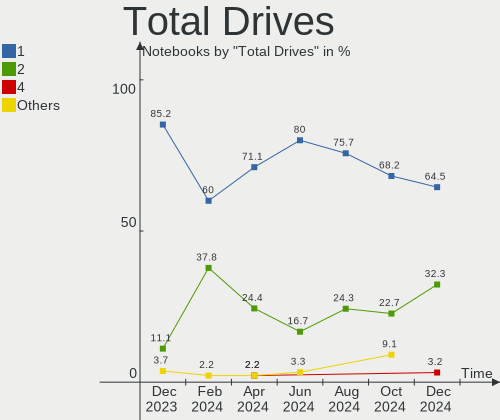
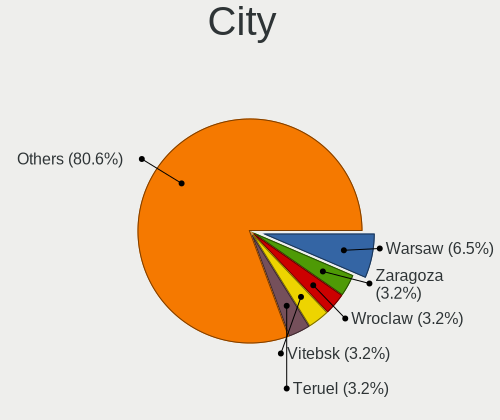
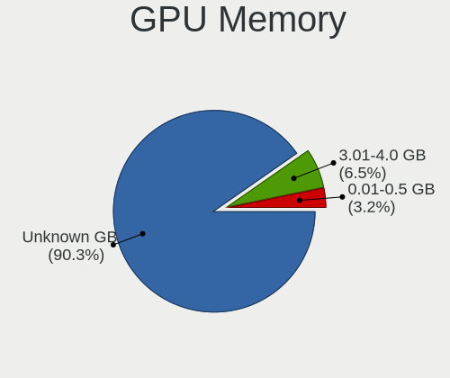
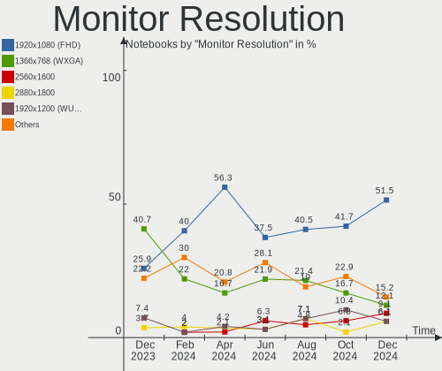
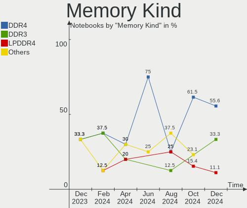

KDE neon Hardware Trends (Notebooks)
------------------------------------

A project to identify most popular hardware characteristics and track their change
over time based on data collected by KDE neon users at https://Linux-Hardware.org.

Anyone can contribute to this report by the [hw-probe](https://github.com/linuxhw/hw-probe) tool:

    sudo -E hw-probe -all -upload

Full-feature report is available here: https://linux-hardware.org/?view=trends&formfactor=notebook

Period: Aug, 2021.

Contents
--------

* [ System ](#system)
  - [ OS                       ](#os)
  - [ OS Family                ](#os-family)
  - [ Kernel                   ](#kernel)
  - [ Kernel Family            ](#kernel-family)
  - [ Kernel Major Ver.        ](#kernel-major-ver)
  - [ Arch                     ](#arch)
  - [ DE                       ](#de)
  - [ Display Server           ](#display-server)
  - [ Display Manager          ](#display-manager)
  - [ OS Lang                  ](#os-lang)
  - [ Boot Mode                ](#boot-mode)
  - [ Filesystem               ](#filesystem)
  - [ Part. scheme             ](#part-scheme)
  - [ Dual Boot with Linux/BSD ](#dual-boot-with-linuxbsd)
  - [ Dual Boot (Win)          ](#dual-boot-win)

* [ Board ](#board)
  - [ Vendor                   ](#vendor)
  - [ Model                    ](#model)
  - [ Model Family             ](#model-family)
  - [ MFG Year                 ](#mfg-year)
  - [ Form Factor              ](#form-factor)
  - [ Secure Boot              ](#secure-boot)
  - [ Coreboot                 ](#coreboot)
  - [ RAM Size                 ](#ram-size)
  - [ RAM Used                 ](#ram-used)
  - [ Total Drives             ](#total-drives)
  - [ Has CD-ROM               ](#has-cd-rom)
  - [ Has Ethernet             ](#has-ethernet)
  - [ Has WiFi                 ](#has-wifi)
  - [ Has Bluetooth            ](#has-bluetooth)

* [ Location ](#location)
  - [ Country                  ](#country)
  - [ City                     ](#city)

* [ Drives ](#drives)
  - [ Drive Vendor             ](#drive-vendor)
  - [ Drive Model              ](#drive-model)
  - [ HDD Vendor               ](#hdd-vendor)
  - [ SSD Vendor               ](#ssd-vendor)
  - [ Drive Kind               ](#drive-kind)
  - [ Drive Connector          ](#drive-connector)
  - [ Drive Size               ](#drive-size)
  - [ Space Total              ](#space-total)
  - [ Space Used               ](#space-used)
  - [ Malfunc. Drives          ](#malfunc-drives)
  - [ Malfunc. Drive Vendor    ](#malfunc-drive-vendor)
  - [ Malfunc. HDD Vendor      ](#malfunc-hdd-vendor)
  - [ Malfunc. Drive Kind      ](#malfunc-drive-kind)
  - [ Failed Drives            ](#failed-drives)
  - [ Failed Drive Vendor      ](#failed-drive-vendor)
  - [ Drive Status             ](#drive-status)

* [ Storage controller ](#storage-controller)
  - [ Storage Vendor           ](#storage-vendor)
  - [ Storage Model            ](#storage-model)
  - [ Storage Kind             ](#storage-kind)

* [ Processor ](#processor)
  - [ CPU Vendor               ](#cpu-vendor)
  - [ CPU Model                ](#cpu-model)
  - [ CPU Model Family         ](#cpu-model-family)
  - [ CPU Cores                ](#cpu-cores)
  - [ CPU Sockets              ](#cpu-sockets)
  - [ CPU Threads              ](#cpu-threads)
  - [ CPU Op-Modes             ](#cpu-op-modes)
  - [ CPU Microcode            ](#cpu-microcode)
  - [ CPU Microarch            ](#cpu-microarch)

* [ Graphics ](#graphics)
  - [ GPU Vendor               ](#gpu-vendor)
  - [ GPU Model                ](#gpu-model)
  - [ GPU Combo                ](#gpu-combo)
  - [ GPU Driver               ](#gpu-driver)
  - [ GPU Memory               ](#gpu-memory)

* [ Monitor ](#monitor)
  - [ Monitor Vendor           ](#monitor-vendor)
  - [ Monitor Model            ](#monitor-model)
  - [ Monitor Resolution       ](#monitor-resolution)
  - [ Monitor Diagonal         ](#monitor-diagonal)
  - [ Monitor Width            ](#monitor-width)
  - [ Aspect Ratio             ](#aspect-ratio)
  - [ Monitor Area             ](#monitor-area)
  - [ Pixel Density            ](#pixel-density)
  - [ Multiple Monitors        ](#multiple-monitors)

* [ Network ](#network)
  - [ Net Controller Vendor    ](#net-controller-vendor)
  - [ Net Controller Model     ](#net-controller-model)
  - [ Wireless Vendor          ](#wireless-vendor)
  - [ Wireless Model           ](#wireless-model)
  - [ Ethernet Vendor          ](#ethernet-vendor)
  - [ Ethernet Model           ](#ethernet-model)
  - [ Net Controller Kind      ](#net-controller-kind)
  - [ Used Controller          ](#used-controller)
  - [ NICs                     ](#nics)
  - [ IPv6                     ](#ipv6)

* [ Bluetooth ](#bluetooth)
  - [ Bluetooth Vendor         ](#bluetooth-vendor)
  - [ Bluetooth Model          ](#bluetooth-model)

* [ Sound ](#sound)
  - [ Sound Vendor             ](#sound-vendor)
  - [ Sound Model              ](#sound-model)

* [ Memory ](#memory)
  - [ Memory Vendor            ](#memory-vendor)
  - [ Memory Model             ](#memory-model)
  - [ Memory Kind              ](#memory-kind)
  - [ Memory Form Factor       ](#memory-form-factor)
  - [ Memory Size              ](#memory-size)
  - [ Memory Speed             ](#memory-speed)

* [ Printers & scanners ](#printers--scanners)
  - [ Printer Vendor           ](#printer-vendor)
  - [ Printer Model            ](#printer-model)
  - [ Scanner Vendor           ](#scanner-vendor)
  - [ Scanner Model            ](#scanner-model)

* [ Camera ](#camera)
  - [ Camera Vendor            ](#camera-vendor)
  - [ Camera Model             ](#camera-model)

* [ Security ](#security)
  - [ Fingerprint Vendor       ](#fingerprint-vendor)
  - [ Fingerprint Model        ](#fingerprint-model)
  - [ Chipcard Vendor          ](#chipcard-vendor)
  - [ Chipcard Model           ](#chipcard-model)

* [ Unsupported ](#unsupported)
  - [ Unsupported Devices      ](#unsupported-devices)
  - [ Unsupported Device Types ](#unsupported-device-types)

System
------

OS
--

Installed operating systems

| Name           | Notebooks | Percent |
|----------------|-----------|---------|
| KDE neon 20.04 | 69        | 100%    |

OS Family
---------

OS without a version

| Name     | Notebooks | Percent |
|----------|-----------|---------|
| KDE neon | 69        | 100%    |

Kernel
------

Version of the Linux kernel

| Version                    | Notebooks | Percent |
|----------------------------|-----------|---------|
| 5.11.0-25-generic          | 28        | 40.58%  |
| 5.11.0-27-generic          | 25        | 36.23%  |
| 5.8.0-63-generic           | 10        | 14.49%  |
| 5.4.0-74-generic           | 2         | 2.9%    |
| 5.8.0-59-generic           | 1         | 1.45%   |
| 5.4.0-73-generic           | 1         | 1.45%   |
| 5.4.0-72-generic           | 1         | 1.45%   |
| 5.13.0-10.3-liquorix-amd64 | 1         | 1.45%   |

Kernel Family
-------------

Linux kernel without a distro release

| Version | Notebooks | Percent |
|---------|-----------|---------|
| 5.11.0  | 53        | 76.81%  |
| 5.8.0   | 11        | 15.94%  |
| 5.4.0   | 4         | 5.8%    |
| 5.13.0  | 1         | 1.45%   |

Kernel Major Ver.
-----------------

Linux kernel major version

| Version | Notebooks | Percent |
|---------|-----------|---------|
| 5.11    | 53        | 76.81%  |
| 5.8     | 11        | 15.94%  |
| 5.4     | 4         | 5.8%    |
| 5.13    | 1         | 1.45%   |

Arch
----

OS architecture (x86_64, i586, etc.)

| Name   | Notebooks | Percent |
|--------|-----------|---------|
| x86_64 | 69        | 100%    |

DE
--

Desktop Environment

| Name    | Notebooks | Percent |
|---------|-----------|---------|
| KDE     | 62        | 89.86%  |
| KDE5    | 4         | 5.8%    |
| Unknown | 3         | 4.35%   |

Display Server
--------------

X11 or Wayland

| Name    | Notebooks | Percent |
|---------|-----------|---------|
| X11     | 66        | 95.65%  |
| Wayland | 3         | 4.35%   |

Display Manager
---------------

SDDM, LightDM, etc.

| Name    | Notebooks | Percent |
|---------|-----------|---------|
| Unknown | 65        | 94.2%   |
| SDDM    | 4         | 5.8%    |

OS Lang
-------

Language

| Lang    | Notebooks | Percent |
|---------|-----------|---------|
| en_US   | 25        | 36.23%  |
| ru_RU   | 7         | 10.14%  |
| en_GB   | 6         | 8.7%    |
| de_DE   | 6         | 8.7%    |
| C       | 4         | 5.8%    |
| en_CA   | 3         | 4.35%   |
| en_AU   | 3         | 4.35%   |
| fr_FR   | 2         | 2.9%    |
| es_MX   | 2         | 2.9%    |
| sv_SE   | 1         | 1.45%   |
| ru_UA   | 1         | 1.45%   |
| lt_LT   | 1         | 1.45%   |
| it_IT   | 1         | 1.45%   |
| es_ES   | 1         | 1.45%   |
| es_CU   | 1         | 1.45%   |
| en_ZW   | 1         | 1.45%   |
| en_ZA   | 1         | 1.45%   |
| el_GR   | 1         | 1.45%   |
| ca_ES   | 1         | 1.45%   |
| Unknown | 1         | 1.45%   |

Boot Mode
---------

EFI or BIOS

| Mode | Notebooks | Percent |
|------|-----------|---------|
| EFI  | 36        | 52.17%  |
| BIOS | 33        | 47.83%  |

Filesystem
----------

Type of filesystem

| Type    | Notebooks | Percent |
|---------|-----------|---------|
| Ext4    | 65        | 94.2%   |
| Overlay | 2         | 2.9%    |
| Btrfs   | 2         | 2.9%    |

Part. scheme
------------

Scheme of partitioning

| Type    | Notebooks | Percent |
|---------|-----------|---------|
| Unknown | 64        | 92.75%  |
| MBR     | 4         | 5.8%    |
| GPT     | 1         | 1.45%   |

Dual Boot with Linux/BSD
------------------------

Hosting more than one Linux/BSD

| Dual boot | Notebooks | Percent |
|-----------|-----------|---------|
| No        | 63        | 91.3%   |
| Yes       | 6         | 8.7%    |

Dual Boot (Win)
---------------

Hosting Linux and Windows

| Dual boot | Notebooks | Percent |
|-----------|-----------|---------|
| No        | 63        | 91.3%   |
| Yes       | 6         | 8.7%    |

Board
-----

Vendor
------

Motherboard manufacturer

| Name                | Notebooks | Percent |
|---------------------|-----------|---------|
| Dell                | 13        | 18.84%  |
| Lenovo              | 12        | 17.39%  |
| Hewlett-Packard     | 10        | 14.49%  |
| Acer                | 8         | 11.59%  |
| Toshiba             | 4         | 5.8%    |
| ASUSTek Computer    | 4         | 5.8%    |
| Samsung Electronics | 3         | 4.35%   |
| Apple               | 3         | 4.35%   |
| Sony                | 2         | 2.9%    |
| MSI                 | 2         | 2.9%    |
| Panasonic           | 1         | 1.45%   |
| Novatech            | 1         | 1.45%   |
| MOTILE              | 1         | 1.45%   |
| Monster             | 1         | 1.45%   |
| Medion              | 1         | 1.45%   |
| Jumper              | 1         | 1.45%   |
| HUAWEI              | 1         | 1.45%   |
| Fujitsu Siemens     | 1         | 1.45%   |

Model
-----

Motherboard model

| Name                                                                                     | Notebooks | Percent |
|------------------------------------------------------------------------------------------|-----------|---------|
| Dell Inspiron 1545                                                                       | 2         | 2.9%    |
| Apple MacBookAir7,2                                                                      | 2         | 2.9%    |
| Toshiba Satellite PRO L770-12Q                                                           | 1         | 1.45%   |
| Toshiba Satellite L740                                                                   | 1         | 1.45%   |
| Toshiba Satellite C55t-C                                                                 | 1         | 1.45%   |
| Toshiba Satellite C55-C                                                                  | 1         | 1.45%   |
| Sony VPCEA3S1E                                                                           | 1         | 1.45%   |
| Sony SVE1511P1EW                                                                         | 1         | 1.45%   |
| Samsung 700T                                                                             | 1         | 1.45%   |
| Samsung 355V4C/356V4C/3445VC/3545VC                                                      | 1         | 1.45%   |
| Samsung 355V4C/355V4X/355V5C/355V5X/356V4C/356V4X/356V5C/356V5X/3445VC/3445VX/3545VC/354 | 1         | 1.45%   |
| Panasonic CF-31-5                                                                        | 1         | 1.45%   |
| Novatech N15_17RD                                                                        | 1         | 1.45%   |
| MSI GE70 2PL                                                                             | 1         | 1.45%   |
| MSI GE66 Raider 10UG                                                                     | 1         | 1.45%   |
| MOTILE M142                                                                              | 1         | 1.45%   |
| Monster TULPAR T7 V5.x                                                                   | 1         | 1.45%   |
| Medion Akoya E6424 MD99850                                                               | 1         | 1.45%   |
| Lenovo XiaoXin-14API QC 2019 81UW                                                        | 1         | 1.45%   |
| Lenovo ThinkPad X230 2325SYU                                                             | 1         | 1.45%   |
| Lenovo ThinkPad T61 6464AS3                                                              | 1         | 1.45%   |
| Lenovo ThinkPad T470s W10DG 20JTS14R00                                                   | 1         | 1.45%   |
| Lenovo ThinkPad T440p 20AWA0MQ03                                                         | 1         | 1.45%   |
| Lenovo ThinkPad T420 4236NGG                                                             | 1         | 1.45%   |
| Lenovo IdeaPad S540-13ARE 82DL                                                           | 1         | 1.45%   |
| Lenovo IdeaPad 5 14ALC05 82LM                                                            | 1         | 1.45%   |
| Lenovo IdeaPad 330S-15ARR 81FB                                                           | 1         | 1.45%   |
| Lenovo G580 2189                                                                         | 1         | 1.45%   |
| Lenovo G40-30 80FY                                                                       | 1         | 1.45%   |
| Lenovo B51-80 80LM                                                                       | 1         | 1.45%   |
| Jumper EZbook                                                                            | 1         | 1.45%   |
| HUAWEI BOHK-WAX9X                                                                        | 1         | 1.45%   |
| HP Stream Laptop 11-aj0xxx                                                               | 1         | 1.45%   |
| HP ProBook 645 G1                                                                        | 1         | 1.45%   |
| HP ProBook 430 G7                                                                        | 1         | 1.45%   |
| HP Pavilion Laptop 15-cw1xxx                                                             | 1         | 1.45%   |
| HP Notebook                                                                              | 1         | 1.45%   |
| HP Laptop 14s-fq0xxx                                                                     | 1         | 1.45%   |
| HP Laptop 14-ck0xxx                                                                      | 1         | 1.45%   |
| HP EliteBook 8460p                                                                       | 1         | 1.45%   |
| HP Compaq Presario CQ60                                                                  | 1         | 1.45%   |
| Fujitsu Siemens AMILO Li 2732                                                            | 1         | 1.45%   |
| Dell XPS 13 9350                                                                         | 1         | 1.45%   |
| Dell Vostro 5402                                                                         | 1         | 1.45%   |
| Dell Precision M4700                                                                     | 1         | 1.45%   |
| Dell Precision M4500                                                                     | 1         | 1.45%   |
| Dell Latitude E6510                                                                      | 1         | 1.45%   |
| Dell Latitude E6420                                                                      | 1         | 1.45%   |
| Dell Latitude E5470                                                                      | 1         | 1.45%   |
| Dell Latitude E5430 vPro                                                                 | 1         | 1.45%   |
| Dell Latitude 7490                                                                       | 1         | 1.45%   |
| Dell Inspiron 5559                                                                       | 1         | 1.45%   |
| Dell Inspiron 5537                                                                       | 1         | 1.45%   |
| ASUS ZenBook UX425EA_BX425EA                                                             | 1         | 1.45%   |
| ASUS X551CAP                                                                             | 1         | 1.45%   |
| ASUS K55VD                                                                               | 1         | 1.45%   |
| ASUS ASUS TUF Gaming A17 FA706II_FA706II                                                 | 1         | 1.45%   |
| Apple MacBookPro8,1                                                                      | 1         | 1.45%   |
| Acer Swift SF314-56G                                                                     | 1         | 1.45%   |
| Acer Swift SF314-41                                                                      | 1         | 1.45%   |

Model Family
------------

Motherboard model prefix

| Name                  | Notebooks | Percent |
|-----------------------|-----------|---------|
| Lenovo ThinkPad       | 5         | 7.25%   |
| Dell Latitude         | 5         | 7.25%   |
| Acer Aspire           | 5         | 7.25%   |
| Toshiba Satellite     | 4         | 5.8%    |
| Dell Inspiron         | 4         | 5.8%    |
| Lenovo IdeaPad        | 3         | 4.35%   |
| Samsung 355V4C        | 2         | 2.9%    |
| HP ProBook            | 2         | 2.9%    |
| HP Laptop             | 2         | 2.9%    |
| Dell Precision        | 2         | 2.9%    |
| Apple MacBookAir7     | 2         | 2.9%    |
| Acer Swift            | 2         | 2.9%    |
| Sony VPCEA3S1E        | 1         | 1.45%   |
| Sony SVE1511P1EW      | 1         | 1.45%   |
| Samsung 700T          | 1         | 1.45%   |
| Panasonic CF-31-5     | 1         | 1.45%   |
| Novatech N15          | 1         | 1.45%   |
| MSI GE70              | 1         | 1.45%   |
| MSI GE66              | 1         | 1.45%   |
| MOTILE M142           | 1         | 1.45%   |
| Monster TULPAR        | 1         | 1.45%   |
| Medion Akoya          | 1         | 1.45%   |
| Lenovo XiaoXin-14API  | 1         | 1.45%   |
| Lenovo G580           | 1         | 1.45%   |
| Lenovo G40-30         | 1         | 1.45%   |
| Lenovo B51-80         | 1         | 1.45%   |
| Jumper EZbook         | 1         | 1.45%   |
| HUAWEI BOHK-WAX9X     | 1         | 1.45%   |
| HP Stream             | 1         | 1.45%   |
| HP Pavilion           | 1         | 1.45%   |
| HP Notebook           | 1         | 1.45%   |
| HP EliteBook          | 1         | 1.45%   |
| HP Compaq             | 1         | 1.45%   |
| Fujitsu Siemens AMILO | 1         | 1.45%   |
| Dell XPS              | 1         | 1.45%   |
| Dell Vostro           | 1         | 1.45%   |
| ASUS ZenBook          | 1         | 1.45%   |
| ASUS X551CAP          | 1         | 1.45%   |
| ASUS K55VD            | 1         | 1.45%   |
| ASUS ASUS             | 1         | 1.45%   |
| Apple MacBookPro8     | 1         | 1.45%   |
| Acer Nitro            | 1         | 1.45%   |
| Unknown               | 1         | 1.45%   |

MFG Year
--------

Motherboard manufacture year

| Year | Notebooks | Percent |
|------|-----------|---------|
| 2021 | 12        | 17.39%  |
| 2020 | 9         | 13.04%  |
| 2015 | 9         | 13.04%  |
| 2019 | 7         | 10.14%  |
| 2018 | 6         | 8.7%    |
| 2017 | 4         | 5.8%    |
| 2013 | 4         | 5.8%    |
| 2010 | 4         | 5.8%    |
| 2014 | 3         | 4.35%   |
| 2012 | 3         | 4.35%   |
| 2011 | 2         | 2.9%    |
| 2009 | 2         | 2.9%    |
| 2008 | 2         | 2.9%    |
| 2016 | 1         | 1.45%   |
| 2007 | 1         | 1.45%   |

Form Factor
-----------

Physical design of the computer

| Name     | Notebooks | Percent |
|----------|-----------|---------|
| Notebook | 69        | 100%    |

Secure Boot
-----------

Enabled or disabled

| State    | Notebooks | Percent |
|----------|-----------|---------|
| Disabled | 62        | 89.86%  |
| Enabled  | 7         | 10.14%  |

Coreboot
--------

Have coreboot on board

| Used | Notebooks | Percent |
|------|-----------|---------|
| No   | 69        | 100%    |

RAM Size
--------

Total RAM memory

| Size in GB | Notebooks | Percent |
|------------|-----------|---------|
| 4.01-8.0   | 25        | 36.23%  |
| 3.01-4.0   | 18        | 26.09%  |
| 8.01-16.0  | 13        | 18.84%  |
| 16.01-24.0 | 6         | 8.7%    |
| 32.01-64.0 | 4         | 5.8%    |
| 24.01-32.0 | 1         | 1.45%   |
| 1.01-2.0   | 1         | 1.45%   |
| Unknown    | 1         | 1.45%   |

RAM Used
--------

Used RAM memory

| Used GB  | Notebooks | Percent |
|----------|-----------|---------|
| 1.01-2.0 | 35        | 50.72%  |
| 2.01-3.0 | 21        | 30.43%  |
| 0.51-1.0 | 7         | 10.14%  |
| 3.01-4.0 | 4         | 5.8%    |
| 4.01-8.0 | 1         | 1.45%   |
| Unknown  | 1         | 1.45%   |

Total Drives
------------

Number of drives on board

| Drives | Notebooks | Percent |
|--------|-----------|---------|
| 1      | 45        | 65.22%  |
| 2      | 22        | 31.88%  |
| 4      | 1         | 1.45%   |
| 3      | 1         | 1.45%   |

Has CD-ROM
----------

Has CD-ROM on board

| Presented | Notebooks | Percent |
|-----------|-----------|---------|
| No        | 35        | 50.72%  |
| Yes       | 34        | 49.28%  |

Has Ethernet
------------

Has Ethernet on board

| Presented | Notebooks | Percent |
|-----------|-----------|---------|
| Yes       | 59        | 85.51%  |
| No        | 10        | 14.49%  |

Has WiFi
--------

Has WiFi module

| Presented | Notebooks | Percent |
|-----------|-----------|---------|
| Yes       | 68        | 98.55%  |
| No        | 1         | 1.45%   |

Has Bluetooth
-------------

Has Bluetooth module

| Presented | Notebooks | Percent |
|-----------|-----------|---------|
| Yes       | 58        | 84.06%  |
| No        | 11        | 15.94%  |

Location
--------

Country
-------

Geographic location (country)

| Country      | Notebooks | Percent |
|--------------|-----------|---------|
| USA          | 13        | 18.84%  |
| Russia       | 7         | 10.14%  |
| Poland       | 5         | 7.25%   |
| Germany      | 5         | 7.25%   |
| Canada       | 5         | 7.25%   |
| UK           | 3         | 4.35%   |
| Mexico       | 3         | 4.35%   |
| Australia    | 3         | 4.35%   |
| Ukraine      | 2         | 2.9%    |
| Sweden       | 2         | 2.9%    |
| Spain        | 2         | 2.9%    |
| Italy        | 2         | 2.9%    |
| France       | 2         | 2.9%    |
| Zimbabwe     | 1         | 1.45%   |
| Turkey       | 1         | 1.45%   |
| Switzerland  | 1         | 1.45%   |
| Sri Lanka    | 1         | 1.45%   |
| South Africa | 1         | 1.45%   |
| Malaysia     | 1         | 1.45%   |
| Lithuania    | 1         | 1.45%   |
| Hong Kong    | 1         | 1.45%   |
| Greece       | 1         | 1.45%   |
| Cuba         | 1         | 1.45%   |
| Brazil       | 1         | 1.45%   |
| Belize       | 1         | 1.45%   |
| Belgium      | 1         | 1.45%   |
| Austria      | 1         | 1.45%   |
| Algeria      | 1         | 1.45%   |

City
----

Geographic location (city)

| City           | Notebooks | Percent |
|----------------|-----------|---------|
| Brisbane       | 2         | 2.9%    |
| Xalapa         | 1         | 1.45%   |
| Wroclaw        | 1         | 1.45%   |
| Warsaw         | 1         | 1.45%   |
| Vienna         | 1         | 1.45%   |
| Udine          | 1         | 1.45%   |
| Toronto        | 1         | 1.45%   |
| Tence          | 1         | 1.45%   |
| Sydney         | 1         | 1.45%   |
| Summerland     | 1         | 1.45%   |
| Simferopol     | 1         | 1.45%   |
| Selma          | 1         | 1.45%   |
| San Pedro      | 1         | 1.45%   |
| Salobre?±a     | 1         | 1.45%   |
| Rostov-on-Don  | 1         | 1.45%   |
| Roanoke        | 1         | 1.45%   |
| Puebla City    | 1         | 1.45%   |
| Plymouth       | 1         | 1.45%   |
| Panama City    | 1         | 1.45%   |
| Novosibirsk    | 1         | 1.45%   |
| Norwich        | 1         | 1.45%   |
| Northeim       | 1         | 1.45%   |
| Nichelino      | 1         | 1.45%   |
| Muriyakadawala | 1         | 1.45%   |
| Moscow         | 1         | 1.45%   |
| Mons           | 1         | 1.45%   |
| Michigan City  | 1         | 1.45%   |
| Manorville     | 1         | 1.45%   |
| Maidenhead     | 1         | 1.45%   |
| Leipzig        | 1         | 1.45%   |
| Kyiv           | 1         | 1.45%   |
| Kupi??kis      | 1         | 1.45%   |
| Kuala Lumpur   | 1         | 1.45%   |
| Krasnodar      | 1         | 1.45%   |
| Kielce         | 1         | 1.45%   |
| Ivanovo        | 1         | 1.45%   |
| Irkutsk        | 1         | 1.45%   |
| Houston        | 1         | 1.45%   |
| Hot Springs    | 1         | 1.45%   |
| Herrenberg     | 1         | 1.45%   |
| Helsingborg    | 1         | 1.45%   |
| Helena         | 1         | 1.45%   |
| Havana         | 1         | 1.45%   |
| Harare         | 1         | 1.45%   |
| Halifax        | 1         | 1.45%   |
| Glattbrugg     | 1         | 1.45%   |
| Germiston      | 1         | 1.45%   |
| Flemington     | 1         | 1.45%   |
| Figueres       | 1         | 1.45%   |
| Everett        | 1         | 1.45%   |
| Epernon        | 1         | 1.45%   |
| Emden          | 1         | 1.45%   |
| El??z?±??      | 1         | 1.45%   |
| Edgewood       | 1         | 1.45%   |
| Courtenay      | 1         | 1.45%   |
| Chingford      | 1         | 1.45%   |
| Chalcis        | 1         | 1.45%   |
| Central        | 1         | 1.45%   |
| Bydgoszcz      | 1         | 1.45%   |
| Butler         | 1         | 1.45%   |

Drives
------

Drive Vendor
------------

Hard drive vendors

| Vendor                  | Notebooks | Drives | Percent |
|-------------------------|-----------|--------|---------|
| Samsung Electronics     | 16        | 17     | 18.18%  |
| WDC                     | 8         | 8      | 9.09%   |
| Toshiba                 | 8         | 8      | 9.09%   |
| SanDisk                 | 8         | 9      | 9.09%   |
| Seagate                 | 6         | 6      | 6.82%   |
| Kingston                | 6         | 6      | 6.82%   |
| Unknown                 | 4         | 5      | 4.55%   |
| Intel                   | 4         | 4      | 4.55%   |
| Hitachi                 | 3         | 3      | 3.41%   |
| HGST                    | 3         | 3      | 3.41%   |
| Crucial                 | 3         | 3      | 3.41%   |
| Micron Technology       | 2         | 2      | 2.27%   |
| Apple                   | 2         | 2      | 2.27%   |
| ZTC                     | 1         | 1      | 1.14%   |
| XPG                     | 1         | 1      | 1.14%   |
| Union Memory (Shenzhen) | 1         | 1      | 1.14%   |
| Smartbuy                | 1         | 1      | 1.14%   |
| SK Hynix                | 1         | 1      | 1.14%   |
| RSH                     | 1         | 1      | 1.14%   |
| LITEON                  | 1         | 1      | 1.14%   |
| Lexar                   | 1         | 1      | 1.14%   |
| KingSpec                | 1         | 1      | 1.14%   |
| GOODRAM                 | 1         | 1      | 1.14%   |
| China                   | 1         | 1      | 1.14%   |
| BIWIN                   | 1         | 1      | 1.14%   |
| ASMT                    | 1         | 1      | 1.14%   |
| ADATA Technology        | 1         | 1      | 1.14%   |
| A-DATA Technology       | 1         | 1      | 1.14%   |

Drive Model
-----------

Hard drive models

| Model                                        | Notebooks | Percent |
|----------------------------------------------|-----------|---------|
| Toshiba MQ01ABD100 1TB                       | 3         | 3.3%    |
| Seagate ST1000LM035-1RK172 1TB               | 2         | 2.2%    |
| Samsung SSD SM841 2.5 7mm 256GB              | 2         | 2.2%    |
| Samsung NVMe SSD Drive 256GB                 | 2         | 2.2%    |
| Samsung NVMe SSD Drive 1TB                   | 2         | 2.2%    |
| Kingston NVMe SSD Drive 512GB                | 2         | 2.2%    |
| HGST HTS545050A7E680 500GB                   | 2         | 2.2%    |
| ZTC SM201-256G                               | 1         | 1.1%    |
| XPG NVMe SSD Drive 512GB                     | 1         | 1.1%    |
| WDC WDS500G2B0B-00YS70 500GB SSD             | 1         | 1.1%    |
| WDC WD5000LPVX-22V0TT0 500GB                 | 1         | 1.1%    |
| WDC WD10SPZX-24Z10T0 1TB                     | 1         | 1.1%    |
| WDC WD10SPZX-21Z10T0 1TB                     | 1         | 1.1%    |
| WDC WD10JPVX-60JC3T0 1TB                     | 1         | 1.1%    |
| WDC WD10JPVX-22JC3T0 1TB                     | 1         | 1.1%    |
| WDC WD10JPLX-00MBPT0 1TB                     | 1         | 1.1%    |
| WDC PC SN520 SDAPNUW-512G-1014 512GB         | 1         | 1.1%    |
| Unknown SD/MMC/MS PRO 128GB                  | 1         | 1.1%    |
| Unknown MMC Card  64GB                       | 1         | 1.1%    |
| Unknown MMC Card  16GB                       | 1         | 1.1%    |
| Unknown MMC Card  128GB                      | 1         | 1.1%    |
| Unknown MMC Card  1073GB                     | 1         | 1.1%    |
| Union Memory (Shenzhen) NVMe SSD Drive 512GB | 1         | 1.1%    |
| Toshiba THNSNH128GMCT 128GB SSD              | 1         | 1.1%    |
| Toshiba MQ01ABF032 320GB                     | 1         | 1.1%    |
| Toshiba MQ01ABD075 752GB                     | 1         | 1.1%    |
| Toshiba MQ01ABD050 500GB                     | 1         | 1.1%    |
| Toshiba MK5075GSX 500GB                      | 1         | 1.1%    |
| Smartbuy SSD 120GB                           | 1         | 1.1%    |
| SK Hynix NVMe SSD Drive 256GB                | 1         | 1.1%    |
| Seagate ST9500325AS 500GB                    | 1         | 1.1%    |
| Seagate ST9160821AS 160GB                    | 1         | 1.1%    |
| Seagate ST500LM012 HN-M500MBB 500GB          | 1         | 1.1%    |
| Seagate ST1000LM024 HN-M101MBB 1TB           | 1         | 1.1%    |
| SanDisk X400 M.2 2280 256GB SSD              | 1         | 1.1%    |
| SanDisk SDSSDA240G 240GB                     | 1         | 1.1%    |
| SanDisk SD8SNAT128G1122 128GB SSD            | 1         | 1.1%    |
| SanDisk SD8SN8U128G1001 128GB SSD            | 1         | 1.1%    |
| Sandisk NVMe SSD Drive 512GB                 | 1         | 1.1%    |
| Sandisk NVMe SSD Drive 500GB                 | 1         | 1.1%    |
| Sandisk NVMe SSD Drive 256GB                 | 1         | 1.1%    |
| Sandisk NVMe SSD Drive 1TB                   | 1         | 1.1%    |
| Sandisk NVMe SSD Drive 1024GB                | 1         | 1.1%    |
| Samsung SSD 870 QVO 1TB                      | 1         | 1.1%    |
| Samsung SSD 860 EVO mSATA 500GB              | 1         | 1.1%    |
| Samsung SSD 860 EVO 500GB                    | 1         | 1.1%    |
| Samsung SSD 860 EVO 250GB                    | 1         | 1.1%    |
| Samsung SSD 850 EVO mSATA 250GB              | 1         | 1.1%    |
| Samsung SSD 850 EVO 500GB                    | 1         | 1.1%    |
| Samsung SSD 850 EVO 250GB                    | 1         | 1.1%    |
| Samsung SSD 830 Series 128GB                 | 1         | 1.1%    |
| Samsung MZNLN128HAHQ-000H1 128GB SSD         | 1         | 1.1%    |
| Samsung HM121HI 120GB                        | 1         | 1.1%    |
| Samsung 470 Series SSD 128GB                 | 1         | 1.1%    |
| RSH ASM1153E 640GB                           | 1         | 1.1%    |
| Micron C300-MTFDBAK128MAG 128GB SSD          | 1         | 1.1%    |
| Micron 1100 SATA 256GB SSD                   | 1         | 1.1%    |
| LITEON CV8-8E128-HP 128GB SSD                | 1         | 1.1%    |
| Lexar 512GB SSD                              | 1         | 1.1%    |
| Kingston SV300S37A240G 240GB SSD             | 1         | 1.1%    |

HDD Vendor
----------

Hard disk drive vendors

| Vendor              | Notebooks | Drives | Percent |
|---------------------|-----------|--------|---------|
| Toshiba             | 7         | 7      | 26.92%  |
| WDC                 | 6         | 6      | 23.08%  |
| Seagate             | 6         | 6      | 23.08%  |
| Hitachi             | 3         | 3      | 11.54%  |
| HGST                | 3         | 3      | 11.54%  |
| Samsung Electronics | 1         | 1      | 3.85%   |

SSD Vendor
----------

Solid state drive vendors

| Vendor              | Notebooks | Drives | Percent |
|---------------------|-----------|--------|---------|
| Samsung Electronics | 11        | 12     | 28.21%  |
| SanDisk             | 4         | 4      | 10.26%  |
| Kingston            | 3         | 3      | 7.69%   |
| Crucial             | 3         | 3      | 7.69%   |
| Micron Technology   | 2         | 2      | 5.13%   |
| Intel               | 2         | 2      | 5.13%   |
| Apple               | 2         | 2      | 5.13%   |
| ZTC                 | 1         | 1      | 2.56%   |
| WDC                 | 1         | 1      | 2.56%   |
| Toshiba             | 1         | 1      | 2.56%   |
| Smartbuy            | 1         | 1      | 2.56%   |
| LITEON              | 1         | 1      | 2.56%   |
| Lexar               | 1         | 1      | 2.56%   |
| KingSpec            | 1         | 1      | 2.56%   |
| GOODRAM             | 1         | 1      | 2.56%   |
| China               | 1         | 1      | 2.56%   |
| BIWIN               | 1         | 1      | 2.56%   |
| ASMT                | 1         | 1      | 2.56%   |
| A-DATA Technology   | 1         | 1      | 2.56%   |

Drive Kind
----------

HDD or SSD

| Kind    | Notebooks | Drives | Percent |
|---------|-----------|--------|---------|
| SSD     | 38        | 40     | 43.68%  |
| HDD     | 25        | 26     | 28.74%  |
| NVMe    | 18        | 19     | 20.69%  |
| MMC     | 4         | 4      | 4.6%    |
| Unknown | 2         | 2      | 2.3%    |

Drive Connector
---------------

SATA, SAS, NVMe, etc.

| Type | Notebooks | Drives | Percent |
|------|-----------|--------|---------|
| SATA | 57        | 64     | 68.67%  |
| NVMe | 18        | 19     | 21.69%  |
| SAS  | 4         | 4      | 4.82%   |
| MMC  | 4         | 4      | 4.82%   |

Drive Size
----------

Size of hard drive

| Size in TB | Notebooks | Drives | Percent |
|------------|-----------|--------|---------|
| 0.01-0.5   | 45        | 48     | 72.58%  |
| 0.51-1.0   | 16        | 17     | 25.81%  |
| 2.01-3.0   | 1         | 1      | 1.61%   |

Space Total
-----------

Amount of disk space available on the file system

| Size in GB     | Notebooks | Percent |
|----------------|-----------|---------|
| 101-250        | 22        | 31.88%  |
| 251-500        | 15        | 21.74%  |
| 21-50          | 6         | 8.7%    |
| 1001-2000      | 6         | 8.7%    |
| 501-1000       | 6         | 8.7%    |
| 1-20           | 5         | 7.25%   |
| 51-100         | 5         | 7.25%   |
| Unknown        | 3         | 4.35%   |
| More than 3000 | 1         | 1.45%   |

Space Used
----------

Amount of used disk space

| Used GB   | Notebooks | Percent |
|-----------|-----------|---------|
| 1-20      | 38        | 55.07%  |
| 21-50     | 15        | 21.74%  |
| 101-250   | 5         | 7.25%   |
| 51-100    | 4         | 5.8%    |
| Unknown   | 3         | 4.35%   |
| 251-500   | 2         | 2.9%    |
| 1001-2000 | 2         | 2.9%    |

Malfunc. Drives
---------------

Drive models with a malfunction

| Model                         | Notebooks | Drives | Percent |
|-------------------------------|-----------|--------|---------|
| Hitachi HTS542512K9SA00 120GB | 1         | 1      | 100%    |

Malfunc. Drive Vendor
---------------------

Vendors of faulty drives

| Vendor  | Notebooks | Drives | Percent |
|---------|-----------|--------|---------|
| Hitachi | 1         | 1      | 100%    |

Malfunc. HDD Vendor
-------------------

Vendors of faulty HDD drives

| Vendor  | Notebooks | Drives | Percent |
|---------|-----------|--------|---------|
| Hitachi | 1         | 1      | 100%    |

Malfunc. Drive Kind
-------------------

Kinds of faulty drives

| Kind | Notebooks | Drives | Percent |
|------|-----------|--------|---------|
| HDD  | 1         | 1      | 100%    |

Failed Drives
-------------

Failed drive models

Zero info for selected period =(

Failed Drive Vendor
-------------------

Failed drive vendors

Zero info for selected period =(

Drive Status
------------

Number of failed and malfunc. drives

| Status   | Notebooks | Drives | Percent |
|----------|-----------|--------|---------|
| Detected | 64        | 84     | 91.43%  |
| Works    | 5         | 6      | 7.14%   |
| Malfunc  | 1         | 1      | 1.43%   |

Storage controller
------------------

Storage Vendor
--------------

Storage controller vendors

| Vendor                      | Notebooks | Percent |
|-----------------------------|-----------|---------|
| Intel                       | 50        | 62.5%   |
| AMD                         | 12        | 15%     |
| Samsung Electronics         | 6         | 7.5%    |
| Sandisk                     | 5         | 6.25%   |
| Kingston Technology Company | 3         | 3.75%   |
| ADATA Technology            | 2         | 2.5%    |
| Union Memory (Shenzhen)     | 1         | 1.25%   |
| SK Hynix                    | 1         | 1.25%   |

Storage Model
-------------

Storage controller models

| Model                                                                          | Notebooks | Percent |
|--------------------------------------------------------------------------------|-----------|---------|
| AMD FCH SATA Controller [AHCI mode]                                            | 12        | 13.95%  |
| Intel Sunrise Point-LP SATA Controller [AHCI mode]                             | 7         | 8.14%   |
| Intel 82801 Mobile SATA Controller [RAID mode]                                 | 7         | 8.14%   |
| Intel 6 Series/C200 Series Chipset Family 6 port Mobile SATA AHCI Controller   | 6         | 6.98%   |
| Intel 7 Series Chipset Family 6-port SATA Controller [AHCI mode]               | 5         | 5.81%   |
| Sandisk WD Black SN750 / PC SN730 NVMe SSD                                     | 3         | 3.49%   |
| Intel Wildcat Point-LP SATA Controller [AHCI Mode]                             | 3         | 3.49%   |
| Intel Atom Processor E3800 Series SATA AHCI Controller                         | 3         | 3.49%   |
| Intel 82801IBM/IEM (ICH9M/ICH9M-E) 4 port SATA Controller [AHCI mode]          | 3         | 3.49%   |
| Intel 82801HM/HEM (ICH8M/ICH8M-E) SATA Controller [AHCI mode]                  | 3         | 3.49%   |
| Intel 82801HM/HEM (ICH8M/ICH8M-E) IDE Controller                               | 3         | 3.49%   |
| Sandisk WD Blue SN500 / PC SN520 NVMe SSD                                      | 2         | 2.33%   |
| Samsung Electronics SATA controller                                            | 2         | 2.33%   |
| Kingston Company U-SNS8154P3 NVMe SSD                                          | 2         | 2.33%   |
| Intel Volume Management Device NVMe RAID Controller                            | 2         | 2.33%   |
| Intel 8 Series/C220 Series Chipset Family 6-port SATA Controller 1 [AHCI mode] | 2         | 2.33%   |
| Union Memory (Shenzhen) Non-Volatile memory controller                         | 1         | 1.16%   |
| SK Hynix BC501 NVMe Solid State Drive                                          | 1         | 1.16%   |
| Samsung NVMe SSD Controller SM981/PM981/PM983                                  | 1         | 1.16%   |
| Samsung NVMe SSD Controller SM961/PM961/SM963                                  | 1         | 1.16%   |
| Samsung NVMe SSD Controller SM951/PM951                                        | 1         | 1.16%   |
| Samsung NVMe Controller                                                        | 1         | 1.16%   |
| Kingston Company Company Non-Volatile memory controller                        | 1         | 1.16%   |
| Intel Tiger Lake-LP SATA Controller [AHCI mode]                                | 1         | 1.16%   |
| Intel SSD Pro 7600p/760p/E 6100p Series                                        | 1         | 1.16%   |
| Intel SSD 660P Series                                                          | 1         | 1.16%   |
| Intel Q170/Q150/B150/H170/H110/Z170/CM236 Chipset SATA Controller [AHCI Mode]  | 1         | 1.16%   |
| Intel HM170/QM170 Chipset SATA Controller [AHCI Mode]                          | 1         | 1.16%   |
| Intel Comet Lake SATA AHCI Controller                                          | 1         | 1.16%   |
| Intel Celeron/Pentium Silver Processor SATA Controller                         | 1         | 1.16%   |
| Intel Celeron N3350/Pentium N4200/Atom E3900 Series SATA AHCI Controller       | 1         | 1.16%   |
| Intel Cannon Point-LP SATA Controller [AHCI Mode]                              | 1         | 1.16%   |
| Intel Cannon Lake Mobile PCH SATA AHCI Controller                              | 1         | 1.16%   |
| Intel 8 Series SATA Controller 1 [AHCI mode]                                   | 1         | 1.16%   |
| Intel 5 Series/3400 Series Chipset 4 port SATA AHCI Controller                 | 1         | 1.16%   |
| ADATA XPG SX8200 Pro PCIe Gen3x4 M.2 2280 Solid State Drive                    | 1         | 1.16%   |
| ADATA Non-Volatile memory controller                                           | 1         | 1.16%   |

Storage Kind
------------

Kind of storage controller (IDE, SATA, NVMe, SAS, ...)

| Kind | Notebooks | Percent |
|------|-----------|---------|
| SATA | 56        | 65.12%  |
| NVMe | 18        | 20.93%  |
| RAID | 9         | 10.47%  |
| IDE  | 3         | 3.49%   |

Processor
---------

CPU Vendor
----------

Processor vendors

| Vendor | Notebooks | Percent |
|--------|-----------|---------|
| Intel  | 54        | 78.26%  |
| AMD    | 15        | 21.74%  |

CPU Model
---------

Processor models

| Model                                         | Notebooks | Percent |
|-----------------------------------------------|-----------|---------|
| AMD Ryzen 5 3500U with Radeon Vega Mobile Gfx | 4         | 5.8%    |
| Intel Core i7-6500U CPU @ 2.50GHz             | 2         | 2.9%    |
| Intel Core i5-6300U CPU @ 2.40GHz             | 2         | 2.9%    |
| Intel Core i5-5250U CPU @ 1.60GHz             | 2         | 2.9%    |
| Intel Core i5-3320M CPU @ 2.60GHz             | 2         | 2.9%    |
| Intel Celeron N4000 CPU @ 1.10GHz             | 2         | 2.9%    |
| Intel Celeron CPU N2840 @ 2.16GHz             | 2         | 2.9%    |
| Intel 11th Gen Core i7-1165G7 @ 2.80GHz       | 2         | 2.9%    |
| Intel Pentium Dual-Core CPU T4200 @ 2.00GHz   | 1         | 1.45%   |
| Intel Pentium Dual CPU T2370 @ 1.73GHz        | 1         | 1.45%   |
| Intel Pentium CPU 2117U @ 1.80GHz             | 1         | 1.45%   |
| Intel Genuine CPU T1600 @ 1.66GHz             | 1         | 1.45%   |
| Intel Core i7-8650U CPU @ 1.90GHz             | 1         | 1.45%   |
| Intel Core i7-6700K CPU @ 4.00GHz             | 1         | 1.45%   |
| Intel Core i7-4500U CPU @ 1.80GHz             | 1         | 1.45%   |
| Intel Core i7-3740QM CPU @ 2.70GHz            | 1         | 1.45%   |
| Intel Core i7-2760QM CPU @ 2.40GHz            | 1         | 1.45%   |
| Intel Core i7-2620M CPU @ 2.70GHz             | 1         | 1.45%   |
| Intel Core i7-10870H CPU @ 2.20GHz            | 1         | 1.45%   |
| Intel Core i7 CPU M 620 @ 2.67GHz             | 1         | 1.45%   |
| Intel Core i5-9300H CPU @ 2.40GHz             | 1         | 1.45%   |
| Intel Core i5-8265U CPU @ 1.60GHz             | 1         | 1.45%   |
| Intel Core i5-7200U CPU @ 2.50GHz             | 1         | 1.45%   |
| Intel Core i5-6300HQ CPU @ 2.30GHz            | 1         | 1.45%   |
| Intel Core i5-6267U CPU @ 2.90GHz             | 1         | 1.45%   |
| Intel Core i5-6200U CPU @ 2.30GHz             | 1         | 1.45%   |
| Intel Core i5-5300U CPU @ 2.30GHz             | 1         | 1.45%   |
| Intel Core i5-5200U CPU @ 2.20GHz             | 1         | 1.45%   |
| Intel Core i5-4300M CPU @ 2.60GHz             | 1         | 1.45%   |
| Intel Core i5-4200H CPU @ 2.80GHz             | 1         | 1.45%   |
| Intel Core i5-3210M CPU @ 2.50GHz             | 1         | 1.45%   |
| Intel Core i5-2540M CPU @ 2.60GHz             | 1         | 1.45%   |
| Intel Core i5-2467M CPU @ 1.60GHz             | 1         | 1.45%   |
| Intel Core i5-2450M CPU @ 2.50GHz             | 1         | 1.45%   |
| Intel Core i5-2430M CPU @ 2.40GHz             | 1         | 1.45%   |
| Intel Core i5-2415M CPU @ 2.30GHz             | 1         | 1.45%   |
| Intel Core i5-10210U CPU @ 1.60GHz            | 1         | 1.45%   |
| Intel Core i5 CPU M 580 @ 2.67GHz             | 1         | 1.45%   |
| Intel Core i3-5020U CPU @ 2.20GHz             | 1         | 1.45%   |
| Intel Core i3-3120M CPU @ 2.50GHz             | 1         | 1.45%   |
| Intel Core i3-2330M CPU @ 2.20GHz             | 1         | 1.45%   |
| Intel Core i3 CPU M 370 @ 2.40GHz             | 1         | 1.45%   |
| Intel Core 2 Duo CPU T8100 @ 2.10GHz          | 1         | 1.45%   |
| Intel Core 2 Duo CPU T7100 @ 1.80GHz          | 1         | 1.45%   |
| Intel Core 2 Duo CPU T6500 @ 2.10GHz          | 1         | 1.45%   |
| Intel Celeron CPU N2830 @ 2.16GHz             | 1         | 1.45%   |
| Intel Celeron CPU J3455 @ 1.50GHz             | 1         | 1.45%   |
| Intel 11th Gen Core i5-1135G7 @ 2.40GHz       | 1         | 1.45%   |
| AMD Ryzen 7 5700U with Radeon Graphics        | 1         | 1.45%   |
| AMD Ryzen 7 4700U with Radeon Graphics        | 1         | 1.45%   |
| AMD Ryzen 5 4600U with Radeon Graphics        | 1         | 1.45%   |
| AMD Ryzen 5 4600H with Radeon Graphics        | 1         | 1.45%   |
| AMD Ryzen 5 2500U with Radeon Vega Mobile Gfx | 1         | 1.45%   |
| AMD Ryzen 3 4300U with Radeon Graphics        | 1         | 1.45%   |
| AMD Ryzen 3 3200U with Radeon Vega Mobile Gfx | 1         | 1.45%   |
| AMD Ryzen 3 2200U with Radeon Vega Mobile Gfx | 1         | 1.45%   |
| AMD A8-5550M APU with Radeon HD Graphics      | 1         | 1.45%   |
| AMD A8-4500M APU with Radeon HD Graphics      | 1         | 1.45%   |
| AMD A10-4600M APU with Radeon HD Graphics     | 1         | 1.45%   |

CPU Model Family
----------------

Processor model prefix

| Model                   | Notebooks | Percent |
|-------------------------|-----------|---------|
| Intel Core i5           | 24        | 34.78%  |
| Intel Core i7           | 10        | 14.49%  |
| AMD Ryzen 5             | 7         | 10.14%  |
| Intel Celeron           | 6         | 8.7%    |
| Intel Core i3           | 4         | 5.8%    |
| Other                   | 3         | 4.35%   |
| Intel Core 2 Duo        | 3         | 4.35%   |
| AMD Ryzen 3             | 3         | 4.35%   |
| AMD Ryzen 7             | 2         | 2.9%    |
| AMD A8                  | 2         | 2.9%    |
| Intel Pentium Dual-Core | 1         | 1.45%   |
| Intel Pentium Dual      | 1         | 1.45%   |
| Intel Pentium           | 1         | 1.45%   |
| Intel Genuine           | 1         | 1.45%   |
| AMD A10                 | 1         | 1.45%   |

CPU Cores
---------

Number of processor cores

| Number  | Notebooks | Percent |
|---------|-----------|---------|
| 2       | 45        | 65.22%  |
| 4       | 18        | 26.09%  |
| 8       | 3         | 4.35%   |
| 6       | 2         | 2.9%    |
| Unknown | 1         | 1.45%   |

CPU Sockets
-----------

Number of sockets

| Number  | Notebooks | Percent |
|---------|-----------|---------|
| 1       | 68        | 98.55%  |
| Unknown | 1         | 1.45%   |

CPU Threads
-----------

Threads per core (Hyper-Threading)

| Number  | Notebooks | Percent |
|---------|-----------|---------|
| 2       | 53        | 76.81%  |
| 1       | 15        | 21.74%  |
| Unknown | 1         | 1.45%   |

CPU Op-Modes
------------

CPU Operation Modes (32-bit, 64-bit)

| Op mode        | Notebooks | Percent |
|----------------|-----------|---------|
| 32-bit, 64-bit | 68        | 98.55%  |
| Unknown        | 1         | 1.45%   |

CPU Microcode
-------------

Microcode number

| Number     | Notebooks | Percent |
|------------|-----------|---------|
| 0x206a7    | 7         | 10.14%  |
| 0x406e3    | 6         | 8.7%    |
| 0x306a9    | 6         | 8.7%    |
| 0x306d4    | 5         | 7.25%   |
| 0x08108102 | 4         | 5.8%    |
| 0x806c1    | 3         | 4.35%   |
| 0x6fd      | 3         | 4.35%   |
| 0x30678    | 3         | 4.35%   |
| 0x706a1    | 2         | 2.9%    |
| 0x506e3    | 2         | 2.9%    |
| 0x306c3    | 2         | 2.9%    |
| 0x20655    | 2         | 2.9%    |
| 0x1067a    | 2         | 2.9%    |
| 0x08600106 | 2         | 2.9%    |
| 0x0810100b | 2         | 2.9%    |
| 0x06001119 | 2         | 2.9%    |
| 0xa0652    | 1         | 1.45%   |
| 0x906ed    | 1         | 1.45%   |
| 0x806ec    | 1         | 1.45%   |
| 0x806eb    | 1         | 1.45%   |
| 0x806ea    | 1         | 1.45%   |
| 0x806e9    | 1         | 1.45%   |
| 0x506ca    | 1         | 1.45%   |
| 0x40651    | 1         | 1.45%   |
| 0x20652    | 1         | 1.45%   |
| 0x10676    | 1         | 1.45%   |
| 0x08608103 | 1         | 1.45%   |
| 0x08600104 | 1         | 1.45%   |
| 0x08600103 | 1         | 1.45%   |
| 0x08108109 | 1         | 1.45%   |
| 0x0600111f | 1         | 1.45%   |
| Unknown    | 1         | 1.45%   |

CPU Microarch
-------------

Microarchitecture

| Name          | Notebooks | Percent |
|---------------|-----------|---------|
| Skylake       | 8         | 11.59%  |
| SandyBridge   | 8         | 11.59%  |
| IvyBridge     | 6         | 8.7%    |
| Zen+          | 5         | 7.25%   |
| KabyLake      | 5         | 7.25%   |
| Broadwell     | 5         | 7.25%   |
| Zen 2         | 4         | 5.8%    |
| Westmere      | 3         | 4.35%   |
| TigerLake     | 3         | 4.35%   |
| Silvermont    | 3         | 4.35%   |
| Piledriver    | 3         | 4.35%   |
| Penryn        | 3         | 4.35%   |
| Haswell       | 3         | 4.35%   |
| Core          | 3         | 4.35%   |
| Zen           | 2         | 2.9%    |
| Goldmont plus | 2         | 2.9%    |
| Goldmont      | 1         | 1.45%   |
| CometLake     | 1         | 1.45%   |
| Unknown       | 1         | 1.45%   |

Graphics
--------

GPU Vendor
----------

Vendors of graphics cards

| Vendor | Notebooks | Percent |
|--------|-----------|---------|
| Intel  | 49        | 57.65%  |
| AMD    | 21        | 24.71%  |
| Nvidia | 15        | 17.65%  |

GPU Model
---------

Graphics card models

| Model                                                                                 | Notebooks | Percent |
|---------------------------------------------------------------------------------------|-----------|---------|
| Intel 3rd Gen Core processor Graphics Controller                                      | 6         | 6.52%   |
| Intel 2nd Generation Core Processor Family Integrated Graphics Controller             | 6         | 6.52%   |
| Intel Skylake GT2 [HD Graphics 520]                                                   | 5         | 5.43%   |
| AMD Picasso                                                                           | 5         | 5.43%   |
| AMD Sun XT [Radeon HD 8670A/8670M/8690M / R5 M330 / M430 / Radeon 520 Mobile]         | 4         | 4.35%   |
| AMD Renoir                                                                            | 4         | 4.35%   |
| Intel TigerLake-LP GT2 [Iris Xe Graphics]                                             | 3         | 3.26%   |
| Intel Mobile GM965/GL960 Integrated Graphics Controller (secondary)                   | 3         | 3.26%   |
| Intel Mobile GM965/GL960 Integrated Graphics Controller (primary)                     | 3         | 3.26%   |
| Intel Mobile 4 Series Chipset Integrated Graphics Controller                          | 3         | 3.26%   |
| Intel HD Graphics 5500                                                                | 3         | 3.26%   |
| Intel Atom Processor Z36xxx/Z37xxx Series Graphics & Display                          | 3         | 3.26%   |
| Nvidia GF119M [GeForce 610M]                                                          | 2         | 2.17%   |
| Intel HD Graphics 6000                                                                | 2         | 2.17%   |
| Intel GeminiLake [UHD Graphics 600]                                                   | 2         | 2.17%   |
| Intel 4th Gen Core Processor Integrated Graphics Controller                           | 2         | 2.17%   |
| AMD Thames [Radeon HD 7500M/7600M Series]                                             | 2         | 2.17%   |
| AMD Raven Ridge [Radeon Vega Series / Radeon Vega Mobile Series]                      | 2         | 2.17%   |
| Nvidia TU117M [GeForce GTX 1650 Ti Mobile]                                            | 1         | 1.09%   |
| Nvidia TU106M [GeForce RTX 2060 Mobile]                                               | 1         | 1.09%   |
| Nvidia GT215GLM [Quadro FX 1800M]                                                     | 1         | 1.09%   |
| Nvidia GP108M [GeForce MX330]                                                         | 1         | 1.09%   |
| Nvidia GP108M [GeForce MX150]                                                         | 1         | 1.09%   |
| Nvidia GP107M [GeForce MX350]                                                         | 1         | 1.09%   |
| Nvidia GM204M [GeForce GTX 970M]                                                      | 1         | 1.09%   |
| Nvidia GM107M [GeForce GTX 960M]                                                      | 1         | 1.09%   |
| Nvidia GM107M [GeForce GTX 850M]                                                      | 1         | 1.09%   |
| Nvidia GK107GLM [Quadro K1000M]                                                       | 1         | 1.09%   |
| Nvidia GF119M [NVS 4200M]                                                             | 1         | 1.09%   |
| Nvidia GF108M [GeForce GT 525M]                                                       | 1         | 1.09%   |
| Nvidia GA104M [GeForce RTX 3070 Mobile / Max-Q]                                       | 1         | 1.09%   |
| Intel WhiskeyLake-U GT2 [UHD Graphics 620]                                            | 1         | 1.09%   |
| Intel UHD Graphics 620                                                                | 1         | 1.09%   |
| Intel Iris Graphics 550                                                               | 1         | 1.09%   |
| Intel HD Graphics 620                                                                 | 1         | 1.09%   |
| Intel HD Graphics 530                                                                 | 1         | 1.09%   |
| Intel HD Graphics 500                                                                 | 1         | 1.09%   |
| Intel Haswell-ULT Integrated Graphics Controller                                      | 1         | 1.09%   |
| Intel Core Processor Integrated Graphics Controller                                   | 1         | 1.09%   |
| Intel CometLake-U GT2 [UHD Graphics]                                                  | 1         | 1.09%   |
| Intel CometLake-H GT2 [UHD Graphics]                                                  | 1         | 1.09%   |
| Intel CoffeeLake-H GT2 [UHD Graphics 630]                                             | 1         | 1.09%   |
| AMD Trinity [Radeon HD 7660G]                                                         | 1         | 1.09%   |
| AMD Trinity [Radeon HD 7640G]                                                         | 1         | 1.09%   |
| AMD Topaz XT [Radeon R7 M260/M265 / M340/M360 / M440/M445 / 530/535 / 620/625 Mobile] | 1         | 1.09%   |
| AMD Seymour [Radeon HD 6400M/7400M Series]                                            | 1         | 1.09%   |
| AMD Richland [Radeon HD 8550G]                                                        | 1         | 1.09%   |
| AMD Park [Mobility Radeon HD 5430/5450/5470]                                          | 1         | 1.09%   |
| AMD Lucienne                                                                          | 1         | 1.09%   |
| AMD Lexa PRO [Radeon 540/540X/550/550X / RX 540X/550/550X]                            | 1         | 1.09%   |

GPU Combo
---------

Combinations of graphics cards

| Name           | Notebooks | Percent |
|----------------|-----------|---------|
| 1 x Intel      | 34        | 49.28%  |
| 1 x AMD        | 12        | 17.39%  |
| Intel + Nvidia | 11        | 15.94%  |
| 2 x AMD        | 4         | 5.8%    |
| Intel + AMD    | 4         | 5.8%    |
| 1 x Nvidia     | 3         | 4.35%   |
| AMD + Nvidia   | 1         | 1.45%   |

GPU Driver
----------

Free vs proprietary

| Driver      | Notebooks | Percent |
|-------------|-----------|---------|
| Free        | 65        | 94.2%   |
| Proprietary | 4         | 5.8%    |

GPU Memory
----------

Total video memory

| Size in GB | Notebooks | Percent |
|------------|-----------|---------|
| Unknown    | 35        | 50.72%  |
| 1.01-2.0   | 17        | 24.64%  |
| 0.51-1.0   | 6         | 8.7%    |
| 0.01-0.5   | 6         | 8.7%    |
| 5.01-6.0   | 2         | 2.9%    |
| 3.01-4.0   | 2         | 2.9%    |
| 7.01-8.0   | 1         | 1.45%   |

Monitor
-------

Monitor Vendor
--------------

Monitor vendors

| Vendor                  | Notebooks | Percent |
|-------------------------|-----------|---------|
| LG Display              | 23        | 30.26%  |
| AU Optronics            | 12        | 15.79%  |
| Chimei Innolux          | 9         | 11.84%  |
| BOE                     | 8         | 10.53%  |
| Samsung Electronics     | 4         | 5.26%   |
| Sharp                   | 3         | 3.95%   |
| Apple                   | 3         | 3.95%   |
| Sony                    | 2         | 2.63%   |
| Chi Mei Optoelectronics | 2         | 2.63%   |
| Philips                 | 1         | 1.32%   |
| PANDA                   | 1         | 1.32%   |
| NEC Computers           | 1         | 1.32%   |
| IBM                     | 1         | 1.32%   |
| Hewlett-Packard         | 1         | 1.32%   |
| Dell                    | 1         | 1.32%   |
| CSO                     | 1         | 1.32%   |
| ASUSTek Computer        | 1         | 1.32%   |
| Ancor Communications    | 1         | 1.32%   |
| Acer                    | 1         | 1.32%   |

Monitor Model
-------------

Monitor models

| Model                                                                     | Notebooks | Percent |
|---------------------------------------------------------------------------|-----------|---------|
| LG Display LCD Monitor LGD065A 1920x1080 344x194mm 15.5-inch              | 2         | 2.6%    |
| LG Display LCD Monitor LGD045E 1366x768 309x174mm 14.0-inch               | 2         | 2.6%    |
| LG Display LCD Monitor LGD0456 1366x768 344x194mm 15.5-inch               | 2         | 2.6%    |
| AU Optronics LCD Monitor AUO12EC 1366x768 344x193mm 15.5-inch             | 2         | 2.6%    |
| Sony TV SNY5901 1360x768 1600x900mm 72.3-inch                             | 1         | 1.3%    |
| Sony Nvidia Defaul SNY05FA 1366x768 290x170mm 13.2-inch                   | 1         | 1.3%    |
| Sharp LQ156M1JW03 SHP14C5 1920x1080 344x194mm 15.5-inch                   | 1         | 1.3%    |
| Sharp LCD Monitor SHP1497 1920x1080 309x174mm 14.0-inch                   | 1         | 1.3%    |
| Sharp LCD Monitor SHP144A 3200x1800 294x165mm 13.3-inch                   | 1         | 1.3%    |
| Samsung Electronics S27F350 SAM0D22 1920x1080 598x336mm 27.0-inch         | 1         | 1.3%    |
| Samsung Electronics LCD Monitor SEC4545 1280x800 331x207mm 15.4-inch      | 1         | 1.3%    |
| Samsung Electronics LCD Monitor SDC5441 1366x768 340x190mm 15.3-inch      | 1         | 1.3%    |
| Samsung Electronics LCD Monitor SAM0B30 1920x1080 890x500mm 40.2-inch     | 1         | 1.3%    |
| Philips 220VW PHL0853 1680x1050 474x296mm 22.0-inch                       | 1         | 1.3%    |
| PANDA LC133LF2L03 NCP0015 1920x1080 294x165mm 13.3-inch                   | 1         | 1.3%    |
| NEC Computers LCD190V NEC66D3 1280x1024 376x301mm 19.0-inch               | 1         | 1.3%    |
| LG Display LP156WH1-TLA1 LGD6301 1366x768 344x194mm 15.5-inch             | 1         | 1.3%    |
| LG Display LCD Monitor LGD060F 1920x1080 309x174mm 14.0-inch              | 1         | 1.3%    |
| LG Display LCD Monitor LGD05F6 1920x1080 309x174mm 14.0-inch              | 1         | 1.3%    |
| LG Display LCD Monitor LGD0599 1920x1080 309x174mm 14.0-inch              | 1         | 1.3%    |
| LG Display LCD Monitor LGD0521 1920x1080 309x174mm 14.0-inch              | 1         | 1.3%    |
| LG Display LCD Monitor LGD046C 1920x1080 380x210mm 17.1-inch              | 1         | 1.3%    |
| LG Display LCD Monitor LGD045C 1366x768 350x190mm 15.7-inch               | 1         | 1.3%    |
| LG Display LCD Monitor LGD044F 1920x1080 350x190mm 15.7-inch              | 1         | 1.3%    |
| LG Display LCD Monitor LGD03AB 1366x768 344x194mm 15.5-inch               | 1         | 1.3%    |
| LG Display LCD Monitor LGD034B 1366x768 345x194mm 15.6-inch               | 1         | 1.3%    |
| LG Display LCD Monitor LGD033E 1366x768 309x174mm 14.0-inch               | 1         | 1.3%    |
| LG Display LCD Monitor LGD033A 1366x768 340x190mm 15.3-inch               | 1         | 1.3%    |
| LG Display LCD Monitor LGD02F8 1366x768 309x174mm 14.0-inch               | 1         | 1.3%    |
| LG Display LCD Monitor LGD02F6 1600x900 382x215mm 17.3-inch               | 1         | 1.3%    |
| LG Display LCD Monitor LGD02EB 1366x768 309x174mm 14.0-inch               | 1         | 1.3%    |
| LG Display LCD Monitor LGD02D8 1366x768 277x156mm 12.5-inch               | 1         | 1.3%    |
| LG Display LCD Monitor LGD024B 1366x768 344x194mm 15.5-inch               | 1         | 1.3%    |
| IBM LCD Monitor IBM2887 1680x1050 331x207mm 15.4-inch                     | 1         | 1.3%    |
| Hewlett-Packard Z27i HWP3097 2560x1440 597x336mm 27.0-inch                | 1         | 1.3%    |
| Dell P2217 DELD099 1680x1050 474x296mm 22.0-inch                          | 1         | 1.3%    |
| Dell P2217 DELD097 1680x1050 474x296mm 22.0-inch                          | 1         | 1.3%    |
| CSO LCD Monitor CSO076D 2560x1600 286x179mm 13.3-inch                     | 1         | 1.3%    |
| Chimei Innolux LCD Monitor CMN15D5 1920x1080 340x190mm 15.3-inch          | 1         | 1.3%    |
| Chimei Innolux LCD Monitor CMN15C4 1920x1080 344x193mm 15.5-inch          | 1         | 1.3%    |
| Chimei Innolux LCD Monitor CMN15B1 1920x1080 344x194mm 15.5-inch          | 1         | 1.3%    |
| Chimei Innolux LCD Monitor CMN1521 1920x1080 344x193mm 15.5-inch          | 1         | 1.3%    |
| Chimei Innolux LCD Monitor CMN14D5 1920x1080 309x173mm 13.9-inch          | 1         | 1.3%    |
| Chimei Innolux LCD Monitor CMN14D4 1920x1080 309x173mm 13.9-inch          | 1         | 1.3%    |
| Chimei Innolux LCD Monitor CMN1490 1366x768 309x173mm 13.9-inch           | 1         | 1.3%    |
| Chimei Innolux LCD Monitor CMN140A 1920x1080 309x173mm 13.9-inch          | 1         | 1.3%    |
| Chimei Innolux LCD Monitor CMN1147 1366x768 256x144mm 11.6-inch           | 1         | 1.3%    |
| Chi Mei Optoelectronics LCD Monitor CMO1720 1920x1080 382x215mm 17.3-inch | 1         | 1.3%    |
| Chi Mei Optoelectronics LCD Monitor CMO15A7 1366x768 350x190mm 15.7-inch  | 1         | 1.3%    |
| BOE LCD Monitor BOE08BE 1920x1080 382x215mm 17.3-inch                     | 1         | 1.3%    |
| BOE LCD Monitor BOE08A6 1920x1080 294x165mm 13.3-inch                     | 1         | 1.3%    |
| BOE LCD Monitor BOE0872 1920x1080 344x194mm 15.5-inch                     | 1         | 1.3%    |
| BOE LCD Monitor BOE0801 1920x1080 344x194mm 15.5-inch                     | 1         | 1.3%    |
| BOE LCD Monitor BOE0700 1920x1080 344x194mm 15.5-inch                     | 1         | 1.3%    |
| BOE LCD Monitor BOE06A4 1366x768 344x194mm 15.5-inch                      | 1         | 1.3%    |
| BOE LCD Monitor BOE0697 1366x768 309x173mm 13.9-inch                      | 1         | 1.3%    |
| BOE LCD Monitor BOE0696 1366x768 309x173mm 13.9-inch                      | 1         | 1.3%    |
| AU Optronics LCD Monitor AUO453D 1920x1080 309x174mm 14.0-inch            | 1         | 1.3%    |
| AU Optronics LCD Monitor AUO30ED 1920x1080 344x193mm 15.5-inch            | 1         | 1.3%    |
| AU Optronics LCD Monitor AUO26EC 1366x768 344x193mm 15.5-inch             | 1         | 1.3%    |

Monitor Resolution
------------------

Monitor screen resolution

| Resolution         | Notebooks | Percent |
|--------------------|-----------|---------|
| 1920x1080 (FHD)    | 29        | 39.19%  |
| 1366x768 (WXGA)    | 28        | 37.84%  |
| 1680x1050 (WSXGA+) | 3         | 4.05%   |
| 1600x900 (HD+)     | 3         | 4.05%   |
| 1280x800 (WXGA)    | 3         | 4.05%   |
| 2560x1440 (QHD)    | 2         | 2.7%    |
| 1440x900 (WXGA+)   | 2         | 2.7%    |
| 3200x1800 (QHD+)   | 1         | 1.35%   |
| 2560x1600          | 1         | 1.35%   |
| 1360x768           | 1         | 1.35%   |
| 1280x1024 (SXGA)   | 1         | 1.35%   |

Monitor Diagonal
----------------

Diagonal size in inches

| Inches | Notebooks | Percent |
|--------|-----------|---------|
| 15     | 31        | 40.79%  |
| 14     | 15        | 19.74%  |
| 13     | 12        | 15.79%  |
| 17     | 5         | 6.58%   |
| 27     | 2         | 2.63%   |
| 22     | 2         | 2.63%   |
| 11     | 2         | 2.63%   |
| 72     | 1         | 1.32%   |
| 40     | 1         | 1.32%   |
| 31     | 1         | 1.32%   |
| 23     | 1         | 1.32%   |
| 21     | 1         | 1.32%   |
| 19     | 1         | 1.32%   |
| 12     | 1         | 1.32%   |

Monitor Width
-------------

Physical width

| Width in mm | Notebooks | Percent |
|-------------|-----------|---------|
| 301-350     | 51        | 68%     |
| 201-300     | 10        | 13.33%  |
| 351-400     | 5         | 6.67%   |
| 501-600     | 3         | 4%      |
| 401-500     | 3         | 4%      |
| 801-900     | 1         | 1.33%   |
| 601-700     | 1         | 1.33%   |
| 1501-2000   | 1         | 1.33%   |

Aspect Ratio
------------

Proportional relationship between the width and the height

| Ratio | Notebooks | Percent |
|-------|-----------|---------|
| 16/9  | 59        | 85.51%  |
| 16/10 | 9         | 13.04%  |
| 5/4   | 1         | 1.45%   |

Monitor Area
------------

Area in inch²

| Area in inch² | Notebooks | Percent |
|----------------|-----------|---------|
| 101-110        | 30        | 39.47%  |
| 81-90          | 23        | 30.26%  |
| 121-130        | 5         | 6.58%   |
| 71-80          | 4         | 5.26%   |
| 201-250        | 4         | 5.26%   |
| 51-60          | 2         | 2.63%   |
| 301-350        | 2         | 2.63%   |
| More than 1000 | 1         | 1.32%   |
| 61-70          | 1         | 1.32%   |
| 351-500        | 1         | 1.32%   |
| 151-200        | 1         | 1.32%   |
| 501-1000       | 1         | 1.32%   |
| 91-100         | 1         | 1.32%   |

Pixel Density
-------------

Pixels per inch

| Density       | Notebooks | Percent |
|---------------|-----------|---------|
| 121-160       | 32        | 42.11%  |
| 101-120       | 28        | 36.84%  |
| 51-100        | 11        | 14.47%  |
| 161-240       | 3         | 3.95%   |
| More than 240 | 1         | 1.32%   |
| 1-50          | 1         | 1.32%   |

Multiple Monitors
-----------------

Total monitors connected

| Total | Notebooks | Percent |
|-------|-----------|---------|
| 1     | 59        | 85.51%  |
| 2     | 9         | 13.04%  |
| 3     | 1         | 1.45%   |

Network
-------

Net Controller Vendor
---------------------

Controller vendors

| Vendor                   | Notebooks | Percent |
|--------------------------|-----------|---------|
| Realtek Semiconductor    | 37        | 33.64%  |
| Intel                    | 33        | 30%     |
| Qualcomm Atheros         | 18        | 16.36%  |
| Broadcom                 | 9         | 8.18%   |
| Broadcom Limited         | 4         | 3.64%   |
| Marvell Technology Group | 3         | 2.73%   |
| Xiaomi                   | 1         | 0.91%   |
| Sierra Wireless          | 1         | 0.91%   |
| NetGear                  | 1         | 0.91%   |
| Motorola PCS             | 1         | 0.91%   |
| Linksys                  | 1         | 0.91%   |
| ASIX Electronics         | 1         | 0.91%   |

Net Controller Model
--------------------

Controller models

| Model                                                                          | Notebooks | Percent |
|--------------------------------------------------------------------------------|-----------|---------|
| Realtek RTL8111/8168/8411 PCI Express Gigabit Ethernet Controller              | 19        | 14.5%   |
| Realtek RTL810xE PCI Express Fast Ethernet controller                          | 9         | 6.87%   |
| Intel 82579LM Gigabit Network Connection (Lewisville)                          | 6         | 4.58%   |
| Qualcomm Atheros AR9485 Wireless Network Adapter                               | 4         | 3.05%   |
| Intel Wi-Fi 6 AX200                                                            | 4         | 3.05%   |
| Realtek RTL8822CE 802.11ac PCIe Wireless Network Adapter                       | 3         | 2.29%   |
| Realtek RTL8821CE 802.11ac PCIe Wireless Network Adapter                       | 3         | 2.29%   |
| Qualcomm Atheros QCA9565 / AR9565 Wireless Network Adapter                     | 3         | 2.29%   |
| Qualcomm Atheros AR9285 Wireless Network Adapter (PCI-Express)                 | 3         | 2.29%   |
| Intel Wireless 8260                                                            | 3         | 2.29%   |
| Intel Wi-Fi 6 AX201                                                            | 3         | 2.29%   |
| Broadcom BCM43142 802.11b/g/n                                                  | 3         | 2.29%   |
| Realtek RTL8723BE PCIe Wireless Network Adapter                                | 2         | 1.53%   |
| Realtek RTL8153 Gigabit Ethernet Adapter                                       | 2         | 1.53%   |
| Qualcomm Atheros QCA6174 802.11ac Wireless Network Adapter                     | 2         | 1.53%   |
| Marvell Group 88E8040 PCI-E Fast Ethernet Controller                           | 2         | 1.53%   |
| Intel Wireless 7265                                                            | 2         | 1.53%   |
| Intel Ethernet Connection I219-LM                                              | 2         | 1.53%   |
| Intel Centrino Advanced-N 6205 [Taylor Peak]                                   | 2         | 1.53%   |
| Intel 82577LM Gigabit Network Connection                                       | 2         | 1.53%   |
| Broadcom BCM43228 802.11a/b/g/n                                                | 2         | 1.53%   |
| Broadcom BCM43224 802.11a/b/g/n                                                | 2         | 1.53%   |
| Xiaomi Mi/Redmi series (RNDIS)                                                 | 1         | 0.76%   |
| Sierra Wireless EM7305 Modem                                                   | 1         | 0.76%   |
| Realtek RTL88x2bu [AC1200 Techkey]                                             | 1         | 0.76%   |
| Realtek RTL8852AE 802.11ax PCIe Wireless Network Adapter                       | 1         | 0.76%   |
| Realtek RTL8822BE 802.11a/b/g/n/ac WiFi adapter                                | 1         | 0.76%   |
| Realtek RTL8723DE Wireless Network Adapter                                     | 1         | 0.76%   |
| Realtek RTL8188EUS 802.11n Wireless Network Adapter                            | 1         | 0.76%   |
| Realtek 802.11ac NIC                                                           | 1         | 0.76%   |
| Qualcomm Atheros QCA9377 802.11ac Wireless Network Adapter                     | 1         | 0.76%   |
| Qualcomm Atheros Killer E2500 Gigabit Ethernet Controller                      | 1         | 0.76%   |
| Qualcomm Atheros Killer E2400 Gigabit Ethernet Controller                      | 1         | 0.76%   |
| Qualcomm Atheros Killer E220x Gigabit Ethernet Controller                      | 1         | 0.76%   |
| Qualcomm Atheros AR8162 Fast Ethernet                                          | 1         | 0.76%   |
| Qualcomm Atheros AR8152 v2.0 Fast Ethernet                                     | 1         | 0.76%   |
| Qualcomm Atheros AR242x / AR542x Wireless Network Adapter (PCI-Express)        | 1         | 0.76%   |
| NetGear A6100 AC600 DB Wireless Adapter [Realtek RTL8811AU]                    | 1         | 0.76%   |
| Motorola PCS moto g(30)                                                        | 1         | 0.76%   |
| Marvell Group Yukon Optima 88E8059 [PCIe Gigabit Ethernet Controller with AVB] | 1         | 0.76%   |
| Linksys WUSB54GC v1 802.11g Adapter [Ralink RT73]                              | 1         | 0.76%   |
| Intel Wireless 8265 / 8275                                                     | 1         | 0.76%   |
| Intel Wireless 7260                                                            | 1         | 0.76%   |
| Intel Wireless 3165                                                            | 1         | 0.76%   |
| Intel Wireless 3160                                                            | 1         | 0.76%   |
| Intel WiFi Link 5100                                                           | 1         | 0.76%   |
| Intel Wi-Fi 6 AX210/AX211/AX411 160MHz                                         | 1         | 0.76%   |
| Intel PRO/Wireless 4965 AG or AGN [Kedron] Network Connection                  | 1         | 0.76%   |
| Intel PRO/Wireless 3945ABG [Golan] Network Connection                          | 1         | 0.76%   |
| Intel Ethernet controller                                                      | 1         | 0.76%   |
| Intel Ethernet Connection I217-LM                                              | 1         | 0.76%   |
| Intel Ethernet Connection (4) I219-LM                                          | 1         | 0.76%   |
| Intel Ethernet Connection (3) I218-LM                                          | 1         | 0.76%   |
| Intel Dual Band Wireless-AC 3168NGW [Stone Peak]                               | 1         | 0.76%   |
| Intel Dual Band Wireless-AC 3165 Plus Bluetooth                                | 1         | 0.76%   |
| Intel Comet Lake PCH-LP CNVi WiFi                                              | 1         | 0.76%   |
| Intel Centrino Wireless-N 2230                                                 | 1         | 0.76%   |
| Intel Centrino Ultimate-N 6300                                                 | 1         | 0.76%   |
| Intel Centrino Advanced-N 6230 [Rainbow Peak]                                  | 1         | 0.76%   |
| Intel Centrino Advanced-N 6200                                                 | 1         | 0.76%   |

Wireless Vendor
---------------

Wireless vendors

| Vendor                | Notebooks | Percent |
|-----------------------|-----------|---------|
| Intel                 | 30        | 42.25%  |
| Qualcomm Atheros      | 14        | 19.72%  |
| Realtek Semiconductor | 12        | 16.9%   |
| Broadcom              | 9         | 12.68%  |
| Broadcom Limited      | 3         | 4.23%   |
| Sierra Wireless       | 1         | 1.41%   |
| NetGear               | 1         | 1.41%   |
| Linksys               | 1         | 1.41%   |

Wireless Model
--------------

Wireless models

| Model                                                                   | Notebooks | Percent |
|-------------------------------------------------------------------------|-----------|---------|
| Qualcomm Atheros AR9485 Wireless Network Adapter                        | 4         | 5.56%   |
| Intel Wi-Fi 6 AX200                                                     | 4         | 5.56%   |
| Realtek RTL8821CE 802.11ac PCIe Wireless Network Adapter                | 3         | 4.17%   |
| Qualcomm Atheros QCA9565 / AR9565 Wireless Network Adapter              | 3         | 4.17%   |
| Qualcomm Atheros AR9285 Wireless Network Adapter (PCI-Express)          | 3         | 4.17%   |
| Intel Wireless 8260                                                     | 3         | 4.17%   |
| Intel Wi-Fi 6 AX201                                                     | 3         | 4.17%   |
| Broadcom BCM43142 802.11b/g/n                                           | 3         | 4.17%   |
| Realtek RTL8822CE 802.11ac PCIe Wireless Network Adapter                | 2         | 2.78%   |
| Realtek RTL8723BE PCIe Wireless Network Adapter                         | 2         | 2.78%   |
| Qualcomm Atheros QCA6174 802.11ac Wireless Network Adapter              | 2         | 2.78%   |
| Intel Wireless 7265                                                     | 2         | 2.78%   |
| Intel Centrino Advanced-N 6205 [Taylor Peak]                            | 2         | 2.78%   |
| Broadcom BCM43228 802.11a/b/g/n                                         | 2         | 2.78%   |
| Broadcom BCM43224 802.11a/b/g/n                                         | 2         | 2.78%   |
| Sierra Wireless EM7305 Modem                                            | 1         | 1.39%   |
| Realtek RTL88x2bu [AC1200 Techkey]                                      | 1         | 1.39%   |
| Realtek RTL8852AE 802.11ax PCIe Wireless Network Adapter                | 1         | 1.39%   |
| Realtek RTL8822BE 802.11a/b/g/n/ac WiFi adapter                         | 1         | 1.39%   |
| Realtek RTL8723DE Wireless Network Adapter                              | 1         | 1.39%   |
| Realtek RTL8188EUS 802.11n Wireless Network Adapter                     | 1         | 1.39%   |
| Realtek 802.11ac NIC                                                    | 1         | 1.39%   |
| Qualcomm Atheros QCA9377 802.11ac Wireless Network Adapter              | 1         | 1.39%   |
| Qualcomm Atheros AR242x / AR542x Wireless Network Adapter (PCI-Express) | 1         | 1.39%   |
| NetGear A6100 AC600 DB Wireless Adapter [Realtek RTL8811AU]             | 1         | 1.39%   |
| Linksys WUSB54GC v1 802.11g Adapter [Ralink RT73]                       | 1         | 1.39%   |
| Intel Wireless 8265 / 8275                                              | 1         | 1.39%   |
| Intel Wireless 7260                                                     | 1         | 1.39%   |
| Intel Wireless 3165                                                     | 1         | 1.39%   |
| Intel Wireless 3160                                                     | 1         | 1.39%   |
| Intel WiFi Link 5100                                                    | 1         | 1.39%   |
| Intel Wi-Fi 6 AX210/AX211/AX411 160MHz                                  | 1         | 1.39%   |
| Intel PRO/Wireless 4965 AG or AGN [Kedron] Network Connection           | 1         | 1.39%   |
| Intel PRO/Wireless 3945ABG [Golan] Network Connection                   | 1         | 1.39%   |
| Intel Dual Band Wireless-AC 3168NGW [Stone Peak]                        | 1         | 1.39%   |
| Intel Dual Band Wireless-AC 3165 Plus Bluetooth                         | 1         | 1.39%   |
| Intel Comet Lake PCH-LP CNVi WiFi                                       | 1         | 1.39%   |
| Intel Centrino Wireless-N 2230                                          | 1         | 1.39%   |
| Intel Centrino Ultimate-N 6300                                          | 1         | 1.39%   |
| Intel Centrino Advanced-N 6230 [Rainbow Peak]                           | 1         | 1.39%   |
| Intel Centrino Advanced-N 6200                                          | 1         | 1.39%   |
| Intel Cannon Point-LP CNVi [Wireless-AC]                                | 1         | 1.39%   |
| Broadcom Limited BCM4360 802.11ac Wireless Network Adapter              | 1         | 1.39%   |
| Broadcom Limited BCM4313 802.11bgn Wireless Network Adapter             | 1         | 1.39%   |
| Broadcom Limited BCM4312 802.11b/g LP-PHY                               | 1         | 1.39%   |
| Broadcom BCM4350 802.11ac Wireless Network Adapter                      | 1         | 1.39%   |
| Broadcom BCM4331 802.11a/b/g/n                                          | 1         | 1.39%   |

Ethernet Vendor
---------------

Ethernet vendors

| Vendor                   | Notebooks | Percent |
|--------------------------|-----------|---------|
| Realtek Semiconductor    | 31        | 52.54%  |
| Intel                    | 15        | 25.42%  |
| Qualcomm Atheros         | 5         | 8.47%   |
| Marvell Technology Group | 3         | 5.08%   |
| Xiaomi                   | 1         | 1.69%   |
| Motorola PCS             | 1         | 1.69%   |
| Broadcom Limited         | 1         | 1.69%   |
| Broadcom                 | 1         | 1.69%   |
| ASIX Electronics         | 1         | 1.69%   |

Ethernet Model
--------------

Ethernet models

| Model                                                                          | Notebooks | Percent |
|--------------------------------------------------------------------------------|-----------|---------|
| Realtek RTL8111/8168/8411 PCI Express Gigabit Ethernet Controller              | 19        | 32.2%   |
| Realtek RTL810xE PCI Express Fast Ethernet controller                          | 9         | 15.25%  |
| Intel 82579LM Gigabit Network Connection (Lewisville)                          | 6         | 10.17%  |
| Realtek RTL8153 Gigabit Ethernet Adapter                                       | 2         | 3.39%   |
| Marvell Group 88E8040 PCI-E Fast Ethernet Controller                           | 2         | 3.39%   |
| Intel Ethernet Connection I219-LM                                              | 2         | 3.39%   |
| Intel 82577LM Gigabit Network Connection                                       | 2         | 3.39%   |
| Xiaomi Mi/Redmi series (RNDIS)                                                 | 1         | 1.69%   |
| Realtek RTL8822CE 802.11ac PCIe Wireless Network Adapter                       | 1         | 1.69%   |
| Qualcomm Atheros Killer E2500 Gigabit Ethernet Controller                      | 1         | 1.69%   |
| Qualcomm Atheros Killer E2400 Gigabit Ethernet Controller                      | 1         | 1.69%   |
| Qualcomm Atheros Killer E220x Gigabit Ethernet Controller                      | 1         | 1.69%   |
| Qualcomm Atheros AR8162 Fast Ethernet                                          | 1         | 1.69%   |
| Qualcomm Atheros AR8152 v2.0 Fast Ethernet                                     | 1         | 1.69%   |
| Motorola PCS moto g(30)                                                        | 1         | 1.69%   |
| Marvell Group Yukon Optima 88E8059 [PCIe Gigabit Ethernet Controller with AVB] | 1         | 1.69%   |
| Intel Ethernet controller                                                      | 1         | 1.69%   |
| Intel Ethernet Connection I217-LM                                              | 1         | 1.69%   |
| Intel Ethernet Connection (4) I219-LM                                          | 1         | 1.69%   |
| Intel Ethernet Connection (3) I218-LM                                          | 1         | 1.69%   |
| Intel 82566MM Gigabit Network Connection                                       | 1         | 1.69%   |
| Broadcom NetXtreme BCM57765 Gigabit Ethernet PCIe                              | 1         | 1.69%   |
| Broadcom Limited NetLink BCM5787M Gigabit Ethernet PCI Express                 | 1         | 1.69%   |
| ASIX AX88179 Gigabit Ethernet                                                  | 1         | 1.69%   |

Net Controller Kind
-------------------

Ethernet, WiFi or modem

| Kind     | Notebooks | Percent |
|----------|-----------|---------|
| WiFi     | 68        | 53.54%  |
| Ethernet | 59        | 46.46%  |

Used Controller
---------------

Currently used network controller

| Kind     | Notebooks | Percent |
|----------|-----------|---------|
| WiFi     | 60        | 54.05%  |
| Ethernet | 51        | 45.95%  |

NICs
----

Total network controllers on board

| Total | Notebooks | Percent |
|-------|-----------|---------|
| 2     | 52        | 75.36%  |
| 1     | 16        | 23.19%  |
| 0     | 1         | 1.45%   |

IPv6
----

IPv6 vs IPv4

| Used | Notebooks | Percent |
|------|-----------|---------|
| No   | 56        | 81.16%  |
| Yes  | 13        | 18.84%  |

Bluetooth
---------

Bluetooth Vendor
----------------

Controller vendors

| Vendor                          | Notebooks | Percent |
|---------------------------------|-----------|---------|
| Intel                           | 23        | 38.33%  |
| Realtek Semiconductor           | 8         | 13.33%  |
| Qualcomm Atheros Communications | 6         | 10%     |
| Lite-On Technology              | 4         | 6.67%   |
| Foxconn / Hon Hai               | 3         | 5%      |
| Dell                            | 3         | 5%      |
| Broadcom                        | 3         | 5%      |
| Apple                           | 3         | 5%      |
| Toshiba                         | 2         | 3.33%   |
| IMC Networks                    | 2         | 3.33%   |
| Hewlett-Packard                 | 2         | 3.33%   |
| Realtek                         | 1         | 1.67%   |

Bluetooth Model
---------------

Controller models

| Model                                                                               | Notebooks | Percent |
|-------------------------------------------------------------------------------------|-----------|---------|
| Intel Bluetooth wireless interface                                                  | 10        | 16.67%  |
| Realtek Bluetooth Radio                                                             | 6         | 10%     |
| Intel Bluetooth Device                                                              | 4         | 6.67%   |
| Intel AX200 Bluetooth                                                               | 4         | 6.67%   |
| Qualcomm Atheros AR3012 Bluetooth 4.0                                               | 3         | 5%      |
| Toshiba BCM43142A0                                                                  | 2         | 3.33%   |
| Qualcomm Atheros AR3011 Bluetooth                                                   | 2         | 3.33%   |
| Lite-On Bluetooth Device                                                            | 2         | 3.33%   |
| Intel Bluetooth 9460/9560 Jefferson Peak (JfP)                                      | 2         | 3.33%   |
| IMC Networks Bluetooth Radio                                                        | 2         | 3.33%   |
| Apple Bluetooth USB Host Controller                                                 | 2         | 3.33%   |
| Realtek  Bluetooth 4.2 Adapter                                                      | 1         | 1.67%   |
| Realtek 802.11n WLAN Adapter                                                        | 1         | 1.67%   |
| Realtek Bluetooth Radio                                                             | 1         | 1.67%   |
| Qualcomm Atheros AR9462 Bluetooth                                                   | 1         | 1.67%   |
| Lite-On Qualcomm Atheros QCA9377 Bluetooth                                          | 1         | 1.67%   |
| Lite-On Atheros AR3012 Bluetooth                                                    | 1         | 1.67%   |
| Intel Wireless-AC 3168 Bluetooth                                                    | 1         | 1.67%   |
| Intel Centrino Bluetooth Wireless Transceiver                                       | 1         | 1.67%   |
| Intel Centrino Advanced-N 6230 Bluetooth adapter                                    | 1         | 1.67%   |
| HP Broadcom 2070 Bluetooth Combo                                                    | 1         | 1.67%   |
| HP Bluetooth 2.0 Interface [Broadcom BCM2045]                                       | 1         | 1.67%   |
| Foxconn / Hon Hai Foxconn T77H114 BCM2070 [Single-Chip Bluetooth 2.1 + EDR Adapter] | 1         | 1.67%   |
| Foxconn / Hon Hai Broadcom BCM20702 Bluetooth                                       | 1         | 1.67%   |
| Foxconn / Hon Hai BCM43142A0 broadcom bluetooth                                     | 1         | 1.67%   |
| Dell Wireless 365 Bluetooth                                                         | 1         | 1.67%   |
| Dell DW375 Bluetooth Module                                                         | 1         | 1.67%   |
| Dell BCM20702A0 Bluetooth Module                                                    | 1         | 1.67%   |
| Broadcom HP Portable Bumble Bee                                                     | 1         | 1.67%   |
| Broadcom BCM20702A0 Bluetooth 4.0                                                   | 1         | 1.67%   |
| Broadcom BCM2045A0                                                                  | 1         | 1.67%   |
| Apple Bluetooth Host Controller                                                     | 1         | 1.67%   |

Sound
-----

Sound Vendor
------------

Sound card vendors

| Vendor           | Notebooks | Percent |
|------------------|-----------|---------|
| Intel            | 54        | 65.85%  |
| AMD              | 17        | 20.73%  |
| Nvidia           | 9         | 10.98%  |
| JMTek            | 1         | 1.22%   |
| Conexant Systems | 1         | 1.22%   |

Sound Model
-----------

Sound card models

| Model                                                                             | Notebooks | Percent |
|-----------------------------------------------------------------------------------|-----------|---------|
| AMD Family 17h (Models 10h-1fh) HD Audio Controller                               | 12        | 11.43%  |
| Intel Sunrise Point-LP HD Audio                                                   | 8         | 7.62%   |
| Intel 7 Series/C216 Chipset Family High Definition Audio Controller               | 7         | 6.67%   |
| Intel 6 Series/C200 Series Chipset Family High Definition Audio Controller        | 7         | 6.67%   |
| AMD Raven/Raven2/Fenghuang HDMI/DP Audio Controller                               | 7         | 6.67%   |
| Intel Wildcat Point-LP High Definition Audio Controller                           | 5         | 4.76%   |
| Intel Broadwell-U Audio Controller                                                | 5         | 4.76%   |
| AMD Renoir Radeon High Definition Audio Controller                                | 5         | 4.76%   |
| Intel Tiger Lake-LP Smart Sound Technology Audio Controller                       | 3         | 2.86%   |
| Intel Atom Processor Z36xxx/Z37xxx Series High Definition Audio Controller        | 3         | 2.86%   |
| Intel 82801I (ICH9 Family) HD Audio Controller                                    | 3         | 2.86%   |
| Intel 82801H (ICH8 Family) HD Audio Controller                                    | 3         | 2.86%   |
| Intel 5 Series/3400 Series Chipset High Definition Audio                          | 3         | 2.86%   |
| AMD Trinity HDMI Audio Controller                                                 | 3         | 2.86%   |
| AMD FCH Azalia Controller                                                         | 3         | 2.86%   |
| Intel Xeon E3-1200 v3/4th Gen Core Processor HD Audio Controller                  | 2         | 1.9%    |
| Intel Celeron/Pentium Silver Processor High Definition Audio                      | 2         | 1.9%    |
| Intel 8 Series/C220 Series Chipset High Definition Audio Controller               | 2         | 1.9%    |
| Intel 100 Series/C230 Series Chipset Family HD Audio Controller                   | 2         | 1.9%    |
| Nvidia TU107 GeForce GTX 1650 High Definition Audio Controller                    | 1         | 0.95%   |
| Nvidia TU106 High Definition Audio Controller                                     | 1         | 0.95%   |
| Nvidia High Definition Audio Controller                                           | 1         | 0.95%   |
| Nvidia GM204 High Definition Audio Controller                                     | 1         | 0.95%   |
| Nvidia GM107 High Definition Audio Controller [GeForce 940MX]                     | 1         | 0.95%   |
| Nvidia GK107 HDMI Audio Controller                                                | 1         | 0.95%   |
| Nvidia GF119 HDMI Audio Controller                                                | 1         | 0.95%   |
| Nvidia GF108 High Definition Audio Controller                                     | 1         | 0.95%   |
| Nvidia GA104 High Definition Audio Controller                                     | 1         | 0.95%   |
| JMTek USB PnP Audio Device                                                        | 1         | 0.95%   |
| Intel Haswell-ULT HD Audio Controller                                             | 1         | 0.95%   |
| Intel Comet Lake PCH-LP cAVS                                                      | 1         | 0.95%   |
| Intel Comet Lake PCH cAVS                                                         | 1         | 0.95%   |
| Intel Celeron N3350/Pentium N4200/Atom E3900 Series Audio Cluster                 | 1         | 0.95%   |
| Intel Cannon Point-LP High Definition Audio Controller                            | 1         | 0.95%   |
| Intel Cannon Lake PCH cAVS                                                        | 1         | 0.95%   |
| Intel 8 Series HD Audio Controller                                                | 1         | 0.95%   |
| Conexant Systems USB Audio                                                        | 1         | 0.95%   |
| AMD Cedar HDMI Audio [Radeon HD 5400/6300/7300 Series]                            | 1         | 0.95%   |
| AMD Caicos HDMI Audio [Radeon HD 6450 / 7450/8450/8490 OEM / R5 230/235/235X OEM] | 1         | 0.95%   |

Memory
------

Memory Vendor
-------------

Memory module vendors

| Vendor              | Notebooks | Percent |
|---------------------|-----------|---------|
| SK Hynix            | 5         | 38.46%  |
| Samsung Electronics | 3         | 23.08%  |
| Crucial             | 2         | 15.38%  |
| Unknown             | 1         | 7.69%   |
| Netlist             | 1         | 7.69%   |
| Micron Technology   | 1         | 7.69%   |

Memory Model
------------

Memory module models

| Model                                                       | Notebooks | Percent |
|-------------------------------------------------------------|-----------|---------|
| Unknown RAM Module 1GB SODIMM DDR2 667MT/s                  | 1         | 7.14%   |
| SK Hynix RAM HYMP125S64CP8-S6 2048MB SODIMM DDR 975MT/s     | 1         | 7.14%   |
| SK Hynix RAM HMT451S6BFR8A-PB 4096MB SODIMM DDR3 1600MT/s   | 1         | 7.14%   |
| SK Hynix RAM HMA851S6CJR6N-VK 4096MB SODIMM DDR4 2667MT/s   | 1         | 7.14%   |
| SK Hynix RAM HMA81GS6CJR8N-VK 8GB SODIMM DDR4 2667MT/s      | 1         | 7.14%   |
| SK Hynix RAM D471A1K43CB1-CTD 8GB SODIMM DDR4 2400MT/s      | 1         | 7.14%   |
| Samsung RAM M471B5773DH0-CH9 2048MB SODIMM DDR3 1600MT/s    | 1         | 7.14%   |
| Samsung RAM M471B5273EB0-CK0 4GB SODIMM DDR3 4199MT/s       | 1         | 7.14%   |
| Samsung RAM M471B5273CH0-CH9 4096MB SODIMM DDR3 1334MT/s    | 1         | 7.14%   |
| Samsung RAM M471A5244CB0-CTD 4GB Row Of Chips DDR4 2667MT/s | 1         | 7.14%   |
| Netlist RAM NL8256421207F-D53M 2GB SODIMM DDR2 667MT/s      | 1         | 7.14%   |
| Micron RAM 4ATF51264HZ-2G6E! 4GB SODIMM DDR4 2400MT/s       | 1         | 7.14%   |
| Crucial RAM CT8G4SFRA32A.C4FE 8192MB SODIMM DDR4 3200MT/s   | 1         | 7.14%   |
| Crucial RAM CT51264BF160B.C16F 4GB SODIMM DDR3 1600MT/s     | 1         | 7.14%   |

Memory Kind
-----------

Memory module kinds

| Kind  | Notebooks | Percent |
|-------|-----------|---------|
| DDR4  | 4         | 36.36%  |
| DDR3  | 3         | 27.27%  |
| DDR2  | 3         | 27.27%  |
| SDRAM | 1         | 9.09%   |

Memory Form Factor
------------------

Physical design of the memory module

| Name         | Notebooks | Percent |
|--------------|-----------|---------|
| SODIMM       | 10        | 90.91%  |
| Row Of Chips | 1         | 9.09%   |

Memory Size
-----------

Memory module size

| Size | Notebooks | Percent |
|------|-----------|---------|
| 4096 | 7         | 50%     |
| 8192 | 3         | 21.43%  |
| 2048 | 3         | 21.43%  |
| 1024 | 1         | 7.14%   |

Memory Speed
------------

Memory module speed

| Speed | Notebooks | Percent |
|-------|-----------|---------|
| 2667  | 3         | 23.08%  |
| 1600  | 3         | 23.08%  |
| 667   | 2         | 15.38%  |
| 4199  | 1         | 7.69%   |
| 3200  | 1         | 7.69%   |
| 2400  | 1         | 7.69%   |
| 1334  | 1         | 7.69%   |
| 975   | 1         | 7.69%   |

Printers & scanners
-------------------

Printer Vendor
--------------

Printer device vendors

Zero info for selected period =(

Printer Model
-------------

Printer device models

Zero info for selected period =(

Scanner Vendor
--------------

Scanner device vendors

Zero info for selected period =(

Scanner Model
-------------

Scanner device models

Zero info for selected period =(

Camera
------

Camera Vendor
-------------

Camera device vendors

| Vendor                                 | Notebooks | Percent |
|----------------------------------------|-----------|---------|
| Chicony Electronics                    | 15        | 26.32%  |
| Microdia                               | 7         | 12.28%  |
| Realtek Semiconductor                  | 6         | 10.53%  |
| Quanta                                 | 5         | 8.77%   |
| IMC Networks                           | 5         | 8.77%   |
| Acer                                   | 5         | 8.77%   |
| Silicon Motion                         | 3         | 5.26%   |
| Cheng Uei Precision Industry (Foxlink) | 2         | 3.51%   |
| Syntek                                 | 1         | 1.75%   |
| Suyin                                  | 1         | 1.75%   |
| Sunplus Innovation Technology          | 1         | 1.75%   |
| Ricoh                                  | 1         | 1.75%   |
| Logitech                               | 1         | 1.75%   |
| DLEQNA1RSF8M7D                         | 1         | 1.75%   |
| DigiTech                               | 1         | 1.75%   |
| Apple                                  | 1         | 1.75%   |
| Alcor Micro                            | 1         | 1.75%   |

Camera Model
------------

Camera device models

| Model                                                   | Notebooks | Percent |
|---------------------------------------------------------|-----------|---------|
| Chicony HD WebCam                                       | 5         | 8.77%   |
| Realtek Integrated_Webcam_HD                            | 3         | 5.26%   |
| Quanta HD User Facing                                   | 3         | 5.26%   |
| Chicony Integrated Camera                               | 3         | 5.26%   |
| Silicon Motion WebCam SC-13HDL11939N                    | 2         | 3.51%   |
| Microdia Laptop_Integrated_Webcam_E4HD                  | 2         | 3.51%   |
| Microdia Integrated Webcam HD                           | 2         | 3.51%   |
| IMC Networks USB2.0 HD UVC WebCam                       | 2         | 3.51%   |
| Acer BisonCam, NB Pro                                   | 2         | 3.51%   |
| Syntek Integrated Camera                                | 1         | 1.75%   |
| Suyin USB 2.0 Camera                                    | 1         | 1.75%   |
| Sunplus Laptop_Integrated_Webcam_FHD                    | 1         | 1.75%   |
| Silicon Motion WebCam SC-20FHM11347N                    | 1         | 1.75%   |
| Ricoh USB2.0 Camera                                     | 1         | 1.75%   |
| Realtek HP Webcam                                       | 1         | 1.75%   |
| Realtek Built-In Video Camera                           | 1         | 1.75%   |
| Realtek Acer 640 x 480 laptop camera                    | 1         | 1.75%   |
| Quanta VGA WebCam                                       | 1         | 1.75%   |
| Quanta HP Webcam                                        | 1         | 1.75%   |
| Microdia Lenovo EasyCamera                              | 1         | 1.75%   |
| Microdia Integrated_Webcam_1.3M                         | 1         | 1.75%   |
| Microdia Dell Laptop Integrated Webcam HD               | 1         | 1.75%   |
| Logitech Webcam C310                                    | 1         | 1.75%   |
| IMC Networks TOSHIBA Web Camera - HD                    | 1         | 1.75%   |
| IMC Networks ov9734_azurewave_camera                    | 1         | 1.75%   |
| IMC Networks Integrated Camera                          | 1         | 1.75%   |
| DLEQNA1RSF8M7D HP TrueVision HD Camera                  | 1         | 1.75%   |
| DigiTech WebCam SC-30AFL11449M                          | 1         | 1.75%   |
| Chicony USB2.0 HD UVC WebCam                            | 1         | 1.75%   |
| Chicony TOSHIBA Web Camera - HD                         | 1         | 1.75%   |
| Chicony TOSHIBA Web Camera                              | 1         | 1.75%   |
| Chicony Lenovo EasyCamera                               | 1         | 1.75%   |
| Chicony Integrated HP HD Webcam                         | 1         | 1.75%   |
| Chicony HP Wide Vision HD Camera                        | 1         | 1.75%   |
| Chicony HP HD Camera                                    | 1         | 1.75%   |
| Cheng Uei Precision Industry (Foxlink) HP TrueVision HD | 1         | 1.75%   |
| Cheng Uei Precision Industry (Foxlink) HP HD Webcam     | 1         | 1.75%   |
| Apple FaceTime HD Camera                                | 1         | 1.75%   |
| Alcor Micro USB 2.0 Camera                              | 1         | 1.75%   |
| Acer USB HD Webcam                                      | 1         | 1.75%   |
| Acer SunplusIT INC. Integrated Camera                   | 1         | 1.75%   |
| Acer Lenovo EasyCamera                                  | 1         | 1.75%   |

Security
--------

Fingerprint Vendor
------------------

Fingerprint sensor vendors

| Vendor                     | Notebooks | Percent |
|----------------------------|-----------|---------|
| LighTuning Technology      | 3         | 50%     |
| Validity Sensors           | 2         | 33.33%  |
| Shenzhen Goodix Technology | 1         | 16.67%  |

Fingerprint Model
-----------------

Fingerprint sensor models

| Model                                        | Notebooks | Percent |
|----------------------------------------------|-----------|---------|
| LighTuning ES603 Swipe Fingerprint Sensor    | 2         | 33.33%  |
| Validity Sensors VFS471 Fingerprint Reader   | 1         | 16.67%  |
| Validity Sensors VFS 5011 fingerprint sensor | 1         | 16.67%  |
| Shenzhen Goodix  Fingerprint Device          | 1         | 16.67%  |
| LighTuning EgisTec Touch Fingerprint Sensor  | 1         | 16.67%  |

Chipcard Vendor
---------------

Chipcard module vendors

| Vendor   | Notebooks | Percent |
|----------|-----------|---------|
| Broadcom | 6         | 85.71%  |
| OmniKey  | 1         | 14.29%  |

Chipcard Model
--------------

Chipcard module models

| Model                                                                        | Notebooks | Percent |
|------------------------------------------------------------------------------|-----------|---------|
| Broadcom BCM5880 Secure Applications Processor                               | 3         | 42.86%  |
| Broadcom 5880                                                                | 2         | 28.57%  |
| OmniKey CardMan 4321                                                         | 1         | 14.29%  |
| Broadcom BCM5880 Secure Applications Processor with fingerprint swipe sensor | 1         | 14.29%  |

Unsupported
-----------

Unsupported Devices
-------------------

Total unsupported devices on board

| Total | Notebooks | Percent |
|-------|-----------|---------|
| 0     | 47        | 68.12%  |
| 1     | 20        | 28.99%  |
| 2     | 2         | 2.9%    |

Unsupported Device Types
------------------------

Types of unsupported devices

| Type                  | Notebooks | Percent |
|-----------------------|-----------|---------|
| Chipcard              | 7         | 29.17%  |
| Fingerprint reader    | 6         | 25%     |
| Net/wireless          | 5         | 20.83%  |
| Multimedia controller | 5         | 20.83%  |
| Storage               | 1         | 4.17%   |

