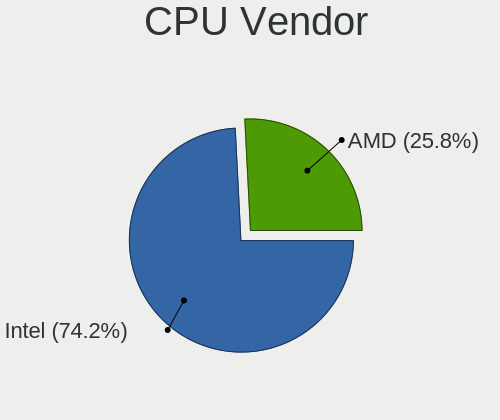
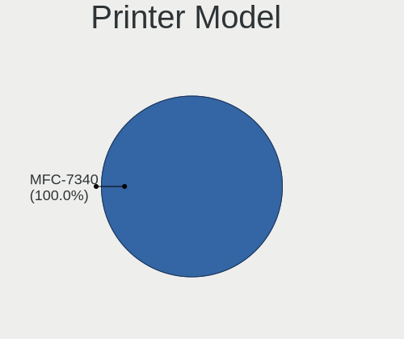

KDE neon Hardware Trends (Notebook)
-----------------------------------

A project to identify most popular hardware characteristics and track their change
over time based on data collected by KDE neon users at https://Linux-Hardware.org.

Anyone can contribute to the study by uploading probes of their computers by
the [hw-probe](https://github.com/linuxhw/hw-probe) tool:

    sudo -E hw-probe -all -upload

Full-feature report is available here: https://linux-hardware.org/?view=trends&formfactor=notebook

Period: Feb, 2021.

Contents
--------

- [ OS                       ](#os)
- [ OS Family                ](#os-family)
- [ Kernel                   ](#kernel)
- [ Kernel Family            ](#kernel-family)
- [ Kernel Major Ver.        ](#kernel-major-ver)
- [ Arch                     ](#arch)
- [ DE                       ](#de)
- [ Display Server           ](#display-server)
- [ Display Manager          ](#display-manager)
- [ OS Lang                  ](#os-lang)
- [ Boot Mode                ](#boot-mode)
- [ Filesystem               ](#filesystem)
- [ Part. scheme             ](#part-scheme)
- [ Dual Boot with Linux/BSD ](#dual-boot-with-linux/bsd)
- [ Dual Boot (Win)          ](#dual-boot-win)
- [ Country                  ](#country)
- [ City                     ](#city)
- [ Vendor                   ](#vendor)
- [ Model                    ](#model)
- [ Model Family             ](#model-family)
- [ MFG Year                 ](#mfg-year)
- [ Form Factor              ](#form-factor)
- [ Secure Boot              ](#secure-boot)
- [ Coreboot                 ](#coreboot)
- [ RAM Size                 ](#ram-size)
- [ RAM Used                 ](#ram-used)
- [ Has CD-ROM               ](#has-cd-rom)
- [ Total Drives             ](#total-drives)
- [ Has Ethernet             ](#has-ethernet)
- [ Drive Vendor             ](#drive-vendor)
- [ Drive Model              ](#drive-model)
- [ HDD Vendor               ](#hdd-vendor)
- [ SSD Vendor               ](#ssd-vendor)
- [ Drive Kind               ](#drive-kind)
- [ Drive Connector          ](#drive-connector)
- [ Drive Size               ](#drive-size)
- [ Space Total              ](#space-total)
- [ Space Used               ](#space-used)
- [ Malfunc. Drives          ](#malfunc-drives)
- [ Malfunc. Drive Vendor    ](#malfunc-drive-vendor)
- [ Malfunc. HDD Vendor      ](#malfunc-hdd-vendor)
- [ Malfunc. Drive Kind      ](#malfunc-drive-kind)
- [ Failed Drives            ](#failed-drives)
- [ Failed Drive Vendor      ](#failed-drive-vendor)
- [ Drive Status             ](#drive-status)
- [ Storage Vendor           ](#storage-vendor)
- [ Storage Model            ](#storage-model)
- [ Storage Kind             ](#storage-kind)
- [ CPU Vendor               ](#cpu-vendor)
- [ CPU Model                ](#cpu-model)
- [ CPU Model Family         ](#cpu-model-family)
- [ CPU Cores                ](#cpu-cores)
- [ CPU Sockets              ](#cpu-sockets)
- [ CPU Threads              ](#cpu-threads)
- [ CPU Op-Modes             ](#cpu-op-modes)
- [ CPU Microcode            ](#cpu-microcode)
- [ CPU Microarch            ](#cpu-microarch)
- [ GPU Vendor               ](#gpu-vendor)
- [ GPU Model                ](#gpu-model)
- [ GPU Combo                ](#gpu-combo)
- [ GPU Driver               ](#gpu-driver)
- [ GPU Memory               ](#gpu-memory)
- [ Monitor Vendor           ](#monitor-vendor)
- [ Monitor Model            ](#monitor-model)
- [ Monitor Resolution       ](#monitor-resolution)
- [ Monitor Diagonal         ](#monitor-diagonal)
- [ Monitor Width            ](#monitor-width)
- [ Aspect Ratio             ](#aspect-ratio)
- [ Monitor Area             ](#monitor-area)
- [ Pixel Density            ](#pixel-density)
- [ Multiple Monitors        ](#multiple-monitors)
- [ Net Controller Vendor    ](#net-controller-vendor)
- [ Net Controller Model     ](#net-controller-model)
- [ Wireless Vendor          ](#wireless-vendor)
- [ Wireless Model           ](#wireless-model)
- [ Ethernet Vendor          ](#ethernet-vendor)
- [ Ethernet Model           ](#ethernet-model)
- [ Net Controller Kind      ](#net-controller-kind)
- [ Used Controller          ](#used-controller)
- [ NICs                     ](#nics)
- [ Memory Vendor            ](#memory-vendor)
- [ Memory Model             ](#memory-model)
- [ Memory Kind              ](#memory-kind)
- [ Memory Form Factor       ](#memory-form-factor)
- [ Memory Size              ](#memory-size)
- [ Memory Speed             ](#memory-speed)
- [ Sound Vendor             ](#sound-vendor)
- [ Sound Model              ](#sound-model)
- [ Camera Vendor            ](#camera-vendor)
- [ Camera Model             ](#camera-model)
- [ Fingerprint Vendor       ](#fingerprint-vendor)
- [ Fingerprint Model        ](#fingerprint-model)
- [ Chipcard Vendor          ](#chipcard-vendor)
- [ Chipcard Model           ](#chipcard-model)
- [ Printer Vendor           ](#printer-vendor)
- [ Printer Model            ](#printer-model)
- [ Scanner Vendor           ](#scanner-vendor)
- [ Scanner Model            ](#scanner-model)
- [ Bluetooth Vendor         ](#bluetooth-vendor)
- [ Bluetooth Model          ](#bluetooth-model)
- [ Unsupported Devices      ](#unsupported-devices)
- [ Unsupported Device Types ](#unsupported-device-types)

OS
--

Installed operating systems

| Name           | Notebooks | Percent |
|----------------|-----------|---------|
| KDE neon 20.04 | 92        | 100%    |

OS Family
---------

OS without a version

| Name     | Notebooks | Percent |
|----------|-----------|---------|
| KDE neon | 92        | 100%    |

Kernel
------

Version of the Linux kernel

| Version               | Notebooks | Percent |
|-----------------------|-----------|---------|
| 5.4.0-65-generic      | 70        | 76.09%  |
| 5.4.0-66-generic      | 13        | 14.13%  |
| 5.4.0-64-generic      | 2         | 2.17%   |
| 5.4.0-59-generic      | 2         | 2.17%   |
| 5.9.6-050906-generic  | 1         | 1.09%   |
| 5.8.0-43-generic      | 1         | 1.09%   |
| 5.5.4-050504-generic  | 1         | 1.09%   |
| 5.4.0-58-generic      | 1         | 1.09%   |
| 5.10.2-051002-generic | 1         | 1.09%   |

Kernel Family
-------------

Linux kernel without a distro release

| Version | Notebooks | Percent |
|---------|-----------|---------|
| 5.4.0   | 88        | 95.65%  |
| 5.9.6   | 1         | 1.09%   |
| 5.8.0   | 1         | 1.09%   |
| 5.5.4   | 1         | 1.09%   |
| 5.10.2  | 1         | 1.09%   |

Kernel Major Ver.
-----------------

Linux kernel major version

| Version | Notebooks | Percent |
|---------|-----------|---------|
| 5.4     | 88        | 95.65%  |
| 5.9     | 1         | 1.09%   |
| 5.8     | 1         | 1.09%   |
| 5.5     | 1         | 1.09%   |
| 5.10    | 1         | 1.09%   |

Arch
----

OS architecture (x86_64, i586, etc.)

| Name   | Notebooks | Percent |
|--------|-----------|---------|
| x86_64 | 92        | 100%    |

DE
--

Desktop Environment

| Name    | Notebooks | Percent |
|---------|-----------|---------|
| KDE     | 82        | 89.13%  |
| Unknown | 7         | 7.61%   |
| KDE5    | 3         | 3.26%   |

Display Server
--------------

X11 or Wayland

| Name    | Notebooks | Percent |
|---------|-----------|---------|
| X11     | 87        | 94.57%  |
| Wayland | 5         | 5.43%   |

Display Manager
---------------

SDDM, LightDM, etc.

| Name    | Notebooks | Percent |
|---------|-----------|---------|
| Unknown | 88        | 95.65%  |
| SDDM    | 4         | 4.35%   |

OS Lang
-------

Language

| Lang   | Notebooks | Percent |
|--------|-----------|---------|
| en_US  | 24        | 26.09%  |
| de_DE  | 14        | 15.22%  |
| ru_RU  | 10        | 10.87%  |
| en_GB  | 7         | 7.61%   |
| en_IN  | 6         | 6.52%   |
| C      | 5         | 5.43%   |
| pt_BR  | 4         | 4.35%   |
| en_CA  | 3         | 3.26%   |
| es_MX  | 2         | 2.17%   |
| en_AU  | 2         | 2.17%   |
| el_GR  | 2         | 2.17%   |
| uk_UA  | 1         | 1.09%   |
| ru_UA  | 1         | 1.09%   |
| pt_PT  | 1         | 1.09%   |
| myv_RU | 1         | 1.09%   |
| it_IT  | 1         | 1.09%   |
| fr_FR  | 1         | 1.09%   |
| es_SV  | 1         | 1.09%   |
| es_ES  | 1         | 1.09%   |
| es_CO  | 1         | 1.09%   |
| en_ZA  | 1         | 1.09%   |
| de_CH  | 1         | 1.09%   |
| cs_CZ  | 1         | 1.09%   |
| ak_GH  | 1         | 1.09%   |

Boot Mode
---------

EFI or BIOS

| Mode | Notebooks | Percent |
|------|-----------|---------|
| EFI  | 55        | 59.78%  |
| BIOS | 37        | 40.22%  |

Filesystem
----------

Type of filesystem

| Type    | Notebooks | Percent |
|---------|-----------|---------|
| Ext4    | 87        | 94.57%  |
| Btrfs   | 3         | 3.26%   |
| Overlay | 2         | 2.17%   |

Part. scheme
------------

Scheme of partitioning

| Type    | Notebooks | Percent |
|---------|-----------|---------|
| Unknown | 88        | 95.65%  |
| GPT     | 4         | 4.35%   |

Dual Boot with Linux/BSD
------------------------

Hosting more than one Linux/BSD

| Dual boot | Notebooks | Percent |
|-----------|-----------|---------|
| No        | 90        | 97.83%  |
| Yes       | 2         | 2.17%   |

Dual Boot (Win)
---------------

Hosting Linux and Windows

| Dual boot | Notebooks | Percent |
|-----------|-----------|---------|
| No        | 78        | 84.78%  |
| Yes       | 14        | 15.22%  |

Country
-------

Geographic location (country)

| Country        | Notebooks | Percent |
|----------------|-----------|---------|
| Germany        | 14        | 15.22%  |
| Russia         | 11        | 11.96%  |
| USA            | 7         | 7.61%   |
| UK             | 5         | 5.43%   |
| India          | 5         | 5.43%   |
| Brazil         | 5         | 5.43%   |
| Spain          | 4         | 4.35%   |
| Canada         | 4         | 4.35%   |
| Morocco        | 3         | 3.26%   |
| Greece         | 3         | 3.26%   |
| France         | 3         | 3.26%   |
| Poland         | 2         | 2.17%   |
| Mexico         | 2         | 2.17%   |
| Italy          | 2         | 2.17%   |
| Colombia       | 2         | 2.17%   |
| Australia      | 2         | 2.17%   |
| Ukraine        | 1         | 1.09%   |
| Switzerland    | 1         | 1.09%   |
| Sweden         | 1         | 1.09%   |
| South Africa   | 1         | 1.09%   |
| Portugal       | 1         | 1.09%   |
| Latvia         | 1         | 1.09%   |
| Kenya          | 1         | 1.09%   |
| Iran           | 1         | 1.09%   |
| Indonesia      | 1         | 1.09%   |
| Hungary        | 1         | 1.09%   |
| Ghana          | 1         | 1.09%   |
| Georgia        | 1         | 1.09%   |
| Estonia        | 1         | 1.09%   |
| El Salvador    | 1         | 1.09%   |
| Czech Republic | 1         | 1.09%   |
| Bulgaria       | 1         | 1.09%   |
| Belarus        | 1         | 1.09%   |
| Unknown        | 1         | 1.09%   |

City
----

Geographic location (city)

| City                | Notebooks | Percent |
|---------------------|-----------|---------|
| Berlin              | 3         | 3.26%   |
| Paris               | 2         | 2.17%   |
| New York            | 2         | 2.17%   |
| Moscow              | 2         | 2.17%   |
| Madrid              | 2         | 2.17%   |
| Athens              | 2         | 2.17%   |
| Zeitz               | 1         | 1.09%   |
| Windsor             | 1         | 1.09%   |
| Wienhausen          | 1         | 1.09%   |
| Wembley             | 1         | 1.09%   |
| Warsaw              | 1         | 1.09%   |
| Wanstead            | 1         | 1.09%   |
| Walnut Creek        | 1         | 1.09%   |
| Vsetin              | 1         | 1.09%   |
| Voronezh            | 1         | 1.09%   |
| Vitebsk             | 1         | 1.09%   |
| Uberlândia         | 1         | 1.09%   |
| Trivandrum          | 1         | 1.09%   |
| Trieste             | 1         | 1.09%   |
| Thessaloniki        | 1         | 1.09%   |
| Tbilisi             | 1         | 1.09%   |
| Tallinn             | 1         | 1.09%   |
| São Paulo          | 1         | 1.09%   |
| Sydney              | 1         | 1.09%   |
| Stuttgart           | 1         | 1.09%   |
| Stavropol           | 1         | 1.09%   |
| St Petersburg       | 1         | 1.09%   |
| South Shields       | 1         | 1.09%   |
| South Gate          | 1         | 1.09%   |
| Solingen            | 1         | 1.09%   |
| Sevastopol'         | 1         | 1.09%   |
| San Salvador        | 1         | 1.09%   |
| Riga                | 1         | 1.09%   |
| Rabat               | 1         | 1.09%   |
| Poznan              | 1         | 1.09%   |
| Porto               | 1         | 1.09%   |
| Peschiera del Garda | 1         | 1.09%   |
| Owen Sound          | 1         | 1.09%   |
| Ochtrup             | 1         | 1.09%   |
| Novozavidovskiy     | 1         | 1.09%   |
| Nizhniy Novgorod    | 1         | 1.09%   |
| Nidderau            | 1         | 1.09%   |
| Nashtārūd         | 1         | 1.09%   |
| Nairobi             | 1         | 1.09%   |
| Muzaffarpur         | 1         | 1.09%   |
| Middlesbrough       | 1         | 1.09%   |
| Mexico City         | 1         | 1.09%   |
| Melbourne           | 1         | 1.09%   |
| Mannheim            | 1         | 1.09%   |
| Manizales           | 1         | 1.09%   |
| Malmo               | 1         | 1.09%   |
| Lübeck             | 1         | 1.09%   |
| Lucknow             | 1         | 1.09%   |
| Littleton           | 1         | 1.09%   |
| Kyiv                | 1         | 1.09%   |
| Kolkata             | 1         | 1.09%   |
| Kazan’            | 1         | 1.09%   |
| Johannesburg        | 1         | 1.09%   |
| Jakarta             | 1         | 1.09%   |
| Itapira             | 1         | 1.09%   |

Vendor
------

Motherboard manufacturer

| Name                | Notebooks | Percent |
|---------------------|-----------|---------|
| Hewlett-Packard     | 22        | 23.91%  |
| Lenovo              | 20        | 21.74%  |
| Dell                | 15        | 16.3%   |
| Acer                | 11        | 11.96%  |
| ASUSTek Computer    | 8         | 8.7%    |
| Samsung Electronics | 2         | 2.17%   |
| HUAWEI              | 2         | 2.17%   |
| Apple               | 2         | 2.17%   |
| Wortmann AG         | 1         | 1.09%   |
| TUXEDO              | 1         | 1.09%   |
| Toshiba             | 1         | 1.09%   |
| TECNO               | 1         | 1.09%   |
| MSI                 | 1         | 1.09%   |
| GPD                 | 1         | 1.09%   |
| Gigabyte Technology | 1         | 1.09%   |
| Fujitsu Siemens     | 1         | 1.09%   |
| Clevo               | 1         | 1.09%   |
| Unknown             | 1         | 1.09%   |

Model
-----

Motherboard model

| Name                                       | Notebooks | Percent |
|--------------------------------------------|-----------|---------|
| HP Notebook                                | 4         | 4.35%   |
| HP Laptop 15s-fq2xxx                       | 3         | 3.26%   |
| HP Pavilion dv7                            | 2         | 2.17%   |
| Dell XPS 15 9570                           | 2         | 2.17%   |
| Dell Inspiron 5558                         | 2         | 2.17%   |
| Acer Aspire E5-771G                        | 2         | 2.17%   |
| Wortmann AG TERRA_MOBILE_1548              | 1         | 1.09%   |
| TUXEDO N13xWU                              | 1         | 1.09%   |
| Toshiba PORTEGE Z10T-A                     | 1         | 1.09%   |
| TECNO WinPad 2                             | 1         | 1.09%   |
| Samsung R540/R580/R780/SA41/E452           | 1         | 1.09%   |
| Samsung 550P5C/550P7C                      | 1         | 1.09%   |
| MSI GT680R/GX680R/GT683R/GT683DXR/GX660DXR | 1         | 1.09%   |
| Lenovo ThinkPad X230 232425U               | 1         | 1.09%   |
| Lenovo ThinkPad X131e 33681B5              | 1         | 1.09%   |
| Lenovo ThinkPad X1 Carbon 7th 20QD0000US   | 1         | 1.09%   |
| Lenovo ThinkPad W530 2447GW3               | 1         | 1.09%   |
| Lenovo ThinkPad T530 23595JU               | 1         | 1.09%   |
| Lenovo ThinkPad T460 20FN002SUS            | 1         | 1.09%   |
| Lenovo ThinkPad T15 Gen 1 20S6005JMH       | 1         | 1.09%   |
| Lenovo ThinkPad E520 11438NG               | 1         | 1.09%   |
| Lenovo ThinkPad E490 20N9A02ABR            | 1         | 1.09%   |
| Lenovo ThinkPad E480 20KNS0E200            | 1         | 1.09%   |
| Lenovo Legion 5 15ARH05 82B5               | 1         | 1.09%   |
| Lenovo IdeaPad 530S-15IKB 81EV             | 1         | 1.09%   |
| Lenovo IdeaPad 330-15IKB 81DE              | 1         | 1.09%   |
| Lenovo IdeaPad 320-15IAP 80XR              | 1         | 1.09%   |
| Lenovo IdeaPad 310-15IKB 80TV              | 1         | 1.09%   |
| Lenovo IdeaPad 310-14ISK 80UG              | 1         | 1.09%   |
| Lenovo IdeaPad 3 15ADA05 81W1              | 1         | 1.09%   |
| Lenovo G700 20251                          | 1         | 1.09%   |
| Lenovo G505s 20255                         | 1         | 1.09%   |
| Lenovo G50-80 80E5                         | 1         | 1.09%   |
| HUAWEI NBLK-WAX9X                          | 1         | 1.09%   |
| HUAWEI KPR-WX9                             | 1         | 1.09%   |
| HP Stream Notebook PC 11                   | 1         | 1.09%   |
| HP ProBook 650 G1                          | 1         | 1.09%   |
| HP ProBook 4740s                           | 1         | 1.09%   |
| HP ProBook 4430s                           | 1         | 1.09%   |
| HP ProBook 440 G7                          | 1         | 1.09%   |
| HP ProBook 4330s                           | 1         | 1.09%   |
| HP Pavilion Laptop 15-cw0xxx               | 1         | 1.09%   |
| HP Pavilion Laptop 15-cc5xx                | 1         | 1.09%   |
| HP Laptop 15-db0xxx                        | 1         | 1.09%   |
| HP Laptop 14-bs0xx                         | 1         | 1.09%   |
| HP EliteBook 850 G2                        | 1         | 1.09%   |
| HP 635                                     | 1         | 1.09%   |
| HP 15                                      | 1         | 1.09%   |
| GPD MicroPC                                | 1         | 1.09%   |
| Gigabyte AORUS 5 KB                        | 1         | 1.09%   |
| Fujitsu Siemens LIFEBOOK S7220             | 1         | 1.09%   |
| Dell Latitude E7440                        | 1         | 1.09%   |
| Dell Latitude E6530                        | 1         | 1.09%   |
| Dell Latitude E6510                        | 1         | 1.09%   |
| Dell Latitude E6440                        | 1         | 1.09%   |
| Dell Latitude E6430                        | 1         | 1.09%   |
| Dell Latitude E6230                        | 1         | 1.09%   |
| Dell Latitude E5440                        | 1         | 1.09%   |
| Dell Inspiron 5567                         | 1         | 1.09%   |
| Dell Inspiron 5505                         | 1         | 1.09%   |

Model Family
------------

Motherboard model prefix

| Name                     | Notebooks | Percent |
|--------------------------|-----------|---------|
| Lenovo ThinkPad          | 10        | 10.87%  |
| Acer Aspire              | 8         | 8.7%    |
| Dell Latitude            | 7         | 7.61%   |
| Lenovo IdeaPad           | 6         | 6.52%   |
| Dell Inspiron            | 6         | 6.52%   |
| HP ProBook               | 5         | 5.43%   |
| HP Laptop                | 5         | 5.43%   |
| HP Pavilion              | 4         | 4.35%   |
| HP Notebook              | 4         | 4.35%   |
| Dell XPS                 | 2         | 2.17%   |
| Acer Swift               | 2         | 2.17%   |
| Wortmann AG TERRA        | 1         | 1.09%   |
| TUXEDO N13xWU            | 1         | 1.09%   |
| Toshiba PORTEGE          | 1         | 1.09%   |
| TECNO WinPad             | 1         | 1.09%   |
| Samsung R540             | 1         | 1.09%   |
| Samsung 550P5C           | 1         | 1.09%   |
| MSI GT680R               | 1         | 1.09%   |
| Lenovo Legion            | 1         | 1.09%   |
| Lenovo G700              | 1         | 1.09%   |
| Lenovo G505s             | 1         | 1.09%   |
| Lenovo G50-80            | 1         | 1.09%   |
| HUAWEI NBLK-WAX9X        | 1         | 1.09%   |
| HUAWEI KPR-WX9           | 1         | 1.09%   |
| HP Stream                | 1         | 1.09%   |
| HP EliteBook             | 1         | 1.09%   |
| HP 635                   | 1         | 1.09%   |
| HP 15                    | 1         | 1.09%   |
| GPD MicroPC              | 1         | 1.09%   |
| Gigabyte AORUS           | 1         | 1.09%   |
| Fujitsu Siemens LIFEBOOK | 1         | 1.09%   |
| Clevo P150HMx            | 1         | 1.09%   |
| ASUS ZenBook             | 1         | 1.09%   |
| ASUS X555QA              | 1         | 1.09%   |
| ASUS X541UAK             | 1         | 1.09%   |
| ASUS VivoBook            | 1         | 1.09%   |
| ASUS UX305CA             | 1         | 1.09%   |
| ASUS ROG                 | 1         | 1.09%   |
| ASUS G551JW              | 1         | 1.09%   |
| ASUS ASUS                | 1         | 1.09%   |
| Apple MacBookPro9        | 1         | 1.09%   |
| Apple MacBookPro8        | 1         | 1.09%   |
| Acer Predator            | 1         | 1.09%   |
| Unknown                  | 1         | 1.09%   |

MFG Year
--------

Motherboard manufacture year

| Year | Notebooks | Percent |
|------|-----------|---------|
| 2020 | 26        | 28.26%  |
| 2019 | 18        | 19.57%  |
| 2014 | 10        | 10.87%  |
| 2018 | 9         | 9.78%   |
| 2015 | 5         | 5.43%   |
| 2017 | 4         | 4.35%   |
| 2012 | 4         | 4.35%   |
| 2011 | 4         | 4.35%   |
| 2016 | 3         | 3.26%   |
| 2013 | 3         | 3.26%   |
| 2010 | 3         | 3.26%   |
| 2009 | 3         | 3.26%   |

Form Factor
-----------

Physical design of the computer

| Name     | Notebooks | Percent |
|----------|-----------|---------|
| Notebook | 92        | 100%    |

Secure Boot
-----------

Enabled or disabled

| State    | Notebooks | Percent |
|----------|-----------|---------|
| Disabled | 83        | 90.22%  |
| Enabled  | 9         | 9.78%   |

Coreboot
--------

Have coreboot on board

| Used | Notebooks | Percent |
|------|-----------|---------|
| No   | 92        | 100%    |

RAM Size
--------

Total RAM memory

| Size in GB | Notebooks | Percent |
|------------|-----------|---------|
| 4.01-8.0   | 35        | 38.04%  |
| 8.01-16.0  | 24        | 26.09%  |
| 16.01-24.0 | 15        | 16.3%   |
| 3.01-4.0   | 12        | 13.04%  |
| 1.01-2.0   | 3         | 3.26%   |
| 32.01-64.0 | 2         | 2.17%   |
| 2.01-3.0   | 1         | 1.09%   |

RAM Used
--------

Used RAM memory

| Used GB   | Notebooks | Percent |
|-----------|-----------|---------|
| 2.01-3.0  | 36        | 39.13%  |
| 1.01-2.0  | 30        | 32.61%  |
| 3.01-4.0  | 11        | 11.96%  |
| 4.01-8.0  | 10        | 10.87%  |
| 0.51-1.0  | 4         | 4.35%   |
| 8.01-16.0 | 1         | 1.09%   |

Has CD-ROM
----------

Has CD-ROM on board

| Presented | Notebooks | Percent |
|-----------|-----------|---------|
| No        | 55        | 59.78%  |
| Yes       | 37        | 40.22%  |

Total Drives
------------

Number of drives on board

| Drives | Notebooks | Percent |
|--------|-----------|---------|
| 1      | 65        | 70.65%  |
| 2      | 23        | 25%     |
| 3      | 4         | 4.35%   |

Has Ethernet
------------

Has Ethernet on board

| Presented | Notebooks | Percent |
|-----------|-----------|---------|
| Yes       | 78        | 84.78%  |
| No        | 14        | 15.22%  |

Drive Vendor
------------

Hard drive vendors

| Vendor              | Notebooks | Drives | Percent |
|---------------------|-----------|--------|---------|
| Samsung Electronics | 21        | 22     | 17.8%   |
| Seagate             | 18        | 18     | 15.25%  |
| WDC                 | 14        | 15     | 11.86%  |
| SanDisk             | 9         | 9      | 7.63%   |
| Intel               | 8         | 9      | 6.78%   |
| Crucial             | 7         | 7      | 5.93%   |
| Unknown             | 6         | 9      | 5.08%   |
| Toshiba             | 4         | 4      | 3.39%   |
| Kingston            | 4         | 4      | 3.39%   |
| HGST                | 4         | 4      | 3.39%   |
| SK Hynix            | 3         | 4      | 2.54%   |
| TO Exter            | 2         | 2      | 1.69%   |
| Apple               | 2         | 2      | 1.69%   |
| XPG                 | 1         | 1      | 0.85%   |
| Transcend           | 1         | 1      | 0.85%   |
| Team                | 1         | 1      | 0.85%   |
| SPCC                | 1         | 1      | 0.85%   |
| Micron Technology   | 1         | 1      | 0.85%   |
| KingSpec            | 1         | 1      | 0.85%   |
| KingFast            | 1         | 1      | 0.85%   |
| Intenso             | 1         | 1      | 0.85%   |
| HS-SSD-C100         | 1         | 1      | 0.85%   |
| Hitachi             | 1         | 1      | 0.85%   |
| GOWE                | 1         | 1      | 0.85%   |
| Fujitsu             | 1         | 1      | 0.85%   |
| EDGE                | 1         | 1      | 0.85%   |
| BIWIN               | 1         | 1      | 0.85%   |
| Apacer              | 1         | 1      | 0.85%   |
| A-DATA Technology   | 1         | 1      | 0.85%   |

Drive Model
-----------

Hard drive models

| Model                                 | Notebooks | Percent |
|---------------------------------------|-----------|---------|
| Seagate ST1000LM035-1RK172 1TB        | 6         | 4.84%   |
| Unknown MMC Card  32GB                | 3         | 2.42%   |
| Seagate ST1000LM024 HN-M101MBB 1TB    | 3         | 2.42%   |
| Samsung SSD 850 EVO 250GB             | 3         | 2.42%   |
| Intel NVMe SSD Drive 512GB            | 3         | 2.42%   |
| Unknown MMC Card  64GB                | 2         | 1.61%   |
| TO Exter nal USB 3.0 1TB              | 2         | 1.61%   |
| Seagate ST320LT020-9YG142 320GB       | 2         | 1.61%   |
| Sandisk NVMe SSD Drive 512GB          | 2         | 1.61%   |
| Sandisk NVMe SSD Drive 256GB          | 2         | 1.61%   |
| Samsung SSD 860 EVO 500GB             | 2         | 1.61%   |
| Samsung SSD 850 EVO M.2 250GB         | 2         | 1.61%   |
| Samsung NVMe SSD Drive 512GB          | 2         | 1.61%   |
| Crucial CT1000BX500SSD1 1TB           | 2         | 1.61%   |
| XPG NVMe SSD Drive 512GB              | 1         | 0.81%   |
| WDC WD5000LUCT-63C26Y0 500GB          | 1         | 0.81%   |
| WDC WD5000LPCX-60VHAT0 500GB          | 1         | 0.81%   |
| WDC WD5000LPCX-24VHAT0 500GB          | 1         | 0.81%   |
| WDC WD5000BPKT-75PK4T0 500GB          | 1         | 0.81%   |
| WDC WD5000BPKT-22PK4T0 500GB          | 1         | 0.81%   |
| WDC WD3200BEVT-22ZCT0 320GB           | 1         | 0.81%   |
| WDC WD3200BEKT-08PVMT1 320GB          | 1         | 0.81%   |
| WDC WD1200BEVS-75UST0 120GB           | 1         | 0.81%   |
| WDC WD10SPZX-75Z10T1 1TB              | 1         | 0.81%   |
| WDC WD10JPVX-22JC3T0 1TB              | 1         | 0.81%   |
| WDC WD10JPVX-08JC3T6 1TB              | 1         | 0.81%   |
| WDC WD10JPCX-24UE4T0 1TB              | 1         | 0.81%   |
| WDC PC SN520 SDAPNUW-512G-1014 512GB  | 1         | 0.81%   |
| WDC PC SN520 SDAPNUW-256G-1014 256GB  | 1         | 0.81%   |
| Unknown ZYmSATA120 120GB              | 1         | 0.81%   |
| Unknown SD/MMC/MS PRO 64GB            | 1         | 0.81%   |
| Unknown MMC Card  4GB                 | 1         | 0.81%   |
| Unknown MMC Card  128GB               | 1         | 0.81%   |
| Transcend TS120GMTS420S 120GB SSD     | 1         | 0.81%   |
| Toshiba THNSFJ256GCSU 256GB SSD       | 1         | 0.81%   |
| Toshiba NVMe SSD Drive 256GB          | 1         | 0.81%   |
| Toshiba MQ04ABF100 1TB                | 1         | 0.81%   |
| Toshiba MQ01ABD100 1TB                | 1         | 0.81%   |
| Team T253X1240G 240GB SSD             | 1         | 0.81%   |
| SPCC Solid State Disk 64GB            | 1         | 0.81%   |
| SK Hynix PC401 NVMe 1TB               | 1         | 0.81%   |
| SK Hynix NVMe SSD Drive 256GB         | 1         | 0.81%   |
| SK Hynix NVMe SSD Drive 1024GB        | 1         | 0.81%   |
| SK Hynix HFS256G39TND-N210A 256GB SSD | 1         | 0.81%   |
| Seagate ST9320325AS 320GB             | 1         | 0.81%   |
| Seagate ST9250315AS 250GB             | 1         | 0.81%   |
| Seagate ST750LM022 HN-M750MBB 752GB   | 1         | 0.81%   |
| Seagate ST500LT012-9WS142 500GB       | 1         | 0.81%   |
| Seagate ST2000LM015-2E8174 2TB        | 1         | 0.81%   |
| Seagate ST2000LM003 HN-M201RAD 2TB    | 1         | 0.81%   |
| Seagate ST1000LX015-1U7172 1TB        | 1         | 0.81%   |
| SanDisk Ultra II 240GB SSD            | 1         | 0.81%   |
| SanDisk SDSSDH31024G 1024GB           | 1         | 0.81%   |
| SanDisk SD9TB8W256G1001 256GB SSD     | 1         | 0.81%   |
| SanDisk SD9SN8W256G1002 256GB SSD     | 1         | 0.81%   |
| Sandisk NVMe SSD Drive 1024GB         | 1         | 0.81%   |
| Samsung SSD SM841N mSATA 256GB SED    | 1         | 0.81%   |
| Samsung SSD 860 QVO 1TB               | 1         | 0.81%   |
| Samsung SSD 850 PRO 512GB             | 1         | 0.81%   |
| Samsung SSD 850 EVO mSATA 120GB       | 1         | 0.81%   |

HDD Vendor
----------

Hard disk drive vendors

| Vendor              | Notebooks | Drives | Percent |
|---------------------|-----------|--------|---------|
| Seagate             | 18        | 18     | 41.86%  |
| WDC                 | 12        | 13     | 27.91%  |
| HGST                | 4         | 4      | 9.3%    |
| Toshiba             | 2         | 2      | 4.65%   |
| TO Exter            | 2         | 2      | 4.65%   |
| Samsung Electronics | 1         | 1      | 2.33%   |
| Intenso             | 1         | 1      | 2.33%   |
| Hitachi             | 1         | 1      | 2.33%   |
| Fujitsu             | 1         | 1      | 2.33%   |
| Apple               | 1         | 1      | 2.33%   |

SSD Vendor
----------

Solid state drive vendors

| Vendor              | Notebooks | Drives | Percent |
|---------------------|-----------|--------|---------|
| Samsung Electronics | 15        | 16     | 31.91%  |
| Crucial             | 7         | 7      | 14.89%  |
| SanDisk             | 4         | 4      | 8.51%   |
| Kingston            | 3         | 3      | 6.38%   |
| Intel               | 3         | 3      | 6.38%   |
| Transcend           | 1         | 1      | 2.13%   |
| Toshiba             | 1         | 1      | 2.13%   |
| Team                | 1         | 1      | 2.13%   |
| SPCC                | 1         | 1      | 2.13%   |
| SK Hynix            | 1         | 1      | 2.13%   |
| Micron Technology   | 1         | 1      | 2.13%   |
| KingSpec            | 1         | 1      | 2.13%   |
| KingFast            | 1         | 1      | 2.13%   |
| HS-SSD-C100         | 1         | 1      | 2.13%   |
| GOWE                | 1         | 1      | 2.13%   |
| EDGE                | 1         | 1      | 2.13%   |
| BIWIN               | 1         | 1      | 2.13%   |
| Apple               | 1         | 1      | 2.13%   |
| Apacer              | 1         | 1      | 2.13%   |
| A-DATA Technology   | 1         | 1      | 2.13%   |

Drive Kind
----------

HDD or SSD

| Kind    | Notebooks | Drives | Percent |
|---------|-----------|--------|---------|
| SSD     | 43        | 48     | 38.39%  |
| HDD     | 40        | 44     | 35.71%  |
| NVMe    | 21        | 24     | 18.75%  |
| MMC     | 6         | 7      | 5.36%   |
| Unknown | 2         | 2      | 1.79%   |

Drive Connector
---------------

SATA, SAS, NVMe, etc.

| Type | Notebooks | Drives | Percent |
|------|-----------|--------|---------|
| SATA | 73        | 90     | 70.19%  |
| NVMe | 21        | 24     | 20.19%  |
| MMC  | 6         | 7      | 5.77%   |
| SAS  | 4         | 4      | 3.85%   |

Drive Size
----------

Size of hard drive

| Size in TB | Notebooks | Drives | Percent |
|------------|-----------|--------|---------|
| 0.01-0.5   | 56        | 62     | 67.47%  |
| 0.51-1.0   | 23        | 26     | 27.71%  |
| 1.01-2.0   | 3         | 3      | 3.61%   |
| 4.01-10.0  | 1         | 1      | 1.2%    |

Space Total
-----------

Amount of disk space available on the file system

| Size in GB     | Notebooks | Percent |
|----------------|-----------|---------|
| 101-250        | 28        | 30.43%  |
| 251-500        | 20        | 21.74%  |
| 501-1000       | 17        | 18.48%  |
| 1001-2000      | 9         | 9.78%   |
| 51-100         | 7         | 7.61%   |
| 21-50          | 4         | 4.35%   |
| 1-20           | 4         | 4.35%   |
| Unknown        | 2         | 2.17%   |
| More than 3000 | 1         | 1.09%   |

Space Used
----------

Amount of used disk space

| Used GB   | Notebooks | Percent |
|-----------|-----------|---------|
| 1-20      | 41        | 44.57%  |
| 21-50     | 20        | 21.74%  |
| 51-100    | 9         | 9.78%   |
| 251-500   | 8         | 8.7%    |
| 501-1000  | 6         | 6.52%   |
| 101-250   | 5         | 5.43%   |
| Unknown   | 2         | 2.17%   |
| 1001-2000 | 1         | 1.09%   |

Malfunc. Drives
---------------

Drive models with a malfunction

| Model              | Notebooks | Drives | Percent |
|--------------------|-----------|--------|---------|
| GOWE M750 120G SSD | 1         | 1      | 100%    |

Malfunc. Drive Vendor
---------------------

Vendors of faulty drives

| Vendor | Notebooks | Drives | Percent |
|--------|-----------|--------|---------|
| GOWE   | 1         | 1      | 100%    |

Malfunc. HDD Vendor
-------------------

Vendors of faulty HDD drives

Zero info for selected period =(

Malfunc. Drive Kind
-------------------

Kinds of faulty drives

| Kind | Notebooks | Drives | Percent |
|------|-----------|--------|---------|
| SSD  | 1         | 1      | 100%    |

Failed Drives
-------------

Failed drive models

Zero info for selected period =(

Failed Drive Vendor
-------------------

Failed drive vendors

Zero info for selected period =(

Drive Status
------------

Number of failed and malfunc. drives

| Status   | Notebooks | Drives | Percent |
|----------|-----------|--------|---------|
| Detected | 86        | 118    | 92.47%  |
| Works    | 6         | 6      | 6.45%   |
| Malfunc  | 1         | 1      | 1.08%   |

Storage Vendor
--------------

Storage controller vendors

| Vendor                       | Notebooks | Percent |
|------------------------------|-----------|---------|
| Intel                        | 75        | 74.26%  |
| AMD                          | 9         | 8.91%   |
| Sandisk                      | 7         | 6.93%   |
| Samsung Electronics          | 5         | 4.95%   |
| SK Hynix                     | 2         | 1.98%   |
| Toshiba America Info Systems | 1         | 0.99%   |
| Kingston Technology Company  | 1         | 0.99%   |
| ADATA Technology             | 1         | 0.99%   |

Storage Model
-------------

Storage controller models

| Model                                                                                  | Notebooks | Percent |
|----------------------------------------------------------------------------------------|-----------|---------|
| Intel Sunrise Point-LP SATA Controller [AHCI mode]                                     | 15        | 14.02%  |
| Intel 7 Series Chipset Family 6-port SATA Controller [AHCI mode]                       | 11        | 10.28%  |
| AMD FCH SATA Controller [AHCI mode]                                                    | 8         | 7.48%   |
| Intel Wildcat Point-LP SATA Controller [AHCI Mode]                                     | 6         | 5.61%   |
| Intel 82801 Mobile SATA Controller [RAID mode]                                         | 6         | 5.61%   |
| Intel 6 Series/C200 Series Chipset Family 6 port Mobile SATA AHCI Controller           | 5         | 4.67%   |
| Samsung NVMe SSD Controller SM981/PM981/PM983                                          | 4         | 3.74%   |
| Intel SSD 660P Series                                                                  | 4         | 3.74%   |
| Intel 8 Series/C220 Series Chipset Family 6-port SATA Controller 1 [AHCI mode]         | 4         | 3.74%   |
| Intel 8 Series SATA Controller 1 [AHCI mode]                                           | 4         | 3.74%   |
| Sandisk WD Blue SN500 / PC SN520 NVMe SSD                                              | 3         | 2.8%    |
| Sandisk WD Black SN750 / PC SN730 NVMe SSD                                             | 3         | 2.8%    |
| Intel Volume Management Device NVMe RAID Controller                                    | 3         | 2.8%    |
| Intel Cannon Lake Mobile PCH SATA AHCI Controller                                      | 3         | 2.8%    |
| Intel Atom/Celeron/Pentium Processor x5-E8000/J3xxx/N3xxx Series SATA Controller       | 3         | 2.8%    |
| Intel Comet Lake SATA AHCI Controller                                                  | 2         | 1.87%   |
| Intel Celeron/Pentium Silver Processor SATA Controller                                 | 2         | 1.87%   |
| Intel 82801IBM/IEM (ICH9M/ICH9M-E) 4 port SATA Controller [AHCI mode]                  | 2         | 1.87%   |
| Intel 5 Series/3400 Series Chipset 4 port SATA AHCI Controller                         | 2         | 1.87%   |
| Intel 400 Series Chipset Family SATA AHCI Controller                                   | 2         | 1.87%   |
| Toshiba America Info Systems Toshiba America Info Non-Volatile memory controller       | 1         | 0.93%   |
| SK Hynix PC401 NVMe Solid State Drive 256GB                                            | 1         | 0.93%   |
| SK Hynix BC501 NVMe Solid State Drive 512GB                                            | 1         | 0.93%   |
| Sandisk WD Black 2018/SN750 / PC SN720 NVMe SSD                                        | 1         | 0.93%   |
| Samsung Electronics Non-Volatile memory controller                                     | 1         | 0.93%   |
| Kingston Company OM3PDP3 NVMe SSD                                                      | 1         | 0.93%   |
| Intel Non-Volatile memory controller                                                   | 1         | 0.93%   |
| Intel Celeron N3350/Pentium N4200/Atom E3900 Series SATA AHCI Controller               | 1         | 0.93%   |
| Intel Atom Processor E3800 Series SATA AHCI Controller                                 | 1         | 0.93%   |
| Intel 82801HM/HEM (ICH8M/ICH8M-E) SATA Controller [AHCI mode]                          | 1         | 0.93%   |
| Intel 82801HM/HEM (ICH8M/ICH8M-E) IDE Controller                                       | 1         | 0.93%   |
| Intel 6 Series/C200 Series Chipset Family Mobile SATA Controller (IDE mode, ports 4-5) | 1         | 0.93%   |
| Intel 6 Series/C200 Series Chipset Family Mobile SATA Controller (IDE mode, ports 0-3) | 1         | 0.93%   |
| AMD SB7x0/SB8x0/SB9x0 SATA Controller [AHCI mode]                                      | 1         | 0.93%   |
| ADATA XPG SX8200 Pro PCIe Gen3x4 M.2 2280 Solid State Drive                            | 1         | 0.93%   |

Storage Kind
------------

Kind of storage controller (IDE, SATA, NVMe, SAS, ...)

| Kind | Notebooks | Percent |
|------|-----------|---------|
| SATA | 73        | 69.52%  |
| NVMe | 21        | 20%     |
| RAID | 9         | 8.57%   |
| IDE  | 2         | 1.9%    |

CPU Vendor
----------

Processor vendors

| Vendor | Notebooks | Percent |
|--------|-----------|---------|
| Intel  | 81        | 88.04%  |
| AMD    | 11        | 11.96%  |

CPU Model
---------

Processor models

| Model                                         | Notebooks | Percent |
|-----------------------------------------------|-----------|---------|
| Intel Core i7-8550U CPU @ 1.80GHz             | 4         | 4.35%   |
| Intel Core i7-10510U CPU @ 1.80GHz            | 3         | 3.26%   |
| Intel Core i5-3210M CPU @ 2.50GHz             | 3         | 3.26%   |
| Intel 11th Gen Core i7-1165G7 @ 2.80GHz       | 3         | 3.26%   |
| AMD Ryzen 5 3500U with Radeon Vega Mobile Gfx | 3         | 3.26%   |
| Intel Core i7-8565U CPU @ 1.80GHz             | 2         | 2.17%   |
| Intel Core i7-7500U CPU @ 2.70GHz             | 2         | 2.17%   |
| Intel Core i7-5500U CPU @ 2.40GHz             | 2         | 2.17%   |
| Intel Core i7-3720QM CPU @ 2.60GHz            | 2         | 2.17%   |
| Intel Core i7-10750H CPU @ 2.60GHz            | 2         | 2.17%   |
| Intel Core i5-7200U CPU @ 2.50GHz             | 2         | 2.17%   |
| Intel Core i5-6200U CPU @ 2.30GHz             | 2         | 2.17%   |
| Intel Core i5-4210M CPU @ 2.60GHz             | 2         | 2.17%   |
| Intel Core i5-2410M CPU @ 2.30GHz             | 2         | 2.17%   |
| Intel Core i3-6006U CPU @ 2.00GHz             | 2         | 2.17%   |
| Intel Core i3-5005U CPU @ 2.00GHz             | 2         | 2.17%   |
| Intel Celeron CPU N3050 @ 1.60GHz             | 2         | 2.17%   |
| Intel Celeron CPU N2840 @ 2.16GHz             | 2         | 2.17%   |
| Intel Pentium Gold 7505 @ 2.00GHz             | 1         | 1.09%   |
| Intel Pentium Dual-Core CPU T4400 @ 2.20GHz   | 1         | 1.09%   |
| Intel Pentium CPU N4200 @ 1.10GHz             | 1         | 1.09%   |
| Intel Pentium CPU 2020M @ 2.40GHz             | 1         | 1.09%   |
| Intel Core m3-6Y30 CPU @ 0.90GHz              | 1         | 1.09%   |
| Intel Core i9-8950HK CPU @ 2.90GHz            | 1         | 1.09%   |
| Intel Core i7-9750H CPU @ 2.60GHz             | 1         | 1.09%   |
| Intel Core i7-8750H CPU @ 2.20GHz             | 1         | 1.09%   |
| Intel Core i7-5600U CPU @ 2.60GHz             | 1         | 1.09%   |
| Intel Core i7-4720HQ CPU @ 2.60GHz            | 1         | 1.09%   |
| Intel Core i7-4600U CPU @ 2.10GHz             | 1         | 1.09%   |
| Intel Core i7-3610QM CPU @ 2.30GHz            | 1         | 1.09%   |
| Intel Core i7-3520M CPU @ 2.90GHz             | 1         | 1.09%   |
| Intel Core i7-2720QM CPU @ 2.20GHz            | 1         | 1.09%   |
| Intel Core i7-2670QM CPU @ 2.20GHz            | 1         | 1.09%   |
| Intel Core i7-2630QM CPU @ 2.00GHz            | 1         | 1.09%   |
| Intel Core i5-8265U CPU @ 1.60GHz             | 1         | 1.09%   |
| Intel Core i5-8250U CPU @ 1.60GHz             | 1         | 1.09%   |
| Intel Core i5-5200U CPU @ 2.20GHz             | 1         | 1.09%   |
| Intel Core i5-4310M CPU @ 2.70GHz             | 1         | 1.09%   |
| Intel Core i5-4300U CPU @ 1.90GHz             | 1         | 1.09%   |
| Intel Core i5-4210U CPU @ 1.70GHz             | 1         | 1.09%   |
| Intel Core i5-4200U CPU @ 1.60GHz             | 1         | 1.09%   |
| Intel Core i5-3360M CPU @ 2.80GHz             | 1         | 1.09%   |
| Intel Core i5-3339Y CPU @ 1.50GHz             | 1         | 1.09%   |
| Intel Core i5-3320M CPU @ 2.60GHz             | 1         | 1.09%   |
| Intel Core i5 CPU M 520 @ 2.40GHz             | 1         | 1.09%   |
| Intel Core i5 CPU M 480 @ 2.67GHz             | 1         | 1.09%   |
| Intel Core i3-7100U CPU @ 2.40GHz             | 1         | 1.09%   |
| Intel Core i3-7020U CPU @ 2.30GHz             | 1         | 1.09%   |
| Intel Core i3-6100U CPU @ 2.30GHz             | 1         | 1.09%   |
| Intel Core i3-4010U CPU @ 1.70GHz             | 1         | 1.09%   |
| Intel Core i3-3227U CPU @ 1.90GHz             | 1         | 1.09%   |
| Intel Core i3-3110M CPU @ 2.40GHz             | 1         | 1.09%   |
| Intel Core i3-2350M CPU @ 2.30GHz             | 1         | 1.09%   |
| Intel Core i3 CPU M 370 @ 2.40GHz             | 1         | 1.09%   |
| Intel Core 2 Duo CPU P8700 @ 2.53GHz          | 1         | 1.09%   |
| Intel Core 2 Duo CPU P7450 @ 2.13GHz          | 1         | 1.09%   |
| Intel Celeron N4100 CPU @ 1.10GHz             | 1         | 1.09%   |
| Intel Celeron N4000 CPU @ 1.10GHz             | 1         | 1.09%   |
| Intel Celeron CPU N3150 @ 1.60GHz             | 1         | 1.09%   |
| Intel Atom x5-Z8350 CPU @ 1.44GHz             | 1         | 1.09%   |

CPU Model Family
----------------

Processor model prefix

| Model                   | Notebooks | Percent |
|-------------------------|-----------|---------|
| Intel Core i7           | 27        | 29.35%  |
| Intel Core i5           | 23        | 25%     |
| Intel Core i3           | 12        | 13.04%  |
| Intel Celeron           | 7         | 7.61%   |
| AMD Ryzen 5             | 5         | 5.43%   |
| Other                   | 3         | 3.26%   |
| Intel Pentium           | 2         | 2.17%   |
| Intel Core 2 Duo        | 2         | 2.17%   |
| AMD Ryzen 3             | 2         | 2.17%   |
| AMD A10                 | 2         | 2.17%   |
| Intel Pentium Gold      | 1         | 1.09%   |
| Intel Pentium Dual-Core | 1         | 1.09%   |
| Intel Core m3           | 1         | 1.09%   |
| Intel Core i9           | 1         | 1.09%   |
| Intel Atom              | 1         | 1.09%   |
| AMD Ryzen 7             | 1         | 1.09%   |
| AMD E                   | 1         | 1.09%   |

CPU Cores
---------

Number of processor cores

| Number | Notebooks | Percent |
|--------|-----------|---------|
| 2      | 55        | 59.78%  |
| 4      | 29        | 31.52%  |
| 6      | 7         | 7.61%   |
| 8      | 1         | 1.09%   |

CPU Sockets
-----------

Number of sockets

| Number | Notebooks | Percent |
|--------|-----------|---------|
| 1      | 92        | 100%    |

CPU Threads
-----------

Threads per core (Hyper-Threading)

| Number | Notebooks | Percent |
|--------|-----------|---------|
| 2      | 74        | 80.43%  |
| 1      | 18        | 19.57%  |

CPU Op-Modes
------------

CPU Operation Modes (32-bit, 64-bit)

| Op mode        | Notebooks | Percent |
|----------------|-----------|---------|
| 32-bit, 64-bit | 92        | 100%    |

CPU Microcode
-------------

Microcode number

| Number     | Notebooks | Percent |
|------------|-----------|---------|
| 0x306a9    | 13        | 14.13%  |
| 0x806ea    | 6         | 6.52%   |
| 0x406e3    | 6         | 6.52%   |
| 0x306d4    | 6         | 6.52%   |
| 0x40651    | 5         | 5.43%   |
| 0x206a7    | 5         | 5.43%   |
| 0x806ec    | 4         | 4.35%   |
| 0x806e9    | 4         | 4.35%   |
| 0x306c3    | 4         | 4.35%   |
| Unknown    | 4         | 4.35%   |
| 0x906ea    | 3         | 3.26%   |
| 0x806c1    | 3         | 3.26%   |
| 0x406c3    | 3         | 3.26%   |
| 0x20655    | 3         | 3.26%   |
| 0xa0652    | 2         | 2.17%   |
| 0x806eb    | 2         | 2.17%   |
| 0x706a1    | 2         | 2.17%   |
| 0x30678    | 2         | 2.17%   |
| 0x1067a    | 2         | 2.17%   |
| 0x08600103 | 2         | 2.17%   |
| 0x08108109 | 2         | 2.17%   |
| 0x0810100b | 2         | 2.17%   |
| 0x406c4    | 1         | 1.09%   |
| 0x10676    | 1         | 1.09%   |
| 0x08600104 | 1         | 1.09%   |
| 0x08108102 | 1         | 1.09%   |
| 0x0600611a | 1         | 1.09%   |
| 0x06001119 | 1         | 1.09%   |
| 0x05000119 | 1         | 1.09%   |

CPU Microarch
-------------

Microarchitecture

| Name          | Notebooks | Percent |
|---------------|-----------|---------|
| KabyLake      | 20        | 21.74%  |
| IvyBridge     | 13        | 14.13%  |
| Haswell       | 9         | 9.78%   |
| Skylake       | 6         | 6.52%   |
| Silvermont    | 6         | 6.52%   |
| SandyBridge   | 6         | 6.52%   |
| Broadwell     | 6         | 6.52%   |
| TigerLake     | 4         | 4.35%   |
| Zen+          | 3         | 3.26%   |
| Zen 2         | 3         | 3.26%   |
| Westmere      | 3         | 3.26%   |
| Penryn        | 3         | 3.26%   |
| Zen           | 2         | 2.17%   |
| Goldmont plus | 2         | 2.17%   |
| CometLake     | 2         | 2.17%   |
| Piledriver    | 1         | 1.09%   |
| Goldmont      | 1         | 1.09%   |
| Excavator     | 1         | 1.09%   |
| Bobcat        | 1         | 1.09%   |

GPU Vendor
----------

Vendors of graphics cards

| Vendor | Notebooks | Percent |
|--------|-----------|---------|
| Intel  | 76        | 60.32%  |
| Nvidia | 29        | 23.02%  |
| AMD    | 21        | 16.67%  |

GPU Model
---------

Graphics card models

| Model                                                                                    | Notebooks | Percent |
|------------------------------------------------------------------------------------------|-----------|---------|
| Intel 3rd Gen Core processor Graphics Controller                                         | 12        | 9.45%   |
| Intel HD Graphics 620                                                                    | 6         | 4.72%   |
| Intel HD Graphics 5500                                                                   | 6         | 4.72%   |
| Intel UHD Graphics 620                                                                   | 5         | 3.94%   |
| Intel Skylake GT2 [HD Graphics 520]                                                      | 5         | 3.94%   |
| Intel Haswell-ULT Integrated Graphics Controller                                         | 5         | 3.94%   |
| Intel Atom/Celeron/Pentium Processor x5-E8000/J3xxx/N3xxx Integrated Graphics Controller | 4         | 3.15%   |
| Intel 4th Gen Core Processor Integrated Graphics Controller                              | 4         | 3.15%   |
| Intel 2nd Generation Core Processor Family Integrated Graphics Controller                | 4         | 3.15%   |
| Intel WhiskeyLake-U GT2 [UHD Graphics 620]                                               | 3         | 2.36%   |
| Intel TigerLake GT2 [Iris Xe Graphics]                                                   | 3         | 2.36%   |
| Intel CometLake-U GT2 [UHD Graphics]                                                     | 3         | 2.36%   |
| Intel CoffeeLake-H GT2 [UHD Graphics 630]                                                | 3         | 2.36%   |
| AMD Sun XT [Radeon HD 8670A/8670M/8690M / R5 M330 / M430 / Radeon 520 Mobile]            | 3         | 2.36%   |
| AMD Renoir                                                                               | 3         | 2.36%   |
| AMD Picasso                                                                              | 3         | 2.36%   |
| Nvidia GP108M [GeForce MX150]                                                            | 2         | 1.57%   |
| Nvidia GP107M [GeForce GTX 1050 Ti Mobile]                                               | 2         | 1.57%   |
| Nvidia GM108M [GeForce 840M]                                                             | 2         | 1.57%   |
| Nvidia GK208BM [GeForce 920M]                                                            | 2         | 1.57%   |
| Nvidia GF117M [GeForce 610M/710M/810M/820M / GT 620M/625M/630M/720M]                     | 2         | 1.57%   |
| Nvidia GF108GLM [NVS 5200M]                                                              | 2         | 1.57%   |
| Intel GeminiLake [UHD Graphics 600]                                                      | 2         | 1.57%   |
| Intel Core Processor Integrated Graphics Controller                                      | 2         | 1.57%   |
| Intel CometLake-H GT2 [UHD Graphics]                                                     | 2         | 1.57%   |
| Intel Atom Processor Z36xxx/Z37xxx Series Graphics & Display                             | 2         | 1.57%   |
| AMD Raven Ridge [Radeon Vega Series / Radeon Vega Mobile Series]                         | 2         | 1.57%   |
| Nvidia TU117M [GeForce GTX 1650 Ti Mobile]                                               | 1         | 0.79%   |
| Nvidia TU117M [GeForce GTX 1650 Mobile / Max-Q]                                          | 1         | 0.79%   |
| Nvidia TU116M [GeForce GTX 1660 Ti Mobile]                                               | 1         | 0.79%   |
| Nvidia TU106M [GeForce RTX 2060 Mobile]                                                  | 1         | 0.79%   |
| Nvidia GP108M [GeForce MX330]                                                            | 1         | 0.79%   |
| Nvidia GP108M [GeForce MX230]                                                            | 1         | 0.79%   |
| Nvidia GP108BM [GeForce MX250]                                                           | 1         | 0.79%   |
| Nvidia GP107M [GeForce GTX 1050 Mobile]                                                  | 1         | 0.79%   |
| Nvidia GM108M [GeForce 940MX]                                                            | 1         | 0.79%   |
| Nvidia GM108M [GeForce 920MX]                                                            | 1         | 0.79%   |
| Nvidia GM107M [GeForce GTX 960M]                                                         | 1         | 0.79%   |
| Nvidia GK208M [GeForce GT 740M]                                                          | 1         | 0.79%   |
| Nvidia GK107M [GeForce GT 650M]                                                          | 1         | 0.79%   |
| Nvidia GK107GLM [Quadro K1000M]                                                          | 1         | 0.79%   |
| Nvidia GF116M [GeForce GT 560M]                                                          | 1         | 0.79%   |
| Nvidia GF114M [GeForce GTX 570M]                                                         | 1         | 0.79%   |
| Nvidia G96CM [GeForce 9600M GT]                                                          | 1         | 0.79%   |
| Intel VGA compatible controller                                                          | 1         | 0.79%   |
| Intel Mobile GM965/GL960 Integrated Graphics Controller (secondary)                      | 1         | 0.79%   |
| Intel Mobile GM965/GL960 Integrated Graphics Controller (primary)                        | 1         | 0.79%   |
| Intel Mobile 4 Series Chipset Integrated Graphics Controller                             | 1         | 0.79%   |
| Intel HD Graphics 515                                                                    | 1         | 0.79%   |
| Intel Celeron N3350/Pentium N4200/Atom E3900 Series Integrated Graphics Controller       | 1         | 0.79%   |
| AMD Wrestler [Radeon HD 6310]                                                            | 1         | 0.79%   |
| AMD Whistler [Radeon HD 6630M/6650M/6750M/7670M/7690M]                                   | 1         | 0.79%   |
| AMD Wani [Radeon R5/R6/R7 Graphics]                                                      | 1         | 0.79%   |
| AMD Topaz XT [Radeon R7 M260/M265 / M340/M360 / M440/M445 / 530/535 / 620/625 Mobile]    | 1         | 0.79%   |
| AMD Thames [Radeon HD 7550M/7570M/7650M]                                                 | 1         | 0.79%   |
| AMD Seymour [Radeon HD 6400M/7400M Series]                                               | 1         | 0.79%   |
| AMD Richland [Radeon HD 8650G]                                                           | 1         | 0.79%   |
| AMD Park [Mobility Radeon HD 5430/5450/5470]                                             | 1         | 0.79%   |
| AMD Madison [Mobility Radeon HD 5650/5750 / 6530M/6550M]                                 | 1         | 0.79%   |
| AMD Lexa PRO [Radeon 540/540X/550/550X / RX 540X/550/550X]                               | 1         | 0.79%   |

GPU Combo
---------

Combinations of graphics cards

| Name           | Notebooks | Percent |
|----------------|-----------|---------|
| 1 x Intel      | 43        | 46.74%  |
| Intel + Nvidia | 24        | 26.09%  |
| 1 x AMD        | 11        | 11.96%  |
| Intel + AMD    | 9         | 9.78%   |
| 1 x Nvidia     | 4         | 4.35%   |
| AMD + Nvidia   | 1         | 1.09%   |

GPU Driver
----------

Free vs proprietary

| Driver      | Notebooks | Percent |
|-------------|-----------|---------|
| Free        | 77        | 83.7%   |
| Unknown     | 8         | 8.7%    |
| Proprietary | 7         | 7.61%   |

GPU Memory
----------

Total video memory

| Size in GB | Notebooks | Percent |
|------------|-----------|---------|
| Unknown    | 53        | 57.61%  |
| 1.01-2.0   | 19        | 20.65%  |
| 0.51-1.0   | 10        | 10.87%  |
| 3.01-4.0   | 6         | 6.52%   |
| 0.01-0.5   | 3         | 3.26%   |
| 5.01-6.0   | 1         | 1.09%   |

Monitor Vendor
--------------

Monitor vendors

| Vendor                  | Notebooks | Percent |
|-------------------------|-----------|---------|
| AU Optronics            | 21        | 22.83%  |
| Chimei Innolux          | 15        | 16.3%   |
| LG Display              | 13        | 14.13%  |
| BOE                     | 12        | 13.04%  |
| Samsung Electronics     | 8         | 8.7%    |
| PANDA                   | 3         | 3.26%   |
| Toshiba                 | 2         | 2.17%   |
| Sharp                   | 2         | 2.17%   |
| Dell                    | 2         | 2.17%   |
| BenQ                    | 2         | 2.17%   |
| Acer                    | 2         | 2.17%   |
| Unknown                 | 1         | 1.09%   |
| Seiko/Epson             | 1         | 1.09%   |
| MStar                   | 1         | 1.09%   |
| LGD                     | 1         | 1.09%   |
| LG Philips              | 1         | 1.09%   |
| Lenovo                  | 1         | 1.09%   |
| InfoVision              | 1         | 1.09%   |
| Goldstar                | 1         | 1.09%   |
| Chi Mei Optoelectronics | 1         | 1.09%   |
| Apple                   | 1         | 1.09%   |

Monitor Model
-------------

Monitor models

| Model                                                                    | Notebooks | Percent |
|--------------------------------------------------------------------------|-----------|---------|
| Sharp LCD Monitor SHP149A 1920x1080 344x194mm 15.5-inch                  | 2         | 2.15%   |
| Chimei Innolux LCD Monitor CMN15DB 1366x768 344x193mm 15.5-inch          | 2         | 2.15%   |
| Chimei Innolux LCD Monitor CMN14D5 1920x1080 309x173mm 13.9-inch         | 2         | 2.15%   |
| AU Optronics LCD Monitor AUO713C 1366x768 309x173mm 13.9-inch            | 2         | 2.15%   |
| AU Optronics LCD Monitor AUO61ED 1920x1080 340x190mm 15.3-inch           | 2         | 2.15%   |
| AU Optronics LCD Monitor AUO2D3C 1366x768 310x170mm 13.9-inch            | 2         | 2.15%   |
| Unknown LCD Monitor SAMSUNG                                              | 1         | 1.08%   |
| Toshiba TV TSB0206 1920x1080 886x498mm 40.0-inch                         | 1         | 1.08%   |
| Toshiba TV TSB010E 1920x1080 1020x570mm 46.0-inch                        | 1         | 1.08%   |
| Seiko/Epson LCD Monitor 1440x900                                         | 1         | 1.08%   |
| Samsung Electronics S22C200 SAM09AF 1920x1080 477x268mm 21.5-inch        | 1         | 1.08%   |
| Samsung Electronics LCD Monitor SEC544B 1600x900 382x214mm 17.2-inch     | 1         | 1.08%   |
| Samsung Electronics LCD Monitor SEC334B 1440x900 367x230mm 17.1-inch     | 1         | 1.08%   |
| Samsung Electronics LCD Monitor SEC3245 1366x768 344x194mm 15.5-inch     | 1         | 1.08%   |
| Samsung Electronics LCD Monitor SEC314B 1680x945 409x230mm 18.5-inch     | 1         | 1.08%   |
| Samsung Electronics LCD Monitor SEC3052 1366x768 256x144mm 11.6-inch     | 1         | 1.08%   |
| Samsung Electronics LCD Monitor SDC4652 1366x768 344x194mm 15.5-inch     | 1         | 1.08%   |
| Samsung Electronics LCD Monitor SDC374A 3200x1800 293x165mm 13.2-inch    | 1         | 1.08%   |
| Samsung Electronics LCD Monitor S27HG5x                                  | 1         | 1.08%   |
| PANDA LCD Monitor NCP004D 1920x1080 344x194mm 15.5-inch                  | 1         | 1.08%   |
| PANDA LCD Monitor NCP003D 1920x1080 344x194mm 15.5-inch                  | 1         | 1.08%   |
| PANDA LCD Monitor NCP0036 1920x1080 344x194mm 15.5-inch                  | 1         | 1.08%   |
| MStar TV_MONITOR MST0030 1440x900 1150x650mm 52.0-inch                   | 1         | 1.08%   |
| LGD LCD Monitor 3280x1080                                                | 1         | 1.08%   |
| LG Philips LCD Monitor LPL0301 1280x800 331x207mm 15.4-inch              | 1         | 1.08%   |
| LG Display LCD Monitor LGD05E8 1920x1080 344x194mm 15.5-inch             | 1         | 1.08%   |
| LG Display LCD Monitor LGD0493 1366x768 344x194mm 15.5-inch              | 1         | 1.08%   |
| LG Display LCD Monitor LGD0492 1920x1080 344x194mm 15.5-inch             | 1         | 1.08%   |
| LG Display LCD Monitor LGD0468 1366x768 340x190mm 15.3-inch              | 1         | 1.08%   |
| LG Display LCD Monitor LGD0465 1366x768 344x194mm 15.5-inch              | 1         | 1.08%   |
| LG Display LCD Monitor LGD0396 1600x900 382x215mm 17.3-inch              | 1         | 1.08%   |
| LG Display LCD Monitor LGD036C 1366x768 277x156mm 12.5-inch              | 1         | 1.08%   |
| LG Display LCD Monitor LGD033B 1366x768 344x194mm 15.5-inch              | 1         | 1.08%   |
| LG Display LCD Monitor LGD02F1 1366x768 344x194mm 15.5-inch              | 1         | 1.08%   |
| LG Display LCD Monitor LGD02EB 1366x768 309x174mm 14.0-inch              | 1         | 1.08%   |
| LG Display LCD Monitor LGD02DF 1600x900 310x174mm 14.0-inch              | 1         | 1.08%   |
| LG Display LCD Monitor LGD02DC 1366x768 344x194mm 15.5-inch              | 1         | 1.08%   |
| LG Display LCD Monitor LGD02D8 1366x768 277x156mm 12.5-inch              | 1         | 1.08%   |
| Lenovo LCD Monitor LEN40B2 1920x1080 344x193mm 15.5-inch                 | 1         | 1.08%   |
| InfoVision LCD Monitor IVO0489 1366x768 260x140mm 11.6-inch              | 1         | 1.08%   |
| Goldstar 22MP55 GSM5A25 1680x1050 480x270mm 21.7-inch                    | 1         | 1.08%   |
| Dell S2240T DELA096 1920x1080 477x268mm 21.5-inch                        | 1         | 1.08%   |
| Dell P2317H DEL40F4 1920x1080 509x286mm 23.0-inch                        | 1         | 1.08%   |
| Chimei Innolux LCD Monitor CMNAE0D 1600x900 388x219mm 17.5-inch          | 1         | 1.08%   |
| Chimei Innolux LCD Monitor CMN1735 1920x1080 382x215mm 17.3-inch         | 1         | 1.08%   |
| Chimei Innolux LCD Monitor CMN1731 1600x900 382x215mm 17.3-inch          | 1         | 1.08%   |
| Chimei Innolux LCD Monitor CMN15E3 1920x1080 344x193mm 15.5-inch         | 1         | 1.08%   |
| Chimei Innolux LCD Monitor CMN15DC 1366x768 344x193mm 15.5-inch          | 1         | 1.08%   |
| Chimei Innolux LCD Monitor CMN15CA 1366x768 340x190mm 15.3-inch          | 1         | 1.08%   |
| Chimei Innolux LCD Monitor CMN15C9 1366x768 344x193mm 15.5-inch          | 1         | 1.08%   |
| Chimei Innolux LCD Monitor CMN15C6 1366x768 340x190mm 15.3-inch          | 1         | 1.08%   |
| Chimei Innolux LCD Monitor CMN1492 1366x768 309x173mm 13.9-inch          | 1         | 1.08%   |
| Chimei Innolux LCD Monitor CMN1490 1366x768 309x173mm 13.9-inch          | 1         | 1.08%   |
| Chimei Innolux LCD Monitor CMN1404 1920x1080 309x173mm 13.9-inch         | 1         | 1.08%   |
| Chi Mei Optoelectronics LCD Monitor CMO15A3 1366x768 344x193mm 15.5-inch | 1         | 1.08%   |
| BOE LCD Monitor BOE086A 1366x768 344x194mm 15.5-inch                     | 1         | 1.08%   |
| BOE LCD Monitor BOE083C 1920x1080 309x173mm 13.9-inch                    | 1         | 1.08%   |
| BOE LCD Monitor BOE0809 3840x2160 344x194mm 15.5-inch                    | 1         | 1.08%   |
| BOE LCD Monitor BOE0703 1920x1080 344x194mm 15.5-inch                    | 1         | 1.08%   |
| BOE LCD Monitor BOE0700 1920x1080 344x194mm 15.5-inch                    | 1         | 1.08%   |

Monitor Resolution
------------------

Monitor screen resolution

| Resolution       | Notebooks | Percent |
|------------------|-----------|---------|
| 1366x768 (WXGA)  | 37        | 41.11%  |
| 1920x1080 (FHD)  | 33        | 36.67%  |
| 1600x900 (HD+)   | 8         | 8.89%   |
| 3840x2160 (4K)   | 2         | 2.22%   |
| 1280x800 (WXGA)  | 2         | 2.22%   |
| Unknown          | 2         | 2.22%   |
| 3840x1080        | 1         | 1.11%   |
| 3280x1080        | 1         | 1.11%   |
| 3200x1800 (QHD+) | 1         | 1.11%   |
| 2560x1440 (QHD)  | 1         | 1.11%   |
| 1680x945         | 1         | 1.11%   |
| 1440x900 (WXGA+) | 1         | 1.11%   |

Monitor Diagonal
----------------

Diagonal size in inches

| Inches  | Notebooks | Percent |
|---------|-----------|---------|
| 15      | 41        | 45.05%  |
| 13      | 15        | 16.48%  |
| 17      | 8         | 8.79%   |
| 14      | 6         | 6.59%   |
| 21      | 3         | 3.3%    |
| 12      | 3         | 3.3%    |
| 11      | 3         | 3.3%    |
| Unknown | 3         | 3.3%    |
| 23      | 2         | 2.2%    |
| 74      | 1         | 1.1%    |
| 52      | 1         | 1.1%    |
| 46      | 1         | 1.1%    |
| 32      | 1         | 1.1%    |
| 27      | 1         | 1.1%    |
| 24      | 1         | 1.1%    |
| 18      | 1         | 1.1%    |

Monitor Width
-------------

Physical width

| Width in mm | Notebooks | Percent |
|-------------|-----------|---------|
| 301-350     | 59        | 64.84%  |
| 201-300     | 9         | 9.89%   |
| 351-400     | 8         | 8.79%   |
| 501-600     | 4         | 4.4%    |
| 401-500     | 4         | 4.4%    |
| Unknown     | 3         | 3.3%    |
| 1001-1500   | 2         | 2.2%    |
| 701-800     | 1         | 1.1%    |
| 1501-2000   | 1         | 1.1%    |

Aspect Ratio
------------

Proportional relationship between the width and the height

| Ratio   | Notebooks | Percent |
|---------|-----------|---------|
| 16/9    | 76        | 91.57%  |
| 16/10   | 4         | 4.82%   |
| Unknown | 3         | 3.61%   |

Monitor Area
------------

Area in inch²

| Area in inch² | Notebooks | Percent |
|----------------|-----------|---------|
| 101-110        | 41        | 45.05%  |
| 81-90          | 18        | 19.78%  |
| 201-250        | 6         | 6.59%   |
| 121-130        | 5         | 5.49%   |
| 71-80          | 3         | 3.3%    |
| 61-70          | 3         | 3.3%    |
| 51-60          | 3         | 3.3%    |
| 131-140        | 3         | 3.3%    |
| Unknown        | 3         | 3.3%    |
| More than 1000 | 2         | 2.2%    |
| 351-500        | 1         | 1.1%    |
| 301-350        | 1         | 1.1%    |
| 141-150        | 1         | 1.1%    |
| 501-1000       | 1         | 1.1%    |

Pixel Density
-------------

Pixels per inch

| Density       | Notebooks | Percent |
|---------------|-----------|---------|
| 101-120       | 41        | 46.07%  |
| 121-160       | 31        | 34.83%  |
| 51-100        | 8         | 8.99%   |
| 1-50          | 3         | 3.37%   |
| Unknown       | 3         | 3.37%   |
| More than 240 | 2         | 2.25%   |
| 161-240       | 1         | 1.12%   |

Multiple Monitors
-----------------

Total monitors connected

| Total | Notebooks | Percent |
|-------|-----------|---------|
| 1     | 69        | 75%     |
| 2     | 14        | 15.22%  |
| 0     | 8         | 8.7%    |
| 3     | 1         | 1.09%   |

Net Controller Vendor
---------------------

Controller vendors

| Vendor                         | Notebooks | Percent |
|--------------------------------|-----------|---------|
| Realtek Semiconductor          | 57        | 39.31%  |
| Intel                          | 43        | 29.66%  |
| Qualcomm Atheros               | 20        | 13.79%  |
| Broadcom Inc. and subsidiaries | 12        | 8.28%   |
| Marvell Technology Group       | 3         | 2.07%   |
| Huawei Technologies            | 2         | 1.38%   |
| Broadcom Limited               | 2         | 1.38%   |
| ZTE WCDMA Technologies MSM     | 1         | 0.69%   |
| Xiaomi                         | 1         | 0.69%   |
| Qualcomm                       | 1         | 0.69%   |
| JMicron Technology             | 1         | 0.69%   |
| DisplayLink                    | 1         | 0.69%   |
| Apple                          | 1         | 0.69%   |

Net Controller Model
--------------------

Controller models

| Model                                                                     | Notebooks | Percent |
|---------------------------------------------------------------------------|-----------|---------|
| Realtek RTL8111/8168/8411 PCI Express Gigabit Ethernet Controller         | 37        | 20.9%   |
| Realtek RTL810xE PCI Express Fast Ethernet controller                     | 12        | 6.78%   |
| Qualcomm Atheros QCA9565 / AR9565 Wireless Network Adapter                | 7         | 3.95%   |
| Intel 82579LM Gigabit Network Connection (Lewisville)                     | 6         | 3.39%   |
| Qualcomm Atheros QCA9377 802.11ac Wireless Network Adapter                | 5         | 2.82%   |
| Intel Wireless 7265                                                       | 5         | 2.82%   |
| Broadcom Inc. and subsidiaries BCM43142 802.11b/g/n                       | 5         | 2.82%   |
| Realtek RTL8821CE 802.11ac PCIe Wireless Network Adapter                  | 4         | 2.26%   |
| Realtek RTL8723BE PCIe Wireless Network Adapter                           | 4         | 2.26%   |
| Realtek RTL8153 Gigabit Ethernet Adapter                                  | 4         | 2.26%   |
| Realtek RTL8822BE 802.11a/b/g/n/ac WiFi adapter                           | 3         | 1.69%   |
| Realtek RTL8188CE 802.11b/g/n WiFi Adapter                                | 3         | 1.69%   |
| Qualcomm Atheros AR9285 Wireless Network Adapter (PCI-Express)            | 3         | 1.69%   |
| Intel Wireless 7260                                                       | 3         | 1.69%   |
| Intel Wireless 3160                                                       | 3         | 1.69%   |
| Intel Wi-Fi 6 AX200                                                       | 3         | 1.69%   |
| Intel Dual Band Wireless-AC 3165 Plus Bluetooth                           | 3         | 1.69%   |
| Intel Centrino Ultimate-N 6300                                            | 3         | 1.69%   |
| Intel Centrino Advanced-N 6235                                            | 3         | 1.69%   |
| Intel Centrino Advanced-N 6205 [Taylor Peak]                              | 3         | 1.69%   |
| Realtek RTL8822CE 802.11ac PCIe Wireless Network Adapter                  | 2         | 1.13%   |
| Qualcomm Atheros QCA6174 802.11ac Wireless Network Adapter                | 2         | 1.13%   |
| Marvell Group 88E8040 PCI-E Fast Ethernet Controller                      | 2         | 1.13%   |
| Intel Wireless 8265 / 8275                                                | 2         | 1.13%   |
| Intel Wi-Fi 6 AX201                                                       | 2         | 1.13%   |
| Intel Comet Lake PCH-LP CNVi WiFi                                         | 2         | 1.13%   |
| Intel Cannon Point-LP CNVi [Wireless-AC]                                  | 2         | 1.13%   |
| Huawei JNY-LX1                                                            | 2         | 1.13%   |
| Broadcom Inc. and subsidiaries NetXtreme BCM57765 Gigabit Ethernet PCIe   | 2         | 1.13%   |
| Broadcom Inc. and subsidiaries BCM4331 802.11a/b/g/n                      | 2         | 1.13%   |
| Broadcom Inc. and subsidiaries BCM4313 802.11bgn Wireless Network Adapter | 2         | 1.13%   |
| ZTE WCDMA MSM ZTE Mobile Broadband Station                                | 1         | 0.56%   |
| Xiaomi Mi/Redmi series (RNDIS)                                            | 1         | 0.56%   |
| Realtek RTL8821AE 802.11ac PCIe Wireless Network Adapter                  | 1         | 0.56%   |
| Realtek RTL8723DE Wireless Network Adapter                                | 1         | 0.56%   |
| Realtek Killer E2600 Gigabit Ethernet Controller                          | 1         | 0.56%   |
| Qualcomm Atheros QCA8172 Fast Ethernet                                    | 1         | 0.56%   |
| Qualcomm Atheros AR9462 Wireless Network Adapter                          | 1         | 0.56%   |
| Qualcomm Atheros AR8162 Fast Ethernet                                     | 1         | 0.56%   |
| Qualcomm Android                                                          | 1         | 0.56%   |
| Marvell Group 88E8055 PCI-E Gigabit Ethernet Controller                   | 1         | 0.56%   |
| JMicron JMC250 PCI Express Gigabit Ethernet Controller                    | 1         | 0.56%   |
| Intel Wireless-AC 9560 [Jefferson Peak]                                   | 1         | 0.56%   |
| Intel Wireless-AC 9260                                                    | 1         | 0.56%   |
| Intel Wireless 8260                                                       | 1         | 0.56%   |
| Intel Wireless 3165                                                       | 1         | 0.56%   |
| Intel Ultimate N WiFi Link 5300                                           | 1         | 0.56%   |
| Intel PRO/Wireless 5100 AGN [Shiloh] Network Connection                   | 1         | 0.56%   |
| Intel Ethernet Connection I219-V                                          | 1         | 0.56%   |
| Intel Ethernet Connection I218-LM                                         | 1         | 0.56%   |
| Intel Ethernet Connection I217-V                                          | 1         | 0.56%   |
| Intel Ethernet Connection I217-LM                                         | 1         | 0.56%   |
| Intel Ethernet Connection (6) I219-V                                      | 1         | 0.56%   |
| Intel Ethernet Connection (3) I218-LM                                     | 1         | 0.56%   |
| Intel Ethernet Connection (10) I219-V                                     | 1         | 0.56%   |
| Intel Comet Lake PCH CNVi WiFi                                            | 1         | 0.56%   |
| Intel Centrino Wireless-N 130                                             | 1         | 0.56%   |
| Intel 82579V Gigabit Network Connection                                   | 1         | 0.56%   |
| Intel 82577LM Gigabit Network Connection                                  | 1         | 0.56%   |
| DisplayLink Targus USB3 DV1K-2K Compact Dock                              | 1         | 0.56%   |

Wireless Vendor
---------------

Wireless vendors

| Vendor                         | Notebooks | Percent |
|--------------------------------|-----------|---------|
| Intel                          | 42        | 46.15%  |
| Realtek Semiconductor          | 18        | 19.78%  |
| Qualcomm Atheros               | 18        | 19.78%  |
| Broadcom Inc. and subsidiaries | 11        | 12.09%  |
| Broadcom Limited               | 2         | 2.2%    |

Wireless Model
--------------

Wireless models

| Model                                                                     | Notebooks | Percent |
|---------------------------------------------------------------------------|-----------|---------|
| Qualcomm Atheros QCA9565 / AR9565 Wireless Network Adapter                | 7         | 7.69%   |
| Qualcomm Atheros QCA9377 802.11ac Wireless Network Adapter                | 5         | 5.49%   |
| Intel Wireless 7265                                                       | 5         | 5.49%   |
| Broadcom Inc. and subsidiaries BCM43142 802.11b/g/n                       | 5         | 5.49%   |
| Realtek RTL8821CE 802.11ac PCIe Wireless Network Adapter                  | 4         | 4.4%    |
| Realtek RTL8723BE PCIe Wireless Network Adapter                           | 4         | 4.4%    |
| Realtek RTL8822BE 802.11a/b/g/n/ac WiFi adapter                           | 3         | 3.3%    |
| Realtek RTL8188CE 802.11b/g/n WiFi Adapter                                | 3         | 3.3%    |
| Qualcomm Atheros AR9285 Wireless Network Adapter (PCI-Express)            | 3         | 3.3%    |
| Intel Wireless 7260                                                       | 3         | 3.3%    |
| Intel Wireless 3160                                                       | 3         | 3.3%    |
| Intel Wi-Fi 6 AX200                                                       | 3         | 3.3%    |
| Intel Dual Band Wireless-AC 3165 Plus Bluetooth                           | 3         | 3.3%    |
| Intel Centrino Ultimate-N 6300                                            | 3         | 3.3%    |
| Intel Centrino Advanced-N 6235                                            | 3         | 3.3%    |
| Intel Centrino Advanced-N 6205 [Taylor Peak]                              | 3         | 3.3%    |
| Realtek RTL8822CE 802.11ac PCIe Wireless Network Adapter                  | 2         | 2.2%    |
| Qualcomm Atheros QCA6174 802.11ac Wireless Network Adapter                | 2         | 2.2%    |
| Intel Wireless 8265 / 8275                                                | 2         | 2.2%    |
| Intel Wi-Fi 6 AX201                                                       | 2         | 2.2%    |
| Intel Comet Lake PCH-LP CNVi WiFi                                         | 2         | 2.2%    |
| Intel Cannon Point-LP CNVi [Wireless-AC]                                  | 2         | 2.2%    |
| Broadcom Inc. and subsidiaries BCM4331 802.11a/b/g/n                      | 2         | 2.2%    |
| Broadcom Inc. and subsidiaries BCM4313 802.11bgn Wireless Network Adapter | 2         | 2.2%    |
| Realtek RTL8821AE 802.11ac PCIe Wireless Network Adapter                  | 1         | 1.1%    |
| Realtek RTL8723DE Wireless Network Adapter                                | 1         | 1.1%    |
| Qualcomm Atheros AR9462 Wireless Network Adapter                          | 1         | 1.1%    |
| Intel Wireless-AC 9560 [Jefferson Peak]                                   | 1         | 1.1%    |
| Intel Wireless-AC 9260                                                    | 1         | 1.1%    |
| Intel Wireless 8260                                                       | 1         | 1.1%    |
| Intel Wireless 3165                                                       | 1         | 1.1%    |
| Intel Ultimate N WiFi Link 5300                                           | 1         | 1.1%    |
| Intel PRO/Wireless 5100 AGN [Shiloh] Network Connection                   | 1         | 1.1%    |
| Intel Comet Lake PCH CNVi WiFi                                            | 1         | 1.1%    |
| Intel Centrino Wireless-N 130                                             | 1         | 1.1%    |
| Broadcom Limited BCM43228 802.11a/b/g/n                                   | 1         | 1.1%    |
| Broadcom Limited BCM43224 802.11a/b/g/n                                   | 1         | 1.1%    |
| Broadcom Inc. and subsidiaries BCM43228 802.11a/b/g/n                     | 1         | 1.1%    |
| Broadcom Inc. and subsidiaries BCM4312 802.11b/g LP-PHY                   | 1         | 1.1%    |

Ethernet Vendor
---------------

Ethernet vendors

| Vendor                         | Notebooks | Percent |
|--------------------------------|-----------|---------|
| Realtek Semiconductor          | 52        | 62.65%  |
| Intel                          | 15        | 18.07%  |
| Broadcom Inc. and subsidiaries | 4         | 4.82%   |
| Marvell Technology Group       | 3         | 3.61%   |
| Qualcomm Atheros               | 2         | 2.41%   |
| Huawei Technologies            | 2         | 2.41%   |
| Xiaomi                         | 1         | 1.2%    |
| Qualcomm                       | 1         | 1.2%    |
| JMicron Technology             | 1         | 1.2%    |
| DisplayLink                    | 1         | 1.2%    |
| Apple                          | 1         | 1.2%    |

Ethernet Model
--------------

Ethernet models

| Model                                                                   | Notebooks | Percent |
|-------------------------------------------------------------------------|-----------|---------|
| Realtek RTL8111/8168/8411 PCI Express Gigabit Ethernet Controller       | 37        | 43.53%  |
| Realtek RTL810xE PCI Express Fast Ethernet controller                   | 12        | 14.12%  |
| Intel 82579LM Gigabit Network Connection (Lewisville)                   | 6         | 7.06%   |
| Realtek RTL8153 Gigabit Ethernet Adapter                                | 4         | 4.71%   |
| Marvell Group 88E8040 PCI-E Fast Ethernet Controller                    | 2         | 2.35%   |
| Huawei JNY-LX1                                                          | 2         | 2.35%   |
| Broadcom Inc. and subsidiaries NetXtreme BCM57765 Gigabit Ethernet PCIe | 2         | 2.35%   |
| Xiaomi Mi/Redmi series (RNDIS)                                          | 1         | 1.18%   |
| Realtek Killer E2600 Gigabit Ethernet Controller                        | 1         | 1.18%   |
| Qualcomm Atheros QCA8172 Fast Ethernet                                  | 1         | 1.18%   |
| Qualcomm Atheros AR8162 Fast Ethernet                                   | 1         | 1.18%   |
| Qualcomm Android                                                        | 1         | 1.18%   |
| Marvell Group 88E8055 PCI-E Gigabit Ethernet Controller                 | 1         | 1.18%   |
| JMicron JMC250 PCI Express Gigabit Ethernet Controller                  | 1         | 1.18%   |
| Intel Ethernet Connection I219-V                                        | 1         | 1.18%   |
| Intel Ethernet Connection I218-LM                                       | 1         | 1.18%   |
| Intel Ethernet Connection I217-V                                        | 1         | 1.18%   |
| Intel Ethernet Connection I217-LM                                       | 1         | 1.18%   |
| Intel Ethernet Connection (6) I219-V                                    | 1         | 1.18%   |
| Intel Ethernet Connection (3) I218-LM                                   | 1         | 1.18%   |
| Intel Ethernet Connection (10) I219-V                                   | 1         | 1.18%   |
| Intel 82579V Gigabit Network Connection                                 | 1         | 1.18%   |
| Intel 82577LM Gigabit Network Connection                                | 1         | 1.18%   |
| DisplayLink Targus USB3 DV1K-2K Compact Dock                            | 1         | 1.18%   |
| Broadcom Inc. and subsidiaries NetXtreme BCM57786 Gigabit Ethernet PCIe | 1         | 1.18%   |
| Broadcom Inc. and subsidiaries NetLink BCM57785 Gigabit Ethernet PCIe   | 1         | 1.18%   |
| Apple iPad 4/Mini1                                                      | 1         | 1.18%   |

Net Controller Kind
-------------------

Ethernet, WiFi or modem

| Kind     | Notebooks | Percent |
|----------|-----------|---------|
| WiFi     | 91        | 53.53%  |
| Ethernet | 78        | 45.88%  |
| Modem    | 1         | 0.59%   |

Used Controller
---------------

Currently used network controller

| Kind     | Notebooks | Percent |
|----------|-----------|---------|
| WiFi     | 83        | 56.46%  |
| Ethernet | 63        | 42.86%  |
| Modem    | 1         | 0.68%   |

NICs
----

Total network controllers on board

| Total | Notebooks | Percent |
|-------|-----------|---------|
| 2     | 75        | 81.52%  |
| 1     | 16        | 17.39%  |
| 0     | 1         | 1.09%   |

Memory Vendor
-------------

Memory module vendors

| Vendor              | Notebooks | Percent |
|---------------------|-----------|---------|
| SK Hynix            | 7         | 46.67%  |
| Samsung Electronics | 5         | 33.33%  |
| Micron Technology   | 1         | 6.67%   |
| Kingston            | 1         | 6.67%   |
| AMD                 | 1         | 6.67%   |

Memory Model
------------

Memory module models

| Model                                                        | Notebooks | Percent |
|--------------------------------------------------------------|-----------|---------|
| SK Hynix RAM HMT425S6AFR6A-PB 2GB SODIMM DDR3 1600MT/s       | 1         | 5.88%   |
| SK Hynix RAM HMT41GS6BFR8A-PB 8GB SODIMM DDR3 1600MT/s       | 1         | 5.88%   |
| SK Hynix RAM HMT41GS6AFR8A-PB 8GB SODIMM DDR3 1600MT/s       | 1         | 5.88%   |
| SK Hynix RAM HMAA1GS6CJR6N-XN 8GB SODIMM DDR4 3200MT/s       | 1         | 5.88%   |
| SK Hynix RAM HMA851S6CJR6N-VK 4GB SODIMM DDR4 2667MT/s       | 1         | 5.88%   |
| SK Hynix RAM HMA851S6CJR6N-VK 4GB Row Of Chips DDR4 2667MT/s | 1         | 5.88%   |
| SK Hynix RAM HMA851S6CJR6N-VK 4096MB SODIMM DDR4 2667MT/s    | 1         | 5.88%   |
| Samsung RAM M471B5673EH1-CF8 2GB SODIMM DDR3 4199MT/s        | 1         | 5.88%   |
| Samsung RAM M471B5173QH0-YK0 4096MB SODIMM DDR3 1600MT/s     | 1         | 5.88%   |
| Samsung RAM M471B5173EB0-YK0 4096MB SODIMM DDR3 1600MT/s     | 1         | 5.88%   |
| Samsung RAM M471B5173DH0-YK0 4096MB SODIMM DDR3 1600MT/s     | 1         | 5.88%   |
| Samsung RAM M471B5173DB0-YK0 4GB SODIMM DDR3 1600MT/s        | 1         | 5.88%   |
| Samsung RAM M471B2873EH1-CF8 1GB SODIMM 1067MT/s             | 1         | 5.88%   |
| Samsung RAM M471A5244CB0-CTD 4GB SODIMM DDR4 2667MT/s        | 1         | 5.88%   |
| Micron RAM 16ATF2G64HZ-2G6E1 16GB SODIMM DDR4 2667MT/s       | 1         | 5.88%   |
| Kingston RAM KNWMX1-ETB 4GB SODIMM DDR3 1600MT/s             | 1         | 5.88%   |
| AMD RAM R748G2400S2S 4GB SODIMM DDR4 2400MT/s                | 1         | 5.88%   |

Memory Kind
-----------

Memory module kinds

| Kind  | Notebooks | Percent |
|-------|-----------|---------|
| DDR4  | 7         | 46.67%  |
| DDR3  | 7         | 46.67%  |
| SDRAM | 1         | 6.67%   |

Memory Form Factor
------------------

Physical design of the memory module

| Name         | Notebooks | Percent |
|--------------|-----------|---------|
| SODIMM       | 13        | 92.86%  |
| Row Of Chips | 1         | 7.14%   |

Memory Size
-----------

Memory module size

| Size  | Notebooks | Percent |
|-------|-----------|---------|
| 4096  | 8         | 50%     |
| 8192  | 4         | 25%     |
| 2048  | 2         | 12.5%   |
| 16384 | 1         | 6.25%   |
| 1024  | 1         | 6.25%   |

Memory Speed
------------

Memory module speed

| Speed | Notebooks | Percent |
|-------|-----------|---------|
| 1600  | 6         | 40%     |
| 2667  | 5         | 33.33%  |
| 4199  | 1         | 6.67%   |
| 3200  | 1         | 6.67%   |
| 2400  | 1         | 6.67%   |
| 1067  | 1         | 6.67%   |

Sound Vendor
------------

Sound card vendors

| Vendor                 | Notebooks | Percent |
|------------------------|-----------|---------|
| Intel                  | 81        | 73.64%  |
| AMD                    | 14        | 12.73%  |
| Nvidia                 | 11        | 10%     |
| Tenx Technology        | 1         | 0.91%   |
| JMTek                  | 1         | 0.91%   |
| Generalplus Technology | 1         | 0.91%   |
| C-Media Electronics    | 1         | 0.91%   |

Sound Model
-----------

Sound card models

| Model                                                                                             | Notebooks | Percent |
|---------------------------------------------------------------------------------------------------|-----------|---------|
| Intel Sunrise Point-LP HD Audio                                                                   | 17        | 12.59%  |
| Intel 7 Series/C216 Chipset Family High Definition Audio Controller                               | 13        | 9.63%   |
| AMD Family 17h (Models 10h-1fh) HD Audio Controller                                               | 8         | 5.93%   |
| Intel Wildcat Point-LP High Definition Audio Controller                                           | 6         | 4.44%   |
| Intel Broadwell-U Audio Controller                                                                | 6         | 4.44%   |
| Intel 6 Series/C200 Series Chipset Family High Definition Audio Controller                        | 6         | 4.44%   |
| Intel Haswell-ULT HD Audio Controller                                                             | 5         | 3.7%    |
| Intel 8 Series HD Audio Controller                                                                | 5         | 3.7%    |
| AMD Raven/Raven2/Fenghuang HDMI/DP Audio Controller                                               | 5         | 3.7%    |
| Intel Xeon E3-1200 v3/4th Gen Core Processor HD Audio Controller                                  | 4         | 2.96%   |
| Intel Tiger Lake-LP Smart Sound Technology Audio Controller                                       | 4         | 2.96%   |
| Intel 8 Series/C220 Series Chipset High Definition Audio Controller                               | 4         | 2.96%   |
| Intel Comet Lake PCH-LP cAVS                                                                      | 3         | 2.22%   |
| Intel Cannon Point-LP High Definition Audio Controller                                            | 3         | 2.22%   |
| Intel Cannon Lake PCH cAVS                                                                        | 3         | 2.22%   |
| Intel Atom/Celeron/Pentium Processor x5-E8000/J3xxx/N3xxx Series High Definition Audio Controller | 3         | 2.22%   |
| Intel 5 Series/3400 Series Chipset High Definition Audio                                          | 3         | 2.22%   |
| Nvidia TU107 GeForce GTX 1650 High Definition Audio Controller                                    | 2         | 1.48%   |
| Nvidia GK208 HDMI/DP Audio Controller                                                             | 2         | 1.48%   |
| Nvidia GF108 High Definition Audio Controller                                                     | 2         | 1.48%   |
| Intel Comet Lake PCH cAVS                                                                         | 2         | 1.48%   |
| Intel Celeron/Pentium Silver Processor High Definition Audio                                      | 2         | 1.48%   |
| Intel Atom Processor Z36xxx/Z37xxx Series High Definition Audio Controller                        | 2         | 1.48%   |
| Intel 82801I (ICH9 Family) HD Audio Controller                                                    | 2         | 1.48%   |
| AMD Renoir Radeon High Definition Audio Controller                                                | 2         | 1.48%   |
| Tenx Technology USB AUDIO                                                                         | 1         | 0.74%   |
| Nvidia TU116 High Definition Audio Controller                                                     | 1         | 0.74%   |
| Nvidia TU106 High Definition Audio Controller                                                     | 1         | 0.74%   |
| Nvidia GK107 HDMI Audio Controller                                                                | 1         | 0.74%   |
| Nvidia GF116 High Definition Audio Controller                                                     | 1         | 0.74%   |
| Nvidia GF114 HDMI Audio Controller                                                                | 1         | 0.74%   |
| JMTek COMET 7.1                                                                                   | 1         | 0.74%   |
| Intel Ice Lake-LP Smart Sound Technology Audio Controller                                         | 1         | 0.74%   |
| Intel Celeron N3350/Pentium N4200/Atom E3900 Series Audio Cluster                                 | 1         | 0.74%   |
| Intel 82801H (ICH8 Family) HD Audio Controller                                                    | 1         | 0.74%   |
| Generalplus Technology USB Audio Device                                                           | 1         | 0.74%   |
| C-Media Electronics CM106 Like Sound Device                                                       | 1         | 0.74%   |
| AMD Wrestler HDMI Audio                                                                           | 1         | 0.74%   |
| AMD Turks HDMI Audio [Radeon HD 6500/6600 / 6700M Series]                                         | 1         | 0.74%   |
| AMD Trinity HDMI Audio Controller                                                                 | 1         | 0.74%   |
| AMD SBx00 Azalia (Intel HDA)                                                                      | 1         | 0.74%   |
| AMD Redwood HDMI Audio [Radeon HD 5000 Series]                                                    | 1         | 0.74%   |
| AMD Kabini HDMI/DP Audio                                                                          | 1         | 0.74%   |
| AMD FCH Azalia Controller                                                                         | 1         | 0.74%   |
| AMD Family 15h (Models 60h-6fh) Audio Controller                                                  | 1         | 0.74%   |
| AMD Cedar HDMI Audio [Radeon HD 5400/6300/7300 Series]                                            | 1         | 0.74%   |

Camera Vendor
-------------

Camera device vendors

| Vendor                                 | Notebooks | Percent |
|----------------------------------------|-----------|---------|
| Chicony Electronics                    | 28        | 33.73%  |
| Microdia                               | 8         | 9.64%   |
| IMC Networks                           | 8         | 9.64%   |
| Realtek Semiconductor                  | 7         | 8.43%   |
| Acer                                   | 6         | 7.23%   |
| Suyin                                  | 5         | 6.02%   |
| Cheng Uei Precision Industry (Foxlink) | 5         | 6.02%   |
| Quanta                                 | 4         | 4.82%   |
| Lite-On Technology                     | 3         | 3.61%   |
| Sunplus Innovation Technology          | 2         | 2.41%   |
| Silicon Motion                         | 2         | 2.41%   |
| Apple                                  | 2         | 2.41%   |
| Syntek                                 | 1         | 1.2%    |
| Logitech                               | 1         | 1.2%    |
| DigiTech                               | 1         | 1.2%    |

Camera Model
------------

Camera device models

| Model                                                   | Notebooks | Percent |
|---------------------------------------------------------|-----------|---------|
| Chicony HD WebCam                                       | 5         | 5.95%   |
| Chicony Integrated Camera                               | 4         | 4.76%   |
| Microdia Integrated_Webcam_HD                           | 3         | 3.57%   |
| Suyin HP TrueVision HD                                  | 2         | 2.38%   |
| Sunplus Laptop Integrated WebCam HD                     | 2         | 2.38%   |
| Realtek Integrated_Webcam_HD                            | 2         | 2.38%   |
| Quanta HP TrueVision HD Camera                          | 2         | 2.38%   |
| Microdia Integrated Webcam                              | 2         | 2.38%   |
| IMC Networks USB2.0 VGA UVC WebCam                      | 2         | 2.38%   |
| IMC Networks HP TrueVision HD Camera                    | 2         | 2.38%   |
| Chicony USB2.0 VGA UVC WebCam                           | 2         | 2.38%   |
| Chicony Integrated HP HD Webcam                         | 2         | 2.38%   |
| Chicony Integrated Camera [ThinkPad]                    | 2         | 2.38%   |
| Chicony Integrated Camera (1280x720@30)                 | 2         | 2.38%   |
| Chicony HD User Facing                                  | 2         | 2.38%   |
| Chicony EasyCamera                                      | 2         | 2.38%   |
| Apple FaceTime HD Camera                                | 2         | 2.38%   |
| Acer Integrated Camera                                  | 2         | 2.38%   |
| Acer BisonCam, NB Pro                                   | 2         | 2.38%   |
| Syntek EasyCamera                                       | 1         | 1.19%   |
| Suyin RGBIR Camera                                      | 1         | 1.19%   |
| Suyin Integrated_Webcam_HD                              | 1         | 1.19%   |
| Suyin Asus Integrated Webcam                            | 1         | 1.19%   |
| Silicon Motion WebCam SC-13HDL11939N                    | 1         | 1.19%   |
| Silicon Motion HP Webcam                                | 1         | 1.19%   |
| Realtek Lenovo EasyCamera                               | 1         | 1.19%   |
| Realtek Integrated Webcam                               | 1         | 1.19%   |
| Realtek EasyCamera                                      | 1         | 1.19%   |
| Realtek Acer 640 x 480 laptop camera                    | 1         | 1.19%   |
| Realtek 2SF022                                          | 1         | 1.19%   |
| Quanta VGA WebCam                                       | 1         | 1.19%   |
| Quanta hm1091_techfront                                 | 1         | 1.19%   |
| Microdia Laptop_Integrated_Webcam_E4HD                  | 1         | 1.19%   |
| Microdia HP Webcam                                      | 1         | 1.19%   |
| Microdia Dell Integrated HD Webcam                      | 1         | 1.19%   |
| Logitech HD Webcam C910                                 | 1         | 1.19%   |
| Lite-On Integrated Camera                               | 1         | 1.19%   |
| Lite-On HP HD Webcam                                    | 1         | 1.19%   |
| Lite-On HP HD Camera                                    | 1         | 1.19%   |
| IMC Networks USB2.0 HD UVC WebCam                       | 1         | 1.19%   |
| IMC Networks ov9734_azurewave_camera                    | 1         | 1.19%   |
| IMC Networks Lenovo EasyCamera                          | 1         | 1.19%   |
| IMC Networks Integrated Camera                          | 1         | 1.19%   |
| DigiTech USB 2.0 PC Camera                              | 1         | 1.19%   |
| Chicony TOSHIBA Web Camera - HD                         | 1         | 1.19%   |
| Chicony TOSHIBA Web Camera - 3M                         | 1         | 1.19%   |
| Chicony Lenovo Integrated Camera                        | 1         | 1.19%   |
| Chicony HP Wide Vision HD Camera                        | 1         | 1.19%   |
| Chicony HP Wide Vision FHD Camera                       | 1         | 1.19%   |
| Chicony HP Webcam                                       | 1         | 1.19%   |
| Chicony HP HD Webcam [Fixed]                            | 1         | 1.19%   |
| Chicony HD WebCam (Acer)                                | 1         | 1.19%   |
| Cheng Uei Precision Industry (Foxlink) Webcam           | 1         | 1.19%   |
| Cheng Uei Precision Industry (Foxlink) HP Webcam-101    | 1         | 1.19%   |
| Cheng Uei Precision Industry (Foxlink) HP Webcam        | 1         | 1.19%   |
| Cheng Uei Precision Industry (Foxlink) HP TrueVision HD | 1         | 1.19%   |
| Cheng Uei Precision Industry (Foxlink) HP HD Webcam     | 1         | 1.19%   |
| Acer Lenovo Integrated Webcam                           | 1         | 1.19%   |
| Acer BisonCam,NB Pro                                    | 1         | 1.19%   |

Fingerprint Vendor
------------------

Fingerprint sensor vendors

| Vendor                     | Notebooks | Percent |
|----------------------------|-----------|---------|
| Validity Sensors           | 5         | 35.71%  |
| Synaptics                  | 3         | 21.43%  |
| Shenzhen Goodix Technology | 3         | 21.43%  |
| LighTuning Technology      | 2         | 14.29%  |
| Upek                       | 1         | 7.14%   |

Fingerprint Model
-----------------

Fingerprint sensor models

| Model                                             | Notebooks | Percent |
|---------------------------------------------------|-----------|---------|
| Synaptics Metallica MOH Touch Fingerprint Reader  | 2         | 14.29%  |
| Shenzhen Goodix Fingerprint Reader                | 2         | 14.29%  |
| LighTuning EgisTec Touch Fingerprint Sensor       | 2         | 14.29%  |
| Validity Sensors VFS495 Fingerprint Reader        | 1         | 7.14%   |
| Validity Sensors VFS491                           | 1         | 7.14%   |
| Validity Sensors VFS471 Fingerprint Reader        | 1         | 7.14%   |
| Validity Sensors VFS301 Fingerprint Reader        | 1         | 7.14%   |
| Validity Sensors VFS 5011 fingerprint sensor      | 1         | 7.14%   |
| Upek TCS5B Fingerprint sensor                     | 1         | 7.14%   |
| Synaptics Prometheus MIS Touch Fingerprint Reader | 1         | 7.14%   |
| Shenzhen Goodix  Fingerprint Device               | 1         | 7.14%   |

Chipcard Vendor
---------------

Chipcard module vendors

| Vendor      | Notebooks | Percent |
|-------------|-----------|---------|
| Broadcom    | 3         | 42.86%  |
| Upek        | 1         | 14.29%  |
| O2 Micro    | 1         | 14.29%  |
| Lenovo      | 1         | 14.29%  |
| Alcor Micro | 1         | 14.29%  |

Chipcard Model
--------------

Chipcard module models

| Model                                                                        | Notebooks | Percent |
|------------------------------------------------------------------------------|-----------|---------|
| Broadcom BCM5880 Secure Applications Processor with fingerprint swipe sensor | 2         | 28.57%  |
| Upek TouchChip Fingerprint Coprocessor (WBF advanced mode)                   | 1         | 14.29%  |
| O2 Micro OZ776 CCID Smartcard Reader                                         | 1         | 14.29%  |
| Lenovo Integrated Smart Card Reader                                          | 1         | 14.29%  |
| Broadcom BCM5880 Secure Applications Processor                               | 1         | 14.29%  |
| Alcor Micro AU9540 Smartcard Reader                                          | 1         | 14.29%  |

Printer Vendor
--------------

Printer device vendors

| Vendor              | Notebooks | Percent |
|---------------------|-----------|---------|
| Hewlett-Packard     | 2         | 66.67%  |
| Samsung Electronics | 1         | 33.33%  |

Printer Model
-------------

Printer device models

| Model                | Notebooks | Percent |
|----------------------|-----------|---------|
| Samsung M2020 Series | 1         | 33.33%  |
| HP Laserjet P1505    | 1         | 33.33%  |
| HP LaserJet 1018     | 1         | 33.33%  |

Scanner Vendor
--------------

Scanner device vendors

| Vendor      | Notebooks | Percent |
|-------------|-----------|---------|
| Seiko Epson | 1         | 100%    |

Scanner Model
-------------

Scanner device models

| Model                                                   | Notebooks | Percent |
|---------------------------------------------------------|-----------|---------|
| Seiko Epson GT-F730 [GT-S630/Perfection V33/V330 Photo] | 1         | 100%    |

Bluetooth Vendor
----------------

Controller vendors

| Vendor                          | Notebooks | Percent |
|---------------------------------|-----------|---------|
| Intel                           | 30        | 41.1%   |
| Realtek Semiconductor           | 10        | 13.7%   |
| Qualcomm Atheros Communications | 9         | 12.33%  |
| Broadcom                        | 6         | 8.22%   |
| Lite-On Technology              | 5         | 6.85%   |
| Dell                            | 3         | 4.11%   |
| Realtek                         | 2         | 2.74%   |
| IMC Networks                    | 2         | 2.74%   |
| Foxconn International           | 2         | 2.74%   |
| Apple                           | 2         | 2.74%   |
| Foxconn / Hon Hai               | 1         | 1.37%   |
| Cambridge Silicon Radio         | 1         | 1.37%   |

Bluetooth Model
---------------

Controller models

| Model                                               | Notebooks | Percent |
|-----------------------------------------------------|-----------|---------|
| Intel Bluetooth wireless interface                  | 16        | 21.92%  |
| Realtek Bluetooth Radio                             | 5         | 6.85%   |
| Intel Bluetooth Device                              | 5         | 6.85%   |
| Qualcomm Atheros  Bluetooth Device                  | 4         | 5.48%   |
| Intel Centrino Bluetooth Wireless Transceiver       | 3         | 4.11%   |
| Intel AX200 Bluetooth                               | 3         | 4.11%   |
| Broadcom BCM43142A0 Bluetooth 4.0                   | 3         | 4.11%   |
| Realtek RTL8822BE Bluetooth 4.2 Adapter             | 2         | 2.74%   |
| Realtek  Bluetooth 4.2 Adapter                      | 2         | 2.74%   |
| Realtek Bluetooth Radio                             | 2         | 2.74%   |
| Qualcomm Atheros AR3011 Bluetooth                   | 2         | 2.74%   |
| Lite-On Qualcomm Atheros QCA9377 Bluetooth          | 2         | 2.74%   |
| Lite-On Bluetooth Device                            | 2         | 2.74%   |
| Intel Bluetooth 9460/9560 Jefferson Peak (JfP)      | 2         | 2.74%   |
| Foxconn International BCM43142A0 Bluetooth module   | 2         | 2.74%   |
| Dell BCM20702A0 Bluetooth Module                    | 2         | 2.74%   |
| Realtek CSR BS8510                                  | 1         | 1.37%   |
| Qualcomm Atheros QCA61x4 Bluetooth 4.0              | 1         | 1.37%   |
| Qualcomm Atheros AR3012 Bluetooth 4.0               | 1         | 1.37%   |
| Qualcomm Atheros AR3012 Bluetooth                   | 1         | 1.37%   |
| Lite-On Atheros AR3012 Bluetooth                    | 1         | 1.37%   |
| Intel Wireless-AC 9260 Bluetooth Adapter            | 1         | 1.37%   |
| IMC Networks Bluetooth Radio                        | 1         | 1.37%   |
| IMC Networks Bluetooth Device                       | 1         | 1.37%   |
| Foxconn / Hon Hai Bluetooth Device                  | 1         | 1.37%   |
| Dell DW375 Bluetooth Module                         | 1         | 1.37%   |
| Cambridge Silicon Radio Bluetooth Dongle (HCI mode) | 1         | 1.37%   |
| Broadcom BCM20702A0                                 | 1         | 1.37%   |
| Broadcom BCM20702 Bluetooth 4.0 [ThinkPad]          | 1         | 1.37%   |
| Broadcom BCM2045B (BDC-2.1)                         | 1         | 1.37%   |
| Apple Bluetooth USB Host Controller                 | 1         | 1.37%   |
| Apple Bluetooth Host Controller                     | 1         | 1.37%   |

Unsupported Devices
-------------------

Total unsupported devices on board

| Total | Notebooks | Percent |
|-------|-----------|---------|
| 0     | 53        | 57.61%  |
| 1     | 33        | 35.87%  |
| 2     | 5         | 5.43%   |
| 3     | 1         | 1.09%   |

Unsupported Device Types
------------------------

Types of unsupported devices

| Type                     | Notebooks | Percent |
|--------------------------|-----------|---------|
| Fingerprint reader       | 14        | 32.56%  |
| Graphics card            | 12        | 27.91%  |
| Chipcard                 | 7         | 16.28%  |
| Multimedia controller    | 5         | 11.63%  |
| Net/wireless             | 3         | 6.98%   |
| Storage                  | 1         | 2.33%   |
| Communication controller | 1         | 2.33%   |

