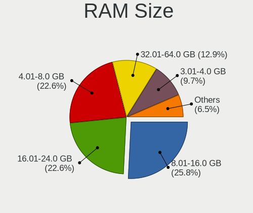
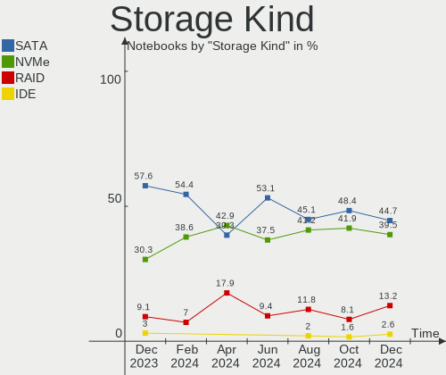

KDE neon Hardware Trends (Notebook)
-----------------------------------

A project to identify most popular hardware characteristics and track their change
over time based on data collected by KDE neon users at https://Linux-Hardware.org.

Anyone can contribute to the study by uploading probes of their computers by
the [hw-probe](https://github.com/linuxhw/hw-probe) tool:

    sudo hw-probe -all -upload

Full-feature report is available here: https://linux-hardware.org/?view=trends&formfactor=notebook

Period: Apr, 2020.

Contents
--------

- [ OS                       ](#os)
- [ OS Family                ](#os-family)
- [ Kernel                   ](#kernel)
- [ Kernel Family            ](#kernel-family)
- [ Kernel Major Ver.        ](#kernel-major-ver)
- [ Arch                     ](#arch)
- [ DE                       ](#de)
- [ Display Server           ](#display-server)
- [ Display Manager          ](#display-manager)
- [ OS Lang                  ](#os-lang)
- [ Boot Mode                ](#boot-mode)
- [ Filesystem               ](#filesystem)
- [ Dual Boot with Linux/BSD ](#dual-boot-with-linux/bsd)
- [ Dual Boot (Win)          ](#dual-boot-win)
- [ Country                  ](#country)
- [ City                     ](#city)
- [ Vendor                   ](#vendor)
- [ Model                    ](#model)
- [ Model Family             ](#model-family)
- [ MFG Year                 ](#mfg-year)
- [ Form Factor              ](#form-factor)
- [ Secure Boot              ](#secure-boot)
- [ Coreboot                 ](#coreboot)
- [ RAM Size                 ](#ram-size)
- [ RAM Used                 ](#ram-used)
- [ Drive Vendor             ](#drive-vendor)
- [ Drive Model              ](#drive-model)
- [ Drive Kind               ](#drive-kind)
- [ Drive Connector          ](#drive-connector)
- [ Drive Size               ](#drive-size)
- [ Space Total              ](#space-total)
- [ Space Used               ](#space-used)
- [ Malfunc. Drives          ](#malfunc-drives)
- [ Malfunc. Drive Vendor    ](#malfunc-drive-vendor)
- [ Malfunc. Drive Kind      ](#malfunc-drive-kind)
- [ Failed Drives            ](#failed-drives)
- [ Failed Drive Vendor      ](#failed-drive-vendor)
- [ Drive Status             ](#drive-status)
- [ Storage Vendor           ](#storage-vendor)
- [ Storage Model            ](#storage-model)
- [ Storage Kind             ](#storage-kind)
- [ CPU Vendor               ](#cpu-vendor)
- [ CPU Model                ](#cpu-model)
- [ CPU Model Family         ](#cpu-model-family)
- [ CPU Cores                ](#cpu-cores)
- [ CPU Sockets              ](#cpu-sockets)
- [ CPU Threads              ](#cpu-threads)
- [ CPU Op-Modes             ](#cpu-op-modes)
- [ CPU Microarch            ](#cpu-microarch)
- [ CPU Microcode            ](#cpu-microcode)
- [ GPU Vendor               ](#gpu-vendor)
- [ GPU Model                ](#gpu-model)
- [ GPU Combo                ](#gpu-combo)
- [ GPU Driver               ](#gpu-driver)
- [ GPU Memory               ](#gpu-memory)
- [ Monitor Vendor           ](#monitor-vendor)
- [ Monitor Model            ](#monitor-model)
- [ Monitor Resolution       ](#monitor-resolution)
- [ Monitor Diagonal         ](#monitor-diagonal)
- [ Monitor Width            ](#monitor-width)
- [ Aspect Ratio             ](#aspect-ratio)
- [ Monitor Area             ](#monitor-area)
- [ Pixel Density            ](#pixel-density)
- [ Multiple Monitors        ](#multiple-monitors)
- [ Net Controller Vendor    ](#net-controller-vendor)
- [ Net Controller Model     ](#net-controller-model)
- [ Net Controller Kind      ](#net-controller-kind)
- [ Used Controller          ](#used-controller)
- [ NICs                     ](#nics)
- [ Unsupported Devices      ](#unsupported-devices)
- [ Unsupported Device Types ](#unsupported-device-types)

OS
--

Installed operating systems

| Name           | Computers | Percent |
|----------------|-----------|---------|
| KDE neon 18.04 | 25        | 100%    |

OS Family
---------

OS without a version

| Name     | Computers | Percent |
|----------|-----------|---------|
| KDE neon | 25        | 100%    |

Kernel
------

Version of the Linux kernel

| Version                 | Computers | Percent |
|-------------------------|-----------|---------|
| 5.3.0-46-generic        | 12        | 48%     |
| 5.3.0-51-generic        | 2         | 8%      |
| 5.3.0-47-generic        | 1         | 4%      |
| 5.3.0-45-generic        | 1         | 4%      |
| 5.3.0-42-generic        | 1         | 4%      |
| 5.0.0-37-generic        | 1         | 4%      |
| 5.0.0-31-generic        | 1         | 4%      |
| 4.4.176-0404176-generic | 1         | 4%      |
| 4.15.0-96-generic       | 1         | 4%      |
| 4.15.0-88-generic       | 1         | 4%      |
| 4.15.0-52-lowlatency    | 1         | 4%      |
| 4.15.0-52-generic       | 1         | 4%      |
| 4.13.0-45-generic       | 1         | 4%      |

Kernel Family
-------------

Linux kernel without a distro release

| Version | Computers | Percent |
|---------|-----------|---------|
| 5.3.0   | 17        | 68%     |
| 4.15.0  | 4         | 16%     |
| 5.0.0   | 2         | 8%      |
| 4.4.176 | 1         | 4%      |
| 4.13.0  | 1         | 4%      |

Kernel Major Ver.
-----------------

Linux kernel major version

| Version | Computers | Percent |
|---------|-----------|---------|
| 5.3     | 17        | 68%     |
| 4.15    | 4         | 16%     |
| 5.0     | 2         | 8%      |
| 4.4     | 1         | 4%      |
| 4.13    | 1         | 4%      |

Arch
----

OS architecture (x86_64, i586, etc.)

| Name   | Computers | Percent |
|--------|-----------|---------|
| x86_64 | 25        | 100%    |

DE
--

Desktop Environment

| Name    | Computers | Percent |
|---------|-----------|---------|
| KDE     | 23        | 92%     |
| Unknown | 2         | 8%      |

Display Server
--------------

X11 or Wayland

| Name    | Computers | Percent |
|---------|-----------|---------|
| X11     | 24        | 96%     |
| Wayland | 1         | 4%      |

Display Manager
---------------

SDDM, LightDM, etc.

| Name    | Computers | Percent |
|---------|-----------|---------|
| Unknown | 25        | 100%    |

OS Lang
-------

Language

| Lang    | Computers | Percent |
|---------|-----------|---------|
| en_US   | 6         | 24%     |
| ru_RU   | 4         | 16%     |
| es_ES   | 3         | 12%     |
| pl_PL   | 2         | 8%      |
| de_DE   | 2         | 8%      |
| zh_CN   | 1         | 4%      |
| es_AR   | 1         | 4%      |
| en_ZA   | 1         | 4%      |
| en_GB   | 1         | 4%      |
| en_DE   | 1         | 4%      |
| en_CA   | 1         | 4%      |
| C       | 1         | 4%      |
| Unknown | 1         | 4%      |

Boot Mode
---------

EFI or BIOS

| Mode | Computers | Percent |
|------|-----------|---------|
| BIOS | 13        | 52%     |
| EFI  | 12        | 48%     |

Filesystem
----------

Type of filesystem

| Type    | Computers | Percent |
|---------|-----------|---------|
| Ext4    | 24        | 96%     |
| Overlay | 1         | 4%      |

Dual Boot with Linux/BSD
------------------------

Hosting more than one Linux/BSD

| Dual boot | Computers | Percent |
|-----------|-----------|---------|
| No        | 24        | 96%     |
| Yes       | 1         | 4%      |

Dual Boot (Win)
---------------

Hosting Linux and Windows

| Dual boot | Computers | Percent |
|-----------|-----------|---------|
| No        | 21        | 84%     |
| Yes       | 4         | 16%     |

Country
-------

Geographic location (country)

| Country      | Computers | Percent |
|--------------|-----------|---------|
| USA          | 3         | 12%     |
| Russia       | 3         | 12%     |
| Germany      | 3         | 12%     |
| Spain        | 2         | 8%      |
| Poland       | 2         | 8%      |
| Canada       | 2         | 8%      |
| Ukraine      | 1         | 4%      |
| UK           | 1         | 4%      |
| South Africa | 1         | 4%      |
| Saudi Arabia | 1         | 4%      |
| Romania      | 1         | 4%      |
| Mexico       | 1         | 4%      |
| Iran         | 1         | 4%      |
| Indonesia    | 1         | 4%      |
| China        | 1         | 4%      |
| Argentina    | 1         | 4%      |

City
----

Geographic location (city)

| City              | Computers | Percent |
|-------------------|-----------|---------|
| Wrocław          | 1         | 4%      |
| Wolverhampton     | 1         | 4%      |
| Weimar            | 1         | 4%      |
| Toronto           | 1         | 4%      |
| Tehran            | 1         | 4%      |
| Siedlce           | 1         | 4%      |
| Sevastopol        | 1         | 4%      |
| San Juan del Río | 1         | 4%      |
| Riyadh            | 1         | 4%      |
| Pretoria          | 1         | 4%      |
| Pola de Siero     | 1         | 4%      |
| Novosibirsk       | 1         | 4%      |
| Moscow            | 1         | 4%      |
| Mississauga       | 1         | 4%      |
| Lingen            | 1         | 4%      |
| Khimki            | 1         | 4%      |
| Greven            | 1         | 4%      |
| Dongguan          | 1         | 4%      |
| Chacabuco         | 1         | 4%      |
| Catral            | 1         | 4%      |
| Bucharest         | 1         | 4%      |
| Bryan             | 1         | 4%      |
| Brewton           | 1         | 4%      |
| Bandung           | 1         | 4%      |
| Albuquerque       | 1         | 4%      |

Vendor
------

Motherboard manufacturer

| Name                | Computers | Percent |
|---------------------|-----------|---------|
| Hewlett-Packard     | 7         | 28%     |
| Dell                | 5         | 20%     |
| MSI                 | 2         | 8%      |
| Lenovo              | 2         | 8%      |
| HUAWEI              | 2         | 8%      |
| ASUSTek Computer    | 2         | 8%      |
| Sony                | 1         | 4%      |
| Samsung Electronics | 1         | 4%      |
| LG Electronics      | 1         | 4%      |
| Alienware           | 1         | 4%      |
| Acer                | 1         | 4%      |

Model
-----

Motherboard model

| Name                                | Computers | Percent |
|-------------------------------------|-----------|---------|
| HP Pavilion Notebook                | 2         | 8%      |
| Sony SVF1521A6EB                    | 1         | 4%      |
| Samsung Electronics RC530/RC730     | 1         | 4%      |
| MSI PS63 Modern 8M                  | 1         | 4%      |
| MSI GE60 2PE                        | 1         | 4%      |
| LG Electronics P1-J150B             | 1         | 4%      |
| Lenovo IdeaPad S540-14API 81NH      | 1         | 4%      |
| Lenovo G700 20251                   | 1         | 4%      |
| HUAWEI WRT-WX9                      | 1         | 4%      |
| HUAWEI NBLK-WAX9X                   | 1         | 4%      |
| HP Pavilion Gaming Laptop 15-ec0xxx | 1         | 4%      |
| HP Pavilion dv6                     | 1         | 4%      |
| HP Laptop 15-dw0xxx                 | 1         | 4%      |
| HP 540                              | 1         | 4%      |
| HP 2000                             | 1         | 4%      |
| Dell Vostro 3360                    | 1         | 4%      |
| Dell Latitude E6510                 | 1         | 4%      |
| Dell Latitude E6400                 | 1         | 4%      |
| Dell Latitude E6320                 | 1         | 4%      |
| Dell Inspiron 5584                  | 1         | 4%      |
| ASUS X550IU                         | 1         | 4%      |
| ASUS P53SJ                          | 1         | 4%      |
| Alienware 17                        | 1         | 4%      |
| Acer Aspire A315-53                 | 1         | 4%      |

Model Family
------------

Motherboard model prefix

| Name                      | Computers | Percent |
|---------------------------|-----------|---------|
| HP Pavilion               | 4         | 16%     |
| Dell Latitude             | 3         | 12%     |
| Sony SVF1521A6EB          | 1         | 4%      |
| Samsung Electronics RC530 | 1         | 4%      |
| MSI PS63                  | 1         | 4%      |
| MSI GE60                  | 1         | 4%      |
| LG Electronics P1-J150B   | 1         | 4%      |
| Lenovo IdeaPad            | 1         | 4%      |
| Lenovo G700               | 1         | 4%      |
| HUAWEI WRT-WX9            | 1         | 4%      |
| HUAWEI NBLK-WAX9X         | 1         | 4%      |
| HP Laptop                 | 1         | 4%      |
| HP 540                    | 1         | 4%      |
| HP 2000                   | 1         | 4%      |
| Dell Vostro               | 1         | 4%      |
| Dell Inspiron             | 1         | 4%      |
| ASUS X550IU               | 1         | 4%      |
| ASUS P53SJ                | 1         | 4%      |
| Alienware 17              | 1         | 4%      |
| Acer Aspire               | 1         | 4%      |

MFG Year
--------

Motherboard manufacture year

| Year | Computers | Percent |
|------|-----------|---------|
| 2019 | 6         | 24%     |
| 2011 | 5         | 20%     |
| 2018 | 3         | 12%     |
| 2013 | 3         | 12%     |
| 2016 | 2         | 8%      |
| 2020 | 1         | 4%      |
| 2017 | 1         | 4%      |
| 2015 | 1         | 4%      |
| 2014 | 1         | 4%      |
| 2008 | 1         | 4%      |
| 2006 | 1         | 4%      |

Form Factor
-----------

Physical design of the computer

| Name     | Computers | Percent |
|----------|-----------|---------|
| Notebook | 25        | 100%    |

Secure Boot
-----------

Enabled or disabled

| State    | Computers | Percent |
|----------|-----------|---------|
| Disabled | 22        | 88%     |
| Enabled  | 3         | 12%     |

Coreboot
--------

Have coreboot on board

| Used | Computers | Percent |
|------|-----------|---------|
| No   | 25        | 100%    |

RAM Size
--------

Total RAM memory

| Size in GB | Computers | Percent |
|------------|-----------|---------|
| 4.01-8.0   | 11        | 44%     |
| 3.01-4.0   | 5         | 20%     |
| 8.01-16.0  | 4         | 16%     |
| 16.01-24.0 | 3         | 12%     |
| 1.01-2.0   | 2         | 8%      |

RAM Used
--------

Used RAM memory

| Used GB   | Computers | Percent |
|-----------|-----------|---------|
| 2.01-3.0  | 9         | 36%     |
| 1.01-2.0  | 8         | 32%     |
| 0.01-1.0  | 4         | 16%     |
| 3.01-4.0  | 2         | 8%      |
| 4.01-8.0  | 1         | 4%      |
| 8.01-16.0 | 1         | 4%      |

Drive Vendor
------------

Hard drive vendors

| Vendor              | Computers | Drives  | Percent |
|---------------------|-----------|---------|---------|
| Seagate             | 6         | 7       | 23.08%  |
| WDC                 | 5         | 5       | 19.23%  |
| Kingston            | 5         | 5       | 19.23%  |
| Toshiba             | 2         | 2       | 7.69%   |
| SanDisk             | 1         | 1       | 3.85%   |
| Samsung Electronics | 1         | 1       | 3.85%   |
| LITEONIT            | 1         | 1       | 3.85%   |
| Intel               | 1         | 1       | 3.85%   |
| HL-DT-ST            | 1         | Unknown | 3.85%   |
| Hitachi             | 1         | 1       | 3.85%   |
| HGST                | 1         | 1       | 3.85%   |
| Generic             | 1         | 1       | 3.85%   |

Drive Model
-----------

Hard drive models

| Model                        | Computers | Percent |
|------------------------------|-----------|---------|
| WDS240G1G0A-00SS50 240GB SSD | 1         | 3.7%    |
| WDS100T2B0A 1TB SSD          | 1         | 3.7%    |
| WD3200BPVT-75ZEST0 320GB     | 1         | 3.7%    |
| WD10JPVX-75JC3T0 1TB         | 1         | 3.7%    |
| WD10JPVX-60JC3T0 1TB         | 1         | 3.7%    |
| SUV500MS240G 240GB SSD       | 1         | 3.7%    |
| SUV400S37120G 120GB SSD      | 1         | 3.7%    |
| ST9320423AS 320GB            | 1         | 3.7%    |
| ST9160827AS 160GB            | 1         | 3.7%    |
| ST9160412ASG 160GB           | 1         | 3.7%    |
| ST500LM000-1EJ162-SSHD-8GB   | 1         | 3.7%    |
| ST1000LM049-2GH172 1TB       | 1         | 3.7%    |
| ST1000LM024 HN-M101MBB 1TB   | 1         | 3.7%    |
| SSDSC2KG480G8 480GB          | 1         | 3.7%    |
| SSD 840 EVO 250GB            | 1         | 3.7%    |
| SHFS37A120G 120GB SSD        | 1         | 3.7%    |
| SD6SF1M128GG56 128GB SSD     | 1         | 3.7%    |
| SD/MMC/MS PRO 64GB           | 1         | 3.7%    |
| SA400S37480G 480GB SSD       | 1         | 3.7%    |
| SA400S37240G 240GB SSD       | 1         | 3.7%    |
| MQ04ABF100 1TB               | 1         | 3.7%    |
| MQ01ABD100 1TB               | 1         | 3.7%    |
| HTS721010A9E630 1TB          | 1         | 3.7%    |
| HTS545032A7E380 320GB        | 1         | 3.7%    |
| Expansion 1TB                | 1         | 3.7%    |
| DVDRAM GUE1N 3GB             | 1         | 3.7%    |
| DMT-80M6M-11 mSATA 80GB SSD  | 1         | 3.7%    |

Drive Kind
----------

HDD or SSD

| Kind    | Computers | Drives | Percent |
|---------|-----------|--------|---------|
| HDD     | 13        | 14     | 56.52%  |
| SSD     | 8         | 11     | 34.78%  |
| Unknown | 2         | 1      | 8.7%    |

Drive Connector
---------------

SATA, SAS, NVMe, etc.

| Type | Computers | Drives | Percent |
|------|-----------|--------|---------|
| SATA | 20        | 24     | 86.96%  |
| SAS  | 3         | 2      | 13.04%  |

Drive Size
----------

Size of hard drive

| Size in TB | Computers | Drives | Percent |
|------------|-----------|--------|---------|
| 0.01-0.5   | 16        | 17     | 64%     |
| 0.51-1.0   | 9         | 9      | 36%     |

Space Total
-----------

Amount of disk space available on the file system

| Size in GB | Computers | Percent |
|------------|-----------|---------|
| 101-250    | 12        | 48%     |
| 251-500    | 7         | 28%     |
| 501-1000   | 2         | 8%      |
| 51-100     | 2         | 8%      |
| 1001-2000  | 1         | 4%      |
| 1-20       | 1         | 4%      |

Space Used
----------

Amount of used disk space

| Used GB  | Computers | Percent |
|----------|-----------|---------|
| 1-20     | 9         | 36%     |
| 101-250  | 7         | 28%     |
| 21-50    | 5         | 20%     |
| 51-100   | 2         | 8%      |
| 251-500  | 1         | 4%      |
| 501-1000 | 1         | 4%      |

Malfunc. Drives
---------------

Drive models with a malfunction

Zero info for selected period =(

Malfunc. Drive Vendor
---------------------

Vendors of faulty drives

Zero info for selected period =(

Malfunc. Drive Kind
-------------------

Kinds of faulty drives

Zero info for selected period =(

Failed Drives
-------------

Failed drive models

Zero info for selected period =(

Failed Drive Vendor
-------------------

Failed drive vendors

Zero info for selected period =(

Drive Status
------------

Number of failed and malfunc. drives

| Status   | Computers | Drives | Percent |
|----------|-----------|--------|---------|
| Detected | 21        | 26     | 100%    |

Storage Vendor
--------------

Storage controller vendors

| Vendor                       | Computers | Percent |
|------------------------------|-----------|---------|
| Intel                        | 18        | 64.29%  |
| AMD                          | 4         | 14.29%  |
| Sandisk                      | 3         | 10.71%  |
| Toshiba America Info Systems | 2         | 7.14%   |
| Samsung Electronics          | 1         | 3.57%   |

Storage Model
-------------

Storage controller models

| Model                                                                    | Computers | Percent |
|--------------------------------------------------------------------------|-----------|---------|
| FCH SATA Controller [AHCI mode]                                          | 4         | 13.79%  |
| 82801 Mobile SATA Controller [RAID mode]                                 | 4         | 13.79%  |
| 7 Series Chipset Family 6-port SATA Controller [AHCI mode]               | 3         | 10.34%  |
| Cannon Point-LP SATA Controller [AHCI Mode]                              | 2         | 6.9%    |
| BG3 NVMe SSD Controller                                                  | 2         | 6.9%    |
| 82801IBM/IEM (ICH9M/ICH9M-E) 4 port SATA Controller [AHCI mode]          | 2         | 6.9%    |
| 8 Series/C220 Series Chipset Family 6-port SATA Controller 1 [AHCI mode] | 2         | 6.9%    |
| 6 Series/C200 Series Chipset Family 6 port Mobile SATA AHCI Controller   | 2         | 6.9%    |
| Wildcat Point-LP SATA Controller [AHCI Mode]                             | 1         | 3.45%   |
| WD Black 2018/PC SN720 NVMe SSD                                          | 1         | 3.45%   |
| WD Black 2018/PC SN520 NVMe SSD                                          | 1         | 3.45%   |
| NVMe SSD Controller SM981/PM981/PM983                                    | 1         | 3.45%   |
| Non-Volatile memory controller                                           | 1         | 3.45%   |
| 82801HM/HEM (ICH8M/ICH8M-E) SATA Controller [AHCI mode]                  | 1         | 3.45%   |
| 82801GBM/GHM (ICH7-M Family) SATA Controller [AHCI mode]                 | 1         | 3.45%   |
| 82801G (ICH7 Family) IDE Controller                                      | 1         | 3.45%   |

Storage Kind
------------

Kind of storage controller (IDE, SATA, NVMe, SAS, ...)

| Kind | Computers | Percent |
|------|-----------|---------|
| SATA | 18        | 62.07%  |
| NVMe | 6         | 20.69%  |
| RAID | 4         | 13.79%  |
| IDE  | 1         | 3.45%   |

CPU Vendor
----------

Processor vendors

| Vendor | Computers | Percent |
|--------|-----------|---------|
| Intel  | 19        | 76%     |
| AMD    | 6         | 24%     |

CPU Model
---------

Processor models

| Model                                          | Computers | Percent |
|------------------------------------------------|-----------|---------|
| Intel Core i5-8265U CPU @ 1.60GHz              | 3         | 12%     |
| AMD Ryzen 5 3500U with Radeon Vega Mobile Gfx  | 2         | 8%      |
| Intel Pentium CPU 2117U @ 1.80GHz              | 1         | 4%      |
| Intel Pentium CPU 2020M @ 2.40GHz              | 1         | 4%      |
| Intel Core i7-8565U CPU @ 1.80GHz              | 1         | 4%      |
| Intel Core i7-4900MQ CPU @ 2.80GHz             | 1         | 4%      |
| Intel Core i7-4710HQ CPU @ 2.50GHz             | 1         | 4%      |
| Intel Core i7-2630QM CPU @ 2.00GHz             | 1         | 4%      |
| Intel Core i5-7200U CPU @ 2.50GHz              | 1         | 4%      |
| Intel Core i5-3317U CPU @ 1.70GHz              | 1         | 4%      |
| Intel Core i5-2430M CPU @ 2.40GHz              | 1         | 4%      |
| Intel Core i5 CPU M 540 @ 2.53GHz              | 1         | 4%      |
| Intel Core i3-5010U CPU @ 2.10GHz              | 1         | 4%      |
| Intel Core i3-2310M CPU @ 2.10GHz              | 1         | 4%      |
| Intel Core 2 Duo CPU T6600 @ 2.20GHz           | 1         | 4%      |
| Intel Core 2 Duo CPU T5470 @ 1.60GHz           | 1         | 4%      |
| Intel Core 2 Duo CPU P8600 @ 2.40GHz           | 1         | 4%      |
| Intel Core 2 CPU T7200 @ 2.00GHz               | 1         | 4%      |
| AMD Ryzen 5 3550H with Radeon Vega Mobile Gfx  | 1         | 4%      |
| AMD FX-9830P RADEON R7, 12 COMPUTE CORES 4C+8G | 1         | 4%      |
| AMD E-300 APU with Radeon HD Graphics          | 1         | 4%      |
| AMD A9-9410 RADEON R5, 5 COMPUTE CORES 2C+3G   | 1         | 4%      |

CPU Model Family
----------------

Processor model prefix

| Model            | Computers | Percent |
|------------------|-----------|---------|
| Intel Core i5    | 7         | 28%     |
| Intel Core i7    | 4         | 16%     |
| Intel Core 2 Duo | 3         | 12%     |
| AMD Ryzen 5      | 3         | 12%     |
| Intel Pentium    | 2         | 8%      |
| Intel Core i3    | 2         | 8%      |
| Other            | 1         | 4%      |
| Intel Core 2     | 1         | 4%      |
| AMD FX           | 1         | 4%      |
| AMD E            | 1         | 4%      |

CPU Cores
---------

Number of processor cores

| Number | Computers | Percent |
|--------|-----------|---------|
| 2      | 15        | 60%     |
| 4      | 10        | 40%     |

CPU Sockets
-----------

Number of sockets

| Number | Computers | Percent |
|--------|-----------|---------|
| 1      | 25        | 100%    |

CPU Threads
-----------

Threads per core (Hyper-Threading)

| Number | Computers | Percent |
|--------|-----------|---------|
| 2      | 17        | 68%     |
| 1      | 8         | 32%     |

CPU Op-Modes
------------

CPU Operation Modes (32-bit, 64-bit)

| Op mode        | Computers | Percent |
|----------------|-----------|---------|
| 32-bit, 64-bit | 24        | 96%     |
| Unknown        | 1         | 4%      |

CPU Microarch
-------------

Microarchitecture

| Name        | Computers | Percent |
|-------------|-----------|---------|
| Skylake     | 5         | 20%     |
| Core        | 4         | 16%     |
| Zen+        | 3         | 12%     |
| SandyBridge | 3         | 12%     |
| IvyBridge   | 3         | 12%     |
| Haswell     | 2         | 8%      |
| Excavator   | 2         | 8%      |
| Westmere    | 1         | 4%      |
| Broadwell   | 1         | 4%      |
| Bobcat      | 1         | 4%      |

CPU Microcode
-------------

Microcode number

| Number     | Computers | Percent |
|------------|-----------|---------|
| 0x806eb    | 3         | 12%     |
| 0x306a9    | 3         | 12%     |
| 0x206a7    | 3         | 12%     |
| 0x306c3    | 2         | 8%      |
| 0x1067a    | 2         | 8%      |
| 0x08108109 | 2         | 8%      |
| 0x806ec    | 1         | 4%      |
| 0x806e9    | 1         | 4%      |
| 0x6fd      | 1         | 4%      |
| 0x6f6      | 1         | 4%      |
| 0x306d4    | 1         | 4%      |
| 0x20652    | 1         | 4%      |
| 0x08108102 | 1         | 4%      |
| 0x06006704 | 1         | 4%      |
| 0x0600611a | 1         | 4%      |
| 0x05000119 | 1         | 4%      |

GPU Vendor
----------

Vendors of graphics cards

| Vendor | Computers | Percent |
|--------|-----------|---------|
| Intel  | 14        | 46.67%  |
| Nvidia | 8         | 26.67%  |
| AMD    | 8         | 26.67%  |

GPU Model
---------

Graphics card models

| Model                                                               | Computers | Percent |
|---------------------------------------------------------------------|-----------|---------|
| UHD Graphics 620 (Whiskey Lake)                                     | 4         | 12.9%   |
| Picasso                                                             | 3         | 9.68%   |
| 3rd Gen Core processor Graphics Controller                          | 3         | 9.68%   |
| 2nd Generation Core Processor Family Integrated Graphics Controller | 3         | 9.68%   |
| Wrestler [Radeon HD 6310]                                           | 1         | 3.23%   |
| Wani [Radeon R5/R6/R7 Graphics]                                     | 1         | 3.23%   |
| TU117M [GeForce GTX 1650 Mobile / Max-Q]                            | 1         | 3.23%   |
| Stoney [Radeon R2/R3/R4/R5 Graphics]                                | 1         | 3.23%   |
| RV710/M92 [Mobility Radeon HD 4530/4570/545v]                       | 1         | 3.23%   |
| RV515/M54 [Mobility Radeon X1400]                                   | 1         | 3.23%   |
| Mobile GME965/GLE960 Integrated Graphics Controller                 | 1         | 3.23%   |
| HD Graphics 620                                                     | 1         | 3.23%   |
| HD Graphics 5500                                                    | 1         | 3.23%   |
| GT218M [NVS 3100M]                                                  | 1         | 3.23%   |
| GP108M [GeForce MX150]                                              | 1         | 3.23%   |
| GM107M [GeForce GTX 860M]                                           | 1         | 3.23%   |
| GK104M [GeForce GTX 880M]                                           | 1         | 3.23%   |
| GF119M [GeForce GT 520M]                                            | 1         | 3.23%   |
| GF108M [GeForce GT 540M]                                            | 1         | 3.23%   |
| G98M [Quadro NVS 160M]                                              | 1         | 3.23%   |
| Baffin [Radeon RX 460/560D / Pro 450/455/460/555/555X/560/560X]     | 1         | 3.23%   |
| 4th Gen Core Processor Integrated Graphics Controller               | 1         | 3.23%   |

GPU Combo
---------

Combinations of graphics cards

| Name           | Computers | Percent |
|----------------|-----------|---------|
| 1 x Intel      | 10        | 40%     |
| 1 x AMD        | 6         | 24%     |
| Intel + Nvidia | 4         | 16%     |
| 1 x Nvidia     | 3         | 12%     |
| 2 x AMD        | 1         | 4%      |
| AMD + Nvidia   | 1         | 4%      |

GPU Driver
----------

Free vs proprietary

| Driver      | Computers | Percent |
|-------------|-----------|---------|
| Free        | 21        | 84%     |
| Proprietary | 4         | 16%     |

GPU Memory
----------

Total video memory

| Size in GB | Computers | Percent |
|------------|-----------|---------|
| Unknown    | 9         | 36%     |
| 0.01-0.5   | 7         | 28%     |
| 0.51-1.0   | 5         | 20%     |
| 1.01-2.0   | 2         | 8%      |
| 7.01-8.0   | 1         | 4%      |
| 3.01-4.0   | 1         | 4%      |

Monitor Vendor
--------------

Monitor vendors

| Vendor                  | Computers | Percent |
|-------------------------|-----------|---------|
| Samsung Electronics     | 4         | 16.67%  |
| Chimei Innolux          | 4         | 16.67%  |
| LG Display              | 3         | 12.5%   |
| Chi Mei Optoelectronics | 3         | 12.5%   |
| BOE                     | 3         | 12.5%   |
| AU Optronics            | 3         | 12.5%   |
| SKY                     | 1         | 4.17%   |
| Seiko/Epson             | 1         | 4.17%   |
| LG Philips              | 1         | 4.17%   |
| LG Electronics          | 1         | 4.17%   |

Monitor Model
-------------

Monitor models

| Model                                             | Computers | Percent |
|---------------------------------------------------|-----------|---------|
| TV-monitor SKY0202 1920x1080 885x498mm 40.0-inch  | 1         | 4.17%   |
| P130ZDZ-EF1 CMN8201 2160x1440 275x183mm 13.0-inch | 1         | 4.17%   |
| LCD Monitor SEC4D42 1280x800 303x190mm 14.1-inch  | 1         | 4.17%   |
| LCD Monitor SEC3245 1366x768 344x194mm 15.5-inch  | 1         | 4.17%   |
| LCD Monitor SDC324C 1920x1080 344x194mm 15.5-inch | 1         | 4.17%   |
| LCD Monitor LPL0140 1440x900 304x190mm 14.1-inch  | 1         | 4.17%   |
| LCD Monitor LGD05EC 1920x1080 309x174mm 14.0-inch | 1         | 4.17%   |
| LCD Monitor LGD0503 1366x768 340x190mm 15.3-inch  | 1         | 4.17%   |
| LCD Monitor LGD0396 1600x900 382x215mm 17.3-inch  | 1         | 4.17%   |
| LCD Monitor LG TV 1920x1080                       | 1         | 4.17%   |
| LCD Monitor CMO15AB 1366x768 340x190mm 15.3-inch  | 1         | 4.17%   |
| LCD Monitor CMO15A2 1366x768 344x193mm 15.5-inch  | 1         | 4.17%   |
| LCD Monitor CMO1332 1366x768 293x164mm 13.2-inch  | 1         | 4.17%   |
| LCD Monitor CMN15E8 1920x1080 344x193mm 15.5-inch | 1         | 4.17%   |
| LCD Monitor CMN15D5 1920x1080 340x190mm 15.3-inch | 1         | 4.17%   |
| LCD Monitor CMN1404 1920x1080 309x173mm 13.9-inch | 1         | 4.17%   |
| LCD Monitor BOE07D5 1920x1080 344x194mm 15.5-inch | 1         | 4.17%   |
| LCD Monitor BOE0675 1366x768 344x194mm 15.5-inch  | 1         | 4.17%   |
| LCD Monitor BOE0644 1366x768 309x173mm 13.9-inch  | 1         | 4.17%   |
| LCD Monitor AUO312C 1366x768 293x164mm 13.2-inch  | 1         | 4.17%   |
| LCD Monitor AUO23EC 1366x768 344x193mm 15.5-inch  | 1         | 4.17%   |
| LCD Monitor AUO20EC 1366x768 344x193mm 15.5-inch  | 1         | 4.17%   |
| LCD Monitor 1920x1080                             | 1         | 4.17%   |
| 173HT02-T01 SEC5044 1920x1080 380x210mm 17.1-inch | 1         | 4.17%   |

Monitor Resolution
------------------

Monitor screen resolution

| Resolution       | Computers | Percent |
|------------------|-----------|---------|
| 1366x768 (WXGA)  | 10        | 43.48%  |
| 1920x1080 (FHD)  | 9         | 39.13%  |
| 2160x1440        | 1         | 4.35%   |
| 1600x900 (HD+)   | 1         | 4.35%   |
| 1440x900 (WXGA+) | 1         | 4.35%   |
| 1280x800 (WXGA)  | 1         | 4.35%   |

Monitor Diagonal
----------------

Diagonal size in inches

| Inches  | Computers | Percent |
|---------|-----------|---------|
| 15      | 11        | 45.83%  |
| 13      | 5         | 20.83%  |
| 14      | 3         | 12.5%   |
| 17      | 2         | 8.33%   |
| Unknown | 2         | 8.33%   |
| 40      | 1         | 4.17%   |

Monitor Width
-------------

Physical width

| Width in mm | Computers | Percent |
|-------------|-----------|---------|
| 301-350     | 15        | 62.5%   |
| 201-300     | 4         | 16.67%  |
| 351-400     | 2         | 8.33%   |
| Unknown     | 2         | 8.33%   |
| 801-900     | 1         | 4.17%   |

Aspect Ratio
------------

Proportional relationship between the width and the height

| Ratio   | Computers | Percent |
|---------|-----------|---------|
| 16/9    | 19        | 79.17%  |
| 16/10   | 2         | 8.33%   |
| Unknown | 2         | 8.33%   |
| 3/2     | 1         | 4.17%   |

Monitor Area
------------

Area in inch²

| Area in inch² | Computers | Percent |
|----------------|-----------|---------|
| 101-110        | 10        | 41.67%  |
| 81-90          | 5         | 20.83%  |
| 71-80          | 3         | 12.5%   |
| 121-130        | 2         | 8.33%   |
| Unknown        | 2         | 8.33%   |
| 501-1000       | 1         | 4.17%   |
| 91-100         | 1         | 4.17%   |

Pixel Density
-------------

Pixels per inch

| Density | Computers | Percent |
|---------|-----------|---------|
| 101-120 | 12        | 50%     |
| 121-160 | 8         | 33.33%  |
| Unknown | 2         | 8.33%   |
| 161-240 | 1         | 4.17%   |
| 51-100  | 1         | 4.17%   |

Multiple Monitors
-----------------

Total monitors connected

| Total | Computers | Percent |
|-------|-----------|---------|
| 1     | 23        | 92%     |
| 2     | 2         | 8%      |

Net Controller Vendor
---------------------

Controller vendors

| Vendor | Computers | Percent |
|--------|-----------|---------|
| Intel  | 4         | 66.67%  |
| Dell   | 2         | 33.33%  |

Net Controller Model
--------------------

Controller models

| Model                                           | Computers | Percent |
|-------------------------------------------------|-----------|---------|
| F3607gw v2 Mobile Broadband Module              | 1         | 12.5%   |
| DW5550                                          | 1         | 12.5%   |
| Centrino Advanced-N 6205 [Taylor Peak]          | 1         | 12.5%   |
| Centrino Advanced-N 6200                        | 1         | 12.5%   |
| 82579LM Gigabit Network Connection (Lewisville) | 1         | 12.5%   |
| 82577LM Gigabit Network Connection              | 1         | 12.5%   |
| 82567LM Gigabit Network Connection              | 1         | 12.5%   |
| 82562GT 10/100 Network Connection               | 1         | 12.5%   |

Net Controller Kind
-------------------

Ethernet, WiFi or modem

| Kind     | Computers | Percent |
|----------|-----------|---------|
| Ethernet | 4         | 50%     |
| Modem    | 2         | 25%     |
| WiFi     | 2         | 25%     |

Used Controller
---------------

Currently used network controller

| Kind     | Computers | Percent |
|----------|-----------|---------|
| WiFi     | 1         | 50%     |
| Ethernet | 1         | 50%     |

NICs
----

Total network controllers on board

| Total | Computers | Percent |
|-------|-----------|---------|
| 2     | 21        | 84%     |
| 1     | 4         | 16%     |

Unsupported Devices
-------------------

Total unsupported devices on board

| Total | Computers | Percent |
|-------|-----------|---------|
| 1     | 12        | 48%     |
| 0     | 11        | 44%     |
| 2     | 2         | 8%      |

Unsupported Device Types
------------------------

Types of unsupported devices

| Type                  | Computers | Percent |
|-----------------------|-----------|---------|
| Fingerprint reader    | 6         | 40%     |
| Graphics card         | 3         | 20%     |
| Chipcard              | 3         | 20%     |
| Net/wireless          | 2         | 13.33%  |
| Multimedia controller | 1         | 6.67%   |

