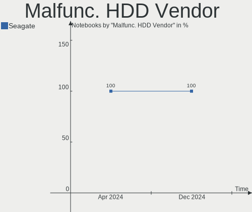
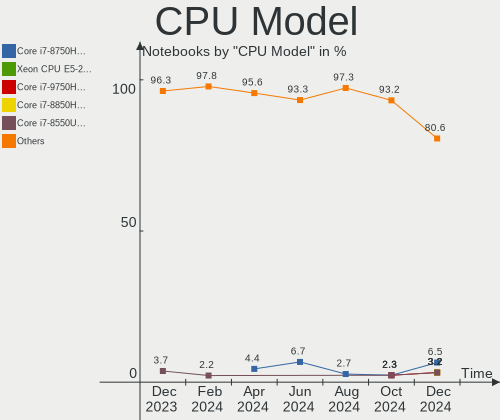
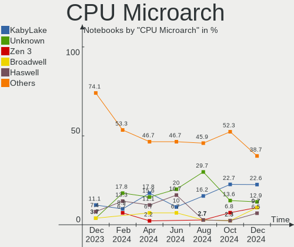
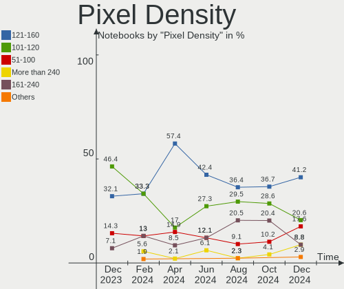
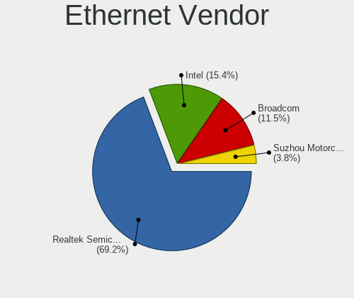

KDE neon Hardware Trends (Notebooks)
------------------------------------

A project to identify most popular hardware characteristics and track their change
over time based on data collected by KDE neon users at https://Linux-Hardware.org.

Anyone can contribute to this report by the [hw-probe](https://github.com/linuxhw/hw-probe) tool:

    sudo -E hw-probe -all -upload

Full-feature report is available here: https://linux-hardware.org/?view=trends

Period: Jan, 2022.

Contents
--------

* [ System ](#system)
  - [ OS                       ](#os)
  - [ OS Family                ](#os-family)
  - [ Kernel                   ](#kernel)
  - [ Kernel Family            ](#kernel-family)
  - [ Kernel Major Ver.        ](#kernel-major-ver)
  - [ Arch                     ](#arch)
  - [ DE                       ](#de)
  - [ Display Server           ](#display-server)
  - [ Display Manager          ](#display-manager)
  - [ OS Lang                  ](#os-lang)
  - [ Boot Mode                ](#boot-mode)
  - [ Filesystem               ](#filesystem)
  - [ Part. scheme             ](#part-scheme)
  - [ Dual Boot with Linux/BSD ](#dual-boot-with-linuxbsd)
  - [ Dual Boot (Win)          ](#dual-boot-win)

* [ Board ](#board)
  - [ Vendor                   ](#vendor)
  - [ Model                    ](#model)
  - [ Model Family             ](#model-family)
  - [ MFG Year                 ](#mfg-year)
  - [ Form Factor              ](#form-factor)
  - [ Secure Boot              ](#secure-boot)
  - [ Coreboot                 ](#coreboot)
  - [ RAM Size                 ](#ram-size)
  - [ RAM Used                 ](#ram-used)
  - [ Total Drives             ](#total-drives)
  - [ Has CD-ROM               ](#has-cd-rom)
  - [ Has Ethernet             ](#has-ethernet)
  - [ Has WiFi                 ](#has-wifi)
  - [ Has Bluetooth            ](#has-bluetooth)

* [ Location ](#location)
  - [ Country                  ](#country)
  - [ City                     ](#city)

* [ Drives ](#drives)
  - [ Drive Vendor             ](#drive-vendor)
  - [ Drive Model              ](#drive-model)
  - [ HDD Vendor               ](#hdd-vendor)
  - [ SSD Vendor               ](#ssd-vendor)
  - [ Drive Kind               ](#drive-kind)
  - [ Drive Connector          ](#drive-connector)
  - [ Drive Size               ](#drive-size)
  - [ Space Total              ](#space-total)
  - [ Space Used               ](#space-used)
  - [ Malfunc. Drives          ](#malfunc-drives)
  - [ Malfunc. Drive Vendor    ](#malfunc-drive-vendor)
  - [ Malfunc. HDD Vendor      ](#malfunc-hdd-vendor)
  - [ Malfunc. Drive Kind      ](#malfunc-drive-kind)
  - [ Failed Drives            ](#failed-drives)
  - [ Failed Drive Vendor      ](#failed-drive-vendor)
  - [ Drive Status             ](#drive-status)

* [ Storage controller ](#storage-controller)
  - [ Storage Vendor           ](#storage-vendor)
  - [ Storage Model            ](#storage-model)
  - [ Storage Kind             ](#storage-kind)

* [ Processor ](#processor)
  - [ CPU Vendor               ](#cpu-vendor)
  - [ CPU Model                ](#cpu-model)
  - [ CPU Model Family         ](#cpu-model-family)
  - [ CPU Cores                ](#cpu-cores)
  - [ CPU Sockets              ](#cpu-sockets)
  - [ CPU Threads              ](#cpu-threads)
  - [ CPU Op-Modes             ](#cpu-op-modes)
  - [ CPU Microcode            ](#cpu-microcode)
  - [ CPU Microarch            ](#cpu-microarch)

* [ Graphics ](#graphics)
  - [ GPU Vendor               ](#gpu-vendor)
  - [ GPU Model                ](#gpu-model)
  - [ GPU Combo                ](#gpu-combo)
  - [ GPU Driver               ](#gpu-driver)
  - [ GPU Memory               ](#gpu-memory)

* [ Monitor ](#monitor)
  - [ Monitor Vendor           ](#monitor-vendor)
  - [ Monitor Model            ](#monitor-model)
  - [ Monitor Resolution       ](#monitor-resolution)
  - [ Monitor Diagonal         ](#monitor-diagonal)
  - [ Monitor Width            ](#monitor-width)
  - [ Aspect Ratio             ](#aspect-ratio)
  - [ Monitor Area             ](#monitor-area)
  - [ Pixel Density            ](#pixel-density)
  - [ Multiple Monitors        ](#multiple-monitors)

* [ Network ](#network)
  - [ Net Controller Vendor    ](#net-controller-vendor)
  - [ Net Controller Model     ](#net-controller-model)
  - [ Wireless Vendor          ](#wireless-vendor)
  - [ Wireless Model           ](#wireless-model)
  - [ Ethernet Vendor          ](#ethernet-vendor)
  - [ Ethernet Model           ](#ethernet-model)
  - [ Net Controller Kind      ](#net-controller-kind)
  - [ Used Controller          ](#used-controller)
  - [ NICs                     ](#nics)
  - [ IPv6                     ](#ipv6)

* [ Bluetooth ](#bluetooth)
  - [ Bluetooth Vendor         ](#bluetooth-vendor)
  - [ Bluetooth Model          ](#bluetooth-model)

* [ Sound ](#sound)
  - [ Sound Vendor             ](#sound-vendor)
  - [ Sound Model              ](#sound-model)

* [ Memory ](#memory)
  - [ Memory Vendor            ](#memory-vendor)
  - [ Memory Model             ](#memory-model)
  - [ Memory Kind              ](#memory-kind)
  - [ Memory Form Factor       ](#memory-form-factor)
  - [ Memory Size              ](#memory-size)
  - [ Memory Speed             ](#memory-speed)

* [ Printers & scanners ](#printers--scanners)
  - [ Printer Vendor           ](#printer-vendor)
  - [ Printer Model            ](#printer-model)
  - [ Scanner Vendor           ](#scanner-vendor)
  - [ Scanner Model            ](#scanner-model)

* [ Camera ](#camera)
  - [ Camera Vendor            ](#camera-vendor)
  - [ Camera Model             ](#camera-model)

* [ Security ](#security)
  - [ Fingerprint Vendor       ](#fingerprint-vendor)
  - [ Fingerprint Model        ](#fingerprint-model)
  - [ Chipcard Vendor          ](#chipcard-vendor)
  - [ Chipcard Model           ](#chipcard-model)

* [ Unsupported ](#unsupported)
  - [ Unsupported Devices      ](#unsupported-devices)
  - [ Unsupported Device Types ](#unsupported-device-types)

System
------

OS
--

Installed operating systems

| Name           | Notebooks | Percent |
|----------------|-----------|---------|
| KDE neon 20.04 | 63        | 100%    |

OS Family
---------

OS without a version

| Name     | Notebooks | Percent |
|----------|-----------|---------|
| KDE neon | 63        | 100%    |

Kernel
------

Version of the Linux kernel

| Version               | Notebooks | Percent |
|-----------------------|-----------|---------|
| 5.13.0-27-generic     | 15        | 23.81%  |
| 5.11.0-44-generic     | 15        | 23.81%  |
| 5.11.0-43-generic     | 14        | 22.22%  |
| 5.11.0-46-generic     | 12        | 19.05%  |
| 5.13.0-28-generic     | 2         | 3.17%   |
| 5.13.0-25-generic     | 2         | 3.17%   |
| 5.16.0-051600-generic | 1         | 1.59%   |
| 5.11.0-40-generic     | 1         | 1.59%   |
| 5.11.0-38-generic     | 1         | 1.59%   |

Kernel Family
-------------

Linux kernel without a distro release

| Version | Notebooks | Percent |
|---------|-----------|---------|
| 5.11.0  | 43        | 68.25%  |
| 5.13.0  | 19        | 30.16%  |
| 5.16.0  | 1         | 1.59%   |

Kernel Major Ver.
-----------------

Linux kernel major version

| Version | Notebooks | Percent |
|---------|-----------|---------|
| 5.11    | 43        | 68.25%  |
| 5.13    | 19        | 30.16%  |
| 5.16    | 1         | 1.59%   |

Arch
----

OS architecture (x86_64, i586, etc.)

| Name   | Notebooks | Percent |
|--------|-----------|---------|
| x86_64 | 63        | 100%    |

DE
--

Desktop Environment

| Name    | Notebooks | Percent |
|---------|-----------|---------|
| KDE5    | 62        | 98.41%  |
| Unknown | 1         | 1.59%   |

Display Server
--------------

X11 or Wayland

| Name    | Notebooks | Percent |
|---------|-----------|---------|
| X11     | 60        | 95.24%  |
| Wayland | 3         | 4.76%   |

Display Manager
---------------

SDDM, LightDM, etc.

| Name    | Notebooks | Percent |
|---------|-----------|---------|
| Unknown | 48        | 76.19%  |
| SDDM    | 15        | 23.81%  |

OS Lang
-------

Language

| Lang  | Notebooks | Percent |
|-------|-----------|---------|
| en_US | 33        | 52.38%  |
| en_GB | 5         | 7.94%   |
| pt_BR | 3         | 4.76%   |
| de_DE | 3         | 4.76%   |
| it_IT | 2         | 3.17%   |
| es_ES | 2         | 3.17%   |
| en_IN | 2         | 3.17%   |
| en_DK | 2         | 3.17%   |
| en_AU | 2         | 3.17%   |
| C     | 2         | 3.17%   |
| tr_TR | 1         | 1.59%   |
| ru_RU | 1         | 1.59%   |
| pt_PT | 1         | 1.59%   |
| hu_HU | 1         | 1.59%   |
| es_MX | 1         | 1.59%   |
| en_ZA | 1         | 1.59%   |
| de_CH | 1         | 1.59%   |

Boot Mode
---------

EFI or BIOS

| Mode | Notebooks | Percent |
|------|-----------|---------|
| EFI  | 37        | 58.73%  |
| BIOS | 26        | 41.27%  |

Filesystem
----------

Type of filesystem

| Type    | Notebooks | Percent |
|---------|-----------|---------|
| Ext4    | 60        | 95.24%  |
| Overlay | 2         | 3.17%   |
| Btrfs   | 1         | 1.59%   |

Part. scheme
------------

Scheme of partitioning

| Type    | Notebooks | Percent |
|---------|-----------|---------|
| Unknown | 58        | 92.06%  |
| GPT     | 4         | 6.35%   |
| MBR     | 1         | 1.59%   |

Dual Boot with Linux/BSD
------------------------

Hosting more than one Linux/BSD

| Dual boot | Notebooks | Percent |
|-----------|-----------|---------|
| No        | 62        | 98.41%  |
| Yes       | 1         | 1.59%   |

Dual Boot (Win)
---------------

Hosting Linux and Windows

| Dual boot | Notebooks | Percent |
|-----------|-----------|---------|
| No        | 54        | 85.71%  |
| Yes       | 9         | 14.29%  |

Board
-----

Vendor
------

Motherboard manufacturer

| Name                | Notebooks | Percent |
|---------------------|-----------|---------|
| Lenovo              | 12        | 19.05%  |
| Hewlett-Packard     | 12        | 19.05%  |
| Dell                | 12        | 19.05%  |
| Acer                | 6         | 9.52%   |
| ASUSTek Computer    | 4         | 6.35%   |
| Apple               | 4         | 6.35%   |
| Toshiba             | 2         | 3.17%   |
| Samsung Electronics | 2         | 3.17%   |
| MSI                 | 2         | 3.17%   |
| TUXEDO              | 1         | 1.59%   |
| SLIMBOOK            | 1         | 1.59%   |
| Jumper              | 1         | 1.59%   |
| GTZS                | 1         | 1.59%   |
| Gigabyte Technology | 1         | 1.59%   |
| Fujitsu Siemens     | 1         | 1.59%   |
| Alienware           | 1         | 1.59%   |

Model
-----

Motherboard model

| Name                                    | Notebooks | Percent |
|-----------------------------------------|-----------|---------|
| Toshiba Satellite L655                  | 2         | 3.17%   |
| HP EliteBook 8460p                      | 2         | 3.17%   |
| Dell Latitude E6400                     | 2         | 3.17%   |
| TUXEDO N8xEJEK                          | 1         | 1.59%   |
| SLIMBOOK PROX15-AMD                     | 1         | 1.59%   |
| Samsung 700Z3A/700Z4A/700Z5A/700Z5B     | 1         | 1.59%   |
| Samsung 300E5EV/300E4EV/270E5EV/270E4EV | 1         | 1.59%   |
| MSI GP63 Leopard 8RE                    | 1         | 1.59%   |
| MSI GF63 Thin 10SCSR                    | 1         | 1.59%   |
| Lenovo ThinkPad X13 Gen 1 20UFS04J00    | 1         | 1.59%   |
| Lenovo ThinkPad W530 2463B87            | 1         | 1.59%   |
| Lenovo ThinkPad T495 20NKS0PG00         | 1         | 1.59%   |
| Lenovo ThinkPad T470 20HDA022CD         | 1         | 1.59%   |
| Lenovo ThinkPad T14 Gen 2i 20W0004CMX   | 1         | 1.59%   |
| Lenovo ThinkPad E550 20DF00CNFR         | 1         | 1.59%   |
| Lenovo ThinkPad E14 Gen 2 20T60027RT    | 1         | 1.59%   |
| Lenovo Legion 5 Pro 16ACH6H 82JQ        | 1         | 1.59%   |
| Lenovo Legion 5 15ARH05 82B5            | 1         | 1.59%   |
| Lenovo Legion 5 15ACH6 82JW             | 1         | 1.59%   |
| Lenovo IdeaPad 330-15IKB 81FE           | 1         | 1.59%   |
| Lenovo IdeaPad 3 17ARE05 81W5           | 1         | 1.59%   |
| Jumper EZbook                           | 1         | 1.59%   |
| HP Victus by Laptop 16-e0xxx            | 1         | 1.59%   |
| HP ProBook 440 G6                       | 1         | 1.59%   |
| HP Pavilion Gaming Laptop 15-ec0xxx     | 1         | 1.59%   |
| HP Pavilion dv7                         | 1         | 1.59%   |
| HP Laptop 15s-fq2xxx                    | 1         | 1.59%   |
| HP Laptop 14-cf3xxx                     | 1         | 1.59%   |
| HP ENVY Notebook                        | 1         | 1.59%   |
| HP EliteBook 840 G1                     | 1         | 1.59%   |
| HP 250 G4                               | 1         | 1.59%   |
| HP 240 G6 Notebook PC                   | 1         | 1.59%   |
| Gigabyte AERO 15-WA                     | 1         | 1.59%   |
| Fujitsu Siemens AMILO Li 2732           | 1         | 1.59%   |
| Dell XPS 15 9570                        | 1         | 1.59%   |
| Dell Vostro 3558                        | 1         | 1.59%   |
| Dell Latitude E7440                     | 1         | 1.59%   |
| Dell Latitude E6520                     | 1         | 1.59%   |
| Dell Latitude E5400                     | 1         | 1.59%   |
| Dell Inspiron 7559                      | 1         | 1.59%   |
| Dell Inspiron 5555                      | 1         | 1.59%   |
| Dell Inspiron 3541                      | 1         | 1.59%   |
| Dell Inspiron 1545                      | 1         | 1.59%   |
| Dell Inspiron 1428                      | 1         | 1.59%   |
| ASUS VivoBook_ASUSLaptop X509DA         | 1         | 1.59%   |
| ASUS VivoBook_ASUSLaptop X421DA_R438DA  | 1         | 1.59%   |
| ASUS ROG Flow X13 GV301QE_GV301QE       | 1         | 1.59%   |
| ASUS G75VW                              | 1         | 1.59%   |
| Apple MacBookPro9,1                     | 1         | 1.59%   |
| Apple MacBookPro8,1                     | 1         | 1.59%   |
| Apple MacBookPro7,1                     | 1         | 1.59%   |
| Apple MacBookAir6,1                     | 1         | 1.59%   |
| Alienware 15 R3                         | 1         | 1.59%   |
| Acer Swift SF114-34                     | 1         | 1.59%   |
| Acer Nitro AN515-44                     | 1         | 1.59%   |
| Acer Aspire VN7-791                     | 1         | 1.59%   |
| Acer Aspire R7-572G                     | 1         | 1.59%   |
| Acer Aspire F5-573G                     | 1         | 1.59%   |
| Acer Aspire E1-571G                     | 1         | 1.59%   |
| Unknown                                 | 1         | 1.59%   |

Model Family
------------

Motherboard model prefix

| Name                  | Notebooks | Percent |
|-----------------------|-----------|---------|
| Lenovo ThinkPad       | 7         | 11.11%  |
| Dell Latitude         | 5         | 7.94%   |
| Dell Inspiron         | 5         | 7.94%   |
| Acer Aspire           | 4         | 6.35%   |
| Lenovo Legion         | 3         | 4.76%   |
| HP EliteBook          | 3         | 4.76%   |
| Toshiba Satellite     | 2         | 3.17%   |
| Lenovo IdeaPad        | 2         | 3.17%   |
| HP Pavilion           | 2         | 3.17%   |
| HP Laptop             | 2         | 3.17%   |
| ASUS VivoBook         | 2         | 3.17%   |
| TUXEDO N8xEJEK        | 1         | 1.59%   |
| SLIMBOOK PROX15-AMD   | 1         | 1.59%   |
| Samsung 700Z3A        | 1         | 1.59%   |
| Samsung 300E5EV       | 1         | 1.59%   |
| MSI GP63              | 1         | 1.59%   |
| MSI GF63              | 1         | 1.59%   |
| Jumper EZbook         | 1         | 1.59%   |
| HP Victus             | 1         | 1.59%   |
| HP ProBook            | 1         | 1.59%   |
| HP ENVY               | 1         | 1.59%   |
| HP 250                | 1         | 1.59%   |
| HP 240                | 1         | 1.59%   |
| Gigabyte AERO         | 1         | 1.59%   |
| Fujitsu Siemens AMILO | 1         | 1.59%   |
| Dell XPS              | 1         | 1.59%   |
| Dell Vostro           | 1         | 1.59%   |
| ASUS ROG              | 1         | 1.59%   |
| ASUS G75VW            | 1         | 1.59%   |
| Apple MacBookPro9     | 1         | 1.59%   |
| Apple MacBookPro8     | 1         | 1.59%   |
| Apple MacBookPro7     | 1         | 1.59%   |
| Apple MacBookAir6     | 1         | 1.59%   |
| Alienware 15          | 1         | 1.59%   |
| Acer Swift            | 1         | 1.59%   |
| Acer Nitro            | 1         | 1.59%   |
| Unknown               | 1         | 1.59%   |

MFG Year
--------

Motherboard manufacture year

| Year | Notebooks | Percent |
|------|-----------|---------|
| 2020 | 12        | 19.05%  |
| 2021 | 7         | 11.11%  |
| 2014 | 6         | 9.52%   |
| 2008 | 6         | 9.52%   |
| 2018 | 5         | 7.94%   |
| 2015 | 5         | 7.94%   |
| 2019 | 4         | 6.35%   |
| 2012 | 4         | 6.35%   |
| 2011 | 4         | 6.35%   |
| 2010 | 3         | 4.76%   |
| 2017 | 2         | 3.17%   |
| 2016 | 2         | 3.17%   |
| 2013 | 2         | 3.17%   |
| 2009 | 1         | 1.59%   |

Form Factor
-----------

Physical design of the computer

| Name     | Notebooks | Percent |
|----------|-----------|---------|
| Notebook | 63        | 100%    |

Secure Boot
-----------

Enabled or disabled

| State    | Notebooks | Percent |
|----------|-----------|---------|
| Disabled | 57        | 90.48%  |
| Enabled  | 6         | 9.52%   |

Coreboot
--------

Have coreboot on board

| Used | Notebooks | Percent |
|------|-----------|---------|
| No   | 63        | 100%    |

RAM Size
--------

Total RAM memory

| Size in GB  | Notebooks | Percent |
|-------------|-----------|---------|
| 8.01-16.0   | 21        | 33.33%  |
| 4.01-8.0    | 15        | 23.81%  |
| 3.01-4.0    | 13        | 20.63%  |
| 16.01-24.0  | 7         | 11.11%  |
| 32.01-64.0  | 4         | 6.35%   |
| 24.01-32.0  | 1         | 1.59%   |
| 2.01-3.0    | 1         | 1.59%   |
| 64.01-256.0 | 1         | 1.59%   |

RAM Used
--------

Used RAM memory

| Used GB  | Notebooks | Percent |
|----------|-----------|---------|
| 1.01-2.0 | 28        | 44.44%  |
| 2.01-3.0 | 18        | 28.57%  |
| 4.01-8.0 | 7         | 11.11%  |
| 0.51-1.0 | 6         | 9.52%   |
| 3.01-4.0 | 4         | 6.35%   |

Total Drives
------------

Number of drives on board

| Drives | Notebooks | Percent |
|--------|-----------|---------|
| 1      | 44        | 69.84%  |
| 2      | 18        | 28.57%  |
| 3      | 1         | 1.59%   |

Has CD-ROM
----------

Has CD-ROM on board

| Presented | Notebooks | Percent |
|-----------|-----------|---------|
| No        | 40        | 63.49%  |
| Yes       | 23        | 36.51%  |

Has Ethernet
------------

Has Ethernet on board

| Presented | Notebooks | Percent |
|-----------|-----------|---------|
| Yes       | 55        | 87.3%   |
| No        | 8         | 12.7%   |

Has WiFi
--------

Has WiFi module

| Presented | Notebooks | Percent |
|-----------|-----------|---------|
| Yes       | 62        | 98.41%  |
| No        | 1         | 1.59%   |

Has Bluetooth
-------------

Has Bluetooth module

| Presented | Notebooks | Percent |
|-----------|-----------|---------|
| Yes       | 53        | 84.13%  |
| No        | 10        | 15.87%  |

Location
--------

Country
-------

Geographic location (country)

| Country      | Notebooks | Percent |
|--------------|-----------|---------|
| USA          | 17        | 26.98%  |
| Brazil       | 4         | 6.35%   |
| Ukraine      | 3         | 4.76%   |
| Germany      | 3         | 4.76%   |
| Austria      | 3         | 4.76%   |
| Spain        | 2         | 3.17%   |
| Portugal     | 2         | 3.17%   |
| Mexico       | 2         | 3.17%   |
| Italy        | 2         | 3.17%   |
| India        | 2         | 3.17%   |
| Denmark      | 2         | 3.17%   |
| China        | 2         | 3.17%   |
| Bangladesh   | 2         | 3.17%   |
| Australia    | 2         | 3.17%   |
| UK           | 1         | 1.59%   |
| Turkey       | 1         | 1.59%   |
| Thailand     | 1         | 1.59%   |
| Switzerland  | 1         | 1.59%   |
| South Africa | 1         | 1.59%   |
| Rwanda       | 1         | 1.59%   |
| Russia       | 1         | 1.59%   |
| Poland       | 1         | 1.59%   |
| Myanmar      | 1         | 1.59%   |
| Morocco      | 1         | 1.59%   |
| Hungary      | 1         | 1.59%   |
| France       | 1         | 1.59%   |
| Canada       | 1         | 1.59%   |
| Cambodia     | 1         | 1.59%   |
| Bulgaria     | 1         | 1.59%   |

City
----

Geographic location (city)

| City                  | Notebooks | Percent |
|-----------------------|-----------|---------|
| Vienna                | 2         | 3.17%   |
| Sydney                | 2         | 3.17%   |
| Phoenix               | 2         | 3.17%   |
| Kyiv                  | 2         | 3.17%   |
| Dhaka                 | 2         | 3.17%   |
| Yangon                | 1         | 1.59%   |
| Winchester            | 1         | 1.59%   |
| Wegberg               | 1         | 1.59%   |
| Walla Walla           | 1         | 1.59%   |
| Viseu                 | 1         | 1.59%   |
| Vallensbaek Strand    | 1         | 1.59%   |
| Torre del Mar         | 1         | 1.59%   |
| Tijuana               | 1         | 1.59%   |
| Thaya                 | 1         | 1.59%   |
| Surrey                | 1         | 1.59%   |
| Stockton              | 1         | 1.59%   |
| Stamboliyski          | 1         | 1.59%   |
| St Petersburg         | 1         | 1.59%   |
| Songjiang             | 1         | 1.59%   |
| Shanghai              | 1         | 1.59%   |
| S??o Paulo            | 1         | 1.59%   |
| Sandton               | 1         | 1.59%   |
| Ranchi                | 1         | 1.59%   |
| Queluz                | 1         | 1.59%   |
| Phnom Penh            | 1         | 1.59%   |
| Pamiers               | 1         | 1.59%   |
| Newport News          | 1         | 1.59%   |
| Mosina                | 1         | 1.59%   |
| Morelia               | 1         | 1.59%   |
| Milan                 | 1         | 1.59%   |
| Mesa                  | 1         | 1.59%   |
| Madrid                | 1         | 1.59%   |
| Littleton             | 1         | 1.59%   |
| Kigali                | 1         | 1.59%   |
| K?±rklareli           | 1         | 1.59%   |
| Ipswich               | 1         | 1.59%   |
| Frederiksberg         | 1         | 1.59%   |
| Fes                   | 1         | 1.59%   |
| Ferraz de Vasconcelos | 1         | 1.59%   |
| Evans                 | 1         | 1.59%   |
| Duque de Caxias       | 1         | 1.59%   |
| Decatur               | 1         | 1.59%   |
| Dayton                | 1         | 1.59%   |
| Dallas                | 1         | 1.59%   |
| Concordia             | 1         | 1.59%   |
| Chicago               | 1         | 1.59%   |
| Cherkasy              | 1         | 1.59%   |
| Candler               | 1         | 1.59%   |
| Caldonazzo            | 1         | 1.59%   |
| Burgthann             | 1         | 1.59%   |
| Biatorbagy            | 1         | 1.59%   |
| Bhubaneswar           | 1         | 1.59%   |
| Berlin                | 1         | 1.59%   |
| Bassersdorf           | 1         | 1.59%   |
| Bangkok               | 1         | 1.59%   |
| Alexandria            | 1         | 1.59%   |
| Alexander City        | 1         | 1.59%   |
| Akron                 | 1         | 1.59%   |

Drives
------

Drive Vendor
------------

Hard drive vendors

| Vendor              | Notebooks | Drives | Percent |
|---------------------|-----------|--------|---------|
| Sandisk             | 12        | 12     | 15.19%  |
| Samsung Electronics | 12        | 13     | 15.19%  |
| Toshiba             | 7         | 7      | 8.86%   |
| HGST                | 6         | 6      | 7.59%   |
| WDC                 | 5         | 6      | 6.33%   |
| Seagate             | 5         | 5      | 6.33%   |
| Kingston            | 5         | 5      | 6.33%   |
| SK Hynix            | 4         | 4      | 5.06%   |
| Crucial             | 4         | 4      | 5.06%   |
| PNY                 | 2         | 2      | 2.53%   |
| Phison              | 2         | 2      | 2.53%   |
| KIOXIA              | 2         | 2      | 2.53%   |
| Intel               | 2         | 2      | 2.53%   |
| Hitachi             | 2         | 2      | 2.53%   |
| Unknown             | 1         | 1      | 1.27%   |
| Silicon Motion      | 1         | 1      | 1.27%   |
| Qunion              | 1         | 1      | 1.27%   |
| PNY USB             | 1         | 1      | 1.27%   |
| OCZ                 | 1         | 1      | 1.27%   |
| China               | 1         | 1      | 1.27%   |
| BIWIN               | 1         | 1      | 1.27%   |
| Apple               | 1         | 1      | 1.27%   |
| A-DATA Technology   | 1         | 1      | 1.27%   |

Drive Model
-----------

Hard drive models

| Model                                 | Notebooks | Percent |
|---------------------------------------|-----------|---------|
| SK Hynix NVMe SSD Drive 512GB         | 4         | 4.94%   |
| HGST HTS721010A9E630 1TB              | 3         | 3.7%    |
| Toshiba KBG30ZMS128G 128GB NVMe SSD   | 2         | 2.47%   |
| Sandisk NVMe SSD Drive 500GB          | 2         | 2.47%   |
| Sandisk NVMe SSD Drive 256GB          | 2         | 2.47%   |
| Samsung SSD 850 EVO 250GB             | 2         | 2.47%   |
| WDC WDS240G2G0A-00JH30 240GB SSD      | 1         | 1.23%   |
| WDC WD10SPZX-24Z10T0 1TB              | 1         | 1.23%   |
| WDC WD10SPCX-08S8TT0 1TB              | 1         | 1.23%   |
| WDC WD10JPVX-75JC3T0 1TB              | 1         | 1.23%   |
| WDC PC SN530 SDBPTPZ-1T00-1002 1TB    | 1         | 1.23%   |
| WDC PC SN530 SDBPMPZ-512G-1001 512GB  | 1         | 1.23%   |
| Unknown MMC Card  128GB               | 1         | 1.23%   |
| Toshiba THNSNH256GMCT 256GB SSD       | 1         | 1.23%   |
| Toshiba NVMe SSD Drive 512GB          | 1         | 1.23%   |
| Toshiba MQ04ABF100 1TB                | 1         | 1.23%   |
| Toshiba MQ02ABD100H 1TB               | 1         | 1.23%   |
| Toshiba MQ01ABF050 500GB              | 1         | 1.23%   |
| Silicon Motion NVME SSD 512GB         | 1         | 1.23%   |
| Seagate ST9500420ASG 500GB            | 1         | 1.23%   |
| Seagate ST500LM021-1KJ152 500GB       | 1         | 1.23%   |
| Seagate ST1000LM048-2E7172 1TB        | 1         | 1.23%   |
| Seagate ST1000LM035-1RK172 1TB        | 1         | 1.23%   |
| Seagate Expansion 1TB                 | 1         | 1.23%   |
| SanDisk Ultra II 480GB SSD            | 1         | 1.23%   |
| SanDisk SSD PLUS 120GB                | 1         | 1.23%   |
| SanDisk SDSSDA240G 240GB              | 1         | 1.23%   |
| SanDisk SD7UB3Q256G1001 256GB SSD     | 1         | 1.23%   |
| Sandisk NVMe SSD Drive 512GB          | 1         | 1.23%   |
| Sandisk NVMe SSD Drive 1TB            | 1         | 1.23%   |
| Sandisk NVMe SSD Drive 1024GB         | 1         | 1.23%   |
| SanDisk iSSD P4 8GB                   | 1         | 1.23%   |
| Samsung SSD 970 EVO Plus 1TB          | 1         | 1.23%   |
| Samsung SSD 860 EVO 250GB             | 1         | 1.23%   |
| Samsung SSD 850 EVO 500GB             | 1         | 1.23%   |
| Samsung SSD 840 EVO 120GB             | 1         | 1.23%   |
| Samsung SSD 830 Series 128GB          | 1         | 1.23%   |
| Samsung NVMe SSD Drive 512GB          | 1         | 1.23%   |
| Samsung NVMe SSD Drive 500GB          | 1         | 1.23%   |
| Samsung NVMe SSD Drive 256GB          | 1         | 1.23%   |
| Samsung NVMe SSD Drive 250GB          | 1         | 1.23%   |
| Samsung NVMe SSD Drive 1TB            | 1         | 1.23%   |
| Samsung HM250HI 250GB                 | 1         | 1.23%   |
| Qunion SSD 128GB                      | 1         | 1.23%   |
| PNY USB 3.0 TO SATA 1TB SSD           | 1         | 1.23%   |
| PNY CS900 240GB SSD                   | 1         | 1.23%   |
| PNY CS900 1TB SSD                     | 1         | 1.23%   |
| Phison NVMe SSD Drive 128GB           | 1         | 1.23%   |
| Phison APS-SE20G-1T                   | 1         | 1.23%   |
| OCZ AGILITY4 128GB SSD                | 1         | 1.23%   |
| KIOXIA NVMe SSD Drive 512GB           | 1         | 1.23%   |
| KIOXIA NVMe SSD Drive 256GB           | 1         | 1.23%   |
| Kingston SV300S37A 60G SSD            | 1         | 1.23%   |
| Kingston SA400S37240G 240GB SSD       | 1         | 1.23%   |
| Kingston SA2000M8250G 250GB           | 1         | 1.23%   |
| Kingston RBU-SNS8100S3128GD 128GB SSD | 1         | 1.23%   |
| Kingston NVMe SSD Drive 512GB         | 1         | 1.23%   |
| Intel SSDSC2BF180A4L 180GB            | 1         | 1.23%   |
| Intel NVMe SSD Drive 512GB            | 1         | 1.23%   |
| Hitachi HTS723232A7A364 320GB         | 1         | 1.23%   |

HDD Vendor
----------

Hard disk drive vendors

| Vendor              | Notebooks | Drives | Percent |
|---------------------|-----------|--------|---------|
| HGST                | 6         | 6      | 28.57%  |
| Seagate             | 5         | 5      | 23.81%  |
| WDC                 | 3         | 3      | 14.29%  |
| Toshiba             | 3         | 3      | 14.29%  |
| Hitachi             | 2         | 2      | 9.52%   |
| Samsung Electronics | 1         | 1      | 4.76%   |
| Apple               | 1         | 1      | 4.76%   |

SSD Vendor
----------

Solid state drive vendors

| Vendor              | Notebooks | Drives | Percent |
|---------------------|-----------|--------|---------|
| Samsung Electronics | 6         | 6      | 20.69%  |
| SanDisk             | 5         | 5      | 17.24%  |
| Crucial             | 4         | 4      | 13.79%  |
| Kingston            | 3         | 3      | 10.34%  |
| PNY                 | 2         | 2      | 6.9%    |
| WDC                 | 1         | 1      | 3.45%   |
| Toshiba             | 1         | 1      | 3.45%   |
| Qunion              | 1         | 1      | 3.45%   |
| PNY USB             | 1         | 1      | 3.45%   |
| OCZ                 | 1         | 1      | 3.45%   |
| Intel               | 1         | 1      | 3.45%   |
| China               | 1         | 1      | 3.45%   |
| BIWIN               | 1         | 1      | 3.45%   |
| A-DATA Technology   | 1         | 1      | 3.45%   |

Drive Kind
----------

HDD or SSD

| Kind | Notebooks | Drives | Percent |
|------|-----------|--------|---------|
| NVMe | 25        | 30     | 34.72%  |
| SSD  | 25        | 29     | 34.72%  |
| HDD  | 21        | 21     | 29.17%  |
| MMC  | 1         | 1      | 1.39%   |

Drive Connector
---------------

SATA, SAS, NVMe, etc.

| Type | Notebooks | Drives | Percent |
|------|-----------|--------|---------|
| SATA | 42        | 48     | 60%     |
| NVMe | 25        | 30     | 35.71%  |
| SAS  | 2         | 2      | 2.86%   |
| MMC  | 1         | 1      | 1.43%   |

Drive Size
----------

Size of hard drive

| Size in TB | Notebooks | Drives | Percent |
|------------|-----------|--------|---------|
| 0.01-0.5   | 34        | 37     | 73.91%  |
| 0.51-1.0   | 12        | 13     | 26.09%  |

Space Total
-----------

Amount of disk space available on the file system

| Size in GB     | Notebooks | Percent |
|----------------|-----------|---------|
| 251-500        | 20        | 31.75%  |
| 101-250        | 18        | 28.57%  |
| 501-1000       | 6         | 9.52%   |
| 51-100         | 6         | 9.52%   |
| 21-50          | 4         | 6.35%   |
| Unknown        | 4         | 6.35%   |
| 1001-2000      | 3         | 4.76%   |
| More than 3000 | 1         | 1.59%   |
| 1-20           | 1         | 1.59%   |

Space Used
----------

Amount of used disk space

| Used GB        | Notebooks | Percent |
|----------------|-----------|---------|
| 1-20           | 31        | 49.21%  |
| 21-50          | 9         | 14.29%  |
| 101-250        | 9         | 14.29%  |
| 51-100         | 5         | 7.94%   |
| Unknown        | 4         | 6.35%   |
| 251-500        | 3         | 4.76%   |
| More than 3000 | 1         | 1.59%   |
| 501-1000       | 1         | 1.59%   |

Malfunc. Drives
---------------

Drive models with a malfunction

| Model                      | Notebooks | Drives | Percent |
|----------------------------|-----------|--------|---------|
| HGST HTS725032A7E630 320GB | 1         | 1      | 50%     |
| HGST HTS721010A9E630 1TB   | 1         | 1      | 50%     |

Malfunc. Drive Vendor
---------------------

Vendors of faulty drives

| Vendor | Notebooks | Drives | Percent |
|--------|-----------|--------|---------|
| HGST   | 2         | 2      | 100%    |

Malfunc. HDD Vendor
-------------------

Vendors of faulty HDD drives

| Vendor | Notebooks | Drives | Percent |
|--------|-----------|--------|---------|
| HGST   | 2         | 2      | 100%    |

Malfunc. Drive Kind
-------------------

Kinds of faulty drives

| Kind | Notebooks | Drives | Percent |
|------|-----------|--------|---------|
| HDD  | 2         | 2      | 100%    |

Failed Drives
-------------

Failed drive models

Zero info for selected period =(

Failed Drive Vendor
-------------------

Failed drive vendors

Zero info for selected period =(

Drive Status
------------

Number of failed and malfunc. drives

| Status   | Notebooks | Drives | Percent |
|----------|-----------|--------|---------|
| Detected | 58        | 73     | 90.63%  |
| Works    | 4         | 6      | 6.25%   |
| Malfunc  | 2         | 2      | 3.13%   |

Storage controller
------------------

Storage Vendor
--------------

Storage controller vendors

| Vendor                       | Notebooks | Percent |
|------------------------------|-----------|---------|
| Intel                        | 42        | 51.85%  |
| AMD                          | 10        | 12.35%  |
| Sandisk                      | 9         | 11.11%  |
| Samsung Electronics          | 5         | 6.17%   |
| SK Hynix                     | 4         | 4.94%   |
| Toshiba America Info Systems | 3         | 3.7%    |
| Phison Electronics           | 2         | 2.47%   |
| KIOXIA                       | 2         | 2.47%   |
| Kingston Technology Company  | 2         | 2.47%   |
| Silicon Motion               | 1         | 1.23%   |
| Nvidia                       | 1         | 1.23%   |

Storage Model
-------------

Storage controller models

| Model                                                                            | Notebooks | Percent |
|----------------------------------------------------------------------------------|-----------|---------|
| AMD FCH SATA Controller [AHCI mode]                                              | 10        | 12.2%   |
| Intel 82801IBM/IEM (ICH9M/ICH9M-E) 4 port SATA Controller [AHCI mode]            | 5         | 6.1%    |
| Intel 7 Series Chipset Family 6-port SATA Controller [AHCI mode]                 | 5         | 6.1%    |
| Intel Sunrise Point-LP SATA Controller [AHCI mode]                               | 4         | 4.88%   |
| Intel 6 Series/C200 Series Chipset Family 6 port Mobile SATA AHCI Controller     | 4         | 4.88%   |
| Sandisk WD Blue SN550 NVMe SSD                                                   | 3         | 3.66%   |
| Samsung NVMe SSD Controller SM981/PM981/PM983                                    | 3         | 3.66%   |
| Intel Wildcat Point-LP SATA Controller [AHCI Mode]                               | 3         | 3.66%   |
| Intel Cannon Lake Mobile PCH SATA AHCI Controller                                | 3         | 3.66%   |
| Intel 82801 Mobile SATA Controller [RAID mode]                                   | 3         | 3.66%   |
| Intel 8 Series SATA Controller 1 [AHCI mode]                                     | 3         | 3.66%   |
| Toshiba America Info Systems XG4 NVMe SSD Controller                             | 2         | 2.44%   |
| SK Hynix BC511                                                                   | 2         | 2.44%   |
| Sandisk WD Black SN750 / PC SN730 NVMe SSD                                       | 2         | 2.44%   |
| Sandisk Non-Volatile memory controller                                           | 2         | 2.44%   |
| KIOXIA Non-Volatile memory controller                                            | 2         | 2.44%   |
| Intel 5 Series/3400 Series Chipset 4 port SATA AHCI Controller                   | 2         | 2.44%   |
| Toshiba America Info Systems Toshiba America Info Non-Volatile memory controller | 1         | 1.22%   |
| SK Hynix Non-Volatile memory controller                                          | 1         | 1.22%   |
| SK Hynix Gold P31 SSD                                                            | 1         | 1.22%   |
| Silicon Motion SM2263EN/SM2263XT SSD Controller                                  | 1         | 1.22%   |
| Sandisk WD Blue SN500 / PC SN520 NVMe SSD                                        | 1         | 1.22%   |
| Sandisk WD Black 2018/SN750 / PC SN720 NVMe SSD                                  | 1         | 1.22%   |
| Samsung NVMe SSD Controller SM951/PM951                                          | 1         | 1.22%   |
| Samsung NVMe SSD Controller 980                                                  | 1         | 1.22%   |
| Phison PS5013 E13 NVMe Controller                                                | 1         | 1.22%   |
| Phison E12 NVMe Controller                                                       | 1         | 1.22%   |
| Nvidia MCP89 SATA Controller (AHCI mode)                                         | 1         | 1.22%   |
| Kingston Company Company Non-Volatile memory controller                          | 1         | 1.22%   |
| Kingston Company A2000 NVMe SSD                                                  | 1         | 1.22%   |
| Intel Volume Management Device NVMe RAID Controller                              | 1         | 1.22%   |
| Intel SSD 660P Series                                                            | 1         | 1.22%   |
| Intel Q170/Q150/B150/H170/H110/Z170/CM236 Chipset SATA Controller [AHCI Mode]    | 1         | 1.22%   |
| Intel HM170/QM170 Chipset SATA Controller [AHCI Mode]                            | 1         | 1.22%   |
| Intel Celeron/Pentium Silver Processor SATA Controller                           | 1         | 1.22%   |
| Intel Celeron N3350/Pentium N4200/Atom E3900 Series SATA AHCI Controller         | 1         | 1.22%   |
| Intel Cannon Point-LP SATA Controller [AHCI Mode]                                | 1         | 1.22%   |
| Intel 82801HM/HEM (ICH8M/ICH8M-E) SATA Controller [AHCI mode]                    | 1         | 1.22%   |
| Intel 82801HM/HEM (ICH8M/ICH8M-E) IDE Controller                                 | 1         | 1.22%   |
| Intel 8 Series/C220 Series Chipset Family 6-port SATA Controller 1 [AHCI mode]   | 1         | 1.22%   |
| Intel 400 Series Chipset Family SATA AHCI Controller                             | 1         | 1.22%   |

Storage Kind
------------

Kind of storage controller (IDE, SATA, NVMe, SAS, ...)

| Kind | Notebooks | Percent |
|------|-----------|---------|
| SATA | 48        | 61.54%  |
| NVMe | 25        | 32.05%  |
| RAID | 4         | 5.13%   |
| IDE  | 1         | 1.28%   |

Processor
---------

CPU Vendor
----------

Processor vendors

| Vendor | Notebooks | Percent |
|--------|-----------|---------|
| Intel  | 47        | 74.6%   |
| AMD    | 16        | 25.4%   |

CPU Model
---------

Processor models

| Model                                           | Notebooks | Percent |
|-------------------------------------------------|-----------|---------|
| Intel Core i7-8750H CPU @ 2.20GHz               | 3         | 4.76%   |
| Intel Core i7-7500U CPU @ 2.70GHz               | 3         | 4.76%   |
| Intel Core i5-2520M CPU @ 2.50GHz               | 3         | 4.76%   |
| AMD Ryzen 7 5800H with Radeon Graphics          | 3         | 4.76%   |
| Intel Core i7-4600U CPU @ 2.10GHz               | 2         | 3.17%   |
| Intel Core i5-3230M CPU @ 2.60GHz               | 2         | 3.17%   |
| Intel Core i3-5005U CPU @ 2.00GHz               | 2         | 3.17%   |
| Intel Core 2 Duo CPU P8600 @ 2.40GHz            | 2         | 3.17%   |
| Intel 11th Gen Core i7-1165G7 @ 2.80GHz         | 2         | 3.17%   |
| AMD Ryzen 5 4600H with Radeon Graphics          | 2         | 3.17%   |
| Intel Pentium Silver N6000 @ 1.10GHz            | 1         | 1.59%   |
| Intel Pentium Dual-Core CPU T4500 @ 2.30GHz     | 1         | 1.59%   |
| Intel Pentium Dual-Core CPU T4200 @ 2.00GHz     | 1         | 1.59%   |
| Intel Pentium Dual CPU T2370 @ 1.73GHz          | 1         | 1.59%   |
| Intel Core i7-9750H CPU @ 2.60GHz               | 1         | 1.59%   |
| Intel Core i7-8550U CPU @ 1.80GHz               | 1         | 1.59%   |
| Intel Core i7-7700HQ CPU @ 2.80GHz              | 1         | 1.59%   |
| Intel Core i7-6700HQ CPU @ 2.60GHz              | 1         | 1.59%   |
| Intel Core i7-5500U CPU @ 2.40GHz               | 1         | 1.59%   |
| Intel Core i7-4720HQ CPU @ 2.60GHz              | 1         | 1.59%   |
| Intel Core i7-4500U CPU @ 1.80GHz               | 1         | 1.59%   |
| Intel Core i7-3720QM CPU @ 2.60GHz              | 1         | 1.59%   |
| Intel Core i7-3615QM CPU @ 2.30GHz              | 1         | 1.59%   |
| Intel Core i7-2675QM CPU @ 2.20GHz              | 1         | 1.59%   |
| Intel Core i7-2630QM CPU @ 2.00GHz              | 1         | 1.59%   |
| Intel Core i7-10750H CPU @ 2.60GHz              | 1         | 1.59%   |
| Intel Core i5-8265U CPU @ 1.60GHz               | 1         | 1.59%   |
| Intel Core i5-7200U CPU @ 2.50GHz               | 1         | 1.59%   |
| Intel Core i5-4250U CPU @ 1.30GHz               | 1         | 1.59%   |
| Intel Core i5-2415M CPU @ 2.30GHz               | 1         | 1.59%   |
| Intel Core i3-1005G1 CPU @ 1.20GHz              | 1         | 1.59%   |
| Intel Core i3 CPU M 380 @ 2.53GHz               | 1         | 1.59%   |
| Intel Core i3 CPU M 370 @ 2.40GHz               | 1         | 1.59%   |
| Intel Core 2 Duo CPU T9900 @ 3.06GHz            | 1         | 1.59%   |
| Intel Core 2 Duo CPU P8700 @ 2.53GHz            | 1         | 1.59%   |
| Intel Core 2 Duo CPU P7450 @ 2.13GHz            | 1         | 1.59%   |
| Intel Celeron N4100 CPU @ 1.10GHz               | 1         | 1.59%   |
| Intel Celeron CPU J3455 @ 1.50GHz               | 1         | 1.59%   |
| AMD Ryzen 9 5980HS with Radeon Graphics         | 1         | 1.59%   |
| AMD Ryzen 7 PRO 4750U with Radeon Graphics      | 1         | 1.59%   |
| AMD Ryzen 7 PRO 3700U w/ Radeon Vega Mobile Gfx | 1         | 1.59%   |
| AMD Ryzen 7 4800H with Radeon Graphics          | 1         | 1.59%   |
| AMD Ryzen 7 4700U with Radeon Graphics          | 1         | 1.59%   |
| AMD Ryzen 7 3700U with Radeon Vega Mobile Gfx   | 1         | 1.59%   |
| AMD Ryzen 5 4500U with Radeon Graphics          | 1         | 1.59%   |
| AMD Ryzen 5 3550H with Radeon Vega Mobile Gfx   | 1         | 1.59%   |
| AMD Ryzen 3 3200U with Radeon Vega Mobile Gfx   | 1         | 1.59%   |
| AMD A6-6310 APU with AMD Radeon R4 Graphics     | 1         | 1.59%   |
| AMD A10-8700P Radeon R6, 10 Compute Cores 4C+6G | 1         | 1.59%   |

CPU Model Family
----------------

Processor model prefix

| Model                   | Notebooks | Percent |
|-------------------------|-----------|---------|
| Intel Core i7           | 20        | 31.75%  |
| Intel Core i5           | 9         | 14.29%  |
| AMD Ryzen 7             | 6         | 9.52%   |
| Intel Core i3           | 5         | 7.94%   |
| Intel Core 2 Duo        | 5         | 7.94%   |
| AMD Ryzen 5             | 4         | 6.35%   |
| Other                   | 2         | 3.17%   |
| Intel Pentium Dual-Core | 2         | 3.17%   |
| Intel Celeron           | 2         | 3.17%   |
| AMD Ryzen 7 PRO         | 2         | 3.17%   |
| Intel Pentium Silver    | 1         | 1.59%   |
| Intel Pentium Dual      | 1         | 1.59%   |
| AMD Ryzen 9             | 1         | 1.59%   |
| AMD Ryzen 3             | 1         | 1.59%   |
| AMD A6                  | 1         | 1.59%   |
| AMD A10                 | 1         | 1.59%   |

CPU Cores
---------

Number of processor cores

| Number | Notebooks | Percent |
|--------|-----------|---------|
| 2      | 30        | 47.62%  |
| 4      | 18        | 28.57%  |
| 6      | 8         | 12.7%   |
| 8      | 7         | 11.11%  |

CPU Sockets
-----------

Number of sockets

| Number | Notebooks | Percent |
|--------|-----------|---------|
| 1      | 63        | 100%    |

CPU Threads
-----------

Threads per core (Hyper-Threading)

| Number | Notebooks | Percent |
|--------|-----------|---------|
| 2      | 48        | 76.19%  |
| 1      | 15        | 23.81%  |

CPU Op-Modes
------------

CPU Operation Modes (32-bit, 64-bit)

| Op mode        | Notebooks | Percent |
|----------------|-----------|---------|
| 32-bit, 64-bit | 63        | 100%    |

CPU Microcode
-------------

Microcode number

| Number     | Notebooks | Percent |
|------------|-----------|---------|
| 0x1067a    | 6         | 9.52%   |
| 0x206a7    | 5         | 7.94%   |
| Unknown    | 5         | 7.94%   |
| 0x806e9    | 4         | 6.35%   |
| 0x40651    | 4         | 6.35%   |
| 0x906ea    | 3         | 4.76%   |
| 0x306d4    | 3         | 4.76%   |
| 0x306a9    | 3         | 4.76%   |
| 0x0a50000c | 3         | 4.76%   |
| 0x08600103 | 3         | 4.76%   |
| 0x08108109 | 3         | 4.76%   |
| 0x806c1    | 2         | 3.17%   |
| 0x20655    | 2         | 3.17%   |
| 0x08600106 | 2         | 3.17%   |
| 0xa0652    | 1         | 1.59%   |
| 0x906e9    | 1         | 1.59%   |
| 0x906c0    | 1         | 1.59%   |
| 0x806ec    | 1         | 1.59%   |
| 0x806ea    | 1         | 1.59%   |
| 0x706e5    | 1         | 1.59%   |
| 0x706a1    | 1         | 1.59%   |
| 0x6fd      | 1         | 1.59%   |
| 0x506e3    | 1         | 1.59%   |
| 0x506c9    | 1         | 1.59%   |
| 0x306c3    | 1         | 1.59%   |
| 0x10676    | 1         | 1.59%   |
| 0x08108102 | 1         | 1.59%   |
| 0x07030105 | 1         | 1.59%   |
| 0x06006110 | 1         | 1.59%   |

CPU Microarch
-------------

Microarchitecture

| Name          | Notebooks | Percent |
|---------------|-----------|---------|
| KabyLake      | 11        | 17.46%  |
| Penryn        | 7         | 11.11%  |
| Zen 2         | 6         | 9.52%   |
| SandyBridge   | 6         | 9.52%   |
| Haswell       | 5         | 7.94%   |
| Zen+          | 4         | 6.35%   |
| Zen 3         | 4         | 6.35%   |
| IvyBridge     | 4         | 6.35%   |
| Broadwell     | 3         | 4.76%   |
| Westmere      | 2         | 3.17%   |
| TigerLake     | 2         | 3.17%   |
| Tremont       | 1         | 1.59%   |
| Skylake       | 1         | 1.59%   |
| Puma          | 1         | 1.59%   |
| IceLake       | 1         | 1.59%   |
| Goldmont plus | 1         | 1.59%   |
| Goldmont      | 1         | 1.59%   |
| Excavator     | 1         | 1.59%   |
| Core          | 1         | 1.59%   |
| CometLake     | 1         | 1.59%   |

Graphics
--------

GPU Vendor
----------

Vendors of graphics cards

| Vendor | Notebooks | Percent |
|--------|-----------|---------|
| Intel  | 43        | 47.25%  |
| Nvidia | 29        | 31.87%  |
| AMD    | 19        | 20.88%  |

GPU Model
---------

Graphics card models

| Model                                                                                 | Notebooks | Percent |
|---------------------------------------------------------------------------------------|-----------|---------|
| AMD Renoir                                                                            | 6         | 6.45%   |
| Intel 2nd Generation Core Processor Family Integrated Graphics Controller             | 5         | 5.38%   |
| Intel Mobile 4 Series Chipset Integrated Graphics Controller                          | 4         | 4.3%    |
| Intel HD Graphics 620                                                                 | 4         | 4.3%    |
| Intel Haswell-ULT Integrated Graphics Controller                                      | 4         | 4.3%    |
| Intel CoffeeLake-H GT2 [UHD Graphics 630]                                             | 4         | 4.3%    |
| Intel 3rd Gen Core processor Graphics Controller                                      | 4         | 4.3%    |
| AMD Picasso/Raven 2 [Radeon Vega Series / Radeon Vega Mobile Series]                  | 4         | 4.3%    |
| AMD Cezanne                                                                           | 4         | 4.3%    |
| Intel HD Graphics 5500                                                                | 3         | 3.23%   |
| Nvidia TU117M [GeForce GTX 1650 Ti Mobile]                                            | 2         | 2.15%   |
| Nvidia GM108M [GeForce 940MX]                                                         | 2         | 2.15%   |
| Nvidia GF117M [GeForce 610M/710M/810M/820M / GT 620M/625M/630M/720M]                  | 2         | 2.15%   |
| Intel TigerLake-LP GT2 [Iris Xe Graphics]                                             | 2         | 2.15%   |
| Intel Core Processor Integrated Graphics Controller                                   | 2         | 2.15%   |
| Nvidia TU117M [GeForce GTX 1650 Mobile / Max-Q]                                       | 1         | 1.08%   |
| Nvidia TU117M                                                                         | 1         | 1.08%   |
| Nvidia TU106M [GeForce RTX 2060 Mobile]                                               | 1         | 1.08%   |
| Nvidia MCP89 [GeForce 320M]                                                           | 1         | 1.08%   |
| Nvidia GP108M [GeForce MX150]                                                         | 1         | 1.08%   |
| Nvidia GP107M [GeForce GTX 1050 Ti Mobile]                                            | 1         | 1.08%   |
| Nvidia GP107M [GeForce GTX 1050 Mobile]                                               | 1         | 1.08%   |
| Nvidia GP106M [GeForce GTX 1060 Mobile]                                               | 1         | 1.08%   |
| Nvidia GP106BM [GeForce GTX 1060 Mobile 6GB]                                          | 1         | 1.08%   |
| Nvidia GM108M [GeForce MX130]                                                         | 1         | 1.08%   |
| Nvidia GM108M [GeForce 840M]                                                          | 1         | 1.08%   |
| Nvidia GM107M [GeForce GTX 960M]                                                      | 1         | 1.08%   |
| Nvidia GM107M [GeForce GTX 950M]                                                      | 1         | 1.08%   |
| Nvidia GK208BM [GeForce 920M]                                                         | 1         | 1.08%   |
| Nvidia GK107M [GeForce GTX 660M]                                                      | 1         | 1.08%   |
| Nvidia GK107M [GeForce GT 750M]                                                       | 1         | 1.08%   |
| Nvidia GK107M [GeForce GT 650M Mac Edition]                                           | 1         | 1.08%   |
| Nvidia GK107GLM [Quadro K1000M]                                                       | 1         | 1.08%   |
| Nvidia GA107M [GeForce RTX 3050 Ti Mobile]                                            | 1         | 1.08%   |
| Nvidia GA107BM [GeForce RTX 3050 Ti Mobile]                                           | 1         | 1.08%   |
| Nvidia GA106M [GeForce RTX 3060 Mobile / Max-Q]                                       | 1         | 1.08%   |
| Nvidia G98M [Quadro NVS 160M]                                                         | 1         | 1.08%   |
| Nvidia G96CM [GeForce 9600M GT]                                                       | 1         | 1.08%   |
| Intel WhiskeyLake-U GT2 [UHD Graphics 620]                                            | 1         | 1.08%   |
| Intel UHD Graphics 620                                                                | 1         | 1.08%   |
| Intel Mobile GM965/GL960 Integrated Graphics Controller (secondary)                   | 1         | 1.08%   |
| Intel Mobile GM965/GL960 Integrated Graphics Controller (primary)                     | 1         | 1.08%   |
| Intel JasperLake [UHD Graphics]                                                       | 1         | 1.08%   |
| Intel Iris Plus Graphics G1 (Ice Lake)                                                | 1         | 1.08%   |
| Intel HD Graphics 630                                                                 | 1         | 1.08%   |
| Intel HD Graphics 530                                                                 | 1         | 1.08%   |
| Intel HD Graphics 500                                                                 | 1         | 1.08%   |
| Intel GeminiLake [UHD Graphics 600]                                                   | 1         | 1.08%   |
| Intel CometLake-H GT2 [UHD Graphics]                                                  | 1         | 1.08%   |
| Intel 4th Gen Core Processor Integrated Graphics Controller                           | 1         | 1.08%   |
| AMD Wani [Radeon R5/R6/R7 Graphics]                                                   | 1         | 1.08%   |
| AMD Topaz XT [Radeon R7 M260/M265 / M340/M360 / M440/M445 / 530/535 / 620/625 Mobile] | 1         | 1.08%   |
| AMD Seymour [Radeon HD 6400M/7400M Series]                                            | 1         | 1.08%   |
| AMD Opal XT [Radeon R7 M265/M365X/M465]                                               | 1         | 1.08%   |
| AMD Navi 14 [Radeon RX 5500/5500M / Pro 5500M]                                        | 1         | 1.08%   |
| AMD Mullins [Radeon R4/R5 Graphics]                                                   | 1         | 1.08%   |

GPU Combo
---------

Combinations of graphics cards

| Name           | Notebooks | Percent |
|----------------|-----------|---------|
| 1 x Intel      | 21        | 33.33%  |
| Intel + Nvidia | 18        | 28.57%  |
| 1 x AMD        | 9         | 14.29%  |
| AMD + Nvidia   | 6         | 9.52%   |
| 1 x Nvidia     | 5         | 7.94%   |
| Intel + AMD    | 3         | 4.76%   |
| 2 x AMD        | 1         | 1.59%   |

GPU Driver
----------

Free vs proprietary

| Driver      | Notebooks | Percent |
|-------------|-----------|---------|
| Free        | 54        | 85.71%  |
| Proprietary | 8         | 12.7%   |
| Unknown     | 1         | 1.59%   |

GPU Memory
----------

Total video memory

| Size in GB | Notebooks | Percent |
|------------|-----------|---------|
| Unknown    | 29        | 46.03%  |
| 1.01-2.0   | 14        | 22.22%  |
| 0.01-0.5   | 10        | 15.87%  |
| 3.01-4.0   | 6         | 9.52%   |
| 5.01-6.0   | 2         | 3.17%   |
| 0.51-1.0   | 2         | 3.17%   |

Monitor
-------

Monitor Vendor
--------------

Monitor vendors

| Vendor                  | Notebooks | Percent |
|-------------------------|-----------|---------|
| AU Optronics            | 16        | 22.86%  |
| Samsung Electronics     | 11        | 15.71%  |
| LG Display              | 9         | 12.86%  |
| Chimei Innolux          | 7         | 10%     |
| BOE                     | 7         | 10%     |
| Apple                   | 4         | 5.71%   |
| Sharp                   | 3         | 4.29%   |
| LG Philips              | 2         | 2.86%   |
| Hewlett-Packard         | 2         | 2.86%   |
| Pixio                   | 1         | 1.43%   |
| Philips                 | 1         | 1.43%   |
| PANDA                   | 1         | 1.43%   |
| Lenovo                  | 1         | 1.43%   |
| Goldstar                | 1         | 1.43%   |
| Dell                    | 1         | 1.43%   |
| CSO                     | 1         | 1.43%   |
| Chi Mei Optoelectronics | 1         | 1.43%   |
| ASUSTek Computer        | 1         | 1.43%   |

Monitor Model
-------------

Monitor models

| Model                                                                     | Notebooks | Percent |
|---------------------------------------------------------------------------|-----------|---------|
| Samsung Electronics LCD Monitor SEC5541 1366x768 344x193mm 15.5-inch      | 2         | 2.86%   |
| LG Philips LCD Monitor LPL0140 1440x900 304x190mm 14.1-inch               | 2         | 2.86%   |
| Chimei Innolux LCD Monitor CMN14D4 1920x1080 309x173mm 13.9-inch          | 2         | 2.86%   |
| AU Optronics LCD Monitor AUO38ED 1920x1080 344x193mm 15.5-inch            | 2         | 2.86%   |
| Sharp LQ156M1JW01 SHP14C3 1920x1080 344x194mm 15.5-inch                   | 1         | 1.43%   |
| Sharp LQ134N1JW52 SHP151E 1920x1200 288x180mm 13.4-inch                   | 1         | 1.43%   |
| Sharp LCD Monitor SHP149A 1920x1080 344x194mm 15.5-inch                   | 1         | 1.43%   |
| Samsung Electronics SyncMaster SAM060A 1920x1080                          | 1         | 1.43%   |
| Samsung Electronics SyncMaster SAM044E 1440x900 408x255mm 18.9-inch       | 1         | 1.43%   |
| Samsung Electronics LCD Monitor SEC5A42 1366x768 309x174mm 14.0-inch      | 1         | 1.43%   |
| Samsung Electronics LCD Monitor SEC5442 1440x900 303x190mm 14.1-inch      | 1         | 1.43%   |
| Samsung Electronics LCD Monitor SEC5441 1366x768 344x194mm 15.5-inch      | 1         | 1.43%   |
| Samsung Electronics LCD Monitor SEC4545 1280x800 331x207mm 15.4-inch      | 1         | 1.43%   |
| Samsung Electronics LCD Monitor SEC334B 1440x900 367x230mm 17.1-inch      | 1         | 1.43%   |
| Samsung Electronics LCD Monitor SEC314B 1600x900 344x194mm 15.5-inch      | 1         | 1.43%   |
| Samsung Electronics Color LCD SDCA029 2160x1440 252x168mm 11.9-inch       | 1         | 1.43%   |
| Pixio U29I WAM2900 2560x1080 690x260mm 29.0-inch                          | 1         | 1.43%   |
| Philips PHL BDL3220QL PHLD230 1920x1080 698x393mm 31.5-inch               | 1         | 1.43%   |
| PANDA LCD Monitor NCP004D 1920x1080 344x194mm 15.5-inch                   | 1         | 1.43%   |
| LG Display LCD Monitor LGD6E01 1366x768 344x194mm 15.5-inch               | 1         | 1.43%   |
| LG Display LCD Monitor LGD0570 1920x1080 344x194mm 15.5-inch              | 1         | 1.43%   |
| LG Display LCD Monitor LGD0533 1920x1080 344x194mm 15.5-inch              | 1         | 1.43%   |
| LG Display LCD Monitor LGD0521 1920x1080 309x174mm 14.0-inch              | 1         | 1.43%   |
| LG Display LCD Monitor LGD049B 1920x1080 344x194mm 15.5-inch              | 1         | 1.43%   |
| LG Display LCD Monitor LGD0484 1366x768 344x194mm 15.5-inch               | 1         | 1.43%   |
| LG Display LCD Monitor LGD046E 1920x1080 382x215mm 17.3-inch              | 1         | 1.43%   |
| LG Display LCD Monitor LGD0469 1920x1080 382x215mm 17.3-inch              | 1         | 1.43%   |
| LG Display LCD Monitor LGD0335 1366x768 310x174mm 14.0-inch               | 1         | 1.43%   |
| Lenovo LCD Monitor LEN40B2 1920x1080 344x193mm 15.5-inch                  | 1         | 1.43%   |
| Hewlett-Packard V22b HPN353B 1920x1080 476x268mm 21.5-inch                | 1         | 1.43%   |
| Hewlett-Packard P22h G4 HPN365E 1920x1080 476x268mm 21.5-inch             | 1         | 1.43%   |
| Goldstar HDR 4K GSM7706 3840x2160 600x340mm 27.2-inch                     | 1         | 1.43%   |
| Dell U2312HM DEL4072 1920x1080 510x290mm 23.1-inch                        | 1         | 1.43%   |
| CSO LCD Monitor CSO1600 2560x1600 345x215mm 16.0-inch                     | 1         | 1.43%   |
| Chimei Innolux LCD Monitor CMN15F5 1920x1080 344x193mm 15.5-inch          | 1         | 1.43%   |
| Chimei Innolux LCD Monitor CMN15C5 1366x768 344x193mm 15.5-inch           | 1         | 1.43%   |
| Chimei Innolux LCD Monitor CMN15BE 1366x768 344x193mm 15.5-inch           | 1         | 1.43%   |
| Chimei Innolux LCD Monitor CMN1521 1920x1080 344x193mm 15.5-inch          | 1         | 1.43%   |
| Chimei Innolux LCD Monitor CMN14A3 1600x900 309x174mm 14.0-inch           | 1         | 1.43%   |
| Chi Mei Optoelectronics LCD Monitor CMO1720 1920x1080 382x215mm 17.3-inch | 1         | 1.43%   |
| BOE LCD Monitor BOE099C 1920x1080 355x200mm 16.0-inch                     | 1         | 1.43%   |
| BOE LCD Monitor BOE08E4 1600x900 382x215mm 17.3-inch                      | 1         | 1.43%   |
| BOE LCD Monitor BOE0868 1920x1080 309x174mm 14.0-inch                     | 1         | 1.43%   |
| BOE LCD Monitor BOE0827 1366x768 309x174mm 14.0-inch                      | 1         | 1.43%   |
| BOE LCD Monitor BOE07F6 1920x1080 309x174mm 14.0-inch                     | 1         | 1.43%   |
| BOE LCD Monitor BOE070E 1920x1080 294x165mm 13.3-inch                     | 1         | 1.43%   |
| BOE LCD Monitor BOE0697 1366x768 309x173mm 13.9-inch                      | 1         | 1.43%   |
| AU Optronics LCD Monitor AUOD1ED 1920x1080 344x193mm 15.5-inch            | 1         | 1.43%   |
| AU Optronics LCD Monitor AUO5A2D 1920x1080 293x165mm 13.2-inch            | 1         | 1.43%   |
| AU Optronics LCD Monitor AUO5895 1920x1080 344x193mm 15.5-inch            | 1         | 1.43%   |
| AU Optronics LCD Monitor AUO573D 1920x1080 309x174mm 14.0-inch            | 1         | 1.43%   |
| AU Optronics LCD Monitor AUO499F 1920x1080 344x194mm 15.5-inch            | 1         | 1.43%   |
| AU Optronics LCD Monitor AUO4644 1280x800 304x190mm 14.1-inch             | 1         | 1.43%   |
| AU Optronics LCD Monitor AUO41ED 1920x1080 344x193mm 15.5-inch            | 1         | 1.43%   |
| AU Optronics LCD Monitor AUO403D 1920x1080 309x173mm 13.9-inch            | 1         | 1.43%   |
| AU Optronics LCD Monitor AUO36ED 1920x1080 344x193mm 15.5-inch            | 1         | 1.43%   |
| AU Optronics LCD Monitor AUO333C 1366x768 309x173mm 13.9-inch             | 1         | 1.43%   |
| AU Optronics LCD Monitor AUO21ED 1920x1080 344x193mm 15.5-inch            | 1         | 1.43%   |
| AU Optronics LCD Monitor AUO21EC 1366x768 344x193mm 15.5-inch             | 1         | 1.43%   |
| AU Optronics LCD Monitor AUO12ED 1920x1080 344x193mm 15.5-inch            | 1         | 1.43%   |

Monitor Resolution
------------------

Monitor screen resolution

| Resolution        | Notebooks | Percent |
|-------------------|-----------|---------|
| 1920x1080 (FHD)   | 32        | 50%     |
| 1366x768 (WXGA)   | 15        | 23.44%  |
| 1440x900 (WXGA+)  | 6         | 9.38%   |
| 1280x800 (WXGA)   | 4         | 6.25%   |
| 1600x900 (HD+)    | 2         | 3.13%   |
| 3840x2160 (4K)    | 1         | 1.56%   |
| 2560x1600         | 1         | 1.56%   |
| 2560x1080         | 1         | 1.56%   |
| 1920x1200 (WUXGA) | 1         | 1.56%   |
| 1680x945          | 1         | 1.56%   |

Monitor Diagonal
----------------

Diagonal size in inches

| Inches  | Notebooks | Percent |
|---------|-----------|---------|
| 15      | 30        | 42.86%  |
| 14      | 12        | 17.14%  |
| 13      | 9         | 12.86%  |
| 17      | 6         | 8.57%   |
| 21      | 2         | 2.86%   |
| 18      | 2         | 2.86%   |
| 16      | 2         | 2.86%   |
| 31      | 1         | 1.43%   |
| 29      | 1         | 1.43%   |
| 27      | 1         | 1.43%   |
| 24      | 1         | 1.43%   |
| 23      | 1         | 1.43%   |
| 11      | 1         | 1.43%   |
| Unknown | 1         | 1.43%   |

Monitor Width
-------------

Physical width

| Width in mm | Notebooks | Percent |
|-------------|-----------|---------|
| 301-350     | 46        | 66.67%  |
| 351-400     | 8         | 11.59%  |
| 201-300     | 6         | 8.7%    |
| 501-600     | 3         | 4.35%   |
| 401-500     | 3         | 4.35%   |
| 601-700     | 2         | 2.9%    |
| Unknown     | 1         | 1.45%   |

Aspect Ratio
------------

Proportional relationship between the width and the height

| Ratio | Notebooks | Percent |
|-------|-----------|---------|
| 16/9  | 50        | 79.37%  |
| 16/10 | 12        | 19.05%  |
| 2.65  | 1         | 1.59%   |

Monitor Area
------------

Area in inch²

| Area in inch² | Notebooks | Percent |
|----------------|-----------|---------|
| 101-110        | 31        | 44.93%  |
| 81-90          | 17        | 24.64%  |
| 71-80          | 4         | 5.8%    |
| 121-130        | 4         | 5.8%    |
| 201-250        | 2         | 2.9%    |
| 151-200        | 2         | 2.9%    |
| 131-140        | 2         | 2.9%    |
| 51-60          | 1         | 1.45%   |
| 351-500        | 1         | 1.45%   |
| 301-350        | 1         | 1.45%   |
| 251-300        | 1         | 1.45%   |
| 141-150        | 1         | 1.45%   |
| 111-120        | 1         | 1.45%   |
| Unknown        | 1         | 1.45%   |

Pixel Density
-------------

Pixels per inch

| Density       | Notebooks | Percent |
|---------------|-----------|---------|
| 121-160       | 33        | 47.83%  |
| 101-120       | 20        | 28.99%  |
| 51-100        | 9         | 13.04%  |
| 161-240       | 5         | 7.25%   |
| More than 240 | 1         | 1.45%   |
| Unknown       | 1         | 1.45%   |

Multiple Monitors
-----------------

Total monitors connected

| Total | Notebooks | Percent |
|-------|-----------|---------|
| 1     | 54        | 85.71%  |
| 2     | 7         | 11.11%  |
| 3     | 1         | 1.59%   |
| 0     | 1         | 1.59%   |

Network
-------

Net Controller Vendor
---------------------

Controller vendors

| Vendor                   | Notebooks | Percent |
|--------------------------|-----------|---------|
| Realtek Semiconductor    | 34        | 32.08%  |
| Intel                    | 32        | 30.19%  |
| Qualcomm Atheros         | 13        | 12.26%  |
| Broadcom                 | 10        | 9.43%   |
| Broadcom Limited         | 4         | 3.77%   |
| Ralink Technology        | 3         | 2.83%   |
| Samsung Electronics      | 2         | 1.89%   |
| ASIX Electronics         | 2         | 1.89%   |
| Xiaomi                   | 1         | 0.94%   |
| TP-Link                  | 1         | 0.94%   |
| Marvell Technology Group | 1         | 0.94%   |
| Linksys                  | 1         | 0.94%   |
| Cypress Semiconductor    | 1         | 0.94%   |
| ASUSTek Computer         | 1         | 0.94%   |

Net Controller Model
--------------------

Controller models

| Model                                                               | Notebooks | Percent |
|---------------------------------------------------------------------|-----------|---------|
| Realtek RTL8111/8168/8411 PCI Express Gigabit Ethernet Controller   | 23        | 17.97%  |
| Intel Wi-Fi 6 AX200                                                 | 7         | 5.47%   |
| Realtek RTL810xE PCI Express Fast Ethernet controller               | 4         | 3.13%   |
| Intel 82579LM Gigabit Network Connection (Lewisville)               | 4         | 3.13%   |
| Realtek RTL8852AE 802.11ax PCIe Wireless Network Adapter            | 3         | 2.34%   |
| Realtek RTL8822CE 802.11ac PCIe Wireless Network Adapter            | 3         | 2.34%   |
| Qualcomm Atheros AR9485 Wireless Network Adapter                    | 3         | 2.34%   |
| Intel Wireless-AC 9260                                              | 3         | 2.34%   |
| Intel Centrino Advanced-N 6205 [Taylor Peak]                        | 3         | 2.34%   |
| Realtek RTL8821CE 802.11ac PCIe Wireless Network Adapter            | 2         | 1.56%   |
| Realtek Killer E2600 Gigabit Ethernet Controller                    | 2         | 1.56%   |
| Ralink MT7601U Wireless Adapter                                     | 2         | 1.56%   |
| Qualcomm Atheros QCA9565 / AR9565 Wireless Network Adapter          | 2         | 1.56%   |
| Qualcomm Atheros QCA9377 802.11ac Wireless Network Adapter          | 2         | 1.56%   |
| Qualcomm Atheros QCA6174 802.11ac Wireless Network Adapter          | 2         | 1.56%   |
| Qualcomm Atheros AR8152 v1.1 Fast Ethernet                          | 2         | 1.56%   |
| Intel Wireless 8265 / 8275                                          | 2         | 1.56%   |
| Intel Wireless 7265                                                 | 2         | 1.56%   |
| Intel Wireless 3160                                                 | 2         | 1.56%   |
| Intel Ethernet Connection I218-LM                                   | 2         | 1.56%   |
| Intel 82567LM Gigabit Network Connection                            | 2         | 1.56%   |
| Broadcom NetXtreme BCM57765 Gigabit Ethernet PCIe                   | 2         | 1.56%   |
| Broadcom Limited BCM4312 802.11b/g LP-PHY                           | 2         | 1.56%   |
| Broadcom BCM4331 802.11a/b/g/n                                      | 2         | 1.56%   |
| Broadcom BCM43228 802.11a/b/g/n                                     | 2         | 1.56%   |
| Broadcom BCM4322 802.11a/b/g/n Wireless LAN Controller              | 2         | 1.56%   |
| Xiaomi Mi/Redmi series (RNDIS)                                      | 1         | 0.78%   |
| TP-Link RTL8812AU Archer T4U 802.11ac                               | 1         | 0.78%   |
| Samsung GT-I9070 (network tethering, USB debugging enabled)         | 1         | 0.78%   |
| Samsung Galaxy series, misc. (tethering mode)                       | 1         | 0.78%   |
| Realtek RTL8822BE 802.11a/b/g/n/ac WiFi adapter                     | 1         | 0.78%   |
| Realtek RTL8723BE PCIe Wireless Network Adapter                     | 1         | 0.78%   |
| Realtek RTL8188CE 802.11b/g/n WiFi Adapter                          | 1         | 0.78%   |
| Realtek RTL8153 Gigabit Ethernet Adapter                            | 1         | 0.78%   |
| Realtek 802.11ac NIC                                                | 1         | 0.78%   |
| Ralink RT2870/RT3070 Wireless Adapter                               | 1         | 0.78%   |
| Qualcomm Atheros Killer E2500 Gigabit Ethernet Controller           | 1         | 0.78%   |
| Qualcomm Atheros Killer E2400 Gigabit Ethernet Controller           | 1         | 0.78%   |
| Qualcomm Atheros AR9462 Wireless Network Adapter                    | 1         | 0.78%   |
| Qualcomm Atheros AR8151 v2.0 Gigabit Ethernet                       | 1         | 0.78%   |
| Marvell Group 88E8040 PCI-E Fast Ethernet Controller                | 1         | 0.78%   |
| Linksys AE6000 802.11a/b/g/n/ac Wireless Adapter [MediaTek MT7610U] | 1         | 0.78%   |
| Intel Wireless 7260                                                 | 1         | 0.78%   |
| Intel Wireless 3165                                                 | 1         | 0.78%   |
| Intel Wi-Fi 6 AX210/AX211/AX411 160MHz                              | 1         | 0.78%   |
| Intel Wi-Fi 6 AX201 160MHz                                          | 1         | 0.78%   |
| Intel Ultimate N WiFi Link 5300                                     | 1         | 0.78%   |
| Intel PRO/Wireless 5100 AGN [Shiloh] Network Connection             | 1         | 0.78%   |
| Intel Ethernet Connection (4) I219-V                                | 1         | 0.78%   |
| Intel Ethernet Connection (3) I218-V                                | 1         | 0.78%   |
| Intel Ethernet Connection (13) I219-V                               | 1         | 0.78%   |
| Intel Comet Lake PCH CNVi WiFi                                      | 1         | 0.78%   |
| Intel Centrino Wireless-N 1000 [Condor Peak]                        | 1         | 0.78%   |
| Intel Centrino Advanced-N 6230 [Rainbow Peak]                       | 1         | 0.78%   |
| Intel Cannon Lake PCH CNVi WiFi                                     | 1         | 0.78%   |
| Cypress K38231_03                                                   | 1         | 0.78%   |
| Broadcom NetXtreme BCM57762 Gigabit Ethernet PCIe                   | 1         | 0.78%   |
| Broadcom NetXtreme BCM5764M Gigabit Ethernet PCIe                   | 1         | 0.78%   |
| Broadcom NetLink BCM57785 Gigabit Ethernet PCIe                     | 1         | 0.78%   |
| Broadcom NetLink BCM57780 Gigabit Ethernet PCIe                     | 1         | 0.78%   |

Wireless Vendor
---------------

Wireless vendors

| Vendor                | Notebooks | Percent |
|-----------------------|-----------|---------|
| Intel                 | 29        | 43.28%  |
| Realtek Semiconductor | 12        | 17.91%  |
| Qualcomm Atheros      | 10        | 14.93%  |
| Broadcom              | 8         | 11.94%  |
| Ralink Technology     | 3         | 4.48%   |
| Broadcom Limited      | 3         | 4.48%   |
| TP-Link               | 1         | 1.49%   |
| Linksys               | 1         | 1.49%   |

Wireless Model
--------------

Wireless models

| Model                                                               | Notebooks | Percent |
|---------------------------------------------------------------------|-----------|---------|
| Intel Wi-Fi 6 AX200                                                 | 7         | 10.45%  |
| Realtek RTL8852AE 802.11ax PCIe Wireless Network Adapter            | 3         | 4.48%   |
| Realtek RTL8822CE 802.11ac PCIe Wireless Network Adapter            | 3         | 4.48%   |
| Qualcomm Atheros AR9485 Wireless Network Adapter                    | 3         | 4.48%   |
| Intel Wireless-AC 9260                                              | 3         | 4.48%   |
| Intel Centrino Advanced-N 6205 [Taylor Peak]                        | 3         | 4.48%   |
| Realtek RTL8821CE 802.11ac PCIe Wireless Network Adapter            | 2         | 2.99%   |
| Ralink MT7601U Wireless Adapter                                     | 2         | 2.99%   |
| Qualcomm Atheros QCA9565 / AR9565 Wireless Network Adapter          | 2         | 2.99%   |
| Qualcomm Atheros QCA9377 802.11ac Wireless Network Adapter          | 2         | 2.99%   |
| Qualcomm Atheros QCA6174 802.11ac Wireless Network Adapter          | 2         | 2.99%   |
| Intel Wireless 8265 / 8275                                          | 2         | 2.99%   |
| Intel Wireless 7265                                                 | 2         | 2.99%   |
| Intel Wireless 3160                                                 | 2         | 2.99%   |
| Broadcom Limited BCM4312 802.11b/g LP-PHY                           | 2         | 2.99%   |
| Broadcom BCM4331 802.11a/b/g/n                                      | 2         | 2.99%   |
| Broadcom BCM43228 802.11a/b/g/n                                     | 2         | 2.99%   |
| Broadcom BCM4322 802.11a/b/g/n Wireless LAN Controller              | 2         | 2.99%   |
| TP-Link RTL8812AU Archer T4U 802.11ac                               | 1         | 1.49%   |
| Realtek RTL8822BE 802.11a/b/g/n/ac WiFi adapter                     | 1         | 1.49%   |
| Realtek RTL8723BE PCIe Wireless Network Adapter                     | 1         | 1.49%   |
| Realtek RTL8188CE 802.11b/g/n WiFi Adapter                          | 1         | 1.49%   |
| Realtek 802.11ac NIC                                                | 1         | 1.49%   |
| Ralink RT2870/RT3070 Wireless Adapter                               | 1         | 1.49%   |
| Qualcomm Atheros AR9462 Wireless Network Adapter                    | 1         | 1.49%   |
| Linksys AE6000 802.11a/b/g/n/ac Wireless Adapter [MediaTek MT7610U] | 1         | 1.49%   |
| Intel Wireless 7260                                                 | 1         | 1.49%   |
| Intel Wireless 3165                                                 | 1         | 1.49%   |
| Intel Wi-Fi 6 AX210/AX211/AX411 160MHz                              | 1         | 1.49%   |
| Intel Wi-Fi 6 AX201 160MHz                                          | 1         | 1.49%   |
| Intel Ultimate N WiFi Link 5300                                     | 1         | 1.49%   |
| Intel PRO/Wireless 5100 AGN [Shiloh] Network Connection             | 1         | 1.49%   |
| Intel Comet Lake PCH CNVi WiFi                                      | 1         | 1.49%   |
| Intel Centrino Wireless-N 1000 [Condor Peak]                        | 1         | 1.49%   |
| Intel Centrino Advanced-N 6230 [Rainbow Peak]                       | 1         | 1.49%   |
| Intel Cannon Lake PCH CNVi WiFi                                     | 1         | 1.49%   |
| Broadcom Limited BCM4360 802.11ac Wireless Network Adapter          | 1         | 1.49%   |
| Broadcom BCM43142 802.11b/g/n                                       | 1         | 1.49%   |
| Broadcom BCM4313 802.11bgn Wireless Network Adapter                 | 1         | 1.49%   |

Ethernet Vendor
---------------

Ethernet vendors

| Vendor                   | Notebooks | Percent |
|--------------------------|-----------|---------|
| Realtek Semiconductor    | 29        | 48.33%  |
| Intel                    | 11        | 18.33%  |
| Broadcom                 | 6         | 10%     |
| Qualcomm Atheros         | 5         | 8.33%   |
| Samsung Electronics      | 2         | 3.33%   |
| ASIX Electronics         | 2         | 3.33%   |
| Xiaomi                   | 1         | 1.67%   |
| Marvell Technology Group | 1         | 1.67%   |
| Cypress Semiconductor    | 1         | 1.67%   |
| Broadcom Limited         | 1         | 1.67%   |
| ASUSTek Computer         | 1         | 1.67%   |

Ethernet Model
--------------

Ethernet models

| Model                                                             | Notebooks | Percent |
|-------------------------------------------------------------------|-----------|---------|
| Realtek RTL8111/8168/8411 PCI Express Gigabit Ethernet Controller | 23        | 37.7%   |
| Realtek RTL810xE PCI Express Fast Ethernet controller             | 4         | 6.56%   |
| Intel 82579LM Gigabit Network Connection (Lewisville)             | 4         | 6.56%   |
| Realtek Killer E2600 Gigabit Ethernet Controller                  | 2         | 3.28%   |
| Qualcomm Atheros AR8152 v1.1 Fast Ethernet                        | 2         | 3.28%   |
| Intel Ethernet Connection I218-LM                                 | 2         | 3.28%   |
| Intel 82567LM Gigabit Network Connection                          | 2         | 3.28%   |
| Broadcom NetXtreme BCM57765 Gigabit Ethernet PCIe                 | 2         | 3.28%   |
| Xiaomi Mi/Redmi series (RNDIS)                                    | 1         | 1.64%   |
| Samsung GT-I9070 (network tethering, USB debugging enabled)       | 1         | 1.64%   |
| Samsung Galaxy series, misc. (tethering mode)                     | 1         | 1.64%   |
| Realtek RTL8153 Gigabit Ethernet Adapter                          | 1         | 1.64%   |
| Qualcomm Atheros Killer E2500 Gigabit Ethernet Controller         | 1         | 1.64%   |
| Qualcomm Atheros Killer E2400 Gigabit Ethernet Controller         | 1         | 1.64%   |
| Qualcomm Atheros AR8151 v2.0 Gigabit Ethernet                     | 1         | 1.64%   |
| Marvell Group 88E8040 PCI-E Fast Ethernet Controller              | 1         | 1.64%   |
| Intel Ethernet Connection (4) I219-V                              | 1         | 1.64%   |
| Intel Ethernet Connection (3) I218-V                              | 1         | 1.64%   |
| Intel Ethernet Connection (13) I219-V                             | 1         | 1.64%   |
| Cypress K38231_03                                                 | 1         | 1.64%   |
| Broadcom NetXtreme BCM57762 Gigabit Ethernet PCIe                 | 1         | 1.64%   |
| Broadcom NetXtreme BCM5764M Gigabit Ethernet PCIe                 | 1         | 1.64%   |
| Broadcom NetLink BCM57785 Gigabit Ethernet PCIe                   | 1         | 1.64%   |
| Broadcom NetLink BCM57780 Gigabit Ethernet PCIe                   | 1         | 1.64%   |
| Broadcom Limited NetXtreme BCM5761e Gigabit Ethernet PCIe         | 1         | 1.64%   |
| ASUS Zenfone GO (ZB500KL) (Debug, RNDIS mode)                     | 1         | 1.64%   |
| ASIX AX88772B                                                     | 1         | 1.64%   |
| ASIX AX88179 Gigabit Ethernet                                     | 1         | 1.64%   |

Net Controller Kind
-------------------

Ethernet, WiFi or modem

| Kind     | Notebooks | Percent |
|----------|-----------|---------|
| WiFi     | 62        | 52.99%  |
| Ethernet | 55        | 47.01%  |

Used Controller
---------------

Currently used network controller

| Kind     | Notebooks | Percent |
|----------|-----------|---------|
| WiFi     | 60        | 53.1%   |
| Ethernet | 53        | 46.9%   |

NICs
----

Total network controllers on board

| Total | Notebooks | Percent |
|-------|-----------|---------|
| 2     | 49        | 77.78%  |
| 1     | 11        | 17.46%  |
| 3     | 2         | 3.17%   |
| 0     | 1         | 1.59%   |

IPv6
----

IPv6 vs IPv4

| Used | Notebooks | Percent |
|------|-----------|---------|
| No   | 40        | 63.49%  |
| Yes  | 23        | 36.51%  |

Bluetooth
---------

Bluetooth Vendor
----------------

Controller vendors

| Vendor                          | Notebooks | Percent |
|---------------------------------|-----------|---------|
| Intel                           | 23        | 43.4%   |
| Realtek Semiconductor           | 9         | 16.98%  |
| Qualcomm Atheros Communications | 6         | 11.32%  |
| Apple                           | 4         | 7.55%   |
| IMC Networks                    | 3         | 5.66%   |
| Lite-On Technology              | 2         | 3.77%   |
| Broadcom                        | 2         | 3.77%   |
| Hewlett-Packard                 | 1         | 1.89%   |
| Foxconn / Hon Hai               | 1         | 1.89%   |
| Dell                            | 1         | 1.89%   |
| Cambridge Silicon Radio         | 1         | 1.89%   |

Bluetooth Model
---------------

Controller models

| Model                                               | Notebooks | Percent |
|-----------------------------------------------------|-----------|---------|
| Intel Bluetooth Device                              | 15        | 28.3%   |
| Realtek Bluetooth Radio                             | 7         | 13.21%  |
| Qualcomm Atheros  Bluetooth Device                  | 4         | 7.55%   |
| Intel Wireless-AC 9260 Bluetooth Adapter            | 3         | 5.66%   |
| Realtek  Bluetooth 4.2 Adapter                      | 2         | 3.77%   |
| Intel Bluetooth wireless interface                  | 2         | 3.77%   |
| IMC Networks Atheros AR3012 Bluetooth 4.0 Adapter   | 2         | 3.77%   |
| Apple Bluetooth USB Host Controller                 | 2         | 3.77%   |
| Apple Bluetooth Host Controller                     | 2         | 3.77%   |
| Qualcomm Atheros AR9462 Bluetooth                   | 1         | 1.89%   |
| Qualcomm Atheros AR3012 Bluetooth 4.0               | 1         | 1.89%   |
| Lite-On Qualcomm Atheros QCA9377 Bluetooth          | 1         | 1.89%   |
| Lite-On Bluetooth 4.0 [Broadcom BCM20702A0]         | 1         | 1.89%   |
| Intel Centrino Advanced-N 6230 Bluetooth adapter    | 1         | 1.89%   |
| Intel Bluetooth 9460/9560 Jefferson Peak (JfP)      | 1         | 1.89%   |
| Intel AX210 Bluetooth                               | 1         | 1.89%   |
| IMC Networks Bluetooth Radio                        | 1         | 1.89%   |
| HP Broadcom 2070 Bluetooth Combo                    | 1         | 1.89%   |
| Foxconn / Hon Hai Bluetooth Device                  | 1         | 1.89%   |
| Dell Wireless 370 Bluetooth Mini-card               | 1         | 1.89%   |
| Cambridge Silicon Radio Bluetooth Dongle (HCI mode) | 1         | 1.89%   |
| Broadcom BCM43142A0 Bluetooth 4.0                   | 1         | 1.89%   |
| Broadcom BCM20702 Bluetooth 4.0 [ThinkPad]          | 1         | 1.89%   |

Sound
-----

Sound Vendor
------------

Sound card vendors

| Vendor            | Notebooks | Percent |
|-------------------|-----------|---------|
| Intel             | 46        | 58.97%  |
| AMD               | 16        | 20.51%  |
| Nvidia            | 14        | 17.95%  |
| Texas Instruments | 1         | 1.28%   |
| Conexant Systems  | 1         | 1.28%   |

Sound Model
-----------

Sound card models

| Model                                                                      | Notebooks | Percent |
|----------------------------------------------------------------------------|-----------|---------|
| AMD Family 17h (Models 10h-1fh) HD Audio Controller                        | 14        | 14.29%  |
| Intel 82801I (ICH9 Family) HD Audio Controller                             | 6         | 6.12%   |
| AMD Renoir Radeon High Definition Audio Controller                         | 6         | 6.12%   |
| Intel Sunrise Point-LP HD Audio                                            | 5         | 5.1%    |
| Intel 7 Series/C216 Chipset Family High Definition Audio Controller        | 5         | 5.1%    |
| Intel 6 Series/C200 Series Chipset Family High Definition Audio Controller | 5         | 5.1%    |
| Intel Haswell-ULT HD Audio Controller                                      | 4         | 4.08%   |
| Intel Cannon Lake PCH cAVS                                                 | 4         | 4.08%   |
| Intel 8 Series HD Audio Controller                                         | 4         | 4.08%   |
| Nvidia TU107 GeForce GTX 1650 High Definition Audio Controller             | 3         | 3.06%   |
| Nvidia GK107 HDMI Audio Controller                                         | 3         | 3.06%   |
| Intel Wildcat Point-LP High Definition Audio Controller                    | 3         | 3.06%   |
| Intel Broadwell-U Audio Controller                                         | 3         | 3.06%   |
| AMD Raven/Raven2/Fenghuang HDMI/DP Audio Controller                        | 3         | 3.06%   |
| Nvidia GP106 High Definition Audio Controller                              | 2         | 2.04%   |
| Nvidia Audio device                                                        | 2         | 2.04%   |
| Intel Tiger Lake-LP Smart Sound Technology Audio Controller                | 2         | 2.04%   |
| Intel 5 Series/3400 Series Chipset High Definition Audio                   | 2         | 2.04%   |
| AMD Kabini HDMI/DP Audio                                                   | 2         | 2.04%   |
| Texas Instruments PCM2912A Audio Codec                                     | 1         | 1.02%   |
| Nvidia TU106 High Definition Audio Controller                              | 1         | 1.02%   |
| Nvidia MCP89 High Definition Audio                                         | 1         | 1.02%   |
| Nvidia GP107GL High Definition Audio Controller                            | 1         | 1.02%   |
| Nvidia GK208 HDMI/DP Audio Controller                                      | 1         | 1.02%   |
| Intel Xeon E3-1200 v3/4th Gen Core Processor HD Audio Controller           | 1         | 1.02%   |
| Intel Jasper Lake HD Audio                                                 | 1         | 1.02%   |
| Intel Ice Lake-LP Smart Sound Technology Audio Controller                  | 1         | 1.02%   |
| Intel Comet Lake PCH cAVS                                                  | 1         | 1.02%   |
| Intel CM238 HD Audio Controller                                            | 1         | 1.02%   |
| Intel Celeron/Pentium Silver Processor High Definition Audio               | 1         | 1.02%   |
| Intel Celeron N3350/Pentium N4200/Atom E3900 Series Audio Cluster          | 1         | 1.02%   |
| Intel Cannon Point-LP High Definition Audio Controller                     | 1         | 1.02%   |
| Intel 82801H (ICH8 Family) HD Audio Controller                             | 1         | 1.02%   |
| Intel 8 Series/C220 Series Chipset High Definition Audio Controller        | 1         | 1.02%   |
| Intel 100 Series/C230 Series Chipset Family HD Audio Controller            | 1         | 1.02%   |
| Conexant Systems HP Dock Audio                                             | 1         | 1.02%   |
| AMD Navi 10 HDMI Audio                                                     | 1         | 1.02%   |
| AMD FCH Azalia Controller                                                  | 1         | 1.02%   |
| AMD Family 15h (Models 60h-6fh) Audio Controller                           | 1         | 1.02%   |

Memory
------

Memory Vendor
-------------

Memory module vendors

| Vendor              | Notebooks | Percent |
|---------------------|-----------|---------|
| Samsung Electronics | 3         | 30%     |
| Micron Technology   | 3         | 30%     |
| SK Hynix            | 2         | 20%     |
| Unknown             | 1         | 10%     |
| Smart               | 1         | 10%     |

Memory Model
------------

Memory module models

| Model                                                       | Notebooks | Percent |
|-------------------------------------------------------------|-----------|---------|
| Unknown RAM CL19-19-19 D4-2666 8GB SODIMM DDR4 2133MT/s     | 1         | 9.09%   |
| Smart RAM SMS4WEC8C2K0446FCG 16GB SODIMM DDR4 3200MT/s      | 1         | 9.09%   |
| SK Hynix RAM HMT351S6CFR8C-PB 4GB SODIMM DDR3 1600MT/s      | 1         | 9.09%   |
| SK Hynix RAM HMA851S6AFR6N-UH 4GB SODIMM DDR4 2400MT/s      | 1         | 9.09%   |
| Samsung RAM M471B5173DB0-YK0 4GB SODIMM DDR3 1600MT/s       | 1         | 9.09%   |
| Samsung RAM M471A2G44AM0-CTD 16GB SODIMM DDR4 2667MT/s      | 1         | 9.09%   |
| Samsung RAM M471A1K43DB1-CWE 8GB SODIMM DDR4 3200MT/s       | 1         | 9.09%   |
| Samsung RAM M471A1G44AB0-CWE 8192MB SODIMM DDR4 3200MT/s    | 1         | 9.09%   |
| Micron RAM MT53E2G32D4NQ-046 16384MB SODIMM LPDDR4 4266MT/s | 1         | 9.09%   |
| Micron RAM 8ATF1G64HZ-2G6H1 8192MB SODIMM DDR4 2667MT/s     | 1         | 9.09%   |
| Micron RAM 8ATF1G64HZ-2G6E1 8192MB SODIMM DDR4 2667MT/s     | 1         | 9.09%   |

Memory Kind
-----------

Memory module kinds

| Kind   | Notebooks | Percent |
|--------|-----------|---------|
| DDR4   | 5         | 71.43%  |
| LPDDR4 | 1         | 14.29%  |
| DDR3   | 1         | 14.29%  |

Memory Form Factor
------------------

Physical design of the memory module

| Name   | Notebooks | Percent |
|--------|-----------|---------|
| SODIMM | 7         | 100%    |

Memory Size
-----------

Memory module size

| Size  | Notebooks | Percent |
|-------|-----------|---------|
| 16384 | 3         | 37.5%   |
| 8192  | 3         | 37.5%   |
| 4096  | 2         | 25%     |

Memory Speed
------------

Memory module speed

| Speed | Notebooks | Percent |
|-------|-----------|---------|
| 2667  | 3         | 33.33%  |
| 3200  | 2         | 22.22%  |
| 2400  | 2         | 22.22%  |
| 4266  | 1         | 11.11%  |
| 1600  | 1         | 11.11%  |

Printers & scanners
-------------------

Printer Vendor
--------------

Printer device vendors

Zero info for selected period =(

Printer Model
-------------

Printer device models

Zero info for selected period =(

Scanner Vendor
--------------

Scanner device vendors

Zero info for selected period =(

Scanner Model
-------------

Scanner device models

Zero info for selected period =(

Camera
------

Camera Vendor
-------------

Camera device vendors

| Vendor                                 | Notebooks | Percent |
|----------------------------------------|-----------|---------|
| Chicony Electronics                    | 16        | 28.57%  |
| Sunplus Innovation Technology          | 6         | 10.71%  |
| Microdia                               | 6         | 10.71%  |
| IMC Networks                           | 6         | 10.71%  |
| Silicon Motion                         | 3         | 5.36%   |
| Apple                                  | 3         | 5.36%   |
| Acer                                   | 3         | 5.36%   |
| Suyin                                  | 2         | 3.57%   |
| Realtek Semiconductor                  | 2         | 3.57%   |
| Quanta                                 | 2         | 3.57%   |
| Cheng Uei Precision Industry (Foxlink) | 2         | 3.57%   |
| Syntek                                 | 1         | 1.79%   |
| Samsung Electronics                    | 1         | 1.79%   |
| Luxvisions Innotech Limited            | 1         | 1.79%   |
| Importek                               | 1         | 1.79%   |
| GEMBIRD                                | 1         | 1.79%   |

Camera Model
------------

Camera device models

| Model                                                                      | Notebooks | Percent |
|----------------------------------------------------------------------------|-----------|---------|
| Chicony Integrated Camera                                                  | 4         | 7.02%   |
| Chicony HD WebCam                                                          | 4         | 7.02%   |
| IMC Networks USB2.0 HD UVC WebCam                                          | 3         | 5.26%   |
| Sunplus Integrated_Webcam_HD                                               | 2         | 3.51%   |
| Microdia Integrated_Webcam_HD                                              | 2         | 3.51%   |
| Microdia Integrated Webcam                                                 | 2         | 3.51%   |
| IMC Networks Integrated Camera                                             | 2         | 3.51%   |
| Apple FaceTime HD Camera                                                   | 2         | 3.51%   |
| Syntek Integrated Camera                                                   | 1         | 1.75%   |
| Suyin UVC HD Webcam                                                        | 1         | 1.75%   |
| Suyin Integrated_Webcam_HD                                                 | 1         | 1.75%   |
| Sunplus Laptop Integrated Webcam FHD                                       | 1         | 1.75%   |
| Sunplus Integrated Camera                                                  | 1         | 1.75%   |
| Sunplus HP TrueVision HD Camera                                            | 1         | 1.75%   |
| Sunplus HP HD Webcam [Fixed]                                               | 1         | 1.75%   |
| Silicon Motion WebCam SC-13HDL11431N                                       | 1         | 1.75%   |
| Silicon Motion WebCam SC-10HDD12636N                                       | 1         | 1.75%   |
| Silicon Motion HP Webcam                                                   | 1         | 1.75%   |
| Samsung Galaxy A5 (MTP)                                                    | 1         | 1.75%   |
| Realtek MTD Camera                                                         | 1         | 1.75%   |
| Realtek Integrated Webcam HD                                               | 1         | 1.75%   |
| Quanta HP TrueVision HD Camera                                             | 1         | 1.75%   |
| Quanta HD User Facing                                                      | 1         | 1.75%   |
| Microdia Integrated_Webcam_1.3M                                            | 1         | 1.75%   |
| Microdia HP Webcam                                                         | 1         | 1.75%   |
| Luxvisions Innotech Limited HP TrueVision HD Camera                        | 1         | 1.75%   |
| Importek Laptop Integrated Webcam                                          | 1         | 1.75%   |
| IMC Networks USB2.0 VGA UVC WebCam                                         | 1         | 1.75%   |
| GEMBIRD Generic UVC 1.00 camera [AppoTech AX2311]                          | 1         | 1.75%   |
| Chicony Integrated HP HD Webcam                                            | 1         | 1.75%   |
| Chicony HP Wide Vision HD Camera                                           | 1         | 1.75%   |
| Chicony HP TrueVision HD Camera                                            | 1         | 1.75%   |
| Chicony HP TrueVision HD                                                   | 1         | 1.75%   |
| Chicony HP IR Camera                                                       | 1         | 1.75%   |
| Chicony HD WebCam (Acer)                                                   | 1         | 1.75%   |
| Chicony HD User Facing                                                     | 1         | 1.75%   |
| Chicony CNF9055 Toshiba Webcam                                             | 1         | 1.75%   |
| Chicony 2M UVC Webcam                                                      | 1         | 1.75%   |
| Cheng Uei Precision Industry (Foxlink) HP Wide Vision HD Integrated Webcam | 1         | 1.75%   |
| Cheng Uei Precision Industry (Foxlink) HP HD Webcam                        | 1         | 1.75%   |
| Apple Built-in iSight                                                      | 1         | 1.75%   |
| Acer Integrated Camera                                                     | 1         | 1.75%   |
| Acer EasyCamera                                                            | 1         | 1.75%   |
| Acer BisonCam, NB Pro                                                      | 1         | 1.75%   |

Security
--------

Fingerprint Vendor
------------------

Fingerprint sensor vendors

| Vendor                     | Notebooks | Percent |
|----------------------------|-----------|---------|
| Validity Sensors           | 6         | 54.55%  |
| Synaptics                  | 3         | 27.27%  |
| Shenzhen Goodix Technology | 1         | 9.09%   |
| LighTuning Technology      | 1         | 9.09%   |

Fingerprint Model
-----------------

Fingerprint sensor models

| Model                                                                      | Notebooks | Percent |
|----------------------------------------------------------------------------|-----------|---------|
| Synaptics Prometheus MIS Touch Fingerprint Reader                          | 3         | 27.27%  |
| Validity Sensors VFS471 Fingerprint Reader                                 | 2         | 18.18%  |
| Validity Sensors VFS5011 Fingerprint Reader                                | 1         | 9.09%   |
| Validity Sensors VFS495 Fingerprint Reader                                 | 1         | 9.09%   |
| Validity Sensors Synaptics WBDI                                            | 1         | 9.09%   |
| Validity Sensors Synaptics VFS7552 Touch Fingerprint Sensor with PurePrint | 1         | 9.09%   |
| Shenzhen Goodix  FingerPrint Device                                        | 1         | 9.09%   |
| LighTuning ES603 Swipe Fingerprint Sensor                                  | 1         | 9.09%   |

Chipcard Vendor
---------------

Chipcard module vendors

| Vendor      | Notebooks | Percent |
|-------------|-----------|---------|
| Broadcom    | 3         | 50%     |
| Alcor Micro | 3         | 50%     |

Chipcard Model
--------------

Chipcard module models

| Model                                          | Notebooks | Percent |
|------------------------------------------------|-----------|---------|
| Broadcom BCM5880 Secure Applications Processor | 3         | 50%     |
| Alcor Micro AU9540 Smartcard Reader            | 3         | 50%     |

Unsupported
-----------

Unsupported Devices
-------------------

Total unsupported devices on board

| Total | Notebooks | Percent |
|-------|-----------|---------|
| 0     | 37        | 58.73%  |
| 1     | 22        | 34.92%  |
| 2     | 4         | 6.35%   |

Unsupported Device Types
------------------------

Types of unsupported devices

| Type                  | Notebooks | Percent |
|-----------------------|-----------|---------|
| Fingerprint reader    | 11        | 36.67%  |
| Chipcard              | 6         | 20%     |
| Multimedia controller | 5         | 16.67%  |
| Net/wireless          | 3         | 10%     |
| Storage               | 2         | 6.67%   |
| Graphics card         | 2         | 6.67%   |
| Modem                 | 1         | 3.33%   |

