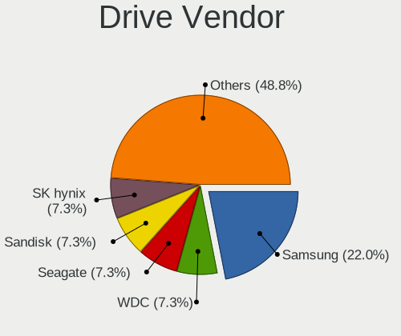
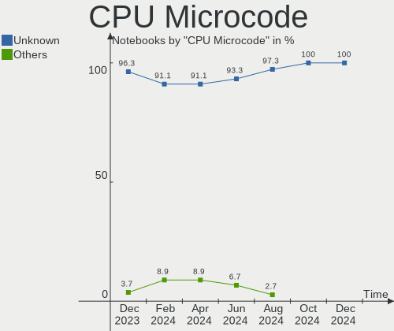
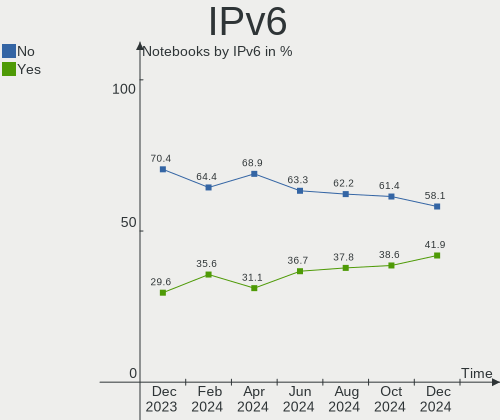
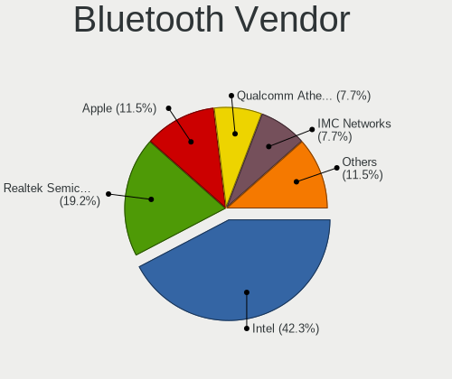
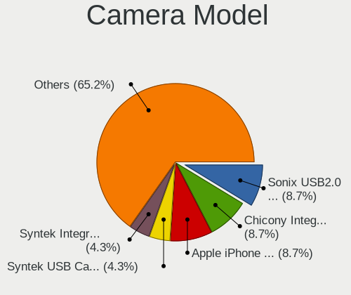

KDE neon - Hardware Trends (Notebooks)
--------------------------------------

A project to identify most popular hardware characteristics and track their change
over time based on data collected by Linux users at https://Linux-Hardware.org.

Anyone can contribute to this report by the [hw-probe](https://github.com/linuxhw/hw-probe) tool:

    sudo -E hw-probe -all -upload

This report is for one last month. Overall report since the beginning of time: [TestDays](https://github.com/linuxhw/TestDays)

Period: Jul, 2023.

Contents
--------

* [ System ](#system)
  - [ OS                       ](#os)
  - [ OS Family                ](#os-family)
  - [ Kernel                   ](#kernel)
  - [ Kernel Family            ](#kernel-family)
  - [ Kernel Major Ver.        ](#kernel-major-ver)
  - [ Arch                     ](#arch)
  - [ DE                       ](#de)
  - [ Display Server           ](#display-server)
  - [ Display Manager          ](#display-manager)
  - [ OS Lang                  ](#os-lang)
  - [ Boot Mode                ](#boot-mode)
  - [ Filesystem               ](#filesystem)
  - [ Part. scheme             ](#part-scheme)
  - [ Dual Boot with Linux/BSD ](#dual-boot-with-linuxbsd)
  - [ Dual Boot (Win)          ](#dual-boot-win)

* [ Board ](#board)
  - [ Vendor                   ](#vendor)
  - [ Model                    ](#model)
  - [ Model Family             ](#model-family)
  - [ MFG Year                 ](#mfg-year)
  - [ Form Factor              ](#form-factor)
  - [ Secure Boot              ](#secure-boot)
  - [ Coreboot                 ](#coreboot)
  - [ RAM Size                 ](#ram-size)
  - [ RAM Used                 ](#ram-used)
  - [ Total Drives             ](#total-drives)
  - [ Has CD-ROM               ](#has-cd-rom)
  - [ Has Ethernet             ](#has-ethernet)
  - [ Has WiFi                 ](#has-wifi)
  - [ Has Bluetooth            ](#has-bluetooth)

* [ Location ](#location)
  - [ Country                  ](#country)
  - [ City                     ](#city)

* [ Drives ](#drives)
  - [ Drive Vendor             ](#drive-vendor)
  - [ Drive Model              ](#drive-model)
  - [ HDD Vendor               ](#hdd-vendor)
  - [ SSD Vendor               ](#ssd-vendor)
  - [ Drive Kind               ](#drive-kind)
  - [ Drive Connector          ](#drive-connector)
  - [ Drive Size               ](#drive-size)
  - [ Space Total              ](#space-total)
  - [ Space Used               ](#space-used)
  - [ Malfunc. Drives          ](#malfunc-drives)
  - [ Malfunc. Drive Vendor    ](#malfunc-drive-vendor)
  - [ Malfunc. HDD Vendor      ](#malfunc-hdd-vendor)
  - [ Malfunc. Drive Kind      ](#malfunc-drive-kind)
  - [ Failed Drives            ](#failed-drives)
  - [ Failed Drive Vendor      ](#failed-drive-vendor)
  - [ Drive Status             ](#drive-status)

* [ Storage controller ](#storage-controller)
  - [ Storage Vendor           ](#storage-vendor)
  - [ Storage Model            ](#storage-model)
  - [ Storage Kind             ](#storage-kind)

* [ Processor ](#processor)
  - [ CPU Vendor               ](#cpu-vendor)
  - [ CPU Model                ](#cpu-model)
  - [ CPU Model Family         ](#cpu-model-family)
  - [ CPU Cores                ](#cpu-cores)
  - [ CPU Sockets              ](#cpu-sockets)
  - [ CPU Threads              ](#cpu-threads)
  - [ CPU Op-Modes             ](#cpu-op-modes)
  - [ CPU Microcode            ](#cpu-microcode)
  - [ CPU Microarch            ](#cpu-microarch)

* [ Graphics ](#graphics)
  - [ GPU Vendor               ](#gpu-vendor)
  - [ GPU Model                ](#gpu-model)
  - [ GPU Combo                ](#gpu-combo)
  - [ GPU Driver               ](#gpu-driver)
  - [ GPU Memory               ](#gpu-memory)

* [ Monitor ](#monitor)
  - [ Monitor Vendor           ](#monitor-vendor)
  - [ Monitor Model            ](#monitor-model)
  - [ Monitor Resolution       ](#monitor-resolution)
  - [ Monitor Diagonal         ](#monitor-diagonal)
  - [ Monitor Width            ](#monitor-width)
  - [ Aspect Ratio             ](#aspect-ratio)
  - [ Monitor Area             ](#monitor-area)
  - [ Pixel Density            ](#pixel-density)
  - [ Multiple Monitors        ](#multiple-monitors)

* [ Network ](#network)
  - [ Net Controller Vendor    ](#net-controller-vendor)
  - [ Net Controller Model     ](#net-controller-model)
  - [ Wireless Vendor          ](#wireless-vendor)
  - [ Wireless Model           ](#wireless-model)
  - [ Ethernet Vendor          ](#ethernet-vendor)
  - [ Ethernet Model           ](#ethernet-model)
  - [ Net Controller Kind      ](#net-controller-kind)
  - [ Used Controller          ](#used-controller)
  - [ NICs                     ](#nics)
  - [ IPv6                     ](#ipv6)

* [ Bluetooth ](#bluetooth)
  - [ Bluetooth Vendor         ](#bluetooth-vendor)
  - [ Bluetooth Model          ](#bluetooth-model)

* [ Sound ](#sound)
  - [ Sound Vendor             ](#sound-vendor)
  - [ Sound Model              ](#sound-model)

* [ Memory ](#memory)
  - [ Memory Vendor            ](#memory-vendor)
  - [ Memory Model             ](#memory-model)
  - [ Memory Kind              ](#memory-kind)
  - [ Memory Form Factor       ](#memory-form-factor)
  - [ Memory Size              ](#memory-size)
  - [ Memory Speed             ](#memory-speed)

* [ Printers & scanners ](#printers--scanners)
  - [ Printer Vendor           ](#printer-vendor)
  - [ Printer Model            ](#printer-model)
  - [ Scanner Vendor           ](#scanner-vendor)
  - [ Scanner Model            ](#scanner-model)

* [ Camera ](#camera)
  - [ Camera Vendor            ](#camera-vendor)
  - [ Camera Model             ](#camera-model)

* [ Security ](#security)
  - [ Fingerprint Vendor       ](#fingerprint-vendor)
  - [ Fingerprint Model        ](#fingerprint-model)
  - [ Chipcard Vendor          ](#chipcard-vendor)
  - [ Chipcard Model           ](#chipcard-model)

* [ Unsupported ](#unsupported)
  - [ Unsupported Devices      ](#unsupported-devices)
  - [ Unsupported Device Types ](#unsupported-device-types)

System
------

OS
--

Installed operating systems

| Name           | Notebooks | Percent |
|----------------|-----------|---------|
| KDE neon 22.04 | 36        | 100%    |

OS Family
---------

OS without a version

| Name     | Notebooks | Percent |
|----------|-----------|---------|
| KDE neon | 36        | 100%    |

Kernel
------

Version of the Linux kernel

| Version               | Notebooks | Percent |
|-----------------------|-----------|---------|
| 5.19.0-46-generic     | 26        | 72.22%  |
| 5.19.0-50-generic     | 5         | 13.89%  |
| 6.4.0-060400-generic  | 1         | 2.78%   |
| 6.3.13-060313-generic | 1         | 2.78%   |
| 6.3.1-060301-generic  | 1         | 2.78%   |
| 5.19.0-45-generic     | 1         | 2.78%   |
| 5.19.0-43-generic     | 1         | 2.78%   |

Kernel Family
-------------

Linux kernel without a distro release

| Version | Notebooks | Percent |
|---------|-----------|---------|
| 5.19.0  | 33        | 91.67%  |
| 6.4.0   | 1         | 2.78%   |
| 6.3.13  | 1         | 2.78%   |
| 6.3.1   | 1         | 2.78%   |

Kernel Major Ver.
-----------------

Linux kernel major version

| Version | Notebooks | Percent |
|---------|-----------|---------|
| 5.19    | 33        | 91.67%  |
| 6.3     | 2         | 5.56%   |
| 6.4     | 1         | 2.78%   |

Arch
----

OS architecture (x86_64, i586, etc.)

| Name   | Notebooks | Percent |
|--------|-----------|---------|
| x86_64 | 36        | 100%    |

DE
--

Desktop Environment

| Name | Notebooks | Percent |
|------|-----------|---------|
| KDE5 | 36        | 100%    |

Display Server
--------------

X11 or Wayland

| Name    | Notebooks | Percent |
|---------|-----------|---------|
| X11     | 32        | 88.89%  |
| Wayland | 4         | 11.11%  |

Display Manager
---------------

SDDM, LightDM, etc.

| Name    | Notebooks | Percent |
|---------|-----------|---------|
| Unknown | 19        | 52.78%  |
| SDDM    | 17        | 47.22%  |

OS Lang
-------

Language

| Lang  | Notebooks | Percent |
|-------|-----------|---------|
| en_US | 17        | 47.22%  |
| de_DE | 4         | 11.11%  |
| en_GB | 3         | 8.33%   |
| C     | 3         | 8.33%   |
| fr_FR | 2         | 5.56%   |
| ru_RU | 1         | 2.78%   |
| pt_BR | 1         | 2.78%   |
| pl_PL | 1         | 2.78%   |
| nn_NO | 1         | 2.78%   |
| es_CL | 1         | 2.78%   |
| en_IN | 1         | 2.78%   |
| en_CA | 1         | 2.78%   |

Boot Mode
---------

EFI or BIOS

| Mode | Notebooks | Percent |
|------|-----------|---------|
| BIOS | 26        | 72.22%  |
| EFI  | 10        | 27.78%  |

Filesystem
----------

Type of filesystem

| Type    | Notebooks | Percent |
|---------|-----------|---------|
| Ext4    | 27        | 75%     |
| Tmpfs   | 6         | 16.67%  |
| Overlay | 3         | 8.33%   |

Part. scheme
------------

Scheme of partitioning

| Type    | Notebooks | Percent |
|---------|-----------|---------|
| Unknown | 19        | 52.78%  |
| GPT     | 14        | 38.89%  |
| MBR     | 3         | 8.33%   |

Dual Boot with Linux/BSD
------------------------

Hosting more than one Linux/BSD

| Dual boot | Notebooks | Percent |
|-----------|-----------|---------|
| No        | 34        | 94.44%  |
| Yes       | 2         | 5.56%   |

Dual Boot (Win)
---------------

Hosting Linux and Windows

| Dual boot | Notebooks | Percent |
|-----------|-----------|---------|
| No        | 31        | 86.11%  |
| Yes       | 5         | 13.89%  |

Board
-----

Vendor
------

Motherboard manufacturer

| Name                | Notebooks | Percent |
|---------------------|-----------|---------|
| Lenovo              | 6         | 16.67%  |
| Dell                | 5         | 13.89%  |
| ASUSTek Computer    | 5         | 13.89%  |
| Hewlett-Packard     | 4         | 11.11%  |
| Sony                | 3         | 8.33%   |
| Acer                | 3         | 8.33%   |
| Timi                | 2         | 5.56%   |
| Apple               | 2         | 5.56%   |
| Teclast             | 1         | 2.78%   |
| MSI                 | 1         | 2.78%   |
| Medion              | 1         | 2.78%   |
| Google              | 1         | 2.78%   |
| Gigabyte Technology | 1         | 2.78%   |
| Fujitsu             | 1         | 2.78%   |

Model
-----

Motherboard model

| Name                                               | Notebooks | Percent |
|----------------------------------------------------|-----------|---------|
| Timi TM1701                                        | 1         | 2.78%   |
| Timi TM1612                                        | 1         | 2.78%   |
| Teclast F6 Plus                                    | 1         | 2.78%   |
| Sony VPCZ214GX                                     | 1         | 2.78%   |
| Sony VPCEF4E1E                                     | 1         | 2.78%   |
| Sony SVP1321M2EB                                   | 1         | 2.78%   |
| MSI GF63 Thin 10SCXR                               | 1         | 2.78%   |
| Medion E14303                                      | 1         | 2.78%   |
| Lenovo V15 G2 ITL 82KB                             | 1         | 2.78%   |
| Lenovo ThinkPad X201 3680KS9                       | 1         | 2.78%   |
| Lenovo Legion Pro 5 16IRX8 82WK                    | 1         | 2.78%   |
| Lenovo IdeaPad U430 Touch 20270                    | 1         | 2.78%   |
| Lenovo IdeaPad 5 15ALC05 82LN                      | 1         | 2.78%   |
| Lenovo IdeaPad 330-15IKB 81FD                      | 1         | 2.78%   |
| HP ZBook Studio 15.6 inch G8 Mobile Workstation PC | 1         | 2.78%   |
| HP Pavilion Laptop 15-eg3xxx                       | 1         | 2.78%   |
| HP EliteBook 855 G8 Notebook PC                    | 1         | 2.78%   |
| HP EliteBook 840 G3                                | 1         | 2.78%   |
| Google Cave                                        | 1         | 2.78%   |
| Gigabyte G5 GE                                     | 1         | 2.78%   |
| Fujitsu LIFEBOOK A544                              | 1         | 2.78%   |
| Dell Precision M6700                               | 1         | 2.78%   |
| Dell Latitude 7370                                 | 1         | 2.78%   |
| Dell Latitude 5511                                 | 1         | 2.78%   |
| Dell Inspiron 5566                                 | 1         | 2.78%   |
| Dell Inspiron 13-5368                              | 1         | 2.78%   |
| ASUS VivoBook_ASUSLaptop X512DA_F512DA             | 1         | 2.78%   |
| ASUS VivoBook_ASUSLaptop X415EA_X415EA             | 1         | 2.78%   |
| ASUS VivoBook_ASUSLaptop M6500QC_M6500QC           | 1         | 2.78%   |
| ASUS GL752VW                                       | 1         | 2.78%   |
| ASUS G75VW                                         | 1         | 2.78%   |
| Apple MacBookPro9,2                                | 1         | 2.78%   |
| Apple MacBookPro11,5                               | 1         | 2.78%   |
| Acer Nitro AN515-45                                | 1         | 2.78%   |
| Acer Aspire V3-371                                 | 1         | 2.78%   |
| Acer Aspire F5-571T                                | 1         | 2.78%   |

Model Family
------------

Motherboard model prefix

| Name               | Notebooks | Percent |
|--------------------|-----------|---------|
| Lenovo IdeaPad     | 3         | 8.33%   |
| ASUS VivoBook      | 3         | 8.33%   |
| HP EliteBook       | 2         | 5.56%   |
| Dell Latitude      | 2         | 5.56%   |
| Dell Inspiron      | 2         | 5.56%   |
| Acer Aspire        | 2         | 5.56%   |
| Timi TM1701        | 1         | 2.78%   |
| Timi TM1612        | 1         | 2.78%   |
| Teclast F6         | 1         | 2.78%   |
| Sony VPCZ214GX     | 1         | 2.78%   |
| Sony VPCEF4E1E     | 1         | 2.78%   |
| Sony SVP1321M2EB   | 1         | 2.78%   |
| MSI GF63           | 1         | 2.78%   |
| Medion E14303      | 1         | 2.78%   |
| Lenovo V15         | 1         | 2.78%   |
| Lenovo ThinkPad    | 1         | 2.78%   |
| Lenovo Legion      | 1         | 2.78%   |
| HP ZBook           | 1         | 2.78%   |
| HP Pavilion        | 1         | 2.78%   |
| Google Cave        | 1         | 2.78%   |
| Gigabyte G5        | 1         | 2.78%   |
| Fujitsu LIFEBOOK   | 1         | 2.78%   |
| Dell Precision     | 1         | 2.78%   |
| ASUS GL752VW       | 1         | 2.78%   |
| ASUS G75VW         | 1         | 2.78%   |
| Apple MacBookPro9  | 1         | 2.78%   |
| Apple MacBookPro11 | 1         | 2.78%   |
| Acer Nitro         | 1         | 2.78%   |

MFG Year
--------

Motherboard manufacture year

| Year | Notebooks | Percent |
|------|-----------|---------|
| 2021 | 6         | 16.67%  |
| 2016 | 4         | 11.11%  |
| 2012 | 4         | 11.11%  |
| 2023 | 3         | 8.33%   |
| 2022 | 3         | 8.33%   |
| 2015 | 3         | 8.33%   |
| 2020 | 2         | 5.56%   |
| 2019 | 2         | 5.56%   |
| 2018 | 2         | 5.56%   |
| 2017 | 2         | 5.56%   |
| 2013 | 2         | 5.56%   |
| 2010 | 2         | 5.56%   |
| 2014 | 1         | 2.78%   |

Form Factor
-----------

Physical design of the computer

| Name     | Notebooks | Percent |
|----------|-----------|---------|
| Notebook | 36        | 100%    |

Secure Boot
-----------

Enabled or disabled

| State    | Notebooks | Percent |
|----------|-----------|---------|
| Disabled | 35        | 97.22%  |
| Enabled  | 1         | 2.78%   |

Coreboot
--------

Have coreboot on board

| Used | Notebooks | Percent |
|------|-----------|---------|
| No   | 35        | 97.22%  |
| Yes  | 1         | 2.78%   |

RAM Size
--------

Total RAM memory

| Size in GB  | Notebooks | Percent |
|-------------|-----------|---------|
| 4.01-8.0    | 11        | 30.56%  |
| 3.01-4.0    | 7         | 19.44%  |
| 16.01-24.0  | 7         | 19.44%  |
| 8.01-16.0   | 6         | 16.67%  |
| 32.01-64.0  | 3         | 8.33%   |
| 24.01-32.0  | 1         | 2.78%   |
| 64.01-256.0 | 1         | 2.78%   |

RAM Used
--------

Used RAM memory

| Used GB   | Notebooks | Percent |
|-----------|-----------|---------|
| 1.01-2.0  | 13        | 36.11%  |
| 4.01-8.0  | 9         | 25%     |
| 2.01-3.0  | 9         | 25%     |
| 3.01-4.0  | 3         | 8.33%   |
| 8.01-16.0 | 2         | 5.56%   |

Total Drives
------------

Number of drives on board

| Drives | Notebooks | Percent |
|--------|-----------|---------|
| 1      | 27        | 75%     |
| 2      | 9         | 25%     |

Has CD-ROM
----------

Has CD-ROM on board

| Presented | Notebooks | Percent |
|-----------|-----------|---------|
| No        | 28        | 77.78%  |
| Yes       | 8         | 22.22%  |

Has Ethernet
------------

Has Ethernet on board

| Presented | Notebooks | Percent |
|-----------|-----------|---------|
| Yes       | 21        | 58.33%  |
| No        | 15        | 41.67%  |

Has WiFi
--------

Has WiFi module

| Presented | Notebooks | Percent |
|-----------|-----------|---------|
| Yes       | 36        | 100%    |

Has Bluetooth
-------------

Has Bluetooth module

| Presented | Notebooks | Percent |
|-----------|-----------|---------|
| Yes       | 34        | 94.44%  |
| No        | 2         | 5.56%   |

Location
--------

Country
-------

Geographic location (country)

| Country     | Notebooks | Percent |
|-------------|-----------|---------|
| USA         | 10        | 27.78%  |
| Germany     | 5         | 13.89%  |
| UK          | 3         | 8.33%   |
| France      | 3         | 8.33%   |
| Brazil      | 3         | 8.33%   |
| Russia      | 2         | 5.56%   |
| Tunisia     | 1         | 2.78%   |
| Puerto Rico | 1         | 2.78%   |
| Poland      | 1         | 2.78%   |
| Norway      | 1         | 2.78%   |
| Mexico      | 1         | 2.78%   |
| Italy       | 1         | 2.78%   |
| India       | 1         | 2.78%   |
| Chile       | 1         | 2.78%   |
| Canada      | 1         | 2.78%   |
| Australia   | 1         | 2.78%   |

City
----

Geographic location (city)

| City                  | Notebooks | Percent |
|-----------------------|-----------|---------|
| Coventry              | 2         | 5.56%   |
| Vernon                | 1         | 2.78%   |
| Tomsk                 | 1         | 2.78%   |
| Tobias Barreto        | 1         | 2.78%   |
| Tijuana               | 1         | 2.78%   |
| Tappahannock          | 1         | 2.78%   |
| Sfax                  | 1         | 2.78%   |
| Santiago              | 1         | 2.78%   |
| Santa Rita do Sapucai | 1         | 2.78%   |
| Saint-Michel-sur-Orge | 1         | 2.78%   |
| Saint Paul            | 1         | 2.78%   |
| Rochelle              | 1         | 2.78%   |
| Oxnard                | 1         | 2.78%   |
| Oldenburg             | 1         | 2.78%   |
| Noisy-le-Grand        | 1         | 2.78%   |
| Miamisburg            | 1         | 2.78%   |
| Mareil-Marly          | 1         | 2.78%   |
| Mannheim              | 1         | 2.78%   |
| Kelowna               | 1         | 2.78%   |
| Katowice              | 1         | 2.78%   |
| Kaspiysk              | 1         | 2.78%   |
| Karlsruhe             | 1         | 2.78%   |
| Islington             | 1         | 2.78%   |
| Gold Coast            | 1         | 2.78%   |
| Glen Allen            | 1         | 2.78%   |
| Delhi                 | 1         | 2.78%   |
| Dallas                | 1         | 2.78%   |
| Campobasso            | 1         | 2.78%   |
| Bremen                | 1         | 2.78%   |
| Bradenton             | 1         | 2.78%   |
| Bergen                | 1         | 2.78%   |
| Bayreuth              | 1         | 2.78%   |
| Bayamón              | 1         | 2.78%   |
| Austin                | 1         | 2.78%   |
| Ananindeua            | 1         | 2.78%   |

Drives
------

Drive Vendor
------------

Hard drive vendors

| Vendor                       | Notebooks | Drives | Percent |
|------------------------------|-----------|--------|---------|
| Samsung Electronics          | 7         | 9      | 16.67%  |
| Toshiba                      | 4         | 4      | 9.52%   |
| SanDisk                      | 4         | 4      | 9.52%   |
| Kingston                     | 4         | 4      | 9.52%   |
| WDC                          | 3         | 4      | 7.14%   |
| Seagate                      | 2         | 2      | 4.76%   |
| X12                          | 1         | 1      | 2.38%   |
| Unknown                      | 1         | 1      | 2.38%   |
| Union Memory                 | 1         | 1      | 2.38%   |
| Teclast                      | 1         | 1      | 2.38%   |
| SK hynix                     | 1         | 1      | 2.38%   |
| Silicon Motion               | 1         | 1      | 2.38%   |
| Shenzhen Longsys Electronics | 1         | 1      | 2.38%   |
| Phison Electronics           | 1         | 1      | 2.38%   |
| Netac                        | 1         | 1      | 2.38%   |
| Micron Technology            | 1         | 1      | 2.38%   |
| LITEON                       | 1         | 1      | 2.38%   |
| Kingston Technology Company  | 1         | 1      | 2.38%   |
| Intel                        | 1         | 1      | 2.38%   |
| HGST                         | 1         | 1      | 2.38%   |
| Crucial                      | 1         | 1      | 2.38%   |
| China                        | 1         | 1      | 2.38%   |
| Apple                        | 1         | 1      | 2.38%   |
| ADATA Technology             | 1         | 1      | 2.38%   |

Drive Model
-----------

Hard drive models

| Model                                               | Notebooks | Percent |
|-----------------------------------------------------|-----------|---------|
| Toshiba MQ01ABD100 1TB                              | 2         | 4.55%   |
| X12 SSD 480GB                                       | 1         | 2.27%   |
| WDC WDS500G2B0A 500GB SSD                           | 1         | 2.27%   |
| WDC WD5000LPCX-75VHAT0 500GB                        | 1         | 2.27%   |
| WDC WD10JPVX-75JC3T0 1TB                            | 1         | 2.27%   |
| WDC WD10JPVX-00JC3T0 1TB                            | 1         | 2.27%   |
| Unknown MMC Card  64GB                              | 1         | 2.27%   |
| Union Memory UMIS RPJTJ256MEE1OWX 256GB             | 1         | 2.27%   |
| Toshiba THNSNH128G8NT 128GB SSD                     | 1         | 2.27%   |
| Toshiba MQ01ABF050 500GB                            | 1         | 2.27%   |
| Teclast 256GB NS550-2242 SSD                        | 1         | 2.27%   |
| SK hynix HFM512GD3JX013N 512GB                      | 1         | 2.27%   |
| Silicon Motion SM2262/SM2262EN SSD Controller 512GB | 1         | 2.27%   |
| Shenzhen Longsys Lexar SSD NM710 2TB                | 1         | 2.27%   |
| Seagate ST500LT012-1DG142 500GB                     | 1         | 2.27%   |
| Seagate ST500LM000-SSHD-8GB                         | 1         | 2.27%   |
| Sandisk WD_BLACK SN770 2TB                          | 1         | 2.27%   |
| SanDisk SDSSDHP256G 256GB                           | 1         | 2.27%   |
| SanDisk SD8SN8U1T001122 1TB SSD                     | 1         | 2.27%   |
| SanDisk A400 NVMe 256GB                             | 1         | 2.27%   |
| Samsung SSD 870 EVO 500GB                           | 1         | 2.27%   |
| Samsung NVMe SSD Controller SM961/PM961/SM963 256GB | 1         | 2.27%   |
| Samsung NVMe SSD Controller PM9A1/PM9A3/980PRO 1TB  | 1         | 2.27%   |
| Samsung MZVLB512HAJQ-00000 512GB                    | 1         | 2.27%   |
| Samsung MZVL21T0HCLR-00BL2 1TB                      | 1         | 2.27%   |
| Samsung MZRPA128HMCD-000SO 64GB SSD                 | 1         | 2.27%   |
| Samsung MZNTY128HDHP-00000 128GB SSD                | 1         | 2.27%   |
| Samsung MZALQ512HBLU-00BL2 512GB                    | 1         | 2.27%   |
| Phison PS5013 E13 NVMe Controller 256GB             | 1         | 2.27%   |
| Netac SSD 120GB                                     | 1         | 2.27%   |
| Micron 2210_MTFDHBA512QFD 512GB                     | 1         | 2.27%   |
| LITEON L8H-256V2G-HP 256GB SSD                      | 1         | 2.27%   |
| Kingston Company OM3PDP3 NVMe SSD 512GB             | 1         | 2.27%   |
| Kingston SV300S37A240G 240GB SSD                    | 1         | 2.27%   |
| Kingston SUV400S37120G 120GB SSD                    | 1         | 2.27%   |
| Kingston SKC2500M82000G 2TB                         | 1         | 2.27%   |
| Kingston RBUSNS8180DS3128GJ 128GB SSD               | 1         | 2.27%   |
| Intel SSDPEKNU512GZH 512GB                          | 1         | 2.27%   |
| HGST HTS721010A9E630 1TB                            | 1         | 2.27%   |
| Crucial CT2000P3SSD8 2TB                            | 1         | 2.27%   |

HDD Vendor
----------

Hard disk drive vendors

| Vendor  | Notebooks | Drives | Percent |
|---------|-----------|--------|---------|
| WDC     | 3         | 3      | 33.33%  |
| Toshiba | 3         | 3      | 33.33%  |
| Seagate | 2         | 2      | 22.22%  |
| HGST    | 1         | 1      | 11.11%  |

SSD Vendor
----------

Solid state drive vendors

| Vendor              | Notebooks | Drives | Percent |
|---------------------|-----------|--------|---------|
| Samsung Electronics | 3         | 4      | 18.75%  |
| Kingston            | 3         | 3      | 18.75%  |
| SanDisk             | 2         | 2      | 12.5%   |
| X12                 | 1         | 1      | 6.25%   |
| WDC                 | 1         | 1      | 6.25%   |
| Toshiba             | 1         | 1      | 6.25%   |
| Teclast             | 1         | 1      | 6.25%   |
| Netac               | 1         | 1      | 6.25%   |
| LITEON              | 1         | 1      | 6.25%   |
| China               | 1         | 1      | 6.25%   |
| Apple               | 1         | 1      | 6.25%   |

Drive Kind
----------

HDD or SSD

| Kind | Notebooks | Drives | Percent |
|------|-----------|--------|---------|
| NVMe | 16        | 18     | 39.02%  |
| SSD  | 15        | 17     | 36.59%  |
| HDD  | 9         | 9      | 21.95%  |
| MMC  | 1         | 1      | 2.44%   |

Drive Connector
---------------

SATA, SAS, NVMe, etc.

| Type | Notebooks | Drives | Percent |
|------|-----------|--------|---------|
| SATA | 20        | 26     | 54.05%  |
| NVMe | 16        | 18     | 43.24%  |
| MMC  | 1         | 1      | 2.7%    |

Drive Size
----------

Size of hard drive

| Size in TB | Notebooks | Drives | Percent |
|------------|-----------|--------|---------|
| 0.01-0.5   | 16        | 19     | 72.73%  |
| 0.51-1.0   | 6         | 7      | 27.27%  |

Space Total
-----------

Amount of disk space available on the file system

| Size in GB | Notebooks | Percent |
|------------|-----------|---------|
| 251-500    | 9         | 25%     |
| 101-250    | 8         | 22.22%  |
| 1001-2000  | 6         | 16.67%  |
| 1-20       | 4         | 11.11%  |
| Unknown    | 4         | 11.11%  |
| 501-1000   | 3         | 8.33%   |
| 21-50      | 1         | 2.78%   |
| 51-100     | 1         | 2.78%   |

Space Used
----------

Amount of used disk space

| Used GB   | Notebooks | Percent |
|-----------|-----------|---------|
| 1-20      | 13        | 36.11%  |
| 21-50     | 8         | 22.22%  |
| 101-250   | 5         | 13.89%  |
| Unknown   | 4         | 11.11%  |
| 51-100    | 3         | 8.33%   |
| 501-1000  | 2         | 5.56%   |
| 1001-2000 | 1         | 2.78%   |

Malfunc. Drives
---------------

Drive models with a malfunction

| Model                                           | Notebooks | Drives | Percent |
|-------------------------------------------------|-----------|--------|---------|
| Samsung Electronics MZRPA128HMCD-000SO 64GB SSD | 1         | 2      | 100%    |

Malfunc. Drive Vendor
---------------------

Vendors of faulty drives

| Vendor              | Notebooks | Drives | Percent |
|---------------------|-----------|--------|---------|
| Samsung Electronics | 1         | 2      | 100%    |

Malfunc. HDD Vendor
-------------------

Vendors of faulty HDD drives

Zero info for selected period =(

Malfunc. Drive Kind
-------------------

Kinds of faulty drives

| Kind | Notebooks | Drives | Percent |
|------|-----------|--------|---------|
| SSD  | 1         | 2      | 100%    |

Failed Drives
-------------

Failed drive models

Zero info for selected period =(

Failed Drive Vendor
-------------------

Failed drive vendors

Zero info for selected period =(

Drive Status
------------

Number of failed and malfunc. drives

| Status   | Notebooks | Drives | Percent |
|----------|-----------|--------|---------|
| Detected | 25        | 30     | 69.44%  |
| Works    | 10        | 13     | 27.78%  |
| Malfunc  | 1         | 2      | 2.78%   |

Storage controller
------------------

Storage Vendor
--------------

Storage controller vendors

| Vendor                       | Notebooks | Percent |
|------------------------------|-----------|---------|
| Intel                        | 23        | 51.11%  |
| Samsung Electronics          | 5         | 11.11%  |
| AMD                          | 5         | 11.11%  |
| SanDisk                      | 2         | 4.44%   |
| Kingston Technology Company  | 2         | 4.44%   |
| Union Memory (Shenzhen)      | 1         | 2.22%   |
| SK hynix                     | 1         | 2.22%   |
| Silicon Motion               | 1         | 2.22%   |
| Shenzhen Longsys Electronics | 1         | 2.22%   |
| Phison Electronics           | 1         | 2.22%   |
| Micron/Crucial Technology    | 1         | 2.22%   |
| Micron Technology            | 1         | 2.22%   |
| ADATA Technology             | 1         | 2.22%   |

Storage Model
-------------

Storage controller models

| Model                                                                          | Notebooks | Percent |
|--------------------------------------------------------------------------------|-----------|---------|
| Intel Sunrise Point-LP SATA Controller [AHCI mode]                             | 5         | 10.2%   |
| AMD FCH SATA Controller [AHCI mode]                                            | 4         | 8.16%   |
| Intel 8 Series SATA Controller 1 [AHCI mode]                                   | 3         | 6.12%   |
| Samsung NVMe SSD Controller PM9A1/PM9A3/980PRO                                 | 2         | 4.08%   |
| Intel Volume Management Device NVMe RAID Controller                            | 2         | 4.08%   |
| Intel Tiger Lake-LP SATA Controller                                            | 2         | 4.08%   |
| Intel 82801 Mobile SATA Controller [RAID mode]                                 | 2         | 4.08%   |
| Intel 7 Series Chipset Family 6-port SATA Controller [AHCI mode]               | 2         | 4.08%   |
| Intel 400 Series Chipset Family SATA AHCI Controller                           | 2         | 4.08%   |
| Union Memory (Shenzhen) AM620 PCIe 3.0 NVMe SSD 256GB                          | 1         | 2.04%   |
| SK hynix Gold P31/BC711/PC711 NVMe Solid State Drive                           | 1         | 2.04%   |
| Silicon Motion SM2262/SM2262EN SSD Controller                                  | 1         | 2.04%   |
| Shenzhen Longsys Non-Volatile memory controller                                | 1         | 2.04%   |
| SanDisk WD Black SN770 / PC SN740 256GB / PC SN560 (DRAM-less) NVMe SSD        | 1         | 2.04%   |
| SanDisk WD Black NVMe SSD                                                      | 1         | 2.04%   |
| Samsung S4LN058A01[SSUBX] AHCI SSD Controller (Apple slot)                     | 1         | 2.04%   |
| Samsung NVMe SSD Controller SM981/PM981/PM983                                  | 1         | 2.04%   |
| Samsung NVMe SSD Controller SM961/PM961/SM963                                  | 1         | 2.04%   |
| Samsung NVMe SSD Controller 980                                                | 1         | 2.04%   |
| Phison PS5013 E13 NVMe Controller                                              | 1         | 2.04%   |
| Micron/Crucial P2 [Nick P2] / P3 / P3 Plus NVMe PCIe SSD (DRAM-less)           | 1         | 2.04%   |
| Micron 2210 NVMe SSD [Cobain]                                                  | 1         | 2.04%   |
| Kingston Company OM3PDP3 NVMe SSD                                              | 1         | 2.04%   |
| Kingston Company KC2000/KC2500 NVMe SSD                                        | 1         | 2.04%   |
| Intel Wildcat Point-LP SATA Controller [AHCI Mode]                             | 1         | 2.04%   |
| Intel SSD 670p Series [Keystone Harbor]                                        | 1         | 2.04%   |
| Intel HM170/QM170 Chipset SATA Controller [AHCI Mode]                          | 1         | 2.04%   |
| Intel Celeron/Pentium Silver Processor SATA Controller                         | 1         | 2.04%   |
| Intel Alder Lake-P SATA AHCI Controller                                        | 1         | 2.04%   |
| Intel 8 Series/C220 Series Chipset Family 6-port SATA Controller 1 [AHCI mode] | 1         | 2.04%   |
| Intel 5 Series/3400 Series Chipset 6 port SATA AHCI Controller                 | 1         | 2.04%   |
| AMD SB7x0/SB8x0/SB9x0 SATA Controller [AHCI mode]                              | 1         | 2.04%   |
| AMD SB7x0/SB8x0/SB9x0 IDE Controller                                           | 1         | 2.04%   |
| ADATA IM2P33F8ABR1 NVMe SSD                                                    | 1         | 2.04%   |

Storage Kind
------------

Kind of storage controller (IDE, SATA, NVMe, SAS, ...)

| Kind | Notebooks | Percent |
|------|-----------|---------|
| SATA | 26        | 55.32%  |
| NVMe | 16        | 34.04%  |
| RAID | 4         | 8.51%   |
| IDE  | 1         | 2.13%   |

Processor
---------

CPU Vendor
----------

Processor vendors

| Vendor | Notebooks | Percent |
|--------|-----------|---------|
| Intel  | 29        | 80.56%  |
| AMD    | 7         | 19.44%  |

CPU Model
---------

Processor models

| Model                                         | Notebooks | Percent |
|-----------------------------------------------|-----------|---------|
| Intel Core m3-6Y30 CPU @ 0.90GHz              | 2         | 5.56%   |
| Intel Core i5-4210U CPU @ 1.70GHz             | 2         | 5.56%   |
| Intel Pentium Gold 7505 @ 2.00GHz             | 1         | 2.78%   |
| Intel Core m7-6Y75 CPU @ 1.20GHz              | 1         | 2.78%   |
| Intel Core i7-6700HQ CPU @ 2.60GHz            | 1         | 2.78%   |
| Intel Core i7-4870HQ CPU @ 2.50GHz            | 1         | 2.78%   |
| Intel Core i7-3840QM CPU @ 2.80GHz            | 1         | 2.78%   |
| Intel Core i7-3610QM CPU @ 2.30GHz            | 1         | 2.78%   |
| Intel Core i7-2620M CPU @ 2.70GHz             | 1         | 2.78%   |
| Intel Core i7-10850H CPU @ 2.70GHz            | 1         | 2.78%   |
| Intel Core i7-10750H CPU @ 2.60GHz            | 1         | 2.78%   |
| Intel Core i5-8250U CPU @ 1.60GHz             | 1         | 2.78%   |
| Intel Core i5-6200U CPU @ 2.30GHz             | 1         | 2.78%   |
| Intel Core i5-5200U CPU @ 2.20GHz             | 1         | 2.78%   |
| Intel Core i5-4200U CPU @ 1.60GHz             | 1         | 2.78%   |
| Intel Core i5-4200M CPU @ 2.50GHz             | 1         | 2.78%   |
| Intel Core i5-3210M CPU @ 2.50GHz             | 1         | 2.78%   |
| Intel Core i5 CPU M 540 @ 2.53GHz             | 1         | 2.78%   |
| Intel Core i3-7020U CPU @ 2.30GHz             | 1         | 2.78%   |
| Intel Core i3-6100U CPU @ 2.30GHz             | 1         | 2.78%   |
| Intel Core i3-6006U CPU @ 2.00GHz             | 1         | 2.78%   |
| Intel Celeron N4100 CPU @ 1.10GHz             | 1         | 2.78%   |
| Intel 13th Gen Core i9-13900HX                | 1         | 2.78%   |
| Intel 13th Gen Core i5-1340P                  | 1         | 2.78%   |
| Intel 12th Gen Core i5-12500H                 | 1         | 2.78%   |
| Intel 11th Gen Core i9-11900H @ 2.50GHz       | 1         | 2.78%   |
| Intel 11th Gen Core i5-1135G7 @ 2.40GHz       | 1         | 2.78%   |
| AMD Ryzen 7 PRO 5850U with Radeon Graphics    | 1         | 2.78%   |
| AMD Ryzen 7 5800H with Radeon Graphics        | 1         | 2.78%   |
| AMD Ryzen 5 5600H with Radeon Graphics        | 1         | 2.78%   |
| AMD Ryzen 5 5500U with Radeon Graphics        | 1         | 2.78%   |
| AMD Ryzen 3 4300U with Radeon Graphics        | 1         | 2.78%   |
| AMD Ryzen 3 3200U with Radeon Vega Mobile Gfx | 1         | 2.78%   |
| AMD Athlon II P360 Dual-Core Processor        | 1         | 2.78%   |

CPU Model Family
----------------

Processor model prefix

| Model              | Notebooks | Percent |
|--------------------|-----------|---------|
| Intel Core i5      | 9         | 25%     |
| Intel Core i7      | 7         | 19.44%  |
| Other              | 5         | 13.89%  |
| Intel Core i3      | 3         | 8.33%   |
| Intel Core m3      | 2         | 5.56%   |
| AMD Ryzen 5        | 2         | 5.56%   |
| AMD Ryzen 3        | 2         | 5.56%   |
| Intel Pentium Gold | 1         | 2.78%   |
| Intel Core m7      | 1         | 2.78%   |
| Intel Celeron      | 1         | 2.78%   |
| AMD Ryzen 7 PRO    | 1         | 2.78%   |
| AMD Ryzen 7        | 1         | 2.78%   |
| AMD Athlon II      | 1         | 2.78%   |

CPU Cores
---------

Number of processor cores

| Number | Notebooks | Percent |
|--------|-----------|---------|
| 2      | 18        | 50%     |
| 4      | 8         | 22.22%  |
| 6      | 4         | 11.11%  |
| 8      | 3         | 8.33%   |
| 12     | 2         | 5.56%   |
| 24     | 1         | 2.78%   |

CPU Sockets
-----------

Number of sockets

| Number | Notebooks | Percent |
|--------|-----------|---------|
| 1      | 36        | 100%    |

CPU Threads
-----------

Threads per core (Hyper-Threading)

| Number | Notebooks | Percent |
|--------|-----------|---------|
| 2      | 32        | 88.89%  |
| 1      | 4         | 11.11%  |

CPU Op-Modes
------------

CPU Operation Modes (32-bit, 64-bit)

| Op mode        | Notebooks | Percent |
|----------------|-----------|---------|
| 32-bit, 64-bit | 36        | 100%    |

CPU Microcode
-------------

Microcode number

| Number     | Notebooks | Percent |
|------------|-----------|---------|
| Unknown    | 27        | 75%     |
| 0xb06a2    | 1         | 2.78%   |
| 0xa0652    | 1         | 2.78%   |
| 0x506e3    | 1         | 2.78%   |
| 0x40661    | 1         | 2.78%   |
| 0x40651    | 1         | 2.78%   |
| 0x0a50000d | 1         | 2.78%   |
| 0x0a50000c | 1         | 2.78%   |
| 0x08600106 | 1         | 2.78%   |
| 0x08108109 | 1         | 2.78%   |

CPU Microarch
-------------

Microarchitecture

| Name             | Notebooks | Percent |
|------------------|-----------|---------|
| Skylake          | 7         | 19.44%  |
| Haswell          | 5         | 13.89%  |
| Unknown          | 4         | 11.11%  |
| Zen 3            | 3         | 8.33%   |
| IvyBridge        | 3         | 8.33%   |
| TigerLake        | 2         | 5.56%   |
| KabyLake         | 2         | 5.56%   |
| CometLake        | 2         | 5.56%   |
| Zen+             | 1         | 2.78%   |
| Zen 2            | 1         | 2.78%   |
| Westmere         | 1         | 2.78%   |
| SandyBridge      | 1         | 2.78%   |
| K10              | 1         | 2.78%   |
| Goldmont plus    | 1         | 2.78%   |
| Broadwell        | 1         | 2.78%   |
| Alderlake Hybrid | 1         | 2.78%   |

Graphics
--------

GPU Vendor
----------

Vendors of graphics cards

| Vendor | Notebooks | Percent |
|--------|-----------|---------|
| Intel  | 27        | 58.7%   |
| Nvidia | 11        | 23.91%  |
| AMD    | 8         | 17.39%  |

GPU Model
---------

Graphics card models

| Model                                                                     | Notebooks | Percent |
|---------------------------------------------------------------------------|-----------|---------|
| Intel Skylake GT2 [HD Graphics 520]                                       | 3         | 6.52%   |
| Intel HD Graphics 515                                                     | 3         | 6.52%   |
| Intel Haswell-ULT Integrated Graphics Controller                          | 3         | 6.52%   |
| AMD Cezanne [Radeon Vega Series / Radeon Vega Mobile Series]              | 3         | 6.52%   |
| Nvidia GA107M [GeForce RTX 3050 Mobile]                                   | 2         | 4.35%   |
| Intel CometLake-H GT2 [UHD Graphics]                                      | 2         | 4.35%   |
| Intel 3rd Gen Core processor Graphics Controller                          | 2         | 4.35%   |
| Nvidia TU117M [GeForce GTX 1650 Mobile / Max-Q]                           | 1         | 2.17%   |
| Nvidia TU117M                                                             | 1         | 2.17%   |
| Nvidia GP108M [GeForce MX150]                                             | 1         | 2.17%   |
| Nvidia GP107M [GeForce MX150]                                             | 1         | 2.17%   |
| Nvidia GM107M [GeForce GTX 960M]                                          | 1         | 2.17%   |
| Nvidia GK107M [GeForce GTX 660M]                                          | 1         | 2.17%   |
| Nvidia GK104GLM [Quadro K5000M]                                           | 1         | 2.17%   |
| Nvidia GA104GLM [RTX A3000 Mobile]                                        | 1         | 2.17%   |
| Nvidia AD106M [GeForce RTX 4070 Max-Q / Mobile]                           | 1         | 2.17%   |
| Intel UHD Graphics 620                                                    | 1         | 2.17%   |
| Intel TigerLake-LP GT2 [Iris Xe Graphics]                                 | 1         | 2.17%   |
| Intel TigerLake-H GT1 [UHD Graphics]                                      | 1         | 2.17%   |
| Intel Tiger Lake-LP GT2 [UHD Graphics G4]                                 | 1         | 2.17%   |
| Intel Raptor Lake-S UHD Graphics                                          | 1         | 2.17%   |
| Intel Raptor Lake-P [Iris Xe Graphics]                                    | 1         | 2.17%   |
| Intel HD Graphics 620                                                     | 1         | 2.17%   |
| Intel HD Graphics 5500                                                    | 1         | 2.17%   |
| Intel HD Graphics 530                                                     | 1         | 2.17%   |
| Intel GeminiLake [UHD Graphics 600]                                       | 1         | 2.17%   |
| Intel Core Processor Integrated Graphics Controller                       | 1         | 2.17%   |
| Intel Alder Lake-P Integrated Graphics Controller                         | 1         | 2.17%   |
| Intel 4th Gen Core Processor Integrated Graphics Controller               | 1         | 2.17%   |
| Intel 2nd Generation Core Processor Family Integrated Graphics Controller | 1         | 2.17%   |
| AMD Venus XT [Radeon HD 8870M / R9 M270X/M370X]                           | 1         | 2.17%   |
| AMD RS880M [Mobility Radeon HD 4225/4250]                                 | 1         | 2.17%   |
| AMD Renoir                                                                | 1         | 2.17%   |
| AMD Picasso/Raven 2 [Radeon Vega Series / Radeon Vega Mobile Series]      | 1         | 2.17%   |
| AMD Lucienne                                                              | 1         | 2.17%   |

GPU Combo
---------

Combinations of graphics cards

| Name           | Notebooks | Percent |
|----------------|-----------|---------|
| 1 x Intel      | 19        | 52.78%  |
| Intel + Nvidia | 8         | 22.22%  |
| 1 x AMD        | 6         | 16.67%  |
| AMD + Nvidia   | 2         | 5.56%   |
| 1 x Nvidia     | 1         | 2.78%   |

GPU Driver
----------

Free vs proprietary

| Driver      | Notebooks | Percent |
|-------------|-----------|---------|
| Free        | 28        | 77.78%  |
| Proprietary | 8         | 22.22%  |

GPU Memory
----------

Total video memory

| Size in GB | Notebooks | Percent |
|------------|-----------|---------|
| Unknown    | 28        | 77.78%  |
| 3.01-4.0   | 4         | 11.11%  |
| 1.01-2.0   | 2         | 5.56%   |
| 0.01-0.5   | 2         | 5.56%   |

Monitor
-------

Monitor Vendor
--------------

Monitor vendors

| Vendor              | Notebooks | Percent |
|---------------------|-----------|---------|
| AU Optronics        | 10        | 23.81%  |
| BOE                 | 8         | 19.05%  |
| Chimei Innolux      | 7         | 16.67%  |
| Goldstar            | 3         | 7.14%   |
| LG Display          | 2         | 4.76%   |
| Apple               | 2         | 4.76%   |
| VIE                 | 1         | 2.38%   |
| Sony                | 1         | 2.38%   |
| Sharp               | 1         | 2.38%   |
| Samsung Electronics | 1         | 2.38%   |
| PANDA               | 1         | 2.38%   |
| Panasonic           | 1         | 2.38%   |
| Lenovo              | 1         | 2.38%   |
| G-Story             | 1         | 2.38%   |
| Fujitsu Siemens     | 1         | 2.38%   |
| CSO                 | 1         | 2.38%   |

Monitor Model
-------------

Monitor models

| Model                                                                | Notebooks | Percent |
|----------------------------------------------------------------------|-----------|---------|
| Chimei Innolux LCD Monitor CMN1521 1920x1080 344x193mm 15.5-inch     | 2         | 4.76%   |
| AU Optronics LCD Monitor AUOAF90 1920x1080 344x193mm 15.5-inch       | 2         | 4.76%   |
| VIE HORIZON Z27 VIE2700 1920x1080 598x336mm 27.0-inch                | 1         | 2.38%   |
| Sony LCD SNY06FA 1600x900 291x164mm 13.2-inch                        | 1         | 2.38%   |
| Sharp LCD Monitor SHP1461 3200x1800 294x165mm 13.3-inch              | 1         | 2.38%   |
| Samsung Electronics LCD Monitor SEC3642 1366x768 344x194mm 15.5-inch | 1         | 2.38%   |
| PANDA LM133LF5L01 NCP0020 1920x1080 294x165mm 13.3-inch              | 1         | 2.38%   |
| Panasonic LCD Monitor MEI96A2 2560x1440 309x173mm 13.9-inch          | 1         | 2.38%   |
| LG Display LCD Monitor LGD02DA 1920x1080 382x215mm 17.3-inch         | 1         | 2.38%   |
| LG Display LCD Monitor LGD02D1 1600x900 382x215mm 17.3-inch          | 1         | 2.38%   |
| Lenovo LCD Monitor LEN4011 1280x800 261x163mm 12.1-inch              | 1         | 2.38%   |
| Goldstar M2380A GSM57EE 1920x1080 509x286mm 23.0-inch                | 1         | 2.38%   |
| Goldstar HDR QHD GSM5B95 2560x1440 698x392mm 31.5-inch               | 1         | 2.38%   |
| Goldstar BK550Y GSM5B41 1920x1080 480x270mm 21.7-inch                | 1         | 2.38%   |
| G-Story 2CH 1080 3D GSV0100 1920x1080 708x398mm 32.0-inch            | 1         | 2.38%   |
| Fujitsu Siemens B22W-6 LED pG FUS0780 1680x1050 474x296mm 22.0-inch  | 1         | 2.38%   |
| CSO LCD Monitor CSO1628 2560x1600 344x215mm 16.0-inch                | 1         | 2.38%   |
| Chimei Innolux LCD Monitor CMN1737 1920x1080 381x214mm 17.2-inch     | 1         | 2.38%   |
| Chimei Innolux LCD Monitor CMN15DB 1366x768 344x193mm 15.5-inch      | 1         | 2.38%   |
| Chimei Innolux LCD Monitor CMN153E 1920x1080 344x193mm 15.5-inch     | 1         | 2.38%   |
| Chimei Innolux LCD Monitor CMN1509 1920x1080 344x193mm 15.5-inch     | 1         | 2.38%   |
| Chimei Innolux LCD Monitor CMN1482 1600x900 309x174mm 14.0-inch      | 1         | 2.38%   |
| BOE LCD Monitor BOE08E2 1920x1080 344x194mm 15.5-inch                | 1         | 2.38%   |
| BOE LCD Monitor BOE08D5 1920x1080 344x194mm 15.5-inch                | 1         | 2.38%   |
| BOE LCD Monitor BOE08B2 1366x768 309x174mm 14.0-inch                 | 1         | 2.38%   |
| BOE LCD Monitor BOE07F1 1920x1080 344x193mm 15.5-inch                | 1         | 2.38%   |
| BOE LCD Monitor BOE0747 1920x1080 344x194mm 15.5-inch                | 1         | 2.38%   |
| BOE LCD Monitor BOE06A7 1920x1080 294x165mm 13.3-inch                | 1         | 2.38%   |
| BOE LCD Monitor BOE0691 1920x1080 280x165mm 12.8-inch                | 1         | 2.38%   |
| BOE LCD Monitor BOE0671 1366x768 344x194mm 15.5-inch                 | 1         | 2.38%   |
| AU Optronics LCD Monitor AUOA08B 1920x1080 344x193mm 15.5-inch       | 1         | 2.38%   |
| AU Optronics LCD Monitor AUO5799 1920x1080 344x194mm 15.5-inch       | 1         | 2.38%   |
| AU Optronics LCD Monitor AUO403D 1920x1080 309x174mm 14.0-inch       | 1         | 2.38%   |
| AU Optronics LCD Monitor AUO226D 1920x1080 276x155mm 12.5-inch       | 1         | 2.38%   |
| AU Optronics LCD Monitor AUO132C 1366x768 293x164mm 13.2-inch        | 1         | 2.38%   |
| AU Optronics LCD Monitor AUO129E 1600x900 382x214mm 17.2-inch        | 1         | 2.38%   |
| AU Optronics LCD Monitor AUO123D 1920x1080 309x173mm 13.9-inch       | 1         | 2.38%   |
| AU Optronics LCD Monitor AUO10EC 1366x768 344x193mm 15.5-inch        | 1         | 2.38%   |
| Apple LCD Monitor APP9CC3 1280x800 286x179mm 13.3-inch               | 1         | 2.38%   |
| Apple Color LCD APPA02E 2880x1800 331x207mm 15.4-inch                | 1         | 2.38%   |

Monitor Resolution
------------------

Monitor screen resolution

| Resolution         | Notebooks | Percent |
|--------------------|-----------|---------|
| 1920x1080 (FHD)    | 20        | 51.28%  |
| 1366x768 (WXGA)    | 6         | 15.38%  |
| 1600x900 (HD+)     | 4         | 10.26%  |
| 2560x1440 (QHD)    | 2         | 5.13%   |
| 1280x800 (WXGA)    | 2         | 5.13%   |
| 3840x2160 (4K)     | 1         | 2.56%   |
| 3200x1800 (QHD+)   | 1         | 2.56%   |
| 2880x1800          | 1         | 2.56%   |
| 2560x1600          | 1         | 2.56%   |
| 1680x1050 (WSXGA+) | 1         | 2.56%   |

Monitor Diagonal
----------------

Diagonal size in inches

| Inches | Notebooks | Percent |
|--------|-----------|---------|
| 15     | 17        | 40.48%  |
| 17     | 6         | 14.29%  |
| 13     | 6         | 14.29%  |
| 14     | 3         | 7.14%   |
| 12     | 3         | 7.14%   |
| 32     | 1         | 2.38%   |
| 31     | 1         | 2.38%   |
| 27     | 1         | 2.38%   |
| 23     | 1         | 2.38%   |
| 22     | 1         | 2.38%   |
| 21     | 1         | 2.38%   |
| 16     | 1         | 2.38%   |

Monitor Width
-------------

Physical width

| Width in mm | Notebooks | Percent |
|-------------|-----------|---------|
| 301-350     | 22        | 52.38%  |
| 201-300     | 8         | 19.05%  |
| 351-400     | 6         | 14.29%  |
| 501-600     | 2         | 4.76%   |
| 401-500     | 2         | 4.76%   |
| 701-800     | 1         | 2.38%   |
| 601-700     | 1         | 2.38%   |

Aspect Ratio
------------

Proportional relationship between the width and the height

| Ratio | Notebooks | Percent |
|-------|-----------|---------|
| 16/9  | 32        | 86.49%  |
| 16/10 | 4         | 10.81%  |
| 3/2   | 1         | 2.7%    |

Monitor Area
------------

Area in inch²

| Area in inch² | Notebooks | Percent |
|----------------|-----------|---------|
| 101-110        | 17        | 40.48%  |
| 121-130        | 6         | 14.29%  |
| 81-90          | 5         | 11.9%   |
| 71-80          | 5         | 11.9%   |
| 201-250        | 3         | 7.14%   |
| 61-70          | 2         | 4.76%   |
| 351-500        | 2         | 4.76%   |
| 301-350        | 1         | 2.38%   |
| 111-120        | 1         | 2.38%   |

Pixel Density
-------------

Pixels per inch

| Density       | Notebooks | Percent |
|---------------|-----------|---------|
| 121-160       | 18        | 43.9%   |
| 101-120       | 11        | 26.83%  |
| 161-240       | 6         | 14.63%  |
| 51-100        | 4         | 9.76%   |
| More than 240 | 2         | 4.88%   |

Multiple Monitors
-----------------

Total monitors connected

| Total | Notebooks | Percent |
|-------|-----------|---------|
| 1     | 30        | 83.33%  |
| 2     | 6         | 16.67%  |

Network
-------

Net Controller Vendor
---------------------

Controller vendors

| Vendor                | Notebooks | Percent |
|-----------------------|-----------|---------|
| Intel                 | 24        | 46.15%  |
| Realtek Semiconductor | 15        | 28.85%  |
| Qualcomm Atheros      | 5         | 9.62%   |
| MediaTek              | 3         | 5.77%   |
| Broadcom              | 2         | 3.85%   |
| OPPO Electronics      | 1         | 1.92%   |
| DisplayLink           | 1         | 1.92%   |
| ASIX Electronics      | 1         | 1.92%   |

Net Controller Model
--------------------

Controller models

| Model                                                             | Notebooks | Percent |
|-------------------------------------------------------------------|-----------|---------|
| Realtek RTL8111/8168/8411 PCI Express Gigabit Ethernet Controller | 12        | 20%     |
| MediaTek MT7921 802.11ax PCI Express Wireless Network Adapter     | 3         | 5%      |
| Intel Wireless 8260                                               | 3         | 5%      |
| Intel Wireless 7265                                               | 3         | 5%      |
| Intel Wireless 3165                                               | 3         | 5%      |
| Qualcomm Atheros QCA9377 802.11ac Wireless Network Adapter        | 2         | 3.33%   |
| Intel Wireless 8265 / 8275                                        | 2         | 3.33%   |
| Intel Wireless 7260                                               | 2         | 3.33%   |
| Intel Comet Lake PCH CNVi WiFi                                    | 2         | 3.33%   |
| Realtek RTL8852BE PCIe 802.11ax Wireless Network Controller       | 1         | 1.67%   |
| Realtek RTL8822CE 802.11ac PCIe Wireless Network Adapter          | 1         | 1.67%   |
| Realtek RTL810xE PCI Express Fast Ethernet controller             | 1         | 1.67%   |
| Realtek Killer E2600 Gigabit Ethernet Controller                  | 1         | 1.67%   |
| Realtek 802.11ac NIC                                              | 1         | 1.67%   |
| Qualcomm Atheros QCA9565 / AR9565 Wireless Network Adapter        | 1         | 1.67%   |
| Qualcomm Atheros AR9485 Wireless Network Adapter                  | 1         | 1.67%   |
| Qualcomm Atheros AR9285 Wireless Network Adapter (PCI-Express)    | 1         | 1.67%   |
| Qualcomm Atheros AR8151 v2.0 Gigabit Ethernet                     | 1         | 1.67%   |
| OPPO SM6375-QRD _SN:F4A23F05                                      | 1         | 1.67%   |
| Intel Wi-Fi 6 AX210/AX211/AX411 160MHz                            | 1         | 1.67%   |
| Intel Wi-Fi 6 AX201                                               | 1         | 1.67%   |
| Intel Tiger Lake PCH CNVi WiFi                                    | 1         | 1.67%   |
| Intel Ethernet Connection I219-V                                  | 1         | 1.67%   |
| Intel Ethernet Connection (11) I219-LM                            | 1         | 1.67%   |
| Intel Dual Band Wireless-AC 3165 Plus Bluetooth                   | 1         | 1.67%   |
| Intel Centrino Advanced-N 6230 [Rainbow Peak]                     | 1         | 1.67%   |
| Intel Centrino Advanced-N 6205 [Taylor Peak]                      | 1         | 1.67%   |
| Intel Centrino Advanced-N 6200                                    | 1         | 1.67%   |
| Intel Alder Lake-P PCH CNVi WiFi                                  | 1         | 1.67%   |
| Intel 82579LM Gigabit Network Connection (Lewisville)             | 1         | 1.67%   |
| Intel 82577LC Gigabit Network Connection                          | 1         | 1.67%   |
| Intel 700 Series Chipset Family Wi-Fi                             | 1         | 1.67%   |
| DisplayLink Dell Universal Dock D6000                             | 1         | 1.67%   |
| Broadcom NetXtreme BCM57765 Gigabit Ethernet PCIe                 | 1         | 1.67%   |
| Broadcom BCM43602 802.11ac Wireless LAN SoC                       | 1         | 1.67%   |
| Broadcom BCM4331 802.11a/b/g/n                                    | 1         | 1.67%   |
| ASIX AX88179 Gigabit Ethernet                                     | 1         | 1.67%   |

Wireless Vendor
---------------

Wireless vendors

| Vendor                | Notebooks | Percent |
|-----------------------|-----------|---------|
| Intel                 | 24        | 64.86%  |
| Qualcomm Atheros      | 5         | 13.51%  |
| Realtek Semiconductor | 3         | 8.11%   |
| MediaTek              | 3         | 8.11%   |
| Broadcom              | 2         | 5.41%   |

Wireless Model
--------------

Wireless models

| Model                                                          | Notebooks | Percent |
|----------------------------------------------------------------|-----------|---------|
| MediaTek MT7921 802.11ax PCI Express Wireless Network Adapter  | 3         | 8.11%   |
| Intel Wireless 8260                                            | 3         | 8.11%   |
| Intel Wireless 7265                                            | 3         | 8.11%   |
| Intel Wireless 3165                                            | 3         | 8.11%   |
| Qualcomm Atheros QCA9377 802.11ac Wireless Network Adapter     | 2         | 5.41%   |
| Intel Wireless 8265 / 8275                                     | 2         | 5.41%   |
| Intel Wireless 7260                                            | 2         | 5.41%   |
| Intel Comet Lake PCH CNVi WiFi                                 | 2         | 5.41%   |
| Realtek RTL8852BE PCIe 802.11ax Wireless Network Controller    | 1         | 2.7%    |
| Realtek RTL8822CE 802.11ac PCIe Wireless Network Adapter       | 1         | 2.7%    |
| Realtek 802.11ac NIC                                           | 1         | 2.7%    |
| Qualcomm Atheros QCA9565 / AR9565 Wireless Network Adapter     | 1         | 2.7%    |
| Qualcomm Atheros AR9485 Wireless Network Adapter               | 1         | 2.7%    |
| Qualcomm Atheros AR9285 Wireless Network Adapter (PCI-Express) | 1         | 2.7%    |
| Intel Wi-Fi 6 AX210/AX211/AX411 160MHz                         | 1         | 2.7%    |
| Intel Wi-Fi 6 AX201                                            | 1         | 2.7%    |
| Intel Tiger Lake PCH CNVi WiFi                                 | 1         | 2.7%    |
| Intel Dual Band Wireless-AC 3165 Plus Bluetooth                | 1         | 2.7%    |
| Intel Centrino Advanced-N 6230 [Rainbow Peak]                  | 1         | 2.7%    |
| Intel Centrino Advanced-N 6205 [Taylor Peak]                   | 1         | 2.7%    |
| Intel Centrino Advanced-N 6200                                 | 1         | 2.7%    |
| Intel Alder Lake-P PCH CNVi WiFi                               | 1         | 2.7%    |
| Intel 700 Series Chipset Family Wi-Fi                          | 1         | 2.7%    |
| Broadcom BCM43602 802.11ac Wireless LAN SoC                    | 1         | 2.7%    |
| Broadcom BCM4331 802.11a/b/g/n                                 | 1         | 2.7%    |

Ethernet Vendor
---------------

Ethernet vendors

| Vendor                | Notebooks | Percent |
|-----------------------|-----------|---------|
| Realtek Semiconductor | 14        | 60.87%  |
| Intel                 | 4         | 17.39%  |
| Qualcomm Atheros      | 1         | 4.35%   |
| OPPO Electronics      | 1         | 4.35%   |
| DisplayLink           | 1         | 4.35%   |
| Broadcom              | 1         | 4.35%   |
| ASIX Electronics      | 1         | 4.35%   |

Ethernet Model
--------------

Ethernet models

| Model                                                             | Notebooks | Percent |
|-------------------------------------------------------------------|-----------|---------|
| Realtek RTL8111/8168/8411 PCI Express Gigabit Ethernet Controller | 12        | 52.17%  |
| Realtek RTL810xE PCI Express Fast Ethernet controller             | 1         | 4.35%   |
| Realtek Killer E2600 Gigabit Ethernet Controller                  | 1         | 4.35%   |
| Qualcomm Atheros AR8151 v2.0 Gigabit Ethernet                     | 1         | 4.35%   |
| OPPO SM6375-QRD _SN:F4A23F05                                      | 1         | 4.35%   |
| Intel Ethernet Connection I219-V                                  | 1         | 4.35%   |
| Intel Ethernet Connection (11) I219-LM                            | 1         | 4.35%   |
| Intel 82579LM Gigabit Network Connection (Lewisville)             | 1         | 4.35%   |
| Intel 82577LC Gigabit Network Connection                          | 1         | 4.35%   |
| DisplayLink Dell Universal Dock D6000                             | 1         | 4.35%   |
| Broadcom NetXtreme BCM57765 Gigabit Ethernet PCIe                 | 1         | 4.35%   |
| ASIX AX88179 Gigabit Ethernet                                     | 1         | 4.35%   |

Net Controller Kind
-------------------

Ethernet, WiFi or modem

| Kind     | Notebooks | Percent |
|----------|-----------|---------|
| WiFi     | 36        | 63.16%  |
| Ethernet | 21        | 36.84%  |

Used Controller
---------------

Currently used network controller

| Kind     | Notebooks | Percent |
|----------|-----------|---------|
| WiFi     | 32        | 84.21%  |
| Ethernet | 6         | 15.79%  |

NICs
----

Total network controllers on board

| Total | Notebooks | Percent |
|-------|-----------|---------|
| 2     | 20        | 55.56%  |
| 1     | 16        | 44.44%  |

IPv6
----

IPv6 vs IPv4

| Used | Notebooks | Percent |
|------|-----------|---------|
| No   | 21        | 58.33%  |
| Yes  | 15        | 41.67%  |

Bluetooth
---------

Bluetooth Vendor
----------------

Controller vendors

| Vendor                          | Notebooks | Percent |
|---------------------------------|-----------|---------|
| Intel                           | 23        | 65.71%  |
| IMC Networks                    | 3         | 8.57%   |
| Realtek Semiconductor           | 2         | 5.71%   |
| Foxconn / Hon Hai               | 2         | 5.71%   |
| Apple                           | 2         | 5.71%   |
| Qualcomm Atheros Communications | 1         | 2.86%   |
| Lite-On Technology              | 1         | 2.86%   |
| Broadcom                        | 1         | 2.86%   |

Bluetooth Model
---------------

Controller models

| Model                                             | Notebooks | Percent |
|---------------------------------------------------|-----------|---------|
| Intel Bluetooth wireless interface                | 15        | 42.86%  |
| Intel AX201 Bluetooth                             | 3         | 8.57%   |
| Realtek Bluetooth Radio                           | 2         | 5.71%   |
| Intel Bluetooth Device                            | 2         | 5.71%   |
| Qualcomm Atheros  Bluetooth Device                | 1         | 2.86%   |
| Lite-On Wireless_Device                           | 1         | 2.86%   |
| Intel Centrino Advanced-N 6230 Bluetooth adapter  | 1         | 2.86%   |
| Intel Bluetooth 9460/9560 Jefferson Peak (JfP)    | 1         | 2.86%   |
| Intel AX210 Bluetooth                             | 1         | 2.86%   |
| IMC Networks Wireless_Device                      | 1         | 2.86%   |
| IMC Networks Bluetooth Device                     | 1         | 2.86%   |
| IMC Networks Atheros AR3012 Bluetooth 4.0 Adapter | 1         | 2.86%   |
| Foxconn / Hon Hai MediaTek Bluetooth Adapter      | 1         | 2.86%   |
| Foxconn / Hon Hai Bluetooth Device                | 1         | 2.86%   |
| Broadcom BCM2045B (BDC-2.1)                       | 1         | 2.86%   |
| Apple Bluetooth USB Host Controller               | 1         | 2.86%   |
| Apple Bluetooth Host Controller                   | 1         | 2.86%   |

Sound
-----

Sound Vendor
------------

Sound card vendors

| Vendor             | Notebooks | Percent |
|--------------------|-----------|---------|
| Intel              | 29        | 67.44%  |
| AMD                | 8         | 18.6%   |
| Nvidia             | 5         | 11.63%  |
| Focusrite-Novation | 1         | 2.33%   |

Sound Model
-----------

Sound card models

| Model                                                                      | Notebooks | Percent |
|----------------------------------------------------------------------------|-----------|---------|
| Intel Sunrise Point-LP HD Audio                                            | 8         | 14.81%  |
| AMD Family 17h/19h HD Audio Controller                                     | 6         | 11.11%  |
| AMD Renoir Radeon High Definition Audio Controller                         | 4         | 7.41%   |
| Intel Haswell-ULT HD Audio Controller                                      | 3         | 5.56%   |
| Intel 8 Series HD Audio Controller                                         | 3         | 5.56%   |
| Intel 7 Series/C216 Chipset Family High Definition Audio Controller        | 3         | 5.56%   |
| Intel Tiger Lake-LP Smart Sound Technology Audio Controller                | 2         | 3.7%    |
| Intel Comet Lake PCH cAVS                                                  | 2         | 3.7%    |
| Intel 8 Series/C220 Series Chipset High Definition Audio Controller        | 2         | 3.7%    |
| Nvidia TU107 GeForce GTX 1650 High Definition Audio Controller             | 1         | 1.85%   |
| Nvidia GK107 HDMI Audio Controller                                         | 1         | 1.85%   |
| Nvidia GK104 HDMI Audio Controller                                         | 1         | 1.85%   |
| Nvidia GA104 High Definition Audio Controller                              | 1         | 1.85%   |
| Nvidia Audio device                                                        | 1         | 1.85%   |
| Intel Xeon E3-1200 v3/4th Gen Core Processor HD Audio Controller           | 1         | 1.85%   |
| Intel Wildcat Point-LP High Definition Audio Controller                    | 1         | 1.85%   |
| Intel Tiger Lake-H HD Audio Controller                                     | 1         | 1.85%   |
| Intel Raptor Lake-P/U/H cAVS                                               | 1         | 1.85%   |
| Intel Celeron/Pentium Silver Processor High Definition Audio               | 1         | 1.85%   |
| Intel Broadwell-U Audio Controller                                         | 1         | 1.85%   |
| Intel Alder Lake PCH-P High Definition Audio Controller                    | 1         | 1.85%   |
| Intel 700 Series Chipset Family Precise Touch and Stylus Port #1           | 1         | 1.85%   |
| Intel 6 Series/C200 Series Chipset Family High Definition Audio Controller | 1         | 1.85%   |
| Intel 5 Series/3400 Series Chipset High Definition Audio                   | 1         | 1.85%   |
| Intel 100 Series/C230 Series Chipset Family HD Audio Controller            | 1         | 1.85%   |
| Focusrite-Novation Speedio                                                 | 1         | 1.85%   |
| AMD SBx00 Azalia (Intel HDA)                                               | 1         | 1.85%   |
| AMD RS880 HDMI Audio [Radeon HD 4200 Series]                               | 1         | 1.85%   |
| AMD Raven/Raven2/Fenghuang HDMI/DP Audio Controller                        | 1         | 1.85%   |
| AMD Oland/Hainan/Cape Verde/Pitcairn HDMI Audio [Radeon HD 7000 Series]    | 1         | 1.85%   |

Memory
------

Memory Vendor
-------------

Memory module vendors

| Vendor              | Notebooks | Percent |
|---------------------|-----------|---------|
| SK hynix            | 5         | 31.25%  |
| Unknown             | 3         | 18.75%  |
| Micron Technology   | 3         | 18.75%  |
| Kingston            | 2         | 12.5%   |
| Smart               | 1         | 6.25%   |
| Samsung Electronics | 1         | 6.25%   |
| Corsair             | 1         | 6.25%   |

Memory Model
------------

Memory module models

| Model                                                     | Notebooks | Percent |
|-----------------------------------------------------------|-----------|---------|
| Unknown RAM Module 2GB SODIMM DDR3                        | 2         | 12.5%   |
| Unknown RAM Module 4GB SODIMM LPDDR3 1600MT/s             | 1         | 6.25%   |
| Smart RAM SMS4WEC8C1K0446FCG 8GB SODIMM DDR4 3200MT/s     | 1         | 6.25%   |
| SK hynix RAM HMA851S6DJR6N-XN 4GB SODIMM DDR4 3200MT/s    | 1         | 6.25%   |
| SK hynix RAM HMA851S6CJR6N-VK 4GB SODIMM DDR4 2667MT/s    | 1         | 6.25%   |
| SK hynix RAM HMA851S6AFR6N-UH 4096MB SODIMM DDR4 2400MT/s | 1         | 6.25%   |
| SK hynix RAM HMA81GS6DJR8N-XN 8GB SODIMM DDR4 3200MT/s    | 1         | 6.25%   |
| SK hynix RAM HMA41GS6AFR8N-TF 8GB SODIMM DDR4 2667MT/s    | 1         | 6.25%   |
| Samsung RAM M471A1K43BB0-CPB 8GB SODIMM DDR4 2133MT/s     | 1         | 6.25%   |
| Micron RAM Module 8GB SODIMM DDR3 1600MT/s                | 1         | 6.25%   |
| Micron RAM 8ATF1G64HZ-3G2R1 8GB SODIMM DDR4 3200MT/s      | 1         | 6.25%   |
| Micron RAM 4ATF1G64HZ-3G2E2 8GB SODIMM DDR4 3200MT/s      | 1         | 6.25%   |
| Kingston RAM KF556S40-16 16GB SODIMM DDR5 5600MT/s        | 1         | 6.25%   |
| Kingston RAM 9905744-101.A00G 32GB SODIMM DDR4 3200MT/s   | 1         | 6.25%   |
| Corsair RAM CMSX16GX4M1A3200C22 16GB SODIMM DDR4 3200MT/s | 1         | 6.25%   |

Memory Kind
-----------

Memory module kinds

| Kind   | Notebooks | Percent |
|--------|-----------|---------|
| DDR4   | 8         | 61.54%  |
| DDR3   | 3         | 23.08%  |
| LPDDR3 | 1         | 7.69%   |
| DDR5   | 1         | 7.69%   |

Memory Form Factor
------------------

Physical design of the memory module

| Name   | Notebooks | Percent |
|--------|-----------|---------|
| SODIMM | 13        | 100%    |

Memory Size
-----------

Memory module size

| Size  | Notebooks | Percent |
|-------|-----------|---------|
| 8192  | 6         | 40%     |
| 4096  | 4         | 26.67%  |
| 16384 | 2         | 13.33%  |
| 2048  | 2         | 13.33%  |
| 32768 | 1         | 6.67%   |

Memory Speed
------------

Memory module speed

| Speed   | Notebooks | Percent |
|---------|-----------|---------|
| 3200    | 6         | 40%     |
| 2667    | 2         | 13.33%  |
| 1600    | 2         | 13.33%  |
| Unknown | 2         | 13.33%  |
| 5600    | 1         | 6.67%   |
| 2400    | 1         | 6.67%   |
| 2133    | 1         | 6.67%   |

Printers & scanners
-------------------

Printer Vendor
--------------

Printer device vendors

| Vendor             | Notebooks | Percent |
|--------------------|-----------|---------|
| Brother Industries | 1         | 100%    |

Printer Model
-------------

Printer device models

| Model                | Notebooks | Percent |
|----------------------|-----------|---------|
| Brother MFC-L3750CDW | 1         | 100%    |

Scanner Vendor
--------------

Scanner device vendors

Zero info for selected period =(

Scanner Model
-------------

Scanner device models

Zero info for selected period =(

Camera
------

Camera Vendor
-------------

Camera device vendors

| Vendor                                 | Notebooks | Percent |
|----------------------------------------|-----------|---------|
| Chicony Electronics                    | 8         | 25%     |
| Realtek Semiconductor                  | 4         | 12.5%   |
| Cheng Uei Precision Industry (Foxlink) | 4         | 12.5%   |
| Microdia                               | 3         | 9.38%   |
| Quanta                                 | 2         | 6.25%   |
| IMC Networks                           | 2         | 6.25%   |
| Apple                                  | 2         | 6.25%   |
| Syntek                                 | 1         | 3.13%   |
| Sunplus Innovation Technology          | 1         | 3.13%   |
| Sonix Technology                       | 1         | 3.13%   |
| Mustek Systems                         | 1         | 3.13%   |
| Lenovo                                 | 1         | 3.13%   |
| Bison Electronics                      | 1         | 3.13%   |
| Acer                                   | 1         | 3.13%   |

Camera Model
------------

Camera device models

| Model                                                           | Notebooks | Percent |
|-----------------------------------------------------------------|-----------|---------|
| Quanta HP HD Camera                                             | 2         | 6.06%   |
| IMC Networks USB2.0 HD UVC WebCam                               | 2         | 6.06%   |
| Chicony Integrated Camera                                       | 2         | 6.06%   |
| Syntek Integrated Camera                                        | 1         | 3.03%   |
| Sunplus ASUS Webcam                                             | 1         | 3.03%   |
| Sonix USB2.0 FHD UVC WebCam                                     | 1         | 3.03%   |
| Realtek USB Webcam                                              | 1         | 3.03%   |
| Realtek Integrated_Webcam_HD                                    | 1         | 3.03%   |
| Realtek Integrated Webcam                                       | 1         | 3.03%   |
| Realtek EasyCamera                                              | 1         | 3.03%   |
| Mustek Systems USB 2.0 PC Camera                                | 1         | 3.03%   |
| Microdia USB 2.0 Camera                                         | 1         | 3.03%   |
| Microdia Laptop_Integrated_Webcam_HD                            | 1         | 3.03%   |
| Microdia Integrated_Webcam_HD                                   | 1         | 3.03%   |
| Microdia Integrated Webcam HD                                   | 1         | 3.03%   |
| Lenovo Integrated Webcam                                        | 1         | 3.03%   |
| Chicony XiaoMi USB 2.0 Webcam                                   | 1         | 3.03%   |
| Chicony USB2.0 HD UVC WebCam                                    | 1         | 3.03%   |
| Chicony Sony Visual Communication Camera                        | 1         | 3.03%   |
| Chicony HD WebCam                                               | 1         | 3.03%   |
| Chicony HD User Facing                                          | 1         | 3.03%   |
| Chicony FJ Camera                                               | 1         | 3.03%   |
| Cheng Uei Precision Industry (Foxlink) XiaoMi USB 2.0 Webcam    | 1         | 3.03%   |
| Cheng Uei Precision Industry (Foxlink) Webcam                   | 1         | 3.03%   |
| Cheng Uei Precision Industry (Foxlink) HP Wide Vision HD Camera | 1         | 3.03%   |
| Cheng Uei Precision Industry (Foxlink) HP HD Camera             | 1         | 3.03%   |
| Bison Lenovo EasyCamera                                         | 1         | 3.03%   |
| Apple iPhone 5/5C/5S/6/SE/7/8/X                                 | 1         | 3.03%   |
| Apple FaceTime HD Camera                                        | 1         | 3.03%   |
| Acer BisonCam,NB Pro                                            | 1         | 3.03%   |

Security
--------

Fingerprint Vendor
------------------

Fingerprint sensor vendors

| Vendor                             | Notebooks | Percent |
|------------------------------------|-----------|---------|
| Elan Microelectronics              | 3         | 33.33%  |
| Validity Sensors                   | 1         | 11.11%  |
| Upek                               | 1         | 11.11%  |
| Synaptics                          | 1         | 11.11%  |
| Realtek USB2.0 Finger Print Bridge | 1         | 11.11%  |
| DigitalPersona                     | 1         | 11.11%  |
| AuthenTec                          | 1         | 11.11%  |

Fingerprint Model
-----------------

Fingerprint sensor models

| Model                                                           | Notebooks | Percent |
|-----------------------------------------------------------------|-----------|---------|
| Elan ELAN:Fingerprint                                           | 2         | 22.22%  |
| Validity Sensors VFS495 Fingerprint Reader                      | 1         | 11.11%  |
| Upek Biometric Touchchip/Touchstrip Fingerprint Sensor          | 1         | 11.11%  |
| Synaptics FS7604 Touch Fingerprint Sensor with PurePrint        | 1         | 11.11%  |
| Realtek USB2.0 Finger Print Bridge FocalTech Fingerprint Device | 1         | 11.11%  |
| Elan ELAN:ARM-M4                                                | 1         | 11.11%  |
| DigitalPersona Fingerprint Reader                               | 1         | 11.11%  |
| AuthenTec AES1660 Fingerprint Sensor                            | 1         | 11.11%  |

Chipcard Vendor
---------------

Chipcard module vendors

| Vendor   | Notebooks | Percent |
|----------|-----------|---------|
| Broadcom | 3         | 100%    |

Chipcard Model
--------------

Chipcard module models

| Model                                          | Notebooks | Percent |
|------------------------------------------------|-----------|---------|
| Broadcom BCM5880 Secure Applications Processor | 1         | 33.33%  |
| Broadcom 5880                                  | 1         | 33.33%  |
| Broadcom 58200                                 | 1         | 33.33%  |

Unsupported
-----------

Unsupported Devices
-------------------

Total unsupported devices on board

| Total | Notebooks | Percent |
|-------|-----------|---------|
| 0     | 21        | 58.33%  |
| 1     | 13        | 36.11%  |
| 2     | 2         | 5.56%   |

Unsupported Device Types
------------------------

Types of unsupported devices

| Type                  | Notebooks | Percent |
|-----------------------|-----------|---------|
| Fingerprint reader    | 9         | 52.94%  |
| Multimedia controller | 3         | 17.65%  |
| Chipcard              | 3         | 17.65%  |
| Network               | 1         | 5.88%   |
| Camera                | 1         | 5.88%   |

