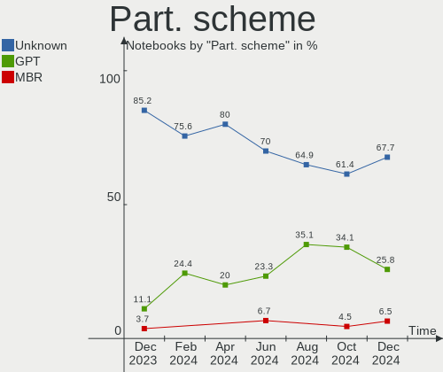
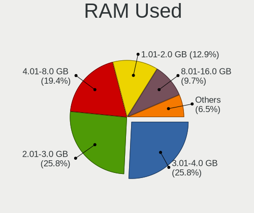
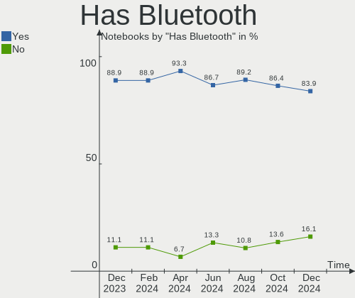
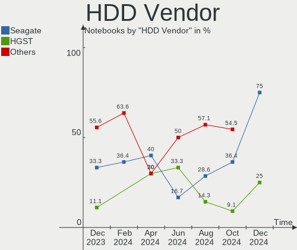
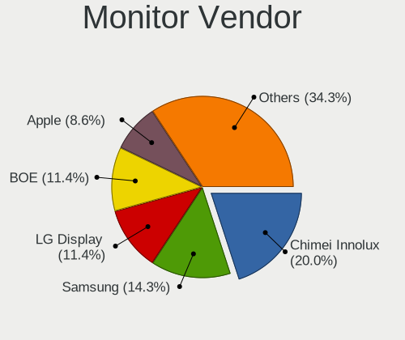

KDE neon Hardware Trends (Notebooks)
------------------------------------

A project to identify most popular hardware characteristics and track their change
over time based on data collected by KDE neon users at https://Linux-Hardware.org.

Anyone can contribute to this report by the [hw-probe](https://github.com/linuxhw/hw-probe) tool:

    sudo -E hw-probe -all -upload

Full-feature report is available here: https://linux-hardware.org/?view=trends

Period: Feb, 2022.

Contents
--------

* [ System ](#system)
  - [ OS                       ](#os)
  - [ OS Family                ](#os-family)
  - [ Kernel                   ](#kernel)
  - [ Kernel Family            ](#kernel-family)
  - [ Kernel Major Ver.        ](#kernel-major-ver)
  - [ Arch                     ](#arch)
  - [ DE                       ](#de)
  - [ Display Server           ](#display-server)
  - [ Display Manager          ](#display-manager)
  - [ OS Lang                  ](#os-lang)
  - [ Boot Mode                ](#boot-mode)
  - [ Filesystem               ](#filesystem)
  - [ Part. scheme             ](#part-scheme)
  - [ Dual Boot with Linux/BSD ](#dual-boot-with-linuxbsd)
  - [ Dual Boot (Win)          ](#dual-boot-win)

* [ Board ](#board)
  - [ Vendor                   ](#vendor)
  - [ Model                    ](#model)
  - [ Model Family             ](#model-family)
  - [ MFG Year                 ](#mfg-year)
  - [ Form Factor              ](#form-factor)
  - [ Secure Boot              ](#secure-boot)
  - [ Coreboot                 ](#coreboot)
  - [ RAM Size                 ](#ram-size)
  - [ RAM Used                 ](#ram-used)
  - [ Total Drives             ](#total-drives)
  - [ Has CD-ROM               ](#has-cd-rom)
  - [ Has Ethernet             ](#has-ethernet)
  - [ Has WiFi                 ](#has-wifi)
  - [ Has Bluetooth            ](#has-bluetooth)

* [ Location ](#location)
  - [ Country                  ](#country)
  - [ City                     ](#city)

* [ Drives ](#drives)
  - [ Drive Vendor             ](#drive-vendor)
  - [ Drive Model              ](#drive-model)
  - [ HDD Vendor               ](#hdd-vendor)
  - [ SSD Vendor               ](#ssd-vendor)
  - [ Drive Kind               ](#drive-kind)
  - [ Drive Connector          ](#drive-connector)
  - [ Drive Size               ](#drive-size)
  - [ Space Total              ](#space-total)
  - [ Space Used               ](#space-used)
  - [ Malfunc. Drives          ](#malfunc-drives)
  - [ Malfunc. Drive Vendor    ](#malfunc-drive-vendor)
  - [ Malfunc. HDD Vendor      ](#malfunc-hdd-vendor)
  - [ Malfunc. Drive Kind      ](#malfunc-drive-kind)
  - [ Failed Drives            ](#failed-drives)
  - [ Failed Drive Vendor      ](#failed-drive-vendor)
  - [ Drive Status             ](#drive-status)

* [ Storage controller ](#storage-controller)
  - [ Storage Vendor           ](#storage-vendor)
  - [ Storage Model            ](#storage-model)
  - [ Storage Kind             ](#storage-kind)

* [ Processor ](#processor)
  - [ CPU Vendor               ](#cpu-vendor)
  - [ CPU Model                ](#cpu-model)
  - [ CPU Model Family         ](#cpu-model-family)
  - [ CPU Cores                ](#cpu-cores)
  - [ CPU Sockets              ](#cpu-sockets)
  - [ CPU Threads              ](#cpu-threads)
  - [ CPU Op-Modes             ](#cpu-op-modes)
  - [ CPU Microcode            ](#cpu-microcode)
  - [ CPU Microarch            ](#cpu-microarch)

* [ Graphics ](#graphics)
  - [ GPU Vendor               ](#gpu-vendor)
  - [ GPU Model                ](#gpu-model)
  - [ GPU Combo                ](#gpu-combo)
  - [ GPU Driver               ](#gpu-driver)
  - [ GPU Memory               ](#gpu-memory)

* [ Monitor ](#monitor)
  - [ Monitor Vendor           ](#monitor-vendor)
  - [ Monitor Model            ](#monitor-model)
  - [ Monitor Resolution       ](#monitor-resolution)
  - [ Monitor Diagonal         ](#monitor-diagonal)
  - [ Monitor Width            ](#monitor-width)
  - [ Aspect Ratio             ](#aspect-ratio)
  - [ Monitor Area             ](#monitor-area)
  - [ Pixel Density            ](#pixel-density)
  - [ Multiple Monitors        ](#multiple-monitors)

* [ Network ](#network)
  - [ Net Controller Vendor    ](#net-controller-vendor)
  - [ Net Controller Model     ](#net-controller-model)
  - [ Wireless Vendor          ](#wireless-vendor)
  - [ Wireless Model           ](#wireless-model)
  - [ Ethernet Vendor          ](#ethernet-vendor)
  - [ Ethernet Model           ](#ethernet-model)
  - [ Net Controller Kind      ](#net-controller-kind)
  - [ Used Controller          ](#used-controller)
  - [ NICs                     ](#nics)
  - [ IPv6                     ](#ipv6)

* [ Bluetooth ](#bluetooth)
  - [ Bluetooth Vendor         ](#bluetooth-vendor)
  - [ Bluetooth Model          ](#bluetooth-model)

* [ Sound ](#sound)
  - [ Sound Vendor             ](#sound-vendor)
  - [ Sound Model              ](#sound-model)

* [ Memory ](#memory)
  - [ Memory Vendor            ](#memory-vendor)
  - [ Memory Model             ](#memory-model)
  - [ Memory Kind              ](#memory-kind)
  - [ Memory Form Factor       ](#memory-form-factor)
  - [ Memory Size              ](#memory-size)
  - [ Memory Speed             ](#memory-speed)

* [ Printers & scanners ](#printers--scanners)
  - [ Printer Vendor           ](#printer-vendor)
  - [ Printer Model            ](#printer-model)
  - [ Scanner Vendor           ](#scanner-vendor)
  - [ Scanner Model            ](#scanner-model)

* [ Camera ](#camera)
  - [ Camera Vendor            ](#camera-vendor)
  - [ Camera Model             ](#camera-model)

* [ Security ](#security)
  - [ Fingerprint Vendor       ](#fingerprint-vendor)
  - [ Fingerprint Model        ](#fingerprint-model)
  - [ Chipcard Vendor          ](#chipcard-vendor)
  - [ Chipcard Model           ](#chipcard-model)

* [ Unsupported ](#unsupported)
  - [ Unsupported Devices      ](#unsupported-devices)
  - [ Unsupported Device Types ](#unsupported-device-types)

System
------

OS
--

Installed operating systems

| Name           | Notebooks | Percent |
|----------------|-----------|---------|
| KDE neon 20.04 | 80        | 100%    |

OS Family
---------

OS without a version

| Name     | Notebooks | Percent |
|----------|-----------|---------|
| KDE neon | 80        | 100%    |

Kernel
------

Version of the Linux kernel

| Version           | Notebooks | Percent |
|-------------------|-----------|---------|
| 5.13.0-28-generic | 50        | 62.5%   |
| 5.13.0-30-generic | 24        | 30%     |
| 5.11.0-46-generic | 3         | 3.75%   |
| 5.4.0-96-generic  | 1         | 1.25%   |
| 5.13.0-27-generic | 1         | 1.25%   |
| 5.11.0-43-generic | 1         | 1.25%   |

Kernel Family
-------------

Linux kernel without a distro release

| Version | Notebooks | Percent |
|---------|-----------|---------|
| 5.13.0  | 75        | 93.75%  |
| 5.11.0  | 4         | 5%      |
| 5.4.0   | 1         | 1.25%   |

Kernel Major Ver.
-----------------

Linux kernel major version

| Version | Notebooks | Percent |
|---------|-----------|---------|
| 5.13    | 75        | 93.75%  |
| 5.11    | 4         | 5%      |
| 5.4     | 1         | 1.25%   |

Arch
----

OS architecture (x86_64, i586, etc.)

| Name   | Notebooks | Percent |
|--------|-----------|---------|
| x86_64 | 80        | 100%    |

DE
--

Desktop Environment

| Name    | Notebooks | Percent |
|---------|-----------|---------|
| KDE5    | 78        | 97.5%   |
| GNOME   | 1         | 1.25%   |
| Unknown | 1         | 1.25%   |

Display Server
--------------

X11 or Wayland

| Name    | Notebooks | Percent |
|---------|-----------|---------|
| X11     | 74        | 92.5%   |
| Wayland | 6         | 7.5%    |

Display Manager
---------------

SDDM, LightDM, etc.

| Name    | Notebooks | Percent |
|---------|-----------|---------|
| Unknown | 55        | 68.75%  |
| SDDM    | 24        | 30%     |
| GDM     | 1         | 1.25%   |

OS Lang
-------

Language

| Lang  | Notebooks | Percent |
|-------|-----------|---------|
| en_US | 32        | 40%     |
| en_GB | 9         | 11.25%  |
| pt_BR | 8         | 10%     |
| it_IT | 5         | 6.25%   |
| de_DE | 5         | 6.25%   |
| ru_RU | 2         | 2.5%    |
| es_ES | 2         | 2.5%    |
| en_CA | 2         | 2.5%    |
| ru_UA | 1         | 1.25%   |
| ro_RO | 1         | 1.25%   |
| nn_NO | 1         | 1.25%   |
| nl_BE | 1         | 1.25%   |
| ko_KR | 1         | 1.25%   |
| fr_CH | 1         | 1.25%   |
| es_US | 1         | 1.25%   |
| es_CL | 1         | 1.25%   |
| en_ZA | 1         | 1.25%   |
| en_IN | 1         | 1.25%   |
| en_AU | 1         | 1.25%   |
| de_AT | 1         | 1.25%   |
| C     | 1         | 1.25%   |
| bg_BG | 1         | 1.25%   |
| ar_IQ | 1         | 1.25%   |

Boot Mode
---------

EFI or BIOS

| Mode | Notebooks | Percent |
|------|-----------|---------|
| EFI  | 55        | 68.75%  |
| BIOS | 25        | 31.25%  |

Filesystem
----------

Type of filesystem

| Type  | Notebooks | Percent |
|-------|-----------|---------|
| Ext4  | 78        | 97.5%   |
| Btrfs | 2         | 2.5%    |

Part. scheme
------------

Scheme of partitioning

| Type    | Notebooks | Percent |
|---------|-----------|---------|
| Unknown | 68        | 85%     |
| GPT     | 11        | 13.75%  |
| MBR     | 1         | 1.25%   |

Dual Boot with Linux/BSD
------------------------

Hosting more than one Linux/BSD

| Dual boot | Notebooks | Percent |
|-----------|-----------|---------|
| No        | 78        | 97.5%   |
| Yes       | 2         | 2.5%    |

Dual Boot (Win)
---------------

Hosting Linux and Windows

| Dual boot | Notebooks | Percent |
|-----------|-----------|---------|
| No        | 70        | 87.5%   |
| Yes       | 10        | 12.5%   |

Board
-----

Vendor
------

Motherboard manufacturer

| Name                | Notebooks | Percent |
|---------------------|-----------|---------|
| Hewlett-Packard     | 19        | 23.75%  |
| Dell                | 14        | 17.5%   |
| Lenovo              | 9         | 11.25%  |
| ASUSTek Computer    | 9         | 11.25%  |
| Acer                | 6         | 7.5%    |
| Samsung Electronics | 5         | 6.25%   |
| Toshiba             | 4         | 5%      |
| Apple               | 3         | 3.75%   |
| MSI                 | 2         | 2.5%    |
| Jumper              | 2         | 2.5%    |
| Teclast             | 1         | 1.25%   |
| Razer               | 1         | 1.25%   |
| LG Electronics      | 1         | 1.25%   |
| HUAWEI              | 1         | 1.25%   |
| HANSUNG COMPUTER    | 1         | 1.25%   |
| Gigabyte Technology | 1         | 1.25%   |
| Fujitsu             | 1         | 1.25%   |

Model
-----

Motherboard model

| Name                                   | Notebooks | Percent |
|----------------------------------------|-----------|---------|
| Jumper EZbook                          | 2         | 2.5%    |
| HP Pavilion Gaming Laptop 15-dk0xxx    | 2         | 2.5%    |
| Dell Latitude E6520                    | 2         | 2.5%    |
| Toshiba TECRA M10                      | 1         | 1.25%   |
| Toshiba Satellite L750                 | 1         | 1.25%   |
| Toshiba Satellite L505                 | 1         | 1.25%   |
| Toshiba Satellite C655D                | 1         | 1.25%   |
| Teclast F7S                            | 1         | 1.25%   |
| Samsung 670Z5E                         | 1         | 1.25%   |
| Samsung 550XDA                         | 1         | 1.25%   |
| Samsung 530XBB                         | 1         | 1.25%   |
| Samsung 530U3C/530U4C/532U3C           | 1         | 1.25%   |
| Samsung 340XAA/350XAA/550XAA           | 1         | 1.25%   |
| Razer Blade                            | 1         | 1.25%   |
| MSI Katana GF76 11UD                   | 1         | 1.25%   |
| MSI GE75 Raider 10SE                   | 1         | 1.25%   |
| LG U460-G.BG51P1                       | 1         | 1.25%   |
| Lenovo ThinkPad T430 2349GAG           | 1         | 1.25%   |
| Lenovo ThinkPad S1 Yoga 12 20DKA00B00  | 1         | 1.25%   |
| Lenovo ThinkPad P14s Gen 2i 20VX0068GE | 1         | 1.25%   |
| Lenovo ThinkPad P14s Gen 2a 21A0003LUS | 1         | 1.25%   |
| Lenovo ThinkPad E15 Gen 3 20YG006HGE   | 1         | 1.25%   |
| Lenovo IdeaPad Y700-15ISK 80NV         | 1         | 1.25%   |
| Lenovo IdeaPad Gaming 3 15ARH05 82EY   | 1         | 1.25%   |
| Lenovo IdeaPad 500-15ISK 80NT          | 1         | 1.25%   |
| Lenovo B560 43308VG                    | 1         | 1.25%   |
| HUAWEI KLVL-WXXW                       | 1         | 1.25%   |
| HP Stream Laptop 11-ak0xxx             | 1         | 1.25%   |
| HP ProBook 450 G8 Notebook PC          | 1         | 1.25%   |
| HP ProBook 450 G6                      | 1         | 1.25%   |
| HP ProBook 430 G7                      | 1         | 1.25%   |
| HP Pavilion Notebook                   | 1         | 1.25%   |
| HP Pavilion Gaming Laptop 15-dk1xxx    | 1         | 1.25%   |
| HP OMEN Laptop 15-ek0xxx               | 1         | 1.25%   |
| HP Notebook                            | 1         | 1.25%   |
| HP Laptop 15-db0xxx                    | 1         | 1.25%   |
| HP Laptop 15-bs0xx                     | 1         | 1.25%   |
| HP EliteBook Folio 9470m               | 1         | 1.25%   |
| HP EliteBook Folio 1040 G3             | 1         | 1.25%   |
| HP EliteBook 850 G7 Notebook PC        | 1         | 1.25%   |
| HP EliteBook 840 G7 Notebook PC        | 1         | 1.25%   |
| HP Compaq 8510w                        | 1         | 1.25%   |
| HP 255 G7 Notebook PC                  | 1         | 1.25%   |
| HP 250 G6 Notebook PC                  | 1         | 1.25%   |
| HANSUNG COMPUTER EX58                  | 1         | 1.25%   |
| Gigabyte AERO 15-WA                    | 1         | 1.25%   |
| Fujitsu LIFEBOOK T901                  | 1         | 1.25%   |
| Dell Vostro 5470                       | 1         | 1.25%   |
| Dell Precision 3551                    | 1         | 1.25%   |
| Dell Precision 3520                    | 1         | 1.25%   |
| Dell Precision 3510                    | 1         | 1.25%   |
| Dell Latitude E7440                    | 1         | 1.25%   |
| Dell Latitude E6430                    | 1         | 1.25%   |
| Dell Latitude 5480                     | 1         | 1.25%   |
| Dell Latitude 3510                     | 1         | 1.25%   |
| Dell Inspiron 7520                     | 1         | 1.25%   |
| Dell Inspiron 3541                     | 1         | 1.25%   |
| Dell Inspiron 3137                     | 1         | 1.25%   |
| Dell Inspiron 1545                     | 1         | 1.25%   |
| ASUS X75VC                             | 1         | 1.25%   |

Model Family
------------

Motherboard model prefix

| Name                  | Notebooks | Percent |
|-----------------------|-----------|---------|
| Dell Latitude         | 6         | 7.5%    |
| Lenovo ThinkPad       | 5         | 6.25%   |
| ASUS Vivobook         | 5         | 6.25%   |
| HP Pavilion           | 4         | 5%      |
| HP EliteBook          | 4         | 5%      |
| Dell Inspiron         | 4         | 5%      |
| Acer Aspire           | 4         | 5%      |
| Toshiba Satellite     | 3         | 3.75%   |
| Lenovo IdeaPad        | 3         | 3.75%   |
| HP ProBook            | 3         | 3.75%   |
| Dell Precision        | 3         | 3.75%   |
| Jumper EZbook         | 2         | 2.5%    |
| HP Laptop             | 2         | 2.5%    |
| Toshiba TECRA         | 1         | 1.25%   |
| Teclast F7S           | 1         | 1.25%   |
| Samsung 670Z5E        | 1         | 1.25%   |
| Samsung 550XDA        | 1         | 1.25%   |
| Samsung 530XBB        | 1         | 1.25%   |
| Samsung 530U3C        | 1         | 1.25%   |
| Samsung 340XAA        | 1         | 1.25%   |
| Razer Blade           | 1         | 1.25%   |
| MSI Katana            | 1         | 1.25%   |
| MSI GE75              | 1         | 1.25%   |
| LG U460-G.BG51P1      | 1         | 1.25%   |
| Lenovo B560           | 1         | 1.25%   |
| HUAWEI KLVL-WXXW      | 1         | 1.25%   |
| HP Stream             | 1         | 1.25%   |
| HP OMEN               | 1         | 1.25%   |
| HP Notebook           | 1         | 1.25%   |
| HP Compaq             | 1         | 1.25%   |
| HP 255                | 1         | 1.25%   |
| HP 250                | 1         | 1.25%   |
| HANSUNG COMPUTER EX58 | 1         | 1.25%   |
| Gigabyte AERO         | 1         | 1.25%   |
| Fujitsu LIFEBOOK      | 1         | 1.25%   |
| Dell Vostro           | 1         | 1.25%   |
| ASUS X75VC            | 1         | 1.25%   |
| ASUS TUF              | 1         | 1.25%   |
| ASUS N550JV           | 1         | 1.25%   |
| ASUS G53SW            | 1         | 1.25%   |
| Apple MacBookPro10    | 1         | 1.25%   |
| Apple MacBookAir6     | 1         | 1.25%   |
| Apple MacBookAir5     | 1         | 1.25%   |
| Acer Swift            | 1         | 1.25%   |
| Acer Predator         | 1         | 1.25%   |

MFG Year
--------

Motherboard manufacture year

| Year | Notebooks | Percent |
|------|-----------|---------|
| 2020 | 17        | 21.25%  |
| 2018 | 8         | 10%     |
| 2021 | 7         | 8.75%   |
| 2012 | 7         | 8.75%   |
| 2011 | 7         | 8.75%   |
| 2019 | 6         | 7.5%    |
| 2013 | 6         | 7.5%    |
| 2017 | 5         | 6.25%   |
| 2015 | 5         | 6.25%   |
| 2014 | 5         | 6.25%   |
| 2016 | 2         | 2.5%    |
| 2008 | 2         | 2.5%    |
| 2010 | 1         | 1.25%   |
| 2009 | 1         | 1.25%   |
| 2007 | 1         | 1.25%   |

Form Factor
-----------

Physical design of the computer

| Name     | Notebooks | Percent |
|----------|-----------|---------|
| Notebook | 80        | 100%    |

Secure Boot
-----------

Enabled or disabled

| State    | Notebooks | Percent |
|----------|-----------|---------|
| Disabled | 70        | 87.5%   |
| Enabled  | 10        | 12.5%   |

Coreboot
--------

Have coreboot on board

| Used | Notebooks | Percent |
|------|-----------|---------|
| No   | 80        | 100%    |

RAM Size
--------

Total RAM memory

| Size in GB | Notebooks | Percent |
|------------|-----------|---------|
| 4.01-8.0   | 29        | 36.25%  |
| 16.01-24.0 | 17        | 21.25%  |
| 3.01-4.0   | 16        | 20%     |
| 8.01-16.0  | 11        | 13.75%  |
| 32.01-64.0 | 4         | 5%      |
| 1.01-2.0   | 2         | 2.5%    |
| 24.01-32.0 | 1         | 1.25%   |

RAM Used
--------

Used RAM memory

| Used GB   | Notebooks | Percent |
|-----------|-----------|---------|
| 1.01-2.0  | 25        | 31.25%  |
| 2.01-3.0  | 20        | 25%     |
| 4.01-8.0  | 14        | 17.5%   |
| 3.01-4.0  | 12        | 15%     |
| 8.01-16.0 | 5         | 6.25%   |
| 0.51-1.0  | 4         | 5%      |

Total Drives
------------

Number of drives on board

| Drives | Notebooks | Percent |
|--------|-----------|---------|
| 1      | 59        | 73.75%  |
| 2      | 18        | 22.5%   |
| 3      | 3         | 3.75%   |

Has CD-ROM
----------

Has CD-ROM on board

| Presented | Notebooks | Percent |
|-----------|-----------|---------|
| No        | 58        | 72.5%   |
| Yes       | 22        | 27.5%   |

Has Ethernet
------------

Has Ethernet on board

| Presented | Notebooks | Percent |
|-----------|-----------|---------|
| Yes       | 67        | 83.75%  |
| No        | 13        | 16.25%  |

Has WiFi
--------

Has WiFi module

| Presented | Notebooks | Percent |
|-----------|-----------|---------|
| Yes       | 80        | 100%    |

Has Bluetooth
-------------

Has Bluetooth module

| Presented | Notebooks | Percent |
|-----------|-----------|---------|
| Yes       | 67        | 83.75%  |
| No        | 13        | 16.25%  |

Location
--------

Country
-------

Geographic location (country)

| Country      | Notebooks | Percent |
|--------------|-----------|---------|
| USA          | 15        | 18.75%  |
| Brazil       | 10        | 12.5%   |
| UK           | 9         | 11.25%  |
| Italy        | 6         | 7.5%    |
| Germany      | 5         | 6.25%   |
| Spain        | 3         | 3.75%   |
| Switzerland  | 2         | 2.5%    |
| Russia       | 2         | 2.5%    |
| Mexico       | 2         | 2.5%    |
| France       | 2         | 2.5%    |
| Canada       | 2         | 2.5%    |
| Uzbekistan   | 1         | 1.25%   |
| Ukraine      | 1         | 1.25%   |
| Sweden       | 1         | 1.25%   |
| South Korea  | 1         | 1.25%   |
| South Africa | 1         | 1.25%   |
| Slovenia     | 1         | 1.25%   |
| Romania      | 1         | 1.25%   |
| Puerto Rico  | 1         | 1.25%   |
| Portugal     | 1         | 1.25%   |
| Panama       | 1         | 1.25%   |
| Pakistan     | 1         | 1.25%   |
| Iraq         | 1         | 1.25%   |
| Indonesia    | 1         | 1.25%   |
| India        | 1         | 1.25%   |
| Hungary      | 1         | 1.25%   |
| Egypt        | 1         | 1.25%   |
| Czechia      | 1         | 1.25%   |
| Chile        | 1         | 1.25%   |
| Bulgaria     | 1         | 1.25%   |
| Belgium      | 1         | 1.25%   |
| Austria      | 1         | 1.25%   |
| Australia    | 1         | 1.25%   |

City
----

Geographic location (city)

| City                      | Notebooks | Percent |
|---------------------------|-----------|---------|
| Rome                      | 3         | 3.75%   |
| Rio de Janeiro            | 2         | 2.5%    |
| Paris                     | 2         | 2.5%    |
| Maracaja                  | 2         | 2.5%    |
| Cesano Boscone            | 2         | 2.5%    |
| Zurich                    | 1         | 1.25%   |
| Yangcheon-gu              | 1         | 1.25%   |
| Winslow                   | 1         | 1.25%   |
| Winnipeg                  | 1         | 1.25%   |
| Walsall                   | 1         | 1.25%   |
| Walkersville              | 1         | 1.25%   |
| Vancouver                 | 1         | 1.25%   |
| Teresina                  | 1         | 1.25%   |
| Tashkent                  | 1         | 1.25%   |
| Stockholm                 | 1         | 1.25%   |
| Sofia                     | 1         | 1.25%   |
| Scunthorpe                | 1         | 1.25%   |
| São Paulo              | 1         | 1.25%   |
| Santiago                  | 1         | 1.25%   |
| San Antonio               | 1         | 1.25%   |
| Sada                      | 1         | 1.25%   |
| Rochester                 | 1         | 1.25%   |
| Reading                   | 1         | 1.25%   |
| Rahim Yar Khan            | 1         | 1.25%   |
| Queretaro                 | 1         | 1.25%   |
| Prague                    | 1         | 1.25%   |
| Portland                  | 1         | 1.25%   |
| Pine Bluff                | 1         | 1.25%   |
| Panama City               | 1         | 1.25%   |
| Paisley                   | 1         | 1.25%   |
| Moscow                    | 1         | 1.25%   |
| Mooresville               | 1         | 1.25%   |
| Moguer                    | 1         | 1.25%   |
| Melbourne                 | 1         | 1.25%   |
| Marietta                  | 1         | 1.25%   |
| Ljubljana                 | 1         | 1.25%   |
| Lisbon                    | 1         | 1.25%   |
| Leipzig                   | 1         | 1.25%   |
| Le Sentier                | 1         | 1.25%   |
| Kisvarda                  | 1         | 1.25%   |
| Kirov                     | 1         | 1.25%   |
| Kaiserslautern            | 1         | 1.25%   |
| Jersey City               | 1         | 1.25%   |
| Jandira                   | 1         | 1.25%   |
| Jakarta                   | 1         | 1.25%   |
| Ipswich                   | 1         | 1.25%   |
| Hunedoara                 | 1         | 1.25%   |
| Huixquilucan de Degollado | 1         | 1.25%   |
| High Wycombe              | 1         | 1.25%   |
| Guayama                   | 1         | 1.25%   |
| Guaíba                   | 1         | 1.25%   |
| Graz                      | 1         | 1.25%   |
| Gevelsberg                | 1         | 1.25%   |
| Georgetown                | 1         | 1.25%   |
| Evansville                | 1         | 1.25%   |
| Essen                     | 1         | 1.25%   |
| Durban                    | 1         | 1.25%   |
| Duhok                     | 1         | 1.25%   |
| Columbia                  | 1         | 1.25%   |
| Chester-le-Street         | 1         | 1.25%   |

Drives
------

Drive Vendor
------------

Hard drive vendors

| Vendor              | Notebooks | Drives | Percent |
|---------------------|-----------|--------|---------|
| Toshiba             | 13        | 14     | 12.87%  |
| Samsung Electronics | 13        | 13     | 12.87%  |
| WDC                 | 12        | 12     | 11.88%  |
| Unknown             | 10        | 10     | 9.9%    |
| Seagate             | 8         | 8      | 7.92%   |
| SanDisk             | 7         | 7      | 6.93%   |
| SK Hynix            | 5         | 5      | 4.95%   |
| Intel               | 5         | 5      | 4.95%   |
| Micron Technology   | 4         | 4      | 3.96%   |
| Kingston            | 3         | 3      | 2.97%   |
| LITEONIT            | 2         | 2      | 1.98%   |
| Crucial             | 2         | 2      | 1.98%   |
| China               | 2         | 2      | 1.98%   |
| Apple               | 2         | 2      | 1.98%   |
| walram              | 1         | 1      | 0.99%   |
| V-GeN               | 1         | 1      | 0.99%   |
| PLEXTOR             | 1         | 1      | 0.99%   |
| Phison              | 1         | 1      | 0.99%   |
| LITEON              | 1         | 1      | 0.99%   |
| Lexar               | 1         | 1      | 0.99%   |
| Intenso             | 1         | 1      | 0.99%   |
| HS-SSD-C100         | 1         | 1      | 0.99%   |
| Hitachi             | 1         | 1      | 0.99%   |
| HGST                | 1         | 1      | 0.99%   |
| GOODRAM             | 1         | 1      | 0.99%   |
| Fujitsu             | 1         | 1      | 0.99%   |
| A-DATA Technology   | 1         | 1      | 0.99%   |

Drive Model
-----------

Hard drive models

| Model                                   | Notebooks | Percent |
|-----------------------------------------|-----------|---------|
| Unknown MMC Card  128GB                 | 4         | 3.92%   |
| Toshiba NVMe SSD Drive 512GB            | 3         | 2.94%   |
| Unknown MMC Card  64GB                  | 2         | 1.96%   |
| Unknown MMC Card  32GB                  | 2         | 1.96%   |
| Toshiba MQ04ABF100 1TB                  | 2         | 1.96%   |
| Toshiba MQ01ABF050 500GB                | 2         | 1.96%   |
| SK Hynix NVMe SSD Drive 256GB           | 2         | 1.96%   |
| Seagate ST500LT012-1DG142 500GB         | 2         | 1.96%   |
| Sandisk NVMe SSD Drive 512GB            | 2         | 1.96%   |
| Sandisk NVMe SSD Drive 256GB            | 2         | 1.96%   |
| Samsung NVMe SSD Drive 512GB            | 2         | 1.96%   |
| Kingston SA400S37240G 240GB SSD         | 2         | 1.96%   |
| Intel NVMe SSD Drive 512GB              | 2         | 1.96%   |
| WDC WDS500G2B0A-00SM50 500GB SSD        | 1         | 0.98%   |
| WDC WDBNCE0010PNC 1TB SSD               | 1         | 0.98%   |
| WDC WD5000LPZX-35Z10T0 500GB            | 1         | 0.98%   |
| WDC WD5000LPVX-75V0TT0 500GB            | 1         | 0.98%   |
| WDC WD5000LPCX-60VHAT1 500GB            | 1         | 0.98%   |
| WDC WD1600BEVT-75ZCT2 160GB             | 1         | 0.98%   |
| WDC WD1600BEVT-00A23T0 160GB            | 1         | 0.98%   |
| WDC WD10SPZX-80Z10T2 1TB                | 1         | 0.98%   |
| WDC WD10SPZX-75Z10T3 1TB                | 1         | 0.98%   |
| WDC WD10SPZX-22Z10T0 1TB                | 1         | 0.98%   |
| WDC WD10SPZX-21Z10T0 1TB                | 1         | 0.98%   |
| WDC PC SN520 SDAPNUW-256G-1014 256GB    | 1         | 0.98%   |
| walram 240G                             | 1         | 0.98%   |
| V-GeN V-GEN11AS19FS120SS 120GB          | 1         | 0.98%   |
| Unknown SA32G  32GB                     | 1         | 0.98%   |
| Unknown External 250GB                  | 1         | 0.98%   |
| Toshiba THNSFJ256GCSU 256GB SSD         | 1         | 0.98%   |
| Toshiba THNSFC128GBSJ SSD               | 1         | 0.98%   |
| Toshiba Q300. 480GB SSD                 | 1         | 0.98%   |
| Toshiba MQ01ABD100 1TB                  | 1         | 0.98%   |
| Toshiba MQ01ABD050 500GB                | 1         | 0.98%   |
| Toshiba MK3275GSX 320GB                 | 1         | 0.98%   |
| Toshiba KSG60ZMV256G M.2 2280 256GB SSD | 1         | 0.98%   |
| SK Hynix SKHynix_HFS512GDE9X081N 512GB  | 1         | 0.98%   |
| SK Hynix SC308 SATA 256GB SSD           | 1         | 0.98%   |
| SK Hynix BC511 HFM256GDJTNI-82A0A 256GB | 1         | 0.98%   |
| Seagate ST500LM030-1RK17D 500GB         | 1         | 0.98%   |
| Seagate ST500LM012 HN-M500MBB 500GB     | 1         | 0.98%   |
| Seagate ST2000LM003 HN-M201RAD 2TB      | 1         | 0.98%   |
| Seagate ST1000LM048-2E7172 1TB          | 1         | 0.98%   |
| Seagate ST1000LM024 HN-M101MBB 1TB      | 1         | 0.98%   |
| Seagate Expansion+ 2TB                  | 1         | 0.98%   |
| SanDisk SSD i100 24GB                   | 1         | 0.98%   |
| SanDisk SD9SN8W256G1102 256GB SSD       | 1         | 0.98%   |
| Sandisk NVMe SSD Drive 500GB            | 1         | 0.98%   |
| Samsung SSD 860 PRO 256GB               | 1         | 0.98%   |
| Samsung SSD 850 EVO 250GB               | 1         | 0.98%   |
| Samsung SM963 2.5" NVMe PCIe SSD 256GB  | 1         | 0.98%   |
| Samsung PSSD T7 1TB                     | 1         | 0.98%   |
| Samsung NVMe SSD Drive 500GB            | 1         | 0.98%   |
| Samsung NVMe SSD Drive 2TB              | 1         | 0.98%   |
| Samsung NVMe SSD Drive 1TB              | 1         | 0.98%   |
| Samsung NVMe SSD Drive 1024GB           | 1         | 0.98%   |
| Samsung MZVLQ512HALU-000H1 512GB        | 1         | 0.98%   |
| Samsung MZNLN256HAJQ-00000 256GB SSD    | 1         | 0.98%   |
| Samsung MZMPC032HBCD-00000 32GB SSD     | 1         | 0.98%   |
| PLEXTOR PH6-CE120 120GB SSD             | 1         | 0.98%   |

HDD Vendor
----------

Hard disk drive vendors

| Vendor  | Notebooks | Drives | Percent |
|---------|-----------|--------|---------|
| WDC     | 9         | 9      | 33.33%  |
| Seagate | 8         | 8      | 29.63%  |
| Toshiba | 7         | 7      | 25.93%  |
| Hitachi | 1         | 1      | 3.7%    |
| HGST    | 1         | 1      | 3.7%    |
| Fujitsu | 1         | 1      | 3.7%    |

SSD Vendor
----------

Solid state drive vendors

| Vendor              | Notebooks | Drives | Percent |
|---------------------|-----------|--------|---------|
| Samsung Electronics | 5         | 5      | 13.89%  |
| Toshiba             | 4         | 4      | 11.11%  |
| Micron Technology   | 3         | 3      | 8.33%   |
| Kingston            | 3         | 3      | 8.33%   |
| WDC                 | 2         | 2      | 5.56%   |
| SanDisk             | 2         | 2      | 5.56%   |
| LITEONIT            | 2         | 2      | 5.56%   |
| Crucial             | 2         | 2      | 5.56%   |
| China               | 2         | 2      | 5.56%   |
| Apple               | 2         | 2      | 5.56%   |
| Unknown             | 1         | 1      | 2.78%   |
| SK Hynix            | 1         | 1      | 2.78%   |
| PLEXTOR             | 1         | 1      | 2.78%   |
| LITEON              | 1         | 1      | 2.78%   |
| Lexar               | 1         | 1      | 2.78%   |
| Intenso             | 1         | 1      | 2.78%   |
| Intel               | 1         | 1      | 2.78%   |
| GOODRAM             | 1         | 1      | 2.78%   |
| A-DATA Technology   | 1         | 1      | 2.78%   |

Drive Kind
----------

HDD or SSD

| Kind    | Notebooks | Drives | Percent |
|---------|-----------|--------|---------|
| SSD     | 32        | 36     | 32.99%  |
| HDD     | 27        | 27     | 27.84%  |
| NVMe    | 26        | 27     | 26.8%   |
| MMC     | 9         | 9      | 9.28%   |
| Unknown | 3         | 3      | 3.09%   |

Drive Connector
---------------

SATA, SAS, NVMe, etc.

| Type | Notebooks | Drives | Percent |
|------|-----------|--------|---------|
| SATA | 53        | 62     | 57.61%  |
| NVMe | 26        | 27     | 28.26%  |
| MMC  | 9         | 9      | 9.78%   |
| SAS  | 4         | 4      | 4.35%   |

Drive Size
----------

Size of hard drive

| Size in TB | Notebooks | Drives | Percent |
|------------|-----------|--------|---------|
| 0.01-0.5   | 43        | 49     | 75.44%  |
| 0.51-1.0   | 12        | 12     | 21.05%  |
| 1.01-2.0   | 2         | 2      | 3.51%   |

Space Total
-----------

Amount of disk space available on the file system

| Size in GB     | Notebooks | Percent |
|----------------|-----------|---------|
| 101-250        | 31        | 38.75%  |
| 251-500        | 25        | 31.25%  |
| 51-100         | 7         | 8.75%   |
| 501-1000       | 6         | 7.5%    |
| 1-20           | 4         | 5%      |
| 21-50          | 3         | 3.75%   |
| More than 3000 | 2         | 2.5%    |
| 1001-2000      | 1         | 1.25%   |
| Unknown        | 1         | 1.25%   |

Space Used
----------

Amount of used disk space

| Used GB        | Notebooks | Percent |
|----------------|-----------|---------|
| 1-20           | 39        | 48.75%  |
| 21-50          | 12        | 15%     |
| 101-250        | 10        | 12.5%   |
| 251-500        | 9         | 11.25%  |
| 51-100         | 7         | 8.75%   |
| More than 3000 | 1         | 1.25%   |
| 1001-2000      | 1         | 1.25%   |
| Unknown        | 1         | 1.25%   |

Malfunc. Drives
---------------

Drive models with a malfunction

Zero info for selected period =(

Malfunc. Drive Vendor
---------------------

Vendors of faulty drives

Zero info for selected period =(

Malfunc. HDD Vendor
-------------------

Vendors of faulty HDD drives

Zero info for selected period =(

Malfunc. Drive Kind
-------------------

Kinds of faulty drives

Zero info for selected period =(

Failed Drives
-------------

Failed drive models

Zero info for selected period =(

Failed Drive Vendor
-------------------

Failed drive vendors

Zero info for selected period =(

Drive Status
------------

Number of failed and malfunc. drives

| Status   | Notebooks | Drives | Percent |
|----------|-----------|--------|---------|
| Detected | 70        | 88     | 85.37%  |
| Works    | 12        | 14     | 14.63%  |

Storage controller
------------------

Storage Vendor
--------------

Storage controller vendors

| Vendor                       | Notebooks | Percent |
|------------------------------|-----------|---------|
| Intel                        | 63        | 67.74%  |
| Samsung Electronics          | 8         | 8.6%    |
| AMD                          | 7         | 7.53%   |
| Sandisk                      | 6         | 6.45%   |
| SK Hynix                     | 4         | 4.3%    |
| Toshiba America Info Systems | 3         | 3.23%   |
| Phison Electronics           | 1         | 1.08%   |
| Micron Technology            | 1         | 1.08%   |

Storage Model
-------------

Storage controller models

| Model                                                                            | Notebooks | Percent |
|----------------------------------------------------------------------------------|-----------|---------|
| Intel 7 Series Chipset Family 6-port SATA Controller [AHCI mode]                 | 11        | 11.22%  |
| Intel 82801 Mobile SATA Controller [RAID mode]                                   | 8         | 8.16%   |
| Intel Sunrise Point-LP SATA Controller [AHCI mode]                               | 6         | 6.12%   |
| AMD FCH SATA Controller [AHCI mode]                                              | 6         | 6.12%   |
| Sandisk WD Blue SN500 / PC SN520 NVMe SSD                                        | 4         | 4.08%   |
| Samsung NVMe SSD Controller 980                                                  | 4         | 4.08%   |
| Intel 6 Series/C200 Series Chipset Family 6 port Mobile SATA AHCI Controller     | 4         | 4.08%   |
| Samsung NVMe SSD Controller SM981/PM981/PM983                                    | 3         | 3.06%   |
| Intel Celeron/Pentium Silver Processor SATA Controller                           | 3         | 3.06%   |
| Intel Celeron N3350/Pentium N4200/Atom E3900 Series SATA AHCI Controller         | 3         | 3.06%   |
| Intel 82801IBM/IEM (ICH9M/ICH9M-E) 4 port SATA Controller [AHCI mode]            | 3         | 3.06%   |
| Toshiba America Info Systems Toshiba America Info Non-Volatile memory controller | 2         | 2.04%   |
| SK Hynix BC501 NVMe Solid State Drive                                            | 2         | 2.04%   |
| Intel Volume Management Device NVMe RAID Controller                              | 2         | 2.04%   |
| Intel SSD 660P Series                                                            | 2         | 2.04%   |
| Intel Q170/Q150/B150/H170/H110/Z170/CM236 Chipset SATA Controller [AHCI Mode]    | 2         | 2.04%   |
| Intel Non-Volatile memory controller                                             | 2         | 2.04%   |
| Intel HM170/QM170 Chipset SATA Controller [AHCI Mode]                            | 2         | 2.04%   |
| Intel Comet Lake SATA AHCI Controller                                            | 2         | 2.04%   |
| Intel 8 Series/C220 Series Chipset Family 6-port SATA Controller 1 [AHCI mode]   | 2         | 2.04%   |
| Intel 8 Series SATA Controller 1 [AHCI mode]                                     | 2         | 2.04%   |
| Intel 400 Series Chipset Family SATA AHCI Controller                             | 2         | 2.04%   |
| Toshiba America Info Systems XG6 NVMe SSD Controller                             | 1         | 1.02%   |
| SK Hynix Gold P31 SSD                                                            | 1         | 1.02%   |
| SK Hynix BC511                                                                   | 1         | 1.02%   |
| Sandisk WD Blue SN550 NVMe SSD                                                   | 1         | 1.02%   |
| Sandisk WD Black SN750 / PC SN730 NVMe SSD                                       | 1         | 1.02%   |
| Samsung NVMe SSD Controller PM9A1/PM9A3/980PRO                                   | 1         | 1.02%   |
| Phison PS5013 E13 NVMe Controller                                                | 1         | 1.02%   |
| Micron Non-Volatile memory controller                                            | 1         | 1.02%   |
| Intel Wildcat Point-LP SATA Controller [AHCI Mode]                               | 1         | 1.02%   |
| Intel Tiger Lake-LP SATA Controller [AHCI mode]                                  | 1         | 1.02%   |
| Intel SATA Controller [RAID mode]                                                | 1         | 1.02%   |
| Intel Ice Lake-LP SATA Controller [AHCI mode]                                    | 1         | 1.02%   |
| Intel Cannon Point-LP SATA Controller [AHCI Mode]                                | 1         | 1.02%   |
| Intel Cannon Lake Mobile PCH SATA AHCI Controller                                | 1         | 1.02%   |
| Intel 82801HM/HEM (ICH8M/ICH8M-E) SATA Controller [AHCI mode]                    | 1         | 1.02%   |
| Intel 82801HM/HEM (ICH8M/ICH8M-E) IDE Controller                                 | 1         | 1.02%   |
| Intel 500 Series Chipset Family SATA AHCI Controller                             | 1         | 1.02%   |
| Intel 5 Series/3400 Series Chipset 4 port SATA IDE Controller                    | 1         | 1.02%   |
| Intel 5 Series/3400 Series Chipset 2 port SATA IDE Controller                    | 1         | 1.02%   |
| Intel 200 Series PCH SATA controller [AHCI mode]                                 | 1         | 1.02%   |
| AMD SB7x0/SB8x0/SB9x0 SATA Controller [AHCI mode]                                | 1         | 1.02%   |

Storage Kind
------------

Kind of storage controller (IDE, SATA, NVMe, SAS, ...)

| Kind | Notebooks | Percent |
|------|-----------|---------|
| SATA | 57        | 59.38%  |
| NVMe | 26        | 27.08%  |
| RAID | 11        | 11.46%  |
| IDE  | 2         | 2.08%   |

Processor
---------

CPU Vendor
----------

Processor vendors

| Vendor | Notebooks | Percent |
|--------|-----------|---------|
| Intel  | 69        | 86.25%  |
| AMD    | 11        | 13.75%  |

CPU Model
---------

Processor models

| Model                                       | Notebooks | Percent |
|---------------------------------------------|-----------|---------|
| Intel Core i7-10510U CPU @ 1.80GHz          | 3         | 3.75%   |
| Intel Core i7-8565U CPU @ 1.80GHz           | 2         | 2.5%    |
| Intel Core i7-6700HQ CPU @ 2.60GHz          | 2         | 2.5%    |
| Intel Core i7-6500U CPU @ 2.50GHz           | 2         | 2.5%    |
| Intel Core i5-9300H CPU @ 2.40GHz           | 2         | 2.5%    |
| Intel Core i5-3427U CPU @ 1.80GHz           | 2         | 2.5%    |
| Intel Core i5-3320M CPU @ 2.60GHz           | 2         | 2.5%    |
| Intel Core i5-10300H CPU @ 2.50GHz          | 2         | 2.5%    |
| Intel Celeron N4020 CPU @ 1.10GHz           | 2         | 2.5%    |
| Intel Celeron N4000 CPU @ 1.10GHz           | 2         | 2.5%    |
| Intel Celeron CPU N3450 @ 1.10GHz           | 2         | 2.5%    |
| Intel 11th Gen Core i7-1165G7 @ 2.80GHz     | 2         | 2.5%    |
| Intel Pentium Silver N6000 @ 1.10GHz        | 1         | 1.25%   |
| Intel Pentium Dual-Core CPU T4400 @ 2.20GHz | 1         | 1.25%   |
| Intel Pentium CPU P6100 @ 2.00GHz           | 1         | 1.25%   |
| Intel Pentium 3556U @ 1.70GHz               | 1         | 1.25%   |
| Intel Core i7-9750H CPU @ 2.60GHz           | 1         | 1.25%   |
| Intel Core i7-8750H CPU @ 2.20GHz           | 1         | 1.25%   |
| Intel Core i7-8700K CPU @ 3.70GHz           | 1         | 1.25%   |
| Intel Core i7-8550U CPU @ 1.80GHz           | 1         | 1.25%   |
| Intel Core i7-7820HQ CPU @ 2.90GHz          | 1         | 1.25%   |
| Intel Core i7-6820HQ CPU @ 2.70GHz          | 1         | 1.25%   |
| Intel Core i7-4702HQ CPU @ 2.20GHz          | 1         | 1.25%   |
| Intel Core i7-4700HQ CPU @ 2.40GHz          | 1         | 1.25%   |
| Intel Core i7-4600U CPU @ 2.10GHz           | 1         | 1.25%   |
| Intel Core i7-3720QM CPU @ 2.60GHz          | 1         | 1.25%   |
| Intel Core i7-3635QM CPU @ 2.40GHz          | 1         | 1.25%   |
| Intel Core i7-2630QM CPU @ 2.00GHz          | 1         | 1.25%   |
| Intel Core i7-2620M CPU @ 2.70GHz           | 1         | 1.25%   |
| Intel Core i7-10850H CPU @ 2.70GHz          | 1         | 1.25%   |
| Intel Core i7-10750H CPU @ 2.60GHz          | 1         | 1.25%   |
| Intel Core i7-1065G7 CPU @ 1.30GHz          | 1         | 1.25%   |
| Intel Core i5-7300HQ CPU @ 2.50GHz          | 1         | 1.25%   |
| Intel Core i5-6300U CPU @ 2.40GHz           | 1         | 1.25%   |
| Intel Core i5-5200U CPU @ 2.20GHz           | 1         | 1.25%   |
| Intel Core i5-4250U CPU @ 1.30GHz           | 1         | 1.25%   |
| Intel Core i5-3337U CPU @ 1.80GHz           | 1         | 1.25%   |
| Intel Core i5-3230M CPU @ 2.60GHz           | 1         | 1.25%   |
| Intel Core i5-2520M CPU @ 2.50GHz           | 1         | 1.25%   |
| Intel Core i5-2430M CPU @ 2.40GHz           | 1         | 1.25%   |
| Intel Core i5-10310U CPU @ 1.70GHz          | 1         | 1.25%   |
| Intel Core i3-7100U CPU @ 2.40GHz           | 1         | 1.25%   |
| Intel Core i3-7020U CPU @ 2.30GHz           | 1         | 1.25%   |
| Intel Core i3-4010U CPU @ 1.70GHz           | 1         | 1.25%   |
| Intel Core i3-3217U CPU @ 1.80GHz           | 1         | 1.25%   |
| Intel Core i3-3110M CPU @ 2.40GHz           | 1         | 1.25%   |
| Intel Core i3-2377M CPU @ 1.50GHz           | 1         | 1.25%   |
| Intel Core i3-2348M CPU @ 2.30GHz           | 1         | 1.25%   |
| Intel Core i3-2310M CPU @ 2.10GHz           | 1         | 1.25%   |
| Intel Core 2 Duo CPU T7500 @ 2.20GHz        | 1         | 1.25%   |
| Intel Core 2 Duo CPU P8700 @ 2.53GHz        | 1         | 1.25%   |
| Intel Celeron CPU N3350 @ 1.10GHz           | 1         | 1.25%   |
| Intel Celeron CPU 900 @ 2.20GHz             | 1         | 1.25%   |
| Intel Celeron 6305 @ 1.80GHz                | 1         | 1.25%   |
| Intel 11th Gen Core i7-11800H @ 2.30GHz     | 1         | 1.25%   |
| Intel 11th Gen Core i5-11300H @ 3.10GHz     | 1         | 1.25%   |
| AMD Ryzen 7 PRO 5850U with Radeon Graphics  | 1         | 1.25%   |
| AMD Ryzen 7 5700U with Radeon Graphics      | 1         | 1.25%   |
| AMD Ryzen 7 4800H with Radeon Graphics      | 1         | 1.25%   |
| AMD Ryzen 5 5500U with Radeon Graphics      | 1         | 1.25%   |

CPU Model Family
----------------

Processor model prefix

| Model                   | Notebooks | Percent |
|-------------------------|-----------|---------|
| Intel Core i7           | 25        | 31.25%  |
| Intel Core i5           | 17        | 21.25%  |
| Intel Celeron           | 9         | 11.25%  |
| Intel Core i3           | 8         | 10%     |
| Other                   | 4         | 5%      |
| AMD Ryzen 5             | 4         | 5%      |
| Intel Pentium           | 2         | 2.5%    |
| Intel Core 2 Duo        | 2         | 2.5%    |
| AMD Ryzen 7             | 2         | 2.5%    |
| AMD A6                  | 2         | 2.5%    |
| Intel Pentium Silver    | 1         | 1.25%   |
| Intel Pentium Dual-Core | 1         | 1.25%   |
| AMD Ryzen 7 PRO         | 1         | 1.25%   |
| AMD C-60                | 1         | 1.25%   |
| AMD A4                  | 1         | 1.25%   |

CPU Cores
---------

Number of processor cores

| Number | Notebooks | Percent |
|--------|-----------|---------|
| 2      | 37        | 46.25%  |
| 4      | 31        | 38.75%  |
| 6      | 7         | 8.75%   |
| 8      | 4         | 5%      |
| 1      | 1         | 1.25%   |

CPU Sockets
-----------

Number of sockets

| Number | Notebooks | Percent |
|--------|-----------|---------|
| 1      | 80        | 100%    |

CPU Threads
-----------

Threads per core (Hyper-Threading)

| Number | Notebooks | Percent |
|--------|-----------|---------|
| 2      | 58        | 72.5%   |
| 1      | 22        | 27.5%   |

CPU Op-Modes
------------

CPU Operation Modes (32-bit, 64-bit)

| Op mode        | Notebooks | Percent |
|----------------|-----------|---------|
| 32-bit, 64-bit | 80        | 100%    |

CPU Microcode
-------------

Microcode number

| Number     | Notebooks | Percent |
|------------|-----------|---------|
| 0x306a9    | 10        | 12.5%   |
| 0x206a7    | 6         | 7.5%    |
| 0x906ea    | 5         | 6.25%   |
| 0x806ec    | 5         | 6.25%   |
| 0xa0652    | 4         | 5%      |
| 0x40651    | 4         | 5%      |
| 0x806c1    | 3         | 3.75%   |
| 0x506e3    | 3         | 3.75%   |
| 0x506c9    | 3         | 3.75%   |
| 0x406e3    | 3         | 3.75%   |
| 0x1067a    | 3         | 3.75%   |
| Unknown    | 3         | 3.75%   |
| 0x906e9    | 2         | 2.5%    |
| 0x806e9    | 2         | 2.5%    |
| 0x706a8    | 2         | 2.5%    |
| 0x706a1    | 2         | 2.5%    |
| 0x306c3    | 2         | 2.5%    |
| 0x06006705 | 2         | 2.5%    |
| 0x906c0    | 1         | 1.25%   |
| 0x806eb    | 1         | 1.25%   |
| 0x806ea    | 1         | 1.25%   |
| 0x806d1    | 1         | 1.25%   |
| 0x706e5    | 1         | 1.25%   |
| 0x6fb      | 1         | 1.25%   |
| 0x306d4    | 1         | 1.25%   |
| 0x20655    | 1         | 1.25%   |
| 0x0a50000c | 1         | 1.25%   |
| 0x08608103 | 1         | 1.25%   |
| 0x08608102 | 1         | 1.25%   |
| 0x08600104 | 1         | 1.25%   |
| 0x08600103 | 1         | 1.25%   |
| 0x08108102 | 1         | 1.25%   |
| 0x07030105 | 1         | 1.25%   |
| 0x05000119 | 1         | 1.25%   |

CPU Microarch
-------------

Microarchitecture

| Name          | Notebooks | Percent |
|---------------|-----------|---------|
| KabyLake      | 16        | 20%     |
| IvyBridge     | 10        | 12.5%   |
| SandyBridge   | 7         | 8.75%   |
| Skylake       | 6         | 7.5%    |
| Haswell       | 6         | 7.5%    |
| TigerLake     | 4         | 5%      |
| Goldmont plus | 4         | 5%      |
| CometLake     | 4         | 5%      |
| Penryn        | 3         | 3.75%   |
| Goldmont      | 3         | 3.75%   |
| Unknown       | 3         | 3.75%   |
| Zen+          | 2         | 2.5%    |
| Zen 2         | 2         | 2.5%    |
| Excavator     | 2         | 2.5%    |
| Zen 3         | 1         | 1.25%   |
| Westmere      | 1         | 1.25%   |
| Tremont       | 1         | 1.25%   |
| Puma          | 1         | 1.25%   |
| IceLake       | 1         | 1.25%   |
| Core          | 1         | 1.25%   |
| Broadwell     | 1         | 1.25%   |
| Bobcat        | 1         | 1.25%   |

Graphics
--------

GPU Vendor
----------

Vendors of graphics cards

| Vendor | Notebooks | Percent |
|--------|-----------|---------|
| Intel  | 65        | 58.56%  |
| Nvidia | 30        | 27.03%  |
| AMD    | 16        | 14.41%  |

GPU Model
---------

Graphics card models

| Model                                                                                 | Notebooks | Percent |
|---------------------------------------------------------------------------------------|-----------|---------|
| Intel 3rd Gen Core processor Graphics Controller                                      | 10        | 8.93%   |
| Intel 2nd Generation Core Processor Family Integrated Graphics Controller             | 5         | 4.46%   |
| Intel Haswell-ULT Integrated Graphics Controller                                      | 4         | 3.57%   |
| Intel GeminiLake [UHD Graphics 600]                                                   | 4         | 3.57%   |
| Intel CometLake-U GT2 [UHD Graphics]                                                  | 4         | 3.57%   |
| Intel CometLake-H GT2 [UHD Graphics]                                                  | 4         | 3.57%   |
| Intel CoffeeLake-H GT2 [UHD Graphics 630]                                             | 4         | 3.57%   |
| Nvidia GP107M [GeForce GTX 1050 3 GB Max-Q]                                           | 3         | 2.68%   |
| Intel TigerLake-LP GT2 [Iris Xe Graphics]                                             | 3         | 2.68%   |
| Intel Skylake GT2 [HD Graphics 520]                                                   | 3         | 2.68%   |
| Intel Mobile 4 Series Chipset Integrated Graphics Controller                          | 3         | 2.68%   |
| Intel HD Graphics 530                                                                 | 3         | 2.68%   |
| Intel HD Graphics 500                                                                 | 3         | 2.68%   |
| Nvidia TU106M [GeForce RTX 2060 Mobile]                                               | 2         | 1.79%   |
| Nvidia GM108M [GeForce MX130]                                                         | 2         | 1.79%   |
| Nvidia GM107M [GeForce GTX 960M]                                                      | 2         | 1.79%   |
| Nvidia GF119M [NVS 4200M]                                                             | 2         | 1.79%   |
| Intel WhiskeyLake-U GT2 [UHD Graphics 620]                                            | 2         | 1.79%   |
| Intel HD Graphics 630                                                                 | 2         | 1.79%   |
| Intel HD Graphics 620                                                                 | 2         | 1.79%   |
| Intel 4th Gen Core Processor Integrated Graphics Controller                           | 2         | 1.79%   |
| AMD Topaz XT [Radeon R7 M260/M265 / M340/M360 / M440/M445 / 530/535 / 620/625 Mobile] | 2         | 1.79%   |
| AMD Stoney [Radeon R2/R3/R4/R5 Graphics]                                              | 2         | 1.79%   |
| AMD Renoir                                                                            | 2         | 1.79%   |
| AMD Picasso/Raven 2 [Radeon Vega Series / Radeon Vega Mobile Series]                  | 2         | 1.79%   |
| AMD Lucienne                                                                          | 2         | 1.79%   |
| Nvidia TU117M [GeForce GTX 1650 Ti Mobile]                                            | 1         | 0.89%   |
| Nvidia TU117M [GeForce GTX 1650 Mobile / Max-Q]                                       | 1         | 0.89%   |
| Nvidia TU117GLM [Quadro T500 Mobile]                                                  | 1         | 0.89%   |
| Nvidia TU116M [GeForce GTX 1660 Ti Mobile]                                            | 1         | 0.89%   |
| Nvidia TU106M [GeForce RTX 2060 Max-Q]                                                | 1         | 0.89%   |
| Nvidia GP108M [GeForce MX330]                                                         | 1         | 0.89%   |
| Nvidia GP108M [GeForce MX150]                                                         | 1         | 0.89%   |
| Nvidia GP107GLM [Quadro P620]                                                         | 1         | 0.89%   |
| Nvidia GP106M [GeForce GTX 1060 Mobile]                                               | 1         | 0.89%   |
| Nvidia GP106BM [GeForce GTX 1060 Mobile 6GB]                                          | 1         | 0.89%   |
| Nvidia GM107GLM [Quadro M620 Mobile]                                                  | 1         | 0.89%   |
| Nvidia GK107M [GeForce GT 750M]                                                       | 1         | 0.89%   |
| Nvidia GK107M [GeForce GT 650M Mac Edition]                                           | 1         | 0.89%   |
| Nvidia GK106M [GeForce GTX 765M]                                                      | 1         | 0.89%   |
| Nvidia GF117M [GeForce 610M/710M/810M/820M / GT 620M/625M/630M/720M]                  | 1         | 0.89%   |
| Nvidia GF108GLM [NVS 5200M]                                                           | 1         | 0.89%   |
| Nvidia GF106M [GeForce GTX 460M]                                                      | 1         | 0.89%   |
| Nvidia GA107M [GeForce RTX 3050 Ti Mobile]                                            | 1         | 0.89%   |
| Nvidia G84GLM [Quadro FX 570M]                                                        | 1         | 0.89%   |
| Intel UHD Graphics 620                                                                | 1         | 0.89%   |
| Intel TigerLake-H GT1 [UHD Graphics]                                                  | 1         | 0.89%   |
| Intel Tiger Lake UHD Graphics                                                         | 1         | 0.89%   |
| Intel JasperLake [UHD Graphics]                                                       | 1         | 0.89%   |
| Intel Iris Plus Graphics G7                                                           | 1         | 0.89%   |
| Intel HD Graphics 5500                                                                | 1         | 0.89%   |
| Intel Core Processor Integrated Graphics Controller                                   | 1         | 0.89%   |
| AMD Wrestler [Radeon HD 6290]                                                         | 1         | 0.89%   |
| AMD Venus XT [Radeon HD 8870M / R9 M270X/M370X]                                       | 1         | 0.89%   |
| AMD Mullins [Radeon R4/R5 Graphics]                                                   | 1         | 0.89%   |
| AMD Jet PRO [Radeon R5 M230 / R7 M260DX / Radeon 520 Mobile]                          | 1         | 0.89%   |
| AMD Chelsea LP [Radeon HD 7730M]                                                      | 1         | 0.89%   |
| AMD Cezanne                                                                           | 1         | 0.89%   |
| AMD Cape Verde PRO / Venus LE / Tropo PRO-L [Radeon HD 8830M / R7 250 / R7 M465X]     | 1         | 0.89%   |

GPU Combo
---------

Combinations of graphics cards

| Name           | Notebooks | Percent |
|----------------|-----------|---------|
| 1 x Intel      | 36        | 45%     |
| Intel + Nvidia | 24        | 30%     |
| 1 x AMD        | 8         | 10%     |
| Intel + AMD    | 5         | 6.25%   |
| 1 x Nvidia     | 4         | 5%      |
| AMD + Nvidia   | 2         | 2.5%    |
| 2 x AMD        | 1         | 1.25%   |

GPU Driver
----------

Free vs proprietary

| Driver      | Notebooks | Percent |
|-------------|-----------|---------|
| Free        | 72        | 90%     |
| Proprietary | 8         | 10%     |

GPU Memory
----------

Total video memory

| Size in GB | Notebooks | Percent |
|------------|-----------|---------|
| Unknown    | 42        | 52.5%   |
| 1.01-2.0   | 14        | 17.5%   |
| 0.01-0.5   | 7         | 8.75%   |
| 3.01-4.0   | 6         | 7.5%    |
| 5.01-6.0   | 5         | 6.25%   |
| 0.51-1.0   | 4         | 5%      |
| 2.01-3.0   | 2         | 2.5%    |

Monitor
-------

Monitor Vendor
--------------

Monitor vendors

| Vendor               | Notebooks | Percent |
|----------------------|-----------|---------|
| AU Optronics         | 25        | 26.6%   |
| LG Display           | 14        | 14.89%  |
| BOE                  | 12        | 12.77%  |
| Chimei Innolux       | 11        | 11.7%   |
| Samsung Electronics  | 10        | 10.64%  |
| Dell                 | 5         | 5.32%   |
| PANDA                | 4         | 4.26%   |
| BenQ                 | 3         | 3.19%   |
| Apple                | 3         | 3.19%   |
| Goldstar             | 2         | 2.13%   |
| Vizio                | 1         | 1.06%   |
| Sharp                | 1         | 1.06%   |
| AOC                  | 1         | 1.06%   |
| Ancor Communications | 1         | 1.06%   |
| Acer                 | 1         | 1.06%   |

Monitor Model
-------------

Monitor models

| Model                                                                 | Notebooks | Percent |
|-----------------------------------------------------------------------|-----------|---------|
| AU Optronics LCD Monitor AUO21ED 1920x1080 344x194mm 15.5-inch        | 3         | 3.13%   |
| PANDA LC133LF4L02 NCP0017 1920x1080 294x165mm 13.3-inch               | 2         | 2.08%   |
| Chimei Innolux LCD Monitor CMN15DB 1366x768 344x193mm 15.5-inch       | 2         | 2.08%   |
| Chimei Innolux LCD Monitor CMN14D4 1920x1080 309x173mm 13.9-inch      | 2         | 2.08%   |
| Vizio E390i-A1 VIZ1004 1920x1080 853x480mm 38.5-inch                  | 1         | 1.04%   |
| Sharp LCD Monitor SHP143A 3840x2160 346x194mm 15.6-inch               | 1         | 1.04%   |
| Samsung Electronics S27H85x SAM0E0F 2560x1440 597x336mm 27.0-inch     | 1         | 1.04%   |
| Samsung Electronics S27D850 SAM0BC9 2560x1440 598x336mm 27.0-inch     | 1         | 1.04%   |
| Samsung Electronics LCD Monitor SEC5541 1366x768 344x193mm 15.5-inch  | 1         | 1.04%   |
| Samsung Electronics LCD Monitor SEC5448 1920x1080 344x194mm 15.5-inch | 1         | 1.04%   |
| Samsung Electronics LCD Monitor SEC4546 1920x1200 331x207mm 15.4-inch | 1         | 1.04%   |
| Samsung Electronics LCD Monitor SEC3150 1366x768 344x193mm 15.5-inch  | 1         | 1.04%   |
| Samsung Electronics LCD Monitor SDCA029 3840x2160 344x194mm 15.5-inch | 1         | 1.04%   |
| Samsung Electronics LCD Monitor SDC4161 1920x1080 344x194mm 15.5-inch | 1         | 1.04%   |
| Samsung Electronics LCD Monitor SDC324C 1920x1080 344x194mm 15.5-inch | 1         | 1.04%   |
| Samsung Electronics LCD Monitor SAM0900 1366x768 410x230mm 18.5-inch  | 1         | 1.04%   |
| Samsung Electronics LCD Monitor SAM0678 1360x768                      | 1         | 1.04%   |
| PANDA LCD Monitor NCP002D 1920x1080 344x194mm 15.5-inch               | 1         | 1.04%   |
| PANDA LCD Monitor NCP0004 1920x1080 294x165mm 13.3-inch               | 1         | 1.04%   |
| LG Display LCD Monitor LGD6302 1366x768 344x194mm 15.5-inch           | 1         | 1.04%   |
| LG Display LCD Monitor LGD06E1 1920x1080 344x194mm 15.5-inch          | 1         | 1.04%   |
| LG Display LCD Monitor LGD065A 1920x1080 344x194mm 15.5-inch          | 1         | 1.04%   |
| LG Display LCD Monitor LGD0650 1920x1080 344x194mm 15.5-inch          | 1         | 1.04%   |
| LG Display LCD Monitor LGD064E 1920x1080 309x174mm 14.0-inch          | 1         | 1.04%   |
| LG Display LCD Monitor LGD0612 1920x1080 344x194mm 15.5-inch          | 1         | 1.04%   |
| LG Display LCD Monitor LGD0503 1366x768 344x194mm 15.5-inch           | 1         | 1.04%   |
| LG Display LCD Monitor LGD046F 1920x1080 344x194mm 15.5-inch          | 1         | 1.04%   |
| LG Display LCD Monitor LGD0437 1920x1080 276x156mm 12.5-inch          | 1         | 1.04%   |
| LG Display LCD Monitor LGD03EA 1920x1080 309x174mm 14.0-inch          | 1         | 1.04%   |
| LG Display LCD Monitor LGD03B6 1366x768 309x174mm 14.0-inch           | 1         | 1.04%   |
| LG Display LCD Monitor LGD0390 1600x900 382x215mm 17.3-inch           | 1         | 1.04%   |
| LG Display LCD Monitor LGD038E 1366x768 344x194mm 15.5-inch           | 1         | 1.04%   |
| LG Display LCD Monitor LGD033B 1366x768 344x194mm 15.5-inch           | 1         | 1.04%   |
| Goldstar MP59G GSM5B34 1920x1080 480x270mm 21.7-inch                  | 1         | 1.04%   |
| Goldstar LG HDR 4K GSM7706 3840x2160 600x340mm 27.2-inch              | 1         | 1.04%   |
| Dell U2415 DELA0B8 1920x1200 520x320mm 24.0-inch                      | 1         | 1.04%   |
| Dell S2419H DELD0D1 1920x1080 527x296mm 23.8-inch                     | 1         | 1.04%   |
| Dell P2416D DELA0C3 2560x1440 527x296mm 23.8-inch                     | 1         | 1.04%   |
| Dell P2317H DEL40F4 1920x1080 510x290mm 23.1-inch                     | 1         | 1.04%   |
| Dell P2311H DEL4066 1920x1080 509x286mm 23.0-inch                     | 1         | 1.04%   |
| Dell 1708FP DEL4024 1280x1024 338x270mm 17.0-inch                     | 1         | 1.04%   |
| Chimei Innolux LCD Monitor CMN176E 1920x1080 381x214mm 17.2-inch      | 1         | 1.04%   |
| Chimei Innolux LCD Monitor CMN1738 1920x1080 381x214mm 17.2-inch      | 1         | 1.04%   |
| Chimei Innolux LCD Monitor CMN15F6 1920x1080 344x193mm 15.5-inch      | 1         | 1.04%   |
| Chimei Innolux LCD Monitor CMN15F5 1920x1080 344x193mm 15.5-inch      | 1         | 1.04%   |
| Chimei Innolux LCD Monitor CMN139E 1920x1080 293x165mm 13.2-inch      | 1         | 1.04%   |
| Chimei Innolux LCD Monitor CMN1147 1366x768 256x144mm 11.6-inch       | 1         | 1.04%   |
| Chimei Innolux LCD Monitor CMN1118 1366x768 256x144mm 11.6-inch       | 1         | 1.04%   |
| BOE LCD Monitor BOE0A28 1280x800 286x179mm 13.3-inch                  | 1         | 1.04%   |
| BOE LCD Monitor BOE08E2 1920x1080 344x194mm 15.5-inch                 | 1         | 1.04%   |
| BOE LCD Monitor BOE0893 2160x1440 296x197mm 14.0-inch                 | 1         | 1.04%   |
| BOE LCD Monitor BOE0812 1920x1080 344x194mm 15.5-inch                 | 1         | 1.04%   |
| BOE LCD Monitor BOE07F1 1920x1080 344x193mm 15.5-inch                 | 1         | 1.04%   |
| BOE LCD Monitor BOE07E2 1366x768 320x187mm 14.6-inch                  | 1         | 1.04%   |
| BOE LCD Monitor BOE07DB 1920x1080 309x174mm 14.0-inch                 | 1         | 1.04%   |
| BOE LCD Monitor BOE06E2 1920x1080 309x173mm 13.9-inch                 | 1         | 1.04%   |
| BOE LCD Monitor BOE06A5 1366x768 344x194mm 15.5-inch                  | 1         | 1.04%   |
| BOE LCD Monitor BOE0687 1920x1080 344x193mm 15.5-inch                 | 1         | 1.04%   |
| BOE LCD Monitor BOE0675 1366x768 344x194mm 15.5-inch                  | 1         | 1.04%   |
| BOE LCD Monitor BOE0632 1920x1080 344x194mm 15.5-inch                 | 1         | 1.04%   |

Monitor Resolution
------------------

Monitor screen resolution

| Resolution        | Notebooks | Percent |
|-------------------|-----------|---------|
| 1920x1080 (FHD)   | 47        | 54.02%  |
| 1366x768 (WXGA)   | 24        | 27.59%  |
| 2560x1440 (QHD)   | 3         | 3.45%   |
| 1600x900 (HD+)    | 3         | 3.45%   |
| 3840x2160 (4K)    | 2         | 2.3%    |
| 1920x1200 (WUXGA) | 2         | 2.3%    |
| 2880x1800         | 1         | 1.15%   |
| 2160x1440         | 1         | 1.15%   |
| 1440x900 (WXGA+)  | 1         | 1.15%   |
| 1360x768          | 1         | 1.15%   |
| 1280x800 (WXGA)   | 1         | 1.15%   |
| 1280x1024 (SXGA)  | 1         | 1.15%   |

Monitor Diagonal
----------------

Diagonal size in inches

| Inches  | Notebooks | Percent |
|---------|-----------|---------|
| 15      | 45        | 47.37%  |
| 13      | 12        | 12.63%  |
| 14      | 10        | 10.53%  |
| 17      | 5         | 5.26%   |
| 24      | 4         | 4.21%   |
| 23      | 4         | 4.21%   |
| 27      | 3         | 3.16%   |
| 21      | 3         | 3.16%   |
| 11      | 3         | 3.16%   |
| Unknown | 2         | 2.11%   |
| 49      | 1         | 1.05%   |
| 31      | 1         | 1.05%   |
| 18      | 1         | 1.05%   |
| 12      | 1         | 1.05%   |

Monitor Width
-------------

Physical width

| Width in mm | Notebooks | Percent |
|-------------|-----------|---------|
| 301-350     | 59        | 63.44%  |
| 201-300     | 12        | 12.9%   |
| 501-600     | 10        | 10.75%  |
| 401-500     | 4         | 4.3%    |
| 351-400     | 4         | 4.3%    |
| Unknown     | 2         | 2.15%   |
| 601-700     | 1         | 1.08%   |
| 1001-1500   | 1         | 1.08%   |

Aspect Ratio
------------

Proportional relationship between the width and the height

| Ratio   | Notebooks | Percent |
|---------|-----------|---------|
| 16/9    | 72        | 90%     |
| 16/10   | 5         | 6.25%   |
| 5/4     | 1         | 1.25%   |
| 3/2     | 1         | 1.25%   |
| Unknown | 1         | 1.25%   |

Monitor Area
------------

Area in inch²

| Area in inch² | Notebooks | Percent |
|----------------|-----------|---------|
| 101-110        | 45        | 47.37%  |
| 81-90          | 14        | 14.74%  |
| 201-250        | 9         | 9.47%   |
| 71-80          | 7         | 7.37%   |
| 121-130        | 4         | 4.21%   |
| 51-60          | 3         | 3.16%   |
| 301-350        | 3         | 3.16%   |
| 141-150        | 2         | 2.11%   |
| Unknown        | 2         | 2.11%   |
| More than 1000 | 1         | 1.05%   |
| 61-70          | 1         | 1.05%   |
| 351-500        | 1         | 1.05%   |
| 251-300        | 1         | 1.05%   |
| 151-200        | 1         | 1.05%   |
| 91-100         | 1         | 1.05%   |

Pixel Density
-------------

Pixels per inch

| Density       | Notebooks | Percent |
|---------------|-----------|---------|
| 121-160       | 44        | 47.31%  |
| 101-120       | 28        | 30.11%  |
| 161-240       | 8         | 8.6%    |
| 51-100        | 7         | 7.53%   |
| More than 240 | 2         | 2.15%   |
| 1-50          | 2         | 2.15%   |
| Unknown       | 2         | 2.15%   |

Multiple Monitors
-----------------

Total monitors connected

| Total | Notebooks | Percent |
|-------|-----------|---------|
| 1     | 62        | 77.5%   |
| 2     | 14        | 17.5%   |
| 3     | 3         | 3.75%   |
| 0     | 1         | 1.25%   |

Network
-------

Net Controller Vendor
---------------------

Controller vendors

| Vendor                   | Notebooks | Percent |
|--------------------------|-----------|---------|
| Realtek Semiconductor    | 46        | 35.66%  |
| Intel                    | 43        | 33.33%  |
| Qualcomm Atheros         | 17        | 13.18%  |
| Broadcom                 | 7         | 5.43%   |
| Broadcom Limited         | 3         | 2.33%   |
| MEDIATEK                 | 2         | 1.55%   |
| Xiaomi                   | 1         | 0.78%   |
| TP-Link                  | 1         | 0.78%   |
| Toshiba                  | 1         | 0.78%   |
| Samsung Electronics      | 1         | 0.78%   |
| Ralink Technology        | 1         | 0.78%   |
| Qualcomm                 | 1         | 0.78%   |
| Marvell Technology Group | 1         | 0.78%   |
| Lenovo                   | 1         | 0.78%   |
| DisplayLink              | 1         | 0.78%   |
| Dell                     | 1         | 0.78%   |
| ASIX Electronics         | 1         | 0.78%   |

Net Controller Model
--------------------

Controller models

| Model                                                                   | Notebooks | Percent |
|-------------------------------------------------------------------------|-----------|---------|
| Realtek RTL8111/8168/8411 PCI Express Gigabit Ethernet Controller       | 32        | 20.13%  |
| Realtek RTL8153 Gigabit Ethernet Adapter                                | 6         | 3.77%   |
| Intel 82579LM Gigabit Network Connection (Lewisville)                   | 6         | 3.77%   |
| Realtek RTL8822CE 802.11ac PCIe Wireless Network Adapter                | 5         | 3.14%   |
| Realtek RTL8821CE 802.11ac PCIe Wireless Network Adapter                | 5         | 3.14%   |
| Intel Wireless 8265 / 8275                                              | 5         | 3.14%   |
| Realtek RTL810xE PCI Express Fast Ethernet controller                   | 4         | 2.52%   |
| Intel Wireless 7260                                                     | 4         | 2.52%   |
| Intel Comet Lake PCH CNVi WiFi                                          | 4         | 2.52%   |
| Intel Centrino Advanced-N 6205 [Taylor Peak]                            | 4         | 2.52%   |
| Qualcomm Atheros AR9485 Wireless Network Adapter                        | 3         | 1.89%   |
| Intel Wi-Fi 6 AX201                                                     | 3         | 1.89%   |
| Intel Comet Lake PCH-LP CNVi WiFi                                       | 3         | 1.89%   |
| Realtek RTL8822BE 802.11a/b/g/n/ac WiFi adapter                         | 2         | 1.26%   |
| Realtek RTL8723DE Wireless Network Adapter                              | 2         | 1.26%   |
| Qualcomm Atheros QCA9565 / AR9565 Wireless Network Adapter              | 2         | 1.26%   |
| Qualcomm Atheros QCA9377 802.11ac Wireless Network Adapter              | 2         | 1.26%   |
| Qualcomm Atheros QCA6174 802.11ac Wireless Network Adapter              | 2         | 1.26%   |
| Qualcomm Atheros Killer E2500 Gigabit Ethernet Controller               | 2         | 1.26%   |
| Qualcomm Atheros AR9285 Wireless Network Adapter (PCI-Express)          | 2         | 1.26%   |
| Qualcomm Atheros AR8152 v2.0 Fast Ethernet                              | 2         | 1.26%   |
| Intel Wireless 8260                                                     | 2         | 1.26%   |
| Intel Wireless 7265                                                     | 2         | 1.26%   |
| Intel Gemini Lake PCH CNVi WiFi                                         | 2         | 1.26%   |
| Intel Ethernet Connection (5) I219-LM                                   | 2         | 1.26%   |
| Intel Dual Band Wireless-AC 3165 Plus Bluetooth                         | 2         | 1.26%   |
| Intel Centrino Advanced-N 6235                                          | 2         | 1.26%   |
| Broadcom BCM4313 802.11bgn Wireless Network Adapter                     | 2         | 1.26%   |
| Xiaomi Mi/Redmi series (RNDIS + ADB)                                    | 1         | 0.63%   |
| TP-Link USB 10/100 LAN                                                  | 1         | 0.63%   |
| Toshiba F3507g Mobile Broadband Module                                  | 1         | 0.63%   |
| Samsung Galaxy series, misc. (tethering mode)                           | 1         | 0.63%   |
| Realtek RTL8852AE 802.11ax PCIe Wireless Network Adapter                | 1         | 0.63%   |
| Realtek RTL8723AE PCIe Wireless Network Adapter                         | 1         | 0.63%   |
| Realtek RTL8188CE 802.11b/g/n WiFi Adapter                              | 1         | 0.63%   |
| Realtek Killer E2600 Gigabit Ethernet Controller                        | 1         | 0.63%   |
| Ralink MT7601U Wireless Adapter                                         | 1         | 0.63%   |
| Qualcomm FP3                                                            | 1         | 0.63%   |
| Qualcomm Atheros AR9462 Wireless Network Adapter                        | 1         | 0.63%   |
| Qualcomm Atheros AR8161 Gigabit Ethernet                                | 1         | 0.63%   |
| Qualcomm Atheros AR8131 Gigabit Ethernet                                | 1         | 0.63%   |
| Qualcomm Atheros AR242x / AR542x Wireless Network Adapter (PCI-Express) | 1         | 0.63%   |
| MediaTek WiFi                                                           | 1         | 0.63%   |
| MEDIATEK MT7921 802.11ax PCI Express Wireless Network Adapter           | 1         | 0.63%   |
| Marvell Group 88E8040 PCI-E Fast Ethernet Controller                    | 1         | 0.63%   |
| Lenovo USB-C Dock Ethernet                                              | 1         | 0.63%   |
| Intel Wireless-AC 9260                                                  | 1         | 0.63%   |
| Intel WiFi Link 5100                                                    | 1         | 0.63%   |
| Intel Wi-Fi 6 AX201 160MHz                                              | 1         | 0.63%   |
| Intel Tiger Lake PCH CNVi WiFi                                          | 1         | 0.63%   |
| Intel PRO/Wireless 4965 AG or AGN [Kedron] Network Connection           | 1         | 0.63%   |
| Intel Ice Lake-LP PCH CNVi WiFi                                         | 1         | 0.63%   |
| Intel Ethernet Connection I219-LM                                       | 1         | 0.63%   |
| Intel Ethernet Connection I218-LM                                       | 1         | 0.63%   |
| Intel Ethernet Connection (2) I219-LM                                   | 1         | 0.63%   |
| Intel Ethernet Connection (13) I219-V                                   | 1         | 0.63%   |
| Intel Ethernet Connection (11) I219-LM                                  | 1         | 0.63%   |
| Intel Cannon Point-LP CNVi [Wireless-AC]                                | 1         | 0.63%   |
| Intel Cannon Lake PCH CNVi WiFi                                         | 1         | 0.63%   |
| Intel 82567V Gigabit Network Connection                                 | 1         | 0.63%   |

Wireless Vendor
---------------

Wireless vendors

| Vendor                | Notebooks | Percent |
|-----------------------|-----------|---------|
| Intel                 | 41        | 49.4%   |
| Realtek Semiconductor | 17        | 20.48%  |
| Qualcomm Atheros      | 13        | 15.66%  |
| Broadcom              | 5         | 6.02%   |
| Broadcom Limited      | 3         | 3.61%   |
| MEDIATEK              | 2         | 2.41%   |
| Ralink Technology     | 1         | 1.2%    |
| Dell                  | 1         | 1.2%    |

Wireless Model
--------------

Wireless models

| Model                                                                   | Notebooks | Percent |
|-------------------------------------------------------------------------|-----------|---------|
| Realtek RTL8822CE 802.11ac PCIe Wireless Network Adapter                | 5         | 6.02%   |
| Realtek RTL8821CE 802.11ac PCIe Wireless Network Adapter                | 5         | 6.02%   |
| Intel Wireless 8265 / 8275                                              | 5         | 6.02%   |
| Intel Wireless 7260                                                     | 4         | 4.82%   |
| Intel Comet Lake PCH CNVi WiFi                                          | 4         | 4.82%   |
| Intel Centrino Advanced-N 6205 [Taylor Peak]                            | 4         | 4.82%   |
| Qualcomm Atheros AR9485 Wireless Network Adapter                        | 3         | 3.61%   |
| Intel Wi-Fi 6 AX201                                                     | 3         | 3.61%   |
| Intel Comet Lake PCH-LP CNVi WiFi                                       | 3         | 3.61%   |
| Realtek RTL8822BE 802.11a/b/g/n/ac WiFi adapter                         | 2         | 2.41%   |
| Realtek RTL8723DE Wireless Network Adapter                              | 2         | 2.41%   |
| Qualcomm Atheros QCA9565 / AR9565 Wireless Network Adapter              | 2         | 2.41%   |
| Qualcomm Atheros QCA9377 802.11ac Wireless Network Adapter              | 2         | 2.41%   |
| Qualcomm Atheros QCA6174 802.11ac Wireless Network Adapter              | 2         | 2.41%   |
| Qualcomm Atheros AR9285 Wireless Network Adapter (PCI-Express)          | 2         | 2.41%   |
| Intel Wireless 8260                                                     | 2         | 2.41%   |
| Intel Wireless 7265                                                     | 2         | 2.41%   |
| Intel Gemini Lake PCH CNVi WiFi                                         | 2         | 2.41%   |
| Intel Dual Band Wireless-AC 3165 Plus Bluetooth                         | 2         | 2.41%   |
| Intel Centrino Advanced-N 6235                                          | 2         | 2.41%   |
| Broadcom BCM4313 802.11bgn Wireless Network Adapter                     | 2         | 2.41%   |
| Realtek RTL8852AE 802.11ax PCIe Wireless Network Adapter                | 1         | 1.2%    |
| Realtek RTL8723AE PCIe Wireless Network Adapter                         | 1         | 1.2%    |
| Realtek RTL8188CE 802.11b/g/n WiFi Adapter                              | 1         | 1.2%    |
| Ralink MT7601U Wireless Adapter                                         | 1         | 1.2%    |
| Qualcomm Atheros AR9462 Wireless Network Adapter                        | 1         | 1.2%    |
| Qualcomm Atheros AR242x / AR542x Wireless Network Adapter (PCI-Express) | 1         | 1.2%    |
| MediaTek WiFi                                                           | 1         | 1.2%    |
| MEDIATEK MT7921 802.11ax PCI Express Wireless Network Adapter           | 1         | 1.2%    |
| Intel Wireless-AC 9260                                                  | 1         | 1.2%    |
| Intel WiFi Link 5100                                                    | 1         | 1.2%    |
| Intel Wi-Fi 6 AX201 160MHz                                              | 1         | 1.2%    |
| Intel Tiger Lake PCH CNVi WiFi                                          | 1         | 1.2%    |
| Intel PRO/Wireless 4965 AG or AGN [Kedron] Network Connection           | 1         | 1.2%    |
| Intel Ice Lake-LP PCH CNVi WiFi                                         | 1         | 1.2%    |
| Intel Cannon Point-LP CNVi [Wireless-AC]                                | 1         | 1.2%    |
| Intel Cannon Lake PCH CNVi WiFi                                         | 1         | 1.2%    |
| Dell DW5811e Snapdragon™ X7 LTE                                    | 1         | 1.2%    |
| Broadcom Limited BCM4360 802.11ac Wireless Network Adapter              | 1         | 1.2%    |
| Broadcom Limited BCM4331 802.11a/b/g/n                                  | 1         | 1.2%    |
| Broadcom Limited BCM4312 802.11b/g LP-PHY                               | 1         | 1.2%    |
| Broadcom BCM43228 802.11a/b/g/n                                         | 1         | 1.2%    |
| Broadcom BCM43224 802.11a/b/g/n                                         | 1         | 1.2%    |
| Broadcom BCM43142 802.11b/g/n                                           | 1         | 1.2%    |

Ethernet Vendor
---------------

Ethernet vendors

| Vendor                   | Notebooks | Percent |
|--------------------------|-----------|---------|
| Realtek Semiconductor    | 39        | 55.71%  |
| Intel                    | 15        | 21.43%  |
| Qualcomm Atheros         | 6         | 8.57%   |
| Broadcom                 | 2         | 2.86%   |
| Xiaomi                   | 1         | 1.43%   |
| TP-Link                  | 1         | 1.43%   |
| Samsung Electronics      | 1         | 1.43%   |
| Qualcomm                 | 1         | 1.43%   |
| Marvell Technology Group | 1         | 1.43%   |
| Lenovo                   | 1         | 1.43%   |
| DisplayLink              | 1         | 1.43%   |
| ASIX Electronics         | 1         | 1.43%   |

Ethernet Model
--------------

Ethernet models

| Model                                                             | Notebooks | Percent |
|-------------------------------------------------------------------|-----------|---------|
| Realtek RTL8111/8168/8411 PCI Express Gigabit Ethernet Controller | 32        | 42.67%  |
| Realtek RTL8153 Gigabit Ethernet Adapter                          | 6         | 8%      |
| Intel 82579LM Gigabit Network Connection (Lewisville)             | 6         | 8%      |
| Realtek RTL810xE PCI Express Fast Ethernet controller             | 4         | 5.33%   |
| Qualcomm Atheros Killer E2500 Gigabit Ethernet Controller         | 2         | 2.67%   |
| Qualcomm Atheros AR8152 v2.0 Fast Ethernet                        | 2         | 2.67%   |
| Intel Ethernet Connection (5) I219-LM                             | 2         | 2.67%   |
| Xiaomi Mi/Redmi series (RNDIS + ADB)                              | 1         | 1.33%   |
| TP-Link USB 10/100 LAN                                            | 1         | 1.33%   |
| Samsung Galaxy series, misc. (tethering mode)                     | 1         | 1.33%   |
| Realtek Killer E2600 Gigabit Ethernet Controller                  | 1         | 1.33%   |
| Qualcomm FP3                                                      | 1         | 1.33%   |
| Qualcomm Atheros AR8161 Gigabit Ethernet                          | 1         | 1.33%   |
| Qualcomm Atheros AR8131 Gigabit Ethernet                          | 1         | 1.33%   |
| Marvell Group 88E8040 PCI-E Fast Ethernet Controller              | 1         | 1.33%   |
| Lenovo USB-C Dock Ethernet                                        | 1         | 1.33%   |
| Intel Ethernet Connection I219-LM                                 | 1         | 1.33%   |
| Intel Ethernet Connection I218-LM                                 | 1         | 1.33%   |
| Intel Ethernet Connection (2) I219-LM                             | 1         | 1.33%   |
| Intel Ethernet Connection (13) I219-V                             | 1         | 1.33%   |
| Intel Ethernet Connection (11) I219-LM                            | 1         | 1.33%   |
| Intel 82567V Gigabit Network Connection                           | 1         | 1.33%   |
| Intel 82566MM Gigabit Network Connection                          | 1         | 1.33%   |
| DisplayLink Dell Universal Dock D6000                             | 1         | 1.33%   |
| Broadcom NetXtreme BCM57786 Gigabit Ethernet PCIe                 | 1         | 1.33%   |
| Broadcom NetXtreme BCM57762 Gigabit Ethernet PCIe                 | 1         | 1.33%   |
| Broadcom NetLink BCM57785 Gigabit Ethernet PCIe                   | 1         | 1.33%   |
| ASIX AX88772B                                                     | 1         | 1.33%   |

Net Controller Kind
-------------------

Ethernet, WiFi or modem

| Kind     | Notebooks | Percent |
|----------|-----------|---------|
| WiFi     | 80        | 54.42%  |
| Ethernet | 66        | 44.9%   |
| Modem    | 1         | 0.68%   |

Used Controller
---------------

Currently used network controller

| Kind     | Notebooks | Percent |
|----------|-----------|---------|
| WiFi     | 76        | 55.47%  |
| Ethernet | 61        | 44.53%  |

NICs
----

Total network controllers on board

| Total | Notebooks | Percent |
|-------|-----------|---------|
| 2     | 59        | 73.75%  |
| 1     | 19        | 23.75%  |
| 3     | 2         | 2.5%    |

IPv6
----

IPv6 vs IPv4

| Used | Notebooks | Percent |
|------|-----------|---------|
| No   | 59        | 73.75%  |
| Yes  | 21        | 26.25%  |

Bluetooth
---------

Bluetooth Vendor
----------------

Controller vendors

| Vendor                          | Notebooks | Percent |
|---------------------------------|-----------|---------|
| Intel                           | 33        | 49.25%  |
| Realtek Semiconductor           | 12        | 17.91%  |
| Qualcomm Atheros Communications | 7         | 10.45%  |
| IMC Networks                    | 4         | 5.97%   |
| Lite-On Technology              | 3         | 4.48%   |
| Apple                           | 3         | 4.48%   |
| Broadcom                        | 2         | 2.99%   |
| Toshiba                         | 1         | 1.49%   |
| Realtek                         | 1         | 1.49%   |
| Foxconn / Hon Hai               | 1         | 1.49%   |

Bluetooth Model
---------------

Controller models

| Model                                          | Notebooks | Percent |
|------------------------------------------------|-----------|---------|
| Intel Bluetooth Device                         | 11        | 16.42%  |
| Intel AX201 Bluetooth                          | 11        | 16.42%  |
| Intel Bluetooth wireless interface             | 8         | 11.94%  |
| Realtek Bluetooth Radio                        | 7         | 10.45%  |
| Realtek  Bluetooth 4.2 Adapter                 | 5         | 7.46%   |
| Lite-On Bluetooth Device                       | 3         | 4.48%   |
| Qualcomm Atheros  Bluetooth Device             | 2         | 2.99%   |
| Qualcomm Atheros AR9462 Bluetooth              | 2         | 2.99%   |
| Qualcomm Atheros AR3011 Bluetooth              | 2         | 2.99%   |
| Intel Centrino Bluetooth Wireless Transceiver  | 2         | 2.99%   |
| IMC Networks Bluetooth Radio                   | 2         | 2.99%   |
| Toshiba Integrated Bluetooth HCI               | 1         | 1.49%   |
| Realtek Bluetooth Radio                        | 1         | 1.49%   |
| Qualcomm Atheros Bluetooth USB Host Controller | 1         | 1.49%   |
| Intel Wireless-AC 9260 Bluetooth Adapter       | 1         | 1.49%   |
| IMC Networks Wireless_Device                   | 1         | 1.49%   |
| IMC Networks Bluetooth                         | 1         | 1.49%   |
| Foxconn / Hon Hai BCM20702A0                   | 1         | 1.49%   |
| Broadcom BCM43142A0 Bluetooth 4.0              | 1         | 1.49%   |
| Broadcom BCM20702 Bluetooth 4.0 [ThinkPad]     | 1         | 1.49%   |
| Apple Built-in Bluetooth 2.0+EDR HCI           | 1         | 1.49%   |
| Apple Bluetooth USB Host Controller            | 1         | 1.49%   |
| Apple Bluetooth Host Controller                | 1         | 1.49%   |

Sound
-----

Sound Vendor
------------

Sound card vendors

| Vendor                | Notebooks | Percent |
|-----------------------|-----------|---------|
| Intel                 | 69        | 65.71%  |
| Nvidia                | 15        | 14.29%  |
| AMD                   | 11        | 10.48%  |
| Samsung Electronics   | 2         | 1.9%    |
| Realtek Semiconductor | 2         | 1.9%    |
| Lenovo                | 2         | 1.9%    |
| Logitech              | 1         | 0.95%   |
| Kingston Technology   | 1         | 0.95%   |
| Hewlett-Packard       | 1         | 0.95%   |
| C-Media Electronics   | 1         | 0.95%   |

Sound Model
-----------

Sound card models

| Model                                                                      | Notebooks | Percent |
|----------------------------------------------------------------------------|-----------|---------|
| Intel 7 Series/C216 Chipset Family High Definition Audio Controller        | 12        | 10.08%  |
| Intel Sunrise Point-LP HD Audio                                            | 6         | 5.04%   |
| AMD Family 17h/19h HD Audio Controller                                     | 6         | 5.04%   |
| Intel 6 Series/C200 Series Chipset Family High Definition Audio Controller | 5         | 4.2%    |
| Intel Tiger Lake-LP Smart Sound Technology Audio Controller                | 4         | 3.36%   |
| Intel Haswell-ULT HD Audio Controller                                      | 4         | 3.36%   |
| Intel Comet Lake PCH-LP cAVS                                               | 4         | 3.36%   |
| Intel Comet Lake PCH cAVS                                                  | 4         | 3.36%   |
| Intel Celeron/Pentium Silver Processor High Definition Audio               | 4         | 3.36%   |
| Intel Cannon Lake PCH cAVS                                                 | 4         | 3.36%   |
| Intel 8 Series HD Audio Controller                                         | 4         | 3.36%   |
| AMD Renoir Radeon High Definition Audio Controller                         | 4         | 3.36%   |
| Nvidia TU106 High Definition Audio Controller                              | 3         | 2.52%   |
| Nvidia GP107GL High Definition Audio Controller                            | 3         | 2.52%   |
| Intel Celeron N3350/Pentium N4200/Atom E3900 Series Audio Cluster          | 3         | 2.52%   |
| Intel 82801I (ICH9 Family) HD Audio Controller                             | 3         | 2.52%   |
| Intel 100 Series/C230 Series Chipset Family HD Audio Controller            | 3         | 2.52%   |
| Samsung Electronics USBC Headset                                           | 2         | 1.68%   |
| Realtek Semiconductor USB Audio                                            | 2         | 1.68%   |
| Nvidia GP106 High Definition Audio Controller                              | 2         | 1.68%   |
| Intel Xeon E3-1200 v3/4th Gen Core Processor HD Audio Controller           | 2         | 1.68%   |
| Intel CM238 HD Audio Controller                                            | 2         | 1.68%   |
| Intel Cannon Point-LP High Definition Audio Controller                     | 2         | 1.68%   |
| Intel 8 Series/C220 Series Chipset High Definition Audio Controller        | 2         | 1.68%   |
| AMD High Definition Audio Controller                                       | 2         | 1.68%   |
| AMD Family 15h (Models 60h-6fh) Audio Controller                           | 2         | 1.68%   |
| Nvidia TU116 High Definition Audio Controller                              | 1         | 0.84%   |
| Nvidia TU107 GeForce GTX 1650 High Definition Audio Controller             | 1         | 0.84%   |
| Nvidia GM107 High Definition Audio Controller [GeForce 940MX]              | 1         | 0.84%   |
| Nvidia GK107 HDMI Audio Controller                                         | 1         | 0.84%   |
| Nvidia GF119 HDMI Audio Controller                                         | 1         | 0.84%   |
| Nvidia GF108 High Definition Audio Controller                              | 1         | 0.84%   |
| Nvidia GF106 High Definition Audio Controller                              | 1         | 0.84%   |
| Logitech PRO                                                               | 1         | 0.84%   |
| Lenovo ThinkPad USB-C Dock Gen2 USB Audio                                  | 1         | 0.84%   |
| Lenovo ThinkPad Dock USB Audio                                             | 1         | 0.84%   |
| Kingston Technology HyperX 7.1 Audio                                       | 1         | 0.84%   |
| Intel Wildcat Point-LP High Definition Audio Controller                    | 1         | 0.84%   |
| Intel Tiger Lake-H HD Audio Controller                                     | 1         | 0.84%   |
| Intel Jasper Lake HD Audio                                                 | 1         | 0.84%   |
| Intel Ice Lake-LP Smart Sound Technology Audio Controller                  | 1         | 0.84%   |
| Intel Broadwell-U Audio Controller                                         | 1         | 0.84%   |
| Intel 82801H (ICH8 Family) HD Audio Controller                             | 1         | 0.84%   |
| Intel 5 Series/3400 Series Chipset High Definition Audio                   | 1         | 0.84%   |
| Intel 200 Series PCH HD Audio                                              | 1         | 0.84%   |
| Hewlett-Packard USB Audio                                                  | 1         | 0.84%   |
| C-Media Electronics Blue Snowball                                          | 1         | 0.84%   |
| AMD SBx00 Azalia (Intel HDA)                                               | 1         | 0.84%   |
| AMD Raven/Raven2/Fenghuang HDMI/DP Audio Controller                        | 1         | 0.84%   |
| AMD Kabini HDMI/DP Audio                                                   | 1         | 0.84%   |
| AMD FCH Azalia Controller                                                  | 1         | 0.84%   |

Memory
------

Memory Vendor
-------------

Memory module vendors

| Vendor              | Notebooks | Percent |
|---------------------|-----------|---------|
| SK Hynix            | 10        | 52.63%  |
| Samsung Electronics | 4         | 21.05%  |
| Micron Technology   | 2         | 10.53%  |
| Unknown             | 1         | 5.26%   |
| Smart               | 1         | 5.26%   |
| Elpida              | 1         | 5.26%   |

Memory Model
------------

Memory module models

| Model                                                         | Notebooks | Percent |
|---------------------------------------------------------------|-----------|---------|
| SK Hynix RAM HMA81GS6AFR8N-UH 8192MB SODIMM DDR4 2667MT/s     | 2         | 10.53%  |
| Unknown RAM Module 4096MB SODIMM DDR4 2667MT/s                | 1         | 5.26%   |
| Smart RAM SH564128FJ8NZRNSDG 4096MB SODIMM DDR3 1600MT/s      | 1         | 5.26%   |
| SK Hynix RAM Module 4GB SODIMM DDR3 1600MT/s                  | 1         | 5.26%   |
| SK Hynix RAM Module 16384MB SODIMM DDR4 2667MT/s              | 1         | 5.26%   |
| SK Hynix RAM HMT351S6CFR8C-H9 4GB SODIMM DDR3 1333MT/s        | 1         | 5.26%   |
| SK Hynix RAM HMT351S6CFR8C-H9 4096MB SODIMM DDR3 1334MT/s     | 1         | 5.26%   |
| SK Hynix RAM HMAB2GS6AMR6N-XN 16GB SODIMM DDR4 3200MT/s       | 1         | 5.26%   |
| SK Hynix RAM HMAA1GS6CJR6N-XN 8GB SODIMM DDR4 3200MT/s        | 1         | 5.26%   |
| SK Hynix RAM HMA851S6CJR6N-VK 4GB SODIMM DDR4 2667MT/s        | 1         | 5.26%   |
| SK Hynix RAM HMA81GS6DJR8N-XN 8192MB SODIMM DDR4 3200MT/s     | 1         | 5.26%   |
| Samsung RAM Module 16384MB SODIMM DDR4 3200MT/s               | 1         | 5.26%   |
| Samsung RAM M471B5273DH0-CK0 4GB SODIMM DDR3 1600MT/s         | 1         | 5.26%   |
| Samsung RAM M471B5273DH0-CH9 4GB SODIMM DDR3 1334MT/s         | 1         | 5.26%   |
| Samsung RAM M471A1K43CB1-CRC 8192MB SODIMM DDR4 2667MT/s      | 1         | 5.26%   |
| Micron RAM 4ATF51264HZ-3G2J1 4GB SODIMM DDR4 3200MT/s         | 1         | 5.26%   |
| Micron RAM 4ATF1G64HZ-3G2E1 8192MB Row Of Chips DDR4 3200MT/s | 1         | 5.26%   |
| Elpida RAM EBJ41UF8BDU0-GN-F 4GB SODIMM DDR3 1600MT/s         | 1         | 5.26%   |

Memory Kind
-----------

Memory module kinds

| Kind | Notebooks | Percent |
|------|-----------|---------|
| DDR4 | 10        | 66.67%  |
| DDR3 | 5         | 33.33%  |

Memory Form Factor
------------------

Physical design of the memory module

| Name         | Notebooks | Percent |
|--------------|-----------|---------|
| SODIMM       | 14        | 93.33%  |
| Row Of Chips | 1         | 6.67%   |

Memory Size
-----------

Memory module size

| Size  | Notebooks | Percent |
|-------|-----------|---------|
| 4096  | 7         | 46.67%  |
| 8192  | 5         | 33.33%  |
| 16384 | 3         | 20%     |

Memory Speed
------------

Memory module speed

| Speed | Notebooks | Percent |
|-------|-----------|---------|
| 3200  | 6         | 37.5%   |
| 2667  | 5         | 31.25%  |
| 1600  | 3         | 18.75%  |
| 1334  | 1         | 6.25%   |
| 1333  | 1         | 6.25%   |

Printers & scanners
-------------------

Printer Vendor
--------------

Printer device vendors

Zero info for selected period =(

Printer Model
-------------

Printer device models

Zero info for selected period =(

Scanner Vendor
--------------

Scanner device vendors

Zero info for selected period =(

Scanner Model
-------------

Scanner device models

Zero info for selected period =(

Camera
------

Camera Vendor
-------------

Camera device vendors

| Vendor                                 | Notebooks | Percent |
|----------------------------------------|-----------|---------|
| Chicony Electronics                    | 18        | 23.68%  |
| IMC Networks                           | 9         | 11.84%  |
| Quanta                                 | 7         | 9.21%   |
| Microdia                               | 7         | 9.21%   |
| Sunplus Innovation Technology          | 5         | 6.58%   |
| Silicon Motion                         | 5         | 6.58%   |
| Realtek Semiconductor                  | 4         | 5.26%   |
| Cheng Uei Precision Industry (Foxlink) | 4         | 5.26%   |
| Acer                                   | 4         | 5.26%   |
| Apple                                  | 3         | 3.95%   |
| Luxvisions Innotech Limited            | 2         | 2.63%   |
| Lite-On Technology                     | 2         | 2.63%   |
| Syntek                                 | 1         | 1.32%   |
| Suyin                                  | 1         | 1.32%   |
| Ricoh                                  | 1         | 1.32%   |
| Intel                                  | 1         | 1.32%   |
| Importek                               | 1         | 1.32%   |
| Alcor Micro                            | 1         | 1.32%   |

Camera Model
------------

Camera device models

| Model                                                                      | Notebooks | Percent |
|----------------------------------------------------------------------------|-----------|---------|
| IMC Networks USB2.0 HD UVC WebCam                                          | 5         | 6.58%   |
| Microdia Integrated_Webcam_HD                                              | 3         | 3.95%   |
| Chicony Integrated Camera                                                  | 3         | 3.95%   |
| Sunplus Integrated_Webcam_HD                                               | 2         | 2.63%   |
| Sunplus HD WebCam                                                          | 2         | 2.63%   |
| Silicon Motion Web Camera                                                  | 2         | 2.63%   |
| Realtek Integrated_Webcam_HD                                               | 2         | 2.63%   |
| Quanta HP Webcam                                                           | 2         | 2.63%   |
| Quanta HD User Facing                                                      | 2         | 2.63%   |
| Microdia Integrated Webcam                                                 | 2         | 2.63%   |
| Luxvisions Innotech Limited HP HD Camera                                   | 2         | 2.63%   |
| Chicony HP Wide Vision HD Camera                                           | 2         | 2.63%   |
| Chicony HD WebCam                                                          | 2         | 2.63%   |
| Apple FaceTime HD Camera (Built-in)                                        | 2         | 2.63%   |
| Acer HD Webcam                                                             | 2         | 2.63%   |
| Syntek Integrated Camera                                                   | 1         | 1.32%   |
| Suyin 1.3M HD WebCam                                                       | 1         | 1.32%   |
| Sunplus Asus Webcam                                                        | 1         | 1.32%   |
| Silicon Motion WebCam SC-13HDL12131N                                       | 1         | 1.32%   |
| Silicon Motion WebCam SC-10HDP12631N                                       | 1         | 1.32%   |
| Silicon Motion LG HD WebCam                                                | 1         | 1.32%   |
| Ricoh Laptop_Integrated_Webcam_FHD                                         | 1         | 1.32%   |
| Realtek USB Camera                                                         | 1         | 1.32%   |
| Realtek HP Webcam                                                          | 1         | 1.32%   |
| Quanta HP Wide Vision HD Camera                                            | 1         | 1.32%   |
| Quanta HP TrueVision HD Camera                                             | 1         | 1.32%   |
| Quanta HD Webcam                                                           | 1         | 1.32%   |
| Microdia Laptop_Integrated_Webcam_HD                                       | 1         | 1.32%   |
| Microdia AUKEY PC-W1                                                       | 1         | 1.32%   |
| Lite-On HP Wide Vision HD Camera                                           | 1         | 1.32%   |
| Lite-On HP HD Camera                                                       | 1         | 1.32%   |
| Intel RealSense 3D Camera (Front F200)                                     | 1         | 1.32%   |
| Importek TOSHIBA Web Camera                                                | 1         | 1.32%   |
| IMC Networks VGA camera                                                    | 1         | 1.32%   |
| IMC Networks USB2.0 VGA UVC WebCam                                         | 1         | 1.32%   |
| IMC Networks Integrated Camera                                             | 1         | 1.32%   |
| IMC Networks HD Camera                                                     | 1         | 1.32%   |
| Chicony VGA WebCam                                                         | 1         | 1.32%   |
| Chicony USB2.0 UVC WebCam                                                  | 1         | 1.32%   |
| Chicony USB 2.0 Camera                                                     | 1         | 1.32%   |
| Chicony Lenovo EasyCamera                                                  | 1         | 1.32%   |
| Chicony HP Wide Vision HD                                                  | 1         | 1.32%   |
| Chicony HP HD Webcam [Fixed]                                               | 1         | 1.32%   |
| Chicony HP HD Camera                                                       | 1         | 1.32%   |
| Chicony HD WebCam (Asus N-series)                                          | 1         | 1.32%   |
| Chicony FJ Camera                                                          | 1         | 1.32%   |
| Chicony CNA7157                                                            | 1         | 1.32%   |
| Chicony 2.0M UVC WebCam                                                    | 1         | 1.32%   |
| Cheng Uei Precision Industry (Foxlink) HP Wide Vision HD Integrated Webcam | 1         | 1.32%   |
| Cheng Uei Precision Industry (Foxlink) HP TrueVision HD Camera             | 1         | 1.32%   |
| Cheng Uei Precision Industry (Foxlink) HP TrueVision HD                    | 1         | 1.32%   |
| Cheng Uei Precision Industry (Foxlink) HP HD Camera                        | 1         | 1.32%   |
| Apple iPhone 5/5C/5S/6/SE                                                  | 1         | 1.32%   |
| Alcor Micro USB 2.0 Camera                                                 | 1         | 1.32%   |
| Acer Lenovo EasyCamera                                                     | 1         | 1.32%   |
| Acer Integrated Camera                                                     | 1         | 1.32%   |

Security
--------

Fingerprint Vendor
------------------

Fingerprint sensor vendors

| Vendor                     | Notebooks | Percent |
|----------------------------|-----------|---------|
| Synaptics                  | 6         | 40%     |
| Validity Sensors           | 3         | 20%     |
| AuthenTec                  | 2         | 13.33%  |
| Shenzhen Goodix Technology | 1         | 6.67%   |
| Samsung Electronics        | 1         | 6.67%   |
| LighTuning Technology      | 1         | 6.67%   |
| Elan Microelectronics      | 1         | 6.67%   |

Fingerprint Model
-----------------

Fingerprint sensor models

| Model                                                      | Notebooks | Percent |
|------------------------------------------------------------|-----------|---------|
| Synaptics  FS7604 Touch Fingerprint Sensor with PurePrint  | 2         | 13.33%  |
| Synaptics Prometheus MIS Touch Fingerprint Reader          | 2         | 13.33%  |
| Validity Sensors VFS5011 Fingerprint Reader                | 1         | 6.67%   |
| Validity Sensors VFS495 Fingerprint Reader                 | 1         | 6.67%   |
| Validity Sensors VFS491                                    | 1         | 6.67%   |
| Synaptics WBDI Device                                      | 1         | 6.67%   |
| Synaptics  VFS7552 Touch Fingerprint Sensor with PurePrint | 1         | 6.67%   |
| Shenzhen Goodix  Fingerprint Device                        | 1         | 6.67%   |
| Samsung Fingerprint Device                                 | 1         | 6.67%   |
| LighTuning Fingerprint Reader                              | 1         | 6.67%   |
| Elan ELAN:Fingerprint                                      | 1         | 6.67%   |
| AuthenTec Fingerprint Sensor                               | 1         | 6.67%   |
| AuthenTec AES1600                                          | 1         | 6.67%   |

Chipcard Vendor
---------------

Chipcard module vendors

| Vendor      | Notebooks | Percent |
|-------------|-----------|---------|
| Broadcom    | 7         | 70%     |
| Upek        | 1         | 10%     |
| O2 Micro    | 1         | 10%     |
| Alcor Micro | 1         | 10%     |

Chipcard Model
--------------

Chipcard module models

| Model                                                                        | Notebooks | Percent |
|------------------------------------------------------------------------------|-----------|---------|
| Broadcom 5880                                                                | 3         | 30%     |
| Broadcom BCM5880 Secure Applications Processor                               | 2         | 20%     |
| Upek TouchChip Fingerprint Coprocessor (WBF advanced mode)                   | 1         | 10%     |
| O2 Micro OZ776 CCID Smartcard Reader                                         | 1         | 10%     |
| Broadcom BCM5880 Secure Applications Processor with fingerprint swipe sensor | 1         | 10%     |
| Broadcom 58200                                                               | 1         | 10%     |
| Alcor Micro AU9540 Smartcard Reader                                          | 1         | 10%     |

Unsupported
-----------

Unsupported Devices
-------------------

Total unsupported devices on board

| Total | Notebooks | Percent |
|-------|-----------|---------|
| 0     | 50        | 62.5%   |
| 1     | 24        | 30%     |
| 2     | 4         | 5%      |
| 4     | 1         | 1.25%   |
| 3     | 1         | 1.25%   |

Unsupported Device Types
------------------------

Types of unsupported devices

| Type                  | Notebooks | Percent |
|-----------------------|-----------|---------|
| Fingerprint reader    | 15        | 38.46%  |
| Chipcard              | 10        | 25.64%  |
| Storage               | 3         | 7.69%   |
| Graphics card         | 3         | 7.69%   |
| Net/wireless          | 2         | 5.13%   |
| Multimedia controller | 2         | 5.13%   |
| Network               | 1         | 2.56%   |
| Net/ethernet          | 1         | 2.56%   |
| Card reader           | 1         | 2.56%   |
| Bluetooth             | 1         | 2.56%   |

